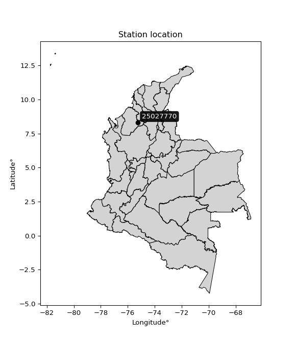

<div align="center">


</div>

# PMP Station (rain, Pmax24h): 25027770

Probable Maximum Precipitation (PMP) is the greatest amount of rainfall for a specific duration that is meteorologically possible for a given location, acting as a "worst-case" scenario for extreme storms, crucial for designing safety-critical infrastructure like bridges, river deviations, dams, spillways, and nuclear plants to prevent catastrophic failure. PMP is calculated by hydrologists using meteorological data to determine the upper limit of extreme rainfall, often leading to the Probable Maximum Flood (PMF) for flood control design, and is increasingly being studied for climate change impacts.

<div align="center">

</img>

</div>


## A. General information


### 1. General running parameters

• app_version: _v20251227_. • runtime: _2025-12-27 09:02:11.367833_. • Python version: _3.14.0_. • SciPy version: _1.16.3_. • Pandas version: _2.3.3_. • NumPy version: _2.3.5_. • Stations dataset (station_dataset_file): _dataset/pmax24h_in/automatic_colombia_2003_2024_filter.csv_. • Stations catalog (station_catalog_file): _dataset/CNE_IDEAM.xls_. • Minimum year to eval til year_max (date_min): _2003_. • Maximum year to eval since year_min (date_max): _2024_. • Creates, save and include plots into reports (create_plot): _False_. • Plot only fit distributions with Δo > Δ (plot_only_fit): _True_. • Eval low extreme values, if False, evaluates high extreme values (low_extreme): _False_. • Eval every SciPy distribution as logarithmic (pdist_logarithmic_on): _True_. • Standard deviation normalized (ddof): _1.0_. • Return periods to eval in years (Tr): _[2, 2.33, 5, 10, 15, 20, 25, 50, 75, 100, 200, 250, 500, 750, 1000]_. • Minimum data sample per station, 0 means any (minimum_sample): _5_. • Z-Score threshold to adjust a value, 0 means disable (zscore): _3.5_. • Avoid zeros, e.g. rain = 0 (avoid_zeros): _True_. • Avoid null values (avoid_nans): _True_. [:file_folder:Dataset file.](../../dataset/pmax24h_in/automatic_colombia_2003_2024_filter.csv)

> Delta Degrees of Freedom (DDOF): is a parameter used in the formulas for calculating variance and standard deviation. When ddof=0, the divisor is $N$ (the total number of observations) and this is used when your data set is the entire population. When ddof=1, the divisor is $N-1$ and this is used when your data set is a sample drawn from a larger population. Using $N-1$ provides an unbiased estimate of the population variance (known as Bessel´s correction).


### 2. Station info and location

|   id |   CODIGO | NOMBRE                   | CATEGORIA    | TECNOLOGIA                | ESTADO   | FECHA_INSTALACION   |   FECHA_SUSPENSION |   ALTITUD |   LATITUD |   LONGITUD | DEPARTAMENTO   | MUNICIPIO   | AREA_OPERATIVA                              | ENTIDAD                                                     | AREA_HIDROGRAFICA   | ZONA_HIDROGRAFICA                | SUBZONA_HIDROGRAFICA       | CORRIENTE   | Catalogo   |
|-----:|---------:|:-------------------------|:-------------|:--------------------------|:---------|:--------------------|-------------------:|----------:|----------:|-----------:|:---------------|:------------|:--------------------------------------------|:------------------------------------------------------------|:--------------------|:---------------------------------|:---------------------------|:------------|:-----------|
|    0 | 25027770 | MARRALU - AUT [25027770] | Limnigráfica | Automática con Telemetría | Activa   | 01/01/2017          |                nan |        23 |   8.31466 |   -75.2395 | Cordoba        | Ayapel      | Area Operativa 02 - Atlántico-Bolivar-Sucre | INSTITUTO DE HIDROLOGIA METEOROLOGIA Y ESTUDIOS AMBIENTALES | Magdalena Cauca     | Bajo Magdalena- Cauca -San Jorge | Bajo San Jorge - La Mojana | San Jorge   | CNE_IDEAM  |

<div align="center">

Map location in: [:earth_americas:Google](http://maps.google.com/maps?q=8.314665,-75.239474) [:earth_americas:OSM](https://www.openstreetmap.org/#map=18/8.314665/-75.239474&layers=P) [:earth_americas:Bing](https://www.bing.com/maps?cp=8.314665~-75.239474&lvl=18) [:earth_americas:Apple](https://maps.apple.com/frame?center=8.314665%2C-75.239474&span=0.003%2C0.006)

</div>


<div align="center">

```geojson
{
  "type": "Feature",
  "geometry": {
    "type": "Point", 
    "coordinates": [-75.239474, 8.314665]
  }, 
  "properties": {
    "Name": "25027770"
  }
}
```

</div>


### 3. Discrete values table and plot

|               |           0 |           1 |           2 |          3 |           4 |           5 |            6 |
|:--------------|------------:|------------:|------------:|-----------:|------------:|------------:|-------------:|
| Date          | 2017        | 2018        | 2020        | 2021       | 2022        | 2023        | 2024         |
| Value         |   94.4      |  121.1      |  122.2      |  349.1     |   91.1      |   79.8      |  147.2       |
| Value_initial |   94.4      |  121.1      |  122.2      |  349.1     |   91.1      |   79.8      |  147.2       |
| count         |    7        |    7        |    7        |    7       |    7        |    7        |    7         |
| mean          |  143.557    |  143.557    |  143.557    |  143.557   |  143.557    |  143.557    |  143.557     |
| std           |   93.5011   |   93.5011   |   93.5011   |   93.5011  |   93.5011   |   93.5011   |   93.5011    |
| zscore        |   -0.525739 |   -0.240181 |   -0.228416 |    2.19829 |   -0.561032 |   -0.681887 |    0.0389606 |

> The initial value (value_initial) correspond to the initial obtained or null completed value, and value (value) is adjusted only when the initial value is outside the valid range definite through the Z-Score value. If Z-Score is active, values out of range or outliers are replaced with the station mean value


### 4. Active continuous probability distributions from SciPy (45 of 104 available)

[scipy.stats](https://docs.scipy.org/doc/scipy/reference/stats.html) is a Python´s powerful submodule within the SciPy library for comprehensive statistical analysis, offering over 130 probability distributions (like Normal, Poisson), functions for descriptive stats (mean, variance), hypothesis testing (t-tests, chi-square), random variable generation, and statistical tests, making it essential for data science, modeling, and research. It provides tools to explore, model, and draw conclusions from data efficiently, working seamlessly with NumPy.

<div align="center">

|   id | p_dist             |   n_parameter | fit_method   | label                                                                       | active   | ref                                                                                                        |
|-----:|:-------------------|--------------:|:-------------|:----------------------------------------------------------------------------|:---------|:-----------------------------------------------------------------------------------------------------------|
|    0 | alpha              |             3 | MLE          | Alpha                                                                       | True     | [:mortar_board:](https://docs.scipy.org/doc/scipy/reference/generated/scipy.stats.alpha.html)              |
|    1 | betaprime          |             4 | MLE          | Beta prime                                                                  | True     | [:mortar_board:](https://docs.scipy.org/doc/scipy/reference/generated/scipy.stats.betaprime.html)          |
|    2 | chi2               |             3 | MLE          | Chi²                                                                        | True     | [:mortar_board:](https://docs.scipy.org/doc/scipy/reference/generated/scipy.stats.chi2.html)               |
|    3 | crystalball        |             4 | MLE          | Crystalball                                                                 | True     | [:mortar_board:](https://docs.scipy.org/doc/scipy/reference/generated/scipy.stats.crystalball.html)        |
|    4 | erlang             |             3 | MLE          | Erlang                                                                      | True     | [:mortar_board:](https://docs.scipy.org/doc/scipy/reference/generated/scipy.stats.erlang.html)             |
|    5 | expon              |             2 | MLE          | Exponential                                                                 | True     | [:mortar_board:](https://docs.scipy.org/doc/scipy/reference/generated/scipy.stats.expon.html)              |
|    6 | exponnorm          |             3 | MLE          | Exponentially modified Normal                                               | True     | [:mortar_board:](https://docs.scipy.org/doc/scipy/reference/generated/scipy.stats.exponnorm.html)          |
|    7 | f                  |             4 | MLE          | F                                                                           | True     | [:mortar_board:](https://docs.scipy.org/doc/scipy/reference/generated/scipy.stats.f.html)                  |
|    8 | fatiguelife        |             3 | MLE          | Fatigue-life (Birnbaum-Saunders)                                            | True     | [:mortar_board:](https://docs.scipy.org/doc/scipy/reference/generated/scipy.stats.fatiguelife.html)        |
|    9 | fisk               |             3 | MLE          | Fisk                                                                        | True     | [:mortar_board:](https://docs.scipy.org/doc/scipy/reference/generated/scipy.stats.fisk.html)               |
|   10 | gamma              |             3 | MLE          | Gamma                                                                       | True     | [:mortar_board:](https://docs.scipy.org/doc/scipy/reference/generated/scipy.stats.gamma.html)              |
|   11 | genexpon           |             5 | MLE          | Generalized exponential                                                     | True     | [:mortar_board:](https://docs.scipy.org/doc/scipy/reference/generated/scipy.stats.genexpon.html)           |
|   12 | genlogistic        |             3 | MLE          | Generalized logistic                                                        | True     | [:mortar_board:](https://docs.scipy.org/doc/scipy/reference/generated/scipy.stats.genlogistic.html)        |
|   13 | gibrat             |             2 | MM           | Gibrat                                                                      | True     | [:mortar_board:](https://docs.scipy.org/doc/scipy/reference/generated/scipy.stats.gibrat.html)             |
|   14 | gompertz           |             3 | MLE          | Gompertz (or truncated Gumbel)                                              | True     | [:mortar_board:](https://docs.scipy.org/doc/scipy/reference/generated/scipy.stats.gompertz.html)           |
|   15 | gumbel_l           |             2 | MM           | Gumbel Left Skew                                                            | True     | [:mortar_board:](https://docs.scipy.org/doc/scipy/reference/generated/scipy.stats.gumbel_l.html)           |
|   16 | gumbel_r           |             2 | MM           | Gumbel Right Skew                                                           | True     | [:mortar_board:](https://docs.scipy.org/doc/scipy/reference/generated/scipy.stats.gumbel_r.html)           |
|   17 | halflogistic       |             2 | MM           | Half-logistic                                                               | True     | [:mortar_board:](https://docs.scipy.org/doc/scipy/reference/generated/scipy.stats.halflogistic.html)       |
|   18 | halfnorm           |             2 | MM           | Half Normal                                                                 | True     | [:mortar_board:](https://docs.scipy.org/doc/scipy/reference/generated/scipy.stats.halfnorm.html)           |
|   19 | hypsecant          |             2 | MM           | hyperbolic secant                                                           | True     | [:mortar_board:](https://docs.scipy.org/doc/scipy/reference/generated/scipy.stats.hypsecant.html)          |
|   20 | invgamma           |             3 | MLE          | Inverted gamma                                                              | True     | [:mortar_board:](https://docs.scipy.org/doc/scipy/reference/generated/scipy.stats.invgamma.html)           |
|   21 | invgauss           |             3 | MLE          | Inverse Gaussian                                                            | True     | [:mortar_board:](https://docs.scipy.org/doc/scipy/reference/generated/scipy.stats.invgauss.html)           |
|   22 | invweibull         |             3 | MLE          | Inverted Weibull                                                            | True     | [:mortar_board:](https://docs.scipy.org/doc/scipy/reference/generated/scipy.stats.invweibull.html)         |
|   23 | johnsonsu          |             4 | MLE          | Johnson Su                                                                  | True     | [:mortar_board:](https://docs.scipy.org/doc/scipy/reference/generated/scipy.stats.johnsonsu.html)          |
|   24 | kstwobign          |             2 | MLE          | Limiting distribution of scaled Kolmogorov-Smirnov two-sided test statistic | True     | [:mortar_board:](https://docs.scipy.org/doc/scipy/reference/generated/scipy.stats.kstwobign.html)          |
|   25 | laplace            |             2 | MM           | Laplace                                                                     | True     | [:mortar_board:](https://docs.scipy.org/doc/scipy/reference/generated/scipy.stats.laplace.html)            |
|   26 | laplace_asymmetric |             3 | MLE          | Asymmetric Laplace                                                          | True     | [:mortar_board:](https://docs.scipy.org/doc/scipy/reference/generated/scipy.stats.laplace_asymmetric.html) |
|   27 | loggamma           |             3 | MLE          | Log gamma                                                                   | True     | [:mortar_board:](https://docs.scipy.org/doc/scipy/reference/generated/scipy.stats.loggamma.html)           |
|   28 | logistic           |             2 | MM           | Logistic (or Sech-squared)                                                  | True     | [:mortar_board:](https://docs.scipy.org/doc/scipy/reference/generated/scipy.stats.logistic.html)           |
|   29 | lognorm            |             3 | MLE          | Log Normal                                                                  | True     | [:mortar_board:](https://docs.scipy.org/doc/scipy/reference/generated/scipy.stats.lognorm.html)            |
|   30 | maxwell            |             2 | MM           | Maxwell                                                                     | True     | [:mortar_board:](https://docs.scipy.org/doc/scipy/reference/generated/scipy.stats.maxwell.html)            |
|   31 | mielke             |             4 | MLE          | Mielke Beta-Kappa / Dagum                                                   | True     | [:mortar_board:](https://docs.scipy.org/doc/scipy/reference/generated/scipy.stats.mielke.html)             |
|   32 | moyal              |             2 | MM           | Moyal                                                                       | True     | [:mortar_board:](https://docs.scipy.org/doc/scipy/reference/generated/scipy.stats.moyal.html)              |
|   33 | nakagami           |             3 | MLE          | Nakagami                                                                    | True     | [:mortar_board:](https://docs.scipy.org/doc/scipy/reference/generated/scipy.stats.nakagami.html)           |
|   34 | ncf                |             5 | MLE          | Non-central F distribution                                                  | True     | [:mortar_board:](https://docs.scipy.org/doc/scipy/reference/generated/scipy.stats.ncf.html)                |
|   35 | nct                |             4 | MLE          | Non-central Student’s t                                                     | True     | [:mortar_board:](https://docs.scipy.org/doc/scipy/reference/generated/scipy.stats.nct.html)                |
|   36 | norm               |             2 | MM           | Normal                                                                      | True     | [:mortar_board:](https://docs.scipy.org/doc/scipy/reference/generated/scipy.stats.norm.html)               |
|   37 | pareto             |             3 | MLE          | Pareto                                                                      | True     | [:mortar_board:](https://docs.scipy.org/doc/scipy/reference/generated/scipy.stats.pareto.html)             |
|   38 | pearson3           |             3 | MM           | Pearson type III                                                            | True     | [:mortar_board:](https://docs.scipy.org/doc/scipy/reference/generated/scipy.stats.pearson3.html)           |
|   39 | rayleigh           |             2 | MM           | Rayleigh                                                                    | True     | [:mortar_board:](https://docs.scipy.org/doc/scipy/reference/generated/scipy.stats.rayleigh.html)           |
|   40 | rice               |             3 | MLE          | Rice                                                                        | True     | [:mortar_board:](https://docs.scipy.org/doc/scipy/reference/generated/scipy.stats.rice.html)               |
|   41 | t                  |             3 | MLE          | Student’s t                                                                 | True     | [:mortar_board:](https://docs.scipy.org/doc/scipy/reference/generated/scipy.stats.t.html)                  |
|   42 | truncnorm          |             4 | MLE          | Truncated normal                                                            | True     | [:mortar_board:](https://docs.scipy.org/doc/scipy/reference/generated/scipy.stats.truncnorm.html)          |
|   43 | wald               |             2 | MM           | Wald                                                                        | True     | [:mortar_board:](https://docs.scipy.org/doc/scipy/reference/generated/scipy.stats.wald.html)               |
|   44 | weibull_min        |             3 | MLE          | Weibull minimum                                                             | True     | [:mortar_board:](https://docs.scipy.org/doc/scipy/reference/generated/scipy.stats.weibull_min.html)        |

</div>

> **n_parameter:** # arguments & localization & scale.
>
> **Fit methods:** (MLE) maximum likelihood, (MM) L-moments.
>
>**Inactive:** foldnorm, gennorm, norminvgauss, powernorm, powerlognorm, skewnorm, genextreme, anglit, arcsine, argus, beta, bradford, burr, burr12, cauchy, cosine, halfcauchy, foldcauchy, skewcauchy, wrapcauchy, dgamma, gengamma, exponweib, exponpow, truncexpon, gausshyper, genhalflogistic, genhyperbolic, geninvgauss, halfgennorm, johnsonsb, kappa4, kappa3, ksone, kstwo, loglaplace, levy, levy_l, levy_stable, ncx2, genpareto, truncpareto, lomax, powerlaw, rdist, rel_breitwigner, recipinvgauss, semicircular, studentized_range, trapezoid, triang, truncweibull_min, tukeylambda, uniform, loguniform, vonmises, vonmises_line, weibull_max, dweibull, 


## B. Probability distributions vs. Empirical distributions

A continuous probability distribution (CPD) describes probabilities for variables that can take any value within a range (like rain any time), unlike discrete variables with specific outcomes (like temperature). It uses a Probability Density Function (PDF), a curve where the total area under it equals 1, and the probability of the variable falling within an interval (a to b) is found by calculating the area under the curve between those points. A key feature is that the probability of hitting any single exact value is zero, so probabilities are always expressed for ranges, e.g., $P(a ≤ X ≤ b)$.

<div align="center">

Distributions parameters from station values
|    |   station | p_dist                |   n |            loc |          scale | shape                  | shape1                | shape2               | shape3   |
|---:|----------:|:----------------------|----:|---------------:|---------------:|:-----------------------|:----------------------|:---------------------|:---------|
|  0 |  25027770 | alpha                 |   7 |      66.3045   |   27.5803      | 1.8808104621401342e-08 |                       |                      |          |
|  1 |  25027770 | betaprime             |   7 |       3.68758  |    7.54676     | 96.10661159708991      | 6.41173367326812      |                      |          |
|  2 |  25027770 | chi2                  |   7 |      79.8      |   61.9482      | 0.3333648345928555     |                       |                      |          |
|  3 |  25027770 | crystalball           |   7 |     143.557    |   86.5652      | 8578.111397126999      | 30583.17778054563     |                      |          |
|  4 |  25027770 | erlang                |   7 |      79.8      |   75.6441      | 0.5127028043274625     |                       |                      |          |
|  5 |  25027770 | expon                 |   7 |      79.8      |   63.7571      |                        |                       |                      |          |
|  6 |  25027770 | exponnorm             |   7 |      79.7005   |    0.029371    | 2152.2104963418333     |                       |                      |          |
|  7 |  25027770 | f                     |   7 |      69.2329   |   29.854       | 2548.7372052123237     | 2.7811148386936915    |                      |          |
|  8 |  25027770 | fatiguelife           |   7 |      76.7761   |   29.4849      | 1.5665217984982172     |                       |                      |          |
|  9 |  25027770 | fisk                  |   7 |      79.8      |   34.1377      | 0.7308540586612573     |                       |                      |          |
| 10 |  25027770 | gamma                 |   7 |      79.8      |  100.039       | 0.33877639971248363    |                       |                      |          |
| 11 |  25027770 | genexpon              |   7 |      79.8      |   79.2346      | 1.2427428790430768     | 4.103022204263131e-11 | 1.5737351784665483   |          |
| 12 |  25027770 | genlogistic           |   7 |    -235.451    |   44.3426      | 2448.619430863837      |                       |                      |          |
| 13 |  25027770 | gibrat                |   7 |      77.5188   |   40.0543      |                        |                       |                      |          |
| 14 |  25027770 | gompertz              |   7 |      79.8      |    3.10846e+14 | 4830056770480.268      |                       |                      |          |
| 15 |  25027770 | gumbel_l              |   7 |     182.516    |   67.4946      |                        |                       |                      |          |
| 16 |  25027770 | gumbel_r              |   7 |     104.598    |   67.4946      |                        |                       |                      |          |
| 17 |  25027770 | halflogistic          |   7 |      40.9573   |   74.0102      |                        |                       |                      |          |
| 18 |  25027770 | halfnorm              |   7 |      28.9787   |  143.603       |                        |                       |                      |          |
| 19 |  25027770 | hypsecant             |   7 |     143.557    |   55.1091      |                        |                       |                      |          |
| 20 |  25027770 | invgamma              |   7 |      69.2168   |   41.5195      | 1.390546903580641      |                       |                      |          |
| 21 |  25027770 | invgauss              |   7 |      73.7219   |   30.5454      | 2.2862799279412545     |                       |                      |          |
| 22 |  25027770 | invweibull            |   7 |      79.8      |    1.75197     | 0.05062685870418697    |                       |                      |          |
| 23 |  25027770 | johnsonsu             |   7 |      78.2128   |    0.0443341   | -4.7847830448750575    | 0.6720028096239417    |                      |          |
| 24 |  25027770 | kstwobign             |   7 |     -69.11     |  249.868       |                        |                       |                      |          |
| 25 |  25027770 | laplace               |   7 |     143.557    |   61.2108      |                        |                       |                      |          |
| 26 |  25027770 | laplace_asymmetric    |   7 |      79.8      |    0.000448419 | 7.0332261755587966e-06 |                       |                      |          |
| 27 |  25027770 | loggamma              |   7 |  -23243        | 3257.14        | 1313.4669788013503     |                       |                      |          |
| 28 |  25027770 | logistic              |   7 |     143.557    |   47.7259      |                        |                       |                      |          |
| 29 |  25027770 | lognorm               |   7 |      79.8      |    0.257231    | 12.499885049757086     |                       |                      |          |
| 30 |  25027770 | maxwell               |   7 |     -61.566    |  128.542       |                        |                       |                      |          |
| 31 |  25027770 | mielke                |   7 |      -0.65846  |   20.7378      | 905.9374130858723      | 3.4341454994372924    |                      |          |
| 32 |  25027770 | moyal                 |   7 |      94.0536   |   38.968       |                        |                       |                      |          |
| 33 |  25027770 | nakagami              |   7 |      79.8      |  118.628       | 0.07007776160481319    |                       |                      |          |
| 34 |  25027770 | ncf                   |   7 |      -1.02221  |   98.5535      | 7.647398904884051      | 34.76567109506426     | 3.5261513300573997   |          |
| 35 |  25027770 | nct                   |   7 |      -0.354197 |    1.78932     | 3.853209609459558      | 61.665245474188794    |                      |          |
| 36 |  25027770 | norm                  |   7 |     143.557    |   86.5652      |                        |                       |                      |          |
| 37 |  25027770 | pareto                |   7 |      79.759    |    0.0409855   | 0.16844470958427354    |                       |                      |          |
| 38 |  25027770 | pearson3              |   7 |     143.557    |   86.5652      | 1.7927456358988934     |                       |                      |          |
| 39 |  25027770 | rayleigh              |   7 |     -22.0471   |  132.133       |                        |                       |                      |          |
| 40 |  25027770 | rice                  |   7 |      21.63     |  105.735       | 0.0005226037723420694  |                       |                      |          |
| 41 |  25027770 | t                     |   7 |     122.015    |   70.5342      | 2.238167769061606      |                       |                      |          |
| 42 |  25027770 | truncnorm             |   7 | -551443        | 6911.33        | 79.79972104079297      | 358.1367187513001     |                      |          |
| 43 |  25027770 | wald                  |   7 |      56.9919   |   86.5652      |                        |                       |                      |          |
| 44 |  25027770 | weibull_min           |   7 |      79.8      |   93.4034      | 0.18404810209014072    |                       |                      |          |
| 45 |  25027770 | logalpha              |   7 |       3.85312  |    2.30419     | 2.737440771531964      |                       |                      |          |
| 46 |  25027770 | logbetaprime          |   7 |       4.17745  |    1.26794     | 3.949275140880868      | 8.924805200743037     |                      |          |
| 47 |  25027770 | logchi2               |   7 |       4.37952  |    0.954696    | 1.053416455780816      |                       |                      |          |
| 48 |  25027770 | logcrystalball        |   7 |       4.84121  |    0.457045    | 147.5575917772009      | 19.656142423372533    |                      |          |
| 49 |  25027770 | logerlang             |   7 |       4.37952  |    0.475602    | 0.6904581092899591     |                       |                      |          |
| 50 |  25027770 | logexpon              |   7 |       4.37952  |    0.461683    |                        |                       |                      |          |
| 51 |  25027770 | logexponnorm          |   7 |       4.37886  |    0.000210314 | 2186.713725887702      |                       |                      |          |
| 52 |  25027770 | logf                  |   7 |       4.37952  |    0.471506    | 0.9165869285103184     | 683.5238035385377     |                      |          |
| 53 |  25027770 | logfatiguelife        |   7 |       4.30184  |    0.366663    | 0.9629598786715892     |                       |                      |          |
| 54 |  25027770 | logfisk               |   7 |       4.33517  |    0.345057    | 1.6776762057345664     |                       |                      |          |
| 55 |  25027770 | loggamma              |   7 |       4.37952  |    0.473569    | 0.6605437295691943     |                       |                      |          |
| 56 |  25027770 | loggenexpon           |   7 |       4.37952  |    1.20764     | 2.5999956716051127     | 0.7833077719925766    | 0.05408929890902242  |          |
| 57 |  25027770 | loggenlogistic        |   7 |       2.47064  |    0.295206    | 1596.530652648934      |                       |                      |          |
| 58 |  25027770 | loggibrat             |   7 |       4.49252  |    0.211485    |                        |                       |                      |          |
| 59 |  25027770 | loggompertz           |   7 |       4.37952  |    0.96264     | 1.0917037485456067     |                       |                      |          |
| 60 |  25027770 | loggumbel_l           |   7 |       5.0469   |    0.356356    |                        |                       |                      |          |
| 61 |  25027770 | loggumbel_r           |   7 |       4.63551  |    0.356356    |                        |                       |                      |          |
| 62 |  25027770 | loghalflogistic       |   7 |       4.2995   |    0.390757    |                        |                       |                      |          |
| 63 |  25027770 | loghalfnorm           |   7 |       4.23626  |    0.75819     |                        |                       |                      |          |
| 64 |  25027770 | loghypsecant          |   7 |       4.84121  |    0.290964    |                        |                       |                      |          |
| 65 |  25027770 | loginvgamma           |   7 |       4.16657  |    1.35136     | 2.9289852855046474     |                       |                      |          |
| 66 |  25027770 | loginvgauss           |   7 |       4.26709  |    0.692636    | 0.8288858818496423     |                       |                      |          |
| 67 |  25027770 | loginvweibull         |   7 |       3.99235  |    0.600663    | 2.5504136149460805     |                       |                      |          |
| 68 |  25027770 | logjohnsonsu          |   7 |       4.3053   |    0.00311456  | -6.069802928471381     | 1.108854855391928     |                      |          |
| 69 |  25027770 | logkstwobign          |   7 |       3.55858  |    1.48765     |                        |                       |                      |          |
| 70 |  25027770 | loglaplace            |   7 |       4.84121  |    0.323179    |                        |                       |                      |          |
| 71 |  25027770 | loglaplace_asymmetric |   7 |       4.79662  |    0.313892    | 0.9311164912001333     |                       |                      |          |
| 72 |  25027770 | logloggamma           |   7 |    -157.797    |   21.2278      | 2125.5089061734834     |                       |                      |          |
| 73 |  25027770 | loglogistic           |   7 |       4.84121  |    0.251982    |                        |                       |                      |          |
| 74 |  25027770 | loglognorm            |   7 |       4.37952  |    0.00316396  | 11.82231812985878      |                       |                      |          |
| 75 |  25027770 | logmaxwell            |   7 |       3.7582   |    0.678672    |                        |                       |                      |          |
| 76 |  25027770 | logmielke             |   7 |       3.98867  |    0.131768    | 149.56539311186958     | 2.6492782058978595    |                      |          |
| 77 |  25027770 | logmoyal              |   7 |       4.57984  |    0.205742    |                        |                       |                      |          |
| 78 |  25027770 | lognakagami           |   7 |       4.37952  |    0.756966    | 0.3355346638172125     |                       |                      |          |
| 79 |  25027770 | logncf                |   7 |       4.3795   |    0.305858    | 1.3959223141780226     | 941.7389661971913     | 0.008402355936467876 |          |
| 80 |  25027770 | lognct                |   7 |       1.98817  |    0.0242054   | 25.124115364587368     | 113.67010319176183    |                      |          |
| 81 |  25027770 | lognorm               |   7 |       4.84121  |    0.457044    |                        |                       |                      |          |
| 82 |  25027770 | logpareto             |   7 |       4.37914  |    0.000380322 | 0.16818592098761123    |                       |                      |          |
| 83 |  25027770 | logpearson3           |   7 |       4.84121  |    0.457042    | 1.3273312303627884     |                       |                      |          |
| 84 |  25027770 | lograyleigh           |   7 |       3.96685  |    0.697633    |                        |                       |                      |          |
| 85 |  25027770 | logrice               |   7 |       4.13696  |    0.593657    | 0.0006401881164926225  |                       |                      |          |
| 86 |  25027770 | logt                  |   7 |       4.67475  |    0.287456    | 2.369674789466936      |                       |                      |          |
| 87 |  25027770 | logtruncnorm          |   7 |      -5.5741   |    2.24253     | 4.438578261420605      | 6.266744920072949     |                      |          |
| 88 |  25027770 | logwald               |   7 |       4.3842   |    0.457012    |                        |                       |                      |          |
| 89 |  25027770 | logweibull_min        |   7 |       4.37952  |    0.506414    | 0.8304107919056127     |                       |                      |          |

</div>

> **loc** (Location parameter): This shifts the distribution along the x-axis. For many common distributions, like the normal (Gaussian) distribution, loc represents the mean $μ$. For others, like the uniform distribution, it might represent the minimum value, or for the beta distribution, the left end of the support interval.
>
> **scale** (Scale parameter): This determines the width or spread of the distribution. For the normal distribution, scale represents the standard deviation $σ$. For a uniform distribution, it defines the length of the interval (from $loc$ to $loc + scale$).
>
> **shape** (Shape parameters): Refers to parameters that define the specific form of a probability distribution, distinct from its location (loc) and scale (scale). These parameters are required arguments for most distribution functions. For example, a normal (Gaussian) distribution is fully defined by its location (mean) and scale (standard deviation), so it has no specific shape parameters beyond loc and scale. However, other distributions have intrinsic properties that need specification, as Gamma distribution that takes a shape parameter, often named $a$ or $alpha$.


### 0. Cumulative distribution values - CDF (90 evaluated)

Cumulative Distribution Function (CDF), denoted as $F$<sub>$X$</sub>$(x)$, is a function that gives the probability that a random variable $X$ will take a value less than or equal to a specific value, $x$ (i.e., $(P(X≥x)$. It essentially "accumulates" probabilities from a given point up to the far right (positive infinity), providing a complete picture of the distribution´s probabilities for both discrete (like rain) and continuous (like temperature) variables, helping to find probabilities over ranges or above certain values.

<div align="center">

CDF ordered by x ascending and calculating $log(f(x))$ separately
|   id |   Station |   date |     x |   count |    mean |     std |     zscore |   Value_initial |   station |   m |     alpha |   alpha_pdf |   betaprime |   betaprime_pdf |       chi2 |    chi2_pdf |   crystalball |   crystalball_pdf |      erlang |       erlang_pdf |    expon |   expon_pdf |   exponnorm |   exponnorm_pdf |         f |       f_pdf |   fatiguelife |   fatiguelife_pdf |        fisk |     fisk_pdf |       gamma |   gamma_pdf |    genexpon |   genexpon_pdf |   genlogistic |   genlogistic_pdf |     gibrat |   gibrat_pdf |    gompertz |   gompertz_pdf |   gumbel_l |   gumbel_l_pdf |   gumbel_r |   gumbel_r_pdf |   halflogistic |   halflogistic_pdf |   halfnorm |   halfnorm_pdf |   hypsecant |   hypsecant_pdf |   invgamma |   invgamma_pdf |   invgauss |   invgauss_pdf |   invweibull |   invweibull_pdf |   johnsonsu |   johnsonsu_pdf |   kstwobign |   kstwobign_pdf |   laplace |   laplace_pdf |   laplace_asymmetric |   laplace_asymmetric_pdf |    loggamma |   loggamma_pdf |   logistic |   logistic_pdf |   lognorm |   lognorm_pdf |   maxwell |   maxwell_pdf |   mielke |   mielke_pdf |    moyal |   moyal_pdf |   nakagami |   nakagami_pdf |      ncf |     ncf_pdf |      nct |     nct_pdf |     norm |    norm_pdf |   pareto |   pareto_pdf |   pearson3 |   pearson3_pdf |   rayleigh |   rayleigh_pdf |     rice |    rice_pdf |        t |       t_pdf |   truncnorm |   truncnorm_pdf |     wald |   wald_pdf |   weibull_min |   weibull_min_pdf |   logalpha |   logalpha_pdf |   logbetaprime |   logbetaprime_pdf |    logchi2 |   logchi2_pdf |   logcrystalball |   logcrystalball_pdf |   logerlang |   logerlang_pdf |   logexpon |   logexpon_pdf |   logexponnorm |   logexponnorm_pdf |        logf |    logf_pdf |   logfatiguelife |   logfatiguelife_pdf |   logfisk |   logfisk_pdf |   loggenexpon |   loggenexpon_pdf |   loggenlogistic |   loggenlogistic_pdf |   loggibrat |   loggibrat_pdf |   loggompertz |   loggompertz_pdf |   loggumbel_l |   loggumbel_l_pdf |   loggumbel_r |   loggumbel_r_pdf |   loghalflogistic |   loghalflogistic_pdf |   loghalfnorm |   loghalfnorm_pdf |   loghypsecant |   loghypsecant_pdf |   loginvgamma |   loginvgamma_pdf |   loginvgauss |   loginvgauss_pdf |   loginvweibull |   loginvweibull_pdf |   logjohnsonsu |   logjohnsonsu_pdf |   logkstwobign |   logkstwobign_pdf |   loglaplace |   loglaplace_pdf |   loglaplace_asymmetric |   loglaplace_asymmetric_pdf |   logloggamma |   logloggamma_pdf |   loglogistic |   loglogistic_pdf |   loglognorm |   loglognorm_pdf |   logmaxwell |   logmaxwell_pdf |   logmielke |   logmielke_pdf |   logmoyal |   logmoyal_pdf |   lognakagami |   lognakagami_pdf |     logncf |   logncf_pdf |   lognct |   lognct_pdf |   logpareto |   logpareto_pdf |   logpearson3 |   logpearson3_pdf |   lograyleigh |   lograyleigh_pdf |   logrice |   logrice_pdf |     logt |   logt_pdf |   logtruncnorm |   logtruncnorm_pdf |   logwald |   logwald_pdf |   logweibull_min |   logweibull_min_pdf |
|-----:|----------:|-------:|------:|--------:|--------:|--------:|-----------:|----------------:|----------:|----:|----------:|------------:|------------:|----------------:|-----------:|------------:|--------------:|------------------:|------------:|-----------------:|---------:|------------:|------------:|----------------:|----------:|------------:|--------------:|------------------:|------------:|-------------:|------------:|------------:|------------:|---------------:|--------------:|------------------:|-----------:|-------------:|------------:|---------------:|-----------:|---------------:|-----------:|---------------:|---------------:|-------------------:|-----------:|---------------:|------------:|----------------:|-----------:|---------------:|-----------:|---------------:|-------------:|-----------------:|------------:|----------------:|------------:|----------------:|----------:|--------------:|---------------------:|-------------------------:|------------:|---------------:|-----------:|---------------:|----------:|--------------:|----------:|--------------:|---------:|-------------:|---------:|------------:|-----------:|---------------:|---------:|------------:|---------:|------------:|---------:|------------:|---------:|-------------:|-----------:|---------------:|-----------:|---------------:|---------:|------------:|---------:|------------:|------------:|----------------:|---------:|-----------:|--------------:|------------------:|-----------:|---------------:|---------------:|-------------------:|-----------:|--------------:|-----------------:|---------------------:|------------:|----------------:|-----------:|---------------:|---------------:|-------------------:|------------:|------------:|-----------------:|---------------------:|----------:|--------------:|--------------:|------------------:|-----------------:|---------------------:|------------:|----------------:|--------------:|------------------:|--------------:|------------------:|--------------:|------------------:|------------------:|----------------------:|--------------:|------------------:|---------------:|-------------------:|--------------:|------------------:|--------------:|------------------:|----------------:|--------------------:|---------------:|-------------------:|---------------:|-------------------:|-------------:|-----------------:|------------------------:|----------------------------:|--------------:|------------------:|--------------:|------------------:|-------------:|-----------------:|-------------:|-----------------:|------------:|----------------:|-----------:|---------------:|--------------:|------------------:|-----------:|-------------:|---------:|-------------:|------------:|----------------:|--------------:|------------------:|--------------:|------------------:|----------:|--------------:|---------:|-----------:|---------------:|-------------------:|----------:|--------------:|-----------------:|---------------------:|
|    0 |  25027770 |   2023 |  79.8 |       7 | 143.557 | 93.5011 | -0.681887  |            79.8 |  25027770 |   1 | 0.0409868 |  0.0149703  |    0.126446 |     0.00746218  | 0.00237462 | 2.78525e+10 |      0.230707 |       0.00351376  | 9.75837e-09 | 352065           | 0        | 0.0156845   |    0.001572 |     0.0157892   | 0.0413418 | 0.0140842   |     0.0368142 |       0.0292673   | 2.18102e-10 | 77.3575      | 4.79389e-06 | 1.14283e+08 | 4.06659e-12 |    0.0156844   |      0.135262 |       0.00609993  | 0.00208152 |   0.00288196 | 1.10407e-15 |    0.0155384   |   0.196123 |    0.00260012  |   0.235984 |    0.00504868  |       0.256553 |        0.00631116  |   0.276587 |    0.00521892  |    0.193954 |     0.00330567  |  0.0413411 |    0.0140842   |  0.0381129 |    0.0181199   |   0.00569217 |      1.04813e+11 |   0.0277804 |     0.0270152   |    0.130406 |     0.00520824  |  0.176445 |   0.00288258  |          7.63988e-11 |              0.0156845   | 2.07568e-10 | 154370         |   0.208185 |    0.00345397  |  0.156212 |     0.524051  |  0.24927  |   0.00410072  |      nan |          nan | 0.229875 | 0.00597836  | 0.00505214 |    4.98271e+10 | 0.19138  | 0.00531501  | 0.111318 | 0.00808752  | 0.230707 | 0.00351376  | 0        |  4.10986     |   0.241593 |    0.00753744  |   0.257001 |    0.00433425  | 0.140438 | 0.00447239  | 0.302258 | 0.00398992  |    0        |     0.011548    | 0.126782 | 0.0121723  |    0.00122605 |       1.58691e+10 |  0.0506857 |      0.8675    |      0.0731491 |          0.941575  | 9.4665e-09 |   5.61383e+06 |         0.156212 |            0.524053  | 7.46237e-11 |   58011.5       |   0        |      2.16599   |     0.00144641 |          2.16957   | 1.40909e-07 | 7.27082e+07 |        0.0376859 |            1.44472   |  0.031018 |     1.1368    |   7.88977e-12 |         2.15296   |        0.0836832 |            0.702672  |   0         |       0         |   1.73249e-08 |          1.13407  |      0.142467 |        0.369851   |      0.1286   |         0.740171  |          0.102035 |             1.26625   |      0.149872 |          1.03373  |       0.128474 |          0.429656  |      0.044534 |         0.984489  |     0.0396968 |          1.20153  |       0.0466541 |            0.941945 |      0.0371734 |          1.21161   |      0.0790433 |           0.68384  |     0.119826 |         0.370772 |                0.111454 |                   0.381339  |      0.158375 |         0.521084  |      0.137975 |          0.472011 |   0.00724964 |      1.91411e+12 |     0.159673 |        0.648028  |   0.0458839 |       0.93272   |   0.103711 |      0.83966   |   7.42507e-11 |      56100.6      | 0.00114574 |   34.0332    | 0.128775 |    0.682091  |    0        |     442.22      |      0.120034 |         0.941432  |      0.160503 |         0.711816  | 0.0800863 |     0.633149  | 0.198819 |  0.673376  |    2.27237e-08 |          2.07155   |  0        |     0         |      5.57769e-13 |           521.491    |
|    1 |  25027770 |   2022 |  91.1 |       7 | 143.557 | 93.5011 | -0.561032  |            91.1 |  25027770 |   2 | 0.266005  |  0.0192811  |    0.220038 |     0.00890318  | 0.713972   | 0.00973735  |      0.272263 |       0.00383554  | 0.404877    |      0.0166263   | 0.162417 | 0.0131371   |    0.16501  |     0.0132092   | 0.252963  | 0.0188077   |     0.318843  |       0.0169612   | 0.30831     |  0.0137928   | 0.520498    | 0.0143348   | 0.162416    |    0.013137    |      0.212109 |       0.00741509  | 0.139726   |   0.0163668  | 0.161033    |    0.0130362   |   0.22748  |    0.00295409  |   0.29482  |    0.0053351   |       0.326366 |        0.00603623  |   0.334688 |    0.0050599   |    0.234526 |     0.00388095  |  0.252963  |    0.0188077   |  0.276918  |    0.0185363   |   0.402547   |      0.00164109  |   0.305997  |     0.0182917   |    0.194462 |     0.00607116  |  0.212219 |   0.00346701  |          0.162417    |              0.0131371   | 0.42912     |      1.8023    |   0.249902 |    0.00392766  |  0.235643 |     0.673382  |  0.296942 |   0.00432503  |      nan |          nan | 0.298979 | 0.00620033  | 0.619211   |    0.00767561  | 0.253612 | 0.00565985  | 0.214897 | 0.00993219  | 0.272263 | 0.00383554  | 0.612158 |  0.00576051  |   0.323868 |    0.00700503  |   0.306937 |    0.00449151  | 0.194134 | 0.00500752  | 0.349949 | 0.0044407   |    0.122338 |     0.0101355   | 0.264576 | 0.0116928  |    0.492326   |       0.00560549  |  0.224356  |      1.59156   |      0.232923  |          1.37137   | 0.269892   |   1.0255      |         0.235644 |            0.673383  | 0.408496    |       1.80007   |   0.249376 |      1.62584   |     0.251297   |          1.62798   | 0.423921    | 1.34195     |        0.279035  |            1.72572   |  0.245652 |     1.7585    |   0.248271    |         1.62132   |        0.205069  |            1.10008   |   0.0084899 |       1.18836   |   0.148718    |          1.1078   |      0.199784 |        0.500475   |      0.243067 |         0.964761  |          0.265346 |             1.18948   |      0.283864 |          0.985031 |       0.198619 |          0.639182  |      0.238232 |         1.67799   |     0.259128  |          1.7209   |       0.235201  |            1.67085  |      0.258009  |          1.73329   |      0.193983  |           1.01892  |     0.180517 |         0.558567 |                0.175341 |                   0.59993   |      0.237201 |         0.667334  |      0.21305  |          0.665364 |   0.623948   |      0.242405    |     0.255019 |        0.782652  |   0.236117  |       1.70359   |   0.238257 |      1.14079   |   0.240427    |          1.20895  | 0.421932   |    1.85491   | 0.235298 |    0.91141   |    0.626503 |       0.472967  |      0.257387 |         1.09082   |      0.263071 |         0.825375  | 0.180867  |     0.871596  | 0.31013  |  1.0111    |    0.241203    |          1.5911    |  0.143836 |     2.33405   |      0.279859    |             1.48249  |
|    2 |  25027770 |   2017 |  94.4 |       7 | 143.557 | 93.5011 | -0.525739  |            94.4 |  25027770 |   3 | 0.326267  |  0.0172191  |    0.249774 |     0.00910276  | 0.742408   | 0.00765854  |      0.285064 |       0.00392233  | 0.455237    |      0.0140483   | 0.204667 | 0.0124744   |    0.207482 |     0.0125373   | 0.312513  | 0.017238    |     0.369887  |       0.0141298   | 0.349605    |  0.0113824   | 0.563169    | 0.0117081   | 0.204665    |    0.0124743   |      0.237052 |       0.00769307  | 0.193784   |   0.0162702  | 0.202969    |    0.0123846   |   0.237406 |    0.00306225  |   0.312513 |    0.00538542  |       0.346139 |        0.0059464   |   0.351302 |    0.00500852  |    0.247618 |     0.00405357  |  0.312514  |    0.0172381   |  0.334271  |    0.0162624   |   0.407295   |      0.00126858  |   0.361662  |     0.0155558   |    0.21481  |     0.00625604  |  0.223974 |   0.00365905  |          0.204666    |              0.0124744   | 0.488407    |      1.5421    |   0.263086 |    0.00406219  |  0.260264 |     0.710073  |  0.311302 |   0.00437703  |      nan |          nan | 0.319461 | 0.00620935  | 0.641834   |    0.0061553   | 0.272389 | 0.00571703  | 0.248039 | 0.0101307   | 0.285064 | 0.00392233  | 0.62849  |  0.00427423  |   0.346701 |    0.00683286  |   0.321814 |    0.00452329  | 0.210875 | 0.00513643  | 0.364799 | 0.00455801  |    0.155156 |     0.00975654  | 0.30232  | 0.0111711  |    0.508675   |       0.00440152  |  0.2816    |      1.61549   |      0.282196  |          1.39264   | 0.304013   |   0.899344    |         0.260265 |            0.710074  | 0.467933    |       1.55169   |   0.305056 |      1.50524   |     0.307041   |          1.50677   | 0.46786     | 1.1395      |        0.337781  |            1.57583   |  0.306979 |     1.68059   |   0.303817    |         1.50224   |        0.245472  |            1.16743   |   0.0890686 |       2.9289    |   0.187942    |          1.09655  |      0.218295 |        0.540236   |      0.278036 |         0.998685  |          0.307137 |             1.15886   |      0.318604 |          0.967298 |       0.222508 |          0.703952  |      0.29752  |         1.64507   |     0.318624  |          1.61831  |       0.294537  |            1.65388  |      0.317981  |          1.63244   |      0.231227  |           1.07158  |     0.201528 |         0.623581 |                0.198043 |                   0.677602  |      0.261595 |         0.703382  |      0.237683 |          0.719059 |   0.631563   |      0.189818    |     0.283345 |        0.808627  |   0.296703  |       1.69065   |   0.279406 |      1.16847   |   0.281618    |          1.11095  | 0.483058   |    1.59232   | 0.268525 |    0.954579  |    0.64112  |       0.358428  |      0.29629  |         1.09368   |      0.292783 |         0.843803  | 0.212717  |     0.917195  | 0.347637 |  1.0954    |    0.295844    |          1.48132   |  0.226846 |     2.29275   |      0.32971     |             1.32529  |
|    3 |  25027770 |   2018 | 121.1 |       7 | 143.557 | 93.5011 | -0.240181  |           121.1 |  25027770 |   4 | 0.614732  |  0.00645708 |    0.488366 |     0.00818851  | 0.85837    | 0.00259556  |      0.397654 |       0.00445607  | 0.696103    |      0.00594662  | 0.476789 | 0.00820631  |    0.480518 |     0.00821801  | 0.618147  | 0.00715379  |     0.60335   |       0.00566743  | 0.534743    |  0.00440269  | 0.753006    | 0.00450784  | 0.476786    |    0.00820628  |      0.454561 |       0.00808092  | 0.533627   |   0.00912146 | 0.473623    |    0.00817908  |   0.331386 |    0.00398772  |   0.456986 |    0.00530216  |       0.49407  |        0.0051067   |   0.478803 |    0.00452289  |    0.373735 |     0.0053275   |  0.618148  |    0.00715377  |  0.611293  |    0.00653941  |   0.426495   |      0.000445516 |   0.618196  |     0.00597466  |    0.391721 |     0.00670936  |  0.346446 |   0.00565988  |          0.476789    |              0.00820631  | 0.742862    |      0.669343  |   0.384487 |    0.00495867  |  0.46114  |     0.86873   |  0.431614 |   0.00456678  |      nan |          nan | 0.479702 | 0.00563655  | 0.742174   |    0.00249872  | 0.425496 | 0.00559828  | 0.504986 | 0.00844201  | 0.397654 | 0.00445607  | 0.688086 |  0.0012709   |   0.509961 |    0.00540268  |   0.443913 |    0.00455935  | 0.357574 | 0.00571581  | 0.49536  | 0.0050734   |    0.379327 |     0.00716808  | 0.540823 | 0.00691002 |    0.577066   |       0.0016219   |  0.618021  |      0.991648  |      0.594598  |          1.02701   | 0.469999   |   0.513311    |         0.461141 |            0.86873   | 0.727786    |       0.693635  |   0.594818 |      0.877619  |     0.596821   |          0.876672  | 0.661536    | 0.546528    |        0.622611  |            0.806432  |  0.61955  |     0.856955  |   0.593631    |         0.879772  |        0.546479  |            1.11838   |   0.641764  |       1.22818   |   0.446803    |          0.967592 |      0.390687 |        0.847095   |      0.529248 |         0.945009  |          0.562232 |             0.875091  |      0.540137 |          0.800848 |       0.451409 |          1.08126   |      0.620314 |         0.926377  |     0.620427  |          0.858263 |       0.62189   |            0.936722 |      0.621998  |          0.857914  |      0.507267  |           1.05001  |     0.435561 |         1.34774  |                0.464375 |                   1.58885   |      0.460584 |         0.861529  |      0.455875 |          0.984408 |   0.660162   |      0.0742939   |     0.495308 |        0.853762  |   0.630838  |       0.949103  |   0.554868 |      0.96179   |   0.507592    |          0.756384 | 0.745894   |    0.687687  | 0.519878 |    0.988072  |    0.691941 |       0.124107  |      0.549519 |         0.895412  |      0.507043 |         0.840445  | 0.460633  |     1.00956   | 0.64647  |  1.1071    |    0.585497    |          0.891773  |  0.626147 |     1.01292   |      0.573087    |             0.723466 |
|    4 |  25027770 |   2020 | 122.2 |       7 | 143.557 | 93.5011 | -0.228416  |           122.2 |  25027770 |   5 | 0.621712  |  0.00623614 |    0.497321 |     0.00809382  | 0.861181   | 0.00251688  |      0.402563 |       0.00447043  | 0.702555    |      0.00578618  | 0.485739 | 0.00806594  |    0.48948  |     0.00807624  | 0.625886  | 0.00691783  |     0.609503  |       0.00552034  | 0.53952     |  0.00428236  | 0.757895    | 0.00438172  | 0.485735    |    0.00806591  |      0.463426 |       0.00803673  | 0.543525   |   0.00887545 | 0.482544    |    0.00804047  |   0.335794 |    0.00402652  |   0.462808 |    0.0052829   |       0.499667 |        0.00506912  |   0.483766 |    0.00450059  |    0.379618 |     0.00536783  |  0.625886  |    0.00691782  |  0.618377  |    0.0063426   |   0.426979   |      0.000433872 |   0.624668  |     0.00579467  |    0.399094 |     0.00669448  |  0.352728 |   0.00576251  |          0.485738    |              0.00806594  | 0.748836    |      0.65192   |   0.389956 |    0.00498451  |  0.469002 |     0.870238  |  0.436637 |   0.00456592  |      nan |          nan | 0.48588  | 0.00559632  | 0.744891   |    0.00244176  | 0.431642 | 0.00557583  | 0.514201 | 0.00831364  | 0.402563 | 0.00447043  | 0.689463 |  0.00123249  |   0.515873 |    0.00534585  |   0.448924 |    0.00455297  | 0.363865 | 0.00572243  | 0.500941 | 0.00507399  |    0.387162 |     0.00707761  | 0.548347 | 0.00676991 |    0.578828   |       0.00158087  |  0.626871  |      0.966013  |      0.603798  |          1.0079    | 0.474606   |   0.505726    |         0.469003 |            0.870238  | 0.733979    |       0.676068  |   0.602676 |      0.860598  |     0.604671   |          0.859604  | 0.666428    | 0.535488    |        0.629821  |            0.788214  |  0.627193 |     0.83376   |   0.60151     |         0.862819  |        0.55653   |            1.1046    |   0.652648  |       1.17958   |   0.455524    |          0.961326 |      0.398395 |        0.857873   |      0.537753 |         0.936137  |          0.570093 |             0.8637    |      0.547347 |          0.793764 |       0.461207 |          1.08587   |      0.628585 |         0.902926  |     0.628096  |          0.837979 |       0.630249  |            0.91237  |      0.629661  |          0.836962  |      0.516719  |           1.0405   |     0.44792  |         1.38598  |                0.478552 |                   1.5468    |      0.468382 |         0.863161  |      0.46479  |          0.987215 |   0.660826   |      0.0726628   |     0.503016 |        0.85109   |   0.639306  |       0.923777  |   0.563502 |      0.947965  |   0.514392    |          0.747721 | 0.752029   |    0.669383  | 0.528783 |    0.981484  |    0.693049 |       0.121039  |      0.557567 |         0.884643  |      0.514625 |         0.836536  | 0.469747  |     1.00611   | 0.656391 |  1.08715   |    0.593486    |          0.875291  |  0.635168 |     0.982456  |      0.579568    |             0.709898 |
|    5 |  25027770 |   2024 | 147.2 |       7 | 143.557 | 93.5011 |  0.0389606 |           147.2 |  25027770 |   6 | 0.733151  |  0.00317285 |    0.670393 |     0.00573868  | 0.90805    | 0.00139794  |      0.516783 |       0.0046045   | 0.812538    |      0.00331719  | 0.652551 | 0.00544957  |    0.656242 |     0.00543813  | 0.750083  | 0.00353012  |     0.71685   |       0.00336314  | 0.621791    |  0.00255004  | 0.840922    | 0.00251196  | 0.652547    |    0.00544958  |      0.645527 |       0.00637118  | 0.710106   |   0.00491159 | 0.649113    |    0.00545224  |   0.44711  |    0.00485432  |   0.587453 |    0.00463001  |       0.615518 |        0.0041963   |   0.589635 |    0.0039592   |    0.521026 |     0.0057634   |  0.750083  |    0.00353011  |  0.736209  |    0.00349864  |   0.43549    |      0.000271925 |   0.732431  |     0.00320621  |    0.558208 |     0.0059158   |  0.528888 |   0.00769654  |          0.65255     |              0.00544958  | 0.843275    |      0.389107  |   0.519073 |    0.00523062  |  0.629102 |     0.82676   |  0.549087 |   0.00437875  |      nan |          nan | 0.613107 | 0.0045554   | 0.79418    |    0.00161691  | 0.562678 | 0.0048498   | 0.685678 | 0.00548344  | 0.516783 | 0.0046045   | 0.712768 |  0.000717407 |   0.634208 |    0.00415503  |   0.559714 |    0.00426808  | 0.505984 | 0.00554868  | 0.62403  | 0.0046387   |    0.540853 |     0.00530289  | 0.684374 | 0.00432857 |    0.610042   |       0.00100279  |  0.764715  |      0.551203  |      0.75665   |          0.64902   | 0.556714   |   0.386443    |         0.629103 |            0.826759  | 0.832511    |       0.408605  |   0.734507 |      0.575055  |     0.736253   |          0.573492  | 0.748966    | 0.367221    |        0.747766  |            0.50476   |  0.746385 |     0.483648  |   0.73382     |         0.577744  |        0.731995  |            0.773516  |   0.804826  |       0.552525  |   0.621103    |          0.811684 |      0.575447 |        1.02067    |      0.692146 |         0.714681  |          0.709329 |             0.635757  |      0.680991 |          0.640522 |       0.657841 |          0.962219  |      0.75906  |         0.532879  |     0.751867  |          0.520773 |       0.761154  |            0.530104 |      0.752268  |          0.510795  |      0.688695  |           0.797147 |     0.686231 |         0.970884 |                0.699793 |                   0.890522  |      0.627502 |         0.823679  |      0.645108 |          0.908572 |   0.671975   |      0.0499106   |     0.652894 |        0.744523  |   0.770928  |       0.528477  |   0.713275 |      0.666004  |   0.638552    |          0.592671 | 0.848365   |    0.393517  | 0.694156 |    0.778446  |    0.711186 |       0.0792858 |      0.70111  |         0.658585  |      0.660141 |         0.71572   | 0.645386  |     0.860137  | 0.815312 |  0.623049  |    0.728621    |          0.59403   |  0.772631 |     0.546665  |      0.689859    |             0.492455 |
|    6 |  25027770 |   2021 | 349.1 |       7 | 143.557 | 93.5011 |  2.19829   |           349.1 |  25027770 |   7 | 0.922308  |  0.00027386 |    0.986581 |     0.000178296 | 0.99174    | 8.63899e-05 |      0.991212 |       0.000274986 | 0.99204     |      0.000117073 | 0.985358 | 0.000229657 |    0.985903 |     0.000223008 | 0.947643  | 0.000244282 |     0.958182  |       0.000352669 | 0.81899     |  0.000402323 | 0.988815    | 0.000133579 | 0.985357    |    0.000229665 |      0.9954   |       0.000103504 | 0.972192   |   0.00023523 | 0.98477     |    0.000236647 |   0.999992 |    1.31191e-06 |   0.973639 |    0.000385372 |       0.969371 |        0.000407512 |   0.9742   |    0.000463113 |    0.984725 |     0.000277077 |  0.947643  |    0.000244282 |  0.956067  |    0.000298425 |   0.46071    |      6.71222e-05 |   0.938139  |     0.000302657 |    0.992624 |     0.000197626 |  0.982597 |   0.000284317 |          0.985358    |              0.000229658 | 0.979703    |      0.0466032 |   0.986702 |    0.000274932 |  0.986754 |     0.0744373 |  0.983112 |   0.000384957 |      nan |          nan | 0.969758 | 0.000387844 | 0.944898   |    0.000350272 | 0.96916  | 0.000425055 | 0.980344 | 0.000202725 | 0.991212 | 0.000274986 | 0.772525 |  0.000142262 |   0.967005 |    0.000403422 |   0.980647 |    0.000411399 | 0.991737 | 0.000242033 | 0.963633 | 0.000309084 |    0.955428 |     0.000514974 | 0.965653 | 0.00032245 |    0.703342   |       0.000246371 |  0.946633  |      0.0653267 |      0.973921  |          0.0628731 | 0.773037   |   0.162115    |         0.986754 |            0.0744371 | 0.977698    |       0.0506368 |   0.959101 |      0.0885877 |     0.959664   |          0.0877072 | 0.919356    | 0.0986284   |        0.94877   |            0.0894157 |  0.923282 |     0.0781705 |   0.959577    |         0.0887057 |        0.9834    |            0.0557612 |   0.968781  |       0.0516017 |   0.981045    |          0.099583 |      0.999937 |        0.00171883 |      0.967915 |         0.0885759 |          0.963373 |             0.0920157 |      0.967278 |          0.107624 |       0.980501 |          0.0669736 |      0.947124 |         0.0738521 |     0.950167  |          0.084002 |       0.945774  |            0.072184 |      0.943488  |          0.0812994 |      0.982992  |           0.070603 |     0.978316 |         0.067095 |                0.976831 |                   0.0687282 |      0.986719 |         0.0752452 |      0.982445 |          0.068445 |   0.698396   |      0.0199756   |     0.97718  |        0.0947897 |   0.950952  |       0.0678443 |   0.964061 |      0.0872812 |   0.934276    |          0.154365 | 0.982275   |    0.0428383 | 0.9806   |    0.0696382 |    0.750896 |       0.0283806 |      0.964805 |         0.0938707 |      0.97437  |         0.0994536 | 0.984844  |     0.0738986 | 0.979743 |  0.0367601 |    0.96187     |          0.0898741 |  0.960996 |     0.0703408 |      0.912035    |             0.120314 |


</div>

An Empirical Distribution Function (EDF) is a step-function estimate of a true cumulative distribution function (CDF) based on observed sample data, representing the proportion of data points less than or equal to a given value. It is calculated by ordering your data and jumping up by $1/n$ (where $n$ is sample size) at each unique data point, allowing analysis without assuming an underlying population distribution, and it gets closer to the true CDF as the sample size grows.


### 1. Empirical - EDF California (1923)

California´s estimates the true probability distribution of water-related data (like rainfall, streamflow) using observed samples, crucial for risk assessment.

<div align="center">


$P=m/n$


</div>


**1.1. Empirical values**

<div align="center">

|                | 0                   | 1                  | 2                   | 3                  | 4                  | 5                  | 6              |
|:---------------|:--------------------|:-------------------|:--------------------|:-------------------|:-------------------|:-------------------|:---------------|
| date           | 2023                | 2022               | 2017                | 2018               | 2020               | 2024               | 2021           |
| x              | 79.8                | 91.1               | 94.4                | 121.1              | 122.2              | 147.2              | 349.1          |
| m              | 1                   | 2                  | 3                   | 4                  | 5                  | 6                  | 7              |
| empirical_dist | edf_california      | edf_california     | edf_california      | edf_california     | edf_california     | edf_california     | edf_california |
| empirical      | 0.14285714285714285 | 0.2857142857142857 | 0.42857142857142855 | 0.5714285714285714 | 0.7142857142857143 | 0.8571428571428571 | 1.0            |
| empirical_tr   | 1.1666666666666665  | 1.4                | 1.75                | 2.333333333333333  | 3.5                | 6.999999999999997  | inf            |

</div>


**1.2. Kolmogorov-Smirnov fit test (sorted by Δ)**


<div align="center">

|                | 0                   | 1                   | 2                   | 3                   | 4                   | 5                   | 6                   | 7                   | 8                   | 9                   | 10                  | 11                  | 12                  | 13                  | 14                  | 15                  | 16                  | 17                  | 18                  | 19                  | 20                  | 21                  | 22                  | 23                  | 24                  | 25                  | 26                  | 27                  | 28                  | 29                  | 30                  | 31                  | 32                  | 33                  | 34                  | 35                  | 36                  | 37                  | 38                  | 39                  | 40                  | 41                  | 42                  | 43                  | 44                  | 45                  | 46                  | 47                  | 48                  | 49                  | 50                  | 51                  | 52                    | 53                  | 54                  | 55                  | 56                  | 57                  | 58                  | 59                  | 60                  | 61                  | 62                  | 63                  | 64                  | 65                  | 66                  | 67                  | 68                  | 69                  | 70                  | 71                  | 72                  | 73                  | 74                  | 75                  | 76                  | 77                  | 78                  | 79                  | 80                  | 81                  | 82                  | 83                  | 84                  | 85                  | 86                  | 87                  | 88                  | 89                  |
|:---------------|:--------------------|:--------------------|:--------------------|:--------------------|:--------------------|:--------------------|:--------------------|:--------------------|:--------------------|:--------------------|:--------------------|:--------------------|:--------------------|:--------------------|:--------------------|:--------------------|:--------------------|:--------------------|:--------------------|:--------------------|:--------------------|:--------------------|:--------------------|:--------------------|:--------------------|:--------------------|:--------------------|:--------------------|:--------------------|:--------------------|:--------------------|:--------------------|:--------------------|:--------------------|:--------------------|:--------------------|:--------------------|:--------------------|:--------------------|:--------------------|:--------------------|:--------------------|:--------------------|:--------------------|:--------------------|:--------------------|:--------------------|:--------------------|:--------------------|:--------------------|:--------------------|:--------------------|:----------------------|:--------------------|:--------------------|:--------------------|:--------------------|:--------------------|:--------------------|:--------------------|:--------------------|:--------------------|:--------------------|:--------------------|:--------------------|:--------------------|:--------------------|:--------------------|:--------------------|:--------------------|:--------------------|:--------------------|:--------------------|:--------------------|:--------------------|:--------------------|:--------------------|:--------------------|:--------------------|:--------------------|:--------------------|:--------------------|:--------------------|:--------------------|:--------------------|:--------------------|:--------------------|:--------------------|:--------------------|:--------------------|
| station        | 25027770            | 25027770            | 25027770            | 25027770            | 25027770            | 25027770            | 25027770            | 25027770            | 25027770            | 25027770            | 25027770            | 25027770            | 25027770            | 25027770            | 25027770            | 25027770            | 25027770            | 25027770            | 25027770            | 25027770            | 25027770            | 25027770            | 25027770            | 25027770            | 25027770            | 25027770            | 25027770            | 25027770            | 25027770            | 25027770            | 25027770            | 25027770            | 25027770            | 25027770            | 25027770            | 25027770            | 25027770            | 25027770            | 25027770            | 25027770            | 25027770            | 25027770            | 25027770            | 25027770            | 25027770            | 25027770            | 25027770            | 25027770            | 25027770            | 25027770            | 25027770            | 25027770            | 25027770              | 25027770            | 25027770            | 25027770            | 25027770            | 25027770            | 25027770            | 25027770            | 25027770            | 25027770            | 25027770            | 25027770            | 25027770            | 25027770            | 25027770            | 25027770            | 25027770            | 25027770            | 25027770            | 25027770            | 25027770            | 25027770            | 25027770            | 25027770            | 25027770            | 25027770            | 25027770            | 25027770            | 25027770            | 25027770            | 25027770            | 25027770            | 25027770            | 25027770            | 25027770            | 25027770            | 25027770            | 25027770            |
| empirical_dist | edf_california      | edf_california      | edf_california      | edf_california      | edf_california      | edf_california      | edf_california      | edf_california      | edf_california      | edf_california      | edf_california      | edf_california      | edf_california      | edf_california      | edf_california      | edf_california      | edf_california      | edf_california      | edf_california      | edf_california      | edf_california      | edf_california      | edf_california      | edf_california      | edf_california      | edf_california      | edf_california      | edf_california      | edf_california      | edf_california      | edf_california      | edf_california      | edf_california      | edf_california      | edf_california      | edf_california      | edf_california      | edf_california      | edf_california      | edf_california      | edf_california      | edf_california      | edf_california      | edf_california      | edf_california      | edf_california      | edf_california      | edf_california      | edf_california      | edf_california      | edf_california      | edf_california      | edf_california        | edf_california      | edf_california      | edf_california      | edf_california      | edf_california      | edf_california      | edf_california      | edf_california      | edf_california      | edf_california      | edf_california      | edf_california      | edf_california      | edf_california      | edf_california      | edf_california      | edf_california      | edf_california      | edf_california      | edf_california      | edf_california      | edf_california      | edf_california      | edf_california      | edf_california      | edf_california      | edf_california      | edf_california      | edf_california      | edf_california      | edf_california      | edf_california      | edf_california      | edf_california      | edf_california      | edf_california      | edf_california      |
| p_dist         | logt                | logfatiguelife      | loginvgauss         | logjohnsonsu        | invgamma            | f                   | invgauss            | logfisk             | alpha               | johnsonsu           | loginvgamma         | logmielke           | loginvweibull       | fatiguelife         | logexponnorm        | logf                | logtruncnorm        | erlang              | loggenexpon         | logexpon            | logbetaprime        | logalpha            | loghalflogistic     | logmoyal            | logerlang           | logpearson3         | logweibull_min      | loggamma            | loggamma            | wald                | logncf              | loghalfnorm         | loggumbel_r         | loggenlogistic      | lognct              | logkstwobign        | lograyleigh         | nct                 | logwald             | logmaxwell          | betaprime           | lognakagami         | pearson3            | exponnorm           | expon               | laplace_asymmetric  | genexpon            | gompertz            | t                   | gamma               | gibrat              | fisk                | loglaplace_asymmetric | halflogistic        | moyal               | logrice             | logcrystalball      | lognorm             | lognorm             | logloggamma         | loglogistic         | genlogistic         | loghypsecant        | loggompertz         | loglaplace          | halfnorm            | gumbel_r            | ncf                 | weibull_min         | rayleigh            | logchi2             | maxwell             | kstwobign           | loggumbel_l         | pareto              | truncnorm           | nakagami            | hypsecant           | logistic            | loglognorm          | loggibrat           | norm                | crystalball         | logpareto           | rice                | laplace             | gumbel_l            | chi2                | invweibull          | mielke              |
| delta          | 0.08093421049852628 | 0.10937686345180508 | 0.10994721851252426 | 0.11059082621681704 | 0.11605792050397967 | 0.1160582556173182  | 0.12093370780546508 | 0.12159233184473389 | 0.12399172102981493 | 0.12471201727376457 | 0.1310511065745565  | 0.13186848340574991 | 0.1340341002918813  | 0.14029275301540478 | 0.14141073050581948 | 0.1428570019477542  | 0.14285712013341828 | 0.142857133098772   | 0.14285714284925308 | 0.14285714285714285 | 0.14637512993244223 | 0.14697141982461742 | 0.14781422919497633 | 0.15078336880386856 | 0.15635766914578197 | 0.15671835890828234 | 0.16728367210873285 | 0.17143382905390925 | 0.17143382905390925 | 0.1727690048074626  | 0.174465141815225   | 0.17615197918692793 | 0.1765327543353601  | 0.18309902653652607 | 0.18550290715080464 | 0.19756689569691466 | 0.19966062805471962 | 0.20008432164006817 | 0.20172493900676075 | 0.21126969460626555 | 0.21696463179325554 | 0.2185907193729587  | 0.22293468023042184 | 0.22480562431978657 | 0.22854714293673195 | 0.2285474367854997  | 0.22855068225112896 | 0.23174208715502764 | 0.23311242389915243 | 0.23478417342503832 | 0.23478713379299937 | 0.23535175661483454 | 0.23573414898557177   | 0.24162440870222424 | 0.24403604983436522 | 0.24453886644526024 | 0.2452823761711339  | 0.24528331100537776 | 0.24528331100537776 | 0.24590412987230376 | 0.2494956695819417  | 0.250860108814056   | 0.2530782290524403  | 0.2587619613228802  | 0.2663661466144903  | 0.26750746702666395 | 0.2696900331884249  | 0.2944646959904389  | 0.2966580413022821  | 0.297428498165328   | 0.30042859361097973 | 0.3080562203026136  | 0.3151920775389821  | 0.31589047722730434 | 0.3264438912346518  | 0.3271234905434589  | 0.3334971775308807  | 0.33611704604456494 | 0.33806993324878154 | 0.3382334183615261  | 0.3395028489454418  | 0.3403594279460479  | 0.3403594299487721  | 0.34078854830467076 | 0.3511587087420176  | 0.36155780067226545 | 0.4100332061610177  | 0.4282572484996129  | 0.5392896916732824  | nan                 |
| deltao         | 0.48442053926100004 | 0.48442053926100004 | 0.48442053926100004 | 0.48442053926100004 | 0.48442053926100004 | 0.48442053926100004 | 0.48442053926100004 | 0.48442053926100004 | 0.48442053926100004 | 0.48442053926100004 | 0.48442053926100004 | 0.48442053926100004 | 0.48442053926100004 | 0.48442053926100004 | 0.48442053926100004 | 0.48442053926100004 | 0.48442053926100004 | 0.48442053926100004 | 0.48442053926100004 | 0.48442053926100004 | 0.48442053926100004 | 0.48442053926100004 | 0.48442053926100004 | 0.48442053926100004 | 0.48442053926100004 | 0.48442053926100004 | 0.48442053926100004 | 0.48442053926100004 | 0.48442053926100004 | 0.48442053926100004 | 0.48442053926100004 | 0.48442053926100004 | 0.48442053926100004 | 0.48442053926100004 | 0.48442053926100004 | 0.48442053926100004 | 0.48442053926100004 | 0.48442053926100004 | 0.48442053926100004 | 0.48442053926100004 | 0.48442053926100004 | 0.48442053926100004 | 0.48442053926100004 | 0.48442053926100004 | 0.48442053926100004 | 0.48442053926100004 | 0.48442053926100004 | 0.48442053926100004 | 0.48442053926100004 | 0.48442053926100004 | 0.48442053926100004 | 0.48442053926100004 | 0.48442053926100004   | 0.48442053926100004 | 0.48442053926100004 | 0.48442053926100004 | 0.48442053926100004 | 0.48442053926100004 | 0.48442053926100004 | 0.48442053926100004 | 0.48442053926100004 | 0.48442053926100004 | 0.48442053926100004 | 0.48442053926100004 | 0.48442053926100004 | 0.48442053926100004 | 0.48442053926100004 | 0.48442053926100004 | 0.48442053926100004 | 0.48442053926100004 | 0.48442053926100004 | 0.48442053926100004 | 0.48442053926100004 | 0.48442053926100004 | 0.48442053926100004 | 0.48442053926100004 | 0.48442053926100004 | 0.48442053926100004 | 0.48442053926100004 | 0.48442053926100004 | 0.48442053926100004 | 0.48442053926100004 | 0.48442053926100004 | 0.48442053926100004 | 0.48442053926100004 | 0.48442053926100004 | 0.48442053926100004 | 0.48442053926100004 | 0.48442053926100004 | 0.48442053926100004 |
| eval           | Δo > Δ              | Δo > Δ              | Δo > Δ              | Δo > Δ              | Δo > Δ              | Δo > Δ              | Δo > Δ              | Δo > Δ              | Δo > Δ              | Δo > Δ              | Δo > Δ              | Δo > Δ              | Δo > Δ              | Δo > Δ              | Δo > Δ              | Δo > Δ              | Δo > Δ              | Δo > Δ              | Δo > Δ              | Δo > Δ              | Δo > Δ              | Δo > Δ              | Δo > Δ              | Δo > Δ              | Δo > Δ              | Δo > Δ              | Δo > Δ              | Δo > Δ              | Δo > Δ              | Δo > Δ              | Δo > Δ              | Δo > Δ              | Δo > Δ              | Δo > Δ              | Δo > Δ              | Δo > Δ              | Δo > Δ              | Δo > Δ              | Δo > Δ              | Δo > Δ              | Δo > Δ              | Δo > Δ              | Δo > Δ              | Δo > Δ              | Δo > Δ              | Δo > Δ              | Δo > Δ              | Δo > Δ              | Δo > Δ              | Δo > Δ              | Δo > Δ              | Δo > Δ              | Δo > Δ                | Δo > Δ              | Δo > Δ              | Δo > Δ              | Δo > Δ              | Δo > Δ              | Δo > Δ              | Δo > Δ              | Δo > Δ              | Δo > Δ              | Δo > Δ              | Δo > Δ              | Δo > Δ              | Δo > Δ              | Δo > Δ              | Δo > Δ              | Δo > Δ              | Δo > Δ              | Δo > Δ              | Δo > Δ              | Δo > Δ              | Δo > Δ              | Δo > Δ              | Δo > Δ              | Δo > Δ              | Δo > Δ              | Δo > Δ              | Δo > Δ              | Δo > Δ              | Δo > Δ              | Δo > Δ              | Δo > Δ              | Δo > Δ              | Δo > Δ              | Δo > Δ              | Δo > Δ              | Δo <= Δ             | Δo <= Δ             |
| fit            | 1                   | 1                   | 1                   | 1                   | 1                   | 1                   | 1                   | 1                   | 1                   | 1                   | 1                   | 1                   | 1                   | 1                   | 1                   | 1                   | 1                   | 1                   | 1                   | 1                   | 1                   | 1                   | 1                   | 1                   | 1                   | 1                   | 1                   | 1                   | 1                   | 1                   | 1                   | 1                   | 1                   | 1                   | 1                   | 1                   | 1                   | 1                   | 1                   | 1                   | 1                   | 1                   | 1                   | 1                   | 1                   | 1                   | 1                   | 1                   | 1                   | 1                   | 1                   | 1                   | 1                     | 1                   | 1                   | 1                   | 1                   | 1                   | 1                   | 1                   | 1                   | 1                   | 1                   | 1                   | 1                   | 1                   | 1                   | 1                   | 1                   | 1                   | 1                   | 1                   | 1                   | 1                   | 1                   | 1                   | 1                   | 1                   | 1                   | 1                   | 1                   | 1                   | 1                   | 1                   | 1                   | 1                   | 1                   | 1                   | 0                   | 0                   |
| n              | 7                   | 7                   | 7                   | 7                   | 7                   | 7                   | 7                   | 7                   | 7                   | 7                   | 7                   | 7                   | 7                   | 7                   | 7                   | 7                   | 7                   | 7                   | 7                   | 7                   | 7                   | 7                   | 7                   | 7                   | 7                   | 7                   | 7                   | 7                   | 7                   | 7                   | 7                   | 7                   | 7                   | 7                   | 7                   | 7                   | 7                   | 7                   | 7                   | 7                   | 7                   | 7                   | 7                   | 7                   | 7                   | 7                   | 7                   | 7                   | 7                   | 7                   | 7                   | 7                   | 7                     | 7                   | 7                   | 7                   | 7                   | 7                   | 7                   | 7                   | 7                   | 7                   | 7                   | 7                   | 7                   | 7                   | 7                   | 7                   | 7                   | 7                   | 7                   | 7                   | 7                   | 7                   | 7                   | 7                   | 7                   | 7                   | 7                   | 7                   | 7                   | 7                   | 7                   | 7                   | 7                   | 7                   | 7                   | 7                   | 7                   | 7                   |
| best_fit       | 1                   | 0                   | 0                   | 0                   | 0                   | 0                   | 0                   | 0                   | 0                   | 0                   | 0                   | 0                   | 0                   | 0                   | 0                   | 0                   | 0                   | 0                   | 0                   | 0                   | 0                   | 0                   | 0                   | 0                   | 0                   | 0                   | 0                   | 0                   | 0                   | 0                   | 0                   | 0                   | 0                   | 0                   | 0                   | 0                   | 0                   | 0                   | 0                   | 0                   | 0                   | 0                   | 0                   | 0                   | 0                   | 0                   | 0                   | 0                   | 0                   | 0                   | 0                   | 0                   | 0                     | 0                   | 0                   | 0                   | 0                   | 0                   | 0                   | 0                   | 0                   | 0                   | 0                   | 0                   | 0                   | 0                   | 0                   | 0                   | 0                   | 0                   | 0                   | 0                   | 0                   | 0                   | 0                   | 0                   | 0                   | 0                   | 0                   | 0                   | 0                   | 0                   | 0                   | 0                   | 0                   | 0                   | 0                   | 0                   | 0                   | 0                   |
| best_fit_sort  | 1                   | 2                   | 3                   | 4                   | 5                   | 6                   | 7                   | 8                   | 9                   | 10                  | 11                  | 12                  | 13                  | 14                  | 15                  | 16                  | 17                  | 18                  | 19                  | 20                  | 21                  | 22                  | 23                  | 24                  | 25                  | 26                  | 27                  | 28                  | 29                  | 30                  | 31                  | 32                  | 33                  | 34                  | 35                  | 36                  | 37                  | 38                  | 39                  | 40                  | 41                  | 42                  | 43                  | 44                  | 45                  | 46                  | 47                  | 48                  | 49                  | 50                  | 51                  | 52                  | 53                    | 54                  | 55                  | 56                  | 57                  | 58                  | 59                  | 60                  | 61                  | 62                  | 63                  | 64                  | 65                  | 66                  | 67                  | 68                  | 69                  | 70                  | 71                  | 72                  | 73                  | 74                  | 75                  | 76                  | 77                  | 78                  | 79                  | 80                  | 81                  | 82                  | 83                  | 84                  | 85                  | 86                  | 87                  | 88                  | 89                  | 90                  |

</div>


**1.3. Best fit**

<div align="center">

|   id |   station | empirical_dist   | p_dist   |     delta |   deltao | eval   |   fit |   n |   best_fit |   best_fit_sort |
|-----:|----------:|:-----------------|:---------|----------:|---------:|:-------|------:|----:|-----------:|----------------:|
|    0 |  25027770 | edf_california   | logt     | 0.0809342 | 0.484421 | Δo > Δ |     1 |   7 |          1 |               1 |

</div>


### 2. Empirical - EDF Hazen (1930)

Hazen method for plotting positions is a formula used to estimate the empirical cumulative probability distribution of flood events or other hydrological data. This formula often results in biased estimations, particularly when extrapolating to extreme events (high return periods).

<div align="center">


$P=(m-0.5)/n$


</div>


**2.1. Empirical values**

<div align="center">

|                | 0                   | 1                   | 2                   | 3         | 4                  | 5                  | 6                  |
|:---------------|:--------------------|:--------------------|:--------------------|:----------|:-------------------|:-------------------|:-------------------|
| date           | 2023                | 2022                | 2017                | 2018      | 2020               | 2024               | 2021               |
| x              | 79.8                | 91.1                | 94.4                | 121.1     | 122.2              | 147.2              | 349.1              |
| m              | 1                   | 2                   | 3                   | 4         | 5                  | 6                  | 7                  |
| empirical_dist | edf_hazen           | edf_hazen           | edf_hazen           | edf_hazen | edf_hazen          | edf_hazen          | edf_hazen          |
| empirical      | 0.07142857142857142 | 0.21428571428571427 | 0.35714285714285715 | 0.5       | 0.6428571428571429 | 0.7857142857142857 | 0.9285714285714286 |
| empirical_tr   | 1.0769230769230769  | 1.2727272727272727  | 1.5555555555555558  | 2.0       | 2.8000000000000003 | 4.666666666666666  | 14.000000000000007 |

</div>


**2.2. Kolmogorov-Smirnov fit test (sorted by Δ)**


<div align="center">

|                | 0                   | 1                   | 2                   | 3                   | 4                   | 5                   | 6                   | 7                   | 8                   | 9                   | 10                  | 11                  | 12                  | 13                  | 14                  | 15                  | 16                  | 17                  | 18                  | 19                  | 20                  | 21                  | 22                  | 23                  | 24                  | 25                  | 26                  | 27                  | 28                  | 29                  | 30                  | 31                  | 32                  | 33                  | 34                  | 35                  | 36                  | 37                  | 38                  | 39                  | 40                  | 41                  | 42                  | 43                    | 44                  | 45                  | 46                  | 47                  | 48                  | 49                  | 50                  | 51                  | 52                  | 53                  | 54                  | 55                  | 56                  | 57                  | 58                  | 59                  | 60                  | 61                  | 62                  | 63                  | 64                  | 65                  | 66                  | 67                  | 68                  | 69                  | 70                  | 71                  | 72                  | 73                  | 74                  | 75                  | 76                  | 77                  | 78                  | 79                  | 80                  | 81                  | 82                  | 83                  | 84                  | 85                  | 86                  | 87                  | 88                  | 89                  |
|:---------------|:--------------------|:--------------------|:--------------------|:--------------------|:--------------------|:--------------------|:--------------------|:--------------------|:--------------------|:--------------------|:--------------------|:--------------------|:--------------------|:--------------------|:--------------------|:--------------------|:--------------------|:--------------------|:--------------------|:--------------------|:--------------------|:--------------------|:--------------------|:--------------------|:--------------------|:--------------------|:--------------------|:--------------------|:--------------------|:--------------------|:--------------------|:--------------------|:--------------------|:--------------------|:--------------------|:--------------------|:--------------------|:--------------------|:--------------------|:--------------------|:--------------------|:--------------------|:--------------------|:----------------------|:--------------------|:--------------------|:--------------------|:--------------------|:--------------------|:--------------------|:--------------------|:--------------------|:--------------------|:--------------------|:--------------------|:--------------------|:--------------------|:--------------------|:--------------------|:--------------------|:--------------------|:--------------------|:--------------------|:--------------------|:--------------------|:--------------------|:--------------------|:--------------------|:--------------------|:--------------------|:--------------------|:--------------------|:--------------------|:--------------------|:--------------------|:--------------------|:--------------------|:--------------------|:--------------------|:--------------------|:--------------------|:--------------------|:--------------------|:--------------------|:--------------------|:--------------------|:--------------------|:--------------------|:--------------------|:--------------------|
| station        | 25027770            | 25027770            | 25027770            | 25027770            | 25027770            | 25027770            | 25027770            | 25027770            | 25027770            | 25027770            | 25027770            | 25027770            | 25027770            | 25027770            | 25027770            | 25027770            | 25027770            | 25027770            | 25027770            | 25027770            | 25027770            | 25027770            | 25027770            | 25027770            | 25027770            | 25027770            | 25027770            | 25027770            | 25027770            | 25027770            | 25027770            | 25027770            | 25027770            | 25027770            | 25027770            | 25027770            | 25027770            | 25027770            | 25027770            | 25027770            | 25027770            | 25027770            | 25027770            | 25027770              | 25027770            | 25027770            | 25027770            | 25027770            | 25027770            | 25027770            | 25027770            | 25027770            | 25027770            | 25027770            | 25027770            | 25027770            | 25027770            | 25027770            | 25027770            | 25027770            | 25027770            | 25027770            | 25027770            | 25027770            | 25027770            | 25027770            | 25027770            | 25027770            | 25027770            | 25027770            | 25027770            | 25027770            | 25027770            | 25027770            | 25027770            | 25027770            | 25027770            | 25027770            | 25027770            | 25027770            | 25027770            | 25027770            | 25027770            | 25027770            | 25027770            | 25027770            | 25027770            | 25027770            | 25027770            | 25027770            |
| empirical_dist | edf_hazen           | edf_hazen           | edf_hazen           | edf_hazen           | edf_hazen           | edf_hazen           | edf_hazen           | edf_hazen           | edf_hazen           | edf_hazen           | edf_hazen           | edf_hazen           | edf_hazen           | edf_hazen           | edf_hazen           | edf_hazen           | edf_hazen           | edf_hazen           | edf_hazen           | edf_hazen           | edf_hazen           | edf_hazen           | edf_hazen           | edf_hazen           | edf_hazen           | edf_hazen           | edf_hazen           | edf_hazen           | edf_hazen           | edf_hazen           | edf_hazen           | edf_hazen           | edf_hazen           | edf_hazen           | edf_hazen           | edf_hazen           | edf_hazen           | edf_hazen           | edf_hazen           | edf_hazen           | edf_hazen           | edf_hazen           | edf_hazen           | edf_hazen             | edf_hazen           | edf_hazen           | edf_hazen           | edf_hazen           | edf_hazen           | edf_hazen           | edf_hazen           | edf_hazen           | edf_hazen           | edf_hazen           | edf_hazen           | edf_hazen           | edf_hazen           | edf_hazen           | edf_hazen           | edf_hazen           | edf_hazen           | edf_hazen           | edf_hazen           | edf_hazen           | edf_hazen           | edf_hazen           | edf_hazen           | edf_hazen           | edf_hazen           | edf_hazen           | edf_hazen           | edf_hazen           | edf_hazen           | edf_hazen           | edf_hazen           | edf_hazen           | edf_hazen           | edf_hazen           | edf_hazen           | edf_hazen           | edf_hazen           | edf_hazen           | edf_hazen           | edf_hazen           | edf_hazen           | edf_hazen           | edf_hazen           | edf_hazen           | edf_hazen           | edf_hazen           |
| p_dist         | loghalflogistic     | logmoyal            | logpearson3         | logtruncnorm        | loggenexpon         | logbetaprime        | logexpon            | logweibull_min      | logexponnorm        | wald                | fatiguelife         | loghalfnorm         | loggumbel_r         | invgauss            | loggenlogistic      | lognct              | alpha               | logalpha            | f                   | invgamma            | johnsonsu           | logfisk             | loginvgamma         | loginvgauss         | loginvweibull       | logjohnsonsu        | logfatiguelife      | logkstwobign        | lograyleigh         | nct                 | logwald             | logmielke           | logmaxwell          | betaprime           | logt                | lognakagami         | exponnorm           | expon               | laplace_asymmetric  | genexpon            | gompertz            | gibrat              | fisk                | loglaplace_asymmetric | pearson3            | moyal               | logrice             | logcrystalball      | lognorm             | lognorm             | logloggamma         | loglogistic         | genlogistic         | loghypsecant        | halflogistic        | loggompertz         | loglaplace          | erlang              | gumbel_r            | halfnorm            | logf                | ncf                 | rayleigh            | logerlang           | logchi2             | t                   | maxwell             | loggamma            | loggamma            | kstwobign           | loggumbel_l         | logncf              | truncnorm           | hypsecant           | logistic            | loggibrat           | norm                | crystalball         | weibull_min         | rice                | laplace             | gamma               | gumbel_l            | pareto              | nakagami            | loglognorm          | logpareto           | invweibull          | chi2                | mielke              |
| delta          | 0.07638565776640494 | 0.07935479737529716 | 0.08528978747971094 | 0.08549723557673339 | 0.09363126661615362 | 0.0945975789547362  | 0.09481762726276322 | 0.09585510068016145 | 0.096821183726856   | 0.1013404333788912  | 0.10455717453200233 | 0.10472340775835653 | 0.10510418290678869 | 0.11129298234799312 | 0.11167045510795467 | 0.11407433572223324 | 0.11473179473422257 | 0.11802069735365783 | 0.11814722966032842 | 0.1181475380456658  | 0.11819607819542366 | 0.11954964783787925 | 0.12031427632099034 | 0.12042726821275218 | 0.12188978249842952 | 0.1219984971560536  | 0.12261145727266443 | 0.12613832426834326 | 0.12823205662614823 | 0.12865575021149678 | 0.13029636757818935 | 0.13083837102269247 | 0.13984112317769415 | 0.14553606036468414 | 0.14646981705993833 | 0.1471621479443873  | 0.15337705289121517 | 0.15711857150816055 | 0.15711886535692832 | 0.15712211082255756 | 0.16031351572645625 | 0.16335856236442797 | 0.16392318518626314 | 0.16430557755700037   | 0.1701642995788232  | 0.17260747840579382 | 0.17311029501668884 | 0.1738538047425625  | 0.17385473957680636 | 0.17385473957680636 | 0.17447555844373236 | 0.1780670981533703  | 0.17943153738548462 | 0.18164965762386892 | 0.18512426820092623 | 0.1873333898943088  | 0.19493757518591892 | 0.1961028647518015  | 0.19826146175985349 | 0.20515891362201435 | 0.20963571190508032 | 0.2230361245618675  | 0.22599992673675662 | 0.22778624057435337 | 0.22900002218240834 | 0.23082923100519395 | 0.2366276488740422  | 0.24286240048248064 | 0.24286240048248064 | 0.2437635061104107  | 0.24446190579873295 | 0.24589371324379639 | 0.2556949191148875  | 0.26468847461599354 | 0.26664136182021014 | 0.2680742775168704  | 0.2689308565174765  | 0.2689308585202007  | 0.27804017012031745 | 0.2797301373134462  | 0.29012922924369405 | 0.3062127448536097  | 0.3386046347324463  | 0.3978724626632232  | 0.4049257489594521  | 0.4096619897900975  | 0.41221711973324215 | 0.46786112024471105 | 0.4996858199281843  | nan                 |
| deltao         | 0.48442053926100004 | 0.48442053926100004 | 0.48442053926100004 | 0.48442053926100004 | 0.48442053926100004 | 0.48442053926100004 | 0.48442053926100004 | 0.48442053926100004 | 0.48442053926100004 | 0.48442053926100004 | 0.48442053926100004 | 0.48442053926100004 | 0.48442053926100004 | 0.48442053926100004 | 0.48442053926100004 | 0.48442053926100004 | 0.48442053926100004 | 0.48442053926100004 | 0.48442053926100004 | 0.48442053926100004 | 0.48442053926100004 | 0.48442053926100004 | 0.48442053926100004 | 0.48442053926100004 | 0.48442053926100004 | 0.48442053926100004 | 0.48442053926100004 | 0.48442053926100004 | 0.48442053926100004 | 0.48442053926100004 | 0.48442053926100004 | 0.48442053926100004 | 0.48442053926100004 | 0.48442053926100004 | 0.48442053926100004 | 0.48442053926100004 | 0.48442053926100004 | 0.48442053926100004 | 0.48442053926100004 | 0.48442053926100004 | 0.48442053926100004 | 0.48442053926100004 | 0.48442053926100004 | 0.48442053926100004   | 0.48442053926100004 | 0.48442053926100004 | 0.48442053926100004 | 0.48442053926100004 | 0.48442053926100004 | 0.48442053926100004 | 0.48442053926100004 | 0.48442053926100004 | 0.48442053926100004 | 0.48442053926100004 | 0.48442053926100004 | 0.48442053926100004 | 0.48442053926100004 | 0.48442053926100004 | 0.48442053926100004 | 0.48442053926100004 | 0.48442053926100004 | 0.48442053926100004 | 0.48442053926100004 | 0.48442053926100004 | 0.48442053926100004 | 0.48442053926100004 | 0.48442053926100004 | 0.48442053926100004 | 0.48442053926100004 | 0.48442053926100004 | 0.48442053926100004 | 0.48442053926100004 | 0.48442053926100004 | 0.48442053926100004 | 0.48442053926100004 | 0.48442053926100004 | 0.48442053926100004 | 0.48442053926100004 | 0.48442053926100004 | 0.48442053926100004 | 0.48442053926100004 | 0.48442053926100004 | 0.48442053926100004 | 0.48442053926100004 | 0.48442053926100004 | 0.48442053926100004 | 0.48442053926100004 | 0.48442053926100004 | 0.48442053926100004 | 0.48442053926100004 |
| eval           | Δo > Δ              | Δo > Δ              | Δo > Δ              | Δo > Δ              | Δo > Δ              | Δo > Δ              | Δo > Δ              | Δo > Δ              | Δo > Δ              | Δo > Δ              | Δo > Δ              | Δo > Δ              | Δo > Δ              | Δo > Δ              | Δo > Δ              | Δo > Δ              | Δo > Δ              | Δo > Δ              | Δo > Δ              | Δo > Δ              | Δo > Δ              | Δo > Δ              | Δo > Δ              | Δo > Δ              | Δo > Δ              | Δo > Δ              | Δo > Δ              | Δo > Δ              | Δo > Δ              | Δo > Δ              | Δo > Δ              | Δo > Δ              | Δo > Δ              | Δo > Δ              | Δo > Δ              | Δo > Δ              | Δo > Δ              | Δo > Δ              | Δo > Δ              | Δo > Δ              | Δo > Δ              | Δo > Δ              | Δo > Δ              | Δo > Δ                | Δo > Δ              | Δo > Δ              | Δo > Δ              | Δo > Δ              | Δo > Δ              | Δo > Δ              | Δo > Δ              | Δo > Δ              | Δo > Δ              | Δo > Δ              | Δo > Δ              | Δo > Δ              | Δo > Δ              | Δo > Δ              | Δo > Δ              | Δo > Δ              | Δo > Δ              | Δo > Δ              | Δo > Δ              | Δo > Δ              | Δo > Δ              | Δo > Δ              | Δo > Δ              | Δo > Δ              | Δo > Δ              | Δo > Δ              | Δo > Δ              | Δo > Δ              | Δo > Δ              | Δo > Δ              | Δo > Δ              | Δo > Δ              | Δo > Δ              | Δo > Δ              | Δo > Δ              | Δo > Δ              | Δo > Δ              | Δo > Δ              | Δo > Δ              | Δo > Δ              | Δo > Δ              | Δo > Δ              | Δo > Δ              | Δo > Δ              | Δo <= Δ             | Δo <= Δ             |
| fit            | 1                   | 1                   | 1                   | 1                   | 1                   | 1                   | 1                   | 1                   | 1                   | 1                   | 1                   | 1                   | 1                   | 1                   | 1                   | 1                   | 1                   | 1                   | 1                   | 1                   | 1                   | 1                   | 1                   | 1                   | 1                   | 1                   | 1                   | 1                   | 1                   | 1                   | 1                   | 1                   | 1                   | 1                   | 1                   | 1                   | 1                   | 1                   | 1                   | 1                   | 1                   | 1                   | 1                   | 1                     | 1                   | 1                   | 1                   | 1                   | 1                   | 1                   | 1                   | 1                   | 1                   | 1                   | 1                   | 1                   | 1                   | 1                   | 1                   | 1                   | 1                   | 1                   | 1                   | 1                   | 1                   | 1                   | 1                   | 1                   | 1                   | 1                   | 1                   | 1                   | 1                   | 1                   | 1                   | 1                   | 1                   | 1                   | 1                   | 1                   | 1                   | 1                   | 1                   | 1                   | 1                   | 1                   | 1                   | 1                   | 0                   | 0                   |
| n              | 7                   | 7                   | 7                   | 7                   | 7                   | 7                   | 7                   | 7                   | 7                   | 7                   | 7                   | 7                   | 7                   | 7                   | 7                   | 7                   | 7                   | 7                   | 7                   | 7                   | 7                   | 7                   | 7                   | 7                   | 7                   | 7                   | 7                   | 7                   | 7                   | 7                   | 7                   | 7                   | 7                   | 7                   | 7                   | 7                   | 7                   | 7                   | 7                   | 7                   | 7                   | 7                   | 7                   | 7                     | 7                   | 7                   | 7                   | 7                   | 7                   | 7                   | 7                   | 7                   | 7                   | 7                   | 7                   | 7                   | 7                   | 7                   | 7                   | 7                   | 7                   | 7                   | 7                   | 7                   | 7                   | 7                   | 7                   | 7                   | 7                   | 7                   | 7                   | 7                   | 7                   | 7                   | 7                   | 7                   | 7                   | 7                   | 7                   | 7                   | 7                   | 7                   | 7                   | 7                   | 7                   | 7                   | 7                   | 7                   | 7                   | 7                   |
| best_fit       | 1                   | 0                   | 0                   | 0                   | 0                   | 0                   | 0                   | 0                   | 0                   | 0                   | 0                   | 0                   | 0                   | 0                   | 0                   | 0                   | 0                   | 0                   | 0                   | 0                   | 0                   | 0                   | 0                   | 0                   | 0                   | 0                   | 0                   | 0                   | 0                   | 0                   | 0                   | 0                   | 0                   | 0                   | 0                   | 0                   | 0                   | 0                   | 0                   | 0                   | 0                   | 0                   | 0                   | 0                     | 0                   | 0                   | 0                   | 0                   | 0                   | 0                   | 0                   | 0                   | 0                   | 0                   | 0                   | 0                   | 0                   | 0                   | 0                   | 0                   | 0                   | 0                   | 0                   | 0                   | 0                   | 0                   | 0                   | 0                   | 0                   | 0                   | 0                   | 0                   | 0                   | 0                   | 0                   | 0                   | 0                   | 0                   | 0                   | 0                   | 0                   | 0                   | 0                   | 0                   | 0                   | 0                   | 0                   | 0                   | 0                   | 0                   |
| best_fit_sort  | 1                   | 2                   | 3                   | 4                   | 5                   | 6                   | 7                   | 8                   | 9                   | 10                  | 11                  | 12                  | 13                  | 14                  | 15                  | 16                  | 17                  | 18                  | 19                  | 20                  | 21                  | 22                  | 23                  | 24                  | 25                  | 26                  | 27                  | 28                  | 29                  | 30                  | 31                  | 32                  | 33                  | 34                  | 35                  | 36                  | 37                  | 38                  | 39                  | 40                  | 41                  | 42                  | 43                  | 44                    | 45                  | 46                  | 47                  | 48                  | 49                  | 50                  | 51                  | 52                  | 53                  | 54                  | 55                  | 56                  | 57                  | 58                  | 59                  | 60                  | 61                  | 62                  | 63                  | 64                  | 65                  | 66                  | 67                  | 68                  | 69                  | 70                  | 71                  | 72                  | 73                  | 74                  | 75                  | 76                  | 77                  | 78                  | 79                  | 80                  | 81                  | 82                  | 83                  | 84                  | 85                  | 86                  | 87                  | 88                  | 89                  | 90                  |

</div>


**2.3. Best fit**

<div align="center">

|   id |   station | empirical_dist   | p_dist          |     delta |   deltao | eval   |   fit |   n |   best_fit |   best_fit_sort |
|-----:|----------:|:-----------------|:----------------|----------:|---------:|:-------|------:|----:|-----------:|----------------:|
|    0 |  25027770 | edf_hazen        | loghalflogistic | 0.0763857 | 0.484421 | Δo > Δ |     1 |   7 |          1 |               1 |

</div>


### 3. Empirical - EDF Weibull (1939)

Weibull plotting position formula is an empirical method used to estimate the non-exceedance probability or plotting position for a set of observed data, is often recommended or widely used in practice, particularly in flood frequency analysis.

<div align="center">


$P=m/(n+1)$


</div>


**3.1. Empirical values**

<div align="center">

|                | 0                  | 1                  | 2           | 3           | 4                  | 5           | 6           |
|:---------------|:-------------------|:-------------------|:------------|:------------|:-------------------|:------------|:------------|
| date           | 2023               | 2022               | 2017        | 2018        | 2020               | 2024        | 2021        |
| x              | 79.8               | 91.1               | 94.4        | 121.1       | 122.2              | 147.2       | 349.1       |
| m              | 1                  | 2                  | 3           | 4           | 5                  | 6           | 7           |
| empirical_dist | edf_weibull        | edf_weibull        | edf_weibull | edf_weibull | edf_weibull        | edf_weibull | edf_weibull |
| empirical      | 0.125              | 0.25               | 0.375       | 0.5         | 0.625              | 0.75        | 0.875       |
| empirical_tr   | 1.1428571428571428 | 1.3333333333333333 | 1.6         | 2.0         | 2.6666666666666665 | 4.0         | 8.0         |

</div>


**3.2. Kolmogorov-Smirnov fit test (sorted by Δ)**


<div align="center">

|                | 0                   | 1                   | 2                   | 3                   | 4                   | 5                   | 6                   | 7                   | 8                   | 9                   | 10                  | 11                  | 12                  | 13                  | 14                  | 15                  | 16                  | 17                  | 18                  | 19                  | 20                  | 21                  | 22                  | 23                  | 24                  | 25                  | 26                  | 27                  | 28                  | 29                  | 30                  | 31                  | 32                  | 33                  | 34                  | 35                  | 36                  | 37                  | 38                  | 39                  | 40                  | 41                  | 42                  | 43                  | 44                  | 45                  | 46                  | 47                  | 48                  | 49                  | 50                  | 51                  | 52                  | 53                  | 54                  | 55                  | 56                    | 57                  | 58                  | 59                  | 60                  | 61                  | 62                  | 63                  | 64                  | 65                  | 66                  | 67                  | 68                  | 69                  | 70                  | 71                  | 72                  | 73                  | 74                  | 75                  | 76                  | 77                  | 78                  | 79                  | 80                  | 81                  | 82                  | 83                  | 84                  | 85                  | 86                  | 87                  | 88                  | 89                  |
|:---------------|:--------------------|:--------------------|:--------------------|:--------------------|:--------------------|:--------------------|:--------------------|:--------------------|:--------------------|:--------------------|:--------------------|:--------------------|:--------------------|:--------------------|:--------------------|:--------------------|:--------------------|:--------------------|:--------------------|:--------------------|:--------------------|:--------------------|:--------------------|:--------------------|:--------------------|:--------------------|:--------------------|:--------------------|:--------------------|:--------------------|:--------------------|:--------------------|:--------------------|:--------------------|:--------------------|:--------------------|:--------------------|:--------------------|:--------------------|:--------------------|:--------------------|:--------------------|:--------------------|:--------------------|:--------------------|:--------------------|:--------------------|:--------------------|:--------------------|:--------------------|:--------------------|:--------------------|:--------------------|:--------------------|:--------------------|:--------------------|:----------------------|:--------------------|:--------------------|:--------------------|:--------------------|:--------------------|:--------------------|:--------------------|:--------------------|:--------------------|:--------------------|:--------------------|:--------------------|:--------------------|:--------------------|:--------------------|:--------------------|:--------------------|:--------------------|:--------------------|:--------------------|:--------------------|:--------------------|:--------------------|:--------------------|:--------------------|:--------------------|:--------------------|:--------------------|:--------------------|:--------------------|:--------------------|:--------------------|:--------------------|
| station        | 25027770            | 25027770            | 25027770            | 25027770            | 25027770            | 25027770            | 25027770            | 25027770            | 25027770            | 25027770            | 25027770            | 25027770            | 25027770            | 25027770            | 25027770            | 25027770            | 25027770            | 25027770            | 25027770            | 25027770            | 25027770            | 25027770            | 25027770            | 25027770            | 25027770            | 25027770            | 25027770            | 25027770            | 25027770            | 25027770            | 25027770            | 25027770            | 25027770            | 25027770            | 25027770            | 25027770            | 25027770            | 25027770            | 25027770            | 25027770            | 25027770            | 25027770            | 25027770            | 25027770            | 25027770            | 25027770            | 25027770            | 25027770            | 25027770            | 25027770            | 25027770            | 25027770            | 25027770            | 25027770            | 25027770            | 25027770            | 25027770              | 25027770            | 25027770            | 25027770            | 25027770            | 25027770            | 25027770            | 25027770            | 25027770            | 25027770            | 25027770            | 25027770            | 25027770            | 25027770            | 25027770            | 25027770            | 25027770            | 25027770            | 25027770            | 25027770            | 25027770            | 25027770            | 25027770            | 25027770            | 25027770            | 25027770            | 25027770            | 25027770            | 25027770            | 25027770            | 25027770            | 25027770            | 25027770            | 25027770            |
| empirical_dist | edf_weibull         | edf_weibull         | edf_weibull         | edf_weibull         | edf_weibull         | edf_weibull         | edf_weibull         | edf_weibull         | edf_weibull         | edf_weibull         | edf_weibull         | edf_weibull         | edf_weibull         | edf_weibull         | edf_weibull         | edf_weibull         | edf_weibull         | edf_weibull         | edf_weibull         | edf_weibull         | edf_weibull         | edf_weibull         | edf_weibull         | edf_weibull         | edf_weibull         | edf_weibull         | edf_weibull         | edf_weibull         | edf_weibull         | edf_weibull         | edf_weibull         | edf_weibull         | edf_weibull         | edf_weibull         | edf_weibull         | edf_weibull         | edf_weibull         | edf_weibull         | edf_weibull         | edf_weibull         | edf_weibull         | edf_weibull         | edf_weibull         | edf_weibull         | edf_weibull         | edf_weibull         | edf_weibull         | edf_weibull         | edf_weibull         | edf_weibull         | edf_weibull         | edf_weibull         | edf_weibull         | edf_weibull         | edf_weibull         | edf_weibull         | edf_weibull           | edf_weibull         | edf_weibull         | edf_weibull         | edf_weibull         | edf_weibull         | edf_weibull         | edf_weibull         | edf_weibull         | edf_weibull         | edf_weibull         | edf_weibull         | edf_weibull         | edf_weibull         | edf_weibull         | edf_weibull         | edf_weibull         | edf_weibull         | edf_weibull         | edf_weibull         | edf_weibull         | edf_weibull         | edf_weibull         | edf_weibull         | edf_weibull         | edf_weibull         | edf_weibull         | edf_weibull         | edf_weibull         | edf_weibull         | edf_weibull         | edf_weibull         | edf_weibull         | edf_weibull         |
| p_dist         | loghalflogistic     | logpearson3         | wald                | loghalfnorm         | logmoyal            | loggumbel_r         | logbetaprime        | fatiguelife         | lognct              | lograyleigh         | invgauss            | alpha               | pearson3            | logalpha            | f                   | invgamma            | johnsonsu           | logfisk             | loginvgamma         | loginvgauss         | loginvweibull       | logmaxwell          | logjohnsonsu        | logfatiguelife      | logexponnorm        | logtruncnorm        | lognakagami         | loggenexpon         | logweibull_min      | logexpon            | nct                 | betaprime           | fisk                | loggenlogistic      | logmielke           | halflogistic        | moyal               | logkstwobign        | logt                | logwald             | logcrystalball      | lognorm             | lognorm             | logloggamma         | loglogistic         | halfnorm            | genlogistic         | logrice             | gumbel_r            | loghypsecant        | exponnorm           | expon               | laplace_asymmetric  | genexpon            | gompertz            | logf                | loglaplace_asymmetric | loglaplace          | t                   | gibrat              | loggompertz         | rayleigh            | logchi2             | ncf                 | erlang              | maxwell             | kstwobign           | loggumbel_l         | logerlang           | norm                | crystalball         | logistic            | truncnorm           | weibull_min         | loggamma            | loggamma            | hypsecant           | logncf              | rice                | gamma               | laplace             | loggibrat           | gumbel_l            | pareto              | nakagami            | loglognorm          | logpareto           | invweibull          | chi2                | mielke              |
| delta          | 0.08837347790437056 | 0.08980484392398036 | 0.09065260568480404 | 0.09227824328813405 | 0.09559434826019708 | 0.09696417671063196 | 0.09892111880501486 | 0.10335022009437167 | 0.10647508813466272 | 0.11037491376900532 | 0.11129298234799312 | 0.11473179473422257 | 0.11659287100739463 | 0.11802069735365783 | 0.11814722966032842 | 0.1181475380456658  | 0.11819607819542366 | 0.11954964783787925 | 0.12031427632099034 | 0.12042726821275218 | 0.12188978249842952 | 0.12198398032055124 | 0.1219984971560536  | 0.12261145727266443 | 0.12355358764867663 | 0.12499997727627543 | 0.12499999992574932 | 0.12499999999211023 | 0.12499999999944224 | 0.125               | 0.12696067888131363 | 0.12767891750754123 | 0.12820889947197744 | 0.12952759796509752 | 0.13083837102269247 | 0.13448155155936714 | 0.13911982855359073 | 0.1437730909140508  | 0.14646981705993833 | 0.1481535104353322  | 0.1559966618854196  | 0.15599759671966346 | 0.15599759671966346 | 0.15661841558658945 | 0.1602099552962274  | 0.16036460988380685 | 0.1615743945283417  | 0.16228301580829876 | 0.1625471760455678  | 0.16379251476672602 | 0.16751817700934213 | 0.1703333450523402  | 0.17033350149869564 | 0.17033522987362995 | 0.17203132717232084 | 0.1739214261907946  | 0.17695724152757264   | 0.17708043232877602 | 0.17725780243376538 | 0.18121570522157082 | 0.18705765584555972 | 0.19028564102247092 | 0.19328573646812264 | 0.19335832447489681 | 0.1961028647518015  | 0.2009133631597565  | 0.2259063632532678  | 0.22660476294159004 | 0.22778624057435337 | 0.2332165708031908  | 0.233216572805915   | 0.23504369701300631 | 0.2378377762577446  | 0.24232588440603176 | 0.24286240048248064 | 0.24286240048248064 | 0.24538195877341706 | 0.24589371324379639 | 0.26113459385668736 | 0.270498459139324   | 0.27227208638655115 | 0.28593142037401326 | 0.3028903490181606  | 0.3621581769489375  | 0.3692114632451664  | 0.3739477040758118  | 0.37650283401895646 | 0.41428969167328245 | 0.4639715342138986  | nan                 |
| deltao         | 0.48442053926100004 | 0.48442053926100004 | 0.48442053926100004 | 0.48442053926100004 | 0.48442053926100004 | 0.48442053926100004 | 0.48442053926100004 | 0.48442053926100004 | 0.48442053926100004 | 0.48442053926100004 | 0.48442053926100004 | 0.48442053926100004 | 0.48442053926100004 | 0.48442053926100004 | 0.48442053926100004 | 0.48442053926100004 | 0.48442053926100004 | 0.48442053926100004 | 0.48442053926100004 | 0.48442053926100004 | 0.48442053926100004 | 0.48442053926100004 | 0.48442053926100004 | 0.48442053926100004 | 0.48442053926100004 | 0.48442053926100004 | 0.48442053926100004 | 0.48442053926100004 | 0.48442053926100004 | 0.48442053926100004 | 0.48442053926100004 | 0.48442053926100004 | 0.48442053926100004 | 0.48442053926100004 | 0.48442053926100004 | 0.48442053926100004 | 0.48442053926100004 | 0.48442053926100004 | 0.48442053926100004 | 0.48442053926100004 | 0.48442053926100004 | 0.48442053926100004 | 0.48442053926100004 | 0.48442053926100004 | 0.48442053926100004 | 0.48442053926100004 | 0.48442053926100004 | 0.48442053926100004 | 0.48442053926100004 | 0.48442053926100004 | 0.48442053926100004 | 0.48442053926100004 | 0.48442053926100004 | 0.48442053926100004 | 0.48442053926100004 | 0.48442053926100004 | 0.48442053926100004   | 0.48442053926100004 | 0.48442053926100004 | 0.48442053926100004 | 0.48442053926100004 | 0.48442053926100004 | 0.48442053926100004 | 0.48442053926100004 | 0.48442053926100004 | 0.48442053926100004 | 0.48442053926100004 | 0.48442053926100004 | 0.48442053926100004 | 0.48442053926100004 | 0.48442053926100004 | 0.48442053926100004 | 0.48442053926100004 | 0.48442053926100004 | 0.48442053926100004 | 0.48442053926100004 | 0.48442053926100004 | 0.48442053926100004 | 0.48442053926100004 | 0.48442053926100004 | 0.48442053926100004 | 0.48442053926100004 | 0.48442053926100004 | 0.48442053926100004 | 0.48442053926100004 | 0.48442053926100004 | 0.48442053926100004 | 0.48442053926100004 | 0.48442053926100004 | 0.48442053926100004 |
| eval           | Δo > Δ              | Δo > Δ              | Δo > Δ              | Δo > Δ              | Δo > Δ              | Δo > Δ              | Δo > Δ              | Δo > Δ              | Δo > Δ              | Δo > Δ              | Δo > Δ              | Δo > Δ              | Δo > Δ              | Δo > Δ              | Δo > Δ              | Δo > Δ              | Δo > Δ              | Δo > Δ              | Δo > Δ              | Δo > Δ              | Δo > Δ              | Δo > Δ              | Δo > Δ              | Δo > Δ              | Δo > Δ              | Δo > Δ              | Δo > Δ              | Δo > Δ              | Δo > Δ              | Δo > Δ              | Δo > Δ              | Δo > Δ              | Δo > Δ              | Δo > Δ              | Δo > Δ              | Δo > Δ              | Δo > Δ              | Δo > Δ              | Δo > Δ              | Δo > Δ              | Δo > Δ              | Δo > Δ              | Δo > Δ              | Δo > Δ              | Δo > Δ              | Δo > Δ              | Δo > Δ              | Δo > Δ              | Δo > Δ              | Δo > Δ              | Δo > Δ              | Δo > Δ              | Δo > Δ              | Δo > Δ              | Δo > Δ              | Δo > Δ              | Δo > Δ                | Δo > Δ              | Δo > Δ              | Δo > Δ              | Δo > Δ              | Δo > Δ              | Δo > Δ              | Δo > Δ              | Δo > Δ              | Δo > Δ              | Δo > Δ              | Δo > Δ              | Δo > Δ              | Δo > Δ              | Δo > Δ              | Δo > Δ              | Δo > Δ              | Δo > Δ              | Δo > Δ              | Δo > Δ              | Δo > Δ              | Δo > Δ              | Δo > Δ              | Δo > Δ              | Δo > Δ              | Δo > Δ              | Δo > Δ              | Δo > Δ              | Δo > Δ              | Δo > Δ              | Δo > Δ              | Δo > Δ              | Δo > Δ              | Δo <= Δ             |
| fit            | 1                   | 1                   | 1                   | 1                   | 1                   | 1                   | 1                   | 1                   | 1                   | 1                   | 1                   | 1                   | 1                   | 1                   | 1                   | 1                   | 1                   | 1                   | 1                   | 1                   | 1                   | 1                   | 1                   | 1                   | 1                   | 1                   | 1                   | 1                   | 1                   | 1                   | 1                   | 1                   | 1                   | 1                   | 1                   | 1                   | 1                   | 1                   | 1                   | 1                   | 1                   | 1                   | 1                   | 1                   | 1                   | 1                   | 1                   | 1                   | 1                   | 1                   | 1                   | 1                   | 1                   | 1                   | 1                   | 1                   | 1                     | 1                   | 1                   | 1                   | 1                   | 1                   | 1                   | 1                   | 1                   | 1                   | 1                   | 1                   | 1                   | 1                   | 1                   | 1                   | 1                   | 1                   | 1                   | 1                   | 1                   | 1                   | 1                   | 1                   | 1                   | 1                   | 1                   | 1                   | 1                   | 1                   | 1                   | 1                   | 1                   | 0                   |
| n              | 7                   | 7                   | 7                   | 7                   | 7                   | 7                   | 7                   | 7                   | 7                   | 7                   | 7                   | 7                   | 7                   | 7                   | 7                   | 7                   | 7                   | 7                   | 7                   | 7                   | 7                   | 7                   | 7                   | 7                   | 7                   | 7                   | 7                   | 7                   | 7                   | 7                   | 7                   | 7                   | 7                   | 7                   | 7                   | 7                   | 7                   | 7                   | 7                   | 7                   | 7                   | 7                   | 7                   | 7                   | 7                   | 7                   | 7                   | 7                   | 7                   | 7                   | 7                   | 7                   | 7                   | 7                   | 7                   | 7                   | 7                     | 7                   | 7                   | 7                   | 7                   | 7                   | 7                   | 7                   | 7                   | 7                   | 7                   | 7                   | 7                   | 7                   | 7                   | 7                   | 7                   | 7                   | 7                   | 7                   | 7                   | 7                   | 7                   | 7                   | 7                   | 7                   | 7                   | 7                   | 7                   | 7                   | 7                   | 7                   | 7                   | 7                   |
| best_fit       | 1                   | 0                   | 0                   | 0                   | 0                   | 0                   | 0                   | 0                   | 0                   | 0                   | 0                   | 0                   | 0                   | 0                   | 0                   | 0                   | 0                   | 0                   | 0                   | 0                   | 0                   | 0                   | 0                   | 0                   | 0                   | 0                   | 0                   | 0                   | 0                   | 0                   | 0                   | 0                   | 0                   | 0                   | 0                   | 0                   | 0                   | 0                   | 0                   | 0                   | 0                   | 0                   | 0                   | 0                   | 0                   | 0                   | 0                   | 0                   | 0                   | 0                   | 0                   | 0                   | 0                   | 0                   | 0                   | 0                   | 0                     | 0                   | 0                   | 0                   | 0                   | 0                   | 0                   | 0                   | 0                   | 0                   | 0                   | 0                   | 0                   | 0                   | 0                   | 0                   | 0                   | 0                   | 0                   | 0                   | 0                   | 0                   | 0                   | 0                   | 0                   | 0                   | 0                   | 0                   | 0                   | 0                   | 0                   | 0                   | 0                   | 0                   |
| best_fit_sort  | 1                   | 2                   | 3                   | 4                   | 5                   | 6                   | 7                   | 8                   | 9                   | 10                  | 11                  | 12                  | 13                  | 14                  | 15                  | 16                  | 17                  | 18                  | 19                  | 20                  | 21                  | 22                  | 23                  | 24                  | 25                  | 26                  | 27                  | 28                  | 29                  | 30                  | 31                  | 32                  | 33                  | 34                  | 35                  | 36                  | 37                  | 38                  | 39                  | 40                  | 41                  | 42                  | 43                  | 44                  | 45                  | 46                  | 47                  | 48                  | 49                  | 50                  | 51                  | 52                  | 53                  | 54                  | 55                  | 56                  | 57                    | 58                  | 59                  | 60                  | 61                  | 62                  | 63                  | 64                  | 65                  | 66                  | 67                  | 68                  | 69                  | 70                  | 71                  | 72                  | 73                  | 74                  | 75                  | 76                  | 77                  | 78                  | 79                  | 80                  | 81                  | 82                  | 83                  | 84                  | 85                  | 86                  | 87                  | 88                  | 89                  | 90                  |

</div>


**3.3. Best fit**

<div align="center">

|   id |   station | empirical_dist   | p_dist          |     delta |   deltao | eval   |   fit |   n |   best_fit |   best_fit_sort |
|-----:|----------:|:-----------------|:----------------|----------:|---------:|:-------|------:|----:|-----------:|----------------:|
|    0 |  25027770 | edf_weibull      | loghalflogistic | 0.0883735 | 0.484421 | Δo > Δ |     1 |   7 |          1 |               1 |

</div>


### 4. Empirical - EDF Beard (1943)

The Beard formula (or Beard´s plotting position formula) in hydrology is used to estimate the empirical non-exceedance probability _(P)_ of a flood event (or other extreme hydrological data point) within a given dataset.

<div align="center">


$P=(m-0.31)/(n+0.38)$


</div>


**4.1. Empirical values**

<div align="center">

|                | 0                   | 1                   | 2                   | 3         | 4                  | 5                  | 6                  |
|:---------------|:--------------------|:--------------------|:--------------------|:----------|:-------------------|:-------------------|:-------------------|
| date           | 2023                | 2022                | 2017                | 2018      | 2020               | 2024               | 2021               |
| x              | 79.8                | 91.1                | 94.4                | 121.1     | 122.2              | 147.2              | 349.1              |
| m              | 1                   | 2                   | 3                   | 4         | 5                  | 6                  | 7                  |
| empirical_dist | edf_beard           | edf_beard           | edf_beard           | edf_beard | edf_beard          | edf_beard          | edf_beard          |
| empirical      | 0.09349593495934959 | 0.22899728997289973 | 0.36449864498644985 | 0.5       | 0.6355013550135502 | 0.7710027100271003 | 0.9065040650406505 |
| empirical_tr   | 1.1031390134529149  | 1.29701230228471    | 1.5735607675906182  | 2.0       | 2.743494423791822  | 4.366863905325444  | 10.695652173913055 |

</div>


**4.2. Kolmogorov-Smirnov fit test (sorted by Δ)**


<div align="center">

|                | 0                   | 1                   | 2                   | 3                   | 4                   | 5                   | 6                   | 7                   | 8                   | 9                   | 10                  | 11                  | 12                  | 13                  | 14                  | 15                  | 16                  | 17                  | 18                  | 19                  | 20                  | 21                  | 22                  | 23                  | 24                  | 25                  | 26                  | 27                  | 28                  | 29                  | 30                  | 31                  | 32                  | 33                  | 34                  | 35                  | 36                  | 37                  | 38                  | 39                  | 40                  | 41                  | 42                  | 43                  | 44                  | 45                  | 46                    | 47                  | 48                  | 49                  | 50                  | 51                  | 52                  | 53                  | 54                  | 55                  | 56                  | 57                  | 58                  | 59                  | 60                  | 61                  | 62                  | 63                  | 64                  | 65                  | 66                  | 67                  | 68                  | 69                  | 70                  | 71                  | 72                  | 73                  | 74                  | 75                  | 76                  | 77                  | 78                  | 79                  | 80                  | 81                  | 82                  | 83                  | 84                  | 85                  | 86                  | 87                  | 88                  | 89                  |
|:---------------|:--------------------|:--------------------|:--------------------|:--------------------|:--------------------|:--------------------|:--------------------|:--------------------|:--------------------|:--------------------|:--------------------|:--------------------|:--------------------|:--------------------|:--------------------|:--------------------|:--------------------|:--------------------|:--------------------|:--------------------|:--------------------|:--------------------|:--------------------|:--------------------|:--------------------|:--------------------|:--------------------|:--------------------|:--------------------|:--------------------|:--------------------|:--------------------|:--------------------|:--------------------|:--------------------|:--------------------|:--------------------|:--------------------|:--------------------|:--------------------|:--------------------|:--------------------|:--------------------|:--------------------|:--------------------|:--------------------|:----------------------|:--------------------|:--------------------|:--------------------|:--------------------|:--------------------|:--------------------|:--------------------|:--------------------|:--------------------|:--------------------|:--------------------|:--------------------|:--------------------|:--------------------|:--------------------|:--------------------|:--------------------|:--------------------|:--------------------|:--------------------|:--------------------|:--------------------|:--------------------|:--------------------|:--------------------|:--------------------|:--------------------|:--------------------|:--------------------|:--------------------|:--------------------|:--------------------|:--------------------|:--------------------|:--------------------|:--------------------|:--------------------|:--------------------|:--------------------|:--------------------|:--------------------|:--------------------|:--------------------|
| station        | 25027770            | 25027770            | 25027770            | 25027770            | 25027770            | 25027770            | 25027770            | 25027770            | 25027770            | 25027770            | 25027770            | 25027770            | 25027770            | 25027770            | 25027770            | 25027770            | 25027770            | 25027770            | 25027770            | 25027770            | 25027770            | 25027770            | 25027770            | 25027770            | 25027770            | 25027770            | 25027770            | 25027770            | 25027770            | 25027770            | 25027770            | 25027770            | 25027770            | 25027770            | 25027770            | 25027770            | 25027770            | 25027770            | 25027770            | 25027770            | 25027770            | 25027770            | 25027770            | 25027770            | 25027770            | 25027770            | 25027770              | 25027770            | 25027770            | 25027770            | 25027770            | 25027770            | 25027770            | 25027770            | 25027770            | 25027770            | 25027770            | 25027770            | 25027770            | 25027770            | 25027770            | 25027770            | 25027770            | 25027770            | 25027770            | 25027770            | 25027770            | 25027770            | 25027770            | 25027770            | 25027770            | 25027770            | 25027770            | 25027770            | 25027770            | 25027770            | 25027770            | 25027770            | 25027770            | 25027770            | 25027770            | 25027770            | 25027770            | 25027770            | 25027770            | 25027770            | 25027770            | 25027770            | 25027770            | 25027770            |
| empirical_dist | edf_beard           | edf_beard           | edf_beard           | edf_beard           | edf_beard           | edf_beard           | edf_beard           | edf_beard           | edf_beard           | edf_beard           | edf_beard           | edf_beard           | edf_beard           | edf_beard           | edf_beard           | edf_beard           | edf_beard           | edf_beard           | edf_beard           | edf_beard           | edf_beard           | edf_beard           | edf_beard           | edf_beard           | edf_beard           | edf_beard           | edf_beard           | edf_beard           | edf_beard           | edf_beard           | edf_beard           | edf_beard           | edf_beard           | edf_beard           | edf_beard           | edf_beard           | edf_beard           | edf_beard           | edf_beard           | edf_beard           | edf_beard           | edf_beard           | edf_beard           | edf_beard           | edf_beard           | edf_beard           | edf_beard             | edf_beard           | edf_beard           | edf_beard           | edf_beard           | edf_beard           | edf_beard           | edf_beard           | edf_beard           | edf_beard           | edf_beard           | edf_beard           | edf_beard           | edf_beard           | edf_beard           | edf_beard           | edf_beard           | edf_beard           | edf_beard           | edf_beard           | edf_beard           | edf_beard           | edf_beard           | edf_beard           | edf_beard           | edf_beard           | edf_beard           | edf_beard           | edf_beard           | edf_beard           | edf_beard           | edf_beard           | edf_beard           | edf_beard           | edf_beard           | edf_beard           | edf_beard           | edf_beard           | edf_beard           | edf_beard           | edf_beard           | edf_beard           | edf_beard           | edf_beard           |
| p_dist         | loghalflogistic     | logpearson3         | logmoyal            | wald                | loghalfnorm         | logtruncnorm        | logweibull_min      | loggenexpon         | logbetaprime        | logexpon            | logexponnorm        | loggumbel_r         | fatiguelife         | lognct              | invgauss            | alpha               | logalpha            | f                   | invgamma            | johnsonsu           | loggenlogistic      | logfisk             | loginvgamma         | loginvgauss         | lograyleigh         | nct                 | loginvweibull       | logjohnsonsu        | logfatiguelife      | logmielke           | lognakagami         | logmaxwell          | logkstwobign        | logwald             | betaprime           | logt                | pearson3            | fisk                | exponnorm           | moyal               | expon               | laplace_asymmetric  | genexpon            | gompertz            | halflogistic        | logrice             | loglaplace_asymmetric | logcrystalball      | lognorm             | lognorm             | logloggamma         | loglogistic         | gibrat              | genlogistic         | loghypsecant        | loggompertz         | halfnorm            | gumbel_r            | loglaplace          | logf                | erlang              | ncf                 | t                   | rayleigh            | logchi2             | maxwell             | logerlang           | kstwobign           | loggumbel_l         | loggamma            | loggamma            | logncf              | truncnorm           | logistic            | norm                | crystalball         | hypsecant           | weibull_min         | rice                | loggibrat           | laplace             | gamma               | gumbel_l            | pareto              | nakagami            | loglognorm          | logpareto           | invweibull          | chi2                | mielke              |
| delta          | 0.06540796187423314 | 0.07793399963611825 | 0.08509299324664693 | 0.08715439695559168 | 0.09001183207117114 | 0.09349591223562502 | 0.09349593495879183 | 0.09363126661615362 | 0.0945975789547362  | 0.09481762726276322 | 0.096821183726856   | 0.09774839506319599 | 0.10335022009437167 | 0.10671854787864055 | 0.11129298234799312 | 0.11473179473422257 | 0.11802069735365783 | 0.11814722966032842 | 0.1181475380456658  | 0.11819607819542366 | 0.11902624295154737 | 0.11954964783787925 | 0.12031427632099034 | 0.12042726821275218 | 0.12087626878255553 | 0.12129996236790408 | 0.12188978249842952 | 0.1219984971560536  | 0.12261145727266443 | 0.13083837102269247 | 0.13245057225720192 | 0.13248533533410145 | 0.13327173590050065 | 0.13765215542178205 | 0.13818027252109144 | 0.14646981705993833 | 0.14809693604804502 | 0.14921160949907775 | 0.15701682199579198 | 0.15789590271860843 | 0.15983199003879006 | 0.1598321464851455  | 0.1598338748600798  | 0.16152997215877068 | 0.16305690467014805 | 0.16575450717309614 | 0.1664558865140225    | 0.16649801689896981 | 0.16649895173321366 | 0.16649895173321366 | 0.16711977060013966 | 0.1707113103097776  | 0.17071435020802067 | 0.17207574954189192 | 0.17429386978027622 | 0.1799776020507161  | 0.18309155009123618 | 0.1835498860726681  | 0.18758178734232622 | 0.19492413621789487 | 0.1961028647518015  | 0.2083245488746821  | 0.20876186747441577 | 0.21128835104957122 | 0.21428844649522294 | 0.2219160731868568  | 0.22778624057435337 | 0.236407718266818   | 0.23710611795514025 | 0.24286240048248064 | 0.24286240048248064 | 0.24589371324379639 | 0.2483391312712948  | 0.25192978613302475 | 0.2542192808302911  | 0.2542192828330153  | 0.25588331378696727 | 0.26332859443313206 | 0.27163594887023756 | 0.2754300653604631  | 0.28277344140010136 | 0.2915011691664243  | 0.3238930590452609  | 0.3831608869760378  | 0.3902141732722667  | 0.3949504141029121  | 0.39750554404605676 | 0.44579375671393295 | 0.4849742442409989  | nan                 |
| deltao         | 0.48442053926100004 | 0.48442053926100004 | 0.48442053926100004 | 0.48442053926100004 | 0.48442053926100004 | 0.48442053926100004 | 0.48442053926100004 | 0.48442053926100004 | 0.48442053926100004 | 0.48442053926100004 | 0.48442053926100004 | 0.48442053926100004 | 0.48442053926100004 | 0.48442053926100004 | 0.48442053926100004 | 0.48442053926100004 | 0.48442053926100004 | 0.48442053926100004 | 0.48442053926100004 | 0.48442053926100004 | 0.48442053926100004 | 0.48442053926100004 | 0.48442053926100004 | 0.48442053926100004 | 0.48442053926100004 | 0.48442053926100004 | 0.48442053926100004 | 0.48442053926100004 | 0.48442053926100004 | 0.48442053926100004 | 0.48442053926100004 | 0.48442053926100004 | 0.48442053926100004 | 0.48442053926100004 | 0.48442053926100004 | 0.48442053926100004 | 0.48442053926100004 | 0.48442053926100004 | 0.48442053926100004 | 0.48442053926100004 | 0.48442053926100004 | 0.48442053926100004 | 0.48442053926100004 | 0.48442053926100004 | 0.48442053926100004 | 0.48442053926100004 | 0.48442053926100004   | 0.48442053926100004 | 0.48442053926100004 | 0.48442053926100004 | 0.48442053926100004 | 0.48442053926100004 | 0.48442053926100004 | 0.48442053926100004 | 0.48442053926100004 | 0.48442053926100004 | 0.48442053926100004 | 0.48442053926100004 | 0.48442053926100004 | 0.48442053926100004 | 0.48442053926100004 | 0.48442053926100004 | 0.48442053926100004 | 0.48442053926100004 | 0.48442053926100004 | 0.48442053926100004 | 0.48442053926100004 | 0.48442053926100004 | 0.48442053926100004 | 0.48442053926100004 | 0.48442053926100004 | 0.48442053926100004 | 0.48442053926100004 | 0.48442053926100004 | 0.48442053926100004 | 0.48442053926100004 | 0.48442053926100004 | 0.48442053926100004 | 0.48442053926100004 | 0.48442053926100004 | 0.48442053926100004 | 0.48442053926100004 | 0.48442053926100004 | 0.48442053926100004 | 0.48442053926100004 | 0.48442053926100004 | 0.48442053926100004 | 0.48442053926100004 | 0.48442053926100004 | 0.48442053926100004 |
| eval           | Δo > Δ              | Δo > Δ              | Δo > Δ              | Δo > Δ              | Δo > Δ              | Δo > Δ              | Δo > Δ              | Δo > Δ              | Δo > Δ              | Δo > Δ              | Δo > Δ              | Δo > Δ              | Δo > Δ              | Δo > Δ              | Δo > Δ              | Δo > Δ              | Δo > Δ              | Δo > Δ              | Δo > Δ              | Δo > Δ              | Δo > Δ              | Δo > Δ              | Δo > Δ              | Δo > Δ              | Δo > Δ              | Δo > Δ              | Δo > Δ              | Δo > Δ              | Δo > Δ              | Δo > Δ              | Δo > Δ              | Δo > Δ              | Δo > Δ              | Δo > Δ              | Δo > Δ              | Δo > Δ              | Δo > Δ              | Δo > Δ              | Δo > Δ              | Δo > Δ              | Δo > Δ              | Δo > Δ              | Δo > Δ              | Δo > Δ              | Δo > Δ              | Δo > Δ              | Δo > Δ                | Δo > Δ              | Δo > Δ              | Δo > Δ              | Δo > Δ              | Δo > Δ              | Δo > Δ              | Δo > Δ              | Δo > Δ              | Δo > Δ              | Δo > Δ              | Δo > Δ              | Δo > Δ              | Δo > Δ              | Δo > Δ              | Δo > Δ              | Δo > Δ              | Δo > Δ              | Δo > Δ              | Δo > Δ              | Δo > Δ              | Δo > Δ              | Δo > Δ              | Δo > Δ              | Δo > Δ              | Δo > Δ              | Δo > Δ              | Δo > Δ              | Δo > Δ              | Δo > Δ              | Δo > Δ              | Δo > Δ              | Δo > Δ              | Δo > Δ              | Δo > Δ              | Δo > Δ              | Δo > Δ              | Δo > Δ              | Δo > Δ              | Δo > Δ              | Δo > Δ              | Δo > Δ              | Δo <= Δ             | Δo <= Δ             |
| fit            | 1                   | 1                   | 1                   | 1                   | 1                   | 1                   | 1                   | 1                   | 1                   | 1                   | 1                   | 1                   | 1                   | 1                   | 1                   | 1                   | 1                   | 1                   | 1                   | 1                   | 1                   | 1                   | 1                   | 1                   | 1                   | 1                   | 1                   | 1                   | 1                   | 1                   | 1                   | 1                   | 1                   | 1                   | 1                   | 1                   | 1                   | 1                   | 1                   | 1                   | 1                   | 1                   | 1                   | 1                   | 1                   | 1                   | 1                     | 1                   | 1                   | 1                   | 1                   | 1                   | 1                   | 1                   | 1                   | 1                   | 1                   | 1                   | 1                   | 1                   | 1                   | 1                   | 1                   | 1                   | 1                   | 1                   | 1                   | 1                   | 1                   | 1                   | 1                   | 1                   | 1                   | 1                   | 1                   | 1                   | 1                   | 1                   | 1                   | 1                   | 1                   | 1                   | 1                   | 1                   | 1                   | 1                   | 1                   | 1                   | 0                   | 0                   |
| n              | 7                   | 7                   | 7                   | 7                   | 7                   | 7                   | 7                   | 7                   | 7                   | 7                   | 7                   | 7                   | 7                   | 7                   | 7                   | 7                   | 7                   | 7                   | 7                   | 7                   | 7                   | 7                   | 7                   | 7                   | 7                   | 7                   | 7                   | 7                   | 7                   | 7                   | 7                   | 7                   | 7                   | 7                   | 7                   | 7                   | 7                   | 7                   | 7                   | 7                   | 7                   | 7                   | 7                   | 7                   | 7                   | 7                   | 7                     | 7                   | 7                   | 7                   | 7                   | 7                   | 7                   | 7                   | 7                   | 7                   | 7                   | 7                   | 7                   | 7                   | 7                   | 7                   | 7                   | 7                   | 7                   | 7                   | 7                   | 7                   | 7                   | 7                   | 7                   | 7                   | 7                   | 7                   | 7                   | 7                   | 7                   | 7                   | 7                   | 7                   | 7                   | 7                   | 7                   | 7                   | 7                   | 7                   | 7                   | 7                   | 7                   | 7                   |
| best_fit       | 1                   | 0                   | 0                   | 0                   | 0                   | 0                   | 0                   | 0                   | 0                   | 0                   | 0                   | 0                   | 0                   | 0                   | 0                   | 0                   | 0                   | 0                   | 0                   | 0                   | 0                   | 0                   | 0                   | 0                   | 0                   | 0                   | 0                   | 0                   | 0                   | 0                   | 0                   | 0                   | 0                   | 0                   | 0                   | 0                   | 0                   | 0                   | 0                   | 0                   | 0                   | 0                   | 0                   | 0                   | 0                   | 0                   | 0                     | 0                   | 0                   | 0                   | 0                   | 0                   | 0                   | 0                   | 0                   | 0                   | 0                   | 0                   | 0                   | 0                   | 0                   | 0                   | 0                   | 0                   | 0                   | 0                   | 0                   | 0                   | 0                   | 0                   | 0                   | 0                   | 0                   | 0                   | 0                   | 0                   | 0                   | 0                   | 0                   | 0                   | 0                   | 0                   | 0                   | 0                   | 0                   | 0                   | 0                   | 0                   | 0                   | 0                   |
| best_fit_sort  | 1                   | 2                   | 3                   | 4                   | 5                   | 6                   | 7                   | 8                   | 9                   | 10                  | 11                  | 12                  | 13                  | 14                  | 15                  | 16                  | 17                  | 18                  | 19                  | 20                  | 21                  | 22                  | 23                  | 24                  | 25                  | 26                  | 27                  | 28                  | 29                  | 30                  | 31                  | 32                  | 33                  | 34                  | 35                  | 36                  | 37                  | 38                  | 39                  | 40                  | 41                  | 42                  | 43                  | 44                  | 45                  | 46                  | 47                    | 48                  | 49                  | 50                  | 51                  | 52                  | 53                  | 54                  | 55                  | 56                  | 57                  | 58                  | 59                  | 60                  | 61                  | 62                  | 63                  | 64                  | 65                  | 66                  | 67                  | 68                  | 69                  | 70                  | 71                  | 72                  | 73                  | 74                  | 75                  | 76                  | 77                  | 78                  | 79                  | 80                  | 81                  | 82                  | 83                  | 84                  | 85                  | 86                  | 87                  | 88                  | 89                  | 90                  |

</div>


**4.3. Best fit**

<div align="center">

|   id |   station | empirical_dist   | p_dist          |    delta |   deltao | eval   |   fit |   n |   best_fit |   best_fit_sort |
|-----:|----------:|:-----------------|:----------------|---------:|---------:|:-------|------:|----:|-----------:|----------------:|
|    0 |  25027770 | edf_beard        | loghalflogistic | 0.065408 | 0.484421 | Δo > Δ |     1 |   7 |          1 |               1 |

</div>


### 5. Empirical - EDF Chegodayev (1955)

The Chegodayev formula is an empirical plotting position formula used in hydrological frequency analysis to estimate the exceedance probability or return period of a specific event from a set of observed data. It is primarily used for plotting observed data points on probability paper to fit a theoretical distribution, particularly for analyzing extreme events like maximum flood flows or rainfall intensities. The constant _b_ value in the generalized plotting position formula is 0.3.

<div align="center">


$P=(m-b)/(n+1-2b)$


</div>


**5.1. Empirical values**

<div align="center">

|                | 0                   | 1                   | 2                   | 3              | 4                  | 5                  | 6                  |
|:---------------|:--------------------|:--------------------|:--------------------|:---------------|:-------------------|:-------------------|:-------------------|
| date           | 2023                | 2022                | 2017                | 2018           | 2020               | 2024               | 2021               |
| x              | 79.8                | 91.1                | 94.4                | 121.1          | 122.2              | 147.2              | 349.1              |
| m              | 1                   | 2                   | 3                   | 4              | 5                  | 6                  | 7                  |
| empirical_dist | edf_chegodayev      | edf_chegodayev      | edf_chegodayev      | edf_chegodayev | edf_chegodayev     | edf_chegodayev     | edf_chegodayev     |
| empirical      | 0.09459459459459459 | 0.22972972972972971 | 0.36486486486486486 | 0.5            | 0.6351351351351351 | 0.7702702702702703 | 0.9054054054054054 |
| empirical_tr   | 1.1044776119402986  | 1.2982456140350878  | 1.574468085106383   | 2.0            | 2.7407407407407405 | 4.352941176470589  | 10.571428571428568 |

</div>


**5.2. Kolmogorov-Smirnov fit test (sorted by Δ)**


<div align="center">

|                | 0                   | 1                   | 2                   | 3                   | 4                   | 5                   | 6                   | 7                   | 8                   | 9                   | 10                  | 11                  | 12                  | 13                  | 14                  | 15                  | 16                  | 17                  | 18                  | 19                  | 20                  | 21                  | 22                  | 23                  | 24                  | 25                  | 26                  | 27                  | 28                  | 29                  | 30                  | 31                  | 32                  | 33                  | 34                  | 35                  | 36                  | 37                  | 38                  | 39                  | 40                  | 41                  | 42                  | 43                  | 44                  | 45                  | 46                  | 47                  | 48                  | 49                  | 50                    | 51                  | 52                  | 53                  | 54                  | 55                  | 56                  | 57                  | 58                  | 59                  | 60                  | 61                  | 62                  | 63                  | 64                  | 65                  | 66                  | 67                  | 68                  | 69                  | 70                  | 71                  | 72                  | 73                  | 74                  | 75                  | 76                  | 77                  | 78                  | 79                  | 80                  | 81                  | 82                  | 83                  | 84                  | 85                  | 86                  | 87                  | 88                  | 89                  |
|:---------------|:--------------------|:--------------------|:--------------------|:--------------------|:--------------------|:--------------------|:--------------------|:--------------------|:--------------------|:--------------------|:--------------------|:--------------------|:--------------------|:--------------------|:--------------------|:--------------------|:--------------------|:--------------------|:--------------------|:--------------------|:--------------------|:--------------------|:--------------------|:--------------------|:--------------------|:--------------------|:--------------------|:--------------------|:--------------------|:--------------------|:--------------------|:--------------------|:--------------------|:--------------------|:--------------------|:--------------------|:--------------------|:--------------------|:--------------------|:--------------------|:--------------------|:--------------------|:--------------------|:--------------------|:--------------------|:--------------------|:--------------------|:--------------------|:--------------------|:--------------------|:----------------------|:--------------------|:--------------------|:--------------------|:--------------------|:--------------------|:--------------------|:--------------------|:--------------------|:--------------------|:--------------------|:--------------------|:--------------------|:--------------------|:--------------------|:--------------------|:--------------------|:--------------------|:--------------------|:--------------------|:--------------------|:--------------------|:--------------------|:--------------------|:--------------------|:--------------------|:--------------------|:--------------------|:--------------------|:--------------------|:--------------------|:--------------------|:--------------------|:--------------------|:--------------------|:--------------------|:--------------------|:--------------------|:--------------------|:--------------------|
| station        | 25027770            | 25027770            | 25027770            | 25027770            | 25027770            | 25027770            | 25027770            | 25027770            | 25027770            | 25027770            | 25027770            | 25027770            | 25027770            | 25027770            | 25027770            | 25027770            | 25027770            | 25027770            | 25027770            | 25027770            | 25027770            | 25027770            | 25027770            | 25027770            | 25027770            | 25027770            | 25027770            | 25027770            | 25027770            | 25027770            | 25027770            | 25027770            | 25027770            | 25027770            | 25027770            | 25027770            | 25027770            | 25027770            | 25027770            | 25027770            | 25027770            | 25027770            | 25027770            | 25027770            | 25027770            | 25027770            | 25027770            | 25027770            | 25027770            | 25027770            | 25027770              | 25027770            | 25027770            | 25027770            | 25027770            | 25027770            | 25027770            | 25027770            | 25027770            | 25027770            | 25027770            | 25027770            | 25027770            | 25027770            | 25027770            | 25027770            | 25027770            | 25027770            | 25027770            | 25027770            | 25027770            | 25027770            | 25027770            | 25027770            | 25027770            | 25027770            | 25027770            | 25027770            | 25027770            | 25027770            | 25027770            | 25027770            | 25027770            | 25027770            | 25027770            | 25027770            | 25027770            | 25027770            | 25027770            | 25027770            |
| empirical_dist | edf_chegodayev      | edf_chegodayev      | edf_chegodayev      | edf_chegodayev      | edf_chegodayev      | edf_chegodayev      | edf_chegodayev      | edf_chegodayev      | edf_chegodayev      | edf_chegodayev      | edf_chegodayev      | edf_chegodayev      | edf_chegodayev      | edf_chegodayev      | edf_chegodayev      | edf_chegodayev      | edf_chegodayev      | edf_chegodayev      | edf_chegodayev      | edf_chegodayev      | edf_chegodayev      | edf_chegodayev      | edf_chegodayev      | edf_chegodayev      | edf_chegodayev      | edf_chegodayev      | edf_chegodayev      | edf_chegodayev      | edf_chegodayev      | edf_chegodayev      | edf_chegodayev      | edf_chegodayev      | edf_chegodayev      | edf_chegodayev      | edf_chegodayev      | edf_chegodayev      | edf_chegodayev      | edf_chegodayev      | edf_chegodayev      | edf_chegodayev      | edf_chegodayev      | edf_chegodayev      | edf_chegodayev      | edf_chegodayev      | edf_chegodayev      | edf_chegodayev      | edf_chegodayev      | edf_chegodayev      | edf_chegodayev      | edf_chegodayev      | edf_chegodayev        | edf_chegodayev      | edf_chegodayev      | edf_chegodayev      | edf_chegodayev      | edf_chegodayev      | edf_chegodayev      | edf_chegodayev      | edf_chegodayev      | edf_chegodayev      | edf_chegodayev      | edf_chegodayev      | edf_chegodayev      | edf_chegodayev      | edf_chegodayev      | edf_chegodayev      | edf_chegodayev      | edf_chegodayev      | edf_chegodayev      | edf_chegodayev      | edf_chegodayev      | edf_chegodayev      | edf_chegodayev      | edf_chegodayev      | edf_chegodayev      | edf_chegodayev      | edf_chegodayev      | edf_chegodayev      | edf_chegodayev      | edf_chegodayev      | edf_chegodayev      | edf_chegodayev      | edf_chegodayev      | edf_chegodayev      | edf_chegodayev      | edf_chegodayev      | edf_chegodayev      | edf_chegodayev      | edf_chegodayev      | edf_chegodayev      |
| p_dist         | loghalflogistic     | logpearson3         | logmoyal            | wald                | loghalfnorm         | logtruncnorm        | loggenexpon         | logweibull_min      | logbetaprime        | logexpon            | logexponnorm        | loggumbel_r         | fatiguelife         | lognct              | invgauss            | alpha               | logalpha            | f                   | invgamma            | johnsonsu           | loggenlogistic      | logfisk             | loginvgamma         | loginvgauss         | lograyleigh         | nct                 | loginvweibull       | logjohnsonsu        | logfatiguelife      | logmielke           | lognakagami         | logmaxwell          | logkstwobign        | betaprime           | logwald             | logt                | pearson3            | fisk                | moyal               | exponnorm           | expon               | laplace_asymmetric  | genexpon            | gompertz            | halflogistic        | logrice             | logcrystalball      | lognorm             | lognorm             | logloggamma         | loglaplace_asymmetric | loglogistic         | gibrat              | genlogistic         | loghypsecant        | loggompertz         | halfnorm            | gumbel_r            | loglaplace          | logf                | erlang              | ncf                 | t                   | rayleigh            | logchi2             | maxwell             | logerlang           | kstwobign           | loggumbel_l         | loggamma            | loggamma            | logncf              | truncnorm           | logistic            | norm                | crystalball         | hypsecant           | weibull_min         | rice                | loggibrat           | laplace             | gamma               | gumbel_l            | pareto              | nakagami            | loglognorm          | logpareto           | invweibull          | chi2                | mielke              |
| delta          | 0.06504174199581803 | 0.07756777975770313 | 0.08545921312506194 | 0.08678817707717656 | 0.08927939231434112 | 0.09459457187087002 | 0.09459459458670481 | 0.09459459459403682 | 0.0945975789547362  | 0.09481762726276322 | 0.096821183726856   | 0.09738217518478087 | 0.10335022009437167 | 0.10635232800022543 | 0.11129298234799312 | 0.11473179473422257 | 0.11802069735365783 | 0.11814722966032842 | 0.1181475380456658  | 0.11819607819542366 | 0.11939246282996238 | 0.11954964783787925 | 0.12031427632099034 | 0.12042726821275218 | 0.12051004890414041 | 0.12093374248948896 | 0.12188978249842952 | 0.1219984971560536  | 0.12261145727266443 | 0.13083837102269247 | 0.1317181325003719  | 0.13211911545568633 | 0.13363795577891566 | 0.13781405264267632 | 0.13801837530019706 | 0.14646981705993833 | 0.14699827641280006 | 0.14847916974224773 | 0.1571634629617784  | 0.15738304187420699 | 0.16019820991720507 | 0.1601983663635605  | 0.1602000947384948  | 0.1618961920371857  | 0.16195824503490308 | 0.16538828729468102 | 0.1661317970205547  | 0.16613273185479854 | 0.16613273185479854 | 0.16675355072172454 | 0.1668221063924375    | 0.17034509043136248 | 0.17108057008643568 | 0.1717095296634768  | 0.1739276499018611  | 0.179611382172301   | 0.1819928904559912  | 0.18281744631583807 | 0.1872155674639111  | 0.19419169646106488 | 0.1961028647518015  | 0.20759210911785209 | 0.2076632078391708  | 0.2105559112927412  | 0.21355600673839292 | 0.22118363343002678 | 0.22778624057435337 | 0.23604149838840288 | 0.23673989807672513 | 0.24286240048248064 | 0.24286240048248064 | 0.24589371324379639 | 0.2479729113928797  | 0.25119734637619473 | 0.2534868410734611  | 0.2534868430761853  | 0.25551709390855215 | 0.26259615467630204 | 0.27126972899182245 | 0.2757962852388781  | 0.28240722152168624 | 0.2907687294095943  | 0.3231606192884309  | 0.38242844721920777 | 0.3894817335154367  | 0.3942179743460821  | 0.39677310428922674 | 0.4446950970786878  | 0.48424180448416887 | nan                 |
| deltao         | 0.48442053926100004 | 0.48442053926100004 | 0.48442053926100004 | 0.48442053926100004 | 0.48442053926100004 | 0.48442053926100004 | 0.48442053926100004 | 0.48442053926100004 | 0.48442053926100004 | 0.48442053926100004 | 0.48442053926100004 | 0.48442053926100004 | 0.48442053926100004 | 0.48442053926100004 | 0.48442053926100004 | 0.48442053926100004 | 0.48442053926100004 | 0.48442053926100004 | 0.48442053926100004 | 0.48442053926100004 | 0.48442053926100004 | 0.48442053926100004 | 0.48442053926100004 | 0.48442053926100004 | 0.48442053926100004 | 0.48442053926100004 | 0.48442053926100004 | 0.48442053926100004 | 0.48442053926100004 | 0.48442053926100004 | 0.48442053926100004 | 0.48442053926100004 | 0.48442053926100004 | 0.48442053926100004 | 0.48442053926100004 | 0.48442053926100004 | 0.48442053926100004 | 0.48442053926100004 | 0.48442053926100004 | 0.48442053926100004 | 0.48442053926100004 | 0.48442053926100004 | 0.48442053926100004 | 0.48442053926100004 | 0.48442053926100004 | 0.48442053926100004 | 0.48442053926100004 | 0.48442053926100004 | 0.48442053926100004 | 0.48442053926100004 | 0.48442053926100004   | 0.48442053926100004 | 0.48442053926100004 | 0.48442053926100004 | 0.48442053926100004 | 0.48442053926100004 | 0.48442053926100004 | 0.48442053926100004 | 0.48442053926100004 | 0.48442053926100004 | 0.48442053926100004 | 0.48442053926100004 | 0.48442053926100004 | 0.48442053926100004 | 0.48442053926100004 | 0.48442053926100004 | 0.48442053926100004 | 0.48442053926100004 | 0.48442053926100004 | 0.48442053926100004 | 0.48442053926100004 | 0.48442053926100004 | 0.48442053926100004 | 0.48442053926100004 | 0.48442053926100004 | 0.48442053926100004 | 0.48442053926100004 | 0.48442053926100004 | 0.48442053926100004 | 0.48442053926100004 | 0.48442053926100004 | 0.48442053926100004 | 0.48442053926100004 | 0.48442053926100004 | 0.48442053926100004 | 0.48442053926100004 | 0.48442053926100004 | 0.48442053926100004 | 0.48442053926100004 | 0.48442053926100004 |
| eval           | Δo > Δ              | Δo > Δ              | Δo > Δ              | Δo > Δ              | Δo > Δ              | Δo > Δ              | Δo > Δ              | Δo > Δ              | Δo > Δ              | Δo > Δ              | Δo > Δ              | Δo > Δ              | Δo > Δ              | Δo > Δ              | Δo > Δ              | Δo > Δ              | Δo > Δ              | Δo > Δ              | Δo > Δ              | Δo > Δ              | Δo > Δ              | Δo > Δ              | Δo > Δ              | Δo > Δ              | Δo > Δ              | Δo > Δ              | Δo > Δ              | Δo > Δ              | Δo > Δ              | Δo > Δ              | Δo > Δ              | Δo > Δ              | Δo > Δ              | Δo > Δ              | Δo > Δ              | Δo > Δ              | Δo > Δ              | Δo > Δ              | Δo > Δ              | Δo > Δ              | Δo > Δ              | Δo > Δ              | Δo > Δ              | Δo > Δ              | Δo > Δ              | Δo > Δ              | Δo > Δ              | Δo > Δ              | Δo > Δ              | Δo > Δ              | Δo > Δ                | Δo > Δ              | Δo > Δ              | Δo > Δ              | Δo > Δ              | Δo > Δ              | Δo > Δ              | Δo > Δ              | Δo > Δ              | Δo > Δ              | Δo > Δ              | Δo > Δ              | Δo > Δ              | Δo > Δ              | Δo > Δ              | Δo > Δ              | Δo > Δ              | Δo > Δ              | Δo > Δ              | Δo > Δ              | Δo > Δ              | Δo > Δ              | Δo > Δ              | Δo > Δ              | Δo > Δ              | Δo > Δ              | Δo > Δ              | Δo > Δ              | Δo > Δ              | Δo > Δ              | Δo > Δ              | Δo > Δ              | Δo > Δ              | Δo > Δ              | Δo > Δ              | Δo > Δ              | Δo > Δ              | Δo > Δ              | Δo > Δ              | Δo <= Δ             |
| fit            | 1                   | 1                   | 1                   | 1                   | 1                   | 1                   | 1                   | 1                   | 1                   | 1                   | 1                   | 1                   | 1                   | 1                   | 1                   | 1                   | 1                   | 1                   | 1                   | 1                   | 1                   | 1                   | 1                   | 1                   | 1                   | 1                   | 1                   | 1                   | 1                   | 1                   | 1                   | 1                   | 1                   | 1                   | 1                   | 1                   | 1                   | 1                   | 1                   | 1                   | 1                   | 1                   | 1                   | 1                   | 1                   | 1                   | 1                   | 1                   | 1                   | 1                   | 1                     | 1                   | 1                   | 1                   | 1                   | 1                   | 1                   | 1                   | 1                   | 1                   | 1                   | 1                   | 1                   | 1                   | 1                   | 1                   | 1                   | 1                   | 1                   | 1                   | 1                   | 1                   | 1                   | 1                   | 1                   | 1                   | 1                   | 1                   | 1                   | 1                   | 1                   | 1                   | 1                   | 1                   | 1                   | 1                   | 1                   | 1                   | 1                   | 0                   |
| n              | 7                   | 7                   | 7                   | 7                   | 7                   | 7                   | 7                   | 7                   | 7                   | 7                   | 7                   | 7                   | 7                   | 7                   | 7                   | 7                   | 7                   | 7                   | 7                   | 7                   | 7                   | 7                   | 7                   | 7                   | 7                   | 7                   | 7                   | 7                   | 7                   | 7                   | 7                   | 7                   | 7                   | 7                   | 7                   | 7                   | 7                   | 7                   | 7                   | 7                   | 7                   | 7                   | 7                   | 7                   | 7                   | 7                   | 7                   | 7                   | 7                   | 7                   | 7                     | 7                   | 7                   | 7                   | 7                   | 7                   | 7                   | 7                   | 7                   | 7                   | 7                   | 7                   | 7                   | 7                   | 7                   | 7                   | 7                   | 7                   | 7                   | 7                   | 7                   | 7                   | 7                   | 7                   | 7                   | 7                   | 7                   | 7                   | 7                   | 7                   | 7                   | 7                   | 7                   | 7                   | 7                   | 7                   | 7                   | 7                   | 7                   | 7                   |
| best_fit       | 1                   | 0                   | 0                   | 0                   | 0                   | 0                   | 0                   | 0                   | 0                   | 0                   | 0                   | 0                   | 0                   | 0                   | 0                   | 0                   | 0                   | 0                   | 0                   | 0                   | 0                   | 0                   | 0                   | 0                   | 0                   | 0                   | 0                   | 0                   | 0                   | 0                   | 0                   | 0                   | 0                   | 0                   | 0                   | 0                   | 0                   | 0                   | 0                   | 0                   | 0                   | 0                   | 0                   | 0                   | 0                   | 0                   | 0                   | 0                   | 0                   | 0                   | 0                     | 0                   | 0                   | 0                   | 0                   | 0                   | 0                   | 0                   | 0                   | 0                   | 0                   | 0                   | 0                   | 0                   | 0                   | 0                   | 0                   | 0                   | 0                   | 0                   | 0                   | 0                   | 0                   | 0                   | 0                   | 0                   | 0                   | 0                   | 0                   | 0                   | 0                   | 0                   | 0                   | 0                   | 0                   | 0                   | 0                   | 0                   | 0                   | 0                   |
| best_fit_sort  | 1                   | 2                   | 3                   | 4                   | 5                   | 6                   | 7                   | 8                   | 9                   | 10                  | 11                  | 12                  | 13                  | 14                  | 15                  | 16                  | 17                  | 18                  | 19                  | 20                  | 21                  | 22                  | 23                  | 24                  | 25                  | 26                  | 27                  | 28                  | 29                  | 30                  | 31                  | 32                  | 33                  | 34                  | 35                  | 36                  | 37                  | 38                  | 39                  | 40                  | 41                  | 42                  | 43                  | 44                  | 45                  | 46                  | 47                  | 48                  | 49                  | 50                  | 51                    | 52                  | 53                  | 54                  | 55                  | 56                  | 57                  | 58                  | 59                  | 60                  | 61                  | 62                  | 63                  | 64                  | 65                  | 66                  | 67                  | 68                  | 69                  | 70                  | 71                  | 72                  | 73                  | 74                  | 75                  | 76                  | 77                  | 78                  | 79                  | 80                  | 81                  | 82                  | 83                  | 84                  | 85                  | 86                  | 87                  | 88                  | 89                  | 90                  |

</div>


**5.3. Best fit**

<div align="center">

|   id |   station | empirical_dist   | p_dist          |     delta |   deltao | eval   |   fit |   n |   best_fit |   best_fit_sort |
|-----:|----------:|:-----------------|:----------------|----------:|---------:|:-------|------:|----:|-----------:|----------------:|
|    0 |  25027770 | edf_chegodayev   | loghalflogistic | 0.0650417 | 0.484421 | Δo > Δ |     1 |   7 |          1 |               1 |

</div>


### 6. Empirical - EDF Blom (1958)

The Blom formula is a specific "plotting position" formula used in hydrology and statistical analysis to estimate the empirical cumulative probability (or non-exceedance probability) of a data series. It is particularly recommended for data that are approximately normally distributed. The constant _a_ is set to 0.375 (or 3/8).

<div align="center">


$P=(m-a)/(n+1-2a)$


</div>


**6.1. Empirical values**

<div align="center">

|                | 0                   | 1                   | 2                  | 3        | 4                  | 5                  | 6                  |
|:---------------|:--------------------|:--------------------|:-------------------|:---------|:-------------------|:-------------------|:-------------------|
| date           | 2023                | 2022                | 2017               | 2018     | 2020               | 2024               | 2021               |
| x              | 79.8                | 91.1                | 94.4               | 121.1    | 122.2              | 147.2              | 349.1              |
| m              | 1                   | 2                   | 3                  | 4        | 5                  | 6                  | 7                  |
| empirical_dist | edf_blom            | edf_blom            | edf_blom           | edf_blom | edf_blom           | edf_blom           | edf_blom           |
| empirical      | 0.08620689655172414 | 0.22413793103448276 | 0.3620689655172414 | 0.5      | 0.6379310344827587 | 0.7758620689655172 | 0.9137931034482759 |
| empirical_tr   | 1.0943396226415094  | 1.288888888888889   | 1.5675675675675675 | 2.0      | 2.7619047619047623 | 4.461538461538462  | 11.600000000000007 |

</div>


**6.2. Kolmogorov-Smirnov fit test (sorted by Δ)**


<div align="center">

|                | 0                   | 1                   | 2                   | 3                   | 4                   | 5                   | 6                   | 7                   | 8                   | 9                   | 10                  | 11                  | 12                  | 13                  | 14                  | 15                  | 16                  | 17                  | 18                  | 19                  | 20                  | 21                  | 22                  | 23                  | 24                  | 25                  | 26                  | 27                  | 28                  | 29                  | 30                  | 31                  | 32                  | 33                  | 34                  | 35                  | 36                  | 37                  | 38                  | 39                  | 40                  | 41                  | 42                  | 43                  | 44                    | 45                  | 46                  | 47                  | 48                  | 49                  | 50                  | 51                  | 52                  | 53                  | 54                  | 55                  | 56                  | 57                  | 58                  | 59                  | 60                  | 61                  | 62                  | 63                  | 64                  | 65                  | 66                  | 67                  | 68                  | 69                  | 70                  | 71                  | 72                  | 73                  | 74                  | 75                  | 76                  | 77                  | 78                  | 79                  | 80                  | 81                  | 82                  | 83                  | 84                  | 85                  | 86                  | 87                  | 88                  | 89                  |
|:---------------|:--------------------|:--------------------|:--------------------|:--------------------|:--------------------|:--------------------|:--------------------|:--------------------|:--------------------|:--------------------|:--------------------|:--------------------|:--------------------|:--------------------|:--------------------|:--------------------|:--------------------|:--------------------|:--------------------|:--------------------|:--------------------|:--------------------|:--------------------|:--------------------|:--------------------|:--------------------|:--------------------|:--------------------|:--------------------|:--------------------|:--------------------|:--------------------|:--------------------|:--------------------|:--------------------|:--------------------|:--------------------|:--------------------|:--------------------|:--------------------|:--------------------|:--------------------|:--------------------|:--------------------|:----------------------|:--------------------|:--------------------|:--------------------|:--------------------|:--------------------|:--------------------|:--------------------|:--------------------|:--------------------|:--------------------|:--------------------|:--------------------|:--------------------|:--------------------|:--------------------|:--------------------|:--------------------|:--------------------|:--------------------|:--------------------|:--------------------|:--------------------|:--------------------|:--------------------|:--------------------|:--------------------|:--------------------|:--------------------|:--------------------|:--------------------|:--------------------|:--------------------|:--------------------|:--------------------|:--------------------|:--------------------|:--------------------|:--------------------|:--------------------|:--------------------|:--------------------|:--------------------|:--------------------|:--------------------|:--------------------|
| station        | 25027770            | 25027770            | 25027770            | 25027770            | 25027770            | 25027770            | 25027770            | 25027770            | 25027770            | 25027770            | 25027770            | 25027770            | 25027770            | 25027770            | 25027770            | 25027770            | 25027770            | 25027770            | 25027770            | 25027770            | 25027770            | 25027770            | 25027770            | 25027770            | 25027770            | 25027770            | 25027770            | 25027770            | 25027770            | 25027770            | 25027770            | 25027770            | 25027770            | 25027770            | 25027770            | 25027770            | 25027770            | 25027770            | 25027770            | 25027770            | 25027770            | 25027770            | 25027770            | 25027770            | 25027770              | 25027770            | 25027770            | 25027770            | 25027770            | 25027770            | 25027770            | 25027770            | 25027770            | 25027770            | 25027770            | 25027770            | 25027770            | 25027770            | 25027770            | 25027770            | 25027770            | 25027770            | 25027770            | 25027770            | 25027770            | 25027770            | 25027770            | 25027770            | 25027770            | 25027770            | 25027770            | 25027770            | 25027770            | 25027770            | 25027770            | 25027770            | 25027770            | 25027770            | 25027770            | 25027770            | 25027770            | 25027770            | 25027770            | 25027770            | 25027770            | 25027770            | 25027770            | 25027770            | 25027770            | 25027770            |
| empirical_dist | edf_blom            | edf_blom            | edf_blom            | edf_blom            | edf_blom            | edf_blom            | edf_blom            | edf_blom            | edf_blom            | edf_blom            | edf_blom            | edf_blom            | edf_blom            | edf_blom            | edf_blom            | edf_blom            | edf_blom            | edf_blom            | edf_blom            | edf_blom            | edf_blom            | edf_blom            | edf_blom            | edf_blom            | edf_blom            | edf_blom            | edf_blom            | edf_blom            | edf_blom            | edf_blom            | edf_blom            | edf_blom            | edf_blom            | edf_blom            | edf_blom            | edf_blom            | edf_blom            | edf_blom            | edf_blom            | edf_blom            | edf_blom            | edf_blom            | edf_blom            | edf_blom            | edf_blom              | edf_blom            | edf_blom            | edf_blom            | edf_blom            | edf_blom            | edf_blom            | edf_blom            | edf_blom            | edf_blom            | edf_blom            | edf_blom            | edf_blom            | edf_blom            | edf_blom            | edf_blom            | edf_blom            | edf_blom            | edf_blom            | edf_blom            | edf_blom            | edf_blom            | edf_blom            | edf_blom            | edf_blom            | edf_blom            | edf_blom            | edf_blom            | edf_blom            | edf_blom            | edf_blom            | edf_blom            | edf_blom            | edf_blom            | edf_blom            | edf_blom            | edf_blom            | edf_blom            | edf_blom            | edf_blom            | edf_blom            | edf_blom            | edf_blom            | edf_blom            | edf_blom            | edf_blom            |
| p_dist         | loghalflogistic     | logpearson3         | logmoyal            | logtruncnorm        | logweibull_min      | wald                | loggenexpon         | logbetaprime        | logexpon            | loghalfnorm         | logexponnorm        | loggumbel_r         | fatiguelife         | lognct              | invgauss            | alpha               | loggenlogistic      | logalpha            | f                   | invgamma            | johnsonsu           | logfisk             | loginvgamma         | loginvgauss         | loginvweibull       | logjohnsonsu        | logfatiguelife      | lograyleigh         | nct                 | logmielke           | logkstwobign        | logmaxwell          | logwald             | lognakagami         | betaprime           | logt                | fisk                | exponnorm           | pearson3            | expon               | laplace_asymmetric  | genexpon            | gompertz            | moyal               | loglaplace_asymmetric | logrice             | gibrat              | logcrystalball      | lognorm             | lognorm             | logloggamma         | halflogistic        | loglogistic         | genlogistic         | loghypsecant        | loggompertz         | gumbel_r            | loglaplace          | halfnorm            | erlang              | logf                | ncf                 | t                   | rayleigh            | logchi2             | maxwell             | logerlang           | kstwobign           | loggumbel_l         | loggamma            | loggamma            | logncf              | truncnorm           | logistic            | hypsecant           | norm                | crystalball         | weibull_min         | loggibrat           | rice                | laplace             | gamma               | gumbel_l            | pareto              | nakagami            | loglognorm          | logpareto           | invweibull          | chi2                | mielke              |
| delta          | 0.06783764134344161 | 0.08036367910532671 | 0.08266331377743846 | 0.08620687382799957 | 0.08620689655116638 | 0.09148821663012274 | 0.09363126661615362 | 0.0945975789547362  | 0.09481762726276322 | 0.09487119100958807 | 0.096821183726856   | 0.10017807453240446 | 0.10335022009437167 | 0.10914822734784901 | 0.11129298234799312 | 0.11473179473422257 | 0.1165965634823389  | 0.11802069735365783 | 0.11814722966032842 | 0.1181475380456658  | 0.11819607819542366 | 0.11954964783787925 | 0.12031427632099034 | 0.12042726821275218 | 0.12188978249842952 | 0.1219984971560536  | 0.12261145727266443 | 0.123305948251764   | 0.12372964183711255 | 0.13083837102269247 | 0.13084205643129218 | 0.13491501480330992 | 0.13522247595257358 | 0.13730993119561885 | 0.1406099519902999  | 0.14646981705993833 | 0.15407096843749468 | 0.1545871425265835  | 0.15538597445567048 | 0.1574023105695816  | 0.15740246701593702 | 0.15740419539087133 | 0.15910029268956222 | 0.16275526165702536 | 0.16402620704481402   | 0.1681841866423046  | 0.1682846707388122  | 0.16892769636817828 | 0.16892863120242213 | 0.16892863120242213 | 0.16954945006934813 | 0.1703459430777735  | 0.17314098977898607 | 0.1745054290111004  | 0.1767235492494847  | 0.18240728151992458 | 0.18840924501108502 | 0.1900114668115347  | 0.19038058849886164 | 0.1961028647518015  | 0.19978349515631183 | 0.21318390781309904 | 0.21605090588204123 | 0.21614770998798816 | 0.21914780543363988 | 0.22677543212527373 | 0.22778624057435337 | 0.23883739773602647 | 0.23953579742434872 | 0.24286240048248064 | 0.24286240048248064 | 0.24589371324379639 | 0.2507688107405033  | 0.2567891450714417  | 0.25831299325617574 | 0.25907863976870804 | 0.25907864177143225 | 0.268187953371549   | 0.27300038589125464 | 0.27406562833944603 | 0.2852031208693098  | 0.29636052810484126 | 0.3287524179836778  | 0.3880202459144547  | 0.39507353221068364 | 0.39980977304132903 | 0.4023649029844737  | 0.45308279512155836 | 0.4898336031794158  | nan                 |
| deltao         | 0.48442053926100004 | 0.48442053926100004 | 0.48442053926100004 | 0.48442053926100004 | 0.48442053926100004 | 0.48442053926100004 | 0.48442053926100004 | 0.48442053926100004 | 0.48442053926100004 | 0.48442053926100004 | 0.48442053926100004 | 0.48442053926100004 | 0.48442053926100004 | 0.48442053926100004 | 0.48442053926100004 | 0.48442053926100004 | 0.48442053926100004 | 0.48442053926100004 | 0.48442053926100004 | 0.48442053926100004 | 0.48442053926100004 | 0.48442053926100004 | 0.48442053926100004 | 0.48442053926100004 | 0.48442053926100004 | 0.48442053926100004 | 0.48442053926100004 | 0.48442053926100004 | 0.48442053926100004 | 0.48442053926100004 | 0.48442053926100004 | 0.48442053926100004 | 0.48442053926100004 | 0.48442053926100004 | 0.48442053926100004 | 0.48442053926100004 | 0.48442053926100004 | 0.48442053926100004 | 0.48442053926100004 | 0.48442053926100004 | 0.48442053926100004 | 0.48442053926100004 | 0.48442053926100004 | 0.48442053926100004 | 0.48442053926100004   | 0.48442053926100004 | 0.48442053926100004 | 0.48442053926100004 | 0.48442053926100004 | 0.48442053926100004 | 0.48442053926100004 | 0.48442053926100004 | 0.48442053926100004 | 0.48442053926100004 | 0.48442053926100004 | 0.48442053926100004 | 0.48442053926100004 | 0.48442053926100004 | 0.48442053926100004 | 0.48442053926100004 | 0.48442053926100004 | 0.48442053926100004 | 0.48442053926100004 | 0.48442053926100004 | 0.48442053926100004 | 0.48442053926100004 | 0.48442053926100004 | 0.48442053926100004 | 0.48442053926100004 | 0.48442053926100004 | 0.48442053926100004 | 0.48442053926100004 | 0.48442053926100004 | 0.48442053926100004 | 0.48442053926100004 | 0.48442053926100004 | 0.48442053926100004 | 0.48442053926100004 | 0.48442053926100004 | 0.48442053926100004 | 0.48442053926100004 | 0.48442053926100004 | 0.48442053926100004 | 0.48442053926100004 | 0.48442053926100004 | 0.48442053926100004 | 0.48442053926100004 | 0.48442053926100004 | 0.48442053926100004 | 0.48442053926100004 |
| eval           | Δo > Δ              | Δo > Δ              | Δo > Δ              | Δo > Δ              | Δo > Δ              | Δo > Δ              | Δo > Δ              | Δo > Δ              | Δo > Δ              | Δo > Δ              | Δo > Δ              | Δo > Δ              | Δo > Δ              | Δo > Δ              | Δo > Δ              | Δo > Δ              | Δo > Δ              | Δo > Δ              | Δo > Δ              | Δo > Δ              | Δo > Δ              | Δo > Δ              | Δo > Δ              | Δo > Δ              | Δo > Δ              | Δo > Δ              | Δo > Δ              | Δo > Δ              | Δo > Δ              | Δo > Δ              | Δo > Δ              | Δo > Δ              | Δo > Δ              | Δo > Δ              | Δo > Δ              | Δo > Δ              | Δo > Δ              | Δo > Δ              | Δo > Δ              | Δo > Δ              | Δo > Δ              | Δo > Δ              | Δo > Δ              | Δo > Δ              | Δo > Δ                | Δo > Δ              | Δo > Δ              | Δo > Δ              | Δo > Δ              | Δo > Δ              | Δo > Δ              | Δo > Δ              | Δo > Δ              | Δo > Δ              | Δo > Δ              | Δo > Δ              | Δo > Δ              | Δo > Δ              | Δo > Δ              | Δo > Δ              | Δo > Δ              | Δo > Δ              | Δo > Δ              | Δo > Δ              | Δo > Δ              | Δo > Δ              | Δo > Δ              | Δo > Δ              | Δo > Δ              | Δo > Δ              | Δo > Δ              | Δo > Δ              | Δo > Δ              | Δo > Δ              | Δo > Δ              | Δo > Δ              | Δo > Δ              | Δo > Δ              | Δo > Δ              | Δo > Δ              | Δo > Δ              | Δo > Δ              | Δo > Δ              | Δo > Δ              | Δo > Δ              | Δo > Δ              | Δo > Δ              | Δo > Δ              | Δo <= Δ             | Δo <= Δ             |
| fit            | 1                   | 1                   | 1                   | 1                   | 1                   | 1                   | 1                   | 1                   | 1                   | 1                   | 1                   | 1                   | 1                   | 1                   | 1                   | 1                   | 1                   | 1                   | 1                   | 1                   | 1                   | 1                   | 1                   | 1                   | 1                   | 1                   | 1                   | 1                   | 1                   | 1                   | 1                   | 1                   | 1                   | 1                   | 1                   | 1                   | 1                   | 1                   | 1                   | 1                   | 1                   | 1                   | 1                   | 1                   | 1                     | 1                   | 1                   | 1                   | 1                   | 1                   | 1                   | 1                   | 1                   | 1                   | 1                   | 1                   | 1                   | 1                   | 1                   | 1                   | 1                   | 1                   | 1                   | 1                   | 1                   | 1                   | 1                   | 1                   | 1                   | 1                   | 1                   | 1                   | 1                   | 1                   | 1                   | 1                   | 1                   | 1                   | 1                   | 1                   | 1                   | 1                   | 1                   | 1                   | 1                   | 1                   | 1                   | 1                   | 0                   | 0                   |
| n              | 7                   | 7                   | 7                   | 7                   | 7                   | 7                   | 7                   | 7                   | 7                   | 7                   | 7                   | 7                   | 7                   | 7                   | 7                   | 7                   | 7                   | 7                   | 7                   | 7                   | 7                   | 7                   | 7                   | 7                   | 7                   | 7                   | 7                   | 7                   | 7                   | 7                   | 7                   | 7                   | 7                   | 7                   | 7                   | 7                   | 7                   | 7                   | 7                   | 7                   | 7                   | 7                   | 7                   | 7                   | 7                     | 7                   | 7                   | 7                   | 7                   | 7                   | 7                   | 7                   | 7                   | 7                   | 7                   | 7                   | 7                   | 7                   | 7                   | 7                   | 7                   | 7                   | 7                   | 7                   | 7                   | 7                   | 7                   | 7                   | 7                   | 7                   | 7                   | 7                   | 7                   | 7                   | 7                   | 7                   | 7                   | 7                   | 7                   | 7                   | 7                   | 7                   | 7                   | 7                   | 7                   | 7                   | 7                   | 7                   | 7                   | 7                   |
| best_fit       | 1                   | 0                   | 0                   | 0                   | 0                   | 0                   | 0                   | 0                   | 0                   | 0                   | 0                   | 0                   | 0                   | 0                   | 0                   | 0                   | 0                   | 0                   | 0                   | 0                   | 0                   | 0                   | 0                   | 0                   | 0                   | 0                   | 0                   | 0                   | 0                   | 0                   | 0                   | 0                   | 0                   | 0                   | 0                   | 0                   | 0                   | 0                   | 0                   | 0                   | 0                   | 0                   | 0                   | 0                   | 0                     | 0                   | 0                   | 0                   | 0                   | 0                   | 0                   | 0                   | 0                   | 0                   | 0                   | 0                   | 0                   | 0                   | 0                   | 0                   | 0                   | 0                   | 0                   | 0                   | 0                   | 0                   | 0                   | 0                   | 0                   | 0                   | 0                   | 0                   | 0                   | 0                   | 0                   | 0                   | 0                   | 0                   | 0                   | 0                   | 0                   | 0                   | 0                   | 0                   | 0                   | 0                   | 0                   | 0                   | 0                   | 0                   |
| best_fit_sort  | 1                   | 2                   | 3                   | 4                   | 5                   | 6                   | 7                   | 8                   | 9                   | 10                  | 11                  | 12                  | 13                  | 14                  | 15                  | 16                  | 17                  | 18                  | 19                  | 20                  | 21                  | 22                  | 23                  | 24                  | 25                  | 26                  | 27                  | 28                  | 29                  | 30                  | 31                  | 32                  | 33                  | 34                  | 35                  | 36                  | 37                  | 38                  | 39                  | 40                  | 41                  | 42                  | 43                  | 44                  | 45                    | 46                  | 47                  | 48                  | 49                  | 50                  | 51                  | 52                  | 53                  | 54                  | 55                  | 56                  | 57                  | 58                  | 59                  | 60                  | 61                  | 62                  | 63                  | 64                  | 65                  | 66                  | 67                  | 68                  | 69                  | 70                  | 71                  | 72                  | 73                  | 74                  | 75                  | 76                  | 77                  | 78                  | 79                  | 80                  | 81                  | 82                  | 83                  | 84                  | 85                  | 86                  | 87                  | 88                  | 89                  | 90                  |

</div>


**6.3. Best fit**

<div align="center">

|   id |   station | empirical_dist   | p_dist          |     delta |   deltao | eval   |   fit |   n |   best_fit |   best_fit_sort |
|-----:|----------:|:-----------------|:----------------|----------:|---------:|:-------|------:|----:|-----------:|----------------:|
|    0 |  25027770 | edf_blom         | loghalflogistic | 0.0678376 | 0.484421 | Δo > Δ |     1 |   7 |          1 |               1 |

</div>


### 7. Empirical - EDF Tukey (1962)

In hydrology, the Tukey formula is used as a plotting position formula to estimate the empirical probability or frequency of a flood event (or other hydrological data). The formula parameter is given as _c=0.333_ (or 1/3).

<div align="center">


$P=(m-c)/(n+1-2c)$


</div>


**7.1. Empirical values**

<div align="center">

|                | 0                   | 1                   | 2                   | 3         | 4                  | 5                  | 6                  |
|:---------------|:--------------------|:--------------------|:--------------------|:----------|:-------------------|:-------------------|:-------------------|
| date           | 2023                | 2022                | 2017                | 2018      | 2020               | 2024               | 2021               |
| x              | 79.8                | 91.1                | 94.4                | 121.1     | 122.2              | 147.2              | 349.1              |
| m              | 1                   | 2                   | 3                   | 4         | 5                  | 6                  | 7                  |
| empirical_dist | edf_tukey           | edf_tukey           | edf_tukey           | edf_tukey | edf_tukey          | edf_tukey          | edf_tukey          |
| empirical      | 0.09090909090909091 | 0.22727272727272727 | 0.36363636363636365 | 0.5       | 0.6363636363636364 | 0.7727272727272727 | 0.9090909090909091 |
| empirical_tr   | 1.1                 | 1.2941176470588236  | 1.5714285714285714  | 2.0       | 2.75               | 4.3999999999999995 | 10.999999999999996 |

</div>


**7.2. Kolmogorov-Smirnov fit test (sorted by Δ)**


<div align="center">

|                | 0                   | 1                   | 2                   | 3                   | 4                   | 5                   | 6                   | 7                   | 8                   | 9                   | 10                  | 11                  | 12                  | 13                  | 14                  | 15                  | 16                  | 17                  | 18                  | 19                  | 20                  | 21                  | 22                  | 23                  | 24                  | 25                  | 26                  | 27                  | 28                  | 29                  | 30                  | 31                  | 32                  | 33                  | 34                  | 35                  | 36                  | 37                  | 38                  | 39                  | 40                  | 41                  | 42                  | 43                  | 44                    | 45                  | 46                  | 47                  | 48                  | 49                  | 50                  | 51                  | 52                  | 53                  | 54                  | 55                  | 56                  | 57                  | 58                  | 59                  | 60                  | 61                  | 62                  | 63                  | 64                  | 65                  | 66                  | 67                  | 68                  | 69                  | 70                  | 71                  | 72                  | 73                  | 74                  | 75                  | 76                  | 77                  | 78                  | 79                  | 80                  | 81                  | 82                  | 83                  | 84                  | 85                  | 86                  | 87                  | 88                  | 89                  |
|:---------------|:--------------------|:--------------------|:--------------------|:--------------------|:--------------------|:--------------------|:--------------------|:--------------------|:--------------------|:--------------------|:--------------------|:--------------------|:--------------------|:--------------------|:--------------------|:--------------------|:--------------------|:--------------------|:--------------------|:--------------------|:--------------------|:--------------------|:--------------------|:--------------------|:--------------------|:--------------------|:--------------------|:--------------------|:--------------------|:--------------------|:--------------------|:--------------------|:--------------------|:--------------------|:--------------------|:--------------------|:--------------------|:--------------------|:--------------------|:--------------------|:--------------------|:--------------------|:--------------------|:--------------------|:----------------------|:--------------------|:--------------------|:--------------------|:--------------------|:--------------------|:--------------------|:--------------------|:--------------------|:--------------------|:--------------------|:--------------------|:--------------------|:--------------------|:--------------------|:--------------------|:--------------------|:--------------------|:--------------------|:--------------------|:--------------------|:--------------------|:--------------------|:--------------------|:--------------------|:--------------------|:--------------------|:--------------------|:--------------------|:--------------------|:--------------------|:--------------------|:--------------------|:--------------------|:--------------------|:--------------------|:--------------------|:--------------------|:--------------------|:--------------------|:--------------------|:--------------------|:--------------------|:--------------------|:--------------------|:--------------------|
| station        | 25027770            | 25027770            | 25027770            | 25027770            | 25027770            | 25027770            | 25027770            | 25027770            | 25027770            | 25027770            | 25027770            | 25027770            | 25027770            | 25027770            | 25027770            | 25027770            | 25027770            | 25027770            | 25027770            | 25027770            | 25027770            | 25027770            | 25027770            | 25027770            | 25027770            | 25027770            | 25027770            | 25027770            | 25027770            | 25027770            | 25027770            | 25027770            | 25027770            | 25027770            | 25027770            | 25027770            | 25027770            | 25027770            | 25027770            | 25027770            | 25027770            | 25027770            | 25027770            | 25027770            | 25027770              | 25027770            | 25027770            | 25027770            | 25027770            | 25027770            | 25027770            | 25027770            | 25027770            | 25027770            | 25027770            | 25027770            | 25027770            | 25027770            | 25027770            | 25027770            | 25027770            | 25027770            | 25027770            | 25027770            | 25027770            | 25027770            | 25027770            | 25027770            | 25027770            | 25027770            | 25027770            | 25027770            | 25027770            | 25027770            | 25027770            | 25027770            | 25027770            | 25027770            | 25027770            | 25027770            | 25027770            | 25027770            | 25027770            | 25027770            | 25027770            | 25027770            | 25027770            | 25027770            | 25027770            | 25027770            |
| empirical_dist | edf_tukey           | edf_tukey           | edf_tukey           | edf_tukey           | edf_tukey           | edf_tukey           | edf_tukey           | edf_tukey           | edf_tukey           | edf_tukey           | edf_tukey           | edf_tukey           | edf_tukey           | edf_tukey           | edf_tukey           | edf_tukey           | edf_tukey           | edf_tukey           | edf_tukey           | edf_tukey           | edf_tukey           | edf_tukey           | edf_tukey           | edf_tukey           | edf_tukey           | edf_tukey           | edf_tukey           | edf_tukey           | edf_tukey           | edf_tukey           | edf_tukey           | edf_tukey           | edf_tukey           | edf_tukey           | edf_tukey           | edf_tukey           | edf_tukey           | edf_tukey           | edf_tukey           | edf_tukey           | edf_tukey           | edf_tukey           | edf_tukey           | edf_tukey           | edf_tukey             | edf_tukey           | edf_tukey           | edf_tukey           | edf_tukey           | edf_tukey           | edf_tukey           | edf_tukey           | edf_tukey           | edf_tukey           | edf_tukey           | edf_tukey           | edf_tukey           | edf_tukey           | edf_tukey           | edf_tukey           | edf_tukey           | edf_tukey           | edf_tukey           | edf_tukey           | edf_tukey           | edf_tukey           | edf_tukey           | edf_tukey           | edf_tukey           | edf_tukey           | edf_tukey           | edf_tukey           | edf_tukey           | edf_tukey           | edf_tukey           | edf_tukey           | edf_tukey           | edf_tukey           | edf_tukey           | edf_tukey           | edf_tukey           | edf_tukey           | edf_tukey           | edf_tukey           | edf_tukey           | edf_tukey           | edf_tukey           | edf_tukey           | edf_tukey           | edf_tukey           |
| p_dist         | loghalflogistic     | logpearson3         | logmoyal            | wald                | logtruncnorm        | logweibull_min      | loghalfnorm         | loggenexpon         | logbetaprime        | logexpon            | logexponnorm        | loggumbel_r         | fatiguelife         | lognct              | invgauss            | alpha               | logalpha            | f                   | invgamma            | loggenlogistic      | johnsonsu           | logfisk             | loginvgamma         | loginvgauss         | lograyleigh         | loginvweibull       | logjohnsonsu        | nct                 | logfatiguelife      | logmielke           | logkstwobign        | logmaxwell          | lognakagami         | logwald             | betaprime           | logt                | pearson3            | fisk                | exponnorm           | expon               | laplace_asymmetric  | genexpon            | moyal               | gompertz            | loglaplace_asymmetric | halflogistic        | logrice             | logcrystalball      | lognorm             | lognorm             | logloggamma         | gibrat              | loglogistic         | genlogistic         | loghypsecant        | loggompertz         | gumbel_r            | halfnorm            | loglaplace          | erlang              | logf                | ncf                 | t                   | rayleigh            | logchi2             | maxwell             | logerlang           | kstwobign           | loggumbel_l         | loggamma            | loggamma            | logncf              | truncnorm           | logistic            | norm                | crystalball         | hypsecant           | weibull_min         | rice                | loggibrat           | laplace             | gamma               | gumbel_l            | pareto              | nakagami            | loglognorm          | logpareto           | invweibull          | chi2                | mielke              |
| delta          | 0.06627024322431929 | 0.07879628098620439 | 0.08423071189656073 | 0.08835342039187821 | 0.09090906818536634 | 0.09090909090853315 | 0.09173639477134354 | 0.09363126661615362 | 0.0945975789547362  | 0.09481762726276322 | 0.096821183726856   | 0.09861067641328214 | 0.10335022009437167 | 0.1075808292287267  | 0.11129298234799312 | 0.11473179473422257 | 0.11802069735365783 | 0.11814722966032842 | 0.1181475380456658  | 0.11816396160146117 | 0.11819607819542366 | 0.11954964783787925 | 0.12031427632099034 | 0.12042726821275218 | 0.12173855013264168 | 0.12188978249842952 | 0.1219984971560536  | 0.12216224371799023 | 0.12261145727266443 | 0.13083837102269247 | 0.13240945455041445 | 0.1333476166841876  | 0.13417513495737432 | 0.13678987407169585 | 0.1390425538711776  | 0.14646981705993833 | 0.15068378009830372 | 0.15093617219925015 | 0.15615454064570577 | 0.15896970868870386 | 0.15896986513505929 | 0.1589715935099936  | 0.15962046541878083 | 0.16066769080868448 | 0.16559360516393629   | 0.16564374872040674 | 0.1666167885231823  | 0.16736029824905596 | 0.1673612330832998  | 0.1673612330832998  | 0.1679820519502258  | 0.16985206885793447 | 0.17157359165986374 | 0.17293803089197807 | 0.17515615113036237 | 0.18083988340080226 | 0.1852744487728405  | 0.18567839414149487 | 0.18844406869241237 | 0.1961028647518015  | 0.19664869891806733 | 0.2100491115748545  | 0.21134871152467447 | 0.21301291374974363 | 0.21601300919539534 | 0.2236406358870292  | 0.22778624057435337 | 0.23726999961690415 | 0.2379683993052264  | 0.24286240048248064 | 0.24286240048248064 | 0.24589371324379639 | 0.24920141262138096 | 0.25365434883319715 | 0.2559438435304635  | 0.2559438455331877  | 0.2567455951370534  | 0.26505315713330446 | 0.2724982302203237  | 0.2745677840103769  | 0.2836357227501875  | 0.29322573186659673 | 0.3256176217454333  | 0.3848854496762102  | 0.3919387359724391  | 0.3966749768030845  | 0.39923010674622916 | 0.4483806007641915  | 0.4866988069411713  | nan                 |
| deltao         | 0.48442053926100004 | 0.48442053926100004 | 0.48442053926100004 | 0.48442053926100004 | 0.48442053926100004 | 0.48442053926100004 | 0.48442053926100004 | 0.48442053926100004 | 0.48442053926100004 | 0.48442053926100004 | 0.48442053926100004 | 0.48442053926100004 | 0.48442053926100004 | 0.48442053926100004 | 0.48442053926100004 | 0.48442053926100004 | 0.48442053926100004 | 0.48442053926100004 | 0.48442053926100004 | 0.48442053926100004 | 0.48442053926100004 | 0.48442053926100004 | 0.48442053926100004 | 0.48442053926100004 | 0.48442053926100004 | 0.48442053926100004 | 0.48442053926100004 | 0.48442053926100004 | 0.48442053926100004 | 0.48442053926100004 | 0.48442053926100004 | 0.48442053926100004 | 0.48442053926100004 | 0.48442053926100004 | 0.48442053926100004 | 0.48442053926100004 | 0.48442053926100004 | 0.48442053926100004 | 0.48442053926100004 | 0.48442053926100004 | 0.48442053926100004 | 0.48442053926100004 | 0.48442053926100004 | 0.48442053926100004 | 0.48442053926100004   | 0.48442053926100004 | 0.48442053926100004 | 0.48442053926100004 | 0.48442053926100004 | 0.48442053926100004 | 0.48442053926100004 | 0.48442053926100004 | 0.48442053926100004 | 0.48442053926100004 | 0.48442053926100004 | 0.48442053926100004 | 0.48442053926100004 | 0.48442053926100004 | 0.48442053926100004 | 0.48442053926100004 | 0.48442053926100004 | 0.48442053926100004 | 0.48442053926100004 | 0.48442053926100004 | 0.48442053926100004 | 0.48442053926100004 | 0.48442053926100004 | 0.48442053926100004 | 0.48442053926100004 | 0.48442053926100004 | 0.48442053926100004 | 0.48442053926100004 | 0.48442053926100004 | 0.48442053926100004 | 0.48442053926100004 | 0.48442053926100004 | 0.48442053926100004 | 0.48442053926100004 | 0.48442053926100004 | 0.48442053926100004 | 0.48442053926100004 | 0.48442053926100004 | 0.48442053926100004 | 0.48442053926100004 | 0.48442053926100004 | 0.48442053926100004 | 0.48442053926100004 | 0.48442053926100004 | 0.48442053926100004 | 0.48442053926100004 |
| eval           | Δo > Δ              | Δo > Δ              | Δo > Δ              | Δo > Δ              | Δo > Δ              | Δo > Δ              | Δo > Δ              | Δo > Δ              | Δo > Δ              | Δo > Δ              | Δo > Δ              | Δo > Δ              | Δo > Δ              | Δo > Δ              | Δo > Δ              | Δo > Δ              | Δo > Δ              | Δo > Δ              | Δo > Δ              | Δo > Δ              | Δo > Δ              | Δo > Δ              | Δo > Δ              | Δo > Δ              | Δo > Δ              | Δo > Δ              | Δo > Δ              | Δo > Δ              | Δo > Δ              | Δo > Δ              | Δo > Δ              | Δo > Δ              | Δo > Δ              | Δo > Δ              | Δo > Δ              | Δo > Δ              | Δo > Δ              | Δo > Δ              | Δo > Δ              | Δo > Δ              | Δo > Δ              | Δo > Δ              | Δo > Δ              | Δo > Δ              | Δo > Δ                | Δo > Δ              | Δo > Δ              | Δo > Δ              | Δo > Δ              | Δo > Δ              | Δo > Δ              | Δo > Δ              | Δo > Δ              | Δo > Δ              | Δo > Δ              | Δo > Δ              | Δo > Δ              | Δo > Δ              | Δo > Δ              | Δo > Δ              | Δo > Δ              | Δo > Δ              | Δo > Δ              | Δo > Δ              | Δo > Δ              | Δo > Δ              | Δo > Δ              | Δo > Δ              | Δo > Δ              | Δo > Δ              | Δo > Δ              | Δo > Δ              | Δo > Δ              | Δo > Δ              | Δo > Δ              | Δo > Δ              | Δo > Δ              | Δo > Δ              | Δo > Δ              | Δo > Δ              | Δo > Δ              | Δo > Δ              | Δo > Δ              | Δo > Δ              | Δo > Δ              | Δo > Δ              | Δo > Δ              | Δo > Δ              | Δo <= Δ             | Δo <= Δ             |
| fit            | 1                   | 1                   | 1                   | 1                   | 1                   | 1                   | 1                   | 1                   | 1                   | 1                   | 1                   | 1                   | 1                   | 1                   | 1                   | 1                   | 1                   | 1                   | 1                   | 1                   | 1                   | 1                   | 1                   | 1                   | 1                   | 1                   | 1                   | 1                   | 1                   | 1                   | 1                   | 1                   | 1                   | 1                   | 1                   | 1                   | 1                   | 1                   | 1                   | 1                   | 1                   | 1                   | 1                   | 1                   | 1                     | 1                   | 1                   | 1                   | 1                   | 1                   | 1                   | 1                   | 1                   | 1                   | 1                   | 1                   | 1                   | 1                   | 1                   | 1                   | 1                   | 1                   | 1                   | 1                   | 1                   | 1                   | 1                   | 1                   | 1                   | 1                   | 1                   | 1                   | 1                   | 1                   | 1                   | 1                   | 1                   | 1                   | 1                   | 1                   | 1                   | 1                   | 1                   | 1                   | 1                   | 1                   | 1                   | 1                   | 0                   | 0                   |
| n              | 7                   | 7                   | 7                   | 7                   | 7                   | 7                   | 7                   | 7                   | 7                   | 7                   | 7                   | 7                   | 7                   | 7                   | 7                   | 7                   | 7                   | 7                   | 7                   | 7                   | 7                   | 7                   | 7                   | 7                   | 7                   | 7                   | 7                   | 7                   | 7                   | 7                   | 7                   | 7                   | 7                   | 7                   | 7                   | 7                   | 7                   | 7                   | 7                   | 7                   | 7                   | 7                   | 7                   | 7                   | 7                     | 7                   | 7                   | 7                   | 7                   | 7                   | 7                   | 7                   | 7                   | 7                   | 7                   | 7                   | 7                   | 7                   | 7                   | 7                   | 7                   | 7                   | 7                   | 7                   | 7                   | 7                   | 7                   | 7                   | 7                   | 7                   | 7                   | 7                   | 7                   | 7                   | 7                   | 7                   | 7                   | 7                   | 7                   | 7                   | 7                   | 7                   | 7                   | 7                   | 7                   | 7                   | 7                   | 7                   | 7                   | 7                   |
| best_fit       | 1                   | 0                   | 0                   | 0                   | 0                   | 0                   | 0                   | 0                   | 0                   | 0                   | 0                   | 0                   | 0                   | 0                   | 0                   | 0                   | 0                   | 0                   | 0                   | 0                   | 0                   | 0                   | 0                   | 0                   | 0                   | 0                   | 0                   | 0                   | 0                   | 0                   | 0                   | 0                   | 0                   | 0                   | 0                   | 0                   | 0                   | 0                   | 0                   | 0                   | 0                   | 0                   | 0                   | 0                   | 0                     | 0                   | 0                   | 0                   | 0                   | 0                   | 0                   | 0                   | 0                   | 0                   | 0                   | 0                   | 0                   | 0                   | 0                   | 0                   | 0                   | 0                   | 0                   | 0                   | 0                   | 0                   | 0                   | 0                   | 0                   | 0                   | 0                   | 0                   | 0                   | 0                   | 0                   | 0                   | 0                   | 0                   | 0                   | 0                   | 0                   | 0                   | 0                   | 0                   | 0                   | 0                   | 0                   | 0                   | 0                   | 0                   |
| best_fit_sort  | 1                   | 2                   | 3                   | 4                   | 5                   | 6                   | 7                   | 8                   | 9                   | 10                  | 11                  | 12                  | 13                  | 14                  | 15                  | 16                  | 17                  | 18                  | 19                  | 20                  | 21                  | 22                  | 23                  | 24                  | 25                  | 26                  | 27                  | 28                  | 29                  | 30                  | 31                  | 32                  | 33                  | 34                  | 35                  | 36                  | 37                  | 38                  | 39                  | 40                  | 41                  | 42                  | 43                  | 44                  | 45                    | 46                  | 47                  | 48                  | 49                  | 50                  | 51                  | 52                  | 53                  | 54                  | 55                  | 56                  | 57                  | 58                  | 59                  | 60                  | 61                  | 62                  | 63                  | 64                  | 65                  | 66                  | 67                  | 68                  | 69                  | 70                  | 71                  | 72                  | 73                  | 74                  | 75                  | 76                  | 77                  | 78                  | 79                  | 80                  | 81                  | 82                  | 83                  | 84                  | 85                  | 86                  | 87                  | 88                  | 89                  | 90                  |

</div>


**7.3. Best fit**

<div align="center">

|   id |   station | empirical_dist   | p_dist          |     delta |   deltao | eval   |   fit |   n |   best_fit |   best_fit_sort |
|-----:|----------:|:-----------------|:----------------|----------:|---------:|:-------|------:|----:|-----------:|----------------:|
|    0 |  25027770 | edf_tukey        | loghalflogistic | 0.0662702 | 0.484421 | Δo > Δ |     1 |   7 |          1 |               1 |

</div>


### 8. Empirical - EDF Gringorten (1963)

Gringorten plotting position formula is essential for estimating the probability and return periods of extreme events like floods and heavy rainfall. The constant _a=0.44_.

<div align="center">


$P=(m-a)/(n+1-2a)$


</div>


**8.1. Empirical values**

<div align="center">

|                | 0                   | 1                   | 2                  | 3              | 4                  | 5                  | 6                  |
|:---------------|:--------------------|:--------------------|:-------------------|:---------------|:-------------------|:-------------------|:-------------------|
| date           | 2023                | 2022                | 2017               | 2018           | 2020               | 2024               | 2021               |
| x              | 79.8                | 91.1                | 94.4               | 121.1          | 122.2              | 147.2              | 349.1              |
| m              | 1                   | 2                   | 3                  | 4              | 5                  | 6                  | 7                  |
| empirical_dist | edf_gringorten      | edf_gringorten      | edf_gringorten     | edf_gringorten | edf_gringorten     | edf_gringorten     | edf_gringorten     |
| empirical      | 0.07865168539325844 | 0.21910112359550563 | 0.3595505617977528 | 0.5            | 0.6404494382022471 | 0.7808988764044943 | 0.9213483146067415 |
| empirical_tr   | 1.0853658536585364  | 1.2805755395683454  | 1.5614035087719298 | 2.0            | 2.781249999999999  | 4.564102564102562  | 12.714285714285701 |

</div>


**8.2. Kolmogorov-Smirnov fit test (sorted by Δ)**


<div align="center">

|                | 0                   | 1                   | 2                   | 3                   | 4                   | 5                   | 6                   | 7                   | 8                   | 9                   | 10                  | 11                  | 12                  | 13                  | 14                  | 15                  | 16                  | 17                  | 18                  | 19                  | 20                  | 21                  | 22                  | 23                  | 24                  | 25                  | 26                  | 27                  | 28                  | 29                  | 30                  | 31                  | 32                  | 33                  | 34                  | 35                  | 36                  | 37                  | 38                  | 39                  | 40                  | 41                  | 42                    | 43                  | 44                  | 45                  | 46                  | 47                  | 48                  | 49                  | 50                  | 51                  | 52                  | 53                  | 54                  | 55                  | 56                  | 57                  | 58                  | 59                  | 60                  | 61                  | 62                  | 63                  | 64                  | 65                  | 66                  | 67                  | 68                  | 69                  | 70                  | 71                  | 72                  | 73                  | 74                  | 75                  | 76                  | 77                  | 78                  | 79                  | 80                  | 81                  | 82                  | 83                  | 84                  | 85                  | 86                  | 87                  | 88                  | 89                  |
|:---------------|:--------------------|:--------------------|:--------------------|:--------------------|:--------------------|:--------------------|:--------------------|:--------------------|:--------------------|:--------------------|:--------------------|:--------------------|:--------------------|:--------------------|:--------------------|:--------------------|:--------------------|:--------------------|:--------------------|:--------------------|:--------------------|:--------------------|:--------------------|:--------------------|:--------------------|:--------------------|:--------------------|:--------------------|:--------------------|:--------------------|:--------------------|:--------------------|:--------------------|:--------------------|:--------------------|:--------------------|:--------------------|:--------------------|:--------------------|:--------------------|:--------------------|:--------------------|:----------------------|:--------------------|:--------------------|:--------------------|:--------------------|:--------------------|:--------------------|:--------------------|:--------------------|:--------------------|:--------------------|:--------------------|:--------------------|:--------------------|:--------------------|:--------------------|:--------------------|:--------------------|:--------------------|:--------------------|:--------------------|:--------------------|:--------------------|:--------------------|:--------------------|:--------------------|:--------------------|:--------------------|:--------------------|:--------------------|:--------------------|:--------------------|:--------------------|:--------------------|:--------------------|:--------------------|:--------------------|:--------------------|:--------------------|:--------------------|:--------------------|:--------------------|:--------------------|:--------------------|:--------------------|:--------------------|:--------------------|:--------------------|
| station        | 25027770            | 25027770            | 25027770            | 25027770            | 25027770            | 25027770            | 25027770            | 25027770            | 25027770            | 25027770            | 25027770            | 25027770            | 25027770            | 25027770            | 25027770            | 25027770            | 25027770            | 25027770            | 25027770            | 25027770            | 25027770            | 25027770            | 25027770            | 25027770            | 25027770            | 25027770            | 25027770            | 25027770            | 25027770            | 25027770            | 25027770            | 25027770            | 25027770            | 25027770            | 25027770            | 25027770            | 25027770            | 25027770            | 25027770            | 25027770            | 25027770            | 25027770            | 25027770              | 25027770            | 25027770            | 25027770            | 25027770            | 25027770            | 25027770            | 25027770            | 25027770            | 25027770            | 25027770            | 25027770            | 25027770            | 25027770            | 25027770            | 25027770            | 25027770            | 25027770            | 25027770            | 25027770            | 25027770            | 25027770            | 25027770            | 25027770            | 25027770            | 25027770            | 25027770            | 25027770            | 25027770            | 25027770            | 25027770            | 25027770            | 25027770            | 25027770            | 25027770            | 25027770            | 25027770            | 25027770            | 25027770            | 25027770            | 25027770            | 25027770            | 25027770            | 25027770            | 25027770            | 25027770            | 25027770            | 25027770            |
| empirical_dist | edf_gringorten      | edf_gringorten      | edf_gringorten      | edf_gringorten      | edf_gringorten      | edf_gringorten      | edf_gringorten      | edf_gringorten      | edf_gringorten      | edf_gringorten      | edf_gringorten      | edf_gringorten      | edf_gringorten      | edf_gringorten      | edf_gringorten      | edf_gringorten      | edf_gringorten      | edf_gringorten      | edf_gringorten      | edf_gringorten      | edf_gringorten      | edf_gringorten      | edf_gringorten      | edf_gringorten      | edf_gringorten      | edf_gringorten      | edf_gringorten      | edf_gringorten      | edf_gringorten      | edf_gringorten      | edf_gringorten      | edf_gringorten      | edf_gringorten      | edf_gringorten      | edf_gringorten      | edf_gringorten      | edf_gringorten      | edf_gringorten      | edf_gringorten      | edf_gringorten      | edf_gringorten      | edf_gringorten      | edf_gringorten        | edf_gringorten      | edf_gringorten      | edf_gringorten      | edf_gringorten      | edf_gringorten      | edf_gringorten      | edf_gringorten      | edf_gringorten      | edf_gringorten      | edf_gringorten      | edf_gringorten      | edf_gringorten      | edf_gringorten      | edf_gringorten      | edf_gringorten      | edf_gringorten      | edf_gringorten      | edf_gringorten      | edf_gringorten      | edf_gringorten      | edf_gringorten      | edf_gringorten      | edf_gringorten      | edf_gringorten      | edf_gringorten      | edf_gringorten      | edf_gringorten      | edf_gringorten      | edf_gringorten      | edf_gringorten      | edf_gringorten      | edf_gringorten      | edf_gringorten      | edf_gringorten      | edf_gringorten      | edf_gringorten      | edf_gringorten      | edf_gringorten      | edf_gringorten      | edf_gringorten      | edf_gringorten      | edf_gringorten      | edf_gringorten      | edf_gringorten      | edf_gringorten      | edf_gringorten      | edf_gringorten      |
| p_dist         | loghalflogistic     | logmoyal            | logpearson3         | logtruncnorm        | logweibull_min      | loggenexpon         | logbetaprime        | logexpon            | wald                | logexponnorm        | loghalfnorm         | loggumbel_r         | fatiguelife         | invgauss            | lognct              | loggenlogistic      | alpha               | logalpha            | f                   | invgamma            | johnsonsu           | logfisk             | loginvgamma         | loginvgauss         | loginvweibull       | logjohnsonsu        | logfatiguelife      | lograyleigh         | nct                 | logkstwobign        | logmielke           | logwald             | logmaxwell          | lognakagami         | betaprime           | logt                | exponnorm           | expon               | laplace_asymmetric  | genexpon            | gompertz            | fisk                | loglaplace_asymmetric | pearson3            | gibrat              | moyal               | logrice             | logcrystalball      | lognorm             | lognorm             | logloggamma         | loglogistic         | genlogistic         | halflogistic        | loghypsecant        | loggompertz         | loglaplace          | gumbel_r            | erlang              | halfnorm            | logf                | ncf                 | rayleigh            | t                   | logchi2             | logerlang           | maxwell             | kstwobign           | loggumbel_l         | loggamma            | loggamma            | logncf              | truncnorm           | hypsecant           | logistic            | norm                | crystalball         | loggibrat           | weibull_min         | rice                | laplace             | gamma               | gumbel_l            | pareto              | nakagami            | loglognorm          | logpareto           | invweibull          | chi2                | mielke              |
| delta          | 0.07157024845661353 | 0.08014491005794988 | 0.08288208282481513 | 0.08549723557673339 | 0.09103969137037005 | 0.09363126661615362 | 0.0945975789547362  | 0.09481762726276322 | 0.0965250240690998  | 0.096821183726856   | 0.09990799844856513 | 0.10269647825189288 | 0.10335022009437167 | 0.11129298234799312 | 0.11166663106733743 | 0.11407815976285032 | 0.11473179473422257 | 0.11802069735365783 | 0.11814722966032842 | 0.1181475380456658  | 0.11819607819542366 | 0.11954964783787925 | 0.12031427632099034 | 0.12042726821275218 | 0.12188978249842952 | 0.1219984971560536  | 0.12261145727266443 | 0.1258243519712524  | 0.12624804555660096 | 0.1283236527118036  | 0.13083837102269247 | 0.132704072233085   | 0.13743341852279833 | 0.1423467386345959  | 0.14312835570978832 | 0.14646981705993833 | 0.15206873880709493 | 0.154883906850093   | 0.15488406329644844 | 0.15488579167138275 | 0.15790581107156043 | 0.15910777587647174 | 0.16189787290210456   | 0.16294118561413617 | 0.16576626701932362 | 0.16779206909600242 | 0.17070259036179303 | 0.1714461000876667  | 0.17144703492191055 | 0.17144703492191055 | 0.17206785378883654 | 0.17565939349847448 | 0.1770238327305888  | 0.1779011542362392  | 0.1792419529689731  | 0.184925685239413   | 0.1925298705310231  | 0.19344605245006208 | 0.1961028647518015  | 0.19793579965732733 | 0.20482030259528897 | 0.2182207152520761  | 0.2211845174269652  | 0.22360611704050692 | 0.22418461287261693 | 0.22778624057435337 | 0.2318122395642508  | 0.24135580145551488 | 0.24205420114383713 | 0.24286240048248064 | 0.24286240048248064 | 0.24589371324379639 | 0.2532872144599917  | 0.26083139697566415 | 0.26182595251041874 | 0.2641154472076851  | 0.2641154492104093  | 0.27048198217176606 | 0.27322476081052616 | 0.27658403205893445 | 0.28772152458879824 | 0.3013973355438184  | 0.3337892254226549  | 0.3930570533534319  | 0.4001103396496608  | 0.4048465804803062  | 0.40740171042345086 | 0.46063800628002394 | 0.494870410618393   | nan                 |
| deltao         | 0.48442053926100004 | 0.48442053926100004 | 0.48442053926100004 | 0.48442053926100004 | 0.48442053926100004 | 0.48442053926100004 | 0.48442053926100004 | 0.48442053926100004 | 0.48442053926100004 | 0.48442053926100004 | 0.48442053926100004 | 0.48442053926100004 | 0.48442053926100004 | 0.48442053926100004 | 0.48442053926100004 | 0.48442053926100004 | 0.48442053926100004 | 0.48442053926100004 | 0.48442053926100004 | 0.48442053926100004 | 0.48442053926100004 | 0.48442053926100004 | 0.48442053926100004 | 0.48442053926100004 | 0.48442053926100004 | 0.48442053926100004 | 0.48442053926100004 | 0.48442053926100004 | 0.48442053926100004 | 0.48442053926100004 | 0.48442053926100004 | 0.48442053926100004 | 0.48442053926100004 | 0.48442053926100004 | 0.48442053926100004 | 0.48442053926100004 | 0.48442053926100004 | 0.48442053926100004 | 0.48442053926100004 | 0.48442053926100004 | 0.48442053926100004 | 0.48442053926100004 | 0.48442053926100004   | 0.48442053926100004 | 0.48442053926100004 | 0.48442053926100004 | 0.48442053926100004 | 0.48442053926100004 | 0.48442053926100004 | 0.48442053926100004 | 0.48442053926100004 | 0.48442053926100004 | 0.48442053926100004 | 0.48442053926100004 | 0.48442053926100004 | 0.48442053926100004 | 0.48442053926100004 | 0.48442053926100004 | 0.48442053926100004 | 0.48442053926100004 | 0.48442053926100004 | 0.48442053926100004 | 0.48442053926100004 | 0.48442053926100004 | 0.48442053926100004 | 0.48442053926100004 | 0.48442053926100004 | 0.48442053926100004 | 0.48442053926100004 | 0.48442053926100004 | 0.48442053926100004 | 0.48442053926100004 | 0.48442053926100004 | 0.48442053926100004 | 0.48442053926100004 | 0.48442053926100004 | 0.48442053926100004 | 0.48442053926100004 | 0.48442053926100004 | 0.48442053926100004 | 0.48442053926100004 | 0.48442053926100004 | 0.48442053926100004 | 0.48442053926100004 | 0.48442053926100004 | 0.48442053926100004 | 0.48442053926100004 | 0.48442053926100004 | 0.48442053926100004 | 0.48442053926100004 |
| eval           | Δo > Δ              | Δo > Δ              | Δo > Δ              | Δo > Δ              | Δo > Δ              | Δo > Δ              | Δo > Δ              | Δo > Δ              | Δo > Δ              | Δo > Δ              | Δo > Δ              | Δo > Δ              | Δo > Δ              | Δo > Δ              | Δo > Δ              | Δo > Δ              | Δo > Δ              | Δo > Δ              | Δo > Δ              | Δo > Δ              | Δo > Δ              | Δo > Δ              | Δo > Δ              | Δo > Δ              | Δo > Δ              | Δo > Δ              | Δo > Δ              | Δo > Δ              | Δo > Δ              | Δo > Δ              | Δo > Δ              | Δo > Δ              | Δo > Δ              | Δo > Δ              | Δo > Δ              | Δo > Δ              | Δo > Δ              | Δo > Δ              | Δo > Δ              | Δo > Δ              | Δo > Δ              | Δo > Δ              | Δo > Δ                | Δo > Δ              | Δo > Δ              | Δo > Δ              | Δo > Δ              | Δo > Δ              | Δo > Δ              | Δo > Δ              | Δo > Δ              | Δo > Δ              | Δo > Δ              | Δo > Δ              | Δo > Δ              | Δo > Δ              | Δo > Δ              | Δo > Δ              | Δo > Δ              | Δo > Δ              | Δo > Δ              | Δo > Δ              | Δo > Δ              | Δo > Δ              | Δo > Δ              | Δo > Δ              | Δo > Δ              | Δo > Δ              | Δo > Δ              | Δo > Δ              | Δo > Δ              | Δo > Δ              | Δo > Δ              | Δo > Δ              | Δo > Δ              | Δo > Δ              | Δo > Δ              | Δo > Δ              | Δo > Δ              | Δo > Δ              | Δo > Δ              | Δo > Δ              | Δo > Δ              | Δo > Δ              | Δo > Δ              | Δo > Δ              | Δo > Δ              | Δo > Δ              | Δo <= Δ             | Δo <= Δ             |
| fit            | 1                   | 1                   | 1                   | 1                   | 1                   | 1                   | 1                   | 1                   | 1                   | 1                   | 1                   | 1                   | 1                   | 1                   | 1                   | 1                   | 1                   | 1                   | 1                   | 1                   | 1                   | 1                   | 1                   | 1                   | 1                   | 1                   | 1                   | 1                   | 1                   | 1                   | 1                   | 1                   | 1                   | 1                   | 1                   | 1                   | 1                   | 1                   | 1                   | 1                   | 1                   | 1                   | 1                     | 1                   | 1                   | 1                   | 1                   | 1                   | 1                   | 1                   | 1                   | 1                   | 1                   | 1                   | 1                   | 1                   | 1                   | 1                   | 1                   | 1                   | 1                   | 1                   | 1                   | 1                   | 1                   | 1                   | 1                   | 1                   | 1                   | 1                   | 1                   | 1                   | 1                   | 1                   | 1                   | 1                   | 1                   | 1                   | 1                   | 1                   | 1                   | 1                   | 1                   | 1                   | 1                   | 1                   | 1                   | 1                   | 0                   | 0                   |
| n              | 7                   | 7                   | 7                   | 7                   | 7                   | 7                   | 7                   | 7                   | 7                   | 7                   | 7                   | 7                   | 7                   | 7                   | 7                   | 7                   | 7                   | 7                   | 7                   | 7                   | 7                   | 7                   | 7                   | 7                   | 7                   | 7                   | 7                   | 7                   | 7                   | 7                   | 7                   | 7                   | 7                   | 7                   | 7                   | 7                   | 7                   | 7                   | 7                   | 7                   | 7                   | 7                   | 7                     | 7                   | 7                   | 7                   | 7                   | 7                   | 7                   | 7                   | 7                   | 7                   | 7                   | 7                   | 7                   | 7                   | 7                   | 7                   | 7                   | 7                   | 7                   | 7                   | 7                   | 7                   | 7                   | 7                   | 7                   | 7                   | 7                   | 7                   | 7                   | 7                   | 7                   | 7                   | 7                   | 7                   | 7                   | 7                   | 7                   | 7                   | 7                   | 7                   | 7                   | 7                   | 7                   | 7                   | 7                   | 7                   | 7                   | 7                   |
| best_fit       | 1                   | 0                   | 0                   | 0                   | 0                   | 0                   | 0                   | 0                   | 0                   | 0                   | 0                   | 0                   | 0                   | 0                   | 0                   | 0                   | 0                   | 0                   | 0                   | 0                   | 0                   | 0                   | 0                   | 0                   | 0                   | 0                   | 0                   | 0                   | 0                   | 0                   | 0                   | 0                   | 0                   | 0                   | 0                   | 0                   | 0                   | 0                   | 0                   | 0                   | 0                   | 0                   | 0                     | 0                   | 0                   | 0                   | 0                   | 0                   | 0                   | 0                   | 0                   | 0                   | 0                   | 0                   | 0                   | 0                   | 0                   | 0                   | 0                   | 0                   | 0                   | 0                   | 0                   | 0                   | 0                   | 0                   | 0                   | 0                   | 0                   | 0                   | 0                   | 0                   | 0                   | 0                   | 0                   | 0                   | 0                   | 0                   | 0                   | 0                   | 0                   | 0                   | 0                   | 0                   | 0                   | 0                   | 0                   | 0                   | 0                   | 0                   |
| best_fit_sort  | 1                   | 2                   | 3                   | 4                   | 5                   | 6                   | 7                   | 8                   | 9                   | 10                  | 11                  | 12                  | 13                  | 14                  | 15                  | 16                  | 17                  | 18                  | 19                  | 20                  | 21                  | 22                  | 23                  | 24                  | 25                  | 26                  | 27                  | 28                  | 29                  | 30                  | 31                  | 32                  | 33                  | 34                  | 35                  | 36                  | 37                  | 38                  | 39                  | 40                  | 41                  | 42                  | 43                    | 44                  | 45                  | 46                  | 47                  | 48                  | 49                  | 50                  | 51                  | 52                  | 53                  | 54                  | 55                  | 56                  | 57                  | 58                  | 59                  | 60                  | 61                  | 62                  | 63                  | 64                  | 65                  | 66                  | 67                  | 68                  | 69                  | 70                  | 71                  | 72                  | 73                  | 74                  | 75                  | 76                  | 77                  | 78                  | 79                  | 80                  | 81                  | 82                  | 83                  | 84                  | 85                  | 86                  | 87                  | 88                  | 89                  | 90                  |

</div>


**8.3. Best fit**

<div align="center">

|   id |   station | empirical_dist   | p_dist          |     delta |   deltao | eval   |   fit |   n |   best_fit |   best_fit_sort |
|-----:|----------:|:-----------------|:----------------|----------:|---------:|:-------|------:|----:|-----------:|----------------:|
|    0 |  25027770 | edf_gringorten   | loghalflogistic | 0.0715702 | 0.484421 | Δo > Δ |     1 |   7 |          1 |               1 |

</div>


### 9. Empirical - EDF Filliben (1975)

The specific values of the constants (0.3175) (often denoted as $alpha$) and (0.365) are derived from a method proposed by James J. Filliben in a 1975 paper. This particular formula is the mean value of the $i$-th order statistic of the normal distribution and is considered a robust and effective plotting position formula for the normal probability plot correlation coefficient test for normality.

<div align="center">


$P=(m-0.3175)/(n+0.365)$


</div>


**9.1. Empirical values**

<div align="center">

|                | 0                   | 1                   | 2                   | 3            | 4                  | 5                  | 6                  |
|:---------------|:--------------------|:--------------------|:--------------------|:-------------|:-------------------|:-------------------|:-------------------|
| date           | 2023                | 2022                | 2017                | 2018         | 2020               | 2024               | 2021               |
| x              | 79.8                | 91.1                | 94.4                | 121.1        | 122.2              | 147.2              | 349.1              |
| m              | 1                   | 2                   | 3                   | 4            | 5                  | 6                  | 7                  |
| empirical_dist | edf_filliben        | edf_filliben        | edf_filliben        | edf_filliben | edf_filliben       | edf_filliben       | edf_filliben       |
| empirical      | 0.09266802443991853 | 0.22844534962661237 | 0.36422267481330617 | 0.5          | 0.6357773251866938 | 0.7715546503733877 | 0.9073319755600815 |
| empirical_tr   | 1.1021324354657687  | 1.2960844698636163  | 1.5728777362520021  | 2.0          | 2.7455731593662627 | 4.377414561664191  | 10.791208791208794 |

</div>


**9.2. Kolmogorov-Smirnov fit test (sorted by Δ)**


<div align="center">

|                | 0                   | 1                   | 2                   | 3                   | 4                   | 5                   | 6                   | 7                   | 8                   | 9                   | 10                  | 11                  | 12                  | 13                  | 14                  | 15                  | 16                  | 17                  | 18                  | 19                  | 20                  | 21                  | 22                  | 23                  | 24                  | 25                  | 26                  | 27                  | 28                  | 29                  | 30                  | 31                  | 32                  | 33                  | 34                  | 35                  | 36                  | 37                  | 38                  | 39                  | 40                  | 41                  | 42                  | 43                  | 44                  | 45                  | 46                    | 47                  | 48                  | 49                  | 50                  | 51                  | 52                  | 53                  | 54                  | 55                  | 56                  | 57                  | 58                  | 59                  | 60                  | 61                  | 62                  | 63                  | 64                  | 65                  | 66                  | 67                  | 68                  | 69                  | 70                  | 71                  | 72                  | 73                  | 74                  | 75                  | 76                  | 77                  | 78                  | 79                  | 80                  | 81                  | 82                  | 83                  | 84                  | 85                  | 86                  | 87                  | 88                  | 89                  |
|:---------------|:--------------------|:--------------------|:--------------------|:--------------------|:--------------------|:--------------------|:--------------------|:--------------------|:--------------------|:--------------------|:--------------------|:--------------------|:--------------------|:--------------------|:--------------------|:--------------------|:--------------------|:--------------------|:--------------------|:--------------------|:--------------------|:--------------------|:--------------------|:--------------------|:--------------------|:--------------------|:--------------------|:--------------------|:--------------------|:--------------------|:--------------------|:--------------------|:--------------------|:--------------------|:--------------------|:--------------------|:--------------------|:--------------------|:--------------------|:--------------------|:--------------------|:--------------------|:--------------------|:--------------------|:--------------------|:--------------------|:----------------------|:--------------------|:--------------------|:--------------------|:--------------------|:--------------------|:--------------------|:--------------------|:--------------------|:--------------------|:--------------------|:--------------------|:--------------------|:--------------------|:--------------------|:--------------------|:--------------------|:--------------------|:--------------------|:--------------------|:--------------------|:--------------------|:--------------------|:--------------------|:--------------------|:--------------------|:--------------------|:--------------------|:--------------------|:--------------------|:--------------------|:--------------------|:--------------------|:--------------------|:--------------------|:--------------------|:--------------------|:--------------------|:--------------------|:--------------------|:--------------------|:--------------------|:--------------------|:--------------------|
| station        | 25027770            | 25027770            | 25027770            | 25027770            | 25027770            | 25027770            | 25027770            | 25027770            | 25027770            | 25027770            | 25027770            | 25027770            | 25027770            | 25027770            | 25027770            | 25027770            | 25027770            | 25027770            | 25027770            | 25027770            | 25027770            | 25027770            | 25027770            | 25027770            | 25027770            | 25027770            | 25027770            | 25027770            | 25027770            | 25027770            | 25027770            | 25027770            | 25027770            | 25027770            | 25027770            | 25027770            | 25027770            | 25027770            | 25027770            | 25027770            | 25027770            | 25027770            | 25027770            | 25027770            | 25027770            | 25027770            | 25027770              | 25027770            | 25027770            | 25027770            | 25027770            | 25027770            | 25027770            | 25027770            | 25027770            | 25027770            | 25027770            | 25027770            | 25027770            | 25027770            | 25027770            | 25027770            | 25027770            | 25027770            | 25027770            | 25027770            | 25027770            | 25027770            | 25027770            | 25027770            | 25027770            | 25027770            | 25027770            | 25027770            | 25027770            | 25027770            | 25027770            | 25027770            | 25027770            | 25027770            | 25027770            | 25027770            | 25027770            | 25027770            | 25027770            | 25027770            | 25027770            | 25027770            | 25027770            | 25027770            |
| empirical_dist | edf_filliben        | edf_filliben        | edf_filliben        | edf_filliben        | edf_filliben        | edf_filliben        | edf_filliben        | edf_filliben        | edf_filliben        | edf_filliben        | edf_filliben        | edf_filliben        | edf_filliben        | edf_filliben        | edf_filliben        | edf_filliben        | edf_filliben        | edf_filliben        | edf_filliben        | edf_filliben        | edf_filliben        | edf_filliben        | edf_filliben        | edf_filliben        | edf_filliben        | edf_filliben        | edf_filliben        | edf_filliben        | edf_filliben        | edf_filliben        | edf_filliben        | edf_filliben        | edf_filliben        | edf_filliben        | edf_filliben        | edf_filliben        | edf_filliben        | edf_filliben        | edf_filliben        | edf_filliben        | edf_filliben        | edf_filliben        | edf_filliben        | edf_filliben        | edf_filliben        | edf_filliben        | edf_filliben          | edf_filliben        | edf_filliben        | edf_filliben        | edf_filliben        | edf_filliben        | edf_filliben        | edf_filliben        | edf_filliben        | edf_filliben        | edf_filliben        | edf_filliben        | edf_filliben        | edf_filliben        | edf_filliben        | edf_filliben        | edf_filliben        | edf_filliben        | edf_filliben        | edf_filliben        | edf_filliben        | edf_filliben        | edf_filliben        | edf_filliben        | edf_filliben        | edf_filliben        | edf_filliben        | edf_filliben        | edf_filliben        | edf_filliben        | edf_filliben        | edf_filliben        | edf_filliben        | edf_filliben        | edf_filliben        | edf_filliben        | edf_filliben        | edf_filliben        | edf_filliben        | edf_filliben        | edf_filliben        | edf_filliben        | edf_filliben        | edf_filliben        |
| p_dist         | loghalflogistic     | logpearson3         | logmoyal            | wald                | loghalfnorm         | logtruncnorm        | logweibull_min      | loggenexpon         | logbetaprime        | logexpon            | logexponnorm        | loggumbel_r         | fatiguelife         | lognct              | invgauss            | alpha               | logalpha            | f                   | invgamma            | johnsonsu           | loggenlogistic      | logfisk             | loginvgamma         | loginvgauss         | lograyleigh         | nct                 | loginvweibull       | logjohnsonsu        | logfatiguelife      | logmielke           | logmaxwell          | logkstwobign        | lognakagami         | logwald             | betaprime           | logt                | pearson3            | fisk                | exponnorm           | moyal               | expon               | laplace_asymmetric  | genexpon            | gompertz            | halflogistic        | logrice             | loglaplace_asymmetric | logcrystalball      | lognorm             | lognorm             | logloggamma         | gibrat              | loglogistic         | genlogistic         | loghypsecant        | loggompertz         | halfnorm            | gumbel_r            | loglaplace          | logf                | erlang              | ncf                 | t                   | rayleigh            | logchi2             | maxwell             | logerlang           | kstwobign           | loggumbel_l         | loggamma            | loggamma            | logncf              | truncnorm           | logistic            | norm                | crystalball         | hypsecant           | weibull_min         | rice                | loggibrat           | laplace             | gamma               | gumbel_l            | pareto              | nakagami            | loglognorm          | logpareto           | invweibull          | chi2                | mielke              |
| delta          | 0.06568393204737677 | 0.07820996980926187 | 0.08481702307350325 | 0.08743036712873531 | 0.0905637724174585  | 0.09266800171619397 | 0.09266802443936077 | 0.09363126661615362 | 0.0945975789547362  | 0.09481762726276322 | 0.096821183726856   | 0.09802436523633962 | 0.10335022009437167 | 0.10699451805178417 | 0.11129298234799312 | 0.11473179473422257 | 0.11802069735365783 | 0.11814722966032842 | 0.1181475380456658  | 0.11819607819542366 | 0.11875027277840369 | 0.11954964783787925 | 0.12031427632099034 | 0.12042726821275218 | 0.12115223895569915 | 0.1215759325410477  | 0.12188978249842952 | 0.1219984971560536  | 0.12261145727266443 | 0.13083837102269247 | 0.13276130550724508 | 0.13299576572735697 | 0.13300251260348928 | 0.13737618524863837 | 0.13845624269423507 | 0.14646981705993833 | 0.1489248465674761  | 0.1497635498453651  | 0.1567408518226483  | 0.1584478430648958  | 0.15955601986564638 | 0.1595561763120018  | 0.15955790468693612 | 0.161254001985627   | 0.16388481518957912 | 0.16603047734623977 | 0.1661799163408788    | 0.16677398707211344 | 0.1667749219063573  | 0.1667749219063573  | 0.16739574077328329 | 0.170438380034877   | 0.17098728048292122 | 0.17235171971503555 | 0.17456983995341985 | 0.18025357222385974 | 0.18391946061066725 | 0.18410182641895545 | 0.18785775751546985 | 0.19547607656418223 | 0.1961028647518015  | 0.20887648922096946 | 0.20958977799384684 | 0.21184029139585858 | 0.2148403868415103  | 0.22246801353314416 | 0.22778624057435337 | 0.23668368843996163 | 0.23738208812828387 | 0.24286240048248064 | 0.24286240048248064 | 0.24589371324379639 | 0.24861510144443844 | 0.2524817264793121  | 0.25477122117657847 | 0.2547712231793027  | 0.2561592839601109  | 0.2638805347794194  | 0.2719119190433812  | 0.2751540951873194  | 0.283049411573245   | 0.2920531095127117  | 0.32444499939154825 | 0.38371282732232515 | 0.39076611361855407 | 0.39550235444919946 | 0.3980574843923441  | 0.44662166723336394 | 0.48552618458728625 | nan                 |
| deltao         | 0.48442053926100004 | 0.48442053926100004 | 0.48442053926100004 | 0.48442053926100004 | 0.48442053926100004 | 0.48442053926100004 | 0.48442053926100004 | 0.48442053926100004 | 0.48442053926100004 | 0.48442053926100004 | 0.48442053926100004 | 0.48442053926100004 | 0.48442053926100004 | 0.48442053926100004 | 0.48442053926100004 | 0.48442053926100004 | 0.48442053926100004 | 0.48442053926100004 | 0.48442053926100004 | 0.48442053926100004 | 0.48442053926100004 | 0.48442053926100004 | 0.48442053926100004 | 0.48442053926100004 | 0.48442053926100004 | 0.48442053926100004 | 0.48442053926100004 | 0.48442053926100004 | 0.48442053926100004 | 0.48442053926100004 | 0.48442053926100004 | 0.48442053926100004 | 0.48442053926100004 | 0.48442053926100004 | 0.48442053926100004 | 0.48442053926100004 | 0.48442053926100004 | 0.48442053926100004 | 0.48442053926100004 | 0.48442053926100004 | 0.48442053926100004 | 0.48442053926100004 | 0.48442053926100004 | 0.48442053926100004 | 0.48442053926100004 | 0.48442053926100004 | 0.48442053926100004   | 0.48442053926100004 | 0.48442053926100004 | 0.48442053926100004 | 0.48442053926100004 | 0.48442053926100004 | 0.48442053926100004 | 0.48442053926100004 | 0.48442053926100004 | 0.48442053926100004 | 0.48442053926100004 | 0.48442053926100004 | 0.48442053926100004 | 0.48442053926100004 | 0.48442053926100004 | 0.48442053926100004 | 0.48442053926100004 | 0.48442053926100004 | 0.48442053926100004 | 0.48442053926100004 | 0.48442053926100004 | 0.48442053926100004 | 0.48442053926100004 | 0.48442053926100004 | 0.48442053926100004 | 0.48442053926100004 | 0.48442053926100004 | 0.48442053926100004 | 0.48442053926100004 | 0.48442053926100004 | 0.48442053926100004 | 0.48442053926100004 | 0.48442053926100004 | 0.48442053926100004 | 0.48442053926100004 | 0.48442053926100004 | 0.48442053926100004 | 0.48442053926100004 | 0.48442053926100004 | 0.48442053926100004 | 0.48442053926100004 | 0.48442053926100004 | 0.48442053926100004 | 0.48442053926100004 |
| eval           | Δo > Δ              | Δo > Δ              | Δo > Δ              | Δo > Δ              | Δo > Δ              | Δo > Δ              | Δo > Δ              | Δo > Δ              | Δo > Δ              | Δo > Δ              | Δo > Δ              | Δo > Δ              | Δo > Δ              | Δo > Δ              | Δo > Δ              | Δo > Δ              | Δo > Δ              | Δo > Δ              | Δo > Δ              | Δo > Δ              | Δo > Δ              | Δo > Δ              | Δo > Δ              | Δo > Δ              | Δo > Δ              | Δo > Δ              | Δo > Δ              | Δo > Δ              | Δo > Δ              | Δo > Δ              | Δo > Δ              | Δo > Δ              | Δo > Δ              | Δo > Δ              | Δo > Δ              | Δo > Δ              | Δo > Δ              | Δo > Δ              | Δo > Δ              | Δo > Δ              | Δo > Δ              | Δo > Δ              | Δo > Δ              | Δo > Δ              | Δo > Δ              | Δo > Δ              | Δo > Δ                | Δo > Δ              | Δo > Δ              | Δo > Δ              | Δo > Δ              | Δo > Δ              | Δo > Δ              | Δo > Δ              | Δo > Δ              | Δo > Δ              | Δo > Δ              | Δo > Δ              | Δo > Δ              | Δo > Δ              | Δo > Δ              | Δo > Δ              | Δo > Δ              | Δo > Δ              | Δo > Δ              | Δo > Δ              | Δo > Δ              | Δo > Δ              | Δo > Δ              | Δo > Δ              | Δo > Δ              | Δo > Δ              | Δo > Δ              | Δo > Δ              | Δo > Δ              | Δo > Δ              | Δo > Δ              | Δo > Δ              | Δo > Δ              | Δo > Δ              | Δo > Δ              | Δo > Δ              | Δo > Δ              | Δo > Δ              | Δo > Δ              | Δo > Δ              | Δo > Δ              | Δo > Δ              | Δo <= Δ             | Δo <= Δ             |
| fit            | 1                   | 1                   | 1                   | 1                   | 1                   | 1                   | 1                   | 1                   | 1                   | 1                   | 1                   | 1                   | 1                   | 1                   | 1                   | 1                   | 1                   | 1                   | 1                   | 1                   | 1                   | 1                   | 1                   | 1                   | 1                   | 1                   | 1                   | 1                   | 1                   | 1                   | 1                   | 1                   | 1                   | 1                   | 1                   | 1                   | 1                   | 1                   | 1                   | 1                   | 1                   | 1                   | 1                   | 1                   | 1                   | 1                   | 1                     | 1                   | 1                   | 1                   | 1                   | 1                   | 1                   | 1                   | 1                   | 1                   | 1                   | 1                   | 1                   | 1                   | 1                   | 1                   | 1                   | 1                   | 1                   | 1                   | 1                   | 1                   | 1                   | 1                   | 1                   | 1                   | 1                   | 1                   | 1                   | 1                   | 1                   | 1                   | 1                   | 1                   | 1                   | 1                   | 1                   | 1                   | 1                   | 1                   | 1                   | 1                   | 0                   | 0                   |
| n              | 7                   | 7                   | 7                   | 7                   | 7                   | 7                   | 7                   | 7                   | 7                   | 7                   | 7                   | 7                   | 7                   | 7                   | 7                   | 7                   | 7                   | 7                   | 7                   | 7                   | 7                   | 7                   | 7                   | 7                   | 7                   | 7                   | 7                   | 7                   | 7                   | 7                   | 7                   | 7                   | 7                   | 7                   | 7                   | 7                   | 7                   | 7                   | 7                   | 7                   | 7                   | 7                   | 7                   | 7                   | 7                   | 7                   | 7                     | 7                   | 7                   | 7                   | 7                   | 7                   | 7                   | 7                   | 7                   | 7                   | 7                   | 7                   | 7                   | 7                   | 7                   | 7                   | 7                   | 7                   | 7                   | 7                   | 7                   | 7                   | 7                   | 7                   | 7                   | 7                   | 7                   | 7                   | 7                   | 7                   | 7                   | 7                   | 7                   | 7                   | 7                   | 7                   | 7                   | 7                   | 7                   | 7                   | 7                   | 7                   | 7                   | 7                   |
| best_fit       | 1                   | 0                   | 0                   | 0                   | 0                   | 0                   | 0                   | 0                   | 0                   | 0                   | 0                   | 0                   | 0                   | 0                   | 0                   | 0                   | 0                   | 0                   | 0                   | 0                   | 0                   | 0                   | 0                   | 0                   | 0                   | 0                   | 0                   | 0                   | 0                   | 0                   | 0                   | 0                   | 0                   | 0                   | 0                   | 0                   | 0                   | 0                   | 0                   | 0                   | 0                   | 0                   | 0                   | 0                   | 0                   | 0                   | 0                     | 0                   | 0                   | 0                   | 0                   | 0                   | 0                   | 0                   | 0                   | 0                   | 0                   | 0                   | 0                   | 0                   | 0                   | 0                   | 0                   | 0                   | 0                   | 0                   | 0                   | 0                   | 0                   | 0                   | 0                   | 0                   | 0                   | 0                   | 0                   | 0                   | 0                   | 0                   | 0                   | 0                   | 0                   | 0                   | 0                   | 0                   | 0                   | 0                   | 0                   | 0                   | 0                   | 0                   |
| best_fit_sort  | 1                   | 2                   | 3                   | 4                   | 5                   | 6                   | 7                   | 8                   | 9                   | 10                  | 11                  | 12                  | 13                  | 14                  | 15                  | 16                  | 17                  | 18                  | 19                  | 20                  | 21                  | 22                  | 23                  | 24                  | 25                  | 26                  | 27                  | 28                  | 29                  | 30                  | 31                  | 32                  | 33                  | 34                  | 35                  | 36                  | 37                  | 38                  | 39                  | 40                  | 41                  | 42                  | 43                  | 44                  | 45                  | 46                  | 47                    | 48                  | 49                  | 50                  | 51                  | 52                  | 53                  | 54                  | 55                  | 56                  | 57                  | 58                  | 59                  | 60                  | 61                  | 62                  | 63                  | 64                  | 65                  | 66                  | 67                  | 68                  | 69                  | 70                  | 71                  | 72                  | 73                  | 74                  | 75                  | 76                  | 77                  | 78                  | 79                  | 80                  | 81                  | 82                  | 83                  | 84                  | 85                  | 86                  | 87                  | 88                  | 89                  | 90                  |

</div>


**9.3. Best fit**

<div align="center">

|   id |   station | empirical_dist   | p_dist          |     delta |   deltao | eval   |   fit |   n |   best_fit |   best_fit_sort |
|-----:|----------:|:-----------------|:----------------|----------:|---------:|:-------|------:|----:|-----------:|----------------:|
|    0 |  25027770 | edf_filliben     | loghalflogistic | 0.0656839 | 0.484421 | Δo > Δ |     1 |   7 |          1 |               1 |

</div>


### 10. Empirical - EDF Jenkinson (1977)

The Jenkinson formula in hydrology is an empirical plotting position formula used to estimate the non-exceedance probability _(P)_ or return period _(T)_ of a given ordered observation within a sample. It is a widely used method in the frequency analysis of extreme events such as floods and rainfall, as it provides a distribution-free way to plot data. _a≈0.31_ and _b≈0.38_ are constants derived to approximate the median of the probability distribution for the given rank.

<div align="center">


$P=(m-a)/(n+b)$


</div>


**10.1. Empirical values**

<div align="center">

|                | 0                   | 1                   | 2                   | 3             | 4                  | 5                  | 6                  |
|:---------------|:--------------------|:--------------------|:--------------------|:--------------|:-------------------|:-------------------|:-------------------|
| date           | 2023                | 2022                | 2017                | 2018          | 2020               | 2024               | 2021               |
| x              | 79.8                | 91.1                | 94.4                | 121.1         | 122.2              | 147.2              | 349.1              |
| m              | 1                   | 2                   | 3                   | 4             | 5                  | 6                  | 7                  |
| empirical_dist | edf_jenkinson       | edf_jenkinson       | edf_jenkinson       | edf_jenkinson | edf_jenkinson      | edf_jenkinson      | edf_jenkinson      |
| empirical      | 0.09349593495934959 | 0.22899728997289973 | 0.36449864498644985 | 0.5           | 0.6355013550135502 | 0.7710027100271003 | 0.9065040650406505 |
| empirical_tr   | 1.1031390134529149  | 1.29701230228471    | 1.5735607675906182  | 2.0           | 2.743494423791822  | 4.366863905325444  | 10.695652173913055 |

</div>


**10.2. Kolmogorov-Smirnov fit test (sorted by Δ)**


<div align="center">

|                | 0                   | 1                   | 2                   | 3                   | 4                   | 5                   | 6                   | 7                   | 8                   | 9                   | 10                  | 11                  | 12                  | 13                  | 14                  | 15                  | 16                  | 17                  | 18                  | 19                  | 20                  | 21                  | 22                  | 23                  | 24                  | 25                  | 26                  | 27                  | 28                  | 29                  | 30                  | 31                  | 32                  | 33                  | 34                  | 35                  | 36                  | 37                  | 38                  | 39                  | 40                  | 41                  | 42                  | 43                  | 44                  | 45                  | 46                    | 47                  | 48                  | 49                  | 50                  | 51                  | 52                  | 53                  | 54                  | 55                  | 56                  | 57                  | 58                  | 59                  | 60                  | 61                  | 62                  | 63                  | 64                  | 65                  | 66                  | 67                  | 68                  | 69                  | 70                  | 71                  | 72                  | 73                  | 74                  | 75                  | 76                  | 77                  | 78                  | 79                  | 80                  | 81                  | 82                  | 83                  | 84                  | 85                  | 86                  | 87                  | 88                  | 89                  |
|:---------------|:--------------------|:--------------------|:--------------------|:--------------------|:--------------------|:--------------------|:--------------------|:--------------------|:--------------------|:--------------------|:--------------------|:--------------------|:--------------------|:--------------------|:--------------------|:--------------------|:--------------------|:--------------------|:--------------------|:--------------------|:--------------------|:--------------------|:--------------------|:--------------------|:--------------------|:--------------------|:--------------------|:--------------------|:--------------------|:--------------------|:--------------------|:--------------------|:--------------------|:--------------------|:--------------------|:--------------------|:--------------------|:--------------------|:--------------------|:--------------------|:--------------------|:--------------------|:--------------------|:--------------------|:--------------------|:--------------------|:----------------------|:--------------------|:--------------------|:--------------------|:--------------------|:--------------------|:--------------------|:--------------------|:--------------------|:--------------------|:--------------------|:--------------------|:--------------------|:--------------------|:--------------------|:--------------------|:--------------------|:--------------------|:--------------------|:--------------------|:--------------------|:--------------------|:--------------------|:--------------------|:--------------------|:--------------------|:--------------------|:--------------------|:--------------------|:--------------------|:--------------------|:--------------------|:--------------------|:--------------------|:--------------------|:--------------------|:--------------------|:--------------------|:--------------------|:--------------------|:--------------------|:--------------------|:--------------------|:--------------------|
| station        | 25027770            | 25027770            | 25027770            | 25027770            | 25027770            | 25027770            | 25027770            | 25027770            | 25027770            | 25027770            | 25027770            | 25027770            | 25027770            | 25027770            | 25027770            | 25027770            | 25027770            | 25027770            | 25027770            | 25027770            | 25027770            | 25027770            | 25027770            | 25027770            | 25027770            | 25027770            | 25027770            | 25027770            | 25027770            | 25027770            | 25027770            | 25027770            | 25027770            | 25027770            | 25027770            | 25027770            | 25027770            | 25027770            | 25027770            | 25027770            | 25027770            | 25027770            | 25027770            | 25027770            | 25027770            | 25027770            | 25027770              | 25027770            | 25027770            | 25027770            | 25027770            | 25027770            | 25027770            | 25027770            | 25027770            | 25027770            | 25027770            | 25027770            | 25027770            | 25027770            | 25027770            | 25027770            | 25027770            | 25027770            | 25027770            | 25027770            | 25027770            | 25027770            | 25027770            | 25027770            | 25027770            | 25027770            | 25027770            | 25027770            | 25027770            | 25027770            | 25027770            | 25027770            | 25027770            | 25027770            | 25027770            | 25027770            | 25027770            | 25027770            | 25027770            | 25027770            | 25027770            | 25027770            | 25027770            | 25027770            |
| empirical_dist | edf_jenkinson       | edf_jenkinson       | edf_jenkinson       | edf_jenkinson       | edf_jenkinson       | edf_jenkinson       | edf_jenkinson       | edf_jenkinson       | edf_jenkinson       | edf_jenkinson       | edf_jenkinson       | edf_jenkinson       | edf_jenkinson       | edf_jenkinson       | edf_jenkinson       | edf_jenkinson       | edf_jenkinson       | edf_jenkinson       | edf_jenkinson       | edf_jenkinson       | edf_jenkinson       | edf_jenkinson       | edf_jenkinson       | edf_jenkinson       | edf_jenkinson       | edf_jenkinson       | edf_jenkinson       | edf_jenkinson       | edf_jenkinson       | edf_jenkinson       | edf_jenkinson       | edf_jenkinson       | edf_jenkinson       | edf_jenkinson       | edf_jenkinson       | edf_jenkinson       | edf_jenkinson       | edf_jenkinson       | edf_jenkinson       | edf_jenkinson       | edf_jenkinson       | edf_jenkinson       | edf_jenkinson       | edf_jenkinson       | edf_jenkinson       | edf_jenkinson       | edf_jenkinson         | edf_jenkinson       | edf_jenkinson       | edf_jenkinson       | edf_jenkinson       | edf_jenkinson       | edf_jenkinson       | edf_jenkinson       | edf_jenkinson       | edf_jenkinson       | edf_jenkinson       | edf_jenkinson       | edf_jenkinson       | edf_jenkinson       | edf_jenkinson       | edf_jenkinson       | edf_jenkinson       | edf_jenkinson       | edf_jenkinson       | edf_jenkinson       | edf_jenkinson       | edf_jenkinson       | edf_jenkinson       | edf_jenkinson       | edf_jenkinson       | edf_jenkinson       | edf_jenkinson       | edf_jenkinson       | edf_jenkinson       | edf_jenkinson       | edf_jenkinson       | edf_jenkinson       | edf_jenkinson       | edf_jenkinson       | edf_jenkinson       | edf_jenkinson       | edf_jenkinson       | edf_jenkinson       | edf_jenkinson       | edf_jenkinson       | edf_jenkinson       | edf_jenkinson       | edf_jenkinson       | edf_jenkinson       |
| p_dist         | loghalflogistic     | logpearson3         | logmoyal            | wald                | loghalfnorm         | logtruncnorm        | logweibull_min      | loggenexpon         | logbetaprime        | logexpon            | logexponnorm        | loggumbel_r         | fatiguelife         | lognct              | invgauss            | alpha               | logalpha            | f                   | invgamma            | johnsonsu           | loggenlogistic      | logfisk             | loginvgamma         | loginvgauss         | lograyleigh         | nct                 | loginvweibull       | logjohnsonsu        | logfatiguelife      | logmielke           | lognakagami         | logmaxwell          | logkstwobign        | logwald             | betaprime           | logt                | pearson3            | fisk                | exponnorm           | moyal               | expon               | laplace_asymmetric  | genexpon            | gompertz            | halflogistic        | logrice             | loglaplace_asymmetric | logcrystalball      | lognorm             | lognorm             | logloggamma         | loglogistic         | gibrat              | genlogistic         | loghypsecant        | loggompertz         | halfnorm            | gumbel_r            | loglaplace          | logf                | erlang              | ncf                 | t                   | rayleigh            | logchi2             | maxwell             | logerlang           | kstwobign           | loggumbel_l         | loggamma            | loggamma            | logncf              | truncnorm           | logistic            | norm                | crystalball         | hypsecant           | weibull_min         | rice                | loggibrat           | laplace             | gamma               | gumbel_l            | pareto              | nakagami            | loglognorm          | logpareto           | invweibull          | chi2                | mielke              |
| delta          | 0.06540796187423314 | 0.07793399963611825 | 0.08509299324664693 | 0.08715439695559168 | 0.09001183207117114 | 0.09349591223562502 | 0.09349593495879183 | 0.09363126661615362 | 0.0945975789547362  | 0.09481762726276322 | 0.096821183726856   | 0.09774839506319599 | 0.10335022009437167 | 0.10671854787864055 | 0.11129298234799312 | 0.11473179473422257 | 0.11802069735365783 | 0.11814722966032842 | 0.1181475380456658  | 0.11819607819542366 | 0.11902624295154737 | 0.11954964783787925 | 0.12031427632099034 | 0.12042726821275218 | 0.12087626878255553 | 0.12129996236790408 | 0.12188978249842952 | 0.1219984971560536  | 0.12261145727266443 | 0.13083837102269247 | 0.13245057225720192 | 0.13248533533410145 | 0.13327173590050065 | 0.13765215542178205 | 0.13818027252109144 | 0.14646981705993833 | 0.14809693604804502 | 0.14921160949907775 | 0.15701682199579198 | 0.15789590271860843 | 0.15983199003879006 | 0.1598321464851455  | 0.1598338748600798  | 0.16152997215877068 | 0.16305690467014805 | 0.16575450717309614 | 0.1664558865140225    | 0.16649801689896981 | 0.16649895173321366 | 0.16649895173321366 | 0.16711977060013966 | 0.1707113103097776  | 0.17071435020802067 | 0.17207574954189192 | 0.17429386978027622 | 0.1799776020507161  | 0.18309155009123618 | 0.1835498860726681  | 0.18758178734232622 | 0.19492413621789487 | 0.1961028647518015  | 0.2083245488746821  | 0.20876186747441577 | 0.21128835104957122 | 0.21428844649522294 | 0.2219160731868568  | 0.22778624057435337 | 0.236407718266818   | 0.23710611795514025 | 0.24286240048248064 | 0.24286240048248064 | 0.24589371324379639 | 0.2483391312712948  | 0.25192978613302475 | 0.2542192808302911  | 0.2542192828330153  | 0.25588331378696727 | 0.26332859443313206 | 0.27163594887023756 | 0.2754300653604631  | 0.28277344140010136 | 0.2915011691664243  | 0.3238930590452609  | 0.3831608869760378  | 0.3902141732722667  | 0.3949504141029121  | 0.39750554404605676 | 0.44579375671393295 | 0.4849742442409989  | nan                 |
| deltao         | 0.48442053926100004 | 0.48442053926100004 | 0.48442053926100004 | 0.48442053926100004 | 0.48442053926100004 | 0.48442053926100004 | 0.48442053926100004 | 0.48442053926100004 | 0.48442053926100004 | 0.48442053926100004 | 0.48442053926100004 | 0.48442053926100004 | 0.48442053926100004 | 0.48442053926100004 | 0.48442053926100004 | 0.48442053926100004 | 0.48442053926100004 | 0.48442053926100004 | 0.48442053926100004 | 0.48442053926100004 | 0.48442053926100004 | 0.48442053926100004 | 0.48442053926100004 | 0.48442053926100004 | 0.48442053926100004 | 0.48442053926100004 | 0.48442053926100004 | 0.48442053926100004 | 0.48442053926100004 | 0.48442053926100004 | 0.48442053926100004 | 0.48442053926100004 | 0.48442053926100004 | 0.48442053926100004 | 0.48442053926100004 | 0.48442053926100004 | 0.48442053926100004 | 0.48442053926100004 | 0.48442053926100004 | 0.48442053926100004 | 0.48442053926100004 | 0.48442053926100004 | 0.48442053926100004 | 0.48442053926100004 | 0.48442053926100004 | 0.48442053926100004 | 0.48442053926100004   | 0.48442053926100004 | 0.48442053926100004 | 0.48442053926100004 | 0.48442053926100004 | 0.48442053926100004 | 0.48442053926100004 | 0.48442053926100004 | 0.48442053926100004 | 0.48442053926100004 | 0.48442053926100004 | 0.48442053926100004 | 0.48442053926100004 | 0.48442053926100004 | 0.48442053926100004 | 0.48442053926100004 | 0.48442053926100004 | 0.48442053926100004 | 0.48442053926100004 | 0.48442053926100004 | 0.48442053926100004 | 0.48442053926100004 | 0.48442053926100004 | 0.48442053926100004 | 0.48442053926100004 | 0.48442053926100004 | 0.48442053926100004 | 0.48442053926100004 | 0.48442053926100004 | 0.48442053926100004 | 0.48442053926100004 | 0.48442053926100004 | 0.48442053926100004 | 0.48442053926100004 | 0.48442053926100004 | 0.48442053926100004 | 0.48442053926100004 | 0.48442053926100004 | 0.48442053926100004 | 0.48442053926100004 | 0.48442053926100004 | 0.48442053926100004 | 0.48442053926100004 | 0.48442053926100004 |
| eval           | Δo > Δ              | Δo > Δ              | Δo > Δ              | Δo > Δ              | Δo > Δ              | Δo > Δ              | Δo > Δ              | Δo > Δ              | Δo > Δ              | Δo > Δ              | Δo > Δ              | Δo > Δ              | Δo > Δ              | Δo > Δ              | Δo > Δ              | Δo > Δ              | Δo > Δ              | Δo > Δ              | Δo > Δ              | Δo > Δ              | Δo > Δ              | Δo > Δ              | Δo > Δ              | Δo > Δ              | Δo > Δ              | Δo > Δ              | Δo > Δ              | Δo > Δ              | Δo > Δ              | Δo > Δ              | Δo > Δ              | Δo > Δ              | Δo > Δ              | Δo > Δ              | Δo > Δ              | Δo > Δ              | Δo > Δ              | Δo > Δ              | Δo > Δ              | Δo > Δ              | Δo > Δ              | Δo > Δ              | Δo > Δ              | Δo > Δ              | Δo > Δ              | Δo > Δ              | Δo > Δ                | Δo > Δ              | Δo > Δ              | Δo > Δ              | Δo > Δ              | Δo > Δ              | Δo > Δ              | Δo > Δ              | Δo > Δ              | Δo > Δ              | Δo > Δ              | Δo > Δ              | Δo > Δ              | Δo > Δ              | Δo > Δ              | Δo > Δ              | Δo > Δ              | Δo > Δ              | Δo > Δ              | Δo > Δ              | Δo > Δ              | Δo > Δ              | Δo > Δ              | Δo > Δ              | Δo > Δ              | Δo > Δ              | Δo > Δ              | Δo > Δ              | Δo > Δ              | Δo > Δ              | Δo > Δ              | Δo > Δ              | Δo > Δ              | Δo > Δ              | Δo > Δ              | Δo > Δ              | Δo > Δ              | Δo > Δ              | Δo > Δ              | Δo > Δ              | Δo > Δ              | Δo > Δ              | Δo <= Δ             | Δo <= Δ             |
| fit            | 1                   | 1                   | 1                   | 1                   | 1                   | 1                   | 1                   | 1                   | 1                   | 1                   | 1                   | 1                   | 1                   | 1                   | 1                   | 1                   | 1                   | 1                   | 1                   | 1                   | 1                   | 1                   | 1                   | 1                   | 1                   | 1                   | 1                   | 1                   | 1                   | 1                   | 1                   | 1                   | 1                   | 1                   | 1                   | 1                   | 1                   | 1                   | 1                   | 1                   | 1                   | 1                   | 1                   | 1                   | 1                   | 1                   | 1                     | 1                   | 1                   | 1                   | 1                   | 1                   | 1                   | 1                   | 1                   | 1                   | 1                   | 1                   | 1                   | 1                   | 1                   | 1                   | 1                   | 1                   | 1                   | 1                   | 1                   | 1                   | 1                   | 1                   | 1                   | 1                   | 1                   | 1                   | 1                   | 1                   | 1                   | 1                   | 1                   | 1                   | 1                   | 1                   | 1                   | 1                   | 1                   | 1                   | 1                   | 1                   | 0                   | 0                   |
| n              | 7                   | 7                   | 7                   | 7                   | 7                   | 7                   | 7                   | 7                   | 7                   | 7                   | 7                   | 7                   | 7                   | 7                   | 7                   | 7                   | 7                   | 7                   | 7                   | 7                   | 7                   | 7                   | 7                   | 7                   | 7                   | 7                   | 7                   | 7                   | 7                   | 7                   | 7                   | 7                   | 7                   | 7                   | 7                   | 7                   | 7                   | 7                   | 7                   | 7                   | 7                   | 7                   | 7                   | 7                   | 7                   | 7                   | 7                     | 7                   | 7                   | 7                   | 7                   | 7                   | 7                   | 7                   | 7                   | 7                   | 7                   | 7                   | 7                   | 7                   | 7                   | 7                   | 7                   | 7                   | 7                   | 7                   | 7                   | 7                   | 7                   | 7                   | 7                   | 7                   | 7                   | 7                   | 7                   | 7                   | 7                   | 7                   | 7                   | 7                   | 7                   | 7                   | 7                   | 7                   | 7                   | 7                   | 7                   | 7                   | 7                   | 7                   |
| best_fit       | 1                   | 0                   | 0                   | 0                   | 0                   | 0                   | 0                   | 0                   | 0                   | 0                   | 0                   | 0                   | 0                   | 0                   | 0                   | 0                   | 0                   | 0                   | 0                   | 0                   | 0                   | 0                   | 0                   | 0                   | 0                   | 0                   | 0                   | 0                   | 0                   | 0                   | 0                   | 0                   | 0                   | 0                   | 0                   | 0                   | 0                   | 0                   | 0                   | 0                   | 0                   | 0                   | 0                   | 0                   | 0                   | 0                   | 0                     | 0                   | 0                   | 0                   | 0                   | 0                   | 0                   | 0                   | 0                   | 0                   | 0                   | 0                   | 0                   | 0                   | 0                   | 0                   | 0                   | 0                   | 0                   | 0                   | 0                   | 0                   | 0                   | 0                   | 0                   | 0                   | 0                   | 0                   | 0                   | 0                   | 0                   | 0                   | 0                   | 0                   | 0                   | 0                   | 0                   | 0                   | 0                   | 0                   | 0                   | 0                   | 0                   | 0                   |
| best_fit_sort  | 1                   | 2                   | 3                   | 4                   | 5                   | 6                   | 7                   | 8                   | 9                   | 10                  | 11                  | 12                  | 13                  | 14                  | 15                  | 16                  | 17                  | 18                  | 19                  | 20                  | 21                  | 22                  | 23                  | 24                  | 25                  | 26                  | 27                  | 28                  | 29                  | 30                  | 31                  | 32                  | 33                  | 34                  | 35                  | 36                  | 37                  | 38                  | 39                  | 40                  | 41                  | 42                  | 43                  | 44                  | 45                  | 46                  | 47                    | 48                  | 49                  | 50                  | 51                  | 52                  | 53                  | 54                  | 55                  | 56                  | 57                  | 58                  | 59                  | 60                  | 61                  | 62                  | 63                  | 64                  | 65                  | 66                  | 67                  | 68                  | 69                  | 70                  | 71                  | 72                  | 73                  | 74                  | 75                  | 76                  | 77                  | 78                  | 79                  | 80                  | 81                  | 82                  | 83                  | 84                  | 85                  | 86                  | 87                  | 88                  | 89                  | 90                  |

</div>


**10.3. Best fit**

<div align="center">

|   id |   station | empirical_dist   | p_dist          |    delta |   deltao | eval   |   fit |   n |   best_fit |   best_fit_sort |
|-----:|----------:|:-----------------|:----------------|---------:|---------:|:-------|------:|----:|-----------:|----------------:|
|    0 |  25027770 | edf_jenkinson    | loghalflogistic | 0.065408 | 0.484421 | Δo > Δ |     1 |   7 |          1 |               1 |

</div>


### 11. Empirical - EDF Cunnane (1978)

Cunnane´s work in statistical hydrology has focused on the performance and evaluation of different probability distributions (such as GEV, Gumbel, Lognormal) for flood frequency estimation. _b_ is a constant, typically set to 0.4.

<div align="center">


$P=(m-b)/(n+1-2b)$


</div>


**11.1. Empirical values**

<div align="center">

|                | 0                   | 1                   | 2                  | 3           | 4                  | 5                  | 6                  |
|:---------------|:--------------------|:--------------------|:-------------------|:------------|:-------------------|:-------------------|:-------------------|
| date           | 2023                | 2022                | 2017               | 2018        | 2020               | 2024               | 2021               |
| x              | 79.8                | 91.1                | 94.4               | 121.1       | 122.2              | 147.2              | 349.1              |
| m              | 1                   | 2                   | 3                  | 4           | 5                  | 6                  | 7                  |
| empirical_dist | edf_cunnane         | edf_cunnane         | edf_cunnane        | edf_cunnane | edf_cunnane        | edf_cunnane        | edf_cunnane        |
| empirical      | 0.08333333333333333 | 0.22222222222222224 | 0.3611111111111111 | 0.5         | 0.6388888888888888 | 0.7777777777777777 | 0.9166666666666666 |
| empirical_tr   | 1.090909090909091   | 1.2857142857142856  | 1.565217391304348  | 2.0         | 2.7692307692307687 | 4.499999999999998  | 11.999999999999995 |

</div>


**11.2. Kolmogorov-Smirnov fit test (sorted by Δ)**


<div align="center">

|                | 0                   | 1                   | 2                   | 3                   | 4                   | 5                   | 6                   | 7                   | 8                   | 9                   | 10                  | 11                  | 12                  | 13                  | 14                  | 15                  | 16                  | 17                  | 18                  | 19                  | 20                  | 21                  | 22                  | 23                  | 24                  | 25                  | 26                  | 27                  | 28                  | 29                  | 30                  | 31                  | 32                  | 33                  | 34                  | 35                  | 36                  | 37                  | 38                  | 39                  | 40                  | 41                  | 42                  | 43                    | 44                  | 45                  | 46                  | 47                  | 48                  | 49                  | 50                  | 51                  | 52                  | 53                  | 54                  | 55                  | 56                  | 57                  | 58                  | 59                  | 60                  | 61                  | 62                  | 63                  | 64                  | 65                  | 66                  | 67                  | 68                  | 69                  | 70                  | 71                  | 72                  | 73                  | 74                  | 75                  | 76                  | 77                  | 78                  | 79                  | 80                  | 81                  | 82                  | 83                  | 84                  | 85                  | 86                  | 87                  | 88                  | 89                  |
|:---------------|:--------------------|:--------------------|:--------------------|:--------------------|:--------------------|:--------------------|:--------------------|:--------------------|:--------------------|:--------------------|:--------------------|:--------------------|:--------------------|:--------------------|:--------------------|:--------------------|:--------------------|:--------------------|:--------------------|:--------------------|:--------------------|:--------------------|:--------------------|:--------------------|:--------------------|:--------------------|:--------------------|:--------------------|:--------------------|:--------------------|:--------------------|:--------------------|:--------------------|:--------------------|:--------------------|:--------------------|:--------------------|:--------------------|:--------------------|:--------------------|:--------------------|:--------------------|:--------------------|:----------------------|:--------------------|:--------------------|:--------------------|:--------------------|:--------------------|:--------------------|:--------------------|:--------------------|:--------------------|:--------------------|:--------------------|:--------------------|:--------------------|:--------------------|:--------------------|:--------------------|:--------------------|:--------------------|:--------------------|:--------------------|:--------------------|:--------------------|:--------------------|:--------------------|:--------------------|:--------------------|:--------------------|:--------------------|:--------------------|:--------------------|:--------------------|:--------------------|:--------------------|:--------------------|:--------------------|:--------------------|:--------------------|:--------------------|:--------------------|:--------------------|:--------------------|:--------------------|:--------------------|:--------------------|:--------------------|:--------------------|
| station        | 25027770            | 25027770            | 25027770            | 25027770            | 25027770            | 25027770            | 25027770            | 25027770            | 25027770            | 25027770            | 25027770            | 25027770            | 25027770            | 25027770            | 25027770            | 25027770            | 25027770            | 25027770            | 25027770            | 25027770            | 25027770            | 25027770            | 25027770            | 25027770            | 25027770            | 25027770            | 25027770            | 25027770            | 25027770            | 25027770            | 25027770            | 25027770            | 25027770            | 25027770            | 25027770            | 25027770            | 25027770            | 25027770            | 25027770            | 25027770            | 25027770            | 25027770            | 25027770            | 25027770              | 25027770            | 25027770            | 25027770            | 25027770            | 25027770            | 25027770            | 25027770            | 25027770            | 25027770            | 25027770            | 25027770            | 25027770            | 25027770            | 25027770            | 25027770            | 25027770            | 25027770            | 25027770            | 25027770            | 25027770            | 25027770            | 25027770            | 25027770            | 25027770            | 25027770            | 25027770            | 25027770            | 25027770            | 25027770            | 25027770            | 25027770            | 25027770            | 25027770            | 25027770            | 25027770            | 25027770            | 25027770            | 25027770            | 25027770            | 25027770            | 25027770            | 25027770            | 25027770            | 25027770            | 25027770            | 25027770            |
| empirical_dist | edf_cunnane         | edf_cunnane         | edf_cunnane         | edf_cunnane         | edf_cunnane         | edf_cunnane         | edf_cunnane         | edf_cunnane         | edf_cunnane         | edf_cunnane         | edf_cunnane         | edf_cunnane         | edf_cunnane         | edf_cunnane         | edf_cunnane         | edf_cunnane         | edf_cunnane         | edf_cunnane         | edf_cunnane         | edf_cunnane         | edf_cunnane         | edf_cunnane         | edf_cunnane         | edf_cunnane         | edf_cunnane         | edf_cunnane         | edf_cunnane         | edf_cunnane         | edf_cunnane         | edf_cunnane         | edf_cunnane         | edf_cunnane         | edf_cunnane         | edf_cunnane         | edf_cunnane         | edf_cunnane         | edf_cunnane         | edf_cunnane         | edf_cunnane         | edf_cunnane         | edf_cunnane         | edf_cunnane         | edf_cunnane         | edf_cunnane           | edf_cunnane         | edf_cunnane         | edf_cunnane         | edf_cunnane         | edf_cunnane         | edf_cunnane         | edf_cunnane         | edf_cunnane         | edf_cunnane         | edf_cunnane         | edf_cunnane         | edf_cunnane         | edf_cunnane         | edf_cunnane         | edf_cunnane         | edf_cunnane         | edf_cunnane         | edf_cunnane         | edf_cunnane         | edf_cunnane         | edf_cunnane         | edf_cunnane         | edf_cunnane         | edf_cunnane         | edf_cunnane         | edf_cunnane         | edf_cunnane         | edf_cunnane         | edf_cunnane         | edf_cunnane         | edf_cunnane         | edf_cunnane         | edf_cunnane         | edf_cunnane         | edf_cunnane         | edf_cunnane         | edf_cunnane         | edf_cunnane         | edf_cunnane         | edf_cunnane         | edf_cunnane         | edf_cunnane         | edf_cunnane         | edf_cunnane         | edf_cunnane         | edf_cunnane         |
| p_dist         | loghalflogistic     | logpearson3         | logmoyal            | logtruncnorm        | logweibull_min      | wald                | loggenexpon         | logbetaprime        | logexpon            | loghalfnorm         | logexponnorm        | loggumbel_r         | fatiguelife         | lognct              | invgauss            | alpha               | loggenlogistic      | logalpha            | f                   | invgamma            | johnsonsu           | logfisk             | loginvgamma         | loginvgauss         | loginvweibull       | logjohnsonsu        | logfatiguelife      | lograyleigh         | nct                 | logkstwobign        | logmielke           | logwald             | logmaxwell          | lognakagami         | betaprime           | logt                | exponnorm           | fisk                | expon               | laplace_asymmetric  | genexpon            | gompertz            | pearson3            | loglaplace_asymmetric | moyal               | gibrat              | logrice             | logcrystalball      | lognorm             | lognorm             | logloggamma         | halflogistic        | loglogistic         | genlogistic         | loghypsecant        | loggompertz         | gumbel_r            | loglaplace          | halfnorm            | erlang              | logf                | ncf                 | rayleigh            | t                   | logchi2             | logerlang           | maxwell             | kstwobign           | loggumbel_l         | loggamma            | loggamma            | logncf              | truncnorm           | logistic            | hypsecant           | norm                | crystalball         | weibull_min         | loggibrat           | rice                | laplace             | gamma               | gumbel_l            | pareto              | nakagami            | loglognorm          | logpareto           | invweibull          | chi2                | mielke              |
| delta          | 0.06879549574957178 | 0.08132153351145688 | 0.08170545937130819 | 0.08549723557673339 | 0.08791859274365343 | 0.09340392544238318 | 0.09363126661615362 | 0.0945975789547362  | 0.09481762726276322 | 0.09678689982184852 | 0.096821183726856   | 0.10113592893853462 | 0.10335022009437167 | 0.11010608175397918 | 0.11129298234799312 | 0.11473179473422257 | 0.11563870907620863 | 0.11802069735365783 | 0.11814722966032842 | 0.1181475380456658  | 0.11819607819542366 | 0.11954964783787925 | 0.12031427632099034 | 0.12042726821275218 | 0.12188978249842952 | 0.1219984971560536  | 0.12261145727266443 | 0.12426380265789416 | 0.12468749624324271 | 0.1298842020251619  | 0.13083837102269247 | 0.1342646215464433  | 0.13587286920944008 | 0.1392256400078793  | 0.14156780639643007 | 0.14646981705993833 | 0.15362928812045323 | 0.15598667724975512 | 0.15644445616345132 | 0.15644461260980674 | 0.15644634098474106 | 0.15814243828343194 | 0.1582595376740613  | 0.16306835263868374   | 0.1646709704692858  | 0.16732681633268193 | 0.16914204104843478 | 0.16988555077430845 | 0.1698864856085523  | 0.1698864856085523  | 0.1705073044754783  | 0.17321950629616434 | 0.17409884418511623 | 0.17546328341723055 | 0.17768140365561486 | 0.18336513592605475 | 0.19032495382334547 | 0.19096932121766486 | 0.19325415171725246 | 0.1961028647518015  | 0.20169920396857235 | 0.21509961662535948 | 0.2180634188002486  | 0.21892446910043206 | 0.22106351424590032 | 0.22778624057435337 | 0.22869114093753418 | 0.23979525214215663 | 0.24049365183047888 | 0.24286240048248064 | 0.24286240048248064 | 0.24589371324379639 | 0.25172666514663344 | 0.2587048538837021  | 0.2592708476623059  | 0.2609943485809685  | 0.2609943505836927  | 0.27010366218380955 | 0.27204253148512436 | 0.2750234827455762  | 0.28616097527544    | 0.2982762369171018  | 0.33066812679593827 | 0.3899359547267153  | 0.3969892410229442  | 0.4017254818535896  | 0.40428061179673425 | 0.4559563583399491  | 0.4917493119916764  | nan                 |
| deltao         | 0.48442053926100004 | 0.48442053926100004 | 0.48442053926100004 | 0.48442053926100004 | 0.48442053926100004 | 0.48442053926100004 | 0.48442053926100004 | 0.48442053926100004 | 0.48442053926100004 | 0.48442053926100004 | 0.48442053926100004 | 0.48442053926100004 | 0.48442053926100004 | 0.48442053926100004 | 0.48442053926100004 | 0.48442053926100004 | 0.48442053926100004 | 0.48442053926100004 | 0.48442053926100004 | 0.48442053926100004 | 0.48442053926100004 | 0.48442053926100004 | 0.48442053926100004 | 0.48442053926100004 | 0.48442053926100004 | 0.48442053926100004 | 0.48442053926100004 | 0.48442053926100004 | 0.48442053926100004 | 0.48442053926100004 | 0.48442053926100004 | 0.48442053926100004 | 0.48442053926100004 | 0.48442053926100004 | 0.48442053926100004 | 0.48442053926100004 | 0.48442053926100004 | 0.48442053926100004 | 0.48442053926100004 | 0.48442053926100004 | 0.48442053926100004 | 0.48442053926100004 | 0.48442053926100004 | 0.48442053926100004   | 0.48442053926100004 | 0.48442053926100004 | 0.48442053926100004 | 0.48442053926100004 | 0.48442053926100004 | 0.48442053926100004 | 0.48442053926100004 | 0.48442053926100004 | 0.48442053926100004 | 0.48442053926100004 | 0.48442053926100004 | 0.48442053926100004 | 0.48442053926100004 | 0.48442053926100004 | 0.48442053926100004 | 0.48442053926100004 | 0.48442053926100004 | 0.48442053926100004 | 0.48442053926100004 | 0.48442053926100004 | 0.48442053926100004 | 0.48442053926100004 | 0.48442053926100004 | 0.48442053926100004 | 0.48442053926100004 | 0.48442053926100004 | 0.48442053926100004 | 0.48442053926100004 | 0.48442053926100004 | 0.48442053926100004 | 0.48442053926100004 | 0.48442053926100004 | 0.48442053926100004 | 0.48442053926100004 | 0.48442053926100004 | 0.48442053926100004 | 0.48442053926100004 | 0.48442053926100004 | 0.48442053926100004 | 0.48442053926100004 | 0.48442053926100004 | 0.48442053926100004 | 0.48442053926100004 | 0.48442053926100004 | 0.48442053926100004 | 0.48442053926100004 |
| eval           | Δo > Δ              | Δo > Δ              | Δo > Δ              | Δo > Δ              | Δo > Δ              | Δo > Δ              | Δo > Δ              | Δo > Δ              | Δo > Δ              | Δo > Δ              | Δo > Δ              | Δo > Δ              | Δo > Δ              | Δo > Δ              | Δo > Δ              | Δo > Δ              | Δo > Δ              | Δo > Δ              | Δo > Δ              | Δo > Δ              | Δo > Δ              | Δo > Δ              | Δo > Δ              | Δo > Δ              | Δo > Δ              | Δo > Δ              | Δo > Δ              | Δo > Δ              | Δo > Δ              | Δo > Δ              | Δo > Δ              | Δo > Δ              | Δo > Δ              | Δo > Δ              | Δo > Δ              | Δo > Δ              | Δo > Δ              | Δo > Δ              | Δo > Δ              | Δo > Δ              | Δo > Δ              | Δo > Δ              | Δo > Δ              | Δo > Δ                | Δo > Δ              | Δo > Δ              | Δo > Δ              | Δo > Δ              | Δo > Δ              | Δo > Δ              | Δo > Δ              | Δo > Δ              | Δo > Δ              | Δo > Δ              | Δo > Δ              | Δo > Δ              | Δo > Δ              | Δo > Δ              | Δo > Δ              | Δo > Δ              | Δo > Δ              | Δo > Δ              | Δo > Δ              | Δo > Δ              | Δo > Δ              | Δo > Δ              | Δo > Δ              | Δo > Δ              | Δo > Δ              | Δo > Δ              | Δo > Δ              | Δo > Δ              | Δo > Δ              | Δo > Δ              | Δo > Δ              | Δo > Δ              | Δo > Δ              | Δo > Δ              | Δo > Δ              | Δo > Δ              | Δo > Δ              | Δo > Δ              | Δo > Δ              | Δo > Δ              | Δo > Δ              | Δo > Δ              | Δo > Δ              | Δo > Δ              | Δo <= Δ             | Δo <= Δ             |
| fit            | 1                   | 1                   | 1                   | 1                   | 1                   | 1                   | 1                   | 1                   | 1                   | 1                   | 1                   | 1                   | 1                   | 1                   | 1                   | 1                   | 1                   | 1                   | 1                   | 1                   | 1                   | 1                   | 1                   | 1                   | 1                   | 1                   | 1                   | 1                   | 1                   | 1                   | 1                   | 1                   | 1                   | 1                   | 1                   | 1                   | 1                   | 1                   | 1                   | 1                   | 1                   | 1                   | 1                   | 1                     | 1                   | 1                   | 1                   | 1                   | 1                   | 1                   | 1                   | 1                   | 1                   | 1                   | 1                   | 1                   | 1                   | 1                   | 1                   | 1                   | 1                   | 1                   | 1                   | 1                   | 1                   | 1                   | 1                   | 1                   | 1                   | 1                   | 1                   | 1                   | 1                   | 1                   | 1                   | 1                   | 1                   | 1                   | 1                   | 1                   | 1                   | 1                   | 1                   | 1                   | 1                   | 1                   | 1                   | 1                   | 0                   | 0                   |
| n              | 7                   | 7                   | 7                   | 7                   | 7                   | 7                   | 7                   | 7                   | 7                   | 7                   | 7                   | 7                   | 7                   | 7                   | 7                   | 7                   | 7                   | 7                   | 7                   | 7                   | 7                   | 7                   | 7                   | 7                   | 7                   | 7                   | 7                   | 7                   | 7                   | 7                   | 7                   | 7                   | 7                   | 7                   | 7                   | 7                   | 7                   | 7                   | 7                   | 7                   | 7                   | 7                   | 7                   | 7                     | 7                   | 7                   | 7                   | 7                   | 7                   | 7                   | 7                   | 7                   | 7                   | 7                   | 7                   | 7                   | 7                   | 7                   | 7                   | 7                   | 7                   | 7                   | 7                   | 7                   | 7                   | 7                   | 7                   | 7                   | 7                   | 7                   | 7                   | 7                   | 7                   | 7                   | 7                   | 7                   | 7                   | 7                   | 7                   | 7                   | 7                   | 7                   | 7                   | 7                   | 7                   | 7                   | 7                   | 7                   | 7                   | 7                   |
| best_fit       | 1                   | 0                   | 0                   | 0                   | 0                   | 0                   | 0                   | 0                   | 0                   | 0                   | 0                   | 0                   | 0                   | 0                   | 0                   | 0                   | 0                   | 0                   | 0                   | 0                   | 0                   | 0                   | 0                   | 0                   | 0                   | 0                   | 0                   | 0                   | 0                   | 0                   | 0                   | 0                   | 0                   | 0                   | 0                   | 0                   | 0                   | 0                   | 0                   | 0                   | 0                   | 0                   | 0                   | 0                     | 0                   | 0                   | 0                   | 0                   | 0                   | 0                   | 0                   | 0                   | 0                   | 0                   | 0                   | 0                   | 0                   | 0                   | 0                   | 0                   | 0                   | 0                   | 0                   | 0                   | 0                   | 0                   | 0                   | 0                   | 0                   | 0                   | 0                   | 0                   | 0                   | 0                   | 0                   | 0                   | 0                   | 0                   | 0                   | 0                   | 0                   | 0                   | 0                   | 0                   | 0                   | 0                   | 0                   | 0                   | 0                   | 0                   |
| best_fit_sort  | 1                   | 2                   | 3                   | 4                   | 5                   | 6                   | 7                   | 8                   | 9                   | 10                  | 11                  | 12                  | 13                  | 14                  | 15                  | 16                  | 17                  | 18                  | 19                  | 20                  | 21                  | 22                  | 23                  | 24                  | 25                  | 26                  | 27                  | 28                  | 29                  | 30                  | 31                  | 32                  | 33                  | 34                  | 35                  | 36                  | 37                  | 38                  | 39                  | 40                  | 41                  | 42                  | 43                  | 44                    | 45                  | 46                  | 47                  | 48                  | 49                  | 50                  | 51                  | 52                  | 53                  | 54                  | 55                  | 56                  | 57                  | 58                  | 59                  | 60                  | 61                  | 62                  | 63                  | 64                  | 65                  | 66                  | 67                  | 68                  | 69                  | 70                  | 71                  | 72                  | 73                  | 74                  | 75                  | 76                  | 77                  | 78                  | 79                  | 80                  | 81                  | 82                  | 83                  | 84                  | 85                  | 86                  | 87                  | 88                  | 89                  | 90                  |

</div>


**11.3. Best fit**

<div align="center">

|   id |   station | empirical_dist   | p_dist          |     delta |   deltao | eval   |   fit |   n |   best_fit |   best_fit_sort |
|-----:|----------:|:-----------------|:----------------|----------:|---------:|:-------|------:|----:|-----------:|----------------:|
|    0 |  25027770 | edf_cunnane      | loghalflogistic | 0.0687955 | 0.484421 | Δo > Δ |     1 |   7 |          1 |               1 |

</div>


### 12. Empirical - EDF Adamowski (1981)

The Adamowski formula in hydrology refers to a specific plotting position formula used for estimating the non-parametric empirical distribution of hydrological events (like flood peaks) to calculate their return periods. This formula provides an alternative to traditional parametric methods (like the Gumbel or Log Pearson Type III distributions). 

<div align="center">


$P=(m-0.25)/(n+0.5)$


</div>


**12.1. Empirical values**

<div align="center">

|                | 0                  | 1                   | 2                   | 3             | 4                  | 5                  | 6                  |
|:---------------|:-------------------|:--------------------|:--------------------|:--------------|:-------------------|:-------------------|:-------------------|
| date           | 2023               | 2022                | 2017                | 2018          | 2020               | 2024               | 2021               |
| x              | 79.8               | 91.1                | 94.4                | 121.1         | 122.2              | 147.2              | 349.1              |
| m              | 1                  | 2                   | 3                   | 4             | 5                  | 6                  | 7                  |
| empirical_dist | edf_adamowski      | edf_adamowski       | edf_adamowski       | edf_adamowski | edf_adamowski      | edf_adamowski      | edf_adamowski      |
| empirical      | 0.1                | 0.23333333333333334 | 0.36666666666666664 | 0.5           | 0.6333333333333333 | 0.7666666666666667 | 0.9                |
| empirical_tr   | 1.1111111111111112 | 1.3043478260869565  | 1.5789473684210527  | 2.0           | 2.727272727272727  | 4.2857142857142865 | 10.000000000000002 |

</div>


**12.2. Kolmogorov-Smirnov fit test (sorted by Δ)**


<div align="center">

|                | 0                   | 1                   | 2                   | 3                   | 4                   | 5                   | 6                   | 7                   | 8                   | 9                   | 10                  | 11                  | 12                  | 13                  | 14                  | 15                  | 16                  | 17                  | 18                  | 19                  | 20                  | 21                  | 22                  | 23                  | 24                  | 25                  | 26                  | 27                  | 28                  | 29                  | 30                  | 31                  | 32                  | 33                  | 34                  | 35                  | 36                  | 37                  | 38                  | 39                  | 40                  | 41                  | 42                  | 43                  | 44                  | 45                  | 46                  | 47                  | 48                  | 49                  | 50                  | 51                    | 52                  | 53                  | 54                  | 55                  | 56                  | 57                  | 58                  | 59                  | 60                  | 61                  | 62                  | 63                  | 64                  | 65                  | 66                  | 67                  | 68                  | 69                  | 70                  | 71                  | 72                  | 73                  | 74                  | 75                  | 76                  | 77                  | 78                  | 79                  | 80                  | 81                  | 82                  | 83                  | 84                  | 85                  | 86                  | 87                  | 88                  | 89                  |
|:---------------|:--------------------|:--------------------|:--------------------|:--------------------|:--------------------|:--------------------|:--------------------|:--------------------|:--------------------|:--------------------|:--------------------|:--------------------|:--------------------|:--------------------|:--------------------|:--------------------|:--------------------|:--------------------|:--------------------|:--------------------|:--------------------|:--------------------|:--------------------|:--------------------|:--------------------|:--------------------|:--------------------|:--------------------|:--------------------|:--------------------|:--------------------|:--------------------|:--------------------|:--------------------|:--------------------|:--------------------|:--------------------|:--------------------|:--------------------|:--------------------|:--------------------|:--------------------|:--------------------|:--------------------|:--------------------|:--------------------|:--------------------|:--------------------|:--------------------|:--------------------|:--------------------|:----------------------|:--------------------|:--------------------|:--------------------|:--------------------|:--------------------|:--------------------|:--------------------|:--------------------|:--------------------|:--------------------|:--------------------|:--------------------|:--------------------|:--------------------|:--------------------|:--------------------|:--------------------|:--------------------|:--------------------|:--------------------|:--------------------|:--------------------|:--------------------|:--------------------|:--------------------|:--------------------|:--------------------|:--------------------|:--------------------|:--------------------|:--------------------|:--------------------|:--------------------|:--------------------|:--------------------|:--------------------|:--------------------|:--------------------|
| station        | 25027770            | 25027770            | 25027770            | 25027770            | 25027770            | 25027770            | 25027770            | 25027770            | 25027770            | 25027770            | 25027770            | 25027770            | 25027770            | 25027770            | 25027770            | 25027770            | 25027770            | 25027770            | 25027770            | 25027770            | 25027770            | 25027770            | 25027770            | 25027770            | 25027770            | 25027770            | 25027770            | 25027770            | 25027770            | 25027770            | 25027770            | 25027770            | 25027770            | 25027770            | 25027770            | 25027770            | 25027770            | 25027770            | 25027770            | 25027770            | 25027770            | 25027770            | 25027770            | 25027770            | 25027770            | 25027770            | 25027770            | 25027770            | 25027770            | 25027770            | 25027770            | 25027770              | 25027770            | 25027770            | 25027770            | 25027770            | 25027770            | 25027770            | 25027770            | 25027770            | 25027770            | 25027770            | 25027770            | 25027770            | 25027770            | 25027770            | 25027770            | 25027770            | 25027770            | 25027770            | 25027770            | 25027770            | 25027770            | 25027770            | 25027770            | 25027770            | 25027770            | 25027770            | 25027770            | 25027770            | 25027770            | 25027770            | 25027770            | 25027770            | 25027770            | 25027770            | 25027770            | 25027770            | 25027770            | 25027770            |
| empirical_dist | edf_adamowski       | edf_adamowski       | edf_adamowski       | edf_adamowski       | edf_adamowski       | edf_adamowski       | edf_adamowski       | edf_adamowski       | edf_adamowski       | edf_adamowski       | edf_adamowski       | edf_adamowski       | edf_adamowski       | edf_adamowski       | edf_adamowski       | edf_adamowski       | edf_adamowski       | edf_adamowski       | edf_adamowski       | edf_adamowski       | edf_adamowski       | edf_adamowski       | edf_adamowski       | edf_adamowski       | edf_adamowski       | edf_adamowski       | edf_adamowski       | edf_adamowski       | edf_adamowski       | edf_adamowski       | edf_adamowski       | edf_adamowski       | edf_adamowski       | edf_adamowski       | edf_adamowski       | edf_adamowski       | edf_adamowski       | edf_adamowski       | edf_adamowski       | edf_adamowski       | edf_adamowski       | edf_adamowski       | edf_adamowski       | edf_adamowski       | edf_adamowski       | edf_adamowski       | edf_adamowski       | edf_adamowski       | edf_adamowski       | edf_adamowski       | edf_adamowski       | edf_adamowski         | edf_adamowski       | edf_adamowski       | edf_adamowski       | edf_adamowski       | edf_adamowski       | edf_adamowski       | edf_adamowski       | edf_adamowski       | edf_adamowski       | edf_adamowski       | edf_adamowski       | edf_adamowski       | edf_adamowski       | edf_adamowski       | edf_adamowski       | edf_adamowski       | edf_adamowski       | edf_adamowski       | edf_adamowski       | edf_adamowski       | edf_adamowski       | edf_adamowski       | edf_adamowski       | edf_adamowski       | edf_adamowski       | edf_adamowski       | edf_adamowski       | edf_adamowski       | edf_adamowski       | edf_adamowski       | edf_adamowski       | edf_adamowski       | edf_adamowski       | edf_adamowski       | edf_adamowski       | edf_adamowski       | edf_adamowski       | edf_adamowski       |
| p_dist         | loghalflogistic     | logpearson3         | wald                | loghalfnorm         | logmoyal            | logbetaprime        | loggumbel_r         | logexponnorm        | logtruncnorm        | loggenexpon         | logweibull_min      | logexpon            | fatiguelife         | lognct              | invgauss            | alpha               | logalpha            | f                   | invgamma            | johnsonsu           | lograyleigh         | nct                 | logfisk             | loginvgamma         | loginvgauss         | loggenlogistic      | loginvweibull       | logjohnsonsu        | logfatiguelife      | lognakagami         | logmaxwell          | logmielke           | logkstwobign        | betaprime           | logwald             | pearson3            | fisk                | logt                | moyal               | halflogistic        | exponnorm           | expon               | laplace_asymmetric  | genexpon            | logrice             | gompertz            | logcrystalball      | lognorm             | lognorm             | logloggamma         | loglogistic         | loglaplace_asymmetric | genlogistic         | loghypsecant        | gibrat              | halfnorm            | loggompertz         | gumbel_r            | loglaplace          | logf                | erlang              | t                   | ncf                 | rayleigh            | logchi2             | maxwell             | logerlang           | kstwobign           | loggumbel_l         | loggamma            | loggamma            | logncf              | truncnorm           | logistic            | norm                | crystalball         | hypsecant           | weibull_min         | rice                | loggibrat           | laplace             | gamma               | gumbel_l            | pareto              | nakagami            | loglognorm          | logpareto           | invweibull          | chi2                | mielke              |
| delta          | 0.06337347790437053 | 0.07576597795590134 | 0.08498637527537478 | 0.08598640784475187 | 0.08726101492686372 | 0.0945975789547362  | 0.09558037338297909 | 0.09855358764867664 | 0.09999997727627544 | 0.09999999999211023 | 0.09999999999944224 | 0.1                 | 0.10335022009437167 | 0.10455052619842364 | 0.11129298234799312 | 0.11473179473422257 | 0.11802069735365783 | 0.11814722966032842 | 0.1181475380456658  | 0.11819607819542366 | 0.11870824710233863 | 0.11913194068768718 | 0.11954964783787925 | 0.12031427632099034 | 0.12042726821275218 | 0.12119426463176416 | 0.12188978249842952 | 0.1219984971560536  | 0.12261145727266443 | 0.12811452889676833 | 0.13031731365388455 | 0.13083837102269247 | 0.13543975758071744 | 0.13601225084087454 | 0.13982017710199884 | 0.14159287100739462 | 0.14487556613864416 | 0.14646981705993833 | 0.15355985935817484 | 0.15655283962949765 | 0.15918484367600877 | 0.16200001171900685 | 0.16200016816536228 | 0.1620018965402966  | 0.16358648549287924 | 0.16369799383898748 | 0.1643299952187529  | 0.16433093005299676 | 0.16433093005299676 | 0.16495174891992276 | 0.1685432886295607  | 0.16862390819423928   | 0.16990772786167502 | 0.17212584810005932 | 0.17288237188823746 | 0.17703127655047357 | 0.17872432251222636 | 0.1792138427122345  | 0.18541376566210932 | 0.19058809285746126 | 0.1961028647518015  | 0.20225780243376537 | 0.20398850551424852 | 0.20695230768913764 | 0.20995240313478936 | 0.21758002982642322 | 0.22778624057435337 | 0.2342396965866011  | 0.23493809627492335 | 0.24286240048248064 | 0.24286240048248064 | 0.24589371324379639 | 0.2461711095910779  | 0.24759374277259116 | 0.24988323746985752 | 0.24988323947258173 | 0.25371529210675037 | 0.2589925510726984  | 0.26946792719002066 | 0.2775980870406799  | 0.28060541971988445 | 0.2871651258059907  | 0.3195570156848273  | 0.37882484361560415 | 0.38587812991183307 | 0.39061437074247846 | 0.3931695006856231  | 0.43928969167328247 | 0.48063820088056525 | nan                 |
| deltao         | 0.48442053926100004 | 0.48442053926100004 | 0.48442053926100004 | 0.48442053926100004 | 0.48442053926100004 | 0.48442053926100004 | 0.48442053926100004 | 0.48442053926100004 | 0.48442053926100004 | 0.48442053926100004 | 0.48442053926100004 | 0.48442053926100004 | 0.48442053926100004 | 0.48442053926100004 | 0.48442053926100004 | 0.48442053926100004 | 0.48442053926100004 | 0.48442053926100004 | 0.48442053926100004 | 0.48442053926100004 | 0.48442053926100004 | 0.48442053926100004 | 0.48442053926100004 | 0.48442053926100004 | 0.48442053926100004 | 0.48442053926100004 | 0.48442053926100004 | 0.48442053926100004 | 0.48442053926100004 | 0.48442053926100004 | 0.48442053926100004 | 0.48442053926100004 | 0.48442053926100004 | 0.48442053926100004 | 0.48442053926100004 | 0.48442053926100004 | 0.48442053926100004 | 0.48442053926100004 | 0.48442053926100004 | 0.48442053926100004 | 0.48442053926100004 | 0.48442053926100004 | 0.48442053926100004 | 0.48442053926100004 | 0.48442053926100004 | 0.48442053926100004 | 0.48442053926100004 | 0.48442053926100004 | 0.48442053926100004 | 0.48442053926100004 | 0.48442053926100004 | 0.48442053926100004   | 0.48442053926100004 | 0.48442053926100004 | 0.48442053926100004 | 0.48442053926100004 | 0.48442053926100004 | 0.48442053926100004 | 0.48442053926100004 | 0.48442053926100004 | 0.48442053926100004 | 0.48442053926100004 | 0.48442053926100004 | 0.48442053926100004 | 0.48442053926100004 | 0.48442053926100004 | 0.48442053926100004 | 0.48442053926100004 | 0.48442053926100004 | 0.48442053926100004 | 0.48442053926100004 | 0.48442053926100004 | 0.48442053926100004 | 0.48442053926100004 | 0.48442053926100004 | 0.48442053926100004 | 0.48442053926100004 | 0.48442053926100004 | 0.48442053926100004 | 0.48442053926100004 | 0.48442053926100004 | 0.48442053926100004 | 0.48442053926100004 | 0.48442053926100004 | 0.48442053926100004 | 0.48442053926100004 | 0.48442053926100004 | 0.48442053926100004 | 0.48442053926100004 | 0.48442053926100004 |
| eval           | Δo > Δ              | Δo > Δ              | Δo > Δ              | Δo > Δ              | Δo > Δ              | Δo > Δ              | Δo > Δ              | Δo > Δ              | Δo > Δ              | Δo > Δ              | Δo > Δ              | Δo > Δ              | Δo > Δ              | Δo > Δ              | Δo > Δ              | Δo > Δ              | Δo > Δ              | Δo > Δ              | Δo > Δ              | Δo > Δ              | Δo > Δ              | Δo > Δ              | Δo > Δ              | Δo > Δ              | Δo > Δ              | Δo > Δ              | Δo > Δ              | Δo > Δ              | Δo > Δ              | Δo > Δ              | Δo > Δ              | Δo > Δ              | Δo > Δ              | Δo > Δ              | Δo > Δ              | Δo > Δ              | Δo > Δ              | Δo > Δ              | Δo > Δ              | Δo > Δ              | Δo > Δ              | Δo > Δ              | Δo > Δ              | Δo > Δ              | Δo > Δ              | Δo > Δ              | Δo > Δ              | Δo > Δ              | Δo > Δ              | Δo > Δ              | Δo > Δ              | Δo > Δ                | Δo > Δ              | Δo > Δ              | Δo > Δ              | Δo > Δ              | Δo > Δ              | Δo > Δ              | Δo > Δ              | Δo > Δ              | Δo > Δ              | Δo > Δ              | Δo > Δ              | Δo > Δ              | Δo > Δ              | Δo > Δ              | Δo > Δ              | Δo > Δ              | Δo > Δ              | Δo > Δ              | Δo > Δ              | Δo > Δ              | Δo > Δ              | Δo > Δ              | Δo > Δ              | Δo > Δ              | Δo > Δ              | Δo > Δ              | Δo > Δ              | Δo > Δ              | Δo > Δ              | Δo > Δ              | Δo > Δ              | Δo > Δ              | Δo > Δ              | Δo > Δ              | Δo > Δ              | Δo > Δ              | Δo > Δ              | Δo <= Δ             |
| fit            | 1                   | 1                   | 1                   | 1                   | 1                   | 1                   | 1                   | 1                   | 1                   | 1                   | 1                   | 1                   | 1                   | 1                   | 1                   | 1                   | 1                   | 1                   | 1                   | 1                   | 1                   | 1                   | 1                   | 1                   | 1                   | 1                   | 1                   | 1                   | 1                   | 1                   | 1                   | 1                   | 1                   | 1                   | 1                   | 1                   | 1                   | 1                   | 1                   | 1                   | 1                   | 1                   | 1                   | 1                   | 1                   | 1                   | 1                   | 1                   | 1                   | 1                   | 1                   | 1                     | 1                   | 1                   | 1                   | 1                   | 1                   | 1                   | 1                   | 1                   | 1                   | 1                   | 1                   | 1                   | 1                   | 1                   | 1                   | 1                   | 1                   | 1                   | 1                   | 1                   | 1                   | 1                   | 1                   | 1                   | 1                   | 1                   | 1                   | 1                   | 1                   | 1                   | 1                   | 1                   | 1                   | 1                   | 1                   | 1                   | 1                   | 0                   |
| n              | 7                   | 7                   | 7                   | 7                   | 7                   | 7                   | 7                   | 7                   | 7                   | 7                   | 7                   | 7                   | 7                   | 7                   | 7                   | 7                   | 7                   | 7                   | 7                   | 7                   | 7                   | 7                   | 7                   | 7                   | 7                   | 7                   | 7                   | 7                   | 7                   | 7                   | 7                   | 7                   | 7                   | 7                   | 7                   | 7                   | 7                   | 7                   | 7                   | 7                   | 7                   | 7                   | 7                   | 7                   | 7                   | 7                   | 7                   | 7                   | 7                   | 7                   | 7                   | 7                     | 7                   | 7                   | 7                   | 7                   | 7                   | 7                   | 7                   | 7                   | 7                   | 7                   | 7                   | 7                   | 7                   | 7                   | 7                   | 7                   | 7                   | 7                   | 7                   | 7                   | 7                   | 7                   | 7                   | 7                   | 7                   | 7                   | 7                   | 7                   | 7                   | 7                   | 7                   | 7                   | 7                   | 7                   | 7                   | 7                   | 7                   | 7                   |
| best_fit       | 1                   | 0                   | 0                   | 0                   | 0                   | 0                   | 0                   | 0                   | 0                   | 0                   | 0                   | 0                   | 0                   | 0                   | 0                   | 0                   | 0                   | 0                   | 0                   | 0                   | 0                   | 0                   | 0                   | 0                   | 0                   | 0                   | 0                   | 0                   | 0                   | 0                   | 0                   | 0                   | 0                   | 0                   | 0                   | 0                   | 0                   | 0                   | 0                   | 0                   | 0                   | 0                   | 0                   | 0                   | 0                   | 0                   | 0                   | 0                   | 0                   | 0                   | 0                   | 0                     | 0                   | 0                   | 0                   | 0                   | 0                   | 0                   | 0                   | 0                   | 0                   | 0                   | 0                   | 0                   | 0                   | 0                   | 0                   | 0                   | 0                   | 0                   | 0                   | 0                   | 0                   | 0                   | 0                   | 0                   | 0                   | 0                   | 0                   | 0                   | 0                   | 0                   | 0                   | 0                   | 0                   | 0                   | 0                   | 0                   | 0                   | 0                   |
| best_fit_sort  | 1                   | 2                   | 3                   | 4                   | 5                   | 6                   | 7                   | 8                   | 9                   | 10                  | 11                  | 12                  | 13                  | 14                  | 15                  | 16                  | 17                  | 18                  | 19                  | 20                  | 21                  | 22                  | 23                  | 24                  | 25                  | 26                  | 27                  | 28                  | 29                  | 30                  | 31                  | 32                  | 33                  | 34                  | 35                  | 36                  | 37                  | 38                  | 39                  | 40                  | 41                  | 42                  | 43                  | 44                  | 45                  | 46                  | 47                  | 48                  | 49                  | 50                  | 51                  | 52                    | 53                  | 54                  | 55                  | 56                  | 57                  | 58                  | 59                  | 60                  | 61                  | 62                  | 63                  | 64                  | 65                  | 66                  | 67                  | 68                  | 69                  | 70                  | 71                  | 72                  | 73                  | 74                  | 75                  | 76                  | 77                  | 78                  | 79                  | 80                  | 81                  | 82                  | 83                  | 84                  | 85                  | 86                  | 87                  | 88                  | 89                  | 90                  |

</div>


**12.3. Best fit**

<div align="center">

|   id |   station | empirical_dist   | p_dist          |     delta |   deltao | eval   |   fit |   n |   best_fit |   best_fit_sort |
|-----:|----------:|:-----------------|:----------------|----------:|---------:|:-------|------:|----:|-----------:|----------------:|
|    0 |  25027770 | edf_adamowski    | loghalflogistic | 0.0633735 | 0.484421 | Δo > Δ |     1 |   7 |          1 |               1 |

</div>


## C. Best fit & Estimate extreme values for specific return periods - Tr


### 1. Best fit (ordered by delta Δ)

<div align="center">

|   id |   station | empirical_dist   | p_dist          |     delta |   deltao | eval   |   fit |   n |   best_fit |   best_fit_sort |
|-----:|----------:|:-----------------|:----------------|----------:|---------:|:-------|------:|----:|-----------:|----------------:|
|    0 |  25027770 | edf_adamowski    | loghalflogistic | 0.0633735 | 0.484421 | Δo > Δ |     1 |   7 |          1 |               1 |
|    1 |  25027770 | edf_chegodayev   | loghalflogistic | 0.0650417 | 0.484421 | Δo > Δ |     1 |   7 |          1 |               2 |
|    2 |  25027770 | edf_jenkinson    | loghalflogistic | 0.065408  | 0.484421 | Δo > Δ |     1 |   7 |          1 |               3 |
|    3 |  25027770 | edf_beard        | loghalflogistic | 0.065408  | 0.484421 | Δo > Δ |     1 |   7 |          1 |               4 |
|    4 |  25027770 | edf_filliben     | loghalflogistic | 0.0656839 | 0.484421 | Δo > Δ |     1 |   7 |          1 |               5 |
|    5 |  25027770 | edf_tukey        | loghalflogistic | 0.0662702 | 0.484421 | Δo > Δ |     1 |   7 |          1 |               6 |
|    6 |  25027770 | edf_blom         | loghalflogistic | 0.0678376 | 0.484421 | Δo > Δ |     1 |   7 |          1 |               7 |
|    7 |  25027770 | edf_cunnane      | loghalflogistic | 0.0687955 | 0.484421 | Δo > Δ |     1 |   7 |          1 |               8 |
|    8 |  25027770 | edf_gringorten   | loghalflogistic | 0.0715702 | 0.484421 | Δo > Δ |     1 |   7 |          1 |               9 |
|    9 |  25027770 | edf_hazen        | loghalflogistic | 0.0763857 | 0.484421 | Δo > Δ |     1 |   7 |          1 |              10 |
|   10 |  25027770 | edf_california   | logt            | 0.0809342 | 0.484421 | Δo > Δ |     1 |   7 |          1 |              11 |
|   11 |  25027770 | edf_weibull      | loghalflogistic | 0.0883735 | 0.484421 | Δo > Δ |     1 |   7 |          1 |              12 |

</div>

:file_folder:Tables: [bestfit_25027770.csv](table/bestfit_25027770.csv) | [extreme_25027770.csv](table/extreme_25027770.csv)


### 2. Extreme values

In hydrology, a return period (or recurrence interval $Tr$) is the statistical average time between extreme events like floods or droughts of a specific magnitude, indicating how rare an event is, with a 100-year flood, for example, having a 1% chance of occurring in any given year, not that it happens exactly every century. It is a key tool for infrastructure design (like bridges or dams) and risk assessment, calculated from historical data to determine the probability of future events, although it is important to remember it is statistical average, and events can cluster or be missed.

> risk_rate: assuming the return period as the project useful life.

|   id |      tr |   prob_l |     prob_g |     alpha |   betaprime |     chi2 |   crystalball |   erlang |   expon |   exponnorm |        f |   fatiguelife |       fisk |    gamma |   genexpon |   genlogistic |   gibrat |   gompertz |   gumbel_l |   gumbel_r |   halflogistic |   halfnorm |   hypsecant |   invgamma |   invgauss |       invweibull |   johnsonsu |   kstwobign |   laplace |   laplace_asymmetric |   loggamma |   logistic |   lognorm |   maxwell |   mielke |   moyal |   nakagami |     ncf |     nct |    norm |           pareto |   pearson3 |   rayleigh |    rice |        t |   truncnorm |    wald |      weibull_min |         logalpha |   logbetaprime |          logchi2 |   logcrystalball |   logerlang |   logexpon |   logexponnorm |       logf |   logfatiguelife |          logfisk |   loggenexpon |   loggenlogistic |   loggibrat |   loggompertz |   loggumbel_l |   loggumbel_r |   loghalflogistic |   loghalfnorm |   loghypsecant |   loginvgamma |   loginvgauss |   loginvweibull |   logjohnsonsu |   logkstwobign |   loglaplace |   loglaplace_asymmetric |   logloggamma |   loglogistic |    loglognorm |   logmaxwell |   logmielke |   logmoyal |   lognakagami |    logncf |   lognct |       logpareto |   logpearson3 |   lograyleigh |   logrice |     logt |   logtruncnorm |   logwald |   logweibull_min |   station |   n |   risk_rate |
|-----:|--------:|---------:|-----------:|----------:|------------:|---------:|--------------:|---------:|--------:|------------:|---------:|--------------:|-----------:|---------:|-----------:|--------------:|---------:|-----------:|-----------:|-----------:|---------------:|-----------:|------------:|-----------:|-----------:|-----------------:|------------:|------------:|----------:|---------------------:|-----------:|-----------:|----------:|----------:|---------:|--------:|-----------:|--------:|--------:|--------:|-----------------:|-----------:|-----------:|--------:|---------:|------------:|--------:|-----------------:|-----------------:|---------------:|-----------------:|-----------------:|------------:|-----------:|---------------:|-----------:|-----------------:|-----------------:|--------------:|-----------------:|------------:|--------------:|--------------:|--------------:|------------------:|--------------:|---------------:|--------------:|--------------:|----------------:|---------------:|---------------:|-------------:|------------------------:|--------------:|--------------:|--------------:|-------------:|------------:|-----------:|--------------:|----------:|---------:|----------------:|--------------:|--------------:|----------:|---------:|---------------:|----------:|-----------------:|----------:|----:|------------:|
|    0 |    2    | 0.5      | 0.5        |   107.195 |     122.532 |  81.0453 |       143.557 |  97.8348 | 123.993 |     123.516 |  107.837 |       106.261 |    113.938 |  89.7381 |    123.994 |       126.812 |  117.573 |    124.409 |    157.778 |    129.336 |        122.266 |    125.837 |     143.557 |    107.837 |    107.348 |   2520.98        |     105.626 |     137.674 |   143.557 |              123.993 |    95.1236 |    143.557 |   126.622 |   136.154 |  116.294 | 124.745 |    82.2566 | 134.804 | 120.512 | 143.557 |     82.2694      |    119.272 |    133.528 | 146.123 |  122.015 |     139.82  | 115.496 |     92.55        |    109.252       |        111.256 |    128.765       |          126.622 |     96.4554 |    109.896 |        109.687 |    97.2688 |          106.539 |    107.794       |       110.033 |          116.291 |     110.389 |       128.093 |       136.496 |       117.463 |           113.159 |       115.313 |        126.622 |       108.384 |       107.492 |         108.402 |        107.398 |        120.268 |      126.622 |                 123.943 |       126.748 |       126.622 |  80.0529      |      121.768 |     107.838 |    114.65  |       119.898 |   95.4322 |  118.704 |    81.6618      |       114.797 |       120.091 |   125.956 |  107.206 |        110.953 |   109.187 |          110.523 |  25027770 |   7 |    0.75     |
|    1 |    2.33 | 0.570815 | 0.429185   |   114.96  |     131.799 |  82.5862 |       159.005 | 104.435  | 133.73  |     133.17  |  115.086 |       115.736 |    130.231 |  95.0651 |    133.731 |       136.217 |  125.398 |    134.237 |    171.218 |    143.65  |        136.983 |    142.509 |     155.92  |    115.086 |    115.403 | 161091           |     113.964 |     149.348 |   152.905 |              133.73  |   100.236  |    157.168 |   137.382 |   152.203 |  123.753 | 138.295 |    86.1215 | 148.888 | 129.377 | 159.005 |     85.9749      |    133.032 |    149.814 | 159.156 |  136.105 |     153.043 | 125.625 |    117.416       |    115.811       |        118.39  |    152.805       |          137.382 |    101.868  |    117.925 |        117.668 |   105.357  |          114.11  |    114.911       |       118.082 |          123.806 |     115.045 |       138.627 |       146.533 |       126.684 |           122.302 |       125.924 |        135.163 |       115.219 |       114.76  |         115.12  |        114.59  |        128.924 |      133.028 |                 130.491 |       137.596 |       136.056 |  81.9093      |      132.536 |     114.278 |    123.152 |       132.283 |  100.44   |  127.649 |    84.5438      |       124.063 |       130.875 |   135.518 |  113.503 |        119.155 |   115.185 |          120.722 |  25027770 |   7 |    0.729209 |
|    2 |    5    | 0.8      | 0.2        |   175.168 |     175.616 | 104.154  |       216.412 | 143.56   | 182.413 |     181.437 |  164.254 |       178.447 |    307.315 | 133.152  |    182.414 |       177.075 |  170.45  |    183.378 |    214.636 |    205.836 |        203.574 |    213.013 |     205.51  |    164.254 |    169.707 |      1.28981e+13 |     174.126 |     198.936 |   199.644 |              182.413 |   133.558  |    209.719 |   186.022 |   215.37  |  162.068 | 201.059 |   150.888  | 211.515 | 173.611 | 216.412 |    658.098       |    199.352 |    215.016 | 211.331 |  194.9   |     219.152 | 182.329 |   1319.45        |    158.048       |        158.402 |    417.539       |          186.022 |    136.94   |    167.767 |        167.174 |   172.704  |          165.597 |    167.936       |       167.902 |          162.509 |     145.94  |       190.874 |       184.285 |       175.919 |           173.831 |       182.713 |        175.616 |       160.467 |       163.44  |         159.796 |        163.749 |        173.201 |      170.261 |                 168.8   |       186.526 |       179.563 |   4.89514e+30 |      185.001 |     156.297 |    171.538 |       206.111 |  132.439  |  172.202 | 18495.3         |       175.592 |       184.656 |   181.644 |  143.773 |        169.08  |   155.384 |          195.929 |  25027770 |   7 |    0.67232  |
|    3 |   10    | 0.9      | 0.1        |   285.785 |     215.703 | 141.761  |       254.495 | 184.181  | 226.606 |     225.253 |  238.106 |       249.549 |    769.863 | 178.146  |    226.608 |       210.352 |  221.803 |    227.986 |    238.809 |    256.486 |        258.876 |    265.184 |     245.108 |    238.107 |    240.36  |      3.53139e+19 |     262.796 |     236.691 |   242.072 |              226.606 |   176.875  |    248.422 |   227.451 |   259.824 |  201.824 | 255.706 |   254.133  | 263.532 | 217.557 | 254.495 |  35503.7         |    257.657 |    261.506 | 248.534 |  249     |     279.156 | 242.504 |   8757.64        |    225.626       |        205.373 |   1177.18        |          227.45  |    182.452  |    231.04  |        229.938 |   293.328  |          239.706 |    274.13        |       230.796 |          202.811 |     191.395 |       237.816 |       209.372 |       229.854 |           232.773 |       240.656 |        216.453 |       231.132 |       234.568 |         231.343 |        240.936 |        216.857 |      213.011 |                 213.232 |       228.058 |       220.273 | inf           |      233.942 |     221.499 |    228.909 |       290.007 |  173.14   |  216.301 |     4.9524e+147 |       233.446 |       236.028 |   223.839 |  177.939 |        230.226 |   213.49  |          318.02  |  25027770 |   7 |    0.651322 |
|    4 |   15    | 0.933333 | 0.0666667  |   396.008 |     240.192 | 169.446  |       273.499 | 209.248  | 252.458 |     250.883 |  301.55  |       294.794 |   1342.9   | 207.242  |    252.459 |       229.126 |  257.225 |    254.081 |    249.756 |    285.062 |        290.171 |    292.334 |     267.707 |    301.551 |    290.788 |      1.51316e+23 |     334.112 |     256.734 |   266.891 |              252.458 |   209.536  |    269.509 |   251.456 |   282.633 |  228.396 | 287.42  |   318.935  | 293.177 | 246.061 | 273.499 | 393351           |    291.295 |    285.46  | 267.702 |  285.132 |     314.254 | 281.146 |  21027.8         |    294.198       |        239.827 |   2227.98        |          251.456 |    216.794  |    278.602 |        277.073 |   408.423  |          300.518 |    402.941       |       277.84  |          229.813 |     230.757 |       265.105 |       221.83  |       267.286 |           274.595 |       277.748 |        243.883 |       297.534 |       294.519 |         300.673 |        311.91  |        244.342 |      242.835 |                 244.464 |       252.063 |       246.214 | inf           |      263.881 |     282.947 |    270.635 |       346.986 |  203.404  |  244.836 |   inf           |       273.721 |       267.848 |   249.272 |  204.683 |        274.766 |   261.804 |          428.522 |  25027770 |   7 |    0.644736 |
|    5 |   20    | 0.95     | 0.05       |   506.133 |     258.201 | 190.996  |       285.944 | 227.456  | 270.799 |     269.069 |  359.137 |       328.048 |   1998.05  | 228.788  |    270.801 |       242.272 |  285.01  |    272.595 |    256.57  |    305.07  |        312.098 |    310.435 |     283.65  |    359.139 |    330.346 |      5.28294e+25 |     395.156 |     270.236 |   284.5   |              270.799 |   236.697  |    284.083 |   268.534 |   297.771 |  249.05  | 309.881 |   364.325  | 314.069 | 267.823 | 285.944 |      2.16984e+06 |    315.01  |    301.381 | 280.442 |  313.779 |     339.154 | 309.942 |  36335.5         |    368.552       |        268.343 |   3539.46        |          268.534 |    245.379  |    318.176 |        316.267 |   520.129  |          353.999 |    561.677       |       316.843 |          250.831 |     267.22  |       284.4   |       229.957 |       297.068 |           308.297 |       305.602 |        265.3   |       363.496 |       348.41  |         371.388 |        380.582 |        264.795 |      266.495 |                 269.361 |       269.113 |       265.908 | inf           |      285.836 |     344.297 |    304.709 |       391.187 |  228.358  |  266.597 |   inf           |       305.712 |       291.337 |   267.757 |  228.446 |        311.007 |   304.79  |          532.527 |  25027770 |   7 |    0.641514 |
|    6 |   25    | 0.96     | 0.04       |   616.22  |     272.582 | 208.621  |       295.106 | 241.779  | 285.026 |     283.174 |  412.746 |       354.377 |   2720.54  | 245.928  |    285.028 |       252.397 |  308.173 |    286.956 |    261.419 |    320.482 |        328.992 |    323.903 |     295.988 |    412.749 |    363.056 |      4.80447e+27 |     449.217 |     280.349 |   298.159 |              285.027 |   260.372  |    295.233 |   281.842 |   309.009 |  266.219 | 327.29  |   398.797  | 330.244 | 285.686 | 295.106 |      8.1609e+06  |    333.334 |    313.211 | 289.908 |  338.096 |     358.468 | 333.007 |  53647.6         |    451.047       |        293.236 |   5093.01        |          281.842 |    270.313  |    352.703 |        350.447 |   629.498  |          402.616 |    756.811       |       350.777 |          268.322 |     301.984 |       299.331 |       235.92  |       322.251 |           337.059 |       328.124 |        283.158 |       430.345 |       398.296 |         444.759 |        448.354 |        281.229 |      286.423 |                 290.405 |       282.386 |       282.031 | inf           |      303.309 |     406.813 |    334.045 |       427.73  |  249.975  |  284.45  |   inf           |       332.7   |       310.113 |   282.372 |  250.589 |        342.075 |   344.258 |          632.173 |  25027770 |   7 |    0.639603 |
|    7 |   50    | 0.98     | 0.02       |  1166.48  |     319.864 | 267.434  |       321.34  | 287.173  | 329.219 |     326.99  |  646.282 |       438.531 |   7092.19  | 301.092  |    329.222 |       283.588 |  389.825 |    331.564 |    274.582 |    367.958 |        381.043 |    363.049 |     334.241 |    646.289 |    474.927 |      5.19624e+33 |     660.636 |     310.047 |   340.587 |              329.22  |   351.348  |    329.298 |   323.714 |   341.601 |  326.887 | 381.336 |   500.722  | 380.596 | 347.423 | 321.34  |      4.9986e+08  |    389.928 |    347.549 | 317.387 |  428.358 |     418.457 | 408.314 | 154639           |   1049.09        |        390.212 |  16120.6         |          323.714 |    366.277  |    485.724 |        482.02  |  1156.09   |          605.075 |   2554.33        |       480.767 |          330.246 |     464.746 |       345.533 |       252.899 |       414.052 |           443.668 |       403.458 |        346.531 |       793.271 |       614.243 |         867.926 |        789.525 |        335.621 |      358.339 |                 366.847 |       324.059 |       337.604 | inf           |      360.263 |     751.979 |    444.355 |       554.618 |  332.104  |  346.148 |   inf           |       430.466 |       371.756 |   329.476 |  351.568 |        457.605 |   512.329 |         1093.39  |  25027770 |   7 |    0.63583  |
|    8 |   75    | 0.986667 | 0.0133333  |  1716.67  |     349.58  | 304.111  |       335.417 | 314.238  | 355.071 |     352.62  |  847.636 |       489.067 |  12406.1   | 334.444  |    355.074 |       301.717 |  444.973 |    357.658 |    281.239 |    395.553 |        411.3   |    384.358 |     356.596 |    847.647 |    546.801 |      1.67072e+37 |     820.088 |     326.386 |   365.406 |              355.071 |   419.508  |    348.973 |   348.69  |   359.321 |  368.3   | 412.941 |   556.591  | 410.283 | 388.552 | 335.417 |      5.54937e+09 |    422.849 |    366.23  | 332.336 |  494.147 |     453.546 | 454.654 | 264201           |   2157.5         |        464.927 |  32024.4         |          348.69  |    438.307  |    585.717 |        580.829 |  1664.06   |          771.283 |   6790.95        |       577.797 |          372.61  |     621.831 |       372.447 |       261.945 |       478.993 |           520.52  |       451.503 |        389.944 |      1218.62  |       800.152 |        1405.82  |       1147.29  |        369.911 |      408.511 |                 420.579 |       348.857 |       374.56  | inf           |      395.595 |    1167.14  |    525.048 |       638.878 |  392.86   |  387.295 |   inf           |       499.009 |       410.293 |   358.324 |  448.251 |        540.743 |   654.333 |         1520.97  |  25027770 |   7 |    0.634587 |
|    9 |  100    | 0.99     | 0.01       |  2266.83  |     371.687 | 330.944  |       344.938 | 333.626  | 373.412 |     370.805 | 1030.6   |       525.389 |  18436.2   | 358.498  |    373.416 |       314.548 |  487.694 |    376.173 |    285.592 |    415.083 |        432.716 |    398.875 |     372.453 |   1030.61  |    600.339 |      5.07198e+39 |     952.01  |     337.581 |   383.015 |              373.413 |   476.095  |    362.863 |   366.666 |   371.391 |  400.737 | 435.363 |   594.628  | 431.509 | 420.298 | 344.938 |      3.0617e+10  |    446.138 |    378.958 | 342.52  |  548.093 |     478.44  | 488.441 | 375067           |   4201.74        |        528.574 |  52352.4         |          366.666 |    498.178  |    668.913 |        662.991 |  2161.62   |          917.712 |  15892.6         |       658.136 |          405.838 |     779.173 |       391.496 |       268.036 |       531.022 |           582.831 |       487.469 |        423.997 |      1715.84  |       969.511 |        2078.86  |       1526.69  |        395.407 |      448.313 |                 463.411 |       366.678 |       403.063 | inf           |      421.625 |    1664.19  |    591.035 |       703.478 |  442.896  |  419.103 |   inf           |       553.562 |       438.81  |   379.411 |  546.013 |        607.86  |   782.106 |         1929.85  |  25027770 |   7 |    0.633968 |
|   10 |  200    | 0.995    | 0.005      |  4467.45  |     428.785 | 397.858  |       366.534 | 380.865  | 417.606 |     414.621 | 1663.17  |       614.201 |  47796.3   | 417.555  |    417.609 |       345.396 |  603.921 |    420.781 |    295.056 |    462.037 |        484.201 |    432.076 |     410.655 |   1663.2   |    736.99  |      4.70773e+45 |    1344.82  |     363.366 |   425.443 |              417.606 |   647.148  |    396.185 |   410.952 |   399.004 |  490.871 | 489.386 |   681.282  | 483.358 | 506.744 | 366.534 |      1.87533e+12 |    502.059 |    408.079 | 365.823 |  708.967 |     538.417 | 572.6   | 803359           |  48516.8         |        730.847 | 173293           |          410.951 |    679.482  |    921.192 |        911.906 |  4097.33   |         1401.62  | 249933           |       899.885 |          498.358 |    1439.29  |       437.251 |       281.768 |       680.418 |           764.889 |       580.868 |        518.751 |      4549.48  |      1560.47  |        6524.44  |       3275.54  |        461.016 |      560.877 |                 585.393 |       410.491 |       480.594 | inf           |      487.802 |    4659.59  |    786.115 |       876.736 |  592.39   |  506.027 |   inf           |       708.565 |       511.742 |   432.446 |  975.433 |        801.827 |  1219.62  |         3467.38  |  25027770 |   7 |    0.633042 |
|   11 |  250    | 0.996    | 0.004      |  5567.75  |     448.411 | 419.975  |       373.134 | 396.208  | 431.833 |     428.726 | 1943.67  |       643.123 |  64922.9   | 436.851  |    431.836 |       355.313 |  645.623 |    435.142 |    297.84  |    477.132 |        500.753 |    442.291 |     422.953 |   1943.71  |    783.046 |      3.90228e+47 |    1496.99  |     371.346 |   439.102 |              431.833 |   714.752  |    406.883 |   425.524 |   407.505 |  523.947 | 506.777 |   707.806  | 500.296 | 537.915 | 373.134 |      7.05342e+12 |    520.011 |    417.043 | 372.997 |  771.941 |     557.723 | 600.442 |      1.00518e+06 | 155406           |        815.094 | 255603           |          425.524 |    751.248  |   1021.16  |       1010.46  |  5046.1    |         1608.31  | 794838           |       994.995 |          532.371 |    1793.81  |       451.94  |       285.941 |       736.865 |           834.74  |       613.053 |        553.55  |      6559.69  |      1825.52  |       10121.3   |       4289.46  |        483.448 |      602.819 |                 631.128 |       424.88  |       508.52  | inf           |      510.193 |    6900.67  |    861.715 |       938.133 |  650.878  |  537.507 |   inf           |       766.552 |       536.544 |   450.218 | 1220.87  |        875.262 |  1412.74  |         4201.74  |  25027770 |   7 |    0.632858 |
|   12 |  500    | 0.998    | 0.002      | 11069.2   |     513.635 | 490.139  |       392.706 | 444.221  | 476.026 |     472.542 | 3166.22  |       733.804 | 167938     | 497.518  |    476.03  |       386.093 |  789.746 |    479.75  |    305.822 |    523.983 |        552.127 |    472.745 |     461.152 |   3166.29  |    931.668 |      3.51538e+53 |    2064.45  |     395.26  |   481.53  |              476.026 |   974.549  |    440.059 |   471.847 |   432.87  |  641.465 | 560.798 |   786.44   | 553.792 | 646.74  | 392.706 |      4.32031e+14 |    575.644 |    443.789 | 394.4   | 1011.97  |     617.691 | 688.971 |      1.91111e+06 |      4.34564e+07 |       1162.51  | 862122           |          471.847 |   1027.5    |   1406.28  |       1389.83  |  9698.5    |         2473.55  |      9.18034e+07 |      1358.43  |          653.445 |    3839.36  |       497.453 |       298.249 |       943.663 |          1094.84  |       719.993 |        677.247 |     24827     |      3001.71  |       51970     |      10741.4   |        557.422 |      754.178 |                 797.258 |       470.533 |       605.873 | inf           |      583.305 |   29508.2   |   1146.13  |      1147.74  |  873.244  |  648.088 |   inf           |       976.633 |       617.923 |   507.705 | 2841.7   |       1143.22  |  2254.46  |         7707.18  |  25027770 |   7 |    0.632489 |
|   13 |  750    | 0.998667 | 0.00133333 | 16570.7   |     555.015 | 532.06   |       403.578 | 472.52   | 501.877 |     498.173 | 4220.59  |       787.356 | 292683     | 533.448  |    501.881 |       404.087 |  885.06  |    505.845 |    310.088 |    551.372 |        582.161 |    489.758 |     483.497 |   4220.7   |   1022.08  |      1.06427e+57 |    2472.63  |     408.695 |   506.349 |              501.877 |  1169.34   |    459.442 |   499.725 |   447.056 |  722.007 | 592.399 |   830.061  | 585.763 | 719.869 | 403.578 |      4.79634e+15 |    608.105 |    458.746 | 406.368 | 1190.45  |     652.767 | 742.051 |      2.69414e+06 |      1.08716e+10 |       1448.19  |      1.76479e+06 |          499.725 |   1235.02   |   1695.79  |       1674.73  | 14269.7    |         3188.06  |      4.248e+09   |      1628.96  |          736.606 |    6350.67  |       524.001 |       305.043 |      1090.49  |          1282.97  |       787.661 |        762.05  |     63379.4   |      4040.87  |      169838     |      19510.5   |        603.838 |      859.771 |                 914.032 |       497.945 |       671.161 | inf           |      628.674 |   83774.5   |   1354.23  |      1284.47  | 1037.97   |  723.055 |   inf           |      1123.81  |       668.697 |   542.993 | 5279.93  |       1331.2   |  2983.63  |        11062.8   |  25027770 |   7 |    0.632366 |
|   14 | 1000    | 0.999    | 0.001      | 22072.2   |     585.936 | 562.14   |       411.064 | 492.683  | 520.219 |     516.358 | 5178.74  |       825.548 | 434017     | 559.112  |    520.223 |       416.851 |  957.999 |    524.359 |    312.959 |    570.801 |        603.464 |    501.507 |     499.351 |   5178.88  |   1087.62  |      3.13559e+59 |    2801.45  |     418.002 |   523.959 |              520.219 |  1331.17   |    473.188 |   519.871 |   456.862 |  785.192 | 614.82  |   860.055  | 608.775 | 776.541 | 411.064 |      2.64624e+16 |    631.106 |    469.081 | 414.639 | 1338.03  |     677.652 | 780.232 |      3.39465e+06 |      2.6218e+12  |       1702.25  |      2.9398e+06  |          519.871 |   1407.63   |   1936.66  |       1911.63  | 18797.2    |         3819.89  |      1.19908e+11 |      1852.56  |          801.935 |    9334.11  |       542.805 |       309.702 |      1208.28  |          1435.71  |       838.07  |        828.583 |    133905     |      5002.62  |      444381     |      30660.9   |        638.242 |      943.54  |                1007.12  |       517.725 |       721.681 | inf           |      662.078 |  194690     |   1524.41  |      1388.23  | 1173.8    |  781.545 |   inf           |      1240.85  |       706.201 |   568.803 | 8772.52  |       1479.94  |  3649.97  |        14336.5   |  25027770 |   7 |    0.632305 |

<sub>**APP DISCLAIMER**: NO WARRANTY - This software is provided by [github.com/rcfdtools](https://github.com/rcfdtools) "as is", without any express or implied warranty, including warranties of merchantability, fitness for a particular purpose, or non-infringement. There is no guarantee that the software will be error-free or operate without interruption. LIMITATION OF LIABILITY - Neither the authors nor copyright holders will be liable for claims or damages arising from the software or its use. You are responsible for determining if the software is appropriate for your use and assume all associated risks, including errors, legal compliance, and data loss. NO PROFESSIONAL ADVICE - The software provides general information and does not offer professional advice. It should not replace consultation with professional advisors.</sub>