<div align="center">


</div>

# PMax24h Station (Rain): 25027910

Maximum Precipitation in 24 hours (PMax24h) is the greatest amount of rainfall for a specific duration that is meteorologically possible for a given location, acting as a "worst-case" scenario for extreme storms, crucial for designing safety-critical infrastructure like bridges, river deviations, dams, spillways, and nuclear plants to prevent catastrophic failure. The PMax24h is related with the Probable Maximum Precipitation (PMP) and it is calculated by hydrologists using meteorological data to determine the upper limit of extreme rainfall, often leading to the Probable Maximum Flood (PMF) for flood control design, and is increasingly being studied for climate change impacts. Probable Maximum Precipitation (PMP) is the theoretical upper limit of rainfall, a deterministic estimate for extreme events, while probability distributions (like GEV, Gumbel) describe the likelihood and frequency of various precipitation amounts, including rare ones, showing how often events occur, with PMP representing the extreme end of these distributions, used for critical infrastructure design to ensure safety against the worst conceivable weather, unlike standard statistical forecasts which cover typical probabilities.

The most common probability distributions in hydrology, used for analyzing floods, rainfall, and streamflow, include the Normal, Log-Normal, Gumbel, Gamma (including Log-Pearson Type III), and Generalized Extreme Value (GEV) distributions, often chosen based on the data´s skewness and whether modeling extremes or general conditions, with Gumbel and GEV popular for extreme events like floods, while the Normal distribution serves as a baseline, though often requiring transformations for skewed hydrological data. These distributions help in designing water infrastructure, managing water resources, and forecasting hydrologic events.

> Hydrological data often isn´t perfectly normal (it´s skewed), so different distributions are needed for different applications, such as: **Flood Frequency Analysis**: Using Gumbel, GEV, or Log-Pearson Type III for predicting extreme flood magnitudes and their return periods, **Rainfall Analysis**: Normal for annual totals, but Log-Normal, Weibull, or GEV for intensity or extreme daily rainfall, **Streamflow Modeling**: Gamma and Log-Normal for maximum flows, GEV for minimum flows, and Kappa for daily flows.

<div align="center">

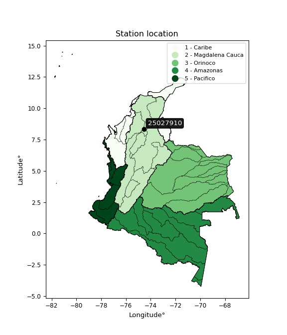</img>

</div>


## A. General information


### 1. General running parameters

• app_version: _v20260312_. • runtime: _2026-03-12 07:15:23.203550_. • Python version: _3.14.0_. • SciPy version: _1.16.3_. • Pandas version: _2.3.3_. • NumPy version: _2.3.5_. • Stations dataset (station_dataset_file): _dataset/pmax24h_in/automatic_colombia_2003_2025.csv_. • Stations catalog (station_catalog_file): _dataset/CNE.xls_. • Minimum year to eval til year_max (date_min): _1900_. • Maximum year to eval since year_min (date_max): _2025_. • Creates, save and include plots into reports (create_plot): _True_. • Plot only fit distributions with Δo > Δ (plot_only_fit): _True_. • Plot only simple graphs avoiding multiple CDFs and multiple Extreme values plots (plot_only_simple): _True_. • Eval low extreme values, if False, evaluates high extreme values (low_extreme): _False_. • Eval every SciPy distribution as logarithmic (pdist_logarithmic_on): _True_. • Standard deviation normalized (ddof): _1.0_. • Return periods to eval in years (Tr): _[2, 2.33, 5, 10, 15, 20, 25, 50, 75, 100, 200, 250, 500, 750, 1000]_. • Minimum data sample per station, 0 means any (minimum_sample): _5_. • Z-Score maximum threshold to adjust a value, 0 means disable (zscore_max): _3.5_. • Z-Score minimum threshold to adjust a value, 0 means disable (zscore_min): _-2.5_. • Avoid zeros, e.g. rain = 0 (avoid_zeros): _True_. • Avoid null values (avoid_nans): _True_. 

:file_folder:Table: [dataset.csv](../../dataset/pmax24h_in/automatic_colombia_2003_2025.csv)

> Delta Degrees of Freedom (DDOF): is a parameter used in the formulas for calculating variance and standard deviation. When ddof=0, the divisor is $N$ (the total number of observations) and this is used when your data set is the entire population. When ddof=1, the divisor is $N-1$ and this is used when your data set is a sample drawn from a larger population. Using $N-1$ provides an unbiased estimate of the population variance (known as Bessel´s correction).


### 2. Station info and location

|   id |   CODIGO | NOMBRE             | CATEGORIA    | TECNOLOGIA                | ESTADO   | FECHA_INSTALACION   |   FECHA_SUSPENSION |   ALTITUD |   LATITUD |   LONGITUD | DEPARTAMENTO   | MUNICIPIO             | AREA_OPERATIVA                      | ENTIDAD                                                     | AREA_HIDROGRAFICA   | ZONA_HIDROGRAFICA   | SUBZONA_HIDROGRAFICA                              | CORRIENTE     | Catalogo   |   Version |
|-----:|---------:|:-------------------|:-------------|:--------------------------|:---------|:--------------------|-------------------:|----------:|----------:|-----------:|:---------------|:----------------------|:------------------------------------|:------------------------------------------------------------|:--------------------|:--------------------|:--------------------------------------------------|:--------------|:-----------|----------:|
|    0 | 25027910 | LA RAYA [25027910] | Limnigráfica | Automática con Telemetría | Activa   | 15/03/1975          |                nan |        31 |   8.34094 |   -74.5571 | Bolivar        | San Jacinto Del Cauca | Area Operativa 01 - Antioquia-Chocó | INSTITUTO DE HIDROLOGIA METEOROLOGIA Y ESTUDIOS AMBIENTALES | Magdalena Cauca     | Cauca               | Directos Bajo Cauca - Cga La Raya entre río Nechí | CAÑO CARIBONA | CNE_IDEAM  |  20251226 |

<div align="center">

Dynamic map: [:earth_americas:Google](http://maps.google.com/maps?q=8.340939,-74.557072) [:earth_americas:OSM](https://www.openstreetmap.org/#map=18/8.340939/-74.557072&layers=P) [:earth_americas:Bing](https://www.bing.com/maps?cp=8.340939~-74.557072&lvl=18) [:earth_americas:Apple](https://maps.apple.com/frame?center=8.340939%2C-74.557072&span=0.003%2C0.006)

</div>


<div align="center">

```geojson
{
  "type": "Feature",
  "geometry": {
    "type": "Point", 
    "coordinates": [-74.557072, 8.340939]
  }, 
  "properties": {
    "Name": "25027910"
  }
}
```

</div>


### 3. Discrete values table and plot

<div align="center">

|               |          0 |           1 |           2 |           3 |          4 |           5 |
|:--------------|-----------:|------------:|------------:|------------:|-----------:|------------:|
| Date          | 2020       | 2021        | 2022        | 2023        | 2024       | 2025        |
| Value         |   27.2     |  134.4      |  126.7      |  118.7      |  315.4     |  193.2      |
| Value_initial |   27.2     |  134.4      |  126.7      |  118.7      |  315.4     |  193.2      |
| count         |    6       |    6        |    6        |    6        |    6       |    6        |
| mean          |  152.6     |  152.6      |  152.6      |  152.6      |  152.6     |  152.6      |
| std           |   95.9465  |   95.9465   |   95.9465   |   95.9465   |   95.9465  |   95.9465   |
| zscore        |   -1.30698 |   -0.189689 |   -0.269942 |   -0.353322 |    1.69678 |    0.423153 |


</div>


<div align="center">

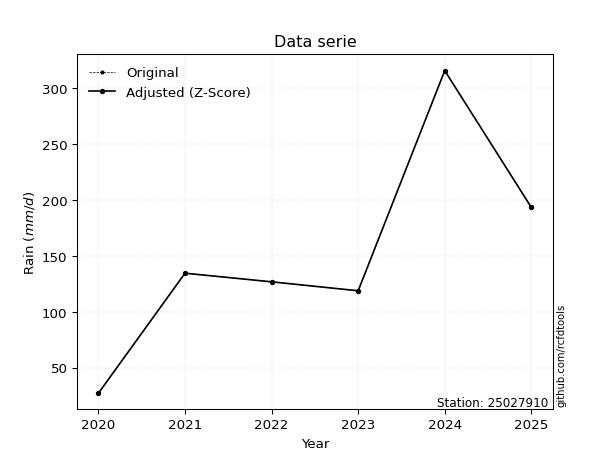</img>

</div>


> The initial value (value_initial) correspond to the initial obtained or null completed value, and value (value) is adjusted only when the initial value is outside the valid range (outlier) definite through the Z-Score value. If Z-Score is active, values out of range or outliers are replaced with the station mean value. A Z-Score (or standard score) measures how many standard deviations a data point is from the mean of a dataset, indicating its relative position; positive scores mean above the mean, negative mean below, and a score of zero is exactly at the mean, allowing for comparison of values from different distributions. It´s calculated using the formula $z=(x–μ)/σ$, where $x$ is the data point, $μ$ is the mean, and $σ$ is the standard deviation, helping identify outliers and understand probability.
>
> <sub>**Note**: In this study, "completing" (filling gaps in) and "extending" (forecasting or lengthening the historical record) rainfall data series are avoided for certain critical analyses because they introduce artificial bias and uncertainty, which can distort the statistics of rare events (extremes), alter day-to-day variability, and compromise the integrity and homogeneity of the original data. Some reasons against Completing/Extending rainfall data are: **Distortion of Extremes and Variability**: The primary issue is that most gap-filling or extension methods rely on averaging or regression with nearby stations, which inherently smooths the data. Rainfall is highly variable in space and time, with a large percentage of zero values and occasional large storms. Infilling methods often underestimate the highest values and overestimate the lowest (zero) values, which severely distorts analyses focused on flood frequency, drought severity, and intensity-duration-frequency (IDF) curves, **Loss of Data Homogeneity**: Infilled or extended data are synthetic estimates, not actual measurements. Combining these estimates with observed data can violate the assumption of data homogeneity, which requires that the data properties do not change over time. Inhomogeneity can lead to incorrect conclusions about long-term trends or changes in climate patterns, **Propagation of Errors**: Errors and biases from the original data (e.g., wind-induced undercatch, instrument errors, site changes) or the data used for imputation can propagate through the analysis, leading to unreliable hydrological models and inaccurate predictions, **Compromised Statistical Integrity**: For statistical analyses, especially those involving the frequency of events, using artificial data can introduce time bias or autocorrelation that doesn´t exist in reality, making it difficult to assess the true probability of events, **Difficulty in Validation**: It is difficult to accurately validate the quality of filled or extended data, especially for past periods where ground-truth measurements are unavailable. The reliability of imputation techniques heavily depends on the density of the surrounding station network and the complexity of the local topography.</sub>


### 4. Active continuous probability distributions from SciPy (80 of 104 available)

A Probability Density Function (PDF) describes the relative likelihood of a continuous random variable falling within a specific range, where the total area under its curve equals 1, and the area over any interval gives the actual probability for that range. Unlike discrete probabilities (like rolling a die), a PDF shows density, not direct probability for a single point (which is zero), with higher points indicating higher likelihood, often visualized as a bell curve for normal distributions.

A log of a probability density function (log-PDF) is simply the logarithm of the PDF´s value, denoted as $log(f(x))$, useful for converting multiplication of probabilities into addition, improving numerical stability with tiny numbers, and connecting to information theory concepts like entropy. Instead of dealing with very small probabilities (e.g., 0.000001), log-PDFs use negative numbers (e.g., $log(0.00001) ≈ -11.51$ that are easier for computers to handle, preventing underflow errors and simplifying complex calculations. In this study, each active probability distribution from SciPy is also evaluated in the $log$ form.

[scipy.stats](https://docs.scipy.org/doc/scipy/reference/stats.html) is a Python´s powerful submodule within the SciPy library for comprehensive statistical analysis, offering over 130 probability distributions (like Normal, Poisson, etc.), functions for descriptive stats (mean, variance), hypothesis testing (t-tests, chi-square), random variable generation, and statistical tests, making it essential for data science, modeling, and research. It provides tools to explore, model, and draw conclusions from data efficiently, working seamlessly with [NumPy](https://numpy.org/).

<div align="center">

|   id | p_dist           |   n_parameter | fit_method   | label                                                                       | active   | ref                                                                                                      |
|-----:|:-----------------|--------------:|:-------------|:----------------------------------------------------------------------------|:---------|:---------------------------------------------------------------------------------------------------------|
|    0 | alpha            |             3 | MLE          | Alpha                                                                       | True     | [:mortar_board:](https://docs.scipy.org/doc/scipy/reference/generated/scipy.stats.alpha.html)            |
|    1 | anglit           |             2 | MM           | Anglit                                                                      | True     | [:mortar_board:](https://docs.scipy.org/doc/scipy/reference/generated/scipy.stats.anglit.html)           |
|    2 | arcsine          |             2 | MM           | Arcsine                                                                     | True     | [:mortar_board:](https://docs.scipy.org/doc/scipy/reference/generated/scipy.stats.arcsine.html)          |
|    3 | argus            |             3 | MLE          | Argus                                                                       | True     | [:mortar_board:](https://docs.scipy.org/doc/scipy/reference/generated/scipy.stats.argus.html)            |
|    4 | beta             |             4 | MLE          | Beta                                                                        | True     | [:mortar_board:](https://docs.scipy.org/doc/scipy/reference/generated/scipy.stats.beta.html)             |
|    5 | betaprime        |             4 | MLE          | Beta prime                                                                  | True     | [:mortar_board:](https://docs.scipy.org/doc/scipy/reference/generated/scipy.stats.betaprime.html)        |
|    6 | bradford         |             3 | MLE          | Bradford                                                                    | True     | [:mortar_board:](https://docs.scipy.org/doc/scipy/reference/generated/scipy.stats.bradford.html)         |
|    7 | burr             |             4 | MLE          | Burr (Type III)                                                             | True     | [:mortar_board:](https://docs.scipy.org/doc/scipy/reference/generated/scipy.stats.burr.html)             |
|    8 | burr12           |             4 | MLE          | Burr (Type III) 12                                                          | True     | [:mortar_board:](https://docs.scipy.org/doc/scipy/reference/generated/scipy.stats.burr12.html)           |
|    9 | cosine           |             2 | MLE          | Cosine                                                                      | True     | [:mortar_board:](https://docs.scipy.org/doc/scipy/reference/generated/scipy.stats.cosine.html)           |
|   10 | crystalball      |             4 | MLE          | Crystalball                                                                 | True     | [:mortar_board:](https://docs.scipy.org/doc/scipy/reference/generated/scipy.stats.crystalball.html)      |
|   11 | dgamma           |             3 | MLE          | Double gamma                                                                | True     | [:mortar_board:](https://docs.scipy.org/doc/scipy/reference/generated/scipy.stats.dgamma.html)           |
|   12 | dweibull         |             3 | MLE          | Double Weibull                                                              | True     | [:mortar_board:](https://docs.scipy.org/doc/scipy/reference/generated/scipy.stats.dweibull.html)         |
|   13 | erlang           |             3 | MLE          | Erlang                                                                      | True     | [:mortar_board:](https://docs.scipy.org/doc/scipy/reference/generated/scipy.stats.erlang.html)           |
|   14 | exponnorm        |             3 | MLE          | Exponentially modified Normal                                               | True     | [:mortar_board:](https://docs.scipy.org/doc/scipy/reference/generated/scipy.stats.exponnorm.html)        |
|   15 | exponpow         |             3 | MLE          | Exponential power                                                           | True     | [:mortar_board:](https://docs.scipy.org/doc/scipy/reference/generated/scipy.stats.exponpow.html)         |
|   16 | exponweib        |             4 | MLE          | Exponentiated Weibull                                                       | True     | [:mortar_board:](https://docs.scipy.org/doc/scipy/reference/generated/scipy.stats.exponweib.html)        |
|   17 | f                |             4 | MLE          | F                                                                           | True     | [:mortar_board:](https://docs.scipy.org/doc/scipy/reference/generated/scipy.stats.f.html)                |
|   18 | fatiguelife      |             3 | MLE          | Fatigue-life (Birnbaum-Saunders)                                            | True     | [:mortar_board:](https://docs.scipy.org/doc/scipy/reference/generated/scipy.stats.fatiguelife.html)      |
|   19 | foldnorm         |             3 | MM           | Fold Normal                                                                 | True     | [:mortar_board:](https://docs.scipy.org/doc/scipy/reference/generated/scipy.stats.foldnorm.html)         |
|   20 | gamma            |             3 | MLE          | Gamma                                                                       | True     | [:mortar_board:](https://docs.scipy.org/doc/scipy/reference/generated/scipy.stats.gamma.html)            |
|   21 | gausshyper       |             6 | MLE          | Gauss hypergeometric                                                        | True     | [:mortar_board:](https://docs.scipy.org/doc/scipy/reference/generated/scipy.stats.gausshyper.html)       |
|   22 | genexpon         |             5 | MLE          | Generalized exponential                                                     | True     | [:mortar_board:](https://docs.scipy.org/doc/scipy/reference/generated/scipy.stats.genexpon.html)         |
|   23 | genextreme       |             3 | MLE          | Generalized exponential                                                     | True     | [:mortar_board:](https://docs.scipy.org/doc/scipy/reference/generated/scipy.stats.genextreme.html)       |
|   24 | gengamma         |             4 | MLE          | Generalized gamma                                                           | True     | [:mortar_board:](https://docs.scipy.org/doc/scipy/reference/generated/scipy.stats.gengamma.html)         |
|   25 | genhalflogistic  |             3 | MLE          | Generalized half-logistic                                                   | True     | [:mortar_board:](https://docs.scipy.org/doc/scipy/reference/generated/scipy.stats.genhalflogistic.html)  |
|   26 | genlogistic      |             3 | MLE          | Generalized logistic                                                        | True     | [:mortar_board:](https://docs.scipy.org/doc/scipy/reference/generated/scipy.stats.genlogistic.html)      |
|   27 | gennorm          |             3 | MLE          | Generalized Normal                                                          | True     | [:mortar_board:](https://docs.scipy.org/doc/scipy/reference/generated/scipy.stats.gennorm.html)          |
|   28 | genpareto        |             3 | MLE          | Generalized Pareto                                                          | True     | [:mortar_board:](https://docs.scipy.org/doc/scipy/reference/generated/scipy.stats.genpareto.html)        |
|   29 | gompertz         |             3 | MLE          | Gompertz (or truncated Gumbel)                                              | True     | [:mortar_board:](https://docs.scipy.org/doc/scipy/reference/generated/scipy.stats.gompertz.html)         |
|   30 | gumbel_l         |             2 | MM           | Gumbel Left Skew                                                            | True     | [:mortar_board:](https://docs.scipy.org/doc/scipy/reference/generated/scipy.stats.gumbel_l.html)         |
|   31 | gumbel_r         |             2 | MM           | Gumbel Right Skew                                                           | True     | [:mortar_board:](https://docs.scipy.org/doc/scipy/reference/generated/scipy.stats.gumbel_r.html)         |
|   32 | halfgennorm      |             3 | MLE          | Upper half of a generalized normal                                          | True     | [:mortar_board:](https://docs.scipy.org/doc/scipy/reference/generated/scipy.stats.halfgennorm.html)      |
|   33 | halflogistic     |             2 | MM           | Half-logistic                                                               | True     | [:mortar_board:](https://docs.scipy.org/doc/scipy/reference/generated/scipy.stats.halflogistic.html)     |
|   34 | halfnorm         |             2 | MM           | Half Normal                                                                 | True     | [:mortar_board:](https://docs.scipy.org/doc/scipy/reference/generated/scipy.stats.halfnorm.html)         |
|   35 | hypsecant        |             2 | MM           | hyperbolic secant                                                           | True     | [:mortar_board:](https://docs.scipy.org/doc/scipy/reference/generated/scipy.stats.hypsecant.html)        |
|   36 | invgamma         |             3 | MLE          | Inverted gamma                                                              | True     | [:mortar_board:](https://docs.scipy.org/doc/scipy/reference/generated/scipy.stats.invgamma.html)         |
|   37 | invgauss         |             3 | MLE          | Inverse Gaussian                                                            | True     | [:mortar_board:](https://docs.scipy.org/doc/scipy/reference/generated/scipy.stats.invgauss.html)         |
|   38 | invweibull       |             3 | MLE          | Inverted Weibull                                                            | True     | [:mortar_board:](https://docs.scipy.org/doc/scipy/reference/generated/scipy.stats.invweibull.html)       |
|   39 | johnsonsb        |             4 | MLE          | Johnson SB                                                                  | True     | [:mortar_board:](https://docs.scipy.org/doc/scipy/reference/generated/scipy.stats.johnsonsb.html)        |
|   40 | johnsonsu        |             4 | MLE          | Johnson Su                                                                  | True     | [:mortar_board:](https://docs.scipy.org/doc/scipy/reference/generated/scipy.stats.johnsonsu.html)        |
|   41 | kappa3           |             3 | MLE          | Kappa 3                                                                     | True     | [:mortar_board:](https://docs.scipy.org/doc/scipy/reference/generated/scipy.stats.kappa3.html)           |
|   42 | kappa4           |             4 | MLE          | Kappa 4                                                                     | True     | [:mortar_board:](https://docs.scipy.org/doc/scipy/reference/generated/scipy.stats.kappa4.html)           |
|   43 | ksone            |             3 | MLE          | Kolmogorov-Smirnov one-sided test statistic distribution                    | True     | [:mortar_board:](https://docs.scipy.org/doc/scipy/reference/generated/scipy.stats.ksone.html)            |
|   44 | kstwobign        |             2 | MLE          | Limiting distribution of scaled Kolmogorov-Smirnov two-sided test statistic | True     | [:mortar_board:](https://docs.scipy.org/doc/scipy/reference/generated/scipy.stats.kstwobign.html)        |
|   45 | laplace          |             2 | MM           | Laplace                                                                     | True     | [:mortar_board:](https://docs.scipy.org/doc/scipy/reference/generated/scipy.stats.laplace.html)          |
|   46 | levy_l           |             2 | MLE          | Left-skewed Levy                                                            | True     | [:mortar_board:](https://docs.scipy.org/doc/scipy/reference/generated/scipy.stats.levy_l.html)           |
|   47 | loggamma         |             3 | MLE          | Log gamma                                                                   | True     | [:mortar_board:](https://docs.scipy.org/doc/scipy/reference/generated/scipy.stats.loggamma.html)         |
|   48 | logistic         |             2 | MM           | Logistic (or Sech-squared)                                                  | True     | [:mortar_board:](https://docs.scipy.org/doc/scipy/reference/generated/scipy.stats.logistic.html)         |
|   49 | loglaplace       |             3 | MLE          | Log-Laplace                                                                 | True     | [:mortar_board:](https://docs.scipy.org/doc/scipy/reference/generated/scipy.stats.loglaplace.html)       |
|   50 | lomax            |             3 | MLE          | Lomax (Pareto of the second kind)                                           | True     | [:mortar_board:](https://docs.scipy.org/doc/scipy/reference/generated/scipy.stats.lomax.html)            |
|   51 | maxwell          |             2 | MM           | Maxwell                                                                     | True     | [:mortar_board:](https://docs.scipy.org/doc/scipy/reference/generated/scipy.stats.maxwell.html)          |
|   52 | mielke           |             4 | MLE          | Mielke Beta-Kappa / Dagum                                                   | True     | [:mortar_board:](https://docs.scipy.org/doc/scipy/reference/generated/scipy.stats.mielke.html)           |
|   53 | moyal            |             2 | MM           | Moyal                                                                       | True     | [:mortar_board:](https://docs.scipy.org/doc/scipy/reference/generated/scipy.stats.moyal.html)            |
|   54 | nakagami         |             3 | MLE          | Nakagami                                                                    | True     | [:mortar_board:](https://docs.scipy.org/doc/scipy/reference/generated/scipy.stats.nakagami.html)         |
|   55 | ncf              |             5 | MLE          | Non-central F distribution                                                  | True     | [:mortar_board:](https://docs.scipy.org/doc/scipy/reference/generated/scipy.stats.ncf.html)              |
|   56 | nct              |             4 | MLE          | Non-central Student’s t                                                     | True     | [:mortar_board:](https://docs.scipy.org/doc/scipy/reference/generated/scipy.stats.nct.html)              |
|   57 | norm             |             2 | MM           | Normal                                                                      | True     | [:mortar_board:](https://docs.scipy.org/doc/scipy/reference/generated/scipy.stats.norm.html)             |
|   58 | pearson3         |             3 | MM           | Pearson type III                                                            | True     | [:mortar_board:](https://docs.scipy.org/doc/scipy/reference/generated/scipy.stats.pearson3.html)         |
|   59 | powerlaw         |             3 | MLE          | Power-function                                                              | True     | [:mortar_board:](https://docs.scipy.org/doc/scipy/reference/generated/scipy.stats.powerlaw.html)         |
|   60 | rayleigh         |             2 | MM           | Rayleigh                                                                    | True     | [:mortar_board:](https://docs.scipy.org/doc/scipy/reference/generated/scipy.stats.rayleigh.html)         |
|   61 | rdist            |             3 | MLE          | R-distributed (symmetric beta)                                              | True     | [:mortar_board:](https://docs.scipy.org/doc/scipy/reference/generated/scipy.stats.rdist.html)            |
|   62 | rice             |             3 | MLE          | Rice                                                                        | True     | [:mortar_board:](https://docs.scipy.org/doc/scipy/reference/generated/scipy.stats.rice.html)             |
|   63 | semicircular     |             2 | MM           | Semicircular                                                                | True     | [:mortar_board:](https://docs.scipy.org/doc/scipy/reference/generated/scipy.stats.semicircular.html)     |
|   64 | skewnorm         |             3 | MLE          | Skew normal                                                                 | True     | [:mortar_board:](https://docs.scipy.org/doc/scipy/reference/generated/scipy.stats.skewnorm.html)         |
|   65 | t                |             3 | MLE          | Student’s t                                                                 | True     | [:mortar_board:](https://docs.scipy.org/doc/scipy/reference/generated/scipy.stats.t.html)                |
|   66 | trapezoid        |             4 | MLE          | Trapezoid                                                                   | True     | [:mortar_board:](https://docs.scipy.org/doc/scipy/reference/generated/scipy.stats.trapezoid.html)        |
|   67 | triang           |             3 | MLE          | Triangular                                                                  | True     | [:mortar_board:](https://docs.scipy.org/doc/scipy/reference/generated/scipy.stats.triang.html)           |
|   68 | truncexpon       |             3 | MLE          | Truncated exponential                                                       | True     | [:mortar_board:](https://docs.scipy.org/doc/scipy/reference/generated/scipy.stats.truncexpon.html)       |
|   69 | truncnorm        |             4 | MLE          | Truncated normal                                                            | True     | [:mortar_board:](https://docs.scipy.org/doc/scipy/reference/generated/scipy.stats.truncnorm.html)        |
|   70 | truncpareto      |             4 | MLE          | Upper truncated Pareto                                                      | True     | [:mortar_board:](https://docs.scipy.org/doc/scipy/reference/generated/scipy.stats.truncpareto.html)      |
|   71 | truncweibull_min |             5 | MLE          | Doubly truncated Weibull minimum                                            | True     | [:mortar_board:](https://docs.scipy.org/doc/scipy/reference/generated/scipy.stats.truncweibull_min.html) |
|   72 | tukeylambda      |             3 | MLE          | Tukey-Lamdba                                                                | True     | [:mortar_board:](https://docs.scipy.org/doc/scipy/reference/generated/scipy.stats.tukeylambda.html)      |
|   73 | uniform          |             2 | MLE          | Uniform                                                                     | True     | [:mortar_board:](https://docs.scipy.org/doc/scipy/reference/generated/scipy.stats.uniform.html)          |
|   74 | vonmises         |             3 | MLE          | Von Mises                                                                   | True     | [:mortar_board:](https://docs.scipy.org/doc/scipy/reference/generated/scipy.stats.vonmises.html)         |
|   75 | vonmises_line    |             3 | MLE          | Von Mises line                                                              | True     | [:mortar_board:](https://docs.scipy.org/doc/scipy/reference/generated/scipy.stats.vonmises_line.html)    |
|   76 | wald             |             2 | MM           | Wald                                                                        | True     | [:mortar_board:](https://docs.scipy.org/doc/scipy/reference/generated/scipy.stats.wald.html)             |
|   77 | weibull_max      |             3 | MLE          | Weibull maximum                                                             | True     | [:mortar_board:](https://docs.scipy.org/doc/scipy/reference/generated/scipy.stats.weibull_max.html)      |
|   78 | weibull_min      |             3 | MLE          | Weibull minimum                                                             | True     | [:mortar_board:](https://docs.scipy.org/doc/scipy/reference/generated/scipy.stats.weibull_min.html)      |
|   79 | wrapcauchy       |             3 | MLE          | Wrapped  Cauchy                                                             | True     | [:mortar_board:](https://docs.scipy.org/doc/scipy/reference/generated/scipy.stats.wrapcauchy.html)       |

</div>

> **n_parameter:** # arguments & localization & scale.
>
> **Fit methods:** (MLE) maximum likelihood, (MM) L-moments.
>
>**Inactive** (With the only purpose of prevent loops, zero divisions, infinite values, over high estimated values or horizontal trending for recurrence intervals estimations, the follow distributions were disabled.)**:** lognorm, norminvgauss, powernorm, powerlognorm, cauchy, halfcauchy, foldcauchy, skewcauchy, chi2, expon, fisk, genhyperbolic, geninvgauss, gibrat, kstwo, laplace_asymmetric, levy, levy_stable, ncx2, pareto, rel_breitwigner, recipinvgauss, studentized_range, loguniform, 


## B. Probability (PDF) vs. Empirical (EDF) distributions functions

A continuous probability distribution (CPD) describes probabilities for variables that can take any value within a range (like rain any time), unlike discrete variables with specific outcomes (like temperature). It uses a Probability Density Function (PDF), a curve where the total area under it equals 1, and the probability of the variable falling within an interval (a to b) is found by calculating the area under the curve between those points. A key feature is that the probability of hitting any single exact value is zero, so probabilities are always expressed for ranges, e.g., $P(a ≤ X ≤ b)$.

<div align="center">

Distributions parameters from station values
|     |   station | p_dist              |   n |               loc |            scale | shape                  | shape1                | shape2                | shape3             |
|----:|----------:|:--------------------|----:|------------------:|-----------------:|:-----------------------|:----------------------|:----------------------|:-------------------|
|   0 |  25027910 | alpha               |   6 |      -0.151284    |     62.0356      | 3.1350211056751724e-11 |                       |                       |                    |
|   1 |  25027910 | anglit              |   6 |     152.6         |    256.226       |                        |                       |                       |                    |
|   2 |  25027910 | arcsine             |   6 |      28.7337      |    247.733       |                        |                       |                       |                    |
|   3 |  25027910 | argus               |   6 |     -51.1695      |    383.706       | 4.3007701953385023e-07 |                       |                       |                    |
|   4 |  25027910 | beta                |   6 |      27.2         |    288.205       | 0.7652581560796898     | 0.9815791641387361    |                       |                    |
|   5 |  25027910 | betaprime           |   6 |     -56.893       |   7422.76        | 5.659227620170062      | 201.49731729865078    |                       |                    |
|   6 |  25027910 | bradford            |   6 |      27.1989      |    288.201       | 1.3822726080240497     |                       |                       |                    |
|   7 |  25027910 | burr                |   6 |      -2.43474     |    208.79        | 4.377379669034692      | 0.3697854671164096    |                       |                    |
|   8 |  25027910 | burr12              |   6 |       0.0872988   |     26.7131      | 287.54621644002043     | 0.002287167086711021  |                       |                    |
|   9 |  25027910 | cosine              |   6 |     160.063       |     75.3095      |                        |                       |                       |                    |
|  10 |  25027910 | crystalball         |   6 |     152.6         |     87.5868      | 14.32234948801523      | 251.07321211573924    |                       |                    |
|  11 |  25027910 | dgamma              |   6 |     126.7         |     65.5154      | 0.7876763862446696     |                       |                       |                    |
|  12 |  25027910 | dweibull            |   6 |     126.7         |     74.4605      | 0.7789871204352447     |                       |                       |                    |
|  13 |  25027910 | erlang              |   6 |     -47.0071      |     40.4653      | 4.932796849019869      |                       |                       |                    |
|  14 |  25027910 | exponnorm           |   6 |      76.7036      |     50.4954      | 1.5030356959151228     |                       |                       |                    |
|  15 |  25027910 | exponpow            |   6 |      27.2         |     35.4523      | 0.3647513831183281     |                       |                       |                    |
|  16 |  25027910 | exponweib           |   6 |    -680.717       |    222.454       | 1113.1022799190469     | 1.5315133903423694    |                       |                    |
|  17 |  25027910 | f                   |   6 |     -47.4145      |    199.97        | 9.922760662356799      | 8483.756888461208     |                       |                    |
|  18 |  25027910 | fatiguelife         |   6 |      27.2         |      0.000120598 | 1131.1657875591404     |                       |                       |                    |
|  19 |  25027910 | foldnorm            |   6 |      17.316       |    103.573       | 1.192153324557101      |                       |                       |                    |
|  20 |  25027910 | gamma               |   6 |     -47.0071      |     40.4653      | 4.932796809594889      |                       |                       |                    |
|  21 |  25027910 | gausshyper          |   6 |      19.9589      |    295.441       | 1.0383370799509057     | 0.7567643403665512    | 1.019785893043124     | 1.0728355267040266 |
|  22 |  25027910 | genexpon            |   6 |      -3.80777     |      1.98454     | 1.587747183034093e-05  | 0.07585902440437745   | 0.0037304068780549832 |                    |
|  23 |  25027910 | genextreme          |   6 |     -21.1043      |    358.01        | 1.063908597922695      |                       |                       |                    |
|  24 |  25027910 | gengamma            |   6 |     -48.6198      |     63.343       | 3.863653084396         | 1.155406123402067     |                       |                    |
|  25 |  25027910 | genhalflogistic     |   6 |      -1.67414     |    331.515       | 1.045542665205424      |                       |                       |                    |
|  26 |  25027910 | genlogistic         |   6 |     -36.3385      |     68.8521      | 9.292378789057663      |                       |                       |                    |
|  27 |  25027910 | gennorm             |   6 |     126.7         |      1.27955     | 0.3461174875417904     |                       |                       |                    |
|  28 |  25027910 | genpareto           |   6 |      -2.05111     |    491.547       | -1.5484167398801443    |                       |                       |                    |
|  29 |  25027910 | gompertz            |   6 |      -0.557876    |      2.47411     | 2.7369462896487246e-29 |                       |                       |                    |
|  30 |  25027910 | gumbel_l            |   6 |     192.019       |     68.2911      |                        |                       |                       |                    |
|  31 |  25027910 | gumbel_r            |   6 |     113.181       |     68.2911      |                        |                       |                       |                    |
|  32 |  25027910 | halfgennorm         |   6 |      27.2         |     46.2146      | 0.6146224498654183     |                       |                       |                    |
|  33 |  25027910 | halflogistic        |   6 |      48.7893      |     74.8836      |                        |                       |                       |                    |
|  34 |  25027910 | halfnorm            |   6 |      36.6695      |    145.297       |                        |                       |                       |                    |
|  35 |  25027910 | hypsecant           |   6 |     152.6         |     55.7594      |                        |                       |                       |                    |
|  36 |  25027910 | invgamma            |   6 |    -277.688       |  10521.5         | 25.448046589673424     |                       |                       |                    |
|  37 |  25027910 | invgauss            |   6 |    -164.586       |   4041.3         | 0.07849958823447478    |                       |                       |                    |
|  38 |  25027910 | invweibull          |   6 |      -3.89418e+07 |      3.89419e+07 | 532631.1106872424      |                       |                       |                    |
|  39 |  25027910 | johnsonsb           |   6 |      25.4864      |    289.914       | -0.5403733345260225    | 0.06820349393096244   |                       |                    |
|  40 |  25027910 | johnsonsu           |   6 |     125.573       |      6.74966     | -0.2731882245935999    | 0.4085787910432399    |                       |                    |
|  41 |  25027910 | kappa3              |   6 |      27.2         |    153.57        | 4.318869579314903      |                       |                       |                    |
|  42 |  25027910 | kappa4              |   6 |      -1.60289     |    320.56        | 1.098706976232819      | 0.9970138691144586    |                       |                    |
|  43 |  25027910 | ksone               |   6 |      -1.62        |    345.84        | 1.0                    |                       |                       |                    |
|  44 |  25027910 | kstwobign           |   6 |    -150.088       |    347.901       |                        |                       |                       |                    |
|  45 |  25027910 | laplace             |   6 |     152.6         |     61.9332      |                        |                       |                       |                    |
|  46 |  25027910 | levy_l              |   6 |     333.174       |     73.8822      |                        |                       |                       |                    |
|  47 |  25027910 | loggamma            |   6 |  -28611.6         |   3815.98        | 1878.0489181014786     |                       |                       |                    |
|  48 |  25027910 | logistic            |   6 |     152.6         |     48.2891      |                        |                       |                       |                    |
|  49 |  25027910 | loglaplace          |   6 |      -0.337708    |    127.038       | 3.3352244219631197     |                       |                       |                    |
|  50 |  25027910 | lomax               |   6 |      27.2         |      8.72422e+09 | 58679739.06045622      |                       |                       |                    |
|  51 |  25027910 | maxwell             |   6 |     -54.9438      |    130.059       |                        |                       |                       |                    |
|  52 |  25027910 | mielke              |   6 |      -0.712976    |    209.338       | 1.570625237827984      | 4.376025311271932     |                       |                    |
|  53 |  25027910 | moyal               |   6 |     102.512       |     39.4279      |                        |                       |                       |                    |
|  54 |  25027910 | nakagami            |   6 |     118.7         |     96.7184      | 0.13430926648699476    |                       |                       |                    |
|  55 |  25027910 | ncf                 |   6 |      -1.78454     |      0.137567    | 0.010665001030794773   | 672.5263364379891     | 11.92512843501827     |                    |
|  56 |  25027910 | nct                 |   6 |      -0.157721    |     66.8403      | 7.752055402017032      | 2.054117545940921     |                       |                    |
|  57 |  25027910 | norm                |   6 |     152.6         |     87.5867      |                        |                       |                       |                    |
|  58 |  25027910 | pearson3            |   6 |     152.6         |     87.5867      | 0.5822749327078418     |                       |                       |                    |
|  59 |  25027910 | powerlaw            |   6 |      27.2         |    288.2         | 0.14056078975160544    |                       |                       |                    |
|  60 |  25027910 | rayleigh            |   6 |     -14.9585      |    133.692       |                        |                       |                       |                    |
|  61 |  25027910 | rdist               |   6 |      -0.693666    |    135.094       | 1.15058826095584       |                       |                       |                    |
|  62 |  25027910 | rice                |   6 |      -9.56893     |    130.327       | 0.0019677679286353817  |                       |                       |                    |
|  63 |  25027910 | semicircular        |   6 |     152.6         |    175.173       |                        |                       |                       |                    |
|  64 |  25027910 | skewnorm            |   6 |      56.3463      |    130.139       | 2.6071148639225585     |                       |                       |                    |
|  65 |  25027910 | t                   |   6 |     152.599       |     87.5861      | 13627100.7482595       |                       |                       |                    |
|  66 |  25027910 | trapezoid           |   6 |      -1.701       |    345.84        | 1.0                    | 1.0                   |                       |                    |
|  67 |  25027910 | triang              |   6 |      -1.73777     |    317.138       | 0.9999998450670589     |                       |                       |                    |
|  68 |  25027910 | truncexpon          |   6 |      27.1939      |    284.844       | 1.0118021272611704     |                       |                       |                    |
|  69 |  25027910 | truncnorm           |   6 |     152.6         |     87.5867      | -4584.629784653681     | 24209.43437023159     |                       |                    |
|  70 |  25027910 | truncpareto         |   6 |      26.8239      |      0.37614     | 0.20359170408912558    | 767.2038383436019     |                       |                    |
|  71 |  25027910 | truncweibull_min    |   6 |      27.2         |    372.694       | 0.34031681508634326    | 9.426911709636186e-18 | 0.8069267836062293    |                    |
|  72 |  25027910 | tukeylambda         |   6 |      -0.641364    |    148.514       | 1.0997684884210543     |                       |                       |                    |
|  73 |  25027910 | uniform             |   6 |      27.2         |    288.2         |                        |                       |                       |                    |
|  74 |  25027910 | vonmises            |   6 |       1.36439     |      1           | 0.6019514628768196     |                       |                       |                    |
|  75 |  25027910 | vonmises_line       |   6 |     171.958       |     46.078       | 0.17589377376389975    |                       |                       |                    |
|  76 |  25027910 | wald                |   6 |      65.0133      |     87.5867      |                        |                       |                       |                    |
|  77 |  25027910 | weibull_max         |   6 |     315.4         |      1.70477     | 0.21591019748630325    |                       |                       |                    |
|  78 |  25027910 | weibull_min         |   6 |       7.51302     |    161.389       | 1.6401420359995356     |                       |                       |                    |
|  79 |  25027910 | wrapcauchy          |   6 |      26.7277      |     45.9437      | 7.559613396057329e-06  |                       |                       |                    |
|  80 |  25027910 | logalpha            |   6 |     -15.9937      |    562.363       | 27.091399225564743     |                       |                       |                    |
|  81 |  25027910 | loganglit           |   6 |       4.80667     |      2.19483     |                        |                       |                       |                    |
|  82 |  25027910 | logarcsine          |   6 |       3.74561     |      2.12211     |                        |                       |                       |                    |
|  83 |  25027910 | logargus            |   6 |       2.57859     |      3.2651      | 1.823073848869218      |                       |                       |                    |
|  84 |  25027910 | logbeta             |   6 |       2.81254     |      2.94131     | 2.175343865684451      | 0.7276698263421684    |                       |                    |
|  85 |  25027910 | logbetaprime        |   6 |     -10.929       |     45.73        | 529.6370177136555      | 1541.4436851488813    |                       |                    |
|  86 |  25027910 | logbradford         |   6 |       3.29666     |      2.50973     | 5.46159038265732e-06   |                       |                       |                    |
|  87 |  25027910 | logburr             |   6 |   -1236.85        |   1242.2         | 5433.709566359072      | 0.354745073377568     |                       |                    |
|  88 |  25027910 | logburr12           |   6 |     -85.1228      |     95.9998      | 163.62616254596668     | 23636.95243808804     |                       |                    |
|  89 |  25027910 | logcosine           |   6 |       4.70119     |      0.655331    |                        |                       |                       |                    |
|  90 |  25027910 | logcrystalball      |   6 |       4.80667     |      0.750268    | 7.614942241556705      | 1586.3366279939005    |                       |                    |
|  91 |  25027910 | logdgamma           |   6 |       4.90082     |      0.499397    | 0.837849923780686      |                       |                       |                    |
|  92 |  25027910 | logdweibull         |   6 |       4.84182     |      0.635578    | 0.43533940723558584    |                       |                       |                    |
|  93 |  25027910 | logerlang           |   6 |      -5.09944     |      0.0628413   | 157.4213702088398      |                       |                       |                    |
|  94 |  25027910 | logexponnorm        |   6 |       4.80599     |      0.750268    | 0.0008960831473611557  |                       |                       |                    |
|  95 |  25027910 | logexponpow         |   6 |       3.30322     |      1.31957     | 0.6138385366798693     |                       |                       |                    |
|  96 |  25027910 | logexponweib        |   6 |       3.30322     |      1.1122      | 0.9823243283902827     | 0.9197206330605752    |                       |                    |
|  97 |  25027910 | logf                |   6 |   -1806.66        |   1811.46        | 33131029.477966465     | 17883943.846827246    |                       |                    |
|  98 |  25027910 | logfatiguelife      |   6 |    -560.083       |    564.888       | 0.0013262027951096793  |                       |                       |                    |
|  99 |  25027910 | logfoldnorm         |   6 |       3.85278     |      0.979997    | 0.6854347179445774     |                       |                       |                    |
| 100 |  25027910 | loggamma            |   6 |      -6.29537     |      0.0555949   | 199.40220892434922     |                       |                       |                    |
| 101 |  25027910 | loggausshyper       |   6 |       3.22524     |      2.5286      | 1.3599583308310441     | 0.5782724495713922    | 1.2714188404179647    | 1.0711432674578818 |
| 102 |  25027910 | loggenexpon         |   6 |       3.28982     |      0.00366208  | 0.0008362938681476648  | 0.7096032089888287    | 8.638115863358622e-06 |                    |
| 103 |  25027910 | loggenextreme       |   6 |       4.86159     |      1.01251     | 1.134771866121823      |                       |                       |                    |
| 104 |  25027910 | loggengamma         |   6 |       3.30322     |      1.91622     | 1.2601906222445098     | 0.3137875068150805    |                       |                    |
| 105 |  25027910 | loggenhalflogistic  |   6 |       3.30254     |      2.57904     | 1.0521103720510212     |                       |                       |                    |
| 106 |  25027910 | loggenlogistic      |   6 |       5.34527     |      0.228513    | 0.3543507754323735     |                       |                       |                    |
| 107 |  25027910 | loggennorm          |   6 |       4.90082     |      0.0134165   | 0.36274791156370634    |                       |                       |                    |
| 108 |  25027910 | loggenpareto        |   6 |      -0.0300979   |     12.8316      | -2.21849136566545      |                       |                       |                    |
| 109 |  25027910 | loggompertz         |   6 |       3.30322     |      0.651397    | 0.06655467088412509    |                       |                       |                    |
| 110 |  25027910 | loggumbel_l         |   6 |       5.14433     |      0.584981    |                        |                       |                       |                    |
| 111 |  25027910 | loggumbel_r         |   6 |       4.46901     |      0.584981    |                        |                       |                       |                    |
| 112 |  25027910 | loghalfgennorm      |   6 |       3.3032      |      2.45103     | 50425.98768191441      |                       |                       |                    |
| 113 |  25027910 | loghalflogistic     |   6 |       3.91736     |      0.641494    |                        |                       |                       |                    |
| 114 |  25027910 | loghalfnorm         |   6 |       3.81363     |      1.2446      |                        |                       |                       |                    |
| 115 |  25027910 | loghypsecant        |   6 |       4.80667     |      0.477635    |                        |                       |                       |                    |
| 116 |  25027910 | loginvgamma         |   6 |     -14.8766      |  12409.8         | 631.6186725389036      |                       |                       |                    |
| 117 |  25027910 | loginvgauss         |   6 |      -2.02658     |    456.037       | 0.014914096222622422   |                       |                       |                    |
| 118 |  25027910 | loginvweibull       |   6 | -116188           | 116193           | 137198.02988880704     |                       |                       |                    |
| 119 |  25027910 | logjohnsonsb        |   6 |       3.30269     |      2.45116     | 0.09336837555261801    | 0.06612697203625513   |                       |                    |
| 120 |  25027910 | logjohnsonsu        |   6 |       4.84597     |      0.0499499   | -0.1318176899885721    | 0.3903365071406204    |                       |                    |
| 121 |  25027910 | logkappa3           |   6 |       3.30321     |      2.45062     | 529774.6066545495      |                       |                       |                    |
| 122 |  25027910 | logkappa4           |   6 |       3.17721     |      2.73492     | 1.0326451675410508     | 1.06143116826473      |                       |                    |
| 123 |  25027910 | logksone            |   6 |       3.05815     |      2.94075     | 1.0                    |                       |                       |                    |
| 124 |  25027910 | logkstwobign        |   6 |       1.38854     |      3.90629     |                        |                       |                       |                    |
| 125 |  25027910 | loglaplace          |   6 |       4.80667     |      0.530519    |                        |                       |                       |                    |
| 126 |  25027910 | loglevy_l           |   6 |       5.84096     |      0.361275    |                        |                       |                       |                    |
| 127 |  25027910 | logloggamma         |   6 |       5.41113     |      0.41641     | 0.6253248301395222     |                       |                       |                    |
| 128 |  25027910 | loglogistic         |   6 |       4.80667     |      0.413644    |                        |                       |                       |                    |
| 129 |  25027910 | logloglaplace       |   6 |      -0.153971    |      5.05479     | 9.376177010229615      |                       |                       |                    |
| 130 |  25027910 | loglomax            |   6 |       3.30322     |      1.74147e+06 | 1157488.2991423674     |                       |                       |                    |
| 131 |  25027910 | logmaxwell          |   6 |       3.02885     |      1.11408     |                        |                       |                       |                    |
| 132 |  25027910 | logmielke           |   6 |      -1.58994e+07 |      1.58994e+07 | 23665763.100986976     | 70183639.63061398     |                       |                    |
| 133 |  25027910 | logmoyal            |   6 |       4.37762     |      0.337739    |                        |                       |                       |                    |
| 134 |  25027910 | lognakagami         |   6 |       4.7766      |      0.387285    | 0.20182819116240946    |                       |                       |                    |
| 135 |  25027910 | logncf              |   6 |     -40.6345      |     37.3662      | 10184.63236819088      | 23690.257636044233    | 2201.7453547804016    |                    |
| 136 |  25027910 | lognct              |   6 |     -36.7493      |      0.652499    | 5806.895115295104      | 63.679029045860496    |                       |                    |
| 137 |  25027910 | lognorm             |   6 |       4.80667     |      0.750268    |                        |                       |                       |                    |
| 138 |  25027910 | logpearson3         |   6 |       4.80667     |      0.750266    | -0.9677526791994983    |                       |                       |                    |
| 139 |  25027910 | logpowerlaw         |   6 |       3.30322     |      2.45062     | 0.15842807495323588    |                       |                       |                    |
| 140 |  25027910 | lograyleigh         |   6 |       3.37139     |      1.14519     |                        |                       |                       |                    |
| 141 |  25027910 | logrdist            |   6 |       4.29934     |      0.996123    | 1.1369038060686283     |                       |                       |                    |
| 142 |  25027910 | logrice             |   6 |       2.70489     |      0.80026     | 2.4034916488350806     |                       |                       |                    |
| 143 |  25027910 | logsemicircular     |   6 |       4.80667     |      1.50055     |                        |                       |                       |                    |
| 144 |  25027910 | logskewnorm         |   6 |       5.75384     |      1.20823     | -20255724.796432838    |                       |                       |                    |
| 145 |  25027910 | logt                |   6 |       4.85429     |      0.0986852   | 0.5926030935276518     |                       |                       |                    |
| 146 |  25027910 | logtrapezoid        |   6 |       2.68459     |      3.18312     | 1.0                    | 1.0                   |                       |                    |
| 147 |  25027910 | logtriang           |   6 |       2.75647     |      2.99737     | 0.9999997580110025     |                       |                       |                    |
| 148 |  25027910 | logtruncexpon       |   6 |       3.30322     |      2.84148     | 0.8624997406183903     |                       |                       |                    |
| 149 |  25027910 | logtruncnorm        |   6 |      -0.253688    |      1.30143     | 3.8651928672798803     | 5.28207951078471      |                       |                    |
| 150 |  25027910 | logtruncpareto      |   6 |       3.29836     |      0.00485817  | 0.2033491854289508     | 505.43414962347595    |                       |                    |
| 151 |  25027910 | logtruncweibull_min |   6 |       3.29971     |      2.955       | 0.9007594574810178     | 0.0011877229524422626 | 0.8305025518680178    |                    |
| 152 |  25027910 | logtukeylambda      |   6 |       4.28347     |      1.04003     | 1.0609758118648762     |                       |                       |                    |
| 153 |  25027910 | loguniform          |   6 |       3.30322     |      2.45062     |                        |                       |                       |                    |
| 154 |  25027910 | logvonmises         |   6 |      -1.39866     |      1           | 2.4503768635771914     |                       |                       |                    |
| 155 |  25027910 | logvonmises_line    |   6 |       4.90602     |      0.510189    | 0.9789335187468227     |                       |                       |                    |
| 156 |  25027910 | logwald             |   6 |       4.0564      |      0.750272    |                        |                       |                       |                    |
| 157 |  25027910 | logweibull_max      |   6 |       5.75384     |      1.40151     | 0.17065167471836357    |                       |                       |                    |
| 158 |  25027910 | logweibull_min      |   6 |      -2.4957e+07  |      2.4957e+07  | 44252622.13956395      |                       |                       |                    |
| 159 |  25027910 | logwrapcauchy       |   6 |       3.30322     |      0.390029    | 0.5                    |                       |                       |                    |

</div>

> **loc** (Location parameter): This shifts the distribution along the x-axis. For many common distributions, like the normal (Gaussian) distribution, loc represents the mean $μ$. For others, like the uniform distribution, it might represent the minimum value, or for the beta distribution, the left end of the support interval.
>
> **scale** (Scale parameter): This determines the width or spread of the distribution. For the normal distribution, scale represents the standard deviation $σ$. For a uniform distribution, it defines the length of the interval (from $loc$ to $loc + scale$).
>
> **shape** (Shape parameters): Refers to parameters that define the specific form of a probability distribution, distinct from its location (loc) and scale (scale). These parameters are required arguments for most distribution functions. For example, a normal (Gaussian) distribution is fully defined by its location (mean) and scale (standard deviation), so it has no specific shape parameters beyond loc and scale. However, other distributions have intrinsic properties that need specification, as Gamma distribution that takes a shape parameter, often named $a$ or $alpha$.


### 0. Cumulative distribution values - CDF (160 evaluated)

Cumulative Distribution Function (CDF), denoted as $F$<sub>$X$</sub>$(x)$, is a function that gives the probability that a random variable $X$ will take a value less than or equal to a specific value, $x$ (i.e., $(P(X≥x)$. It essentially "accumulates" probabilities from a given point up to the far right (positive infinity), providing a complete picture of the distribution´s probabilities for both discrete (like rain) and continuous (like temperature) variables, helping to find probabilities over ranges or above certain values. Each station is evaluated separately ordering the $x$ values ascending, calculating the CDF and PDF values for the activated distributions and their logarithmic forms.

<div align="center">

CDF ordered by x ascending and calculating $log(f(x))$ separately
|   id |   Station |   date |     x |   count |   mean |     std |    zscore |   Value_initial |   station |   m |     alpha |   alpha_pdf |    anglit |   anglit_pdf |   arcsine |   arcsine_pdf |    argus |   argus_pdf |       beta |    beta_pdf |   betaprime |   betaprime_pdf |    bradford |   bradford_pdf |      burr |    burr_pdf |     burr12 |   burr12_pdf |    cosine |   cosine_pdf |   crystalball |   crystalball_pdf |    dgamma |   dgamma_pdf |   dweibull |   dweibull_pdf |    erlang |   erlang_pdf |   exponnorm |   exponnorm_pdf |    exponpow |   exponpow_pdf |   exponweib |   exponweib_pdf |         f |      f_pdf |   fatiguelife |   fatiguelife_pdf |   foldnorm |   foldnorm_pdf |     gamma |   gamma_pdf |   gausshyper |   gausshyper_pdf |   genexpon |   genexpon_pdf |   genextreme |   genextreme_pdf |   gengamma |   gengamma_pdf |   genhalflogistic |   genhalflogistic_pdf |   genlogistic |   genlogistic_pdf |   gennorm |   gennorm_pdf |   genpareto |   genpareto_pdf |    gompertz |   gompertz_pdf |   gumbel_l |   gumbel_l_pdf |   gumbel_r |   gumbel_r_pdf |   halfgennorm |   halfgennorm_pdf |   halflogistic |   halflogistic_pdf |   halfnorm |   halfnorm_pdf |   hypsecant |   hypsecant_pdf |   invgamma |   invgamma_pdf |   invgauss |   invgauss_pdf |   invweibull |   invweibull_pdf |   johnsonsb |   johnsonsb_pdf |   johnsonsu |   johnsonsu_pdf |      kappa3 |   kappa3_pdf |      kappa4 |   kappa4_pdf |     ksone |   ksone_pdf |   kstwobign |   kstwobign_pdf |   laplace |   laplace_pdf |   levy_l |   levy_l_pdf |   loggamma |   loggamma_pdf |   logistic |   logistic_pdf |   loglaplace |   loglaplace_pdf |       lomax |   lomax_pdf |   maxwell |   maxwell_pdf |    mielke |   mielke_pdf |      moyal |   moyal_pdf |    nakagami |   nakagami_pdf |       ncf |    ncf_pdf |      nct |     nct_pdf |      norm |    norm_pdf |   pearson3 |   pearson3_pdf |   powerlaw |   powerlaw_pdf |   rayleigh |   rayleigh_pdf |    rdist |     rdist_pdf |      rice |   rice_pdf |   semicircular |   semicircular_pdf |   skewnorm |   skewnorm_pdf |        t |       t_pdf |   trapezoid |   trapezoid_pdf |     triang |   triang_pdf |   truncexpon |   truncexpon_pdf |   truncnorm |   truncnorm_pdf |   truncpareto |   truncpareto_pdf |   truncweibull_min |   truncweibull_min_pdf |   tukeylambda |   tukeylambda_pdf |   uniform |   uniform_pdf |   vonmises |   vonmises_pdf |   vonmises_line |   vonmises_line_pdf |     wald |   wald_pdf |   weibull_max |   weibull_max_pdf |   weibull_min |   weibull_min_pdf |   wrapcauchy |   wrapcauchy_pdf |   logalpha |   logalpha_pdf |   loganglit |   loganglit_pdf |   logarcsine |   logarcsine_pdf |   logargus |   logargus_pdf |   logbeta |   logbeta_pdf |   logbetaprime |   logbetaprime_pdf |   logbradford |   logbradford_pdf |   logburr |   logburr_pdf |   logburr12 |   logburr12_pdf |   logcosine |   logcosine_pdf |   logcrystalball |   logcrystalball_pdf |   logdgamma |   logdgamma_pdf |   logdweibull |   logdweibull_pdf |   logerlang |   logerlang_pdf |   logexponnorm |   logexponnorm_pdf |   logexponpow |   logexponpow_pdf |   logexponweib |   logexponweib_pdf |      logf |   logf_pdf |   logfatiguelife |   logfatiguelife_pdf |   logfoldnorm |   logfoldnorm_pdf |   loggausshyper |   loggausshyper_pdf |   loggenexpon |   loggenexpon_pdf |   loggenextreme |   loggenextreme_pdf |   loggengamma |   loggengamma_pdf |   loggenhalflogistic |   loggenhalflogistic_pdf |   loggenlogistic |   loggenlogistic_pdf |   loggennorm |   loggennorm_pdf |   loggenpareto |   loggenpareto_pdf |   loggompertz |   loggompertz_pdf |   loggumbel_l |   loggumbel_l_pdf |   loggumbel_r |   loggumbel_r_pdf |   loghalfgennorm |   loghalfgennorm_pdf |   loghalflogistic |   loghalflogistic_pdf |   loghalfnorm |   loghalfnorm_pdf |   loghypsecant |   loghypsecant_pdf |   loginvgamma |   loginvgamma_pdf |   loginvgauss |   loginvgauss_pdf |   loginvweibull |   loginvweibull_pdf |   logjohnsonsb |   logjohnsonsb_pdf |   logjohnsonsu |   logjohnsonsu_pdf |   logkappa3 |   logkappa3_pdf |   logkappa4 |   logkappa4_pdf |   logksone |   logksone_pdf |   logkstwobign |   logkstwobign_pdf |   loglevy_l |   loglevy_l_pdf |   logloggamma |   logloggamma_pdf |   loglogistic |   loglogistic_pdf |   logloglaplace |   logloglaplace_pdf |    loglomax |   loglomax_pdf |   logmaxwell |   logmaxwell_pdf |   logmielke |   logmielke_pdf |    logmoyal |   logmoyal_pdf |   lognakagami |   lognakagami_pdf |    logncf |   logncf_pdf |    lognct |   lognct_pdf |   lognorm |   lognorm_pdf |   logpearson3 |   logpearson3_pdf |   logpowerlaw |   logpowerlaw_pdf |   lograyleigh |   lograyleigh_pdf |    logrdist |   logrdist_pdf |   logrice |   logrice_pdf |   logsemicircular |   logsemicircular_pdf |   logskewnorm |   logskewnorm_pdf |      logt |   logt_pdf |   logtrapezoid |   logtrapezoid_pdf |   logtriang |   logtriang_pdf |   logtruncexpon |   logtruncexpon_pdf |   logtruncnorm |   logtruncnorm_pdf |   logtruncpareto |   logtruncpareto_pdf |   logtruncweibull_min |   logtruncweibull_min_pdf |   logtukeylambda |   logtukeylambda_pdf |   loguniform |   loguniform_pdf |   logvonmises |   logvonmises_pdf |   logvonmises_line |   logvonmises_line_pdf |   logwald |   logwald_pdf |   logweibull_max |   logweibull_max_pdf |   logweibull_min |   logweibull_min_pdf |   logwrapcauchy |   logwrapcauchy_pdf |
|-----:|----------:|-------:|------:|--------:|-------:|--------:|----------:|----------------:|----------:|----:|----------:|------------:|----------:|-------------:|----------:|--------------:|---------:|------------:|-----------:|------------:|------------:|----------------:|------------:|---------------:|----------:|------------:|-----------:|-------------:|----------:|-------------:|--------------:|------------------:|----------:|-------------:|-----------:|---------------:|----------:|-------------:|------------:|----------------:|------------:|---------------:|------------:|----------------:|----------:|-----------:|--------------:|------------------:|-----------:|---------------:|----------:|------------:|-------------:|-----------------:|-----------:|---------------:|-------------:|-----------------:|-----------:|---------------:|------------------:|----------------------:|--------------:|------------------:|----------:|--------------:|------------:|----------------:|------------:|---------------:|-----------:|---------------:|-----------:|---------------:|--------------:|------------------:|---------------:|-------------------:|-----------:|---------------:|------------:|----------------:|-----------:|---------------:|-----------:|---------------:|-------------:|-----------------:|------------:|----------------:|------------:|----------------:|------------:|-------------:|------------:|-------------:|----------:|------------:|------------:|----------------:|----------:|--------------:|---------:|-------------:|-----------:|---------------:|-----------:|---------------:|-------------:|-----------------:|------------:|------------:|----------:|--------------:|----------:|-------------:|-----------:|------------:|------------:|---------------:|----------:|-----------:|---------:|------------:|----------:|------------:|-----------:|---------------:|-----------:|---------------:|-----------:|---------------:|---------:|--------------:|----------:|-----------:|---------------:|-------------------:|-----------:|---------------:|---------:|------------:|------------:|----------------:|-----------:|-------------:|-------------:|-----------------:|------------:|----------------:|--------------:|------------------:|-------------------:|-----------------------:|--------------:|------------------:|----------:|--------------:|-----------:|---------------:|----------------:|--------------------:|---------:|-----------:|--------------:|------------------:|--------------:|------------------:|-------------:|-----------------:|-----------:|---------------:|------------:|----------------:|-------------:|-----------------:|-----------:|---------------:|----------:|--------------:|---------------:|-------------------:|--------------:|------------------:|----------:|--------------:|------------:|----------------:|------------:|----------------:|-----------------:|---------------------:|------------:|----------------:|--------------:|------------------:|------------:|----------------:|---------------:|-------------------:|--------------:|------------------:|---------------:|-------------------:|----------:|-----------:|-----------------:|---------------------:|--------------:|------------------:|----------------:|--------------------:|--------------:|------------------:|----------------:|--------------------:|--------------:|------------------:|---------------------:|-------------------------:|-----------------:|---------------------:|-------------:|-----------------:|---------------:|-------------------:|--------------:|------------------:|--------------:|------------------:|--------------:|------------------:|-----------------:|---------------------:|------------------:|----------------------:|--------------:|------------------:|---------------:|-------------------:|--------------:|------------------:|--------------:|------------------:|----------------:|--------------------:|---------------:|-------------------:|---------------:|-------------------:|------------:|----------------:|------------:|----------------:|-----------:|---------------:|---------------:|-------------------:|------------:|----------------:|--------------:|------------------:|--------------:|------------------:|----------------:|--------------------:|------------:|---------------:|-------------:|-----------------:|------------:|----------------:|------------:|---------------:|--------------:|------------------:|----------:|-------------:|----------:|-------------:|----------:|--------------:|--------------:|------------------:|--------------:|------------------:|--------------:|------------------:|------------:|---------------:|----------:|--------------:|------------------:|----------------------:|--------------:|------------------:|----------:|-----------:|---------------:|-------------------:|------------:|----------------:|----------------:|--------------------:|---------------:|-------------------:|-----------------:|---------------------:|----------------------:|--------------------------:|-----------------:|---------------------:|-------------:|-----------------:|--------------:|------------------:|-------------------:|-----------------------:|----------:|--------------:|-----------------:|---------------------:|-----------------:|---------------------:|----------------:|--------------------:|
|    0 |  25027910 |   2020 |  27.2 |       6 |  152.6 | 95.9465 | -1.30698  |            27.2 |  25027910 |   1 | 0.0233227 | 0.00505305  | 0.0850795 |   0.00217776 |  0        |    0          | 0.061916 |  0.00156321 | 1.1308e-13 | 24.3575     |    0.042955 |     0.00193722  | 6.21954e-06 |     0.00552521 | 0.0424097 | 0.00231603  | 0.00975031 |  0.0236891   | 0.0630278 |   0.0017071  |     0.0761116 |       0.00163439  | 0.0775702 |  0.0012979   |   0.142773 |    0.00140096  | 0.0420461 |   0.00197592 |    0.043885 |     0.00157543  | 1.45986e-06 |    1.49882e+08 |    0.045461 |     0.00179234  | 0.0420894 | 0.00197421 |     0.0308828 |       2.40995e+09 |  0.0374359 |    0.00379233  | 0.0420461 |  0.00197592 |    0.0247675 |       0.00351629 |  0.0335533 |    0.00209942  |     0.421278 |       0.00118773 |  0.0438342 |    0.00195896  |         0.0456292 |            0.00165588 |     0.0446313 |       0.00171298  | 0.0782993 |   0.000819686 |   0.0605221 |      0.00210526 | 2.04061e-24 |    8.24798e-25 |  0.0856153 |    0.00119841  |   0.029539 |    0.00152344  |   1.08699e-11 |       0.0148291   |       0        |        0           |   0        |    0           |   0.0669224 |     0.00119138  |  0.0461796 |    0.00177501  |  0.0449822 |    0.00183811  |     0.042251 |      0.00182853  |    0.186754 |     0.0107501   |   0.0493113 |     0.000422652 | 7.79087e-08 |  0.00464064  | 3.01133e-15 |   0.0845894  | 0.0833333 |  0.00289151 |   0.0425243 |      0.00203918 | 0.0660126 |   0.00106587  | 0.37685  |  0.000567831 |  0.0248533 |      0.0815833 |  0.0693408 |     0.00133638 |    0.0293907 |        0.0553999 | 1.24101e-08 | 0.00672608  | 0.0595315 |   0.0020047   | 0.0422293 |  0.00237584  | 0.00935404 | 0.000898016 | 0           |    0           | 0.0413263 | 0.00213653 | 0.049563 | 0.00154051  | 0.0761115 | 0.00163439  |  0.0549481 |    0.00182906  |  0.0041999 |    1.66166e+11 |  0.0485038 |    0.00224429  | 0.572789 |    0.00264199 | 0.0390167 | 0.00208031 |      0.0869285 |         0.00253757 |  0.0479689 |     0.00167204 | 0.076112 | 0.00163441  |  0.00698353 |     0.000483273 | 0.00832595 |  0.000575439 |  3.35139e-05 |       0.00551605 |   0.0761115 |     0.00163439  |      0        |       0.730075    |        1.00826e-08 |            2.55212e+08 |      0.600506 |        0.00361442 |  0        |    0.00346981 |    4.67825 |      0.230569  |     3.49901e-10 |          0.00287464 | 0        | 0          |     0.0484467 |       0.000109875 |     0.0312277 |       0.00256056  |    0.0016361 |       0.00346418 |  0.0201213 |      0.0734981 |   0.0100465 |       0.0908749 |     0        |         0        |  0.0354633 |       0.100666 | 0.0129611 |     0.0584071 |      0.0261653 |          0.0833047 |     0.0026111 |          0.398451 | 0.0419924 |     0.0652603 |   0.0335994 |       0.0611169 |   0.0258474 |        0.113357 |        0.0225409 |             0.071404 |   0.0144412 |       0.0300902 |      0.115027 |       0.0478248   |   0.0245967 |       0.0815747 |      0.0225416 |          0.0714058 |    3.1776e-10 |    439221         |    1.22411e-14 |         24.9035    | 0.0227747 |  0.0719561 |        0.0223634 |            0.0712242 |      0        |          0        |      0.00882127 |            0.152054 |    0.00309446 |          0.233761 |       0.0875117 |           0.0766576 |     5.763e-07 |       5.13154e+08 |          0.000131164 |                 0.193924 |        0.0421456 |            0.0653459 |    0.0304967 |        0.0290395 |       0.320966 |        0.124898    |   3.13256e-09 |          0.102172 |     0.0420577 |         0.0703623 |   0.000651271 |        0.00816796 |          0       |             0.407996 |          0        |              0        |      0        |          0        |      0.0273264 |          0.0571417 |     0.0232932 |         0.0781413 |     0.0259269 |         0.0934437 |       0.0258772 |            0.111662 |       0.321119 |       44.6234      |      0.0408022 |          0.0221459 | 9.63645e-07 |        0.40805  |   0.0171314 |        0.418768 |  0.0833333 |       0.340049 |      0.0301035 |           0.145751 |    0.294054 |       0.0552387 |     0.0469456 |         0.0702241 |     0.0257144 |         0.0605669 |       0.0141934 |           0.0384936 | 3.49263e-08 |       0.66466  |   0.00390091 |        0.0421382 |   0.0465038 |       0.0692118 | 9.26692e-07 |    3.43045e-05 |   0           |       0           | 0.0212992 |    0.0698166 | 0.0229321 |    0.0729921 | 0.0225409 |      0.071404 |     0.0417432 |         0.0761411 |    0.00320668 |       1.14398e+12 |      0        |          0        | 3.86365e-10 |    1.98595e+06 |  0.019531 |     0.0780858 |          0        |              0        |     0.0425323 |         0.0844246 | 0.0614039 |  0.0234255 |      0.0377701 |           0.12211  |   0.0332731 |        0.121713 |     5.62445e-07 |            0.608986 |    0           |           0        |         0        |           58.295     |           2.66891e-08 |                  1.04374  |      7.03871e-10 |             0.753159 |     0        |         0.408059 |       1.0219  |         0.0489649 |        1.24756e-09 |               0.093441 |  0        |      0        |         0.332853 |          0.0254977   |        0.0376452 |            0.0654783 |        0        |            1.22418  |
|    1 |  25027910 |   2023 | 118.7 |       6 |  152.6 | 95.9465 | -0.353322 |           118.7 |  25027910 |   2 | 0.601698  | 0.00305783  | 0.369234  |   0.00376696 |  0.411758 |    0.00267179 | 0.279071 |  0.00310363 | 0.41036    |  0.00344646 |    0.39935  |     0.00486396  | 0.419156    |     0.00384001 | 0.40096   | 0.00490537  | 0.624835   |  0.00208016  | 0.3295    |   0.00391586 |     0.349361  |       0.00422612  | 0.402521  |  0.0089582   |   0.419347 |    0.00718296  | 0.402057  |   0.00485153 |    0.391067 |     0.00535124  | 0.955354    |    0.00103346  |    0.396281 |     0.00498626  | 0.401938  | 0.00485203 |     0.779362  |       0.001248    |  0.400588  |    0.0041301   | 0.402057  |  0.00485153 |    0.33516   |       0.0032042  |  0.39411   |    0.00476866  |     0.546785 |       0.00157735 |  0.397174  |    0.00482301  |         0.224442  |            0.00230875 |     0.394712  |       0.00507127  | 0.341027  |   0.0113346   |   0.265906  |      0.00241023 | 2.3512e-08  |    9.50322e-09 |  0.289488  |    0.00355582  |   0.397577 |    0.00536983  |   0.571773    |       0.00323785  |       0.435607 |        0.00541004  |   0.427634 |    0.00468241  |   0.317404  |     0.00479484  |  0.389726  |    0.00494582  |  0.393479  |    0.00490169  |     0.40447  |      0.0050076   |    0.277157 |     0.000361225 |   0.261557  |     0.0138      | 0.422223    |  0.00450306  | 0.34779     |   0.00345745 | 0.347907  |  0.00289151 |   0.410704  |      0.00478815 | 0.289236  |   0.00467013  | 0.442746 |  0.000918998 |  0.502416  |      0.508513  |  0.331364  |     0.00458824 |    0.472446  |        0.890536  | 0.459595    | 0.00363481  | 0.381258  |   0.00448504  | 0.402037  |  0.0048704   | 0.415406   | 0.0059146   | 4.54466e-05 |    8.59048e+08 | 0.404146  | 0.00477265 | 0.379657 | 0.0051685   | 0.349361  | 0.00422612  |  0.380393  |    0.0047003   |  0.851064  |    0.00130739  |  0.393316  |    0.00453676  | 0.867248 |    0.00494397 | 0.383893  | 0.00465275 |      0.377573  |         0.00356552 |  0.38073   |     0.00488781 | 0.349366 | 0.00422618  |  0.121202   |     0.00201331  | 0.144221   |  0.00239495  |  0.431712    |       0.00400056 |   0.349361  |     0.00422612  |      0.908467 |       0.000975815 |        0.763415    |            0.00204949  |      0.93732  |        0.00384297 |  0.317488 |    0.00346981 |   19.0985  |      0.110658  |     0.290076    |          0.00367935 | 0.456015 | 0.0083996  |     0.0615662 |       0.000188386 |     0.418847  |       0.00465276  |    0.318606  |       0.00346411 |  0.506399  |      0.519979  |   0.486301  |       0.455445  |     0.490978 |         0.300114 |  0.406903  |       0.453112 | 0.306518  |     0.38298   |      0.499665  |          0.504218  |     0.58968   |          0.398449 | 0.402568  |     0.576893  |   0.399827  |       0.557693  |   0.536589  |        0.484118 |        0.484014  |             0.531306 |   0.351892  |       0.870165  |      0.34497  |       0.854594    |   0.502239  |       0.506447  |      0.484018  |          0.531306  |    0.852723   |         0.191412  |    0.73027     |          0.218722  | 0.479284  |  0.530335  |        0.484914  |            0.532168  |      0.54975  |          0.502002 |      0.429754   |            0.360513 |    0.57006    |          0.389839 |       0.338417  |           0.330644  |     0.488869  |       0.0845142   |          0.411192    |                 0.404079 |        0.402487  |            0.576282  |    0.275155  |        0.888195  |       0.551341 |        0.206945    |   0.435856    |          0.553408 |     0.41335   |         0.534848  |   0.553731    |        0.559501   |          0       |             0.407996 |          0.584793 |              0.512879 |      0.560904 |          0.475244 |      0.479973  |          0.66511   |     0.497583  |         0.510077  |     0.525136  |         0.48011   |       0.526457  |            0.398827 |       0.547973 |        0.0445687   |      0.283169  |          1.54552   | 0.601215    |        0.40805  |   0.595732  |        0.39334  |  0.584356  |       0.340049 |      0.560625  |           0.377274 |    0.43984  |       0.184284  |     0.396351  |         0.519427  |     0.481833  |         0.603586  |       0.395959  |           0.752972  | 0.624426    |       0.249629 |   0.517631   |        0.514911  |   0.406827  |       0.563496  | 0.579606    |    0.561269    |   9.72058e-07 |       4.41777e+08 | 0.483294  |    0.52963   | 0.486015  |    0.526192  | 0.484014  |      0.531306 |     0.420087  |         0.511151  |    0.922558   |       0.0991997   |      0.52897  |          0.504702 | 0.672643    |    0.390464    |  0.491633 |     0.519926  |          0.487243 |              0.424172 |     0.418618  |         0.476139  | 0.318373  |  1.61906   |      0.431937  |           0.412941 |   0.454231  |        0.449705 |     0.700134    |            0.362588 |    5.21288e-07 |           3.15189  |         0.95731  |            0.0598945 |           0.725114    |                  0.336249 |      0.747937    |             0.505568 |     0.601227 |         0.408059 |       1.43744 |         0.574204  |        0.415216    |               0.641538 |  0.651621 |      0.564902 |         0.390502 |          0.0641222   |        0.407349  |            0.549759  |        0.534789 |            0.148966 |
|    2 |  25027910 |   2022 | 126.7 |       6 |  152.6 | 95.9465 | -0.269942 |           126.7 |  25027910 |   3 | 0.624812  | 0.00272934  | 0.399605  |   0.00382332 |  0.432948 |    0.00262787 | 0.304335 |  0.00321138 | 0.437669   |  0.0033819  |    0.438089 |     0.00481358  | 0.449473    |     0.00374027 | 0.440287  | 0.00491858  | 0.640599   |  0.00186684  | 0.361269  |   0.00402268 |     0.383727  |       0.00435997  | 0.5       | 13.7128      |   0.5      |   15.5863      | 0.44066   |   0.00479235 |    0.433873 |     0.00533713  | 0.962868    |    0.000851507 |    0.436044 |     0.0049457   | 0.440546  | 0.00479322 |     0.789012  |       0.00116615  |  0.433614  |    0.00412398  | 0.44066   |  0.00479235 |    0.360684  |       0.00317711 |  0.432116  |    0.00472688  |     0.559566 |       0.00161826 |  0.435622  |    0.00478203  |         0.243212  |            0.00238438 |     0.435156  |       0.00503013  | 0.5       |   0.0746936   |   0.28533   |      0.00244594 | 5.96452e-07 |    2.41077e-07 |  0.319036  |    0.0038315   |   0.440253 |    0.00528892  |   0.596656    |       0.00298758  |       0.477864 |        0.00515231  |   0.464498 |    0.00453222  |   0.357193  |     0.00514369  |  0.42926   |    0.00492926  |  0.432598  |    0.00486997  |     0.444254 |      0.00493008  |    0.279994 |     0.000348501 |   0.418677  |     0.0233229   | 0.458027    |  0.00444534  | 0.375343    |   0.00343111 | 0.371039  |  0.00289151 |   0.448672  |      0.00469788 | 0.329118  |   0.00531408  | 0.450285 |  0.000966451 |  0.535471  |      0.504531  |  0.369036  |     0.00482197 |    0.532055  |        0.88205   | 0.487905    | 0.00344439  | 0.417271  |   0.00451233  | 0.441073  |  0.00488133  | 0.461824   | 0.00567957  | 0.416585    |    0.0139765   | 0.442113  | 0.0047128  | 0.421169 | 0.00519771  | 0.383727  | 0.00435997  |  0.418121  |    0.00472442  |  0.861151  |    0.00121652  |  0.429568  |    0.00452099  | 0.912304 |    0.0066035  | 0.421104  | 0.0046444  |      0.406218  |         0.00359428 |  0.419825  |     0.0048771  | 0.383732 | 0.00436002  |  0.137844   |     0.00214708  | 0.164017   |  0.00255403  |  0.463272    |       0.00388976 |   0.383727  |     0.00435997  |      0.915889 |       0.000882523 |        0.779217    |            0.00190476  |      0.968435 |        0.00394875 |  0.345246 |    0.00346981 |   20.4137  |      0.257522  |     0.319914    |          0.00377906 | 0.518471 | 0.00724238 |     0.0631172 |       0.000199523 |     0.455699  |       0.00455592  |    0.346319  |       0.0034641  |  0.540144  |      0.514176  |   0.516013  |       0.455382  |     0.510548 |         0.300158 |  0.437196  |       0.475866 | 0.332225  |     0.405528  |      0.532459  |          0.500808  |     0.615668  |          0.398449 | 0.441516  |     0.616996  |   0.437218  |       0.58841   |   0.568048  |        0.480153 |        0.518684  |             0.53115  |   0.415936  |       1.1188    |      0.5      |       8.36517e+07 |   0.535154  |       0.502279  |      0.518688  |          0.531149  |    0.864763   |         0.177906  |    0.74414     |          0.206716  | 0.520837  |  0.530092  |        0.519635  |            0.531842  |      0.581882 |          0.483138 |      0.453536   |            0.368875 |    0.595142   |          0.379123 |       0.360778  |           0.355395  |     0.494275  |       0.0812987   |          0.438095    |                 0.421071 |        0.441395  |            0.616382  |    0.35      |        1.50993   |       0.565095 |        0.214947    |   0.472571    |          0.57188  |     0.449116  |         0.561478  |   0.589362    |        0.532674   |          0       |             0.407996 |          0.617251 |              0.482468 |      0.591267 |          0.455734 |      0.523405  |          0.664628  |     0.530749  |         0.506329  |     0.556193  |         0.471765  |       0.552098  |            0.38725  |       0.550915 |        0.0456901   |      0.434798  |          3.06529   | 0.627829    |        0.40805  |   0.62142   |        0.394371 |  0.606535  |       0.340049 |      0.584847  |           0.36536  |    0.452373 |       0.200387  |     0.431301  |         0.552099  |     0.521232  |         0.603294  |       0.447881  |           0.84059   | 0.640359    |       0.239039 |   0.550893   |        0.504575  |   0.444854  |       0.602214  | 0.614984    |    0.523526    |   0.384002    |       2.36525     | 0.517836  |    0.528909  | 0.520331  |    0.525423  | 0.518684  |      0.53115  |     0.454149  |         0.53298   |    0.92891    |       0.0956486   |      0.561476 |          0.491682 | 0.698599    |    0.406106    |  0.525501 |     0.51802   |          0.514912 |              0.424141 |     0.450346  |         0.496665  | 0.464549  |  2.80304   |      0.45929   |           0.425815 |   0.484036  |        0.464224 |     0.723514    |            0.35436  |    0.186816    |           2.59358  |         0.961116 |            0.0568621 |           0.746767    |                  0.32777  |      0.780956    |             0.506966 |     0.627842 |         0.408059 |       1.47514 |         0.58115   |        0.457612    |               0.656851 |  0.686156 |      0.495914 |         0.394829 |          0.0686551   |        0.444168  |            0.578819  |        0.544766 |            0.1574   |
|    3 |  25027910 |   2021 | 134.4 |       6 |  152.6 | 95.9465 | -0.189689 |           134.4 |  25027910 |   4 | 0.644759  | 0.00245836  | 0.429208  |   0.00386349 |  0.45306  |    0.00259798 | 0.329445 |  0.0033096  | 0.46349    |  0.00332579 |    0.474842 |     0.00472687  | 0.477919    |     0.00364905 | 0.478066  | 0.00488669  | 0.654286   |  0.0016928   | 0.392574  |   0.00410517 |     0.417695  |       0.00445754  | 0.594775  |  0.00907264  |   0.578484 |    0.00728137  | 0.477223  |   0.00469882 |    0.474688 |     0.00525336  | 0.968858    |    0.00070903  |    0.473825 |     0.00486047  | 0.477117  | 0.00469999 |     0.797716  |       0.00109581  |  0.465301  |    0.00410407  | 0.477223  |  0.00469882 |    0.385054  |       0.00315324 |  0.468254  |    0.00465462  |     0.572183 |       0.00165889 |  0.47217   |    0.00470525  |         0.261864  |            0.00246093 |     0.473569  |       0.00493972  | 0.65553   |   0.011619    |   0.304302  |      0.0024823  | 1.34029e-05 |    5.41722e-06 |  0.34956   |    0.00409656  |   0.480501 |    0.00515692  |   0.618814    |       0.00277141  |       0.516552 |        0.00489543  |   0.498814 |    0.00437965  |   0.3979    |     0.00541747  |  0.467004  |    0.00486704  |  0.469841  |    0.00479707  |     0.481786 |      0.00481214  |    0.28264  |     0.000339177 |   0.567249  |     0.01446     | 0.491995    |  0.00437502  | 0.401672    |   0.00340781 | 0.393303  |  0.00289151 |   0.484411  |      0.00458037 | 0.372689  |   0.00601759  | 0.457915 |  0.00101608  |  0.565059  |      0.498028  |  0.406876  |     0.00499756 |    0.581305  |        0.789216  | 0.513751    | 0.00327054  | 0.452012  |   0.004506    | 0.478563  |  0.00484928  | 0.504523   | 0.00540464  | 0.499141    |    0.00851343  | 0.478071  | 0.00462198 | 0.461092 | 0.00516199  | 0.417695  | 0.00445754  |  0.454457  |    0.00470689  |  0.87022   |    0.00114103  |  0.464228  |    0.0044771   | 1        | 6402.59       | 0.456733  | 0.00460484 |      0.433976  |         0.00361456 |  0.457185  |     0.00481984 | 0.4177   | 0.00445759  |  0.154872   |     0.00227584  | 0.184273   |  0.00270715  |  0.492822    |       0.00378602 |   0.417695  |     0.00445754  |      0.922386 |       0.000807059 |        0.793408    |            0.00178388  |      1        |        0.00648209 |  0.371964 |    0.00346981 |   21.76    |      0.192548  |     0.349358    |          0.00386689 | 0.570459 | 0.00628607 |     0.0646982 |       0.000211312 |     0.490348  |       0.00444033  |    0.372993  |       0.0034641  |  0.570249  |      0.505893  |   0.542843  |       0.45394   |     0.528282 |         0.301181 |  0.465886  |       0.496708 | 0.356782  |     0.42713   |      0.561844  |          0.494872  |     0.639176  |          0.398449 | 0.478914  |     0.650115  |   0.472685  |       0.613354  |   0.59622   |        0.474542 |        0.549931  |             0.527563 |   0.5       |     219.459     |      0.649516 |       0.918846    |   0.564605  |       0.495653  |      0.549935  |          0.527562  |    0.874916   |         0.166393  |    0.756031    |          0.196484  | 0.550511  |  0.526448  |        0.550918  |            0.528089  |      0.609867 |          0.465444 |      0.475542   |            0.377226 |    0.617206   |          0.368745 |       0.382454  |           0.379752  |     0.498991  |       0.0785939   |          0.463417    |                 0.437476 |        0.478758  |            0.649525  |    0.5       |        8.35572   |       0.57801  |        0.22299     |   0.50673     |          0.585546 |     0.482891  |         0.582983  |   0.620027    |        0.506629   |          0       |             0.407996 |          0.644911 |              0.455257 |      0.617625 |          0.437739 |      0.562341  |          0.653688  |     0.560448  |         0.500002  |     0.583748  |         0.462005  |       0.574615  |            0.375921 |       0.553648 |        0.0470041   |      0.594314  |          2.04008   | 0.651904    |        0.40805  |   0.644717  |        0.395425 |  0.626597  |       0.340049 |      0.606073  |           0.354118 |    0.464676 |       0.217066  |     0.464714  |         0.580296  |     0.556658  |         0.596623  |       0.5       |           0.927454  | 0.654189    |       0.229847 |   0.580327   |        0.49284   |   0.481354  |       0.634538  | 0.644867    |    0.489566    |   0.496802    |       1.58669     | 0.548937  |    0.524861  | 0.551227  |    0.521396  | 0.549931  |      0.527563 |     0.486126  |         0.550652  |    0.934465   |       0.0926672   |      0.59009  |          0.47804  | 0.723073    |    0.424326    |  0.555935 |     0.513171  |          0.539917 |              0.423421 |     0.480183  |         0.514699  | 0.622102  |  2.2216    |      0.484756  |           0.437461 |   0.511812  |        0.477358 |     0.744205    |            0.347079 |    0.326976    |           2.16954  |         0.964396 |            0.0543524 |           0.765885    |                  0.320358 |      0.810911    |             0.508541 |     0.651917 |         0.408059 |       1.50949 |         0.58226   |        0.496557    |               0.661921 |  0.713793 |      0.442222 |         0.399014 |          0.0733399   |        0.479027  |            0.602349  |        0.554336 |            0.16742  |
|    4 |  25027910 |   2025 | 193.2 |       6 |  152.6 | 95.9465 |  0.423153 |           193.2 |  25027910 |   5 | 0.748329  | 0.00125757  | 0.655815  |   0.00370846 |  0.606298 |    0.00272005 | 0.541732 |  0.00383894 | 0.649268   |  0.00302313 |    0.716344 |     0.00334821  | 0.674681    |     0.00307611 | 0.731449  | 0.00345417  | 0.727725   |  0.000927261 | 0.637822  |   0.00402539 |     0.678511  |       0.00409085  | 0.864256  |  0.00233965  |   0.79988  |    0.00214658  | 0.716579  |   0.00331474 |    0.734156 |     0.00336403  | 0.991687    |    0.000185733 |    0.720321 |     0.00336714  | 0.716563  | 0.00331615 |     0.850176  |       0.000727833 |  0.691654  |    0.00344804  | 0.716579  |  0.00331474 |    0.566773  |       0.00305448 |  0.710226  |    0.00343039  |     0.679819 |       0.00201802 |  0.71444   |    0.00338679  |         0.426796  |            0.00320058 |     0.722112  |       0.00335546  | 0.885362  |   0.00147494  |   0.460192  |      0.00285286 | 1           |    0           |  0.638484  |    0.00538612  |   0.733571 |    0.00332815  |   0.745132    |       0.00165232  |       0.74616  |        0.00295956  |   0.718659 |    0.0030737   |   0.713647  |     0.00447032  |  0.717502  |    0.00346595  |  0.716163  |    0.00341721  |     0.721274 |      0.00322334  |    0.301957 |     0.000336437 |   0.829605  |     0.00152357  | 0.721872    |  0.00328434  | 0.597785    |   0.00327292 | 0.563324  |  0.00289151 |   0.715514  |      0.00319932 | 0.740421  |   0.00419128  | 0.532478 |  0.00159035  |  0.731746  |      0.408228  |  0.698627  |     0.00436014 |    0.788741  |        0.398212  | 0.672586    | 0.00220221  | 0.696974  |   0.00361797  | 0.730592  |  0.0034497   | 0.75153    | 0.00304705  | 0.751673    |    0.00252599  | 0.714624  | 0.00330024 | 0.725663 | 0.0035753   | 0.678512  | 0.00409085  |  0.705535  |    0.00361063  |  0.925387  |    0.000783573 |  0.702434  |    0.00346549  | 1        |    0          | 0.701902  | 0.00355871 |      0.646218  |         0.00353527 |  0.707159  |     0.00351617 | 0.678518 | 0.00409084  |  0.317598   |     0.00325907  | 0.37783    |  0.00387641  |  0.693965    |       0.00307987 |   0.678512  |     0.00409085  |      0.958613 |       0.000477502 |        0.879003    |            0.0012036   |      1        |        0          |  0.575989 |    0.00346981 |   31.0159  |      0.0807314 |     0.586274    |          0.00401226 | 0.803311 | 0.00239047 |     0.0808333 |       0.000359247 |     0.715957  |       0.00315778  |    0.576681  |       0.00346409 |  0.737771  |      0.405448  |   0.702273  |       0.416668  |     0.641753 |         0.332414 |  0.668876  |       0.617052 | 0.540504  |     0.599636  |      0.728069  |          0.408784  |     0.783775  |          0.398449 | 0.730443  |     0.665914  |   0.709471  |       0.650076  |   0.757068  |        0.401608 |        0.7288    |             0.44168  |   0.798367  |       0.453457  |      0.783414 |       0.186971    |   0.730436  |       0.406189  |      0.728804  |          0.441677  |    0.924152   |         0.108376  |    0.817389    |          0.144561  | 0.728865  |  0.440664  |        0.729785  |            0.441175  |      0.757881 |          0.348847 |      0.62512    |            0.458355 |    0.738107   |          0.295538 |       0.554434  |           0.587967  |     0.524939  |       0.0652274   |          0.644014    |                 0.567478 |        0.730188  |            0.666101  |    0.847683  |        0.305976  |       0.671283 |        0.302319    |   0.722868    |          0.574269 |     0.706659  |         0.614992  |   0.773339    |        0.339801   |          0       |             0.407996 |          0.781572 |              0.303312 |      0.756027 |          0.325189 |      0.766548  |          0.446112  |     0.727971  |         0.410722  |     0.735809  |         0.36821   |       0.69701   |            0.29707  |       0.573409 |        0.066136    |      0.833767  |          0.23141   | 0.799988    |        0.40805  |   0.789832  |        0.405616 |  0.750003  |       0.340049 |      0.721366  |           0.280725 |    0.571125 |       0.399844  |     0.697117  |         0.665302  |     0.751186  |         0.451851  |       0.739001  |           0.451701  | 0.728304    |       0.180585 |   0.741129   |        0.38536   |   0.72832   |       0.660671  | 0.787676    |    0.306804    |   0.822805    |       0.521121    | 0.726546  |    0.438073  | 0.727733  |    0.435657  | 0.7288    |      0.44168  |     0.69698   |         0.585984  |    0.965266   |       0.0780028   |      0.744683 |          0.368403 | 0.935928    |    1.15273     |  0.729138 |     0.426939  |          0.690867 |              0.404098 |     0.685002  |         0.608217  | 0.865571  |  0.190569  |      0.656511  |           0.509095 |   0.699707  |        0.558145 |     0.86245     |            0.305465 |    0.799098    |           0.691571 |         0.981812 |            0.0425142 |           0.874494    |                  0.279452 |      1           |             0.845525 |     0.800004 |         0.408059 |       1.70863 |         0.489396  |        0.719479    |               0.525466 |  0.831144 |      0.232114 |         0.433503 |          0.126164    |        0.710886  |            0.636158  |        0.636922 |            0.325247 |
|    5 |  25027910 |   2024 | 315.4 |       6 |  152.6 | 95.9465 |  1.69678  |           315.4 |  25027910 |   6 | 0.844145  | 0.000487583 | 0.977662  |   0.00115352 |  1        |    0          | 0.974194 |  0.00220726 | 0.999985   |  0.00320239 |    0.947593 |     0.000809657 | 1           |     0.00231931 | 0.946923  | 0.000661293 | 0.802771   |  0.000411371 | 0.968569  |   0.0011153  |     0.968467  |       0.000809574 | 0.982021  |  0.000290354 |   0.936492 |    0.000540979 | 0.94664   |   0.00081541 |    0.946266 |     0.000707979 | 0.999481    |    1.20781e-05 |    0.947444 |     0.000781242 | 0.946676  | 0.00081519 |     0.914129  |       0.000371772 |  0.954066  |    0.000931011 | 0.94664   |  0.00081541 |    1         |      12.6294     |  0.951632  |    0.000834598 |     1        |       0.02538    |  0.949405  |    0.000815986 |         1         |            0.0298876  |     0.94554   |       0.000766713 | 0.964038  |   0.000267722 |   1         |    910.367      | 1           |    0           |  0.997735  |    0.000201972 |   0.949556 |    0.000719706 |   0.877014    |       0.000681427 |       0.944713 |        0.000717894 |   0.944933 |    0.000872107 |   0.965687  |     0.000614181 |  0.950421  |    0.000774609 |  0.949444  |    0.000796473 |     0.940427 |      0.000790044 |    0.97244  |     6.71803e+10 |   0.915189  |     0.000334159 | 0.943614    |  0.000725918 | 0.986118    |   0.00308419 | 0.916667  |  0.00289151 |   0.944274  |      0.00085721 | 0.963912  |   0.000582697 | 0.95853  |  0.00572634  |  0.888169  |      0.229282  |  0.966797  |     0.00066475 |    0.916132  |        0.158086  | 0.856074    | 0.000968058 | 0.956175  |   0.000863043 | 0.946746  |  0.000665216 | 0.946403   | 0.000678666 | 0.928442    |    0.000771608 | 0.946263  | 0.00082995 | 0.952154 | 0.000699841 | 0.968467  | 0.000809572 |  0.954906  |    0.000814745 |  1         |    0.00048772  |  0.952783  |    0.000872706 | 1        |    0          | 0.955343  | 0.0008544  |      0.988852  |         0.00134162 |  0.953474  |     0.00084547 | 0.968469 | 0.000809535 |  0.840707   |     0.00530246  | 1          |  0.0063064   |  1           |       0.00200547 |   0.968467  |     0.000809572 |      1        |       0.000246101 |        0.99122     |            0.000715023 |      1        |        0          |  1        |    0.00346981 |   50.4672  |      0.264706  |     0.996215    |          0.00287485 | 0.947228 | 0.00051497 |     0.99877   |       4.66917e+09 |     0.944124  |       0.000858624 |    0.999999  |       0.00346418 |  0.891155  |      0.221893  |   0.879928  |       0.296192  |     0.851169 |         0.665595 |  0.970545  |       0.467549 | 1         | 10090.4       |      0.885557  |          0.232396  |     0.979061  |          0.398449 | 0.946705  |     0.210091  |   0.949933  |       0.269919  |   0.914704  |        0.234242 |        0.896605  |             0.239669 |   0.930746  |       0.147955  |      0.844854 |       0.0866642   |   0.886381  |       0.229462  |      0.896607  |          0.239666  |    0.963693   |         0.0573922 |    0.875652    |          0.0966273 | 0.896366  |  0.239476  |        0.897167  |            0.238677  |      0.890828 |          0.198321 |      1          |       866125        |    0.857373   |          0.192734 |       1         |          77.5279    |     0.553703  |       0.0529807   |          1           |                 4.78402  |        0.946659  |            0.210395  |    0.930371  |        0.0919603 |       1        |        4.51512e+07 |   0.939062    |          0.267969 |     0.941263  |         0.284626  |   0.894754    |        0.170096   |          0.99985 |             0.407874 |          0.891955 |              0.159329 |      0.880982 |          0.190196 |      0.912917  |          0.180056  |     0.885625  |         0.231744  |     0.877976  |         0.213881  |       0.816802  |            0.195165 |       0.993372 |        2.25606e+12 |      0.898144  |          0.0763577 | 0.999979    |        0.408043 |   1         |        3.06507  |  0.916667  |       0.340049 |      0.835533  |           0.187887 |    0.958285 |       1.17268   |     0.953294  |         0.28737   |     0.90803   |         0.201891  |       0.884127  |           0.1839    | 0.803841    |       0.130379 |   0.887543   |        0.215178  |   0.945901  |       0.214085  | 0.896276    |    0.152688    |   0.965264    |       0.130979    | 0.893378  |    0.239846  | 0.893832  |    0.239091  | 0.896605  |      0.239669 |     0.935038  |         0.323239  |    1          |       0.064648    |      0.885139 |          0.208661 | 1           |    0           |  0.892458 |     0.236849  |          0.87328  |              0.329057 |     1         |         0.660374  | 0.91527   |  0.0555753 |      0.929735  |           0.605839 |   1         |        0.667251 |     0.999963    |            0.25707  |    0.965883    |           0.130513 |         1        |            0.0325221 |           1           |                  0.234372 |      1           |             0        |     1        |         0.408059 |       1.8885  |         0.244256  |        0.899001    |               0.227539 |  0.910501 |      0.109865 |         0.997454 |          4.88565e+11 |        0.948139  |            0.272119  |        1        |            1.22418  |


</div>

An Empirical Distribution Function (EDF) is a step-function estimate of a true cumulative distribution function (CDF) based on observed sample data, representing the proportion of data points less than or equal to a given value. It is calculated by ordering your data and jumping up by $1/n$ (where $n$ is sample size) at each unique data point, allowing analysis without assuming an underlying population distribution, and it gets closer to the true CDF as the sample size grows. For the empirical probability calculations, the parameter $m$ correspond to the order number which means the position of the $x$ values in an ascending order list.

The Kolmogorov-Smirnov (K-S) test is a non-parametric statistical test used to determine if a sample data set comes from a specific theoretical distribution (one-sample) or if two different samples come from the same underlying distribution (two-sample), by comparing their cumulative distribution functions (CDFs). It calculates the maximum vertical difference (D statistic) between these functions, with a small p-value indicating a significant difference and rejection of the null hypothesis (that the data/samples match).


### 1. EDF California (1923)

California´s estimates the true probability distribution of water-related data (like rainfall, streamflow) using observed samples, crucial for risk assessment.

<div align="center">


$P=m/n$


</div>


**1.1. Empirical values**

<div align="center">

|                | 0                   | 1                  | 2              | 3                  | 4                  | 5              |
|:---------------|:--------------------|:-------------------|:---------------|:-------------------|:-------------------|:---------------|
| date           | 2020                | 2023               | 2022           | 2021               | 2025               | 2024           |
| x              | 27.2                | 118.7              | 126.7          | 134.4              | 193.2              | 315.4          |
| m              | 1                   | 2                  | 3              | 4                  | 5                  | 6              |
| empirical_dist | edf_california      | edf_california     | edf_california | edf_california     | edf_california     | edf_california |
| empirical      | 0.16666666666666666 | 0.3333333333333333 | 0.5            | 0.6666666666666666 | 0.8333333333333334 | 1.0            |
| empirical_tr   | 1.2                 | 1.4999999999999998 | 2.0            | 2.9999999999999996 | 6.000000000000002  | inf            |

</div>


**1.2. Kolmogorov-Smirnov fit test (sorted by Δ)**


<div align="center">

|                | 0                   | 1                   | 2                   | 3                   | 4                   | 5                  | 6                   | 7                   | 8                   | 9                  | 10                  | 11                  | 12                  | 13                 | 14                  | 15                  | 16                  | 17                  | 18                  | 19                 | 20                  | 21                  | 22                  | 23                  | 24                  | 25                  | 26                  | 27                  | 28                  | 29                  | 30                  | 31                  | 32                  | 33                  | 34                  | 35                  | 36                 | 37                  | 38                  | 39                  | 40                 | 41                 | 42                  | 43                 | 44                 | 45                  | 46                  | 47                  | 48                 | 49                  | 50                  | 51                  | 52                  | 53                 | 54                 | 55                 | 56                  | 57                  | 58                  | 59                 | 60                  | 61                  | 62                 | 63                  | 64                  | 65                  | 66                  | 67                  | 68                 | 69                  | 70                  | 71                  | 72                 | 73                 | 74                 | 75                  | 76                  | 77                  | 78                  | 79                  | 80                  | 81                  | 82                  | 83                 | 84                  | 85                  | 86                  | 87                  | 88                  | 89                  | 90                  | 91                  | 92                  | 93                 | 94                  | 95                 | 96                  | 97                 | 98                  | 99                  | 100                | 101                | 102                | 103                | 104                | 105                 | 106                | 107                | 108                 | 109                | 110                | 111               | 112                | 113                | 114                 | 115                 | 116                | 117                | 118                | 119                 | 120                 | 121               | 122                 | 123                | 124                 | 125                 | 126                 | 127                 | 128                 | 129                 | 130                 | 131                 | 132                | 133                | 134                | 135                 | 136                 | 137                 | 138                | 139                | 140                 | 141                | 142                | 143                | 144               | 145                | 146                | 147                | 148                | 149                | 150                | 151                | 152                | 153                | 154                | 155                | 156                | 157                | 158                | 159               |
|:---------------|:--------------------|:--------------------|:--------------------|:--------------------|:--------------------|:-------------------|:--------------------|:--------------------|:--------------------|:-------------------|:--------------------|:--------------------|:--------------------|:-------------------|:--------------------|:--------------------|:--------------------|:--------------------|:--------------------|:-------------------|:--------------------|:--------------------|:--------------------|:--------------------|:--------------------|:--------------------|:--------------------|:--------------------|:--------------------|:--------------------|:--------------------|:--------------------|:--------------------|:--------------------|:--------------------|:--------------------|:-------------------|:--------------------|:--------------------|:--------------------|:-------------------|:-------------------|:--------------------|:-------------------|:-------------------|:--------------------|:--------------------|:--------------------|:-------------------|:--------------------|:--------------------|:--------------------|:--------------------|:-------------------|:-------------------|:-------------------|:--------------------|:--------------------|:--------------------|:-------------------|:--------------------|:--------------------|:-------------------|:--------------------|:--------------------|:--------------------|:--------------------|:--------------------|:-------------------|:--------------------|:--------------------|:--------------------|:-------------------|:-------------------|:-------------------|:--------------------|:--------------------|:--------------------|:--------------------|:--------------------|:--------------------|:--------------------|:--------------------|:-------------------|:--------------------|:--------------------|:--------------------|:--------------------|:--------------------|:--------------------|:--------------------|:--------------------|:--------------------|:-------------------|:--------------------|:-------------------|:--------------------|:-------------------|:--------------------|:--------------------|:-------------------|:-------------------|:-------------------|:-------------------|:-------------------|:--------------------|:-------------------|:-------------------|:--------------------|:-------------------|:-------------------|:------------------|:-------------------|:-------------------|:--------------------|:--------------------|:-------------------|:-------------------|:-------------------|:--------------------|:--------------------|:------------------|:--------------------|:-------------------|:--------------------|:--------------------|:--------------------|:--------------------|:--------------------|:--------------------|:--------------------|:--------------------|:-------------------|:-------------------|:-------------------|:--------------------|:--------------------|:--------------------|:-------------------|:-------------------|:--------------------|:-------------------|:-------------------|:-------------------|:------------------|:-------------------|:-------------------|:-------------------|:-------------------|:-------------------|:-------------------|:-------------------|:-------------------|:-------------------|:-------------------|:-------------------|:-------------------|:-------------------|:-------------------|:------------------|
| station        | 25027910            | 25027910            | 25027910            | 25027910            | 25027910            | 25027910           | 25027910            | 25027910            | 25027910            | 25027910           | 25027910            | 25027910            | 25027910            | 25027910           | 25027910            | 25027910            | 25027910            | 25027910            | 25027910            | 25027910           | 25027910            | 25027910            | 25027910            | 25027910            | 25027910            | 25027910            | 25027910            | 25027910            | 25027910            | 25027910            | 25027910            | 25027910            | 25027910            | 25027910            | 25027910            | 25027910            | 25027910           | 25027910            | 25027910            | 25027910            | 25027910           | 25027910           | 25027910            | 25027910           | 25027910           | 25027910            | 25027910            | 25027910            | 25027910           | 25027910            | 25027910            | 25027910            | 25027910            | 25027910           | 25027910           | 25027910           | 25027910            | 25027910            | 25027910            | 25027910           | 25027910            | 25027910            | 25027910           | 25027910            | 25027910            | 25027910            | 25027910            | 25027910            | 25027910           | 25027910            | 25027910            | 25027910            | 25027910           | 25027910           | 25027910           | 25027910            | 25027910            | 25027910            | 25027910            | 25027910            | 25027910            | 25027910            | 25027910            | 25027910           | 25027910            | 25027910            | 25027910            | 25027910            | 25027910            | 25027910            | 25027910            | 25027910            | 25027910            | 25027910           | 25027910            | 25027910           | 25027910            | 25027910           | 25027910            | 25027910            | 25027910           | 25027910           | 25027910           | 25027910           | 25027910           | 25027910            | 25027910           | 25027910           | 25027910            | 25027910           | 25027910           | 25027910          | 25027910           | 25027910           | 25027910            | 25027910            | 25027910           | 25027910           | 25027910           | 25027910            | 25027910            | 25027910          | 25027910            | 25027910           | 25027910            | 25027910            | 25027910            | 25027910            | 25027910            | 25027910            | 25027910            | 25027910            | 25027910           | 25027910           | 25027910           | 25027910            | 25027910            | 25027910            | 25027910           | 25027910           | 25027910            | 25027910           | 25027910           | 25027910           | 25027910          | 25027910           | 25027910           | 25027910           | 25027910           | 25027910           | 25027910           | 25027910           | 25027910           | 25027910           | 25027910           | 25027910           | 25027910           | 25027910           | 25027910           | 25027910          |
| empirical_dist | edf_california      | edf_california      | edf_california      | edf_california      | edf_california      | edf_california     | edf_california      | edf_california      | edf_california      | edf_california     | edf_california      | edf_california      | edf_california      | edf_california     | edf_california      | edf_california      | edf_california      | edf_california      | edf_california      | edf_california     | edf_california      | edf_california      | edf_california      | edf_california      | edf_california      | edf_california      | edf_california      | edf_california      | edf_california      | edf_california      | edf_california      | edf_california      | edf_california      | edf_california      | edf_california      | edf_california      | edf_california     | edf_california      | edf_california      | edf_california      | edf_california     | edf_california     | edf_california      | edf_california     | edf_california     | edf_california      | edf_california      | edf_california      | edf_california     | edf_california      | edf_california      | edf_california      | edf_california      | edf_california     | edf_california     | edf_california     | edf_california      | edf_california      | edf_california      | edf_california     | edf_california      | edf_california      | edf_california     | edf_california      | edf_california      | edf_california      | edf_california      | edf_california      | edf_california     | edf_california      | edf_california      | edf_california      | edf_california     | edf_california     | edf_california     | edf_california      | edf_california      | edf_california      | edf_california      | edf_california      | edf_california      | edf_california      | edf_california      | edf_california     | edf_california      | edf_california      | edf_california      | edf_california      | edf_california      | edf_california      | edf_california      | edf_california      | edf_california      | edf_california     | edf_california      | edf_california     | edf_california      | edf_california     | edf_california      | edf_california      | edf_california     | edf_california     | edf_california     | edf_california     | edf_california     | edf_california      | edf_california     | edf_california     | edf_california      | edf_california     | edf_california     | edf_california    | edf_california     | edf_california     | edf_california      | edf_california      | edf_california     | edf_california     | edf_california     | edf_california      | edf_california      | edf_california    | edf_california      | edf_california     | edf_california      | edf_california      | edf_california      | edf_california      | edf_california      | edf_california      | edf_california      | edf_california      | edf_california     | edf_california     | edf_california     | edf_california      | edf_california      | edf_california      | edf_california     | edf_california     | edf_california      | edf_california     | edf_california     | edf_california     | edf_california    | edf_california     | edf_california     | edf_california     | edf_california     | edf_california     | edf_california     | edf_california     | edf_california     | edf_california     | edf_california     | edf_california     | edf_california     | edf_california     | edf_california     | edf_california    |
| p_dist         | dweibull            | gennorm             | dgamma              | logt                | johnsonsu           | logjohnsonsu       | loglaplace          | loglaplace          | logf                | loghypsecant       | loglogistic         | logncf              | logcrystalball      | lognorm            | logexponnorm        | logfatiguelife      | lognct              | logtriang           | logdweibull         | loganglit          | logrice             | moyal               | loginvgamma         | logbetaprime        | lomax               | loggompertz         | loggennorm          | logloglaplace       | logdgamma           | wald                | halflogistic        | logsemicircular     | halfnorm            | logerlang           | loggamma            | loggamma            | logvonmises_line   | logalpha            | truncexpon          | kappa3              | weibull_min        | logpearson3        | logtrapezoid        | kstwobign          | loggumbel_l        | logmaxwell          | invweibull          | logmielke           | gumbel_r           | logskewnorm         | logweibull_min      | logburr             | loggenlogistic      | mielke             | ncf                | burr               | bradford            | gamma               | erlang              | f                  | logarcsine          | loginvgauss         | betaprime          | exponnorm           | exponweib           | genlogistic         | loginvweibull       | logburr12           | gengamma           | lograyleigh         | invgauss            | genexpon            | invgamma           | logargus           | foldnorm           | logwrapcauchy       | logloggamma         | rayleigh            | beta                | loggenhalflogistic  | logcosine           | nct                 | loggausshyper       | skewnorm           | rice                | pearson3            | maxwell             | logfoldnorm         | loggenpareto        | loggumbel_r         | arcsine             | logkstwobign        | loghalfnorm         | semicircular       | loggenexpon         | anglit             | halfgennorm         | logmoyal           | t                   | truncnorm           | norm               | crystalball        | logksone           | loghalflogistic    | genextreme         | logbradford         | logistic           | logjohnsonsb       | loglevy_l           | logkappa4          | kappa4             | logkappa3         | loguniform         | alpha              | hypsecant           | ksone               | cosine             | gausshyper         | loggenextreme      | loglomax            | burr12              | wrapcauchy        | laplace             | uniform            | levy_l              | logbeta             | gumbel_l            | vonmises_line       | logwald             | nakagami            | lognakagami         | argus               | logrdist           | logtruncnorm       | logtruncexpon      | genpareto           | logtruncweibull_min | logexponweib        | logweibull_max     | genhalflogistic    | logtukeylambda      | truncweibull_min   | fatiguelife        | loggengamma        | triang            | trapezoid          | powerlaw           | logexponpow        | johnsonsb          | rdist              | truncpareto        | logpowerlaw        | tukeylambda        | exponpow           | logtruncpareto     | gompertz           | weibull_max        | loghalfgennorm     | logvonmises        | vonmises          |
| delta          | 0.08818313211508844 | 0.08836732556323626 | 0.08909645044285625 | 0.10526272725309173 | 0.11735534400199502 | 0.1258644845499759 | 0.13911314594834107 | 0.13911314594834107 | 0.14595031620029036 | 0.1466392041967735 | 0.14849977253938268 | 0.14996024345979558 | 0.15068078615435487 | 0.1506807904499718 | 0.15068508990466256 | 0.15158103213637736 | 0.15268190811323518 | 0.15485476261702336 | 0.15514557835523046 | 0.1566201414447153 | 0.15829922897616222 | 0.16214378336821877 | 0.16425002756251866 | 0.16633186657413185 | 0.16666665425651703 | 0.16666666353410575 | 0.16666666662160678 | 0.16666666663256258 | 0.16666666666643404 | 0.16666666666666666 | 0.16666666666666666 | 0.16666666666666666 | 0.16785304824473424 | 0.16890607540561692 | 0.16908236126175563 | 0.16908236126175563 | 0.1701097036019117 | 0.17306592243524227 | 0.17384508527876374 | 0.17467187819215851 | 0.1763190953763618 | 0.1805402083706582 | 0.18191040109699474 | 0.1822557832673925 | 0.1837758544842859 | 0.18429721282775197 | 0.18488037812537872 | 0.18531233409213788 | 0.1861660517697421 | 0.18648361168622363 | 0.18763962370436682 | 0.18775245402225071 | 0.18790905727244223 | 0.1881032990290894 | 0.1885953700698198 | 0.1886009177822851 | 0.18874745779892682 | 0.18944395590306928 | 0.18944396599300628 | 0.1895500117074625 | 0.19158037561751495 | 0.19180305315027385 | 0.1918244527322449 | 0.19197887990859902 | 0.19284212629169883 | 0.19309732565263327 | 0.19312411320294004 | 0.19398174031562887 | 0.1944965686332945 | 0.19563619828361162 | 0.19682594764455108 | 0.19841261141893163 | 0.1996628967645846 | 0.2007809358666287 | 0.2013657387115756 | 0.20145537591883894 | 0.20195272489515703 | 0.20243877517226694 | 0.20317631598445174 | 0.20325007774676507 | 0.20325596509056026 | 0.20557464839941514 | 0.20821347363095255 | 0.2094813116453833 | 0.20993387638886518 | 0.21221002481879914 | 0.21465500257307807 | 0.21641713827885262 | 0.21800811360115607 | 0.22039736608433996 | 0.22703534373264367 | 0.22729177747448043 | 0.22757092411587793 | 0.2326903651739579 | 0.23672674700476087 | 0.2374589838502809 | 0.23844012685425747 | 0.2462726630340541 | 0.24896664177008743 | 0.24897175844494068 | 0.2489717639469639 | 0.2489718490515591 | 0.2510227009926534 | 0.2514591686810446 | 0.2546114772759873 | 0.25634695553081616 | 0.2597910626485055 | 0.2599246049282934 | 0.26220868379781315 | 0.2623986687784133 | 0.2649949929227545 | 0.267881950184985 | 0.2678939078578508 | 0.2683648173455359 | 0.26876650427392257 | 0.27336340504279427 | 0.2740927378731496 | 0.2816124799195179 | 0.2842124987748634 | 0.29109216756783923 | 0.29150211150876054 | 0.293673918879171 | 0.29397815429532176 | 0.2947027527180198 | 0.30085509981423864 | 0.30988475317766084 | 0.31710632300183383 | 0.31730913629790297 | 0.31828765201652537 | 0.33328788671577836 | 0.33333236127581395 | 0.33722198930579916 | 0.3393098841020648 | 0.3396902750697958 | 0.3668005391164367 | 0.37314091622514917 | 0.3917807426112501  | 0.39693619355636406 | 0.3998305107360745 | 0.4065376500857409 | 0.41460413004179725 | 0.4300813219754918 | 0.4460288755883954 | 0.4462967082159818 | 0.482393905593971 | 0.5157353838908632 | 0.5177309603890279 | 0.5193899312616772 | 0.5313763200879897 | 0.5339144802121283 | 0.5751339881020656 | 0.5892243256431766 | 0.6039865612143867 | 0.6220203505960489 | 0.6239765335078424 | 0.6666532637884843 | 0.7524999862664907 | 0.8333333333333334 | 1.1041017210132236 | 49.46716637122987 |
| deltao         | 0.530385761606      | 0.530385761606      | 0.530385761606      | 0.530385761606      | 0.530385761606      | 0.530385761606     | 0.530385761606      | 0.530385761606      | 0.530385761606      | 0.530385761606     | 0.530385761606      | 0.530385761606      | 0.530385761606      | 0.530385761606     | 0.530385761606      | 0.530385761606      | 0.530385761606      | 0.530385761606      | 0.530385761606      | 0.530385761606     | 0.530385761606      | 0.530385761606      | 0.530385761606      | 0.530385761606      | 0.530385761606      | 0.530385761606      | 0.530385761606      | 0.530385761606      | 0.530385761606      | 0.530385761606      | 0.530385761606      | 0.530385761606      | 0.530385761606      | 0.530385761606      | 0.530385761606      | 0.530385761606      | 0.530385761606     | 0.530385761606      | 0.530385761606      | 0.530385761606      | 0.530385761606     | 0.530385761606     | 0.530385761606      | 0.530385761606     | 0.530385761606     | 0.530385761606      | 0.530385761606      | 0.530385761606      | 0.530385761606     | 0.530385761606      | 0.530385761606      | 0.530385761606      | 0.530385761606      | 0.530385761606     | 0.530385761606     | 0.530385761606     | 0.530385761606      | 0.530385761606      | 0.530385761606      | 0.530385761606     | 0.530385761606      | 0.530385761606      | 0.530385761606     | 0.530385761606      | 0.530385761606      | 0.530385761606      | 0.530385761606      | 0.530385761606      | 0.530385761606     | 0.530385761606      | 0.530385761606      | 0.530385761606      | 0.530385761606     | 0.530385761606     | 0.530385761606     | 0.530385761606      | 0.530385761606      | 0.530385761606      | 0.530385761606      | 0.530385761606      | 0.530385761606      | 0.530385761606      | 0.530385761606      | 0.530385761606     | 0.530385761606      | 0.530385761606      | 0.530385761606      | 0.530385761606      | 0.530385761606      | 0.530385761606      | 0.530385761606      | 0.530385761606      | 0.530385761606      | 0.530385761606     | 0.530385761606      | 0.530385761606     | 0.530385761606      | 0.530385761606     | 0.530385761606      | 0.530385761606      | 0.530385761606     | 0.530385761606     | 0.530385761606     | 0.530385761606     | 0.530385761606     | 0.530385761606      | 0.530385761606     | 0.530385761606     | 0.530385761606      | 0.530385761606     | 0.530385761606     | 0.530385761606    | 0.530385761606     | 0.530385761606     | 0.530385761606      | 0.530385761606      | 0.530385761606     | 0.530385761606     | 0.530385761606     | 0.530385761606      | 0.530385761606      | 0.530385761606    | 0.530385761606      | 0.530385761606     | 0.530385761606      | 0.530385761606      | 0.530385761606      | 0.530385761606      | 0.530385761606      | 0.530385761606      | 0.530385761606      | 0.530385761606      | 0.530385761606     | 0.530385761606     | 0.530385761606     | 0.530385761606      | 0.530385761606      | 0.530385761606      | 0.530385761606     | 0.530385761606     | 0.530385761606      | 0.530385761606     | 0.530385761606     | 0.530385761606     | 0.530385761606    | 0.530385761606     | 0.530385761606     | 0.530385761606     | 0.530385761606     | 0.530385761606     | 0.530385761606     | 0.530385761606     | 0.530385761606     | 0.530385761606     | 0.530385761606     | 0.530385761606     | 0.530385761606     | 0.530385761606     | 0.530385761606     | 0.530385761606    |
| eval           | Δo > Δ              | Δo > Δ              | Δo > Δ              | Δo > Δ              | Δo > Δ              | Δo > Δ             | Δo > Δ              | Δo > Δ              | Δo > Δ              | Δo > Δ             | Δo > Δ              | Δo > Δ              | Δo > Δ              | Δo > Δ             | Δo > Δ              | Δo > Δ              | Δo > Δ              | Δo > Δ              | Δo > Δ              | Δo > Δ             | Δo > Δ              | Δo > Δ              | Δo > Δ              | Δo > Δ              | Δo > Δ              | Δo > Δ              | Δo > Δ              | Δo > Δ              | Δo > Δ              | Δo > Δ              | Δo > Δ              | Δo > Δ              | Δo > Δ              | Δo > Δ              | Δo > Δ              | Δo > Δ              | Δo > Δ             | Δo > Δ              | Δo > Δ              | Δo > Δ              | Δo > Δ             | Δo > Δ             | Δo > Δ              | Δo > Δ             | Δo > Δ             | Δo > Δ              | Δo > Δ              | Δo > Δ              | Δo > Δ             | Δo > Δ              | Δo > Δ              | Δo > Δ              | Δo > Δ              | Δo > Δ             | Δo > Δ             | Δo > Δ             | Δo > Δ              | Δo > Δ              | Δo > Δ              | Δo > Δ             | Δo > Δ              | Δo > Δ              | Δo > Δ             | Δo > Δ              | Δo > Δ              | Δo > Δ              | Δo > Δ              | Δo > Δ              | Δo > Δ             | Δo > Δ              | Δo > Δ              | Δo > Δ              | Δo > Δ             | Δo > Δ             | Δo > Δ             | Δo > Δ              | Δo > Δ              | Δo > Δ              | Δo > Δ              | Δo > Δ              | Δo > Δ              | Δo > Δ              | Δo > Δ              | Δo > Δ             | Δo > Δ              | Δo > Δ              | Δo > Δ              | Δo > Δ              | Δo > Δ              | Δo > Δ              | Δo > Δ              | Δo > Δ              | Δo > Δ              | Δo > Δ             | Δo > Δ              | Δo > Δ             | Δo > Δ              | Δo > Δ             | Δo > Δ              | Δo > Δ              | Δo > Δ             | Δo > Δ             | Δo > Δ             | Δo > Δ             | Δo > Δ             | Δo > Δ              | Δo > Δ             | Δo > Δ             | Δo > Δ              | Δo > Δ             | Δo > Δ             | Δo > Δ            | Δo > Δ             | Δo > Δ             | Δo > Δ              | Δo > Δ              | Δo > Δ             | Δo > Δ             | Δo > Δ             | Δo > Δ              | Δo > Δ              | Δo > Δ            | Δo > Δ              | Δo > Δ             | Δo > Δ              | Δo > Δ              | Δo > Δ              | Δo > Δ              | Δo > Δ              | Δo > Δ              | Δo > Δ              | Δo > Δ              | Δo > Δ             | Δo > Δ             | Δo > Δ             | Δo > Δ              | Δo > Δ              | Δo > Δ              | Δo > Δ             | Δo > Δ             | Δo > Δ              | Δo > Δ             | Δo > Δ             | Δo > Δ             | Δo > Δ            | Δo > Δ             | Δo > Δ             | Δo > Δ             | Δo <= Δ            | Δo <= Δ            | Δo <= Δ            | Δo <= Δ            | Δo <= Δ            | Δo <= Δ            | Δo <= Δ            | Δo <= Δ            | Δo <= Δ            | Δo <= Δ            | Δo <= Δ            | Δo <= Δ           |
| fit            | 1                   | 1                   | 1                   | 1                   | 1                   | 1                  | 1                   | 1                   | 1                   | 1                  | 1                   | 1                   | 1                   | 1                  | 1                   | 1                   | 1                   | 1                   | 1                   | 1                  | 1                   | 1                   | 1                   | 1                   | 1                   | 1                   | 1                   | 1                   | 1                   | 1                   | 1                   | 1                   | 1                   | 1                   | 1                   | 1                   | 1                  | 1                   | 1                   | 1                   | 1                  | 1                  | 1                   | 1                  | 1                  | 1                   | 1                   | 1                   | 1                  | 1                   | 1                   | 1                   | 1                   | 1                  | 1                  | 1                  | 1                   | 1                   | 1                   | 1                  | 1                   | 1                   | 1                  | 1                   | 1                   | 1                   | 1                   | 1                   | 1                  | 1                   | 1                   | 1                   | 1                  | 1                  | 1                  | 1                   | 1                   | 1                   | 1                   | 1                   | 1                   | 1                   | 1                   | 1                  | 1                   | 1                   | 1                   | 1                   | 1                   | 1                   | 1                   | 1                   | 1                   | 1                  | 1                   | 1                  | 1                   | 1                  | 1                   | 1                   | 1                  | 1                  | 1                  | 1                  | 1                  | 1                   | 1                  | 1                  | 1                   | 1                  | 1                  | 1                 | 1                  | 1                  | 1                   | 1                   | 1                  | 1                  | 1                  | 1                   | 1                   | 1                 | 1                   | 1                  | 1                   | 1                   | 1                   | 1                   | 1                   | 1                   | 1                   | 1                   | 1                  | 1                  | 1                  | 1                   | 1                   | 1                   | 1                  | 1                  | 1                   | 1                  | 1                  | 1                  | 1                 | 1                  | 1                  | 1                  | 0                  | 0                  | 0                  | 0                  | 0                  | 0                  | 0                  | 0                  | 0                  | 0                  | 0                  | 0                 |
| n              | 6                   | 6                   | 6                   | 6                   | 6                   | 6                  | 6                   | 6                   | 6                   | 6                  | 6                   | 6                   | 6                   | 6                  | 6                   | 6                   | 6                   | 6                   | 6                   | 6                  | 6                   | 6                   | 6                   | 6                   | 6                   | 6                   | 6                   | 6                   | 6                   | 6                   | 6                   | 6                   | 6                   | 6                   | 6                   | 6                   | 6                  | 6                   | 6                   | 6                   | 6                  | 6                  | 6                   | 6                  | 6                  | 6                   | 6                   | 6                   | 6                  | 6                   | 6                   | 6                   | 6                   | 6                  | 6                  | 6                  | 6                   | 6                   | 6                   | 6                  | 6                   | 6                   | 6                  | 6                   | 6                   | 6                   | 6                   | 6                   | 6                  | 6                   | 6                   | 6                   | 6                  | 6                  | 6                  | 6                   | 6                   | 6                   | 6                   | 6                   | 6                   | 6                   | 6                   | 6                  | 6                   | 6                   | 6                   | 6                   | 6                   | 6                   | 6                   | 6                   | 6                   | 6                  | 6                   | 6                  | 6                   | 6                  | 6                   | 6                   | 6                  | 6                  | 6                  | 6                  | 6                  | 6                   | 6                  | 6                  | 6                   | 6                  | 6                  | 6                 | 6                  | 6                  | 6                   | 6                   | 6                  | 6                  | 6                  | 6                   | 6                   | 6                 | 6                   | 6                  | 6                   | 6                   | 6                   | 6                   | 6                   | 6                   | 6                   | 6                   | 6                  | 6                  | 6                  | 6                   | 6                   | 6                   | 6                  | 6                  | 6                   | 6                  | 6                  | 6                  | 6                 | 6                  | 6                  | 6                  | 6                  | 6                  | 6                  | 6                  | 6                  | 6                  | 6                  | 6                  | 6                  | 6                  | 6                  | 6                 |
| best_fit       | 1                   | 0                   | 0                   | 0                   | 0                   | 0                  | 0                   | 0                   | 0                   | 0                  | 0                   | 0                   | 0                   | 0                  | 0                   | 0                   | 0                   | 0                   | 0                   | 0                  | 0                   | 0                   | 0                   | 0                   | 0                   | 0                   | 0                   | 0                   | 0                   | 0                   | 0                   | 0                   | 0                   | 0                   | 0                   | 0                   | 0                  | 0                   | 0                   | 0                   | 0                  | 0                  | 0                   | 0                  | 0                  | 0                   | 0                   | 0                   | 0                  | 0                   | 0                   | 0                   | 0                   | 0                  | 0                  | 0                  | 0                   | 0                   | 0                   | 0                  | 0                   | 0                   | 0                  | 0                   | 0                   | 0                   | 0                   | 0                   | 0                  | 0                   | 0                   | 0                   | 0                  | 0                  | 0                  | 0                   | 0                   | 0                   | 0                   | 0                   | 0                   | 0                   | 0                   | 0                  | 0                   | 0                   | 0                   | 0                   | 0                   | 0                   | 0                   | 0                   | 0                   | 0                  | 0                   | 0                  | 0                   | 0                  | 0                   | 0                   | 0                  | 0                  | 0                  | 0                  | 0                  | 0                   | 0                  | 0                  | 0                   | 0                  | 0                  | 0                 | 0                  | 0                  | 0                   | 0                   | 0                  | 0                  | 0                  | 0                   | 0                   | 0                 | 0                   | 0                  | 0                   | 0                   | 0                   | 0                   | 0                   | 0                   | 0                   | 0                   | 0                  | 0                  | 0                  | 0                   | 0                   | 0                   | 0                  | 0                  | 0                   | 0                  | 0                  | 0                  | 0                 | 0                  | 0                  | 0                  | 0                  | 0                  | 0                  | 0                  | 0                  | 0                  | 0                  | 0                  | 0                  | 0                  | 0                  | 0                 |
| best_fit_sort  | 1                   | 2                   | 3                   | 4                   | 5                   | 6                  | 7                   | 8                   | 9                   | 10                 | 11                  | 12                  | 13                  | 14                 | 15                  | 16                  | 17                  | 18                  | 19                  | 20                 | 21                  | 22                  | 23                  | 24                  | 25                  | 26                  | 27                  | 28                  | 29                  | 30                  | 31                  | 32                  | 33                  | 34                  | 35                  | 36                  | 37                 | 38                  | 39                  | 40                  | 41                 | 42                 | 43                  | 44                 | 45                 | 46                  | 47                  | 48                  | 49                 | 50                  | 51                  | 52                  | 53                  | 54                 | 55                 | 56                 | 57                  | 58                  | 59                  | 60                 | 61                  | 62                  | 63                 | 64                  | 65                  | 66                  | 67                  | 68                  | 69                 | 70                  | 71                  | 72                  | 73                 | 74                 | 75                 | 76                  | 77                  | 78                  | 79                  | 80                  | 81                  | 82                  | 83                  | 84                 | 85                  | 86                  | 87                  | 88                  | 89                  | 90                  | 91                  | 92                  | 93                  | 94                 | 95                  | 96                 | 97                  | 98                 | 99                  | 100                 | 101                | 102                | 103                | 104                | 105                | 106                 | 107                | 108                | 109                 | 110                | 111                | 112               | 113                | 114                | 115                 | 116                 | 117                | 118                | 119                | 120                 | 121                 | 122               | 123                 | 124                | 125                 | 126                 | 127                 | 128                 | 129                 | 130                 | 131                 | 132                 | 133                | 134                | 135                | 136                 | 137                 | 138                 | 139                | 140                | 141                 | 142                | 143                | 144                | 145               | 146                | 147                | 148                | 149                | 150                | 151                | 152                | 153                | 154                | 155                | 156                | 157                | 158                | 159                | 160               |

</div>


**1.3. Best fit**

<div align="center">

|   id |   station | empirical_dist   | p_dist   |     delta |   deltao | eval   |   fit |   n |   best_fit |   best_fit_sort |
|-----:|----------:|:-----------------|:---------|----------:|---------:|:-------|------:|----:|-----------:|----------------:|
|    0 |  25027910 | edf_california   | dweibull | 0.0881831 | 0.530386 | Δo > Δ |     1 |   6 |          1 |               1 |

</div>


<div align="center">

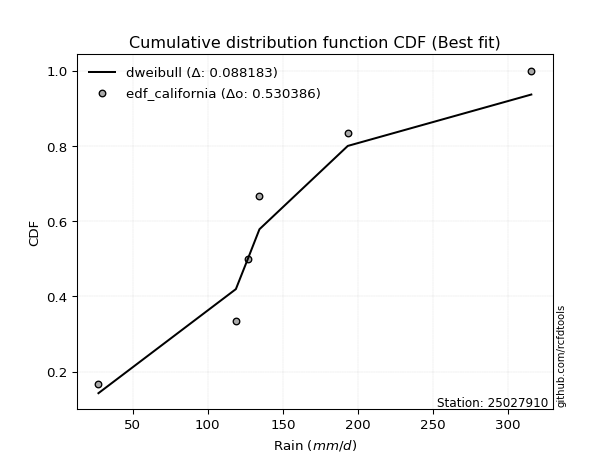</img>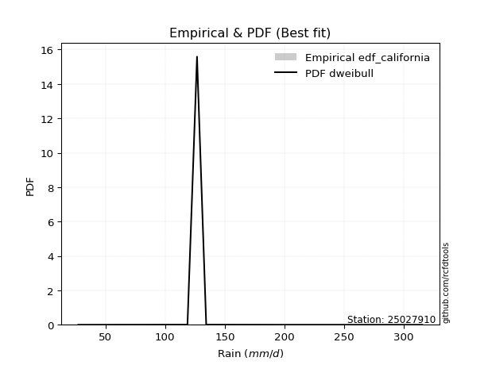</img>

</div>


### 2. EDF Hazen (1930)

Hazen method for plotting positions is a formula used to estimate the empirical cumulative probability distribution of flood events or other hydrological data. This formula often results in biased estimations, particularly when extrapolating to extreme events (high return periods).

<div align="center">


$P=(m-0.5)/n$


</div>


**2.1. Empirical values**

<div align="center">

|                | 0                   | 1                  | 2                  | 3                  | 4         | 5                  |
|:---------------|:--------------------|:-------------------|:-------------------|:-------------------|:----------|:-------------------|
| date           | 2020                | 2023               | 2022               | 2021               | 2025      | 2024               |
| x              | 27.2                | 118.7              | 126.7              | 134.4              | 193.2     | 315.4              |
| m              | 1                   | 2                  | 3                  | 4                  | 5         | 6                  |
| empirical_dist | edf_hazen           | edf_hazen          | edf_hazen          | edf_hazen          | edf_hazen | edf_hazen          |
| empirical      | 0.08333333333333333 | 0.25               | 0.4166666666666667 | 0.5833333333333334 | 0.75      | 0.9166666666666666 |
| empirical_tr   | 1.090909090909091   | 1.3333333333333333 | 1.7142857142857144 | 2.4000000000000004 | 4.0       | 11.999999999999995 |

</div>


**2.2. Kolmogorov-Smirnov fit test (sorted by Δ)**


<div align="center">

|                | 0                   | 1                   | 2                   | 3                   | 4                   | 5                   | 6                   | 7                   | 8                  | 9                  | 10                 | 11                  | 12                 | 13                  | 14                  | 15                  | 16                 | 17                 | 18                  | 19                  | 20                  | 21                  | 22                  | 23                  | 24                  | 25                  | 26                  | 27                  | 28                  | 29                  | 30                 | 31                 | 32                  | 33                  | 34                  | 35                  | 36                  | 37                  | 38                 | 39                  | 40                  | 41                  | 42                  | 43                  | 44                  | 45                 | 46                  | 47                  | 48                  | 49                  | 50                  | 51                  | 52                | 53                  | 54                  | 55                 | 56                  | 57                  | 58                  | 59                  | 60                 | 61                  | 62                 | 63                  | 64                 | 65                  | 66                  | 67                | 68                  | 69                  | 70                  | 71                  | 72                  | 73                  | 74                  | 75                 | 76                  | 77                  | 78                  | 79                  | 80                  | 81                  | 82                  | 83                | 84                 | 85                  | 86                 | 87                 | 88                 | 89                  | 90                  | 91                 | 92                  | 93                  | 94                  | 95                  | 96                  | 97                  | 98                  | 99                 | 100                 | 101                 | 102                 | 103                | 104                 | 105                | 106                | 107                 | 108                 | 109                 | 110                 | 111                | 112                | 113                | 114                | 115                 | 116                | 117                | 118                 | 119                 | 120                 | 121                | 122                | 123                | 124                | 125                | 126                 | 127                | 128                 | 129                | 130                | 131                | 132                | 133                | 134                 | 135                 | 136                 | 137                | 138                | 139                 | 140                 | 141              | 142                 | 143                | 144                 | 145                | 146                | 147                | 148                | 149                | 150                | 151                | 152                | 153              | 154                | 155                | 156                | 157            | 158                | 159               |
|:---------------|:--------------------|:--------------------|:--------------------|:--------------------|:--------------------|:--------------------|:--------------------|:--------------------|:-------------------|:-------------------|:-------------------|:--------------------|:-------------------|:--------------------|:--------------------|:--------------------|:-------------------|:-------------------|:--------------------|:--------------------|:--------------------|:--------------------|:--------------------|:--------------------|:--------------------|:--------------------|:--------------------|:--------------------|:--------------------|:--------------------|:-------------------|:-------------------|:--------------------|:--------------------|:--------------------|:--------------------|:--------------------|:--------------------|:-------------------|:--------------------|:--------------------|:--------------------|:--------------------|:--------------------|:--------------------|:-------------------|:--------------------|:--------------------|:--------------------|:--------------------|:--------------------|:--------------------|:------------------|:--------------------|:--------------------|:-------------------|:--------------------|:--------------------|:--------------------|:--------------------|:-------------------|:--------------------|:-------------------|:--------------------|:-------------------|:--------------------|:--------------------|:------------------|:--------------------|:--------------------|:--------------------|:--------------------|:--------------------|:--------------------|:--------------------|:-------------------|:--------------------|:--------------------|:--------------------|:--------------------|:--------------------|:--------------------|:--------------------|:------------------|:-------------------|:--------------------|:-------------------|:-------------------|:-------------------|:--------------------|:--------------------|:-------------------|:--------------------|:--------------------|:--------------------|:--------------------|:--------------------|:--------------------|:--------------------|:-------------------|:--------------------|:--------------------|:--------------------|:-------------------|:--------------------|:-------------------|:-------------------|:--------------------|:--------------------|:--------------------|:--------------------|:-------------------|:-------------------|:-------------------|:-------------------|:--------------------|:-------------------|:-------------------|:--------------------|:--------------------|:--------------------|:-------------------|:-------------------|:-------------------|:-------------------|:-------------------|:--------------------|:-------------------|:--------------------|:-------------------|:-------------------|:-------------------|:-------------------|:-------------------|:--------------------|:--------------------|:--------------------|:-------------------|:-------------------|:--------------------|:--------------------|:-----------------|:--------------------|:-------------------|:--------------------|:-------------------|:-------------------|:-------------------|:-------------------|:-------------------|:-------------------|:-------------------|:-------------------|:-----------------|:-------------------|:-------------------|:-------------------|:---------------|:-------------------|:------------------|
| station        | 25027910            | 25027910            | 25027910            | 25027910            | 25027910            | 25027910            | 25027910            | 25027910            | 25027910           | 25027910           | 25027910           | 25027910            | 25027910           | 25027910            | 25027910            | 25027910            | 25027910           | 25027910           | 25027910            | 25027910            | 25027910            | 25027910            | 25027910            | 25027910            | 25027910            | 25027910            | 25027910            | 25027910            | 25027910            | 25027910            | 25027910           | 25027910           | 25027910            | 25027910            | 25027910            | 25027910            | 25027910            | 25027910            | 25027910           | 25027910            | 25027910            | 25027910            | 25027910            | 25027910            | 25027910            | 25027910           | 25027910            | 25027910            | 25027910            | 25027910            | 25027910            | 25027910            | 25027910          | 25027910            | 25027910            | 25027910           | 25027910            | 25027910            | 25027910            | 25027910            | 25027910           | 25027910            | 25027910           | 25027910            | 25027910           | 25027910            | 25027910            | 25027910          | 25027910            | 25027910            | 25027910            | 25027910            | 25027910            | 25027910            | 25027910            | 25027910           | 25027910            | 25027910            | 25027910            | 25027910            | 25027910            | 25027910            | 25027910            | 25027910          | 25027910           | 25027910            | 25027910           | 25027910           | 25027910           | 25027910            | 25027910            | 25027910           | 25027910            | 25027910            | 25027910            | 25027910            | 25027910            | 25027910            | 25027910            | 25027910           | 25027910            | 25027910            | 25027910            | 25027910           | 25027910            | 25027910           | 25027910           | 25027910            | 25027910            | 25027910            | 25027910            | 25027910           | 25027910           | 25027910           | 25027910           | 25027910            | 25027910           | 25027910           | 25027910            | 25027910            | 25027910            | 25027910           | 25027910           | 25027910           | 25027910           | 25027910           | 25027910            | 25027910           | 25027910            | 25027910           | 25027910           | 25027910           | 25027910           | 25027910           | 25027910            | 25027910            | 25027910            | 25027910           | 25027910           | 25027910            | 25027910            | 25027910         | 25027910            | 25027910           | 25027910            | 25027910           | 25027910           | 25027910           | 25027910           | 25027910           | 25027910           | 25027910           | 25027910           | 25027910         | 25027910           | 25027910           | 25027910           | 25027910       | 25027910           | 25027910          |
| empirical_dist | edf_hazen           | edf_hazen           | edf_hazen           | edf_hazen           | edf_hazen           | edf_hazen           | edf_hazen           | edf_hazen           | edf_hazen          | edf_hazen          | edf_hazen          | edf_hazen           | edf_hazen          | edf_hazen           | edf_hazen           | edf_hazen           | edf_hazen          | edf_hazen          | edf_hazen           | edf_hazen           | edf_hazen           | edf_hazen           | edf_hazen           | edf_hazen           | edf_hazen           | edf_hazen           | edf_hazen           | edf_hazen           | edf_hazen           | edf_hazen           | edf_hazen          | edf_hazen          | edf_hazen           | edf_hazen           | edf_hazen           | edf_hazen           | edf_hazen           | edf_hazen           | edf_hazen          | edf_hazen           | edf_hazen           | edf_hazen           | edf_hazen           | edf_hazen           | edf_hazen           | edf_hazen          | edf_hazen           | edf_hazen           | edf_hazen           | edf_hazen           | edf_hazen           | edf_hazen           | edf_hazen         | edf_hazen           | edf_hazen           | edf_hazen          | edf_hazen           | edf_hazen           | edf_hazen           | edf_hazen           | edf_hazen          | edf_hazen           | edf_hazen          | edf_hazen           | edf_hazen          | edf_hazen           | edf_hazen           | edf_hazen         | edf_hazen           | edf_hazen           | edf_hazen           | edf_hazen           | edf_hazen           | edf_hazen           | edf_hazen           | edf_hazen          | edf_hazen           | edf_hazen           | edf_hazen           | edf_hazen           | edf_hazen           | edf_hazen           | edf_hazen           | edf_hazen         | edf_hazen          | edf_hazen           | edf_hazen          | edf_hazen          | edf_hazen          | edf_hazen           | edf_hazen           | edf_hazen          | edf_hazen           | edf_hazen           | edf_hazen           | edf_hazen           | edf_hazen           | edf_hazen           | edf_hazen           | edf_hazen          | edf_hazen           | edf_hazen           | edf_hazen           | edf_hazen          | edf_hazen           | edf_hazen          | edf_hazen          | edf_hazen           | edf_hazen           | edf_hazen           | edf_hazen           | edf_hazen          | edf_hazen          | edf_hazen          | edf_hazen          | edf_hazen           | edf_hazen          | edf_hazen          | edf_hazen           | edf_hazen           | edf_hazen           | edf_hazen          | edf_hazen          | edf_hazen          | edf_hazen          | edf_hazen          | edf_hazen           | edf_hazen          | edf_hazen           | edf_hazen          | edf_hazen          | edf_hazen          | edf_hazen          | edf_hazen          | edf_hazen           | edf_hazen           | edf_hazen           | edf_hazen          | edf_hazen          | edf_hazen           | edf_hazen           | edf_hazen        | edf_hazen           | edf_hazen          | edf_hazen           | edf_hazen          | edf_hazen          | edf_hazen          | edf_hazen          | edf_hazen          | edf_hazen          | edf_hazen          | edf_hazen          | edf_hazen        | edf_hazen          | edf_hazen          | edf_hazen          | edf_hazen      | edf_hazen          | edf_hazen         |
| p_dist         | johnsonsu           | logjohnsonsu        | logdweibull         | loggennorm          | logdgamma           | logt                | nct                 | pearson3            | skewnorm           | maxwell            | rice               | gennorm             | invgamma           | exponnorm           | rayleigh            | invgauss            | genexpon           | genlogistic        | logloglaplace       | exponweib           | logloggamma         | gengamma            | gumbel_r            | betaprime           | semicircular        | logburr12           | foldnorm            | burr                | f                   | mielke              | erlang             | gamma              | loggenlogistic      | dgamma              | logburr             | anglit              | ncf                 | invweibull          | logmielke          | logargus            | logweibull_min      | beta                | kstwobign           | loggenhalflogistic  | arcsine             | loggumbel_l        | logvonmises_line    | moyal               | t                   | truncnorm           | norm                | crystalball         | logskewnorm       | weibull_min         | bradford            | dweibull           | logpearson3         | kappa3              | logistic            | halfnorm            | loggausshyper      | kappa4              | truncexpon         | logtrapezoid        | hypsecant          | halflogistic        | loggompertz         | ksone             | cosine              | gausshyper          | loggenextreme       | logtriang           | wald                | lomax               | wrapcauchy          | laplace            | loglevy_l           | uniform             | loglaplace          | loglaplace          | logbeta             | logf                | loghypsecant        | loglogistic       | logncf             | gumbel_l            | vonmises_line      | logcrystalball     | lognorm            | logexponnorm        | logfatiguelife      | lognct             | loganglit           | logsemicircular     | logarcsine          | logrice             | loginvgamma         | logbetaprime        | nakagami            | lognakagami        | logerlang           | loggamma            | loggamma            | argus              | logtruncnorm        | logalpha           | logmaxwell         | loginvgauss         | loginvweibull       | lograyleigh         | logwrapcauchy       | logcosine          | genpareto          | levy_l             | logjohnsonsb       | logfoldnorm         | loggenpareto       | loggumbel_r        | logkstwobign        | loghalfnorm         | logweibull_max      | loggenexpon        | halfgennorm        | genhalflogistic    | logmoyal           | logksone           | loghalflogistic     | genextreme         | logbradford         | logkappa4          | logkappa3          | loguniform         | alpha              | loggengamma        | loglomax            | burr12              | triang              | logwald            | logrdist           | trapezoid           | johnsonsb           | logtruncexpon    | logtruncweibull_min | logexponweib       | logtukeylambda      | truncweibull_min   | fatiguelife        | gompertz           | powerlaw           | logexponpow        | rdist              | truncpareto        | weibull_max        | logpowerlaw      | tukeylambda        | exponpow           | logtruncpareto     | loghalfgennorm | logvonmises        | vonmises          |
| delta          | 0.07960530464408966 | 0.08376720113233094 | 0.09497018862534434 | 0.09768273330629418 | 0.10189177619942336 | 0.11557082357496173 | 0.12965719509738322 | 0.13039276207799938 | 0.1307296906226973 | 0.1313216692397448 | 0.1338925329730376 | 0.13536189143701316 | 0.1397258107763309 | 0.14106723120040082 | 0.14331585487895226 | 0.14347931978846884 | 0.1441102153694035 | 0.1447118733644867 | 0.14595902489043694 | 0.14628108916656923 | 0.14635088142254038 | 0.14717394773921233 | 0.14757657257252632 | 0.14935016914652005 | 0.14935703184062465 | 0.14982725591621227 | 0.15058796795666046 | 0.15096026057648043 | 0.15193768440306366 | 0.15203688921746178 | 0.1520571705394208 | 0.1520571720487735 | 0.15248674722128497 | 0.15252054448006852 | 0.15256750623015475 | 0.15412565051694765 | 0.15414604700531687 | 0.15446995754527643 | 0.1568270855295914 | 0.15690322568390125 | 0.15734935466138456 | 0.16036047100562068 | 0.16070437992496062 | 0.16119221259670885 | 0.16175837385735636 | 0.1633495970611254 | 0.16521638808573952 | 0.16540604283268312 | 0.16563330843675417 | 0.16563842511160742 | 0.16563843061363065 | 0.16563851571822585 | 0.168618402861912 | 0.16884726006551043 | 0.16915557649682744 | 0.1693469167971896 | 0.17008719636241282 | 0.17222317063137838 | 0.17645772931517223 | 0.17763369509374738 | 0.1797544871348557 | 0.18166165958942126 | 0.1817124305006309 | 0.18193733332504985 | 0.1854331709405893 | 0.18560677692989935 | 0.18585623167480836 | 0.190030071709461 | 0.19075940453981632 | 0.19827914658618462 | 0.20087916544153012 | 0.20423148860952461 | 0.20601532607413353 | 0.20959473095951375 | 0.21034058554583773 | 0.2106448209619885 | 0.21072105672052616 | 0.21136941938468656 | 0.22244647928167438 | 0.22244647928167438 | 0.22655141984432758 | 0.22928364953362368 | 0.22997253753010682 | 0.231833105872716 | 0.2332935767931289 | 0.23377298966850057 | 0.2339758029645697 | 0.2340141194876882 | 0.2340141237833051 | 0.23401842323799588 | 0.23491436546971067 | 0.2360152414465685 | 0.23630054884696589 | 0.23724285611238355 | 0.24097799263132358 | 0.24163256230949554 | 0.24758336089585198 | 0.24966519990746516 | 0.24995455338244502 | 0.2499990279424806 | 0.25223940873895023 | 0.25241569459508895 | 0.25241569459508895 | 0.2538886559724659 | 0.25635694173646256 | 0.2563992557685756 | 0.2676305461610853 | 0.27513638648360716 | 0.27645744653627335 | 0.27896953161694493 | 0.28478870925217226 | 0.2865892984238936 | 0.2898075828918158 | 0.2935169811621334 | 0.2979733676181433 | 0.29975047161218593 | 0.3013414469344894 | 0.3037306994176733 | 0.31062511080781374 | 0.31090425744921124 | 0.31649717740274114 | 0.3200600803380942 | 0.3217734601875908 | 0.3232043167524075 | 0.3296059963673874 | 0.3343560343259867 | 0.33479250201437794 | 0.3379448106093207 | 0.33968028886414947 | 0.3457320021117466 | 0.3512152835183183 | 0.3512272411911841 | 0.3516981506788692 | 0.3629633748826484 | 0.37442550090117255 | 0.37483544484209386 | 0.39906057226063774 | 0.4016209853498587 | 0.4226432174353981 | 0.43240205055752984 | 0.44804298675465637 | 0.45013387244977 | 0.47511407594458344 | 0.4802695268896974 | 0.49793746337513056 | 0.5134146553088251 | 0.5293622089217287 | 0.5833199304551511 | 0.6010642937223613 | 0.6027232645950105 | 0.6172478135454617 | 0.6584673214353989 | 0.6691666529331574 | 0.67255765897651 | 0.6873198945477199 | 0.7053536839293822 | 0.7073098668411757 | 0.75           | 1.1874350543465568 | 49.55049970456321 |
| deltao         | 0.530385761606      | 0.530385761606      | 0.530385761606      | 0.530385761606      | 0.530385761606      | 0.530385761606      | 0.530385761606      | 0.530385761606      | 0.530385761606     | 0.530385761606     | 0.530385761606     | 0.530385761606      | 0.530385761606     | 0.530385761606      | 0.530385761606      | 0.530385761606      | 0.530385761606     | 0.530385761606     | 0.530385761606      | 0.530385761606      | 0.530385761606      | 0.530385761606      | 0.530385761606      | 0.530385761606      | 0.530385761606      | 0.530385761606      | 0.530385761606      | 0.530385761606      | 0.530385761606      | 0.530385761606      | 0.530385761606     | 0.530385761606     | 0.530385761606      | 0.530385761606      | 0.530385761606      | 0.530385761606      | 0.530385761606      | 0.530385761606      | 0.530385761606     | 0.530385761606      | 0.530385761606      | 0.530385761606      | 0.530385761606      | 0.530385761606      | 0.530385761606      | 0.530385761606     | 0.530385761606      | 0.530385761606      | 0.530385761606      | 0.530385761606      | 0.530385761606      | 0.530385761606      | 0.530385761606    | 0.530385761606      | 0.530385761606      | 0.530385761606     | 0.530385761606      | 0.530385761606      | 0.530385761606      | 0.530385761606      | 0.530385761606     | 0.530385761606      | 0.530385761606     | 0.530385761606      | 0.530385761606     | 0.530385761606      | 0.530385761606      | 0.530385761606    | 0.530385761606      | 0.530385761606      | 0.530385761606      | 0.530385761606      | 0.530385761606      | 0.530385761606      | 0.530385761606      | 0.530385761606     | 0.530385761606      | 0.530385761606      | 0.530385761606      | 0.530385761606      | 0.530385761606      | 0.530385761606      | 0.530385761606      | 0.530385761606    | 0.530385761606     | 0.530385761606      | 0.530385761606     | 0.530385761606     | 0.530385761606     | 0.530385761606      | 0.530385761606      | 0.530385761606     | 0.530385761606      | 0.530385761606      | 0.530385761606      | 0.530385761606      | 0.530385761606      | 0.530385761606      | 0.530385761606      | 0.530385761606     | 0.530385761606      | 0.530385761606      | 0.530385761606      | 0.530385761606     | 0.530385761606      | 0.530385761606     | 0.530385761606     | 0.530385761606      | 0.530385761606      | 0.530385761606      | 0.530385761606      | 0.530385761606     | 0.530385761606     | 0.530385761606     | 0.530385761606     | 0.530385761606      | 0.530385761606     | 0.530385761606     | 0.530385761606      | 0.530385761606      | 0.530385761606      | 0.530385761606     | 0.530385761606     | 0.530385761606     | 0.530385761606     | 0.530385761606     | 0.530385761606      | 0.530385761606     | 0.530385761606      | 0.530385761606     | 0.530385761606     | 0.530385761606     | 0.530385761606     | 0.530385761606     | 0.530385761606      | 0.530385761606      | 0.530385761606      | 0.530385761606     | 0.530385761606     | 0.530385761606      | 0.530385761606      | 0.530385761606   | 0.530385761606      | 0.530385761606     | 0.530385761606      | 0.530385761606     | 0.530385761606     | 0.530385761606     | 0.530385761606     | 0.530385761606     | 0.530385761606     | 0.530385761606     | 0.530385761606     | 0.530385761606   | 0.530385761606     | 0.530385761606     | 0.530385761606     | 0.530385761606 | 0.530385761606     | 0.530385761606    |
| eval           | Δo > Δ              | Δo > Δ              | Δo > Δ              | Δo > Δ              | Δo > Δ              | Δo > Δ              | Δo > Δ              | Δo > Δ              | Δo > Δ             | Δo > Δ             | Δo > Δ             | Δo > Δ              | Δo > Δ             | Δo > Δ              | Δo > Δ              | Δo > Δ              | Δo > Δ             | Δo > Δ             | Δo > Δ              | Δo > Δ              | Δo > Δ              | Δo > Δ              | Δo > Δ              | Δo > Δ              | Δo > Δ              | Δo > Δ              | Δo > Δ              | Δo > Δ              | Δo > Δ              | Δo > Δ              | Δo > Δ             | Δo > Δ             | Δo > Δ              | Δo > Δ              | Δo > Δ              | Δo > Δ              | Δo > Δ              | Δo > Δ              | Δo > Δ             | Δo > Δ              | Δo > Δ              | Δo > Δ              | Δo > Δ              | Δo > Δ              | Δo > Δ              | Δo > Δ             | Δo > Δ              | Δo > Δ              | Δo > Δ              | Δo > Δ              | Δo > Δ              | Δo > Δ              | Δo > Δ            | Δo > Δ              | Δo > Δ              | Δo > Δ             | Δo > Δ              | Δo > Δ              | Δo > Δ              | Δo > Δ              | Δo > Δ             | Δo > Δ              | Δo > Δ             | Δo > Δ              | Δo > Δ             | Δo > Δ              | Δo > Δ              | Δo > Δ            | Δo > Δ              | Δo > Δ              | Δo > Δ              | Δo > Δ              | Δo > Δ              | Δo > Δ              | Δo > Δ              | Δo > Δ             | Δo > Δ              | Δo > Δ              | Δo > Δ              | Δo > Δ              | Δo > Δ              | Δo > Δ              | Δo > Δ              | Δo > Δ            | Δo > Δ             | Δo > Δ              | Δo > Δ             | Δo > Δ             | Δo > Δ             | Δo > Δ              | Δo > Δ              | Δo > Δ             | Δo > Δ              | Δo > Δ              | Δo > Δ              | Δo > Δ              | Δo > Δ              | Δo > Δ              | Δo > Δ              | Δo > Δ             | Δo > Δ              | Δo > Δ              | Δo > Δ              | Δo > Δ             | Δo > Δ              | Δo > Δ             | Δo > Δ             | Δo > Δ              | Δo > Δ              | Δo > Δ              | Δo > Δ              | Δo > Δ             | Δo > Δ             | Δo > Δ             | Δo > Δ             | Δo > Δ              | Δo > Δ             | Δo > Δ             | Δo > Δ              | Δo > Δ              | Δo > Δ              | Δo > Δ             | Δo > Δ             | Δo > Δ             | Δo > Δ             | Δo > Δ             | Δo > Δ              | Δo > Δ             | Δo > Δ              | Δo > Δ             | Δo > Δ             | Δo > Δ             | Δo > Δ             | Δo > Δ             | Δo > Δ              | Δo > Δ              | Δo > Δ              | Δo > Δ             | Δo > Δ             | Δo > Δ              | Δo > Δ              | Δo > Δ           | Δo > Δ              | Δo > Δ             | Δo > Δ              | Δo > Δ             | Δo > Δ             | Δo <= Δ            | Δo <= Δ            | Δo <= Δ            | Δo <= Δ            | Δo <= Δ            | Δo <= Δ            | Δo <= Δ          | Δo <= Δ            | Δo <= Δ            | Δo <= Δ            | Δo <= Δ        | Δo <= Δ            | Δo <= Δ           |
| fit            | 1                   | 1                   | 1                   | 1                   | 1                   | 1                   | 1                   | 1                   | 1                  | 1                  | 1                  | 1                   | 1                  | 1                   | 1                   | 1                   | 1                  | 1                  | 1                   | 1                   | 1                   | 1                   | 1                   | 1                   | 1                   | 1                   | 1                   | 1                   | 1                   | 1                   | 1                  | 1                  | 1                   | 1                   | 1                   | 1                   | 1                   | 1                   | 1                  | 1                   | 1                   | 1                   | 1                   | 1                   | 1                   | 1                  | 1                   | 1                   | 1                   | 1                   | 1                   | 1                   | 1                 | 1                   | 1                   | 1                  | 1                   | 1                   | 1                   | 1                   | 1                  | 1                   | 1                  | 1                   | 1                  | 1                   | 1                   | 1                 | 1                   | 1                   | 1                   | 1                   | 1                   | 1                   | 1                   | 1                  | 1                   | 1                   | 1                   | 1                   | 1                   | 1                   | 1                   | 1                 | 1                  | 1                   | 1                  | 1                  | 1                  | 1                   | 1                   | 1                  | 1                   | 1                   | 1                   | 1                   | 1                   | 1                   | 1                   | 1                  | 1                   | 1                   | 1                   | 1                  | 1                   | 1                  | 1                  | 1                   | 1                   | 1                   | 1                   | 1                  | 1                  | 1                  | 1                  | 1                   | 1                  | 1                  | 1                   | 1                   | 1                   | 1                  | 1                  | 1                  | 1                  | 1                  | 1                   | 1                  | 1                   | 1                  | 1                  | 1                  | 1                  | 1                  | 1                   | 1                   | 1                   | 1                  | 1                  | 1                   | 1                   | 1                | 1                   | 1                  | 1                   | 1                  | 1                  | 0                  | 0                  | 0                  | 0                  | 0                  | 0                  | 0                | 0                  | 0                  | 0                  | 0              | 0                  | 0                 |
| n              | 6                   | 6                   | 6                   | 6                   | 6                   | 6                   | 6                   | 6                   | 6                  | 6                  | 6                  | 6                   | 6                  | 6                   | 6                   | 6                   | 6                  | 6                  | 6                   | 6                   | 6                   | 6                   | 6                   | 6                   | 6                   | 6                   | 6                   | 6                   | 6                   | 6                   | 6                  | 6                  | 6                   | 6                   | 6                   | 6                   | 6                   | 6                   | 6                  | 6                   | 6                   | 6                   | 6                   | 6                   | 6                   | 6                  | 6                   | 6                   | 6                   | 6                   | 6                   | 6                   | 6                 | 6                   | 6                   | 6                  | 6                   | 6                   | 6                   | 6                   | 6                  | 6                   | 6                  | 6                   | 6                  | 6                   | 6                   | 6                 | 6                   | 6                   | 6                   | 6                   | 6                   | 6                   | 6                   | 6                  | 6                   | 6                   | 6                   | 6                   | 6                   | 6                   | 6                   | 6                 | 6                  | 6                   | 6                  | 6                  | 6                  | 6                   | 6                   | 6                  | 6                   | 6                   | 6                   | 6                   | 6                   | 6                   | 6                   | 6                  | 6                   | 6                   | 6                   | 6                  | 6                   | 6                  | 6                  | 6                   | 6                   | 6                   | 6                   | 6                  | 6                  | 6                  | 6                  | 6                   | 6                  | 6                  | 6                   | 6                   | 6                   | 6                  | 6                  | 6                  | 6                  | 6                  | 6                   | 6                  | 6                   | 6                  | 6                  | 6                  | 6                  | 6                  | 6                   | 6                   | 6                   | 6                  | 6                  | 6                   | 6                   | 6                | 6                   | 6                  | 6                   | 6                  | 6                  | 6                  | 6                  | 6                  | 6                  | 6                  | 6                  | 6                | 6                  | 6                  | 6                  | 6              | 6                  | 6                 |
| best_fit       | 1                   | 0                   | 0                   | 0                   | 0                   | 0                   | 0                   | 0                   | 0                  | 0                  | 0                  | 0                   | 0                  | 0                   | 0                   | 0                   | 0                  | 0                  | 0                   | 0                   | 0                   | 0                   | 0                   | 0                   | 0                   | 0                   | 0                   | 0                   | 0                   | 0                   | 0                  | 0                  | 0                   | 0                   | 0                   | 0                   | 0                   | 0                   | 0                  | 0                   | 0                   | 0                   | 0                   | 0                   | 0                   | 0                  | 0                   | 0                   | 0                   | 0                   | 0                   | 0                   | 0                 | 0                   | 0                   | 0                  | 0                   | 0                   | 0                   | 0                   | 0                  | 0                   | 0                  | 0                   | 0                  | 0                   | 0                   | 0                 | 0                   | 0                   | 0                   | 0                   | 0                   | 0                   | 0                   | 0                  | 0                   | 0                   | 0                   | 0                   | 0                   | 0                   | 0                   | 0                 | 0                  | 0                   | 0                  | 0                  | 0                  | 0                   | 0                   | 0                  | 0                   | 0                   | 0                   | 0                   | 0                   | 0                   | 0                   | 0                  | 0                   | 0                   | 0                   | 0                  | 0                   | 0                  | 0                  | 0                   | 0                   | 0                   | 0                   | 0                  | 0                  | 0                  | 0                  | 0                   | 0                  | 0                  | 0                   | 0                   | 0                   | 0                  | 0                  | 0                  | 0                  | 0                  | 0                   | 0                  | 0                   | 0                  | 0                  | 0                  | 0                  | 0                  | 0                   | 0                   | 0                   | 0                  | 0                  | 0                   | 0                   | 0                | 0                   | 0                  | 0                   | 0                  | 0                  | 0                  | 0                  | 0                  | 0                  | 0                  | 0                  | 0                | 0                  | 0                  | 0                  | 0              | 0                  | 0                 |
| best_fit_sort  | 1                   | 2                   | 3                   | 4                   | 5                   | 6                   | 7                   | 8                   | 9                  | 10                 | 11                 | 12                  | 13                 | 14                  | 15                  | 16                  | 17                 | 18                 | 19                  | 20                  | 21                  | 22                  | 23                  | 24                  | 25                  | 26                  | 27                  | 28                  | 29                  | 30                  | 31                 | 32                 | 33                  | 34                  | 35                  | 36                  | 37                  | 38                  | 39                 | 40                  | 41                  | 42                  | 43                  | 44                  | 45                  | 46                 | 47                  | 48                  | 49                  | 50                  | 51                  | 52                  | 53                | 54                  | 55                  | 56                 | 57                  | 58                  | 59                  | 60                  | 61                 | 62                  | 63                 | 64                  | 65                 | 66                  | 67                  | 68                | 69                  | 70                  | 71                  | 72                  | 73                  | 74                  | 75                  | 76                 | 77                  | 78                  | 79                  | 80                  | 81                  | 82                  | 83                  | 84                | 85                 | 86                  | 87                 | 88                 | 89                 | 90                  | 91                  | 92                 | 93                  | 94                  | 95                  | 96                  | 97                  | 98                  | 99                  | 100                | 101                 | 102                 | 103                 | 104                | 105                 | 106                | 107                | 108                 | 109                 | 110                 | 111                 | 112                | 113                | 114                | 115                | 116                 | 117                | 118                | 119                 | 120                 | 121                 | 122                | 123                | 124                | 125                | 126                | 127                 | 128                | 129                 | 130                | 131                | 132                | 133                | 134                | 135                 | 136                 | 137                 | 138                | 139                | 140                 | 141                 | 142              | 143                 | 144                | 145                 | 146                | 147                | 148                | 149                | 150                | 151                | 152                | 153                | 154              | 155                | 156                | 157                | 158            | 159                | 160               |

</div>


**2.3. Best fit**

<div align="center">

|   id |   station | empirical_dist   | p_dist    |     delta |   deltao | eval   |   fit |   n |   best_fit |   best_fit_sort |
|-----:|----------:|:-----------------|:----------|----------:|---------:|:-------|------:|----:|-----------:|----------------:|
|    0 |  25027910 | edf_hazen        | johnsonsu | 0.0796053 | 0.530386 | Δo > Δ |     1 |   6 |          1 |               1 |

</div>


<div align="center">

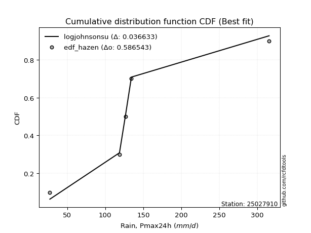</img></img>

</div>


### 3. EDF Weibull (1939)

Weibull plotting position formula is an empirical method used to estimate the non-exceedance probability or plotting position for a set of observed data, is often recommended or widely used in practice, particularly in flood frequency analysis.

<div align="center">


$P=m/(n+1)$


</div>


**3.1. Empirical values**

<div align="center">

|                | 0                   | 1                  | 2                   | 3                  | 4                  | 5                  |
|:---------------|:--------------------|:-------------------|:--------------------|:-------------------|:-------------------|:-------------------|
| date           | 2020                | 2023               | 2022                | 2021               | 2025               | 2024               |
| x              | 27.2                | 118.7              | 126.7               | 134.4              | 193.2              | 315.4              |
| m              | 1                   | 2                  | 3                   | 4                  | 5                  | 6                  |
| empirical_dist | edf_weibull         | edf_weibull        | edf_weibull         | edf_weibull        | edf_weibull        | edf_weibull        |
| empirical      | 0.14285714285714285 | 0.2857142857142857 | 0.42857142857142855 | 0.5714285714285714 | 0.7142857142857143 | 0.8571428571428571 |
| empirical_tr   | 1.1666666666666665  | 1.4                | 1.75                | 2.333333333333333  | 3.5                | 6.999999999999997  |

</div>


**3.2. Kolmogorov-Smirnov fit test (sorted by Δ)**


<div align="center">

|                | 0                   | 1                   | 2                   | 3                   | 4                   | 5                   | 6                   | 7                  | 8                   | 9                   | 10                  | 11                  | 12                  | 13                  | 14                  | 15                  | 16                  | 17                  | 18                  | 19                  | 20                  | 21                 | 22                 | 23                  | 24                  | 25                 | 26                  | 27                  | 28                  | 29                  | 30                 | 31                  | 32                  | 33                  | 34                 | 35                  | 36                  | 37                  | 38                  | 39                  | 40                 | 41                  | 42                  | 43                  | 44                  | 45                  | 46                  | 47                 | 48                  | 49                  | 50                  | 51                 | 52               | 53                 | 54                  | 55                  | 56                 | 57                  | 58                  | 59                 | 60                  | 61                  | 62                  | 63                  | 64                  | 65                  | 66                 | 67                  | 68                  | 69                  | 70                  | 71                  | 72                  | 73                  | 74                  | 75                  | 76                  | 77                  | 78                  | 79                 | 80                 | 81                 | 82                 | 83                  | 84                  | 85                  | 86                  | 87                 | 88                 | 89                 | 90                  | 91                  | 92                  | 93                  | 94                  | 95                 | 96                  | 97                  | 98                  | 99                 | 100                | 101                 | 102                 | 103                 | 104                 | 105                 | 106                 | 107                 | 108                 | 109                | 110                | 111                 | 112                | 113                 | 114                | 115                 | 116                 | 117                 | 118                 | 119                | 120                 | 121                 | 122                | 123                | 124                | 125               | 126                 | 127                 | 128                | 129                | 130                | 131                | 132                | 133                | 134                 | 135                 | 136               | 137                | 138                 | 139                 | 140                | 141                | 142                 | 143                | 144                 | 145                 | 146               | 147                | 148                | 149                | 150               | 151                | 152                | 153                | 154                | 155                | 156              | 157                | 158                | 159               |
|:---------------|:--------------------|:--------------------|:--------------------|:--------------------|:--------------------|:--------------------|:--------------------|:-------------------|:--------------------|:--------------------|:--------------------|:--------------------|:--------------------|:--------------------|:--------------------|:--------------------|:--------------------|:--------------------|:--------------------|:--------------------|:--------------------|:-------------------|:-------------------|:--------------------|:--------------------|:-------------------|:--------------------|:--------------------|:--------------------|:--------------------|:-------------------|:--------------------|:--------------------|:--------------------|:-------------------|:--------------------|:--------------------|:--------------------|:--------------------|:--------------------|:-------------------|:--------------------|:--------------------|:--------------------|:--------------------|:--------------------|:--------------------|:-------------------|:--------------------|:--------------------|:--------------------|:-------------------|:-----------------|:-------------------|:--------------------|:--------------------|:-------------------|:--------------------|:--------------------|:-------------------|:--------------------|:--------------------|:--------------------|:--------------------|:--------------------|:--------------------|:-------------------|:--------------------|:--------------------|:--------------------|:--------------------|:--------------------|:--------------------|:--------------------|:--------------------|:--------------------|:--------------------|:--------------------|:--------------------|:-------------------|:-------------------|:-------------------|:-------------------|:--------------------|:--------------------|:--------------------|:--------------------|:-------------------|:-------------------|:-------------------|:--------------------|:--------------------|:--------------------|:--------------------|:--------------------|:-------------------|:--------------------|:--------------------|:--------------------|:-------------------|:-------------------|:--------------------|:--------------------|:--------------------|:--------------------|:--------------------|:--------------------|:--------------------|:--------------------|:-------------------|:-------------------|:--------------------|:-------------------|:--------------------|:-------------------|:--------------------|:--------------------|:--------------------|:--------------------|:-------------------|:--------------------|:--------------------|:-------------------|:-------------------|:-------------------|:------------------|:--------------------|:--------------------|:-------------------|:-------------------|:-------------------|:-------------------|:-------------------|:-------------------|:--------------------|:--------------------|:------------------|:-------------------|:--------------------|:--------------------|:-------------------|:-------------------|:--------------------|:-------------------|:--------------------|:--------------------|:------------------|:-------------------|:-------------------|:-------------------|:------------------|:-------------------|:-------------------|:-------------------|:-------------------|:-------------------|:-----------------|:-------------------|:-------------------|:------------------|
| station        | 25027910            | 25027910            | 25027910            | 25027910            | 25027910            | 25027910            | 25027910            | 25027910           | 25027910            | 25027910            | 25027910            | 25027910            | 25027910            | 25027910            | 25027910            | 25027910            | 25027910            | 25027910            | 25027910            | 25027910            | 25027910            | 25027910           | 25027910           | 25027910            | 25027910            | 25027910           | 25027910            | 25027910            | 25027910            | 25027910            | 25027910           | 25027910            | 25027910            | 25027910            | 25027910           | 25027910            | 25027910            | 25027910            | 25027910            | 25027910            | 25027910           | 25027910            | 25027910            | 25027910            | 25027910            | 25027910            | 25027910            | 25027910           | 25027910            | 25027910            | 25027910            | 25027910           | 25027910         | 25027910           | 25027910            | 25027910            | 25027910           | 25027910            | 25027910            | 25027910           | 25027910            | 25027910            | 25027910            | 25027910            | 25027910            | 25027910            | 25027910           | 25027910            | 25027910            | 25027910            | 25027910            | 25027910            | 25027910            | 25027910            | 25027910            | 25027910            | 25027910            | 25027910            | 25027910            | 25027910           | 25027910           | 25027910           | 25027910           | 25027910            | 25027910            | 25027910            | 25027910            | 25027910           | 25027910           | 25027910           | 25027910            | 25027910            | 25027910            | 25027910            | 25027910            | 25027910           | 25027910            | 25027910            | 25027910            | 25027910           | 25027910           | 25027910            | 25027910            | 25027910            | 25027910            | 25027910            | 25027910            | 25027910            | 25027910            | 25027910           | 25027910           | 25027910            | 25027910           | 25027910            | 25027910           | 25027910            | 25027910            | 25027910            | 25027910            | 25027910           | 25027910            | 25027910            | 25027910           | 25027910           | 25027910           | 25027910          | 25027910            | 25027910            | 25027910           | 25027910           | 25027910           | 25027910           | 25027910           | 25027910           | 25027910            | 25027910            | 25027910          | 25027910           | 25027910            | 25027910            | 25027910           | 25027910           | 25027910            | 25027910           | 25027910            | 25027910            | 25027910          | 25027910           | 25027910           | 25027910           | 25027910          | 25027910           | 25027910           | 25027910           | 25027910           | 25027910           | 25027910         | 25027910           | 25027910           | 25027910          |
| empirical_dist | edf_weibull         | edf_weibull         | edf_weibull         | edf_weibull         | edf_weibull         | edf_weibull         | edf_weibull         | edf_weibull        | edf_weibull         | edf_weibull         | edf_weibull         | edf_weibull         | edf_weibull         | edf_weibull         | edf_weibull         | edf_weibull         | edf_weibull         | edf_weibull         | edf_weibull         | edf_weibull         | edf_weibull         | edf_weibull        | edf_weibull        | edf_weibull         | edf_weibull         | edf_weibull        | edf_weibull         | edf_weibull         | edf_weibull         | edf_weibull         | edf_weibull        | edf_weibull         | edf_weibull         | edf_weibull         | edf_weibull        | edf_weibull         | edf_weibull         | edf_weibull         | edf_weibull         | edf_weibull         | edf_weibull        | edf_weibull         | edf_weibull         | edf_weibull         | edf_weibull         | edf_weibull         | edf_weibull         | edf_weibull        | edf_weibull         | edf_weibull         | edf_weibull         | edf_weibull        | edf_weibull      | edf_weibull        | edf_weibull         | edf_weibull         | edf_weibull        | edf_weibull         | edf_weibull         | edf_weibull        | edf_weibull         | edf_weibull         | edf_weibull         | edf_weibull         | edf_weibull         | edf_weibull         | edf_weibull        | edf_weibull         | edf_weibull         | edf_weibull         | edf_weibull         | edf_weibull         | edf_weibull         | edf_weibull         | edf_weibull         | edf_weibull         | edf_weibull         | edf_weibull         | edf_weibull         | edf_weibull        | edf_weibull        | edf_weibull        | edf_weibull        | edf_weibull         | edf_weibull         | edf_weibull         | edf_weibull         | edf_weibull        | edf_weibull        | edf_weibull        | edf_weibull         | edf_weibull         | edf_weibull         | edf_weibull         | edf_weibull         | edf_weibull        | edf_weibull         | edf_weibull         | edf_weibull         | edf_weibull        | edf_weibull        | edf_weibull         | edf_weibull         | edf_weibull         | edf_weibull         | edf_weibull         | edf_weibull         | edf_weibull         | edf_weibull         | edf_weibull        | edf_weibull        | edf_weibull         | edf_weibull        | edf_weibull         | edf_weibull        | edf_weibull         | edf_weibull         | edf_weibull         | edf_weibull         | edf_weibull        | edf_weibull         | edf_weibull         | edf_weibull        | edf_weibull        | edf_weibull        | edf_weibull       | edf_weibull         | edf_weibull         | edf_weibull        | edf_weibull        | edf_weibull        | edf_weibull        | edf_weibull        | edf_weibull        | edf_weibull         | edf_weibull         | edf_weibull       | edf_weibull        | edf_weibull         | edf_weibull         | edf_weibull        | edf_weibull        | edf_weibull         | edf_weibull        | edf_weibull         | edf_weibull         | edf_weibull       | edf_weibull        | edf_weibull        | edf_weibull        | edf_weibull       | edf_weibull        | edf_weibull        | edf_weibull        | edf_weibull        | edf_weibull        | edf_weibull      | edf_weibull        | edf_weibull        | edf_weibull       |
| p_dist         | logdweibull         | invgamma            | exponnorm           | rayleigh            | invgauss            | genlogistic         | genexpon            | nct                | exponweib           | logloggamma         | gengamma            | gumbel_r            | betaprime           | logburr12           | skewnorm            | rice                | foldnorm            | burr                | johnsonsu           | f                   | mielke              | erlang             | gamma              | loggenlogistic      | logburr             | pearson3           | ncf                 | invweibull          | maxwell             | logjohnsonsu        | logmielke          | logargus            | logweibull_min      | kstwobign           | loggumbel_l        | logdgamma           | logloglaplace       | weibull_min         | loggennorm          | moyal               | dweibull           | logpearson3         | semicircular        | anglit              | logskewnorm         | kappa3              | bradford            | logvonmises_line   | beta                | loggenhalflogistic  | halfnorm            | arcsine            | loggausshyper    | truncexpon         | logtrapezoid        | halflogistic        | dgamma             | loggompertz         | logt                | t                  | truncnorm           | norm                | crystalball         | loglevy_l           | logistic            | logtriang           | kappa4             | wald                | gennorm             | hypsecant           | lomax               | ksone               | cosine              | gausshyper          | loglaplace          | loglaplace          | loggenextreme       | logf                | loghypsecant        | loglogistic        | logncf             | logcrystalball     | lognorm            | logexponnorm        | wrapcauchy          | laplace             | logfatiguelife      | uniform            | lognct             | loganglit          | logsemicircular     | logarcsine          | logrice             | loginvgamma         | logbetaprime        | logbeta            | logerlang           | loggamma            | loggamma            | logalpha           | gumbel_l           | vonmises_line       | logmaxwell          | levy_l              | loginvgauss         | loginvweibull       | argus               | lograyleigh         | logwrapcauchy       | logcosine          | logjohnsonsb       | logfoldnorm         | loggenpareto       | genpareto           | loggumbel_r        | logkstwobign        | loghalfnorm         | genextreme          | logweibull_max      | loggenexpon        | nakagami            | lognakagami         | logtruncnorm       | halfgennorm        | logmoyal           | logksone          | loghalflogistic     | loggengamma         | logbradford        | genhalflogistic    | logkappa4          | logkappa3          | loguniform         | alpha              | loglomax            | burr12              | logwald           | logrdist           | triang              | johnsonsb           | logtruncexpon      | trapezoid          | logtruncweibull_min | logexponweib       | logtukeylambda      | truncweibull_min    | fatiguelife       | powerlaw           | logexponpow        | gompertz           | rdist             | truncpareto        | weibull_max        | logpowerlaw        | tukeylambda        | exponpow           | logtruncpareto   | loghalfgennorm     | logvonmises        | vonmises          |
| delta          | 0.07808733869137718 | 0.10442480152648936 | 0.10535294548611512 | 0.10760156916466657 | 0.10776503407418314 | 0.10899758765020101 | 0.10930379517545785 | 0.1103365531613199 | 0.11056680345228354 | 0.11063659570825468 | 0.11145966202492663 | 0.11331811544992532 | 0.11363588343223435 | 0.11411297020192657 | 0.11424321640728807 | 0.11469578115076995 | 0.11487368224237476 | 0.11524597486219473 | 0.11531959035837536 | 0.11622339868877796 | 0.11632260350317608 | 0.1163428848251351 | 0.1163428863344878 | 0.11677246150699927 | 0.11685322051586905 | 0.1169719295807039 | 0.11843176129103117 | 0.11875567183099073 | 0.11941690733498284 | 0.11948148684661664 | 0.1211127998153057 | 0.12118893996961555 | 0.12163506894709886 | 0.12499009421067492 | 0.1276353113468397 | 0.12841597524286008 | 0.12866375343500672 | 0.13313297435122473 | 0.13339701902057988 | 0.13350309891126544 | 0.1336326310829039 | 0.13437291064812712 | 0.13745226993586268 | 0.14222088861218568 | 0.14285694258804327 | 0.14285706494843087 | 0.14285714084794054 | 0.1428571416095798 | 0.14285714285702977 | 0.14285714285714157 | 0.14285714285714285 | 0.1428571428571429 | 0.14404020142057 | 0.1459981447863452 | 0.14622304761076416 | 0.14989249121561365 | 0.1499702898838392 | 0.15014194596052266 | 0.15128510928924743 | 0.1537285465319922 | 0.15373366320684545 | 0.15373366870886868 | 0.15373375381346388 | 0.15412581273000858 | 0.16455296741041026 | 0.16851720289523892 | 0.1697568976846593 | 0.17030104035984783 | 0.17107617715129886 | 0.17352840903582734 | 0.17388044524522805 | 0.17812530980469904 | 0.17885464263505435 | 0.18637438468142264 | 0.18673219356738868 | 0.18673219356738868 | 0.18897440353676814 | 0.19356936381933798 | 0.19425825181582113 | 0.1961188201584303 | 0.1975792910788432 | 0.1982998337734025 | 0.1982998380690194 | 0.19830413752371018 | 0.19843582364107576 | 0.19874005905722653 | 0.19920007975542497 | 0.1994646574799246 | 0.2003009557322828 | 0.2005862631326802 | 0.20152857039809785 | 0.20526370691703788 | 0.20591827659520984 | 0.21186907518156628 | 0.21395091419317946 | 0.2146466579395656 | 0.21652512302466453 | 0.21670140888080325 | 0.21670140888080325 | 0.2206849700542899 | 0.2218682277637386 | 0.22207104105980774 | 0.23191626044679958 | 0.23399317163832384 | 0.23942210076932147 | 0.24074316082198766 | 0.24198389406770393 | 0.24325524590265923 | 0.24907442353788656 | 0.2508750127096079 | 0.2622590819038576 | 0.26403618589790023 | 0.2656271612202037 | 0.26712663956964505 | 0.2680164137033876 | 0.27491082509352804 | 0.27518997173492554 | 0.27842100108551116 | 0.28078289168845544 | 0.2843457946238085 | 0.28566883909673074 | 0.28571331365676633 | 0.2857137644262926 | 0.2860591744733051 | 0.2938917106531017 | 0.298641748611701 | 0.29907821630009224 | 0.30343956535883887 | 0.3039660031498638 | 0.3095642845629929 | 0.3100177163974609 | 0.3155009978040326 | 0.3155129554768984 | 0.3159838649645835 | 0.33871121518688685 | 0.33912115912780816 | 0.365906699635573 | 0.3869289317211124 | 0.38715581035587576 | 0.41232870104037067 | 0.4144195867354843 | 0.4165568280048415 | 0.43939979023029774 | 0.4445552411754117 | 0.46222317766084486 | 0.47770036959453943 | 0.493647923207443 | 0.5653500080080756 | 0.5670089788807248 | 0.5714151685503891 | 0.581533527831176 | 0.6227530357211132 | 0.6334523672188717 | 0.6368433732622243 | 0.6516056088334342 | 0.6696393982150965 | 0.67159558112689 | 0.7142857142857143 | 1.1517207686322712 | 49.61002351408702 |
| deltao         | 0.530385761606      | 0.530385761606      | 0.530385761606      | 0.530385761606      | 0.530385761606      | 0.530385761606      | 0.530385761606      | 0.530385761606     | 0.530385761606      | 0.530385761606      | 0.530385761606      | 0.530385761606      | 0.530385761606      | 0.530385761606      | 0.530385761606      | 0.530385761606      | 0.530385761606      | 0.530385761606      | 0.530385761606      | 0.530385761606      | 0.530385761606      | 0.530385761606     | 0.530385761606     | 0.530385761606      | 0.530385761606      | 0.530385761606     | 0.530385761606      | 0.530385761606      | 0.530385761606      | 0.530385761606      | 0.530385761606     | 0.530385761606      | 0.530385761606      | 0.530385761606      | 0.530385761606     | 0.530385761606      | 0.530385761606      | 0.530385761606      | 0.530385761606      | 0.530385761606      | 0.530385761606     | 0.530385761606      | 0.530385761606      | 0.530385761606      | 0.530385761606      | 0.530385761606      | 0.530385761606      | 0.530385761606     | 0.530385761606      | 0.530385761606      | 0.530385761606      | 0.530385761606     | 0.530385761606   | 0.530385761606     | 0.530385761606      | 0.530385761606      | 0.530385761606     | 0.530385761606      | 0.530385761606      | 0.530385761606     | 0.530385761606      | 0.530385761606      | 0.530385761606      | 0.530385761606      | 0.530385761606      | 0.530385761606      | 0.530385761606     | 0.530385761606      | 0.530385761606      | 0.530385761606      | 0.530385761606      | 0.530385761606      | 0.530385761606      | 0.530385761606      | 0.530385761606      | 0.530385761606      | 0.530385761606      | 0.530385761606      | 0.530385761606      | 0.530385761606     | 0.530385761606     | 0.530385761606     | 0.530385761606     | 0.530385761606      | 0.530385761606      | 0.530385761606      | 0.530385761606      | 0.530385761606     | 0.530385761606     | 0.530385761606     | 0.530385761606      | 0.530385761606      | 0.530385761606      | 0.530385761606      | 0.530385761606      | 0.530385761606     | 0.530385761606      | 0.530385761606      | 0.530385761606      | 0.530385761606     | 0.530385761606     | 0.530385761606      | 0.530385761606      | 0.530385761606      | 0.530385761606      | 0.530385761606      | 0.530385761606      | 0.530385761606      | 0.530385761606      | 0.530385761606     | 0.530385761606     | 0.530385761606      | 0.530385761606     | 0.530385761606      | 0.530385761606     | 0.530385761606      | 0.530385761606      | 0.530385761606      | 0.530385761606      | 0.530385761606     | 0.530385761606      | 0.530385761606      | 0.530385761606     | 0.530385761606     | 0.530385761606     | 0.530385761606    | 0.530385761606      | 0.530385761606      | 0.530385761606     | 0.530385761606     | 0.530385761606     | 0.530385761606     | 0.530385761606     | 0.530385761606     | 0.530385761606      | 0.530385761606      | 0.530385761606    | 0.530385761606     | 0.530385761606      | 0.530385761606      | 0.530385761606     | 0.530385761606     | 0.530385761606      | 0.530385761606     | 0.530385761606      | 0.530385761606      | 0.530385761606    | 0.530385761606     | 0.530385761606     | 0.530385761606     | 0.530385761606    | 0.530385761606     | 0.530385761606     | 0.530385761606     | 0.530385761606     | 0.530385761606     | 0.530385761606   | 0.530385761606     | 0.530385761606     | 0.530385761606    |
| eval           | Δo > Δ              | Δo > Δ              | Δo > Δ              | Δo > Δ              | Δo > Δ              | Δo > Δ              | Δo > Δ              | Δo > Δ             | Δo > Δ              | Δo > Δ              | Δo > Δ              | Δo > Δ              | Δo > Δ              | Δo > Δ              | Δo > Δ              | Δo > Δ              | Δo > Δ              | Δo > Δ              | Δo > Δ              | Δo > Δ              | Δo > Δ              | Δo > Δ             | Δo > Δ             | Δo > Δ              | Δo > Δ              | Δo > Δ             | Δo > Δ              | Δo > Δ              | Δo > Δ              | Δo > Δ              | Δo > Δ             | Δo > Δ              | Δo > Δ              | Δo > Δ              | Δo > Δ             | Δo > Δ              | Δo > Δ              | Δo > Δ              | Δo > Δ              | Δo > Δ              | Δo > Δ             | Δo > Δ              | Δo > Δ              | Δo > Δ              | Δo > Δ              | Δo > Δ              | Δo > Δ              | Δo > Δ             | Δo > Δ              | Δo > Δ              | Δo > Δ              | Δo > Δ             | Δo > Δ           | Δo > Δ             | Δo > Δ              | Δo > Δ              | Δo > Δ             | Δo > Δ              | Δo > Δ              | Δo > Δ             | Δo > Δ              | Δo > Δ              | Δo > Δ              | Δo > Δ              | Δo > Δ              | Δo > Δ              | Δo > Δ             | Δo > Δ              | Δo > Δ              | Δo > Δ              | Δo > Δ              | Δo > Δ              | Δo > Δ              | Δo > Δ              | Δo > Δ              | Δo > Δ              | Δo > Δ              | Δo > Δ              | Δo > Δ              | Δo > Δ             | Δo > Δ             | Δo > Δ             | Δo > Δ             | Δo > Δ              | Δo > Δ              | Δo > Δ              | Δo > Δ              | Δo > Δ             | Δo > Δ             | Δo > Δ             | Δo > Δ              | Δo > Δ              | Δo > Δ              | Δo > Δ              | Δo > Δ              | Δo > Δ             | Δo > Δ              | Δo > Δ              | Δo > Δ              | Δo > Δ             | Δo > Δ             | Δo > Δ              | Δo > Δ              | Δo > Δ              | Δo > Δ              | Δo > Δ              | Δo > Δ              | Δo > Δ              | Δo > Δ              | Δo > Δ             | Δo > Δ             | Δo > Δ              | Δo > Δ             | Δo > Δ              | Δo > Δ             | Δo > Δ              | Δo > Δ              | Δo > Δ              | Δo > Δ              | Δo > Δ             | Δo > Δ              | Δo > Δ              | Δo > Δ             | Δo > Δ             | Δo > Δ             | Δo > Δ            | Δo > Δ              | Δo > Δ              | Δo > Δ             | Δo > Δ             | Δo > Δ             | Δo > Δ             | Δo > Δ             | Δo > Δ             | Δo > Δ              | Δo > Δ              | Δo > Δ            | Δo > Δ             | Δo > Δ              | Δo > Δ              | Δo > Δ             | Δo > Δ             | Δo > Δ              | Δo > Δ             | Δo > Δ              | Δo > Δ              | Δo > Δ            | Δo <= Δ            | Δo <= Δ            | Δo <= Δ            | Δo <= Δ           | Δo <= Δ            | Δo <= Δ            | Δo <= Δ            | Δo <= Δ            | Δo <= Δ            | Δo <= Δ          | Δo <= Δ            | Δo <= Δ            | Δo <= Δ           |
| fit            | 1                   | 1                   | 1                   | 1                   | 1                   | 1                   | 1                   | 1                  | 1                   | 1                   | 1                   | 1                   | 1                   | 1                   | 1                   | 1                   | 1                   | 1                   | 1                   | 1                   | 1                   | 1                  | 1                  | 1                   | 1                   | 1                  | 1                   | 1                   | 1                   | 1                   | 1                  | 1                   | 1                   | 1                   | 1                  | 1                   | 1                   | 1                   | 1                   | 1                   | 1                  | 1                   | 1                   | 1                   | 1                   | 1                   | 1                   | 1                  | 1                   | 1                   | 1                   | 1                  | 1                | 1                  | 1                   | 1                   | 1                  | 1                   | 1                   | 1                  | 1                   | 1                   | 1                   | 1                   | 1                   | 1                   | 1                  | 1                   | 1                   | 1                   | 1                   | 1                   | 1                   | 1                   | 1                   | 1                   | 1                   | 1                   | 1                   | 1                  | 1                  | 1                  | 1                  | 1                   | 1                   | 1                   | 1                   | 1                  | 1                  | 1                  | 1                   | 1                   | 1                   | 1                   | 1                   | 1                  | 1                   | 1                   | 1                   | 1                  | 1                  | 1                   | 1                   | 1                   | 1                   | 1                   | 1                   | 1                   | 1                   | 1                  | 1                  | 1                   | 1                  | 1                   | 1                  | 1                   | 1                   | 1                   | 1                   | 1                  | 1                   | 1                   | 1                  | 1                  | 1                  | 1                 | 1                   | 1                   | 1                  | 1                  | 1                  | 1                  | 1                  | 1                  | 1                   | 1                   | 1                 | 1                  | 1                   | 1                   | 1                  | 1                  | 1                   | 1                  | 1                   | 1                   | 1                 | 0                  | 0                  | 0                  | 0                 | 0                  | 0                  | 0                  | 0                  | 0                  | 0                | 0                  | 0                  | 0                 |
| n              | 6                   | 6                   | 6                   | 6                   | 6                   | 6                   | 6                   | 6                  | 6                   | 6                   | 6                   | 6                   | 6                   | 6                   | 6                   | 6                   | 6                   | 6                   | 6                   | 6                   | 6                   | 6                  | 6                  | 6                   | 6                   | 6                  | 6                   | 6                   | 6                   | 6                   | 6                  | 6                   | 6                   | 6                   | 6                  | 6                   | 6                   | 6                   | 6                   | 6                   | 6                  | 6                   | 6                   | 6                   | 6                   | 6                   | 6                   | 6                  | 6                   | 6                   | 6                   | 6                  | 6                | 6                  | 6                   | 6                   | 6                  | 6                   | 6                   | 6                  | 6                   | 6                   | 6                   | 6                   | 6                   | 6                   | 6                  | 6                   | 6                   | 6                   | 6                   | 6                   | 6                   | 6                   | 6                   | 6                   | 6                   | 6                   | 6                   | 6                  | 6                  | 6                  | 6                  | 6                   | 6                   | 6                   | 6                   | 6                  | 6                  | 6                  | 6                   | 6                   | 6                   | 6                   | 6                   | 6                  | 6                   | 6                   | 6                   | 6                  | 6                  | 6                   | 6                   | 6                   | 6                   | 6                   | 6                   | 6                   | 6                   | 6                  | 6                  | 6                   | 6                  | 6                   | 6                  | 6                   | 6                   | 6                   | 6                   | 6                  | 6                   | 6                   | 6                  | 6                  | 6                  | 6                 | 6                   | 6                   | 6                  | 6                  | 6                  | 6                  | 6                  | 6                  | 6                   | 6                   | 6                 | 6                  | 6                   | 6                   | 6                  | 6                  | 6                   | 6                  | 6                   | 6                   | 6                 | 6                  | 6                  | 6                  | 6                 | 6                  | 6                  | 6                  | 6                  | 6                  | 6                | 6                  | 6                  | 6                 |
| best_fit       | 1                   | 0                   | 0                   | 0                   | 0                   | 0                   | 0                   | 0                  | 0                   | 0                   | 0                   | 0                   | 0                   | 0                   | 0                   | 0                   | 0                   | 0                   | 0                   | 0                   | 0                   | 0                  | 0                  | 0                   | 0                   | 0                  | 0                   | 0                   | 0                   | 0                   | 0                  | 0                   | 0                   | 0                   | 0                  | 0                   | 0                   | 0                   | 0                   | 0                   | 0                  | 0                   | 0                   | 0                   | 0                   | 0                   | 0                   | 0                  | 0                   | 0                   | 0                   | 0                  | 0                | 0                  | 0                   | 0                   | 0                  | 0                   | 0                   | 0                  | 0                   | 0                   | 0                   | 0                   | 0                   | 0                   | 0                  | 0                   | 0                   | 0                   | 0                   | 0                   | 0                   | 0                   | 0                   | 0                   | 0                   | 0                   | 0                   | 0                  | 0                  | 0                  | 0                  | 0                   | 0                   | 0                   | 0                   | 0                  | 0                  | 0                  | 0                   | 0                   | 0                   | 0                   | 0                   | 0                  | 0                   | 0                   | 0                   | 0                  | 0                  | 0                   | 0                   | 0                   | 0                   | 0                   | 0                   | 0                   | 0                   | 0                  | 0                  | 0                   | 0                  | 0                   | 0                  | 0                   | 0                   | 0                   | 0                   | 0                  | 0                   | 0                   | 0                  | 0                  | 0                  | 0                 | 0                   | 0                   | 0                  | 0                  | 0                  | 0                  | 0                  | 0                  | 0                   | 0                   | 0                 | 0                  | 0                   | 0                   | 0                  | 0                  | 0                   | 0                  | 0                   | 0                   | 0                 | 0                  | 0                  | 0                  | 0                 | 0                  | 0                  | 0                  | 0                  | 0                  | 0                | 0                  | 0                  | 0                 |
| best_fit_sort  | 1                   | 2                   | 3                   | 4                   | 5                   | 6                   | 7                   | 8                  | 9                   | 10                  | 11                  | 12                  | 13                  | 14                  | 15                  | 16                  | 17                  | 18                  | 19                  | 20                  | 21                  | 22                 | 23                 | 24                  | 25                  | 26                 | 27                  | 28                  | 29                  | 30                  | 31                 | 32                  | 33                  | 34                  | 35                 | 36                  | 37                  | 38                  | 39                  | 40                  | 41                 | 42                  | 43                  | 44                  | 45                  | 46                  | 47                  | 48                 | 49                  | 50                  | 51                  | 52                 | 53               | 54                 | 55                  | 56                  | 57                 | 58                  | 59                  | 60                 | 61                  | 62                  | 63                  | 64                  | 65                  | 66                  | 67                 | 68                  | 69                  | 70                  | 71                  | 72                  | 73                  | 74                  | 75                  | 76                  | 77                  | 78                  | 79                  | 80                 | 81                 | 82                 | 83                 | 84                  | 85                  | 86                  | 87                  | 88                 | 89                 | 90                 | 91                  | 92                  | 93                  | 94                  | 95                  | 96                 | 97                  | 98                  | 99                  | 100                | 101                | 102                 | 103                 | 104                 | 105                 | 106                 | 107                 | 108                 | 109                 | 110                | 111                | 112                 | 113                | 114                 | 115                | 116                 | 117                 | 118                 | 119                 | 120                | 121                 | 122                 | 123                | 124                | 125                | 126               | 127                 | 128                 | 129                | 130                | 131                | 132                | 133                | 134                | 135                 | 136                 | 137               | 138                | 139                 | 140                 | 141                | 142                | 143                 | 144                | 145                 | 146                 | 147               | 148                | 149                | 150                | 151               | 152                | 153                | 154                | 155                | 156                | 157              | 158                | 159                | 160               |

</div>


**3.3. Best fit**

<div align="center">

|   id |   station | empirical_dist   | p_dist      |     delta |   deltao | eval   |   fit |   n |   best_fit |   best_fit_sort |
|-----:|----------:|:-----------------|:------------|----------:|---------:|:-------|------:|----:|-----------:|----------------:|
|    0 |  25027910 | edf_weibull      | logdweibull | 0.0780873 | 0.530386 | Δo > Δ |     1 |   6 |          1 |               1 |

</div>


<div align="center">

</img>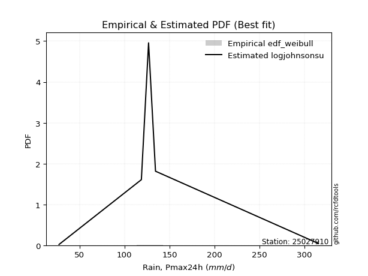</img>

</div>


### 4. EDF Beard (1943)

The Beard formula (or Beard´s plotting position formula) in hydrology is used to estimate the empirical non-exceedance probability _(P)_ of a flood event (or other extreme hydrological data point) within a given dataset.

<div align="center">


$P=(m-0.31)/(n+0.38)$


</div>


**4.1. Empirical values**

<div align="center">

|                | 0                   | 1                   | 2                  | 3                  | 4                  | 5                  |
|:---------------|:--------------------|:--------------------|:-------------------|:-------------------|:-------------------|:-------------------|
| date           | 2020                | 2023                | 2022               | 2021               | 2025               | 2024               |
| x              | 27.2                | 118.7               | 126.7              | 134.4              | 193.2              | 315.4              |
| m              | 1                   | 2                   | 3                  | 4                  | 5                  | 6                  |
| empirical_dist | edf_beard           | edf_beard           | edf_beard          | edf_beard          | edf_beard          | edf_beard          |
| empirical      | 0.10815047021943573 | 0.26489028213166144 | 0.4216300940438871 | 0.5783699059561128 | 0.7351097178683387 | 0.8918495297805643 |
| empirical_tr   | 1.1212653778558874  | 1.3603411513859276  | 1.7289972899728996 | 2.3717472118959106 | 3.7751479289940844 | 9.246376811594207  |

</div>


**4.2. Kolmogorov-Smirnov fit test (sorted by Δ)**


<div align="center">

|                | 0                  | 1                   | 2                   | 3                   | 4                  | 5                   | 6                  | 7                   | 8                   | 9                   | 10                  | 11                  | 12                  | 13                 | 14                  | 15                  | 16                  | 17                 | 18                 | 19                  | 20                 | 21                  | 22                  | 23                  | 24                  | 25                | 26                  | 27                  | 28                  | 29                  | 30                  | 31                  | 32                 | 33                  | 34                | 35                  | 36                 | 37                  | 38                 | 39                  | 40                  | 41                  | 42                  | 43                  | 44                 | 45                  | 46                  | 47                  | 48                  | 49                | 50                | 51                  | 52                  | 53                  | 54                  | 55                  | 56                 | 57                 | 58                  | 59                  | 60                  | 61                  | 62                  | 63                  | 64                  | 65                 | 66                  | 67                  | 68                  | 69                  | 70                  | 71                 | 72                  | 73                  | 74                  | 75                  | 76                  | 77                | 78                  | 79                  | 80                  | 81                 | 82                  | 83                  | 84                  | 85                  | 86                  | 87                  | 88                  | 89                  | 90                  | 91                 | 92                  | 93                 | 94                  | 95                  | 96                  | 97                  | 98                 | 99                 | 100                | 101                 | 102                 | 103                 | 104                 | 105                | 106                | 107                | 108                 | 109                 | 110                 | 111                | 112                 | 113                 | 114                 | 115                | 116                 | 117                 | 118                | 119                | 120                | 121                 | 122                 | 123                 | 124               | 125                | 126                 | 127                | 128                 | 129                 | 130                | 131                 | 132                | 133                | 134                | 135                | 136                 | 137                | 138                | 139                | 140                 | 141                 | 142                 | 143                 | 144                | 145                | 146                | 147                | 148                | 149               | 150                | 151                | 152               | 153                | 154                | 155                | 156                | 157                | 158                | 159               |
|:---------------|:-------------------|:--------------------|:--------------------|:--------------------|:-------------------|:--------------------|:-------------------|:--------------------|:--------------------|:--------------------|:--------------------|:--------------------|:--------------------|:-------------------|:--------------------|:--------------------|:--------------------|:-------------------|:-------------------|:--------------------|:-------------------|:--------------------|:--------------------|:--------------------|:--------------------|:------------------|:--------------------|:--------------------|:--------------------|:--------------------|:--------------------|:--------------------|:-------------------|:--------------------|:------------------|:--------------------|:-------------------|:--------------------|:-------------------|:--------------------|:--------------------|:--------------------|:--------------------|:--------------------|:-------------------|:--------------------|:--------------------|:--------------------|:--------------------|:------------------|:------------------|:--------------------|:--------------------|:--------------------|:--------------------|:--------------------|:-------------------|:-------------------|:--------------------|:--------------------|:--------------------|:--------------------|:--------------------|:--------------------|:--------------------|:-------------------|:--------------------|:--------------------|:--------------------|:--------------------|:--------------------|:-------------------|:--------------------|:--------------------|:--------------------|:--------------------|:--------------------|:------------------|:--------------------|:--------------------|:--------------------|:-------------------|:--------------------|:--------------------|:--------------------|:--------------------|:--------------------|:--------------------|:--------------------|:--------------------|:--------------------|:-------------------|:--------------------|:-------------------|:--------------------|:--------------------|:--------------------|:--------------------|:-------------------|:-------------------|:-------------------|:--------------------|:--------------------|:--------------------|:--------------------|:-------------------|:-------------------|:-------------------|:--------------------|:--------------------|:--------------------|:-------------------|:--------------------|:--------------------|:--------------------|:-------------------|:--------------------|:--------------------|:-------------------|:-------------------|:-------------------|:--------------------|:--------------------|:--------------------|:------------------|:-------------------|:--------------------|:-------------------|:--------------------|:--------------------|:-------------------|:--------------------|:-------------------|:-------------------|:-------------------|:-------------------|:--------------------|:-------------------|:-------------------|:-------------------|:--------------------|:--------------------|:--------------------|:--------------------|:-------------------|:-------------------|:-------------------|:-------------------|:-------------------|:------------------|:-------------------|:-------------------|:------------------|:-------------------|:-------------------|:-------------------|:-------------------|:-------------------|:-------------------|:------------------|
| station        | 25027910           | 25027910            | 25027910            | 25027910            | 25027910           | 25027910            | 25027910           | 25027910            | 25027910            | 25027910            | 25027910            | 25027910            | 25027910            | 25027910           | 25027910            | 25027910            | 25027910            | 25027910           | 25027910           | 25027910            | 25027910           | 25027910            | 25027910            | 25027910            | 25027910            | 25027910          | 25027910            | 25027910            | 25027910            | 25027910            | 25027910            | 25027910            | 25027910           | 25027910            | 25027910          | 25027910            | 25027910           | 25027910            | 25027910           | 25027910            | 25027910            | 25027910            | 25027910            | 25027910            | 25027910           | 25027910            | 25027910            | 25027910            | 25027910            | 25027910          | 25027910          | 25027910            | 25027910            | 25027910            | 25027910            | 25027910            | 25027910           | 25027910           | 25027910            | 25027910            | 25027910            | 25027910            | 25027910            | 25027910            | 25027910            | 25027910           | 25027910            | 25027910            | 25027910            | 25027910            | 25027910            | 25027910           | 25027910            | 25027910            | 25027910            | 25027910            | 25027910            | 25027910          | 25027910            | 25027910            | 25027910            | 25027910           | 25027910            | 25027910            | 25027910            | 25027910            | 25027910            | 25027910            | 25027910            | 25027910            | 25027910            | 25027910           | 25027910            | 25027910           | 25027910            | 25027910            | 25027910            | 25027910            | 25027910           | 25027910           | 25027910           | 25027910            | 25027910            | 25027910            | 25027910            | 25027910           | 25027910           | 25027910           | 25027910            | 25027910            | 25027910            | 25027910           | 25027910            | 25027910            | 25027910            | 25027910           | 25027910            | 25027910            | 25027910           | 25027910           | 25027910           | 25027910            | 25027910            | 25027910            | 25027910          | 25027910           | 25027910            | 25027910           | 25027910            | 25027910            | 25027910           | 25027910            | 25027910           | 25027910           | 25027910           | 25027910           | 25027910            | 25027910           | 25027910           | 25027910           | 25027910            | 25027910            | 25027910            | 25027910            | 25027910           | 25027910           | 25027910           | 25027910           | 25027910           | 25027910          | 25027910           | 25027910           | 25027910          | 25027910           | 25027910           | 25027910           | 25027910           | 25027910           | 25027910           | 25027910          |
| empirical_dist | edf_beard          | edf_beard           | edf_beard           | edf_beard           | edf_beard          | edf_beard           | edf_beard          | edf_beard           | edf_beard           | edf_beard           | edf_beard           | edf_beard           | edf_beard           | edf_beard          | edf_beard           | edf_beard           | edf_beard           | edf_beard          | edf_beard          | edf_beard           | edf_beard          | edf_beard           | edf_beard           | edf_beard           | edf_beard           | edf_beard         | edf_beard           | edf_beard           | edf_beard           | edf_beard           | edf_beard           | edf_beard           | edf_beard          | edf_beard           | edf_beard         | edf_beard           | edf_beard          | edf_beard           | edf_beard          | edf_beard           | edf_beard           | edf_beard           | edf_beard           | edf_beard           | edf_beard          | edf_beard           | edf_beard           | edf_beard           | edf_beard           | edf_beard         | edf_beard         | edf_beard           | edf_beard           | edf_beard           | edf_beard           | edf_beard           | edf_beard          | edf_beard          | edf_beard           | edf_beard           | edf_beard           | edf_beard           | edf_beard           | edf_beard           | edf_beard           | edf_beard          | edf_beard           | edf_beard           | edf_beard           | edf_beard           | edf_beard           | edf_beard          | edf_beard           | edf_beard           | edf_beard           | edf_beard           | edf_beard           | edf_beard         | edf_beard           | edf_beard           | edf_beard           | edf_beard          | edf_beard           | edf_beard           | edf_beard           | edf_beard           | edf_beard           | edf_beard           | edf_beard           | edf_beard           | edf_beard           | edf_beard          | edf_beard           | edf_beard          | edf_beard           | edf_beard           | edf_beard           | edf_beard           | edf_beard          | edf_beard          | edf_beard          | edf_beard           | edf_beard           | edf_beard           | edf_beard           | edf_beard          | edf_beard          | edf_beard          | edf_beard           | edf_beard           | edf_beard           | edf_beard          | edf_beard           | edf_beard           | edf_beard           | edf_beard          | edf_beard           | edf_beard           | edf_beard          | edf_beard          | edf_beard          | edf_beard           | edf_beard           | edf_beard           | edf_beard         | edf_beard          | edf_beard           | edf_beard          | edf_beard           | edf_beard           | edf_beard          | edf_beard           | edf_beard          | edf_beard          | edf_beard          | edf_beard          | edf_beard           | edf_beard          | edf_beard          | edf_beard          | edf_beard           | edf_beard           | edf_beard           | edf_beard           | edf_beard          | edf_beard          | edf_beard          | edf_beard          | edf_beard          | edf_beard         | edf_beard          | edf_beard          | edf_beard         | edf_beard          | edf_beard          | edf_beard          | edf_beard          | edf_beard          | edf_beard          | edf_beard         |
| p_dist         | logdweibull        | logdgamma           | johnsonsu           | logjohnsonsu        | loggennorm         | nct                 | skewnorm           | rice                | pearson3            | invgamma            | exponnorm           | maxwell             | rayleigh            | invgauss           | genexpon            | genlogistic         | logt                | logloglaplace      | exponweib          | logloggamma         | gengamma           | gumbel_r            | betaprime           | logburr12           | foldnorm            | burr              | f                   | mielke              | erlang              | gamma               | loggenlogistic      | dgamma              | logburr            | ncf                 | invweibull        | logmielke           | logargus           | logweibull_min      | semicircular       | beta                | kstwobign           | loggenhalflogistic  | arcsine             | loggumbel_l         | anglit             | gennorm             | logvonmises_line    | moyal               | logskewnorm         | weibull_min       | bradford          | dweibull            | logpearson3         | kappa3              | t                   | truncnorm           | norm               | crystalball        | halfnorm            | loggausshyper       | truncexpon          | logtrapezoid        | halflogistic        | loggompertz         | logistic            | kappa4             | hypsecant           | ksone               | cosine              | loglevy_l           | logtriang           | wald               | gausshyper          | lomax               | loggenextreme       | wrapcauchy          | laplace             | uniform           | loglaplace          | loglaplace          | logf                | loghypsecant       | loglogistic         | logncf              | logcrystalball      | lognorm             | logexponnorm        | logfatiguelife      | lognct              | loganglit           | logbeta             | logsemicircular    | logarcsine          | logrice            | gumbel_l            | vonmises_line       | loginvgamma         | logbetaprime        | logerlang          | loggamma           | loggamma           | logalpha            | argus               | logmaxwell          | loginvgauss         | loginvweibull      | lograyleigh        | nakagami           | lognakagami         | logtruncnorm        | levy_l              | logwrapcauchy      | logcosine           | genpareto           | logjohnsonsb        | logfoldnorm        | loggenpareto        | loggumbel_r         | logkstwobign       | loghalfnorm        | logweibull_max     | loggenexpon         | halfgennorm         | genextreme          | logmoyal          | genhalflogistic    | logksone            | loghalflogistic    | logbradford         | logkappa4           | logkappa3          | loguniform          | alpha              | loggengamma        | loglomax           | burr12             | logwald             | triang             | logrdist           | trapezoid          | johnsonsb           | logtruncexpon       | logtruncweibull_min | logexponweib        | logtukeylambda     | truncweibull_min   | fatiguelife        | gompertz           | powerlaw           | logexponpow       | rdist              | truncpareto        | weibull_max       | logpowerlaw        | tukeylambda        | exponpow           | logtruncpareto     | loghalfgennorm     | logvonmises        | vonmises          |
| delta          | 0.0800799064936829 | 0.09370930260515298 | 0.09449558677575098 | 0.09865748326399226 | 0.1125730154379555 | 0.11727788768886133 | 0.1211845509348295 | 0.12163711567831137 | 0.12391326410824532 | 0.12483552864466946 | 0.12617694906873939 | 0.12635824186252426 | 0.12842557274729083 | 0.1285890376568074 | 0.12921993323774206 | 0.12982159123282527 | 0.13046110570662306 | 0.1310687427587755 | 0.1313908070349078 | 0.13146059929087894 | 0.1322836656075509 | 0.13268629044086488 | 0.13445988701485861 | 0.13493697378455083 | 0.13569768582499903 | 0.136069978444819 | 0.13704740227140222 | 0.13714660708580034 | 0.13716688840775937 | 0.13716688991711207 | 0.13759646508962353 | 0.13763026234840708 | 0.1376772240984933 | 0.13925576487365543 | 0.139579675413615 | 0.14193680339792997 | 0.1420129435522398 | 0.14245907252972312 | 0.1443936044634041 | 0.14547018887395924 | 0.14581409779329918 | 0.14630193046504741 | 0.14686809172569493 | 0.14845931492946396 | 0.1491622231397271 | 0.15025217356867449 | 0.15032610595407808 | 0.15051576070102168 | 0.15372812073025055 | 0.153956977933849 | 0.154265294365166 | 0.15445663466552817 | 0.15519691423075138 | 0.15733288849971694 | 0.16066988105953361 | 0.16067499773438687 | 0.1606750032364101 | 0.1606750883410053 | 0.16274341296208594 | 0.16486420500319426 | 0.16682214836896947 | 0.16704705119338842 | 0.17071649479823792 | 0.17096594954314692 | 0.17149430193795168 | 0.1766982322122007 | 0.18046974356336876 | 0.18506664433224046 | 0.18579597716259577 | 0.18590391983442373 | 0.18934120647786318 | 0.1911250439424721 | 0.19331571920896407 | 0.19470444882785232 | 0.19591573806430956 | 0.20537715816861718 | 0.20568139358476795 | 0.206405992007466 | 0.20755619715001294 | 0.20755619715001294 | 0.21439336740196224 | 0.2150822553984454 | 0.21694282374105456 | 0.21840329466146746 | 0.21912383735602675 | 0.21912384165164367 | 0.21912814110633444 | 0.22002408333804924 | 0.22112495931490705 | 0.22141026671530445 | 0.22158799246710703 | 0.2223525739807221 | 0.22608771049966214 | 0.2267422801778341 | 0.22880956229128002 | 0.22901237558734916 | 0.23269307876419054 | 0.23477491777580373 | 0.2373491266072888 | 0.2375254124634275 | 0.2375254124634275 | 0.24150897363691415 | 0.24892522859524535 | 0.25274026402942384 | 0.26024610435194573 | 0.2615671644046119 | 0.2640792494852835 | 0.2648448355141065 | 0.26488931007414207 | 0.26488976084366833 | 0.26869984427603094 | 0.2698984271205108 | 0.27169901629223214 | 0.27491730076015447 | 0.28308308548648187 | 0.2848601894805245 | 0.28645116480282795 | 0.28884041728601184 | 0.2957348286761523 | 0.2960139753175498 | 0.3016068952710798 | 0.30516979820643275 | 0.30688317805592935 | 0.31312767372321826 | 0.314715714235726 | 0.3165056190905343 | 0.31946575219432527 | 0.3199022198827165 | 0.32479000673248803 | 0.33084171998008516 | 0.3363250013866569 | 0.33633695905952266 | 0.3368078685472078 | 0.3381462379965461 | 0.3595352187695111 | 0.3599451627104324 | 0.38673070321819725 | 0.3940971448834172 | 0.4077529353037367 | 0.4234981625323829 | 0.43315270462299504 | 0.43524359031810855 | 0.460223793812922   | 0.46537924475803594 | 0.4830471812434691 | 0.4985243731771637 | 0.5144719267900673 | 0.5783565030779305 | 0.5861740115906998 | 0.587832982463349 | 0.6023575314138002 | 0.6435770393037374 | 0.654276370801496 | 0.6576673768448486 | 0.6724296124160585 | 0.6904634017977208 | 0.6924195847095143 | 0.7351097178683387 | 1.1725447722148954 | 49.57531684144931 |
| deltao         | 0.530385761606     | 0.530385761606      | 0.530385761606      | 0.530385761606      | 0.530385761606     | 0.530385761606      | 0.530385761606     | 0.530385761606      | 0.530385761606      | 0.530385761606      | 0.530385761606      | 0.530385761606      | 0.530385761606      | 0.530385761606     | 0.530385761606      | 0.530385761606      | 0.530385761606      | 0.530385761606     | 0.530385761606     | 0.530385761606      | 0.530385761606     | 0.530385761606      | 0.530385761606      | 0.530385761606      | 0.530385761606      | 0.530385761606    | 0.530385761606      | 0.530385761606      | 0.530385761606      | 0.530385761606      | 0.530385761606      | 0.530385761606      | 0.530385761606     | 0.530385761606      | 0.530385761606    | 0.530385761606      | 0.530385761606     | 0.530385761606      | 0.530385761606     | 0.530385761606      | 0.530385761606      | 0.530385761606      | 0.530385761606      | 0.530385761606      | 0.530385761606     | 0.530385761606      | 0.530385761606      | 0.530385761606      | 0.530385761606      | 0.530385761606    | 0.530385761606    | 0.530385761606      | 0.530385761606      | 0.530385761606      | 0.530385761606      | 0.530385761606      | 0.530385761606     | 0.530385761606     | 0.530385761606      | 0.530385761606      | 0.530385761606      | 0.530385761606      | 0.530385761606      | 0.530385761606      | 0.530385761606      | 0.530385761606     | 0.530385761606      | 0.530385761606      | 0.530385761606      | 0.530385761606      | 0.530385761606      | 0.530385761606     | 0.530385761606      | 0.530385761606      | 0.530385761606      | 0.530385761606      | 0.530385761606      | 0.530385761606    | 0.530385761606      | 0.530385761606      | 0.530385761606      | 0.530385761606     | 0.530385761606      | 0.530385761606      | 0.530385761606      | 0.530385761606      | 0.530385761606      | 0.530385761606      | 0.530385761606      | 0.530385761606      | 0.530385761606      | 0.530385761606     | 0.530385761606      | 0.530385761606     | 0.530385761606      | 0.530385761606      | 0.530385761606      | 0.530385761606      | 0.530385761606     | 0.530385761606     | 0.530385761606     | 0.530385761606      | 0.530385761606      | 0.530385761606      | 0.530385761606      | 0.530385761606     | 0.530385761606     | 0.530385761606     | 0.530385761606      | 0.530385761606      | 0.530385761606      | 0.530385761606     | 0.530385761606      | 0.530385761606      | 0.530385761606      | 0.530385761606     | 0.530385761606      | 0.530385761606      | 0.530385761606     | 0.530385761606     | 0.530385761606     | 0.530385761606      | 0.530385761606      | 0.530385761606      | 0.530385761606    | 0.530385761606     | 0.530385761606      | 0.530385761606     | 0.530385761606      | 0.530385761606      | 0.530385761606     | 0.530385761606      | 0.530385761606     | 0.530385761606     | 0.530385761606     | 0.530385761606     | 0.530385761606      | 0.530385761606     | 0.530385761606     | 0.530385761606     | 0.530385761606      | 0.530385761606      | 0.530385761606      | 0.530385761606      | 0.530385761606     | 0.530385761606     | 0.530385761606     | 0.530385761606     | 0.530385761606     | 0.530385761606    | 0.530385761606     | 0.530385761606     | 0.530385761606    | 0.530385761606     | 0.530385761606     | 0.530385761606     | 0.530385761606     | 0.530385761606     | 0.530385761606     | 0.530385761606    |
| eval           | Δo > Δ             | Δo > Δ              | Δo > Δ              | Δo > Δ              | Δo > Δ             | Δo > Δ              | Δo > Δ             | Δo > Δ              | Δo > Δ              | Δo > Δ              | Δo > Δ              | Δo > Δ              | Δo > Δ              | Δo > Δ             | Δo > Δ              | Δo > Δ              | Δo > Δ              | Δo > Δ             | Δo > Δ             | Δo > Δ              | Δo > Δ             | Δo > Δ              | Δo > Δ              | Δo > Δ              | Δo > Δ              | Δo > Δ            | Δo > Δ              | Δo > Δ              | Δo > Δ              | Δo > Δ              | Δo > Δ              | Δo > Δ              | Δo > Δ             | Δo > Δ              | Δo > Δ            | Δo > Δ              | Δo > Δ             | Δo > Δ              | Δo > Δ             | Δo > Δ              | Δo > Δ              | Δo > Δ              | Δo > Δ              | Δo > Δ              | Δo > Δ             | Δo > Δ              | Δo > Δ              | Δo > Δ              | Δo > Δ              | Δo > Δ            | Δo > Δ            | Δo > Δ              | Δo > Δ              | Δo > Δ              | Δo > Δ              | Δo > Δ              | Δo > Δ             | Δo > Δ             | Δo > Δ              | Δo > Δ              | Δo > Δ              | Δo > Δ              | Δo > Δ              | Δo > Δ              | Δo > Δ              | Δo > Δ             | Δo > Δ              | Δo > Δ              | Δo > Δ              | Δo > Δ              | Δo > Δ              | Δo > Δ             | Δo > Δ              | Δo > Δ              | Δo > Δ              | Δo > Δ              | Δo > Δ              | Δo > Δ            | Δo > Δ              | Δo > Δ              | Δo > Δ              | Δo > Δ             | Δo > Δ              | Δo > Δ              | Δo > Δ              | Δo > Δ              | Δo > Δ              | Δo > Δ              | Δo > Δ              | Δo > Δ              | Δo > Δ              | Δo > Δ             | Δo > Δ              | Δo > Δ             | Δo > Δ              | Δo > Δ              | Δo > Δ              | Δo > Δ              | Δo > Δ             | Δo > Δ             | Δo > Δ             | Δo > Δ              | Δo > Δ              | Δo > Δ              | Δo > Δ              | Δo > Δ             | Δo > Δ             | Δo > Δ             | Δo > Δ              | Δo > Δ              | Δo > Δ              | Δo > Δ             | Δo > Δ              | Δo > Δ              | Δo > Δ              | Δo > Δ             | Δo > Δ              | Δo > Δ              | Δo > Δ             | Δo > Δ             | Δo > Δ             | Δo > Δ              | Δo > Δ              | Δo > Δ              | Δo > Δ            | Δo > Δ             | Δo > Δ              | Δo > Δ             | Δo > Δ              | Δo > Δ              | Δo > Δ             | Δo > Δ              | Δo > Δ             | Δo > Δ             | Δo > Δ             | Δo > Δ             | Δo > Δ              | Δo > Δ             | Δo > Δ             | Δo > Δ             | Δo > Δ              | Δo > Δ              | Δo > Δ              | Δo > Δ              | Δo > Δ             | Δo > Δ             | Δo > Δ             | Δo <= Δ            | Δo <= Δ            | Δo <= Δ           | Δo <= Δ            | Δo <= Δ            | Δo <= Δ           | Δo <= Δ            | Δo <= Δ            | Δo <= Δ            | Δo <= Δ            | Δo <= Δ            | Δo <= Δ            | Δo <= Δ           |
| fit            | 1                  | 1                   | 1                   | 1                   | 1                  | 1                   | 1                  | 1                   | 1                   | 1                   | 1                   | 1                   | 1                   | 1                  | 1                   | 1                   | 1                   | 1                  | 1                  | 1                   | 1                  | 1                   | 1                   | 1                   | 1                   | 1                 | 1                   | 1                   | 1                   | 1                   | 1                   | 1                   | 1                  | 1                   | 1                 | 1                   | 1                  | 1                   | 1                  | 1                   | 1                   | 1                   | 1                   | 1                   | 1                  | 1                   | 1                   | 1                   | 1                   | 1                 | 1                 | 1                   | 1                   | 1                   | 1                   | 1                   | 1                  | 1                  | 1                   | 1                   | 1                   | 1                   | 1                   | 1                   | 1                   | 1                  | 1                   | 1                   | 1                   | 1                   | 1                   | 1                  | 1                   | 1                   | 1                   | 1                   | 1                   | 1                 | 1                   | 1                   | 1                   | 1                  | 1                   | 1                   | 1                   | 1                   | 1                   | 1                   | 1                   | 1                   | 1                   | 1                  | 1                   | 1                  | 1                   | 1                   | 1                   | 1                   | 1                  | 1                  | 1                  | 1                   | 1                   | 1                   | 1                   | 1                  | 1                  | 1                  | 1                   | 1                   | 1                   | 1                  | 1                   | 1                   | 1                   | 1                  | 1                   | 1                   | 1                  | 1                  | 1                  | 1                   | 1                   | 1                   | 1                 | 1                  | 1                   | 1                  | 1                   | 1                   | 1                  | 1                   | 1                  | 1                  | 1                  | 1                  | 1                   | 1                  | 1                  | 1                  | 1                   | 1                   | 1                   | 1                   | 1                  | 1                  | 1                  | 0                  | 0                  | 0                 | 0                  | 0                  | 0                 | 0                  | 0                  | 0                  | 0                  | 0                  | 0                  | 0                 |
| n              | 6                  | 6                   | 6                   | 6                   | 6                  | 6                   | 6                  | 6                   | 6                   | 6                   | 6                   | 6                   | 6                   | 6                  | 6                   | 6                   | 6                   | 6                  | 6                  | 6                   | 6                  | 6                   | 6                   | 6                   | 6                   | 6                 | 6                   | 6                   | 6                   | 6                   | 6                   | 6                   | 6                  | 6                   | 6                 | 6                   | 6                  | 6                   | 6                  | 6                   | 6                   | 6                   | 6                   | 6                   | 6                  | 6                   | 6                   | 6                   | 6                   | 6                 | 6                 | 6                   | 6                   | 6                   | 6                   | 6                   | 6                  | 6                  | 6                   | 6                   | 6                   | 6                   | 6                   | 6                   | 6                   | 6                  | 6                   | 6                   | 6                   | 6                   | 6                   | 6                  | 6                   | 6                   | 6                   | 6                   | 6                   | 6                 | 6                   | 6                   | 6                   | 6                  | 6                   | 6                   | 6                   | 6                   | 6                   | 6                   | 6                   | 6                   | 6                   | 6                  | 6                   | 6                  | 6                   | 6                   | 6                   | 6                   | 6                  | 6                  | 6                  | 6                   | 6                   | 6                   | 6                   | 6                  | 6                  | 6                  | 6                   | 6                   | 6                   | 6                  | 6                   | 6                   | 6                   | 6                  | 6                   | 6                   | 6                  | 6                  | 6                  | 6                   | 6                   | 6                   | 6                 | 6                  | 6                   | 6                  | 6                   | 6                   | 6                  | 6                   | 6                  | 6                  | 6                  | 6                  | 6                   | 6                  | 6                  | 6                  | 6                   | 6                   | 6                   | 6                   | 6                  | 6                  | 6                  | 6                  | 6                  | 6                 | 6                  | 6                  | 6                 | 6                  | 6                  | 6                  | 6                  | 6                  | 6                  | 6                 |
| best_fit       | 1                  | 0                   | 0                   | 0                   | 0                  | 0                   | 0                  | 0                   | 0                   | 0                   | 0                   | 0                   | 0                   | 0                  | 0                   | 0                   | 0                   | 0                  | 0                  | 0                   | 0                  | 0                   | 0                   | 0                   | 0                   | 0                 | 0                   | 0                   | 0                   | 0                   | 0                   | 0                   | 0                  | 0                   | 0                 | 0                   | 0                  | 0                   | 0                  | 0                   | 0                   | 0                   | 0                   | 0                   | 0                  | 0                   | 0                   | 0                   | 0                   | 0                 | 0                 | 0                   | 0                   | 0                   | 0                   | 0                   | 0                  | 0                  | 0                   | 0                   | 0                   | 0                   | 0                   | 0                   | 0                   | 0                  | 0                   | 0                   | 0                   | 0                   | 0                   | 0                  | 0                   | 0                   | 0                   | 0                   | 0                   | 0                 | 0                   | 0                   | 0                   | 0                  | 0                   | 0                   | 0                   | 0                   | 0                   | 0                   | 0                   | 0                   | 0                   | 0                  | 0                   | 0                  | 0                   | 0                   | 0                   | 0                   | 0                  | 0                  | 0                  | 0                   | 0                   | 0                   | 0                   | 0                  | 0                  | 0                  | 0                   | 0                   | 0                   | 0                  | 0                   | 0                   | 0                   | 0                  | 0                   | 0                   | 0                  | 0                  | 0                  | 0                   | 0                   | 0                   | 0                 | 0                  | 0                   | 0                  | 0                   | 0                   | 0                  | 0                   | 0                  | 0                  | 0                  | 0                  | 0                   | 0                  | 0                  | 0                  | 0                   | 0                   | 0                   | 0                   | 0                  | 0                  | 0                  | 0                  | 0                  | 0                 | 0                  | 0                  | 0                 | 0                  | 0                  | 0                  | 0                  | 0                  | 0                  | 0                 |
| best_fit_sort  | 1                  | 2                   | 3                   | 4                   | 5                  | 6                   | 7                  | 8                   | 9                   | 10                  | 11                  | 12                  | 13                  | 14                 | 15                  | 16                  | 17                  | 18                 | 19                 | 20                  | 21                 | 22                  | 23                  | 24                  | 25                  | 26                | 27                  | 28                  | 29                  | 30                  | 31                  | 32                  | 33                 | 34                  | 35                | 36                  | 37                 | 38                  | 39                 | 40                  | 41                  | 42                  | 43                  | 44                  | 45                 | 46                  | 47                  | 48                  | 49                  | 50                | 51                | 52                  | 53                  | 54                  | 55                  | 56                  | 57                 | 58                 | 59                  | 60                  | 61                  | 62                  | 63                  | 64                  | 65                  | 66                 | 67                  | 68                  | 69                  | 70                  | 71                  | 72                 | 73                  | 74                  | 75                  | 76                  | 77                  | 78                | 79                  | 80                  | 81                  | 82                 | 83                  | 84                  | 85                  | 86                  | 87                  | 88                  | 89                  | 90                  | 91                  | 92                 | 93                  | 94                 | 95                  | 96                  | 97                  | 98                  | 99                 | 100                | 101                | 102                 | 103                 | 104                 | 105                 | 106                | 107                | 108                | 109                 | 110                 | 111                 | 112                | 113                 | 114                 | 115                 | 116                | 117                 | 118                 | 119                | 120                | 121                | 122                 | 123                 | 124                 | 125               | 126                | 127                 | 128                | 129                 | 130                 | 131                | 132                 | 133                | 134                | 135                | 136                | 137                 | 138                | 139                | 140                | 141                 | 142                 | 143                 | 144                 | 145                | 146                | 147                | 148                | 149                | 150               | 151                | 152                | 153               | 154                | 155                | 156                | 157                | 158                | 159                | 160               |

</div>


**4.3. Best fit**

<div align="center">

|   id |   station | empirical_dist   | p_dist      |     delta |   deltao | eval   |   fit |   n |   best_fit |   best_fit_sort |
|-----:|----------:|:-----------------|:------------|----------:|---------:|:-------|------:|----:|-----------:|----------------:|
|    0 |  25027910 | edf_beard        | logdweibull | 0.0800799 | 0.530386 | Δo > Δ |     1 |   6 |          1 |               1 |

</div>


<div align="center">

</img>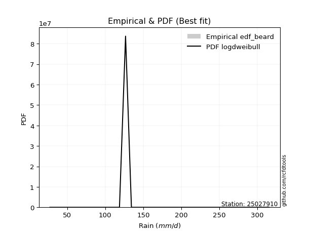</img>

</div>


### 5. EDF Chegodayev (1955)

The Chegodayev formula is an empirical plotting position formula used in hydrological frequency analysis to estimate the exceedance probability or return period of a specific event from a set of observed data. It is primarily used for plotting observed data points on probability paper to fit a theoretical distribution, particularly for analyzing extreme events like maximum flood flows or rainfall intensities. The constant _b_ value in the generalized plotting position formula is 0.3.

<div align="center">


$P=(m-b)/(n+1-2b)$


</div>


**5.1. Empirical values**

<div align="center">

|                | 0                   | 1                  | 2                  | 3                  | 4                 | 5                 |
|:---------------|:--------------------|:-------------------|:-------------------|:-------------------|:------------------|:------------------|
| date           | 2020                | 2023               | 2022               | 2021               | 2025              | 2024              |
| x              | 27.2                | 118.7              | 126.7              | 134.4              | 193.2             | 315.4             |
| m              | 1                   | 2                  | 3                  | 4                  | 5                 | 6                 |
| empirical_dist | edf_chegodayev      | edf_chegodayev     | edf_chegodayev     | edf_chegodayev     | edf_chegodayev    | edf_chegodayev    |
| empirical      | 0.10937499999999999 | 0.265625           | 0.421875           | 0.578125           | 0.734375          | 0.890625          |
| empirical_tr   | 1.1228070175438596  | 1.3617021276595744 | 1.7297297297297298 | 2.3703703703703702 | 3.764705882352941 | 9.142857142857142 |

</div>


**5.2. Kolmogorov-Smirnov fit test (sorted by Δ)**


<div align="center">

|                | 0                   | 1                   | 2                   | 3                   | 4                   | 5                   | 6                   | 7                   | 8                   | 9                  | 10                  | 11                  | 12                  | 13                  | 14                 | 15                 | 16                  | 17                  | 18                  | 19                  | 20                  | 21                  | 22                  | 23                  | 24                  | 25                  | 26                  | 27                  | 28                 | 29                 | 30                  | 31                  | 32                  | 33                  | 34                  | 35                 | 36                  | 37                  | 38                  | 39                  | 40                  | 41                  | 42                  | 43                 | 44                  | 45                  | 46                  | 47                  | 48                | 49                  | 50                  | 51                 | 52                  | 53                  | 54                 | 55                  | 56                  | 57                  | 58                  | 59                 | 60                 | 61                  | 62                  | 63                  | 64                  | 65                 | 66                  | 67                  | 68                  | 69                  | 70                  | 71                  | 72                  | 73                  | 74                  | 75                  | 76                  | 77                 | 78                  | 79                  | 80                  | 81                  | 82                | 83                 | 84                 | 85                 | 86                  | 87                  | 88                 | 89                  | 90                 | 91                  | 92                  | 93                  | 94                 | 95                  | 96                  | 97                  | 98                  | 99                  | 100                 | 101                 | 102                 | 103                | 104                 | 105                 | 106                 | 107                 | 108                 | 109                | 110                | 111                 | 112                | 113                | 114                | 115                 | 116                | 117                | 118                 | 119                 | 120                 | 121                | 122                | 123               | 124                | 125                | 126                | 127                 | 128                 | 129                | 130                | 131                | 132                | 133                | 134                 | 135                 | 136                | 137                 | 138                | 139                | 140                 | 141              | 142                 | 143                | 144                 | 145                 | 146                | 147                | 148                | 149                | 150                | 151                | 152                | 153              | 154                | 155                | 156                | 157            | 158                | 159               |
|:---------------|:--------------------|:--------------------|:--------------------|:--------------------|:--------------------|:--------------------|:--------------------|:--------------------|:--------------------|:-------------------|:--------------------|:--------------------|:--------------------|:--------------------|:-------------------|:-------------------|:--------------------|:--------------------|:--------------------|:--------------------|:--------------------|:--------------------|:--------------------|:--------------------|:--------------------|:--------------------|:--------------------|:--------------------|:-------------------|:-------------------|:--------------------|:--------------------|:--------------------|:--------------------|:--------------------|:-------------------|:--------------------|:--------------------|:--------------------|:--------------------|:--------------------|:--------------------|:--------------------|:-------------------|:--------------------|:--------------------|:--------------------|:--------------------|:------------------|:--------------------|:--------------------|:-------------------|:--------------------|:--------------------|:-------------------|:--------------------|:--------------------|:--------------------|:--------------------|:-------------------|:-------------------|:--------------------|:--------------------|:--------------------|:--------------------|:-------------------|:--------------------|:--------------------|:--------------------|:--------------------|:--------------------|:--------------------|:--------------------|:--------------------|:--------------------|:--------------------|:--------------------|:-------------------|:--------------------|:--------------------|:--------------------|:--------------------|:------------------|:-------------------|:-------------------|:-------------------|:--------------------|:--------------------|:-------------------|:--------------------|:-------------------|:--------------------|:--------------------|:--------------------|:-------------------|:--------------------|:--------------------|:--------------------|:--------------------|:--------------------|:--------------------|:--------------------|:--------------------|:-------------------|:--------------------|:--------------------|:--------------------|:--------------------|:--------------------|:-------------------|:-------------------|:--------------------|:-------------------|:-------------------|:-------------------|:--------------------|:-------------------|:-------------------|:--------------------|:--------------------|:--------------------|:-------------------|:-------------------|:------------------|:-------------------|:-------------------|:-------------------|:--------------------|:--------------------|:-------------------|:-------------------|:-------------------|:-------------------|:-------------------|:--------------------|:--------------------|:-------------------|:--------------------|:-------------------|:-------------------|:--------------------|:-----------------|:--------------------|:-------------------|:--------------------|:--------------------|:-------------------|:-------------------|:-------------------|:-------------------|:-------------------|:-------------------|:-------------------|:-----------------|:-------------------|:-------------------|:-------------------|:---------------|:-------------------|:------------------|
| station        | 25027910            | 25027910            | 25027910            | 25027910            | 25027910            | 25027910            | 25027910            | 25027910            | 25027910            | 25027910           | 25027910            | 25027910            | 25027910            | 25027910            | 25027910           | 25027910           | 25027910            | 25027910            | 25027910            | 25027910            | 25027910            | 25027910            | 25027910            | 25027910            | 25027910            | 25027910            | 25027910            | 25027910            | 25027910           | 25027910           | 25027910            | 25027910            | 25027910            | 25027910            | 25027910            | 25027910           | 25027910            | 25027910            | 25027910            | 25027910            | 25027910            | 25027910            | 25027910            | 25027910           | 25027910            | 25027910            | 25027910            | 25027910            | 25027910          | 25027910            | 25027910            | 25027910           | 25027910            | 25027910            | 25027910           | 25027910            | 25027910            | 25027910            | 25027910            | 25027910           | 25027910           | 25027910            | 25027910            | 25027910            | 25027910            | 25027910           | 25027910            | 25027910            | 25027910            | 25027910            | 25027910            | 25027910            | 25027910            | 25027910            | 25027910            | 25027910            | 25027910            | 25027910           | 25027910            | 25027910            | 25027910            | 25027910            | 25027910          | 25027910           | 25027910           | 25027910           | 25027910            | 25027910            | 25027910           | 25027910            | 25027910           | 25027910            | 25027910            | 25027910            | 25027910           | 25027910            | 25027910            | 25027910            | 25027910            | 25027910            | 25027910            | 25027910            | 25027910            | 25027910           | 25027910            | 25027910            | 25027910            | 25027910            | 25027910            | 25027910           | 25027910           | 25027910            | 25027910           | 25027910           | 25027910           | 25027910            | 25027910           | 25027910           | 25027910            | 25027910            | 25027910            | 25027910           | 25027910           | 25027910          | 25027910           | 25027910           | 25027910           | 25027910            | 25027910            | 25027910           | 25027910           | 25027910           | 25027910           | 25027910           | 25027910            | 25027910            | 25027910           | 25027910            | 25027910           | 25027910           | 25027910            | 25027910         | 25027910            | 25027910           | 25027910            | 25027910            | 25027910           | 25027910           | 25027910           | 25027910           | 25027910           | 25027910           | 25027910           | 25027910         | 25027910           | 25027910           | 25027910           | 25027910       | 25027910           | 25027910          |
| empirical_dist | edf_chegodayev      | edf_chegodayev      | edf_chegodayev      | edf_chegodayev      | edf_chegodayev      | edf_chegodayev      | edf_chegodayev      | edf_chegodayev      | edf_chegodayev      | edf_chegodayev     | edf_chegodayev      | edf_chegodayev      | edf_chegodayev      | edf_chegodayev      | edf_chegodayev     | edf_chegodayev     | edf_chegodayev      | edf_chegodayev      | edf_chegodayev      | edf_chegodayev      | edf_chegodayev      | edf_chegodayev      | edf_chegodayev      | edf_chegodayev      | edf_chegodayev      | edf_chegodayev      | edf_chegodayev      | edf_chegodayev      | edf_chegodayev     | edf_chegodayev     | edf_chegodayev      | edf_chegodayev      | edf_chegodayev      | edf_chegodayev      | edf_chegodayev      | edf_chegodayev     | edf_chegodayev      | edf_chegodayev      | edf_chegodayev      | edf_chegodayev      | edf_chegodayev      | edf_chegodayev      | edf_chegodayev      | edf_chegodayev     | edf_chegodayev      | edf_chegodayev      | edf_chegodayev      | edf_chegodayev      | edf_chegodayev    | edf_chegodayev      | edf_chegodayev      | edf_chegodayev     | edf_chegodayev      | edf_chegodayev      | edf_chegodayev     | edf_chegodayev      | edf_chegodayev      | edf_chegodayev      | edf_chegodayev      | edf_chegodayev     | edf_chegodayev     | edf_chegodayev      | edf_chegodayev      | edf_chegodayev      | edf_chegodayev      | edf_chegodayev     | edf_chegodayev      | edf_chegodayev      | edf_chegodayev      | edf_chegodayev      | edf_chegodayev      | edf_chegodayev      | edf_chegodayev      | edf_chegodayev      | edf_chegodayev      | edf_chegodayev      | edf_chegodayev      | edf_chegodayev     | edf_chegodayev      | edf_chegodayev      | edf_chegodayev      | edf_chegodayev      | edf_chegodayev    | edf_chegodayev     | edf_chegodayev     | edf_chegodayev     | edf_chegodayev      | edf_chegodayev      | edf_chegodayev     | edf_chegodayev      | edf_chegodayev     | edf_chegodayev      | edf_chegodayev      | edf_chegodayev      | edf_chegodayev     | edf_chegodayev      | edf_chegodayev      | edf_chegodayev      | edf_chegodayev      | edf_chegodayev      | edf_chegodayev      | edf_chegodayev      | edf_chegodayev      | edf_chegodayev     | edf_chegodayev      | edf_chegodayev      | edf_chegodayev      | edf_chegodayev      | edf_chegodayev      | edf_chegodayev     | edf_chegodayev     | edf_chegodayev      | edf_chegodayev     | edf_chegodayev     | edf_chegodayev     | edf_chegodayev      | edf_chegodayev     | edf_chegodayev     | edf_chegodayev      | edf_chegodayev      | edf_chegodayev      | edf_chegodayev     | edf_chegodayev     | edf_chegodayev    | edf_chegodayev     | edf_chegodayev     | edf_chegodayev     | edf_chegodayev      | edf_chegodayev      | edf_chegodayev     | edf_chegodayev     | edf_chegodayev     | edf_chegodayev     | edf_chegodayev     | edf_chegodayev      | edf_chegodayev      | edf_chegodayev     | edf_chegodayev      | edf_chegodayev     | edf_chegodayev     | edf_chegodayev      | edf_chegodayev   | edf_chegodayev      | edf_chegodayev     | edf_chegodayev      | edf_chegodayev      | edf_chegodayev     | edf_chegodayev     | edf_chegodayev     | edf_chegodayev     | edf_chegodayev     | edf_chegodayev     | edf_chegodayev     | edf_chegodayev   | edf_chegodayev     | edf_chegodayev     | edf_chegodayev     | edf_chegodayev | edf_chegodayev     | edf_chegodayev    |
| p_dist         | logdweibull         | logdgamma           | johnsonsu           | logjohnsonsu        | loggennorm          | nct                 | skewnorm            | rice                | pearson3            | invgamma           | exponnorm           | maxwell             | rayleigh            | invgauss            | genexpon           | genlogistic        | logloglaplace       | exponweib           | logloggamma         | logt                | gengamma            | gumbel_r            | betaprime           | logburr12           | foldnorm            | burr                | f                   | mielke              | erlang             | gamma              | loggenlogistic      | dgamma              | logburr             | ncf                 | invweibull          | logmielke          | logargus            | logweibull_min      | semicircular        | beta                | kstwobign           | loggenhalflogistic  | arcsine             | loggumbel_l        | anglit              | logvonmises_line    | moyal               | gennorm             | logskewnorm       | weibull_min         | bradford            | dweibull           | logpearson3         | kappa3              | t                  | truncnorm           | norm                | crystalball         | halfnorm            | loggausshyper      | truncexpon         | logtrapezoid        | halflogistic        | loggompertz         | logistic            | kappa4             | hypsecant           | loglevy_l           | ksone               | cosine              | logtriang           | wald                | gausshyper          | lomax               | loggenextreme       | wrapcauchy          | laplace             | uniform            | loglaplace          | loglaplace          | logf                | loghypsecant        | loglogistic       | logncf             | logcrystalball     | lognorm            | logexponnorm        | logfatiguelife      | lognct             | loganglit           | logbeta            | logsemicircular     | logarcsine          | logrice             | gumbel_l           | vonmises_line       | loginvgamma         | logbetaprime        | logerlang           | loggamma            | loggamma            | logalpha            | argus               | logmaxwell         | loginvgauss         | loginvweibull       | lograyleigh         | nakagami            | lognakagami         | logtruncnorm       | levy_l             | logwrapcauchy       | logcosine          | genpareto          | logjohnsonsb       | logfoldnorm         | loggenpareto       | loggumbel_r        | logkstwobign        | loghalfnorm         | logweibull_max      | loggenexpon        | halfgennorm        | genextreme        | logmoyal           | genhalflogistic    | logksone           | loghalflogistic     | logbradford         | logkappa4          | logkappa3          | loguniform         | alpha              | loggengamma        | loglomax            | burr12              | logwald            | triang              | logrdist           | trapezoid          | johnsonsb           | logtruncexpon    | logtruncweibull_min | logexponweib       | logtukeylambda      | truncweibull_min    | fatiguelife        | gompertz           | powerlaw           | logexponpow        | rdist              | truncpareto        | weibull_max        | logpowerlaw      | tukeylambda        | exponpow           | logtruncpareto     | loghalfgennorm | logvonmises        | vonmises          |
| delta          | 0.07934518862534434 | 0.09493383238571723 | 0.09523030464408966 | 0.09939220113233094 | 0.11330773330629418 | 0.11703298173274851 | 0.12093964497871668 | 0.12139220972219855 | 0.12366835815213251 | 0.1241008107763309 | 0.12544223120040082 | 0.12611333590641144 | 0.12769085487895226 | 0.12785431978846884 | 0.1284852153694035 | 0.1290868733644867 | 0.13033402489043694 | 0.13065608916656923 | 0.13072588142254038 | 0.13119582357496173 | 0.13154894773921233 | 0.13195157257252632 | 0.13372516914652005 | 0.13420225591621227 | 0.13496296795666046 | 0.13533526057648043 | 0.13631268440306366 | 0.13641188921746178 | 0.1364321705394208 | 0.1364321720487735 | 0.13686174722128497 | 0.13689554448006852 | 0.13694250623015475 | 0.13852104700531687 | 0.13884495754527643 | 0.1412020855295914 | 0.14127822568390125 | 0.14172435466138456 | 0.14414869850729128 | 0.14473547100562068 | 0.14507937992496062 | 0.14556721259670885 | 0.14613337385735636 | 0.1477245970611254 | 0.14891731718361428 | 0.14959138808573952 | 0.14978104283268312 | 0.15098689143701316 | 0.152993402861912 | 0.15322226006551043 | 0.15353057649682744 | 0.1537219167971896 | 0.15446219636241282 | 0.15659817063137838 | 0.1604249751034208 | 0.16043009177827405 | 0.16043009728029728 | 0.16043018238489248 | 0.16200869509374738 | 0.1641294871348557 | 0.1660874305006309 | 0.16631233332504985 | 0.16998177692989935 | 0.17023123167480836 | 0.17124939598183886 | 0.1764533262560879 | 0.18022483760725594 | 0.18467939005385947 | 0.18482173837612764 | 0.18555107120648295 | 0.18860648860952461 | 0.19039032607413353 | 0.19307081325285125 | 0.19396973095951375 | 0.19567083210819675 | 0.20513225221250436 | 0.20543648762865513 | 0.2061610860513532 | 0.20682147928167438 | 0.20682147928167438 | 0.21365864953362368 | 0.21434753753010682 | 0.216208105872716 | 0.2176685767931289 | 0.2183891194876882 | 0.2183891237833051 | 0.21839342323799588 | 0.21928936546971067 | 0.2203902414465685 | 0.22067554884696589 | 0.2213430865109942 | 0.22161785611238355 | 0.22535299263132358 | 0.22600756230949554 | 0.2285646563351672 | 0.22876746963123634 | 0.23195836089585198 | 0.23404019990746516 | 0.23661440873895023 | 0.23679069459508895 | 0.23679069459508895 | 0.24077425576857558 | 0.24868032263913253 | 0.2520055461610853 | 0.25951138648360716 | 0.26083244653627335 | 0.26334453161694493 | 0.26557955338244504 | 0.26562402794248063 | 0.2656244787120069 | 0.2674753144954667 | 0.26916370925217226 | 0.2709642984238936 | 0.2741825828918158 | 0.2823483676181433 | 0.28412547161218593 | 0.2857164469344894 | 0.2881056994176733 | 0.29500011080781374 | 0.29527925744921124 | 0.30087217740274114 | 0.3044350803380942 | 0.3061484601875908 | 0.311903143942654 | 0.3139809963673874 | 0.3162607131344215 | 0.3187310343259867 | 0.31916750201437794 | 0.32405528886414947 | 0.3301070021117466 | 0.3355902835183183 | 0.3356022411911841 | 0.3360731506788692 | 0.3369217082159818 | 0.35880050090117255 | 0.35921044484209386 | 0.3859959853498587 | 0.39385223892730437 | 0.4070182174353981 | 0.4232532565762701 | 0.43241798675465637 | 0.43450887244977 | 0.45948907594458344 | 0.4646445268896974 | 0.48231246337513056 | 0.49778965530882513 | 0.5137372089217287 | 0.5781115971218177 | 0.5854392937223613 | 0.5870982645950105 | 0.6016228135454617 | 0.6428423214353989 | 0.6535416529331574 | 0.65693265897651 | 0.6716948945477199 | 0.6897286839293822 | 0.6916848668411757 | 0.734375       | 1.1718100543465568 | 49.57654137122987 |
| deltao         | 0.530385761606      | 0.530385761606      | 0.530385761606      | 0.530385761606      | 0.530385761606      | 0.530385761606      | 0.530385761606      | 0.530385761606      | 0.530385761606      | 0.530385761606     | 0.530385761606      | 0.530385761606      | 0.530385761606      | 0.530385761606      | 0.530385761606     | 0.530385761606     | 0.530385761606      | 0.530385761606      | 0.530385761606      | 0.530385761606      | 0.530385761606      | 0.530385761606      | 0.530385761606      | 0.530385761606      | 0.530385761606      | 0.530385761606      | 0.530385761606      | 0.530385761606      | 0.530385761606     | 0.530385761606     | 0.530385761606      | 0.530385761606      | 0.530385761606      | 0.530385761606      | 0.530385761606      | 0.530385761606     | 0.530385761606      | 0.530385761606      | 0.530385761606      | 0.530385761606      | 0.530385761606      | 0.530385761606      | 0.530385761606      | 0.530385761606     | 0.530385761606      | 0.530385761606      | 0.530385761606      | 0.530385761606      | 0.530385761606    | 0.530385761606      | 0.530385761606      | 0.530385761606     | 0.530385761606      | 0.530385761606      | 0.530385761606     | 0.530385761606      | 0.530385761606      | 0.530385761606      | 0.530385761606      | 0.530385761606     | 0.530385761606     | 0.530385761606      | 0.530385761606      | 0.530385761606      | 0.530385761606      | 0.530385761606     | 0.530385761606      | 0.530385761606      | 0.530385761606      | 0.530385761606      | 0.530385761606      | 0.530385761606      | 0.530385761606      | 0.530385761606      | 0.530385761606      | 0.530385761606      | 0.530385761606      | 0.530385761606     | 0.530385761606      | 0.530385761606      | 0.530385761606      | 0.530385761606      | 0.530385761606    | 0.530385761606     | 0.530385761606     | 0.530385761606     | 0.530385761606      | 0.530385761606      | 0.530385761606     | 0.530385761606      | 0.530385761606     | 0.530385761606      | 0.530385761606      | 0.530385761606      | 0.530385761606     | 0.530385761606      | 0.530385761606      | 0.530385761606      | 0.530385761606      | 0.530385761606      | 0.530385761606      | 0.530385761606      | 0.530385761606      | 0.530385761606     | 0.530385761606      | 0.530385761606      | 0.530385761606      | 0.530385761606      | 0.530385761606      | 0.530385761606     | 0.530385761606     | 0.530385761606      | 0.530385761606     | 0.530385761606     | 0.530385761606     | 0.530385761606      | 0.530385761606     | 0.530385761606     | 0.530385761606      | 0.530385761606      | 0.530385761606      | 0.530385761606     | 0.530385761606     | 0.530385761606    | 0.530385761606     | 0.530385761606     | 0.530385761606     | 0.530385761606      | 0.530385761606      | 0.530385761606     | 0.530385761606     | 0.530385761606     | 0.530385761606     | 0.530385761606     | 0.530385761606      | 0.530385761606      | 0.530385761606     | 0.530385761606      | 0.530385761606     | 0.530385761606     | 0.530385761606      | 0.530385761606   | 0.530385761606      | 0.530385761606     | 0.530385761606      | 0.530385761606      | 0.530385761606     | 0.530385761606     | 0.530385761606     | 0.530385761606     | 0.530385761606     | 0.530385761606     | 0.530385761606     | 0.530385761606   | 0.530385761606     | 0.530385761606     | 0.530385761606     | 0.530385761606 | 0.530385761606     | 0.530385761606    |
| eval           | Δo > Δ              | Δo > Δ              | Δo > Δ              | Δo > Δ              | Δo > Δ              | Δo > Δ              | Δo > Δ              | Δo > Δ              | Δo > Δ              | Δo > Δ             | Δo > Δ              | Δo > Δ              | Δo > Δ              | Δo > Δ              | Δo > Δ             | Δo > Δ             | Δo > Δ              | Δo > Δ              | Δo > Δ              | Δo > Δ              | Δo > Δ              | Δo > Δ              | Δo > Δ              | Δo > Δ              | Δo > Δ              | Δo > Δ              | Δo > Δ              | Δo > Δ              | Δo > Δ             | Δo > Δ             | Δo > Δ              | Δo > Δ              | Δo > Δ              | Δo > Δ              | Δo > Δ              | Δo > Δ             | Δo > Δ              | Δo > Δ              | Δo > Δ              | Δo > Δ              | Δo > Δ              | Δo > Δ              | Δo > Δ              | Δo > Δ             | Δo > Δ              | Δo > Δ              | Δo > Δ              | Δo > Δ              | Δo > Δ            | Δo > Δ              | Δo > Δ              | Δo > Δ             | Δo > Δ              | Δo > Δ              | Δo > Δ             | Δo > Δ              | Δo > Δ              | Δo > Δ              | Δo > Δ              | Δo > Δ             | Δo > Δ             | Δo > Δ              | Δo > Δ              | Δo > Δ              | Δo > Δ              | Δo > Δ             | Δo > Δ              | Δo > Δ              | Δo > Δ              | Δo > Δ              | Δo > Δ              | Δo > Δ              | Δo > Δ              | Δo > Δ              | Δo > Δ              | Δo > Δ              | Δo > Δ              | Δo > Δ             | Δo > Δ              | Δo > Δ              | Δo > Δ              | Δo > Δ              | Δo > Δ            | Δo > Δ             | Δo > Δ             | Δo > Δ             | Δo > Δ              | Δo > Δ              | Δo > Δ             | Δo > Δ              | Δo > Δ             | Δo > Δ              | Δo > Δ              | Δo > Δ              | Δo > Δ             | Δo > Δ              | Δo > Δ              | Δo > Δ              | Δo > Δ              | Δo > Δ              | Δo > Δ              | Δo > Δ              | Δo > Δ              | Δo > Δ             | Δo > Δ              | Δo > Δ              | Δo > Δ              | Δo > Δ              | Δo > Δ              | Δo > Δ             | Δo > Δ             | Δo > Δ              | Δo > Δ             | Δo > Δ             | Δo > Δ             | Δo > Δ              | Δo > Δ             | Δo > Δ             | Δo > Δ              | Δo > Δ              | Δo > Δ              | Δo > Δ             | Δo > Δ             | Δo > Δ            | Δo > Δ             | Δo > Δ             | Δo > Δ             | Δo > Δ              | Δo > Δ              | Δo > Δ             | Δo > Δ             | Δo > Δ             | Δo > Δ             | Δo > Δ             | Δo > Δ              | Δo > Δ              | Δo > Δ             | Δo > Δ              | Δo > Δ             | Δo > Δ             | Δo > Δ              | Δo > Δ           | Δo > Δ              | Δo > Δ             | Δo > Δ              | Δo > Δ              | Δo > Δ             | Δo <= Δ            | Δo <= Δ            | Δo <= Δ            | Δo <= Δ            | Δo <= Δ            | Δo <= Δ            | Δo <= Δ          | Δo <= Δ            | Δo <= Δ            | Δo <= Δ            | Δo <= Δ        | Δo <= Δ            | Δo <= Δ           |
| fit            | 1                   | 1                   | 1                   | 1                   | 1                   | 1                   | 1                   | 1                   | 1                   | 1                  | 1                   | 1                   | 1                   | 1                   | 1                  | 1                  | 1                   | 1                   | 1                   | 1                   | 1                   | 1                   | 1                   | 1                   | 1                   | 1                   | 1                   | 1                   | 1                  | 1                  | 1                   | 1                   | 1                   | 1                   | 1                   | 1                  | 1                   | 1                   | 1                   | 1                   | 1                   | 1                   | 1                   | 1                  | 1                   | 1                   | 1                   | 1                   | 1                 | 1                   | 1                   | 1                  | 1                   | 1                   | 1                  | 1                   | 1                   | 1                   | 1                   | 1                  | 1                  | 1                   | 1                   | 1                   | 1                   | 1                  | 1                   | 1                   | 1                   | 1                   | 1                   | 1                   | 1                   | 1                   | 1                   | 1                   | 1                   | 1                  | 1                   | 1                   | 1                   | 1                   | 1                 | 1                  | 1                  | 1                  | 1                   | 1                   | 1                  | 1                   | 1                  | 1                   | 1                   | 1                   | 1                  | 1                   | 1                   | 1                   | 1                   | 1                   | 1                   | 1                   | 1                   | 1                  | 1                   | 1                   | 1                   | 1                   | 1                   | 1                  | 1                  | 1                   | 1                  | 1                  | 1                  | 1                   | 1                  | 1                  | 1                   | 1                   | 1                   | 1                  | 1                  | 1                 | 1                  | 1                  | 1                  | 1                   | 1                   | 1                  | 1                  | 1                  | 1                  | 1                  | 1                   | 1                   | 1                  | 1                   | 1                  | 1                  | 1                   | 1                | 1                   | 1                  | 1                   | 1                   | 1                  | 0                  | 0                  | 0                  | 0                  | 0                  | 0                  | 0                | 0                  | 0                  | 0                  | 0              | 0                  | 0                 |
| n              | 6                   | 6                   | 6                   | 6                   | 6                   | 6                   | 6                   | 6                   | 6                   | 6                  | 6                   | 6                   | 6                   | 6                   | 6                  | 6                  | 6                   | 6                   | 6                   | 6                   | 6                   | 6                   | 6                   | 6                   | 6                   | 6                   | 6                   | 6                   | 6                  | 6                  | 6                   | 6                   | 6                   | 6                   | 6                   | 6                  | 6                   | 6                   | 6                   | 6                   | 6                   | 6                   | 6                   | 6                  | 6                   | 6                   | 6                   | 6                   | 6                 | 6                   | 6                   | 6                  | 6                   | 6                   | 6                  | 6                   | 6                   | 6                   | 6                   | 6                  | 6                  | 6                   | 6                   | 6                   | 6                   | 6                  | 6                   | 6                   | 6                   | 6                   | 6                   | 6                   | 6                   | 6                   | 6                   | 6                   | 6                   | 6                  | 6                   | 6                   | 6                   | 6                   | 6                 | 6                  | 6                  | 6                  | 6                   | 6                   | 6                  | 6                   | 6                  | 6                   | 6                   | 6                   | 6                  | 6                   | 6                   | 6                   | 6                   | 6                   | 6                   | 6                   | 6                   | 6                  | 6                   | 6                   | 6                   | 6                   | 6                   | 6                  | 6                  | 6                   | 6                  | 6                  | 6                  | 6                   | 6                  | 6                  | 6                   | 6                   | 6                   | 6                  | 6                  | 6                 | 6                  | 6                  | 6                  | 6                   | 6                   | 6                  | 6                  | 6                  | 6                  | 6                  | 6                   | 6                   | 6                  | 6                   | 6                  | 6                  | 6                   | 6                | 6                   | 6                  | 6                   | 6                   | 6                  | 6                  | 6                  | 6                  | 6                  | 6                  | 6                  | 6                | 6                  | 6                  | 6                  | 6              | 6                  | 6                 |
| best_fit       | 1                   | 0                   | 0                   | 0                   | 0                   | 0                   | 0                   | 0                   | 0                   | 0                  | 0                   | 0                   | 0                   | 0                   | 0                  | 0                  | 0                   | 0                   | 0                   | 0                   | 0                   | 0                   | 0                   | 0                   | 0                   | 0                   | 0                   | 0                   | 0                  | 0                  | 0                   | 0                   | 0                   | 0                   | 0                   | 0                  | 0                   | 0                   | 0                   | 0                   | 0                   | 0                   | 0                   | 0                  | 0                   | 0                   | 0                   | 0                   | 0                 | 0                   | 0                   | 0                  | 0                   | 0                   | 0                  | 0                   | 0                   | 0                   | 0                   | 0                  | 0                  | 0                   | 0                   | 0                   | 0                   | 0                  | 0                   | 0                   | 0                   | 0                   | 0                   | 0                   | 0                   | 0                   | 0                   | 0                   | 0                   | 0                  | 0                   | 0                   | 0                   | 0                   | 0                 | 0                  | 0                  | 0                  | 0                   | 0                   | 0                  | 0                   | 0                  | 0                   | 0                   | 0                   | 0                  | 0                   | 0                   | 0                   | 0                   | 0                   | 0                   | 0                   | 0                   | 0                  | 0                   | 0                   | 0                   | 0                   | 0                   | 0                  | 0                  | 0                   | 0                  | 0                  | 0                  | 0                   | 0                  | 0                  | 0                   | 0                   | 0                   | 0                  | 0                  | 0                 | 0                  | 0                  | 0                  | 0                   | 0                   | 0                  | 0                  | 0                  | 0                  | 0                  | 0                   | 0                   | 0                  | 0                   | 0                  | 0                  | 0                   | 0                | 0                   | 0                  | 0                   | 0                   | 0                  | 0                  | 0                  | 0                  | 0                  | 0                  | 0                  | 0                | 0                  | 0                  | 0                  | 0              | 0                  | 0                 |
| best_fit_sort  | 1                   | 2                   | 3                   | 4                   | 5                   | 6                   | 7                   | 8                   | 9                   | 10                 | 11                  | 12                  | 13                  | 14                  | 15                 | 16                 | 17                  | 18                  | 19                  | 20                  | 21                  | 22                  | 23                  | 24                  | 25                  | 26                  | 27                  | 28                  | 29                 | 30                 | 31                  | 32                  | 33                  | 34                  | 35                  | 36                 | 37                  | 38                  | 39                  | 40                  | 41                  | 42                  | 43                  | 44                 | 45                  | 46                  | 47                  | 48                  | 49                | 50                  | 51                  | 52                 | 53                  | 54                  | 55                 | 56                  | 57                  | 58                  | 59                  | 60                 | 61                 | 62                  | 63                  | 64                  | 65                  | 66                 | 67                  | 68                  | 69                  | 70                  | 71                  | 72                  | 73                  | 74                  | 75                  | 76                  | 77                  | 78                 | 79                  | 80                  | 81                  | 82                  | 83                | 84                 | 85                 | 86                 | 87                  | 88                  | 89                 | 90                  | 91                 | 92                  | 93                  | 94                  | 95                 | 96                  | 97                  | 98                  | 99                  | 100                 | 101                 | 102                 | 103                 | 104                | 105                 | 106                 | 107                 | 108                 | 109                 | 110                | 111                | 112                 | 113                | 114                | 115                | 116                 | 117                | 118                | 119                 | 120                 | 121                 | 122                | 123                | 124               | 125                | 126                | 127                | 128                 | 129                 | 130                | 131                | 132                | 133                | 134                | 135                 | 136                 | 137                | 138                 | 139                | 140                | 141                 | 142              | 143                 | 144                | 145                 | 146                 | 147                | 148                | 149                | 150                | 151                | 152                | 153                | 154              | 155                | 156                | 157                | 158            | 159                | 160               |

</div>


**5.3. Best fit**

<div align="center">

|   id |   station | empirical_dist   | p_dist      |     delta |   deltao | eval   |   fit |   n |   best_fit |   best_fit_sort |
|-----:|----------:|:-----------------|:------------|----------:|---------:|:-------|------:|----:|-----------:|----------------:|
|    0 |  25027910 | edf_chegodayev   | logdweibull | 0.0793452 | 0.530386 | Δo > Δ |     1 |   6 |          1 |               1 |

</div>


<div align="center">

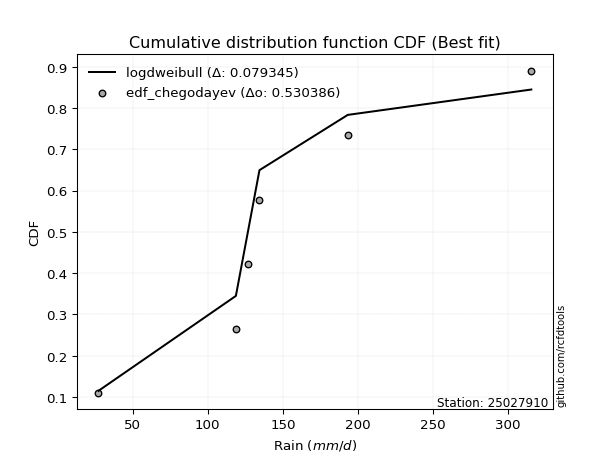</img>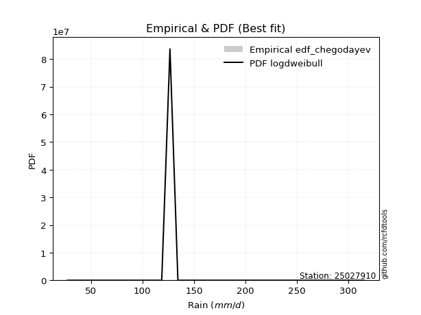</img>

</div>


### 6. EDF Blom (1958)

The Blom formula is a specific "plotting position" formula used in hydrology and statistical analysis to estimate the empirical cumulative probability (or non-exceedance probability) of a data series. It is particularly recommended for data that are approximately normally distributed. The constant _a_ is set to 0.375 (or 3/8).

<div align="center">


$P=(m-a)/(n+1-2a)$


</div>


**6.1. Empirical values**

<div align="center">

|                | 0                  | 1                  | 2                  | 3                 | 4                 | 5                  |
|:---------------|:-------------------|:-------------------|:-------------------|:------------------|:------------------|:-------------------|
| date           | 2020               | 2023               | 2022               | 2021              | 2025              | 2024               |
| x              | 27.2               | 118.7              | 126.7              | 134.4             | 193.2             | 315.4              |
| m              | 1                  | 2                  | 3                  | 4                 | 5                 | 6                  |
| empirical_dist | edf_blom           | edf_blom           | edf_blom           | edf_blom          | edf_blom          | edf_blom           |
| empirical      | 0.1                | 0.26               | 0.42               | 0.58              | 0.74              | 0.9                |
| empirical_tr   | 1.1111111111111112 | 1.3513513513513513 | 1.7241379310344827 | 2.380952380952381 | 3.846153846153846 | 10.000000000000002 |

</div>


**6.2. Kolmogorov-Smirnov fit test (sorted by Δ)**


<div align="center">

|                | 0                   | 1                   | 2                   | 3                   | 4                   | 5                  | 6                   | 7                  | 8                   | 9                   | 10                 | 11                  | 12                 | 13                  | 14                  | 15                  | 16                 | 17                  | 18                  | 19                  | 20                  | 21                 | 22                  | 23                  | 24                  | 25                  | 26                  | 27                  | 28                 | 29                 | 30                  | 31                 | 32                  | 33                  | 34                  | 35                  | 36                  | 37                 | 38                  | 39                  | 40                  | 41                 | 42                  | 43                  | 44                  | 45                 | 46                 | 47                 | 48                  | 49                  | 50                  | 51                 | 52                 | 53                  | 54                  | 55                | 56                  | 57                  | 58                  | 59                 | 60                 | 61                  | 62                  | 63                  | 64                  | 65                  | 66                 | 67                 | 68                 | 69                  | 70                 | 71                 | 72                  | 73                 | 74                  | 75                  | 76                 | 77                  | 78                  | 79                  | 80                  | 81                  | 82                  | 83                  | 84                 | 85                  | 86                 | 87                  | 88                  | 89                  | 90                  | 91                  | 92                  | 93                 | 94                  | 95                  | 96                  | 97                  | 98                  | 99                  | 100                 | 101                 | 102                | 103                 | 104                 | 105                 | 106                | 107                 | 108                 | 109                | 110                 | 111                 | 112                | 113                | 114                | 115                | 116                | 117                 | 118                 | 119                 | 120                 | 121                | 122                | 123                 | 124                | 125                 | 126                | 127                | 128                 | 129                | 130                | 131                | 132                | 133                | 134                 | 135                 | 136                | 137                | 138                | 139                 | 140                 | 141              | 142                 | 143                 | 144                 | 145                | 146                | 147                | 148                | 149                | 150                | 151                | 152                | 153              | 154                | 155                | 156                | 157            | 158                | 159                |
|:---------------|:--------------------|:--------------------|:--------------------|:--------------------|:--------------------|:-------------------|:--------------------|:-------------------|:--------------------|:--------------------|:-------------------|:--------------------|:-------------------|:--------------------|:--------------------|:--------------------|:-------------------|:--------------------|:--------------------|:--------------------|:--------------------|:-------------------|:--------------------|:--------------------|:--------------------|:--------------------|:--------------------|:--------------------|:-------------------|:-------------------|:--------------------|:-------------------|:--------------------|:--------------------|:--------------------|:--------------------|:--------------------|:-------------------|:--------------------|:--------------------|:--------------------|:-------------------|:--------------------|:--------------------|:--------------------|:-------------------|:-------------------|:-------------------|:--------------------|:--------------------|:--------------------|:-------------------|:-------------------|:--------------------|:--------------------|:------------------|:--------------------|:--------------------|:--------------------|:-------------------|:-------------------|:--------------------|:--------------------|:--------------------|:--------------------|:--------------------|:-------------------|:-------------------|:-------------------|:--------------------|:-------------------|:-------------------|:--------------------|:-------------------|:--------------------|:--------------------|:-------------------|:--------------------|:--------------------|:--------------------|:--------------------|:--------------------|:--------------------|:--------------------|:-------------------|:--------------------|:-------------------|:--------------------|:--------------------|:--------------------|:--------------------|:--------------------|:--------------------|:-------------------|:--------------------|:--------------------|:--------------------|:--------------------|:--------------------|:--------------------|:--------------------|:--------------------|:-------------------|:--------------------|:--------------------|:--------------------|:-------------------|:--------------------|:--------------------|:-------------------|:--------------------|:--------------------|:-------------------|:-------------------|:-------------------|:-------------------|:-------------------|:--------------------|:--------------------|:--------------------|:--------------------|:-------------------|:-------------------|:--------------------|:-------------------|:--------------------|:-------------------|:-------------------|:--------------------|:-------------------|:-------------------|:-------------------|:-------------------|:-------------------|:--------------------|:--------------------|:-------------------|:-------------------|:-------------------|:--------------------|:--------------------|:-----------------|:--------------------|:--------------------|:--------------------|:-------------------|:-------------------|:-------------------|:-------------------|:-------------------|:-------------------|:-------------------|:-------------------|:-----------------|:-------------------|:-------------------|:-------------------|:---------------|:-------------------|:-------------------|
| station        | 25027910            | 25027910            | 25027910            | 25027910            | 25027910            | 25027910           | 25027910            | 25027910           | 25027910            | 25027910            | 25027910           | 25027910            | 25027910           | 25027910            | 25027910            | 25027910            | 25027910           | 25027910            | 25027910            | 25027910            | 25027910            | 25027910           | 25027910            | 25027910            | 25027910            | 25027910            | 25027910            | 25027910            | 25027910           | 25027910           | 25027910            | 25027910           | 25027910            | 25027910            | 25027910            | 25027910            | 25027910            | 25027910           | 25027910            | 25027910            | 25027910            | 25027910           | 25027910            | 25027910            | 25027910            | 25027910           | 25027910           | 25027910           | 25027910            | 25027910            | 25027910            | 25027910           | 25027910           | 25027910            | 25027910            | 25027910          | 25027910            | 25027910            | 25027910            | 25027910           | 25027910           | 25027910            | 25027910            | 25027910            | 25027910            | 25027910            | 25027910           | 25027910           | 25027910           | 25027910            | 25027910           | 25027910           | 25027910            | 25027910           | 25027910            | 25027910            | 25027910           | 25027910            | 25027910            | 25027910            | 25027910            | 25027910            | 25027910            | 25027910            | 25027910           | 25027910            | 25027910           | 25027910            | 25027910            | 25027910            | 25027910            | 25027910            | 25027910            | 25027910           | 25027910            | 25027910            | 25027910            | 25027910            | 25027910            | 25027910            | 25027910            | 25027910            | 25027910           | 25027910            | 25027910            | 25027910            | 25027910           | 25027910            | 25027910            | 25027910           | 25027910            | 25027910            | 25027910           | 25027910           | 25027910           | 25027910           | 25027910           | 25027910            | 25027910            | 25027910            | 25027910            | 25027910           | 25027910           | 25027910            | 25027910           | 25027910            | 25027910           | 25027910           | 25027910            | 25027910           | 25027910           | 25027910           | 25027910           | 25027910           | 25027910            | 25027910            | 25027910           | 25027910           | 25027910           | 25027910            | 25027910            | 25027910         | 25027910            | 25027910            | 25027910            | 25027910           | 25027910           | 25027910           | 25027910           | 25027910           | 25027910           | 25027910           | 25027910           | 25027910         | 25027910           | 25027910           | 25027910           | 25027910       | 25027910           | 25027910           |
| empirical_dist | edf_blom            | edf_blom            | edf_blom            | edf_blom            | edf_blom            | edf_blom           | edf_blom            | edf_blom           | edf_blom            | edf_blom            | edf_blom           | edf_blom            | edf_blom           | edf_blom            | edf_blom            | edf_blom            | edf_blom           | edf_blom            | edf_blom            | edf_blom            | edf_blom            | edf_blom           | edf_blom            | edf_blom            | edf_blom            | edf_blom            | edf_blom            | edf_blom            | edf_blom           | edf_blom           | edf_blom            | edf_blom           | edf_blom            | edf_blom            | edf_blom            | edf_blom            | edf_blom            | edf_blom           | edf_blom            | edf_blom            | edf_blom            | edf_blom           | edf_blom            | edf_blom            | edf_blom            | edf_blom           | edf_blom           | edf_blom           | edf_blom            | edf_blom            | edf_blom            | edf_blom           | edf_blom           | edf_blom            | edf_blom            | edf_blom          | edf_blom            | edf_blom            | edf_blom            | edf_blom           | edf_blom           | edf_blom            | edf_blom            | edf_blom            | edf_blom            | edf_blom            | edf_blom           | edf_blom           | edf_blom           | edf_blom            | edf_blom           | edf_blom           | edf_blom            | edf_blom           | edf_blom            | edf_blom            | edf_blom           | edf_blom            | edf_blom            | edf_blom            | edf_blom            | edf_blom            | edf_blom            | edf_blom            | edf_blom           | edf_blom            | edf_blom           | edf_blom            | edf_blom            | edf_blom            | edf_blom            | edf_blom            | edf_blom            | edf_blom           | edf_blom            | edf_blom            | edf_blom            | edf_blom            | edf_blom            | edf_blom            | edf_blom            | edf_blom            | edf_blom           | edf_blom            | edf_blom            | edf_blom            | edf_blom           | edf_blom            | edf_blom            | edf_blom           | edf_blom            | edf_blom            | edf_blom           | edf_blom           | edf_blom           | edf_blom           | edf_blom           | edf_blom            | edf_blom            | edf_blom            | edf_blom            | edf_blom           | edf_blom           | edf_blom            | edf_blom           | edf_blom            | edf_blom           | edf_blom           | edf_blom            | edf_blom           | edf_blom           | edf_blom           | edf_blom           | edf_blom           | edf_blom            | edf_blom            | edf_blom           | edf_blom           | edf_blom           | edf_blom            | edf_blom            | edf_blom         | edf_blom            | edf_blom            | edf_blom            | edf_blom           | edf_blom           | edf_blom           | edf_blom           | edf_blom           | edf_blom           | edf_blom           | edf_blom           | edf_blom         | edf_blom           | edf_blom           | edf_blom           | edf_blom       | edf_blom           | edf_blom           |
| p_dist         | logdweibull         | johnsonsu           | logdgamma           | logjohnsonsu        | loggennorm          | nct                | skewnorm            | rice               | pearson3            | logt                | maxwell            | invgamma            | exponnorm          | rayleigh            | invgauss            | genexpon            | genlogistic        | logloglaplace       | exponweib           | logloggamma         | gengamma            | gumbel_r           | betaprime           | logburr12           | foldnorm            | burr                | f                   | mielke              | erlang             | gamma              | loggenlogistic      | dgamma             | logburr             | ncf                 | invweibull          | gennorm             | semicircular        | logmielke          | logargus            | logweibull_min      | beta                | kstwobign          | anglit              | loggenhalflogistic  | arcsine             | loggumbel_l        | logvonmises_line   | moyal              | logskewnorm         | weibull_min         | bradford            | dweibull           | logpearson3        | kappa3              | t                   | truncnorm         | norm                | crystalball         | halfnorm            | loggausshyper      | truncexpon         | logtrapezoid        | logistic            | halflogistic        | loggompertz         | kappa4              | hypsecant          | ksone              | cosine             | loglevy_l           | logtriang          | gausshyper         | wald                | loggenextreme      | lomax               | wrapcauchy          | laplace            | uniform             | loglaplace          | loglaplace          | logf                | loghypsecant        | loglogistic         | logbeta             | logncf             | logcrystalball      | lognorm            | logexponnorm        | logfatiguelife      | lognct              | loganglit           | logsemicircular     | gumbel_l            | vonmises_line      | logarcsine          | logrice             | loginvgamma         | logbetaprime        | logerlang           | loggamma            | loggamma            | logalpha            | argus              | logmaxwell          | nakagami            | lognakagami         | logtruncnorm       | loginvgauss         | loginvweibull       | lograyleigh        | logwrapcauchy       | logcosine           | levy_l             | genpareto          | logjohnsonsb       | logfoldnorm        | loggenpareto       | loggumbel_r         | logkstwobign        | loghalfnorm         | logweibull_max      | loggenexpon        | halfgennorm        | genhalflogistic     | logmoyal           | genextreme          | logksone           | loghalflogistic    | logbradford         | logkappa4          | logkappa3          | loguniform         | alpha              | loggengamma        | loglomax            | burr12              | logwald            | triang             | logrdist           | trapezoid           | johnsonsb           | logtruncexpon    | logtruncweibull_min | logexponweib        | logtukeylambda      | truncweibull_min   | fatiguelife        | gompertz           | powerlaw           | logexponpow        | rdist              | truncpareto        | weibull_max        | logpowerlaw      | tukeylambda        | exponpow           | logtruncpareto     | loghalfgennorm | logvonmises        | vonmises           |
| delta          | 0.08497018862534433 | 0.08960530464408967 | 0.09189177619942335 | 0.09376720113233095 | 0.10768273330629419 | 0.1196571950973832 | 0.12281464497871664 | 0.1238925329730376 | 0.12554335815213247 | 0.12557082357496174 | 0.1279883359064114 | 0.12972581077633089 | 0.1310672312004008 | 0.13331585487895226 | 0.13347931978846883 | 0.13411021536940348 | 0.1347118733644867 | 0.13595902489043693 | 0.13628108916656922 | 0.13635088142254037 | 0.13717394773921232 | 0.1375765725725263 | 0.13935016914652004 | 0.13982725591621226 | 0.14058796795666045 | 0.14096026057648042 | 0.14193768440306365 | 0.14203688921746177 | 0.1420571705394208 | 0.1420571720487735 | 0.14248674722128496 | 0.1425205444800685 | 0.14256750623015474 | 0.14414604700531686 | 0.14446995754527642 | 0.14536189143701317 | 0.14602369850729124 | 0.1468270855295914 | 0.14690322568390124 | 0.14734935466138455 | 0.15036047100562067 | 0.1507043799249606 | 0.15079231718361424 | 0.15119221259670884 | 0.15175837385735635 | 0.1533495970611254 | 0.1552163880857395 | 0.1554060428326831 | 0.15861840286191198 | 0.15884726006551042 | 0.15915557649682743 | 0.1593469167971896 | 0.1600871963624128 | 0.16222317063137837 | 0.16229997510342076 | 0.162305091778274 | 0.16230509728029724 | 0.16230518238489244 | 0.16763369509374737 | 0.1697544871348557 | 0.1717124305006309 | 0.17193733332504985 | 0.17312439598183882 | 0.17560677692989934 | 0.17585623167480835 | 0.17832832625608785 | 0.1820998376072559 | 0.1866967383761276 | 0.1874260712064829 | 0.19405439005385947 | 0.1942314886095246 | 0.1949458132528512 | 0.19601532607413352 | 0.1975458321081967 | 0.19959473095951374 | 0.20700725221250432 | 0.2073114876286551 | 0.20803608605135315 | 0.21244647928167437 | 0.21244647928167437 | 0.21928364953362367 | 0.21997253753010682 | 0.22183310587271599 | 0.22321808651099417 | 0.2232935767931289 | 0.22401411948768818 | 0.2240141237833051 | 0.22401842323799587 | 0.22491436546971066 | 0.22601524144656848 | 0.22630054884696588 | 0.22724285611238354 | 0.23043965633516716 | 0.2306424696312363 | 0.23097799263132357 | 0.23163256230949553 | 0.23758336089585197 | 0.23966519990746515 | 0.24223940873895022 | 0.24241569459508894 | 0.24241569459508894 | 0.24639925576857558 | 0.2505553226391325 | 0.25763054616108527 | 0.25995455338244505 | 0.25999902794248064 | 0.2599994787120069 | 0.26513638648360716 | 0.26645744653627335 | 0.2689695316169449 | 0.27478870925217225 | 0.27658929842389357 | 0.2768503144954667 | 0.2798075828918158 | 0.2879733676181433 | 0.2897504716121859 | 0.2913414469344894 | 0.29373069941767327 | 0.30062511080781373 | 0.30090425744921123 | 0.30649717740274113 | 0.3100600803380942 | 0.3117734601875908 | 0.31813571313442146 | 0.3196059963673874 | 0.32127814394265397 | 0.3243560343259867 | 0.3247925020143779 | 0.32968028886414946 | 0.3357320021117466 | 0.3412152835183183 | 0.3412272411911841 | 0.3416981506788692 | 0.3462967082159818 | 0.36442550090117254 | 0.36483544484209385 | 0.3916209853498587 | 0.3957272389273043 | 0.4126432174353981 | 0.42512825657627007 | 0.43804298675465636 | 0.44013387244977 | 0.4651140759445834  | 0.47026952688969736 | 0.48793746337513055 | 0.5034146553088251 | 0.5193622089217287 | 0.5799865971218177 | 0.5910642937223612 | 0.5927232645950105 | 0.6072478135454616 | 0.6484673214353989 | 0.6591666529331573 | 0.66255765897651 | 0.6773198945477199 | 0.6953536839293822 | 0.6973098668411757 | 0.74           | 1.1774350543465568 | 49.567166371229874 |
| deltao         | 0.530385761606      | 0.530385761606      | 0.530385761606      | 0.530385761606      | 0.530385761606      | 0.530385761606     | 0.530385761606      | 0.530385761606     | 0.530385761606      | 0.530385761606      | 0.530385761606     | 0.530385761606      | 0.530385761606     | 0.530385761606      | 0.530385761606      | 0.530385761606      | 0.530385761606     | 0.530385761606      | 0.530385761606      | 0.530385761606      | 0.530385761606      | 0.530385761606     | 0.530385761606      | 0.530385761606      | 0.530385761606      | 0.530385761606      | 0.530385761606      | 0.530385761606      | 0.530385761606     | 0.530385761606     | 0.530385761606      | 0.530385761606     | 0.530385761606      | 0.530385761606      | 0.530385761606      | 0.530385761606      | 0.530385761606      | 0.530385761606     | 0.530385761606      | 0.530385761606      | 0.530385761606      | 0.530385761606     | 0.530385761606      | 0.530385761606      | 0.530385761606      | 0.530385761606     | 0.530385761606     | 0.530385761606     | 0.530385761606      | 0.530385761606      | 0.530385761606      | 0.530385761606     | 0.530385761606     | 0.530385761606      | 0.530385761606      | 0.530385761606    | 0.530385761606      | 0.530385761606      | 0.530385761606      | 0.530385761606     | 0.530385761606     | 0.530385761606      | 0.530385761606      | 0.530385761606      | 0.530385761606      | 0.530385761606      | 0.530385761606     | 0.530385761606     | 0.530385761606     | 0.530385761606      | 0.530385761606     | 0.530385761606     | 0.530385761606      | 0.530385761606     | 0.530385761606      | 0.530385761606      | 0.530385761606     | 0.530385761606      | 0.530385761606      | 0.530385761606      | 0.530385761606      | 0.530385761606      | 0.530385761606      | 0.530385761606      | 0.530385761606     | 0.530385761606      | 0.530385761606     | 0.530385761606      | 0.530385761606      | 0.530385761606      | 0.530385761606      | 0.530385761606      | 0.530385761606      | 0.530385761606     | 0.530385761606      | 0.530385761606      | 0.530385761606      | 0.530385761606      | 0.530385761606      | 0.530385761606      | 0.530385761606      | 0.530385761606      | 0.530385761606     | 0.530385761606      | 0.530385761606      | 0.530385761606      | 0.530385761606     | 0.530385761606      | 0.530385761606      | 0.530385761606     | 0.530385761606      | 0.530385761606      | 0.530385761606     | 0.530385761606     | 0.530385761606     | 0.530385761606     | 0.530385761606     | 0.530385761606      | 0.530385761606      | 0.530385761606      | 0.530385761606      | 0.530385761606     | 0.530385761606     | 0.530385761606      | 0.530385761606     | 0.530385761606      | 0.530385761606     | 0.530385761606     | 0.530385761606      | 0.530385761606     | 0.530385761606     | 0.530385761606     | 0.530385761606     | 0.530385761606     | 0.530385761606      | 0.530385761606      | 0.530385761606     | 0.530385761606     | 0.530385761606     | 0.530385761606      | 0.530385761606      | 0.530385761606   | 0.530385761606      | 0.530385761606      | 0.530385761606      | 0.530385761606     | 0.530385761606     | 0.530385761606     | 0.530385761606     | 0.530385761606     | 0.530385761606     | 0.530385761606     | 0.530385761606     | 0.530385761606   | 0.530385761606     | 0.530385761606     | 0.530385761606     | 0.530385761606 | 0.530385761606     | 0.530385761606     |
| eval           | Δo > Δ              | Δo > Δ              | Δo > Δ              | Δo > Δ              | Δo > Δ              | Δo > Δ             | Δo > Δ              | Δo > Δ             | Δo > Δ              | Δo > Δ              | Δo > Δ             | Δo > Δ              | Δo > Δ             | Δo > Δ              | Δo > Δ              | Δo > Δ              | Δo > Δ             | Δo > Δ              | Δo > Δ              | Δo > Δ              | Δo > Δ              | Δo > Δ             | Δo > Δ              | Δo > Δ              | Δo > Δ              | Δo > Δ              | Δo > Δ              | Δo > Δ              | Δo > Δ             | Δo > Δ             | Δo > Δ              | Δo > Δ             | Δo > Δ              | Δo > Δ              | Δo > Δ              | Δo > Δ              | Δo > Δ              | Δo > Δ             | Δo > Δ              | Δo > Δ              | Δo > Δ              | Δo > Δ             | Δo > Δ              | Δo > Δ              | Δo > Δ              | Δo > Δ             | Δo > Δ             | Δo > Δ             | Δo > Δ              | Δo > Δ              | Δo > Δ              | Δo > Δ             | Δo > Δ             | Δo > Δ              | Δo > Δ              | Δo > Δ            | Δo > Δ              | Δo > Δ              | Δo > Δ              | Δo > Δ             | Δo > Δ             | Δo > Δ              | Δo > Δ              | Δo > Δ              | Δo > Δ              | Δo > Δ              | Δo > Δ             | Δo > Δ             | Δo > Δ             | Δo > Δ              | Δo > Δ             | Δo > Δ             | Δo > Δ              | Δo > Δ             | Δo > Δ              | Δo > Δ              | Δo > Δ             | Δo > Δ              | Δo > Δ              | Δo > Δ              | Δo > Δ              | Δo > Δ              | Δo > Δ              | Δo > Δ              | Δo > Δ             | Δo > Δ              | Δo > Δ             | Δo > Δ              | Δo > Δ              | Δo > Δ              | Δo > Δ              | Δo > Δ              | Δo > Δ              | Δo > Δ             | Δo > Δ              | Δo > Δ              | Δo > Δ              | Δo > Δ              | Δo > Δ              | Δo > Δ              | Δo > Δ              | Δo > Δ              | Δo > Δ             | Δo > Δ              | Δo > Δ              | Δo > Δ              | Δo > Δ             | Δo > Δ              | Δo > Δ              | Δo > Δ             | Δo > Δ              | Δo > Δ              | Δo > Δ             | Δo > Δ             | Δo > Δ             | Δo > Δ             | Δo > Δ             | Δo > Δ              | Δo > Δ              | Δo > Δ              | Δo > Δ              | Δo > Δ             | Δo > Δ             | Δo > Δ              | Δo > Δ             | Δo > Δ              | Δo > Δ             | Δo > Δ             | Δo > Δ              | Δo > Δ             | Δo > Δ             | Δo > Δ             | Δo > Δ             | Δo > Δ             | Δo > Δ              | Δo > Δ              | Δo > Δ             | Δo > Δ             | Δo > Δ             | Δo > Δ              | Δo > Δ              | Δo > Δ           | Δo > Δ              | Δo > Δ              | Δo > Δ              | Δo > Δ             | Δo > Δ             | Δo <= Δ            | Δo <= Δ            | Δo <= Δ            | Δo <= Δ            | Δo <= Δ            | Δo <= Δ            | Δo <= Δ          | Δo <= Δ            | Δo <= Δ            | Δo <= Δ            | Δo <= Δ        | Δo <= Δ            | Δo <= Δ            |
| fit            | 1                   | 1                   | 1                   | 1                   | 1                   | 1                  | 1                   | 1                  | 1                   | 1                   | 1                  | 1                   | 1                  | 1                   | 1                   | 1                   | 1                  | 1                   | 1                   | 1                   | 1                   | 1                  | 1                   | 1                   | 1                   | 1                   | 1                   | 1                   | 1                  | 1                  | 1                   | 1                  | 1                   | 1                   | 1                   | 1                   | 1                   | 1                  | 1                   | 1                   | 1                   | 1                  | 1                   | 1                   | 1                   | 1                  | 1                  | 1                  | 1                   | 1                   | 1                   | 1                  | 1                  | 1                   | 1                   | 1                 | 1                   | 1                   | 1                   | 1                  | 1                  | 1                   | 1                   | 1                   | 1                   | 1                   | 1                  | 1                  | 1                  | 1                   | 1                  | 1                  | 1                   | 1                  | 1                   | 1                   | 1                  | 1                   | 1                   | 1                   | 1                   | 1                   | 1                   | 1                   | 1                  | 1                   | 1                  | 1                   | 1                   | 1                   | 1                   | 1                   | 1                   | 1                  | 1                   | 1                   | 1                   | 1                   | 1                   | 1                   | 1                   | 1                   | 1                  | 1                   | 1                   | 1                   | 1                  | 1                   | 1                   | 1                  | 1                   | 1                   | 1                  | 1                  | 1                  | 1                  | 1                  | 1                   | 1                   | 1                   | 1                   | 1                  | 1                  | 1                   | 1                  | 1                   | 1                  | 1                  | 1                   | 1                  | 1                  | 1                  | 1                  | 1                  | 1                   | 1                   | 1                  | 1                  | 1                  | 1                   | 1                   | 1                | 1                   | 1                   | 1                   | 1                  | 1                  | 0                  | 0                  | 0                  | 0                  | 0                  | 0                  | 0                | 0                  | 0                  | 0                  | 0              | 0                  | 0                  |
| n              | 6                   | 6                   | 6                   | 6                   | 6                   | 6                  | 6                   | 6                  | 6                   | 6                   | 6                  | 6                   | 6                  | 6                   | 6                   | 6                   | 6                  | 6                   | 6                   | 6                   | 6                   | 6                  | 6                   | 6                   | 6                   | 6                   | 6                   | 6                   | 6                  | 6                  | 6                   | 6                  | 6                   | 6                   | 6                   | 6                   | 6                   | 6                  | 6                   | 6                   | 6                   | 6                  | 6                   | 6                   | 6                   | 6                  | 6                  | 6                  | 6                   | 6                   | 6                   | 6                  | 6                  | 6                   | 6                   | 6                 | 6                   | 6                   | 6                   | 6                  | 6                  | 6                   | 6                   | 6                   | 6                   | 6                   | 6                  | 6                  | 6                  | 6                   | 6                  | 6                  | 6                   | 6                  | 6                   | 6                   | 6                  | 6                   | 6                   | 6                   | 6                   | 6                   | 6                   | 6                   | 6                  | 6                   | 6                  | 6                   | 6                   | 6                   | 6                   | 6                   | 6                   | 6                  | 6                   | 6                   | 6                   | 6                   | 6                   | 6                   | 6                   | 6                   | 6                  | 6                   | 6                   | 6                   | 6                  | 6                   | 6                   | 6                  | 6                   | 6                   | 6                  | 6                  | 6                  | 6                  | 6                  | 6                   | 6                   | 6                   | 6                   | 6                  | 6                  | 6                   | 6                  | 6                   | 6                  | 6                  | 6                   | 6                  | 6                  | 6                  | 6                  | 6                  | 6                   | 6                   | 6                  | 6                  | 6                  | 6                   | 6                   | 6                | 6                   | 6                   | 6                   | 6                  | 6                  | 6                  | 6                  | 6                  | 6                  | 6                  | 6                  | 6                | 6                  | 6                  | 6                  | 6              | 6                  | 6                  |
| best_fit       | 1                   | 0                   | 0                   | 0                   | 0                   | 0                  | 0                   | 0                  | 0                   | 0                   | 0                  | 0                   | 0                  | 0                   | 0                   | 0                   | 0                  | 0                   | 0                   | 0                   | 0                   | 0                  | 0                   | 0                   | 0                   | 0                   | 0                   | 0                   | 0                  | 0                  | 0                   | 0                  | 0                   | 0                   | 0                   | 0                   | 0                   | 0                  | 0                   | 0                   | 0                   | 0                  | 0                   | 0                   | 0                   | 0                  | 0                  | 0                  | 0                   | 0                   | 0                   | 0                  | 0                  | 0                   | 0                   | 0                 | 0                   | 0                   | 0                   | 0                  | 0                  | 0                   | 0                   | 0                   | 0                   | 0                   | 0                  | 0                  | 0                  | 0                   | 0                  | 0                  | 0                   | 0                  | 0                   | 0                   | 0                  | 0                   | 0                   | 0                   | 0                   | 0                   | 0                   | 0                   | 0                  | 0                   | 0                  | 0                   | 0                   | 0                   | 0                   | 0                   | 0                   | 0                  | 0                   | 0                   | 0                   | 0                   | 0                   | 0                   | 0                   | 0                   | 0                  | 0                   | 0                   | 0                   | 0                  | 0                   | 0                   | 0                  | 0                   | 0                   | 0                  | 0                  | 0                  | 0                  | 0                  | 0                   | 0                   | 0                   | 0                   | 0                  | 0                  | 0                   | 0                  | 0                   | 0                  | 0                  | 0                   | 0                  | 0                  | 0                  | 0                  | 0                  | 0                   | 0                   | 0                  | 0                  | 0                  | 0                   | 0                   | 0                | 0                   | 0                   | 0                   | 0                  | 0                  | 0                  | 0                  | 0                  | 0                  | 0                  | 0                  | 0                | 0                  | 0                  | 0                  | 0              | 0                  | 0                  |
| best_fit_sort  | 1                   | 2                   | 3                   | 4                   | 5                   | 6                  | 7                   | 8                  | 9                   | 10                  | 11                 | 12                  | 13                 | 14                  | 15                  | 16                  | 17                 | 18                  | 19                  | 20                  | 21                  | 22                 | 23                  | 24                  | 25                  | 26                  | 27                  | 28                  | 29                 | 30                 | 31                  | 32                 | 33                  | 34                  | 35                  | 36                  | 37                  | 38                 | 39                  | 40                  | 41                  | 42                 | 43                  | 44                  | 45                  | 46                 | 47                 | 48                 | 49                  | 50                  | 51                  | 52                 | 53                 | 54                  | 55                  | 56                | 57                  | 58                  | 59                  | 60                 | 61                 | 62                  | 63                  | 64                  | 65                  | 66                  | 67                 | 68                 | 69                 | 70                  | 71                 | 72                 | 73                  | 74                 | 75                  | 76                  | 77                 | 78                  | 79                  | 80                  | 81                  | 82                  | 83                  | 84                  | 85                 | 86                  | 87                 | 88                  | 89                  | 90                  | 91                  | 92                  | 93                  | 94                 | 95                  | 96                  | 97                  | 98                  | 99                  | 100                 | 101                 | 102                 | 103                | 104                 | 105                 | 106                 | 107                | 108                 | 109                 | 110                | 111                 | 112                 | 113                | 114                | 115                | 116                | 117                | 118                 | 119                 | 120                 | 121                 | 122                | 123                | 124                 | 125                | 126                 | 127                | 128                | 129                 | 130                | 131                | 132                | 133                | 134                | 135                 | 136                 | 137                | 138                | 139                | 140                 | 141                 | 142              | 143                 | 144                 | 145                 | 146                | 147                | 148                | 149                | 150                | 151                | 152                | 153                | 154              | 155                | 156                | 157                | 158            | 159                | 160                |

</div>


**6.3. Best fit**

<div align="center">

|   id |   station | empirical_dist   | p_dist      |     delta |   deltao | eval   |   fit |   n |   best_fit |   best_fit_sort |
|-----:|----------:|:-----------------|:------------|----------:|---------:|:-------|------:|----:|-----------:|----------------:|
|    0 |  25027910 | edf_blom         | logdweibull | 0.0849702 | 0.530386 | Δo > Δ |     1 |   6 |          1 |               1 |

</div>


<div align="center">

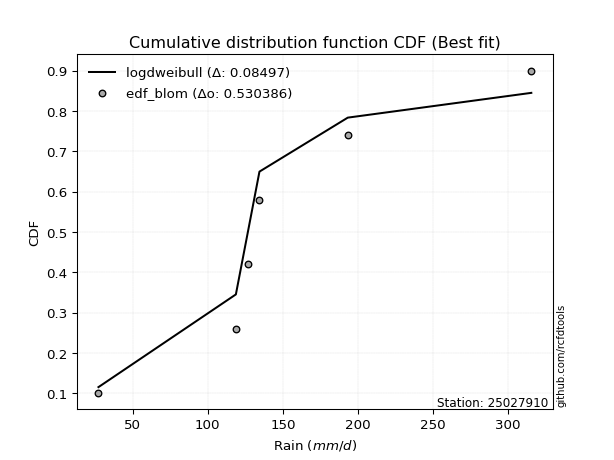</img></img>

</div>


### 7. EDF Tukey (1962)

In hydrology, the Tukey formula is used as a plotting position formula to estimate the empirical probability or frequency of a flood event (or other hydrological data). The formula parameter is given as _c=0.333_ (or 1/3).

<div align="center">


$P=(m-c)/(n+1-2c)$


</div>


**7.1. Empirical values**

<div align="center">

|                | 0                   | 1                  | 2                   | 3                  | 4                  | 5                  |
|:---------------|:--------------------|:-------------------|:--------------------|:-------------------|:-------------------|:-------------------|
| date           | 2020                | 2023               | 2022                | 2021               | 2025               | 2024               |
| x              | 27.2                | 118.7              | 126.7               | 134.4              | 193.2              | 315.4              |
| m              | 1                   | 2                  | 3                   | 4                  | 5                  | 6                  |
| empirical_dist | edf_tukey           | edf_tukey          | edf_tukey           | edf_tukey          | edf_tukey          | edf_tukey          |
| empirical      | 0.10526315789473684 | 0.2631578947368421 | 0.42105263157894735 | 0.5789473684210527 | 0.7368421052631579 | 0.8947368421052632 |
| empirical_tr   | 1.1176470588235294  | 1.357142857142857  | 1.7272727272727273  | 2.375              | 3.7999999999999994 | 9.5                |

</div>


**7.2. Kolmogorov-Smirnov fit test (sorted by Δ)**


<div align="center">

|                | 0                   | 1                   | 2                  | 3                   | 4                   | 5                   | 6                   | 7                  | 8                   | 9                  | 10                 | 11                  | 12                  | 13                  | 14                  | 15                 | 16                  | 17                  | 18                  | 19                 | 20                  | 21                  | 22                  | 23                  | 24                  | 25                  | 26                  | 27                 | 28                  | 29                 | 30                  | 31                  | 32                  | 33                  | 34                  | 35                 | 36                  | 37                  | 38                  | 39                  | 40                  | 41                  | 42                 | 43                  | 44                  | 45                 | 46                  | 47                  | 48                 | 49                  | 50                  | 51                  | 52                  | 53                  | 54                  | 55                 | 56                  | 57                  | 58                 | 59                 | 60                  | 61                  | 62                 | 63                  | 64                  | 65                  | 66                 | 67                 | 68                 | 69                  | 70                  | 71                  | 72                 | 73                  | 74                 | 75                  | 76                  | 77                  | 78                 | 79                 | 80                 | 81                  | 82                 | 83                 | 84                 | 85                  | 86                  | 87                  | 88                  | 89                 | 90                 | 91                  | 92                 | 93                  | 94                  | 95                | 96                 | 97                  | 98                  | 99                  | 100                 | 101                | 102                | 103                | 104                | 105                 | 106                | 107               | 108                 | 109                 | 110                 | 111                 | 112                | 113                 | 114                | 115                 | 116                | 117                | 118                 | 119                 | 120               | 121                | 122                | 123                 | 124                | 125                 | 126                | 127                 | 128                | 129                | 130                 | 131               | 132                 | 133                 | 134                 | 135                 | 136                | 137               | 138                 | 139                 | 140                | 141                | 142                 | 143                | 144                 | 145               | 146                | 147                | 148                | 149                | 150                | 151                | 152                | 153                | 154                | 155                | 156                | 157                | 158                | 159               |
|:---------------|:--------------------|:--------------------|:-------------------|:--------------------|:--------------------|:--------------------|:--------------------|:-------------------|:--------------------|:-------------------|:-------------------|:--------------------|:--------------------|:--------------------|:--------------------|:-------------------|:--------------------|:--------------------|:--------------------|:-------------------|:--------------------|:--------------------|:--------------------|:--------------------|:--------------------|:--------------------|:--------------------|:-------------------|:--------------------|:-------------------|:--------------------|:--------------------|:--------------------|:--------------------|:--------------------|:-------------------|:--------------------|:--------------------|:--------------------|:--------------------|:--------------------|:--------------------|:-------------------|:--------------------|:--------------------|:-------------------|:--------------------|:--------------------|:-------------------|:--------------------|:--------------------|:--------------------|:--------------------|:--------------------|:--------------------|:-------------------|:--------------------|:--------------------|:-------------------|:-------------------|:--------------------|:--------------------|:-------------------|:--------------------|:--------------------|:--------------------|:-------------------|:-------------------|:-------------------|:--------------------|:--------------------|:--------------------|:-------------------|:--------------------|:-------------------|:--------------------|:--------------------|:--------------------|:-------------------|:-------------------|:-------------------|:--------------------|:-------------------|:-------------------|:-------------------|:--------------------|:--------------------|:--------------------|:--------------------|:-------------------|:-------------------|:--------------------|:-------------------|:--------------------|:--------------------|:------------------|:-------------------|:--------------------|:--------------------|:--------------------|:--------------------|:-------------------|:-------------------|:-------------------|:-------------------|:--------------------|:-------------------|:------------------|:--------------------|:--------------------|:--------------------|:--------------------|:-------------------|:--------------------|:-------------------|:--------------------|:-------------------|:-------------------|:--------------------|:--------------------|:------------------|:-------------------|:-------------------|:--------------------|:-------------------|:--------------------|:-------------------|:--------------------|:-------------------|:-------------------|:--------------------|:------------------|:--------------------|:--------------------|:--------------------|:--------------------|:-------------------|:------------------|:--------------------|:--------------------|:-------------------|:-------------------|:--------------------|:-------------------|:--------------------|:------------------|:-------------------|:-------------------|:-------------------|:-------------------|:-------------------|:-------------------|:-------------------|:-------------------|:-------------------|:-------------------|:-------------------|:-------------------|:-------------------|:------------------|
| station        | 25027910            | 25027910            | 25027910           | 25027910            | 25027910            | 25027910            | 25027910            | 25027910           | 25027910            | 25027910           | 25027910           | 25027910            | 25027910            | 25027910            | 25027910            | 25027910           | 25027910            | 25027910            | 25027910            | 25027910           | 25027910            | 25027910            | 25027910            | 25027910            | 25027910            | 25027910            | 25027910            | 25027910           | 25027910            | 25027910           | 25027910            | 25027910            | 25027910            | 25027910            | 25027910            | 25027910           | 25027910            | 25027910            | 25027910            | 25027910            | 25027910            | 25027910            | 25027910           | 25027910            | 25027910            | 25027910           | 25027910            | 25027910            | 25027910           | 25027910            | 25027910            | 25027910            | 25027910            | 25027910            | 25027910            | 25027910           | 25027910            | 25027910            | 25027910           | 25027910           | 25027910            | 25027910            | 25027910           | 25027910            | 25027910            | 25027910            | 25027910           | 25027910           | 25027910           | 25027910            | 25027910            | 25027910            | 25027910           | 25027910            | 25027910           | 25027910            | 25027910            | 25027910            | 25027910           | 25027910           | 25027910           | 25027910            | 25027910           | 25027910           | 25027910           | 25027910            | 25027910            | 25027910            | 25027910            | 25027910           | 25027910           | 25027910            | 25027910           | 25027910            | 25027910            | 25027910          | 25027910           | 25027910            | 25027910            | 25027910            | 25027910            | 25027910           | 25027910           | 25027910           | 25027910           | 25027910            | 25027910           | 25027910          | 25027910            | 25027910            | 25027910            | 25027910            | 25027910           | 25027910            | 25027910           | 25027910            | 25027910           | 25027910           | 25027910            | 25027910            | 25027910          | 25027910           | 25027910           | 25027910            | 25027910           | 25027910            | 25027910           | 25027910            | 25027910           | 25027910           | 25027910            | 25027910          | 25027910            | 25027910            | 25027910            | 25027910            | 25027910           | 25027910          | 25027910            | 25027910            | 25027910           | 25027910           | 25027910            | 25027910           | 25027910            | 25027910          | 25027910           | 25027910           | 25027910           | 25027910           | 25027910           | 25027910           | 25027910           | 25027910           | 25027910           | 25027910           | 25027910           | 25027910           | 25027910           | 25027910          |
| empirical_dist | edf_tukey           | edf_tukey           | edf_tukey          | edf_tukey           | edf_tukey           | edf_tukey           | edf_tukey           | edf_tukey          | edf_tukey           | edf_tukey          | edf_tukey          | edf_tukey           | edf_tukey           | edf_tukey           | edf_tukey           | edf_tukey          | edf_tukey           | edf_tukey           | edf_tukey           | edf_tukey          | edf_tukey           | edf_tukey           | edf_tukey           | edf_tukey           | edf_tukey           | edf_tukey           | edf_tukey           | edf_tukey          | edf_tukey           | edf_tukey          | edf_tukey           | edf_tukey           | edf_tukey           | edf_tukey           | edf_tukey           | edf_tukey          | edf_tukey           | edf_tukey           | edf_tukey           | edf_tukey           | edf_tukey           | edf_tukey           | edf_tukey          | edf_tukey           | edf_tukey           | edf_tukey          | edf_tukey           | edf_tukey           | edf_tukey          | edf_tukey           | edf_tukey           | edf_tukey           | edf_tukey           | edf_tukey           | edf_tukey           | edf_tukey          | edf_tukey           | edf_tukey           | edf_tukey          | edf_tukey          | edf_tukey           | edf_tukey           | edf_tukey          | edf_tukey           | edf_tukey           | edf_tukey           | edf_tukey          | edf_tukey          | edf_tukey          | edf_tukey           | edf_tukey           | edf_tukey           | edf_tukey          | edf_tukey           | edf_tukey          | edf_tukey           | edf_tukey           | edf_tukey           | edf_tukey          | edf_tukey          | edf_tukey          | edf_tukey           | edf_tukey          | edf_tukey          | edf_tukey          | edf_tukey           | edf_tukey           | edf_tukey           | edf_tukey           | edf_tukey          | edf_tukey          | edf_tukey           | edf_tukey          | edf_tukey           | edf_tukey           | edf_tukey         | edf_tukey          | edf_tukey           | edf_tukey           | edf_tukey           | edf_tukey           | edf_tukey          | edf_tukey          | edf_tukey          | edf_tukey          | edf_tukey           | edf_tukey          | edf_tukey         | edf_tukey           | edf_tukey           | edf_tukey           | edf_tukey           | edf_tukey          | edf_tukey           | edf_tukey          | edf_tukey           | edf_tukey          | edf_tukey          | edf_tukey           | edf_tukey           | edf_tukey         | edf_tukey          | edf_tukey          | edf_tukey           | edf_tukey          | edf_tukey           | edf_tukey          | edf_tukey           | edf_tukey          | edf_tukey          | edf_tukey           | edf_tukey         | edf_tukey           | edf_tukey           | edf_tukey           | edf_tukey           | edf_tukey          | edf_tukey         | edf_tukey           | edf_tukey           | edf_tukey          | edf_tukey          | edf_tukey           | edf_tukey          | edf_tukey           | edf_tukey         | edf_tukey          | edf_tukey          | edf_tukey          | edf_tukey          | edf_tukey          | edf_tukey          | edf_tukey          | edf_tukey          | edf_tukey          | edf_tukey          | edf_tukey          | edf_tukey          | edf_tukey          | edf_tukey         |
| p_dist         | logdweibull         | logdgamma           | johnsonsu          | logjohnsonsu        | loggennorm          | nct                 | skewnorm            | rice               | pearson3            | invgamma           | maxwell            | exponnorm           | logt                | rayleigh            | invgauss            | genexpon           | genlogistic         | logloglaplace       | exponweib           | logloggamma        | gengamma            | gumbel_r            | betaprime           | logburr12           | foldnorm            | burr                | f                   | mielke             | erlang              | gamma              | loggenlogistic      | dgamma              | logburr             | ncf                 | invweibull          | logmielke          | logargus            | logweibull_min      | semicircular        | beta                | kstwobign           | loggenhalflogistic  | gennorm            | arcsine             | anglit              | loggumbel_l        | logvonmises_line    | moyal               | logskewnorm        | weibull_min         | bradford            | dweibull            | logpearson3         | kappa3              | t                   | truncnorm          | norm                | crystalball         | halfnorm           | loggausshyper      | truncexpon          | logtrapezoid        | logistic           | halflogistic        | loggompertz         | kappa4              | hypsecant          | ksone              | cosine             | loglevy_l           | logtriang           | wald                | gausshyper         | lomax               | loggenextreme      | wrapcauchy          | laplace             | uniform             | loglaplace         | loglaplace         | logf               | loghypsecant        | loglogistic        | logncf             | logcrystalball     | lognorm             | logexponnorm        | logfatiguelife      | logbeta             | lognct             | loganglit          | logsemicircular     | logarcsine         | logrice             | gumbel_l            | vonmises_line     | loginvgamma        | logbetaprime        | logerlang           | loggamma            | loggamma            | logalpha           | argus              | logmaxwell         | loginvgauss        | nakagami            | lognakagami        | logtruncnorm      | loginvweibull       | lograyleigh         | levy_l              | logwrapcauchy       | logcosine          | genpareto           | logjohnsonsb       | logfoldnorm         | loggenpareto       | loggumbel_r        | logkstwobign        | loghalfnorm         | logweibull_max    | loggenexpon        | halfgennorm        | genextreme          | logmoyal           | genhalflogistic     | logksone           | loghalflogistic     | logbradford        | logkappa4          | logkappa3           | loguniform        | alpha               | loggengamma         | loglomax            | burr12              | logwald            | triang            | logrdist            | trapezoid           | johnsonsb          | logtruncexpon      | logtruncweibull_min | logexponweib       | logtukeylambda      | truncweibull_min  | fatiguelife        | gompertz           | powerlaw           | logexponpow        | rdist              | truncpareto        | weibull_max        | logpowerlaw        | tukeylambda        | exponpow           | logtruncpareto     | loghalfgennorm     | logvonmises        | vonmises          |
| delta          | 0.08181229388850225 | 0.09082199028045408 | 0.0927631993809318 | 0.09692509586917308 | 0.11084062804313632 | 0.11785535015380116 | 0.12176201339976933 | 0.1222145781432512 | 0.12449072657318516 | 0.1265679160394888 | 0.1269357043274641 | 0.12790933646355873 | 0.12872871831180388 | 0.13015796014211017 | 0.13032142505162675 | 0.1309523206325614 | 0.13155397862764462 | 0.13280113015359485 | 0.13312319442972714 | 0.1331929866856983 | 0.13401605300237024 | 0.13441867783568423 | 0.13619227440967796 | 0.13666936117937017 | 0.13743007321981837 | 0.13780236583963834 | 0.13877978966622156 | 0.1388789944806197 | 0.13889927580257871 | 0.1388992773119314 | 0.13932885248444288 | 0.13936264974322643 | 0.13940961149331266 | 0.14098815226847478 | 0.14131206280843434 | 0.1436691907927493 | 0.14374533094705916 | 0.14419145992454246 | 0.14497106692834394 | 0.14720257626877858 | 0.14754648518811853 | 0.14803431785986676 | 0.1485197861738553 | 0.14860047912051427 | 0.14973968560466694 | 0.1501917023242833 | 0.15205849334889743 | 0.15224814809584103 | 0.1554605081250699 | 0.15568936532866834 | 0.15599768175998535 | 0.15618902206034752 | 0.15692930162557073 | 0.15906527589453628 | 0.16124734352447345 | 0.1612524601993267 | 0.16125246570134993 | 0.16125255080594514 | 0.1644758003569053 | 0.1665965923980136 | 0.16855453576378882 | 0.16877943858820776 | 0.1720717644028915 | 0.17244888219305726 | 0.17269833693796627 | 0.17727569467714055 | 0.1810472060283086 | 0.1856441067971803 | 0.1863734396275356 | 0.18879123215912264 | 0.19107359387268252 | 0.19285743133729144 | 0.1938931816739039 | 0.19643683622267166 | 0.1964932005292494 | 0.20595462063355702 | 0.20625885604970778 | 0.20698345447240585 | 0.2092885845448323 | 0.2092885845448323 | 0.2161257547967816 | 0.21681464279326473 | 0.2186752111358739 | 0.2201356820562868 | 0.2208562247508461 | 0.22085622904646302 | 0.22086052850115379 | 0.22175647073286858 | 0.22216545493204687 | 0.2228573467097264 | 0.2231426541101238 | 0.22408496137554146 | 0.2278200978944815 | 0.22847466757265344 | 0.22938702475621986 | 0.229589838052289 | 0.2344254661590099 | 0.23650730517062307 | 0.23908151400210814 | 0.23925779985824686 | 0.23925779985824686 | 0.2432413610317335 | 0.2495026910601852 | 0.2544726514242432 | 0.2619784917467651 | 0.26311244811928713 | 0.2631569226793227 | 0.263157373448849 | 0.26329955179943126 | 0.26581163688010284 | 0.27158715660072985 | 0.27163081451533017 | 0.2734314036870515 | 0.27664968815497365 | 0.2848154728813012 | 0.28659257687534384 | 0.2881835521976473 | 0.2905728046808312 | 0.29746721607097165 | 0.29774636271236915 | 0.303339282665899 | 0.3069021856012521 | 0.3086155654507487 | 0.31601498604791717 | 0.3164481016305453 | 0.31708308155547416 | 0.3211981395891446 | 0.32163460727753584 | 0.3265223941273074 | 0.3325741073749045 | 0.33805738878147623 | 0.338069346454342 | 0.33854025594202714 | 0.34103355032124494 | 0.36126760616433046 | 0.36167755010525177 | 0.3884630906130166 | 0.394674607348357 | 0.40948532269855603 | 0.42407562499732276 | 0.4348850920178142 | 0.4369759777129279 | 0.46195618120774135 | 0.4671116321528553 | 0.48477956863828847 | 0.500256760571983 | 0.5162043141848867 | 0.5789339655428704 | 0.5879063989855191 | 0.5895653698581684 | 0.6040899188086195 | 0.6453094266985568 | 0.6560087581963152 | 0.6593997642396678 | 0.6741619998108779 | 0.6921957891925401 | 0.6941519721043337 | 0.7368421052631579 | 1.1742771596097148 | 49.57242952912461 |
| deltao         | 0.530385761606      | 0.530385761606      | 0.530385761606     | 0.530385761606      | 0.530385761606      | 0.530385761606      | 0.530385761606      | 0.530385761606     | 0.530385761606      | 0.530385761606     | 0.530385761606     | 0.530385761606      | 0.530385761606      | 0.530385761606      | 0.530385761606      | 0.530385761606     | 0.530385761606      | 0.530385761606      | 0.530385761606      | 0.530385761606     | 0.530385761606      | 0.530385761606      | 0.530385761606      | 0.530385761606      | 0.530385761606      | 0.530385761606      | 0.530385761606      | 0.530385761606     | 0.530385761606      | 0.530385761606     | 0.530385761606      | 0.530385761606      | 0.530385761606      | 0.530385761606      | 0.530385761606      | 0.530385761606     | 0.530385761606      | 0.530385761606      | 0.530385761606      | 0.530385761606      | 0.530385761606      | 0.530385761606      | 0.530385761606     | 0.530385761606      | 0.530385761606      | 0.530385761606     | 0.530385761606      | 0.530385761606      | 0.530385761606     | 0.530385761606      | 0.530385761606      | 0.530385761606      | 0.530385761606      | 0.530385761606      | 0.530385761606      | 0.530385761606     | 0.530385761606      | 0.530385761606      | 0.530385761606     | 0.530385761606     | 0.530385761606      | 0.530385761606      | 0.530385761606     | 0.530385761606      | 0.530385761606      | 0.530385761606      | 0.530385761606     | 0.530385761606     | 0.530385761606     | 0.530385761606      | 0.530385761606      | 0.530385761606      | 0.530385761606     | 0.530385761606      | 0.530385761606     | 0.530385761606      | 0.530385761606      | 0.530385761606      | 0.530385761606     | 0.530385761606     | 0.530385761606     | 0.530385761606      | 0.530385761606     | 0.530385761606     | 0.530385761606     | 0.530385761606      | 0.530385761606      | 0.530385761606      | 0.530385761606      | 0.530385761606     | 0.530385761606     | 0.530385761606      | 0.530385761606     | 0.530385761606      | 0.530385761606      | 0.530385761606    | 0.530385761606     | 0.530385761606      | 0.530385761606      | 0.530385761606      | 0.530385761606      | 0.530385761606     | 0.530385761606     | 0.530385761606     | 0.530385761606     | 0.530385761606      | 0.530385761606     | 0.530385761606    | 0.530385761606      | 0.530385761606      | 0.530385761606      | 0.530385761606      | 0.530385761606     | 0.530385761606      | 0.530385761606     | 0.530385761606      | 0.530385761606     | 0.530385761606     | 0.530385761606      | 0.530385761606      | 0.530385761606    | 0.530385761606     | 0.530385761606     | 0.530385761606      | 0.530385761606     | 0.530385761606      | 0.530385761606     | 0.530385761606      | 0.530385761606     | 0.530385761606     | 0.530385761606      | 0.530385761606    | 0.530385761606      | 0.530385761606      | 0.530385761606      | 0.530385761606      | 0.530385761606     | 0.530385761606    | 0.530385761606      | 0.530385761606      | 0.530385761606     | 0.530385761606     | 0.530385761606      | 0.530385761606     | 0.530385761606      | 0.530385761606    | 0.530385761606     | 0.530385761606     | 0.530385761606     | 0.530385761606     | 0.530385761606     | 0.530385761606     | 0.530385761606     | 0.530385761606     | 0.530385761606     | 0.530385761606     | 0.530385761606     | 0.530385761606     | 0.530385761606     | 0.530385761606    |
| eval           | Δo > Δ              | Δo > Δ              | Δo > Δ             | Δo > Δ              | Δo > Δ              | Δo > Δ              | Δo > Δ              | Δo > Δ             | Δo > Δ              | Δo > Δ             | Δo > Δ             | Δo > Δ              | Δo > Δ              | Δo > Δ              | Δo > Δ              | Δo > Δ             | Δo > Δ              | Δo > Δ              | Δo > Δ              | Δo > Δ             | Δo > Δ              | Δo > Δ              | Δo > Δ              | Δo > Δ              | Δo > Δ              | Δo > Δ              | Δo > Δ              | Δo > Δ             | Δo > Δ              | Δo > Δ             | Δo > Δ              | Δo > Δ              | Δo > Δ              | Δo > Δ              | Δo > Δ              | Δo > Δ             | Δo > Δ              | Δo > Δ              | Δo > Δ              | Δo > Δ              | Δo > Δ              | Δo > Δ              | Δo > Δ             | Δo > Δ              | Δo > Δ              | Δo > Δ             | Δo > Δ              | Δo > Δ              | Δo > Δ             | Δo > Δ              | Δo > Δ              | Δo > Δ              | Δo > Δ              | Δo > Δ              | Δo > Δ              | Δo > Δ             | Δo > Δ              | Δo > Δ              | Δo > Δ             | Δo > Δ             | Δo > Δ              | Δo > Δ              | Δo > Δ             | Δo > Δ              | Δo > Δ              | Δo > Δ              | Δo > Δ             | Δo > Δ             | Δo > Δ             | Δo > Δ              | Δo > Δ              | Δo > Δ              | Δo > Δ             | Δo > Δ              | Δo > Δ             | Δo > Δ              | Δo > Δ              | Δo > Δ              | Δo > Δ             | Δo > Δ             | Δo > Δ             | Δo > Δ              | Δo > Δ             | Δo > Δ             | Δo > Δ             | Δo > Δ              | Δo > Δ              | Δo > Δ              | Δo > Δ              | Δo > Δ             | Δo > Δ             | Δo > Δ              | Δo > Δ             | Δo > Δ              | Δo > Δ              | Δo > Δ            | Δo > Δ             | Δo > Δ              | Δo > Δ              | Δo > Δ              | Δo > Δ              | Δo > Δ             | Δo > Δ             | Δo > Δ             | Δo > Δ             | Δo > Δ              | Δo > Δ             | Δo > Δ            | Δo > Δ              | Δo > Δ              | Δo > Δ              | Δo > Δ              | Δo > Δ             | Δo > Δ              | Δo > Δ             | Δo > Δ              | Δo > Δ             | Δo > Δ             | Δo > Δ              | Δo > Δ              | Δo > Δ            | Δo > Δ             | Δo > Δ             | Δo > Δ              | Δo > Δ             | Δo > Δ              | Δo > Δ             | Δo > Δ              | Δo > Δ             | Δo > Δ             | Δo > Δ              | Δo > Δ            | Δo > Δ              | Δo > Δ              | Δo > Δ              | Δo > Δ              | Δo > Δ             | Δo > Δ            | Δo > Δ              | Δo > Δ              | Δo > Δ             | Δo > Δ             | Δo > Δ              | Δo > Δ             | Δo > Δ              | Δo > Δ            | Δo > Δ             | Δo <= Δ            | Δo <= Δ            | Δo <= Δ            | Δo <= Δ            | Δo <= Δ            | Δo <= Δ            | Δo <= Δ            | Δo <= Δ            | Δo <= Δ            | Δo <= Δ            | Δo <= Δ            | Δo <= Δ            | Δo <= Δ           |
| fit            | 1                   | 1                   | 1                  | 1                   | 1                   | 1                   | 1                   | 1                  | 1                   | 1                  | 1                  | 1                   | 1                   | 1                   | 1                   | 1                  | 1                   | 1                   | 1                   | 1                  | 1                   | 1                   | 1                   | 1                   | 1                   | 1                   | 1                   | 1                  | 1                   | 1                  | 1                   | 1                   | 1                   | 1                   | 1                   | 1                  | 1                   | 1                   | 1                   | 1                   | 1                   | 1                   | 1                  | 1                   | 1                   | 1                  | 1                   | 1                   | 1                  | 1                   | 1                   | 1                   | 1                   | 1                   | 1                   | 1                  | 1                   | 1                   | 1                  | 1                  | 1                   | 1                   | 1                  | 1                   | 1                   | 1                   | 1                  | 1                  | 1                  | 1                   | 1                   | 1                   | 1                  | 1                   | 1                  | 1                   | 1                   | 1                   | 1                  | 1                  | 1                  | 1                   | 1                  | 1                  | 1                  | 1                   | 1                   | 1                   | 1                   | 1                  | 1                  | 1                   | 1                  | 1                   | 1                   | 1                 | 1                  | 1                   | 1                   | 1                   | 1                   | 1                  | 1                  | 1                  | 1                  | 1                   | 1                  | 1                 | 1                   | 1                   | 1                   | 1                   | 1                  | 1                   | 1                  | 1                   | 1                  | 1                  | 1                   | 1                   | 1                 | 1                  | 1                  | 1                   | 1                  | 1                   | 1                  | 1                   | 1                  | 1                  | 1                   | 1                 | 1                   | 1                   | 1                   | 1                   | 1                  | 1                 | 1                   | 1                   | 1                  | 1                  | 1                   | 1                  | 1                   | 1                 | 1                  | 0                  | 0                  | 0                  | 0                  | 0                  | 0                  | 0                  | 0                  | 0                  | 0                  | 0                  | 0                  | 0                 |
| n              | 6                   | 6                   | 6                  | 6                   | 6                   | 6                   | 6                   | 6                  | 6                   | 6                  | 6                  | 6                   | 6                   | 6                   | 6                   | 6                  | 6                   | 6                   | 6                   | 6                  | 6                   | 6                   | 6                   | 6                   | 6                   | 6                   | 6                   | 6                  | 6                   | 6                  | 6                   | 6                   | 6                   | 6                   | 6                   | 6                  | 6                   | 6                   | 6                   | 6                   | 6                   | 6                   | 6                  | 6                   | 6                   | 6                  | 6                   | 6                   | 6                  | 6                   | 6                   | 6                   | 6                   | 6                   | 6                   | 6                  | 6                   | 6                   | 6                  | 6                  | 6                   | 6                   | 6                  | 6                   | 6                   | 6                   | 6                  | 6                  | 6                  | 6                   | 6                   | 6                   | 6                  | 6                   | 6                  | 6                   | 6                   | 6                   | 6                  | 6                  | 6                  | 6                   | 6                  | 6                  | 6                  | 6                   | 6                   | 6                   | 6                   | 6                  | 6                  | 6                   | 6                  | 6                   | 6                   | 6                 | 6                  | 6                   | 6                   | 6                   | 6                   | 6                  | 6                  | 6                  | 6                  | 6                   | 6                  | 6                 | 6                   | 6                   | 6                   | 6                   | 6                  | 6                   | 6                  | 6                   | 6                  | 6                  | 6                   | 6                   | 6                 | 6                  | 6                  | 6                   | 6                  | 6                   | 6                  | 6                   | 6                  | 6                  | 6                   | 6                 | 6                   | 6                   | 6                   | 6                   | 6                  | 6                 | 6                   | 6                   | 6                  | 6                  | 6                   | 6                  | 6                   | 6                 | 6                  | 6                  | 6                  | 6                  | 6                  | 6                  | 6                  | 6                  | 6                  | 6                  | 6                  | 6                  | 6                  | 6                 |
| best_fit       | 1                   | 0                   | 0                  | 0                   | 0                   | 0                   | 0                   | 0                  | 0                   | 0                  | 0                  | 0                   | 0                   | 0                   | 0                   | 0                  | 0                   | 0                   | 0                   | 0                  | 0                   | 0                   | 0                   | 0                   | 0                   | 0                   | 0                   | 0                  | 0                   | 0                  | 0                   | 0                   | 0                   | 0                   | 0                   | 0                  | 0                   | 0                   | 0                   | 0                   | 0                   | 0                   | 0                  | 0                   | 0                   | 0                  | 0                   | 0                   | 0                  | 0                   | 0                   | 0                   | 0                   | 0                   | 0                   | 0                  | 0                   | 0                   | 0                  | 0                  | 0                   | 0                   | 0                  | 0                   | 0                   | 0                   | 0                  | 0                  | 0                  | 0                   | 0                   | 0                   | 0                  | 0                   | 0                  | 0                   | 0                   | 0                   | 0                  | 0                  | 0                  | 0                   | 0                  | 0                  | 0                  | 0                   | 0                   | 0                   | 0                   | 0                  | 0                  | 0                   | 0                  | 0                   | 0                   | 0                 | 0                  | 0                   | 0                   | 0                   | 0                   | 0                  | 0                  | 0                  | 0                  | 0                   | 0                  | 0                 | 0                   | 0                   | 0                   | 0                   | 0                  | 0                   | 0                  | 0                   | 0                  | 0                  | 0                   | 0                   | 0                 | 0                  | 0                  | 0                   | 0                  | 0                   | 0                  | 0                   | 0                  | 0                  | 0                   | 0                 | 0                   | 0                   | 0                   | 0                   | 0                  | 0                 | 0                   | 0                   | 0                  | 0                  | 0                   | 0                  | 0                   | 0                 | 0                  | 0                  | 0                  | 0                  | 0                  | 0                  | 0                  | 0                  | 0                  | 0                  | 0                  | 0                  | 0                  | 0                 |
| best_fit_sort  | 1                   | 2                   | 3                  | 4                   | 5                   | 6                   | 7                   | 8                  | 9                   | 10                 | 11                 | 12                  | 13                  | 14                  | 15                  | 16                 | 17                  | 18                  | 19                  | 20                 | 21                  | 22                  | 23                  | 24                  | 25                  | 26                  | 27                  | 28                 | 29                  | 30                 | 31                  | 32                  | 33                  | 34                  | 35                  | 36                 | 37                  | 38                  | 39                  | 40                  | 41                  | 42                  | 43                 | 44                  | 45                  | 46                 | 47                  | 48                  | 49                 | 50                  | 51                  | 52                  | 53                  | 54                  | 55                  | 56                 | 57                  | 58                  | 59                 | 60                 | 61                  | 62                  | 63                 | 64                  | 65                  | 66                  | 67                 | 68                 | 69                 | 70                  | 71                  | 72                  | 73                 | 74                  | 75                 | 76                  | 77                  | 78                  | 79                 | 80                 | 81                 | 82                  | 83                 | 84                 | 85                 | 86                  | 87                  | 88                  | 89                  | 90                 | 91                 | 92                  | 93                 | 94                  | 95                  | 96                | 97                 | 98                  | 99                  | 100                 | 101                 | 102                | 103                | 104                | 105                | 106                 | 107                | 108               | 109                 | 110                 | 111                 | 112                 | 113                | 114                 | 115                | 116                 | 117                | 118                | 119                 | 120                 | 121               | 122                | 123                | 124                 | 125                | 126                 | 127                | 128                 | 129                | 130                | 131                 | 132               | 133                 | 134                 | 135                 | 136                 | 137                | 138               | 139                 | 140                 | 141                | 142                | 143                 | 144                | 145                 | 146               | 147                | 148                | 149                | 150                | 151                | 152                | 153                | 154                | 155                | 156                | 157                | 158                | 159                | 160               |

</div>


**7.3. Best fit**

<div align="center">

|   id |   station | empirical_dist   | p_dist      |     delta |   deltao | eval   |   fit |   n |   best_fit |   best_fit_sort |
|-----:|----------:|:-----------------|:------------|----------:|---------:|:-------|------:|----:|-----------:|----------------:|
|    0 |  25027910 | edf_tukey        | logdweibull | 0.0818123 | 0.530386 | Δo > Δ |     1 |   6 |          1 |               1 |

</div>


<div align="center">

</img></img>

</div>


### 8. EDF Gringorten (1963)

Gringorten plotting position formula is essential for estimating the probability and return periods of extreme events like floods and heavy rainfall. The constant _a=0.44_.

<div align="center">


$P=(m-a)/(n+1-2a)$


</div>


**8.1. Empirical values**

<div align="center">

|                | 0                   | 1                  | 2                   | 3                  | 4                  | 5                  |
|:---------------|:--------------------|:-------------------|:--------------------|:-------------------|:-------------------|:-------------------|
| date           | 2020                | 2023               | 2022                | 2021               | 2025               | 2024               |
| x              | 27.2                | 118.7              | 126.7               | 134.4              | 193.2              | 315.4              |
| m              | 1                   | 2                  | 3                   | 4                  | 5                  | 6                  |
| empirical_dist | edf_gringorten      | edf_gringorten     | edf_gringorten      | edf_gringorten     | edf_gringorten     | edf_gringorten     |
| empirical      | 0.09150326797385622 | 0.2549019607843137 | 0.41830065359477125 | 0.5816993464052288 | 0.7450980392156862 | 0.9084967320261437 |
| empirical_tr   | 1.1007194244604317  | 1.3421052631578947 | 1.7191011235955058  | 2.3906250000000004 | 3.9230769230769216 | 10.928571428571415 |

</div>


**8.2. Kolmogorov-Smirnov fit test (sorted by Δ)**


<div align="center">

|                | 0                   | 1                   | 2                   | 3                   | 4                 | 5                   | 6                   | 7                   | 8                  | 9                  | 10                  | 11                 | 12                  | 13                  | 14                  | 15                  | 16                | 17                  | 18                  | 19                  | 20                  | 21                  | 22                 | 23                  | 24                  | 25                  | 26                  | 27                  | 28                  | 29                 | 30                 | 31                  | 32                 | 33                  | 34                  | 35                  | 36                  | 37                 | 38                  | 39                  | 40                  | 41                  | 42                 | 43                  | 44                  | 45                 | 46                 | 47                 | 48                  | 49                  | 50                 | 51                  | 52                  | 53                  | 54                  | 55                 | 56                 | 57                  | 58                  | 59                  | 60                | 61                 | 62                  | 63                 | 64                  | 65                  | 66                  | 67                  | 68                  | 69                  | 70                  | 71                 | 72                  | 73                  | 74                  | 75                  | 76                  | 77                | 78                  | 79                  | 80                  | 81                  | 82                  | 83                 | 84                 | 85                  | 86                 | 87                  | 88                  | 89                  | 90                  | 91                | 92                  | 93                  | 94                  | 95                  | 96                  | 97                  | 98                  | 99                  | 100                 | 101                | 102                 | 103                 | 104                 | 105                | 106                | 107                 | 108                 | 109                | 110                 | 111                 | 112               | 113                 | 114                | 115                | 116                | 117                 | 118                 | 119                 | 120                | 121                | 122                | 123                | 124                | 125               | 126                | 127                | 128                 | 129                | 130                | 131                | 132                | 133                 | 134                 | 135                 | 136               | 137                 | 138                | 139               | 140                 | 141                | 142                 | 143                 | 144                 | 145                | 146               | 147                | 148                | 149                | 150               | 151                | 152                | 153                | 154                | 155                | 156               | 157                | 158                | 159               |
|:---------------|:--------------------|:--------------------|:--------------------|:--------------------|:------------------|:--------------------|:--------------------|:--------------------|:-------------------|:-------------------|:--------------------|:-------------------|:--------------------|:--------------------|:--------------------|:--------------------|:------------------|:--------------------|:--------------------|:--------------------|:--------------------|:--------------------|:-------------------|:--------------------|:--------------------|:--------------------|:--------------------|:--------------------|:--------------------|:-------------------|:-------------------|:--------------------|:-------------------|:--------------------|:--------------------|:--------------------|:--------------------|:-------------------|:--------------------|:--------------------|:--------------------|:--------------------|:-------------------|:--------------------|:--------------------|:-------------------|:-------------------|:-------------------|:--------------------|:--------------------|:-------------------|:--------------------|:--------------------|:--------------------|:--------------------|:-------------------|:-------------------|:--------------------|:--------------------|:--------------------|:------------------|:-------------------|:--------------------|:-------------------|:--------------------|:--------------------|:--------------------|:--------------------|:--------------------|:--------------------|:--------------------|:-------------------|:--------------------|:--------------------|:--------------------|:--------------------|:--------------------|:------------------|:--------------------|:--------------------|:--------------------|:--------------------|:--------------------|:-------------------|:-------------------|:--------------------|:-------------------|:--------------------|:--------------------|:--------------------|:--------------------|:------------------|:--------------------|:--------------------|:--------------------|:--------------------|:--------------------|:--------------------|:--------------------|:--------------------|:--------------------|:-------------------|:--------------------|:--------------------|:--------------------|:-------------------|:-------------------|:--------------------|:--------------------|:-------------------|:--------------------|:--------------------|:------------------|:--------------------|:-------------------|:-------------------|:-------------------|:--------------------|:--------------------|:--------------------|:-------------------|:-------------------|:-------------------|:-------------------|:-------------------|:------------------|:-------------------|:-------------------|:--------------------|:-------------------|:-------------------|:-------------------|:-------------------|:--------------------|:--------------------|:--------------------|:------------------|:--------------------|:-------------------|:------------------|:--------------------|:-------------------|:--------------------|:--------------------|:--------------------|:-------------------|:------------------|:-------------------|:-------------------|:-------------------|:------------------|:-------------------|:-------------------|:-------------------|:-------------------|:-------------------|:------------------|:-------------------|:-------------------|:------------------|
| station        | 25027910            | 25027910            | 25027910            | 25027910            | 25027910          | 25027910            | 25027910            | 25027910            | 25027910           | 25027910           | 25027910            | 25027910           | 25027910            | 25027910            | 25027910            | 25027910            | 25027910          | 25027910            | 25027910            | 25027910            | 25027910            | 25027910            | 25027910           | 25027910            | 25027910            | 25027910            | 25027910            | 25027910            | 25027910            | 25027910           | 25027910           | 25027910            | 25027910           | 25027910            | 25027910            | 25027910            | 25027910            | 25027910           | 25027910            | 25027910            | 25027910            | 25027910            | 25027910           | 25027910            | 25027910            | 25027910           | 25027910           | 25027910           | 25027910            | 25027910            | 25027910           | 25027910            | 25027910            | 25027910            | 25027910            | 25027910           | 25027910           | 25027910            | 25027910            | 25027910            | 25027910          | 25027910           | 25027910            | 25027910           | 25027910            | 25027910            | 25027910            | 25027910            | 25027910            | 25027910            | 25027910            | 25027910           | 25027910            | 25027910            | 25027910            | 25027910            | 25027910            | 25027910          | 25027910            | 25027910            | 25027910            | 25027910            | 25027910            | 25027910           | 25027910           | 25027910            | 25027910           | 25027910            | 25027910            | 25027910            | 25027910            | 25027910          | 25027910            | 25027910            | 25027910            | 25027910            | 25027910            | 25027910            | 25027910            | 25027910            | 25027910            | 25027910           | 25027910            | 25027910            | 25027910            | 25027910           | 25027910           | 25027910            | 25027910            | 25027910           | 25027910            | 25027910            | 25027910          | 25027910            | 25027910           | 25027910           | 25027910           | 25027910            | 25027910            | 25027910            | 25027910           | 25027910           | 25027910           | 25027910           | 25027910           | 25027910          | 25027910           | 25027910           | 25027910            | 25027910           | 25027910           | 25027910           | 25027910           | 25027910            | 25027910            | 25027910            | 25027910          | 25027910            | 25027910           | 25027910          | 25027910            | 25027910           | 25027910            | 25027910            | 25027910            | 25027910           | 25027910          | 25027910           | 25027910           | 25027910           | 25027910          | 25027910           | 25027910           | 25027910           | 25027910           | 25027910           | 25027910          | 25027910           | 25027910           | 25027910          |
| empirical_dist | edf_gringorten      | edf_gringorten      | edf_gringorten      | edf_gringorten      | edf_gringorten    | edf_gringorten      | edf_gringorten      | edf_gringorten      | edf_gringorten     | edf_gringorten     | edf_gringorten      | edf_gringorten     | edf_gringorten      | edf_gringorten      | edf_gringorten      | edf_gringorten      | edf_gringorten    | edf_gringorten      | edf_gringorten      | edf_gringorten      | edf_gringorten      | edf_gringorten      | edf_gringorten     | edf_gringorten      | edf_gringorten      | edf_gringorten      | edf_gringorten      | edf_gringorten      | edf_gringorten      | edf_gringorten     | edf_gringorten     | edf_gringorten      | edf_gringorten     | edf_gringorten      | edf_gringorten      | edf_gringorten      | edf_gringorten      | edf_gringorten     | edf_gringorten      | edf_gringorten      | edf_gringorten      | edf_gringorten      | edf_gringorten     | edf_gringorten      | edf_gringorten      | edf_gringorten     | edf_gringorten     | edf_gringorten     | edf_gringorten      | edf_gringorten      | edf_gringorten     | edf_gringorten      | edf_gringorten      | edf_gringorten      | edf_gringorten      | edf_gringorten     | edf_gringorten     | edf_gringorten      | edf_gringorten      | edf_gringorten      | edf_gringorten    | edf_gringorten     | edf_gringorten      | edf_gringorten     | edf_gringorten      | edf_gringorten      | edf_gringorten      | edf_gringorten      | edf_gringorten      | edf_gringorten      | edf_gringorten      | edf_gringorten     | edf_gringorten      | edf_gringorten      | edf_gringorten      | edf_gringorten      | edf_gringorten      | edf_gringorten    | edf_gringorten      | edf_gringorten      | edf_gringorten      | edf_gringorten      | edf_gringorten      | edf_gringorten     | edf_gringorten     | edf_gringorten      | edf_gringorten     | edf_gringorten      | edf_gringorten      | edf_gringorten      | edf_gringorten      | edf_gringorten    | edf_gringorten      | edf_gringorten      | edf_gringorten      | edf_gringorten      | edf_gringorten      | edf_gringorten      | edf_gringorten      | edf_gringorten      | edf_gringorten      | edf_gringorten     | edf_gringorten      | edf_gringorten      | edf_gringorten      | edf_gringorten     | edf_gringorten     | edf_gringorten      | edf_gringorten      | edf_gringorten     | edf_gringorten      | edf_gringorten      | edf_gringorten    | edf_gringorten      | edf_gringorten     | edf_gringorten     | edf_gringorten     | edf_gringorten      | edf_gringorten      | edf_gringorten      | edf_gringorten     | edf_gringorten     | edf_gringorten     | edf_gringorten     | edf_gringorten     | edf_gringorten    | edf_gringorten     | edf_gringorten     | edf_gringorten      | edf_gringorten     | edf_gringorten     | edf_gringorten     | edf_gringorten     | edf_gringorten      | edf_gringorten      | edf_gringorten      | edf_gringorten    | edf_gringorten      | edf_gringorten     | edf_gringorten    | edf_gringorten      | edf_gringorten     | edf_gringorten      | edf_gringorten      | edf_gringorten      | edf_gringorten     | edf_gringorten    | edf_gringorten     | edf_gringorten     | edf_gringorten     | edf_gringorten    | edf_gringorten     | edf_gringorten     | edf_gringorten     | edf_gringorten     | edf_gringorten     | edf_gringorten    | edf_gringorten     | edf_gringorten     | edf_gringorten    |
| p_dist         | johnsonsu           | logjohnsonsu        | logdweibull         | logdgamma           | loggennorm        | logt                | nct                 | skewnorm            | pearson3           | rice               | maxwell             | invgamma           | exponnorm           | rayleigh            | invgauss            | genexpon            | genlogistic       | gennorm             | logloglaplace       | exponweib           | logloggamma         | gengamma            | gumbel_r           | betaprime           | logburr12           | foldnorm            | burr                | f                   | mielke              | erlang             | gamma              | loggenlogistic      | dgamma             | logburr             | semicircular        | ncf                 | invweibull          | logmielke          | logargus            | logweibull_min      | anglit              | beta                | kstwobign          | loggenhalflogistic  | arcsine             | loggumbel_l        | logvonmises_line   | moyal              | logskewnorm         | weibull_min         | t                  | truncnorm           | norm                | crystalball         | bradford            | dweibull           | logpearson3        | kappa3              | halfnorm            | logistic            | loggausshyper     | truncexpon         | logtrapezoid        | kappa4             | halflogistic        | loggompertz         | hypsecant           | ksone               | cosine              | gausshyper          | loggenextreme       | logtriang          | wald                | loglevy_l           | lomax               | wrapcauchy          | laplace             | uniform           | loglaplace          | loglaplace          | logf                | logbeta             | loghypsecant        | loglogistic        | logncf             | logcrystalball      | lognorm            | logexponnorm        | logfatiguelife      | lognct              | loganglit           | gumbel_l          | logsemicircular     | vonmises_line       | logarcsine          | logrice             | loginvgamma         | logbetaprime        | logerlang           | loggamma            | loggamma            | logalpha           | argus               | nakagami            | lognakagami         | logtruncnorm       | logmaxwell         | loginvgauss         | loginvweibull       | lograyleigh        | logwrapcauchy       | logcosine           | genpareto         | levy_l              | logjohnsonsb       | logfoldnorm        | loggenpareto       | loggumbel_r         | logkstwobign        | loghalfnorm         | logweibull_max     | loggenexpon        | halfgennorm        | genhalflogistic    | logmoyal           | logksone          | genextreme         | loghalflogistic    | logbradford         | logkappa4          | logkappa3          | loguniform         | alpha              | loggengamma         | loglomax            | burr12              | logwald           | triang              | logrdist           | trapezoid         | johnsonsb           | logtruncexpon      | logtruncweibull_min | logexponweib        | logtukeylambda      | truncweibull_min   | fatiguelife       | gompertz           | powerlaw           | logexponpow        | rdist             | truncpareto        | weibull_max        | logpowerlaw        | tukeylambda        | exponpow           | logtruncpareto    | loghalfgennorm     | logvonmises        | vonmises          |
| delta          | 0.08450726542840348 | 0.08866916191664476 | 0.09006822784103063 | 0.09698981541510965 | 0.102584694090608 | 0.12047278435927555 | 0.12475523431306951 | 0.12582772983838358 | 0.1272427045573613 | 0.1289905721887239 | 0.12968768231164024 | 0.1348238499920172 | 0.13616527041608711 | 0.13841389409463856 | 0.13857735900415513 | 0.13920825458508979 | 0.139809912580173 | 0.14026385222132698 | 0.14105706410612323 | 0.14137912838225553 | 0.14144892063822667 | 0.14227198695489862 | 0.1426746117882126 | 0.14444820836220634 | 0.14492529513189856 | 0.14568600717234675 | 0.14605829979216672 | 0.14703572361874995 | 0.14713492843314807 | 0.1471552097551071 | 0.1471552112644598 | 0.14758478643697126 | 0.1476185836957548 | 0.14766554544584104 | 0.14772304491252009 | 0.14924408622100316 | 0.14956799676096272 | 0.1519251247452777 | 0.15200126489958754 | 0.15244739387707085 | 0.15249166358884308 | 0.15545851022130697 | 0.1558024191406469 | 0.15629025181239514 | 0.15685641307304266 | 0.1584476362768117 | 0.1603144273014258 | 0.1605040820483694 | 0.16371644207759828 | 0.16394529928119672 | 0.1639993215086496 | 0.16400443818350285 | 0.16400444368552608 | 0.16400452879012128 | 0.16425361571251373 | 0.1644449560128759 | 0.1651852355780991 | 0.16732120984706467 | 0.17273173430943367 | 0.17482374238706766 | 0.174852526350542 | 0.1768104697163172 | 0.17703537254073615 | 0.1800276726613167 | 0.18070481614558564 | 0.18095427089049465 | 0.18379918401248474 | 0.18839608478135644 | 0.18912541761171175 | 0.19664515965808005 | 0.19924517851342555 | 0.1993295278252109 | 0.20111336528981982 | 0.20255112208000325 | 0.20469277017520005 | 0.20870659861773316 | 0.20901083403388393 | 0.209735432456582 | 0.21754451849736067 | 0.21754451849736067 | 0.22438168874930997 | 0.22491743291622301 | 0.22507057674579312 | 0.2269311450884023 | 0.2283916160088152 | 0.22911215870337448 | 0.2291121629989914 | 0.22911646245368217 | 0.23001240468539697 | 0.23111328066225478 | 0.23139858806265218 | 0.232139002740396 | 0.23234089532806984 | 0.23234181603646514 | 0.23607603184700987 | 0.23673060152518183 | 0.24268140011153827 | 0.24476323912315145 | 0.24733744795463652 | 0.24751373381077524 | 0.24751373381077524 | 0.2514972949842619 | 0.25225466904436133 | 0.25485651416675875 | 0.25490098872679434 | 0.2549014394963206 | 0.2627285853767716 | 0.27023442569929346 | 0.27155548575195965 | 0.2740675708326312 | 0.27988674846785855 | 0.28168733763957987 | 0.284905622107502 | 0.28534704652161047 | 0.2930714068338296 | 0.2948485108278722 | 0.2964394861501757 | 0.29882873863335957 | 0.30572315002350003 | 0.30600229666489753 | 0.3115952166184273 | 0.3151581195537805 | 0.3168714994032771 | 0.3198350595396503 | 0.3247040355830737 | 0.329454073541673 | 0.3297748759687978 | 0.3298905412300642 | 0.33477832807983576 | 0.3408300413274329 | 0.3463133227340046 | 0.3463252804068704 | 0.3467961898945555 | 0.35479344024212545 | 0.36952354011685884 | 0.36993348405778015 | 0.396719024565545 | 0.39742658533253317 | 0.4177412566510844 | 0.427500089773216 | 0.44314102597034255 | 0.4452319116654563 | 0.47021211516026973 | 0.47536756610538367 | 0.49303550259081685 | 0.5085126945245114 | 0.524460248137415 | 0.5816859435270465 | 0.5961623329380475 | 0.5978213038106968 | 0.612345852761148 | 0.6535653606510852 | 0.6642646921488435 | 0.6676556981921963 | 0.6824179337634062 | 0.7004517231450685 | 0.702407906056862 | 0.7450980392156862 | 1.1825330935622431 | 49.55866963920373 |
| deltao         | 0.530385761606      | 0.530385761606      | 0.530385761606      | 0.530385761606      | 0.530385761606    | 0.530385761606      | 0.530385761606      | 0.530385761606      | 0.530385761606     | 0.530385761606     | 0.530385761606      | 0.530385761606     | 0.530385761606      | 0.530385761606      | 0.530385761606      | 0.530385761606      | 0.530385761606    | 0.530385761606      | 0.530385761606      | 0.530385761606      | 0.530385761606      | 0.530385761606      | 0.530385761606     | 0.530385761606      | 0.530385761606      | 0.530385761606      | 0.530385761606      | 0.530385761606      | 0.530385761606      | 0.530385761606     | 0.530385761606     | 0.530385761606      | 0.530385761606     | 0.530385761606      | 0.530385761606      | 0.530385761606      | 0.530385761606      | 0.530385761606     | 0.530385761606      | 0.530385761606      | 0.530385761606      | 0.530385761606      | 0.530385761606     | 0.530385761606      | 0.530385761606      | 0.530385761606     | 0.530385761606     | 0.530385761606     | 0.530385761606      | 0.530385761606      | 0.530385761606     | 0.530385761606      | 0.530385761606      | 0.530385761606      | 0.530385761606      | 0.530385761606     | 0.530385761606     | 0.530385761606      | 0.530385761606      | 0.530385761606      | 0.530385761606    | 0.530385761606     | 0.530385761606      | 0.530385761606     | 0.530385761606      | 0.530385761606      | 0.530385761606      | 0.530385761606      | 0.530385761606      | 0.530385761606      | 0.530385761606      | 0.530385761606     | 0.530385761606      | 0.530385761606      | 0.530385761606      | 0.530385761606      | 0.530385761606      | 0.530385761606    | 0.530385761606      | 0.530385761606      | 0.530385761606      | 0.530385761606      | 0.530385761606      | 0.530385761606     | 0.530385761606     | 0.530385761606      | 0.530385761606     | 0.530385761606      | 0.530385761606      | 0.530385761606      | 0.530385761606      | 0.530385761606    | 0.530385761606      | 0.530385761606      | 0.530385761606      | 0.530385761606      | 0.530385761606      | 0.530385761606      | 0.530385761606      | 0.530385761606      | 0.530385761606      | 0.530385761606     | 0.530385761606      | 0.530385761606      | 0.530385761606      | 0.530385761606     | 0.530385761606     | 0.530385761606      | 0.530385761606      | 0.530385761606     | 0.530385761606      | 0.530385761606      | 0.530385761606    | 0.530385761606      | 0.530385761606     | 0.530385761606     | 0.530385761606     | 0.530385761606      | 0.530385761606      | 0.530385761606      | 0.530385761606     | 0.530385761606     | 0.530385761606     | 0.530385761606     | 0.530385761606     | 0.530385761606    | 0.530385761606     | 0.530385761606     | 0.530385761606      | 0.530385761606     | 0.530385761606     | 0.530385761606     | 0.530385761606     | 0.530385761606      | 0.530385761606      | 0.530385761606      | 0.530385761606    | 0.530385761606      | 0.530385761606     | 0.530385761606    | 0.530385761606      | 0.530385761606     | 0.530385761606      | 0.530385761606      | 0.530385761606      | 0.530385761606     | 0.530385761606    | 0.530385761606     | 0.530385761606     | 0.530385761606     | 0.530385761606    | 0.530385761606     | 0.530385761606     | 0.530385761606     | 0.530385761606     | 0.530385761606     | 0.530385761606    | 0.530385761606     | 0.530385761606     | 0.530385761606    |
| eval           | Δo > Δ              | Δo > Δ              | Δo > Δ              | Δo > Δ              | Δo > Δ            | Δo > Δ              | Δo > Δ              | Δo > Δ              | Δo > Δ             | Δo > Δ             | Δo > Δ              | Δo > Δ             | Δo > Δ              | Δo > Δ              | Δo > Δ              | Δo > Δ              | Δo > Δ            | Δo > Δ              | Δo > Δ              | Δo > Δ              | Δo > Δ              | Δo > Δ              | Δo > Δ             | Δo > Δ              | Δo > Δ              | Δo > Δ              | Δo > Δ              | Δo > Δ              | Δo > Δ              | Δo > Δ             | Δo > Δ             | Δo > Δ              | Δo > Δ             | Δo > Δ              | Δo > Δ              | Δo > Δ              | Δo > Δ              | Δo > Δ             | Δo > Δ              | Δo > Δ              | Δo > Δ              | Δo > Δ              | Δo > Δ             | Δo > Δ              | Δo > Δ              | Δo > Δ             | Δo > Δ             | Δo > Δ             | Δo > Δ              | Δo > Δ              | Δo > Δ             | Δo > Δ              | Δo > Δ              | Δo > Δ              | Δo > Δ              | Δo > Δ             | Δo > Δ             | Δo > Δ              | Δo > Δ              | Δo > Δ              | Δo > Δ            | Δo > Δ             | Δo > Δ              | Δo > Δ             | Δo > Δ              | Δo > Δ              | Δo > Δ              | Δo > Δ              | Δo > Δ              | Δo > Δ              | Δo > Δ              | Δo > Δ             | Δo > Δ              | Δo > Δ              | Δo > Δ              | Δo > Δ              | Δo > Δ              | Δo > Δ            | Δo > Δ              | Δo > Δ              | Δo > Δ              | Δo > Δ              | Δo > Δ              | Δo > Δ             | Δo > Δ             | Δo > Δ              | Δo > Δ             | Δo > Δ              | Δo > Δ              | Δo > Δ              | Δo > Δ              | Δo > Δ            | Δo > Δ              | Δo > Δ              | Δo > Δ              | Δo > Δ              | Δo > Δ              | Δo > Δ              | Δo > Δ              | Δo > Δ              | Δo > Δ              | Δo > Δ             | Δo > Δ              | Δo > Δ              | Δo > Δ              | Δo > Δ             | Δo > Δ             | Δo > Δ              | Δo > Δ              | Δo > Δ             | Δo > Δ              | Δo > Δ              | Δo > Δ            | Δo > Δ              | Δo > Δ             | Δo > Δ             | Δo > Δ             | Δo > Δ              | Δo > Δ              | Δo > Δ              | Δo > Δ             | Δo > Δ             | Δo > Δ             | Δo > Δ             | Δo > Δ             | Δo > Δ            | Δo > Δ             | Δo > Δ             | Δo > Δ              | Δo > Δ             | Δo > Δ             | Δo > Δ             | Δo > Δ             | Δo > Δ              | Δo > Δ              | Δo > Δ              | Δo > Δ            | Δo > Δ              | Δo > Δ             | Δo > Δ            | Δo > Δ              | Δo > Δ             | Δo > Δ              | Δo > Δ              | Δo > Δ              | Δo > Δ             | Δo > Δ            | Δo <= Δ            | Δo <= Δ            | Δo <= Δ            | Δo <= Δ           | Δo <= Δ            | Δo <= Δ            | Δo <= Δ            | Δo <= Δ            | Δo <= Δ            | Δo <= Δ           | Δo <= Δ            | Δo <= Δ            | Δo <= Δ           |
| fit            | 1                   | 1                   | 1                   | 1                   | 1                 | 1                   | 1                   | 1                   | 1                  | 1                  | 1                   | 1                  | 1                   | 1                   | 1                   | 1                   | 1                 | 1                   | 1                   | 1                   | 1                   | 1                   | 1                  | 1                   | 1                   | 1                   | 1                   | 1                   | 1                   | 1                  | 1                  | 1                   | 1                  | 1                   | 1                   | 1                   | 1                   | 1                  | 1                   | 1                   | 1                   | 1                   | 1                  | 1                   | 1                   | 1                  | 1                  | 1                  | 1                   | 1                   | 1                  | 1                   | 1                   | 1                   | 1                   | 1                  | 1                  | 1                   | 1                   | 1                   | 1                 | 1                  | 1                   | 1                  | 1                   | 1                   | 1                   | 1                   | 1                   | 1                   | 1                   | 1                  | 1                   | 1                   | 1                   | 1                   | 1                   | 1                 | 1                   | 1                   | 1                   | 1                   | 1                   | 1                  | 1                  | 1                   | 1                  | 1                   | 1                   | 1                   | 1                   | 1                 | 1                   | 1                   | 1                   | 1                   | 1                   | 1                   | 1                   | 1                   | 1                   | 1                  | 1                   | 1                   | 1                   | 1                  | 1                  | 1                   | 1                   | 1                  | 1                   | 1                   | 1                 | 1                   | 1                  | 1                  | 1                  | 1                   | 1                   | 1                   | 1                  | 1                  | 1                  | 1                  | 1                  | 1                 | 1                  | 1                  | 1                   | 1                  | 1                  | 1                  | 1                  | 1                   | 1                   | 1                   | 1                 | 1                   | 1                  | 1                 | 1                   | 1                  | 1                   | 1                   | 1                   | 1                  | 1                 | 0                  | 0                  | 0                  | 0                 | 0                  | 0                  | 0                  | 0                  | 0                  | 0                 | 0                  | 0                  | 0                 |
| n              | 6                   | 6                   | 6                   | 6                   | 6                 | 6                   | 6                   | 6                   | 6                  | 6                  | 6                   | 6                  | 6                   | 6                   | 6                   | 6                   | 6                 | 6                   | 6                   | 6                   | 6                   | 6                   | 6                  | 6                   | 6                   | 6                   | 6                   | 6                   | 6                   | 6                  | 6                  | 6                   | 6                  | 6                   | 6                   | 6                   | 6                   | 6                  | 6                   | 6                   | 6                   | 6                   | 6                  | 6                   | 6                   | 6                  | 6                  | 6                  | 6                   | 6                   | 6                  | 6                   | 6                   | 6                   | 6                   | 6                  | 6                  | 6                   | 6                   | 6                   | 6                 | 6                  | 6                   | 6                  | 6                   | 6                   | 6                   | 6                   | 6                   | 6                   | 6                   | 6                  | 6                   | 6                   | 6                   | 6                   | 6                   | 6                 | 6                   | 6                   | 6                   | 6                   | 6                   | 6                  | 6                  | 6                   | 6                  | 6                   | 6                   | 6                   | 6                   | 6                 | 6                   | 6                   | 6                   | 6                   | 6                   | 6                   | 6                   | 6                   | 6                   | 6                  | 6                   | 6                   | 6                   | 6                  | 6                  | 6                   | 6                   | 6                  | 6                   | 6                   | 6                 | 6                   | 6                  | 6                  | 6                  | 6                   | 6                   | 6                   | 6                  | 6                  | 6                  | 6                  | 6                  | 6                 | 6                  | 6                  | 6                   | 6                  | 6                  | 6                  | 6                  | 6                   | 6                   | 6                   | 6                 | 6                   | 6                  | 6                 | 6                   | 6                  | 6                   | 6                   | 6                   | 6                  | 6                 | 6                  | 6                  | 6                  | 6                 | 6                  | 6                  | 6                  | 6                  | 6                  | 6                 | 6                  | 6                  | 6                 |
| best_fit       | 1                   | 0                   | 0                   | 0                   | 0                 | 0                   | 0                   | 0                   | 0                  | 0                  | 0                   | 0                  | 0                   | 0                   | 0                   | 0                   | 0                 | 0                   | 0                   | 0                   | 0                   | 0                   | 0                  | 0                   | 0                   | 0                   | 0                   | 0                   | 0                   | 0                  | 0                  | 0                   | 0                  | 0                   | 0                   | 0                   | 0                   | 0                  | 0                   | 0                   | 0                   | 0                   | 0                  | 0                   | 0                   | 0                  | 0                  | 0                  | 0                   | 0                   | 0                  | 0                   | 0                   | 0                   | 0                   | 0                  | 0                  | 0                   | 0                   | 0                   | 0                 | 0                  | 0                   | 0                  | 0                   | 0                   | 0                   | 0                   | 0                   | 0                   | 0                   | 0                  | 0                   | 0                   | 0                   | 0                   | 0                   | 0                 | 0                   | 0                   | 0                   | 0                   | 0                   | 0                  | 0                  | 0                   | 0                  | 0                   | 0                   | 0                   | 0                   | 0                 | 0                   | 0                   | 0                   | 0                   | 0                   | 0                   | 0                   | 0                   | 0                   | 0                  | 0                   | 0                   | 0                   | 0                  | 0                  | 0                   | 0                   | 0                  | 0                   | 0                   | 0                 | 0                   | 0                  | 0                  | 0                  | 0                   | 0                   | 0                   | 0                  | 0                  | 0                  | 0                  | 0                  | 0                 | 0                  | 0                  | 0                   | 0                  | 0                  | 0                  | 0                  | 0                   | 0                   | 0                   | 0                 | 0                   | 0                  | 0                 | 0                   | 0                  | 0                   | 0                   | 0                   | 0                  | 0                 | 0                  | 0                  | 0                  | 0                 | 0                  | 0                  | 0                  | 0                  | 0                  | 0                 | 0                  | 0                  | 0                 |
| best_fit_sort  | 1                   | 2                   | 3                   | 4                   | 5                 | 6                   | 7                   | 8                   | 9                  | 10                 | 11                  | 12                 | 13                  | 14                  | 15                  | 16                  | 17                | 18                  | 19                  | 20                  | 21                  | 22                  | 23                 | 24                  | 25                  | 26                  | 27                  | 28                  | 29                  | 30                 | 31                 | 32                  | 33                 | 34                  | 35                  | 36                  | 37                  | 38                 | 39                  | 40                  | 41                  | 42                  | 43                 | 44                  | 45                  | 46                 | 47                 | 48                 | 49                  | 50                  | 51                 | 52                  | 53                  | 54                  | 55                  | 56                 | 57                 | 58                  | 59                  | 60                  | 61                | 62                 | 63                  | 64                 | 65                  | 66                  | 67                  | 68                  | 69                  | 70                  | 71                  | 72                 | 73                  | 74                  | 75                  | 76                  | 77                  | 78                | 79                  | 80                  | 81                  | 82                  | 83                  | 84                 | 85                 | 86                  | 87                 | 88                  | 89                  | 90                  | 91                  | 92                | 93                  | 94                  | 95                  | 96                  | 97                  | 98                  | 99                  | 100                 | 101                 | 102                | 103                 | 104                 | 105                 | 106                | 107                | 108                 | 109                 | 110                | 111                 | 112                 | 113               | 114                 | 115                | 116                | 117                | 118                 | 119                 | 120                 | 121                | 122                | 123                | 124                | 125                | 126               | 127                | 128                | 129                 | 130                | 131                | 132                | 133                | 134                 | 135                 | 136                 | 137               | 138                 | 139                | 140               | 141                 | 142                | 143                 | 144                 | 145                 | 146                | 147               | 148                | 149                | 150                | 151               | 152                | 153                | 154                | 155                | 156                | 157               | 158                | 159                | 160               |

</div>


**8.3. Best fit**

<div align="center">

|   id |   station | empirical_dist   | p_dist    |     delta |   deltao | eval   |   fit |   n |   best_fit |   best_fit_sort |
|-----:|----------:|:-----------------|:----------|----------:|---------:|:-------|------:|----:|-----------:|----------------:|
|    0 |  25027910 | edf_gringorten   | johnsonsu | 0.0845073 | 0.530386 | Δo > Δ |     1 |   6 |          1 |               1 |

</div>


<div align="center">

</img>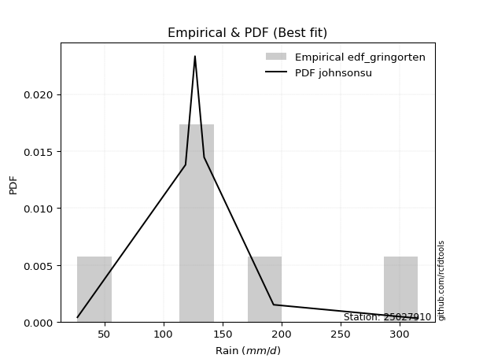</img>

</div>


### 9. EDF Filliben (1975)

The specific values of the constants (0.3175) (often denoted as $alpha$) and (0.365) are derived from a method proposed by James J. Filliben in a 1975 paper. This particular formula is the mean value of the $i$-th order statistic of the normal distribution and is considered a robust and effective plotting position formula for the normal probability plot correlation coefficient test for normality.

<div align="center">


$P=(m-0.3175)/(n+0.365)$


</div>


**9.1. Empirical values**

<div align="center">

|                | 0                   | 1                   | 2                  | 3                  | 4                  | 5                  |
|:---------------|:--------------------|:--------------------|:-------------------|:-------------------|:-------------------|:-------------------|
| date           | 2020                | 2023                | 2022               | 2021               | 2025               | 2024               |
| x              | 27.2                | 118.7               | 126.7              | 134.4              | 193.2              | 315.4              |
| m              | 1                   | 2                   | 3                  | 4                  | 5                  | 6                  |
| empirical_dist | edf_filliben        | edf_filliben        | edf_filliben       | edf_filliben       | edf_filliben       | edf_filliben       |
| empirical      | 0.10722702278083267 | 0.26433621366849963 | 0.4214454045561665 | 0.5785545954438335 | 0.7356637863315004 | 0.8927729772191673 |
| empirical_tr   | 1.1201055873295205  | 1.3593166043780034  | 1.7284453496266123 | 2.3727865796831313 | 3.783060921248143  | 9.326007326007321  |

</div>


**9.2. Kolmogorov-Smirnov fit test (sorted by Δ)**


<div align="center">

|                | 0                   | 1                   | 2                   | 3                   | 4                   | 5                   | 6                   | 7                   | 8                   | 9                   | 10                 | 11                 | 12                  | 13                 | 14                  | 15                 | 16                  | 17                 | 18                 | 19                  | 20                 | 21                 | 22                  | 23                  | 24                  | 25                 | 26                  | 27                  | 28                  | 29                  | 30                  | 31                 | 32                  | 33                  | 34                 | 35                  | 36                  | 37                  | 38                  | 39                  | 40                  | 41                  | 42                  | 43                  | 44                  | 45                  | 46                 | 47                 | 48                  | 49                 | 50                 | 51                  | 52                 | 53                  | 54                  | 55                  | 56                  | 57                  | 58                  | 59                  | 60                  | 61                  | 62                  | 63                  | 64                  | 65                  | 66                 | 67                  | 68                  | 69                 | 70                  | 71                 | 72                  | 73                  | 74                  | 75                  | 76                 | 77                  | 78                  | 79                  | 80                  | 81                 | 82                  | 83                  | 84                  | 85                  | 86                  | 87                  | 88                  | 89                 | 90                  | 91                  | 92                  | 93                 | 94                  | 95                  | 96                  | 97                  | 98                 | 99                  | 100                 | 101                 | 102               | 103                 | 104                 | 105                | 106                | 107                 | 108                | 109                | 110               | 111                | 112                 | 113                | 114                 | 115                | 116                 | 117                 | 118                | 119                | 120                 | 121                 | 122                 | 123                | 124                | 125               | 126                | 127                | 128                 | 129                 | 130                | 131                 | 132                | 133                 | 134                | 135                | 136                 | 137                 | 138                | 139                | 140                | 141                 | 142                 | 143                 | 144                 | 145                | 146               | 147                | 148                | 149                | 150                | 151                | 152                | 153                | 154                | 155                | 156               | 157                | 158                | 159                |
|:---------------|:--------------------|:--------------------|:--------------------|:--------------------|:--------------------|:--------------------|:--------------------|:--------------------|:--------------------|:--------------------|:-------------------|:-------------------|:--------------------|:-------------------|:--------------------|:-------------------|:--------------------|:-------------------|:-------------------|:--------------------|:-------------------|:-------------------|:--------------------|:--------------------|:--------------------|:-------------------|:--------------------|:--------------------|:--------------------|:--------------------|:--------------------|:-------------------|:--------------------|:--------------------|:-------------------|:--------------------|:--------------------|:--------------------|:--------------------|:--------------------|:--------------------|:--------------------|:--------------------|:--------------------|:--------------------|:--------------------|:-------------------|:-------------------|:--------------------|:-------------------|:-------------------|:--------------------|:-------------------|:--------------------|:--------------------|:--------------------|:--------------------|:--------------------|:--------------------|:--------------------|:--------------------|:--------------------|:--------------------|:--------------------|:--------------------|:--------------------|:-------------------|:--------------------|:--------------------|:-------------------|:--------------------|:-------------------|:--------------------|:--------------------|:--------------------|:--------------------|:-------------------|:--------------------|:--------------------|:--------------------|:--------------------|:-------------------|:--------------------|:--------------------|:--------------------|:--------------------|:--------------------|:--------------------|:--------------------|:-------------------|:--------------------|:--------------------|:--------------------|:-------------------|:--------------------|:--------------------|:--------------------|:--------------------|:-------------------|:--------------------|:--------------------|:--------------------|:------------------|:--------------------|:--------------------|:-------------------|:-------------------|:--------------------|:-------------------|:-------------------|:------------------|:-------------------|:--------------------|:-------------------|:--------------------|:-------------------|:--------------------|:--------------------|:-------------------|:-------------------|:--------------------|:--------------------|:--------------------|:-------------------|:-------------------|:------------------|:-------------------|:-------------------|:--------------------|:--------------------|:-------------------|:--------------------|:-------------------|:--------------------|:-------------------|:-------------------|:--------------------|:--------------------|:-------------------|:-------------------|:-------------------|:--------------------|:--------------------|:--------------------|:--------------------|:-------------------|:------------------|:-------------------|:-------------------|:-------------------|:-------------------|:-------------------|:-------------------|:-------------------|:-------------------|:-------------------|:------------------|:-------------------|:-------------------|:-------------------|
| station        | 25027910            | 25027910            | 25027910            | 25027910            | 25027910            | 25027910            | 25027910            | 25027910            | 25027910            | 25027910            | 25027910           | 25027910           | 25027910            | 25027910           | 25027910            | 25027910           | 25027910            | 25027910           | 25027910           | 25027910            | 25027910           | 25027910           | 25027910            | 25027910            | 25027910            | 25027910           | 25027910            | 25027910            | 25027910            | 25027910            | 25027910            | 25027910           | 25027910            | 25027910            | 25027910           | 25027910            | 25027910            | 25027910            | 25027910            | 25027910            | 25027910            | 25027910            | 25027910            | 25027910            | 25027910            | 25027910            | 25027910           | 25027910           | 25027910            | 25027910           | 25027910           | 25027910            | 25027910           | 25027910            | 25027910            | 25027910            | 25027910            | 25027910            | 25027910            | 25027910            | 25027910            | 25027910            | 25027910            | 25027910            | 25027910            | 25027910            | 25027910           | 25027910            | 25027910            | 25027910           | 25027910            | 25027910           | 25027910            | 25027910            | 25027910            | 25027910            | 25027910           | 25027910            | 25027910            | 25027910            | 25027910            | 25027910           | 25027910            | 25027910            | 25027910            | 25027910            | 25027910            | 25027910            | 25027910            | 25027910           | 25027910            | 25027910            | 25027910            | 25027910           | 25027910            | 25027910            | 25027910            | 25027910            | 25027910           | 25027910            | 25027910            | 25027910            | 25027910          | 25027910            | 25027910            | 25027910           | 25027910           | 25027910            | 25027910           | 25027910           | 25027910          | 25027910           | 25027910            | 25027910           | 25027910            | 25027910           | 25027910            | 25027910            | 25027910           | 25027910           | 25027910            | 25027910            | 25027910            | 25027910           | 25027910           | 25027910          | 25027910           | 25027910           | 25027910            | 25027910            | 25027910           | 25027910            | 25027910           | 25027910            | 25027910           | 25027910           | 25027910            | 25027910            | 25027910           | 25027910           | 25027910           | 25027910            | 25027910            | 25027910            | 25027910            | 25027910           | 25027910          | 25027910           | 25027910           | 25027910           | 25027910           | 25027910           | 25027910           | 25027910           | 25027910           | 25027910           | 25027910          | 25027910           | 25027910           | 25027910           |
| empirical_dist | edf_filliben        | edf_filliben        | edf_filliben        | edf_filliben        | edf_filliben        | edf_filliben        | edf_filliben        | edf_filliben        | edf_filliben        | edf_filliben        | edf_filliben       | edf_filliben       | edf_filliben        | edf_filliben       | edf_filliben        | edf_filliben       | edf_filliben        | edf_filliben       | edf_filliben       | edf_filliben        | edf_filliben       | edf_filliben       | edf_filliben        | edf_filliben        | edf_filliben        | edf_filliben       | edf_filliben        | edf_filliben        | edf_filliben        | edf_filliben        | edf_filliben        | edf_filliben       | edf_filliben        | edf_filliben        | edf_filliben       | edf_filliben        | edf_filliben        | edf_filliben        | edf_filliben        | edf_filliben        | edf_filliben        | edf_filliben        | edf_filliben        | edf_filliben        | edf_filliben        | edf_filliben        | edf_filliben       | edf_filliben       | edf_filliben        | edf_filliben       | edf_filliben       | edf_filliben        | edf_filliben       | edf_filliben        | edf_filliben        | edf_filliben        | edf_filliben        | edf_filliben        | edf_filliben        | edf_filliben        | edf_filliben        | edf_filliben        | edf_filliben        | edf_filliben        | edf_filliben        | edf_filliben        | edf_filliben       | edf_filliben        | edf_filliben        | edf_filliben       | edf_filliben        | edf_filliben       | edf_filliben        | edf_filliben        | edf_filliben        | edf_filliben        | edf_filliben       | edf_filliben        | edf_filliben        | edf_filliben        | edf_filliben        | edf_filliben       | edf_filliben        | edf_filliben        | edf_filliben        | edf_filliben        | edf_filliben        | edf_filliben        | edf_filliben        | edf_filliben       | edf_filliben        | edf_filliben        | edf_filliben        | edf_filliben       | edf_filliben        | edf_filliben        | edf_filliben        | edf_filliben        | edf_filliben       | edf_filliben        | edf_filliben        | edf_filliben        | edf_filliben      | edf_filliben        | edf_filliben        | edf_filliben       | edf_filliben       | edf_filliben        | edf_filliben       | edf_filliben       | edf_filliben      | edf_filliben       | edf_filliben        | edf_filliben       | edf_filliben        | edf_filliben       | edf_filliben        | edf_filliben        | edf_filliben       | edf_filliben       | edf_filliben        | edf_filliben        | edf_filliben        | edf_filliben       | edf_filliben       | edf_filliben      | edf_filliben       | edf_filliben       | edf_filliben        | edf_filliben        | edf_filliben       | edf_filliben        | edf_filliben       | edf_filliben        | edf_filliben       | edf_filliben       | edf_filliben        | edf_filliben        | edf_filliben       | edf_filliben       | edf_filliben       | edf_filliben        | edf_filliben        | edf_filliben        | edf_filliben        | edf_filliben       | edf_filliben      | edf_filliben       | edf_filliben       | edf_filliben       | edf_filliben       | edf_filliben       | edf_filliben       | edf_filliben       | edf_filliben       | edf_filliben       | edf_filliben      | edf_filliben       | edf_filliben       | edf_filliben       |
| p_dist         | logdweibull         | logdgamma           | johnsonsu           | logjohnsonsu        | loggennorm          | nct                 | skewnorm            | rice                | pearson3            | invgamma            | maxwell            | exponnorm          | rayleigh            | invgauss           | genexpon            | logt               | genlogistic         | logloglaplace      | exponweib          | logloggamma         | gengamma           | gumbel_r           | betaprime           | logburr12           | foldnorm            | burr               | f                   | mielke              | erlang              | gamma               | loggenlogistic      | dgamma             | logburr             | ncf                 | invweibull         | logmielke           | logargus            | logweibull_min      | semicircular        | beta                | kstwobign           | loggenhalflogistic  | arcsine             | loggumbel_l         | anglit              | gennorm             | logvonmises_line   | moyal              | logskewnorm         | weibull_min        | bradford           | dweibull            | logpearson3        | kappa3              | t                   | truncnorm           | norm                | crystalball         | halfnorm            | loggausshyper       | truncexpon          | logtrapezoid        | halflogistic        | loggompertz         | logistic            | kappa4              | hypsecant          | ksone               | cosine              | loglevy_l          | logtriang           | wald               | gausshyper          | lomax               | loggenextreme       | wrapcauchy          | laplace            | uniform             | loglaplace          | loglaplace          | logf                | loghypsecant       | loglogistic         | logncf              | logcrystalball      | lognorm             | logexponnorm        | logfatiguelife      | lognct              | logbeta            | loganglit           | logsemicircular     | logarcsine          | logrice            | gumbel_l            | vonmises_line       | loginvgamma         | logbetaprime        | logerlang          | loggamma            | loggamma            | logalpha            | argus             | logmaxwell          | loginvgauss         | loginvweibull      | nakagami           | lognakagami         | logtruncnorm       | lograyleigh        | levy_l            | logwrapcauchy      | logcosine           | genpareto          | logjohnsonsb        | logfoldnorm        | loggenpareto        | loggumbel_r         | logkstwobign       | loghalfnorm        | logweibull_max      | loggenexpon         | halfgennorm         | genextreme         | logmoyal           | genhalflogistic   | logksone           | loghalflogistic    | logbradford         | logkappa4           | logkappa3          | loguniform          | alpha              | loggengamma         | loglomax           | burr12             | logwald             | triang              | logrdist           | trapezoid          | johnsonsb          | logtruncexpon       | logtruncweibull_min | logexponweib        | logtukeylambda      | truncweibull_min   | fatiguelife       | gompertz           | powerlaw           | logexponpow        | rdist              | truncpareto        | weibull_max        | logpowerlaw        | tukeylambda        | exponpow           | logtruncpareto    | loghalfgennorm     | logvonmises        | vonmises           |
| delta          | 0.08063397495684471 | 0.09278585516654991 | 0.09394151831258923 | 0.09810341480083051 | 0.11201894697479375 | 0.11746257717658198 | 0.12136924042255015 | 0.12182180516603203 | 0.12409795359596598 | 0.12538959710783126 | 0.1265429313502449 | 0.1267310175319012 | 0.12897964121045263 | 0.1291431061199692 | 0.12977400170090386 | 0.1299070372434613 | 0.13037565969598708 | 0.1316228112219373 | 0.1319448754980696 | 0.13201466775404075 | 0.1328377340707127 | 0.1332403589040267 | 0.13501395547802042 | 0.13549104224771263 | 0.13625175428816083 | 0.1366240469079808 | 0.13760147073456402 | 0.13770067554896215 | 0.13772095687092117 | 0.13772095838027387 | 0.13815053355278534 | 0.1381843308115689 | 0.13823129256165512 | 0.13980983333681724 | 0.1401337438767768 | 0.14249087186109177 | 0.14256701201540162 | 0.14301314099288492 | 0.14457829395112476 | 0.14602425733712104 | 0.14636816625646099 | 0.14685599892820922 | 0.14742216018885673 | 0.14901338339262576 | 0.14934691262744776 | 0.14969810510551274 | 0.1508801744172399 | 0.1510698291641835 | 0.15428218919341236 | 0.1545110463970108 | 0.1548193628283278 | 0.15501070312868998 | 0.1557509826939132 | 0.15788695696287874 | 0.16085457054725427 | 0.16085968722210753 | 0.16085969272413075 | 0.16085977782872596 | 0.16329748142524775 | 0.16541827346635607 | 0.16737621683213127 | 0.16760111965655022 | 0.17127056326139972 | 0.17152001800630873 | 0.17167899142567233 | 0.17688292169992137 | 0.1806544330510894 | 0.18525133381996112 | 0.18598066665031643 | 0.1868273672730268 | 0.18989527494102498 | 0.1916791124056339 | 0.19350040869668472 | 0.19525851729101412 | 0.19610042755203022 | 0.20556184765633784 | 0.2058660830724886 | 0.20659068149518667 | 0.20811026561317475 | 0.20811026561317475 | 0.21494743586512405 | 0.2156363238616072 | 0.21749689220421636 | 0.21895736312462927 | 0.21967790581918856 | 0.21967791011480547 | 0.21968220956949625 | 0.22057815180121104 | 0.22167902777806886 | 0.2217726819548277 | 0.22196433517846625 | 0.22290664244388392 | 0.22664177896282395 | 0.2272963486409959 | 0.22899425177900068 | 0.22919706507506982 | 0.23324714722735235 | 0.23532898623896553 | 0.2379031950704506 | 0.23807948092658932 | 0.23807948092658932 | 0.24206304210007595 | 0.249109918082966 | 0.25329433249258565 | 0.26080017281510753 | 0.2621212328677737 | 0.2642907670509447 | 0.26433524161098026 | 0.2643356923805065 | 0.2646333179484453 | 0.269623291714634 | 0.2704524955836726 | 0.27225308475539395 | 0.2754713692233162 | 0.28363715394964367 | 0.2854142579436863 | 0.28700523326598976 | 0.28939448574917365 | 0.2962888971393141 | 0.2965680437807116 | 0.30216096373424156 | 0.30572386666959456 | 0.30743724651909116 | 0.3140511211618213 | 0.3152697826988878 | 0.316690308578255 | 0.3200198206574871 | 0.3204562883458783 | 0.32534407519564984 | 0.33139578844324696 | 0.3368790698498187 | 0.33689102752268446 | 0.3373619370103696 | 0.33906968543514904 | 0.3600892872326729 | 0.3604992311735942 | 0.38728477168135905 | 0.39428183437113784 | 0.4083070037668985 | 0.4236828520201036 | 0.4337067730861568 | 0.43579765878127036 | 0.4607778622760838  | 0.46593331322119774 | 0.48360124970663093 | 0.4990784416403255 | 0.515025995253229 | 0.5785411925656512 | 0.5867280800538617 | 0.5883870509265108 | 0.6029115998769621 | 0.6441311077668992 | 0.6548304392646578 | 0.6582214453080104 | 0.6729836808792202 | 0.6910174702608827 | 0.692973653172676 | 0.7356637863315004 | 1.1730988406780571 | 49.574393394010706 |
| deltao         | 0.530385761606      | 0.530385761606      | 0.530385761606      | 0.530385761606      | 0.530385761606      | 0.530385761606      | 0.530385761606      | 0.530385761606      | 0.530385761606      | 0.530385761606      | 0.530385761606     | 0.530385761606     | 0.530385761606      | 0.530385761606     | 0.530385761606      | 0.530385761606     | 0.530385761606      | 0.530385761606     | 0.530385761606     | 0.530385761606      | 0.530385761606     | 0.530385761606     | 0.530385761606      | 0.530385761606      | 0.530385761606      | 0.530385761606     | 0.530385761606      | 0.530385761606      | 0.530385761606      | 0.530385761606      | 0.530385761606      | 0.530385761606     | 0.530385761606      | 0.530385761606      | 0.530385761606     | 0.530385761606      | 0.530385761606      | 0.530385761606      | 0.530385761606      | 0.530385761606      | 0.530385761606      | 0.530385761606      | 0.530385761606      | 0.530385761606      | 0.530385761606      | 0.530385761606      | 0.530385761606     | 0.530385761606     | 0.530385761606      | 0.530385761606     | 0.530385761606     | 0.530385761606      | 0.530385761606     | 0.530385761606      | 0.530385761606      | 0.530385761606      | 0.530385761606      | 0.530385761606      | 0.530385761606      | 0.530385761606      | 0.530385761606      | 0.530385761606      | 0.530385761606      | 0.530385761606      | 0.530385761606      | 0.530385761606      | 0.530385761606     | 0.530385761606      | 0.530385761606      | 0.530385761606     | 0.530385761606      | 0.530385761606     | 0.530385761606      | 0.530385761606      | 0.530385761606      | 0.530385761606      | 0.530385761606     | 0.530385761606      | 0.530385761606      | 0.530385761606      | 0.530385761606      | 0.530385761606     | 0.530385761606      | 0.530385761606      | 0.530385761606      | 0.530385761606      | 0.530385761606      | 0.530385761606      | 0.530385761606      | 0.530385761606     | 0.530385761606      | 0.530385761606      | 0.530385761606      | 0.530385761606     | 0.530385761606      | 0.530385761606      | 0.530385761606      | 0.530385761606      | 0.530385761606     | 0.530385761606      | 0.530385761606      | 0.530385761606      | 0.530385761606    | 0.530385761606      | 0.530385761606      | 0.530385761606     | 0.530385761606     | 0.530385761606      | 0.530385761606     | 0.530385761606     | 0.530385761606    | 0.530385761606     | 0.530385761606      | 0.530385761606     | 0.530385761606      | 0.530385761606     | 0.530385761606      | 0.530385761606      | 0.530385761606     | 0.530385761606     | 0.530385761606      | 0.530385761606      | 0.530385761606      | 0.530385761606     | 0.530385761606     | 0.530385761606    | 0.530385761606     | 0.530385761606     | 0.530385761606      | 0.530385761606      | 0.530385761606     | 0.530385761606      | 0.530385761606     | 0.530385761606      | 0.530385761606     | 0.530385761606     | 0.530385761606      | 0.530385761606      | 0.530385761606     | 0.530385761606     | 0.530385761606     | 0.530385761606      | 0.530385761606      | 0.530385761606      | 0.530385761606      | 0.530385761606     | 0.530385761606    | 0.530385761606     | 0.530385761606     | 0.530385761606     | 0.530385761606     | 0.530385761606     | 0.530385761606     | 0.530385761606     | 0.530385761606     | 0.530385761606     | 0.530385761606    | 0.530385761606     | 0.530385761606     | 0.530385761606     |
| eval           | Δo > Δ              | Δo > Δ              | Δo > Δ              | Δo > Δ              | Δo > Δ              | Δo > Δ              | Δo > Δ              | Δo > Δ              | Δo > Δ              | Δo > Δ              | Δo > Δ             | Δo > Δ             | Δo > Δ              | Δo > Δ             | Δo > Δ              | Δo > Δ             | Δo > Δ              | Δo > Δ             | Δo > Δ             | Δo > Δ              | Δo > Δ             | Δo > Δ             | Δo > Δ              | Δo > Δ              | Δo > Δ              | Δo > Δ             | Δo > Δ              | Δo > Δ              | Δo > Δ              | Δo > Δ              | Δo > Δ              | Δo > Δ             | Δo > Δ              | Δo > Δ              | Δo > Δ             | Δo > Δ              | Δo > Δ              | Δo > Δ              | Δo > Δ              | Δo > Δ              | Δo > Δ              | Δo > Δ              | Δo > Δ              | Δo > Δ              | Δo > Δ              | Δo > Δ              | Δo > Δ             | Δo > Δ             | Δo > Δ              | Δo > Δ             | Δo > Δ             | Δo > Δ              | Δo > Δ             | Δo > Δ              | Δo > Δ              | Δo > Δ              | Δo > Δ              | Δo > Δ              | Δo > Δ              | Δo > Δ              | Δo > Δ              | Δo > Δ              | Δo > Δ              | Δo > Δ              | Δo > Δ              | Δo > Δ              | Δo > Δ             | Δo > Δ              | Δo > Δ              | Δo > Δ             | Δo > Δ              | Δo > Δ             | Δo > Δ              | Δo > Δ              | Δo > Δ              | Δo > Δ              | Δo > Δ             | Δo > Δ              | Δo > Δ              | Δo > Δ              | Δo > Δ              | Δo > Δ             | Δo > Δ              | Δo > Δ              | Δo > Δ              | Δo > Δ              | Δo > Δ              | Δo > Δ              | Δo > Δ              | Δo > Δ             | Δo > Δ              | Δo > Δ              | Δo > Δ              | Δo > Δ             | Δo > Δ              | Δo > Δ              | Δo > Δ              | Δo > Δ              | Δo > Δ             | Δo > Δ              | Δo > Δ              | Δo > Δ              | Δo > Δ            | Δo > Δ              | Δo > Δ              | Δo > Δ             | Δo > Δ             | Δo > Δ              | Δo > Δ             | Δo > Δ             | Δo > Δ            | Δo > Δ             | Δo > Δ              | Δo > Δ             | Δo > Δ              | Δo > Δ             | Δo > Δ              | Δo > Δ              | Δo > Δ             | Δo > Δ             | Δo > Δ              | Δo > Δ              | Δo > Δ              | Δo > Δ             | Δo > Δ             | Δo > Δ            | Δo > Δ             | Δo > Δ             | Δo > Δ              | Δo > Δ              | Δo > Δ             | Δo > Δ              | Δo > Δ             | Δo > Δ              | Δo > Δ             | Δo > Δ             | Δo > Δ              | Δo > Δ              | Δo > Δ             | Δo > Δ             | Δo > Δ             | Δo > Δ              | Δo > Δ              | Δo > Δ              | Δo > Δ              | Δo > Δ             | Δo > Δ            | Δo <= Δ            | Δo <= Δ            | Δo <= Δ            | Δo <= Δ            | Δo <= Δ            | Δo <= Δ            | Δo <= Δ            | Δo <= Δ            | Δo <= Δ            | Δo <= Δ           | Δo <= Δ            | Δo <= Δ            | Δo <= Δ            |
| fit            | 1                   | 1                   | 1                   | 1                   | 1                   | 1                   | 1                   | 1                   | 1                   | 1                   | 1                  | 1                  | 1                   | 1                  | 1                   | 1                  | 1                   | 1                  | 1                  | 1                   | 1                  | 1                  | 1                   | 1                   | 1                   | 1                  | 1                   | 1                   | 1                   | 1                   | 1                   | 1                  | 1                   | 1                   | 1                  | 1                   | 1                   | 1                   | 1                   | 1                   | 1                   | 1                   | 1                   | 1                   | 1                   | 1                   | 1                  | 1                  | 1                   | 1                  | 1                  | 1                   | 1                  | 1                   | 1                   | 1                   | 1                   | 1                   | 1                   | 1                   | 1                   | 1                   | 1                   | 1                   | 1                   | 1                   | 1                  | 1                   | 1                   | 1                  | 1                   | 1                  | 1                   | 1                   | 1                   | 1                   | 1                  | 1                   | 1                   | 1                   | 1                   | 1                  | 1                   | 1                   | 1                   | 1                   | 1                   | 1                   | 1                   | 1                  | 1                   | 1                   | 1                   | 1                  | 1                   | 1                   | 1                   | 1                   | 1                  | 1                   | 1                   | 1                   | 1                 | 1                   | 1                   | 1                  | 1                  | 1                   | 1                  | 1                  | 1                 | 1                  | 1                   | 1                  | 1                   | 1                  | 1                   | 1                   | 1                  | 1                  | 1                   | 1                   | 1                   | 1                  | 1                  | 1                 | 1                  | 1                  | 1                   | 1                   | 1                  | 1                   | 1                  | 1                   | 1                  | 1                  | 1                   | 1                   | 1                  | 1                  | 1                  | 1                   | 1                   | 1                   | 1                   | 1                  | 1                 | 0                  | 0                  | 0                  | 0                  | 0                  | 0                  | 0                  | 0                  | 0                  | 0                 | 0                  | 0                  | 0                  |
| n              | 6                   | 6                   | 6                   | 6                   | 6                   | 6                   | 6                   | 6                   | 6                   | 6                   | 6                  | 6                  | 6                   | 6                  | 6                   | 6                  | 6                   | 6                  | 6                  | 6                   | 6                  | 6                  | 6                   | 6                   | 6                   | 6                  | 6                   | 6                   | 6                   | 6                   | 6                   | 6                  | 6                   | 6                   | 6                  | 6                   | 6                   | 6                   | 6                   | 6                   | 6                   | 6                   | 6                   | 6                   | 6                   | 6                   | 6                  | 6                  | 6                   | 6                  | 6                  | 6                   | 6                  | 6                   | 6                   | 6                   | 6                   | 6                   | 6                   | 6                   | 6                   | 6                   | 6                   | 6                   | 6                   | 6                   | 6                  | 6                   | 6                   | 6                  | 6                   | 6                  | 6                   | 6                   | 6                   | 6                   | 6                  | 6                   | 6                   | 6                   | 6                   | 6                  | 6                   | 6                   | 6                   | 6                   | 6                   | 6                   | 6                   | 6                  | 6                   | 6                   | 6                   | 6                  | 6                   | 6                   | 6                   | 6                   | 6                  | 6                   | 6                   | 6                   | 6                 | 6                   | 6                   | 6                  | 6                  | 6                   | 6                  | 6                  | 6                 | 6                  | 6                   | 6                  | 6                   | 6                  | 6                   | 6                   | 6                  | 6                  | 6                   | 6                   | 6                   | 6                  | 6                  | 6                 | 6                  | 6                  | 6                   | 6                   | 6                  | 6                   | 6                  | 6                   | 6                  | 6                  | 6                   | 6                   | 6                  | 6                  | 6                  | 6                   | 6                   | 6                   | 6                   | 6                  | 6                 | 6                  | 6                  | 6                  | 6                  | 6                  | 6                  | 6                  | 6                  | 6                  | 6                 | 6                  | 6                  | 6                  |
| best_fit       | 1                   | 0                   | 0                   | 0                   | 0                   | 0                   | 0                   | 0                   | 0                   | 0                   | 0                  | 0                  | 0                   | 0                  | 0                   | 0                  | 0                   | 0                  | 0                  | 0                   | 0                  | 0                  | 0                   | 0                   | 0                   | 0                  | 0                   | 0                   | 0                   | 0                   | 0                   | 0                  | 0                   | 0                   | 0                  | 0                   | 0                   | 0                   | 0                   | 0                   | 0                   | 0                   | 0                   | 0                   | 0                   | 0                   | 0                  | 0                  | 0                   | 0                  | 0                  | 0                   | 0                  | 0                   | 0                   | 0                   | 0                   | 0                   | 0                   | 0                   | 0                   | 0                   | 0                   | 0                   | 0                   | 0                   | 0                  | 0                   | 0                   | 0                  | 0                   | 0                  | 0                   | 0                   | 0                   | 0                   | 0                  | 0                   | 0                   | 0                   | 0                   | 0                  | 0                   | 0                   | 0                   | 0                   | 0                   | 0                   | 0                   | 0                  | 0                   | 0                   | 0                   | 0                  | 0                   | 0                   | 0                   | 0                   | 0                  | 0                   | 0                   | 0                   | 0                 | 0                   | 0                   | 0                  | 0                  | 0                   | 0                  | 0                  | 0                 | 0                  | 0                   | 0                  | 0                   | 0                  | 0                   | 0                   | 0                  | 0                  | 0                   | 0                   | 0                   | 0                  | 0                  | 0                 | 0                  | 0                  | 0                   | 0                   | 0                  | 0                   | 0                  | 0                   | 0                  | 0                  | 0                   | 0                   | 0                  | 0                  | 0                  | 0                   | 0                   | 0                   | 0                   | 0                  | 0                 | 0                  | 0                  | 0                  | 0                  | 0                  | 0                  | 0                  | 0                  | 0                  | 0                 | 0                  | 0                  | 0                  |
| best_fit_sort  | 1                   | 2                   | 3                   | 4                   | 5                   | 6                   | 7                   | 8                   | 9                   | 10                  | 11                 | 12                 | 13                  | 14                 | 15                  | 16                 | 17                  | 18                 | 19                 | 20                  | 21                 | 22                 | 23                  | 24                  | 25                  | 26                 | 27                  | 28                  | 29                  | 30                  | 31                  | 32                 | 33                  | 34                  | 35                 | 36                  | 37                  | 38                  | 39                  | 40                  | 41                  | 42                  | 43                  | 44                  | 45                  | 46                  | 47                 | 48                 | 49                  | 50                 | 51                 | 52                  | 53                 | 54                  | 55                  | 56                  | 57                  | 58                  | 59                  | 60                  | 61                  | 62                  | 63                  | 64                  | 65                  | 66                  | 67                 | 68                  | 69                  | 70                 | 71                  | 72                 | 73                  | 74                  | 75                  | 76                  | 77                 | 78                  | 79                  | 80                  | 81                  | 82                 | 83                  | 84                  | 85                  | 86                  | 87                  | 88                  | 89                  | 90                 | 91                  | 92                  | 93                  | 94                 | 95                  | 96                  | 97                  | 98                  | 99                 | 100                 | 101                 | 102                 | 103               | 104                 | 105                 | 106                | 107                | 108                 | 109                | 110                | 111               | 112                | 113                 | 114                | 115                 | 116                | 117                 | 118                 | 119                | 120                | 121                 | 122                 | 123                 | 124                | 125                | 126               | 127                | 128                | 129                 | 130                 | 131                | 132                 | 133                | 134                 | 135                | 136                | 137                 | 138                 | 139                | 140                | 141                | 142                 | 143                 | 144                 | 145                 | 146                | 147               | 148                | 149                | 150                | 151                | 152                | 153                | 154                | 155                | 156                | 157               | 158                | 159                | 160                |

</div>


**9.3. Best fit**

<div align="center">

|   id |   station | empirical_dist   | p_dist      |    delta |   deltao | eval   |   fit |   n |   best_fit |   best_fit_sort |
|-----:|----------:|:-----------------|:------------|---------:|---------:|:-------|------:|----:|-----------:|----------------:|
|    0 |  25027910 | edf_filliben     | logdweibull | 0.080634 | 0.530386 | Δo > Δ |     1 |   6 |          1 |               1 |

</div>


<div align="center">

</img></img>

</div>


### 10. EDF Jenkinson (1977)

The Jenkinson formula in hydrology is an empirical plotting position formula used to estimate the non-exceedance probability _(P)_ or return period _(T)_ of a given ordered observation within a sample. It is a widely used method in the frequency analysis of extreme events such as floods and rainfall, as it provides a distribution-free way to plot data. _a≈0.31_ and _b≈0.38_ are constants derived to approximate the median of the probability distribution for the given rank.

<div align="center">


$P=(m-a)/(n+b)$


</div>


**10.1. Empirical values**

<div align="center">

|                | 0                   | 1                   | 2                  | 3                  | 4                  | 5                  |
|:---------------|:--------------------|:--------------------|:-------------------|:-------------------|:-------------------|:-------------------|
| date           | 2020                | 2023                | 2022               | 2021               | 2025               | 2024               |
| x              | 27.2                | 118.7               | 126.7              | 134.4              | 193.2              | 315.4              |
| m              | 1                   | 2                   | 3                  | 4                  | 5                  | 6                  |
| empirical_dist | edf_jenkinson       | edf_jenkinson       | edf_jenkinson      | edf_jenkinson      | edf_jenkinson      | edf_jenkinson      |
| empirical      | 0.10815047021943573 | 0.26489028213166144 | 0.4216300940438871 | 0.5783699059561128 | 0.7351097178683387 | 0.8918495297805643 |
| empirical_tr   | 1.1212653778558874  | 1.3603411513859276  | 1.7289972899728996 | 2.3717472118959106 | 3.7751479289940844 | 9.246376811594207  |

</div>


**10.2. Kolmogorov-Smirnov fit test (sorted by Δ)**


<div align="center">

|                | 0                  | 1                   | 2                   | 3                   | 4                  | 5                   | 6                  | 7                   | 8                   | 9                   | 10                  | 11                  | 12                  | 13                 | 14                  | 15                  | 16                  | 17                 | 18                 | 19                  | 20                 | 21                  | 22                  | 23                  | 24                  | 25                | 26                  | 27                  | 28                  | 29                  | 30                  | 31                  | 32                 | 33                  | 34                | 35                  | 36                 | 37                  | 38                 | 39                  | 40                  | 41                  | 42                  | 43                  | 44                 | 45                  | 46                  | 47                  | 48                  | 49                | 50                | 51                  | 52                  | 53                  | 54                  | 55                  | 56                 | 57                 | 58                  | 59                  | 60                  | 61                  | 62                  | 63                  | 64                  | 65                 | 66                  | 67                  | 68                  | 69                  | 70                  | 71                 | 72                  | 73                  | 74                  | 75                  | 76                  | 77                | 78                  | 79                  | 80                  | 81                 | 82                  | 83                  | 84                  | 85                  | 86                  | 87                  | 88                  | 89                  | 90                  | 91                 | 92                  | 93                 | 94                  | 95                  | 96                  | 97                  | 98                 | 99                 | 100                | 101                 | 102                 | 103                 | 104                 | 105                | 106                | 107                | 108                 | 109                 | 110                 | 111                | 112                 | 113                 | 114                 | 115                | 116                 | 117                 | 118                | 119                | 120                | 121                 | 122                 | 123                 | 124               | 125                | 126                 | 127                | 128                 | 129                 | 130                | 131                 | 132                | 133                | 134                | 135                | 136                 | 137                | 138                | 139                | 140                 | 141                 | 142                 | 143                 | 144                | 145                | 146                | 147                | 148                | 149               | 150                | 151                | 152               | 153                | 154                | 155                | 156                | 157                | 158                | 159               |
|:---------------|:-------------------|:--------------------|:--------------------|:--------------------|:-------------------|:--------------------|:-------------------|:--------------------|:--------------------|:--------------------|:--------------------|:--------------------|:--------------------|:-------------------|:--------------------|:--------------------|:--------------------|:-------------------|:-------------------|:--------------------|:-------------------|:--------------------|:--------------------|:--------------------|:--------------------|:------------------|:--------------------|:--------------------|:--------------------|:--------------------|:--------------------|:--------------------|:-------------------|:--------------------|:------------------|:--------------------|:-------------------|:--------------------|:-------------------|:--------------------|:--------------------|:--------------------|:--------------------|:--------------------|:-------------------|:--------------------|:--------------------|:--------------------|:--------------------|:------------------|:------------------|:--------------------|:--------------------|:--------------------|:--------------------|:--------------------|:-------------------|:-------------------|:--------------------|:--------------------|:--------------------|:--------------------|:--------------------|:--------------------|:--------------------|:-------------------|:--------------------|:--------------------|:--------------------|:--------------------|:--------------------|:-------------------|:--------------------|:--------------------|:--------------------|:--------------------|:--------------------|:------------------|:--------------------|:--------------------|:--------------------|:-------------------|:--------------------|:--------------------|:--------------------|:--------------------|:--------------------|:--------------------|:--------------------|:--------------------|:--------------------|:-------------------|:--------------------|:-------------------|:--------------------|:--------------------|:--------------------|:--------------------|:-------------------|:-------------------|:-------------------|:--------------------|:--------------------|:--------------------|:--------------------|:-------------------|:-------------------|:-------------------|:--------------------|:--------------------|:--------------------|:-------------------|:--------------------|:--------------------|:--------------------|:-------------------|:--------------------|:--------------------|:-------------------|:-------------------|:-------------------|:--------------------|:--------------------|:--------------------|:------------------|:-------------------|:--------------------|:-------------------|:--------------------|:--------------------|:-------------------|:--------------------|:-------------------|:-------------------|:-------------------|:-------------------|:--------------------|:-------------------|:-------------------|:-------------------|:--------------------|:--------------------|:--------------------|:--------------------|:-------------------|:-------------------|:-------------------|:-------------------|:-------------------|:------------------|:-------------------|:-------------------|:------------------|:-------------------|:-------------------|:-------------------|:-------------------|:-------------------|:-------------------|:------------------|
| station        | 25027910           | 25027910            | 25027910            | 25027910            | 25027910           | 25027910            | 25027910           | 25027910            | 25027910            | 25027910            | 25027910            | 25027910            | 25027910            | 25027910           | 25027910            | 25027910            | 25027910            | 25027910           | 25027910           | 25027910            | 25027910           | 25027910            | 25027910            | 25027910            | 25027910            | 25027910          | 25027910            | 25027910            | 25027910            | 25027910            | 25027910            | 25027910            | 25027910           | 25027910            | 25027910          | 25027910            | 25027910           | 25027910            | 25027910           | 25027910            | 25027910            | 25027910            | 25027910            | 25027910            | 25027910           | 25027910            | 25027910            | 25027910            | 25027910            | 25027910          | 25027910          | 25027910            | 25027910            | 25027910            | 25027910            | 25027910            | 25027910           | 25027910           | 25027910            | 25027910            | 25027910            | 25027910            | 25027910            | 25027910            | 25027910            | 25027910           | 25027910            | 25027910            | 25027910            | 25027910            | 25027910            | 25027910           | 25027910            | 25027910            | 25027910            | 25027910            | 25027910            | 25027910          | 25027910            | 25027910            | 25027910            | 25027910           | 25027910            | 25027910            | 25027910            | 25027910            | 25027910            | 25027910            | 25027910            | 25027910            | 25027910            | 25027910           | 25027910            | 25027910           | 25027910            | 25027910            | 25027910            | 25027910            | 25027910           | 25027910           | 25027910           | 25027910            | 25027910            | 25027910            | 25027910            | 25027910           | 25027910           | 25027910           | 25027910            | 25027910            | 25027910            | 25027910           | 25027910            | 25027910            | 25027910            | 25027910           | 25027910            | 25027910            | 25027910           | 25027910           | 25027910           | 25027910            | 25027910            | 25027910            | 25027910          | 25027910           | 25027910            | 25027910           | 25027910            | 25027910            | 25027910           | 25027910            | 25027910           | 25027910           | 25027910           | 25027910           | 25027910            | 25027910           | 25027910           | 25027910           | 25027910            | 25027910            | 25027910            | 25027910            | 25027910           | 25027910           | 25027910           | 25027910           | 25027910           | 25027910          | 25027910           | 25027910           | 25027910          | 25027910           | 25027910           | 25027910           | 25027910           | 25027910           | 25027910           | 25027910          |
| empirical_dist | edf_jenkinson      | edf_jenkinson       | edf_jenkinson       | edf_jenkinson       | edf_jenkinson      | edf_jenkinson       | edf_jenkinson      | edf_jenkinson       | edf_jenkinson       | edf_jenkinson       | edf_jenkinson       | edf_jenkinson       | edf_jenkinson       | edf_jenkinson      | edf_jenkinson       | edf_jenkinson       | edf_jenkinson       | edf_jenkinson      | edf_jenkinson      | edf_jenkinson       | edf_jenkinson      | edf_jenkinson       | edf_jenkinson       | edf_jenkinson       | edf_jenkinson       | edf_jenkinson     | edf_jenkinson       | edf_jenkinson       | edf_jenkinson       | edf_jenkinson       | edf_jenkinson       | edf_jenkinson       | edf_jenkinson      | edf_jenkinson       | edf_jenkinson     | edf_jenkinson       | edf_jenkinson      | edf_jenkinson       | edf_jenkinson      | edf_jenkinson       | edf_jenkinson       | edf_jenkinson       | edf_jenkinson       | edf_jenkinson       | edf_jenkinson      | edf_jenkinson       | edf_jenkinson       | edf_jenkinson       | edf_jenkinson       | edf_jenkinson     | edf_jenkinson     | edf_jenkinson       | edf_jenkinson       | edf_jenkinson       | edf_jenkinson       | edf_jenkinson       | edf_jenkinson      | edf_jenkinson      | edf_jenkinson       | edf_jenkinson       | edf_jenkinson       | edf_jenkinson       | edf_jenkinson       | edf_jenkinson       | edf_jenkinson       | edf_jenkinson      | edf_jenkinson       | edf_jenkinson       | edf_jenkinson       | edf_jenkinson       | edf_jenkinson       | edf_jenkinson      | edf_jenkinson       | edf_jenkinson       | edf_jenkinson       | edf_jenkinson       | edf_jenkinson       | edf_jenkinson     | edf_jenkinson       | edf_jenkinson       | edf_jenkinson       | edf_jenkinson      | edf_jenkinson       | edf_jenkinson       | edf_jenkinson       | edf_jenkinson       | edf_jenkinson       | edf_jenkinson       | edf_jenkinson       | edf_jenkinson       | edf_jenkinson       | edf_jenkinson      | edf_jenkinson       | edf_jenkinson      | edf_jenkinson       | edf_jenkinson       | edf_jenkinson       | edf_jenkinson       | edf_jenkinson      | edf_jenkinson      | edf_jenkinson      | edf_jenkinson       | edf_jenkinson       | edf_jenkinson       | edf_jenkinson       | edf_jenkinson      | edf_jenkinson      | edf_jenkinson      | edf_jenkinson       | edf_jenkinson       | edf_jenkinson       | edf_jenkinson      | edf_jenkinson       | edf_jenkinson       | edf_jenkinson       | edf_jenkinson      | edf_jenkinson       | edf_jenkinson       | edf_jenkinson      | edf_jenkinson      | edf_jenkinson      | edf_jenkinson       | edf_jenkinson       | edf_jenkinson       | edf_jenkinson     | edf_jenkinson      | edf_jenkinson       | edf_jenkinson      | edf_jenkinson       | edf_jenkinson       | edf_jenkinson      | edf_jenkinson       | edf_jenkinson      | edf_jenkinson      | edf_jenkinson      | edf_jenkinson      | edf_jenkinson       | edf_jenkinson      | edf_jenkinson      | edf_jenkinson      | edf_jenkinson       | edf_jenkinson       | edf_jenkinson       | edf_jenkinson       | edf_jenkinson      | edf_jenkinson      | edf_jenkinson      | edf_jenkinson      | edf_jenkinson      | edf_jenkinson     | edf_jenkinson      | edf_jenkinson      | edf_jenkinson     | edf_jenkinson      | edf_jenkinson      | edf_jenkinson      | edf_jenkinson      | edf_jenkinson      | edf_jenkinson      | edf_jenkinson     |
| p_dist         | logdweibull        | logdgamma           | johnsonsu           | logjohnsonsu        | loggennorm         | nct                 | skewnorm           | rice                | pearson3            | invgamma            | exponnorm           | maxwell             | rayleigh            | invgauss           | genexpon            | genlogistic         | logt                | logloglaplace      | exponweib          | logloggamma         | gengamma           | gumbel_r            | betaprime           | logburr12           | foldnorm            | burr              | f                   | mielke              | erlang              | gamma               | loggenlogistic      | dgamma              | logburr            | ncf                 | invweibull        | logmielke           | logargus           | logweibull_min      | semicircular       | beta                | kstwobign           | loggenhalflogistic  | arcsine             | loggumbel_l         | anglit             | gennorm             | logvonmises_line    | moyal               | logskewnorm         | weibull_min       | bradford          | dweibull            | logpearson3         | kappa3              | t                   | truncnorm           | norm               | crystalball        | halfnorm            | loggausshyper       | truncexpon          | logtrapezoid        | halflogistic        | loggompertz         | logistic            | kappa4             | hypsecant           | ksone               | cosine              | loglevy_l           | logtriang           | wald               | gausshyper          | lomax               | loggenextreme       | wrapcauchy          | laplace             | uniform           | loglaplace          | loglaplace          | logf                | loghypsecant       | loglogistic         | logncf              | logcrystalball      | lognorm             | logexponnorm        | logfatiguelife      | lognct              | loganglit           | logbeta             | logsemicircular    | logarcsine          | logrice            | gumbel_l            | vonmises_line       | loginvgamma         | logbetaprime        | logerlang          | loggamma           | loggamma           | logalpha            | argus               | logmaxwell          | loginvgauss         | loginvweibull      | lograyleigh        | nakagami           | lognakagami         | logtruncnorm        | levy_l              | logwrapcauchy      | logcosine           | genpareto           | logjohnsonsb        | logfoldnorm        | loggenpareto        | loggumbel_r         | logkstwobign       | loghalfnorm        | logweibull_max     | loggenexpon         | halfgennorm         | genextreme          | logmoyal          | genhalflogistic    | logksone            | loghalflogistic    | logbradford         | logkappa4           | logkappa3          | loguniform          | alpha              | loggengamma        | loglomax           | burr12             | logwald             | triang             | logrdist           | trapezoid          | johnsonsb           | logtruncexpon       | logtruncweibull_min | logexponweib        | logtukeylambda     | truncweibull_min   | fatiguelife        | gompertz           | powerlaw           | logexponpow       | rdist              | truncpareto        | weibull_max       | logpowerlaw        | tukeylambda        | exponpow           | logtruncpareto     | loghalfgennorm     | logvonmises        | vonmises          |
| delta          | 0.0800799064936829 | 0.09370930260515298 | 0.09449558677575098 | 0.09865748326399226 | 0.1125730154379555 | 0.11727788768886133 | 0.1211845509348295 | 0.12163711567831137 | 0.12391326410824532 | 0.12483552864466946 | 0.12617694906873939 | 0.12635824186252426 | 0.12842557274729083 | 0.1285890376568074 | 0.12921993323774206 | 0.12982159123282527 | 0.13046110570662306 | 0.1310687427587755 | 0.1313908070349078 | 0.13146059929087894 | 0.1322836656075509 | 0.13268629044086488 | 0.13445988701485861 | 0.13493697378455083 | 0.13569768582499903 | 0.136069978444819 | 0.13704740227140222 | 0.13714660708580034 | 0.13716688840775937 | 0.13716688991711207 | 0.13759646508962353 | 0.13763026234840708 | 0.1376772240984933 | 0.13925576487365543 | 0.139579675413615 | 0.14193680339792997 | 0.1420129435522398 | 0.14245907252972312 | 0.1443936044634041 | 0.14547018887395924 | 0.14581409779329918 | 0.14630193046504741 | 0.14686809172569493 | 0.14845931492946396 | 0.1491622231397271 | 0.15025217356867449 | 0.15032610595407808 | 0.15051576070102168 | 0.15372812073025055 | 0.153956977933849 | 0.154265294365166 | 0.15445663466552817 | 0.15519691423075138 | 0.15733288849971694 | 0.16066988105953361 | 0.16067499773438687 | 0.1606750032364101 | 0.1606750883410053 | 0.16274341296208594 | 0.16486420500319426 | 0.16682214836896947 | 0.16704705119338842 | 0.17071649479823792 | 0.17096594954314692 | 0.17149430193795168 | 0.1766982322122007 | 0.18046974356336876 | 0.18506664433224046 | 0.18579597716259577 | 0.18590391983442373 | 0.18934120647786318 | 0.1911250439424721 | 0.19331571920896407 | 0.19470444882785232 | 0.19591573806430956 | 0.20537715816861718 | 0.20568139358476795 | 0.206405992007466 | 0.20755619715001294 | 0.20755619715001294 | 0.21439336740196224 | 0.2150822553984454 | 0.21694282374105456 | 0.21840329466146746 | 0.21912383735602675 | 0.21912384165164367 | 0.21912814110633444 | 0.22002408333804924 | 0.22112495931490705 | 0.22141026671530445 | 0.22158799246710703 | 0.2223525739807221 | 0.22608771049966214 | 0.2267422801778341 | 0.22880956229128002 | 0.22901237558734916 | 0.23269307876419054 | 0.23477491777580373 | 0.2373491266072888 | 0.2375254124634275 | 0.2375254124634275 | 0.24150897363691415 | 0.24892522859524535 | 0.25274026402942384 | 0.26024610435194573 | 0.2615671644046119 | 0.2640792494852835 | 0.2648448355141065 | 0.26488931007414207 | 0.26488976084366833 | 0.26869984427603094 | 0.2698984271205108 | 0.27169901629223214 | 0.27491730076015447 | 0.28308308548648187 | 0.2848601894805245 | 0.28645116480282795 | 0.28884041728601184 | 0.2957348286761523 | 0.2960139753175498 | 0.3016068952710798 | 0.30516979820643275 | 0.30688317805592935 | 0.31312767372321826 | 0.314715714235726 | 0.3165056190905343 | 0.31946575219432527 | 0.3199022198827165 | 0.32479000673248803 | 0.33084171998008516 | 0.3363250013866569 | 0.33633695905952266 | 0.3368078685472078 | 0.3381462379965461 | 0.3595352187695111 | 0.3599451627104324 | 0.38673070321819725 | 0.3940971448834172 | 0.4077529353037367 | 0.4234981625323829 | 0.43315270462299504 | 0.43524359031810855 | 0.460223793812922   | 0.46537924475803594 | 0.4830471812434691 | 0.4985243731771637 | 0.5144719267900673 | 0.5783565030779305 | 0.5861740115906998 | 0.587832982463349 | 0.6023575314138002 | 0.6435770393037374 | 0.654276370801496 | 0.6576673768448486 | 0.6724296124160585 | 0.6904634017977208 | 0.6924195847095143 | 0.7351097178683387 | 1.1725447722148954 | 49.57531684144931 |
| deltao         | 0.530385761606     | 0.530385761606      | 0.530385761606      | 0.530385761606      | 0.530385761606     | 0.530385761606      | 0.530385761606     | 0.530385761606      | 0.530385761606      | 0.530385761606      | 0.530385761606      | 0.530385761606      | 0.530385761606      | 0.530385761606     | 0.530385761606      | 0.530385761606      | 0.530385761606      | 0.530385761606     | 0.530385761606     | 0.530385761606      | 0.530385761606     | 0.530385761606      | 0.530385761606      | 0.530385761606      | 0.530385761606      | 0.530385761606    | 0.530385761606      | 0.530385761606      | 0.530385761606      | 0.530385761606      | 0.530385761606      | 0.530385761606      | 0.530385761606     | 0.530385761606      | 0.530385761606    | 0.530385761606      | 0.530385761606     | 0.530385761606      | 0.530385761606     | 0.530385761606      | 0.530385761606      | 0.530385761606      | 0.530385761606      | 0.530385761606      | 0.530385761606     | 0.530385761606      | 0.530385761606      | 0.530385761606      | 0.530385761606      | 0.530385761606    | 0.530385761606    | 0.530385761606      | 0.530385761606      | 0.530385761606      | 0.530385761606      | 0.530385761606      | 0.530385761606     | 0.530385761606     | 0.530385761606      | 0.530385761606      | 0.530385761606      | 0.530385761606      | 0.530385761606      | 0.530385761606      | 0.530385761606      | 0.530385761606     | 0.530385761606      | 0.530385761606      | 0.530385761606      | 0.530385761606      | 0.530385761606      | 0.530385761606     | 0.530385761606      | 0.530385761606      | 0.530385761606      | 0.530385761606      | 0.530385761606      | 0.530385761606    | 0.530385761606      | 0.530385761606      | 0.530385761606      | 0.530385761606     | 0.530385761606      | 0.530385761606      | 0.530385761606      | 0.530385761606      | 0.530385761606      | 0.530385761606      | 0.530385761606      | 0.530385761606      | 0.530385761606      | 0.530385761606     | 0.530385761606      | 0.530385761606     | 0.530385761606      | 0.530385761606      | 0.530385761606      | 0.530385761606      | 0.530385761606     | 0.530385761606     | 0.530385761606     | 0.530385761606      | 0.530385761606      | 0.530385761606      | 0.530385761606      | 0.530385761606     | 0.530385761606     | 0.530385761606     | 0.530385761606      | 0.530385761606      | 0.530385761606      | 0.530385761606     | 0.530385761606      | 0.530385761606      | 0.530385761606      | 0.530385761606     | 0.530385761606      | 0.530385761606      | 0.530385761606     | 0.530385761606     | 0.530385761606     | 0.530385761606      | 0.530385761606      | 0.530385761606      | 0.530385761606    | 0.530385761606     | 0.530385761606      | 0.530385761606     | 0.530385761606      | 0.530385761606      | 0.530385761606     | 0.530385761606      | 0.530385761606     | 0.530385761606     | 0.530385761606     | 0.530385761606     | 0.530385761606      | 0.530385761606     | 0.530385761606     | 0.530385761606     | 0.530385761606      | 0.530385761606      | 0.530385761606      | 0.530385761606      | 0.530385761606     | 0.530385761606     | 0.530385761606     | 0.530385761606     | 0.530385761606     | 0.530385761606    | 0.530385761606     | 0.530385761606     | 0.530385761606    | 0.530385761606     | 0.530385761606     | 0.530385761606     | 0.530385761606     | 0.530385761606     | 0.530385761606     | 0.530385761606    |
| eval           | Δo > Δ             | Δo > Δ              | Δo > Δ              | Δo > Δ              | Δo > Δ             | Δo > Δ              | Δo > Δ             | Δo > Δ              | Δo > Δ              | Δo > Δ              | Δo > Δ              | Δo > Δ              | Δo > Δ              | Δo > Δ             | Δo > Δ              | Δo > Δ              | Δo > Δ              | Δo > Δ             | Δo > Δ             | Δo > Δ              | Δo > Δ             | Δo > Δ              | Δo > Δ              | Δo > Δ              | Δo > Δ              | Δo > Δ            | Δo > Δ              | Δo > Δ              | Δo > Δ              | Δo > Δ              | Δo > Δ              | Δo > Δ              | Δo > Δ             | Δo > Δ              | Δo > Δ            | Δo > Δ              | Δo > Δ             | Δo > Δ              | Δo > Δ             | Δo > Δ              | Δo > Δ              | Δo > Δ              | Δo > Δ              | Δo > Δ              | Δo > Δ             | Δo > Δ              | Δo > Δ              | Δo > Δ              | Δo > Δ              | Δo > Δ            | Δo > Δ            | Δo > Δ              | Δo > Δ              | Δo > Δ              | Δo > Δ              | Δo > Δ              | Δo > Δ             | Δo > Δ             | Δo > Δ              | Δo > Δ              | Δo > Δ              | Δo > Δ              | Δo > Δ              | Δo > Δ              | Δo > Δ              | Δo > Δ             | Δo > Δ              | Δo > Δ              | Δo > Δ              | Δo > Δ              | Δo > Δ              | Δo > Δ             | Δo > Δ              | Δo > Δ              | Δo > Δ              | Δo > Δ              | Δo > Δ              | Δo > Δ            | Δo > Δ              | Δo > Δ              | Δo > Δ              | Δo > Δ             | Δo > Δ              | Δo > Δ              | Δo > Δ              | Δo > Δ              | Δo > Δ              | Δo > Δ              | Δo > Δ              | Δo > Δ              | Δo > Δ              | Δo > Δ             | Δo > Δ              | Δo > Δ             | Δo > Δ              | Δo > Δ              | Δo > Δ              | Δo > Δ              | Δo > Δ             | Δo > Δ             | Δo > Δ             | Δo > Δ              | Δo > Δ              | Δo > Δ              | Δo > Δ              | Δo > Δ             | Δo > Δ             | Δo > Δ             | Δo > Δ              | Δo > Δ              | Δo > Δ              | Δo > Δ             | Δo > Δ              | Δo > Δ              | Δo > Δ              | Δo > Δ             | Δo > Δ              | Δo > Δ              | Δo > Δ             | Δo > Δ             | Δo > Δ             | Δo > Δ              | Δo > Δ              | Δo > Δ              | Δo > Δ            | Δo > Δ             | Δo > Δ              | Δo > Δ             | Δo > Δ              | Δo > Δ              | Δo > Δ             | Δo > Δ              | Δo > Δ             | Δo > Δ             | Δo > Δ             | Δo > Δ             | Δo > Δ              | Δo > Δ             | Δo > Δ             | Δo > Δ             | Δo > Δ              | Δo > Δ              | Δo > Δ              | Δo > Δ              | Δo > Δ             | Δo > Δ             | Δo > Δ             | Δo <= Δ            | Δo <= Δ            | Δo <= Δ           | Δo <= Δ            | Δo <= Δ            | Δo <= Δ           | Δo <= Δ            | Δo <= Δ            | Δo <= Δ            | Δo <= Δ            | Δo <= Δ            | Δo <= Δ            | Δo <= Δ           |
| fit            | 1                  | 1                   | 1                   | 1                   | 1                  | 1                   | 1                  | 1                   | 1                   | 1                   | 1                   | 1                   | 1                   | 1                  | 1                   | 1                   | 1                   | 1                  | 1                  | 1                   | 1                  | 1                   | 1                   | 1                   | 1                   | 1                 | 1                   | 1                   | 1                   | 1                   | 1                   | 1                   | 1                  | 1                   | 1                 | 1                   | 1                  | 1                   | 1                  | 1                   | 1                   | 1                   | 1                   | 1                   | 1                  | 1                   | 1                   | 1                   | 1                   | 1                 | 1                 | 1                   | 1                   | 1                   | 1                   | 1                   | 1                  | 1                  | 1                   | 1                   | 1                   | 1                   | 1                   | 1                   | 1                   | 1                  | 1                   | 1                   | 1                   | 1                   | 1                   | 1                  | 1                   | 1                   | 1                   | 1                   | 1                   | 1                 | 1                   | 1                   | 1                   | 1                  | 1                   | 1                   | 1                   | 1                   | 1                   | 1                   | 1                   | 1                   | 1                   | 1                  | 1                   | 1                  | 1                   | 1                   | 1                   | 1                   | 1                  | 1                  | 1                  | 1                   | 1                   | 1                   | 1                   | 1                  | 1                  | 1                  | 1                   | 1                   | 1                   | 1                  | 1                   | 1                   | 1                   | 1                  | 1                   | 1                   | 1                  | 1                  | 1                  | 1                   | 1                   | 1                   | 1                 | 1                  | 1                   | 1                  | 1                   | 1                   | 1                  | 1                   | 1                  | 1                  | 1                  | 1                  | 1                   | 1                  | 1                  | 1                  | 1                   | 1                   | 1                   | 1                   | 1                  | 1                  | 1                  | 0                  | 0                  | 0                 | 0                  | 0                  | 0                 | 0                  | 0                  | 0                  | 0                  | 0                  | 0                  | 0                 |
| n              | 6                  | 6                   | 6                   | 6                   | 6                  | 6                   | 6                  | 6                   | 6                   | 6                   | 6                   | 6                   | 6                   | 6                  | 6                   | 6                   | 6                   | 6                  | 6                  | 6                   | 6                  | 6                   | 6                   | 6                   | 6                   | 6                 | 6                   | 6                   | 6                   | 6                   | 6                   | 6                   | 6                  | 6                   | 6                 | 6                   | 6                  | 6                   | 6                  | 6                   | 6                   | 6                   | 6                   | 6                   | 6                  | 6                   | 6                   | 6                   | 6                   | 6                 | 6                 | 6                   | 6                   | 6                   | 6                   | 6                   | 6                  | 6                  | 6                   | 6                   | 6                   | 6                   | 6                   | 6                   | 6                   | 6                  | 6                   | 6                   | 6                   | 6                   | 6                   | 6                  | 6                   | 6                   | 6                   | 6                   | 6                   | 6                 | 6                   | 6                   | 6                   | 6                  | 6                   | 6                   | 6                   | 6                   | 6                   | 6                   | 6                   | 6                   | 6                   | 6                  | 6                   | 6                  | 6                   | 6                   | 6                   | 6                   | 6                  | 6                  | 6                  | 6                   | 6                   | 6                   | 6                   | 6                  | 6                  | 6                  | 6                   | 6                   | 6                   | 6                  | 6                   | 6                   | 6                   | 6                  | 6                   | 6                   | 6                  | 6                  | 6                  | 6                   | 6                   | 6                   | 6                 | 6                  | 6                   | 6                  | 6                   | 6                   | 6                  | 6                   | 6                  | 6                  | 6                  | 6                  | 6                   | 6                  | 6                  | 6                  | 6                   | 6                   | 6                   | 6                   | 6                  | 6                  | 6                  | 6                  | 6                  | 6                 | 6                  | 6                  | 6                 | 6                  | 6                  | 6                  | 6                  | 6                  | 6                  | 6                 |
| best_fit       | 1                  | 0                   | 0                   | 0                   | 0                  | 0                   | 0                  | 0                   | 0                   | 0                   | 0                   | 0                   | 0                   | 0                  | 0                   | 0                   | 0                   | 0                  | 0                  | 0                   | 0                  | 0                   | 0                   | 0                   | 0                   | 0                 | 0                   | 0                   | 0                   | 0                   | 0                   | 0                   | 0                  | 0                   | 0                 | 0                   | 0                  | 0                   | 0                  | 0                   | 0                   | 0                   | 0                   | 0                   | 0                  | 0                   | 0                   | 0                   | 0                   | 0                 | 0                 | 0                   | 0                   | 0                   | 0                   | 0                   | 0                  | 0                  | 0                   | 0                   | 0                   | 0                   | 0                   | 0                   | 0                   | 0                  | 0                   | 0                   | 0                   | 0                   | 0                   | 0                  | 0                   | 0                   | 0                   | 0                   | 0                   | 0                 | 0                   | 0                   | 0                   | 0                  | 0                   | 0                   | 0                   | 0                   | 0                   | 0                   | 0                   | 0                   | 0                   | 0                  | 0                   | 0                  | 0                   | 0                   | 0                   | 0                   | 0                  | 0                  | 0                  | 0                   | 0                   | 0                   | 0                   | 0                  | 0                  | 0                  | 0                   | 0                   | 0                   | 0                  | 0                   | 0                   | 0                   | 0                  | 0                   | 0                   | 0                  | 0                  | 0                  | 0                   | 0                   | 0                   | 0                 | 0                  | 0                   | 0                  | 0                   | 0                   | 0                  | 0                   | 0                  | 0                  | 0                  | 0                  | 0                   | 0                  | 0                  | 0                  | 0                   | 0                   | 0                   | 0                   | 0                  | 0                  | 0                  | 0                  | 0                  | 0                 | 0                  | 0                  | 0                 | 0                  | 0                  | 0                  | 0                  | 0                  | 0                  | 0                 |
| best_fit_sort  | 1                  | 2                   | 3                   | 4                   | 5                  | 6                   | 7                  | 8                   | 9                   | 10                  | 11                  | 12                  | 13                  | 14                 | 15                  | 16                  | 17                  | 18                 | 19                 | 20                  | 21                 | 22                  | 23                  | 24                  | 25                  | 26                | 27                  | 28                  | 29                  | 30                  | 31                  | 32                  | 33                 | 34                  | 35                | 36                  | 37                 | 38                  | 39                 | 40                  | 41                  | 42                  | 43                  | 44                  | 45                 | 46                  | 47                  | 48                  | 49                  | 50                | 51                | 52                  | 53                  | 54                  | 55                  | 56                  | 57                 | 58                 | 59                  | 60                  | 61                  | 62                  | 63                  | 64                  | 65                  | 66                 | 67                  | 68                  | 69                  | 70                  | 71                  | 72                 | 73                  | 74                  | 75                  | 76                  | 77                  | 78                | 79                  | 80                  | 81                  | 82                 | 83                  | 84                  | 85                  | 86                  | 87                  | 88                  | 89                  | 90                  | 91                  | 92                 | 93                  | 94                 | 95                  | 96                  | 97                  | 98                  | 99                 | 100                | 101                | 102                 | 103                 | 104                 | 105                 | 106                | 107                | 108                | 109                 | 110                 | 111                 | 112                | 113                 | 114                 | 115                 | 116                | 117                 | 118                 | 119                | 120                | 121                | 122                 | 123                 | 124                 | 125               | 126                | 127                 | 128                | 129                 | 130                 | 131                | 132                 | 133                | 134                | 135                | 136                | 137                 | 138                | 139                | 140                | 141                 | 142                 | 143                 | 144                 | 145                | 146                | 147                | 148                | 149                | 150               | 151                | 152                | 153               | 154                | 155                | 156                | 157                | 158                | 159                | 160               |

</div>


**10.3. Best fit**

<div align="center">

|   id |   station | empirical_dist   | p_dist      |     delta |   deltao | eval   |   fit |   n |   best_fit |   best_fit_sort |
|-----:|----------:|:-----------------|:------------|----------:|---------:|:-------|------:|----:|-----------:|----------------:|
|    0 |  25027910 | edf_jenkinson    | logdweibull | 0.0800799 | 0.530386 | Δo > Δ |     1 |   6 |          1 |               1 |

</div>


<div align="center">

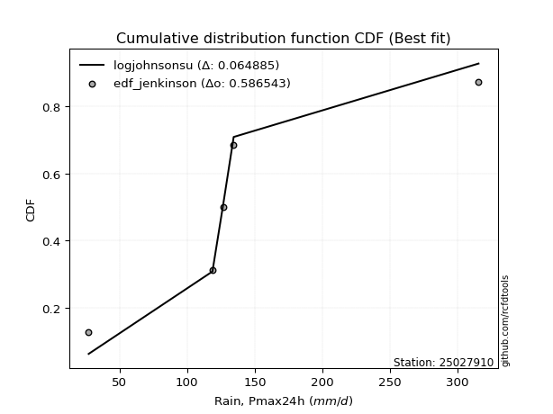</img>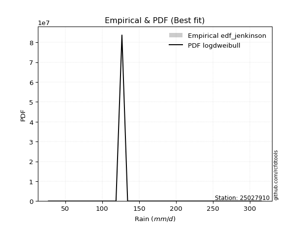</img>

</div>


### 11. EDF Cunnane (1978)

Cunnane´s work in statistical hydrology has focused on the performance and evaluation of different probability distributions (such as GEV, Gumbel, Lognormal) for flood frequency estimation. _b_ is a constant, typically set to 0.4.

<div align="center">


$P=(m-b)/(n+1-2b)$


</div>


**11.1. Empirical values**

<div align="center">

|                | 0                  | 1                   | 2                   | 3                  | 4                  | 5                  |
|:---------------|:-------------------|:--------------------|:--------------------|:-------------------|:-------------------|:-------------------|
| date           | 2020               | 2023                | 2022                | 2021               | 2025               | 2024               |
| x              | 27.2               | 118.7               | 126.7               | 134.4              | 193.2              | 315.4              |
| m              | 1                  | 2                   | 3                   | 4                  | 5                  | 6                  |
| empirical_dist | edf_cunnane        | edf_cunnane         | edf_cunnane         | edf_cunnane        | edf_cunnane        | edf_cunnane        |
| empirical      | 0.0967741935483871 | 0.25806451612903225 | 0.41935483870967744 | 0.5806451612903226 | 0.7419354838709676 | 0.9032258064516128 |
| empirical_tr   | 1.1071428571428572 | 1.3478260869565217  | 1.7222222222222225  | 2.384615384615385  | 3.8749999999999982 | 10.333333333333318 |

</div>


**11.2. Kolmogorov-Smirnov fit test (sorted by Δ)**


<div align="center">

|                | 0                   | 1                   | 2                  | 3                  | 4                   | 5                   | 6                  | 7                  | 8                   | 9                   | 10                  | 11                  | 12                  | 13               | 14                 | 15                  | 16                  | 17                 | 18                  | 19                  | 20                  | 21                  | 22                 | 23                  | 24                 | 25                  | 26                  | 27                 | 28                  | 29                  | 30                  | 31                  | 32                  | 33                 | 34                  | 35                  | 36                 | 37                  | 38                | 39                 | 40                 | 41                  | 42                  | 43                 | 44                 | 45                  | 46                  | 47                  | 48                  | 49                  | 50                 | 51                  | 52                  | 53                  | 54                  | 55                 | 56                 | 57                  | 58                  | 59                  | 60                  | 61                  | 62                 | 63                 | 64                 | 65                  | 66                  | 67                  | 68                  | 69                  | 70                  | 71                  | 72                  | 73                  | 74                 | 75                  | 76                  | 77                 | 78                  | 79                  | 80                  | 81                  | 82                  | 83                  | 84                  | 85                  | 86                  | 87                  | 88                  | 89                  | 90                  | 91                 | 92                  | 93                  | 94                  | 95                  | 96                  | 97                 | 98                  | 99                 | 100                | 101                 | 102                 | 103                | 104                | 105                 | 106                 | 107                | 108                | 109                | 110              | 111                 | 112                 | 113                 | 114                 | 115                | 116                 | 117               | 118                | 119               | 120                | 121                 | 122                 | 123                | 124                 | 125                 | 126                 | 127                | 128                | 129                 | 130                 | 131                 | 132               | 133                 | 134                | 135                | 136                 | 137               | 138                 | 139                 | 140               | 141                 | 142                 | 143                | 144                | 145                | 146                | 147                | 148               | 149                | 150                | 151                | 152               | 153                | 154                | 155              | 156                | 157                | 158                | 159               |
|:---------------|:--------------------|:--------------------|:-------------------|:-------------------|:--------------------|:--------------------|:-------------------|:-------------------|:--------------------|:--------------------|:--------------------|:--------------------|:--------------------|:-----------------|:-------------------|:--------------------|:--------------------|:-------------------|:--------------------|:--------------------|:--------------------|:--------------------|:-------------------|:--------------------|:-------------------|:--------------------|:--------------------|:-------------------|:--------------------|:--------------------|:--------------------|:--------------------|:--------------------|:-------------------|:--------------------|:--------------------|:-------------------|:--------------------|:------------------|:-------------------|:-------------------|:--------------------|:--------------------|:-------------------|:-------------------|:--------------------|:--------------------|:--------------------|:--------------------|:--------------------|:-------------------|:--------------------|:--------------------|:--------------------|:--------------------|:-------------------|:-------------------|:--------------------|:--------------------|:--------------------|:--------------------|:--------------------|:-------------------|:-------------------|:-------------------|:--------------------|:--------------------|:--------------------|:--------------------|:--------------------|:--------------------|:--------------------|:--------------------|:--------------------|:-------------------|:--------------------|:--------------------|:-------------------|:--------------------|:--------------------|:--------------------|:--------------------|:--------------------|:--------------------|:--------------------|:--------------------|:--------------------|:--------------------|:--------------------|:--------------------|:--------------------|:-------------------|:--------------------|:--------------------|:--------------------|:--------------------|:--------------------|:-------------------|:--------------------|:-------------------|:-------------------|:--------------------|:--------------------|:-------------------|:-------------------|:--------------------|:--------------------|:-------------------|:-------------------|:-------------------|:-----------------|:--------------------|:--------------------|:--------------------|:--------------------|:-------------------|:--------------------|:------------------|:-------------------|:------------------|:-------------------|:--------------------|:--------------------|:-------------------|:--------------------|:--------------------|:--------------------|:-------------------|:-------------------|:--------------------|:--------------------|:--------------------|:------------------|:--------------------|:-------------------|:-------------------|:--------------------|:------------------|:--------------------|:--------------------|:------------------|:--------------------|:--------------------|:-------------------|:-------------------|:-------------------|:-------------------|:-------------------|:------------------|:-------------------|:-------------------|:-------------------|:------------------|:-------------------|:-------------------|:-----------------|:-------------------|:-------------------|:-------------------|:------------------|
| station        | 25027910            | 25027910            | 25027910           | 25027910           | 25027910            | 25027910            | 25027910           | 25027910           | 25027910            | 25027910            | 25027910            | 25027910            | 25027910            | 25027910         | 25027910           | 25027910            | 25027910            | 25027910           | 25027910            | 25027910            | 25027910            | 25027910            | 25027910           | 25027910            | 25027910           | 25027910            | 25027910            | 25027910           | 25027910            | 25027910            | 25027910            | 25027910            | 25027910            | 25027910           | 25027910            | 25027910            | 25027910           | 25027910            | 25027910          | 25027910           | 25027910           | 25027910            | 25027910            | 25027910           | 25027910           | 25027910            | 25027910            | 25027910            | 25027910            | 25027910            | 25027910           | 25027910            | 25027910            | 25027910            | 25027910            | 25027910           | 25027910           | 25027910            | 25027910            | 25027910            | 25027910            | 25027910            | 25027910           | 25027910           | 25027910           | 25027910            | 25027910            | 25027910            | 25027910            | 25027910            | 25027910            | 25027910            | 25027910            | 25027910            | 25027910           | 25027910            | 25027910            | 25027910           | 25027910            | 25027910            | 25027910            | 25027910            | 25027910            | 25027910            | 25027910            | 25027910            | 25027910            | 25027910            | 25027910            | 25027910            | 25027910            | 25027910           | 25027910            | 25027910            | 25027910            | 25027910            | 25027910            | 25027910           | 25027910            | 25027910           | 25027910           | 25027910            | 25027910            | 25027910           | 25027910           | 25027910            | 25027910            | 25027910           | 25027910           | 25027910           | 25027910         | 25027910            | 25027910            | 25027910            | 25027910            | 25027910           | 25027910            | 25027910          | 25027910           | 25027910          | 25027910           | 25027910            | 25027910            | 25027910           | 25027910            | 25027910            | 25027910            | 25027910           | 25027910           | 25027910            | 25027910            | 25027910            | 25027910          | 25027910            | 25027910           | 25027910           | 25027910            | 25027910          | 25027910            | 25027910            | 25027910          | 25027910            | 25027910            | 25027910           | 25027910           | 25027910           | 25027910           | 25027910           | 25027910          | 25027910           | 25027910           | 25027910           | 25027910          | 25027910           | 25027910           | 25027910         | 25027910           | 25027910           | 25027910           | 25027910          |
| empirical_dist | edf_cunnane         | edf_cunnane         | edf_cunnane        | edf_cunnane        | edf_cunnane         | edf_cunnane         | edf_cunnane        | edf_cunnane        | edf_cunnane         | edf_cunnane         | edf_cunnane         | edf_cunnane         | edf_cunnane         | edf_cunnane      | edf_cunnane        | edf_cunnane         | edf_cunnane         | edf_cunnane        | edf_cunnane         | edf_cunnane         | edf_cunnane         | edf_cunnane         | edf_cunnane        | edf_cunnane         | edf_cunnane        | edf_cunnane         | edf_cunnane         | edf_cunnane        | edf_cunnane         | edf_cunnane         | edf_cunnane         | edf_cunnane         | edf_cunnane         | edf_cunnane        | edf_cunnane         | edf_cunnane         | edf_cunnane        | edf_cunnane         | edf_cunnane       | edf_cunnane        | edf_cunnane        | edf_cunnane         | edf_cunnane         | edf_cunnane        | edf_cunnane        | edf_cunnane         | edf_cunnane         | edf_cunnane         | edf_cunnane         | edf_cunnane         | edf_cunnane        | edf_cunnane         | edf_cunnane         | edf_cunnane         | edf_cunnane         | edf_cunnane        | edf_cunnane        | edf_cunnane         | edf_cunnane         | edf_cunnane         | edf_cunnane         | edf_cunnane         | edf_cunnane        | edf_cunnane        | edf_cunnane        | edf_cunnane         | edf_cunnane         | edf_cunnane         | edf_cunnane         | edf_cunnane         | edf_cunnane         | edf_cunnane         | edf_cunnane         | edf_cunnane         | edf_cunnane        | edf_cunnane         | edf_cunnane         | edf_cunnane        | edf_cunnane         | edf_cunnane         | edf_cunnane         | edf_cunnane         | edf_cunnane         | edf_cunnane         | edf_cunnane         | edf_cunnane         | edf_cunnane         | edf_cunnane         | edf_cunnane         | edf_cunnane         | edf_cunnane         | edf_cunnane        | edf_cunnane         | edf_cunnane         | edf_cunnane         | edf_cunnane         | edf_cunnane         | edf_cunnane        | edf_cunnane         | edf_cunnane        | edf_cunnane        | edf_cunnane         | edf_cunnane         | edf_cunnane        | edf_cunnane        | edf_cunnane         | edf_cunnane         | edf_cunnane        | edf_cunnane        | edf_cunnane        | edf_cunnane      | edf_cunnane         | edf_cunnane         | edf_cunnane         | edf_cunnane         | edf_cunnane        | edf_cunnane         | edf_cunnane       | edf_cunnane        | edf_cunnane       | edf_cunnane        | edf_cunnane         | edf_cunnane         | edf_cunnane        | edf_cunnane         | edf_cunnane         | edf_cunnane         | edf_cunnane        | edf_cunnane        | edf_cunnane         | edf_cunnane         | edf_cunnane         | edf_cunnane       | edf_cunnane         | edf_cunnane        | edf_cunnane        | edf_cunnane         | edf_cunnane       | edf_cunnane         | edf_cunnane         | edf_cunnane       | edf_cunnane         | edf_cunnane         | edf_cunnane        | edf_cunnane        | edf_cunnane        | edf_cunnane        | edf_cunnane        | edf_cunnane       | edf_cunnane        | edf_cunnane        | edf_cunnane        | edf_cunnane       | edf_cunnane        | edf_cunnane        | edf_cunnane      | edf_cunnane        | edf_cunnane        | edf_cunnane        | edf_cunnane       |
| p_dist         | logdweibull         | johnsonsu           | logjohnsonsu       | logdgamma          | loggennorm          | nct                 | skewnorm           | logt               | rice                | pearson3            | maxwell             | invgamma            | exponnorm           | rayleigh         | invgauss           | genexpon            | genlogistic         | logloglaplace      | exponweib           | logloggamma         | gengamma            | gumbel_r            | betaprime          | logburr12           | foldnorm           | burr                | gennorm             | f                  | mielke              | erlang              | gamma               | loggenlogistic      | dgamma              | logburr            | ncf                 | invweibull          | semicircular       | logmielke           | logargus          | logweibull_min     | anglit             | beta                | kstwobign           | loggenhalflogistic | arcsine            | loggumbel_l         | logvonmises_line    | moyal               | logskewnorm         | weibull_min         | bradford           | dweibull            | logpearson3         | t                   | truncnorm           | norm               | crystalball        | kappa3              | halfnorm            | loggausshyper       | truncexpon          | logistic            | logtrapezoid       | halflogistic       | loggompertz        | kappa4              | hypsecant           | ksone               | cosine              | gausshyper          | logtriang           | loglevy_l           | wald                | loggenextreme       | lomax              | wrapcauchy          | laplace             | uniform            | loglaplace          | loglaplace          | logf                | loghypsecant        | loglogistic         | logbeta             | logncf              | logcrystalball      | lognorm             | logexponnorm        | logfatiguelife      | lognct              | loganglit           | logsemicircular    | gumbel_l            | vonmises_line       | logarcsine          | logrice             | loginvgamma         | logbetaprime       | logerlang           | loggamma           | loggamma           | logalpha            | argus               | nakagami           | lognakagami        | logtruncnorm        | logmaxwell          | loginvgauss        | loginvweibull      | lograyleigh        | logwrapcauchy    | logcosine           | levy_l              | genpareto           | logjohnsonsb        | logfoldnorm        | loggenpareto        | loggumbel_r       | logkstwobign       | loghalfnorm       | logweibull_max     | loggenexpon         | halfgennorm         | genhalflogistic    | logmoyal            | genextreme          | logksone            | loghalflogistic    | logbradford        | logkappa4           | logkappa3           | loguniform          | alpha             | loggengamma         | loglomax           | burr12             | logwald             | triang            | logrdist            | trapezoid           | johnsonsb         | logtruncexpon       | logtruncweibull_min | logexponweib       | logtukeylambda     | truncweibull_min   | fatiguelife        | gompertz           | powerlaw          | logexponpow        | rdist              | truncpareto        | weibull_max       | logpowerlaw        | tukeylambda        | exponpow         | logtruncpareto     | loghalfgennorm     | logvonmises        | vonmises          |
| delta          | 0.08690567249631209 | 0.08766982077312202 | 0.0918317172613633 | 0.0938272600703911 | 0.10574724943532654 | 0.12159267896835096 | 0.1234598062690393 | 0.1236353397039941 | 0.12582801684400535 | 0.12618851944245513 | 0.12863349719673406 | 0.13166129464729864 | 0.13300271507136857 | 0.13525133874992 | 0.1354148036594366 | 0.13604569924037124 | 0.13664735723545446 | 0.1378945087614047 | 0.13821657303753698 | 0.13828636529350813 | 0.13910943161018008 | 0.13951205644349407 | 0.1412856530174878 | 0.14176273978718001 | 0.1425234518276282 | 0.14289574444744818 | 0.14342640756604552 | 0.1438731682740314 | 0.14397237308842953 | 0.14399265441038855 | 0.14399265591974125 | 0.14442223109225272 | 0.14445602835103627 | 0.1445029901011225 | 0.14608153087628462 | 0.14640544141624418 | 0.1466688597976139 | 0.14876256940055915 | 0.148838709554869 | 0.1492848385323523 | 0.1514374784739369 | 0.15229595487658842 | 0.15263986379592837 | 0.1531276964676766 | 0.1536938577283241 | 0.15528508093209314 | 0.15715187195670727 | 0.15734152670365087 | 0.16055388673287974 | 0.16078274393647818 | 0.1610910603677952 | 0.16128240066815736 | 0.16202268023338057 | 0.16294513639374342 | 0.16295025306859667 | 0.1629502585706199 | 0.1629503436752151 | 0.16415865450234612 | 0.16956917896471513 | 0.17168997100582345 | 0.17364791437159866 | 0.17376955727216148 | 0.1738728171960176 | 0.1775422608008671 | 0.1777917155457761 | 0.17897348754641051 | 0.18274499889757856 | 0.18734189966645026 | 0.18807123249680557 | 0.19559097454317387 | 0.19616697248049236 | 0.19728019650547238 | 0.19795080994510128 | 0.19819099339851937 | 0.2015302148304815 | 0.20765241350282698 | 0.20795664891897775 | 0.2086812473416758 | 0.21438196315264213 | 0.21438196315264213 | 0.22121913340459143 | 0.22190802140107457 | 0.22376858974368374 | 0.22386324780131683 | 0.22522906066409665 | 0.22594960335865594 | 0.22594960765427285 | 0.22595390710896363 | 0.22684984934067842 | 0.22795072531753624 | 0.22823603271793363 | 0.2291783399833513 | 0.23108481762548982 | 0.23128763092155896 | 0.23291347650229133 | 0.23356804618046328 | 0.23951884476681973 | 0.2416006837784329 | 0.24417489260991798 | 0.2443511784660567 | 0.2443511784660567 | 0.24833473963954333 | 0.25120048392945515 | 0.2580190695114773 | 0.2580635440715129 | 0.25806399484103915 | 0.25956603003205303 | 0.2670718703545749 | 0.2683929304072411 | 0.2709050154879127 | 0.27672419312314 | 0.27852478229486133 | 0.28007612094707957 | 0.28174306676278343 | 0.28990885148911105 | 0.2916859554831537 | 0.29327693080545714 | 0.295666183288641 | 0.3025605946787815 | 0.302839741320179 | 0.3084326612737088 | 0.31199556420906194 | 0.31370894405855854 | 0.3187808744247441 | 0.32154148023835516 | 0.32450395039426694 | 0.32629151819695446 | 0.3267279858853457 | 0.3316157727351172 | 0.33766748598271434 | 0.34315076738928607 | 0.34316272506215184 | 0.343633634549837 | 0.34952251466759454 | 0.3663609847721403 | 0.3667709287130616 | 0.39355646922082643 | 0.396372400217627 | 0.41457870130636587 | 0.42577341786659273 | 0.439978470625624 | 0.44206935632073774 | 0.4670495598155512  | 0.4722050107606651 | 0.4898729472460983 | 0.5053501391797929 | 0.5212976927926964 | 0.5806317584121403 | 0.592999777593329 | 0.5946587484659782 | 0.6091832974164294 | 0.6504028053063666 | 0.661102136804125 | 0.6644931428474777 | 0.6792553784186877 | 0.69728916780035 | 0.6992453507121434 | 0.7419354838709676 | 1.1793705382175246 | 49.56394056477826 |
| deltao         | 0.530385761606      | 0.530385761606      | 0.530385761606     | 0.530385761606     | 0.530385761606      | 0.530385761606      | 0.530385761606     | 0.530385761606     | 0.530385761606      | 0.530385761606      | 0.530385761606      | 0.530385761606      | 0.530385761606      | 0.530385761606   | 0.530385761606     | 0.530385761606      | 0.530385761606      | 0.530385761606     | 0.530385761606      | 0.530385761606      | 0.530385761606      | 0.530385761606      | 0.530385761606     | 0.530385761606      | 0.530385761606     | 0.530385761606      | 0.530385761606      | 0.530385761606     | 0.530385761606      | 0.530385761606      | 0.530385761606      | 0.530385761606      | 0.530385761606      | 0.530385761606     | 0.530385761606      | 0.530385761606      | 0.530385761606     | 0.530385761606      | 0.530385761606    | 0.530385761606     | 0.530385761606     | 0.530385761606      | 0.530385761606      | 0.530385761606     | 0.530385761606     | 0.530385761606      | 0.530385761606      | 0.530385761606      | 0.530385761606      | 0.530385761606      | 0.530385761606     | 0.530385761606      | 0.530385761606      | 0.530385761606      | 0.530385761606      | 0.530385761606     | 0.530385761606     | 0.530385761606      | 0.530385761606      | 0.530385761606      | 0.530385761606      | 0.530385761606      | 0.530385761606     | 0.530385761606     | 0.530385761606     | 0.530385761606      | 0.530385761606      | 0.530385761606      | 0.530385761606      | 0.530385761606      | 0.530385761606      | 0.530385761606      | 0.530385761606      | 0.530385761606      | 0.530385761606     | 0.530385761606      | 0.530385761606      | 0.530385761606     | 0.530385761606      | 0.530385761606      | 0.530385761606      | 0.530385761606      | 0.530385761606      | 0.530385761606      | 0.530385761606      | 0.530385761606      | 0.530385761606      | 0.530385761606      | 0.530385761606      | 0.530385761606      | 0.530385761606      | 0.530385761606     | 0.530385761606      | 0.530385761606      | 0.530385761606      | 0.530385761606      | 0.530385761606      | 0.530385761606     | 0.530385761606      | 0.530385761606     | 0.530385761606     | 0.530385761606      | 0.530385761606      | 0.530385761606     | 0.530385761606     | 0.530385761606      | 0.530385761606      | 0.530385761606     | 0.530385761606     | 0.530385761606     | 0.530385761606   | 0.530385761606      | 0.530385761606      | 0.530385761606      | 0.530385761606      | 0.530385761606     | 0.530385761606      | 0.530385761606    | 0.530385761606     | 0.530385761606    | 0.530385761606     | 0.530385761606      | 0.530385761606      | 0.530385761606     | 0.530385761606      | 0.530385761606      | 0.530385761606      | 0.530385761606     | 0.530385761606     | 0.530385761606      | 0.530385761606      | 0.530385761606      | 0.530385761606    | 0.530385761606      | 0.530385761606     | 0.530385761606     | 0.530385761606      | 0.530385761606    | 0.530385761606      | 0.530385761606      | 0.530385761606    | 0.530385761606      | 0.530385761606      | 0.530385761606     | 0.530385761606     | 0.530385761606     | 0.530385761606     | 0.530385761606     | 0.530385761606    | 0.530385761606     | 0.530385761606     | 0.530385761606     | 0.530385761606    | 0.530385761606     | 0.530385761606     | 0.530385761606   | 0.530385761606     | 0.530385761606     | 0.530385761606     | 0.530385761606    |
| eval           | Δo > Δ              | Δo > Δ              | Δo > Δ             | Δo > Δ             | Δo > Δ              | Δo > Δ              | Δo > Δ             | Δo > Δ             | Δo > Δ              | Δo > Δ              | Δo > Δ              | Δo > Δ              | Δo > Δ              | Δo > Δ           | Δo > Δ             | Δo > Δ              | Δo > Δ              | Δo > Δ             | Δo > Δ              | Δo > Δ              | Δo > Δ              | Δo > Δ              | Δo > Δ             | Δo > Δ              | Δo > Δ             | Δo > Δ              | Δo > Δ              | Δo > Δ             | Δo > Δ              | Δo > Δ              | Δo > Δ              | Δo > Δ              | Δo > Δ              | Δo > Δ             | Δo > Δ              | Δo > Δ              | Δo > Δ             | Δo > Δ              | Δo > Δ            | Δo > Δ             | Δo > Δ             | Δo > Δ              | Δo > Δ              | Δo > Δ             | Δo > Δ             | Δo > Δ              | Δo > Δ              | Δo > Δ              | Δo > Δ              | Δo > Δ              | Δo > Δ             | Δo > Δ              | Δo > Δ              | Δo > Δ              | Δo > Δ              | Δo > Δ             | Δo > Δ             | Δo > Δ              | Δo > Δ              | Δo > Δ              | Δo > Δ              | Δo > Δ              | Δo > Δ             | Δo > Δ             | Δo > Δ             | Δo > Δ              | Δo > Δ              | Δo > Δ              | Δo > Δ              | Δo > Δ              | Δo > Δ              | Δo > Δ              | Δo > Δ              | Δo > Δ              | Δo > Δ             | Δo > Δ              | Δo > Δ              | Δo > Δ             | Δo > Δ              | Δo > Δ              | Δo > Δ              | Δo > Δ              | Δo > Δ              | Δo > Δ              | Δo > Δ              | Δo > Δ              | Δo > Δ              | Δo > Δ              | Δo > Δ              | Δo > Δ              | Δo > Δ              | Δo > Δ             | Δo > Δ              | Δo > Δ              | Δo > Δ              | Δo > Δ              | Δo > Δ              | Δo > Δ             | Δo > Δ              | Δo > Δ             | Δo > Δ             | Δo > Δ              | Δo > Δ              | Δo > Δ             | Δo > Δ             | Δo > Δ              | Δo > Δ              | Δo > Δ             | Δo > Δ             | Δo > Δ             | Δo > Δ           | Δo > Δ              | Δo > Δ              | Δo > Δ              | Δo > Δ              | Δo > Δ             | Δo > Δ              | Δo > Δ            | Δo > Δ             | Δo > Δ            | Δo > Δ             | Δo > Δ              | Δo > Δ              | Δo > Δ             | Δo > Δ              | Δo > Δ              | Δo > Δ              | Δo > Δ             | Δo > Δ             | Δo > Δ              | Δo > Δ              | Δo > Δ              | Δo > Δ            | Δo > Δ              | Δo > Δ             | Δo > Δ             | Δo > Δ              | Δo > Δ            | Δo > Δ              | Δo > Δ              | Δo > Δ            | Δo > Δ              | Δo > Δ              | Δo > Δ             | Δo > Δ             | Δo > Δ             | Δo > Δ             | Δo <= Δ            | Δo <= Δ           | Δo <= Δ            | Δo <= Δ            | Δo <= Δ            | Δo <= Δ           | Δo <= Δ            | Δo <= Δ            | Δo <= Δ          | Δo <= Δ            | Δo <= Δ            | Δo <= Δ            | Δo <= Δ           |
| fit            | 1                   | 1                   | 1                  | 1                  | 1                   | 1                   | 1                  | 1                  | 1                   | 1                   | 1                   | 1                   | 1                   | 1                | 1                  | 1                   | 1                   | 1                  | 1                   | 1                   | 1                   | 1                   | 1                  | 1                   | 1                  | 1                   | 1                   | 1                  | 1                   | 1                   | 1                   | 1                   | 1                   | 1                  | 1                   | 1                   | 1                  | 1                   | 1                 | 1                  | 1                  | 1                   | 1                   | 1                  | 1                  | 1                   | 1                   | 1                   | 1                   | 1                   | 1                  | 1                   | 1                   | 1                   | 1                   | 1                  | 1                  | 1                   | 1                   | 1                   | 1                   | 1                   | 1                  | 1                  | 1                  | 1                   | 1                   | 1                   | 1                   | 1                   | 1                   | 1                   | 1                   | 1                   | 1                  | 1                   | 1                   | 1                  | 1                   | 1                   | 1                   | 1                   | 1                   | 1                   | 1                   | 1                   | 1                   | 1                   | 1                   | 1                   | 1                   | 1                  | 1                   | 1                   | 1                   | 1                   | 1                   | 1                  | 1                   | 1                  | 1                  | 1                   | 1                   | 1                  | 1                  | 1                   | 1                   | 1                  | 1                  | 1                  | 1                | 1                   | 1                   | 1                   | 1                   | 1                  | 1                   | 1                 | 1                  | 1                 | 1                  | 1                   | 1                   | 1                  | 1                   | 1                   | 1                   | 1                  | 1                  | 1                   | 1                   | 1                   | 1                 | 1                   | 1                  | 1                  | 1                   | 1                 | 1                   | 1                   | 1                 | 1                   | 1                   | 1                  | 1                  | 1                  | 1                  | 0                  | 0                 | 0                  | 0                  | 0                  | 0                 | 0                  | 0                  | 0                | 0                  | 0                  | 0                  | 0                 |
| n              | 6                   | 6                   | 6                  | 6                  | 6                   | 6                   | 6                  | 6                  | 6                   | 6                   | 6                   | 6                   | 6                   | 6                | 6                  | 6                   | 6                   | 6                  | 6                   | 6                   | 6                   | 6                   | 6                  | 6                   | 6                  | 6                   | 6                   | 6                  | 6                   | 6                   | 6                   | 6                   | 6                   | 6                  | 6                   | 6                   | 6                  | 6                   | 6                 | 6                  | 6                  | 6                   | 6                   | 6                  | 6                  | 6                   | 6                   | 6                   | 6                   | 6                   | 6                  | 6                   | 6                   | 6                   | 6                   | 6                  | 6                  | 6                   | 6                   | 6                   | 6                   | 6                   | 6                  | 6                  | 6                  | 6                   | 6                   | 6                   | 6                   | 6                   | 6                   | 6                   | 6                   | 6                   | 6                  | 6                   | 6                   | 6                  | 6                   | 6                   | 6                   | 6                   | 6                   | 6                   | 6                   | 6                   | 6                   | 6                   | 6                   | 6                   | 6                   | 6                  | 6                   | 6                   | 6                   | 6                   | 6                   | 6                  | 6                   | 6                  | 6                  | 6                   | 6                   | 6                  | 6                  | 6                   | 6                   | 6                  | 6                  | 6                  | 6                | 6                   | 6                   | 6                   | 6                   | 6                  | 6                   | 6                 | 6                  | 6                 | 6                  | 6                   | 6                   | 6                  | 6                   | 6                   | 6                   | 6                  | 6                  | 6                   | 6                   | 6                   | 6                 | 6                   | 6                  | 6                  | 6                   | 6                 | 6                   | 6                   | 6                 | 6                   | 6                   | 6                  | 6                  | 6                  | 6                  | 6                  | 6                 | 6                  | 6                  | 6                  | 6                 | 6                  | 6                  | 6                | 6                  | 6                  | 6                  | 6                 |
| best_fit       | 1                   | 0                   | 0                  | 0                  | 0                   | 0                   | 0                  | 0                  | 0                   | 0                   | 0                   | 0                   | 0                   | 0                | 0                  | 0                   | 0                   | 0                  | 0                   | 0                   | 0                   | 0                   | 0                  | 0                   | 0                  | 0                   | 0                   | 0                  | 0                   | 0                   | 0                   | 0                   | 0                   | 0                  | 0                   | 0                   | 0                  | 0                   | 0                 | 0                  | 0                  | 0                   | 0                   | 0                  | 0                  | 0                   | 0                   | 0                   | 0                   | 0                   | 0                  | 0                   | 0                   | 0                   | 0                   | 0                  | 0                  | 0                   | 0                   | 0                   | 0                   | 0                   | 0                  | 0                  | 0                  | 0                   | 0                   | 0                   | 0                   | 0                   | 0                   | 0                   | 0                   | 0                   | 0                  | 0                   | 0                   | 0                  | 0                   | 0                   | 0                   | 0                   | 0                   | 0                   | 0                   | 0                   | 0                   | 0                   | 0                   | 0                   | 0                   | 0                  | 0                   | 0                   | 0                   | 0                   | 0                   | 0                  | 0                   | 0                  | 0                  | 0                   | 0                   | 0                  | 0                  | 0                   | 0                   | 0                  | 0                  | 0                  | 0                | 0                   | 0                   | 0                   | 0                   | 0                  | 0                   | 0                 | 0                  | 0                 | 0                  | 0                   | 0                   | 0                  | 0                   | 0                   | 0                   | 0                  | 0                  | 0                   | 0                   | 0                   | 0                 | 0                   | 0                  | 0                  | 0                   | 0                 | 0                   | 0                   | 0                 | 0                   | 0                   | 0                  | 0                  | 0                  | 0                  | 0                  | 0                 | 0                  | 0                  | 0                  | 0                 | 0                  | 0                  | 0                | 0                  | 0                  | 0                  | 0                 |
| best_fit_sort  | 1                   | 2                   | 3                  | 4                  | 5                   | 6                   | 7                  | 8                  | 9                   | 10                  | 11                  | 12                  | 13                  | 14               | 15                 | 16                  | 17                  | 18                 | 19                  | 20                  | 21                  | 22                  | 23                 | 24                  | 25                 | 26                  | 27                  | 28                 | 29                  | 30                  | 31                  | 32                  | 33                  | 34                 | 35                  | 36                  | 37                 | 38                  | 39                | 40                 | 41                 | 42                  | 43                  | 44                 | 45                 | 46                  | 47                  | 48                  | 49                  | 50                  | 51                 | 52                  | 53                  | 54                  | 55                  | 56                 | 57                 | 58                  | 59                  | 60                  | 61                  | 62                  | 63                 | 64                 | 65                 | 66                  | 67                  | 68                  | 69                  | 70                  | 71                  | 72                  | 73                  | 74                  | 75                 | 76                  | 77                  | 78                 | 79                  | 80                  | 81                  | 82                  | 83                  | 84                  | 85                  | 86                  | 87                  | 88                  | 89                  | 90                  | 91                  | 92                 | 93                  | 94                  | 95                  | 96                  | 97                  | 98                 | 99                  | 100                | 101                | 102                 | 103                 | 104                | 105                | 106                 | 107                 | 108                | 109                | 110                | 111              | 112                 | 113                 | 114                 | 115                 | 116                | 117                 | 118               | 119                | 120               | 121                | 122                 | 123                 | 124                | 125                 | 126                 | 127                 | 128                | 129                | 130                 | 131                 | 132                 | 133               | 134                 | 135                | 136                | 137                 | 138               | 139                 | 140                 | 141               | 142                 | 143                 | 144                | 145                | 146                | 147                | 148                | 149               | 150                | 151                | 152                | 153               | 154                | 155                | 156              | 157                | 158                | 159                | 160               |

</div>


**11.3. Best fit**

<div align="center">

|   id |   station | empirical_dist   | p_dist      |     delta |   deltao | eval   |   fit |   n |   best_fit |   best_fit_sort |
|-----:|----------:|:-----------------|:------------|----------:|---------:|:-------|------:|----:|-----------:|----------------:|
|    0 |  25027910 | edf_cunnane      | logdweibull | 0.0869057 | 0.530386 | Δo > Δ |     1 |   6 |          1 |               1 |

</div>


<div align="center">

</img></img>

</div>


### 12. EDF Adamowski (1981)

The Adamowski formula in hydrology refers to a specific plotting position formula used for estimating the non-parametric empirical distribution of hydrological events (like flood peaks) to calculate their return periods. This formula provides an alternative to traditional parametric methods (like the Gumbel or Log Pearson Type III distributions). 

<div align="center">


$P=(m-0.25)/(n+0.5)$


</div>


**12.1. Empirical values**

<div align="center">

|                | 0                   | 1                  | 2                  | 3                  | 4                  | 5                  |
|:---------------|:--------------------|:-------------------|:-------------------|:-------------------|:-------------------|:-------------------|
| date           | 2020                | 2023               | 2022               | 2021               | 2025               | 2024               |
| x              | 27.2                | 118.7              | 126.7              | 134.4              | 193.2              | 315.4              |
| m              | 1                   | 2                  | 3                  | 4                  | 5                  | 6                  |
| empirical_dist | edf_adamowski       | edf_adamowski      | edf_adamowski      | edf_adamowski      | edf_adamowski      | edf_adamowski      |
| empirical      | 0.11538461538461539 | 0.2692307692307692 | 0.4230769230769231 | 0.5769230769230769 | 0.7307692307692307 | 0.8846153846153846 |
| empirical_tr   | 1.1304347826086958  | 1.3684210526315788 | 1.7333333333333334 | 2.3636363636363633 | 3.7142857142857135 | 8.666666666666664  |

</div>


**12.2. Kolmogorov-Smirnov fit test (sorted by Δ)**


<div align="center">

|                | 0                   | 1                   | 2                   | 3                   | 4                   | 5                   | 6                   | 7                   | 8                   | 9                  | 10                  | 11                  | 12                  | 13                  | 14                  | 15                 | 16                  | 17                  | 18                  | 19                 | 20                 | 21                  | 22                  | 23                  | 24                 | 25                  | 26                  | 27                 | 28                  | 29                  | 30                  | 31                  | 32                | 33                  | 34                 | 35                  | 36                  | 37                  | 38                  | 39                 | 40                  | 41                  | 42                  | 43                  | 44                 | 45                 | 46                  | 47                  | 48                 | 49                  | 50                 | 51                 | 52                  | 53                  | 54                  | 55                  | 56                  | 57                  | 58                  | 59                  | 60                 | 61                  | 62                  | 63                  | 64                  | 65                  | 66                  | 67                 | 68                  | 69                  | 70                 | 71                 | 72                  | 73                  | 74                  | 75                  | 76                  | 77                  | 78                | 79                  | 80                  | 81                 | 82                  | 83                  | 84                  | 85                 | 86                  | 87                  | 88                  | 89                  | 90                  | 91                  | 92                  | 93                  | 94                  | 95                  | 96                  | 97                  | 98                  | 99                  | 100                 | 101                 | 102                | 103                 | 104                 | 105                 | 106                | 107                 | 108                 | 109                 | 110                 | 111                 | 112                | 113                | 114                | 115                | 116                 | 117                 | 118                | 119               | 120                 | 121                 | 122                 | 123                 | 124                | 125                | 126                | 127                | 128                 | 129                | 130                 | 131                | 132                | 133             | 134                 | 135                 | 136                 | 137                 | 138                | 139               | 140                | 141                 | 142                 | 143                 | 144                 | 145                | 146                | 147                | 148               | 149                | 150                | 151                | 152                | 153                | 154                | 155               | 156                | 157                | 158                | 159                |
|:---------------|:--------------------|:--------------------|:--------------------|:--------------------|:--------------------|:--------------------|:--------------------|:--------------------|:--------------------|:-------------------|:--------------------|:--------------------|:--------------------|:--------------------|:--------------------|:-------------------|:--------------------|:--------------------|:--------------------|:-------------------|:-------------------|:--------------------|:--------------------|:--------------------|:-------------------|:--------------------|:--------------------|:-------------------|:--------------------|:--------------------|:--------------------|:--------------------|:------------------|:--------------------|:-------------------|:--------------------|:--------------------|:--------------------|:--------------------|:-------------------|:--------------------|:--------------------|:--------------------|:--------------------|:-------------------|:-------------------|:--------------------|:--------------------|:-------------------|:--------------------|:-------------------|:-------------------|:--------------------|:--------------------|:--------------------|:--------------------|:--------------------|:--------------------|:--------------------|:--------------------|:-------------------|:--------------------|:--------------------|:--------------------|:--------------------|:--------------------|:--------------------|:-------------------|:--------------------|:--------------------|:-------------------|:-------------------|:--------------------|:--------------------|:--------------------|:--------------------|:--------------------|:--------------------|:------------------|:--------------------|:--------------------|:-------------------|:--------------------|:--------------------|:--------------------|:-------------------|:--------------------|:--------------------|:--------------------|:--------------------|:--------------------|:--------------------|:--------------------|:--------------------|:--------------------|:--------------------|:--------------------|:--------------------|:--------------------|:--------------------|:--------------------|:--------------------|:-------------------|:--------------------|:--------------------|:--------------------|:-------------------|:--------------------|:--------------------|:--------------------|:--------------------|:--------------------|:-------------------|:-------------------|:-------------------|:-------------------|:--------------------|:--------------------|:-------------------|:------------------|:--------------------|:--------------------|:--------------------|:--------------------|:-------------------|:-------------------|:-------------------|:-------------------|:--------------------|:-------------------|:--------------------|:-------------------|:-------------------|:----------------|:--------------------|:--------------------|:--------------------|:--------------------|:-------------------|:------------------|:-------------------|:--------------------|:--------------------|:--------------------|:--------------------|:-------------------|:-------------------|:-------------------|:------------------|:-------------------|:-------------------|:-------------------|:-------------------|:-------------------|:-------------------|:------------------|:-------------------|:-------------------|:-------------------|:-------------------|
| station        | 25027910            | 25027910            | 25027910            | 25027910            | 25027910            | 25027910            | 25027910            | 25027910            | 25027910            | 25027910           | 25027910            | 25027910            | 25027910            | 25027910            | 25027910            | 25027910           | 25027910            | 25027910            | 25027910            | 25027910           | 25027910           | 25027910            | 25027910            | 25027910            | 25027910           | 25027910            | 25027910            | 25027910           | 25027910            | 25027910            | 25027910            | 25027910            | 25027910          | 25027910            | 25027910           | 25027910            | 25027910            | 25027910            | 25027910            | 25027910           | 25027910            | 25027910            | 25027910            | 25027910            | 25027910           | 25027910           | 25027910            | 25027910            | 25027910           | 25027910            | 25027910           | 25027910           | 25027910            | 25027910            | 25027910            | 25027910            | 25027910            | 25027910            | 25027910            | 25027910            | 25027910           | 25027910            | 25027910            | 25027910            | 25027910            | 25027910            | 25027910            | 25027910           | 25027910            | 25027910            | 25027910           | 25027910           | 25027910            | 25027910            | 25027910            | 25027910            | 25027910            | 25027910            | 25027910          | 25027910            | 25027910            | 25027910           | 25027910            | 25027910            | 25027910            | 25027910           | 25027910            | 25027910            | 25027910            | 25027910            | 25027910            | 25027910            | 25027910            | 25027910            | 25027910            | 25027910            | 25027910            | 25027910            | 25027910            | 25027910            | 25027910            | 25027910            | 25027910           | 25027910            | 25027910            | 25027910            | 25027910           | 25027910            | 25027910            | 25027910            | 25027910            | 25027910            | 25027910           | 25027910           | 25027910           | 25027910           | 25027910            | 25027910            | 25027910           | 25027910          | 25027910            | 25027910            | 25027910            | 25027910            | 25027910           | 25027910           | 25027910           | 25027910           | 25027910            | 25027910           | 25027910            | 25027910           | 25027910           | 25027910        | 25027910            | 25027910            | 25027910            | 25027910            | 25027910           | 25027910          | 25027910           | 25027910            | 25027910            | 25027910            | 25027910            | 25027910           | 25027910           | 25027910           | 25027910          | 25027910           | 25027910           | 25027910           | 25027910           | 25027910           | 25027910           | 25027910          | 25027910           | 25027910           | 25027910           | 25027910           |
| empirical_dist | edf_adamowski       | edf_adamowski       | edf_adamowski       | edf_adamowski       | edf_adamowski       | edf_adamowski       | edf_adamowski       | edf_adamowski       | edf_adamowski       | edf_adamowski      | edf_adamowski       | edf_adamowski       | edf_adamowski       | edf_adamowski       | edf_adamowski       | edf_adamowski      | edf_adamowski       | edf_adamowski       | edf_adamowski       | edf_adamowski      | edf_adamowski      | edf_adamowski       | edf_adamowski       | edf_adamowski       | edf_adamowski      | edf_adamowski       | edf_adamowski       | edf_adamowski      | edf_adamowski       | edf_adamowski       | edf_adamowski       | edf_adamowski       | edf_adamowski     | edf_adamowski       | edf_adamowski      | edf_adamowski       | edf_adamowski       | edf_adamowski       | edf_adamowski       | edf_adamowski      | edf_adamowski       | edf_adamowski       | edf_adamowski       | edf_adamowski       | edf_adamowski      | edf_adamowski      | edf_adamowski       | edf_adamowski       | edf_adamowski      | edf_adamowski       | edf_adamowski      | edf_adamowski      | edf_adamowski       | edf_adamowski       | edf_adamowski       | edf_adamowski       | edf_adamowski       | edf_adamowski       | edf_adamowski       | edf_adamowski       | edf_adamowski      | edf_adamowski       | edf_adamowski       | edf_adamowski       | edf_adamowski       | edf_adamowski       | edf_adamowski       | edf_adamowski      | edf_adamowski       | edf_adamowski       | edf_adamowski      | edf_adamowski      | edf_adamowski       | edf_adamowski       | edf_adamowski       | edf_adamowski       | edf_adamowski       | edf_adamowski       | edf_adamowski     | edf_adamowski       | edf_adamowski       | edf_adamowski      | edf_adamowski       | edf_adamowski       | edf_adamowski       | edf_adamowski      | edf_adamowski       | edf_adamowski       | edf_adamowski       | edf_adamowski       | edf_adamowski       | edf_adamowski       | edf_adamowski       | edf_adamowski       | edf_adamowski       | edf_adamowski       | edf_adamowski       | edf_adamowski       | edf_adamowski       | edf_adamowski       | edf_adamowski       | edf_adamowski       | edf_adamowski      | edf_adamowski       | edf_adamowski       | edf_adamowski       | edf_adamowski      | edf_adamowski       | edf_adamowski       | edf_adamowski       | edf_adamowski       | edf_adamowski       | edf_adamowski      | edf_adamowski      | edf_adamowski      | edf_adamowski      | edf_adamowski       | edf_adamowski       | edf_adamowski      | edf_adamowski     | edf_adamowski       | edf_adamowski       | edf_adamowski       | edf_adamowski       | edf_adamowski      | edf_adamowski      | edf_adamowski      | edf_adamowski      | edf_adamowski       | edf_adamowski      | edf_adamowski       | edf_adamowski      | edf_adamowski      | edf_adamowski   | edf_adamowski       | edf_adamowski       | edf_adamowski       | edf_adamowski       | edf_adamowski      | edf_adamowski     | edf_adamowski      | edf_adamowski       | edf_adamowski       | edf_adamowski       | edf_adamowski       | edf_adamowski      | edf_adamowski      | edf_adamowski      | edf_adamowski     | edf_adamowski      | edf_adamowski      | edf_adamowski      | edf_adamowski      | edf_adamowski      | edf_adamowski      | edf_adamowski     | edf_adamowski      | edf_adamowski      | edf_adamowski      | edf_adamowski      |
| p_dist         | logdweibull         | johnsonsu           | logdgamma           | logjohnsonsu        | nct                 | loggennorm          | skewnorm            | rice                | invgamma            | exponnorm          | pearson3            | rayleigh            | invgauss            | genexpon            | maxwell             | genlogistic        | logloglaplace       | exponweib           | logloggamma         | gengamma           | gumbel_r           | betaprime           | logburr12           | foldnorm            | burr               | f                   | mielke              | erlang             | gamma               | loggenlogistic      | logburr             | dgamma              | logt              | ncf                 | invweibull         | logmielke           | logargus            | logweibull_min      | beta                | kstwobign          | loggenhalflogistic  | arcsine             | semicircular        | loggumbel_l         | logvonmises_line   | moyal              | anglit              | logskewnorm         | weibull_min        | bradford            | dweibull           | logpearson3        | kappa3              | gennorm             | halfnorm            | t                   | truncnorm           | norm                | crystalball         | loggausshyper       | truncexpon         | logtrapezoid        | halflogistic        | loggompertz         | logistic            | kappa4              | loglevy_l           | hypsecant          | ksone               | cosine              | logtriang          | wald               | lomax               | gausshyper          | loggenextreme       | loglaplace          | loglaplace          | wrapcauchy          | laplace           | uniform             | logf                | loghypsecant       | loglogistic         | logncf              | logcrystalball      | lognorm            | logexponnorm        | logfatiguelife      | lognct              | loganglit           | logsemicircular     | logbeta             | logarcsine          | logrice             | gumbel_l            | vonmises_line       | loginvgamma         | logbetaprime        | logerlang           | loggamma            | loggamma            | logalpha            | argus              | logmaxwell          | loginvgauss         | loginvweibull       | lograyleigh        | levy_l              | logwrapcauchy       | logcosine           | nakagami            | lognakagami         | logtruncnorm       | genpareto          | logjohnsonsb       | logfoldnorm        | loggenpareto        | loggumbel_r         | logkstwobign       | loghalfnorm       | logweibull_max      | loggenexpon         | halfgennorm         | genextreme          | logmoyal           | genhalflogistic    | logksone           | loghalflogistic    | logbradford         | logkappa4          | loggengamma         | logkappa3          | loguniform         | alpha           | loglomax            | burr12              | logwald             | triang              | logrdist           | trapezoid         | johnsonsb          | logtruncexpon       | logtruncweibull_min | logexponweib        | logtukeylambda      | truncweibull_min   | fatiguelife        | gompertz           | powerlaw          | logexponpow        | rdist              | truncpareto        | weibull_max        | logpowerlaw        | tukeylambda        | exponpow          | logtruncpareto     | loghalfgennorm     | logvonmises        | vonmises           |
| delta          | 0.07692324758915142 | 0.09883607387485893 | 0.10094344777033264 | 0.10299797036310021 | 0.11583105865582538 | 0.11691350253706345 | 0.11973772190179355 | 0.12019028664527542 | 0.12049504154556168 | 0.1218364619696316 | 0.12246643507520938 | 0.12408508564818305 | 0.12424855055769962 | 0.12487944613863428 | 0.12491141282948831 | 0.1254811041337175 | 0.12672825565966772 | 0.12705031993580002 | 0.12712011219177116 | 0.1279431785084431 | 0.1283458033417571 | 0.13011939991575083 | 0.13059648668544305 | 0.13135719872589124 | 0.1317294913457112 | 0.13270691517229444 | 0.13280611998669256 | 0.1328264013086516 | 0.13282640281800429 | 0.13325597799051575 | 0.13333673699938553 | 0.13348677340032278 | 0.134801592805731 | 0.13491527777454765 | 0.1352391883145072 | 0.13759631629882219 | 0.13767245645313203 | 0.13811858543061534 | 0.14112970177485146 | 0.1414736106941914 | 0.14196144336593963 | 0.14252760462658715 | 0.14294677543036816 | 0.14411882783035618 | 0.1459856188549703 | 0.1461752736019139 | 0.14771539410669116 | 0.14938763363114277 | 0.1496164908347412 | 0.14992480726605822 | 0.1501161475664204 | 0.1508564271316436 | 0.15299240140060916 | 0.15459266066778243 | 0.15840292586297816 | 0.15922305202649767 | 0.15922816870135093 | 0.15922817420337415 | 0.15922825930796936 | 0.16052371790408648 | 0.1624816612698617 | 0.16270656409428064 | 0.16637600769913014 | 0.16662546244403914 | 0.17004747290491573 | 0.17525140317916477 | 0.17866977466924408 | 0.1790229145303328 | 0.18361981529920451 | 0.18434914812955983 | 0.1850007193787554 | 0.1867845568433643 | 0.19036396172874454 | 0.19186889017592812 | 0.19446890903127362 | 0.20321571005090516 | 0.20321571005090516 | 0.20393032913558123 | 0.204234564551732 | 0.20495916297443006 | 0.21005288030285446 | 0.2107417682993376 | 0.21260233664194678 | 0.21406280756235968 | 0.21478335025691897 | 0.2147833545525359 | 0.21478765400722666 | 0.21568359623894146 | 0.21678447221579927 | 0.21706977961619667 | 0.21801208688161433 | 0.22014116343407109 | 0.22174722340055436 | 0.22240179307872632 | 0.22736273325824408 | 0.22756554655431321 | 0.22835259166508276 | 0.23043443067669594 | 0.23300863950818101 | 0.23318492536431973 | 0.23318492536431973 | 0.23716848653780637 | 0.2474783995622094 | 0.24839977693031606 | 0.25590561725283795 | 0.25722667730550414 | 0.2597387623861757 | 0.26146569911085127 | 0.26555794002140304 | 0.26735852919312436 | 0.26918532261321426 | 0.26922979717324985 | 0.2692302479427761 | 0.2726211450641505 | 0.2787425983873741 | 0.2805197023814167 | 0.28211067770372017 | 0.28449993018690406 | 0.2913943415770445 | 0.291673488218442 | 0.29726640817197186 | 0.30082931110732497 | 0.30254269095682157 | 0.30589352855803864 | 0.3103752271366182 | 0.3150587900574984 | 0.3151252650952175 | 0.3155617327836087 | 0.32044951963338025 | 0.3265012328809774 | 0.33091209283136636 | 0.3319845142875491 | 0.3319964719604149 | 0.3324673814481 | 0.35519473167040333 | 0.35560467561132464 | 0.38239021611908947 | 0.39265031585038124 | 0.4034124482046289 | 0.422051333499347 | 0.4288122175238871 | 0.43090310321900077 | 0.4558833067138142  | 0.46103875765892816 | 0.47870669414436134 | 0.4941838860780559 | 0.5101314396909595 | 0.5769096740448946 | 0.581833524491592 | 0.5834924953642413 | 0.5980170443146924 | 0.6392365522046297 | 0.6499358837023881 | 0.6533268897457407 | 0.6680891253169507 | 0.686122914698613 | 0.6880790976104065 | 0.7307692307692307 | 1.1682042851157877 | 49.582550986614486 |
| deltao         | 0.530385761606      | 0.530385761606      | 0.530385761606      | 0.530385761606      | 0.530385761606      | 0.530385761606      | 0.530385761606      | 0.530385761606      | 0.530385761606      | 0.530385761606     | 0.530385761606      | 0.530385761606      | 0.530385761606      | 0.530385761606      | 0.530385761606      | 0.530385761606     | 0.530385761606      | 0.530385761606      | 0.530385761606      | 0.530385761606     | 0.530385761606     | 0.530385761606      | 0.530385761606      | 0.530385761606      | 0.530385761606     | 0.530385761606      | 0.530385761606      | 0.530385761606     | 0.530385761606      | 0.530385761606      | 0.530385761606      | 0.530385761606      | 0.530385761606    | 0.530385761606      | 0.530385761606     | 0.530385761606      | 0.530385761606      | 0.530385761606      | 0.530385761606      | 0.530385761606     | 0.530385761606      | 0.530385761606      | 0.530385761606      | 0.530385761606      | 0.530385761606     | 0.530385761606     | 0.530385761606      | 0.530385761606      | 0.530385761606     | 0.530385761606      | 0.530385761606     | 0.530385761606     | 0.530385761606      | 0.530385761606      | 0.530385761606      | 0.530385761606      | 0.530385761606      | 0.530385761606      | 0.530385761606      | 0.530385761606      | 0.530385761606     | 0.530385761606      | 0.530385761606      | 0.530385761606      | 0.530385761606      | 0.530385761606      | 0.530385761606      | 0.530385761606     | 0.530385761606      | 0.530385761606      | 0.530385761606     | 0.530385761606     | 0.530385761606      | 0.530385761606      | 0.530385761606      | 0.530385761606      | 0.530385761606      | 0.530385761606      | 0.530385761606    | 0.530385761606      | 0.530385761606      | 0.530385761606     | 0.530385761606      | 0.530385761606      | 0.530385761606      | 0.530385761606     | 0.530385761606      | 0.530385761606      | 0.530385761606      | 0.530385761606      | 0.530385761606      | 0.530385761606      | 0.530385761606      | 0.530385761606      | 0.530385761606      | 0.530385761606      | 0.530385761606      | 0.530385761606      | 0.530385761606      | 0.530385761606      | 0.530385761606      | 0.530385761606      | 0.530385761606     | 0.530385761606      | 0.530385761606      | 0.530385761606      | 0.530385761606     | 0.530385761606      | 0.530385761606      | 0.530385761606      | 0.530385761606      | 0.530385761606      | 0.530385761606     | 0.530385761606     | 0.530385761606     | 0.530385761606     | 0.530385761606      | 0.530385761606      | 0.530385761606     | 0.530385761606    | 0.530385761606      | 0.530385761606      | 0.530385761606      | 0.530385761606      | 0.530385761606     | 0.530385761606     | 0.530385761606     | 0.530385761606     | 0.530385761606      | 0.530385761606     | 0.530385761606      | 0.530385761606     | 0.530385761606     | 0.530385761606  | 0.530385761606      | 0.530385761606      | 0.530385761606      | 0.530385761606      | 0.530385761606     | 0.530385761606    | 0.530385761606     | 0.530385761606      | 0.530385761606      | 0.530385761606      | 0.530385761606      | 0.530385761606     | 0.530385761606     | 0.530385761606     | 0.530385761606    | 0.530385761606     | 0.530385761606     | 0.530385761606     | 0.530385761606     | 0.530385761606     | 0.530385761606     | 0.530385761606    | 0.530385761606     | 0.530385761606     | 0.530385761606     | 0.530385761606     |
| eval           | Δo > Δ              | Δo > Δ              | Δo > Δ              | Δo > Δ              | Δo > Δ              | Δo > Δ              | Δo > Δ              | Δo > Δ              | Δo > Δ              | Δo > Δ             | Δo > Δ              | Δo > Δ              | Δo > Δ              | Δo > Δ              | Δo > Δ              | Δo > Δ             | Δo > Δ              | Δo > Δ              | Δo > Δ              | Δo > Δ             | Δo > Δ             | Δo > Δ              | Δo > Δ              | Δo > Δ              | Δo > Δ             | Δo > Δ              | Δo > Δ              | Δo > Δ             | Δo > Δ              | Δo > Δ              | Δo > Δ              | Δo > Δ              | Δo > Δ            | Δo > Δ              | Δo > Δ             | Δo > Δ              | Δo > Δ              | Δo > Δ              | Δo > Δ              | Δo > Δ             | Δo > Δ              | Δo > Δ              | Δo > Δ              | Δo > Δ              | Δo > Δ             | Δo > Δ             | Δo > Δ              | Δo > Δ              | Δo > Δ             | Δo > Δ              | Δo > Δ             | Δo > Δ             | Δo > Δ              | Δo > Δ              | Δo > Δ              | Δo > Δ              | Δo > Δ              | Δo > Δ              | Δo > Δ              | Δo > Δ              | Δo > Δ             | Δo > Δ              | Δo > Δ              | Δo > Δ              | Δo > Δ              | Δo > Δ              | Δo > Δ              | Δo > Δ             | Δo > Δ              | Δo > Δ              | Δo > Δ             | Δo > Δ             | Δo > Δ              | Δo > Δ              | Δo > Δ              | Δo > Δ              | Δo > Δ              | Δo > Δ              | Δo > Δ            | Δo > Δ              | Δo > Δ              | Δo > Δ             | Δo > Δ              | Δo > Δ              | Δo > Δ              | Δo > Δ             | Δo > Δ              | Δo > Δ              | Δo > Δ              | Δo > Δ              | Δo > Δ              | Δo > Δ              | Δo > Δ              | Δo > Δ              | Δo > Δ              | Δo > Δ              | Δo > Δ              | Δo > Δ              | Δo > Δ              | Δo > Δ              | Δo > Δ              | Δo > Δ              | Δo > Δ             | Δo > Δ              | Δo > Δ              | Δo > Δ              | Δo > Δ             | Δo > Δ              | Δo > Δ              | Δo > Δ              | Δo > Δ              | Δo > Δ              | Δo > Δ             | Δo > Δ             | Δo > Δ             | Δo > Δ             | Δo > Δ              | Δo > Δ              | Δo > Δ             | Δo > Δ            | Δo > Δ              | Δo > Δ              | Δo > Δ              | Δo > Δ              | Δo > Δ             | Δo > Δ             | Δo > Δ             | Δo > Δ             | Δo > Δ              | Δo > Δ             | Δo > Δ              | Δo > Δ             | Δo > Δ             | Δo > Δ          | Δo > Δ              | Δo > Δ              | Δo > Δ              | Δo > Δ              | Δo > Δ             | Δo > Δ            | Δo > Δ             | Δo > Δ              | Δo > Δ              | Δo > Δ              | Δo > Δ              | Δo > Δ             | Δo > Δ             | Δo <= Δ            | Δo <= Δ           | Δo <= Δ            | Δo <= Δ            | Δo <= Δ            | Δo <= Δ            | Δo <= Δ            | Δo <= Δ            | Δo <= Δ           | Δo <= Δ            | Δo <= Δ            | Δo <= Δ            | Δo <= Δ            |
| fit            | 1                   | 1                   | 1                   | 1                   | 1                   | 1                   | 1                   | 1                   | 1                   | 1                  | 1                   | 1                   | 1                   | 1                   | 1                   | 1                  | 1                   | 1                   | 1                   | 1                  | 1                  | 1                   | 1                   | 1                   | 1                  | 1                   | 1                   | 1                  | 1                   | 1                   | 1                   | 1                   | 1                 | 1                   | 1                  | 1                   | 1                   | 1                   | 1                   | 1                  | 1                   | 1                   | 1                   | 1                   | 1                  | 1                  | 1                   | 1                   | 1                  | 1                   | 1                  | 1                  | 1                   | 1                   | 1                   | 1                   | 1                   | 1                   | 1                   | 1                   | 1                  | 1                   | 1                   | 1                   | 1                   | 1                   | 1                   | 1                  | 1                   | 1                   | 1                  | 1                  | 1                   | 1                   | 1                   | 1                   | 1                   | 1                   | 1                 | 1                   | 1                   | 1                  | 1                   | 1                   | 1                   | 1                  | 1                   | 1                   | 1                   | 1                   | 1                   | 1                   | 1                   | 1                   | 1                   | 1                   | 1                   | 1                   | 1                   | 1                   | 1                   | 1                   | 1                  | 1                   | 1                   | 1                   | 1                  | 1                   | 1                   | 1                   | 1                   | 1                   | 1                  | 1                  | 1                  | 1                  | 1                   | 1                   | 1                  | 1                 | 1                   | 1                   | 1                   | 1                   | 1                  | 1                  | 1                  | 1                  | 1                   | 1                  | 1                   | 1                  | 1                  | 1               | 1                   | 1                   | 1                   | 1                   | 1                  | 1                 | 1                  | 1                   | 1                   | 1                   | 1                   | 1                  | 1                  | 0                  | 0                 | 0                  | 0                  | 0                  | 0                  | 0                  | 0                  | 0                 | 0                  | 0                  | 0                  | 0                  |
| n              | 6                   | 6                   | 6                   | 6                   | 6                   | 6                   | 6                   | 6                   | 6                   | 6                  | 6                   | 6                   | 6                   | 6                   | 6                   | 6                  | 6                   | 6                   | 6                   | 6                  | 6                  | 6                   | 6                   | 6                   | 6                  | 6                   | 6                   | 6                  | 6                   | 6                   | 6                   | 6                   | 6                 | 6                   | 6                  | 6                   | 6                   | 6                   | 6                   | 6                  | 6                   | 6                   | 6                   | 6                   | 6                  | 6                  | 6                   | 6                   | 6                  | 6                   | 6                  | 6                  | 6                   | 6                   | 6                   | 6                   | 6                   | 6                   | 6                   | 6                   | 6                  | 6                   | 6                   | 6                   | 6                   | 6                   | 6                   | 6                  | 6                   | 6                   | 6                  | 6                  | 6                   | 6                   | 6                   | 6                   | 6                   | 6                   | 6                 | 6                   | 6                   | 6                  | 6                   | 6                   | 6                   | 6                  | 6                   | 6                   | 6                   | 6                   | 6                   | 6                   | 6                   | 6                   | 6                   | 6                   | 6                   | 6                   | 6                   | 6                   | 6                   | 6                   | 6                  | 6                   | 6                   | 6                   | 6                  | 6                   | 6                   | 6                   | 6                   | 6                   | 6                  | 6                  | 6                  | 6                  | 6                   | 6                   | 6                  | 6                 | 6                   | 6                   | 6                   | 6                   | 6                  | 6                  | 6                  | 6                  | 6                   | 6                  | 6                   | 6                  | 6                  | 6               | 6                   | 6                   | 6                   | 6                   | 6                  | 6                 | 6                  | 6                   | 6                   | 6                   | 6                   | 6                  | 6                  | 6                  | 6                 | 6                  | 6                  | 6                  | 6                  | 6                  | 6                  | 6                 | 6                  | 6                  | 6                  | 6                  |
| best_fit       | 1                   | 0                   | 0                   | 0                   | 0                   | 0                   | 0                   | 0                   | 0                   | 0                  | 0                   | 0                   | 0                   | 0                   | 0                   | 0                  | 0                   | 0                   | 0                   | 0                  | 0                  | 0                   | 0                   | 0                   | 0                  | 0                   | 0                   | 0                  | 0                   | 0                   | 0                   | 0                   | 0                 | 0                   | 0                  | 0                   | 0                   | 0                   | 0                   | 0                  | 0                   | 0                   | 0                   | 0                   | 0                  | 0                  | 0                   | 0                   | 0                  | 0                   | 0                  | 0                  | 0                   | 0                   | 0                   | 0                   | 0                   | 0                   | 0                   | 0                   | 0                  | 0                   | 0                   | 0                   | 0                   | 0                   | 0                   | 0                  | 0                   | 0                   | 0                  | 0                  | 0                   | 0                   | 0                   | 0                   | 0                   | 0                   | 0                 | 0                   | 0                   | 0                  | 0                   | 0                   | 0                   | 0                  | 0                   | 0                   | 0                   | 0                   | 0                   | 0                   | 0                   | 0                   | 0                   | 0                   | 0                   | 0                   | 0                   | 0                   | 0                   | 0                   | 0                  | 0                   | 0                   | 0                   | 0                  | 0                   | 0                   | 0                   | 0                   | 0                   | 0                  | 0                  | 0                  | 0                  | 0                   | 0                   | 0                  | 0                 | 0                   | 0                   | 0                   | 0                   | 0                  | 0                  | 0                  | 0                  | 0                   | 0                  | 0                   | 0                  | 0                  | 0               | 0                   | 0                   | 0                   | 0                   | 0                  | 0                 | 0                  | 0                   | 0                   | 0                   | 0                   | 0                  | 0                  | 0                  | 0                 | 0                  | 0                  | 0                  | 0                  | 0                  | 0                  | 0                 | 0                  | 0                  | 0                  | 0                  |
| best_fit_sort  | 1                   | 2                   | 3                   | 4                   | 5                   | 6                   | 7                   | 8                   | 9                   | 10                 | 11                  | 12                  | 13                  | 14                  | 15                  | 16                 | 17                  | 18                  | 19                  | 20                 | 21                 | 22                  | 23                  | 24                  | 25                 | 26                  | 27                  | 28                 | 29                  | 30                  | 31                  | 32                  | 33                | 34                  | 35                 | 36                  | 37                  | 38                  | 39                  | 40                 | 41                  | 42                  | 43                  | 44                  | 45                 | 46                 | 47                  | 48                  | 49                 | 50                  | 51                 | 52                 | 53                  | 54                  | 55                  | 56                  | 57                  | 58                  | 59                  | 60                  | 61                 | 62                  | 63                  | 64                  | 65                  | 66                  | 67                  | 68                 | 69                  | 70                  | 71                 | 72                 | 73                  | 74                  | 75                  | 76                  | 77                  | 78                  | 79                | 80                  | 81                  | 82                 | 83                  | 84                  | 85                  | 86                 | 87                  | 88                  | 89                  | 90                  | 91                  | 92                  | 93                  | 94                  | 95                  | 96                  | 97                  | 98                  | 99                  | 100                 | 101                 | 102                 | 103                | 104                 | 105                 | 106                 | 107                | 108                 | 109                 | 110                 | 111                 | 112                 | 113                | 114                | 115                | 116                | 117                 | 118                 | 119                | 120               | 121                 | 122                 | 123                 | 124                 | 125                | 126                | 127                | 128                | 129                 | 130                | 131                 | 132                | 133                | 134             | 135                 | 136                 | 137                 | 138                 | 139                | 140               | 141                | 142                 | 143                 | 144                 | 145                 | 146                | 147                | 148                | 149               | 150                | 151                | 152                | 153                | 154                | 155                | 156               | 157                | 158                | 159                | 160                |

</div>


**12.3. Best fit**

<div align="center">

|   id |   station | empirical_dist   | p_dist      |     delta |   deltao | eval   |   fit |   n |   best_fit |   best_fit_sort |
|-----:|----------:|:-----------------|:------------|----------:|---------:|:-------|------:|----:|-----------:|----------------:|
|    0 |  25027910 | edf_adamowski    | logdweibull | 0.0769232 | 0.530386 | Δo > Δ |     1 |   6 |          1 |               1 |

</div>


<div align="center">

</img>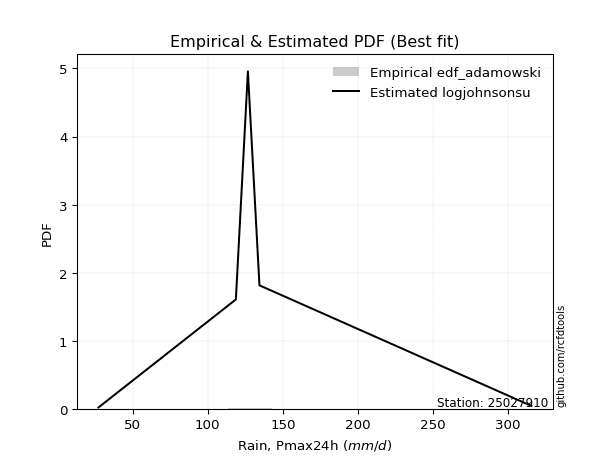</img>

</div>


## C. Best fit & Estimate extreme values for specific return periods - Tr

Best fit in probability distribution analysis means finding the theoretical distribution (like Normal, Poisson, Exponential, etc.) that most accurately mirrors your real-world data´s patterns (shape, center, spread) for better predictions, using methods like visual checks (Q-Q plots), goodness-of-fit tests (Kolmogorov-Smirnov, Chi-Squared), and information criteria (AIC) to score and select the simplest, most representative model.


### 1. Best fit (ordered by delta Δ)

:file_folder:Table: [bestfit_25027910.csv](table/bestfit_25027910.csv)

<div align="center">

|   id |   station | empirical_dist   | p_dist      |     delta |   deltao | eval   |   fit |   n |   best_fit |   best_fit_sort |
|-----:|----------:|:-----------------|:------------|----------:|---------:|:-------|------:|----:|-----------:|----------------:|
|    0 |  25027910 | edf_adamowski    | logdweibull | 0.0769232 | 0.530386 | Δo > Δ |     1 |   6 |          1 |               1 |
|    1 |  25027910 | edf_weibull      | logdweibull | 0.0780873 | 0.530386 | Δo > Δ |     1 |   6 |          1 |               2 |
|    2 |  25027910 | edf_chegodayev   | logdweibull | 0.0793452 | 0.530386 | Δo > Δ |     1 |   6 |          1 |               3 |
|    3 |  25027910 | edf_hazen        | johnsonsu   | 0.0796053 | 0.530386 | Δo > Δ |     1 |   6 |          1 |               4 |
|    4 |  25027910 | edf_jenkinson    | logdweibull | 0.0800799 | 0.530386 | Δo > Δ |     1 |   6 |          1 |               5 |
|    5 |  25027910 | edf_beard        | logdweibull | 0.0800799 | 0.530386 | Δo > Δ |     1 |   6 |          1 |               6 |
|    6 |  25027910 | edf_filliben     | logdweibull | 0.080634  | 0.530386 | Δo > Δ |     1 |   6 |          1 |               7 |
|    7 |  25027910 | edf_tukey        | logdweibull | 0.0818123 | 0.530386 | Δo > Δ |     1 |   6 |          1 |               8 |
|    8 |  25027910 | edf_gringorten   | johnsonsu   | 0.0845073 | 0.530386 | Δo > Δ |     1 |   6 |          1 |               9 |
|    9 |  25027910 | edf_blom         | logdweibull | 0.0849702 | 0.530386 | Δo > Δ |     1 |   6 |          1 |              10 |
|   10 |  25027910 | edf_cunnane      | logdweibull | 0.0869057 | 0.530386 | Δo > Δ |     1 |   6 |          1 |              11 |
|   11 |  25027910 | edf_california   | dweibull    | 0.0881831 | 0.530386 | Δo > Δ |     1 |   6 |          1 |              12 |

</div>


### 2. Extreme values and % difference analysis

In hydrology, a return period (or recurrence interval $Tr$) is the statistical average time between extreme events like floods or droughts of a specific magnitude, indicating how rare an event is, with a 100-year flood, for example, having a 1% chance of occurring in any given year, not that it happens exactly every century. It is a key tool for infrastructure design (like bridges or dams) and risk assessment, calculated from historical data to determine the probability of future events, although it is important to remember it is statistical average, and events can cluster or be missed.

The extreme value porcentage difference is evaluated as $pdiff = 1 - (ETrBf / ETr) * 100$, where _ETrBf_ correspond to the bestfit extreme value for a specific recurrence interval and _ETr_ correspond to the extreme value for one of the most used PDFsused in hydrology.

> risk_rate: assuming the return period as the project useful life.

:file_folder:Table: [extreme_25027910.csv](table/extreme_25027910.csv), all PDFs.  
:file_folder:Table: [extremepdiff_25027910.csv](table/extremepdiff_25027910.csv), % difference between bestfit and most used PDFs in Hydrology.

<div align="center">

Extreme values table for only best fit PDFs
|   id |      tr |   prob_l |     prob_g |      alpha |   anglit |   arcsine |   argus |    beta |   betaprime |   bradford |    burr |   burr12 |   cosine |   crystalball |   dgamma |   dweibull |   erlang |   exponnorm |   exponpow |   exponweib |       f |   fatiguelife |   foldnorm |   gamma |   gausshyper |   genexpon |   genextreme |   gengamma |   genhalflogistic |   genlogistic |   gennorm |   genpareto |   gompertz |   gumbel_l |   gumbel_r |   halfgennorm |   halflogistic |   halfnorm |   hypsecant |   invgamma |   invgauss |   invweibull |   johnsonsb |   johnsonsu |   kappa3 |   kappa4 |   ksone |   kstwobign |   laplace |   levy_l |   loggamma |   logistic |   loglaplace |    lomax |   maxwell |   mielke |   moyal |   nakagami |     ncf |     nct |    norm |   pearson3 |   powerlaw |   rayleigh |      rdist |    rice |   semicircular |   skewnorm |       t |   trapezoid |   triang |   truncexpon |   truncnorm |   truncpareto |   truncweibull_min |   tukeylambda |   uniform |   vonmises |   vonmises_line |    wald |   weibull_max |   weibull_min |   wrapcauchy |   logalpha |   loganglit |   logarcsine |   logargus |   logbeta |   logbetaprime |   logbradford |   logburr |   logburr12 |   logcosine |   logcrystalball |   logdgamma |     logdweibull |   logerlang |   logexponnorm |   logexponpow |   logexponweib |     logf |   logfatiguelife |   logfoldnorm |   loggausshyper |   loggenexpon |   loggenextreme |    loggengamma |   loggenhalflogistic |   loggenlogistic |   loggennorm |   loggenpareto |   loggompertz |   loggumbel_l |   loggumbel_r |   loghalfgennorm |   loghalflogistic |   loghalfnorm |   loghypsecant |   loginvgamma |   loginvgauss |   loginvweibull |   logjohnsonsb |     logjohnsonsu |   logkappa3 |   logkappa4 |   logksone |   logkstwobign |   loglevy_l |   logloggamma |   loglogistic |   logloglaplace |    loglomax |   logmaxwell |   logmielke |   logmoyal |   lognakagami |   logncf |   lognct |   lognorm |   logpearson3 |   logpowerlaw |   lograyleigh |   logrdist |   logrice |   logsemicircular |   logskewnorm |            logt |   logtrapezoid |   logtriang |   logtruncexpon |   logtruncnorm |   logtruncpareto |   logtruncweibull_min |   logtukeylambda |   loguniform |   logvonmises |   logvonmises_line |    logwald |   logweibull_max |   logweibull_min |   logwrapcauchy |   station |   n |   risk_rate |
|-----:|--------:|---------:|-----------:|-----------:|---------:|----------:|--------:|--------:|------------:|-----------:|--------:|---------:|---------:|--------------:|---------:|-----------:|---------:|------------:|-----------:|------------:|--------:|--------------:|-----------:|--------:|-------------:|-----------:|-------------:|-----------:|------------------:|--------------:|----------:|------------:|-----------:|-----------:|-----------:|--------------:|---------------:|-----------:|------------:|-----------:|-----------:|-------------:|------------:|------------:|---------:|---------:|--------:|------------:|----------:|---------:|-----------:|-----------:|-------------:|---------:|----------:|---------:|--------:|-----------:|--------:|--------:|--------:|-----------:|-----------:|-----------:|-----------:|--------:|---------------:|-----------:|--------:|------------:|---------:|-------------:|------------:|--------------:|-------------------:|--------------:|----------:|-----------:|----------------:|--------:|--------------:|--------------:|-------------:|-----------:|------------:|-------------:|-----------:|----------:|---------------:|--------------:|----------:|------------:|------------:|-----------------:|------------:|----------------:|------------:|---------------:|--------------:|---------------:|---------:|-----------------:|--------------:|----------------:|--------------:|----------------:|---------------:|---------------------:|-----------------:|-------------:|---------------:|--------------:|--------------:|--------------:|-----------------:|------------------:|--------------:|---------------:|--------------:|--------------:|----------------:|---------------:|-----------------:|------------:|------------:|-----------:|---------------:|------------:|--------------:|--------------:|----------------:|------------:|-------------:|------------:|-----------:|--------------:|---------:|---------:|----------:|--------------:|--------------:|--------------:|-----------:|----------:|------------------:|--------------:|----------------:|---------------:|------------:|----------------:|---------------:|-----------------:|----------------------:|-----------------:|-------------:|--------------:|-------------------:|-----------:|-----------------:|-----------------:|----------------:|----------:|----:|------------:|
|    0 |    2    | 0.5      | 0.5        |    91.8229 |  152.6   |   152.6   | 182.242 | 145.501 |     139.766 |    140.509 | 138.905 |  76.726  |  160.063 |       152.6   |  126.7   |    126.7   |  139.286 |     139.256 |    33.3099 |     139.831 | 139.307 |       27.2001 |    142.892 | 139.286 |      171.387 |    141.283 |       87.553 |    140.365 |           214.867 |       139.798 |   126.7   |     206.868 |    161.253 |    166.989 |    138.211 |       98.7783 |        131.057 |    134.671 |     152.6   |    141.239 |    140.742 |      138.213 |     315.295 |     130.43  |  136.234 |  163.587 | 171.3   |     137.826 |   152.6   |  170.773 |    118.138 |    152.6   |      122.324 |  130.254 |   145.109 |  138.837 | 133.566 |    134.501 | 139.18  | 141.998 | 152.6   |    144.144 |    29.28   |    142.452 |  -0.693666 | 143.879 |        152.6   |    143.384 | 152.599 |     242.845 |  222.513 |      136.302 |     152.6   |       30.4823 |            45.7867 |     -0.641364 |   171.3   |    1.36439 |         171.958 | 124.208 |       315.088 |       136.583 |      171.064 |    117.249 |     122.324 |      122.324 |    143.724 |   180.143 |        118.779 |       94.7769 |   138.775 |     140.437 |     110.078 |          122.324 |     134.4   |   126.7         |     118.176 |        122.323 |       43.2672 |        56.568  |  122.188 |          122.111 |       107.777 |         143.283 |       99.7327 |         175.07  | 136.143        |              145.796 |          138.811 |      134.4   |        91.0192 |       132.861 |       138.37  |       108.139 |          27.1996 |           101.709 |       104.909 |        122.324 |       119.264 |       112.676 |         111.178 |        43.9446 |    129.432       |     27.1999 |     92.9686 |    92.6222 |        101.624 |     155.531 |       142.631 |       122.324 |         134.4   |     77.1751 |      114.721 |     138.362 |    103.92  |       134.673 |  122.503 |  121.896 |   122.324 |       137.808 |       28.052  |       112.14  |    73.6511 |   120.626 |           122.324 |       139.617 |  128.29         |        139.128 |     131.096 |         71.678  |        147.268 |          28.2655 |               65.6992 |          72.4917 |      92.6222 |      0.246928 |            135.101 |    95.9148 |          267.793 |          139.113 |         92.6222 |  25027910 |   6 |    0.75     |
|    1 |    2.33 | 0.570815 | 0.429185   |   109.288  |  170.806 |   179.93  | 200.742 | 167.694 |     155.5   |    160.912 | 153.833 |  96.7588 |  176.887 |       168.23  |  131.909 |    133.372 |  155.114 |     153.417 |    36.4651 |     155.143 | 155.132 |       32.1142 |    160.595 | 155.114 |      194.524 |    157.25  |      133.575 |    156.153 |           233.739 |       154.896 |   128.975 |     229.724 |    161.745 |    180.587 |    152.694 |      118.405  |        145.948 |    151.54  |     165.109 |    156.499 |    156.243 |      153.718 |     315.392 |     134.649 |  152.88  |  184.979 | 195.791 |     154.08  |   162.059 |  214.968 |    135.965 |    166.371 |      132.647 |  152.96  |   161.347 |  153.871 | 147.275 |    144.642 | 155.25  | 156.353 | 168.23  |    159.786 |    32.5372 |    158.931 |  26.4528   | 159.943 |        172.126 |    158.905 | 168.229 |     259.589 |  237.867 |      155.783 |     168.23  |       32.4359 |            57.1278 |     18.9815   |   191.709 |    1.63261 |         189.359 | 134.457 |       315.283 |       153.243 |      191.507 |    134.551 |     142.968 |      154.591 |    163.729 |   202.954 |        136.865 |      113.211  |   153.844 |     156.716 |     127.433 |          139.848 |     140.937 |   127.779       |     136.098 |        139.847 |       49.2882 |        67.6636 |  139.729 |          139.58  |       123.85  |         170.744 |      118.93   |         198.56  | 444.892        |              168.658 |          153.894 |      136.966 |       130.089  |       149.699 |       155.463 |       122.422 |          27.1996 |           115.547 |       121.218 |        136.159 |       137.224 |       130.709 |         133.052 |       185.557  |    132.952       |     27.1999 |    111.406  |   114.066  |        121.971 |     193.051 |       159.661 |       137.639 |         146.032 |     97.1105 |      131.842 |     153.77  |    116.87  |       141.652 |  140.146 |  139.566 |   139.848 |       155.987 |       29.2063 |       129.14  |    90.1156 |   138.367 |           144.595 |       159.008 |  131.597        |        162.311 |     151.571 |         84.8272 |        154.263 |          28.8857 |               77.921  |          83.4834 |     110.175  |      0.279059 |            150.472 |   104.716  |          300.853 |          155.646 |        147.473  |  25027910 |   6 |    0.729209 |
|    2 |    5    | 0.8      | 0.2        |   244.713  |  235.041 |   252.81  | 260.083 | 244.493 |     221.497 |    236.238 | 215.531 | 308.78   |  237.515 |       226.315 |  171.079 |    193.256 |  221.709 |     215.37  |    58.8203 |     220.029 | 221.703 |      136.502  |    228.19  | 221.709 |      267.746 |    222.727 |      247.175 |    221.767 |           283.524 |       219.592 |   156.882 |     289.135 |    163.337 |    224.517 |    215.614 |      231.719  |        213.325 |    222.876 |     215.284 |    220.142 |    220.98  |      221.08  |     315.4   |     177.021 |  219.873 |  255.982 | 275.052 |     223.123 |   209.349 |  288.189 |    231.624 |    219.543 |      198.896 |  266.483 |   225.261 |  215.844 | 210.781 |    214.768 | 222.499 | 216.689 | 226.315 |    222.767 |    86.1171 |    224.902 | 102.923    | 224.254 |        238.761 |    223.122 | 226.313 |     307.628 |  281.919 |      229.894 |     226.315 |       57.9769 |           138.152  |     82.0114   |   257.76  |    2.67352 |         250.874 | 191.829 |       315.398 |       223.229 |      257.666 |    228.114 |     247.859 |      288.612 |    237.311 |   273.174 |        233.956 |      201.229  |   215.909 |     223.556 |     215.975 |          230.008 |     193.9   |   213.101       |     232.725 |        230.006 |       93.3237 |       172.278  |  230.064 |          229.474 |       219.684 |         266.263 |      242.775  |         268.052 |   6.96251e+08  |              247.384 |          215.991 |      170.717 |       268.024  |       222.452 |       226.493 |       209.861 |          27.1996 |           205.793 |       223.329 |        209.268 |       233.869 |       233.608 |         290.336 |       315.391  |    171.794       |     27.1999 |    198.098  |   223.8    |        264.81  |     276.164 |       226.699 |       217.045 |         225.822 |    306.33   |      227.94  |     216.798 |    201.351 |       185.346 |  231.769 |  231.254 |   230.008 |       231.902 |       49.5225 |       227.238 |   158.696  |   231.25  |           255.887 |       232.233 |  157.195        |        252.563 |     229.844 |        158.587  |        193.453 |          37.4387 |              149.837  |         131.545  |     193.198  |      0.444206 |            229.522 |   171.178  |          315.333 |          223.714 |        262.039  |  25027910 |   6 |    0.67232  |
|    3 |   10    | 0.9      | 0.1        |   493.522  |  271.399 |   270.404 | 288.699 | 279.816 |     272.182 |    274.102 | 266.599 | inf      |  274.145 |       264.847 |  211.103 |    263.863 |  272.931 |     268.249 |    84.9381 |     271.095 | 272.902 |      280.634  |    273.597 | 272.931 |      295.795 |    270.989 |      284.695 |    271.414 |           300.806 |       271.698 |   204.246 |     306.42  |    164.223 |    248.976 |    266.861 |      353.45   |        269.279 |    275.662 |     255.35  |    269.316 |    270.661 |      275.946 |     315.4   |     277.149 |  272.024 |  287.708 | 309.636 |     275.69  |   252.278 |  305.866 |    332.825 |    258.702 |      287.295 |  369.537 |   270.239 |  266.938 | 266.072 |    283.696 | 273.721 | 265.154 | 264.847 |    268.882 |   163.394  |    271.941 | 124.745    | 270.108 |        272.953 |    270.406 | 264.845 |     326.392 |  299.126 |      269.45  |     264.847 |      110.495  |           211.515  |    108.893    |   286.58  |    3.39593 |         282.477 | 252.715 |       315.4   |       275.873 |      286.533 |    328.655 |     338.424 |      335.558 |    277.636 |   298.732 |        336.682 |      258.635  |   267.015 |     272.611 |     297.052 |          319.954 |     265.814 |   843.992       |     335.648 |        319.952 |      158.602  |       418.031  |  320.286 |          319.205 |       330.842 |         299.559 |      405.821  |         294.249 |   1.31098e+22  |              282.359 |          267.099 |      245.169 |       304.56   |       278.711 |       279.283 |       325.523 |          27.1996 |           332.355 |       351.008 |        294.955 |       336.645 |       352.472 |         548.168 |       315.4    |    323.32        |     27.1999 |    252.286  |   300.314  |        477.826 |     301.097 |       273.077 |       303.548 |         346.334 |    869.157  |      335.08  |     268.2   |    323.33  |       232.792 |  324.44  |  323.826 |   319.954 |       286.424 |       95.915  |       339.994 |   186.118  |   325.882 |           342.963 |       270.972 |  252.979        |        300.174 |     270.434 |        219.07   |        235.712 |          60.5274 |              211.994  |         159.951  |     246.85   |      0.618781 |            316.793 |   288.373  |          315.399 |          273.787 |        289.943  |  25027910 |   6 |    0.651322 |
|    4 |   15    | 0.933333 | 0.0666667  |   741.443  |  286.924 |   273.76  | 299.578 | 291.734 |     299.645 |    287.472 | 297.4   | inf      |  290.83  |       284.075 |  235.279 |    309.722 |  300.673 |     299.032 |   101.607  |     299.273 | 300.634 |      374.899  |    296.303 | 300.673 |      303.838 |    296.387 |      295.83  |    298.033 |           306.021 |       300.984 |   242.184 |     310.607 |    164.624 |    260.052 |    295.775 |      432.001  |        300.944 |    303.132 |     278.215 |    296.261 |    297.625 |      306.901 |     315.4   |     385.065 |  302.508 |  298.381 | 321.164 |     303.597 |   277.389 |  311.207 |    399.915 |    280.038 |      356.244 |  429.82  |   293.317 |  297.7   | 298.161 |    321.935 | 301.277 | 292.787 | 284.075 |    293.222 |   203.611  |    296.177 | 129.605    | 293.735 |        286.286 |    295.011 | 284.073 |     332.412 |  304.646 |      283.959 |     284.075 |      149.058  |           244.488  |    117.661    |   296.187 |    3.72021 |         293.693 | 291.813 |       315.4   |       303.768 |      296.156 |    396.205 |     386.562 |      345.344 |    293.745 |   305.793 |        404.769 |      281.203  |   297.77  |     298.28  |     343.47  |          377.242 |     321.075 |  3038.52        |     404.2   |        377.24  |      211.285  |       710.537  |  377.791 |          376.381 |       407.674 |         307.426 |      529.32   |         302.145 |   3.2808e+34   |              293.805 |          297.846 |      326.06  |       310.945  |       308.92  |       307.08  |       417.008 |          27.1996 |           435.922 |       444.129 |        358.773 |       405.068 |       436.295 |         784.583 |       315.4    |    654.277       |     27.1999 |    272.752  |   331.244  |        653.662 |     309.063 |       296.494 |       364.418 |         451.52  |   1599.68   |      408.322 |     298.983 |    425.619 |       263.079 |  384.04  |  383.268 |   377.242 |       313.753 |      132.775  |       418.44  |   192.759  |   386.927 |           384.46  |       285.08  |  494.766        |        317.277 |     284.919 |        246.116  |        263.668 |          84.2721 |              240.522  |         170.568  |     267.861  |      0.739915 |            376.594 |   403.094  |          315.4   |          300.012 |        298.469  |  25027910 |   6 |    0.644736 |
|    5 |   20    | 0.95     | 0.05       |   989.146  |  296.057 |   274.941 | 305.549 | 297.701 |     318.436 |    294.303 | 320.216 | inf      |  301.091 |       296.668 |  252.651 |    343.924 |  319.643 |     320.867 |   113.824  |     318.748 | 319.597 |      444.691  |    311.18  | 319.643 |      307.467 |    313.472 |      301.124 |    316.133 |           308.519 |       321.461 |   273.926 |     312.33  |    164.874 |    266.947 |    316.019 |      490.799  |        323.13  |    321.447 |     294.346 |    314.859 |    316.101 |      328.575 |     315.4   |     494.532 |  324.804 |  303.738 | 326.928 |     322.396 |   295.206 |  313.941 |    451.467 |    294.784 |      414.983 |  472.591 |   308.633 |  320.471 | 320.886 |    347.86  | 320.049 | 312.39  | 296.667 |    309.648 |   227.284  |    312.287 | 131.486    | 309.438 |        293.682 |    311.415 | 296.665 |     335.382 |  307.37  |      291.5   |     296.667 |      176.283  |           262.982  |    121.985    |   300.99  |    3.90174 |         299.395 | 320.948 |       315.4   |       322.577 |      300.967 |    448.581 |     418.018 |      348.857 |    302.765 |   308.913 |        457.078 |      293.215  |   320.53  |     315.478 |     375.549 |          420.209 |     367.573 |  9499.52        |     457.027 |        420.206 |      256.47   |      1039.83   |  420.94  |          419.277 |       467.912 |         310.523 |      631.726  |         305.874 |   6.51593e+45  |              299.439 |          320.597 |      413.034 |       313.039  |       329.424 |       325.762 |       495.972 |          27.1996 |           527.166 |       519.567 |        411.934 |       457.794 |       503.215 |        1008.5   |       315.4    |   1356.99        |     27.1999 |    283.372  |   347.883  |        807.279 |     313.224 |       311.883 |       413.485 |         548.877 |   2466.08   |      465.565 |     321.715 |    517.087 |       285.622 |  429.008 |  428.07  |   420.209 |       331.439 |      160.14   |       480.354 |   195.374  |   433.043 |           409.604 |       292.387 | 1151.61         |        326.07  |     292.349 |        261.346  |        285.026 |         105.677  |              256.764  |         176.086  |     279.028  |      0.837791 |            420.929 |   517.365  |          315.4   |          317.59  |        302.686  |  25027910 |   6 |    0.641514 |
|    6 |   25    | 0.96     | 0.04       |  1236.76   |  302.246 |   275.49  | 309.4   | 301.28  |     332.684 |    298.449 | 338.617 | inf      |  308.287 |       305.937 |  266.224 |    371.312 |  334.018 |     337.803 |   123.462  |     333.613 | 333.968 |      500.143  |    322.135 | 334.018 |      309.481 |    326.275 |      304.203 |    329.795 |           309.98  |       337.221 |   301.4   |     313.227 |    165.052 |    271.853 |    331.613 |      538.091  |        340.223 |    335.074 |     306.829 |    329.058 |    330.126 |      345.269 |     315.4   |     603.637 |  342.663 |  306.959 | 330.386 |     336.477 |   309.026 |  315.658 |    493.865 |    306.065 |      467.135 |  505.767 |   320.004 |  338.829 | 338.501 |    367.281 | 334.237 | 327.674 | 305.937 |    321.988 |   242.759  |    324.255 | 132.421    | 321.106 |        298.48  |    323.62  | 305.934 |     337.152 |  308.993 |      296.122 |     305.937 |      196.136  |           274.787  |    124.554    |   303.872 |    4.0165  |         302.839 | 344.285 |       315.4   |       336.685 |      303.854 |    491.954 |     440.778 |      350.5   |    308.647 |   310.619 |        500.091 |      300.667  |   338.88  |     328.325 |     399.816 |          454.935 |     408.458 | 26397           |     500.563 |        454.932 |      296.537  |      1400.31   |  455.824 |          453.953 |       518.088 |         312.075 |      720.528  |         308.023 |   1.48198e+56  |              302.777 |          338.937 |      506.224 |       313.959  |       344.868 |       339.744 |       566.849 |          27.1996 |           610.295 |       583.895 |        458.426 |       501.25  |       559.806 |        1223.66  |       315.4    |   2836.66        |     27.1999 |    289.839  |   358.265  |        945.559 |     315.864 |       323.229 |       455.436 |         641.304 |   3449.94   |      513.194 |     340.016 |    601.304 |       303.7   |  465.509 |  464.408 |   454.935 |       344.279 |      180.763  |       532.215 |   196.679  |   470.502 |           426.789 |       296.855 | 3143.26         |        331.424 |     296.867 |        271.101  |        302.48  |         124.256  |              267.23   |         179.46   |     285.95   |      0.922259 |            454.752 |   631.851  |          315.4   |          330.722 |        305.214  |  25027910 |   6 |    0.639603 |
|    7 |   50    | 0.98     | 0.02       |  2474.45   |  317.482 |   276.222 | 318.13  | 308.412 |     375.471 |    306.851 | 400.664 | inf      |  327.129 |       332.481 |  308.809 |    460.645 |  377.133 |     390.41  |   153.981  |     378.697 | 377.071 |      678.059  |    353.512 | 377.132 |      313.024 |    363.964 |      310.102 |    370.507 |           312.802 |       385.728 |   403.367 |     314.657 |    165.534 |    285.171 |    379.649 |      693.977  |        392.888 |    374.682 |     345.534 |    372.266 |    372.329 |      396.697 |     315.4   |    1129.36  |  402.395 |  313.418 | 337.303 |     377.826 |   351.955 |  319.522 |    640.127 |    340.532 |      674.753 |  608.82  |   352.981 |  400.702 | 393.185 |    424.03  | 376.606 | 376.035 | 332.481 |    358.499 |   276.816  |    358.999 | 133.806    | 354.975 |        309.44  |    359.095 | 332.479 |     340.663 |  312.213 |      305.598 |     332.481 |      246.273  |           300.115  |    129.605    |   309.636 |    4.25686 |         309.764 | 420.481 |       315.4   |       378.247 |      309.627 |    643.553 |     502.225 |      352.705 |    322.172 |   313.551 |        648.431 |      316.144  |   400.721 |     365.928 |     471.052 |          571.082 |     568.156 |     1.41322e+06 |     651.309 |        571.078 |      453.462  |      3569.76   |  572.559 |          569.985 |       694.578 |         314.393 |     1056.06   |         312.058 |   2.72362e+98  |              309.313 |          400.733 |     1069.13  |       315.09   |       390.667 |       380.801 |       855.402 |          27.1996 |           958.247 |       819.749 |        638.641 |       651.769 |       765.124 |        2220.14  |       315.4    | 108474           |     27.1999 |    302.879  |   379.969  |       1504.25  |     321.89  |       355.758 |       611.858 |        1065.55  |   9788.61   |      680.708 |     401.566 |    960.562 |       363.169 |  588.544 |  586.707 |   571.082 |       379.836 |      235.202  |       716.699 |   198.612  |   596.866 |           468.8   |       305.99  |    3.83132e+06  |        342.31  |     306.04  |        292.139  |        361.609 |         185.242  |              289.966  |         186.325  |     300.314  |      1.25028  |            544.868 |  1213.6    |          315.4   |          369.173 |        310.283  |  25027910 |   6 |    0.63583  |
|    8 |   75    | 0.986667 | 0.0133333  |  3711.97   |  324.187 |   276.358 | 321.593 | 310.774 |     399.667 |    309.684 | 441.063 | inf      |  336.127 |       346.724 |  333.95  |    515.582 |  401.471 |     421.183 |   172.062  |     404.437 | 401.406 |      785.209  |    370.351 | 401.471 |      314.008 |    384.805 |      311.971 |    393.323 |           313.706 |       413.903 |   475.226 |     315.003 |    165.778 |    291.906 |    407.569 |      791.196  |        423.503 |    396.243 |     368.153 |    397.116 |    396.255 |      426.589 |     315.4   |    1620.06  |  441.066 |  315.578 | 339.609 |     400.576 |   377.067 |  321.111 |    736.793 |    360.439 |      836.69  |  669.103 |   370.91  |  440.973 | 425.163 |    454.961 | 400.411 | 405.221 | 346.724 |    378.813 |   289.151  |    377.901 | 134.106    | 373.401 |        313.818 |    378.407 | 346.721 |     341.826 |  313.279 |      308.828 |     346.724 |      266.842  |           309.099  |    131.251    |   311.557 |    4.33933 |         312.08  | 467.368 |       315.4   |       401.222 |      311.551 |    745.337 |     531.915 |      353.116 |    327.607 |   314.34  |        746.432 |      321.478  |   440.974 |     386.573 |     509.419 |          645.185 |     690.037 |     2.61918e+07 |     751.358 |        645.181 |      571.853  |      6214.88   |  647.081 |          644.051 |       813.431 |         314.9   |     1300.58   |         313.294 |   1.52691e+131 |              311.427 |          440.947 |     1801.07  |       315.274  |       416.161 |       403.416 |      1086.52  |         305.371  |          1245.59  |       986.029 |        775.179 |       751.73  |       908.861 |        3138.78  |       315.4    |      3.54779e+06 |     27.1999 |    307.199  |   387.492  |       1942.04  |     324.399 |       373.212 |       725.617 |        1459.91  |  18015.9    |      793.706 |     441.548 |   1263.25  |       400.316 |  667.747 |  665.295 |   645.185 |       397.964 |      258.465  |       842.663 |   199.029  |   678.246 |           486.717 |       309.096 |    9.52757e+10  |        345.993 |     309.139 |        299.641  |        399.423 |         217.463  |              298.125  |         188.636  |     305.261  |      1.50782  |            582.833 |  1813.46   |          315.4   |          390.287 |        311.982  |  25027910 |   6 |    0.634587 |
|    9 |  100    | 0.99     | 0.01       |  4949.45   |  328.174 |   276.405 | 323.526 | 311.949 |     416.533 |    311.107 | 471.867 | inf      |  341.767 |       356.357 |  351.868 |    555.646 |  418.415 |     443.017 |   184.932  |     422.461 | 418.348 |      862.306  |    381.741 | 418.415 |      314.448 |    399.141 |      312.879 |    409.139 |           314.148 |       433.839 |   531.937 |     315.146 |    165.938 |    296.311 |    427.331 |      862.767  |        445.171 |    410.931 |     384.197 |    414.631 |    412.957 |      447.745 |     315.4   |    2081.71  |  470.498 |  316.66  | 340.762 |     416.164 |   394.884 |  322.039 |    810.787 |    374.494 |      974.647 |  711.874 |   383.122 |  471.677 | 447.85  |    476.01  | 416.94  | 426.439 | 356.357 |    392.842 |   295.513  |    390.778 | 134.222    | 385.954 |        316.27  |    391.563 | 356.354 |     342.405 |  313.81  |      310.457 |     356.357 |      277.994  |           313.698  |    132.063    |   312.518 |    4.38084 |         313.239 | 501.554 |       315.4   |       417.015 |      312.514 |    824.057 |     550.396 |      353.26  |    330.659 |   314.686 |        821.43  |      324.179  |   471.667 |     400.71  |     535.043 |          700.682 |     792.423 |     2.739e+08   |     828.145 |        700.678 |      669.73   |      9236.43   |  702.913 |          699.54  |       905.317 |         315.096 |     1498.99   |         313.882 |   2.89695e+158 |              312.465 |          471.605 |     2711.63  |       315.333  |       433.752 |       418.93  |      1286.93  |         307.876  |          1499.65  |      1118.23  |        889.386 |       828.489 |      1022.94  |        4010.45  |       315.4    |      9.92722e+07 |     27.1999 |    309.336  |   391.309  |       2313.49  |     325.875 |       385.009 |       818.453 |        1840.78  |  27773.5    |      881.233 |     472     |   1534.22  |       427.753 |  727.395 |  724.413 |   700.682 |       409.775 |      271.295  |       940.935 |   199.188  |   739.536 |           497.048 |       310.66  |    3.33043e+16  |        347.844 |     310.697 |        303.49   |        427.465 |         237.04   |              302.322  |         189.792  |     307.765  |      1.73218  |            603.389 |  2430.43   |          315.4   |          404.747 |        312.833  |  25027910 |   6 |    0.633968 |
|   10 |  200    | 0.995    | 0.005      |  9899.24   |  335.707 |   276.451 | 326.885 | 313.698 |     456.313 |    313.249 | 554.433 | inf      |  353.235 |       378.209 |  395.264 |    655.567 |  458.306 |     495.625 |   215.934  |     465.166 | 458.238 |     1051.03   |    407.578 | 458.306 |      315.019 |    432.371 |      314.198 |    446.166 |           314.795 |       481.756 |   688.978 |     315.313 |    166.285 |    305.887 |    474.838 |     1043.73   |        497.264 |    444.524 |     422.85  |    456.614 |    452.433 |      498.607 |     315.4   |    3727.91  |  549.295 |  318.285 | 342.491 |     452.065 |   437.813 |  323.798 |   1009.1   |    408.209 |     1407.83  |  814.928 |   411.062 |  553.964 | 502.51  |    524.021 | 455.718 | 479.621 | 378.208 |    425.537 |   305.304  |    420.243 | 134.347    | 414.677 |        320.545 |    421.652 | 378.206 |     343.273 |  314.606 |      312.918 |     378.208 |      295.916  |           320.733  |    133.26     |   313.959 |    4.44334 |         314.977 | 586.706 |       315.4   |       453.562 |      313.957 |   1038.28  |     587.08  |      353.398 |    335.993 |   315.125 |       1022.35  |      328.272  |   553.938 |     433.268 |     591.189 |          844.912 |    1107.33  |     2.07579e+11 |    1034.7   |        844.907 |      960.4    |     24204.6    |  848.083 |          843.813 |      1154.56  |         315.308 |     2074.92   |         314.71  |   3.3533e+239  |              313.985 |          553.764 |     8345.65  |       315.386  |       474.656 |       454.739 |      1933.26  |         311.673  |          2343.14  |      1491.08  |       1238.47  |      1035.17  |      1345     |        7228.86  |       315.4    |      1.86033e+13 |     27.1999 |    312.479  |   397.105  |       3462.07  |     328.69  |       411.731 |      1092.49  |        3316.27  |  78802.6    |     1119.52  |     553.506 |   2450.37  |       497.653 |  883.64  |  879.007 |   844.912 |       435.059 |      292.224  |      1211.08  |   199.358  |   900.037 |           515.585 |       313.021 |    3.43167e+48  |        350.634 |     313.043 |        309.39   |        497.571 |         271.979  |              308.767  |         191.517  |     311.559  |      2.45709  |            636.136 |  5040.39   |          315.4   |          438.051 |        314.114  |  25027910 |   6 |    0.633042 |
|   11 |  250    | 0.996    | 0.004      | 12374.1    |  337.624 |   276.457 | 327.671 | 314.045 |     468.898 |    313.678 | 583.806 | inf      |  356.378 |       384.886 |  409.291 |    688.687 |  470.903 |     512.561 |   225.885  |     478.716 | 470.836 |     1112.53   |    415.474 | 470.903 |      315.116 |    442.722 |      314.452 |    457.8   |           314.921 |       497.158 |   745.897 |     315.339 |    166.387 |    308.704 |    490.111 |     1104.48   |        514.011 |    454.859 |     435.293 |    470.102 |    464.944 |      514.959 |     315.4   |    4466.91  |  577.32  |  318.61  | 342.837 |     463.176 |   451.633 |  324.255 |   1079.39  |    419.033 |     1584.75  |  848.104 |   419.662 |  583.235 | 520.106 |    538.746 | 467.927 | 497.438 | 384.886 |    435.771 |   307.298  |    429.313 | 134.364    | 423.519 |        321.548 |    430.908 | 384.883 |     343.447 |  314.765 |      313.412 |     384.886 |      299.683  |           322.16   |    133.495    |   314.247 |    4.45586 |         315.325 | 614.876 |       315.4   |       464.924 |      314.246 |   1115.31  |     596.8   |      353.415 |    337.247 |   315.197 |       1093.55  |      329.097  |   583.209 |     443.347 |     607.584 |          894.651 |    1233.68  |     2.37228e+12 |    1108.17  |        894.646 |     1072.61   |     33086.5    |  898.168 |          893.589 |      1243.75  |         315.338 |     2293.48   |         314.864 |   4.42582e+270 |              314.281 |          582.99  |    12509.9   |       315.391  |       487.425 |       465.846 |      2203.47  |         312.437  |          2704.61  |      1629.1   |       1377.76  |      1108.75  |      1464.58  |        8736.36  |       315.4    |      4.76305e+15 |     27.1999 |    313.093  |   398.274  |       3922.07  |     329.426 |       419.883 |      1198.63  |        4046.25  | 110241      |     1205.11  |     582.469 |   2849.01  |       521.327 |  937.907 |  932.619 |   894.651 |       442.338 |      296.67   |      1308.92  |   199.381  |   955.756 |           520.033 |       313.495 |    5.81025e+69  |        351.193 |     313.513 |        310.589  |        520.29  |         279.91   |              310.079  |         191.86   |     312.323  |      2.74766  |            642.951 |  6415.99   |          315.4   |          448.362 |        314.371  |  25027910 |   6 |    0.632858 |
|   12 |  500    | 0.998    | 0.002      | 24748.5    |  342.377 |   276.464 | 329.479 | 314.733 |     507.419 |    314.538 | 684.973 | inf      |  364.744 |       404.689 |  453.008 |    794.296 |  509.388 |     565.168 |   256.623  |     520.248 | 509.328 |     1305.47   |    438.89  | 509.388 |      315.286 |    473.951 |      314.947 |    493.175 |           315.168 |       544.959 |   943.404 |     315.379 |    166.68  |    316.78  |    537.515 |     1300.65   |        565.992 |    485.672 |     473.943 |    512.042 |    503.304 |      565.71  |     315.4   |    7675.55  |  673.89  |  319.263 | 343.528 |     496.472 |   494.562 |  325.437 |   1319.74  |    452.601 |     2289.1   |  951.158 |   445.327 |  684.053 | 574.765 |    582.501 | 505.127 | 555.249 | 404.689 |    466.795 |   311.324  |    456.375 | 134.389    | 449.9   |        323.857 |    458.507 | 404.686 |     343.793 |  315.083 |      314.404 |     404.689 |      307.409  |           325.035  |    133.958    |   314.824 |    4.48092 |         316.021 | 704.45  |       315.4   |       499.123 |      314.823 |   1382.64  |     621.602 |      353.437 |    340.138 |   315.322 |       1336.91  |      330.753  |   684.046 |     473.576 |     653.464 |         1060.04  |    1727.08  |     1.20886e+16 |    1360.2   |       1060.04  |     1488.84   |     87970.3    | 1064.78  |         1059.18  |      1551.15  |         315.381 |     3092.73   |         315.156 | inf            |              314.86  |          683.646 |    50512.7   |       315.398  |       526.002 |       499.214 |      3307.19  |         313.973  |          4221.75  |      2121.18  |       1918.49  |      1361.47  |      1893.52  |       15727.2   |       315.4    |      2.12918e+26 |     27.1999 |    314.292  |   400.624  |       5700.06  |     331.336 |       444.013 |      1597.95  |        7743.62  | 312792      |     1501.42  |     682.118 |   4550.24  |       598.641 | 1119.66  | 1111.89  |  1060.04  |       462.618 |      305.842  |      1650.39  |   199.416  |  1142.24  |           530.421 |       314.446 |    1.05285e+220 |        352.315 |     314.456 |        313.005  |        587.921 |         296.86   |              312.724  |         192.54   |     313.858  |      3.72595  |            656.832 | 13819.6    |          315.4   |          479.285 |        314.885  |  25027910 |   6 |    0.632489 |
|   13 |  750    | 0.998667 | 0.00133333 | 37122.8    |  344.481 |   276.465 | 330.205 | 314.96  |     529.606 |    314.825 | 751.901 | inf      |  368.798 |       415.69  |  478.667 |    857.875 |  531.502 |     595.941 |   274.449  |     544.177 | 531.447 |     1419.47   |    451.898 | 531.502 |      315.334 |    491.643 |      315.106 |    513.392 |           315.248 |       572.902 |  1073.99  |     315.389 |    166.836 |    321.096 |    565.228 |     1420.51   |        596.379 |    502.886 |     496.552 |    536.663 |    525.439 |      595.379 |     315.4   |   10392.7   |  737.836 |  319.48  | 343.759 |     515.177 |   519.673 |  325.998 |   1476.94  |    472.213 |     2838.47  | 1011.44  |   459.681 |  750.751 | 606.738 |    606.845 | 526.439 | 590.966 | 415.689 |    484.467 |   312.677  |    471.508 | 134.395    | 464.652 |        324.786 |    473.925 | 415.686 |     343.908 |  315.189 |      314.736 |     415.689 |      310.043  |           325.999  |    134.109    |   315.016 |    4.48927 |         316.253 | 758.156 |       315.4   |       518.437 |      315.015 |   1560.64  |     632.909 |      353.441 |    341.302 |   315.355 |       1496.01  |      331.307  |   750.772 |     490.578 |     676.928 |         1164.79  |    2103.77  |     3.57772e+18 |    1525.69  |       1164.78  |     1786.01   |    156576      | 1170.36  |         1164.1   |      1753.79  |         315.391 |     3655.9    |         315.246 | inf            |              315.048 |          750.234 |   126299     |       315.399  |       547.878 |       518.017 |      4193.28  |         314.486  |          5477.06  |      2458.19  |       2328.45  |      1527.65  |      2190.06  |       22177.5   |       315.4    |      3.33109e+35 |    314.387  |    314.679  |   401.41   |       7032.2   |     332.246 |       457.383 |      1890.27  |       11581.4   | 575693      |     1697.86  |     747.966 |   5983.84  |       646.595 | 1235.75  | 1226.17  |  1164.79  |       473.014 |      308.984  |      1878.81  |   199.423  |  1261.21  |           534.66  |       314.764 |  inf            |        352.689 |     314.77  |        313.816  |        623.249 |         302.855  |              313.613  |         192.764  |     314.371  |      4.24719  |            661.533 | 21892.3    |          315.4   |          496.677 |        315.057  |  25027910 |   6 |    0.632366 |
|   14 | 1000    | 0.999    | 0.001      | 49497.1    |  345.736 |   276.466 | 330.613 | 315.073 |     545.213 |    314.969 | 803.255 | inf      |  371.355 |       423.264 |  496.906 |    903.744 |  547.033 |     617.775 |   287.016  |     561.001 | 546.985 |     1500.78   |    460.854 | 547.033 |      315.355 |    503.967 |      315.183 |    527.545 |           315.288 |       592.722 |  1173.63  |     315.393 |    166.941 |    324.001 |    584.885 |     1507.77   |        617.935 |    514.774 |     512.593 |    554.195 |    541.027 |      616.425 |     315.4   |   12812.7   |  786.941 |  319.589 | 343.874 |     528.136 |   537.49  |  326.351 |   1596.5   |    486.121 |     3306.49  | 1054.21  |   469.602 |  801.928 | 629.424 |    623.615 | 541.382 | 617.236 | 423.263 |    496.818 |   313.356  |    481.966 | 134.397    | 474.846 |        325.308 |    484.573 | 423.26  |     343.966 |  315.241 |      314.902 |     423.263 |      311.371  |           326.482  |    134.184    |   315.112 |    4.49345 |         316.369 | 796.789 |       315.4   |       531.861 |      315.112 |   1697.59  |     639.745 |      353.443 |    341.957 |   315.37  |       1616.98  |      331.584  |   801.98  |     502.367 |     692.161 |         1242.86  |    2420.34  |     2.79128e+20 |    1651.86  |       1242.86  |     2024.04   |    236158      | 1249.07  |         1242.34  |      1908.57  |         315.394 |     4104.09   |         315.289 | inf            |              315.14  |          801.328 |   253409     |       315.4    |       563.119 |       531.069 |      4962.31  |         314.743  |          6587.82  |      2721.71  |       2671.42  |      1654.49  |      2423.63  |       28300.3   |       315.4    |      6.45634e+43 |    314.644  |    314.869  |   401.804  |       8133.58  |     332.819 |       466.574 |      2129.43  |       15576.3   | 887495      |     1848.46  |     798.455 |   7267.31  |       681.88  | 1322.73  | 1311.7   |  1242.86  |       479.804 |      310.572  |      2054.88  |   199.426  |  1350.29  |           537.057 |       314.923 |  inf            |        352.876 |     314.928 |        314.222  |        645.535 |         305.92   |              314.058  |         192.875  |     314.628  |      4.55848  |            663.896 | 30479.7    |          315.4   |          508.737 |        315.142  |  25027910 |   6 |    0.632305 |


</div>


<div align="center">

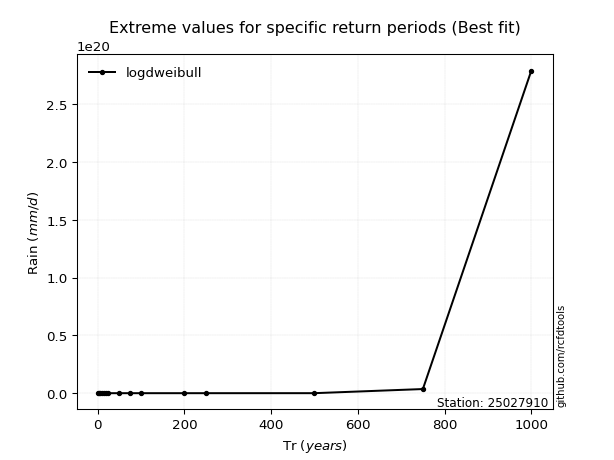</img>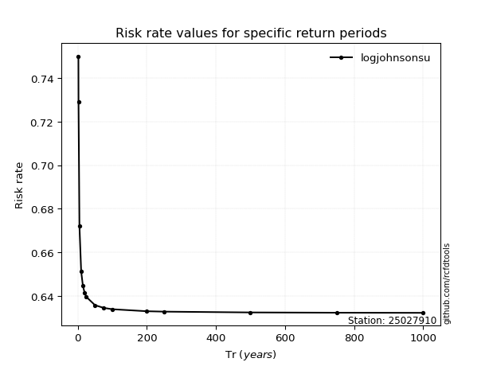</img>

</div>


<sub>**APP DISCLAIMER**: NO WARRANTY - This software is provided by [github.com/rcfdtools](https://github.com/rcfdtools) "as is", without any express or implied warranty, including warranties of merchantability, fitness for a particular purpose, or non-infringement. There is no guarantee that the software will be error-free or operate without interruption. LIMITATION OF LIABILITY - Neither the authors nor copyright holders will be liable for claims or damages arising from the software or its use. You are responsible for determining if the software is appropriate for your use and assume all associated risks, including errors, legal compliance, and data loss. NO PROFESSIONAL ADVICE - The software provides general information and does not offer professional advice. It should not replace consultation with professional advisors.</sub>