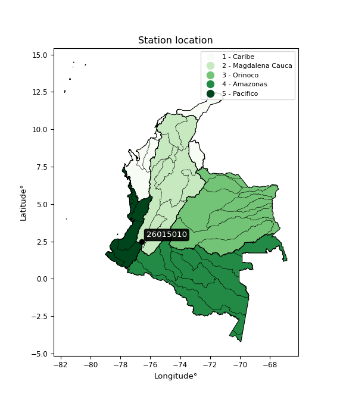

<div align="center">


</div>

# PMax24h Station (Rain): 26015010

Maximum Precipitation in 24 hours (PMax24h) is the greatest amount of rainfall for a specific duration that is meteorologically possible for a given location, acting as a "worst-case" scenario for extreme storms, crucial for designing safety-critical infrastructure like bridges, river deviations, dams, spillways, and nuclear plants to prevent catastrophic failure. The PMax24h is related with the Probable Maximum Precipitation (PMP) and it is calculated by hydrologists using meteorological data to determine the upper limit of extreme rainfall, often leading to the Probable Maximum Flood (PMF) for flood control design, and is increasingly being studied for climate change impacts. Probable Maximum Precipitation (PMP) is the theoretical upper limit of rainfall, a deterministic estimate for extreme events, while probability distributions (like GEV, Gumbel) describe the likelihood and frequency of various precipitation amounts, including rare ones, showing how often events occur, with PMP representing the extreme end of these distributions, used for critical infrastructure design to ensure safety against the worst conceivable weather, unlike standard statistical forecasts which cover typical probabilities.

The most common probability distributions in hydrology, used for analyzing floods, rainfall, and streamflow, include the Normal, Log-Normal, Gumbel, Gamma (including Log-Pearson Type III), and Generalized Extreme Value (GEV) distributions, often chosen based on the data´s skewness and whether modeling extremes or general conditions, with Gumbel and GEV popular for extreme events like floods, while the Normal distribution serves as a baseline, though often requiring transformations for skewed hydrological data. These distributions help in designing water infrastructure, managing water resources, and forecasting hydrologic events.

> Hydrological data often isn´t perfectly normal (it´s skewed), so different distributions are needed for different applications, such as: **Flood Frequency Analysis**: Using Gumbel, GEV, or Log-Pearson Type III for predicting extreme flood magnitudes and their return periods, **Rainfall Analysis**: Normal for annual totals, but Log-Normal, Weibull, or GEV for intensity or extreme daily rainfall, **Streamflow Modeling**: Gamma and Log-Normal for maximum flows, GEV for minimum flows, and Kappa for daily flows.

<div align="center">

</img>

</div>


## A. General information


### 1. General running parameters

• app_version: _v20260225_. • runtime: _2026-02-28 16:54:07.457399_. • Python version: _3.14.0_. • SciPy version: _1.16.3_. • Pandas version: _2.3.3_. • NumPy version: _2.3.5_. • Stations dataset (station_dataset_file): _dataset/pmax24h_in/automatic_colombia_2003_2025.csv_. • Stations catalog (station_catalog_file): _dataset/CNE.xls_. • Minimum year to eval til year_max (date_min): _1900_. • Maximum year to eval since year_min (date_max): _2025_. • Creates, save and include plots into reports (create_plot): _False_. • Plot only fit distributions with Δo > Δ (plot_only_fit): _True_. • Plot only simple graphs avoiding multiple CDFs and multiple Extreme values plots (plot_only_simple): _False_. • Eval low extreme values, if False, evaluates high extreme values (low_extreme): _False_. • Eval every SciPy distribution as logarithmic (pdist_logarithmic_on): _True_. • Standard deviation normalized (ddof): _1.0_. • Return periods to eval in years (Tr): _[2, 2.33, 5, 10, 15, 20, 25, 50, 75, 100, 200, 250, 500, 750, 1000]_. • Minimum data sample per station, 0 means any (minimum_sample): _5_. • Z-Score maximum threshold to adjust a value, 0 means disable (zscore_max): _3.5_. • Z-Score minimum threshold to adjust a value, 0 means disable (zscore_min): _-2.5_. • Avoid zeros, e.g. rain = 0 (avoid_zeros): _True_. • Avoid null values (avoid_nans): _True_. 

:file_folder:Table: [dataset.csv](../../dataset/pmax24h_in/automatic_colombia_2003_2025.csv)

> Delta Degrees of Freedom (DDOF): is a parameter used in the formulas for calculating variance and standard deviation. When ddof=0, the divisor is $N$ (the total number of observations) and this is used when your data set is the entire population. When ddof=1, the divisor is $N-1$ and this is used when your data set is a sample drawn from a larger population. Using $N-1$ provides an unbiased estimate of the population variance (known as Bessel´s correction).


### 2. Station info and location

|   id |   CODIGO | NOMBRE                      | CATEGORIA               | TECNOLOGIA                | ESTADO   | FECHA_INSTALACION   |   FECHA_SUSPENSION |   ALTITUD |   LATITUD |   LONGITUD | DEPARTAMENTO   | MUNICIPIO   | AREA_OPERATIVA                         | ENTIDAD                                                     | AREA_HIDROGRAFICA   | ZONA_HIDROGRAFICA   | SUBZONA_HIDROGRAFICA   |   CORRIENTE | Catalogo   |   Version |
|-----:|---------:|:----------------------------|:------------------------|:--------------------------|:---------|:--------------------|-------------------:|----------:|----------:|-----------:|:---------------|:------------|:---------------------------------------|:------------------------------------------------------------|:--------------------|:--------------------|:-----------------------|------------:|:-----------|----------:|
|    0 | 26015010 | EL TABLAZO - AUT [26015010] | Climatológica Principal | Automática con Telemetría | Activa   | 28/06/2005          |                nan |      1837 |   2.47483 |   -76.5813 | Cauca          | Popayán     | Area Operativa 09 - Cauca-Valle-Caldas | INSTITUTO DE HIDROLOGIA METEOROLOGIA Y ESTUDIOS AMBIENTALES | Magdalena Cauca     | Cauca               | Alto Río Cauca         |         nan | CNE_IDEAM  |  20251226 |

<div align="center">

Dynamic map: [:earth_americas:Google](http://maps.google.com/maps?q=2.474833056,-76.58129361) [:earth_americas:OSM](https://www.openstreetmap.org/#map=18/2.474833056/-76.58129361&layers=P) [:earth_americas:Bing](https://www.bing.com/maps?cp=2.474833056~-76.58129361&lvl=18) [:earth_americas:Apple](https://maps.apple.com/frame?center=2.474833056%2C-76.58129361&span=0.003%2C0.006)

</div>


<div align="center">

```geojson
{
  "type": "Feature",
  "geometry": {
    "type": "Point", 
    "coordinates": [-76.58129361, 2.474833056]
  }, 
  "properties": {
    "Name": "26015010"
  }
}
```

</div>


### 3. Discrete values table and plot

<div align="center">

|               |           0 |          1 |           2 |          3 |           4 |           5 |           6 |          7 |          8 |           9 |
|:--------------|------------:|-----------:|------------:|-----------:|------------:|------------:|------------:|-----------:|-----------:|------------:|
| Date          | 2016        | 2017       | 2018        | 2019       | 2020        | 2021        | 2022        | 2023       | 2024       | 2025        |
| Value         |   14.2      |   58.1     |   41.7      |   53.1     |   17.6      |   15        |   41.9      |    0.2     |    0.2     |   45.5      |
| Value_initial |   14.2      |   58.1     |   41.7      |   53.1     |   17.6      |   15        |   41.9      |    0.2     |    0.2     |   45.5      |
| count         |   10        |   10       |   10        |   10       |   10        |   10        |   10        |   10       |   10       |   10        |
| mean          |   28.75     |   28.75    |   28.75     |   28.75    |   28.75     |   28.75     |   28.75     |   28.75    |   28.75    |   28.75     |
| std           |   21.6816   |   21.6816  |   21.6816   |   21.6816  |   21.6816   |   21.6816   |   21.6816   |   21.6816  |   21.6816  |   21.6816   |
| zscore        |   -0.671076 |    1.35368 |    0.597281 |    1.12307 |   -0.514261 |   -0.634178 |    0.606505 |   -1.31678 |   -1.31678 |    0.772545 |


</div>


> The initial value (value_initial) correspond to the initial obtained or null completed value, and value (value) is adjusted only when the initial value is outside the valid range (outlier) definite through the Z-Score value. If Z-Score is active, values out of range or outliers are replaced with the station mean value. A Z-Score (or standard score) measures how many standard deviations a data point is from the mean of a dataset, indicating its relative position; positive scores mean above the mean, negative mean below, and a score of zero is exactly at the mean, allowing for comparison of values from different distributions. It´s calculated using the formula $z=(x–μ)/σ$, where $x$ is the data point, $μ$ is the mean, and $σ$ is the standard deviation, helping identify outliers and understand probability.
>
> <sub>**Note**: In this study, "completing" (filling gaps in) and "extending" (forecasting or lengthening the historical record) rainfall data series are avoided for certain critical analyses because they introduce artificial bias and uncertainty, which can distort the statistics of rare events (extremes), alter day-to-day variability, and compromise the integrity and homogeneity of the original data. Some reasons against Completing/Extending rainfall data are: **Distortion of Extremes and Variability**: The primary issue is that most gap-filling or extension methods rely on averaging or regression with nearby stations, which inherently smooths the data. Rainfall is highly variable in space and time, with a large percentage of zero values and occasional large storms. Infilling methods often underestimate the highest values and overestimate the lowest (zero) values, which severely distorts analyses focused on flood frequency, drought severity, and intensity-duration-frequency (IDF) curves, **Loss of Data Homogeneity**: Infilled or extended data are synthetic estimates, not actual measurements. Combining these estimates with observed data can violate the assumption of data homogeneity, which requires that the data properties do not change over time. Inhomogeneity can lead to incorrect conclusions about long-term trends or changes in climate patterns, **Propagation of Errors**: Errors and biases from the original data (e.g., wind-induced undercatch, instrument errors, site changes) or the data used for imputation can propagate through the analysis, leading to unreliable hydrological models and inaccurate predictions, **Compromised Statistical Integrity**: For statistical analyses, especially those involving the frequency of events, using artificial data can introduce time bias or autocorrelation that doesn´t exist in reality, making it difficult to assess the true probability of events, **Difficulty in Validation**: It is difficult to accurately validate the quality of filled or extended data, especially for past periods where ground-truth measurements are unavailable. The reliability of imputation techniques heavily depends on the density of the surrounding station network and the complexity of the local topography.</sub>


### 4. Active continuous probability distributions from SciPy (80 of 104 available)

A Probability Density Function (PDF) describes the relative likelihood of a continuous random variable falling within a specific range, where the total area under its curve equals 1, and the area over any interval gives the actual probability for that range. Unlike discrete probabilities (like rolling a die), a PDF shows density, not direct probability for a single point (which is zero), with higher points indicating higher likelihood, often visualized as a bell curve for normal distributions.

A log of a probability density function (log-PDF) is simply the logarithm of the PDF´s value, denoted as $log(f(x))$, useful for converting multiplication of probabilities into addition, improving numerical stability with tiny numbers, and connecting to information theory concepts like entropy. Instead of dealing with very small probabilities (e.g., 0.000001), log-PDFs use negative numbers (e.g., $log(0.00001) ≈ -11.51$ that are easier for computers to handle, preventing underflow errors and simplifying complex calculations. In this study, each active probability distribution from SciPy is also evaluated in the $log$ form.

[scipy.stats](https://docs.scipy.org/doc/scipy/reference/stats.html) is a Python´s powerful submodule within the SciPy library for comprehensive statistical analysis, offering over 130 probability distributions (like Normal, Poisson, etc.), functions for descriptive stats (mean, variance), hypothesis testing (t-tests, chi-square), random variable generation, and statistical tests, making it essential for data science, modeling, and research. It provides tools to explore, model, and draw conclusions from data efficiently, working seamlessly with [NumPy](https://numpy.org/).

<div align="center">

|   id | p_dist           |   n_parameter | fit_method   | label                                                                       | active   | ref                                                                                                      |
|-----:|:-----------------|--------------:|:-------------|:----------------------------------------------------------------------------|:---------|:---------------------------------------------------------------------------------------------------------|
|    0 | alpha            |             3 | MLE          | Alpha                                                                       | True     | [:mortar_board:](https://docs.scipy.org/doc/scipy/reference/generated/scipy.stats.alpha.html)            |
|    1 | anglit           |             2 | MM           | Anglit                                                                      | True     | [:mortar_board:](https://docs.scipy.org/doc/scipy/reference/generated/scipy.stats.anglit.html)           |
|    2 | arcsine          |             2 | MM           | Arcsine                                                                     | True     | [:mortar_board:](https://docs.scipy.org/doc/scipy/reference/generated/scipy.stats.arcsine.html)          |
|    3 | argus            |             3 | MLE          | Argus                                                                       | True     | [:mortar_board:](https://docs.scipy.org/doc/scipy/reference/generated/scipy.stats.argus.html)            |
|    4 | beta             |             4 | MLE          | Beta                                                                        | True     | [:mortar_board:](https://docs.scipy.org/doc/scipy/reference/generated/scipy.stats.beta.html)             |
|    5 | betaprime        |             4 | MLE          | Beta prime                                                                  | True     | [:mortar_board:](https://docs.scipy.org/doc/scipy/reference/generated/scipy.stats.betaprime.html)        |
|    6 | bradford         |             3 | MLE          | Bradford                                                                    | True     | [:mortar_board:](https://docs.scipy.org/doc/scipy/reference/generated/scipy.stats.bradford.html)         |
|    7 | burr             |             4 | MLE          | Burr (Type III)                                                             | True     | [:mortar_board:](https://docs.scipy.org/doc/scipy/reference/generated/scipy.stats.burr.html)             |
|    8 | burr12           |             4 | MLE          | Burr (Type III) 12                                                          | True     | [:mortar_board:](https://docs.scipy.org/doc/scipy/reference/generated/scipy.stats.burr12.html)           |
|    9 | cosine           |             2 | MLE          | Cosine                                                                      | True     | [:mortar_board:](https://docs.scipy.org/doc/scipy/reference/generated/scipy.stats.cosine.html)           |
|   10 | crystalball      |             4 | MLE          | Crystalball                                                                 | True     | [:mortar_board:](https://docs.scipy.org/doc/scipy/reference/generated/scipy.stats.crystalball.html)      |
|   11 | dgamma           |             3 | MLE          | Double gamma                                                                | True     | [:mortar_board:](https://docs.scipy.org/doc/scipy/reference/generated/scipy.stats.dgamma.html)           |
|   12 | dweibull         |             3 | MLE          | Double Weibull                                                              | True     | [:mortar_board:](https://docs.scipy.org/doc/scipy/reference/generated/scipy.stats.dweibull.html)         |
|   13 | erlang           |             3 | MLE          | Erlang                                                                      | True     | [:mortar_board:](https://docs.scipy.org/doc/scipy/reference/generated/scipy.stats.erlang.html)           |
|   14 | exponnorm        |             3 | MLE          | Exponentially modified Normal                                               | True     | [:mortar_board:](https://docs.scipy.org/doc/scipy/reference/generated/scipy.stats.exponnorm.html)        |
|   15 | exponpow         |             3 | MLE          | Exponential power                                                           | True     | [:mortar_board:](https://docs.scipy.org/doc/scipy/reference/generated/scipy.stats.exponpow.html)         |
|   16 | exponweib        |             4 | MLE          | Exponentiated Weibull                                                       | True     | [:mortar_board:](https://docs.scipy.org/doc/scipy/reference/generated/scipy.stats.exponweib.html)        |
|   17 | f                |             4 | MLE          | F                                                                           | True     | [:mortar_board:](https://docs.scipy.org/doc/scipy/reference/generated/scipy.stats.f.html)                |
|   18 | fatiguelife      |             3 | MLE          | Fatigue-life (Birnbaum-Saunders)                                            | True     | [:mortar_board:](https://docs.scipy.org/doc/scipy/reference/generated/scipy.stats.fatiguelife.html)      |
|   19 | foldnorm         |             3 | MM           | Fold Normal                                                                 | True     | [:mortar_board:](https://docs.scipy.org/doc/scipy/reference/generated/scipy.stats.foldnorm.html)         |
|   20 | gamma            |             3 | MLE          | Gamma                                                                       | True     | [:mortar_board:](https://docs.scipy.org/doc/scipy/reference/generated/scipy.stats.gamma.html)            |
|   21 | gausshyper       |             6 | MLE          | Gauss hypergeometric                                                        | True     | [:mortar_board:](https://docs.scipy.org/doc/scipy/reference/generated/scipy.stats.gausshyper.html)       |
|   22 | genexpon         |             5 | MLE          | Generalized exponential                                                     | True     | [:mortar_board:](https://docs.scipy.org/doc/scipy/reference/generated/scipy.stats.genexpon.html)         |
|   23 | genextreme       |             3 | MLE          | Generalized exponential                                                     | True     | [:mortar_board:](https://docs.scipy.org/doc/scipy/reference/generated/scipy.stats.genextreme.html)       |
|   24 | gengamma         |             4 | MLE          | Generalized gamma                                                           | True     | [:mortar_board:](https://docs.scipy.org/doc/scipy/reference/generated/scipy.stats.gengamma.html)         |
|   25 | genhalflogistic  |             3 | MLE          | Generalized half-logistic                                                   | True     | [:mortar_board:](https://docs.scipy.org/doc/scipy/reference/generated/scipy.stats.genhalflogistic.html)  |
|   26 | genlogistic      |             3 | MLE          | Generalized logistic                                                        | True     | [:mortar_board:](https://docs.scipy.org/doc/scipy/reference/generated/scipy.stats.genlogistic.html)      |
|   27 | gennorm          |             3 | MLE          | Generalized Normal                                                          | True     | [:mortar_board:](https://docs.scipy.org/doc/scipy/reference/generated/scipy.stats.gennorm.html)          |
|   28 | genpareto        |             3 | MLE          | Generalized Pareto                                                          | True     | [:mortar_board:](https://docs.scipy.org/doc/scipy/reference/generated/scipy.stats.genpareto.html)        |
|   29 | gompertz         |             3 | MLE          | Gompertz (or truncated Gumbel)                                              | True     | [:mortar_board:](https://docs.scipy.org/doc/scipy/reference/generated/scipy.stats.gompertz.html)         |
|   30 | gumbel_l         |             2 | MM           | Gumbel Left Skew                                                            | True     | [:mortar_board:](https://docs.scipy.org/doc/scipy/reference/generated/scipy.stats.gumbel_l.html)         |
|   31 | gumbel_r         |             2 | MM           | Gumbel Right Skew                                                           | True     | [:mortar_board:](https://docs.scipy.org/doc/scipy/reference/generated/scipy.stats.gumbel_r.html)         |
|   32 | halfgennorm      |             3 | MLE          | Upper half of a generalized normal                                          | True     | [:mortar_board:](https://docs.scipy.org/doc/scipy/reference/generated/scipy.stats.halfgennorm.html)      |
|   33 | halflogistic     |             2 | MM           | Half-logistic                                                               | True     | [:mortar_board:](https://docs.scipy.org/doc/scipy/reference/generated/scipy.stats.halflogistic.html)     |
|   34 | halfnorm         |             2 | MM           | Half Normal                                                                 | True     | [:mortar_board:](https://docs.scipy.org/doc/scipy/reference/generated/scipy.stats.halfnorm.html)         |
|   35 | hypsecant        |             2 | MM           | hyperbolic secant                                                           | True     | [:mortar_board:](https://docs.scipy.org/doc/scipy/reference/generated/scipy.stats.hypsecant.html)        |
|   36 | invgamma         |             3 | MLE          | Inverted gamma                                                              | True     | [:mortar_board:](https://docs.scipy.org/doc/scipy/reference/generated/scipy.stats.invgamma.html)         |
|   37 | invgauss         |             3 | MLE          | Inverse Gaussian                                                            | True     | [:mortar_board:](https://docs.scipy.org/doc/scipy/reference/generated/scipy.stats.invgauss.html)         |
|   38 | invweibull       |             3 | MLE          | Inverted Weibull                                                            | True     | [:mortar_board:](https://docs.scipy.org/doc/scipy/reference/generated/scipy.stats.invweibull.html)       |
|   39 | johnsonsb        |             4 | MLE          | Johnson SB                                                                  | True     | [:mortar_board:](https://docs.scipy.org/doc/scipy/reference/generated/scipy.stats.johnsonsb.html)        |
|   40 | johnsonsu        |             4 | MLE          | Johnson Su                                                                  | True     | [:mortar_board:](https://docs.scipy.org/doc/scipy/reference/generated/scipy.stats.johnsonsu.html)        |
|   41 | kappa3           |             3 | MLE          | Kappa 3                                                                     | True     | [:mortar_board:](https://docs.scipy.org/doc/scipy/reference/generated/scipy.stats.kappa3.html)           |
|   42 | kappa4           |             4 | MLE          | Kappa 4                                                                     | True     | [:mortar_board:](https://docs.scipy.org/doc/scipy/reference/generated/scipy.stats.kappa4.html)           |
|   43 | ksone            |             3 | MLE          | Kolmogorov-Smirnov one-sided test statistic distribution                    | True     | [:mortar_board:](https://docs.scipy.org/doc/scipy/reference/generated/scipy.stats.ksone.html)            |
|   44 | kstwobign        |             2 | MLE          | Limiting distribution of scaled Kolmogorov-Smirnov two-sided test statistic | True     | [:mortar_board:](https://docs.scipy.org/doc/scipy/reference/generated/scipy.stats.kstwobign.html)        |
|   45 | laplace          |             2 | MM           | Laplace                                                                     | True     | [:mortar_board:](https://docs.scipy.org/doc/scipy/reference/generated/scipy.stats.laplace.html)          |
|   46 | levy_l           |             2 | MLE          | Left-skewed Levy                                                            | True     | [:mortar_board:](https://docs.scipy.org/doc/scipy/reference/generated/scipy.stats.levy_l.html)           |
|   47 | loggamma         |             3 | MLE          | Log gamma                                                                   | True     | [:mortar_board:](https://docs.scipy.org/doc/scipy/reference/generated/scipy.stats.loggamma.html)         |
|   48 | logistic         |             2 | MM           | Logistic (or Sech-squared)                                                  | True     | [:mortar_board:](https://docs.scipy.org/doc/scipy/reference/generated/scipy.stats.logistic.html)         |
|   49 | loglaplace       |             3 | MLE          | Log-Laplace                                                                 | True     | [:mortar_board:](https://docs.scipy.org/doc/scipy/reference/generated/scipy.stats.loglaplace.html)       |
|   50 | lomax            |             3 | MLE          | Lomax (Pareto of the second kind)                                           | True     | [:mortar_board:](https://docs.scipy.org/doc/scipy/reference/generated/scipy.stats.lomax.html)            |
|   51 | maxwell          |             2 | MM           | Maxwell                                                                     | True     | [:mortar_board:](https://docs.scipy.org/doc/scipy/reference/generated/scipy.stats.maxwell.html)          |
|   52 | mielke           |             4 | MLE          | Mielke Beta-Kappa / Dagum                                                   | True     | [:mortar_board:](https://docs.scipy.org/doc/scipy/reference/generated/scipy.stats.mielke.html)           |
|   53 | moyal            |             2 | MM           | Moyal                                                                       | True     | [:mortar_board:](https://docs.scipy.org/doc/scipy/reference/generated/scipy.stats.moyal.html)            |
|   54 | nakagami         |             3 | MLE          | Nakagami                                                                    | True     | [:mortar_board:](https://docs.scipy.org/doc/scipy/reference/generated/scipy.stats.nakagami.html)         |
|   55 | ncf              |             5 | MLE          | Non-central F distribution                                                  | True     | [:mortar_board:](https://docs.scipy.org/doc/scipy/reference/generated/scipy.stats.ncf.html)              |
|   56 | nct              |             4 | MLE          | Non-central Student’s t                                                     | True     | [:mortar_board:](https://docs.scipy.org/doc/scipy/reference/generated/scipy.stats.nct.html)              |
|   57 | norm             |             2 | MM           | Normal                                                                      | True     | [:mortar_board:](https://docs.scipy.org/doc/scipy/reference/generated/scipy.stats.norm.html)             |
|   58 | pearson3         |             3 | MM           | Pearson type III                                                            | True     | [:mortar_board:](https://docs.scipy.org/doc/scipy/reference/generated/scipy.stats.pearson3.html)         |
|   59 | powerlaw         |             3 | MLE          | Power-function                                                              | True     | [:mortar_board:](https://docs.scipy.org/doc/scipy/reference/generated/scipy.stats.powerlaw.html)         |
|   60 | rayleigh         |             2 | MM           | Rayleigh                                                                    | True     | [:mortar_board:](https://docs.scipy.org/doc/scipy/reference/generated/scipy.stats.rayleigh.html)         |
|   61 | rdist            |             3 | MLE          | R-distributed (symmetric beta)                                              | True     | [:mortar_board:](https://docs.scipy.org/doc/scipy/reference/generated/scipy.stats.rdist.html)            |
|   62 | rice             |             3 | MLE          | Rice                                                                        | True     | [:mortar_board:](https://docs.scipy.org/doc/scipy/reference/generated/scipy.stats.rice.html)             |
|   63 | semicircular     |             2 | MM           | Semicircular                                                                | True     | [:mortar_board:](https://docs.scipy.org/doc/scipy/reference/generated/scipy.stats.semicircular.html)     |
|   64 | skewnorm         |             3 | MLE          | Skew normal                                                                 | True     | [:mortar_board:](https://docs.scipy.org/doc/scipy/reference/generated/scipy.stats.skewnorm.html)         |
|   65 | t                |             3 | MLE          | Student’s t                                                                 | True     | [:mortar_board:](https://docs.scipy.org/doc/scipy/reference/generated/scipy.stats.t.html)                |
|   66 | trapezoid        |             4 | MLE          | Trapezoid                                                                   | True     | [:mortar_board:](https://docs.scipy.org/doc/scipy/reference/generated/scipy.stats.trapezoid.html)        |
|   67 | triang           |             3 | MLE          | Triangular                                                                  | True     | [:mortar_board:](https://docs.scipy.org/doc/scipy/reference/generated/scipy.stats.triang.html)           |
|   68 | truncexpon       |             3 | MLE          | Truncated exponential                                                       | True     | [:mortar_board:](https://docs.scipy.org/doc/scipy/reference/generated/scipy.stats.truncexpon.html)       |
|   69 | truncnorm        |             4 | MLE          | Truncated normal                                                            | True     | [:mortar_board:](https://docs.scipy.org/doc/scipy/reference/generated/scipy.stats.truncnorm.html)        |
|   70 | truncpareto      |             4 | MLE          | Upper truncated Pareto                                                      | True     | [:mortar_board:](https://docs.scipy.org/doc/scipy/reference/generated/scipy.stats.truncpareto.html)      |
|   71 | truncweibull_min |             5 | MLE          | Doubly truncated Weibull minimum                                            | True     | [:mortar_board:](https://docs.scipy.org/doc/scipy/reference/generated/scipy.stats.truncweibull_min.html) |
|   72 | tukeylambda      |             3 | MLE          | Tukey-Lamdba                                                                | True     | [:mortar_board:](https://docs.scipy.org/doc/scipy/reference/generated/scipy.stats.tukeylambda.html)      |
|   73 | uniform          |             2 | MLE          | Uniform                                                                     | True     | [:mortar_board:](https://docs.scipy.org/doc/scipy/reference/generated/scipy.stats.uniform.html)          |
|   74 | vonmises         |             3 | MLE          | Von Mises                                                                   | True     | [:mortar_board:](https://docs.scipy.org/doc/scipy/reference/generated/scipy.stats.vonmises.html)         |
|   75 | vonmises_line    |             3 | MLE          | Von Mises line                                                              | True     | [:mortar_board:](https://docs.scipy.org/doc/scipy/reference/generated/scipy.stats.vonmises_line.html)    |
|   76 | wald             |             2 | MM           | Wald                                                                        | True     | [:mortar_board:](https://docs.scipy.org/doc/scipy/reference/generated/scipy.stats.wald.html)             |
|   77 | weibull_max      |             3 | MLE          | Weibull maximum                                                             | True     | [:mortar_board:](https://docs.scipy.org/doc/scipy/reference/generated/scipy.stats.weibull_max.html)      |
|   78 | weibull_min      |             3 | MLE          | Weibull minimum                                                             | True     | [:mortar_board:](https://docs.scipy.org/doc/scipy/reference/generated/scipy.stats.weibull_min.html)      |
|   79 | wrapcauchy       |             3 | MLE          | Wrapped  Cauchy                                                             | True     | [:mortar_board:](https://docs.scipy.org/doc/scipy/reference/generated/scipy.stats.wrapcauchy.html)       |

</div>

> **n_parameter:** # arguments & localization & scale.
>
> **Fit methods:** (MLE) maximum likelihood, (MM) L-moments.
>
>**Inactive** (With the only purpose of prevent loops, zero divisions, infinite values, over high estimated values or horizontal trending for recurrence intervals estimations, the follow distributions were disabled.)**:** lognorm, norminvgauss, powernorm, powerlognorm, cauchy, halfcauchy, foldcauchy, skewcauchy, chi2, expon, fisk, genhyperbolic, geninvgauss, gibrat, kstwo, laplace_asymmetric, levy, levy_stable, ncx2, pareto, rel_breitwigner, recipinvgauss, studentized_range, loguniform, 


## B. Probability (PDF) vs. Empirical (EDF) distributions functions

A continuous probability distribution (CPD) describes probabilities for variables that can take any value within a range (like rain any time), unlike discrete variables with specific outcomes (like temperature). It uses a Probability Density Function (PDF), a curve where the total area under it equals 1, and the probability of the variable falling within an interval (a to b) is found by calculating the area under the curve between those points. A key feature is that the probability of hitting any single exact value is zero, so probabilities are always expressed for ranges, e.g., $P(a ≤ X ≤ b)$.

<div align="center">

Distributions parameters from station values
|     |   station | p_dist              |   n |            loc |           scale | shape                  | shape1                | shape2             | shape3             |
|----:|----------:|:--------------------|----:|---------------:|----------------:|:-----------------------|:----------------------|:-------------------|:-------------------|
|   0 |  26015010 | alpha               |  10 |   -106.647     |   846.722       | 6.408176869527836      |                       |                    |                    |
|   1 |  26015010 | anglit              |  10 |     28.75      |    60.1724      |                        |                       |                    |                    |
|   2 |  26015010 | arcsine             |  10 |     -0.338942  |    58.1779      |                        |                       |                    |                    |
|   3 |  26015010 | argus               |  10 |    -15.6203    |    76.8113      | 0.3959218745787691     |                       |                    |                    |
|   4 |  26015010 | beta                |  10 |     -5.46985   |    63.5698      | 0.48928351732815045    | 0.5164329714486424    |                    |                    |
|   5 |  26015010 | betaprime           |  10 |      0.2       |   136.712       | 0.39320948107925435    | 2.0859492568132563    |                    |                    |
|   6 |  26015010 | bradford            |  10 |      0.19998   |    57.9001      | 1.1311861681938127     |                       |                    |                    |
|   7 |  26015010 | burr                |  10 |      0.199963  |    58.2545      | 49.77615117167589      | 0.006103071723575689  |                    |                    |
|   8 |  26015010 | burr12              |  10 |      0.2       |   752.642       | 0.889868928910265      | 14.77854034649462     |                    |                    |
|   9 |  26015010 | cosine              |  10 |     28.586     |    16.3986      |                        |                       |                    |                    |
|  10 |  26015010 | crystalball         |  10 |     28.75      |    20.569       | 2971.3756789613353     | 23.310543756740095    |                    |                    |
|  11 |  26015010 | dgamma              |  10 |     29.0891    |     2.50597     | 7.705577826331102      |                       |                    |                    |
|  12 |  26015010 | dweibull            |  10 |     28.7639    |    21.7287      | 3.007255474670899      |                       |                    |                    |
|  13 |  26015010 | erlang              |  10 |   -825.837     |     0.495693    | 1724.0282025646193     |                       |                    |                    |
|  14 |  26015010 | exponnorm           |  10 |     28.7347    |    20.5691      | 0.0007367142317850405  |                       |                    |                    |
|  15 |  26015010 | exponpow            |  10 |      0.2       |    38.3846      | 0.6446177228937837     |                       |                    |                    |
|  16 |  26015010 | exponweib           |  10 |      0.2       |     2.32588     | 2.6820878456714774     | 0.2586234745793582    |                    |                    |
|  17 |  26015010 | f                   |  10 |      0.2       |    16.1806      | 0.9104203989206634     | 2.541988457896884     |                    |                    |
|  18 |  26015010 | fatiguelife         |  10 |      0.2       |     6.86497e-05 | 588.1649429169959      |                       |                    |                    |
|  19 |  26015010 | foldnorm            |  10 |   -122.834     |    20.433       | 7.420025657672162      |                       |                    |                    |
|  20 |  26015010 | gamma               |  10 |   -845.95      |     0.484996    | 1803.498846614339      |                       |                    |                    |
|  21 |  26015010 | gausshyper          |  10 |     -3.19031   |    61.2903      | 1.0048011133128911     | 0.5886162166620971    | 1.059148901358111  | 1.3634968995750092 |
|  22 |  26015010 | genexpon            |  10 |      0.199903  |     1.83287     | 0.05831900730171199    | 8.11511695764346e-07  | 1.532757760022966  |                    |
|  23 |  26015010 | genextreme          |  10 |     26.2392    |    24.8626      | 0.7421612818661127     |                       |                    |                    |
|  24 |  26015010 | gengamma            |  10 |      0.2       |    55.0627      | 0.08124030185927406    | 4.4430286417050855    |                    |                    |
|  25 |  26015010 | genhalflogistic     |  10 |     -5.77396   |    66.2099      | 1.036571385192         |                       |                    |                    |
|  26 |  26015010 | genlogistic         |  10 |    -90.7264    |    18.2966      | 391.1475757054843      |                       |                    |                    |
|  27 |  26015010 | gennorm             |  10 |     29.15      |    28.95        | 25444036.047569357     |                       |                    |                    |
|  28 |  26015010 | genpareto           |  10 |     -0.190806  |    89.1958      | -1.5301863639338498    |                       |                    |                    |
|  29 |  26015010 | gompertz            |  10 |      0.2       |    33.7051      | 0.5610245904817037     |                       |                    |                    |
|  30 |  26015010 | gumbel_l            |  10 |     38.0071    |    16.0376      |                        |                       |                    |                    |
|  31 |  26015010 | gumbel_r            |  10 |     19.4929    |    16.0376      |                        |                       |                    |                    |
|  32 |  26015010 | halfgennorm         |  10 |      0.2       |     1.47452     | 0.35858739334171985    |                       |                    |                    |
|  33 |  26015010 | halflogistic        |  10 |      4.37103   |    17.5857      |                        |                       |                    |                    |
|  34 |  26015010 | halfnorm            |  10 |      1.52472   |    34.1218      |                        |                       |                    |                    |
|  35 |  26015010 | hypsecant           |  10 |     28.75      |    13.0946      |                        |                       |                    |                    |
|  36 |  26015010 | invgamma            |  10 |   -125.856     |  8361.72        | 55.06091197327112      |                       |                    |                    |
|  37 |  26015010 | invgauss            |  10 |    -56.7621    |  1295.45        | 0.06587599573287742    |                       |                    |                    |
|  38 |  26015010 | invweibull          |  10 |      0.2       |     2.51627     | 0.060302197029164534   |                       |                    |                    |
|  39 |  26015010 | johnsonsb           |  10 |      0.2       |    57.9272      | 0.812151283540033      | 0.08624277452011324   |                    |                    |
|  40 |  26015010 | johnsonsu           |  10 |    122.447     |     8.60058     | 13.718060894617459     | 4.484434353515965     |                    |                    |
|  41 |  26015010 | kappa3              |  10 |      0.199445  |    57.8791      | 5733.52906965104       |                       |                    |                    |
|  42 |  26015010 | kappa4              |  10 |     -6.89761   |    64.8416      | 1.122671942619027      | 0.9689235443432811    |                    |                    |
|  43 |  26015010 | ksone               |  10 |     -6.8765    |    71.253       | 1.0                    |                       |                    |                    |
|  44 |  26015010 | kstwobign           |  10 |    -44.2942    |    83.2543      |                        |                       |                    |                    |
|  45 |  26015010 | laplace             |  10 |     28.75      |    14.5445      |                        |                       |                    |                    |
|  46 |  26015010 | levy_l              |  10 |     60.4931    |    12.0936      |                        |                       |                    |                    |
|  47 |  26015010 | loggamma            |  10 |   -225.993     |    87.9065      | 18.633375161039254     |                       |                    |                    |
|  48 |  26015010 | logistic            |  10 |     28.75      |    11.3403      |                        |                       |                    |                    |
|  49 |  26015010 | loglaplace          |  10 |     -0.0978581 |    17.6979      | 0.740304165954917      |                       |                    |                    |
|  50 |  26015010 | lomax               |  10 |      0.2       |     4.25253e+10 | 1510865315.1864314     |                       |                    |                    |
|  51 |  26015010 | maxwell             |  10 |    -19.9898    |    30.5432      |                        |                       |                    |                    |
|  52 |  26015010 | mielke              |  10 |      0.2       |    61.4482      | 0.3446530841220591     | 21.871109870641256    |                    |                    |
|  53 |  26015010 | moyal               |  10 |     16.9873    |     9.25929     |                        |                       |                    |                    |
|  54 |  26015010 | nakagami            |  10 |      0.2       |    30.8042      | 0.1579924201957558     |                       |                    |                    |
|  55 |  26015010 | ncf                 |  10 |      0.2       |     2.79014     | 0.2630487742325555     | 21.693497371175805    | 3.0071941211722892 |                    |
|  56 |  26015010 | nct                 |  10 |      0.2       |     1.09114e-16 | 0.16204992047440164    | 36.28724011201494     |                    |                    |
|  57 |  26015010 | norm                |  10 |     28.75      |    20.569       |                        |                       |                    |                    |
|  58 |  26015010 | pearson3            |  10 |     28.75      |    20.5689      | -0.054506533507957186  |                       |                    |                    |
|  59 |  26015010 | powerlaw            |  10 |      0.2       |    57.9         | 0.11192369369351998    |                       |                    |                    |
|  60 |  26015010 | rayleigh            |  10 |    -10.5996    |    31.3965      |                        |                       |                    |                    |
|  61 |  26015010 | rdist               |  10 |     -5.09662   |    22.6966      | 1.1940828844246958     |                       |                    |                    |
|  62 |  26015010 | rice                |  10 |    -10.8043    |    25.0926      | 1.075533838186676      |                       |                    |                    |
|  63 |  26015010 | semicircular        |  10 |     28.75      |    41.1379      |                        |                       |                    |                    |
|  64 |  26015010 | skewnorm            |  10 |     32.2037    |    20.8569      | -0.21215150237255875   |                       |                    |                    |
|  65 |  26015010 | t                   |  10 |     28.7545    |    20.569       | 2866521.225586533      |                       |                    |                    |
|  66 |  26015010 | trapezoid           |  10 |     -5.8695    |    69.48        | 0.9999999999999999     | 1.0                   |                    |                    |
|  67 |  26015010 | triang              |  10 |    -20.283     |    78.3831      | 0.999998226812006      |                       |                    |                    |
|  68 |  26015010 | truncexpon          |  10 |     -0.0678484 |    75.6032      | 0.7693836895952311     |                       |                    |                    |
|  69 |  26015010 | truncnorm           |  10 |     37.8759    |    29.0656      | -1.352950301766069     | 0.6958116123927298    |                    |                    |
|  70 |  26015010 | truncpareto         |  10 |   -305.292     |   305.492       | 5.489756333907058e-07  | 1.1895306241220989    |                    |                    |
|  71 |  26015010 | truncweibull_min    |  10 |     -1.79334   |    73.7302      | 1.0276554132983544     | 0.0007458649020056817 | 0.8123309802023977 |                    |
|  72 |  26015010 | tukeylambda         |  10 |     29.1515    |    30.8431      | 1.0653374050058886     |                       |                    |                    |
|  73 |  26015010 | uniform             |  10 |      0.2       |    57.9         |                        |                       |                    |                    |
|  74 |  26015010 | vonmises            |  10 |      1.88253   |     1           | 0.3781248051572643     |                       |                    |                    |
|  75 |  26015010 | vonmises_line       |  10 |     29.1501    |     9.2151      | 0.00044173194154519685 |                       |                    |                    |
|  76 |  26015010 | wald                |  10 |      8.18102   |    20.569       |                        |                       |                    |                    |
|  77 |  26015010 | weibull_max         |  10 |     58.1       |     1.60207     | 0.28105162460963173    |                       |                    |                    |
|  78 |  26015010 | weibull_min         |  10 |      0.2       |    22.8736      | 0.6326726732645682     |                       |                    |                    |
|  79 |  26015010 | wrapcauchy          |  10 |      0.199954  |     9.21508     | 0.30149929774503276    |                       |                    |                    |
|  80 |  26015010 | logalpha            |  10 |    -62.5354    |  1893.77        | 29.17952907823493      |                       |                    |                    |
|  81 |  26015010 | loganglit           |  10 |      2.43282   |     6.08849     |                        |                       |                    |                    |
|  82 |  26015010 | logarcsine          |  10 |     -0.510513  |     5.88667     |                        |                       |                    |                    |
|  83 |  26015010 | logargus            |  10 |     -4.31075   |     8.51716     | 2.9495540681785553     |                       |                    |                    |
|  84 |  26015010 | logbeta             |  10 |     -2.33142   |     6.39359     | 0.2596126843719687     | 0.07696641688624375   |                    |                    |
|  85 |  26015010 | logbetaprime        |  10 |     -1.60944   |     3.09254     | 0.11690452831067807    | 0.7062345531490741    |                    |                    |
|  86 |  26015010 | logbradford         |  10 |     -1.64186   |     5.70521     | 1.6808313921483744e-06 |                       |                    |                    |
|  87 |  26015010 | logburr             |  10 |     -1.60944   |     2.3351      | 0.08222175971420367    | 1.881271571532357     |                    |                    |
|  88 |  26015010 | logburr12           |  10 |     -1.60944   |     1.30146     | 0.9376308842626797     | 0.9492352098593042    |                    |                    |
|  89 |  26015010 | logcosine           |  10 |      2.06412   |     1.77698     |                        |                       |                    |                    |
|  90 |  26015010 | logcrystalball      |  10 |      2.43282   |     2.08125     | 924.9631570504779      | 420.01460415081056    |                    |                    |
|  91 |  26015010 | logdgamma           |  10 |      3.18194   |     1.25726     | 1.1379727408292353     |                       |                    |                    |
|  92 |  26015010 | logdweibull         |  10 |      2.8679    |     1.44349     | 0.8904948901349881     |                       |                    |                    |
|  93 |  26015010 | logerlang           |  10 |    -33.2306    |     0.135509    | 262.95576649883975     |                       |                    |                    |
|  94 |  26015010 | logexponnorm        |  10 |      2.43144   |     2.08124     | 0.0006621175023718744  |                       |                    |                    |
|  95 |  26015010 | logexponpow         |  10 |     -1.60944   |     1.62527     | 0.2581098012086731     |                       |                    |                    |
|  96 |  26015010 | logexponweib        |  10 |     -1.60944   |     1.71853     | 1.6855963794223854     | 0.4357143514361297    |                    |                    |
|  97 |  26015010 | logf                |  10 |     -1.60944   |     1.0457      | 1.1947260947948215     | 1.045441876689786     |                    |                    |
|  98 |  26015010 | logfatiguelife      |  10 |     -1.60944   |     7.93461e-07 | 2147.0535934859217     |                       |                    |                    |
|  99 |  26015010 | logfoldnorm         |  10 |     -9.83908   |     1.61283     | 7.673112963236022      |                       |                    |                    |
| 100 |  26015010 | loggamma            |  10 |    -36.6331    |     0.122086    | 320.0980446685736      |                       |                    |                    |
| 101 |  26015010 | loggausshyper       |  10 |     -2.0023    |     6.06446     | 1.4153959025480136     | 0.5416010838069676    | 0.9747368360753732 | 1.323041995002888  |
| 102 |  26015010 | loggenexpon         |  10 |     -1.60944   |     2.11115e+07 | 2188938.6166500878     | 10591333.468825817    | 3433228.621764397  |                    |
| 103 |  26015010 | loggenextreme       |  10 |      2.38492   |     1.80092     | 1.0737373856183783     |                       |                    |                    |
| 104 |  26015010 | loggengamma         |  10 |     -1.60944   |     1.77311     | 1.8300031887032024     | 0.08418261183412531   |                    |                    |
| 105 |  26015010 | loggenhalflogistic  |  10 |     -2.29832   |     6.8861      | 1.0826369855089384     |                       |                    |                    |
| 106 |  26015010 | loggenlogistic      |  10 |      4.06223   |     4.96863e-06 | 3.0600034102370606e-06 |                       |                    |                    |
| 107 |  26015010 | loggennorm          |  10 |      3.7305    |     0.00537704  | 0.28124819833184306    |                       |                    |                    |
| 108 |  26015010 | loggenpareto        |  10 |     -1.60944   |     1.17056     | 1.0419454738718517     |                       |                    |                    |
| 109 |  26015010 | loggompertz         |  10 |     -1.60944   |     5.03452e+12 | 7476308566051.537      |                       |                    |                    |
| 110 |  26015010 | loggumbel_l         |  10 |      3.36949   |     1.62274     |                        |                       |                    |                    |
| 111 |  26015010 | loggumbel_r         |  10 |      1.49614   |     1.62274     |                        |                       |                    |                    |
| 112 |  26015010 | loghalfgennorm      |  10 |     -1.60944   |     1.95605     | 0.6796437912694279     |                       |                    |                    |
| 113 |  26015010 | loghalflogistic     |  10 |     -0.033919  |     1.77938     |                        |                       |                    |                    |
| 114 |  26015010 | loghalfnorm         |  10 |     -0.321985  |     3.45261     |                        |                       |                    |                    |
| 115 |  26015010 | loghypsecant        |  10 |      2.43282   |     1.32497     |                        |                       |                    |                    |
| 116 |  26015010 | loginvgamma         |  10 |    -43.8149    | 20581.3         | 446.07690952361224     |                       |                    |                    |
| 117 |  26015010 | loginvgauss         |  10 |    -17.4204    |  1425.82        | 0.013906478118775024   |                       |                    |                    |
| 118 |  26015010 | loginvweibull       |  10 | -25833.4       | 25834.7         | 10758.835147410875     |                       |                    |                    |
| 119 |  26015010 | logjohnsonsb        |  10 |     -2.674     |     6.73616     | -0.715965953816811     | 0.1475884788203429    |                    |                    |
| 120 |  26015010 | logjohnsonsu        |  10 |      4.07567   |     0.000275794 | 4.737983050111934      | 0.5697527827056563    |                    |                    |
| 121 |  26015010 | logkappa3           |  10 |     -1.60944   |     1.03457     | 0.04042480853214023    |                       |                    |                    |
| 122 |  26015010 | logkappa4           |  10 |     -2.0555    |     6.52825     | 1.0735239293981507     | 1.0668419977046504    |                    |                    |
| 123 |  26015010 | logksone            |  10 |     -2.1766    |     6.80592     | 1.0                    |                       |                    |                    |
| 124 |  26015010 | logkstwobign        |  10 |     -7.13085   |    10.8992      |                        |                       |                    |                    |
| 125 |  26015010 | loglaplace          |  10 |      2.43282   |     1.47167     |                        |                       |                    |                    |
| 126 |  26015010 | loglevy_l           |  10 |      4.12053   |     0.286745    |                        |                       |                    |                    |
| 127 |  26015010 | logloggamma         |  10 |      4.06224   |     2.8107e-06  | 1.7194325968829049e-06 |                       |                    |                    |
| 128 |  26015010 | loglogistic         |  10 |      2.43282   |     1.14745     |                        |                       |                    |                    |
| 129 |  26015010 | logloglaplace       |  10 |     -1.60944   |     1.83826     | 0.12275957061775239    |                       |                    |                    |
| 130 |  26015010 | loglomax            |  10 |     -1.60944   |     7.70371e+10 | 21363667135.973263     |                       |                    |                    |
| 131 |  26015010 | logmaxwell          |  10 |     -2.49887   |     3.09048     |                        |                       |                    |                    |
| 132 |  26015010 | logmielke           |  10 |     -1.60944   |     2.50131     | 0.12273241111928562    | 0.6747062088963016    |                    |                    |
| 133 |  26015010 | logmoyal            |  10 |      1.24262   |     0.936892    |                        |                       |                    |                    |
| 134 |  26015010 | lognakagami         |  10 |  -1658.96      |  1661.39        | 158145.94522352965     |                       |                    |                    |
| 135 |  26015010 | logncf              |  10 |     -1.60944   |     1.08171     | 1.0405083947963454     | 1.168130564547325     | 1.0554023783113795 |                    |
| 136 |  26015010 | lognct              |  10 |   -113.991     |     2.02968     | 29228.716807178833     | 57.35948739113513     |                    |                    |
| 137 |  26015010 | lognorm             |  10 |      2.43282   |     2.08125     |                        |                       |                    |                    |
| 138 |  26015010 | logpearson3         |  10 |      2.43281   |     2.08126     | -1.2974128563393854    |                       |                    |                    |
| 139 |  26015010 | logpowerlaw         |  10 |     -1.60944   |     5.6716      | 0.13066303866013027    |                       |                    |                    |
| 140 |  26015010 | lograyleigh         |  10 |     -1.54875   |     3.17683     |                        |                       |                    |                    |
| 141 |  26015010 | logrdist            |  10 |     -1.60944   |     2.22051e-16 | 1.4611560218748991     |                       |                    |                    |
| 142 |  26015010 | logrice             |  10 |     -3.33364   |     2.22977     | 2.357801042602059      |                       |                    |                    |
| 143 |  26015010 | logsemicircular     |  10 |      2.43282   |     4.1625      |                        |                       |                    |                    |
| 144 |  26015010 | logskewnorm         |  10 |      4.06217   |     2.64313     | -25427802.890948385    |                       |                    |                    |
| 145 |  26015010 | logt                |  10 |      2.43282   |     2.08125     | 3123882368.381671      |                       |                    |                    |
| 146 |  26015010 | logtrapezoid        |  10 |     -3.62654   |     8.83        | 1.0                    | 1.0                   |                    |                    |
| 147 |  26015010 | logtriang           |  10 |     -2.85038   |     6.91255     | 0.9999999308897225     |                       |                    |                    |
| 148 |  26015010 | logtruncexpon       |  10 |     -1.60945   |     7.75705     | 0.7311566526596935     |                       |                    |                    |
| 149 |  26015010 | logtruncnorm        |  10 |      1.98122   |     6.85946     | -0.523461694386318     | 0.30337062661089464   |                    |                    |
| 150 |  26015010 | logtruncpareto      |  10 |     -1.66336   |     0.0414423   | 3.0892834448780122e-09 | 138.15676857311158    |                    |                    |
| 151 |  26015010 | logtruncweibull_min |  10 |     -1.86154   |     8.36327     | 1.3846466988447417     | 0.0005462765932036724 | 0.7083000050525168 |                    |
| 152 |  26015010 | logtukeylambda      |  10 |     -1.54871   |     0.0757134   | 1.2466637347330929     |                       |                    |                    |
| 153 |  26015010 | loguniform          |  10 |     -1.60944   |     5.6716      |                        |                       |                    |                    |
| 154 |  26015010 | logvonmises         |  10 |     -2.58085   |     1           | 2.5812208656952924     |                       |                    |                    |
| 155 |  26015010 | logvonmises_line    |  10 |      3.01613   |     1.47236     | 1.1606261178841373     |                       |                    |                    |
| 156 |  26015010 | logwald             |  10 |      0.35153   |     2.08127     |                        |                       |                    |                    |
| 157 |  26015010 | logweibull_max      |  10 |      4.06217   |     4.26666     | 0.3937890866523945     |                       |                    |                    |
| 158 |  26015010 | logweibull_min      |  10 |     -1.60944   |     1.66816     | 0.45119442487438066    |                       |                    |                    |
| 159 |  26015010 | logwrapcauchy       |  10 |     -1.60944   |     0.902674    | 0.7769027420437609     |                       |                    |                    |

</div>

> **loc** (Location parameter): This shifts the distribution along the x-axis. For many common distributions, like the normal (Gaussian) distribution, loc represents the mean $μ$. For others, like the uniform distribution, it might represent the minimum value, or for the beta distribution, the left end of the support interval.
>
> **scale** (Scale parameter): This determines the width or spread of the distribution. For the normal distribution, scale represents the standard deviation $σ$. For a uniform distribution, it defines the length of the interval (from $loc$ to $loc + scale$).
>
> **shape** (Shape parameters): Refers to parameters that define the specific form of a probability distribution, distinct from its location (loc) and scale (scale). These parameters are required arguments for most distribution functions. For example, a normal (Gaussian) distribution is fully defined by its location (mean) and scale (standard deviation), so it has no specific shape parameters beyond loc and scale. However, other distributions have intrinsic properties that need specification, as Gamma distribution that takes a shape parameter, often named $a$ or $alpha$.


### 0. Cumulative distribution values - CDF (160 evaluated)

Cumulative Distribution Function (CDF), denoted as $F$<sub>$X$</sub>$(x)$, is a function that gives the probability that a random variable $X$ will take a value less than or equal to a specific value, $x$ (i.e., $(P(X≥x)$. It essentially "accumulates" probabilities from a given point up to the far right (positive infinity), providing a complete picture of the distribution´s probabilities for both discrete (like rain) and continuous (like temperature) variables, helping to find probabilities over ranges or above certain values. Each station is evaluated separately ordering the $x$ values ascending, calculating the CDF and PDF values for the activated distributions and their logarithmic forms.

<div align="center">

CDF ordered by x ascending and calculating $log(f(x))$ separately
|   id |   Station |   date |    x |   count |   mean |     std |    zscore |   Value_initial |   station |   m |     alpha |   alpha_pdf |   anglit |   anglit_pdf |   arcsine |   arcsine_pdf |     argus |   argus_pdf |     beta |       beta_pdf |   betaprime |   betaprime_pdf |    bradford |   bradford_pdf |      burr |     burr_pdf |      burr12 |   burr12_pdf |    cosine |   cosine_pdf |   crystalball |   crystalball_pdf |    dgamma |   dgamma_pdf |   dweibull |   dweibull_pdf |    erlang |   erlang_pdf |   exponnorm |   exponnorm_pdf |    exponpow |   exponpow_pdf |   exponweib |   exponweib_pdf |           f |       f_pdf |   fatiguelife |   fatiguelife_pdf |   foldnorm |   foldnorm_pdf |     gamma |   gamma_pdf |   gausshyper |   gausshyper_pdf |    genexpon |   genexpon_pdf |   genextreme |   genextreme_pdf |    gengamma |   gengamma_pdf |   genhalflogistic |   genhalflogistic_pdf |   genlogistic |   genlogistic_pdf |     gennorm |   gennorm_pdf |   genpareto |   genpareto_pdf |    gompertz |   gompertz_pdf |   gumbel_l |   gumbel_l_pdf |   gumbel_r |   gumbel_r_pdf |   halfgennorm |   halfgennorm_pdf |   halflogistic |   halflogistic_pdf |   halfnorm |   halfnorm_pdf |   hypsecant |   hypsecant_pdf |   invgamma |   invgamma_pdf |   invgauss |   invgauss_pdf |   invweibull |   invweibull_pdf |   johnsonsb |   johnsonsb_pdf |   johnsonsu |   johnsonsu_pdf |      kappa3 |   kappa3_pdf |    kappa4 |   kappa4_pdf |     ksone |   ksone_pdf |   kstwobign |   kstwobign_pdf |   laplace |   laplace_pdf |   levy_l |   levy_l_pdf |   loggamma |   loggamma_pdf |   logistic |   logistic_pdf |   loglaplace |   loglaplace_pdf |       lomax |   lomax_pdf |   maxwell |   maxwell_pdf |      mielke |   mielke_pdf |     moyal |   moyal_pdf |    nakagami |   nakagami_pdf |        ncf |     ncf_pdf |       nct |     nct_pdf |      norm |   norm_pdf |   pearson3 |   pearson3_pdf |   powerlaw |   powerlaw_pdf |   rayleigh |   rayleigh_pdf |    rdist |     rdist_pdf |      rice |   rice_pdf |   semicircular |   semicircular_pdf |   skewnorm |   skewnorm_pdf |         t |      t_pdf |   trapezoid |   trapezoid_pdf |    triang |   triang_pdf |   truncexpon |   truncexpon_pdf |   truncnorm |   truncnorm_pdf |   truncpareto |   truncpareto_pdf |   truncweibull_min |   truncweibull_min_pdf |   tukeylambda |   tukeylambda_pdf |   uniform |   uniform_pdf |   vonmises |   vonmises_pdf |   vonmises_line |   vonmises_line_pdf |     wald |   wald_pdf |   weibull_max |   weibull_max_pdf |   weibull_min |   weibull_min_pdf |   wrapcauchy |   wrapcauchy_pdf |   logalpha |   logalpha_pdf |   loganglit |   loganglit_pdf |   logarcsine |   logarcsine_pdf |   logargus |   logargus_pdf |   logbeta |   logbeta_pdf |   logbetaprime |   logbetaprime_pdf |   logbradford |   logbradford_pdf |   logburr |   logburr_pdf |   logburr12 |   logburr12_pdf |   logcosine |   logcosine_pdf |   logcrystalball |   logcrystalball_pdf |   logdgamma |   logdgamma_pdf |   logdweibull |   logdweibull_pdf |   logerlang |   logerlang_pdf |   logexponnorm |   logexponnorm_pdf |   logexponpow |   logexponpow_pdf |   logexponweib |   logexponweib_pdf |        logf |       logf_pdf |   logfatiguelife |   logfatiguelife_pdf |   logfoldnorm |   logfoldnorm_pdf |   loggausshyper |   loggausshyper_pdf |   loggenexpon |   loggenexpon_pdf |   loggenextreme |   loggenextreme_pdf |   loggengamma |   loggengamma_pdf |   loggenhalflogistic |   loggenhalflogistic_pdf |   loggenlogistic |   loggenlogistic_pdf |   loggennorm |   loggennorm_pdf |   loggenpareto |   loggenpareto_pdf |   loggompertz |   loggompertz_pdf |   loggumbel_l |   loggumbel_l_pdf |   loggumbel_r |   loggumbel_r_pdf |   loghalfgennorm |   loghalfgennorm_pdf |   loghalflogistic |   loghalflogistic_pdf |   loghalfnorm |   loghalfnorm_pdf |   loghypsecant |   loghypsecant_pdf |   loginvgamma |   loginvgamma_pdf |   loginvgauss |   loginvgauss_pdf |   loginvweibull |   loginvweibull_pdf |   logjohnsonsb |   logjohnsonsb_pdf |   logjohnsonsu |   logjohnsonsu_pdf |   logkappa3 |   logkappa3_pdf |   logkappa4 |   logkappa4_pdf |   logksone |   logksone_pdf |   logkstwobign |   logkstwobign_pdf |   loglevy_l |   loglevy_l_pdf |   logloggamma |   logloggamma_pdf |   loglogistic |   loglogistic_pdf |   logloglaplace |   logloglaplace_pdf |    loglomax |   loglomax_pdf |   logmaxwell |   logmaxwell_pdf |   logmielke |   logmielke_pdf |    logmoyal |   logmoyal_pdf |   lognakagami |   lognakagami_pdf |      logncf |   logncf_pdf |    lognct |   lognct_pdf |   lognorm |   lognorm_pdf |   logpearson3 |   logpearson3_pdf |   logpowerlaw |   logpowerlaw_pdf |   lograyleigh |   lograyleigh_pdf |    logrdist |   logrdist_pdf |   logrice |   logrice_pdf |   logsemicircular |   logsemicircular_pdf |   logskewnorm |   logskewnorm_pdf |     logt |   logt_pdf |   logtrapezoid |   logtrapezoid_pdf |   logtriang |   logtriang_pdf |   logtruncexpon |   logtruncexpon_pdf |   logtruncnorm |   logtruncnorm_pdf |   logtruncpareto |   logtruncpareto_pdf |   logtruncweibull_min |   logtruncweibull_min_pdf |   logtukeylambda |   logtukeylambda_pdf |   loguniform |   loguniform_pdf |   logvonmises |   logvonmises_pdf |   logvonmises_line |   logvonmises_line_pdf |   logwald |   logwald_pdf |   logweibull_max |   logweibull_max_pdf |   logweibull_min |   logweibull_min_pdf |   logwrapcauchy |   logwrapcauchy_pdf |
|-----:|----------:|-------:|-----:|--------:|-------:|--------:|----------:|----------------:|----------:|----:|----------:|------------:|---------:|-------------:|----------:|--------------:|----------:|------------:|---------:|---------------:|------------:|----------------:|------------:|---------------:|----------:|-------------:|------------:|-------------:|----------:|-------------:|--------------:|------------------:|----------:|-------------:|-----------:|---------------:|----------:|-------------:|------------:|----------------:|------------:|---------------:|------------:|----------------:|------------:|------------:|--------------:|------------------:|-----------:|---------------:|----------:|------------:|-------------:|-----------------:|------------:|---------------:|-------------:|-----------------:|------------:|---------------:|------------------:|----------------------:|--------------:|------------------:|------------:|--------------:|------------:|----------------:|------------:|---------------:|-----------:|---------------:|-----------:|---------------:|--------------:|------------------:|---------------:|-------------------:|-----------:|---------------:|------------:|----------------:|-----------:|---------------:|-----------:|---------------:|-------------:|-----------------:|------------:|----------------:|------------:|----------------:|------------:|-------------:|----------:|-------------:|----------:|------------:|------------:|----------------:|----------:|--------------:|---------:|-------------:|-----------:|---------------:|-----------:|---------------:|-------------:|-----------------:|------------:|------------:|----------:|--------------:|------------:|-------------:|----------:|------------:|------------:|---------------:|-----------:|------------:|----------:|------------:|----------:|-----------:|-----------:|---------------:|-----------:|---------------:|-----------:|---------------:|---------:|--------------:|----------:|-----------:|---------------:|-------------------:|-----------:|---------------:|----------:|-----------:|------------:|----------------:|----------:|-------------:|-------------:|-----------------:|------------:|----------------:|--------------:|------------------:|-------------------:|-----------------------:|--------------:|------------------:|----------:|--------------:|-----------:|---------------:|----------------:|--------------------:|---------:|-----------:|--------------:|------------------:|--------------:|------------------:|-------------:|-----------------:|-----------:|---------------:|------------:|----------------:|-------------:|-----------------:|-----------:|---------------:|----------:|--------------:|---------------:|-------------------:|--------------:|------------------:|----------:|--------------:|------------:|----------------:|------------:|----------------:|-----------------:|---------------------:|------------:|----------------:|--------------:|------------------:|------------:|----------------:|---------------:|-------------------:|--------------:|------------------:|---------------:|-------------------:|------------:|---------------:|-----------------:|---------------------:|--------------:|------------------:|----------------:|--------------------:|--------------:|------------------:|----------------:|--------------------:|--------------:|------------------:|---------------------:|-------------------------:|-----------------:|---------------------:|-------------:|-----------------:|---------------:|-------------------:|--------------:|------------------:|--------------:|------------------:|--------------:|------------------:|-----------------:|---------------------:|------------------:|----------------------:|--------------:|------------------:|---------------:|-------------------:|--------------:|------------------:|--------------:|------------------:|----------------:|--------------------:|---------------:|-------------------:|---------------:|-------------------:|------------:|----------------:|------------:|----------------:|-----------:|---------------:|---------------:|-------------------:|------------:|----------------:|--------------:|------------------:|--------------:|------------------:|----------------:|--------------------:|------------:|---------------:|-------------:|-----------------:|------------:|----------------:|------------:|---------------:|--------------:|------------------:|------------:|-------------:|----------:|-------------:|----------:|--------------:|--------------:|------------------:|--------------:|------------------:|--------------:|------------------:|------------:|---------------:|----------:|--------------:|------------------:|----------------------:|--------------:|------------------:|---------:|-----------:|---------------:|-------------------:|------------:|----------------:|----------------:|--------------------:|---------------:|-------------------:|-----------------:|---------------------:|----------------------:|--------------------------:|-----------------:|---------------------:|-------------:|-----------------:|--------------:|------------------:|-------------------:|-----------------------:|----------:|--------------:|-----------------:|---------------------:|-----------------:|---------------------:|----------------:|--------------------:|
|    0 |  26015010 |   2023 |  0.2 |      10 |  28.75 | 21.6816 | -1.31678  |             0.2 |  26015010 |   1 | 0.0647058 |  0.00937094 | 0.093601 |   0.00968127 | 0.0613684 |     0.0571112 | 0.0610971 |  0.00765263 | 0.203755 |      0.0181281 | 6.34199e-08 |     8.98462e+08 | 5.21483e-07 |      0.0258192 | 0.0131434 | nan          | 1.39119e-12 |   0.715337   | 0.0673852 |   0.00815715 |     0.0825665 |        0.00740195 | 0.0471439 |   0.00924408 |  0.0513352 |      0.0123022 | 0.0815155 |   0.00749423 |   0.0825685 |      0.00740204 | 2.02355e-12 | 46996.6        | 1.82456e-12 |  45597.3        | 5.86379e-09 | 9.61701e+07 |     0.0362007 |       1.16063e+09 |  0.0809533 |     0.0073412  | 0.0817921 |  0.00750396 |    0.0564724 |        0.0163028 | 3.09592e-06 |     0.0318184  |     0.11414  |       0.00560608 | 2.26925e-06 |    7.23306e+07 |         0.0473296 |            0.00831224 |     0.0666981 |        0.00983606 | 3.17057e-07 |     0.0172711 |  0.00438654 |       0.0112375 | 1.18676e-12 |     0.0166451  |  0.0903223 |     0.00536956 |  0.0357921 |     0.00743185 |   3.36243e-13 |        0.146428   |       0        |         0          |   0        |     0          |    0.07164  |      0.00542488 |  0.0707052 |     0.00847889 |  0.0704512 |     0.00949953 |  2.66317e-05 |      6.09468e+11 |  0.00235839 |     2.28756e+13 |   0.0970607 |      0.00628327 | 9.57615e-06 |    0.0172513 | 6.148e-15 |    0.850958  | 0.0993151 |   0.0140345 |   0.0624211 |      0.0107163  |  0.070222 |    0.00482809 | 0.345747 |   0.00268059 |  0.0282991 |      0.0319333 |  0.0746351 |     0.00609022 |     0.032069 |        0.0217909 | 7.20604e-12 |  0.0355286  | 0.0674931 |    0.00917444 | 6.94586e-07 |  2.87499e+09 | 0.0132984 |  0.00497894 | 1.59468e-06 |    1.81547e+10 | 0.00104653 | 4.95918e+12 | 0.0646075 | 5.76235e+13 | 0.0825665 | 0.00740195 |  0.0838016 |     0.00730218 | 0.00890498 |    3.59091e+13 |  0.0574439 |     0.0103265  | 0.58446  |     0.0161888 | 0.0528361 | 0.00940471 |      0.0967962 |          0.0111417 |  0.0826119 |     0.00739786 | 0.0825336 | 0.00739971 |  0.00763108 |      0.00251457 | 0.0682877 |   0.00666774 |   0.00658942 |        0.0245577 |   0.0140738 |      0.00886028 |      0        |         0.0188605 |          0.0425632 |              0.0222381 |   7.10543e-15 |         0.028974  |  0        |     0.0172712 |   0.174179 |       0.147273 |     4.31125e-08 |           0.0172635 | 0        | 0          |     0.0645187 |       0.000858362 |    4.6243e-12 |   105408          |  1.47717e-06 |        0.0321809 |  0.0284796 |       0.033246 |   0.0146851 |       0.0395136 |     0        |         0        |   0.01678  |      0.0149581 |  0.136348 |   0.0535368   |      0.0121334 |         6.3881e+12 |    0.00568244 |          0.175278 | 0.0030429 |   2.02236e+12 |  1.5589e-15 |       6.58281   |   0.0310409 |       0.0468997 |         0.026055 |            0.0290707 |   0.0146311 |       0.0112936 |     0.0322808 |         0.0175925 |   0.0301671 |       0.0336958 |      0.0260543 |          0.0290702 |   8.03935e-05 |       9.34513e+10 |    2.14148e-12 |       7083.21      | 2.92583e-10 | 787131         |        0.0618211 |          1.29287e+12 |    0.00507777 |        0.00908955 |       0.0178552 |         0.0630662   |   4.59135e-09 |         0.103685  |       0.0445969 |           0.0227758 |    0.00200399 |       1.36794e+12 |            0.0528922 |                0.0812016 |         0        |            0.0187286 |    0.0277217 |       0.00698854 |    4.21983e-07 |          0.854291  |   4.30309e-13 |       1.48501     |     0.0454394 |         0.0273555 |    0.00113777 |        0.00475281 |      7.65678e-12 |            0.392321  |          0        |              0        |      0        |          0        |      0.0301019 |          0.0226852 |      0.027065 |          0.032202 |     0.0308416 |         0.0376473 |       0.0359815 |           0.0498251 |       0.167807 |         0.0413218  |      0.0939701 |          0.0168032 |    0        |     2.83783e+34 |  1.3744e-15 |        1.90532  |  0.0833333 |       0.146931 |      0.0404266 |          0.0630737 |    0.177012 |       0.0151902 |     0.0311287 |         0.0190429 |     0.0286703 |         0.0242697 |       0.0055576 |         3.07257e+12 | 5.68784e-13 |      0.277317  |   0.00618472 |        0.0205167 |   0.0107135 |     5.92177e+12 | 4.61046e-06 |    5.39207e-05 |     0.0264246 |         0.0293315 | 2.68467e-09 |  6.29023e+06 | 0.0261671 |    0.0292129 |  0.026055 |     0.0290707 |     0.0489307 |         0.0284785 |    0.00718087 |       4.22561e+12 |      0        |          0        | 0.000236831 |    2.51348e+16 | 0.0232859 |     0.0322482 |        0.00293423 |             0.0364957 |     0.0318894 |         0.0301983 | 0.026055 |  0.0290707 |      0.0521838 |          0.0517413 |   0.0322276 |       0.0519405 |     3.78435e-06 |            0.248559 |    1.43328e-06 |           0.15904  |        0.0534249 |            3.76272   |             0.0168273 |                 0.0924205 |      7.10543e-15 |              13.2034 |     0        |         0.176317 |      0.917756 |          0.194945 |        5.33098e-11 |              0.0247878 |  0        |     0         |         0.326733 |          0.0253764   |      6.86956e-08 |          1.39589e+08 |     2.17639e-07 |           1.4043    |
|    1 |  26015010 |   2024 |  0.2 |      10 |  28.75 | 21.6816 | -1.31678  |             0.2 |  26015010 |   2 | 0.0647058 |  0.00937094 | 0.093601 |   0.00968127 | 0.0613684 |     0.0571112 | 0.0610971 |  0.00765263 | 0.203755 |      0.0181281 | 6.34199e-08 |     8.98462e+08 | 5.21483e-07 |      0.0258192 | 0.0131434 | nan          | 1.39119e-12 |   0.715337   | 0.0673852 |   0.00815715 |     0.0825665 |        0.00740195 | 0.0471439 |   0.00924408 |  0.0513352 |      0.0123022 | 0.0815155 |   0.00749423 |   0.0825685 |      0.00740204 | 2.02355e-12 | 46996.6        | 1.82456e-12 |  45597.3        | 5.86379e-09 | 9.61701e+07 |     0.0362007 |       1.16063e+09 |  0.0809533 |     0.0073412  | 0.0817921 |  0.00750396 |    0.0564724 |        0.0163028 | 3.09592e-06 |     0.0318184  |     0.11414  |       0.00560608 | 2.26925e-06 |    7.23306e+07 |         0.0473296 |            0.00831224 |     0.0666981 |        0.00983606 | 3.17057e-07 |     0.0172711 |  0.00438654 |       0.0112375 | 1.18676e-12 |     0.0166451  |  0.0903223 |     0.00536956 |  0.0357921 |     0.00743185 |   3.36243e-13 |        0.146428   |       0        |         0          |   0        |     0          |    0.07164  |      0.00542488 |  0.0707052 |     0.00847889 |  0.0704512 |     0.00949953 |  2.66317e-05 |      6.09468e+11 |  0.00235839 |     2.28756e+13 |   0.0970607 |      0.00628327 | 9.57615e-06 |    0.0172513 | 6.148e-15 |    0.850958  | 0.0993151 |   0.0140345 |   0.0624211 |      0.0107163  |  0.070222 |    0.00482809 | 0.345747 |   0.00268059 |  0.0282991 |      0.0319333 |  0.0746351 |     0.00609022 |     0.032069 |        0.0217909 | 7.20604e-12 |  0.0355286  | 0.0674931 |    0.00917444 | 6.94586e-07 |  2.87499e+09 | 0.0132984 |  0.00497894 | 1.59468e-06 |    1.81547e+10 | 0.00104653 | 4.95918e+12 | 0.0646075 | 5.76235e+13 | 0.0825665 | 0.00740195 |  0.0838016 |     0.00730218 | 0.00890498 |    3.59091e+13 |  0.0574439 |     0.0103265  | 0.58446  |     0.0161888 | 0.0528361 | 0.00940471 |      0.0967962 |          0.0111417 |  0.0826119 |     0.00739786 | 0.0825336 | 0.00739971 |  0.00763108 |      0.00251457 | 0.0682877 |   0.00666774 |   0.00658942 |        0.0245577 |   0.0140738 |      0.00886028 |      0        |         0.0188605 |          0.0425632 |              0.0222381 |   7.10543e-15 |         0.028974  |  0        |     0.0172712 |   0.174179 |       0.147273 |     4.31125e-08 |           0.0172635 | 0        | 0          |     0.0645187 |       0.000858362 |    4.6243e-12 |   105408          |  1.47717e-06 |        0.0321809 |  0.0284796 |       0.033246 |   0.0146851 |       0.0395136 |     0        |         0        |   0.01678  |      0.0149581 |  0.136348 |   0.0535368   |      0.0121334 |         6.3881e+12 |    0.00568244 |          0.175278 | 0.0030429 |   2.02236e+12 |  1.5589e-15 |       6.58281   |   0.0310409 |       0.0468997 |         0.026055 |            0.0290707 |   0.0146311 |       0.0112936 |     0.0322808 |         0.0175925 |   0.0301671 |       0.0336958 |      0.0260543 |          0.0290702 |   8.03935e-05 |       9.34513e+10 |    2.14148e-12 |       7083.21      | 2.92583e-10 | 787131         |        0.0618211 |          1.29287e+12 |    0.00507777 |        0.00908955 |       0.0178552 |         0.0630662   |   4.59135e-09 |         0.103685  |       0.0445969 |           0.0227758 |    0.00200399 |       1.36794e+12 |            0.0528922 |                0.0812016 |         0        |            0.0187286 |    0.0277217 |       0.00698854 |    4.21983e-07 |          0.854291  |   4.30309e-13 |       1.48501     |     0.0454394 |         0.0273555 |    0.00113777 |        0.00475281 |      7.65678e-12 |            0.392321  |          0        |              0        |      0        |          0        |      0.0301019 |          0.0226852 |      0.027065 |          0.032202 |     0.0308416 |         0.0376473 |       0.0359815 |           0.0498251 |       0.167807 |         0.0413218  |      0.0939701 |          0.0168032 |    0        |     2.83783e+34 |  1.3744e-15 |        1.90532  |  0.0833333 |       0.146931 |      0.0404266 |          0.0630737 |    0.177012 |       0.0151902 |     0.0311287 |         0.0190429 |     0.0286703 |         0.0242697 |       0.0055576 |         3.07257e+12 | 5.68784e-13 |      0.277317  |   0.00618472 |        0.0205167 |   0.0107135 |     5.92177e+12 | 4.61046e-06 |    5.39207e-05 |     0.0264246 |         0.0293315 | 2.68467e-09 |  6.29023e+06 | 0.0261671 |    0.0292129 |  0.026055 |     0.0290707 |     0.0489307 |         0.0284785 |    0.00718087 |       4.22561e+12 |      0        |          0        | 0.000236831 |    2.51348e+16 | 0.0232859 |     0.0322482 |        0.00293423 |             0.0364957 |     0.0318894 |         0.0301983 | 0.026055 |  0.0290707 |      0.0521838 |          0.0517413 |   0.0322276 |       0.0519405 |     3.78435e-06 |            0.248559 |    1.43328e-06 |           0.15904  |        0.0534249 |            3.76272   |             0.0168273 |                 0.0924205 |      7.10543e-15 |              13.2034 |     0        |         0.176317 |      0.917756 |          0.194945 |        5.33098e-11 |              0.0247878 |  0        |     0         |         0.326733 |          0.0253764   |      6.86956e-08 |          1.39589e+08 |     2.17639e-07 |           1.4043    |
|    2 |  26015010 |   2016 | 14.2 |      10 |  28.75 | 21.6816 | -0.671076 |            14.2 |  26015010 |   3 | 0.274796  |  0.0193387  | 0.267511 |   0.0147131  | 0.333264  |     0.0126371 | 0.211815  |  0.0137003  | 0.390247 |      0.0109794 | 0.541955    |     0.0127835   | 0.319531    |      0.020274  | 0.648477  |   0.0140713  | 0.34315     |   0.0173006  | 0.237988  |   0.0159096  |     0.239666  |        0.0151022  | 0.35764   |   0.0289609  |  0.370318  |      0.0229585 | 0.241013  |   0.0153131  |   0.239669  |      0.0151023  | 0.496076    |     0.0204109  | 0.542724    |      0.010947   | 0.580757    | 0.0136892   |     0.778695  |       0.00814687  |  0.237762  |     0.0151365  | 0.241342  |  0.0153093  |    0.26712   |        0.0140649 | 0.359475    |     0.0203808  |     0.220382 |       0.00986176 | 0.635847    |    0.0163591   |         0.178936  |            0.0106359  |     0.283074  |        0.0194941  | 0.5         |     0.0172711 |  0.169138   |       0.0123686 | 0.250903    |     0.0188893  |  0.20278   |     0.0112654  |  0.248824  |     0.0215816  |   0.441276    |        0.0155683  |       0.272404 |         0.0263224  |   0.289714 |     0.0218245  |    0.202451 |      0.0144392  |  0.256737  |     0.0175344  |  0.274554  |     0.0185384  |  0.405887    |      0.00157639  |  0.762243   |     0.00251245  |   0.225253  |      0.0123936  | 0.241528    |    0.0172513 | 0.281066  |    0.0178027 | 0.295798  |   0.0140345 |   0.293092  |      0.0200342  |  0.18387  |    0.0126419  | 0.39073  |   0.00386532 |  0.545072  |      0.180823  |  0.217033  |     0.0149846  |     0.569551 |        0.292491  | 0.391891    |  0.0216053  | 0.259687  |    0.0174943  | 0.600622    |  0.0147862   | 0.245059  |  0.0254847  | 0.623105    |    0.0136725   | 0.380839   | 0.0132676   | 0.99743   | 2.97503e-05 | 0.239666  | 0.0151022  |  0.238247  |     0.0148627  | 0.853087   |    0.00682005  |  0.267989  |     0.0184162  | 0.851798 |     0.0265441 | 0.249731  | 0.0177365  |      0.279622  |          0.014475  |  0.239608  |     0.0150932  | 0.239599  | 0.0150999  |  0.083436   |      0.00831471 | 0.193538  |   0.0112251  |   0.320442   |        0.0204064 |   0.178893  |      0.0147307  |      0.258176 |         0.0180341 |          0.338094  |              0.0196077 |   0.245665    |         0.0171173 |  0.241796 |     0.0172712 |   2.44441  |       0.22161  |     0.241725    |           0.0172707 | 0.157816 | 0.0521093  |     0.0792094 |       0.00128585  |    0.519539   |        0.0159154  |  0.336276    |        0.0148147 |  0.551283  |       0.176314 |   0.536172  |       0.163814  |     0.52386  |         0.108451 |   0.389421 |      0.27691   |  0.285815 |   0.0463079   |      0.89842   |         0.0130612  |    0.752838   |          0.175278 | 0.284214  |   0.00502913  |  0.7344     |       0.0417353 |   0.604567  |       0.174253  |         0.542173 |            0.190612  |   0.359146  |       0.247296  |     0.416294  |         0.316411  |   0.553475  |       0.17906   |      0.542173  |          0.190613  |   0.926166    |       0.0206766   |    0.648806    |          0.0485923 | 0.704926    |      0.0313851 |        0.859825  |          0.028208    |    0.528899   |        0.246707   |       0.533751  |         0.182453    |   0.645812    |         0.125576  |       0.427356  |           0.240156  |    0.343948   |       0.00819717  |            0.601896  |                0.209041  |         0        |            0.2586    |    0.135563  |       0.087273   |    0.777834    |          0.0395873 |   0.998218    |       0.00264602  |     0.474365  |         0.208327  |    0.612537   |        0.185015   |      0.674617    |            0.0718177 |          0.638172 |              0.166557 |      0.611165 |          0.15942  |      0.552713  |          0.236954  |      0.553466 |          0.179258 |     0.564875  |         0.166586  |       0.569296  |           0.133555  |       0.301646 |         0.0461682  |      0.298988  |          0.139055  |    0.395823 |     0.00341458  |  0.744689   |        0.171612 |  0.709652  |       0.146931 |      0.604072  |          0.127308  |    0.341561 |       0.109006  |     0.422339  |         0.258364  |     0.547878  |         0.215876  |       0.54905   |         0.0129868   | 0.69337     |      0.0850337 |   0.573065   |        0.178788  |   0.908192  |     0.0107482   | 0.637614    |    0.179513    |     0.541926  |         0.18992   | 0.608931    |  0.039833    | 0.54243   |    0.190124  |  0.542173 |     0.190612  |     0.455918  |         0.197605  |    0.963374   |       0.0295301   |      0.583041 |          0.173605 | 1           |    0           | 0.548916  |     0.18494   |        0.533697   |             0.152727  |     0.593997  |         0.261891  | 0.542173 |  0.190612  |      0.505788  |          0.161084  |   0.633901  |       0.230358  |     0.81515     |            0.143475 |    0.748567    |           0.181519 |        0.942686  |            0.0470059 |             0.750273  |                 0.184589  |      1           |               0      |     0.751583 |         0.176317 |      1.0683   |          0.164501 |        0.409416    |              0.243844  |  0.707205 |     0.163982  |         0.523923 |          0.0946569   |      0.782812    |          0.0351037   |     0.540148    |           0.0440089 |
|    3 |  26015010 |   2021 | 15   |      10 |  28.75 | 21.6816 | -0.634178 |            15   |  26015010 |   4 | 0.290374  |  0.0195979  | 0.279362 |   0.0149133  | 0.343284  |     0.0124175 | 0.222899  |  0.0140088  | 0.39898  |      0.0108542 | 0.551944    |     0.0121985   | 0.335651    |      0.0200282 | 0.659517  |   0.0135373  | 0.356794    |   0.016814   | 0.250859  |   0.0162662  |     0.251913  |        0.0155118  | 0.380266  |   0.0275183  |  0.388105  |      0.0214816 | 0.253427  |   0.01572    |   0.251916  |      0.0155118  | 0.512137    |     0.0197463  | 0.551246    |      0.0103669  | 0.591419    | 0.0129767   |     0.785068  |       0.00779128  |  0.250038  |     0.0155534  | 0.253753  |  0.0157153  |    0.278339  |        0.0139846 | 0.375574    |     0.0198686  |     0.22839  |       0.0101573  | 0.648699    |    0.0157783   |         0.18751   |            0.0107981  |     0.298753  |        0.0196964  | 0.5         |     0.0172711 |  0.179064   |       0.0124477 | 0.26604     |     0.0189521  |  0.211967  |     0.0117051  |  0.266249  |     0.0219693  |   0.453453    |        0.0148816  |       0.293329 |         0.0259858  |   0.307096 |     0.0216293  |    0.214289 |      0.0151562  |  0.270907  |     0.0178846  |  0.28949   |     0.0187958  |  0.407113    |      0.00149068  |  0.764211   |     0.00240969  |   0.235329  |      0.0127946  | 0.255329    |    0.0172513 | 0.295261  |    0.0176855 | 0.307026  |   0.0140345 |   0.309168  |      0.0201495  |  0.194266 |    0.0133567  | 0.39386  |   0.00395862 |  0.554963  |      0.180088  |  0.22926   |     0.0155816  |     0.585287 |        0.281798  | 0.408932    |  0.0209998  | 0.273802  |    0.0177871  | 0.612236    |  0.0142574   | 0.265586  |  0.025811   | 0.633815    |    0.0131121   | 0.391371   | 0.0130624   | 0.997453  | 2.78899e-05 | 0.251913  | 0.0155118  |  0.250302  |     0.0152741  | 0.85841    |    0.00649165  |  0.282808  |     0.0186255  | 0.874083 |     0.0293503 | 0.264034  | 0.0180148  |      0.291246  |          0.0145852 |  0.251847  |     0.0155028  | 0.251843  | 0.0155095  |  0.0902203  |      0.00864614 | 0.202622  |   0.0114855  |   0.336681   |        0.0201916 |   0.190809  |      0.015059   |      0.272585 |         0.017989  |          0.353707  |              0.0194252 |   0.259351    |         0.0170987 |  0.255613 |     0.0172712 |   2.62127  |       0.212001 |     0.255542    |           0.0172714 | 0.199468 | 0.0517886  |     0.0802517 |       0.00132011  |    0.531978   |        0.0151902  |  0.347844    |        0.0141176 |  0.560922  |       0.175412 |   0.545144  |       0.163574  |     0.529808 |         0.108622 |   0.404887 |      0.28752   |  0.288389 |   0.0476479   |      0.89913   |         0.012836   |    0.762445   |          0.175278 | 0.284488  |   0.0049674   |  0.736667   |       0.0409746 |   0.614093  |       0.173313  |         0.552605 |            0.190015  |   0.372897  |       0.254443  |     0.434283  |         0.340913  |   0.563267  |       0.178227  |      0.552604  |          0.190016  |   0.927288    |       0.0202561   |    0.651451    |          0.047924  | 0.706632    |      0.030858  |        0.86136   |          0.0278192   |    0.542401   |        0.245958   |       0.543838  |         0.185634    |   0.652649    |         0.123924  |       0.440741  |           0.248354  |    0.344394   |       0.00809966  |            0.613453  |                0.212711  |         0        |            0.267478  |    0.140503  |       0.0931088  |    0.779983    |          0.0388096 |   0.998357    |       0.00243919  |     0.485851  |         0.210775  |    0.622589   |        0.181806   |      0.678524    |            0.0707621 |          0.647211 |              0.163292 |      0.619843 |          0.157234 |      0.565652  |          0.235148  |      0.563266 |          0.178325 |     0.573975  |         0.165462  |       0.576579  |           0.132211  |       0.304219 |         0.0477288  |      0.306805  |          0.146308  |    0.396009 |     0.00337114  |  0.754102   |        0.17188  |  0.717705  |       0.146931 |      0.611012  |          0.125941  |    0.347696 |       0.114975  |     0.436739  |         0.267173  |     0.55968   |         0.21477   |       0.549756  |         0.0128018   | 0.697995    |      0.083751  |   0.582822   |        0.177264  |   0.908776  |     0.0105647   | 0.647341    |    0.175441    |     0.552319  |         0.189329  | 0.611097    |  0.0392341   | 0.552834  |    0.189517  |  0.552605 |     0.190015  |     0.466831  |         0.200615  |    0.964983   |       0.0292039   |      0.592508 |          0.171876 | 1           |    0           | 0.559033  |     0.1842    |        0.542064   |             0.152607  |     0.60843   |         0.264745  | 0.552605 |  0.190015  |      0.514655  |          0.16249   |   0.646589  |       0.232652  |     0.822986    |            0.142464 |    0.758512    |           0.181371 |        0.945246  |            0.0464166 |             0.760377  |                 0.184122  |      1           |               0      |     0.761246 |         0.176317 |      1.07789  |          0.185597 |        0.422847    |              0.246235  |  0.716024 |     0.157875  |         0.5292   |          0.0979378   |      0.784721    |          0.0345521   |     0.542635    |           0.0467854 |
|    4 |  26015010 |   2020 | 17.6 |      10 |  28.75 | 21.6816 | -0.514261 |            17.6 |  26015010 |   5 | 0.342137  |  0.0201452  | 0.318912 |   0.0154906  | 0.374785  |     0.0118475 | 0.260591  |  0.014975   | 0.426747 |      0.0105231 | 0.581493    |     0.0106008   | 0.386725    |      0.0192689 | 0.692753  |   0.0120948  | 0.398594    |   0.0153735  | 0.294551  |   0.0173131  |     0.293882  |        0.0167451  | 0.442623  |   0.019775   |  0.436869  |      0.0158839 | 0.295918  |   0.0169354  |   0.293885  |      0.0167451  | 0.560891    |     0.0178081  | 0.576092    |      0.00882243 | 0.622531    | 0.0110423   |     0.803991  |       0.00680286  |  0.292147  |     0.0168103  | 0.296227  |  0.0169278  |    0.314391  |        0.0137557 | 0.425153    |     0.018291   |     0.256083 |       0.0111545  | 0.687565    |    0.0141844   |         0.216297  |            0.0113529  |     0.350528  |        0.0200568  | 0.5         |     0.0172711 |  0.211776   |       0.0127189 | 0.315519    |     0.0190918  |  0.244324  |     0.0132001  |  0.324563  |     0.022773   |   0.489575    |        0.0129812  |       0.35934  |         0.0247608  |   0.362441 |     0.0209273  |    0.256796 |      0.0175517  |  0.318684  |     0.0188117  |  0.339209  |     0.0193868  |  0.410682    |      0.00126663  |  0.770117   |     0.00215058  |   0.270295  |      0.0141025  | 0.300183    |    0.0172513 | 0.340787  |    0.017344  | 0.343515  |   0.0140345 |   0.361773  |      0.0202489  |  0.232292 |    0.0159711  | 0.404572 |   0.00428926 |  0.583541  |      0.177336  |  0.272253  |     0.0174715  |     0.627972 |        0.252793  | 0.461085    |  0.0191469  | 0.321107  |    0.018554   | 0.647357    |  0.0128226   | 0.333315  |  0.0261048  | 0.665826    |    0.0115756   | 0.424496   | 0.0124249   | 0.997519  | 2.31084e-05 | 0.293882  | 0.0167451  |  0.291672  |     0.016524   | 0.8741     |    0.00562256  |  0.33193   |     0.0191119  | 1        | 18388.4       | 0.311882  | 0.0187476  |      0.329588  |          0.014896  |  0.293794  |     0.016737   | 0.293807  | 0.0167431  |  0.114101   |      0.00972331 | 0.233585  |   0.0123319  |   0.388287   |        0.019509  |   0.231318  |      0.0160929  |      0.319168 |         0.0178442 |          0.403444  |              0.0188346 |   0.30374     |         0.0170488 |  0.300518 |     0.0172712 |   3.001    |       0.10525  |     0.300451    |           0.0172735 | 0.326832 | 0.0454116  |     0.083839  |       0.00144221  |    0.568764   |        0.0131884  |  0.382023    |        0.0122751 |  0.588718  |       0.172234 |   0.571217  |       0.16257   |     0.547225 |         0.109347 |   0.453419 |      0.320092  |  0.29636  |   0.0522828   |      0.901131  |         0.012214   |    0.790463   |          0.175278 | 0.285268  |   0.00479583  |  0.743046   |       0.0388739 |   0.64155   |       0.170122  |         0.582795 |            0.187541  |   0.415117  |       0.272994  |     0.5       |        14.2843    |   0.591527  |       0.175212  |      0.582795  |          0.187542  |   0.930432    |       0.0190948   |    0.658961    |          0.0460585 | 0.711447    |      0.0294017 |        0.865719  |          0.0267276   |    0.581446   |        0.242183   |       0.574322  |         0.196095    |   0.672072    |         0.119087  |       0.482467  |           0.274222  |    0.345667   |       0.00782845  |            0.648354  |                0.224152  |         0        |            0.29515   |    0.156981  |       0.11421    |    0.786013    |          0.0366686 |   0.998705    |       0.00192377  |     0.520066  |         0.217115  |    0.65089    |        0.17224    |      0.689596    |            0.0677942 |          0.672559 |              0.153892 |      0.644464 |          0.150812 |      0.602695  |          0.227845  |      0.591518 |          0.175026 |     0.600135  |         0.161753  |       0.597391  |           0.128161  |       0.312263 |         0.0531614  |      0.332105  |          0.171273  |    0.396538 |     0.00325052  |  0.781646   |        0.17278  |  0.741192  |       0.146931 |      0.630821  |          0.12189   |    0.36767  |       0.135899  |     0.481604  |         0.29462   |     0.593674  |         0.210227  |       0.551761  |         0.0122898   | 0.71109     |      0.0801195 |   0.610775   |        0.172369  |   0.910424  |     0.0100584   | 0.674447    |    0.163761    |     0.582401  |         0.186879  | 0.617234    |  0.037569    | 0.582943  |    0.187022  |  0.582795 |     0.187541  |     0.499582  |         0.209067  |    0.969578   |       0.0282954   |      0.619559 |          0.166492 | 1           |    0           | 0.588265  |     0.181396  |        0.566421   |             0.152104  |     0.651385  |         0.272577  | 0.582795 |  0.187541  |      0.540956  |          0.166591  |   0.684313  |       0.239342  |     0.845526    |            0.139559 |    0.787466    |           0.180875 |        0.952533  |            0.0447791 |             0.789695  |                 0.182675  |      1           |               0      |     0.78943  |         0.176317 |      1.11309  |          0.257259 |        0.462638    |              0.251068  |  0.73993  |     0.1416    |         0.545706 |          0.108984    |      0.79012     |          0.0330201   |     0.550892    |           0.0571678 |
|    5 |  26015010 |   2018 | 41.7 |      10 |  28.75 | 21.6816 |  0.597281 |            41.7 |  26015010 |   6 | 0.758184  |  0.0120101  | 0.708631 |   0.015103   | 0.646863  |     0.0122204 | 0.697259  |  0.0196375  | 0.67591  |      0.0113073 | 0.743816    |     0.00436353  | 0.78469     |      0.0142586 | 0.902106  |   0.00660357 | 0.660654    |   0.00758328 | 0.741414  |   0.0164693  |     0.735518  |        0.0159083  | 0.581761  |   0.0236052  |  0.594797  |      0.0198022 | 0.736948  |   0.0156962  |   0.735519  |      0.0159082  | 0.84467     |     0.00726202 | 0.706268    |      0.0034434  | 0.780297    | 0.0039189   |     0.906902  |       0.00265204  |  0.736418  |     0.0159864  | 0.736968  |  0.0156877  |    0.641484  |        0.014386  | 0.732995    |     0.00849581 |     0.647723 |       0.0210111  | 0.922649    |    0.00615937  |         0.575582  |            0.0196681  |     0.754947  |        0.0115948  | 0.5         |     0.0172711 |  0.563411   |       0.0173974 | 0.743545    |     0.0146228  |  0.716043  |     0.0222903  |  0.778489  |     0.0121548  |   0.688787    |        0.00535106 |       0.786177 |         0.010859   |   0.760967 |     0.0116917  |    0.773295 |      0.0158858  |  0.749406  |     0.0136331  |  0.754529  |     0.0125793  |  0.429776    |      0.000527378 |  0.813824   |     0.0019638   |   0.710277  |      0.0188952  | 0.71594     |    0.0172513 | 0.732552  |    0.0153704 | 0.681747  |   0.0140345 |   0.763621  |      0.0116722  |  0.794749 |    0.014112   | 0.577558 |   0.0123439  |  0.725818  |      0.149275  |  0.758037  |     0.0161739  |     0.792977 |        0.140672  | 0.771093    |  0.00813276 | 0.746986  |    0.0138608  | 0.873472    |  0.00725273  | 0.792323  |  0.0109578  | 0.850244    |    0.00504293  | 0.662524   | 0.00761379  | 0.997845  | 8.41582e-06 | 0.735518  | 0.0159083  |  0.733729  |     0.0161479  | 0.963413   |    0.00259828  |  0.75028   |     0.0132492  | 1        |     0         | 0.745011  | 0.0142903  |      0.697044  |          0.0146885 |  0.735456  |     0.0159173  | 0.735446  | 0.0159105  |  0.468746   |      0.0197078  | 0.625318  |   0.0201771  |   0.790884   |        0.0141839 |   0.694343  |      0.0203492  |      0.73392  |         0.0166048 |          0.795393  |              0.0138762 |   0.713266    |         0.0170662 |  0.716753 |     0.0172712 |   6.88517  |       0.126165 |     0.71682     |           0.0172727 | 0.834652 | 0.00825584 |     0.146214  |       0.0048177   |    0.767239   |        0.00517276 |  0.630564    |        0.0129127 |  0.726136  |       0.143608 |   0.706741  |       0.149547  |     0.645336 |         0.120489 |   0.808099 |      0.48253   |  0.367488 |   0.152258    |      0.910449  |         0.00956551 |    0.941658   |          0.175278 | 0.289062  |   0.00404431  |  0.772473   |       0.0299513 |   0.777565  |       0.142551  |         0.733526 |            0.157821  |   0.64574   |       0.244661  |     0.7343    |         0.173418  |   0.731565  |       0.146407  |      0.733527  |          0.157822  |   0.944634    |       0.0141652   |    0.694917    |          0.0377506 | 0.733956    |      0.0231942 |        0.886527  |          0.0217516   |    0.770482   |        0.18805    |       0.7887    |         0.346718    |   0.763595    |         0.0933452 |       0.801697  |           0.49757   |    0.351877   |       0.00663638  |            0.87735   |                0.320628  |         0        |            0.502065  |    0.5       |       7.39399    |    0.813499    |          0.0276934 |   0.99964     |       0.000534361 |     0.713254  |         0.220732  |    0.776966   |        0.120829   |      0.741951    |            0.0542255 |          0.784816 |              0.10792  |      0.759503 |          0.116047 |      0.771302  |          0.158135  |      0.730873 |          0.145174 |     0.728233  |         0.13329   |       0.697873  |           0.104534  |       0.390118 |         0.179592   |      0.61007   |          0.633282  |    0.399101 |     0.0027243   |  0.934491   |        0.184739 |  0.867935  |       0.146931 |      0.726261  |          0.0993356 |    0.608794 |       0.607253  |     0.816328  |         0.499385  |     0.75601   |         0.160755  |       0.561352  |         0.0100841   | 0.772557    |      0.0630737 |   0.74525    |        0.137563  |   0.918111  |     0.00790885  | 0.790949    |    0.108977    |     0.732673  |         0.157458  | 0.646319    |  0.0302936   | 0.733231  |    0.157361  |  0.733526 |     0.157821  |     0.694876  |         0.237169  |    0.992157   |       0.0242771   |      0.748619 |          0.131497 | 1           |    0           | 0.733616  |     0.152077  |        0.695207   |             0.145319  |     0.900142  |         0.299504  | 0.733526 |  0.157821  |      0.694201  |          0.188717  |   0.906342  |       0.275447  |     0.959458    |            0.124871 |    0.941822    |           0.176557 |        0.987892  |            0.0376179 |             0.943318  |                 0.173049  |      1           |               0      |     0.941522 |         0.176317 |      1.51691  |          0.599893 |        0.672611    |              0.220887  |  0.833616 |     0.0822053 |         0.693705 |          0.301213    |      0.815553    |          0.0263443   |     0.689126    |           0.455287  |
|    6 |  26015010 |   2022 | 41.9 |      10 |  28.75 | 21.6816 |  0.606505 |            41.9 |  26015010 |   7 | 0.760576  |  0.0119131  | 0.711647 |   0.0150566  | 0.649311  |     0.0122677 | 0.701185  |  0.0196252  | 0.678176 |      0.0113501 | 0.744686    |     0.00433874  | 0.787538    |      0.0142279 | 0.903425  |   0.00658151 | 0.662167    |   0.0075432  | 0.744699  |   0.0163839  |     0.73869   |        0.0158105  | 0.586544  |   0.0242198  |  0.598799  |      0.0202198 | 0.740077  |   0.0155976  |   0.738691  |      0.0158104  | 0.846116    |     0.00720558 | 0.706954    |      0.00342425 | 0.781079    | 0.00389313  |     0.907431  |       0.00263455  |  0.739606  |     0.015887   | 0.740096  |  0.0155893  |    0.644365  |        0.0144251 | 0.734689    |     0.00844192 |     0.65193  |       0.0210658  | 0.923875    |    0.00610285  |         0.579526  |            0.0197752  |     0.757257  |        0.0115039  | 0.5         |     0.0172711 |  0.566898   |       0.0174715 | 0.746461    |     0.0145425  |  0.720494  |     0.0222163  |  0.780909  |     0.0120415  |   0.689854    |        0.00532059 |       0.78834  |         0.0107622  |   0.763297 |     0.0116111  |    0.776454 |      0.0157025  |  0.752123  |     0.0135329  |  0.757036  |     0.0124854  |  0.429882    |      0.000524825 |  0.814218   |     0.00197587  |   0.714049  |      0.0188247  | 0.71939     |    0.0172513 | 0.735624  |    0.0153571 | 0.684554  |   0.0140345 |   0.765947  |      0.011586   |  0.797552 |    0.0139193  | 0.580043 |   0.0125003  |  0.726532  |      0.149071  |  0.761257  |     0.0160265  |     0.793649 |        0.140216  | 0.772714    |  0.00807518 | 0.749749  |    0.0137673  | 0.87492     |  0.00722977  | 0.794504  |  0.0108481  | 0.851249    |    0.00501247  | 0.664043   | 0.00758094  | 0.997846  | 8.36894e-06 | 0.73869   | 0.0158105  |  0.736948  |     0.0160512  | 0.963931   |    0.00258721  |  0.75292   |     0.0131593  | 1        |     0         | 0.74786   | 0.0141962  |      0.699979  |          0.0146633 |  0.738629  |     0.0158195  | 0.738619  | 0.0158127  |  0.472696   |      0.0197907  | 0.629359  |   0.0202422  |   0.793717   |        0.0141464 |   0.698411  |      0.0203303  |      0.73724  |         0.0165953 |          0.798164  |              0.0138399 |   0.71668     |         0.0170699 |  0.720207 |     0.0172712 |   6.90964  |       0.118793 |     0.720274    |           0.0172725 | 0.836294 | 0.00815764 |     0.147185  |       0.00489266  |    0.76827    |        0.00514075 |  0.63316     |        0.0130504 |  0.726822  |       0.143409 |   0.707456  |       0.14944   |     0.645913 |         0.120596 |   0.810408 |      0.482676  |  0.368222 |   0.154224    |      0.910495  |         0.00955348 |    0.942497   |          0.175278 | 0.289082  |   0.0040408   |  0.772617   |       0.0299109 |   0.778247  |       0.142357  |         0.734281 |            0.157595  |   0.646909  |       0.244024  |     0.735128  |         0.172773  |   0.732265  |       0.146202  |      0.734281  |          0.157596  |   0.944702    |       0.014143    |    0.695097    |          0.0377114 | 0.734067    |      0.023166  |        0.886631  |          0.0217277   |    0.77138    |        0.187637   |       0.790364  |         0.348998    |   0.764041    |         0.0932076 |       0.804082  |           0.499549  |    0.351908   |       0.00663081  |            0.878886  |                0.32151   |         0        |            0.503547  |    0.516887  |       2.81076    |    0.813632    |          0.0276533 |   0.999643    |       0.000530578 |     0.71431   |         0.220568  |    0.777543   |        0.120563   |      0.74221     |            0.0541602 |          0.785332 |              0.107693 |      0.760057 |          0.115858 |      0.772058  |          0.157705  |      0.731567 |          0.144967 |     0.728871  |         0.133105  |       0.698373  |           0.104401  |       0.390984 |         0.182199   |      0.613118  |          0.640737  |    0.399114 |     0.00272185  |  0.935375   |        0.184894 |  0.868638  |       0.146931 |      0.726736  |          0.099211  |    0.61172  |       0.615784  |     0.818721  |         0.500849  |     0.756778  |         0.160412  |       0.5614    |         0.0100739   | 0.772858    |      0.0629903 |   0.745907   |        0.137345  |   0.918149  |     0.00789911  | 0.79147     |    0.108719    |     0.733426  |         0.157234  | 0.646464    |  0.0302599   | 0.733983  |    0.157136  |  0.734281 |     0.157595  |     0.69601   |         0.237191  |    0.992274   |       0.0242582   |      0.749248 |          0.131287 | 1           |    0           | 0.734343  |     0.151862  |        0.695902   |             0.145262  |     0.901575  |         0.299572  | 0.734281 |  0.157595  |      0.695105  |          0.18884   |   0.90766   |       0.275647  |     0.960055    |            0.124794 |    0.942667    |           0.176525 |        0.988072  |            0.0375846 |             0.944145  |                 0.172988  |      1           |               0      |     0.942366 |         0.176317 |      1.51978  |          0.599667 |        0.673667    |              0.220498  |  0.834009 |     0.0819725 |         0.695154 |          0.304513    |      0.815679    |          0.0263134   |     0.691325    |           0.464172  |
|    7 |  26015010 |   2025 | 45.5 |      10 |  28.75 | 21.6816 |  0.772545 |            45.5 |  26015010 |   8 | 0.800394  |  0.0102282  | 0.764208 |   0.0141092  | 0.695317  |     0.0133843 | 0.771152  |  0.0191661  | 0.720686 |      0.0123461 | 0.759545    |     0.00392675  | 0.837791    |      0.0136971 | 0.926439  |   0.00621279 | 0.688076    |   0.00686429 | 0.800717  |   0.01469    |     0.792273  |        0.0139219  | 0.687683  |   0.0303028  |  0.683117  |      0.0259689 | 0.792888  |   0.0137102  |   0.792274  |      0.0139218  | 0.8703      |     0.00624817 | 0.718698    |      0.00310856 | 0.794309    | 0.00346952  |     0.916378  |       0.0023432   |  0.793412  |     0.0139691  | 0.792882  |  0.0137045  |    0.697823  |        0.0153514 | 0.763404    |     0.00752824 |     0.729231 |       0.0217889  | 0.944014    |    0.00508608  |         0.65441   |            0.0218879  |     0.795803  |        0.00993142 | 0.5         |     0.0172711 |  0.632496   |       0.0190611 | 0.796107    |     0.0130132  |  0.7972    |     0.0201761  |  0.820719  |     0.0101108  |   0.708075    |        0.00481471 |       0.824075 |         0.00912389 |   0.802523 |     0.0101915  |    0.827217 |      0.0125565  |  0.797587  |     0.0117279  |  0.798972  |     0.0108237  |  0.431693    |      0.000482737 |  0.82182    |     0.00227713  |   0.779079  |      0.0171906  | 0.781495    |    0.0172513 | 0.790476  |    0.0151145 | 0.735078  |   0.0140345 |   0.804918  |      0.0100808  |  0.841941 |    0.0108673  | 0.630876 |   0.015966   |  0.738673  |      0.145498  |  0.814125  |     0.0133441  |     0.804889 |        0.132578  | 0.800002    |  0.00710566 | 0.796242  |    0.0120564  | 0.900234    |  0.0068405   | 0.830196  |  0.00902968 | 0.868347    |    0.00449578  | 0.690295   | 0.00700929  | 0.997875  | 7.60117e-06 | 0.792273  | 0.0139219  |  0.791414  |     0.0141662  | 0.972907   |    0.00240378  |  0.797366  |     0.0115322  | 1        |     0         | 0.795861  | 0.0124598  |      0.751859  |          0.0141344 |  0.792245  |     0.0139308  | 0.79221   | 0.0139244  |  0.546627   |      0.0212822  | 0.704341  |   0.0214141  |   0.843451   |        0.0134886 |   0.770792  |      0.0198319  |      0.796676 |         0.016425  |          0.846829  |              0.0132002 |   0.778273    |         0.0171543 |  0.782383 |     0.0172712 |   7.41888  |       0.218697 |     0.78245     |           0.0172696 | 0.862758 | 0.0066108  |     0.167731  |       0.00667978  |    0.785796   |        0.00460959 |  0.685411    |        0.0162026 |  0.7385    |       0.139934 |   0.719697  |       0.14754   |     0.655933 |         0.12256  |   0.850182 |      0.48097   |  0.382632 |   0.19966     |      0.911274  |         0.00935011 |    0.956944   |          0.175278 | 0.289412  |   0.00398139  |  0.775054   |       0.0292284 |   0.789841  |       0.138945  |         0.747108 |            0.153616  |   0.666568  |       0.232959  |     0.748925  |         0.162153  |   0.744169  |       0.142619  |      0.747108  |          0.153617  |   0.945852    |       0.0137663   |    0.698178    |          0.0370459 | 0.735956    |      0.0226888 |        0.888405  |          0.0213205   |    0.78655    |        0.180406   |       0.821007  |         0.397993    |   0.771627    |         0.0908509 |       0.846745  |           0.536656  |    0.352451   |       0.00653626  |            0.906056  |                0.338296  |         0        |            0.529768  |    0.626986  |       0.828444   |    0.815883    |          0.0269755 |   0.999684    |       0.00046945  |     0.732364  |         0.217396  |    0.787293   |        0.116029   |      0.746628    |            0.0530504 |          0.794049 |              0.103824 |      0.769474 |          0.112621 |      0.784753  |          0.150354  |      0.743367 |          0.141342 |     0.73971   |         0.129882  |       0.706884  |           0.102107  |       0.408275 |         0.243295   |      0.671997  |          0.797918  |    0.399337 |     0.00268041  |  0.950738   |        0.188047 |  0.880749  |       0.146931 |      0.734825  |          0.0970702 |    0.669497 |       0.798484  |     0.861063  |         0.526752  |     0.769755  |         0.154457  |       0.562223  |         0.0099023   | 0.777991    |      0.0615667 |   0.757073   |        0.133568  |   0.918793  |     0.0077344   | 0.80025     |    0.104347    |     0.746225  |         0.153293  | 0.648934    |  0.0296879   | 0.746773  |    0.153177  |  0.747108 |     0.153616  |     0.715568  |         0.237238  |    0.99426    |       0.0239376   |      0.75992  |          0.12766  | 1           |    0           | 0.746706  |     0.148091  |        0.707833   |             0.144229  |     0.926311  |         0.300583  | 0.747108 |  0.153617  |      0.710757  |          0.190955  |   0.930523  |       0.279097  |     0.970287    |            0.123475 |    0.957195    |           0.175971 |        0.991146  |            0.0370194 |             0.958361  |                 0.171936  |      1           |               0      |     0.956899 |         0.176317 |      1.56889  |          0.590291 |        0.691558    |              0.213537  |  0.840604 |     0.0780847 |         0.723028 |          0.377728    |      0.817827    |          0.0257893   |     0.736975    |           0.656721  |
|    8 |  26015010 |   2019 | 53.1 |      10 |  28.75 | 21.6816 |  1.12307  |            53.1 |  26015010 |   9 | 0.866024  |  0.0071664  | 0.861916 |   0.0114666  | 0.815744  |     0.0200024 | 0.90744   |  0.0161046  | 0.830677 |      0.0179807 | 0.78661     |     0.00322936  | 0.937992    |      0.0126969 | 0.971086  |   0.00553107 | 0.735487    |   0.00565889 | 0.896614  |   0.0104415  |     0.881758  |        0.00962454 | 0.886053  |   0.0187348  |  0.877448  |      0.0212935 | 0.880987  |   0.00948354 |   0.881758  |      0.00962449 | 0.911092    |     0.00455645 | 0.740226    |      0.00258436 | 0.817889    | 0.002774    |     0.932213  |       0.00184773  |  0.883029  |     0.00961479 | 0.880957  |  0.0094824  |    0.829803  |        0.0206864 | 0.814226    |     0.00591113 |     0.893196 |       0.0204737  | 0.97473     |    0.00303628  |         0.84223   |            0.0280394  |     0.860035  |        0.00708618 | 0.5         |     0.0172711 |  0.799118   |       0.0262559 | 0.881668    |     0.00946263 |  0.92291   |     0.0123188  |  0.884259  |     0.00678212 |   0.741261    |        0.00396051 |       0.88217  |         0.00630556 |   0.86934  |     0.00746111 |    0.901641 |      0.00739247 |  0.872886  |     0.00817818 |  0.868852  |     0.00766321 |  0.435082    |      0.00041275  |  0.844977   |     0.0044768   |   0.89107   |      0.0119828  | 0.912605    |    0.0172513 | 0.903209  |    0.0145201 | 0.84174   |   0.0140345 |   0.870513  |      0.00727197 |  0.906269 |    0.00644446 | 0.799096 |   0.0304605  |  0.760613  |      0.138535  |  0.895408  |     0.00825838 |     0.82433  |        0.119368  | 0.847328    |  0.00542422 | 0.874296  |    0.00853941 | 0.949129    |  0.00595866  | 0.886872  |  0.00606778 | 0.898872    |    0.0035708   | 0.739332   | 0.00592184  | 0.997928  | 6.34757e-06 | 0.881758  | 0.00962454 |  0.882522  |     0.00979237 | 0.989943   |    0.00209448  |  0.872313  |     0.00825128 | 1        |     0         | 0.876514  | 0.00880521 |      0.853486  |          0.0124731 |  0.881788  |     0.00963043 | 0.881715  | 0.00962703 |  0.720336   |      0.0244308  | 0.876489  |   0.0238881  |   0.94098    |        0.0121986 |   0.914847  |      0.017895   |      0.920172 |         0.0160767 |          0.942271  |              0.0119353 |   0.909838    |         0.0175409 |  0.913644 |     0.0172712 |   8.70233  |       0.191289 |     0.913678    |           0.0172646 | 0.90374  | 0.00436034 |     0.252345  |       0.0195313   |    0.817259   |        0.00371473 |  0.847797    |        0.0273297 |  0.7596    |       0.133218 |   0.742194  |       0.14369   |     0.675186 |         0.126882 |   0.922408 |      0.444973  |  0.429084 |   0.493081    |      0.91269   |         0.00898732 |    0.984018   |          0.175278 | 0.290019  |   0.0038747   |  0.779474   |       0.0280122 |   0.810792  |       0.132271  |         0.770239 |            0.145812  |   0.700951  |       0.212303  |     0.772573  |         0.144477  |   0.765665  |       0.135665  |      0.770239  |          0.145813  |   0.947926    |       0.0130956   |    0.703807    |          0.0358478 | 0.739395    |      0.0218372 |        0.891641  |          0.0205841   |    0.813342   |        0.166422   |       0.895951  |         0.627063    |   0.785323    |         0.0865075 |       0.936515  |           0.635716  |    0.353447   |       0.00636635  |            0.961588  |                0.386695  |         0        |            0.58264   |    0.714025  |       0.400504   |    0.819955    |          0.0257711 |   0.999749    |       0.000373225 |     0.765374  |         0.209615  |    0.804576   |        0.107809   |      0.754667    |            0.0510453 |          0.809542 |              0.096843 |      0.786406 |          0.106632 |      0.806935  |          0.136942  |      0.764662 |          0.134341 |     0.759298  |         0.123722  |       0.722325  |           0.0978376 |       0.467712 |         0.660982   |      0.832921  |          1.37763   |    0.399745 |     0.00260605  |  0.980519   |        0.199608 |  0.903445  |       0.146931 |      0.749511  |          0.0930925 |    0.835555 |       1.42233   |     0.946396  |         0.578954  |     0.792744  |         0.143187  |       0.563729  |         0.00959516  | 0.7873      |      0.0589851 |   0.777153   |        0.126409  |   0.919965  |     0.00744066  | 0.81576     |    0.0965588   |     0.769312  |         0.145562  | 0.65344     |  0.0286625   | 0.769839  |    0.145414  |  0.770239 |     0.145812  |     0.75211   |         0.235485  |    0.997912   |       0.0233607   |      0.779112 |          0.120836 | 1           |    0           | 0.769017  |     0.140732  |        0.72995    |             0.142099  |     0.97284   |         0.301697  | 0.770239 |  0.145812  |      0.740559  |          0.194917  |   0.974133  |       0.285562  |     0.989171    |            0.121041 |    0.984292    |           0.174869 |        0.996786  |            0.0360047 |             0.984764  |                 0.169914  |      1           |               0      |     0.984133 |         0.176317 |      1.65712  |          0.546958 |        0.723467    |              0.199418  |  0.852138 |     0.0713856 |         0.803482 |          0.769308    |      0.821737    |          0.0248501   |     0.879537    |           1.21561   |
|    9 |  26015010 |   2017 | 58.1 |      10 |  28.75 | 21.6816 |  1.35368  |            58.1 |  26015010 |  10 | 0.897718  |  0.0055657  | 0.913999 |   0.00931871 | 1         |     0         | 0.976877  |  0.0109633  | 1        | 261672         | 0.801822    |     0.00286611  | 0.999999    |      0.012115  | 0.994786  |   0.00300314 | 0.762102    |   0.00500309 | 0.941445  |   0.00750234 |     0.923197  |        0.00700765 | 0.95397   |   0.00905759 |  0.957552  |      0.0107319 | 0.921892  |   0.00693563 |   0.923196  |      0.00700762 | 0.93156     |     0.00365655 | 0.752456    |      0.00231586 | 0.830853    | 0.00242361  |     0.940788  |       0.00158968  |  0.924352  |     0.00697339 | 0.92186   |  0.00693624 |    1         |    25667.8       | 0.84155     |     0.0050417  |     0.982989 |       0.0138603  | 0.986962    |    0.00189594  |         1         |            0.110408   |     0.891604  |        0.00559019 | 1           |     0.0172711 |  1          |    3781.63      | 0.923101    |     0.00713266 |  0.969813  |     0.00658855 |  0.913878  |     0.00513186 |   0.759922    |        0.00351676 |       0.910018 |         0.00488654 |   0.90269  |     0.00591494 |    0.932573 |      0.00511079 |  0.908721  |     0.00621289 |  0.902732  |     0.00593947 |  0.437053    |      0.000376758 |  0.929636   |     0.427799    |   0.941217  |      0.00809757 | 0.998862    |    0.0172262 | 0.974307  |    0.0138068 | 0.911912  |   0.0140345 |   0.902924  |      0.00573437 |  0.933536 |    0.0045697  | 0.975423 |   0.0299497  |  0.772892  |      0.134347  |  0.930093  |     0.00573353 |     0.83475  |        0.112288  | 0.872177    |  0.00454138 | 0.911775  |    0.00650059 | 0.975999    |  0.00456627  | 0.913519  |  0.00465162 | 0.915423    |    0.00306109  | 0.767336   | 0.00529051  | 0.997958  | 5.71516e-06 | 0.923197  | 0.00700765 |  0.924601  |     0.00709519 | 1          |    0.00193305  |  0.908733  |     0.00636075 | 1        |     0         | 0.915028  | 0.00664815 |      0.911999  |          0.0108435 |  0.923249  |     0.00701061 | 0.923165  | 0.00700984 |  0.847669   |      0.0265023  | 0.999998  |   0.0255157  |   1          |        0.0114179 |   0.999999  |      0.0161129  |      1        |         0.0158554 |          1         |              0.0111641 |   0.999935    |         0.0211514 |  1        |     0.0172712 |   9.42625  |       0.219647 |     0.999997    |           0.0172635 | 0.922948 | 0.00337242 |     0.999908  |       3.6576e+09  |    0.834641   |        0.00325172 |  1           |        0.0321809 |  0.771408  |       0.129207 |   0.755016  |       0.141276  |     0.686735 |         0.129858 |   0.960155 |      0.387209  |  0.953142 |   5.08082e+12 |      0.91349   |         0.00878631 |    0.999791   |          0.175278 | 0.290365  |   0.00381517  |  0.781964   |       0.0273392 |   0.822514  |       0.128231  |         0.783148 |            0.141091  |   0.719526  |       0.200601  |     0.785156  |         0.135317  |   0.777686  |       0.131497  |      0.783149  |          0.141091  |   0.949088    |       0.0127246   |    0.707003    |          0.0351778 | 0.741338    |      0.0213653 |        0.893475  |          0.0201705   |    0.827945   |        0.158111   |       1         |         1.86961e+06 |   0.792996    |         0.0840243 |       1         |           6.92092   |    0.354016   |       0.00627148  |            1         |                4.79579   |         0.999963 |            0.615838  |    0.745426  |       0.305274   |    0.822244    |          0.0251065 |   0.99978     |       0.000326538 |     0.78399   |         0.203988  |    0.814069   |        0.103197   |      0.759209    |            0.0499201 |          0.818081 |              0.092938 |      0.795846 |          0.103196 |      0.818918  |          0.129416  |      0.776563 |          0.130163 |     0.770268  |         0.12008   |       0.731018  |           0.0953732 |       0.999999 |         1.2223e+09 |      0.983244  |          1.7561    |    0.399978 |     0.00256459  |  0.999572   |        0.257275 |  0.916667  |       0.146931 |      0.757785  |          0.0907994 |    0.973346 |       1.29892   |     0.999956  |         0.611719  |     0.805334  |         0.136625  |       0.564585  |         0.00942439  | 0.792543    |      0.0575313 |   0.788339   |        0.122211  |   0.920627  |     0.00727795  | 0.824254    |    0.0922602   |     0.782201  |         0.140884  | 0.655994    |  0.0280915   | 0.782715  |    0.14072   |  0.783148 |     0.141091  |     0.773206  |         0.233228  |    1          |       0.0230381   |      0.789807 |          0.116859 | 1           |    0           | 0.781483  |     0.1363    |        0.742677   |             0.140738  |     1         |         0.301872  | 0.783149 |  0.141091  |      0.758203  |          0.197225  |   1         |       0.289329  |     1           |            0.119645 |    0.999998    |           0.17419  |        1         |            0.0354388 |             1         |                 0.168708  |      1           |               0      |     1        |         0.176317 |      1.70469  |          0.509011 |        0.741023    |              0.190721  |  0.858399 |     0.067804  |         0.999999 |          2.96159e+08 |      0.823949    |          0.0243271   |     0.999912    |           1.4043    |


</div>

An Empirical Distribution Function (EDF) is a step-function estimate of a true cumulative distribution function (CDF) based on observed sample data, representing the proportion of data points less than or equal to a given value. It is calculated by ordering your data and jumping up by $1/n$ (where $n$ is sample size) at each unique data point, allowing analysis without assuming an underlying population distribution, and it gets closer to the true CDF as the sample size grows. For the empirical probability calculations, the parameter $m$ correspond to the order number which means the position of the $x$ values in an ascending order list.

The Kolmogorov-Smirnov (K-S) test is a non-parametric statistical test used to determine if a sample data set comes from a specific theoretical distribution (one-sample) or if two different samples come from the same underlying distribution (two-sample), by comparing their cumulative distribution functions (CDFs). It calculates the maximum vertical difference (D statistic) between these functions, with a small p-value indicating a significant difference and rejection of the null hypothesis (that the data/samples match).


### 1. EDF California (1923)

California´s estimates the true probability distribution of water-related data (like rainfall, streamflow) using observed samples, crucial for risk assessment.

<div align="center">


$P=m/n$


</div>


**1.1. Empirical values**

<div align="center">

|                | 0                  | 1              | 2                  | 3                  | 4              | 5              | 6                 | 7                 | 8                  | 9              |
|:---------------|:-------------------|:---------------|:-------------------|:-------------------|:---------------|:---------------|:------------------|:------------------|:-------------------|:---------------|
| date           | 2023               | 2024           | 2016               | 2021               | 2020           | 2018           | 2022              | 2025              | 2019               | 2017           |
| x              | 0.2                | 0.2            | 14.2               | 15.0               | 17.6           | 41.7           | 41.9              | 45.5              | 53.1               | 58.1           |
| m              | 1                  | 2              | 3                  | 4                  | 5              | 6              | 7                 | 8                 | 9                  | 10             |
| empirical_dist | edf_california     | edf_california | edf_california     | edf_california     | edf_california | edf_california | edf_california    | edf_california    | edf_california     | edf_california |
| empirical      | 0.1                | 0.2            | 0.3                | 0.4                | 0.5            | 0.6            | 0.7               | 0.8               | 0.9                | 1.0            |
| empirical_tr   | 1.1111111111111112 | 1.25           | 1.4285714285714286 | 1.6666666666666667 | 2.0            | 2.5            | 3.333333333333333 | 5.000000000000001 | 10.000000000000002 | inf            |

</div>


**1.2. Kolmogorov-Smirnov fit test (sorted by Δ)**


<div align="center">

|                | 0                   | 1                   | 2                  | 3                  | 4                   | 5                   | 6                  | 7                   | 8                   | 9                   | 10                  | 11                  | 12                  | 13                  | 14                 | 15                  | 16                  | 17                  | 18                  | 19                  | 20                  | 21                  | 22                  | 23                  | 24                  | 25                  | 26                  | 27                  | 28                  | 29                 | 30                  | 31                 | 32                 | 33                 | 34                 | 35                  | 36                  | 37                  | 38                  | 39                  | 40                 | 41                  | 42                  | 43                  | 44                 | 45                  | 46                 | 47                  | 48                  | 49                  | 50                  | 51                 | 52                  | 53                  | 54                 | 55                 | 56                 | 57                 | 58                  | 59                  | 60                  | 61                  | 62                  | 63                  | 64                 | 65                  | 66                  | 67                  | 68                  | 69                  | 70                 | 71                  | 72                  | 73                  | 74                 | 75                  | 76                  | 77                  | 78                  | 79                 | 80                 | 81                 | 82                 | 83                 | 84                  | 85                 | 86                  | 87                  | 88                  | 89                  | 90                  | 91                  | 92                  | 93                  | 94                  | 95                  | 96                 | 97                 | 98                 | 99                  | 100                | 101                 | 102                | 103                | 104                 | 105                | 106                | 107                | 108                 | 109                 | 110                | 111                 | 112                 | 113                 | 114                | 115                 | 116                 | 117                 | 118                | 119                 | 120                 | 121                | 122                | 123                 | 124                 | 125                 | 126                 | 127                 | 128                 | 129                | 130                 | 131                 | 132                | 133                 | 134                | 135                | 136                | 137                 | 138                | 139                | 140                | 141                | 142                | 143                | 144                | 145                | 146                | 147                | 148                | 149                | 150                | 151                | 152                | 153                | 154                | 155                | 156                | 157                | 158                | 159                |
|:---------------|:--------------------|:--------------------|:-------------------|:-------------------|:--------------------|:--------------------|:-------------------|:--------------------|:--------------------|:--------------------|:--------------------|:--------------------|:--------------------|:--------------------|:-------------------|:--------------------|:--------------------|:--------------------|:--------------------|:--------------------|:--------------------|:--------------------|:--------------------|:--------------------|:--------------------|:--------------------|:--------------------|:--------------------|:--------------------|:-------------------|:--------------------|:-------------------|:-------------------|:-------------------|:-------------------|:--------------------|:--------------------|:--------------------|:--------------------|:--------------------|:-------------------|:--------------------|:--------------------|:--------------------|:-------------------|:--------------------|:-------------------|:--------------------|:--------------------|:--------------------|:--------------------|:-------------------|:--------------------|:--------------------|:-------------------|:-------------------|:-------------------|:-------------------|:--------------------|:--------------------|:--------------------|:--------------------|:--------------------|:--------------------|:-------------------|:--------------------|:--------------------|:--------------------|:--------------------|:--------------------|:-------------------|:--------------------|:--------------------|:--------------------|:-------------------|:--------------------|:--------------------|:--------------------|:--------------------|:-------------------|:-------------------|:-------------------|:-------------------|:-------------------|:--------------------|:-------------------|:--------------------|:--------------------|:--------------------|:--------------------|:--------------------|:--------------------|:--------------------|:--------------------|:--------------------|:--------------------|:-------------------|:-------------------|:-------------------|:--------------------|:-------------------|:--------------------|:-------------------|:-------------------|:--------------------|:-------------------|:-------------------|:-------------------|:--------------------|:--------------------|:-------------------|:--------------------|:--------------------|:--------------------|:-------------------|:--------------------|:--------------------|:--------------------|:-------------------|:--------------------|:--------------------|:-------------------|:-------------------|:--------------------|:--------------------|:--------------------|:--------------------|:--------------------|:--------------------|:-------------------|:--------------------|:--------------------|:-------------------|:--------------------|:-------------------|:-------------------|:-------------------|:--------------------|:-------------------|:-------------------|:-------------------|:-------------------|:-------------------|:-------------------|:-------------------|:-------------------|:-------------------|:-------------------|:-------------------|:-------------------|:-------------------|:-------------------|:-------------------|:-------------------|:-------------------|:-------------------|:-------------------|:-------------------|:-------------------|:-------------------|
| station        | 26015010            | 26015010            | 26015010           | 26015010           | 26015010            | 26015010            | 26015010           | 26015010            | 26015010            | 26015010            | 26015010            | 26015010            | 26015010            | 26015010            | 26015010           | 26015010            | 26015010            | 26015010            | 26015010            | 26015010            | 26015010            | 26015010            | 26015010            | 26015010            | 26015010            | 26015010            | 26015010            | 26015010            | 26015010            | 26015010           | 26015010            | 26015010           | 26015010           | 26015010           | 26015010           | 26015010            | 26015010            | 26015010            | 26015010            | 26015010            | 26015010           | 26015010            | 26015010            | 26015010            | 26015010           | 26015010            | 26015010           | 26015010            | 26015010            | 26015010            | 26015010            | 26015010           | 26015010            | 26015010            | 26015010           | 26015010           | 26015010           | 26015010           | 26015010            | 26015010            | 26015010            | 26015010            | 26015010            | 26015010            | 26015010           | 26015010            | 26015010            | 26015010            | 26015010            | 26015010            | 26015010           | 26015010            | 26015010            | 26015010            | 26015010           | 26015010            | 26015010            | 26015010            | 26015010            | 26015010           | 26015010           | 26015010           | 26015010           | 26015010           | 26015010            | 26015010           | 26015010            | 26015010            | 26015010            | 26015010            | 26015010            | 26015010            | 26015010            | 26015010            | 26015010            | 26015010            | 26015010           | 26015010           | 26015010           | 26015010            | 26015010           | 26015010            | 26015010           | 26015010           | 26015010            | 26015010           | 26015010           | 26015010           | 26015010            | 26015010            | 26015010           | 26015010            | 26015010            | 26015010            | 26015010           | 26015010            | 26015010            | 26015010            | 26015010           | 26015010            | 26015010            | 26015010           | 26015010           | 26015010            | 26015010            | 26015010            | 26015010            | 26015010            | 26015010            | 26015010           | 26015010            | 26015010            | 26015010           | 26015010            | 26015010           | 26015010           | 26015010           | 26015010            | 26015010           | 26015010           | 26015010           | 26015010           | 26015010           | 26015010           | 26015010           | 26015010           | 26015010           | 26015010           | 26015010           | 26015010           | 26015010           | 26015010           | 26015010           | 26015010           | 26015010           | 26015010           | 26015010           | 26015010           | 26015010           | 26015010           |
| empirical_dist | edf_california      | edf_california      | edf_california     | edf_california     | edf_california      | edf_california      | edf_california     | edf_california      | edf_california      | edf_california      | edf_california      | edf_california      | edf_california      | edf_california      | edf_california     | edf_california      | edf_california      | edf_california      | edf_california      | edf_california      | edf_california      | edf_california      | edf_california      | edf_california      | edf_california      | edf_california      | edf_california      | edf_california      | edf_california      | edf_california     | edf_california      | edf_california     | edf_california     | edf_california     | edf_california     | edf_california      | edf_california      | edf_california      | edf_california      | edf_california      | edf_california     | edf_california      | edf_california      | edf_california      | edf_california     | edf_california      | edf_california     | edf_california      | edf_california      | edf_california      | edf_california      | edf_california     | edf_california      | edf_california      | edf_california     | edf_california     | edf_california     | edf_california     | edf_california      | edf_california      | edf_california      | edf_california      | edf_california      | edf_california      | edf_california     | edf_california      | edf_california      | edf_california      | edf_california      | edf_california      | edf_california     | edf_california      | edf_california      | edf_california      | edf_california     | edf_california      | edf_california      | edf_california      | edf_california      | edf_california     | edf_california     | edf_california     | edf_california     | edf_california     | edf_california      | edf_california     | edf_california      | edf_california      | edf_california      | edf_california      | edf_california      | edf_california      | edf_california      | edf_california      | edf_california      | edf_california      | edf_california     | edf_california     | edf_california     | edf_california      | edf_california     | edf_california      | edf_california     | edf_california     | edf_california      | edf_california     | edf_california     | edf_california     | edf_california      | edf_california      | edf_california     | edf_california      | edf_california      | edf_california      | edf_california     | edf_california      | edf_california      | edf_california      | edf_california     | edf_california      | edf_california      | edf_california     | edf_california     | edf_california      | edf_california      | edf_california      | edf_california      | edf_california      | edf_california      | edf_california     | edf_california      | edf_california      | edf_california     | edf_california      | edf_california     | edf_california     | edf_california     | edf_california      | edf_california     | edf_california     | edf_california     | edf_california     | edf_california     | edf_california     | edf_california     | edf_california     | edf_california     | edf_california     | edf_california     | edf_california     | edf_california     | edf_california     | edf_california     | edf_california     | edf_california     | edf_california     | edf_california     | edf_california     | edf_california     | edf_california     |
| p_dist         | beta                | loglevy_l           | arcsine            | dweibull           | dgamma              | genlogistic         | ksone              | alpha               | invgauss            | kstwobign           | logjohnsonsu        | rayleigh            | semicircular        | gumbel_r            | maxwell            | anglit              | invgamma            | gausshyper          | rice                | moyal               | truncexpon          | truncweibull_min    | kappa3              | genexpon            | wrapcauchy          | bradford            | vonmises_line       | lomax               | gompertz            | tukeylambda        | kappa4              | halfnorm           | uniform            | halflogistic       | truncpareto        | loggenextreme       | gamma               | erlang              | cosine              | exponnorm           | crystalball        | norm                | t                   | skewnorm            | foldnorm           | logargus            | pearson3           | logdweibull         | loggumbel_l         | logloggamma         | weibull_min         | logweibull_max     | logpearson3         | logistic            | logfoldnorm        | johnsonsu          | ncf                | loggausshyper      | wald                | burr12              | argus               | halfgennorm         | logwrapcauchy       | logtrapezoid        | lognakagami        | betaprime           | logexponnorm        | logt                | lognorm             | logcrystalball      | lognct             | hypsecant           | genextreme          | exponpow            | loganglit          | loggamma            | loggamma            | levy_l              | exponweib           | loglogistic        | logrice            | logalpha           | loghypsecant       | loginvgamma        | logerlang           | gumbel_l           | logsemicircular     | logvonmises_line    | loginvgauss         | triang              | laplace             | truncnorm           | loginvweibull       | loglaplace          | loglaplace          | logmaxwell          | logdgamma          | f                  | lograyleigh        | genhalflogistic     | genpareto          | logskewnorm         | mielke             | loggenhalflogistic | logkstwobign        | logcosine          | loghalfnorm        | loggumbel_r        | logarcsine          | nakagami            | logtriang          | gengamma            | logmoyal            | loghalflogistic     | loggennorm         | logncf              | loggenexpon         | burr                | logexponweib       | loghalfgennorm      | trapezoid           | loglomax           | gennorm            | logf                | logwald             | logksone            | logjohnsonsb        | logburr12           | logloglaplace       | logkappa4          | logtruncnorm        | logtruncweibull_min | loguniform         | logbradford         | johnsonsb          | logbeta            | loggenpareto       | fatiguelife         | logweibull_min     | logtruncexpon      | rdist              | powerlaw           | logfatiguelife     | invweibull         | logbetaprime       | logkappa3          | logmielke          | logexponpow        | logtruncpareto     | loggengamma        | weibull_max        | logpowerlaw        | nct                | loggompertz        | logtukeylambda     | logrdist           | logburr            | loggenlogistic     | logvonmises        | vonmises           |
| delta          | 0.10375452970797916 | 0.13233018107655203 | 0.1386315834571497 | 0.1486647873630313 | 0.15285613778963333 | 0.15494707082899473 | 0.1564846393819604 | 0.15818407559827274 | 0.16079127494478496 | 0.16362102155571911 | 0.16789545314750753 | 0.16806990773182556 | 0.17041245133453697 | 0.17848922506554332 | 0.1788928830667127 | 0.18108809217216415 | 0.18131612357363475 | 0.18560889841173872 | 0.18811782640862013 | 0.19232299959652865 | 0.19341057953970966 | 0.19539268818424238 | 0.19999042385114996 | 0.19999690407770185 | 0.19999852282782446 | 0.19999947851738806 | 0.19999995688746586 | 0.19999999999279397 | 0.19999999999881324 | 0.1999999999999929 | 0.19999999999999385 | 0.2                | 0.2                | 0.2                | 0.2                | 0.20169669176869043 | 0.20377253147263247 | 0.20408189249768988 | 0.20544936490523447 | 0.20611486660064632 | 0.206117844890763  | 0.20611785156434215 | 0.20619287101162487 | 0.20620558332416405 | 0.2078530640860045 | 0.20809883473683322 | 0.20832806407191   | 0.21484387392406668 | 0.21601004013123892 | 0.21632818644684337 | 0.21953929005378808 | 0.2267330912667783 | 0.22679358192447308 | 0.22774706096056818 | 0.2288985254159051 | 0.2297046967486316 | 0.2326636657117339 | 0.2337514331573129 | 0.23465228108615543 | 0.23789786021475712 | 0.23940927053458427 | 0.24007849872911335 | 0.24014816479527462 | 0.24179700198010512 | 0.2419255185626858 | 0.24195456094032014 | 0.24217303399310158 | 0.24217326199593497 | 0.24217331301068828 | 0.24217333247292033 | 0.2424296366425041 | 0.24320397482707745 | 0.24391669397789772 | 0.24466957761186348 | 0.2449835064523831 | 0.24507169253083722 | 0.24507169253083722 | 0.24574715007091238 | 0.24754378959005174 | 0.2478779487891542 | 0.2489161964680527 | 0.2512825502654675 | 0.2527126469144811 | 0.2534660817763816 | 0.25347539081834664 | 0.2556764146134515 | 0.25732313441537114 | 0.25897653539391485 | 0.26487474567773533 | 0.26641546964651697 | 0.26770849726072765 | 0.26868160884702236 | 0.26929550630349336 | 0.26955134336602266 | 0.26955134336602266 | 0.27306466503551446 | 0.2804736077272607 | 0.2807565825986342 | 0.2830405880053523 | 0.28370334937149855 | 0.2882243029413356 | 0.30014183867098043 | 0.3006221903717586 | 0.3018957897262861 | 0.30407210322756734 | 0.3045674126709889 | 0.3111649624716611 | 0.3125367074905491 | 0.31326479799061013 | 0.32310471680600555 | 0.3339006924210682 | 0.33584719157501547 | 0.33761423354935155 | 0.33817178895005534 | 0.3430186983273603 | 0.34400634963426113 | 0.34581208386392476 | 0.34847710299876183 | 0.3488058662046884 | 0.37461718127643057 | 0.38589936662273466 | 0.3933695591078283 | 0.4                | 0.40492643742183093 | 0.40720526071603563 | 0.40965235988105514 | 0.43228849318253293 | 0.43440013511362346 | 0.43541544658120324 | 0.4446890286855169 | 0.44856746457033253 | 0.4502731307925301  | 0.4515828318572664 | 0.45283782517259336 | 0.4622425346221006 | 0.4709163102721599 | 0.4778344044866037 | 0.47869456040076536 | 0.4828123398074809 | 0.5151504669730094 | 0.5517976748553861 | 0.5530871250495133 | 0.559824679198665  | 0.5629468094142807 | 0.5984199828103576 | 0.6000221966322508 | 0.6081919769664068 | 0.6261663973644622 | 0.6426859955399418 | 0.6459839566295289 | 0.647654731454002  | 0.6633736391187091 | 0.697429779370941  | 0.6982181801530889 | 0.7                | 0.7                | 0.7096349600059147 | 0.9                | 0.9169057715223313 | 8.4262500948084    |
| deltao         | 0.3942745923300002  | 0.3942745923300002  | 0.3942745923300002 | 0.3942745923300002 | 0.3942745923300002  | 0.3942745923300002  | 0.3942745923300002 | 0.3942745923300002  | 0.3942745923300002  | 0.3942745923300002  | 0.3942745923300002  | 0.3942745923300002  | 0.3942745923300002  | 0.3942745923300002  | 0.3942745923300002 | 0.3942745923300002  | 0.3942745923300002  | 0.3942745923300002  | 0.3942745923300002  | 0.3942745923300002  | 0.3942745923300002  | 0.3942745923300002  | 0.3942745923300002  | 0.3942745923300002  | 0.3942745923300002  | 0.3942745923300002  | 0.3942745923300002  | 0.3942745923300002  | 0.3942745923300002  | 0.3942745923300002 | 0.3942745923300002  | 0.3942745923300002 | 0.3942745923300002 | 0.3942745923300002 | 0.3942745923300002 | 0.3942745923300002  | 0.3942745923300002  | 0.3942745923300002  | 0.3942745923300002  | 0.3942745923300002  | 0.3942745923300002 | 0.3942745923300002  | 0.3942745923300002  | 0.3942745923300002  | 0.3942745923300002 | 0.3942745923300002  | 0.3942745923300002 | 0.3942745923300002  | 0.3942745923300002  | 0.3942745923300002  | 0.3942745923300002  | 0.3942745923300002 | 0.3942745923300002  | 0.3942745923300002  | 0.3942745923300002 | 0.3942745923300002 | 0.3942745923300002 | 0.3942745923300002 | 0.3942745923300002  | 0.3942745923300002  | 0.3942745923300002  | 0.3942745923300002  | 0.3942745923300002  | 0.3942745923300002  | 0.3942745923300002 | 0.3942745923300002  | 0.3942745923300002  | 0.3942745923300002  | 0.3942745923300002  | 0.3942745923300002  | 0.3942745923300002 | 0.3942745923300002  | 0.3942745923300002  | 0.3942745923300002  | 0.3942745923300002 | 0.3942745923300002  | 0.3942745923300002  | 0.3942745923300002  | 0.3942745923300002  | 0.3942745923300002 | 0.3942745923300002 | 0.3942745923300002 | 0.3942745923300002 | 0.3942745923300002 | 0.3942745923300002  | 0.3942745923300002 | 0.3942745923300002  | 0.3942745923300002  | 0.3942745923300002  | 0.3942745923300002  | 0.3942745923300002  | 0.3942745923300002  | 0.3942745923300002  | 0.3942745923300002  | 0.3942745923300002  | 0.3942745923300002  | 0.3942745923300002 | 0.3942745923300002 | 0.3942745923300002 | 0.3942745923300002  | 0.3942745923300002 | 0.3942745923300002  | 0.3942745923300002 | 0.3942745923300002 | 0.3942745923300002  | 0.3942745923300002 | 0.3942745923300002 | 0.3942745923300002 | 0.3942745923300002  | 0.3942745923300002  | 0.3942745923300002 | 0.3942745923300002  | 0.3942745923300002  | 0.3942745923300002  | 0.3942745923300002 | 0.3942745923300002  | 0.3942745923300002  | 0.3942745923300002  | 0.3942745923300002 | 0.3942745923300002  | 0.3942745923300002  | 0.3942745923300002 | 0.3942745923300002 | 0.3942745923300002  | 0.3942745923300002  | 0.3942745923300002  | 0.3942745923300002  | 0.3942745923300002  | 0.3942745923300002  | 0.3942745923300002 | 0.3942745923300002  | 0.3942745923300002  | 0.3942745923300002 | 0.3942745923300002  | 0.3942745923300002 | 0.3942745923300002 | 0.3942745923300002 | 0.3942745923300002  | 0.3942745923300002 | 0.3942745923300002 | 0.3942745923300002 | 0.3942745923300002 | 0.3942745923300002 | 0.3942745923300002 | 0.3942745923300002 | 0.3942745923300002 | 0.3942745923300002 | 0.3942745923300002 | 0.3942745923300002 | 0.3942745923300002 | 0.3942745923300002 | 0.3942745923300002 | 0.3942745923300002 | 0.3942745923300002 | 0.3942745923300002 | 0.3942745923300002 | 0.3942745923300002 | 0.3942745923300002 | 0.3942745923300002 | 0.3942745923300002 |
| eval           | Δo > Δ              | Δo > Δ              | Δo > Δ             | Δo > Δ             | Δo > Δ              | Δo > Δ              | Δo > Δ             | Δo > Δ              | Δo > Δ              | Δo > Δ              | Δo > Δ              | Δo > Δ              | Δo > Δ              | Δo > Δ              | Δo > Δ             | Δo > Δ              | Δo > Δ              | Δo > Δ              | Δo > Δ              | Δo > Δ              | Δo > Δ              | Δo > Δ              | Δo > Δ              | Δo > Δ              | Δo > Δ              | Δo > Δ              | Δo > Δ              | Δo > Δ              | Δo > Δ              | Δo > Δ             | Δo > Δ              | Δo > Δ             | Δo > Δ             | Δo > Δ             | Δo > Δ             | Δo > Δ              | Δo > Δ              | Δo > Δ              | Δo > Δ              | Δo > Δ              | Δo > Δ             | Δo > Δ              | Δo > Δ              | Δo > Δ              | Δo > Δ             | Δo > Δ              | Δo > Δ             | Δo > Δ              | Δo > Δ              | Δo > Δ              | Δo > Δ              | Δo > Δ             | Δo > Δ              | Δo > Δ              | Δo > Δ             | Δo > Δ             | Δo > Δ             | Δo > Δ             | Δo > Δ              | Δo > Δ              | Δo > Δ              | Δo > Δ              | Δo > Δ              | Δo > Δ              | Δo > Δ             | Δo > Δ              | Δo > Δ              | Δo > Δ              | Δo > Δ              | Δo > Δ              | Δo > Δ             | Δo > Δ              | Δo > Δ              | Δo > Δ              | Δo > Δ             | Δo > Δ              | Δo > Δ              | Δo > Δ              | Δo > Δ              | Δo > Δ             | Δo > Δ             | Δo > Δ             | Δo > Δ             | Δo > Δ             | Δo > Δ              | Δo > Δ             | Δo > Δ              | Δo > Δ              | Δo > Δ              | Δo > Δ              | Δo > Δ              | Δo > Δ              | Δo > Δ              | Δo > Δ              | Δo > Δ              | Δo > Δ              | Δo > Δ             | Δo > Δ             | Δo > Δ             | Δo > Δ              | Δo > Δ             | Δo > Δ              | Δo > Δ             | Δo > Δ             | Δo > Δ              | Δo > Δ             | Δo > Δ             | Δo > Δ             | Δo > Δ              | Δo > Δ              | Δo > Δ             | Δo > Δ              | Δo > Δ              | Δo > Δ              | Δo > Δ             | Δo > Δ              | Δo > Δ              | Δo > Δ              | Δo > Δ             | Δo > Δ              | Δo > Δ              | Δo > Δ             | Δo <= Δ            | Δo <= Δ             | Δo <= Δ             | Δo <= Δ             | Δo <= Δ             | Δo <= Δ             | Δo <= Δ             | Δo <= Δ            | Δo <= Δ             | Δo <= Δ             | Δo <= Δ            | Δo <= Δ             | Δo <= Δ            | Δo <= Δ            | Δo <= Δ            | Δo <= Δ             | Δo <= Δ            | Δo <= Δ            | Δo <= Δ            | Δo <= Δ            | Δo <= Δ            | Δo <= Δ            | Δo <= Δ            | Δo <= Δ            | Δo <= Δ            | Δo <= Δ            | Δo <= Δ            | Δo <= Δ            | Δo <= Δ            | Δo <= Δ            | Δo <= Δ            | Δo <= Δ            | Δo <= Δ            | Δo <= Δ            | Δo <= Δ            | Δo <= Δ            | Δo <= Δ            | Δo <= Δ            |
| fit            | 1                   | 1                   | 1                  | 1                  | 1                   | 1                   | 1                  | 1                   | 1                   | 1                   | 1                   | 1                   | 1                   | 1                   | 1                  | 1                   | 1                   | 1                   | 1                   | 1                   | 1                   | 1                   | 1                   | 1                   | 1                   | 1                   | 1                   | 1                   | 1                   | 1                  | 1                   | 1                  | 1                  | 1                  | 1                  | 1                   | 1                   | 1                   | 1                   | 1                   | 1                  | 1                   | 1                   | 1                   | 1                  | 1                   | 1                  | 1                   | 1                   | 1                   | 1                   | 1                  | 1                   | 1                   | 1                  | 1                  | 1                  | 1                  | 1                   | 1                   | 1                   | 1                   | 1                   | 1                   | 1                  | 1                   | 1                   | 1                   | 1                   | 1                   | 1                  | 1                   | 1                   | 1                   | 1                  | 1                   | 1                   | 1                   | 1                   | 1                  | 1                  | 1                  | 1                  | 1                  | 1                   | 1                  | 1                   | 1                   | 1                   | 1                   | 1                   | 1                   | 1                   | 1                   | 1                   | 1                   | 1                  | 1                  | 1                  | 1                   | 1                  | 1                   | 1                  | 1                  | 1                   | 1                  | 1                  | 1                  | 1                   | 1                   | 1                  | 1                   | 1                   | 1                   | 1                  | 1                   | 1                   | 1                   | 1                  | 1                   | 1                   | 1                  | 0                  | 0                   | 0                   | 0                   | 0                   | 0                   | 0                   | 0                  | 0                   | 0                   | 0                  | 0                   | 0                  | 0                  | 0                  | 0                   | 0                  | 0                  | 0                  | 0                  | 0                  | 0                  | 0                  | 0                  | 0                  | 0                  | 0                  | 0                  | 0                  | 0                  | 0                  | 0                  | 0                  | 0                  | 0                  | 0                  | 0                  | 0                  |
| n              | 10                  | 10                  | 10                 | 10                 | 10                  | 10                  | 10                 | 10                  | 10                  | 10                  | 10                  | 10                  | 10                  | 10                  | 10                 | 10                  | 10                  | 10                  | 10                  | 10                  | 10                  | 10                  | 10                  | 10                  | 10                  | 10                  | 10                  | 10                  | 10                  | 10                 | 10                  | 10                 | 10                 | 10                 | 10                 | 10                  | 10                  | 10                  | 10                  | 10                  | 10                 | 10                  | 10                  | 10                  | 10                 | 10                  | 10                 | 10                  | 10                  | 10                  | 10                  | 10                 | 10                  | 10                  | 10                 | 10                 | 10                 | 10                 | 10                  | 10                  | 10                  | 10                  | 10                  | 10                  | 10                 | 10                  | 10                  | 10                  | 10                  | 10                  | 10                 | 10                  | 10                  | 10                  | 10                 | 10                  | 10                  | 10                  | 10                  | 10                 | 10                 | 10                 | 10                 | 10                 | 10                  | 10                 | 10                  | 10                  | 10                  | 10                  | 10                  | 10                  | 10                  | 10                  | 10                  | 10                  | 10                 | 10                 | 10                 | 10                  | 10                 | 10                  | 10                 | 10                 | 10                  | 10                 | 10                 | 10                 | 10                  | 10                  | 10                 | 10                  | 10                  | 10                  | 10                 | 10                  | 10                  | 10                  | 10                 | 10                  | 10                  | 10                 | 10                 | 10                  | 10                  | 10                  | 10                  | 10                  | 10                  | 10                 | 10                  | 10                  | 10                 | 10                  | 10                 | 10                 | 10                 | 10                  | 10                 | 10                 | 10                 | 10                 | 10                 | 10                 | 10                 | 10                 | 10                 | 10                 | 10                 | 10                 | 10                 | 10                 | 10                 | 10                 | 10                 | 10                 | 10                 | 10                 | 10                 | 10                 |
| best_fit       | 1                   | 0                   | 0                  | 0                  | 0                   | 0                   | 0                  | 0                   | 0                   | 0                   | 0                   | 0                   | 0                   | 0                   | 0                  | 0                   | 0                   | 0                   | 0                   | 0                   | 0                   | 0                   | 0                   | 0                   | 0                   | 0                   | 0                   | 0                   | 0                   | 0                  | 0                   | 0                  | 0                  | 0                  | 0                  | 0                   | 0                   | 0                   | 0                   | 0                   | 0                  | 0                   | 0                   | 0                   | 0                  | 0                   | 0                  | 0                   | 0                   | 0                   | 0                   | 0                  | 0                   | 0                   | 0                  | 0                  | 0                  | 0                  | 0                   | 0                   | 0                   | 0                   | 0                   | 0                   | 0                  | 0                   | 0                   | 0                   | 0                   | 0                   | 0                  | 0                   | 0                   | 0                   | 0                  | 0                   | 0                   | 0                   | 0                   | 0                  | 0                  | 0                  | 0                  | 0                  | 0                   | 0                  | 0                   | 0                   | 0                   | 0                   | 0                   | 0                   | 0                   | 0                   | 0                   | 0                   | 0                  | 0                  | 0                  | 0                   | 0                  | 0                   | 0                  | 0                  | 0                   | 0                  | 0                  | 0                  | 0                   | 0                   | 0                  | 0                   | 0                   | 0                   | 0                  | 0                   | 0                   | 0                   | 0                  | 0                   | 0                   | 0                  | 0                  | 0                   | 0                   | 0                   | 0                   | 0                   | 0                   | 0                  | 0                   | 0                   | 0                  | 0                   | 0                  | 0                  | 0                  | 0                   | 0                  | 0                  | 0                  | 0                  | 0                  | 0                  | 0                  | 0                  | 0                  | 0                  | 0                  | 0                  | 0                  | 0                  | 0                  | 0                  | 0                  | 0                  | 0                  | 0                  | 0                  | 0                  |
| best_fit_sort  | 1                   | 2                   | 3                  | 4                  | 5                   | 6                   | 7                  | 8                   | 9                   | 10                  | 11                  | 12                  | 13                  | 14                  | 15                 | 16                  | 17                  | 18                  | 19                  | 20                  | 21                  | 22                  | 23                  | 24                  | 25                  | 26                  | 27                  | 28                  | 29                  | 30                 | 31                  | 32                 | 33                 | 34                 | 35                 | 36                  | 37                  | 38                  | 39                  | 40                  | 41                 | 42                  | 43                  | 44                  | 45                 | 46                  | 47                 | 48                  | 49                  | 50                  | 51                  | 52                 | 53                  | 54                  | 55                 | 56                 | 57                 | 58                 | 59                  | 60                  | 61                  | 62                  | 63                  | 64                  | 65                 | 66                  | 67                  | 68                  | 69                  | 70                  | 71                 | 72                  | 73                  | 74                  | 75                 | 76                  | 77                  | 78                  | 79                  | 80                 | 81                 | 82                 | 83                 | 84                 | 85                  | 86                 | 87                  | 88                  | 89                  | 90                  | 91                  | 92                  | 93                  | 94                  | 95                  | 96                  | 97                 | 98                 | 99                 | 100                 | 101                | 102                 | 103                | 104                | 105                 | 106                | 107                | 108                | 109                 | 110                 | 111                | 112                 | 113                 | 114                 | 115                | 116                 | 117                 | 118                 | 119                | 120                 | 121                 | 122                | 123                | 124                 | 125                 | 126                 | 127                 | 128                 | 129                 | 130                | 131                 | 132                 | 133                | 134                 | 135                | 136                | 137                | 138                 | 139                | 140                | 141                | 142                | 143                | 144                | 145                | 146                | 147                | 148                | 149                | 150                | 151                | 152                | 153                | 154                | 155                | 156                | 157                | 158                | 159                | 160                |

</div>


**1.3. Best fit**

<div align="center">

|   id |   station | empirical_dist   | p_dist   |    delta |   deltao | eval   |   fit |   n |   best_fit |   best_fit_sort |
|-----:|----------:|:-----------------|:---------|---------:|---------:|:-------|------:|----:|-----------:|----------------:|
|    0 |  26015010 | edf_california   | beta     | 0.103755 | 0.394275 | Δo > Δ |     1 |  10 |          1 |               1 |

</div>


### 2. EDF Hazen (1930)

Hazen method for plotting positions is a formula used to estimate the empirical cumulative probability distribution of flood events or other hydrological data. This formula often results in biased estimations, particularly when extrapolating to extreme events (high return periods).

<div align="center">


$P=(m-0.5)/n$


</div>


**2.1. Empirical values**

<div align="center">

|                | 0                  | 1                  | 2                  | 3                  | 4                  | 5                  | 6                 | 7         | 8                 | 9                  |
|:---------------|:-------------------|:-------------------|:-------------------|:-------------------|:-------------------|:-------------------|:------------------|:----------|:------------------|:-------------------|
| date           | 2023               | 2024               | 2016               | 2021               | 2020               | 2018               | 2022              | 2025      | 2019              | 2017               |
| x              | 0.2                | 0.2                | 14.2               | 15.0               | 17.6               | 41.7               | 41.9              | 45.5      | 53.1              | 58.1               |
| m              | 1                  | 2                  | 3                  | 4                  | 5                  | 6                  | 7                 | 8         | 9                 | 10                 |
| empirical_dist | edf_hazen          | edf_hazen          | edf_hazen          | edf_hazen          | edf_hazen          | edf_hazen          | edf_hazen         | edf_hazen | edf_hazen         | edf_hazen          |
| empirical      | 0.05               | 0.15               | 0.25               | 0.35               | 0.45               | 0.55               | 0.65              | 0.75      | 0.85              | 0.95               |
| empirical_tr   | 1.0526315789473684 | 1.1764705882352942 | 1.3333333333333333 | 1.5384615384615383 | 1.8181818181818181 | 2.2222222222222223 | 2.857142857142857 | 4.0       | 6.666666666666666 | 19.999999999999982 |

</div>


**2.2. Kolmogorov-Smirnov fit test (sorted by Δ)**


<div align="center">

|                | 0                   | 1                   | 2                   | 3                   | 4                   | 5                  | 6                   | 7                   | 8                   | 9                   | 10                  | 11                  | 12                  | 13                  | 14                 | 15                 | 16                  | 17                  | 18                 | 19                 | 20                  | 21                  | 22                  | 23                  | 24                 | 25                  | 26                  | 27                  | 28                  | 29                  | 30                  | 31                  | 32                  | 33                 | 34                  | 35                  | 36                  | 37                 | 38                  | 39                  | 40                  | 41                  | 42                  | 43                  | 44                 | 45                  | 46                 | 47                  | 48                  | 49                 | 50                  | 51                  | 52                  | 53                  | 54                  | 55                  | 56                 | 57                  | 58                  | 59                 | 60                  | 61                 | 62                  | 63                 | 64                  | 65                 | 66                  | 67                 | 68                  | 69                  | 70                 | 71                 | 72                 | 73                 | 74                  | 75                 | 76                 | 77                 | 78                  | 79                  | 80                  | 81                 | 82                 | 83                 | 84                  | 85                 | 86                 | 87                 | 88                 | 89                 | 90                 | 91                 | 92                  | 93                 | 94                  | 95                 | 96                 | 97                  | 98                  | 99                  | 100                 | 101                 | 102                | 103                | 104                | 105                 | 106                 | 107                | 108                | 109                | 110                 | 111                | 112                | 113                 | 114                | 115                 | 116                | 117                 | 118                 | 119                 | 120                 | 121                | 122                | 123                 | 124                 | 125                 | 126                | 127                | 128                 | 129                 | 130                | 131                | 132                 | 133                | 134                | 135                | 136                | 137                | 138                | 139                | 140                | 141                | 142                | 143                | 144                | 145                | 146                | 147                | 148                | 149                | 150                | 151                | 152                | 153                | 154                | 155                | 156                | 157                | 158                | 159                |
|:---------------|:--------------------|:--------------------|:--------------------|:--------------------|:--------------------|:-------------------|:--------------------|:--------------------|:--------------------|:--------------------|:--------------------|:--------------------|:--------------------|:--------------------|:-------------------|:-------------------|:--------------------|:--------------------|:-------------------|:-------------------|:--------------------|:--------------------|:--------------------|:--------------------|:-------------------|:--------------------|:--------------------|:--------------------|:--------------------|:--------------------|:--------------------|:--------------------|:--------------------|:-------------------|:--------------------|:--------------------|:--------------------|:-------------------|:--------------------|:--------------------|:--------------------|:--------------------|:--------------------|:--------------------|:-------------------|:--------------------|:-------------------|:--------------------|:--------------------|:-------------------|:--------------------|:--------------------|:--------------------|:--------------------|:--------------------|:--------------------|:-------------------|:--------------------|:--------------------|:-------------------|:--------------------|:-------------------|:--------------------|:-------------------|:--------------------|:-------------------|:--------------------|:-------------------|:--------------------|:--------------------|:-------------------|:-------------------|:-------------------|:-------------------|:--------------------|:-------------------|:-------------------|:-------------------|:--------------------|:--------------------|:--------------------|:-------------------|:-------------------|:-------------------|:--------------------|:-------------------|:-------------------|:-------------------|:-------------------|:-------------------|:-------------------|:-------------------|:--------------------|:-------------------|:--------------------|:-------------------|:-------------------|:--------------------|:--------------------|:--------------------|:--------------------|:--------------------|:-------------------|:-------------------|:-------------------|:--------------------|:--------------------|:-------------------|:-------------------|:-------------------|:--------------------|:-------------------|:-------------------|:--------------------|:-------------------|:--------------------|:-------------------|:--------------------|:--------------------|:--------------------|:--------------------|:-------------------|:-------------------|:--------------------|:--------------------|:--------------------|:-------------------|:-------------------|:--------------------|:--------------------|:-------------------|:-------------------|:--------------------|:-------------------|:-------------------|:-------------------|:-------------------|:-------------------|:-------------------|:-------------------|:-------------------|:-------------------|:-------------------|:-------------------|:-------------------|:-------------------|:-------------------|:-------------------|:-------------------|:-------------------|:-------------------|:-------------------|:-------------------|:-------------------|:-------------------|:-------------------|:-------------------|:-------------------|:-------------------|:-------------------|
| station        | 26015010            | 26015010            | 26015010            | 26015010            | 26015010            | 26015010           | 26015010            | 26015010            | 26015010            | 26015010            | 26015010            | 26015010            | 26015010            | 26015010            | 26015010           | 26015010           | 26015010            | 26015010            | 26015010           | 26015010           | 26015010            | 26015010            | 26015010            | 26015010            | 26015010           | 26015010            | 26015010            | 26015010            | 26015010            | 26015010            | 26015010            | 26015010            | 26015010            | 26015010           | 26015010            | 26015010            | 26015010            | 26015010           | 26015010            | 26015010            | 26015010            | 26015010            | 26015010            | 26015010            | 26015010           | 26015010            | 26015010           | 26015010            | 26015010            | 26015010           | 26015010            | 26015010            | 26015010            | 26015010            | 26015010            | 26015010            | 26015010           | 26015010            | 26015010            | 26015010           | 26015010            | 26015010           | 26015010            | 26015010           | 26015010            | 26015010           | 26015010            | 26015010           | 26015010            | 26015010            | 26015010           | 26015010           | 26015010           | 26015010           | 26015010            | 26015010           | 26015010           | 26015010           | 26015010            | 26015010            | 26015010            | 26015010           | 26015010           | 26015010           | 26015010            | 26015010           | 26015010           | 26015010           | 26015010           | 26015010           | 26015010           | 26015010           | 26015010            | 26015010           | 26015010            | 26015010           | 26015010           | 26015010            | 26015010            | 26015010            | 26015010            | 26015010            | 26015010           | 26015010           | 26015010           | 26015010            | 26015010            | 26015010           | 26015010           | 26015010           | 26015010            | 26015010           | 26015010           | 26015010            | 26015010           | 26015010            | 26015010           | 26015010            | 26015010            | 26015010            | 26015010            | 26015010           | 26015010           | 26015010            | 26015010            | 26015010            | 26015010           | 26015010           | 26015010            | 26015010            | 26015010           | 26015010           | 26015010            | 26015010           | 26015010           | 26015010           | 26015010           | 26015010           | 26015010           | 26015010           | 26015010           | 26015010           | 26015010           | 26015010           | 26015010           | 26015010           | 26015010           | 26015010           | 26015010           | 26015010           | 26015010           | 26015010           | 26015010           | 26015010           | 26015010           | 26015010           | 26015010           | 26015010           | 26015010           | 26015010           |
| empirical_dist | edf_hazen           | edf_hazen           | edf_hazen           | edf_hazen           | edf_hazen           | edf_hazen          | edf_hazen           | edf_hazen           | edf_hazen           | edf_hazen           | edf_hazen           | edf_hazen           | edf_hazen           | edf_hazen           | edf_hazen          | edf_hazen          | edf_hazen           | edf_hazen           | edf_hazen          | edf_hazen          | edf_hazen           | edf_hazen           | edf_hazen           | edf_hazen           | edf_hazen          | edf_hazen           | edf_hazen           | edf_hazen           | edf_hazen           | edf_hazen           | edf_hazen           | edf_hazen           | edf_hazen           | edf_hazen          | edf_hazen           | edf_hazen           | edf_hazen           | edf_hazen          | edf_hazen           | edf_hazen           | edf_hazen           | edf_hazen           | edf_hazen           | edf_hazen           | edf_hazen          | edf_hazen           | edf_hazen          | edf_hazen           | edf_hazen           | edf_hazen          | edf_hazen           | edf_hazen           | edf_hazen           | edf_hazen           | edf_hazen           | edf_hazen           | edf_hazen          | edf_hazen           | edf_hazen           | edf_hazen          | edf_hazen           | edf_hazen          | edf_hazen           | edf_hazen          | edf_hazen           | edf_hazen          | edf_hazen           | edf_hazen          | edf_hazen           | edf_hazen           | edf_hazen          | edf_hazen          | edf_hazen          | edf_hazen          | edf_hazen           | edf_hazen          | edf_hazen          | edf_hazen          | edf_hazen           | edf_hazen           | edf_hazen           | edf_hazen          | edf_hazen          | edf_hazen          | edf_hazen           | edf_hazen          | edf_hazen          | edf_hazen          | edf_hazen          | edf_hazen          | edf_hazen          | edf_hazen          | edf_hazen           | edf_hazen          | edf_hazen           | edf_hazen          | edf_hazen          | edf_hazen           | edf_hazen           | edf_hazen           | edf_hazen           | edf_hazen           | edf_hazen          | edf_hazen          | edf_hazen          | edf_hazen           | edf_hazen           | edf_hazen          | edf_hazen          | edf_hazen          | edf_hazen           | edf_hazen          | edf_hazen          | edf_hazen           | edf_hazen          | edf_hazen           | edf_hazen          | edf_hazen           | edf_hazen           | edf_hazen           | edf_hazen           | edf_hazen          | edf_hazen          | edf_hazen           | edf_hazen           | edf_hazen           | edf_hazen          | edf_hazen          | edf_hazen           | edf_hazen           | edf_hazen          | edf_hazen          | edf_hazen           | edf_hazen          | edf_hazen          | edf_hazen          | edf_hazen          | edf_hazen          | edf_hazen          | edf_hazen          | edf_hazen          | edf_hazen          | edf_hazen          | edf_hazen          | edf_hazen          | edf_hazen          | edf_hazen          | edf_hazen          | edf_hazen          | edf_hazen          | edf_hazen          | edf_hazen          | edf_hazen          | edf_hazen          | edf_hazen          | edf_hazen          | edf_hazen          | edf_hazen          | edf_hazen          | edf_hazen          |
| p_dist         | arcsine             | dgamma              | logjohnsonsu        | dweibull            | loglevy_l           | ksone              | gausshyper          | semicircular        | wrapcauchy          | beta                | anglit              | tukeylambda         | kappa3              | uniform             | vonmises_line      | johnsonsu          | kappa4              | ncf                 | genexpon           | pearson3           | truncpareto         | logdweibull         | t                   | skewnorm            | crystalball        | norm                | exponnorm           | foldnorm            | erlang              | gamma               | burr12              | argus               | halfgennorm         | cosine             | gompertz            | genextreme          | rice                | maxwell            | invgamma            | rayleigh            | invgauss            | genlogistic         | gumbel_l            | logpearson3         | logistic           | alpha               | logvonmises_line   | halfnorm            | kstwobign           | triang             | truncnorm           | lomax               | hypsecant           | loggumbel_l         | gumbel_r            | logdgamma           | genhalflogistic    | bradford            | halflogistic        | genpareto          | truncexpon          | moyal              | laplace             | truncweibull_min   | loggenextreme       | logtrapezoid       | logargus            | logloggamma        | weibull_min         | logarcsine          | logweibull_max     | logfoldnorm        | logsemicircular    | loggausshyper      | wald                | loganglit          | logwrapcauchy      | lognakagami        | betaprime           | logexponnorm        | logt                | lognorm            | logcrystalball     | lognct             | exponweib           | loggennorm         | exponpow           | loggamma           | loggamma           | levy_l             | loglogistic        | logrice            | logalpha            | loghypsecant       | loginvgamma         | logerlang          | loginvgauss        | loginvweibull       | loglaplace          | loglaplace          | logmaxwell          | f                   | lograyleigh        | trapezoid          | gennorm            | logskewnorm         | mielke              | loggenhalflogistic | logkstwobign       | logcosine          | logncf              | loghalfnorm        | loggumbel_r        | nakagami            | logjohnsonsb       | logtriang           | logloglaplace      | gengamma            | logmoyal            | loghalflogistic     | loggenexpon         | burr               | logexponweib       | logbeta             | loghalfgennorm      | loglomax            | logf               | logwald            | logksone            | logburr12           | logkappa4          | logtruncnorm       | logtruncweibull_min | loguniform         | logbradford        | johnsonsb          | invweibull         | loggenpareto       | fatiguelife        | logweibull_min     | logkappa3          | logtruncexpon      | loggengamma        | weibull_max        | rdist              | powerlaw           | logfatiguelife     | logbetaprime       | logmielke          | logburr            | logexponpow        | logtruncpareto     | logpowerlaw        | nct                | loggompertz        | logrdist           | logtukeylambda     | loggenlogistic     | logvonmises        | vonmises           |
| delta          | 0.09686270327855129 | 0.10764028566192385 | 0.11789545314750755 | 0.12031828122359045 | 0.12701150818253099 | 0.131746733631963  | 0.13560889841173873 | 0.14704355519791779 | 0.14999852282782444 | 0.15375452970797915 | 0.15863061573814186 | 0.16326611121587997 | 0.16594009250927422 | 0.16675302245250434 | 0.1668197941850169 | 0.1797046967486316 | 0.18255168944067912 | 0.18266366571173387 | 0.1829950711900743 | 0.1837285326798882 | 0.18392027761301144 | 0.18429994152288753 | 0.18544638986077944 | 0.18545551563678608 | 0.1855182878688736 | 0.18551828906088408 | 0.18551919764894087 | 0.18641843198731578 | 0.18694751972070478 | 0.18696815591144145 | 0.18789786021475707 | 0.18940927053458428 | 0.19127628516638995 | 0.1914136395580488 | 0.19354463401834032 | 0.19391669397789774 | 0.19501144207506993 | 0.1969859150948564 | 0.19940612608054942 | 0.20027950200636635 | 0.20452919481711196 | 0.20494707082899466 | 0.20567641461345149 | 0.20591838096559478 | 0.2080371891346391 | 0.20818407559827268 | 0.2089765353939148 | 0.21096710035686583 | 0.21362102155571905 | 0.216415469646517  | 0.21868160884702237 | 0.22109276903272912 | 0.22329528675031884 | 0.22436495742220364 | 0.22848922506554326 | 0.23047360772726067 | 0.2337033493714986 | 0.23468973362299683 | 0.23617748682087747 | 0.2382243029413356 | 0.24088406263108164 | 0.2423229995965286 | 0.24474880329501203 | 0.2453926881842423 | 0.25169669176869036 | 0.2557876382513875 | 0.25809883473683315 | 0.2663281864468433 | 0.26953929005378807 | 0.27385994027264604 | 0.2767330912667783 | 0.2788985254159051 | 0.2836965918591501 | 0.2837514331573129 | 0.28465228108615537 | 0.2861721460031288 | 0.2901481647952746 | 0.2919255185626858 | 0.29195456094032013 | 0.29217303399310157 | 0.29217326199593496 | 0.2921733130106883 | 0.2921733324729203 | 0.2924296366425041 | 0.29272400503031404 | 0.2930186983273604 | 0.2946695776118634 | 0.2950716925308372 | 0.2950716925308372 | 0.2957471500709124 | 0.2978779487891542 | 0.2989161964680527 | 0.30128255026546746 | 0.3027126469144811 | 0.30346608177638157 | 0.3034753908183466 | 0.3148747456777353 | 0.31929550630349335 | 0.31955134336602264 | 0.31955134336602264 | 0.32306466503551445 | 0.33075658259863416 | 0.3330405880053523 | 0.3358993666227347 | 0.35               | 0.35014183867098037 | 0.35062219037175857 | 0.3518957897262861 | 0.3540721032275673 | 0.3545674126709889 | 0.35893063718753226 | 0.3611649624716611 | 0.3625367074905491 | 0.37310471680600554 | 0.3822884931825329 | 0.38390069242106817 | 0.3854154465812032 | 0.38584719157501546 | 0.38761423354935154 | 0.38817178895005533 | 0.39581208386392475 | 0.3984771029987618 | 0.3988058662046884 | 0.42091631027215987 | 0.42461718127643056 | 0.44336955910782827 | 0.4549264374218309 | 0.4572052607160356 | 0.45965235988105513 | 0.48440013511362345 | 0.4946890286855169 | 0.4985674645703325 | 0.5002731307925301  | 0.5015828318572664 | 0.5028378251725933 | 0.5122425346221006 | 0.5129468094142806 | 0.5278344044866037 | 0.5286945604007653 | 0.5328123398074809 | 0.5500221966322507 | 0.5651504669730093 | 0.5959839566295289 | 0.5976547314540019 | 0.6017976748553862 | 0.6030871250495133 | 0.609824679198665  | 0.6484199828103575 | 0.6581919769664069 | 0.6596349600059147 | 0.6761663973644622 | 0.6926859955399418 | 0.7133736391187091 | 0.7474297793709409 | 0.7482181801530889 | 0.75               | 0.75               | 0.85               | 0.9669057715223313 | 8.476250094808401  |
| deltao         | 0.3942745923300002  | 0.3942745923300002  | 0.3942745923300002  | 0.3942745923300002  | 0.3942745923300002  | 0.3942745923300002 | 0.3942745923300002  | 0.3942745923300002  | 0.3942745923300002  | 0.3942745923300002  | 0.3942745923300002  | 0.3942745923300002  | 0.3942745923300002  | 0.3942745923300002  | 0.3942745923300002 | 0.3942745923300002 | 0.3942745923300002  | 0.3942745923300002  | 0.3942745923300002 | 0.3942745923300002 | 0.3942745923300002  | 0.3942745923300002  | 0.3942745923300002  | 0.3942745923300002  | 0.3942745923300002 | 0.3942745923300002  | 0.3942745923300002  | 0.3942745923300002  | 0.3942745923300002  | 0.3942745923300002  | 0.3942745923300002  | 0.3942745923300002  | 0.3942745923300002  | 0.3942745923300002 | 0.3942745923300002  | 0.3942745923300002  | 0.3942745923300002  | 0.3942745923300002 | 0.3942745923300002  | 0.3942745923300002  | 0.3942745923300002  | 0.3942745923300002  | 0.3942745923300002  | 0.3942745923300002  | 0.3942745923300002 | 0.3942745923300002  | 0.3942745923300002 | 0.3942745923300002  | 0.3942745923300002  | 0.3942745923300002 | 0.3942745923300002  | 0.3942745923300002  | 0.3942745923300002  | 0.3942745923300002  | 0.3942745923300002  | 0.3942745923300002  | 0.3942745923300002 | 0.3942745923300002  | 0.3942745923300002  | 0.3942745923300002 | 0.3942745923300002  | 0.3942745923300002 | 0.3942745923300002  | 0.3942745923300002 | 0.3942745923300002  | 0.3942745923300002 | 0.3942745923300002  | 0.3942745923300002 | 0.3942745923300002  | 0.3942745923300002  | 0.3942745923300002 | 0.3942745923300002 | 0.3942745923300002 | 0.3942745923300002 | 0.3942745923300002  | 0.3942745923300002 | 0.3942745923300002 | 0.3942745923300002 | 0.3942745923300002  | 0.3942745923300002  | 0.3942745923300002  | 0.3942745923300002 | 0.3942745923300002 | 0.3942745923300002 | 0.3942745923300002  | 0.3942745923300002 | 0.3942745923300002 | 0.3942745923300002 | 0.3942745923300002 | 0.3942745923300002 | 0.3942745923300002 | 0.3942745923300002 | 0.3942745923300002  | 0.3942745923300002 | 0.3942745923300002  | 0.3942745923300002 | 0.3942745923300002 | 0.3942745923300002  | 0.3942745923300002  | 0.3942745923300002  | 0.3942745923300002  | 0.3942745923300002  | 0.3942745923300002 | 0.3942745923300002 | 0.3942745923300002 | 0.3942745923300002  | 0.3942745923300002  | 0.3942745923300002 | 0.3942745923300002 | 0.3942745923300002 | 0.3942745923300002  | 0.3942745923300002 | 0.3942745923300002 | 0.3942745923300002  | 0.3942745923300002 | 0.3942745923300002  | 0.3942745923300002 | 0.3942745923300002  | 0.3942745923300002  | 0.3942745923300002  | 0.3942745923300002  | 0.3942745923300002 | 0.3942745923300002 | 0.3942745923300002  | 0.3942745923300002  | 0.3942745923300002  | 0.3942745923300002 | 0.3942745923300002 | 0.3942745923300002  | 0.3942745923300002  | 0.3942745923300002 | 0.3942745923300002 | 0.3942745923300002  | 0.3942745923300002 | 0.3942745923300002 | 0.3942745923300002 | 0.3942745923300002 | 0.3942745923300002 | 0.3942745923300002 | 0.3942745923300002 | 0.3942745923300002 | 0.3942745923300002 | 0.3942745923300002 | 0.3942745923300002 | 0.3942745923300002 | 0.3942745923300002 | 0.3942745923300002 | 0.3942745923300002 | 0.3942745923300002 | 0.3942745923300002 | 0.3942745923300002 | 0.3942745923300002 | 0.3942745923300002 | 0.3942745923300002 | 0.3942745923300002 | 0.3942745923300002 | 0.3942745923300002 | 0.3942745923300002 | 0.3942745923300002 | 0.3942745923300002 |
| eval           | Δo > Δ              | Δo > Δ              | Δo > Δ              | Δo > Δ              | Δo > Δ              | Δo > Δ             | Δo > Δ              | Δo > Δ              | Δo > Δ              | Δo > Δ              | Δo > Δ              | Δo > Δ              | Δo > Δ              | Δo > Δ              | Δo > Δ             | Δo > Δ             | Δo > Δ              | Δo > Δ              | Δo > Δ             | Δo > Δ             | Δo > Δ              | Δo > Δ              | Δo > Δ              | Δo > Δ              | Δo > Δ             | Δo > Δ              | Δo > Δ              | Δo > Δ              | Δo > Δ              | Δo > Δ              | Δo > Δ              | Δo > Δ              | Δo > Δ              | Δo > Δ             | Δo > Δ              | Δo > Δ              | Δo > Δ              | Δo > Δ             | Δo > Δ              | Δo > Δ              | Δo > Δ              | Δo > Δ              | Δo > Δ              | Δo > Δ              | Δo > Δ             | Δo > Δ              | Δo > Δ             | Δo > Δ              | Δo > Δ              | Δo > Δ             | Δo > Δ              | Δo > Δ              | Δo > Δ              | Δo > Δ              | Δo > Δ              | Δo > Δ              | Δo > Δ             | Δo > Δ              | Δo > Δ              | Δo > Δ             | Δo > Δ              | Δo > Δ             | Δo > Δ              | Δo > Δ             | Δo > Δ              | Δo > Δ             | Δo > Δ              | Δo > Δ             | Δo > Δ              | Δo > Δ              | Δo > Δ             | Δo > Δ             | Δo > Δ             | Δo > Δ             | Δo > Δ              | Δo > Δ             | Δo > Δ             | Δo > Δ             | Δo > Δ              | Δo > Δ              | Δo > Δ              | Δo > Δ             | Δo > Δ             | Δo > Δ             | Δo > Δ              | Δo > Δ             | Δo > Δ             | Δo > Δ             | Δo > Δ             | Δo > Δ             | Δo > Δ             | Δo > Δ             | Δo > Δ              | Δo > Δ             | Δo > Δ              | Δo > Δ             | Δo > Δ             | Δo > Δ              | Δo > Δ              | Δo > Δ              | Δo > Δ              | Δo > Δ              | Δo > Δ             | Δo > Δ             | Δo > Δ             | Δo > Δ              | Δo > Δ              | Δo > Δ             | Δo > Δ             | Δo > Δ             | Δo > Δ              | Δo > Δ             | Δo > Δ             | Δo > Δ              | Δo > Δ             | Δo > Δ              | Δo > Δ             | Δo > Δ              | Δo > Δ              | Δo > Δ              | Δo <= Δ             | Δo <= Δ            | Δo <= Δ            | Δo <= Δ             | Δo <= Δ             | Δo <= Δ             | Δo <= Δ            | Δo <= Δ            | Δo <= Δ             | Δo <= Δ             | Δo <= Δ            | Δo <= Δ            | Δo <= Δ             | Δo <= Δ            | Δo <= Δ            | Δo <= Δ            | Δo <= Δ            | Δo <= Δ            | Δo <= Δ            | Δo <= Δ            | Δo <= Δ            | Δo <= Δ            | Δo <= Δ            | Δo <= Δ            | Δo <= Δ            | Δo <= Δ            | Δo <= Δ            | Δo <= Δ            | Δo <= Δ            | Δo <= Δ            | Δo <= Δ            | Δo <= Δ            | Δo <= Δ            | Δo <= Δ            | Δo <= Δ            | Δo <= Δ            | Δo <= Δ            | Δo <= Δ            | Δo <= Δ            | Δo <= Δ            |
| fit            | 1                   | 1                   | 1                   | 1                   | 1                   | 1                  | 1                   | 1                   | 1                   | 1                   | 1                   | 1                   | 1                   | 1                   | 1                  | 1                  | 1                   | 1                   | 1                  | 1                  | 1                   | 1                   | 1                   | 1                   | 1                  | 1                   | 1                   | 1                   | 1                   | 1                   | 1                   | 1                   | 1                   | 1                  | 1                   | 1                   | 1                   | 1                  | 1                   | 1                   | 1                   | 1                   | 1                   | 1                   | 1                  | 1                   | 1                  | 1                   | 1                   | 1                  | 1                   | 1                   | 1                   | 1                   | 1                   | 1                   | 1                  | 1                   | 1                   | 1                  | 1                   | 1                  | 1                   | 1                  | 1                   | 1                  | 1                   | 1                  | 1                   | 1                   | 1                  | 1                  | 1                  | 1                  | 1                   | 1                  | 1                  | 1                  | 1                   | 1                   | 1                   | 1                  | 1                  | 1                  | 1                   | 1                  | 1                  | 1                  | 1                  | 1                  | 1                  | 1                  | 1                   | 1                  | 1                   | 1                  | 1                  | 1                   | 1                   | 1                   | 1                   | 1                   | 1                  | 1                  | 1                  | 1                   | 1                   | 1                  | 1                  | 1                  | 1                   | 1                  | 1                  | 1                   | 1                  | 1                   | 1                  | 1                   | 1                   | 1                   | 0                   | 0                  | 0                  | 0                   | 0                   | 0                   | 0                  | 0                  | 0                   | 0                   | 0                  | 0                  | 0                   | 0                  | 0                  | 0                  | 0                  | 0                  | 0                  | 0                  | 0                  | 0                  | 0                  | 0                  | 0                  | 0                  | 0                  | 0                  | 0                  | 0                  | 0                  | 0                  | 0                  | 0                  | 0                  | 0                  | 0                  | 0                  | 0                  | 0                  |
| n              | 10                  | 10                  | 10                  | 10                  | 10                  | 10                 | 10                  | 10                  | 10                  | 10                  | 10                  | 10                  | 10                  | 10                  | 10                 | 10                 | 10                  | 10                  | 10                 | 10                 | 10                  | 10                  | 10                  | 10                  | 10                 | 10                  | 10                  | 10                  | 10                  | 10                  | 10                  | 10                  | 10                  | 10                 | 10                  | 10                  | 10                  | 10                 | 10                  | 10                  | 10                  | 10                  | 10                  | 10                  | 10                 | 10                  | 10                 | 10                  | 10                  | 10                 | 10                  | 10                  | 10                  | 10                  | 10                  | 10                  | 10                 | 10                  | 10                  | 10                 | 10                  | 10                 | 10                  | 10                 | 10                  | 10                 | 10                  | 10                 | 10                  | 10                  | 10                 | 10                 | 10                 | 10                 | 10                  | 10                 | 10                 | 10                 | 10                  | 10                  | 10                  | 10                 | 10                 | 10                 | 10                  | 10                 | 10                 | 10                 | 10                 | 10                 | 10                 | 10                 | 10                  | 10                 | 10                  | 10                 | 10                 | 10                  | 10                  | 10                  | 10                  | 10                  | 10                 | 10                 | 10                 | 10                  | 10                  | 10                 | 10                 | 10                 | 10                  | 10                 | 10                 | 10                  | 10                 | 10                  | 10                 | 10                  | 10                  | 10                  | 10                  | 10                 | 10                 | 10                  | 10                  | 10                  | 10                 | 10                 | 10                  | 10                  | 10                 | 10                 | 10                  | 10                 | 10                 | 10                 | 10                 | 10                 | 10                 | 10                 | 10                 | 10                 | 10                 | 10                 | 10                 | 10                 | 10                 | 10                 | 10                 | 10                 | 10                 | 10                 | 10                 | 10                 | 10                 | 10                 | 10                 | 10                 | 10                 | 10                 |
| best_fit       | 1                   | 0                   | 0                   | 0                   | 0                   | 0                  | 0                   | 0                   | 0                   | 0                   | 0                   | 0                   | 0                   | 0                   | 0                  | 0                  | 0                   | 0                   | 0                  | 0                  | 0                   | 0                   | 0                   | 0                   | 0                  | 0                   | 0                   | 0                   | 0                   | 0                   | 0                   | 0                   | 0                   | 0                  | 0                   | 0                   | 0                   | 0                  | 0                   | 0                   | 0                   | 0                   | 0                   | 0                   | 0                  | 0                   | 0                  | 0                   | 0                   | 0                  | 0                   | 0                   | 0                   | 0                   | 0                   | 0                   | 0                  | 0                   | 0                   | 0                  | 0                   | 0                  | 0                   | 0                  | 0                   | 0                  | 0                   | 0                  | 0                   | 0                   | 0                  | 0                  | 0                  | 0                  | 0                   | 0                  | 0                  | 0                  | 0                   | 0                   | 0                   | 0                  | 0                  | 0                  | 0                   | 0                  | 0                  | 0                  | 0                  | 0                  | 0                  | 0                  | 0                   | 0                  | 0                   | 0                  | 0                  | 0                   | 0                   | 0                   | 0                   | 0                   | 0                  | 0                  | 0                  | 0                   | 0                   | 0                  | 0                  | 0                  | 0                   | 0                  | 0                  | 0                   | 0                  | 0                   | 0                  | 0                   | 0                   | 0                   | 0                   | 0                  | 0                  | 0                   | 0                   | 0                   | 0                  | 0                  | 0                   | 0                   | 0                  | 0                  | 0                   | 0                  | 0                  | 0                  | 0                  | 0                  | 0                  | 0                  | 0                  | 0                  | 0                  | 0                  | 0                  | 0                  | 0                  | 0                  | 0                  | 0                  | 0                  | 0                  | 0                  | 0                  | 0                  | 0                  | 0                  | 0                  | 0                  | 0                  |
| best_fit_sort  | 1                   | 2                   | 3                   | 4                   | 5                   | 6                  | 7                   | 8                   | 9                   | 10                  | 11                  | 12                  | 13                  | 14                  | 15                 | 16                 | 17                  | 18                  | 19                 | 20                 | 21                  | 22                  | 23                  | 24                  | 25                 | 26                  | 27                  | 28                  | 29                  | 30                  | 31                  | 32                  | 33                  | 34                 | 35                  | 36                  | 37                  | 38                 | 39                  | 40                  | 41                  | 42                  | 43                  | 44                  | 45                 | 46                  | 47                 | 48                  | 49                  | 50                 | 51                  | 52                  | 53                  | 54                  | 55                  | 56                  | 57                 | 58                  | 59                  | 60                 | 61                  | 62                 | 63                  | 64                 | 65                  | 66                 | 67                  | 68                 | 69                  | 70                  | 71                 | 72                 | 73                 | 74                 | 75                  | 76                 | 77                 | 78                 | 79                  | 80                  | 81                  | 82                 | 83                 | 84                 | 85                  | 86                 | 87                 | 88                 | 89                 | 90                 | 91                 | 92                 | 93                  | 94                 | 95                  | 96                 | 97                 | 98                  | 99                  | 100                 | 101                 | 102                 | 103                | 104                | 105                | 106                 | 107                 | 108                | 109                | 110                | 111                 | 112                | 113                | 114                 | 115                | 116                 | 117                | 118                 | 119                 | 120                 | 121                 | 122                | 123                | 124                 | 125                 | 126                 | 127                | 128                | 129                 | 130                 | 131                | 132                | 133                 | 134                | 135                | 136                | 137                | 138                | 139                | 140                | 141                | 142                | 143                | 144                | 145                | 146                | 147                | 148                | 149                | 150                | 151                | 152                | 153                | 154                | 155                | 156                | 157                | 158                | 159                | 160                |

</div>


**2.3. Best fit**

<div align="center">

|   id |   station | empirical_dist   | p_dist   |     delta |   deltao | eval   |   fit |   n |   best_fit |   best_fit_sort |
|-----:|----------:|:-----------------|:---------|----------:|---------:|:-------|------:|----:|-----------:|----------------:|
|    0 |  26015010 | edf_hazen        | arcsine  | 0.0968627 | 0.394275 | Δo > Δ |     1 |  10 |          1 |               1 |

</div>


### 3. EDF Weibull (1939)

Weibull plotting position formula is an empirical method used to estimate the non-exceedance probability or plotting position for a set of observed data, is often recommended or widely used in practice, particularly in flood frequency analysis.

<div align="center">


$P=m/(n+1)$


</div>


**3.1. Empirical values**

<div align="center">

|                | 0                   | 1                   | 2                  | 3                   | 4                   | 5                  | 6                  | 7                  | 8                  | 9                  |
|:---------------|:--------------------|:--------------------|:-------------------|:--------------------|:--------------------|:-------------------|:-------------------|:-------------------|:-------------------|:-------------------|
| date           | 2023                | 2024                | 2016               | 2021                | 2020                | 2018               | 2022               | 2025               | 2019               | 2017               |
| x              | 0.2                 | 0.2                 | 14.2               | 15.0                | 17.6                | 41.7               | 41.9               | 45.5               | 53.1               | 58.1               |
| m              | 1                   | 2                   | 3                  | 4                   | 5                   | 6                  | 7                  | 8                  | 9                  | 10                 |
| empirical_dist | edf_weibull         | edf_weibull         | edf_weibull        | edf_weibull         | edf_weibull         | edf_weibull        | edf_weibull        | edf_weibull        | edf_weibull        | edf_weibull        |
| empirical      | 0.09090909090909091 | 0.18181818181818182 | 0.2727272727272727 | 0.36363636363636365 | 0.45454545454545453 | 0.5454545454545454 | 0.6363636363636364 | 0.7272727272727273 | 0.8181818181818182 | 0.9090909090909091 |
| empirical_tr   | 1.1                 | 1.2222222222222223  | 1.375              | 1.5714285714285714  | 1.8333333333333335  | 2.1999999999999997 | 2.75               | 3.666666666666667  | 5.500000000000002  | 10.999999999999996 |

</div>


**3.2. Kolmogorov-Smirnov fit test (sorted by Δ)**


<div align="center">

|                | 0                   | 1                   | 2                   | 3                  | 4                  | 5                   | 6                   | 7                   | 8                   | 9                   | 10                  | 11                  | 12                  | 13                  | 14                 | 15                  | 16                 | 17                  | 18                  | 19                  | 20                  | 21                  | 22                  | 23                  | 24                  | 25                  | 26                  | 27                  | 28                 | 29                  | 30                 | 31                 | 32                 | 33                 | 34                  | 35                 | 36                  | 37                  | 38                  | 39                  | 40                  | 41                  | 42                  | 43                  | 44                 | 45                 | 46                 | 47                  | 48                 | 49                  | 50                  | 51                  | 52                 | 53                  | 54                  | 55                  | 56                 | 57                 | 58                  | 59                 | 60                 | 61                  | 62                  | 63                  | 64                  | 65                  | 66                  | 67                 | 68                  | 69                 | 70                 | 71                 | 72                 | 73                 | 74                 | 75                 | 76                 | 77                 | 78                  | 79                  | 80                  | 81                 | 82                 | 83                  | 84                  | 85                 | 86                 | 87                 | 88                  | 89                  | 90                  | 91                  | 92                 | 93                 | 94                 | 95                  | 96                  | 97                  | 98                 | 99                  | 100                 | 101                 | 102                | 103                 | 104                | 105                | 106                | 107                | 108                 | 109                 | 110                | 111                | 112                | 113                 | 114                 | 115                | 116                 | 117                 | 118                | 119                 | 120                | 121                | 122                | 123                | 124                 | 125                 | 126                | 127                | 128                | 129                 | 130                | 131                | 132                | 133                 | 134                 | 135                 | 136                 | 137                | 138                | 139                | 140                | 141                | 142                | 143                | 144                | 145                | 146                | 147                | 148                | 149                | 150                | 151                | 152                | 153                | 154                | 155                | 156                | 157                | 158                | 159                |
|:---------------|:--------------------|:--------------------|:--------------------|:-------------------|:-------------------|:--------------------|:--------------------|:--------------------|:--------------------|:--------------------|:--------------------|:--------------------|:--------------------|:--------------------|:-------------------|:--------------------|:-------------------|:--------------------|:--------------------|:--------------------|:--------------------|:--------------------|:--------------------|:--------------------|:--------------------|:--------------------|:--------------------|:--------------------|:-------------------|:--------------------|:-------------------|:-------------------|:-------------------|:-------------------|:--------------------|:-------------------|:--------------------|:--------------------|:--------------------|:--------------------|:--------------------|:--------------------|:--------------------|:--------------------|:-------------------|:-------------------|:-------------------|:--------------------|:-------------------|:--------------------|:--------------------|:--------------------|:-------------------|:--------------------|:--------------------|:--------------------|:-------------------|:-------------------|:--------------------|:-------------------|:-------------------|:--------------------|:--------------------|:--------------------|:--------------------|:--------------------|:--------------------|:-------------------|:--------------------|:-------------------|:-------------------|:-------------------|:-------------------|:-------------------|:-------------------|:-------------------|:-------------------|:-------------------|:--------------------|:--------------------|:--------------------|:-------------------|:-------------------|:--------------------|:--------------------|:-------------------|:-------------------|:-------------------|:--------------------|:--------------------|:--------------------|:--------------------|:-------------------|:-------------------|:-------------------|:--------------------|:--------------------|:--------------------|:-------------------|:--------------------|:--------------------|:--------------------|:-------------------|:--------------------|:-------------------|:-------------------|:-------------------|:-------------------|:--------------------|:--------------------|:-------------------|:-------------------|:-------------------|:--------------------|:--------------------|:-------------------|:--------------------|:--------------------|:-------------------|:--------------------|:-------------------|:-------------------|:-------------------|:-------------------|:--------------------|:--------------------|:-------------------|:-------------------|:-------------------|:--------------------|:-------------------|:-------------------|:-------------------|:--------------------|:--------------------|:--------------------|:--------------------|:-------------------|:-------------------|:-------------------|:-------------------|:-------------------|:-------------------|:-------------------|:-------------------|:-------------------|:-------------------|:-------------------|:-------------------|:-------------------|:-------------------|:-------------------|:-------------------|:-------------------|:-------------------|:-------------------|:-------------------|:-------------------|:-------------------|:-------------------|
| station        | 26015010            | 26015010            | 26015010            | 26015010           | 26015010           | 26015010            | 26015010            | 26015010            | 26015010            | 26015010            | 26015010            | 26015010            | 26015010            | 26015010            | 26015010           | 26015010            | 26015010           | 26015010            | 26015010            | 26015010            | 26015010            | 26015010            | 26015010            | 26015010            | 26015010            | 26015010            | 26015010            | 26015010            | 26015010           | 26015010            | 26015010           | 26015010           | 26015010           | 26015010           | 26015010            | 26015010           | 26015010            | 26015010            | 26015010            | 26015010            | 26015010            | 26015010            | 26015010            | 26015010            | 26015010           | 26015010           | 26015010           | 26015010            | 26015010           | 26015010            | 26015010            | 26015010            | 26015010           | 26015010            | 26015010            | 26015010            | 26015010           | 26015010           | 26015010            | 26015010           | 26015010           | 26015010            | 26015010            | 26015010            | 26015010            | 26015010            | 26015010            | 26015010           | 26015010            | 26015010           | 26015010           | 26015010           | 26015010           | 26015010           | 26015010           | 26015010           | 26015010           | 26015010           | 26015010            | 26015010            | 26015010            | 26015010           | 26015010           | 26015010            | 26015010            | 26015010           | 26015010           | 26015010           | 26015010            | 26015010            | 26015010            | 26015010            | 26015010           | 26015010           | 26015010           | 26015010            | 26015010            | 26015010            | 26015010           | 26015010            | 26015010            | 26015010            | 26015010           | 26015010            | 26015010           | 26015010           | 26015010           | 26015010           | 26015010            | 26015010            | 26015010           | 26015010           | 26015010           | 26015010            | 26015010            | 26015010           | 26015010            | 26015010            | 26015010           | 26015010            | 26015010           | 26015010           | 26015010           | 26015010           | 26015010            | 26015010            | 26015010           | 26015010           | 26015010           | 26015010            | 26015010           | 26015010           | 26015010           | 26015010            | 26015010            | 26015010            | 26015010            | 26015010           | 26015010           | 26015010           | 26015010           | 26015010           | 26015010           | 26015010           | 26015010           | 26015010           | 26015010           | 26015010           | 26015010           | 26015010           | 26015010           | 26015010           | 26015010           | 26015010           | 26015010           | 26015010           | 26015010           | 26015010           | 26015010           | 26015010           |
| empirical_dist | edf_weibull         | edf_weibull         | edf_weibull         | edf_weibull        | edf_weibull        | edf_weibull         | edf_weibull         | edf_weibull         | edf_weibull         | edf_weibull         | edf_weibull         | edf_weibull         | edf_weibull         | edf_weibull         | edf_weibull        | edf_weibull         | edf_weibull        | edf_weibull         | edf_weibull         | edf_weibull         | edf_weibull         | edf_weibull         | edf_weibull         | edf_weibull         | edf_weibull         | edf_weibull         | edf_weibull         | edf_weibull         | edf_weibull        | edf_weibull         | edf_weibull        | edf_weibull        | edf_weibull        | edf_weibull        | edf_weibull         | edf_weibull        | edf_weibull         | edf_weibull         | edf_weibull         | edf_weibull         | edf_weibull         | edf_weibull         | edf_weibull         | edf_weibull         | edf_weibull        | edf_weibull        | edf_weibull        | edf_weibull         | edf_weibull        | edf_weibull         | edf_weibull         | edf_weibull         | edf_weibull        | edf_weibull         | edf_weibull         | edf_weibull         | edf_weibull        | edf_weibull        | edf_weibull         | edf_weibull        | edf_weibull        | edf_weibull         | edf_weibull         | edf_weibull         | edf_weibull         | edf_weibull         | edf_weibull         | edf_weibull        | edf_weibull         | edf_weibull        | edf_weibull        | edf_weibull        | edf_weibull        | edf_weibull        | edf_weibull        | edf_weibull        | edf_weibull        | edf_weibull        | edf_weibull         | edf_weibull         | edf_weibull         | edf_weibull        | edf_weibull        | edf_weibull         | edf_weibull         | edf_weibull        | edf_weibull        | edf_weibull        | edf_weibull         | edf_weibull         | edf_weibull         | edf_weibull         | edf_weibull        | edf_weibull        | edf_weibull        | edf_weibull         | edf_weibull         | edf_weibull         | edf_weibull        | edf_weibull         | edf_weibull         | edf_weibull         | edf_weibull        | edf_weibull         | edf_weibull        | edf_weibull        | edf_weibull        | edf_weibull        | edf_weibull         | edf_weibull         | edf_weibull        | edf_weibull        | edf_weibull        | edf_weibull         | edf_weibull         | edf_weibull        | edf_weibull         | edf_weibull         | edf_weibull        | edf_weibull         | edf_weibull        | edf_weibull        | edf_weibull        | edf_weibull        | edf_weibull         | edf_weibull         | edf_weibull        | edf_weibull        | edf_weibull        | edf_weibull         | edf_weibull        | edf_weibull        | edf_weibull        | edf_weibull         | edf_weibull         | edf_weibull         | edf_weibull         | edf_weibull        | edf_weibull        | edf_weibull        | edf_weibull        | edf_weibull        | edf_weibull        | edf_weibull        | edf_weibull        | edf_weibull        | edf_weibull        | edf_weibull        | edf_weibull        | edf_weibull        | edf_weibull        | edf_weibull        | edf_weibull        | edf_weibull        | edf_weibull        | edf_weibull        | edf_weibull        | edf_weibull        | edf_weibull        | edf_weibull        |
| p_dist         | loglevy_l           | arcsine             | logjohnsonsu        | beta               | dweibull           | dgamma              | ksone               | gausshyper          | semicircular        | anglit              | ncf                 | kappa3              | wrapcauchy          | vonmises_line       | logvonmises_line   | burr12              | halfgennorm        | tukeylambda         | uniform             | logpearson3         | johnsonsu           | kappa4              | genexpon            | pearson3            | truncpareto         | logdweibull         | logdgamma           | t                   | skewnorm           | crystalball         | norm               | exponnorm          | foldnorm           | erlang             | gamma               | argus              | cosine              | gompertz            | genextreme          | rice                | maxwell             | loggumbel_l         | invgamma            | rayleigh            | invgauss           | genlogistic        | gumbel_l           | logistic            | alpha              | halfnorm            | kstwobign           | triang              | truncnorm          | lomax               | hypsecant           | gumbel_r            | logtrapezoid       | genhalflogistic    | bradford            | halflogistic       | genpareto          | truncexpon          | weibull_min         | moyal               | laplace             | truncweibull_min    | logarcsine          | logweibull_max     | levy_l              | logfoldnorm        | loggenextreme      | logsemicircular    | loggausshyper      | logargus           | loganglit          | logwrapcauchy      | lognakagami        | betaprime          | logexponnorm        | logt                | lognorm             | logcrystalball     | lognct             | exponweib           | logloggamma         | loggamma           | loggamma           | loglogistic        | logrice             | logalpha            | loghypsecant        | loginvgamma         | logerlang          | wald               | loginvgauss        | loginvweibull       | loglaplace          | loglaplace          | loggennorm         | exponpow            | logmaxwell          | f                   | lograyleigh        | gennorm             | mielke             | logkstwobign       | logcosine          | loggenhalflogistic | logncf              | loghalfnorm         | loggumbel_r        | trapezoid          | logloglaplace      | nakagami            | logjohnsonsb        | logskewnorm        | logtriang           | logmoyal            | loghalflogistic    | loggenexpon         | burr               | logexponweib       | gengamma           | logbeta            | loghalfgennorm      | loglomax            | logf               | logwald            | logksone           | logburr12           | logkappa4          | invweibull         | logtruncnorm       | logtruncweibull_min | loguniform          | logbradford         | johnsonsb           | loggenpareto       | fatiguelife        | logkappa3          | logweibull_min     | logtruncexpon      | loggengamma        | weibull_max        | rdist              | powerlaw           | logfatiguelife     | logburr            | logbetaprime       | logmielke          | logexponpow        | logtruncpareto     | logpowerlaw        | nct                | loggompertz        | logrdist           | logtukeylambda     | loggenlogistic     | logvonmises        | vonmises           |
| delta          | 0.08687563562200656 | 0.12044976527533152 | 0.12244090769296206 | 0.1304558568216172 | 0.1304829691812131 | 0.13467431960781515 | 0.13629218817741762 | 0.14015435295719325 | 0.15158900974337242 | 0.16317607028359649 | 0.18077164757916697 | 0.18180860566933177 | 0.18181670464600627 | 0.18181813870564767 | 0.181818181764872  | 0.18181818181679063 | 0.1818181818178456 | 0.18181818181817472 | 0.18181818181818182 | 0.18319110823832208 | 0.18425015129408612 | 0.18709714398613375 | 0.18754052573552893 | 0.18827398722534283 | 0.18846573215846607 | 0.18884539606834216 | 0.18956451681816977 | 0.18999184440623407 | 0.1900009701822407 | 0.19006374241432822 | 0.1900637436063387 | 0.1900646521943955 | 0.1909638865327704 | 0.1914929742661594 | 0.19151361045689608 | 0.1939547250800388 | 0.19595909410350343 | 0.19809008856379495 | 0.19846214852335226 | 0.19955689662052456 | 0.20153136964031104 | 0.20163768469493093 | 0.20395158062600405 | 0.20482495655182098 | 0.2090746493625666 | 0.2094925253744493 | 0.210221869158906  | 0.21258264368009372 | 0.2127295301437273 | 0.21551255490232046 | 0.21816647610117368 | 0.22096092419197153 | 0.2232270633924769 | 0.22563822357818375 | 0.22784074129577347 | 0.23303467961099789 | 0.2330603655241148 | 0.2382488039169531 | 0.23923518816845146 | 0.2407229413663321 | 0.2427697574867901 | 0.24542951717653627 | 0.24681201732651536 | 0.24686845414198322 | 0.24929425784046666 | 0.24993814272969694 | 0.25113266754537333 | 0.2511957052660545 | 0.25483805916182145 | 0.2561712526886324 | 0.256242146314145  | 0.2609693191318774 | 0.2610241604300402 | 0.2626442892822878 | 0.2634448732758561 | 0.2674208920680019 | 0.2691982458354131 | 0.2692272882130474 | 0.26944576126582886 | 0.26944598926866226 | 0.26944604028341557 | 0.2694460597456476 | 0.2697023639152314 | 0.26999673230304133 | 0.27087364099229794 | 0.2723444198035645 | 0.2723444198035645 | 0.2751506760618815 | 0.27618892374077997 | 0.27855527753819476 | 0.27998537418720837 | 0.28073880904910886 | 0.2807481180910739 | 0.28919773563161   | 0.2921474729504626 | 0.29656823357622064 | 0.29682407063874994 | 0.29682407063874994 | 0.2975641528728149 | 0.29921503215731804 | 0.30033739230824175 | 0.30802930987136146 | 0.3103133152780796 | 0.31818181818181823 | 0.3280170734321408 | 0.3313448305002946 | 0.3318401399437162 | 0.3318951932778148 | 0.33620336446025956 | 0.33843768974438837 | 0.3398094347632764 | 0.3404448211681892 | 0.3445063556721123 | 0.35037744407873284 | 0.35047031136435114 | 0.354687293216435  | 0.36117341969379546 | 0.36488696082207883 | 0.3654445162227826 | 0.37308481113665204 | 0.3757498302714891 | 0.3760785934774157 | 0.3771946198878282 | 0.3890981284539781 | 0.40188990854915785 | 0.42064228638055556 | 0.4321991646945582 | 0.4344779879887629 | 0.4369250871537824 | 0.46167286238635075 | 0.4719617559582442 | 0.4720377185051898 | 0.4758401918430598 | 0.4775458580652574  | 0.47885555912999367 | 0.48011055244532064 | 0.48951526189482786 | 0.505107131759331  | 0.5059672876734926 | 0.5091131057231598 | 0.5100850670802082 | 0.5424231942457366 | 0.5550748657204378 | 0.5658365496358202 | 0.5790704021281134 | 0.5803598523222406 | 0.5870974064713923 | 0.6187258690968238 | 0.6256927100830848 | 0.6354647042391341 | 0.6534391246371895 | 0.6699587228126691 | 0.6906463663914364 | 0.7247025066436682 | 0.7254909074258162 | 0.7272727272727273 | 0.7272727272727273 | 0.8181818181818182 | 0.9714512260677859 | 8.517159185717492  |
| deltao         | 0.3942745923300002  | 0.3942745923300002  | 0.3942745923300002  | 0.3942745923300002 | 0.3942745923300002 | 0.3942745923300002  | 0.3942745923300002  | 0.3942745923300002  | 0.3942745923300002  | 0.3942745923300002  | 0.3942745923300002  | 0.3942745923300002  | 0.3942745923300002  | 0.3942745923300002  | 0.3942745923300002 | 0.3942745923300002  | 0.3942745923300002 | 0.3942745923300002  | 0.3942745923300002  | 0.3942745923300002  | 0.3942745923300002  | 0.3942745923300002  | 0.3942745923300002  | 0.3942745923300002  | 0.3942745923300002  | 0.3942745923300002  | 0.3942745923300002  | 0.3942745923300002  | 0.3942745923300002 | 0.3942745923300002  | 0.3942745923300002 | 0.3942745923300002 | 0.3942745923300002 | 0.3942745923300002 | 0.3942745923300002  | 0.3942745923300002 | 0.3942745923300002  | 0.3942745923300002  | 0.3942745923300002  | 0.3942745923300002  | 0.3942745923300002  | 0.3942745923300002  | 0.3942745923300002  | 0.3942745923300002  | 0.3942745923300002 | 0.3942745923300002 | 0.3942745923300002 | 0.3942745923300002  | 0.3942745923300002 | 0.3942745923300002  | 0.3942745923300002  | 0.3942745923300002  | 0.3942745923300002 | 0.3942745923300002  | 0.3942745923300002  | 0.3942745923300002  | 0.3942745923300002 | 0.3942745923300002 | 0.3942745923300002  | 0.3942745923300002 | 0.3942745923300002 | 0.3942745923300002  | 0.3942745923300002  | 0.3942745923300002  | 0.3942745923300002  | 0.3942745923300002  | 0.3942745923300002  | 0.3942745923300002 | 0.3942745923300002  | 0.3942745923300002 | 0.3942745923300002 | 0.3942745923300002 | 0.3942745923300002 | 0.3942745923300002 | 0.3942745923300002 | 0.3942745923300002 | 0.3942745923300002 | 0.3942745923300002 | 0.3942745923300002  | 0.3942745923300002  | 0.3942745923300002  | 0.3942745923300002 | 0.3942745923300002 | 0.3942745923300002  | 0.3942745923300002  | 0.3942745923300002 | 0.3942745923300002 | 0.3942745923300002 | 0.3942745923300002  | 0.3942745923300002  | 0.3942745923300002  | 0.3942745923300002  | 0.3942745923300002 | 0.3942745923300002 | 0.3942745923300002 | 0.3942745923300002  | 0.3942745923300002  | 0.3942745923300002  | 0.3942745923300002 | 0.3942745923300002  | 0.3942745923300002  | 0.3942745923300002  | 0.3942745923300002 | 0.3942745923300002  | 0.3942745923300002 | 0.3942745923300002 | 0.3942745923300002 | 0.3942745923300002 | 0.3942745923300002  | 0.3942745923300002  | 0.3942745923300002 | 0.3942745923300002 | 0.3942745923300002 | 0.3942745923300002  | 0.3942745923300002  | 0.3942745923300002 | 0.3942745923300002  | 0.3942745923300002  | 0.3942745923300002 | 0.3942745923300002  | 0.3942745923300002 | 0.3942745923300002 | 0.3942745923300002 | 0.3942745923300002 | 0.3942745923300002  | 0.3942745923300002  | 0.3942745923300002 | 0.3942745923300002 | 0.3942745923300002 | 0.3942745923300002  | 0.3942745923300002 | 0.3942745923300002 | 0.3942745923300002 | 0.3942745923300002  | 0.3942745923300002  | 0.3942745923300002  | 0.3942745923300002  | 0.3942745923300002 | 0.3942745923300002 | 0.3942745923300002 | 0.3942745923300002 | 0.3942745923300002 | 0.3942745923300002 | 0.3942745923300002 | 0.3942745923300002 | 0.3942745923300002 | 0.3942745923300002 | 0.3942745923300002 | 0.3942745923300002 | 0.3942745923300002 | 0.3942745923300002 | 0.3942745923300002 | 0.3942745923300002 | 0.3942745923300002 | 0.3942745923300002 | 0.3942745923300002 | 0.3942745923300002 | 0.3942745923300002 | 0.3942745923300002 | 0.3942745923300002 |
| eval           | Δo > Δ              | Δo > Δ              | Δo > Δ              | Δo > Δ             | Δo > Δ             | Δo > Δ              | Δo > Δ              | Δo > Δ              | Δo > Δ              | Δo > Δ              | Δo > Δ              | Δo > Δ              | Δo > Δ              | Δo > Δ              | Δo > Δ             | Δo > Δ              | Δo > Δ             | Δo > Δ              | Δo > Δ              | Δo > Δ              | Δo > Δ              | Δo > Δ              | Δo > Δ              | Δo > Δ              | Δo > Δ              | Δo > Δ              | Δo > Δ              | Δo > Δ              | Δo > Δ             | Δo > Δ              | Δo > Δ             | Δo > Δ             | Δo > Δ             | Δo > Δ             | Δo > Δ              | Δo > Δ             | Δo > Δ              | Δo > Δ              | Δo > Δ              | Δo > Δ              | Δo > Δ              | Δo > Δ              | Δo > Δ              | Δo > Δ              | Δo > Δ             | Δo > Δ             | Δo > Δ             | Δo > Δ              | Δo > Δ             | Δo > Δ              | Δo > Δ              | Δo > Δ              | Δo > Δ             | Δo > Δ              | Δo > Δ              | Δo > Δ              | Δo > Δ             | Δo > Δ             | Δo > Δ              | Δo > Δ             | Δo > Δ             | Δo > Δ              | Δo > Δ              | Δo > Δ              | Δo > Δ              | Δo > Δ              | Δo > Δ              | Δo > Δ             | Δo > Δ              | Δo > Δ             | Δo > Δ             | Δo > Δ             | Δo > Δ             | Δo > Δ             | Δo > Δ             | Δo > Δ             | Δo > Δ             | Δo > Δ             | Δo > Δ              | Δo > Δ              | Δo > Δ              | Δo > Δ             | Δo > Δ             | Δo > Δ              | Δo > Δ              | Δo > Δ             | Δo > Δ             | Δo > Δ             | Δo > Δ              | Δo > Δ              | Δo > Δ              | Δo > Δ              | Δo > Δ             | Δo > Δ             | Δo > Δ             | Δo > Δ              | Δo > Δ              | Δo > Δ              | Δo > Δ             | Δo > Δ              | Δo > Δ              | Δo > Δ              | Δo > Δ             | Δo > Δ              | Δo > Δ             | Δo > Δ             | Δo > Δ             | Δo > Δ             | Δo > Δ              | Δo > Δ              | Δo > Δ             | Δo > Δ             | Δo > Δ             | Δo > Δ              | Δo > Δ              | Δo > Δ             | Δo > Δ              | Δo > Δ              | Δo > Δ             | Δo > Δ              | Δo > Δ             | Δo > Δ             | Δo > Δ             | Δo > Δ             | Δo <= Δ             | Δo <= Δ             | Δo <= Δ            | Δo <= Δ            | Δo <= Δ            | Δo <= Δ             | Δo <= Δ            | Δo <= Δ            | Δo <= Δ            | Δo <= Δ             | Δo <= Δ             | Δo <= Δ             | Δo <= Δ             | Δo <= Δ            | Δo <= Δ            | Δo <= Δ            | Δo <= Δ            | Δo <= Δ            | Δo <= Δ            | Δo <= Δ            | Δo <= Δ            | Δo <= Δ            | Δo <= Δ            | Δo <= Δ            | Δo <= Δ            | Δo <= Δ            | Δo <= Δ            | Δo <= Δ            | Δo <= Δ            | Δo <= Δ            | Δo <= Δ            | Δo <= Δ            | Δo <= Δ            | Δo <= Δ            | Δo <= Δ            | Δo <= Δ            |
| fit            | 1                   | 1                   | 1                   | 1                  | 1                  | 1                   | 1                   | 1                   | 1                   | 1                   | 1                   | 1                   | 1                   | 1                   | 1                  | 1                   | 1                  | 1                   | 1                   | 1                   | 1                   | 1                   | 1                   | 1                   | 1                   | 1                   | 1                   | 1                   | 1                  | 1                   | 1                  | 1                  | 1                  | 1                  | 1                   | 1                  | 1                   | 1                   | 1                   | 1                   | 1                   | 1                   | 1                   | 1                   | 1                  | 1                  | 1                  | 1                   | 1                  | 1                   | 1                   | 1                   | 1                  | 1                   | 1                   | 1                   | 1                  | 1                  | 1                   | 1                  | 1                  | 1                   | 1                   | 1                   | 1                   | 1                   | 1                   | 1                  | 1                   | 1                  | 1                  | 1                  | 1                  | 1                  | 1                  | 1                  | 1                  | 1                  | 1                   | 1                   | 1                   | 1                  | 1                  | 1                   | 1                   | 1                  | 1                  | 1                  | 1                   | 1                   | 1                   | 1                   | 1                  | 1                  | 1                  | 1                   | 1                   | 1                   | 1                  | 1                   | 1                   | 1                   | 1                  | 1                   | 1                  | 1                  | 1                  | 1                  | 1                   | 1                   | 1                  | 1                  | 1                  | 1                   | 1                   | 1                  | 1                   | 1                   | 1                  | 1                   | 1                  | 1                  | 1                  | 1                  | 0                   | 0                   | 0                  | 0                  | 0                  | 0                   | 0                  | 0                  | 0                  | 0                   | 0                   | 0                   | 0                   | 0                  | 0                  | 0                  | 0                  | 0                  | 0                  | 0                  | 0                  | 0                  | 0                  | 0                  | 0                  | 0                  | 0                  | 0                  | 0                  | 0                  | 0                  | 0                  | 0                  | 0                  | 0                  | 0                  |
| n              | 10                  | 10                  | 10                  | 10                 | 10                 | 10                  | 10                  | 10                  | 10                  | 10                  | 10                  | 10                  | 10                  | 10                  | 10                 | 10                  | 10                 | 10                  | 10                  | 10                  | 10                  | 10                  | 10                  | 10                  | 10                  | 10                  | 10                  | 10                  | 10                 | 10                  | 10                 | 10                 | 10                 | 10                 | 10                  | 10                 | 10                  | 10                  | 10                  | 10                  | 10                  | 10                  | 10                  | 10                  | 10                 | 10                 | 10                 | 10                  | 10                 | 10                  | 10                  | 10                  | 10                 | 10                  | 10                  | 10                  | 10                 | 10                 | 10                  | 10                 | 10                 | 10                  | 10                  | 10                  | 10                  | 10                  | 10                  | 10                 | 10                  | 10                 | 10                 | 10                 | 10                 | 10                 | 10                 | 10                 | 10                 | 10                 | 10                  | 10                  | 10                  | 10                 | 10                 | 10                  | 10                  | 10                 | 10                 | 10                 | 10                  | 10                  | 10                  | 10                  | 10                 | 10                 | 10                 | 10                  | 10                  | 10                  | 10                 | 10                  | 10                  | 10                  | 10                 | 10                  | 10                 | 10                 | 10                 | 10                 | 10                  | 10                  | 10                 | 10                 | 10                 | 10                  | 10                  | 10                 | 10                  | 10                  | 10                 | 10                  | 10                 | 10                 | 10                 | 10                 | 10                  | 10                  | 10                 | 10                 | 10                 | 10                  | 10                 | 10                 | 10                 | 10                  | 10                  | 10                  | 10                  | 10                 | 10                 | 10                 | 10                 | 10                 | 10                 | 10                 | 10                 | 10                 | 10                 | 10                 | 10                 | 10                 | 10                 | 10                 | 10                 | 10                 | 10                 | 10                 | 10                 | 10                 | 10                 | 10                 |
| best_fit       | 1                   | 0                   | 0                   | 0                  | 0                  | 0                   | 0                   | 0                   | 0                   | 0                   | 0                   | 0                   | 0                   | 0                   | 0                  | 0                   | 0                  | 0                   | 0                   | 0                   | 0                   | 0                   | 0                   | 0                   | 0                   | 0                   | 0                   | 0                   | 0                  | 0                   | 0                  | 0                  | 0                  | 0                  | 0                   | 0                  | 0                   | 0                   | 0                   | 0                   | 0                   | 0                   | 0                   | 0                   | 0                  | 0                  | 0                  | 0                   | 0                  | 0                   | 0                   | 0                   | 0                  | 0                   | 0                   | 0                   | 0                  | 0                  | 0                   | 0                  | 0                  | 0                   | 0                   | 0                   | 0                   | 0                   | 0                   | 0                  | 0                   | 0                  | 0                  | 0                  | 0                  | 0                  | 0                  | 0                  | 0                  | 0                  | 0                   | 0                   | 0                   | 0                  | 0                  | 0                   | 0                   | 0                  | 0                  | 0                  | 0                   | 0                   | 0                   | 0                   | 0                  | 0                  | 0                  | 0                   | 0                   | 0                   | 0                  | 0                   | 0                   | 0                   | 0                  | 0                   | 0                  | 0                  | 0                  | 0                  | 0                   | 0                   | 0                  | 0                  | 0                  | 0                   | 0                   | 0                  | 0                   | 0                   | 0                  | 0                   | 0                  | 0                  | 0                  | 0                  | 0                   | 0                   | 0                  | 0                  | 0                  | 0                   | 0                  | 0                  | 0                  | 0                   | 0                   | 0                   | 0                   | 0                  | 0                  | 0                  | 0                  | 0                  | 0                  | 0                  | 0                  | 0                  | 0                  | 0                  | 0                  | 0                  | 0                  | 0                  | 0                  | 0                  | 0                  | 0                  | 0                  | 0                  | 0                  | 0                  |
| best_fit_sort  | 1                   | 2                   | 3                   | 4                  | 5                  | 6                   | 7                   | 8                   | 9                   | 10                  | 11                  | 12                  | 13                  | 14                  | 15                 | 16                  | 17                 | 18                  | 19                  | 20                  | 21                  | 22                  | 23                  | 24                  | 25                  | 26                  | 27                  | 28                  | 29                 | 30                  | 31                 | 32                 | 33                 | 34                 | 35                  | 36                 | 37                  | 38                  | 39                  | 40                  | 41                  | 42                  | 43                  | 44                  | 45                 | 46                 | 47                 | 48                  | 49                 | 50                  | 51                  | 52                  | 53                 | 54                  | 55                  | 56                  | 57                 | 58                 | 59                  | 60                 | 61                 | 62                  | 63                  | 64                  | 65                  | 66                  | 67                  | 68                 | 69                  | 70                 | 71                 | 72                 | 73                 | 74                 | 75                 | 76                 | 77                 | 78                 | 79                  | 80                  | 81                  | 82                 | 83                 | 84                  | 85                  | 86                 | 87                 | 88                 | 89                  | 90                  | 91                  | 92                  | 93                 | 94                 | 95                 | 96                  | 97                  | 98                  | 99                 | 100                 | 101                 | 102                 | 103                | 104                 | 105                | 106                | 107                | 108                | 109                 | 110                 | 111                | 112                | 113                | 114                 | 115                 | 116                | 117                 | 118                 | 119                | 120                 | 121                | 122                | 123                | 124                | 125                 | 126                 | 127                | 128                | 129                | 130                 | 131                | 132                | 133                | 134                 | 135                 | 136                 | 137                 | 138                | 139                | 140                | 141                | 142                | 143                | 144                | 145                | 146                | 147                | 148                | 149                | 150                | 151                | 152                | 153                | 154                | 155                | 156                | 157                | 158                | 159                | 160                |

</div>


**3.3. Best fit**

<div align="center">

|   id |   station | empirical_dist   | p_dist    |     delta |   deltao | eval   |   fit |   n |   best_fit |   best_fit_sort |
|-----:|----------:|:-----------------|:----------|----------:|---------:|:-------|------:|----:|-----------:|----------------:|
|    0 |  26015010 | edf_weibull      | loglevy_l | 0.0868756 | 0.394275 | Δo > Δ |     1 |  10 |          1 |               1 |

</div>


### 4. EDF Beard (1943)

The Beard formula (or Beard´s plotting position formula) in hydrology is used to estimate the empirical non-exceedance probability _(P)_ of a flood event (or other extreme hydrological data point) within a given dataset.

<div align="center">


$P=(m-0.31)/(n+0.38)$


</div>


**4.1. Empirical values**

<div align="center">

|                | 0                   | 1                   | 2                  | 3                   | 4                   | 5                  | 6                  | 7                  | 8                  | 9                  |
|:---------------|:--------------------|:--------------------|:-------------------|:--------------------|:--------------------|:-------------------|:-------------------|:-------------------|:-------------------|:-------------------|
| date           | 2023                | 2024                | 2016               | 2021                | 2020                | 2018               | 2022               | 2025               | 2019               | 2017               |
| x              | 0.2                 | 0.2                 | 14.2               | 15.0                | 17.6                | 41.7               | 41.9               | 45.5               | 53.1               | 58.1               |
| m              | 1                   | 2                   | 3                  | 4                   | 5                   | 6                  | 7                  | 8                  | 9                  | 10                 |
| empirical_dist | edf_beard           | edf_beard           | edf_beard          | edf_beard           | edf_beard           | edf_beard          | edf_beard          | edf_beard          | edf_beard          | edf_beard          |
| empirical      | 0.06647398843930635 | 0.16281310211946048 | 0.2591522157996146 | 0.35549132947976875 | 0.45183044315992293 | 0.5481695568400771 | 0.6445086705202312 | 0.7408477842003853 | 0.8371868978805393 | 0.9335260115606935 |
| empirical_tr   | 1.0712074303405574  | 1.1944764096662832  | 1.3498049414824447 | 1.5515695067264574  | 1.8242530755711774  | 2.213219616204691  | 2.813008130081301  | 3.8587360594795537 | 6.142011834319521  | 15.043478260869529 |

</div>


**4.2. Kolmogorov-Smirnov fit test (sorted by Δ)**


<div align="center">

|                | 0                   | 1                   | 2                   | 3                   | 4                   | 5                   | 6                  | 7                   | 8                   | 9                   | 10                  | 11                  | 12                 | 13                 | 14                  | 15                 | 16                 | 17                  | 18                  | 19                 | 20                  | 21                  | 22                  | 23                 | 24                  | 25                  | 26                  | 27                  | 28                  | 29                  | 30                  | 31                  | 32                 | 33                  | 34                  | 35                 | 36                  | 37                  | 38                 | 39                 | 40                 | 41                  | 42                  | 43                  | 44                 | 45                  | 46                  | 47                 | 48                 | 49                  | 50                  | 51                  | 52                 | 53                 | 54                  | 55                  | 56                 | 57                 | 58                  | 59                  | 60                  | 61                  | 62                 | 63                 | 64                 | 65                  | 66                  | 67                  | 68                 | 69                 | 70                 | 71                 | 72                  | 73                  | 74                 | 75                  | 76                 | 77                  | 78                 | 79                  | 80                  | 81                  | 82                 | 83                 | 84                 | 85                 | 86                 | 87                  | 88                 | 89                  | 90                  | 91                  | 92                  | 93                 | 94                  | 95                 | 96                 | 97                  | 98                  | 99                  | 100                 | 101                 | 102                | 103                 | 104                | 105                 | 106                | 107                | 108                | 109                 | 110                 | 111                 | 112                | 113                | 114                | 115                 | 116                 | 117                 | 118                | 119                | 120                 | 121                | 122                 | 123                 | 124                 | 125                 | 126                | 127                | 128                | 129                 | 130                | 131                | 132                 | 133                 | 134                 | 135                | 136                | 137                | 138                | 139                | 140                | 141                | 142                | 143                | 144                | 145                | 146                | 147                | 148                | 149                | 150                | 151                | 152                | 153                | 154                | 155                | 156                | 157                | 158                | 159                |
|:---------------|:--------------------|:--------------------|:--------------------|:--------------------|:--------------------|:--------------------|:-------------------|:--------------------|:--------------------|:--------------------|:--------------------|:--------------------|:-------------------|:-------------------|:--------------------|:-------------------|:-------------------|:--------------------|:--------------------|:-------------------|:--------------------|:--------------------|:--------------------|:-------------------|:--------------------|:--------------------|:--------------------|:--------------------|:--------------------|:--------------------|:--------------------|:--------------------|:-------------------|:--------------------|:--------------------|:-------------------|:--------------------|:--------------------|:-------------------|:-------------------|:-------------------|:--------------------|:--------------------|:--------------------|:-------------------|:--------------------|:--------------------|:-------------------|:-------------------|:--------------------|:--------------------|:--------------------|:-------------------|:-------------------|:--------------------|:--------------------|:-------------------|:-------------------|:--------------------|:--------------------|:--------------------|:--------------------|:-------------------|:-------------------|:-------------------|:--------------------|:--------------------|:--------------------|:-------------------|:-------------------|:-------------------|:-------------------|:--------------------|:--------------------|:-------------------|:--------------------|:-------------------|:--------------------|:-------------------|:--------------------|:--------------------|:--------------------|:-------------------|:-------------------|:-------------------|:-------------------|:-------------------|:--------------------|:-------------------|:--------------------|:--------------------|:--------------------|:--------------------|:-------------------|:--------------------|:-------------------|:-------------------|:--------------------|:--------------------|:--------------------|:--------------------|:--------------------|:-------------------|:--------------------|:-------------------|:--------------------|:-------------------|:-------------------|:-------------------|:--------------------|:--------------------|:--------------------|:-------------------|:-------------------|:-------------------|:--------------------|:--------------------|:--------------------|:-------------------|:-------------------|:--------------------|:-------------------|:--------------------|:--------------------|:--------------------|:--------------------|:-------------------|:-------------------|:-------------------|:--------------------|:-------------------|:-------------------|:--------------------|:--------------------|:--------------------|:-------------------|:-------------------|:-------------------|:-------------------|:-------------------|:-------------------|:-------------------|:-------------------|:-------------------|:-------------------|:-------------------|:-------------------|:-------------------|:-------------------|:-------------------|:-------------------|:-------------------|:-------------------|:-------------------|:-------------------|:-------------------|:-------------------|:-------------------|:-------------------|:-------------------|
| station        | 26015010            | 26015010            | 26015010            | 26015010            | 26015010            | 26015010            | 26015010           | 26015010            | 26015010            | 26015010            | 26015010            | 26015010            | 26015010           | 26015010           | 26015010            | 26015010           | 26015010           | 26015010            | 26015010            | 26015010           | 26015010            | 26015010            | 26015010            | 26015010           | 26015010            | 26015010            | 26015010            | 26015010            | 26015010            | 26015010            | 26015010            | 26015010            | 26015010           | 26015010            | 26015010            | 26015010           | 26015010            | 26015010            | 26015010           | 26015010           | 26015010           | 26015010            | 26015010            | 26015010            | 26015010           | 26015010            | 26015010            | 26015010           | 26015010           | 26015010            | 26015010            | 26015010            | 26015010           | 26015010           | 26015010            | 26015010            | 26015010           | 26015010           | 26015010            | 26015010            | 26015010            | 26015010            | 26015010           | 26015010           | 26015010           | 26015010            | 26015010            | 26015010            | 26015010           | 26015010           | 26015010           | 26015010           | 26015010            | 26015010            | 26015010           | 26015010            | 26015010           | 26015010            | 26015010           | 26015010            | 26015010            | 26015010            | 26015010           | 26015010           | 26015010           | 26015010           | 26015010           | 26015010            | 26015010           | 26015010            | 26015010            | 26015010            | 26015010            | 26015010           | 26015010            | 26015010           | 26015010           | 26015010            | 26015010            | 26015010            | 26015010            | 26015010            | 26015010           | 26015010            | 26015010           | 26015010            | 26015010           | 26015010           | 26015010           | 26015010            | 26015010            | 26015010            | 26015010           | 26015010           | 26015010           | 26015010            | 26015010            | 26015010            | 26015010           | 26015010           | 26015010            | 26015010           | 26015010            | 26015010            | 26015010            | 26015010            | 26015010           | 26015010           | 26015010           | 26015010            | 26015010           | 26015010           | 26015010            | 26015010            | 26015010            | 26015010           | 26015010           | 26015010           | 26015010           | 26015010           | 26015010           | 26015010           | 26015010           | 26015010           | 26015010           | 26015010           | 26015010           | 26015010           | 26015010           | 26015010           | 26015010           | 26015010           | 26015010           | 26015010           | 26015010           | 26015010           | 26015010           | 26015010           | 26015010           | 26015010           |
| empirical_dist | edf_beard           | edf_beard           | edf_beard           | edf_beard           | edf_beard           | edf_beard           | edf_beard          | edf_beard           | edf_beard           | edf_beard           | edf_beard           | edf_beard           | edf_beard          | edf_beard          | edf_beard           | edf_beard          | edf_beard          | edf_beard           | edf_beard           | edf_beard          | edf_beard           | edf_beard           | edf_beard           | edf_beard          | edf_beard           | edf_beard           | edf_beard           | edf_beard           | edf_beard           | edf_beard           | edf_beard           | edf_beard           | edf_beard          | edf_beard           | edf_beard           | edf_beard          | edf_beard           | edf_beard           | edf_beard          | edf_beard          | edf_beard          | edf_beard           | edf_beard           | edf_beard           | edf_beard          | edf_beard           | edf_beard           | edf_beard          | edf_beard          | edf_beard           | edf_beard           | edf_beard           | edf_beard          | edf_beard          | edf_beard           | edf_beard           | edf_beard          | edf_beard          | edf_beard           | edf_beard           | edf_beard           | edf_beard           | edf_beard          | edf_beard          | edf_beard          | edf_beard           | edf_beard           | edf_beard           | edf_beard          | edf_beard          | edf_beard          | edf_beard          | edf_beard           | edf_beard           | edf_beard          | edf_beard           | edf_beard          | edf_beard           | edf_beard          | edf_beard           | edf_beard           | edf_beard           | edf_beard          | edf_beard          | edf_beard          | edf_beard          | edf_beard          | edf_beard           | edf_beard          | edf_beard           | edf_beard           | edf_beard           | edf_beard           | edf_beard          | edf_beard           | edf_beard          | edf_beard          | edf_beard           | edf_beard           | edf_beard           | edf_beard           | edf_beard           | edf_beard          | edf_beard           | edf_beard          | edf_beard           | edf_beard          | edf_beard          | edf_beard          | edf_beard           | edf_beard           | edf_beard           | edf_beard          | edf_beard          | edf_beard          | edf_beard           | edf_beard           | edf_beard           | edf_beard          | edf_beard          | edf_beard           | edf_beard          | edf_beard           | edf_beard           | edf_beard           | edf_beard           | edf_beard          | edf_beard          | edf_beard          | edf_beard           | edf_beard          | edf_beard          | edf_beard           | edf_beard           | edf_beard           | edf_beard          | edf_beard          | edf_beard          | edf_beard          | edf_beard          | edf_beard          | edf_beard          | edf_beard          | edf_beard          | edf_beard          | edf_beard          | edf_beard          | edf_beard          | edf_beard          | edf_beard          | edf_beard          | edf_beard          | edf_beard          | edf_beard          | edf_beard          | edf_beard          | edf_beard          | edf_beard          | edf_beard          | edf_beard          |
| p_dist         | arcsine             | loglevy_l           | dweibull            | dgamma              | logjohnsonsu        | ksone               | beta               | gausshyper          | semicircular        | anglit              | wrapcauchy          | tukeylambda         | ncf                | kappa3             | uniform             | vonmises_line      | burr12             | johnsonsu           | halfgennorm         | kappa4             | genexpon            | pearson3            | truncpareto         | logdweibull        | t                   | skewnorm            | crystalball         | norm                | exponnorm           | foldnorm            | erlang              | gamma               | argus              | logvonmises_line    | cosine              | gompertz           | genextreme          | logpearson3         | rice               | maxwell            | invgamma           | rayleigh            | invgauss            | genlogistic         | gumbel_l           | logistic            | alpha               | halfnorm           | logdgamma          | loggumbel_l         | kstwobign           | triang              | truncnorm          | lomax              | hypsecant           | gumbel_r            | genhalflogistic    | bradford           | halflogistic        | genpareto           | truncexpon          | moyal               | laplace            | logtrapezoid       | truncweibull_min   | loggenextreme       | logargus            | weibull_min         | logarcsine         | logweibull_max     | logloggamma        | logfoldnorm        | logsemicircular     | loggausshyper       | loganglit          | levy_l              | logwrapcauchy      | lognakagami         | betaprime          | logexponnorm        | logt                | lognorm             | logcrystalball     | lognct             | exponweib          | loggamma           | loggamma           | wald                | loglogistic        | logrice             | logalpha            | loghypsecant        | loginvgamma         | logerlang          | loggennorm          | exponpow           | loginvgauss        | loginvweibull       | loglaplace          | loglaplace          | logmaxwell          | f                   | lograyleigh        | gennorm             | trapezoid          | mielke              | loggenhalflogistic | logkstwobign       | logcosine          | logncf              | logskewnorm         | loghalfnorm         | loggumbel_r        | nakagami           | logloglaplace      | logjohnsonsb        | logtriang           | gengamma            | logmoyal           | loghalflogistic    | loggenexpon         | burr               | logexponweib        | logbeta             | loghalfgennorm      | loglomax            | logf               | logwald            | logksone           | logburr12           | logkappa4          | logtruncnorm       | logtruncweibull_min | loguniform          | logbradford         | invweibull         | johnsonsb          | loggenpareto       | fatiguelife        | logweibull_min     | logkappa3          | logtruncexpon      | loggengamma        | weibull_max        | rdist              | powerlaw           | logfatiguelife     | logbetaprime       | logburr            | logmielke          | logexponpow        | logtruncpareto     | logpowerlaw        | nct                | loggompertz        | logrdist           | logtukeylambda     | loggenlogistic     | logvonmises        | vonmises           |
| delta          | 0.10144468557661018 | 0.11053751974322462 | 0.11147788948249177 | 0.11566923990909381 | 0.11972589630743047 | 0.13357717679188597 | 0.1372805412686728 | 0.13743934157166166 | 0.14887399835784076 | 0.16046105889806483 | 0.16281162494728493 | 0.16509655437580295 | 0.1661896772724274 | 0.1677705356691972 | 0.16858346561242732 | 0.1686502373449399 | 0.1714238717754506 | 0.18153513990855452 | 0.18212406936677533 | 0.1843821326006021 | 0.18482551434999728 | 0.18555897583981118 | 0.18575072077293442 | 0.1861303846828105 | 0.18727683302070242 | 0.18728595879670906 | 0.18734873102879657 | 0.18734873222080706 | 0.18734964080886385 | 0.18824887514723876 | 0.18877796288062776 | 0.18879859907136443 | 0.1912397136945072 | 0.19250254695460833 | 0.19324408271797178 | 0.1953750771782633 | 0.19574713713782066 | 0.19676616516598017 | 0.1968418852349929 | 0.1988163582547794 | 0.2012365692404724 | 0.20210994516628933 | 0.20635963797703494 | 0.20677751398891764 | 0.2075068577733744 | 0.20986763229456207 | 0.21001451875819566 | 0.2127975435167888 | 0.2139996192879542 | 0.21521274162258902 | 0.21545146471564203 | 0.21824591280643993 | 0.2205120520069453 | 0.2229232121926521 | 0.22512572991024182 | 0.23031966822546623 | 0.2355337925314215 | 0.2365201767829198 | 0.23800792998080045 | 0.24005474610125851 | 0.24271450579100462 | 0.24415344275645157 | 0.246579246454935  | 0.2466354224517729 | 0.2472231313441653 | 0.25352713492861334 | 0.25992927789675613 | 0.26038707425417346 | 0.2647077244730314 | 0.2647707621937126 | 0.2681586296067663 | 0.2697463096162905 | 0.27454437605953547 | 0.27459921735769827 | 0.2770199302035142 | 0.27927316163160604 | 0.28099594899566   | 0.28277330276307117 | 0.2828023451407055 | 0.28302081819348696 | 0.28302104619632035 | 0.28302109721107366 | 0.2830211166733057 | 0.2832774208428895 | 0.2835717892306994 | 0.2859194767312226 | 0.2859194767312226 | 0.28648272424607835 | 0.2887257329895396 | 0.28976398066843806 | 0.29213033446585285 | 0.29356043111486646 | 0.29431386597676695 | 0.294323175018732  | 0.29484914148728325 | 0.2965000207717864 | 0.3057225298781207 | 0.31014329050387873 | 0.31039912756640803 | 0.31039912756640803 | 0.31391244923589984 | 0.32160436679901955 | 0.3238883722057377 | 0.33718689788053935 | 0.3377298097826576 | 0.34146997457214395 | 0.3427435739266715 | 0.3449198874279527 | 0.3454151968713743 | 0.34977842138791765 | 0.35197228183090334 | 0.35201274667204646 | 0.3533844916909345 | 0.3639525010063909 | 0.3689414581418967 | 0.36947539106307226 | 0.37474847662145355 | 0.37669497577540084 | 0.3784620177497369 | 0.3790195731504407 | 0.38665986806431013 | 0.3893248871991472 | 0.38965365040507377 | 0.40810320815269924 | 0.41546496547681594 | 0.43421734330821365 | 0.4457742216222163 | 0.448053044916421  | 0.4505001440814405 | 0.47524791931400884 | 0.4855368128859023 | 0.4894152487707179 | 0.4911209149929155  | 0.49243061605765176 | 0.49368560937297873 | 0.4964728209749742 | 0.503090318822486  | 0.518682188686989  | 0.5195423446011507 | 0.5236601240078662 | 0.5335482081929442 | 0.5559982511733947 | 0.5795099681902223 | 0.5848416293345413 | 0.5926454590557715 | 0.5939349092498987 | 0.6006724633990503 | 0.639267767010743  | 0.6431609715666082 | 0.6490397611667922 | 0.6670141815648476 | 0.6835337797403271 | 0.7042214233190944 | 0.7382775635713263 | 0.7390659643534743 | 0.7408477842003853 | 0.7408477842003853 | 0.8371868978805393 | 0.9687362146822542 | 8.492724083247706  |
| deltao         | 0.3942745923300002  | 0.3942745923300002  | 0.3942745923300002  | 0.3942745923300002  | 0.3942745923300002  | 0.3942745923300002  | 0.3942745923300002 | 0.3942745923300002  | 0.3942745923300002  | 0.3942745923300002  | 0.3942745923300002  | 0.3942745923300002  | 0.3942745923300002 | 0.3942745923300002 | 0.3942745923300002  | 0.3942745923300002 | 0.3942745923300002 | 0.3942745923300002  | 0.3942745923300002  | 0.3942745923300002 | 0.3942745923300002  | 0.3942745923300002  | 0.3942745923300002  | 0.3942745923300002 | 0.3942745923300002  | 0.3942745923300002  | 0.3942745923300002  | 0.3942745923300002  | 0.3942745923300002  | 0.3942745923300002  | 0.3942745923300002  | 0.3942745923300002  | 0.3942745923300002 | 0.3942745923300002  | 0.3942745923300002  | 0.3942745923300002 | 0.3942745923300002  | 0.3942745923300002  | 0.3942745923300002 | 0.3942745923300002 | 0.3942745923300002 | 0.3942745923300002  | 0.3942745923300002  | 0.3942745923300002  | 0.3942745923300002 | 0.3942745923300002  | 0.3942745923300002  | 0.3942745923300002 | 0.3942745923300002 | 0.3942745923300002  | 0.3942745923300002  | 0.3942745923300002  | 0.3942745923300002 | 0.3942745923300002 | 0.3942745923300002  | 0.3942745923300002  | 0.3942745923300002 | 0.3942745923300002 | 0.3942745923300002  | 0.3942745923300002  | 0.3942745923300002  | 0.3942745923300002  | 0.3942745923300002 | 0.3942745923300002 | 0.3942745923300002 | 0.3942745923300002  | 0.3942745923300002  | 0.3942745923300002  | 0.3942745923300002 | 0.3942745923300002 | 0.3942745923300002 | 0.3942745923300002 | 0.3942745923300002  | 0.3942745923300002  | 0.3942745923300002 | 0.3942745923300002  | 0.3942745923300002 | 0.3942745923300002  | 0.3942745923300002 | 0.3942745923300002  | 0.3942745923300002  | 0.3942745923300002  | 0.3942745923300002 | 0.3942745923300002 | 0.3942745923300002 | 0.3942745923300002 | 0.3942745923300002 | 0.3942745923300002  | 0.3942745923300002 | 0.3942745923300002  | 0.3942745923300002  | 0.3942745923300002  | 0.3942745923300002  | 0.3942745923300002 | 0.3942745923300002  | 0.3942745923300002 | 0.3942745923300002 | 0.3942745923300002  | 0.3942745923300002  | 0.3942745923300002  | 0.3942745923300002  | 0.3942745923300002  | 0.3942745923300002 | 0.3942745923300002  | 0.3942745923300002 | 0.3942745923300002  | 0.3942745923300002 | 0.3942745923300002 | 0.3942745923300002 | 0.3942745923300002  | 0.3942745923300002  | 0.3942745923300002  | 0.3942745923300002 | 0.3942745923300002 | 0.3942745923300002 | 0.3942745923300002  | 0.3942745923300002  | 0.3942745923300002  | 0.3942745923300002 | 0.3942745923300002 | 0.3942745923300002  | 0.3942745923300002 | 0.3942745923300002  | 0.3942745923300002  | 0.3942745923300002  | 0.3942745923300002  | 0.3942745923300002 | 0.3942745923300002 | 0.3942745923300002 | 0.3942745923300002  | 0.3942745923300002 | 0.3942745923300002 | 0.3942745923300002  | 0.3942745923300002  | 0.3942745923300002  | 0.3942745923300002 | 0.3942745923300002 | 0.3942745923300002 | 0.3942745923300002 | 0.3942745923300002 | 0.3942745923300002 | 0.3942745923300002 | 0.3942745923300002 | 0.3942745923300002 | 0.3942745923300002 | 0.3942745923300002 | 0.3942745923300002 | 0.3942745923300002 | 0.3942745923300002 | 0.3942745923300002 | 0.3942745923300002 | 0.3942745923300002 | 0.3942745923300002 | 0.3942745923300002 | 0.3942745923300002 | 0.3942745923300002 | 0.3942745923300002 | 0.3942745923300002 | 0.3942745923300002 | 0.3942745923300002 |
| eval           | Δo > Δ              | Δo > Δ              | Δo > Δ              | Δo > Δ              | Δo > Δ              | Δo > Δ              | Δo > Δ             | Δo > Δ              | Δo > Δ              | Δo > Δ              | Δo > Δ              | Δo > Δ              | Δo > Δ             | Δo > Δ             | Δo > Δ              | Δo > Δ             | Δo > Δ             | Δo > Δ              | Δo > Δ              | Δo > Δ             | Δo > Δ              | Δo > Δ              | Δo > Δ              | Δo > Δ             | Δo > Δ              | Δo > Δ              | Δo > Δ              | Δo > Δ              | Δo > Δ              | Δo > Δ              | Δo > Δ              | Δo > Δ              | Δo > Δ             | Δo > Δ              | Δo > Δ              | Δo > Δ             | Δo > Δ              | Δo > Δ              | Δo > Δ             | Δo > Δ             | Δo > Δ             | Δo > Δ              | Δo > Δ              | Δo > Δ              | Δo > Δ             | Δo > Δ              | Δo > Δ              | Δo > Δ             | Δo > Δ             | Δo > Δ              | Δo > Δ              | Δo > Δ              | Δo > Δ             | Δo > Δ             | Δo > Δ              | Δo > Δ              | Δo > Δ             | Δo > Δ             | Δo > Δ              | Δo > Δ              | Δo > Δ              | Δo > Δ              | Δo > Δ             | Δo > Δ             | Δo > Δ             | Δo > Δ              | Δo > Δ              | Δo > Δ              | Δo > Δ             | Δo > Δ             | Δo > Δ             | Δo > Δ             | Δo > Δ              | Δo > Δ              | Δo > Δ             | Δo > Δ              | Δo > Δ             | Δo > Δ              | Δo > Δ             | Δo > Δ              | Δo > Δ              | Δo > Δ              | Δo > Δ             | Δo > Δ             | Δo > Δ             | Δo > Δ             | Δo > Δ             | Δo > Δ              | Δo > Δ             | Δo > Δ              | Δo > Δ              | Δo > Δ              | Δo > Δ              | Δo > Δ             | Δo > Δ              | Δo > Δ             | Δo > Δ             | Δo > Δ              | Δo > Δ              | Δo > Δ              | Δo > Δ              | Δo > Δ              | Δo > Δ             | Δo > Δ              | Δo > Δ             | Δo > Δ              | Δo > Δ             | Δo > Δ             | Δo > Δ             | Δo > Δ              | Δo > Δ              | Δo > Δ              | Δo > Δ             | Δo > Δ             | Δo > Δ             | Δo > Δ              | Δo > Δ              | Δo > Δ              | Δo > Δ             | Δo > Δ             | Δo > Δ              | Δo > Δ             | Δo > Δ              | Δo <= Δ             | Δo <= Δ             | Δo <= Δ             | Δo <= Δ            | Δo <= Δ            | Δo <= Δ            | Δo <= Δ             | Δo <= Δ            | Δo <= Δ            | Δo <= Δ             | Δo <= Δ             | Δo <= Δ             | Δo <= Δ            | Δo <= Δ            | Δo <= Δ            | Δo <= Δ            | Δo <= Δ            | Δo <= Δ            | Δo <= Δ            | Δo <= Δ            | Δo <= Δ            | Δo <= Δ            | Δo <= Δ            | Δo <= Δ            | Δo <= Δ            | Δo <= Δ            | Δo <= Δ            | Δo <= Δ            | Δo <= Δ            | Δo <= Δ            | Δo <= Δ            | Δo <= Δ            | Δo <= Δ            | Δo <= Δ            | Δo <= Δ            | Δo <= Δ            | Δo <= Δ            |
| fit            | 1                   | 1                   | 1                   | 1                   | 1                   | 1                   | 1                  | 1                   | 1                   | 1                   | 1                   | 1                   | 1                  | 1                  | 1                   | 1                  | 1                  | 1                   | 1                   | 1                  | 1                   | 1                   | 1                   | 1                  | 1                   | 1                   | 1                   | 1                   | 1                   | 1                   | 1                   | 1                   | 1                  | 1                   | 1                   | 1                  | 1                   | 1                   | 1                  | 1                  | 1                  | 1                   | 1                   | 1                   | 1                  | 1                   | 1                   | 1                  | 1                  | 1                   | 1                   | 1                   | 1                  | 1                  | 1                   | 1                   | 1                  | 1                  | 1                   | 1                   | 1                   | 1                   | 1                  | 1                  | 1                  | 1                   | 1                   | 1                   | 1                  | 1                  | 1                  | 1                  | 1                   | 1                   | 1                  | 1                   | 1                  | 1                   | 1                  | 1                   | 1                   | 1                   | 1                  | 1                  | 1                  | 1                  | 1                  | 1                   | 1                  | 1                   | 1                   | 1                   | 1                   | 1                  | 1                   | 1                  | 1                  | 1                   | 1                   | 1                   | 1                   | 1                   | 1                  | 1                   | 1                  | 1                   | 1                  | 1                  | 1                  | 1                   | 1                   | 1                   | 1                  | 1                  | 1                  | 1                   | 1                   | 1                   | 1                  | 1                  | 1                   | 1                  | 1                   | 0                   | 0                   | 0                   | 0                  | 0                  | 0                  | 0                   | 0                  | 0                  | 0                   | 0                   | 0                   | 0                  | 0                  | 0                  | 0                  | 0                  | 0                  | 0                  | 0                  | 0                  | 0                  | 0                  | 0                  | 0                  | 0                  | 0                  | 0                  | 0                  | 0                  | 0                  | 0                  | 0                  | 0                  | 0                  | 0                  | 0                  |
| n              | 10                  | 10                  | 10                  | 10                  | 10                  | 10                  | 10                 | 10                  | 10                  | 10                  | 10                  | 10                  | 10                 | 10                 | 10                  | 10                 | 10                 | 10                  | 10                  | 10                 | 10                  | 10                  | 10                  | 10                 | 10                  | 10                  | 10                  | 10                  | 10                  | 10                  | 10                  | 10                  | 10                 | 10                  | 10                  | 10                 | 10                  | 10                  | 10                 | 10                 | 10                 | 10                  | 10                  | 10                  | 10                 | 10                  | 10                  | 10                 | 10                 | 10                  | 10                  | 10                  | 10                 | 10                 | 10                  | 10                  | 10                 | 10                 | 10                  | 10                  | 10                  | 10                  | 10                 | 10                 | 10                 | 10                  | 10                  | 10                  | 10                 | 10                 | 10                 | 10                 | 10                  | 10                  | 10                 | 10                  | 10                 | 10                  | 10                 | 10                  | 10                  | 10                  | 10                 | 10                 | 10                 | 10                 | 10                 | 10                  | 10                 | 10                  | 10                  | 10                  | 10                  | 10                 | 10                  | 10                 | 10                 | 10                  | 10                  | 10                  | 10                  | 10                  | 10                 | 10                  | 10                 | 10                  | 10                 | 10                 | 10                 | 10                  | 10                  | 10                  | 10                 | 10                 | 10                 | 10                  | 10                  | 10                  | 10                 | 10                 | 10                  | 10                 | 10                  | 10                  | 10                  | 10                  | 10                 | 10                 | 10                 | 10                  | 10                 | 10                 | 10                  | 10                  | 10                  | 10                 | 10                 | 10                 | 10                 | 10                 | 10                 | 10                 | 10                 | 10                 | 10                 | 10                 | 10                 | 10                 | 10                 | 10                 | 10                 | 10                 | 10                 | 10                 | 10                 | 10                 | 10                 | 10                 | 10                 | 10                 |
| best_fit       | 1                   | 0                   | 0                   | 0                   | 0                   | 0                   | 0                  | 0                   | 0                   | 0                   | 0                   | 0                   | 0                  | 0                  | 0                   | 0                  | 0                  | 0                   | 0                   | 0                  | 0                   | 0                   | 0                   | 0                  | 0                   | 0                   | 0                   | 0                   | 0                   | 0                   | 0                   | 0                   | 0                  | 0                   | 0                   | 0                  | 0                   | 0                   | 0                  | 0                  | 0                  | 0                   | 0                   | 0                   | 0                  | 0                   | 0                   | 0                  | 0                  | 0                   | 0                   | 0                   | 0                  | 0                  | 0                   | 0                   | 0                  | 0                  | 0                   | 0                   | 0                   | 0                   | 0                  | 0                  | 0                  | 0                   | 0                   | 0                   | 0                  | 0                  | 0                  | 0                  | 0                   | 0                   | 0                  | 0                   | 0                  | 0                   | 0                  | 0                   | 0                   | 0                   | 0                  | 0                  | 0                  | 0                  | 0                  | 0                   | 0                  | 0                   | 0                   | 0                   | 0                   | 0                  | 0                   | 0                  | 0                  | 0                   | 0                   | 0                   | 0                   | 0                   | 0                  | 0                   | 0                  | 0                   | 0                  | 0                  | 0                  | 0                   | 0                   | 0                   | 0                  | 0                  | 0                  | 0                   | 0                   | 0                   | 0                  | 0                  | 0                   | 0                  | 0                   | 0                   | 0                   | 0                   | 0                  | 0                  | 0                  | 0                   | 0                  | 0                  | 0                   | 0                   | 0                   | 0                  | 0                  | 0                  | 0                  | 0                  | 0                  | 0                  | 0                  | 0                  | 0                  | 0                  | 0                  | 0                  | 0                  | 0                  | 0                  | 0                  | 0                  | 0                  | 0                  | 0                  | 0                  | 0                  | 0                  | 0                  |
| best_fit_sort  | 1                   | 2                   | 3                   | 4                   | 5                   | 6                   | 7                  | 8                   | 9                   | 10                  | 11                  | 12                  | 13                 | 14                 | 15                  | 16                 | 17                 | 18                  | 19                  | 20                 | 21                  | 22                  | 23                  | 24                 | 25                  | 26                  | 27                  | 28                  | 29                  | 30                  | 31                  | 32                  | 33                 | 34                  | 35                  | 36                 | 37                  | 38                  | 39                 | 40                 | 41                 | 42                  | 43                  | 44                  | 45                 | 46                  | 47                  | 48                 | 49                 | 50                  | 51                  | 52                  | 53                 | 54                 | 55                  | 56                  | 57                 | 58                 | 59                  | 60                  | 61                  | 62                  | 63                 | 64                 | 65                 | 66                  | 67                  | 68                  | 69                 | 70                 | 71                 | 72                 | 73                  | 74                  | 75                 | 76                  | 77                 | 78                  | 79                 | 80                  | 81                  | 82                  | 83                 | 84                 | 85                 | 86                 | 87                 | 88                  | 89                 | 90                  | 91                  | 92                  | 93                  | 94                 | 95                  | 96                 | 97                 | 98                  | 99                  | 100                 | 101                 | 102                 | 103                | 104                 | 105                | 106                 | 107                | 108                | 109                | 110                 | 111                 | 112                 | 113                | 114                | 115                | 116                 | 117                 | 118                 | 119                | 120                | 121                 | 122                | 123                 | 124                 | 125                 | 126                 | 127                | 128                | 129                | 130                 | 131                | 132                | 133                 | 134                 | 135                 | 136                | 137                | 138                | 139                | 140                | 141                | 142                | 143                | 144                | 145                | 146                | 147                | 148                | 149                | 150                | 151                | 152                | 153                | 154                | 155                | 156                | 157                | 158                | 159                | 160                |

</div>


**4.3. Best fit**

<div align="center">

|   id |   station | empirical_dist   | p_dist   |    delta |   deltao | eval   |   fit |   n |   best_fit |   best_fit_sort |
|-----:|----------:|:-----------------|:---------|---------:|---------:|:-------|------:|----:|-----------:|----------------:|
|    0 |  26015010 | edf_beard        | arcsine  | 0.101445 | 0.394275 | Δo > Δ |     1 |  10 |          1 |               1 |

</div>


### 5. EDF Chegodayev (1955)

The Chegodayev formula is an empirical plotting position formula used in hydrological frequency analysis to estimate the exceedance probability or return period of a specific event from a set of observed data. It is primarily used for plotting observed data points on probability paper to fit a theoretical distribution, particularly for analyzing extreme events like maximum flood flows or rainfall intensities. The constant _b_ value in the generalized plotting position formula is 0.3.

<div align="center">


$P=(m-b)/(n+1-2b)$


</div>


**5.1. Empirical values**

<div align="center">

|                | 0                  | 1                   | 2                   | 3                  | 4                  | 5                  | 6                  | 7                  | 8                  | 9                  |
|:---------------|:-------------------|:--------------------|:--------------------|:-------------------|:-------------------|:-------------------|:-------------------|:-------------------|:-------------------|:-------------------|
| date           | 2023               | 2024                | 2016                | 2021               | 2020               | 2018               | 2022               | 2025               | 2019               | 2017               |
| x              | 0.2                | 0.2                 | 14.2                | 15.0               | 17.6               | 41.7               | 41.9               | 45.5               | 53.1               | 58.1               |
| m              | 1                  | 2                   | 3                   | 4                  | 5                  | 6                  | 7                  | 8                  | 9                  | 10                 |
| empirical_dist | edf_chegodayev     | edf_chegodayev      | edf_chegodayev      | edf_chegodayev     | edf_chegodayev     | edf_chegodayev     | edf_chegodayev     | edf_chegodayev     | edf_chegodayev     | edf_chegodayev     |
| empirical      | 0.0673076923076923 | 0.16346153846153846 | 0.25961538461538464 | 0.3557692307692308 | 0.4519230769230769 | 0.5480769230769231 | 0.6442307692307693 | 0.7403846153846154 | 0.8365384615384615 | 0.9326923076923076 |
| empirical_tr   | 1.0721649484536082 | 1.1954022988505746  | 1.3506493506493507  | 1.5522388059701495 | 1.8245614035087718 | 2.2127659574468086 | 2.810810810810811  | 3.8518518518518525 | 6.117647058823526  | 14.857142857142836 |

</div>


**5.2. Kolmogorov-Smirnov fit test (sorted by Δ)**


<div align="center">

|                | 0                   | 1                   | 2                   | 3                   | 4                   | 5                  | 6                   | 7                   | 8                  | 9                   | 10                 | 11                 | 12                 | 13                  | 14                  | 15                  | 16                  | 17                  | 18                 | 19                  | 20                  | 21                  | 22                  | 23                  | 24                  | 25                 | 26                 | 27                 | 28                 | 29                 | 30                 | 31                  | 32                 | 33                  | 34                  | 35                  | 36                  | 37                  | 38                  | 39                  | 40                  | 41                  | 42                  | 43                  | 44                 | 45                 | 46                 | 47                  | 48                 | 49                 | 50                  | 51                  | 52                  | 53                  | 54                  | 55                  | 56                 | 57                  | 58                  | 59                 | 60                  | 61                 | 62                  | 63                  | 64                  | 65                 | 66                  | 67                  | 68                 | 69                 | 70                 | 71                  | 72                  | 73                  | 74                  | 75                 | 76                 | 77                  | 78                 | 79                  | 80                 | 81                  | 82                 | 83                  | 84                 | 85                  | 86                  | 87                 | 88                  | 89                  | 90                 | 91                  | 92                  | 93                 | 94                 | 95                 | 96                 | 97                 | 98                 | 99                 | 100                | 101                | 102                 | 103                 | 104                | 105                 | 106                 | 107                | 108                 | 109                | 110                 | 111                | 112                | 113                | 114                 | 115                 | 116                 | 117                | 118                | 119                | 120                | 121                | 122                 | 123                 | 124                | 125                 | 126                | 127                | 128                | 129                | 130                 | 131                | 132                 | 133                 | 134                | 135                | 136                | 137                | 138                | 139                | 140                | 141                | 142                | 143                | 144                | 145                | 146                | 147                | 148                | 149                | 150                | 151                | 152                | 153                | 154                | 155                | 156                | 157                | 158                | 159                |
|:---------------|:--------------------|:--------------------|:--------------------|:--------------------|:--------------------|:-------------------|:--------------------|:--------------------|:-------------------|:--------------------|:-------------------|:-------------------|:-------------------|:--------------------|:--------------------|:--------------------|:--------------------|:--------------------|:-------------------|:--------------------|:--------------------|:--------------------|:--------------------|:--------------------|:--------------------|:-------------------|:-------------------|:-------------------|:-------------------|:-------------------|:-------------------|:--------------------|:-------------------|:--------------------|:--------------------|:--------------------|:--------------------|:--------------------|:--------------------|:--------------------|:--------------------|:--------------------|:--------------------|:--------------------|:-------------------|:-------------------|:-------------------|:--------------------|:-------------------|:-------------------|:--------------------|:--------------------|:--------------------|:--------------------|:--------------------|:--------------------|:-------------------|:--------------------|:--------------------|:-------------------|:--------------------|:-------------------|:--------------------|:--------------------|:--------------------|:-------------------|:--------------------|:--------------------|:-------------------|:-------------------|:-------------------|:--------------------|:--------------------|:--------------------|:--------------------|:-------------------|:-------------------|:--------------------|:-------------------|:--------------------|:-------------------|:--------------------|:-------------------|:--------------------|:-------------------|:--------------------|:--------------------|:-------------------|:--------------------|:--------------------|:-------------------|:--------------------|:--------------------|:-------------------|:-------------------|:-------------------|:-------------------|:-------------------|:-------------------|:-------------------|:-------------------|:-------------------|:--------------------|:--------------------|:-------------------|:--------------------|:--------------------|:-------------------|:--------------------|:-------------------|:--------------------|:-------------------|:-------------------|:-------------------|:--------------------|:--------------------|:--------------------|:-------------------|:-------------------|:-------------------|:-------------------|:-------------------|:--------------------|:--------------------|:-------------------|:--------------------|:-------------------|:-------------------|:-------------------|:-------------------|:--------------------|:-------------------|:--------------------|:--------------------|:-------------------|:-------------------|:-------------------|:-------------------|:-------------------|:-------------------|:-------------------|:-------------------|:-------------------|:-------------------|:-------------------|:-------------------|:-------------------|:-------------------|:-------------------|:-------------------|:-------------------|:-------------------|:-------------------|:-------------------|:-------------------|:-------------------|:-------------------|:-------------------|:-------------------|:-------------------|
| station        | 26015010            | 26015010            | 26015010            | 26015010            | 26015010            | 26015010           | 26015010            | 26015010            | 26015010           | 26015010            | 26015010           | 26015010           | 26015010           | 26015010            | 26015010            | 26015010            | 26015010            | 26015010            | 26015010           | 26015010            | 26015010            | 26015010            | 26015010            | 26015010            | 26015010            | 26015010           | 26015010           | 26015010           | 26015010           | 26015010           | 26015010           | 26015010            | 26015010           | 26015010            | 26015010            | 26015010            | 26015010            | 26015010            | 26015010            | 26015010            | 26015010            | 26015010            | 26015010            | 26015010            | 26015010           | 26015010           | 26015010           | 26015010            | 26015010           | 26015010           | 26015010            | 26015010            | 26015010            | 26015010            | 26015010            | 26015010            | 26015010           | 26015010            | 26015010            | 26015010           | 26015010            | 26015010           | 26015010            | 26015010            | 26015010            | 26015010           | 26015010            | 26015010            | 26015010           | 26015010           | 26015010           | 26015010            | 26015010            | 26015010            | 26015010            | 26015010           | 26015010           | 26015010            | 26015010           | 26015010            | 26015010           | 26015010            | 26015010           | 26015010            | 26015010           | 26015010            | 26015010            | 26015010           | 26015010            | 26015010            | 26015010           | 26015010            | 26015010            | 26015010           | 26015010           | 26015010           | 26015010           | 26015010           | 26015010           | 26015010           | 26015010           | 26015010           | 26015010            | 26015010            | 26015010           | 26015010            | 26015010            | 26015010           | 26015010            | 26015010           | 26015010            | 26015010           | 26015010           | 26015010           | 26015010            | 26015010            | 26015010            | 26015010           | 26015010           | 26015010           | 26015010           | 26015010           | 26015010            | 26015010            | 26015010           | 26015010            | 26015010           | 26015010           | 26015010           | 26015010           | 26015010            | 26015010           | 26015010            | 26015010            | 26015010           | 26015010           | 26015010           | 26015010           | 26015010           | 26015010           | 26015010           | 26015010           | 26015010           | 26015010           | 26015010           | 26015010           | 26015010           | 26015010           | 26015010           | 26015010           | 26015010           | 26015010           | 26015010           | 26015010           | 26015010           | 26015010           | 26015010           | 26015010           | 26015010           | 26015010           |
| empirical_dist | edf_chegodayev      | edf_chegodayev      | edf_chegodayev      | edf_chegodayev      | edf_chegodayev      | edf_chegodayev     | edf_chegodayev      | edf_chegodayev      | edf_chegodayev     | edf_chegodayev      | edf_chegodayev     | edf_chegodayev     | edf_chegodayev     | edf_chegodayev      | edf_chegodayev      | edf_chegodayev      | edf_chegodayev      | edf_chegodayev      | edf_chegodayev     | edf_chegodayev      | edf_chegodayev      | edf_chegodayev      | edf_chegodayev      | edf_chegodayev      | edf_chegodayev      | edf_chegodayev     | edf_chegodayev     | edf_chegodayev     | edf_chegodayev     | edf_chegodayev     | edf_chegodayev     | edf_chegodayev      | edf_chegodayev     | edf_chegodayev      | edf_chegodayev      | edf_chegodayev      | edf_chegodayev      | edf_chegodayev      | edf_chegodayev      | edf_chegodayev      | edf_chegodayev      | edf_chegodayev      | edf_chegodayev      | edf_chegodayev      | edf_chegodayev     | edf_chegodayev     | edf_chegodayev     | edf_chegodayev      | edf_chegodayev     | edf_chegodayev     | edf_chegodayev      | edf_chegodayev      | edf_chegodayev      | edf_chegodayev      | edf_chegodayev      | edf_chegodayev      | edf_chegodayev     | edf_chegodayev      | edf_chegodayev      | edf_chegodayev     | edf_chegodayev      | edf_chegodayev     | edf_chegodayev      | edf_chegodayev      | edf_chegodayev      | edf_chegodayev     | edf_chegodayev      | edf_chegodayev      | edf_chegodayev     | edf_chegodayev     | edf_chegodayev     | edf_chegodayev      | edf_chegodayev      | edf_chegodayev      | edf_chegodayev      | edf_chegodayev     | edf_chegodayev     | edf_chegodayev      | edf_chegodayev     | edf_chegodayev      | edf_chegodayev     | edf_chegodayev      | edf_chegodayev     | edf_chegodayev      | edf_chegodayev     | edf_chegodayev      | edf_chegodayev      | edf_chegodayev     | edf_chegodayev      | edf_chegodayev      | edf_chegodayev     | edf_chegodayev      | edf_chegodayev      | edf_chegodayev     | edf_chegodayev     | edf_chegodayev     | edf_chegodayev     | edf_chegodayev     | edf_chegodayev     | edf_chegodayev     | edf_chegodayev     | edf_chegodayev     | edf_chegodayev      | edf_chegodayev      | edf_chegodayev     | edf_chegodayev      | edf_chegodayev      | edf_chegodayev     | edf_chegodayev      | edf_chegodayev     | edf_chegodayev      | edf_chegodayev     | edf_chegodayev     | edf_chegodayev     | edf_chegodayev      | edf_chegodayev      | edf_chegodayev      | edf_chegodayev     | edf_chegodayev     | edf_chegodayev     | edf_chegodayev     | edf_chegodayev     | edf_chegodayev      | edf_chegodayev      | edf_chegodayev     | edf_chegodayev      | edf_chegodayev     | edf_chegodayev     | edf_chegodayev     | edf_chegodayev     | edf_chegodayev      | edf_chegodayev     | edf_chegodayev      | edf_chegodayev      | edf_chegodayev     | edf_chegodayev     | edf_chegodayev     | edf_chegodayev     | edf_chegodayev     | edf_chegodayev     | edf_chegodayev     | edf_chegodayev     | edf_chegodayev     | edf_chegodayev     | edf_chegodayev     | edf_chegodayev     | edf_chegodayev     | edf_chegodayev     | edf_chegodayev     | edf_chegodayev     | edf_chegodayev     | edf_chegodayev     | edf_chegodayev     | edf_chegodayev     | edf_chegodayev     | edf_chegodayev     | edf_chegodayev     | edf_chegodayev     | edf_chegodayev     | edf_chegodayev     |
| p_dist         | arcsine             | loglevy_l           | dweibull            | dgamma              | logjohnsonsu        | ksone              | beta                | gausshyper          | semicircular       | anglit              | wrapcauchy         | tukeylambda        | ncf                | kappa3              | uniform             | vonmises_line       | burr12              | johnsonsu           | halfgennorm        | kappa4              | genexpon            | pearson3            | truncpareto         | logdweibull         | t                   | skewnorm           | crystalball        | norm               | exponnorm          | foldnorm           | erlang             | gamma               | argus              | logvonmises_line    | cosine              | gompertz            | genextreme          | logpearson3         | rice                | maxwell             | invgamma            | rayleigh            | invgauss            | genlogistic         | gumbel_l           | logistic           | alpha              | halfnorm            | logdgamma          | loggumbel_l        | kstwobign           | triang              | truncnorm           | lomax               | hypsecant           | gumbel_r            | genhalflogistic    | bradford            | halflogistic        | genpareto          | truncexpon          | moyal              | logtrapezoid        | laplace             | truncweibull_min    | loggenextreme      | weibull_min         | logargus            | logarcsine         | logweibull_max     | logloggamma        | logfoldnorm         | logsemicircular     | loggausshyper       | loganglit           | levy_l             | logwrapcauchy      | lognakagami         | betaprime          | logexponnorm        | logt               | lognorm             | logcrystalball     | lognct              | exponweib          | loggamma            | loggamma            | wald               | loglogistic         | logrice             | logalpha           | loghypsecant        | loginvgamma         | logerlang          | loggennorm         | exponpow           | loginvgauss        | loginvweibull      | loglaplace         | loglaplace         | logmaxwell         | f                  | lograyleigh         | gennorm             | trapezoid          | mielke              | loggenhalflogistic  | logkstwobign       | logcosine           | logncf             | loghalfnorm         | logskewnorm        | loggumbel_r        | nakagami           | logloglaplace       | logjohnsonsb        | logtriang           | gengamma           | logmoyal           | loghalflogistic    | loggenexpon        | burr               | logexponweib        | logbeta             | loghalfgennorm     | loglomax            | logf               | logwald            | logksone           | logburr12          | logkappa4           | logtruncnorm       | logtruncweibull_min | loguniform          | logbradford        | invweibull         | johnsonsb          | loggenpareto       | fatiguelife        | logweibull_min     | logkappa3          | logtruncexpon      | loggengamma        | weibull_max        | rdist              | powerlaw           | logfatiguelife     | logbetaprime       | logburr            | logmielke          | logexponpow        | logtruncpareto     | logpowerlaw        | nct                | loggompertz        | logrdist           | logtukeylambda     | loggenlogistic     | logvonmises        | vonmises           |
| delta          | 0.10209312191868816 | 0.10970381587483867 | 0.11212632582456974 | 0.11631767625117179 | 0.11981853007058446 | 0.1336698105550399 | 0.13644683740028685 | 0.13753197533481565 | 0.1489666321209947 | 0.16055369266121877 | 0.1634600612893629 | 0.1651891881389569 | 0.1653559734040415 | 0.16786316943235113 | 0.16867609937558126 | 0.16874287110809383 | 0.17059016790706472 | 0.18162777367170851 | 0.1816609005510053 | 0.18447476636375604 | 0.18491814811315122 | 0.18565160960296512 | 0.18584335453608836 | 0.18622301844596445 | 0.18736946678385635 | 0.187378592559863  | 0.1874413647919505 | 0.187441365983961  | 0.1874422745720178 | 0.1883415089103927 | 0.1888705966437817 | 0.18889123283451836 | 0.1913323474576612 | 0.19166884308622245 | 0.19333671648112571 | 0.19546771094141724 | 0.19583977090097465 | 0.19630299635021015 | 0.19693451899814685 | 0.19890899201793333 | 0.20132920300362633 | 0.20220257892944327 | 0.20645227174018888 | 0.20687014775207158 | 0.2075994915365284 | 0.209960266057716  | 0.2101071525213496 | 0.21289017727994275 | 0.2131659154195683 | 0.214749572806819  | 0.21554409847879596 | 0.21833854656959392 | 0.22060468577009928 | 0.22301584595580604 | 0.22521836367339576 | 0.23041230198862017 | 0.2356264262945755 | 0.23661281054607375 | 0.23810056374395439 | 0.2401473798644125 | 0.24280713955415856 | 0.2442460765196055 | 0.24617225363600287 | 0.24667188021808895 | 0.24731576510731923 | 0.2536197686917673 | 0.25992390543840344 | 0.26002191165991007 | 0.2642445556572614 | 0.2643075933779426 | 0.2682512633699202 | 0.26928314080052046 | 0.27408120724376545 | 0.27413604854192825 | 0.27655676138774415 | 0.2784394577632201 | 0.28053278017989   | 0.28231013394730115 | 0.2823391763249355 | 0.28255764937771694 | 0.2825578773805503 | 0.28255792839530364 | 0.2825579478575357 | 0.28281425202711946 | 0.2831086204149294 | 0.28545630791545257 | 0.28545630791545257 | 0.2865753580092323 | 0.28826256417376955 | 0.28930081185266804 | 0.2916671656500828 | 0.29309726229909644 | 0.29385069716099693 | 0.293860006202962  | 0.2949417752504373 | 0.2965926545349403 | 0.3052593610623507 | 0.3096801216881087 | 0.309935958750638  | 0.309935958750638  | 0.3134492804201298 | 0.3211411979832495 | 0.32342520338996766 | 0.33653846153846145 | 0.3378224435458116 | 0.34100680575637393 | 0.34228040511090146 | 0.3444567186121827 | 0.34495202805560427 | 0.3493152525721476 | 0.35154957785627644 | 0.3520649155940573 | 0.3529213228751645 | 0.3634893321906209 | 0.36810775427351083 | 0.36882695472099436 | 0.37428530780568353 | 0.3762318069596308 | 0.3779988489339669 | 0.3785564043346707 | 0.3861966992485401 | 0.3888617183833772 | 0.38919048158930375 | 0.40745477181062134 | 0.4150017966610459 | 0.43375417449244363 | 0.4453110528064463 | 0.447589876100651  | 0.4500369752656705 | 0.4747847504982388 | 0.48507364407013226 | 0.4889520799549479 | 0.49065774617714547 | 0.49196744724188174 | 0.4932224405572087 | 0.4956391171065883 | 0.5026271500067159 | 0.5182190198712191 | 0.5190791757853808 | 0.5231969551920963 | 0.5327145043245584 | 0.5555350823576246 | 0.5786762643218364 | 0.5841931929924634 | 0.5921822902400016 | 0.5934717404341288 | 0.6002092945832804 | 0.6388045981949728 | 0.6423272676982223 | 0.6485765923510223 | 0.6665510127490775 | 0.6830706109245572 | 0.7037582545033245 | 0.7378143947555562 | 0.7386027955377044 | 0.7403846153846154 | 0.7403846153846154 | 0.8365384615384615 | 0.9688288484454082 | 8.493557787116092  |
| deltao         | 0.3942745923300002  | 0.3942745923300002  | 0.3942745923300002  | 0.3942745923300002  | 0.3942745923300002  | 0.3942745923300002 | 0.3942745923300002  | 0.3942745923300002  | 0.3942745923300002 | 0.3942745923300002  | 0.3942745923300002 | 0.3942745923300002 | 0.3942745923300002 | 0.3942745923300002  | 0.3942745923300002  | 0.3942745923300002  | 0.3942745923300002  | 0.3942745923300002  | 0.3942745923300002 | 0.3942745923300002  | 0.3942745923300002  | 0.3942745923300002  | 0.3942745923300002  | 0.3942745923300002  | 0.3942745923300002  | 0.3942745923300002 | 0.3942745923300002 | 0.3942745923300002 | 0.3942745923300002 | 0.3942745923300002 | 0.3942745923300002 | 0.3942745923300002  | 0.3942745923300002 | 0.3942745923300002  | 0.3942745923300002  | 0.3942745923300002  | 0.3942745923300002  | 0.3942745923300002  | 0.3942745923300002  | 0.3942745923300002  | 0.3942745923300002  | 0.3942745923300002  | 0.3942745923300002  | 0.3942745923300002  | 0.3942745923300002 | 0.3942745923300002 | 0.3942745923300002 | 0.3942745923300002  | 0.3942745923300002 | 0.3942745923300002 | 0.3942745923300002  | 0.3942745923300002  | 0.3942745923300002  | 0.3942745923300002  | 0.3942745923300002  | 0.3942745923300002  | 0.3942745923300002 | 0.3942745923300002  | 0.3942745923300002  | 0.3942745923300002 | 0.3942745923300002  | 0.3942745923300002 | 0.3942745923300002  | 0.3942745923300002  | 0.3942745923300002  | 0.3942745923300002 | 0.3942745923300002  | 0.3942745923300002  | 0.3942745923300002 | 0.3942745923300002 | 0.3942745923300002 | 0.3942745923300002  | 0.3942745923300002  | 0.3942745923300002  | 0.3942745923300002  | 0.3942745923300002 | 0.3942745923300002 | 0.3942745923300002  | 0.3942745923300002 | 0.3942745923300002  | 0.3942745923300002 | 0.3942745923300002  | 0.3942745923300002 | 0.3942745923300002  | 0.3942745923300002 | 0.3942745923300002  | 0.3942745923300002  | 0.3942745923300002 | 0.3942745923300002  | 0.3942745923300002  | 0.3942745923300002 | 0.3942745923300002  | 0.3942745923300002  | 0.3942745923300002 | 0.3942745923300002 | 0.3942745923300002 | 0.3942745923300002 | 0.3942745923300002 | 0.3942745923300002 | 0.3942745923300002 | 0.3942745923300002 | 0.3942745923300002 | 0.3942745923300002  | 0.3942745923300002  | 0.3942745923300002 | 0.3942745923300002  | 0.3942745923300002  | 0.3942745923300002 | 0.3942745923300002  | 0.3942745923300002 | 0.3942745923300002  | 0.3942745923300002 | 0.3942745923300002 | 0.3942745923300002 | 0.3942745923300002  | 0.3942745923300002  | 0.3942745923300002  | 0.3942745923300002 | 0.3942745923300002 | 0.3942745923300002 | 0.3942745923300002 | 0.3942745923300002 | 0.3942745923300002  | 0.3942745923300002  | 0.3942745923300002 | 0.3942745923300002  | 0.3942745923300002 | 0.3942745923300002 | 0.3942745923300002 | 0.3942745923300002 | 0.3942745923300002  | 0.3942745923300002 | 0.3942745923300002  | 0.3942745923300002  | 0.3942745923300002 | 0.3942745923300002 | 0.3942745923300002 | 0.3942745923300002 | 0.3942745923300002 | 0.3942745923300002 | 0.3942745923300002 | 0.3942745923300002 | 0.3942745923300002 | 0.3942745923300002 | 0.3942745923300002 | 0.3942745923300002 | 0.3942745923300002 | 0.3942745923300002 | 0.3942745923300002 | 0.3942745923300002 | 0.3942745923300002 | 0.3942745923300002 | 0.3942745923300002 | 0.3942745923300002 | 0.3942745923300002 | 0.3942745923300002 | 0.3942745923300002 | 0.3942745923300002 | 0.3942745923300002 | 0.3942745923300002 |
| eval           | Δo > Δ              | Δo > Δ              | Δo > Δ              | Δo > Δ              | Δo > Δ              | Δo > Δ             | Δo > Δ              | Δo > Δ              | Δo > Δ             | Δo > Δ              | Δo > Δ             | Δo > Δ             | Δo > Δ             | Δo > Δ              | Δo > Δ              | Δo > Δ              | Δo > Δ              | Δo > Δ              | Δo > Δ             | Δo > Δ              | Δo > Δ              | Δo > Δ              | Δo > Δ              | Δo > Δ              | Δo > Δ              | Δo > Δ             | Δo > Δ             | Δo > Δ             | Δo > Δ             | Δo > Δ             | Δo > Δ             | Δo > Δ              | Δo > Δ             | Δo > Δ              | Δo > Δ              | Δo > Δ              | Δo > Δ              | Δo > Δ              | Δo > Δ              | Δo > Δ              | Δo > Δ              | Δo > Δ              | Δo > Δ              | Δo > Δ              | Δo > Δ             | Δo > Δ             | Δo > Δ             | Δo > Δ              | Δo > Δ             | Δo > Δ             | Δo > Δ              | Δo > Δ              | Δo > Δ              | Δo > Δ              | Δo > Δ              | Δo > Δ              | Δo > Δ             | Δo > Δ              | Δo > Δ              | Δo > Δ             | Δo > Δ              | Δo > Δ             | Δo > Δ              | Δo > Δ              | Δo > Δ              | Δo > Δ             | Δo > Δ              | Δo > Δ              | Δo > Δ             | Δo > Δ             | Δo > Δ             | Δo > Δ              | Δo > Δ              | Δo > Δ              | Δo > Δ              | Δo > Δ             | Δo > Δ             | Δo > Δ              | Δo > Δ             | Δo > Δ              | Δo > Δ             | Δo > Δ              | Δo > Δ             | Δo > Δ              | Δo > Δ             | Δo > Δ              | Δo > Δ              | Δo > Δ             | Δo > Δ              | Δo > Δ              | Δo > Δ             | Δo > Δ              | Δo > Δ              | Δo > Δ             | Δo > Δ             | Δo > Δ             | Δo > Δ             | Δo > Δ             | Δo > Δ             | Δo > Δ             | Δo > Δ             | Δo > Δ             | Δo > Δ              | Δo > Δ              | Δo > Δ             | Δo > Δ              | Δo > Δ              | Δo > Δ             | Δo > Δ              | Δo > Δ             | Δo > Δ              | Δo > Δ             | Δo > Δ             | Δo > Δ             | Δo > Δ              | Δo > Δ              | Δo > Δ              | Δo > Δ             | Δo > Δ             | Δo > Δ             | Δo > Δ             | Δo > Δ             | Δo > Δ              | Δo <= Δ             | Δo <= Δ            | Δo <= Δ             | Δo <= Δ            | Δo <= Δ            | Δo <= Δ            | Δo <= Δ            | Δo <= Δ             | Δo <= Δ            | Δo <= Δ             | Δo <= Δ             | Δo <= Δ            | Δo <= Δ            | Δo <= Δ            | Δo <= Δ            | Δo <= Δ            | Δo <= Δ            | Δo <= Δ            | Δo <= Δ            | Δo <= Δ            | Δo <= Δ            | Δo <= Δ            | Δo <= Δ            | Δo <= Δ            | Δo <= Δ            | Δo <= Δ            | Δo <= Δ            | Δo <= Δ            | Δo <= Δ            | Δo <= Δ            | Δo <= Δ            | Δo <= Δ            | Δo <= Δ            | Δo <= Δ            | Δo <= Δ            | Δo <= Δ            | Δo <= Δ            |
| fit            | 1                   | 1                   | 1                   | 1                   | 1                   | 1                  | 1                   | 1                   | 1                  | 1                   | 1                  | 1                  | 1                  | 1                   | 1                   | 1                   | 1                   | 1                   | 1                  | 1                   | 1                   | 1                   | 1                   | 1                   | 1                   | 1                  | 1                  | 1                  | 1                  | 1                  | 1                  | 1                   | 1                  | 1                   | 1                   | 1                   | 1                   | 1                   | 1                   | 1                   | 1                   | 1                   | 1                   | 1                   | 1                  | 1                  | 1                  | 1                   | 1                  | 1                  | 1                   | 1                   | 1                   | 1                   | 1                   | 1                   | 1                  | 1                   | 1                   | 1                  | 1                   | 1                  | 1                   | 1                   | 1                   | 1                  | 1                   | 1                   | 1                  | 1                  | 1                  | 1                   | 1                   | 1                   | 1                   | 1                  | 1                  | 1                   | 1                  | 1                   | 1                  | 1                   | 1                  | 1                   | 1                  | 1                   | 1                   | 1                  | 1                   | 1                   | 1                  | 1                   | 1                   | 1                  | 1                  | 1                  | 1                  | 1                  | 1                  | 1                  | 1                  | 1                  | 1                   | 1                   | 1                  | 1                   | 1                   | 1                  | 1                   | 1                  | 1                   | 1                  | 1                  | 1                  | 1                   | 1                   | 1                   | 1                  | 1                  | 1                  | 1                  | 1                  | 1                   | 0                   | 0                  | 0                   | 0                  | 0                  | 0                  | 0                  | 0                   | 0                  | 0                   | 0                   | 0                  | 0                  | 0                  | 0                  | 0                  | 0                  | 0                  | 0                  | 0                  | 0                  | 0                  | 0                  | 0                  | 0                  | 0                  | 0                  | 0                  | 0                  | 0                  | 0                  | 0                  | 0                  | 0                  | 0                  | 0                  | 0                  |
| n              | 10                  | 10                  | 10                  | 10                  | 10                  | 10                 | 10                  | 10                  | 10                 | 10                  | 10                 | 10                 | 10                 | 10                  | 10                  | 10                  | 10                  | 10                  | 10                 | 10                  | 10                  | 10                  | 10                  | 10                  | 10                  | 10                 | 10                 | 10                 | 10                 | 10                 | 10                 | 10                  | 10                 | 10                  | 10                  | 10                  | 10                  | 10                  | 10                  | 10                  | 10                  | 10                  | 10                  | 10                  | 10                 | 10                 | 10                 | 10                  | 10                 | 10                 | 10                  | 10                  | 10                  | 10                  | 10                  | 10                  | 10                 | 10                  | 10                  | 10                 | 10                  | 10                 | 10                  | 10                  | 10                  | 10                 | 10                  | 10                  | 10                 | 10                 | 10                 | 10                  | 10                  | 10                  | 10                  | 10                 | 10                 | 10                  | 10                 | 10                  | 10                 | 10                  | 10                 | 10                  | 10                 | 10                  | 10                  | 10                 | 10                  | 10                  | 10                 | 10                  | 10                  | 10                 | 10                 | 10                 | 10                 | 10                 | 10                 | 10                 | 10                 | 10                 | 10                  | 10                  | 10                 | 10                  | 10                  | 10                 | 10                  | 10                 | 10                  | 10                 | 10                 | 10                 | 10                  | 10                  | 10                  | 10                 | 10                 | 10                 | 10                 | 10                 | 10                  | 10                  | 10                 | 10                  | 10                 | 10                 | 10                 | 10                 | 10                  | 10                 | 10                  | 10                  | 10                 | 10                 | 10                 | 10                 | 10                 | 10                 | 10                 | 10                 | 10                 | 10                 | 10                 | 10                 | 10                 | 10                 | 10                 | 10                 | 10                 | 10                 | 10                 | 10                 | 10                 | 10                 | 10                 | 10                 | 10                 | 10                 |
| best_fit       | 1                   | 0                   | 0                   | 0                   | 0                   | 0                  | 0                   | 0                   | 0                  | 0                   | 0                  | 0                  | 0                  | 0                   | 0                   | 0                   | 0                   | 0                   | 0                  | 0                   | 0                   | 0                   | 0                   | 0                   | 0                   | 0                  | 0                  | 0                  | 0                  | 0                  | 0                  | 0                   | 0                  | 0                   | 0                   | 0                   | 0                   | 0                   | 0                   | 0                   | 0                   | 0                   | 0                   | 0                   | 0                  | 0                  | 0                  | 0                   | 0                  | 0                  | 0                   | 0                   | 0                   | 0                   | 0                   | 0                   | 0                  | 0                   | 0                   | 0                  | 0                   | 0                  | 0                   | 0                   | 0                   | 0                  | 0                   | 0                   | 0                  | 0                  | 0                  | 0                   | 0                   | 0                   | 0                   | 0                  | 0                  | 0                   | 0                  | 0                   | 0                  | 0                   | 0                  | 0                   | 0                  | 0                   | 0                   | 0                  | 0                   | 0                   | 0                  | 0                   | 0                   | 0                  | 0                  | 0                  | 0                  | 0                  | 0                  | 0                  | 0                  | 0                  | 0                   | 0                   | 0                  | 0                   | 0                   | 0                  | 0                   | 0                  | 0                   | 0                  | 0                  | 0                  | 0                   | 0                   | 0                   | 0                  | 0                  | 0                  | 0                  | 0                  | 0                   | 0                   | 0                  | 0                   | 0                  | 0                  | 0                  | 0                  | 0                   | 0                  | 0                   | 0                   | 0                  | 0                  | 0                  | 0                  | 0                  | 0                  | 0                  | 0                  | 0                  | 0                  | 0                  | 0                  | 0                  | 0                  | 0                  | 0                  | 0                  | 0                  | 0                  | 0                  | 0                  | 0                  | 0                  | 0                  | 0                  | 0                  |
| best_fit_sort  | 1                   | 2                   | 3                   | 4                   | 5                   | 6                  | 7                   | 8                   | 9                  | 10                  | 11                 | 12                 | 13                 | 14                  | 15                  | 16                  | 17                  | 18                  | 19                 | 20                  | 21                  | 22                  | 23                  | 24                  | 25                  | 26                 | 27                 | 28                 | 29                 | 30                 | 31                 | 32                  | 33                 | 34                  | 35                  | 36                  | 37                  | 38                  | 39                  | 40                  | 41                  | 42                  | 43                  | 44                  | 45                 | 46                 | 47                 | 48                  | 49                 | 50                 | 51                  | 52                  | 53                  | 54                  | 55                  | 56                  | 57                 | 58                  | 59                  | 60                 | 61                  | 62                 | 63                  | 64                  | 65                  | 66                 | 67                  | 68                  | 69                 | 70                 | 71                 | 72                  | 73                  | 74                  | 75                  | 76                 | 77                 | 78                  | 79                 | 80                  | 81                 | 82                  | 83                 | 84                  | 85                 | 86                  | 87                  | 88                 | 89                  | 90                  | 91                 | 92                  | 93                  | 94                 | 95                 | 96                 | 97                 | 98                 | 99                 | 100                | 101                | 102                | 103                 | 104                 | 105                | 106                 | 107                 | 108                | 109                 | 110                | 111                 | 112                | 113                | 114                | 115                 | 116                 | 117                 | 118                | 119                | 120                | 121                | 122                | 123                 | 124                 | 125                | 126                 | 127                | 128                | 129                | 130                | 131                 | 132                | 133                 | 134                 | 135                | 136                | 137                | 138                | 139                | 140                | 141                | 142                | 143                | 144                | 145                | 146                | 147                | 148                | 149                | 150                | 151                | 152                | 153                | 154                | 155                | 156                | 157                | 158                | 159                | 160                |

</div>


**5.3. Best fit**

<div align="center">

|   id |   station | empirical_dist   | p_dist   |    delta |   deltao | eval   |   fit |   n |   best_fit |   best_fit_sort |
|-----:|----------:|:-----------------|:---------|---------:|---------:|:-------|------:|----:|-----------:|----------------:|
|    0 |  26015010 | edf_chegodayev   | arcsine  | 0.102093 | 0.394275 | Δo > Δ |     1 |  10 |          1 |               1 |

</div>


### 6. EDF Blom (1958)

The Blom formula is a specific "plotting position" formula used in hydrology and statistical analysis to estimate the empirical cumulative probability (or non-exceedance probability) of a data series. It is particularly recommended for data that are approximately normally distributed. The constant _a_ is set to 0.375 (or 3/8).

<div align="center">


$P=(m-a)/(n+1-2a)$


</div>


**6.1. Empirical values**

<div align="center">

|                | 0                   | 1                   | 2                   | 3                   | 4                   | 5                  | 6                  | 7                  | 8                  | 9                  |
|:---------------|:--------------------|:--------------------|:--------------------|:--------------------|:--------------------|:-------------------|:-------------------|:-------------------|:-------------------|:-------------------|
| date           | 2023                | 2024                | 2016                | 2021                | 2020                | 2018               | 2022               | 2025               | 2019               | 2017               |
| x              | 0.2                 | 0.2                 | 14.2                | 15.0                | 17.6                | 41.7               | 41.9               | 45.5               | 53.1               | 58.1               |
| m              | 1                   | 2                   | 3                   | 4                   | 5                   | 6                  | 7                  | 8                  | 9                  | 10                 |
| empirical_dist | edf_blom            | edf_blom            | edf_blom            | edf_blom            | edf_blom            | edf_blom           | edf_blom           | edf_blom           | edf_blom           | edf_blom           |
| empirical      | 0.06097560975609756 | 0.15853658536585366 | 0.25609756097560976 | 0.35365853658536583 | 0.45121951219512196 | 0.5487804878048781 | 0.6463414634146342 | 0.7439024390243902 | 0.8414634146341463 | 0.9390243902439024 |
| empirical_tr   | 1.064935064935065   | 1.1884057971014492  | 1.3442622950819672  | 1.5471698113207546  | 1.8222222222222222  | 2.2162162162162162 | 2.827586206896552  | 3.9047619047619047 | 6.307692307692307  | 16.399999999999984 |

</div>


**6.2. Kolmogorov-Smirnov fit test (sorted by Δ)**


<div align="center">

|                | 0                   | 1                   | 2                   | 3                   | 4                  | 5                   | 6                   | 7                  | 8                   | 9                  | 10                 | 11                  | 12                  | 13                 | 14                  | 15                 | 16                 | 17                  | 18                  | 19                  | 20                  | 21                 | 22                 | 23                  | 24                 | 25                  | 26                  | 27                  | 28                  | 29                  | 30                  | 31                 | 32                  | 33                  | 34                  | 35                 | 36                  | 37                  | 38                  | 39                  | 40                  | 41                 | 42                 | 43                 | 44                  | 45                  | 46                  | 47                  | 48                 | 49                  | 50                  | 51                 | 52                  | 53                  | 54                 | 55                 | 56                  | 57                  | 58                  | 59                  | 60                 | 61                  | 62                  | 63                  | 64                  | 65                 | 66                 | 67                 | 68                  | 69                 | 70                  | 71                  | 72                 | 73                 | 74                  | 75                  | 76                  | 77                 | 78                  | 79                 | 80                 | 81                 | 82                 | 83                  | 84                  | 85                 | 86                  | 87                  | 88                  | 89                 | 90                  | 91                 | 92                  | 93                 | 94                 | 95                  | 96                  | 97                 | 98                 | 99                 | 100                | 101                | 102                 | 103                | 104                | 105                | 106                 | 107                 | 108                 | 109                | 110                | 111                | 112                 | 113                | 114                | 115                | 116                | 117                | 118                | 119                 | 120                | 121                 | 122                | 123                | 124                | 125                | 126                 | 127                 | 128                 | 129                | 130                 | 131                 | 132                 | 133                | 134                | 135                | 136                | 137                | 138                | 139                | 140                | 141                | 142                | 143                | 144                | 145                | 146                | 147                | 148                | 149                | 150                | 151                | 152                | 153                | 154                | 155                | 156                | 157                | 158                | 159                |
|:---------------|:--------------------|:--------------------|:--------------------|:--------------------|:-------------------|:--------------------|:--------------------|:-------------------|:--------------------|:-------------------|:-------------------|:--------------------|:--------------------|:-------------------|:--------------------|:-------------------|:-------------------|:--------------------|:--------------------|:--------------------|:--------------------|:-------------------|:-------------------|:--------------------|:-------------------|:--------------------|:--------------------|:--------------------|:--------------------|:--------------------|:--------------------|:-------------------|:--------------------|:--------------------|:--------------------|:-------------------|:--------------------|:--------------------|:--------------------|:--------------------|:--------------------|:-------------------|:-------------------|:-------------------|:--------------------|:--------------------|:--------------------|:--------------------|:-------------------|:--------------------|:--------------------|:-------------------|:--------------------|:--------------------|:-------------------|:-------------------|:--------------------|:--------------------|:--------------------|:--------------------|:-------------------|:--------------------|:--------------------|:--------------------|:--------------------|:-------------------|:-------------------|:-------------------|:--------------------|:-------------------|:--------------------|:--------------------|:-------------------|:-------------------|:--------------------|:--------------------|:--------------------|:-------------------|:--------------------|:-------------------|:-------------------|:-------------------|:-------------------|:--------------------|:--------------------|:-------------------|:--------------------|:--------------------|:--------------------|:-------------------|:--------------------|:-------------------|:--------------------|:-------------------|:-------------------|:--------------------|:--------------------|:-------------------|:-------------------|:-------------------|:-------------------|:-------------------|:--------------------|:-------------------|:-------------------|:-------------------|:--------------------|:--------------------|:--------------------|:-------------------|:-------------------|:-------------------|:--------------------|:-------------------|:-------------------|:-------------------|:-------------------|:-------------------|:-------------------|:--------------------|:-------------------|:--------------------|:-------------------|:-------------------|:-------------------|:-------------------|:--------------------|:--------------------|:--------------------|:-------------------|:--------------------|:--------------------|:--------------------|:-------------------|:-------------------|:-------------------|:-------------------|:-------------------|:-------------------|:-------------------|:-------------------|:-------------------|:-------------------|:-------------------|:-------------------|:-------------------|:-------------------|:-------------------|:-------------------|:-------------------|:-------------------|:-------------------|:-------------------|:-------------------|:-------------------|:-------------------|:-------------------|:-------------------|:-------------------|:-------------------|
| station        | 26015010            | 26015010            | 26015010            | 26015010            | 26015010           | 26015010            | 26015010            | 26015010           | 26015010            | 26015010           | 26015010           | 26015010            | 26015010            | 26015010           | 26015010            | 26015010           | 26015010           | 26015010            | 26015010            | 26015010            | 26015010            | 26015010           | 26015010           | 26015010            | 26015010           | 26015010            | 26015010            | 26015010            | 26015010            | 26015010            | 26015010            | 26015010           | 26015010            | 26015010            | 26015010            | 26015010           | 26015010            | 26015010            | 26015010            | 26015010            | 26015010            | 26015010           | 26015010           | 26015010           | 26015010            | 26015010            | 26015010            | 26015010            | 26015010           | 26015010            | 26015010            | 26015010           | 26015010            | 26015010            | 26015010           | 26015010           | 26015010            | 26015010            | 26015010            | 26015010            | 26015010           | 26015010            | 26015010            | 26015010            | 26015010            | 26015010           | 26015010           | 26015010           | 26015010            | 26015010           | 26015010            | 26015010            | 26015010           | 26015010           | 26015010            | 26015010            | 26015010            | 26015010           | 26015010            | 26015010           | 26015010           | 26015010           | 26015010           | 26015010            | 26015010            | 26015010           | 26015010            | 26015010            | 26015010            | 26015010           | 26015010            | 26015010           | 26015010            | 26015010           | 26015010           | 26015010            | 26015010            | 26015010           | 26015010           | 26015010           | 26015010           | 26015010           | 26015010            | 26015010           | 26015010           | 26015010           | 26015010            | 26015010            | 26015010            | 26015010           | 26015010           | 26015010           | 26015010            | 26015010           | 26015010           | 26015010           | 26015010           | 26015010           | 26015010           | 26015010            | 26015010           | 26015010            | 26015010           | 26015010           | 26015010           | 26015010           | 26015010            | 26015010            | 26015010            | 26015010           | 26015010            | 26015010            | 26015010            | 26015010           | 26015010           | 26015010           | 26015010           | 26015010           | 26015010           | 26015010           | 26015010           | 26015010           | 26015010           | 26015010           | 26015010           | 26015010           | 26015010           | 26015010           | 26015010           | 26015010           | 26015010           | 26015010           | 26015010           | 26015010           | 26015010           | 26015010           | 26015010           | 26015010           | 26015010           | 26015010           |
| empirical_dist | edf_blom            | edf_blom            | edf_blom            | edf_blom            | edf_blom           | edf_blom            | edf_blom            | edf_blom           | edf_blom            | edf_blom           | edf_blom           | edf_blom            | edf_blom            | edf_blom           | edf_blom            | edf_blom           | edf_blom           | edf_blom            | edf_blom            | edf_blom            | edf_blom            | edf_blom           | edf_blom           | edf_blom            | edf_blom           | edf_blom            | edf_blom            | edf_blom            | edf_blom            | edf_blom            | edf_blom            | edf_blom           | edf_blom            | edf_blom            | edf_blom            | edf_blom           | edf_blom            | edf_blom            | edf_blom            | edf_blom            | edf_blom            | edf_blom           | edf_blom           | edf_blom           | edf_blom            | edf_blom            | edf_blom            | edf_blom            | edf_blom           | edf_blom            | edf_blom            | edf_blom           | edf_blom            | edf_blom            | edf_blom           | edf_blom           | edf_blom            | edf_blom            | edf_blom            | edf_blom            | edf_blom           | edf_blom            | edf_blom            | edf_blom            | edf_blom            | edf_blom           | edf_blom           | edf_blom           | edf_blom            | edf_blom           | edf_blom            | edf_blom            | edf_blom           | edf_blom           | edf_blom            | edf_blom            | edf_blom            | edf_blom           | edf_blom            | edf_blom           | edf_blom           | edf_blom           | edf_blom           | edf_blom            | edf_blom            | edf_blom           | edf_blom            | edf_blom            | edf_blom            | edf_blom           | edf_blom            | edf_blom           | edf_blom            | edf_blom           | edf_blom           | edf_blom            | edf_blom            | edf_blom           | edf_blom           | edf_blom           | edf_blom           | edf_blom           | edf_blom            | edf_blom           | edf_blom           | edf_blom           | edf_blom            | edf_blom            | edf_blom            | edf_blom           | edf_blom           | edf_blom           | edf_blom            | edf_blom           | edf_blom           | edf_blom           | edf_blom           | edf_blom           | edf_blom           | edf_blom            | edf_blom           | edf_blom            | edf_blom           | edf_blom           | edf_blom           | edf_blom           | edf_blom            | edf_blom            | edf_blom            | edf_blom           | edf_blom            | edf_blom            | edf_blom            | edf_blom           | edf_blom           | edf_blom           | edf_blom           | edf_blom           | edf_blom           | edf_blom           | edf_blom           | edf_blom           | edf_blom           | edf_blom           | edf_blom           | edf_blom           | edf_blom           | edf_blom           | edf_blom           | edf_blom           | edf_blom           | edf_blom           | edf_blom           | edf_blom           | edf_blom           | edf_blom           | edf_blom           | edf_blom           | edf_blom           | edf_blom           |
| p_dist         | arcsine             | dgamma              | dweibull            | loglevy_l           | logjohnsonsu       | ksone               | gausshyper          | beta               | semicircular        | wrapcauchy         | anglit             | tukeylambda         | kappa3              | uniform            | vonmises_line       | ncf                | burr12             | johnsonsu           | kappa4              | genexpon            | pearson3            | truncpareto        | halfgennorm        | logdweibull         | t                  | skewnorm            | crystalball         | norm                | exponnorm           | foldnorm            | erlang              | gamma              | argus               | cosine              | gompertz            | genextreme         | rice                | logvonmises_line    | maxwell             | logpearson3         | invgamma            | rayleigh           | invgauss           | genlogistic        | gumbel_l            | logistic            | alpha               | halfnorm            | kstwobign          | triang              | loggumbel_l         | logdgamma          | truncnorm           | lomax               | hypsecant          | gumbel_r           | genhalflogistic     | bradford            | halflogistic        | genpareto           | truncexpon         | moyal               | laplace             | truncweibull_min    | logtrapezoid        | loggenextreme      | logargus           | weibull_min        | logloggamma         | logarcsine         | logweibull_max      | logfoldnorm         | logsemicircular    | loggausshyper      | loganglit           | logwrapcauchy       | levy_l              | lognakagami        | betaprime           | wald               | logexponnorm       | logt               | lognorm            | logcrystalball      | lognct              | exponweib          | loggamma            | loggamma            | loglogistic         | logrice            | loggennorm          | logalpha           | exponpow            | loghypsecant       | loginvgamma        | logerlang           | loginvgauss         | loginvweibull      | loglaplace         | loglaplace         | logmaxwell         | f                  | lograyleigh         | trapezoid          | gennorm            | mielke             | loggenhalflogistic  | logkstwobign        | logcosine           | logskewnorm        | logncf             | loghalfnorm        | loggumbel_r         | nakagami           | logjohnsonsb       | logloglaplace      | logtriang          | gengamma           | logmoyal           | loghalflogistic     | loggenexpon        | burr                | logexponweib       | logbeta            | loghalfgennorm     | loglomax           | logf                | logwald             | logksone            | logburr12          | logkappa4           | logtruncnorm        | logtruncweibull_min | loguniform         | logbradford        | invweibull         | johnsonsb          | loggenpareto       | fatiguelife        | logweibull_min     | logkappa3          | logtruncexpon      | loggengamma        | weibull_max        | rdist              | powerlaw           | logfatiguelife     | logbetaprime       | logburr            | logmielke          | logexponpow        | logtruncpareto     | logpowerlaw        | nct                | loggompertz        | logrdist           | logtukeylambda     | loggenlogistic     | logvonmises        | vonmises           |
| delta          | 0.09808221547367324 | 0.11139272315548698 | 0.11422072024798069 | 0.11603589842643341 | 0.1191149653426295 | 0.13296624582708494 | 0.13682841060686068 | 0.1427789199518816 | 0.14826306739303974 | 0.1585351081936781 | 0.1598501279332638 | 0.16448562341100192 | 0.16715960470439617 | 0.1679725346476263 | 0.16803930638013886 | 0.1716880559556363 | 0.1769222504586595 | 0.18092420894375355 | 0.18377120163580107 | 0.18421458338519625 | 0.18494804487501015 | 0.1851397898081334 | 0.1851787241907802 | 0.18551945371800949 | 0.1866659020559014 | 0.18667502783190804 | 0.18673780006399554 | 0.18673780125600603 | 0.18673870984406282 | 0.18763794418243773 | 0.18816703191582673 | 0.1881876681065634 | 0.19062878272970624 | 0.19263315175317075 | 0.19476414621346227 | 0.1951362061730197 | 0.19623095427019188 | 0.19800092563781724 | 0.19820542728997836 | 0.19982081998998502 | 0.20062563827567137 | 0.2014990142014883 | 0.2057487070122339 | 0.2061665830241166 | 0.20689592680857344 | 0.20925670132976104 | 0.20940358779339463 | 0.21218661255198779 | 0.214840533750841  | 0.21763498184163896 | 0.21826739644659388 | 0.2194979979711631 | 0.21990112104214432 | 0.22231228122785107 | 0.2245147989454408 | 0.2297087372606652 | 0.23492286156662054 | 0.23590924581811878 | 0.23739699901599942 | 0.23944381513645754 | 0.2421035748262036 | 0.24354251179165054 | 0.24596831549013398 | 0.24661220037936427 | 0.24969007727577774 | 0.2529162039638123 | 0.2593183469319551 | 0.2634417290781783 | 0.26754769864196526 | 0.2677623792970363 | 0.26782541701771745 | 0.27280096444029533 | 0.2775990308835403 | 0.2776538721817031 | 0.28007458502751903 | 0.28405060381966485 | 0.28477154031481483 | 0.285827957587076  | 0.28585699996471037 | 0.2858717932812773 | 0.2860754730174918 | 0.2860757010203252 | 0.2860757520350785 | 0.28607577149731056 | 0.28633207566689434 | 0.2866264440547043 | 0.28897413155522744 | 0.28897413155522744 | 0.29178038781354443 | 0.2928186354924429 | 0.29423821052248234 | 0.2951849892898577 | 0.29588908980698536 | 0.2966150859388713 | 0.2973685208007718 | 0.29737782984273686 | 0.30877718470212556 | 0.3131979453278836 | 0.3134537823904129 | 0.3134537823904129 | 0.3169671040599047 | 0.3246590216230244 | 0.32694302702974254 | 0.3371188788178566 | 0.3414634146341463 | 0.3445246293961488 | 0.34579822875067634 | 0.34797454225195756 | 0.34846985169537914 | 0.3513613508661023 | 0.3528330762119225 | 0.3550674014960513 | 0.35643914651493935 | 0.3670071558303958 | 0.3737519078166792 | 0.3744398368251056 | 0.3778031314454584 | 0.3797496305994057 | 0.3815166725737418 | 0.38207422797444557 | 0.389714522888315  | 0.39237954202315206 | 0.3927083052290786 | 0.4123797249063062 | 0.4185196203008208 | 0.4372719981322185 | 0.44882887644622116 | 0.45110769974042586 | 0.45355479890544537 | 0.4783025741380137 | 0.48859146770990713 | 0.49246990359472276 | 0.49417556981692035 | 0.4954852708816566 | 0.4967402641969836 | 0.501971199658183  | 0.5061449736464908 | 0.5217368435109939 | 0.5225969994251556 | 0.5267147788318711 | 0.5390465868761531 | 0.5590529059973995 | 0.5850083468734313 | 0.5891181460881483 | 0.5957001138797764 | 0.5969895640739036 | 0.6037271182230552 | 0.6423224218347477 | 0.6486593502498171 | 0.6520944159907971 | 0.6700688363888524 | 0.686588434564332  | 0.7072760781430993 | 0.7413322183953311 | 0.7421206191774792 | 0.7439024390243902 | 0.7439024390243902 | 0.8414634146341463 | 0.9681252837174532 | 8.487225704564498  |
| deltao         | 0.3942745923300002  | 0.3942745923300002  | 0.3942745923300002  | 0.3942745923300002  | 0.3942745923300002 | 0.3942745923300002  | 0.3942745923300002  | 0.3942745923300002 | 0.3942745923300002  | 0.3942745923300002 | 0.3942745923300002 | 0.3942745923300002  | 0.3942745923300002  | 0.3942745923300002 | 0.3942745923300002  | 0.3942745923300002 | 0.3942745923300002 | 0.3942745923300002  | 0.3942745923300002  | 0.3942745923300002  | 0.3942745923300002  | 0.3942745923300002 | 0.3942745923300002 | 0.3942745923300002  | 0.3942745923300002 | 0.3942745923300002  | 0.3942745923300002  | 0.3942745923300002  | 0.3942745923300002  | 0.3942745923300002  | 0.3942745923300002  | 0.3942745923300002 | 0.3942745923300002  | 0.3942745923300002  | 0.3942745923300002  | 0.3942745923300002 | 0.3942745923300002  | 0.3942745923300002  | 0.3942745923300002  | 0.3942745923300002  | 0.3942745923300002  | 0.3942745923300002 | 0.3942745923300002 | 0.3942745923300002 | 0.3942745923300002  | 0.3942745923300002  | 0.3942745923300002  | 0.3942745923300002  | 0.3942745923300002 | 0.3942745923300002  | 0.3942745923300002  | 0.3942745923300002 | 0.3942745923300002  | 0.3942745923300002  | 0.3942745923300002 | 0.3942745923300002 | 0.3942745923300002  | 0.3942745923300002  | 0.3942745923300002  | 0.3942745923300002  | 0.3942745923300002 | 0.3942745923300002  | 0.3942745923300002  | 0.3942745923300002  | 0.3942745923300002  | 0.3942745923300002 | 0.3942745923300002 | 0.3942745923300002 | 0.3942745923300002  | 0.3942745923300002 | 0.3942745923300002  | 0.3942745923300002  | 0.3942745923300002 | 0.3942745923300002 | 0.3942745923300002  | 0.3942745923300002  | 0.3942745923300002  | 0.3942745923300002 | 0.3942745923300002  | 0.3942745923300002 | 0.3942745923300002 | 0.3942745923300002 | 0.3942745923300002 | 0.3942745923300002  | 0.3942745923300002  | 0.3942745923300002 | 0.3942745923300002  | 0.3942745923300002  | 0.3942745923300002  | 0.3942745923300002 | 0.3942745923300002  | 0.3942745923300002 | 0.3942745923300002  | 0.3942745923300002 | 0.3942745923300002 | 0.3942745923300002  | 0.3942745923300002  | 0.3942745923300002 | 0.3942745923300002 | 0.3942745923300002 | 0.3942745923300002 | 0.3942745923300002 | 0.3942745923300002  | 0.3942745923300002 | 0.3942745923300002 | 0.3942745923300002 | 0.3942745923300002  | 0.3942745923300002  | 0.3942745923300002  | 0.3942745923300002 | 0.3942745923300002 | 0.3942745923300002 | 0.3942745923300002  | 0.3942745923300002 | 0.3942745923300002 | 0.3942745923300002 | 0.3942745923300002 | 0.3942745923300002 | 0.3942745923300002 | 0.3942745923300002  | 0.3942745923300002 | 0.3942745923300002  | 0.3942745923300002 | 0.3942745923300002 | 0.3942745923300002 | 0.3942745923300002 | 0.3942745923300002  | 0.3942745923300002  | 0.3942745923300002  | 0.3942745923300002 | 0.3942745923300002  | 0.3942745923300002  | 0.3942745923300002  | 0.3942745923300002 | 0.3942745923300002 | 0.3942745923300002 | 0.3942745923300002 | 0.3942745923300002 | 0.3942745923300002 | 0.3942745923300002 | 0.3942745923300002 | 0.3942745923300002 | 0.3942745923300002 | 0.3942745923300002 | 0.3942745923300002 | 0.3942745923300002 | 0.3942745923300002 | 0.3942745923300002 | 0.3942745923300002 | 0.3942745923300002 | 0.3942745923300002 | 0.3942745923300002 | 0.3942745923300002 | 0.3942745923300002 | 0.3942745923300002 | 0.3942745923300002 | 0.3942745923300002 | 0.3942745923300002 | 0.3942745923300002 | 0.3942745923300002 |
| eval           | Δo > Δ              | Δo > Δ              | Δo > Δ              | Δo > Δ              | Δo > Δ             | Δo > Δ              | Δo > Δ              | Δo > Δ             | Δo > Δ              | Δo > Δ             | Δo > Δ             | Δo > Δ              | Δo > Δ              | Δo > Δ             | Δo > Δ              | Δo > Δ             | Δo > Δ             | Δo > Δ              | Δo > Δ              | Δo > Δ              | Δo > Δ              | Δo > Δ             | Δo > Δ             | Δo > Δ              | Δo > Δ             | Δo > Δ              | Δo > Δ              | Δo > Δ              | Δo > Δ              | Δo > Δ              | Δo > Δ              | Δo > Δ             | Δo > Δ              | Δo > Δ              | Δo > Δ              | Δo > Δ             | Δo > Δ              | Δo > Δ              | Δo > Δ              | Δo > Δ              | Δo > Δ              | Δo > Δ             | Δo > Δ             | Δo > Δ             | Δo > Δ              | Δo > Δ              | Δo > Δ              | Δo > Δ              | Δo > Δ             | Δo > Δ              | Δo > Δ              | Δo > Δ             | Δo > Δ              | Δo > Δ              | Δo > Δ             | Δo > Δ             | Δo > Δ              | Δo > Δ              | Δo > Δ              | Δo > Δ              | Δo > Δ             | Δo > Δ              | Δo > Δ              | Δo > Δ              | Δo > Δ              | Δo > Δ             | Δo > Δ             | Δo > Δ             | Δo > Δ              | Δo > Δ             | Δo > Δ              | Δo > Δ              | Δo > Δ             | Δo > Δ             | Δo > Δ              | Δo > Δ              | Δo > Δ              | Δo > Δ             | Δo > Δ              | Δo > Δ             | Δo > Δ             | Δo > Δ             | Δo > Δ             | Δo > Δ              | Δo > Δ              | Δo > Δ             | Δo > Δ              | Δo > Δ              | Δo > Δ              | Δo > Δ             | Δo > Δ              | Δo > Δ             | Δo > Δ              | Δo > Δ             | Δo > Δ             | Δo > Δ              | Δo > Δ              | Δo > Δ             | Δo > Δ             | Δo > Δ             | Δo > Δ             | Δo > Δ             | Δo > Δ              | Δo > Δ             | Δo > Δ             | Δo > Δ             | Δo > Δ              | Δo > Δ              | Δo > Δ              | Δo > Δ             | Δo > Δ             | Δo > Δ             | Δo > Δ              | Δo > Δ             | Δo > Δ             | Δo > Δ             | Δo > Δ             | Δo > Δ             | Δo > Δ             | Δo > Δ              | Δo > Δ             | Δo > Δ              | Δo > Δ             | Δo <= Δ            | Δo <= Δ            | Δo <= Δ            | Δo <= Δ             | Δo <= Δ             | Δo <= Δ             | Δo <= Δ            | Δo <= Δ             | Δo <= Δ             | Δo <= Δ             | Δo <= Δ            | Δo <= Δ            | Δo <= Δ            | Δo <= Δ            | Δo <= Δ            | Δo <= Δ            | Δo <= Δ            | Δo <= Δ            | Δo <= Δ            | Δo <= Δ            | Δo <= Δ            | Δo <= Δ            | Δo <= Δ            | Δo <= Δ            | Δo <= Δ            | Δo <= Δ            | Δo <= Δ            | Δo <= Δ            | Δo <= Δ            | Δo <= Δ            | Δo <= Δ            | Δo <= Δ            | Δo <= Δ            | Δo <= Δ            | Δo <= Δ            | Δo <= Δ            | Δo <= Δ            |
| fit            | 1                   | 1                   | 1                   | 1                   | 1                  | 1                   | 1                   | 1                  | 1                   | 1                  | 1                  | 1                   | 1                   | 1                  | 1                   | 1                  | 1                  | 1                   | 1                   | 1                   | 1                   | 1                  | 1                  | 1                   | 1                  | 1                   | 1                   | 1                   | 1                   | 1                   | 1                   | 1                  | 1                   | 1                   | 1                   | 1                  | 1                   | 1                   | 1                   | 1                   | 1                   | 1                  | 1                  | 1                  | 1                   | 1                   | 1                   | 1                   | 1                  | 1                   | 1                   | 1                  | 1                   | 1                   | 1                  | 1                  | 1                   | 1                   | 1                   | 1                   | 1                  | 1                   | 1                   | 1                   | 1                   | 1                  | 1                  | 1                  | 1                   | 1                  | 1                   | 1                   | 1                  | 1                  | 1                   | 1                   | 1                   | 1                  | 1                   | 1                  | 1                  | 1                  | 1                  | 1                   | 1                   | 1                  | 1                   | 1                   | 1                   | 1                  | 1                   | 1                  | 1                   | 1                  | 1                  | 1                   | 1                   | 1                  | 1                  | 1                  | 1                  | 1                  | 1                   | 1                  | 1                  | 1                  | 1                   | 1                   | 1                   | 1                  | 1                  | 1                  | 1                   | 1                  | 1                  | 1                  | 1                  | 1                  | 1                  | 1                   | 1                  | 1                   | 1                  | 0                  | 0                  | 0                  | 0                   | 0                   | 0                   | 0                  | 0                   | 0                   | 0                   | 0                  | 0                  | 0                  | 0                  | 0                  | 0                  | 0                  | 0                  | 0                  | 0                  | 0                  | 0                  | 0                  | 0                  | 0                  | 0                  | 0                  | 0                  | 0                  | 0                  | 0                  | 0                  | 0                  | 0                  | 0                  | 0                  | 0                  |
| n              | 10                  | 10                  | 10                  | 10                  | 10                 | 10                  | 10                  | 10                 | 10                  | 10                 | 10                 | 10                  | 10                  | 10                 | 10                  | 10                 | 10                 | 10                  | 10                  | 10                  | 10                  | 10                 | 10                 | 10                  | 10                 | 10                  | 10                  | 10                  | 10                  | 10                  | 10                  | 10                 | 10                  | 10                  | 10                  | 10                 | 10                  | 10                  | 10                  | 10                  | 10                  | 10                 | 10                 | 10                 | 10                  | 10                  | 10                  | 10                  | 10                 | 10                  | 10                  | 10                 | 10                  | 10                  | 10                 | 10                 | 10                  | 10                  | 10                  | 10                  | 10                 | 10                  | 10                  | 10                  | 10                  | 10                 | 10                 | 10                 | 10                  | 10                 | 10                  | 10                  | 10                 | 10                 | 10                  | 10                  | 10                  | 10                 | 10                  | 10                 | 10                 | 10                 | 10                 | 10                  | 10                  | 10                 | 10                  | 10                  | 10                  | 10                 | 10                  | 10                 | 10                  | 10                 | 10                 | 10                  | 10                  | 10                 | 10                 | 10                 | 10                 | 10                 | 10                  | 10                 | 10                 | 10                 | 10                  | 10                  | 10                  | 10                 | 10                 | 10                 | 10                  | 10                 | 10                 | 10                 | 10                 | 10                 | 10                 | 10                  | 10                 | 10                  | 10                 | 10                 | 10                 | 10                 | 10                  | 10                  | 10                  | 10                 | 10                  | 10                  | 10                  | 10                 | 10                 | 10                 | 10                 | 10                 | 10                 | 10                 | 10                 | 10                 | 10                 | 10                 | 10                 | 10                 | 10                 | 10                 | 10                 | 10                 | 10                 | 10                 | 10                 | 10                 | 10                 | 10                 | 10                 | 10                 | 10                 | 10                 |
| best_fit       | 1                   | 0                   | 0                   | 0                   | 0                  | 0                   | 0                   | 0                  | 0                   | 0                  | 0                  | 0                   | 0                   | 0                  | 0                   | 0                  | 0                  | 0                   | 0                   | 0                   | 0                   | 0                  | 0                  | 0                   | 0                  | 0                   | 0                   | 0                   | 0                   | 0                   | 0                   | 0                  | 0                   | 0                   | 0                   | 0                  | 0                   | 0                   | 0                   | 0                   | 0                   | 0                  | 0                  | 0                  | 0                   | 0                   | 0                   | 0                   | 0                  | 0                   | 0                   | 0                  | 0                   | 0                   | 0                  | 0                  | 0                   | 0                   | 0                   | 0                   | 0                  | 0                   | 0                   | 0                   | 0                   | 0                  | 0                  | 0                  | 0                   | 0                  | 0                   | 0                   | 0                  | 0                  | 0                   | 0                   | 0                   | 0                  | 0                   | 0                  | 0                  | 0                  | 0                  | 0                   | 0                   | 0                  | 0                   | 0                   | 0                   | 0                  | 0                   | 0                  | 0                   | 0                  | 0                  | 0                   | 0                   | 0                  | 0                  | 0                  | 0                  | 0                  | 0                   | 0                  | 0                  | 0                  | 0                   | 0                   | 0                   | 0                  | 0                  | 0                  | 0                   | 0                  | 0                  | 0                  | 0                  | 0                  | 0                  | 0                   | 0                  | 0                   | 0                  | 0                  | 0                  | 0                  | 0                   | 0                   | 0                   | 0                  | 0                   | 0                   | 0                   | 0                  | 0                  | 0                  | 0                  | 0                  | 0                  | 0                  | 0                  | 0                  | 0                  | 0                  | 0                  | 0                  | 0                  | 0                  | 0                  | 0                  | 0                  | 0                  | 0                  | 0                  | 0                  | 0                  | 0                  | 0                  | 0                  | 0                  |
| best_fit_sort  | 1                   | 2                   | 3                   | 4                   | 5                  | 6                   | 7                   | 8                  | 9                   | 10                 | 11                 | 12                  | 13                  | 14                 | 15                  | 16                 | 17                 | 18                  | 19                  | 20                  | 21                  | 22                 | 23                 | 24                  | 25                 | 26                  | 27                  | 28                  | 29                  | 30                  | 31                  | 32                 | 33                  | 34                  | 35                  | 36                 | 37                  | 38                  | 39                  | 40                  | 41                  | 42                 | 43                 | 44                 | 45                  | 46                  | 47                  | 48                  | 49                 | 50                  | 51                  | 52                 | 53                  | 54                  | 55                 | 56                 | 57                  | 58                  | 59                  | 60                  | 61                 | 62                  | 63                  | 64                  | 65                  | 66                 | 67                 | 68                 | 69                  | 70                 | 71                  | 72                  | 73                 | 74                 | 75                  | 76                  | 77                  | 78                 | 79                  | 80                 | 81                 | 82                 | 83                 | 84                  | 85                  | 86                 | 87                  | 88                  | 89                  | 90                 | 91                  | 92                 | 93                  | 94                 | 95                 | 96                  | 97                  | 98                 | 99                 | 100                | 101                | 102                | 103                 | 104                | 105                | 106                | 107                 | 108                 | 109                 | 110                | 111                | 112                | 113                 | 114                | 115                | 116                | 117                | 118                | 119                | 120                 | 121                | 122                 | 123                | 124                | 125                | 126                | 127                 | 128                 | 129                 | 130                | 131                 | 132                 | 133                 | 134                | 135                | 136                | 137                | 138                | 139                | 140                | 141                | 142                | 143                | 144                | 145                | 146                | 147                | 148                | 149                | 150                | 151                | 152                | 153                | 154                | 155                | 156                | 157                | 158                | 159                | 160                |

</div>


**6.3. Best fit**

<div align="center">

|   id |   station | empirical_dist   | p_dist   |     delta |   deltao | eval   |   fit |   n |   best_fit |   best_fit_sort |
|-----:|----------:|:-----------------|:---------|----------:|---------:|:-------|------:|----:|-----------:|----------------:|
|    0 |  26015010 | edf_blom         | arcsine  | 0.0980822 | 0.394275 | Δo > Δ |     1 |  10 |          1 |               1 |

</div>


### 7. EDF Tukey (1962)

In hydrology, the Tukey formula is used as a plotting position formula to estimate the empirical probability or frequency of a flood event (or other hydrological data). The formula parameter is given as _c=0.333_ (or 1/3).

<div align="center">


$P=(m-c)/(n+1-2c)$


</div>


**7.1. Empirical values**

<div align="center">

|                | 0                   | 1                   | 2                   | 3                  | 4                   | 5                  | 6                  | 7                  | 8                  | 9                  |
|:---------------|:--------------------|:--------------------|:--------------------|:-------------------|:--------------------|:-------------------|:-------------------|:-------------------|:-------------------|:-------------------|
| date           | 2023                | 2024                | 2016                | 2021               | 2020                | 2018               | 2022               | 2025               | 2019               | 2017               |
| x              | 0.2                 | 0.2                 | 14.2                | 15.0               | 17.6                | 41.7               | 41.9               | 45.5               | 53.1               | 58.1               |
| m              | 1                   | 2                   | 3                   | 4                  | 5                   | 6                  | 7                  | 8                  | 9                  | 10                 |
| empirical_dist | edf_tukey           | edf_tukey           | edf_tukey           | edf_tukey          | edf_tukey           | edf_tukey          | edf_tukey          | edf_tukey          | edf_tukey          | edf_tukey          |
| empirical      | 0.06451612903225806 | 0.16129032258064516 | 0.25806451612903225 | 0.3548387096774194 | 0.45161290322580644 | 0.5483870967741935 | 0.6451612903225806 | 0.7419354838709677 | 0.8387096774193549 | 0.9354838709677419 |
| empirical_tr   | 1.0689655172413792  | 1.1923076923076923  | 1.3478260869565217  | 1.55               | 1.823529411764706   | 2.214285714285714  | 2.818181818181818  | 3.875              | 6.200000000000001  | 15.499999999999988 |

</div>


**7.2. Kolmogorov-Smirnov fit test (sorted by Δ)**


<div align="center">

|                | 0                   | 1                  | 2                   | 3                   | 4                   | 5                   | 6                   | 7                  | 8                   | 9                  | 10                 | 11                 | 12                  | 13                 | 14                  | 15                  | 16                 | 17                  | 18                 | 19                  | 20                  | 21                  | 22                  | 23                  | 24                  | 25                  | 26                  | 27                  | 28                 | 29                  | 30                  | 31                  | 32                 | 33                  | 34                  | 35                  | 36                  | 37                  | 38                  | 39                  | 40                  | 41                 | 42                 | 43                 | 44                  | 45                  | 46                  | 47                  | 48                 | 49                 | 50                  | 51                  | 52                 | 53                  | 54                  | 55                 | 56                  | 57                  | 58                 | 59                  | 60                  | 61                  | 62                  | 63                  | 64                  | 65                 | 66                 | 67                 | 68                 | 69                  | 70                  | 71                  | 72                  | 73                  | 74                  | 75                 | 76                  | 77                  | 78                 | 79                 | 80                 | 81                 | 82                  | 83                  | 84                 | 85                 | 86                  | 87                  | 88                  | 89                 | 90                 | 91                 | 92                 | 93                 | 94                 | 95                  | 96                 | 97                 | 98                 | 99                 | 100                | 101                | 102                 | 103                | 104                 | 105                | 106                 | 107                | 108                 | 109                | 110                | 111                | 112                 | 113                | 114                | 115                | 116                | 117                | 118                | 119                | 120                | 121                 | 122                 | 123                 | 124                | 125                | 126                 | 127                 | 128                | 129                | 130                 | 131                 | 132                 | 133                | 134                | 135                | 136                | 137                | 138                | 139                | 140                | 141                | 142                | 143                | 144                | 145                | 146                | 147                | 148                | 149                | 150                | 151                | 152                | 153                | 154                | 155                | 156                | 157                | 158                | 159                |
|:---------------|:--------------------|:-------------------|:--------------------|:--------------------|:--------------------|:--------------------|:--------------------|:-------------------|:--------------------|:-------------------|:-------------------|:-------------------|:--------------------|:-------------------|:--------------------|:--------------------|:-------------------|:--------------------|:-------------------|:--------------------|:--------------------|:--------------------|:--------------------|:--------------------|:--------------------|:--------------------|:--------------------|:--------------------|:-------------------|:--------------------|:--------------------|:--------------------|:-------------------|:--------------------|:--------------------|:--------------------|:--------------------|:--------------------|:--------------------|:--------------------|:--------------------|:-------------------|:-------------------|:-------------------|:--------------------|:--------------------|:--------------------|:--------------------|:-------------------|:-------------------|:--------------------|:--------------------|:-------------------|:--------------------|:--------------------|:-------------------|:--------------------|:--------------------|:-------------------|:--------------------|:--------------------|:--------------------|:--------------------|:--------------------|:--------------------|:-------------------|:-------------------|:-------------------|:-------------------|:--------------------|:--------------------|:--------------------|:--------------------|:--------------------|:--------------------|:-------------------|:--------------------|:--------------------|:-------------------|:-------------------|:-------------------|:-------------------|:--------------------|:--------------------|:-------------------|:-------------------|:--------------------|:--------------------|:--------------------|:-------------------|:-------------------|:-------------------|:-------------------|:-------------------|:-------------------|:--------------------|:-------------------|:-------------------|:-------------------|:-------------------|:-------------------|:-------------------|:--------------------|:-------------------|:--------------------|:-------------------|:--------------------|:-------------------|:--------------------|:-------------------|:-------------------|:-------------------|:--------------------|:-------------------|:-------------------|:-------------------|:-------------------|:-------------------|:-------------------|:-------------------|:-------------------|:--------------------|:--------------------|:--------------------|:-------------------|:-------------------|:--------------------|:--------------------|:-------------------|:-------------------|:--------------------|:--------------------|:--------------------|:-------------------|:-------------------|:-------------------|:-------------------|:-------------------|:-------------------|:-------------------|:-------------------|:-------------------|:-------------------|:-------------------|:-------------------|:-------------------|:-------------------|:-------------------|:-------------------|:-------------------|:-------------------|:-------------------|:-------------------|:-------------------|:-------------------|:-------------------|:-------------------|:-------------------|:-------------------|:-------------------|
| station        | 26015010            | 26015010           | 26015010            | 26015010            | 26015010            | 26015010            | 26015010            | 26015010           | 26015010            | 26015010           | 26015010           | 26015010           | 26015010            | 26015010           | 26015010            | 26015010            | 26015010           | 26015010            | 26015010           | 26015010            | 26015010            | 26015010            | 26015010            | 26015010            | 26015010            | 26015010            | 26015010            | 26015010            | 26015010           | 26015010            | 26015010            | 26015010            | 26015010           | 26015010            | 26015010            | 26015010            | 26015010            | 26015010            | 26015010            | 26015010            | 26015010            | 26015010           | 26015010           | 26015010           | 26015010            | 26015010            | 26015010            | 26015010            | 26015010           | 26015010           | 26015010            | 26015010            | 26015010           | 26015010            | 26015010            | 26015010           | 26015010            | 26015010            | 26015010           | 26015010            | 26015010            | 26015010            | 26015010            | 26015010            | 26015010            | 26015010           | 26015010           | 26015010           | 26015010           | 26015010            | 26015010            | 26015010            | 26015010            | 26015010            | 26015010            | 26015010           | 26015010            | 26015010            | 26015010           | 26015010           | 26015010           | 26015010           | 26015010            | 26015010            | 26015010           | 26015010           | 26015010            | 26015010            | 26015010            | 26015010           | 26015010           | 26015010           | 26015010           | 26015010           | 26015010           | 26015010            | 26015010           | 26015010           | 26015010           | 26015010           | 26015010           | 26015010           | 26015010            | 26015010           | 26015010            | 26015010           | 26015010            | 26015010           | 26015010            | 26015010           | 26015010           | 26015010           | 26015010            | 26015010           | 26015010           | 26015010           | 26015010           | 26015010           | 26015010           | 26015010           | 26015010           | 26015010            | 26015010            | 26015010            | 26015010           | 26015010           | 26015010            | 26015010            | 26015010           | 26015010           | 26015010            | 26015010            | 26015010            | 26015010           | 26015010           | 26015010           | 26015010           | 26015010           | 26015010           | 26015010           | 26015010           | 26015010           | 26015010           | 26015010           | 26015010           | 26015010           | 26015010           | 26015010           | 26015010           | 26015010           | 26015010           | 26015010           | 26015010           | 26015010           | 26015010           | 26015010           | 26015010           | 26015010           | 26015010           | 26015010           |
| empirical_dist | edf_tukey           | edf_tukey          | edf_tukey           | edf_tukey           | edf_tukey           | edf_tukey           | edf_tukey           | edf_tukey          | edf_tukey           | edf_tukey          | edf_tukey          | edf_tukey          | edf_tukey           | edf_tukey          | edf_tukey           | edf_tukey           | edf_tukey          | edf_tukey           | edf_tukey          | edf_tukey           | edf_tukey           | edf_tukey           | edf_tukey           | edf_tukey           | edf_tukey           | edf_tukey           | edf_tukey           | edf_tukey           | edf_tukey          | edf_tukey           | edf_tukey           | edf_tukey           | edf_tukey          | edf_tukey           | edf_tukey           | edf_tukey           | edf_tukey           | edf_tukey           | edf_tukey           | edf_tukey           | edf_tukey           | edf_tukey          | edf_tukey          | edf_tukey          | edf_tukey           | edf_tukey           | edf_tukey           | edf_tukey           | edf_tukey          | edf_tukey          | edf_tukey           | edf_tukey           | edf_tukey          | edf_tukey           | edf_tukey           | edf_tukey          | edf_tukey           | edf_tukey           | edf_tukey          | edf_tukey           | edf_tukey           | edf_tukey           | edf_tukey           | edf_tukey           | edf_tukey           | edf_tukey          | edf_tukey          | edf_tukey          | edf_tukey          | edf_tukey           | edf_tukey           | edf_tukey           | edf_tukey           | edf_tukey           | edf_tukey           | edf_tukey          | edf_tukey           | edf_tukey           | edf_tukey          | edf_tukey          | edf_tukey          | edf_tukey          | edf_tukey           | edf_tukey           | edf_tukey          | edf_tukey          | edf_tukey           | edf_tukey           | edf_tukey           | edf_tukey          | edf_tukey          | edf_tukey          | edf_tukey          | edf_tukey          | edf_tukey          | edf_tukey           | edf_tukey          | edf_tukey          | edf_tukey          | edf_tukey          | edf_tukey          | edf_tukey          | edf_tukey           | edf_tukey          | edf_tukey           | edf_tukey          | edf_tukey           | edf_tukey          | edf_tukey           | edf_tukey          | edf_tukey          | edf_tukey          | edf_tukey           | edf_tukey          | edf_tukey          | edf_tukey          | edf_tukey          | edf_tukey          | edf_tukey          | edf_tukey          | edf_tukey          | edf_tukey           | edf_tukey           | edf_tukey           | edf_tukey          | edf_tukey          | edf_tukey           | edf_tukey           | edf_tukey          | edf_tukey          | edf_tukey           | edf_tukey           | edf_tukey           | edf_tukey          | edf_tukey          | edf_tukey          | edf_tukey          | edf_tukey          | edf_tukey          | edf_tukey          | edf_tukey          | edf_tukey          | edf_tukey          | edf_tukey          | edf_tukey          | edf_tukey          | edf_tukey          | edf_tukey          | edf_tukey          | edf_tukey          | edf_tukey          | edf_tukey          | edf_tukey          | edf_tukey          | edf_tukey          | edf_tukey          | edf_tukey          | edf_tukey          | edf_tukey          | edf_tukey          |
| p_dist         | arcsine             | dweibull           | loglevy_l           | dgamma              | logjohnsonsu        | ksone               | gausshyper          | beta               | semicircular        | anglit             | wrapcauchy         | tukeylambda        | kappa3              | ncf                | uniform             | vonmises_line       | burr12             | johnsonsu           | halfgennorm        | kappa4              | genexpon            | pearson3            | truncpareto         | logdweibull         | t                   | skewnorm            | crystalball         | norm                | exponnorm          | foldnorm            | erlang              | gamma               | argus              | cosine              | logvonmises_line    | gompertz            | genextreme          | rice                | logpearson3         | maxwell             | invgamma            | rayleigh           | invgauss           | genlogistic        | gumbel_l            | logistic            | alpha               | halfnorm            | kstwobign          | logdgamma          | loggumbel_l         | triang              | truncnorm          | lomax               | hypsecant           | gumbel_r           | genhalflogistic     | bradford            | halflogistic       | genpareto           | truncexpon          | moyal               | laplace             | truncweibull_min    | logtrapezoid        | loggenextreme      | logargus           | weibull_min        | logarcsine         | logweibull_max      | logloggamma         | logfoldnorm         | logsemicircular     | loggausshyper       | loganglit           | levy_l             | logwrapcauchy       | lognakagami         | betaprime          | logexponnorm       | logt               | lognorm            | logcrystalball      | lognct              | exponweib          | wald               | loggamma            | loggamma            | loglogistic         | logrice            | logalpha           | loggennorm         | loghypsecant       | loginvgamma        | logerlang          | exponpow            | loginvgauss        | loginvweibull      | loglaplace         | loglaplace         | logmaxwell         | f                  | lograyleigh         | trapezoid          | gennorm             | mielke             | loggenhalflogistic  | logkstwobign       | logcosine           | logncf             | logskewnorm        | loghalfnorm        | loggumbel_r         | nakagami           | logloglaplace      | logjohnsonsb       | logtriang          | gengamma           | logmoyal           | loghalflogistic    | loggenexpon        | burr                | logexponweib        | logbeta             | loghalfgennorm     | loglomax           | logf                | logwald             | logksone           | logburr12          | logkappa4           | logtruncnorm        | logtruncweibull_min | loguniform         | logbradford        | invweibull         | johnsonsb          | loggenpareto       | fatiguelife        | logweibull_min     | logkappa3          | logtruncexpon      | loggengamma        | weibull_max        | rdist              | powerlaw           | logfatiguelife     | logbetaprime       | logburr            | logmielke          | logexponpow        | logtruncpareto     | logpowerlaw        | nct                | loggompertz        | logrdist           | logtukeylambda     | loggenlogistic     | logvonmises        | vonmises           |
| delta          | 0.09992190603779486 | 0.1122537650945582 | 0.11249537915027291 | 0.11414646037027848 | 0.11950835637331397 | 0.13335963685776953 | 0.13722180163754516 | 0.1392384006757211 | 0.14865645842372432 | 0.1602435189639484 | 0.1612888454084696 | 0.1648790144416865 | 0.16755299573508076 | 0.1681475366794758 | 0.16836592567831088 | 0.16843269741082345 | 0.173381731182499  | 0.18131759997443803 | 0.1832117690373577 | 0.18416459266648566 | 0.18460797441588084 | 0.18534143590569474 | 0.18553318083881798 | 0.18591284474869407 | 0.18705929308658598 | 0.18706841886259262 | 0.18713119109468013 | 0.18713119228669062 | 0.1871321008747474 | 0.18803133521312232 | 0.18856042294651132 | 0.18858105913724799 | 0.1910221737603907 | 0.19302654278385534 | 0.19446040636165673 | 0.19515753724414686 | 0.19552959720370416 | 0.19662434530087647 | 0.19785386483656253 | 0.19859881832066295 | 0.20101902930635596 | 0.2018924052321729 | 0.2061420980429185 | 0.2065599740548012 | 0.20728931783925791 | 0.20965009236044563 | 0.20979697882407922 | 0.21258000358267237 | 0.2152339247815256 | 0.2159574786950026 | 0.21630044129317139 | 0.21802837287232343 | 0.2202945120728288 | 0.22270567225853566 | 0.22490818997612538 | 0.2301021282913498 | 0.23531625259730501 | 0.23630263684880337 | 0.237790390046684  | 0.23983720616714202 | 0.24249696585688818 | 0.24393590282233513 | 0.24636170652081857 | 0.24700559141004885 | 0.24772312212235525 | 0.2533095949944969 | 0.2597117379626397 | 0.2614747739247558 | 0.2657954241436138 | 0.26585846186429496 | 0.26794108967264985 | 0.27083400928687285 | 0.27563207573011783 | 0.27568691702828063 | 0.27810762987409654 | 0.2812310210386543 | 0.28208364866624236 | 0.28386100243365353 | 0.2838900448112879 | 0.2841085178640693 | 0.2841087458669027 | 0.284108796881656  | 0.28410881634388807 | 0.28436512051347185 | 0.2846594889012818 | 0.2862651843119619 | 0.28700717640180495 | 0.28700717640180495 | 0.28981343266012194 | 0.2908516803390204 | 0.2932180341364352 | 0.2946316015531668 | 0.2946481307854488 | 0.2954015656473493 | 0.2954108746893144 | 0.29628248083766995 | 0.3068102295487031 | 0.3112309901744611 | 0.3114868272369904 | 0.3114868272369904 | 0.3150001489064822 | 0.3226920664696019 | 0.32497607187632005 | 0.3375122698485411 | 0.33870967741935487 | 0.3425576742427263 | 0.34383127359725385 | 0.3460075870985351 | 0.34650289654195665 | 0.3508661210585    | 0.3517547418967869 | 0.3531004463426288 | 0.35447219136151686 | 0.3650402006769733 | 0.3708993175489451 | 0.3709981706018878 | 0.3758361762920359 | 0.3777826754459832 | 0.3795497174203193 | 0.3801072728210231 | 0.3877475677348925 | 0.39041258686972957 | 0.39074135007565614 | 0.40962598769151476 | 0.4165526651473983 | 0.435305042978796  | 0.44686192129279867 | 0.44914074458700337 | 0.4515878437520229 | 0.4763356189845912 | 0.48662451255648465 | 0.49050294844130027 | 0.49220861466349786 | 0.4935183157282341 | 0.4947733090435611 | 0.4984306803820226 | 0.5041780184930683 | 0.5197698883575714 | 0.5206300442717331 | 0.5247478236784486 | 0.5355060675999926 | 0.557085950843977  | 0.5814678275972707 | 0.5863644088733568 | 0.5937331587263539 | 0.5950226089204811 | 0.6017601630696328 | 0.6403554666813253 | 0.6451188309736566 | 0.6501274608373746 | 0.6681018812354299 | 0.6846214794109096 | 0.7053091229896769 | 0.7393652632419087 | 0.7401536640240567 | 0.7419354838709677 | 0.7419354838709677 | 0.8387096774193549 | 0.9685186747481378 | 8.490766223840659  |
| deltao         | 0.3942745923300002  | 0.3942745923300002 | 0.3942745923300002  | 0.3942745923300002  | 0.3942745923300002  | 0.3942745923300002  | 0.3942745923300002  | 0.3942745923300002 | 0.3942745923300002  | 0.3942745923300002 | 0.3942745923300002 | 0.3942745923300002 | 0.3942745923300002  | 0.3942745923300002 | 0.3942745923300002  | 0.3942745923300002  | 0.3942745923300002 | 0.3942745923300002  | 0.3942745923300002 | 0.3942745923300002  | 0.3942745923300002  | 0.3942745923300002  | 0.3942745923300002  | 0.3942745923300002  | 0.3942745923300002  | 0.3942745923300002  | 0.3942745923300002  | 0.3942745923300002  | 0.3942745923300002 | 0.3942745923300002  | 0.3942745923300002  | 0.3942745923300002  | 0.3942745923300002 | 0.3942745923300002  | 0.3942745923300002  | 0.3942745923300002  | 0.3942745923300002  | 0.3942745923300002  | 0.3942745923300002  | 0.3942745923300002  | 0.3942745923300002  | 0.3942745923300002 | 0.3942745923300002 | 0.3942745923300002 | 0.3942745923300002  | 0.3942745923300002  | 0.3942745923300002  | 0.3942745923300002  | 0.3942745923300002 | 0.3942745923300002 | 0.3942745923300002  | 0.3942745923300002  | 0.3942745923300002 | 0.3942745923300002  | 0.3942745923300002  | 0.3942745923300002 | 0.3942745923300002  | 0.3942745923300002  | 0.3942745923300002 | 0.3942745923300002  | 0.3942745923300002  | 0.3942745923300002  | 0.3942745923300002  | 0.3942745923300002  | 0.3942745923300002  | 0.3942745923300002 | 0.3942745923300002 | 0.3942745923300002 | 0.3942745923300002 | 0.3942745923300002  | 0.3942745923300002  | 0.3942745923300002  | 0.3942745923300002  | 0.3942745923300002  | 0.3942745923300002  | 0.3942745923300002 | 0.3942745923300002  | 0.3942745923300002  | 0.3942745923300002 | 0.3942745923300002 | 0.3942745923300002 | 0.3942745923300002 | 0.3942745923300002  | 0.3942745923300002  | 0.3942745923300002 | 0.3942745923300002 | 0.3942745923300002  | 0.3942745923300002  | 0.3942745923300002  | 0.3942745923300002 | 0.3942745923300002 | 0.3942745923300002 | 0.3942745923300002 | 0.3942745923300002 | 0.3942745923300002 | 0.3942745923300002  | 0.3942745923300002 | 0.3942745923300002 | 0.3942745923300002 | 0.3942745923300002 | 0.3942745923300002 | 0.3942745923300002 | 0.3942745923300002  | 0.3942745923300002 | 0.3942745923300002  | 0.3942745923300002 | 0.3942745923300002  | 0.3942745923300002 | 0.3942745923300002  | 0.3942745923300002 | 0.3942745923300002 | 0.3942745923300002 | 0.3942745923300002  | 0.3942745923300002 | 0.3942745923300002 | 0.3942745923300002 | 0.3942745923300002 | 0.3942745923300002 | 0.3942745923300002 | 0.3942745923300002 | 0.3942745923300002 | 0.3942745923300002  | 0.3942745923300002  | 0.3942745923300002  | 0.3942745923300002 | 0.3942745923300002 | 0.3942745923300002  | 0.3942745923300002  | 0.3942745923300002 | 0.3942745923300002 | 0.3942745923300002  | 0.3942745923300002  | 0.3942745923300002  | 0.3942745923300002 | 0.3942745923300002 | 0.3942745923300002 | 0.3942745923300002 | 0.3942745923300002 | 0.3942745923300002 | 0.3942745923300002 | 0.3942745923300002 | 0.3942745923300002 | 0.3942745923300002 | 0.3942745923300002 | 0.3942745923300002 | 0.3942745923300002 | 0.3942745923300002 | 0.3942745923300002 | 0.3942745923300002 | 0.3942745923300002 | 0.3942745923300002 | 0.3942745923300002 | 0.3942745923300002 | 0.3942745923300002 | 0.3942745923300002 | 0.3942745923300002 | 0.3942745923300002 | 0.3942745923300002 | 0.3942745923300002 | 0.3942745923300002 |
| eval           | Δo > Δ              | Δo > Δ             | Δo > Δ              | Δo > Δ              | Δo > Δ              | Δo > Δ              | Δo > Δ              | Δo > Δ             | Δo > Δ              | Δo > Δ             | Δo > Δ             | Δo > Δ             | Δo > Δ              | Δo > Δ             | Δo > Δ              | Δo > Δ              | Δo > Δ             | Δo > Δ              | Δo > Δ             | Δo > Δ              | Δo > Δ              | Δo > Δ              | Δo > Δ              | Δo > Δ              | Δo > Δ              | Δo > Δ              | Δo > Δ              | Δo > Δ              | Δo > Δ             | Δo > Δ              | Δo > Δ              | Δo > Δ              | Δo > Δ             | Δo > Δ              | Δo > Δ              | Δo > Δ              | Δo > Δ              | Δo > Δ              | Δo > Δ              | Δo > Δ              | Δo > Δ              | Δo > Δ             | Δo > Δ             | Δo > Δ             | Δo > Δ              | Δo > Δ              | Δo > Δ              | Δo > Δ              | Δo > Δ             | Δo > Δ             | Δo > Δ              | Δo > Δ              | Δo > Δ             | Δo > Δ              | Δo > Δ              | Δo > Δ             | Δo > Δ              | Δo > Δ              | Δo > Δ             | Δo > Δ              | Δo > Δ              | Δo > Δ              | Δo > Δ              | Δo > Δ              | Δo > Δ              | Δo > Δ             | Δo > Δ             | Δo > Δ             | Δo > Δ             | Δo > Δ              | Δo > Δ              | Δo > Δ              | Δo > Δ              | Δo > Δ              | Δo > Δ              | Δo > Δ             | Δo > Δ              | Δo > Δ              | Δo > Δ             | Δo > Δ             | Δo > Δ             | Δo > Δ             | Δo > Δ              | Δo > Δ              | Δo > Δ             | Δo > Δ             | Δo > Δ              | Δo > Δ              | Δo > Δ              | Δo > Δ             | Δo > Δ             | Δo > Δ             | Δo > Δ             | Δo > Δ             | Δo > Δ             | Δo > Δ              | Δo > Δ             | Δo > Δ             | Δo > Δ             | Δo > Δ             | Δo > Δ             | Δo > Δ             | Δo > Δ              | Δo > Δ             | Δo > Δ              | Δo > Δ             | Δo > Δ              | Δo > Δ             | Δo > Δ              | Δo > Δ             | Δo > Δ             | Δo > Δ             | Δo > Δ              | Δo > Δ             | Δo > Δ             | Δo > Δ             | Δo > Δ             | Δo > Δ             | Δo > Δ             | Δo > Δ             | Δo > Δ             | Δo > Δ              | Δo > Δ              | Δo <= Δ             | Δo <= Δ            | Δo <= Δ            | Δo <= Δ             | Δo <= Δ             | Δo <= Δ            | Δo <= Δ            | Δo <= Δ             | Δo <= Δ             | Δo <= Δ             | Δo <= Δ            | Δo <= Δ            | Δo <= Δ            | Δo <= Δ            | Δo <= Δ            | Δo <= Δ            | Δo <= Δ            | Δo <= Δ            | Δo <= Δ            | Δo <= Δ            | Δo <= Δ            | Δo <= Δ            | Δo <= Δ            | Δo <= Δ            | Δo <= Δ            | Δo <= Δ            | Δo <= Δ            | Δo <= Δ            | Δo <= Δ            | Δo <= Δ            | Δo <= Δ            | Δo <= Δ            | Δo <= Δ            | Δo <= Δ            | Δo <= Δ            | Δo <= Δ            | Δo <= Δ            |
| fit            | 1                   | 1                  | 1                   | 1                   | 1                   | 1                   | 1                   | 1                  | 1                   | 1                  | 1                  | 1                  | 1                   | 1                  | 1                   | 1                   | 1                  | 1                   | 1                  | 1                   | 1                   | 1                   | 1                   | 1                   | 1                   | 1                   | 1                   | 1                   | 1                  | 1                   | 1                   | 1                   | 1                  | 1                   | 1                   | 1                   | 1                   | 1                   | 1                   | 1                   | 1                   | 1                  | 1                  | 1                  | 1                   | 1                   | 1                   | 1                   | 1                  | 1                  | 1                   | 1                   | 1                  | 1                   | 1                   | 1                  | 1                   | 1                   | 1                  | 1                   | 1                   | 1                   | 1                   | 1                   | 1                   | 1                  | 1                  | 1                  | 1                  | 1                   | 1                   | 1                   | 1                   | 1                   | 1                   | 1                  | 1                   | 1                   | 1                  | 1                  | 1                  | 1                  | 1                   | 1                   | 1                  | 1                  | 1                   | 1                   | 1                   | 1                  | 1                  | 1                  | 1                  | 1                  | 1                  | 1                   | 1                  | 1                  | 1                  | 1                  | 1                  | 1                  | 1                   | 1                  | 1                   | 1                  | 1                   | 1                  | 1                   | 1                  | 1                  | 1                  | 1                   | 1                  | 1                  | 1                  | 1                  | 1                  | 1                  | 1                  | 1                  | 1                   | 1                   | 0                   | 0                  | 0                  | 0                   | 0                   | 0                  | 0                  | 0                   | 0                   | 0                   | 0                  | 0                  | 0                  | 0                  | 0                  | 0                  | 0                  | 0                  | 0                  | 0                  | 0                  | 0                  | 0                  | 0                  | 0                  | 0                  | 0                  | 0                  | 0                  | 0                  | 0                  | 0                  | 0                  | 0                  | 0                  | 0                  | 0                  |
| n              | 10                  | 10                 | 10                  | 10                  | 10                  | 10                  | 10                  | 10                 | 10                  | 10                 | 10                 | 10                 | 10                  | 10                 | 10                  | 10                  | 10                 | 10                  | 10                 | 10                  | 10                  | 10                  | 10                  | 10                  | 10                  | 10                  | 10                  | 10                  | 10                 | 10                  | 10                  | 10                  | 10                 | 10                  | 10                  | 10                  | 10                  | 10                  | 10                  | 10                  | 10                  | 10                 | 10                 | 10                 | 10                  | 10                  | 10                  | 10                  | 10                 | 10                 | 10                  | 10                  | 10                 | 10                  | 10                  | 10                 | 10                  | 10                  | 10                 | 10                  | 10                  | 10                  | 10                  | 10                  | 10                  | 10                 | 10                 | 10                 | 10                 | 10                  | 10                  | 10                  | 10                  | 10                  | 10                  | 10                 | 10                  | 10                  | 10                 | 10                 | 10                 | 10                 | 10                  | 10                  | 10                 | 10                 | 10                  | 10                  | 10                  | 10                 | 10                 | 10                 | 10                 | 10                 | 10                 | 10                  | 10                 | 10                 | 10                 | 10                 | 10                 | 10                 | 10                  | 10                 | 10                  | 10                 | 10                  | 10                 | 10                  | 10                 | 10                 | 10                 | 10                  | 10                 | 10                 | 10                 | 10                 | 10                 | 10                 | 10                 | 10                 | 10                  | 10                  | 10                  | 10                 | 10                 | 10                  | 10                  | 10                 | 10                 | 10                  | 10                  | 10                  | 10                 | 10                 | 10                 | 10                 | 10                 | 10                 | 10                 | 10                 | 10                 | 10                 | 10                 | 10                 | 10                 | 10                 | 10                 | 10                 | 10                 | 10                 | 10                 | 10                 | 10                 | 10                 | 10                 | 10                 | 10                 | 10                 | 10                 |
| best_fit       | 1                   | 0                  | 0                   | 0                   | 0                   | 0                   | 0                   | 0                  | 0                   | 0                  | 0                  | 0                  | 0                   | 0                  | 0                   | 0                   | 0                  | 0                   | 0                  | 0                   | 0                   | 0                   | 0                   | 0                   | 0                   | 0                   | 0                   | 0                   | 0                  | 0                   | 0                   | 0                   | 0                  | 0                   | 0                   | 0                   | 0                   | 0                   | 0                   | 0                   | 0                   | 0                  | 0                  | 0                  | 0                   | 0                   | 0                   | 0                   | 0                  | 0                  | 0                   | 0                   | 0                  | 0                   | 0                   | 0                  | 0                   | 0                   | 0                  | 0                   | 0                   | 0                   | 0                   | 0                   | 0                   | 0                  | 0                  | 0                  | 0                  | 0                   | 0                   | 0                   | 0                   | 0                   | 0                   | 0                  | 0                   | 0                   | 0                  | 0                  | 0                  | 0                  | 0                   | 0                   | 0                  | 0                  | 0                   | 0                   | 0                   | 0                  | 0                  | 0                  | 0                  | 0                  | 0                  | 0                   | 0                  | 0                  | 0                  | 0                  | 0                  | 0                  | 0                   | 0                  | 0                   | 0                  | 0                   | 0                  | 0                   | 0                  | 0                  | 0                  | 0                   | 0                  | 0                  | 0                  | 0                  | 0                  | 0                  | 0                  | 0                  | 0                   | 0                   | 0                   | 0                  | 0                  | 0                   | 0                   | 0                  | 0                  | 0                   | 0                   | 0                   | 0                  | 0                  | 0                  | 0                  | 0                  | 0                  | 0                  | 0                  | 0                  | 0                  | 0                  | 0                  | 0                  | 0                  | 0                  | 0                  | 0                  | 0                  | 0                  | 0                  | 0                  | 0                  | 0                  | 0                  | 0                  | 0                  | 0                  |
| best_fit_sort  | 1                   | 2                  | 3                   | 4                   | 5                   | 6                   | 7                   | 8                  | 9                   | 10                 | 11                 | 12                 | 13                  | 14                 | 15                  | 16                  | 17                 | 18                  | 19                 | 20                  | 21                  | 22                  | 23                  | 24                  | 25                  | 26                  | 27                  | 28                  | 29                 | 30                  | 31                  | 32                  | 33                 | 34                  | 35                  | 36                  | 37                  | 38                  | 39                  | 40                  | 41                  | 42                 | 43                 | 44                 | 45                  | 46                  | 47                  | 48                  | 49                 | 50                 | 51                  | 52                  | 53                 | 54                  | 55                  | 56                 | 57                  | 58                  | 59                 | 60                  | 61                  | 62                  | 63                  | 64                  | 65                  | 66                 | 67                 | 68                 | 69                 | 70                  | 71                  | 72                  | 73                  | 74                  | 75                  | 76                 | 77                  | 78                  | 79                 | 80                 | 81                 | 82                 | 83                  | 84                  | 85                 | 86                 | 87                  | 88                  | 89                  | 90                 | 91                 | 92                 | 93                 | 94                 | 95                 | 96                  | 97                 | 98                 | 99                 | 100                | 101                | 102                | 103                 | 104                | 105                 | 106                | 107                 | 108                | 109                 | 110                | 111                | 112                | 113                 | 114                | 115                | 116                | 117                | 118                | 119                | 120                | 121                | 122                 | 123                 | 124                 | 125                | 126                | 127                 | 128                 | 129                | 130                | 131                 | 132                 | 133                 | 134                | 135                | 136                | 137                | 138                | 139                | 140                | 141                | 142                | 143                | 144                | 145                | 146                | 147                | 148                | 149                | 150                | 151                | 152                | 153                | 154                | 155                | 156                | 157                | 158                | 159                | 160                |

</div>


**7.3. Best fit**

<div align="center">

|   id |   station | empirical_dist   | p_dist   |     delta |   deltao | eval   |   fit |   n |   best_fit |   best_fit_sort |
|-----:|----------:|:-----------------|:---------|----------:|---------:|:-------|------:|----:|-----------:|----------------:|
|    0 |  26015010 | edf_tukey        | arcsine  | 0.0999219 | 0.394275 | Δo > Δ |     1 |  10 |          1 |               1 |

</div>


### 8. EDF Gringorten (1963)

Gringorten plotting position formula is essential for estimating the probability and return periods of extreme events like floods and heavy rainfall. The constant _a=0.44_.

<div align="center">


$P=(m-a)/(n+1-2a)$


</div>


**8.1. Empirical values**

<div align="center">

|                | 0                   | 1                   | 2                  | 3                   | 4                  | 5                 | 6                  | 7                  | 8                  | 9                  |
|:---------------|:--------------------|:--------------------|:-------------------|:--------------------|:-------------------|:------------------|:-------------------|:-------------------|:-------------------|:-------------------|
| date           | 2023                | 2024                | 2016               | 2021                | 2020               | 2018              | 2022               | 2025               | 2019               | 2017               |
| x              | 0.2                 | 0.2                 | 14.2               | 15.0                | 17.6               | 41.7              | 41.9               | 45.5               | 53.1               | 58.1               |
| m              | 1                   | 2                   | 3                  | 4                   | 5                  | 6                 | 7                  | 8                  | 9                  | 10                 |
| empirical_dist | edf_gringorten      | edf_gringorten      | edf_gringorten     | edf_gringorten      | edf_gringorten     | edf_gringorten    | edf_gringorten     | edf_gringorten     | edf_gringorten     | edf_gringorten     |
| empirical      | 0.05533596837944665 | 0.15415019762845852 | 0.2529644268774704 | 0.35177865612648224 | 0.4505928853754941 | 0.549407114624506 | 0.6482213438735178 | 0.7470355731225297 | 0.8458498023715416 | 0.9446640316205535 |
| empirical_tr   | 1.0585774058577406  | 1.1822429906542056  | 1.3386243386243388 | 1.542682926829268   | 1.8201438848920866 | 2.219298245614035 | 2.842696629213483  | 3.9531250000000004 | 6.487179487179492  | 18.071428571428605 |

</div>


**8.2. Kolmogorov-Smirnov fit test (sorted by Δ)**


<div align="center">

|                | 0                   | 1                   | 2                   | 3                   | 4                   | 5                   | 6                  | 7                   | 8                  | 9                   | 10                  | 11                  | 12                  | 13                 | 14                  | 15                  | 16                  | 17                  | 18                 | 19                  | 20                  | 21                 | 22                 | 23                 | 24                  | 25                  | 26                  | 27                  | 28                  | 29                  | 30                  | 31                  | 32                  | 33                  | 34                 | 35                 | 36                 | 37                  | 38                  | 39                  | 40                 | 41                 | 42                  | 43                  | 44                  | 45                  | 46                  | 47                 | 48                  | 49                  | 50                  | 51                  | 52                 | 53                 | 54                  | 55                  | 56                  | 57                 | 58                  | 59                  | 60                 | 61                  | 62                 | 63                  | 64                  | 65                 | 66                 | 67                 | 68                 | 69                  | 70                  | 71                 | 72                 | 73                 | 74                 | 75                  | 76                 | 77                 | 78                  | 79                 | 80                  | 81                 | 82                 | 83                 | 84                  | 85                  | 86                 | 87                 | 88                  | 89                 | 90                 | 91                 | 92                  | 93                 | 94                 | 95                  | 96                  | 97                  | 98                  | 99                  | 100                 | 101                 | 102                | 103                 | 104                | 105                | 106                | 107                 | 108                 | 109                | 110                 | 111                | 112                | 113                 | 114                | 115                | 116                | 117                 | 118                 | 119                 | 120                 | 121                 | 122                | 123                | 124                 | 125                | 126                | 127                 | 128                 | 129                 | 130                | 131                | 132                 | 133                | 134                 | 135                | 136                | 137                | 138                | 139                | 140                | 141                | 142                | 143                | 144                | 145                | 146                | 147                | 148                | 149                | 150                | 151                | 152                | 153                | 154                | 155                | 156                | 157                | 158                | 159                |
|:---------------|:--------------------|:--------------------|:--------------------|:--------------------|:--------------------|:--------------------|:-------------------|:--------------------|:-------------------|:--------------------|:--------------------|:--------------------|:--------------------|:-------------------|:--------------------|:--------------------|:--------------------|:--------------------|:-------------------|:--------------------|:--------------------|:-------------------|:-------------------|:-------------------|:--------------------|:--------------------|:--------------------|:--------------------|:--------------------|:--------------------|:--------------------|:--------------------|:--------------------|:--------------------|:-------------------|:-------------------|:-------------------|:--------------------|:--------------------|:--------------------|:-------------------|:-------------------|:--------------------|:--------------------|:--------------------|:--------------------|:--------------------|:-------------------|:--------------------|:--------------------|:--------------------|:--------------------|:-------------------|:-------------------|:--------------------|:--------------------|:--------------------|:-------------------|:--------------------|:--------------------|:-------------------|:--------------------|:-------------------|:--------------------|:--------------------|:-------------------|:-------------------|:-------------------|:-------------------|:--------------------|:--------------------|:-------------------|:-------------------|:-------------------|:-------------------|:--------------------|:-------------------|:-------------------|:--------------------|:-------------------|:--------------------|:-------------------|:-------------------|:-------------------|:--------------------|:--------------------|:-------------------|:-------------------|:--------------------|:-------------------|:-------------------|:-------------------|:--------------------|:-------------------|:-------------------|:--------------------|:--------------------|:--------------------|:--------------------|:--------------------|:--------------------|:--------------------|:-------------------|:--------------------|:-------------------|:-------------------|:-------------------|:--------------------|:--------------------|:-------------------|:--------------------|:-------------------|:-------------------|:--------------------|:-------------------|:-------------------|:-------------------|:--------------------|:--------------------|:--------------------|:--------------------|:--------------------|:-------------------|:-------------------|:--------------------|:-------------------|:-------------------|:--------------------|:--------------------|:--------------------|:-------------------|:-------------------|:--------------------|:-------------------|:--------------------|:-------------------|:-------------------|:-------------------|:-------------------|:-------------------|:-------------------|:-------------------|:-------------------|:-------------------|:-------------------|:-------------------|:-------------------|:-------------------|:-------------------|:-------------------|:-------------------|:-------------------|:-------------------|:-------------------|:-------------------|:-------------------|:-------------------|:-------------------|:-------------------|:-------------------|
| station        | 26015010            | 26015010            | 26015010            | 26015010            | 26015010            | 26015010            | 26015010           | 26015010            | 26015010           | 26015010            | 26015010            | 26015010            | 26015010            | 26015010           | 26015010            | 26015010            | 26015010            | 26015010            | 26015010           | 26015010            | 26015010            | 26015010           | 26015010           | 26015010           | 26015010            | 26015010            | 26015010            | 26015010            | 26015010            | 26015010            | 26015010            | 26015010            | 26015010            | 26015010            | 26015010           | 26015010           | 26015010           | 26015010            | 26015010            | 26015010            | 26015010           | 26015010           | 26015010            | 26015010            | 26015010            | 26015010            | 26015010            | 26015010           | 26015010            | 26015010            | 26015010            | 26015010            | 26015010           | 26015010           | 26015010            | 26015010            | 26015010            | 26015010           | 26015010            | 26015010            | 26015010           | 26015010            | 26015010           | 26015010            | 26015010            | 26015010           | 26015010           | 26015010           | 26015010           | 26015010            | 26015010            | 26015010           | 26015010           | 26015010           | 26015010           | 26015010            | 26015010           | 26015010           | 26015010            | 26015010           | 26015010            | 26015010           | 26015010           | 26015010           | 26015010            | 26015010            | 26015010           | 26015010           | 26015010            | 26015010           | 26015010           | 26015010           | 26015010            | 26015010           | 26015010           | 26015010            | 26015010            | 26015010            | 26015010            | 26015010            | 26015010            | 26015010            | 26015010           | 26015010            | 26015010           | 26015010           | 26015010           | 26015010            | 26015010            | 26015010           | 26015010            | 26015010           | 26015010           | 26015010            | 26015010           | 26015010           | 26015010           | 26015010            | 26015010            | 26015010            | 26015010            | 26015010            | 26015010           | 26015010           | 26015010            | 26015010           | 26015010           | 26015010            | 26015010            | 26015010            | 26015010           | 26015010           | 26015010            | 26015010           | 26015010            | 26015010           | 26015010           | 26015010           | 26015010           | 26015010           | 26015010           | 26015010           | 26015010           | 26015010           | 26015010           | 26015010           | 26015010           | 26015010           | 26015010           | 26015010           | 26015010           | 26015010           | 26015010           | 26015010           | 26015010           | 26015010           | 26015010           | 26015010           | 26015010           | 26015010           |
| empirical_dist | edf_gringorten      | edf_gringorten      | edf_gringorten      | edf_gringorten      | edf_gringorten      | edf_gringorten      | edf_gringorten     | edf_gringorten      | edf_gringorten     | edf_gringorten      | edf_gringorten      | edf_gringorten      | edf_gringorten      | edf_gringorten     | edf_gringorten      | edf_gringorten      | edf_gringorten      | edf_gringorten      | edf_gringorten     | edf_gringorten      | edf_gringorten      | edf_gringorten     | edf_gringorten     | edf_gringorten     | edf_gringorten      | edf_gringorten      | edf_gringorten      | edf_gringorten      | edf_gringorten      | edf_gringorten      | edf_gringorten      | edf_gringorten      | edf_gringorten      | edf_gringorten      | edf_gringorten     | edf_gringorten     | edf_gringorten     | edf_gringorten      | edf_gringorten      | edf_gringorten      | edf_gringorten     | edf_gringorten     | edf_gringorten      | edf_gringorten      | edf_gringorten      | edf_gringorten      | edf_gringorten      | edf_gringorten     | edf_gringorten      | edf_gringorten      | edf_gringorten      | edf_gringorten      | edf_gringorten     | edf_gringorten     | edf_gringorten      | edf_gringorten      | edf_gringorten      | edf_gringorten     | edf_gringorten      | edf_gringorten      | edf_gringorten     | edf_gringorten      | edf_gringorten     | edf_gringorten      | edf_gringorten      | edf_gringorten     | edf_gringorten     | edf_gringorten     | edf_gringorten     | edf_gringorten      | edf_gringorten      | edf_gringorten     | edf_gringorten     | edf_gringorten     | edf_gringorten     | edf_gringorten      | edf_gringorten     | edf_gringorten     | edf_gringorten      | edf_gringorten     | edf_gringorten      | edf_gringorten     | edf_gringorten     | edf_gringorten     | edf_gringorten      | edf_gringorten      | edf_gringorten     | edf_gringorten     | edf_gringorten      | edf_gringorten     | edf_gringorten     | edf_gringorten     | edf_gringorten      | edf_gringorten     | edf_gringorten     | edf_gringorten      | edf_gringorten      | edf_gringorten      | edf_gringorten      | edf_gringorten      | edf_gringorten      | edf_gringorten      | edf_gringorten     | edf_gringorten      | edf_gringorten     | edf_gringorten     | edf_gringorten     | edf_gringorten      | edf_gringorten      | edf_gringorten     | edf_gringorten      | edf_gringorten     | edf_gringorten     | edf_gringorten      | edf_gringorten     | edf_gringorten     | edf_gringorten     | edf_gringorten      | edf_gringorten      | edf_gringorten      | edf_gringorten      | edf_gringorten      | edf_gringorten     | edf_gringorten     | edf_gringorten      | edf_gringorten     | edf_gringorten     | edf_gringorten      | edf_gringorten      | edf_gringorten      | edf_gringorten     | edf_gringorten     | edf_gringorten      | edf_gringorten     | edf_gringorten      | edf_gringorten     | edf_gringorten     | edf_gringorten     | edf_gringorten     | edf_gringorten     | edf_gringorten     | edf_gringorten     | edf_gringorten     | edf_gringorten     | edf_gringorten     | edf_gringorten     | edf_gringorten     | edf_gringorten     | edf_gringorten     | edf_gringorten     | edf_gringorten     | edf_gringorten     | edf_gringorten     | edf_gringorten     | edf_gringorten     | edf_gringorten     | edf_gringorten     | edf_gringorten     | edf_gringorten     | edf_gringorten     |
| p_dist         | arcsine             | dgamma              | dweibull            | logjohnsonsu        | loglevy_l           | ksone               | gausshyper         | semicircular        | beta               | wrapcauchy          | anglit              | tukeylambda         | kappa3              | uniform            | vonmises_line       | ncf                 | johnsonsu           | burr12              | kappa4             | genexpon            | pearson3            | truncpareto        | logdweibull        | t                  | skewnorm            | crystalball         | norm                | exponnorm           | foldnorm            | erlang              | gamma               | halfgennorm         | argus               | cosine              | gompertz           | genextreme         | rice               | maxwell             | invgamma            | rayleigh            | logpearson3        | logvonmises_line   | invgauss            | genlogistic         | gumbel_l            | logistic            | alpha               | halfnorm           | kstwobign           | triang              | truncnorm           | loggumbel_l         | lomax              | hypsecant          | logdgamma           | gumbel_r            | genhalflogistic     | bradford           | halflogistic        | genpareto           | truncexpon         | moyal               | laplace            | truncweibull_min    | loggenextreme       | logtrapezoid       | logargus           | weibull_min        | logloggamma        | logarcsine          | logweibull_max      | logfoldnorm        | logsemicircular    | loggausshyper      | loganglit          | wald                | logwrapcauchy      | lognakagami        | betaprime           | logexponnorm       | logt                | lognorm            | logcrystalball     | lognct             | exponweib           | levy_l              | loggamma           | loggamma           | loggennorm          | loglogistic        | exponpow           | logrice            | logalpha            | loghypsecant       | loginvgamma        | logerlang           | loginvgauss         | loginvweibull       | loglaplace          | loglaplace          | logmaxwell          | f                   | lograyleigh        | trapezoid           | gennorm            | mielke             | loggenhalflogistic | logskewnorm         | logkstwobign        | logcosine          | logncf              | loghalfnorm        | loggumbel_r        | nakagami            | logjohnsonsb       | logloglaplace      | logtriang          | gengamma            | logmoyal            | loghalflogistic     | loggenexpon         | burr                | logexponweib       | logbeta            | loghalfgennorm      | loglomax           | logf               | logwald             | logksone            | logburr12           | logkappa4          | logtruncnorm       | logtruncweibull_min | loguniform         | logbradford         | invweibull         | johnsonsb          | loggenpareto       | fatiguelife        | logweibull_min     | logkappa3          | logtruncexpon      | loggengamma        | weibull_max        | rdist              | powerlaw           | logfatiguelife     | logbetaprime       | logburr            | logmielke          | logexponpow        | logtruncpareto     | logpowerlaw        | nct                | loggompertz        | logrdist           | logtukeylambda     | loggenlogistic     | logvonmises        | vonmises           |
| delta          | 0.09745558865404536 | 0.10700633541809185 | 0.11735385434612006 | 0.11848833852300161 | 0.12167553980308432 | 0.13233961900745705 | 0.1362017837872328 | 0.14763644057341185 | 0.1484185613285325 | 0.15414872045628297 | 0.15922350111363592 | 0.16385899659137404 | 0.16653297788476829 | 0.1673459078279984 | 0.16741267956051098 | 0.17732769733228737 | 0.18029758212412567 | 0.18256189183531057 | 0.1831445748161732 | 0.18358795656556837 | 0.18432141805538227 | 0.1845131629885055 | 0.1848928268983816 | 0.1860392752362735 | 0.18604840101228015 | 0.18611117324436766 | 0.18611117443637815 | 0.18611208302443494 | 0.18701131736280985 | 0.18754040509619885 | 0.18756104128693551 | 0.18831185828891955 | 0.19000215591007835 | 0.19200652493354287 | 0.1941375193938344 | 0.1945095793533918 | 0.195604327450564  | 0.19757880047035048 | 0.19999901145604349 | 0.20087238738186042 | 0.2029539540881244 | 0.2036405670144683 | 0.20512208019260603 | 0.20553995620448873 | 0.20626929998894555 | 0.20863007451013316 | 0.20877696097376675 | 0.2115599857323599 | 0.21421390693121312 | 0.21700835502201107 | 0.21927449422251644 | 0.22140053054473324 | 0.2216856544082232 | 0.2238881721258129 | 0.22513763934781417 | 0.22908211044103732 | 0.23429623474699265 | 0.2352826189984909 | 0.23677037219637154 | 0.23881718831682966 | 0.2414769480065757 | 0.24291588497202266 | 0.2453416886705061 | 0.24598557355973638 | 0.25228957714418443 | 0.2528232113739171 | 0.2586917201123272 | 0.2665748631763177 | 0.2669210718223374 | 0.27089551339517565 | 0.27139712288733164 | 0.2759340985384347 | 0.2807321649816797 | 0.2807870062798425 | 0.2832077191256584 | 0.28524516646164944 | 0.2871837379178042 | 0.2889610916852154 | 0.28899013406284974 | 0.2892086071156312 | 0.28920883511846457 | 0.2892088861332179 | 0.2892089055954499 | 0.2894652097650337 | 0.28975957815284364 | 0.29041118169146574 | 0.2921072656533668 | 0.2921072656533668 | 0.29361158370285445 | 0.2949135219116838 | 0.2952624629873575 | 0.2959517695905823 | 0.29831812338799707 | 0.2997482200370107 | 0.3005016548989112 | 0.30051096394087623 | 0.31191031880026493 | 0.31633107942602295 | 0.31658691648855225 | 0.31658691648855225 | 0.32010023815804406 | 0.32779215572116377 | 0.3300761611278819 | 0.33649225199822874 | 0.3458498023715416 | 0.3476577634942882 | 0.3489313628488157 | 0.35073472404647443 | 0.35110767635009693 | 0.3516029857935185 | 0.35596621031006187 | 0.3582005355941907 | 0.3595722806130787 | 0.37014028992853515 | 0.3781382955540745 | 0.3800794782017567 | 0.3809362655435978 | 0.38288276469754506 | 0.38464980667188114 | 0.38520736207258494 | 0.39284765698645435 | 0.39551267612129143 | 0.395841439327218  | 0.4167661126437015 | 0.42165275439896016 | 0.4404051322303579 | 0.4519620105443605 | 0.45424083383856523 | 0.45668793300358473 | 0.48143570823615306 | 0.4917246018080465 | 0.4956030376928621 | 0.4973087039150597  | 0.498618404979796  | 0.49987339829512295 | 0.5076108410348341 | 0.5092781077446302 | 0.5248699776091332 | 0.5257301335232949 | 0.5298479129300104 | 0.5446862282528042 | 0.562186040095539  | 0.5906479882500824 | 0.5935045338255436 | 0.5988332479779157 | 0.6001226981720429 | 0.6068602523211946 | 0.6454555559328872 | 0.6542989916264682 | 0.6552275500889364 | 0.6732019704869918 | 0.6897215686624714 | 0.7104092122412387 | 0.7444653524934706 | 0.7452537532756185 | 0.7470355731225296 | 0.7470355731225296 | 0.8458498023715416 | 0.9674986568978253 | 8.481586063187848  |
| deltao         | 0.3942745923300002  | 0.3942745923300002  | 0.3942745923300002  | 0.3942745923300002  | 0.3942745923300002  | 0.3942745923300002  | 0.3942745923300002 | 0.3942745923300002  | 0.3942745923300002 | 0.3942745923300002  | 0.3942745923300002  | 0.3942745923300002  | 0.3942745923300002  | 0.3942745923300002 | 0.3942745923300002  | 0.3942745923300002  | 0.3942745923300002  | 0.3942745923300002  | 0.3942745923300002 | 0.3942745923300002  | 0.3942745923300002  | 0.3942745923300002 | 0.3942745923300002 | 0.3942745923300002 | 0.3942745923300002  | 0.3942745923300002  | 0.3942745923300002  | 0.3942745923300002  | 0.3942745923300002  | 0.3942745923300002  | 0.3942745923300002  | 0.3942745923300002  | 0.3942745923300002  | 0.3942745923300002  | 0.3942745923300002 | 0.3942745923300002 | 0.3942745923300002 | 0.3942745923300002  | 0.3942745923300002  | 0.3942745923300002  | 0.3942745923300002 | 0.3942745923300002 | 0.3942745923300002  | 0.3942745923300002  | 0.3942745923300002  | 0.3942745923300002  | 0.3942745923300002  | 0.3942745923300002 | 0.3942745923300002  | 0.3942745923300002  | 0.3942745923300002  | 0.3942745923300002  | 0.3942745923300002 | 0.3942745923300002 | 0.3942745923300002  | 0.3942745923300002  | 0.3942745923300002  | 0.3942745923300002 | 0.3942745923300002  | 0.3942745923300002  | 0.3942745923300002 | 0.3942745923300002  | 0.3942745923300002 | 0.3942745923300002  | 0.3942745923300002  | 0.3942745923300002 | 0.3942745923300002 | 0.3942745923300002 | 0.3942745923300002 | 0.3942745923300002  | 0.3942745923300002  | 0.3942745923300002 | 0.3942745923300002 | 0.3942745923300002 | 0.3942745923300002 | 0.3942745923300002  | 0.3942745923300002 | 0.3942745923300002 | 0.3942745923300002  | 0.3942745923300002 | 0.3942745923300002  | 0.3942745923300002 | 0.3942745923300002 | 0.3942745923300002 | 0.3942745923300002  | 0.3942745923300002  | 0.3942745923300002 | 0.3942745923300002 | 0.3942745923300002  | 0.3942745923300002 | 0.3942745923300002 | 0.3942745923300002 | 0.3942745923300002  | 0.3942745923300002 | 0.3942745923300002 | 0.3942745923300002  | 0.3942745923300002  | 0.3942745923300002  | 0.3942745923300002  | 0.3942745923300002  | 0.3942745923300002  | 0.3942745923300002  | 0.3942745923300002 | 0.3942745923300002  | 0.3942745923300002 | 0.3942745923300002 | 0.3942745923300002 | 0.3942745923300002  | 0.3942745923300002  | 0.3942745923300002 | 0.3942745923300002  | 0.3942745923300002 | 0.3942745923300002 | 0.3942745923300002  | 0.3942745923300002 | 0.3942745923300002 | 0.3942745923300002 | 0.3942745923300002  | 0.3942745923300002  | 0.3942745923300002  | 0.3942745923300002  | 0.3942745923300002  | 0.3942745923300002 | 0.3942745923300002 | 0.3942745923300002  | 0.3942745923300002 | 0.3942745923300002 | 0.3942745923300002  | 0.3942745923300002  | 0.3942745923300002  | 0.3942745923300002 | 0.3942745923300002 | 0.3942745923300002  | 0.3942745923300002 | 0.3942745923300002  | 0.3942745923300002 | 0.3942745923300002 | 0.3942745923300002 | 0.3942745923300002 | 0.3942745923300002 | 0.3942745923300002 | 0.3942745923300002 | 0.3942745923300002 | 0.3942745923300002 | 0.3942745923300002 | 0.3942745923300002 | 0.3942745923300002 | 0.3942745923300002 | 0.3942745923300002 | 0.3942745923300002 | 0.3942745923300002 | 0.3942745923300002 | 0.3942745923300002 | 0.3942745923300002 | 0.3942745923300002 | 0.3942745923300002 | 0.3942745923300002 | 0.3942745923300002 | 0.3942745923300002 | 0.3942745923300002 |
| eval           | Δo > Δ              | Δo > Δ              | Δo > Δ              | Δo > Δ              | Δo > Δ              | Δo > Δ              | Δo > Δ             | Δo > Δ              | Δo > Δ             | Δo > Δ              | Δo > Δ              | Δo > Δ              | Δo > Δ              | Δo > Δ             | Δo > Δ              | Δo > Δ              | Δo > Δ              | Δo > Δ              | Δo > Δ             | Δo > Δ              | Δo > Δ              | Δo > Δ             | Δo > Δ             | Δo > Δ             | Δo > Δ              | Δo > Δ              | Δo > Δ              | Δo > Δ              | Δo > Δ              | Δo > Δ              | Δo > Δ              | Δo > Δ              | Δo > Δ              | Δo > Δ              | Δo > Δ             | Δo > Δ             | Δo > Δ             | Δo > Δ              | Δo > Δ              | Δo > Δ              | Δo > Δ             | Δo > Δ             | Δo > Δ              | Δo > Δ              | Δo > Δ              | Δo > Δ              | Δo > Δ              | Δo > Δ             | Δo > Δ              | Δo > Δ              | Δo > Δ              | Δo > Δ              | Δo > Δ             | Δo > Δ             | Δo > Δ              | Δo > Δ              | Δo > Δ              | Δo > Δ             | Δo > Δ              | Δo > Δ              | Δo > Δ             | Δo > Δ              | Δo > Δ             | Δo > Δ              | Δo > Δ              | Δo > Δ             | Δo > Δ             | Δo > Δ             | Δo > Δ             | Δo > Δ              | Δo > Δ              | Δo > Δ             | Δo > Δ             | Δo > Δ             | Δo > Δ             | Δo > Δ              | Δo > Δ             | Δo > Δ             | Δo > Δ              | Δo > Δ             | Δo > Δ              | Δo > Δ             | Δo > Δ             | Δo > Δ             | Δo > Δ              | Δo > Δ              | Δo > Δ             | Δo > Δ             | Δo > Δ              | Δo > Δ             | Δo > Δ             | Δo > Δ             | Δo > Δ              | Δo > Δ             | Δo > Δ             | Δo > Δ              | Δo > Δ              | Δo > Δ              | Δo > Δ              | Δo > Δ              | Δo > Δ              | Δo > Δ              | Δo > Δ             | Δo > Δ              | Δo > Δ             | Δo > Δ             | Δo > Δ             | Δo > Δ              | Δo > Δ              | Δo > Δ             | Δo > Δ              | Δo > Δ             | Δo > Δ             | Δo > Δ              | Δo > Δ             | Δo > Δ             | Δo > Δ             | Δo > Δ              | Δo > Δ              | Δo > Δ              | Δo > Δ              | Δo <= Δ             | Δo <= Δ            | Δo <= Δ            | Δo <= Δ             | Δo <= Δ            | Δo <= Δ            | Δo <= Δ             | Δo <= Δ             | Δo <= Δ             | Δo <= Δ            | Δo <= Δ            | Δo <= Δ             | Δo <= Δ            | Δo <= Δ             | Δo <= Δ            | Δo <= Δ            | Δo <= Δ            | Δo <= Δ            | Δo <= Δ            | Δo <= Δ            | Δo <= Δ            | Δo <= Δ            | Δo <= Δ            | Δo <= Δ            | Δo <= Δ            | Δo <= Δ            | Δo <= Δ            | Δo <= Δ            | Δo <= Δ            | Δo <= Δ            | Δo <= Δ            | Δo <= Δ            | Δo <= Δ            | Δo <= Δ            | Δo <= Δ            | Δo <= Δ            | Δo <= Δ            | Δo <= Δ            | Δo <= Δ            |
| fit            | 1                   | 1                   | 1                   | 1                   | 1                   | 1                   | 1                  | 1                   | 1                  | 1                   | 1                   | 1                   | 1                   | 1                  | 1                   | 1                   | 1                   | 1                   | 1                  | 1                   | 1                   | 1                  | 1                  | 1                  | 1                   | 1                   | 1                   | 1                   | 1                   | 1                   | 1                   | 1                   | 1                   | 1                   | 1                  | 1                  | 1                  | 1                   | 1                   | 1                   | 1                  | 1                  | 1                   | 1                   | 1                   | 1                   | 1                   | 1                  | 1                   | 1                   | 1                   | 1                   | 1                  | 1                  | 1                   | 1                   | 1                   | 1                  | 1                   | 1                   | 1                  | 1                   | 1                  | 1                   | 1                   | 1                  | 1                  | 1                  | 1                  | 1                   | 1                   | 1                  | 1                  | 1                  | 1                  | 1                   | 1                  | 1                  | 1                   | 1                  | 1                   | 1                  | 1                  | 1                  | 1                   | 1                   | 1                  | 1                  | 1                   | 1                  | 1                  | 1                  | 1                   | 1                  | 1                  | 1                   | 1                   | 1                   | 1                   | 1                   | 1                   | 1                   | 1                  | 1                   | 1                  | 1                  | 1                  | 1                   | 1                   | 1                  | 1                   | 1                  | 1                  | 1                   | 1                  | 1                  | 1                  | 1                   | 1                   | 1                   | 1                   | 0                   | 0                  | 0                  | 0                   | 0                  | 0                  | 0                   | 0                   | 0                   | 0                  | 0                  | 0                   | 0                  | 0                   | 0                  | 0                  | 0                  | 0                  | 0                  | 0                  | 0                  | 0                  | 0                  | 0                  | 0                  | 0                  | 0                  | 0                  | 0                  | 0                  | 0                  | 0                  | 0                  | 0                  | 0                  | 0                  | 0                  | 0                  | 0                  |
| n              | 10                  | 10                  | 10                  | 10                  | 10                  | 10                  | 10                 | 10                  | 10                 | 10                  | 10                  | 10                  | 10                  | 10                 | 10                  | 10                  | 10                  | 10                  | 10                 | 10                  | 10                  | 10                 | 10                 | 10                 | 10                  | 10                  | 10                  | 10                  | 10                  | 10                  | 10                  | 10                  | 10                  | 10                  | 10                 | 10                 | 10                 | 10                  | 10                  | 10                  | 10                 | 10                 | 10                  | 10                  | 10                  | 10                  | 10                  | 10                 | 10                  | 10                  | 10                  | 10                  | 10                 | 10                 | 10                  | 10                  | 10                  | 10                 | 10                  | 10                  | 10                 | 10                  | 10                 | 10                  | 10                  | 10                 | 10                 | 10                 | 10                 | 10                  | 10                  | 10                 | 10                 | 10                 | 10                 | 10                  | 10                 | 10                 | 10                  | 10                 | 10                  | 10                 | 10                 | 10                 | 10                  | 10                  | 10                 | 10                 | 10                  | 10                 | 10                 | 10                 | 10                  | 10                 | 10                 | 10                  | 10                  | 10                  | 10                  | 10                  | 10                  | 10                  | 10                 | 10                  | 10                 | 10                 | 10                 | 10                  | 10                  | 10                 | 10                  | 10                 | 10                 | 10                  | 10                 | 10                 | 10                 | 10                  | 10                  | 10                  | 10                  | 10                  | 10                 | 10                 | 10                  | 10                 | 10                 | 10                  | 10                  | 10                  | 10                 | 10                 | 10                  | 10                 | 10                  | 10                 | 10                 | 10                 | 10                 | 10                 | 10                 | 10                 | 10                 | 10                 | 10                 | 10                 | 10                 | 10                 | 10                 | 10                 | 10                 | 10                 | 10                 | 10                 | 10                 | 10                 | 10                 | 10                 | 10                 | 10                 |
| best_fit       | 1                   | 0                   | 0                   | 0                   | 0                   | 0                   | 0                  | 0                   | 0                  | 0                   | 0                   | 0                   | 0                   | 0                  | 0                   | 0                   | 0                   | 0                   | 0                  | 0                   | 0                   | 0                  | 0                  | 0                  | 0                   | 0                   | 0                   | 0                   | 0                   | 0                   | 0                   | 0                   | 0                   | 0                   | 0                  | 0                  | 0                  | 0                   | 0                   | 0                   | 0                  | 0                  | 0                   | 0                   | 0                   | 0                   | 0                   | 0                  | 0                   | 0                   | 0                   | 0                   | 0                  | 0                  | 0                   | 0                   | 0                   | 0                  | 0                   | 0                   | 0                  | 0                   | 0                  | 0                   | 0                   | 0                  | 0                  | 0                  | 0                  | 0                   | 0                   | 0                  | 0                  | 0                  | 0                  | 0                   | 0                  | 0                  | 0                   | 0                  | 0                   | 0                  | 0                  | 0                  | 0                   | 0                   | 0                  | 0                  | 0                   | 0                  | 0                  | 0                  | 0                   | 0                  | 0                  | 0                   | 0                   | 0                   | 0                   | 0                   | 0                   | 0                   | 0                  | 0                   | 0                  | 0                  | 0                  | 0                   | 0                   | 0                  | 0                   | 0                  | 0                  | 0                   | 0                  | 0                  | 0                  | 0                   | 0                   | 0                   | 0                   | 0                   | 0                  | 0                  | 0                   | 0                  | 0                  | 0                   | 0                   | 0                   | 0                  | 0                  | 0                   | 0                  | 0                   | 0                  | 0                  | 0                  | 0                  | 0                  | 0                  | 0                  | 0                  | 0                  | 0                  | 0                  | 0                  | 0                  | 0                  | 0                  | 0                  | 0                  | 0                  | 0                  | 0                  | 0                  | 0                  | 0                  | 0                  | 0                  |
| best_fit_sort  | 1                   | 2                   | 3                   | 4                   | 5                   | 6                   | 7                  | 8                   | 9                  | 10                  | 11                  | 12                  | 13                  | 14                 | 15                  | 16                  | 17                  | 18                  | 19                 | 20                  | 21                  | 22                 | 23                 | 24                 | 25                  | 26                  | 27                  | 28                  | 29                  | 30                  | 31                  | 32                  | 33                  | 34                  | 35                 | 36                 | 37                 | 38                  | 39                  | 40                  | 41                 | 42                 | 43                  | 44                  | 45                  | 46                  | 47                  | 48                 | 49                  | 50                  | 51                  | 52                  | 53                 | 54                 | 55                  | 56                  | 57                  | 58                 | 59                  | 60                  | 61                 | 62                  | 63                 | 64                  | 65                  | 66                 | 67                 | 68                 | 69                 | 70                  | 71                  | 72                 | 73                 | 74                 | 75                 | 76                  | 77                 | 78                 | 79                  | 80                 | 81                  | 82                 | 83                 | 84                 | 85                  | 86                  | 87                 | 88                 | 89                  | 90                 | 91                 | 92                 | 93                  | 94                 | 95                 | 96                  | 97                  | 98                  | 99                  | 100                 | 101                 | 102                 | 103                | 104                 | 105                | 106                | 107                | 108                 | 109                 | 110                | 111                 | 112                | 113                | 114                 | 115                | 116                | 117                | 118                 | 119                 | 120                 | 121                 | 122                 | 123                | 124                | 125                 | 126                | 127                | 128                 | 129                 | 130                 | 131                | 132                | 133                 | 134                | 135                 | 136                | 137                | 138                | 139                | 140                | 141                | 142                | 143                | 144                | 145                | 146                | 147                | 148                | 149                | 150                | 151                | 152                | 153                | 154                | 155                | 156                | 157                | 158                | 159                | 160                |

</div>


**8.3. Best fit**

<div align="center">

|   id |   station | empirical_dist   | p_dist   |     delta |   deltao | eval   |   fit |   n |   best_fit |   best_fit_sort |
|-----:|----------:|:-----------------|:---------|----------:|---------:|:-------|------:|----:|-----------:|----------------:|
|    0 |  26015010 | edf_gringorten   | arcsine  | 0.0974556 | 0.394275 | Δo > Δ |     1 |  10 |          1 |               1 |

</div>


### 9. EDF Filliben (1975)

The specific values of the constants (0.3175) (often denoted as $alpha$) and (0.365) are derived from a method proposed by James J. Filliben in a 1975 paper. This particular formula is the mean value of the $i$-th order statistic of the normal distribution and is considered a robust and effective plotting position formula for the normal probability plot correlation coefficient test for normality.

<div align="center">


$P=(m-0.3175)/(n+0.365)$


</div>


**9.1. Empirical values**

<div align="center">

|                | 0                   | 1                  | 2                   | 3                  | 4                  | 5                  | 6                  | 7                  | 8                  | 9                  |
|:---------------|:--------------------|:-------------------|:--------------------|:-------------------|:-------------------|:-------------------|:-------------------|:-------------------|:-------------------|:-------------------|
| date           | 2023                | 2024               | 2016                | 2021               | 2020               | 2018               | 2022               | 2025               | 2019               | 2017               |
| x              | 0.2                 | 0.2                | 14.2                | 15.0               | 17.6               | 41.7               | 41.9               | 45.5               | 53.1               | 58.1               |
| m              | 1                   | 2                  | 3                   | 4                  | 5                  | 6                  | 7                  | 8                  | 9                  | 10                 |
| empirical_dist | edf_filliben        | edf_filliben       | edf_filliben        | edf_filliben       | edf_filliben       | edf_filliben       | edf_filliben       | edf_filliben       | edf_filliben       | edf_filliben       |
| empirical      | 0.06584659913169319 | 0.1623251326579836 | 0.25880366618427403 | 0.3552821997105644 | 0.4517607332368548 | 0.5482392667631452 | 0.6447178002894356 | 0.741196333815726  | 0.8376748673420163 | 0.9341534008683067 |
| empirical_tr   | 1.0704879938032532  | 1.193780593147135  | 1.3491701919947936  | 1.5510662177328844 | 1.8240211174659038 | 2.2135611318739987 | 2.814663951120163  | 3.8639328984156576 | 6.1604754829123305 | 15.186813186813156 |

</div>


**9.2. Kolmogorov-Smirnov fit test (sorted by Δ)**


<div align="center">

|                | 0                  | 1                   | 2                   | 3                   | 4                   | 5                   | 6                  | 7                   | 8                   | 9                   | 10                  | 11                  | 12                  | 13                 | 14                  | 15                 | 16                 | 17                  | 18                  | 19                 | 20                  | 21                  | 22                  | 23                  | 24                  | 25                  | 26                  | 27                  | 28                  | 29                  | 30                  | 31                  | 32                  | 33                  | 34                  | 35                 | 36                 | 37                 | 38                  | 39                 | 40                 | 41                  | 42                  | 43                  | 44                  | 45                  | 46                  | 47                  | 48                  | 49                  | 50                 | 51                  | 52                  | 53                 | 54                  | 55                  | 56                  | 57                  | 58                  | 59                  | 60                  | 61                  | 62                 | 63                  | 64                 | 65                  | 66                  | 67                  | 68                 | 69                 | 70                 | 71                  | 72                  | 73                  | 74                  | 75                 | 76                 | 77                  | 78                 | 79                  | 80                  | 81                  | 82                 | 83                  | 84                 | 85                 | 86                 | 87                  | 88                  | 89                  | 90                  | 91                  | 92                  | 93                 | 94                  | 95                 | 96                 | 97                 | 98                 | 99                 | 100                | 101                 | 102                 | 103                 | 104                 | 105                 | 106                | 107                | 108                | 109                 | 110                 | 111                 | 112                | 113                | 114                | 115                 | 116                 | 117                 | 118                | 119                | 120                | 121                | 122                 | 123                 | 124                | 125                 | 126                | 127                | 128                | 129                | 130                 | 131                | 132                 | 133                 | 134                | 135                | 136                | 137                | 138                | 139                | 140                | 141                | 142                | 143                | 144                | 145                | 146                | 147                | 148                | 149                | 150                | 151                | 152                | 153                | 154                | 155                | 156                | 157                | 158                | 159                |
|:---------------|:-------------------|:--------------------|:--------------------|:--------------------|:--------------------|:--------------------|:-------------------|:--------------------|:--------------------|:--------------------|:--------------------|:--------------------|:--------------------|:-------------------|:--------------------|:-------------------|:-------------------|:--------------------|:--------------------|:-------------------|:--------------------|:--------------------|:--------------------|:--------------------|:--------------------|:--------------------|:--------------------|:--------------------|:--------------------|:--------------------|:--------------------|:--------------------|:--------------------|:--------------------|:--------------------|:-------------------|:-------------------|:-------------------|:--------------------|:-------------------|:-------------------|:--------------------|:--------------------|:--------------------|:--------------------|:--------------------|:--------------------|:--------------------|:--------------------|:--------------------|:-------------------|:--------------------|:--------------------|:-------------------|:--------------------|:--------------------|:--------------------|:--------------------|:--------------------|:--------------------|:--------------------|:--------------------|:-------------------|:--------------------|:-------------------|:--------------------|:--------------------|:--------------------|:-------------------|:-------------------|:-------------------|:--------------------|:--------------------|:--------------------|:--------------------|:-------------------|:-------------------|:--------------------|:-------------------|:--------------------|:--------------------|:--------------------|:-------------------|:--------------------|:-------------------|:-------------------|:-------------------|:--------------------|:--------------------|:--------------------|:--------------------|:--------------------|:--------------------|:-------------------|:--------------------|:-------------------|:-------------------|:-------------------|:-------------------|:-------------------|:-------------------|:--------------------|:--------------------|:--------------------|:--------------------|:--------------------|:-------------------|:-------------------|:-------------------|:--------------------|:--------------------|:--------------------|:-------------------|:-------------------|:-------------------|:--------------------|:--------------------|:--------------------|:-------------------|:-------------------|:-------------------|:-------------------|:--------------------|:--------------------|:-------------------|:--------------------|:-------------------|:-------------------|:-------------------|:-------------------|:--------------------|:-------------------|:--------------------|:--------------------|:-------------------|:-------------------|:-------------------|:-------------------|:-------------------|:-------------------|:-------------------|:-------------------|:-------------------|:-------------------|:-------------------|:-------------------|:-------------------|:-------------------|:-------------------|:-------------------|:-------------------|:-------------------|:-------------------|:-------------------|:-------------------|:-------------------|:-------------------|:-------------------|:-------------------|:-------------------|
| station        | 26015010           | 26015010            | 26015010            | 26015010            | 26015010            | 26015010            | 26015010           | 26015010            | 26015010            | 26015010            | 26015010            | 26015010            | 26015010            | 26015010           | 26015010            | 26015010           | 26015010           | 26015010            | 26015010            | 26015010           | 26015010            | 26015010            | 26015010            | 26015010            | 26015010            | 26015010            | 26015010            | 26015010            | 26015010            | 26015010            | 26015010            | 26015010            | 26015010            | 26015010            | 26015010            | 26015010           | 26015010           | 26015010           | 26015010            | 26015010           | 26015010           | 26015010            | 26015010            | 26015010            | 26015010            | 26015010            | 26015010            | 26015010            | 26015010            | 26015010            | 26015010           | 26015010            | 26015010            | 26015010           | 26015010            | 26015010            | 26015010            | 26015010            | 26015010            | 26015010            | 26015010            | 26015010            | 26015010           | 26015010            | 26015010           | 26015010            | 26015010            | 26015010            | 26015010           | 26015010           | 26015010           | 26015010            | 26015010            | 26015010            | 26015010            | 26015010           | 26015010           | 26015010            | 26015010           | 26015010            | 26015010            | 26015010            | 26015010           | 26015010            | 26015010           | 26015010           | 26015010           | 26015010            | 26015010            | 26015010            | 26015010            | 26015010            | 26015010            | 26015010           | 26015010            | 26015010           | 26015010           | 26015010           | 26015010           | 26015010           | 26015010           | 26015010            | 26015010            | 26015010            | 26015010            | 26015010            | 26015010           | 26015010           | 26015010           | 26015010            | 26015010            | 26015010            | 26015010           | 26015010           | 26015010           | 26015010            | 26015010            | 26015010            | 26015010           | 26015010           | 26015010           | 26015010           | 26015010            | 26015010            | 26015010           | 26015010            | 26015010           | 26015010           | 26015010           | 26015010           | 26015010            | 26015010           | 26015010            | 26015010            | 26015010           | 26015010           | 26015010           | 26015010           | 26015010           | 26015010           | 26015010           | 26015010           | 26015010           | 26015010           | 26015010           | 26015010           | 26015010           | 26015010           | 26015010           | 26015010           | 26015010           | 26015010           | 26015010           | 26015010           | 26015010           | 26015010           | 26015010           | 26015010           | 26015010           | 26015010           |
| empirical_dist | edf_filliben       | edf_filliben        | edf_filliben        | edf_filliben        | edf_filliben        | edf_filliben        | edf_filliben       | edf_filliben        | edf_filliben        | edf_filliben        | edf_filliben        | edf_filliben        | edf_filliben        | edf_filliben       | edf_filliben        | edf_filliben       | edf_filliben       | edf_filliben        | edf_filliben        | edf_filliben       | edf_filliben        | edf_filliben        | edf_filliben        | edf_filliben        | edf_filliben        | edf_filliben        | edf_filliben        | edf_filliben        | edf_filliben        | edf_filliben        | edf_filliben        | edf_filliben        | edf_filliben        | edf_filliben        | edf_filliben        | edf_filliben       | edf_filliben       | edf_filliben       | edf_filliben        | edf_filliben       | edf_filliben       | edf_filliben        | edf_filliben        | edf_filliben        | edf_filliben        | edf_filliben        | edf_filliben        | edf_filliben        | edf_filliben        | edf_filliben        | edf_filliben       | edf_filliben        | edf_filliben        | edf_filliben       | edf_filliben        | edf_filliben        | edf_filliben        | edf_filliben        | edf_filliben        | edf_filliben        | edf_filliben        | edf_filliben        | edf_filliben       | edf_filliben        | edf_filliben       | edf_filliben        | edf_filliben        | edf_filliben        | edf_filliben       | edf_filliben       | edf_filliben       | edf_filliben        | edf_filliben        | edf_filliben        | edf_filliben        | edf_filliben       | edf_filliben       | edf_filliben        | edf_filliben       | edf_filliben        | edf_filliben        | edf_filliben        | edf_filliben       | edf_filliben        | edf_filliben       | edf_filliben       | edf_filliben       | edf_filliben        | edf_filliben        | edf_filliben        | edf_filliben        | edf_filliben        | edf_filliben        | edf_filliben       | edf_filliben        | edf_filliben       | edf_filliben       | edf_filliben       | edf_filliben       | edf_filliben       | edf_filliben       | edf_filliben        | edf_filliben        | edf_filliben        | edf_filliben        | edf_filliben        | edf_filliben       | edf_filliben       | edf_filliben       | edf_filliben        | edf_filliben        | edf_filliben        | edf_filliben       | edf_filliben       | edf_filliben       | edf_filliben        | edf_filliben        | edf_filliben        | edf_filliben       | edf_filliben       | edf_filliben       | edf_filliben       | edf_filliben        | edf_filliben        | edf_filliben       | edf_filliben        | edf_filliben       | edf_filliben       | edf_filliben       | edf_filliben       | edf_filliben        | edf_filliben       | edf_filliben        | edf_filliben        | edf_filliben       | edf_filliben       | edf_filliben       | edf_filliben       | edf_filliben       | edf_filliben       | edf_filliben       | edf_filliben       | edf_filliben       | edf_filliben       | edf_filliben       | edf_filliben       | edf_filliben       | edf_filliben       | edf_filliben       | edf_filliben       | edf_filliben       | edf_filliben       | edf_filliben       | edf_filliben       | edf_filliben       | edf_filliben       | edf_filliben       | edf_filliben       | edf_filliben       | edf_filliben       |
| p_dist         | arcsine            | loglevy_l           | dweibull            | dgamma              | logjohnsonsu        | ksone               | gausshyper         | beta                | semicircular        | anglit              | wrapcauchy          | tukeylambda         | ncf                 | kappa3             | uniform             | vonmises_line      | burr12             | johnsonsu           | halfgennorm         | kappa4             | genexpon            | pearson3            | truncpareto         | logdweibull         | t                   | skewnorm            | crystalball         | norm                | exponnorm           | foldnorm            | erlang              | gamma               | argus               | logvonmises_line    | cosine              | gompertz           | genextreme         | rice               | logpearson3         | maxwell            | invgamma           | rayleigh            | invgauss            | genlogistic         | gumbel_l            | logistic            | alpha               | halfnorm            | logdgamma           | kstwobign           | loggumbel_l        | triang              | truncnorm           | lomax              | hypsecant           | gumbel_r            | genhalflogistic     | bradford            | halflogistic        | genpareto           | truncexpon          | moyal               | laplace            | logtrapezoid        | truncweibull_min   | loggenextreme       | logargus            | weibull_min         | logarcsine         | logweibull_max     | logloggamma        | logfoldnorm         | logsemicircular     | loggausshyper       | loganglit           | levy_l             | logwrapcauchy      | lognakagami         | betaprime          | logexponnorm        | logt                | lognorm             | logcrystalball     | lognct              | exponweib          | loggamma           | loggamma           | wald                | loglogistic         | logrice             | logalpha            | loghypsecant        | loginvgamma         | logerlang          | loggennorm          | exponpow           | loginvgauss        | loginvweibull      | loglaplace         | loglaplace         | logmaxwell         | f                   | lograyleigh         | trapezoid           | gennorm             | mielke              | loggenhalflogistic | logkstwobign       | logcosine          | logncf              | logskewnorm         | loghalfnorm         | loggumbel_r        | nakagami           | logloglaplace      | logjohnsonsb        | logtriang           | gengamma            | logmoyal           | loghalflogistic    | loggenexpon        | burr               | logexponweib        | logbeta             | loghalfgennorm     | loglomax            | logf               | logwald            | logksone           | logburr12          | logkappa4           | logtruncnorm       | logtruncweibull_min | loguniform          | logbradford        | invweibull         | johnsonsb          | loggenpareto       | fatiguelife        | logweibull_min     | logkappa3          | logtruncexpon      | loggengamma        | weibull_max        | rdist              | powerlaw           | logfatiguelife     | logbetaprime       | logburr            | logmielke          | logexponpow        | logtruncpareto     | logpowerlaw        | nct                | loggompertz        | logrdist           | logtukeylambda     | loggenlogistic     | logvonmises        | vonmises           |
| delta          | 0.1009567161151333 | 0.11116490905083778 | 0.11151461503931642 | 0.11518127044761692 | 0.11965618638436232 | 0.13350746686881787 | 0.1373696316485935 | 0.13790793057628598 | 0.14880428843477267 | 0.16039134897499674 | 0.16232365548580804 | 0.16502684445273486 | 0.16681706658004058 | 0.1677008257461291 | 0.16851375568935922 | 0.1685805274218718 | 0.1720512610830638 | 0.18146542998548637 | 0.18247261898211592 | 0.184312422677534  | 0.18475580442692918 | 0.18548926591674308 | 0.18568101084986632 | 0.18606067475974242 | 0.18720712309763432 | 0.18721624887364097 | 0.18727902110572847 | 0.18727902229773896 | 0.18727993088579575 | 0.18817916522417066 | 0.18870825295755966 | 0.18872888914829633 | 0.19117000377143906 | 0.19312993626222152 | 0.19317437279490368 | 0.1953053672551952 | 0.1956774272147525 | 0.1967721753119248 | 0.19711471478132075 | 0.1987466483317113 | 0.2011668593174043 | 0.20204023524322123 | 0.20628992805396684 | 0.20670780406584954 | 0.20743714785030626 | 0.20979792237149397 | 0.20994480883512756 | 0.21272783359372072 | 0.21462700859556738 | 0.21538175479257393 | 0.2155612912379296 | 0.21817620288337178 | 0.22044234208387714 | 0.222853502269584  | 0.22505601998717373 | 0.23024995830239814 | 0.23546408260835336 | 0.23645046685985172 | 0.23793822005773235 | 0.23998503617819036 | 0.24264479586793652 | 0.24408373283338347 | 0.2465095365318669 | 0.24698397206711348 | 0.2471534214210972 | 0.25345742500554524 | 0.25985956797368803 | 0.26073562386951404 | 0.265056274088372  | 0.2651193118090532 | 0.2680889196836982 | 0.27009485923163107 | 0.27489292567487605 | 0.27494776697303885 | 0.27736847981885476 | 0.2799005509392192 | 0.2813444986110006 | 0.28312185237841175 | 0.2831508947560461 | 0.28336936780882754 | 0.28336959581166093 | 0.28336964682641425 | 0.2833696662886463 | 0.28362597045823007 | 0.28392033884604   | 0.2862680263465632 | 0.2862680263465632 | 0.28641301432301025 | 0.28907428260488016 | 0.29011253028377865 | 0.29247888408119344 | 0.29390898073020705 | 0.29466241559210754 | 0.2946717246340726 | 0.29477943156421516 | 0.2964303108487183 | 0.3060710794934613 | 0.3104918401192193 | 0.3107476771817486 | 0.3107476771817486 | 0.3142609988512404 | 0.32195291641436014 | 0.32423692182107827 | 0.33766009985958945 | 0.33767486734201635 | 0.34181852418748454 | 0.3430921235420121 | 0.3452684370432933 | 0.3457637464867149 | 0.35012697100325824 | 0.35190257190783525 | 0.35236129628738705 | 0.3537330413062751 | 0.3643010506217315 | 0.3695688474495099 | 0.36996336052454926 | 0.37509702623679414 | 0.37704352539074143 | 0.3788105673650775 | 0.3793681227657813 | 0.3870084176796507 | 0.3896734368144878 | 0.39000220002041436 | 0.40859117761417624 | 0.4158135150921565 | 0.43456589292355424 | 0.4461227712375569 | 0.4484015945317616 | 0.4508486936967811 | 0.4755964689293494 | 0.48588536250124287 | 0.4897637983860585 | 0.4914694646082561  | 0.49277916567299235 | 0.4940341589883193 | 0.4971002102825874 | 0.5034388684378266 | 0.5190307383023296 | 0.5198908942164913 | 0.5240086736232068 | 0.5341755975005574 | 0.5563468007887353 | 0.5801373574978355 | 0.5853295987960183 | 0.5929940086711121 | 0.5942834588652393 | 0.6010210130143909 | 0.6396163166260835 | 0.6437883608742214 | 0.6493883107821328 | 0.6673627311801882 | 0.6838823293556677 | 0.704569972934435  | 0.7386261131866669 | 0.7394145139688149 | 0.7411963338157259 | 0.7411963338157259 | 0.8376748673420163 | 0.9686665047591861 | 8.492096693940095  |
| deltao         | 0.3942745923300002 | 0.3942745923300002  | 0.3942745923300002  | 0.3942745923300002  | 0.3942745923300002  | 0.3942745923300002  | 0.3942745923300002 | 0.3942745923300002  | 0.3942745923300002  | 0.3942745923300002  | 0.3942745923300002  | 0.3942745923300002  | 0.3942745923300002  | 0.3942745923300002 | 0.3942745923300002  | 0.3942745923300002 | 0.3942745923300002 | 0.3942745923300002  | 0.3942745923300002  | 0.3942745923300002 | 0.3942745923300002  | 0.3942745923300002  | 0.3942745923300002  | 0.3942745923300002  | 0.3942745923300002  | 0.3942745923300002  | 0.3942745923300002  | 0.3942745923300002  | 0.3942745923300002  | 0.3942745923300002  | 0.3942745923300002  | 0.3942745923300002  | 0.3942745923300002  | 0.3942745923300002  | 0.3942745923300002  | 0.3942745923300002 | 0.3942745923300002 | 0.3942745923300002 | 0.3942745923300002  | 0.3942745923300002 | 0.3942745923300002 | 0.3942745923300002  | 0.3942745923300002  | 0.3942745923300002  | 0.3942745923300002  | 0.3942745923300002  | 0.3942745923300002  | 0.3942745923300002  | 0.3942745923300002  | 0.3942745923300002  | 0.3942745923300002 | 0.3942745923300002  | 0.3942745923300002  | 0.3942745923300002 | 0.3942745923300002  | 0.3942745923300002  | 0.3942745923300002  | 0.3942745923300002  | 0.3942745923300002  | 0.3942745923300002  | 0.3942745923300002  | 0.3942745923300002  | 0.3942745923300002 | 0.3942745923300002  | 0.3942745923300002 | 0.3942745923300002  | 0.3942745923300002  | 0.3942745923300002  | 0.3942745923300002 | 0.3942745923300002 | 0.3942745923300002 | 0.3942745923300002  | 0.3942745923300002  | 0.3942745923300002  | 0.3942745923300002  | 0.3942745923300002 | 0.3942745923300002 | 0.3942745923300002  | 0.3942745923300002 | 0.3942745923300002  | 0.3942745923300002  | 0.3942745923300002  | 0.3942745923300002 | 0.3942745923300002  | 0.3942745923300002 | 0.3942745923300002 | 0.3942745923300002 | 0.3942745923300002  | 0.3942745923300002  | 0.3942745923300002  | 0.3942745923300002  | 0.3942745923300002  | 0.3942745923300002  | 0.3942745923300002 | 0.3942745923300002  | 0.3942745923300002 | 0.3942745923300002 | 0.3942745923300002 | 0.3942745923300002 | 0.3942745923300002 | 0.3942745923300002 | 0.3942745923300002  | 0.3942745923300002  | 0.3942745923300002  | 0.3942745923300002  | 0.3942745923300002  | 0.3942745923300002 | 0.3942745923300002 | 0.3942745923300002 | 0.3942745923300002  | 0.3942745923300002  | 0.3942745923300002  | 0.3942745923300002 | 0.3942745923300002 | 0.3942745923300002 | 0.3942745923300002  | 0.3942745923300002  | 0.3942745923300002  | 0.3942745923300002 | 0.3942745923300002 | 0.3942745923300002 | 0.3942745923300002 | 0.3942745923300002  | 0.3942745923300002  | 0.3942745923300002 | 0.3942745923300002  | 0.3942745923300002 | 0.3942745923300002 | 0.3942745923300002 | 0.3942745923300002 | 0.3942745923300002  | 0.3942745923300002 | 0.3942745923300002  | 0.3942745923300002  | 0.3942745923300002 | 0.3942745923300002 | 0.3942745923300002 | 0.3942745923300002 | 0.3942745923300002 | 0.3942745923300002 | 0.3942745923300002 | 0.3942745923300002 | 0.3942745923300002 | 0.3942745923300002 | 0.3942745923300002 | 0.3942745923300002 | 0.3942745923300002 | 0.3942745923300002 | 0.3942745923300002 | 0.3942745923300002 | 0.3942745923300002 | 0.3942745923300002 | 0.3942745923300002 | 0.3942745923300002 | 0.3942745923300002 | 0.3942745923300002 | 0.3942745923300002 | 0.3942745923300002 | 0.3942745923300002 | 0.3942745923300002 |
| eval           | Δo > Δ             | Δo > Δ              | Δo > Δ              | Δo > Δ              | Δo > Δ              | Δo > Δ              | Δo > Δ             | Δo > Δ              | Δo > Δ              | Δo > Δ              | Δo > Δ              | Δo > Δ              | Δo > Δ              | Δo > Δ             | Δo > Δ              | Δo > Δ             | Δo > Δ             | Δo > Δ              | Δo > Δ              | Δo > Δ             | Δo > Δ              | Δo > Δ              | Δo > Δ              | Δo > Δ              | Δo > Δ              | Δo > Δ              | Δo > Δ              | Δo > Δ              | Δo > Δ              | Δo > Δ              | Δo > Δ              | Δo > Δ              | Δo > Δ              | Δo > Δ              | Δo > Δ              | Δo > Δ             | Δo > Δ             | Δo > Δ             | Δo > Δ              | Δo > Δ             | Δo > Δ             | Δo > Δ              | Δo > Δ              | Δo > Δ              | Δo > Δ              | Δo > Δ              | Δo > Δ              | Δo > Δ              | Δo > Δ              | Δo > Δ              | Δo > Δ             | Δo > Δ              | Δo > Δ              | Δo > Δ             | Δo > Δ              | Δo > Δ              | Δo > Δ              | Δo > Δ              | Δo > Δ              | Δo > Δ              | Δo > Δ              | Δo > Δ              | Δo > Δ             | Δo > Δ              | Δo > Δ             | Δo > Δ              | Δo > Δ              | Δo > Δ              | Δo > Δ             | Δo > Δ             | Δo > Δ             | Δo > Δ              | Δo > Δ              | Δo > Δ              | Δo > Δ              | Δo > Δ             | Δo > Δ             | Δo > Δ              | Δo > Δ             | Δo > Δ              | Δo > Δ              | Δo > Δ              | Δo > Δ             | Δo > Δ              | Δo > Δ             | Δo > Δ             | Δo > Δ             | Δo > Δ              | Δo > Δ              | Δo > Δ              | Δo > Δ              | Δo > Δ              | Δo > Δ              | Δo > Δ             | Δo > Δ              | Δo > Δ             | Δo > Δ             | Δo > Δ             | Δo > Δ             | Δo > Δ             | Δo > Δ             | Δo > Δ              | Δo > Δ              | Δo > Δ              | Δo > Δ              | Δo > Δ              | Δo > Δ             | Δo > Δ             | Δo > Δ             | Δo > Δ              | Δo > Δ              | Δo > Δ              | Δo > Δ             | Δo > Δ             | Δo > Δ             | Δo > Δ              | Δo > Δ              | Δo > Δ              | Δo > Δ             | Δo > Δ             | Δo > Δ             | Δo > Δ             | Δo > Δ              | Δo <= Δ             | Δo <= Δ            | Δo <= Δ             | Δo <= Δ            | Δo <= Δ            | Δo <= Δ            | Δo <= Δ            | Δo <= Δ             | Δo <= Δ            | Δo <= Δ             | Δo <= Δ             | Δo <= Δ            | Δo <= Δ            | Δo <= Δ            | Δo <= Δ            | Δo <= Δ            | Δo <= Δ            | Δo <= Δ            | Δo <= Δ            | Δo <= Δ            | Δo <= Δ            | Δo <= Δ            | Δo <= Δ            | Δo <= Δ            | Δo <= Δ            | Δo <= Δ            | Δo <= Δ            | Δo <= Δ            | Δo <= Δ            | Δo <= Δ            | Δo <= Δ            | Δo <= Δ            | Δo <= Δ            | Δo <= Δ            | Δo <= Δ            | Δo <= Δ            | Δo <= Δ            |
| fit            | 1                  | 1                   | 1                   | 1                   | 1                   | 1                   | 1                  | 1                   | 1                   | 1                   | 1                   | 1                   | 1                   | 1                  | 1                   | 1                  | 1                  | 1                   | 1                   | 1                  | 1                   | 1                   | 1                   | 1                   | 1                   | 1                   | 1                   | 1                   | 1                   | 1                   | 1                   | 1                   | 1                   | 1                   | 1                   | 1                  | 1                  | 1                  | 1                   | 1                  | 1                  | 1                   | 1                   | 1                   | 1                   | 1                   | 1                   | 1                   | 1                   | 1                   | 1                  | 1                   | 1                   | 1                  | 1                   | 1                   | 1                   | 1                   | 1                   | 1                   | 1                   | 1                   | 1                  | 1                   | 1                  | 1                   | 1                   | 1                   | 1                  | 1                  | 1                  | 1                   | 1                   | 1                   | 1                   | 1                  | 1                  | 1                   | 1                  | 1                   | 1                   | 1                   | 1                  | 1                   | 1                  | 1                  | 1                  | 1                   | 1                   | 1                   | 1                   | 1                   | 1                   | 1                  | 1                   | 1                  | 1                  | 1                  | 1                  | 1                  | 1                  | 1                   | 1                   | 1                   | 1                   | 1                   | 1                  | 1                  | 1                  | 1                   | 1                   | 1                   | 1                  | 1                  | 1                  | 1                   | 1                   | 1                   | 1                  | 1                  | 1                  | 1                  | 1                   | 0                   | 0                  | 0                   | 0                  | 0                  | 0                  | 0                  | 0                   | 0                  | 0                   | 0                   | 0                  | 0                  | 0                  | 0                  | 0                  | 0                  | 0                  | 0                  | 0                  | 0                  | 0                  | 0                  | 0                  | 0                  | 0                  | 0                  | 0                  | 0                  | 0                  | 0                  | 0                  | 0                  | 0                  | 0                  | 0                  | 0                  |
| n              | 10                 | 10                  | 10                  | 10                  | 10                  | 10                  | 10                 | 10                  | 10                  | 10                  | 10                  | 10                  | 10                  | 10                 | 10                  | 10                 | 10                 | 10                  | 10                  | 10                 | 10                  | 10                  | 10                  | 10                  | 10                  | 10                  | 10                  | 10                  | 10                  | 10                  | 10                  | 10                  | 10                  | 10                  | 10                  | 10                 | 10                 | 10                 | 10                  | 10                 | 10                 | 10                  | 10                  | 10                  | 10                  | 10                  | 10                  | 10                  | 10                  | 10                  | 10                 | 10                  | 10                  | 10                 | 10                  | 10                  | 10                  | 10                  | 10                  | 10                  | 10                  | 10                  | 10                 | 10                  | 10                 | 10                  | 10                  | 10                  | 10                 | 10                 | 10                 | 10                  | 10                  | 10                  | 10                  | 10                 | 10                 | 10                  | 10                 | 10                  | 10                  | 10                  | 10                 | 10                  | 10                 | 10                 | 10                 | 10                  | 10                  | 10                  | 10                  | 10                  | 10                  | 10                 | 10                  | 10                 | 10                 | 10                 | 10                 | 10                 | 10                 | 10                  | 10                  | 10                  | 10                  | 10                  | 10                 | 10                 | 10                 | 10                  | 10                  | 10                  | 10                 | 10                 | 10                 | 10                  | 10                  | 10                  | 10                 | 10                 | 10                 | 10                 | 10                  | 10                  | 10                 | 10                  | 10                 | 10                 | 10                 | 10                 | 10                  | 10                 | 10                  | 10                  | 10                 | 10                 | 10                 | 10                 | 10                 | 10                 | 10                 | 10                 | 10                 | 10                 | 10                 | 10                 | 10                 | 10                 | 10                 | 10                 | 10                 | 10                 | 10                 | 10                 | 10                 | 10                 | 10                 | 10                 | 10                 | 10                 |
| best_fit       | 1                  | 0                   | 0                   | 0                   | 0                   | 0                   | 0                  | 0                   | 0                   | 0                   | 0                   | 0                   | 0                   | 0                  | 0                   | 0                  | 0                  | 0                   | 0                   | 0                  | 0                   | 0                   | 0                   | 0                   | 0                   | 0                   | 0                   | 0                   | 0                   | 0                   | 0                   | 0                   | 0                   | 0                   | 0                   | 0                  | 0                  | 0                  | 0                   | 0                  | 0                  | 0                   | 0                   | 0                   | 0                   | 0                   | 0                   | 0                   | 0                   | 0                   | 0                  | 0                   | 0                   | 0                  | 0                   | 0                   | 0                   | 0                   | 0                   | 0                   | 0                   | 0                   | 0                  | 0                   | 0                  | 0                   | 0                   | 0                   | 0                  | 0                  | 0                  | 0                   | 0                   | 0                   | 0                   | 0                  | 0                  | 0                   | 0                  | 0                   | 0                   | 0                   | 0                  | 0                   | 0                  | 0                  | 0                  | 0                   | 0                   | 0                   | 0                   | 0                   | 0                   | 0                  | 0                   | 0                  | 0                  | 0                  | 0                  | 0                  | 0                  | 0                   | 0                   | 0                   | 0                   | 0                   | 0                  | 0                  | 0                  | 0                   | 0                   | 0                   | 0                  | 0                  | 0                  | 0                   | 0                   | 0                   | 0                  | 0                  | 0                  | 0                  | 0                   | 0                   | 0                  | 0                   | 0                  | 0                  | 0                  | 0                  | 0                   | 0                  | 0                   | 0                   | 0                  | 0                  | 0                  | 0                  | 0                  | 0                  | 0                  | 0                  | 0                  | 0                  | 0                  | 0                  | 0                  | 0                  | 0                  | 0                  | 0                  | 0                  | 0                  | 0                  | 0                  | 0                  | 0                  | 0                  | 0                  | 0                  |
| best_fit_sort  | 1                  | 2                   | 3                   | 4                   | 5                   | 6                   | 7                  | 8                   | 9                   | 10                  | 11                  | 12                  | 13                  | 14                 | 15                  | 16                 | 17                 | 18                  | 19                  | 20                 | 21                  | 22                  | 23                  | 24                  | 25                  | 26                  | 27                  | 28                  | 29                  | 30                  | 31                  | 32                  | 33                  | 34                  | 35                  | 36                 | 37                 | 38                 | 39                  | 40                 | 41                 | 42                  | 43                  | 44                  | 45                  | 46                  | 47                  | 48                  | 49                  | 50                  | 51                 | 52                  | 53                  | 54                 | 55                  | 56                  | 57                  | 58                  | 59                  | 60                  | 61                  | 62                  | 63                 | 64                  | 65                 | 66                  | 67                  | 68                  | 69                 | 70                 | 71                 | 72                  | 73                  | 74                  | 75                  | 76                 | 77                 | 78                  | 79                 | 80                  | 81                  | 82                  | 83                 | 84                  | 85                 | 86                 | 87                 | 88                  | 89                  | 90                  | 91                  | 92                  | 93                  | 94                 | 95                  | 96                 | 97                 | 98                 | 99                 | 100                | 101                | 102                 | 103                 | 104                 | 105                 | 106                 | 107                | 108                | 109                | 110                 | 111                 | 112                 | 113                | 114                | 115                | 116                 | 117                 | 118                 | 119                | 120                | 121                | 122                | 123                 | 124                 | 125                | 126                 | 127                | 128                | 129                | 130                | 131                 | 132                | 133                 | 134                 | 135                | 136                | 137                | 138                | 139                | 140                | 141                | 142                | 143                | 144                | 145                | 146                | 147                | 148                | 149                | 150                | 151                | 152                | 153                | 154                | 155                | 156                | 157                | 158                | 159                | 160                |

</div>


**9.3. Best fit**

<div align="center">

|   id |   station | empirical_dist   | p_dist   |    delta |   deltao | eval   |   fit |   n |   best_fit |   best_fit_sort |
|-----:|----------:|:-----------------|:---------|---------:|---------:|:-------|------:|----:|-----------:|----------------:|
|    0 |  26015010 | edf_filliben     | arcsine  | 0.100957 | 0.394275 | Δo > Δ |     1 |  10 |          1 |               1 |

</div>


### 10. EDF Jenkinson (1977)

The Jenkinson formula in hydrology is an empirical plotting position formula used to estimate the non-exceedance probability _(P)_ or return period _(T)_ of a given ordered observation within a sample. It is a widely used method in the frequency analysis of extreme events such as floods and rainfall, as it provides a distribution-free way to plot data. _a≈0.31_ and _b≈0.38_ are constants derived to approximate the median of the probability distribution for the given rank.

<div align="center">


$P=(m-a)/(n+b)$


</div>


**10.1. Empirical values**

<div align="center">

|                | 0                   | 1                   | 2                  | 3                   | 4                   | 5                  | 6                  | 7                  | 8                  | 9                  |
|:---------------|:--------------------|:--------------------|:-------------------|:--------------------|:--------------------|:-------------------|:-------------------|:-------------------|:-------------------|:-------------------|
| date           | 2023                | 2024                | 2016               | 2021                | 2020                | 2018               | 2022               | 2025               | 2019               | 2017               |
| x              | 0.2                 | 0.2                 | 14.2               | 15.0                | 17.6                | 41.7               | 41.9               | 45.5               | 53.1               | 58.1               |
| m              | 1                   | 2                   | 3                  | 4                   | 5                   | 6                  | 7                  | 8                  | 9                  | 10                 |
| empirical_dist | edf_jenkinson       | edf_jenkinson       | edf_jenkinson      | edf_jenkinson       | edf_jenkinson       | edf_jenkinson      | edf_jenkinson      | edf_jenkinson      | edf_jenkinson      | edf_jenkinson      |
| empirical      | 0.06647398843930635 | 0.16281310211946048 | 0.2591522157996146 | 0.35549132947976875 | 0.45183044315992293 | 0.5481695568400771 | 0.6445086705202312 | 0.7408477842003853 | 0.8371868978805393 | 0.9335260115606935 |
| empirical_tr   | 1.0712074303405574  | 1.1944764096662832  | 1.3498049414824447 | 1.5515695067264574  | 1.8242530755711774  | 2.213219616204691  | 2.813008130081301  | 3.8587360594795537 | 6.142011834319521  | 15.043478260869529 |

</div>


**10.2. Kolmogorov-Smirnov fit test (sorted by Δ)**


<div align="center">

|                | 0                   | 1                   | 2                   | 3                   | 4                   | 5                   | 6                  | 7                   | 8                   | 9                   | 10                  | 11                  | 12                 | 13                 | 14                  | 15                 | 16                 | 17                  | 18                  | 19                 | 20                  | 21                  | 22                  | 23                 | 24                  | 25                  | 26                  | 27                  | 28                  | 29                  | 30                  | 31                  | 32                 | 33                  | 34                  | 35                 | 36                  | 37                  | 38                 | 39                 | 40                 | 41                  | 42                  | 43                  | 44                 | 45                  | 46                  | 47                 | 48                 | 49                  | 50                  | 51                  | 52                 | 53                 | 54                  | 55                  | 56                 | 57                 | 58                  | 59                  | 60                  | 61                  | 62                 | 63                 | 64                 | 65                  | 66                  | 67                  | 68                 | 69                 | 70                 | 71                 | 72                  | 73                  | 74                 | 75                  | 76                 | 77                  | 78                 | 79                  | 80                  | 81                  | 82                 | 83                 | 84                 | 85                 | 86                 | 87                  | 88                 | 89                  | 90                  | 91                  | 92                  | 93                 | 94                  | 95                 | 96                 | 97                  | 98                  | 99                  | 100                 | 101                 | 102                | 103                 | 104                | 105                 | 106                | 107                | 108                | 109                 | 110                 | 111                 | 112                | 113                | 114                | 115                 | 116                 | 117                 | 118                | 119                | 120                 | 121                | 122                 | 123                 | 124                 | 125                 | 126                | 127                | 128                | 129                 | 130                | 131                | 132                 | 133                 | 134                 | 135                | 136                | 137                | 138                | 139                | 140                | 141                | 142                | 143                | 144                | 145                | 146                | 147                | 148                | 149                | 150                | 151                | 152                | 153                | 154                | 155                | 156                | 157                | 158                | 159                |
|:---------------|:--------------------|:--------------------|:--------------------|:--------------------|:--------------------|:--------------------|:-------------------|:--------------------|:--------------------|:--------------------|:--------------------|:--------------------|:-------------------|:-------------------|:--------------------|:-------------------|:-------------------|:--------------------|:--------------------|:-------------------|:--------------------|:--------------------|:--------------------|:-------------------|:--------------------|:--------------------|:--------------------|:--------------------|:--------------------|:--------------------|:--------------------|:--------------------|:-------------------|:--------------------|:--------------------|:-------------------|:--------------------|:--------------------|:-------------------|:-------------------|:-------------------|:--------------------|:--------------------|:--------------------|:-------------------|:--------------------|:--------------------|:-------------------|:-------------------|:--------------------|:--------------------|:--------------------|:-------------------|:-------------------|:--------------------|:--------------------|:-------------------|:-------------------|:--------------------|:--------------------|:--------------------|:--------------------|:-------------------|:-------------------|:-------------------|:--------------------|:--------------------|:--------------------|:-------------------|:-------------------|:-------------------|:-------------------|:--------------------|:--------------------|:-------------------|:--------------------|:-------------------|:--------------------|:-------------------|:--------------------|:--------------------|:--------------------|:-------------------|:-------------------|:-------------------|:-------------------|:-------------------|:--------------------|:-------------------|:--------------------|:--------------------|:--------------------|:--------------------|:-------------------|:--------------------|:-------------------|:-------------------|:--------------------|:--------------------|:--------------------|:--------------------|:--------------------|:-------------------|:--------------------|:-------------------|:--------------------|:-------------------|:-------------------|:-------------------|:--------------------|:--------------------|:--------------------|:-------------------|:-------------------|:-------------------|:--------------------|:--------------------|:--------------------|:-------------------|:-------------------|:--------------------|:-------------------|:--------------------|:--------------------|:--------------------|:--------------------|:-------------------|:-------------------|:-------------------|:--------------------|:-------------------|:-------------------|:--------------------|:--------------------|:--------------------|:-------------------|:-------------------|:-------------------|:-------------------|:-------------------|:-------------------|:-------------------|:-------------------|:-------------------|:-------------------|:-------------------|:-------------------|:-------------------|:-------------------|:-------------------|:-------------------|:-------------------|:-------------------|:-------------------|:-------------------|:-------------------|:-------------------|:-------------------|:-------------------|:-------------------|
| station        | 26015010            | 26015010            | 26015010            | 26015010            | 26015010            | 26015010            | 26015010           | 26015010            | 26015010            | 26015010            | 26015010            | 26015010            | 26015010           | 26015010           | 26015010            | 26015010           | 26015010           | 26015010            | 26015010            | 26015010           | 26015010            | 26015010            | 26015010            | 26015010           | 26015010            | 26015010            | 26015010            | 26015010            | 26015010            | 26015010            | 26015010            | 26015010            | 26015010           | 26015010            | 26015010            | 26015010           | 26015010            | 26015010            | 26015010           | 26015010           | 26015010           | 26015010            | 26015010            | 26015010            | 26015010           | 26015010            | 26015010            | 26015010           | 26015010           | 26015010            | 26015010            | 26015010            | 26015010           | 26015010           | 26015010            | 26015010            | 26015010           | 26015010           | 26015010            | 26015010            | 26015010            | 26015010            | 26015010           | 26015010           | 26015010           | 26015010            | 26015010            | 26015010            | 26015010           | 26015010           | 26015010           | 26015010           | 26015010            | 26015010            | 26015010           | 26015010            | 26015010           | 26015010            | 26015010           | 26015010            | 26015010            | 26015010            | 26015010           | 26015010           | 26015010           | 26015010           | 26015010           | 26015010            | 26015010           | 26015010            | 26015010            | 26015010            | 26015010            | 26015010           | 26015010            | 26015010           | 26015010           | 26015010            | 26015010            | 26015010            | 26015010            | 26015010            | 26015010           | 26015010            | 26015010           | 26015010            | 26015010           | 26015010           | 26015010           | 26015010            | 26015010            | 26015010            | 26015010           | 26015010           | 26015010           | 26015010            | 26015010            | 26015010            | 26015010           | 26015010           | 26015010            | 26015010           | 26015010            | 26015010            | 26015010            | 26015010            | 26015010           | 26015010           | 26015010           | 26015010            | 26015010           | 26015010           | 26015010            | 26015010            | 26015010            | 26015010           | 26015010           | 26015010           | 26015010           | 26015010           | 26015010           | 26015010           | 26015010           | 26015010           | 26015010           | 26015010           | 26015010           | 26015010           | 26015010           | 26015010           | 26015010           | 26015010           | 26015010           | 26015010           | 26015010           | 26015010           | 26015010           | 26015010           | 26015010           | 26015010           |
| empirical_dist | edf_jenkinson       | edf_jenkinson       | edf_jenkinson       | edf_jenkinson       | edf_jenkinson       | edf_jenkinson       | edf_jenkinson      | edf_jenkinson       | edf_jenkinson       | edf_jenkinson       | edf_jenkinson       | edf_jenkinson       | edf_jenkinson      | edf_jenkinson      | edf_jenkinson       | edf_jenkinson      | edf_jenkinson      | edf_jenkinson       | edf_jenkinson       | edf_jenkinson      | edf_jenkinson       | edf_jenkinson       | edf_jenkinson       | edf_jenkinson      | edf_jenkinson       | edf_jenkinson       | edf_jenkinson       | edf_jenkinson       | edf_jenkinson       | edf_jenkinson       | edf_jenkinson       | edf_jenkinson       | edf_jenkinson      | edf_jenkinson       | edf_jenkinson       | edf_jenkinson      | edf_jenkinson       | edf_jenkinson       | edf_jenkinson      | edf_jenkinson      | edf_jenkinson      | edf_jenkinson       | edf_jenkinson       | edf_jenkinson       | edf_jenkinson      | edf_jenkinson       | edf_jenkinson       | edf_jenkinson      | edf_jenkinson      | edf_jenkinson       | edf_jenkinson       | edf_jenkinson       | edf_jenkinson      | edf_jenkinson      | edf_jenkinson       | edf_jenkinson       | edf_jenkinson      | edf_jenkinson      | edf_jenkinson       | edf_jenkinson       | edf_jenkinson       | edf_jenkinson       | edf_jenkinson      | edf_jenkinson      | edf_jenkinson      | edf_jenkinson       | edf_jenkinson       | edf_jenkinson       | edf_jenkinson      | edf_jenkinson      | edf_jenkinson      | edf_jenkinson      | edf_jenkinson       | edf_jenkinson       | edf_jenkinson      | edf_jenkinson       | edf_jenkinson      | edf_jenkinson       | edf_jenkinson      | edf_jenkinson       | edf_jenkinson       | edf_jenkinson       | edf_jenkinson      | edf_jenkinson      | edf_jenkinson      | edf_jenkinson      | edf_jenkinson      | edf_jenkinson       | edf_jenkinson      | edf_jenkinson       | edf_jenkinson       | edf_jenkinson       | edf_jenkinson       | edf_jenkinson      | edf_jenkinson       | edf_jenkinson      | edf_jenkinson      | edf_jenkinson       | edf_jenkinson       | edf_jenkinson       | edf_jenkinson       | edf_jenkinson       | edf_jenkinson      | edf_jenkinson       | edf_jenkinson      | edf_jenkinson       | edf_jenkinson      | edf_jenkinson      | edf_jenkinson      | edf_jenkinson       | edf_jenkinson       | edf_jenkinson       | edf_jenkinson      | edf_jenkinson      | edf_jenkinson      | edf_jenkinson       | edf_jenkinson       | edf_jenkinson       | edf_jenkinson      | edf_jenkinson      | edf_jenkinson       | edf_jenkinson      | edf_jenkinson       | edf_jenkinson       | edf_jenkinson       | edf_jenkinson       | edf_jenkinson      | edf_jenkinson      | edf_jenkinson      | edf_jenkinson       | edf_jenkinson      | edf_jenkinson      | edf_jenkinson       | edf_jenkinson       | edf_jenkinson       | edf_jenkinson      | edf_jenkinson      | edf_jenkinson      | edf_jenkinson      | edf_jenkinson      | edf_jenkinson      | edf_jenkinson      | edf_jenkinson      | edf_jenkinson      | edf_jenkinson      | edf_jenkinson      | edf_jenkinson      | edf_jenkinson      | edf_jenkinson      | edf_jenkinson      | edf_jenkinson      | edf_jenkinson      | edf_jenkinson      | edf_jenkinson      | edf_jenkinson      | edf_jenkinson      | edf_jenkinson      | edf_jenkinson      | edf_jenkinson      | edf_jenkinson      |
| p_dist         | arcsine             | loglevy_l           | dweibull            | dgamma              | logjohnsonsu        | ksone               | beta               | gausshyper          | semicircular        | anglit              | wrapcauchy          | tukeylambda         | ncf                | kappa3             | uniform             | vonmises_line      | burr12             | johnsonsu           | halfgennorm         | kappa4             | genexpon            | pearson3            | truncpareto         | logdweibull        | t                   | skewnorm            | crystalball         | norm                | exponnorm           | foldnorm            | erlang              | gamma               | argus              | logvonmises_line    | cosine              | gompertz           | genextreme          | logpearson3         | rice               | maxwell            | invgamma           | rayleigh            | invgauss            | genlogistic         | gumbel_l           | logistic            | alpha               | halfnorm           | logdgamma          | loggumbel_l         | kstwobign           | triang              | truncnorm          | lomax              | hypsecant           | gumbel_r            | genhalflogistic    | bradford           | halflogistic        | genpareto           | truncexpon          | moyal               | laplace            | logtrapezoid       | truncweibull_min   | loggenextreme       | logargus            | weibull_min         | logarcsine         | logweibull_max     | logloggamma        | logfoldnorm        | logsemicircular     | loggausshyper       | loganglit          | levy_l              | logwrapcauchy      | lognakagami         | betaprime          | logexponnorm        | logt                | lognorm             | logcrystalball     | lognct             | exponweib          | loggamma           | loggamma           | wald                | loglogistic        | logrice             | logalpha            | loghypsecant        | loginvgamma         | logerlang          | loggennorm          | exponpow           | loginvgauss        | loginvweibull       | loglaplace          | loglaplace          | logmaxwell          | f                   | lograyleigh        | gennorm             | trapezoid          | mielke              | loggenhalflogistic | logkstwobign       | logcosine          | logncf              | logskewnorm         | loghalfnorm         | loggumbel_r        | nakagami           | logloglaplace      | logjohnsonsb        | logtriang           | gengamma            | logmoyal           | loghalflogistic    | loggenexpon         | burr               | logexponweib        | logbeta             | loghalfgennorm      | loglomax            | logf               | logwald            | logksone           | logburr12           | logkappa4          | logtruncnorm       | logtruncweibull_min | loguniform          | logbradford         | invweibull         | johnsonsb          | loggenpareto       | fatiguelife        | logweibull_min     | logkappa3          | logtruncexpon      | loggengamma        | weibull_max        | rdist              | powerlaw           | logfatiguelife     | logbetaprime       | logburr            | logmielke          | logexponpow        | logtruncpareto     | logpowerlaw        | nct                | loggompertz        | logrdist           | logtukeylambda     | loggenlogistic     | logvonmises        | vonmises           |
| delta          | 0.10144468557661018 | 0.11053751974322462 | 0.11147788948249177 | 0.11566923990909381 | 0.11972589630743047 | 0.13357717679188597 | 0.1372805412686728 | 0.13743934157166166 | 0.14887399835784076 | 0.16046105889806483 | 0.16281162494728493 | 0.16509655437580295 | 0.1661896772724274 | 0.1677705356691972 | 0.16858346561242732 | 0.1686502373449399 | 0.1714238717754506 | 0.18153513990855452 | 0.18212406936677533 | 0.1843821326006021 | 0.18482551434999728 | 0.18555897583981118 | 0.18575072077293442 | 0.1861303846828105 | 0.18727683302070242 | 0.18728595879670906 | 0.18734873102879657 | 0.18734873222080706 | 0.18734964080886385 | 0.18824887514723876 | 0.18877796288062776 | 0.18879859907136443 | 0.1912397136945072 | 0.19250254695460833 | 0.19324408271797178 | 0.1953750771782633 | 0.19574713713782066 | 0.19676616516598017 | 0.1968418852349929 | 0.1988163582547794 | 0.2012365692404724 | 0.20210994516628933 | 0.20635963797703494 | 0.20677751398891764 | 0.2075068577733744 | 0.20986763229456207 | 0.21001451875819566 | 0.2127975435167888 | 0.2139996192879542 | 0.21521274162258902 | 0.21545146471564203 | 0.21824591280643993 | 0.2205120520069453 | 0.2229232121926521 | 0.22512572991024182 | 0.23031966822546623 | 0.2355337925314215 | 0.2365201767829198 | 0.23800792998080045 | 0.24005474610125851 | 0.24271450579100462 | 0.24415344275645157 | 0.246579246454935  | 0.2466354224517729 | 0.2472231313441653 | 0.25352713492861334 | 0.25992927789675613 | 0.26038707425417346 | 0.2647077244730314 | 0.2647707621937126 | 0.2681586296067663 | 0.2697463096162905 | 0.27454437605953547 | 0.27459921735769827 | 0.2770199302035142 | 0.27927316163160604 | 0.28099594899566   | 0.28277330276307117 | 0.2828023451407055 | 0.28302081819348696 | 0.28302104619632035 | 0.28302109721107366 | 0.2830211166733057 | 0.2832774208428895 | 0.2835717892306994 | 0.2859194767312226 | 0.2859194767312226 | 0.28648272424607835 | 0.2887257329895396 | 0.28976398066843806 | 0.29213033446585285 | 0.29356043111486646 | 0.29431386597676695 | 0.294323175018732  | 0.29484914148728325 | 0.2965000207717864 | 0.3057225298781207 | 0.31014329050387873 | 0.31039912756640803 | 0.31039912756640803 | 0.31391244923589984 | 0.32160436679901955 | 0.3238883722057377 | 0.33718689788053935 | 0.3377298097826576 | 0.34146997457214395 | 0.3427435739266715 | 0.3449198874279527 | 0.3454151968713743 | 0.34977842138791765 | 0.35197228183090334 | 0.35201274667204646 | 0.3533844916909345 | 0.3639525010063909 | 0.3689414581418967 | 0.36947539106307226 | 0.37474847662145355 | 0.37669497577540084 | 0.3784620177497369 | 0.3790195731504407 | 0.38665986806431013 | 0.3893248871991472 | 0.38965365040507377 | 0.40810320815269924 | 0.41546496547681594 | 0.43421734330821365 | 0.4457742216222163 | 0.448053044916421  | 0.4505001440814405 | 0.47524791931400884 | 0.4855368128859023 | 0.4894152487707179 | 0.4911209149929155  | 0.49243061605765176 | 0.49368560937297873 | 0.4964728209749742 | 0.503090318822486  | 0.518682188686989  | 0.5195423446011507 | 0.5236601240078662 | 0.5335482081929442 | 0.5559982511733947 | 0.5795099681902223 | 0.5848416293345413 | 0.5926454590557715 | 0.5939349092498987 | 0.6006724633990503 | 0.639267767010743  | 0.6431609715666082 | 0.6490397611667922 | 0.6670141815648476 | 0.6835337797403271 | 0.7042214233190944 | 0.7382775635713263 | 0.7390659643534743 | 0.7408477842003853 | 0.7408477842003853 | 0.8371868978805393 | 0.9687362146822542 | 8.492724083247706  |
| deltao         | 0.3942745923300002  | 0.3942745923300002  | 0.3942745923300002  | 0.3942745923300002  | 0.3942745923300002  | 0.3942745923300002  | 0.3942745923300002 | 0.3942745923300002  | 0.3942745923300002  | 0.3942745923300002  | 0.3942745923300002  | 0.3942745923300002  | 0.3942745923300002 | 0.3942745923300002 | 0.3942745923300002  | 0.3942745923300002 | 0.3942745923300002 | 0.3942745923300002  | 0.3942745923300002  | 0.3942745923300002 | 0.3942745923300002  | 0.3942745923300002  | 0.3942745923300002  | 0.3942745923300002 | 0.3942745923300002  | 0.3942745923300002  | 0.3942745923300002  | 0.3942745923300002  | 0.3942745923300002  | 0.3942745923300002  | 0.3942745923300002  | 0.3942745923300002  | 0.3942745923300002 | 0.3942745923300002  | 0.3942745923300002  | 0.3942745923300002 | 0.3942745923300002  | 0.3942745923300002  | 0.3942745923300002 | 0.3942745923300002 | 0.3942745923300002 | 0.3942745923300002  | 0.3942745923300002  | 0.3942745923300002  | 0.3942745923300002 | 0.3942745923300002  | 0.3942745923300002  | 0.3942745923300002 | 0.3942745923300002 | 0.3942745923300002  | 0.3942745923300002  | 0.3942745923300002  | 0.3942745923300002 | 0.3942745923300002 | 0.3942745923300002  | 0.3942745923300002  | 0.3942745923300002 | 0.3942745923300002 | 0.3942745923300002  | 0.3942745923300002  | 0.3942745923300002  | 0.3942745923300002  | 0.3942745923300002 | 0.3942745923300002 | 0.3942745923300002 | 0.3942745923300002  | 0.3942745923300002  | 0.3942745923300002  | 0.3942745923300002 | 0.3942745923300002 | 0.3942745923300002 | 0.3942745923300002 | 0.3942745923300002  | 0.3942745923300002  | 0.3942745923300002 | 0.3942745923300002  | 0.3942745923300002 | 0.3942745923300002  | 0.3942745923300002 | 0.3942745923300002  | 0.3942745923300002  | 0.3942745923300002  | 0.3942745923300002 | 0.3942745923300002 | 0.3942745923300002 | 0.3942745923300002 | 0.3942745923300002 | 0.3942745923300002  | 0.3942745923300002 | 0.3942745923300002  | 0.3942745923300002  | 0.3942745923300002  | 0.3942745923300002  | 0.3942745923300002 | 0.3942745923300002  | 0.3942745923300002 | 0.3942745923300002 | 0.3942745923300002  | 0.3942745923300002  | 0.3942745923300002  | 0.3942745923300002  | 0.3942745923300002  | 0.3942745923300002 | 0.3942745923300002  | 0.3942745923300002 | 0.3942745923300002  | 0.3942745923300002 | 0.3942745923300002 | 0.3942745923300002 | 0.3942745923300002  | 0.3942745923300002  | 0.3942745923300002  | 0.3942745923300002 | 0.3942745923300002 | 0.3942745923300002 | 0.3942745923300002  | 0.3942745923300002  | 0.3942745923300002  | 0.3942745923300002 | 0.3942745923300002 | 0.3942745923300002  | 0.3942745923300002 | 0.3942745923300002  | 0.3942745923300002  | 0.3942745923300002  | 0.3942745923300002  | 0.3942745923300002 | 0.3942745923300002 | 0.3942745923300002 | 0.3942745923300002  | 0.3942745923300002 | 0.3942745923300002 | 0.3942745923300002  | 0.3942745923300002  | 0.3942745923300002  | 0.3942745923300002 | 0.3942745923300002 | 0.3942745923300002 | 0.3942745923300002 | 0.3942745923300002 | 0.3942745923300002 | 0.3942745923300002 | 0.3942745923300002 | 0.3942745923300002 | 0.3942745923300002 | 0.3942745923300002 | 0.3942745923300002 | 0.3942745923300002 | 0.3942745923300002 | 0.3942745923300002 | 0.3942745923300002 | 0.3942745923300002 | 0.3942745923300002 | 0.3942745923300002 | 0.3942745923300002 | 0.3942745923300002 | 0.3942745923300002 | 0.3942745923300002 | 0.3942745923300002 | 0.3942745923300002 |
| eval           | Δo > Δ              | Δo > Δ              | Δo > Δ              | Δo > Δ              | Δo > Δ              | Δo > Δ              | Δo > Δ             | Δo > Δ              | Δo > Δ              | Δo > Δ              | Δo > Δ              | Δo > Δ              | Δo > Δ             | Δo > Δ             | Δo > Δ              | Δo > Δ             | Δo > Δ             | Δo > Δ              | Δo > Δ              | Δo > Δ             | Δo > Δ              | Δo > Δ              | Δo > Δ              | Δo > Δ             | Δo > Δ              | Δo > Δ              | Δo > Δ              | Δo > Δ              | Δo > Δ              | Δo > Δ              | Δo > Δ              | Δo > Δ              | Δo > Δ             | Δo > Δ              | Δo > Δ              | Δo > Δ             | Δo > Δ              | Δo > Δ              | Δo > Δ             | Δo > Δ             | Δo > Δ             | Δo > Δ              | Δo > Δ              | Δo > Δ              | Δo > Δ             | Δo > Δ              | Δo > Δ              | Δo > Δ             | Δo > Δ             | Δo > Δ              | Δo > Δ              | Δo > Δ              | Δo > Δ             | Δo > Δ             | Δo > Δ              | Δo > Δ              | Δo > Δ             | Δo > Δ             | Δo > Δ              | Δo > Δ              | Δo > Δ              | Δo > Δ              | Δo > Δ             | Δo > Δ             | Δo > Δ             | Δo > Δ              | Δo > Δ              | Δo > Δ              | Δo > Δ             | Δo > Δ             | Δo > Δ             | Δo > Δ             | Δo > Δ              | Δo > Δ              | Δo > Δ             | Δo > Δ              | Δo > Δ             | Δo > Δ              | Δo > Δ             | Δo > Δ              | Δo > Δ              | Δo > Δ              | Δo > Δ             | Δo > Δ             | Δo > Δ             | Δo > Δ             | Δo > Δ             | Δo > Δ              | Δo > Δ             | Δo > Δ              | Δo > Δ              | Δo > Δ              | Δo > Δ              | Δo > Δ             | Δo > Δ              | Δo > Δ             | Δo > Δ             | Δo > Δ              | Δo > Δ              | Δo > Δ              | Δo > Δ              | Δo > Δ              | Δo > Δ             | Δo > Δ              | Δo > Δ             | Δo > Δ              | Δo > Δ             | Δo > Δ             | Δo > Δ             | Δo > Δ              | Δo > Δ              | Δo > Δ              | Δo > Δ             | Δo > Δ             | Δo > Δ             | Δo > Δ              | Δo > Δ              | Δo > Δ              | Δo > Δ             | Δo > Δ             | Δo > Δ              | Δo > Δ             | Δo > Δ              | Δo <= Δ             | Δo <= Δ             | Δo <= Δ             | Δo <= Δ            | Δo <= Δ            | Δo <= Δ            | Δo <= Δ             | Δo <= Δ            | Δo <= Δ            | Δo <= Δ             | Δo <= Δ             | Δo <= Δ             | Δo <= Δ            | Δo <= Δ            | Δo <= Δ            | Δo <= Δ            | Δo <= Δ            | Δo <= Δ            | Δo <= Δ            | Δo <= Δ            | Δo <= Δ            | Δo <= Δ            | Δo <= Δ            | Δo <= Δ            | Δo <= Δ            | Δo <= Δ            | Δo <= Δ            | Δo <= Δ            | Δo <= Δ            | Δo <= Δ            | Δo <= Δ            | Δo <= Δ            | Δo <= Δ            | Δo <= Δ            | Δo <= Δ            | Δo <= Δ            | Δo <= Δ            |
| fit            | 1                   | 1                   | 1                   | 1                   | 1                   | 1                   | 1                  | 1                   | 1                   | 1                   | 1                   | 1                   | 1                  | 1                  | 1                   | 1                  | 1                  | 1                   | 1                   | 1                  | 1                   | 1                   | 1                   | 1                  | 1                   | 1                   | 1                   | 1                   | 1                   | 1                   | 1                   | 1                   | 1                  | 1                   | 1                   | 1                  | 1                   | 1                   | 1                  | 1                  | 1                  | 1                   | 1                   | 1                   | 1                  | 1                   | 1                   | 1                  | 1                  | 1                   | 1                   | 1                   | 1                  | 1                  | 1                   | 1                   | 1                  | 1                  | 1                   | 1                   | 1                   | 1                   | 1                  | 1                  | 1                  | 1                   | 1                   | 1                   | 1                  | 1                  | 1                  | 1                  | 1                   | 1                   | 1                  | 1                   | 1                  | 1                   | 1                  | 1                   | 1                   | 1                   | 1                  | 1                  | 1                  | 1                  | 1                  | 1                   | 1                  | 1                   | 1                   | 1                   | 1                   | 1                  | 1                   | 1                  | 1                  | 1                   | 1                   | 1                   | 1                   | 1                   | 1                  | 1                   | 1                  | 1                   | 1                  | 1                  | 1                  | 1                   | 1                   | 1                   | 1                  | 1                  | 1                  | 1                   | 1                   | 1                   | 1                  | 1                  | 1                   | 1                  | 1                   | 0                   | 0                   | 0                   | 0                  | 0                  | 0                  | 0                   | 0                  | 0                  | 0                   | 0                   | 0                   | 0                  | 0                  | 0                  | 0                  | 0                  | 0                  | 0                  | 0                  | 0                  | 0                  | 0                  | 0                  | 0                  | 0                  | 0                  | 0                  | 0                  | 0                  | 0                  | 0                  | 0                  | 0                  | 0                  | 0                  | 0                  |
| n              | 10                  | 10                  | 10                  | 10                  | 10                  | 10                  | 10                 | 10                  | 10                  | 10                  | 10                  | 10                  | 10                 | 10                 | 10                  | 10                 | 10                 | 10                  | 10                  | 10                 | 10                  | 10                  | 10                  | 10                 | 10                  | 10                  | 10                  | 10                  | 10                  | 10                  | 10                  | 10                  | 10                 | 10                  | 10                  | 10                 | 10                  | 10                  | 10                 | 10                 | 10                 | 10                  | 10                  | 10                  | 10                 | 10                  | 10                  | 10                 | 10                 | 10                  | 10                  | 10                  | 10                 | 10                 | 10                  | 10                  | 10                 | 10                 | 10                  | 10                  | 10                  | 10                  | 10                 | 10                 | 10                 | 10                  | 10                  | 10                  | 10                 | 10                 | 10                 | 10                 | 10                  | 10                  | 10                 | 10                  | 10                 | 10                  | 10                 | 10                  | 10                  | 10                  | 10                 | 10                 | 10                 | 10                 | 10                 | 10                  | 10                 | 10                  | 10                  | 10                  | 10                  | 10                 | 10                  | 10                 | 10                 | 10                  | 10                  | 10                  | 10                  | 10                  | 10                 | 10                  | 10                 | 10                  | 10                 | 10                 | 10                 | 10                  | 10                  | 10                  | 10                 | 10                 | 10                 | 10                  | 10                  | 10                  | 10                 | 10                 | 10                  | 10                 | 10                  | 10                  | 10                  | 10                  | 10                 | 10                 | 10                 | 10                  | 10                 | 10                 | 10                  | 10                  | 10                  | 10                 | 10                 | 10                 | 10                 | 10                 | 10                 | 10                 | 10                 | 10                 | 10                 | 10                 | 10                 | 10                 | 10                 | 10                 | 10                 | 10                 | 10                 | 10                 | 10                 | 10                 | 10                 | 10                 | 10                 | 10                 |
| best_fit       | 1                   | 0                   | 0                   | 0                   | 0                   | 0                   | 0                  | 0                   | 0                   | 0                   | 0                   | 0                   | 0                  | 0                  | 0                   | 0                  | 0                  | 0                   | 0                   | 0                  | 0                   | 0                   | 0                   | 0                  | 0                   | 0                   | 0                   | 0                   | 0                   | 0                   | 0                   | 0                   | 0                  | 0                   | 0                   | 0                  | 0                   | 0                   | 0                  | 0                  | 0                  | 0                   | 0                   | 0                   | 0                  | 0                   | 0                   | 0                  | 0                  | 0                   | 0                   | 0                   | 0                  | 0                  | 0                   | 0                   | 0                  | 0                  | 0                   | 0                   | 0                   | 0                   | 0                  | 0                  | 0                  | 0                   | 0                   | 0                   | 0                  | 0                  | 0                  | 0                  | 0                   | 0                   | 0                  | 0                   | 0                  | 0                   | 0                  | 0                   | 0                   | 0                   | 0                  | 0                  | 0                  | 0                  | 0                  | 0                   | 0                  | 0                   | 0                   | 0                   | 0                   | 0                  | 0                   | 0                  | 0                  | 0                   | 0                   | 0                   | 0                   | 0                   | 0                  | 0                   | 0                  | 0                   | 0                  | 0                  | 0                  | 0                   | 0                   | 0                   | 0                  | 0                  | 0                  | 0                   | 0                   | 0                   | 0                  | 0                  | 0                   | 0                  | 0                   | 0                   | 0                   | 0                   | 0                  | 0                  | 0                  | 0                   | 0                  | 0                  | 0                   | 0                   | 0                   | 0                  | 0                  | 0                  | 0                  | 0                  | 0                  | 0                  | 0                  | 0                  | 0                  | 0                  | 0                  | 0                  | 0                  | 0                  | 0                  | 0                  | 0                  | 0                  | 0                  | 0                  | 0                  | 0                  | 0                  | 0                  |
| best_fit_sort  | 1                   | 2                   | 3                   | 4                   | 5                   | 6                   | 7                  | 8                   | 9                   | 10                  | 11                  | 12                  | 13                 | 14                 | 15                  | 16                 | 17                 | 18                  | 19                  | 20                 | 21                  | 22                  | 23                  | 24                 | 25                  | 26                  | 27                  | 28                  | 29                  | 30                  | 31                  | 32                  | 33                 | 34                  | 35                  | 36                 | 37                  | 38                  | 39                 | 40                 | 41                 | 42                  | 43                  | 44                  | 45                 | 46                  | 47                  | 48                 | 49                 | 50                  | 51                  | 52                  | 53                 | 54                 | 55                  | 56                  | 57                 | 58                 | 59                  | 60                  | 61                  | 62                  | 63                 | 64                 | 65                 | 66                  | 67                  | 68                  | 69                 | 70                 | 71                 | 72                 | 73                  | 74                  | 75                 | 76                  | 77                 | 78                  | 79                 | 80                  | 81                  | 82                  | 83                 | 84                 | 85                 | 86                 | 87                 | 88                  | 89                 | 90                  | 91                  | 92                  | 93                  | 94                 | 95                  | 96                 | 97                 | 98                  | 99                  | 100                 | 101                 | 102                 | 103                | 104                 | 105                | 106                 | 107                | 108                | 109                | 110                 | 111                 | 112                 | 113                | 114                | 115                | 116                 | 117                 | 118                 | 119                | 120                | 121                 | 122                | 123                 | 124                 | 125                 | 126                 | 127                | 128                | 129                | 130                 | 131                | 132                | 133                 | 134                 | 135                 | 136                | 137                | 138                | 139                | 140                | 141                | 142                | 143                | 144                | 145                | 146                | 147                | 148                | 149                | 150                | 151                | 152                | 153                | 154                | 155                | 156                | 157                | 158                | 159                | 160                |

</div>


**10.3. Best fit**

<div align="center">

|   id |   station | empirical_dist   | p_dist   |    delta |   deltao | eval   |   fit |   n |   best_fit |   best_fit_sort |
|-----:|----------:|:-----------------|:---------|---------:|---------:|:-------|------:|----:|-----------:|----------------:|
|    0 |  26015010 | edf_jenkinson    | arcsine  | 0.101445 | 0.394275 | Δo > Δ |     1 |  10 |          1 |               1 |

</div>


### 11. EDF Cunnane (1978)

Cunnane´s work in statistical hydrology has focused on the performance and evaluation of different probability distributions (such as GEV, Gumbel, Lognormal) for flood frequency estimation. _b_ is a constant, typically set to 0.4.

<div align="center">


$P=(m-b)/(n+1-2b)$


</div>


**11.1. Empirical values**

<div align="center">

|                | 0                    | 1                   | 2                   | 3                   | 4                   | 5                  | 6                  | 7                  | 8                  | 9                  |
|:---------------|:---------------------|:--------------------|:--------------------|:--------------------|:--------------------|:-------------------|:-------------------|:-------------------|:-------------------|:-------------------|
| date           | 2023                 | 2024                | 2016                | 2021                | 2020                | 2018               | 2022               | 2025               | 2019               | 2017               |
| x              | 0.2                  | 0.2                 | 14.2                | 15.0                | 17.6                | 41.7               | 41.9               | 45.5               | 53.1               | 58.1               |
| m              | 1                    | 2                   | 3                   | 4                   | 5                   | 6                  | 7                  | 8                  | 9                  | 10                 |
| empirical_dist | edf_cunnane          | edf_cunnane         | edf_cunnane         | edf_cunnane         | edf_cunnane         | edf_cunnane        | edf_cunnane        | edf_cunnane        | edf_cunnane        | edf_cunnane        |
| empirical      | 0.058823529411764705 | 0.15686274509803924 | 0.25490196078431376 | 0.35294117647058826 | 0.45098039215686275 | 0.5490196078431373 | 0.6470588235294118 | 0.7450980392156863 | 0.8431372549019608 | 0.9411764705882353 |
| empirical_tr   | 1.0625               | 1.1860465116279069  | 1.3421052631578947  | 1.5454545454545456  | 1.8214285714285712  | 2.217391304347826  | 2.8333333333333335 | 3.9230769230769234 | 6.375              | 16.999999999999996 |

</div>


**11.2. Kolmogorov-Smirnov fit test (sorted by Δ)**


<div align="center">

|                | 0                   | 1                   | 2                   | 3                   | 4                   | 5                   | 6                   | 7                   | 8                   | 9                  | 10                 | 11                 | 12                  | 13                  | 14                  | 15                 | 16                 | 17                  | 18                  | 19                  | 20                  | 21                  | 22                  | 23                  | 24                  | 25                  | 26                  | 27                  | 28                 | 29                  | 30                  | 31                 | 32                  | 33                  | 34                  | 35                  | 36                  | 37                  | 38                  | 39                  | 40                  | 41                 | 42                 | 43                 | 44                  | 45                  | 46                  | 47                  | 48                 | 49                  | 50                  | 51                 | 52                 | 53                  | 54                  | 55                 | 56                  | 57                  | 58                 | 59                  | 60                  | 61                  | 62                  | 63                  | 64                  | 65                 | 66                 | 67                 | 68                  | 69                 | 70                  | 71                  | 72                 | 73                 | 74                 | 75                  | 76                 | 77                  | 78                 | 79                  | 80                 | 81                 | 82                 | 83                  | 84                  | 85                 | 86                  | 87                  | 88                 | 89                 | 90                 | 91                  | 92                 | 93                 | 94                 | 95                  | 96                  | 97                 | 98                 | 99                 | 100                | 101                | 102                 | 103                | 104                | 105                | 106                 | 107                 | 108                 | 109                | 110                | 111                | 112                 | 113                | 114                | 115                | 116                | 117                | 118                | 119                 | 120                | 121                 | 122                | 123                | 124                | 125                | 126                 | 127                 | 128                 | 129                | 130                 | 131                 | 132                 | 133                | 134                | 135                | 136                | 137                | 138                | 139                | 140                | 141                | 142                | 143                | 144                | 145                | 146                | 147                | 148                | 149                | 150                | 151                | 152                | 153                | 154                | 155                | 156                | 157                | 158                | 159                |
|:---------------|:--------------------|:--------------------|:--------------------|:--------------------|:--------------------|:--------------------|:--------------------|:--------------------|:--------------------|:-------------------|:-------------------|:-------------------|:--------------------|:--------------------|:--------------------|:-------------------|:-------------------|:--------------------|:--------------------|:--------------------|:--------------------|:--------------------|:--------------------|:--------------------|:--------------------|:--------------------|:--------------------|:--------------------|:-------------------|:--------------------|:--------------------|:-------------------|:--------------------|:--------------------|:--------------------|:--------------------|:--------------------|:--------------------|:--------------------|:--------------------|:--------------------|:-------------------|:-------------------|:-------------------|:--------------------|:--------------------|:--------------------|:--------------------|:-------------------|:--------------------|:--------------------|:-------------------|:-------------------|:--------------------|:--------------------|:-------------------|:--------------------|:--------------------|:-------------------|:--------------------|:--------------------|:--------------------|:--------------------|:--------------------|:--------------------|:-------------------|:-------------------|:-------------------|:--------------------|:-------------------|:--------------------|:--------------------|:-------------------|:-------------------|:-------------------|:--------------------|:-------------------|:--------------------|:-------------------|:--------------------|:-------------------|:-------------------|:-------------------|:--------------------|:--------------------|:-------------------|:--------------------|:--------------------|:-------------------|:-------------------|:-------------------|:--------------------|:-------------------|:-------------------|:-------------------|:--------------------|:--------------------|:-------------------|:-------------------|:-------------------|:-------------------|:-------------------|:--------------------|:-------------------|:-------------------|:-------------------|:--------------------|:--------------------|:--------------------|:-------------------|:-------------------|:-------------------|:--------------------|:-------------------|:-------------------|:-------------------|:-------------------|:-------------------|:-------------------|:--------------------|:-------------------|:--------------------|:-------------------|:-------------------|:-------------------|:-------------------|:--------------------|:--------------------|:--------------------|:-------------------|:--------------------|:--------------------|:--------------------|:-------------------|:-------------------|:-------------------|:-------------------|:-------------------|:-------------------|:-------------------|:-------------------|:-------------------|:-------------------|:-------------------|:-------------------|:-------------------|:-------------------|:-------------------|:-------------------|:-------------------|:-------------------|:-------------------|:-------------------|:-------------------|:-------------------|:-------------------|:-------------------|:-------------------|:-------------------|:-------------------|
| station        | 26015010            | 26015010            | 26015010            | 26015010            | 26015010            | 26015010            | 26015010            | 26015010            | 26015010            | 26015010           | 26015010           | 26015010           | 26015010            | 26015010            | 26015010            | 26015010           | 26015010           | 26015010            | 26015010            | 26015010            | 26015010            | 26015010            | 26015010            | 26015010            | 26015010            | 26015010            | 26015010            | 26015010            | 26015010           | 26015010            | 26015010            | 26015010           | 26015010            | 26015010            | 26015010            | 26015010            | 26015010            | 26015010            | 26015010            | 26015010            | 26015010            | 26015010           | 26015010           | 26015010           | 26015010            | 26015010            | 26015010            | 26015010            | 26015010           | 26015010            | 26015010            | 26015010           | 26015010           | 26015010            | 26015010            | 26015010           | 26015010            | 26015010            | 26015010           | 26015010            | 26015010            | 26015010            | 26015010            | 26015010            | 26015010            | 26015010           | 26015010           | 26015010           | 26015010            | 26015010           | 26015010            | 26015010            | 26015010           | 26015010           | 26015010           | 26015010            | 26015010           | 26015010            | 26015010           | 26015010            | 26015010           | 26015010           | 26015010           | 26015010            | 26015010            | 26015010           | 26015010            | 26015010            | 26015010           | 26015010           | 26015010           | 26015010            | 26015010           | 26015010           | 26015010           | 26015010            | 26015010            | 26015010           | 26015010           | 26015010           | 26015010           | 26015010           | 26015010            | 26015010           | 26015010           | 26015010           | 26015010            | 26015010            | 26015010            | 26015010           | 26015010           | 26015010           | 26015010            | 26015010           | 26015010           | 26015010           | 26015010           | 26015010           | 26015010           | 26015010            | 26015010           | 26015010            | 26015010           | 26015010           | 26015010           | 26015010           | 26015010            | 26015010            | 26015010            | 26015010           | 26015010            | 26015010            | 26015010            | 26015010           | 26015010           | 26015010           | 26015010           | 26015010           | 26015010           | 26015010           | 26015010           | 26015010           | 26015010           | 26015010           | 26015010           | 26015010           | 26015010           | 26015010           | 26015010           | 26015010           | 26015010           | 26015010           | 26015010           | 26015010           | 26015010           | 26015010           | 26015010           | 26015010           | 26015010           | 26015010           |
| empirical_dist | edf_cunnane         | edf_cunnane         | edf_cunnane         | edf_cunnane         | edf_cunnane         | edf_cunnane         | edf_cunnane         | edf_cunnane         | edf_cunnane         | edf_cunnane        | edf_cunnane        | edf_cunnane        | edf_cunnane         | edf_cunnane         | edf_cunnane         | edf_cunnane        | edf_cunnane        | edf_cunnane         | edf_cunnane         | edf_cunnane         | edf_cunnane         | edf_cunnane         | edf_cunnane         | edf_cunnane         | edf_cunnane         | edf_cunnane         | edf_cunnane         | edf_cunnane         | edf_cunnane        | edf_cunnane         | edf_cunnane         | edf_cunnane        | edf_cunnane         | edf_cunnane         | edf_cunnane         | edf_cunnane         | edf_cunnane         | edf_cunnane         | edf_cunnane         | edf_cunnane         | edf_cunnane         | edf_cunnane        | edf_cunnane        | edf_cunnane        | edf_cunnane         | edf_cunnane         | edf_cunnane         | edf_cunnane         | edf_cunnane        | edf_cunnane         | edf_cunnane         | edf_cunnane        | edf_cunnane        | edf_cunnane         | edf_cunnane         | edf_cunnane        | edf_cunnane         | edf_cunnane         | edf_cunnane        | edf_cunnane         | edf_cunnane         | edf_cunnane         | edf_cunnane         | edf_cunnane         | edf_cunnane         | edf_cunnane        | edf_cunnane        | edf_cunnane        | edf_cunnane         | edf_cunnane        | edf_cunnane         | edf_cunnane         | edf_cunnane        | edf_cunnane        | edf_cunnane        | edf_cunnane         | edf_cunnane        | edf_cunnane         | edf_cunnane        | edf_cunnane         | edf_cunnane        | edf_cunnane        | edf_cunnane        | edf_cunnane         | edf_cunnane         | edf_cunnane        | edf_cunnane         | edf_cunnane         | edf_cunnane        | edf_cunnane        | edf_cunnane        | edf_cunnane         | edf_cunnane        | edf_cunnane        | edf_cunnane        | edf_cunnane         | edf_cunnane         | edf_cunnane        | edf_cunnane        | edf_cunnane        | edf_cunnane        | edf_cunnane        | edf_cunnane         | edf_cunnane        | edf_cunnane        | edf_cunnane        | edf_cunnane         | edf_cunnane         | edf_cunnane         | edf_cunnane        | edf_cunnane        | edf_cunnane        | edf_cunnane         | edf_cunnane        | edf_cunnane        | edf_cunnane        | edf_cunnane        | edf_cunnane        | edf_cunnane        | edf_cunnane         | edf_cunnane        | edf_cunnane         | edf_cunnane        | edf_cunnane        | edf_cunnane        | edf_cunnane        | edf_cunnane         | edf_cunnane         | edf_cunnane         | edf_cunnane        | edf_cunnane         | edf_cunnane         | edf_cunnane         | edf_cunnane        | edf_cunnane        | edf_cunnane        | edf_cunnane        | edf_cunnane        | edf_cunnane        | edf_cunnane        | edf_cunnane        | edf_cunnane        | edf_cunnane        | edf_cunnane        | edf_cunnane        | edf_cunnane        | edf_cunnane        | edf_cunnane        | edf_cunnane        | edf_cunnane        | edf_cunnane        | edf_cunnane        | edf_cunnane        | edf_cunnane        | edf_cunnane        | edf_cunnane        | edf_cunnane        | edf_cunnane        | edf_cunnane        | edf_cunnane        |
| p_dist         | arcsine             | dgamma              | dweibull            | loglevy_l           | logjohnsonsu        | ksone               | gausshyper          | beta                | semicircular        | wrapcauchy         | anglit             | tukeylambda        | kappa3              | uniform             | vonmises_line       | ncf                | burr12             | johnsonsu           | kappa4              | genexpon            | pearson3            | truncpareto         | logdweibull         | halfgennorm         | t                   | skewnorm            | crystalball         | norm                | exponnorm          | foldnorm            | erlang              | gamma              | argus               | cosine              | gompertz            | genextreme          | rice                | maxwell             | logvonmises_line    | invgamma            | logpearson3         | rayleigh           | invgauss           | genlogistic        | gumbel_l            | logistic            | alpha               | halfnorm            | kstwobign          | triang              | loggumbel_l         | truncnorm          | logdgamma          | lomax               | hypsecant           | gumbel_r           | genhalflogistic     | bradford            | halflogistic       | genpareto           | truncexpon          | moyal               | laplace             | truncweibull_min    | logtrapezoid        | loggenextreme      | logargus           | weibull_min        | logloggamma         | logarcsine         | logweibull_max      | logfoldnorm         | logsemicircular    | loggausshyper      | loganglit          | logwrapcauchy       | wald               | levy_l              | lognakagami        | betaprime           | logexponnorm       | logt               | lognorm            | logcrystalball      | lognct              | exponweib          | loggamma            | loggamma            | loglogistic        | loggennorm         | logrice            | exponpow            | logalpha           | loghypsecant       | loginvgamma        | logerlang           | loginvgauss         | loginvweibull      | loglaplace         | loglaplace         | logmaxwell         | f                  | lograyleigh         | trapezoid          | gennorm            | mielke             | loggenhalflogistic  | logkstwobign        | logcosine           | logskewnorm        | logncf             | loghalfnorm        | loggumbel_r         | nakagami           | logjohnsonsb       | logloglaplace      | logtriang          | gengamma           | logmoyal           | loghalflogistic     | loggenexpon        | burr                | logexponweib       | logbeta            | loghalfgennorm     | loglomax           | logf                | logwald             | logksone            | logburr12          | logkappa4           | logtruncnorm        | logtruncweibull_min | loguniform         | logbradford        | invweibull         | johnsonsb          | loggenpareto       | fatiguelife        | logweibull_min     | logkappa3          | logtruncexpon      | loggengamma        | weibull_max        | rdist              | powerlaw           | logfatiguelife     | logbetaprime       | logburr            | logmielke          | logexponpow        | logtruncpareto     | logpowerlaw        | nct                | loggompertz        | logrdist           | logtukeylambda     | loggenlogistic     | logvonmises        | vonmises           |
| delta          | 0.09784309543541403 | 0.10971888288767256 | 0.11541632043927669 | 0.11818797877076627 | 0.11887584530437029 | 0.13272712578882573 | 0.13658929056860147 | 0.14493100029621447 | 0.14802394735478053 | 0.1568612679258637 | 0.1596110078950046 | 0.1642465033727427 | 0.16692048466613696 | 0.16773341460936708 | 0.16780018634187965 | 0.1738401362999692 | 0.1790743308029924 | 0.18068508890549434 | 0.18353208159754186 | 0.18397546334693704 | 0.18470892483675094 | 0.18490066976987418 | 0.18528033367975028 | 0.18637432438207618 | 0.18642678201764218 | 0.18643590779364883 | 0.18649868002573633 | 0.18649868121774682 | 0.1864995898058036 | 0.18739882414417852 | 0.18792791187756752 | 0.1879485480683042 | 0.19038966269144703 | 0.19239403171491154 | 0.19452502617520306 | 0.19489708613476048 | 0.19599183423193267 | 0.19796630725171915 | 0.20015300598215013 | 0.20038651823741216 | 0.20101642018128102 | 0.2012598941632291 | 0.2055095869739747 | 0.2059274629858574 | 0.20665680677031423 | 0.20901758129150183 | 0.20916446775513542 | 0.21194749251372857 | 0.2146014137125818 | 0.21739586180337975 | 0.21946299663788987 | 0.2196620010038851 | 0.221650078315496  | 0.22207316118959186 | 0.22427567890718159 | 0.229469617222406  | 0.23468374152836133 | 0.23567012577985957 | 0.2371578789777402 | 0.23920469509819833 | 0.24186445478794438 | 0.24330339175339133 | 0.24572919545187477 | 0.24637308034110506 | 0.25088567746707374 | 0.2526770839255531 | 0.2590792268936959 | 0.2646373292694743 | 0.26730857860370605 | 0.2689579794883323 | 0.26902101720901345 | 0.27399656463159133 | 0.2787946310748363 | 0.2788494723729991 | 0.281270185218815  | 0.28524620401096085 | 0.2856326732430181 | 0.28692362065914767 | 0.287023557778372  | 0.28705260015600637 | 0.2872710732087878 | 0.2872713012116212 | 0.2872713522263745 | 0.28727137168860656 | 0.28752767585819033 | 0.2878220442460003 | 0.29016973174652344 | 0.29016973174652344 | 0.2929759880048404 | 0.2939990904842231 | 0.2940142356837389 | 0.29564996976872615 | 0.2963805894811537 | 0.2978106861301673 | 0.2985641209920678 | 0.29857343003403286 | 0.30997278489342156 | 0.3143935455191796 | 0.3146493825817089 | 0.3146493825817089 | 0.3181627042512007 | 0.3258546218143204 | 0.32813862722103854 | 0.3368797587795974 | 0.3431372549019608 | 0.3457202295874448 | 0.34699382894197234 | 0.34917014244325356 | 0.34966545188667514 | 0.3511222308278431 | 0.3540286764032185 | 0.3562630016873473 | 0.35763474670623535 | 0.3682027560216918 | 0.3754257480844937 | 0.3765919171694385 | 0.3789987316367544 | 0.3809452307907017 | 0.3827122727650378 | 0.38326982816574157 | 0.390910123079611  | 0.39357514221444806 | 0.3939039054203746 | 0.4140535651741207 | 0.4197152204921168 | 0.4384675983235145 | 0.45002447663751716 | 0.45230329993172186 | 0.45475039909674136 | 0.4794981743293097 | 0.48978706790120313 | 0.49366550378601876 | 0.49537117000821634 | 0.4966808710729526 | 0.4979358643882796 | 0.5041232800025159 | 0.5073405738377867 | 0.52293244370229   | 0.5237925996164516 | 0.5279103790231672 | 0.541198667220486  | 0.5602485061886955 | 0.5871604272177642 | 0.5907919863559628 | 0.5968957140710724 | 0.5981851642651996 | 0.6049227184143513 | 0.6435180220260437 | 0.65081143059415   | 0.6532900161820931 | 0.6712644365801483 | 0.6877840347556281 | 0.7084716783343954 | 0.7425278185866271 | 0.7433162193687752 | 0.7450980392156863 | 0.7450980392156863 | 0.8431372549019608 | 0.967886163679194  | 8.485073624220165  |
| deltao         | 0.3942745923300002  | 0.3942745923300002  | 0.3942745923300002  | 0.3942745923300002  | 0.3942745923300002  | 0.3942745923300002  | 0.3942745923300002  | 0.3942745923300002  | 0.3942745923300002  | 0.3942745923300002 | 0.3942745923300002 | 0.3942745923300002 | 0.3942745923300002  | 0.3942745923300002  | 0.3942745923300002  | 0.3942745923300002 | 0.3942745923300002 | 0.3942745923300002  | 0.3942745923300002  | 0.3942745923300002  | 0.3942745923300002  | 0.3942745923300002  | 0.3942745923300002  | 0.3942745923300002  | 0.3942745923300002  | 0.3942745923300002  | 0.3942745923300002  | 0.3942745923300002  | 0.3942745923300002 | 0.3942745923300002  | 0.3942745923300002  | 0.3942745923300002 | 0.3942745923300002  | 0.3942745923300002  | 0.3942745923300002  | 0.3942745923300002  | 0.3942745923300002  | 0.3942745923300002  | 0.3942745923300002  | 0.3942745923300002  | 0.3942745923300002  | 0.3942745923300002 | 0.3942745923300002 | 0.3942745923300002 | 0.3942745923300002  | 0.3942745923300002  | 0.3942745923300002  | 0.3942745923300002  | 0.3942745923300002 | 0.3942745923300002  | 0.3942745923300002  | 0.3942745923300002 | 0.3942745923300002 | 0.3942745923300002  | 0.3942745923300002  | 0.3942745923300002 | 0.3942745923300002  | 0.3942745923300002  | 0.3942745923300002 | 0.3942745923300002  | 0.3942745923300002  | 0.3942745923300002  | 0.3942745923300002  | 0.3942745923300002  | 0.3942745923300002  | 0.3942745923300002 | 0.3942745923300002 | 0.3942745923300002 | 0.3942745923300002  | 0.3942745923300002 | 0.3942745923300002  | 0.3942745923300002  | 0.3942745923300002 | 0.3942745923300002 | 0.3942745923300002 | 0.3942745923300002  | 0.3942745923300002 | 0.3942745923300002  | 0.3942745923300002 | 0.3942745923300002  | 0.3942745923300002 | 0.3942745923300002 | 0.3942745923300002 | 0.3942745923300002  | 0.3942745923300002  | 0.3942745923300002 | 0.3942745923300002  | 0.3942745923300002  | 0.3942745923300002 | 0.3942745923300002 | 0.3942745923300002 | 0.3942745923300002  | 0.3942745923300002 | 0.3942745923300002 | 0.3942745923300002 | 0.3942745923300002  | 0.3942745923300002  | 0.3942745923300002 | 0.3942745923300002 | 0.3942745923300002 | 0.3942745923300002 | 0.3942745923300002 | 0.3942745923300002  | 0.3942745923300002 | 0.3942745923300002 | 0.3942745923300002 | 0.3942745923300002  | 0.3942745923300002  | 0.3942745923300002  | 0.3942745923300002 | 0.3942745923300002 | 0.3942745923300002 | 0.3942745923300002  | 0.3942745923300002 | 0.3942745923300002 | 0.3942745923300002 | 0.3942745923300002 | 0.3942745923300002 | 0.3942745923300002 | 0.3942745923300002  | 0.3942745923300002 | 0.3942745923300002  | 0.3942745923300002 | 0.3942745923300002 | 0.3942745923300002 | 0.3942745923300002 | 0.3942745923300002  | 0.3942745923300002  | 0.3942745923300002  | 0.3942745923300002 | 0.3942745923300002  | 0.3942745923300002  | 0.3942745923300002  | 0.3942745923300002 | 0.3942745923300002 | 0.3942745923300002 | 0.3942745923300002 | 0.3942745923300002 | 0.3942745923300002 | 0.3942745923300002 | 0.3942745923300002 | 0.3942745923300002 | 0.3942745923300002 | 0.3942745923300002 | 0.3942745923300002 | 0.3942745923300002 | 0.3942745923300002 | 0.3942745923300002 | 0.3942745923300002 | 0.3942745923300002 | 0.3942745923300002 | 0.3942745923300002 | 0.3942745923300002 | 0.3942745923300002 | 0.3942745923300002 | 0.3942745923300002 | 0.3942745923300002 | 0.3942745923300002 | 0.3942745923300002 | 0.3942745923300002 |
| eval           | Δo > Δ              | Δo > Δ              | Δo > Δ              | Δo > Δ              | Δo > Δ              | Δo > Δ              | Δo > Δ              | Δo > Δ              | Δo > Δ              | Δo > Δ             | Δo > Δ             | Δo > Δ             | Δo > Δ              | Δo > Δ              | Δo > Δ              | Δo > Δ             | Δo > Δ             | Δo > Δ              | Δo > Δ              | Δo > Δ              | Δo > Δ              | Δo > Δ              | Δo > Δ              | Δo > Δ              | Δo > Δ              | Δo > Δ              | Δo > Δ              | Δo > Δ              | Δo > Δ             | Δo > Δ              | Δo > Δ              | Δo > Δ             | Δo > Δ              | Δo > Δ              | Δo > Δ              | Δo > Δ              | Δo > Δ              | Δo > Δ              | Δo > Δ              | Δo > Δ              | Δo > Δ              | Δo > Δ             | Δo > Δ             | Δo > Δ             | Δo > Δ              | Δo > Δ              | Δo > Δ              | Δo > Δ              | Δo > Δ             | Δo > Δ              | Δo > Δ              | Δo > Δ             | Δo > Δ             | Δo > Δ              | Δo > Δ              | Δo > Δ             | Δo > Δ              | Δo > Δ              | Δo > Δ             | Δo > Δ              | Δo > Δ              | Δo > Δ              | Δo > Δ              | Δo > Δ              | Δo > Δ              | Δo > Δ             | Δo > Δ             | Δo > Δ             | Δo > Δ              | Δo > Δ             | Δo > Δ              | Δo > Δ              | Δo > Δ             | Δo > Δ             | Δo > Δ             | Δo > Δ              | Δo > Δ             | Δo > Δ              | Δo > Δ             | Δo > Δ              | Δo > Δ             | Δo > Δ             | Δo > Δ             | Δo > Δ              | Δo > Δ              | Δo > Δ             | Δo > Δ              | Δo > Δ              | Δo > Δ             | Δo > Δ             | Δo > Δ             | Δo > Δ              | Δo > Δ             | Δo > Δ             | Δo > Δ             | Δo > Δ              | Δo > Δ              | Δo > Δ             | Δo > Δ             | Δo > Δ             | Δo > Δ             | Δo > Δ             | Δo > Δ              | Δo > Δ             | Δo > Δ             | Δo > Δ             | Δo > Δ              | Δo > Δ              | Δo > Δ              | Δo > Δ             | Δo > Δ             | Δo > Δ             | Δo > Δ              | Δo > Δ             | Δo > Δ             | Δo > Δ             | Δo > Δ             | Δo > Δ             | Δo > Δ             | Δo > Δ              | Δo > Δ             | Δo > Δ              | Δo > Δ             | Δo <= Δ            | Δo <= Δ            | Δo <= Δ            | Δo <= Δ             | Δo <= Δ             | Δo <= Δ             | Δo <= Δ            | Δo <= Δ             | Δo <= Δ             | Δo <= Δ             | Δo <= Δ            | Δo <= Δ            | Δo <= Δ            | Δo <= Δ            | Δo <= Δ            | Δo <= Δ            | Δo <= Δ            | Δo <= Δ            | Δo <= Δ            | Δo <= Δ            | Δo <= Δ            | Δo <= Δ            | Δo <= Δ            | Δo <= Δ            | Δo <= Δ            | Δo <= Δ            | Δo <= Δ            | Δo <= Δ            | Δo <= Δ            | Δo <= Δ            | Δo <= Δ            | Δo <= Δ            | Δo <= Δ            | Δo <= Δ            | Δo <= Δ            | Δo <= Δ            | Δo <= Δ            |
| fit            | 1                   | 1                   | 1                   | 1                   | 1                   | 1                   | 1                   | 1                   | 1                   | 1                  | 1                  | 1                  | 1                   | 1                   | 1                   | 1                  | 1                  | 1                   | 1                   | 1                   | 1                   | 1                   | 1                   | 1                   | 1                   | 1                   | 1                   | 1                   | 1                  | 1                   | 1                   | 1                  | 1                   | 1                   | 1                   | 1                   | 1                   | 1                   | 1                   | 1                   | 1                   | 1                  | 1                  | 1                  | 1                   | 1                   | 1                   | 1                   | 1                  | 1                   | 1                   | 1                  | 1                  | 1                   | 1                   | 1                  | 1                   | 1                   | 1                  | 1                   | 1                   | 1                   | 1                   | 1                   | 1                   | 1                  | 1                  | 1                  | 1                   | 1                  | 1                   | 1                   | 1                  | 1                  | 1                  | 1                   | 1                  | 1                   | 1                  | 1                   | 1                  | 1                  | 1                  | 1                   | 1                   | 1                  | 1                   | 1                   | 1                  | 1                  | 1                  | 1                   | 1                  | 1                  | 1                  | 1                   | 1                   | 1                  | 1                  | 1                  | 1                  | 1                  | 1                   | 1                  | 1                  | 1                  | 1                   | 1                   | 1                   | 1                  | 1                  | 1                  | 1                   | 1                  | 1                  | 1                  | 1                  | 1                  | 1                  | 1                   | 1                  | 1                   | 1                  | 0                  | 0                  | 0                  | 0                   | 0                   | 0                   | 0                  | 0                   | 0                   | 0                   | 0                  | 0                  | 0                  | 0                  | 0                  | 0                  | 0                  | 0                  | 0                  | 0                  | 0                  | 0                  | 0                  | 0                  | 0                  | 0                  | 0                  | 0                  | 0                  | 0                  | 0                  | 0                  | 0                  | 0                  | 0                  | 0                  | 0                  |
| n              | 10                  | 10                  | 10                  | 10                  | 10                  | 10                  | 10                  | 10                  | 10                  | 10                 | 10                 | 10                 | 10                  | 10                  | 10                  | 10                 | 10                 | 10                  | 10                  | 10                  | 10                  | 10                  | 10                  | 10                  | 10                  | 10                  | 10                  | 10                  | 10                 | 10                  | 10                  | 10                 | 10                  | 10                  | 10                  | 10                  | 10                  | 10                  | 10                  | 10                  | 10                  | 10                 | 10                 | 10                 | 10                  | 10                  | 10                  | 10                  | 10                 | 10                  | 10                  | 10                 | 10                 | 10                  | 10                  | 10                 | 10                  | 10                  | 10                 | 10                  | 10                  | 10                  | 10                  | 10                  | 10                  | 10                 | 10                 | 10                 | 10                  | 10                 | 10                  | 10                  | 10                 | 10                 | 10                 | 10                  | 10                 | 10                  | 10                 | 10                  | 10                 | 10                 | 10                 | 10                  | 10                  | 10                 | 10                  | 10                  | 10                 | 10                 | 10                 | 10                  | 10                 | 10                 | 10                 | 10                  | 10                  | 10                 | 10                 | 10                 | 10                 | 10                 | 10                  | 10                 | 10                 | 10                 | 10                  | 10                  | 10                  | 10                 | 10                 | 10                 | 10                  | 10                 | 10                 | 10                 | 10                 | 10                 | 10                 | 10                  | 10                 | 10                  | 10                 | 10                 | 10                 | 10                 | 10                  | 10                  | 10                  | 10                 | 10                  | 10                  | 10                  | 10                 | 10                 | 10                 | 10                 | 10                 | 10                 | 10                 | 10                 | 10                 | 10                 | 10                 | 10                 | 10                 | 10                 | 10                 | 10                 | 10                 | 10                 | 10                 | 10                 | 10                 | 10                 | 10                 | 10                 | 10                 | 10                 | 10                 |
| best_fit       | 1                   | 0                   | 0                   | 0                   | 0                   | 0                   | 0                   | 0                   | 0                   | 0                  | 0                  | 0                  | 0                   | 0                   | 0                   | 0                  | 0                  | 0                   | 0                   | 0                   | 0                   | 0                   | 0                   | 0                   | 0                   | 0                   | 0                   | 0                   | 0                  | 0                   | 0                   | 0                  | 0                   | 0                   | 0                   | 0                   | 0                   | 0                   | 0                   | 0                   | 0                   | 0                  | 0                  | 0                  | 0                   | 0                   | 0                   | 0                   | 0                  | 0                   | 0                   | 0                  | 0                  | 0                   | 0                   | 0                  | 0                   | 0                   | 0                  | 0                   | 0                   | 0                   | 0                   | 0                   | 0                   | 0                  | 0                  | 0                  | 0                   | 0                  | 0                   | 0                   | 0                  | 0                  | 0                  | 0                   | 0                  | 0                   | 0                  | 0                   | 0                  | 0                  | 0                  | 0                   | 0                   | 0                  | 0                   | 0                   | 0                  | 0                  | 0                  | 0                   | 0                  | 0                  | 0                  | 0                   | 0                   | 0                  | 0                  | 0                  | 0                  | 0                  | 0                   | 0                  | 0                  | 0                  | 0                   | 0                   | 0                   | 0                  | 0                  | 0                  | 0                   | 0                  | 0                  | 0                  | 0                  | 0                  | 0                  | 0                   | 0                  | 0                   | 0                  | 0                  | 0                  | 0                  | 0                   | 0                   | 0                   | 0                  | 0                   | 0                   | 0                   | 0                  | 0                  | 0                  | 0                  | 0                  | 0                  | 0                  | 0                  | 0                  | 0                  | 0                  | 0                  | 0                  | 0                  | 0                  | 0                  | 0                  | 0                  | 0                  | 0                  | 0                  | 0                  | 0                  | 0                  | 0                  | 0                  | 0                  |
| best_fit_sort  | 1                   | 2                   | 3                   | 4                   | 5                   | 6                   | 7                   | 8                   | 9                   | 10                 | 11                 | 12                 | 13                  | 14                  | 15                  | 16                 | 17                 | 18                  | 19                  | 20                  | 21                  | 22                  | 23                  | 24                  | 25                  | 26                  | 27                  | 28                  | 29                 | 30                  | 31                  | 32                 | 33                  | 34                  | 35                  | 36                  | 37                  | 38                  | 39                  | 40                  | 41                  | 42                 | 43                 | 44                 | 45                  | 46                  | 47                  | 48                  | 49                 | 50                  | 51                  | 52                 | 53                 | 54                  | 55                  | 56                 | 57                  | 58                  | 59                 | 60                  | 61                  | 62                  | 63                  | 64                  | 65                  | 66                 | 67                 | 68                 | 69                  | 70                 | 71                  | 72                  | 73                 | 74                 | 75                 | 76                  | 77                 | 78                  | 79                 | 80                  | 81                 | 82                 | 83                 | 84                  | 85                  | 86                 | 87                  | 88                  | 89                 | 90                 | 91                 | 92                  | 93                 | 94                 | 95                 | 96                  | 97                  | 98                 | 99                 | 100                | 101                | 102                | 103                 | 104                | 105                | 106                | 107                 | 108                 | 109                 | 110                | 111                | 112                | 113                 | 114                | 115                | 116                | 117                | 118                | 119                | 120                 | 121                | 122                 | 123                | 124                | 125                | 126                | 127                 | 128                 | 129                 | 130                | 131                 | 132                 | 133                 | 134                | 135                | 136                | 137                | 138                | 139                | 140                | 141                | 142                | 143                | 144                | 145                | 146                | 147                | 148                | 149                | 150                | 151                | 152                | 153                | 154                | 155                | 156                | 157                | 158                | 159                | 160                |

</div>


**11.3. Best fit**

<div align="center">

|   id |   station | empirical_dist   | p_dist   |     delta |   deltao | eval   |   fit |   n |   best_fit |   best_fit_sort |
|-----:|----------:|:-----------------|:---------|----------:|---------:|:-------|------:|----:|-----------:|----------------:|
|    0 |  26015010 | edf_cunnane      | arcsine  | 0.0978431 | 0.394275 | Δo > Δ |     1 |  10 |          1 |               1 |

</div>


### 12. EDF Adamowski (1981)

The Adamowski formula in hydrology refers to a specific plotting position formula used for estimating the non-parametric empirical distribution of hydrological events (like flood peaks) to calculate their return periods. This formula provides an alternative to traditional parametric methods (like the Gumbel or Log Pearson Type III distributions). 

<div align="center">


$P=(m-0.25)/(n+0.5)$


</div>


**12.1. Empirical values**

<div align="center">

|                | 0                   | 1                   | 2                  | 3                   | 4                  | 5                  | 6                  | 7                  | 8                  | 9                  |
|:---------------|:--------------------|:--------------------|:-------------------|:--------------------|:-------------------|:-------------------|:-------------------|:-------------------|:-------------------|:-------------------|
| date           | 2023                | 2024                | 2016               | 2021                | 2020               | 2018               | 2022               | 2025               | 2019               | 2017               |
| x              | 0.2                 | 0.2                 | 14.2               | 15.0                | 17.6               | 41.7               | 41.9               | 45.5               | 53.1               | 58.1               |
| m              | 1                   | 2                   | 3                  | 4                   | 5                  | 6                  | 7                  | 8                  | 9                  | 10                 |
| empirical_dist | edf_adamowski       | edf_adamowski       | edf_adamowski      | edf_adamowski       | edf_adamowski      | edf_adamowski      | edf_adamowski      | edf_adamowski      | edf_adamowski      | edf_adamowski      |
| empirical      | 0.07142857142857142 | 0.16666666666666666 | 0.2619047619047619 | 0.35714285714285715 | 0.4523809523809524 | 0.5476190476190477 | 0.6428571428571429 | 0.7380952380952381 | 0.8333333333333334 | 0.9285714285714286 |
| empirical_tr   | 1.0769230769230769  | 1.2                 | 1.3548387096774193 | 1.5555555555555558  | 1.826086956521739  | 2.210526315789474  | 2.8000000000000003 | 3.818181818181819  | 6.000000000000002  | 14.000000000000007 |

</div>


**12.2. Kolmogorov-Smirnov fit test (sorted by Δ)**


<div align="center">

|                | 0                   | 1                   | 2                   | 3                   | 4                   | 5                   | 6                   | 7                  | 8                   | 9                   | 10                 | 11                 | 12                  | 13                  | 14                 | 15                 | 16                  | 17                  | 18                  | 19                 | 20                  | 21                  | 22                 | 23                 | 24                  | 25                 | 26                  | 27                  | 28                  | 29                  | 30                  | 31                  | 32                  | 33                  | 34                  | 35                  | 36                 | 37                 | 38                 | 39                  | 40                 | 41                  | 42                  | 43                  | 44                  | 45                 | 46                  | 47                  | 48                  | 49                 | 50                  | 51                  | 52                  | 53                 | 54                  | 55                  | 56                  | 57                 | 58                  | 59                  | 60                 | 61                 | 62                  | 63                 | 64                  | 65                  | 66                  | 67                 | 68                 | 69                 | 70                 | 71                 | 72                  | 73                  | 74                 | 75                 | 76                 | 77                  | 78                 | 79                  | 80                  | 81                  | 82                 | 83                 | 84                 | 85                 | 86                 | 87                  | 88                  | 89                  | 90                  | 91                  | 92                  | 93                 | 94                  | 95                 | 96                 | 97                  | 98                 | 99                 | 100                 | 101                 | 102                | 103                 | 104                 | 105                 | 106                | 107                | 108                | 109                 | 110                 | 111                | 112                 | 113                | 114                 | 115                | 116                 | 117                 | 118                | 119                | 120                 | 121                | 122                 | 123                 | 124                 | 125                 | 126                | 127                | 128                | 129                 | 130                | 131                | 132                 | 133                 | 134                | 135                | 136                | 137                | 138                | 139                | 140                | 141                | 142                | 143                | 144                | 145                | 146                | 147                | 148                | 149                | 150                | 151                | 152                | 153                | 154                | 155                | 156                | 157                | 158                | 159                |
|:---------------|:--------------------|:--------------------|:--------------------|:--------------------|:--------------------|:--------------------|:--------------------|:-------------------|:--------------------|:--------------------|:-------------------|:-------------------|:--------------------|:--------------------|:-------------------|:-------------------|:--------------------|:--------------------|:--------------------|:-------------------|:--------------------|:--------------------|:-------------------|:-------------------|:--------------------|:-------------------|:--------------------|:--------------------|:--------------------|:--------------------|:--------------------|:--------------------|:--------------------|:--------------------|:--------------------|:--------------------|:-------------------|:-------------------|:-------------------|:--------------------|:-------------------|:--------------------|:--------------------|:--------------------|:--------------------|:-------------------|:--------------------|:--------------------|:--------------------|:-------------------|:--------------------|:--------------------|:--------------------|:-------------------|:--------------------|:--------------------|:--------------------|:-------------------|:--------------------|:--------------------|:-------------------|:-------------------|:--------------------|:-------------------|:--------------------|:--------------------|:--------------------|:-------------------|:-------------------|:-------------------|:-------------------|:-------------------|:--------------------|:--------------------|:-------------------|:-------------------|:-------------------|:--------------------|:-------------------|:--------------------|:--------------------|:--------------------|:-------------------|:-------------------|:-------------------|:-------------------|:-------------------|:--------------------|:--------------------|:--------------------|:--------------------|:--------------------|:--------------------|:-------------------|:--------------------|:-------------------|:-------------------|:--------------------|:-------------------|:-------------------|:--------------------|:--------------------|:-------------------|:--------------------|:--------------------|:--------------------|:-------------------|:-------------------|:-------------------|:--------------------|:--------------------|:-------------------|:--------------------|:-------------------|:--------------------|:-------------------|:--------------------|:--------------------|:-------------------|:-------------------|:--------------------|:-------------------|:--------------------|:--------------------|:--------------------|:--------------------|:-------------------|:-------------------|:-------------------|:--------------------|:-------------------|:-------------------|:--------------------|:--------------------|:-------------------|:-------------------|:-------------------|:-------------------|:-------------------|:-------------------|:-------------------|:-------------------|:-------------------|:-------------------|:-------------------|:-------------------|:-------------------|:-------------------|:-------------------|:-------------------|:-------------------|:-------------------|:-------------------|:-------------------|:-------------------|:-------------------|:-------------------|:-------------------|:-------------------|:-------------------|
| station        | 26015010            | 26015010            | 26015010            | 26015010            | 26015010            | 26015010            | 26015010            | 26015010           | 26015010            | 26015010            | 26015010           | 26015010           | 26015010            | 26015010            | 26015010           | 26015010           | 26015010            | 26015010            | 26015010            | 26015010           | 26015010            | 26015010            | 26015010           | 26015010           | 26015010            | 26015010           | 26015010            | 26015010            | 26015010            | 26015010            | 26015010            | 26015010            | 26015010            | 26015010            | 26015010            | 26015010            | 26015010           | 26015010           | 26015010           | 26015010            | 26015010           | 26015010            | 26015010            | 26015010            | 26015010            | 26015010           | 26015010            | 26015010            | 26015010            | 26015010           | 26015010            | 26015010            | 26015010            | 26015010           | 26015010            | 26015010            | 26015010            | 26015010           | 26015010            | 26015010            | 26015010           | 26015010           | 26015010            | 26015010           | 26015010            | 26015010            | 26015010            | 26015010           | 26015010           | 26015010           | 26015010           | 26015010           | 26015010            | 26015010            | 26015010           | 26015010           | 26015010           | 26015010            | 26015010           | 26015010            | 26015010            | 26015010            | 26015010           | 26015010           | 26015010           | 26015010           | 26015010           | 26015010            | 26015010            | 26015010            | 26015010            | 26015010            | 26015010            | 26015010           | 26015010            | 26015010           | 26015010           | 26015010            | 26015010           | 26015010           | 26015010            | 26015010            | 26015010           | 26015010            | 26015010            | 26015010            | 26015010           | 26015010           | 26015010           | 26015010            | 26015010            | 26015010           | 26015010            | 26015010           | 26015010            | 26015010           | 26015010            | 26015010            | 26015010           | 26015010           | 26015010            | 26015010           | 26015010            | 26015010            | 26015010            | 26015010            | 26015010           | 26015010           | 26015010           | 26015010            | 26015010           | 26015010           | 26015010            | 26015010            | 26015010           | 26015010           | 26015010           | 26015010           | 26015010           | 26015010           | 26015010           | 26015010           | 26015010           | 26015010           | 26015010           | 26015010           | 26015010           | 26015010           | 26015010           | 26015010           | 26015010           | 26015010           | 26015010           | 26015010           | 26015010           | 26015010           | 26015010           | 26015010           | 26015010           | 26015010           |
| empirical_dist | edf_adamowski       | edf_adamowski       | edf_adamowski       | edf_adamowski       | edf_adamowski       | edf_adamowski       | edf_adamowski       | edf_adamowski      | edf_adamowski       | edf_adamowski       | edf_adamowski      | edf_adamowski      | edf_adamowski       | edf_adamowski       | edf_adamowski      | edf_adamowski      | edf_adamowski       | edf_adamowski       | edf_adamowski       | edf_adamowski      | edf_adamowski       | edf_adamowski       | edf_adamowski      | edf_adamowski      | edf_adamowski       | edf_adamowski      | edf_adamowski       | edf_adamowski       | edf_adamowski       | edf_adamowski       | edf_adamowski       | edf_adamowski       | edf_adamowski       | edf_adamowski       | edf_adamowski       | edf_adamowski       | edf_adamowski      | edf_adamowski      | edf_adamowski      | edf_adamowski       | edf_adamowski      | edf_adamowski       | edf_adamowski       | edf_adamowski       | edf_adamowski       | edf_adamowski      | edf_adamowski       | edf_adamowski       | edf_adamowski       | edf_adamowski      | edf_adamowski       | edf_adamowski       | edf_adamowski       | edf_adamowski      | edf_adamowski       | edf_adamowski       | edf_adamowski       | edf_adamowski      | edf_adamowski       | edf_adamowski       | edf_adamowski      | edf_adamowski      | edf_adamowski       | edf_adamowski      | edf_adamowski       | edf_adamowski       | edf_adamowski       | edf_adamowski      | edf_adamowski      | edf_adamowski      | edf_adamowski      | edf_adamowski      | edf_adamowski       | edf_adamowski       | edf_adamowski      | edf_adamowski      | edf_adamowski      | edf_adamowski       | edf_adamowski      | edf_adamowski       | edf_adamowski       | edf_adamowski       | edf_adamowski      | edf_adamowski      | edf_adamowski      | edf_adamowski      | edf_adamowski      | edf_adamowski       | edf_adamowski       | edf_adamowski       | edf_adamowski       | edf_adamowski       | edf_adamowski       | edf_adamowski      | edf_adamowski       | edf_adamowski      | edf_adamowski      | edf_adamowski       | edf_adamowski      | edf_adamowski      | edf_adamowski       | edf_adamowski       | edf_adamowski      | edf_adamowski       | edf_adamowski       | edf_adamowski       | edf_adamowski      | edf_adamowski      | edf_adamowski      | edf_adamowski       | edf_adamowski       | edf_adamowski      | edf_adamowski       | edf_adamowski      | edf_adamowski       | edf_adamowski      | edf_adamowski       | edf_adamowski       | edf_adamowski      | edf_adamowski      | edf_adamowski       | edf_adamowski      | edf_adamowski       | edf_adamowski       | edf_adamowski       | edf_adamowski       | edf_adamowski      | edf_adamowski      | edf_adamowski      | edf_adamowski       | edf_adamowski      | edf_adamowski      | edf_adamowski       | edf_adamowski       | edf_adamowski      | edf_adamowski      | edf_adamowski      | edf_adamowski      | edf_adamowski      | edf_adamowski      | edf_adamowski      | edf_adamowski      | edf_adamowski      | edf_adamowski      | edf_adamowski      | edf_adamowski      | edf_adamowski      | edf_adamowski      | edf_adamowski      | edf_adamowski      | edf_adamowski      | edf_adamowski      | edf_adamowski      | edf_adamowski      | edf_adamowski      | edf_adamowski      | edf_adamowski      | edf_adamowski      | edf_adamowski      | edf_adamowski      |
| p_dist         | arcsine             | loglevy_l           | dweibull            | dgamma              | logjohnsonsu        | beta                | ksone               | gausshyper         | semicircular        | anglit              | ncf                | wrapcauchy         | burr12              | tukeylambda         | kappa3             | uniform            | vonmises_line       | halfgennorm         | johnsonsu           | kappa4             | genexpon            | pearson3            | truncpareto        | logdweibull        | logvonmises_line    | t                  | skewnorm            | crystalball         | norm                | exponnorm           | foldnorm            | erlang              | gamma               | argus               | cosine              | logpearson3         | gompertz           | genextreme         | rice               | maxwell             | invgamma           | rayleigh            | invgauss            | genlogistic         | gumbel_l            | logdgamma          | logistic            | alpha               | loggumbel_l         | halfnorm           | kstwobign           | triang              | truncnorm           | lomax              | hypsecant           | gumbel_r            | genhalflogistic     | bradford           | halflogistic        | genpareto           | truncexpon         | logtrapezoid       | moyal               | laplace            | truncweibull_min    | loggenextreme       | weibull_min         | logargus           | logarcsine         | logweibull_max     | logfoldnorm        | logloggamma        | logsemicircular     | loggausshyper       | loganglit          | levy_l             | logwrapcauchy      | lognakagami         | betaprime          | logexponnorm        | logt                | lognorm             | logcrystalball     | lognct             | exponweib          | loggamma           | loggamma           | loglogistic         | logrice             | wald                | logalpha            | loghypsecant        | loginvgamma         | logerlang          | loggennorm          | exponpow           | loginvgauss        | loginvweibull       | loglaplace         | loglaplace         | logmaxwell          | f                   | lograyleigh        | gennorm             | trapezoid           | mielke              | loggenhalflogistic | logkstwobign       | logcosine          | logncf              | loghalfnorm         | loggumbel_r        | logskewnorm         | nakagami           | logloglaplace       | logjohnsonsb       | logtriang           | gengamma            | logmoyal           | loghalflogistic    | loggenexpon         | burr               | logexponweib        | logbeta             | loghalfgennorm      | loglomax            | logf               | logwald            | logksone           | logburr12           | logkappa4          | logtruncnorm       | logtruncweibull_min | loguniform          | logbradford        | invweibull         | johnsonsb          | loggenpareto       | fatiguelife        | logweibull_min     | logkappa3          | logtruncexpon      | loggengamma        | weibull_max        | rdist              | powerlaw           | logfatiguelife     | logbetaprime       | logburr            | logmielke          | logexponpow        | logtruncpareto     | logpowerlaw        | nct                | loggompertz        | logrdist           | logtukeylambda     | loggenlogistic     | logvonmises        | vonmises           |
| delta          | 0.10529825012381636 | 0.10558293675395955 | 0.11533145402969794 | 0.11952280445629998 | 0.12027640552845992 | 0.13232595827940774 | 0.13412768601291536 | 0.1379898507926911 | 0.14942450757887016 | 0.16101156811909423 | 0.1656201324276518 | 0.1666651894944911 | 0.16666666666527546 | 0.16666666666665955 | 0.1683210448902266 | 0.1691339748334567 | 0.16920074656596928 | 0.17937152326162803 | 0.18208564912958397 | 0.1849326418216315 | 0.18537602357102667 | 0.18610948506084057 | 0.1863012299939638 | 0.1866808939038399 | 0.18754796396534346 | 0.1878273422417318 | 0.18783646801773846 | 0.18789924024982596 | 0.18789924144183645 | 0.18790015002989324 | 0.18879938436826815 | 0.18932847210165715 | 0.18934910829239382 | 0.19179022291553666 | 0.19379459193900117 | 0.19401361906083286 | 0.1959255863992927 | 0.1962976463588501 | 0.1973923944560223 | 0.19936686747580878 | 0.2017870784615018 | 0.20266045438731872 | 0.20691014719806433 | 0.20732802320994703 | 0.20805736699440386 | 0.2090450362986893 | 0.21041814151559146 | 0.21056502797922505 | 0.21246019551744172 | 0.2133480527378182 | 0.21600197393667142 | 0.21879642202746938 | 0.22106256122797474 | 0.2234737214136815 | 0.22567623913127122 | 0.23087017744649563 | 0.23608430175245096 | 0.2370706860039492 | 0.23855843920182984 | 0.24060525532228796 | 0.243265015012034  | 0.2438828763466256 | 0.24470395197748096 | 0.2471297556759644 | 0.24777364056519469 | 0.25407764414964273 | 0.25763452814902615 | 0.2604797871177855 | 0.2619551783678841 | 0.2620182160885653 | 0.2669937635111432 | 0.2687091388277957 | 0.27179182995438816 | 0.27184667125255096 | 0.2742673840983669 | 0.274318578642341  | 0.2782434028905127 | 0.28002075665792386 | 0.2800497990355582 | 0.28026827208833965 | 0.28026850009117305 | 0.28026855110592636 | 0.2802685705681584 | 0.2805248747377422 | 0.2808192431255521 | 0.2831669306260753 | 0.2831669306260753 | 0.28597318688439227 | 0.28701143456329076 | 0.28703323346710774 | 0.28937778836070555 | 0.29080788500971916 | 0.29156131987161965 | 0.2915706289135847 | 0.29539965070831276 | 0.2970505299928158 | 0.3029699837729734 | 0.30739074439873143 | 0.3076465814612607 | 0.3076465814612607 | 0.31115990313075254 | 0.31885182069387225 | 0.3211358261005904 | 0.33333333333333337 | 0.33828031900368705 | 0.33871742846699665 | 0.3399910278215242 | 0.3421673413228054 | 0.342662650766227  | 0.34702587528277035 | 0.34926020056689916 | 0.3506319455857872 | 0.35252279105193274 | 0.3611999549012436 | 0.36398687515263184 | 0.3656218265158663 | 0.37199593051630625 | 0.37503011772332595 | 0.3757094716445896 | 0.3762670270452934 | 0.38390732195916283 | 0.3865723410939999 | 0.38690110429992647 | 0.40424964360549326 | 0.41271241937166864 | 0.43146479720306635 | 0.443021675517069  | 0.4453004988112737 | 0.4477475979762932 | 0.47249537320886154 | 0.482784266780755  | 0.4866627026655706 | 0.4883683688877682  | 0.48967806995250446 | 0.4909330632678314 | 0.4915182379857093 | 0.5003377727173386 | 0.5159296425818418 | 0.5167897984960035 | 0.520907577902719  | 0.5285936252036794 | 0.5532457050682473 | 0.5745553852009575 | 0.5809880647873353 | 0.5898929129506243 | 0.5911823631447515 | 0.5979199172939031 | 0.6365152209055955 | 0.6382063885773434 | 0.646287215061645  | 0.6642616354597002 | 0.68078123363518   | 0.7014688772139472 | 0.7355250174661789 | 0.7363134182483271 | 0.7380952380952381 | 0.7380952380952381 | 0.8333333333333334 | 0.9692867239032836 | 8.497678666236972  |
| deltao         | 0.3942745923300002  | 0.3942745923300002  | 0.3942745923300002  | 0.3942745923300002  | 0.3942745923300002  | 0.3942745923300002  | 0.3942745923300002  | 0.3942745923300002 | 0.3942745923300002  | 0.3942745923300002  | 0.3942745923300002 | 0.3942745923300002 | 0.3942745923300002  | 0.3942745923300002  | 0.3942745923300002 | 0.3942745923300002 | 0.3942745923300002  | 0.3942745923300002  | 0.3942745923300002  | 0.3942745923300002 | 0.3942745923300002  | 0.3942745923300002  | 0.3942745923300002 | 0.3942745923300002 | 0.3942745923300002  | 0.3942745923300002 | 0.3942745923300002  | 0.3942745923300002  | 0.3942745923300002  | 0.3942745923300002  | 0.3942745923300002  | 0.3942745923300002  | 0.3942745923300002  | 0.3942745923300002  | 0.3942745923300002  | 0.3942745923300002  | 0.3942745923300002 | 0.3942745923300002 | 0.3942745923300002 | 0.3942745923300002  | 0.3942745923300002 | 0.3942745923300002  | 0.3942745923300002  | 0.3942745923300002  | 0.3942745923300002  | 0.3942745923300002 | 0.3942745923300002  | 0.3942745923300002  | 0.3942745923300002  | 0.3942745923300002 | 0.3942745923300002  | 0.3942745923300002  | 0.3942745923300002  | 0.3942745923300002 | 0.3942745923300002  | 0.3942745923300002  | 0.3942745923300002  | 0.3942745923300002 | 0.3942745923300002  | 0.3942745923300002  | 0.3942745923300002 | 0.3942745923300002 | 0.3942745923300002  | 0.3942745923300002 | 0.3942745923300002  | 0.3942745923300002  | 0.3942745923300002  | 0.3942745923300002 | 0.3942745923300002 | 0.3942745923300002 | 0.3942745923300002 | 0.3942745923300002 | 0.3942745923300002  | 0.3942745923300002  | 0.3942745923300002 | 0.3942745923300002 | 0.3942745923300002 | 0.3942745923300002  | 0.3942745923300002 | 0.3942745923300002  | 0.3942745923300002  | 0.3942745923300002  | 0.3942745923300002 | 0.3942745923300002 | 0.3942745923300002 | 0.3942745923300002 | 0.3942745923300002 | 0.3942745923300002  | 0.3942745923300002  | 0.3942745923300002  | 0.3942745923300002  | 0.3942745923300002  | 0.3942745923300002  | 0.3942745923300002 | 0.3942745923300002  | 0.3942745923300002 | 0.3942745923300002 | 0.3942745923300002  | 0.3942745923300002 | 0.3942745923300002 | 0.3942745923300002  | 0.3942745923300002  | 0.3942745923300002 | 0.3942745923300002  | 0.3942745923300002  | 0.3942745923300002  | 0.3942745923300002 | 0.3942745923300002 | 0.3942745923300002 | 0.3942745923300002  | 0.3942745923300002  | 0.3942745923300002 | 0.3942745923300002  | 0.3942745923300002 | 0.3942745923300002  | 0.3942745923300002 | 0.3942745923300002  | 0.3942745923300002  | 0.3942745923300002 | 0.3942745923300002 | 0.3942745923300002  | 0.3942745923300002 | 0.3942745923300002  | 0.3942745923300002  | 0.3942745923300002  | 0.3942745923300002  | 0.3942745923300002 | 0.3942745923300002 | 0.3942745923300002 | 0.3942745923300002  | 0.3942745923300002 | 0.3942745923300002 | 0.3942745923300002  | 0.3942745923300002  | 0.3942745923300002 | 0.3942745923300002 | 0.3942745923300002 | 0.3942745923300002 | 0.3942745923300002 | 0.3942745923300002 | 0.3942745923300002 | 0.3942745923300002 | 0.3942745923300002 | 0.3942745923300002 | 0.3942745923300002 | 0.3942745923300002 | 0.3942745923300002 | 0.3942745923300002 | 0.3942745923300002 | 0.3942745923300002 | 0.3942745923300002 | 0.3942745923300002 | 0.3942745923300002 | 0.3942745923300002 | 0.3942745923300002 | 0.3942745923300002 | 0.3942745923300002 | 0.3942745923300002 | 0.3942745923300002 | 0.3942745923300002 |
| eval           | Δo > Δ              | Δo > Δ              | Δo > Δ              | Δo > Δ              | Δo > Δ              | Δo > Δ              | Δo > Δ              | Δo > Δ             | Δo > Δ              | Δo > Δ              | Δo > Δ             | Δo > Δ             | Δo > Δ              | Δo > Δ              | Δo > Δ             | Δo > Δ             | Δo > Δ              | Δo > Δ              | Δo > Δ              | Δo > Δ             | Δo > Δ              | Δo > Δ              | Δo > Δ             | Δo > Δ             | Δo > Δ              | Δo > Δ             | Δo > Δ              | Δo > Δ              | Δo > Δ              | Δo > Δ              | Δo > Δ              | Δo > Δ              | Δo > Δ              | Δo > Δ              | Δo > Δ              | Δo > Δ              | Δo > Δ             | Δo > Δ             | Δo > Δ             | Δo > Δ              | Δo > Δ             | Δo > Δ              | Δo > Δ              | Δo > Δ              | Δo > Δ              | Δo > Δ             | Δo > Δ              | Δo > Δ              | Δo > Δ              | Δo > Δ             | Δo > Δ              | Δo > Δ              | Δo > Δ              | Δo > Δ             | Δo > Δ              | Δo > Δ              | Δo > Δ              | Δo > Δ             | Δo > Δ              | Δo > Δ              | Δo > Δ             | Δo > Δ             | Δo > Δ              | Δo > Δ             | Δo > Δ              | Δo > Δ              | Δo > Δ              | Δo > Δ             | Δo > Δ             | Δo > Δ             | Δo > Δ             | Δo > Δ             | Δo > Δ              | Δo > Δ              | Δo > Δ             | Δo > Δ             | Δo > Δ             | Δo > Δ              | Δo > Δ             | Δo > Δ              | Δo > Δ              | Δo > Δ              | Δo > Δ             | Δo > Δ             | Δo > Δ             | Δo > Δ             | Δo > Δ             | Δo > Δ              | Δo > Δ              | Δo > Δ              | Δo > Δ              | Δo > Δ              | Δo > Δ              | Δo > Δ             | Δo > Δ              | Δo > Δ             | Δo > Δ             | Δo > Δ              | Δo > Δ             | Δo > Δ             | Δo > Δ              | Δo > Δ              | Δo > Δ             | Δo > Δ              | Δo > Δ              | Δo > Δ              | Δo > Δ             | Δo > Δ             | Δo > Δ             | Δo > Δ              | Δo > Δ              | Δo > Δ             | Δo > Δ              | Δo > Δ             | Δo > Δ              | Δo > Δ             | Δo > Δ              | Δo > Δ              | Δo > Δ             | Δo > Δ             | Δo > Δ              | Δo > Δ             | Δo > Δ              | Δo <= Δ             | Δo <= Δ             | Δo <= Δ             | Δo <= Δ            | Δo <= Δ            | Δo <= Δ            | Δo <= Δ             | Δo <= Δ            | Δo <= Δ            | Δo <= Δ             | Δo <= Δ             | Δo <= Δ            | Δo <= Δ            | Δo <= Δ            | Δo <= Δ            | Δo <= Δ            | Δo <= Δ            | Δo <= Δ            | Δo <= Δ            | Δo <= Δ            | Δo <= Δ            | Δo <= Δ            | Δo <= Δ            | Δo <= Δ            | Δo <= Δ            | Δo <= Δ            | Δo <= Δ            | Δo <= Δ            | Δo <= Δ            | Δo <= Δ            | Δo <= Δ            | Δo <= Δ            | Δo <= Δ            | Δo <= Δ            | Δo <= Δ            | Δo <= Δ            | Δo <= Δ            |
| fit            | 1                   | 1                   | 1                   | 1                   | 1                   | 1                   | 1                   | 1                  | 1                   | 1                   | 1                  | 1                  | 1                   | 1                   | 1                  | 1                  | 1                   | 1                   | 1                   | 1                  | 1                   | 1                   | 1                  | 1                  | 1                   | 1                  | 1                   | 1                   | 1                   | 1                   | 1                   | 1                   | 1                   | 1                   | 1                   | 1                   | 1                  | 1                  | 1                  | 1                   | 1                  | 1                   | 1                   | 1                   | 1                   | 1                  | 1                   | 1                   | 1                   | 1                  | 1                   | 1                   | 1                   | 1                  | 1                   | 1                   | 1                   | 1                  | 1                   | 1                   | 1                  | 1                  | 1                   | 1                  | 1                   | 1                   | 1                   | 1                  | 1                  | 1                  | 1                  | 1                  | 1                   | 1                   | 1                  | 1                  | 1                  | 1                   | 1                  | 1                   | 1                   | 1                   | 1                  | 1                  | 1                  | 1                  | 1                  | 1                   | 1                   | 1                   | 1                   | 1                   | 1                   | 1                  | 1                   | 1                  | 1                  | 1                   | 1                  | 1                  | 1                   | 1                   | 1                  | 1                   | 1                   | 1                   | 1                  | 1                  | 1                  | 1                   | 1                   | 1                  | 1                   | 1                  | 1                   | 1                  | 1                   | 1                   | 1                  | 1                  | 1                   | 1                  | 1                   | 0                   | 0                   | 0                   | 0                  | 0                  | 0                  | 0                   | 0                  | 0                  | 0                   | 0                   | 0                  | 0                  | 0                  | 0                  | 0                  | 0                  | 0                  | 0                  | 0                  | 0                  | 0                  | 0                  | 0                  | 0                  | 0                  | 0                  | 0                  | 0                  | 0                  | 0                  | 0                  | 0                  | 0                  | 0                  | 0                  | 0                  |
| n              | 10                  | 10                  | 10                  | 10                  | 10                  | 10                  | 10                  | 10                 | 10                  | 10                  | 10                 | 10                 | 10                  | 10                  | 10                 | 10                 | 10                  | 10                  | 10                  | 10                 | 10                  | 10                  | 10                 | 10                 | 10                  | 10                 | 10                  | 10                  | 10                  | 10                  | 10                  | 10                  | 10                  | 10                  | 10                  | 10                  | 10                 | 10                 | 10                 | 10                  | 10                 | 10                  | 10                  | 10                  | 10                  | 10                 | 10                  | 10                  | 10                  | 10                 | 10                  | 10                  | 10                  | 10                 | 10                  | 10                  | 10                  | 10                 | 10                  | 10                  | 10                 | 10                 | 10                  | 10                 | 10                  | 10                  | 10                  | 10                 | 10                 | 10                 | 10                 | 10                 | 10                  | 10                  | 10                 | 10                 | 10                 | 10                  | 10                 | 10                  | 10                  | 10                  | 10                 | 10                 | 10                 | 10                 | 10                 | 10                  | 10                  | 10                  | 10                  | 10                  | 10                  | 10                 | 10                  | 10                 | 10                 | 10                  | 10                 | 10                 | 10                  | 10                  | 10                 | 10                  | 10                  | 10                  | 10                 | 10                 | 10                 | 10                  | 10                  | 10                 | 10                  | 10                 | 10                  | 10                 | 10                  | 10                  | 10                 | 10                 | 10                  | 10                 | 10                  | 10                  | 10                  | 10                  | 10                 | 10                 | 10                 | 10                  | 10                 | 10                 | 10                  | 10                  | 10                 | 10                 | 10                 | 10                 | 10                 | 10                 | 10                 | 10                 | 10                 | 10                 | 10                 | 10                 | 10                 | 10                 | 10                 | 10                 | 10                 | 10                 | 10                 | 10                 | 10                 | 10                 | 10                 | 10                 | 10                 | 10                 |
| best_fit       | 1                   | 0                   | 0                   | 0                   | 0                   | 0                   | 0                   | 0                  | 0                   | 0                   | 0                  | 0                  | 0                   | 0                   | 0                  | 0                  | 0                   | 0                   | 0                   | 0                  | 0                   | 0                   | 0                  | 0                  | 0                   | 0                  | 0                   | 0                   | 0                   | 0                   | 0                   | 0                   | 0                   | 0                   | 0                   | 0                   | 0                  | 0                  | 0                  | 0                   | 0                  | 0                   | 0                   | 0                   | 0                   | 0                  | 0                   | 0                   | 0                   | 0                  | 0                   | 0                   | 0                   | 0                  | 0                   | 0                   | 0                   | 0                  | 0                   | 0                   | 0                  | 0                  | 0                   | 0                  | 0                   | 0                   | 0                   | 0                  | 0                  | 0                  | 0                  | 0                  | 0                   | 0                   | 0                  | 0                  | 0                  | 0                   | 0                  | 0                   | 0                   | 0                   | 0                  | 0                  | 0                  | 0                  | 0                  | 0                   | 0                   | 0                   | 0                   | 0                   | 0                   | 0                  | 0                   | 0                  | 0                  | 0                   | 0                  | 0                  | 0                   | 0                   | 0                  | 0                   | 0                   | 0                   | 0                  | 0                  | 0                  | 0                   | 0                   | 0                  | 0                   | 0                  | 0                   | 0                  | 0                   | 0                   | 0                  | 0                  | 0                   | 0                  | 0                   | 0                   | 0                   | 0                   | 0                  | 0                  | 0                  | 0                   | 0                  | 0                  | 0                   | 0                   | 0                  | 0                  | 0                  | 0                  | 0                  | 0                  | 0                  | 0                  | 0                  | 0                  | 0                  | 0                  | 0                  | 0                  | 0                  | 0                  | 0                  | 0                  | 0                  | 0                  | 0                  | 0                  | 0                  | 0                  | 0                  | 0                  |
| best_fit_sort  | 1                   | 2                   | 3                   | 4                   | 5                   | 6                   | 7                   | 8                  | 9                   | 10                  | 11                 | 12                 | 13                  | 14                  | 15                 | 16                 | 17                  | 18                  | 19                  | 20                 | 21                  | 22                  | 23                 | 24                 | 25                  | 26                 | 27                  | 28                  | 29                  | 30                  | 31                  | 32                  | 33                  | 34                  | 35                  | 36                  | 37                 | 38                 | 39                 | 40                  | 41                 | 42                  | 43                  | 44                  | 45                  | 46                 | 47                  | 48                  | 49                  | 50                 | 51                  | 52                  | 53                  | 54                 | 55                  | 56                  | 57                  | 58                 | 59                  | 60                  | 61                 | 62                 | 63                  | 64                 | 65                  | 66                  | 67                  | 68                 | 69                 | 70                 | 71                 | 72                 | 73                  | 74                  | 75                 | 76                 | 77                 | 78                  | 79                 | 80                  | 81                  | 82                  | 83                 | 84                 | 85                 | 86                 | 87                 | 88                  | 89                  | 90                  | 91                  | 92                  | 93                  | 94                 | 95                  | 96                 | 97                 | 98                  | 99                 | 100                | 101                 | 102                 | 103                | 104                 | 105                 | 106                 | 107                | 108                | 109                | 110                 | 111                 | 112                | 113                 | 114                | 115                 | 116                | 117                 | 118                 | 119                | 120                | 121                 | 122                | 123                 | 124                 | 125                 | 126                 | 127                | 128                | 129                | 130                 | 131                | 132                | 133                 | 134                 | 135                | 136                | 137                | 138                | 139                | 140                | 141                | 142                | 143                | 144                | 145                | 146                | 147                | 148                | 149                | 150                | 151                | 152                | 153                | 154                | 155                | 156                | 157                | 158                | 159                | 160                |

</div>


**12.3. Best fit**

<div align="center">

|   id |   station | empirical_dist   | p_dist   |    delta |   deltao | eval   |   fit |   n |   best_fit |   best_fit_sort |
|-----:|----------:|:-----------------|:---------|---------:|---------:|:-------|------:|----:|-----------:|----------------:|
|    0 |  26015010 | edf_adamowski    | arcsine  | 0.105298 | 0.394275 | Δo > Δ |     1 |  10 |          1 |               1 |

</div>


## C. Best fit & Estimate extreme values for specific return periods - Tr

Best fit in probability distribution analysis means finding the theoretical distribution (like Normal, Poisson, Exponential, etc.) that most accurately mirrors your real-world data´s patterns (shape, center, spread) for better predictions, using methods like visual checks (Q-Q plots), goodness-of-fit tests (Kolmogorov-Smirnov, Chi-Squared), and information criteria (AIC) to score and select the simplest, most representative model.


### 1. Best fit (ordered by delta Δ)

:file_folder:Table: [bestfit_26015010.csv](table/bestfit_26015010.csv)

<div align="center">

|   id |   station | empirical_dist   | p_dist    |     delta |   deltao | eval   |   fit |   n |   best_fit |   best_fit_sort |
|-----:|----------:|:-----------------|:----------|----------:|---------:|:-------|------:|----:|-----------:|----------------:|
|    0 |  26015010 | edf_weibull      | loglevy_l | 0.0868756 | 0.394275 | Δo > Δ |     1 |  10 |          1 |               1 |
|    1 |  26015010 | edf_hazen        | arcsine   | 0.0968627 | 0.394275 | Δo > Δ |     1 |  10 |          1 |               2 |
|    2 |  26015010 | edf_gringorten   | arcsine   | 0.0974556 | 0.394275 | Δo > Δ |     1 |  10 |          1 |               3 |
|    3 |  26015010 | edf_cunnane      | arcsine   | 0.0978431 | 0.394275 | Δo > Δ |     1 |  10 |          1 |               4 |
|    4 |  26015010 | edf_blom         | arcsine   | 0.0980822 | 0.394275 | Δo > Δ |     1 |  10 |          1 |               5 |
|    5 |  26015010 | edf_tukey        | arcsine   | 0.0999219 | 0.394275 | Δo > Δ |     1 |  10 |          1 |               6 |
|    6 |  26015010 | edf_filliben     | arcsine   | 0.100957  | 0.394275 | Δo > Δ |     1 |  10 |          1 |               7 |
|    7 |  26015010 | edf_jenkinson    | arcsine   | 0.101445  | 0.394275 | Δo > Δ |     1 |  10 |          1 |               8 |
|    8 |  26015010 | edf_beard        | arcsine   | 0.101445  | 0.394275 | Δo > Δ |     1 |  10 |          1 |               9 |
|    9 |  26015010 | edf_chegodayev   | arcsine   | 0.102093  | 0.394275 | Δo > Δ |     1 |  10 |          1 |              10 |
|   10 |  26015010 | edf_california   | beta      | 0.103755  | 0.394275 | Δo > Δ |     1 |  10 |          1 |              11 |
|   11 |  26015010 | edf_adamowski    | arcsine   | 0.105298  | 0.394275 | Δo > Δ |     1 |  10 |          1 |              12 |

</div>


### 2. Extreme values and % difference analysis

In hydrology, a return period (or recurrence interval $Tr$) is the statistical average time between extreme events like floods or droughts of a specific magnitude, indicating how rare an event is, with a 100-year flood, for example, having a 1% chance of occurring in any given year, not that it happens exactly every century. It is a key tool for infrastructure design (like bridges or dams) and risk assessment, calculated from historical data to determine the probability of future events, although it is important to remember it is statistical average, and events can cluster or be missed.

The extreme value porcentage difference is evaluated as $pdiff = 1 - (ETrBf / ETr) * 100$, where _ETrBf_ correspond to the bestfit extreme value for a specific recurrence interval and _ETr_ correspond to the extreme value for one of the most used PDFsused in hydrology.

> risk_rate: assuming the return period as the project useful life.

:file_folder:Table: [extreme_26015010.csv](table/extreme_26015010.csv), all PDFs.  
:file_folder:Table: [extremepdiff_26015010.csv](table/extremepdiff_26015010.csv), % difference between bestfit and most used PDFs in Hydrology.

<div align="center">

Extreme values table for only best fit PDFs
|   id |      tr |   prob_l |     prob_g |    alpha |   anglit |   arcsine |   argus |    beta |   betaprime |   bradford |     burr |   burr12 |   cosine |   crystalball |   dgamma |   dweibull |   erlang |   exponnorm |   exponpow |   exponweib |          f |   fatiguelife |   foldnorm |   gamma |   gausshyper |   genexpon |   genextreme |   gengamma |   genhalflogistic |   genlogistic |   gennorm |   genpareto |   gompertz |   gumbel_l |   gumbel_r |   halfgennorm |   halflogistic |   halfnorm |   hypsecant |   invgamma |   invgauss |      invweibull |   johnsonsb |   johnsonsu |    kappa3 |   kappa4 |   ksone |   kstwobign |   laplace |   levy_l |   loggamma |   logistic |   loglaplace |    lomax |   maxwell |   mielke |    moyal |   nakagami |      ncf |         nct |    norm |   pearson3 |   powerlaw |   rayleigh |     rdist |    rice |   semicircular |   skewnorm |       t |   trapezoid |   triang |   truncexpon |   truncnorm |   truncpareto |   truncweibull_min |   tukeylambda |   uniform |   vonmises |   vonmises_line |     wald |   weibull_max |   weibull_min |   wrapcauchy |   logalpha |   loganglit |   logarcsine |   logargus |   logbeta |      logbetaprime |   logbradford |   logburr |      logburr12 |   logcosine |   logcrystalball |   logdgamma |      logdweibull |   logerlang |   logexponnorm |      logexponpow |   logexponweib |           logf |   logfatiguelife |   logfoldnorm |   loggausshyper |      loggenexpon |   loggenextreme |    loggengamma |   loggenhalflogistic |   loggenlogistic |       loggennorm |     loggenpareto |   loggompertz |   loggumbel_l |   loggumbel_r |   loghalfgennorm |   loghalflogistic |   loghalfnorm |   loghypsecant |   loginvgamma |   loginvgauss |    loginvweibull |   logjohnsonsb |   logjohnsonsu |   logkappa3 |   logkappa4 |   logksone |     logkstwobign |   loglevy_l |   logloggamma |   loglogistic |   logloglaplace |         loglomax |   logmaxwell |         logmielke |     logmoyal |   lognakagami |         logncf |    lognct |   lognorm |   logpearson3 |   logpowerlaw |   lograyleigh |   logrdist |   logrice |   logsemicircular |   logskewnorm |      logt |   logtrapezoid |   logtriang |   logtruncexpon |   logtruncnorm |   logtruncpareto |   logtruncweibull_min |   logtukeylambda |   loguniform |   logvonmises |   logvonmises_line |          logwald |   logweibull_max |   logweibull_min |   logwrapcauchy |   station |   n |   risk_rate |
|-----:|--------:|---------:|-----------:|---------:|---------:|----------:|--------:|--------:|------------:|-----------:|---------:|---------:|---------:|--------------:|---------:|-----------:|---------:|------------:|-----------:|------------:|-----------:|--------------:|-----------:|--------:|-------------:|-----------:|-------------:|-----------:|------------------:|--------------:|----------:|------------:|-----------:|-----------:|-----------:|--------------:|---------------:|-----------:|------------:|-----------:|-----------:|----------------:|------------:|------------:|----------:|---------:|--------:|------------:|----------:|---------:|-----------:|-----------:|-------------:|---------:|----------:|---------:|---------:|-----------:|---------:|------------:|--------:|-----------:|-----------:|-----------:|----------:|--------:|---------------:|-----------:|--------:|------------:|---------:|-------------:|------------:|--------------:|-------------------:|--------------:|----------:|-----------:|----------------:|---------:|--------------:|--------------:|-------------:|-----------:|------------:|-------------:|-----------:|----------:|------------------:|--------------:|----------:|---------------:|------------:|-----------------:|------------:|-----------------:|------------:|---------------:|-----------------:|---------------:|---------------:|-----------------:|--------------:|----------------:|-----------------:|----------------:|---------------:|---------------------:|-----------------:|-----------------:|-----------------:|--------------:|--------------:|--------------:|-----------------:|------------------:|--------------:|---------------:|--------------:|--------------:|-----------------:|---------------:|---------------:|------------:|------------:|-----------:|-----------------:|------------:|--------------:|--------------:|----------------:|-----------------:|-------------:|------------------:|-------------:|--------------:|---------------:|----------:|----------:|--------------:|--------------:|--------------:|-----------:|----------:|------------------:|--------------:|----------:|---------------:|------------:|----------------:|---------------:|-----------------:|----------------------:|-----------------:|-------------:|--------------:|-------------------:|-----------------:|-----------------:|-----------------:|----------------:|----------:|----:|------------:|
|    0 |    2    | 0.5      | 0.5        |  25.4843 |  28.75   |   28.75   | 31.5668 | 24.7481 |     11.2186 |    23.7379 |  6.14845 |  25.0209 |  28.586  |       28.75   |  29.0891 |    28.7639 |  28.5868 |     28.7499 |    14.393  |     10.7781 |    9.31204 |      0.200069 |    28.7794 | 28.5775 |      31.4069 |    21.984  |      34.2175 |    7.39029 |           37.6472 |       25.1776 |     29.15 |     37.9178 |    27.3146 |    32.1292 |    25.3708 |       18.4195 |        23.6909 |    24.5395 |     28.75   |    26.9313 |    25.8691 |  1097.62        |    0.204711 |     31.0218 |  0.199445 |  27.0496 | 28.75   |     24.6049 |   28.75   |  33.91   |    11.0847 |    28.75   |      11.3909 |  19.7095 |   26.9908 |  8.42394 |  24.2799 |    7.10265 |  24.0628 |    0.2      | 28.75   |    28.9369 |   0.318325 |    26.3669 | -5.09662  | 27.3741 |        28.75   |    28.757  | 28.7545 |     43.2603 |  35.1422 |      23.5547 |     32.1847 |       27.8947 |            22.8932 |       29.1515 |   29.15   |    1.88253 |         29.1501 |  22.0824 |       57.6652 |       13.0158 |      29.15   |    10.6469 |     11.3909 |      11.391  |    20.2256 |   57.1669 |      0.202929     |       3.35599 |       inf |   0.816372     |     7.87839 |          11.3909 |     24.0934 |     17.6         |     10.5614 |        11.3909 |      0.229013    |    1.6042      |    0.633988    |      0.2         |       12.633  |         11.74   |      5.02865     |         18.7386 |   8.38075e+101 |              8.38132 |         inf      |     41.7         |     0.657233     |      0.318965 |       16.0343 |       8.09219 |      2.24281     |           6.82731 |       7.43923 |        11.3909 |       10.5701 |        9.6885 |      8.63104     |        55.1413 |        33.5127 |         inf |     3.35946 |    3.40881 |      6.61294     |     32.7936 |       18.7122 |       11.3909 |         1.25712 |      2.43523     |      9.53352 |      0.201832     |      7.24649 |       11.3965 |   1.99227      |   11.3696 |   11.3909 |       17.6352 |      0.205715 |       8.95027 |        0.2 |   10.9181 |           11.3909 |       9.77087 |   11.3909 |        13.6974 |     7.67162 |         2.05269 |        3.62616 |         0.308433 |               3.76048 |         0.212523 |      3.40881 |     0.0757099 |            20.4121 |      5.80164     |          10.8046 |      0.419345    |         3.40892 |  26015010 |  10 |    0.75     |
|    1 |    2.33 | 0.570815 | 0.429185   |  29.2692 |  33.0255 |   35.1683 | 35.2575 | 31.782  |     16.6181 |    27.8512 |  9.39955 |  31.4278 |  32.2495 |       32.4205 |  41.2206 |    40.396  |  32.2645 |     32.4204 |    18.1634 |     17.0121 |   13.4914  |      0.9564   |    32.4256 | 32.2578 |      36.6506 |    26.7837 |      37.9343 |   10.5792  |           41.4569 |       29.0609 |     29.15 |     42.1237 |    31.1876 |    35.3226 |    28.772  |       24.9854 |        27.1878 |    28.501  |     31.6875 |    30.6749 |    29.7099 | 36960.2         |    0.237279 |     34.6045 |  0.199445 |  31.4096 | 33.7958 |     28.4945 |   30.9712 |  41.1443 |    16.3858 |    31.984  |      14.2616 |  24.0081 |   30.8043 | 12.2778  |  27.4996 |   10.7449  |  30.9759 |    0.2      | 32.4205 |    32.6009 |   0.586412 |    30.2367 | -0.645813 | 31.1446 |        33.3356 |    32.4272 | 32.425  |     46.6243 |  38.9372 |      27.5877 |     35.6688 |       32.015  |            27.0081 |       33.3256 |   33.2502 |    2.20038 |         33.2486 |  24.4892 |       57.8955 |       17.7562 |      36.5019 |    15.873  |     17.5566 |      21.8073 |    24.4753 |   57.9706 |      0.209305     |       5.02671 |       inf |   1.36013      |    11.7177  |          16.5141 |     31.3395 |     20.9652      |     15.6503 |        16.5141 |      0.255262    |    3.75969     |    1.15611     |      0.224707    |       16.8461 |         17.2871 |      8.1085      |         23.5949 | inf            |             12.1949  |         inf      |     43.133       |     0.979487     |      0.353514 |       22.1504 |      11.4163  |      4.2193      |           9.7256  |      11.1074  |        15.3336 |       15.6501 |       14.7167 |     14.3627      |        57.1958 |        38.9983 |         inf |     5.10718 |    5.51973 |     11.0038      |     38.9298 |       23.2359 |       15.8006 |       117.773   |      4.22387     |     14.0226  |      0.205642     |     10.0371  |       16.545  |   6.10945      |   16.4983 |   16.5141 |       24.4413 |      0.216147 |      13.2401  |        0.2 |   15.9936 |           18.1161 |      12.9865  |   16.5141 |        21.0043 |    10.721   |         3.04551 |        5.35222 |         0.378022 |               5.45866 |         0.214451 |      5.09368 |     0.0852467 |            27.0727 |      7.40144     |          21.7682 |      0.632338    |        23.2775  |  26015010 |  10 |    0.729209 |
|    2 |    5    | 0.8      | 0.2        |  45.4616 |  48.1105 |   52.2834 | 47.0183 | 51.2692 |     57.4689 |    42.78   | 28.1462  |  66.4629 |  45.4512 |       46.0613 |  49.3419 |    49.8701 |  46.0243 |     46.0612 |    36.1788 |     84.1213 |   47.1831  |     17.0218   |    45.9762 | 46.0249 |      51.5877 |    50.7811 |      48.7344 |   26.8568  |           51.5509 |       45.9265 |     29.15 |     53.1336 |    45.8007 |    45.6392 |    43.5482 |       71.2289 |        43.0108 |    45.2536 |     43.4707 |    45.7066 |    45.5952 |     1.5969e+11  |   34.0646   |     46.7423 |  0.199445 |  46.1311 | 50.1259 |     45.0168 |   42.077  |  53.1296 |    71.6444 |    44.4709 |      43.8726 |  45.4997 |   45.8137 | 32.3609  |  42.4133 |   33.0049  |  64.7531 |    0.2      | 46.0613 |    46.1135 |   8.08534  |    45.7295 | 12.0545   | 45.8344 |        48.9842 |    46.063  | 46.0658 |     56.2753 |  49.8249 |      42.3454 |     46.9833 |       45.7025 |            42.0328 |       46.7652 |   46.52   |    3.39529 |         46.5163 |  37.9626 |       58.0923 |       48.7292 |      51.2478 |    73.1698 |     80.7849 |     123.227  |    41.0055 |   58.1    |      0.541044     |      18.5842  |       inf | 119.799        |    48.9923  |          65.6567 |     92.5919 |     65.1319      |     69.2245 |        65.6563 |      0.797112    | 2199.43        | 3251.78        |      2.66827     |       49.0921 |         43.0502 |     63.2238      |         41.5578 | inf            |             32.2265  |         inf      |     73.2941      |    26.4858       |      0.591172 |       62.9115 |      50.9152  |    144.473       |          48.2203  |      60.5044  |        50.5171 |       70.0007 |       75.2769 |    131.269       |        58.0898 |        51.7787 |         inf |    19.5683  |   26.2625  |     95.7023      |     51.7248 |       40.3452 |       55.8977 |       inf       |     66.2989      |     64.0323  |      0.394448     |     45.3912  |       66.1327 |   3.35504e+06  |   65.8906 |   65.6567 |       65.2398 |      0.559139 |      63.4894  |        0.2 |   66.7933 |           88.2515 |      29.7413  |   65.6567 |        71.611  |    28.0052  |        12.7861  |       18.8638  |         1.60532  |              18.6229  |         0.220714 |     18.6873  |     0.133713  |            81.5761 |     28.933       |          52.856  |     24.0501      |        49.3037  |  26015010 |  10 |    0.67232  |
|    3 |   10    | 0.9      | 0.1        |  58.5145 |  56.6488 |   56.4152 | 52.6423 | 56.2648 |    115.929  |    50.1504 | 41.3819  | 102.003  |  53.4273 |       55.1102 |  53.8807 |    54.2181 |  55.2327 |     55.1102 |    50.7839 |    223.672  |  103.889   |     39.2041   |    54.9653 | 55.2365 |      56.0357 |    72.5652 |      53.434  |   38.2892  |           55.0814 |       59.6595 |     29.15 |     56.3805 |    55.1419 |    51.383  |    55.5833 |      133.389  |        56.1511 |    57.6501 |     52.8798 |    56.7498 |    57.6455 |     4.0535e+16  |   57.8776   |     53.8642 | 52.3693   |  52.8792 | 57.2512 |     57.5964 |   52.1584 |  56.0232 |   194.484  |    53.6671 |     121.677  |  65.0093 |   56.3765 | 45.4658  |  55.3979 |   53.4174  |  95.4714 |    0.2      | 55.1102 |    54.9872 |  22.7866   |    56.7761 | 15.8242   | 55.9784 |        57.0138 |    55.1054 | 55.1147 |     60.045  |  54.0777 |      49.8131 |     52.2764 |       51.8474 |            49.6392 |       52.5383 |   52.31   |    4.12063 |         52.3078 |  52.261  |       58.0995 |       85.6775 |      54.9181 |   209.896  |    191.661  |     187.185  |    50.5455 |   58.1    |     16.0641       |      32.879   |       inf |   1.27951e+06  |   116.275   |         164.029  |    234.813  |    206.669       |    189.783  |       164.027  |      5.09584     |    1.79079e+07 |    9.15328e+15 |     81.282       |       99.8061 |         53.4384 |    314.338       |         50.0223 | inf            |             44.688   |         inf      |    208.414       | 15377.6          |      0.942815 |      112.495  |     172.072   |   5601.76        |         182.246   |     212.1     |       130.892  |      195.942  |      238.608  |    795.947       |        58.0995 |        55.4906 |         inf |    34.5089  |   51.8696  |    496.754       |     55.3981 |       48.9113 |      141.745  |       inf       |    807.265       |    186.453   |      7.19913      |    168.875   |      165.842  |   2.86348e+24  |  165.269  |  164.029  |      104.453  |      2.51643  |     194.148   |        0.2 |  173.583  |          198.871  |      41.6803  |  164.029  |       115.622  |    40.7492  |        26.2691  |       32.9376  |         6.26077  |              32.5372  |         0.223378 |     32.9505  |     0.184     |           190.29   |    122.949       |          57.2883 |   7973.12        |        53.9803  |  26015010 |  10 |    0.651322 |
|    4 |   15    | 0.933333 | 0.0666667  |  65.9035 |  60.2948 |   57.2033 | 54.7716 | 57.2586 |    161.601  |    52.7337 | 46.6192  | 124.309  |  57.0605 |       59.6258 |  56.1615 |    56.1927 |  59.8519 |     59.6258 |    58.5904 |    356.154  |  155.067   |     53.7117   |    59.451  | 59.8568 |      57.0567 |    85.3081 |      55.1343 |   43.5098  |           56.1527 |       67.4069 |     29.15 |     57.1754 |    59.6052 |    53.9842 |    62.3733 |      179.171  |        63.5873 |    64.1012 |     58.2496 |    62.6136 |    64.1437 |     4.53977e+19 |   58.1075   |     57.1671 | 54.3015   |  55.1901 | 59.6263 |     64.2747 |   58.0557 |  56.8973 |   322.04   |    58.6776 |     220.982  |  76.4216 |   61.7962 | 50.5295  |  62.9337 |   64.5648  | 113.807  |    0.2      | 59.6258 |    59.3886 |  31.4584   |    62.4678 | 16.6951   | 61.1192 |        60.145  |    59.6169 | 59.6303 |     61.2546 |  55.4422 |      52.4757 |     54.143  |       53.9196 |            52.3548 |       54.4343 |   54.24   |    4.40564 |         54.2385 |  61.4428 |       58.0999 |      110.656  |      56.0066 |   359.612  |    277.175  |     202.722  |    54.4377 |   58.1    |   1311.72         |      39.7658  |       inf |   2.63586e+10  |   172.373   |         259.032  |    401.354  |    419.084       |    316.022  |       259.028  |     20.5775      |    1.58209e+10 |    6.77047e+35 |    759.283       |      142.209  |         55.8449 |    753.085       |         52.8339 | inf            |             49.2108  |         inf      |    514.771       |     1.0281e+07   |      1.23881  |      146.367  |     342.05    |  56410.4         |         386.751   |     407.407   |       225.36   |      331.108  |      433.737  |   2200.46        |        58.0999 |        56.5558 |         inf |    41.4393  |   65.0787  |   1190.79        |     56.5582 |       51.9072 |      235.335  |       inf       |   3483.37        |    322.648   |    526.441        |    362.004   |      262.403  |   2.09611e+50  |  261.585  |  259.032  |      126.044  |      5.67181  |     345.341   |        0.2 |  279.989  |          273.005  |      46.575   |  259.032  |       134.834  |    45.9601  |        33.922   |       39.7442  |        11.6907   |              39.3669  |         0.224237 |     39.8076  |     0.218345  |           305.528  |    311.325       |          57.8217 | 779455           |        55.3712  |  26015010 |  10 |    0.644736 |
|    5 |   20    | 0.95     | 0.05       |  71.1115 |  62.4396 |   57.4808 | 55.9381 | 57.617  |    200.208  |    54.05   | 49.4042  | 140.798  |  59.2948 |       62.5829 |  57.677  |    57.4374 |  62.8857 |     62.583  |    63.8355 |    479.199  |  202.785   |     64.4528   |    62.3886 | 62.8911 |      57.4584 |    94.3493 |      56.0437 |   46.7178  |           56.6676 |       72.8312 |     29.15 |     57.5046 |    62.448  |    55.6034 |    67.1276 |      216.055  |        68.7974 |    68.4022 |     62.0377 |    66.589  |    68.5813 |     6.19452e+21 |   58.1235   |     59.2448 | 55.2676   |  56.3622 | 60.8138 |     68.7734 |   62.2399 |  57.345  |   449.042  |    62.1407 |     337.462  |  84.5188 |   65.3931 | 53.2464  |  68.2706 |   72.0914  | 127.048  |    0.2      | 62.5829 |    62.2612 |  36.8139   |    66.251  | 17.04     | 64.5081 |        61.8818 |    62.571  | 62.5875 |     61.8512 |  56.1154 |      53.8431 |     55.1016 |       54.9602 |            53.7504 |       55.3732 |   55.205  |    4.55555 |         55.2039 |  68.2851 |       58.1    |      129.767  |      56.5371 |   514.025  |    344.353  |     208.496  |    56.636  |   58.1    | 216882            |      43.7326  |       inf |   8.44071e+14  |   219.593   |         349.383  |    585.717  |    699.697       |    442.379  |       349.377  |     62.4689      |    3.9626e+12  |    7.12456e+62 |   3970.74        |      179.32   |         56.7631 |   1371.17        |         54.2203 | inf            |             51.5049  |         inf      |   1132.69        |     7.54599e+09  |      1.50362  |      172.422  |     553.361   | 311358           |         655.207   |     629.555   |       330.629  |      468.743  |      646.699  |   4484.78        |        58.1    |        57.0682 |         inf |    45.3216  |   72.8957  |   2145.91        |     57.1617 |       53.431  |      334.094  |       inf       |   9829.39        |    464.289   | 106640            |    621.208   |      354.388  |   1.62723e+83  |  353.391  |  349.383  |      140.382  |      9.21411  |     506.399   |        0.2 |  383.104  |          325.456  |      49.2261  |  349.382  |       145.456  |    48.771   |        38.6725  |       43.6786  |        16.6378   |              43.3441  |         0.224656 |     43.7541  |     0.245779  |           421.446  |    622.145       |          57.9688 |      3.50406e+07 |        56.0549  |  26015010 |  10 |    0.641514 |
|    6 |   25    | 0.96     | 0.04       |  75.1507 |  63.8931 |   57.6096 | 56.6896 | 57.7862 |    234.21   |    54.8478 | 51.1309  | 153.964  |  60.8617 |       64.7598 |  58.8064 |    58.3331 |  65.1233 |     64.7599 |    67.7498 |    593.875  |  248.048   |     72.9871   |    64.5511 | 65.1291 |      57.6603 |   101.362  |      56.6199 |   48.9745  |           56.9694 |       77.0093 |     29.15 |     57.6769 |    64.4989 |    56.7556 |    70.7896 |      247.25   |        72.8115 |    71.6024 |     64.9694 |    69.5865 |    71.9422 |     2.73211e+23 |   58.1261   |     60.7327 | 55.8473   |  57.0723 | 61.5264 |     72.1431 |   65.4854 |  57.6259 |   574.176  |    64.79   |     468.645  |  90.7995 |   68.0633 | 54.9794  |  72.4073 |   77.7204  | 137.47   |    0.200001 | 64.7598 |    64.371  |  40.4048   |    69.0618 | 17.2143   | 67.0128 |        63.0085 |    64.7455 | 64.7644 |     62.2067 |  56.5164 |      54.6755 |     55.6858 |       55.5859 |            54.6003 |       55.9325 |   55.784  |    4.64744 |         55.7831 |  73.7656 |       58.1    |      145.348  |      56.8524 |   670.247  |    398.911  |     211.23   |    58.0768 |   58.1    |      6.39606e+07  |      46.3002  |       inf |   3.78755e+19  |   260.229   |         435.473  |    784.444  |   1047.07        |    567.358  |       435.465  |    157.298       |    4.36305e+14 |    7.05372e+96 |  14781.7         |      212.695  |         57.211  |   2161.27        |         55.0412 | inf            |             52.8818  |         inf      |   2285.47        |     5.94189e+12  |      1.74742  |      193.742  |     801.549   |      1.21665e+06 |         983.493   |     870.281   |       444.806  |      606.688  |      871.363  |   7761.27        |        58.1    |        57.3731 |         inf |    47.7821  |   78.0297  |   3335.78        |     57.5438 |       54.3534 |      436.804  |       inf       |  21977.7         |    608.318   |      5.00686e+07  |    944.099   |      442.138  |   3.61751e+122 |  441.011  |  435.473  |      150.871  |     12.6837   |     672.992   |        0.2 |  482.673  |          364.757  |      50.8868  |  435.472  |       152.178  |    50.5268  |        41.8816  |       46.2314  |        20.8583   |              45.936   |         0.224903 |     46.3074  |     0.269236  |           533.061  |   1083.25        |          58.0265 |      9.27822e+08 |        56.4636  |  26015010 |  10 |    0.639603 |
|    7 |   50    | 0.98     | 0.02       |  87.8036 |  67.471  |   57.7815 | 58.391  | 58.0179 |    367.075  |    56.4616 | 54.7472  | 196.961  |  64.9646 |       70.9935 |  62.1178 |    60.8163 |  71.5518 |     70.9936 |    79.1405 |   1078.34   |  452.145   |    100.369    |    70.7436 | 71.5579 |      57.9643 |   123.146  |      57.8886 |   54.978   |           57.5546 |       89.8797 |     29.15 |     57.9535 |    70.1739 |    59.8832 |    82.0704 |      359.078  |        85.1795 |    80.9039 |     74.0588 |    78.5179 |    82.0196 |     3.17976e+28 |   58.1272   |     64.8059 | 57.0066   |  58.514  | 62.9514 |     82.0381 |   75.5668 |  58.2585 |  1166.82   |    72.8843 |    1299.75   | 110.309  |   75.8077 | 59.0173  |  85.2492 |   94.146   | 170.812  |    0.200044 | 70.9935 |    70.3898 |  48.5378   |    77.221  | 17.479    | 74.2258 |        65.5825 |    70.9716 | 70.9981 |     62.9122 |  57.3123 |      56.3684 |     56.8766 |       56.8408 |            56.3297 |       57.0381 |   56.942  |    4.83453 |         56.9416 |  91.6595 |       58.1    |      197.752  |      57.4779 |  1449.58   |    572.931  |     214.938  |    61.4107 |   58.1    |      1.09824e+23  |      51.8965  |       inf |   2.15433e+44  |   405.922   |         818.261  |   1935.08   |   3761.88        |   1163.6    |       818.243  |   3753.1         |    1.06124e+22 |  inf           |      1.00294e+06 |      346.765  |         57.8513 |   8502.7         |         56.6421 | inf            |             55.6019  |         inf      |  35026.5         |     3.61778e+27  |      2.78683  |      265.868  |    2509.88    |      1.02401e+08 |        3437.66    |    2230.53    |      1115.82   |     1282.5    |     2087.23   |  42045.7         |        58.1    |        57.9941 |         inf |    52.962   |   89.4078  |  12183.9         |     58.4134 |       56.2167 |      990.786  |       inf       | 267604           |   1331.82    |      1.86626e+25  |   3462.09    |      833.128  | inf            |  831.809  |  818.261  |      179.755  |     25.7819   |    1536.59    |        0.2 |  936.207  |          473.274  |      54.3751  |  818.26   |       166.452  |    54.2006  |        49.2436  |       51.8132  |        33.9448   |              51.6335  |         0.225385 |     51.8696  |     0.358593  |           968.962  |   6623.07        |          58.0877 |      1.56348e+14 |        57.2809  |  26015010 |  10 |    0.63583  |
|    8 |   75    | 0.986667 | 0.0133333  |  95.347  |  69.0457 |   57.8134 | 59.0648 | 58.0626 |    468.301  |    57.005  | 56.0683  | 223.596  |  66.9239 |       74.3383 |  63.9474 |    62.1061 |  75.0138 |     74.3384 |    85.326  |   1469.3    |  634.698   |    116.859    |    74.0662 | 75.0198 |      58.0318 |   135.889  |      58.373  |   57.9455  |           57.743  |       97.3604 |     29.15 |     58.0212 |    73.0985 |    61.4648 |    88.6273 |      435.355  |        92.369  |    85.9673 |     79.3706 |    83.5325 |    87.7107 |     2.79824e+31 |   58.1272   |     66.8817 | 57.3931   |  59.0041 | 63.4265 |     87.4823 |   81.4641 |  58.5185 |  1712.45   |    77.5592 |    2360.52   | 121.721  |   80.0182 | 60.8234  |  92.7589 |  103.095   | 191.071  |    0.200542 | 74.3383 |    73.6053 |  51.5563   |    81.6599 | 17.5386   | 78.1175 |        66.6107 |    74.3119 | 74.3429 |     63.1457 |  57.5758 |      56.9412 |     57.2806 |       57.26   |            56.9151 |       57.4008 |   57.328  |    4.89757 |         57.3278 | 102.671  |       58.1    |      231.076  |      57.6855 |  2208.52   |    671.889  |     215.632  |    62.7587 |   58.1    |      8.87125e+41  |      53.9084  |       inf |   5.67495e+70  |   501.941   |        1147.82   |   3273.48   |   8080.59        |   1716.78   |      1147.79   |  28863.7         |    1.26739e+27 |  inf           |      1.2715e+07  |      450.752  |         57.9822 |  18486           |         57.1559 | inf            |             56.4827  |         inf      | 263435           |     4.68486e+42  |      3.66176  |      312.01   |    4872.89    |      1.56237e+09 |        7115.32    |    3723.18    |      1909.91   |     1928.17   |     3376.15   | 112267           |        58.1    |        58.2154 |         inf |    54.7414  |   93.5579  |  24849.5         |     58.7745 |       56.8432 |     1590.07   |       inf       |      1.15472e+06 |   2039.24    |      1.81215e+48  |   7401.89    |     1170.48   | inf            | 1169.38   | 1147.82   |      194.086  |     33.3965   |    2407.8     |        0.2 | 1336.5    |          525.166  |      55.5896  | 1147.82   |       171.467  |    55.4747  |        52.0142  |       53.8262  |        40.3675   |              53.6983  |         0.22554  |     53.8684  |     0.427221  |          1232.62   |  20180.5         |          58.0956 |      6.79946e+17 |        57.5543  |  26015010 |  10 |    0.634587 |
|    9 |  100    | 0.99     | 0.01       | 100.79   |  69.982  |   57.8246 | 59.4408 | 58.0785 |    553.164  |    57.2777 | 56.8016  | 243.166  |  68.152  |       76.6006 |  65.2075 |    62.9638 |  77.3604 |     76.6007 |    89.5259 |   1803.77   |  804.498   |    128.725    |    76.3136 | 77.3662 |      58.0582 |   144.93   |      58.6371 |   59.8631  |           57.8355 |      102.655  |     29.15 |     58.0493 |    75.0297 |    62.4994 |    93.268  |      494.521  |        97.4576 |    89.4167 |     83.1385 |    87.0162 |    91.675  |     3.39534e+33 |   58.1272   |     68.2442 | 57.5863   |  59.2519 | 63.664  |     91.2125 |   85.6483 |  58.6704 |  2222.57   |    80.8599 |    3604.75   | 129.819  |   82.8861 | 61.9693  |  98.0867 |  109.185   | 205.817  |    0.2032   | 76.6006 |    75.7746 |  53.1274   |    84.6841 | 17.5621   | 80.7571 |        67.1865 |    76.571  | 76.6052 |     63.2622 |  57.7072 |      57.2292 |     57.484  |       57.4698 |            57.2096 |       57.5804 |   57.521  |    4.92916 |         57.5209 | 110.699  |       58.1    |      255.858  |      57.7892 |  2944.66   |    738.658  |     215.876  |    63.5175 |   58.1    |      5.1877e+63   |      54.9434  |       inf |   2.05754e+98  |   573.385   |        1443.07   |   4749.23   |  13991           |   2236.49   |      1443.03   | 131750           |    1.13425e+31 |  inf           |      7.90671e+07 |      538.239  |         58.0307 |  31792.1         |         57.4065 | inf            |             56.9132  |         inf      |      1.35424e+06 |     9.99535e+57  |      4.4445   |      346.441  |    7793.21    |      1.14236e+10 |       11907       |    5278.29    |      2796.34   |     2546.75   |     4696.83   | 224978           |        58.1    |        58.3333 |         inf |    55.6322  |   95.7046  |  40494.5         |     58.9867 |       57.1574 |     2220.53   |       inf       |      3.25839e+06 |   2725.8     |      3.36922e+75  |  12690.2     |     1473.12   | inf            | 1472.45   | 1443.07   |      203.172  |     38.1785   |    3269.74    |        0.2 | 1700.64   |          556.673  |      56.2069  | 1443.07   |       174.024  |    56.1214  |        53.4653  |       54.8631  |        44.1163   |              54.7639  |         0.225615 |     54.8965  |     0.486356  |          1399.6    |  45469.7         |          58.0979 |      4.79293e+20 |        57.6912  |  26015010 |  10 |    0.633968 |
|   10 |  200    | 0.995    | 0.005      | 114.294  |  71.7509 |   57.8353 | 60.0937 | 58.0944 |    813.162  |    57.6881 | 58.1723  | 292.653  |  70.6491 |       81.7322 |  68.1376 |    64.8701 |  82.6981 |     81.7323 |    99.0722 |   2837.4    | 1412.52    |    157.769    |    81.4112 | 82.7032 |      58.0871 |   166.715  |      59.0817 |   63.9731  |           57.9714 |      115.383  |     29.15 |     58.0824 |    79.2732 |    64.748  |   104.425  |      654.903  |       109.691  |    97.3058 |     92.2158 |    95.2054 |   101.019  |     3.47557e+38 |   58.1272   |     71.215  | 57.8761   |  59.6293 | 64.0202 |     99.8039 |   95.7297 |  58.9583 |  4030.4    |    88.7775 |    9997.49   | 149.328  |   89.4474 | 64.4706  | 110.923  |  123.082   | 242.713  |    0.430531 | 81.7322 |    80.6789 |  55.5641   |    91.6036 | 17.5881   | 86.764  |        68.1904 |    81.6947 | 81.7368 |     63.4366 |  57.9039 |      57.6634 |     57.7909 |       57.7848 |            57.6535 |       57.8464 |   57.8105 |    4.97662 |         57.8105 | 130.696  |       58.1    |      319.284  |      57.9446 |  5704.96   |    883.439  |     216.111  |    64.8472 |   58.1    |      1.809e+172   |      56.5333  |       inf |   9.3687e+215  |   751.553   |        2425.42   |  11613.7    |  53569.9         |   4091.74   |      2425.36   |      6.29835e+06 |    6.34232e+41 |  inf           |      6.93064e+09 |      804.864  |         58.0807 | 114543           |         57.7704 | inf            |             57.5381  |         inf      |      1.49658e+08 |     4.77113e+120 |      7.08819  |      434.952  |   24098.2     |      1.65449e+12 |       41057.2     |   11726.6     |      7006.15   |     4823.18   |    10080.5    |      1.1966e+06  |        58.1    |        58.5302 |         inf |    56.9547  |   99.0175  | 124699           |     59.3907 |       57.6301 |     4947.5    |       inf       |      3.96746e+07 |   5294.51    |      3.20613e+217 |  46510.2     |     2481.97   | inf            | 2483.94   | 2425.42   |      221.711  |     46.9325   |    6585.43    |        0.2 | 2938.93   |          616.187  |      57.1456  | 2425.42   |       177.923  |    57.1034  |        55.7283  |       56.4577  |        50.5419   |              56.4054  |         0.225726 |     56.4755  |     0.678078  |          1703.96   | 343939           |          58.0996 |      2.96762e+28 |        57.8971  |  26015010 |  10 |    0.633042 |
|   11 |  250    | 0.996    | 0.004      | 118.778  |  72.2011 |   57.8366 | 60.2464 | 58.0964 |    917.073  |    57.7704 | 58.5414  | 309.3    |  71.3336 |       83.3003 |  69.0536 |    65.4427 |  84.3335 |     83.3005 |   101.989  |   3247.88   | 1690.13    |    167.235    |    82.969  | 84.3383 |      58.0912 |   173.727  |      59.1823 |   65.1686  |           57.998  |      119.475  |     29.15 |     58.0875 |    80.533  |    65.4096 |   108.011  |      712.055  |       113.624  |    99.7328 |     95.1379 |    97.7903 |   103.973  |     1.41812e+40 |   58.1272   |     72.0908 | 57.9341   |  59.7059 | 64.0915 |    102.463  |   98.9752 |  59.0332 |  4839.46   |    91.3194 |   13883.9    | 155.609  |   91.4672 | 65.2304  | 115.056  |  127.346   | 255.028  |    1.1136   | 83.3003 |    82.173  |  56.0633   |    93.7336 | 17.5918   | 88.6047 |        68.4259 |    83.2604 | 83.305  |     63.4714 |  57.9431 |      57.7505 |     57.8526 |       57.8478 |            57.7426 |       57.8989 |   57.8684 |    4.98612 |         57.8685 | 137.312  |       58.1    |      340.783  |      57.9757 |  7000.08   |    924.614  |     216.139  |    65.1604 |   58.1    |      5.81547e+236 |      56.8567  |       inf |   8.82132e+277 |   809.42    |        2842.49   |  15478.2    |  82989.4         |   4927.01   |      2842.41   |      2.31178e+07 |    4.35852e+45 |  inf           |      2.97801e+10 |      910.174  |         58.0872 | 171963           |         57.8406 | inf            |             57.6585  |         inf      |      8.69119e+08 |     3.78002e+152 |      8.23747  |      465.066  |   34641.6     |      8.65367e+12 |       61124.7     |   14990.8     |      9416.42   |     5874.84   |    12783.3    |      2.04783e+06 |        58.1    |        58.5752 |         inf |    57.2143  |   99.6937  | 176617           |     59.4963 |       57.7248 |     6398.61   |       inf       |      8.87093e+07 |   6495.03    |      3.27747e+304 |  70654.4     |     2910.96   | inf            | 2914.5    | 2842.49   |      226.769  |     48.9517   |    8169.29    |        0.2 | 3474.15   |          631.046  |      57.3352  | 2842.49   |       178.712  |    57.3015  |        56.1937  |       56.7824  |        51.9562   |              56.74    |         0.225748 |     56.7968  |     0.757297  |          1773.48   | 671736           |          58.0998 |      1.8421e+31  |        57.9384  |  26015010 |  10 |    0.632858 |
|   12 |  500    | 0.998    | 0.002      | 133.216  |  73.3174 |   57.8384 | 60.5975 | 58.099  |   1320.98   |    57.9351 | 59.5724  | 363.291  |  73.1552 |       87.9508 |  71.8291 |    67.1159 |  89.1947 |     87.951  |   110.621  |   4805.32   | 2940.53    |    196.929    |    87.5888 | 89.1982 |      58.0973 |   195.512  |      59.4066 |   68.5662  |           58.0503 |      132.176  |     29.15 |     58.0957 |    84.1704 |    67.3062 |   119.144  |      907.392  |       125.831  |   106.969  |    104.215  |   105.693  |   113.012  |     1.41565e+45 |   58.1272   |     74.6035 | 58.05     |  59.8613 | 64.234  |    110.431  |  109.057  |  59.2267 |  8349.36   |    99.2026 |   38505.8    | 175.118  |   97.4942 | 67.5293  | 127.892  |  140.024   | 294.742  |   66.0253   | 87.9508 |    86.5914 |  57.0735   |   100.089  | 17.5974   | 94.0751 |        68.9681 |    87.903  | 87.9555 |     63.541  |  58.0216 |      57.925  |     57.9761 |       57.9739 |            57.9211 |       58.0028 |   57.9842 |    5.00512 |         57.9843 | 158.347  |       58.1    |      410.784  |      58.0379 | 12930.6    |   1035.18   |     216.177  |    65.8833 |   58.1    |    inf            |      57.5092  |       inf | inf            |   986.055   |        4550.49   |  37718.7    | 328291           |   8574.75   |      4550.35   |      1.51856e+09 |    5.79223e+58 |  inf           |      2.88491e+12 |     1310.66   |         58.0965 | 598002           |         57.9767 | inf            |             57.8913  |          57.9149 |      4.6853e+11  |   inf            |     13.1373   |      563.454  |  106856       |      1.72597e+15 |      210202       |   31175.6     |     23591      |    10606.2    |    26156.7    |      1.08539e+07 |        58.1    |        58.6784 |         inf |    57.7225  |  101.06    | 501251           |     59.7699 |       57.9144 |    14207      |       inf       |      1.08014e+09 |  11951.7     |    inf            | 258944       |     4670.7    | inf            | 4682.8    | 4550.49   |      240.058  |     53.2996   |   15540.3     |        0.2 | 5707.66   |          666.637  |      57.7164  | 4550.48   |       180.3    |    57.6996  |        57.1379  |       57.4376  |        54.9272   |              57.4156  |         0.22579  |     57.4447  |     1.04521   |          1921.88   |      5.64403e+06 |          58.1    |      6.97933e+40 |        58.0209  |  26015010 |  10 |    0.632489 |
|   13 |  750    | 0.998667 | 0.00133333 | 142.066  |  73.8117 |   57.8387 | 60.7385 | 58.0996 |   1627.61   |    57.99   | 60.1272  | 396.514  |  74.038  |       90.5342 |  73.4099 |    68.0304 |  91.9025 |     90.5344 |   115.396  |   5939.6    | 4058.3     |    214.473    |    90.1551 | 91.9053 |      58.0986 |   208.254  |      59.4932 |   70.3662  |           58.0674 |      139.601  |     29.15 |     58.0977 |    86.1293 |    68.3198 |   125.652  |     1034.52   |       132.968  |   111.012  |    109.524  |   110.241  |   118.216  |     1.18442e+48 |   58.1272   |     75.9463 | 58.0887   |  59.9141 | 64.2815 |    114.907  |  114.954  |  59.3185 | 11325.1    |   103.808  |   69931.6    | 186.531  |  100.865  | 68.8578  | 135.4    |  147.082   | 319.055  |  803.802    | 90.5342 |    89.0378 |  57.4139   |   103.643  | 17.5987   | 97.1211 |        69.1864 |    90.4818 | 90.5389 |     63.5642 |  58.0478 |      57.9833 |     58.0174 |       58.0159 |            57.9807 |       58.0369 |   58.0228 |    5.01146 |         58.0229 | 170.96   |       58.1    |      453.92   |      58.0586 | 18266.7    |   1088.26   |     216.184  |    66.175  |   58.1    |    inf            |      57.7284  |       inf | inf            |  1085.04    |        5909.93   |  63449.8    | 741315           |  11689.7    |      5909.74   |      1.92075e+10 |    2.00484e+67 |  inf           |      4.30192e+13 |     1604.95   |         58.0983 |      1.22804e+06 |         58.0203 | inf            |             57.9654  |          57.9777 |      3.44304e+13 |   inf            |     17.2618   |      624.311  |  206436       |      4.24907e+16 |      432742       |   46931.3     |     40370.3    |    14782.3    |    39227.3    |      2.87757e+07 |        58.1    |        58.7203 |         inf |    57.8864  |  101.52    | 900640           |     59.9001 |       57.9776 |    22640.9    |       inf       |      4.66081e+09 |  16809.8     |    inf            | 553559       |     6073.82   | inf            | 6094.65   | 5909.94   |      246.356  |     54.847    |   22265.3     |        0.2 | 7521.72   |          681.522  |      57.844   | 5909.92   |       180.832  |    57.8328  |        57.4566  |       57.6578  |        55.9616   |              57.6428  |         0.225804 |     57.6623  |     1.21544   |          1974.21   |      2.02224e+07 |          58.1    |      1.23162e+47 |        58.0485  |  26015010 |  10 |    0.632366 |
|   14 | 1000    | 0.999    | 0.001      | 148.548  |  74.1062 |   57.8388 | 60.8177 | 58.0998 |   1884.32   |    58.0175 | 60.509   | 420.841  |  74.5948 |       92.3129 |  74.5149 |    68.6542 |  93.77   |     92.3131 |   118.674  |   6856.75   | 5097.8     |    226.988    |    91.922  | 93.7721 |      58.0992 |   217.296  |      59.5406 |   71.5724  |           58.0758 |      144.867  |     29.15 |     58.0985 |    87.4533 |    69.002  |   130.268  |     1130.65   |       138.03   |   113.803  |    113.291  |   113.441  |   121.875  |     1.40148e+50 |   58.1272   |     76.8496 | 58.108    |  59.9407 | 64.3052 |    118.008  |  119.138  |  59.3762 | 13980.6    |   107.074  |  106793      | 194.628  |  103.195  | 69.8015  | 140.728  |  151.946   | 336.817  | 4742.95     | 92.3129 |    90.7188 |  57.5847   |   106.099  | 17.5992   | 99.2211 |        69.309  |    92.2572 | 92.3175 |     63.5758 |  58.0609 |      58.0125 |     58.0381 |       58.0369 |            58.0105 |       58.0538 |   58.0421 |    5.01462 |         58.0422 | 180.032  |       58.1    |      485.475  |      58.0689 | 23216.9    |   1121.18   |     216.186  |    66.339  |   58.1    |    inf            |      57.8383  |       inf | inf            |  1152.53    |        7075.29   |  91734.1    |      1.32682e+06 |  14482.2    |      7075.04   |      1.20369e+11 |    5.68587e+73 |  inf           |      2.95644e+14 |     1845.15   |         58.099  |      2.03883e+06 |         58.0414 | inf            |             58.0014  |          58.0092 |      9.75291e+14 |   inf            |     20.9517   |      668.929  |  329342       |      4.3179e+17  |      722222       |   62251.1     |     59101.9    |    18608.3    |    52016.6    |      5.74644e+07 |        58.1    |        58.7443 |         inf |    57.9667  |  101.75    |      1.35165e+06 |     59.9821 |       58.0093 |    31508      |       inf       |      1.31519e+10 |  21278.8     |    inf            | 949013       |     7277.97   | inf            | 7307.35   | 7075.29   |      250.261  |     55.6401   |   28546.1     |        0.2 | 9096.49   |          690.03   |      57.9079  | 7075.27   |       181.098  |    57.8995  |        57.6167  |       57.7682  |        56.4874   |              57.7567  |         0.225811 |     57.7714  |     1.32287   |          2000.92   |      5.06424e+07 |          58.1    |      6.53519e+51 |        58.0623  |  26015010 |  10 |    0.632305 |


</div>


<sub>**APP DISCLAIMER**: NO WARRANTY - This software is provided by [github.com/rcfdtools](https://github.com/rcfdtools) "as is", without any express or implied warranty, including warranties of merchantability, fitness for a particular purpose, or non-infringement. There is no guarantee that the software will be error-free or operate without interruption. LIMITATION OF LIABILITY - Neither the authors nor copyright holders will be liable for claims or damages arising from the software or its use. You are responsible for determining if the software is appropriate for your use and assume all associated risks, including errors, legal compliance, and data loss. NO PROFESSIONAL ADVICE - The software provides general information and does not offer professional advice. It should not replace consultation with professional advisors.</sub>