<div align="center">


</div>

# Station (rain, Pmax24h): 26015010

Probable Maximum Precipitation (PMP) is the greatest amount of rainfall for a specific duration that is meteorologically possible for a given location, acting as a "worst-case" scenario for extreme storms, crucial for designing safety-critical infrastructure like bridges, river deviations, dams, spillways, and nuclear plants to prevent catastrophic failure. PMP is calculated by hydrologists using meteorological data to determine the upper limit of extreme rainfall, often leading to the Probable Maximum Flood (PMF) for flood control design, and is increasingly being studied for climate change impacts.

<div align="center">

</img>

</div>


## A. General information


### 1. General running parameters

• app_version: _v20251225_. • runtime: _2025-12-26 14:29:50.888910_. • Python version: _3.14.0_. • SciPy version: _1.16.3_. • Pandas version: _2.3.3_. • NumPy version: _2.3.5_. • Stations dataset (station_dataset_file): _dataset/pmax24h_in/automatic_colombia.csv_. • Stations catalog (station_catalog_file): _dataset/CNE_IDEAM.xls_. • Plot only fit distributions with Δo > Δ (plot_only_fit): _True_. • Eval low extreme values, if False, evaluates high extreme values (low_extreme): _False_. • Eval every SciPy distribution as logarithmic (pdist_logarithmic_on): _True_. • Standard deviation normalized (ddof): _1.0_. • Return periods to eval in years (Tr): _[2, 2.33, 5, 10, 15, 20, 25, 50, 75, 100, 200, 250, 500, 750, 1000]_. • Minimum data sample per station, 0 means any (minimum_sample): _5_. • Z-Score threshold to adjust a value, 0 means disable (zscore): _3.5_. • Avoid zeros, e.g. rain = 0 (avoid_zeros): _True_. • Avoid null values (avoid_nans): _True_. [:file_folder:Dataset file.](../../dataset/pmax24h_in/automatic_colombia.csv)


### 2. Station info and location

|   id |   CODIGO | NOMBRE                      | CATEGORIA               | TECNOLOGIA                | ESTADO   | FECHA_INSTALACION   |   FECHA_SUSPENSION |   ALTITUD |   LATITUD |   LONGITUD | DEPARTAMENTO   | MUNICIPIO   | AREA_OPERATIVA                         | ENTIDAD                                                     | AREA_HIDROGRAFICA   | ZONA_HIDROGRAFICA   | SUBZONA_HIDROGRAFICA   |   CORRIENTE | OBSERVACION                                                                                                     | SUBRED                                                   | Catalogo   |
|-----:|---------:|:----------------------------|:------------------------|:--------------------------|:---------|:--------------------|-------------------:|----------:|----------:|-----------:|:---------------|:------------|:---------------------------------------|:------------------------------------------------------------|:--------------------|:--------------------|:-----------------------|------------:|:----------------------------------------------------------------------------------------------------------------|:---------------------------------------------------------|:-----------|
|    0 | 26015010 | EL TABLAZO - AUT [26015010] | Climatológica Principal | Automática con Telemetría | Activa   | 28/06/2005          |                nan |      1837 |   2.47483 |   -76.5813 | Cauca          | Popayán     | Area Operativa 09 - Cauca-Valle-Caldas | INSTITUTO DE HIDROLOGIA METEOROLOGIA Y ESTUDIOS AMBIENTALES | Magdalena Cauca     | Cauca               | Alto Río Cauca         |         nan | |24/09/2024$mvelez$ACTIVA 24-09-2024 mediante correo electrónico Ing. Padilla coordinador  grupo automatización | Radición Global,Radiación Visible,Radiación Ultravioleta | CNE_IDEAM  |

<div align="center">

Map location in: [:earth_americas:Google](http://maps.google.com/maps?q=2.474833056,-76.58129361) [:earth_americas:OSM](https://www.openstreetmap.org/#map=18/2.474833056/-76.58129361&layers=P) [:earth_americas:Bing](https://www.bing.com/maps?cp=2.474833056~-76.58129361&lvl=18) [:earth_americas:Apple](https://maps.apple.com/frame?center=2.474833056%2C-76.58129361&span=0.003%2C0.006)

</div>


<div align="center">

```geojson
{
  "type": "Feature",
  "geometry": {
    "type": "Point", 
    "coordinates": [-76.58129361, 2.474833056]
  }, 
  "properties": {
    "Name": "26015010"
  }
}
```

</div>


### 3. Discrete values table and plot

|               |           0 |          1 |           2 |         3 |           4 |           5 |           6 |          7 |          8 |          9 |
|:--------------|------------:|-----------:|------------:|----------:|------------:|------------:|------------:|-----------:|-----------:|-----------:|
| Date          | 2016        | 2017       | 2018        | 2019      | 2020        | 2021        | 2022        | 2023       | 2024       | 2025       |
| Value         |   14.2      |   58.1     |   41.7      |   53.1    |   17.6      |   15        |   41.9      |    0.2     |    0.2     |    1       |
| Value_initial |   14.2      |   58.1     |   41.7      |   53.1    |   17.6      |   15        |   41.9      |    0.2     |    0.2     |    1       |
| count         |   10        |   10       |   10        |   10      |   10        |   10        |   10        |   10       |   10       |   10       |
| mean          |   24.3      |   24.3     |   24.3      |   24.3    |   24.3      |   24.3      |   24.3      |   24.3     |   24.3     |   24.3     |
| std           |   22.416    |   22.416   |   22.416    |   22.416  |   22.416    |   22.416    |   22.416    |   22.416   |   22.416   |   22.416   |
| zscore        |   -0.450571 |    1.50785 |    0.776231 |    1.2848 |   -0.298893 |   -0.414882 |    0.785153 |   -1.07512 |   -1.07512 |   -1.03944 |

<div align="center">

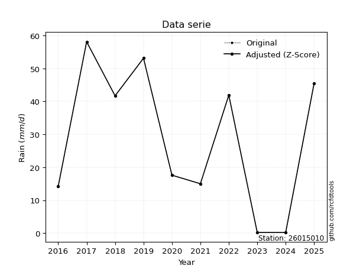</img>

</div>

> If Z-Score is active, values out of range or outliers are replaced with the station mean value.


### 4. Active continuous probability distributions from SciPy (45 of 104 available)

[scipy.stats](https://docs.scipy.org/doc/scipy/reference/stats.html) is a Python´s powerful submodule within the SciPy library for comprehensive statistical analysis, offering over 130 probability distributions (like Normal, Poisson), functions for descriptive stats (mean, variance), hypothesis testing (t-tests, chi-square), random variable generation, and statistical tests, making it essential for data science, modeling, and research. It provides tools to explore, model, and draw conclusions from data efficiently, working seamlessly with NumPy.

<div align="center">

|   id | p_dist             |   n_parameter | fit_method   | label                                                                       | active   | ref                                                                                                        |
|-----:|:-------------------|--------------:|:-------------|:----------------------------------------------------------------------------|:---------|:-----------------------------------------------------------------------------------------------------------|
|    0 | alpha              |             3 | MLE          | Alpha                                                                       | True     | [:mortar_board:](https://docs.scipy.org/doc/scipy/reference/generated/scipy.stats.alpha.html)              |
|    1 | betaprime          |             4 | MLE          | Beta prime                                                                  | True     | [:mortar_board:](https://docs.scipy.org/doc/scipy/reference/generated/scipy.stats.betaprime.html)          |
|    2 | chi2               |             3 | MLE          | Chi²                                                                        | True     | [:mortar_board:](https://docs.scipy.org/doc/scipy/reference/generated/scipy.stats.chi2.html)               |
|    3 | crystalball        |             4 | MLE          | Crystalball                                                                 | True     | [:mortar_board:](https://docs.scipy.org/doc/scipy/reference/generated/scipy.stats.crystalball.html)        |
|    4 | erlang             |             3 | MLE          | Erlang                                                                      | True     | [:mortar_board:](https://docs.scipy.org/doc/scipy/reference/generated/scipy.stats.erlang.html)             |
|    5 | expon              |             2 | MLE          | Exponential                                                                 | True     | [:mortar_board:](https://docs.scipy.org/doc/scipy/reference/generated/scipy.stats.expon.html)              |
|    6 | exponnorm          |             3 | MLE          | Exponentially modified Normal                                               | True     | [:mortar_board:](https://docs.scipy.org/doc/scipy/reference/generated/scipy.stats.exponnorm.html)          |
|    7 | f                  |             4 | MLE          | F                                                                           | True     | [:mortar_board:](https://docs.scipy.org/doc/scipy/reference/generated/scipy.stats.f.html)                  |
|    8 | fatiguelife        |             3 | MLE          | Fatigue-life (Birnbaum-Saunders)                                            | True     | [:mortar_board:](https://docs.scipy.org/doc/scipy/reference/generated/scipy.stats.fatiguelife.html)        |
|    9 | fisk               |             3 | MLE          | Fisk                                                                        | True     | [:mortar_board:](https://docs.scipy.org/doc/scipy/reference/generated/scipy.stats.fisk.html)               |
|   10 | gamma              |             3 | MLE          | Gamma                                                                       | True     | [:mortar_board:](https://docs.scipy.org/doc/scipy/reference/generated/scipy.stats.gamma.html)              |
|   11 | genexpon           |             5 | MLE          | Generalized exponential                                                     | True     | [:mortar_board:](https://docs.scipy.org/doc/scipy/reference/generated/scipy.stats.genexpon.html)           |
|   12 | genlogistic        |             3 | MLE          | Generalized logistic                                                        | True     | [:mortar_board:](https://docs.scipy.org/doc/scipy/reference/generated/scipy.stats.genlogistic.html)        |
|   13 | gibrat             |             2 | MM           | Gibrat                                                                      | True     | [:mortar_board:](https://docs.scipy.org/doc/scipy/reference/generated/scipy.stats.gibrat.html)             |
|   14 | gompertz           |             3 | MLE          | Gompertz (or truncated Gumbel)                                              | True     | [:mortar_board:](https://docs.scipy.org/doc/scipy/reference/generated/scipy.stats.gompertz.html)           |
|   15 | gumbel_l           |             2 | MM           | Gumbel Left Skew                                                            | True     | [:mortar_board:](https://docs.scipy.org/doc/scipy/reference/generated/scipy.stats.gumbel_l.html)           |
|   16 | gumbel_r           |             2 | MM           | Gumbel Right Skew                                                           | True     | [:mortar_board:](https://docs.scipy.org/doc/scipy/reference/generated/scipy.stats.gumbel_r.html)           |
|   17 | halflogistic       |             2 | MM           | Half-logistic                                                               | True     | [:mortar_board:](https://docs.scipy.org/doc/scipy/reference/generated/scipy.stats.halflogistic.html)       |
|   18 | halfnorm           |             2 | MM           | Half Normal                                                                 | True     | [:mortar_board:](https://docs.scipy.org/doc/scipy/reference/generated/scipy.stats.halfnorm.html)           |
|   19 | hypsecant          |             2 | MM           | hyperbolic secant                                                           | True     | [:mortar_board:](https://docs.scipy.org/doc/scipy/reference/generated/scipy.stats.hypsecant.html)          |
|   20 | invgamma           |             3 | MLE          | Inverted gamma                                                              | True     | [:mortar_board:](https://docs.scipy.org/doc/scipy/reference/generated/scipy.stats.invgamma.html)           |
|   21 | invgauss           |             3 | MLE          | Inverse Gaussian                                                            | True     | [:mortar_board:](https://docs.scipy.org/doc/scipy/reference/generated/scipy.stats.invgauss.html)           |
|   22 | invweibull         |             3 | MLE          | Inverted Weibull                                                            | True     | [:mortar_board:](https://docs.scipy.org/doc/scipy/reference/generated/scipy.stats.invweibull.html)         |
|   23 | johnsonsu          |             4 | MLE          | Johnson Su                                                                  | True     | [:mortar_board:](https://docs.scipy.org/doc/scipy/reference/generated/scipy.stats.johnsonsu.html)          |
|   24 | kstwobign          |             2 | MLE          | Limiting distribution of scaled Kolmogorov-Smirnov two-sided test statistic | True     | [:mortar_board:](https://docs.scipy.org/doc/scipy/reference/generated/scipy.stats.kstwobign.html)          |
|   25 | laplace            |             2 | MM           | Laplace                                                                     | True     | [:mortar_board:](https://docs.scipy.org/doc/scipy/reference/generated/scipy.stats.laplace.html)            |
|   26 | laplace_asymmetric |             3 | MLE          | Asymmetric Laplace                                                          | True     | [:mortar_board:](https://docs.scipy.org/doc/scipy/reference/generated/scipy.stats.laplace_asymmetric.html) |
|   27 | loggamma           |             3 | MLE          | Log gamma                                                                   | True     | [:mortar_board:](https://docs.scipy.org/doc/scipy/reference/generated/scipy.stats.loggamma.html)           |
|   28 | logistic           |             2 | MM           | Logistic (or Sech-squared)                                                  | True     | [:mortar_board:](https://docs.scipy.org/doc/scipy/reference/generated/scipy.stats.logistic.html)           |
|   29 | lognorm            |             3 | MLE          | Log Normal                                                                  | True     | [:mortar_board:](https://docs.scipy.org/doc/scipy/reference/generated/scipy.stats.lognorm.html)            |
|   30 | maxwell            |             2 | MM           | Maxwell                                                                     | True     | [:mortar_board:](https://docs.scipy.org/doc/scipy/reference/generated/scipy.stats.maxwell.html)            |
|   31 | mielke             |             4 | MLE          | Mielke Beta-Kappa / Dagum                                                   | True     | [:mortar_board:](https://docs.scipy.org/doc/scipy/reference/generated/scipy.stats.mielke.html)             |
|   32 | moyal              |             2 | MM           | Moyal                                                                       | True     | [:mortar_board:](https://docs.scipy.org/doc/scipy/reference/generated/scipy.stats.moyal.html)              |
|   33 | nakagami           |             3 | MLE          | Nakagami                                                                    | True     | [:mortar_board:](https://docs.scipy.org/doc/scipy/reference/generated/scipy.stats.nakagami.html)           |
|   34 | ncf                |             5 | MLE          | Non-central F distribution                                                  | True     | [:mortar_board:](https://docs.scipy.org/doc/scipy/reference/generated/scipy.stats.ncf.html)                |
|   35 | nct                |             4 | MLE          | Non-central Student’s t                                                     | True     | [:mortar_board:](https://docs.scipy.org/doc/scipy/reference/generated/scipy.stats.nct.html)                |
|   36 | norm               |             2 | MM           | Normal                                                                      | True     | [:mortar_board:](https://docs.scipy.org/doc/scipy/reference/generated/scipy.stats.norm.html)               |
|   37 | pareto             |             3 | MLE          | Pareto                                                                      | True     | [:mortar_board:](https://docs.scipy.org/doc/scipy/reference/generated/scipy.stats.pareto.html)             |
|   38 | pearson3           |             3 | MM           | Pearson type III                                                            | True     | [:mortar_board:](https://docs.scipy.org/doc/scipy/reference/generated/scipy.stats.pearson3.html)           |
|   39 | rayleigh           |             2 | MM           | Rayleigh                                                                    | True     | [:mortar_board:](https://docs.scipy.org/doc/scipy/reference/generated/scipy.stats.rayleigh.html)           |
|   40 | rice               |             3 | MLE          | Rice                                                                        | True     | [:mortar_board:](https://docs.scipy.org/doc/scipy/reference/generated/scipy.stats.rice.html)               |
|   41 | t                  |             3 | MLE          | Student’s t                                                                 | True     | [:mortar_board:](https://docs.scipy.org/doc/scipy/reference/generated/scipy.stats.t.html)                  |
|   42 | truncnorm          |             4 | MLE          | Truncated normal                                                            | True     | [:mortar_board:](https://docs.scipy.org/doc/scipy/reference/generated/scipy.stats.truncnorm.html)          |
|   43 | wald               |             2 | MM           | Wald                                                                        | True     | [:mortar_board:](https://docs.scipy.org/doc/scipy/reference/generated/scipy.stats.wald.html)               |
|   44 | weibull_min        |             3 | MLE          | Weibull minimum                                                             | True     | [:mortar_board:](https://docs.scipy.org/doc/scipy/reference/generated/scipy.stats.weibull_min.html)        |

</div>

> **n_parameter:** # arguments & localization & scale.
>
> **Fit methods:** (MLE) maximum likelihood, (MM) L-moments.
>
>**Inactive:** foldnorm, gennorm, norminvgauss, powernorm, powerlognorm, skewnorm, genextreme, anglit, arcsine, argus, beta, bradford, burr, burr12, cauchy, cosine, halfcauchy, foldcauchy, skewcauchy, wrapcauchy, dgamma, gengamma, exponweib, exponpow, truncexpon, gausshyper, genhalflogistic, genhyperbolic, geninvgauss, halfgennorm, johnsonsb, kappa4, kappa3, ksone, kstwo, loglaplace, levy, levy_l, levy_stable, ncx2, genpareto, truncpareto, lomax, powerlaw, rdist, rel_breitwigner, recipinvgauss, semicircular, studentized_range, trapezoid, triang, truncweibull_min, tukeylambda, uniform, loguniform, vonmises, vonmises_line, weibull_max, dweibull, 


## B. Probability distributions vs. Empirical distributions

A continuous probability distribution (CPD) describes probabilities for variables that can take any value within a range (like rain any time), unlike discrete variables with specific outcomes (like temperature). It uses a Probability Density Function (PDF), a curve where the total area under it equals 1, and the probability of the variable falling within an interval (a to b) is found by calculating the area under the curve between those points. A key feature is that the probability of hitting any single exact value is zero, so probabilities are always expressed for ranges, e.g., $P(a ≤ X ≤ b)$.

<div align="center">

Distributions parameters
|    |   station | p_dist                |   n |             loc |           scale | shape                  | shape1              | shape2                | shape3   |
|---:|----------:|:----------------------|----:|----------------:|----------------:|:-----------------------|:--------------------|:----------------------|:---------|
|  0 |  26015010 | alpha                 |  10 |     0.00219663  |     0.439065    | 4.9935725828580586e-08 |                     |                       |          |
|  1 |  26015010 | betaprime             |  10 |     0.2         |    13.017       | 0.45019813007806836    | 0.5775247404640131  |                       |          |
|  2 |  26015010 | chi2                  |  10 |     0.2         |     7.58197     | 1.9333838226278006     |                     |                       |          |
|  3 |  26015010 | crystalball           |  10 |    24.3         |    21.2657      | 1513.9527563452737     | 2259.1293925075843  |                       |          |
|  4 |  26015010 | erlang                |  10 |     0.2         |    18.3655      | 0.5607134353253638     |                     |                       |          |
|  5 |  26015010 | expon                 |  10 |     0.2         |    24.1         |                        |                     |                       |          |
|  6 |  26015010 | exponnorm             |  10 |    19.174       |    20.6432      | 0.24831292466286992    |                     |                       |          |
|  7 |  26015010 | f                     |  10 |     0.2         |    25.3224      | 0.50441578698348       | 9.903953066065586   |                       |          |
|  8 |  26015010 | fatiguelife           |  10 |     0.2         |     1.28493e-05 | 1456.8821238719756     |                     |                       |          |
|  9 |  26015010 | fisk                  |  10 |     0.2         |     8.84443     | 0.34867036952553027    |                     |                       |          |
| 10 |  26015010 | gamma                 |  10 |     0.2         |    16.3594      | 0.6627297404338108     |                     |                       |          |
| 11 |  26015010 | genexpon              |  10 |     0.178552    |     6.55111     | 0.23556292084692887    | 6.428242484174781   | 0.0016944396836977849 |          |
| 12 |  26015010 | genlogistic           |  10 |  -105.932       |    17.0954      | 1121.6721324607033     |                     |                       |          |
| 13 |  26015010 | gibrat                |  10 |     8.07695     |     9.83977     |                        |                     |                       |          |
| 14 |  26015010 | gompertz              |  10 |     0.2         |    88.7516      | 2.8498679319898264     |                     |                       |          |
| 15 |  26015010 | gumbel_l              |  10 |    33.8707      |    16.5808      |                        |                     |                       |          |
| 16 |  26015010 | gumbel_r              |  10 |    14.7293      |    16.5808      |                        |                     |                       |          |
| 17 |  26015010 | halflogistic          |  10 |    -0.904796    |    18.1814      |                        |                     |                       |          |
| 18 |  26015010 | halfnorm              |  10 |    -3.84745     |    35.2776      |                        |                     |                       |          |
| 19 |  26015010 | hypsecant             |  10 |    24.3         |    13.5382      |                        |                     |                       |          |
| 20 |  26015010 | invgamma              |  10 |     0.2         |     6.99597e-16 | 0.20330558375306867    |                     |                       |          |
| 21 |  26015010 | invgauss              |  10 |    -3.8019      |    17.0878      | 1.6445623739277089     |                     |                       |          |
| 22 |  26015010 | invweibull            |  10 |     0.2         |     2.42749     | 0.035896493652078976   |                     |                       |          |
| 23 |  26015010 | johnsonsu             |  10 |     0.2         |     3.42701e-09 | -0.8568410743908448    | 0.07488326950753378 |                       |          |
| 24 |  26015010 | kstwobign             |  10 |   -44.42        |    78.5048      |                        |                     |                       |          |
| 25 |  26015010 | laplace               |  10 |    24.3         |    15.0371      |                        |                     |                       |          |
| 26 |  26015010 | laplace_asymmetric    |  10 |    14.2         |    16.0485      | 0.7336668102003729     |                     |                       |          |
| 27 |  26015010 | loggamma              |  10 | -6231.86        |   850.6         | 1564.4661013052678     |                     |                       |          |
| 28 |  26015010 | logistic              |  10 |    24.3         |    11.7244      |                        |                     |                       |          |
| 29 |  26015010 | lognorm               |  10 |     0.2         |     0.00509454  | 16.463456839867533     |                     |                       |          |
| 30 |  26015010 | maxwell               |  10 |   -26.0908      |    31.5777      |                        |                     |                       |          |
| 31 |  26015010 | mielke                |  10 |     0.2         |    60.7185      | 0.4530383341455665     | 178.5516951121691   |                       |          |
| 32 |  26015010 | moyal                 |  10 |    12.1389      |     9.57293     |                        |                     |                       |          |
| 33 |  26015010 | nakagami              |  10 |     0.2         |    48.378       | 0.12990082775384032    |                     |                       |          |
| 34 |  26015010 | ncf                   |  10 |     0.2         |     2.86914     | 0.4862402905592        | 188.66410988574043  | 3.9221570396112133    |          |
| 35 |  26015010 | nct                   |  10 |     0.2         |     7.27471e-12 | 0.19138559813274986    | 2.9185662490125295  |                       |          |
| 36 |  26015010 | norm                  |  10 |    24.3         |    21.2657      |                        |                     |                       |          |
| 37 |  26015010 | pareto                |  10 |    -0.287893    |     0.487893    | 0.33553688888628097    |                     |                       |          |
| 38 |  26015010 | pearson3              |  10 |    24.3         |    21.2657      | 0.31654357759766816    |                     |                       |          |
| 39 |  26015010 | rayleigh              |  10 |   -16.3825      |    32.46        |                        |                     |                       |          |
| 40 |  26015010 | rice                  |  10 |   -12.3925      |    28.6426      | 0.4385407666058275     |                     |                       |          |
| 41 |  26015010 | t                     |  10 |    24.3019      |    21.265       | 13535394.594356496     |                     |                       |          |
| 42 |  26015010 | truncnorm             |  10 |   -16.9021      |    36.9865      | 0.46238830434126643    | 152.12714875497022  |                       |          |
| 43 |  26015010 | wald                  |  10 |     3.03427     |    21.2657      |                        |                     |                       |          |
| 44 |  26015010 | weibull_min           |  10 |     0.2         |    33.9829      | 0.33116186545584525    |                     |                       |          |
| 45 |  26015010 | logalpha              |  10 |   -27.8244      |   386.909       | 13.03891689128         |                     |                       |          |
| 46 |  26015010 | logbetaprime          |  10 |    -1.60944     |     2.77855     | 0.11432713079252411    | 0.6278770141870348  |                       |          |
| 47 |  26015010 | logchi2               |  10 |    -1.60944     |     1.17057     | 1.0418499056956576     |                     |                       |          |
| 48 |  26015010 | logcrystalball        |  10 |     2.05104     |     2.14148     | 18.1201802307551       | 1788.999381943969   |                       |          |
| 49 |  26015010 | logerlang             |  10 |   -31.2179      |     0.14944     | 222.67734751346194     |                     |                       |          |
| 50 |  26015010 | logexpon              |  10 |    -1.60944     |     3.66048     |                        |                     |                       |          |
| 51 |  26015010 | logexponnorm          |  10 |     2.04928     |     2.14147     | 0.0008300465496412814  |                     |                       |          |
| 52 |  26015010 | logf                  |  10 |    -1.60944     |     1.0457      | 1.1947260947948215     | 1.045441876689786   |                       |          |
| 53 |  26015010 | logfatiguelife        |  10 |    -1.60944     |     6.92926e-07 | 1646.0908556342665     |                     |                       |          |
| 54 |  26015010 | logfisk               |  10 |    -1.60944     |     1.29792     | 0.13790007776343174    |                     |                       |          |
| 55 |  26015010 | loggamma              |  10 |   -27.2315      |     0.166959    | 175.2001990193154      |                     |                       |          |
| 56 |  26015010 | loggenexpon           |  10 |    -1.69933     |     8.83414     | 1.291378018858123      | 2.5771498517028384  | 1.9570478222494678    |          |
| 57 |  26015010 | loggenlogistic        |  10 |     4.06229     |     1.3446e-05  | 6.728936831648439e-06  |                     |                       |          |
| 58 |  26015010 | loggibrat             |  10 |     0.417385    |     0.990875    |                        |                     |                       |          |
| 59 |  26015010 | loggompertz           |  10 |    -1.60944     |     1.14864e+11 | 170566599817.8933      |                     |                       |          |
| 60 |  26015010 | loggumbel_l           |  10 |     3.01482     |     1.6697      |                        |                     |                       |          |
| 61 |  26015010 | loggumbel_r           |  10 |     1.08727     |     1.6697      |                        |                     |                       |          |
| 62 |  26015010 | loghalflogistic       |  10 |    -0.487066    |     1.83087     |                        |                     |                       |          |
| 63 |  26015010 | loghalfnorm           |  10 |    -0.783445    |     3.5525      |                        |                     |                       |          |
| 64 |  26015010 | loghypsecant          |  10 |     2.05104     |     1.36331     |                        |                     |                       |          |
| 65 |  26015010 | loginvgamma           |  10 |   -44.021       | 19739           | 429.9553617710649      |                     |                       |          |
| 66 |  26015010 | loginvgauss           |  10 |   -16.8355      |  1236.45        | 0.01524511765343434    |                     |                       |          |
| 67 |  26015010 | loginvweibull         |  10 |    -4.02977e+08 |     4.02977e+08 | 178730017.14703548     |                     |                       |          |
| 68 |  26015010 | logjohnsonsu          |  10 |     4.08197     |     0.00034531  | 4.847184104462702      | 0.5760091584778879  |                       |          |
| 69 |  26015010 | logkstwobign          |  10 |    -6.86978     |    10.1512      |                        |                     |                       |          |
| 70 |  26015010 | loglaplace            |  10 |     2.05104     |     1.51425     |                        |                     |                       |          |
| 71 |  26015010 | loglaplace_asymmetric |  10 |     4.06223     |     0.0150074   | 134.27075489024776     |                     |                       |          |
| 72 |  26015010 | logloggamma           |  10 |     4.06226     |     6.15297e-06 | 3.044537122949252e-06  |                     |                       |          |
| 73 |  26015010 | loglogistic           |  10 |     2.05104     |     1.18066     |                        |                     |                       |          |
| 74 |  26015010 | loglognorm            |  10 |    -1.60944     |    13.8187      | 17.05433733001763      |                     |                       |          |
| 75 |  26015010 | logmaxwell            |  10 |    -3.02335     |     3.17991     |                        |                     |                       |          |
| 76 |  26015010 | logmielke             |  10 |    -1.60944     |     2.67554     | 0.1271197778425624     | 1.168957717854398   |                       |          |
| 77 |  26015010 | logmoyal              |  10 |     0.826411    |     0.964003    |                        |                     |                       |          |
| 78 |  26015010 | lognakagami           |  10 |    -1.60944     |     3.16453     | 0.05717961670049873    |                     |                       |          |
| 79 |  26015010 | logncf                |  10 |    -1.60944     |     1.07099     | 1.039007958211616      | 1.1583546891066705  | 1.069514631678052     |          |
| 80 |  26015010 | lognct                |  10 |  -168.493       |     2.13484     | 455932.74288728414     | 79.88600553352194   |                       |          |
| 81 |  26015010 | lognorm               |  10 |     2.05104     |     2.14148     |                        |                     |                       |          |
| 82 |  26015010 | logpareto             |  10 |    -1.64609     |     0.0366526   | 0.261654865938337      |                     |                       |          |
| 83 |  26015010 | logpearson3           |  10 |     2.05106     |     2.14145     | -0.8241661581918498    |                     |                       |          |
| 84 |  26015010 | lograyleigh           |  10 |    -2.04572     |     3.26875     |                        |                     |                       |          |
| 85 |  26015010 | logrice               |  10 |    -3.02843     |     2.36765     | 1.8494888878340294     |                     |                       |          |
| 86 |  26015010 | logt                  |  10 |     2.05104     |     2.14148     | 84663908963.49985      |                     |                       |          |
| 87 |  26015010 | logtruncnorm          |  10 |     1.48221     |     2.58227     | -1.1972607677442444    | 5.083357792490311   |                       |          |
| 88 |  26015010 | logwald               |  10 |    -0.090452    |     2.14149     |                        |                     |                       |          |
| 89 |  26015010 | logweibull_min        |  10 |    -9.22874e+07 |     9.22874e+07 | 63408382.80589655      |                     |                       |          |

</div>

> **loc** (Location parameter): This shifts the distribution along the x-axis. For many common distributions, like the normal (Gaussian) distribution, loc represents the mean $μ$. For others, like the uniform distribution, it might represent the minimum value, or for the beta distribution, the left end of the support interval.
>
> **scale** (Scale parameter): This determines the width or spread of the distribution. For the normal distribution, scale represents the standard deviation $σ$. For a uniform distribution, it defines the length of the interval (from $loc$ to $loc + scale$).
>
> **shape** (Shape parameters): Refers to parameters that define the specific form of a probability distribution, distinct from its location (loc) and scale (scale). These parameters are required arguments for most distribution functions. For example, a normal (Gaussian) distribution is fully defined by its location (mean) and scale (standard deviation), so it has no specific shape parameters beyond loc and scale. However, other distributions have intrinsic properties that need specification, as Gamma distribution that takes a shape parameter, often named $a$ or $alpha$.


### 0. Cumulative distribution values - CDF (90 evaluated)

> Ordered by x ascending and calculating $log(f(x))$ separately. 

|   id |   Station |   date |    x |   count |   mean |    std |    zscore |   Value_initial |   station |   m |    alpha |   alpha_pdf |   betaprime |   betaprime_pdf |        chi2 |   chi2_pdf |   crystalball |   crystalball_pdf |      erlang |       erlang_pdf |     expon |   expon_pdf |   exponnorm |   exponnorm_pdf |           f |       f_pdf |   fatiguelife |   fatiguelife_pdf |        fisk |    fisk_pdf |      gamma |       gamma_pdf |    genexpon |   genexpon_pdf |   genlogistic |   genlogistic_pdf |   gibrat |   gibrat_pdf |    gompertz |   gompertz_pdf |   gumbel_l |   gumbel_l_pdf |   gumbel_r |   gumbel_r_pdf |   halflogistic |   halflogistic_pdf |   halfnorm |   halfnorm_pdf |   hypsecant |   hypsecant_pdf |   invgamma |   invgamma_pdf |   invgauss |   invgauss_pdf |   invweibull |   invweibull_pdf |   johnsonsu |   johnsonsu_pdf |   kstwobign |   kstwobign_pdf |   laplace |   laplace_pdf |   laplace_asymmetric |   laplace_asymmetric_pdf |   loggamma |   loggamma_pdf |   logistic |   logistic_pdf |   lognorm |   lognorm_pdf |   maxwell |   maxwell_pdf |      mielke |     mielke_pdf |     moyal |   moyal_pdf |    nakagami |   nakagami_pdf |         ncf |     ncf_pdf |       nct |     nct_pdf |     norm |   norm_pdf |      pareto |   pareto_pdf |   pearson3 |   pearson3_pdf |   rayleigh |   rayleigh_pdf |      rice |   rice_pdf |        t |      t_pdf |   truncnorm |   truncnorm_pdf |     wald |   wald_pdf |   weibull_min |   weibull_min_pdf |   logalpha |   logalpha_pdf |   logbetaprime |   logbetaprime_pdf |     logchi2 |   logchi2_pdf |   logcrystalball |   logcrystalball_pdf |   logerlang |   logerlang_pdf |   logexpon |   logexpon_pdf |   logexponnorm |   logexponnorm_pdf |        logf |       logf_pdf |   logfatiguelife |   logfatiguelife_pdf |    logfisk |   logfisk_pdf |   loggenexpon |   loggenexpon_pdf |   loggenlogistic |   loggenlogistic_pdf |   loggibrat |   loggibrat_pdf |   loggompertz |   loggompertz_pdf |   loggumbel_l |   loggumbel_l_pdf |   loggumbel_r |   loggumbel_r_pdf |   loghalflogistic |   loghalflogistic_pdf |   loghalfnorm |   loghalfnorm_pdf |   loghypsecant |   loghypsecant_pdf |   loginvgamma |   loginvgamma_pdf |   loginvgauss |   loginvgauss_pdf |   loginvweibull |   loginvweibull_pdf |   logjohnsonsu |   logjohnsonsu_pdf |   logkstwobign |   logkstwobign_pdf |   loglaplace |   loglaplace_pdf |   loglaplace_asymmetric |   loglaplace_asymmetric_pdf |   logloggamma |   logloggamma_pdf |   loglogistic |   loglogistic_pdf |   loglognorm |   loglognorm_pdf |   logmaxwell |   logmaxwell_pdf |   logmielke |   logmielke_pdf |    logmoyal |   logmoyal_pdf |   lognakagami |   lognakagami_pdf |      logncf |   logncf_pdf |    lognct |   lognct_pdf |   logpareto |   logpareto_pdf |   logpearson3 |   logpearson3_pdf |   lograyleigh |   lograyleigh_pdf |   logrice |   logrice_pdf |      logt |   logt_pdf |   logtruncnorm |   logtruncnorm_pdf |     logwald |   logwald_pdf |   logweibull_min |   logweibull_min_pdf |
|-----:|----------:|-------:|-----:|--------:|-------:|-------:|----------:|----------------:|----------:|----:|---------:|------------:|------------:|----------------:|------------:|-----------:|--------------:|------------------:|------------:|-----------------:|----------:|------------:|------------:|----------------:|------------:|------------:|--------------:|------------------:|------------:|------------:|-----------:|----------------:|------------:|---------------:|--------------:|------------------:|---------:|-------------:|------------:|---------------:|-----------:|---------------:|-----------:|---------------:|---------------:|-------------------:|-----------:|---------------:|------------:|----------------:|-----------:|---------------:|-----------:|---------------:|-------------:|-----------------:|------------:|----------------:|------------:|----------------:|----------:|--------------:|---------------------:|-------------------------:|-----------:|---------------:|-----------:|---------------:|----------:|--------------:|----------:|--------------:|------------:|---------------:|----------:|------------:|------------:|---------------:|------------:|------------:|----------:|------------:|---------:|-----------:|------------:|-------------:|-----------:|---------------:|-----------:|---------------:|----------:|-----------:|---------:|-----------:|------------:|----------------:|---------:|-----------:|--------------:|------------------:|-----------:|---------------:|---------------:|-------------------:|------------:|--------------:|-----------------:|---------------------:|------------:|----------------:|-----------:|---------------:|---------------:|-------------------:|------------:|---------------:|-----------------:|---------------------:|-----------:|--------------:|--------------:|------------------:|-----------------:|---------------------:|------------:|----------------:|--------------:|------------------:|--------------:|------------------:|--------------:|------------------:|------------------:|----------------------:|--------------:|------------------:|---------------:|-------------------:|--------------:|------------------:|--------------:|------------------:|----------------:|--------------------:|---------------:|-------------------:|---------------:|-------------------:|-------------:|-----------------:|------------------------:|----------------------------:|--------------:|------------------:|--------------:|------------------:|-------------:|-----------------:|-------------:|-----------------:|------------:|----------------:|------------:|---------------:|--------------:|------------------:|------------:|-------------:|----------:|-------------:|------------:|----------------:|--------------:|------------------:|--------------:|------------------:|----------:|--------------:|----------:|-----------:|---------------:|-------------------:|------------:|--------------:|-----------------:|---------------------:|
|    0 |  26015010 |   2023 |  0.2 |      10 |   24.3 | 22.416 | -1.07512  |             0.2 |  26015010 |   1 | 0.026439 | 0.762254    | 7.98243e-09 |     1.29476e+08 | 1.41352e-17 | 0.246156   |      0.128548 |        0.00987059 | 2.75964e-09 | 190924           | 0         |  0.0414938  |    0.128083 |      0.00993521 | 2.25905e-05 | 2.05274e+11 |     0.0501148 |       3.79003e+10 | 7.89061e-07 | 9.91232e+09 | 1.8525e-12 | 44232.9         | 0.000770998 |     0.0359355  |      0.104822 |        0.0138158  | 0        |   0          | 2.93043e-15 |     0.0321106  |   0.122995 |     0.00694181 |   0.090543 |     0.0131163  |      0.0303732 |         0.0274752  |  0.0913421 |     0.0224689  |    0.106342 |      0.00770966 |  0.0494622 |    1.17569e+14 |  0.0689653 |     0.0428478  |    0.0173095 |      9.08108e+13 |    0.215784 |     4.33939e+06 |   0.0968083 |      0.0144016  |  0.100676 |    0.00669517 |             0.106555 |               0.00904985 |  0.0455104 |      0.0472943 |   0.113493 |     0.00858148 | 0.0436952 |     0.0432251 |  0.125193 |    0.0123846  | 1.64416e-06 | 71781.3        | 0.062099  |  0.0136432  | 1.48808e-05 |    1.39289e+11 | 8.01704e-06 | 7.02239e+10 | 0.0707656 | 1.18122e+10 | 0.128548 | 0.00987058 | 1.11022e-16 |   0.687726   |   0.123937 |     0.0109823  |   0.122334 |     0.0138129  | 0.0840579 | 0.0127756  | 0.128522 | 0.0098695  | 1.30886e-08 |      0.0301104  | 0        | 0          |   1.02323e-06 |       1.22085e+10 |  0.0426989 |      0.0511529 |      0.0132118 |        6.80254e+12 | 5.07296e-09 |   1.19014e+07 |        0.0436952 |            0.0432251 |   0.0457874 |       0.0466049 |   0        |      0.273188  |      0.0436943 |          0.0432245 | 2.92583e-10 | 787131         |        0.0185476 |          8.04472e+11 | 0.00665055 |   4.10284e+12 |     0.0133112 |         0.14991   |         0        |            0.0292865 |    0        |       0         |   2.39016e-12 |       1.48494     |     0.0607678 |         0.0352655 |    0.00654996 |         0.0197252 |          0        |             0         |      0        |         0         |      0.0433636 |          0.0317094 |     0.0463553 |         0.0487366 |     0.0470397 |          0.05265  |       0.0473039 |           0.0640147 |       0.126076 |          0.0209587 |      0.0489008 |          0.0761222 |    0.0445786 |        0.0294394 |               0.0599221 |                   0.0297373 |     0.0604222 |         0.0298974 |     0.0430918 |         0.0349253 |    0.0116817 |      8.05786e+12 |    0.0220411 |        0.0449379 |  0.00903213 |     5.17087e+12 | 0.000404026 |     0.00280707 |     0.0124392 |       6.40654e+12 | 2.74844e-09 |  6.43036e+06 | 0.0437425 |    0.0432591 | 1.11022e-16 |       7.13879   |     0.0604285 |         0.0393267 |    0.00886783 |         0.0404706 | 0.0343812 |     0.0509256 | 0.0436953 |  0.0432252 |    9.78139e-11 |          0.0853091 | 0           |    0          |        0.0409921 |            0.0275794 |
|    1 |  26015010 |   2024 |  0.2 |      10 |   24.3 | 22.416 | -1.07512  |             0.2 |  26015010 |   2 | 0.026439 | 0.762254    | 7.98243e-09 |     1.29476e+08 | 1.41352e-17 | 0.246156   |      0.128548 |        0.00987059 | 2.75964e-09 | 190924           | 0         |  0.0414938  |    0.128083 |      0.00993521 | 2.25905e-05 | 2.05274e+11 |     0.0501148 |       3.79003e+10 | 7.89061e-07 | 9.91232e+09 | 1.8525e-12 | 44232.9         | 0.000770998 |     0.0359355  |      0.104822 |        0.0138158  | 0        |   0          | 2.93043e-15 |     0.0321106  |   0.122995 |     0.00694181 |   0.090543 |     0.0131163  |      0.0303732 |         0.0274752  |  0.0913421 |     0.0224689  |    0.106342 |      0.00770966 |  0.0494622 |    1.17569e+14 |  0.0689653 |     0.0428478  |    0.0173095 |      9.08108e+13 |    0.215784 |     4.33939e+06 |   0.0968083 |      0.0144016  |  0.100676 |    0.00669517 |             0.106555 |               0.00904985 |  0.0455104 |      0.0472943 |   0.113493 |     0.00858148 | 0.0436952 |     0.0432251 |  0.125193 |    0.0123846  | 1.64416e-06 | 71781.3        | 0.062099  |  0.0136432  | 1.48808e-05 |    1.39289e+11 | 8.01704e-06 | 7.02239e+10 | 0.0707656 | 1.18122e+10 | 0.128548 | 0.00987058 | 1.11022e-16 |   0.687726   |   0.123937 |     0.0109823  |   0.122334 |     0.0138129  | 0.0840579 | 0.0127756  | 0.128522 | 0.0098695  | 1.30886e-08 |      0.0301104  | 0        | 0          |   1.02323e-06 |       1.22085e+10 |  0.0426989 |      0.0511529 |      0.0132118 |        6.80254e+12 | 5.07296e-09 |   1.19014e+07 |        0.0436952 |            0.0432251 |   0.0457874 |       0.0466049 |   0        |      0.273188  |      0.0436943 |          0.0432245 | 2.92583e-10 | 787131         |        0.0185476 |          8.04472e+11 | 0.00665055 |   4.10284e+12 |     0.0133112 |         0.14991   |         0        |            0.0292865 |    0        |       0         |   2.39016e-12 |       1.48494     |     0.0607678 |         0.0352655 |    0.00654996 |         0.0197252 |          0        |             0         |      0        |         0         |      0.0433636 |          0.0317094 |     0.0463553 |         0.0487366 |     0.0470397 |          0.05265  |       0.0473039 |           0.0640147 |       0.126076 |          0.0209587 |      0.0489008 |          0.0761222 |    0.0445786 |        0.0294394 |               0.0599221 |                   0.0297373 |     0.0604222 |         0.0298974 |     0.0430918 |         0.0349253 |    0.0116817 |      8.05786e+12 |    0.0220411 |        0.0449379 |  0.00903213 |     5.17087e+12 | 0.000404026 |     0.00280707 |     0.0124392 |       6.40654e+12 | 2.74844e-09 |  6.43036e+06 | 0.0437425 |    0.0432591 | 1.11022e-16 |       7.13879   |     0.0604285 |         0.0393267 |    0.00886783 |         0.0404706 | 0.0343812 |     0.0509256 | 0.0436953 |  0.0432252 |    9.78139e-11 |          0.0853091 | 0           |    0          |        0.0409921 |            0.0275794 |
|    2 |  26015010 |   2025 |  1   |      10 |   24.3 | 22.416 | -1.03944  |             1   |  26015010 |   3 | 0.659915 | 0.319399    | 0.201366    |     0.108636    | 0.057489    | 0.0676211  |      0.136614 |        0.0102932  | 0.190948    |      0.130139    | 0.0326501 |  0.040139   |    0.136203 |      0.0103634  | 0.3195      | 0.100054    |     0.567993  |       0.0420831   | 0.301992    | 0.0918715   | 0.14713    |     0.118339    | 0.0291886   |     0.0351106  |      0.116196 |        0.0146162  | 0        |   0          | 0.0254745   |     0.031576   |   0.128667 |     0.00723785 |   0.101389 |     0.0139956  |      0.0523352 |         0.0274253  |  0.109292  |     0.0224048  |    0.112684 |      0.0081507  |  0.999054  |    0.000240505 |  0.104775  |     0.0461234  |    0.353225  |      0.0164937   |    0.738246 |     0.0304671   |   0.108669  |      0.0152433  |  0.106177 |    0.00706101 |             0.114047 |               0.00968611 |  0.181277  |      0.12509   |   0.120542 |     0.00904196 | 0.169089  |     0.117761  |  0.135296 |    0.0128712  | 0.140664    |     0.0796578  | 0.0735759 |  0.015044   | 0.28112     |    0.0912914   | 0.0879929   | 0.0360632   | 0.992168  | 0.00187378  | 0.136614 | 0.0102932  | 0.277974    |   0.188111   |   0.132919 |     0.0114726  |   0.133578 |     0.0142938  | 0.0945428 | 0.0134325  | 0.136587 | 0.0102921  | 0.0239664   |      0.0298038  | 0        | 0          |   0.250945    |       0.0895934   |  0.193113  |      0.136973  |      0.829028  |        0.0434915   | 0.747758    |   0.150936    |        0.169089  |            0.117761  |   0.178624  |       0.122194  |   0.355757 |      0.176     |      0.169087  |          0.11776   | 0.556466    |      0.103866  |        0.822737  |          0.0747495   | 0.507416   |   0.0214158   |     0.281821  |         0.17071   |         0        |            0.0655329 |    0        |       0         |   0.908363    |       0.136076    |     0.151576  |         0.0835237 |    0.146931   |         0.168763  |          0.132236 |             0.268319  |      0.174544 |         0.219202  |      0.139157  |          0.0988527 |     0.185886  |         0.127882  |     0.195988  |          0.133516 |       0.224392  |           0.148724  |       0.170121 |          0.0357248 |      0.25048   |          0.159975  |    0.129039  |        0.0852163 |               0.133187  |                   0.0660962 |     0.133984  |         0.0662962 |     0.149668  |         0.107794  |    0.449836  |      0.0144195   |    0.175528  |        0.144339  |  0.893676   |     0.0454797   | 0.124744    |     0.195538   |     0.809489  |       0.0567193   | 0.435767    |  0.108864    | 0.169189  |    0.11778   | 0.630466    |       0.0587394 |     0.161443  |         0.0914062 |    0.177856   |         0.15741   | 0.176974  |     0.128093  | 0.169089  |  0.117761  |    0.189262    |          0.148156  | 3.03946e-06 |    0.00041278 |        0.118803  |            0.0765737 |
|    3 |  26015010 |   2016 | 14.2 |      10 |   24.3 | 22.416 | -0.450571 |            14.2 |  26015010 |   4 | 0.975329 | 0.00173707  | 0.584002    |     0.0113045   | 0.617715    | 0.0257414  |      0.317414 |        0.016759   | 0.752609    |      0.0180391   | 0.440613  |  0.0232111  |    0.31833  |      0.0168683  | 0.640187    | 0.0102701   |     0.76315   |       0.00789739  | 0.539948    | 0.00618651  | 0.733779   |     0.0201125   | 0.410864    |     0.0232767  |      0.36972  |        0.0215094  | 0.317617 |   0.0582208  | 0.3855      |     0.0231035  |   0.263122 |     0.0135695  |   0.356138 |     0.0221757  |      0.393041  |         0.0232523  |  0.391058  |     0.0198431  |    0.281914 |      0.0182061  |  0.999471  |    7.68015e-06 |  0.548607  |     0.0203072  |    0.391003  |      0.00094143  |    0.80297  |     0.00148401  |   0.367286  |      0.0214612  |  0.255427 |    0.0169864  |             0.349918 |               0.0297189  |  0.621638  |      0.169601  |   0.297036 |     0.0178095  | 0.610724  |     0.179071  |  0.346938 |    0.0182262  | 0.514431    |     0.0166469  | 0.369218  |  0.025005   | 0.590602    |    0.0108549   | 0.388053    | 0.0198428   | 0.995471  | 6.19129e-05 | 0.317414 | 0.016759   | 0.679475    |   0.00742329 |   0.332047 |     0.0179754  |   0.358428 |     0.0186218  | 0.324192  | 0.0199349  | 0.317377 | 0.0167587  | 0.378068    |      0.0235285  | 0.386583 | 0.0397769  |   0.525512    |       0.00836751  |  0.634599  |      0.156622  |      0.890537  |        0.0129217   | 0.940171    |   0.0304755   |        0.610724  |            0.179071  |   0.613026  |       0.169636  |   0.687925 |      0.085255  |      0.610721  |          0.179072  | 0.704926    |      0.0313851 |        0.934064  |          0.0226593   | 0.540904   |   0.00803351  |     0.664203  |         0.109698  |         0        |            0.247236  |    0.792118 |       0.128132  |   0.998218    |       0.00264669  |     0.553041  |         0.215566  |    0.676071   |         0.158503  |          0.69502  |             0.141176  |      0.666655 |         0.140665  |      0.636242  |          0.212421  |     0.627603  |         0.167155  |     0.630059  |          0.157217 |       0.630863  |           0.128896  |       0.363546 |          0.151335  |      0.657702  |          0.124591  |    0.664064  |        0.22185   |               0.496939  |                   0.246614  |     0.497982  |         0.246405  |     0.624819  |         0.198551  |    0.472509  |      0.00547469  |    0.63628   |        0.16251   |  0.951463   |     0.0104177   | 0.698238    |     0.148829   |     0.900641  |       0.0219009   | 0.607818    |  0.0397351   | 0.610722  |    0.178994  | 0.712553    |       0.0174939 |     0.561054  |         0.199033  |    0.644157   |         0.156494  | 0.619273  |     0.170444  | 0.610724  |  0.179071  |    0.632408    |          0.157618  | 0.760166    |    0.124555   |        0.542926  |            0.245868  |
|    4 |  26015010 |   2021 | 15   |      10 |   24.3 | 22.416 | -0.414882 |            15   |  26015010 |   5 | 0.976645 | 0.00155678  | 0.592775    |     0.0106404   | 0.637756    | 0.0243734  |      0.330938 |        0.0170491  | 0.766559    |      0.0168537   | 0.458877  |  0.0224533  |    0.331941 |      0.0171558  | 0.6482      | 0.00977221  |     0.769335  |       0.00756915  | 0.544757    | 0.00584251  | 0.749336   |     0.018797    | 0.42924     |     0.0226661  |      0.38692  |        0.0214818  | 0.362578 |   0.0541716  | 0.403788    |     0.0226189  |   0.27416  |     0.0140269  |   0.373885 |     0.0221841  |      0.41148   |         0.0228443  |  0.406839  |     0.0196092  |    0.296749 |      0.0188795  |  0.999477  |    7.18339e-06 |  0.564423  |     0.0192458  |    0.391736  |      0.000890432 |    0.804123 |     0.00139881  |   0.384431  |      0.0213948  |  0.269384 |    0.0179146  |             0.373263 |               0.0286516  |  0.630891  |      0.168067  |   0.311478 |     0.0182917  | 0.620502  |     0.177729  |  0.361569 |    0.0183483  | 0.527546    |     0.0161486  | 0.389132  |  0.0247695  | 0.599102    |    0.0104042   | 0.40381     | 0.0195477   | 0.995519  | 5.79467e-05 | 0.330938 | 0.0170491  | 0.685204    |   0.0069091  |   0.346516 |     0.0181938  |   0.373344 |     0.0186647  | 0.340189  | 0.0200508  | 0.330901 | 0.0170488  | 0.39672     |      0.023099   | 0.417489 | 0.0375002  |   0.532037    |       0.00795136  |  0.643133  |      0.154801  |      0.891239  |        0.012703    | 0.941816    |   0.0295886   |        0.620502  |            0.177729  |   0.622285  |       0.168226  |   0.692563 |      0.083988  |      0.6205    |          0.177729  | 0.706632    |      0.030858  |        0.935293  |          0.0221888   | 0.541341   |   0.00793038  |     0.670174  |         0.10819   |         0        |            0.254111  |    0.798987 |       0.12259   |   0.998357    |       0.00243982  |     0.564892  |         0.216853  |    0.684671   |         0.155336  |          0.702677 |             0.138253  |      0.674308 |         0.138565  |      0.647785  |          0.208768  |     0.636721  |         0.165536  |     0.638631  |          0.155557 |       0.637881  |           0.1272    |       0.372036 |          0.158574  |      0.664485  |          0.122938  |    0.676005  |        0.213963  |               0.510641  |                   0.253413  |     0.511672  |         0.253179  |     0.635636  |         0.196164  |    0.472807  |      0.00540547  |    0.645136  |        0.16062   |  0.952027   |     0.0101945   | 0.706297    |     0.14526    |     0.901833  |       0.0215965   | 0.609979    |  0.0391377   | 0.620496  |    0.177652  | 0.713504    |       0.0172165 |     0.571982  |         0.199719  |    0.65268    |         0.154527  | 0.628575  |     0.168988  | 0.620502  |  0.177729  |    0.641004    |          0.156073  | 0.766875    |    0.120292   |        0.556454  |            0.247747  |
|    5 |  26015010 |   2020 | 17.6 |      10 |   24.3 | 22.416 | -0.298893 |            17.6 |  26015010 |   6 | 0.980095 | 0.00113088  | 0.618036    |     0.00888037  | 0.695835    | 0.0204226  |      0.376358 |        0.0178515  | 0.805995    |      0.013625    | 0.514216  |  0.020157   |    0.377622 |      0.0179455  | 0.671786    | 0.00843303  |     0.787782  |       0.00665582  | 0.558713    | 0.00494056  | 0.79331    |     0.0151831   | 0.485671    |     0.0207631  |      0.442365 |        0.0210975  | 0.48695  |   0.0418699  | 0.460578    |     0.0210728  |   0.31259  |     0.0155395  |   0.431268 |     0.0218751  |      0.469082  |         0.0214494  |  0.456788  |     0.0188009  |    0.348532 |      0.0208999  |  0.999494  |    5.91224e-06 |  0.610461  |     0.0162824  |    0.393868  |      0.000757091 |    0.807456 |     0.00117742  |   0.439531  |      0.0209304  |  0.320231 |    0.0212961  |             0.443501 |               0.0254407  |  0.657371  |      0.163128  |   0.3609   |     0.0196728  | 0.648563  |     0.173222  |  0.409624 |    0.0185731  | 0.56768     |     0.0147805  | 0.452149  |  0.0236181  | 0.624498    |    0.00918675  | 0.453339    | 0.0185408   | 0.995656  | 4.77847e-05 | 0.376358 | 0.0178515  | 0.701364    |   0.00560174 |   0.394563 |     0.0187171  |   0.421899 |     0.0186451  | 0.392606  | 0.0202176  | 0.37632  | 0.0178515  | 0.454945    |      0.0216864  | 0.506    | 0.030781   |   0.551199    |       0.00684341  |  0.667436  |      0.149203  |      0.893221  |        0.0120988   | 0.946349    |   0.0271586   |        0.648563  |            0.173222  |   0.648819  |       0.163642  |   0.7057   |      0.0803993 |      0.648561  |          0.173222  | 0.711447    |      0.0294017 |        0.938734  |          0.0208811   | 0.542586   |   0.00764404  |     0.687119  |         0.103828  |         0        |            0.275274  |    0.81739  |       0.108049  |   0.998704    |       0.00192429  |     0.59979   |         0.219499  |    0.708764   |         0.146122  |          0.724106 |             0.129903  |      0.695967 |         0.132436  |      0.680239  |          0.197043  |     0.662778  |         0.160383  |     0.66309   |          0.150401 |       0.657815  |           0.122197  |       0.399277 |          0.18321   |      0.68375   |          0.118098  |    0.708464  |        0.192528  |               0.552799  |                   0.274335  |     0.553785  |         0.274017  |     0.666381  |         0.188299  |    0.473656  |      0.00521323  |    0.670352  |        0.154809  |  0.953607   |     0.00958217  | 0.728703    |     0.135161   |     0.905217  |       0.020745    | 0.616101    |  0.0374772   | 0.648545  |    0.173147  | 0.716194    |       0.0164509 |     0.604018  |         0.200899  |    0.67691    |         0.148581  | 0.65522   |     0.164274  | 0.648563  |  0.173221  |    0.665574    |          0.151263  | 0.78517     |    0.108848   |        0.596398  |            0.251606  |
|    6 |  26015010 |   2018 | 41.7 |      10 |   24.3 | 22.416 |  0.776231 |            41.7 |  26015010 |   7 | 0.991599 | 0.000201474 | 0.741007    |     0.00302302  | 0.939179    | 0.00404868 |      0.793384 |        0.0134231  | 0.959945    |      0.00250383  | 0.82129   |  0.00741535 |    0.794175 |      0.0133113  | 0.800189    | 0.00346934  |     0.891316  |       0.00277055  | 0.631582    | 0.00195496  | 0.961497   |     0.00259571  | 0.819318    |     0.00839079 |      0.819357 |        0.00954821 | 0.890423 |   0.00557702 | 0.817127    |     0.0093729  |   0.79881  |     0.0194568  |   0.821525 |     0.00974053 |      0.824803  |         0.00879195 |  0.803336  |     0.00982791 |    0.828218 |      0.0120817  |  0.999576  |    2.07733e-06 |  0.830829  |     0.00499971 |    0.405305  |      0.000316613 |    0.824758 |     0.000465542 |   0.819931  |      0.0100428  |  0.842807 |    0.0104536  |             0.815081 |               0.0084537  |  0.783662  |      0.127751  |   0.815189 |     0.0128498  | 0.783554  |     0.136975  |  0.797204 |    0.0116244  | 0.841637    |     0.00918781 | 0.830916  |  0.00869794 | 0.775823    |    0.00446192  | 0.781484    | 0.00904904  | 0.996321  | 1.69646e-05 | 0.793384 | 0.0134231  | 0.775713    |   0.00179234 |   0.798869 |     0.0121761  |   0.798286 |     0.0111195  | 0.803253  | 0.0118682  | 0.793366 | 0.0134243  | 0.824327    |      0.00955039 | 0.863285 | 0.00636511 |   0.656448    |       0.00292904  |  0.781554  |      0.114587  |      0.902474  |        0.00952284  | 0.965166    |   0.0172677   |        0.783554  |            0.136975  |   0.776255  |       0.129747  |   0.767487 |      0.0635199 |      0.783552  |          0.136976  | 0.733956    |      0.0231942 |        0.954144  |          0.0151961   | 0.548609   |   0.00639505  |     0.766924  |         0.0816449 |         0        |            0.423878  |    0.886295 |       0.0581156 |   0.99964     |       0.000534538 |     0.784576  |         0.198064  |    0.814365   |         0.100154  |          0.818348 |             0.090205  |      0.796143 |         0.100188  |      0.819289  |          0.125547  |     0.786475  |         0.124723  |     0.778988  |          0.117237 |       0.7515    |           0.0952208 |       0.676813 |          0.588487  |      0.774436  |          0.0924114 |    0.835072  |        0.108917  |               0.848164  |                   0.420914  |     0.84861   |         0.419898  |     0.805726  |         0.13258   |    0.47777   |      0.00437385  |    0.78869   |        0.118644  |  0.9607     |     0.00705205  | 0.824519    |     0.0895349  |     0.921375  |       0.0169102   | 0.645116    |  0.0302223   | 0.783482  |    0.13693   | 0.728887    |       0.0131939 |     0.772626  |         0.182727  |    0.790144   |         0.11345   | 0.782918  |     0.129713  | 0.783554  |  0.136975  |    0.782939    |          0.119578  | 0.858595    |    0.0657895  |        0.80625   |            0.218476  |
|    7 |  26015010 |   2022 | 41.9 |      10 |   24.3 | 22.416 |  0.785153 |            41.9 |  26015010 |   8 | 0.991639 | 0.000199555 | 0.741609    |     0.00300371  | 0.939983    | 0.00399499 |      0.796058 |        0.0133197  | 0.960442    |      0.00247149  | 0.822767  |  0.00735406 |    0.796827 |      0.0132075  | 0.800881    | 0.00345022  |     0.891869  |       0.00275378  | 0.631972    | 0.00194472  | 0.962013   |     0.00256001  | 0.820989    |     0.00832216 |      0.821258 |        0.00945906 | 0.891531 |   0.00550369 | 0.818994    |     0.00929813 |   0.802687 |     0.0193134  |   0.823464 |     0.00964645 |      0.826553  |         0.00871246 |  0.805295  |     0.00975608 |    0.830619 |      0.0119292  |  0.999576  |    2.06535e-06 |  0.831825  |     0.00496027 |    0.405368  |      0.00031509  |    0.82485  |     0.000463154 |   0.821931  |      0.00995507 |  0.844884 |    0.0103155  |             0.816764 |               0.00837676 |  0.784273  |      0.127529  |   0.817745 |     0.0127118  | 0.784209  |     0.136735  |  0.79952  |    0.0115349  | 0.843472    |     0.00916368 | 0.832647  |  0.00861161 | 0.776714    |    0.00444197  | 0.783287    | 0.00898418  | 0.996325  | 1.68677e-05 | 0.796058 | 0.0133197  | 0.776071    |   0.001781   |   0.801295 |     0.0120771  |   0.800501 |     0.0110353  | 0.805617  | 0.0117695  | 0.796041 | 0.0133208  | 0.826229    |      0.00946878 | 0.864551 | 0.00629531 |   0.657032    |       0.00291467  |  0.782101  |      0.114387  |      0.902519  |        0.00951113  | 0.965248    |   0.017225    |        0.784209  |            0.136735  |   0.776875  |       0.12953   |   0.76779  |      0.0634369 |      0.784207  |          0.136735  | 0.734067    |      0.023166  |        0.954217  |          0.0151699   | 0.54864    |   0.00638925  |     0.767315  |         0.0815297 |         0        |            0.424895  |    0.886572 |       0.0579308 |   0.999643    |       0.000530753 |     0.785523  |         0.197759  |    0.814844   |         0.0999258 |          0.818779 |             0.0900122 |      0.796622 |         0.100017  |      0.819889  |          0.125176  |     0.787072  |         0.124503  |     0.779548  |          0.11704  |       0.751955  |           0.0950766 |       0.679643 |          0.594433  |      0.774878  |          0.0922744 |    0.835592  |        0.108573  |               0.85018   |                   0.421915  |     0.850621  |         0.420894  |     0.80636   |         0.132251  |    0.477791  |      0.00436995  |    0.789257  |        0.118433  |  0.960734   |     0.00704089  | 0.824947    |     0.0893238  |     0.921456  |       0.0168918   | 0.645261    |  0.0301887   | 0.784137  |    0.13669   | 0.72895     |       0.0131791 |     0.7735    |         0.182502  |    0.790686   |         0.11325   | 0.783538  |     0.129493  | 0.784209  |  0.136734  |    0.783511    |          0.119385  | 0.858909    |    0.0656158  |        0.807294  |            0.218014  |
|    8 |  26015010 |   2019 | 53.1 |      10 |   24.3 | 22.416 |  1.2848   |            53.1 |  26015010 |   9 | 0.993402 | 0.000124251 | 0.77021     |     0.00217638  | 0.971504    | 0.00189368 |      0.912179 |        0.00749822 | 0.980183    |      0.00120982  | 0.888644  |  0.00462059 |    0.911809 |      0.00742215 | 0.834381    | 0.00259474  |     0.918148  |       0.00199111  | 0.651045    | 0.00149741  | 0.982022   |     0.00119143  | 0.895307    |     0.00516111 |      0.902779 |        0.00540083 | 0.935838 |   0.00278797 | 0.901966    |     0.00571329 |   0.95879  |     0.0079261  |   0.90588  |     0.00540053 |      0.902431  |         0.00510461 |  0.89353   |     0.00614591 |    0.924499 |      0.00552477 |  0.999596  |    1.5512e-06  |  0.877122  |     0.0032815  |    0.408492  |      0.000248165 |    0.829407 |     0.000359013 |   0.908659  |      0.00577967 |  0.926348 |    0.004898   |             0.890189 |               0.00502008 |  0.813169  |      0.116398  |   0.921029 |     0.00620367 | 0.815169  |     0.124577  |  0.901638 |    0.00684683 | 0.939461    |     0.00804559 | 0.906287  |  0.0048721  | 0.820949    |    0.00351203  | 0.865547    | 0.00587469  | 0.996488  | 1.27046e-05 | 0.912179 | 0.00749822 | 0.793081    |   0.00130046 |   0.90658  |     0.00689929 |   0.898835 |     0.0066713  | 0.908103  | 0.00673111 | 0.912171 | 0.00749892 | 0.90928     |      0.00558862 | 0.917716 | 0.0035178  |   0.685835    |       0.00227714  |  0.808026  |      0.10451   |      0.904706  |        0.00895953  | 0.969089    |   0.0152473   |        0.815169  |            0.124577  |   0.806275  |       0.118634  |   0.782342 |      0.0594616 |      0.815167  |          0.124578  | 0.739395    |      0.0218372 |        0.957662  |          0.013937    | 0.55012    |   0.00611447  |     0.785963  |         0.0759533 |         0        |            0.478373  |    0.899281 |       0.0496284 |   0.999749    |       0.000373355 |     0.830387  |         0.180232  |    0.837215   |         0.089089  |          0.839003 |             0.0808563 |      0.819321 |         0.0916792 |      0.847434  |          0.107673  |     0.815268  |         0.113529  |     0.806116  |          0.107267 |       0.773642  |           0.0880626 |       0.870548 |          1.10654   |      0.795942  |          0.0856035 |    0.859402  |        0.0928501 |               0.95624   |                   0.474549  |     0.956406  |         0.473237  |     0.835782  |         0.116249  |    0.478804  |      0.00418506  |    0.816076  |        0.108     |  0.962339   |     0.00651879  | 0.844913    |     0.0794183  |     0.925353  |       0.0160169   | 0.652221    |  0.028596    | 0.815088  |    0.124543  | 0.731988    |       0.0124819 |     0.815277  |         0.169667  |    0.816349   |         0.103437  | 0.812906  |     0.118395  | 0.815169  |  0.124577  |    0.810653    |          0.109739  | 0.873487    |    0.0576683  |        0.855956  |            0.191766  |
|    9 |  26015010 |   2017 | 58.1 |      10 |   24.3 | 22.416 |  1.50785  |            58.1 |  26015010 |  10 | 0.99397  | 0.000103785 | 0.780432    |     0.00192105  | 0.979558    | 0.00135769 |      0.944017 |        0.00530475 | 0.985378    |      0.000885636 | 0.909508  |  0.00375487 |    0.943351 |      0.005263   | 0.846632    | 0.00231373  |     0.927449  |       0.00173649  | 0.658165    | 0.00135484  | 0.98708    |     0.000851341 | 0.918434    |     0.00412306 |      0.926499 |        0.00413726 | 0.948031 |   0.00212615 | 0.927357    |     0.00447889 |   0.986587 |     0.00348787 |   0.929494 |     0.00409873 |      0.92501   |         0.00396988 |  0.920912  |     0.00484016 |    0.947686 |      0.00384685 |  0.999604  |    1.39146e-06 |  0.892213  |     0.0027732  |    0.409678  |      0.000226656 |    0.831117 |     0.000325898 |   0.933972  |      0.00439295 |  0.947183 |    0.00351246 |             0.912627 |               0.0039943  |  0.823452  |      0.112133  |   0.946994 |     0.0042814  | 0.826168  |     0.119862  |  0.931476 |    0.00513776 | 0.978696    |     0.00765623 | 0.927758  |  0.0037629  | 0.837675    |    0.00318546  | 0.892163    | 0.0048019   | 0.996549  | 1.14086e-05 | 0.944017 | 0.00530475 | 0.799204    |   0.00115391 |   0.936318 |     0.00505637 |   0.928108 |     0.00508206 | 0.937185  | 0.00495893 | 0.944012 | 0.00530524 | 0.933864    |      0.00428765 | 0.933333 | 0.00276426 |   0.696687    |       0.00206962  |  0.817264  |      0.1008    |      0.905503  |        0.00876359  | 0.97043     |   0.0145603   |        0.826168  |            0.119862  |   0.816762  |       0.114437  |   0.787628 |      0.0580176 |      0.826166  |          0.119863  | 0.741338    |      0.0213653 |        0.958897  |          0.0134986   | 0.550666   |   0.00601612  |     0.792705  |         0.0739005 |         0.999936 |            0.500369  |    0.903621 |       0.0468671 |   0.99978     |       0.000326654 |     0.846258  |         0.172413  |    0.845056   |         0.0852052 |          0.846131 |             0.0775761 |      0.827432 |         0.088594  |      0.856844  |          0.101502  |     0.825296  |         0.109344  |     0.815603  |          0.103567 |       0.78145   |           0.085471  |       0.982801 |          1.23802   |      0.803534  |          0.0831315 |    0.867514  |        0.0874929 |               0.999912  |                   0.496222  |     0.999954  |         0.494785  |     0.845977  |         0.110362  |    0.479177  |      0.00411886  |    0.825618  |        0.104068  |  0.962917   |     0.00633521  | 0.851902    |     0.075926   |     0.92678   |       0.0157005   | 0.654768    |  0.0280267   | 0.826084  |    0.119833  | 0.7331      |       0.0122341 |     0.830291  |         0.16396   |    0.825491   |         0.0997576 | 0.823368  |     0.114118  | 0.826168  |  0.119862  |    0.820362    |          0.106048  | 0.878554    |    0.0549567  |        0.872701  |            0.180282  |

An Empirical Distribution Function (EDF) is a step-function estimate of a true cumulative distribution function (CDF) based on observed sample data, representing the proportion of data points less than or equal to a given value. It is calculated by ordering your data and jumping up by $1/n$ (where $n$ is sample size) at each unique data point, allowing analysis without assuming an underlying population distribution, and it gets closer to the true CDF as the sample size grows.


### 1. Empirical - EDF California (1923)

California´s estimates the true probability distribution of water-related data (like rainfall, streamflow) using observed samples, crucial for risk assessment.

<div align="center">


$P=m/n$


</div>


**1.1. Empirical values**

<div align="center">

|                | 0                  | 1              | 2                  | 3                  | 4              | 5              | 6                 | 7                 | 8                  | 9              |
|:---------------|:-------------------|:---------------|:-------------------|:-------------------|:---------------|:---------------|:------------------|:------------------|:-------------------|:---------------|
| date           | 2023               | 2024           | 2025               | 2016               | 2021           | 2020           | 2018              | 2022              | 2019               | 2017           |
| x              | 0.2                | 0.2            | 1.0                | 14.2               | 15.0           | 17.6           | 41.7              | 41.9              | 53.1               | 58.1           |
| m              | 1                  | 2              | 3                  | 4                  | 5              | 6              | 7                 | 8                 | 9                  | 10             |
| empirical_dist | edf_california     | edf_california | edf_california     | edf_california     | edf_california | edf_california | edf_california    | edf_california    | edf_california     | edf_california |
| empirical      | 0.1                | 0.2            | 0.3                | 0.4                | 0.5            | 0.6            | 0.7               | 0.8               | 0.9                | 1.0            |
| empirical_tr   | 1.1111111111111112 | 1.25           | 1.4285714285714286 | 1.6666666666666667 | 2.0            | 2.5            | 3.333333333333333 | 5.000000000000001 | 10.000000000000002 | inf            |

</div>


**1.2. Kolmogorov-Smirnov fit test (sorted by Δ)**


<div align="center">

|                | 0                  | 1                   | 2                     | 3                   | 4                   | 5                   | 6                  | 7                   | 8                   | 9                   | 10                  | 11                  | 12                 | 13                  | 14                  | 15                  | 16                  | 17                  | 18                  | 19                  | 20                  | 21                  | 22                  | 23                 | 24                 | 25                  | 26                  | 27                  | 28                  | 29                  | 30                 | 31                 | 32                  | 33                  | 34                  | 35                  | 36                  | 37                  | 38                 | 39                  | 40                  | 41                  | 42                  | 43                 | 44                  | 45                  | 46                 | 47                 | 48                  | 49                 | 50                 | 51                 | 52                 | 53                 | 54                  | 55                  | 56                 | 57                  | 58                 | 59                  | 60                 | 61                  | 62                  | 63                 | 64                 | 65                 | 66                 | 67                 | 68                  | 69                 | 70                  | 71                 | 72                 | 73                 | 74                  | 75                  | 76                  | 77                 | 78                 | 79                 | 80                 | 81                 | 82                 | 83                 | 84                 | 85                 | 86                 | 87                 | 88                 | 89                 |
|:---------------|:-------------------|:--------------------|:----------------------|:--------------------|:--------------------|:--------------------|:-------------------|:--------------------|:--------------------|:--------------------|:--------------------|:--------------------|:-------------------|:--------------------|:--------------------|:--------------------|:--------------------|:--------------------|:--------------------|:--------------------|:--------------------|:--------------------|:--------------------|:-------------------|:-------------------|:--------------------|:--------------------|:--------------------|:--------------------|:--------------------|:-------------------|:-------------------|:--------------------|:--------------------|:--------------------|:--------------------|:--------------------|:--------------------|:-------------------|:--------------------|:--------------------|:--------------------|:--------------------|:-------------------|:--------------------|:--------------------|:-------------------|:-------------------|:--------------------|:-------------------|:-------------------|:-------------------|:-------------------|:-------------------|:--------------------|:--------------------|:-------------------|:--------------------|:-------------------|:--------------------|:-------------------|:--------------------|:--------------------|:-------------------|:-------------------|:-------------------|:-------------------|:-------------------|:--------------------|:-------------------|:--------------------|:-------------------|:-------------------|:-------------------|:--------------------|:--------------------|:--------------------|:-------------------|:-------------------|:-------------------|:-------------------|:-------------------|:-------------------|:-------------------|:-------------------|:-------------------|:-------------------|:-------------------|:-------------------|:-------------------|
| station        | 26015010           | 26015010            | 26015010              | 26015010            | 26015010            | 26015010            | 26015010           | 26015010            | 26015010            | 26015010            | 26015010            | 26015010            | 26015010           | 26015010            | 26015010            | 26015010            | 26015010            | 26015010            | 26015010            | 26015010            | 26015010            | 26015010            | 26015010            | 26015010           | 26015010           | 26015010            | 26015010            | 26015010            | 26015010            | 26015010            | 26015010           | 26015010           | 26015010            | 26015010            | 26015010            | 26015010            | 26015010            | 26015010            | 26015010           | 26015010            | 26015010            | 26015010            | 26015010            | 26015010           | 26015010            | 26015010            | 26015010           | 26015010           | 26015010            | 26015010           | 26015010           | 26015010           | 26015010           | 26015010           | 26015010            | 26015010            | 26015010           | 26015010            | 26015010           | 26015010            | 26015010           | 26015010            | 26015010            | 26015010           | 26015010           | 26015010           | 26015010           | 26015010           | 26015010            | 26015010           | 26015010            | 26015010           | 26015010           | 26015010           | 26015010            | 26015010            | 26015010            | 26015010           | 26015010           | 26015010           | 26015010           | 26015010           | 26015010           | 26015010           | 26015010           | 26015010           | 26015010           | 26015010           | 26015010           | 26015010           |
| empirical_dist | edf_california     | edf_california      | edf_california        | edf_california      | edf_california      | edf_california      | edf_california     | edf_california      | edf_california      | edf_california      | edf_california      | edf_california      | edf_california     | edf_california      | edf_california      | edf_california      | edf_california      | edf_california      | edf_california      | edf_california      | edf_california      | edf_california      | edf_california      | edf_california     | edf_california     | edf_california      | edf_california      | edf_california      | edf_california      | edf_california      | edf_california     | edf_california     | edf_california      | edf_california      | edf_california      | edf_california      | edf_california      | edf_california      | edf_california     | edf_california      | edf_california      | edf_california      | edf_california      | edf_california     | edf_california      | edf_california      | edf_california     | edf_california     | edf_california      | edf_california     | edf_california     | edf_california     | edf_california     | edf_california     | edf_california      | edf_california      | edf_california     | edf_california      | edf_california     | edf_california      | edf_california     | edf_california      | edf_california      | edf_california     | edf_california     | edf_california     | edf_california     | edf_california     | edf_california      | edf_california     | edf_california      | edf_california     | edf_california     | edf_california     | edf_california      | edf_california      | edf_california      | edf_california     | edf_california     | edf_california     | edf_california     | edf_california     | edf_california     | edf_california     | edf_california     | edf_california     | edf_california     | edf_california     | edf_california     | edf_california     |
| p_dist         | loggumbel_l        | logloggamma         | loglaplace_asymmetric | logpearson3         | rayleigh            | logweibull_min      | genlogistic        | laplace_asymmetric  | maxwell             | halfnorm            | kstwobign           | invgauss            | gumbel_r           | nakagami            | mielke              | logjohnsonsu        | pearson3            | rice                | logexponnorm        | lognct              | logcrystalball      | lognorm             | lognorm             | logt               | ncf                | logerlang           | logrice             | betaprime           | loggamma            | loggamma            | exponnorm          | crystalball        | norm                | t                   | loglogistic         | moyal               | loginvgamma         | loginvgauss         | loginvweibull      | logtruncnorm        | logalpha            | loghypsecant        | logmaxwell          | logistic           | f                   | chi2                | lograyleigh        | halflogistic       | hypsecant           | logkstwobign       | loglaplace         | loggenexpon        | loghalfnorm        | expon              | genexpon            | gompertz            | truncnorm          | loggumbel_r         | pareto             | laplace             | gumbel_l           | logexpon            | loghalflogistic     | logmoyal           | wald               | gibrat             | weibull_min        | logf               | logpareto           | gamma              | fisk                | logncf             | erlang             | logwald            | fatiguelife         | loggibrat           | johnsonsu           | logfisk            | lognakagami        | loglognorm         | logbetaprime       | logfatiguelife     | logchi2            | alpha              | invweibull         | logmielke          | loggompertz        | nct                | invgamma           | loggenlogistic     |
| delta          | 0.1537420052797458 | 0.16601613410573562 | 0.16681292527462394   | 0.16970862914088947 | 0.17810135141311179 | 0.18119672811462373 | 0.1838036614675755 | 0.18595332269513054 | 0.19037609583473597 | 0.19070767437848457 | 0.19133096548495834 | 0.19522531392814346 | 0.1986111586079881 | 0.19998511922412124 | 0.19999835583601466 | 0.20072311208738824 | 0.20543690554730454 | 0.20739416224794516 | 0.21072126073089237 | 0.21072202231735282 | 0.21072407472459675 | 0.21072407904789214 | 0.21072407904789214 | 0.2107241960918006 | 0.2120070713422489 | 0.21302603948082088 | 0.21927323111282782 | 0.21956819261820704 | 0.22163758669242506 | 0.22163758669242506 | 0.222377552972909  | 0.2236424478179398 | 0.22364246015515726 | 0.22367989848720043 | 0.22481880290660838 | 0.22642414810326528 | 0.22760338821877446 | 0.23005927835271756 | 0.2308625441485036 | 0.23240781050762205 | 0.23459853586908708 | 0.23624217777452228 | 0.23628039009526047 | 0.2390995470577874 | 0.24018668561400747 | 0.24251097675449965 | 0.2441566916082959 | 0.2476648079089206 | 0.25146791657840795 | 0.2577021520330248 | 0.2640636441567975 | 0.2642032956142183 | 0.2666554630272304 | 0.2673498878945434 | 0.27081141219618604 | 0.27452547303772906 | 0.2760335675854549 | 0.27607051410152916 | 0.279475376902903  | 0.27976853065118795 | 0.2874099531213    | 0.28792544117314056 | 0.29501995792046976 | 0.2982380947567529 | 0.3                | 0.3                | 0.3033129479604425 | 0.3049264374218309 | 0.33046572245006783 | 0.3337793293940998 | 0.34183508393073914 | 0.3452318515045779 | 0.3526092126925878 | 0.3601661635007737 | 0.36315003175847826 | 0.39211788302091477 | 0.43824606465303334 | 0.4493339670046812 | 0.5094885720355504 | 0.5208227239877428 | 0.5290282631307275 | 0.5340638336414261 | 0.5401705585478416 | 0.5753294917659055 | 0.5903221249689086 | 0.5936758267347382 | 0.6083626611517305 | 0.6921675120328388 | 0.6990536217152168 | 0.9                |
| deltao         | 0.3942745923300002 | 0.3942745923300002  | 0.3942745923300002    | 0.3942745923300002  | 0.3942745923300002  | 0.3942745923300002  | 0.3942745923300002 | 0.3942745923300002  | 0.3942745923300002  | 0.3942745923300002  | 0.3942745923300002  | 0.3942745923300002  | 0.3942745923300002 | 0.3942745923300002  | 0.3942745923300002  | 0.3942745923300002  | 0.3942745923300002  | 0.3942745923300002  | 0.3942745923300002  | 0.3942745923300002  | 0.3942745923300002  | 0.3942745923300002  | 0.3942745923300002  | 0.3942745923300002 | 0.3942745923300002 | 0.3942745923300002  | 0.3942745923300002  | 0.3942745923300002  | 0.3942745923300002  | 0.3942745923300002  | 0.3942745923300002 | 0.3942745923300002 | 0.3942745923300002  | 0.3942745923300002  | 0.3942745923300002  | 0.3942745923300002  | 0.3942745923300002  | 0.3942745923300002  | 0.3942745923300002 | 0.3942745923300002  | 0.3942745923300002  | 0.3942745923300002  | 0.3942745923300002  | 0.3942745923300002 | 0.3942745923300002  | 0.3942745923300002  | 0.3942745923300002 | 0.3942745923300002 | 0.3942745923300002  | 0.3942745923300002 | 0.3942745923300002 | 0.3942745923300002 | 0.3942745923300002 | 0.3942745923300002 | 0.3942745923300002  | 0.3942745923300002  | 0.3942745923300002 | 0.3942745923300002  | 0.3942745923300002 | 0.3942745923300002  | 0.3942745923300002 | 0.3942745923300002  | 0.3942745923300002  | 0.3942745923300002 | 0.3942745923300002 | 0.3942745923300002 | 0.3942745923300002 | 0.3942745923300002 | 0.3942745923300002  | 0.3942745923300002 | 0.3942745923300002  | 0.3942745923300002 | 0.3942745923300002 | 0.3942745923300002 | 0.3942745923300002  | 0.3942745923300002  | 0.3942745923300002  | 0.3942745923300002 | 0.3942745923300002 | 0.3942745923300002 | 0.3942745923300002 | 0.3942745923300002 | 0.3942745923300002 | 0.3942745923300002 | 0.3942745923300002 | 0.3942745923300002 | 0.3942745923300002 | 0.3942745923300002 | 0.3942745923300002 | 0.3942745923300002 |
| eval           | Δo > Δ             | Δo > Δ              | Δo > Δ                | Δo > Δ              | Δo > Δ              | Δo > Δ              | Δo > Δ             | Δo > Δ              | Δo > Δ              | Δo > Δ              | Δo > Δ              | Δo > Δ              | Δo > Δ             | Δo > Δ              | Δo > Δ              | Δo > Δ              | Δo > Δ              | Δo > Δ              | Δo > Δ              | Δo > Δ              | Δo > Δ              | Δo > Δ              | Δo > Δ              | Δo > Δ             | Δo > Δ             | Δo > Δ              | Δo > Δ              | Δo > Δ              | Δo > Δ              | Δo > Δ              | Δo > Δ             | Δo > Δ             | Δo > Δ              | Δo > Δ              | Δo > Δ              | Δo > Δ              | Δo > Δ              | Δo > Δ              | Δo > Δ             | Δo > Δ              | Δo > Δ              | Δo > Δ              | Δo > Δ              | Δo > Δ             | Δo > Δ              | Δo > Δ              | Δo > Δ             | Δo > Δ             | Δo > Δ              | Δo > Δ             | Δo > Δ             | Δo > Δ             | Δo > Δ             | Δo > Δ             | Δo > Δ              | Δo > Δ              | Δo > Δ             | Δo > Δ              | Δo > Δ             | Δo > Δ              | Δo > Δ             | Δo > Δ              | Δo > Δ              | Δo > Δ             | Δo > Δ             | Δo > Δ             | Δo > Δ             | Δo > Δ             | Δo > Δ              | Δo > Δ             | Δo > Δ              | Δo > Δ             | Δo > Δ             | Δo > Δ             | Δo > Δ              | Δo > Δ              | Δo <= Δ             | Δo <= Δ            | Δo <= Δ            | Δo <= Δ            | Δo <= Δ            | Δo <= Δ            | Δo <= Δ            | Δo <= Δ            | Δo <= Δ            | Δo <= Δ            | Δo <= Δ            | Δo <= Δ            | Δo <= Δ            | Δo <= Δ            |
| fit            | 1                  | 1                   | 1                     | 1                   | 1                   | 1                   | 1                  | 1                   | 1                   | 1                   | 1                   | 1                   | 1                  | 1                   | 1                   | 1                   | 1                   | 1                   | 1                   | 1                   | 1                   | 1                   | 1                   | 1                  | 1                  | 1                   | 1                   | 1                   | 1                   | 1                   | 1                  | 1                  | 1                   | 1                   | 1                   | 1                   | 1                   | 1                   | 1                  | 1                   | 1                   | 1                   | 1                   | 1                  | 1                   | 1                   | 1                  | 1                  | 1                   | 1                  | 1                  | 1                  | 1                  | 1                  | 1                   | 1                   | 1                  | 1                   | 1                  | 1                   | 1                  | 1                   | 1                   | 1                  | 1                  | 1                  | 1                  | 1                  | 1                   | 1                  | 1                   | 1                  | 1                  | 1                  | 1                   | 1                   | 0                   | 0                  | 0                  | 0                  | 0                  | 0                  | 0                  | 0                  | 0                  | 0                  | 0                  | 0                  | 0                  | 0                  |
| n              | 10                 | 10                  | 10                    | 10                  | 10                  | 10                  | 10                 | 10                  | 10                  | 10                  | 10                  | 10                  | 10                 | 10                  | 10                  | 10                  | 10                  | 10                  | 10                  | 10                  | 10                  | 10                  | 10                  | 10                 | 10                 | 10                  | 10                  | 10                  | 10                  | 10                  | 10                 | 10                 | 10                  | 10                  | 10                  | 10                  | 10                  | 10                  | 10                 | 10                  | 10                  | 10                  | 10                  | 10                 | 10                  | 10                  | 10                 | 10                 | 10                  | 10                 | 10                 | 10                 | 10                 | 10                 | 10                  | 10                  | 10                 | 10                  | 10                 | 10                  | 10                 | 10                  | 10                  | 10                 | 10                 | 10                 | 10                 | 10                 | 10                  | 10                 | 10                  | 10                 | 10                 | 10                 | 10                  | 10                  | 10                  | 10                 | 10                 | 10                 | 10                 | 10                 | 10                 | 10                 | 10                 | 10                 | 10                 | 10                 | 10                 | 10                 |
| best_fit       | 1                  | 0                   | 0                     | 0                   | 0                   | 0                   | 0                  | 0                   | 0                   | 0                   | 0                   | 0                   | 0                  | 0                   | 0                   | 0                   | 0                   | 0                   | 0                   | 0                   | 0                   | 0                   | 0                   | 0                  | 0                  | 0                   | 0                   | 0                   | 0                   | 0                   | 0                  | 0                  | 0                   | 0                   | 0                   | 0                   | 0                   | 0                   | 0                  | 0                   | 0                   | 0                   | 0                   | 0                  | 0                   | 0                   | 0                  | 0                  | 0                   | 0                  | 0                  | 0                  | 0                  | 0                  | 0                   | 0                   | 0                  | 0                   | 0                  | 0                   | 0                  | 0                   | 0                   | 0                  | 0                  | 0                  | 0                  | 0                  | 0                   | 0                  | 0                   | 0                  | 0                  | 0                  | 0                   | 0                   | 0                   | 0                  | 0                  | 0                  | 0                  | 0                  | 0                  | 0                  | 0                  | 0                  | 0                  | 0                  | 0                  | 0                  |
| best_fit_sort  | 1                  | 2                   | 3                     | 4                   | 5                   | 6                   | 7                  | 8                   | 9                   | 10                  | 11                  | 12                  | 13                 | 14                  | 15                  | 16                  | 17                  | 18                  | 19                  | 20                  | 21                  | 22                  | 23                  | 24                 | 25                 | 26                  | 27                  | 28                  | 29                  | 30                  | 31                 | 32                 | 33                  | 34                  | 35                  | 36                  | 37                  | 38                  | 39                 | 40                  | 41                  | 42                  | 43                  | 44                 | 45                  | 46                  | 47                 | 48                 | 49                  | 50                 | 51                 | 52                 | 53                 | 54                 | 55                  | 56                  | 57                 | 58                  | 59                 | 60                  | 61                 | 62                  | 63                  | 64                 | 65                 | 66                 | 67                 | 68                 | 69                  | 70                 | 71                  | 72                 | 73                 | 74                 | 75                  | 76                  | 77                  | 78                 | 79                 | 80                 | 81                 | 82                 | 83                 | 84                 | 85                 | 86                 | 87                 | 88                 | 89                 | 90                 |

</div>


<div align="center">

</img>

</div>


**1.3. Best fit**

<div align="center">

|   id |   station | empirical_dist   | p_dist      |    delta |   deltao | eval   |   fit |   n |   best_fit |   best_fit_sort |
|-----:|----------:|:-----------------|:------------|---------:|---------:|:-------|------:|----:|-----------:|----------------:|
|    0 |  26015010 | edf_california   | loggumbel_l | 0.153742 | 0.394275 | Δo > Δ |     1 |  10 |          1 |               1 |

</div>


<div align="center">

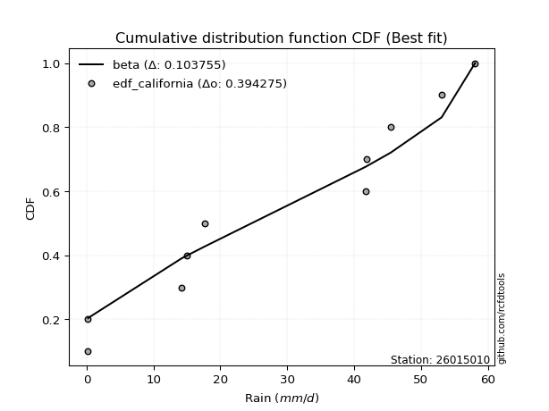</img>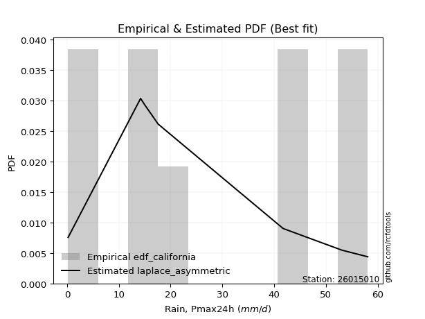</img>

</div>


### 2. Empirical - EDF Hazen (1930)

Hazen method for plotting positions is a formula used to estimate the empirical cumulative probability distribution of flood events or other hydrological data. This formula often results in biased estimations, particularly when extrapolating to extreme events (high return periods).

<div align="center">


$P=(m-0.5)/n$


</div>


**2.1. Empirical values**

<div align="center">

|                | 0                  | 1                  | 2                  | 3                  | 4                  | 5                  | 6                 | 7         | 8                 | 9                  |
|:---------------|:-------------------|:-------------------|:-------------------|:-------------------|:-------------------|:-------------------|:------------------|:----------|:------------------|:-------------------|
| date           | 2023               | 2024               | 2025               | 2016               | 2021               | 2020               | 2018              | 2022      | 2019              | 2017               |
| x              | 0.2                | 0.2                | 1.0                | 14.2               | 15.0               | 17.6               | 41.7              | 41.9      | 53.1              | 58.1               |
| m              | 1                  | 2                  | 3                  | 4                  | 5                  | 6                  | 7                 | 8         | 9                 | 10                 |
| empirical_dist | edf_hazen          | edf_hazen          | edf_hazen          | edf_hazen          | edf_hazen          | edf_hazen          | edf_hazen         | edf_hazen | edf_hazen         | edf_hazen          |
| empirical      | 0.05               | 0.15               | 0.25               | 0.35               | 0.45               | 0.55               | 0.65              | 0.75      | 0.85              | 0.95               |
| empirical_tr   | 1.0526315789473684 | 1.1764705882352942 | 1.3333333333333333 | 1.5384615384615383 | 1.8181818181818181 | 2.2222222222222223 | 2.857142857142857 | 4.0       | 6.666666666666666 | 19.999999999999982 |

</div>


**2.2. Kolmogorov-Smirnov fit test (sorted by Δ)**


<div align="center">

|                | 0                   | 1                   | 2                  | 3                  | 4                  | 5                   | 6                  | 7                   | 8                  | 9                   | 10                 | 11                  | 12                  | 13                  | 14                 | 15                  | 16                  | 17                  | 18                  | 19                 | 20                    | 21                  | 22                 | 23                 | 24                 | 25                  | 26                 | 27                  | 28                  | 29                 | 30                  | 31                  | 32                 | 33                  | 34                 | 35                 | 36                  | 37                 | 38                  | 39                 | 40                 | 41                 | 42                  | 43                  | 44                  | 45                 | 46                 | 47                  | 48                 | 49                 | 50                  | 51                 | 52                 | 53                 | 54                 | 55                 | 56                 | 57                 | 58                  | 59                  | 60                  | 61                  | 62                  | 63                  | 64                 | 65                  | 66                 | 67                 | 68                  | 69                  | 70                 | 71                  | 72                  | 73                  | 74                  | 75                 | 76                 | 77                 | 78                  | 79                 | 80                 | 81                 | 82                 | 83                 | 84                 | 85                 | 86                 | 87                 | 88                 | 89                 |
|:---------------|:--------------------|:--------------------|:-------------------|:-------------------|:-------------------|:--------------------|:-------------------|:--------------------|:-------------------|:--------------------|:-------------------|:--------------------|:--------------------|:--------------------|:-------------------|:--------------------|:--------------------|:--------------------|:--------------------|:-------------------|:----------------------|:--------------------|:-------------------|:-------------------|:-------------------|:--------------------|:-------------------|:--------------------|:--------------------|:-------------------|:--------------------|:--------------------|:-------------------|:--------------------|:-------------------|:-------------------|:--------------------|:-------------------|:--------------------|:-------------------|:-------------------|:-------------------|:--------------------|:--------------------|:--------------------|:-------------------|:-------------------|:--------------------|:-------------------|:-------------------|:--------------------|:-------------------|:-------------------|:-------------------|:-------------------|:-------------------|:-------------------|:-------------------|:--------------------|:--------------------|:--------------------|:--------------------|:--------------------|:--------------------|:-------------------|:--------------------|:-------------------|:-------------------|:--------------------|:--------------------|:-------------------|:--------------------|:--------------------|:--------------------|:--------------------|:-------------------|:-------------------|:-------------------|:--------------------|:-------------------|:-------------------|:-------------------|:-------------------|:-------------------|:-------------------|:-------------------|:-------------------|:-------------------|:-------------------|:-------------------|
| station        | 26015010            | 26015010            | 26015010           | 26015010           | 26015010           | 26015010            | 26015010           | 26015010            | 26015010           | 26015010            | 26015010           | 26015010            | 26015010            | 26015010            | 26015010           | 26015010            | 26015010            | 26015010            | 26015010            | 26015010           | 26015010              | 26015010            | 26015010           | 26015010           | 26015010           | 26015010            | 26015010           | 26015010            | 26015010            | 26015010           | 26015010            | 26015010            | 26015010           | 26015010            | 26015010           | 26015010           | 26015010            | 26015010           | 26015010            | 26015010           | 26015010           | 26015010           | 26015010            | 26015010            | 26015010            | 26015010           | 26015010           | 26015010            | 26015010           | 26015010           | 26015010            | 26015010           | 26015010           | 26015010           | 26015010           | 26015010           | 26015010           | 26015010           | 26015010            | 26015010            | 26015010            | 26015010            | 26015010            | 26015010            | 26015010           | 26015010            | 26015010           | 26015010           | 26015010            | 26015010            | 26015010           | 26015010            | 26015010            | 26015010            | 26015010            | 26015010           | 26015010           | 26015010           | 26015010            | 26015010           | 26015010           | 26015010           | 26015010           | 26015010           | 26015010           | 26015010           | 26015010           | 26015010           | 26015010           | 26015010           |
| empirical_dist | edf_hazen           | edf_hazen           | edf_hazen          | edf_hazen          | edf_hazen          | edf_hazen           | edf_hazen          | edf_hazen           | edf_hazen          | edf_hazen           | edf_hazen          | edf_hazen           | edf_hazen           | edf_hazen           | edf_hazen          | edf_hazen           | edf_hazen           | edf_hazen           | edf_hazen           | edf_hazen          | edf_hazen             | edf_hazen           | edf_hazen          | edf_hazen          | edf_hazen          | edf_hazen           | edf_hazen          | edf_hazen           | edf_hazen           | edf_hazen          | edf_hazen           | edf_hazen           | edf_hazen          | edf_hazen           | edf_hazen          | edf_hazen          | edf_hazen           | edf_hazen          | edf_hazen           | edf_hazen          | edf_hazen          | edf_hazen          | edf_hazen           | edf_hazen           | edf_hazen           | edf_hazen          | edf_hazen          | edf_hazen           | edf_hazen          | edf_hazen          | edf_hazen           | edf_hazen          | edf_hazen          | edf_hazen          | edf_hazen          | edf_hazen          | edf_hazen          | edf_hazen          | edf_hazen           | edf_hazen           | edf_hazen           | edf_hazen           | edf_hazen           | edf_hazen           | edf_hazen          | edf_hazen           | edf_hazen          | edf_hazen          | edf_hazen           | edf_hazen           | edf_hazen          | edf_hazen           | edf_hazen           | edf_hazen           | edf_hazen           | edf_hazen          | edf_hazen          | edf_hazen          | edf_hazen           | edf_hazen          | edf_hazen          | edf_hazen          | edf_hazen          | edf_hazen          | edf_hazen          | edf_hazen          | edf_hazen          | edf_hazen          | edf_hazen          | edf_hazen          |
| p_dist         | maxwell             | rayleigh            | logjohnsonsu       | halfnorm           | pearson3           | rice                | ncf                | laplace_asymmetric  | genlogistic        | kstwobign           | gumbel_r           | exponnorm           | crystalball         | norm                | t                  | moyal               | logistic            | mielke              | logweibull_min      | halflogistic       | loglaplace_asymmetric | invgauss            | logloggamma        | hypsecant          | loggumbel_l        | logpearson3         | expon              | genexpon            | gompertz            | truncnorm          | laplace             | betaprime           | gumbel_l           | nakagami            | gibrat             | wald               | weibull_min         | logexponnorm       | lognct              | logcrystalball     | lognorm            | lognorm            | logt                | logerlang           | logrice             | loggamma           | loggamma           | loglogistic         | loginvgamma        | loginvgauss        | loginvweibull       | logtruncnorm       | logalpha           | loghypsecant       | logmaxwell         | chi2               | f                  | fisk               | lograyleigh         | logncf              | logkstwobign        | loglaplace          | loggenexpon         | loghalfnorm         | loggumbel_r        | pareto              | logexpon           | loghalflogistic    | logmoyal            | logf                | logpareto          | gamma               | logfisk             | erlang              | logwald             | fatiguelife        | loggibrat          | loglognorm         | johnsonsu           | invweibull         | lognakagami        | logbetaprime       | logfatiguelife     | logchi2            | alpha              | logmielke          | loggompertz        | nct                | invgamma           | loggenlogistic     |
| delta          | 0.14720368138835804 | 0.14828573765543085 | 0.1507231120873883 | 0.1533363301271885 | 0.1554369055473046 | 0.15739416224794522 | 0.1620070713422489 | 0.16508066139978816 | 0.1693569154030281 | 0.16993123959006184 | 0.1715253516359394 | 0.17237755297290908 | 0.17364244781793986 | 0.17364246015515733 | 0.1736798984872005 | 0.18091630614539844 | 0.18909954705778748 | 0.19163727068225755 | 0.19292562290735749 | 0.1976648079089206 | 0.19816377784231753   | 0.19860748529481065 | 0.1986097416511755 | 0.201467916578408  | 0.2030412778024454 | 0.21105383867203453 | 0.2173498878945434 | 0.22081141219618605 | 0.22452547303772907 | 0.2260335675854549 | 0.22976853065118802 | 0.23400174881635938 | 0.2374099531213001 | 0.24060159968734784 | 0.25               | 0.25               | 0.25331294796044246 | 0.2607212607308924 | 0.26072202231735286 | 0.2607240747245968 | 0.2607240790478922 | 0.2607240790478922 | 0.26072419609180064 | 0.26302603948082093 | 0.26927323111282786 | 0.2716375866924251 | 0.2716375866924251 | 0.27481880290660843 | 0.2776033882187745 | 0.2800592783527176 | 0.28086254414850365 | 0.2824078105076221 | 0.2845985358690871 | 0.2862421777745223 | 0.2862803900952605 | 0.2891789400190796 | 0.2901866856140075 | 0.2918350839307391 | 0.29415669160829594 | 0.29523185150457787 | 0.30770215203302487 | 0.31406364415679755 | 0.31420329561421834 | 0.31665546302723047 | 0.3260705141015292 | 0.32947537690290307 | 0.3379254411731406 | 0.3450199579204698 | 0.34823809475675294 | 0.35492643742183094 | 0.3804657224500678 | 0.38377932939409987 | 0.39933396700468116 | 0.40260921269258787 | 0.41016616350077373 | 0.4131500317584783 | 0.4421178830209148 | 0.4708227239877427 | 0.48824606465303333 | 0.5403221249689085 | 0.5594885720355505 | 0.5790282631307274 | 0.5840638336414261 | 0.5901705585478416 | 0.6253294917659056 | 0.6436758267347382 | 0.6583626611517306 | 0.7421675120328387 | 0.7490536217152167 | 0.85               |
| deltao         | 0.3942745923300002  | 0.3942745923300002  | 0.3942745923300002 | 0.3942745923300002 | 0.3942745923300002 | 0.3942745923300002  | 0.3942745923300002 | 0.3942745923300002  | 0.3942745923300002 | 0.3942745923300002  | 0.3942745923300002 | 0.3942745923300002  | 0.3942745923300002  | 0.3942745923300002  | 0.3942745923300002 | 0.3942745923300002  | 0.3942745923300002  | 0.3942745923300002  | 0.3942745923300002  | 0.3942745923300002 | 0.3942745923300002    | 0.3942745923300002  | 0.3942745923300002 | 0.3942745923300002 | 0.3942745923300002 | 0.3942745923300002  | 0.3942745923300002 | 0.3942745923300002  | 0.3942745923300002  | 0.3942745923300002 | 0.3942745923300002  | 0.3942745923300002  | 0.3942745923300002 | 0.3942745923300002  | 0.3942745923300002 | 0.3942745923300002 | 0.3942745923300002  | 0.3942745923300002 | 0.3942745923300002  | 0.3942745923300002 | 0.3942745923300002 | 0.3942745923300002 | 0.3942745923300002  | 0.3942745923300002  | 0.3942745923300002  | 0.3942745923300002 | 0.3942745923300002 | 0.3942745923300002  | 0.3942745923300002 | 0.3942745923300002 | 0.3942745923300002  | 0.3942745923300002 | 0.3942745923300002 | 0.3942745923300002 | 0.3942745923300002 | 0.3942745923300002 | 0.3942745923300002 | 0.3942745923300002 | 0.3942745923300002  | 0.3942745923300002  | 0.3942745923300002  | 0.3942745923300002  | 0.3942745923300002  | 0.3942745923300002  | 0.3942745923300002 | 0.3942745923300002  | 0.3942745923300002 | 0.3942745923300002 | 0.3942745923300002  | 0.3942745923300002  | 0.3942745923300002 | 0.3942745923300002  | 0.3942745923300002  | 0.3942745923300002  | 0.3942745923300002  | 0.3942745923300002 | 0.3942745923300002 | 0.3942745923300002 | 0.3942745923300002  | 0.3942745923300002 | 0.3942745923300002 | 0.3942745923300002 | 0.3942745923300002 | 0.3942745923300002 | 0.3942745923300002 | 0.3942745923300002 | 0.3942745923300002 | 0.3942745923300002 | 0.3942745923300002 | 0.3942745923300002 |
| eval           | Δo > Δ              | Δo > Δ              | Δo > Δ             | Δo > Δ             | Δo > Δ             | Δo > Δ              | Δo > Δ             | Δo > Δ              | Δo > Δ             | Δo > Δ              | Δo > Δ             | Δo > Δ              | Δo > Δ              | Δo > Δ              | Δo > Δ             | Δo > Δ              | Δo > Δ              | Δo > Δ              | Δo > Δ              | Δo > Δ             | Δo > Δ                | Δo > Δ              | Δo > Δ             | Δo > Δ             | Δo > Δ             | Δo > Δ              | Δo > Δ             | Δo > Δ              | Δo > Δ              | Δo > Δ             | Δo > Δ              | Δo > Δ              | Δo > Δ             | Δo > Δ              | Δo > Δ             | Δo > Δ             | Δo > Δ              | Δo > Δ             | Δo > Δ              | Δo > Δ             | Δo > Δ             | Δo > Δ             | Δo > Δ              | Δo > Δ              | Δo > Δ              | Δo > Δ             | Δo > Δ             | Δo > Δ              | Δo > Δ             | Δo > Δ             | Δo > Δ              | Δo > Δ             | Δo > Δ             | Δo > Δ             | Δo > Δ             | Δo > Δ             | Δo > Δ             | Δo > Δ             | Δo > Δ              | Δo > Δ              | Δo > Δ              | Δo > Δ              | Δo > Δ              | Δo > Δ              | Δo > Δ             | Δo > Δ              | Δo > Δ             | Δo > Δ             | Δo > Δ              | Δo > Δ              | Δo > Δ             | Δo > Δ              | Δo <= Δ             | Δo <= Δ             | Δo <= Δ             | Δo <= Δ            | Δo <= Δ            | Δo <= Δ            | Δo <= Δ             | Δo <= Δ            | Δo <= Δ            | Δo <= Δ            | Δo <= Δ            | Δo <= Δ            | Δo <= Δ            | Δo <= Δ            | Δo <= Δ            | Δo <= Δ            | Δo <= Δ            | Δo <= Δ            |
| fit            | 1                   | 1                   | 1                  | 1                  | 1                  | 1                   | 1                  | 1                   | 1                  | 1                   | 1                  | 1                   | 1                   | 1                   | 1                  | 1                   | 1                   | 1                   | 1                   | 1                  | 1                     | 1                   | 1                  | 1                  | 1                  | 1                   | 1                  | 1                   | 1                   | 1                  | 1                   | 1                   | 1                  | 1                   | 1                  | 1                  | 1                   | 1                  | 1                   | 1                  | 1                  | 1                  | 1                   | 1                   | 1                   | 1                  | 1                  | 1                   | 1                  | 1                  | 1                   | 1                  | 1                  | 1                  | 1                  | 1                  | 1                  | 1                  | 1                   | 1                   | 1                   | 1                   | 1                   | 1                   | 1                  | 1                   | 1                  | 1                  | 1                   | 1                   | 1                  | 1                   | 0                   | 0                   | 0                   | 0                  | 0                  | 0                  | 0                   | 0                  | 0                  | 0                  | 0                  | 0                  | 0                  | 0                  | 0                  | 0                  | 0                  | 0                  |
| n              | 10                  | 10                  | 10                 | 10                 | 10                 | 10                  | 10                 | 10                  | 10                 | 10                  | 10                 | 10                  | 10                  | 10                  | 10                 | 10                  | 10                  | 10                  | 10                  | 10                 | 10                    | 10                  | 10                 | 10                 | 10                 | 10                  | 10                 | 10                  | 10                  | 10                 | 10                  | 10                  | 10                 | 10                  | 10                 | 10                 | 10                  | 10                 | 10                  | 10                 | 10                 | 10                 | 10                  | 10                  | 10                  | 10                 | 10                 | 10                  | 10                 | 10                 | 10                  | 10                 | 10                 | 10                 | 10                 | 10                 | 10                 | 10                 | 10                  | 10                  | 10                  | 10                  | 10                  | 10                  | 10                 | 10                  | 10                 | 10                 | 10                  | 10                  | 10                 | 10                  | 10                  | 10                  | 10                  | 10                 | 10                 | 10                 | 10                  | 10                 | 10                 | 10                 | 10                 | 10                 | 10                 | 10                 | 10                 | 10                 | 10                 | 10                 |
| best_fit       | 1                   | 0                   | 0                  | 0                  | 0                  | 0                   | 0                  | 0                   | 0                  | 0                   | 0                  | 0                   | 0                   | 0                   | 0                  | 0                   | 0                   | 0                   | 0                   | 0                  | 0                     | 0                   | 0                  | 0                  | 0                  | 0                   | 0                  | 0                   | 0                   | 0                  | 0                   | 0                   | 0                  | 0                   | 0                  | 0                  | 0                   | 0                  | 0                   | 0                  | 0                  | 0                  | 0                   | 0                   | 0                   | 0                  | 0                  | 0                   | 0                  | 0                  | 0                   | 0                  | 0                  | 0                  | 0                  | 0                  | 0                  | 0                  | 0                   | 0                   | 0                   | 0                   | 0                   | 0                   | 0                  | 0                   | 0                  | 0                  | 0                   | 0                   | 0                  | 0                   | 0                   | 0                   | 0                   | 0                  | 0                  | 0                  | 0                   | 0                  | 0                  | 0                  | 0                  | 0                  | 0                  | 0                  | 0                  | 0                  | 0                  | 0                  |
| best_fit_sort  | 1                   | 2                   | 3                  | 4                  | 5                  | 6                   | 7                  | 8                   | 9                  | 10                  | 11                 | 12                  | 13                  | 14                  | 15                 | 16                  | 17                  | 18                  | 19                  | 20                 | 21                    | 22                  | 23                 | 24                 | 25                 | 26                  | 27                 | 28                  | 29                  | 30                 | 31                  | 32                  | 33                 | 34                  | 35                 | 36                 | 37                  | 38                 | 39                  | 40                 | 41                 | 42                 | 43                  | 44                  | 45                  | 46                 | 47                 | 48                  | 49                 | 50                 | 51                  | 52                 | 53                 | 54                 | 55                 | 56                 | 57                 | 58                 | 59                  | 60                  | 61                  | 62                  | 63                  | 64                  | 65                 | 66                  | 67                 | 68                 | 69                  | 70                  | 71                 | 72                  | 73                  | 74                  | 75                  | 76                 | 77                 | 78                 | 79                  | 80                 | 81                 | 82                 | 83                 | 84                 | 85                 | 86                 | 87                 | 88                 | 89                 | 90                 |

</div>


<div align="center">

</img>

</div>


**2.3. Best fit**

<div align="center">

|   id |   station | empirical_dist   | p_dist   |    delta |   deltao | eval   |   fit |   n |   best_fit |   best_fit_sort |
|-----:|----------:|:-----------------|:---------|---------:|---------:|:-------|------:|----:|-----------:|----------------:|
|    0 |  26015010 | edf_hazen        | maxwell  | 0.147204 | 0.394275 | Δo > Δ |     1 |  10 |          1 |               1 |

</div>


<div align="center">

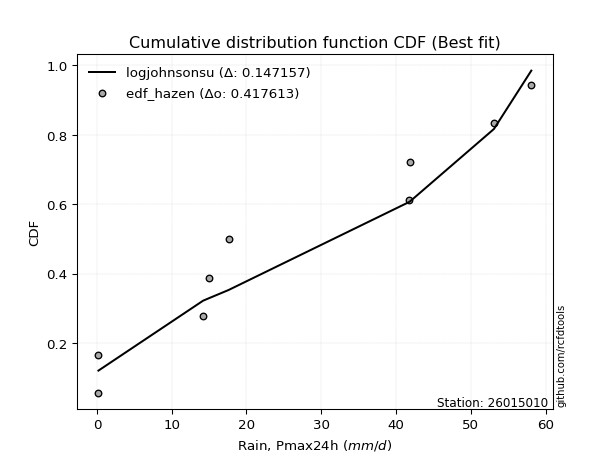</img>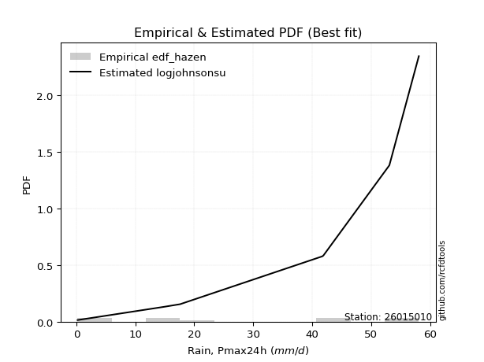</img>

</div>


### 3. Empirical - EDF Weibull (1939)

Weibull plotting position formula is an empirical method used to estimate the non-exceedance probability or plotting position for a set of observed data, is often recommended or widely used in practice, particularly in flood frequency analysis.

<div align="center">


$P=m/(n+1)$


</div>


**3.1. Empirical values**

<div align="center">

|                | 0                   | 1                   | 2                  | 3                   | 4                   | 5                  | 6                  | 7                  | 8                  | 9                  |
|:---------------|:--------------------|:--------------------|:-------------------|:--------------------|:--------------------|:-------------------|:-------------------|:-------------------|:-------------------|:-------------------|
| date           | 2023                | 2024                | 2025               | 2016                | 2021                | 2020               | 2018               | 2022               | 2019               | 2017               |
| x              | 0.2                 | 0.2                 | 1.0                | 14.2                | 15.0                | 17.6               | 41.7               | 41.9               | 53.1               | 58.1               |
| m              | 1                   | 2                   | 3                  | 4                   | 5                   | 6                  | 7                  | 8                  | 9                  | 10                 |
| empirical_dist | edf_weibull         | edf_weibull         | edf_weibull        | edf_weibull         | edf_weibull         | edf_weibull        | edf_weibull        | edf_weibull        | edf_weibull        | edf_weibull        |
| empirical      | 0.09090909090909091 | 0.18181818181818182 | 0.2727272727272727 | 0.36363636363636365 | 0.45454545454545453 | 0.5454545454545454 | 0.6363636363636364 | 0.7272727272727273 | 0.8181818181818182 | 0.9090909090909091 |
| empirical_tr   | 1.1                 | 1.2222222222222223  | 1.375              | 1.5714285714285714  | 1.8333333333333335  | 2.1999999999999997 | 2.75               | 3.666666666666667  | 5.500000000000002  | 10.999999999999996 |

</div>


**3.2. Kolmogorov-Smirnov fit test (sorted by Δ)**


<div align="center">

|                | 0                   | 1                  | 2                   | 3                   | 4                   | 5                   | 6                   | 7                  | 8                   | 9                   | 10                  | 11                  | 12                  | 13                 | 14                  | 15                 | 16                  | 17                  | 18                  | 19                  | 20                  | 21                 | 22                  | 23                    | 24                  | 25                  | 26                 | 27                 | 28                 | 29                  | 30                  | 31                 | 32                  | 33                  | 34                 | 35                  | 36                  | 37                  | 38                  | 39                  | 40                 | 41                  | 42                 | 43                 | 44                 | 45                  | 46                  | 47                  | 48                  | 49                  | 50                 | 51                 | 52                  | 53                  | 54                  | 55                 | 56                 | 57                  | 58                  | 59                 | 60                 | 61                  | 62                 | 63                 | 64                  | 65                 | 66                  | 67                  | 68                  | 69                 | 70                 | 71                  | 72                 | 73                 | 74                  | 75                  | 76                  | 77                 | 78                 | 79                  | 80                 | 81                 | 82                 | 83                 | 84                 | 85                 | 86                 | 87                 | 88                 | 89                 |
|:---------------|:--------------------|:-------------------|:--------------------|:--------------------|:--------------------|:--------------------|:--------------------|:-------------------|:--------------------|:--------------------|:--------------------|:--------------------|:--------------------|:-------------------|:--------------------|:-------------------|:--------------------|:--------------------|:--------------------|:--------------------|:--------------------|:-------------------|:--------------------|:----------------------|:--------------------|:--------------------|:-------------------|:-------------------|:-------------------|:--------------------|:--------------------|:-------------------|:--------------------|:--------------------|:-------------------|:--------------------|:--------------------|:--------------------|:--------------------|:--------------------|:-------------------|:--------------------|:-------------------|:-------------------|:-------------------|:--------------------|:--------------------|:--------------------|:--------------------|:--------------------|:-------------------|:-------------------|:--------------------|:--------------------|:--------------------|:-------------------|:-------------------|:--------------------|:--------------------|:-------------------|:-------------------|:--------------------|:-------------------|:-------------------|:--------------------|:-------------------|:--------------------|:--------------------|:--------------------|:-------------------|:-------------------|:--------------------|:-------------------|:-------------------|:--------------------|:--------------------|:--------------------|:-------------------|:-------------------|:--------------------|:-------------------|:-------------------|:-------------------|:-------------------|:-------------------|:-------------------|:-------------------|:-------------------|:-------------------|:-------------------|
| station        | 26015010            | 26015010           | 26015010            | 26015010            | 26015010            | 26015010            | 26015010            | 26015010           | 26015010            | 26015010            | 26015010            | 26015010            | 26015010            | 26015010           | 26015010            | 26015010           | 26015010            | 26015010            | 26015010            | 26015010            | 26015010            | 26015010           | 26015010            | 26015010              | 26015010            | 26015010            | 26015010           | 26015010           | 26015010           | 26015010            | 26015010            | 26015010           | 26015010            | 26015010            | 26015010           | 26015010            | 26015010            | 26015010            | 26015010            | 26015010            | 26015010           | 26015010            | 26015010           | 26015010           | 26015010           | 26015010            | 26015010            | 26015010            | 26015010            | 26015010            | 26015010           | 26015010           | 26015010            | 26015010            | 26015010            | 26015010           | 26015010           | 26015010            | 26015010            | 26015010           | 26015010           | 26015010            | 26015010           | 26015010           | 26015010            | 26015010           | 26015010            | 26015010            | 26015010            | 26015010           | 26015010           | 26015010            | 26015010           | 26015010           | 26015010            | 26015010            | 26015010            | 26015010           | 26015010           | 26015010            | 26015010           | 26015010           | 26015010           | 26015010           | 26015010           | 26015010           | 26015010           | 26015010           | 26015010           | 26015010           |
| empirical_dist | edf_weibull         | edf_weibull        | edf_weibull         | edf_weibull         | edf_weibull         | edf_weibull         | edf_weibull         | edf_weibull        | edf_weibull         | edf_weibull         | edf_weibull         | edf_weibull         | edf_weibull         | edf_weibull        | edf_weibull         | edf_weibull        | edf_weibull         | edf_weibull         | edf_weibull         | edf_weibull         | edf_weibull         | edf_weibull        | edf_weibull         | edf_weibull           | edf_weibull         | edf_weibull         | edf_weibull        | edf_weibull        | edf_weibull        | edf_weibull         | edf_weibull         | edf_weibull        | edf_weibull         | edf_weibull         | edf_weibull        | edf_weibull         | edf_weibull         | edf_weibull         | edf_weibull         | edf_weibull         | edf_weibull        | edf_weibull         | edf_weibull        | edf_weibull        | edf_weibull        | edf_weibull         | edf_weibull         | edf_weibull         | edf_weibull         | edf_weibull         | edf_weibull        | edf_weibull        | edf_weibull         | edf_weibull         | edf_weibull         | edf_weibull        | edf_weibull        | edf_weibull         | edf_weibull         | edf_weibull        | edf_weibull        | edf_weibull         | edf_weibull        | edf_weibull        | edf_weibull         | edf_weibull        | edf_weibull         | edf_weibull         | edf_weibull         | edf_weibull        | edf_weibull        | edf_weibull         | edf_weibull        | edf_weibull        | edf_weibull         | edf_weibull         | edf_weibull         | edf_weibull        | edf_weibull        | edf_weibull         | edf_weibull        | edf_weibull        | edf_weibull        | edf_weibull        | edf_weibull        | edf_weibull        | edf_weibull        | edf_weibull        | edf_weibull        | edf_weibull        |
| p_dist         | logjohnsonsu        | maxwell            | rayleigh            | pearson3            | halfnorm            | exponnorm           | crystalball         | norm               | t                   | rice                | laplace_asymmetric  | logweibull_min      | genlogistic         | kstwobign          | logistic            | ncf                | gumbel_r            | loggumbel_l         | invgauss            | hypsecant           | logpearson3         | moyal              | mielke              | loglaplace_asymmetric | logloggamma         | weibull_min         | betaprime          | halflogistic       | laplace            | nakagami            | gumbel_l            | expon              | genexpon            | logexponnorm        | lognct             | logcrystalball      | lognorm             | lognorm             | logt                | gompertz            | truncnorm          | logerlang           | fisk               | logncf             | logrice            | loggamma            | loggamma            | loglogistic         | loginvgamma         | loginvgauss         | loginvweibull      | logtruncnorm       | logalpha            | loghypsecant        | logmaxwell          | wald               | gibrat             | f                   | lograyleigh         | logkstwobign       | loglaplace         | loggenexpon         | chi2               | loghalfnorm        | loggumbel_r         | pareto             | logexpon            | loghalflogistic     | logmoyal            | logf               | logpareto          | logfisk             | gamma              | erlang             | logwald             | fatiguelife         | loggibrat           | loglognorm         | johnsonsu          | invweibull          | lognakagami        | logbetaprime       | logfatiguelife     | logchi2            | alpha              | logmielke          | loggompertz        | nct                | invgamma           | loggenlogistic     |
| delta          | 0.14617765754193368 | 0.1608400450247217 | 0.16192210129179452 | 0.16250585029574205 | 0.16697269376355217 | 0.16783209842745445 | 0.16909699327248523 | 0.1690970056097027 | 0.16913444394174587 | 0.17818443283982505 | 0.17871702503615183 | 0.17928925927099382 | 0.18299327903939178 | 0.1835676032264255 | 0.18455409251233285 | 0.1847343440695216 | 0.18516171527230307 | 0.18940491416608174 | 0.19446574670211325 | 0.19692246203295338 | 0.19741747503567086 | 0.199151420830538  | 0.20527363431862122 | 0.2118001414786812    | 0.21224610528753918 | 0.21240385705135156 | 0.2203653851799957 | 0.2203920806361933 | 0.2252230761057334 | 0.22696523605098418 | 0.23286449857584546 | 0.2400771606218161 | 0.24353868492345876 | 0.24708489709452874 | 0.2470856586809892 | 0.24708771108823313 | 0.24708771541152852 | 0.24708771541152852 | 0.24708783245543697 | 0.24725274576500178 | 0.2487608403127276 | 0.24938967584445726 | 0.2509259930216482 | 0.254322760595487  | 0.2556368674764642 | 0.25800122305606144 | 0.25800122305606144 | 0.26118243927024476 | 0.26396702458241084 | 0.26642291471635393 | 0.26722618051214   | 0.2687714468712584 | 0.27096217223272345 | 0.27260581413815865 | 0.27264402645889685 | 0.2727272727272727 | 0.2727272727272727 | 0.27655032197764384 | 0.28052032797193227 | 0.2940657883966612 | 0.3004272805204339 | 0.30056693197785467 | 0.3028153036554433 | 0.3030190993908668 | 0.31243415046516554 | 0.3158390132665394 | 0.32428907753677694 | 0.33138359428410613 | 0.33460173112038927 | 0.3412900737854673 | 0.3577384497227951 | 0.35842487609559026 | 0.3701429657577362 | 0.3889728490562242 | 0.39652979986441006 | 0.39951366812211464 | 0.42848151938455115 | 0.4299136330786518 | 0.4655187919257606 | 0.49941303405981763 | 0.5370048412103035 | 0.5563009904034547 | 0.5704274700050624 | 0.576534194911478  | 0.6116931281295419 | 0.6209485540074655 | 0.6356353884244579 | 0.719440239305566  | 0.726326348987944  | 0.8181818181818182 |
| deltao         | 0.3942745923300002  | 0.3942745923300002 | 0.3942745923300002  | 0.3942745923300002  | 0.3942745923300002  | 0.3942745923300002  | 0.3942745923300002  | 0.3942745923300002 | 0.3942745923300002  | 0.3942745923300002  | 0.3942745923300002  | 0.3942745923300002  | 0.3942745923300002  | 0.3942745923300002 | 0.3942745923300002  | 0.3942745923300002 | 0.3942745923300002  | 0.3942745923300002  | 0.3942745923300002  | 0.3942745923300002  | 0.3942745923300002  | 0.3942745923300002 | 0.3942745923300002  | 0.3942745923300002    | 0.3942745923300002  | 0.3942745923300002  | 0.3942745923300002 | 0.3942745923300002 | 0.3942745923300002 | 0.3942745923300002  | 0.3942745923300002  | 0.3942745923300002 | 0.3942745923300002  | 0.3942745923300002  | 0.3942745923300002 | 0.3942745923300002  | 0.3942745923300002  | 0.3942745923300002  | 0.3942745923300002  | 0.3942745923300002  | 0.3942745923300002 | 0.3942745923300002  | 0.3942745923300002 | 0.3942745923300002 | 0.3942745923300002 | 0.3942745923300002  | 0.3942745923300002  | 0.3942745923300002  | 0.3942745923300002  | 0.3942745923300002  | 0.3942745923300002 | 0.3942745923300002 | 0.3942745923300002  | 0.3942745923300002  | 0.3942745923300002  | 0.3942745923300002 | 0.3942745923300002 | 0.3942745923300002  | 0.3942745923300002  | 0.3942745923300002 | 0.3942745923300002 | 0.3942745923300002  | 0.3942745923300002 | 0.3942745923300002 | 0.3942745923300002  | 0.3942745923300002 | 0.3942745923300002  | 0.3942745923300002  | 0.3942745923300002  | 0.3942745923300002 | 0.3942745923300002 | 0.3942745923300002  | 0.3942745923300002 | 0.3942745923300002 | 0.3942745923300002  | 0.3942745923300002  | 0.3942745923300002  | 0.3942745923300002 | 0.3942745923300002 | 0.3942745923300002  | 0.3942745923300002 | 0.3942745923300002 | 0.3942745923300002 | 0.3942745923300002 | 0.3942745923300002 | 0.3942745923300002 | 0.3942745923300002 | 0.3942745923300002 | 0.3942745923300002 | 0.3942745923300002 |
| eval           | Δo > Δ              | Δo > Δ             | Δo > Δ              | Δo > Δ              | Δo > Δ              | Δo > Δ              | Δo > Δ              | Δo > Δ             | Δo > Δ              | Δo > Δ              | Δo > Δ              | Δo > Δ              | Δo > Δ              | Δo > Δ             | Δo > Δ              | Δo > Δ             | Δo > Δ              | Δo > Δ              | Δo > Δ              | Δo > Δ              | Δo > Δ              | Δo > Δ             | Δo > Δ              | Δo > Δ                | Δo > Δ              | Δo > Δ              | Δo > Δ             | Δo > Δ             | Δo > Δ             | Δo > Δ              | Δo > Δ              | Δo > Δ             | Δo > Δ              | Δo > Δ              | Δo > Δ             | Δo > Δ              | Δo > Δ              | Δo > Δ              | Δo > Δ              | Δo > Δ              | Δo > Δ             | Δo > Δ              | Δo > Δ             | Δo > Δ             | Δo > Δ             | Δo > Δ              | Δo > Δ              | Δo > Δ              | Δo > Δ              | Δo > Δ              | Δo > Δ             | Δo > Δ             | Δo > Δ              | Δo > Δ              | Δo > Δ              | Δo > Δ             | Δo > Δ             | Δo > Δ              | Δo > Δ              | Δo > Δ             | Δo > Δ             | Δo > Δ              | Δo > Δ             | Δo > Δ             | Δo > Δ              | Δo > Δ             | Δo > Δ              | Δo > Δ              | Δo > Δ              | Δo > Δ             | Δo > Δ             | Δo > Δ              | Δo > Δ             | Δo > Δ             | Δo <= Δ             | Δo <= Δ             | Δo <= Δ             | Δo <= Δ            | Δo <= Δ            | Δo <= Δ             | Δo <= Δ            | Δo <= Δ            | Δo <= Δ            | Δo <= Δ            | Δo <= Δ            | Δo <= Δ            | Δo <= Δ            | Δo <= Δ            | Δo <= Δ            | Δo <= Δ            |
| fit            | 1                   | 1                  | 1                   | 1                   | 1                   | 1                   | 1                   | 1                  | 1                   | 1                   | 1                   | 1                   | 1                   | 1                  | 1                   | 1                  | 1                   | 1                   | 1                   | 1                   | 1                   | 1                  | 1                   | 1                     | 1                   | 1                   | 1                  | 1                  | 1                  | 1                   | 1                   | 1                  | 1                   | 1                   | 1                  | 1                   | 1                   | 1                   | 1                   | 1                   | 1                  | 1                   | 1                  | 1                  | 1                  | 1                   | 1                   | 1                   | 1                   | 1                   | 1                  | 1                  | 1                   | 1                   | 1                   | 1                  | 1                  | 1                   | 1                   | 1                  | 1                  | 1                   | 1                  | 1                  | 1                   | 1                  | 1                   | 1                   | 1                   | 1                  | 1                  | 1                   | 1                  | 1                  | 0                   | 0                   | 0                   | 0                  | 0                  | 0                   | 0                  | 0                  | 0                  | 0                  | 0                  | 0                  | 0                  | 0                  | 0                  | 0                  |
| n              | 10                  | 10                 | 10                  | 10                  | 10                  | 10                  | 10                  | 10                 | 10                  | 10                  | 10                  | 10                  | 10                  | 10                 | 10                  | 10                 | 10                  | 10                  | 10                  | 10                  | 10                  | 10                 | 10                  | 10                    | 10                  | 10                  | 10                 | 10                 | 10                 | 10                  | 10                  | 10                 | 10                  | 10                  | 10                 | 10                  | 10                  | 10                  | 10                  | 10                  | 10                 | 10                  | 10                 | 10                 | 10                 | 10                  | 10                  | 10                  | 10                  | 10                  | 10                 | 10                 | 10                  | 10                  | 10                  | 10                 | 10                 | 10                  | 10                  | 10                 | 10                 | 10                  | 10                 | 10                 | 10                  | 10                 | 10                  | 10                  | 10                  | 10                 | 10                 | 10                  | 10                 | 10                 | 10                  | 10                  | 10                  | 10                 | 10                 | 10                  | 10                 | 10                 | 10                 | 10                 | 10                 | 10                 | 10                 | 10                 | 10                 | 10                 |
| best_fit       | 1                   | 0                  | 0                   | 0                   | 0                   | 0                   | 0                   | 0                  | 0                   | 0                   | 0                   | 0                   | 0                   | 0                  | 0                   | 0                  | 0                   | 0                   | 0                   | 0                   | 0                   | 0                  | 0                   | 0                     | 0                   | 0                   | 0                  | 0                  | 0                  | 0                   | 0                   | 0                  | 0                   | 0                   | 0                  | 0                   | 0                   | 0                   | 0                   | 0                   | 0                  | 0                   | 0                  | 0                  | 0                  | 0                   | 0                   | 0                   | 0                   | 0                   | 0                  | 0                  | 0                   | 0                   | 0                   | 0                  | 0                  | 0                   | 0                   | 0                  | 0                  | 0                   | 0                  | 0                  | 0                   | 0                  | 0                   | 0                   | 0                   | 0                  | 0                  | 0                   | 0                  | 0                  | 0                   | 0                   | 0                   | 0                  | 0                  | 0                   | 0                  | 0                  | 0                  | 0                  | 0                  | 0                  | 0                  | 0                  | 0                  | 0                  |
| best_fit_sort  | 1                   | 2                  | 3                   | 4                   | 5                   | 6                   | 7                   | 8                  | 9                   | 10                  | 11                  | 12                  | 13                  | 14                 | 15                  | 16                 | 17                  | 18                  | 19                  | 20                  | 21                  | 22                 | 23                  | 24                    | 25                  | 26                  | 27                 | 28                 | 29                 | 30                  | 31                  | 32                 | 33                  | 34                  | 35                 | 36                  | 37                  | 38                  | 39                  | 40                  | 41                 | 42                  | 43                 | 44                 | 45                 | 46                  | 47                  | 48                  | 49                  | 50                  | 51                 | 52                 | 53                  | 54                  | 55                  | 56                 | 57                 | 58                  | 59                  | 60                 | 61                 | 62                  | 63                 | 64                 | 65                  | 66                 | 67                  | 68                  | 69                  | 70                 | 71                 | 72                  | 73                 | 74                 | 75                  | 76                  | 77                  | 78                 | 79                 | 80                  | 81                 | 82                 | 83                 | 84                 | 85                 | 86                 | 87                 | 88                 | 89                 | 90                 |

</div>


<div align="center">

</img>

</div>


**3.3. Best fit**

<div align="center">

|   id |   station | empirical_dist   | p_dist       |    delta |   deltao | eval   |   fit |   n |   best_fit |   best_fit_sort |
|-----:|----------:|:-----------------|:-------------|---------:|---------:|:-------|------:|----:|-----------:|----------------:|
|    0 |  26015010 | edf_weibull      | logjohnsonsu | 0.146178 | 0.394275 | Δo > Δ |     1 |  10 |          1 |               1 |

</div>


<div align="center">

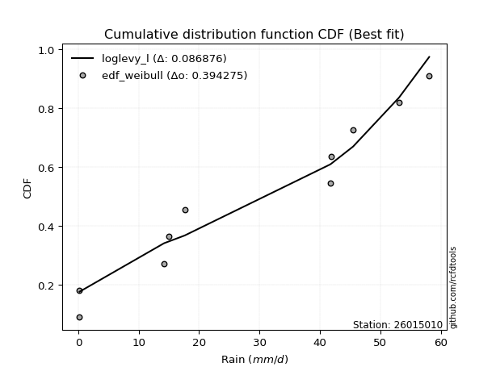</img>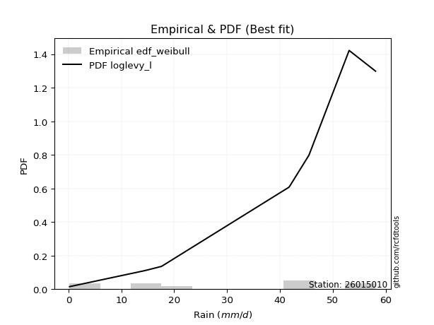</img>

</div>


### 4. Empirical - EDF Beard (1943)

The Beard formula (or Beard´s plotting position formula) in hydrology is used to estimate the empirical non-exceedance probability _(P)_ of a flood event (or other extreme hydrological data point) within a given dataset.

<div align="center">


$P=(m-0.31)/(n+0.38)$


</div>


**4.1. Empirical values**

<div align="center">

|                | 0                   | 1                   | 2                  | 3                   | 4                   | 5                  | 6                  | 7                  | 8                  | 9                  |
|:---------------|:--------------------|:--------------------|:-------------------|:--------------------|:--------------------|:-------------------|:-------------------|:-------------------|:-------------------|:-------------------|
| date           | 2023                | 2024                | 2025               | 2016                | 2021                | 2020               | 2018               | 2022               | 2019               | 2017               |
| x              | 0.2                 | 0.2                 | 1.0                | 14.2                | 15.0                | 17.6               | 41.7               | 41.9               | 53.1               | 58.1               |
| m              | 1                   | 2                   | 3                  | 4                   | 5                   | 6                  | 7                  | 8                  | 9                  | 10                 |
| empirical_dist | edf_beard           | edf_beard           | edf_beard          | edf_beard           | edf_beard           | edf_beard          | edf_beard          | edf_beard          | edf_beard          | edf_beard          |
| empirical      | 0.06647398843930635 | 0.16281310211946048 | 0.2591522157996146 | 0.35549132947976875 | 0.45183044315992293 | 0.5481695568400771 | 0.6445086705202312 | 0.7408477842003853 | 0.8371868978805393 | 0.9335260115606935 |
| empirical_tr   | 1.0712074303405574  | 1.1944764096662832  | 1.3498049414824447 | 1.5515695067264574  | 1.8242530755711774  | 2.213219616204691  | 2.813008130081301  | 3.8587360594795537 | 6.142011834319521  | 15.043478260869529 |

</div>


**4.2. Kolmogorov-Smirnov fit test (sorted by Δ)**


<div align="center">

|                | 0                   | 1                   | 2                   | 3                  | 4                   | 5                   | 6                  | 7                  | 8                   | 9                   | 10                  | 11                  | 12                  | 13                  | 14                  | 15                  | 16                 | 17                  | 18                  | 19                  | 20                  | 21                  | 22                    | 23                  | 24                  | 25                  | 26                  | 27                  | 28                 | 29                  | 30                 | 31                  | 32                 | 33                 | 34                  | 35                  | 36                 | 37                  | 38                 | 39                 | 40                 | 41                  | 42                 | 43                 | 44                 | 45                  | 46                  | 47                  | 48                  | 49                  | 50                 | 51                 | 52                 | 53                 | 54                  | 55                  | 56                  | 57                  | 58                  | 59                  | 60                 | 61                 | 62                  | 63                 | 64                  | 65                 | 66                  | 67                  | 68                  | 69                 | 70                 | 71                 | 72                 | 73                 | 74                  | 75                  | 76                  | 77                  | 78                 | 79                 | 80                 | 81                 | 82                 | 83                 | 84                 | 85                 | 86                 | 87                 | 88                 | 89                 |
|:---------------|:--------------------|:--------------------|:--------------------|:-------------------|:--------------------|:--------------------|:-------------------|:-------------------|:--------------------|:--------------------|:--------------------|:--------------------|:--------------------|:--------------------|:--------------------|:--------------------|:-------------------|:--------------------|:--------------------|:--------------------|:--------------------|:--------------------|:----------------------|:--------------------|:--------------------|:--------------------|:--------------------|:--------------------|:-------------------|:--------------------|:-------------------|:--------------------|:-------------------|:-------------------|:--------------------|:--------------------|:-------------------|:--------------------|:-------------------|:-------------------|:-------------------|:--------------------|:-------------------|:-------------------|:-------------------|:--------------------|:--------------------|:--------------------|:--------------------|:--------------------|:-------------------|:-------------------|:-------------------|:-------------------|:--------------------|:--------------------|:--------------------|:--------------------|:--------------------|:--------------------|:-------------------|:-------------------|:--------------------|:-------------------|:--------------------|:-------------------|:--------------------|:--------------------|:--------------------|:-------------------|:-------------------|:-------------------|:-------------------|:-------------------|:--------------------|:--------------------|:--------------------|:--------------------|:-------------------|:-------------------|:-------------------|:-------------------|:-------------------|:-------------------|:-------------------|:-------------------|:-------------------|:-------------------|:-------------------|:-------------------|
| station        | 26015010            | 26015010            | 26015010            | 26015010           | 26015010            | 26015010            | 26015010           | 26015010           | 26015010            | 26015010            | 26015010            | 26015010            | 26015010            | 26015010            | 26015010            | 26015010            | 26015010           | 26015010            | 26015010            | 26015010            | 26015010            | 26015010            | 26015010              | 26015010            | 26015010            | 26015010            | 26015010            | 26015010            | 26015010           | 26015010            | 26015010           | 26015010            | 26015010           | 26015010           | 26015010            | 26015010            | 26015010           | 26015010            | 26015010           | 26015010           | 26015010           | 26015010            | 26015010           | 26015010           | 26015010           | 26015010            | 26015010            | 26015010            | 26015010            | 26015010            | 26015010           | 26015010           | 26015010           | 26015010           | 26015010            | 26015010            | 26015010            | 26015010            | 26015010            | 26015010            | 26015010           | 26015010           | 26015010            | 26015010           | 26015010            | 26015010           | 26015010            | 26015010            | 26015010            | 26015010           | 26015010           | 26015010           | 26015010           | 26015010           | 26015010            | 26015010            | 26015010            | 26015010            | 26015010           | 26015010           | 26015010           | 26015010           | 26015010           | 26015010           | 26015010           | 26015010           | 26015010           | 26015010           | 26015010           | 26015010           |
| empirical_dist | edf_beard           | edf_beard           | edf_beard           | edf_beard          | edf_beard           | edf_beard           | edf_beard          | edf_beard          | edf_beard           | edf_beard           | edf_beard           | edf_beard           | edf_beard           | edf_beard           | edf_beard           | edf_beard           | edf_beard          | edf_beard           | edf_beard           | edf_beard           | edf_beard           | edf_beard           | edf_beard             | edf_beard           | edf_beard           | edf_beard           | edf_beard           | edf_beard           | edf_beard          | edf_beard           | edf_beard          | edf_beard           | edf_beard          | edf_beard          | edf_beard           | edf_beard           | edf_beard          | edf_beard           | edf_beard          | edf_beard          | edf_beard          | edf_beard           | edf_beard          | edf_beard          | edf_beard          | edf_beard           | edf_beard           | edf_beard           | edf_beard           | edf_beard           | edf_beard          | edf_beard          | edf_beard          | edf_beard          | edf_beard           | edf_beard           | edf_beard           | edf_beard           | edf_beard           | edf_beard           | edf_beard          | edf_beard          | edf_beard           | edf_beard          | edf_beard           | edf_beard          | edf_beard           | edf_beard           | edf_beard           | edf_beard          | edf_beard          | edf_beard          | edf_beard          | edf_beard          | edf_beard           | edf_beard           | edf_beard           | edf_beard           | edf_beard          | edf_beard          | edf_beard          | edf_beard          | edf_beard          | edf_beard          | edf_beard          | edf_beard          | edf_beard          | edf_beard          | edf_beard          | edf_beard          |
| p_dist         | logjohnsonsu        | maxwell             | rayleigh            | pearson3           | halfnorm            | rice                | exponnorm          | laplace_asymmetric | ncf                 | crystalball         | norm                | t                   | genlogistic         | kstwobign           | gumbel_r            | moyal               | logistic           | logweibull_min      | invgauss            | mielke              | loggumbel_l         | hypsecant           | loglaplace_asymmetric | logloggamma         | logpearson3         | halflogistic        | expon               | laplace             | betaprime          | genexpon            | gompertz           | nakagami            | truncnorm          | gumbel_l           | weibull_min         | logexponnorm        | lognct             | logcrystalball      | lognorm            | lognorm            | logt               | logerlang           | wald               | gibrat             | logrice            | loggamma            | loggamma            | loglogistic         | loginvgamma         | loginvgauss         | fisk               | loginvweibull      | logtruncnorm       | logncf             | logalpha            | loghypsecant        | logmaxwell          | f                   | lograyleigh         | chi2                | logkstwobign       | loglaplace         | loggenexpon         | loghalfnorm        | loggumbel_r         | pareto             | logexpon            | loghalflogistic     | logmoyal            | logf               | logpareto          | gamma              | logfisk            | erlang             | logwald             | fatiguelife         | loggibrat           | loglognorm          | johnsonsu          | invweibull         | lognakagami        | logbetaprime       | logfatiguelife     | logchi2            | alpha              | logmielke          | loggompertz        | nct                | invgamma           | loggenlogistic     |
| delta          | 0.14889266892746533 | 0.15269501086812687 | 0.15377706713519967 | 0.1543608161391472 | 0.15882765960695733 | 0.16460937591216696 | 0.1705471098129861 | 0.170571990879557  | 0.17115928714186351 | 0.17181200465801688 | 0.17181201699523435 | 0.17184945532727752 | 0.17484824488279693 | 0.17542256906983067 | 0.17701668111570823 | 0.18640763562516727 | 0.1872691038978645 | 0.18743429342758872 | 0.19311615581504188 | 0.19712860016202638 | 0.19754994832267664 | 0.19963747341848503 | 0.20365510732208636   | 0.20410107113094433 | 0.20556250919226576 | 0.20681702370853522 | 0.22650210369415802 | 0.22793808749126504 | 0.2285104193365906 | 0.22996362799580067 | 0.2336776888373437 | 0.23511027020757908 | 0.2351857833850695 | 0.2355795099613771 | 0.23683895952113598 | 0.25522993125112364 | 0.2552306928375841 | 0.25523274524482803 | 0.2552327495681234 | 0.2552327495681234 | 0.2552328666120319 | 0.25753471000105216 | 0.2591522157996146 | 0.2591522157996146 | 0.2637819016330591 | 0.26614625721265633 | 0.26614625721265633 | 0.26932747342683966 | 0.27211205873900574 | 0.27456794887294883 | 0.2753610954914326 | 0.2753712146687349 | 0.2769164810278533 | 0.2787578630652714 | 0.27910720638931835 | 0.28075084829475355 | 0.28078906061549175 | 0.28469535613423874 | 0.28866536212852717 | 0.29467026949884845 | 0.3022108225532561 | 0.3085723146770288 | 0.30871196613444957 | 0.3111641335474617 | 0.32057918462176044 | 0.3239840474231343 | 0.33243411169337184 | 0.33952862844070103 | 0.34274676527698417 | 0.3494351079420622 | 0.3713135066504532 | 0.3782879999143311 | 0.3828599785653747 | 0.3971178832128191 | 0.40467483402100496 | 0.40765870227870954 | 0.43662655354114605 | 0.45434873554843624 | 0.4790938488534187 | 0.523848136529602  | 0.5503363562359358 | 0.5698760473311129 | 0.5785725041616574 | 0.5846792290680729 | 0.6198381622861369 | 0.6345236109351235 | 0.6492104453521159 | 0.7330152962332241 | 0.7399014059156022 | 0.8371868978805393 |
| deltao         | 0.3942745923300002  | 0.3942745923300002  | 0.3942745923300002  | 0.3942745923300002 | 0.3942745923300002  | 0.3942745923300002  | 0.3942745923300002 | 0.3942745923300002 | 0.3942745923300002  | 0.3942745923300002  | 0.3942745923300002  | 0.3942745923300002  | 0.3942745923300002  | 0.3942745923300002  | 0.3942745923300002  | 0.3942745923300002  | 0.3942745923300002 | 0.3942745923300002  | 0.3942745923300002  | 0.3942745923300002  | 0.3942745923300002  | 0.3942745923300002  | 0.3942745923300002    | 0.3942745923300002  | 0.3942745923300002  | 0.3942745923300002  | 0.3942745923300002  | 0.3942745923300002  | 0.3942745923300002 | 0.3942745923300002  | 0.3942745923300002 | 0.3942745923300002  | 0.3942745923300002 | 0.3942745923300002 | 0.3942745923300002  | 0.3942745923300002  | 0.3942745923300002 | 0.3942745923300002  | 0.3942745923300002 | 0.3942745923300002 | 0.3942745923300002 | 0.3942745923300002  | 0.3942745923300002 | 0.3942745923300002 | 0.3942745923300002 | 0.3942745923300002  | 0.3942745923300002  | 0.3942745923300002  | 0.3942745923300002  | 0.3942745923300002  | 0.3942745923300002 | 0.3942745923300002 | 0.3942745923300002 | 0.3942745923300002 | 0.3942745923300002  | 0.3942745923300002  | 0.3942745923300002  | 0.3942745923300002  | 0.3942745923300002  | 0.3942745923300002  | 0.3942745923300002 | 0.3942745923300002 | 0.3942745923300002  | 0.3942745923300002 | 0.3942745923300002  | 0.3942745923300002 | 0.3942745923300002  | 0.3942745923300002  | 0.3942745923300002  | 0.3942745923300002 | 0.3942745923300002 | 0.3942745923300002 | 0.3942745923300002 | 0.3942745923300002 | 0.3942745923300002  | 0.3942745923300002  | 0.3942745923300002  | 0.3942745923300002  | 0.3942745923300002 | 0.3942745923300002 | 0.3942745923300002 | 0.3942745923300002 | 0.3942745923300002 | 0.3942745923300002 | 0.3942745923300002 | 0.3942745923300002 | 0.3942745923300002 | 0.3942745923300002 | 0.3942745923300002 | 0.3942745923300002 |
| eval           | Δo > Δ              | Δo > Δ              | Δo > Δ              | Δo > Δ             | Δo > Δ              | Δo > Δ              | Δo > Δ             | Δo > Δ             | Δo > Δ              | Δo > Δ              | Δo > Δ              | Δo > Δ              | Δo > Δ              | Δo > Δ              | Δo > Δ              | Δo > Δ              | Δo > Δ             | Δo > Δ              | Δo > Δ              | Δo > Δ              | Δo > Δ              | Δo > Δ              | Δo > Δ                | Δo > Δ              | Δo > Δ              | Δo > Δ              | Δo > Δ              | Δo > Δ              | Δo > Δ             | Δo > Δ              | Δo > Δ             | Δo > Δ              | Δo > Δ             | Δo > Δ             | Δo > Δ              | Δo > Δ              | Δo > Δ             | Δo > Δ              | Δo > Δ             | Δo > Δ             | Δo > Δ             | Δo > Δ              | Δo > Δ             | Δo > Δ             | Δo > Δ             | Δo > Δ              | Δo > Δ              | Δo > Δ              | Δo > Δ              | Δo > Δ              | Δo > Δ             | Δo > Δ             | Δo > Δ             | Δo > Δ             | Δo > Δ              | Δo > Δ              | Δo > Δ              | Δo > Δ              | Δo > Δ              | Δo > Δ              | Δo > Δ             | Δo > Δ             | Δo > Δ              | Δo > Δ             | Δo > Δ              | Δo > Δ             | Δo > Δ              | Δo > Δ              | Δo > Δ              | Δo > Δ             | Δo > Δ             | Δo > Δ             | Δo > Δ             | Δo <= Δ            | Δo <= Δ             | Δo <= Δ             | Δo <= Δ             | Δo <= Δ             | Δo <= Δ            | Δo <= Δ            | Δo <= Δ            | Δo <= Δ            | Δo <= Δ            | Δo <= Δ            | Δo <= Δ            | Δo <= Δ            | Δo <= Δ            | Δo <= Δ            | Δo <= Δ            | Δo <= Δ            |
| fit            | 1                   | 1                   | 1                   | 1                  | 1                   | 1                   | 1                  | 1                  | 1                   | 1                   | 1                   | 1                   | 1                   | 1                   | 1                   | 1                   | 1                  | 1                   | 1                   | 1                   | 1                   | 1                   | 1                     | 1                   | 1                   | 1                   | 1                   | 1                   | 1                  | 1                   | 1                  | 1                   | 1                  | 1                  | 1                   | 1                   | 1                  | 1                   | 1                  | 1                  | 1                  | 1                   | 1                  | 1                  | 1                  | 1                   | 1                   | 1                   | 1                   | 1                   | 1                  | 1                  | 1                  | 1                  | 1                   | 1                   | 1                   | 1                   | 1                   | 1                   | 1                  | 1                  | 1                   | 1                  | 1                   | 1                  | 1                   | 1                   | 1                   | 1                  | 1                  | 1                  | 1                  | 0                  | 0                   | 0                   | 0                   | 0                   | 0                  | 0                  | 0                  | 0                  | 0                  | 0                  | 0                  | 0                  | 0                  | 0                  | 0                  | 0                  |
| n              | 10                  | 10                  | 10                  | 10                 | 10                  | 10                  | 10                 | 10                 | 10                  | 10                  | 10                  | 10                  | 10                  | 10                  | 10                  | 10                  | 10                 | 10                  | 10                  | 10                  | 10                  | 10                  | 10                    | 10                  | 10                  | 10                  | 10                  | 10                  | 10                 | 10                  | 10                 | 10                  | 10                 | 10                 | 10                  | 10                  | 10                 | 10                  | 10                 | 10                 | 10                 | 10                  | 10                 | 10                 | 10                 | 10                  | 10                  | 10                  | 10                  | 10                  | 10                 | 10                 | 10                 | 10                 | 10                  | 10                  | 10                  | 10                  | 10                  | 10                  | 10                 | 10                 | 10                  | 10                 | 10                  | 10                 | 10                  | 10                  | 10                  | 10                 | 10                 | 10                 | 10                 | 10                 | 10                  | 10                  | 10                  | 10                  | 10                 | 10                 | 10                 | 10                 | 10                 | 10                 | 10                 | 10                 | 10                 | 10                 | 10                 | 10                 |
| best_fit       | 1                   | 0                   | 0                   | 0                  | 0                   | 0                   | 0                  | 0                  | 0                   | 0                   | 0                   | 0                   | 0                   | 0                   | 0                   | 0                   | 0                  | 0                   | 0                   | 0                   | 0                   | 0                   | 0                     | 0                   | 0                   | 0                   | 0                   | 0                   | 0                  | 0                   | 0                  | 0                   | 0                  | 0                  | 0                   | 0                   | 0                  | 0                   | 0                  | 0                  | 0                  | 0                   | 0                  | 0                  | 0                  | 0                   | 0                   | 0                   | 0                   | 0                   | 0                  | 0                  | 0                  | 0                  | 0                   | 0                   | 0                   | 0                   | 0                   | 0                   | 0                  | 0                  | 0                   | 0                  | 0                   | 0                  | 0                   | 0                   | 0                   | 0                  | 0                  | 0                  | 0                  | 0                  | 0                   | 0                   | 0                   | 0                   | 0                  | 0                  | 0                  | 0                  | 0                  | 0                  | 0                  | 0                  | 0                  | 0                  | 0                  | 0                  |
| best_fit_sort  | 1                   | 2                   | 3                   | 4                  | 5                   | 6                   | 7                  | 8                  | 9                   | 10                  | 11                  | 12                  | 13                  | 14                  | 15                  | 16                  | 17                 | 18                  | 19                  | 20                  | 21                  | 22                  | 23                    | 24                  | 25                  | 26                  | 27                  | 28                  | 29                 | 30                  | 31                 | 32                  | 33                 | 34                 | 35                  | 36                  | 37                 | 38                  | 39                 | 40                 | 41                 | 42                  | 43                 | 44                 | 45                 | 46                  | 47                  | 48                  | 49                  | 50                  | 51                 | 52                 | 53                 | 54                 | 55                  | 56                  | 57                  | 58                  | 59                  | 60                  | 61                 | 62                 | 63                  | 64                 | 65                  | 66                 | 67                  | 68                  | 69                  | 70                 | 71                 | 72                 | 73                 | 74                 | 75                  | 76                  | 77                  | 78                  | 79                 | 80                 | 81                 | 82                 | 83                 | 84                 | 85                 | 86                 | 87                 | 88                 | 89                 | 90                 |

</div>


<div align="center">

</img>

</div>


**4.3. Best fit**

<div align="center">

|   id |   station | empirical_dist   | p_dist       |    delta |   deltao | eval   |   fit |   n |   best_fit |   best_fit_sort |
|-----:|----------:|:-----------------|:-------------|---------:|---------:|:-------|------:|----:|-----------:|----------------:|
|    0 |  26015010 | edf_beard        | logjohnsonsu | 0.148893 | 0.394275 | Δo > Δ |     1 |  10 |          1 |               1 |

</div>


<div align="center">

</img>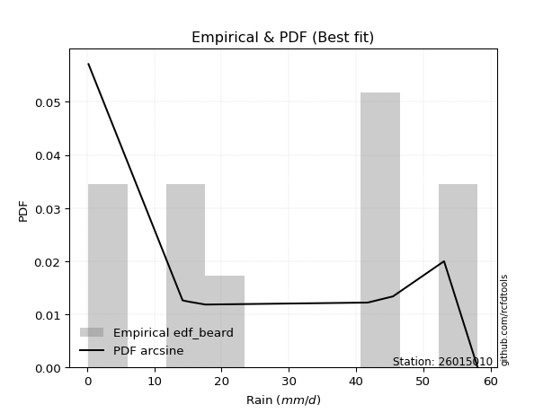</img>

</div>


### 5. Empirical - EDF Chegodayev (1955)

The Chegodayev formula is an empirical plotting position formula used in hydrological frequency analysis to estimate the exceedance probability or return period of a specific event from a set of observed data. It is primarily used for plotting observed data points on probability paper to fit a theoretical distribution, particularly for analyzing extreme events like maximum flood flows or rainfall intensities. The constant _b_ value in the generalized plotting position formula is 0.3.

<div align="center">


$P=(m-b)/(n+1-2b)$


</div>


**5.1. Empirical values**

<div align="center">

|                | 0                  | 1                   | 2                   | 3                  | 4                  | 5                  | 6                  | 7                  | 8                  | 9                  |
|:---------------|:-------------------|:--------------------|:--------------------|:-------------------|:-------------------|:-------------------|:-------------------|:-------------------|:-------------------|:-------------------|
| date           | 2023               | 2024                | 2025                | 2016               | 2021               | 2020               | 2018               | 2022               | 2019               | 2017               |
| x              | 0.2                | 0.2                 | 1.0                 | 14.2               | 15.0               | 17.6               | 41.7               | 41.9               | 53.1               | 58.1               |
| m              | 1                  | 2                   | 3                   | 4                  | 5                  | 6                  | 7                  | 8                  | 9                  | 10                 |
| empirical_dist | edf_chegodayev     | edf_chegodayev      | edf_chegodayev      | edf_chegodayev     | edf_chegodayev     | edf_chegodayev     | edf_chegodayev     | edf_chegodayev     | edf_chegodayev     | edf_chegodayev     |
| empirical      | 0.0673076923076923 | 0.16346153846153846 | 0.25961538461538464 | 0.3557692307692308 | 0.4519230769230769 | 0.5480769230769231 | 0.6442307692307693 | 0.7403846153846154 | 0.8365384615384615 | 0.9326923076923076 |
| empirical_tr   | 1.0721649484536082 | 1.1954022988505746  | 1.3506493506493507  | 1.5522388059701495 | 1.8245614035087718 | 2.2127659574468086 | 2.810810810810811  | 3.8518518518518525 | 6.117647058823526  | 14.857142857142836 |

</div>


**5.2. Kolmogorov-Smirnov fit test (sorted by Δ)**


<div align="center">

|                | 0                  | 1                  | 2                  | 3                   | 4                   | 5                   | 6                   | 7                  | 8                   | 9                   | 10                 | 11                  | 12                  | 13                 | 14                  | 15                 | 16                  | 17                  | 18                  | 19                 | 20                 | 21                 | 22                    | 23                  | 24                  | 25                  | 26                  | 27                 | 28                  | 29                 | 30                 | 31                  | 32                  | 33                  | 34                 | 35                 | 36                  | 37                 | 38                 | 39                 | 40                  | 41                 | 42                  | 43                  | 44                  | 45                 | 46                 | 47                 | 48                 | 49                 | 50                  | 51                  | 52                 | 53                 | 54                 | 55                 | 56                 | 57                 | 58                  | 59                  | 60                  | 61                  | 62                  | 63                  | 64                 | 65                  | 66                 | 67                 | 68                  | 69                  | 70                 | 71                  | 72                 | 73                  | 74                 | 75                 | 76                 | 77                  | 78                 | 79                 | 80                 | 81                 | 82                 | 83                 | 84                 | 85                 | 86                 | 87                 | 88                 | 89                 |
|:---------------|:-------------------|:-------------------|:-------------------|:--------------------|:--------------------|:--------------------|:--------------------|:-------------------|:--------------------|:--------------------|:-------------------|:--------------------|:--------------------|:-------------------|:--------------------|:-------------------|:--------------------|:--------------------|:--------------------|:-------------------|:-------------------|:-------------------|:----------------------|:--------------------|:--------------------|:--------------------|:--------------------|:-------------------|:--------------------|:-------------------|:-------------------|:--------------------|:--------------------|:--------------------|:-------------------|:-------------------|:--------------------|:-------------------|:-------------------|:-------------------|:--------------------|:-------------------|:--------------------|:--------------------|:--------------------|:-------------------|:-------------------|:-------------------|:-------------------|:-------------------|:--------------------|:--------------------|:-------------------|:-------------------|:-------------------|:-------------------|:-------------------|:-------------------|:--------------------|:--------------------|:--------------------|:--------------------|:--------------------|:--------------------|:-------------------|:--------------------|:-------------------|:-------------------|:--------------------|:--------------------|:-------------------|:--------------------|:-------------------|:--------------------|:-------------------|:-------------------|:-------------------|:--------------------|:-------------------|:-------------------|:-------------------|:-------------------|:-------------------|:-------------------|:-------------------|:-------------------|:-------------------|:-------------------|:-------------------|:-------------------|
| station        | 26015010           | 26015010           | 26015010           | 26015010            | 26015010            | 26015010            | 26015010            | 26015010           | 26015010            | 26015010            | 26015010           | 26015010            | 26015010            | 26015010           | 26015010            | 26015010           | 26015010            | 26015010            | 26015010            | 26015010           | 26015010           | 26015010           | 26015010              | 26015010            | 26015010            | 26015010            | 26015010            | 26015010           | 26015010            | 26015010           | 26015010           | 26015010            | 26015010            | 26015010            | 26015010           | 26015010           | 26015010            | 26015010           | 26015010           | 26015010           | 26015010            | 26015010           | 26015010            | 26015010            | 26015010            | 26015010           | 26015010           | 26015010           | 26015010           | 26015010           | 26015010            | 26015010            | 26015010           | 26015010           | 26015010           | 26015010           | 26015010           | 26015010           | 26015010            | 26015010            | 26015010            | 26015010            | 26015010            | 26015010            | 26015010           | 26015010            | 26015010           | 26015010           | 26015010            | 26015010            | 26015010           | 26015010            | 26015010           | 26015010            | 26015010           | 26015010           | 26015010           | 26015010            | 26015010           | 26015010           | 26015010           | 26015010           | 26015010           | 26015010           | 26015010           | 26015010           | 26015010           | 26015010           | 26015010           | 26015010           |
| empirical_dist | edf_chegodayev     | edf_chegodayev     | edf_chegodayev     | edf_chegodayev      | edf_chegodayev      | edf_chegodayev      | edf_chegodayev      | edf_chegodayev     | edf_chegodayev      | edf_chegodayev      | edf_chegodayev     | edf_chegodayev      | edf_chegodayev      | edf_chegodayev     | edf_chegodayev      | edf_chegodayev     | edf_chegodayev      | edf_chegodayev      | edf_chegodayev      | edf_chegodayev     | edf_chegodayev     | edf_chegodayev     | edf_chegodayev        | edf_chegodayev      | edf_chegodayev      | edf_chegodayev      | edf_chegodayev      | edf_chegodayev     | edf_chegodayev      | edf_chegodayev     | edf_chegodayev     | edf_chegodayev      | edf_chegodayev      | edf_chegodayev      | edf_chegodayev     | edf_chegodayev     | edf_chegodayev      | edf_chegodayev     | edf_chegodayev     | edf_chegodayev     | edf_chegodayev      | edf_chegodayev     | edf_chegodayev      | edf_chegodayev      | edf_chegodayev      | edf_chegodayev     | edf_chegodayev     | edf_chegodayev     | edf_chegodayev     | edf_chegodayev     | edf_chegodayev      | edf_chegodayev      | edf_chegodayev     | edf_chegodayev     | edf_chegodayev     | edf_chegodayev     | edf_chegodayev     | edf_chegodayev     | edf_chegodayev      | edf_chegodayev      | edf_chegodayev      | edf_chegodayev      | edf_chegodayev      | edf_chegodayev      | edf_chegodayev     | edf_chegodayev      | edf_chegodayev     | edf_chegodayev     | edf_chegodayev      | edf_chegodayev      | edf_chegodayev     | edf_chegodayev      | edf_chegodayev     | edf_chegodayev      | edf_chegodayev     | edf_chegodayev     | edf_chegodayev     | edf_chegodayev      | edf_chegodayev     | edf_chegodayev     | edf_chegodayev     | edf_chegodayev     | edf_chegodayev     | edf_chegodayev     | edf_chegodayev     | edf_chegodayev     | edf_chegodayev     | edf_chegodayev     | edf_chegodayev     | edf_chegodayev     |
| p_dist         | logjohnsonsu       | maxwell            | rayleigh           | pearson3            | halfnorm            | rice                | exponnorm           | laplace_asymmetric | ncf                 | crystalball         | norm               | t                   | genlogistic         | kstwobign          | gumbel_r            | moyal              | logweibull_min      | logistic            | invgauss            | loggumbel_l        | mielke             | hypsecant          | loglaplace_asymmetric | logloggamma         | logpearson3         | halflogistic        | expon               | laplace            | betaprime           | genexpon           | gompertz           | nakagami            | gumbel_l            | truncnorm           | weibull_min        | logexponnorm       | lognct              | logcrystalball     | lognorm            | lognorm            | logt                | logerlang          | wald                | gibrat              | logrice             | loggamma           | loggamma           | loglogistic        | loginvgamma        | loginvgauss        | fisk                | loginvweibull       | logtruncnorm       | logncf             | logalpha           | loghypsecant       | logmaxwell         | f                  | lograyleigh         | chi2                | logkstwobign        | loglaplace          | loggenexpon         | loghalfnorm         | loggumbel_r        | pareto              | logexpon           | loghalflogistic    | logmoyal            | logf                | logpareto          | gamma               | logfisk            | erlang              | logwald            | fatiguelife        | loggibrat          | loglognorm          | johnsonsu          | invweibull         | lognakagami        | logbetaprime       | logfatiguelife     | logchi2            | alpha              | logmielke          | loggompertz        | nct                | invgamma           | loggenlogistic     |
| delta          | 0.1488000351643114 | 0.1529729121575888 | 0.1540549684246616 | 0.15463871742860913 | 0.15910556089641925 | 0.16507254472793698 | 0.17045447604983216 | 0.1708498921690189 | 0.17162245595763354 | 0.17171937089486294 | 0.1717193832320804 | 0.17175682156412359 | 0.17512614617225886 | 0.1757004703592926 | 0.17729458240517015 | 0.1866855369146292 | 0.18715639213812668 | 0.18717647013471056 | 0.19283825452557984 | 0.1972720470332146 | 0.1974065014514883 | 0.1995448396553311 | 0.20393300861154828   | 0.20437897242040626 | 0.20528460790280373 | 0.20728019252430524 | 0.22696527250992804 | 0.2278454537281111 | 0.22823251804712857 | 0.2304267968115707 | 0.2341408576531137 | 0.23483236891811704 | 0.23548687619822317 | 0.23564895220083953 | 0.2360052556527501 | 0.2549520299616616 | 0.25495279154812206 | 0.254954843955366  | 0.2549548482786614 | 0.2549548482786614 | 0.25495496532256984 | 0.2572568087115901 | 0.25961538461538464 | 0.25961538461538464 | 0.26350400034359706 | 0.2658683559231943 | 0.2658683559231943 | 0.2690495721373776 | 0.2718341574495437 | 0.2742900475834868 | 0.27452739162304673 | 0.27509331337927284 | 0.2766385797383913 | 0.2779241591968855 | 0.2788293050998563 | 0.2804729470052915 | 0.2805111593260297 | 0.2844174548447767 | 0.28838746083906514 | 0.29494817078831037 | 0.30193292126379406 | 0.30829441338756675 | 0.30843406484498753 | 0.31088623225799966 | 0.3203012833322984 | 0.32370614613367227 | 0.3321562104039098 | 0.339250727151239  | 0.34246886398752213 | 0.34915720665260014 | 0.3708503378346832 | 0.37801009862486906 | 0.3820262746969888 | 0.39683998192335707 | 0.4043969327315429 | 0.4073808009892475 | 0.436348652251684  | 0.45351503168005036 | 0.4786306800376487 | 0.5230144326612162 | 0.5498731874201659 | 0.5694128785153427 | 0.5782946028721954 | 0.5844013277786109 | 0.6195602609966748 | 0.6340604421193536 | 0.648747276536346  | 0.732552127417454  | 0.739438237099832  | 0.8365384615384615 |
| deltao         | 0.3942745923300002 | 0.3942745923300002 | 0.3942745923300002 | 0.3942745923300002  | 0.3942745923300002  | 0.3942745923300002  | 0.3942745923300002  | 0.3942745923300002 | 0.3942745923300002  | 0.3942745923300002  | 0.3942745923300002 | 0.3942745923300002  | 0.3942745923300002  | 0.3942745923300002 | 0.3942745923300002  | 0.3942745923300002 | 0.3942745923300002  | 0.3942745923300002  | 0.3942745923300002  | 0.3942745923300002 | 0.3942745923300002 | 0.3942745923300002 | 0.3942745923300002    | 0.3942745923300002  | 0.3942745923300002  | 0.3942745923300002  | 0.3942745923300002  | 0.3942745923300002 | 0.3942745923300002  | 0.3942745923300002 | 0.3942745923300002 | 0.3942745923300002  | 0.3942745923300002  | 0.3942745923300002  | 0.3942745923300002 | 0.3942745923300002 | 0.3942745923300002  | 0.3942745923300002 | 0.3942745923300002 | 0.3942745923300002 | 0.3942745923300002  | 0.3942745923300002 | 0.3942745923300002  | 0.3942745923300002  | 0.3942745923300002  | 0.3942745923300002 | 0.3942745923300002 | 0.3942745923300002 | 0.3942745923300002 | 0.3942745923300002 | 0.3942745923300002  | 0.3942745923300002  | 0.3942745923300002 | 0.3942745923300002 | 0.3942745923300002 | 0.3942745923300002 | 0.3942745923300002 | 0.3942745923300002 | 0.3942745923300002  | 0.3942745923300002  | 0.3942745923300002  | 0.3942745923300002  | 0.3942745923300002  | 0.3942745923300002  | 0.3942745923300002 | 0.3942745923300002  | 0.3942745923300002 | 0.3942745923300002 | 0.3942745923300002  | 0.3942745923300002  | 0.3942745923300002 | 0.3942745923300002  | 0.3942745923300002 | 0.3942745923300002  | 0.3942745923300002 | 0.3942745923300002 | 0.3942745923300002 | 0.3942745923300002  | 0.3942745923300002 | 0.3942745923300002 | 0.3942745923300002 | 0.3942745923300002 | 0.3942745923300002 | 0.3942745923300002 | 0.3942745923300002 | 0.3942745923300002 | 0.3942745923300002 | 0.3942745923300002 | 0.3942745923300002 | 0.3942745923300002 |
| eval           | Δo > Δ             | Δo > Δ             | Δo > Δ             | Δo > Δ              | Δo > Δ              | Δo > Δ              | Δo > Δ              | Δo > Δ             | Δo > Δ              | Δo > Δ              | Δo > Δ             | Δo > Δ              | Δo > Δ              | Δo > Δ             | Δo > Δ              | Δo > Δ             | Δo > Δ              | Δo > Δ              | Δo > Δ              | Δo > Δ             | Δo > Δ             | Δo > Δ             | Δo > Δ                | Δo > Δ              | Δo > Δ              | Δo > Δ              | Δo > Δ              | Δo > Δ             | Δo > Δ              | Δo > Δ             | Δo > Δ             | Δo > Δ              | Δo > Δ              | Δo > Δ              | Δo > Δ             | Δo > Δ             | Δo > Δ              | Δo > Δ             | Δo > Δ             | Δo > Δ             | Δo > Δ              | Δo > Δ             | Δo > Δ              | Δo > Δ              | Δo > Δ              | Δo > Δ             | Δo > Δ             | Δo > Δ             | Δo > Δ             | Δo > Δ             | Δo > Δ              | Δo > Δ              | Δo > Δ             | Δo > Δ             | Δo > Δ             | Δo > Δ             | Δo > Δ             | Δo > Δ             | Δo > Δ              | Δo > Δ              | Δo > Δ              | Δo > Δ              | Δo > Δ              | Δo > Δ              | Δo > Δ             | Δo > Δ              | Δo > Δ             | Δo > Δ             | Δo > Δ              | Δo > Δ              | Δo > Δ             | Δo > Δ              | Δo > Δ             | Δo <= Δ             | Δo <= Δ            | Δo <= Δ            | Δo <= Δ            | Δo <= Δ             | Δo <= Δ            | Δo <= Δ            | Δo <= Δ            | Δo <= Δ            | Δo <= Δ            | Δo <= Δ            | Δo <= Δ            | Δo <= Δ            | Δo <= Δ            | Δo <= Δ            | Δo <= Δ            | Δo <= Δ            |
| fit            | 1                  | 1                  | 1                  | 1                   | 1                   | 1                   | 1                   | 1                  | 1                   | 1                   | 1                  | 1                   | 1                   | 1                  | 1                   | 1                  | 1                   | 1                   | 1                   | 1                  | 1                  | 1                  | 1                     | 1                   | 1                   | 1                   | 1                   | 1                  | 1                   | 1                  | 1                  | 1                   | 1                   | 1                   | 1                  | 1                  | 1                   | 1                  | 1                  | 1                  | 1                   | 1                  | 1                   | 1                   | 1                   | 1                  | 1                  | 1                  | 1                  | 1                  | 1                   | 1                   | 1                  | 1                  | 1                  | 1                  | 1                  | 1                  | 1                   | 1                   | 1                   | 1                   | 1                   | 1                   | 1                  | 1                   | 1                  | 1                  | 1                   | 1                   | 1                  | 1                   | 1                  | 0                   | 0                  | 0                  | 0                  | 0                   | 0                  | 0                  | 0                  | 0                  | 0                  | 0                  | 0                  | 0                  | 0                  | 0                  | 0                  | 0                  |
| n              | 10                 | 10                 | 10                 | 10                  | 10                  | 10                  | 10                  | 10                 | 10                  | 10                  | 10                 | 10                  | 10                  | 10                 | 10                  | 10                 | 10                  | 10                  | 10                  | 10                 | 10                 | 10                 | 10                    | 10                  | 10                  | 10                  | 10                  | 10                 | 10                  | 10                 | 10                 | 10                  | 10                  | 10                  | 10                 | 10                 | 10                  | 10                 | 10                 | 10                 | 10                  | 10                 | 10                  | 10                  | 10                  | 10                 | 10                 | 10                 | 10                 | 10                 | 10                  | 10                  | 10                 | 10                 | 10                 | 10                 | 10                 | 10                 | 10                  | 10                  | 10                  | 10                  | 10                  | 10                  | 10                 | 10                  | 10                 | 10                 | 10                  | 10                  | 10                 | 10                  | 10                 | 10                  | 10                 | 10                 | 10                 | 10                  | 10                 | 10                 | 10                 | 10                 | 10                 | 10                 | 10                 | 10                 | 10                 | 10                 | 10                 | 10                 |
| best_fit       | 1                  | 0                  | 0                  | 0                   | 0                   | 0                   | 0                   | 0                  | 0                   | 0                   | 0                  | 0                   | 0                   | 0                  | 0                   | 0                  | 0                   | 0                   | 0                   | 0                  | 0                  | 0                  | 0                     | 0                   | 0                   | 0                   | 0                   | 0                  | 0                   | 0                  | 0                  | 0                   | 0                   | 0                   | 0                  | 0                  | 0                   | 0                  | 0                  | 0                  | 0                   | 0                  | 0                   | 0                   | 0                   | 0                  | 0                  | 0                  | 0                  | 0                  | 0                   | 0                   | 0                  | 0                  | 0                  | 0                  | 0                  | 0                  | 0                   | 0                   | 0                   | 0                   | 0                   | 0                   | 0                  | 0                   | 0                  | 0                  | 0                   | 0                   | 0                  | 0                   | 0                  | 0                   | 0                  | 0                  | 0                  | 0                   | 0                  | 0                  | 0                  | 0                  | 0                  | 0                  | 0                  | 0                  | 0                  | 0                  | 0                  | 0                  |
| best_fit_sort  | 1                  | 2                  | 3                  | 4                   | 5                   | 6                   | 7                   | 8                  | 9                   | 10                  | 11                 | 12                  | 13                  | 14                 | 15                  | 16                 | 17                  | 18                  | 19                  | 20                 | 21                 | 22                 | 23                    | 24                  | 25                  | 26                  | 27                  | 28                 | 29                  | 30                 | 31                 | 32                  | 33                  | 34                  | 35                 | 36                 | 37                  | 38                 | 39                 | 40                 | 41                  | 42                 | 43                  | 44                  | 45                  | 46                 | 47                 | 48                 | 49                 | 50                 | 51                  | 52                  | 53                 | 54                 | 55                 | 56                 | 57                 | 58                 | 59                  | 60                  | 61                  | 62                  | 63                  | 64                  | 65                 | 66                  | 67                 | 68                 | 69                  | 70                  | 71                 | 72                  | 73                 | 74                  | 75                 | 76                 | 77                 | 78                  | 79                 | 80                 | 81                 | 82                 | 83                 | 84                 | 85                 | 86                 | 87                 | 88                 | 89                 | 90                 |

</div>


<div align="center">

</img>

</div>


**5.3. Best fit**

<div align="center">

|   id |   station | empirical_dist   | p_dist       |   delta |   deltao | eval   |   fit |   n |   best_fit |   best_fit_sort |
|-----:|----------:|:-----------------|:-------------|--------:|---------:|:-------|------:|----:|-----------:|----------------:|
|    0 |  26015010 | edf_chegodayev   | logjohnsonsu |  0.1488 | 0.394275 | Δo > Δ |     1 |  10 |          1 |               1 |

</div>


<div align="center">

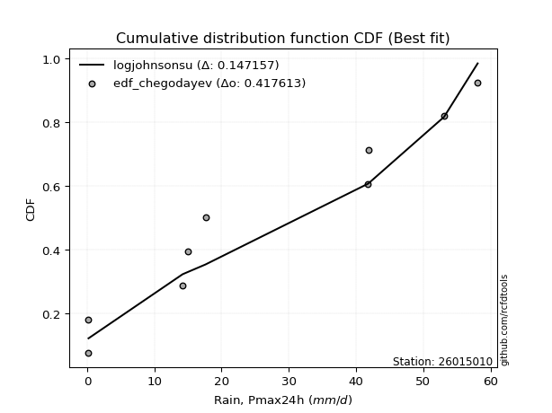</img></img>

</div>


### 6. Empirical - EDF Blom (1958)

The Blom formula is a specific "plotting position" formula used in hydrology and statistical analysis to estimate the empirical cumulative probability (or non-exceedance probability) of a data series. It is particularly recommended for data that are approximately normally distributed. The constant _a_ is set to 0.375 (or 3/8).

<div align="center">


$P=(m-a)/(n+1-2a)$


</div>


**6.1. Empirical values**

<div align="center">

|                | 0                   | 1                   | 2                   | 3                   | 4                   | 5                  | 6                  | 7                  | 8                  | 9                  |
|:---------------|:--------------------|:--------------------|:--------------------|:--------------------|:--------------------|:-------------------|:-------------------|:-------------------|:-------------------|:-------------------|
| date           | 2023                | 2024                | 2025                | 2016                | 2021                | 2020               | 2018               | 2022               | 2019               | 2017               |
| x              | 0.2                 | 0.2                 | 1.0                 | 14.2                | 15.0                | 17.6               | 41.7               | 41.9               | 53.1               | 58.1               |
| m              | 1                   | 2                   | 3                   | 4                   | 5                   | 6                  | 7                  | 8                  | 9                  | 10                 |
| empirical_dist | edf_blom            | edf_blom            | edf_blom            | edf_blom            | edf_blom            | edf_blom           | edf_blom           | edf_blom           | edf_blom           | edf_blom           |
| empirical      | 0.06097560975609756 | 0.15853658536585366 | 0.25609756097560976 | 0.35365853658536583 | 0.45121951219512196 | 0.5487804878048781 | 0.6463414634146342 | 0.7439024390243902 | 0.8414634146341463 | 0.9390243902439024 |
| empirical_tr   | 1.064935064935065   | 1.1884057971014492  | 1.3442622950819672  | 1.5471698113207546  | 1.8222222222222222  | 2.2162162162162162 | 2.827586206896552  | 3.9047619047619047 | 6.307692307692307  | 16.399999999999984 |

</div>


**6.2. Kolmogorov-Smirnov fit test (sorted by Δ)**


<div align="center">

|                | 0                   | 1                  | 2                  | 3                   | 4                   | 5                  | 6                   | 7                   | 8                   | 9                  | 10                  | 11                  | 12                  | 13                 | 14                  | 15                 | 16                  | 17                  | 18                 | 19                 | 20                  | 21                  | 22                    | 23                  | 24                  | 25                  | 26                  | 27                 | 28                  | 29                  | 30                  | 31                  | 32                  | 33                 | 34                 | 35                  | 36                  | 37                  | 38                 | 39                  | 40                  | 41                  | 42                 | 43                  | 44                 | 45                  | 46                  | 47                  | 48                  | 49                  | 50                 | 51                  | 52                 | 53                  | 54                  | 55                  | 56                 | 57                  | 58                 | 59                 | 60                 | 61                 | 62                 | 63                 | 64                  | 65                 | 66                  | 67                  | 68                 | 69                 | 70                  | 71                 | 72                 | 73                 | 74                  | 75                  | 76                  | 77                  | 78                  | 79                 | 80                 | 81                 | 82                 | 83                 | 84                 | 85                 | 86                 | 87                 | 88                 | 89                 |
|:---------------|:--------------------|:-------------------|:-------------------|:--------------------|:--------------------|:-------------------|:--------------------|:--------------------|:--------------------|:-------------------|:--------------------|:--------------------|:--------------------|:-------------------|:--------------------|:-------------------|:--------------------|:--------------------|:-------------------|:-------------------|:--------------------|:--------------------|:----------------------|:--------------------|:--------------------|:--------------------|:--------------------|:-------------------|:--------------------|:--------------------|:--------------------|:--------------------|:--------------------|:-------------------|:-------------------|:--------------------|:--------------------|:--------------------|:-------------------|:--------------------|:--------------------|:--------------------|:-------------------|:--------------------|:-------------------|:--------------------|:--------------------|:--------------------|:--------------------|:--------------------|:-------------------|:--------------------|:-------------------|:--------------------|:--------------------|:--------------------|:-------------------|:--------------------|:-------------------|:-------------------|:-------------------|:-------------------|:-------------------|:-------------------|:--------------------|:-------------------|:--------------------|:--------------------|:-------------------|:-------------------|:--------------------|:-------------------|:-------------------|:-------------------|:--------------------|:--------------------|:--------------------|:--------------------|:--------------------|:-------------------|:-------------------|:-------------------|:-------------------|:-------------------|:-------------------|:-------------------|:-------------------|:-------------------|:-------------------|:-------------------|
| station        | 26015010            | 26015010           | 26015010           | 26015010            | 26015010            | 26015010           | 26015010            | 26015010            | 26015010            | 26015010           | 26015010            | 26015010            | 26015010            | 26015010           | 26015010            | 26015010           | 26015010            | 26015010            | 26015010           | 26015010           | 26015010            | 26015010            | 26015010              | 26015010            | 26015010            | 26015010            | 26015010            | 26015010           | 26015010            | 26015010            | 26015010            | 26015010            | 26015010            | 26015010           | 26015010           | 26015010            | 26015010            | 26015010            | 26015010           | 26015010            | 26015010            | 26015010            | 26015010           | 26015010            | 26015010           | 26015010            | 26015010            | 26015010            | 26015010            | 26015010            | 26015010           | 26015010            | 26015010           | 26015010            | 26015010            | 26015010            | 26015010           | 26015010            | 26015010           | 26015010           | 26015010           | 26015010           | 26015010           | 26015010           | 26015010            | 26015010           | 26015010            | 26015010            | 26015010           | 26015010           | 26015010            | 26015010           | 26015010           | 26015010           | 26015010            | 26015010            | 26015010            | 26015010            | 26015010            | 26015010           | 26015010           | 26015010           | 26015010           | 26015010           | 26015010           | 26015010           | 26015010           | 26015010           | 26015010           | 26015010           |
| empirical_dist | edf_blom            | edf_blom           | edf_blom           | edf_blom            | edf_blom            | edf_blom           | edf_blom            | edf_blom            | edf_blom            | edf_blom           | edf_blom            | edf_blom            | edf_blom            | edf_blom           | edf_blom            | edf_blom           | edf_blom            | edf_blom            | edf_blom           | edf_blom           | edf_blom            | edf_blom            | edf_blom              | edf_blom            | edf_blom            | edf_blom            | edf_blom            | edf_blom           | edf_blom            | edf_blom            | edf_blom            | edf_blom            | edf_blom            | edf_blom           | edf_blom           | edf_blom            | edf_blom            | edf_blom            | edf_blom           | edf_blom            | edf_blom            | edf_blom            | edf_blom           | edf_blom            | edf_blom           | edf_blom            | edf_blom            | edf_blom            | edf_blom            | edf_blom            | edf_blom           | edf_blom            | edf_blom           | edf_blom            | edf_blom            | edf_blom            | edf_blom           | edf_blom            | edf_blom           | edf_blom           | edf_blom           | edf_blom           | edf_blom           | edf_blom           | edf_blom            | edf_blom           | edf_blom            | edf_blom            | edf_blom           | edf_blom           | edf_blom            | edf_blom           | edf_blom           | edf_blom           | edf_blom            | edf_blom            | edf_blom            | edf_blom            | edf_blom            | edf_blom           | edf_blom           | edf_blom           | edf_blom           | edf_blom           | edf_blom           | edf_blom           | edf_blom           | edf_blom           | edf_blom           | edf_blom           |
| p_dist         | logjohnsonsu        | maxwell            | rayleigh           | pearson3            | halfnorm            | rice               | ncf                 | laplace_asymmetric  | exponnorm           | crystalball        | norm                | t                   | genlogistic         | kstwobign          | gumbel_r            | moyal              | logistic            | logweibull_min      | invgauss           | mielke             | loggumbel_l         | hypsecant           | loglaplace_asymmetric | logloggamma         | halflogistic        | logpearson3         | expon               | genexpon           | laplace             | betaprime           | gompertz            | truncnorm           | gumbel_l            | nakagami           | weibull_min        | wald                | gibrat              | logexponnorm        | lognct             | logcrystalball      | lognorm             | lognorm             | logt               | logerlang           | logrice            | loggamma            | loggamma            | loglogistic         | loginvgamma         | loginvgauss         | loginvweibull      | logtruncnorm        | fisk               | logalpha            | loghypsecant        | logmaxwell          | logncf             | f                   | lograyleigh        | chi2               | logkstwobign       | loglaplace         | loggenexpon        | loghalfnorm        | loggumbel_r         | pareto             | logexpon            | loghalflogistic     | logmoyal           | logf               | logpareto           | gamma              | logfisk            | erlang             | logwald             | fatiguelife         | loggibrat           | loglognorm          | johnsonsu           | invweibull         | lognakagami        | logbetaprime       | logfatiguelife     | logchi2            | alpha              | logmielke          | loggompertz        | nct                | invgamma           | loggenlogistic     |
| delta          | 0.14950359989226636 | 0.1508622179737239 | 0.1519442742407967 | 0.15421739335218265 | 0.15699486671255436 | 0.1615547210881621 | 0.16810463231785866 | 0.16873919798515402 | 0.17115804077778712 | 0.1724229356228179 | 0.17242294796003538 | 0.17246038629207855 | 0.17301545198839396 | 0.1735897761754277 | 0.17518388822130526 | 0.1845748427307643 | 0.18788003486266552 | 0.18926708632199163 | 0.1949489487094448 | 0.1952958072676234 | 0.19938274121707955 | 0.20024840438328606 | 0.2018223144276834    | 0.20226827823654137 | 0.20376236888453036 | 0.20739530208666868 | 0.22344744887015316 | 0.2269089731717958 | 0.22854901845606607 | 0.23034321223099352 | 0.23062303401333883 | 0.23213112856106466 | 0.23619044092617814 | 0.236943063101982  | 0.2423373382043449 | 0.25609756097560976 | 0.25609756097560976 | 0.25706272414552656 | 0.257063485731987  | 0.25706553813923094 | 0.25706554246252633 | 0.25706554246252633 | 0.2570656595064348 | 0.25936750289545507 | 0.265614694527462  | 0.26797905010705925 | 0.26797905010705925 | 0.27116026632124257 | 0.27394485163340865 | 0.27640074176735174 | 0.2772040075631378 | 0.27874927392225624 | 0.2808594741746415 | 0.28093999928372126 | 0.28258364118915646 | 0.28262185350989466 | 0.2842562417484803 | 0.28652814902864165 | 0.2904981550229301 | 0.2928374766044455 | 0.304043615447659  | 0.3104051075714317 | 0.3105447590288525 | 0.3129969264418646 | 0.32241197751616335 | 0.3258168403175372 | 0.33426690458777475 | 0.34136142133510394 | 0.3445795581713871 | 0.3512679008364651 | 0.37436816147445806 | 0.380120792808734  | 0.3883583572485836 | 0.398950676107222  | 0.40650762691540787 | 0.40949149517311245 | 0.43845934643554896 | 0.45984711423164515 | 0.48214850367742357 | 0.529346515212811  | 0.5533910110599407 | 0.5729307021551177 | 0.5804052970560603 | 0.5865120219624758 | 0.6216709551805397 | 0.6375782657591285 | 0.6522651001761208 | 0.7360699510572289 | 0.742956060739607  | 0.8414634146341463 |
| deltao         | 0.3942745923300002  | 0.3942745923300002 | 0.3942745923300002 | 0.3942745923300002  | 0.3942745923300002  | 0.3942745923300002 | 0.3942745923300002  | 0.3942745923300002  | 0.3942745923300002  | 0.3942745923300002 | 0.3942745923300002  | 0.3942745923300002  | 0.3942745923300002  | 0.3942745923300002 | 0.3942745923300002  | 0.3942745923300002 | 0.3942745923300002  | 0.3942745923300002  | 0.3942745923300002 | 0.3942745923300002 | 0.3942745923300002  | 0.3942745923300002  | 0.3942745923300002    | 0.3942745923300002  | 0.3942745923300002  | 0.3942745923300002  | 0.3942745923300002  | 0.3942745923300002 | 0.3942745923300002  | 0.3942745923300002  | 0.3942745923300002  | 0.3942745923300002  | 0.3942745923300002  | 0.3942745923300002 | 0.3942745923300002 | 0.3942745923300002  | 0.3942745923300002  | 0.3942745923300002  | 0.3942745923300002 | 0.3942745923300002  | 0.3942745923300002  | 0.3942745923300002  | 0.3942745923300002 | 0.3942745923300002  | 0.3942745923300002 | 0.3942745923300002  | 0.3942745923300002  | 0.3942745923300002  | 0.3942745923300002  | 0.3942745923300002  | 0.3942745923300002 | 0.3942745923300002  | 0.3942745923300002 | 0.3942745923300002  | 0.3942745923300002  | 0.3942745923300002  | 0.3942745923300002 | 0.3942745923300002  | 0.3942745923300002 | 0.3942745923300002 | 0.3942745923300002 | 0.3942745923300002 | 0.3942745923300002 | 0.3942745923300002 | 0.3942745923300002  | 0.3942745923300002 | 0.3942745923300002  | 0.3942745923300002  | 0.3942745923300002 | 0.3942745923300002 | 0.3942745923300002  | 0.3942745923300002 | 0.3942745923300002 | 0.3942745923300002 | 0.3942745923300002  | 0.3942745923300002  | 0.3942745923300002  | 0.3942745923300002  | 0.3942745923300002  | 0.3942745923300002 | 0.3942745923300002 | 0.3942745923300002 | 0.3942745923300002 | 0.3942745923300002 | 0.3942745923300002 | 0.3942745923300002 | 0.3942745923300002 | 0.3942745923300002 | 0.3942745923300002 | 0.3942745923300002 |
| eval           | Δo > Δ              | Δo > Δ             | Δo > Δ             | Δo > Δ              | Δo > Δ              | Δo > Δ             | Δo > Δ              | Δo > Δ              | Δo > Δ              | Δo > Δ             | Δo > Δ              | Δo > Δ              | Δo > Δ              | Δo > Δ             | Δo > Δ              | Δo > Δ             | Δo > Δ              | Δo > Δ              | Δo > Δ             | Δo > Δ             | Δo > Δ              | Δo > Δ              | Δo > Δ                | Δo > Δ              | Δo > Δ              | Δo > Δ              | Δo > Δ              | Δo > Δ             | Δo > Δ              | Δo > Δ              | Δo > Δ              | Δo > Δ              | Δo > Δ              | Δo > Δ             | Δo > Δ             | Δo > Δ              | Δo > Δ              | Δo > Δ              | Δo > Δ             | Δo > Δ              | Δo > Δ              | Δo > Δ              | Δo > Δ             | Δo > Δ              | Δo > Δ             | Δo > Δ              | Δo > Δ              | Δo > Δ              | Δo > Δ              | Δo > Δ              | Δo > Δ             | Δo > Δ              | Δo > Δ             | Δo > Δ              | Δo > Δ              | Δo > Δ              | Δo > Δ             | Δo > Δ              | Δo > Δ             | Δo > Δ             | Δo > Δ             | Δo > Δ             | Δo > Δ             | Δo > Δ             | Δo > Δ              | Δo > Δ             | Δo > Δ              | Δo > Δ              | Δo > Δ             | Δo > Δ             | Δo > Δ              | Δo > Δ             | Δo > Δ             | Δo <= Δ            | Δo <= Δ             | Δo <= Δ             | Δo <= Δ             | Δo <= Δ             | Δo <= Δ             | Δo <= Δ            | Δo <= Δ            | Δo <= Δ            | Δo <= Δ            | Δo <= Δ            | Δo <= Δ            | Δo <= Δ            | Δo <= Δ            | Δo <= Δ            | Δo <= Δ            | Δo <= Δ            |
| fit            | 1                   | 1                  | 1                  | 1                   | 1                   | 1                  | 1                   | 1                   | 1                   | 1                  | 1                   | 1                   | 1                   | 1                  | 1                   | 1                  | 1                   | 1                   | 1                  | 1                  | 1                   | 1                   | 1                     | 1                   | 1                   | 1                   | 1                   | 1                  | 1                   | 1                   | 1                   | 1                   | 1                   | 1                  | 1                  | 1                   | 1                   | 1                   | 1                  | 1                   | 1                   | 1                   | 1                  | 1                   | 1                  | 1                   | 1                   | 1                   | 1                   | 1                   | 1                  | 1                   | 1                  | 1                   | 1                   | 1                   | 1                  | 1                   | 1                  | 1                  | 1                  | 1                  | 1                  | 1                  | 1                   | 1                  | 1                   | 1                   | 1                  | 1                  | 1                   | 1                  | 1                  | 0                  | 0                   | 0                   | 0                   | 0                   | 0                   | 0                  | 0                  | 0                  | 0                  | 0                  | 0                  | 0                  | 0                  | 0                  | 0                  | 0                  |
| n              | 10                  | 10                 | 10                 | 10                  | 10                  | 10                 | 10                  | 10                  | 10                  | 10                 | 10                  | 10                  | 10                  | 10                 | 10                  | 10                 | 10                  | 10                  | 10                 | 10                 | 10                  | 10                  | 10                    | 10                  | 10                  | 10                  | 10                  | 10                 | 10                  | 10                  | 10                  | 10                  | 10                  | 10                 | 10                 | 10                  | 10                  | 10                  | 10                 | 10                  | 10                  | 10                  | 10                 | 10                  | 10                 | 10                  | 10                  | 10                  | 10                  | 10                  | 10                 | 10                  | 10                 | 10                  | 10                  | 10                  | 10                 | 10                  | 10                 | 10                 | 10                 | 10                 | 10                 | 10                 | 10                  | 10                 | 10                  | 10                  | 10                 | 10                 | 10                  | 10                 | 10                 | 10                 | 10                  | 10                  | 10                  | 10                  | 10                  | 10                 | 10                 | 10                 | 10                 | 10                 | 10                 | 10                 | 10                 | 10                 | 10                 | 10                 |
| best_fit       | 1                   | 0                  | 0                  | 0                   | 0                   | 0                  | 0                   | 0                   | 0                   | 0                  | 0                   | 0                   | 0                   | 0                  | 0                   | 0                  | 0                   | 0                   | 0                  | 0                  | 0                   | 0                   | 0                     | 0                   | 0                   | 0                   | 0                   | 0                  | 0                   | 0                   | 0                   | 0                   | 0                   | 0                  | 0                  | 0                   | 0                   | 0                   | 0                  | 0                   | 0                   | 0                   | 0                  | 0                   | 0                  | 0                   | 0                   | 0                   | 0                   | 0                   | 0                  | 0                   | 0                  | 0                   | 0                   | 0                   | 0                  | 0                   | 0                  | 0                  | 0                  | 0                  | 0                  | 0                  | 0                   | 0                  | 0                   | 0                   | 0                  | 0                  | 0                   | 0                  | 0                  | 0                  | 0                   | 0                   | 0                   | 0                   | 0                   | 0                  | 0                  | 0                  | 0                  | 0                  | 0                  | 0                  | 0                  | 0                  | 0                  | 0                  |
| best_fit_sort  | 1                   | 2                  | 3                  | 4                   | 5                   | 6                  | 7                   | 8                   | 9                   | 10                 | 11                  | 12                  | 13                  | 14                 | 15                  | 16                 | 17                  | 18                  | 19                 | 20                 | 21                  | 22                  | 23                    | 24                  | 25                  | 26                  | 27                  | 28                 | 29                  | 30                  | 31                  | 32                  | 33                  | 34                 | 35                 | 36                  | 37                  | 38                  | 39                 | 40                  | 41                  | 42                  | 43                 | 44                  | 45                 | 46                  | 47                  | 48                  | 49                  | 50                  | 51                 | 52                  | 53                 | 54                  | 55                  | 56                  | 57                 | 58                  | 59                 | 60                 | 61                 | 62                 | 63                 | 64                 | 65                  | 66                 | 67                  | 68                  | 69                 | 70                 | 71                  | 72                 | 73                 | 74                 | 75                  | 76                  | 77                  | 78                  | 79                  | 80                 | 81                 | 82                 | 83                 | 84                 | 85                 | 86                 | 87                 | 88                 | 89                 | 90                 |

</div>


<div align="center">

</img>

</div>


**6.3. Best fit**

<div align="center">

|   id |   station | empirical_dist   | p_dist       |    delta |   deltao | eval   |   fit |   n |   best_fit |   best_fit_sort |
|-----:|----------:|:-----------------|:-------------|---------:|---------:|:-------|------:|----:|-----------:|----------------:|
|    0 |  26015010 | edf_blom         | logjohnsonsu | 0.149504 | 0.394275 | Δo > Δ |     1 |  10 |          1 |               1 |

</div>


<div align="center">

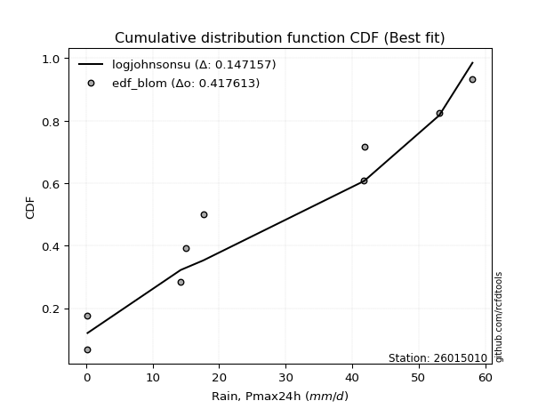</img>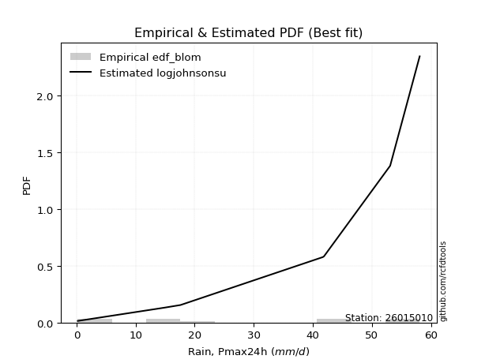</img>

</div>


### 7. Empirical - EDF Tukey (1962)

In hydrology, the Tukey formula is used as a plotting position formula to estimate the empirical probability or frequency of a flood event (or other hydrological data). The formula parameter is given as _c=0.333_ (or 1/3).

<div align="center">


$P=(m-c)/(n+1-2c)$


</div>


**7.1. Empirical values**

<div align="center">

|                | 0                   | 1                   | 2                   | 3                  | 4                   | 5                  | 6                  | 7                  | 8                  | 9                  |
|:---------------|:--------------------|:--------------------|:--------------------|:-------------------|:--------------------|:-------------------|:-------------------|:-------------------|:-------------------|:-------------------|
| date           | 2023                | 2024                | 2025                | 2016               | 2021                | 2020               | 2018               | 2022               | 2019               | 2017               |
| x              | 0.2                 | 0.2                 | 1.0                 | 14.2               | 15.0                | 17.6               | 41.7               | 41.9               | 53.1               | 58.1               |
| m              | 1                   | 2                   | 3                   | 4                  | 5                   | 6                  | 7                  | 8                  | 9                  | 10                 |
| empirical_dist | edf_tukey           | edf_tukey           | edf_tukey           | edf_tukey          | edf_tukey           | edf_tukey          | edf_tukey          | edf_tukey          | edf_tukey          | edf_tukey          |
| empirical      | 0.06451612903225806 | 0.16129032258064516 | 0.25806451612903225 | 0.3548387096774194 | 0.45161290322580644 | 0.5483870967741935 | 0.6451612903225806 | 0.7419354838709677 | 0.8387096774193549 | 0.9354838709677419 |
| empirical_tr   | 1.0689655172413792  | 1.1923076923076923  | 1.3478260869565217  | 1.55               | 1.823529411764706   | 2.214285714285714  | 2.818181818181818  | 3.875              | 6.200000000000001  | 15.499999999999988 |

</div>


**7.2. Kolmogorov-Smirnov fit test (sorted by Δ)**


<div align="center">

|                | 0                   | 1                   | 2                   | 3                   | 4                  | 5                  | 6                   | 7                   | 8                   | 9                   | 10                 | 11                  | 12                 | 13                  | 14                 | 15                  | 16                  | 17                 | 18                  | 19                  | 20                 | 21                  | 22                    | 23                 | 24                  | 25                  | 26                  | 27                  | 28                 | 29                  | 30                  | 31                  | 32                  | 33                  | 34                  | 35                 | 36                  | 37                 | 38                 | 39                 | 40                  | 41                  | 42                  | 43                  | 44                  | 45                 | 46                 | 47                  | 48                 | 49                 | 50                  | 51                 | 52                 | 53                 | 54                 | 55                 | 56                 | 57                 | 58                  | 59                 | 60                  | 61                  | 62                  | 63                  | 64                 | 65                 | 66                 | 67                 | 68                  | 69                  | 70                  | 71                  | 72                 | 73                 | 74                  | 75                 | 76                 | 77                  | 78                 | 79                 | 80                 | 81                 | 82                 | 83                 | 84                 | 85                 | 86                 | 87                 | 88                 | 89                 |
|:---------------|:--------------------|:--------------------|:--------------------|:--------------------|:-------------------|:-------------------|:--------------------|:--------------------|:--------------------|:--------------------|:-------------------|:--------------------|:-------------------|:--------------------|:-------------------|:--------------------|:--------------------|:-------------------|:--------------------|:--------------------|:-------------------|:--------------------|:----------------------|:-------------------|:--------------------|:--------------------|:--------------------|:--------------------|:-------------------|:--------------------|:--------------------|:--------------------|:--------------------|:--------------------|:--------------------|:-------------------|:--------------------|:-------------------|:-------------------|:-------------------|:--------------------|:--------------------|:--------------------|:--------------------|:--------------------|:-------------------|:-------------------|:--------------------|:-------------------|:-------------------|:--------------------|:-------------------|:-------------------|:-------------------|:-------------------|:-------------------|:-------------------|:-------------------|:--------------------|:-------------------|:--------------------|:--------------------|:--------------------|:--------------------|:-------------------|:-------------------|:-------------------|:-------------------|:--------------------|:--------------------|:--------------------|:--------------------|:-------------------|:-------------------|:--------------------|:-------------------|:-------------------|:--------------------|:-------------------|:-------------------|:-------------------|:-------------------|:-------------------|:-------------------|:-------------------|:-------------------|:-------------------|:-------------------|:-------------------|:-------------------|
| station        | 26015010            | 26015010            | 26015010            | 26015010            | 26015010           | 26015010           | 26015010            | 26015010            | 26015010            | 26015010            | 26015010           | 26015010            | 26015010           | 26015010            | 26015010           | 26015010            | 26015010            | 26015010           | 26015010            | 26015010            | 26015010           | 26015010            | 26015010              | 26015010           | 26015010            | 26015010            | 26015010            | 26015010            | 26015010           | 26015010            | 26015010            | 26015010            | 26015010            | 26015010            | 26015010            | 26015010           | 26015010            | 26015010           | 26015010           | 26015010           | 26015010            | 26015010            | 26015010            | 26015010            | 26015010            | 26015010           | 26015010           | 26015010            | 26015010           | 26015010           | 26015010            | 26015010           | 26015010           | 26015010           | 26015010           | 26015010           | 26015010           | 26015010           | 26015010            | 26015010           | 26015010            | 26015010            | 26015010            | 26015010            | 26015010           | 26015010           | 26015010           | 26015010           | 26015010            | 26015010            | 26015010            | 26015010            | 26015010           | 26015010           | 26015010            | 26015010           | 26015010           | 26015010            | 26015010           | 26015010           | 26015010           | 26015010           | 26015010           | 26015010           | 26015010           | 26015010           | 26015010           | 26015010           | 26015010           | 26015010           |
| empirical_dist | edf_tukey           | edf_tukey           | edf_tukey           | edf_tukey           | edf_tukey          | edf_tukey          | edf_tukey           | edf_tukey           | edf_tukey           | edf_tukey           | edf_tukey          | edf_tukey           | edf_tukey          | edf_tukey           | edf_tukey          | edf_tukey           | edf_tukey           | edf_tukey          | edf_tukey           | edf_tukey           | edf_tukey          | edf_tukey           | edf_tukey             | edf_tukey          | edf_tukey           | edf_tukey           | edf_tukey           | edf_tukey           | edf_tukey          | edf_tukey           | edf_tukey           | edf_tukey           | edf_tukey           | edf_tukey           | edf_tukey           | edf_tukey          | edf_tukey           | edf_tukey          | edf_tukey          | edf_tukey          | edf_tukey           | edf_tukey           | edf_tukey           | edf_tukey           | edf_tukey           | edf_tukey          | edf_tukey          | edf_tukey           | edf_tukey          | edf_tukey          | edf_tukey           | edf_tukey          | edf_tukey          | edf_tukey          | edf_tukey          | edf_tukey          | edf_tukey          | edf_tukey          | edf_tukey           | edf_tukey          | edf_tukey           | edf_tukey           | edf_tukey           | edf_tukey           | edf_tukey          | edf_tukey          | edf_tukey          | edf_tukey          | edf_tukey           | edf_tukey           | edf_tukey           | edf_tukey           | edf_tukey          | edf_tukey          | edf_tukey           | edf_tukey          | edf_tukey          | edf_tukey           | edf_tukey          | edf_tukey          | edf_tukey          | edf_tukey          | edf_tukey          | edf_tukey          | edf_tukey          | edf_tukey          | edf_tukey          | edf_tukey          | edf_tukey          | edf_tukey          |
| p_dist         | logjohnsonsu        | maxwell             | rayleigh            | pearson3            | halfnorm           | rice               | laplace_asymmetric  | ncf                 | exponnorm           | crystalball         | norm               | t                   | genlogistic        | kstwobign           | gumbel_r           | moyal               | logistic            | logweibull_min     | invgauss            | mielke              | loggumbel_l        | hypsecant           | loglaplace_asymmetric | logloggamma        | halflogistic        | logpearson3         | expon               | laplace             | genexpon           | betaprime           | gompertz            | truncnorm           | nakagami            | gumbel_l            | weibull_min         | logexponnorm       | lognct              | logcrystalball     | lognorm            | lognorm            | logt                | wald                | gibrat              | logerlang           | logrice             | loggamma           | loggamma           | loglogistic         | loginvgamma        | loginvgauss        | loginvweibull       | fisk               | logtruncnorm       | logalpha           | logncf             | loghypsecant       | logmaxwell         | f                  | lograyleigh         | chi2               | logkstwobign        | loglaplace          | loggenexpon         | loghalfnorm         | loggumbel_r        | pareto             | logexpon           | loghalflogistic    | logmoyal            | logf                | logpareto           | gamma               | logfisk            | erlang             | logwald             | fatiguelife        | loggibrat          | loglognorm          | johnsonsu          | invweibull         | lognakagami        | logbetaprime       | logfatiguelife     | logchi2            | alpha              | logmielke          | loggompertz        | nct                | invgamma           | loggenlogistic     |
| delta          | 0.14911020886158177 | 0.15204239106577744 | 0.15312444733285024 | 0.15382400232149807 | 0.1581750398046079 | 0.1635216762415846 | 0.16991937107720756 | 0.17007158747128115 | 0.17076464974710254 | 0.17202954459213332 | 0.1720295569293508 | 0.17206699526139396 | 0.1741956250804475 | 0.17476994926748124 | 0.1763640613133588 | 0.18575501582281784 | 0.18748664383198094 | 0.1880869132299381 | 0.19376877561739125 | 0.19647598035967695 | 0.198202568125026  | 0.19985501335260147 | 0.20300248751973693   | 0.2034484513285949 | 0.20572932403795285 | 0.20621512899461514 | 0.22541440402357565 | 0.22815562742538148 | 0.2288759283252183 | 0.22916303913893998 | 0.23258998916676132 | 0.23409808371448715 | 0.23576289000992845 | 0.23579704989549355 | 0.23879681892818438 | 0.255882551053473  | 0.25588331263993347 | 0.2558853650471774 | 0.2558853693704728 | 0.2558853693704728 | 0.25588548641438125 | 0.25806451612903225 | 0.25806451612903225 | 0.25818732980340153 | 0.26443452143540846 | 0.2667988770150057 | 0.2667988770150057 | 0.26998009322918903 | 0.2727646785413551 | 0.2752205686752982 | 0.27602383447108425 | 0.277318954898481  | 0.2775691008302027 | 0.2797598261916677 | 0.2807157224723198 | 0.2814034680971029 | 0.2814416804178411 | 0.2853479759365881 | 0.28931798193087654 | 0.294017649696499  | 0.30286344235560547 | 0.30922493447937816 | 0.30936458593679894 | 0.31181675334981107 | 0.3212318044241098 | 0.3246366672254837 | 0.3330867314957212 | 0.3401812482430504 | 0.34339938507933354 | 0.35008772774441155 | 0.37240120632103557 | 0.37894061971668047 | 0.3848178379724231 | 0.3977705030151685 | 0.40532745382335433 | 0.4083113220810589 | 0.4372791733434954 | 0.45630659495548465 | 0.4801815485240011 | 0.5258059959366504 | 0.5514240559065182 | 0.5709637470016952 | 0.5792251239640067 | 0.5853318488704222 | 0.6204907820884862 | 0.635611310605706  | 0.6502981450226983 | 0.7341029959038065 | 0.7409891055861845 | 0.8387096774193549 |
| deltao         | 0.3942745923300002  | 0.3942745923300002  | 0.3942745923300002  | 0.3942745923300002  | 0.3942745923300002 | 0.3942745923300002 | 0.3942745923300002  | 0.3942745923300002  | 0.3942745923300002  | 0.3942745923300002  | 0.3942745923300002 | 0.3942745923300002  | 0.3942745923300002 | 0.3942745923300002  | 0.3942745923300002 | 0.3942745923300002  | 0.3942745923300002  | 0.3942745923300002 | 0.3942745923300002  | 0.3942745923300002  | 0.3942745923300002 | 0.3942745923300002  | 0.3942745923300002    | 0.3942745923300002 | 0.3942745923300002  | 0.3942745923300002  | 0.3942745923300002  | 0.3942745923300002  | 0.3942745923300002 | 0.3942745923300002  | 0.3942745923300002  | 0.3942745923300002  | 0.3942745923300002  | 0.3942745923300002  | 0.3942745923300002  | 0.3942745923300002 | 0.3942745923300002  | 0.3942745923300002 | 0.3942745923300002 | 0.3942745923300002 | 0.3942745923300002  | 0.3942745923300002  | 0.3942745923300002  | 0.3942745923300002  | 0.3942745923300002  | 0.3942745923300002 | 0.3942745923300002 | 0.3942745923300002  | 0.3942745923300002 | 0.3942745923300002 | 0.3942745923300002  | 0.3942745923300002 | 0.3942745923300002 | 0.3942745923300002 | 0.3942745923300002 | 0.3942745923300002 | 0.3942745923300002 | 0.3942745923300002 | 0.3942745923300002  | 0.3942745923300002 | 0.3942745923300002  | 0.3942745923300002  | 0.3942745923300002  | 0.3942745923300002  | 0.3942745923300002 | 0.3942745923300002 | 0.3942745923300002 | 0.3942745923300002 | 0.3942745923300002  | 0.3942745923300002  | 0.3942745923300002  | 0.3942745923300002  | 0.3942745923300002 | 0.3942745923300002 | 0.3942745923300002  | 0.3942745923300002 | 0.3942745923300002 | 0.3942745923300002  | 0.3942745923300002 | 0.3942745923300002 | 0.3942745923300002 | 0.3942745923300002 | 0.3942745923300002 | 0.3942745923300002 | 0.3942745923300002 | 0.3942745923300002 | 0.3942745923300002 | 0.3942745923300002 | 0.3942745923300002 | 0.3942745923300002 |
| eval           | Δo > Δ              | Δo > Δ              | Δo > Δ              | Δo > Δ              | Δo > Δ             | Δo > Δ             | Δo > Δ              | Δo > Δ              | Δo > Δ              | Δo > Δ              | Δo > Δ             | Δo > Δ              | Δo > Δ             | Δo > Δ              | Δo > Δ             | Δo > Δ              | Δo > Δ              | Δo > Δ             | Δo > Δ              | Δo > Δ              | Δo > Δ             | Δo > Δ              | Δo > Δ                | Δo > Δ             | Δo > Δ              | Δo > Δ              | Δo > Δ              | Δo > Δ              | Δo > Δ             | Δo > Δ              | Δo > Δ              | Δo > Δ              | Δo > Δ              | Δo > Δ              | Δo > Δ              | Δo > Δ             | Δo > Δ              | Δo > Δ             | Δo > Δ             | Δo > Δ             | Δo > Δ              | Δo > Δ              | Δo > Δ              | Δo > Δ              | Δo > Δ              | Δo > Δ             | Δo > Δ             | Δo > Δ              | Δo > Δ             | Δo > Δ             | Δo > Δ              | Δo > Δ             | Δo > Δ             | Δo > Δ             | Δo > Δ             | Δo > Δ             | Δo > Δ             | Δo > Δ             | Δo > Δ              | Δo > Δ             | Δo > Δ              | Δo > Δ              | Δo > Δ              | Δo > Δ              | Δo > Δ             | Δo > Δ             | Δo > Δ             | Δo > Δ             | Δo > Δ              | Δo > Δ              | Δo > Δ              | Δo > Δ              | Δo > Δ             | Δo <= Δ            | Δo <= Δ             | Δo <= Δ            | Δo <= Δ            | Δo <= Δ             | Δo <= Δ            | Δo <= Δ            | Δo <= Δ            | Δo <= Δ            | Δo <= Δ            | Δo <= Δ            | Δo <= Δ            | Δo <= Δ            | Δo <= Δ            | Δo <= Δ            | Δo <= Δ            | Δo <= Δ            |
| fit            | 1                   | 1                   | 1                   | 1                   | 1                  | 1                  | 1                   | 1                   | 1                   | 1                   | 1                  | 1                   | 1                  | 1                   | 1                  | 1                   | 1                   | 1                  | 1                   | 1                   | 1                  | 1                   | 1                     | 1                  | 1                   | 1                   | 1                   | 1                   | 1                  | 1                   | 1                   | 1                   | 1                   | 1                   | 1                   | 1                  | 1                   | 1                  | 1                  | 1                  | 1                   | 1                   | 1                   | 1                   | 1                   | 1                  | 1                  | 1                   | 1                  | 1                  | 1                   | 1                  | 1                  | 1                  | 1                  | 1                  | 1                  | 1                  | 1                   | 1                  | 1                   | 1                   | 1                   | 1                   | 1                  | 1                  | 1                  | 1                  | 1                   | 1                   | 1                   | 1                   | 1                  | 0                  | 0                   | 0                  | 0                  | 0                   | 0                  | 0                  | 0                  | 0                  | 0                  | 0                  | 0                  | 0                  | 0                  | 0                  | 0                  | 0                  |
| n              | 10                  | 10                  | 10                  | 10                  | 10                 | 10                 | 10                  | 10                  | 10                  | 10                  | 10                 | 10                  | 10                 | 10                  | 10                 | 10                  | 10                  | 10                 | 10                  | 10                  | 10                 | 10                  | 10                    | 10                 | 10                  | 10                  | 10                  | 10                  | 10                 | 10                  | 10                  | 10                  | 10                  | 10                  | 10                  | 10                 | 10                  | 10                 | 10                 | 10                 | 10                  | 10                  | 10                  | 10                  | 10                  | 10                 | 10                 | 10                  | 10                 | 10                 | 10                  | 10                 | 10                 | 10                 | 10                 | 10                 | 10                 | 10                 | 10                  | 10                 | 10                  | 10                  | 10                  | 10                  | 10                 | 10                 | 10                 | 10                 | 10                  | 10                  | 10                  | 10                  | 10                 | 10                 | 10                  | 10                 | 10                 | 10                  | 10                 | 10                 | 10                 | 10                 | 10                 | 10                 | 10                 | 10                 | 10                 | 10                 | 10                 | 10                 |
| best_fit       | 1                   | 0                   | 0                   | 0                   | 0                  | 0                  | 0                   | 0                   | 0                   | 0                   | 0                  | 0                   | 0                  | 0                   | 0                  | 0                   | 0                   | 0                  | 0                   | 0                   | 0                  | 0                   | 0                     | 0                  | 0                   | 0                   | 0                   | 0                   | 0                  | 0                   | 0                   | 0                   | 0                   | 0                   | 0                   | 0                  | 0                   | 0                  | 0                  | 0                  | 0                   | 0                   | 0                   | 0                   | 0                   | 0                  | 0                  | 0                   | 0                  | 0                  | 0                   | 0                  | 0                  | 0                  | 0                  | 0                  | 0                  | 0                  | 0                   | 0                  | 0                   | 0                   | 0                   | 0                   | 0                  | 0                  | 0                  | 0                  | 0                   | 0                   | 0                   | 0                   | 0                  | 0                  | 0                   | 0                  | 0                  | 0                   | 0                  | 0                  | 0                  | 0                  | 0                  | 0                  | 0                  | 0                  | 0                  | 0                  | 0                  | 0                  |
| best_fit_sort  | 1                   | 2                   | 3                   | 4                   | 5                  | 6                  | 7                   | 8                   | 9                   | 10                  | 11                 | 12                  | 13                 | 14                  | 15                 | 16                  | 17                  | 18                 | 19                  | 20                  | 21                 | 22                  | 23                    | 24                 | 25                  | 26                  | 27                  | 28                  | 29                 | 30                  | 31                  | 32                  | 33                  | 34                  | 35                  | 36                 | 37                  | 38                 | 39                 | 40                 | 41                  | 42                  | 43                  | 44                  | 45                  | 46                 | 47                 | 48                  | 49                 | 50                 | 51                  | 52                 | 53                 | 54                 | 55                 | 56                 | 57                 | 58                 | 59                  | 60                 | 61                  | 62                  | 63                  | 64                  | 65                 | 66                 | 67                 | 68                 | 69                  | 70                  | 71                  | 72                  | 73                 | 74                 | 75                  | 76                 | 77                 | 78                  | 79                 | 80                 | 81                 | 82                 | 83                 | 84                 | 85                 | 86                 | 87                 | 88                 | 89                 | 90                 |

</div>


<div align="center">

</img>

</div>


**7.3. Best fit**

<div align="center">

|   id |   station | empirical_dist   | p_dist       |   delta |   deltao | eval   |   fit |   n |   best_fit |   best_fit_sort |
|-----:|----------:|:-----------------|:-------------|--------:|---------:|:-------|------:|----:|-----------:|----------------:|
|    0 |  26015010 | edf_tukey        | logjohnsonsu | 0.14911 | 0.394275 | Δo > Δ |     1 |  10 |          1 |               1 |

</div>


<div align="center">

</img></img>

</div>


### 8. Empirical - EDF Gringorten (1963)

Gringorten plotting position formula is essential for estimating the probability and return periods of extreme events like floods and heavy rainfall. The constant _a=0.44_.

<div align="center">


$P=(m-a)/(n+1-2a)$


</div>


**8.1. Empirical values**

<div align="center">

|                | 0                   | 1                   | 2                  | 3                   | 4                  | 5                 | 6                  | 7                  | 8                  | 9                  |
|:---------------|:--------------------|:--------------------|:-------------------|:--------------------|:-------------------|:------------------|:-------------------|:-------------------|:-------------------|:-------------------|
| date           | 2023                | 2024                | 2025               | 2016                | 2021               | 2020              | 2018               | 2022               | 2019               | 2017               |
| x              | 0.2                 | 0.2                 | 1.0                | 14.2                | 15.0               | 17.6              | 41.7               | 41.9               | 53.1               | 58.1               |
| m              | 1                   | 2                   | 3                  | 4                   | 5                  | 6                 | 7                  | 8                  | 9                  | 10                 |
| empirical_dist | edf_gringorten      | edf_gringorten      | edf_gringorten     | edf_gringorten      | edf_gringorten     | edf_gringorten    | edf_gringorten     | edf_gringorten     | edf_gringorten     | edf_gringorten     |
| empirical      | 0.05533596837944665 | 0.15415019762845852 | 0.2529644268774704 | 0.35177865612648224 | 0.4505928853754941 | 0.549407114624506 | 0.6482213438735178 | 0.7470355731225297 | 0.8458498023715416 | 0.9446640316205535 |
| empirical_tr   | 1.0585774058577406  | 1.1822429906542056  | 1.3386243386243388 | 1.542682926829268   | 1.8201438848920866 | 2.219298245614035 | 2.842696629213483  | 3.9531250000000004 | 6.487179487179492  | 18.071428571428605 |

</div>


**8.2. Kolmogorov-Smirnov fit test (sorted by Δ)**


<div align="center">

|                | 0                   | 1                   | 2                   | 3                   | 4                  | 5                   | 6                  | 7                   | 8                  | 9                   | 10                 | 11                 | 12                  | 13                  | 14                 | 15                  | 16                 | 17                  | 18                  | 19                 | 20                    | 21                 | 22                 | 23                  | 24                  | 25                  | 26                 | 27                  | 28                  | 29                 | 30                  | 31                  | 32                  | 33                  | 34                  | 35                 | 36                 | 37                  | 38                 | 39                  | 40                  | 41                  | 42                 | 43                  | 44                 | 45                  | 46                  | 47                  | 48                  | 49                  | 50                 | 51                  | 52                  | 53                  | 54                  | 55                 | 56                  | 57                  | 58                 | 59                 | 60                 | 61                 | 62                 | 63                 | 64                  | 65                 | 66                  | 67                  | 68                 | 69                 | 70                  | 71                 | 72                  | 73                 | 74                  | 75                  | 76                  | 77                 | 78                  | 79                 | 80                 | 81                 | 82                 | 83                 | 84                 | 85                 | 86                 | 87                 | 88                 | 89                 |
|:---------------|:--------------------|:--------------------|:--------------------|:--------------------|:-------------------|:--------------------|:-------------------|:--------------------|:-------------------|:--------------------|:-------------------|:-------------------|:--------------------|:--------------------|:-------------------|:--------------------|:-------------------|:--------------------|:--------------------|:-------------------|:----------------------|:-------------------|:-------------------|:--------------------|:--------------------|:--------------------|:-------------------|:--------------------|:--------------------|:-------------------|:--------------------|:--------------------|:--------------------|:--------------------|:--------------------|:-------------------|:-------------------|:--------------------|:-------------------|:--------------------|:--------------------|:--------------------|:-------------------|:--------------------|:-------------------|:--------------------|:--------------------|:--------------------|:--------------------|:--------------------|:-------------------|:--------------------|:--------------------|:--------------------|:--------------------|:-------------------|:--------------------|:--------------------|:-------------------|:-------------------|:-------------------|:-------------------|:-------------------|:-------------------|:--------------------|:-------------------|:--------------------|:--------------------|:-------------------|:-------------------|:--------------------|:-------------------|:--------------------|:-------------------|:--------------------|:--------------------|:--------------------|:-------------------|:--------------------|:-------------------|:-------------------|:-------------------|:-------------------|:-------------------|:-------------------|:-------------------|:-------------------|:-------------------|:-------------------|:-------------------|
| station        | 26015010            | 26015010            | 26015010            | 26015010            | 26015010           | 26015010            | 26015010           | 26015010            | 26015010           | 26015010            | 26015010           | 26015010           | 26015010            | 26015010            | 26015010           | 26015010            | 26015010           | 26015010            | 26015010            | 26015010           | 26015010              | 26015010           | 26015010           | 26015010            | 26015010            | 26015010            | 26015010           | 26015010            | 26015010            | 26015010           | 26015010            | 26015010            | 26015010            | 26015010            | 26015010            | 26015010           | 26015010           | 26015010            | 26015010           | 26015010            | 26015010            | 26015010            | 26015010           | 26015010            | 26015010           | 26015010            | 26015010            | 26015010            | 26015010            | 26015010            | 26015010           | 26015010            | 26015010            | 26015010            | 26015010            | 26015010           | 26015010            | 26015010            | 26015010           | 26015010           | 26015010           | 26015010           | 26015010           | 26015010           | 26015010            | 26015010           | 26015010            | 26015010            | 26015010           | 26015010           | 26015010            | 26015010           | 26015010            | 26015010           | 26015010            | 26015010            | 26015010            | 26015010           | 26015010            | 26015010           | 26015010           | 26015010           | 26015010           | 26015010           | 26015010           | 26015010           | 26015010           | 26015010           | 26015010           | 26015010           |
| empirical_dist | edf_gringorten      | edf_gringorten      | edf_gringorten      | edf_gringorten      | edf_gringorten     | edf_gringorten      | edf_gringorten     | edf_gringorten      | edf_gringorten     | edf_gringorten      | edf_gringorten     | edf_gringorten     | edf_gringorten      | edf_gringorten      | edf_gringorten     | edf_gringorten      | edf_gringorten     | edf_gringorten      | edf_gringorten      | edf_gringorten     | edf_gringorten        | edf_gringorten     | edf_gringorten     | edf_gringorten      | edf_gringorten      | edf_gringorten      | edf_gringorten     | edf_gringorten      | edf_gringorten      | edf_gringorten     | edf_gringorten      | edf_gringorten      | edf_gringorten      | edf_gringorten      | edf_gringorten      | edf_gringorten     | edf_gringorten     | edf_gringorten      | edf_gringorten     | edf_gringorten      | edf_gringorten      | edf_gringorten      | edf_gringorten     | edf_gringorten      | edf_gringorten     | edf_gringorten      | edf_gringorten      | edf_gringorten      | edf_gringorten      | edf_gringorten      | edf_gringorten     | edf_gringorten      | edf_gringorten      | edf_gringorten      | edf_gringorten      | edf_gringorten     | edf_gringorten      | edf_gringorten      | edf_gringorten     | edf_gringorten     | edf_gringorten     | edf_gringorten     | edf_gringorten     | edf_gringorten     | edf_gringorten      | edf_gringorten     | edf_gringorten      | edf_gringorten      | edf_gringorten     | edf_gringorten     | edf_gringorten      | edf_gringorten     | edf_gringorten      | edf_gringorten     | edf_gringorten      | edf_gringorten      | edf_gringorten      | edf_gringorten     | edf_gringorten      | edf_gringorten     | edf_gringorten     | edf_gringorten     | edf_gringorten     | edf_gringorten     | edf_gringorten     | edf_gringorten     | edf_gringorten     | edf_gringorten     | edf_gringorten     | edf_gringorten     |
| p_dist         | maxwell             | rayleigh            | logjohnsonsu        | pearson3            | halfnorm           | rice                | ncf                | laplace_asymmetric  | genlogistic        | kstwobign           | exponnorm          | crystalball        | norm                | t                   | gumbel_r           | moyal               | logistic           | logweibull_min      | mielke              | invgauss           | loglaplace_asymmetric | logloggamma        | halflogistic       | hypsecant           | loggumbel_l         | logpearson3         | expon              | genexpon            | gompertz            | truncnorm          | laplace             | betaprime           | gumbel_l            | nakagami            | weibull_min         | wald               | gibrat             | logexponnorm        | lognct             | logcrystalball      | lognorm             | lognorm             | logt               | logerlang           | logrice            | loggamma            | loggamma            | loglogistic         | loginvgamma         | loginvgauss         | loginvweibull      | logtruncnorm        | logalpha            | loghypsecant        | logmaxwell          | fisk               | f                   | logncf              | chi2               | lograyleigh        | logkstwobign       | loglaplace         | loggenexpon        | loghalfnorm        | loggumbel_r         | pareto             | logexpon            | loghalflogistic     | logmoyal           | logf               | logpareto           | gamma              | logfisk             | erlang             | logwald             | fatiguelife         | loggibrat           | loglognorm         | johnsonsu           | invweibull         | lognakagami        | logbetaprime       | logfatiguelife     | logchi2            | alpha              | logmielke          | loggompertz        | nct                | invgamma           | loggenlogistic     |
| delta          | 0.14898233751484025 | 0.15006439378191305 | 0.15013022671189424 | 0.15484402017181054 | 0.1551149862536707 | 0.15842158699002273 | 0.1649714982197193 | 0.16685931752627037 | 0.1711355715295103 | 0.17170989571654405 | 0.171784667597415  | 0.1730495624424458 | 0.17304957477966326 | 0.17308701311170643 | 0.1733040077624216 | 0.18269496227188065 | 0.1885066616822934 | 0.19114696678087523 | 0.19341592680873976 | 0.1968288291683284 | 0.19994243396879974   | 0.2003883977776577 | 0.200629234786391  | 0.20087503120291395 | 0.20126262167596315 | 0.20927518254555227 | 0.2203143147720138 | 0.22377583907365645 | 0.22748989991519947 | 0.2289979944629253 | 0.22917564527569395 | 0.23222309268987712 | 0.23681706774580602 | 0.23882294356086559 | 0.24797697958099596 | 0.2529644268774704 | 0.2529644268774704 | 0.25894260460441015 | 0.2589433661908706 | 0.25894541859811454 | 0.25894542292140993 | 0.25894542292140993 | 0.2589455399653184 | 0.26124738335433867 | 0.2674945749863456 | 0.26985893056594285 | 0.26985893056594285 | 0.27304014678012617 | 0.27582473209229225 | 0.27828062222623534 | 0.2790838880220214 | 0.28062915438113983 | 0.28281987974260486 | 0.28446352164804006 | 0.28450173396877826 | 0.2864991155512926 | 0.28840802948752525 | 0.28989588312513137 | 0.2909575961455618 | 0.2923780354818137 | 0.3059234959065426 | 0.3122849880303153 | 0.3124246394877361 | 0.3148768069007482 | 0.32429185797504695 | 0.3276967207764208 | 0.33614678504665835 | 0.34324130179398754 | 0.3464594386302707 | 0.3531477812953487 | 0.37750129557259743 | 0.3820006732676176 | 0.39399799862523466 | 0.4008305565661056 | 0.40838750737429147 | 0.41137137563199605 | 0.44033922689443256 | 0.4654867556082962 | 0.48528163777556294 | 0.534986156589462  | 0.55652414515808   | 0.5760638362532571 | 0.5822851775149438 | 0.5883919024213593 | 0.6235508356394233 | 0.6407113998572678 | 0.6553982342742601 | 0.7392030851553684 | 0.7460891948377464 | 0.8458498023715416 |
| deltao         | 0.3942745923300002  | 0.3942745923300002  | 0.3942745923300002  | 0.3942745923300002  | 0.3942745923300002 | 0.3942745923300002  | 0.3942745923300002 | 0.3942745923300002  | 0.3942745923300002 | 0.3942745923300002  | 0.3942745923300002 | 0.3942745923300002 | 0.3942745923300002  | 0.3942745923300002  | 0.3942745923300002 | 0.3942745923300002  | 0.3942745923300002 | 0.3942745923300002  | 0.3942745923300002  | 0.3942745923300002 | 0.3942745923300002    | 0.3942745923300002 | 0.3942745923300002 | 0.3942745923300002  | 0.3942745923300002  | 0.3942745923300002  | 0.3942745923300002 | 0.3942745923300002  | 0.3942745923300002  | 0.3942745923300002 | 0.3942745923300002  | 0.3942745923300002  | 0.3942745923300002  | 0.3942745923300002  | 0.3942745923300002  | 0.3942745923300002 | 0.3942745923300002 | 0.3942745923300002  | 0.3942745923300002 | 0.3942745923300002  | 0.3942745923300002  | 0.3942745923300002  | 0.3942745923300002 | 0.3942745923300002  | 0.3942745923300002 | 0.3942745923300002  | 0.3942745923300002  | 0.3942745923300002  | 0.3942745923300002  | 0.3942745923300002  | 0.3942745923300002 | 0.3942745923300002  | 0.3942745923300002  | 0.3942745923300002  | 0.3942745923300002  | 0.3942745923300002 | 0.3942745923300002  | 0.3942745923300002  | 0.3942745923300002 | 0.3942745923300002 | 0.3942745923300002 | 0.3942745923300002 | 0.3942745923300002 | 0.3942745923300002 | 0.3942745923300002  | 0.3942745923300002 | 0.3942745923300002  | 0.3942745923300002  | 0.3942745923300002 | 0.3942745923300002 | 0.3942745923300002  | 0.3942745923300002 | 0.3942745923300002  | 0.3942745923300002 | 0.3942745923300002  | 0.3942745923300002  | 0.3942745923300002  | 0.3942745923300002 | 0.3942745923300002  | 0.3942745923300002 | 0.3942745923300002 | 0.3942745923300002 | 0.3942745923300002 | 0.3942745923300002 | 0.3942745923300002 | 0.3942745923300002 | 0.3942745923300002 | 0.3942745923300002 | 0.3942745923300002 | 0.3942745923300002 |
| eval           | Δo > Δ              | Δo > Δ              | Δo > Δ              | Δo > Δ              | Δo > Δ             | Δo > Δ              | Δo > Δ             | Δo > Δ              | Δo > Δ             | Δo > Δ              | Δo > Δ             | Δo > Δ             | Δo > Δ              | Δo > Δ              | Δo > Δ             | Δo > Δ              | Δo > Δ             | Δo > Δ              | Δo > Δ              | Δo > Δ             | Δo > Δ                | Δo > Δ             | Δo > Δ             | Δo > Δ              | Δo > Δ              | Δo > Δ              | Δo > Δ             | Δo > Δ              | Δo > Δ              | Δo > Δ             | Δo > Δ              | Δo > Δ              | Δo > Δ              | Δo > Δ              | Δo > Δ              | Δo > Δ             | Δo > Δ             | Δo > Δ              | Δo > Δ             | Δo > Δ              | Δo > Δ              | Δo > Δ              | Δo > Δ             | Δo > Δ              | Δo > Δ             | Δo > Δ              | Δo > Δ              | Δo > Δ              | Δo > Δ              | Δo > Δ              | Δo > Δ             | Δo > Δ              | Δo > Δ              | Δo > Δ              | Δo > Δ              | Δo > Δ             | Δo > Δ              | Δo > Δ              | Δo > Δ             | Δo > Δ             | Δo > Δ             | Δo > Δ             | Δo > Δ             | Δo > Δ             | Δo > Δ              | Δo > Δ             | Δo > Δ              | Δo > Δ              | Δo > Δ             | Δo > Δ             | Δo > Δ              | Δo > Δ             | Δo > Δ              | Δo <= Δ            | Δo <= Δ             | Δo <= Δ             | Δo <= Δ             | Δo <= Δ            | Δo <= Δ             | Δo <= Δ            | Δo <= Δ            | Δo <= Δ            | Δo <= Δ            | Δo <= Δ            | Δo <= Δ            | Δo <= Δ            | Δo <= Δ            | Δo <= Δ            | Δo <= Δ            | Δo <= Δ            |
| fit            | 1                   | 1                   | 1                   | 1                   | 1                  | 1                   | 1                  | 1                   | 1                  | 1                   | 1                  | 1                  | 1                   | 1                   | 1                  | 1                   | 1                  | 1                   | 1                   | 1                  | 1                     | 1                  | 1                  | 1                   | 1                   | 1                   | 1                  | 1                   | 1                   | 1                  | 1                   | 1                   | 1                   | 1                   | 1                   | 1                  | 1                  | 1                   | 1                  | 1                   | 1                   | 1                   | 1                  | 1                   | 1                  | 1                   | 1                   | 1                   | 1                   | 1                   | 1                  | 1                   | 1                   | 1                   | 1                   | 1                  | 1                   | 1                   | 1                  | 1                  | 1                  | 1                  | 1                  | 1                  | 1                   | 1                  | 1                   | 1                   | 1                  | 1                  | 1                   | 1                  | 1                   | 0                  | 0                   | 0                   | 0                   | 0                  | 0                   | 0                  | 0                  | 0                  | 0                  | 0                  | 0                  | 0                  | 0                  | 0                  | 0                  | 0                  |
| n              | 10                  | 10                  | 10                  | 10                  | 10                 | 10                  | 10                 | 10                  | 10                 | 10                  | 10                 | 10                 | 10                  | 10                  | 10                 | 10                  | 10                 | 10                  | 10                  | 10                 | 10                    | 10                 | 10                 | 10                  | 10                  | 10                  | 10                 | 10                  | 10                  | 10                 | 10                  | 10                  | 10                  | 10                  | 10                  | 10                 | 10                 | 10                  | 10                 | 10                  | 10                  | 10                  | 10                 | 10                  | 10                 | 10                  | 10                  | 10                  | 10                  | 10                  | 10                 | 10                  | 10                  | 10                  | 10                  | 10                 | 10                  | 10                  | 10                 | 10                 | 10                 | 10                 | 10                 | 10                 | 10                  | 10                 | 10                  | 10                  | 10                 | 10                 | 10                  | 10                 | 10                  | 10                 | 10                  | 10                  | 10                  | 10                 | 10                  | 10                 | 10                 | 10                 | 10                 | 10                 | 10                 | 10                 | 10                 | 10                 | 10                 | 10                 |
| best_fit       | 1                   | 0                   | 0                   | 0                   | 0                  | 0                   | 0                  | 0                   | 0                  | 0                   | 0                  | 0                  | 0                   | 0                   | 0                  | 0                   | 0                  | 0                   | 0                   | 0                  | 0                     | 0                  | 0                  | 0                   | 0                   | 0                   | 0                  | 0                   | 0                   | 0                  | 0                   | 0                   | 0                   | 0                   | 0                   | 0                  | 0                  | 0                   | 0                  | 0                   | 0                   | 0                   | 0                  | 0                   | 0                  | 0                   | 0                   | 0                   | 0                   | 0                   | 0                  | 0                   | 0                   | 0                   | 0                   | 0                  | 0                   | 0                   | 0                  | 0                  | 0                  | 0                  | 0                  | 0                  | 0                   | 0                  | 0                   | 0                   | 0                  | 0                  | 0                   | 0                  | 0                   | 0                  | 0                   | 0                   | 0                   | 0                  | 0                   | 0                  | 0                  | 0                  | 0                  | 0                  | 0                  | 0                  | 0                  | 0                  | 0                  | 0                  |
| best_fit_sort  | 1                   | 2                   | 3                   | 4                   | 5                  | 6                   | 7                  | 8                   | 9                  | 10                  | 11                 | 12                 | 13                  | 14                  | 15                 | 16                  | 17                 | 18                  | 19                  | 20                 | 21                    | 22                 | 23                 | 24                  | 25                  | 26                  | 27                 | 28                  | 29                  | 30                 | 31                  | 32                  | 33                  | 34                  | 35                  | 36                 | 37                 | 38                  | 39                 | 40                  | 41                  | 42                  | 43                 | 44                  | 45                 | 46                  | 47                  | 48                  | 49                  | 50                  | 51                 | 52                  | 53                  | 54                  | 55                  | 56                 | 57                  | 58                  | 59                 | 60                 | 61                 | 62                 | 63                 | 64                 | 65                  | 66                 | 67                  | 68                  | 69                 | 70                 | 71                  | 72                 | 73                  | 74                 | 75                  | 76                  | 77                  | 78                 | 79                  | 80                 | 81                 | 82                 | 83                 | 84                 | 85                 | 86                 | 87                 | 88                 | 89                 | 90                 |

</div>


<div align="center">

</img>

</div>


**8.3. Best fit**

<div align="center">

|   id |   station | empirical_dist   | p_dist   |    delta |   deltao | eval   |   fit |   n |   best_fit |   best_fit_sort |
|-----:|----------:|:-----------------|:---------|---------:|---------:|:-------|------:|----:|-----------:|----------------:|
|    0 |  26015010 | edf_gringorten   | maxwell  | 0.148982 | 0.394275 | Δo > Δ |     1 |  10 |          1 |               1 |

</div>


<div align="center">

</img>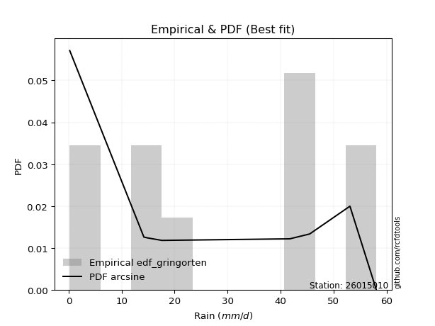</img>

</div>


### 9. Empirical - EDF Filliben (1975)

The specific values of the constants (0.3175) (often denoted as $alpha$) and (0.365) are derived from a method proposed by James J. Filliben in a 1975 paper. This particular formula is the mean value of the $i$-th order statistic of the normal distribution and is considered a robust and effective plotting position formula for the normal probability plot correlation coefficient test for normality.

<div align="center">


$P=(m-0.3175)/(n+0.365)$


</div>


**9.1. Empirical values**

<div align="center">

|                | 0                   | 1                  | 2                   | 3                  | 4                  | 5                  | 6                  | 7                  | 8                  | 9                  |
|:---------------|:--------------------|:-------------------|:--------------------|:-------------------|:-------------------|:-------------------|:-------------------|:-------------------|:-------------------|:-------------------|
| date           | 2023                | 2024               | 2025                | 2016               | 2021               | 2020               | 2018               | 2022               | 2019               | 2017               |
| x              | 0.2                 | 0.2                | 1.0                 | 14.2               | 15.0               | 17.6               | 41.7               | 41.9               | 53.1               | 58.1               |
| m              | 1                   | 2                  | 3                   | 4                  | 5                  | 6                  | 7                  | 8                  | 9                  | 10                 |
| empirical_dist | edf_filliben        | edf_filliben       | edf_filliben        | edf_filliben       | edf_filliben       | edf_filliben       | edf_filliben       | edf_filliben       | edf_filliben       | edf_filliben       |
| empirical      | 0.06584659913169319 | 0.1623251326579836 | 0.25880366618427403 | 0.3552821997105644 | 0.4517607332368548 | 0.5482392667631452 | 0.6447178002894356 | 0.741196333815726  | 0.8376748673420163 | 0.9341534008683067 |
| empirical_tr   | 1.0704879938032532  | 1.193780593147135  | 1.3491701919947936  | 1.5510662177328844 | 1.8240211174659038 | 2.2135611318739987 | 2.814663951120163  | 3.8639328984156576 | 6.1604754829123305 | 15.186813186813156 |

</div>


**9.2. Kolmogorov-Smirnov fit test (sorted by Δ)**


<div align="center">

|                | 0                   | 1                   | 2                   | 3                  | 4                   | 5                   | 6                  | 7                  | 8                   | 9                   | 10                  | 11                  | 12                  | 13                  | 14                  | 15                  | 16                 | 17                  | 18                  | 19                  | 20                  | 21                  | 22                    | 23                  | 24                 | 25                  | 26                  | 27                  | 28                  | 29                  | 30                 | 31                  | 32                  | 33                 | 34                  | 35                 | 36                  | 37                  | 38                  | 39                  | 40                 | 41                 | 42                  | 43                  | 44                  | 45                 | 46                 | 47                 | 48                 | 49                  | 50                 | 51                 | 52                  | 53                 | 54                 | 55                 | 56                 | 57                 | 58                 | 59                  | 60                  | 61                 | 62                 | 63                  | 64                 | 65                  | 66                 | 67                  | 68                 | 69                 | 70                 | 71                  | 72                  | 73                  | 74                 | 75                 | 76                 | 77                  | 78                 | 79                 | 80                 | 81                 | 82                 | 83                 | 84                 | 85                 | 86                 | 87                 | 88                 | 89                 |
|:---------------|:--------------------|:--------------------|:--------------------|:-------------------|:--------------------|:--------------------|:-------------------|:-------------------|:--------------------|:--------------------|:--------------------|:--------------------|:--------------------|:--------------------|:--------------------|:--------------------|:-------------------|:--------------------|:--------------------|:--------------------|:--------------------|:--------------------|:----------------------|:--------------------|:-------------------|:--------------------|:--------------------|:--------------------|:--------------------|:--------------------|:-------------------|:--------------------|:--------------------|:-------------------|:--------------------|:-------------------|:--------------------|:--------------------|:--------------------|:--------------------|:-------------------|:-------------------|:--------------------|:--------------------|:--------------------|:-------------------|:-------------------|:-------------------|:-------------------|:--------------------|:-------------------|:-------------------|:--------------------|:-------------------|:-------------------|:-------------------|:-------------------|:-------------------|:-------------------|:--------------------|:--------------------|:-------------------|:-------------------|:--------------------|:-------------------|:--------------------|:-------------------|:--------------------|:-------------------|:-------------------|:-------------------|:--------------------|:--------------------|:--------------------|:-------------------|:-------------------|:-------------------|:--------------------|:-------------------|:-------------------|:-------------------|:-------------------|:-------------------|:-------------------|:-------------------|:-------------------|:-------------------|:-------------------|:-------------------|:-------------------|
| station        | 26015010            | 26015010            | 26015010            | 26015010           | 26015010            | 26015010            | 26015010           | 26015010           | 26015010            | 26015010            | 26015010            | 26015010            | 26015010            | 26015010            | 26015010            | 26015010            | 26015010           | 26015010            | 26015010            | 26015010            | 26015010            | 26015010            | 26015010              | 26015010            | 26015010           | 26015010            | 26015010            | 26015010            | 26015010            | 26015010            | 26015010           | 26015010            | 26015010            | 26015010           | 26015010            | 26015010           | 26015010            | 26015010            | 26015010            | 26015010            | 26015010           | 26015010           | 26015010            | 26015010            | 26015010            | 26015010           | 26015010           | 26015010           | 26015010           | 26015010            | 26015010           | 26015010           | 26015010            | 26015010           | 26015010           | 26015010           | 26015010           | 26015010           | 26015010           | 26015010            | 26015010            | 26015010           | 26015010           | 26015010            | 26015010           | 26015010            | 26015010           | 26015010            | 26015010           | 26015010           | 26015010           | 26015010            | 26015010            | 26015010            | 26015010           | 26015010           | 26015010           | 26015010            | 26015010           | 26015010           | 26015010           | 26015010           | 26015010           | 26015010           | 26015010           | 26015010           | 26015010           | 26015010           | 26015010           | 26015010           |
| empirical_dist | edf_filliben        | edf_filliben        | edf_filliben        | edf_filliben       | edf_filliben        | edf_filliben        | edf_filliben       | edf_filliben       | edf_filliben        | edf_filliben        | edf_filliben        | edf_filliben        | edf_filliben        | edf_filliben        | edf_filliben        | edf_filliben        | edf_filliben       | edf_filliben        | edf_filliben        | edf_filliben        | edf_filliben        | edf_filliben        | edf_filliben          | edf_filliben        | edf_filliben       | edf_filliben        | edf_filliben        | edf_filliben        | edf_filliben        | edf_filliben        | edf_filliben       | edf_filliben        | edf_filliben        | edf_filliben       | edf_filliben        | edf_filliben       | edf_filliben        | edf_filliben        | edf_filliben        | edf_filliben        | edf_filliben       | edf_filliben       | edf_filliben        | edf_filliben        | edf_filliben        | edf_filliben       | edf_filliben       | edf_filliben       | edf_filliben       | edf_filliben        | edf_filliben       | edf_filliben       | edf_filliben        | edf_filliben       | edf_filliben       | edf_filliben       | edf_filliben       | edf_filliben       | edf_filliben       | edf_filliben        | edf_filliben        | edf_filliben       | edf_filliben       | edf_filliben        | edf_filliben       | edf_filliben        | edf_filliben       | edf_filliben        | edf_filliben       | edf_filliben       | edf_filliben       | edf_filliben        | edf_filliben        | edf_filliben        | edf_filliben       | edf_filliben       | edf_filliben       | edf_filliben        | edf_filliben       | edf_filliben       | edf_filliben       | edf_filliben       | edf_filliben       | edf_filliben       | edf_filliben       | edf_filliben       | edf_filliben       | edf_filliben       | edf_filliben       | edf_filliben       |
| p_dist         | logjohnsonsu        | maxwell             | rayleigh            | pearson3           | halfnorm            | rice                | laplace_asymmetric | exponnorm          | ncf                 | crystalball         | norm                | t                   | genlogistic         | kstwobign           | gumbel_r            | moyal               | logistic           | logweibull_min      | invgauss            | mielke              | loggumbel_l         | hypsecant           | loglaplace_asymmetric | logloggamma         | logpearson3        | halflogistic        | expon               | laplace             | betaprime           | genexpon            | gompertz           | truncnorm           | nakagami            | gumbel_l           | weibull_min         | logexponnorm       | lognct              | logcrystalball      | lognorm             | lognorm             | logt               | logerlang          | wald                | gibrat              | logrice             | loggamma           | loggamma           | loglogistic        | loginvgamma        | loginvgauss         | loginvweibull      | fisk               | logtruncnorm        | logalpha           | logncf             | loghypsecant       | logmaxwell         | f                  | lograyleigh        | chi2                | logkstwobign        | loglaplace         | loggenexpon        | loghalfnorm         | loggumbel_r        | pareto              | logexpon           | loghalflogistic     | logmoyal           | logf               | logpareto          | gamma               | logfisk             | erlang              | logwald            | fatiguelife        | loggibrat          | loglognorm          | johnsonsu          | invweibull         | lognakagami        | logbetaprime       | logfatiguelife     | logchi2            | alpha              | logmielke          | loggompertz        | nct                | invgamma           | loggenlogistic     |
| delta          | 0.14896237885053343 | 0.15248588109892247 | 0.15356793736599528 | 0.1541516863699428 | 0.15861852983775293 | 0.16426082629682637 | 0.1703628611103526 | 0.1706168197360542 | 0.17081073752652293 | 0.17188171458108498 | 0.17188172691830245 | 0.17191916525034562 | 0.17463911511359254 | 0.17521343930062627 | 0.17680755134650383 | 0.18619850585596287 | 0.1873388138209326 | 0.18764342319679306 | 0.19332528558424622 | 0.19691947039282198 | 0.19775907809188098 | 0.19970718334155313 | 0.20344597755288196   | 0.20389194136173994 | 0.2057716389614701 | 0.20646847409319463 | 0.22615355407881743 | 0.22800779741433314 | 0.22871954910579495 | 0.22961507838046008 | 0.2333291392220031 | 0.23483723376972893 | 0.23531939997678342 | 0.2356492198844452 | 0.23746634882874917 | 0.255439061020328  | 0.25543982260678844 | 0.25544187501403237 | 0.25544187933732776 | 0.25544187933732776 | 0.2554419963812362 | 0.2577438397702565 | 0.25880366618427403 | 0.25880366618427403 | 0.26399103140226343 | 0.2663553869818607 | 0.2663553869818607 | 0.269536603196044  | 0.2723211885082101 | 0.27477707864215317 | 0.2755803444379392 | 0.2759884847990458 | 0.27712561079705766 | 0.2793163361585227 | 0.2793852523728846 | 0.2809599780639579 | 0.2809981903846961 | 0.2849044859034431 | 0.2888744918977315 | 0.29446113972964405 | 0.30241995232246044 | 0.3087814444462331 | 0.3089210959036539 | 0.31137326331666604 | 0.3207883143909648 | 0.32419317719233864 | 0.3326432414625762 | 0.33973775820990537 | 0.3429558950461885 | 0.3496442377112665 | 0.3716620562657938 | 0.37849712968353544 | 0.38348736787298787 | 0.39732701298202344 | 0.4048839637902093 | 0.4078678320479139 | 0.4368356833103504 | 0.45497612485604944 | 0.4794423984687593 | 0.5244755258372152 | 0.5506849058512764 | 0.5702245969464534 | 0.5787816339308617 | 0.5848883588372772 | 0.6200472920553411 | 0.6348721605504641 | 0.6495589949674565 | 0.7333638458485647 | 0.7402499555309427 | 0.8376748673420163 |
| deltao         | 0.3942745923300002  | 0.3942745923300002  | 0.3942745923300002  | 0.3942745923300002 | 0.3942745923300002  | 0.3942745923300002  | 0.3942745923300002 | 0.3942745923300002 | 0.3942745923300002  | 0.3942745923300002  | 0.3942745923300002  | 0.3942745923300002  | 0.3942745923300002  | 0.3942745923300002  | 0.3942745923300002  | 0.3942745923300002  | 0.3942745923300002 | 0.3942745923300002  | 0.3942745923300002  | 0.3942745923300002  | 0.3942745923300002  | 0.3942745923300002  | 0.3942745923300002    | 0.3942745923300002  | 0.3942745923300002 | 0.3942745923300002  | 0.3942745923300002  | 0.3942745923300002  | 0.3942745923300002  | 0.3942745923300002  | 0.3942745923300002 | 0.3942745923300002  | 0.3942745923300002  | 0.3942745923300002 | 0.3942745923300002  | 0.3942745923300002 | 0.3942745923300002  | 0.3942745923300002  | 0.3942745923300002  | 0.3942745923300002  | 0.3942745923300002 | 0.3942745923300002 | 0.3942745923300002  | 0.3942745923300002  | 0.3942745923300002  | 0.3942745923300002 | 0.3942745923300002 | 0.3942745923300002 | 0.3942745923300002 | 0.3942745923300002  | 0.3942745923300002 | 0.3942745923300002 | 0.3942745923300002  | 0.3942745923300002 | 0.3942745923300002 | 0.3942745923300002 | 0.3942745923300002 | 0.3942745923300002 | 0.3942745923300002 | 0.3942745923300002  | 0.3942745923300002  | 0.3942745923300002 | 0.3942745923300002 | 0.3942745923300002  | 0.3942745923300002 | 0.3942745923300002  | 0.3942745923300002 | 0.3942745923300002  | 0.3942745923300002 | 0.3942745923300002 | 0.3942745923300002 | 0.3942745923300002  | 0.3942745923300002  | 0.3942745923300002  | 0.3942745923300002 | 0.3942745923300002 | 0.3942745923300002 | 0.3942745923300002  | 0.3942745923300002 | 0.3942745923300002 | 0.3942745923300002 | 0.3942745923300002 | 0.3942745923300002 | 0.3942745923300002 | 0.3942745923300002 | 0.3942745923300002 | 0.3942745923300002 | 0.3942745923300002 | 0.3942745923300002 | 0.3942745923300002 |
| eval           | Δo > Δ              | Δo > Δ              | Δo > Δ              | Δo > Δ             | Δo > Δ              | Δo > Δ              | Δo > Δ             | Δo > Δ             | Δo > Δ              | Δo > Δ              | Δo > Δ              | Δo > Δ              | Δo > Δ              | Δo > Δ              | Δo > Δ              | Δo > Δ              | Δo > Δ             | Δo > Δ              | Δo > Δ              | Δo > Δ              | Δo > Δ              | Δo > Δ              | Δo > Δ                | Δo > Δ              | Δo > Δ             | Δo > Δ              | Δo > Δ              | Δo > Δ              | Δo > Δ              | Δo > Δ              | Δo > Δ             | Δo > Δ              | Δo > Δ              | Δo > Δ             | Δo > Δ              | Δo > Δ             | Δo > Δ              | Δo > Δ              | Δo > Δ              | Δo > Δ              | Δo > Δ             | Δo > Δ             | Δo > Δ              | Δo > Δ              | Δo > Δ              | Δo > Δ             | Δo > Δ             | Δo > Δ             | Δo > Δ             | Δo > Δ              | Δo > Δ             | Δo > Δ             | Δo > Δ              | Δo > Δ             | Δo > Δ             | Δo > Δ             | Δo > Δ             | Δo > Δ             | Δo > Δ             | Δo > Δ              | Δo > Δ              | Δo > Δ             | Δo > Δ             | Δo > Δ              | Δo > Δ             | Δo > Δ              | Δo > Δ             | Δo > Δ              | Δo > Δ             | Δo > Δ             | Δo > Δ             | Δo > Δ              | Δo > Δ              | Δo <= Δ             | Δo <= Δ            | Δo <= Δ            | Δo <= Δ            | Δo <= Δ             | Δo <= Δ            | Δo <= Δ            | Δo <= Δ            | Δo <= Δ            | Δo <= Δ            | Δo <= Δ            | Δo <= Δ            | Δo <= Δ            | Δo <= Δ            | Δo <= Δ            | Δo <= Δ            | Δo <= Δ            |
| fit            | 1                   | 1                   | 1                   | 1                  | 1                   | 1                   | 1                  | 1                  | 1                   | 1                   | 1                   | 1                   | 1                   | 1                   | 1                   | 1                   | 1                  | 1                   | 1                   | 1                   | 1                   | 1                   | 1                     | 1                   | 1                  | 1                   | 1                   | 1                   | 1                   | 1                   | 1                  | 1                   | 1                   | 1                  | 1                   | 1                  | 1                   | 1                   | 1                   | 1                   | 1                  | 1                  | 1                   | 1                   | 1                   | 1                  | 1                  | 1                  | 1                  | 1                   | 1                  | 1                  | 1                   | 1                  | 1                  | 1                  | 1                  | 1                  | 1                  | 1                   | 1                   | 1                  | 1                  | 1                   | 1                  | 1                   | 1                  | 1                   | 1                  | 1                  | 1                  | 1                   | 1                   | 0                   | 0                  | 0                  | 0                  | 0                   | 0                  | 0                  | 0                  | 0                  | 0                  | 0                  | 0                  | 0                  | 0                  | 0                  | 0                  | 0                  |
| n              | 10                  | 10                  | 10                  | 10                 | 10                  | 10                  | 10                 | 10                 | 10                  | 10                  | 10                  | 10                  | 10                  | 10                  | 10                  | 10                  | 10                 | 10                  | 10                  | 10                  | 10                  | 10                  | 10                    | 10                  | 10                 | 10                  | 10                  | 10                  | 10                  | 10                  | 10                 | 10                  | 10                  | 10                 | 10                  | 10                 | 10                  | 10                  | 10                  | 10                  | 10                 | 10                 | 10                  | 10                  | 10                  | 10                 | 10                 | 10                 | 10                 | 10                  | 10                 | 10                 | 10                  | 10                 | 10                 | 10                 | 10                 | 10                 | 10                 | 10                  | 10                  | 10                 | 10                 | 10                  | 10                 | 10                  | 10                 | 10                  | 10                 | 10                 | 10                 | 10                  | 10                  | 10                  | 10                 | 10                 | 10                 | 10                  | 10                 | 10                 | 10                 | 10                 | 10                 | 10                 | 10                 | 10                 | 10                 | 10                 | 10                 | 10                 |
| best_fit       | 1                   | 0                   | 0                   | 0                  | 0                   | 0                   | 0                  | 0                  | 0                   | 0                   | 0                   | 0                   | 0                   | 0                   | 0                   | 0                   | 0                  | 0                   | 0                   | 0                   | 0                   | 0                   | 0                     | 0                   | 0                  | 0                   | 0                   | 0                   | 0                   | 0                   | 0                  | 0                   | 0                   | 0                  | 0                   | 0                  | 0                   | 0                   | 0                   | 0                   | 0                  | 0                  | 0                   | 0                   | 0                   | 0                  | 0                  | 0                  | 0                  | 0                   | 0                  | 0                  | 0                   | 0                  | 0                  | 0                  | 0                  | 0                  | 0                  | 0                   | 0                   | 0                  | 0                  | 0                   | 0                  | 0                   | 0                  | 0                   | 0                  | 0                  | 0                  | 0                   | 0                   | 0                   | 0                  | 0                  | 0                  | 0                   | 0                  | 0                  | 0                  | 0                  | 0                  | 0                  | 0                  | 0                  | 0                  | 0                  | 0                  | 0                  |
| best_fit_sort  | 1                   | 2                   | 3                   | 4                  | 5                   | 6                   | 7                  | 8                  | 9                   | 10                  | 11                  | 12                  | 13                  | 14                  | 15                  | 16                  | 17                 | 18                  | 19                  | 20                  | 21                  | 22                  | 23                    | 24                  | 25                 | 26                  | 27                  | 28                  | 29                  | 30                  | 31                 | 32                  | 33                  | 34                 | 35                  | 36                 | 37                  | 38                  | 39                  | 40                  | 41                 | 42                 | 43                  | 44                  | 45                  | 46                 | 47                 | 48                 | 49                 | 50                  | 51                 | 52                 | 53                  | 54                 | 55                 | 56                 | 57                 | 58                 | 59                 | 60                  | 61                  | 62                 | 63                 | 64                  | 65                 | 66                  | 67                 | 68                  | 69                 | 70                 | 71                 | 72                  | 73                  | 74                  | 75                 | 76                 | 77                 | 78                  | 79                 | 80                 | 81                 | 82                 | 83                 | 84                 | 85                 | 86                 | 87                 | 88                 | 89                 | 90                 |

</div>


<div align="center">

</img>

</div>


**9.3. Best fit**

<div align="center">

|   id |   station | empirical_dist   | p_dist       |    delta |   deltao | eval   |   fit |   n |   best_fit |   best_fit_sort |
|-----:|----------:|:-----------------|:-------------|---------:|---------:|:-------|------:|----:|-----------:|----------------:|
|    0 |  26015010 | edf_filliben     | logjohnsonsu | 0.148962 | 0.394275 | Δo > Δ |     1 |  10 |          1 |               1 |

</div>


<div align="center">

</img></img>

</div>


### 10. Empirical - EDF Jenkinson (1977)

The Jenkinson formula in hydrology is an empirical plotting position formula used to estimate the non-exceedance probability _(P)_ or return period _(T)_ of a given ordered observation within a sample. It is a widely used method in the frequency analysis of extreme events such as floods and rainfall, as it provides a distribution-free way to plot data. _a≈0.31_ and _b≈0.38_ are constants derived to approximate the median of the probability distribution for the given rank.

<div align="center">


$P=(m-a)/(n+b)$


</div>


**10.1. Empirical values**

<div align="center">

|                | 0                   | 1                   | 2                  | 3                   | 4                   | 5                  | 6                  | 7                  | 8                  | 9                  |
|:---------------|:--------------------|:--------------------|:-------------------|:--------------------|:--------------------|:-------------------|:-------------------|:-------------------|:-------------------|:-------------------|
| date           | 2023                | 2024                | 2025               | 2016                | 2021                | 2020               | 2018               | 2022               | 2019               | 2017               |
| x              | 0.2                 | 0.2                 | 1.0                | 14.2                | 15.0                | 17.6               | 41.7               | 41.9               | 53.1               | 58.1               |
| m              | 1                   | 2                   | 3                  | 4                   | 5                   | 6                  | 7                  | 8                  | 9                  | 10                 |
| empirical_dist | edf_jenkinson       | edf_jenkinson       | edf_jenkinson      | edf_jenkinson       | edf_jenkinson       | edf_jenkinson      | edf_jenkinson      | edf_jenkinson      | edf_jenkinson      | edf_jenkinson      |
| empirical      | 0.06647398843930635 | 0.16281310211946048 | 0.2591522157996146 | 0.35549132947976875 | 0.45183044315992293 | 0.5481695568400771 | 0.6445086705202312 | 0.7408477842003853 | 0.8371868978805393 | 0.9335260115606935 |
| empirical_tr   | 1.0712074303405574  | 1.1944764096662832  | 1.3498049414824447 | 1.5515695067264574  | 1.8242530755711774  | 2.213219616204691  | 2.813008130081301  | 3.8587360594795537 | 6.142011834319521  | 15.043478260869529 |

</div>


**10.2. Kolmogorov-Smirnov fit test (sorted by Δ)**


<div align="center">

|                | 0                   | 1                   | 2                   | 3                  | 4                   | 5                   | 6                  | 7                  | 8                   | 9                   | 10                  | 11                  | 12                  | 13                  | 14                  | 15                  | 16                 | 17                  | 18                  | 19                  | 20                  | 21                  | 22                    | 23                  | 24                  | 25                  | 26                  | 27                  | 28                 | 29                  | 30                 | 31                  | 32                 | 33                 | 34                  | 35                  | 36                 | 37                  | 38                 | 39                 | 40                 | 41                  | 42                 | 43                 | 44                 | 45                  | 46                  | 47                  | 48                  | 49                  | 50                 | 51                 | 52                 | 53                 | 54                  | 55                  | 56                  | 57                  | 58                  | 59                  | 60                 | 61                 | 62                  | 63                 | 64                  | 65                 | 66                  | 67                  | 68                  | 69                 | 70                 | 71                 | 72                 | 73                 | 74                  | 75                  | 76                  | 77                  | 78                 | 79                 | 80                 | 81                 | 82                 | 83                 | 84                 | 85                 | 86                 | 87                 | 88                 | 89                 |
|:---------------|:--------------------|:--------------------|:--------------------|:-------------------|:--------------------|:--------------------|:-------------------|:-------------------|:--------------------|:--------------------|:--------------------|:--------------------|:--------------------|:--------------------|:--------------------|:--------------------|:-------------------|:--------------------|:--------------------|:--------------------|:--------------------|:--------------------|:----------------------|:--------------------|:--------------------|:--------------------|:--------------------|:--------------------|:-------------------|:--------------------|:-------------------|:--------------------|:-------------------|:-------------------|:--------------------|:--------------------|:-------------------|:--------------------|:-------------------|:-------------------|:-------------------|:--------------------|:-------------------|:-------------------|:-------------------|:--------------------|:--------------------|:--------------------|:--------------------|:--------------------|:-------------------|:-------------------|:-------------------|:-------------------|:--------------------|:--------------------|:--------------------|:--------------------|:--------------------|:--------------------|:-------------------|:-------------------|:--------------------|:-------------------|:--------------------|:-------------------|:--------------------|:--------------------|:--------------------|:-------------------|:-------------------|:-------------------|:-------------------|:-------------------|:--------------------|:--------------------|:--------------------|:--------------------|:-------------------|:-------------------|:-------------------|:-------------------|:-------------------|:-------------------|:-------------------|:-------------------|:-------------------|:-------------------|:-------------------|:-------------------|
| station        | 26015010            | 26015010            | 26015010            | 26015010           | 26015010            | 26015010            | 26015010           | 26015010           | 26015010            | 26015010            | 26015010            | 26015010            | 26015010            | 26015010            | 26015010            | 26015010            | 26015010           | 26015010            | 26015010            | 26015010            | 26015010            | 26015010            | 26015010              | 26015010            | 26015010            | 26015010            | 26015010            | 26015010            | 26015010           | 26015010            | 26015010           | 26015010            | 26015010           | 26015010           | 26015010            | 26015010            | 26015010           | 26015010            | 26015010           | 26015010           | 26015010           | 26015010            | 26015010           | 26015010           | 26015010           | 26015010            | 26015010            | 26015010            | 26015010            | 26015010            | 26015010           | 26015010           | 26015010           | 26015010           | 26015010            | 26015010            | 26015010            | 26015010            | 26015010            | 26015010            | 26015010           | 26015010           | 26015010            | 26015010           | 26015010            | 26015010           | 26015010            | 26015010            | 26015010            | 26015010           | 26015010           | 26015010           | 26015010           | 26015010           | 26015010            | 26015010            | 26015010            | 26015010            | 26015010           | 26015010           | 26015010           | 26015010           | 26015010           | 26015010           | 26015010           | 26015010           | 26015010           | 26015010           | 26015010           | 26015010           |
| empirical_dist | edf_jenkinson       | edf_jenkinson       | edf_jenkinson       | edf_jenkinson      | edf_jenkinson       | edf_jenkinson       | edf_jenkinson      | edf_jenkinson      | edf_jenkinson       | edf_jenkinson       | edf_jenkinson       | edf_jenkinson       | edf_jenkinson       | edf_jenkinson       | edf_jenkinson       | edf_jenkinson       | edf_jenkinson      | edf_jenkinson       | edf_jenkinson       | edf_jenkinson       | edf_jenkinson       | edf_jenkinson       | edf_jenkinson         | edf_jenkinson       | edf_jenkinson       | edf_jenkinson       | edf_jenkinson       | edf_jenkinson       | edf_jenkinson      | edf_jenkinson       | edf_jenkinson      | edf_jenkinson       | edf_jenkinson      | edf_jenkinson      | edf_jenkinson       | edf_jenkinson       | edf_jenkinson      | edf_jenkinson       | edf_jenkinson      | edf_jenkinson      | edf_jenkinson      | edf_jenkinson       | edf_jenkinson      | edf_jenkinson      | edf_jenkinson      | edf_jenkinson       | edf_jenkinson       | edf_jenkinson       | edf_jenkinson       | edf_jenkinson       | edf_jenkinson      | edf_jenkinson      | edf_jenkinson      | edf_jenkinson      | edf_jenkinson       | edf_jenkinson       | edf_jenkinson       | edf_jenkinson       | edf_jenkinson       | edf_jenkinson       | edf_jenkinson      | edf_jenkinson      | edf_jenkinson       | edf_jenkinson      | edf_jenkinson       | edf_jenkinson      | edf_jenkinson       | edf_jenkinson       | edf_jenkinson       | edf_jenkinson      | edf_jenkinson      | edf_jenkinson      | edf_jenkinson      | edf_jenkinson      | edf_jenkinson       | edf_jenkinson       | edf_jenkinson       | edf_jenkinson       | edf_jenkinson      | edf_jenkinson      | edf_jenkinson      | edf_jenkinson      | edf_jenkinson      | edf_jenkinson      | edf_jenkinson      | edf_jenkinson      | edf_jenkinson      | edf_jenkinson      | edf_jenkinson      | edf_jenkinson      |
| p_dist         | logjohnsonsu        | maxwell             | rayleigh            | pearson3           | halfnorm            | rice                | exponnorm          | laplace_asymmetric | ncf                 | crystalball         | norm                | t                   | genlogistic         | kstwobign           | gumbel_r            | moyal               | logistic           | logweibull_min      | invgauss            | mielke              | loggumbel_l         | hypsecant           | loglaplace_asymmetric | logloggamma         | logpearson3         | halflogistic        | expon               | laplace             | betaprime          | genexpon            | gompertz           | nakagami            | truncnorm          | gumbel_l           | weibull_min         | logexponnorm        | lognct             | logcrystalball      | lognorm            | lognorm            | logt               | logerlang           | wald               | gibrat             | logrice            | loggamma            | loggamma            | loglogistic         | loginvgamma         | loginvgauss         | fisk               | loginvweibull      | logtruncnorm       | logncf             | logalpha            | loghypsecant        | logmaxwell          | f                   | lograyleigh         | chi2                | logkstwobign       | loglaplace         | loggenexpon         | loghalfnorm        | loggumbel_r         | pareto             | logexpon            | loghalflogistic     | logmoyal            | logf               | logpareto          | gamma              | logfisk            | erlang             | logwald             | fatiguelife         | loggibrat           | loglognorm          | johnsonsu          | invweibull         | lognakagami        | logbetaprime       | logfatiguelife     | logchi2            | alpha              | logmielke          | loggompertz        | nct                | invgamma           | loggenlogistic     |
| delta          | 0.14889266892746533 | 0.15269501086812687 | 0.15377706713519967 | 0.1543608161391472 | 0.15882765960695733 | 0.16460937591216696 | 0.1705471098129861 | 0.170571990879557  | 0.17115928714186351 | 0.17181200465801688 | 0.17181201699523435 | 0.17184945532727752 | 0.17484824488279693 | 0.17542256906983067 | 0.17701668111570823 | 0.18640763562516727 | 0.1872691038978645 | 0.18743429342758872 | 0.19311615581504188 | 0.19712860016202638 | 0.19754994832267664 | 0.19963747341848503 | 0.20365510732208636   | 0.20410107113094433 | 0.20556250919226576 | 0.20681702370853522 | 0.22650210369415802 | 0.22793808749126504 | 0.2285104193365906 | 0.22996362799580067 | 0.2336776888373437 | 0.23511027020757908 | 0.2351857833850695 | 0.2355795099613771 | 0.23683895952113598 | 0.25522993125112364 | 0.2552306928375841 | 0.25523274524482803 | 0.2552327495681234 | 0.2552327495681234 | 0.2552328666120319 | 0.25753471000105216 | 0.2591522157996146 | 0.2591522157996146 | 0.2637819016330591 | 0.26614625721265633 | 0.26614625721265633 | 0.26932747342683966 | 0.27211205873900574 | 0.27456794887294883 | 0.2753610954914326 | 0.2753712146687349 | 0.2769164810278533 | 0.2787578630652714 | 0.27910720638931835 | 0.28075084829475355 | 0.28078906061549175 | 0.28469535613423874 | 0.28866536212852717 | 0.29467026949884845 | 0.3022108225532561 | 0.3085723146770288 | 0.30871196613444957 | 0.3111641335474617 | 0.32057918462176044 | 0.3239840474231343 | 0.33243411169337184 | 0.33952862844070103 | 0.34274676527698417 | 0.3494351079420622 | 0.3713135066504532 | 0.3782879999143311 | 0.3828599785653747 | 0.3971178832128191 | 0.40467483402100496 | 0.40765870227870954 | 0.43662655354114605 | 0.45434873554843624 | 0.4790938488534187 | 0.523848136529602  | 0.5503363562359358 | 0.5698760473311129 | 0.5785725041616574 | 0.5846792290680729 | 0.6198381622861369 | 0.6345236109351235 | 0.6492104453521159 | 0.7330152962332241 | 0.7399014059156022 | 0.8371868978805393 |
| deltao         | 0.3942745923300002  | 0.3942745923300002  | 0.3942745923300002  | 0.3942745923300002 | 0.3942745923300002  | 0.3942745923300002  | 0.3942745923300002 | 0.3942745923300002 | 0.3942745923300002  | 0.3942745923300002  | 0.3942745923300002  | 0.3942745923300002  | 0.3942745923300002  | 0.3942745923300002  | 0.3942745923300002  | 0.3942745923300002  | 0.3942745923300002 | 0.3942745923300002  | 0.3942745923300002  | 0.3942745923300002  | 0.3942745923300002  | 0.3942745923300002  | 0.3942745923300002    | 0.3942745923300002  | 0.3942745923300002  | 0.3942745923300002  | 0.3942745923300002  | 0.3942745923300002  | 0.3942745923300002 | 0.3942745923300002  | 0.3942745923300002 | 0.3942745923300002  | 0.3942745923300002 | 0.3942745923300002 | 0.3942745923300002  | 0.3942745923300002  | 0.3942745923300002 | 0.3942745923300002  | 0.3942745923300002 | 0.3942745923300002 | 0.3942745923300002 | 0.3942745923300002  | 0.3942745923300002 | 0.3942745923300002 | 0.3942745923300002 | 0.3942745923300002  | 0.3942745923300002  | 0.3942745923300002  | 0.3942745923300002  | 0.3942745923300002  | 0.3942745923300002 | 0.3942745923300002 | 0.3942745923300002 | 0.3942745923300002 | 0.3942745923300002  | 0.3942745923300002  | 0.3942745923300002  | 0.3942745923300002  | 0.3942745923300002  | 0.3942745923300002  | 0.3942745923300002 | 0.3942745923300002 | 0.3942745923300002  | 0.3942745923300002 | 0.3942745923300002  | 0.3942745923300002 | 0.3942745923300002  | 0.3942745923300002  | 0.3942745923300002  | 0.3942745923300002 | 0.3942745923300002 | 0.3942745923300002 | 0.3942745923300002 | 0.3942745923300002 | 0.3942745923300002  | 0.3942745923300002  | 0.3942745923300002  | 0.3942745923300002  | 0.3942745923300002 | 0.3942745923300002 | 0.3942745923300002 | 0.3942745923300002 | 0.3942745923300002 | 0.3942745923300002 | 0.3942745923300002 | 0.3942745923300002 | 0.3942745923300002 | 0.3942745923300002 | 0.3942745923300002 | 0.3942745923300002 |
| eval           | Δo > Δ              | Δo > Δ              | Δo > Δ              | Δo > Δ             | Δo > Δ              | Δo > Δ              | Δo > Δ             | Δo > Δ             | Δo > Δ              | Δo > Δ              | Δo > Δ              | Δo > Δ              | Δo > Δ              | Δo > Δ              | Δo > Δ              | Δo > Δ              | Δo > Δ             | Δo > Δ              | Δo > Δ              | Δo > Δ              | Δo > Δ              | Δo > Δ              | Δo > Δ                | Δo > Δ              | Δo > Δ              | Δo > Δ              | Δo > Δ              | Δo > Δ              | Δo > Δ             | Δo > Δ              | Δo > Δ             | Δo > Δ              | Δo > Δ             | Δo > Δ             | Δo > Δ              | Δo > Δ              | Δo > Δ             | Δo > Δ              | Δo > Δ             | Δo > Δ             | Δo > Δ             | Δo > Δ              | Δo > Δ             | Δo > Δ             | Δo > Δ             | Δo > Δ              | Δo > Δ              | Δo > Δ              | Δo > Δ              | Δo > Δ              | Δo > Δ             | Δo > Δ             | Δo > Δ             | Δo > Δ             | Δo > Δ              | Δo > Δ              | Δo > Δ              | Δo > Δ              | Δo > Δ              | Δo > Δ              | Δo > Δ             | Δo > Δ             | Δo > Δ              | Δo > Δ             | Δo > Δ              | Δo > Δ             | Δo > Δ              | Δo > Δ              | Δo > Δ              | Δo > Δ             | Δo > Δ             | Δo > Δ             | Δo > Δ             | Δo <= Δ            | Δo <= Δ             | Δo <= Δ             | Δo <= Δ             | Δo <= Δ             | Δo <= Δ            | Δo <= Δ            | Δo <= Δ            | Δo <= Δ            | Δo <= Δ            | Δo <= Δ            | Δo <= Δ            | Δo <= Δ            | Δo <= Δ            | Δo <= Δ            | Δo <= Δ            | Δo <= Δ            |
| fit            | 1                   | 1                   | 1                   | 1                  | 1                   | 1                   | 1                  | 1                  | 1                   | 1                   | 1                   | 1                   | 1                   | 1                   | 1                   | 1                   | 1                  | 1                   | 1                   | 1                   | 1                   | 1                   | 1                     | 1                   | 1                   | 1                   | 1                   | 1                   | 1                  | 1                   | 1                  | 1                   | 1                  | 1                  | 1                   | 1                   | 1                  | 1                   | 1                  | 1                  | 1                  | 1                   | 1                  | 1                  | 1                  | 1                   | 1                   | 1                   | 1                   | 1                   | 1                  | 1                  | 1                  | 1                  | 1                   | 1                   | 1                   | 1                   | 1                   | 1                   | 1                  | 1                  | 1                   | 1                  | 1                   | 1                  | 1                   | 1                   | 1                   | 1                  | 1                  | 1                  | 1                  | 0                  | 0                   | 0                   | 0                   | 0                   | 0                  | 0                  | 0                  | 0                  | 0                  | 0                  | 0                  | 0                  | 0                  | 0                  | 0                  | 0                  |
| n              | 10                  | 10                  | 10                  | 10                 | 10                  | 10                  | 10                 | 10                 | 10                  | 10                  | 10                  | 10                  | 10                  | 10                  | 10                  | 10                  | 10                 | 10                  | 10                  | 10                  | 10                  | 10                  | 10                    | 10                  | 10                  | 10                  | 10                  | 10                  | 10                 | 10                  | 10                 | 10                  | 10                 | 10                 | 10                  | 10                  | 10                 | 10                  | 10                 | 10                 | 10                 | 10                  | 10                 | 10                 | 10                 | 10                  | 10                  | 10                  | 10                  | 10                  | 10                 | 10                 | 10                 | 10                 | 10                  | 10                  | 10                  | 10                  | 10                  | 10                  | 10                 | 10                 | 10                  | 10                 | 10                  | 10                 | 10                  | 10                  | 10                  | 10                 | 10                 | 10                 | 10                 | 10                 | 10                  | 10                  | 10                  | 10                  | 10                 | 10                 | 10                 | 10                 | 10                 | 10                 | 10                 | 10                 | 10                 | 10                 | 10                 | 10                 |
| best_fit       | 1                   | 0                   | 0                   | 0                  | 0                   | 0                   | 0                  | 0                  | 0                   | 0                   | 0                   | 0                   | 0                   | 0                   | 0                   | 0                   | 0                  | 0                   | 0                   | 0                   | 0                   | 0                   | 0                     | 0                   | 0                   | 0                   | 0                   | 0                   | 0                  | 0                   | 0                  | 0                   | 0                  | 0                  | 0                   | 0                   | 0                  | 0                   | 0                  | 0                  | 0                  | 0                   | 0                  | 0                  | 0                  | 0                   | 0                   | 0                   | 0                   | 0                   | 0                  | 0                  | 0                  | 0                  | 0                   | 0                   | 0                   | 0                   | 0                   | 0                   | 0                  | 0                  | 0                   | 0                  | 0                   | 0                  | 0                   | 0                   | 0                   | 0                  | 0                  | 0                  | 0                  | 0                  | 0                   | 0                   | 0                   | 0                   | 0                  | 0                  | 0                  | 0                  | 0                  | 0                  | 0                  | 0                  | 0                  | 0                  | 0                  | 0                  |
| best_fit_sort  | 1                   | 2                   | 3                   | 4                  | 5                   | 6                   | 7                  | 8                  | 9                   | 10                  | 11                  | 12                  | 13                  | 14                  | 15                  | 16                  | 17                 | 18                  | 19                  | 20                  | 21                  | 22                  | 23                    | 24                  | 25                  | 26                  | 27                  | 28                  | 29                 | 30                  | 31                 | 32                  | 33                 | 34                 | 35                  | 36                  | 37                 | 38                  | 39                 | 40                 | 41                 | 42                  | 43                 | 44                 | 45                 | 46                  | 47                  | 48                  | 49                  | 50                  | 51                 | 52                 | 53                 | 54                 | 55                  | 56                  | 57                  | 58                  | 59                  | 60                  | 61                 | 62                 | 63                  | 64                 | 65                  | 66                 | 67                  | 68                  | 69                  | 70                 | 71                 | 72                 | 73                 | 74                 | 75                  | 76                  | 77                  | 78                  | 79                 | 80                 | 81                 | 82                 | 83                 | 84                 | 85                 | 86                 | 87                 | 88                 | 89                 | 90                 |

</div>


<div align="center">

</img>

</div>


**10.3. Best fit**

<div align="center">

|   id |   station | empirical_dist   | p_dist       |    delta |   deltao | eval   |   fit |   n |   best_fit |   best_fit_sort |
|-----:|----------:|:-----------------|:-------------|---------:|---------:|:-------|------:|----:|-----------:|----------------:|
|    0 |  26015010 | edf_jenkinson    | logjohnsonsu | 0.148893 | 0.394275 | Δo > Δ |     1 |  10 |          1 |               1 |

</div>


<div align="center">

</img>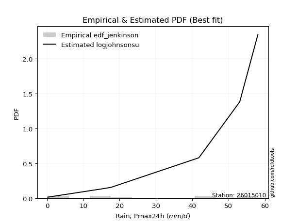</img>

</div>


### 11. Empirical - EDF Cunnane (1978)

Cunnane´s work in statistical hydrology has focused on the performance and evaluation of different probability distributions (such as GEV, Gumbel, Lognormal) for flood frequency estimation. _b_ is a constant, typically set to 0.4.

<div align="center">


$P=(m-b)/(n+1-2b)$


</div>


**11.1. Empirical values**

<div align="center">

|                | 0                    | 1                   | 2                   | 3                   | 4                   | 5                  | 6                  | 7                  | 8                  | 9                  |
|:---------------|:---------------------|:--------------------|:--------------------|:--------------------|:--------------------|:-------------------|:-------------------|:-------------------|:-------------------|:-------------------|
| date           | 2023                 | 2024                | 2025                | 2016                | 2021                | 2020               | 2018               | 2022               | 2019               | 2017               |
| x              | 0.2                  | 0.2                 | 1.0                 | 14.2                | 15.0                | 17.6               | 41.7               | 41.9               | 53.1               | 58.1               |
| m              | 1                    | 2                   | 3                   | 4                   | 5                   | 6                  | 7                  | 8                  | 9                  | 10                 |
| empirical_dist | edf_cunnane          | edf_cunnane         | edf_cunnane         | edf_cunnane         | edf_cunnane         | edf_cunnane        | edf_cunnane        | edf_cunnane        | edf_cunnane        | edf_cunnane        |
| empirical      | 0.058823529411764705 | 0.15686274509803924 | 0.25490196078431376 | 0.35294117647058826 | 0.45098039215686275 | 0.5490196078431373 | 0.6470588235294118 | 0.7450980392156863 | 0.8431372549019608 | 0.9411764705882353 |
| empirical_tr   | 1.0625               | 1.1860465116279069  | 1.3421052631578947  | 1.5454545454545456  | 1.8214285714285712  | 2.217391304347826  | 2.8333333333333335 | 3.9230769230769234 | 6.375              | 16.999999999999996 |

</div>


**11.2. Kolmogorov-Smirnov fit test (sorted by Δ)**


<div align="center">

|                | 0                   | 1                   | 2                   | 3                   | 4                   | 5                  | 6                   | 7                  | 8                   | 9                   | 10                  | 11                 | 12                  | 13                  | 14                  | 15                  | 16                  | 17                 | 18                  | 19                  | 20                  | 21                  | 22                    | 23                  | 24                  | 25                  | 26                  | 27                  | 28                  | 29                  | 30                  | 31                 | 32                  | 33                  | 34                  | 35                  | 36                  | 37                  | 38                 | 39                 | 40                 | 41                 | 42                  | 43                  | 44                 | 45                 | 46                 | 47                  | 48                 | 49                 | 50                  | 51                 | 52                  | 53                 | 54                  | 55                  | 56                 | 57                  | 58                  | 59                  | 60                 | 61                  | 62                  | 63                 | 64                 | 65                 | 66                 | 67                 | 68                  | 69                  | 70                  | 71                 | 72                 | 73                 | 74                  | 75                  | 76                  | 77                  | 78                  | 79                 | 80                 | 81                 | 82                 | 83                 | 84                 | 85                 | 86                 | 87                 | 88                 | 89                 |
|:---------------|:--------------------|:--------------------|:--------------------|:--------------------|:--------------------|:-------------------|:--------------------|:-------------------|:--------------------|:--------------------|:--------------------|:-------------------|:--------------------|:--------------------|:--------------------|:--------------------|:--------------------|:-------------------|:--------------------|:--------------------|:--------------------|:--------------------|:----------------------|:--------------------|:--------------------|:--------------------|:--------------------|:--------------------|:--------------------|:--------------------|:--------------------|:-------------------|:--------------------|:--------------------|:--------------------|:--------------------|:--------------------|:--------------------|:-------------------|:-------------------|:-------------------|:-------------------|:--------------------|:--------------------|:-------------------|:-------------------|:-------------------|:--------------------|:-------------------|:-------------------|:--------------------|:-------------------|:--------------------|:-------------------|:--------------------|:--------------------|:-------------------|:--------------------|:--------------------|:--------------------|:-------------------|:--------------------|:--------------------|:-------------------|:-------------------|:-------------------|:-------------------|:-------------------|:--------------------|:--------------------|:--------------------|:-------------------|:-------------------|:-------------------|:--------------------|:--------------------|:--------------------|:--------------------|:--------------------|:-------------------|:-------------------|:-------------------|:-------------------|:-------------------|:-------------------|:-------------------|:-------------------|:-------------------|:-------------------|:-------------------|
| station        | 26015010            | 26015010            | 26015010            | 26015010            | 26015010            | 26015010           | 26015010            | 26015010           | 26015010            | 26015010            | 26015010            | 26015010           | 26015010            | 26015010            | 26015010            | 26015010            | 26015010            | 26015010           | 26015010            | 26015010            | 26015010            | 26015010            | 26015010              | 26015010            | 26015010            | 26015010            | 26015010            | 26015010            | 26015010            | 26015010            | 26015010            | 26015010           | 26015010            | 26015010            | 26015010            | 26015010            | 26015010            | 26015010            | 26015010           | 26015010           | 26015010           | 26015010           | 26015010            | 26015010            | 26015010           | 26015010           | 26015010           | 26015010            | 26015010           | 26015010           | 26015010            | 26015010           | 26015010            | 26015010           | 26015010            | 26015010            | 26015010           | 26015010            | 26015010            | 26015010            | 26015010           | 26015010            | 26015010            | 26015010           | 26015010           | 26015010           | 26015010           | 26015010           | 26015010            | 26015010            | 26015010            | 26015010           | 26015010           | 26015010           | 26015010            | 26015010            | 26015010            | 26015010            | 26015010            | 26015010           | 26015010           | 26015010           | 26015010           | 26015010           | 26015010           | 26015010           | 26015010           | 26015010           | 26015010           | 26015010           |
| empirical_dist | edf_cunnane         | edf_cunnane         | edf_cunnane         | edf_cunnane         | edf_cunnane         | edf_cunnane        | edf_cunnane         | edf_cunnane        | edf_cunnane         | edf_cunnane         | edf_cunnane         | edf_cunnane        | edf_cunnane         | edf_cunnane         | edf_cunnane         | edf_cunnane         | edf_cunnane         | edf_cunnane        | edf_cunnane         | edf_cunnane         | edf_cunnane         | edf_cunnane         | edf_cunnane           | edf_cunnane         | edf_cunnane         | edf_cunnane         | edf_cunnane         | edf_cunnane         | edf_cunnane         | edf_cunnane         | edf_cunnane         | edf_cunnane        | edf_cunnane         | edf_cunnane         | edf_cunnane         | edf_cunnane         | edf_cunnane         | edf_cunnane         | edf_cunnane        | edf_cunnane        | edf_cunnane        | edf_cunnane        | edf_cunnane         | edf_cunnane         | edf_cunnane        | edf_cunnane        | edf_cunnane        | edf_cunnane         | edf_cunnane        | edf_cunnane        | edf_cunnane         | edf_cunnane        | edf_cunnane         | edf_cunnane        | edf_cunnane         | edf_cunnane         | edf_cunnane        | edf_cunnane         | edf_cunnane         | edf_cunnane         | edf_cunnane        | edf_cunnane         | edf_cunnane         | edf_cunnane        | edf_cunnane        | edf_cunnane        | edf_cunnane        | edf_cunnane        | edf_cunnane         | edf_cunnane         | edf_cunnane         | edf_cunnane        | edf_cunnane        | edf_cunnane        | edf_cunnane         | edf_cunnane         | edf_cunnane         | edf_cunnane         | edf_cunnane         | edf_cunnane        | edf_cunnane        | edf_cunnane        | edf_cunnane        | edf_cunnane        | edf_cunnane        | edf_cunnane        | edf_cunnane        | edf_cunnane        | edf_cunnane        | edf_cunnane        |
| p_dist         | logjohnsonsu        | maxwell             | rayleigh            | pearson3            | halfnorm            | rice               | ncf                 | laplace_asymmetric | exponnorm           | genlogistic         | crystalball         | norm               | t                   | kstwobign           | gumbel_r            | moyal               | logistic            | logweibull_min     | mielke              | invgauss            | loggumbel_l         | hypsecant           | loglaplace_asymmetric | logloggamma         | halflogistic        | logpearson3         | expon               | genexpon            | laplace             | gompertz            | truncnorm           | betaprime          | gumbel_l            | nakagami            | weibull_min         | wald                | gibrat              | logexponnorm        | lognct             | logcrystalball     | lognorm            | lognorm            | logt                | logerlang           | logrice            | loggamma           | loggamma           | loglogistic         | loginvgamma        | loginvgauss        | loginvweibull       | logtruncnorm       | logalpha            | fisk               | loghypsecant        | logmaxwell          | logncf             | f                   | lograyleigh         | chi2                | logkstwobign       | loglaplace          | loggenexpon         | loghalfnorm        | loggumbel_r        | pareto             | logexpon           | loghalflogistic    | logmoyal            | logf                | logpareto           | gamma              | logfisk            | erlang             | logwald             | fatiguelife         | loggibrat           | loglognorm          | johnsonsu           | invweibull         | lognakagami        | logbetaprime       | logfatiguelife     | logchi2            | alpha              | logmielke          | loggompertz        | nct                | invgamma           | loggenlogistic     |
| delta          | 0.14974271993052557 | 0.15014485785894627 | 0.15122691412601907 | 0.15445651339044186 | 0.15627750659777673 | 0.1603591208968661 | 0.16690903212656266 | 0.1680218378703764 | 0.17139716081604633 | 0.17229809187361633 | 0.17266205566107712 | 0.1726620679982946 | 0.17269950633033776 | 0.17287241606065007 | 0.17446652810652763 | 0.18385748261598667 | 0.18811915490092473 | 0.1899844464367692 | 0.19457844715284578 | 0.19566630882422237 | 0.20010010133185713 | 0.20048752442154527 | 0.20110495431290576   | 0.20155091812176373 | 0.20256676869323437 | 0.20811266220144625 | 0.22225184867885717 | 0.22571337298049982 | 0.22878813849432528 | 0.22942743382204284 | 0.23093552836976866 | 0.2310605723457711 | 0.23642956096443735 | 0.23766042321675956 | 0.24448941854867778 | 0.25490196078431376 | 0.25490196078431376 | 0.25778008426030413 | 0.2577808458467646 | 0.2577828982540085 | 0.2577829025773039 | 0.2577829025773039 | 0.25778301962121236 | 0.26008486301023265 | 0.2663320546422396 | 0.2686964102218368 | 0.2686964102218368 | 0.27187762643602015 | 0.2746622117481862 | 0.2771181018821293 | 0.27792136767791537 | 0.2794666340370338 | 0.28165735939849884 | 0.2830115545189744 | 0.28330100130393404 | 0.28333921362467224 | 0.2864083220928132 | 0.28724550914341923 | 0.29121551513770766 | 0.29212011648966785 | 0.3047609755624366 | 0.31112246768620927 | 0.31126211914363006 | 0.3137142865566422 | 0.3231293376309409 | 0.3265342004323148 | 0.3349842647025523 | 0.3420787814498815 | 0.34529691828616466 | 0.35198526095124266 | 0.37556376166575406 | 0.3808381529235116 | 0.3905104375929165 | 0.3996680362219996 | 0.40722498703018545 | 0.41020885528789003 | 0.43917670655032653 | 0.46199919457597804 | 0.48334410386871957 | 0.5314985955571438 | 0.5545866112512368 | 0.5741263023464136 | 0.5811226571708379 | 0.5872293820772534 | 0.6223883152953174 | 0.6387738659504245 | 0.6534607003674169 | 0.7372655512485249 | 0.7441516609309029 | 0.8431372549019608 |
| deltao         | 0.3942745923300002  | 0.3942745923300002  | 0.3942745923300002  | 0.3942745923300002  | 0.3942745923300002  | 0.3942745923300002 | 0.3942745923300002  | 0.3942745923300002 | 0.3942745923300002  | 0.3942745923300002  | 0.3942745923300002  | 0.3942745923300002 | 0.3942745923300002  | 0.3942745923300002  | 0.3942745923300002  | 0.3942745923300002  | 0.3942745923300002  | 0.3942745923300002 | 0.3942745923300002  | 0.3942745923300002  | 0.3942745923300002  | 0.3942745923300002  | 0.3942745923300002    | 0.3942745923300002  | 0.3942745923300002  | 0.3942745923300002  | 0.3942745923300002  | 0.3942745923300002  | 0.3942745923300002  | 0.3942745923300002  | 0.3942745923300002  | 0.3942745923300002 | 0.3942745923300002  | 0.3942745923300002  | 0.3942745923300002  | 0.3942745923300002  | 0.3942745923300002  | 0.3942745923300002  | 0.3942745923300002 | 0.3942745923300002 | 0.3942745923300002 | 0.3942745923300002 | 0.3942745923300002  | 0.3942745923300002  | 0.3942745923300002 | 0.3942745923300002 | 0.3942745923300002 | 0.3942745923300002  | 0.3942745923300002 | 0.3942745923300002 | 0.3942745923300002  | 0.3942745923300002 | 0.3942745923300002  | 0.3942745923300002 | 0.3942745923300002  | 0.3942745923300002  | 0.3942745923300002 | 0.3942745923300002  | 0.3942745923300002  | 0.3942745923300002  | 0.3942745923300002 | 0.3942745923300002  | 0.3942745923300002  | 0.3942745923300002 | 0.3942745923300002 | 0.3942745923300002 | 0.3942745923300002 | 0.3942745923300002 | 0.3942745923300002  | 0.3942745923300002  | 0.3942745923300002  | 0.3942745923300002 | 0.3942745923300002 | 0.3942745923300002 | 0.3942745923300002  | 0.3942745923300002  | 0.3942745923300002  | 0.3942745923300002  | 0.3942745923300002  | 0.3942745923300002 | 0.3942745923300002 | 0.3942745923300002 | 0.3942745923300002 | 0.3942745923300002 | 0.3942745923300002 | 0.3942745923300002 | 0.3942745923300002 | 0.3942745923300002 | 0.3942745923300002 | 0.3942745923300002 |
| eval           | Δo > Δ              | Δo > Δ              | Δo > Δ              | Δo > Δ              | Δo > Δ              | Δo > Δ             | Δo > Δ              | Δo > Δ             | Δo > Δ              | Δo > Δ              | Δo > Δ              | Δo > Δ             | Δo > Δ              | Δo > Δ              | Δo > Δ              | Δo > Δ              | Δo > Δ              | Δo > Δ             | Δo > Δ              | Δo > Δ              | Δo > Δ              | Δo > Δ              | Δo > Δ                | Δo > Δ              | Δo > Δ              | Δo > Δ              | Δo > Δ              | Δo > Δ              | Δo > Δ              | Δo > Δ              | Δo > Δ              | Δo > Δ             | Δo > Δ              | Δo > Δ              | Δo > Δ              | Δo > Δ              | Δo > Δ              | Δo > Δ              | Δo > Δ             | Δo > Δ             | Δo > Δ             | Δo > Δ             | Δo > Δ              | Δo > Δ              | Δo > Δ             | Δo > Δ             | Δo > Δ             | Δo > Δ              | Δo > Δ             | Δo > Δ             | Δo > Δ              | Δo > Δ             | Δo > Δ              | Δo > Δ             | Δo > Δ              | Δo > Δ              | Δo > Δ             | Δo > Δ              | Δo > Δ              | Δo > Δ              | Δo > Δ             | Δo > Δ              | Δo > Δ              | Δo > Δ             | Δo > Δ             | Δo > Δ             | Δo > Δ             | Δo > Δ             | Δo > Δ              | Δo > Δ              | Δo > Δ              | Δo > Δ             | Δo > Δ             | Δo <= Δ            | Δo <= Δ             | Δo <= Δ             | Δo <= Δ             | Δo <= Δ             | Δo <= Δ             | Δo <= Δ            | Δo <= Δ            | Δo <= Δ            | Δo <= Δ            | Δo <= Δ            | Δo <= Δ            | Δo <= Δ            | Δo <= Δ            | Δo <= Δ            | Δo <= Δ            | Δo <= Δ            |
| fit            | 1                   | 1                   | 1                   | 1                   | 1                   | 1                  | 1                   | 1                  | 1                   | 1                   | 1                   | 1                  | 1                   | 1                   | 1                   | 1                   | 1                   | 1                  | 1                   | 1                   | 1                   | 1                   | 1                     | 1                   | 1                   | 1                   | 1                   | 1                   | 1                   | 1                   | 1                   | 1                  | 1                   | 1                   | 1                   | 1                   | 1                   | 1                   | 1                  | 1                  | 1                  | 1                  | 1                   | 1                   | 1                  | 1                  | 1                  | 1                   | 1                  | 1                  | 1                   | 1                  | 1                   | 1                  | 1                   | 1                   | 1                  | 1                   | 1                   | 1                   | 1                  | 1                   | 1                   | 1                  | 1                  | 1                  | 1                  | 1                  | 1                   | 1                   | 1                   | 1                  | 1                  | 0                  | 0                   | 0                   | 0                   | 0                   | 0                   | 0                  | 0                  | 0                  | 0                  | 0                  | 0                  | 0                  | 0                  | 0                  | 0                  | 0                  |
| n              | 10                  | 10                  | 10                  | 10                  | 10                  | 10                 | 10                  | 10                 | 10                  | 10                  | 10                  | 10                 | 10                  | 10                  | 10                  | 10                  | 10                  | 10                 | 10                  | 10                  | 10                  | 10                  | 10                    | 10                  | 10                  | 10                  | 10                  | 10                  | 10                  | 10                  | 10                  | 10                 | 10                  | 10                  | 10                  | 10                  | 10                  | 10                  | 10                 | 10                 | 10                 | 10                 | 10                  | 10                  | 10                 | 10                 | 10                 | 10                  | 10                 | 10                 | 10                  | 10                 | 10                  | 10                 | 10                  | 10                  | 10                 | 10                  | 10                  | 10                  | 10                 | 10                  | 10                  | 10                 | 10                 | 10                 | 10                 | 10                 | 10                  | 10                  | 10                  | 10                 | 10                 | 10                 | 10                  | 10                  | 10                  | 10                  | 10                  | 10                 | 10                 | 10                 | 10                 | 10                 | 10                 | 10                 | 10                 | 10                 | 10                 | 10                 |
| best_fit       | 1                   | 0                   | 0                   | 0                   | 0                   | 0                  | 0                   | 0                  | 0                   | 0                   | 0                   | 0                  | 0                   | 0                   | 0                   | 0                   | 0                   | 0                  | 0                   | 0                   | 0                   | 0                   | 0                     | 0                   | 0                   | 0                   | 0                   | 0                   | 0                   | 0                   | 0                   | 0                  | 0                   | 0                   | 0                   | 0                   | 0                   | 0                   | 0                  | 0                  | 0                  | 0                  | 0                   | 0                   | 0                  | 0                  | 0                  | 0                   | 0                  | 0                  | 0                   | 0                  | 0                   | 0                  | 0                   | 0                   | 0                  | 0                   | 0                   | 0                   | 0                  | 0                   | 0                   | 0                  | 0                  | 0                  | 0                  | 0                  | 0                   | 0                   | 0                   | 0                  | 0                  | 0                  | 0                   | 0                   | 0                   | 0                   | 0                   | 0                  | 0                  | 0                  | 0                  | 0                  | 0                  | 0                  | 0                  | 0                  | 0                  | 0                  |
| best_fit_sort  | 1                   | 2                   | 3                   | 4                   | 5                   | 6                  | 7                   | 8                  | 9                   | 10                  | 11                  | 12                 | 13                  | 14                  | 15                  | 16                  | 17                  | 18                 | 19                  | 20                  | 21                  | 22                  | 23                    | 24                  | 25                  | 26                  | 27                  | 28                  | 29                  | 30                  | 31                  | 32                 | 33                  | 34                  | 35                  | 36                  | 37                  | 38                  | 39                 | 40                 | 41                 | 42                 | 43                  | 44                  | 45                 | 46                 | 47                 | 48                  | 49                 | 50                 | 51                  | 52                 | 53                  | 54                 | 55                  | 56                  | 57                 | 58                  | 59                  | 60                  | 61                 | 62                  | 63                  | 64                 | 65                 | 66                 | 67                 | 68                 | 69                  | 70                  | 71                  | 72                 | 73                 | 74                 | 75                  | 76                  | 77                  | 78                  | 79                  | 80                 | 81                 | 82                 | 83                 | 84                 | 85                 | 86                 | 87                 | 88                 | 89                 | 90                 |

</div>


<div align="center">

</img>

</div>


**11.3. Best fit**

<div align="center">

|   id |   station | empirical_dist   | p_dist       |    delta |   deltao | eval   |   fit |   n |   best_fit |   best_fit_sort |
|-----:|----------:|:-----------------|:-------------|---------:|---------:|:-------|------:|----:|-----------:|----------------:|
|    0 |  26015010 | edf_cunnane      | logjohnsonsu | 0.149743 | 0.394275 | Δo > Δ |     1 |  10 |          1 |               1 |

</div>


<div align="center">

</img>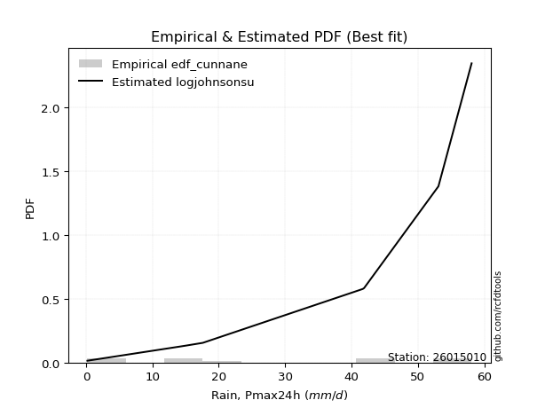</img>

</div>


### 12. Empirical - EDF Adamowski (1981)

The Adamowski formula in hydrology refers to a specific plotting position formula used for estimating the non-parametric empirical distribution of hydrological events (like flood peaks) to calculate their return periods. This formula provides an alternative to traditional parametric methods (like the Gumbel or Log Pearson Type III distributions). 

<div align="center">


$P=(m-0.25)/(n+0.5)$


</div>


**12.1. Empirical values**

<div align="center">

|                | 0                   | 1                   | 2                  | 3                   | 4                  | 5                  | 6                  | 7                  | 8                  | 9                  |
|:---------------|:--------------------|:--------------------|:-------------------|:--------------------|:-------------------|:-------------------|:-------------------|:-------------------|:-------------------|:-------------------|
| date           | 2023                | 2024                | 2025               | 2016                | 2021               | 2020               | 2018               | 2022               | 2019               | 2017               |
| x              | 0.2                 | 0.2                 | 1.0                | 14.2                | 15.0               | 17.6               | 41.7               | 41.9               | 53.1               | 58.1               |
| m              | 1                   | 2                   | 3                  | 4                   | 5                  | 6                  | 7                  | 8                  | 9                  | 10                 |
| empirical_dist | edf_adamowski       | edf_adamowski       | edf_adamowski      | edf_adamowski       | edf_adamowski      | edf_adamowski      | edf_adamowski      | edf_adamowski      | edf_adamowski      | edf_adamowski      |
| empirical      | 0.07142857142857142 | 0.16666666666666666 | 0.2619047619047619 | 0.35714285714285715 | 0.4523809523809524 | 0.5476190476190477 | 0.6428571428571429 | 0.7380952380952381 | 0.8333333333333334 | 0.9285714285714286 |
| empirical_tr   | 1.0769230769230769  | 1.2                 | 1.3548387096774193 | 1.5555555555555558  | 1.826086956521739  | 2.210526315789474  | 2.8000000000000003 | 3.818181818181819  | 6.000000000000002  | 14.000000000000007 |

</div>


**12.2. Kolmogorov-Smirnov fit test (sorted by Δ)**


<div align="center">

|                | 0                   | 1                   | 2                   | 3                  | 4                   | 5                   | 6                  | 7                  | 8                   | 9                   | 10                  | 11                  | 12                  | 13                  | 14                  | 15                 | 16                 | 17                 | 18                  | 19                  | 20                  | 21                  | 22                  | 23                    | 24                  | 25                  | 26                 | 27                  | 28                  | 29                 | 30                  | 31                  | 32                  | 33                 | 34                  | 35                  | 36                 | 37                 | 38                 | 39                 | 40                  | 41                  | 42                 | 43                 | 44                 | 45                  | 46                  | 47                  | 48                  | 49                  | 50                 | 51                 | 52                 | 53                 | 54                  | 55                  | 56                  | 57                  | 58                  | 59                  | 60                 | 61                 | 62                  | 63                 | 64                  | 65                 | 66                  | 67                 | 68                  | 69                  | 70                 | 71                 | 72                 | 73                 | 74                  | 75                  | 76                  | 77                  | 78                 | 79                 | 80                 | 81                 | 82                 | 83                 | 84                 | 85                 | 86                 | 87                 | 88                 | 89                 |
|:---------------|:--------------------|:--------------------|:--------------------|:-------------------|:--------------------|:--------------------|:-------------------|:-------------------|:--------------------|:--------------------|:--------------------|:--------------------|:--------------------|:--------------------|:--------------------|:-------------------|:-------------------|:-------------------|:--------------------|:--------------------|:--------------------|:--------------------|:--------------------|:----------------------|:--------------------|:--------------------|:-------------------|:--------------------|:--------------------|:-------------------|:--------------------|:--------------------|:--------------------|:-------------------|:--------------------|:--------------------|:-------------------|:-------------------|:-------------------|:-------------------|:--------------------|:--------------------|:-------------------|:-------------------|:-------------------|:--------------------|:--------------------|:--------------------|:--------------------|:--------------------|:-------------------|:-------------------|:-------------------|:-------------------|:--------------------|:--------------------|:--------------------|:--------------------|:--------------------|:--------------------|:-------------------|:-------------------|:--------------------|:-------------------|:--------------------|:-------------------|:--------------------|:-------------------|:--------------------|:--------------------|:-------------------|:-------------------|:-------------------|:-------------------|:--------------------|:--------------------|:--------------------|:--------------------|:-------------------|:-------------------|:-------------------|:-------------------|:-------------------|:-------------------|:-------------------|:-------------------|:-------------------|:-------------------|:-------------------|:-------------------|
| station        | 26015010            | 26015010            | 26015010            | 26015010           | 26015010            | 26015010            | 26015010           | 26015010           | 26015010            | 26015010            | 26015010            | 26015010            | 26015010            | 26015010            | 26015010            | 26015010           | 26015010           | 26015010           | 26015010            | 26015010            | 26015010            | 26015010            | 26015010            | 26015010              | 26015010            | 26015010            | 26015010           | 26015010            | 26015010            | 26015010           | 26015010            | 26015010            | 26015010            | 26015010           | 26015010            | 26015010            | 26015010           | 26015010           | 26015010           | 26015010           | 26015010            | 26015010            | 26015010           | 26015010           | 26015010           | 26015010            | 26015010            | 26015010            | 26015010            | 26015010            | 26015010           | 26015010           | 26015010           | 26015010           | 26015010            | 26015010            | 26015010            | 26015010            | 26015010            | 26015010            | 26015010           | 26015010           | 26015010            | 26015010           | 26015010            | 26015010           | 26015010            | 26015010           | 26015010            | 26015010            | 26015010           | 26015010           | 26015010           | 26015010           | 26015010            | 26015010            | 26015010            | 26015010            | 26015010           | 26015010           | 26015010           | 26015010           | 26015010           | 26015010           | 26015010           | 26015010           | 26015010           | 26015010           | 26015010           | 26015010           |
| empirical_dist | edf_adamowski       | edf_adamowski       | edf_adamowski       | edf_adamowski      | edf_adamowski       | edf_adamowski       | edf_adamowski      | edf_adamowski      | edf_adamowski       | edf_adamowski       | edf_adamowski       | edf_adamowski       | edf_adamowski       | edf_adamowski       | edf_adamowski       | edf_adamowski      | edf_adamowski      | edf_adamowski      | edf_adamowski       | edf_adamowski       | edf_adamowski       | edf_adamowski       | edf_adamowski       | edf_adamowski         | edf_adamowski       | edf_adamowski       | edf_adamowski      | edf_adamowski       | edf_adamowski       | edf_adamowski      | edf_adamowski       | edf_adamowski       | edf_adamowski       | edf_adamowski      | edf_adamowski       | edf_adamowski       | edf_adamowski      | edf_adamowski      | edf_adamowski      | edf_adamowski      | edf_adamowski       | edf_adamowski       | edf_adamowski      | edf_adamowski      | edf_adamowski      | edf_adamowski       | edf_adamowski       | edf_adamowski       | edf_adamowski       | edf_adamowski       | edf_adamowski      | edf_adamowski      | edf_adamowski      | edf_adamowski      | edf_adamowski       | edf_adamowski       | edf_adamowski       | edf_adamowski       | edf_adamowski       | edf_adamowski       | edf_adamowski      | edf_adamowski      | edf_adamowski       | edf_adamowski      | edf_adamowski       | edf_adamowski      | edf_adamowski       | edf_adamowski      | edf_adamowski       | edf_adamowski       | edf_adamowski      | edf_adamowski      | edf_adamowski      | edf_adamowski      | edf_adamowski       | edf_adamowski       | edf_adamowski       | edf_adamowski       | edf_adamowski      | edf_adamowski      | edf_adamowski      | edf_adamowski      | edf_adamowski      | edf_adamowski      | edf_adamowski      | edf_adamowski      | edf_adamowski      | edf_adamowski      | edf_adamowski      | edf_adamowski      |
| p_dist         | logjohnsonsu        | maxwell             | rayleigh            | pearson3           | halfnorm            | rice                | exponnorm          | crystalball        | norm                | t                   | laplace_asymmetric  | ncf                 | genlogistic         | kstwobign           | gumbel_r            | logweibull_min     | logistic           | moyal              | invgauss            | loggumbel_l         | mielke              | hypsecant           | logpearson3         | loglaplace_asymmetric | logloggamma         | halflogistic        | betaprime          | laplace             | expon               | weibull_min        | genexpon            | nakagami            | gumbel_l            | gompertz           | truncnorm           | logexponnorm        | lognct             | logcrystalball     | lognorm            | lognorm            | logt                | logerlang           | wald               | gibrat             | logrice            | loggamma            | loggamma            | loglogistic         | fisk                | loginvgamma         | loginvgauss        | loginvweibull      | logncf             | logtruncnorm       | logalpha            | loghypsecant        | logmaxwell          | f                   | lograyleigh         | chi2                | logkstwobign       | loglaplace         | loggenexpon         | loghalfnorm        | loggumbel_r         | pareto             | logexpon            | loghalflogistic    | logmoyal            | logf                | logpareto          | gamma              | logfisk            | erlang             | logwald             | fatiguelife         | loggibrat           | loglognorm          | johnsonsu          | invweibull         | lognakagami        | logbetaprime       | logfatiguelife     | logchi2            | alpha              | logmielke          | loggompertz        | nct                | invgamma           | loggenlogistic     |
| delta          | 0.14834215970643594 | 0.15434653853121516 | 0.15542859479828797 | 0.1560123438022355 | 0.16047918727004562 | 0.16736192201731426 | 0.1699966005919567 | 0.1712614954369875 | 0.17126150777420496 | 0.17129894610624813 | 0.17222351854264528 | 0.17391183324701082 | 0.17649977254588523 | 0.17707409673291896 | 0.17866820877879652 | 0.1857827657645003 | 0.1867185946768351 | 0.1883289100080272 | 0.19146462815195348 | 0.19589842065958823 | 0.19878012782511467 | 0.19908696419745564 | 0.20391098152917736 | 0.20530663498517465   | 0.20575259879403263 | 0.20956956981368252 | 0.2268588916735022 | 0.22738757827023565 | 0.22925464979930532 | 0.2318843765318711 | 0.23271617410094797 | 0.23345874254449067 | 0.23502900074034772 | 0.236430234942491  | 0.23793832949021682 | 0.25357840358803524 | 0.2535791651744957 | 0.2535812175817396 | 0.253581221905035  | 0.253581221905035  | 0.25358133894894347 | 0.25588318233796375 | 0.2619047619047619 | 0.2619047619047619 | 0.2621303739699707 | 0.26449472954956793 | 0.26449472954956793 | 0.26767594576375126 | 0.27040651250216774 | 0.27046053107591733 | 0.2729164212098604 | 0.2737196870056465 | 0.2738032800760065 | 0.2752649533647649 | 0.27745567872622995 | 0.27909932063166515 | 0.27913753295240334 | 0.28304382847115034 | 0.28701383446543877 | 0.29632179716193674 | 0.3005592948901677 | 0.3069207870139404 | 0.30706043847136116 | 0.3095126058843733 | 0.31892765695867203 | 0.3223325197600459 | 0.33078258403028343 | 0.3378771007776126 | 0.34109523761389576 | 0.34778358027897377 | 0.3685609605453059 | 0.3766364722512427 | 0.3779053955761098 | 0.3954663555497307 | 0.40302330635791656 | 0.40600717461562114 | 0.43497502587805764 | 0.44939415255917137 | 0.4763413027482714 | 0.5188935535403372 | 0.5475838101307886 | 0.5671235012259654 | 0.576920976498569  | 0.5830277014049845 | 0.6181866346230485 | 0.6317710648299764 | 0.6464578992469687 | 0.7302627501280767 | 0.7371488598104547 | 0.8333333333333334 |
| deltao         | 0.3942745923300002  | 0.3942745923300002  | 0.3942745923300002  | 0.3942745923300002 | 0.3942745923300002  | 0.3942745923300002  | 0.3942745923300002 | 0.3942745923300002 | 0.3942745923300002  | 0.3942745923300002  | 0.3942745923300002  | 0.3942745923300002  | 0.3942745923300002  | 0.3942745923300002  | 0.3942745923300002  | 0.3942745923300002 | 0.3942745923300002 | 0.3942745923300002 | 0.3942745923300002  | 0.3942745923300002  | 0.3942745923300002  | 0.3942745923300002  | 0.3942745923300002  | 0.3942745923300002    | 0.3942745923300002  | 0.3942745923300002  | 0.3942745923300002 | 0.3942745923300002  | 0.3942745923300002  | 0.3942745923300002 | 0.3942745923300002  | 0.3942745923300002  | 0.3942745923300002  | 0.3942745923300002 | 0.3942745923300002  | 0.3942745923300002  | 0.3942745923300002 | 0.3942745923300002 | 0.3942745923300002 | 0.3942745923300002 | 0.3942745923300002  | 0.3942745923300002  | 0.3942745923300002 | 0.3942745923300002 | 0.3942745923300002 | 0.3942745923300002  | 0.3942745923300002  | 0.3942745923300002  | 0.3942745923300002  | 0.3942745923300002  | 0.3942745923300002 | 0.3942745923300002 | 0.3942745923300002 | 0.3942745923300002 | 0.3942745923300002  | 0.3942745923300002  | 0.3942745923300002  | 0.3942745923300002  | 0.3942745923300002  | 0.3942745923300002  | 0.3942745923300002 | 0.3942745923300002 | 0.3942745923300002  | 0.3942745923300002 | 0.3942745923300002  | 0.3942745923300002 | 0.3942745923300002  | 0.3942745923300002 | 0.3942745923300002  | 0.3942745923300002  | 0.3942745923300002 | 0.3942745923300002 | 0.3942745923300002 | 0.3942745923300002 | 0.3942745923300002  | 0.3942745923300002  | 0.3942745923300002  | 0.3942745923300002  | 0.3942745923300002 | 0.3942745923300002 | 0.3942745923300002 | 0.3942745923300002 | 0.3942745923300002 | 0.3942745923300002 | 0.3942745923300002 | 0.3942745923300002 | 0.3942745923300002 | 0.3942745923300002 | 0.3942745923300002 | 0.3942745923300002 |
| eval           | Δo > Δ              | Δo > Δ              | Δo > Δ              | Δo > Δ             | Δo > Δ              | Δo > Δ              | Δo > Δ             | Δo > Δ             | Δo > Δ              | Δo > Δ              | Δo > Δ              | Δo > Δ              | Δo > Δ              | Δo > Δ              | Δo > Δ              | Δo > Δ             | Δo > Δ             | Δo > Δ             | Δo > Δ              | Δo > Δ              | Δo > Δ              | Δo > Δ              | Δo > Δ              | Δo > Δ                | Δo > Δ              | Δo > Δ              | Δo > Δ             | Δo > Δ              | Δo > Δ              | Δo > Δ             | Δo > Δ              | Δo > Δ              | Δo > Δ              | Δo > Δ             | Δo > Δ              | Δo > Δ              | Δo > Δ             | Δo > Δ             | Δo > Δ             | Δo > Δ             | Δo > Δ              | Δo > Δ              | Δo > Δ             | Δo > Δ             | Δo > Δ             | Δo > Δ              | Δo > Δ              | Δo > Δ              | Δo > Δ              | Δo > Δ              | Δo > Δ             | Δo > Δ             | Δo > Δ             | Δo > Δ             | Δo > Δ              | Δo > Δ              | Δo > Δ              | Δo > Δ              | Δo > Δ              | Δo > Δ              | Δo > Δ             | Δo > Δ             | Δo > Δ              | Δo > Δ             | Δo > Δ              | Δo > Δ             | Δo > Δ              | Δo > Δ             | Δo > Δ              | Δo > Δ              | Δo > Δ             | Δo > Δ             | Δo > Δ             | Δo <= Δ            | Δo <= Δ             | Δo <= Δ             | Δo <= Δ             | Δo <= Δ             | Δo <= Δ            | Δo <= Δ            | Δo <= Δ            | Δo <= Δ            | Δo <= Δ            | Δo <= Δ            | Δo <= Δ            | Δo <= Δ            | Δo <= Δ            | Δo <= Δ            | Δo <= Δ            | Δo <= Δ            |
| fit            | 1                   | 1                   | 1                   | 1                  | 1                   | 1                   | 1                  | 1                  | 1                   | 1                   | 1                   | 1                   | 1                   | 1                   | 1                   | 1                  | 1                  | 1                  | 1                   | 1                   | 1                   | 1                   | 1                   | 1                     | 1                   | 1                   | 1                  | 1                   | 1                   | 1                  | 1                   | 1                   | 1                   | 1                  | 1                   | 1                   | 1                  | 1                  | 1                  | 1                  | 1                   | 1                   | 1                  | 1                  | 1                  | 1                   | 1                   | 1                   | 1                   | 1                   | 1                  | 1                  | 1                  | 1                  | 1                   | 1                   | 1                   | 1                   | 1                   | 1                   | 1                  | 1                  | 1                   | 1                  | 1                   | 1                  | 1                   | 1                  | 1                   | 1                   | 1                  | 1                  | 1                  | 0                  | 0                   | 0                   | 0                   | 0                   | 0                  | 0                  | 0                  | 0                  | 0                  | 0                  | 0                  | 0                  | 0                  | 0                  | 0                  | 0                  |
| n              | 10                  | 10                  | 10                  | 10                 | 10                  | 10                  | 10                 | 10                 | 10                  | 10                  | 10                  | 10                  | 10                  | 10                  | 10                  | 10                 | 10                 | 10                 | 10                  | 10                  | 10                  | 10                  | 10                  | 10                    | 10                  | 10                  | 10                 | 10                  | 10                  | 10                 | 10                  | 10                  | 10                  | 10                 | 10                  | 10                  | 10                 | 10                 | 10                 | 10                 | 10                  | 10                  | 10                 | 10                 | 10                 | 10                  | 10                  | 10                  | 10                  | 10                  | 10                 | 10                 | 10                 | 10                 | 10                  | 10                  | 10                  | 10                  | 10                  | 10                  | 10                 | 10                 | 10                  | 10                 | 10                  | 10                 | 10                  | 10                 | 10                  | 10                  | 10                 | 10                 | 10                 | 10                 | 10                  | 10                  | 10                  | 10                  | 10                 | 10                 | 10                 | 10                 | 10                 | 10                 | 10                 | 10                 | 10                 | 10                 | 10                 | 10                 |
| best_fit       | 1                   | 0                   | 0                   | 0                  | 0                   | 0                   | 0                  | 0                  | 0                   | 0                   | 0                   | 0                   | 0                   | 0                   | 0                   | 0                  | 0                  | 0                  | 0                   | 0                   | 0                   | 0                   | 0                   | 0                     | 0                   | 0                   | 0                  | 0                   | 0                   | 0                  | 0                   | 0                   | 0                   | 0                  | 0                   | 0                   | 0                  | 0                  | 0                  | 0                  | 0                   | 0                   | 0                  | 0                  | 0                  | 0                   | 0                   | 0                   | 0                   | 0                   | 0                  | 0                  | 0                  | 0                  | 0                   | 0                   | 0                   | 0                   | 0                   | 0                   | 0                  | 0                  | 0                   | 0                  | 0                   | 0                  | 0                   | 0                  | 0                   | 0                   | 0                  | 0                  | 0                  | 0                  | 0                   | 0                   | 0                   | 0                   | 0                  | 0                  | 0                  | 0                  | 0                  | 0                  | 0                  | 0                  | 0                  | 0                  | 0                  | 0                  |
| best_fit_sort  | 1                   | 2                   | 3                   | 4                  | 5                   | 6                   | 7                  | 8                  | 9                   | 10                  | 11                  | 12                  | 13                  | 14                  | 15                  | 16                 | 17                 | 18                 | 19                  | 20                  | 21                  | 22                  | 23                  | 24                    | 25                  | 26                  | 27                 | 28                  | 29                  | 30                 | 31                  | 32                  | 33                  | 34                 | 35                  | 36                  | 37                 | 38                 | 39                 | 40                 | 41                  | 42                  | 43                 | 44                 | 45                 | 46                  | 47                  | 48                  | 49                  | 50                  | 51                 | 52                 | 53                 | 54                 | 55                  | 56                  | 57                  | 58                  | 59                  | 60                  | 61                 | 62                 | 63                  | 64                 | 65                  | 66                 | 67                  | 68                 | 69                  | 70                  | 71                 | 72                 | 73                 | 74                 | 75                  | 76                  | 77                  | 78                  | 79                 | 80                 | 81                 | 82                 | 83                 | 84                 | 85                 | 86                 | 87                 | 88                 | 89                 | 90                 |

</div>


<div align="center">

</img>

</div>


**12.3. Best fit**

<div align="center">

|   id |   station | empirical_dist   | p_dist       |    delta |   deltao | eval   |   fit |   n |   best_fit |   best_fit_sort |
|-----:|----------:|:-----------------|:-------------|---------:|---------:|:-------|------:|----:|-----------:|----------------:|
|    0 |  26015010 | edf_adamowski    | logjohnsonsu | 0.148342 | 0.394275 | Δo > Δ |     1 |  10 |          1 |               1 |

</div>


<div align="center">

</img></img>

</div>


## C. Best fit & Estimate extreme values for specific return periods - Tr


### 1. Best fit (ordered by delta Δ)

<div align="center">

|   id |   station | empirical_dist   | p_dist       |    delta |   deltao | eval   |   fit |   n |   best_fit |   best_fit_sort |
|-----:|----------:|:-----------------|:-------------|---------:|---------:|:-------|------:|----:|-----------:|----------------:|
|    0 |  26015010 | edf_weibull      | logjohnsonsu | 0.146178 | 0.394275 | Δo > Δ |     1 |  10 |          1 |               1 |
|    1 |  26015010 | edf_hazen        | maxwell      | 0.147204 | 0.394275 | Δo > Δ |     1 |  10 |          1 |               2 |
|    2 |  26015010 | edf_adamowski    | logjohnsonsu | 0.148342 | 0.394275 | Δo > Δ |     1 |  10 |          1 |               3 |
|    3 |  26015010 | edf_chegodayev   | logjohnsonsu | 0.1488   | 0.394275 | Δo > Δ |     1 |  10 |          1 |               4 |
|    4 |  26015010 | edf_jenkinson    | logjohnsonsu | 0.148893 | 0.394275 | Δo > Δ |     1 |  10 |          1 |               5 |
|    5 |  26015010 | edf_beard        | logjohnsonsu | 0.148893 | 0.394275 | Δo > Δ |     1 |  10 |          1 |               6 |
|    6 |  26015010 | edf_filliben     | logjohnsonsu | 0.148962 | 0.394275 | Δo > Δ |     1 |  10 |          1 |               7 |
|    7 |  26015010 | edf_gringorten   | maxwell      | 0.148982 | 0.394275 | Δo > Δ |     1 |  10 |          1 |               8 |
|    8 |  26015010 | edf_tukey        | logjohnsonsu | 0.14911  | 0.394275 | Δo > Δ |     1 |  10 |          1 |               9 |
|    9 |  26015010 | edf_blom         | logjohnsonsu | 0.149504 | 0.394275 | Δo > Δ |     1 |  10 |          1 |              10 |
|   10 |  26015010 | edf_cunnane      | logjohnsonsu | 0.149743 | 0.394275 | Δo > Δ |     1 |  10 |          1 |              11 |
|   11 |  26015010 | edf_california   | loggumbel_l  | 0.153742 | 0.394275 | Δo > Δ |     1 |  10 |          1 |              12 |

</div>

:file_folder:Tables: [bestfit_26015010.csv](table/bestfit_26015010.csv) | [extreme_26015010.csv](table/extreme_26015010.csv)


### 2. Extreme values

In hydrology, a return period (or recurrence interval $Tr$) is the statistical average time between extreme events like floods or droughts of a specific magnitude, indicating how rare an event is, with a 100-year flood, for example, having a 1% chance of occurring in any given year, not that it happens exactly every century. It is a key tool for infrastructure design (like bridges or dams) and risk assessment, calculated from historical data to determine the probability of future events, although it is important to remember it is statistical average, and events can cluster or be missed.

> risk_rate: assuming the return period as the project useful life.

|   id |      tr |   prob_l |     prob_g |      alpha |    betaprime |     chi2 |   crystalball |    erlang |    expon |   exponnorm |         f |   fatiguelife |             fisk |    gamma |   genexpon |   genlogistic |   gibrat |   gompertz |   gumbel_l |   gumbel_r |   halflogistic |   halfnorm |   hypsecant |   invgamma |   invgauss |      invweibull |        johnsonsu |   kstwobign |   laplace |   laplace_asymmetric |    loggamma |   logistic |    lognorm |   maxwell |   mielke |    moyal |   nakagami |      ncf |          nct |    norm |           pareto |   pearson3 |   rayleigh |    rice |       t |   truncnorm |     wald |   weibull_min |    logalpha |    logbetaprime |      logchi2 |   logcrystalball |   logerlang |         logexpon |   logexponnorm |           logf |   logfatiguelife |     logfisk |      loggenexpon |   loggenlogistic |        loggibrat |   loggompertz |   loggumbel_l |   loggumbel_r |   loghalflogistic |   loghalfnorm |   loghypsecant |   loginvgamma |   loginvgauss |    loginvweibull |   logjohnsonsu |   logkstwobign |   loglaplace |   loglaplace_asymmetric |   logloggamma |   loglogistic |        loglognorm |   logmaxwell |        logmielke |     logmoyal |      lognakagami |         logncf |    lognct |      logpareto |   logpearson3 |   lograyleigh |    logrice |       logt |   logtruncnorm |          logwald |   logweibull_min |   station |   n |   risk_rate |
|-----:|--------:|---------:|-----------:|-----------:|-------------:|---------:|--------------:|----------:|---------:|------------:|----------:|--------------:|-----------------:|---------:|-----------:|--------------:|---------:|-----------:|-----------:|-----------:|---------------:|-----------:|------------:|-----------:|-----------:|----------------:|-----------------:|------------:|----------:|---------------------:|------------:|-----------:|-----------:|----------:|---------:|---------:|-----------:|---------:|-------------:|--------:|-----------------:|-----------:|-----------:|--------:|--------:|------------:|---------:|--------------:|------------:|----------------:|-------------:|-----------------:|------------:|-----------------:|---------------:|---------------:|-----------------:|------------:|-----------------:|-----------------:|-----------------:|--------------:|--------------:|--------------:|------------------:|--------------:|---------------:|--------------:|--------------:|-----------------:|---------------:|---------------:|-------------:|------------------------:|--------------:|--------------:|------------------:|-------------:|-----------------:|-------------:|-----------------:|---------------:|----------:|---------------:|--------------:|--------------:|-----------:|-----------:|---------------:|-----------------:|-----------------:|----------:|----:|------------:|
|    0 |    2    | 0.5      | 0.5        |   0.653155 |      8.47709 |  10.2225 |       24.3    |   5.35196 |  16.9048 |     24.2088 |   5.08549 |      0.200013 |      9.04443     |  6.30087 |    18.2984 |       20.3825 |  17.9167 |    19.5217 |    27.7936 |    20.8064 |        19.0695 |    19.9469 |     24.3    |   0.2      |    11.9848 | 65981.6         |      0.20016     |     20.5485 |   24.3    |              19.9418 |     7.12816 |    24.3    |    7.77602 |   22.4812 |  13.3478 |  19.6785 |    7.54909 |  20.19   |     0.2      | 24.3    |      3.56231     |    23.1798 |    21.8362 | 22.9633 | 24.3019 |     19.7352 |  17.4065 |       11.4358 |     6.35365 |    0.202848     |     0.355378 |          7.77602 |     7.45733 |      2.52898     |        7.77615 |    0.633988    |      0.2         |    0.732337 |      3.91844     |         inf      |      4.08883     |      0.318972 |       11.0547 |       5.46975 |           4.59214 |       5.01624 |        7.77602 |       6.84916 |       6.501   |      5.65229     |        27.1797 |        4.62332 |      7.77602 |                 14.3768 |       14.3165 |       7.77602 | 200644            |      6.47463 |      0.202309    |      4.8825  |      0.204788    |   2.01415      |    7.7742 |   0.323751     |       10.4027 |       6.06742 |    7.23298 |    7.77601 |        6.40873 |      3.88395     |          11.8937 |  26015010 |  10 |    0.75     |
|    1 |    2.33 | 0.570815 | 0.429185   |   0.776765 |     13.0842  |  12.483  |       28.0949 |   7.10179 |  20.5854 |     27.9993 |   8.70599 |      1.06852  |     20.2392      |  8.11449 |    22.0218 |       24.009  |  19.8391 |    23.2672 |    31.0952 |    24.3228 |        22.6849 |    24.0426 |     27.337  |   0.2      |    15.3358 |     2.42784e+07 |      0.201731    |     24.2162 |   26.5965 |              23.2825 |    10.5883  |    27.6436 |   11.3952  |   26.4238 |  17.8128 |  23.0072 |   12.4654  |  24.4593 |     0.2      | 28.0949 |      5.78164     |    26.9919 |    25.8371 | 26.6577 | 28.0966 |     23.3631 |  19.8949 |       20.6993 |     9.59052 |    0.209285     |     0.437361 |         11.3952  |    11.116   |      4.42313     |       11.3954  |    1.15611     |      0.212323    | 5744.18     |      6.54099     |         inf      |      4.96216     |      0.353523 |       15.4148 |       7.79386 |           6.60889 |       7.57702 |       10.5579  |      10.1955  |       9.85443 |      9.11772     |        33.4529 |        7.4289  |      9.79922 |                 18.775  |       18.711  |      10.8889  |      1.52607e+125 |      9.63033 |      0.20664     |      6.82683 |      0.215649    |   6.23255      |   11.3943 |   0.488233     |       14.9126 |       9.0778  |   10.7424  |   11.3952  |        9.7178  |      4.98998     |          15.892  |  26015010 |  10 |    0.729209 |
|    2 |    5    | 0.8      | 0.2        |   1.73525  |     69.6847  |  23.8561 |       42.1977 |  17.1675  |  38.9875 |     42.1414 |  41.6455  |     19.518    |    471.612       | 18.0486  |    39.4996 |       39.7624 |  30.9064 |    39.9359 |    41.7612 |    39.5995 |        39.0439 |    41.3626 |     39.5193 |   0.2      |    36.1988 |     3.40575e+18 |     12.3428      |     39.7959 |   38.0784 |              39.9851 |    47.5378  |    40.5535 |   47.151   |   41.9417 |  37.3031 |  38.4261 |   47.4677  |  43.8259 |     0.2      | 42.1977 |     58.7953      |    41.793  |    41.8546 | 41.4275 | 42.199  |     39.2807 |  33.8247 |      143.204  |    49.2305  |    0.586045     |     1.48683  |         47.151   |    50.3913  |     72.3765      |       47.1517  | 3251.78        |      0.756155    |  inf        |     64.2256      |         inf      |     15.1248      |      0.591203 |       45.1238 |      36.2964  |          34.321   |      43.3484  |       36.0044  |      46.5815  |      50.1876  |     72.7888      |        49.4593 |       55.6982  |     31.1415  |                 37.0659 |       37.0137 |      39.9562  |    inf            |     45.9511  |      0.336465    |     32.2511  |      0.852508    |   4.2065e+06   |   47.1788 |   5.67007e+06  |       48.5946 |      45.55    |   47.7246  |   47.151   |       48.2696  |     20.291       |          40.5311 |  26015010 |  10 |    0.67232  |
|    3 |   10    | 0.9      | 0.1        |   3.49623  |    250.156   |  34.236  |       51.5531 |  27.3883  |  55.6923 |     51.5831 |  89.2548  |     44.9921   |   4824.94        | 27.7649  |    54.0281 |       52.5922 |  43.522  |    52.7587 |    47.6996 |    52.0422 |        52.6293 |    54.179  |     49.2472 |   0.2      |    61.0446 |     4.08577e+27 |   4322.84        |     51.6579 |   48.5013 |              55.1473 |   132.311   |    50.0611 |  120.96    |   52.8623 |  48.3194 |  51.8506 |   82.4378  |  59.7894 |     0.200001 | 51.5531 |    465.967       |    52.1718 |    53.2754 | 51.9358 | 51.5541 |     51.5058 |  48.6074 |      421.928  |   161.326   |   32.4326       |     5.26936  |        120.96    |   140.744   |    915.192       |      120.961   |    9.15328e+15 |      4.36766     |  inf        |    412.583       |         inf      |     53.8789      |      0.942885 |       82.0565 |     127.066   |         134.802   |     157.575   |       95.8946  |     132.396   |     159.125   |    395.253       |        54.4741 |      258.214   |     88.9558  |                 46.9948 |       46.9614 |     104.086   |    inf            |    138.006   |      1.15898     |    124.638   |     13.7918      |   1.05369e+25  |  121.096  |   7.90707e+104 |       93.5016 |     143.868   |  129.988   |  120.96    |      143.935   |     89.9114      |          68.2607 |  26015010 |  10 |    0.651322 |
|    4 |   15    | 0.933333 | 0.0666667  |   5.25092  |    513.158   |  40.3216 |       56.2216 |  33.6425  |  65.464  |     56.3173 | 123.752   |     61.6526   |  17132.2         | 33.6244  |    62.0518 |       59.8304 |  52.2236 |    59.4817 |    50.389  |    59.0622 |        60.3174 |    60.8487 |     54.7988 |   0.2      |    77.97   |     5.41506e+32 |  81089.7         |     57.9552 |   54.5983 |              64.0166 |   222.338   |    55.2414 |  193.559   |   58.4656 |  52.3414 |  59.6416 |  101.912   |  68.7131 |     0.200011 | 56.2216 |   1560.8         |    57.5208 |    59.16   | 57.3421 | 56.2225 |     57.9766 |  58.1003 |      688.443  |   301.743   | 9123.92         |    11.4903   |        193.559   |   236.714   |   4037.3         |      193.562   |    6.77047e+35 |     13.7522      |  inf        |   1164.41        |         inf      |    129.412       |      1.23892  |      107.579  |     257.659   |         292.365   |     308.444   |      167.721   |     225.524   |     289.587   |   1026.71        |        55.9482 |      582.931   |    164.369   |                 50.568  |       50.543  |     175.365   |    inf            |    242.633   |      3.88879     |    273.137   |     90.005       |   5.70303e+51  |  193.835  | inf            |      125.022  |     260.207   |  214.89    |  193.559   |      249.572   |    233.87        |          86.4358 |  26015010 |  10 |    0.644736 |
|    5 |   20    | 0.95     | 0.05       |   7.00406  |    849.795   |  44.6438 |       59.279  |  38.1689  |  72.3971 |     59.4272 | 151.063   |     73.9876   |  41132.6         | 37.8386  |    67.5605 |       64.8984 |  59.0494 |    63.9606 |    52.063  |    63.9775 |        65.7039 |    65.2954 |     58.7152 |   0.2      |    90.9486 |     2.08991e+36 | 553048           |     62.1973 |   58.9243 |              70.3094 |   313.28    |    58.8218 |  263.343   |   62.1843 |  54.4188 |  65.1593 |  115.127   |  74.9099 |     0.20005  | 59.279  |   3679.16        |    61.0855 |    63.0712 | 60.9323 | 59.2797 |     62.3245 |  65.1743 |      933.761  |   460.677   |    9.28187e+06  |    20.2346   |        263.343   |   333.617   |  11572.5         |      263.346   |    7.12456e+62 |     32.1494      |  inf        |   2393.85        |         inf      |    257.332       |      1.50377  |      127.332  |     422.677   |         502.917   |     482.669   |      248.811   |     320.992   |     432.261   |   2003.2         |        56.6639 |     1008.88    |    254.103   |                 52.4041 |       52.3837 |     251.494   |    inf            |    352.844   |     12.387       |    476.092   |    343.711       |   8.24066e+85  |  263.772  | inf            |      149.351  |     385.81    |  298.902   |  263.343   |      358.373   |    476.816       |         100.117  |  26015010 |  10 |    0.641514 |
|    6 |   25    | 0.96     | 0.04       |   8.7566   |   1254.49    |  47.9986 |       61.5296 |  41.7221  |  77.7749 |     61.7217 | 173.86    |     83.7883   |  80384           | 41.1344  |    71.7367 |       68.802  |  64.7398 |    67.2854 |    53.2542 |    67.7636 |        69.854  |    68.6039 |     61.7462 |   0.2      |   101.53   |     1.20974e+39 |      2.27274e+06 |     65.3747 |   62.2797 |              75.1905 |   403.844   |    61.5608 |  330.332   |   64.945  |  55.6866 |  69.436  |  125.031   |  79.6524 |     0.20016  | 61.5296 |   7154.6         |    63.741  |    65.9772 | 63.5981 | 61.5303 |     65.5752 |  70.8405 |     1159.94   |   633.374   |    2.91252e+10  |    31.5757   |        330.332   |   430.068   |  26191.8         |      330.335   |    7.05372e+96 |     63.1247      |  inf        |   4157.22        |         inf      |    456.409       |      1.7476   |      143.561  |     618.852   |         763.823   |     673.509   |      337.618   |     417.133   |     583.029   |   3352.06        |        57.0919 |     1521.52    |    356.251   |                 53.5215 |       53.5041 |     331.371   |    inf            |    465.93    |     37.8189      |    732.371   |    958.998       |   8.51817e+126 |  330.92   | inf            |      169.199  |     516.968   |  381.227   |  330.332   |      468.03    |    843.635       |         111.153  |  26015010 |  10 |    0.639603 |
|    7 |   50    | 0.98     | 0.02       |  17.5165   |   4185.09    |  58.4289 |       67.9744 |  52.9498  |  94.4798 |     68.3201 | 253.835   |    115.233    | 622611           | 51.4936  |    84.2245 |       80.8271 |  84.7984 |    76.884  |    56.4878 |    79.4266 |        82.641  |    78.2205 |     71.1436 |   0.2      |   136.986  |     3.91601e+47 |      1.30077e+08 |     74.7053 |   72.7026 |              90.3527 |   841.608   |    69.9292 |  632.132   |   72.9517 |  58.2704 |  82.713  |  153.979   |  94.0955 |     0.205968 | 67.9744 |  56462.5         |    71.4937 |    74.4128 | 71.3284 | 67.9749 |     75.09   |  89.3405 |     2090.06   |  1630.54    |    1.1318e+34   |   129.275    |        632.132   |   895.612   | 331192           |      632.139   |  inf           |    549.996       |  inf        |  22402.7         |         inf      |   3440.29        |      2.78718  |      198.818  |    2002.88    |        2768.29    |    1773.85    |      869.775   |     892.341   |    1402.02    |  16371.1         |        57.9702 |     5084.63    |   1017.63    |                 55.7922 |       55.7807 |     769.662   |    inf            |   1043.48    |   6680.18        |   2788.57    |  20384.4         | inf            |  633.554  | inf            |      235.263  |    1208.89    |  766.297   |  632.132   |     1007.64    |   5435.45        |         147.636  |  26015010 |  10 |    0.63583  |
|    8 |   75    | 0.986667 | 0.0133333  |  26.2752   |   8453.65    |  64.5356 |       71.4325 |  59.6254  | 104.251  |     71.8796 | 307.309   |    134.171    |      2.03094e+06 | 57.6224  |    91.2241 |       87.8166 |  98.346  |    82.0524 |    58.123  |    86.2055 |        90.074  |    83.4554 |     76.6353 |   0.200002 |   159.34   |     3.46154e+52 |      1.14103e+09 |     79.8389 |   78.7997 |              99.222  |  1253.48    |    74.7626 |  895.455   |   77.3048 |  59.1476 |  90.4771 |  169.76    | 102.382  |     0.249648 | 71.4325 | 189045           |    75.7446 |    79.0021 | 75.5289 | 71.4329 |     80.3055 | 100.725  |     2815.01   |  2767.99    |    1.21707e+66  |   299.439    |        895.455   |  1332.76    |      1.46103e+06 |      895.464   |  inf           |   2025.66        |  inf        |  59054           |         inf      |  13461.3         |      3.66226  |      234.405  |    3963.93    |        5851.72    |    3005.12    |     1512.1     |    1350.47    |    2273.9     |  41154.3         |        58.2854 |     9875.3     |   1880.35    |                 56.5596 |       56.5503 |    1252.22    |    inf            |   1617.56    | 788738           |   6094.47    | 109605           | inf            |  897.708  | inf            |      276.251  |    1919.08    | 1115.46    |  895.456   |     1522.38    |  17104.3         |         170.423  |  26015010 |  10 |    0.634587 |
|    9 |  100    | 0.99     | 0.01       |  35.0336   |  13917       |  68.8705 |       73.7714 |  64.401   | 111.185  |     74.2957 | 348.419   |    147.797    |      4.67981e+06 | 61.996   |    96.0676 |       92.7634 | 108.841  |    85.5451 |    59.1926 |    91.0035 |        95.335  |    87.0216 |     80.5308 |   0.200007 |   175.836  |     1.09688e+56 |      4.95644e+09 |     83.3563 |   83.1256 |             105.515  |  1643.93    |    78.175  | 1133.27    |   80.2698 |  59.5927 |  95.9854 |  180.499   | 108.203  |     0.423208 | 73.7714 | 445575           |    78.656  |    82.1287 | 78.3885 | 73.7717 |     83.8712 | 109.025  |     3420.34   |  3995.49    |    1.65324e+105 |   546.471    |       1133.27    |  1746.57    |      4.18789e+06 |     1133.28    |  inf           |   5175.76        |  inf        | 116839           |         inf      |  38731.6         |      4.44516  |      261.062  |    6426.24    |        9939.45    |    4303.54    |     2238.46    |    1791.86    |    3169.92    |  79023.9         |        58.4541 |    15562.3     |   2906.88    |                 56.9453 |       56.9371 |    1765.71    |    inf            |   2180.39    |      7.31818e+07 |  10612.9     | 344786           | inf            | 1136.33   | inf            |      306.054  |    2629.24    | 1438.35    | 1133.27    |     2013.33    |  39455           |         187.199  |  26015010 |  10 |    0.633968 |
|   10 |  200    | 0.995    | 0.005      |  70.0663   |  46234.7     |  79.3205 |       79.0768 |  76.0185  | 127.889  |     79.8048 | 459.057   |    181.152    |      3.46632e+07 | 72.6051  |   107.358  |      104.656  | 137.393  |    93.4355 |    61.5173 |   102.538  |       107.983  |    95.178  |     89.9156 |   0.200223 |   217.502  |     2.86188e+64 |      1.38697e+11 |     91.4575 |   93.5485 |             120.677  |  3056.88    |    86.3608 | 1933.57    |   87.0534 |  60.3006 | 109.257  |  204.992   | 122.067  |     8.5485   | 79.0768 |      3.51626e+06 |    85.3693 |    89.2827 | 84.9254 | 79.077  |     92.0606 | 129.699  |     5223.19   |  9453.12    |  inf            |  2365.65     |       1933.57    |  3240.22    |      5.29553e+07 |     1933.58    |  inf           |  51431.5         |  inf        | 596347           |         inf      | 686712           |      7.0894   |      329.925  |   20531.1     |       35522.5     |    9784.43    |     5759.46    |    3429.65    |    6840.23    | 379267           |        58.7371 |    44363.1     |   8303.51    |                 57.5263 |       57.5197 |    4026.39    |    inf            |   4317.25    |      1.3894e+15  |  40386.8     |      4.69244e+06 | inf            | 1939.64   | inf            |      379.341  |    5403.81    | 2562.48    | 1933.57    |     3799.46    | 316434           |         229.577  |  26015010 |  10 |    0.633042 |
|   11 |  250    | 0.996    | 0.004      |  87.5825   |  68044.9     |  82.6862 |       80.6981 |  79.7874  | 133.267  |     81.4972 | 498.396   |    192.022    |      6.59267e+07 | 76.0391  |   110.888  |      108.479  | 147.638  |    95.8334 |    62.2014 |   106.246  |       112.049  |    97.6872 |     92.9367 |   0.200667 |   231.434  |     1.45355e+67 |      3.83914e+11 |     93.9647 |   96.9039 |             125.558  |  3700.25    |    88.9888 | 2276.49    |   89.1416 |  60.4615 | 113.529  |  212.502   | 126.489  |    26.9897   | 80.6981 |      6.83756e+06 |    87.4512 |    91.4848 | 86.9359 | 80.6982 |     94.5886 | 136.539  |     5916.08   | 12400.9     |  inf            |  3807.22     |       2276.49    |  3918.79    |      1.19853e+08 |     2276.51    |  inf           | 108702           |  inf        |      1.00448e+06 |          57.6439 |      1.92671e+06 |      8.23894  |      353.452  |   29825.4     |       53497.2     |   12597.2     |     7807.36    |    4191.32    |    8690.36    | 627966           |        58.802  |    61350.4     |  11641.5     |                 57.6429 |       57.6366 |    5246.24    |    inf            |   5327.6     |      3.62655e+18 |  62099       |      1.04302e+07 | inf            | 2283.95   | inf            |      403.147  |    6745.42    | 3057.67    | 2276.49    |     4614.42    | 630103           |         243.783  |  26015010 |  10 |    0.632858 |
|   12 |  500    | 0.998    | 0.002      | 175.163    | 225982       |  93.1447 |       85.5061 |  91.569   | 149.972  |     86.5434 | 633.291   |    226.122    |      4.84089e+08 | 86.7539  |   121.556  |      120.346  | 183.043  |   102.894  |    64.1622 |   117.756  |       124.67   |   105.169  |    102.321  |   0.220169 |   276.111  |     3.63593e+75 |      7.86105e+12 |    101.478  |  107.327  |             140.72   |  6545.77    |    97.139  | 3694.35    |   95.3728 |  60.8562 | 126.8    |  234.819   | 140.125  |  1002.2      | 85.5061 |      5.39586e+07 |    93.709  |    98.0554 | 92.9297 | 85.5061 |    102.147  | 158.287  |     8455.11   | 28407       |  inf            | 16871.7      |       3694.35    |  6911.61    |      1.51552e+09 |     3694.37    |  inf           |      1.13706e+06 |  inf        |      5.03464e+06 |          57.8754 |      6.81131e+07 |     13.1399   |      430.611  |   95048.2     |      190666       |   26758.6     |    20086.6     |    7643.19    |   17890.6     |      3.00359e+06 |        58.9512 |   162088       |  33254       |                 57.8763 |       57.8708 |   11920.4     |    inf            |   9978.05    |      2.84157e+34 | 236306       |      1.11158e+08 | inf            | 3708.04   | inf            |      476.937  |   13072.7     | 5166.09    | 3694.35    |     8215.79    |      5.63047e+06 |         289.571  |  26015010 |  10 |    0.632489 |
|   13 |  750    | 0.998667 | 0.00133333 | 262.744    | 456026       |  99.2648 |       88.177  |  98.5063  | 159.744  |     89.3663 | 721.856   |    246.27     |      1.55165e+09 | 93.0511  |   127.605  |      127.283  | 206.458  |   106.777  |    65.2102 |   124.484  |       132.048  |   109.348  |    107.81   |   0.348191 |   303.125  |     2.95245e+80 |      4.20626e+13 |    105.699  |  113.424  |             149.59   |  9009.48    |   101.901  | 4834.45    |   98.8579 |  61.0439 | 134.563  |  247.233   | 148.042  |  8336.1      | 88.177  |      1.80661e+08 |    97.2398 |   101.73   | 96.2782 | 88.1769 |    106.383  | 171.327  |    10233      | 45751.2     |  inf            | 40568        |       4834.45    |  9494.48    |      6.68561e+09 |     4834.48    |  inf           |      4.55169e+06 |  inf        |      1.28707e+07 |          57.9527 |      7.19873e+08 |     17.2655   |      478.539  |  187157       |      400809       |   40761.4     |    34911.9     |   10713.7     |   26932       |      7.49885e+06 |        59.0122 |   279758       |  61445.5     |                 57.9543 |       57.9489 |   19254.7     |    inf            |  14173.1     |      1.49221e+49 | 516393       |      4.12517e+08 | inf            | 4853.56   | inf            |      519.591  |   18925.7     | 6915.54    | 4834.45    |    11323.2     |      2.09325e+07 |         317.472  |  26015010 |  10 |    0.632366 |
|   14 | 1000    | 0.999    | 0.001      | 350.325    | 750459       | 103.608  |       90.016  | 103.446   | 166.677  |     91.3189 | 789.405   |    260.642    |      3.54437e+09 | 97.5305  |   131.818  |      132.204  | 224.377  |   109.433  |    65.9155 |   129.257  |       137.281  |   112.234  |    111.705  |   0.810042 |   322.643  |     8.96867e+83 |      1.33478e+14 |    108.623  |  117.75   |             155.882  | 11238       |   105.278  | 5817.95    |  101.267  |  61.1662 | 140.071  |  255.785   | 153.638  | 37477.1      | 90.016  |      4.25814e+08 |    99.6935 |   104.269  | 98.5909 | 90.0158 |    109.313  | 180.707  |    11635.6    | 63965.2     |  inf            | 75791.9      |       5817.95    | 11825.7     |      1.91636e+10 |     5817.99    |  inf           |      1.22425e+07 |  inf        |      2.50135e+07 |          57.9913 |      4.37414e+09 |     20.9563   |      513.764  |  302648       |      678917       |   54511       |    51677.7     |   13540.5     |   35811.2     |      1.435e+07   |        59.0471 |   408315       |  94990.2     |                 57.9933 |       57.988  |   27053.1     |    inf            |  18063.8     |      1.52353e+63 | 899214       |      1.01573e+09 | inf            | 5841.95   | inf            |      549.466  |   24439.6     | 8454.46    | 5817.95    |    14123.5     |      5.38316e+07 |         337.749  |  26015010 |  10 |    0.632305 |

<div align="center">

</img>

</div>


<div align="center">

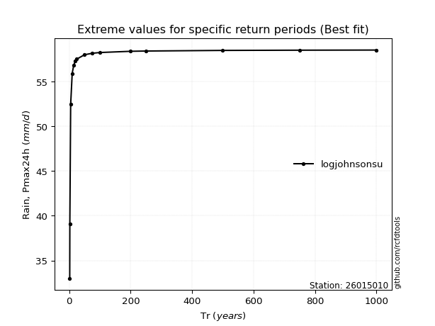</img>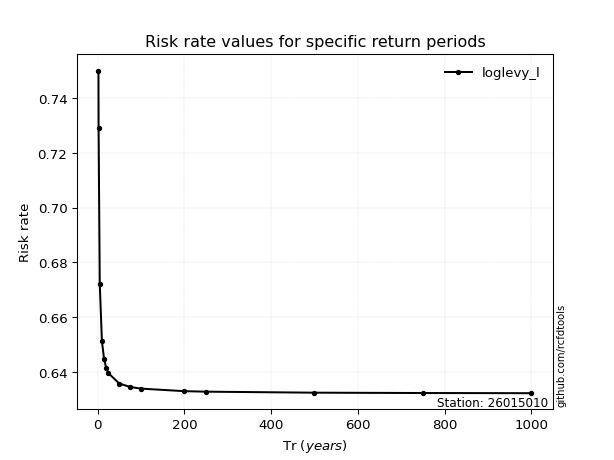</img>

</div>


<sub>**APP DISCLAIMER**: NO WARRANTY - This software is provided by [github.com/rcfdtools](https://github.com/rcfdtools) "as is", without any express or implied warranty, including warranties of merchantability, fitness for a particular purpose, or non-infringement. There is no guarantee that the software will be error-free or operate without interruption. LIMITATION OF LIABILITY - Neither the authors nor copyright holders will be liable for claims or damages arising from the software or its use. You are responsible for determining if the software is appropriate for your use and assume all associated risks, including errors, legal compliance, and data loss. NO PROFESSIONAL ADVICE - The software provides general information and does not offer professional advice. It should not replace consultation with professional advisors.</sub>