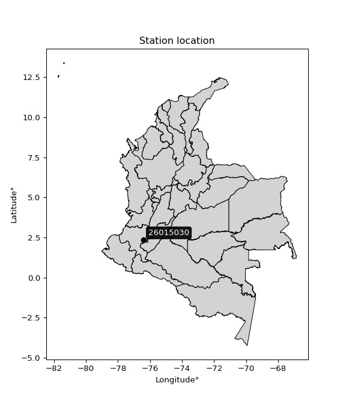

<div align="center">


</div>

# PMP Station (Rain, Pmax24h): 26015030

Probable Maximum Precipitation (PMP) is the greatest amount of rainfall for a specific duration that is meteorologically possible for a given location, acting as a "worst-case" scenario for extreme storms, crucial for designing safety-critical infrastructure like bridges, river deviations, dams, spillways, and nuclear plants to prevent catastrophic failure. PMP is calculated by hydrologists using meteorological data to determine the upper limit of extreme rainfall, often leading to the Probable Maximum Flood (PMF) for flood control design, and is increasingly being studied for climate change impacts. Probable Maximum Precipitation (PMP) is the theoretical upper limit of rainfall, a deterministic estimate for extreme events, while probability distributions (like GEV, Gumbel) describe the likelihood and frequency of various precipitation amounts, including rare ones, showing how often events occur, with PMP representing the extreme end of these distributions, used for critical infrastructure design to ensure safety against the worst conceivable weather, unlike standard statistical forecasts which cover typical probabilities.

The most common probability distributions in hydrology, used for analyzing floods, rainfall, and streamflow, include the Normal, Log-Normal, Gumbel, Gamma (including Log-Pearson Type III), and Generalized Extreme Value (GEV) distributions, often chosen based on the data´s skewness and whether modeling extremes or general conditions, with Gumbel and GEV popular for extreme events like floods, while the Normal distribution serves as a baseline, though often requiring transformations for skewed hydrological data. These distributions help in designing water infrastructure, managing water resources, and forecasting hydrologic events.

> Hydrological data often isn´t perfectly normal (it´s skewed), so different distributions are needed for different applications, such as: **Flood Frequency Analysis**: Using Gumbel, GEV, or Log-Pearson Type III for predicting extreme flood magnitudes and their return periods, **Rainfall Analysis**: Normal for annual totals, but Log-Normal, Weibull, or GEV for intensity or extreme daily rainfall, **Streamflow Modeling**: Gamma and Log-Normal for maximum flows, GEV for minimum flows, and Kappa for daily flows.

<div align="center">

</img>

</div>


## A. General information


### 1. General running parameters

• app_version: _v20260108_. • runtime: _2026-01-09 11:32:22.148588_. • Python version: _3.14.0_. • SciPy version: _1.16.3_. • Pandas version: _2.3.3_. • NumPy version: _2.3.5_. • Stations dataset (station_dataset_file): _dataset/pmax24h_in/automatic_colombia_2003_2024.csv_. • Stations catalog (station_catalog_file): _dataset/CNE.xls_. • Minimum year to eval til year_max (date_min): _1900_. • Maximum year to eval since year_min (date_max): _2024_. • Creates, save and include plots into reports (create_plot): _False_. • Plot only fit distributions with Δo > Δ (plot_only_fit): _True_. • Plot only simple graphs avoiding multiple CDFs and multiple Extreme values plots (plot_only_simple): _True_. • Eval low extreme values, if False, evaluates high extreme values (low_extreme): _False_. • Eval every SciPy distribution as logarithmic (pdist_logarithmic_on): _True_. • Standard deviation normalized (ddof): _1.0_. • Return periods to eval in years (Tr): _[2, 2.33, 5, 10, 15, 20, 25, 50, 75, 100, 200, 250, 500, 750, 1000]_. • Minimum data sample per station, 0 means any (minimum_sample): _5_. • Z-Score maximum threshold to adjust a value, 0 means disable (zscore_max): _3.5_. • Z-Score minimum threshold to adjust a value, 0 means disable (zscore_min): _-2.5_. • Avoid zeros, e.g. rain = 0 (avoid_zeros): _True_. • Avoid null values (avoid_nans): _True_. 

:file_folder:Table: [dataset.csv](../../dataset/pmax24h_in/automatic_colombia_2003_2024.csv)

> Delta Degrees of Freedom (DDOF): is a parameter used in the formulas for calculating variance and standard deviation. When ddof=0, the divisor is $N$ (the total number of observations) and this is used when your data set is the entire population. When ddof=1, the divisor is $N-1$ and this is used when your data set is a sample drawn from a larger population. Using $N-1$ provides an unbiased estimate of the population variance (known as Bessel´s correction).


### 2. Station info and location

|   id |   CODIGO | NOMBRE                      | CATEGORIA               | TECNOLOGIA                              | ESTADO           | FECHA_INSTALACION   |   FECHA_SUSPENSION |   ALTITUD |   LATITUD |   LONGITUD | DEPARTAMENTO   | MUNICIPIO         | AREA_OPERATIVA                         | ENTIDAD                                                     | AREA_HIDROGRAFICA   | ZONA_HIDROGRAFICA   | SUBZONA_HIDROGRAFICA   |   CORRIENTE | Catalogo   |   Version |
|-----:|---------:|:----------------------------|:------------------------|:----------------------------------------|:-----------------|:--------------------|-------------------:|----------:|----------:|-----------:|:---------------|:------------------|:---------------------------------------|:------------------------------------------------------------|:--------------------|:--------------------|:-----------------------|------------:|:-----------|----------:|
|    0 | 26015030 | PNN PURACE - AUT [26015030] | Climatológica Principal | Automática con Telemetría, Convencional | En Mantenimiento | 26/09/2007          |                nan |      3683 |   2.35685 |   -76.4035 | Cauca          | Puracé (Coconuco) | Area Operativa 09 - Cauca-Valle-Caldas | INSTITUTO DE HIDROLOGIA METEOROLOGIA Y ESTUDIOS AMBIENTALES | Magdalena Cauca     | Cauca               | Alto Río Cauca         |         nan | CNE_IDEAM  |  20251226 |

<div align="center">

Dynamic map: [:earth_americas:Google](http://maps.google.com/maps?q=2.356848889,-76.403544444) [:earth_americas:OSM](https://www.openstreetmap.org/#map=18/2.356848889/-76.403544444&layers=P) [:earth_americas:Bing](https://www.bing.com/maps?cp=2.356848889~-76.403544444&lvl=18) [:earth_americas:Apple](https://maps.apple.com/frame?center=2.356848889%2C-76.403544444&span=0.003%2C0.006)

</div>


<div align="center">

```geojson
{
  "type": "Feature",
  "geometry": {
    "type": "Point", 
    "coordinates": [-76.403544444, 2.356848889]
  }, 
  "properties": {
    "Name": "26015030"
  }
}
```

</div>


### 3. Discrete values table and plot

<div align="center">

|               |          0 |            1 |           2 |         3 |           4 |          5 |            6 |           7 |
|:--------------|-----------:|-------------:|------------:|----------:|------------:|-----------:|-------------:|------------:|
| Date          | 2016       | 2017         | 2018        | 2019      | 2020        | 2021       | 2022         | 2023        |
| Value         |    3.7     |   29.9       |   35.8      |   62.5    |   38.8      |   10.4     |   27         |   20.7      |
| Value_initial |    3.7     |   29.9       |   35.8      |   62.5    |   38.8      |   10.4     |   27         |   20.7      |
| count         |    8       |    8         |    8        |    8      |    8        |    8       |    8         |    8        |
| mean          |   28.6     |   28.6       |   28.6      |   28.6    |   28.6      |   28.6     |   28.6       |   28.6      |
| std           |   18.2169  |   18.2169    |   18.2169   |   18.2169 |   18.2169   |   18.2169  |   18.2169    |   18.2169   |
| zscore        |   -1.36686 |    0.0713621 |    0.395236 |    1.8609 |    0.559918 |   -0.99907 |   -0.0878303 |   -0.433662 |


</div>


> The initial value (value_initial) correspond to the initial obtained or null completed value, and value (value) is adjusted only when the initial value is outside the valid range (outlier) definite through the Z-Score value. If Z-Score is active, values out of range or outliers are replaced with the station mean value. A Z-Score (or standard score) measures how many standard deviations a data point is from the mean of a dataset, indicating its relative position; positive scores mean above the mean, negative mean below, and a score of zero is exactly at the mean, allowing for comparison of values from different distributions. It´s calculated using the formula $z=(x–μ)/σ$, where $x$ is the data point, $μ$ is the mean, and $σ$ is the standard deviation, helping identify outliers and understand probability.
>
> <sub>**Note**: In this study, "completing" (filling gaps in) and "extending" (forecasting or lengthening the historical record) rainfall data series are avoided for certain critical analyses because they introduce artificial bias and uncertainty, which can distort the statistics of rare events (extremes), alter day-to-day variability, and compromise the integrity and homogeneity of the original data. Some reasons against Completing/Extending rainfall data are: **Distortion of Extremes and Variability**: The primary issue is that most gap-filling or extension methods rely on averaging or regression with nearby stations, which inherently smooths the data. Rainfall is highly variable in space and time, with a large percentage of zero values and occasional large storms. Infilling methods often underestimate the highest values and overestimate the lowest (zero) values, which severely distorts analyses focused on flood frequency, drought severity, and intensity-duration-frequency (IDF) curves, **Loss of Data Homogeneity**: Infilled or extended data are synthetic estimates, not actual measurements. Combining these estimates with observed data can violate the assumption of data homogeneity, which requires that the data properties do not change over time. Inhomogeneity can lead to incorrect conclusions about long-term trends or changes in climate patterns, **Propagation of Errors**: Errors and biases from the original data (e.g., wind-induced undercatch, instrument errors, site changes) or the data used for imputation can propagate through the analysis, leading to unreliable hydrological models and inaccurate predictions, **Compromised Statistical Integrity**: For statistical analyses, especially those involving the frequency of events, using artificial data can introduce time bias or autocorrelation that doesn´t exist in reality, making it difficult to assess the true probability of events, **Difficulty in Validation**: It is difficult to accurately validate the quality of filled or extended data, especially for past periods where ground-truth measurements are unavailable. The reliability of imputation techniques heavily depends on the density of the surrounding station network and the complexity of the local topography.</sub>


### 4. Active continuous probability distributions from SciPy (45 of 104 available)

A Probability Density Function (PDF) describes the relative likelihood of a continuous random variable falling within a specific range, where the total area under its curve equals 1, and the area over any interval gives the actual probability for that range. Unlike discrete probabilities (like rolling a die), a PDF shows density, not direct probability for a single point (which is zero), with higher points indicating higher likelihood, often visualized as a bell curve for normal distributions.

A log of a probability density function (log-PDF) is simply the logarithm of the PDF´s value, denoted as $log(f(x))$, useful for converting multiplication of probabilities into addition, improving numerical stability with tiny numbers, and connecting to information theory concepts like entropy. Instead of dealing with very small probabilities (e.g., 0.000001), log-PDFs use negative numbers (e.g., $log(0.00001) ≈ -11.51$ that are easier for computers to handle, preventing underflow errors and simplifying complex calculations. In this study, each active probability distribution from SciPy is also evaluated in the $log$ form.

[scipy.stats](https://docs.scipy.org/doc/scipy/reference/stats.html) is a Python´s powerful submodule within the SciPy library for comprehensive statistical analysis, offering over 130 probability distributions (like Normal, Poisson), functions for descriptive stats (mean, variance), hypothesis testing (t-tests, chi-square), random variable generation, and statistical tests, making it essential for data science, modeling, and research. It provides tools to explore, model, and draw conclusions from data efficiently, working seamlessly with NumPy.

<div align="center">

|   id | p_dist             |   n_parameter | fit_method   | label                                                                       | active   | ref                                                                                                        |
|-----:|:-------------------|--------------:|:-------------|:----------------------------------------------------------------------------|:---------|:-----------------------------------------------------------------------------------------------------------|
|    0 | alpha              |             3 | MLE          | Alpha                                                                       | True     | [:mortar_board:](https://docs.scipy.org/doc/scipy/reference/generated/scipy.stats.alpha.html)              |
|    1 | betaprime          |             4 | MLE          | Beta prime                                                                  | True     | [:mortar_board:](https://docs.scipy.org/doc/scipy/reference/generated/scipy.stats.betaprime.html)          |
|    2 | chi2               |             3 | MLE          | Chi²                                                                        | True     | [:mortar_board:](https://docs.scipy.org/doc/scipy/reference/generated/scipy.stats.chi2.html)               |
|    3 | crystalball        |             4 | MLE          | Crystalball                                                                 | True     | [:mortar_board:](https://docs.scipy.org/doc/scipy/reference/generated/scipy.stats.crystalball.html)        |
|    4 | dweibull           |             3 | MLE          | Double Weibull                                                              | True     | [:mortar_board:](https://docs.scipy.org/doc/scipy/reference/generated/scipy.stats.dweibull.html)           |
|    5 | erlang             |             3 | MLE          | Erlang                                                                      | True     | [:mortar_board:](https://docs.scipy.org/doc/scipy/reference/generated/scipy.stats.erlang.html)             |
|    6 | expon              |             2 | MLE          | Exponential                                                                 | True     | [:mortar_board:](https://docs.scipy.org/doc/scipy/reference/generated/scipy.stats.expon.html)              |
|    7 | exponnorm          |             3 | MLE          | Exponentially modified Normal                                               | True     | [:mortar_board:](https://docs.scipy.org/doc/scipy/reference/generated/scipy.stats.exponnorm.html)          |
|    8 | f                  |             4 | MLE          | F                                                                           | True     | [:mortar_board:](https://docs.scipy.org/doc/scipy/reference/generated/scipy.stats.f.html)                  |
|    9 | fatiguelife        |             3 | MLE          | Fatigue-life (Birnbaum-Saunders)                                            | True     | [:mortar_board:](https://docs.scipy.org/doc/scipy/reference/generated/scipy.stats.fatiguelife.html)        |
|   10 | fisk               |             3 | MLE          | Fisk                                                                        | True     | [:mortar_board:](https://docs.scipy.org/doc/scipy/reference/generated/scipy.stats.fisk.html)               |
|   11 | gamma              |             3 | MLE          | Gamma                                                                       | True     | [:mortar_board:](https://docs.scipy.org/doc/scipy/reference/generated/scipy.stats.gamma.html)              |
|   12 | genexpon           |             5 | MLE          | Generalized exponential                                                     | True     | [:mortar_board:](https://docs.scipy.org/doc/scipy/reference/generated/scipy.stats.genexpon.html)           |
|   13 | genlogistic        |             3 | MLE          | Generalized logistic                                                        | True     | [:mortar_board:](https://docs.scipy.org/doc/scipy/reference/generated/scipy.stats.genlogistic.html)        |
|   14 | gibrat             |             2 | MM           | Gibrat                                                                      | True     | [:mortar_board:](https://docs.scipy.org/doc/scipy/reference/generated/scipy.stats.gibrat.html)             |
|   15 | gompertz           |             3 | MLE          | Gompertz (or truncated Gumbel)                                              | True     | [:mortar_board:](https://docs.scipy.org/doc/scipy/reference/generated/scipy.stats.gompertz.html)           |
|   16 | gumbel_l           |             2 | MM           | Gumbel Left Skew                                                            | True     | [:mortar_board:](https://docs.scipy.org/doc/scipy/reference/generated/scipy.stats.gumbel_l.html)           |
|   17 | gumbel_r           |             2 | MM           | Gumbel Right Skew                                                           | True     | [:mortar_board:](https://docs.scipy.org/doc/scipy/reference/generated/scipy.stats.gumbel_r.html)           |
|   18 | halflogistic       |             2 | MM           | Half-logistic                                                               | True     | [:mortar_board:](https://docs.scipy.org/doc/scipy/reference/generated/scipy.stats.halflogistic.html)       |
|   19 | halfnorm           |             2 | MM           | Half Normal                                                                 | True     | [:mortar_board:](https://docs.scipy.org/doc/scipy/reference/generated/scipy.stats.halfnorm.html)           |
|   20 | hypsecant          |             2 | MM           | hyperbolic secant                                                           | True     | [:mortar_board:](https://docs.scipy.org/doc/scipy/reference/generated/scipy.stats.hypsecant.html)          |
|   21 | invgamma           |             3 | MLE          | Inverted gamma                                                              | True     | [:mortar_board:](https://docs.scipy.org/doc/scipy/reference/generated/scipy.stats.invgamma.html)           |
|   22 | invgauss           |             3 | MLE          | Inverse Gaussian                                                            | True     | [:mortar_board:](https://docs.scipy.org/doc/scipy/reference/generated/scipy.stats.invgauss.html)           |
|   23 | invweibull         |             3 | MLE          | Inverted Weibull                                                            | True     | [:mortar_board:](https://docs.scipy.org/doc/scipy/reference/generated/scipy.stats.invweibull.html)         |
|   24 | kappa4             |             4 | MLE          | Kappa 4                                                                     | True     | [:mortar_board:](https://docs.scipy.org/doc/scipy/reference/generated/scipy.stats.kappa4.html)             |
|   25 | kstwobign          |             2 | MLE          | Limiting distribution of scaled Kolmogorov-Smirnov two-sided test statistic | True     | [:mortar_board:](https://docs.scipy.org/doc/scipy/reference/generated/scipy.stats.kstwobign.html)          |
|   26 | laplace            |             2 | MM           | Laplace                                                                     | True     | [:mortar_board:](https://docs.scipy.org/doc/scipy/reference/generated/scipy.stats.laplace.html)            |
|   27 | laplace_asymmetric |             3 | MLE          | Asymmetric Laplace                                                          | True     | [:mortar_board:](https://docs.scipy.org/doc/scipy/reference/generated/scipy.stats.laplace_asymmetric.html) |
|   28 | loggamma           |             3 | MLE          | Log gamma                                                                   | True     | [:mortar_board:](https://docs.scipy.org/doc/scipy/reference/generated/scipy.stats.loggamma.html)           |
|   29 | logistic           |             2 | MM           | Logistic (or Sech-squared)                                                  | True     | [:mortar_board:](https://docs.scipy.org/doc/scipy/reference/generated/scipy.stats.logistic.html)           |
|   30 | lognorm            |             3 | MLE          | Log Normal                                                                  | True     | [:mortar_board:](https://docs.scipy.org/doc/scipy/reference/generated/scipy.stats.lognorm.html)            |
|   31 | maxwell            |             2 | MM           | Maxwell                                                                     | True     | [:mortar_board:](https://docs.scipy.org/doc/scipy/reference/generated/scipy.stats.maxwell.html)            |
|   32 | mielke             |             4 | MLE          | Mielke Beta-Kappa / Dagum                                                   | True     | [:mortar_board:](https://docs.scipy.org/doc/scipy/reference/generated/scipy.stats.mielke.html)             |
|   33 | moyal              |             2 | MM           | Moyal                                                                       | True     | [:mortar_board:](https://docs.scipy.org/doc/scipy/reference/generated/scipy.stats.moyal.html)              |
|   34 | nakagami           |             3 | MLE          | Nakagami                                                                    | True     | [:mortar_board:](https://docs.scipy.org/doc/scipy/reference/generated/scipy.stats.nakagami.html)           |
|   35 | ncf                |             5 | MLE          | Non-central F distribution                                                  | True     | [:mortar_board:](https://docs.scipy.org/doc/scipy/reference/generated/scipy.stats.ncf.html)                |
|   36 | nct                |             4 | MLE          | Non-central Student’s t                                                     | True     | [:mortar_board:](https://docs.scipy.org/doc/scipy/reference/generated/scipy.stats.nct.html)                |
|   37 | norm               |             2 | MM           | Normal                                                                      | True     | [:mortar_board:](https://docs.scipy.org/doc/scipy/reference/generated/scipy.stats.norm.html)               |
|   38 | pearson3           |             3 | MM           | Pearson type III                                                            | True     | [:mortar_board:](https://docs.scipy.org/doc/scipy/reference/generated/scipy.stats.pearson3.html)           |
|   39 | rayleigh           |             2 | MM           | Rayleigh                                                                    | True     | [:mortar_board:](https://docs.scipy.org/doc/scipy/reference/generated/scipy.stats.rayleigh.html)           |
|   40 | rice               |             3 | MLE          | Rice                                                                        | True     | [:mortar_board:](https://docs.scipy.org/doc/scipy/reference/generated/scipy.stats.rice.html)               |
|   41 | t                  |             3 | MLE          | Student’s t                                                                 | True     | [:mortar_board:](https://docs.scipy.org/doc/scipy/reference/generated/scipy.stats.t.html)                  |
|   42 | truncnorm          |             4 | MLE          | Truncated normal                                                            | True     | [:mortar_board:](https://docs.scipy.org/doc/scipy/reference/generated/scipy.stats.truncnorm.html)          |
|   43 | wald               |             2 | MM           | Wald                                                                        | True     | [:mortar_board:](https://docs.scipy.org/doc/scipy/reference/generated/scipy.stats.wald.html)               |
|   44 | weibull_min        |             3 | MLE          | Weibull minimum                                                             | True     | [:mortar_board:](https://docs.scipy.org/doc/scipy/reference/generated/scipy.stats.weibull_min.html)        |

</div>

> **n_parameter:** # arguments & localization & scale.
>
> **Fit methods:** (MLE) maximum likelihood, (MM) L-moments.
>
>**Inactive** (With the only purpose of prevent loops, zero divisions, infinite values, over high estimated values or horizontal trending for recurrence intervals estimations, the follow distributions were disabled.)**:** foldnorm, gennorm, norminvgauss, powernorm, powerlognorm, skewnorm, genextreme, anglit, arcsine, argus, beta, bradford, burr, burr12, cauchy, cosine, halfcauchy, foldcauchy, skewcauchy, wrapcauchy, dgamma, gengamma, exponweib, exponpow, truncexpon, gausshyper, genhalflogistic, genhyperbolic, geninvgauss, halfgennorm, johnsonsb, johnsonsu, kappa3, ksone, kstwo, loglaplace, levy, levy_l, levy_stable, ncx2, pareto, genpareto, truncpareto, lomax, powerlaw, rdist, rel_breitwigner, recipinvgauss, semicircular, studentized_range, trapezoid, triang, truncweibull_min, tukeylambda, uniform, loguniform, vonmises, vonmises_line, weibull_max, 


## B. Probability (PDF) vs. Empirical (EDF) distributions functions

A continuous probability distribution (CPD) describes probabilities for variables that can take any value within a range (like rain any time), unlike discrete variables with specific outcomes (like temperature). It uses a Probability Density Function (PDF), a curve where the total area under it equals 1, and the probability of the variable falling within an interval (a to b) is found by calculating the area under the curve between those points. A key feature is that the probability of hitting any single exact value is zero, so probabilities are always expressed for ranges, e.g., $P(a ≤ X ≤ b)$.

<div align="center">

Distributions parameters from station values
|    |   station | p_dist                |   n |               loc |            scale | shape                  | shape1                | shape2                | shape3   |
|---:|----------:|:----------------------|----:|------------------:|-----------------:|:-----------------------|:----------------------|:----------------------|:---------|
|  0 |  26015030 | alpha                 |   8 |      -0.0242205   |      9.56149     | 3.5807427817501075e-09 |                       |                       |          |
|  1 |  26015030 | betaprime             |   8 |     -12.5033      |   1554           | 5.599282742732655      | 212.65972296081816    |                       |          |
|  2 |  26015030 | chi2                  |   8 |       3.7         |      4.98308     | 1.9232105559104706     |                       |                       |          |
|  3 |  26015030 | crystalball           |   8 |      28.6         |     17.0404      | 1270.4201598983936     | 2574.534310811508     |                       |          |
|  4 |  26015030 | dweibull              |   8 |      28.3984      |     13.7272      | 1.129049971546852      |                       |                       |          |
|  5 |  26015030 | erlang                |   8 |      -9.37968     |      8.35053     | 4.5481781794418605     |                       |                       |          |
|  6 |  26015030 | expon                 |   8 |       3.7         |     24.9         |                        |                       |                       |          |
|  7 |  26015030 | exponnorm             |   8 |      15.8494      |     11.9181      | 1.0698534185371513     |                       |                       |          |
|  8 |  26015030 | f                     |   8 |      -9.38972     |     37.9911      | 9.101497199981367      | 8876098.291372353     |                       |          |
|  9 |  26015030 | fatiguelife           |   8 |       3.7         |      2.3947e-05  | 1019.2985563080588     |                       |                       |          |
| 10 |  26015030 | fisk                  |   8 |     -48.7546      |     75.7637      | 7.869587917864511      |                       |                       |          |
| 11 |  26015030 | gamma                 |   8 |      -9.37974     |      8.35052     | 4.548187522259972      |                       |                       |          |
| 12 |  26015030 | genexpon              |   8 |       3.7         |      2.95227     | 0.11862146113459304    | 5.997124869851181e-08 | 2.1464647878575756    |          |
| 13 |  26015030 | genlogistic           |   8 |     -47.23        |     14.4634      | 108.62122427978888     |                       |                       |          |
| 14 |  26015030 | gibrat                |   8 |      15.6004      |      7.88469     |                        |                       |                       |          |
| 15 |  26015030 | gompertz              |   8 |     -10.1485      |     20.5932      | 0.11678592425985299    |                       |                       |          |
| 16 |  26015030 | gumbel_l              |   8 |      36.2691      |     13.2863      |                        |                       |                       |          |
| 17 |  26015030 | gumbel_r              |   8 |      20.9309      |     13.2863      |                        |                       |                       |          |
| 18 |  26015030 | halflogistic          |   8 |       8.40316     |     14.5689      |                        |                       |                       |          |
| 19 |  26015030 | halfnorm              |   8 |       6.04521     |     28.2682      |                        |                       |                       |          |
| 20 |  26015030 | hypsecant             |   8 |      28.6         |     10.8483      |                        |                       |                       |          |
| 21 |  26015030 | invgamma              |   8 |     -69.8965      |   3300.51        | 34.504440186111836     |                       |                       |          |
| 22 |  26015030 | invgauss              |   8 |     -38.8214      |   1015.79        | 0.06637347839554597    |                       |                       |          |
| 23 |  26015030 | invweibull            |   8 | -940161           | 940182           | 64732.13408810525      |                       |                       |          |
| 24 |  26015030 | kappa4                |   8 |      -2.18629     |     64.5282      | 1.100337646582925      | 0.9924544839568359    |                       |          |
| 25 |  26015030 | kstwobign             |   8 |     -30.8153      |     68.1356      |                        |                       |                       |          |
| 26 |  26015030 | laplace               |   8 |      28.6         |     12.0494      |                        |                       |                       |          |
| 27 |  26015030 | laplace_asymmetric    |   8 |      27           |     13.0767      | 0.9406984994429333     |                       |                       |          |
| 28 |  26015030 | loggamma              |   8 |   -4518.22        |    631.702       | 1336.8867076256415     |                       |                       |          |
| 29 |  26015030 | logistic              |   8 |      28.6         |      9.39486     |                        |                       |                       |          |
| 30 |  26015030 | lognorm               |   8 |       3.7         |      0.194471    | 12.755994787249485     |                       |                       |          |
| 31 |  26015030 | maxwell               |   8 |     -11.7786      |     25.3035      |                        |                       |                       |          |
| 32 |  26015030 | mielke                |   8 |       3.7         |     55.1903      | 0.6698531373032712     | 7.424001974407858     |                       |          |
| 33 |  26015030 | moyal                 |   8 |      18.8552      |      7.67087     |                        |                       |                       |          |
| 34 |  26015030 | nakagami              |   8 |      10.4         |     22.1341      | 0.34356950013202425    |                       |                       |          |
| 35 |  26015030 | ncf                   |   8 |      -0.0393563   |      1.13722e-06 | 5.240234379562356e-07  | 14.971759245372507    | 11.969919488581695    |          |
| 36 |  26015030 | nct                   |   8 |     -59.3882      |      9.6239      | 21.78626892011154      | 8.817308570115003     |                       |          |
| 37 |  26015030 | norm                  |   8 |      28.6         |     17.0404      |                        |                       |                       |          |
| 38 |  26015030 | pearson3              |   8 |      28.6         |     17.0404      | 0.4655918204041815     |                       |                       |          |
| 39 |  26015030 | rayleigh              |   8 |      -3.99927     |     26.0105      |                        |                       |                       |          |
| 40 |  26015030 | rice                  |   8 |      -3.17419     |     23.7114      | 0.5587328009019457     |                       |                       |          |
| 41 |  26015030 | t                     |   8 |      28.6         |     17.0406      | 138391674.38446486     |                       |                       |          |
| 42 |  26015030 | truncnorm             |   8 |      30.4094      |     18.754       | -67.01577173711951     | 1.7111348524400825    |                       |          |
| 43 |  26015030 | wald                  |   8 |      11.5596      |     17.0404      |                        |                       |                       |          |
| 44 |  26015030 | weibull_min           |   8 |       0.178851    |     31.6307      | 1.6477984141419584     |                       |                       |          |
| 45 |  26015030 | logalpha              |   8 |     -18.1627      |    510.554       | 24.10340001682429      |                       |                       |          |
| 46 |  26015030 | logbetaprime          |   8 |     -10.3815      |   2777.57        | 242.82301434518865     | 49996.663412144146    |                       |          |
| 47 |  26015030 | logchi2               |   8 |       1.30833     |      1.16244     | 1.3739569698188663     |                       |                       |          |
| 48 |  26015030 | logcrystalball        |   8 |       3.09319     |      0.83129     | 15.098080811165884     | 1608.82151109179      |                       |          |
| 49 |  26015030 | logdweibull           |   8 |       3.39786     |      0.597236    | 0.9436763146610048     |                       |                       |          |
| 50 |  26015030 | logerlang             |   8 |     -10.2962      |      0.0564045   | 237.33648628207334     |                       |                       |          |
| 51 |  26015030 | logexpon              |   8 |       1.30833     |      1.78485     |                        |                       |                       |          |
| 52 |  26015030 | logexponnorm          |   8 |       3.09264     |      0.831293    | 0.0006519628739398048  |                       |                       |          |
| 53 |  26015030 | logf                  |   8 |   -1150.17        |   1153.26        | 9659861.71439374       | 6331792.315462164     |                       |          |
| 54 |  26015030 | logfatiguelife        |   8 |    -409.569       |    412.662       | 0.002007826901268695   |                       |                       |          |
| 55 |  26015030 | logfisk               |   8 |      -2.34473e+07 |      2.34473e+07 | 51674094.24109304      |                       |                       |          |
| 56 |  26015030 | loggamma              |   8 |     -10.4588      |      0.053549    | 253.2261099531902      |                       |                       |          |
| 57 |  26015030 | loggenexpon           |   8 |       1.30572     |      0.0173776   | 0.0028092576338321212  | 6.62000566518136      | 1.665760626601754e-05 |          |
| 58 |  26015030 | loggenlogistic        |   8 |       3.81943     |      0.183438    | 0.23318103023711995    |                       |                       |          |
| 59 |  26015030 | loggibrat             |   8 |       2.45904     |      0.384632    |                        |                       |                       |          |
| 60 |  26015030 | loggompertz           |   8 |       1.30833     |      0.669717    | 0.04347380062732195    |                       |                       |          |
| 61 |  26015030 | loggumbel_l           |   8 |       3.46731     |      0.648154    |                        |                       |                       |          |
| 62 |  26015030 | loggumbel_r           |   8 |       2.71906     |      0.648154    |                        |                       |                       |          |
| 63 |  26015030 | loghalflogistic       |   8 |       2.10793     |      0.710714    |                        |                       |                       |          |
| 64 |  26015030 | loghalfnorm           |   8 |       1.99288     |      1.37903     |                        |                       |                       |          |
| 65 |  26015030 | loghypsecant          |   8 |       3.09319     |      0.529216    |                        |                       |                       |          |
| 66 |  26015030 | loginvgamma           |   8 |     -13.0523      |   5489.84        | 341.51798955143215     |                       |                       |          |
| 67 |  26015030 | loginvgauss           |   8 |      -6.0417      |    933.23        | 0.009796522528151719   |                       |                       |          |
| 68 |  26015030 | loginvweibull         |   8 | -232070           | 232073           | 245597.53346916306     |                       |                       |          |
| 69 |  26015030 | logkappa4             |   8 |       0.986921    |      3.20969     | 1.1113762407233194     | 1.0147702700947958    |                       |          |
| 70 |  26015030 | logkstwobign          |   8 |      -0.750776    |      4.39714     |                        |                       |                       |          |
| 71 |  26015030 | loglaplace            |   8 |       3.09319     |      0.587811    |                        |                       |                       |          |
| 72 |  26015030 | loglaplace_asymmetric |   8 |       3.57795     |      0.475996    | 1.6308572997147426     |                       |                       |          |
| 73 |  26015030 | logloggamma           |   8 |       3.90771     |      0.326774    | 0.4096701253721534     |                       |                       |          |
| 74 |  26015030 | loglogistic           |   8 |       3.09319     |      0.458314    |                        |                       |                       |          |
| 75 |  26015030 | loglognorm            |   8 |       1.30833     |      0.0199148   | 12.146188893123412     |                       |                       |          |
| 76 |  26015030 | logmaxwell            |   8 |       1.12338     |      1.23439     |                        |                       |                       |          |
| 77 |  26015030 | logmielke             |   8 |      -4.97544     |      8.84977     | 9.652106843552318      | 50.52350310015839     |                       |          |
| 78 |  26015030 | logmoyal              |   8 |       2.6178      |      0.374212    |                        |                       |                       |          |
| 79 |  26015030 | lognakagami           |   8 |       2.07607     |      1.33719     | 1.2802547181929846     |                       |                       |          |
| 80 |  26015030 | logncf                |   8 |      -0.951699    |      7.95282e-07 | 2.2619447986210636e-05 | 120.57047688144118    | 113.50585891951411    |          |
| 81 |  26015030 | lognct                |   8 |     -53.6143      |      0.829073    | 355547.7864193513      | 68.39865430038452     |                       |          |
| 82 |  26015030 | lognorm               |   8 |       3.09319     |      0.83129     |                        |                       |                       |          |
| 83 |  26015030 | logpearson3           |   8 |       3.09319     |      0.831295    | -1.0114800548105407    |                       |                       |          |
| 84 |  26015030 | lograyleigh           |   8 |       1.50291     |      1.26886     |                        |                       |                       |          |
| 85 |  26015030 | logrice               |   8 |    -223.152       |      0.8314      | 272.12400340491985     |                       |                       |          |
| 86 |  26015030 | logt                  |   8 |       3.36502     |      0.447808    | 1.8270875419373702     |                       |                       |          |
| 87 |  26015030 | logtruncnorm          |   8 |       1.43481     |      1.90435     | -0.06641445230414045   | 4.08395368392204      |                       |          |
| 88 |  26015030 | logwald               |   8 |       2.26187     |      0.831317    |                        |                       |                       |          |
| 89 |  26015030 | logweibull_min        |   8 |      -6.58835e+07 |      6.58835e+07 | 109394968.52896062     |                       |                       |          |

</div>

> **loc** (Location parameter): This shifts the distribution along the x-axis. For many common distributions, like the normal (Gaussian) distribution, loc represents the mean $μ$. For others, like the uniform distribution, it might represent the minimum value, or for the beta distribution, the left end of the support interval.
>
> **scale** (Scale parameter): This determines the width or spread of the distribution. For the normal distribution, scale represents the standard deviation $σ$. For a uniform distribution, it defines the length of the interval (from $loc$ to $loc + scale$).
>
> **shape** (Shape parameters): Refers to parameters that define the specific form of a probability distribution, distinct from its location (loc) and scale (scale). These parameters are required arguments for most distribution functions. For example, a normal (Gaussian) distribution is fully defined by its location (mean) and scale (standard deviation), so it has no specific shape parameters beyond loc and scale. However, other distributions have intrinsic properties that need specification, as Gamma distribution that takes a shape parameter, often named $a$ or $alpha$.


### 0. Cumulative distribution values - CDF (90 evaluated)

Cumulative Distribution Function (CDF), denoted as $F$<sub>$X$</sub>$(x)$, is a function that gives the probability that a random variable $X$ will take a value less than or equal to a specific value, $x$ (i.e., $(P(X≥x)$. It essentially "accumulates" probabilities from a given point up to the far right (positive infinity), providing a complete picture of the distribution´s probabilities for both discrete (like rain) and continuous (like temperature) variables, helping to find probabilities over ranges or above certain values. Each station is evaluated separately ordering the $x$ values ascending, calculating the CDF and PDF values for the activated distributions and their logarithmic forms.

<div align="center">

CDF ordered by x ascending and calculating $log(f(x))$ separately
|   id |   Station |   date |    x |   count |   mean |     std |     zscore |   Value_initial |   station |   m |    alpha |   alpha_pdf |   betaprime |   betaprime_pdf |        chi2 |    chi2_pdf |   crystalball |   crystalball_pdf |   dweibull |   dweibull_pdf |    erlang |   erlang_pdf |    expon |   expon_pdf |   exponnorm |   exponnorm_pdf |         f |      f_pdf |   fatiguelife |   fatiguelife_pdf |      fisk |   fisk_pdf |     gamma |   gamma_pdf |   genexpon |   genexpon_pdf |   genlogistic |   genlogistic_pdf |   gibrat |   gibrat_pdf |   gompertz |   gompertz_pdf |   gumbel_l |   gumbel_l_pdf |   gumbel_r |   gumbel_r_pdf |   halflogistic |   halflogistic_pdf |   halfnorm |   halfnorm_pdf |   hypsecant |   hypsecant_pdf |   invgamma |   invgamma_pdf |   invgauss |   invgauss_pdf |   invweibull |   invweibull_pdf |     kappa4 |   kappa4_pdf |   kstwobign |   kstwobign_pdf |   laplace |   laplace_pdf |   laplace_asymmetric |   laplace_asymmetric_pdf |   loggamma |   loggamma_pdf |   logistic |   logistic_pdf |   lognorm |   lognorm_pdf |   maxwell |   maxwell_pdf |      mielke |   mielke_pdf |      moyal |   moyal_pdf |    nakagami |   nakagami_pdf |       ncf |    ncf_pdf |       nct |    nct_pdf |      norm |   norm_pdf |   pearson3 |   pearson3_pdf |   rayleigh |   rayleigh_pdf |      rice |   rice_pdf |         t |      t_pdf |   truncnorm |   truncnorm_pdf |     wald |   wald_pdf |   weibull_min |   weibull_min_pdf |   logalpha |   logalpha_pdf |   logbetaprime |   logbetaprime_pdf |     logchi2 |   logchi2_pdf |   logcrystalball |   logcrystalball_pdf |   logdweibull |   logdweibull_pdf |   logerlang |   logerlang_pdf |   logexpon |   logexpon_pdf |   logexponnorm |   logexponnorm_pdf |     logf |   logf_pdf |   logfatiguelife |   logfatiguelife_pdf |   logfisk |   logfisk_pdf |   loggenexpon |   loggenexpon_pdf |   loggenlogistic |   loggenlogistic_pdf |   loggibrat |   loggibrat_pdf |   loggompertz |   loggompertz_pdf |   loggumbel_l |   loggumbel_l_pdf |   loggumbel_r |   loggumbel_r_pdf |   loghalflogistic |   loghalflogistic_pdf |   loghalfnorm |   loghalfnorm_pdf |   loghypsecant |   loghypsecant_pdf |   loginvgamma |   loginvgamma_pdf |   loginvgauss |   loginvgauss_pdf |   loginvweibull |   loginvweibull_pdf |   logkappa4 |   logkappa4_pdf |   logkstwobign |   logkstwobign_pdf |   loglaplace |   loglaplace_pdf |   loglaplace_asymmetric |   loglaplace_asymmetric_pdf |   logloggamma |   logloggamma_pdf |   loglogistic |   loglogistic_pdf |   loglognorm |   loglognorm_pdf |   logmaxwell |   logmaxwell_pdf |   logmielke |   logmielke_pdf |    logmoyal |   logmoyal_pdf |   lognakagami |   lognakagami_pdf |    logncf |   logncf_pdf |    lognct |   lognct_pdf |   logpearson3 |   logpearson3_pdf |   lograyleigh |   lograyleigh_pdf |   logrice |   logrice_pdf |      logt |   logt_pdf |   logtruncnorm |   logtruncnorm_pdf |    logwald |   logwald_pdf |   logweibull_min |   logweibull_min_pdf |
|-----:|----------:|-------:|-----:|--------:|-------:|--------:|-----------:|----------------:|----------:|----:|---------:|------------:|------------:|----------------:|------------:|------------:|--------------:|------------------:|-----------:|---------------:|----------:|-------------:|---------:|------------:|------------:|----------------:|----------:|-----------:|--------------:|------------------:|----------:|-----------:|----------:|------------:|-----------:|---------------:|--------------:|------------------:|---------:|-------------:|-----------:|---------------:|-----------:|---------------:|-----------:|---------------:|---------------:|-------------------:|-----------:|---------------:|------------:|----------------:|-----------:|---------------:|-----------:|---------------:|-------------:|-----------------:|-----------:|-------------:|------------:|----------------:|----------:|--------------:|---------------------:|-------------------------:|-----------:|---------------:|-----------:|---------------:|----------:|--------------:|----------:|--------------:|------------:|-------------:|-----------:|------------:|------------:|---------------:|----------:|-----------:|----------:|-----------:|----------:|-----------:|-----------:|---------------:|-----------:|---------------:|----------:|-----------:|----------:|-----------:|------------:|----------------:|---------:|-----------:|--------------:|------------------:|-----------:|---------------:|---------------:|-------------------:|------------:|--------------:|-----------------:|---------------------:|--------------:|------------------:|------------:|----------------:|-----------:|---------------:|---------------:|-------------------:|---------:|-----------:|-----------------:|---------------------:|----------:|--------------:|--------------:|------------------:|-----------------:|---------------------:|------------:|----------------:|--------------:|------------------:|--------------:|------------------:|--------------:|------------------:|------------------:|----------------------:|--------------:|------------------:|---------------:|-------------------:|--------------:|------------------:|--------------:|------------------:|----------------:|--------------------:|------------:|----------------:|---------------:|-------------------:|-------------:|-----------------:|------------------------:|----------------------------:|--------------:|------------------:|--------------:|------------------:|-------------:|-----------------:|-------------:|-----------------:|------------:|----------------:|------------:|---------------:|--------------:|------------------:|----------:|-------------:|----------:|-------------:|--------------:|------------------:|--------------:|------------------:|----------:|--------------:|----------:|-----------:|---------------:|-------------------:|-----------:|--------------:|-----------------:|---------------------:|
|    0 |  26015030 |   2016 |  3.7 |       8 |   28.6 | 18.2169 | -1.36686   |             3.7 |  26015030 |   1 | 0.010247 |  0.0203743  |   0.0409308 |      0.00957074 | 1.92122e-16 | 0.416011    |     0.0719756 |        0.00804964 |  0.0717865 |     0.00636931 | 0.0388321 |   0.00987845 | 0        |   0.0401606 |   0.0522846 |      0.0079776  | 0.0388425 | 0.00987709 |     0.0132415 |       8.06231e+09 | 0.0524796 | 0.00746015 | 0.0388323 |  0.00987847 | 2.9268e-08 |     0.0401797  |     0.0422392 |        0.00910808 | 0        |   0          |   0.105962 |     0.00993286 |  0.0825706 |    0.00595076  |  0.0257866 |     0.00709938 |      0         |         0          |   0        |     0          |   0.0639118 |      0.00585193 |  0.0478886 |     0.00868841 |  0.0451972 |     0.00899196 |     0.041945 |       0.00915896 | 3.1643e-15 |    0.441372  |   0.0404114 |      0.0100871  | 0.0633143 |    0.00525457 |            0.0706325 |               0.0057419  |  0.0145033 |      0.0474758 |  0.0659653 |     0.00655825 | 0.0158931 |     0.0478751 | 0.0544803 |    0.00978596 | 4.66312e-08 |  49.8272     | 0.00724363 |  0.00379414 | 0           |     0          | 0.0296854 | 0.0112995  | 0.0497353 | 0.00863235 | 0.0719756 | 0.00804964 |  0.0558951 |     0.00875343 |  0.0428642 |      0.0108925 | 0.0353208 |  0.0100951 | 0.0719784 | 0.00804978 |   0.0807081 |      0.00806672 | 0        | 0          |      0.026493 |         0.0122323 |  0.0170962 |       0.05705  |      0.0156314 |          0.0497865 | 1.08991e-11 | 33720.5       |        0.0158931 |            0.0478751 |     0.019187  |         0.0282521 |   0.0166683 |       0.0524984 |   0        |       0.56027  |      0.0158935 |           0.047876 | 0.016183 |  0.0485478 |        0.0154194 |            0.0470059 | 0.0148992 |     0.0323461 |   0.000423698 |          0.162545 |         0.041088 |            0.0522298 |    0        |       0         |   2.07824e-08 |         0.0649137 |     0.0351268 |         0.0532319 |   0.000148385 |        0.00201822 |          0        |              0        |      0        |          0        |      0.0218268 |          0.0412114 |     0.0161124 |         0.0538193 |     0.0152898 |         0.0533033 |       0.0166267 |           0.0720854 | 4.40854e-15 |       12.3908   |      0.0192879 |          0.0960299 |    0.0240027 |         0.040834 |               0.0390517 |                   0.0503061 |     0.0433378 |         0.0543181 |     0.0199497 |          0.04266  |   0.00408386 |      4.47504e+12 |  0.000888638 |        0.0143493 |   0.0366964 |        0.056367 | 8.79296e-09 |    3.99905e-07 |     0         |          0        | 0.0105315 |    0.0465889 | 0.0159276 |    0.0479543 |     0.0348427 |         0.0571727 |      0        |          0        | 0.0159044 |     0.0478982 | 0.0261792 |   0.021877 |    3.18148e-07 |           0.397049 | 0          |      0        |        0.0276484 |            0.0452676 |
|    1 |  26015030 |   2021 | 10.4 |       8 |   28.6 | 18.2169 | -0.99907   |            10.4 |  26015030 |   2 | 0.359018 |  0.0460985  |   0.136058  |      0.0185608  | 0.508295    | 0.050812    |     0.142749  |        0.013235   |  0.128613  |     0.0109547  | 0.137651  |   0.0192117  | 0.235915 |   0.0306861 |   0.129223  |      0.0152563  | 0.137641  | 0.0192077  |     0.698095  |       0.0135034   | 0.124832  | 0.0145338  | 0.137651  |  0.0192117  | 0.236013   |     0.0306968  |     0.135078  |        0.0185251  | 0        |   0          |   0.181254 |     0.012594   |  0.132982  |    0.00931178  |  0.109793  |     0.0182556  |      0.0684237 |         0.0341589  |   0.122432 |     0.0278925  |   0.117569  |      0.0105928  |  0.132449  |     0.0166187  |  0.133603  |     0.0173592  |     0.135411 |       0.0186413  | 0.139092   |    0.0188581 |   0.142272  |      0.0198254  | 0.110405  |    0.00916273 |            0.121772  |               0.00989917 |  0.187454  |      0.328183  |  0.125953  |     0.011718   | 0.183031  |     0.31897   | 0.142956  |    0.0164983  | 0.243532    |   0.0243479  | 0.0827049  |  0.0200263  | 6.76771e-12 |  2617.92       | 0.148656  | 0.0229202  | 0.133389  | 0.016441   | 0.142749  | 0.013235   |  0.137258  |     0.0156053  |  0.142071  |      0.0182598 | 0.130915  |  0.0179839 | 0.142752  | 0.013235   |   0.149508  |      0.0125879  | 0        | 0          |      0.143965 |         0.0214521 |  0.212961  |       0.352858 |      0.189518  |          0.324689  | 0.532166    |     0.269439  |        0.183031  |            0.31897   |     0.0902189 |         0.138049  |   0.19583   |       0.330545  |   0.439555 |       0.314001 |      0.183033  |           0.318971 | 0.184285 |  0.31953   |        0.181945  |            0.319418  | 0.128551  |     0.246886  |   0.30471     |          0.375328 |         0.152836 |            0.194219  |    0        |       0         |   0.147816    |         0.258851  |     0.161499  |         0.227867  |   0.16701     |        0.461153   |          0.163066 |              0.684811 |      0.199749 |          0.560358 |      0.151013  |          0.274767  |     0.205153  |         0.346182  |     0.203978  |         0.342143  |       0.253523  |           0.368186  | 0.398311    |        0.348015 |      0.294293  |          0.379515  |    0.139259  |         0.236911 |               0.14785   |                   0.190459  |     0.157963  |         0.196872  |     0.16254   |          0.297004 |   0.627463   |      0.030145    |  0.192529    |        0.386911  |   0.159545  |        0.21044  | 0.14819     |    0.541924    |     0.0184672 |          0.174021 | 0.210641  |    0.367564  | 0.183155  |    0.318966  |     0.168995  |         0.235215  |      0.19632  |          0.418758 | 0.183064  |     0.318965  | 0.0807686 |   0.115864 |    0.398016    |           0.355259 | 0.00328605 |      0.230025 |        0.144402  |            0.221558  |
|    2 |  26015030 |   2023 | 20.7 |       8 |   28.6 | 18.2169 | -0.433662  |            20.7 |  26015030 |   3 | 0.644535 |  0.0159693  |   0.369313  |      0.024732   | 0.828856    | 0.0174421   |     0.321466  |        0.0210261  |  0.297117  |     0.02268    | 0.374909  |   0.0247653  | 0.494765 |   0.0202906 |   0.341799  |      0.0247984  | 0.374865  | 0.0247634  |     0.795769  |       0.00689221  | 0.335317  | 0.0252535  | 0.374909  |  0.0247653  | 0.494929   |     0.0202936  |     0.372794  |        0.0253178  | 0.331508 |   0.071144   |   0.333398 |     0.0169084  |  0.26641   |    0.0171055   |  0.361486  |     0.0276843  |      0.398633  |         0.0288659  |   0.395834 |     0.0246764  |   0.286328  |      0.0229758  |  0.352501  |     0.0245     |  0.359073  |     0.0246276  |     0.373875 |       0.0253254  | 0.323966   |    0.0172955 |   0.383041  |      0.0246587  | 0.259556  |    0.021541   |            0.281312  |               0.0228686  |  0.475051  |      0.468844  |  0.301348  |     0.0224099  | 0.469769  |     0.478529  | 0.351338  |    0.0227948  | 0.454383    |   0.0179012  | 0.375239   |  0.0311253  | 0.450671    |     0.0284395  | 0.407934  | 0.0247212  | 0.352468  | 0.0245327  | 0.321466  | 0.0210261  |  0.343473  |     0.023267   |  0.36292   |      0.0232585 | 0.35265   |  0.0236478 | 0.321468  | 0.0210259  |   0.316085  |      0.0194509  | 0.396091 | 0.0487744  |      0.387491 |         0.0241091 |  0.504999  |       0.45346  |      0.472351  |          0.460352  | 0.680102    |     0.1708    |        0.469769  |            0.478529  |     0.265562  |         0.431226  |   0.480833  |       0.45991   |   0.618892 |       0.213523 |      0.469771  |           0.478527 | 0.470647 |  0.477114  |        0.469551  |            0.480162  | 0.402065  |     0.529821  |   0.560184    |          0.347823 |         0.365507 |            0.458419  |    0.653676 |       0.646068  |   0.408492    |         0.502158  |     0.399151  |         0.472232  |   0.538577    |        0.514206   |          0.570852 |              0.474261 |      0.548047 |          0.43603  |      0.462164  |          0.59723   |     0.496314  |         0.458291  |     0.488432  |         0.444662  |       0.515636  |           0.361437  | 0.632043    |        0.332884 |      0.549531  |          0.339709  |    0.449142  |         0.764092 |               0.358847  |                   0.462264  |     0.368004  |         0.439488  |     0.46566   |          0.542904 |   0.643252   |      0.0178325   |  0.503765    |        0.467779  |   0.379518  |        0.454704 | 0.564337    |    0.520449    |     0.353318  |          0.701129 | 0.503553  |    0.437944  | 0.469785  |    0.478246  |     0.403665  |         0.451182  |      0.51536  |          0.459721 | 0.469776  |     0.478468  | 0.269425  |   0.535534 |    0.618066    |           0.280164 | 0.636038   |      0.53849  |        0.386797  |            0.49795   |
|    3 |  26015030 |   2022 | 27   |       8 |   28.6 | 18.2169 | -0.0878303 |            27   |  26015030 |   4 | 0.72348  |  0.00981242 |   0.52184   |      0.0231628  | 0.909839    | 0.00915815  |     0.462596  |        0.0233086  |  0.46347   |     0.0283885  | 0.526487  |   0.0228677  | 0.607706 |   0.0157548 |   0.502263  |      0.025332   | 0.526438  | 0.0228679  |     0.833409  |       0.00518705  | 0.499763  | 0.0259707  | 0.526487  |  0.0228676  | 0.60788    |     0.0157553  |     0.527647  |        0.0232551  | 0.643809 |   0.0326969  |   0.447057 |     0.0190448  |  0.392108  |    0.022774    |  0.53083   |     0.0253028  |      0.563697  |         0.0234144  |   0.541479 |     0.0214446  |   0.453222  |      0.0290258  |  0.507482  |     0.0240574  |  0.513214  |     0.0237069  |     0.528564 |       0.0232031  | 0.431234   |    0.0167855 |   0.532448  |      0.0223509  | 0.437826  |    0.036336   |            0.469472  |               0.0381646  |  0.598034  |      0.449624  |  0.457526  |     0.0264183  | 0.596298  |     0.465857  | 0.496739  |    0.0228862  | 0.561139    |   0.0161055  | 0.556478   |  0.0257279  | 0.607623    |     0.02175    | 0.551889  | 0.0207207  | 0.508042  | 0.0241914  | 0.462596  | 0.0233086  |  0.493318  |     0.0237205  |  0.508451  |      0.0225228 | 0.501315  |  0.0230956 | 0.462598  | 0.0233083  |   0.447344  |      0.021876   | 0.627847 | 0.0270115  |      0.533277 |         0.02185   |  0.622034  |       0.421475 |      0.59327   |          0.442934  | 0.722034    |     0.145661  |        0.596298  |            0.465857  |     0.414017  |         0.722639  |   0.60125   |       0.439709  |   0.671605 |       0.18399  |      0.596299  |           0.465856 | 0.596819 |  0.46413   |        0.596474  |            0.467115  | 0.547035  |     0.546084  |   0.648095    |          0.312382 |         0.507307 |            0.609756  |    0.781507 |       0.352447  |   0.551545    |         0.566109  |     0.535848  |         0.549648  |   0.66318     |        0.42023    |          0.683531 |              0.374824 |      0.655258 |          0.370268 |      0.619014  |          0.55992   |     0.615119  |         0.429608  |     0.603733  |         0.417512  |       0.606529  |           0.320939  | 0.720003    |        0.329384 |      0.634659  |          0.30012   |    0.645802  |         0.602571 |               0.505311  |                   0.650937  |     0.501265  |         0.562931  |     0.608774  |          0.519661 |   0.647649   |      0.0153806   |  0.623147    |        0.425493  |   0.517535  |        0.584719 | 0.686096    |    0.397076    |     0.539844  |          0.680299 | 0.615261  |    0.398219  | 0.596237  |    0.46557   |     0.533215  |         0.518784  |      0.6315   |          0.410367 | 0.596289  |     0.4658    | 0.446287  |   0.766929 |    0.6881      |           0.246844 | 0.749918   |      0.3378   |        0.532456  |            0.59021   |
|    4 |  26015030 |   2017 | 29.9 |       8 |   28.6 | 18.2169 |  0.0713621 |            29.9 |  26015030 |   5 | 0.74933  |  0.00809562 |   0.586803  |      0.0215748  | 0.932832    | 0.0068152   |     0.530406  |        0.0233435  |  0.539462  |     0.0284691  | 0.590484  |   0.0212122  | 0.650834 |   0.0140227 |   0.574073  |      0.0240549  | 0.590436  | 0.0212131  |     0.847597  |       0.00461463  | 0.573144  | 0.0244778  | 0.590484  |  0.0212122  | 0.651009   |     0.0140224  |     0.592472  |        0.0213908  | 0.724183 |   0.0233684  |   0.503295 |     0.0196949  |  0.46161   |    0.0250901   |  0.601021  |     0.0230308  |      0.627791  |         0.0207935  |   0.601259 |     0.01977    |   0.538054  |      0.0291326  |  0.575447  |     0.0227201  |  0.579982  |     0.0222577  |     0.59322  |       0.0213279  | 0.479633   |    0.0165967 |   0.594856  |      0.0206478  | 0.551137  |    0.037252   |            0.569367  |               0.0309784  |  0.643023  |      0.43144   |  0.534538  |     0.0264833  | 0.643005  |     0.448734  | 0.561992  |    0.0220335  | 0.606885    |   0.015455   | 0.626405   |  0.0224881  | 0.666968    |     0.0192176  | 0.608891  | 0.0185866  | 0.576404  | 0.0228554  | 0.530406  | 0.0233435  |  0.560968  |     0.0228336  |  0.572281  |      0.0214315 | 0.566843  |  0.0220239 | 0.530406  | 0.0233432  |   0.511427  |      0.0222323  | 0.696874 | 0.0209104  |      0.594438 |         0.0202924 |  0.664003  |       0.400591 |      0.637635  |          0.425935  | 0.736459    |     0.13724   |        0.643005  |            0.448734  |     0.5       |         5.62018   |   0.645242  |       0.42186   |   0.68985  |       0.173768 |      0.643006  |           0.448732 | 0.64335  |  0.447023  |        0.643297  |            0.449755  | 0.601935  |     0.528059  |   0.679173    |          0.296724 |         0.572231 |            0.661011  |    0.813893 |       0.28538   |   0.609787    |         0.573643  |     0.592773  |         0.564443  |   0.704059    |        0.381158   |          0.719924 |              0.338891 |      0.69171  |          0.344327 |      0.673895  |          0.51393   |     0.657953  |         0.409379  |     0.645409  |         0.398839  |       0.638374  |           0.303219  | 0.753552    |        0.328325 |      0.664449  |          0.283836  |    0.702238  |         0.506561 |               0.576282  |                   0.742362  |     0.560889  |         0.604693  |     0.66033   |          0.48939  |   0.649178   |      0.0146067   |  0.665379    |        0.401883  |   0.579554  |        0.629629 | 0.724347    |    0.353295    |     0.607338  |          0.640487 | 0.654809  |    0.376609  | 0.642916  |    0.448469  |     0.586987  |         0.534058  |      0.672137 |          0.385888 | 0.642991  |     0.448683  | 0.525614  |   0.777892 |    0.712624    |           0.233918 | 0.781649   |      0.286015 |        0.593675  |            0.607613  |
|    5 |  26015030 |   2018 | 35.8 |       8 |   28.6 | 18.2169 |  0.395236  |            35.8 |  26015030 |   6 | 0.789546 |  0.00573645 |   0.702562  |      0.0175585  | 0.963068    | 0.00374101  |     0.663679  |        0.0214123  |  0.69609   |     0.0230811  | 0.704023  |   0.0171941  | 0.724497 |   0.0110644 |   0.703617  |      0.0195532  | 0.703984  | 0.0171957  |     0.871993  |       0.0037029   | 0.703476  | 0.0194144  | 0.704024  |  0.0171941  | 0.724666   |     0.0110629  |     0.705823  |        0.0169744  | 0.826582 |   0.012688   |   0.621165 |     0.0200046  |  0.619135  |    0.0276715   |  0.721397  |     0.0177312  |      0.735336  |         0.0157623  |   0.70747  |     0.0162202  |   0.697269  |      0.0238853  |  0.698309  |     0.0187282  |  0.699952  |     0.0182519  |     0.706193 |       0.0169136  | 0.576554   |    0.0162686 |   0.705309  |      0.0167498  | 0.724919  |    0.0228295  |            0.718304  |               0.0202643  |  0.716999  |      0.388002  |  0.682737  |     0.0230559  | 0.720101  |     0.40487   | 0.683824  |    0.0190317  | 0.694464    |   0.0142371  | 0.740357   |  0.0163135  | 0.76663     |     0.0146927  | 0.706039  | 0.0144227  | 0.699916  | 0.0188034  | 0.663679  | 0.0214123  |  0.686693  |     0.0195131  |  0.689832  |      0.0182463 | 0.68776   |  0.018774  | 0.663678  | 0.0214121  |   0.641014  |      0.0213404  | 0.794491 | 0.0129595  |      0.703662 |         0.0166728 |  0.732228  |       0.355674 |      0.710836  |          0.384958  | 0.759936    |     0.123766  |        0.720101  |            0.40487   |     0.637869  |         0.612164  |   0.717603  |       0.379794  |   0.719616 |       0.15709  |      0.720102  |           0.404868 | 0.720153 |  0.40336   |        0.720535  |            0.405425  | 0.6922    |     0.469548  |   0.729997    |          0.267437 |         0.696037 |            0.69773   |    0.857199 |       0.201612  |   0.712007    |         0.553994  |     0.694598  |         0.558887  |   0.766615    |        0.314344   |          0.77558  |              0.280334 |      0.749613 |          0.298872 |      0.757698  |          0.414898  |     0.727802  |         0.364742  |     0.713678  |         0.3579    |       0.69008   |           0.270901  | 0.812541    |        0.326881 |      0.712947  |          0.254757  |    0.780814  |         0.372885 |               0.726753  |                   0.936198  |     0.674566  |         0.6494    |     0.742251  |          0.41743  |   0.651698   |      0.0134124   |  0.733531    |        0.35393   |   0.69752   |        0.66768  | 0.7816      |    0.284414    |     0.714321  |          0.543192 | 0.718814  |    0.333382  | 0.719969  |    0.404671  |     0.684045  |         0.538393  |      0.737418 |          0.338425 | 0.720078  |     0.404834  | 0.657415  |   0.662376 |    0.752704    |           0.211244 | 0.82653    |      0.216387 |        0.703142  |            0.598642  |
|    6 |  26015030 |   2020 | 38.8 |       8 |   28.6 | 18.2169 |  0.559918  |            38.8 |  26015030 |   7 | 0.805468 |  0.00491009 |   0.751996  |      0.0154005  | 0.972743    | 0.0027591   |     0.725273  |        0.0195717  |  0.759307  |     0.0191005  | 0.752426  |   0.0150807  | 0.755768 |   0.0098085 |   0.758222  |      0.0168389  | 0.752391  | 0.0150825  |     0.882535  |       0.00333394  | 0.757364  | 0.0165171  | 0.752426  |  0.0150807  | 0.755932   |     0.00980658 |     0.753358  |        0.0147326  | 0.859754 |   0.00960542 |   0.680562 |     0.0195135  |  0.701756  |    0.0271579   |  0.77062   |     0.0151127  |      0.779151  |         0.013485   |   0.753427 |     0.0144243  |   0.762975  |      0.0198852  |  0.751037  |     0.0164147  |  0.751345  |     0.0160066  |     0.753557 |       0.01468    | 0.625138   |    0.0161226 |   0.752555  |      0.0147571  | 0.785547  |    0.0177979  |            0.772985  |               0.0163308  |  0.747312  |      0.365077  |  0.747571  |     0.0200864  | 0.751731  |     0.380859  | 0.73805   |    0.0170891  | 0.736205    |   0.0135782  | 0.78522    |  0.0136565  | 0.807629    |     0.01267    | 0.746428  | 0.0125346  | 0.752805  | 0.0164463  | 0.725273  | 0.0195717  |  0.742048  |     0.0173604  |  0.741737  |      0.0163382 | 0.741145  |  0.0167943 | 0.725271  | 0.0195715  |   0.703323  |      0.0201223  | 0.829284 | 0.0103552  |      0.750826 |         0.0147731 |  0.759959  |       0.333358 |      0.740951  |          0.363192  | 0.769673    |     0.118258  |        0.751731  |            0.380859  |     0.683456  |         0.524084  |   0.747288  |       0.357722  |   0.731977 |       0.150165 |      0.751731  |           0.380858 | 0.751666 |  0.379496  |        0.752201  |            0.381208  | 0.728647  |     0.435743  |   0.750977    |          0.253958 |         0.75146  |            0.674736  |    0.872288 |       0.17422   |   0.755686    |         0.529974  |     0.738919  |         0.540939  |   0.790777    |        0.286392   |          0.797169 |              0.256448 |      0.772862 |          0.279008 |      0.78926   |          0.369752  |     0.756256  |         0.342222  |     0.741657  |         0.337283  |       0.711297  |           0.256435  | 0.838827    |        0.326443 |      0.732928  |          0.24186   |    0.808857  |         0.325177 |               0.792598  |                   0.710602  |     0.72691   |         0.648814  |     0.774393  |          0.381198 |   0.652758   |      0.0129386   |  0.761091    |        0.330914  |   0.750798  |        0.652116 | 0.803382    |    0.257326    |     0.756042  |          0.493345 | 0.74482   |    0.312875  | 0.751584  |    0.380697  |     0.727038  |         0.528798  |      0.763763 |          0.316278 | 0.751705  |     0.380831  | 0.70744   |   0.579661 |    0.7693      |           0.201254 | 0.842941   |      0.192067 |        0.750457  |            0.575167  |
|    7 |  26015030 |   2019 | 62.5 |       8 |   28.6 | 18.2169 |  1.8609    |            62.5 |  26015030 |   8 | 0.878458 |  0.00192882 |   0.954546  |      0.00360524 | 0.997514    | 0.000250838 |     0.976671  |        0.00323618 |  0.969405  |     0.00282995 | 0.952527  |   0.00365006 | 0.905716 |   0.0037865 |   0.960131  |      0.00312325 | 0.952523  | 0.00365063 |     0.937892  |       0.00159983  | 0.953625  | 0.00312821 | 0.952527  |  0.00365007 | 0.905822   |     0.00378405 |     0.946417  |        0.00360272 | 0.962714 |   0.00173517 |   0.978923 |     0.00406973 |  0.999254  |    0.000404091 |  0.95717   |     0.00315357 |      0.952362  |         0.00319196 |   0.954187 |     0.00384203 |   0.972045  |      0.00257362 |  0.960207  |     0.00342364 |  0.958272  |     0.00351062 |     0.94616  |       0.00360513 | 0.995085   |    0.0148952 |   0.953028  |      0.00377645 | 0.97      |    0.00248972 |            0.958731  |               0.00296877 |  0.885837  |      0.215779  |  0.973618  |     0.002734   | 0.894979  |     0.218771  | 0.965162  |    0.00365533 | 0.957151    |   0.00419293 | 0.953634   |  0.00301879 | 0.970075    |     0.00274962 | 0.920594  | 0.00377948 | 0.960647  | 0.00336121 | 0.976671  | 0.00323618 |  0.965657  |     0.00347266 |  0.961925  |      0.0037425 | 0.964585  |  0.0036552 | 0.97667   | 0.00323628 |   1         |      0.00514447 | 0.952768 | 0.00233654 |      0.95298  |         0.0038008 |  0.886172  |       0.197869 |      0.880034  |          0.219423  | 0.819206    |     0.0909211 |        0.894979  |            0.218771  |     0.852381  |         0.230498  |   0.883696  |       0.21418   |   0.794804 |       0.114965 |      0.894979  |           0.218771 | 0.89453  |  0.218534  |        0.895389  |            0.218321  | 0.884774  |     0.224678  |   0.853071    |          0.175357 |         0.962359 |            0.185599  |    0.929483 |       0.0805605 |   0.945902    |         0.239134  |     0.939322  |         0.262331  |   0.8936      |        0.155098   |          0.890884 |              0.145153 |      0.87969  |          0.173113 |      0.911693  |          0.164732  |     0.885913  |         0.202951  |     0.871647  |         0.208711  |       0.814085  |           0.177207  | 0.994965    |        0.337074 |      0.830826  |          0.17069   |    0.915058  |         0.144505 |               0.959503  |                   0.138752  |     0.966245  |         0.252984  |     0.906659  |          0.184652 |   0.658357   |      0.0106912   |  0.886084    |        0.196126  |   0.961153  |        0.190728 | 0.895241    |    0.139166    |     0.92155   |          0.214687 | 0.865128  |    0.194504  | 0.894812  |    0.218837  |     0.936094  |         0.300907  |      0.883723 |          0.190105 | 0.894951  |     0.218785  | 0.880377  |   0.200314 |    0.851697    |           0.145608 | 0.909753   |      0.100114 |        0.953276  |            0.237672  |


</div>

An Empirical Distribution Function (EDF) is a step-function estimate of a true cumulative distribution function (CDF) based on observed sample data, representing the proportion of data points less than or equal to a given value. It is calculated by ordering your data and jumping up by $1/n$ (where $n$ is sample size) at each unique data point, allowing analysis without assuming an underlying population distribution, and it gets closer to the true CDF as the sample size grows. For the empirical probability calculations, the parameter $m$ correspond to the order number which means the position of the $x$ values in an ascending order list.

The Kolmogorov-Smirnov (K-S) test is a non-parametric statistical test used to determine if a sample data set comes from a specific theoretical distribution (one-sample) or if two different samples come from the same underlying distribution (two-sample), by comparing their cumulative distribution functions (CDFs). It calculates the maximum vertical difference (D statistic) between these functions, with a small p-value indicating a significant difference and rejection of the null hypothesis (that the data/samples match).


### 1. EDF California (1923)

California´s estimates the true probability distribution of water-related data (like rainfall, streamflow) using observed samples, crucial for risk assessment.

<div align="center">


$P=m/n$


</div>


**1.1. Empirical values**

<div align="center">

|                | 0                  | 1                  | 2              | 3              | 4                  | 5              | 6              | 7              |
|:---------------|:-------------------|:-------------------|:---------------|:---------------|:-------------------|:---------------|:---------------|:---------------|
| date           | 2016               | 2021               | 2023           | 2022           | 2017               | 2018           | 2020           | 2019           |
| x              | 3.7                | 10.4               | 20.7           | 27.0           | 29.9               | 35.8           | 38.8           | 62.5           |
| m              | 1                  | 2                  | 3              | 4              | 5                  | 6              | 7              | 8              |
| empirical_dist | edf_california     | edf_california     | edf_california | edf_california | edf_california     | edf_california | edf_california | edf_california |
| empirical      | 0.125              | 0.25               | 0.375          | 0.5            | 0.625              | 0.75           | 0.875          | 1.0            |
| empirical_tr   | 1.1428571428571428 | 1.3333333333333333 | 1.6            | 2.0            | 2.6666666666666665 | 4.0            | 8.0            | inf            |

</div>


**1.2. Kolmogorov-Smirnov fit test (sorted by Δ)**


<div align="center">

|                | 0                     | 1                   | 2                   | 3                  | 4                   | 5                   | 6                   | 7                   | 8                  | 9                   | 10                  | 11                  | 12                  | 13                  | 14                 | 15                  | 16                  | 17                  | 18                 | 19                 | 20                  | 21                  | 22                  | 23                  | 24                  | 25                  | 26                  | 27                  | 28                  | 29                  | 30                 | 31                  | 32                  | 33                  | 34                  | 35                  | 36                  | 37                  | 38                  | 39                 | 40                  | 41                  | 42                 | 43                  | 44                  | 45                  | 46                  | 47                  | 48                 | 49                  | 50                  | 51                  | 52                  | 53                  | 54                 | 55                  | 56                  | 57                  | 58                  | 59                 | 60                  | 61                  | 62                  | 63                  | 64                 | 65                  | 66                  | 67                  | 68                  | 69                  | 70                  | 71                 | 72                  | 73                  | 74                  | 75                  | 76                  | 77                 | 78                  | 79                 | 80                 | 81                 | 82                  | 83                  | 84                  | 85                 | 86                  | 87                 | 88                 | 89                  |
|:---------------|:----------------------|:--------------------|:--------------------|:-------------------|:--------------------|:--------------------|:--------------------|:--------------------|:-------------------|:--------------------|:--------------------|:--------------------|:--------------------|:--------------------|:-------------------|:--------------------|:--------------------|:--------------------|:-------------------|:-------------------|:--------------------|:--------------------|:--------------------|:--------------------|:--------------------|:--------------------|:--------------------|:--------------------|:--------------------|:--------------------|:-------------------|:--------------------|:--------------------|:--------------------|:--------------------|:--------------------|:--------------------|:--------------------|:--------------------|:-------------------|:--------------------|:--------------------|:-------------------|:--------------------|:--------------------|:--------------------|:--------------------|:--------------------|:-------------------|:--------------------|:--------------------|:--------------------|:--------------------|:--------------------|:-------------------|:--------------------|:--------------------|:--------------------|:--------------------|:-------------------|:--------------------|:--------------------|:--------------------|:--------------------|:-------------------|:--------------------|:--------------------|:--------------------|:--------------------|:--------------------|:--------------------|:-------------------|:--------------------|:--------------------|:--------------------|:--------------------|:--------------------|:-------------------|:--------------------|:-------------------|:-------------------|:-------------------|:--------------------|:--------------------|:--------------------|:-------------------|:--------------------|:-------------------|:-------------------|:--------------------|
| station        | 26015030              | 26015030            | 26015030            | 26015030           | 26015030            | 26015030            | 26015030            | 26015030            | 26015030           | 26015030            | 26015030            | 26015030            | 26015030            | 26015030            | 26015030           | 26015030            | 26015030            | 26015030            | 26015030           | 26015030           | 26015030            | 26015030            | 26015030            | 26015030            | 26015030            | 26015030            | 26015030            | 26015030            | 26015030            | 26015030            | 26015030           | 26015030            | 26015030            | 26015030            | 26015030            | 26015030            | 26015030            | 26015030            | 26015030            | 26015030           | 26015030            | 26015030            | 26015030           | 26015030            | 26015030            | 26015030            | 26015030            | 26015030            | 26015030           | 26015030            | 26015030            | 26015030            | 26015030            | 26015030            | 26015030           | 26015030            | 26015030            | 26015030            | 26015030            | 26015030           | 26015030            | 26015030            | 26015030            | 26015030            | 26015030           | 26015030            | 26015030            | 26015030            | 26015030            | 26015030            | 26015030            | 26015030           | 26015030            | 26015030            | 26015030            | 26015030            | 26015030            | 26015030           | 26015030            | 26015030           | 26015030           | 26015030           | 26015030            | 26015030            | 26015030            | 26015030           | 26015030            | 26015030           | 26015030           | 26015030            |
| empirical_dist | edf_california        | edf_california      | edf_california      | edf_california     | edf_california      | edf_california      | edf_california      | edf_california      | edf_california     | edf_california      | edf_california      | edf_california      | edf_california      | edf_california      | edf_california     | edf_california      | edf_california      | edf_california      | edf_california     | edf_california     | edf_california      | edf_california      | edf_california      | edf_california      | edf_california      | edf_california      | edf_california      | edf_california      | edf_california      | edf_california      | edf_california     | edf_california      | edf_california      | edf_california      | edf_california      | edf_california      | edf_california      | edf_california      | edf_california      | edf_california     | edf_california      | edf_california      | edf_california     | edf_california      | edf_california      | edf_california      | edf_california      | edf_california      | edf_california     | edf_california      | edf_california      | edf_california      | edf_california      | edf_california      | edf_california     | edf_california      | edf_california      | edf_california      | edf_california      | edf_california     | edf_california      | edf_california      | edf_california      | edf_california      | edf_california     | edf_california      | edf_california      | edf_california      | edf_california      | edf_california      | edf_california      | edf_california     | edf_california      | edf_california      | edf_california      | edf_california      | edf_california      | edf_california     | edf_california      | edf_california     | edf_california     | edf_california     | edf_california      | edf_california      | edf_california      | edf_california     | edf_california      | edf_california     | edf_california     | edf_california      |
| p_dist         | loglaplace_asymmetric | loglogistic         | loghypsecant        | exponnorm          | loginvgamma         | dweibull            | invweibull          | genlogistic         | nct                | kstwobign           | gamma               | erlang              | f                   | logfatiguelife      | betaprime          | logexponnorm        | lognorm             | lognorm             | logcrystalball     | logrice            | logf                | lognct              | loggenlogistic      | invgauss            | invgamma            | weibull_min         | logmielke           | logweibull_min      | genexpon            | loggompertz         | expon              | fisk                | logistic            | halfnorm            | loggamma            | loggamma            | logerlang           | laplace_asymmetric  | ncf                 | logmaxwell         | logalpha            | hypsecant           | pearson3           | rayleigh            | loginvgauss         | rice                | logbetaprime        | logncf              | loggumbel_l        | maxwell             | mielke              | laplace             | gumbel_r            | lograyleigh         | loglaplace         | logfisk             | logpearson3         | logloggamma         | crystalball         | norm               | t                   | loggumbel_r         | moyal               | logt                | truncnorm          | loghalfnorm         | gumbel_l            | logkstwobign        | halflogistic        | loggenexpon         | loginvweibull       | logmoyal           | logdweibull         | gompertz            | loghalflogistic     | lognakagami         | logtruncnorm        | logexpon           | kappa4              | nakagami           | wald               | gibrat             | logkappa4           | logwald             | alpha               | loggibrat          | logchi2             | loglognorm         | fatiguelife        | chi2                |
| delta          | 0.10214990973237748   | 0.10877400438552087 | 0.11901426311197427 | 0.1207772507221862 | 0.12131396588942628 | 0.12138662600919992 | 0.12144274148658385 | 0.12164175509830477 | 0.1221952951516928 | 0.12244485477280986 | 0.12257443535921597 | 0.12257444570012777 | 0.12260861332414685 | 0.12279883498610533 | 0.1230044687344164 | 0.12326868533839519 | 0.12326935464405353 | 0.12326935464405353 | 0.1232693823608455 | 0.1232946394073251 | 0.12333360186468045 | 0.12341565773967933 | 0.12354043943370474 | 0.12365473139954553 | 0.12396319959832092 | 0.12417420235847765 | 0.12420186115457377 | 0.12454299832172033 | 0.12499997073204698 | 0.12499997921757143 | 0.125              | 0.12516833118523002 | 0.12742887607749498 | 0.12756842105499627 | 0.12768847834936292 | 0.12768847834936292 | 0.12771157903696118 | 0.12822800544535556 | 0.12857172627608038 | 0.1287654461303186 | 0.12999921822444904 | 0.13243128197930368 | 0.1329516860257005 | 0.13326316439778274 | 0.13334297249740612 | 0.13385542683015894 | 0.13404943642289102 | 0.13487167691947444 | 0.1360813174126212 | 0.13695028704548884 | 0.13879513542064803 | 0.13959486619928424 | 0.14020714839555018 | 0.14035992870436598 | 0.1458020206454811 | 0.14635267551899978 | 0.14796219032596747 | 0.14808996229718807 | 0.14972725100173023 | 0.1497272527324297 | 0.14972917015273657 | 0.16357702061416335 | 0.16729513651803643 | 0.16923141795561553 | 0.1716770104281291 | 0.17304655993689544 | 0.17324427634210726 | 0.17453066070901846 | 0.18157627825103395 | 0.18518384627759432 | 0.18591516434425548 | 0.1893366142541888 | 0.19154407582296562 | 0.19443754090919163 | 0.19585182206217866 | 0.23153283073042494 | 0.24306619489773051 | 0.2438920864692351 | 0.24986222360448684 | 0.2499999999932323 | 0.25               | 0.25               | 0.25704328515931896 | 0.26103825395916513 | 0.26953474137962863 | 0.2815071991486042 | 0.30510226629785087 | 0.377462542094984  | 0.4480954471968115 | 0.45385629858313403 |
| deltao         | 0.4472608134160001    | 0.4472608134160001  | 0.4472608134160001  | 0.4472608134160001 | 0.4472608134160001  | 0.4472608134160001  | 0.4472608134160001  | 0.4472608134160001  | 0.4472608134160001 | 0.4472608134160001  | 0.4472608134160001  | 0.4472608134160001  | 0.4472608134160001  | 0.4472608134160001  | 0.4472608134160001 | 0.4472608134160001  | 0.4472608134160001  | 0.4472608134160001  | 0.4472608134160001 | 0.4472608134160001 | 0.4472608134160001  | 0.4472608134160001  | 0.4472608134160001  | 0.4472608134160001  | 0.4472608134160001  | 0.4472608134160001  | 0.4472608134160001  | 0.4472608134160001  | 0.4472608134160001  | 0.4472608134160001  | 0.4472608134160001 | 0.4472608134160001  | 0.4472608134160001  | 0.4472608134160001  | 0.4472608134160001  | 0.4472608134160001  | 0.4472608134160001  | 0.4472608134160001  | 0.4472608134160001  | 0.4472608134160001 | 0.4472608134160001  | 0.4472608134160001  | 0.4472608134160001 | 0.4472608134160001  | 0.4472608134160001  | 0.4472608134160001  | 0.4472608134160001  | 0.4472608134160001  | 0.4472608134160001 | 0.4472608134160001  | 0.4472608134160001  | 0.4472608134160001  | 0.4472608134160001  | 0.4472608134160001  | 0.4472608134160001 | 0.4472608134160001  | 0.4472608134160001  | 0.4472608134160001  | 0.4472608134160001  | 0.4472608134160001 | 0.4472608134160001  | 0.4472608134160001  | 0.4472608134160001  | 0.4472608134160001  | 0.4472608134160001 | 0.4472608134160001  | 0.4472608134160001  | 0.4472608134160001  | 0.4472608134160001  | 0.4472608134160001  | 0.4472608134160001  | 0.4472608134160001 | 0.4472608134160001  | 0.4472608134160001  | 0.4472608134160001  | 0.4472608134160001  | 0.4472608134160001  | 0.4472608134160001 | 0.4472608134160001  | 0.4472608134160001 | 0.4472608134160001 | 0.4472608134160001 | 0.4472608134160001  | 0.4472608134160001  | 0.4472608134160001  | 0.4472608134160001 | 0.4472608134160001  | 0.4472608134160001 | 0.4472608134160001 | 0.4472608134160001  |
| eval           | Δo > Δ                | Δo > Δ              | Δo > Δ              | Δo > Δ             | Δo > Δ              | Δo > Δ              | Δo > Δ              | Δo > Δ              | Δo > Δ             | Δo > Δ              | Δo > Δ              | Δo > Δ              | Δo > Δ              | Δo > Δ              | Δo > Δ             | Δo > Δ              | Δo > Δ              | Δo > Δ              | Δo > Δ             | Δo > Δ             | Δo > Δ              | Δo > Δ              | Δo > Δ              | Δo > Δ              | Δo > Δ              | Δo > Δ              | Δo > Δ              | Δo > Δ              | Δo > Δ              | Δo > Δ              | Δo > Δ             | Δo > Δ              | Δo > Δ              | Δo > Δ              | Δo > Δ              | Δo > Δ              | Δo > Δ              | Δo > Δ              | Δo > Δ              | Δo > Δ             | Δo > Δ              | Δo > Δ              | Δo > Δ             | Δo > Δ              | Δo > Δ              | Δo > Δ              | Δo > Δ              | Δo > Δ              | Δo > Δ             | Δo > Δ              | Δo > Δ              | Δo > Δ              | Δo > Δ              | Δo > Δ              | Δo > Δ             | Δo > Δ              | Δo > Δ              | Δo > Δ              | Δo > Δ              | Δo > Δ             | Δo > Δ              | Δo > Δ              | Δo > Δ              | Δo > Δ              | Δo > Δ             | Δo > Δ              | Δo > Δ              | Δo > Δ              | Δo > Δ              | Δo > Δ              | Δo > Δ              | Δo > Δ             | Δo > Δ              | Δo > Δ              | Δo > Δ              | Δo > Δ              | Δo > Δ              | Δo > Δ             | Δo > Δ              | Δo > Δ             | Δo > Δ             | Δo > Δ             | Δo > Δ              | Δo > Δ              | Δo > Δ              | Δo > Δ             | Δo > Δ              | Δo > Δ             | Δo <= Δ            | Δo <= Δ             |
| fit            | 1                     | 1                   | 1                   | 1                  | 1                   | 1                   | 1                   | 1                   | 1                  | 1                   | 1                   | 1                   | 1                   | 1                   | 1                  | 1                   | 1                   | 1                   | 1                  | 1                  | 1                   | 1                   | 1                   | 1                   | 1                   | 1                   | 1                   | 1                   | 1                   | 1                   | 1                  | 1                   | 1                   | 1                   | 1                   | 1                   | 1                   | 1                   | 1                   | 1                  | 1                   | 1                   | 1                  | 1                   | 1                   | 1                   | 1                   | 1                   | 1                  | 1                   | 1                   | 1                   | 1                   | 1                   | 1                  | 1                   | 1                   | 1                   | 1                   | 1                  | 1                   | 1                   | 1                   | 1                   | 1                  | 1                   | 1                   | 1                   | 1                   | 1                   | 1                   | 1                  | 1                   | 1                   | 1                   | 1                   | 1                   | 1                  | 1                   | 1                  | 1                  | 1                  | 1                   | 1                   | 1                   | 1                  | 1                   | 1                  | 0                  | 0                   |
| n              | 8                     | 8                   | 8                   | 8                  | 8                   | 8                   | 8                   | 8                   | 8                  | 8                   | 8                   | 8                   | 8                   | 8                   | 8                  | 8                   | 8                   | 8                   | 8                  | 8                  | 8                   | 8                   | 8                   | 8                   | 8                   | 8                   | 8                   | 8                   | 8                   | 8                   | 8                  | 8                   | 8                   | 8                   | 8                   | 8                   | 8                   | 8                   | 8                   | 8                  | 8                   | 8                   | 8                  | 8                   | 8                   | 8                   | 8                   | 8                   | 8                  | 8                   | 8                   | 8                   | 8                   | 8                   | 8                  | 8                   | 8                   | 8                   | 8                   | 8                  | 8                   | 8                   | 8                   | 8                   | 8                  | 8                   | 8                   | 8                   | 8                   | 8                   | 8                   | 8                  | 8                   | 8                   | 8                   | 8                   | 8                   | 8                  | 8                   | 8                  | 8                  | 8                  | 8                   | 8                   | 8                   | 8                  | 8                   | 8                  | 8                  | 8                   |
| best_fit       | 1                     | 0                   | 0                   | 0                  | 0                   | 0                   | 0                   | 0                   | 0                  | 0                   | 0                   | 0                   | 0                   | 0                   | 0                  | 0                   | 0                   | 0                   | 0                  | 0                  | 0                   | 0                   | 0                   | 0                   | 0                   | 0                   | 0                   | 0                   | 0                   | 0                   | 0                  | 0                   | 0                   | 0                   | 0                   | 0                   | 0                   | 0                   | 0                   | 0                  | 0                   | 0                   | 0                  | 0                   | 0                   | 0                   | 0                   | 0                   | 0                  | 0                   | 0                   | 0                   | 0                   | 0                   | 0                  | 0                   | 0                   | 0                   | 0                   | 0                  | 0                   | 0                   | 0                   | 0                   | 0                  | 0                   | 0                   | 0                   | 0                   | 0                   | 0                   | 0                  | 0                   | 0                   | 0                   | 0                   | 0                   | 0                  | 0                   | 0                  | 0                  | 0                  | 0                   | 0                   | 0                   | 0                  | 0                   | 0                  | 0                  | 0                   |
| best_fit_sort  | 1                     | 2                   | 3                   | 4                  | 5                   | 6                   | 7                   | 8                   | 9                  | 10                  | 11                  | 12                  | 13                  | 14                  | 15                 | 16                  | 17                  | 18                  | 19                 | 20                 | 21                  | 22                  | 23                  | 24                  | 25                  | 26                  | 27                  | 28                  | 29                  | 30                  | 31                 | 32                  | 33                  | 34                  | 35                  | 36                  | 37                  | 38                  | 39                  | 40                 | 41                  | 42                  | 43                 | 44                  | 45                  | 46                  | 47                  | 48                  | 49                 | 50                  | 51                  | 52                  | 53                  | 54                  | 55                 | 56                  | 57                  | 58                  | 59                  | 60                 | 61                  | 62                  | 63                  | 64                  | 65                 | 66                  | 67                  | 68                  | 69                  | 70                  | 71                  | 72                 | 73                  | 74                  | 75                  | 76                  | 77                  | 78                 | 79                  | 80                 | 81                 | 82                 | 83                  | 84                  | 85                  | 86                 | 87                  | 88                 | 89                 | 90                  |

</div>


**1.3. Best fit**

<div align="center">

|   id |   station | empirical_dist   | p_dist                |   delta |   deltao | eval   |   fit |   n |   best_fit |   best_fit_sort |
|-----:|----------:|:-----------------|:----------------------|--------:|---------:|:-------|------:|----:|-----------:|----------------:|
|    0 |  26015030 | edf_california   | loglaplace_asymmetric | 0.10215 | 0.447261 | Δo > Δ |     1 |   8 |          1 |               1 |

</div>


### 2. EDF Hazen (1930)

Hazen method for plotting positions is a formula used to estimate the empirical cumulative probability distribution of flood events or other hydrological data. This formula often results in biased estimations, particularly when extrapolating to extreme events (high return periods).

<div align="center">


$P=(m-0.5)/n$


</div>


**2.1. Empirical values**

<div align="center">

|                | 0                  | 1                  | 2                  | 3                  | 4                  | 5         | 6                 | 7         |
|:---------------|:-------------------|:-------------------|:-------------------|:-------------------|:-------------------|:----------|:------------------|:----------|
| date           | 2016               | 2021               | 2023               | 2022               | 2017               | 2018      | 2020              | 2019      |
| x              | 3.7                | 10.4               | 20.7               | 27.0               | 29.9               | 35.8      | 38.8              | 62.5      |
| m              | 1                  | 2                  | 3                  | 4                  | 5                  | 6         | 7                 | 8         |
| empirical_dist | edf_hazen          | edf_hazen          | edf_hazen          | edf_hazen          | edf_hazen          | edf_hazen | edf_hazen         | edf_hazen |
| empirical      | 0.0625             | 0.1875             | 0.3125             | 0.4375             | 0.5625             | 0.6875    | 0.8125            | 0.9375    |
| empirical_tr   | 1.0666666666666667 | 1.2307692307692308 | 1.4545454545454546 | 1.7777777777777777 | 2.2857142857142856 | 3.2       | 5.333333333333333 | 16.0      |

</div>


**2.2. Kolmogorov-Smirnov fit test (sorted by Δ)**


<div align="center">

|                | 0                    | 1                   | 2                   | 3                   | 4                   | 5                     | 6                   | 7                   | 8                   | 9                   | 10                  | 11                  | 12                  | 13                  | 14                  | 15                  | 16                  | 17                  | 18                  | 19                  | 20                 | 21                  | 22                 | 23                  | 24                  | 25                  | 26                  | 27                  | 28                  | 29                  | 30                  | 31                  | 32                  | 33                  | 34                  | 35                 | 36                  | 37                  | 38                  | 39                  | 40                  | 41                  | 42                  | 43                  | 44                  | 45                 | 46                  | 47                  | 48                  | 49                  | 50                  | 51                 | 52                  | 53                  | 54                  | 55                  | 56                  | 57                  | 58                  | 59                 | 60                  | 61                  | 62                 | 63                  | 64                  | 65                 | 66                  | 67                  | 68                 | 69                  | 70                  | 71                  | 72                  | 73                 | 74                  | 75                  | 76                  | 77                  | 78                 | 79                  | 80                 | 81                 | 82                  | 83                  | 84                  | 85                 | 86                  | 87                 | 88                 | 89                 |
|:---------------|:---------------------|:--------------------|:--------------------|:--------------------|:--------------------|:----------------------|:--------------------|:--------------------|:--------------------|:--------------------|:--------------------|:--------------------|:--------------------|:--------------------|:--------------------|:--------------------|:--------------------|:--------------------|:--------------------|:--------------------|:-------------------|:--------------------|:-------------------|:--------------------|:--------------------|:--------------------|:--------------------|:--------------------|:--------------------|:--------------------|:--------------------|:--------------------|:--------------------|:--------------------|:--------------------|:-------------------|:--------------------|:--------------------|:--------------------|:--------------------|:--------------------|:--------------------|:--------------------|:--------------------|:--------------------|:-------------------|:--------------------|:--------------------|:--------------------|:--------------------|:--------------------|:-------------------|:--------------------|:--------------------|:--------------------|:--------------------|:--------------------|:--------------------|:--------------------|:-------------------|:--------------------|:--------------------|:-------------------|:--------------------|:--------------------|:-------------------|:--------------------|:--------------------|:-------------------|:--------------------|:--------------------|:--------------------|:--------------------|:-------------------|:--------------------|:--------------------|:--------------------|:--------------------|:-------------------|:--------------------|:-------------------|:-------------------|:--------------------|:--------------------|:--------------------|:-------------------|:--------------------|:-------------------|:-------------------|:-------------------|
| station        | 26015030             | 26015030            | 26015030            | 26015030            | 26015030            | 26015030              | 26015030            | 26015030            | 26015030            | 26015030            | 26015030            | 26015030            | 26015030            | 26015030            | 26015030            | 26015030            | 26015030            | 26015030            | 26015030            | 26015030            | 26015030           | 26015030            | 26015030           | 26015030            | 26015030            | 26015030            | 26015030            | 26015030            | 26015030            | 26015030            | 26015030            | 26015030            | 26015030            | 26015030            | 26015030            | 26015030           | 26015030            | 26015030            | 26015030            | 26015030            | 26015030            | 26015030            | 26015030            | 26015030            | 26015030            | 26015030           | 26015030            | 26015030            | 26015030            | 26015030            | 26015030            | 26015030           | 26015030            | 26015030            | 26015030            | 26015030            | 26015030            | 26015030            | 26015030            | 26015030           | 26015030            | 26015030            | 26015030           | 26015030            | 26015030            | 26015030           | 26015030            | 26015030            | 26015030           | 26015030            | 26015030            | 26015030            | 26015030            | 26015030           | 26015030            | 26015030            | 26015030            | 26015030            | 26015030           | 26015030            | 26015030           | 26015030           | 26015030            | 26015030            | 26015030            | 26015030           | 26015030            | 26015030           | 26015030           | 26015030           |
| empirical_dist | edf_hazen            | edf_hazen           | edf_hazen           | edf_hazen           | edf_hazen           | edf_hazen             | edf_hazen           | edf_hazen           | edf_hazen           | edf_hazen           | edf_hazen           | edf_hazen           | edf_hazen           | edf_hazen           | edf_hazen           | edf_hazen           | edf_hazen           | edf_hazen           | edf_hazen           | edf_hazen           | edf_hazen          | edf_hazen           | edf_hazen          | edf_hazen           | edf_hazen           | edf_hazen           | edf_hazen           | edf_hazen           | edf_hazen           | edf_hazen           | edf_hazen           | edf_hazen           | edf_hazen           | edf_hazen           | edf_hazen           | edf_hazen          | edf_hazen           | edf_hazen           | edf_hazen           | edf_hazen           | edf_hazen           | edf_hazen           | edf_hazen           | edf_hazen           | edf_hazen           | edf_hazen          | edf_hazen           | edf_hazen           | edf_hazen           | edf_hazen           | edf_hazen           | edf_hazen          | edf_hazen           | edf_hazen           | edf_hazen           | edf_hazen           | edf_hazen           | edf_hazen           | edf_hazen           | edf_hazen          | edf_hazen           | edf_hazen           | edf_hazen          | edf_hazen           | edf_hazen           | edf_hazen          | edf_hazen           | edf_hazen           | edf_hazen          | edf_hazen           | edf_hazen           | edf_hazen           | edf_hazen           | edf_hazen          | edf_hazen           | edf_hazen           | edf_hazen           | edf_hazen           | edf_hazen          | edf_hazen           | edf_hazen          | edf_hazen          | edf_hazen           | edf_hazen           | edf_hazen           | edf_hazen          | edf_hazen           | edf_hazen          | edf_hazen          | edf_hazen          |
| p_dist         | dweibull             | fisk                | exponnorm           | logistic            | laplace_asymmetric  | loglaplace_asymmetric | loggenlogistic      | hypsecant           | invgamma            | pearson3            | nct                 | rayleigh            | rice                | maxwell             | invgauss            | laplace             | logmielke           | betaprime           | logloggamma         | crystalball         | norm               | t                   | f                  | erlang              | gamma               | genlogistic         | invweibull          | gumbel_r            | kstwobign           | logweibull_min      | logpearson3         | weibull_min         | loggumbel_l         | halfnorm            | logt                | truncnorm          | logfisk             | gumbel_l            | loggompertz         | ncf                 | moyal               | halflogistic        | logdweibull         | gompertz            | mielke              | lognct             | logrice             | logcrystalball      | lognorm             | lognorm             | logexponnorm        | logfatiguelife     | logf                | logbetaprime        | loggamma            | loggamma            | logerlang           | lognakagami         | loglogistic         | loginvgauss        | loghypsecant        | expon               | genexpon           | loginvgamma         | kappa4              | nakagami           | wald                | logncf              | logmaxwell         | logalpha            | lograyleigh         | loginvweibull       | gibrat              | loglaplace         | loggumbel_r         | loghalfnorm         | logkstwobign        | loggenexpon         | logmoyal           | loghalflogistic     | logtruncnorm       | logexpon           | logkappa4           | logwald             | alpha               | loggibrat          | logchi2             | loglognorm         | fatiguelife        | chi2               |
| delta          | 0.058886626009199916 | 0.06266833118523002 | 0.06476286777220519 | 0.06492887607749498 | 0.06572800544535556 | 0.06781088117794265   | 0.06980715278016947 | 0.06993128197930368 | 0.06998216924330802 | 0.07045168602570051 | 0.07054206147746156 | 0.07095122208128868 | 0.07135542683015894 | 0.07445028704548884 | 0.07571441035181425 | 0.07709486619928425 | 0.08003464457374132 | 0.08433993660618766 | 0.08558996229718807 | 0.08722725100173023 | 0.0872272527324297 | 0.08722917015273657 | 0.0889379283548919 | 0.08898692827228372 | 0.08898700675882354 | 0.09014748575959997 | 0.09106378982559249 | 0.09333048647172604 | 0.09494829563420049 | 0.09495647347038139 | 0.09571468749527035 | 0.09577657706234077 | 0.09834814499087396 | 0.10397874923279171 | 0.10673141795561554 | 0.1091770104281291 | 0.10953454775959415 | 0.11074427634210726 | 0.11404492420827617 | 0.11438868481918407 | 0.11897801122059226 | 0.12619715813337284 | 0.12904407582296562 | 0.13193754090919163 | 0.14188260171774913 | 0.1587368065175936 | 0.15878892339427642 | 0.15879802658346653 | 0.15879805162446958 | 0.15879805162446958 | 0.15879936197966316 | 0.1589735810530779 | 0.15931875394158912 | 0.15985133707137555 | 0.16255144632848323 | 0.16255144632848323 | 0.16833296936054654 | 0.16903283073042494 | 0.17127400438552087 | 0.175932056412555  | 0.18151426311197427 | 0.18226465254094704 | 0.1824288043102401 | 0.18381396588942628 | 0.18736222360448684 | 0.1874999999932323 | 0.19034713377161372 | 0.19105336760657154 | 0.1912654461303186 | 0.19249921822444904 | 0.20285992870436598 | 0.20313591826793365 | 0.20630928839012963 | 0.2083020206454811 | 0.22607702061416335 | 0.23554655993689544 | 0.23703066070901846 | 0.24768384627759432 | 0.2518366142541888 | 0.25835182206217866 | 0.3055661948977305 | 0.3063920864692351 | 0.31954328515931896 | 0.32353825395916513 | 0.33203474137962863 | 0.3440071991486042 | 0.36760226629785087 | 0.439962542094984  | 0.5105954471968115 | 0.516356298583134  |
| deltao         | 0.4472608134160001   | 0.4472608134160001  | 0.4472608134160001  | 0.4472608134160001  | 0.4472608134160001  | 0.4472608134160001    | 0.4472608134160001  | 0.4472608134160001  | 0.4472608134160001  | 0.4472608134160001  | 0.4472608134160001  | 0.4472608134160001  | 0.4472608134160001  | 0.4472608134160001  | 0.4472608134160001  | 0.4472608134160001  | 0.4472608134160001  | 0.4472608134160001  | 0.4472608134160001  | 0.4472608134160001  | 0.4472608134160001 | 0.4472608134160001  | 0.4472608134160001 | 0.4472608134160001  | 0.4472608134160001  | 0.4472608134160001  | 0.4472608134160001  | 0.4472608134160001  | 0.4472608134160001  | 0.4472608134160001  | 0.4472608134160001  | 0.4472608134160001  | 0.4472608134160001  | 0.4472608134160001  | 0.4472608134160001  | 0.4472608134160001 | 0.4472608134160001  | 0.4472608134160001  | 0.4472608134160001  | 0.4472608134160001  | 0.4472608134160001  | 0.4472608134160001  | 0.4472608134160001  | 0.4472608134160001  | 0.4472608134160001  | 0.4472608134160001 | 0.4472608134160001  | 0.4472608134160001  | 0.4472608134160001  | 0.4472608134160001  | 0.4472608134160001  | 0.4472608134160001 | 0.4472608134160001  | 0.4472608134160001  | 0.4472608134160001  | 0.4472608134160001  | 0.4472608134160001  | 0.4472608134160001  | 0.4472608134160001  | 0.4472608134160001 | 0.4472608134160001  | 0.4472608134160001  | 0.4472608134160001 | 0.4472608134160001  | 0.4472608134160001  | 0.4472608134160001 | 0.4472608134160001  | 0.4472608134160001  | 0.4472608134160001 | 0.4472608134160001  | 0.4472608134160001  | 0.4472608134160001  | 0.4472608134160001  | 0.4472608134160001 | 0.4472608134160001  | 0.4472608134160001  | 0.4472608134160001  | 0.4472608134160001  | 0.4472608134160001 | 0.4472608134160001  | 0.4472608134160001 | 0.4472608134160001 | 0.4472608134160001  | 0.4472608134160001  | 0.4472608134160001  | 0.4472608134160001 | 0.4472608134160001  | 0.4472608134160001 | 0.4472608134160001 | 0.4472608134160001 |
| eval           | Δo > Δ               | Δo > Δ              | Δo > Δ              | Δo > Δ              | Δo > Δ              | Δo > Δ                | Δo > Δ              | Δo > Δ              | Δo > Δ              | Δo > Δ              | Δo > Δ              | Δo > Δ              | Δo > Δ              | Δo > Δ              | Δo > Δ              | Δo > Δ              | Δo > Δ              | Δo > Δ              | Δo > Δ              | Δo > Δ              | Δo > Δ             | Δo > Δ              | Δo > Δ             | Δo > Δ              | Δo > Δ              | Δo > Δ              | Δo > Δ              | Δo > Δ              | Δo > Δ              | Δo > Δ              | Δo > Δ              | Δo > Δ              | Δo > Δ              | Δo > Δ              | Δo > Δ              | Δo > Δ             | Δo > Δ              | Δo > Δ              | Δo > Δ              | Δo > Δ              | Δo > Δ              | Δo > Δ              | Δo > Δ              | Δo > Δ              | Δo > Δ              | Δo > Δ             | Δo > Δ              | Δo > Δ              | Δo > Δ              | Δo > Δ              | Δo > Δ              | Δo > Δ             | Δo > Δ              | Δo > Δ              | Δo > Δ              | Δo > Δ              | Δo > Δ              | Δo > Δ              | Δo > Δ              | Δo > Δ             | Δo > Δ              | Δo > Δ              | Δo > Δ             | Δo > Δ              | Δo > Δ              | Δo > Δ             | Δo > Δ              | Δo > Δ              | Δo > Δ             | Δo > Δ              | Δo > Δ              | Δo > Δ              | Δo > Δ              | Δo > Δ             | Δo > Δ              | Δo > Δ              | Δo > Δ              | Δo > Δ              | Δo > Δ             | Δo > Δ              | Δo > Δ             | Δo > Δ             | Δo > Δ              | Δo > Δ              | Δo > Δ              | Δo > Δ             | Δo > Δ              | Δo > Δ             | Δo <= Δ            | Δo <= Δ            |
| fit            | 1                    | 1                   | 1                   | 1                   | 1                   | 1                     | 1                   | 1                   | 1                   | 1                   | 1                   | 1                   | 1                   | 1                   | 1                   | 1                   | 1                   | 1                   | 1                   | 1                   | 1                  | 1                   | 1                  | 1                   | 1                   | 1                   | 1                   | 1                   | 1                   | 1                   | 1                   | 1                   | 1                   | 1                   | 1                   | 1                  | 1                   | 1                   | 1                   | 1                   | 1                   | 1                   | 1                   | 1                   | 1                   | 1                  | 1                   | 1                   | 1                   | 1                   | 1                   | 1                  | 1                   | 1                   | 1                   | 1                   | 1                   | 1                   | 1                   | 1                  | 1                   | 1                   | 1                  | 1                   | 1                   | 1                  | 1                   | 1                   | 1                  | 1                   | 1                   | 1                   | 1                   | 1                  | 1                   | 1                   | 1                   | 1                   | 1                  | 1                   | 1                  | 1                  | 1                   | 1                   | 1                   | 1                  | 1                   | 1                  | 0                  | 0                  |
| n              | 8                    | 8                   | 8                   | 8                   | 8                   | 8                     | 8                   | 8                   | 8                   | 8                   | 8                   | 8                   | 8                   | 8                   | 8                   | 8                   | 8                   | 8                   | 8                   | 8                   | 8                  | 8                   | 8                  | 8                   | 8                   | 8                   | 8                   | 8                   | 8                   | 8                   | 8                   | 8                   | 8                   | 8                   | 8                   | 8                  | 8                   | 8                   | 8                   | 8                   | 8                   | 8                   | 8                   | 8                   | 8                   | 8                  | 8                   | 8                   | 8                   | 8                   | 8                   | 8                  | 8                   | 8                   | 8                   | 8                   | 8                   | 8                   | 8                   | 8                  | 8                   | 8                   | 8                  | 8                   | 8                   | 8                  | 8                   | 8                   | 8                  | 8                   | 8                   | 8                   | 8                   | 8                  | 8                   | 8                   | 8                   | 8                   | 8                  | 8                   | 8                  | 8                  | 8                   | 8                   | 8                   | 8                  | 8                   | 8                  | 8                  | 8                  |
| best_fit       | 1                    | 0                   | 0                   | 0                   | 0                   | 0                     | 0                   | 0                   | 0                   | 0                   | 0                   | 0                   | 0                   | 0                   | 0                   | 0                   | 0                   | 0                   | 0                   | 0                   | 0                  | 0                   | 0                  | 0                   | 0                   | 0                   | 0                   | 0                   | 0                   | 0                   | 0                   | 0                   | 0                   | 0                   | 0                   | 0                  | 0                   | 0                   | 0                   | 0                   | 0                   | 0                   | 0                   | 0                   | 0                   | 0                  | 0                   | 0                   | 0                   | 0                   | 0                   | 0                  | 0                   | 0                   | 0                   | 0                   | 0                   | 0                   | 0                   | 0                  | 0                   | 0                   | 0                  | 0                   | 0                   | 0                  | 0                   | 0                   | 0                  | 0                   | 0                   | 0                   | 0                   | 0                  | 0                   | 0                   | 0                   | 0                   | 0                  | 0                   | 0                  | 0                  | 0                   | 0                   | 0                   | 0                  | 0                   | 0                  | 0                  | 0                  |
| best_fit_sort  | 1                    | 2                   | 3                   | 4                   | 5                   | 6                     | 7                   | 8                   | 9                   | 10                  | 11                  | 12                  | 13                  | 14                  | 15                  | 16                  | 17                  | 18                  | 19                  | 20                  | 21                 | 22                  | 23                 | 24                  | 25                  | 26                  | 27                  | 28                  | 29                  | 30                  | 31                  | 32                  | 33                  | 34                  | 35                  | 36                 | 37                  | 38                  | 39                  | 40                  | 41                  | 42                  | 43                  | 44                  | 45                  | 46                 | 47                  | 48                  | 49                  | 50                  | 51                  | 52                 | 53                  | 54                  | 55                  | 56                  | 57                  | 58                  | 59                  | 60                 | 61                  | 62                  | 63                 | 64                  | 65                  | 66                 | 67                  | 68                  | 69                 | 70                  | 71                  | 72                  | 73                  | 74                 | 75                  | 76                  | 77                  | 78                  | 79                 | 80                  | 81                 | 82                 | 83                  | 84                  | 85                  | 86                 | 87                  | 88                 | 89                 | 90                 |

</div>


**2.3. Best fit**

<div align="center">

|   id |   station | empirical_dist   | p_dist   |     delta |   deltao | eval   |   fit |   n |   best_fit |   best_fit_sort |
|-----:|----------:|:-----------------|:---------|----------:|---------:|:-------|------:|----:|-----------:|----------------:|
|    0 |  26015030 | edf_hazen        | dweibull | 0.0588866 | 0.447261 | Δo > Δ |     1 |   8 |          1 |               1 |

</div>


### 3. EDF Weibull (1939)

Weibull plotting position formula is an empirical method used to estimate the non-exceedance probability or plotting position for a set of observed data, is often recommended or widely used in practice, particularly in flood frequency analysis.

<div align="center">


$P=m/(n+1)$


</div>


**3.1. Empirical values**

<div align="center">

|                | 0                  | 1                  | 2                  | 3                  | 4                  | 5                  | 6                  | 7                  |
|:---------------|:-------------------|:-------------------|:-------------------|:-------------------|:-------------------|:-------------------|:-------------------|:-------------------|
| date           | 2016               | 2021               | 2023               | 2022               | 2017               | 2018               | 2020               | 2019               |
| x              | 3.7                | 10.4               | 20.7               | 27.0               | 29.9               | 35.8               | 38.8               | 62.5               |
| m              | 1                  | 2                  | 3                  | 4                  | 5                  | 6                  | 7                  | 8                  |
| empirical_dist | edf_weibull        | edf_weibull        | edf_weibull        | edf_weibull        | edf_weibull        | edf_weibull        | edf_weibull        | edf_weibull        |
| empirical      | 0.1111111111111111 | 0.2222222222222222 | 0.3333333333333333 | 0.4444444444444444 | 0.5555555555555556 | 0.6666666666666666 | 0.7777777777777778 | 0.8888888888888888 |
| empirical_tr   | 1.125              | 1.2857142857142856 | 1.4999999999999998 | 1.7999999999999998 | 2.25               | 2.9999999999999996 | 4.5                | 8.999999999999996  |

</div>


**3.2. Kolmogorov-Smirnov fit test (sorted by Δ)**


<div align="center">

|                | 0                   | 1                     | 2                   | 3                   | 4                   | 5                   | 6                  | 7                  | 8                   | 9                   | 10                  | 11                  | 12                  | 13                  | 14                  | 15                  | 16                  | 17                  | 18                  | 19                  | 20                  | 21                  | 22                  | 23                  | 24                  | 25                  | 26                  | 27                  | 28                  | 29                  | 30                  | 31                  | 32                  | 33                  | 34                  | 35                  | 36                  | 37                 | 38                  | 39                  | 40                  | 41                 | 42                  | 43                  | 44                 | 45                  | 46                 | 47                  | 48                  | 49                  | 50                  | 51                  | 52                 | 53                  | 54                  | 55                  | 56                  | 57                 | 58                 | 59                 | 60                  | 61                  | 62                  | 63                  | 64                  | 65                  | 66                  | 67                  | 68                  | 69                  | 70                  | 71                  | 72                  | 73                  | 74                 | 75                 | 76                 | 77                 | 78                 | 79                 | 80                 | 81                 | 82                  | 83                  | 84                 | 85                 | 86                  | 87                  | 88                 | 89                 |
|:---------------|:--------------------|:----------------------|:--------------------|:--------------------|:--------------------|:--------------------|:-------------------|:-------------------|:--------------------|:--------------------|:--------------------|:--------------------|:--------------------|:--------------------|:--------------------|:--------------------|:--------------------|:--------------------|:--------------------|:--------------------|:--------------------|:--------------------|:--------------------|:--------------------|:--------------------|:--------------------|:--------------------|:--------------------|:--------------------|:--------------------|:--------------------|:--------------------|:--------------------|:--------------------|:--------------------|:--------------------|:--------------------|:-------------------|:--------------------|:--------------------|:--------------------|:-------------------|:--------------------|:--------------------|:-------------------|:--------------------|:-------------------|:--------------------|:--------------------|:--------------------|:--------------------|:--------------------|:-------------------|:--------------------|:--------------------|:--------------------|:--------------------|:-------------------|:-------------------|:-------------------|:--------------------|:--------------------|:--------------------|:--------------------|:--------------------|:--------------------|:--------------------|:--------------------|:--------------------|:--------------------|:--------------------|:--------------------|:--------------------|:--------------------|:-------------------|:-------------------|:-------------------|:-------------------|:-------------------|:-------------------|:-------------------|:-------------------|:--------------------|:--------------------|:-------------------|:-------------------|:--------------------|:--------------------|:-------------------|:-------------------|
| station        | 26015030            | 26015030              | 26015030            | 26015030            | 26015030            | 26015030            | 26015030           | 26015030           | 26015030            | 26015030            | 26015030            | 26015030            | 26015030            | 26015030            | 26015030            | 26015030            | 26015030            | 26015030            | 26015030            | 26015030            | 26015030            | 26015030            | 26015030            | 26015030            | 26015030            | 26015030            | 26015030            | 26015030            | 26015030            | 26015030            | 26015030            | 26015030            | 26015030            | 26015030            | 26015030            | 26015030            | 26015030            | 26015030           | 26015030            | 26015030            | 26015030            | 26015030           | 26015030            | 26015030            | 26015030           | 26015030            | 26015030           | 26015030            | 26015030            | 26015030            | 26015030            | 26015030            | 26015030           | 26015030            | 26015030            | 26015030            | 26015030            | 26015030           | 26015030           | 26015030           | 26015030            | 26015030            | 26015030            | 26015030            | 26015030            | 26015030            | 26015030            | 26015030            | 26015030            | 26015030            | 26015030            | 26015030            | 26015030            | 26015030            | 26015030           | 26015030           | 26015030           | 26015030           | 26015030           | 26015030           | 26015030           | 26015030           | 26015030            | 26015030            | 26015030           | 26015030           | 26015030            | 26015030            | 26015030           | 26015030           |
| empirical_dist | edf_weibull         | edf_weibull           | edf_weibull         | edf_weibull         | edf_weibull         | edf_weibull         | edf_weibull        | edf_weibull        | edf_weibull         | edf_weibull         | edf_weibull         | edf_weibull         | edf_weibull         | edf_weibull         | edf_weibull         | edf_weibull         | edf_weibull         | edf_weibull         | edf_weibull         | edf_weibull         | edf_weibull         | edf_weibull         | edf_weibull         | edf_weibull         | edf_weibull         | edf_weibull         | edf_weibull         | edf_weibull         | edf_weibull         | edf_weibull         | edf_weibull         | edf_weibull         | edf_weibull         | edf_weibull         | edf_weibull         | edf_weibull         | edf_weibull         | edf_weibull        | edf_weibull         | edf_weibull         | edf_weibull         | edf_weibull        | edf_weibull         | edf_weibull         | edf_weibull        | edf_weibull         | edf_weibull        | edf_weibull         | edf_weibull         | edf_weibull         | edf_weibull         | edf_weibull         | edf_weibull        | edf_weibull         | edf_weibull         | edf_weibull         | edf_weibull         | edf_weibull        | edf_weibull        | edf_weibull        | edf_weibull         | edf_weibull         | edf_weibull         | edf_weibull         | edf_weibull         | edf_weibull         | edf_weibull         | edf_weibull         | edf_weibull         | edf_weibull         | edf_weibull         | edf_weibull         | edf_weibull         | edf_weibull         | edf_weibull        | edf_weibull        | edf_weibull        | edf_weibull        | edf_weibull        | edf_weibull        | edf_weibull        | edf_weibull        | edf_weibull         | edf_weibull         | edf_weibull        | edf_weibull        | edf_weibull         | edf_weibull         | edf_weibull        | edf_weibull        |
| p_dist         | loggenlogistic      | loglaplace_asymmetric | logmielke           | logloggamma         | maxwell             | rayleigh            | gamma              | erlang             | f                   | pearson3            | betaprime           | invweibull          | genlogistic         | t                   | norm                | crystalball         | kstwobign           | logweibull_min      | invgauss            | logpearson3         | weibull_min         | nct                 | invgamma            | rice                | loggumbel_l         | exponnorm           | dweibull            | logistic            | gompertz            | fisk                | laplace_asymmetric  | logfisk             | hypsecant           | ncf                 | gumbel_l            | loggompertz         | truncnorm           | halfnorm           | laplace             | gumbel_r            | mielke              | logdweibull        | moyal               | logt                | logbetaprime       | lognct              | logrice            | logcrystalball      | lognorm             | lognorm             | logexponnorm        | logfatiguelife      | logf               | kappa4              | loggamma            | loggamma            | halflogistic        | logerlang          | loginvgauss        | expon              | genexpon            | loglogistic         | loginvgamma         | logncf              | loghypsecant        | logalpha            | logmaxwell          | loginvweibull       | lograyleigh         | loglaplace          | lognakagami         | loghalfnorm         | logkstwobign        | loggumbel_r         | nakagami           | wald               | gibrat             | loggenexpon        | loghalflogistic    | logmoyal           | logtruncnorm       | logexpon           | logkappa4           | logwald             | alpha              | loggibrat          | logchi2             | loglognorm          | fatiguelife        | chi2               |
| delta          | 0.07346989486730549 | 0.07437213195459969   | 0.07441470834691147 | 0.07735601478929732 | 0.07926615919256802 | 0.08015121297844166 | 0.0845711288238867 | 0.0845713717192971 | 0.08458111902991183 | 0.08496376133800221 | 0.08616387513233453 | 0.08681084609755954 | 0.08714463521683591 | 0.08778078783444565 | 0.08778206429974955 | 0.08778206567278646 | 0.08800385118975607 | 0.08801202902593697 | 0.08861906075064027 | 0.08877024305082593 | 0.08883213261789635 | 0.08883349205126631 | 0.08977299556601853 | 0.09130696592170923 | 0.09140370054642954 | 0.09299947294440841 | 0.09360884823142213 | 0.09626965596677922 | 0.09721531868696942 | 0.09739055340745223 | 0.10045022766757777 | 0.10259010331514973 | 0.10465350420152589 | 0.10744424037473965 | 0.11036557842520456 | 0.11111109032868254 | 0.11111111111110994 | 0.1111111111111111 | 0.11181708842150646 | 0.11242937061777239 | 0.12104926838441582 | 0.1320032946153103 | 0.13951735874025864 | 0.14145364017783774 | 0.1488253464132524 | 0.15179236207314917 | 0.151844478949832  | 0.15185358213902211 | 0.15185360718002516 | 0.15185360718002516 | 0.15185491753521874 | 0.15202913660863349 | 0.1523743094971447 | 0.15264000138226463 | 0.15358944615496883 | 0.15358944615496883 | 0.15379850047325616 | 0.1568057324974771 | 0.1592887450614746 | 0.1632612619572894 | 0.16343594236750336 | 0.16432955994107645 | 0.17067415197984181 | 0.17081701058105625 | 0.17456981866752985 | 0.17759005010888618 | 0.17870233844745942 | 0.18230258493460033 | 0.18705559175938524 | 0.20135757620103667 | 0.20375505295264715 | 0.21471322660356212 | 0.21619732737568514 | 0.21873568147661226 | 0.2222222222154545 | 0.2222222222222222 | 0.2222222222222222 | 0.226850512944261  | 0.2390869260240306 | 0.2416519979002315 | 0.2847328615643972 | 0.2855587531359018 | 0.29870995182598564 | 0.30547367815156445 | 0.3112014080462953 | 0.3370627547041598 | 0.34676893296451755 | 0.40524031987276177 | 0.4758732249745893 | 0.4955229652498007 |
| deltao         | 0.4472608134160001  | 0.4472608134160001    | 0.4472608134160001  | 0.4472608134160001  | 0.4472608134160001  | 0.4472608134160001  | 0.4472608134160001 | 0.4472608134160001 | 0.4472608134160001  | 0.4472608134160001  | 0.4472608134160001  | 0.4472608134160001  | 0.4472608134160001  | 0.4472608134160001  | 0.4472608134160001  | 0.4472608134160001  | 0.4472608134160001  | 0.4472608134160001  | 0.4472608134160001  | 0.4472608134160001  | 0.4472608134160001  | 0.4472608134160001  | 0.4472608134160001  | 0.4472608134160001  | 0.4472608134160001  | 0.4472608134160001  | 0.4472608134160001  | 0.4472608134160001  | 0.4472608134160001  | 0.4472608134160001  | 0.4472608134160001  | 0.4472608134160001  | 0.4472608134160001  | 0.4472608134160001  | 0.4472608134160001  | 0.4472608134160001  | 0.4472608134160001  | 0.4472608134160001 | 0.4472608134160001  | 0.4472608134160001  | 0.4472608134160001  | 0.4472608134160001 | 0.4472608134160001  | 0.4472608134160001  | 0.4472608134160001 | 0.4472608134160001  | 0.4472608134160001 | 0.4472608134160001  | 0.4472608134160001  | 0.4472608134160001  | 0.4472608134160001  | 0.4472608134160001  | 0.4472608134160001 | 0.4472608134160001  | 0.4472608134160001  | 0.4472608134160001  | 0.4472608134160001  | 0.4472608134160001 | 0.4472608134160001 | 0.4472608134160001 | 0.4472608134160001  | 0.4472608134160001  | 0.4472608134160001  | 0.4472608134160001  | 0.4472608134160001  | 0.4472608134160001  | 0.4472608134160001  | 0.4472608134160001  | 0.4472608134160001  | 0.4472608134160001  | 0.4472608134160001  | 0.4472608134160001  | 0.4472608134160001  | 0.4472608134160001  | 0.4472608134160001 | 0.4472608134160001 | 0.4472608134160001 | 0.4472608134160001 | 0.4472608134160001 | 0.4472608134160001 | 0.4472608134160001 | 0.4472608134160001 | 0.4472608134160001  | 0.4472608134160001  | 0.4472608134160001 | 0.4472608134160001 | 0.4472608134160001  | 0.4472608134160001  | 0.4472608134160001 | 0.4472608134160001 |
| eval           | Δo > Δ              | Δo > Δ                | Δo > Δ              | Δo > Δ              | Δo > Δ              | Δo > Δ              | Δo > Δ             | Δo > Δ             | Δo > Δ              | Δo > Δ              | Δo > Δ              | Δo > Δ              | Δo > Δ              | Δo > Δ              | Δo > Δ              | Δo > Δ              | Δo > Δ              | Δo > Δ              | Δo > Δ              | Δo > Δ              | Δo > Δ              | Δo > Δ              | Δo > Δ              | Δo > Δ              | Δo > Δ              | Δo > Δ              | Δo > Δ              | Δo > Δ              | Δo > Δ              | Δo > Δ              | Δo > Δ              | Δo > Δ              | Δo > Δ              | Δo > Δ              | Δo > Δ              | Δo > Δ              | Δo > Δ              | Δo > Δ             | Δo > Δ              | Δo > Δ              | Δo > Δ              | Δo > Δ             | Δo > Δ              | Δo > Δ              | Δo > Δ             | Δo > Δ              | Δo > Δ             | Δo > Δ              | Δo > Δ              | Δo > Δ              | Δo > Δ              | Δo > Δ              | Δo > Δ             | Δo > Δ              | Δo > Δ              | Δo > Δ              | Δo > Δ              | Δo > Δ             | Δo > Δ             | Δo > Δ             | Δo > Δ              | Δo > Δ              | Δo > Δ              | Δo > Δ              | Δo > Δ              | Δo > Δ              | Δo > Δ              | Δo > Δ              | Δo > Δ              | Δo > Δ              | Δo > Δ              | Δo > Δ              | Δo > Δ              | Δo > Δ              | Δo > Δ             | Δo > Δ             | Δo > Δ             | Δo > Δ             | Δo > Δ             | Δo > Δ             | Δo > Δ             | Δo > Δ             | Δo > Δ              | Δo > Δ              | Δo > Δ             | Δo > Δ             | Δo > Δ              | Δo > Δ              | Δo <= Δ            | Δo <= Δ            |
| fit            | 1                   | 1                     | 1                   | 1                   | 1                   | 1                   | 1                  | 1                  | 1                   | 1                   | 1                   | 1                   | 1                   | 1                   | 1                   | 1                   | 1                   | 1                   | 1                   | 1                   | 1                   | 1                   | 1                   | 1                   | 1                   | 1                   | 1                   | 1                   | 1                   | 1                   | 1                   | 1                   | 1                   | 1                   | 1                   | 1                   | 1                   | 1                  | 1                   | 1                   | 1                   | 1                  | 1                   | 1                   | 1                  | 1                   | 1                  | 1                   | 1                   | 1                   | 1                   | 1                   | 1                  | 1                   | 1                   | 1                   | 1                   | 1                  | 1                  | 1                  | 1                   | 1                   | 1                   | 1                   | 1                   | 1                   | 1                   | 1                   | 1                   | 1                   | 1                   | 1                   | 1                   | 1                   | 1                  | 1                  | 1                  | 1                  | 1                  | 1                  | 1                  | 1                  | 1                   | 1                   | 1                  | 1                  | 1                   | 1                   | 0                  | 0                  |
| n              | 8                   | 8                     | 8                   | 8                   | 8                   | 8                   | 8                  | 8                  | 8                   | 8                   | 8                   | 8                   | 8                   | 8                   | 8                   | 8                   | 8                   | 8                   | 8                   | 8                   | 8                   | 8                   | 8                   | 8                   | 8                   | 8                   | 8                   | 8                   | 8                   | 8                   | 8                   | 8                   | 8                   | 8                   | 8                   | 8                   | 8                   | 8                  | 8                   | 8                   | 8                   | 8                  | 8                   | 8                   | 8                  | 8                   | 8                  | 8                   | 8                   | 8                   | 8                   | 8                   | 8                  | 8                   | 8                   | 8                   | 8                   | 8                  | 8                  | 8                  | 8                   | 8                   | 8                   | 8                   | 8                   | 8                   | 8                   | 8                   | 8                   | 8                   | 8                   | 8                   | 8                   | 8                   | 8                  | 8                  | 8                  | 8                  | 8                  | 8                  | 8                  | 8                  | 8                   | 8                   | 8                  | 8                  | 8                   | 8                   | 8                  | 8                  |
| best_fit       | 1                   | 0                     | 0                   | 0                   | 0                   | 0                   | 0                  | 0                  | 0                   | 0                   | 0                   | 0                   | 0                   | 0                   | 0                   | 0                   | 0                   | 0                   | 0                   | 0                   | 0                   | 0                   | 0                   | 0                   | 0                   | 0                   | 0                   | 0                   | 0                   | 0                   | 0                   | 0                   | 0                   | 0                   | 0                   | 0                   | 0                   | 0                  | 0                   | 0                   | 0                   | 0                  | 0                   | 0                   | 0                  | 0                   | 0                  | 0                   | 0                   | 0                   | 0                   | 0                   | 0                  | 0                   | 0                   | 0                   | 0                   | 0                  | 0                  | 0                  | 0                   | 0                   | 0                   | 0                   | 0                   | 0                   | 0                   | 0                   | 0                   | 0                   | 0                   | 0                   | 0                   | 0                   | 0                  | 0                  | 0                  | 0                  | 0                  | 0                  | 0                  | 0                  | 0                   | 0                   | 0                  | 0                  | 0                   | 0                   | 0                  | 0                  |
| best_fit_sort  | 1                   | 2                     | 3                   | 4                   | 5                   | 6                   | 7                  | 8                  | 9                   | 10                  | 11                  | 12                  | 13                  | 14                  | 15                  | 16                  | 17                  | 18                  | 19                  | 20                  | 21                  | 22                  | 23                  | 24                  | 25                  | 26                  | 27                  | 28                  | 29                  | 30                  | 31                  | 32                  | 33                  | 34                  | 35                  | 36                  | 37                  | 38                 | 39                  | 40                  | 41                  | 42                 | 43                  | 44                  | 45                 | 46                  | 47                 | 48                  | 49                  | 50                  | 51                  | 52                  | 53                 | 54                  | 55                  | 56                  | 57                  | 58                 | 59                 | 60                 | 61                  | 62                  | 63                  | 64                  | 65                  | 66                  | 67                  | 68                  | 69                  | 70                  | 71                  | 72                  | 73                  | 74                  | 75                 | 76                 | 77                 | 78                 | 79                 | 80                 | 81                 | 82                 | 83                  | 84                  | 85                 | 86                 | 87                  | 88                  | 89                 | 90                 |

</div>


**3.3. Best fit**

<div align="center">

|   id |   station | empirical_dist   | p_dist         |     delta |   deltao | eval   |   fit |   n |   best_fit |   best_fit_sort |
|-----:|----------:|:-----------------|:---------------|----------:|---------:|:-------|------:|----:|-----------:|----------------:|
|    0 |  26015030 | edf_weibull      | loggenlogistic | 0.0734699 | 0.447261 | Δo > Δ |     1 |   8 |          1 |               1 |

</div>


### 4. EDF Beard (1943)

The Beard formula (or Beard´s plotting position formula) in hydrology is used to estimate the empirical non-exceedance probability _(P)_ of a flood event (or other extreme hydrological data point) within a given dataset.

<div align="center">


$P=(m-0.31)/(n+0.38)$


</div>


**4.1. Empirical values**

<div align="center">

|                | 0                   | 1                   | 2                  | 3                   | 4                  | 5                  | 6                  | 7                  |
|:---------------|:--------------------|:--------------------|:-------------------|:--------------------|:-------------------|:-------------------|:-------------------|:-------------------|
| date           | 2016                | 2021                | 2023               | 2022                | 2017               | 2018               | 2020               | 2019               |
| x              | 3.7                 | 10.4                | 20.7               | 27.0                | 29.9               | 35.8               | 38.8               | 62.5               |
| m              | 1                   | 2                   | 3                  | 4                   | 5                  | 6                  | 7                  | 8                  |
| empirical_dist | edf_beard           | edf_beard           | edf_beard          | edf_beard           | edf_beard          | edf_beard          | edf_beard          | edf_beard          |
| empirical      | 0.08233890214797135 | 0.20167064439140808 | 0.3210023866348448 | 0.44033412887828155 | 0.5596658711217184 | 0.6789976133651551 | 0.7983293556085919 | 0.9176610978520287 |
| empirical_tr   | 1.0897269180754225  | 1.2526158445440956  | 1.4727592267135323 | 1.7867803837953091  | 2.2710027100271004 | 3.115241635687732  | 4.958579881656804  | 12.144927536231886 |

</div>


**4.2. Kolmogorov-Smirnov fit test (sorted by Δ)**


<div align="center">

|                | 0                  | 1                   | 2                     | 3                   | 4                   | 5                   | 6                  | 7                  | 8                   | 9                   | 10                 | 11                 | 12                  | 13                 | 14                  | 15                 | 16                 | 17                  | 18                  | 19                  | 20                  | 21                  | 22                  | 23                  | 24                  | 25                  | 26                  | 27                  | 28                  | 29                  | 30                 | 31                  | 32                  | 33                  | 34                  | 35                  | 36                 | 37                  | 38                  | 39                  | 40                  | 41                  | 42                  | 43                  | 44                  | 45                  | 46                  | 47                  | 48                  | 49                  | 50                  | 51                 | 52                  | 53                  | 54                 | 55                 | 56                  | 57                  | 58                  | 59                 | 60                  | 61                 | 62                  | 63                  | 64                  | 65                 | 66                  | 67                  | 68                  | 69                  | 70                  | 71                  | 72                  | 73                  | 74                  | 75                  | 76                  | 77                 | 78                  | 79                  | 80                 | 81                 | 82                  | 83                 | 84                 | 85                 | 86                  | 87                 | 88                 | 89                 |
|:---------------|:-------------------|:--------------------|:----------------------|:--------------------|:--------------------|:--------------------|:-------------------|:-------------------|:--------------------|:--------------------|:-------------------|:-------------------|:--------------------|:-------------------|:--------------------|:-------------------|:-------------------|:--------------------|:--------------------|:--------------------|:--------------------|:--------------------|:--------------------|:--------------------|:--------------------|:--------------------|:--------------------|:--------------------|:--------------------|:--------------------|:-------------------|:--------------------|:--------------------|:--------------------|:--------------------|:--------------------|:-------------------|:--------------------|:--------------------|:--------------------|:--------------------|:--------------------|:--------------------|:--------------------|:--------------------|:--------------------|:--------------------|:--------------------|:--------------------|:--------------------|:--------------------|:-------------------|:--------------------|:--------------------|:-------------------|:-------------------|:--------------------|:--------------------|:--------------------|:-------------------|:--------------------|:-------------------|:--------------------|:--------------------|:--------------------|:-------------------|:--------------------|:--------------------|:--------------------|:--------------------|:--------------------|:--------------------|:--------------------|:--------------------|:--------------------|:--------------------|:--------------------|:-------------------|:--------------------|:--------------------|:-------------------|:-------------------|:--------------------|:-------------------|:-------------------|:-------------------|:--------------------|:-------------------|:-------------------|:-------------------|
| station        | 26015030           | 26015030            | 26015030              | 26015030            | 26015030            | 26015030            | 26015030           | 26015030           | 26015030            | 26015030            | 26015030           | 26015030           | 26015030            | 26015030           | 26015030            | 26015030           | 26015030           | 26015030            | 26015030            | 26015030            | 26015030            | 26015030            | 26015030            | 26015030            | 26015030            | 26015030            | 26015030            | 26015030            | 26015030            | 26015030            | 26015030           | 26015030            | 26015030            | 26015030            | 26015030            | 26015030            | 26015030           | 26015030            | 26015030            | 26015030            | 26015030            | 26015030            | 26015030            | 26015030            | 26015030            | 26015030            | 26015030            | 26015030            | 26015030            | 26015030            | 26015030            | 26015030           | 26015030            | 26015030            | 26015030           | 26015030           | 26015030            | 26015030            | 26015030            | 26015030           | 26015030            | 26015030           | 26015030            | 26015030            | 26015030            | 26015030           | 26015030            | 26015030            | 26015030            | 26015030            | 26015030            | 26015030            | 26015030            | 26015030            | 26015030            | 26015030            | 26015030            | 26015030           | 26015030            | 26015030            | 26015030           | 26015030           | 26015030            | 26015030           | 26015030           | 26015030           | 26015030            | 26015030           | 26015030           | 26015030           |
| empirical_dist | edf_beard          | edf_beard           | edf_beard             | edf_beard           | edf_beard           | edf_beard           | edf_beard          | edf_beard          | edf_beard           | edf_beard           | edf_beard          | edf_beard          | edf_beard           | edf_beard          | edf_beard           | edf_beard          | edf_beard          | edf_beard           | edf_beard           | edf_beard           | edf_beard           | edf_beard           | edf_beard           | edf_beard           | edf_beard           | edf_beard           | edf_beard           | edf_beard           | edf_beard           | edf_beard           | edf_beard          | edf_beard           | edf_beard           | edf_beard           | edf_beard           | edf_beard           | edf_beard          | edf_beard           | edf_beard           | edf_beard           | edf_beard           | edf_beard           | edf_beard           | edf_beard           | edf_beard           | edf_beard           | edf_beard           | edf_beard           | edf_beard           | edf_beard           | edf_beard           | edf_beard          | edf_beard           | edf_beard           | edf_beard          | edf_beard          | edf_beard           | edf_beard           | edf_beard           | edf_beard          | edf_beard           | edf_beard          | edf_beard           | edf_beard           | edf_beard           | edf_beard          | edf_beard           | edf_beard           | edf_beard           | edf_beard           | edf_beard           | edf_beard           | edf_beard           | edf_beard           | edf_beard           | edf_beard           | edf_beard           | edf_beard          | edf_beard           | edf_beard           | edf_beard          | edf_beard          | edf_beard           | edf_beard          | edf_beard          | edf_beard          | edf_beard           | edf_beard          | edf_beard          | edf_beard          |
| p_dist         | maxwell            | pearson3            | loglaplace_asymmetric | loggenlogistic      | rayleigh            | nct                 | invgamma           | rice               | logloggamma         | exponnorm           | invgauss           | crystalball        | norm                | dweibull           | t                   | logistic           | fisk               | logmielke           | laplace_asymmetric  | betaprime           | hypsecant           | f                   | erlang              | gamma               | genlogistic         | invweibull          | laplace             | gumbel_r            | kstwobign           | logweibull_min      | logpearson3        | weibull_min         | truncnorm           | loggumbel_l         | gumbel_l            | halfnorm            | logfisk            | loggompertz         | ncf                 | logdweibull         | gompertz            | moyal               | logt                | halflogistic        | mielke              | logbetaprime        | lognct              | logrice             | logcrystalball      | lognorm             | lognorm             | logexponnorm       | logfatiguelife      | logf                | loggamma           | loggamma           | logerlang           | loginvgauss         | loglogistic         | kappa4             | expon               | genexpon           | loginvgamma         | loghypsecant        | logncf              | logmaxwell         | lognakagami         | logalpha            | lograyleigh         | loginvweibull       | nakagami            | wald                | gibrat              | loglaplace          | loggumbel_r         | loghalfnorm         | logkstwobign        | loggenexpon        | logmoyal            | loghalflogistic     | logtruncnorm       | logexpon           | logkappa4           | logwald            | alpha              | loggibrat          | logchi2             | loglognorm         | fatiguelife        | chi2               |
| delta          | 0.0602796426540807 | 0.06441218350718808 | 0.0649767522996611    | 0.06697302390188792 | 0.06811709320300713 | 0.06828191422045218 | 0.0692214177352044 | 0.0707553880908951 | 0.07141931790577993 | 0.07244789511359429 | 0.0728802814735327 | 0.0730566066103221 | 0.07305660834102157 | 0.073057270400608  | 0.07305852576132843 | 0.0757180781359651 | 0.0768389755766381 | 0.07720051569545977 | 0.07989864983676365 | 0.08150580772790611 | 0.08410192637071176 | 0.08610379947661034 | 0.08615279939400217 | 0.08615287788054199 | 0.08731335688131842 | 0.08822966094731094 | 0.09126551059069234 | 0.09187779278695826 | 0.09211416675591894 | 0.09212234459209984 | 0.0928805586169888 | 0.09294244818405922 | 0.09500636603672097 | 0.09551401611259241 | 0.09805545573038066 | 0.10114462035451016 | 0.1067004188813126 | 0.11121079532999462 | 0.11155455594090252 | 0.11487343143155748 | 0.11776689651778349 | 0.11896578090944451 | 0.12090206234702362 | 0.13324692264244203 | 0.13338021508290432 | 0.15293566197941527 | 0.15590267763931204 | 0.15595479451599487 | 0.15596389770518498 | 0.15596392274618803 | 0.15596392274618803 | 0.1559652331013816 | 0.15613945217479636 | 0.15648462506330757 | 0.1576997617211317 | 0.1576997617211317 | 0.16091604806363996 | 0.16742966977771018 | 0.16843987550723932 | 0.1731915792130787 | 0.17376226590610222 | 0.1739264176753953 | 0.17531157925458146 | 0.17868013423369272 | 0.18255098097172673 | 0.1828126540136223 | 0.18320347512183302 | 0.18399683158960423 | 0.19435754206952116 | 0.19463353163308883 | 0.20167064438464039 | 0.20167064439140808 | 0.20347515951184808 | 0.20546789176719954 | 0.22284599704277513 | 0.22704417330205062 | 0.22852827407417364 | 0.2391814596427495 | 0.24576231346639438 | 0.24984943542733384 | 0.2970638082628857 | 0.2978896998343903 | 0.31104089852447414 | 0.3150358673243203 | 0.3235323547447838 | 0.3411730702703227 | 0.35909987966300605 | 0.4257918977035759 | 0.4964248028054034 | 0.5078539119482892 |
| deltao         | 0.4472608134160001 | 0.4472608134160001  | 0.4472608134160001    | 0.4472608134160001  | 0.4472608134160001  | 0.4472608134160001  | 0.4472608134160001 | 0.4472608134160001 | 0.4472608134160001  | 0.4472608134160001  | 0.4472608134160001 | 0.4472608134160001 | 0.4472608134160001  | 0.4472608134160001 | 0.4472608134160001  | 0.4472608134160001 | 0.4472608134160001 | 0.4472608134160001  | 0.4472608134160001  | 0.4472608134160001  | 0.4472608134160001  | 0.4472608134160001  | 0.4472608134160001  | 0.4472608134160001  | 0.4472608134160001  | 0.4472608134160001  | 0.4472608134160001  | 0.4472608134160001  | 0.4472608134160001  | 0.4472608134160001  | 0.4472608134160001 | 0.4472608134160001  | 0.4472608134160001  | 0.4472608134160001  | 0.4472608134160001  | 0.4472608134160001  | 0.4472608134160001 | 0.4472608134160001  | 0.4472608134160001  | 0.4472608134160001  | 0.4472608134160001  | 0.4472608134160001  | 0.4472608134160001  | 0.4472608134160001  | 0.4472608134160001  | 0.4472608134160001  | 0.4472608134160001  | 0.4472608134160001  | 0.4472608134160001  | 0.4472608134160001  | 0.4472608134160001  | 0.4472608134160001 | 0.4472608134160001  | 0.4472608134160001  | 0.4472608134160001 | 0.4472608134160001 | 0.4472608134160001  | 0.4472608134160001  | 0.4472608134160001  | 0.4472608134160001 | 0.4472608134160001  | 0.4472608134160001 | 0.4472608134160001  | 0.4472608134160001  | 0.4472608134160001  | 0.4472608134160001 | 0.4472608134160001  | 0.4472608134160001  | 0.4472608134160001  | 0.4472608134160001  | 0.4472608134160001  | 0.4472608134160001  | 0.4472608134160001  | 0.4472608134160001  | 0.4472608134160001  | 0.4472608134160001  | 0.4472608134160001  | 0.4472608134160001 | 0.4472608134160001  | 0.4472608134160001  | 0.4472608134160001 | 0.4472608134160001 | 0.4472608134160001  | 0.4472608134160001 | 0.4472608134160001 | 0.4472608134160001 | 0.4472608134160001  | 0.4472608134160001 | 0.4472608134160001 | 0.4472608134160001 |
| eval           | Δo > Δ             | Δo > Δ              | Δo > Δ                | Δo > Δ              | Δo > Δ              | Δo > Δ              | Δo > Δ             | Δo > Δ             | Δo > Δ              | Δo > Δ              | Δo > Δ             | Δo > Δ             | Δo > Δ              | Δo > Δ             | Δo > Δ              | Δo > Δ             | Δo > Δ             | Δo > Δ              | Δo > Δ              | Δo > Δ              | Δo > Δ              | Δo > Δ              | Δo > Δ              | Δo > Δ              | Δo > Δ              | Δo > Δ              | Δo > Δ              | Δo > Δ              | Δo > Δ              | Δo > Δ              | Δo > Δ             | Δo > Δ              | Δo > Δ              | Δo > Δ              | Δo > Δ              | Δo > Δ              | Δo > Δ             | Δo > Δ              | Δo > Δ              | Δo > Δ              | Δo > Δ              | Δo > Δ              | Δo > Δ              | Δo > Δ              | Δo > Δ              | Δo > Δ              | Δo > Δ              | Δo > Δ              | Δo > Δ              | Δo > Δ              | Δo > Δ              | Δo > Δ             | Δo > Δ              | Δo > Δ              | Δo > Δ             | Δo > Δ             | Δo > Δ              | Δo > Δ              | Δo > Δ              | Δo > Δ             | Δo > Δ              | Δo > Δ             | Δo > Δ              | Δo > Δ              | Δo > Δ              | Δo > Δ             | Δo > Δ              | Δo > Δ              | Δo > Δ              | Δo > Δ              | Δo > Δ              | Δo > Δ              | Δo > Δ              | Δo > Δ              | Δo > Δ              | Δo > Δ              | Δo > Δ              | Δo > Δ             | Δo > Δ              | Δo > Δ              | Δo > Δ             | Δo > Δ             | Δo > Δ              | Δo > Δ             | Δo > Δ             | Δo > Δ             | Δo > Δ              | Δo > Δ             | Δo <= Δ            | Δo <= Δ            |
| fit            | 1                  | 1                   | 1                     | 1                   | 1                   | 1                   | 1                  | 1                  | 1                   | 1                   | 1                  | 1                  | 1                   | 1                  | 1                   | 1                  | 1                  | 1                   | 1                   | 1                   | 1                   | 1                   | 1                   | 1                   | 1                   | 1                   | 1                   | 1                   | 1                   | 1                   | 1                  | 1                   | 1                   | 1                   | 1                   | 1                   | 1                  | 1                   | 1                   | 1                   | 1                   | 1                   | 1                   | 1                   | 1                   | 1                   | 1                   | 1                   | 1                   | 1                   | 1                   | 1                  | 1                   | 1                   | 1                  | 1                  | 1                   | 1                   | 1                   | 1                  | 1                   | 1                  | 1                   | 1                   | 1                   | 1                  | 1                   | 1                   | 1                   | 1                   | 1                   | 1                   | 1                   | 1                   | 1                   | 1                   | 1                   | 1                  | 1                   | 1                   | 1                  | 1                  | 1                   | 1                  | 1                  | 1                  | 1                   | 1                  | 0                  | 0                  |
| n              | 8                  | 8                   | 8                     | 8                   | 8                   | 8                   | 8                  | 8                  | 8                   | 8                   | 8                  | 8                  | 8                   | 8                  | 8                   | 8                  | 8                  | 8                   | 8                   | 8                   | 8                   | 8                   | 8                   | 8                   | 8                   | 8                   | 8                   | 8                   | 8                   | 8                   | 8                  | 8                   | 8                   | 8                   | 8                   | 8                   | 8                  | 8                   | 8                   | 8                   | 8                   | 8                   | 8                   | 8                   | 8                   | 8                   | 8                   | 8                   | 8                   | 8                   | 8                   | 8                  | 8                   | 8                   | 8                  | 8                  | 8                   | 8                   | 8                   | 8                  | 8                   | 8                  | 8                   | 8                   | 8                   | 8                  | 8                   | 8                   | 8                   | 8                   | 8                   | 8                   | 8                   | 8                   | 8                   | 8                   | 8                   | 8                  | 8                   | 8                   | 8                  | 8                  | 8                   | 8                  | 8                  | 8                  | 8                   | 8                  | 8                  | 8                  |
| best_fit       | 1                  | 0                   | 0                     | 0                   | 0                   | 0                   | 0                  | 0                  | 0                   | 0                   | 0                  | 0                  | 0                   | 0                  | 0                   | 0                  | 0                  | 0                   | 0                   | 0                   | 0                   | 0                   | 0                   | 0                   | 0                   | 0                   | 0                   | 0                   | 0                   | 0                   | 0                  | 0                   | 0                   | 0                   | 0                   | 0                   | 0                  | 0                   | 0                   | 0                   | 0                   | 0                   | 0                   | 0                   | 0                   | 0                   | 0                   | 0                   | 0                   | 0                   | 0                   | 0                  | 0                   | 0                   | 0                  | 0                  | 0                   | 0                   | 0                   | 0                  | 0                   | 0                  | 0                   | 0                   | 0                   | 0                  | 0                   | 0                   | 0                   | 0                   | 0                   | 0                   | 0                   | 0                   | 0                   | 0                   | 0                   | 0                  | 0                   | 0                   | 0                  | 0                  | 0                   | 0                  | 0                  | 0                  | 0                   | 0                  | 0                  | 0                  |
| best_fit_sort  | 1                  | 2                   | 3                     | 4                   | 5                   | 6                   | 7                  | 8                  | 9                   | 10                  | 11                 | 12                 | 13                  | 14                 | 15                  | 16                 | 17                 | 18                  | 19                  | 20                  | 21                  | 22                  | 23                  | 24                  | 25                  | 26                  | 27                  | 28                  | 29                  | 30                  | 31                 | 32                  | 33                  | 34                  | 35                  | 36                  | 37                 | 38                  | 39                  | 40                  | 41                  | 42                  | 43                  | 44                  | 45                  | 46                  | 47                  | 48                  | 49                  | 50                  | 51                  | 52                 | 53                  | 54                  | 55                 | 56                 | 57                  | 58                  | 59                  | 60                 | 61                  | 62                 | 63                  | 64                  | 65                  | 66                 | 67                  | 68                  | 69                  | 70                  | 71                  | 72                  | 73                  | 74                  | 75                  | 76                  | 77                  | 78                 | 79                  | 80                  | 81                 | 82                 | 83                  | 84                 | 85                 | 86                 | 87                  | 88                 | 89                 | 90                 |

</div>


**4.3. Best fit**

<div align="center">

|   id |   station | empirical_dist   | p_dist   |     delta |   deltao | eval   |   fit |   n |   best_fit |   best_fit_sort |
|-----:|----------:|:-----------------|:---------|----------:|---------:|:-------|------:|----:|-----------:|----------------:|
|    0 |  26015030 | edf_beard        | maxwell  | 0.0602796 | 0.447261 | Δo > Δ |     1 |   8 |          1 |               1 |

</div>


### 5. EDF Chegodayev (1955)

The Chegodayev formula is an empirical plotting position formula used in hydrological frequency analysis to estimate the exceedance probability or return period of a specific event from a set of observed data. It is primarily used for plotting observed data points on probability paper to fit a theoretical distribution, particularly for analyzing extreme events like maximum flood flows or rainfall intensities. The constant _b_ value in the generalized plotting position formula is 0.3.

<div align="center">


$P=(m-b)/(n+1-2b)$


</div>


**5.1. Empirical values**

<div align="center">

|                | 0                   | 1                   | 2                   | 3                   | 4                  | 5                  | 6                  | 7                  |
|:---------------|:--------------------|:--------------------|:--------------------|:--------------------|:-------------------|:-------------------|:-------------------|:-------------------|
| date           | 2016                | 2021                | 2023                | 2022                | 2017               | 2018               | 2020               | 2019               |
| x              | 3.7                 | 10.4                | 20.7                | 27.0                | 29.9               | 35.8               | 38.8               | 62.5               |
| m              | 1                   | 2                   | 3                   | 4                   | 5                  | 6                  | 7                  | 8                  |
| empirical_dist | edf_chegodayev      | edf_chegodayev      | edf_chegodayev      | edf_chegodayev      | edf_chegodayev     | edf_chegodayev     | edf_chegodayev     | edf_chegodayev     |
| empirical      | 0.08333333333333333 | 0.20238095238095236 | 0.32142857142857145 | 0.44047619047619047 | 0.5595238095238095 | 0.6785714285714286 | 0.7976190476190476 | 0.9166666666666666 |
| empirical_tr   | 1.090909090909091   | 1.253731343283582   | 1.4736842105263157  | 1.7872340425531914  | 2.27027027027027   | 3.1111111111111116 | 4.941176470588234  | 11.999999999999995 |

</div>


**5.2. Kolmogorov-Smirnov fit test (sorted by Δ)**


<div align="center">

|                | 0                  | 1                     | 2                   | 3                  | 4                   | 5                   | 6                   | 7                   | 8                   | 9                  | 10                  | 11                  | 12                  | 13                  | 14                  | 15                  | 16                  | 17                  | 18                  | 19                 | 20                  | 21                  | 22                  | 23                  | 24                 | 25                  | 26                  | 27                  | 28                  | 29                  | 30                  | 31                  | 32                  | 33                 | 34                 | 35                  | 36                  | 37                 | 38                 | 39                  | 40                  | 41                  | 42                 | 43                  | 44                  | 45                  | 46                  | 47                  | 48                  | 49                  | 50                  | 51                 | 52                  | 53                  | 54                 | 55                 | 56                  | 57                  | 58                 | 59                 | 60                  | 61                  | 62                  | 63                 | 64                 | 65                  | 66                 | 67                 | 68                  | 69                 | 70                  | 71                  | 72                  | 73                  | 74                  | 75                 | 76                 | 77                  | 78                  | 79                 | 80                  | 81                  | 82                 | 83                 | 84                 | 85                  | 86                 | 87                  | 88                  | 89                 |
|:---------------|:-------------------|:----------------------|:--------------------|:-------------------|:--------------------|:--------------------|:--------------------|:--------------------|:--------------------|:-------------------|:--------------------|:--------------------|:--------------------|:--------------------|:--------------------|:--------------------|:--------------------|:--------------------|:--------------------|:-------------------|:--------------------|:--------------------|:--------------------|:--------------------|:-------------------|:--------------------|:--------------------|:--------------------|:--------------------|:--------------------|:--------------------|:--------------------|:--------------------|:-------------------|:-------------------|:--------------------|:--------------------|:-------------------|:-------------------|:--------------------|:--------------------|:--------------------|:-------------------|:--------------------|:--------------------|:--------------------|:--------------------|:--------------------|:--------------------|:--------------------|:--------------------|:-------------------|:--------------------|:--------------------|:-------------------|:-------------------|:--------------------|:--------------------|:-------------------|:-------------------|:--------------------|:--------------------|:--------------------|:-------------------|:-------------------|:--------------------|:-------------------|:-------------------|:--------------------|:-------------------|:--------------------|:--------------------|:--------------------|:--------------------|:--------------------|:-------------------|:-------------------|:--------------------|:--------------------|:-------------------|:--------------------|:--------------------|:-------------------|:-------------------|:-------------------|:--------------------|:-------------------|:--------------------|:--------------------|:-------------------|
| station        | 26015030           | 26015030              | 26015030            | 26015030           | 26015030            | 26015030            | 26015030            | 26015030            | 26015030            | 26015030           | 26015030            | 26015030            | 26015030            | 26015030            | 26015030            | 26015030            | 26015030            | 26015030            | 26015030            | 26015030           | 26015030            | 26015030            | 26015030            | 26015030            | 26015030           | 26015030            | 26015030            | 26015030            | 26015030            | 26015030            | 26015030            | 26015030            | 26015030            | 26015030           | 26015030           | 26015030            | 26015030            | 26015030           | 26015030           | 26015030            | 26015030            | 26015030            | 26015030           | 26015030            | 26015030            | 26015030            | 26015030            | 26015030            | 26015030            | 26015030            | 26015030            | 26015030           | 26015030            | 26015030            | 26015030           | 26015030           | 26015030            | 26015030            | 26015030           | 26015030           | 26015030            | 26015030            | 26015030            | 26015030           | 26015030           | 26015030            | 26015030           | 26015030           | 26015030            | 26015030           | 26015030            | 26015030            | 26015030            | 26015030            | 26015030            | 26015030           | 26015030           | 26015030            | 26015030            | 26015030           | 26015030            | 26015030            | 26015030           | 26015030           | 26015030           | 26015030            | 26015030           | 26015030            | 26015030            | 26015030           |
| empirical_dist | edf_chegodayev     | edf_chegodayev        | edf_chegodayev      | edf_chegodayev     | edf_chegodayev      | edf_chegodayev      | edf_chegodayev      | edf_chegodayev      | edf_chegodayev      | edf_chegodayev     | edf_chegodayev      | edf_chegodayev      | edf_chegodayev      | edf_chegodayev      | edf_chegodayev      | edf_chegodayev      | edf_chegodayev      | edf_chegodayev      | edf_chegodayev      | edf_chegodayev     | edf_chegodayev      | edf_chegodayev      | edf_chegodayev      | edf_chegodayev      | edf_chegodayev     | edf_chegodayev      | edf_chegodayev      | edf_chegodayev      | edf_chegodayev      | edf_chegodayev      | edf_chegodayev      | edf_chegodayev      | edf_chegodayev      | edf_chegodayev     | edf_chegodayev     | edf_chegodayev      | edf_chegodayev      | edf_chegodayev     | edf_chegodayev     | edf_chegodayev      | edf_chegodayev      | edf_chegodayev      | edf_chegodayev     | edf_chegodayev      | edf_chegodayev      | edf_chegodayev      | edf_chegodayev      | edf_chegodayev      | edf_chegodayev      | edf_chegodayev      | edf_chegodayev      | edf_chegodayev     | edf_chegodayev      | edf_chegodayev      | edf_chegodayev     | edf_chegodayev     | edf_chegodayev      | edf_chegodayev      | edf_chegodayev     | edf_chegodayev     | edf_chegodayev      | edf_chegodayev      | edf_chegodayev      | edf_chegodayev     | edf_chegodayev     | edf_chegodayev      | edf_chegodayev     | edf_chegodayev     | edf_chegodayev      | edf_chegodayev     | edf_chegodayev      | edf_chegodayev      | edf_chegodayev      | edf_chegodayev      | edf_chegodayev      | edf_chegodayev     | edf_chegodayev     | edf_chegodayev      | edf_chegodayev      | edf_chegodayev     | edf_chegodayev      | edf_chegodayev      | edf_chegodayev     | edf_chegodayev     | edf_chegodayev     | edf_chegodayev      | edf_chegodayev     | edf_chegodayev      | edf_chegodayev      | edf_chegodayev     |
| p_dist         | maxwell            | loglaplace_asymmetric | pearson3            | loggenlogistic     | rayleigh            | nct                 | invgamma            | logloggamma         | rice                | crystalball        | norm                | t                   | invgauss            | exponnorm           | dweibull            | logistic            | logmielke           | fisk                | laplace_asymmetric  | betaprime          | hypsecant           | f                   | erlang              | gamma               | genlogistic        | invweibull          | kstwobign           | laplace             | logweibull_min      | gumbel_r            | logpearson3         | weibull_min         | truncnorm           | loggumbel_l        | gumbel_l           | halfnorm            | logfisk             | loggompertz        | ncf                | logdweibull         | gompertz            | moyal               | logt               | mielke              | halflogistic        | logbetaprime        | lognct              | logrice             | logcrystalball      | lognorm             | lognorm             | logexponnorm       | logfatiguelife      | logf                | loggamma           | loggamma           | logerlang           | loginvgauss         | loglogistic        | kappa4             | expon               | genexpon            | loginvgamma         | loghypsecant       | logncf             | logmaxwell          | logalpha           | lognakagami        | lograyleigh         | loginvweibull      | nakagami            | wald                | gibrat              | loglaplace          | loggumbel_r         | loghalfnorm        | logkstwobign       | loggenexpon         | logmoyal            | loghalflogistic    | logtruncnorm        | logexpon            | logkappa4          | logwald            | alpha              | loggibrat           | logchi2            | loglognorm          | fatiguelife         | chi2               |
| delta          | 0.0595693346645364 | 0.06483469070175218   | 0.06512249149673235 | 0.066830962303979  | 0.06797503160509821 | 0.06899222220999646 | 0.06993172572474868 | 0.07070900991623563 | 0.07146569608043937 | 0.0723462986207778 | 0.07234630035147727 | 0.07234821777178413 | 0.07273821987562379 | 0.07315820310313856 | 0.07376757839015227 | 0.07642838612550937 | 0.07705845409755085 | 0.07754928356618238 | 0.08060895782630792 | 0.0813637461299972 | 0.08481223436025603 | 0.08596173787870143 | 0.08601073779609325 | 0.08601081628263307 | 0.0871712952834095 | 0.08808759934940202 | 0.09197210515801002 | 0.09197581858023661 | 0.09198028299419092 | 0.09258810077650254 | 0.09273849701907988 | 0.09280038658615031 | 0.09429605804717667 | 0.0953719545146835 | 0.0979133941324718 | 0.10100255875660125 | 0.10655835728340368 | 0.1110687337320857 | 0.1114124943429936 | 0.11416312344201318 | 0.11705658852823919 | 0.11967608889898879 | 0.1216123703365679 | 0.13295403028917768 | 0.13395723063198633 | 0.15279360038150636 | 0.15576061604140312 | 0.15581273291808595 | 0.15582183610727607 | 0.15582186114827912 | 0.15582186114827912 | 0.1558231715034727 | 0.15599739057688744 | 0.15634256346539865 | 0.1575577001232228 | 0.1575577001232228 | 0.16077398646573104 | 0.16700348498398354 | 0.1682978139093304 | 0.1724812712235344 | 0.17333608111237558 | 0.17350023288166866 | 0.17488539446085483 | 0.1785380726357838 | 0.1821247961780001 | 0.18267059241571337 | 0.1835706467958776 | 0.1839137831113773 | 0.19393135727579452 | 0.1942073468393622 | 0.20238095237418466 | 0.20238095238095236 | 0.20333309791393916 | 0.20532583016929062 | 0.22270393544486622 | 0.226617988508324  | 0.228102089280447  | 0.23875527484902287 | 0.24562025186848546 | 0.2494232506336072 | 0.29663762346915906 | 0.29746351504066365 | 0.3106147137307475 | 0.3146096825305937 | 0.3231061699510572 | 0.34103100867241376 | 0.3586736948692794 | 0.42508158971403165 | 0.49571449481585916 | 0.5074277271545626 |
| deltao         | 0.4472608134160001 | 0.4472608134160001    | 0.4472608134160001  | 0.4472608134160001 | 0.4472608134160001  | 0.4472608134160001  | 0.4472608134160001  | 0.4472608134160001  | 0.4472608134160001  | 0.4472608134160001 | 0.4472608134160001  | 0.4472608134160001  | 0.4472608134160001  | 0.4472608134160001  | 0.4472608134160001  | 0.4472608134160001  | 0.4472608134160001  | 0.4472608134160001  | 0.4472608134160001  | 0.4472608134160001 | 0.4472608134160001  | 0.4472608134160001  | 0.4472608134160001  | 0.4472608134160001  | 0.4472608134160001 | 0.4472608134160001  | 0.4472608134160001  | 0.4472608134160001  | 0.4472608134160001  | 0.4472608134160001  | 0.4472608134160001  | 0.4472608134160001  | 0.4472608134160001  | 0.4472608134160001 | 0.4472608134160001 | 0.4472608134160001  | 0.4472608134160001  | 0.4472608134160001 | 0.4472608134160001 | 0.4472608134160001  | 0.4472608134160001  | 0.4472608134160001  | 0.4472608134160001 | 0.4472608134160001  | 0.4472608134160001  | 0.4472608134160001  | 0.4472608134160001  | 0.4472608134160001  | 0.4472608134160001  | 0.4472608134160001  | 0.4472608134160001  | 0.4472608134160001 | 0.4472608134160001  | 0.4472608134160001  | 0.4472608134160001 | 0.4472608134160001 | 0.4472608134160001  | 0.4472608134160001  | 0.4472608134160001 | 0.4472608134160001 | 0.4472608134160001  | 0.4472608134160001  | 0.4472608134160001  | 0.4472608134160001 | 0.4472608134160001 | 0.4472608134160001  | 0.4472608134160001 | 0.4472608134160001 | 0.4472608134160001  | 0.4472608134160001 | 0.4472608134160001  | 0.4472608134160001  | 0.4472608134160001  | 0.4472608134160001  | 0.4472608134160001  | 0.4472608134160001 | 0.4472608134160001 | 0.4472608134160001  | 0.4472608134160001  | 0.4472608134160001 | 0.4472608134160001  | 0.4472608134160001  | 0.4472608134160001 | 0.4472608134160001 | 0.4472608134160001 | 0.4472608134160001  | 0.4472608134160001 | 0.4472608134160001  | 0.4472608134160001  | 0.4472608134160001 |
| eval           | Δo > Δ             | Δo > Δ                | Δo > Δ              | Δo > Δ             | Δo > Δ              | Δo > Δ              | Δo > Δ              | Δo > Δ              | Δo > Δ              | Δo > Δ             | Δo > Δ              | Δo > Δ              | Δo > Δ              | Δo > Δ              | Δo > Δ              | Δo > Δ              | Δo > Δ              | Δo > Δ              | Δo > Δ              | Δo > Δ             | Δo > Δ              | Δo > Δ              | Δo > Δ              | Δo > Δ              | Δo > Δ             | Δo > Δ              | Δo > Δ              | Δo > Δ              | Δo > Δ              | Δo > Δ              | Δo > Δ              | Δo > Δ              | Δo > Δ              | Δo > Δ             | Δo > Δ             | Δo > Δ              | Δo > Δ              | Δo > Δ             | Δo > Δ             | Δo > Δ              | Δo > Δ              | Δo > Δ              | Δo > Δ             | Δo > Δ              | Δo > Δ              | Δo > Δ              | Δo > Δ              | Δo > Δ              | Δo > Δ              | Δo > Δ              | Δo > Δ              | Δo > Δ             | Δo > Δ              | Δo > Δ              | Δo > Δ             | Δo > Δ             | Δo > Δ              | Δo > Δ              | Δo > Δ             | Δo > Δ             | Δo > Δ              | Δo > Δ              | Δo > Δ              | Δo > Δ             | Δo > Δ             | Δo > Δ              | Δo > Δ             | Δo > Δ             | Δo > Δ              | Δo > Δ             | Δo > Δ              | Δo > Δ              | Δo > Δ              | Δo > Δ              | Δo > Δ              | Δo > Δ             | Δo > Δ             | Δo > Δ              | Δo > Δ              | Δo > Δ             | Δo > Δ              | Δo > Δ              | Δo > Δ             | Δo > Δ             | Δo > Δ             | Δo > Δ              | Δo > Δ             | Δo > Δ              | Δo <= Δ             | Δo <= Δ            |
| fit            | 1                  | 1                     | 1                   | 1                  | 1                   | 1                   | 1                   | 1                   | 1                   | 1                  | 1                   | 1                   | 1                   | 1                   | 1                   | 1                   | 1                   | 1                   | 1                   | 1                  | 1                   | 1                   | 1                   | 1                   | 1                  | 1                   | 1                   | 1                   | 1                   | 1                   | 1                   | 1                   | 1                   | 1                  | 1                  | 1                   | 1                   | 1                  | 1                  | 1                   | 1                   | 1                   | 1                  | 1                   | 1                   | 1                   | 1                   | 1                   | 1                   | 1                   | 1                   | 1                  | 1                   | 1                   | 1                  | 1                  | 1                   | 1                   | 1                  | 1                  | 1                   | 1                   | 1                   | 1                  | 1                  | 1                   | 1                  | 1                  | 1                   | 1                  | 1                   | 1                   | 1                   | 1                   | 1                   | 1                  | 1                  | 1                   | 1                   | 1                  | 1                   | 1                   | 1                  | 1                  | 1                  | 1                   | 1                  | 1                   | 0                   | 0                  |
| n              | 8                  | 8                     | 8                   | 8                  | 8                   | 8                   | 8                   | 8                   | 8                   | 8                  | 8                   | 8                   | 8                   | 8                   | 8                   | 8                   | 8                   | 8                   | 8                   | 8                  | 8                   | 8                   | 8                   | 8                   | 8                  | 8                   | 8                   | 8                   | 8                   | 8                   | 8                   | 8                   | 8                   | 8                  | 8                  | 8                   | 8                   | 8                  | 8                  | 8                   | 8                   | 8                   | 8                  | 8                   | 8                   | 8                   | 8                   | 8                   | 8                   | 8                   | 8                   | 8                  | 8                   | 8                   | 8                  | 8                  | 8                   | 8                   | 8                  | 8                  | 8                   | 8                   | 8                   | 8                  | 8                  | 8                   | 8                  | 8                  | 8                   | 8                  | 8                   | 8                   | 8                   | 8                   | 8                   | 8                  | 8                  | 8                   | 8                   | 8                  | 8                   | 8                   | 8                  | 8                  | 8                  | 8                   | 8                  | 8                   | 8                   | 8                  |
| best_fit       | 1                  | 0                     | 0                   | 0                  | 0                   | 0                   | 0                   | 0                   | 0                   | 0                  | 0                   | 0                   | 0                   | 0                   | 0                   | 0                   | 0                   | 0                   | 0                   | 0                  | 0                   | 0                   | 0                   | 0                   | 0                  | 0                   | 0                   | 0                   | 0                   | 0                   | 0                   | 0                   | 0                   | 0                  | 0                  | 0                   | 0                   | 0                  | 0                  | 0                   | 0                   | 0                   | 0                  | 0                   | 0                   | 0                   | 0                   | 0                   | 0                   | 0                   | 0                   | 0                  | 0                   | 0                   | 0                  | 0                  | 0                   | 0                   | 0                  | 0                  | 0                   | 0                   | 0                   | 0                  | 0                  | 0                   | 0                  | 0                  | 0                   | 0                  | 0                   | 0                   | 0                   | 0                   | 0                   | 0                  | 0                  | 0                   | 0                   | 0                  | 0                   | 0                   | 0                  | 0                  | 0                  | 0                   | 0                  | 0                   | 0                   | 0                  |
| best_fit_sort  | 1                  | 2                     | 3                   | 4                  | 5                   | 6                   | 7                   | 8                   | 9                   | 10                 | 11                  | 12                  | 13                  | 14                  | 15                  | 16                  | 17                  | 18                  | 19                  | 20                 | 21                  | 22                  | 23                  | 24                  | 25                 | 26                  | 27                  | 28                  | 29                  | 30                  | 31                  | 32                  | 33                  | 34                 | 35                 | 36                  | 37                  | 38                 | 39                 | 40                  | 41                  | 42                  | 43                 | 44                  | 45                  | 46                  | 47                  | 48                  | 49                  | 50                  | 51                  | 52                 | 53                  | 54                  | 55                 | 56                 | 57                  | 58                  | 59                 | 60                 | 61                  | 62                  | 63                  | 64                 | 65                 | 66                  | 67                 | 68                 | 69                  | 70                 | 71                  | 72                  | 73                  | 74                  | 75                  | 76                 | 77                 | 78                  | 79                  | 80                 | 81                  | 82                  | 83                 | 84                 | 85                 | 86                  | 87                 | 88                  | 89                  | 90                 |

</div>


**5.3. Best fit**

<div align="center">

|   id |   station | empirical_dist   | p_dist   |     delta |   deltao | eval   |   fit |   n |   best_fit |   best_fit_sort |
|-----:|----------:|:-----------------|:---------|----------:|---------:|:-------|------:|----:|-----------:|----------------:|
|    0 |  26015030 | edf_chegodayev   | maxwell  | 0.0595693 | 0.447261 | Δo > Δ |     1 |   8 |          1 |               1 |

</div>


### 6. EDF Blom (1958)

The Blom formula is a specific "plotting position" formula used in hydrology and statistical analysis to estimate the empirical cumulative probability (or non-exceedance probability) of a data series. It is particularly recommended for data that are approximately normally distributed. The constant _a_ is set to 0.375 (or 3/8).

<div align="center">


$P=(m-a)/(n+1-2a)$


</div>


**6.1. Empirical values**

<div align="center">

|                | 0                   | 1                   | 2                  | 3                  | 4                  | 5                  | 6                 | 7                  |
|:---------------|:--------------------|:--------------------|:-------------------|:-------------------|:-------------------|:-------------------|:------------------|:-------------------|
| date           | 2016                | 2021                | 2023               | 2022               | 2017               | 2018               | 2020              | 2019               |
| x              | 3.7                 | 10.4                | 20.7               | 27.0               | 29.9               | 35.8               | 38.8              | 62.5               |
| m              | 1                   | 2                   | 3                  | 4                  | 5                  | 6                  | 7                 | 8                  |
| empirical_dist | edf_blom            | edf_blom            | edf_blom           | edf_blom           | edf_blom           | edf_blom           | edf_blom          | edf_blom           |
| empirical      | 0.07575757575757576 | 0.19696969696969696 | 0.3181818181818182 | 0.4393939393939394 | 0.5606060606060606 | 0.6818181818181818 | 0.803030303030303 | 0.9242424242424242 |
| empirical_tr   | 1.0819672131147542  | 1.2452830188679247  | 1.4666666666666666 | 1.783783783783784  | 2.275862068965517  | 3.1428571428571423 | 5.076923076923076 | 13.199999999999992 |

</div>


**6.2. Kolmogorov-Smirnov fit test (sorted by Δ)**


<div align="center">

|                | 0                    | 1                   | 2                     | 3                   | 4                   | 5                   | 6                   | 7                   | 8                   | 9                   | 10                  | 11                  | 12                  | 13                  | 14                  | 15                  | 16                  | 17                  | 18                  | 19                  | 20                  | 21                  | 22                 | 23                  | 24                  | 25                  | 26                 | 27                  | 28                 | 29                 | 30                  | 31                  | 32                  | 33                  | 34                  | 35                  | 36                  | 37                  | 38                  | 39                 | 40                  | 41                 | 42                  | 43                 | 44                  | 45                  | 46                 | 47                  | 48                  | 49                 | 50                 | 51                  | 52                 | 53                  | 54                  | 55                  | 56                  | 57                  | 58                  | 59                  | 60                  | 61                  | 62                 | 63                 | 64                  | 65                  | 66                  | 67                  | 68                  | 69                  | 70                 | 71                  | 72                  | 73                 | 74                 | 75                  | 76                  | 77                  | 78                  | 79                 | 80                  | 81                 | 82                 | 83                  | 84                  | 85                  | 86                 | 87                 | 88                 | 89                 |
|:---------------|:---------------------|:--------------------|:----------------------|:--------------------|:--------------------|:--------------------|:--------------------|:--------------------|:--------------------|:--------------------|:--------------------|:--------------------|:--------------------|:--------------------|:--------------------|:--------------------|:--------------------|:--------------------|:--------------------|:--------------------|:--------------------|:--------------------|:-------------------|:--------------------|:--------------------|:--------------------|:-------------------|:--------------------|:-------------------|:-------------------|:--------------------|:--------------------|:--------------------|:--------------------|:--------------------|:--------------------|:--------------------|:--------------------|:--------------------|:-------------------|:--------------------|:-------------------|:--------------------|:-------------------|:--------------------|:--------------------|:-------------------|:--------------------|:--------------------|:-------------------|:-------------------|:--------------------|:-------------------|:--------------------|:--------------------|:--------------------|:--------------------|:--------------------|:--------------------|:--------------------|:--------------------|:--------------------|:-------------------|:-------------------|:--------------------|:--------------------|:--------------------|:--------------------|:--------------------|:--------------------|:-------------------|:--------------------|:--------------------|:-------------------|:-------------------|:--------------------|:--------------------|:--------------------|:--------------------|:-------------------|:--------------------|:-------------------|:-------------------|:--------------------|:--------------------|:--------------------|:-------------------|:-------------------|:-------------------|:-------------------|
| station        | 26015030             | 26015030            | 26015030              | 26015030            | 26015030            | 26015030            | 26015030            | 26015030            | 26015030            | 26015030            | 26015030            | 26015030            | 26015030            | 26015030            | 26015030            | 26015030            | 26015030            | 26015030            | 26015030            | 26015030            | 26015030            | 26015030            | 26015030           | 26015030            | 26015030            | 26015030            | 26015030           | 26015030            | 26015030           | 26015030           | 26015030            | 26015030            | 26015030            | 26015030            | 26015030            | 26015030            | 26015030            | 26015030            | 26015030            | 26015030           | 26015030            | 26015030           | 26015030            | 26015030           | 26015030            | 26015030            | 26015030           | 26015030            | 26015030            | 26015030           | 26015030           | 26015030            | 26015030           | 26015030            | 26015030            | 26015030            | 26015030            | 26015030            | 26015030            | 26015030            | 26015030            | 26015030            | 26015030           | 26015030           | 26015030            | 26015030            | 26015030            | 26015030            | 26015030            | 26015030            | 26015030           | 26015030            | 26015030            | 26015030           | 26015030           | 26015030            | 26015030            | 26015030            | 26015030            | 26015030           | 26015030            | 26015030           | 26015030           | 26015030            | 26015030            | 26015030            | 26015030           | 26015030           | 26015030           | 26015030           |
| empirical_dist | edf_blom             | edf_blom            | edf_blom              | edf_blom            | edf_blom            | edf_blom            | edf_blom            | edf_blom            | edf_blom            | edf_blom            | edf_blom            | edf_blom            | edf_blom            | edf_blom            | edf_blom            | edf_blom            | edf_blom            | edf_blom            | edf_blom            | edf_blom            | edf_blom            | edf_blom            | edf_blom           | edf_blom            | edf_blom            | edf_blom            | edf_blom           | edf_blom            | edf_blom           | edf_blom           | edf_blom            | edf_blom            | edf_blom            | edf_blom            | edf_blom            | edf_blom            | edf_blom            | edf_blom            | edf_blom            | edf_blom           | edf_blom            | edf_blom           | edf_blom            | edf_blom           | edf_blom            | edf_blom            | edf_blom           | edf_blom            | edf_blom            | edf_blom           | edf_blom           | edf_blom            | edf_blom           | edf_blom            | edf_blom            | edf_blom            | edf_blom            | edf_blom            | edf_blom            | edf_blom            | edf_blom            | edf_blom            | edf_blom           | edf_blom           | edf_blom            | edf_blom            | edf_blom            | edf_blom            | edf_blom            | edf_blom            | edf_blom           | edf_blom            | edf_blom            | edf_blom           | edf_blom           | edf_blom            | edf_blom            | edf_blom            | edf_blom            | edf_blom           | edf_blom            | edf_blom           | edf_blom           | edf_blom            | edf_blom            | edf_blom            | edf_blom           | edf_blom           | edf_blom           | edf_blom           |
| p_dist         | pearson3             | maxwell             | loglaplace_asymmetric | rice                | exponnorm           | loggenlogistic      | invgamma            | dweibull            | nct                 | rayleigh            | logistic            | fisk                | invgauss            | laplace_asymmetric  | logloggamma         | crystalball         | norm                | t                   | logmielke           | hypsecant           | betaprime           | laplace             | f                  | erlang              | gamma               | genlogistic         | invweibull         | gumbel_r            | kstwobign          | logweibull_min     | logpearson3         | weibull_min         | loggumbel_l         | truncnorm           | gumbel_l            | halfnorm            | logfisk             | loggompertz         | ncf                 | logt               | moyal               | logdweibull        | gompertz            | halflogistic       | mielke              | logbetaprime        | lognct             | logrice             | logcrystalball      | lognorm            | lognorm            | logexponnorm        | logfatiguelife     | logf                | loggamma            | loggamma            | logerlang           | loglogistic         | loginvgauss         | expon               | genexpon            | kappa4              | loginvgamma        | lognakagami        | loghypsecant        | logncf              | logmaxwell          | logalpha            | nakagami            | wald                | lograyleigh        | loginvweibull       | gibrat              | loglaplace         | loggumbel_r        | loghalfnorm         | logkstwobign        | loggenexpon         | logmoyal            | loghalflogistic    | logtruncnorm        | logexpon           | logkappa4          | logwald             | alpha               | loggibrat           | logchi2            | loglognorm         | fatiguelife        | chi2               |
| delta          | 0.060981989056003494 | 0.06498059007579182 | 0.06591694178400326   | 0.06605444066918398 | 0.06774694769188316 | 0.06791321338623008 | 0.06808822984936863 | 0.06835632297889688 | 0.06864812208352217 | 0.06905728268734929 | 0.07101713071425397 | 0.07213802815492698 | 0.07382047095787486 | 0.07519770241505253 | 0.07612026532749105 | 0.07775755403203322 | 0.07775755576273269 | 0.07775947318303955 | 0.07814070517980193 | 0.07940097894900064 | 0.08244599721224827 | 0.08656456316898122 | 0.0870439889609525 | 0.08709298887834432 | 0.08709306736488415 | 0.08825354636566057 | 0.0891698504316531 | 0.09143654707778665 | 0.0930543562402611 | 0.093062534076442  | 0.09382074810133095 | 0.09388263766840138 | 0.09645420559693457 | 0.09970731345843209 | 0.10127457937241024 | 0.10208480983885232 | 0.10764060836565476 | 0.11215098481433677 | 0.11249474542524468 | 0.1162011149253125 | 0.11708407182665287 | 0.1195743788532686 | 0.12246784393949461 | 0.1285459752207309 | 0.13620078353593096 | 0.15416951888955738 | 0.1568428671236542 | 0.15689498400033702 | 0.15690408718952714 | 0.1569041122305302 | 0.1569041122305302 | 0.15690542258572376 | 0.1570796416591385 | 0.15742481454764973 | 0.15863995120547386 | 0.15863995120547386 | 0.16265115117872836 | 0.16938006499158148 | 0.17025023823073682 | 0.17658283435912886 | 0.17674698612842193 | 0.17789252663478983 | 0.1781321477076081 | 0.1785025277001219 | 0.17962032371803488 | 0.18537154942475337 | 0.18558362794850042 | 0.18681740004263087 | 0.19696969696292926 | 0.19696969696969696 | 0.1971781105225478 | 0.19745410008611547 | 0.20441534899619024 | 0.2064080812515417 | 0.2237861865271173 | 0.22986474175507726 | 0.23134884252720028 | 0.24200202809577614 | 0.24670250295073654 | 0.2526700038803605 | 0.29988437671591234 | 0.3007102682874169 | 0.3138614669775008 | 0.31785643577734696 | 0.32635292319781045 | 0.34211325975466483 | 0.3619204481160327 | 0.430492845125287  | 0.5011257502271145 | 0.5106744804013159 |
| deltao         | 0.4472608134160001   | 0.4472608134160001  | 0.4472608134160001    | 0.4472608134160001  | 0.4472608134160001  | 0.4472608134160001  | 0.4472608134160001  | 0.4472608134160001  | 0.4472608134160001  | 0.4472608134160001  | 0.4472608134160001  | 0.4472608134160001  | 0.4472608134160001  | 0.4472608134160001  | 0.4472608134160001  | 0.4472608134160001  | 0.4472608134160001  | 0.4472608134160001  | 0.4472608134160001  | 0.4472608134160001  | 0.4472608134160001  | 0.4472608134160001  | 0.4472608134160001 | 0.4472608134160001  | 0.4472608134160001  | 0.4472608134160001  | 0.4472608134160001 | 0.4472608134160001  | 0.4472608134160001 | 0.4472608134160001 | 0.4472608134160001  | 0.4472608134160001  | 0.4472608134160001  | 0.4472608134160001  | 0.4472608134160001  | 0.4472608134160001  | 0.4472608134160001  | 0.4472608134160001  | 0.4472608134160001  | 0.4472608134160001 | 0.4472608134160001  | 0.4472608134160001 | 0.4472608134160001  | 0.4472608134160001 | 0.4472608134160001  | 0.4472608134160001  | 0.4472608134160001 | 0.4472608134160001  | 0.4472608134160001  | 0.4472608134160001 | 0.4472608134160001 | 0.4472608134160001  | 0.4472608134160001 | 0.4472608134160001  | 0.4472608134160001  | 0.4472608134160001  | 0.4472608134160001  | 0.4472608134160001  | 0.4472608134160001  | 0.4472608134160001  | 0.4472608134160001  | 0.4472608134160001  | 0.4472608134160001 | 0.4472608134160001 | 0.4472608134160001  | 0.4472608134160001  | 0.4472608134160001  | 0.4472608134160001  | 0.4472608134160001  | 0.4472608134160001  | 0.4472608134160001 | 0.4472608134160001  | 0.4472608134160001  | 0.4472608134160001 | 0.4472608134160001 | 0.4472608134160001  | 0.4472608134160001  | 0.4472608134160001  | 0.4472608134160001  | 0.4472608134160001 | 0.4472608134160001  | 0.4472608134160001 | 0.4472608134160001 | 0.4472608134160001  | 0.4472608134160001  | 0.4472608134160001  | 0.4472608134160001 | 0.4472608134160001 | 0.4472608134160001 | 0.4472608134160001 |
| eval           | Δo > Δ               | Δo > Δ              | Δo > Δ                | Δo > Δ              | Δo > Δ              | Δo > Δ              | Δo > Δ              | Δo > Δ              | Δo > Δ              | Δo > Δ              | Δo > Δ              | Δo > Δ              | Δo > Δ              | Δo > Δ              | Δo > Δ              | Δo > Δ              | Δo > Δ              | Δo > Δ              | Δo > Δ              | Δo > Δ              | Δo > Δ              | Δo > Δ              | Δo > Δ             | Δo > Δ              | Δo > Δ              | Δo > Δ              | Δo > Δ             | Δo > Δ              | Δo > Δ             | Δo > Δ             | Δo > Δ              | Δo > Δ              | Δo > Δ              | Δo > Δ              | Δo > Δ              | Δo > Δ              | Δo > Δ              | Δo > Δ              | Δo > Δ              | Δo > Δ             | Δo > Δ              | Δo > Δ             | Δo > Δ              | Δo > Δ             | Δo > Δ              | Δo > Δ              | Δo > Δ             | Δo > Δ              | Δo > Δ              | Δo > Δ             | Δo > Δ             | Δo > Δ              | Δo > Δ             | Δo > Δ              | Δo > Δ              | Δo > Δ              | Δo > Δ              | Δo > Δ              | Δo > Δ              | Δo > Δ              | Δo > Δ              | Δo > Δ              | Δo > Δ             | Δo > Δ             | Δo > Δ              | Δo > Δ              | Δo > Δ              | Δo > Δ              | Δo > Δ              | Δo > Δ              | Δo > Δ             | Δo > Δ              | Δo > Δ              | Δo > Δ             | Δo > Δ             | Δo > Δ              | Δo > Δ              | Δo > Δ              | Δo > Δ              | Δo > Δ             | Δo > Δ              | Δo > Δ             | Δo > Δ             | Δo > Δ              | Δo > Δ              | Δo > Δ              | Δo > Δ             | Δo > Δ             | Δo <= Δ            | Δo <= Δ            |
| fit            | 1                    | 1                   | 1                     | 1                   | 1                   | 1                   | 1                   | 1                   | 1                   | 1                   | 1                   | 1                   | 1                   | 1                   | 1                   | 1                   | 1                   | 1                   | 1                   | 1                   | 1                   | 1                   | 1                  | 1                   | 1                   | 1                   | 1                  | 1                   | 1                  | 1                  | 1                   | 1                   | 1                   | 1                   | 1                   | 1                   | 1                   | 1                   | 1                   | 1                  | 1                   | 1                  | 1                   | 1                  | 1                   | 1                   | 1                  | 1                   | 1                   | 1                  | 1                  | 1                   | 1                  | 1                   | 1                   | 1                   | 1                   | 1                   | 1                   | 1                   | 1                   | 1                   | 1                  | 1                  | 1                   | 1                   | 1                   | 1                   | 1                   | 1                   | 1                  | 1                   | 1                   | 1                  | 1                  | 1                   | 1                   | 1                   | 1                   | 1                  | 1                   | 1                  | 1                  | 1                   | 1                   | 1                   | 1                  | 1                  | 0                  | 0                  |
| n              | 8                    | 8                   | 8                     | 8                   | 8                   | 8                   | 8                   | 8                   | 8                   | 8                   | 8                   | 8                   | 8                   | 8                   | 8                   | 8                   | 8                   | 8                   | 8                   | 8                   | 8                   | 8                   | 8                  | 8                   | 8                   | 8                   | 8                  | 8                   | 8                  | 8                  | 8                   | 8                   | 8                   | 8                   | 8                   | 8                   | 8                   | 8                   | 8                   | 8                  | 8                   | 8                  | 8                   | 8                  | 8                   | 8                   | 8                  | 8                   | 8                   | 8                  | 8                  | 8                   | 8                  | 8                   | 8                   | 8                   | 8                   | 8                   | 8                   | 8                   | 8                   | 8                   | 8                  | 8                  | 8                   | 8                   | 8                   | 8                   | 8                   | 8                   | 8                  | 8                   | 8                   | 8                  | 8                  | 8                   | 8                   | 8                   | 8                   | 8                  | 8                   | 8                  | 8                  | 8                   | 8                   | 8                   | 8                  | 8                  | 8                  | 8                  |
| best_fit       | 1                    | 0                   | 0                     | 0                   | 0                   | 0                   | 0                   | 0                   | 0                   | 0                   | 0                   | 0                   | 0                   | 0                   | 0                   | 0                   | 0                   | 0                   | 0                   | 0                   | 0                   | 0                   | 0                  | 0                   | 0                   | 0                   | 0                  | 0                   | 0                  | 0                  | 0                   | 0                   | 0                   | 0                   | 0                   | 0                   | 0                   | 0                   | 0                   | 0                  | 0                   | 0                  | 0                   | 0                  | 0                   | 0                   | 0                  | 0                   | 0                   | 0                  | 0                  | 0                   | 0                  | 0                   | 0                   | 0                   | 0                   | 0                   | 0                   | 0                   | 0                   | 0                   | 0                  | 0                  | 0                   | 0                   | 0                   | 0                   | 0                   | 0                   | 0                  | 0                   | 0                   | 0                  | 0                  | 0                   | 0                   | 0                   | 0                   | 0                  | 0                   | 0                  | 0                  | 0                   | 0                   | 0                   | 0                  | 0                  | 0                  | 0                  |
| best_fit_sort  | 1                    | 2                   | 3                     | 4                   | 5                   | 6                   | 7                   | 8                   | 9                   | 10                  | 11                  | 12                  | 13                  | 14                  | 15                  | 16                  | 17                  | 18                  | 19                  | 20                  | 21                  | 22                  | 23                 | 24                  | 25                  | 26                  | 27                 | 28                  | 29                 | 30                 | 31                  | 32                  | 33                  | 34                  | 35                  | 36                  | 37                  | 38                  | 39                  | 40                 | 41                  | 42                 | 43                  | 44                 | 45                  | 46                  | 47                 | 48                  | 49                  | 50                 | 51                 | 52                  | 53                 | 54                  | 55                  | 56                  | 57                  | 58                  | 59                  | 60                  | 61                  | 62                  | 63                 | 64                 | 65                  | 66                  | 67                  | 68                  | 69                  | 70                  | 71                 | 72                  | 73                  | 74                 | 75                 | 76                  | 77                  | 78                  | 79                  | 80                 | 81                  | 82                 | 83                 | 84                  | 85                  | 86                  | 87                 | 88                 | 89                 | 90                 |

</div>


**6.3. Best fit**

<div align="center">

|   id |   station | empirical_dist   | p_dist   |    delta |   deltao | eval   |   fit |   n |   best_fit |   best_fit_sort |
|-----:|----------:|:-----------------|:---------|---------:|---------:|:-------|------:|----:|-----------:|----------------:|
|    0 |  26015030 | edf_blom         | pearson3 | 0.060982 | 0.447261 | Δo > Δ |     1 |   8 |          1 |               1 |

</div>


### 7. EDF Tukey (1962)

In hydrology, the Tukey formula is used as a plotting position formula to estimate the empirical probability or frequency of a flood event (or other hydrological data). The formula parameter is given as _c=0.333_ (or 1/3).

<div align="center">


$P=(m-c)/(n+1-2c)$


</div>


**7.1. Empirical values**

<div align="center">

|                | 0                  | 1         | 2                  | 3                  | 4                 | 5                  | 6                 | 7                  |
|:---------------|:-------------------|:----------|:-------------------|:-------------------|:------------------|:-------------------|:------------------|:-------------------|
| date           | 2016               | 2021      | 2023               | 2022               | 2017              | 2018               | 2020              | 2019               |
| x              | 3.7                | 10.4      | 20.7               | 27.0               | 29.9              | 35.8               | 38.8              | 62.5               |
| m              | 1                  | 2         | 3                  | 4                  | 5                 | 6                  | 7                 | 8                  |
| empirical_dist | edf_tukey          | edf_tukey | edf_tukey          | edf_tukey          | edf_tukey         | edf_tukey          | edf_tukey         | edf_tukey          |
| empirical      | 0.08               | 0.2       | 0.32               | 0.44               | 0.56              | 0.68               | 0.8               | 0.92               |
| empirical_tr   | 1.0869565217391304 | 1.25      | 1.4705882352941178 | 1.7857142857142856 | 2.272727272727273 | 3.1250000000000004 | 5.000000000000001 | 12.500000000000007 |

</div>


**7.2. Kolmogorov-Smirnov fit test (sorted by Δ)**


<div align="center">

|                | 0                   | 1                   | 2                     | 3                   | 4                   | 5                   | 6                   | 7                   | 8                   | 9                   | 10                  | 11                  | 12                  | 13                  | 14                  | 15                  | 16                  | 17                  | 18                  | 19                  | 20                  | 21                  | 22                  | 23                  | 24                  | 25                  | 26                  | 27                  | 28                  | 29                  | 30                  | 31                  | 32                  | 33                  | 34                  | 35                  | 36                  | 37                  | 38                  | 39                  | 40                  | 41                  | 42                  | 43                  | 44                  | 45                  | 46                  | 47                 | 48                  | 49                  | 50                  | 51                  | 52                 | 53                  | 54                  | 55                  | 56                 | 57                 | 58                  | 59                  | 60                 | 61                 | 62                  | 63                  | 64                  | 65                  | 66                 | 67                  | 68                  | 69                  | 70                 | 71                 | 72                  | 73                 | 74                  | 75                  | 76                  | 77                  | 78                  | 79                  | 80                 | 81                 | 82                  | 83                 | 84                 | 85                 | 86                  | 87                  | 88                 | 89                 |
|:---------------|:--------------------|:--------------------|:----------------------|:--------------------|:--------------------|:--------------------|:--------------------|:--------------------|:--------------------|:--------------------|:--------------------|:--------------------|:--------------------|:--------------------|:--------------------|:--------------------|:--------------------|:--------------------|:--------------------|:--------------------|:--------------------|:--------------------|:--------------------|:--------------------|:--------------------|:--------------------|:--------------------|:--------------------|:--------------------|:--------------------|:--------------------|:--------------------|:--------------------|:--------------------|:--------------------|:--------------------|:--------------------|:--------------------|:--------------------|:--------------------|:--------------------|:--------------------|:--------------------|:--------------------|:--------------------|:--------------------|:--------------------|:-------------------|:--------------------|:--------------------|:--------------------|:--------------------|:-------------------|:--------------------|:--------------------|:--------------------|:-------------------|:-------------------|:--------------------|:--------------------|:-------------------|:-------------------|:--------------------|:--------------------|:--------------------|:--------------------|:-------------------|:--------------------|:--------------------|:--------------------|:-------------------|:-------------------|:--------------------|:-------------------|:--------------------|:--------------------|:--------------------|:--------------------|:--------------------|:--------------------|:-------------------|:-------------------|:--------------------|:-------------------|:-------------------|:-------------------|:--------------------|:--------------------|:-------------------|:-------------------|
| station        | 26015030            | 26015030            | 26015030              | 26015030            | 26015030            | 26015030            | 26015030            | 26015030            | 26015030            | 26015030            | 26015030            | 26015030            | 26015030            | 26015030            | 26015030            | 26015030            | 26015030            | 26015030            | 26015030            | 26015030            | 26015030            | 26015030            | 26015030            | 26015030            | 26015030            | 26015030            | 26015030            | 26015030            | 26015030            | 26015030            | 26015030            | 26015030            | 26015030            | 26015030            | 26015030            | 26015030            | 26015030            | 26015030            | 26015030            | 26015030            | 26015030            | 26015030            | 26015030            | 26015030            | 26015030            | 26015030            | 26015030            | 26015030           | 26015030            | 26015030            | 26015030            | 26015030            | 26015030           | 26015030            | 26015030            | 26015030            | 26015030           | 26015030           | 26015030            | 26015030            | 26015030           | 26015030           | 26015030            | 26015030            | 26015030            | 26015030            | 26015030           | 26015030            | 26015030            | 26015030            | 26015030           | 26015030           | 26015030            | 26015030           | 26015030            | 26015030            | 26015030            | 26015030            | 26015030            | 26015030            | 26015030           | 26015030           | 26015030            | 26015030           | 26015030           | 26015030           | 26015030            | 26015030            | 26015030           | 26015030           |
| empirical_dist | edf_tukey           | edf_tukey           | edf_tukey             | edf_tukey           | edf_tukey           | edf_tukey           | edf_tukey           | edf_tukey           | edf_tukey           | edf_tukey           | edf_tukey           | edf_tukey           | edf_tukey           | edf_tukey           | edf_tukey           | edf_tukey           | edf_tukey           | edf_tukey           | edf_tukey           | edf_tukey           | edf_tukey           | edf_tukey           | edf_tukey           | edf_tukey           | edf_tukey           | edf_tukey           | edf_tukey           | edf_tukey           | edf_tukey           | edf_tukey           | edf_tukey           | edf_tukey           | edf_tukey           | edf_tukey           | edf_tukey           | edf_tukey           | edf_tukey           | edf_tukey           | edf_tukey           | edf_tukey           | edf_tukey           | edf_tukey           | edf_tukey           | edf_tukey           | edf_tukey           | edf_tukey           | edf_tukey           | edf_tukey          | edf_tukey           | edf_tukey           | edf_tukey           | edf_tukey           | edf_tukey          | edf_tukey           | edf_tukey           | edf_tukey           | edf_tukey          | edf_tukey          | edf_tukey           | edf_tukey           | edf_tukey          | edf_tukey          | edf_tukey           | edf_tukey           | edf_tukey           | edf_tukey           | edf_tukey          | edf_tukey           | edf_tukey           | edf_tukey           | edf_tukey          | edf_tukey          | edf_tukey           | edf_tukey          | edf_tukey           | edf_tukey           | edf_tukey           | edf_tukey           | edf_tukey           | edf_tukey           | edf_tukey          | edf_tukey          | edf_tukey           | edf_tukey          | edf_tukey          | edf_tukey          | edf_tukey           | edf_tukey           | edf_tukey          | edf_tukey          |
| p_dist         | maxwell             | pearson3            | loglaplace_asymmetric | loggenlogistic      | invgamma            | nct                 | rayleigh            | rice                | exponnorm           | dweibull            | logloggamma         | invgauss            | logistic            | crystalball         | norm                | t                   | fisk                | logmielke           | laplace_asymmetric  | betaprime           | hypsecant           | f                   | erlang              | gamma               | genlogistic         | invweibull          | laplace             | gumbel_r            | kstwobign           | logweibull_min      | logpearson3         | weibull_min         | loggumbel_l         | truncnorm           | gumbel_l            | halfnorm            | logfisk             | loggompertz         | ncf                 | logdweibull         | moyal               | logt                | gompertz            | halflogistic        | mielke              | logbetaprime        | lognct              | logrice            | logcrystalball      | lognorm             | lognorm             | logexponnorm        | logfatiguelife     | logf                | loggamma            | loggamma            | logerlang          | loginvgauss        | loglogistic         | expon               | kappa4             | genexpon           | loginvgamma         | loghypsecant        | lognakagami         | logncf              | logmaxwell         | logalpha            | lograyleigh         | loginvweibull       | nakagami           | wald               | gibrat              | loglaplace         | loggumbel_r         | loghalfnorm         | logkstwobign        | loggenexpon         | logmoyal            | loghalflogistic     | logtruncnorm       | logexpon           | logkappa4           | logwald            | alpha              | loggibrat          | logchi2             | loglognorm          | fatiguelife        | chi2               |
| delta          | 0.06195028704548888 | 0.06274153911578001 | 0.06531088117794265   | 0.06730715278016947 | 0.06755077334379633 | 0.06804206147746156 | 0.06845122208128868 | 0.06908474369948703 | 0.07077725072218621 | 0.07138662600919993 | 0.07308996229718812 | 0.07321441035181425 | 0.07404743374455702 | 0.07472725100173028 | 0.07472725273242975 | 0.07472917015273661 | 0.07516833118523003 | 0.07753464457374132 | 0.07822800544535558 | 0.08183993660618766 | 0.08243128197930369 | 0.08643792835489189 | 0.08648692827228371 | 0.08648700675882354 | 0.08764748575959996 | 0.08856378982559249 | 0.08959486619928426 | 0.09083048647172604 | 0.09244829563420048 | 0.09245647347038138 | 0.09321468749527034 | 0.09327657706234077 | 0.09584814499087396 | 0.09667701042812915 | 0.09838958460866232 | 0.10147874923279171 | 0.10703454775959415 | 0.11154492420827616 | 0.11188868481918407 | 0.11654407582296566 | 0.11729513651803644 | 0.11923141795561555 | 0.11943754090919168 | 0.13157627825103396 | 0.13438260171774913 | 0.15326979085769682 | 0.15623680651759358 | 0.1562889233942764 | 0.15629802658346653 | 0.15629805162446958 | 0.15629805162446958 | 0.15629936197966315 | 0.1564735810530779 | 0.15681875394158912 | 0.15803389059941325 | 0.15803389059941325 | 0.1612501769419215 | 0.168432056412555  | 0.16877400438552087 | 0.17476465254094703 | 0.1748622236044869 | 0.1749288043102401 | 0.17631396588942627 | 0.17901426311197427 | 0.18153283073042495 | 0.18355336760657154 | 0.1837654461303186 | 0.18499921822444904 | 0.19535992870436597 | 0.19563591826793364 | 0.1999999999932323 | 0.2                | 0.20380928839012963 | 0.2058020206454811 | 0.22318012592105668 | 0.22804655993689543 | 0.22953066070901845 | 0.24018384627759432 | 0.24609644234467593 | 0.25085182206217865 | 0.2980661948977305 | 0.2988920864692351 | 0.31204328515931895 | 0.3160382539591651 | 0.3245347413796286 | 0.3415071991486042 | 0.36010226629785086 | 0.42746254209498397 | 0.4980954471968115 | 0.508856298583134  |
| deltao         | 0.4472608134160001  | 0.4472608134160001  | 0.4472608134160001    | 0.4472608134160001  | 0.4472608134160001  | 0.4472608134160001  | 0.4472608134160001  | 0.4472608134160001  | 0.4472608134160001  | 0.4472608134160001  | 0.4472608134160001  | 0.4472608134160001  | 0.4472608134160001  | 0.4472608134160001  | 0.4472608134160001  | 0.4472608134160001  | 0.4472608134160001  | 0.4472608134160001  | 0.4472608134160001  | 0.4472608134160001  | 0.4472608134160001  | 0.4472608134160001  | 0.4472608134160001  | 0.4472608134160001  | 0.4472608134160001  | 0.4472608134160001  | 0.4472608134160001  | 0.4472608134160001  | 0.4472608134160001  | 0.4472608134160001  | 0.4472608134160001  | 0.4472608134160001  | 0.4472608134160001  | 0.4472608134160001  | 0.4472608134160001  | 0.4472608134160001  | 0.4472608134160001  | 0.4472608134160001  | 0.4472608134160001  | 0.4472608134160001  | 0.4472608134160001  | 0.4472608134160001  | 0.4472608134160001  | 0.4472608134160001  | 0.4472608134160001  | 0.4472608134160001  | 0.4472608134160001  | 0.4472608134160001 | 0.4472608134160001  | 0.4472608134160001  | 0.4472608134160001  | 0.4472608134160001  | 0.4472608134160001 | 0.4472608134160001  | 0.4472608134160001  | 0.4472608134160001  | 0.4472608134160001 | 0.4472608134160001 | 0.4472608134160001  | 0.4472608134160001  | 0.4472608134160001 | 0.4472608134160001 | 0.4472608134160001  | 0.4472608134160001  | 0.4472608134160001  | 0.4472608134160001  | 0.4472608134160001 | 0.4472608134160001  | 0.4472608134160001  | 0.4472608134160001  | 0.4472608134160001 | 0.4472608134160001 | 0.4472608134160001  | 0.4472608134160001 | 0.4472608134160001  | 0.4472608134160001  | 0.4472608134160001  | 0.4472608134160001  | 0.4472608134160001  | 0.4472608134160001  | 0.4472608134160001 | 0.4472608134160001 | 0.4472608134160001  | 0.4472608134160001 | 0.4472608134160001 | 0.4472608134160001 | 0.4472608134160001  | 0.4472608134160001  | 0.4472608134160001 | 0.4472608134160001 |
| eval           | Δo > Δ              | Δo > Δ              | Δo > Δ                | Δo > Δ              | Δo > Δ              | Δo > Δ              | Δo > Δ              | Δo > Δ              | Δo > Δ              | Δo > Δ              | Δo > Δ              | Δo > Δ              | Δo > Δ              | Δo > Δ              | Δo > Δ              | Δo > Δ              | Δo > Δ              | Δo > Δ              | Δo > Δ              | Δo > Δ              | Δo > Δ              | Δo > Δ              | Δo > Δ              | Δo > Δ              | Δo > Δ              | Δo > Δ              | Δo > Δ              | Δo > Δ              | Δo > Δ              | Δo > Δ              | Δo > Δ              | Δo > Δ              | Δo > Δ              | Δo > Δ              | Δo > Δ              | Δo > Δ              | Δo > Δ              | Δo > Δ              | Δo > Δ              | Δo > Δ              | Δo > Δ              | Δo > Δ              | Δo > Δ              | Δo > Δ              | Δo > Δ              | Δo > Δ              | Δo > Δ              | Δo > Δ             | Δo > Δ              | Δo > Δ              | Δo > Δ              | Δo > Δ              | Δo > Δ             | Δo > Δ              | Δo > Δ              | Δo > Δ              | Δo > Δ             | Δo > Δ             | Δo > Δ              | Δo > Δ              | Δo > Δ             | Δo > Δ             | Δo > Δ              | Δo > Δ              | Δo > Δ              | Δo > Δ              | Δo > Δ             | Δo > Δ              | Δo > Δ              | Δo > Δ              | Δo > Δ             | Δo > Δ             | Δo > Δ              | Δo > Δ             | Δo > Δ              | Δo > Δ              | Δo > Δ              | Δo > Δ              | Δo > Δ              | Δo > Δ              | Δo > Δ             | Δo > Δ             | Δo > Δ              | Δo > Δ             | Δo > Δ             | Δo > Δ             | Δo > Δ              | Δo > Δ              | Δo <= Δ            | Δo <= Δ            |
| fit            | 1                   | 1                   | 1                     | 1                   | 1                   | 1                   | 1                   | 1                   | 1                   | 1                   | 1                   | 1                   | 1                   | 1                   | 1                   | 1                   | 1                   | 1                   | 1                   | 1                   | 1                   | 1                   | 1                   | 1                   | 1                   | 1                   | 1                   | 1                   | 1                   | 1                   | 1                   | 1                   | 1                   | 1                   | 1                   | 1                   | 1                   | 1                   | 1                   | 1                   | 1                   | 1                   | 1                   | 1                   | 1                   | 1                   | 1                   | 1                  | 1                   | 1                   | 1                   | 1                   | 1                  | 1                   | 1                   | 1                   | 1                  | 1                  | 1                   | 1                   | 1                  | 1                  | 1                   | 1                   | 1                   | 1                   | 1                  | 1                   | 1                   | 1                   | 1                  | 1                  | 1                   | 1                  | 1                   | 1                   | 1                   | 1                   | 1                   | 1                   | 1                  | 1                  | 1                   | 1                  | 1                  | 1                  | 1                   | 1                   | 0                  | 0                  |
| n              | 8                   | 8                   | 8                     | 8                   | 8                   | 8                   | 8                   | 8                   | 8                   | 8                   | 8                   | 8                   | 8                   | 8                   | 8                   | 8                   | 8                   | 8                   | 8                   | 8                   | 8                   | 8                   | 8                   | 8                   | 8                   | 8                   | 8                   | 8                   | 8                   | 8                   | 8                   | 8                   | 8                   | 8                   | 8                   | 8                   | 8                   | 8                   | 8                   | 8                   | 8                   | 8                   | 8                   | 8                   | 8                   | 8                   | 8                   | 8                  | 8                   | 8                   | 8                   | 8                   | 8                  | 8                   | 8                   | 8                   | 8                  | 8                  | 8                   | 8                   | 8                  | 8                  | 8                   | 8                   | 8                   | 8                   | 8                  | 8                   | 8                   | 8                   | 8                  | 8                  | 8                   | 8                  | 8                   | 8                   | 8                   | 8                   | 8                   | 8                   | 8                  | 8                  | 8                   | 8                  | 8                  | 8                  | 8                   | 8                   | 8                  | 8                  |
| best_fit       | 1                   | 0                   | 0                     | 0                   | 0                   | 0                   | 0                   | 0                   | 0                   | 0                   | 0                   | 0                   | 0                   | 0                   | 0                   | 0                   | 0                   | 0                   | 0                   | 0                   | 0                   | 0                   | 0                   | 0                   | 0                   | 0                   | 0                   | 0                   | 0                   | 0                   | 0                   | 0                   | 0                   | 0                   | 0                   | 0                   | 0                   | 0                   | 0                   | 0                   | 0                   | 0                   | 0                   | 0                   | 0                   | 0                   | 0                   | 0                  | 0                   | 0                   | 0                   | 0                   | 0                  | 0                   | 0                   | 0                   | 0                  | 0                  | 0                   | 0                   | 0                  | 0                  | 0                   | 0                   | 0                   | 0                   | 0                  | 0                   | 0                   | 0                   | 0                  | 0                  | 0                   | 0                  | 0                   | 0                   | 0                   | 0                   | 0                   | 0                   | 0                  | 0                  | 0                   | 0                  | 0                  | 0                  | 0                   | 0                   | 0                  | 0                  |
| best_fit_sort  | 1                   | 2                   | 3                     | 4                   | 5                   | 6                   | 7                   | 8                   | 9                   | 10                  | 11                  | 12                  | 13                  | 14                  | 15                  | 16                  | 17                  | 18                  | 19                  | 20                  | 21                  | 22                  | 23                  | 24                  | 25                  | 26                  | 27                  | 28                  | 29                  | 30                  | 31                  | 32                  | 33                  | 34                  | 35                  | 36                  | 37                  | 38                  | 39                  | 40                  | 41                  | 42                  | 43                  | 44                  | 45                  | 46                  | 47                  | 48                 | 49                  | 50                  | 51                  | 52                  | 53                 | 54                  | 55                  | 56                  | 57                 | 58                 | 59                  | 60                  | 61                 | 62                 | 63                  | 64                  | 65                  | 66                  | 67                 | 68                  | 69                  | 70                  | 71                 | 72                 | 73                  | 74                 | 75                  | 76                  | 77                  | 78                  | 79                  | 80                  | 81                 | 82                 | 83                  | 84                 | 85                 | 86                 | 87                  | 88                  | 89                 | 90                 |

</div>


**7.3. Best fit**

<div align="center">

|   id |   station | empirical_dist   | p_dist   |     delta |   deltao | eval   |   fit |   n |   best_fit |   best_fit_sort |
|-----:|----------:|:-----------------|:---------|----------:|---------:|:-------|------:|----:|-----------:|----------------:|
|    0 |  26015030 | edf_tukey        | maxwell  | 0.0619503 | 0.447261 | Δo > Δ |     1 |   8 |          1 |               1 |

</div>


### 8. EDF Gringorten (1963)

Gringorten plotting position formula is essential for estimating the probability and return periods of extreme events like floods and heavy rainfall. The constant _a=0.44_.

<div align="center">


$P=(m-a)/(n+1-2a)$


</div>


**8.1. Empirical values**

<div align="center">

|                | 0                   | 1                   | 2                  | 3                  | 4                  | 5                  | 6                  | 7                  |
|:---------------|:--------------------|:--------------------|:-------------------|:-------------------|:-------------------|:-------------------|:-------------------|:-------------------|
| date           | 2016                | 2021                | 2023               | 2022               | 2017               | 2018               | 2020               | 2019               |
| x              | 3.7                 | 10.4                | 20.7               | 27.0               | 29.9               | 35.8               | 38.8               | 62.5               |
| m              | 1                   | 2                   | 3                  | 4                  | 5                  | 6                  | 7                  | 8                  |
| empirical_dist | edf_gringorten      | edf_gringorten      | edf_gringorten     | edf_gringorten     | edf_gringorten     | edf_gringorten     | edf_gringorten     | edf_gringorten     |
| empirical      | 0.06896551724137932 | 0.19211822660098524 | 0.3152709359605912 | 0.4384236453201971 | 0.5615763546798029 | 0.6847290640394089 | 0.8078817733990148 | 0.9310344827586208 |
| empirical_tr   | 1.0740740740740742  | 1.2378048780487805  | 1.460431654676259  | 1.780701754385965  | 2.2808988764044944 | 3.1718750000000004 | 5.205128205128205  | 14.500000000000018 |

</div>


**8.2. Kolmogorov-Smirnov fit test (sorted by Δ)**


<div align="center">

|                | 0                   | 1                   | 2                  | 3                   | 4                   | 5                     | 6                   | 7                   | 8                  | 9                   | 10                  | 11                  | 12                 | 13                  | 14                  | 15                 | 16                  | 17                  | 18                  | 19                 | 20                  | 21                  | 22                  | 23                 | 24                  | 25                  | 26                  | 27                  | 28                  | 29                  | 30                  | 31                  | 32                  | 33                  | 34                 | 35                  | 36                  | 37                  | 38                  | 39                  | 40                  | 41                  | 42                  | 43                  | 44                  | 45                  | 46                  | 47                 | 48                  | 49                  | 50                  | 51                  | 52                 | 53                 | 54                  | 55                  | 56                  | 57                  | 58                 | 59                  | 60                  | 61                  | 62                  | 63                 | 64                  | 65                  | 66                 | 67                  | 68                  | 69                  | 70                  | 71                  | 72                 | 73                  | 74                  | 75                  | 76                  | 77                  | 78                 | 79                  | 80                 | 81                 | 82                  | 83                  | 84                  | 85                 | 86                 | 87                  | 88                 | 89                 |
|:---------------|:--------------------|:--------------------|:-------------------|:--------------------|:--------------------|:----------------------|:--------------------|:--------------------|:-------------------|:--------------------|:--------------------|:--------------------|:-------------------|:--------------------|:--------------------|:-------------------|:--------------------|:--------------------|:--------------------|:-------------------|:--------------------|:--------------------|:--------------------|:-------------------|:--------------------|:--------------------|:--------------------|:--------------------|:--------------------|:--------------------|:--------------------|:--------------------|:--------------------|:--------------------|:-------------------|:--------------------|:--------------------|:--------------------|:--------------------|:--------------------|:--------------------|:--------------------|:--------------------|:--------------------|:--------------------|:--------------------|:--------------------|:-------------------|:--------------------|:--------------------|:--------------------|:--------------------|:-------------------|:-------------------|:--------------------|:--------------------|:--------------------|:--------------------|:-------------------|:--------------------|:--------------------|:--------------------|:--------------------|:-------------------|:--------------------|:--------------------|:-------------------|:--------------------|:--------------------|:--------------------|:--------------------|:--------------------|:-------------------|:--------------------|:--------------------|:--------------------|:--------------------|:--------------------|:-------------------|:--------------------|:-------------------|:-------------------|:--------------------|:--------------------|:--------------------|:-------------------|:-------------------|:--------------------|:-------------------|:-------------------|
| station        | 26015030            | 26015030            | 26015030           | 26015030            | 26015030            | 26015030              | 26015030            | 26015030            | 26015030           | 26015030            | 26015030            | 26015030            | 26015030           | 26015030            | 26015030            | 26015030           | 26015030            | 26015030            | 26015030            | 26015030           | 26015030            | 26015030            | 26015030            | 26015030           | 26015030            | 26015030            | 26015030            | 26015030            | 26015030            | 26015030            | 26015030            | 26015030            | 26015030            | 26015030            | 26015030           | 26015030            | 26015030            | 26015030            | 26015030            | 26015030            | 26015030            | 26015030            | 26015030            | 26015030            | 26015030            | 26015030            | 26015030            | 26015030           | 26015030            | 26015030            | 26015030            | 26015030            | 26015030           | 26015030           | 26015030            | 26015030            | 26015030            | 26015030            | 26015030           | 26015030            | 26015030            | 26015030            | 26015030            | 26015030           | 26015030            | 26015030            | 26015030           | 26015030            | 26015030            | 26015030            | 26015030            | 26015030            | 26015030           | 26015030            | 26015030            | 26015030            | 26015030            | 26015030            | 26015030           | 26015030            | 26015030           | 26015030           | 26015030            | 26015030            | 26015030            | 26015030           | 26015030           | 26015030            | 26015030           | 26015030           |
| empirical_dist | edf_gringorten      | edf_gringorten      | edf_gringorten     | edf_gringorten      | edf_gringorten      | edf_gringorten        | edf_gringorten      | edf_gringorten      | edf_gringorten     | edf_gringorten      | edf_gringorten      | edf_gringorten      | edf_gringorten     | edf_gringorten      | edf_gringorten      | edf_gringorten     | edf_gringorten      | edf_gringorten      | edf_gringorten      | edf_gringorten     | edf_gringorten      | edf_gringorten      | edf_gringorten      | edf_gringorten     | edf_gringorten      | edf_gringorten      | edf_gringorten      | edf_gringorten      | edf_gringorten      | edf_gringorten      | edf_gringorten      | edf_gringorten      | edf_gringorten      | edf_gringorten      | edf_gringorten     | edf_gringorten      | edf_gringorten      | edf_gringorten      | edf_gringorten      | edf_gringorten      | edf_gringorten      | edf_gringorten      | edf_gringorten      | edf_gringorten      | edf_gringorten      | edf_gringorten      | edf_gringorten      | edf_gringorten     | edf_gringorten      | edf_gringorten      | edf_gringorten      | edf_gringorten      | edf_gringorten     | edf_gringorten     | edf_gringorten      | edf_gringorten      | edf_gringorten      | edf_gringorten      | edf_gringorten     | edf_gringorten      | edf_gringorten      | edf_gringorten      | edf_gringorten      | edf_gringorten     | edf_gringorten      | edf_gringorten      | edf_gringorten     | edf_gringorten      | edf_gringorten      | edf_gringorten      | edf_gringorten      | edf_gringorten      | edf_gringorten     | edf_gringorten      | edf_gringorten      | edf_gringorten      | edf_gringorten      | edf_gringorten      | edf_gringorten     | edf_gringorten      | edf_gringorten     | edf_gringorten     | edf_gringorten      | edf_gringorten      | edf_gringorten      | edf_gringorten     | edf_gringorten     | edf_gringorten      | edf_gringorten     | edf_gringorten     |
| p_dist         | dweibull            | exponnorm           | pearson3           | logistic            | rice                | loglaplace_asymmetric | fisk                | loggenlogistic      | invgamma           | nct                 | maxwell             | rayleigh            | laplace_asymmetric | hypsecant           | invgauss            | logmielke          | logloggamma         | laplace             | crystalball         | norm               | t                   | betaprime           | f                   | erlang             | gamma               | genlogistic         | invweibull          | gumbel_r            | kstwobign           | logweibull_min      | logpearson3         | weibull_min         | loggumbel_l         | halfnorm            | truncnorm          | gumbel_l            | logfisk             | logt                | loggompertz         | ncf                 | moyal               | logdweibull         | halflogistic        | gompertz            | mielke              | logbetaprime        | lognct              | logrice            | logcrystalball      | lognorm             | lognorm             | logexponnorm        | logfatiguelife     | logf               | loggamma            | loggamma            | logerlang           | loglogistic         | loginvgauss        | lognakagami         | expon               | genexpon            | loghypsecant        | loginvgamma        | kappa4              | logncf              | logmaxwell         | logalpha            | nakagami            | wald                | lograyleigh         | loginvweibull       | gibrat             | loglaplace          | loggumbel_r         | loghalfnorm         | logkstwobign        | loggenexpon         | logmoyal           | loghalflogistic     | logtruncnorm       | logexpon           | logkappa4           | logwald             | alpha               | loggibrat          | logchi2            | loglognorm          | fatiguelife        | chi2               |
| delta          | 0.06350485261018515 | 0.06383922245200807 | 0.0658334594247153 | 0.06616566034554225 | 0.06673720022917373 | 0.06688723585774553   | 0.06728655778621526 | 0.06888350745997235 | 0.0690585239231109 | 0.06961841615726444 | 0.06983206044450363 | 0.07002757676109156 | 0.0703462320463408 | 0.07454950858028891 | 0.07479076503161713 | 0.0791109992535442 | 0.08097173569620286 | 0.08171309280026949 | 0.08260902440074502 | 0.0826090261314445 | 0.08261094355175136 | 0.08341629128599054 | 0.08801428303469477 | 0.0880632829520866 | 0.08806336143862642 | 0.08922384043940285 | 0.09014014450539537 | 0.09240684115152892 | 0.09402465031400337 | 0.09403282815018427 | 0.09479104217507323 | 0.09485293174214365 | 0.09742449967067685 | 0.10305510391259459 | 0.1045587838271439 | 0.10612604974112205 | 0.10861090243939703 | 0.11134964455660078 | 0.11312127888807905 | 0.11346503949898695 | 0.11805436590039514 | 0.12442584922198041 | 0.12527351281317572 | 0.12731931430820642 | 0.13911166575715794 | 0.15708040111078436 | 0.15781316119739647 | 0.1578652780740793 | 0.15787438126326941 | 0.15787440630427246 | 0.15787440630427246 | 0.15787571665946604 | 0.1580499357328808 | 0.158395108621392  | 0.15978051036789204 | 0.15978051036789204 | 0.16556203339995534 | 0.17035035906532375 | 0.1731611204519638 | 0.17365105733141017 | 0.17949371658035584 | 0.17965786834964892 | 0.18059061779177715 | 0.1810430299288351 | 0.18274399700350163 | 0.18828243164598035 | 0.1884945101697274 | 0.18972828226385785 | 0.19211822659421754 | 0.19211822660098524 | 0.20008899274377479 | 0.20036498230734245 | 0.2053856430699325 | 0.20737837532528397 | 0.22475648060085957 | 0.23277562397630425 | 0.23425972474842727 | 0.24491291031700313 | 0.2490656782935976 | 0.25558088610158747 | 0.3027952589371393 | 0.3036211505086439 | 0.31677234919872777 | 0.32076731799857394 | 0.32926380541903744 | 0.3430835538284071 | 0.3648313303372597 | 0.43534431549399877 | 0.5059772205958263 | 0.5135853626225428 |
| deltao         | 0.4472608134160001  | 0.4472608134160001  | 0.4472608134160001 | 0.4472608134160001  | 0.4472608134160001  | 0.4472608134160001    | 0.4472608134160001  | 0.4472608134160001  | 0.4472608134160001 | 0.4472608134160001  | 0.4472608134160001  | 0.4472608134160001  | 0.4472608134160001 | 0.4472608134160001  | 0.4472608134160001  | 0.4472608134160001 | 0.4472608134160001  | 0.4472608134160001  | 0.4472608134160001  | 0.4472608134160001 | 0.4472608134160001  | 0.4472608134160001  | 0.4472608134160001  | 0.4472608134160001 | 0.4472608134160001  | 0.4472608134160001  | 0.4472608134160001  | 0.4472608134160001  | 0.4472608134160001  | 0.4472608134160001  | 0.4472608134160001  | 0.4472608134160001  | 0.4472608134160001  | 0.4472608134160001  | 0.4472608134160001 | 0.4472608134160001  | 0.4472608134160001  | 0.4472608134160001  | 0.4472608134160001  | 0.4472608134160001  | 0.4472608134160001  | 0.4472608134160001  | 0.4472608134160001  | 0.4472608134160001  | 0.4472608134160001  | 0.4472608134160001  | 0.4472608134160001  | 0.4472608134160001 | 0.4472608134160001  | 0.4472608134160001  | 0.4472608134160001  | 0.4472608134160001  | 0.4472608134160001 | 0.4472608134160001 | 0.4472608134160001  | 0.4472608134160001  | 0.4472608134160001  | 0.4472608134160001  | 0.4472608134160001 | 0.4472608134160001  | 0.4472608134160001  | 0.4472608134160001  | 0.4472608134160001  | 0.4472608134160001 | 0.4472608134160001  | 0.4472608134160001  | 0.4472608134160001 | 0.4472608134160001  | 0.4472608134160001  | 0.4472608134160001  | 0.4472608134160001  | 0.4472608134160001  | 0.4472608134160001 | 0.4472608134160001  | 0.4472608134160001  | 0.4472608134160001  | 0.4472608134160001  | 0.4472608134160001  | 0.4472608134160001 | 0.4472608134160001  | 0.4472608134160001 | 0.4472608134160001 | 0.4472608134160001  | 0.4472608134160001  | 0.4472608134160001  | 0.4472608134160001 | 0.4472608134160001 | 0.4472608134160001  | 0.4472608134160001 | 0.4472608134160001 |
| eval           | Δo > Δ              | Δo > Δ              | Δo > Δ             | Δo > Δ              | Δo > Δ              | Δo > Δ                | Δo > Δ              | Δo > Δ              | Δo > Δ             | Δo > Δ              | Δo > Δ              | Δo > Δ              | Δo > Δ             | Δo > Δ              | Δo > Δ              | Δo > Δ             | Δo > Δ              | Δo > Δ              | Δo > Δ              | Δo > Δ             | Δo > Δ              | Δo > Δ              | Δo > Δ              | Δo > Δ             | Δo > Δ              | Δo > Δ              | Δo > Δ              | Δo > Δ              | Δo > Δ              | Δo > Δ              | Δo > Δ              | Δo > Δ              | Δo > Δ              | Δo > Δ              | Δo > Δ             | Δo > Δ              | Δo > Δ              | Δo > Δ              | Δo > Δ              | Δo > Δ              | Δo > Δ              | Δo > Δ              | Δo > Δ              | Δo > Δ              | Δo > Δ              | Δo > Δ              | Δo > Δ              | Δo > Δ             | Δo > Δ              | Δo > Δ              | Δo > Δ              | Δo > Δ              | Δo > Δ             | Δo > Δ             | Δo > Δ              | Δo > Δ              | Δo > Δ              | Δo > Δ              | Δo > Δ             | Δo > Δ              | Δo > Δ              | Δo > Δ              | Δo > Δ              | Δo > Δ             | Δo > Δ              | Δo > Δ              | Δo > Δ             | Δo > Δ              | Δo > Δ              | Δo > Δ              | Δo > Δ              | Δo > Δ              | Δo > Δ             | Δo > Δ              | Δo > Δ              | Δo > Δ              | Δo > Δ              | Δo > Δ              | Δo > Δ             | Δo > Δ              | Δo > Δ             | Δo > Δ             | Δo > Δ              | Δo > Δ              | Δo > Δ              | Δo > Δ             | Δo > Δ             | Δo > Δ              | Δo <= Δ            | Δo <= Δ            |
| fit            | 1                   | 1                   | 1                  | 1                   | 1                   | 1                     | 1                   | 1                   | 1                  | 1                   | 1                   | 1                   | 1                  | 1                   | 1                   | 1                  | 1                   | 1                   | 1                   | 1                  | 1                   | 1                   | 1                   | 1                  | 1                   | 1                   | 1                   | 1                   | 1                   | 1                   | 1                   | 1                   | 1                   | 1                   | 1                  | 1                   | 1                   | 1                   | 1                   | 1                   | 1                   | 1                   | 1                   | 1                   | 1                   | 1                   | 1                   | 1                  | 1                   | 1                   | 1                   | 1                   | 1                  | 1                  | 1                   | 1                   | 1                   | 1                   | 1                  | 1                   | 1                   | 1                   | 1                   | 1                  | 1                   | 1                   | 1                  | 1                   | 1                   | 1                   | 1                   | 1                   | 1                  | 1                   | 1                   | 1                   | 1                   | 1                   | 1                  | 1                   | 1                  | 1                  | 1                   | 1                   | 1                   | 1                  | 1                  | 1                   | 0                  | 0                  |
| n              | 8                   | 8                   | 8                  | 8                   | 8                   | 8                     | 8                   | 8                   | 8                  | 8                   | 8                   | 8                   | 8                  | 8                   | 8                   | 8                  | 8                   | 8                   | 8                   | 8                  | 8                   | 8                   | 8                   | 8                  | 8                   | 8                   | 8                   | 8                   | 8                   | 8                   | 8                   | 8                   | 8                   | 8                   | 8                  | 8                   | 8                   | 8                   | 8                   | 8                   | 8                   | 8                   | 8                   | 8                   | 8                   | 8                   | 8                   | 8                  | 8                   | 8                   | 8                   | 8                   | 8                  | 8                  | 8                   | 8                   | 8                   | 8                   | 8                  | 8                   | 8                   | 8                   | 8                   | 8                  | 8                   | 8                   | 8                  | 8                   | 8                   | 8                   | 8                   | 8                   | 8                  | 8                   | 8                   | 8                   | 8                   | 8                   | 8                  | 8                   | 8                  | 8                  | 8                   | 8                   | 8                   | 8                  | 8                  | 8                   | 8                  | 8                  |
| best_fit       | 1                   | 0                   | 0                  | 0                   | 0                   | 0                     | 0                   | 0                   | 0                  | 0                   | 0                   | 0                   | 0                  | 0                   | 0                   | 0                  | 0                   | 0                   | 0                   | 0                  | 0                   | 0                   | 0                   | 0                  | 0                   | 0                   | 0                   | 0                   | 0                   | 0                   | 0                   | 0                   | 0                   | 0                   | 0                  | 0                   | 0                   | 0                   | 0                   | 0                   | 0                   | 0                   | 0                   | 0                   | 0                   | 0                   | 0                   | 0                  | 0                   | 0                   | 0                   | 0                   | 0                  | 0                  | 0                   | 0                   | 0                   | 0                   | 0                  | 0                   | 0                   | 0                   | 0                   | 0                  | 0                   | 0                   | 0                  | 0                   | 0                   | 0                   | 0                   | 0                   | 0                  | 0                   | 0                   | 0                   | 0                   | 0                   | 0                  | 0                   | 0                  | 0                  | 0                   | 0                   | 0                   | 0                  | 0                  | 0                   | 0                  | 0                  |
| best_fit_sort  | 1                   | 2                   | 3                  | 4                   | 5                   | 6                     | 7                   | 8                   | 9                  | 10                  | 11                  | 12                  | 13                 | 14                  | 15                  | 16                 | 17                  | 18                  | 19                  | 20                 | 21                  | 22                  | 23                  | 24                 | 25                  | 26                  | 27                  | 28                  | 29                  | 30                  | 31                  | 32                  | 33                  | 34                  | 35                 | 36                  | 37                  | 38                  | 39                  | 40                  | 41                  | 42                  | 43                  | 44                  | 45                  | 46                  | 47                  | 48                 | 49                  | 50                  | 51                  | 52                  | 53                 | 54                 | 55                  | 56                  | 57                  | 58                  | 59                 | 60                  | 61                  | 62                  | 63                  | 64                 | 65                  | 66                  | 67                 | 68                  | 69                  | 70                  | 71                  | 72                  | 73                 | 74                  | 75                  | 76                  | 77                  | 78                  | 79                 | 80                  | 81                 | 82                 | 83                  | 84                  | 85                  | 86                 | 87                 | 88                  | 89                 | 90                 |

</div>


**8.3. Best fit**

<div align="center">

|   id |   station | empirical_dist   | p_dist   |     delta |   deltao | eval   |   fit |   n |   best_fit |   best_fit_sort |
|-----:|----------:|:-----------------|:---------|----------:|---------:|:-------|------:|----:|-----------:|----------------:|
|    0 |  26015030 | edf_gringorten   | dweibull | 0.0635049 | 0.447261 | Δo > Δ |     1 |   8 |          1 |               1 |

</div>


### 9. EDF Filliben (1975)

The specific values of the constants (0.3175) (often denoted as $alpha$) and (0.365) are derived from a method proposed by James J. Filliben in a 1975 paper. This particular formula is the mean value of the $i$-th order statistic of the normal distribution and is considered a robust and effective plotting position formula for the normal probability plot correlation coefficient test for normality.

<div align="center">


$P=(m-0.3175)/(n+0.365)$


</div>


**9.1. Empirical values**

<div align="center">

|                | 0                  | 1                   | 2                  | 3                   | 4                  | 5                  | 6                  | 7                  |
|:---------------|:-------------------|:--------------------|:-------------------|:--------------------|:-------------------|:-------------------|:-------------------|:-------------------|
| date           | 2016               | 2021                | 2023               | 2022                | 2017               | 2018               | 2020               | 2019               |
| x              | 3.7                | 10.4                | 20.7               | 27.0                | 29.9               | 35.8               | 38.8               | 62.5               |
| m              | 1                  | 2                   | 3                  | 4                   | 5                  | 6                  | 7                  | 8                  |
| empirical_dist | edf_filliben       | edf_filliben        | edf_filliben       | edf_filliben        | edf_filliben       | edf_filliben       | edf_filliben       | edf_filliben       |
| empirical      | 0.0815899581589958 | 0.20113568439928273 | 0.3206814106395696 | 0.44022713687985654 | 0.5597728631201434 | 0.6793185893604303 | 0.7988643156007172 | 0.9184100418410042 |
| empirical_tr   | 1.0888382687927107 | 1.2517770295548074  | 1.4720633523977125 | 1.7864388681260008  | 2.271554650373387  | 3.118359739049394  | 4.971768202080237  | 12.256410256410254 |

</div>


**9.2. Kolmogorov-Smirnov fit test (sorted by Δ)**


<div align="center">

|                | 0                    | 1                   | 2                     | 3                   | 4                   | 5                   | 6                   | 7                   | 8                   | 9                   | 10                  | 11                  | 12                  | 13                  | 14                  | 15                  | 16                  | 17                  | 18                  | 19                  | 20                 | 21                  | 22                  | 23                 | 24                  | 25                  | 26                  | 27                 | 28                  | 29                  | 30                 | 31                  | 32                  | 33                  | 34                  | 35                  | 36                  | 37                  | 38                  | 39                  | 40                  | 41                  | 42                  | 43                 | 44                  | 45                  | 46                  | 47                  | 48                 | 49                  | 50                  | 51                  | 52                  | 53                  | 54                 | 55                 | 56                  | 57                  | 58                  | 59                 | 60                  | 61                 | 62                  | 63                  | 64                  | 65                  | 66                  | 67                  | 68                  | 69                  | 70                  | 71                  | 72                 | 73                  | 74                  | 75                  | 76                  | 77                 | 78                 | 79                  | 80                 | 81                 | 82                  | 83                 | 84                 | 85                 | 86                  | 87                 | 88                  | 89                 |
|:---------------|:---------------------|:--------------------|:----------------------|:--------------------|:--------------------|:--------------------|:--------------------|:--------------------|:--------------------|:--------------------|:--------------------|:--------------------|:--------------------|:--------------------|:--------------------|:--------------------|:--------------------|:--------------------|:--------------------|:--------------------|:-------------------|:--------------------|:--------------------|:-------------------|:--------------------|:--------------------|:--------------------|:-------------------|:--------------------|:--------------------|:-------------------|:--------------------|:--------------------|:--------------------|:--------------------|:--------------------|:--------------------|:--------------------|:--------------------|:--------------------|:--------------------|:--------------------|:--------------------|:-------------------|:--------------------|:--------------------|:--------------------|:--------------------|:-------------------|:--------------------|:--------------------|:--------------------|:--------------------|:--------------------|:-------------------|:-------------------|:--------------------|:--------------------|:--------------------|:-------------------|:--------------------|:-------------------|:--------------------|:--------------------|:--------------------|:--------------------|:--------------------|:--------------------|:--------------------|:--------------------|:--------------------|:--------------------|:-------------------|:--------------------|:--------------------|:--------------------|:--------------------|:-------------------|:-------------------|:--------------------|:-------------------|:-------------------|:--------------------|:-------------------|:-------------------|:-------------------|:--------------------|:-------------------|:--------------------|:-------------------|
| station        | 26015030             | 26015030            | 26015030              | 26015030            | 26015030            | 26015030            | 26015030            | 26015030            | 26015030            | 26015030            | 26015030            | 26015030            | 26015030            | 26015030            | 26015030            | 26015030            | 26015030            | 26015030            | 26015030            | 26015030            | 26015030           | 26015030            | 26015030            | 26015030           | 26015030            | 26015030            | 26015030            | 26015030           | 26015030            | 26015030            | 26015030           | 26015030            | 26015030            | 26015030            | 26015030            | 26015030            | 26015030            | 26015030            | 26015030            | 26015030            | 26015030            | 26015030            | 26015030            | 26015030           | 26015030            | 26015030            | 26015030            | 26015030            | 26015030           | 26015030            | 26015030            | 26015030            | 26015030            | 26015030            | 26015030           | 26015030           | 26015030            | 26015030            | 26015030            | 26015030           | 26015030            | 26015030           | 26015030            | 26015030            | 26015030            | 26015030            | 26015030            | 26015030            | 26015030            | 26015030            | 26015030            | 26015030            | 26015030           | 26015030            | 26015030            | 26015030            | 26015030            | 26015030           | 26015030           | 26015030            | 26015030           | 26015030           | 26015030            | 26015030           | 26015030           | 26015030           | 26015030            | 26015030           | 26015030            | 26015030           |
| empirical_dist | edf_filliben         | edf_filliben        | edf_filliben          | edf_filliben        | edf_filliben        | edf_filliben        | edf_filliben        | edf_filliben        | edf_filliben        | edf_filliben        | edf_filliben        | edf_filliben        | edf_filliben        | edf_filliben        | edf_filliben        | edf_filliben        | edf_filliben        | edf_filliben        | edf_filliben        | edf_filliben        | edf_filliben       | edf_filliben        | edf_filliben        | edf_filliben       | edf_filliben        | edf_filliben        | edf_filliben        | edf_filliben       | edf_filliben        | edf_filliben        | edf_filliben       | edf_filliben        | edf_filliben        | edf_filliben        | edf_filliben        | edf_filliben        | edf_filliben        | edf_filliben        | edf_filliben        | edf_filliben        | edf_filliben        | edf_filliben        | edf_filliben        | edf_filliben       | edf_filliben        | edf_filliben        | edf_filliben        | edf_filliben        | edf_filliben       | edf_filliben        | edf_filliben        | edf_filliben        | edf_filliben        | edf_filliben        | edf_filliben       | edf_filliben       | edf_filliben        | edf_filliben        | edf_filliben        | edf_filliben       | edf_filliben        | edf_filliben       | edf_filliben        | edf_filliben        | edf_filliben        | edf_filliben        | edf_filliben        | edf_filliben        | edf_filliben        | edf_filliben        | edf_filliben        | edf_filliben        | edf_filliben       | edf_filliben        | edf_filliben        | edf_filliben        | edf_filliben        | edf_filliben       | edf_filliben       | edf_filliben        | edf_filliben       | edf_filliben       | edf_filliben        | edf_filliben       | edf_filliben       | edf_filliben       | edf_filliben        | edf_filliben       | edf_filliben        | edf_filliben       |
| p_dist         | maxwell              | pearson3            | loglaplace_asymmetric | loggenlogistic      | nct                 | rayleigh            | invgamma            | rice                | exponnorm           | logloggamma         | dweibull            | invgauss            | crystalball         | norm                | t                   | logistic            | fisk                | logmielke           | laplace_asymmetric  | betaprime           | hypsecant          | f                   | erlang              | gamma              | genlogistic         | invweibull          | laplace             | gumbel_r           | kstwobign           | logweibull_min      | logpearson3        | weibull_min         | truncnorm           | loggumbel_l         | gumbel_l            | halfnorm            | logfisk             | loggompertz         | ncf                 | logdweibull         | gompertz            | moyal               | logt                | halflogistic       | mielke              | logbetaprime        | lognct              | logrice             | logcrystalball     | lognorm             | lognorm             | logexponnorm        | logfatiguelife      | logf                | loggamma           | loggamma           | logerlang           | loginvgauss         | loglogistic         | kappa4             | expon               | genexpon           | loginvgamma         | loghypsecant        | lognakagami         | logncf              | logmaxwell          | logalpha            | lograyleigh         | loginvweibull       | nakagami            | wald                | gibrat             | loglaplace          | loggumbel_r         | loghalfnorm         | logkstwobign        | loggenexpon        | logmoyal           | loghalflogistic     | logtruncnorm       | logexpon           | logkappa4           | logwald            | alpha              | loggibrat          | logchi2             | loglognorm         | fatiguelife         | chi2               |
| delta          | 0.060814602646206084 | 0.06387722351506273 | 0.06508374429808611   | 0.06708001590031293 | 0.06781492459760502 | 0.06822408520143214 | 0.06868645774307905 | 0.07022042809876974 | 0.07191293512146893 | 0.07195427789790532 | 0.07252231040848264 | 0.07298727347195771 | 0.07359156660244748 | 0.07359156833314695 | 0.07359348575345381 | 0.07518311814383974 | 0.07630401558451275 | 0.07730750769388478 | 0.07936368984463829 | 0.08161279972633112 | 0.0835669663785864 | 0.08621079147503535 | 0.08625979139242718 | 0.086259869878967  | 0.08742034887974343 | 0.08833665294573595 | 0.09073055059856698 | 0.0913428327948329 | 0.09222115875434395 | 0.09222933659052485 | 0.0929875506154138 | 0.09304944018248423 | 0.09554132602884635 | 0.09562100811101742 | 0.09816244772880567 | 0.10125161235293517 | 0.10680741087973761 | 0.11131778732841963 | 0.11166154793932753 | 0.11540839142368287 | 0.11830185650990888 | 0.11843082091731916 | 0.12036710235489827 | 0.1327119626503167 | 0.13370119107817952 | 0.15304265397784028 | 0.15600966963773705 | 0.15606178651441988 | 0.15607088970361   | 0.15607091474461304 | 0.15607091474461304 | 0.15607222509980662 | 0.15624644417322137 | 0.15659161706173258 | 0.1578067537195567 | 0.1578067537195567 | 0.16102304006206497 | 0.16775064577298537 | 0.16854686750566433 | 0.1737265392052041 | 0.17408324190137742 | 0.1742473936706705 | 0.17563255524985666 | 0.17878712623211773 | 0.18266851512970766 | 0.18287195696700193 | 0.18308403549074898 | 0.18431780758487942 | 0.19467851806479636 | 0.19495450762836403 | 0.20113568439251503 | 0.20113568439928273 | 0.2035821515102731 | 0.20557488376562455 | 0.22295298904120014 | 0.22736514929732582 | 0.22884925006944884 | 0.2395024356380247 | 0.2458693054648194 | 0.25017041142260904 | 0.2973847842581609 | 0.2982106758296655 | 0.31136187451974934 | 0.3153568433195955 | 0.323853330740059  | 0.3412800622687477 | 0.35942085565828125 | 0.4263268576957012 | 0.49695976279752874 | 0.5081748879435644 |
| deltao         | 0.4472608134160001   | 0.4472608134160001  | 0.4472608134160001    | 0.4472608134160001  | 0.4472608134160001  | 0.4472608134160001  | 0.4472608134160001  | 0.4472608134160001  | 0.4472608134160001  | 0.4472608134160001  | 0.4472608134160001  | 0.4472608134160001  | 0.4472608134160001  | 0.4472608134160001  | 0.4472608134160001  | 0.4472608134160001  | 0.4472608134160001  | 0.4472608134160001  | 0.4472608134160001  | 0.4472608134160001  | 0.4472608134160001 | 0.4472608134160001  | 0.4472608134160001  | 0.4472608134160001 | 0.4472608134160001  | 0.4472608134160001  | 0.4472608134160001  | 0.4472608134160001 | 0.4472608134160001  | 0.4472608134160001  | 0.4472608134160001 | 0.4472608134160001  | 0.4472608134160001  | 0.4472608134160001  | 0.4472608134160001  | 0.4472608134160001  | 0.4472608134160001  | 0.4472608134160001  | 0.4472608134160001  | 0.4472608134160001  | 0.4472608134160001  | 0.4472608134160001  | 0.4472608134160001  | 0.4472608134160001 | 0.4472608134160001  | 0.4472608134160001  | 0.4472608134160001  | 0.4472608134160001  | 0.4472608134160001 | 0.4472608134160001  | 0.4472608134160001  | 0.4472608134160001  | 0.4472608134160001  | 0.4472608134160001  | 0.4472608134160001 | 0.4472608134160001 | 0.4472608134160001  | 0.4472608134160001  | 0.4472608134160001  | 0.4472608134160001 | 0.4472608134160001  | 0.4472608134160001 | 0.4472608134160001  | 0.4472608134160001  | 0.4472608134160001  | 0.4472608134160001  | 0.4472608134160001  | 0.4472608134160001  | 0.4472608134160001  | 0.4472608134160001  | 0.4472608134160001  | 0.4472608134160001  | 0.4472608134160001 | 0.4472608134160001  | 0.4472608134160001  | 0.4472608134160001  | 0.4472608134160001  | 0.4472608134160001 | 0.4472608134160001 | 0.4472608134160001  | 0.4472608134160001 | 0.4472608134160001 | 0.4472608134160001  | 0.4472608134160001 | 0.4472608134160001 | 0.4472608134160001 | 0.4472608134160001  | 0.4472608134160001 | 0.4472608134160001  | 0.4472608134160001 |
| eval           | Δo > Δ               | Δo > Δ              | Δo > Δ                | Δo > Δ              | Δo > Δ              | Δo > Δ              | Δo > Δ              | Δo > Δ              | Δo > Δ              | Δo > Δ              | Δo > Δ              | Δo > Δ              | Δo > Δ              | Δo > Δ              | Δo > Δ              | Δo > Δ              | Δo > Δ              | Δo > Δ              | Δo > Δ              | Δo > Δ              | Δo > Δ             | Δo > Δ              | Δo > Δ              | Δo > Δ             | Δo > Δ              | Δo > Δ              | Δo > Δ              | Δo > Δ             | Δo > Δ              | Δo > Δ              | Δo > Δ             | Δo > Δ              | Δo > Δ              | Δo > Δ              | Δo > Δ              | Δo > Δ              | Δo > Δ              | Δo > Δ              | Δo > Δ              | Δo > Δ              | Δo > Δ              | Δo > Δ              | Δo > Δ              | Δo > Δ             | Δo > Δ              | Δo > Δ              | Δo > Δ              | Δo > Δ              | Δo > Δ             | Δo > Δ              | Δo > Δ              | Δo > Δ              | Δo > Δ              | Δo > Δ              | Δo > Δ             | Δo > Δ             | Δo > Δ              | Δo > Δ              | Δo > Δ              | Δo > Δ             | Δo > Δ              | Δo > Δ             | Δo > Δ              | Δo > Δ              | Δo > Δ              | Δo > Δ              | Δo > Δ              | Δo > Δ              | Δo > Δ              | Δo > Δ              | Δo > Δ              | Δo > Δ              | Δo > Δ             | Δo > Δ              | Δo > Δ              | Δo > Δ              | Δo > Δ              | Δo > Δ             | Δo > Δ             | Δo > Δ              | Δo > Δ             | Δo > Δ             | Δo > Δ              | Δo > Δ             | Δo > Δ             | Δo > Δ             | Δo > Δ              | Δo > Δ             | Δo <= Δ             | Δo <= Δ            |
| fit            | 1                    | 1                   | 1                     | 1                   | 1                   | 1                   | 1                   | 1                   | 1                   | 1                   | 1                   | 1                   | 1                   | 1                   | 1                   | 1                   | 1                   | 1                   | 1                   | 1                   | 1                  | 1                   | 1                   | 1                  | 1                   | 1                   | 1                   | 1                  | 1                   | 1                   | 1                  | 1                   | 1                   | 1                   | 1                   | 1                   | 1                   | 1                   | 1                   | 1                   | 1                   | 1                   | 1                   | 1                  | 1                   | 1                   | 1                   | 1                   | 1                  | 1                   | 1                   | 1                   | 1                   | 1                   | 1                  | 1                  | 1                   | 1                   | 1                   | 1                  | 1                   | 1                  | 1                   | 1                   | 1                   | 1                   | 1                   | 1                   | 1                   | 1                   | 1                   | 1                   | 1                  | 1                   | 1                   | 1                   | 1                   | 1                  | 1                  | 1                   | 1                  | 1                  | 1                   | 1                  | 1                  | 1                  | 1                   | 1                  | 0                   | 0                  |
| n              | 8                    | 8                   | 8                     | 8                   | 8                   | 8                   | 8                   | 8                   | 8                   | 8                   | 8                   | 8                   | 8                   | 8                   | 8                   | 8                   | 8                   | 8                   | 8                   | 8                   | 8                  | 8                   | 8                   | 8                  | 8                   | 8                   | 8                   | 8                  | 8                   | 8                   | 8                  | 8                   | 8                   | 8                   | 8                   | 8                   | 8                   | 8                   | 8                   | 8                   | 8                   | 8                   | 8                   | 8                  | 8                   | 8                   | 8                   | 8                   | 8                  | 8                   | 8                   | 8                   | 8                   | 8                   | 8                  | 8                  | 8                   | 8                   | 8                   | 8                  | 8                   | 8                  | 8                   | 8                   | 8                   | 8                   | 8                   | 8                   | 8                   | 8                   | 8                   | 8                   | 8                  | 8                   | 8                   | 8                   | 8                   | 8                  | 8                  | 8                   | 8                  | 8                  | 8                   | 8                  | 8                  | 8                  | 8                   | 8                  | 8                   | 8                  |
| best_fit       | 1                    | 0                   | 0                     | 0                   | 0                   | 0                   | 0                   | 0                   | 0                   | 0                   | 0                   | 0                   | 0                   | 0                   | 0                   | 0                   | 0                   | 0                   | 0                   | 0                   | 0                  | 0                   | 0                   | 0                  | 0                   | 0                   | 0                   | 0                  | 0                   | 0                   | 0                  | 0                   | 0                   | 0                   | 0                   | 0                   | 0                   | 0                   | 0                   | 0                   | 0                   | 0                   | 0                   | 0                  | 0                   | 0                   | 0                   | 0                   | 0                  | 0                   | 0                   | 0                   | 0                   | 0                   | 0                  | 0                  | 0                   | 0                   | 0                   | 0                  | 0                   | 0                  | 0                   | 0                   | 0                   | 0                   | 0                   | 0                   | 0                   | 0                   | 0                   | 0                   | 0                  | 0                   | 0                   | 0                   | 0                   | 0                  | 0                  | 0                   | 0                  | 0                  | 0                   | 0                  | 0                  | 0                  | 0                   | 0                  | 0                   | 0                  |
| best_fit_sort  | 1                    | 2                   | 3                     | 4                   | 5                   | 6                   | 7                   | 8                   | 9                   | 10                  | 11                  | 12                  | 13                  | 14                  | 15                  | 16                  | 17                  | 18                  | 19                  | 20                  | 21                 | 22                  | 23                  | 24                 | 25                  | 26                  | 27                  | 28                 | 29                  | 30                  | 31                 | 32                  | 33                  | 34                  | 35                  | 36                  | 37                  | 38                  | 39                  | 40                  | 41                  | 42                  | 43                  | 44                 | 45                  | 46                  | 47                  | 48                  | 49                 | 50                  | 51                  | 52                  | 53                  | 54                  | 55                 | 56                 | 57                  | 58                  | 59                  | 60                 | 61                  | 62                 | 63                  | 64                  | 65                  | 66                  | 67                  | 68                  | 69                  | 70                  | 71                  | 72                  | 73                 | 74                  | 75                  | 76                  | 77                  | 78                 | 79                 | 80                  | 81                 | 82                 | 83                  | 84                 | 85                 | 86                 | 87                  | 88                 | 89                  | 90                 |

</div>


**9.3. Best fit**

<div align="center">

|   id |   station | empirical_dist   | p_dist   |     delta |   deltao | eval   |   fit |   n |   best_fit |   best_fit_sort |
|-----:|----------:|:-----------------|:---------|----------:|---------:|:-------|------:|----:|-----------:|----------------:|
|    0 |  26015030 | edf_filliben     | maxwell  | 0.0608146 | 0.447261 | Δo > Δ |     1 |   8 |          1 |               1 |

</div>


### 10. EDF Jenkinson (1977)

The Jenkinson formula in hydrology is an empirical plotting position formula used to estimate the non-exceedance probability _(P)_ or return period _(T)_ of a given ordered observation within a sample. It is a widely used method in the frequency analysis of extreme events such as floods and rainfall, as it provides a distribution-free way to plot data. _a≈0.31_ and _b≈0.38_ are constants derived to approximate the median of the probability distribution for the given rank.

<div align="center">


$P=(m-a)/(n+b)$


</div>


**10.1. Empirical values**

<div align="center">

|                | 0                   | 1                   | 2                  | 3                   | 4                  | 5                  | 6                  | 7                  |
|:---------------|:--------------------|:--------------------|:-------------------|:--------------------|:-------------------|:-------------------|:-------------------|:-------------------|
| date           | 2016                | 2021                | 2023               | 2022                | 2017               | 2018               | 2020               | 2019               |
| x              | 3.7                 | 10.4                | 20.7               | 27.0                | 29.9               | 35.8               | 38.8               | 62.5               |
| m              | 1                   | 2                   | 3                  | 4                   | 5                  | 6                  | 7                  | 8                  |
| empirical_dist | edf_jenkinson       | edf_jenkinson       | edf_jenkinson      | edf_jenkinson       | edf_jenkinson      | edf_jenkinson      | edf_jenkinson      | edf_jenkinson      |
| empirical      | 0.08233890214797135 | 0.20167064439140808 | 0.3210023866348448 | 0.44033412887828155 | 0.5596658711217184 | 0.6789976133651551 | 0.7983293556085919 | 0.9176610978520287 |
| empirical_tr   | 1.0897269180754225  | 1.2526158445440956  | 1.4727592267135323 | 1.7867803837953091  | 2.2710027100271004 | 3.115241635687732  | 4.958579881656804  | 12.144927536231886 |

</div>


**10.2. Kolmogorov-Smirnov fit test (sorted by Δ)**


<div align="center">

|                | 0                  | 1                   | 2                     | 3                   | 4                   | 5                   | 6                  | 7                  | 8                   | 9                   | 10                 | 11                 | 12                  | 13                 | 14                  | 15                 | 16                 | 17                  | 18                  | 19                  | 20                  | 21                  | 22                  | 23                  | 24                  | 25                  | 26                  | 27                  | 28                  | 29                  | 30                 | 31                  | 32                  | 33                  | 34                  | 35                  | 36                 | 37                  | 38                  | 39                  | 40                  | 41                  | 42                  | 43                  | 44                  | 45                  | 46                  | 47                  | 48                  | 49                  | 50                  | 51                 | 52                  | 53                  | 54                 | 55                 | 56                  | 57                  | 58                  | 59                 | 60                  | 61                 | 62                  | 63                  | 64                  | 65                 | 66                  | 67                  | 68                  | 69                  | 70                  | 71                  | 72                  | 73                  | 74                  | 75                  | 76                  | 77                 | 78                  | 79                  | 80                 | 81                 | 82                  | 83                 | 84                 | 85                 | 86                  | 87                 | 88                 | 89                 |
|:---------------|:-------------------|:--------------------|:----------------------|:--------------------|:--------------------|:--------------------|:-------------------|:-------------------|:--------------------|:--------------------|:-------------------|:-------------------|:--------------------|:-------------------|:--------------------|:-------------------|:-------------------|:--------------------|:--------------------|:--------------------|:--------------------|:--------------------|:--------------------|:--------------------|:--------------------|:--------------------|:--------------------|:--------------------|:--------------------|:--------------------|:-------------------|:--------------------|:--------------------|:--------------------|:--------------------|:--------------------|:-------------------|:--------------------|:--------------------|:--------------------|:--------------------|:--------------------|:--------------------|:--------------------|:--------------------|:--------------------|:--------------------|:--------------------|:--------------------|:--------------------|:--------------------|:-------------------|:--------------------|:--------------------|:-------------------|:-------------------|:--------------------|:--------------------|:--------------------|:-------------------|:--------------------|:-------------------|:--------------------|:--------------------|:--------------------|:-------------------|:--------------------|:--------------------|:--------------------|:--------------------|:--------------------|:--------------------|:--------------------|:--------------------|:--------------------|:--------------------|:--------------------|:-------------------|:--------------------|:--------------------|:-------------------|:-------------------|:--------------------|:-------------------|:-------------------|:-------------------|:--------------------|:-------------------|:-------------------|:-------------------|
| station        | 26015030           | 26015030            | 26015030              | 26015030            | 26015030            | 26015030            | 26015030           | 26015030           | 26015030            | 26015030            | 26015030           | 26015030           | 26015030            | 26015030           | 26015030            | 26015030           | 26015030           | 26015030            | 26015030            | 26015030            | 26015030            | 26015030            | 26015030            | 26015030            | 26015030            | 26015030            | 26015030            | 26015030            | 26015030            | 26015030            | 26015030           | 26015030            | 26015030            | 26015030            | 26015030            | 26015030            | 26015030           | 26015030            | 26015030            | 26015030            | 26015030            | 26015030            | 26015030            | 26015030            | 26015030            | 26015030            | 26015030            | 26015030            | 26015030            | 26015030            | 26015030            | 26015030           | 26015030            | 26015030            | 26015030           | 26015030           | 26015030            | 26015030            | 26015030            | 26015030           | 26015030            | 26015030           | 26015030            | 26015030            | 26015030            | 26015030           | 26015030            | 26015030            | 26015030            | 26015030            | 26015030            | 26015030            | 26015030            | 26015030            | 26015030            | 26015030            | 26015030            | 26015030           | 26015030            | 26015030            | 26015030           | 26015030           | 26015030            | 26015030           | 26015030           | 26015030           | 26015030            | 26015030           | 26015030           | 26015030           |
| empirical_dist | edf_jenkinson      | edf_jenkinson       | edf_jenkinson         | edf_jenkinson       | edf_jenkinson       | edf_jenkinson       | edf_jenkinson      | edf_jenkinson      | edf_jenkinson       | edf_jenkinson       | edf_jenkinson      | edf_jenkinson      | edf_jenkinson       | edf_jenkinson      | edf_jenkinson       | edf_jenkinson      | edf_jenkinson      | edf_jenkinson       | edf_jenkinson       | edf_jenkinson       | edf_jenkinson       | edf_jenkinson       | edf_jenkinson       | edf_jenkinson       | edf_jenkinson       | edf_jenkinson       | edf_jenkinson       | edf_jenkinson       | edf_jenkinson       | edf_jenkinson       | edf_jenkinson      | edf_jenkinson       | edf_jenkinson       | edf_jenkinson       | edf_jenkinson       | edf_jenkinson       | edf_jenkinson      | edf_jenkinson       | edf_jenkinson       | edf_jenkinson       | edf_jenkinson       | edf_jenkinson       | edf_jenkinson       | edf_jenkinson       | edf_jenkinson       | edf_jenkinson       | edf_jenkinson       | edf_jenkinson       | edf_jenkinson       | edf_jenkinson       | edf_jenkinson       | edf_jenkinson      | edf_jenkinson       | edf_jenkinson       | edf_jenkinson      | edf_jenkinson      | edf_jenkinson       | edf_jenkinson       | edf_jenkinson       | edf_jenkinson      | edf_jenkinson       | edf_jenkinson      | edf_jenkinson       | edf_jenkinson       | edf_jenkinson       | edf_jenkinson      | edf_jenkinson       | edf_jenkinson       | edf_jenkinson       | edf_jenkinson       | edf_jenkinson       | edf_jenkinson       | edf_jenkinson       | edf_jenkinson       | edf_jenkinson       | edf_jenkinson       | edf_jenkinson       | edf_jenkinson      | edf_jenkinson       | edf_jenkinson       | edf_jenkinson      | edf_jenkinson      | edf_jenkinson       | edf_jenkinson      | edf_jenkinson      | edf_jenkinson      | edf_jenkinson       | edf_jenkinson      | edf_jenkinson      | edf_jenkinson      |
| p_dist         | maxwell            | pearson3            | loglaplace_asymmetric | loggenlogistic      | rayleigh            | nct                 | invgamma           | rice               | logloggamma         | exponnorm           | invgauss           | crystalball        | norm                | dweibull           | t                   | logistic           | fisk               | logmielke           | laplace_asymmetric  | betaprime           | hypsecant           | f                   | erlang              | gamma               | genlogistic         | invweibull          | laplace             | gumbel_r            | kstwobign           | logweibull_min      | logpearson3        | weibull_min         | truncnorm           | loggumbel_l         | gumbel_l            | halfnorm            | logfisk            | loggompertz         | ncf                 | logdweibull         | gompertz            | moyal               | logt                | halflogistic        | mielke              | logbetaprime        | lognct              | logrice             | logcrystalball      | lognorm             | lognorm             | logexponnorm       | logfatiguelife      | logf                | loggamma           | loggamma           | logerlang           | loginvgauss         | loglogistic         | kappa4             | expon               | genexpon           | loginvgamma         | loghypsecant        | logncf              | logmaxwell         | lognakagami         | logalpha            | lograyleigh         | loginvweibull       | nakagami            | wald                | gibrat              | loglaplace          | loggumbel_r         | loghalfnorm         | logkstwobign        | loggenexpon        | logmoyal            | loghalflogistic     | logtruncnorm       | logexpon           | logkappa4           | logwald            | alpha              | loggibrat          | logchi2             | loglognorm         | fatiguelife        | chi2               |
| delta          | 0.0602796426540807 | 0.06441218350718808 | 0.0649767522996611    | 0.06697302390188792 | 0.06811709320300713 | 0.06828191422045218 | 0.0692214177352044 | 0.0707553880908951 | 0.07141931790577993 | 0.07244789511359429 | 0.0728802814735327 | 0.0730566066103221 | 0.07305660834102157 | 0.073057270400608  | 0.07305852576132843 | 0.0757180781359651 | 0.0768389755766381 | 0.07720051569545977 | 0.07989864983676365 | 0.08150580772790611 | 0.08410192637071176 | 0.08610379947661034 | 0.08615279939400217 | 0.08615287788054199 | 0.08731335688131842 | 0.08822966094731094 | 0.09126551059069234 | 0.09187779278695826 | 0.09211416675591894 | 0.09212234459209984 | 0.0928805586169888 | 0.09294244818405922 | 0.09500636603672097 | 0.09551401611259241 | 0.09805545573038066 | 0.10114462035451016 | 0.1067004188813126 | 0.11121079532999462 | 0.11155455594090252 | 0.11487343143155748 | 0.11776689651778349 | 0.11896578090944451 | 0.12090206234702362 | 0.13324692264244203 | 0.13338021508290432 | 0.15293566197941527 | 0.15590267763931204 | 0.15595479451599487 | 0.15596389770518498 | 0.15596392274618803 | 0.15596392274618803 | 0.1559652331013816 | 0.15613945217479636 | 0.15648462506330757 | 0.1576997617211317 | 0.1576997617211317 | 0.16091604806363996 | 0.16742966977771018 | 0.16843987550723932 | 0.1731915792130787 | 0.17376226590610222 | 0.1739264176753953 | 0.17531157925458146 | 0.17868013423369272 | 0.18255098097172673 | 0.1828126540136223 | 0.18320347512183302 | 0.18399683158960423 | 0.19435754206952116 | 0.19463353163308883 | 0.20167064438464039 | 0.20167064439140808 | 0.20347515951184808 | 0.20546789176719954 | 0.22284599704277513 | 0.22704417330205062 | 0.22852827407417364 | 0.2391814596427495 | 0.24576231346639438 | 0.24984943542733384 | 0.2970638082628857 | 0.2978896998343903 | 0.31104089852447414 | 0.3150358673243203 | 0.3235323547447838 | 0.3411730702703227 | 0.35909987966300605 | 0.4257918977035759 | 0.4964248028054034 | 0.5078539119482892 |
| deltao         | 0.4472608134160001 | 0.4472608134160001  | 0.4472608134160001    | 0.4472608134160001  | 0.4472608134160001  | 0.4472608134160001  | 0.4472608134160001 | 0.4472608134160001 | 0.4472608134160001  | 0.4472608134160001  | 0.4472608134160001 | 0.4472608134160001 | 0.4472608134160001  | 0.4472608134160001 | 0.4472608134160001  | 0.4472608134160001 | 0.4472608134160001 | 0.4472608134160001  | 0.4472608134160001  | 0.4472608134160001  | 0.4472608134160001  | 0.4472608134160001  | 0.4472608134160001  | 0.4472608134160001  | 0.4472608134160001  | 0.4472608134160001  | 0.4472608134160001  | 0.4472608134160001  | 0.4472608134160001  | 0.4472608134160001  | 0.4472608134160001 | 0.4472608134160001  | 0.4472608134160001  | 0.4472608134160001  | 0.4472608134160001  | 0.4472608134160001  | 0.4472608134160001 | 0.4472608134160001  | 0.4472608134160001  | 0.4472608134160001  | 0.4472608134160001  | 0.4472608134160001  | 0.4472608134160001  | 0.4472608134160001  | 0.4472608134160001  | 0.4472608134160001  | 0.4472608134160001  | 0.4472608134160001  | 0.4472608134160001  | 0.4472608134160001  | 0.4472608134160001  | 0.4472608134160001 | 0.4472608134160001  | 0.4472608134160001  | 0.4472608134160001 | 0.4472608134160001 | 0.4472608134160001  | 0.4472608134160001  | 0.4472608134160001  | 0.4472608134160001 | 0.4472608134160001  | 0.4472608134160001 | 0.4472608134160001  | 0.4472608134160001  | 0.4472608134160001  | 0.4472608134160001 | 0.4472608134160001  | 0.4472608134160001  | 0.4472608134160001  | 0.4472608134160001  | 0.4472608134160001  | 0.4472608134160001  | 0.4472608134160001  | 0.4472608134160001  | 0.4472608134160001  | 0.4472608134160001  | 0.4472608134160001  | 0.4472608134160001 | 0.4472608134160001  | 0.4472608134160001  | 0.4472608134160001 | 0.4472608134160001 | 0.4472608134160001  | 0.4472608134160001 | 0.4472608134160001 | 0.4472608134160001 | 0.4472608134160001  | 0.4472608134160001 | 0.4472608134160001 | 0.4472608134160001 |
| eval           | Δo > Δ             | Δo > Δ              | Δo > Δ                | Δo > Δ              | Δo > Δ              | Δo > Δ              | Δo > Δ             | Δo > Δ             | Δo > Δ              | Δo > Δ              | Δo > Δ             | Δo > Δ             | Δo > Δ              | Δo > Δ             | Δo > Δ              | Δo > Δ             | Δo > Δ             | Δo > Δ              | Δo > Δ              | Δo > Δ              | Δo > Δ              | Δo > Δ              | Δo > Δ              | Δo > Δ              | Δo > Δ              | Δo > Δ              | Δo > Δ              | Δo > Δ              | Δo > Δ              | Δo > Δ              | Δo > Δ             | Δo > Δ              | Δo > Δ              | Δo > Δ              | Δo > Δ              | Δo > Δ              | Δo > Δ             | Δo > Δ              | Δo > Δ              | Δo > Δ              | Δo > Δ              | Δo > Δ              | Δo > Δ              | Δo > Δ              | Δo > Δ              | Δo > Δ              | Δo > Δ              | Δo > Δ              | Δo > Δ              | Δo > Δ              | Δo > Δ              | Δo > Δ             | Δo > Δ              | Δo > Δ              | Δo > Δ             | Δo > Δ             | Δo > Δ              | Δo > Δ              | Δo > Δ              | Δo > Δ             | Δo > Δ              | Δo > Δ             | Δo > Δ              | Δo > Δ              | Δo > Δ              | Δo > Δ             | Δo > Δ              | Δo > Δ              | Δo > Δ              | Δo > Δ              | Δo > Δ              | Δo > Δ              | Δo > Δ              | Δo > Δ              | Δo > Δ              | Δo > Δ              | Δo > Δ              | Δo > Δ             | Δo > Δ              | Δo > Δ              | Δo > Δ             | Δo > Δ             | Δo > Δ              | Δo > Δ             | Δo > Δ             | Δo > Δ             | Δo > Δ              | Δo > Δ             | Δo <= Δ            | Δo <= Δ            |
| fit            | 1                  | 1                   | 1                     | 1                   | 1                   | 1                   | 1                  | 1                  | 1                   | 1                   | 1                  | 1                  | 1                   | 1                  | 1                   | 1                  | 1                  | 1                   | 1                   | 1                   | 1                   | 1                   | 1                   | 1                   | 1                   | 1                   | 1                   | 1                   | 1                   | 1                   | 1                  | 1                   | 1                   | 1                   | 1                   | 1                   | 1                  | 1                   | 1                   | 1                   | 1                   | 1                   | 1                   | 1                   | 1                   | 1                   | 1                   | 1                   | 1                   | 1                   | 1                   | 1                  | 1                   | 1                   | 1                  | 1                  | 1                   | 1                   | 1                   | 1                  | 1                   | 1                  | 1                   | 1                   | 1                   | 1                  | 1                   | 1                   | 1                   | 1                   | 1                   | 1                   | 1                   | 1                   | 1                   | 1                   | 1                   | 1                  | 1                   | 1                   | 1                  | 1                  | 1                   | 1                  | 1                  | 1                  | 1                   | 1                  | 0                  | 0                  |
| n              | 8                  | 8                   | 8                     | 8                   | 8                   | 8                   | 8                  | 8                  | 8                   | 8                   | 8                  | 8                  | 8                   | 8                  | 8                   | 8                  | 8                  | 8                   | 8                   | 8                   | 8                   | 8                   | 8                   | 8                   | 8                   | 8                   | 8                   | 8                   | 8                   | 8                   | 8                  | 8                   | 8                   | 8                   | 8                   | 8                   | 8                  | 8                   | 8                   | 8                   | 8                   | 8                   | 8                   | 8                   | 8                   | 8                   | 8                   | 8                   | 8                   | 8                   | 8                   | 8                  | 8                   | 8                   | 8                  | 8                  | 8                   | 8                   | 8                   | 8                  | 8                   | 8                  | 8                   | 8                   | 8                   | 8                  | 8                   | 8                   | 8                   | 8                   | 8                   | 8                   | 8                   | 8                   | 8                   | 8                   | 8                   | 8                  | 8                   | 8                   | 8                  | 8                  | 8                   | 8                  | 8                  | 8                  | 8                   | 8                  | 8                  | 8                  |
| best_fit       | 1                  | 0                   | 0                     | 0                   | 0                   | 0                   | 0                  | 0                  | 0                   | 0                   | 0                  | 0                  | 0                   | 0                  | 0                   | 0                  | 0                  | 0                   | 0                   | 0                   | 0                   | 0                   | 0                   | 0                   | 0                   | 0                   | 0                   | 0                   | 0                   | 0                   | 0                  | 0                   | 0                   | 0                   | 0                   | 0                   | 0                  | 0                   | 0                   | 0                   | 0                   | 0                   | 0                   | 0                   | 0                   | 0                   | 0                   | 0                   | 0                   | 0                   | 0                   | 0                  | 0                   | 0                   | 0                  | 0                  | 0                   | 0                   | 0                   | 0                  | 0                   | 0                  | 0                   | 0                   | 0                   | 0                  | 0                   | 0                   | 0                   | 0                   | 0                   | 0                   | 0                   | 0                   | 0                   | 0                   | 0                   | 0                  | 0                   | 0                   | 0                  | 0                  | 0                   | 0                  | 0                  | 0                  | 0                   | 0                  | 0                  | 0                  |
| best_fit_sort  | 1                  | 2                   | 3                     | 4                   | 5                   | 6                   | 7                  | 8                  | 9                   | 10                  | 11                 | 12                 | 13                  | 14                 | 15                  | 16                 | 17                 | 18                  | 19                  | 20                  | 21                  | 22                  | 23                  | 24                  | 25                  | 26                  | 27                  | 28                  | 29                  | 30                  | 31                 | 32                  | 33                  | 34                  | 35                  | 36                  | 37                 | 38                  | 39                  | 40                  | 41                  | 42                  | 43                  | 44                  | 45                  | 46                  | 47                  | 48                  | 49                  | 50                  | 51                  | 52                 | 53                  | 54                  | 55                 | 56                 | 57                  | 58                  | 59                  | 60                 | 61                  | 62                 | 63                  | 64                  | 65                  | 66                 | 67                  | 68                  | 69                  | 70                  | 71                  | 72                  | 73                  | 74                  | 75                  | 76                  | 77                  | 78                 | 79                  | 80                  | 81                 | 82                 | 83                  | 84                 | 85                 | 86                 | 87                  | 88                 | 89                 | 90                 |

</div>


**10.3. Best fit**

<div align="center">

|   id |   station | empirical_dist   | p_dist   |     delta |   deltao | eval   |   fit |   n |   best_fit |   best_fit_sort |
|-----:|----------:|:-----------------|:---------|----------:|---------:|:-------|------:|----:|-----------:|----------------:|
|    0 |  26015030 | edf_jenkinson    | maxwell  | 0.0602796 | 0.447261 | Δo > Δ |     1 |   8 |          1 |               1 |

</div>


### 11. EDF Cunnane (1978)

Cunnane´s work in statistical hydrology has focused on the performance and evaluation of different probability distributions (such as GEV, Gumbel, Lognormal) for flood frequency estimation. _b_ is a constant, typically set to 0.4.

<div align="center">


$P=(m-b)/(n+1-2b)$


</div>


**11.1. Empirical values**

<div align="center">

|                | 0                   | 1                   | 2                  | 3                  | 4                  | 5                  | 6                  | 7                  |
|:---------------|:--------------------|:--------------------|:-------------------|:-------------------|:-------------------|:-------------------|:-------------------|:-------------------|
| date           | 2016                | 2021                | 2023               | 2022               | 2017               | 2018               | 2020               | 2019               |
| x              | 3.7                 | 10.4                | 20.7               | 27.0               | 29.9               | 35.8               | 38.8               | 62.5               |
| m              | 1                   | 2                   | 3                  | 4                  | 5                  | 6                  | 7                  | 8                  |
| empirical_dist | edf_cunnane         | edf_cunnane         | edf_cunnane        | edf_cunnane        | edf_cunnane        | edf_cunnane        | edf_cunnane        | edf_cunnane        |
| empirical      | 0.07317073170731708 | 0.19512195121951223 | 0.3170731707317074 | 0.4390243902439025 | 0.5609756097560976 | 0.6829268292682927 | 0.8048780487804879 | 0.926829268292683  |
| empirical_tr   | 1.0789473684210527  | 1.2424242424242424  | 1.4642857142857144 | 1.782608695652174  | 2.277777777777778  | 3.153846153846154  | 5.125000000000001  | 13.666666666666675 |

</div>


**11.2. Kolmogorov-Smirnov fit test (sorted by Δ)**


<div align="center">

|                | 0                   | 1                   | 2                   | 3                     | 4                   | 5                   | 6                   | 7                   | 8                   | 9                   | 10                  | 11                  | 12                 | 13                  | 14                  | 15                  | 16                  | 17                  | 18                  | 19                  | 20                  | 21                  | 22                 | 23                  | 24                  | 25                  | 26                 | 27                  | 28                  | 29                  | 30                  | 31                  | 32                  | 33                  | 34                  | 35                  | 36                  | 37                  | 38                  | 39                  | 40                  | 41                  | 42                  | 43                 | 44                  | 45                  | 46                 | 47                  | 48                  | 49                 | 50                 | 51                  | 52                 | 53                  | 54                  | 55                  | 56                  | 57                  | 58                  | 59                  | 60                  | 61                  | 62                 | 63                 | 64                  | 65                  | 66                  | 67                  | 68                  | 69                  | 70                 | 71                  | 72                  | 73                 | 74                 | 75                  | 76                  | 77                  | 78                  | 79                 | 80                  | 81                 | 82                 | 83                  | 84                  | 85                  | 86                 | 87                 | 88                 | 89                 |
|:---------------|:--------------------|:--------------------|:--------------------|:----------------------|:--------------------|:--------------------|:--------------------|:--------------------|:--------------------|:--------------------|:--------------------|:--------------------|:-------------------|:--------------------|:--------------------|:--------------------|:--------------------|:--------------------|:--------------------|:--------------------|:--------------------|:--------------------|:-------------------|:--------------------|:--------------------|:--------------------|:-------------------|:--------------------|:--------------------|:--------------------|:--------------------|:--------------------|:--------------------|:--------------------|:--------------------|:--------------------|:--------------------|:--------------------|:--------------------|:--------------------|:--------------------|:--------------------|:--------------------|:-------------------|:--------------------|:--------------------|:-------------------|:--------------------|:--------------------|:-------------------|:-------------------|:--------------------|:-------------------|:--------------------|:--------------------|:--------------------|:--------------------|:--------------------|:--------------------|:--------------------|:--------------------|:--------------------|:-------------------|:-------------------|:--------------------|:--------------------|:--------------------|:--------------------|:--------------------|:--------------------|:-------------------|:--------------------|:--------------------|:-------------------|:-------------------|:--------------------|:--------------------|:--------------------|:--------------------|:-------------------|:--------------------|:-------------------|:-------------------|:--------------------|:--------------------|:--------------------|:-------------------|:-------------------|:-------------------|:-------------------|
| station        | 26015030            | 26015030            | 26015030            | 26015030              | 26015030            | 26015030            | 26015030            | 26015030            | 26015030            | 26015030            | 26015030            | 26015030            | 26015030           | 26015030            | 26015030            | 26015030            | 26015030            | 26015030            | 26015030            | 26015030            | 26015030            | 26015030            | 26015030           | 26015030            | 26015030            | 26015030            | 26015030           | 26015030            | 26015030            | 26015030            | 26015030            | 26015030            | 26015030            | 26015030            | 26015030            | 26015030            | 26015030            | 26015030            | 26015030            | 26015030            | 26015030            | 26015030            | 26015030            | 26015030           | 26015030            | 26015030            | 26015030           | 26015030            | 26015030            | 26015030           | 26015030           | 26015030            | 26015030           | 26015030            | 26015030            | 26015030            | 26015030            | 26015030            | 26015030            | 26015030            | 26015030            | 26015030            | 26015030           | 26015030           | 26015030            | 26015030            | 26015030            | 26015030            | 26015030            | 26015030            | 26015030           | 26015030            | 26015030            | 26015030           | 26015030           | 26015030            | 26015030            | 26015030            | 26015030            | 26015030           | 26015030            | 26015030           | 26015030           | 26015030            | 26015030            | 26015030            | 26015030           | 26015030           | 26015030           | 26015030           |
| empirical_dist | edf_cunnane         | edf_cunnane         | edf_cunnane         | edf_cunnane           | edf_cunnane         | edf_cunnane         | edf_cunnane         | edf_cunnane         | edf_cunnane         | edf_cunnane         | edf_cunnane         | edf_cunnane         | edf_cunnane        | edf_cunnane         | edf_cunnane         | edf_cunnane         | edf_cunnane         | edf_cunnane         | edf_cunnane         | edf_cunnane         | edf_cunnane         | edf_cunnane         | edf_cunnane        | edf_cunnane         | edf_cunnane         | edf_cunnane         | edf_cunnane        | edf_cunnane         | edf_cunnane         | edf_cunnane         | edf_cunnane         | edf_cunnane         | edf_cunnane         | edf_cunnane         | edf_cunnane         | edf_cunnane         | edf_cunnane         | edf_cunnane         | edf_cunnane         | edf_cunnane         | edf_cunnane         | edf_cunnane         | edf_cunnane         | edf_cunnane        | edf_cunnane         | edf_cunnane         | edf_cunnane        | edf_cunnane         | edf_cunnane         | edf_cunnane        | edf_cunnane        | edf_cunnane         | edf_cunnane        | edf_cunnane         | edf_cunnane         | edf_cunnane         | edf_cunnane         | edf_cunnane         | edf_cunnane         | edf_cunnane         | edf_cunnane         | edf_cunnane         | edf_cunnane        | edf_cunnane        | edf_cunnane         | edf_cunnane         | edf_cunnane         | edf_cunnane         | edf_cunnane         | edf_cunnane         | edf_cunnane        | edf_cunnane         | edf_cunnane         | edf_cunnane        | edf_cunnane        | edf_cunnane         | edf_cunnane         | edf_cunnane         | edf_cunnane         | edf_cunnane        | edf_cunnane         | edf_cunnane        | edf_cunnane        | edf_cunnane         | edf_cunnane         | edf_cunnane         | edf_cunnane        | edf_cunnane        | edf_cunnane        | edf_cunnane        |
| p_dist         | pearson3            | rice                | exponnorm           | loglaplace_asymmetric | dweibull            | maxwell             | loggenlogistic      | invgamma            | nct                 | logistic            | rayleigh            | fisk                | laplace_asymmetric | invgauss            | hypsecant           | logloggamma         | logmielke           | crystalball         | norm                | t                   | betaprime           | laplace             | f                  | erlang              | gamma               | genlogistic         | invweibull         | gumbel_r            | kstwobign           | logweibull_min      | logpearson3         | weibull_min         | loggumbel_l         | truncnorm           | halfnorm            | gumbel_l            | logfisk             | loggompertz         | ncf                 | logt                | moyal               | logdweibull         | gompertz            | halflogistic       | mielke              | logbetaprime        | lognct             | logrice             | logcrystalball      | lognorm            | lognorm            | logexponnorm        | logfatiguelife     | logf                | loggamma            | loggamma            | logerlang           | loglogistic         | loginvgauss         | lognakagami         | expon               | genexpon            | loginvgamma        | kappa4             | loghypsecant        | logncf              | logmaxwell          | logalpha            | nakagami            | wald                | lograyleigh        | loginvweibull       | gibrat              | loglaplace         | loggumbel_r        | loghalfnorm         | logkstwobign        | loggenexpon         | logmoyal            | loghalflogistic    | logtruncnorm        | logexpon           | logkappa4          | logwald             | alpha               | loggibrat           | logchi2            | loglognorm         | fatiguelife        | chi2               |
| delta          | 0.06282973480618836 | 0.06420669491899925 | 0.06589920194169843 | 0.06628649093404015   | 0.06650857722871215 | 0.06682833582597669 | 0.06828276253626697 | 0.06845777899940553 | 0.06901767123355906 | 0.06916938496406924 | 0.06942683183738618 | 0.07029028240474225 | 0.0733499566648678 | 0.07419002010791176 | 0.07755323319881591 | 0.07796801107767592 | 0.07851025432983882 | 0.07960529978221809 | 0.07960530151291756 | 0.07960721893322442 | 0.08281554636228516 | 0.08471681741879648 | 0.0874135381109894 | 0.08746253802838122 | 0.08746261651492104 | 0.08862309551569747 | 0.08953939958169   | 0.09180609622782354 | 0.09342390539029799 | 0.09343208322647889 | 0.09419029725136785 | 0.09425218681843828 | 0.09682375474697147 | 0.10155505920861696 | 0.10245435898888922 | 0.10312232512259512 | 0.10801015751569165 | 0.11252053396437367 | 0.11286429457528158 | 0.11435336917512777 | 0.11745362097668977 | 0.12142212460345347 | 0.12431558968967948 | 0.1266982294705462 | 0.13730943098604176 | 0.15527816633966818 | 0.1572124162736911 | 0.15726453315037392 | 0.15727363633956404 | 0.1572736613805671 | 0.1572736613805671 | 0.15727497173576066 | 0.1574491908091754 | 0.15779436369768662 | 0.15900950035551076 | 0.15900950035551076 | 0.16375979862883916 | 0.16974961414161838 | 0.17135888568084762 | 0.17665478194993717 | 0.17769148180923966 | 0.17785563357853273 | 0.1792407951577189 | 0.1797402723849747 | 0.17998987286807178 | 0.18648019687486417 | 0.18669227539861122 | 0.18792604749274167 | 0.19512195121274453 | 0.19512195121951223 | 0.1982867579726586 | 0.19856274753622627 | 0.20478489814622713 | 0.2067776304015786 | 0.2241557356771542 | 0.23097338920518806 | 0.23245748997731108 | 0.24311067554588695 | 0.24726344352248142 | 0.2537786513304713 | 0.30099302416602314 | 0.3018189157375277 | 0.3149701144276116 | 0.31896508322745776 | 0.32746157064792125 | 0.34248280890470173 | 0.3630290955661435 | 0.4323405908754717 | 0.5029734959772992 | 0.5117831278514267 |
| deltao         | 0.4472608134160001  | 0.4472608134160001  | 0.4472608134160001  | 0.4472608134160001    | 0.4472608134160001  | 0.4472608134160001  | 0.4472608134160001  | 0.4472608134160001  | 0.4472608134160001  | 0.4472608134160001  | 0.4472608134160001  | 0.4472608134160001  | 0.4472608134160001 | 0.4472608134160001  | 0.4472608134160001  | 0.4472608134160001  | 0.4472608134160001  | 0.4472608134160001  | 0.4472608134160001  | 0.4472608134160001  | 0.4472608134160001  | 0.4472608134160001  | 0.4472608134160001 | 0.4472608134160001  | 0.4472608134160001  | 0.4472608134160001  | 0.4472608134160001 | 0.4472608134160001  | 0.4472608134160001  | 0.4472608134160001  | 0.4472608134160001  | 0.4472608134160001  | 0.4472608134160001  | 0.4472608134160001  | 0.4472608134160001  | 0.4472608134160001  | 0.4472608134160001  | 0.4472608134160001  | 0.4472608134160001  | 0.4472608134160001  | 0.4472608134160001  | 0.4472608134160001  | 0.4472608134160001  | 0.4472608134160001 | 0.4472608134160001  | 0.4472608134160001  | 0.4472608134160001 | 0.4472608134160001  | 0.4472608134160001  | 0.4472608134160001 | 0.4472608134160001 | 0.4472608134160001  | 0.4472608134160001 | 0.4472608134160001  | 0.4472608134160001  | 0.4472608134160001  | 0.4472608134160001  | 0.4472608134160001  | 0.4472608134160001  | 0.4472608134160001  | 0.4472608134160001  | 0.4472608134160001  | 0.4472608134160001 | 0.4472608134160001 | 0.4472608134160001  | 0.4472608134160001  | 0.4472608134160001  | 0.4472608134160001  | 0.4472608134160001  | 0.4472608134160001  | 0.4472608134160001 | 0.4472608134160001  | 0.4472608134160001  | 0.4472608134160001 | 0.4472608134160001 | 0.4472608134160001  | 0.4472608134160001  | 0.4472608134160001  | 0.4472608134160001  | 0.4472608134160001 | 0.4472608134160001  | 0.4472608134160001 | 0.4472608134160001 | 0.4472608134160001  | 0.4472608134160001  | 0.4472608134160001  | 0.4472608134160001 | 0.4472608134160001 | 0.4472608134160001 | 0.4472608134160001 |
| eval           | Δo > Δ              | Δo > Δ              | Δo > Δ              | Δo > Δ                | Δo > Δ              | Δo > Δ              | Δo > Δ              | Δo > Δ              | Δo > Δ              | Δo > Δ              | Δo > Δ              | Δo > Δ              | Δo > Δ             | Δo > Δ              | Δo > Δ              | Δo > Δ              | Δo > Δ              | Δo > Δ              | Δo > Δ              | Δo > Δ              | Δo > Δ              | Δo > Δ              | Δo > Δ             | Δo > Δ              | Δo > Δ              | Δo > Δ              | Δo > Δ             | Δo > Δ              | Δo > Δ              | Δo > Δ              | Δo > Δ              | Δo > Δ              | Δo > Δ              | Δo > Δ              | Δo > Δ              | Δo > Δ              | Δo > Δ              | Δo > Δ              | Δo > Δ              | Δo > Δ              | Δo > Δ              | Δo > Δ              | Δo > Δ              | Δo > Δ             | Δo > Δ              | Δo > Δ              | Δo > Δ             | Δo > Δ              | Δo > Δ              | Δo > Δ             | Δo > Δ             | Δo > Δ              | Δo > Δ             | Δo > Δ              | Δo > Δ              | Δo > Δ              | Δo > Δ              | Δo > Δ              | Δo > Δ              | Δo > Δ              | Δo > Δ              | Δo > Δ              | Δo > Δ             | Δo > Δ             | Δo > Δ              | Δo > Δ              | Δo > Δ              | Δo > Δ              | Δo > Δ              | Δo > Δ              | Δo > Δ             | Δo > Δ              | Δo > Δ              | Δo > Δ             | Δo > Δ             | Δo > Δ              | Δo > Δ              | Δo > Δ              | Δo > Δ              | Δo > Δ             | Δo > Δ              | Δo > Δ             | Δo > Δ             | Δo > Δ              | Δo > Δ              | Δo > Δ              | Δo > Δ             | Δo > Δ             | Δo <= Δ            | Δo <= Δ            |
| fit            | 1                   | 1                   | 1                   | 1                     | 1                   | 1                   | 1                   | 1                   | 1                   | 1                   | 1                   | 1                   | 1                  | 1                   | 1                   | 1                   | 1                   | 1                   | 1                   | 1                   | 1                   | 1                   | 1                  | 1                   | 1                   | 1                   | 1                  | 1                   | 1                   | 1                   | 1                   | 1                   | 1                   | 1                   | 1                   | 1                   | 1                   | 1                   | 1                   | 1                   | 1                   | 1                   | 1                   | 1                  | 1                   | 1                   | 1                  | 1                   | 1                   | 1                  | 1                  | 1                   | 1                  | 1                   | 1                   | 1                   | 1                   | 1                   | 1                   | 1                   | 1                   | 1                   | 1                  | 1                  | 1                   | 1                   | 1                   | 1                   | 1                   | 1                   | 1                  | 1                   | 1                   | 1                  | 1                  | 1                   | 1                   | 1                   | 1                   | 1                  | 1                   | 1                  | 1                  | 1                   | 1                   | 1                   | 1                  | 1                  | 0                  | 0                  |
| n              | 8                   | 8                   | 8                   | 8                     | 8                   | 8                   | 8                   | 8                   | 8                   | 8                   | 8                   | 8                   | 8                  | 8                   | 8                   | 8                   | 8                   | 8                   | 8                   | 8                   | 8                   | 8                   | 8                  | 8                   | 8                   | 8                   | 8                  | 8                   | 8                   | 8                   | 8                   | 8                   | 8                   | 8                   | 8                   | 8                   | 8                   | 8                   | 8                   | 8                   | 8                   | 8                   | 8                   | 8                  | 8                   | 8                   | 8                  | 8                   | 8                   | 8                  | 8                  | 8                   | 8                  | 8                   | 8                   | 8                   | 8                   | 8                   | 8                   | 8                   | 8                   | 8                   | 8                  | 8                  | 8                   | 8                   | 8                   | 8                   | 8                   | 8                   | 8                  | 8                   | 8                   | 8                  | 8                  | 8                   | 8                   | 8                   | 8                   | 8                  | 8                   | 8                  | 8                  | 8                   | 8                   | 8                   | 8                  | 8                  | 8                  | 8                  |
| best_fit       | 1                   | 0                   | 0                   | 0                     | 0                   | 0                   | 0                   | 0                   | 0                   | 0                   | 0                   | 0                   | 0                  | 0                   | 0                   | 0                   | 0                   | 0                   | 0                   | 0                   | 0                   | 0                   | 0                  | 0                   | 0                   | 0                   | 0                  | 0                   | 0                   | 0                   | 0                   | 0                   | 0                   | 0                   | 0                   | 0                   | 0                   | 0                   | 0                   | 0                   | 0                   | 0                   | 0                   | 0                  | 0                   | 0                   | 0                  | 0                   | 0                   | 0                  | 0                  | 0                   | 0                  | 0                   | 0                   | 0                   | 0                   | 0                   | 0                   | 0                   | 0                   | 0                   | 0                  | 0                  | 0                   | 0                   | 0                   | 0                   | 0                   | 0                   | 0                  | 0                   | 0                   | 0                  | 0                  | 0                   | 0                   | 0                   | 0                   | 0                  | 0                   | 0                  | 0                  | 0                   | 0                   | 0                   | 0                  | 0                  | 0                  | 0                  |
| best_fit_sort  | 1                   | 2                   | 3                   | 4                     | 5                   | 6                   | 7                   | 8                   | 9                   | 10                  | 11                  | 12                  | 13                 | 14                  | 15                  | 16                  | 17                  | 18                  | 19                  | 20                  | 21                  | 22                  | 23                 | 24                  | 25                  | 26                  | 27                 | 28                  | 29                  | 30                  | 31                  | 32                  | 33                  | 34                  | 35                  | 36                  | 37                  | 38                  | 39                  | 40                  | 41                  | 42                  | 43                  | 44                 | 45                  | 46                  | 47                 | 48                  | 49                  | 50                 | 51                 | 52                  | 53                 | 54                  | 55                  | 56                  | 57                  | 58                  | 59                  | 60                  | 61                  | 62                  | 63                 | 64                 | 65                  | 66                  | 67                  | 68                  | 69                  | 70                  | 71                 | 72                  | 73                  | 74                 | 75                 | 76                  | 77                  | 78                  | 79                  | 80                 | 81                  | 82                 | 83                 | 84                  | 85                  | 86                  | 87                 | 88                 | 89                 | 90                 |

</div>


**11.3. Best fit**

<div align="center">

|   id |   station | empirical_dist   | p_dist   |     delta |   deltao | eval   |   fit |   n |   best_fit |   best_fit_sort |
|-----:|----------:|:-----------------|:---------|----------:|---------:|:-------|------:|----:|-----------:|----------------:|
|    0 |  26015030 | edf_cunnane      | pearson3 | 0.0628297 | 0.447261 | Δo > Δ |     1 |   8 |          1 |               1 |

</div>


### 12. EDF Adamowski (1981)

The Adamowski formula in hydrology refers to a specific plotting position formula used for estimating the non-parametric empirical distribution of hydrological events (like flood peaks) to calculate their return periods. This formula provides an alternative to traditional parametric methods (like the Gumbel or Log Pearson Type III distributions). 

<div align="center">


$P=(m-0.25)/(n+0.5)$


</div>


**12.1. Empirical values**

<div align="center">

|                | 0                   | 1                   | 2                  | 3                  | 4                  | 5                  | 6                  | 7                  |
|:---------------|:--------------------|:--------------------|:-------------------|:-------------------|:-------------------|:-------------------|:-------------------|:-------------------|
| date           | 2016                | 2021                | 2023               | 2022               | 2017               | 2018               | 2020               | 2019               |
| x              | 3.7                 | 10.4                | 20.7               | 27.0               | 29.9               | 35.8               | 38.8               | 62.5               |
| m              | 1                   | 2                   | 3                  | 4                  | 5                  | 6                  | 7                  | 8                  |
| empirical_dist | edf_adamowski       | edf_adamowski       | edf_adamowski      | edf_adamowski      | edf_adamowski      | edf_adamowski      | edf_adamowski      | edf_adamowski      |
| empirical      | 0.08823529411764706 | 0.20588235294117646 | 0.3235294117647059 | 0.4411764705882353 | 0.5588235294117647 | 0.6764705882352942 | 0.7941176470588235 | 0.9117647058823529 |
| empirical_tr   | 1.096774193548387   | 1.259259259259259   | 1.4782608695652173 | 1.7894736842105263 | 2.2666666666666666 | 3.0909090909090913 | 4.857142857142856  | 11.33333333333333  |

</div>


**12.2. Kolmogorov-Smirnov fit test (sorted by Δ)**


<div align="center">

|                | 0                   | 1                     | 2                   | 3                   | 4                  | 5                   | 6                   | 7                   | 8                   | 9                   | 10                  | 11                  | 12                  | 13                  | 14                  | 15                  | 16                  | 17                  | 18                  | 19                  | 20                  | 21                  | 22                  | 23                  | 24                  | 25                  | 26                  | 27                 | 28                 | 29                  | 30                  | 31                  | 32                  | 33                  | 34                  | 35                  | 36                  | 37                  | 38                  | 39                  | 40                  | 41                  | 42                 | 43                  | 44                 | 45                  | 46                 | 47                  | 48                  | 49                 | 50                 | 51                  | 52                  | 53                  | 54                  | 55                  | 56                  | 57                 | 58                 | 59                  | 60                  | 61                 | 62                  | 63                 | 64                  | 65                  | 66                  | 67                 | 68                  | 69                  | 70                 | 71                  | 72                  | 73                  | 74                 | 75                  | 76                  | 77                  | 78                  | 79                  | 80                 | 81                 | 82                  | 83                  | 84                  | 85                  | 86                  | 87                 | 88                  | 89                 |
|:---------------|:--------------------|:----------------------|:--------------------|:--------------------|:-------------------|:--------------------|:--------------------|:--------------------|:--------------------|:--------------------|:--------------------|:--------------------|:--------------------|:--------------------|:--------------------|:--------------------|:--------------------|:--------------------|:--------------------|:--------------------|:--------------------|:--------------------|:--------------------|:--------------------|:--------------------|:--------------------|:--------------------|:-------------------|:-------------------|:--------------------|:--------------------|:--------------------|:--------------------|:--------------------|:--------------------|:--------------------|:--------------------|:--------------------|:--------------------|:--------------------|:--------------------|:--------------------|:-------------------|:--------------------|:-------------------|:--------------------|:-------------------|:--------------------|:--------------------|:-------------------|:-------------------|:--------------------|:--------------------|:--------------------|:--------------------|:--------------------|:--------------------|:-------------------|:-------------------|:--------------------|:--------------------|:-------------------|:--------------------|:-------------------|:--------------------|:--------------------|:--------------------|:-------------------|:--------------------|:--------------------|:-------------------|:--------------------|:--------------------|:--------------------|:-------------------|:--------------------|:--------------------|:--------------------|:--------------------|:--------------------|:-------------------|:-------------------|:--------------------|:--------------------|:--------------------|:--------------------|:--------------------|:-------------------|:--------------------|:-------------------|
| station        | 26015030            | 26015030              | 26015030            | 26015030            | 26015030           | 26015030            | 26015030            | 26015030            | 26015030            | 26015030            | 26015030            | 26015030            | 26015030            | 26015030            | 26015030            | 26015030            | 26015030            | 26015030            | 26015030            | 26015030            | 26015030            | 26015030            | 26015030            | 26015030            | 26015030            | 26015030            | 26015030            | 26015030           | 26015030           | 26015030            | 26015030            | 26015030            | 26015030            | 26015030            | 26015030            | 26015030            | 26015030            | 26015030            | 26015030            | 26015030            | 26015030            | 26015030            | 26015030           | 26015030            | 26015030           | 26015030            | 26015030           | 26015030            | 26015030            | 26015030           | 26015030           | 26015030            | 26015030            | 26015030            | 26015030            | 26015030            | 26015030            | 26015030           | 26015030           | 26015030            | 26015030            | 26015030           | 26015030            | 26015030           | 26015030            | 26015030            | 26015030            | 26015030           | 26015030            | 26015030            | 26015030           | 26015030            | 26015030            | 26015030            | 26015030           | 26015030            | 26015030            | 26015030            | 26015030            | 26015030            | 26015030           | 26015030           | 26015030            | 26015030            | 26015030            | 26015030            | 26015030            | 26015030           | 26015030            | 26015030           |
| empirical_dist | edf_adamowski       | edf_adamowski         | edf_adamowski       | edf_adamowski       | edf_adamowski      | edf_adamowski       | edf_adamowski       | edf_adamowski       | edf_adamowski       | edf_adamowski       | edf_adamowski       | edf_adamowski       | edf_adamowski       | edf_adamowski       | edf_adamowski       | edf_adamowski       | edf_adamowski       | edf_adamowski       | edf_adamowski       | edf_adamowski       | edf_adamowski       | edf_adamowski       | edf_adamowski       | edf_adamowski       | edf_adamowski       | edf_adamowski       | edf_adamowski       | edf_adamowski      | edf_adamowski      | edf_adamowski       | edf_adamowski       | edf_adamowski       | edf_adamowski       | edf_adamowski       | edf_adamowski       | edf_adamowski       | edf_adamowski       | edf_adamowski       | edf_adamowski       | edf_adamowski       | edf_adamowski       | edf_adamowski       | edf_adamowski      | edf_adamowski       | edf_adamowski      | edf_adamowski       | edf_adamowski      | edf_adamowski       | edf_adamowski       | edf_adamowski      | edf_adamowski      | edf_adamowski       | edf_adamowski       | edf_adamowski       | edf_adamowski       | edf_adamowski       | edf_adamowski       | edf_adamowski      | edf_adamowski      | edf_adamowski       | edf_adamowski       | edf_adamowski      | edf_adamowski       | edf_adamowski      | edf_adamowski       | edf_adamowski       | edf_adamowski       | edf_adamowski      | edf_adamowski       | edf_adamowski       | edf_adamowski      | edf_adamowski       | edf_adamowski       | edf_adamowski       | edf_adamowski      | edf_adamowski       | edf_adamowski       | edf_adamowski       | edf_adamowski       | edf_adamowski       | edf_adamowski      | edf_adamowski      | edf_adamowski       | edf_adamowski       | edf_adamowski       | edf_adamowski       | edf_adamowski       | edf_adamowski      | edf_adamowski       | edf_adamowski      |
| p_dist         | maxwell             | loglaplace_asymmetric | loggenlogistic      | logloggamma         | rayleigh           | pearson3            | crystalball         | norm                | t                   | invgauss            | nct                 | invgamma            | rice                | logmielke           | exponnorm           | dweibull            | logistic            | betaprime           | fisk                | laplace_asymmetric  | f                   | erlang              | gamma               | genlogistic         | invweibull          | hypsecant           | truncnorm           | kstwobign          | logweibull_min     | logpearson3         | weibull_min         | loggumbel_l         | laplace             | gumbel_r            | gumbel_l            | halfnorm            | logfisk             | loggompertz         | ncf                 | gompertz            | logdweibull         | moyal               | logt               | mielke              | halflogistic       | logbetaprime        | lognct             | logrice             | logcrystalball      | lognorm            | lognorm            | logexponnorm        | logfatiguelife      | logf                | loggamma            | loggamma            | logerlang           | loginvgauss        | loglogistic        | kappa4              | expon               | genexpon           | loginvgamma         | loghypsecant       | logncf              | logalpha            | logmaxwell          | lognakagami        | lograyleigh         | loginvweibull       | loglaplace         | nakagami            | wald                | gibrat              | loggumbel_r        | loghalfnorm         | logkstwobign        | loggenexpon         | logmoyal            | loghalflogistic     | logtruncnorm       | logexpon           | logkappa4           | logwald             | alpha               | loggibrat           | logchi2             | loglognorm         | fatiguelife         | chi2               |
| delta          | 0.06292628991152227 | 0.06413441058970737   | 0.06613068219193419 | 0.06720760935601156 | 0.0672747514930534 | 0.06862389205695646 | 0.06884489806055372 | 0.06884489979125319 | 0.06884681721156005 | 0.07227919146959452 | 0.07249362277022056 | 0.07343312628497278 | 0.07496709664066348 | 0.07635817398550604 | 0.07665960366336266 | 0.07726897895037638 | 0.07992978668573347 | 0.08066346601795238 | 0.08105068412640648 | 0.08411035838653202 | 0.08526145776665661 | 0.08531045768404844 | 0.08531053617058826 | 0.08647101517136468 | 0.08738731923735721 | 0.08831363492048014 | 0.09079465748695259 | 0.0912718250459652 | 0.0912800028821461 | 0.09203821690703506 | 0.09210010647410549 | 0.09467167440263868 | 0.09547721914046071 | 0.09608950133672664 | 0.09721311402042698 | 0.10030227864455643 | 0.10585807717135887 | 0.11036845362004088 | 0.11071221423094879 | 0.11355518796801511 | 0.11566342533426453 | 0.12317748945921289 | 0.125113770896792  | 0.13085318995304324 | 0.1374586311922104 | 0.15209332026946154 | 0.1550603359293583 | 0.15511245280604113 | 0.15512155599523125 | 0.1551215810362343 | 0.1551215810362343 | 0.15512289139142788 | 0.15529711046484262 | 0.15564228335335384 | 0.15685742001117797 | 0.15685742001117797 | 0.16007370635368623 | 0.1649026446478491 | 0.1675975337972856 | 0.16897987066331033 | 0.17123524077624114 | 0.1713993925455342 | 0.17394212583605095 | 0.177837792523739  | 0.18002395584186565 | 0.18146980645974314 | 0.18197031230366856 | 0.1874151836716014 | 0.19183051693966008 | 0.19210650650322775 | 0.2046255500572458 | 0.20588235293440876 | 0.20588235294117646 | 0.20588235294117646 | 0.2220036553328214 | 0.22451714817218954 | 0.22600124894431256 | 0.23665443451288842 | 0.24491997175644065 | 0.24732241029747276 | 0.2945367831330246 | 0.2953626747045292 | 0.30851387339461306 | 0.31250884219445924 | 0.32100532961492273 | 0.34033072856036894 | 0.35657285453314497 | 0.4215801891538075 | 0.49221309425563503 | 0.5053268868184282 |
| deltao         | 0.4472608134160001  | 0.4472608134160001    | 0.4472608134160001  | 0.4472608134160001  | 0.4472608134160001 | 0.4472608134160001  | 0.4472608134160001  | 0.4472608134160001  | 0.4472608134160001  | 0.4472608134160001  | 0.4472608134160001  | 0.4472608134160001  | 0.4472608134160001  | 0.4472608134160001  | 0.4472608134160001  | 0.4472608134160001  | 0.4472608134160001  | 0.4472608134160001  | 0.4472608134160001  | 0.4472608134160001  | 0.4472608134160001  | 0.4472608134160001  | 0.4472608134160001  | 0.4472608134160001  | 0.4472608134160001  | 0.4472608134160001  | 0.4472608134160001  | 0.4472608134160001 | 0.4472608134160001 | 0.4472608134160001  | 0.4472608134160001  | 0.4472608134160001  | 0.4472608134160001  | 0.4472608134160001  | 0.4472608134160001  | 0.4472608134160001  | 0.4472608134160001  | 0.4472608134160001  | 0.4472608134160001  | 0.4472608134160001  | 0.4472608134160001  | 0.4472608134160001  | 0.4472608134160001 | 0.4472608134160001  | 0.4472608134160001 | 0.4472608134160001  | 0.4472608134160001 | 0.4472608134160001  | 0.4472608134160001  | 0.4472608134160001 | 0.4472608134160001 | 0.4472608134160001  | 0.4472608134160001  | 0.4472608134160001  | 0.4472608134160001  | 0.4472608134160001  | 0.4472608134160001  | 0.4472608134160001 | 0.4472608134160001 | 0.4472608134160001  | 0.4472608134160001  | 0.4472608134160001 | 0.4472608134160001  | 0.4472608134160001 | 0.4472608134160001  | 0.4472608134160001  | 0.4472608134160001  | 0.4472608134160001 | 0.4472608134160001  | 0.4472608134160001  | 0.4472608134160001 | 0.4472608134160001  | 0.4472608134160001  | 0.4472608134160001  | 0.4472608134160001 | 0.4472608134160001  | 0.4472608134160001  | 0.4472608134160001  | 0.4472608134160001  | 0.4472608134160001  | 0.4472608134160001 | 0.4472608134160001 | 0.4472608134160001  | 0.4472608134160001  | 0.4472608134160001  | 0.4472608134160001  | 0.4472608134160001  | 0.4472608134160001 | 0.4472608134160001  | 0.4472608134160001 |
| eval           | Δo > Δ              | Δo > Δ                | Δo > Δ              | Δo > Δ              | Δo > Δ             | Δo > Δ              | Δo > Δ              | Δo > Δ              | Δo > Δ              | Δo > Δ              | Δo > Δ              | Δo > Δ              | Δo > Δ              | Δo > Δ              | Δo > Δ              | Δo > Δ              | Δo > Δ              | Δo > Δ              | Δo > Δ              | Δo > Δ              | Δo > Δ              | Δo > Δ              | Δo > Δ              | Δo > Δ              | Δo > Δ              | Δo > Δ              | Δo > Δ              | Δo > Δ             | Δo > Δ             | Δo > Δ              | Δo > Δ              | Δo > Δ              | Δo > Δ              | Δo > Δ              | Δo > Δ              | Δo > Δ              | Δo > Δ              | Δo > Δ              | Δo > Δ              | Δo > Δ              | Δo > Δ              | Δo > Δ              | Δo > Δ             | Δo > Δ              | Δo > Δ             | Δo > Δ              | Δo > Δ             | Δo > Δ              | Δo > Δ              | Δo > Δ             | Δo > Δ             | Δo > Δ              | Δo > Δ              | Δo > Δ              | Δo > Δ              | Δo > Δ              | Δo > Δ              | Δo > Δ             | Δo > Δ             | Δo > Δ              | Δo > Δ              | Δo > Δ             | Δo > Δ              | Δo > Δ             | Δo > Δ              | Δo > Δ              | Δo > Δ              | Δo > Δ             | Δo > Δ              | Δo > Δ              | Δo > Δ             | Δo > Δ              | Δo > Δ              | Δo > Δ              | Δo > Δ             | Δo > Δ              | Δo > Δ              | Δo > Δ              | Δo > Δ              | Δo > Δ              | Δo > Δ             | Δo > Δ             | Δo > Δ              | Δo > Δ              | Δo > Δ              | Δo > Δ              | Δo > Δ              | Δo > Δ             | Δo <= Δ             | Δo <= Δ            |
| fit            | 1                   | 1                     | 1                   | 1                   | 1                  | 1                   | 1                   | 1                   | 1                   | 1                   | 1                   | 1                   | 1                   | 1                   | 1                   | 1                   | 1                   | 1                   | 1                   | 1                   | 1                   | 1                   | 1                   | 1                   | 1                   | 1                   | 1                   | 1                  | 1                  | 1                   | 1                   | 1                   | 1                   | 1                   | 1                   | 1                   | 1                   | 1                   | 1                   | 1                   | 1                   | 1                   | 1                  | 1                   | 1                  | 1                   | 1                  | 1                   | 1                   | 1                  | 1                  | 1                   | 1                   | 1                   | 1                   | 1                   | 1                   | 1                  | 1                  | 1                   | 1                   | 1                  | 1                   | 1                  | 1                   | 1                   | 1                   | 1                  | 1                   | 1                   | 1                  | 1                   | 1                   | 1                   | 1                  | 1                   | 1                   | 1                   | 1                   | 1                   | 1                  | 1                  | 1                   | 1                   | 1                   | 1                   | 1                   | 1                  | 0                   | 0                  |
| n              | 8                   | 8                     | 8                   | 8                   | 8                  | 8                   | 8                   | 8                   | 8                   | 8                   | 8                   | 8                   | 8                   | 8                   | 8                   | 8                   | 8                   | 8                   | 8                   | 8                   | 8                   | 8                   | 8                   | 8                   | 8                   | 8                   | 8                   | 8                  | 8                  | 8                   | 8                   | 8                   | 8                   | 8                   | 8                   | 8                   | 8                   | 8                   | 8                   | 8                   | 8                   | 8                   | 8                  | 8                   | 8                  | 8                   | 8                  | 8                   | 8                   | 8                  | 8                  | 8                   | 8                   | 8                   | 8                   | 8                   | 8                   | 8                  | 8                  | 8                   | 8                   | 8                  | 8                   | 8                  | 8                   | 8                   | 8                   | 8                  | 8                   | 8                   | 8                  | 8                   | 8                   | 8                   | 8                  | 8                   | 8                   | 8                   | 8                   | 8                   | 8                  | 8                  | 8                   | 8                   | 8                   | 8                   | 8                   | 8                  | 8                   | 8                  |
| best_fit       | 1                   | 0                     | 0                   | 0                   | 0                  | 0                   | 0                   | 0                   | 0                   | 0                   | 0                   | 0                   | 0                   | 0                   | 0                   | 0                   | 0                   | 0                   | 0                   | 0                   | 0                   | 0                   | 0                   | 0                   | 0                   | 0                   | 0                   | 0                  | 0                  | 0                   | 0                   | 0                   | 0                   | 0                   | 0                   | 0                   | 0                   | 0                   | 0                   | 0                   | 0                   | 0                   | 0                  | 0                   | 0                  | 0                   | 0                  | 0                   | 0                   | 0                  | 0                  | 0                   | 0                   | 0                   | 0                   | 0                   | 0                   | 0                  | 0                  | 0                   | 0                   | 0                  | 0                   | 0                  | 0                   | 0                   | 0                   | 0                  | 0                   | 0                   | 0                  | 0                   | 0                   | 0                   | 0                  | 0                   | 0                   | 0                   | 0                   | 0                   | 0                  | 0                  | 0                   | 0                   | 0                   | 0                   | 0                   | 0                  | 0                   | 0                  |
| best_fit_sort  | 1                   | 2                     | 3                   | 4                   | 5                  | 6                   | 7                   | 8                   | 9                   | 10                  | 11                  | 12                  | 13                  | 14                  | 15                  | 16                  | 17                  | 18                  | 19                  | 20                  | 21                  | 22                  | 23                  | 24                  | 25                  | 26                  | 27                  | 28                 | 29                 | 30                  | 31                  | 32                  | 33                  | 34                  | 35                  | 36                  | 37                  | 38                  | 39                  | 40                  | 41                  | 42                  | 43                 | 44                  | 45                 | 46                  | 47                 | 48                  | 49                  | 50                 | 51                 | 52                  | 53                  | 54                  | 55                  | 56                  | 57                  | 58                 | 59                 | 60                  | 61                  | 62                 | 63                  | 64                 | 65                  | 66                  | 67                  | 68                 | 69                  | 70                  | 71                 | 72                  | 73                  | 74                  | 75                 | 76                  | 77                  | 78                  | 79                  | 80                  | 81                 | 82                 | 83                  | 84                  | 85                  | 86                  | 87                  | 88                 | 89                  | 90                 |

</div>


**12.3. Best fit**

<div align="center">

|   id |   station | empirical_dist   | p_dist   |     delta |   deltao | eval   |   fit |   n |   best_fit |   best_fit_sort |
|-----:|----------:|:-----------------|:---------|----------:|---------:|:-------|------:|----:|-----------:|----------------:|
|    0 |  26015030 | edf_adamowski    | maxwell  | 0.0629263 | 0.447261 | Δo > Δ |     1 |   8 |          1 |               1 |

</div>


## C. Best fit & Estimate extreme values for specific return periods - Tr

Best fit in probability distribution analysis means finding the theoretical distribution (like Normal, Poisson, Exponential) that most accurately mirrors your real-world data´s patterns (shape, center, spread) for better predictions, using methods like visual checks (Q-Q plots), goodness-of-fit tests (Kolmogorov-Smirnov, Chi-Squared), and information criteria (AIC) to score and select the simplest, most representative model.


### 1. Best fit (ordered by delta Δ)

:file_folder:Table: [bestfit_26015030.csv](table/bestfit_26015030.csv)

<div align="center">

|   id |   station | empirical_dist   | p_dist                |     delta |   deltao | eval   |   fit |   n |   best_fit |   best_fit_sort |
|-----:|----------:|:-----------------|:----------------------|----------:|---------:|:-------|------:|----:|-----------:|----------------:|
|    0 |  26015030 | edf_hazen        | dweibull              | 0.0588866 | 0.447261 | Δo > Δ |     1 |   8 |          1 |               1 |
|    1 |  26015030 | edf_chegodayev   | maxwell               | 0.0595693 | 0.447261 | Δo > Δ |     1 |   8 |          1 |               2 |
|    2 |  26015030 | edf_beard        | maxwell               | 0.0602796 | 0.447261 | Δo > Δ |     1 |   8 |          1 |               3 |
|    3 |  26015030 | edf_jenkinson    | maxwell               | 0.0602796 | 0.447261 | Δo > Δ |     1 |   8 |          1 |               4 |
|    4 |  26015030 | edf_filliben     | maxwell               | 0.0608146 | 0.447261 | Δo > Δ |     1 |   8 |          1 |               5 |
|    5 |  26015030 | edf_blom         | pearson3              | 0.060982  | 0.447261 | Δo > Δ |     1 |   8 |          1 |               6 |
|    6 |  26015030 | edf_tukey        | maxwell               | 0.0619503 | 0.447261 | Δo > Δ |     1 |   8 |          1 |               7 |
|    7 |  26015030 | edf_cunnane      | pearson3              | 0.0628297 | 0.447261 | Δo > Δ |     1 |   8 |          1 |               8 |
|    8 |  26015030 | edf_adamowski    | maxwell               | 0.0629263 | 0.447261 | Δo > Δ |     1 |   8 |          1 |               9 |
|    9 |  26015030 | edf_gringorten   | dweibull              | 0.0635049 | 0.447261 | Δo > Δ |     1 |   8 |          1 |              10 |
|   10 |  26015030 | edf_weibull      | loggenlogistic        | 0.0734699 | 0.447261 | Δo > Δ |     1 |   8 |          1 |              11 |
|   11 |  26015030 | edf_california   | loglaplace_asymmetric | 0.10215   | 0.447261 | Δo > Δ |     1 |   8 |          1 |              12 |

</div>


### 2. Extreme values and % difference analysis

In hydrology, a return period (or recurrence interval $Tr$) is the statistical average time between extreme events like floods or droughts of a specific magnitude, indicating how rare an event is, with a 100-year flood, for example, having a 1% chance of occurring in any given year, not that it happens exactly every century. It is a key tool for infrastructure design (like bridges or dams) and risk assessment, calculated from historical data to determine the probability of future events, although it is important to remember it is statistical average, and events can cluster or be missed.

The extreme value porcentage difference is evaluated as $pdiff = 1 - (ETrBf / ETr) * 100$, where _ETrBf_ correspond to the bestfit extreme value for a specific recurrence interval and _ETr_ correspond to the extreme value for one of the most used PDFsused in hydrology.

> risk_rate: assuming the return period as the project useful life.

:file_folder:Table: [extreme_26015030.csv](table/extreme_26015030.csv), all PDFs.  
:file_folder:Table: [extremepdiff_26015030.csv](table/extremepdiff_26015030.csv), % difference between bestfit and most used PDFs in Hydrology.

<div align="center">

Extreme values table for only best fit PDFs
|   id |      tr |   prob_l |     prob_g |     alpha |   betaprime |    chi2 |   crystalball |   dweibull |   erlang |    expon |   exponnorm |        f |   fatiguelife |     fisk |    gamma |   genexpon |   genlogistic |   gibrat |   gompertz |   gumbel_l |   gumbel_r |   halflogistic |   halfnorm |   hypsecant |   invgamma |   invgauss |   invweibull |   kappa4 |   kstwobign |   laplace |   laplace_asymmetric |   loggamma |   logistic |   lognorm |   maxwell |   mielke |    moyal |   nakagami |      ncf |      nct |    norm |   pearson3 |   rayleigh |    rice |       t |   truncnorm |     wald |   weibull_min |   logalpha |   logbetaprime |          logchi2 |   logcrystalball |   logdweibull |   logerlang |    logexpon |   logexponnorm |     logf |   logfatiguelife |   logfisk |   loggenexpon |   loggenlogistic |   loggibrat |   loggompertz |   loggumbel_l |   loggumbel_r |   loghalflogistic |   loghalfnorm |   loghypsecant |   loginvgamma |   loginvgauss |   loginvweibull |   logkappa4 |   logkstwobign |   loglaplace |   loglaplace_asymmetric |   logloggamma |   loglogistic |     loglognorm |   logmaxwell |   logmielke |   logmoyal |   lognakagami |   logncf |   lognct |   logpearson3 |   lograyleigh |   logrice |             logt |   logtruncnorm |   logwald |   logweibull_min |   station |   n |   risk_rate |
|-----:|--------:|---------:|-----------:|----------:|------------:|--------:|--------------:|-----------:|---------:|---------:|------------:|---------:|--------------:|---------:|---------:|-----------:|--------------:|---------:|-----------:|-----------:|-----------:|---------------:|-----------:|------------:|-----------:|-----------:|-------------:|---------:|------------:|----------:|---------------------:|-----------:|-----------:|----------:|----------:|---------:|---------:|-----------:|---------:|---------:|--------:|-----------:|-----------:|--------:|--------:|------------:|---------:|--------------:|-----------:|---------------:|-----------------:|-----------------:|--------------:|------------:|------------:|---------------:|---------:|-----------------:|----------:|--------------:|-----------------:|------------:|--------------:|--------------:|--------------:|------------------:|--------------:|---------------:|--------------:|--------------:|----------------:|------------:|---------------:|-------------:|------------------------:|--------------:|--------------:|---------------:|-------------:|------------:|-----------:|--------------:|---------:|---------:|--------------:|--------------:|----------:|-----------------:|---------------:|----------:|-----------------:|----------:|----:|------------:|
|    0 |    2    | 0.5      | 0.5        |   14.1517 |     26.0657 | 10.2381 |       28.6    |    28.3984 |  25.8557 |  20.9594 |     26.9107 |  25.8578 |       3.70002 |  27.0091 |  25.8557 |    20.9512 |       25.8274 |  23.485  |    29.7326 |    31.3995 |    25.8005 |        24.4088 |    25.1118 |     28.6    |    26.6897 |    26.4452 |      25.7866 |  31.13   |     25.572  |   28.6    |              27.8238 |    21.8314 |    28.6    |   22.0472 |   27.1426 |  23.3107 |  24.8968 |    22.5044 |  24.5955 |  26.6683 | 28.6    |    27.282  |    26.6257 | 26.9431 | 28.6    |     29.3857 |  23.0762 |       25.5016 |    20.4732 |        21.9812 |      9.27606     |          22.0472 |       29.9    |     21.5812 |     12.7496 |        22.0472 |  22.0069 |          22.0526 |   24.7844 |       17.486  |          26.6766 |     17.1787 |       24.6204 |       25.2735 |       19.2329 |           17.9705 |       18.5974 |        22.0472 |       20.8672 |       21.2462 |         19.83   |     13.9782 |        17.9606 |      22.0472 |                 26.7795 |       26.9393 |       22.0472 |   3.77442      |      20.5342 |     26.1924 |    18.4033 |       25.4821 |  20.5329 |  22.0473 |       25.305  |       20.0229 |   22.0471 |     28.9341      |        14.0266 |   16.8392 |          25.5382 |  26015030 |   8 |    0.75     |
|    1 |    2.33 | 0.570815 | 0.429185   |   16.8435 |     29.1665 | 11.7182 |       31.6409 |    30.9972 |  28.9849 |  24.7621 |     29.7648 |  28.9871 |       4.49235 |  29.805  |  28.9849 |    24.7521 |       28.9035 |  25.0254 |    33.2899 |    34.0451 |    28.6182 |        27.3058 |    28.3937 |     31.0336 |    29.6967 |    29.4903 |      28.8668 |  35.4475 |     28.7553 |   30.4402 |              29.9468 |    25.4283 |    31.2792 |   25.5729 |   30.3019 |  27.6035 |  27.5641 |    25.3652 |  27.9286 |  29.6562 | 31.6409 |    30.333  |    29.8317 | 30.0807 | 31.6409 |     32.5751 |  25.0701 |       28.7542 |    23.9773 |        25.6751 |     12.0999      |          25.5729 |       32.44   |     25.213  |     16.7448 |        25.5728 |  25.5395 |          25.5672 |   28.2083 |       21.3459 |          29.836  |     18.5194 |       27.9315 |       28.7552 |       22.0669 |           20.6984 |       21.8265 |        24.8264 |       24.401  |       24.9806 |         24.23   |     17.2363 |        22.0566 |      24.118  |                 29.6796 |       30.3925 |       25.1257 |   4.40313      |      23.9558 |     29.4861 |    20.9608 |       28.2727 |  24.2156 |  25.5753 |       29.0052 |       23.4126 |   25.5732 |     31.7107      |        17.5885 |   18.5595 |          28.792  |  26015030 |   8 |    0.729209 |
|    2 |    5    | 0.8      | 0.2        |   37.7164 |     42.1771 | 19.172  |       42.9416 |    41.1029 |  42.2193 |  43.775  |     41.472  |  42.2215 |      21.3233  |  41.6033 |  42.2193 |    43.7559 |       42.2519 |  33.8938 |    45.3163 |    42.5919 |    40.8596 |        40.4144 |    42.2724 |     40.7954 |    42.0274 |    42.0901 |      42.2489 |  49.8097 |     42.2772 |   39.6407 |              40.5613 |    45.2709 |    41.624  |   44.3814 |   42.7364 |  43.726  |  39.9193 |    38.2069 |  43.589  |  41.8988 | 42.9416 |    42.4224 |    42.6667 | 42.5989 | 42.9417 |     43.9696 |  36.2322 |       42.4003 |    44.0569 |        46.2135 |     51.1724      |          44.3814 |       51.5345 |     45.4188 |     65.4277 |        44.3813 |  44.4115 |          44.3161 |   46.4907 |       47.7373 |          41.7955 |     28.5437 |       42.3029 |       43.6306 |       40.0952 |           39.2335 |       42.956  |        39.9696 |       44.438  |       46.7735 |         57.8706 |     34.453  |        52.7863 |      37.7805 |                 39.2138 |       43.5274 |       41.6186 |   3.49741e+238 |      43.9395 |     41.9327 |    38.2975 |       42.6626 |  46.9884 |  44.4029 |       44.738  |       43.7898 |   44.3851 |     47.0531      |        45.5481 |   31.9933 |          42.4155 |  26015030 |   8 |    0.67232  |
|    3 |   10    | 0.9      | 0.1        |   76.0651 |     52.1718 | 25.9806 |       50.4381 |    49.3219 |  52.456  |  61.0344 |     50.6999 |  52.4578 |      44.5626  |  51.4109 |  52.456  |    61.0071 |       53.1135 |  44.0028 |    52.268  |    47.3503 |    50.8301 |        51.3005 |    52.5423 |     48.5904 |    51.3433 |    51.6526 |      53.1486 |  56.2507 |     52.5724 |   47.9927 |              50.1967 |    66.9579 |    49.2426 |   63.9774 |   51.4873 |  53.2851 |  50.6765 |    48.0658 |  57.6942 |  51.1783 | 50.4381 |    51.1105 |    51.8183 | 51.4791 | 50.4384 |     50.7393 |  48.0778 |       52.6508 |    67.2604 |        68.8797 |    207.501       |          63.9774 |       80.38   |     67.735  |    225.453  |        63.9773 |  64.1151 |          63.8561 |   67.1692 |       85.0385 |          50.5095 |     46.7386 |       53.4844 |       55.0309 |       65.2123 |           66.7254 |       70.8936 |        58.4627 |       67.2286 |       72.5476 |        117.603  |     46.8032 |       102.581  |      56.7828 |                 48.0065 |       52.1443 |       60.3528 | inf            |      67.3369 |     50.8161 |    64.7257 |       57.0665 |  76.4752 |  64.0275 |       56.1856 |       68.4321 |   63.9857 |     69.8099      |        91.7395 |   57.0205 |          52.6259 |  26015030 |   8 |    0.651322 |
|    4 |   15    | 0.933333 | 0.0666667  |  114.277  |     57.5875 | 29.9738 |       54.1791 |    53.929  |  58.0163 |  71.1305 |     55.9255 |  58.0177 |      59.7615  |  57.1955 |  58.0163 |    71.0984 |       59.2395 |  50.9755 |    55.4588 |    49.5053 |    56.4553 |        57.4611 |    57.8867 |     53.039  |    56.3768 |    56.8106 |      59.2981 |  58.4235 |     58.0379 |   52.8783 |              55.8331 |    81.615  |    53.3936 |   76.7863 |   55.9772 |  57.8722 |  56.9195 |    53.2411 |  66.1984 |  56.2149 | 54.1791 |    55.6499 |    56.5336 | 56.0393 | 54.1794 |     53.6841 |  55.6845 |       58.0785 |    83.5849 |        84.291  |    481.502       |          76.7863 |      104.859  |     82.9156 |    464.894  |        76.7863 |  77.0118 |          76.6337 |   82.0804 |      114.579  |          55.4245 |     65.6747 |       59.5106 |       61.1312 |       85.8041 |           90.1177 |       92.0103 |        72.6321 |       83.0764 |       90.9492 |        175.456  |     51.8354 |       145.965  |      72.0651 |                 54.0375 |       56.3555 |       73.8995 | inf            |      83.826  |     55.7766 |    87.7694 |       66.2677 |  99.0367 |  76.8588 |       61.9355 |       86.1309 |   76.7981 |     92.5497      |       131.947  |   82.6409 |          58.026  |  26015030 |   8 |    0.644736 |
|    5 |   20    | 0.95     | 0.05       |  152.455  |     61.2933 | 32.8105 |       56.629  |    57.1325 |  61.824  |  78.2937 |     59.6079 |  61.8251 |      71.0144  |  61.3878 |  61.824  |    78.2582 |       63.5283 |  56.445  |    57.4559 |    50.8467 |    60.3939 |        61.7774 |    61.4499 |     56.1772 |    59.8231 |    60.3335 |      63.6039 |  59.5157 |     61.7196 |   56.3447 |              59.8322 |    92.9998 |    56.2626 |   86.5341 |   58.957  |  60.9121 |  61.3409 |    56.6997 |  72.3995 |  59.6751 | 56.629  |    58.697  |    59.6677 | 59.0644 | 56.6293 |     55.3987 |  61.353  |       61.7369 |    96.5888 |        96.3035 |    881.422       |          86.5341 |      126.879  |     94.7515 |    776.876  |        86.5342 |  86.8341 |          86.3607 |   94.2798 |      139.719  |          58.9483 |     85.7581 |       63.6088 |       65.2653 |      103.981  |          111.239  |      109.478  |        84.6481 |       95.607  |      105.734  |        232.18   |     54.5448 |       185.114  |      85.3425 |                 58.7707 |       59.0755 |       85.0013 | inf            |      96.9416 |     59.3252 |   108.897  |       73.1835 | 118.002  |  86.6253 |       65.6536 |      100.36   |   86.5488 |    116.868       |       168.075  |  108.967  |          61.6637 |  26015030 |   8 |    0.641514 |
|    6 |   25    | 0.96     | 0.04       |  190.62   |     64.1031 | 35.0124 |       58.4324 |    59.5856 |  64.712  |  83.85   |     62.458  |  64.713  |      79.9553  |  64.7064 |  64.712  |    83.8119 |       66.8315 |  61.0047 |    58.8818 |    51.8012 |    63.4277 |        65.1029 |    64.1011 |     58.606  |    62.4396 |    63.0018 |      66.9205 |  60.1732 |     64.4774 |   59.0335 |              62.9342 |   102.433  |    58.4574 |   94.4921 |   61.1692 |  63.2015 |  64.7679 |    59.2756 |  77.3202 |  62.3091 | 58.4324 |    60.978  |    61.9963 | 61.3091 | 58.4327 |     56.5365 |  65.8933 |       64.4801 |   107.565  |       106.281  |   1413.79        |          94.4921 |      147.243  |    104.584  |   1156.97   |        94.4922 |  94.8574 |          94.3037 |  104.823  |      161.92   |          61.7319 |    107.121  |       66.6998 |       68.3763 |      120.567  |          130.831  |      124.594  |        95.2958 |      106.125  |      118.288  |        288.092  |     56.2341 |       221.173  |      97.3039 |                 62.7258 |       61.0579 |       94.6074 | inf            |     107.989  |     62.1283 |   128.713  |       78.7822 | 134.661  |  94.5995 |       68.3495 |      112.433  |   94.5092 |    143.355       |       201.206  |  135.985  |          64.3903 |  26015030 |   8 |    0.639603 |
|    7 |   50    | 0.98     | 0.02       |  381.384  |     72.5407 | 41.8593 |       63.5967 |    67.0579 |  73.3865 | 101.109  |     71.2997 |  73.3867 |     108.642   |  75.4784 |  73.3865 |   101.063  |       77.0065 |  77.0779 |    62.7698 |    54.3924 |    72.7734 |        75.3492 |    71.807  |     66.1362 |    70.3263 |    71.0039 |      77.1375 |  61.4945 |     72.5756 |   67.3855 |              72.5696 |   135.387  |    65.1631 |  121.565  |   67.585  |  70.1869 |  75.4068 |    66.7684 |  93.3161 |  70.2898 | 63.5967 |    67.6893 |    68.7559 | 67.8109 | 63.5971 |     59.1563 |  80.7175 |       72.5591 |   147.236  |       141.284  |   6232.45        |         121.565  |      234.912  |    139.091  |   3986.73   |       121.565  | 122.179  |         121.339  |  144.915  |      248.52   |          70.8184 |    234.638  |       75.8858 |       77.5894 |      190.209  |          215.67   |      181.45   |       137.598  |      143.752  |      164.131  |        560.012  |     59.7549 |       372.993  |     146.244  |                 76.7905 |       66.6388 |      131.219  | inf            |     147.675  |     71.3056 |   216.283  |       97.5692 | 199.543  | 121.733  |       75.7895 |      156.351  |  121.591  |    319.701       |       339.18   |  280.267  |          72.4152 |  26015030 |   8 |    0.63583  |
|    8 |   75    | 0.986667 | 0.0133333  |  572.121  |     77.3121 | 45.8686 |       66.3677 |    71.3414 |  78.2908 | 111.205  |     76.4699 |  78.2905 |     125.918   |  82.1598 |  78.2908 |   111.154  |       82.9203 |  87.9337 |    64.7445 |    55.7027 |    78.2055 |        81.3054 |    76.0017 |     70.5367 |    74.8132 |    75.5238 |      83.076  |  61.9375 |     77.0311 |   72.2711 |              78.206  |   157.464  |    69.0361 |  139.161  |   71.0732 |  74.3186 |  81.6283 |    70.8475 | 103.236  |  74.8603 | 66.3677 |    71.4008 |    72.4333 | 71.3394 | 66.3681 |     60.1679 |  89.8397 |       77.0232 |   174.874  |       164.842  |  14977.3         |         139.161  |      309.626  |    162.323  |   8220.8    |       139.161  | 139.955  |         138.92   |  174.723  |      313.809  |          76.5402 |    398.463  |       81.011  |       82.7109 |      247.923  |          288.388  |      222.653  |       170.547  |      169.656  |      196.427  |        824.103  |     60.9683 |       497.254  |     185.604  |                 86.4376 |       69.5746 |      158.508  | inf            |     175.069  |     77.1221 |   292.977  |      109.604  | 248.8    | 139.373  |       79.5615 |      187.073  |  139.193  |    595.372       |       450.457  |  437.365  |          76.8465 |  26015030 |   8 |    0.634587 |
|    9 |  100    | 0.99     | 0.01       |  762.852  |     80.6378 | 48.7147 |       68.2419 |    74.3471 |  81.708  | 118.369  |     80.138  |  81.7073 |     138.349   |  87.0922 |  81.708  |   118.314  |       87.1057 |  96.3433 |    66.039  |    56.5597 |    82.0501 |        85.521  |    78.8594 |     73.6583 |    77.9552 |    78.6725 |      87.2791 |  62.1597 |     80.0839 |   75.7374 |              82.2051 |   174.499  |    71.7705 |  152.484  |   73.4491 |  77.3145 |  86.0421 |    73.6257 | 110.553  |  78.0746 | 68.2419 |    73.9551 |    74.9387 | 73.7399 | 68.2423 |     60.7079 |  96.4906 |       80.0911 |   196.739  |       183.071  |  27990.9         |         152.484  |      377.071  |    180.304  |  13737.6    |       152.484  | 153.424  |         152.238  |  199.392  |      367.882  |          80.8208 |    600.553  |       84.5521 |       86.2423 |      299.068  |          354.234  |      255.96   |       198.599  |      189.992  |      222.146  |       1083.26   |     61.5813 |       605.534  |     219.8    |                 94.0088 |       71.5372 |      181.127  | inf            |     196.583  |     81.4983 |   363.368  |      118.642  | 289.988  | 152.731  |       82.0088 |      211.393  |  152.521  |   1011.23        |       546.359  |  605.003  |          79.8906 |  26015030 |   8 |    0.633968 |
|   10 |  200    | 0.995    | 0.005      | 1525.76   |     88.4814 | 55.5767 |       72.4931 |    81.4892 |  89.7614 | 135.628  |     88.976  |  89.7598 |     168.777   |  99.6953 |  89.7614 |   135.565  |       97.1677 | 119.223  |    68.8596 |    58.4226 |    91.2929 |        95.656  |    85.3951 |     81.1784 |    85.4201 |    86.0948 |      97.3838 |  62.4943 |     87.1151 |   84.0894 |              91.8406 |   220.652  |    78.3299 |  187.626  |   78.8849 |  84.8549 |  96.6765 |    79.9762 | 129.229  |  85.7602 | 72.4931 |    79.8819 |    80.6712 | 79.2224 | 72.4937 |     61.5684 | 113.057  |       87.1884 |   258.159  |       232.649  | 127471           |         187.626  |      608.325  |    229.222  |  47337.6    |       187.626  | 188.983  |         187.386  |  273.712  |      529.373  |          92.0045 |   1833.44   |       92.8002 |       94.447  |      469.452  |          580.78   |      352.08   |       286.617  |      246.473  |      295.045  |       2090.37   |     62.5065 |       953.246  |     330.352  |                115.088  |       75.9214 |      249.432  | inf            |     256.278  |     93.0439 |   610.452  |      142.223  | 415.574  | 187.972  |       87.2139 |      279.602  |  187.676  |   5366.77        |       848.548  | 1357.55   |          86.9298 |  26015030 |   8 |    0.633042 |
|   11 |  250    | 0.996    | 0.004      | 1907.21   |     90.9626 | 57.7868 |       73.7923 |    83.7615 |  92.3068 | 141.184  |     91.8213 |  92.3049 |     178.694   | 103.984  |  92.3068 |   141.119  |      100.402  | 127.432  |    69.6912 |    58.9707 |    94.2643 |        98.9143 |    87.4058 |     83.5992 |    87.7992 |    88.4419 |     100.632  |  62.5615 |     89.2911 |   86.7782 |              94.9425 |   237.165  |    80.4357 |  199.902  |   80.5582 |  87.4001 | 100.1    |    81.9286 | 135.579  |  88.2248 | 73.7923 |    81.7301 |    82.4358 | 80.9073 | 73.7928 |     61.7486 | 118.538  |       89.3942 |   280.863  |       250.448  | 208169           |         199.902  |      710.26   |    246.789  |  70498      |       199.903  | 201.415  |         199.671  |  303.015  |      592.151  |          95.8955 |   2736.44   |       95.3788 |       97.0064 |      542.682  |          680.835  |      388.365  |       322.544  |      267.139  |      322.197  |       2582.29   |     62.6919 |      1096.96   |     376.653  |                122.833  |       77.2428 |      276.418  | inf            |     278.075  |     97.1012 |   721.409  |      150.385  | 465.517  | 200.285  |       88.7023 |      304.737  |  199.958  |  10644.3         |       971.159  | 1773.69   |          89.1166 |  26015030 |   8 |    0.632858 |
|   12 |  500    | 0.998    | 0.002      | 3814.45   |     98.557  | 64.6551 |       77.645  |    90.7461 | 100.089  | 158.444  |    100.659  | 100.087  |     209.803   | 118.09   | 100.089  |   158.37   |      110.442  | 155.802  |    72.079  |    60.5419 |   103.487  |       109.027  |    93.4006 |     91.1187 |    95.1401 |    95.6236 |     110.715  |  62.6963 |     95.8121 |   95.1302 |             104.578  |   294.14   |    86.9666 |  241.236  |   85.5513 |  95.7421 | 110.734  |    87.7457 | 156.449  |  95.877  | 77.645  |    87.3132 |    87.7008 | 85.927  | 77.6456 |     62.1179 | 135.965  |       96.0324 |   361.908  |       312.063  | 961136           |         241.236  |     1152.3    |    307.617  | 242925      |       241.237  | 243.306  |         241.06   |  415.387  |      827.37   |         109.004  |  10920.4    |      103.18   |      104.734  |      851.024  |         1115.06   |      520.296  |       465.481  |      340.114  |      419.846  |       4975.95   |     63.0622 |      1670.93   |     566.096  |                150.375  |       81.1125 |      380.13   | inf            |     354.77   |    110.929  |  1211.94   |      177.634  | 658.41   | 241.751  |       92.8196 |      393.977  |  241.309  | 165411           |      1449.04   | 4150.53   |          95.6952 |  26015030 |   8 |    0.632489 |
|   13 |  750    | 0.998667 | 0.00133333 | 5721.7    |    102.931  | 68.6746 |       79.7852 |    94.7846 | 104.565  | 168.54   |    105.829  | 104.562  |     228.183   | 126.927  | 104.565  |   168.461  |      116.312  | 174.565  |    73.3572 |    61.3817 |   108.879  |       114.939  |    96.7497 |     95.5173 |    99.4111 |    99.7583 |     116.61   |  62.7414 |     99.4755 |  100.016  |             110.214  |   331.782  |    90.7821 |  267.785  |   88.3439 | 100.962  | 116.955  |    90.9926 | 169.519  | 100.363  | 79.7852 |    90.4812 |    90.645  | 88.7292 | 79.7858 |     62.2438 | 146.414  |       99.7805 |   417.621  |       352.926  |      2.36091e+06 |         267.785  |     1531.93   |    347.969  | 500921      |       267.786  | 270.237  |         267.662  |  499.444  |      997.609  |         117.458  |  27273.4    |      107.61   |      109.114  |     1107.06   |         1487.82   |      612.64   |       576.889  |      389.645  |      487.516  |       7301.49   |     63.185  |      2116.56   |     718.453  |                169.267  |       83.2312 |      457.9    | inf            |     406.55   |    119.98   |  1641.62   |      194.972  | 803.656  | 268.39   |       94.9109 |      454.827  |  267.869  |      1.42936e+06 |      1807.94   | 6910.08   |          99.408  |  26015030 |   8 |    0.632366 |
|   14 | 1000    | 0.999    | 0.001      | 7628.94   |    106.007  | 71.5272 |       81.2588 |    97.6308 | 107.71   | 175.703  |    109.497  | 107.707  |     241.294   | 133.476  | 107.71   |   175.621  |      120.475  | 188.923  |    74.2184 |    61.9469 |   112.703  |       119.133  |    99.0626 |     98.6382 |   102.435  |   102.666  |     120.791  |  62.764  |    102.013  |  103.482  |             114.213  |   360.587  |    93.488  |  287.743  |   90.2741 | 104.832  | 121.368  |    93.2338 | 179.207  | 103.556  | 81.2588 |    92.6902 |    92.6796 | 90.6638 | 81.2594 |     62.3073 | 153.93   |      102.385  |   461.347  |       384.268  |      4.4735e+06  |         287.743  |     1876.28   |    378.924  | 837079      |       287.744  | 290.495  |         287.669  |  569.173  |     1135.34   |         123.844  |  54944.8    |      110.7    |      112.164  |     1334.12   |         1825.57   |      685.815  |       671.757  |      428.202  |      540.884  |       9583.89   |     63.2462 |      2493.23   |     850.822  |                184.093  |       84.6775 |      522.515  | inf            |     446.692  |    126.885  |  2036.01   |      207.935  | 924.563  | 288.418  |       96.2687 |      502.285  |  287.837  |      9.06291e+06 |      2103.33   | 9970.74   |         101.988  |  26015030 |   8 |    0.632305 |


</div>


<sub>**APP DISCLAIMER**: NO WARRANTY - This software is provided by [github.com/rcfdtools](https://github.com/rcfdtools) "as is", without any express or implied warranty, including warranties of merchantability, fitness for a particular purpose, or non-infringement. There is no guarantee that the software will be error-free or operate without interruption. LIMITATION OF LIABILITY - Neither the authors nor copyright holders will be liable for claims or damages arising from the software or its use. You are responsible for determining if the software is appropriate for your use and assume all associated risks, including errors, legal compliance, and data loss. NO PROFESSIONAL ADVICE - The software provides general information and does not offer professional advice. It should not replace consultation with professional advisors.</sub>