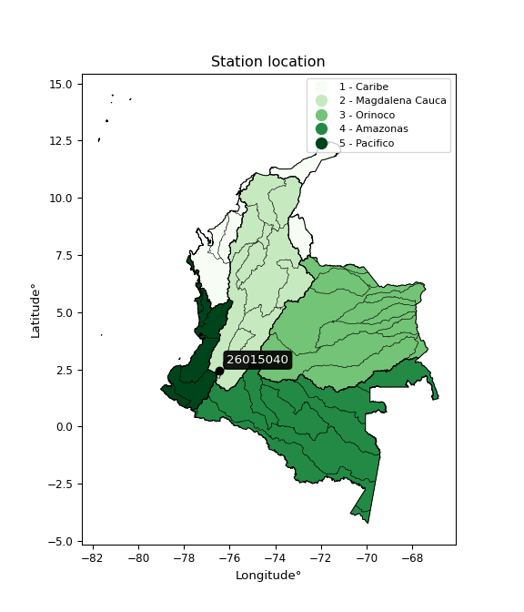

<div align="center">


</div>

# PMP Station (rain, Pmax24h): 26015040

Probable Maximum Precipitation (PMP) is the greatest amount of rainfall for a specific duration that is meteorologically possible for a given location, acting as a "worst-case" scenario for extreme storms, crucial for designing safety-critical infrastructure like bridges, river deviations, dams, spillways, and nuclear plants to prevent catastrophic failure. PMP is calculated by hydrologists using meteorological data to determine the upper limit of extreme rainfall, often leading to the Probable Maximum Flood (PMF) for flood control design, and is increasingly being studied for climate change impacts.

<div align="center">

</img>

</div>


## A. General information


### 1. General running parameters

• app_version: _v20251228_. • runtime: _2025-12-28 08:43:48.795225_. • Python version: _3.14.0_. • SciPy version: _1.16.3_. • Pandas version: _2.3.3_. • NumPy version: _2.3.5_. • Stations dataset (station_dataset_file): _dataset/pmax24h_in/automatic_colombia_2003_2024.csv_. • Stations catalog (station_catalog_file): _dataset/CNE_IDEAM.xls_. • Minimum year to eval til year_max (date_min): _1900_. • Maximum year to eval since year_min (date_max): _2024_. • Creates, save and include plots into reports (create_plot): _False_. • Plot only fit distributions with Δo > Δ (plot_only_fit): _True_. • Eval low extreme values, if False, evaluates high extreme values (low_extreme): _False_. • Eval every SciPy distribution as logarithmic (pdist_logarithmic_on): _True_. • Standard deviation normalized (ddof): _1.0_. • Return periods to eval in years (Tr): _[2, 2.33, 5, 10, 15, 20, 25, 50, 75, 100, 200, 250, 500, 750, 1000]_. • Minimum data sample per station, 0 means any (minimum_sample): _5_. • Z-Score maximum threshold to adjust a value, 0 means disable (zscore_max): _3.5_. • Z-Score minimum threshold to adjust a value, 0 means disable (zscore_min): _-2.5_. • Avoid zeros, e.g. rain = 0 (avoid_zeros): _True_. • Avoid null values (avoid_nans): _True_. [:file_folder:Dataset file.](../../dataset/pmax24h_in/automatic_colombia_2003_2024.csv)

> Delta Degrees of Freedom (DDOF): is a parameter used in the formulas for calculating variance and standard deviation. When ddof=0, the divisor is $N$ (the total number of observations) and this is used when your data set is the entire population. When ddof=1, the divisor is $N-1$ and this is used when your data set is a sample drawn from a larger population. Using $N-1$ provides an unbiased estimate of the population variance (known as Bessel´s correction).


### 2. Station info and location

|   id |   CODIGO | NOMBRE                       | CATEGORIA               | TECNOLOGIA                              | ESTADO           | FECHA_INSTALACION   |   FECHA_SUSPENSION |   ALTITUD |   LATITUD |   LONGITUD | DEPARTAMENTO   | MUNICIPIO   | AREA_OPERATIVA                         | ENTIDAD                                                     | AREA_HIDROGRAFICA   | ZONA_HIDROGRAFICA   | SUBZONA_HIDROGRAFICA   |   CORRIENTE | Catalogo   |
|-----:|---------:|:-----------------------------|:------------------------|:----------------------------------------|:-----------------|:--------------------|-------------------:|----------:|----------:|-----------:|:---------------|:------------|:---------------------------------------|:------------------------------------------------------------|:--------------------|:--------------------|:-----------------------|------------:|:-----------|
|    0 | 26015040 | ARRAYANALES - AUT [26015040] | Climatológica Principal | Automática con Telemetría, Convencional | En Mantenimiento | 24/05/2010          |                nan |      2552 |   2.44804 |   -76.4357 | Cauca          | Popayán     | Area Operativa 09 - Cauca-Valle-Caldas | INSTITUTO DE HIDROLOGIA METEOROLOGIA Y ESTUDIOS AMBIENTALES | Magdalena Cauca     | Cauca               | Alto Río Cauca         |         nan | CNE_IDEAM  |

<div align="center">

Map location in: [:earth_americas:Google](http://maps.google.com/maps?q=2.448041111,-76.43574694) [:earth_americas:OSM](https://www.openstreetmap.org/#map=18/2.448041111/-76.43574694&layers=P) [:earth_americas:Bing](https://www.bing.com/maps?cp=2.448041111~-76.43574694&lvl=18) [:earth_americas:Apple](https://maps.apple.com/frame?center=2.448041111%2C-76.43574694&span=0.003%2C0.006)

</div>


<div align="center">

```geojson
{
  "type": "Feature",
  "geometry": {
    "type": "Point", 
    "coordinates": [-76.43574694, 2.448041111]
  }, 
  "properties": {
    "Name": "26015040"
  }
}
```

</div>


### 3. Discrete values table and plot

|               |           0 |           1 |           2 |           3 |           4 |          5 |            6 |           7 |          8 |
|:--------------|------------:|------------:|------------:|------------:|------------:|-----------:|-------------:|------------:|-----------:|
| Date          | 2016        | 2017        | 2018        | 2019        | 2020        | 2021       | 2022         | 2023        | 2024       |
| Value         |   17.5      |   51.7      |   50.4      |   61.8      |   50.8      |  295.8     |   68         |   40        |    1.8     |
| Value_initial |   17.5      |   51.7      |   50.4      |   61.8      |   50.8      |  295.8     |   68         |   40        |    1.8     |
| count         |    9        |    9        |    9        |    9        |    9        |    9       |    9         |    9        |    9       |
| mean          |   70.8667   |   70.8667   |   70.8667   |   70.8667   |   70.8667   |   70.8667  |   70.8667    |   70.8667   |   70.8667  |
| std           |   86.9233   |   86.9233   |   86.9233   |   86.9233   |   86.9233   |   86.9233  |   86.9233    |   86.9233   |   86.9233  |
| zscore        |   -0.613951 |   -0.220501 |   -0.235457 |   -0.104307 |   -0.230855 |    2.58772 |   -0.0329793 |   -0.355102 |   -0.79457 |

> The initial value (value_initial) correspond to the initial obtained or null completed value, and value (value) is adjusted only when the initial value is outside the valid range definite through the Z-Score value. If Z-Score is active, values out of range or outliers are replaced with the station mean value


### 4. Active continuous probability distributions from SciPy (44 of 104 available)

[scipy.stats](https://docs.scipy.org/doc/scipy/reference/stats.html) is a Python´s powerful submodule within the SciPy library for comprehensive statistical analysis, offering over 130 probability distributions (like Normal, Poisson), functions for descriptive stats (mean, variance), hypothesis testing (t-tests, chi-square), random variable generation, and statistical tests, making it essential for data science, modeling, and research. It provides tools to explore, model, and draw conclusions from data efficiently, working seamlessly with NumPy.

<div align="center">

|   id | p_dist             |   n_parameter | fit_method   | label                                                                       | active   | ref                                                                                                        |
|-----:|:-------------------|--------------:|:-------------|:----------------------------------------------------------------------------|:---------|:-----------------------------------------------------------------------------------------------------------|
|    0 | alpha              |             3 | MLE          | Alpha                                                                       | True     | [:mortar_board:](https://docs.scipy.org/doc/scipy/reference/generated/scipy.stats.alpha.html)              |
|    1 | betaprime          |             4 | MLE          | Beta prime                                                                  | True     | [:mortar_board:](https://docs.scipy.org/doc/scipy/reference/generated/scipy.stats.betaprime.html)          |
|    2 | chi2               |             3 | MLE          | Chi²                                                                        | True     | [:mortar_board:](https://docs.scipy.org/doc/scipy/reference/generated/scipy.stats.chi2.html)               |
|    3 | crystalball        |             4 | MLE          | Crystalball                                                                 | True     | [:mortar_board:](https://docs.scipy.org/doc/scipy/reference/generated/scipy.stats.crystalball.html)        |
|    4 | erlang             |             3 | MLE          | Erlang                                                                      | True     | [:mortar_board:](https://docs.scipy.org/doc/scipy/reference/generated/scipy.stats.erlang.html)             |
|    5 | expon              |             2 | MLE          | Exponential                                                                 | True     | [:mortar_board:](https://docs.scipy.org/doc/scipy/reference/generated/scipy.stats.expon.html)              |
|    6 | exponnorm          |             3 | MLE          | Exponentially modified Normal                                               | True     | [:mortar_board:](https://docs.scipy.org/doc/scipy/reference/generated/scipy.stats.exponnorm.html)          |
|    7 | f                  |             4 | MLE          | F                                                                           | True     | [:mortar_board:](https://docs.scipy.org/doc/scipy/reference/generated/scipy.stats.f.html)                  |
|    8 | fatiguelife        |             3 | MLE          | Fatigue-life (Birnbaum-Saunders)                                            | True     | [:mortar_board:](https://docs.scipy.org/doc/scipy/reference/generated/scipy.stats.fatiguelife.html)        |
|    9 | fisk               |             3 | MLE          | Fisk                                                                        | True     | [:mortar_board:](https://docs.scipy.org/doc/scipy/reference/generated/scipy.stats.fisk.html)               |
|   10 | gamma              |             3 | MLE          | Gamma                                                                       | True     | [:mortar_board:](https://docs.scipy.org/doc/scipy/reference/generated/scipy.stats.gamma.html)              |
|   11 | genexpon           |             5 | MLE          | Generalized exponential                                                     | True     | [:mortar_board:](https://docs.scipy.org/doc/scipy/reference/generated/scipy.stats.genexpon.html)           |
|   12 | genlogistic        |             3 | MLE          | Generalized logistic                                                        | True     | [:mortar_board:](https://docs.scipy.org/doc/scipy/reference/generated/scipy.stats.genlogistic.html)        |
|   13 | gibrat             |             2 | MM           | Gibrat                                                                      | True     | [:mortar_board:](https://docs.scipy.org/doc/scipy/reference/generated/scipy.stats.gibrat.html)             |
|   14 | gompertz           |             3 | MLE          | Gompertz (or truncated Gumbel)                                              | True     | [:mortar_board:](https://docs.scipy.org/doc/scipy/reference/generated/scipy.stats.gompertz.html)           |
|   15 | gumbel_l           |             2 | MM           | Gumbel Left Skew                                                            | True     | [:mortar_board:](https://docs.scipy.org/doc/scipy/reference/generated/scipy.stats.gumbel_l.html)           |
|   16 | gumbel_r           |             2 | MM           | Gumbel Right Skew                                                           | True     | [:mortar_board:](https://docs.scipy.org/doc/scipy/reference/generated/scipy.stats.gumbel_r.html)           |
|   17 | halflogistic       |             2 | MM           | Half-logistic                                                               | True     | [:mortar_board:](https://docs.scipy.org/doc/scipy/reference/generated/scipy.stats.halflogistic.html)       |
|   18 | halfnorm           |             2 | MM           | Half Normal                                                                 | True     | [:mortar_board:](https://docs.scipy.org/doc/scipy/reference/generated/scipy.stats.halfnorm.html)           |
|   19 | hypsecant          |             2 | MM           | hyperbolic secant                                                           | True     | [:mortar_board:](https://docs.scipy.org/doc/scipy/reference/generated/scipy.stats.hypsecant.html)          |
|   20 | invgamma           |             3 | MLE          | Inverted gamma                                                              | True     | [:mortar_board:](https://docs.scipy.org/doc/scipy/reference/generated/scipy.stats.invgamma.html)           |
|   21 | invgauss           |             3 | MLE          | Inverse Gaussian                                                            | True     | [:mortar_board:](https://docs.scipy.org/doc/scipy/reference/generated/scipy.stats.invgauss.html)           |
|   22 | invweibull         |             3 | MLE          | Inverted Weibull                                                            | True     | [:mortar_board:](https://docs.scipy.org/doc/scipy/reference/generated/scipy.stats.invweibull.html)         |
|   23 | johnsonsu          |             4 | MLE          | Johnson Su                                                                  | True     | [:mortar_board:](https://docs.scipy.org/doc/scipy/reference/generated/scipy.stats.johnsonsu.html)          |
|   24 | kstwobign          |             2 | MLE          | Limiting distribution of scaled Kolmogorov-Smirnov two-sided test statistic | True     | [:mortar_board:](https://docs.scipy.org/doc/scipy/reference/generated/scipy.stats.kstwobign.html)          |
|   25 | laplace            |             2 | MM           | Laplace                                                                     | True     | [:mortar_board:](https://docs.scipy.org/doc/scipy/reference/generated/scipy.stats.laplace.html)            |
|   26 | laplace_asymmetric |             3 | MLE          | Asymmetric Laplace                                                          | True     | [:mortar_board:](https://docs.scipy.org/doc/scipy/reference/generated/scipy.stats.laplace_asymmetric.html) |
|   27 | loggamma           |             3 | MLE          | Log gamma                                                                   | True     | [:mortar_board:](https://docs.scipy.org/doc/scipy/reference/generated/scipy.stats.loggamma.html)           |
|   28 | logistic           |             2 | MM           | Logistic (or Sech-squared)                                                  | True     | [:mortar_board:](https://docs.scipy.org/doc/scipy/reference/generated/scipy.stats.logistic.html)           |
|   29 | lognorm            |             3 | MLE          | Log Normal                                                                  | True     | [:mortar_board:](https://docs.scipy.org/doc/scipy/reference/generated/scipy.stats.lognorm.html)            |
|   30 | maxwell            |             2 | MM           | Maxwell                                                                     | True     | [:mortar_board:](https://docs.scipy.org/doc/scipy/reference/generated/scipy.stats.maxwell.html)            |
|   31 | mielke             |             4 | MLE          | Mielke Beta-Kappa / Dagum                                                   | True     | [:mortar_board:](https://docs.scipy.org/doc/scipy/reference/generated/scipy.stats.mielke.html)             |
|   32 | moyal              |             2 | MM           | Moyal                                                                       | True     | [:mortar_board:](https://docs.scipy.org/doc/scipy/reference/generated/scipy.stats.moyal.html)              |
|   33 | nakagami           |             3 | MLE          | Nakagami                                                                    | True     | [:mortar_board:](https://docs.scipy.org/doc/scipy/reference/generated/scipy.stats.nakagami.html)           |
|   34 | ncf                |             5 | MLE          | Non-central F distribution                                                  | True     | [:mortar_board:](https://docs.scipy.org/doc/scipy/reference/generated/scipy.stats.ncf.html)                |
|   35 | nct                |             4 | MLE          | Non-central Student’s t                                                     | True     | [:mortar_board:](https://docs.scipy.org/doc/scipy/reference/generated/scipy.stats.nct.html)                |
|   36 | norm               |             2 | MM           | Normal                                                                      | True     | [:mortar_board:](https://docs.scipy.org/doc/scipy/reference/generated/scipy.stats.norm.html)               |
|   37 | pearson3           |             3 | MM           | Pearson type III                                                            | True     | [:mortar_board:](https://docs.scipy.org/doc/scipy/reference/generated/scipy.stats.pearson3.html)           |
|   38 | rayleigh           |             2 | MM           | Rayleigh                                                                    | True     | [:mortar_board:](https://docs.scipy.org/doc/scipy/reference/generated/scipy.stats.rayleigh.html)           |
|   39 | rice               |             3 | MLE          | Rice                                                                        | True     | [:mortar_board:](https://docs.scipy.org/doc/scipy/reference/generated/scipy.stats.rice.html)               |
|   40 | t                  |             3 | MLE          | Student’s t                                                                 | True     | [:mortar_board:](https://docs.scipy.org/doc/scipy/reference/generated/scipy.stats.t.html)                  |
|   41 | truncnorm          |             4 | MLE          | Truncated normal                                                            | True     | [:mortar_board:](https://docs.scipy.org/doc/scipy/reference/generated/scipy.stats.truncnorm.html)          |
|   42 | wald               |             2 | MM           | Wald                                                                        | True     | [:mortar_board:](https://docs.scipy.org/doc/scipy/reference/generated/scipy.stats.wald.html)               |
|   43 | weibull_min        |             3 | MLE          | Weibull minimum                                                             | True     | [:mortar_board:](https://docs.scipy.org/doc/scipy/reference/generated/scipy.stats.weibull_min.html)        |

</div>

> **n_parameter:** # arguments & localization & scale.
>
> **Fit methods:** (MLE) maximum likelihood, (MM) L-moments.
>
>**Inactive:** foldnorm, gennorm, norminvgauss, powernorm, powerlognorm, skewnorm, genextreme, anglit, arcsine, argus, beta, bradford, burr, burr12, cauchy, cosine, halfcauchy, foldcauchy, skewcauchy, wrapcauchy, dgamma, gengamma, exponweib, exponpow, truncexpon, gausshyper, genhalflogistic, genhyperbolic, geninvgauss, halfgennorm, johnsonsb, kappa4, kappa3, ksone, kstwo, loglaplace, levy, levy_l, levy_stable, ncx2, pareto, genpareto, truncpareto, lomax, powerlaw, rdist, rel_breitwigner, recipinvgauss, semicircular, studentized_range, trapezoid, triang, truncweibull_min, tukeylambda, uniform, loguniform, vonmises, vonmises_line, weibull_max, dweibull, 


## B. Probability distributions vs. Empirical distributions

A continuous probability distribution (CPD) describes probabilities for variables that can take any value within a range (like rain any time), unlike discrete variables with specific outcomes (like temperature). It uses a Probability Density Function (PDF), a curve where the total area under it equals 1, and the probability of the variable falling within an interval (a to b) is found by calculating the area under the curve between those points. A key feature is that the probability of hitting any single exact value is zero, so probabilities are always expressed for ranges, e.g., $P(a ≤ X ≤ b)$.

<div align="center">

Distributions parameters from station values
|    |   station | p_dist                |   n |               loc |            scale | shape                  | shape1                 | shape2              | shape3   |
|---:|----------:|:----------------------|----:|------------------:|-----------------:|:-----------------------|:-----------------------|:--------------------|:---------|
|  0 |  26015040 | alpha                 |   9 |     -30.7473      |    110.904       | 1.4388554644384453     |                        |                     |          |
|  1 |  26015040 | betaprime             |   9 |       1.8         |    203.524       | 0.8473341717347711     | 3.920748893871588      |                     |          |
|  2 |  26015040 | chi2                  |   9 |       1.8         |      2.3053      | 0.27971299165753155    |                        |                     |          |
|  3 |  26015040 | crystalball           |   9 |      70.8667      |     81.9521      | 4789.235223875837      | 7055.199610115548      |                     |          |
|  4 |  26015040 | erlang                |   9 |       1.8         |     96.0167      | 0.7895941410631864     |                        |                     |          |
|  5 |  26015040 | expon                 |   9 |       1.8         |     69.0667      |                        |                        |                     |          |
|  6 |  26015040 | exponnorm             |   9 |      12.0363      |     16.5122      | 3.562841300862171      |                        |                     |          |
|  7 |  26015040 | f                     |   9 |       1.8         |     71.0305      | 1.1984300915041153     | 26.082645879315905     |                     |          |
|  8 |  26015040 | fatiguelife           |   9 |     -11.5041      |     60.0777      | 0.8659743173812768     |                        |                     |          |
|  9 |  26015040 | fisk                  |   9 |     -10.2708      |     57.4248      | 2.3659759928739597     |                        |                     |          |
| 10 |  26015040 | gamma                 |   9 |       1.8         |     75.572       | 0.8297215129825988     |                        |                     |          |
| 11 |  26015040 | genexpon              |   9 |       1.8         |    112.4         | 1.6274061215866054     | 2.9445009753150526e-11 | 2.0698366672141484  |          |
| 12 |  26015040 | genlogistic           |   9 |    -263.731       |     40.5968      | 1834.5417322718113     |                        |                     |          |
| 13 |  26015040 | gibrat                |   9 |       8.34755     |     37.9198      |                        |                        |                     |          |
| 14 |  26015040 | gompertz              |   9 |       1.8         |      4.312e+09   | 65584922.90217957      |                        |                     |          |
| 15 |  26015040 | gumbel_l              |   9 |     107.749       |     63.8978      |                        |                        |                     |          |
| 16 |  26015040 | gumbel_r              |   9 |      33.9839      |     63.8978      |                        |                        |                     |          |
| 17 |  26015040 | halflogistic          |   9 |     -26.2656      |     70.0661      |                        |                        |                     |          |
| 18 |  26015040 | halfnorm              |   9 |     -37.6058      |    135.95        |                        |                        |                     |          |
| 19 |  26015040 | hypsecant             |   9 |      70.8667      |     52.1723      |                        |                        |                     |          |
| 20 |  26015040 | invgamma              |   9 |     -26.5344      |    207.582       | 3.153964609214105      |                        |                     |          |
| 21 |  26015040 | invgauss              |   9 |     -13.8151      |    108.087       | 0.7834563116621913     |                        |                     |          |
| 22 |  26015040 | invweibull            |   9 |       1.52563     |      4.32082     | 0.4447610464334313     |                        |                     |          |
| 23 |  26015040 | johnsonsu             |   9 |      50.7555      |      0.472508    | -0.049433486720961664  | 0.24403796686874812    |                     |          |
| 24 |  26015040 | kstwobign             |   9 |    -128.33        |    235.581       |                        |                        |                     |          |
| 25 |  26015040 | laplace               |   9 |      70.8667      |     57.9489      |                        |                        |                     |          |
| 26 |  26015040 | laplace_asymmetric    |   9 |      50.4         |     36.745       | 0.7595590681754729     |                        |                     |          |
| 27 |  26015040 | loggamma              |   9 |  -18308.5         |   2659.05        | 1004.4960914426119     |                        |                     |          |
| 28 |  26015040 | logistic              |   9 |      70.8667      |     45.1826      |                        |                        |                     |          |
| 29 |  26015040 | lognorm               |   9 |       1.8         |      0.641816    | 12.606833905854055     |                        |                     |          |
| 30 |  26015040 | maxwell               |   9 |    -123.325       |    121.692       |                        |                        |                     |          |
| 31 |  26015040 | mielke                |   9 |       1.8         |     92.3967      | 0.8293375601002754     | 2.897612918775323      |                     |          |
| 32 |  26015040 | moyal                 |   9 |      24.0012      |     36.8914      |                        |                        |                     |          |
| 33 |  26015040 | nakagami              |   9 |       1.8         |    161.335       | 0.07974038192458802    |                        |                     |          |
| 34 |  26015040 | ncf                   |   9 |       1.8         |      5.63453     | 0.37330655384139005    | 14.538456424738213     | 5.347816514694777   |          |
| 35 |  26015040 | nct                   |   9 |      -0.0411596   |     22.7218      | 2.213998479137465      | 1.8475628030068838     |                     |          |
| 36 |  26015040 | norm                  |   9 |      70.8667      |     81.9521      |                        |                        |                     |          |
| 37 |  26015040 | pearson3              |   9 |      70.8667      |     81.9521      | 2.189346911612547      |                        |                     |          |
| 38 |  26015040 | rayleigh              |   9 |     -85.9125      |    125.092       |                        |                        |                     |          |
| 39 |  26015040 | rice                  |   9 |     -43.1675      |     99.2974      | 0.00032099827460000844 |                        |                     |          |
| 40 |  26015040 | t                     |   9 |      50.8745      |      1.46777     | 0.3420476231529215     |                        |                     |          |
| 41 |  26015040 | truncnorm             |   9 |    -480.879       |    205.281       | 2.3513107312751043     | 450.4063054282201      |                     |          |
| 42 |  26015040 | wald                  |   9 |     -11.0854      |     81.9521      |                        |                        |                     |          |
| 43 |  26015040 | weibull_min           |   9 |       1.8         |     60.6485      | 0.8566450565052184     |                        |                     |          |
| 44 |  26015040 | logalpha              |   9 |       0.00132968  |      1.61918     | 2.657192725125891e-08  |                        |                     |          |
| 45 |  26015040 | logbetaprime          |   9 |     -34.4431      |   4816.31        | 842.0486420399634      | 106428.72271534073     |                     |          |
| 46 |  26015040 | logchi2               |   9 |     -16.5261      |      0.044691    | 451.3489123907607      |                        |                     |          |
| 47 |  26015040 | logcrystalball        |   9 |       3.66281     |      1.2886      | 675.6470027506804      | 8.807150394112094      |                     |          |
| 48 |  26015040 | logerlang             |   9 |     -18.6803      |      0.0822895   | 271.5483488506113      |                        |                     |          |
| 49 |  26015040 | logexpon              |   9 |       0.587787    |      3.07503     |                        |                        |                     |          |
| 50 |  26015040 | logexponnorm          |   9 |       3.66202     |      1.2886      | 0.0005986312753279313  |                        |                     |          |
| 51 |  26015040 | logf                  |   9 |   -2455.44        |   2459.1         | 25517391.419049636     | 10148609.89852012      |                     |          |
| 52 |  26015040 | logfatiguelife        |   9 |    -763.159       |    766.816       | 0.0016834087145189197  |                        |                     |          |
| 53 |  26015040 | logfisk               |   9 |      -1.37432e+06 |      1.37432e+06 | 2159738.9833035693     |                        |                     |          |
| 54 |  26015040 | loggamma              |   9 |     -18.5774      |      0.0807732   | 275.25143730044374     |                        |                     |          |
| 55 |  26015040 | loggenexpon           |   9 |       0.587787    |      1.641       | 0.13300602430111536    | 9.611751015107213      | 0.03848417630622049 |          |
| 56 |  26015040 | loggenlogistic        |   9 |       4.34686     |      0.408409    | 0.4381987876271245     |                        |                     |          |
| 57 |  26015040 | loggibrat             |   9 |       2.67976     |      0.59625     |                        |                        |                     |          |
| 58 |  26015040 | loggompertz           |   9 |       0.587787    |      1.14907     | 0.04517355271534451    |                        |                     |          |
| 59 |  26015040 | loggumbel_l           |   9 |       4.24275     |      1.00472     |                        |                        |                     |          |
| 60 |  26015040 | loggumbel_r           |   9 |       3.08287     |      1.00472     |                        |                        |                     |          |
| 61 |  26015040 | loghalflogistic       |   9 |       2.13549     |      1.10173     |                        |                        |                     |          |
| 62 |  26015040 | loghalfnorm           |   9 |       1.95723     |      2.13763     |                        |                        |                     |          |
| 63 |  26015040 | loghypsecant          |   9 |       3.66281     |      0.82035     |                        |                        |                     |          |
| 64 |  26015040 | loginvgamma           |   9 |     -25.4107      |  13358.9         | 461.00393086701393     |                        |                     |          |
| 65 |  26015040 | loginvgauss           |   9 |     -10.8959      |   1533.24        | 0.0094971417776843     |                        |                     |          |
| 66 |  26015040 | loginvweibull         |   9 |      -2.15559e+08 |      2.15559e+08 | 139296617.24371296     |                        |                     |          |
| 67 |  26015040 | logjohnsonsu          |   9 |       3.92777     |      0.00926106  | 0.03931412967070301    | 0.23923701216237736    |                     |          |
| 68 |  26015040 | logkstwobign          |   9 |      -2.70844     |      7.31298     |                        |                        |                     |          |
| 69 |  26015040 | loglaplace            |   9 |       3.66281     |      0.911179    |                        |                        |                     |          |
| 70 |  26015040 | loglaplace_asymmetric |   9 |       3.94546     |      0.730425    | 1.2119871671902005     |                        |                     |          |
| 71 |  26015040 | logloggamma           |   9 |       3.54418     |      1.33587     | 1.557379096321238      |                        |                     |          |
| 72 |  26015040 | loglogistic           |   9 |       3.66281     |      0.710444    |                        |                        |                     |          |
| 73 |  26015040 | loglognorm            |   9 |       0.587787    |      0.0498973   | 11.930132494485985     |                        |                     |          |
| 74 |  26015040 | logmaxwell            |   9 |       0.60938     |      1.91345     |                        |                        |                     |          |
| 75 |  26015040 | logmielke             |   9 | -901940           | 901944           | 1005224.3730037252     | 2363609.465208863      |                     |          |
| 76 |  26015040 | logmoyal              |   9 |       2.92591     |      0.580075    |                        |                        |                     |          |
| 77 |  26015040 | lognakagami           |   9 |       2.8622      |      1.41698     | 0.470828488941764      |                        |                     |          |
| 78 |  26015040 | logncf                |   9 |       0.431929    |      9.6467e-06  | 3.8766937574966396e-05 | 106.34222852498853     | 12.863145896496116  |          |
| 79 |  26015040 | lognct                |   9 |     -80.1768      |      1.25317     | 35920.67035023039      | 66.90012475339623      |                     |          |
| 80 |  26015040 | lognorm               |   9 |       3.66281     |      1.2886      |                        |                        |                     |          |
| 81 |  26015040 | logpearson3           |   9 |       3.66281     |      1.28861     | -1.0871193727743709    |                        |                     |          |
| 82 |  26015040 | lograyleigh           |   9 |       1.19763     |      1.96693     |                        |                        |                     |          |
| 83 |  26015040 | logrice               |   9 |    -409.822       |      1.28846     | 320.91304343660863     |                        |                     |          |
| 84 |  26015040 | logt                  |   9 |       3.92968     |      0.0274048   | 0.32792294651425324    |                        |                     |          |
| 85 |  26015040 | logtruncnorm          |   9 |       0.194628    |      4.26351     | 0.0813211865589625     | 1.2888563005976987     |                     |          |
| 86 |  26015040 | logwald               |   9 |       2.37417     |      1.28863     |                        |                        |                     |          |
| 87 |  26015040 | logweibull_min        |   9 |     -16.3302      |     20.5418      | 19.541309554322545     |                        |                     |          |

</div>

> **loc** (Location parameter): This shifts the distribution along the x-axis. For many common distributions, like the normal (Gaussian) distribution, loc represents the mean $μ$. For others, like the uniform distribution, it might represent the minimum value, or for the beta distribution, the left end of the support interval.
>
> **scale** (Scale parameter): This determines the width or spread of the distribution. For the normal distribution, scale represents the standard deviation $σ$. For a uniform distribution, it defines the length of the interval (from $loc$ to $loc + scale$).
>
> **shape** (Shape parameters): Refers to parameters that define the specific form of a probability distribution, distinct from its location (loc) and scale (scale). These parameters are required arguments for most distribution functions. For example, a normal (Gaussian) distribution is fully defined by its location (mean) and scale (standard deviation), so it has no specific shape parameters beyond loc and scale. However, other distributions have intrinsic properties that need specification, as Gamma distribution that takes a shape parameter, often named $a$ or $alpha$.


### 0. Cumulative distribution values - CDF (88 evaluated)

Cumulative Distribution Function (CDF), denoted as $F$<sub>$X$</sub>$(x)$, is a function that gives the probability that a random variable $X$ will take a value less than or equal to a specific value, $x$ (i.e., $(P(X≥x)$. It essentially "accumulates" probabilities from a given point up to the far right (positive infinity), providing a complete picture of the distribution´s probabilities for both discrete (like rain) and continuous (like temperature) variables, helping to find probabilities over ranges or above certain values.

<div align="center">

CDF ordered by x ascending and calculating $log(f(x))$ separately
|   id |   Station |   date |     x |   count |    mean |     std |     zscore |   Value_initial |   station |   m |     alpha |   alpha_pdf |   betaprime |   betaprime_pdf |       chi2 |    chi2_pdf |   crystalball |   crystalball_pdf |      erlang |   erlang_pdf |    expon |   expon_pdf |   exponnorm |   exponnorm_pdf |          f |          f_pdf |   fatiguelife |   fatiguelife_pdf |      fisk |    fisk_pdf |       gamma |    gamma_pdf |   genexpon |   genexpon_pdf |   genlogistic |   genlogistic_pdf |    gibrat |   gibrat_pdf |   gompertz |   gompertz_pdf |   gumbel_l |   gumbel_l_pdf |   gumbel_r |   gumbel_r_pdf |   halflogistic |   halflogistic_pdf |   halfnorm |   halfnorm_pdf |   hypsecant |   hypsecant_pdf |   invgamma |   invgamma_pdf |   invgauss |   invgauss_pdf |   invweibull |   invweibull_pdf |   johnsonsu |   johnsonsu_pdf |   kstwobign |   kstwobign_pdf |   laplace |   laplace_pdf |   laplace_asymmetric |   laplace_asymmetric_pdf |   loggamma |   loggamma_pdf |   logistic |   logistic_pdf |    lognorm |   lognorm_pdf |   maxwell |   maxwell_pdf |      mielke |   mielke_pdf |    moyal |   moyal_pdf |   nakagami |   nakagami_pdf |         ncf |     ncf_pdf |       nct |     nct_pdf |     norm |    norm_pdf |   pearson3 |   pearson3_pdf |   rayleigh |   rayleigh_pdf |      rice |    rice_pdf |        t |       t_pdf |   truncnorm |   truncnorm_pdf |      wald |    wald_pdf |   weibull_min |   weibull_min_pdf |   logalpha |   logalpha_pdf |   logbetaprime |   logbetaprime_pdf |    logchi2 |   logchi2_pdf |   logcrystalball |   logcrystalball_pdf |   logerlang |   logerlang_pdf |   logexpon |   logexpon_pdf |   logexponnorm |   logexponnorm_pdf |       logf |   logf_pdf |   logfatiguelife |   logfatiguelife_pdf |   logfisk |   logfisk_pdf |   loggenexpon |   loggenexpon_pdf |   loggenlogistic |   loggenlogistic_pdf |   loggibrat |   loggibrat_pdf |   loggompertz |   loggompertz_pdf |   loggumbel_l |   loggumbel_l_pdf |   loggumbel_r |   loggumbel_r_pdf |   loghalflogistic |   loghalflogistic_pdf |   loghalfnorm |   loghalfnorm_pdf |   loghypsecant |   loghypsecant_pdf |   loginvgamma |   loginvgamma_pdf |   loginvgauss |   loginvgauss_pdf |   loginvweibull |   loginvweibull_pdf |   logjohnsonsu |   logjohnsonsu_pdf |   logkstwobign |   logkstwobign_pdf |   loglaplace |   loglaplace_pdf |   loglaplace_asymmetric |   loglaplace_asymmetric_pdf |   logloggamma |   logloggamma_pdf |   loglogistic |   loglogistic_pdf |   loglognorm |   loglognorm_pdf |   logmaxwell |   logmaxwell_pdf |   logmielke |   logmielke_pdf |    logmoyal |   logmoyal_pdf |   lognakagami |   lognakagami_pdf |     logncf |   logncf_pdf |     lognct |   lognct_pdf |   logpearson3 |   logpearson3_pdf |   lograyleigh |   lograyleigh_pdf |    logrice |   logrice_pdf |      logt |   logt_pdf |   logtruncnorm |   logtruncnorm_pdf |   logwald |   logwald_pdf |   logweibull_min |   logweibull_min_pdf |
|-----:|----------:|-------:|------:|--------:|--------:|--------:|-----------:|----------------:|----------:|----:|----------:|------------:|------------:|----------------:|-----------:|------------:|--------------:|------------------:|------------:|-------------:|---------:|------------:|------------:|----------------:|-----------:|---------------:|--------------:|------------------:|----------:|------------:|------------:|-------------:|-----------:|---------------:|--------------:|------------------:|----------:|-------------:|-----------:|---------------:|-----------:|---------------:|-----------:|---------------:|---------------:|-------------------:|-----------:|---------------:|------------:|----------------:|-----------:|---------------:|-----------:|---------------:|-------------:|-----------------:|------------:|----------------:|------------:|----------------:|----------:|--------------:|---------------------:|-------------------------:|-----------:|---------------:|-----------:|---------------:|-----------:|--------------:|----------:|--------------:|------------:|-------------:|---------:|------------:|-----------:|---------------:|------------:|------------:|----------:|------------:|---------:|------------:|-----------:|---------------:|-----------:|---------------:|----------:|------------:|---------:|------------:|------------:|----------------:|----------:|------------:|--------------:|------------------:|-----------:|---------------:|---------------:|-------------------:|-----------:|--------------:|-----------------:|---------------------:|------------:|----------------:|-----------:|---------------:|---------------:|-------------------:|-----------:|-----------:|-----------------:|---------------------:|----------:|--------------:|--------------:|------------------:|-----------------:|---------------------:|------------:|----------------:|--------------:|------------------:|--------------:|------------------:|--------------:|------------------:|------------------:|----------------------:|--------------:|------------------:|---------------:|-------------------:|--------------:|------------------:|--------------:|------------------:|----------------:|--------------------:|---------------:|-------------------:|---------------:|-------------------:|-------------:|-----------------:|------------------------:|----------------------------:|--------------:|------------------:|--------------:|------------------:|-------------:|-----------------:|-------------:|-----------------:|------------:|----------------:|------------:|---------------:|--------------:|------------------:|-----------:|-------------:|-----------:|-------------:|--------------:|------------------:|--------------:|------------------:|-----------:|--------------:|----------:|-----------:|---------------:|-------------------:|----------:|--------------:|-----------------:|---------------------:|
|    0 |  26015040 |   2024 |   1.8 |       9 | 70.8667 | 86.9233 | -0.79457   |             1.8 |  26015040 |   1 | 0.0264888 |  0.00650429 | 3.05529e-14 |     4.66366     | 0.00557732 | 3.51292e+12 |      0.199679 |       0.00341287  | 1.27919e-14 | 45.488       | 0        | 0.0144788   |   0.0400099 |     0.00386949  | 4.2164e-09 | 2401.03        |     0.0280344 |        0.00724502 | 0.0243592 | 0.0046583   | 3.02302e-15 | 11.2962      | 6.3645e-13 |    0.0144788   |     0.0709182 |       0.00461934  | 0         |  0           | 4.7328e-10 |    0.0152099   |   0.173453 |    0.00246419  |   0.191131 |    0.00494983  |       0.197644 |        0.00685736  |   0.228073 |    0.00562752  |    0.165578 |     0.00303247  |  0.0277955 |    0.00535847  |  0.0277111 |    0.00672378  |    0.0331117 |      0.182919    |    0.088335 |     0.000798293 |   0.0795951 |     0.00433451  |  0.151829 |    0.00262005 |            0.0641312 |              0.00229778  | 0.00857355 |      0.0192009 |   0.178197 |    0.00324113  | 0.00850883 |     0.017957  |  0.212591 |   0.00408576  | 1.30378e-09 |  0.604509    | 0.176672 | 0.00586521  | 0.00120695 |    8.66877e+11 | 0.000105329 | 1.16501e+09 | 0.0380485 | 0.003365    | 0.199679 | 0.00341287  |   0.104955 |    0.0145813   |   0.217945 |    0.00438371  | 0.0974576 | 0.00411615  | 0.102738 | 0.000715956 | 5.84421e-12 |     0.0130931   | 0.0297738 | 0.00815876  |   1.15668e-15 |       4.46244     | 0.00576323 |      0.083076  |     0.00848298 |          0.0185257 | 0.00863506 |     0.0194911 |       0.00850883 |            0.0179571 |  0.00907733 |       0.0199449 |   0        |      0.325201  |     0.00850894 |          0.0179573 | 0.00861565 |  0.0181523 |        0.0085934 |            0.0181545 | 0.0062399 |    0.00974481 |    5.5958e-09 |         0.0810517 |        0.0177157 |            0.019006  |    0        |       0         |   5.93104e-09 |         0.0393132 |     0.0259671 |         0.0255067 |   6.25873e-06 |        7.4637e-05 |          0        |             0         |      0        |         0         |      0.0149926 |          0.0182691 |    0.00847569 |         0.0197512 |    0.00827513 |         0.0203448 |      0.00978285 |           0.0292518 |      0.0623776 |         0.00879563 |      0.0128214 |          0.0433506 |    0.0171129 |        0.0187811 |               0.0134055 |                   0.0151429 |     0.0215231 |         0.0240318 |      0.013018 |         0.0180853 |   0.00234162 |      5.52255e+12 |     0        |        0         |   0.0152241 |       0.0169665 | 6.21683e-14 |    3.06883e-12 |   0           |         0         | 0.00607602 |    0.0369726 | 0.00855491 |    0.0180751 |     0.0259963 |         0.0272128 |      0        |         0         | 0.00850238 |     0.0179472 | 0.0711704 | 0.00698351 |      0.0117373 |           0.252594 |  0        |     0         |         0.022283 |            0.0254493 |
|    1 |  26015040 |   2016 |  17.5 |       9 | 70.8667 | 86.9233 | -0.613951  |            17.5 |  26015040 |   2 | 0.210781  |  0.0142     | 0.322494    |     0.0143196   | 0.99857    | 0.000374851 |      0.257461 |       0.00393793  | 0.240075    |  0.0110068   | 0.203331 | 0.0115348   |   0.136693  |     0.00837904  | 0.313879   |    0.0109822   |     0.195002  |        0.0117129  | 0.152018  | 0.0109826   | 0.263453    |  0.0124053   | 0.203331   |    0.0115348   |     0.165641  |       0.00733225  | 0.0775929 |  0.0158716   | 0.212424   |    0.0119789   |   0.216165 |    0.00298772  |   0.274089 |    0.0055519   |       0.302543 |        0.00648293  |   0.314771 |    0.00540609  |    0.219736 |     0.0038851   |  0.171743  |    0.0116964   |  0.191032  |    0.011926    |    0.57176   |      0.00889931  |    0.104428 |     0.00132896  |   0.161866  |     0.00603716  |  0.199075 |    0.00343535 |            0.112556  |              0.00403282  | 0.281287   |      0.25791   |   0.234848 |    0.00397708  | 0.267201   |     0.255252  |  0.280149 |   0.00449488  | 0.229553    |  0.012055    | 0.274784 | 0.00650517  | 0.587259   |    0.00596122  | 0.14109     | 0.0065277   | 0.13723   | 0.00957564  | 0.257461 | 0.00393793  |   0.28999  |    0.00985384  |   0.289447 |    0.00469584  | 0.170258  | 0.00510533  | 0.117217 | 0.00120087  | 0.187964    |     0.0109062   | 0.217797  | 0.0128671   |   0.269633    |       0.0125216   | 0.571411   |      0.134487  |     0.274158   |          0.256339  | 0.284827   |     0.259508  |       0.267201   |            0.255252  |  0.28124    |       0.254902  |   0.522715 |      0.155213  |     0.267204   |          0.255255  | 0.268327   |  0.255489  |        0.268847  |            0.255859  | 0.182979  |    0.234935   |    0.41339    |         0.226011  |        0.201019  |            0.210138  |    0.118162 |       1.08457   |   0.245573    |         0.214674  |     0.223591  |         0.195567  |   0.287762    |        0.356759   |          0.318347 |             0.40784   |      0.327962 |         0.341263  |      0.229426  |          0.256075  |    0.292369   |         0.263082  |    0.296536   |         0.258369  |      0.34502    |           0.23726   |      0.10351   |         0.0404028  |      0.392569  |          0.229189  |    0.207671  |        0.227914  |               0.175011  |                   0.197693  |     0.228979  |         0.208533  |      0.244731 |         0.260172  |   0.625575   |      0.0139681   |     0.291221 |        0.289025  |   0.190388  |       0.207895  | 0.290764    |    0.415834    |   1.99237e-15 |         4.22466   | 0.378207   |    0.233905  | 0.268026   |    0.255332  |     0.229542  |         0.192772  |      0.300993 |         0.300751  | 0.267176   |     0.255269  | 0.103472  | 0.0317821  |      0.547156  |           0.208576 |  0.248967 |     0.797978  |         0.232839 |            0.207039  |
|    2 |  26015040 |   2023 |  40   |       9 | 70.8667 | 86.9233 | -0.355102  |            40   |  26015040 |   3 | 0.485217  |  0.00947849 | 0.561281    |     0.00784618  | 0.999994   | 1.32533e-06 |      0.35322  |       0.00453467  | 0.439395    |  0.00722168  | 0.42483  | 0.00832776  |   0.359153  |     0.0101252   | 0.498843   |    0.00632665  |     0.429368  |        0.0088302  | 0.421944  | 0.0114794   | 0.485812    |  0.00791681  | 0.424829   |    0.00832775  |     0.355884  |       0.00905437  | 0.428319  |  0.0123998   | 0.440671   |    0.00850732  |   0.292742 |    0.00383371  |   0.402466 |    0.00573263  |       0.440523 |        0.00575128  |   0.431892 |    0.00498656  |    0.321791 |     0.00516967  |  0.432573  |    0.0103699   |  0.434092  |    0.00919381  |    0.685135  |      0.00299491  |    0.163209 |     0.0055872   |   0.313076  |     0.00712849  |  0.293523 |    0.0050652  |            0.252047  |              0.00903069  | 0.517938   |      0.297071  |   0.335558 |    0.00493462  | 0.50807    |     0.30953   |  0.385347 |   0.00479863  | 0.470555    |  0.00948241  | 0.420784 | 0.00629616  | 0.676545   |    0.00281283  | 0.289904    | 0.00653707  | 0.407359  | 0.0122873   | 0.35322  | 0.00453467  |   0.474063 |    0.00681095  |   0.397449 |    0.00484848  | 0.295843  | 0.00593947  | 0.171922 | 0.00538843  | 0.403016    |     0.00830807  | 0.463604  | 0.00882729  |   0.489831    |       0.00769972  | 0.660593   |      0.0862766 |     0.512397   |          0.302309  | 0.521822   |     0.296202  |       0.50807    |            0.30953   |  0.515017   |       0.293754  |   0.635226 |      0.118625  |     0.508076   |          0.309531  | 0.509952   |  0.309025  |        0.509742  |            0.308945  | 0.450867  |    0.38908    |    0.591847   |         0.200772  |        0.455781  |            0.407633  |    0.700617 |       0.344229  |   0.465373    |         0.312364  |     0.43798   |         0.322325  |   0.578637    |        0.315074   |          0.60752  |             0.286333  |      0.582105 |         0.268849  |      0.510113  |          0.387822  |    0.529652   |         0.293118  |    0.525976   |         0.280417  |      0.535939   |           0.216018  |      0.182954  |         0.265276   |      0.571537  |          0.198723  |    0.514102  |        0.533263  |               0.445264  |                   0.502972  |     0.452473  |         0.326894  |      0.509172 |         0.351774  |   0.635383   |      0.0101562   |     0.54078  |        0.295803  |   0.449715  |       0.424658  | 0.604411    |    0.311552    |   0.453474    |         0.462704  | 0.5632     |    0.207294  | 0.508607   |    0.308785  |     0.435597  |         0.305378  |      0.551613 |         0.288731  | 0.508069   |     0.309565  | 0.16855   | 0.228982   |      0.708552  |           0.181306 |  0.676054 |     0.300361  |         0.453531 |            0.322338  |
|    3 |  26015040 |   2018 |  50.4 |       9 | 70.8667 | 86.9233 | -0.235457  |            50.4 |  26015040 |   4 | 0.571695  |  0.00724568 | 0.633807    |     0.00618678  | 1          | 1.12915e-07 |      0.401394 |       0.00471853  | 0.508764    |  0.0061602   | 0.505233 | 0.00716362  |   0.459175  |     0.00902162  | 0.558771   |    0.00525409  |     0.513794  |        0.00743832 | 0.532478  | 0.00970811  | 0.561151    |  0.00662182  | 0.505233   |    0.00716362  |     0.449457  |       0.00885191  | 0.541195  |  0.00943616  | 0.522504   |    0.00726265  |   0.334742 |    0.00424343  |   0.461425 |    0.00558521  |       0.49834  |        0.00536392  |   0.482587 |    0.00475955  |    0.378215 |     0.00566     |  0.531484  |    0.00864829  |  0.521641  |    0.00767347  |    0.711793  |      0.0022021   |    0.413308 |     0.160747    |   0.387426  |     0.00712441  |  0.351224 |    0.00606092 |            0.365856  |              0.0131084   | 0.585763   |      0.288482  |   0.388653 |    0.00525871  | 0.579095   |     0.303488  |  0.435442 |   0.00482322  | 0.563172    |  0.00831756  | 0.484415 | 0.00592152  | 0.702887   |    0.00229111  | 0.356565    | 0.00626087  | 0.526001  | 0.0104007   | 0.401394 | 0.00471853  |   0.539766 |    0.00585613  |   0.447733 |    0.00481092  | 0.358509  | 0.00608751  | 0.427094 | 0.136601    | 0.484063    |     0.0072965   | 0.546572  | 0.00718588  |   0.562723    |       0.00637567  | 0.679462   |      0.0772478 |     0.581581   |          0.294909  | 0.58937    |     0.286989  |       0.579095   |            0.303488  |  0.582137   |       0.285746  |   0.661637 |      0.110036  |     0.579101   |          0.303488  | 0.579974   |  0.302841  |        0.580598  |            0.302618  | 0.54141   |    0.390179   |    0.636946   |         0.189275  |        0.554309  |            0.440019  |    0.768036 |       0.245996  |   0.539643    |         0.328892  |     0.515795  |         0.349519  |   0.647484    |        0.280115   |          0.669517 |             0.250401  |      0.641483 |         0.244869  |      0.598194  |          0.369701  |    0.596298   |         0.282332  |    0.589663   |         0.269622  |      0.58438    |           0.202866  |      0.443027  |         7.81194    |      0.616035  |          0.186202  |    0.622957  |        0.413797  |               0.578092  |                   0.653015  |     0.53053   |         0.346745  |      0.589524 |         0.340612  |   0.637644   |      0.00943196  |     0.607372 |        0.279428  |   0.552962  |       0.463253  | 0.671206    |    0.266789    |   0.554597    |         0.411816  | 0.609659   |    0.194526  | 0.579444   |    0.302615  |     0.509324  |         0.331639  |      0.616272 |         0.270017  | 0.579103   |     0.303522  | 0.422415  | 6.96334    |      0.749517  |           0.173173 |  0.737121 |     0.231753  |         0.530564 |            0.342571  |
|    4 |  26015040 |   2020 |  50.8 |       9 | 70.8667 | 86.9233 | -0.230855  |            50.8 |  26015040 |   5 | 0.574579  |  0.00717115 | 0.63627     |     0.00613251  | 1          | 1.02804e-07 |      0.403283 |       0.00472423  | 0.51122     |  0.00612402  | 0.50809  | 0.00712225  |   0.462773  |     0.00897119  | 0.560866   |    0.00521897  |     0.51676   |        0.00738886 | 0.536347  | 0.00963421  | 0.563791    |  0.00657768  | 0.50809    |    0.00712225  |     0.452995  |       0.00883414  | 0.54495   |  0.00933768  | 0.5254     |    0.0072186   |   0.336442 |    0.00425916  |   0.463657 |    0.00557721  |       0.500482 |        0.00534865  |   0.484489 |    0.00475047  |    0.380482 |     0.00567608  |  0.534931  |    0.00858293  |  0.5247    |    0.00761903  |    0.71267   |      0.002179    |    0.489439 |     0.205063    |   0.390274  |     0.0071191   |  0.353656 |    0.0061029  |            0.371078  |              0.0130005   | 0.588041   |      0.288044  |   0.390759 |    0.00526899  | 0.581493   |     0.303111  |  0.437372 |   0.00482274  | 0.56649     |  0.00827152  | 0.48678  | 0.00590505  | 0.7038     |    0.00227511  | 0.359066    | 0.0062479   | 0.530144  | 0.0103171   | 0.403283 | 0.00472423  |   0.542102 |    0.00582301  |   0.449657 |    0.00480823  | 0.360945  | 0.00609033  | 0.487844 | 0.162545    | 0.486975    |     0.00725978  | 0.549435  | 0.00712963  |   0.565265    |       0.00633117  | 0.680071   |      0.0769635 |     0.58391    |          0.294501  | 0.591637   |     0.286533  |       0.581493   |            0.303111  |  0.584394   |       0.285332  |   0.662505 |      0.109753  |     0.581499   |          0.303111  | 0.582366   |  0.30246   |        0.582989  |            0.302232  | 0.544493  |    0.389763   |    0.638441   |         0.188859  |        0.557789  |            0.440542  |    0.76997  |       0.243299  |   0.542244    |         0.329291  |     0.518561  |         0.350267  |   0.649693    |        0.278868   |          0.671492 |             0.2492    |      0.643416 |         0.244038  |      0.601113  |          0.368605  |    0.598528   |         0.28183   |    0.591792   |         0.26914   |      0.585982   |           0.202386  |      0.517011  |        10.2953     |      0.617505  |          0.185759  |    0.626214  |        0.410222  |               0.583277  |                   0.658872  |     0.533273  |         0.347214  |      0.592214 |         0.339924  |   0.637719   |      0.00940898  |     0.609579 |        0.278762  |   0.556626  |       0.463912  | 0.673309    |    0.265301    |   0.557845    |         0.41002   | 0.611195   |    0.194066  | 0.581835   |    0.302235  |     0.511949  |         0.332419  |      0.618404 |         0.269297  | 0.581501   |     0.303145  | 0.484698  | 8.5541     |      0.750884  |           0.172893 |  0.738946 |     0.229769  |         0.533274 |            0.343067  |
|    5 |  26015040 |   2017 |  51.7 |       9 | 70.8667 | 86.9233 | -0.220501  |            51.7 |  26015040 |   6 | 0.580958  |  0.00700646 | 0.641736    |     0.00601263  | 1          | 8.326e-08   |      0.40754  |       0.00473666  | 0.516696    |  0.0060437   | 0.514458 | 0.00703004  |   0.470796  |     0.00885687  | 0.565528   |    0.00514132  |     0.52336   |        0.00727871 | 0.544943  | 0.00946761  | 0.569666    |  0.0064797   | 0.514458   |    0.00703004  |     0.460927  |       0.00879183  | 0.553256  |  0.00912019  | 0.531853   |    0.00712046  |   0.340291 |    0.00429452  |   0.468669 |    0.00555864  |       0.50528  |        0.00531421  |   0.488756 |    0.00472996  |    0.385607 |     0.00571136  |  0.542589  |    0.0084367   |  0.531502  |    0.00749778  |    0.714608  |      0.00212853  |    0.618961 |     0.088055    |   0.396676  |     0.00710592  |  0.359192 |    0.00619843 |            0.38267   |              0.0127609   | 0.593091   |      0.287039  |   0.395511 |    0.00529147  | 0.586809   |     0.302234  |  0.441711 |   0.0048213   | 0.573887    |  0.00816767  | 0.492078 | 0.00586756  | 0.705832   |    0.00223996  | 0.364676    | 0.00621817  | 0.539345  | 0.0101281   | 0.40754  | 0.00473666  |   0.54731  |    0.00574936  |   0.453982 |    0.00480185  | 0.366429  | 0.00609589  | 0.615254 | 0.105281    | 0.493471    |     0.00717774  | 0.555795  | 0.00700484  |   0.570918    |       0.00623255  | 0.681417   |      0.0763373 |     0.589074   |          0.293559  | 0.59666    |     0.285487  |       0.586809   |            0.302234  |  0.589397   |       0.284381  |   0.664427 |      0.109128  |     0.586815   |          0.302235  | 0.58767    |  0.301575  |        0.588289  |            0.301338  | 0.551329  |    0.388734   |    0.641749   |         0.18793   |        0.565535  |            0.44154   |    0.774191 |       0.237436  |   0.548035    |         0.330133  |     0.524726  |         0.351879  |   0.654566    |        0.276091   |          0.675845 |             0.246538  |      0.647685 |         0.242188  |      0.607564  |          0.366073  |    0.603467   |         0.280685  |    0.596509   |         0.268045  |      0.589526   |           0.201313  |      0.646134  |         4.45532    |      0.620759  |          0.184772  |    0.633349  |        0.402392  |               0.594963  |                   0.672073  |     0.539379  |         0.348201  |      0.59817  |         0.338328  |   0.637883   |      0.00935832  |     0.614461 |        0.27726   |   0.564785  |       0.465186  | 0.677939    |    0.262009    |   0.56501     |         0.40602   | 0.614595   |    0.19304   | 0.587135   |    0.301353  |     0.517802  |         0.334119  |      0.623119 |         0.26768   | 0.586817   |     0.302268  | 0.615248  | 5.42425    |      0.753915  |           0.172269 |  0.742943 |     0.225436  |         0.539309 |            0.344116  |
|    6 |  26015040 |   2019 |  61.8 |       9 | 70.8667 | 86.9233 | -0.104307  |            61.8 |  26015040 |   7 | 0.643346  |  0.00542588 | 0.696336    |     0.00485196  | 1          | 7.94722e-09 |      0.455953 |       0.00483829  | 0.573513    |  0.00523331  | 0.580514 | 0.00607363  |   0.55369   |     0.00756445  | 0.613459   |    0.00438144  |     0.591013  |        0.00615064 | 0.631227  | 0.0076418   | 0.629967    |  0.00549391  | 0.580514   |    0.00607363  |     0.546646  |       0.00813105  | 0.634321  |  0.00703635  | 0.598518   |    0.00610649  |   0.385647 |    0.00468411  |   0.523585 |    0.00530204  |       0.556982 |        0.00492229  |   0.535339 |    0.00449225  |    0.444959 |     0.00601014  |  0.619863  |    0.0069005   |  0.600776  |    0.00625643  |    0.733667  |      0.00167662  |    0.812985 |     0.00593235  |   0.467319  |     0.00685273  |  0.427583 |    0.00737862 |            0.49899   |              0.0103564   | 0.64325    |      0.274429  |   0.450001 |    0.00547778  | 0.639762   |     0.290394  |  0.490202 |   0.00477041  | 0.650442    |  0.00699     | 0.549095 | 0.00541444  | 0.726707   |    0.00191196  | 0.425644    | 0.00584348  | 0.630969  | 0.00804112  | 0.455953 | 0.00483829  |   0.601472 |    0.00499745  |   0.502015 |    0.00470086  | 0.428067  | 0.0060887   | 0.828351 | 0.00535495  | 0.561504    |     0.00630995  | 0.620041  | 0.00576422  |   0.628733    |       0.00525215  | 0.694497   |      0.0703723 |     0.640439   |          0.281363  | 0.646508   |     0.272518  |       0.639762   |            0.290394  |  0.639134   |       0.272381  |   0.683347 |      0.102976  |     0.639768   |          0.290394  | 0.640499   |  0.289674  |        0.641068  |            0.289345  | 0.619274  |    0.370517   |    0.674421   |         0.178152  |        0.644379  |            0.437772  |    0.811817 |       0.186798  |   0.607477    |         0.334883  |     0.588702  |         0.363696  |   0.701299    |        0.247667   |          0.717469 |             0.220217  |      0.68922  |         0.223316  |      0.670173  |          0.333875  |    0.65238    |         0.266888  |    0.643234   |         0.255119  |      0.624451   |           0.190014  |      0.825276  |         0.313756   |      0.652825  |          0.174572  |    0.69856   |        0.330824  |               0.698767  |                   0.499833  |     0.602119  |         0.35348   |      0.656789 |         0.317291  |   0.639509   |      0.00887238  |     0.662473 |        0.260403  |   0.647955  |       0.461831  | 0.721787    |    0.229843    |   0.633798    |         0.364812  | 0.648092   |    0.182315  | 0.639928   |    0.289483  |     0.578782  |         0.348359  |      0.669346 |         0.250099  | 0.639776   |     0.290424  | 0.819181  | 0.304152   |      0.784088  |           0.165896 |  0.779576 |     0.186656  |         0.601391 |            0.350269  |
|    7 |  26015040 |   2022 |  68   |       9 | 70.8667 | 86.9233 | -0.0329793 |            68   |  26015040 |   8 | 0.674561  |  0.00466722 | 0.724592    |     0.00427802  | 1          | 1.90316e-09 |      0.486048 |       0.00486502  | 0.604609    |  0.00480559  | 0.61653  | 0.00555217  |   0.59826   |     0.00682283  | 0.639403   |    0.00399644  |     0.627255  |        0.00555117 | 0.675406  | 0.00662698  | 0.662396    |  0.00497714  | 0.61653    |    0.00555217  |     0.595457  |       0.007603    | 0.674748  |  0.00603544  | 0.634648   |    0.00555696  |   0.4154   |    0.00491143  |   0.555869 |    0.00510845  |       0.586747 |        0.00467935  |   0.562722 |    0.00434041  |    0.482519 |     0.00609193  |  0.660033  |    0.00607349  |  0.637493  |    0.0056004   |    0.743413  |      0.0014748   |    0.840768 |     0.00343115  |   0.509108  |     0.00661918  |  0.475867 |    0.00821185 |            0.559256  |              0.00911065  | 0.669094   |      0.266037  |   0.484144 |    0.00552754  | 0.667135   |     0.282009  |  0.5196   |   0.00470918  | 0.691555    |  0.00627542  | 0.58175  | 0.0051182   | 0.738063   |    0.00175607  | 0.461086    | 0.00558686  | 0.67719   | 0.00689149  | 0.486048 | 0.00486502  |   0.631187 |    0.00459475  |   0.5309   |    0.00461405  | 0.46564   | 0.00602471  | 0.852759 | 0.00293662  | 0.599099    |     0.00582308  | 0.653773  | 0.0051318   |   0.659696    |       0.00474673  | 0.701084   |      0.0674512 |     0.666949   |          0.273022  | 0.672162   |     0.263981  |       0.667135   |            0.282009  |  0.664799   |       0.26435   |   0.69304  |      0.0998236 |     0.667141   |          0.282008  | 0.667802   |  0.281272  |        0.668338  |            0.280905  | 0.65401   |    0.3556     |    0.691193   |         0.172703  |        0.68567   |            0.424731  |    0.828617 |       0.165202  |   0.639482    |         0.334263  |     0.623611  |         0.366054  |   0.724253    |        0.232557   |          0.737875 |             0.20674   |      0.710086 |         0.213205  |      0.701114  |          0.313112  |    0.67748    |         0.25805   |    0.667242   |         0.246998  |      0.642318   |           0.183741  |      0.848631  |         0.192261   |      0.669249  |          0.169019  |    0.728586  |        0.297871  |               0.742955  |                   0.426511  |     0.635885  |         0.352406  |      0.686453 |         0.302959  |   0.640346   |      0.0086319   |     0.686894 |        0.250357  |   0.691471  |       0.446972  | 0.742983    |    0.213711    |   0.667612    |         0.342546  | 0.66524    |    0.176397  | 0.667213   |    0.281105  |     0.612339  |         0.353276  |      0.692775 |         0.239969  | 0.667151   |     0.282036  | 0.84137   | 0.179178   |      0.799784  |           0.162462 |  0.796573 |     0.169262  |         0.634879 |            0.349817  |
|    8 |  26015040 |   2021 | 295.8 |       9 | 70.8667 | 86.9233 |  2.58772   |           295.8 |  26015040 |   9 | 0.934331  |  0.00024518 | 0.977109    |     0.000183902 | 1          | 1.84077e-31 |      0.996972 |       0.000112592 | 0.970189    |  0.000327451 | 0.985832 | 0.000205138 |   0.991638  |     0.000142141 | 0.954315   |    0.000362389 |     0.982184  |        0.00022292 | 0.981277  | 0.000142024 | 0.986179    |  0.000189502 | 0.985832   |    0.000205138 |     0.998106  |       4.66105e-05 | 0.978596  |  0.000178398 | 0.988572   |    0.000173816 |   1        |    1.70998e-09 |   0.983522 |    0.000255747 |       0.980029 |        0.000282182 |   0.98581  |    0.000290111 |    0.99146  |     0.000163668 |  0.978885  |    0.000175594 |  0.979863  |    0.000222183 |    0.858136  |      0.000198427 |    0.95004  |     0.000102647 |   0.99694   |     9.35296e-05 |  0.989691 |    0.0001779  |            0.996027  |              8.21321e-05 | 0.932402   |      0.0920134 |   0.993161 |    0.000150318 | 0.942132   |     0.0898567 |  0.99213  |   0.000206538 | 0.990217    |  9.43178e-05 | 0.979953 | 0.000271648 | 0.919961   |    0.000390073 | 0.953078    | 0.000464888 | 0.980965  | 0.000138862 | 0.996972 | 0.000112592 |   0.975295 |    0.000286382 |   0.990493 |    0.000231916 | 0.997052  | 0.000101356 | 0.940716 | 8.27912e-05 | 0.991734    |     0.000161865 | 0.97446   | 0.000245687 |   0.979057    |       0.000235915 | 0.775913   |      0.0383414 |     0.935998   |          0.091777  | 0.932681   |     0.0909924 |       0.942132   |            0.0898567 |  0.929241   |       0.0942418 |   0.809697 |      0.0618865 |     0.942134   |          0.0898541 | 0.942058   |  0.0897208 |        0.942061  |            0.0895481 | 0.950126  |    0.0744684  |    0.881403   |         0.0879465 |        0.984068  |            0.0379966 |    0.947277 |       0.0357412 |   0.977281    |         0.0757209 |     0.98532   |         0.0616771 |   0.928042    |        0.068979   |          0.923604 |             0.0666933 |      0.919201 |         0.0812787 |      0.946319  |          0.0651269 |    0.931155   |         0.0893914 |    0.917245   |         0.0946641 |      0.84266    |           0.0932201 |      0.927956  |         0.0186383  |      0.856984  |          0.0897347 |    0.945936  |        0.0593336 |               0.977583  |                   0.0371956 |     0.979182  |         0.0703458 |      0.945472 |         0.0725672 |   0.650946   |      0.00607945  |     0.929656 |        0.0866043 |   0.987791  |       0.0313447 | 0.926427    |    0.0632372   |   0.951608    |         0.0775461 | 0.858459   |    0.0900669 | 0.941607   |    0.0900269 |     0.99377   |         0.0546092 |      0.926307 |         0.0855642 | 0.942152   |     0.089842  | 0.912175  | 0.0163626  |      1         |           0.110549 |  0.932354 |     0.0463818 |         0.979505 |            0.0707078 |


</div>

An Empirical Distribution Function (EDF) is a step-function estimate of a true cumulative distribution function (CDF) based on observed sample data, representing the proportion of data points less than or equal to a given value. It is calculated by ordering your data and jumping up by $1/n$ (where $n$ is sample size) at each unique data point, allowing analysis without assuming an underlying population distribution, and it gets closer to the true CDF as the sample size grows.


### 1. Empirical - EDF California (1923)

California´s estimates the true probability distribution of water-related data (like rainfall, streamflow) using observed samples, crucial for risk assessment.

<div align="center">


$P=m/n$


</div>


**1.1. Empirical values**

<div align="center">

|                | 0                  | 1                  | 2                  | 3                  | 4                  | 5                  | 6                  | 7                  | 8              |
|:---------------|:-------------------|:-------------------|:-------------------|:-------------------|:-------------------|:-------------------|:-------------------|:-------------------|:---------------|
| date           | 2024               | 2016               | 2023               | 2018               | 2020               | 2017               | 2019               | 2022               | 2021           |
| x              | 1.8                | 17.5               | 40.0               | 50.4               | 50.8               | 51.7               | 61.8               | 68.0               | 295.8          |
| m              | 1                  | 2                  | 3                  | 4                  | 5                  | 6                  | 7                  | 8                  | 9              |
| empirical_dist | edf_california     | edf_california     | edf_california     | edf_california     | edf_california     | edf_california     | edf_california     | edf_california     | edf_california |
| empirical      | 0.1111111111111111 | 0.2222222222222222 | 0.3333333333333333 | 0.4444444444444444 | 0.5555555555555556 | 0.6666666666666666 | 0.7777777777777778 | 0.8888888888888888 | 1.0            |
| empirical_tr   | 1.125              | 1.2857142857142856 | 1.4999999999999998 | 1.7999999999999998 | 2.25               | 2.9999999999999996 | 4.5                | 8.999999999999996  | inf            |

</div>


**1.2. Kolmogorov-Smirnov fit test (sorted by Δ)**


<div align="center">

|                | 0                     | 1                   | 2                   | 3                   | 4                   | 5                   | 6                   | 7                   | 8                   | 9                   | 10                  | 11                  | 12                  | 13                  | 14                  | 15                  | 16                  | 17                  | 18                  | 19                  | 20                  | 21                  | 22                  | 23                  | 24                  | 25                  | 26                  | 27                  | 28                  | 29                  | 30                  | 31                  | 32                  | 33                  | 34                  | 35                  | 36                  | 37                  | 38                  | 39                  | 40                  | 41                  | 42                  | 43                  | 44                  | 45                  | 46                  | 47                  | 48                  | 49                  | 50                  | 51                  | 52                  | 53                  | 54                  | 55                  | 56                  | 57                  | 58                  | 59                  | 60                  | 61                  | 62                  | 63                  | 64                  | 65                  | 66                  | 67                  | 68                  | 69                  | 70                  | 71                  | 72                  | 73                  | 74                  | 75                  | 76                  | 77                  | 78                  | 79                  | 80                  | 81                  | 82                  | 83                  | 84                  | 85                  | 86                  | 87                  |
|:---------------|:----------------------|:--------------------|:--------------------|:--------------------|:--------------------|:--------------------|:--------------------|:--------------------|:--------------------|:--------------------|:--------------------|:--------------------|:--------------------|:--------------------|:--------------------|:--------------------|:--------------------|:--------------------|:--------------------|:--------------------|:--------------------|:--------------------|:--------------------|:--------------------|:--------------------|:--------------------|:--------------------|:--------------------|:--------------------|:--------------------|:--------------------|:--------------------|:--------------------|:--------------------|:--------------------|:--------------------|:--------------------|:--------------------|:--------------------|:--------------------|:--------------------|:--------------------|:--------------------|:--------------------|:--------------------|:--------------------|:--------------------|:--------------------|:--------------------|:--------------------|:--------------------|:--------------------|:--------------------|:--------------------|:--------------------|:--------------------|:--------------------|:--------------------|:--------------------|:--------------------|:--------------------|:--------------------|:--------------------|:--------------------|:--------------------|:--------------------|:--------------------|:--------------------|:--------------------|:--------------------|:--------------------|:--------------------|:--------------------|:--------------------|:--------------------|:--------------------|:--------------------|:--------------------|:--------------------|:--------------------|:--------------------|:--------------------|:--------------------|:--------------------|:--------------------|:--------------------|:--------------------|:--------------------|
| station        | 26015040              | 26015040            | 26015040            | 26015040            | 26015040            | 26015040            | 26015040            | 26015040            | 26015040            | 26015040            | 26015040            | 26015040            | 26015040            | 26015040            | 26015040            | 26015040            | 26015040            | 26015040            | 26015040            | 26015040            | 26015040            | 26015040            | 26015040            | 26015040            | 26015040            | 26015040            | 26015040            | 26015040            | 26015040            | 26015040            | 26015040            | 26015040            | 26015040            | 26015040            | 26015040            | 26015040            | 26015040            | 26015040            | 26015040            | 26015040            | 26015040            | 26015040            | 26015040            | 26015040            | 26015040            | 26015040            | 26015040            | 26015040            | 26015040            | 26015040            | 26015040            | 26015040            | 26015040            | 26015040            | 26015040            | 26015040            | 26015040            | 26015040            | 26015040            | 26015040            | 26015040            | 26015040            | 26015040            | 26015040            | 26015040            | 26015040            | 26015040            | 26015040            | 26015040            | 26015040            | 26015040            | 26015040            | 26015040            | 26015040            | 26015040            | 26015040            | 26015040            | 26015040            | 26015040            | 26015040            | 26015040            | 26015040            | 26015040            | 26015040            | 26015040            | 26015040            | 26015040            | 26015040            |
| empirical_dist | edf_california        | edf_california      | edf_california      | edf_california      | edf_california      | edf_california      | edf_california      | edf_california      | edf_california      | edf_california      | edf_california      | edf_california      | edf_california      | edf_california      | edf_california      | edf_california      | edf_california      | edf_california      | edf_california      | edf_california      | edf_california      | edf_california      | edf_california      | edf_california      | edf_california      | edf_california      | edf_california      | edf_california      | edf_california      | edf_california      | edf_california      | edf_california      | edf_california      | edf_california      | edf_california      | edf_california      | edf_california      | edf_california      | edf_california      | edf_california      | edf_california      | edf_california      | edf_california      | edf_california      | edf_california      | edf_california      | edf_california      | edf_california      | edf_california      | edf_california      | edf_california      | edf_california      | edf_california      | edf_california      | edf_california      | edf_california      | edf_california      | edf_california      | edf_california      | edf_california      | edf_california      | edf_california      | edf_california      | edf_california      | edf_california      | edf_california      | edf_california      | edf_california      | edf_california      | edf_california      | edf_california      | edf_california      | edf_california      | edf_california      | edf_california      | edf_california      | edf_california      | edf_california      | edf_california      | edf_california      | edf_california      | edf_california      | edf_california      | edf_california      | edf_california      | edf_california      | edf_california      | edf_california      |
| p_dist         | loglaplace_asymmetric | logjohnsonsu        | t                   | logt                | johnsonsu           | loglaplace          | loghypsecant        | mielke              | logmielke           | loglogistic         | loggenlogistic      | logmaxwell          | loginvgamma         | nct                 | fisk                | gibrat              | alpha               | logchi2             | lograyleigh         | loggamma            | loggamma            | logfatiguelife      | logf                | loginvgauss         | lognct              | logrice             | logexponnorm        | lognorm             | lognorm             | logcrystalball      | logbetaprime        | lognakagami         | logerlang           | gamma               | betaprime           | invgamma            | weibull_min         | logncf              | logfisk             | wald                | logkstwobign        | loggumbel_r         | loginvweibull       | loghalfnorm         | loggompertz         | f                   | invgauss            | logloggamma         | logweibull_min      | gompertz            | pearson3            | loggenexpon         | fatiguelife         | loggumbel_l         | logmoyal            | expon               | genexpon            | loghalflogistic     | logpearson3         | erlang              | truncnorm           | exponnorm           | genlogistic         | logexpon            | halflogistic        | moyal               | halfnorm            | laplace_asymmetric  | gumbel_r            | logwald             | logalpha            | invweibull          | rayleigh            | nakagami            | loggibrat           | maxwell             | logtruncnorm        | kstwobign           | crystalball         | norm                | loglognorm          | logistic            | hypsecant           | laplace             | rice                | ncf                 | gumbel_l            | chi2                |
| delta          | 0.1459334014541287    | 0.150379201018016   | 0.16141101673685182 | 0.16478343562851125 | 0.17012389072637235 | 0.18076829443983483 | 0.18777461434031695 | 0.19733387163349725 | 0.19741835651992234 | 0.20243578080145974 | 0.20321897381126797 | 0.20744650265387748 | 0.21140890795330414 | 0.21169910633660693 | 0.2134826568192959  | 0.2141405595732806  | 0.21432794938084054 | 0.21672672396714998 | 0.2182797037865471  | 0.21979535214902535 | 0.21979535214902535 | 0.22055132986055925 | 0.22108734382603135 | 0.22164658445474283 | 0.22167542143533703 | 0.22173747623155693 | 0.2217482075839604  | 0.22175405224541156 | 0.22175405224541156 | 0.22175409109011646 | 0.22193965499560453 | 0.2222222222222202  | 0.224089714875364   | 0.22649239809091193 | 0.2279479480562278  | 0.2288555103657749  | 0.22919259704900763 | 0.22986629549103194 | 0.23487929696985943 | 0.23511587708386117 | 0.23820386007558142 | 0.2453038118912329  | 0.24657043610479468 | 0.24877213319654906 | 0.24940667080295453 | 0.24948577591237142 | 0.25139635537306304 | 0.2530043390271026  | 0.2540102974435594  | 0.25424133746282696 | 0.2577023437659285  | 0.2585140450581324  | 0.26163427836009523 | 0.26527830965078536 | 0.27107814285403603 | 0.2723587660245015  | 0.272359053951144   | 0.27418662366770935 | 0.27655023162610326 | 0.28427976570669755 | 0.289789911105632   | 0.29062873860308236 | 0.29343230653219876 | 0.3018926282586049  | 0.3021421071281907  | 0.3071388236788287  | 0.326166618803309   | 0.32963300481904767 | 0.33301953996238476 | 0.34272079334779876 | 0.3491883663723483  | 0.35180126452504307 | 0.35798897341458313 | 0.36503712572907454 | 0.36728329900512785 | 0.3692884922174787  | 0.37521826876173964 | 0.37978132092078964 | 0.4028409522197681  | 0.4028409602697504  | 0.4033529558266886  | 0.4047451498719953  | 0.4063699893530577  | 0.4130215066162778  | 0.42324852309277544 | 0.4278030247597417  | 0.4734890095982158  | 0.7763479059447028  |
| deltao         | 0.41761268023100007   | 0.41761268023100007 | 0.41761268023100007 | 0.41761268023100007 | 0.41761268023100007 | 0.41761268023100007 | 0.41761268023100007 | 0.41761268023100007 | 0.41761268023100007 | 0.41761268023100007 | 0.41761268023100007 | 0.41761268023100007 | 0.41761268023100007 | 0.41761268023100007 | 0.41761268023100007 | 0.41761268023100007 | 0.41761268023100007 | 0.41761268023100007 | 0.41761268023100007 | 0.41761268023100007 | 0.41761268023100007 | 0.41761268023100007 | 0.41761268023100007 | 0.41761268023100007 | 0.41761268023100007 | 0.41761268023100007 | 0.41761268023100007 | 0.41761268023100007 | 0.41761268023100007 | 0.41761268023100007 | 0.41761268023100007 | 0.41761268023100007 | 0.41761268023100007 | 0.41761268023100007 | 0.41761268023100007 | 0.41761268023100007 | 0.41761268023100007 | 0.41761268023100007 | 0.41761268023100007 | 0.41761268023100007 | 0.41761268023100007 | 0.41761268023100007 | 0.41761268023100007 | 0.41761268023100007 | 0.41761268023100007 | 0.41761268023100007 | 0.41761268023100007 | 0.41761268023100007 | 0.41761268023100007 | 0.41761268023100007 | 0.41761268023100007 | 0.41761268023100007 | 0.41761268023100007 | 0.41761268023100007 | 0.41761268023100007 | 0.41761268023100007 | 0.41761268023100007 | 0.41761268023100007 | 0.41761268023100007 | 0.41761268023100007 | 0.41761268023100007 | 0.41761268023100007 | 0.41761268023100007 | 0.41761268023100007 | 0.41761268023100007 | 0.41761268023100007 | 0.41761268023100007 | 0.41761268023100007 | 0.41761268023100007 | 0.41761268023100007 | 0.41761268023100007 | 0.41761268023100007 | 0.41761268023100007 | 0.41761268023100007 | 0.41761268023100007 | 0.41761268023100007 | 0.41761268023100007 | 0.41761268023100007 | 0.41761268023100007 | 0.41761268023100007 | 0.41761268023100007 | 0.41761268023100007 | 0.41761268023100007 | 0.41761268023100007 | 0.41761268023100007 | 0.41761268023100007 | 0.41761268023100007 | 0.41761268023100007 |
| eval           | Δo > Δ                | Δo > Δ              | Δo > Δ              | Δo > Δ              | Δo > Δ              | Δo > Δ              | Δo > Δ              | Δo > Δ              | Δo > Δ              | Δo > Δ              | Δo > Δ              | Δo > Δ              | Δo > Δ              | Δo > Δ              | Δo > Δ              | Δo > Δ              | Δo > Δ              | Δo > Δ              | Δo > Δ              | Δo > Δ              | Δo > Δ              | Δo > Δ              | Δo > Δ              | Δo > Δ              | Δo > Δ              | Δo > Δ              | Δo > Δ              | Δo > Δ              | Δo > Δ              | Δo > Δ              | Δo > Δ              | Δo > Δ              | Δo > Δ              | Δo > Δ              | Δo > Δ              | Δo > Δ              | Δo > Δ              | Δo > Δ              | Δo > Δ              | Δo > Δ              | Δo > Δ              | Δo > Δ              | Δo > Δ              | Δo > Δ              | Δo > Δ              | Δo > Δ              | Δo > Δ              | Δo > Δ              | Δo > Δ              | Δo > Δ              | Δo > Δ              | Δo > Δ              | Δo > Δ              | Δo > Δ              | Δo > Δ              | Δo > Δ              | Δo > Δ              | Δo > Δ              | Δo > Δ              | Δo > Δ              | Δo > Δ              | Δo > Δ              | Δo > Δ              | Δo > Δ              | Δo > Δ              | Δo > Δ              | Δo > Δ              | Δo > Δ              | Δo > Δ              | Δo > Δ              | Δo > Δ              | Δo > Δ              | Δo > Δ              | Δo > Δ              | Δo > Δ              | Δo > Δ              | Δo > Δ              | Δo > Δ              | Δo > Δ              | Δo > Δ              | Δo > Δ              | Δo > Δ              | Δo > Δ              | Δo > Δ              | Δo <= Δ             | Δo <= Δ             | Δo <= Δ             | Δo <= Δ             |
| fit            | 1                     | 1                   | 1                   | 1                   | 1                   | 1                   | 1                   | 1                   | 1                   | 1                   | 1                   | 1                   | 1                   | 1                   | 1                   | 1                   | 1                   | 1                   | 1                   | 1                   | 1                   | 1                   | 1                   | 1                   | 1                   | 1                   | 1                   | 1                   | 1                   | 1                   | 1                   | 1                   | 1                   | 1                   | 1                   | 1                   | 1                   | 1                   | 1                   | 1                   | 1                   | 1                   | 1                   | 1                   | 1                   | 1                   | 1                   | 1                   | 1                   | 1                   | 1                   | 1                   | 1                   | 1                   | 1                   | 1                   | 1                   | 1                   | 1                   | 1                   | 1                   | 1                   | 1                   | 1                   | 1                   | 1                   | 1                   | 1                   | 1                   | 1                   | 1                   | 1                   | 1                   | 1                   | 1                   | 1                   | 1                   | 1                   | 1                   | 1                   | 1                   | 1                   | 1                   | 1                   | 0                   | 0                   | 0                   | 0                   |
| n              | 9                     | 9                   | 9                   | 9                   | 9                   | 9                   | 9                   | 9                   | 9                   | 9                   | 9                   | 9                   | 9                   | 9                   | 9                   | 9                   | 9                   | 9                   | 9                   | 9                   | 9                   | 9                   | 9                   | 9                   | 9                   | 9                   | 9                   | 9                   | 9                   | 9                   | 9                   | 9                   | 9                   | 9                   | 9                   | 9                   | 9                   | 9                   | 9                   | 9                   | 9                   | 9                   | 9                   | 9                   | 9                   | 9                   | 9                   | 9                   | 9                   | 9                   | 9                   | 9                   | 9                   | 9                   | 9                   | 9                   | 9                   | 9                   | 9                   | 9                   | 9                   | 9                   | 9                   | 9                   | 9                   | 9                   | 9                   | 9                   | 9                   | 9                   | 9                   | 9                   | 9                   | 9                   | 9                   | 9                   | 9                   | 9                   | 9                   | 9                   | 9                   | 9                   | 9                   | 9                   | 9                   | 9                   | 9                   | 9                   |
| best_fit       | 1                     | 0                   | 0                   | 0                   | 0                   | 0                   | 0                   | 0                   | 0                   | 0                   | 0                   | 0                   | 0                   | 0                   | 0                   | 0                   | 0                   | 0                   | 0                   | 0                   | 0                   | 0                   | 0                   | 0                   | 0                   | 0                   | 0                   | 0                   | 0                   | 0                   | 0                   | 0                   | 0                   | 0                   | 0                   | 0                   | 0                   | 0                   | 0                   | 0                   | 0                   | 0                   | 0                   | 0                   | 0                   | 0                   | 0                   | 0                   | 0                   | 0                   | 0                   | 0                   | 0                   | 0                   | 0                   | 0                   | 0                   | 0                   | 0                   | 0                   | 0                   | 0                   | 0                   | 0                   | 0                   | 0                   | 0                   | 0                   | 0                   | 0                   | 0                   | 0                   | 0                   | 0                   | 0                   | 0                   | 0                   | 0                   | 0                   | 0                   | 0                   | 0                   | 0                   | 0                   | 0                   | 0                   | 0                   | 0                   |
| best_fit_sort  | 1                     | 2                   | 3                   | 4                   | 5                   | 6                   | 7                   | 8                   | 9                   | 10                  | 11                  | 12                  | 13                  | 14                  | 15                  | 16                  | 17                  | 18                  | 19                  | 20                  | 21                  | 22                  | 23                  | 24                  | 25                  | 26                  | 27                  | 28                  | 29                  | 30                  | 31                  | 32                  | 33                  | 34                  | 35                  | 36                  | 37                  | 38                  | 39                  | 40                  | 41                  | 42                  | 43                  | 44                  | 45                  | 46                  | 47                  | 48                  | 49                  | 50                  | 51                  | 52                  | 53                  | 54                  | 55                  | 56                  | 57                  | 58                  | 59                  | 60                  | 61                  | 62                  | 63                  | 64                  | 65                  | 66                  | 67                  | 68                  | 69                  | 70                  | 71                  | 72                  | 73                  | 74                  | 75                  | 76                  | 77                  | 78                  | 79                  | 80                  | 81                  | 82                  | 83                  | 84                  | 85                  | 86                  | 87                  | 88                  |

</div>


**1.3. Best fit**

<div align="center">

|   id |   station | empirical_dist   | p_dist                |    delta |   deltao | eval   |   fit |   n |   best_fit |   best_fit_sort |
|-----:|----------:|:-----------------|:----------------------|---------:|---------:|:-------|------:|----:|-----------:|----------------:|
|    0 |  26015040 | edf_california   | loglaplace_asymmetric | 0.145933 | 0.417613 | Δo > Δ |     1 |   9 |          1 |               1 |

</div>


### 2. Empirical - EDF Hazen (1930)

Hazen method for plotting positions is a formula used to estimate the empirical cumulative probability distribution of flood events or other hydrological data. This formula often results in biased estimations, particularly when extrapolating to extreme events (high return periods).

<div align="center">


$P=(m-0.5)/n$


</div>


**2.1. Empirical values**

<div align="center">

|                | 0                   | 1                   | 2                  | 3                  | 4         | 5                  | 6                  | 7                  | 8                  |
|:---------------|:--------------------|:--------------------|:-------------------|:-------------------|:----------|:-------------------|:-------------------|:-------------------|:-------------------|
| date           | 2024                | 2016                | 2023               | 2018               | 2020      | 2017               | 2019               | 2022               | 2021               |
| x              | 1.8                 | 17.5                | 40.0               | 50.4               | 50.8      | 51.7               | 61.8               | 68.0               | 295.8              |
| m              | 1                   | 2                   | 3                  | 4                  | 5         | 6                  | 7                  | 8                  | 9                  |
| empirical_dist | edf_hazen           | edf_hazen           | edf_hazen          | edf_hazen          | edf_hazen | edf_hazen          | edf_hazen          | edf_hazen          | edf_hazen          |
| empirical      | 0.05555555555555555 | 0.16666666666666666 | 0.2777777777777778 | 0.3888888888888889 | 0.5       | 0.6111111111111112 | 0.7222222222222222 | 0.8333333333333334 | 0.9444444444444444 |
| empirical_tr   | 1.0588235294117647  | 1.2                 | 1.3846153846153846 | 1.6363636363636362 | 2.0       | 2.5714285714285716 | 3.5999999999999996 | 6.000000000000002  | 17.999999999999993 |

</div>


**2.2. Kolmogorov-Smirnov fit test (sorted by Δ)**


<div align="center">

|                | 0                   | 1                   | 2                   | 3                   | 4                   | 5                   | 6                   | 7                   | 8                   | 9                   | 10                  | 11                  | 12                  | 13                    | 14                  | 15                  | 16                  | 17                  | 18                  | 19                  | 20                  | 21                  | 22                  | 23                  | 24                  | 25                  | 26                  | 27                  | 28                  | 29                  | 30                  | 31                  | 32                  | 33                  | 34                  | 35                  | 36                  | 37                  | 38                  | 39                  | 40                  | 41                  | 42                  | 43                  | 44                  | 45                  | 46                  | 47                  | 48                  | 49                  | 50                  | 51                  | 52                  | 53                  | 54                  | 55                  | 56                  | 57                  | 58                  | 59                  | 60                  | 61                  | 62                  | 63                  | 64                  | 65                  | 66                  | 67                  | 68                  | 69                  | 70                  | 71                  | 72                  | 73                  | 74                  | 75                  | 76                  | 77                  | 78                  | 79                  | 80                  | 81                  | 82                  | 83                  | 84                  | 85                  | 86                  | 87                  |
|:---------------|:--------------------|:--------------------|:--------------------|:--------------------|:--------------------|:--------------------|:--------------------|:--------------------|:--------------------|:--------------------|:--------------------|:--------------------|:--------------------|:----------------------|:--------------------|:--------------------|:--------------------|:--------------------|:--------------------|:--------------------|:--------------------|:--------------------|:--------------------|:--------------------|:--------------------|:--------------------|:--------------------|:--------------------|:--------------------|:--------------------|:--------------------|:--------------------|:--------------------|:--------------------|:--------------------|:--------------------|:--------------------|:--------------------|:--------------------|:--------------------|:--------------------|:--------------------|:--------------------|:--------------------|:--------------------|:--------------------|:--------------------|:--------------------|:--------------------|:--------------------|:--------------------|:--------------------|:--------------------|:--------------------|:--------------------|:--------------------|:--------------------|:--------------------|:--------------------|:--------------------|:--------------------|:--------------------|:--------------------|:--------------------|:--------------------|:--------------------|:--------------------|:--------------------|:--------------------|:--------------------|:--------------------|:--------------------|:--------------------|:--------------------|:--------------------|:--------------------|:--------------------|:--------------------|:--------------------|:--------------------|:--------------------|:--------------------|:--------------------|:--------------------|:--------------------|:--------------------|:--------------------|:--------------------|
| station        | 26015040            | 26015040            | 26015040            | 26015040            | 26015040            | 26015040            | 26015040            | 26015040            | 26015040            | 26015040            | 26015040            | 26015040            | 26015040            | 26015040              | 26015040            | 26015040            | 26015040            | 26015040            | 26015040            | 26015040            | 26015040            | 26015040            | 26015040            | 26015040            | 26015040            | 26015040            | 26015040            | 26015040            | 26015040            | 26015040            | 26015040            | 26015040            | 26015040            | 26015040            | 26015040            | 26015040            | 26015040            | 26015040            | 26015040            | 26015040            | 26015040            | 26015040            | 26015040            | 26015040            | 26015040            | 26015040            | 26015040            | 26015040            | 26015040            | 26015040            | 26015040            | 26015040            | 26015040            | 26015040            | 26015040            | 26015040            | 26015040            | 26015040            | 26015040            | 26015040            | 26015040            | 26015040            | 26015040            | 26015040            | 26015040            | 26015040            | 26015040            | 26015040            | 26015040            | 26015040            | 26015040            | 26015040            | 26015040            | 26015040            | 26015040            | 26015040            | 26015040            | 26015040            | 26015040            | 26015040            | 26015040            | 26015040            | 26015040            | 26015040            | 26015040            | 26015040            | 26015040            | 26015040            |
| empirical_dist | edf_hazen           | edf_hazen           | edf_hazen           | edf_hazen           | edf_hazen           | edf_hazen           | edf_hazen           | edf_hazen           | edf_hazen           | edf_hazen           | edf_hazen           | edf_hazen           | edf_hazen           | edf_hazen             | edf_hazen           | edf_hazen           | edf_hazen           | edf_hazen           | edf_hazen           | edf_hazen           | edf_hazen           | edf_hazen           | edf_hazen           | edf_hazen           | edf_hazen           | edf_hazen           | edf_hazen           | edf_hazen           | edf_hazen           | edf_hazen           | edf_hazen           | edf_hazen           | edf_hazen           | edf_hazen           | edf_hazen           | edf_hazen           | edf_hazen           | edf_hazen           | edf_hazen           | edf_hazen           | edf_hazen           | edf_hazen           | edf_hazen           | edf_hazen           | edf_hazen           | edf_hazen           | edf_hazen           | edf_hazen           | edf_hazen           | edf_hazen           | edf_hazen           | edf_hazen           | edf_hazen           | edf_hazen           | edf_hazen           | edf_hazen           | edf_hazen           | edf_hazen           | edf_hazen           | edf_hazen           | edf_hazen           | edf_hazen           | edf_hazen           | edf_hazen           | edf_hazen           | edf_hazen           | edf_hazen           | edf_hazen           | edf_hazen           | edf_hazen           | edf_hazen           | edf_hazen           | edf_hazen           | edf_hazen           | edf_hazen           | edf_hazen           | edf_hazen           | edf_hazen           | edf_hazen           | edf_hazen           | edf_hazen           | edf_hazen           | edf_hazen           | edf_hazen           | edf_hazen           | edf_hazen           | edf_hazen           | edf_hazen           |
| p_dist         | logjohnsonsu        | t                   | logt                | johnsonsu           | nct                 | fisk                | gibrat              | logmielke           | invgamma            | lognakagami         | loggenlogistic      | logfisk             | wald                | loglaplace_asymmetric | mielke              | loggompertz         | invgauss            | logloggamma         | logweibull_min      | gompertz            | pearson3            | fatiguelife         | alpha               | gamma               | loggumbel_l         | weibull_min         | expon               | genexpon            | logpearson3         | f                   | erlang              | logrice             | logcrystalball      | lognorm             | lognorm             | logexponnorm        | lognct              | loglogistic         | logfatiguelife      | logf                | loghypsecant        | truncnorm           | logbetaprime        | exponnorm           | loglaplace          | logerlang           | genlogistic         | loggamma            | loggamma            | logchi2             | halflogistic        | loginvgauss         | moyal               | loginvgamma         | loginvweibull       | logmaxwell          | halfnorm            | lograyleigh         | laplace_asymmetric  | gumbel_r            | betaprime           | logncf              | logkstwobign        | loggumbel_r         | rayleigh            | loghalfnorm         | maxwell             | loggenexpon         | kstwobign           | logmoyal            | loghalflogistic     | crystalball         | norm                | logistic            | hypsecant           | logexpon            | laplace             | rice                | ncf                 | logwald             | logalpha            | invweibull          | gumbel_l            | nakagami            | loggibrat           | logtruncnorm        | loglognorm          | chi2                |
| delta          | 0.10305427487943375 | 0.10612905234593495 | 0.10922788007295572 | 0.11456833517081683 | 0.15614355078105147 | 0.15792710126374043 | 0.15858500401772513 | 0.17193716807601922 | 0.17329995481021943 | 0.17569593978691972 | 0.17800273185901738 | 0.17932374141430396 | 0.1858262224685191  | 0.18920294479009575   | 0.19277678514952784 | 0.19385111524739906 | 0.19584079981750757 | 0.19744878347154715 | 0.19845474188800394 | 0.19868578190727149 | 0.20214678821037302 | 0.20607872280453976 | 0.20743968799452417 | 0.20803440965286796 | 0.2097227540952299  | 0.21205274745873137 | 0.21680321046894602 | 0.21680349839558855 | 0.2209946760705478  | 0.22106509174520872 | 0.22872421015114208 | 0.23029131442397832 | 0.23029198993876576 | 0.2302920108674935  | 0.2302920108674935  | 0.23029778320037209 | 0.23082938106017448 | 0.23139418425018665 | 0.2319643828966217  | 0.23217390279365102 | 0.23233519049553963 | 0.23423435555007655 | 0.2346187660693737  | 0.2350731830475269  | 0.23632384999539036 | 0.2372389739134304  | 0.2378767509766433  | 0.24016041055839388 | 0.24016041055839388 | 0.24404387534330596 | 0.2465865515726352  | 0.24819815124487155 | 0.25158326812327325 | 0.2518743262929223  | 0.2581611748100039  | 0.263002058209433   | 0.2706110632477535  | 0.2738352593421026  | 0.2740774492634922  | 0.2774639844068293  | 0.28350350361178334 | 0.28542185104658746 | 0.29375941563113694 | 0.30085936744678843 | 0.30243341785902766 | 0.3043276887521046  | 0.31373293666192326 | 0.31406960061368794 | 0.3242257653652342  | 0.32663369840959156 | 0.3297421792232649  | 0.34728539666421265 | 0.34728540471419495 | 0.3491895943164398  | 0.3508144337975022  | 0.35744818381416044 | 0.3574659510607223  | 0.36769296753722    | 0.3722474692041862  | 0.3982763489033543  | 0.40474392192790387 | 0.4073568200805986  | 0.41793345404266036 | 0.4205926812846301  | 0.4228388545606834  | 0.43077382431729516 | 0.4589085113822442  | 0.8319034615002584  |
| deltao         | 0.41761268023100007 | 0.41761268023100007 | 0.41761268023100007 | 0.41761268023100007 | 0.41761268023100007 | 0.41761268023100007 | 0.41761268023100007 | 0.41761268023100007 | 0.41761268023100007 | 0.41761268023100007 | 0.41761268023100007 | 0.41761268023100007 | 0.41761268023100007 | 0.41761268023100007   | 0.41761268023100007 | 0.41761268023100007 | 0.41761268023100007 | 0.41761268023100007 | 0.41761268023100007 | 0.41761268023100007 | 0.41761268023100007 | 0.41761268023100007 | 0.41761268023100007 | 0.41761268023100007 | 0.41761268023100007 | 0.41761268023100007 | 0.41761268023100007 | 0.41761268023100007 | 0.41761268023100007 | 0.41761268023100007 | 0.41761268023100007 | 0.41761268023100007 | 0.41761268023100007 | 0.41761268023100007 | 0.41761268023100007 | 0.41761268023100007 | 0.41761268023100007 | 0.41761268023100007 | 0.41761268023100007 | 0.41761268023100007 | 0.41761268023100007 | 0.41761268023100007 | 0.41761268023100007 | 0.41761268023100007 | 0.41761268023100007 | 0.41761268023100007 | 0.41761268023100007 | 0.41761268023100007 | 0.41761268023100007 | 0.41761268023100007 | 0.41761268023100007 | 0.41761268023100007 | 0.41761268023100007 | 0.41761268023100007 | 0.41761268023100007 | 0.41761268023100007 | 0.41761268023100007 | 0.41761268023100007 | 0.41761268023100007 | 0.41761268023100007 | 0.41761268023100007 | 0.41761268023100007 | 0.41761268023100007 | 0.41761268023100007 | 0.41761268023100007 | 0.41761268023100007 | 0.41761268023100007 | 0.41761268023100007 | 0.41761268023100007 | 0.41761268023100007 | 0.41761268023100007 | 0.41761268023100007 | 0.41761268023100007 | 0.41761268023100007 | 0.41761268023100007 | 0.41761268023100007 | 0.41761268023100007 | 0.41761268023100007 | 0.41761268023100007 | 0.41761268023100007 | 0.41761268023100007 | 0.41761268023100007 | 0.41761268023100007 | 0.41761268023100007 | 0.41761268023100007 | 0.41761268023100007 | 0.41761268023100007 | 0.41761268023100007 |
| eval           | Δo > Δ              | Δo > Δ              | Δo > Δ              | Δo > Δ              | Δo > Δ              | Δo > Δ              | Δo > Δ              | Δo > Δ              | Δo > Δ              | Δo > Δ              | Δo > Δ              | Δo > Δ              | Δo > Δ              | Δo > Δ                | Δo > Δ              | Δo > Δ              | Δo > Δ              | Δo > Δ              | Δo > Δ              | Δo > Δ              | Δo > Δ              | Δo > Δ              | Δo > Δ              | Δo > Δ              | Δo > Δ              | Δo > Δ              | Δo > Δ              | Δo > Δ              | Δo > Δ              | Δo > Δ              | Δo > Δ              | Δo > Δ              | Δo > Δ              | Δo > Δ              | Δo > Δ              | Δo > Δ              | Δo > Δ              | Δo > Δ              | Δo > Δ              | Δo > Δ              | Δo > Δ              | Δo > Δ              | Δo > Δ              | Δo > Δ              | Δo > Δ              | Δo > Δ              | Δo > Δ              | Δo > Δ              | Δo > Δ              | Δo > Δ              | Δo > Δ              | Δo > Δ              | Δo > Δ              | Δo > Δ              | Δo > Δ              | Δo > Δ              | Δo > Δ              | Δo > Δ              | Δo > Δ              | Δo > Δ              | Δo > Δ              | Δo > Δ              | Δo > Δ              | Δo > Δ              | Δo > Δ              | Δo > Δ              | Δo > Δ              | Δo > Δ              | Δo > Δ              | Δo > Δ              | Δo > Δ              | Δo > Δ              | Δo > Δ              | Δo > Δ              | Δo > Δ              | Δo > Δ              | Δo > Δ              | Δo > Δ              | Δo > Δ              | Δo > Δ              | Δo > Δ              | Δo > Δ              | Δo <= Δ             | Δo <= Δ             | Δo <= Δ             | Δo <= Δ             | Δo <= Δ             | Δo <= Δ             |
| fit            | 1                   | 1                   | 1                   | 1                   | 1                   | 1                   | 1                   | 1                   | 1                   | 1                   | 1                   | 1                   | 1                   | 1                     | 1                   | 1                   | 1                   | 1                   | 1                   | 1                   | 1                   | 1                   | 1                   | 1                   | 1                   | 1                   | 1                   | 1                   | 1                   | 1                   | 1                   | 1                   | 1                   | 1                   | 1                   | 1                   | 1                   | 1                   | 1                   | 1                   | 1                   | 1                   | 1                   | 1                   | 1                   | 1                   | 1                   | 1                   | 1                   | 1                   | 1                   | 1                   | 1                   | 1                   | 1                   | 1                   | 1                   | 1                   | 1                   | 1                   | 1                   | 1                   | 1                   | 1                   | 1                   | 1                   | 1                   | 1                   | 1                   | 1                   | 1                   | 1                   | 1                   | 1                   | 1                   | 1                   | 1                   | 1                   | 1                   | 1                   | 1                   | 1                   | 0                   | 0                   | 0                   | 0                   | 0                   | 0                   |
| n              | 9                   | 9                   | 9                   | 9                   | 9                   | 9                   | 9                   | 9                   | 9                   | 9                   | 9                   | 9                   | 9                   | 9                     | 9                   | 9                   | 9                   | 9                   | 9                   | 9                   | 9                   | 9                   | 9                   | 9                   | 9                   | 9                   | 9                   | 9                   | 9                   | 9                   | 9                   | 9                   | 9                   | 9                   | 9                   | 9                   | 9                   | 9                   | 9                   | 9                   | 9                   | 9                   | 9                   | 9                   | 9                   | 9                   | 9                   | 9                   | 9                   | 9                   | 9                   | 9                   | 9                   | 9                   | 9                   | 9                   | 9                   | 9                   | 9                   | 9                   | 9                   | 9                   | 9                   | 9                   | 9                   | 9                   | 9                   | 9                   | 9                   | 9                   | 9                   | 9                   | 9                   | 9                   | 9                   | 9                   | 9                   | 9                   | 9                   | 9                   | 9                   | 9                   | 9                   | 9                   | 9                   | 9                   | 9                   | 9                   |
| best_fit       | 1                   | 0                   | 0                   | 0                   | 0                   | 0                   | 0                   | 0                   | 0                   | 0                   | 0                   | 0                   | 0                   | 0                     | 0                   | 0                   | 0                   | 0                   | 0                   | 0                   | 0                   | 0                   | 0                   | 0                   | 0                   | 0                   | 0                   | 0                   | 0                   | 0                   | 0                   | 0                   | 0                   | 0                   | 0                   | 0                   | 0                   | 0                   | 0                   | 0                   | 0                   | 0                   | 0                   | 0                   | 0                   | 0                   | 0                   | 0                   | 0                   | 0                   | 0                   | 0                   | 0                   | 0                   | 0                   | 0                   | 0                   | 0                   | 0                   | 0                   | 0                   | 0                   | 0                   | 0                   | 0                   | 0                   | 0                   | 0                   | 0                   | 0                   | 0                   | 0                   | 0                   | 0                   | 0                   | 0                   | 0                   | 0                   | 0                   | 0                   | 0                   | 0                   | 0                   | 0                   | 0                   | 0                   | 0                   | 0                   |
| best_fit_sort  | 1                   | 2                   | 3                   | 4                   | 5                   | 6                   | 7                   | 8                   | 9                   | 10                  | 11                  | 12                  | 13                  | 14                    | 15                  | 16                  | 17                  | 18                  | 19                  | 20                  | 21                  | 22                  | 23                  | 24                  | 25                  | 26                  | 27                  | 28                  | 29                  | 30                  | 31                  | 32                  | 33                  | 34                  | 35                  | 36                  | 37                  | 38                  | 39                  | 40                  | 41                  | 42                  | 43                  | 44                  | 45                  | 46                  | 47                  | 48                  | 49                  | 50                  | 51                  | 52                  | 53                  | 54                  | 55                  | 56                  | 57                  | 58                  | 59                  | 60                  | 61                  | 62                  | 63                  | 64                  | 65                  | 66                  | 67                  | 68                  | 69                  | 70                  | 71                  | 72                  | 73                  | 74                  | 75                  | 76                  | 77                  | 78                  | 79                  | 80                  | 81                  | 82                  | 83                  | 84                  | 85                  | 86                  | 87                  | 88                  |

</div>


**2.3. Best fit**

<div align="center">

|   id |   station | empirical_dist   | p_dist       |    delta |   deltao | eval   |   fit |   n |   best_fit |   best_fit_sort |
|-----:|----------:|:-----------------|:-------------|---------:|---------:|:-------|------:|----:|-----------:|----------------:|
|    0 |  26015040 | edf_hazen        | logjohnsonsu | 0.103054 | 0.417613 | Δo > Δ |     1 |   9 |          1 |               1 |

</div>


### 3. Empirical - EDF Weibull (1939)

Weibull plotting position formula is an empirical method used to estimate the non-exceedance probability or plotting position for a set of observed data, is often recommended or widely used in practice, particularly in flood frequency analysis.

<div align="center">


$P=m/(n+1)$


</div>


**3.1. Empirical values**

<div align="center">

|                | 0                  | 1           | 2                  | 3                  | 4           | 5           | 6                 | 7                 | 8                  |
|:---------------|:-------------------|:------------|:-------------------|:-------------------|:------------|:------------|:------------------|:------------------|:-------------------|
| date           | 2024               | 2016        | 2023               | 2018               | 2020        | 2017        | 2019              | 2022              | 2021               |
| x              | 1.8                | 17.5        | 40.0               | 50.4               | 50.8        | 51.7        | 61.8              | 68.0              | 295.8              |
| m              | 1                  | 2           | 3                  | 4                  | 5           | 6           | 7                 | 8                 | 9                  |
| empirical_dist | edf_weibull        | edf_weibull | edf_weibull        | edf_weibull        | edf_weibull | edf_weibull | edf_weibull       | edf_weibull       | edf_weibull        |
| empirical      | 0.1                | 0.2         | 0.3                | 0.4                | 0.5         | 0.6         | 0.7               | 0.8               | 0.9                |
| empirical_tr   | 1.1111111111111112 | 1.25        | 1.4285714285714286 | 1.6666666666666667 | 2.0         | 2.5         | 3.333333333333333 | 5.000000000000001 | 10.000000000000002 |

</div>


**3.2. Kolmogorov-Smirnov fit test (sorted by Δ)**


<div align="center">

|                | 0                   | 1                   | 2                   | 3                   | 4                   | 5                   | 6                   | 7                   | 8                   | 9                   | 10                  | 11                  | 12                  | 13                  | 14                  | 15                  | 16                  | 17                  | 18                  | 19                  | 20                  | 21                    | 22                  | 23                  | 24                  | 25                  | 26                  | 27                  | 28                  | 29                  | 30                  | 31                  | 32                  | 33                  | 34                  | 35                  | 36                  | 37                  | 38                  | 39                  | 40                  | 41                  | 42                  | 43                  | 44                  | 45                  | 46                  | 47                  | 48                  | 49                  | 50                  | 51                  | 52                  | 53                  | 54                  | 55                  | 56                  | 57                  | 58                  | 59                  | 60                  | 61                  | 62                  | 63                  | 64                  | 65                  | 66                  | 67                  | 68                  | 69                  | 70                  | 71                  | 72                  | 73                  | 74                  | 75                  | 76                  | 77                  | 78                  | 79                  | 80                  | 81                  | 82                  | 83                  | 84                  | 85                  | 86                  | 87                  |
|:---------------|:--------------------|:--------------------|:--------------------|:--------------------|:--------------------|:--------------------|:--------------------|:--------------------|:--------------------|:--------------------|:--------------------|:--------------------|:--------------------|:--------------------|:--------------------|:--------------------|:--------------------|:--------------------|:--------------------|:--------------------|:--------------------|:----------------------|:--------------------|:--------------------|:--------------------|:--------------------|:--------------------|:--------------------|:--------------------|:--------------------|:--------------------|:--------------------|:--------------------|:--------------------|:--------------------|:--------------------|:--------------------|:--------------------|:--------------------|:--------------------|:--------------------|:--------------------|:--------------------|:--------------------|:--------------------|:--------------------|:--------------------|:--------------------|:--------------------|:--------------------|:--------------------|:--------------------|:--------------------|:--------------------|:--------------------|:--------------------|:--------------------|:--------------------|:--------------------|:--------------------|:--------------------|:--------------------|:--------------------|:--------------------|:--------------------|:--------------------|:--------------------|:--------------------|:--------------------|:--------------------|:--------------------|:--------------------|:--------------------|:--------------------|:--------------------|:--------------------|:--------------------|:--------------------|:--------------------|:--------------------|:--------------------|:--------------------|:--------------------|:--------------------|:--------------------|:--------------------|:--------------------|:--------------------|
| station        | 26015040            | 26015040            | 26015040            | 26015040            | 26015040            | 26015040            | 26015040            | 26015040            | 26015040            | 26015040            | 26015040            | 26015040            | 26015040            | 26015040            | 26015040            | 26015040            | 26015040            | 26015040            | 26015040            | 26015040            | 26015040            | 26015040              | 26015040            | 26015040            | 26015040            | 26015040            | 26015040            | 26015040            | 26015040            | 26015040            | 26015040            | 26015040            | 26015040            | 26015040            | 26015040            | 26015040            | 26015040            | 26015040            | 26015040            | 26015040            | 26015040            | 26015040            | 26015040            | 26015040            | 26015040            | 26015040            | 26015040            | 26015040            | 26015040            | 26015040            | 26015040            | 26015040            | 26015040            | 26015040            | 26015040            | 26015040            | 26015040            | 26015040            | 26015040            | 26015040            | 26015040            | 26015040            | 26015040            | 26015040            | 26015040            | 26015040            | 26015040            | 26015040            | 26015040            | 26015040            | 26015040            | 26015040            | 26015040            | 26015040            | 26015040            | 26015040            | 26015040            | 26015040            | 26015040            | 26015040            | 26015040            | 26015040            | 26015040            | 26015040            | 26015040            | 26015040            | 26015040            | 26015040            |
| empirical_dist | edf_weibull         | edf_weibull         | edf_weibull         | edf_weibull         | edf_weibull         | edf_weibull         | edf_weibull         | edf_weibull         | edf_weibull         | edf_weibull         | edf_weibull         | edf_weibull         | edf_weibull         | edf_weibull         | edf_weibull         | edf_weibull         | edf_weibull         | edf_weibull         | edf_weibull         | edf_weibull         | edf_weibull         | edf_weibull           | edf_weibull         | edf_weibull         | edf_weibull         | edf_weibull         | edf_weibull         | edf_weibull         | edf_weibull         | edf_weibull         | edf_weibull         | edf_weibull         | edf_weibull         | edf_weibull         | edf_weibull         | edf_weibull         | edf_weibull         | edf_weibull         | edf_weibull         | edf_weibull         | edf_weibull         | edf_weibull         | edf_weibull         | edf_weibull         | edf_weibull         | edf_weibull         | edf_weibull         | edf_weibull         | edf_weibull         | edf_weibull         | edf_weibull         | edf_weibull         | edf_weibull         | edf_weibull         | edf_weibull         | edf_weibull         | edf_weibull         | edf_weibull         | edf_weibull         | edf_weibull         | edf_weibull         | edf_weibull         | edf_weibull         | edf_weibull         | edf_weibull         | edf_weibull         | edf_weibull         | edf_weibull         | edf_weibull         | edf_weibull         | edf_weibull         | edf_weibull         | edf_weibull         | edf_weibull         | edf_weibull         | edf_weibull         | edf_weibull         | edf_weibull         | edf_weibull         | edf_weibull         | edf_weibull         | edf_weibull         | edf_weibull         | edf_weibull         | edf_weibull         | edf_weibull         | edf_weibull         | edf_weibull         |
| p_dist         | logjohnsonsu        | nct                 | t                   | logt                | fisk                | johnsonsu           | invgamma            | gibrat              | logfisk             | logmielke           | loggenlogistic      | invgauss            | wald                | logloggamma         | logweibull_min      | gompertz            | loggompertz         | mielke              | fatiguelife         | pearson3            | loggumbel_l         | loglaplace_asymmetric | expon               | genexpon            | alpha               | gamma               | logpearson3         | weibull_min         | erlang              | f                   | lognakagami         | truncnorm           | exponnorm           | genlogistic         | logrice             | logcrystalball      | lognorm             | lognorm             | logexponnorm        | lognct              | loglogistic         | logfatiguelife      | logf                | loghypsecant        | logbetaprime        | halflogistic        | logerlang           | loggamma            | loggamma            | moyal               | logchi2             | loglaplace          | loginvgauss         | loginvgamma         | loginvweibull       | halfnorm            | laplace_asymmetric  | logmaxwell          | gumbel_r            | lograyleigh         | betaprime           | logncf              | rayleigh            | logkstwobign        | loggumbel_r         | maxwell             | loghalfnorm         | kstwobign           | loggenexpon         | logmoyal            | loghalflogistic     | crystalball         | norm                | logistic            | hypsecant           | laplace             | rice                | logexpon            | ncf                 | logalpha            | logwald             | gumbel_l            | invweibull          | nakagami            | loggibrat           | logtruncnorm        | loglognorm          | chi2                |
| delta          | 0.125276497101656   | 0.12600091143968617 | 0.1283512745681572  | 0.13145010229517792 | 0.13247843736108467 | 0.13679055739303903 | 0.1399666214768861  | 0.1411952864931293  | 0.15086671438094834 | 0.15296155980175918 | 0.15578050963679518 | 0.16250746648417425 | 0.1636040002462969  | 0.16411545013821383 | 0.1651214085546706  | 0.16535244857393816 | 0.16537252031649624 | 0.17055456292730564 | 0.17274538947120643 | 0.17406321518888013 | 0.17638942076189656 | 0.17809183367898462   | 0.1834698771356127  | 0.18347016506225522 | 0.18521746577230197 | 0.18581218743064576 | 0.18766134273721446 | 0.18983052523650917 | 0.19539087681780876 | 0.19884286952298652 | 0.199999999999998   | 0.20090102221674322 | 0.20173984971419356 | 0.20454341764330997 | 0.20806909220175612 | 0.20806976771654356 | 0.20806978864527131 | 0.20806978864527131 | 0.2080755609781499  | 0.20860715883795228 | 0.20917196202796445 | 0.2097421606743995  | 0.20995168057142882 | 0.21011296827331744 | 0.2123965438471515  | 0.21325321823930188 | 0.2150167516912082  | 0.21793818833617168 | 0.21793818833617168 | 0.21824993478993993 | 0.22182165312108376 | 0.22295698043225287 | 0.22597592902264935 | 0.22965210407070008 | 0.2359389525877817  | 0.2372777299144202  | 0.24074411593015888 | 0.2407798359872108  | 0.24413065107349596 | 0.2516130371198804  | 0.26128128138956114 | 0.26319962882436526 | 0.26910008452569434 | 0.27153719340891475 | 0.27863714522456623 | 0.28039960332858993 | 0.2821054665298824  | 0.29089243203190085 | 0.29184737839146574 | 0.30441147618736936 | 0.3075199570010427  | 0.3139520633308793  | 0.3139520713808616  | 0.3158562609831065  | 0.3174811004641689  | 0.324132617727389   | 0.33435963420388665 | 0.33522596159193824 | 0.3389141358708529  | 0.3714105885945705  | 0.3760541266811321  | 0.38460012070932703 | 0.3851345978583764  | 0.38725934795129674 | 0.4006166323384612  | 0.40855160209507296 | 0.4255751780489108  | 0.7985701281669251  |
| deltao         | 0.41761268023100007 | 0.41761268023100007 | 0.41761268023100007 | 0.41761268023100007 | 0.41761268023100007 | 0.41761268023100007 | 0.41761268023100007 | 0.41761268023100007 | 0.41761268023100007 | 0.41761268023100007 | 0.41761268023100007 | 0.41761268023100007 | 0.41761268023100007 | 0.41761268023100007 | 0.41761268023100007 | 0.41761268023100007 | 0.41761268023100007 | 0.41761268023100007 | 0.41761268023100007 | 0.41761268023100007 | 0.41761268023100007 | 0.41761268023100007   | 0.41761268023100007 | 0.41761268023100007 | 0.41761268023100007 | 0.41761268023100007 | 0.41761268023100007 | 0.41761268023100007 | 0.41761268023100007 | 0.41761268023100007 | 0.41761268023100007 | 0.41761268023100007 | 0.41761268023100007 | 0.41761268023100007 | 0.41761268023100007 | 0.41761268023100007 | 0.41761268023100007 | 0.41761268023100007 | 0.41761268023100007 | 0.41761268023100007 | 0.41761268023100007 | 0.41761268023100007 | 0.41761268023100007 | 0.41761268023100007 | 0.41761268023100007 | 0.41761268023100007 | 0.41761268023100007 | 0.41761268023100007 | 0.41761268023100007 | 0.41761268023100007 | 0.41761268023100007 | 0.41761268023100007 | 0.41761268023100007 | 0.41761268023100007 | 0.41761268023100007 | 0.41761268023100007 | 0.41761268023100007 | 0.41761268023100007 | 0.41761268023100007 | 0.41761268023100007 | 0.41761268023100007 | 0.41761268023100007 | 0.41761268023100007 | 0.41761268023100007 | 0.41761268023100007 | 0.41761268023100007 | 0.41761268023100007 | 0.41761268023100007 | 0.41761268023100007 | 0.41761268023100007 | 0.41761268023100007 | 0.41761268023100007 | 0.41761268023100007 | 0.41761268023100007 | 0.41761268023100007 | 0.41761268023100007 | 0.41761268023100007 | 0.41761268023100007 | 0.41761268023100007 | 0.41761268023100007 | 0.41761268023100007 | 0.41761268023100007 | 0.41761268023100007 | 0.41761268023100007 | 0.41761268023100007 | 0.41761268023100007 | 0.41761268023100007 | 0.41761268023100007 |
| eval           | Δo > Δ              | Δo > Δ              | Δo > Δ              | Δo > Δ              | Δo > Δ              | Δo > Δ              | Δo > Δ              | Δo > Δ              | Δo > Δ              | Δo > Δ              | Δo > Δ              | Δo > Δ              | Δo > Δ              | Δo > Δ              | Δo > Δ              | Δo > Δ              | Δo > Δ              | Δo > Δ              | Δo > Δ              | Δo > Δ              | Δo > Δ              | Δo > Δ                | Δo > Δ              | Δo > Δ              | Δo > Δ              | Δo > Δ              | Δo > Δ              | Δo > Δ              | Δo > Δ              | Δo > Δ              | Δo > Δ              | Δo > Δ              | Δo > Δ              | Δo > Δ              | Δo > Δ              | Δo > Δ              | Δo > Δ              | Δo > Δ              | Δo > Δ              | Δo > Δ              | Δo > Δ              | Δo > Δ              | Δo > Δ              | Δo > Δ              | Δo > Δ              | Δo > Δ              | Δo > Δ              | Δo > Δ              | Δo > Δ              | Δo > Δ              | Δo > Δ              | Δo > Δ              | Δo > Δ              | Δo > Δ              | Δo > Δ              | Δo > Δ              | Δo > Δ              | Δo > Δ              | Δo > Δ              | Δo > Δ              | Δo > Δ              | Δo > Δ              | Δo > Δ              | Δo > Δ              | Δo > Δ              | Δo > Δ              | Δo > Δ              | Δo > Δ              | Δo > Δ              | Δo > Δ              | Δo > Δ              | Δo > Δ              | Δo > Δ              | Δo > Δ              | Δo > Δ              | Δo > Δ              | Δo > Δ              | Δo > Δ              | Δo > Δ              | Δo > Δ              | Δo > Δ              | Δo > Δ              | Δo > Δ              | Δo > Δ              | Δo > Δ              | Δo > Δ              | Δo <= Δ             | Δo <= Δ             |
| fit            | 1                   | 1                   | 1                   | 1                   | 1                   | 1                   | 1                   | 1                   | 1                   | 1                   | 1                   | 1                   | 1                   | 1                   | 1                   | 1                   | 1                   | 1                   | 1                   | 1                   | 1                   | 1                     | 1                   | 1                   | 1                   | 1                   | 1                   | 1                   | 1                   | 1                   | 1                   | 1                   | 1                   | 1                   | 1                   | 1                   | 1                   | 1                   | 1                   | 1                   | 1                   | 1                   | 1                   | 1                   | 1                   | 1                   | 1                   | 1                   | 1                   | 1                   | 1                   | 1                   | 1                   | 1                   | 1                   | 1                   | 1                   | 1                   | 1                   | 1                   | 1                   | 1                   | 1                   | 1                   | 1                   | 1                   | 1                   | 1                   | 1                   | 1                   | 1                   | 1                   | 1                   | 1                   | 1                   | 1                   | 1                   | 1                   | 1                   | 1                   | 1                   | 1                   | 1                   | 1                   | 1                   | 1                   | 0                   | 0                   |
| n              | 9                   | 9                   | 9                   | 9                   | 9                   | 9                   | 9                   | 9                   | 9                   | 9                   | 9                   | 9                   | 9                   | 9                   | 9                   | 9                   | 9                   | 9                   | 9                   | 9                   | 9                   | 9                     | 9                   | 9                   | 9                   | 9                   | 9                   | 9                   | 9                   | 9                   | 9                   | 9                   | 9                   | 9                   | 9                   | 9                   | 9                   | 9                   | 9                   | 9                   | 9                   | 9                   | 9                   | 9                   | 9                   | 9                   | 9                   | 9                   | 9                   | 9                   | 9                   | 9                   | 9                   | 9                   | 9                   | 9                   | 9                   | 9                   | 9                   | 9                   | 9                   | 9                   | 9                   | 9                   | 9                   | 9                   | 9                   | 9                   | 9                   | 9                   | 9                   | 9                   | 9                   | 9                   | 9                   | 9                   | 9                   | 9                   | 9                   | 9                   | 9                   | 9                   | 9                   | 9                   | 9                   | 9                   | 9                   | 9                   |
| best_fit       | 1                   | 0                   | 0                   | 0                   | 0                   | 0                   | 0                   | 0                   | 0                   | 0                   | 0                   | 0                   | 0                   | 0                   | 0                   | 0                   | 0                   | 0                   | 0                   | 0                   | 0                   | 0                     | 0                   | 0                   | 0                   | 0                   | 0                   | 0                   | 0                   | 0                   | 0                   | 0                   | 0                   | 0                   | 0                   | 0                   | 0                   | 0                   | 0                   | 0                   | 0                   | 0                   | 0                   | 0                   | 0                   | 0                   | 0                   | 0                   | 0                   | 0                   | 0                   | 0                   | 0                   | 0                   | 0                   | 0                   | 0                   | 0                   | 0                   | 0                   | 0                   | 0                   | 0                   | 0                   | 0                   | 0                   | 0                   | 0                   | 0                   | 0                   | 0                   | 0                   | 0                   | 0                   | 0                   | 0                   | 0                   | 0                   | 0                   | 0                   | 0                   | 0                   | 0                   | 0                   | 0                   | 0                   | 0                   | 0                   |
| best_fit_sort  | 1                   | 2                   | 3                   | 4                   | 5                   | 6                   | 7                   | 8                   | 9                   | 10                  | 11                  | 12                  | 13                  | 14                  | 15                  | 16                  | 17                  | 18                  | 19                  | 20                  | 21                  | 22                    | 23                  | 24                  | 25                  | 26                  | 27                  | 28                  | 29                  | 30                  | 31                  | 32                  | 33                  | 34                  | 35                  | 36                  | 37                  | 38                  | 39                  | 40                  | 41                  | 42                  | 43                  | 44                  | 45                  | 46                  | 47                  | 48                  | 49                  | 50                  | 51                  | 52                  | 53                  | 54                  | 55                  | 56                  | 57                  | 58                  | 59                  | 60                  | 61                  | 62                  | 63                  | 64                  | 65                  | 66                  | 67                  | 68                  | 69                  | 70                  | 71                  | 72                  | 73                  | 74                  | 75                  | 76                  | 77                  | 78                  | 79                  | 80                  | 81                  | 82                  | 83                  | 84                  | 85                  | 86                  | 87                  | 88                  |

</div>


**3.3. Best fit**

<div align="center">

|   id |   station | empirical_dist   | p_dist       |    delta |   deltao | eval   |   fit |   n |   best_fit |   best_fit_sort |
|-----:|----------:|:-----------------|:-------------|---------:|---------:|:-------|------:|----:|-----------:|----------------:|
|    0 |  26015040 | edf_weibull      | logjohnsonsu | 0.125276 | 0.417613 | Δo > Δ |     1 |   9 |          1 |               1 |

</div>


### 4. Empirical - EDF Beard (1943)

The Beard formula (or Beard´s plotting position formula) in hydrology is used to estimate the empirical non-exceedance probability _(P)_ of a flood event (or other extreme hydrological data point) within a given dataset.

<div align="center">


$P=(m-0.31)/(n+0.38)$


</div>


**4.1. Empirical values**

<div align="center">

|                | 0                   | 1                   | 2                  | 3                   | 4         | 5                  | 6                  | 7                  | 8                  |
|:---------------|:--------------------|:--------------------|:-------------------|:--------------------|:----------|:-------------------|:-------------------|:-------------------|:-------------------|
| date           | 2024                | 2016                | 2023               | 2018                | 2020      | 2017               | 2019               | 2022               | 2021               |
| x              | 1.8                 | 17.5                | 40.0               | 50.4                | 50.8      | 51.7               | 61.8               | 68.0               | 295.8              |
| m              | 1                   | 2                   | 3                  | 4                   | 5         | 6                  | 7                  | 8                  | 9                  |
| empirical_dist | edf_beard           | edf_beard           | edf_beard          | edf_beard           | edf_beard | edf_beard          | edf_beard          | edf_beard          | edf_beard          |
| empirical      | 0.07356076759061833 | 0.18017057569296374 | 0.2867803837953091 | 0.39339019189765456 | 0.5       | 0.6066098081023454 | 0.7132196162046908 | 0.8198294243070362 | 0.9264392324093815 |
| empirical_tr   | 1.0794016110471807  | 1.2197659297789336  | 1.4020926756352765 | 1.6485061511423549  | 2.0       | 2.542005420054201  | 3.486988847583642  | 5.550295857988164  | 13.5942028985507   |

</div>


**4.2. Kolmogorov-Smirnov fit test (sorted by Δ)**


<div align="center">

|                | 0                   | 1                   | 2                   | 3                   | 4                   | 5                   | 6                   | 7                   | 8                   | 9                   | 10                  | 11                  | 12                  | 13                  | 14                  | 15                  | 16                  | 17                    | 18                  | 19                  | 20                  | 21                  | 22                  | 23                  | 24                  | 25                  | 26                  | 27                  | 28                  | 29                  | 30                  | 31                  | 32                  | 33                  | 34                  | 35                  | 36                  | 37                  | 38                  | 39                  | 40                  | 41                  | 42                  | 43                  | 44                  | 45                  | 46                  | 47                  | 48                  | 49                  | 50                  | 51                  | 52                  | 53                  | 54                  | 55                  | 56                  | 57                  | 58                  | 59                  | 60                  | 61                  | 62                  | 63                  | 64                  | 65                  | 66                  | 67                  | 68                  | 69                  | 70                  | 71                  | 72                  | 73                  | 74                  | 75                  | 76                  | 77                  | 78                  | 79                  | 80                  | 81                  | 82                  | 83                  | 84                  | 85                  | 86                  | 87                  |
|:---------------|:--------------------|:--------------------|:--------------------|:--------------------|:--------------------|:--------------------|:--------------------|:--------------------|:--------------------|:--------------------|:--------------------|:--------------------|:--------------------|:--------------------|:--------------------|:--------------------|:--------------------|:----------------------|:--------------------|:--------------------|:--------------------|:--------------------|:--------------------|:--------------------|:--------------------|:--------------------|:--------------------|:--------------------|:--------------------|:--------------------|:--------------------|:--------------------|:--------------------|:--------------------|:--------------------|:--------------------|:--------------------|:--------------------|:--------------------|:--------------------|:--------------------|:--------------------|:--------------------|:--------------------|:--------------------|:--------------------|:--------------------|:--------------------|:--------------------|:--------------------|:--------------------|:--------------------|:--------------------|:--------------------|:--------------------|:--------------------|:--------------------|:--------------------|:--------------------|:--------------------|:--------------------|:--------------------|:--------------------|:--------------------|:--------------------|:--------------------|:--------------------|:--------------------|:--------------------|:--------------------|:--------------------|:--------------------|:--------------------|:--------------------|:--------------------|:--------------------|:--------------------|:--------------------|:--------------------|:--------------------|:--------------------|:--------------------|:--------------------|:--------------------|:--------------------|:--------------------|:--------------------|:--------------------|
| station        | 26015040            | 26015040            | 26015040            | 26015040            | 26015040            | 26015040            | 26015040            | 26015040            | 26015040            | 26015040            | 26015040            | 26015040            | 26015040            | 26015040            | 26015040            | 26015040            | 26015040            | 26015040              | 26015040            | 26015040            | 26015040            | 26015040            | 26015040            | 26015040            | 26015040            | 26015040            | 26015040            | 26015040            | 26015040            | 26015040            | 26015040            | 26015040            | 26015040            | 26015040            | 26015040            | 26015040            | 26015040            | 26015040            | 26015040            | 26015040            | 26015040            | 26015040            | 26015040            | 26015040            | 26015040            | 26015040            | 26015040            | 26015040            | 26015040            | 26015040            | 26015040            | 26015040            | 26015040            | 26015040            | 26015040            | 26015040            | 26015040            | 26015040            | 26015040            | 26015040            | 26015040            | 26015040            | 26015040            | 26015040            | 26015040            | 26015040            | 26015040            | 26015040            | 26015040            | 26015040            | 26015040            | 26015040            | 26015040            | 26015040            | 26015040            | 26015040            | 26015040            | 26015040            | 26015040            | 26015040            | 26015040            | 26015040            | 26015040            | 26015040            | 26015040            | 26015040            | 26015040            | 26015040            |
| empirical_dist | edf_beard           | edf_beard           | edf_beard           | edf_beard           | edf_beard           | edf_beard           | edf_beard           | edf_beard           | edf_beard           | edf_beard           | edf_beard           | edf_beard           | edf_beard           | edf_beard           | edf_beard           | edf_beard           | edf_beard           | edf_beard             | edf_beard           | edf_beard           | edf_beard           | edf_beard           | edf_beard           | edf_beard           | edf_beard           | edf_beard           | edf_beard           | edf_beard           | edf_beard           | edf_beard           | edf_beard           | edf_beard           | edf_beard           | edf_beard           | edf_beard           | edf_beard           | edf_beard           | edf_beard           | edf_beard           | edf_beard           | edf_beard           | edf_beard           | edf_beard           | edf_beard           | edf_beard           | edf_beard           | edf_beard           | edf_beard           | edf_beard           | edf_beard           | edf_beard           | edf_beard           | edf_beard           | edf_beard           | edf_beard           | edf_beard           | edf_beard           | edf_beard           | edf_beard           | edf_beard           | edf_beard           | edf_beard           | edf_beard           | edf_beard           | edf_beard           | edf_beard           | edf_beard           | edf_beard           | edf_beard           | edf_beard           | edf_beard           | edf_beard           | edf_beard           | edf_beard           | edf_beard           | edf_beard           | edf_beard           | edf_beard           | edf_beard           | edf_beard           | edf_beard           | edf_beard           | edf_beard           | edf_beard           | edf_beard           | edf_beard           | edf_beard           | edf_beard           |
| p_dist         | logjohnsonsu        | t                   | logt                | johnsonsu           | nct                 | fisk                | gibrat              | invgamma            | logmielke           | logfisk             | loggenlogistic      | wald                | lognakagami         | loggompertz         | invgauss            | mielke              | logloggamma         | loglaplace_asymmetric | logweibull_min      | gompertz            | pearson3            | fatiguelife         | loggumbel_l         | alpha               | gamma               | weibull_min         | expon               | genexpon            | logpearson3         | f                   | erlang              | truncnorm           | logrice             | logcrystalball      | lognorm             | lognorm             | logexponnorm        | exponnorm           | lognct              | loglogistic         | logfatiguelife      | logf                | loghypsecant        | genlogistic         | logbetaprime        | logerlang           | loglaplace          | loggamma            | loggamma            | halflogistic        | logchi2             | moyal               | loginvgauss         | loginvgamma         | loginvweibull       | logmaxwell          | halfnorm            | laplace_asymmetric  | gumbel_r            | lograyleigh         | betaprime           | logncf              | logkstwobign        | rayleigh            | loggumbel_r         | loghalfnorm         | maxwell             | loggenexpon         | kstwobign           | logmoyal            | loghalflogistic     | crystalball         | norm                | logistic            | hypsecant           | laplace             | logexpon            | rice                | ncf                 | logwald             | logalpha            | invweibull          | gumbel_l            | nakagami            | loggibrat           | logtruncnorm        | loglognorm          | chi2                |
| delta          | 0.1120568808969652  | 0.1151316583634664  | 0.11823048609048706 | 0.12357094118834816 | 0.1426396417547543  | 0.14442319223744327 | 0.14780509459547475 | 0.15979604578392226 | 0.1629345620584879  | 0.1658198323880068  | 0.16900012584148605 | 0.17682361645098776 | 0.18017057569296174 | 0.1803472062211019  | 0.1823368907912104  | 0.1837741791319965  | 0.18394487444524998 | 0.18470164178133008   | 0.18495083286170677 | 0.18518187288097432 | 0.18864287918407585 | 0.1925748137782426  | 0.19621884506893272 | 0.19843708197699284 | 0.19903180363533662 | 0.20305014144120004 | 0.20329930144264885 | 0.20329958936929138 | 0.20749076704425062 | 0.21206248572767739 | 0.21522030112484491 | 0.22073044652377938 | 0.221288708406447   | 0.22128938392123443 | 0.22128940484996218 | 0.22128940484996218 | 0.22129517718284075 | 0.22156927402122972 | 0.22182677504264314 | 0.22239157823265532 | 0.22296177687909036 | 0.2231712967761197  | 0.2233325844780083  | 0.22437284195034612 | 0.22561616005184237 | 0.22823636789589907 | 0.22956678853459833 | 0.23115780454086254 | 0.23115780454086254 | 0.23308264254633804 | 0.23504126932577463 | 0.23807935909697608 | 0.2391955452273402  | 0.24287172027539095 | 0.24915856879247256 | 0.2539994521919017  | 0.25710715422145636 | 0.26057354023719503 | 0.2639600753805321  | 0.2648326533245713  | 0.274500897594252   | 0.2764192450290561  | 0.2847568096136056  | 0.2889295088327305  | 0.2918567614292571  | 0.29532508273457325 | 0.3002290276356261  | 0.3050669945961566  | 0.310721856338937   | 0.3176310923920602  | 0.32073957320573354 | 0.3337814876379155  | 0.3337814956878978  | 0.33568568529014264 | 0.33731052477120504 | 0.34396204203442515 | 0.3484455777966291  | 0.3541890585109228  | 0.35874356017788905 | 0.38927374288582295 | 0.39124001290160676 | 0.39835421406306726 | 0.4044295450163632  | 0.407088772258333   | 0.41383624854315204 | 0.42177121829976383 | 0.4454046023559471  | 0.8183995524739613  |
| deltao         | 0.41761268023100007 | 0.41761268023100007 | 0.41761268023100007 | 0.41761268023100007 | 0.41761268023100007 | 0.41761268023100007 | 0.41761268023100007 | 0.41761268023100007 | 0.41761268023100007 | 0.41761268023100007 | 0.41761268023100007 | 0.41761268023100007 | 0.41761268023100007 | 0.41761268023100007 | 0.41761268023100007 | 0.41761268023100007 | 0.41761268023100007 | 0.41761268023100007   | 0.41761268023100007 | 0.41761268023100007 | 0.41761268023100007 | 0.41761268023100007 | 0.41761268023100007 | 0.41761268023100007 | 0.41761268023100007 | 0.41761268023100007 | 0.41761268023100007 | 0.41761268023100007 | 0.41761268023100007 | 0.41761268023100007 | 0.41761268023100007 | 0.41761268023100007 | 0.41761268023100007 | 0.41761268023100007 | 0.41761268023100007 | 0.41761268023100007 | 0.41761268023100007 | 0.41761268023100007 | 0.41761268023100007 | 0.41761268023100007 | 0.41761268023100007 | 0.41761268023100007 | 0.41761268023100007 | 0.41761268023100007 | 0.41761268023100007 | 0.41761268023100007 | 0.41761268023100007 | 0.41761268023100007 | 0.41761268023100007 | 0.41761268023100007 | 0.41761268023100007 | 0.41761268023100007 | 0.41761268023100007 | 0.41761268023100007 | 0.41761268023100007 | 0.41761268023100007 | 0.41761268023100007 | 0.41761268023100007 | 0.41761268023100007 | 0.41761268023100007 | 0.41761268023100007 | 0.41761268023100007 | 0.41761268023100007 | 0.41761268023100007 | 0.41761268023100007 | 0.41761268023100007 | 0.41761268023100007 | 0.41761268023100007 | 0.41761268023100007 | 0.41761268023100007 | 0.41761268023100007 | 0.41761268023100007 | 0.41761268023100007 | 0.41761268023100007 | 0.41761268023100007 | 0.41761268023100007 | 0.41761268023100007 | 0.41761268023100007 | 0.41761268023100007 | 0.41761268023100007 | 0.41761268023100007 | 0.41761268023100007 | 0.41761268023100007 | 0.41761268023100007 | 0.41761268023100007 | 0.41761268023100007 | 0.41761268023100007 | 0.41761268023100007 |
| eval           | Δo > Δ              | Δo > Δ              | Δo > Δ              | Δo > Δ              | Δo > Δ              | Δo > Δ              | Δo > Δ              | Δo > Δ              | Δo > Δ              | Δo > Δ              | Δo > Δ              | Δo > Δ              | Δo > Δ              | Δo > Δ              | Δo > Δ              | Δo > Δ              | Δo > Δ              | Δo > Δ                | Δo > Δ              | Δo > Δ              | Δo > Δ              | Δo > Δ              | Δo > Δ              | Δo > Δ              | Δo > Δ              | Δo > Δ              | Δo > Δ              | Δo > Δ              | Δo > Δ              | Δo > Δ              | Δo > Δ              | Δo > Δ              | Δo > Δ              | Δo > Δ              | Δo > Δ              | Δo > Δ              | Δo > Δ              | Δo > Δ              | Δo > Δ              | Δo > Δ              | Δo > Δ              | Δo > Δ              | Δo > Δ              | Δo > Δ              | Δo > Δ              | Δo > Δ              | Δo > Δ              | Δo > Δ              | Δo > Δ              | Δo > Δ              | Δo > Δ              | Δo > Δ              | Δo > Δ              | Δo > Δ              | Δo > Δ              | Δo > Δ              | Δo > Δ              | Δo > Δ              | Δo > Δ              | Δo > Δ              | Δo > Δ              | Δo > Δ              | Δo > Δ              | Δo > Δ              | Δo > Δ              | Δo > Δ              | Δo > Δ              | Δo > Δ              | Δo > Δ              | Δo > Δ              | Δo > Δ              | Δo > Δ              | Δo > Δ              | Δo > Δ              | Δo > Δ              | Δo > Δ              | Δo > Δ              | Δo > Δ              | Δo > Δ              | Δo > Δ              | Δo > Δ              | Δo > Δ              | Δo > Δ              | Δo > Δ              | Δo > Δ              | Δo <= Δ             | Δo <= Δ             | Δo <= Δ             |
| fit            | 1                   | 1                   | 1                   | 1                   | 1                   | 1                   | 1                   | 1                   | 1                   | 1                   | 1                   | 1                   | 1                   | 1                   | 1                   | 1                   | 1                   | 1                     | 1                   | 1                   | 1                   | 1                   | 1                   | 1                   | 1                   | 1                   | 1                   | 1                   | 1                   | 1                   | 1                   | 1                   | 1                   | 1                   | 1                   | 1                   | 1                   | 1                   | 1                   | 1                   | 1                   | 1                   | 1                   | 1                   | 1                   | 1                   | 1                   | 1                   | 1                   | 1                   | 1                   | 1                   | 1                   | 1                   | 1                   | 1                   | 1                   | 1                   | 1                   | 1                   | 1                   | 1                   | 1                   | 1                   | 1                   | 1                   | 1                   | 1                   | 1                   | 1                   | 1                   | 1                   | 1                   | 1                   | 1                   | 1                   | 1                   | 1                   | 1                   | 1                   | 1                   | 1                   | 1                   | 1                   | 1                   | 0                   | 0                   | 0                   |
| n              | 9                   | 9                   | 9                   | 9                   | 9                   | 9                   | 9                   | 9                   | 9                   | 9                   | 9                   | 9                   | 9                   | 9                   | 9                   | 9                   | 9                   | 9                     | 9                   | 9                   | 9                   | 9                   | 9                   | 9                   | 9                   | 9                   | 9                   | 9                   | 9                   | 9                   | 9                   | 9                   | 9                   | 9                   | 9                   | 9                   | 9                   | 9                   | 9                   | 9                   | 9                   | 9                   | 9                   | 9                   | 9                   | 9                   | 9                   | 9                   | 9                   | 9                   | 9                   | 9                   | 9                   | 9                   | 9                   | 9                   | 9                   | 9                   | 9                   | 9                   | 9                   | 9                   | 9                   | 9                   | 9                   | 9                   | 9                   | 9                   | 9                   | 9                   | 9                   | 9                   | 9                   | 9                   | 9                   | 9                   | 9                   | 9                   | 9                   | 9                   | 9                   | 9                   | 9                   | 9                   | 9                   | 9                   | 9                   | 9                   |
| best_fit       | 1                   | 0                   | 0                   | 0                   | 0                   | 0                   | 0                   | 0                   | 0                   | 0                   | 0                   | 0                   | 0                   | 0                   | 0                   | 0                   | 0                   | 0                     | 0                   | 0                   | 0                   | 0                   | 0                   | 0                   | 0                   | 0                   | 0                   | 0                   | 0                   | 0                   | 0                   | 0                   | 0                   | 0                   | 0                   | 0                   | 0                   | 0                   | 0                   | 0                   | 0                   | 0                   | 0                   | 0                   | 0                   | 0                   | 0                   | 0                   | 0                   | 0                   | 0                   | 0                   | 0                   | 0                   | 0                   | 0                   | 0                   | 0                   | 0                   | 0                   | 0                   | 0                   | 0                   | 0                   | 0                   | 0                   | 0                   | 0                   | 0                   | 0                   | 0                   | 0                   | 0                   | 0                   | 0                   | 0                   | 0                   | 0                   | 0                   | 0                   | 0                   | 0                   | 0                   | 0                   | 0                   | 0                   | 0                   | 0                   |
| best_fit_sort  | 1                   | 2                   | 3                   | 4                   | 5                   | 6                   | 7                   | 8                   | 9                   | 10                  | 11                  | 12                  | 13                  | 14                  | 15                  | 16                  | 17                  | 18                    | 19                  | 20                  | 21                  | 22                  | 23                  | 24                  | 25                  | 26                  | 27                  | 28                  | 29                  | 30                  | 31                  | 32                  | 33                  | 34                  | 35                  | 36                  | 37                  | 38                  | 39                  | 40                  | 41                  | 42                  | 43                  | 44                  | 45                  | 46                  | 47                  | 48                  | 49                  | 50                  | 51                  | 52                  | 53                  | 54                  | 55                  | 56                  | 57                  | 58                  | 59                  | 60                  | 61                  | 62                  | 63                  | 64                  | 65                  | 66                  | 67                  | 68                  | 69                  | 70                  | 71                  | 72                  | 73                  | 74                  | 75                  | 76                  | 77                  | 78                  | 79                  | 80                  | 81                  | 82                  | 83                  | 84                  | 85                  | 86                  | 87                  | 88                  |

</div>


**4.3. Best fit**

<div align="center">

|   id |   station | empirical_dist   | p_dist       |    delta |   deltao | eval   |   fit |   n |   best_fit |   best_fit_sort |
|-----:|----------:|:-----------------|:-------------|---------:|---------:|:-------|------:|----:|-----------:|----------------:|
|    0 |  26015040 | edf_beard        | logjohnsonsu | 0.112057 | 0.417613 | Δo > Δ |     1 |   9 |          1 |               1 |

</div>


### 5. Empirical - EDF Chegodayev (1955)

The Chegodayev formula is an empirical plotting position formula used in hydrological frequency analysis to estimate the exceedance probability or return period of a specific event from a set of observed data. It is primarily used for plotting observed data points on probability paper to fit a theoretical distribution, particularly for analyzing extreme events like maximum flood flows or rainfall intensities. The constant _b_ value in the generalized plotting position formula is 0.3.

<div align="center">


$P=(m-b)/(n+1-2b)$


</div>


**5.1. Empirical values**

<div align="center">

|                | 0                   | 1                   | 2                  | 3                   | 4              | 5                  | 6                  | 7                  | 8                  |
|:---------------|:--------------------|:--------------------|:-------------------|:--------------------|:---------------|:-------------------|:-------------------|:-------------------|:-------------------|
| date           | 2024                | 2016                | 2023               | 2018                | 2020           | 2017               | 2019               | 2022               | 2021               |
| x              | 1.8                 | 17.5                | 40.0               | 50.4                | 50.8           | 51.7               | 61.8               | 68.0               | 295.8              |
| m              | 1                   | 2                   | 3                  | 4                   | 5              | 6                  | 7                  | 8                  | 9                  |
| empirical_dist | edf_chegodayev      | edf_chegodayev      | edf_chegodayev     | edf_chegodayev      | edf_chegodayev | edf_chegodayev     | edf_chegodayev     | edf_chegodayev     | edf_chegodayev     |
| empirical      | 0.07446808510638298 | 0.18085106382978722 | 0.2872340425531915 | 0.39361702127659576 | 0.5            | 0.6063829787234043 | 0.7127659574468085 | 0.8191489361702128 | 0.9255319148936169 |
| empirical_tr   | 1.0804597701149425  | 1.2207792207792207  | 1.4029850746268657 | 1.6491228070175437  | 2.0            | 2.540540540540541  | 3.481481481481481  | 5.529411764705883  | 13.428571428571399 |

</div>


**5.2. Kolmogorov-Smirnov fit test (sorted by Δ)**


<div align="center">

|                | 0                   | 1                   | 2                   | 3                   | 4                   | 5                   | 6                   | 7                   | 8                   | 9                   | 10                  | 11                  | 12                  | 13                  | 14                  | 15                  | 16                  | 17                  | 18                    | 19                  | 20                  | 21                  | 22                  | 23                  | 24                  | 25                  | 26                  | 27                  | 28                  | 29                  | 30                  | 31                  | 32                  | 33                  | 34                  | 35                  | 36                  | 37                  | 38                  | 39                  | 40                  | 41                  | 42                  | 43                  | 44                  | 45                  | 46                  | 47                  | 48                  | 49                  | 50                  | 51                  | 52                  | 53                  | 54                  | 55                  | 56                  | 57                  | 58                  | 59                  | 60                  | 61                  | 62                  | 63                  | 64                  | 65                  | 66                  | 67                  | 68                  | 69                  | 70                  | 71                  | 72                  | 73                  | 74                  | 75                  | 76                  | 77                  | 78                  | 79                  | 80                  | 81                  | 82                  | 83                  | 84                  | 85                  | 86                  | 87                  |
|:---------------|:--------------------|:--------------------|:--------------------|:--------------------|:--------------------|:--------------------|:--------------------|:--------------------|:--------------------|:--------------------|:--------------------|:--------------------|:--------------------|:--------------------|:--------------------|:--------------------|:--------------------|:--------------------|:----------------------|:--------------------|:--------------------|:--------------------|:--------------------|:--------------------|:--------------------|:--------------------|:--------------------|:--------------------|:--------------------|:--------------------|:--------------------|:--------------------|:--------------------|:--------------------|:--------------------|:--------------------|:--------------------|:--------------------|:--------------------|:--------------------|:--------------------|:--------------------|:--------------------|:--------------------|:--------------------|:--------------------|:--------------------|:--------------------|:--------------------|:--------------------|:--------------------|:--------------------|:--------------------|:--------------------|:--------------------|:--------------------|:--------------------|:--------------------|:--------------------|:--------------------|:--------------------|:--------------------|:--------------------|:--------------------|:--------------------|:--------------------|:--------------------|:--------------------|:--------------------|:--------------------|:--------------------|:--------------------|:--------------------|:--------------------|:--------------------|:--------------------|:--------------------|:--------------------|:--------------------|:--------------------|:--------------------|:--------------------|:--------------------|:--------------------|:--------------------|:--------------------|:--------------------|:--------------------|
| station        | 26015040            | 26015040            | 26015040            | 26015040            | 26015040            | 26015040            | 26015040            | 26015040            | 26015040            | 26015040            | 26015040            | 26015040            | 26015040            | 26015040            | 26015040            | 26015040            | 26015040            | 26015040            | 26015040              | 26015040            | 26015040            | 26015040            | 26015040            | 26015040            | 26015040            | 26015040            | 26015040            | 26015040            | 26015040            | 26015040            | 26015040            | 26015040            | 26015040            | 26015040            | 26015040            | 26015040            | 26015040            | 26015040            | 26015040            | 26015040            | 26015040            | 26015040            | 26015040            | 26015040            | 26015040            | 26015040            | 26015040            | 26015040            | 26015040            | 26015040            | 26015040            | 26015040            | 26015040            | 26015040            | 26015040            | 26015040            | 26015040            | 26015040            | 26015040            | 26015040            | 26015040            | 26015040            | 26015040            | 26015040            | 26015040            | 26015040            | 26015040            | 26015040            | 26015040            | 26015040            | 26015040            | 26015040            | 26015040            | 26015040            | 26015040            | 26015040            | 26015040            | 26015040            | 26015040            | 26015040            | 26015040            | 26015040            | 26015040            | 26015040            | 26015040            | 26015040            | 26015040            | 26015040            |
| empirical_dist | edf_chegodayev      | edf_chegodayev      | edf_chegodayev      | edf_chegodayev      | edf_chegodayev      | edf_chegodayev      | edf_chegodayev      | edf_chegodayev      | edf_chegodayev      | edf_chegodayev      | edf_chegodayev      | edf_chegodayev      | edf_chegodayev      | edf_chegodayev      | edf_chegodayev      | edf_chegodayev      | edf_chegodayev      | edf_chegodayev      | edf_chegodayev        | edf_chegodayev      | edf_chegodayev      | edf_chegodayev      | edf_chegodayev      | edf_chegodayev      | edf_chegodayev      | edf_chegodayev      | edf_chegodayev      | edf_chegodayev      | edf_chegodayev      | edf_chegodayev      | edf_chegodayev      | edf_chegodayev      | edf_chegodayev      | edf_chegodayev      | edf_chegodayev      | edf_chegodayev      | edf_chegodayev      | edf_chegodayev      | edf_chegodayev      | edf_chegodayev      | edf_chegodayev      | edf_chegodayev      | edf_chegodayev      | edf_chegodayev      | edf_chegodayev      | edf_chegodayev      | edf_chegodayev      | edf_chegodayev      | edf_chegodayev      | edf_chegodayev      | edf_chegodayev      | edf_chegodayev      | edf_chegodayev      | edf_chegodayev      | edf_chegodayev      | edf_chegodayev      | edf_chegodayev      | edf_chegodayev      | edf_chegodayev      | edf_chegodayev      | edf_chegodayev      | edf_chegodayev      | edf_chegodayev      | edf_chegodayev      | edf_chegodayev      | edf_chegodayev      | edf_chegodayev      | edf_chegodayev      | edf_chegodayev      | edf_chegodayev      | edf_chegodayev      | edf_chegodayev      | edf_chegodayev      | edf_chegodayev      | edf_chegodayev      | edf_chegodayev      | edf_chegodayev      | edf_chegodayev      | edf_chegodayev      | edf_chegodayev      | edf_chegodayev      | edf_chegodayev      | edf_chegodayev      | edf_chegodayev      | edf_chegodayev      | edf_chegodayev      | edf_chegodayev      | edf_chegodayev      |
| p_dist         | logjohnsonsu        | t                   | logt                | johnsonsu           | nct                 | fisk                | gibrat              | invgamma            | logmielke           | logfisk             | loggenlogistic      | wald                | loggompertz         | lognakagami         | invgauss            | logloggamma         | mielke              | logweibull_min      | loglaplace_asymmetric | gompertz            | pearson3            | fatiguelife         | loggumbel_l         | alpha               | gamma               | weibull_min         | expon               | genexpon            | logpearson3         | f                   | erlang              | truncnorm           | logrice             | logcrystalball      | lognorm             | lognorm             | logexponnorm        | exponnorm           | lognct              | loglogistic         | logfatiguelife      | logf                | loghypsecant        | genlogistic         | logbetaprime        | logerlang           | loglaplace          | loggamma            | loggamma            | halflogistic        | logchi2             | moyal               | loginvgauss         | loginvgamma         | loginvweibull       | logmaxwell          | halfnorm            | laplace_asymmetric  | gumbel_r            | lograyleigh         | betaprime           | logncf              | logkstwobign        | rayleigh            | loggumbel_r         | loghalfnorm         | maxwell             | loggenexpon         | kstwobign           | logmoyal            | loghalflogistic     | crystalball         | norm                | logistic            | hypsecant           | laplace             | logexpon            | rice                | ncf                 | logwald             | logalpha            | invweibull          | gumbel_l            | nakagami            | loggibrat           | logtruncnorm        | loglognorm          | chi2                |
| delta          | 0.11251053965484747 | 0.11558531712134867 | 0.11868414484836945 | 0.12402459994623055 | 0.14195915361793088 | 0.14374270410061984 | 0.14757826521653356 | 0.15911555764709884 | 0.1624809033006055  | 0.16513934425118337 | 0.16854646708360366 | 0.17636995769310537 | 0.17966671808427848 | 0.18085106382978522 | 0.18165640265438698 | 0.18326438630842656 | 0.18332052037411412 | 0.18427034472488335 | 0.1844748124023889    | 0.1845013847441509  | 0.18796239104725243 | 0.19189432564141917 | 0.1955383569321093  | 0.19798342321911044 | 0.19857814487745423 | 0.20259648268331765 | 0.20261881330582543 | 0.20261910123246796 | 0.2068102789074272  | 0.211608826969795   | 0.2145398129880215  | 0.22004995838695596 | 0.2208350496485646  | 0.22083572516335204 | 0.2208357460920798  | 0.2208357460920798  | 0.22084151842495836 | 0.2208887858844063  | 0.22137311628476075 | 0.22193791947477293 | 0.22250811812120797 | 0.2227176380182373  | 0.2228789257201259  | 0.2236923538135227  | 0.22516250129395998 | 0.22778270913801668 | 0.22933995915565714 | 0.23070414578298015 | 0.23070414578298015 | 0.23240215440951462 | 0.23458761056789224 | 0.23739887096015266 | 0.23874188646945782 | 0.24241806151750855 | 0.24870491003459017 | 0.2535457934340193  | 0.25642666608463294 | 0.2598930521003716  | 0.2632795872437087  | 0.2643789945666889  | 0.2740472388363696  | 0.27596558627117374 | 0.2843031508557232  | 0.2882490206959071  | 0.2914031026713747  | 0.29487142397669086 | 0.29954853949880267 | 0.3046133358382742  | 0.3100413682021136  | 0.31717743363417783 | 0.32028591444785115 | 0.33310099950109207 | 0.33310100755107436 | 0.3350051971533192  | 0.3366300366343816  | 0.34328155389760173 | 0.3479919190387467  | 0.3535085703740994  | 0.35806307204106563 | 0.38882008412794056 | 0.3905595247647833  | 0.39790055530518487 | 0.40374905687953977 | 0.40640828412150953 | 0.41338258978526965 | 0.42131755954188144 | 0.4447241142191236  | 0.8177190643371378  |
| deltao         | 0.41761268023100007 | 0.41761268023100007 | 0.41761268023100007 | 0.41761268023100007 | 0.41761268023100007 | 0.41761268023100007 | 0.41761268023100007 | 0.41761268023100007 | 0.41761268023100007 | 0.41761268023100007 | 0.41761268023100007 | 0.41761268023100007 | 0.41761268023100007 | 0.41761268023100007 | 0.41761268023100007 | 0.41761268023100007 | 0.41761268023100007 | 0.41761268023100007 | 0.41761268023100007   | 0.41761268023100007 | 0.41761268023100007 | 0.41761268023100007 | 0.41761268023100007 | 0.41761268023100007 | 0.41761268023100007 | 0.41761268023100007 | 0.41761268023100007 | 0.41761268023100007 | 0.41761268023100007 | 0.41761268023100007 | 0.41761268023100007 | 0.41761268023100007 | 0.41761268023100007 | 0.41761268023100007 | 0.41761268023100007 | 0.41761268023100007 | 0.41761268023100007 | 0.41761268023100007 | 0.41761268023100007 | 0.41761268023100007 | 0.41761268023100007 | 0.41761268023100007 | 0.41761268023100007 | 0.41761268023100007 | 0.41761268023100007 | 0.41761268023100007 | 0.41761268023100007 | 0.41761268023100007 | 0.41761268023100007 | 0.41761268023100007 | 0.41761268023100007 | 0.41761268023100007 | 0.41761268023100007 | 0.41761268023100007 | 0.41761268023100007 | 0.41761268023100007 | 0.41761268023100007 | 0.41761268023100007 | 0.41761268023100007 | 0.41761268023100007 | 0.41761268023100007 | 0.41761268023100007 | 0.41761268023100007 | 0.41761268023100007 | 0.41761268023100007 | 0.41761268023100007 | 0.41761268023100007 | 0.41761268023100007 | 0.41761268023100007 | 0.41761268023100007 | 0.41761268023100007 | 0.41761268023100007 | 0.41761268023100007 | 0.41761268023100007 | 0.41761268023100007 | 0.41761268023100007 | 0.41761268023100007 | 0.41761268023100007 | 0.41761268023100007 | 0.41761268023100007 | 0.41761268023100007 | 0.41761268023100007 | 0.41761268023100007 | 0.41761268023100007 | 0.41761268023100007 | 0.41761268023100007 | 0.41761268023100007 | 0.41761268023100007 |
| eval           | Δo > Δ              | Δo > Δ              | Δo > Δ              | Δo > Δ              | Δo > Δ              | Δo > Δ              | Δo > Δ              | Δo > Δ              | Δo > Δ              | Δo > Δ              | Δo > Δ              | Δo > Δ              | Δo > Δ              | Δo > Δ              | Δo > Δ              | Δo > Δ              | Δo > Δ              | Δo > Δ              | Δo > Δ                | Δo > Δ              | Δo > Δ              | Δo > Δ              | Δo > Δ              | Δo > Δ              | Δo > Δ              | Δo > Δ              | Δo > Δ              | Δo > Δ              | Δo > Δ              | Δo > Δ              | Δo > Δ              | Δo > Δ              | Δo > Δ              | Δo > Δ              | Δo > Δ              | Δo > Δ              | Δo > Δ              | Δo > Δ              | Δo > Δ              | Δo > Δ              | Δo > Δ              | Δo > Δ              | Δo > Δ              | Δo > Δ              | Δo > Δ              | Δo > Δ              | Δo > Δ              | Δo > Δ              | Δo > Δ              | Δo > Δ              | Δo > Δ              | Δo > Δ              | Δo > Δ              | Δo > Δ              | Δo > Δ              | Δo > Δ              | Δo > Δ              | Δo > Δ              | Δo > Δ              | Δo > Δ              | Δo > Δ              | Δo > Δ              | Δo > Δ              | Δo > Δ              | Δo > Δ              | Δo > Δ              | Δo > Δ              | Δo > Δ              | Δo > Δ              | Δo > Δ              | Δo > Δ              | Δo > Δ              | Δo > Δ              | Δo > Δ              | Δo > Δ              | Δo > Δ              | Δo > Δ              | Δo > Δ              | Δo > Δ              | Δo > Δ              | Δo > Δ              | Δo > Δ              | Δo > Δ              | Δo > Δ              | Δo > Δ              | Δo <= Δ             | Δo <= Δ             | Δo <= Δ             |
| fit            | 1                   | 1                   | 1                   | 1                   | 1                   | 1                   | 1                   | 1                   | 1                   | 1                   | 1                   | 1                   | 1                   | 1                   | 1                   | 1                   | 1                   | 1                   | 1                     | 1                   | 1                   | 1                   | 1                   | 1                   | 1                   | 1                   | 1                   | 1                   | 1                   | 1                   | 1                   | 1                   | 1                   | 1                   | 1                   | 1                   | 1                   | 1                   | 1                   | 1                   | 1                   | 1                   | 1                   | 1                   | 1                   | 1                   | 1                   | 1                   | 1                   | 1                   | 1                   | 1                   | 1                   | 1                   | 1                   | 1                   | 1                   | 1                   | 1                   | 1                   | 1                   | 1                   | 1                   | 1                   | 1                   | 1                   | 1                   | 1                   | 1                   | 1                   | 1                   | 1                   | 1                   | 1                   | 1                   | 1                   | 1                   | 1                   | 1                   | 1                   | 1                   | 1                   | 1                   | 1                   | 1                   | 0                   | 0                   | 0                   |
| n              | 9                   | 9                   | 9                   | 9                   | 9                   | 9                   | 9                   | 9                   | 9                   | 9                   | 9                   | 9                   | 9                   | 9                   | 9                   | 9                   | 9                   | 9                   | 9                     | 9                   | 9                   | 9                   | 9                   | 9                   | 9                   | 9                   | 9                   | 9                   | 9                   | 9                   | 9                   | 9                   | 9                   | 9                   | 9                   | 9                   | 9                   | 9                   | 9                   | 9                   | 9                   | 9                   | 9                   | 9                   | 9                   | 9                   | 9                   | 9                   | 9                   | 9                   | 9                   | 9                   | 9                   | 9                   | 9                   | 9                   | 9                   | 9                   | 9                   | 9                   | 9                   | 9                   | 9                   | 9                   | 9                   | 9                   | 9                   | 9                   | 9                   | 9                   | 9                   | 9                   | 9                   | 9                   | 9                   | 9                   | 9                   | 9                   | 9                   | 9                   | 9                   | 9                   | 9                   | 9                   | 9                   | 9                   | 9                   | 9                   |
| best_fit       | 1                   | 0                   | 0                   | 0                   | 0                   | 0                   | 0                   | 0                   | 0                   | 0                   | 0                   | 0                   | 0                   | 0                   | 0                   | 0                   | 0                   | 0                   | 0                     | 0                   | 0                   | 0                   | 0                   | 0                   | 0                   | 0                   | 0                   | 0                   | 0                   | 0                   | 0                   | 0                   | 0                   | 0                   | 0                   | 0                   | 0                   | 0                   | 0                   | 0                   | 0                   | 0                   | 0                   | 0                   | 0                   | 0                   | 0                   | 0                   | 0                   | 0                   | 0                   | 0                   | 0                   | 0                   | 0                   | 0                   | 0                   | 0                   | 0                   | 0                   | 0                   | 0                   | 0                   | 0                   | 0                   | 0                   | 0                   | 0                   | 0                   | 0                   | 0                   | 0                   | 0                   | 0                   | 0                   | 0                   | 0                   | 0                   | 0                   | 0                   | 0                   | 0                   | 0                   | 0                   | 0                   | 0                   | 0                   | 0                   |
| best_fit_sort  | 1                   | 2                   | 3                   | 4                   | 5                   | 6                   | 7                   | 8                   | 9                   | 10                  | 11                  | 12                  | 13                  | 14                  | 15                  | 16                  | 17                  | 18                  | 19                    | 20                  | 21                  | 22                  | 23                  | 24                  | 25                  | 26                  | 27                  | 28                  | 29                  | 30                  | 31                  | 32                  | 33                  | 34                  | 35                  | 36                  | 37                  | 38                  | 39                  | 40                  | 41                  | 42                  | 43                  | 44                  | 45                  | 46                  | 47                  | 48                  | 49                  | 50                  | 51                  | 52                  | 53                  | 54                  | 55                  | 56                  | 57                  | 58                  | 59                  | 60                  | 61                  | 62                  | 63                  | 64                  | 65                  | 66                  | 67                  | 68                  | 69                  | 70                  | 71                  | 72                  | 73                  | 74                  | 75                  | 76                  | 77                  | 78                  | 79                  | 80                  | 81                  | 82                  | 83                  | 84                  | 85                  | 86                  | 87                  | 88                  |

</div>


**5.3. Best fit**

<div align="center">

|   id |   station | empirical_dist   | p_dist       |    delta |   deltao | eval   |   fit |   n |   best_fit |   best_fit_sort |
|-----:|----------:|:-----------------|:-------------|---------:|---------:|:-------|------:|----:|-----------:|----------------:|
|    0 |  26015040 | edf_chegodayev   | logjohnsonsu | 0.112511 | 0.417613 | Δo > Δ |     1 |   9 |          1 |               1 |

</div>


### 6. Empirical - EDF Blom (1958)

The Blom formula is a specific "plotting position" formula used in hydrology and statistical analysis to estimate the empirical cumulative probability (or non-exceedance probability) of a data series. It is particularly recommended for data that are approximately normally distributed. The constant _a_ is set to 0.375 (or 3/8).

<div align="center">


$P=(m-a)/(n+1-2a)$


</div>


**6.1. Empirical values**

<div align="center">

|                | 0                   | 1                   | 2                   | 3                  | 4        | 5                  | 6                  | 7                  | 8                  |
|:---------------|:--------------------|:--------------------|:--------------------|:-------------------|:---------|:-------------------|:-------------------|:-------------------|:-------------------|
| date           | 2024                | 2016                | 2023                | 2018               | 2020     | 2017               | 2019               | 2022               | 2021               |
| x              | 1.8                 | 17.5                | 40.0                | 50.4               | 50.8     | 51.7               | 61.8               | 68.0               | 295.8              |
| m              | 1                   | 2                   | 3                   | 4                  | 5        | 6                  | 7                  | 8                  | 9                  |
| empirical_dist | edf_blom            | edf_blom            | edf_blom            | edf_blom           | edf_blom | edf_blom           | edf_blom           | edf_blom           | edf_blom           |
| empirical      | 0.06756756756756757 | 0.17567567567567569 | 0.28378378378378377 | 0.3918918918918919 | 0.5      | 0.6081081081081081 | 0.7162162162162162 | 0.8243243243243243 | 0.9324324324324325 |
| empirical_tr   | 1.072463768115942   | 1.2131147540983607  | 1.3962264150943395  | 1.6444444444444444 | 2.0      | 2.5517241379310347 | 3.523809523809524  | 5.6923076923076925 | 14.800000000000006 |

</div>


**6.2. Kolmogorov-Smirnov fit test (sorted by Δ)**


<div align="center">

|                | 0                   | 1                   | 2                   | 3                   | 4                   | 5                   | 6                   | 7                   | 8                   | 9                   | 10                  | 11                  | 12                  | 13                  | 14                    | 15                  | 16                  | 17                  | 18                  | 19                  | 20                  | 21                  | 22                  | 23                  | 24                  | 25                  | 26                  | 27                  | 28                  | 29                  | 30                  | 31                  | 32                  | 33                  | 34                  | 35                  | 36                  | 37                  | 38                  | 39                  | 40                  | 41                  | 42                  | 43                  | 44                  | 45                  | 46                  | 47                  | 48                  | 49                  | 50                  | 51                  | 52                  | 53                  | 54                  | 55                  | 56                  | 57                  | 58                  | 59                  | 60                  | 61                  | 62                  | 63                  | 64                  | 65                  | 66                  | 67                  | 68                  | 69                  | 70                  | 71                  | 72                  | 73                  | 74                  | 75                  | 76                  | 77                  | 78                  | 79                  | 80                  | 81                  | 82                  | 83                  | 84                  | 85                  | 86                  | 87                  |
|:---------------|:--------------------|:--------------------|:--------------------|:--------------------|:--------------------|:--------------------|:--------------------|:--------------------|:--------------------|:--------------------|:--------------------|:--------------------|:--------------------|:--------------------|:----------------------|:--------------------|:--------------------|:--------------------|:--------------------|:--------------------|:--------------------|:--------------------|:--------------------|:--------------------|:--------------------|:--------------------|:--------------------|:--------------------|:--------------------|:--------------------|:--------------------|:--------------------|:--------------------|:--------------------|:--------------------|:--------------------|:--------------------|:--------------------|:--------------------|:--------------------|:--------------------|:--------------------|:--------------------|:--------------------|:--------------------|:--------------------|:--------------------|:--------------------|:--------------------|:--------------------|:--------------------|:--------------------|:--------------------|:--------------------|:--------------------|:--------------------|:--------------------|:--------------------|:--------------------|:--------------------|:--------------------|:--------------------|:--------------------|:--------------------|:--------------------|:--------------------|:--------------------|:--------------------|:--------------------|:--------------------|:--------------------|:--------------------|:--------------------|:--------------------|:--------------------|:--------------------|:--------------------|:--------------------|:--------------------|:--------------------|:--------------------|:--------------------|:--------------------|:--------------------|:--------------------|:--------------------|:--------------------|:--------------------|
| station        | 26015040            | 26015040            | 26015040            | 26015040            | 26015040            | 26015040            | 26015040            | 26015040            | 26015040            | 26015040            | 26015040            | 26015040            | 26015040            | 26015040            | 26015040              | 26015040            | 26015040            | 26015040            | 26015040            | 26015040            | 26015040            | 26015040            | 26015040            | 26015040            | 26015040            | 26015040            | 26015040            | 26015040            | 26015040            | 26015040            | 26015040            | 26015040            | 26015040            | 26015040            | 26015040            | 26015040            | 26015040            | 26015040            | 26015040            | 26015040            | 26015040            | 26015040            | 26015040            | 26015040            | 26015040            | 26015040            | 26015040            | 26015040            | 26015040            | 26015040            | 26015040            | 26015040            | 26015040            | 26015040            | 26015040            | 26015040            | 26015040            | 26015040            | 26015040            | 26015040            | 26015040            | 26015040            | 26015040            | 26015040            | 26015040            | 26015040            | 26015040            | 26015040            | 26015040            | 26015040            | 26015040            | 26015040            | 26015040            | 26015040            | 26015040            | 26015040            | 26015040            | 26015040            | 26015040            | 26015040            | 26015040            | 26015040            | 26015040            | 26015040            | 26015040            | 26015040            | 26015040            | 26015040            |
| empirical_dist | edf_blom            | edf_blom            | edf_blom            | edf_blom            | edf_blom            | edf_blom            | edf_blom            | edf_blom            | edf_blom            | edf_blom            | edf_blom            | edf_blom            | edf_blom            | edf_blom            | edf_blom              | edf_blom            | edf_blom            | edf_blom            | edf_blom            | edf_blom            | edf_blom            | edf_blom            | edf_blom            | edf_blom            | edf_blom            | edf_blom            | edf_blom            | edf_blom            | edf_blom            | edf_blom            | edf_blom            | edf_blom            | edf_blom            | edf_blom            | edf_blom            | edf_blom            | edf_blom            | edf_blom            | edf_blom            | edf_blom            | edf_blom            | edf_blom            | edf_blom            | edf_blom            | edf_blom            | edf_blom            | edf_blom            | edf_blom            | edf_blom            | edf_blom            | edf_blom            | edf_blom            | edf_blom            | edf_blom            | edf_blom            | edf_blom            | edf_blom            | edf_blom            | edf_blom            | edf_blom            | edf_blom            | edf_blom            | edf_blom            | edf_blom            | edf_blom            | edf_blom            | edf_blom            | edf_blom            | edf_blom            | edf_blom            | edf_blom            | edf_blom            | edf_blom            | edf_blom            | edf_blom            | edf_blom            | edf_blom            | edf_blom            | edf_blom            | edf_blom            | edf_blom            | edf_blom            | edf_blom            | edf_blom            | edf_blom            | edf_blom            | edf_blom            | edf_blom            |
| p_dist         | logjohnsonsu        | t                   | logt                | johnsonsu           | nct                 | fisk                | gibrat              | invgamma            | logmielke           | logfisk             | loggenlogistic      | lognakagami         | wald                | loggompertz         | loglaplace_asymmetric | mielke              | invgauss            | logloggamma         | logweibull_min      | gompertz            | pearson3            | fatiguelife         | loggumbel_l         | alpha               | gamma               | weibull_min         | expon               | genexpon            | logpearson3         | f                   | erlang              | logrice             | logcrystalball      | lognorm             | lognorm             | logexponnorm        | lognct              | truncnorm           | loglogistic         | logfatiguelife      | exponnorm           | logf                | loghypsecant        | logbetaprime        | genlogistic         | loglaplace          | logerlang           | loggamma            | loggamma            | halflogistic        | logchi2             | loginvgauss         | moyal               | loginvgamma         | loginvweibull       | logmaxwell          | halfnorm            | laplace_asymmetric  | lograyleigh         | gumbel_r            | betaprime           | logncf              | logkstwobign        | rayleigh            | loggumbel_r         | loghalfnorm         | maxwell             | loggenexpon         | kstwobign           | logmoyal            | loghalflogistic     | crystalball         | norm                | logistic            | hypsecant           | laplace             | logexpon            | rice                | ncf                 | logwald             | logalpha            | invweibull          | gumbel_l            | nakagami            | loggibrat           | logtruncnorm        | loglognorm          | chi2                |
| delta          | 0.10906028088543973 | 0.11213505835194093 | 0.1152338860789617  | 0.12057434117682281 | 0.14713454177204244 | 0.1489180922547314  | 0.1495759950087161  | 0.1642909458012104  | 0.16593116207001324 | 0.17031473240529493 | 0.1719967258530114  | 0.1756756756756737  | 0.17982021646251312 | 0.18484210623839004 | 0.18619994178709276   | 0.18677077914352186 | 0.18683179080849854 | 0.18843977446253812 | 0.1894457328789949  | 0.18967677289826246 | 0.193137779201364   | 0.19706971379553073 | 0.20071374508622086 | 0.2014336819885182  | 0.20202840364686198 | 0.2060467414527254  | 0.207794201459937   | 0.20779448938657952 | 0.21198566706153876 | 0.21505908573920274 | 0.21971520114213305 | 0.22428530841797234 | 0.22428598393275978 | 0.22428600486148753 | 0.22428600486148753 | 0.2242917771943661  | 0.2248233750541685  | 0.22522534654106752 | 0.22538817824418067 | 0.2259583768906157  | 0.22606417403851786 | 0.22616789678764504 | 0.22632918448953365 | 0.22861276006336773 | 0.22886774196763426 | 0.231065088540361   | 0.23123296790742442 | 0.2341544045523879  | 0.2341544045523879  | 0.23757754256362618 | 0.23803786933729998 | 0.24219214523886556 | 0.24257425911426422 | 0.2458683202869163  | 0.2521551688039979  | 0.25699605220342703 | 0.2616020542387445  | 0.2650684402544832  | 0.26782925333609664 | 0.26845497539782026 | 0.27749749760577735 | 0.2794158450405815  | 0.28775340962513096 | 0.29342440885001864 | 0.29485336144078245 | 0.2983216827460986  | 0.30472392765291423 | 0.30806359460768196 | 0.31521675635622515 | 0.3206276924035856  | 0.3237361732172589  | 0.3382763876552036  | 0.3382763957051859  | 0.3401805853074308  | 0.3418054247884932  | 0.3484569420517133  | 0.35144217780815445 | 0.35868395852821094 | 0.3632384601951772  | 0.3922703428973483  | 0.39573491291889484 | 0.4013508140745926  | 0.40892444503365133 | 0.4115836722756211  | 0.4168328485546774  | 0.4247678183112892  | 0.44989950237323517 | 0.8228944524912494  |
| deltao         | 0.41761268023100007 | 0.41761268023100007 | 0.41761268023100007 | 0.41761268023100007 | 0.41761268023100007 | 0.41761268023100007 | 0.41761268023100007 | 0.41761268023100007 | 0.41761268023100007 | 0.41761268023100007 | 0.41761268023100007 | 0.41761268023100007 | 0.41761268023100007 | 0.41761268023100007 | 0.41761268023100007   | 0.41761268023100007 | 0.41761268023100007 | 0.41761268023100007 | 0.41761268023100007 | 0.41761268023100007 | 0.41761268023100007 | 0.41761268023100007 | 0.41761268023100007 | 0.41761268023100007 | 0.41761268023100007 | 0.41761268023100007 | 0.41761268023100007 | 0.41761268023100007 | 0.41761268023100007 | 0.41761268023100007 | 0.41761268023100007 | 0.41761268023100007 | 0.41761268023100007 | 0.41761268023100007 | 0.41761268023100007 | 0.41761268023100007 | 0.41761268023100007 | 0.41761268023100007 | 0.41761268023100007 | 0.41761268023100007 | 0.41761268023100007 | 0.41761268023100007 | 0.41761268023100007 | 0.41761268023100007 | 0.41761268023100007 | 0.41761268023100007 | 0.41761268023100007 | 0.41761268023100007 | 0.41761268023100007 | 0.41761268023100007 | 0.41761268023100007 | 0.41761268023100007 | 0.41761268023100007 | 0.41761268023100007 | 0.41761268023100007 | 0.41761268023100007 | 0.41761268023100007 | 0.41761268023100007 | 0.41761268023100007 | 0.41761268023100007 | 0.41761268023100007 | 0.41761268023100007 | 0.41761268023100007 | 0.41761268023100007 | 0.41761268023100007 | 0.41761268023100007 | 0.41761268023100007 | 0.41761268023100007 | 0.41761268023100007 | 0.41761268023100007 | 0.41761268023100007 | 0.41761268023100007 | 0.41761268023100007 | 0.41761268023100007 | 0.41761268023100007 | 0.41761268023100007 | 0.41761268023100007 | 0.41761268023100007 | 0.41761268023100007 | 0.41761268023100007 | 0.41761268023100007 | 0.41761268023100007 | 0.41761268023100007 | 0.41761268023100007 | 0.41761268023100007 | 0.41761268023100007 | 0.41761268023100007 | 0.41761268023100007 |
| eval           | Δo > Δ              | Δo > Δ              | Δo > Δ              | Δo > Δ              | Δo > Δ              | Δo > Δ              | Δo > Δ              | Δo > Δ              | Δo > Δ              | Δo > Δ              | Δo > Δ              | Δo > Δ              | Δo > Δ              | Δo > Δ              | Δo > Δ                | Δo > Δ              | Δo > Δ              | Δo > Δ              | Δo > Δ              | Δo > Δ              | Δo > Δ              | Δo > Δ              | Δo > Δ              | Δo > Δ              | Δo > Δ              | Δo > Δ              | Δo > Δ              | Δo > Δ              | Δo > Δ              | Δo > Δ              | Δo > Δ              | Δo > Δ              | Δo > Δ              | Δo > Δ              | Δo > Δ              | Δo > Δ              | Δo > Δ              | Δo > Δ              | Δo > Δ              | Δo > Δ              | Δo > Δ              | Δo > Δ              | Δo > Δ              | Δo > Δ              | Δo > Δ              | Δo > Δ              | Δo > Δ              | Δo > Δ              | Δo > Δ              | Δo > Δ              | Δo > Δ              | Δo > Δ              | Δo > Δ              | Δo > Δ              | Δo > Δ              | Δo > Δ              | Δo > Δ              | Δo > Δ              | Δo > Δ              | Δo > Δ              | Δo > Δ              | Δo > Δ              | Δo > Δ              | Δo > Δ              | Δo > Δ              | Δo > Δ              | Δo > Δ              | Δo > Δ              | Δo > Δ              | Δo > Δ              | Δo > Δ              | Δo > Δ              | Δo > Δ              | Δo > Δ              | Δo > Δ              | Δo > Δ              | Δo > Δ              | Δo > Δ              | Δo > Δ              | Δo > Δ              | Δo > Δ              | Δo > Δ              | Δo > Δ              | Δo > Δ              | Δo > Δ              | Δo <= Δ             | Δo <= Δ             | Δo <= Δ             |
| fit            | 1                   | 1                   | 1                   | 1                   | 1                   | 1                   | 1                   | 1                   | 1                   | 1                   | 1                   | 1                   | 1                   | 1                   | 1                     | 1                   | 1                   | 1                   | 1                   | 1                   | 1                   | 1                   | 1                   | 1                   | 1                   | 1                   | 1                   | 1                   | 1                   | 1                   | 1                   | 1                   | 1                   | 1                   | 1                   | 1                   | 1                   | 1                   | 1                   | 1                   | 1                   | 1                   | 1                   | 1                   | 1                   | 1                   | 1                   | 1                   | 1                   | 1                   | 1                   | 1                   | 1                   | 1                   | 1                   | 1                   | 1                   | 1                   | 1                   | 1                   | 1                   | 1                   | 1                   | 1                   | 1                   | 1                   | 1                   | 1                   | 1                   | 1                   | 1                   | 1                   | 1                   | 1                   | 1                   | 1                   | 1                   | 1                   | 1                   | 1                   | 1                   | 1                   | 1                   | 1                   | 1                   | 0                   | 0                   | 0                   |
| n              | 9                   | 9                   | 9                   | 9                   | 9                   | 9                   | 9                   | 9                   | 9                   | 9                   | 9                   | 9                   | 9                   | 9                   | 9                     | 9                   | 9                   | 9                   | 9                   | 9                   | 9                   | 9                   | 9                   | 9                   | 9                   | 9                   | 9                   | 9                   | 9                   | 9                   | 9                   | 9                   | 9                   | 9                   | 9                   | 9                   | 9                   | 9                   | 9                   | 9                   | 9                   | 9                   | 9                   | 9                   | 9                   | 9                   | 9                   | 9                   | 9                   | 9                   | 9                   | 9                   | 9                   | 9                   | 9                   | 9                   | 9                   | 9                   | 9                   | 9                   | 9                   | 9                   | 9                   | 9                   | 9                   | 9                   | 9                   | 9                   | 9                   | 9                   | 9                   | 9                   | 9                   | 9                   | 9                   | 9                   | 9                   | 9                   | 9                   | 9                   | 9                   | 9                   | 9                   | 9                   | 9                   | 9                   | 9                   | 9                   |
| best_fit       | 1                   | 0                   | 0                   | 0                   | 0                   | 0                   | 0                   | 0                   | 0                   | 0                   | 0                   | 0                   | 0                   | 0                   | 0                     | 0                   | 0                   | 0                   | 0                   | 0                   | 0                   | 0                   | 0                   | 0                   | 0                   | 0                   | 0                   | 0                   | 0                   | 0                   | 0                   | 0                   | 0                   | 0                   | 0                   | 0                   | 0                   | 0                   | 0                   | 0                   | 0                   | 0                   | 0                   | 0                   | 0                   | 0                   | 0                   | 0                   | 0                   | 0                   | 0                   | 0                   | 0                   | 0                   | 0                   | 0                   | 0                   | 0                   | 0                   | 0                   | 0                   | 0                   | 0                   | 0                   | 0                   | 0                   | 0                   | 0                   | 0                   | 0                   | 0                   | 0                   | 0                   | 0                   | 0                   | 0                   | 0                   | 0                   | 0                   | 0                   | 0                   | 0                   | 0                   | 0                   | 0                   | 0                   | 0                   | 0                   |
| best_fit_sort  | 1                   | 2                   | 3                   | 4                   | 5                   | 6                   | 7                   | 8                   | 9                   | 10                  | 11                  | 12                  | 13                  | 14                  | 15                    | 16                  | 17                  | 18                  | 19                  | 20                  | 21                  | 22                  | 23                  | 24                  | 25                  | 26                  | 27                  | 28                  | 29                  | 30                  | 31                  | 32                  | 33                  | 34                  | 35                  | 36                  | 37                  | 38                  | 39                  | 40                  | 41                  | 42                  | 43                  | 44                  | 45                  | 46                  | 47                  | 48                  | 49                  | 50                  | 51                  | 52                  | 53                  | 54                  | 55                  | 56                  | 57                  | 58                  | 59                  | 60                  | 61                  | 62                  | 63                  | 64                  | 65                  | 66                  | 67                  | 68                  | 69                  | 70                  | 71                  | 72                  | 73                  | 74                  | 75                  | 76                  | 77                  | 78                  | 79                  | 80                  | 81                  | 82                  | 83                  | 84                  | 85                  | 86                  | 87                  | 88                  |

</div>


**6.3. Best fit**

<div align="center">

|   id |   station | empirical_dist   | p_dist       |   delta |   deltao | eval   |   fit |   n |   best_fit |   best_fit_sort |
|-----:|----------:|:-----------------|:-------------|--------:|---------:|:-------|------:|----:|-----------:|----------------:|
|    0 |  26015040 | edf_blom         | logjohnsonsu | 0.10906 | 0.417613 | Δo > Δ |     1 |   9 |          1 |               1 |

</div>


### 7. Empirical - EDF Tukey (1962)

In hydrology, the Tukey formula is used as a plotting position formula to estimate the empirical probability or frequency of a flood event (or other hydrological data). The formula parameter is given as _c=0.333_ (or 1/3).

<div align="center">


$P=(m-c)/(n+1-2c)$


</div>


**7.1. Empirical values**

<div align="center">

|                | 0                   | 1                   | 2                  | 3                   | 4         | 5                  | 6                  | 7                  | 8                  |
|:---------------|:--------------------|:--------------------|:-------------------|:--------------------|:----------|:-------------------|:-------------------|:-------------------|:-------------------|
| date           | 2024                | 2016                | 2023               | 2018                | 2020      | 2017               | 2019               | 2022               | 2021               |
| x              | 1.8                 | 17.5                | 40.0               | 50.4                | 50.8      | 51.7               | 61.8               | 68.0               | 295.8              |
| m              | 1                   | 2                   | 3                  | 4                   | 5         | 6                  | 7                  | 8                  | 9                  |
| empirical_dist | edf_tukey           | edf_tukey           | edf_tukey          | edf_tukey           | edf_tukey | edf_tukey          | edf_tukey          | edf_tukey          | edf_tukey          |
| empirical      | 0.07142857142857142 | 0.17857142857142858 | 0.2857142857142857 | 0.39285714285714285 | 0.5       | 0.6071428571428571 | 0.7142857142857143 | 0.8214285714285714 | 0.9285714285714286 |
| empirical_tr   | 1.0769230769230769  | 1.2173913043478262  | 1.4                | 1.6470588235294117  | 2.0       | 2.545454545454545  | 3.5                | 5.599999999999999  | 14.000000000000007 |

</div>


**7.2. Kolmogorov-Smirnov fit test (sorted by Δ)**


<div align="center">

|                | 0                   | 1                   | 2                   | 3                   | 4                   | 5                   | 6                   | 7                   | 8                   | 9                   | 10                  | 11                  | 12                  | 13                  | 14                  | 15                  | 16                    | 17                  | 18                  | 19                  | 20                  | 21                  | 22                  | 23                  | 24                  | 25                  | 26                  | 27                  | 28                  | 29                  | 30                  | 31                  | 32                  | 33                  | 34                  | 35                  | 36                  | 37                  | 38                  | 39                  | 40                  | 41                  | 42                  | 43                  | 44                  | 45                  | 46                  | 47                  | 48                  | 49                  | 50                  | 51                  | 52                  | 53                  | 54                  | 55                  | 56                  | 57                  | 58                  | 59                  | 60                  | 61                  | 62                  | 63                  | 64                  | 65                  | 66                  | 67                  | 68                  | 69                  | 70                  | 71                  | 72                  | 73                  | 74                  | 75                  | 76                  | 77                  | 78                  | 79                  | 80                  | 81                  | 82                  | 83                  | 84                  | 85                  | 86                  | 87                  |
|:---------------|:--------------------|:--------------------|:--------------------|:--------------------|:--------------------|:--------------------|:--------------------|:--------------------|:--------------------|:--------------------|:--------------------|:--------------------|:--------------------|:--------------------|:--------------------|:--------------------|:----------------------|:--------------------|:--------------------|:--------------------|:--------------------|:--------------------|:--------------------|:--------------------|:--------------------|:--------------------|:--------------------|:--------------------|:--------------------|:--------------------|:--------------------|:--------------------|:--------------------|:--------------------|:--------------------|:--------------------|:--------------------|:--------------------|:--------------------|:--------------------|:--------------------|:--------------------|:--------------------|:--------------------|:--------------------|:--------------------|:--------------------|:--------------------|:--------------------|:--------------------|:--------------------|:--------------------|:--------------------|:--------------------|:--------------------|:--------------------|:--------------------|:--------------------|:--------------------|:--------------------|:--------------------|:--------------------|:--------------------|:--------------------|:--------------------|:--------------------|:--------------------|:--------------------|:--------------------|:--------------------|:--------------------|:--------------------|:--------------------|:--------------------|:--------------------|:--------------------|:--------------------|:--------------------|:--------------------|:--------------------|:--------------------|:--------------------|:--------------------|:--------------------|:--------------------|:--------------------|:--------------------|:--------------------|
| station        | 26015040            | 26015040            | 26015040            | 26015040            | 26015040            | 26015040            | 26015040            | 26015040            | 26015040            | 26015040            | 26015040            | 26015040            | 26015040            | 26015040            | 26015040            | 26015040            | 26015040              | 26015040            | 26015040            | 26015040            | 26015040            | 26015040            | 26015040            | 26015040            | 26015040            | 26015040            | 26015040            | 26015040            | 26015040            | 26015040            | 26015040            | 26015040            | 26015040            | 26015040            | 26015040            | 26015040            | 26015040            | 26015040            | 26015040            | 26015040            | 26015040            | 26015040            | 26015040            | 26015040            | 26015040            | 26015040            | 26015040            | 26015040            | 26015040            | 26015040            | 26015040            | 26015040            | 26015040            | 26015040            | 26015040            | 26015040            | 26015040            | 26015040            | 26015040            | 26015040            | 26015040            | 26015040            | 26015040            | 26015040            | 26015040            | 26015040            | 26015040            | 26015040            | 26015040            | 26015040            | 26015040            | 26015040            | 26015040            | 26015040            | 26015040            | 26015040            | 26015040            | 26015040            | 26015040            | 26015040            | 26015040            | 26015040            | 26015040            | 26015040            | 26015040            | 26015040            | 26015040            | 26015040            |
| empirical_dist | edf_tukey           | edf_tukey           | edf_tukey           | edf_tukey           | edf_tukey           | edf_tukey           | edf_tukey           | edf_tukey           | edf_tukey           | edf_tukey           | edf_tukey           | edf_tukey           | edf_tukey           | edf_tukey           | edf_tukey           | edf_tukey           | edf_tukey             | edf_tukey           | edf_tukey           | edf_tukey           | edf_tukey           | edf_tukey           | edf_tukey           | edf_tukey           | edf_tukey           | edf_tukey           | edf_tukey           | edf_tukey           | edf_tukey           | edf_tukey           | edf_tukey           | edf_tukey           | edf_tukey           | edf_tukey           | edf_tukey           | edf_tukey           | edf_tukey           | edf_tukey           | edf_tukey           | edf_tukey           | edf_tukey           | edf_tukey           | edf_tukey           | edf_tukey           | edf_tukey           | edf_tukey           | edf_tukey           | edf_tukey           | edf_tukey           | edf_tukey           | edf_tukey           | edf_tukey           | edf_tukey           | edf_tukey           | edf_tukey           | edf_tukey           | edf_tukey           | edf_tukey           | edf_tukey           | edf_tukey           | edf_tukey           | edf_tukey           | edf_tukey           | edf_tukey           | edf_tukey           | edf_tukey           | edf_tukey           | edf_tukey           | edf_tukey           | edf_tukey           | edf_tukey           | edf_tukey           | edf_tukey           | edf_tukey           | edf_tukey           | edf_tukey           | edf_tukey           | edf_tukey           | edf_tukey           | edf_tukey           | edf_tukey           | edf_tukey           | edf_tukey           | edf_tukey           | edf_tukey           | edf_tukey           | edf_tukey           | edf_tukey           |
| p_dist         | logjohnsonsu        | t                   | logt                | johnsonsu           | nct                 | fisk                | gibrat              | invgamma            | logmielke           | logfisk             | loggenlogistic      | wald                | lognakagami         | loggompertz         | invgauss            | mielke              | loglaplace_asymmetric | logloggamma         | logweibull_min      | gompertz            | pearson3            | fatiguelife         | loggumbel_l         | alpha               | gamma               | weibull_min         | expon               | genexpon            | logpearson3         | f                   | erlang              | truncnorm           | logrice             | logcrystalball      | lognorm             | lognorm             | logexponnorm        | lognct              | exponnorm           | loglogistic         | logfatiguelife      | logf                | loghypsecant        | genlogistic         | logbetaprime        | logerlang           | loglaplace          | loggamma            | loggamma            | halflogistic        | logchi2             | moyal               | loginvgauss         | loginvgamma         | loginvweibull       | logmaxwell          | halfnorm            | laplace_asymmetric  | gumbel_r            | lograyleigh         | betaprime           | logncf              | logkstwobign        | rayleigh            | loggumbel_r         | loghalfnorm         | maxwell             | loggenexpon         | kstwobign           | logmoyal            | loghalflogistic     | crystalball         | norm                | logistic            | hypsecant           | laplace             | logexpon            | rice                | ncf                 | logwald             | logalpha            | invweibull          | gumbel_l            | nakagami            | loggibrat           | logtruncnorm        | loglognorm          | chi2                |
| delta          | 0.11099078281594166 | 0.11406556028244286 | 0.11716438800946363 | 0.12250484310732473 | 0.1442387888762895  | 0.14602233935897846 | 0.14833814363598646 | 0.16139519290545745 | 0.1640006601395113  | 0.167418979509542   | 0.17006622392250947 | 0.1778897145320112  | 0.17857142857142658 | 0.1819463533426371  | 0.1839360379127456  | 0.18484027721301993 | 0.1852346908218418    | 0.18554402156678518 | 0.18654997998324196 | 0.1867810200025095  | 0.19024202630561104 | 0.1941739608997778  | 0.19781799219046792 | 0.19950318005801626 | 0.20009790171636005 | 0.20411623952222346 | 0.20489844856418404 | 0.20489873649082657 | 0.20908991416578582 | 0.2131285838087008  | 0.2168194482463801  | 0.22232959364531457 | 0.2223548064874704  | 0.22235548200225785 | 0.2223555029309856  | 0.2223555029309856  | 0.22236127526386418 | 0.22289287312366657 | 0.22316842114276492 | 0.22345767631367874 | 0.22402787496011378 | 0.2242373948571431  | 0.22439868255903173 | 0.22597198907188132 | 0.2266822581328658  | 0.2293024659769225  | 0.23009983757511004 | 0.23222390262188597 | 0.23222390262188597 | 0.23468178966787323 | 0.23610736740679805 | 0.23967850621851128 | 0.24026164330836364 | 0.24393781835641437 | 0.250224666873496   | 0.2550655502729251  | 0.25870630134299155 | 0.2621726873587302  | 0.2655592225020673  | 0.2658987514055947  | 0.27556699567527543 | 0.27748534311007955 | 0.28582290769462904 | 0.2905286559542657  | 0.2929228595102805  | 0.2963911808155967  | 0.3018281747571613  | 0.30613309267718003 | 0.3123210034604722  | 0.31869719047308365 | 0.32180567128675697 | 0.3353806347594507  | 0.33538064280943297 | 0.33728483241167784 | 0.33890967189274024 | 0.34556118915596035 | 0.34951167587765253 | 0.355788205632458   | 0.36034270729942425 | 0.3903398409668464  | 0.3928391600231419  | 0.3994203121440907  | 0.4060286921378984  | 0.40868791937986815 | 0.41490234662417547 | 0.42283731638078725 | 0.4470037494774822  | 0.8199986995954964  |
| deltao         | 0.41761268023100007 | 0.41761268023100007 | 0.41761268023100007 | 0.41761268023100007 | 0.41761268023100007 | 0.41761268023100007 | 0.41761268023100007 | 0.41761268023100007 | 0.41761268023100007 | 0.41761268023100007 | 0.41761268023100007 | 0.41761268023100007 | 0.41761268023100007 | 0.41761268023100007 | 0.41761268023100007 | 0.41761268023100007 | 0.41761268023100007   | 0.41761268023100007 | 0.41761268023100007 | 0.41761268023100007 | 0.41761268023100007 | 0.41761268023100007 | 0.41761268023100007 | 0.41761268023100007 | 0.41761268023100007 | 0.41761268023100007 | 0.41761268023100007 | 0.41761268023100007 | 0.41761268023100007 | 0.41761268023100007 | 0.41761268023100007 | 0.41761268023100007 | 0.41761268023100007 | 0.41761268023100007 | 0.41761268023100007 | 0.41761268023100007 | 0.41761268023100007 | 0.41761268023100007 | 0.41761268023100007 | 0.41761268023100007 | 0.41761268023100007 | 0.41761268023100007 | 0.41761268023100007 | 0.41761268023100007 | 0.41761268023100007 | 0.41761268023100007 | 0.41761268023100007 | 0.41761268023100007 | 0.41761268023100007 | 0.41761268023100007 | 0.41761268023100007 | 0.41761268023100007 | 0.41761268023100007 | 0.41761268023100007 | 0.41761268023100007 | 0.41761268023100007 | 0.41761268023100007 | 0.41761268023100007 | 0.41761268023100007 | 0.41761268023100007 | 0.41761268023100007 | 0.41761268023100007 | 0.41761268023100007 | 0.41761268023100007 | 0.41761268023100007 | 0.41761268023100007 | 0.41761268023100007 | 0.41761268023100007 | 0.41761268023100007 | 0.41761268023100007 | 0.41761268023100007 | 0.41761268023100007 | 0.41761268023100007 | 0.41761268023100007 | 0.41761268023100007 | 0.41761268023100007 | 0.41761268023100007 | 0.41761268023100007 | 0.41761268023100007 | 0.41761268023100007 | 0.41761268023100007 | 0.41761268023100007 | 0.41761268023100007 | 0.41761268023100007 | 0.41761268023100007 | 0.41761268023100007 | 0.41761268023100007 | 0.41761268023100007 |
| eval           | Δo > Δ              | Δo > Δ              | Δo > Δ              | Δo > Δ              | Δo > Δ              | Δo > Δ              | Δo > Δ              | Δo > Δ              | Δo > Δ              | Δo > Δ              | Δo > Δ              | Δo > Δ              | Δo > Δ              | Δo > Δ              | Δo > Δ              | Δo > Δ              | Δo > Δ                | Δo > Δ              | Δo > Δ              | Δo > Δ              | Δo > Δ              | Δo > Δ              | Δo > Δ              | Δo > Δ              | Δo > Δ              | Δo > Δ              | Δo > Δ              | Δo > Δ              | Δo > Δ              | Δo > Δ              | Δo > Δ              | Δo > Δ              | Δo > Δ              | Δo > Δ              | Δo > Δ              | Δo > Δ              | Δo > Δ              | Δo > Δ              | Δo > Δ              | Δo > Δ              | Δo > Δ              | Δo > Δ              | Δo > Δ              | Δo > Δ              | Δo > Δ              | Δo > Δ              | Δo > Δ              | Δo > Δ              | Δo > Δ              | Δo > Δ              | Δo > Δ              | Δo > Δ              | Δo > Δ              | Δo > Δ              | Δo > Δ              | Δo > Δ              | Δo > Δ              | Δo > Δ              | Δo > Δ              | Δo > Δ              | Δo > Δ              | Δo > Δ              | Δo > Δ              | Δo > Δ              | Δo > Δ              | Δo > Δ              | Δo > Δ              | Δo > Δ              | Δo > Δ              | Δo > Δ              | Δo > Δ              | Δo > Δ              | Δo > Δ              | Δo > Δ              | Δo > Δ              | Δo > Δ              | Δo > Δ              | Δo > Δ              | Δo > Δ              | Δo > Δ              | Δo > Δ              | Δo > Δ              | Δo > Δ              | Δo > Δ              | Δo > Δ              | Δo <= Δ             | Δo <= Δ             | Δo <= Δ             |
| fit            | 1                   | 1                   | 1                   | 1                   | 1                   | 1                   | 1                   | 1                   | 1                   | 1                   | 1                   | 1                   | 1                   | 1                   | 1                   | 1                   | 1                     | 1                   | 1                   | 1                   | 1                   | 1                   | 1                   | 1                   | 1                   | 1                   | 1                   | 1                   | 1                   | 1                   | 1                   | 1                   | 1                   | 1                   | 1                   | 1                   | 1                   | 1                   | 1                   | 1                   | 1                   | 1                   | 1                   | 1                   | 1                   | 1                   | 1                   | 1                   | 1                   | 1                   | 1                   | 1                   | 1                   | 1                   | 1                   | 1                   | 1                   | 1                   | 1                   | 1                   | 1                   | 1                   | 1                   | 1                   | 1                   | 1                   | 1                   | 1                   | 1                   | 1                   | 1                   | 1                   | 1                   | 1                   | 1                   | 1                   | 1                   | 1                   | 1                   | 1                   | 1                   | 1                   | 1                   | 1                   | 1                   | 0                   | 0                   | 0                   |
| n              | 9                   | 9                   | 9                   | 9                   | 9                   | 9                   | 9                   | 9                   | 9                   | 9                   | 9                   | 9                   | 9                   | 9                   | 9                   | 9                   | 9                     | 9                   | 9                   | 9                   | 9                   | 9                   | 9                   | 9                   | 9                   | 9                   | 9                   | 9                   | 9                   | 9                   | 9                   | 9                   | 9                   | 9                   | 9                   | 9                   | 9                   | 9                   | 9                   | 9                   | 9                   | 9                   | 9                   | 9                   | 9                   | 9                   | 9                   | 9                   | 9                   | 9                   | 9                   | 9                   | 9                   | 9                   | 9                   | 9                   | 9                   | 9                   | 9                   | 9                   | 9                   | 9                   | 9                   | 9                   | 9                   | 9                   | 9                   | 9                   | 9                   | 9                   | 9                   | 9                   | 9                   | 9                   | 9                   | 9                   | 9                   | 9                   | 9                   | 9                   | 9                   | 9                   | 9                   | 9                   | 9                   | 9                   | 9                   | 9                   |
| best_fit       | 1                   | 0                   | 0                   | 0                   | 0                   | 0                   | 0                   | 0                   | 0                   | 0                   | 0                   | 0                   | 0                   | 0                   | 0                   | 0                   | 0                     | 0                   | 0                   | 0                   | 0                   | 0                   | 0                   | 0                   | 0                   | 0                   | 0                   | 0                   | 0                   | 0                   | 0                   | 0                   | 0                   | 0                   | 0                   | 0                   | 0                   | 0                   | 0                   | 0                   | 0                   | 0                   | 0                   | 0                   | 0                   | 0                   | 0                   | 0                   | 0                   | 0                   | 0                   | 0                   | 0                   | 0                   | 0                   | 0                   | 0                   | 0                   | 0                   | 0                   | 0                   | 0                   | 0                   | 0                   | 0                   | 0                   | 0                   | 0                   | 0                   | 0                   | 0                   | 0                   | 0                   | 0                   | 0                   | 0                   | 0                   | 0                   | 0                   | 0                   | 0                   | 0                   | 0                   | 0                   | 0                   | 0                   | 0                   | 0                   |
| best_fit_sort  | 1                   | 2                   | 3                   | 4                   | 5                   | 6                   | 7                   | 8                   | 9                   | 10                  | 11                  | 12                  | 13                  | 14                  | 15                  | 16                  | 17                    | 18                  | 19                  | 20                  | 21                  | 22                  | 23                  | 24                  | 25                  | 26                  | 27                  | 28                  | 29                  | 30                  | 31                  | 32                  | 33                  | 34                  | 35                  | 36                  | 37                  | 38                  | 39                  | 40                  | 41                  | 42                  | 43                  | 44                  | 45                  | 46                  | 47                  | 48                  | 49                  | 50                  | 51                  | 52                  | 53                  | 54                  | 55                  | 56                  | 57                  | 58                  | 59                  | 60                  | 61                  | 62                  | 63                  | 64                  | 65                  | 66                  | 67                  | 68                  | 69                  | 70                  | 71                  | 72                  | 73                  | 74                  | 75                  | 76                  | 77                  | 78                  | 79                  | 80                  | 81                  | 82                  | 83                  | 84                  | 85                  | 86                  | 87                  | 88                  |

</div>


**7.3. Best fit**

<div align="center">

|   id |   station | empirical_dist   | p_dist       |    delta |   deltao | eval   |   fit |   n |   best_fit |   best_fit_sort |
|-----:|----------:|:-----------------|:-------------|---------:|---------:|:-------|------:|----:|-----------:|----------------:|
|    0 |  26015040 | edf_tukey        | logjohnsonsu | 0.110991 | 0.417613 | Δo > Δ |     1 |   9 |          1 |               1 |

</div>


### 8. Empirical - EDF Gringorten (1963)

Gringorten plotting position formula is essential for estimating the probability and return periods of extreme events like floods and heavy rainfall. The constant _a=0.44_.

<div align="center">


$P=(m-a)/(n+1-2a)$


</div>


**8.1. Empirical values**

<div align="center">

|                | 0                    | 1                  | 2                   | 3                  | 4              | 5                  | 6                  | 7                  | 8                  |
|:---------------|:---------------------|:-------------------|:--------------------|:-------------------|:---------------|:-------------------|:-------------------|:-------------------|:-------------------|
| date           | 2024                 | 2016               | 2023                | 2018               | 2020           | 2017               | 2019               | 2022               | 2021               |
| x              | 1.8                  | 17.5               | 40.0                | 50.4               | 50.8           | 51.7               | 61.8               | 68.0               | 295.8              |
| m              | 1                    | 2                  | 3                   | 4                  | 5              | 6                  | 7                  | 8                  | 9                  |
| empirical_dist | edf_gringorten       | edf_gringorten     | edf_gringorten      | edf_gringorten     | edf_gringorten | edf_gringorten     | edf_gringorten     | edf_gringorten     | edf_gringorten     |
| empirical      | 0.061403508771929835 | 0.1710526315789474 | 0.28070175438596495 | 0.3903508771929825 | 0.5            | 0.6096491228070176 | 0.7192982456140351 | 0.8289473684210527 | 0.9385964912280703 |
| empirical_tr   | 1.0654205607476634   | 1.2063492063492063 | 1.3902439024390243  | 1.6402877697841727 | 2.0            | 2.561797752808989  | 3.5625             | 5.846153846153847  | 16.285714285714324 |

</div>


**8.2. Kolmogorov-Smirnov fit test (sorted by Δ)**


<div align="center">

|                | 0                   | 1                   | 2                   | 3                   | 4                   | 5                   | 6                   | 7                   | 8                   | 9                   | 10                  | 11                  | 12                  | 13                    | 14                  | 15                  | 16                  | 17                  | 18                  | 19                  | 20                  | 21                  | 22                  | 23                  | 24                  | 25                  | 26                  | 27                  | 28                  | 29                  | 30                  | 31                  | 32                  | 33                  | 34                  | 35                  | 36                  | 37                  | 38                  | 39                  | 40                  | 41                  | 42                  | 43                  | 44                  | 45                  | 46                  | 47                  | 48                  | 49                  | 50                  | 51                  | 52                  | 53                  | 54                  | 55                  | 56                  | 57                  | 58                  | 59                  | 60                  | 61                  | 62                  | 63                  | 64                  | 65                  | 66                  | 67                  | 68                  | 69                  | 70                  | 71                  | 72                  | 73                  | 74                  | 75                  | 76                  | 77                  | 78                  | 79                  | 80                  | 81                  | 82                  | 83                  | 84                  | 85                  | 86                  | 87                  |
|:---------------|:--------------------|:--------------------|:--------------------|:--------------------|:--------------------|:--------------------|:--------------------|:--------------------|:--------------------|:--------------------|:--------------------|:--------------------|:--------------------|:----------------------|:--------------------|:--------------------|:--------------------|:--------------------|:--------------------|:--------------------|:--------------------|:--------------------|:--------------------|:--------------------|:--------------------|:--------------------|:--------------------|:--------------------|:--------------------|:--------------------|:--------------------|:--------------------|:--------------------|:--------------------|:--------------------|:--------------------|:--------------------|:--------------------|:--------------------|:--------------------|:--------------------|:--------------------|:--------------------|:--------------------|:--------------------|:--------------------|:--------------------|:--------------------|:--------------------|:--------------------|:--------------------|:--------------------|:--------------------|:--------------------|:--------------------|:--------------------|:--------------------|:--------------------|:--------------------|:--------------------|:--------------------|:--------------------|:--------------------|:--------------------|:--------------------|:--------------------|:--------------------|:--------------------|:--------------------|:--------------------|:--------------------|:--------------------|:--------------------|:--------------------|:--------------------|:--------------------|:--------------------|:--------------------|:--------------------|:--------------------|:--------------------|:--------------------|:--------------------|:--------------------|:--------------------|:--------------------|:--------------------|:--------------------|
| station        | 26015040            | 26015040            | 26015040            | 26015040            | 26015040            | 26015040            | 26015040            | 26015040            | 26015040            | 26015040            | 26015040            | 26015040            | 26015040            | 26015040              | 26015040            | 26015040            | 26015040            | 26015040            | 26015040            | 26015040            | 26015040            | 26015040            | 26015040            | 26015040            | 26015040            | 26015040            | 26015040            | 26015040            | 26015040            | 26015040            | 26015040            | 26015040            | 26015040            | 26015040            | 26015040            | 26015040            | 26015040            | 26015040            | 26015040            | 26015040            | 26015040            | 26015040            | 26015040            | 26015040            | 26015040            | 26015040            | 26015040            | 26015040            | 26015040            | 26015040            | 26015040            | 26015040            | 26015040            | 26015040            | 26015040            | 26015040            | 26015040            | 26015040            | 26015040            | 26015040            | 26015040            | 26015040            | 26015040            | 26015040            | 26015040            | 26015040            | 26015040            | 26015040            | 26015040            | 26015040            | 26015040            | 26015040            | 26015040            | 26015040            | 26015040            | 26015040            | 26015040            | 26015040            | 26015040            | 26015040            | 26015040            | 26015040            | 26015040            | 26015040            | 26015040            | 26015040            | 26015040            | 26015040            |
| empirical_dist | edf_gringorten      | edf_gringorten      | edf_gringorten      | edf_gringorten      | edf_gringorten      | edf_gringorten      | edf_gringorten      | edf_gringorten      | edf_gringorten      | edf_gringorten      | edf_gringorten      | edf_gringorten      | edf_gringorten      | edf_gringorten        | edf_gringorten      | edf_gringorten      | edf_gringorten      | edf_gringorten      | edf_gringorten      | edf_gringorten      | edf_gringorten      | edf_gringorten      | edf_gringorten      | edf_gringorten      | edf_gringorten      | edf_gringorten      | edf_gringorten      | edf_gringorten      | edf_gringorten      | edf_gringorten      | edf_gringorten      | edf_gringorten      | edf_gringorten      | edf_gringorten      | edf_gringorten      | edf_gringorten      | edf_gringorten      | edf_gringorten      | edf_gringorten      | edf_gringorten      | edf_gringorten      | edf_gringorten      | edf_gringorten      | edf_gringorten      | edf_gringorten      | edf_gringorten      | edf_gringorten      | edf_gringorten      | edf_gringorten      | edf_gringorten      | edf_gringorten      | edf_gringorten      | edf_gringorten      | edf_gringorten      | edf_gringorten      | edf_gringorten      | edf_gringorten      | edf_gringorten      | edf_gringorten      | edf_gringorten      | edf_gringorten      | edf_gringorten      | edf_gringorten      | edf_gringorten      | edf_gringorten      | edf_gringorten      | edf_gringorten      | edf_gringorten      | edf_gringorten      | edf_gringorten      | edf_gringorten      | edf_gringorten      | edf_gringorten      | edf_gringorten      | edf_gringorten      | edf_gringorten      | edf_gringorten      | edf_gringorten      | edf_gringorten      | edf_gringorten      | edf_gringorten      | edf_gringorten      | edf_gringorten      | edf_gringorten      | edf_gringorten      | edf_gringorten      | edf_gringorten      | edf_gringorten      |
| p_dist         | logjohnsonsu        | t                   | logt                | johnsonsu           | nct                 | fisk                | gibrat              | invgamma            | logmielke           | lognakagami         | logfisk             | loggenlogistic      | wald                | loglaplace_asymmetric | loggompertz         | mielke              | invgauss            | logloggamma         | logweibull_min      | gompertz            | pearson3            | fatiguelife         | alpha               | gamma               | loggumbel_l         | weibull_min         | expon               | genexpon            | logpearson3         | f                   | erlang              | logrice             | logcrystalball      | lognorm             | lognorm             | logexponnorm        | lognct              | loglogistic         | logfatiguelife      | logf                | loghypsecant        | truncnorm           | exponnorm           | logbetaprime        | loglaplace          | genlogistic         | logerlang           | loggamma            | loggamma            | logchi2             | halflogistic        | loginvgauss         | moyal               | loginvgamma         | loginvweibull       | logmaxwell          | halfnorm            | laplace_asymmetric  | lograyleigh         | gumbel_r            | betaprime           | logncf              | logkstwobign        | loggumbel_r         | rayleigh            | loghalfnorm         | maxwell             | loggenexpon         | kstwobign           | logmoyal            | loghalflogistic     | crystalball         | norm                | logistic            | hypsecant           | laplace             | logexpon            | rice                | ncf                 | logwald             | logalpha            | invweibull          | gumbel_l            | nakagami            | loggibrat           | logtruncnorm        | loglognorm          | chi2                |
| delta          | 0.10597825148762086 | 0.10905302895412206 | 0.11215185668114289 | 0.11749231177900399 | 0.15175758586877075 | 0.15354113635145972 | 0.1541990391054444  | 0.1689139898979387  | 0.16901319146783206 | 0.17277196317873256 | 0.17493777650202325 | 0.17507875525083022 | 0.18290224586033194 | 0.18774095648600214   | 0.18946515033511835 | 0.18985280854134068 | 0.19145483490522686 | 0.19306281855926644 | 0.19406877697572322 | 0.19429981699499077 | 0.1977608232980923  | 0.20169275789225904 | 0.204515711386337   | 0.2051104330446808  | 0.20533678918294918 | 0.2091287708505442  | 0.2124172455566653  | 0.21241753348330783 | 0.21660871115826708 | 0.21814111513702156 | 0.22433824523886137 | 0.22736733781579116 | 0.2273680133305786  | 0.22736803425930635 | 0.22736803425930635 | 0.22737380659218492 | 0.22790540445198731 | 0.2284702076419995  | 0.22904040628843453 | 0.22924992618546386 | 0.22941121388735247 | 0.22984839063779583 | 0.23068721813524617 | 0.23169478946118655 | 0.2333998733872032  | 0.23349078606436258 | 0.23431499730524324 | 0.23723643395020672 | 0.23723643395020672 | 0.2411198987351188  | 0.2422005866603545  | 0.24527417463668438 | 0.24719730321099254 | 0.24895034968473512 | 0.25523719820181673 | 0.26007808160124585 | 0.2662250983354728  | 0.2696914843512115  | 0.27091128273391546 | 0.2730780194945486  | 0.2805795270035962  | 0.2824978744384003  | 0.2908354390229498  | 0.29793539083860127 | 0.29804745294674695 | 0.3014037121439174  | 0.30934697174964254 | 0.3111456240055008  | 0.31983980045295346 | 0.3237097218014044  | 0.3268182026150777  | 0.34289943175193194 | 0.34289943980191423 | 0.3448036294041591  | 0.3464284688852215  | 0.3530799861484416  | 0.3545242072059733  | 0.36330700262493926 | 0.3678615042919055  | 0.3953523722951671  | 0.4003579570156231  | 0.40443284347241143 | 0.41354748913037964 | 0.41620671637234935 | 0.4199148779524962  | 0.427849847709108   | 0.45452254646996343 | 0.8275174965879777  |
| deltao         | 0.41761268023100007 | 0.41761268023100007 | 0.41761268023100007 | 0.41761268023100007 | 0.41761268023100007 | 0.41761268023100007 | 0.41761268023100007 | 0.41761268023100007 | 0.41761268023100007 | 0.41761268023100007 | 0.41761268023100007 | 0.41761268023100007 | 0.41761268023100007 | 0.41761268023100007   | 0.41761268023100007 | 0.41761268023100007 | 0.41761268023100007 | 0.41761268023100007 | 0.41761268023100007 | 0.41761268023100007 | 0.41761268023100007 | 0.41761268023100007 | 0.41761268023100007 | 0.41761268023100007 | 0.41761268023100007 | 0.41761268023100007 | 0.41761268023100007 | 0.41761268023100007 | 0.41761268023100007 | 0.41761268023100007 | 0.41761268023100007 | 0.41761268023100007 | 0.41761268023100007 | 0.41761268023100007 | 0.41761268023100007 | 0.41761268023100007 | 0.41761268023100007 | 0.41761268023100007 | 0.41761268023100007 | 0.41761268023100007 | 0.41761268023100007 | 0.41761268023100007 | 0.41761268023100007 | 0.41761268023100007 | 0.41761268023100007 | 0.41761268023100007 | 0.41761268023100007 | 0.41761268023100007 | 0.41761268023100007 | 0.41761268023100007 | 0.41761268023100007 | 0.41761268023100007 | 0.41761268023100007 | 0.41761268023100007 | 0.41761268023100007 | 0.41761268023100007 | 0.41761268023100007 | 0.41761268023100007 | 0.41761268023100007 | 0.41761268023100007 | 0.41761268023100007 | 0.41761268023100007 | 0.41761268023100007 | 0.41761268023100007 | 0.41761268023100007 | 0.41761268023100007 | 0.41761268023100007 | 0.41761268023100007 | 0.41761268023100007 | 0.41761268023100007 | 0.41761268023100007 | 0.41761268023100007 | 0.41761268023100007 | 0.41761268023100007 | 0.41761268023100007 | 0.41761268023100007 | 0.41761268023100007 | 0.41761268023100007 | 0.41761268023100007 | 0.41761268023100007 | 0.41761268023100007 | 0.41761268023100007 | 0.41761268023100007 | 0.41761268023100007 | 0.41761268023100007 | 0.41761268023100007 | 0.41761268023100007 | 0.41761268023100007 |
| eval           | Δo > Δ              | Δo > Δ              | Δo > Δ              | Δo > Δ              | Δo > Δ              | Δo > Δ              | Δo > Δ              | Δo > Δ              | Δo > Δ              | Δo > Δ              | Δo > Δ              | Δo > Δ              | Δo > Δ              | Δo > Δ                | Δo > Δ              | Δo > Δ              | Δo > Δ              | Δo > Δ              | Δo > Δ              | Δo > Δ              | Δo > Δ              | Δo > Δ              | Δo > Δ              | Δo > Δ              | Δo > Δ              | Δo > Δ              | Δo > Δ              | Δo > Δ              | Δo > Δ              | Δo > Δ              | Δo > Δ              | Δo > Δ              | Δo > Δ              | Δo > Δ              | Δo > Δ              | Δo > Δ              | Δo > Δ              | Δo > Δ              | Δo > Δ              | Δo > Δ              | Δo > Δ              | Δo > Δ              | Δo > Δ              | Δo > Δ              | Δo > Δ              | Δo > Δ              | Δo > Δ              | Δo > Δ              | Δo > Δ              | Δo > Δ              | Δo > Δ              | Δo > Δ              | Δo > Δ              | Δo > Δ              | Δo > Δ              | Δo > Δ              | Δo > Δ              | Δo > Δ              | Δo > Δ              | Δo > Δ              | Δo > Δ              | Δo > Δ              | Δo > Δ              | Δo > Δ              | Δo > Δ              | Δo > Δ              | Δo > Δ              | Δo > Δ              | Δo > Δ              | Δo > Δ              | Δo > Δ              | Δo > Δ              | Δo > Δ              | Δo > Δ              | Δo > Δ              | Δo > Δ              | Δo > Δ              | Δo > Δ              | Δo > Δ              | Δo > Δ              | Δo > Δ              | Δo > Δ              | Δo > Δ              | Δo > Δ              | Δo <= Δ             | Δo <= Δ             | Δo <= Δ             | Δo <= Δ             |
| fit            | 1                   | 1                   | 1                   | 1                   | 1                   | 1                   | 1                   | 1                   | 1                   | 1                   | 1                   | 1                   | 1                   | 1                     | 1                   | 1                   | 1                   | 1                   | 1                   | 1                   | 1                   | 1                   | 1                   | 1                   | 1                   | 1                   | 1                   | 1                   | 1                   | 1                   | 1                   | 1                   | 1                   | 1                   | 1                   | 1                   | 1                   | 1                   | 1                   | 1                   | 1                   | 1                   | 1                   | 1                   | 1                   | 1                   | 1                   | 1                   | 1                   | 1                   | 1                   | 1                   | 1                   | 1                   | 1                   | 1                   | 1                   | 1                   | 1                   | 1                   | 1                   | 1                   | 1                   | 1                   | 1                   | 1                   | 1                   | 1                   | 1                   | 1                   | 1                   | 1                   | 1                   | 1                   | 1                   | 1                   | 1                   | 1                   | 1                   | 1                   | 1                   | 1                   | 1                   | 1                   | 0                   | 0                   | 0                   | 0                   |
| n              | 9                   | 9                   | 9                   | 9                   | 9                   | 9                   | 9                   | 9                   | 9                   | 9                   | 9                   | 9                   | 9                   | 9                     | 9                   | 9                   | 9                   | 9                   | 9                   | 9                   | 9                   | 9                   | 9                   | 9                   | 9                   | 9                   | 9                   | 9                   | 9                   | 9                   | 9                   | 9                   | 9                   | 9                   | 9                   | 9                   | 9                   | 9                   | 9                   | 9                   | 9                   | 9                   | 9                   | 9                   | 9                   | 9                   | 9                   | 9                   | 9                   | 9                   | 9                   | 9                   | 9                   | 9                   | 9                   | 9                   | 9                   | 9                   | 9                   | 9                   | 9                   | 9                   | 9                   | 9                   | 9                   | 9                   | 9                   | 9                   | 9                   | 9                   | 9                   | 9                   | 9                   | 9                   | 9                   | 9                   | 9                   | 9                   | 9                   | 9                   | 9                   | 9                   | 9                   | 9                   | 9                   | 9                   | 9                   | 9                   |
| best_fit       | 1                   | 0                   | 0                   | 0                   | 0                   | 0                   | 0                   | 0                   | 0                   | 0                   | 0                   | 0                   | 0                   | 0                     | 0                   | 0                   | 0                   | 0                   | 0                   | 0                   | 0                   | 0                   | 0                   | 0                   | 0                   | 0                   | 0                   | 0                   | 0                   | 0                   | 0                   | 0                   | 0                   | 0                   | 0                   | 0                   | 0                   | 0                   | 0                   | 0                   | 0                   | 0                   | 0                   | 0                   | 0                   | 0                   | 0                   | 0                   | 0                   | 0                   | 0                   | 0                   | 0                   | 0                   | 0                   | 0                   | 0                   | 0                   | 0                   | 0                   | 0                   | 0                   | 0                   | 0                   | 0                   | 0                   | 0                   | 0                   | 0                   | 0                   | 0                   | 0                   | 0                   | 0                   | 0                   | 0                   | 0                   | 0                   | 0                   | 0                   | 0                   | 0                   | 0                   | 0                   | 0                   | 0                   | 0                   | 0                   |
| best_fit_sort  | 1                   | 2                   | 3                   | 4                   | 5                   | 6                   | 7                   | 8                   | 9                   | 10                  | 11                  | 12                  | 13                  | 14                    | 15                  | 16                  | 17                  | 18                  | 19                  | 20                  | 21                  | 22                  | 23                  | 24                  | 25                  | 26                  | 27                  | 28                  | 29                  | 30                  | 31                  | 32                  | 33                  | 34                  | 35                  | 36                  | 37                  | 38                  | 39                  | 40                  | 41                  | 42                  | 43                  | 44                  | 45                  | 46                  | 47                  | 48                  | 49                  | 50                  | 51                  | 52                  | 53                  | 54                  | 55                  | 56                  | 57                  | 58                  | 59                  | 60                  | 61                  | 62                  | 63                  | 64                  | 65                  | 66                  | 67                  | 68                  | 69                  | 70                  | 71                  | 72                  | 73                  | 74                  | 75                  | 76                  | 77                  | 78                  | 79                  | 80                  | 81                  | 82                  | 83                  | 84                  | 85                  | 86                  | 87                  | 88                  |

</div>


**8.3. Best fit**

<div align="center">

|   id |   station | empirical_dist   | p_dist       |    delta |   deltao | eval   |   fit |   n |   best_fit |   best_fit_sort |
|-----:|----------:|:-----------------|:-------------|---------:|---------:|:-------|------:|----:|-----------:|----------------:|
|    0 |  26015040 | edf_gringorten   | logjohnsonsu | 0.105978 | 0.417613 | Δo > Δ |     1 |   9 |          1 |               1 |

</div>


### 9. Empirical - EDF Filliben (1975)

The specific values of the constants (0.3175) (often denoted as $alpha$) and (0.365) are derived from a method proposed by James J. Filliben in a 1975 paper. This particular formula is the mean value of the $i$-th order statistic of the normal distribution and is considered a robust and effective plotting position formula for the normal probability plot correlation coefficient test for normality.

<div align="center">


$P=(m-0.3175)/(n+0.365)$


</div>


**9.1. Empirical values**

<div align="center">

|                | 0                   | 1                  | 2                   | 3                   | 4            | 5                  | 6                  | 7                  | 8                  |
|:---------------|:--------------------|:-------------------|:--------------------|:--------------------|:-------------|:-------------------|:-------------------|:-------------------|:-------------------|
| date           | 2024                | 2016               | 2023                | 2018                | 2020         | 2017               | 2019               | 2022               | 2021               |
| x              | 1.8                 | 17.5               | 40.0                | 50.4                | 50.8         | 51.7               | 61.8               | 68.0               | 295.8              |
| m              | 1                   | 2                  | 3                   | 4                   | 5            | 6                  | 7                  | 8                  | 9                  |
| empirical_dist | edf_filliben        | edf_filliben       | edf_filliben        | edf_filliben        | edf_filliben | edf_filliben       | edf_filliben       | edf_filliben       | edf_filliben       |
| empirical      | 0.07287773625200214 | 0.1796583021890016 | 0.28643886812600106 | 0.39321943406300053 | 0.5          | 0.6067805659369995 | 0.7135611318739989 | 0.8203416978109984 | 0.9271222637479978 |
| empirical_tr   | 1.0786063921681543  | 1.219004230393752  | 1.401421623643846   | 1.6480422349318082  | 2.0          | 2.5431093007467753 | 3.491146318732526  | 5.566121842496286  | 13.721611721611705 |

</div>


**9.2. Kolmogorov-Smirnov fit test (sorted by Δ)**


<div align="center">

|                | 0                   | 1                   | 2                   | 3                   | 4                   | 5                   | 6                   | 7                   | 8                   | 9                   | 10                  | 11                  | 12                  | 13                  | 14                  | 15                  | 16                  | 17                    | 18                  | 19                  | 20                  | 21                  | 22                  | 23                  | 24                  | 25                  | 26                  | 27                  | 28                  | 29                  | 30                  | 31                  | 32                  | 33                  | 34                  | 35                  | 36                  | 37                  | 38                  | 39                  | 40                  | 41                  | 42                  | 43                  | 44                  | 45                  | 46                  | 47                  | 48                  | 49                  | 50                  | 51                  | 52                  | 53                  | 54                  | 55                  | 56                  | 57                  | 58                  | 59                  | 60                  | 61                  | 62                  | 63                  | 64                  | 65                  | 66                  | 67                  | 68                  | 69                  | 70                  | 71                  | 72                  | 73                  | 74                  | 75                  | 76                  | 77                  | 78                  | 79                  | 80                  | 81                  | 82                  | 83                  | 84                  | 85                  | 86                  | 87                  |
|:---------------|:--------------------|:--------------------|:--------------------|:--------------------|:--------------------|:--------------------|:--------------------|:--------------------|:--------------------|:--------------------|:--------------------|:--------------------|:--------------------|:--------------------|:--------------------|:--------------------|:--------------------|:----------------------|:--------------------|:--------------------|:--------------------|:--------------------|:--------------------|:--------------------|:--------------------|:--------------------|:--------------------|:--------------------|:--------------------|:--------------------|:--------------------|:--------------------|:--------------------|:--------------------|:--------------------|:--------------------|:--------------------|:--------------------|:--------------------|:--------------------|:--------------------|:--------------------|:--------------------|:--------------------|:--------------------|:--------------------|:--------------------|:--------------------|:--------------------|:--------------------|:--------------------|:--------------------|:--------------------|:--------------------|:--------------------|:--------------------|:--------------------|:--------------------|:--------------------|:--------------------|:--------------------|:--------------------|:--------------------|:--------------------|:--------------------|:--------------------|:--------------------|:--------------------|:--------------------|:--------------------|:--------------------|:--------------------|:--------------------|:--------------------|:--------------------|:--------------------|:--------------------|:--------------------|:--------------------|:--------------------|:--------------------|:--------------------|:--------------------|:--------------------|:--------------------|:--------------------|:--------------------|:--------------------|
| station        | 26015040            | 26015040            | 26015040            | 26015040            | 26015040            | 26015040            | 26015040            | 26015040            | 26015040            | 26015040            | 26015040            | 26015040            | 26015040            | 26015040            | 26015040            | 26015040            | 26015040            | 26015040              | 26015040            | 26015040            | 26015040            | 26015040            | 26015040            | 26015040            | 26015040            | 26015040            | 26015040            | 26015040            | 26015040            | 26015040            | 26015040            | 26015040            | 26015040            | 26015040            | 26015040            | 26015040            | 26015040            | 26015040            | 26015040            | 26015040            | 26015040            | 26015040            | 26015040            | 26015040            | 26015040            | 26015040            | 26015040            | 26015040            | 26015040            | 26015040            | 26015040            | 26015040            | 26015040            | 26015040            | 26015040            | 26015040            | 26015040            | 26015040            | 26015040            | 26015040            | 26015040            | 26015040            | 26015040            | 26015040            | 26015040            | 26015040            | 26015040            | 26015040            | 26015040            | 26015040            | 26015040            | 26015040            | 26015040            | 26015040            | 26015040            | 26015040            | 26015040            | 26015040            | 26015040            | 26015040            | 26015040            | 26015040            | 26015040            | 26015040            | 26015040            | 26015040            | 26015040            | 26015040            |
| empirical_dist | edf_filliben        | edf_filliben        | edf_filliben        | edf_filliben        | edf_filliben        | edf_filliben        | edf_filliben        | edf_filliben        | edf_filliben        | edf_filliben        | edf_filliben        | edf_filliben        | edf_filliben        | edf_filliben        | edf_filliben        | edf_filliben        | edf_filliben        | edf_filliben          | edf_filliben        | edf_filliben        | edf_filliben        | edf_filliben        | edf_filliben        | edf_filliben        | edf_filliben        | edf_filliben        | edf_filliben        | edf_filliben        | edf_filliben        | edf_filliben        | edf_filliben        | edf_filliben        | edf_filliben        | edf_filliben        | edf_filliben        | edf_filliben        | edf_filliben        | edf_filliben        | edf_filliben        | edf_filliben        | edf_filliben        | edf_filliben        | edf_filliben        | edf_filliben        | edf_filliben        | edf_filliben        | edf_filliben        | edf_filliben        | edf_filliben        | edf_filliben        | edf_filliben        | edf_filliben        | edf_filliben        | edf_filliben        | edf_filliben        | edf_filliben        | edf_filliben        | edf_filliben        | edf_filliben        | edf_filliben        | edf_filliben        | edf_filliben        | edf_filliben        | edf_filliben        | edf_filliben        | edf_filliben        | edf_filliben        | edf_filliben        | edf_filliben        | edf_filliben        | edf_filliben        | edf_filliben        | edf_filliben        | edf_filliben        | edf_filliben        | edf_filliben        | edf_filliben        | edf_filliben        | edf_filliben        | edf_filliben        | edf_filliben        | edf_filliben        | edf_filliben        | edf_filliben        | edf_filliben        | edf_filliben        | edf_filliben        | edf_filliben        |
| p_dist         | logjohnsonsu        | t                   | logt                | johnsonsu           | nct                 | fisk                | gibrat              | invgamma            | logmielke           | logfisk             | loggenlogistic      | wald                | lognakagami         | loggompertz         | invgauss            | mielke              | logloggamma         | loglaplace_asymmetric | logweibull_min      | gompertz            | pearson3            | fatiguelife         | loggumbel_l         | alpha               | gamma               | weibull_min         | expon               | genexpon            | logpearson3         | f                   | erlang              | truncnorm           | logrice             | logcrystalball      | lognorm             | lognorm             | logexponnorm        | exponnorm           | lognct              | loglogistic         | logfatiguelife      | logf                | loghypsecant        | genlogistic         | logbetaprime        | logerlang           | loglaplace          | loggamma            | loggamma            | halflogistic        | logchi2             | moyal               | loginvgauss         | loginvgamma         | loginvweibull       | logmaxwell          | halfnorm            | laplace_asymmetric  | gumbel_r            | lograyleigh         | betaprime           | logncf              | logkstwobign        | rayleigh            | loggumbel_r         | loghalfnorm         | maxwell             | loggenexpon         | kstwobign           | logmoyal            | loghalflogistic     | crystalball         | norm                | logistic            | hypsecant           | laplace             | logexpon            | rice                | ncf                 | logwald             | logalpha            | invweibull          | gumbel_l            | nakagami            | loggibrat           | logtruncnorm        | loglognorm          | chi2                |
| delta          | 0.11171536522765702 | 0.11479014269415821 | 0.11788897042117899 | 0.12322942551904009 | 0.1431519152587165  | 0.14493546574140548 | 0.14797585243012878 | 0.16030831928788447 | 0.16327607772779595 | 0.166332105891969   | 0.16934164151079412 | 0.17716513212029583 | 0.1796583021889996  | 0.1808594797250641  | 0.18284916429517262 | 0.18411569480130457 | 0.1844571479492122  | 0.18487239961598412   | 0.18546310636566898 | 0.18569414638493653 | 0.18915515268803806 | 0.1930870872822048  | 0.19673111857289494 | 0.1987785976463009  | 0.1993733193046447  | 0.2033916571105081  | 0.20381157494661106 | 0.2038118628732536  | 0.20800304054821284 | 0.21240400139698545 | 0.21573257462880713 | 0.2212427200277416  | 0.22163022407575506 | 0.2216308995905425  | 0.22163092051927025 | 0.22163092051927025 | 0.22163669285214882 | 0.22208154752519194 | 0.2221682907119512  | 0.22273309390196339 | 0.22330329254839842 | 0.22351281244542776 | 0.22367410014731637 | 0.22488511545430834 | 0.22595767572115044 | 0.22857788356520714 | 0.22973754636925237 | 0.2314993202101706  | 0.2314993202101706  | 0.23359491605030025 | 0.2353827849950827  | 0.2385916326009383  | 0.23953706089664828 | 0.243213235944699   | 0.24950008446178062 | 0.25434096786120974 | 0.25761942772541857 | 0.26108581374115725 | 0.26447234888449433 | 0.26517416899387936 | 0.27484241326356007 | 0.2767607606983642  | 0.2850983252829137  | 0.2894417823366927  | 0.29219827709856516 | 0.2956665984038813  | 0.3007413011395883  | 0.30540851026546467 | 0.3112341298428992  | 0.3179726080613683  | 0.3210810888750416  | 0.3342937611418777  | 0.33429376919186    | 0.33619795879410486 | 0.33782279827516726 | 0.34447431553838737 | 0.34878709346593717 | 0.354701332014885   | 0.35925583368185127 | 0.389615258555131   | 0.3917522864055689  | 0.3986957297323753  | 0.4049418185203254  | 0.40760104576229517 | 0.4141777642124601  | 0.4221127339690719  | 0.44591687585990925 | 0.8189118259779234  |
| deltao         | 0.41761268023100007 | 0.41761268023100007 | 0.41761268023100007 | 0.41761268023100007 | 0.41761268023100007 | 0.41761268023100007 | 0.41761268023100007 | 0.41761268023100007 | 0.41761268023100007 | 0.41761268023100007 | 0.41761268023100007 | 0.41761268023100007 | 0.41761268023100007 | 0.41761268023100007 | 0.41761268023100007 | 0.41761268023100007 | 0.41761268023100007 | 0.41761268023100007   | 0.41761268023100007 | 0.41761268023100007 | 0.41761268023100007 | 0.41761268023100007 | 0.41761268023100007 | 0.41761268023100007 | 0.41761268023100007 | 0.41761268023100007 | 0.41761268023100007 | 0.41761268023100007 | 0.41761268023100007 | 0.41761268023100007 | 0.41761268023100007 | 0.41761268023100007 | 0.41761268023100007 | 0.41761268023100007 | 0.41761268023100007 | 0.41761268023100007 | 0.41761268023100007 | 0.41761268023100007 | 0.41761268023100007 | 0.41761268023100007 | 0.41761268023100007 | 0.41761268023100007 | 0.41761268023100007 | 0.41761268023100007 | 0.41761268023100007 | 0.41761268023100007 | 0.41761268023100007 | 0.41761268023100007 | 0.41761268023100007 | 0.41761268023100007 | 0.41761268023100007 | 0.41761268023100007 | 0.41761268023100007 | 0.41761268023100007 | 0.41761268023100007 | 0.41761268023100007 | 0.41761268023100007 | 0.41761268023100007 | 0.41761268023100007 | 0.41761268023100007 | 0.41761268023100007 | 0.41761268023100007 | 0.41761268023100007 | 0.41761268023100007 | 0.41761268023100007 | 0.41761268023100007 | 0.41761268023100007 | 0.41761268023100007 | 0.41761268023100007 | 0.41761268023100007 | 0.41761268023100007 | 0.41761268023100007 | 0.41761268023100007 | 0.41761268023100007 | 0.41761268023100007 | 0.41761268023100007 | 0.41761268023100007 | 0.41761268023100007 | 0.41761268023100007 | 0.41761268023100007 | 0.41761268023100007 | 0.41761268023100007 | 0.41761268023100007 | 0.41761268023100007 | 0.41761268023100007 | 0.41761268023100007 | 0.41761268023100007 | 0.41761268023100007 |
| eval           | Δo > Δ              | Δo > Δ              | Δo > Δ              | Δo > Δ              | Δo > Δ              | Δo > Δ              | Δo > Δ              | Δo > Δ              | Δo > Δ              | Δo > Δ              | Δo > Δ              | Δo > Δ              | Δo > Δ              | Δo > Δ              | Δo > Δ              | Δo > Δ              | Δo > Δ              | Δo > Δ                | Δo > Δ              | Δo > Δ              | Δo > Δ              | Δo > Δ              | Δo > Δ              | Δo > Δ              | Δo > Δ              | Δo > Δ              | Δo > Δ              | Δo > Δ              | Δo > Δ              | Δo > Δ              | Δo > Δ              | Δo > Δ              | Δo > Δ              | Δo > Δ              | Δo > Δ              | Δo > Δ              | Δo > Δ              | Δo > Δ              | Δo > Δ              | Δo > Δ              | Δo > Δ              | Δo > Δ              | Δo > Δ              | Δo > Δ              | Δo > Δ              | Δo > Δ              | Δo > Δ              | Δo > Δ              | Δo > Δ              | Δo > Δ              | Δo > Δ              | Δo > Δ              | Δo > Δ              | Δo > Δ              | Δo > Δ              | Δo > Δ              | Δo > Δ              | Δo > Δ              | Δo > Δ              | Δo > Δ              | Δo > Δ              | Δo > Δ              | Δo > Δ              | Δo > Δ              | Δo > Δ              | Δo > Δ              | Δo > Δ              | Δo > Δ              | Δo > Δ              | Δo > Δ              | Δo > Δ              | Δo > Δ              | Δo > Δ              | Δo > Δ              | Δo > Δ              | Δo > Δ              | Δo > Δ              | Δo > Δ              | Δo > Δ              | Δo > Δ              | Δo > Δ              | Δo > Δ              | Δo > Δ              | Δo > Δ              | Δo > Δ              | Δo <= Δ             | Δo <= Δ             | Δo <= Δ             |
| fit            | 1                   | 1                   | 1                   | 1                   | 1                   | 1                   | 1                   | 1                   | 1                   | 1                   | 1                   | 1                   | 1                   | 1                   | 1                   | 1                   | 1                   | 1                     | 1                   | 1                   | 1                   | 1                   | 1                   | 1                   | 1                   | 1                   | 1                   | 1                   | 1                   | 1                   | 1                   | 1                   | 1                   | 1                   | 1                   | 1                   | 1                   | 1                   | 1                   | 1                   | 1                   | 1                   | 1                   | 1                   | 1                   | 1                   | 1                   | 1                   | 1                   | 1                   | 1                   | 1                   | 1                   | 1                   | 1                   | 1                   | 1                   | 1                   | 1                   | 1                   | 1                   | 1                   | 1                   | 1                   | 1                   | 1                   | 1                   | 1                   | 1                   | 1                   | 1                   | 1                   | 1                   | 1                   | 1                   | 1                   | 1                   | 1                   | 1                   | 1                   | 1                   | 1                   | 1                   | 1                   | 1                   | 0                   | 0                   | 0                   |
| n              | 9                   | 9                   | 9                   | 9                   | 9                   | 9                   | 9                   | 9                   | 9                   | 9                   | 9                   | 9                   | 9                   | 9                   | 9                   | 9                   | 9                   | 9                     | 9                   | 9                   | 9                   | 9                   | 9                   | 9                   | 9                   | 9                   | 9                   | 9                   | 9                   | 9                   | 9                   | 9                   | 9                   | 9                   | 9                   | 9                   | 9                   | 9                   | 9                   | 9                   | 9                   | 9                   | 9                   | 9                   | 9                   | 9                   | 9                   | 9                   | 9                   | 9                   | 9                   | 9                   | 9                   | 9                   | 9                   | 9                   | 9                   | 9                   | 9                   | 9                   | 9                   | 9                   | 9                   | 9                   | 9                   | 9                   | 9                   | 9                   | 9                   | 9                   | 9                   | 9                   | 9                   | 9                   | 9                   | 9                   | 9                   | 9                   | 9                   | 9                   | 9                   | 9                   | 9                   | 9                   | 9                   | 9                   | 9                   | 9                   |
| best_fit       | 1                   | 0                   | 0                   | 0                   | 0                   | 0                   | 0                   | 0                   | 0                   | 0                   | 0                   | 0                   | 0                   | 0                   | 0                   | 0                   | 0                   | 0                     | 0                   | 0                   | 0                   | 0                   | 0                   | 0                   | 0                   | 0                   | 0                   | 0                   | 0                   | 0                   | 0                   | 0                   | 0                   | 0                   | 0                   | 0                   | 0                   | 0                   | 0                   | 0                   | 0                   | 0                   | 0                   | 0                   | 0                   | 0                   | 0                   | 0                   | 0                   | 0                   | 0                   | 0                   | 0                   | 0                   | 0                   | 0                   | 0                   | 0                   | 0                   | 0                   | 0                   | 0                   | 0                   | 0                   | 0                   | 0                   | 0                   | 0                   | 0                   | 0                   | 0                   | 0                   | 0                   | 0                   | 0                   | 0                   | 0                   | 0                   | 0                   | 0                   | 0                   | 0                   | 0                   | 0                   | 0                   | 0                   | 0                   | 0                   |
| best_fit_sort  | 1                   | 2                   | 3                   | 4                   | 5                   | 6                   | 7                   | 8                   | 9                   | 10                  | 11                  | 12                  | 13                  | 14                  | 15                  | 16                  | 17                  | 18                    | 19                  | 20                  | 21                  | 22                  | 23                  | 24                  | 25                  | 26                  | 27                  | 28                  | 29                  | 30                  | 31                  | 32                  | 33                  | 34                  | 35                  | 36                  | 37                  | 38                  | 39                  | 40                  | 41                  | 42                  | 43                  | 44                  | 45                  | 46                  | 47                  | 48                  | 49                  | 50                  | 51                  | 52                  | 53                  | 54                  | 55                  | 56                  | 57                  | 58                  | 59                  | 60                  | 61                  | 62                  | 63                  | 64                  | 65                  | 66                  | 67                  | 68                  | 69                  | 70                  | 71                  | 72                  | 73                  | 74                  | 75                  | 76                  | 77                  | 78                  | 79                  | 80                  | 81                  | 82                  | 83                  | 84                  | 85                  | 86                  | 87                  | 88                  |

</div>


**9.3. Best fit**

<div align="center">

|   id |   station | empirical_dist   | p_dist       |    delta |   deltao | eval   |   fit |   n |   best_fit |   best_fit_sort |
|-----:|----------:|:-----------------|:-------------|---------:|---------:|:-------|------:|----:|-----------:|----------------:|
|    0 |  26015040 | edf_filliben     | logjohnsonsu | 0.111715 | 0.417613 | Δo > Δ |     1 |   9 |          1 |               1 |

</div>


### 10. Empirical - EDF Jenkinson (1977)

The Jenkinson formula in hydrology is an empirical plotting position formula used to estimate the non-exceedance probability _(P)_ or return period _(T)_ of a given ordered observation within a sample. It is a widely used method in the frequency analysis of extreme events such as floods and rainfall, as it provides a distribution-free way to plot data. _a≈0.31_ and _b≈0.38_ are constants derived to approximate the median of the probability distribution for the given rank.

<div align="center">


$P=(m-a)/(n+b)$


</div>


**10.1. Empirical values**

<div align="center">

|                | 0                   | 1                   | 2                  | 3                   | 4             | 5                  | 6                  | 7                  | 8                  |
|:---------------|:--------------------|:--------------------|:-------------------|:--------------------|:--------------|:-------------------|:-------------------|:-------------------|:-------------------|
| date           | 2024                | 2016                | 2023               | 2018                | 2020          | 2017               | 2019               | 2022               | 2021               |
| x              | 1.8                 | 17.5                | 40.0               | 50.4                | 50.8          | 51.7               | 61.8               | 68.0               | 295.8              |
| m              | 1                   | 2                   | 3                  | 4                   | 5             | 6                  | 7                  | 8                  | 9                  |
| empirical_dist | edf_jenkinson       | edf_jenkinson       | edf_jenkinson      | edf_jenkinson       | edf_jenkinson | edf_jenkinson      | edf_jenkinson      | edf_jenkinson      | edf_jenkinson      |
| empirical      | 0.07356076759061833 | 0.18017057569296374 | 0.2867803837953091 | 0.39339019189765456 | 0.5           | 0.6066098081023454 | 0.7132196162046908 | 0.8198294243070362 | 0.9264392324093815 |
| empirical_tr   | 1.0794016110471807  | 1.2197659297789336  | 1.4020926756352765 | 1.6485061511423549  | 2.0           | 2.542005420054201  | 3.486988847583642  | 5.550295857988164  | 13.5942028985507   |

</div>


**10.2. Kolmogorov-Smirnov fit test (sorted by Δ)**


<div align="center">

|                | 0                   | 1                   | 2                   | 3                   | 4                   | 5                   | 6                   | 7                   | 8                   | 9                   | 10                  | 11                  | 12                  | 13                  | 14                  | 15                  | 16                  | 17                    | 18                  | 19                  | 20                  | 21                  | 22                  | 23                  | 24                  | 25                  | 26                  | 27                  | 28                  | 29                  | 30                  | 31                  | 32                  | 33                  | 34                  | 35                  | 36                  | 37                  | 38                  | 39                  | 40                  | 41                  | 42                  | 43                  | 44                  | 45                  | 46                  | 47                  | 48                  | 49                  | 50                  | 51                  | 52                  | 53                  | 54                  | 55                  | 56                  | 57                  | 58                  | 59                  | 60                  | 61                  | 62                  | 63                  | 64                  | 65                  | 66                  | 67                  | 68                  | 69                  | 70                  | 71                  | 72                  | 73                  | 74                  | 75                  | 76                  | 77                  | 78                  | 79                  | 80                  | 81                  | 82                  | 83                  | 84                  | 85                  | 86                  | 87                  |
|:---------------|:--------------------|:--------------------|:--------------------|:--------------------|:--------------------|:--------------------|:--------------------|:--------------------|:--------------------|:--------------------|:--------------------|:--------------------|:--------------------|:--------------------|:--------------------|:--------------------|:--------------------|:----------------------|:--------------------|:--------------------|:--------------------|:--------------------|:--------------------|:--------------------|:--------------------|:--------------------|:--------------------|:--------------------|:--------------------|:--------------------|:--------------------|:--------------------|:--------------------|:--------------------|:--------------------|:--------------------|:--------------------|:--------------------|:--------------------|:--------------------|:--------------------|:--------------------|:--------------------|:--------------------|:--------------------|:--------------------|:--------------------|:--------------------|:--------------------|:--------------------|:--------------------|:--------------------|:--------------------|:--------------------|:--------------------|:--------------------|:--------------------|:--------------------|:--------------------|:--------------------|:--------------------|:--------------------|:--------------------|:--------------------|:--------------------|:--------------------|:--------------------|:--------------------|:--------------------|:--------------------|:--------------------|:--------------------|:--------------------|:--------------------|:--------------------|:--------------------|:--------------------|:--------------------|:--------------------|:--------------------|:--------------------|:--------------------|:--------------------|:--------------------|:--------------------|:--------------------|:--------------------|:--------------------|
| station        | 26015040            | 26015040            | 26015040            | 26015040            | 26015040            | 26015040            | 26015040            | 26015040            | 26015040            | 26015040            | 26015040            | 26015040            | 26015040            | 26015040            | 26015040            | 26015040            | 26015040            | 26015040              | 26015040            | 26015040            | 26015040            | 26015040            | 26015040            | 26015040            | 26015040            | 26015040            | 26015040            | 26015040            | 26015040            | 26015040            | 26015040            | 26015040            | 26015040            | 26015040            | 26015040            | 26015040            | 26015040            | 26015040            | 26015040            | 26015040            | 26015040            | 26015040            | 26015040            | 26015040            | 26015040            | 26015040            | 26015040            | 26015040            | 26015040            | 26015040            | 26015040            | 26015040            | 26015040            | 26015040            | 26015040            | 26015040            | 26015040            | 26015040            | 26015040            | 26015040            | 26015040            | 26015040            | 26015040            | 26015040            | 26015040            | 26015040            | 26015040            | 26015040            | 26015040            | 26015040            | 26015040            | 26015040            | 26015040            | 26015040            | 26015040            | 26015040            | 26015040            | 26015040            | 26015040            | 26015040            | 26015040            | 26015040            | 26015040            | 26015040            | 26015040            | 26015040            | 26015040            | 26015040            |
| empirical_dist | edf_jenkinson       | edf_jenkinson       | edf_jenkinson       | edf_jenkinson       | edf_jenkinson       | edf_jenkinson       | edf_jenkinson       | edf_jenkinson       | edf_jenkinson       | edf_jenkinson       | edf_jenkinson       | edf_jenkinson       | edf_jenkinson       | edf_jenkinson       | edf_jenkinson       | edf_jenkinson       | edf_jenkinson       | edf_jenkinson         | edf_jenkinson       | edf_jenkinson       | edf_jenkinson       | edf_jenkinson       | edf_jenkinson       | edf_jenkinson       | edf_jenkinson       | edf_jenkinson       | edf_jenkinson       | edf_jenkinson       | edf_jenkinson       | edf_jenkinson       | edf_jenkinson       | edf_jenkinson       | edf_jenkinson       | edf_jenkinson       | edf_jenkinson       | edf_jenkinson       | edf_jenkinson       | edf_jenkinson       | edf_jenkinson       | edf_jenkinson       | edf_jenkinson       | edf_jenkinson       | edf_jenkinson       | edf_jenkinson       | edf_jenkinson       | edf_jenkinson       | edf_jenkinson       | edf_jenkinson       | edf_jenkinson       | edf_jenkinson       | edf_jenkinson       | edf_jenkinson       | edf_jenkinson       | edf_jenkinson       | edf_jenkinson       | edf_jenkinson       | edf_jenkinson       | edf_jenkinson       | edf_jenkinson       | edf_jenkinson       | edf_jenkinson       | edf_jenkinson       | edf_jenkinson       | edf_jenkinson       | edf_jenkinson       | edf_jenkinson       | edf_jenkinson       | edf_jenkinson       | edf_jenkinson       | edf_jenkinson       | edf_jenkinson       | edf_jenkinson       | edf_jenkinson       | edf_jenkinson       | edf_jenkinson       | edf_jenkinson       | edf_jenkinson       | edf_jenkinson       | edf_jenkinson       | edf_jenkinson       | edf_jenkinson       | edf_jenkinson       | edf_jenkinson       | edf_jenkinson       | edf_jenkinson       | edf_jenkinson       | edf_jenkinson       | edf_jenkinson       |
| p_dist         | logjohnsonsu        | t                   | logt                | johnsonsu           | nct                 | fisk                | gibrat              | invgamma            | logmielke           | logfisk             | loggenlogistic      | wald                | lognakagami         | loggompertz         | invgauss            | mielke              | logloggamma         | loglaplace_asymmetric | logweibull_min      | gompertz            | pearson3            | fatiguelife         | loggumbel_l         | alpha               | gamma               | weibull_min         | expon               | genexpon            | logpearson3         | f                   | erlang              | truncnorm           | logrice             | logcrystalball      | lognorm             | lognorm             | logexponnorm        | exponnorm           | lognct              | loglogistic         | logfatiguelife      | logf                | loghypsecant        | genlogistic         | logbetaprime        | logerlang           | loglaplace          | loggamma            | loggamma            | halflogistic        | logchi2             | moyal               | loginvgauss         | loginvgamma         | loginvweibull       | logmaxwell          | halfnorm            | laplace_asymmetric  | gumbel_r            | lograyleigh         | betaprime           | logncf              | logkstwobign        | rayleigh            | loggumbel_r         | loghalfnorm         | maxwell             | loggenexpon         | kstwobign           | logmoyal            | loghalflogistic     | crystalball         | norm                | logistic            | hypsecant           | laplace             | logexpon            | rice                | ncf                 | logwald             | logalpha            | invweibull          | gumbel_l            | nakagami            | loggibrat           | logtruncnorm        | loglognorm          | chi2                |
| delta          | 0.1120568808969652  | 0.1151316583634664  | 0.11823048609048706 | 0.12357094118834816 | 0.1426396417547543  | 0.14442319223744327 | 0.14780509459547475 | 0.15979604578392226 | 0.1629345620584879  | 0.1658198323880068  | 0.16900012584148605 | 0.17682361645098776 | 0.18017057569296174 | 0.1803472062211019  | 0.1823368907912104  | 0.1837741791319965  | 0.18394487444524998 | 0.18470164178133008   | 0.18495083286170677 | 0.18518187288097432 | 0.18864287918407585 | 0.1925748137782426  | 0.19621884506893272 | 0.19843708197699284 | 0.19903180363533662 | 0.20305014144120004 | 0.20329930144264885 | 0.20329958936929138 | 0.20749076704425062 | 0.21206248572767739 | 0.21522030112484491 | 0.22073044652377938 | 0.221288708406447   | 0.22128938392123443 | 0.22128940484996218 | 0.22128940484996218 | 0.22129517718284075 | 0.22156927402122972 | 0.22182677504264314 | 0.22239157823265532 | 0.22296177687909036 | 0.2231712967761197  | 0.2233325844780083  | 0.22437284195034612 | 0.22561616005184237 | 0.22823636789589907 | 0.22956678853459833 | 0.23115780454086254 | 0.23115780454086254 | 0.23308264254633804 | 0.23504126932577463 | 0.23807935909697608 | 0.2391955452273402  | 0.24287172027539095 | 0.24915856879247256 | 0.2539994521919017  | 0.25710715422145636 | 0.26057354023719503 | 0.2639600753805321  | 0.2648326533245713  | 0.274500897594252   | 0.2764192450290561  | 0.2847568096136056  | 0.2889295088327305  | 0.2918567614292571  | 0.29532508273457325 | 0.3002290276356261  | 0.3050669945961566  | 0.310721856338937   | 0.3176310923920602  | 0.32073957320573354 | 0.3337814876379155  | 0.3337814956878978  | 0.33568568529014264 | 0.33731052477120504 | 0.34396204203442515 | 0.3484455777966291  | 0.3541890585109228  | 0.35874356017788905 | 0.38927374288582295 | 0.39124001290160676 | 0.39835421406306726 | 0.4044295450163632  | 0.407088772258333   | 0.41383624854315204 | 0.42177121829976383 | 0.4454046023559471  | 0.8183995524739613  |
| deltao         | 0.41761268023100007 | 0.41761268023100007 | 0.41761268023100007 | 0.41761268023100007 | 0.41761268023100007 | 0.41761268023100007 | 0.41761268023100007 | 0.41761268023100007 | 0.41761268023100007 | 0.41761268023100007 | 0.41761268023100007 | 0.41761268023100007 | 0.41761268023100007 | 0.41761268023100007 | 0.41761268023100007 | 0.41761268023100007 | 0.41761268023100007 | 0.41761268023100007   | 0.41761268023100007 | 0.41761268023100007 | 0.41761268023100007 | 0.41761268023100007 | 0.41761268023100007 | 0.41761268023100007 | 0.41761268023100007 | 0.41761268023100007 | 0.41761268023100007 | 0.41761268023100007 | 0.41761268023100007 | 0.41761268023100007 | 0.41761268023100007 | 0.41761268023100007 | 0.41761268023100007 | 0.41761268023100007 | 0.41761268023100007 | 0.41761268023100007 | 0.41761268023100007 | 0.41761268023100007 | 0.41761268023100007 | 0.41761268023100007 | 0.41761268023100007 | 0.41761268023100007 | 0.41761268023100007 | 0.41761268023100007 | 0.41761268023100007 | 0.41761268023100007 | 0.41761268023100007 | 0.41761268023100007 | 0.41761268023100007 | 0.41761268023100007 | 0.41761268023100007 | 0.41761268023100007 | 0.41761268023100007 | 0.41761268023100007 | 0.41761268023100007 | 0.41761268023100007 | 0.41761268023100007 | 0.41761268023100007 | 0.41761268023100007 | 0.41761268023100007 | 0.41761268023100007 | 0.41761268023100007 | 0.41761268023100007 | 0.41761268023100007 | 0.41761268023100007 | 0.41761268023100007 | 0.41761268023100007 | 0.41761268023100007 | 0.41761268023100007 | 0.41761268023100007 | 0.41761268023100007 | 0.41761268023100007 | 0.41761268023100007 | 0.41761268023100007 | 0.41761268023100007 | 0.41761268023100007 | 0.41761268023100007 | 0.41761268023100007 | 0.41761268023100007 | 0.41761268023100007 | 0.41761268023100007 | 0.41761268023100007 | 0.41761268023100007 | 0.41761268023100007 | 0.41761268023100007 | 0.41761268023100007 | 0.41761268023100007 | 0.41761268023100007 |
| eval           | Δo > Δ              | Δo > Δ              | Δo > Δ              | Δo > Δ              | Δo > Δ              | Δo > Δ              | Δo > Δ              | Δo > Δ              | Δo > Δ              | Δo > Δ              | Δo > Δ              | Δo > Δ              | Δo > Δ              | Δo > Δ              | Δo > Δ              | Δo > Δ              | Δo > Δ              | Δo > Δ                | Δo > Δ              | Δo > Δ              | Δo > Δ              | Δo > Δ              | Δo > Δ              | Δo > Δ              | Δo > Δ              | Δo > Δ              | Δo > Δ              | Δo > Δ              | Δo > Δ              | Δo > Δ              | Δo > Δ              | Δo > Δ              | Δo > Δ              | Δo > Δ              | Δo > Δ              | Δo > Δ              | Δo > Δ              | Δo > Δ              | Δo > Δ              | Δo > Δ              | Δo > Δ              | Δo > Δ              | Δo > Δ              | Δo > Δ              | Δo > Δ              | Δo > Δ              | Δo > Δ              | Δo > Δ              | Δo > Δ              | Δo > Δ              | Δo > Δ              | Δo > Δ              | Δo > Δ              | Δo > Δ              | Δo > Δ              | Δo > Δ              | Δo > Δ              | Δo > Δ              | Δo > Δ              | Δo > Δ              | Δo > Δ              | Δo > Δ              | Δo > Δ              | Δo > Δ              | Δo > Δ              | Δo > Δ              | Δo > Δ              | Δo > Δ              | Δo > Δ              | Δo > Δ              | Δo > Δ              | Δo > Δ              | Δo > Δ              | Δo > Δ              | Δo > Δ              | Δo > Δ              | Δo > Δ              | Δo > Δ              | Δo > Δ              | Δo > Δ              | Δo > Δ              | Δo > Δ              | Δo > Δ              | Δo > Δ              | Δo > Δ              | Δo <= Δ             | Δo <= Δ             | Δo <= Δ             |
| fit            | 1                   | 1                   | 1                   | 1                   | 1                   | 1                   | 1                   | 1                   | 1                   | 1                   | 1                   | 1                   | 1                   | 1                   | 1                   | 1                   | 1                   | 1                     | 1                   | 1                   | 1                   | 1                   | 1                   | 1                   | 1                   | 1                   | 1                   | 1                   | 1                   | 1                   | 1                   | 1                   | 1                   | 1                   | 1                   | 1                   | 1                   | 1                   | 1                   | 1                   | 1                   | 1                   | 1                   | 1                   | 1                   | 1                   | 1                   | 1                   | 1                   | 1                   | 1                   | 1                   | 1                   | 1                   | 1                   | 1                   | 1                   | 1                   | 1                   | 1                   | 1                   | 1                   | 1                   | 1                   | 1                   | 1                   | 1                   | 1                   | 1                   | 1                   | 1                   | 1                   | 1                   | 1                   | 1                   | 1                   | 1                   | 1                   | 1                   | 1                   | 1                   | 1                   | 1                   | 1                   | 1                   | 0                   | 0                   | 0                   |
| n              | 9                   | 9                   | 9                   | 9                   | 9                   | 9                   | 9                   | 9                   | 9                   | 9                   | 9                   | 9                   | 9                   | 9                   | 9                   | 9                   | 9                   | 9                     | 9                   | 9                   | 9                   | 9                   | 9                   | 9                   | 9                   | 9                   | 9                   | 9                   | 9                   | 9                   | 9                   | 9                   | 9                   | 9                   | 9                   | 9                   | 9                   | 9                   | 9                   | 9                   | 9                   | 9                   | 9                   | 9                   | 9                   | 9                   | 9                   | 9                   | 9                   | 9                   | 9                   | 9                   | 9                   | 9                   | 9                   | 9                   | 9                   | 9                   | 9                   | 9                   | 9                   | 9                   | 9                   | 9                   | 9                   | 9                   | 9                   | 9                   | 9                   | 9                   | 9                   | 9                   | 9                   | 9                   | 9                   | 9                   | 9                   | 9                   | 9                   | 9                   | 9                   | 9                   | 9                   | 9                   | 9                   | 9                   | 9                   | 9                   |
| best_fit       | 1                   | 0                   | 0                   | 0                   | 0                   | 0                   | 0                   | 0                   | 0                   | 0                   | 0                   | 0                   | 0                   | 0                   | 0                   | 0                   | 0                   | 0                     | 0                   | 0                   | 0                   | 0                   | 0                   | 0                   | 0                   | 0                   | 0                   | 0                   | 0                   | 0                   | 0                   | 0                   | 0                   | 0                   | 0                   | 0                   | 0                   | 0                   | 0                   | 0                   | 0                   | 0                   | 0                   | 0                   | 0                   | 0                   | 0                   | 0                   | 0                   | 0                   | 0                   | 0                   | 0                   | 0                   | 0                   | 0                   | 0                   | 0                   | 0                   | 0                   | 0                   | 0                   | 0                   | 0                   | 0                   | 0                   | 0                   | 0                   | 0                   | 0                   | 0                   | 0                   | 0                   | 0                   | 0                   | 0                   | 0                   | 0                   | 0                   | 0                   | 0                   | 0                   | 0                   | 0                   | 0                   | 0                   | 0                   | 0                   |
| best_fit_sort  | 1                   | 2                   | 3                   | 4                   | 5                   | 6                   | 7                   | 8                   | 9                   | 10                  | 11                  | 12                  | 13                  | 14                  | 15                  | 16                  | 17                  | 18                    | 19                  | 20                  | 21                  | 22                  | 23                  | 24                  | 25                  | 26                  | 27                  | 28                  | 29                  | 30                  | 31                  | 32                  | 33                  | 34                  | 35                  | 36                  | 37                  | 38                  | 39                  | 40                  | 41                  | 42                  | 43                  | 44                  | 45                  | 46                  | 47                  | 48                  | 49                  | 50                  | 51                  | 52                  | 53                  | 54                  | 55                  | 56                  | 57                  | 58                  | 59                  | 60                  | 61                  | 62                  | 63                  | 64                  | 65                  | 66                  | 67                  | 68                  | 69                  | 70                  | 71                  | 72                  | 73                  | 74                  | 75                  | 76                  | 77                  | 78                  | 79                  | 80                  | 81                  | 82                  | 83                  | 84                  | 85                  | 86                  | 87                  | 88                  |

</div>


**10.3. Best fit**

<div align="center">

|   id |   station | empirical_dist   | p_dist       |    delta |   deltao | eval   |   fit |   n |   best_fit |   best_fit_sort |
|-----:|----------:|:-----------------|:-------------|---------:|---------:|:-------|------:|----:|-----------:|----------------:|
|    0 |  26015040 | edf_jenkinson    | logjohnsonsu | 0.112057 | 0.417613 | Δo > Δ |     1 |   9 |          1 |               1 |

</div>


### 11. Empirical - EDF Cunnane (1978)

Cunnane´s work in statistical hydrology has focused on the performance and evaluation of different probability distributions (such as GEV, Gumbel, Lognormal) for flood frequency estimation. _b_ is a constant, typically set to 0.4.

<div align="center">


$P=(m-b)/(n+1-2b)$


</div>


**11.1. Empirical values**

<div align="center">

|                | 0                   | 1                  | 2                   | 3                  | 4           | 5                  | 6                 | 7                  | 8                  |
|:---------------|:--------------------|:-------------------|:--------------------|:-------------------|:------------|:-------------------|:------------------|:-------------------|:-------------------|
| date           | 2024                | 2016               | 2023                | 2018               | 2020        | 2017               | 2019              | 2022               | 2021               |
| x              | 1.8                 | 17.5               | 40.0                | 50.4               | 50.8        | 51.7               | 61.8              | 68.0               | 295.8              |
| m              | 1                   | 2                  | 3                   | 4                  | 5           | 6                  | 7                 | 8                  | 9                  |
| empirical_dist | edf_cunnane         | edf_cunnane        | edf_cunnane         | edf_cunnane        | edf_cunnane | edf_cunnane        | edf_cunnane       | edf_cunnane        | edf_cunnane        |
| empirical      | 0.06521739130434782 | 0.1739130434782609 | 0.28260869565217395 | 0.391304347826087  | 0.5         | 0.6086956521739131 | 0.717391304347826 | 0.8260869565217391 | 0.9347826086956522 |
| empirical_tr   | 1.069767441860465   | 1.2105263157894737 | 1.393939393939394   | 1.6428571428571428 | 2.0         | 2.555555555555556  | 3.538461538461538 | 5.75               | 15.333333333333343 |

</div>


**11.2. Kolmogorov-Smirnov fit test (sorted by Δ)**


<div align="center">

|                | 0                   | 1                   | 2                   | 3                   | 4                   | 5                   | 6                   | 7                   | 8                   | 9                   | 10                  | 11                  | 12                  | 13                  | 14                    | 15                  | 16                  | 17                  | 18                  | 19                  | 20                  | 21                  | 22                  | 23                  | 24                  | 25                  | 26                  | 27                  | 28                  | 29                  | 30                  | 31                  | 32                  | 33                  | 34                  | 35                  | 36                  | 37                  | 38                  | 39                  | 40                  | 41                  | 42                  | 43                  | 44                  | 45                  | 46                  | 47                  | 48                  | 49                  | 50                  | 51                  | 52                  | 53                  | 54                  | 55                  | 56                  | 57                  | 58                  | 59                  | 60                  | 61                  | 62                  | 63                  | 64                  | 65                  | 66                  | 67                  | 68                  | 69                  | 70                  | 71                  | 72                  | 73                  | 74                  | 75                  | 76                  | 77                  | 78                  | 79                  | 80                  | 81                  | 82                  | 83                  | 84                  | 85                  | 86                  | 87                  |
|:---------------|:--------------------|:--------------------|:--------------------|:--------------------|:--------------------|:--------------------|:--------------------|:--------------------|:--------------------|:--------------------|:--------------------|:--------------------|:--------------------|:--------------------|:----------------------|:--------------------|:--------------------|:--------------------|:--------------------|:--------------------|:--------------------|:--------------------|:--------------------|:--------------------|:--------------------|:--------------------|:--------------------|:--------------------|:--------------------|:--------------------|:--------------------|:--------------------|:--------------------|:--------------------|:--------------------|:--------------------|:--------------------|:--------------------|:--------------------|:--------------------|:--------------------|:--------------------|:--------------------|:--------------------|:--------------------|:--------------------|:--------------------|:--------------------|:--------------------|:--------------------|:--------------------|:--------------------|:--------------------|:--------------------|:--------------------|:--------------------|:--------------------|:--------------------|:--------------------|:--------------------|:--------------------|:--------------------|:--------------------|:--------------------|:--------------------|:--------------------|:--------------------|:--------------------|:--------------------|:--------------------|:--------------------|:--------------------|:--------------------|:--------------------|:--------------------|:--------------------|:--------------------|:--------------------|:--------------------|:--------------------|:--------------------|:--------------------|:--------------------|:--------------------|:--------------------|:--------------------|:--------------------|:--------------------|
| station        | 26015040            | 26015040            | 26015040            | 26015040            | 26015040            | 26015040            | 26015040            | 26015040            | 26015040            | 26015040            | 26015040            | 26015040            | 26015040            | 26015040            | 26015040              | 26015040            | 26015040            | 26015040            | 26015040            | 26015040            | 26015040            | 26015040            | 26015040            | 26015040            | 26015040            | 26015040            | 26015040            | 26015040            | 26015040            | 26015040            | 26015040            | 26015040            | 26015040            | 26015040            | 26015040            | 26015040            | 26015040            | 26015040            | 26015040            | 26015040            | 26015040            | 26015040            | 26015040            | 26015040            | 26015040            | 26015040            | 26015040            | 26015040            | 26015040            | 26015040            | 26015040            | 26015040            | 26015040            | 26015040            | 26015040            | 26015040            | 26015040            | 26015040            | 26015040            | 26015040            | 26015040            | 26015040            | 26015040            | 26015040            | 26015040            | 26015040            | 26015040            | 26015040            | 26015040            | 26015040            | 26015040            | 26015040            | 26015040            | 26015040            | 26015040            | 26015040            | 26015040            | 26015040            | 26015040            | 26015040            | 26015040            | 26015040            | 26015040            | 26015040            | 26015040            | 26015040            | 26015040            | 26015040            |
| empirical_dist | edf_cunnane         | edf_cunnane         | edf_cunnane         | edf_cunnane         | edf_cunnane         | edf_cunnane         | edf_cunnane         | edf_cunnane         | edf_cunnane         | edf_cunnane         | edf_cunnane         | edf_cunnane         | edf_cunnane         | edf_cunnane         | edf_cunnane           | edf_cunnane         | edf_cunnane         | edf_cunnane         | edf_cunnane         | edf_cunnane         | edf_cunnane         | edf_cunnane         | edf_cunnane         | edf_cunnane         | edf_cunnane         | edf_cunnane         | edf_cunnane         | edf_cunnane         | edf_cunnane         | edf_cunnane         | edf_cunnane         | edf_cunnane         | edf_cunnane         | edf_cunnane         | edf_cunnane         | edf_cunnane         | edf_cunnane         | edf_cunnane         | edf_cunnane         | edf_cunnane         | edf_cunnane         | edf_cunnane         | edf_cunnane         | edf_cunnane         | edf_cunnane         | edf_cunnane         | edf_cunnane         | edf_cunnane         | edf_cunnane         | edf_cunnane         | edf_cunnane         | edf_cunnane         | edf_cunnane         | edf_cunnane         | edf_cunnane         | edf_cunnane         | edf_cunnane         | edf_cunnane         | edf_cunnane         | edf_cunnane         | edf_cunnane         | edf_cunnane         | edf_cunnane         | edf_cunnane         | edf_cunnane         | edf_cunnane         | edf_cunnane         | edf_cunnane         | edf_cunnane         | edf_cunnane         | edf_cunnane         | edf_cunnane         | edf_cunnane         | edf_cunnane         | edf_cunnane         | edf_cunnane         | edf_cunnane         | edf_cunnane         | edf_cunnane         | edf_cunnane         | edf_cunnane         | edf_cunnane         | edf_cunnane         | edf_cunnane         | edf_cunnane         | edf_cunnane         | edf_cunnane         | edf_cunnane         |
| p_dist         | logjohnsonsu        | t                   | logt                | johnsonsu           | nct                 | fisk                | gibrat              | invgamma            | logmielke           | logfisk             | loggenlogistic      | lognakagami         | wald                | loggompertz         | loglaplace_asymmetric | mielke              | invgauss            | logloggamma         | logweibull_min      | gompertz            | pearson3            | fatiguelife         | loggumbel_l         | alpha               | gamma               | weibull_min         | expon               | genexpon            | logpearson3         | f                   | erlang              | logrice             | logcrystalball      | lognorm             | lognorm             | logexponnorm        | lognct              | loglogistic         | truncnorm           | logfatiguelife      | logf                | loghypsecant        | exponnorm           | logbetaprime        | genlogistic         | loglaplace          | logerlang           | loggamma            | loggamma            | logchi2             | halflogistic        | loginvgauss         | moyal               | loginvgamma         | loginvweibull       | logmaxwell          | halfnorm            | laplace_asymmetric  | lograyleigh         | gumbel_r            | betaprime           | logncf              | logkstwobign        | rayleigh            | loggumbel_r         | loghalfnorm         | maxwell             | loggenexpon         | kstwobign           | logmoyal            | loghalflogistic     | crystalball         | norm                | logistic            | hypsecant           | laplace             | logexpon            | rice                | ncf                 | logwald             | logalpha            | invweibull          | gumbel_l            | nakagami            | loggibrat           | logtruncnorm        | loglognorm          | chi2                |
| delta          | 0.1078851927538299  | 0.1109599702203311  | 0.11405879794735188 | 0.11939925304521298 | 0.14889717396945723 | 0.1506807244521462  | 0.1513386272061309  | 0.1660535779986252  | 0.16710625020162306 | 0.17207736460270973 | 0.17317181398462123 | 0.1739130434782589  | 0.18099530459412294 | 0.18660473843580483 | 0.18678748585289767   | 0.18794586727513168 | 0.18859442300591334 | 0.19020240665995292 | 0.1912083650764097  | 0.19143940509567725 | 0.19490041139877878 | 0.19883234599294553 | 0.20247637728363566 | 0.202608770120128   | 0.2032034917784718  | 0.20722182958433522 | 0.20955683365735178 | 0.2095571215839943  | 0.21374829925895356 | 0.21623417387081256 | 0.22147783333954785 | 0.22546039654958216 | 0.2254610720643696  | 0.22546109299309736 | 0.22546109299309736 | 0.22546686532597593 | 0.22599846318577832 | 0.2265632663757905  | 0.2269879787384823  | 0.22713346502222553 | 0.22734298491925486 | 0.22750427262114348 | 0.22782680623593266 | 0.22978784819497755 | 0.23063037416504906 | 0.23165263260616592 | 0.23240805603903425 | 0.23532949268399772 | 0.23532949268399772 | 0.2392129574689098  | 0.23934017476104097 | 0.2433672333704754  | 0.24433689131167902 | 0.24704340841852612 | 0.25333025693560773 | 0.25817114033503685 | 0.2633646864361593  | 0.26683107245189797 | 0.26900434146770646 | 0.27021760759523505 | 0.2786725857373872  | 0.2805909331721913  | 0.2889284977567408  | 0.29518704104743343 | 0.29602844957239227 | 0.29949677087770843 | 0.306486559850329   | 0.3092386827392918  | 0.31697938855363994 | 0.3218027805351954  | 0.3249112613488687  | 0.3400390198526184  | 0.3400390279026007  | 0.3419432175048456  | 0.343568056985908   | 0.3502195742491281  | 0.3526172659397643  | 0.36044659072562574 | 0.365001092392592   | 0.3934454310289581  | 0.39749754511630964 | 0.40252590220620243 | 0.4106870772310661  | 0.4133463044730359  | 0.4180079366862872  | 0.425942906442899   | 0.45166213457064996 | 0.8246570846886642  |
| deltao         | 0.41761268023100007 | 0.41761268023100007 | 0.41761268023100007 | 0.41761268023100007 | 0.41761268023100007 | 0.41761268023100007 | 0.41761268023100007 | 0.41761268023100007 | 0.41761268023100007 | 0.41761268023100007 | 0.41761268023100007 | 0.41761268023100007 | 0.41761268023100007 | 0.41761268023100007 | 0.41761268023100007   | 0.41761268023100007 | 0.41761268023100007 | 0.41761268023100007 | 0.41761268023100007 | 0.41761268023100007 | 0.41761268023100007 | 0.41761268023100007 | 0.41761268023100007 | 0.41761268023100007 | 0.41761268023100007 | 0.41761268023100007 | 0.41761268023100007 | 0.41761268023100007 | 0.41761268023100007 | 0.41761268023100007 | 0.41761268023100007 | 0.41761268023100007 | 0.41761268023100007 | 0.41761268023100007 | 0.41761268023100007 | 0.41761268023100007 | 0.41761268023100007 | 0.41761268023100007 | 0.41761268023100007 | 0.41761268023100007 | 0.41761268023100007 | 0.41761268023100007 | 0.41761268023100007 | 0.41761268023100007 | 0.41761268023100007 | 0.41761268023100007 | 0.41761268023100007 | 0.41761268023100007 | 0.41761268023100007 | 0.41761268023100007 | 0.41761268023100007 | 0.41761268023100007 | 0.41761268023100007 | 0.41761268023100007 | 0.41761268023100007 | 0.41761268023100007 | 0.41761268023100007 | 0.41761268023100007 | 0.41761268023100007 | 0.41761268023100007 | 0.41761268023100007 | 0.41761268023100007 | 0.41761268023100007 | 0.41761268023100007 | 0.41761268023100007 | 0.41761268023100007 | 0.41761268023100007 | 0.41761268023100007 | 0.41761268023100007 | 0.41761268023100007 | 0.41761268023100007 | 0.41761268023100007 | 0.41761268023100007 | 0.41761268023100007 | 0.41761268023100007 | 0.41761268023100007 | 0.41761268023100007 | 0.41761268023100007 | 0.41761268023100007 | 0.41761268023100007 | 0.41761268023100007 | 0.41761268023100007 | 0.41761268023100007 | 0.41761268023100007 | 0.41761268023100007 | 0.41761268023100007 | 0.41761268023100007 | 0.41761268023100007 |
| eval           | Δo > Δ              | Δo > Δ              | Δo > Δ              | Δo > Δ              | Δo > Δ              | Δo > Δ              | Δo > Δ              | Δo > Δ              | Δo > Δ              | Δo > Δ              | Δo > Δ              | Δo > Δ              | Δo > Δ              | Δo > Δ              | Δo > Δ                | Δo > Δ              | Δo > Δ              | Δo > Δ              | Δo > Δ              | Δo > Δ              | Δo > Δ              | Δo > Δ              | Δo > Δ              | Δo > Δ              | Δo > Δ              | Δo > Δ              | Δo > Δ              | Δo > Δ              | Δo > Δ              | Δo > Δ              | Δo > Δ              | Δo > Δ              | Δo > Δ              | Δo > Δ              | Δo > Δ              | Δo > Δ              | Δo > Δ              | Δo > Δ              | Δo > Δ              | Δo > Δ              | Δo > Δ              | Δo > Δ              | Δo > Δ              | Δo > Δ              | Δo > Δ              | Δo > Δ              | Δo > Δ              | Δo > Δ              | Δo > Δ              | Δo > Δ              | Δo > Δ              | Δo > Δ              | Δo > Δ              | Δo > Δ              | Δo > Δ              | Δo > Δ              | Δo > Δ              | Δo > Δ              | Δo > Δ              | Δo > Δ              | Δo > Δ              | Δo > Δ              | Δo > Δ              | Δo > Δ              | Δo > Δ              | Δo > Δ              | Δo > Δ              | Δo > Δ              | Δo > Δ              | Δo > Δ              | Δo > Δ              | Δo > Δ              | Δo > Δ              | Δo > Δ              | Δo > Δ              | Δo > Δ              | Δo > Δ              | Δo > Δ              | Δo > Δ              | Δo > Δ              | Δo > Δ              | Δo > Δ              | Δo > Δ              | Δo > Δ              | Δo <= Δ             | Δo <= Δ             | Δo <= Δ             | Δo <= Δ             |
| fit            | 1                   | 1                   | 1                   | 1                   | 1                   | 1                   | 1                   | 1                   | 1                   | 1                   | 1                   | 1                   | 1                   | 1                   | 1                     | 1                   | 1                   | 1                   | 1                   | 1                   | 1                   | 1                   | 1                   | 1                   | 1                   | 1                   | 1                   | 1                   | 1                   | 1                   | 1                   | 1                   | 1                   | 1                   | 1                   | 1                   | 1                   | 1                   | 1                   | 1                   | 1                   | 1                   | 1                   | 1                   | 1                   | 1                   | 1                   | 1                   | 1                   | 1                   | 1                   | 1                   | 1                   | 1                   | 1                   | 1                   | 1                   | 1                   | 1                   | 1                   | 1                   | 1                   | 1                   | 1                   | 1                   | 1                   | 1                   | 1                   | 1                   | 1                   | 1                   | 1                   | 1                   | 1                   | 1                   | 1                   | 1                   | 1                   | 1                   | 1                   | 1                   | 1                   | 1                   | 1                   | 0                   | 0                   | 0                   | 0                   |
| n              | 9                   | 9                   | 9                   | 9                   | 9                   | 9                   | 9                   | 9                   | 9                   | 9                   | 9                   | 9                   | 9                   | 9                   | 9                     | 9                   | 9                   | 9                   | 9                   | 9                   | 9                   | 9                   | 9                   | 9                   | 9                   | 9                   | 9                   | 9                   | 9                   | 9                   | 9                   | 9                   | 9                   | 9                   | 9                   | 9                   | 9                   | 9                   | 9                   | 9                   | 9                   | 9                   | 9                   | 9                   | 9                   | 9                   | 9                   | 9                   | 9                   | 9                   | 9                   | 9                   | 9                   | 9                   | 9                   | 9                   | 9                   | 9                   | 9                   | 9                   | 9                   | 9                   | 9                   | 9                   | 9                   | 9                   | 9                   | 9                   | 9                   | 9                   | 9                   | 9                   | 9                   | 9                   | 9                   | 9                   | 9                   | 9                   | 9                   | 9                   | 9                   | 9                   | 9                   | 9                   | 9                   | 9                   | 9                   | 9                   |
| best_fit       | 1                   | 0                   | 0                   | 0                   | 0                   | 0                   | 0                   | 0                   | 0                   | 0                   | 0                   | 0                   | 0                   | 0                   | 0                     | 0                   | 0                   | 0                   | 0                   | 0                   | 0                   | 0                   | 0                   | 0                   | 0                   | 0                   | 0                   | 0                   | 0                   | 0                   | 0                   | 0                   | 0                   | 0                   | 0                   | 0                   | 0                   | 0                   | 0                   | 0                   | 0                   | 0                   | 0                   | 0                   | 0                   | 0                   | 0                   | 0                   | 0                   | 0                   | 0                   | 0                   | 0                   | 0                   | 0                   | 0                   | 0                   | 0                   | 0                   | 0                   | 0                   | 0                   | 0                   | 0                   | 0                   | 0                   | 0                   | 0                   | 0                   | 0                   | 0                   | 0                   | 0                   | 0                   | 0                   | 0                   | 0                   | 0                   | 0                   | 0                   | 0                   | 0                   | 0                   | 0                   | 0                   | 0                   | 0                   | 0                   |
| best_fit_sort  | 1                   | 2                   | 3                   | 4                   | 5                   | 6                   | 7                   | 8                   | 9                   | 10                  | 11                  | 12                  | 13                  | 14                  | 15                    | 16                  | 17                  | 18                  | 19                  | 20                  | 21                  | 22                  | 23                  | 24                  | 25                  | 26                  | 27                  | 28                  | 29                  | 30                  | 31                  | 32                  | 33                  | 34                  | 35                  | 36                  | 37                  | 38                  | 39                  | 40                  | 41                  | 42                  | 43                  | 44                  | 45                  | 46                  | 47                  | 48                  | 49                  | 50                  | 51                  | 52                  | 53                  | 54                  | 55                  | 56                  | 57                  | 58                  | 59                  | 60                  | 61                  | 62                  | 63                  | 64                  | 65                  | 66                  | 67                  | 68                  | 69                  | 70                  | 71                  | 72                  | 73                  | 74                  | 75                  | 76                  | 77                  | 78                  | 79                  | 80                  | 81                  | 82                  | 83                  | 84                  | 85                  | 86                  | 87                  | 88                  |

</div>


**11.3. Best fit**

<div align="center">

|   id |   station | empirical_dist   | p_dist       |    delta |   deltao | eval   |   fit |   n |   best_fit |   best_fit_sort |
|-----:|----------:|:-----------------|:-------------|---------:|---------:|:-------|------:|----:|-----------:|----------------:|
|    0 |  26015040 | edf_cunnane      | logjohnsonsu | 0.107885 | 0.417613 | Δo > Δ |     1 |   9 |          1 |               1 |

</div>


### 12. Empirical - EDF Adamowski (1981)

The Adamowski formula in hydrology refers to a specific plotting position formula used for estimating the non-parametric empirical distribution of hydrological events (like flood peaks) to calculate their return periods. This formula provides an alternative to traditional parametric methods (like the Gumbel or Log Pearson Type III distributions). 

<div align="center">


$P=(m-0.25)/(n+0.5)$


</div>


**12.1. Empirical values**

<div align="center">

|                | 0                   | 1                   | 2                  | 3                   | 4             | 5                  | 6                  | 7                  | 8                  |
|:---------------|:--------------------|:--------------------|:-------------------|:--------------------|:--------------|:-------------------|:-------------------|:-------------------|:-------------------|
| date           | 2024                | 2016                | 2023               | 2018                | 2020          | 2017               | 2019               | 2022               | 2021               |
| x              | 1.8                 | 17.5                | 40.0               | 50.4                | 50.8          | 51.7               | 61.8               | 68.0               | 295.8              |
| m              | 1                   | 2                   | 3                  | 4                   | 5             | 6                  | 7                  | 8                  | 9                  |
| empirical_dist | edf_adamowski       | edf_adamowski       | edf_adamowski      | edf_adamowski       | edf_adamowski | edf_adamowski      | edf_adamowski      | edf_adamowski      | edf_adamowski      |
| empirical      | 0.07894736842105263 | 0.18421052631578946 | 0.2894736842105263 | 0.39473684210526316 | 0.5           | 0.6052631578947368 | 0.7105263157894737 | 0.8157894736842105 | 0.9210526315789473 |
| empirical_tr   | 1.0857142857142856  | 1.2258064516129032  | 1.4074074074074074 | 1.6521739130434783  | 2.0           | 2.533333333333333  | 3.4545454545454546 | 5.428571428571428  | 12.666666666666663 |

</div>


**12.2. Kolmogorov-Smirnov fit test (sorted by Δ)**


<div align="center">

|                | 0                   | 1                   | 2                   | 3                   | 4                   | 5                   | 6                   | 7                   | 8                   | 9                   | 10                  | 11                  | 12                  | 13                  | 14                  | 15                  | 16                  | 17                  | 18                    | 19                  | 20                  | 21                  | 22                  | 23                  | 24                  | 25                  | 26                  | 27                  | 28                  | 29                  | 30                  | 31                  | 32                  | 33                  | 34                  | 35                  | 36                  | 37                  | 38                  | 39                  | 40                  | 41                  | 42                  | 43                  | 44                  | 45                  | 46                  | 47                  | 48                  | 49                  | 50                  | 51                  | 52                  | 53                  | 54                  | 55                  | 56                  | 57                  | 58                  | 59                  | 60                  | 61                  | 62                  | 63                  | 64                  | 65                  | 66                  | 67                  | 68                  | 69                  | 70                  | 71                  | 72                  | 73                  | 74                  | 75                  | 76                  | 77                  | 78                  | 79                  | 80                  | 81                  | 82                  | 83                  | 84                  | 85                  | 86                  | 87                  |
|:---------------|:--------------------|:--------------------|:--------------------|:--------------------|:--------------------|:--------------------|:--------------------|:--------------------|:--------------------|:--------------------|:--------------------|:--------------------|:--------------------|:--------------------|:--------------------|:--------------------|:--------------------|:--------------------|:----------------------|:--------------------|:--------------------|:--------------------|:--------------------|:--------------------|:--------------------|:--------------------|:--------------------|:--------------------|:--------------------|:--------------------|:--------------------|:--------------------|:--------------------|:--------------------|:--------------------|:--------------------|:--------------------|:--------------------|:--------------------|:--------------------|:--------------------|:--------------------|:--------------------|:--------------------|:--------------------|:--------------------|:--------------------|:--------------------|:--------------------|:--------------------|:--------------------|:--------------------|:--------------------|:--------------------|:--------------------|:--------------------|:--------------------|:--------------------|:--------------------|:--------------------|:--------------------|:--------------------|:--------------------|:--------------------|:--------------------|:--------------------|:--------------------|:--------------------|:--------------------|:--------------------|:--------------------|:--------------------|:--------------------|:--------------------|:--------------------|:--------------------|:--------------------|:--------------------|:--------------------|:--------------------|:--------------------|:--------------------|:--------------------|:--------------------|:--------------------|:--------------------|:--------------------|:--------------------|
| station        | 26015040            | 26015040            | 26015040            | 26015040            | 26015040            | 26015040            | 26015040            | 26015040            | 26015040            | 26015040            | 26015040            | 26015040            | 26015040            | 26015040            | 26015040            | 26015040            | 26015040            | 26015040            | 26015040              | 26015040            | 26015040            | 26015040            | 26015040            | 26015040            | 26015040            | 26015040            | 26015040            | 26015040            | 26015040            | 26015040            | 26015040            | 26015040            | 26015040            | 26015040            | 26015040            | 26015040            | 26015040            | 26015040            | 26015040            | 26015040            | 26015040            | 26015040            | 26015040            | 26015040            | 26015040            | 26015040            | 26015040            | 26015040            | 26015040            | 26015040            | 26015040            | 26015040            | 26015040            | 26015040            | 26015040            | 26015040            | 26015040            | 26015040            | 26015040            | 26015040            | 26015040            | 26015040            | 26015040            | 26015040            | 26015040            | 26015040            | 26015040            | 26015040            | 26015040            | 26015040            | 26015040            | 26015040            | 26015040            | 26015040            | 26015040            | 26015040            | 26015040            | 26015040            | 26015040            | 26015040            | 26015040            | 26015040            | 26015040            | 26015040            | 26015040            | 26015040            | 26015040            | 26015040            |
| empirical_dist | edf_adamowski       | edf_adamowski       | edf_adamowski       | edf_adamowski       | edf_adamowski       | edf_adamowski       | edf_adamowski       | edf_adamowski       | edf_adamowski       | edf_adamowski       | edf_adamowski       | edf_adamowski       | edf_adamowski       | edf_adamowski       | edf_adamowski       | edf_adamowski       | edf_adamowski       | edf_adamowski       | edf_adamowski         | edf_adamowski       | edf_adamowski       | edf_adamowski       | edf_adamowski       | edf_adamowski       | edf_adamowski       | edf_adamowski       | edf_adamowski       | edf_adamowski       | edf_adamowski       | edf_adamowski       | edf_adamowski       | edf_adamowski       | edf_adamowski       | edf_adamowski       | edf_adamowski       | edf_adamowski       | edf_adamowski       | edf_adamowski       | edf_adamowski       | edf_adamowski       | edf_adamowski       | edf_adamowski       | edf_adamowski       | edf_adamowski       | edf_adamowski       | edf_adamowski       | edf_adamowski       | edf_adamowski       | edf_adamowski       | edf_adamowski       | edf_adamowski       | edf_adamowski       | edf_adamowski       | edf_adamowski       | edf_adamowski       | edf_adamowski       | edf_adamowski       | edf_adamowski       | edf_adamowski       | edf_adamowski       | edf_adamowski       | edf_adamowski       | edf_adamowski       | edf_adamowski       | edf_adamowski       | edf_adamowski       | edf_adamowski       | edf_adamowski       | edf_adamowski       | edf_adamowski       | edf_adamowski       | edf_adamowski       | edf_adamowski       | edf_adamowski       | edf_adamowski       | edf_adamowski       | edf_adamowski       | edf_adamowski       | edf_adamowski       | edf_adamowski       | edf_adamowski       | edf_adamowski       | edf_adamowski       | edf_adamowski       | edf_adamowski       | edf_adamowski       | edf_adamowski       | edf_adamowski       |
| p_dist         | logjohnsonsu        | t                   | logt                | johnsonsu           | nct                 | fisk                | gibrat              | invgamma            | logmielke           | logfisk             | loggenlogistic      | wald                | loggompertz         | invgauss            | logloggamma         | logweibull_min      | mielke              | gompertz            | loglaplace_asymmetric | lognakagami         | pearson3            | fatiguelife         | loggumbel_l         | alpha               | gamma               | expon               | genexpon            | weibull_min         | logpearson3         | f                   | erlang              | truncnorm           | exponnorm           | logrice             | logcrystalball      | lognorm             | lognorm             | logexponnorm        | lognct              | loglogistic         | logfatiguelife      | genlogistic         | logf                | loghypsecant        | logbetaprime        | logerlang           | loglaplace          | loggamma            | loggamma            | halflogistic        | logchi2             | moyal               | loginvgauss         | loginvgamma         | loginvweibull       | logmaxwell          | halfnorm            | laplace_asymmetric  | gumbel_r            | lograyleigh         | betaprime           | logncf              | logkstwobign        | rayleigh            | loggumbel_r         | loghalfnorm         | maxwell             | loggenexpon         | kstwobign           | logmoyal            | loghalflogistic     | crystalball         | norm                | logistic            | hypsecant           | laplace             | logexpon            | rice                | ncf                 | logwald             | logalpha            | invweibull          | gumbel_l            | nakagami            | loggibrat           | logtruncnorm        | loglognorm          | chi2                |
| delta          | 0.11475018131218229 | 0.11782495877868349 | 0.12092378650570426 | 0.12626424160356536 | 0.1385996911319286  | 0.14038324161461757 | 0.14645844438786615 | 0.15575609516109656 | 0.16024126164327068 | 0.1617798817651811  | 0.16630682542626885 | 0.17413031603577056 | 0.1763072555982762  | 0.1782969401683847  | 0.1799049238224243  | 0.18091088223888108 | 0.1810808787167793  | 0.18114192225814862 | 0.18335499157372148   | 0.18421052631578747 | 0.18460292856125016 | 0.1885348631554169  | 0.19217889444610703 | 0.19574378156177563 | 0.19633850322011942 | 0.19925935081982316 | 0.19925963874646568 | 0.20035684102598283 | 0.20345081642142493 | 0.20936918531246018 | 0.21118035050201922 | 0.21669049590095368 | 0.21752932339840403 | 0.21859540799122978 | 0.21859608350601722 | 0.21859610443474498 | 0.21859610443474498 | 0.21860187676762355 | 0.21913347462742594 | 0.21969827781743811 | 0.22026847646387315 | 0.22033289132752043 | 0.22047799636090248 | 0.2206392840627911  | 0.22292285963662517 | 0.22554306748068187 | 0.22822013832698973 | 0.22846450412564534 | 0.22846450412564534 | 0.22904269192351234 | 0.23234796891055742 | 0.2340394084741504  | 0.236502244812123   | 0.24017841986017374 | 0.24646526837725535 | 0.25130615177668447 | 0.25306720359863066 | 0.25653358961436934 | 0.25992012475770643 | 0.2621393529093541  | 0.2718075971790348  | 0.2737259446138389  | 0.2820635091983884  | 0.2848895582099048  | 0.2891634610140399  | 0.29263178231935605 | 0.2961890770128004  | 0.3023736941809394  | 0.3066819057161113  | 0.314937791976843   | 0.31804627279051634 | 0.3297415370150898  | 0.3297415450650721  | 0.33164573466731695 | 0.33327057414837935 | 0.33992209141159946 | 0.3457522773814119  | 0.3501491078880971  | 0.35470360955506336 | 0.38658044247060575 | 0.387200062278781   | 0.39566091364785005 | 0.4003895943935375  | 0.40304882163550726 | 0.41114294812793484 | 0.4190779178845466  | 0.44136465173312134 | 0.8143596018511355  |
| deltao         | 0.41761268023100007 | 0.41761268023100007 | 0.41761268023100007 | 0.41761268023100007 | 0.41761268023100007 | 0.41761268023100007 | 0.41761268023100007 | 0.41761268023100007 | 0.41761268023100007 | 0.41761268023100007 | 0.41761268023100007 | 0.41761268023100007 | 0.41761268023100007 | 0.41761268023100007 | 0.41761268023100007 | 0.41761268023100007 | 0.41761268023100007 | 0.41761268023100007 | 0.41761268023100007   | 0.41761268023100007 | 0.41761268023100007 | 0.41761268023100007 | 0.41761268023100007 | 0.41761268023100007 | 0.41761268023100007 | 0.41761268023100007 | 0.41761268023100007 | 0.41761268023100007 | 0.41761268023100007 | 0.41761268023100007 | 0.41761268023100007 | 0.41761268023100007 | 0.41761268023100007 | 0.41761268023100007 | 0.41761268023100007 | 0.41761268023100007 | 0.41761268023100007 | 0.41761268023100007 | 0.41761268023100007 | 0.41761268023100007 | 0.41761268023100007 | 0.41761268023100007 | 0.41761268023100007 | 0.41761268023100007 | 0.41761268023100007 | 0.41761268023100007 | 0.41761268023100007 | 0.41761268023100007 | 0.41761268023100007 | 0.41761268023100007 | 0.41761268023100007 | 0.41761268023100007 | 0.41761268023100007 | 0.41761268023100007 | 0.41761268023100007 | 0.41761268023100007 | 0.41761268023100007 | 0.41761268023100007 | 0.41761268023100007 | 0.41761268023100007 | 0.41761268023100007 | 0.41761268023100007 | 0.41761268023100007 | 0.41761268023100007 | 0.41761268023100007 | 0.41761268023100007 | 0.41761268023100007 | 0.41761268023100007 | 0.41761268023100007 | 0.41761268023100007 | 0.41761268023100007 | 0.41761268023100007 | 0.41761268023100007 | 0.41761268023100007 | 0.41761268023100007 | 0.41761268023100007 | 0.41761268023100007 | 0.41761268023100007 | 0.41761268023100007 | 0.41761268023100007 | 0.41761268023100007 | 0.41761268023100007 | 0.41761268023100007 | 0.41761268023100007 | 0.41761268023100007 | 0.41761268023100007 | 0.41761268023100007 | 0.41761268023100007 |
| eval           | Δo > Δ              | Δo > Δ              | Δo > Δ              | Δo > Δ              | Δo > Δ              | Δo > Δ              | Δo > Δ              | Δo > Δ              | Δo > Δ              | Δo > Δ              | Δo > Δ              | Δo > Δ              | Δo > Δ              | Δo > Δ              | Δo > Δ              | Δo > Δ              | Δo > Δ              | Δo > Δ              | Δo > Δ                | Δo > Δ              | Δo > Δ              | Δo > Δ              | Δo > Δ              | Δo > Δ              | Δo > Δ              | Δo > Δ              | Δo > Δ              | Δo > Δ              | Δo > Δ              | Δo > Δ              | Δo > Δ              | Δo > Δ              | Δo > Δ              | Δo > Δ              | Δo > Δ              | Δo > Δ              | Δo > Δ              | Δo > Δ              | Δo > Δ              | Δo > Δ              | Δo > Δ              | Δo > Δ              | Δo > Δ              | Δo > Δ              | Δo > Δ              | Δo > Δ              | Δo > Δ              | Δo > Δ              | Δo > Δ              | Δo > Δ              | Δo > Δ              | Δo > Δ              | Δo > Δ              | Δo > Δ              | Δo > Δ              | Δo > Δ              | Δo > Δ              | Δo > Δ              | Δo > Δ              | Δo > Δ              | Δo > Δ              | Δo > Δ              | Δo > Δ              | Δo > Δ              | Δo > Δ              | Δo > Δ              | Δo > Δ              | Δo > Δ              | Δo > Δ              | Δo > Δ              | Δo > Δ              | Δo > Δ              | Δo > Δ              | Δo > Δ              | Δo > Δ              | Δo > Δ              | Δo > Δ              | Δo > Δ              | Δo > Δ              | Δo > Δ              | Δo > Δ              | Δo > Δ              | Δo > Δ              | Δo > Δ              | Δo > Δ              | Δo <= Δ             | Δo <= Δ             | Δo <= Δ             |
| fit            | 1                   | 1                   | 1                   | 1                   | 1                   | 1                   | 1                   | 1                   | 1                   | 1                   | 1                   | 1                   | 1                   | 1                   | 1                   | 1                   | 1                   | 1                   | 1                     | 1                   | 1                   | 1                   | 1                   | 1                   | 1                   | 1                   | 1                   | 1                   | 1                   | 1                   | 1                   | 1                   | 1                   | 1                   | 1                   | 1                   | 1                   | 1                   | 1                   | 1                   | 1                   | 1                   | 1                   | 1                   | 1                   | 1                   | 1                   | 1                   | 1                   | 1                   | 1                   | 1                   | 1                   | 1                   | 1                   | 1                   | 1                   | 1                   | 1                   | 1                   | 1                   | 1                   | 1                   | 1                   | 1                   | 1                   | 1                   | 1                   | 1                   | 1                   | 1                   | 1                   | 1                   | 1                   | 1                   | 1                   | 1                   | 1                   | 1                   | 1                   | 1                   | 1                   | 1                   | 1                   | 1                   | 0                   | 0                   | 0                   |
| n              | 9                   | 9                   | 9                   | 9                   | 9                   | 9                   | 9                   | 9                   | 9                   | 9                   | 9                   | 9                   | 9                   | 9                   | 9                   | 9                   | 9                   | 9                   | 9                     | 9                   | 9                   | 9                   | 9                   | 9                   | 9                   | 9                   | 9                   | 9                   | 9                   | 9                   | 9                   | 9                   | 9                   | 9                   | 9                   | 9                   | 9                   | 9                   | 9                   | 9                   | 9                   | 9                   | 9                   | 9                   | 9                   | 9                   | 9                   | 9                   | 9                   | 9                   | 9                   | 9                   | 9                   | 9                   | 9                   | 9                   | 9                   | 9                   | 9                   | 9                   | 9                   | 9                   | 9                   | 9                   | 9                   | 9                   | 9                   | 9                   | 9                   | 9                   | 9                   | 9                   | 9                   | 9                   | 9                   | 9                   | 9                   | 9                   | 9                   | 9                   | 9                   | 9                   | 9                   | 9                   | 9                   | 9                   | 9                   | 9                   |
| best_fit       | 1                   | 0                   | 0                   | 0                   | 0                   | 0                   | 0                   | 0                   | 0                   | 0                   | 0                   | 0                   | 0                   | 0                   | 0                   | 0                   | 0                   | 0                   | 0                     | 0                   | 0                   | 0                   | 0                   | 0                   | 0                   | 0                   | 0                   | 0                   | 0                   | 0                   | 0                   | 0                   | 0                   | 0                   | 0                   | 0                   | 0                   | 0                   | 0                   | 0                   | 0                   | 0                   | 0                   | 0                   | 0                   | 0                   | 0                   | 0                   | 0                   | 0                   | 0                   | 0                   | 0                   | 0                   | 0                   | 0                   | 0                   | 0                   | 0                   | 0                   | 0                   | 0                   | 0                   | 0                   | 0                   | 0                   | 0                   | 0                   | 0                   | 0                   | 0                   | 0                   | 0                   | 0                   | 0                   | 0                   | 0                   | 0                   | 0                   | 0                   | 0                   | 0                   | 0                   | 0                   | 0                   | 0                   | 0                   | 0                   |
| best_fit_sort  | 1                   | 2                   | 3                   | 4                   | 5                   | 6                   | 7                   | 8                   | 9                   | 10                  | 11                  | 12                  | 13                  | 14                  | 15                  | 16                  | 17                  | 18                  | 19                    | 20                  | 21                  | 22                  | 23                  | 24                  | 25                  | 26                  | 27                  | 28                  | 29                  | 30                  | 31                  | 32                  | 33                  | 34                  | 35                  | 36                  | 37                  | 38                  | 39                  | 40                  | 41                  | 42                  | 43                  | 44                  | 45                  | 46                  | 47                  | 48                  | 49                  | 50                  | 51                  | 52                  | 53                  | 54                  | 55                  | 56                  | 57                  | 58                  | 59                  | 60                  | 61                  | 62                  | 63                  | 64                  | 65                  | 66                  | 67                  | 68                  | 69                  | 70                  | 71                  | 72                  | 73                  | 74                  | 75                  | 76                  | 77                  | 78                  | 79                  | 80                  | 81                  | 82                  | 83                  | 84                  | 85                  | 86                  | 87                  | 88                  |

</div>


**12.3. Best fit**

<div align="center">

|   id |   station | empirical_dist   | p_dist       |   delta |   deltao | eval   |   fit |   n |   best_fit |   best_fit_sort |
|-----:|----------:|:-----------------|:-------------|--------:|---------:|:-------|------:|----:|-----------:|----------------:|
|    0 |  26015040 | edf_adamowski    | logjohnsonsu | 0.11475 | 0.417613 | Δo > Δ |     1 |   9 |          1 |               1 |

</div>


## C. Best fit & Estimate extreme values for specific return periods - Tr


### 1. Best fit (ordered by delta Δ)

<div align="center">

|   id |   station | empirical_dist   | p_dist                |    delta |   deltao | eval   |   fit |   n |   best_fit |   best_fit_sort |
|-----:|----------:|:-----------------|:----------------------|---------:|---------:|:-------|------:|----:|-----------:|----------------:|
|    0 |  26015040 | edf_hazen        | logjohnsonsu          | 0.103054 | 0.417613 | Δo > Δ |     1 |   9 |          1 |               1 |
|    1 |  26015040 | edf_gringorten   | logjohnsonsu          | 0.105978 | 0.417613 | Δo > Δ |     1 |   9 |          1 |               2 |
|    2 |  26015040 | edf_cunnane      | logjohnsonsu          | 0.107885 | 0.417613 | Δo > Δ |     1 |   9 |          1 |               3 |
|    3 |  26015040 | edf_blom         | logjohnsonsu          | 0.10906  | 0.417613 | Δo > Δ |     1 |   9 |          1 |               4 |
|    4 |  26015040 | edf_tukey        | logjohnsonsu          | 0.110991 | 0.417613 | Δo > Δ |     1 |   9 |          1 |               5 |
|    5 |  26015040 | edf_filliben     | logjohnsonsu          | 0.111715 | 0.417613 | Δo > Δ |     1 |   9 |          1 |               6 |
|    6 |  26015040 | edf_beard        | logjohnsonsu          | 0.112057 | 0.417613 | Δo > Δ |     1 |   9 |          1 |               7 |
|    7 |  26015040 | edf_jenkinson    | logjohnsonsu          | 0.112057 | 0.417613 | Δo > Δ |     1 |   9 |          1 |               8 |
|    8 |  26015040 | edf_chegodayev   | logjohnsonsu          | 0.112511 | 0.417613 | Δo > Δ |     1 |   9 |          1 |               9 |
|    9 |  26015040 | edf_adamowski    | logjohnsonsu          | 0.11475  | 0.417613 | Δo > Δ |     1 |   9 |          1 |              10 |
|   10 |  26015040 | edf_weibull      | logjohnsonsu          | 0.125276 | 0.417613 | Δo > Δ |     1 |   9 |          1 |              11 |
|   11 |  26015040 | edf_california   | loglaplace_asymmetric | 0.145933 | 0.417613 | Δo > Δ |     1 |   9 |          1 |              12 |

</div>

:file_folder:Tables: [bestfit_26015040.csv](table/bestfit_26015040.csv) | [extreme_26015040.csv](table/extreme_26015040.csv)


### 2. Extreme values

In hydrology, a return period (or recurrence interval $Tr$) is the statistical average time between extreme events like floods or droughts of a specific magnitude, indicating how rare an event is, with a 100-year flood, for example, having a 1% chance of occurring in any given year, not that it happens exactly every century. It is a key tool for infrastructure design (like bridges or dams) and risk assessment, calculated from historical data to determine the probability of future events, although it is important to remember it is statistical average, and events can cluster or be missed.

> risk_rate: assuming the return period as the project useful life.

|   id |      tr |   prob_l |     prob_g |      alpha |   betaprime |     chi2 |   crystalball |   erlang |    expon |   exponnorm |        f |   fatiguelife |     fisk |    gamma |   genexpon |   genlogistic |   gibrat |   gompertz |   gumbel_l |   gumbel_r |   halflogistic |   halfnorm |   hypsecant |   invgamma |   invgauss |       invweibull |   johnsonsu |   kstwobign |   laplace |   laplace_asymmetric |   loggamma |   logistic |   lognorm |   maxwell |   mielke |    moyal |   nakagami |      ncf |       nct |     norm |   pearson3 |   rayleigh |     rice |                t |   truncnorm |     wald |   weibull_min |          logalpha |   logbetaprime |   logchi2 |   logcrystalball |   logerlang |         logexpon |   logexponnorm |      logf |   logfatiguelife |   logfisk |   loggenexpon |   loggenlogistic |        loggibrat |   loggompertz |   loggumbel_l |   loggumbel_r |   loghalflogistic |   loghalfnorm |   loghypsecant |   loginvgamma |   loginvgauss |   loginvweibull |     logjohnsonsu |   logkstwobign |   loglaplace |   loglaplace_asymmetric |   logloggamma |   loglogistic |   loglognorm |   logmaxwell |   logmielke |   logmoyal |   lognakagami |      logncf |    lognct |   logpearson3 |   lograyleigh |   logrice |              logt |   logtruncnorm |     logwald |   logweibull_min |   station |   n |   risk_rate |
|-----:|--------:|---------:|-----------:|-----------:|------------:|---------:|--------------:|---------:|---------:|------------:|---------:|--------------:|---------:|---------:|-----------:|--------------:|---------:|-----------:|-----------:|-----------:|---------------:|-----------:|------------:|-----------:|-----------:|-----------------:|------------:|------------:|----------:|---------------------:|-----------:|-----------:|----------:|----------:|---------:|---------:|-----------:|---------:|----------:|---------:|-----------:|-----------:|---------:|-----------------:|------------:|---------:|--------------:|------------------:|---------------:|----------:|-----------------:|------------:|-----------------:|---------------:|----------:|-----------------:|----------:|--------------:|-----------------:|-----------------:|--------------:|--------------:|--------------:|------------------:|--------------:|---------------:|--------------:|--------------:|----------------:|-----------------:|---------------:|-------------:|------------------------:|--------------:|--------------:|-------------:|-------------:|------------:|-----------:|--------------:|------------:|----------:|--------------:|--------------:|----------:|------------------:|---------------:|------------:|-----------------:|----------:|----:|------------:|
|    0 |    2    | 0.5      | 0.5        |    41.5914 |     32.8463 |  1.82038 |       70.8667 |  48.9921 |  49.6734 |     55.0802 |  40.1832 |       48.5736 |   47.154 |  41.821  |    49.6734 |        56.207 |  46.2673 |    47.3722 |    84.3301 |    57.4032 |        50.7099 |    54.0911 |     70.8667 |    46.8778 |    47.648  |     11.376       |     50.8519 |     66.6299 |   70.8667 |              61.8976 |    37.6597 |    70.8667 |   38.9708 |   63.8576 |  43.163  |  53.0568 |    7.52429 |  75.163  |   47.9593 |  70.8667 |    43.9196 |    61.3717 |  73.7462 |     50.8745      |     52.6148 |  44.3012 |       41.3374 |     11.0445       |        38.394  |   37.1651 |          38.9708 |     38.009  |     15.1687      |        38.97   |   38.8381 |          38.7586 |   45.3471 |       25.8245 |          44.4709 |     26.4699      |       44.6175 |       48.159  |       31.5355 |           28.3849 |       29.9353 |        38.9708 |       36.1667 |       36.4766 |         33.974  |    50.7158       |        28.3206 |      38.9708 |                 44.3236 |       46.1168 |       38.9708 |      1.89209 |      34.9041 |     44.8789 |    29.4523 |       44.3403 |     29.7891 |   38.9006 |       48.9968 |       33.5659 |   38.971  |     50.8904       |        14.0088 |     25.6638 |          46.0596 |  26015040 |   9 |    0.75     |
|    1 |    2.33 | 0.570815 | 0.429185   |    50.2788 |     41.2329 |  1.85287 |       85.4911 |  61.2865 |  60.2213 |     64.1072 |  52.7373 |       58.6026 |   54.51  |  51.8776 |    60.2213 |        64.818 |  53.6755 |    57.4132 |    97.0535 |    70.9544 |        64.6426 |    69.8747 |     82.5706 |    55.159  |    57.2058 |     17.3942      |     51.2637 |     77.6362 |   79.7167 |              69.2857 |    47.8667 |    83.7518 |   49.0463 |   79.0514 |  51.3249 |  65.8847 |   14.9375  |  89.4346 |   54.9149 |  85.4911 |    55.9105 |    76.7902 |  85.9854 |     51.3338      |     63.2899 |  53.8906 |       51.6835 |     17.4228       |        48.5988 |   47.2629 |          49.0463 |     48.4488 |     24.2606      |        49.0453 |   48.9016 |          48.8006 |   54.3701 |       36.0656 |          52.3216 |     29.74        |       55.3771 |       58.8252 |       39.0246 |           35.3372 |       38.3676 |        46.8449 |       46.0887 |       47.0215 |         47.1709 |    51.0835       |        39.8551 |      44.7893 |                 49.838  |       56.5546 |       47.7231 |      2.73798 |      44.3231 |     52.374  |    36.0345 |       52.4475 |     41.504  |   48.9862 |       60.3998 |       42.7748 |   49.0452 |     51.3366       |        19.621  |     29.8405 |          56.6229 |  26015040 |   9 |    0.729209 |
|    2 |    5    | 0.8      | 0.2        |   108.623  |     89.5549 |  2.46074 |      139.839  | 125.783  | 112.959  |    109.037  | 125.367  |      111.132  |   92.902 | 104.06   |   112.959  |       102.226 |  96.3261 |   107.615  |   138.157  |   129.827  |       127.685  |   136.621  |    129.518  |    99.2957 |   108.339  |    127.479       |     59.8509 |    124.388  |  123.965  |             106.225  |   118.485  |   133.503  |  115.276  |  138.853  |  89.0494 | 125.305  |  112.75    | 158.457  |   91.7556 | 139.839  |   118.052  |   138.517  | 134.984  |     57.8446      |    114.266  | 107.572  |      107.501  |    597.343        |       117.694  |  117.41   |         115.276  |    121.24   |    253.877       |       115.273  |  115.121  |         114.955  |  109.562  |      139.533  |          91.2938 |     58.1563      |      112.771  |      112.267  |       98.4837 |           95.2234 |      109.586  |        98.0062 |      116.226  |      125.667  |        196.281  |    57.9781       |       170.128  |      89.8119 |                 79.1018 |      111.441  |      104.344  |    inf       |     113.501  |     88.6154 |    91.7242 |      107.262  |    169.173  |  115.456  |      116.316  |      112.904  |  115.262  |     58.6899       |        68.0903 |     69.4053 |         111.946  |  26015040 |   9 |    0.67232  |
|    3 |   10    | 0.9      | 0.1        |   202.681  |    143.24   |  3.69106 |      175.892  | 186.73   | 160.832  |    149.816  | 201.277  |      161.821  |  135.08  | 152.93   |   160.832  |       132.692 | 144.943  |   153.188  |   161.042  |   177.777  |       180.04   |   186.012  |    167.006  |   146.849  |   160.023  |    682.257       |    105.965  |    159.984  |  164.132  |             139.757  |   219.042  |   170.143  |  203.206  |  180.938  | 123.982  | 177.039  |  249.973   | 222.161  |  133.322  | 175.892  |   176.19   |   182.53   | 169.921  |    103.983       |    157.549  | 164.541  |      162.365  | 394990            |       213.221  |  217.881  |         203.206  |    225.818  |   2139.43        |       203.201  |  203.187  |         203.049  |  183.556  |      370.742  |         131.482  |    124.909       |      168.58   |      160.89   |      209.319  |          216.903  |      238.249  |       176.707  |      219.364  |      249.884  |        626.92   |   116.846        |       513.646  |     168.899  |                120.118  |      164.771  |      185.641  |    inf       |     219.983  |    124.823  |   206.903  |      182.589  |    504.217  |  204.018  |      162.89   |      225.561  |  203.169  |    166.375        |       132.366  |    169.991  |         165.23   |  26015040 |   9 |    0.651322 |
|    4 |   15    | 0.933333 | 0.0666667  |   291.792  |    179.54   |  4.64183 |      193.884  | 222.982  | 188.836  |    173.669  | 249.125  |      192.472  |  164.924 | 181.891  |   188.836  |       149.88  | 178.477  |   179.846  |   171.406  |   204.831  |       209.668  |   211.715  |    188.401  |   179.266  |   192.403  |   1765.11        |    186.496  |    178.882  |  187.628  |             159.372  |   298.827  |   190.106  |  269.647  |  202.531  | 146.5    | 207.063  |  333.125   | 260.971  |  163.26   | 193.884  |   210.63   |   205.207  | 187.922  |    224.657       |    181.741  | 201.123  |      195.835  |      2.55201e+08  |       287.468  |  297.935  |         269.647  |    309.247  |   7443.6         |       269.64   |  269.805  |         269.752  |  243.149  |      615.588  |         159.062  |    211.637       |      202.446  |      189.366  |      320.295  |          345.614  |      356.902  |       247.373  |      303.193  |      355.969  |       1207.13   |   408.853        |       923.478  |     244.386  |                153.367  |      197.339  |      254.096  |    inf       |     308.918  |    149.207  |   331.738  |      240.902  |    915.264  |  271.099  |      187.674  |      322.198  |  269.589  |   3007.38         |       169.731  |    302.167  |         197.555  |  26015040 |   9 |    0.644736 |
|    5 |   20    | 0.95     | 0.05       |   379.178  |    207.731  |  5.39527 |      205.666  | 248.896  | 208.705  |    190.594  | 284.476  |      214.579  |  189.06  | 202.56   |   208.705  |       161.915 | 204.781  |   198.76   |   177.857  |   223.773  |       230.426  |   228.851  |    203.493  |   204.732  |   216.246  |   3436.03        |    295.416  |    191.611  |  204.299  |             173.289  |   366.761  |   203.904  |  324.529  |  216.862  | 163.868  | 228.327  |  390.82    | 289.409  |  187.731  | 205.666  |   235.204  |   220.28   | 199.887  |    453.847       |    198.452  | 228.385  |      220.105  |      1.63949e+11  |       349.879  |  366.281  |         324.529  |    380.506  |  18029           |       324.52   |  324.87   |         324.92   |  295.302  |      863.418  |         181.055  |    320.052       |      226.936  |      209.583  |      431.421  |          479.012  |      467.27   |       313.63   |      375.689  |      450.586  |       1909.77   |  2279.14         |      1371.02   |     317.628  |                182.402  |      221.013  |      315.661  |    inf       |     386.995  |    168.44   |   463.447  |      289.812  |   1378.86   |  326.592  |      204.095  |      408.37   |  324.451  | 924927            |       193.462  |    463.888  |         220.961  |  26015040 |   9 |    0.641514 |
|    6 |   25    | 0.96     | 0.04       |   465.738  |    231.097  |  6.01738 |      214.339  | 269.089  | 224.117  |    203.721  | 312.67   |      231.906  |  209.747 | 218.65   |   224.117  |       171.185 | 226.71   |   213.431  |   182.448  |   238.363  |       246.419  |   241.601  |    215.174  |   226.058  |   235.202  |   5740.44        |    428.245  |    201.146  |  217.23   |             184.084  |   426.764  |   214.459  |  371.946  |  227.501  | 178.296  | 244.808  |  434.461   | 312.046  |  208.862  | 214.339  |   254.331  |   231.479  | 208.777  |    824.622       |    211.173  | 250.221  |      239.203  |      1.05087e+14  |       404.491  |  426.766  |         371.947  |    443.586  |  35807.4         |       371.936  |  372.469  |         372.63   |  342.632  |     1110.89   |         199.741  |    451.826       |      246.174  |      225.27   |      542.67   |          615.974  |      570.998  |       376.862  |      440.47   |      537.05   |       2719.18   | 18920.2          |      1843.28   |     389.243  |                208.657  |      239.685  |      372.65   |    inf       |     457.464  |    184.657  |   600.55   |      332.547  |   1883.25   |  374.589  |      216.168  |      487      |  371.852  |      1.31315e+10  |       209.756  |    653.925  |         239.371  |  26015040 |   9 |    0.639603 |
|    7 |   50    | 0.98     | 0.02       |   894.136  |    312.902  |  8.1186  |      239.176  | 332.227  | 271.99   |    244.499  | 404.439  |      286.57   |  287.221 | 268.888  |   271.991  |       199.741 | 304.011  |   259.003  |   194.91   |   283.309  |       295.697  |   278.661  |    251.389  |   302.381  |   296.417  |  27906.4         |   1357.65   |    229.146  |  257.397  |             217.616  |   660.866  |   246.709  |  549.648  |  258.357  | 229.654  | 295.974  |  563.044   | 385.985  |  289.092  | 239.176  |   314.044  |   263.988  | 234.582  |   5921.46        |    249.444  | 321.514  |      299.896  |      1.12548e+28  |       613.947  |  663.615  |         549.648  |    690.648  | 301751           |       549.632  |  551.002  |         551.727  |  539.614  |     2315.95   |         268.814  |   1523.5         |      307.142  |      274.032  |     1100.17   |         1336.82   |     1022.6    |       666.016  |      698.795  |      896.44   |       8075.5    |     6.78943e+10  |      4396.1    |     732.003  |                316.85   |      299.312  |      618.768  |    inf       |     743.124  |    243.782  |  1342.6    |      496.025  |   4828.93   |  554.815  |      250.059  |      811.938  |  549.483  |      2.233e+71    |       248.016  |   2006.26   |         297.898  |  26015040 |   9 |    0.63583  |
|    8 |   75    | 0.986667 | 0.0133333  |  1320.26   |    367.978  |  9.44195 |      252.502  | 369.397  | 299.995  |    268.353  | 461.017  |      319.044  |  343.846 | 298.423  |   299.995  |       216.339 | 356.22   |   285.661  |   201.211  |   309.433  |       324.341  |   298.835  |    272.552  |   355.221  |   333.694  |  69970.4         |   2595.43   |    244.551  |  280.893  |             237.232  |   837.4    |   265.335  |  677.779  |  275.132  | 265.267  | 325.895  |  633.399   | 432.06   |  348.639  | 252.502  |   349.143  |   281.673  | 248.621  |  19259.5         |    271.033  | 365.385  |      336.267  |      1.19996e+42  |       768.921  |  842.949  |         677.78   |    877.72   |      1.04986e+06 |       677.759  |  679.855  |         681.108  |  701.471  |     3460.49   |         318.676  |   3462.34        |      343.572  |      302.575  |     1659.05   |         2097.42   |     1404.32   |       928.979  |      898.474  |     1187.14   |      15203.3    |     5.18085e+19  |      7091.76   |    1059.17   |                404.556  |      335.27   |      829.321  |    inf       |     967.425  |    285.817  |  2149.16   |      616.643  |   8255.44   |  685.051  |      267.475  |     1072.25   |  677.56   |      3.26606e+241 |       262.751  |   3999.26   |         333.018  |  26015040 |   9 |    0.634587 |
|    9 |  100    | 0.99     | 0.01       |  1745.73   |    410.683  | 10.4144  |      261.516  | 395.855  | 319.864  |    285.277  | 502.452  |      342.271  |  390.201 | 319.431  |   319.864  |       228.087 | 396.664  |   304.575  |   205.333  |   327.923  |       344.616  |   312.578  |    287.565  |   396.974  |   360.728  | 134111           |   4044.34   |    255.106  |  297.564  |             251.149  |   983.642  |   278.486  |  780.98   |  286.559  | 293.533  | 347.122  |  681.284   | 466.143  |  397.864  | 261.516  |   374.108  |   293.722  | 258.186  |  44592.3         |    286.022  | 397.372  |      362.425  |      1.27793e+56  |       895.777  |  991.896  |         780.98   |   1033.08   |      2.54286e+06 |       780.956  |  783.697  |         785.438  |  844.2    |     4552.92   |         359.219  |   6539.69        |      369.731  |      322.834  |     2218.82   |         2884.93   |     1743.07   |      1176.31   |     1066.55   |     1438.95   |      23790.8    |     1.67931e+30  |      9841.27   |    1376.59   |                481.144  |      361.239  |     1019.82   |    inf       |    1157.83   |    319.671  |  3000.73   |      715.203  |  12016.9    |  790.089  |      278.825  |     1295.91   |  780.714  |    inf            |       270.544  |   6613.18   |         358.309  |  26015040 |   9 |    0.633968 |
|   10 |  200    | 0.995    | 0.005      |  3445.88   |    527.484  | 12.8506  |      281.961  | 459.849  | 367.737  |    326.056  | 606.731  |      398.776  |  527.663 | 370.204  |   367.737  |       256.328 | 506.697  |   350.148  |   214.292  |   372.375  |       393.358  |   344.011  |    323.731  |   514.47   |   427.654  | 640845           |  11151.3    |    279.417  |  337.731  |             284.681  |  1420.65   |   310.032  | 1077.1    |  312.701  | 373.829  | 398.266  |  790.391   | 553.427  |  545.945  | 281.961  |   434.436  |   321.292  | 280.07   | 337996           |    321.107  | 477.045  |      426.555  |      1.63923e+112 |      1268.35   | 1438.67   |        1077.1    |   1498.94   |      2.14288e+07 |      1077.07   | 1081.91   |        1085.31   | 1316.42   |     8549.2    |         478.379  |  36894.1         |      433.731  |      371.671  |     4463.44   |         6208.52   |     2857.29   |      2077.27   |     1580.79   |     2242.27   |      69813.2    |     4.17942e+82  |     20931.3    |    2588.8    |                730.628  |      425.289  |     1674.73   |    inf       |    1746.48   |    417.808  |  6706.2    |     1003.92   |  29295      | 1092.08   |      303.013  |     1999.13   | 1076.7    |    inf            |       282.806  |  23147.1    |         420.455  |  26015040 |   9 |    0.633042 |
|   11 |  250    | 0.996    | 0.004      |  4295.62   |    569.715  | 13.6586  |      288.209  | 480.514  | 383.149  |    339.183  | 641.654  |      417.109  |  581.118 | 386.589  |   383.149  |       265.408 | 546.177  |   364.818  |   216.928  |   386.665  |       409.028  |   353.68   |    335.373  |   558.076  |   449.689  |      1.05958e+06 |  15222.1    |    286.94   |  350.662  |             295.476  |  1590.66   |   320.159  | 1188.3    |  320.748  | 403.924  | 414.73   |  823.799   | 583.191  |  604.259  | 288.209  |   453.903  |   329.778  | 286.806  | 648938           |    332.112  | 503.404  |      447.51   |      1.85561e+140 |      1411.13   | 1613.05   |        1188.3    |   1680.7    |      4.25597e+07 |      1188.26   | 1193.96   |        1198.07   | 1518.24   |    10385.7    |         524.377  |  68637.5         |      454.608  |      387.4    |     5588      |         7943.21   |     3326.5    |      2494.58   |     1785.04   |     2572.97   |      98682.7    |     9.76664e+112 |     26437.8    |    3172.49   |                835.797  |      446.335  |     1963.83   |    inf       |    1982.06   |    455.236  |  8687.76   |     1114.3    |  38900.3    | 1205.66   |      309.922  |     2284.52   | 1187.83   |    inf            |       285.344  |  35034.5    |         440.811  |  26015040 |   9 |    0.632858 |
|   12 |  500    | 0.998    | 0.002      |  8543.64   |    717.374  | 16.2281  |      306.738  | 544.871  | 431.022  |    379.961  | 754.428  |      474.434  |  783.097 | 437.588  |   431.023  |       293.588 | 682.62   |   410.391  |   224.484  |   431.02   |       457.664  |   382.511  |    371.537  |   714.847  |   519.481  |      5.04602e+06 |  38366.9    |    309.487  |  390.829  |             329.008  |  2228.35   |   351.568  | 1590.2    |  344.761  | 513.395  | 465.873  |  922.891   | 681.292  |  827.6    | 306.738  |   514.492  |   355.099  | 306.906  |      4.92329e+06 |    365.472  | 587.215  |      513.49   |      3.44571e+280 |      1938.27   | 2269.43   |        1590.2    |   2364.5    |      3.58652e+08 |      1590.15   | 1599.29   |        1606.29   | 2362.93   |    18594.1    |         696.9    | 586553           |      520.237  |      436.276  |    11223.9    |        17065.8    |     5234.38   |      4405.04   |     2568.52   |     3890.98   |     288903      |     1.08172e+288 |     53233.9    |    5966.13   |               1269.18   |      512.973  |     3218.01   |    inf       |    2891.33   |    593.835  | 19415.5    |     1520.75   |  93148.6    | 1616.96   |      328.959  |     3401.79   | 1589.53   |    inf            |       290.511  | 130869      |         505.072  |  26015040 |   9 |    0.632489 |
|   13 |  750    | 0.998667 | 0.00133333 | 12791.3    |    816.682  | 17.767   |      317.031  | 582.619  | 459.026  |    403.815  | 823.475  |      508.199  |  931.67  | 467.484  |   459.027  |       310.062 | 772.854  |   437.049  |   228.523  |   456.949  |       486.097  |   398.618  |    392.691  |   823.774  |   561.164  |      1.2566e+07  |  64156.4    |    322.153  |  414.325  |             348.623  |  2690.61   |   369.918  | 1869.57   |  358.192  | 590.538  | 495.789  |  977.895   | 742.918  |  994.44   | 317.031  |   550.008  |   369.259  | 318.146  |      1.6109e+07  |    384.444  | 637.466  |      552.671  |    inf            |      2313.62   | 2747.12   |        1869.57   |   2861.82   |      1.24784e+09 |      1869.5    | 1881.27   |        1890.54   | 3059.77   |    25782.5    |         822.777  |      2.42385e+06 |      559.141  |      464.879  |    16873.8    |        26686.5    |     6742.99   |      6143.38   |     3151.2    |     4913.97   |     541345      |   inf            |     78876.3    |    8632.63   |               1620.49   |      552.804  |     4294.34   |    inf       |    3571.19   |    693.502  | 31077.2    |     1809.25   | 154584      | 1903.42   |      338.557  |     4250.09   | 1868.74   |    inf            |       292.26   | 288401      |         543.359  |  26015040 |   9 |    0.632366 |
|   14 | 1000    | 0.999    | 0.001      | 17039      |    893.647  | 18.8725  |      324.118  | 609.441  | 478.896  |    420.739  | 873.878  |      532.248  | 1053.61  | 488.721  |   478.896  |       321.748 | 841.907  |   455.963  |   231.241  |   475.342  |       506.265  |   409.741  |    407.7    |   909.977  |   591.085  |      2.40034e+07 |  91417.1    |    330.928  |  430.996  |             362.54   |  3065.07   |   382.931  | 2089.94   |  367.475  | 652.158  | 517.015  | 1015.73    | 788.679  | 1132.73   | 324.118  |   575.235  |   379.043  | 325.913  |      3.73537e+07 |    397.679  | 673.613  |      580.716  |    inf            |      2614.25   | 3135.06   |        2089.94   |   3265.5    |      3.02237e+09 |      2089.87   | 2103.82   |        2115.01   | 3675.23   |    32331.9    |         925.562  |      7.17881e+06 |      586.96   |      485.178  |    22532.7    |        36645.4    |     8031.76   |      7778.59   |     3631.03   |     5779.56   |     845135      |   inf            |    103573      |   11219.8    |               1927.27   |      581.431  |     5269.4    |    inf       |    4132.41   |    774.134  | 43390      |     2039.84   | 221115      | 2129.69   |      344.751  |     4956.98   | 2089      |    inf            |       293.14   | 509146      |         570.825  |  26015040 |   9 |    0.632305 |

<sub>**APP DISCLAIMER**: NO WARRANTY - This software is provided by [github.com/rcfdtools](https://github.com/rcfdtools) "as is", without any express or implied warranty, including warranties of merchantability, fitness for a particular purpose, or non-infringement. There is no guarantee that the software will be error-free or operate without interruption. LIMITATION OF LIABILITY - Neither the authors nor copyright holders will be liable for claims or damages arising from the software or its use. You are responsible for determining if the software is appropriate for your use and assume all associated risks, including errors, legal compliance, and data loss. NO PROFESSIONAL ADVICE - The software provides general information and does not offer professional advice. It should not replace consultation with professional advisors.</sub>