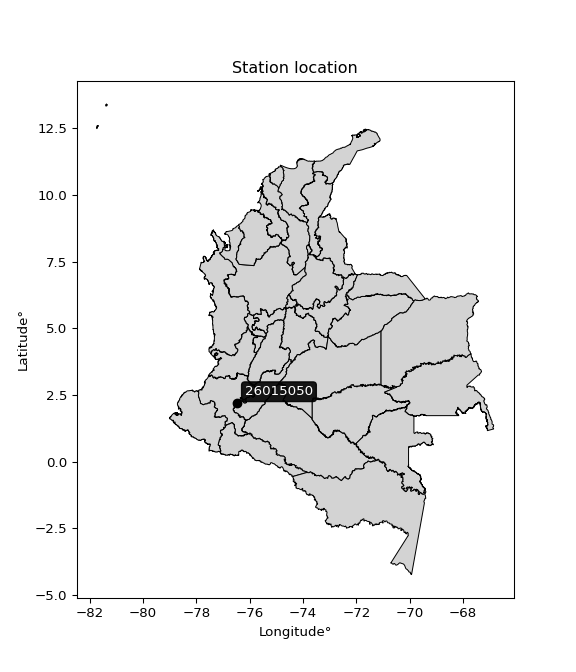

<div align="center">


</div>

# PMP Station (Rain, Pmax24h): 26015050

Probable Maximum Precipitation (PMP) is the greatest amount of rainfall for a specific duration that is meteorologically possible for a given location, acting as a "worst-case" scenario for extreme storms, crucial for designing safety-critical infrastructure like bridges, river deviations, dams, spillways, and nuclear plants to prevent catastrophic failure. PMP is calculated by hydrologists using meteorological data to determine the upper limit of extreme rainfall, often leading to the Probable Maximum Flood (PMF) for flood control design, and is increasingly being studied for climate change impacts. Probable Maximum Precipitation (PMP) is the theoretical upper limit of rainfall, a deterministic estimate for extreme events, while probability distributions (like GEV, Gumbel) describe the likelihood and frequency of various precipitation amounts, including rare ones, showing how often events occur, with PMP representing the extreme end of these distributions, used for critical infrastructure design to ensure safety against the worst conceivable weather, unlike standard statistical forecasts which cover typical probabilities.

The most common probability distributions in hydrology, used for analyzing floods, rainfall, and streamflow, include the Normal, Log-Normal, Gumbel, Gamma (including Log-Pearson Type III), and Generalized Extreme Value (GEV) distributions, often chosen based on the data´s skewness and whether modeling extremes or general conditions, with Gumbel and GEV popular for extreme events like floods, while the Normal distribution serves as a baseline, though often requiring transformations for skewed hydrological data. These distributions help in designing water infrastructure, managing water resources, and forecasting hydrologic events.

> Hydrological data often isn´t perfectly normal (it´s skewed), so different distributions are needed for different applications, such as: **Flood Frequency Analysis**: Using Gumbel, GEV, or Log-Pearson Type III for predicting extreme flood magnitudes and their return periods, **Rainfall Analysis**: Normal for annual totals, but Log-Normal, Weibull, or GEV for intensity or extreme daily rainfall, **Streamflow Modeling**: Gamma and Log-Normal for maximum flows, GEV for minimum flows, and Kappa for daily flows.

<div align="center">

</img>

</div>


## A. General information


### 1. General running parameters

• app_version: _v20260113_. • runtime: _2026-01-13 16:28:34.738620_. • Python version: _3.14.0_. • SciPy version: _1.16.3_. • Pandas version: _2.3.3_. • NumPy version: _2.3.5_. • Stations dataset (station_dataset_file): _dataset/pmax24h_in/automatic_colombia_2003_2025.csv_. • Stations catalog (station_catalog_file): _dataset/CNE.xls_. • Minimum year to eval til year_max (date_min): _1900_. • Maximum year to eval since year_min (date_max): _2025_. • Creates, save and include plots into reports (create_plot): _False_. • Plot only fit distributions with Δo > Δ (plot_only_fit): _True_. • Plot only simple graphs avoiding multiple CDFs and multiple Extreme values plots (plot_only_simple): _True_. • Eval low extreme values, if False, evaluates high extreme values (low_extreme): _False_. • Eval every SciPy distribution as logarithmic (pdist_logarithmic_on): _True_. • Standard deviation normalized (ddof): _1.0_. • Return periods to eval in years (Tr): _[2, 2.33, 5, 10, 15, 20, 25, 50, 75, 100, 200, 250, 500, 750, 1000]_. • Minimum data sample per station, 0 means any (minimum_sample): _5_. • Z-Score maximum threshold to adjust a value, 0 means disable (zscore_max): _3.5_. • Z-Score minimum threshold to adjust a value, 0 means disable (zscore_min): _-2.5_. • Avoid zeros, e.g. rain = 0 (avoid_zeros): _True_. • Avoid null values (avoid_nans): _True_. 

:file_folder:Table: [dataset.csv](../../dataset/pmax24h_in/automatic_colombia_2003_2025.csv)

> Delta Degrees of Freedom (DDOF): is a parameter used in the formulas for calculating variance and standard deviation. When ddof=0, the divisor is $N$ (the total number of observations) and this is used when your data set is the entire population. When ddof=1, the divisor is $N-1$ and this is used when your data set is a sample drawn from a larger population. Using $N-1$ provides an unbiased estimate of the population variance (known as Bessel´s correction).


### 2. Station info and location

|   id |   CODIGO | NOMBRE                     | CATEGORIA               | TECNOLOGIA                | ESTADO           | FECHA_INSTALACION   |   FECHA_SUSPENSION |   ALTITUD |   LATITUD |   LONGITUD | DEPARTAMENTO   | MUNICIPIO         | AREA_OPERATIVA                         | ENTIDAD                                                     | AREA_HIDROGRAFICA   | ZONA_HIDROGRAFICA   | SUBZONA_HIDROGRAFICA   |   CORRIENTE | Catalogo   |   Version |
|-----:|---------:|:---------------------------|:------------------------|:--------------------------|:-----------------|:--------------------|-------------------:|----------:|----------:|-----------:|:---------------|:------------------|:---------------------------------------|:------------------------------------------------------------|:--------------------|:--------------------|:-----------------------|------------:|:-----------|----------:|
|    0 | 26015050 | PALETARA  - AUT [26015050] | Climatológica Principal | Automática con Telemetría | En Mantenimiento | 20/12/2011          |                nan |      3009 |   2.19172 |    -76.482 | Cauca          | Puracé (Coconuco) | Area Operativa 09 - Cauca-Valle-Caldas | INSTITUTO DE HIDROLOGIA METEOROLOGIA Y ESTUDIOS AMBIENTALES | Magdalena Cauca     | Cauca               | Alto Río Cauca         |         nan | CNE_IDEAM  |  20251226 |

<div align="center">

Dynamic map: [:earth_americas:Google](http://maps.google.com/maps?q=2.191722222,-76.482027778) [:earth_americas:OSM](https://www.openstreetmap.org/#map=18/2.191722222/-76.482027778&layers=P) [:earth_americas:Bing](https://www.bing.com/maps?cp=2.191722222~-76.482027778&lvl=18) [:earth_americas:Apple](https://maps.apple.com/frame?center=2.191722222%2C-76.482027778&span=0.003%2C0.006)

</div>


<div align="center">

```geojson
{
  "type": "Feature",
  "geometry": {
    "type": "Point", 
    "coordinates": [-76.482027778, 2.191722222]
  }, 
  "properties": {
    "Name": "26015050"
  }
}
```

</div>


### 3. Discrete values table and plot

<div align="center">

|               |           0 |          1 |           2 |           3 |          4 |          5 |           6 |            7 |
|:--------------|------------:|-----------:|------------:|------------:|-----------:|-----------:|------------:|-------------:|
| Date          | 2017        | 2018       | 2019        | 2020        | 2021       | 2022       | 2023        | 2025         |
| Value         |   19.5      |   14.6     |   32.9      |   29.1      |   17.7     |   41.4     |   33.7      |   26.4       |
| Value_initial |   19.5      |   14.6     |   32.9      |   29.1      |   17.7     |   41.4     |   33.7      |   26.4       |
| count         |    8        |    8       |    8        |    8        |    8       |    8       |    8        |    8         |
| mean          |   26.9125   |   26.9125  |   26.9125   |   26.9125   |   26.9125  |   26.9125  |   26.9125   |   26.9125    |
| std           |    9.16725  |    9.16725 |    9.16725  |    9.16725  |    9.16725 |    9.16725 |    9.16725  |    9.16725   |
| zscore        |   -0.808585 |   -1.3431  |    0.653141 |    0.238621 |   -1.00494 |    1.58035 |    0.740408 |   -0.0559056 |


</div>


> The initial value (value_initial) correspond to the initial obtained or null completed value, and value (value) is adjusted only when the initial value is outside the valid range (outlier) definite through the Z-Score value. If Z-Score is active, values out of range or outliers are replaced with the station mean value. A Z-Score (or standard score) measures how many standard deviations a data point is from the mean of a dataset, indicating its relative position; positive scores mean above the mean, negative mean below, and a score of zero is exactly at the mean, allowing for comparison of values from different distributions. It´s calculated using the formula $z=(x–μ)/σ$, where $x$ is the data point, $μ$ is the mean, and $σ$ is the standard deviation, helping identify outliers and understand probability.
>
> <sub>**Note**: In this study, "completing" (filling gaps in) and "extending" (forecasting or lengthening the historical record) rainfall data series are avoided for certain critical analyses because they introduce artificial bias and uncertainty, which can distort the statistics of rare events (extremes), alter day-to-day variability, and compromise the integrity and homogeneity of the original data. Some reasons against Completing/Extending rainfall data are: **Distortion of Extremes and Variability**: The primary issue is that most gap-filling or extension methods rely on averaging or regression with nearby stations, which inherently smooths the data. Rainfall is highly variable in space and time, with a large percentage of zero values and occasional large storms. Infilling methods often underestimate the highest values and overestimate the lowest (zero) values, which severely distorts analyses focused on flood frequency, drought severity, and intensity-duration-frequency (IDF) curves, **Loss of Data Homogeneity**: Infilled or extended data are synthetic estimates, not actual measurements. Combining these estimates with observed data can violate the assumption of data homogeneity, which requires that the data properties do not change over time. Inhomogeneity can lead to incorrect conclusions about long-term trends or changes in climate patterns, **Propagation of Errors**: Errors and biases from the original data (e.g., wind-induced undercatch, instrument errors, site changes) or the data used for imputation can propagate through the analysis, leading to unreliable hydrological models and inaccurate predictions, **Compromised Statistical Integrity**: For statistical analyses, especially those involving the frequency of events, using artificial data can introduce time bias or autocorrelation that doesn´t exist in reality, making it difficult to assess the true probability of events, **Difficulty in Validation**: It is difficult to accurately validate the quality of filled or extended data, especially for past periods where ground-truth measurements are unavailable. The reliability of imputation techniques heavily depends on the density of the surrounding station network and the complexity of the local topography.</sub>


### 4. Active continuous probability distributions from SciPy (45 of 104 available)

A Probability Density Function (PDF) describes the relative likelihood of a continuous random variable falling within a specific range, where the total area under its curve equals 1, and the area over any interval gives the actual probability for that range. Unlike discrete probabilities (like rolling a die), a PDF shows density, not direct probability for a single point (which is zero), with higher points indicating higher likelihood, often visualized as a bell curve for normal distributions.

A log of a probability density function (log-PDF) is simply the logarithm of the PDF´s value, denoted as $log(f(x))$, useful for converting multiplication of probabilities into addition, improving numerical stability with tiny numbers, and connecting to information theory concepts like entropy. Instead of dealing with very small probabilities (e.g., 0.000001), log-PDFs use negative numbers (e.g., $log(0.00001) ≈ -11.51$ that are easier for computers to handle, preventing underflow errors and simplifying complex calculations. In this study, each active probability distribution from SciPy is also evaluated in the $log$ form.

[scipy.stats](https://docs.scipy.org/doc/scipy/reference/stats.html) is a Python´s powerful submodule within the SciPy library for comprehensive statistical analysis, offering over 130 probability distributions (like Normal, Poisson), functions for descriptive stats (mean, variance), hypothesis testing (t-tests, chi-square), random variable generation, and statistical tests, making it essential for data science, modeling, and research. It provides tools to explore, model, and draw conclusions from data efficiently, working seamlessly with NumPy.

<div align="center">

|   id | p_dist             |   n_parameter | fit_method   | label                                                                       | active   | ref                                                                                                        |
|-----:|:-------------------|--------------:|:-------------|:----------------------------------------------------------------------------|:---------|:-----------------------------------------------------------------------------------------------------------|
|    0 | alpha              |             3 | MLE          | Alpha                                                                       | True     | [:mortar_board:](https://docs.scipy.org/doc/scipy/reference/generated/scipy.stats.alpha.html)              |
|    1 | betaprime          |             4 | MLE          | Beta prime                                                                  | True     | [:mortar_board:](https://docs.scipy.org/doc/scipy/reference/generated/scipy.stats.betaprime.html)          |
|    2 | chi2               |             3 | MLE          | Chi²                                                                        | True     | [:mortar_board:](https://docs.scipy.org/doc/scipy/reference/generated/scipy.stats.chi2.html)               |
|    3 | crystalball        |             4 | MLE          | Crystalball                                                                 | True     | [:mortar_board:](https://docs.scipy.org/doc/scipy/reference/generated/scipy.stats.crystalball.html)        |
|    4 | dweibull           |             3 | MLE          | Double Weibull                                                              | True     | [:mortar_board:](https://docs.scipy.org/doc/scipy/reference/generated/scipy.stats.dweibull.html)           |
|    5 | erlang             |             3 | MLE          | Erlang                                                                      | True     | [:mortar_board:](https://docs.scipy.org/doc/scipy/reference/generated/scipy.stats.erlang.html)             |
|    6 | expon              |             2 | MLE          | Exponential                                                                 | True     | [:mortar_board:](https://docs.scipy.org/doc/scipy/reference/generated/scipy.stats.expon.html)              |
|    7 | exponnorm          |             3 | MLE          | Exponentially modified Normal                                               | True     | [:mortar_board:](https://docs.scipy.org/doc/scipy/reference/generated/scipy.stats.exponnorm.html)          |
|    8 | f                  |             4 | MLE          | F                                                                           | True     | [:mortar_board:](https://docs.scipy.org/doc/scipy/reference/generated/scipy.stats.f.html)                  |
|    9 | fatiguelife        |             3 | MLE          | Fatigue-life (Birnbaum-Saunders)                                            | True     | [:mortar_board:](https://docs.scipy.org/doc/scipy/reference/generated/scipy.stats.fatiguelife.html)        |
|   10 | fisk               |             3 | MLE          | Fisk                                                                        | True     | [:mortar_board:](https://docs.scipy.org/doc/scipy/reference/generated/scipy.stats.fisk.html)               |
|   11 | gamma              |             3 | MLE          | Gamma                                                                       | True     | [:mortar_board:](https://docs.scipy.org/doc/scipy/reference/generated/scipy.stats.gamma.html)              |
|   12 | genexpon           |             5 | MLE          | Generalized exponential                                                     | True     | [:mortar_board:](https://docs.scipy.org/doc/scipy/reference/generated/scipy.stats.genexpon.html)           |
|   13 | genlogistic        |             3 | MLE          | Generalized logistic                                                        | True     | [:mortar_board:](https://docs.scipy.org/doc/scipy/reference/generated/scipy.stats.genlogistic.html)        |
|   14 | gibrat             |             2 | MM           | Gibrat                                                                      | True     | [:mortar_board:](https://docs.scipy.org/doc/scipy/reference/generated/scipy.stats.gibrat.html)             |
|   15 | gompertz           |             3 | MLE          | Gompertz (or truncated Gumbel)                                              | True     | [:mortar_board:](https://docs.scipy.org/doc/scipy/reference/generated/scipy.stats.gompertz.html)           |
|   16 | gumbel_l           |             2 | MM           | Gumbel Left Skew                                                            | True     | [:mortar_board:](https://docs.scipy.org/doc/scipy/reference/generated/scipy.stats.gumbel_l.html)           |
|   17 | gumbel_r           |             2 | MM           | Gumbel Right Skew                                                           | True     | [:mortar_board:](https://docs.scipy.org/doc/scipy/reference/generated/scipy.stats.gumbel_r.html)           |
|   18 | halflogistic       |             2 | MM           | Half-logistic                                                               | True     | [:mortar_board:](https://docs.scipy.org/doc/scipy/reference/generated/scipy.stats.halflogistic.html)       |
|   19 | halfnorm           |             2 | MM           | Half Normal                                                                 | True     | [:mortar_board:](https://docs.scipy.org/doc/scipy/reference/generated/scipy.stats.halfnorm.html)           |
|   20 | hypsecant          |             2 | MM           | hyperbolic secant                                                           | True     | [:mortar_board:](https://docs.scipy.org/doc/scipy/reference/generated/scipy.stats.hypsecant.html)          |
|   21 | invgamma           |             3 | MLE          | Inverted gamma                                                              | True     | [:mortar_board:](https://docs.scipy.org/doc/scipy/reference/generated/scipy.stats.invgamma.html)           |
|   22 | invgauss           |             3 | MLE          | Inverse Gaussian                                                            | True     | [:mortar_board:](https://docs.scipy.org/doc/scipy/reference/generated/scipy.stats.invgauss.html)           |
|   23 | invweibull         |             3 | MLE          | Inverted Weibull                                                            | True     | [:mortar_board:](https://docs.scipy.org/doc/scipy/reference/generated/scipy.stats.invweibull.html)         |
|   24 | kappa4             |             4 | MLE          | Kappa 4                                                                     | True     | [:mortar_board:](https://docs.scipy.org/doc/scipy/reference/generated/scipy.stats.kappa4.html)             |
|   25 | kstwobign          |             2 | MLE          | Limiting distribution of scaled Kolmogorov-Smirnov two-sided test statistic | True     | [:mortar_board:](https://docs.scipy.org/doc/scipy/reference/generated/scipy.stats.kstwobign.html)          |
|   26 | laplace            |             2 | MM           | Laplace                                                                     | True     | [:mortar_board:](https://docs.scipy.org/doc/scipy/reference/generated/scipy.stats.laplace.html)            |
|   27 | laplace_asymmetric |             3 | MLE          | Asymmetric Laplace                                                          | True     | [:mortar_board:](https://docs.scipy.org/doc/scipy/reference/generated/scipy.stats.laplace_asymmetric.html) |
|   28 | loggamma           |             3 | MLE          | Log gamma                                                                   | True     | [:mortar_board:](https://docs.scipy.org/doc/scipy/reference/generated/scipy.stats.loggamma.html)           |
|   29 | logistic           |             2 | MM           | Logistic (or Sech-squared)                                                  | True     | [:mortar_board:](https://docs.scipy.org/doc/scipy/reference/generated/scipy.stats.logistic.html)           |
|   30 | lognorm            |             3 | MLE          | Log Normal                                                                  | True     | [:mortar_board:](https://docs.scipy.org/doc/scipy/reference/generated/scipy.stats.lognorm.html)            |
|   31 | maxwell            |             2 | MM           | Maxwell                                                                     | True     | [:mortar_board:](https://docs.scipy.org/doc/scipy/reference/generated/scipy.stats.maxwell.html)            |
|   32 | mielke             |             4 | MLE          | Mielke Beta-Kappa / Dagum                                                   | True     | [:mortar_board:](https://docs.scipy.org/doc/scipy/reference/generated/scipy.stats.mielke.html)             |
|   33 | moyal              |             2 | MM           | Moyal                                                                       | True     | [:mortar_board:](https://docs.scipy.org/doc/scipy/reference/generated/scipy.stats.moyal.html)              |
|   34 | nakagami           |             3 | MLE          | Nakagami                                                                    | True     | [:mortar_board:](https://docs.scipy.org/doc/scipy/reference/generated/scipy.stats.nakagami.html)           |
|   35 | ncf                |             5 | MLE          | Non-central F distribution                                                  | True     | [:mortar_board:](https://docs.scipy.org/doc/scipy/reference/generated/scipy.stats.ncf.html)                |
|   36 | nct                |             4 | MLE          | Non-central Student’s t                                                     | True     | [:mortar_board:](https://docs.scipy.org/doc/scipy/reference/generated/scipy.stats.nct.html)                |
|   37 | norm               |             2 | MM           | Normal                                                                      | True     | [:mortar_board:](https://docs.scipy.org/doc/scipy/reference/generated/scipy.stats.norm.html)               |
|   38 | pearson3           |             3 | MM           | Pearson type III                                                            | True     | [:mortar_board:](https://docs.scipy.org/doc/scipy/reference/generated/scipy.stats.pearson3.html)           |
|   39 | rayleigh           |             2 | MM           | Rayleigh                                                                    | True     | [:mortar_board:](https://docs.scipy.org/doc/scipy/reference/generated/scipy.stats.rayleigh.html)           |
|   40 | rice               |             3 | MLE          | Rice                                                                        | True     | [:mortar_board:](https://docs.scipy.org/doc/scipy/reference/generated/scipy.stats.rice.html)               |
|   41 | t                  |             3 | MLE          | Student’s t                                                                 | True     | [:mortar_board:](https://docs.scipy.org/doc/scipy/reference/generated/scipy.stats.t.html)                  |
|   42 | truncnorm          |             4 | MLE          | Truncated normal                                                            | True     | [:mortar_board:](https://docs.scipy.org/doc/scipy/reference/generated/scipy.stats.truncnorm.html)          |
|   43 | wald               |             2 | MM           | Wald                                                                        | True     | [:mortar_board:](https://docs.scipy.org/doc/scipy/reference/generated/scipy.stats.wald.html)               |
|   44 | weibull_min        |             3 | MLE          | Weibull minimum                                                             | True     | [:mortar_board:](https://docs.scipy.org/doc/scipy/reference/generated/scipy.stats.weibull_min.html)        |

</div>

> **n_parameter:** # arguments & localization & scale.
>
> **Fit methods:** (MLE) maximum likelihood, (MM) L-moments.
>
>**Inactive** (With the only purpose of prevent loops, zero divisions, infinite values, over high estimated values or horizontal trending for recurrence intervals estimations, the follow distributions were disabled.)**:** foldnorm, gennorm, norminvgauss, powernorm, powerlognorm, skewnorm, genextreme, anglit, arcsine, argus, beta, bradford, burr, burr12, cauchy, cosine, halfcauchy, foldcauchy, skewcauchy, wrapcauchy, dgamma, gengamma, exponweib, exponpow, truncexpon, gausshyper, genhalflogistic, genhyperbolic, geninvgauss, halfgennorm, johnsonsb, johnsonsu, kappa3, ksone, kstwo, loglaplace, levy, levy_l, levy_stable, ncx2, pareto, genpareto, truncpareto, lomax, powerlaw, rdist, rel_breitwigner, recipinvgauss, semicircular, studentized_range, trapezoid, triang, truncweibull_min, tukeylambda, uniform, loguniform, vonmises, vonmises_line, weibull_max, 


## B. Probability (PDF) vs. Empirical (EDF) distributions functions

A continuous probability distribution (CPD) describes probabilities for variables that can take any value within a range (like rain any time), unlike discrete variables with specific outcomes (like temperature). It uses a Probability Density Function (PDF), a curve where the total area under it equals 1, and the probability of the variable falling within an interval (a to b) is found by calculating the area under the curve between those points. A key feature is that the probability of hitting any single exact value is zero, so probabilities are always expressed for ranges, e.g., $P(a ≤ X ≤ b)$.

<div align="center">

Distributions parameters from station values
|    |   station | p_dist                |   n |               loc |            scale | shape                 | shape1             | shape2                | shape3   |
|---:|----------:|:----------------------|----:|------------------:|-----------------:|:----------------------|:-------------------|:----------------------|:---------|
|  0 |  26015050 | alpha                 |   8 |     -91.9036      |   1642.58        | 13.894499981511277    |                    |                       |          |
|  1 |  26015050 | betaprime             |   8 |     -41.1637      |      0.457376    | 8880.698292236375     | 60.62791517478358  |                       |          |
|  2 |  26015050 | chi2                  |   8 |      14.6         |      6.55683     | 1.7836133745940954    |                    |                       |          |
|  3 |  26015050 | crystalball           |   8 |      26.9125      |      8.57517     | 1058.0249762378005    | 5200.9099755344105 |                       |          |
|  4 |  26015050 | dweibull              |   8 |      27.5387      |      8.16785     | 1.5997057896623716    |                    |                       |          |
|  5 |  26015050 | erlang                |   8 |     -81.6349      |      0.676809    | 160.3768807807831     |                    |                       |          |
|  6 |  26015050 | expon                 |   8 |      14.6         |     12.3125      |                       |                    |                       |          |
|  7 |  26015050 | exponnorm             |   8 |      26.1018      |      8.53677     | 0.09496802761964238   |                    |                       |          |
|  8 |  26015050 | f                     |   8 |       9.82619     |     17.5118      | 6.634611767252416     | 450.6191388906502  |                       |          |
|  9 |  26015050 | fatiguelife           |   8 |      14.6         |      1.04756e-05 | 1012.0241525295544    |                    |                       |          |
| 10 |  26015050 | fisk                  |   8 |     -92.7819      |    119.466       | 22.952456676129877    |                    |                       |          |
| 11 |  26015050 | gamma                 |   8 |     -83.0738      |      0.66528     | 165.25944158152214    |                    |                       |          |
| 12 |  26015050 | genexpon              |   8 |      14.6         |      2.62258     | 0.220754720242281     | 0.0463673968441385 | 0.05289664624023922   |          |
| 13 |  26015050 | genlogistic           |   8 |     -22.2015      |      7.51898     | 391.6758965212981     |                    |                       |          |
| 14 |  26015050 | gibrat                |   8 |      20.3708      |      3.96777     |                       |                    |                       |          |
| 15 |  26015050 | gompertz              |   8 |      17.7         |      9.13088     | 0.27112193476548097   |                    |                       |          |
| 16 |  26015050 | gumbel_l              |   8 |      30.7718      |      6.68604     |                       |                    |                       |          |
| 17 |  26015050 | gumbel_r              |   8 |      23.0532      |      6.68604     |                       |                    |                       |          |
| 18 |  26015050 | halflogistic          |   8 |      16.7489      |      7.3315      |                       |                    |                       |          |
| 19 |  26015050 | halfnorm              |   8 |      15.5623      |     14.2254      |                       |                    |                       |          |
| 20 |  26015050 | hypsecant             |   8 |      26.9125      |      5.45912     |                       |                    |                       |          |
| 21 |  26015050 | invgamma              |   8 |     -43.0839      |   4581.44        | 66.42899950004603     |                    |                       |          |
| 22 |  26015050 | invgauss              |   8 |      -7.90844     |    524.481       | 0.06628323118077509   |                    |                       |          |
| 23 |  26015050 | invweibull            |   8 | -619785           | 619808           | 82245.09201097852     |                    |                       |          |
| 24 |  26015050 | kappa4                |   8 |      12.1261      |     28.9222      | 1.0934748844957567    | 0.9861899083764594 |                       |          |
| 25 |  26015050 | kstwobign             |   8 |      -3.26315     |     34.4447      |                       |                    |                       |          |
| 26 |  26015050 | laplace               |   8 |      26.9125      |      6.06356     |                       |                    |                       |          |
| 27 |  26015050 | laplace_asymmetric    |   8 |      29.1         |      7.11261     | 1.1655251158496966    |                    |                       |          |
| 28 |  26015050 | loggamma              |   8 |   -1712.87        |    256.581       | 881.1068444950438     |                    |                       |          |
| 29 |  26015050 | logistic              |   8 |      26.9125      |      4.72774     |                       |                    |                       |          |
| 30 |  26015050 | lognorm               |   8 |      14.6         |      0.120087    | 12.055292777673593    |                    |                       |          |
| 31 |  26015050 | maxwell               |   8 |       6.59294     |     12.7334      |                       |                    |                       |          |
| 32 |  26015050 | mielke                |   8 |      -0.0950429   |     36.0943      | 2.6830715663450877    | 11.3566029896892   |                       |          |
| 33 |  26015050 | moyal                 |   8 |      22.0087      |      3.86018     |                       |                    |                       |          |
| 34 |  26015050 | nakagami              |   8 |      14.6         |     18.3938      | 0.20528846604338957   |                    |                       |          |
| 35 |  26015050 | ncf                   |   8 |      -0.376743    |      3.05015e-05 | 7.738531755667439e-05 | 48.82155987470589  | 66.47362867982298     |          |
| 36 |  26015050 | nct                   |   8 |    -429.603       |      8.57053     | 1144663.9163448196    | 53.26571339319412  |                       |          |
| 37 |  26015050 | norm                  |   8 |      26.9125      |      8.57517     |                       |                    |                       |          |
| 38 |  26015050 | pearson3              |   8 |      26.9125      |      8.57519     | 0.10362897834732757   |                    |                       |          |
| 39 |  26015050 | rayleigh              |   8 |      10.5077      |     13.0891      |                       |                    |                       |          |
| 40 |  26015050 | rice                  |   8 |      10.6177      |     10.6452      | 0.9960047710136868    |                    |                       |          |
| 41 |  26015050 | t                     |   8 |      26.9127      |      8.57505     | 112896747.6903413     |                    |                       |          |
| 42 |  26015050 | truncnorm             |   8 |      26.9125      |      8.57517     | -190.5980329729029    | 2346.660948151959  |                       |          |
| 43 |  26015050 | wald                  |   8 |      18.3373      |      8.57519     |                       |                    |                       |          |
| 44 |  26015050 | weibull_min           |   8 |      13.5382      |     14.6024      | 1.4305625998442002    |                    |                       |          |
| 45 |  26015050 | logalpha              |   8 |      -4.32309     |    165.431       | 21.932063286219453    |                    |                       |          |
| 46 |  26015050 | logbetaprime          |   8 |      -0.127215    |     25.4647      | 106.30123448343096    | 803.5314031004148  |                       |          |
| 47 |  26015050 | logchi2               |   8 |       2.68102     |      0.954554    | 1.078480179594099     |                    |                       |          |
| 48 |  26015050 | logcrystalball        |   8 |       3.23792     |      0.337712    | 7143.866985183649     | 24.278977769947417 |                       |          |
| 49 |  26015050 | logdweibull           |   8 |       3.30822     |      0.316399    | 1.445838860145089     |                    |                       |          |
| 50 |  26015050 | logerlang             |   8 |      -2.18992     |      0.0215186   | 252.12373126799332    |                    |                       |          |
| 51 |  26015050 | logexpon              |   8 |       2.68102     |      0.556898    |                       |                    |                       |          |
| 52 |  26015050 | logexponnorm          |   8 |       3.2376      |      0.337712    | 0.0009571747529052672 |                    |                       |          |
| 53 |  26015050 | logf                  |   8 |    -182.037       |    185.275       | 1273229.1014336115    | 1131769.466849565  |                       |          |
| 54 |  26015050 | logfatiguelife        |   8 |     -66.0318      |     69.2672      | 0.0048615509733833905 |                    |                       |          |
| 55 |  26015050 | logfisk               |   8 |      -2.01649e+07 |      2.01649e+07 | 100166928.99210396    |                    |                       |          |
| 56 |  26015050 | loggamma              |   8 |      -2.64535     |      0.0198141   | 296.8511196421266     |                    |                       |          |
| 57 |  26015050 | loggenexpon           |   8 |       2.6797      |      0.0379312   | 0.029135024172616097  | 5.862243966730514  | 0.0006622618280864748 |          |
| 58 |  26015050 | loggenlogistic        |   8 |       3.58404     |      0.088114    | 0.23529099592949948   |                    |                       |          |
| 59 |  26015050 | loggibrat             |   8 |       2.98024     |      0.156288    |                       |                    |                       |          |
| 60 |  26015050 | loggompertz           |   8 |       2.68102     |      0.404023    | 0.22799202452769973   |                    |                       |          |
| 61 |  26015050 | loggumbel_l           |   8 |       3.38991     |      0.263313    |                       |                    |                       |          |
| 62 |  26015050 | loggumbel_r           |   8 |       3.08593     |      0.263313    |                       |                    |                       |          |
| 63 |  26015050 | loghalflogistic       |   8 |       2.83765     |      0.288735    |                       |                    |                       |          |
| 64 |  26015050 | loghalfnorm           |   8 |       2.79089     |      0.560264    |                       |                    |                       |          |
| 65 |  26015050 | loghypsecant          |   8 |       3.23792     |      0.214994    |                       |                    |                       |          |
| 66 |  26015050 | loginvgamma           |   8 |      -1.89196     |   1120.28        | 219.4239473387771     |                    |                       |          |
| 67 |  26015050 | loginvgauss           |   8 |       0.879717    |    105.23        | 0.022401029775414527  |                    |                       |          |
| 68 |  26015050 | loginvweibull         |   8 |      -3.01793e+07 |      3.01793e+07 | 93521517.78203711     |                    |                       |          |
| 69 |  26015050 | logkappa4             |   8 |       2.63358     |      1.12155     | 1.0423978288473537    | 1.0292232593136512 |                       |          |
| 70 |  26015050 | logkstwobign          |   8 |       1.94735     |      1.47162     |                       |                    |                       |          |
| 71 |  26015050 | loglaplace            |   8 |       3.23792     |      0.238798    |                       |                    |                       |          |
| 72 |  26015050 | loglaplace_asymmetric |   8 |       3.5175      |      0.21222     | 1.856181074148476     |                    |                       |          |
| 73 |  26015050 | logloggamma           |   8 |       3.27324     |      0.343148    | 1.3602587891623443    |                    |                       |          |
| 74 |  26015050 | loglogistic           |   8 |       3.23792     |      0.18619     |                       |                    |                       |          |
| 75 |  26015050 | loglognorm            |   8 |       2.68102     |      0.00719233  | 11.508613770886841    |                    |                       |          |
| 76 |  26015050 | logmaxwell            |   8 |       2.43768     |      0.501473    |                       |                    |                       |          |
| 77 |  26015050 | logmielke             |   8 |       2.68102     |      1.04613     | 0.8340003525973324    | 42.79958802042422  |                       |          |
| 78 |  26015050 | logmoyal              |   8 |       3.04479     |      0.152024    |                       |                    |                       |          |
| 79 |  26015050 | lognakagami           |   8 |       2.68102     |      0.523775    | 0.276120789572612     |                    |                       |          |
| 80 |  26015050 | logncf                |   8 |      -7.34604     |     10.5761      | 4203.0436605669       | 3400.1769475469728 | 2.234345871157638     |          |
| 81 |  26015050 | lognct                |   8 |      -1.56079     |      0.229079    | 206.71881905004994    | 20.85173968869561  |                       |          |
| 82 |  26015050 | lognorm               |   8 |       3.23792     |      0.337712    |                       |                    |                       |          |
| 83 |  26015050 | logpearson3           |   8 |       3.23792     |      0.337711    | -0.2756578950345254   |                    |                       |          |
| 84 |  26015050 | lograyleigh           |   8 |       2.59186     |      0.515483    |                       |                    |                       |          |
| 85 |  26015050 | logrice               |   8 |       2.51294     |      0.388048    | 1.4992696447448313    |                    |                       |          |
| 86 |  26015050 | logt                  |   8 |       3.23792     |      0.337712    | 5613526393.525576     |                    |                       |          |
| 87 |  26015050 | logtruncnorm          |   8 |      -0.124285    |      1.41526     | 1.9821812339721716    | 3.8027010942191337 |                       |          |
| 88 |  26015050 | logwald               |   8 |       2.90026     |      0.337669    |                       |                    |                       |          |
| 89 |  26015050 | logweibull_min        |   8 |       1.50251     |      1.87327     | 6.174481572137192     |                    |                       |          |

</div>

> **loc** (Location parameter): This shifts the distribution along the x-axis. For many common distributions, like the normal (Gaussian) distribution, loc represents the mean $μ$. For others, like the uniform distribution, it might represent the minimum value, or for the beta distribution, the left end of the support interval.
>
> **scale** (Scale parameter): This determines the width or spread of the distribution. For the normal distribution, scale represents the standard deviation $σ$. For a uniform distribution, it defines the length of the interval (from $loc$ to $loc + scale$).
>
> **shape** (Shape parameters): Refers to parameters that define the specific form of a probability distribution, distinct from its location (loc) and scale (scale). These parameters are required arguments for most distribution functions. For example, a normal (Gaussian) distribution is fully defined by its location (mean) and scale (standard deviation), so it has no specific shape parameters beyond loc and scale. However, other distributions have intrinsic properties that need specification, as Gamma distribution that takes a shape parameter, often named $a$ or $alpha$.


### 0. Cumulative distribution values - CDF (90 evaluated)

Cumulative Distribution Function (CDF), denoted as $F$<sub>$X$</sub>$(x)$, is a function that gives the probability that a random variable $X$ will take a value less than or equal to a specific value, $x$ (i.e., $(P(X≥x)$. It essentially "accumulates" probabilities from a given point up to the far right (positive infinity), providing a complete picture of the distribution´s probabilities for both discrete (like rain) and continuous (like temperature) variables, helping to find probabilities over ranges or above certain values. Each station is evaluated separately ordering the $x$ values ascending, calculating the CDF and PDF values for the activated distributions and their logarithmic forms.

<div align="center">

CDF ordered by x ascending and calculating $log(f(x))$ separately
|   id |   Station |   date |    x |   count |    mean |     std |     zscore |   Value_initial |   station |   m |     alpha |   alpha_pdf |   betaprime |   betaprime_pdf |        chi2 |   chi2_pdf |   crystalball |   crystalball_pdf |   dweibull |   dweibull_pdf |    erlang |   erlang_pdf |    expon |   expon_pdf |   exponnorm |   exponnorm_pdf |         f |     f_pdf |   fatiguelife |   fatiguelife_pdf |      fisk |   fisk_pdf |     gamma |   gamma_pdf |    genexpon |   genexpon_pdf |   genlogistic |   genlogistic_pdf |   gibrat |   gibrat_pdf |    gompertz |   gompertz_pdf |   gumbel_l |   gumbel_l_pdf |   gumbel_r |   gumbel_r_pdf |   halflogistic |   halflogistic_pdf |   halfnorm |   halfnorm_pdf |   hypsecant |   hypsecant_pdf |   invgamma |   invgamma_pdf |   invgauss |   invgauss_pdf |   invweibull |   invweibull_pdf |      kappa4 |   kappa4_pdf |   kstwobign |   kstwobign_pdf |   laplace |   laplace_pdf |   laplace_asymmetric |   laplace_asymmetric_pdf |   loggamma |   loggamma_pdf |   logistic |   logistic_pdf |   lognorm |   lognorm_pdf |   maxwell |   maxwell_pdf |    mielke |   mielke_pdf |      moyal |   moyal_pdf |   nakagami |   nakagami_pdf |       ncf |   ncf_pdf |       nct |   nct_pdf |      norm |   norm_pdf |   pearson3 |   pearson3_pdf |   rayleigh |   rayleigh_pdf |      rice |   rice_pdf |         t |     t_pdf |   truncnorm |   truncnorm_pdf |      wald |   wald_pdf |   weibull_min |   weibull_min_pdf |   logalpha |   logalpha_pdf |   logbetaprime |   logbetaprime_pdf |     logchi2 |   logchi2_pdf |   logcrystalball |   logcrystalball_pdf |   logdweibull |   logdweibull_pdf |   logerlang |   logerlang_pdf |   logexpon |   logexpon_pdf |   logexponnorm |   logexponnorm_pdf |      logf |   logf_pdf |   logfatiguelife |   logfatiguelife_pdf |   logfisk |   logfisk_pdf |   loggenexpon |   loggenexpon_pdf |   loggenlogistic |   loggenlogistic_pdf |   loggibrat |   loggibrat_pdf |   loggompertz |   loggompertz_pdf |   loggumbel_l |   loggumbel_l_pdf |   loggumbel_r |   loggumbel_r_pdf |   loghalflogistic |   loghalflogistic_pdf |   loghalfnorm |   loghalfnorm_pdf |   loghypsecant |   loghypsecant_pdf |   loginvgamma |   loginvgamma_pdf |   loginvgauss |   loginvgauss_pdf |   loginvweibull |   loginvweibull_pdf |   logkappa4 |   logkappa4_pdf |   logkstwobign |   logkstwobign_pdf |   loglaplace |   loglaplace_pdf |   loglaplace_asymmetric |   loglaplace_asymmetric_pdf |   logloggamma |   logloggamma_pdf |   loglogistic |   loglogistic_pdf |   loglognorm |   loglognorm_pdf |   logmaxwell |   logmaxwell_pdf |   logmielke |   logmielke_pdf |    logmoyal |   logmoyal_pdf |   lognakagami |   lognakagami_pdf |    logncf |   logncf_pdf |    lognct |   lognct_pdf |   logpearson3 |   logpearson3_pdf |   lograyleigh |   lograyleigh_pdf |   logrice |   logrice_pdf |      logt |   logt_pdf |   logtruncnorm |   logtruncnorm_pdf |   logwald |   logwald_pdf |   logweibull_min |   logweibull_min_pdf |
|-----:|----------:|-------:|-----:|--------:|--------:|--------:|-----------:|----------------:|----------:|----:|----------:|------------:|------------:|----------------:|------------:|-----------:|--------------:|------------------:|-----------:|---------------:|----------:|-------------:|---------:|------------:|------------:|----------------:|----------:|----------:|--------------:|------------------:|----------:|-----------:|----------:|------------:|------------:|---------------:|--------------:|------------------:|---------:|-------------:|------------:|---------------:|-----------:|---------------:|-----------:|---------------:|---------------:|-------------------:|-----------:|---------------:|------------:|----------------:|-----------:|---------------:|-----------:|---------------:|-------------:|-----------------:|------------:|-------------:|------------:|----------------:|----------:|--------------:|---------------------:|-------------------------:|-----------:|---------------:|-----------:|---------------:|----------:|--------------:|----------:|--------------:|----------:|-------------:|-----------:|------------:|-----------:|---------------:|----------:|----------:|----------:|----------:|----------:|-----------:|-----------:|---------------:|-----------:|---------------:|----------:|-----------:|----------:|----------:|------------:|----------------:|----------:|-----------:|--------------:|------------------:|-----------:|---------------:|---------------:|-------------------:|------------:|--------------:|-----------------:|---------------------:|--------------:|------------------:|------------:|----------------:|-----------:|---------------:|---------------:|-------------------:|----------:|-----------:|-----------------:|---------------------:|----------:|--------------:|--------------:|------------------:|-----------------:|---------------------:|------------:|----------------:|--------------:|------------------:|--------------:|------------------:|--------------:|------------------:|------------------:|----------------------:|--------------:|------------------:|---------------:|-------------------:|--------------:|------------------:|--------------:|------------------:|----------------:|--------------------:|------------:|----------------:|---------------:|-------------------:|-------------:|-----------------:|------------------------:|----------------------------:|--------------:|------------------:|--------------:|------------------:|-------------:|-----------------:|-------------:|-----------------:|------------:|----------------:|------------:|---------------:|--------------:|------------------:|----------:|-------------:|----------:|-------------:|--------------:|------------------:|--------------:|------------------:|----------:|--------------:|----------:|-----------:|---------------:|-------------------:|----------:|--------------:|-----------------:|---------------------:|
|    0 |  26015050 |   2018 | 14.6 |       8 | 26.9125 | 9.16725 | -1.3431    |            14.6 |  26015050 |   1 | 0.0632236 |   0.0179697 |   0.0655281 |       0.0188667 | 7.35913e-15 | 3.6946     |     0.0755252 |         0.0165956 |   0.062008 |      0.0160026 | 0.0710808 |    0.0171791 | 0        |  0.0812183  |   0.0754802 |       0.0166004 | 0.0403541 | 0.022356  |     0.0411378 |       2.26105e+10 | 0.0796052 |  0.0156608 | 0.0713734 |   0.0172476 | 8.86178e-09 |     0.0841746  |     0.0538331 |         0.0208417 | 0        |   0          | 0           |      0         |  0.0851852 |     0.012182   |  0.0289946 |     0.0153543  |      0         |         0          |   0        |      0         |   0.0664951 |      0.0120921  |  0.0616493 |      0.0182555 |  0.0560114 |      0.0201091 |    0.0539171 |        0.0208936 | 2.56612e-15 |    0.798177  |   0.0492152 |       0.022521  | 0.0656302 |    0.0108237  |             0.100181 |               0.0120847  |  0.0482722 |       0.313882 |  0.0688616 |     0.0135624  | 0.0495704 |      0.3033   | 0.0588128 |     0.0203324 | 0.0897178 |    0.0163804 | 0.00903519 |  0.00893342 | 2.0947e-07 |    4.84157e+07 | 0.0491247 | 0.0190505 | 0.0755373 | 0.0165975 | 0.0755252 |  0.0165956 |  0.0727401 |      0.0169806 |  0.0476995 |      0.0227468 | 0.0418641 |  0.0206524 | 0.0755195 | 0.0165949 |   0.0755252 |       0.0165956 | 0         | 0          |     0.0232463 |         0.0309539 |  0.0457937 |       0.324165 |      0.0449653 |           0.311776 | 4.18205e-09 |    5.0781e+06 |        0.0495704 |             0.3033   |     0.0339601 |          0.210544 |    0.048431 |        0.316252 |   0        |       1.79566  |      0.0495704 |           0.3033   | 0.0498811 |   0.305042 |        0.0491964 |             0.304778 | 0.0543299 |      0.255216 |    0.00101565 |          0.770879 |        0.0896937 |             0.239501 |    0        |        0        |    1.3937e-09 |          0.564305 |     0.0654899 |          0.240388 |    0.00952233 |          0.168309 |         0         |              0        |      0        |          0        |      0.0476559 |           0.220835 |     0.0460328 |          0.324454 |     0.0415205 |          0.333423 |       0.0372239 |            0.379599 |   0.0022372 |        1.15637  |      0.0351322 |           0.427488 |    0.0485465 |         0.203295 |               0.0927081 |                    0.235348 |     0.0713361 |          0.261933 |     0.0478334 |          0.244617 |   0.00411033 |      2.37517e+12 |    0.0283289 |         0.333031 | 1.51235e-13 |      284.019    | 0.000938644 |      0.0364721 |   3.69449e-09 |       4.59423e+06 | 0.0491586 |     0.311593 | 0.0410786 |     0.297931 |     0.0566442 |          0.294302 |     0.0148484 |          0.330571 | 0.0306396 |      0.366054 | 0.0495706 |   0.303301 |    7.95853e-08 |           1.67077  | 0         |      0        |        0.0555801 |             0.282951 |
|    1 |  26015050 |   2021 | 17.7 |       8 | 26.9125 | 9.16725 | -1.00494   |            17.7 |  26015050 |   2 | 0.137406  |   0.0300485 |   0.142784  |       0.0310271 | 0.258369    | 0.0654392  |     0.141339  |         0.0261242 |   0.130035 |      0.0284752 | 0.140077  |    0.0275611 | 0.222582 |  0.0631406  |   0.141322  |       0.0261373 | 0.138144  | 0.0394066 |     0.704548  |       0.029935    | 0.142523  |  0.0253889 | 0.140642  |   0.0276678 | 0.230966    |     0.0655573  |     0.144122  |         0.0370381 | 0        |   0          | 3.63881e-10 |      0.0296928 |  0.13199   |     0.0183769  |  0.107851  |     0.0359234  |      0.0647756 |         0.0679127  |   0.119451 |      0.0554592 |   0.116442  |      0.0208572  |  0.137401  |      0.0307341 |  0.141214  |      0.0346512 |    0.144362  |        0.0370755 | 0.14051     |    0.0414148 |   0.147309  |       0.0397837 | 0.10943   |    0.0180472  |             0.14561  |               0.0175647  |  0.143136  |       0.690561 |  0.124706  |     0.023088   | 0.140318  |      0.660089 | 0.141198  |     0.03259   | 0.14993   |    0.0225985 | 0.0805796  |  0.0392364  | 0.378997   |    0.0499536   | 0.132721  | 0.0347815 | 0.141356  | 0.0261256 | 0.141339  |  0.0261242 |  0.140612  |      0.0270466 |  0.140125  |      0.0360979 | 0.127407  |  0.0339441 | 0.141331  | 0.0261236 |   0.141339  |       0.0261242 | 0         | 0          |     0.152962  |         0.0483354 |  0.145675  |       0.730299 |      0.140614  |           0.699442 | 0.315595    |    0.82743    |        0.140318  |             0.660089 |     0.102711  |          0.54074  |    0.144005 |        0.695258 |   0.292305 |       1.27078  |      0.140318  |           0.660088 | 0.14102   |   0.662116 |        0.140715  |             0.66674  | 0.130065  |      0.562053 |    0.180905   |          1.0569   |        0.149977  |             0.400359 |    0        |        0        |    0.129943   |          0.790735 |     0.131272  |          0.464283 |    0.106448   |          0.905595 |         0.0621211 |              1.72501  |      0.117312 |          1.4087   |      0.115627  |           0.526066 |     0.145689  |          0.727246 |     0.147166  |          0.776364 |       0.163316  |            0.917077 |   0.194454  |        0.962502 |      0.176845  |           0.998367 |    0.108725  |         0.455301 |               0.151146  |                    0.383697 |     0.142002  |          0.491449 |     0.123803  |          0.582609 |   0.612423   |      0.172839    |    0.139924  |         0.823902 | 0.24376     |        1.05585  | 0.0790498   |      0.985884  |   0.443876    |       1.23635     | 0.142495  |     0.676451 | 0.135876  |     0.710421 |     0.141177  |          0.604319 |     0.138712  |          0.913099 | 0.141729  |      0.782115 | 0.140318  |   0.660089 |    0.281159    |           1.2641   | 0         |      0        |        0.135471  |             0.566759 |
|    2 |  26015050 |   2017 | 19.5 |       8 | 26.9125 | 9.16725 | -0.808585  |            19.5 |  26015050 |   3 | 0.197689  |   0.0367946 |   0.204619  |       0.0375005 | 0.365609    | 0.0542892  |     0.19368   |         0.0320193 |   0.188629 |      0.0365923 | 0.195306  |    0.0337508 | 0.328318 |  0.0545529  |   0.19369   |       0.0320361 | 0.214653  | 0.0450402 |     0.750415  |       0.0218943   | 0.194104  |  0.0319766 | 0.19608   |   0.0338762 | 0.340715    |     0.056592   |     0.217512  |         0.0440445 | 0        |   0          | 0.0573678   |      0.0340885 |  0.169131  |     0.023025   |  0.182432  |     0.046423   |      0.185453  |         0.0658533  |   0.218073 |      0.0539807 |   0.160278  |      0.0281346  |  0.198997  |      0.0375398 |  0.210037  |      0.0414871 |    0.217792  |        0.0440498 | 0.21347     |    0.0397831 |   0.224998  |       0.0459583 | 0.147252  |    0.0242846  |             0.180921 |               0.0218242  |  0.220042  |       0.894583 |  0.17252   |     0.0301955  | 0.214148  |      0.863212 | 0.205393  |     0.0385169 | 0.194134  |    0.0265562 | 0.166374   |  0.054893   | 0.456698   |    0.0378072   | 0.202474  | 0.0423634 | 0.1937    | 0.03202   | 0.19368   |  0.0320193 |  0.194804  |      0.0331285 |  0.21021   |      0.0414534 | 0.193992  |  0.0397742 | 0.193672  | 0.0320189 |   0.19368   |       0.0320193 | 0.0169958 | 0.0592469  |     0.24241   |         0.0504668 |  0.226652  |       0.936561 |      0.218375  |           0.902214 | 0.38644     |    0.651874   |        0.214148  |             0.863212 |     0.166556  |          0.783648 |    0.22137  |        0.899155 |   0.405272 |       1.06793  |      0.214148  |           0.86321  | 0.215017  |   0.864505 |        0.215291  |             0.871703 | 0.194773  |      0.779069 |    0.286183   |          1.10682  |        0.194213  |             0.518117 |    0        |        0        |    0.212319   |          0.909787 |     0.183956  |          0.630016 |    0.2121     |          1.2491   |         0.225948  |              1.64328  |      0.251355 |          1.35286  |      0.178609  |           0.787849 |     0.226271  |          0.931559 |     0.23269   |          0.981272 |       0.261258  |            1.08669  |   0.287011  |        0.950003 |      0.280782  |           1.12673  |    0.163105  |         0.683025 |               0.193273  |                    0.490642 |     0.197125  |          0.651666 |     0.192052  |          0.833386 |   0.625911   |      0.113767    |    0.229812  |         1.0213   | 0.34241     |        0.986791 | 0.201549    |      1.48269   |   0.550381    |       0.982889    | 0.21777   |     0.875414 | 0.215778  |     0.935796 |     0.208811  |          0.793596 |     0.236355  |          1.08791  | 0.226392  |      0.959739 | 0.214148  |   0.863211 |    0.395041    |           1.09096  | 0.0708734 |      2.75485  |        0.198982  |             0.747564 |
|    3 |  26015050 |   2025 | 26.4 |       8 | 26.9125 | 9.16725 | -0.0559056 |            26.4 |  26015050 |   4 | 0.504011  |   0.0468186 |   0.509171  |       0.0456593 | 0.642687    | 0.0291679  |     0.476171  |         0.0464399 |   0.479066 |      0.0287847 | 0.486749  |    0.0466574 | 0.616485 |  0.0311485  |   0.47628   |       0.0464448 | 0.532824  | 0.0422389 |     0.852847  |       0.0102291   | 0.486324  |  0.0481098 | 0.488398  |   0.0467527 | 0.638043    |     0.031823   |     0.543314  |         0.0440486 | 0.662179 |   0.0606221  | 0.350722    |      0.04999   |  0.405498  |     0.0462396  |  0.545425  |     0.049451   |      0.577162  |         0.0454807  |   0.553855 |      0.0419603 |   0.470161  |      0.0580519  |  0.507899  |      0.0466507 |  0.530032  |      0.0454049 |    0.54329   |        0.0439837 | 0.475862    |    0.0367164 |   0.551507  |       0.0432648 | 0.459476  |    0.0757766  |             0.41588  |               0.050167   |  0.55058   |       1.15427  |  0.472926  |     0.0527243  | 0.541794  |      1.17482  | 0.510012  |     0.0452198 | 0.433225  |    0.0425993 | 0.571254   |  0.0498495  | 0.647535   |    0.0210008   | 0.531522  | 0.046425  | 0.476181  | 0.0464365 | 0.476171  |  0.0464399 |  0.48303   |      0.0465735 |  0.521496  |      0.0443864 | 0.504623  |  0.0458941 | 0.476163  | 0.0464405 |   0.476171  |       0.0464399 | 0.64315   | 0.0509315  |     0.565671  |         0.0402872 |  0.561451  |       1.13009  |      0.546743  |           1.13109  | 0.539616    |    0.399863   |        0.541794  |             1.17482  |     0.479817  |          0.82009  |    0.552395 |        1.15201  |   0.654805 |       0.619853 |      0.541793  |           1.17482  | 0.542374  |   1.17168  |        0.544952  |             1.17652  | 0.521382  |      1.23958  |    0.605388   |          0.931972 |        0.433252  |             1.12384  |    0.73529  |        1.1168   |    0.532217   |          1.14362  |     0.473951  |          1.28332  |    0.612169   |          1.14093  |         0.637843  |              1.02716  |      0.610846 |          0.982911 |      0.552242  |           1.46066  |     0.559462  |          1.12682  |     0.570303  |          1.09929  |       0.591586  |            0.962358 |   0.572056  |        0.936211 |      0.608727  |           0.93611  |    0.56897   |         1.805    |               0.417035  |                    1.05868  |     0.481721  |          1.20451  |     0.547449  |          1.33062  |   0.649245   |      0.0543768   |    0.572709  |         1.10217  | 0.622289    |        0.876164 | 0.637257    |      1.10722   |   0.774489    |       0.545068    | 0.542923  |     1.14478  | 0.560959  |     1.18725  |     0.523702  |          1.19012  |     0.582696  |          1.07027  | 0.559162  |      1.117    | 0.541794  |   1.17482  |    0.657203    |           0.667694 | 0.706877  |      1.01213  |        0.506728  |             1.21545  |
|    4 |  26015050 |   2020 | 29.1 |       8 | 26.9125 | 9.16725 |  0.238621  |            29.1 |  26015050 |   5 | 0.625464  |   0.0425229 |   0.627082  |       0.0411378 | 0.713075    | 0.023217   |     0.600676  |         0.0450336 |   0.534205 |      0.0338193 | 0.610312  |    0.0441548 | 0.692003 |  0.025015   |   0.600782  |       0.0450265 | 0.638588  | 0.0359377 |     0.877489  |       0.00813669  | 0.612885  |  0.0446796 | 0.612139  |   0.0441891 | 0.714815    |     0.0252839  |     0.65304   |         0.0369891 | 0.78479  |   0.0334916  | 0.490221    |      0.0527539 |  0.541029  |     0.0534595  |  0.667118  |     0.0403889  |      0.687043  |         0.0360071  |   0.65873  |      0.0356629 |   0.624266  |      0.0539207  |  0.628414  |      0.0420321 |  0.645053  |      0.0394003 |    0.652857  |        0.0369386 | 0.573973    |    0.035979  |   0.659537  |       0.0365873 | 0.651427  |    0.0574864  |             0.575992 |               0.0694811  |  0.658952  |       1.05844  |  0.613653  |     0.0501472  | 0.652948  |      1.09339  | 0.627141  |     0.0410504 | 0.554596  |    0.0467646 | 0.689814   |  0.0380894  | 0.699748   |    0.0178147   | 0.648407  | 0.0397598 | 0.600675  | 0.0450295 | 0.600676  |  0.0450336 |  0.606895  |      0.0444487 |  0.635351  |      0.0395718 | 0.623652  |  0.0417922 | 0.60067   | 0.0450344 |   0.600676  |       0.0450336 | 0.753075  | 0.0322397  |     0.66556   |         0.0336743 |  0.666499  |       1.01635  |      0.652659  |           1.03253  | 0.576254    |    0.354246   |        0.652948  |             1.09339  |     0.545721  |          1.00748  |    0.660446 |        1.05428  |   0.710181 |       0.520417 |      0.652947  |           1.09339  | 0.65319   |   1.08977  |        0.656055  |             1.09073  | 0.638596  |      1.14643  |    0.690402   |          0.811632 |        0.554537  |             1.35995  |    0.820093 |        0.671746 |    0.642616   |          1.11184  |     0.605362  |          1.39351  |    0.712452   |          0.917356 |         0.727385  |              0.815472 |      0.699309 |          0.833594 |      0.685212  |           1.23691  |     0.664324  |          1.01582  |     0.671602  |          0.972462 |       0.678268  |            0.815967 |   0.663228  |        0.936824 |      0.693199  |           0.797721 |    0.713307  |         1.20056  |               0.533983  |                    1.35556  |     0.603403  |          1.27613  |     0.671141  |          1.1854   |   0.654135   |      0.0464597   |    0.674267  |         0.975579 | 0.706509    |        0.854305 | 0.732112    |      0.847192  |   0.822773    |       0.449041    | 0.650814  |     1.0581   | 0.671421  |     1.06808  |     0.638502  |          1.15087  |     0.680667  |          0.936023 | 0.663525  |      1.01602  | 0.652947  |   1.09339  |    0.717088    |           0.564696 | 0.787917  |      0.679562 |        0.625997  |             1.21567  |
|    5 |  26015050 |   2019 | 32.9 |       8 | 26.9125 | 9.16725 |  0.653141  |            32.9 |  26015050 |   6 | 0.768276  |   0.0321554 |   0.765132  |       0.0311363 | 0.788719    | 0.0169442  |     0.757485  |         0.0364586 |   0.699732 |      0.045687  | 0.761968  |    0.0348335 | 0.773791 |  0.0183723  |   0.757541  |       0.0364412 | 0.757251  | 0.0266056 |     0.904225  |       0.00606732  | 0.762083  |  0.0331119 | 0.763743  |   0.0347741 | 0.796765    |     0.0182163  |     0.773276  |         0.0264343 | 0.874899 |   0.0164391  | 0.686978    |      0.0491121 |  0.74711   |     0.052      |  0.795093  |     0.0272676  |      0.801033  |         0.0244388  |   0.777075 |      0.026688  |   0.794818  |      0.0350358  |  0.769101  |      0.0315996 |  0.774945  |      0.0288595 |    0.772958  |        0.0264138 | 0.708974    |    0.0350944 |   0.779693  |       0.026752  | 0.813738  |    0.0307182  |             0.772522 |               0.0372763  |  0.776777  |       0.849954 |  0.780136  |     0.0362803  | 0.775391  |      0.887197 | 0.766089  |     0.0316519 | 0.730769  |    0.0436704 | 0.807257   |  0.0244741  | 0.760652   |    0.0143997   | 0.778214  | 0.0285348 | 0.757471  | 0.0364558 | 0.757485  |  0.0364586 |  0.760282  |      0.0353797 |  0.768538  |      0.0302521 | 0.76552   |  0.0324068 | 0.757482  | 0.0364594 |   0.757485  |       0.0364586 | 0.845833  | 0.0182108  |     0.776239  |         0.0247525 |  0.778722  |       0.80437  |      0.767674  |           0.831934 | 0.616789    |    0.308044   |        0.775391  |             0.887197 |     0.684736  |          1.13479  |    0.777698 |        0.84512  |   0.767505 |       0.417482 |      0.77539   |           0.887198 | 0.775219  |   0.884274 |        0.777912  |             0.880765 | 0.764759  |      0.893649 |    0.780038   |          0.648541 |        0.730654  |             1.43698  |    0.882785 |        0.383352 |    0.771249   |          0.964273 |     0.772792  |          1.2787   |    0.808377   |          0.653076 |         0.812957  |              0.587216 |      0.790165 |          0.648738 |      0.811752  |           0.825444 |     0.776681  |          0.806899 |     0.778403  |          0.763074 |       0.766904  |            0.630716 |   0.778458  |        0.941858 |      0.78037   |           0.624692 |    0.828524  |         0.718079 |               0.729191  |                    1.85112  |     0.756149  |          1.17241  |     0.79779   |          0.866431 |   0.659368   |      0.0392153   |    0.781619  |         0.768819 | 0.80991     |        0.831376 | 0.819163    |      0.584476  |   0.871404    |       0.346616    | 0.769244  |     0.859536 | 0.788764  |     0.8342   |     0.769859  |          0.967799 |     0.783382  |          0.734998 | 0.776705  |      0.819051 | 0.775391  |   0.887196 |    0.779403    |           0.454121 | 0.854663  |      0.431063 |        0.767013  |             1.0526   |
|    6 |  26015050 |   2023 | 33.7 |       8 | 26.9125 | 9.16725 |  0.740408  |            33.7 |  26015050 |   7 | 0.793039  |   0.0297499 |   0.789133  |       0.0288675 | 0.801839    | 0.0158678  |     0.785682  |         0.0340111 |   0.735561 |      0.0437353 | 0.788863  |    0.0323918 | 0.788021 |  0.0172166  |   0.785724  |       0.0339932 | 0.777793  | 0.0247618 |     0.908938  |       0.00572156  | 0.787474  |  0.0303703 | 0.790584  |   0.032316  | 0.810842    |     0.0169915  |     0.7936    |         0.0243925 | 0.887197 |   0.0143634  | 0.725461    |      0.0470184 |  0.787655  |     0.0492127  |  0.81592   |     0.0248263  |      0.819748  |         0.0223701  |   0.7977   |      0.0248807 |   0.821236  |      0.0310514  |  0.793432  |      0.029228  |  0.79715   |      0.0266632 |    0.793269  |        0.0243777 | 0.736979    |    0.0349195 |   0.800313  |       0.0248102 | 0.836761  |    0.0269213  |             0.800471 |               0.0326964  |  0.796634  |       0.802916 |  0.807784  |     0.0328421  | 0.796126  |      0.838573 | 0.790534  |     0.0294572 | 0.764759  |    0.0412042 | 0.825909   |  0.0221883  | 0.771925   |    0.0137885   | 0.800126  | 0.0262592 | 0.785666  | 0.0340087 | 0.785682  |  0.0340111 |  0.787615  |      0.0329364 |  0.791907  |      0.0281695 | 0.790557  |  0.0301797 | 0.78568   | 0.0340118 |   0.785682  |       0.0340111 | 0.859615  | 0.0162889  |     0.79535   |         0.0230366 |  0.797503  |       0.759014 |      0.78713   |           0.787563 | 0.624094    |    0.300134   |        0.796126  |             0.838573 |     0.711559  |          1.09625  |    0.797441 |        0.798173 |   0.777322 |       0.399854 |      0.796125  |           0.838575 | 0.795886  |   0.835922 |        0.798486  |             0.831759 | 0.785547  |      0.836822 |    0.795238   |          0.616811 |        0.764653  |             1.38911  |    0.891543 |        0.346458 |    0.793916   |          0.921951 |     0.802784  |          1.21594  |    0.823513   |          0.607288 |         0.826596  |              0.548493 |      0.805335 |          0.614209 |      0.830679  |           0.750941 |     0.795528  |          0.761985 |     0.796221  |          0.720169 |       0.781646  |            0.596719 |   0.801107  |        0.943667 |      0.794992  |           0.592611 |    0.844937  |         0.64935  |               0.775049  |                    1.96753  |     0.783748  |          1.12357  |     0.817809  |          0.800242 |   0.660296   |      0.0380492   |    0.799578  |         0.726212 | 0.829835    |        0.827322 | 0.832691    |      0.542136  |   0.879515    |       0.32875     | 0.789349  |     0.813923 | 0.8082    |     0.783642 |     0.792525  |          0.918509 |     0.800557  |          0.694756 | 0.795861  |      0.775516 | 0.796125  |   0.838573 |    0.79008     |           0.434774 | 0.864595  |      0.396314 |        0.791697  |             1.00134  |
|    7 |  26015050 |   2022 | 41.4 |       8 | 26.9125 | 9.16725 |  1.58035   |            41.4 |  26015050 |   8 | 0.942071  |   0.0107119 |   0.936291  |       0.0109608 | 0.892646    | 0.00850346 |     0.954435  |         0.0111651 |   0.951376 |      0.0130778 | 0.950198  |    0.0110364 | 0.886579 |  0.00921185 |   0.954387  |       0.0111628 | 0.911006  | 0.0111418 |     0.943001  |       0.00337382  | 0.935002  |  0.0103956 | 0.951043  |   0.0109192 | 0.905926    |     0.00861313 |     0.920317  |         0.0101626 | 0.952313 |   0.00472221 | 0.965373    |      0.0137822 |  0.992567  |     0.00544932 |  0.937715  |     0.00901941 |      0.933014  |         0.00883066 |   0.930678 |      0.0107773 |   0.955267  |      0.00816722 |  0.940415  |      0.0106901 |  0.933421  |      0.0104021 |    0.920013  |        0.0101773 | 0.998337    |    0.0316561 |   0.930717  |       0.0104312 | 0.954152  |    0.00756127 |             0.943503 |               0.00925796 |  0.920377  |       0.41156  |  0.955398  |     0.00901324 | 0.92467   |      0.420564 | 0.941722  |     0.0111656 | 0.956853  |    0.0105361 | 0.935339   |  0.008357   | 0.858888   |    0.00911333  | 0.932814  | 0.0100529 | 0.954418  | 0.0111667 | 0.954435  |  0.0111651 |  0.951512  |      0.0110987 |  0.93828   |      0.0111289 | 0.944853  |  0.0112049 | 0.954436  | 0.0111652 |   0.954435  |       0.0111651 | 0.93893   | 0.00620456 |     0.919537  |         0.0104109 |  0.915022  |       0.397528 |      0.910364  |           0.421281 | 0.679722    |    0.243495   |        0.92467   |             0.420564 |     0.886247  |          0.586681 |    0.920423 |        0.409224 |   0.846114 |       0.276327 |      0.92467   |           0.420566 | 0.924166  |   0.4206   |        0.925623  |             0.414777 | 0.91056   |      0.404546 |    0.895861   |          0.370585 |        0.956897  |             0.436352 |    0.940507 |        0.159255 |    0.937959   |          0.461896 |     0.971186  |          0.38813  |    0.914958   |          0.308828 |         0.911046  |              0.294378 |      0.903927 |          0.356572 |      0.933647  |           0.306395 |     0.913859  |          0.40172  |     0.908712  |          0.3883   |       0.87792   |            0.354216 |   1         |        2.53039  |      0.891356  |           0.356198 |    0.934497  |         0.274301 |               0.962811  |                    0.325271 |     0.952234  |          0.476245 |     0.931298  |          0.343637 |   0.667269   |      0.0302911   |    0.913144  |         0.391075 | 0.985001    |        0.425271 | 0.914499    |      0.28013   |   0.93334     |       0.201884    | 0.915997  |     0.426401 | 0.926539  |     0.384429 |     0.932944  |          0.445977 |     0.910072  |          0.382903 | 0.917034  |      0.411795 | 0.92467   |   0.420565 |    0.864479    |           0.295924 | 0.92367   |      0.203222 |        0.942711  |             0.45549  |


</div>

An Empirical Distribution Function (EDF) is a step-function estimate of a true cumulative distribution function (CDF) based on observed sample data, representing the proportion of data points less than or equal to a given value. It is calculated by ordering your data and jumping up by $1/n$ (where $n$ is sample size) at each unique data point, allowing analysis without assuming an underlying population distribution, and it gets closer to the true CDF as the sample size grows. For the empirical probability calculations, the parameter $m$ correspond to the order number which means the position of the $x$ values in an ascending order list.

The Kolmogorov-Smirnov (K-S) test is a non-parametric statistical test used to determine if a sample data set comes from a specific theoretical distribution (one-sample) or if two different samples come from the same underlying distribution (two-sample), by comparing their cumulative distribution functions (CDFs). It calculates the maximum vertical difference (D statistic) between these functions, with a small p-value indicating a significant difference and rejection of the null hypothesis (that the data/samples match).


### 1. EDF California (1923)

California´s estimates the true probability distribution of water-related data (like rainfall, streamflow) using observed samples, crucial for risk assessment.

<div align="center">


$P=m/n$


</div>


**1.1. Empirical values**

<div align="center">

|                | 0                  | 1                  | 2              | 3              | 4                  | 5              | 6              | 7              |
|:---------------|:-------------------|:-------------------|:---------------|:---------------|:-------------------|:---------------|:---------------|:---------------|
| date           | 2018               | 2021               | 2017           | 2025           | 2020               | 2019           | 2023           | 2022           |
| x              | 14.6               | 17.7               | 19.5           | 26.4           | 29.1               | 32.9           | 33.7           | 41.4           |
| m              | 1                  | 2                  | 3              | 4              | 5                  | 6              | 7              | 8              |
| empirical_dist | edf_california     | edf_california     | edf_california | edf_california | edf_california     | edf_california | edf_california | edf_california |
| empirical      | 0.125              | 0.25               | 0.375          | 0.5            | 0.625              | 0.75           | 0.875          | 1.0            |
| empirical_tr   | 1.1428571428571428 | 1.3333333333333333 | 1.6            | 2.0            | 2.6666666666666665 | 4.0            | 8.0            | inf            |

</div>


**1.2. Kolmogorov-Smirnov fit test (sorted by Δ)**


<div align="center">

|                | 0                   | 1                   | 2                   | 3                   | 4                   | 5                  | 6                   | 7                   | 8                   | 9                   | 10                  | 11                 | 12                 | 13                  | 14                 | 15                  | 16                 | 17                  | 18                 | 19                  | 20                  | 21                  | 22                  | 23                  | 24                 | 25                 | 26                  | 27                  | 28                  | 29                  | 30                  | 31                  | 32                  | 33                  | 34                  | 35                 | 36                  | 37                  | 38                 | 39                  | 40                  | 41                 | 42                 | 43                  | 44                  | 45                  | 46                  | 47                  | 48                  | 49                  | 50                  | 51                 | 52                  | 53                  | 54                 | 55                 | 56                  | 57                  | 58                  | 59                  | 60                  | 61                 | 62                  | 63                  | 64                  | 65                    | 66                  | 67                  | 68                  | 69                  | 70                 | 71                  | 72                 | 73                  | 74                  | 75                  | 76                  | 77                 | 78                  | 79                  | 80                 | 81                  | 82                  | 83                  | 84                 | 85                 | 86                 | 87                 | 88                 | 89                  |
|:---------------|:--------------------|:--------------------|:--------------------|:--------------------|:--------------------|:-------------------|:--------------------|:--------------------|:--------------------|:--------------------|:--------------------|:-------------------|:-------------------|:--------------------|:-------------------|:--------------------|:-------------------|:--------------------|:-------------------|:--------------------|:--------------------|:--------------------|:--------------------|:--------------------|:-------------------|:-------------------|:--------------------|:--------------------|:--------------------|:--------------------|:--------------------|:--------------------|:--------------------|:--------------------|:--------------------|:-------------------|:--------------------|:--------------------|:-------------------|:--------------------|:--------------------|:-------------------|:-------------------|:--------------------|:--------------------|:--------------------|:--------------------|:--------------------|:--------------------|:--------------------|:--------------------|:-------------------|:--------------------|:--------------------|:-------------------|:-------------------|:--------------------|:--------------------|:--------------------|:--------------------|:--------------------|:-------------------|:--------------------|:--------------------|:--------------------|:----------------------|:--------------------|:--------------------|:--------------------|:--------------------|:-------------------|:--------------------|:-------------------|:--------------------|:--------------------|:--------------------|:--------------------|:-------------------|:--------------------|:--------------------|:-------------------|:--------------------|:--------------------|:--------------------|:-------------------|:-------------------|:-------------------|:-------------------|:-------------------|:--------------------|
| station        | 26015050            | 26015050            | 26015050            | 26015050            | 26015050            | 26015050           | 26015050            | 26015050            | 26015050            | 26015050            | 26015050            | 26015050           | 26015050           | 26015050            | 26015050           | 26015050            | 26015050           | 26015050            | 26015050           | 26015050            | 26015050            | 26015050            | 26015050            | 26015050            | 26015050           | 26015050           | 26015050            | 26015050            | 26015050            | 26015050            | 26015050            | 26015050            | 26015050            | 26015050            | 26015050            | 26015050           | 26015050            | 26015050            | 26015050           | 26015050            | 26015050            | 26015050           | 26015050           | 26015050            | 26015050            | 26015050            | 26015050            | 26015050            | 26015050            | 26015050            | 26015050            | 26015050           | 26015050            | 26015050            | 26015050           | 26015050           | 26015050            | 26015050            | 26015050            | 26015050            | 26015050            | 26015050           | 26015050            | 26015050            | 26015050            | 26015050              | 26015050            | 26015050            | 26015050            | 26015050            | 26015050           | 26015050            | 26015050           | 26015050            | 26015050            | 26015050            | 26015050            | 26015050           | 26015050            | 26015050            | 26015050           | 26015050            | 26015050            | 26015050            | 26015050           | 26015050           | 26015050           | 26015050           | 26015050           | 26015050            |
| empirical_dist | edf_california      | edf_california      | edf_california      | edf_california      | edf_california      | edf_california     | edf_california      | edf_california      | edf_california      | edf_california      | edf_california      | edf_california     | edf_california     | edf_california      | edf_california     | edf_california      | edf_california     | edf_california      | edf_california     | edf_california      | edf_california      | edf_california      | edf_california      | edf_california      | edf_california     | edf_california     | edf_california      | edf_california      | edf_california      | edf_california      | edf_california      | edf_california      | edf_california      | edf_california      | edf_california      | edf_california     | edf_california      | edf_california      | edf_california     | edf_california      | edf_california      | edf_california     | edf_california     | edf_california      | edf_california      | edf_california      | edf_california      | edf_california      | edf_california      | edf_california      | edf_california      | edf_california     | edf_california      | edf_california      | edf_california     | edf_california     | edf_california      | edf_california      | edf_california      | edf_california      | edf_california      | edf_california     | edf_california      | edf_california      | edf_california      | edf_california        | edf_california      | edf_california      | edf_california      | edf_california      | edf_california     | edf_california      | edf_california     | edf_california      | edf_california      | edf_california      | edf_california      | edf_california     | edf_california      | edf_california      | edf_california     | edf_california      | edf_california      | edf_california      | edf_california     | edf_california     | edf_california     | edf_california     | edf_california     | edf_california      |
| p_dist         | logkstwobign        | loginvweibull       | logkappa4           | loggenexpon         | logmielke           | expon              | weibull_min         | loghalfnorm         | genexpon            | lograyleigh         | loginvgauss         | chi2               | logmaxwell         | nakagami            | logalpha           | logrice             | loginvgamma        | kstwobign           | logerlang          | logexpon            | loggamma            | loggamma            | logbetaprime        | halfnorm            | logtruncnorm       | invweibull         | logncf              | genlogistic         | lognct              | logfatiguelife      | logf                | f                   | logt                | lognorm             | lognorm             | logcrystalball     | logexponnorm        | kappa4              | loggompertz        | loggumbel_r         | rayleigh            | invgauss           | logpearson3        | maxwell             | betaprime           | ncf                 | logmoyal            | invgamma            | logweibull_min      | alpha               | logloggamma         | gamma              | erlang              | pearson3            | logfisk            | loggenlogistic     | mielke              | fisk                | rice                | nct                 | exponnorm           | norm               | truncnorm           | crystalball         | t                   | loglaplace_asymmetric | loglogistic         | dweibull            | loghalflogistic     | halflogistic        | loggumbel_l        | gumbel_r            | laplace_asymmetric | loghypsecant        | logistic            | gumbel_l            | logdweibull         | moyal              | loglaplace          | hypsecant           | laplace            | lognakagami         | logwald             | gompertz            | logchi2            | wald               | loglognorm         | gibrat             | loggibrat          | fatiguelife         |
| delta          | 0.10872669760984577 | 0.12208013684732566 | 0.12276280106717283 | 0.12398434700243818 | 0.12499999999984876 | 0.125              | 0.13259012417809274 | 0.13268815040861445 | 0.13804290019742105 | 0.13864479341164265 | 0.14230960514139998 | 0.1426872289770389 | 0.145187677440507  | 0.14753535467853762 | 0.1483479611938993 | 0.14860838784851316 | 0.148728907030193  | 0.15000228404332033 | 0.1536299251842606 | 0.15480532913624223 | 0.15495841115955133 | 0.15495841115955133 | 0.15662450671616912 | 0.15692739142427448 | 0.1572032946896238 | 0.1572080116888514 | 0.15723046144187444 | 0.15748784063254442 | 0.15922213261183626 | 0.15970947348236825 | 0.15998323370635034 | 0.16034652099617752 | 0.16085153967934473 | 0.16085179249235876 | 0.16085179249235876 | 0.160851809724684  | 0.16085217082287545 | 0.16153023160236457 | 0.1626806884927135 | 0.16290012465171533 | 0.16479017207641505 | 0.164963468343941  | 0.1661888047821144 | 0.16960714036768285 | 0.17038129536072824 | 0.17252597320050922 | 0.17345105759019752 | 0.17600333229709378 | 0.17601789302649062 | 0.17731113896179163 | 0.17787540349307832 | 0.1789198807673102 | 0.17969389365507954 | 0.18019573101714817 | 0.1802269804934503 | 0.1807873366223175 | 0.18086638857221868 | 0.18089605105877546 | 0.18100760839975694 | 0.18130047670794955 | 0.18130971738667795 | 0.181319757735054  | 0.18131976060957192 | 0.18131976452455673 | 0.18132849718706684 | 0.18172656038443125   | 0.18294760759669734 | 0.18637114252720144 | 0.18787894241412667 | 0.18954669757752338 | 0.1910439998584528 | 0.19256800958491807 | 0.1940787558996903 | 0.19639113300335267 | 0.20248026620216206 | 0.20586893730418637 | 0.20844360905150888 | 0.208625998294245  | 0.21189484899886854 | 0.21472233488892736 | 0.2277484949089749 | 0.27448892672216263 | 0.30412660411293374 | 0.31763215274260986 | 0.3202777808358759 | 0.3580041762243381 | 0.3624225552460332 | 0.375              | 0.375              | 0.45454764917027757 |
| deltao         | 0.4472608134160001  | 0.4472608134160001  | 0.4472608134160001  | 0.4472608134160001  | 0.4472608134160001  | 0.4472608134160001 | 0.4472608134160001  | 0.4472608134160001  | 0.4472608134160001  | 0.4472608134160001  | 0.4472608134160001  | 0.4472608134160001 | 0.4472608134160001 | 0.4472608134160001  | 0.4472608134160001 | 0.4472608134160001  | 0.4472608134160001 | 0.4472608134160001  | 0.4472608134160001 | 0.4472608134160001  | 0.4472608134160001  | 0.4472608134160001  | 0.4472608134160001  | 0.4472608134160001  | 0.4472608134160001 | 0.4472608134160001 | 0.4472608134160001  | 0.4472608134160001  | 0.4472608134160001  | 0.4472608134160001  | 0.4472608134160001  | 0.4472608134160001  | 0.4472608134160001  | 0.4472608134160001  | 0.4472608134160001  | 0.4472608134160001 | 0.4472608134160001  | 0.4472608134160001  | 0.4472608134160001 | 0.4472608134160001  | 0.4472608134160001  | 0.4472608134160001 | 0.4472608134160001 | 0.4472608134160001  | 0.4472608134160001  | 0.4472608134160001  | 0.4472608134160001  | 0.4472608134160001  | 0.4472608134160001  | 0.4472608134160001  | 0.4472608134160001  | 0.4472608134160001 | 0.4472608134160001  | 0.4472608134160001  | 0.4472608134160001 | 0.4472608134160001 | 0.4472608134160001  | 0.4472608134160001  | 0.4472608134160001  | 0.4472608134160001  | 0.4472608134160001  | 0.4472608134160001 | 0.4472608134160001  | 0.4472608134160001  | 0.4472608134160001  | 0.4472608134160001    | 0.4472608134160001  | 0.4472608134160001  | 0.4472608134160001  | 0.4472608134160001  | 0.4472608134160001 | 0.4472608134160001  | 0.4472608134160001 | 0.4472608134160001  | 0.4472608134160001  | 0.4472608134160001  | 0.4472608134160001  | 0.4472608134160001 | 0.4472608134160001  | 0.4472608134160001  | 0.4472608134160001 | 0.4472608134160001  | 0.4472608134160001  | 0.4472608134160001  | 0.4472608134160001 | 0.4472608134160001 | 0.4472608134160001 | 0.4472608134160001 | 0.4472608134160001 | 0.4472608134160001  |
| eval           | Δo > Δ              | Δo > Δ              | Δo > Δ              | Δo > Δ              | Δo > Δ              | Δo > Δ             | Δo > Δ              | Δo > Δ              | Δo > Δ              | Δo > Δ              | Δo > Δ              | Δo > Δ             | Δo > Δ             | Δo > Δ              | Δo > Δ             | Δo > Δ              | Δo > Δ             | Δo > Δ              | Δo > Δ             | Δo > Δ              | Δo > Δ              | Δo > Δ              | Δo > Δ              | Δo > Δ              | Δo > Δ             | Δo > Δ             | Δo > Δ              | Δo > Δ              | Δo > Δ              | Δo > Δ              | Δo > Δ              | Δo > Δ              | Δo > Δ              | Δo > Δ              | Δo > Δ              | Δo > Δ             | Δo > Δ              | Δo > Δ              | Δo > Δ             | Δo > Δ              | Δo > Δ              | Δo > Δ             | Δo > Δ             | Δo > Δ              | Δo > Δ              | Δo > Δ              | Δo > Δ              | Δo > Δ              | Δo > Δ              | Δo > Δ              | Δo > Δ              | Δo > Δ             | Δo > Δ              | Δo > Δ              | Δo > Δ             | Δo > Δ             | Δo > Δ              | Δo > Δ              | Δo > Δ              | Δo > Δ              | Δo > Δ              | Δo > Δ             | Δo > Δ              | Δo > Δ              | Δo > Δ              | Δo > Δ                | Δo > Δ              | Δo > Δ              | Δo > Δ              | Δo > Δ              | Δo > Δ             | Δo > Δ              | Δo > Δ             | Δo > Δ              | Δo > Δ              | Δo > Δ              | Δo > Δ              | Δo > Δ             | Δo > Δ              | Δo > Δ              | Δo > Δ             | Δo > Δ              | Δo > Δ              | Δo > Δ              | Δo > Δ             | Δo > Δ             | Δo > Δ             | Δo > Δ             | Δo > Δ             | Δo <= Δ             |
| fit            | 1                   | 1                   | 1                   | 1                   | 1                   | 1                  | 1                   | 1                   | 1                   | 1                   | 1                   | 1                  | 1                  | 1                   | 1                  | 1                   | 1                  | 1                   | 1                  | 1                   | 1                   | 1                   | 1                   | 1                   | 1                  | 1                  | 1                   | 1                   | 1                   | 1                   | 1                   | 1                   | 1                   | 1                   | 1                   | 1                  | 1                   | 1                   | 1                  | 1                   | 1                   | 1                  | 1                  | 1                   | 1                   | 1                   | 1                   | 1                   | 1                   | 1                   | 1                   | 1                  | 1                   | 1                   | 1                  | 1                  | 1                   | 1                   | 1                   | 1                   | 1                   | 1                  | 1                   | 1                   | 1                   | 1                     | 1                   | 1                   | 1                   | 1                   | 1                  | 1                   | 1                  | 1                   | 1                   | 1                   | 1                   | 1                  | 1                   | 1                   | 1                  | 1                   | 1                   | 1                   | 1                  | 1                  | 1                  | 1                  | 1                  | 0                   |
| n              | 8                   | 8                   | 8                   | 8                   | 8                   | 8                  | 8                   | 8                   | 8                   | 8                   | 8                   | 8                  | 8                  | 8                   | 8                  | 8                   | 8                  | 8                   | 8                  | 8                   | 8                   | 8                   | 8                   | 8                   | 8                  | 8                  | 8                   | 8                   | 8                   | 8                   | 8                   | 8                   | 8                   | 8                   | 8                   | 8                  | 8                   | 8                   | 8                  | 8                   | 8                   | 8                  | 8                  | 8                   | 8                   | 8                   | 8                   | 8                   | 8                   | 8                   | 8                   | 8                  | 8                   | 8                   | 8                  | 8                  | 8                   | 8                   | 8                   | 8                   | 8                   | 8                  | 8                   | 8                   | 8                   | 8                     | 8                   | 8                   | 8                   | 8                   | 8                  | 8                   | 8                  | 8                   | 8                   | 8                   | 8                   | 8                  | 8                   | 8                   | 8                  | 8                   | 8                   | 8                   | 8                  | 8                  | 8                  | 8                  | 8                  | 8                   |
| best_fit       | 1                   | 0                   | 0                   | 0                   | 0                   | 0                  | 0                   | 0                   | 0                   | 0                   | 0                   | 0                  | 0                  | 0                   | 0                  | 0                   | 0                  | 0                   | 0                  | 0                   | 0                   | 0                   | 0                   | 0                   | 0                  | 0                  | 0                   | 0                   | 0                   | 0                   | 0                   | 0                   | 0                   | 0                   | 0                   | 0                  | 0                   | 0                   | 0                  | 0                   | 0                   | 0                  | 0                  | 0                   | 0                   | 0                   | 0                   | 0                   | 0                   | 0                   | 0                   | 0                  | 0                   | 0                   | 0                  | 0                  | 0                   | 0                   | 0                   | 0                   | 0                   | 0                  | 0                   | 0                   | 0                   | 0                     | 0                   | 0                   | 0                   | 0                   | 0                  | 0                   | 0                  | 0                   | 0                   | 0                   | 0                   | 0                  | 0                   | 0                   | 0                  | 0                   | 0                   | 0                   | 0                  | 0                  | 0                  | 0                  | 0                  | 0                   |
| best_fit_sort  | 1                   | 2                   | 3                   | 4                   | 5                   | 6                  | 7                   | 8                   | 9                   | 10                  | 11                  | 12                 | 13                 | 14                  | 15                 | 16                  | 17                 | 18                  | 19                 | 20                  | 21                  | 22                  | 23                  | 24                  | 25                 | 26                 | 27                  | 28                  | 29                  | 30                  | 31                  | 32                  | 33                  | 34                  | 35                  | 36                 | 37                  | 38                  | 39                 | 40                  | 41                  | 42                 | 43                 | 44                  | 45                  | 46                  | 47                  | 48                  | 49                  | 50                  | 51                  | 52                 | 53                  | 54                  | 55                 | 56                 | 57                  | 58                  | 59                  | 60                  | 61                  | 62                 | 63                  | 64                  | 65                  | 66                    | 67                  | 68                  | 69                  | 70                  | 71                 | 72                  | 73                 | 74                  | 75                  | 76                  | 77                  | 78                 | 79                  | 80                  | 81                 | 82                  | 83                  | 84                  | 85                 | 86                 | 87                 | 88                 | 89                 | 90                  |

</div>


**1.3. Best fit**

<div align="center">

|   id |   station | empirical_dist   | p_dist       |    delta |   deltao | eval   |   fit |   n |   best_fit |   best_fit_sort |
|-----:|----------:|:-----------------|:-------------|---------:|---------:|:-------|------:|----:|-----------:|----------------:|
|    0 |  26015050 | edf_california   | logkstwobign | 0.108727 | 0.447261 | Δo > Δ |     1 |   8 |          1 |               1 |

</div>


### 2. EDF Hazen (1930)

Hazen method for plotting positions is a formula used to estimate the empirical cumulative probability distribution of flood events or other hydrological data. This formula often results in biased estimations, particularly when extrapolating to extreme events (high return periods).

<div align="center">


$P=(m-0.5)/n$


</div>


**2.1. Empirical values**

<div align="center">

|                | 0                  | 1                  | 2                  | 3                  | 4                  | 5         | 6                 | 7         |
|:---------------|:-------------------|:-------------------|:-------------------|:-------------------|:-------------------|:----------|:------------------|:----------|
| date           | 2018               | 2021               | 2017               | 2025               | 2020               | 2019      | 2023              | 2022      |
| x              | 14.6               | 17.7               | 19.5               | 26.4               | 29.1               | 32.9      | 33.7              | 41.4      |
| m              | 1                  | 2                  | 3                  | 4                  | 5                  | 6         | 7                 | 8         |
| empirical_dist | edf_hazen          | edf_hazen          | edf_hazen          | edf_hazen          | edf_hazen          | edf_hazen | edf_hazen         | edf_hazen |
| empirical      | 0.0625             | 0.1875             | 0.3125             | 0.4375             | 0.5625             | 0.6875    | 0.8125            | 0.9375    |
| empirical_tr   | 1.0666666666666667 | 1.2307692307692308 | 1.4545454545454546 | 1.7777777777777777 | 2.2857142857142856 | 3.2       | 5.333333333333333 | 16.0      |

</div>


**2.2. Kolmogorov-Smirnov fit test (sorted by Δ)**


<div align="center">

|                | 0                   | 1                   | 2                  | 3                   | 4                   | 5                  | 6                  | 7                   | 8                   | 9                   | 10                  | 11                  | 12                  | 13                  | 14                  | 15                  | 16                  | 17                  | 18                  | 19                  | 20                  | 21                  | 22                  | 23                  | 24                  | 25                  | 26                  | 27                  | 28                  | 29                  | 30                  | 31                  | 32                  | 33                 | 34                  | 35                  | 36                  | 37                  | 38                  | 39                  | 40                  | 41                  | 42                  | 43                    | 44                  | 45                  | 46                  | 47                  | 48                  | 49                  | 50                  | 51                 | 52                  | 53                 | 54                  | 55                  | 56                  | 57                  | 58                  | 59                  | 60                  | 61                  | 62                  | 63                 | 64                 | 65                  | 66                  | 67                 | 68                  | 69                  | 70                  | 71                  | 72                  | 73                 | 74                  | 75                  | 76                  | 77                 | 78                  | 79                  | 80                 | 81                  | 82                 | 83                  | 84                 | 85                 | 86                 | 87                  | 88                 | 89                 |
|:---------------|:--------------------|:--------------------|:-------------------|:--------------------|:--------------------|:-------------------|:-------------------|:--------------------|:--------------------|:--------------------|:--------------------|:--------------------|:--------------------|:--------------------|:--------------------|:--------------------|:--------------------|:--------------------|:--------------------|:--------------------|:--------------------|:--------------------|:--------------------|:--------------------|:--------------------|:--------------------|:--------------------|:--------------------|:--------------------|:--------------------|:--------------------|:--------------------|:--------------------|:-------------------|:--------------------|:--------------------|:--------------------|:--------------------|:--------------------|:--------------------|:--------------------|:--------------------|:--------------------|:----------------------|:--------------------|:--------------------|:--------------------|:--------------------|:--------------------|:--------------------|:--------------------|:-------------------|:--------------------|:-------------------|:--------------------|:--------------------|:--------------------|:--------------------|:--------------------|:--------------------|:--------------------|:--------------------|:--------------------|:-------------------|:-------------------|:--------------------|:--------------------|:-------------------|:--------------------|:--------------------|:--------------------|:--------------------|:--------------------|:-------------------|:--------------------|:--------------------|:--------------------|:-------------------|:--------------------|:--------------------|:-------------------|:--------------------|:-------------------|:--------------------|:-------------------|:-------------------|:-------------------|:--------------------|:-------------------|:-------------------|
| station        | 26015050            | 26015050            | 26015050           | 26015050            | 26015050            | 26015050           | 26015050           | 26015050            | 26015050            | 26015050            | 26015050            | 26015050            | 26015050            | 26015050            | 26015050            | 26015050            | 26015050            | 26015050            | 26015050            | 26015050            | 26015050            | 26015050            | 26015050            | 26015050            | 26015050            | 26015050            | 26015050            | 26015050            | 26015050            | 26015050            | 26015050            | 26015050            | 26015050            | 26015050           | 26015050            | 26015050            | 26015050            | 26015050            | 26015050            | 26015050            | 26015050            | 26015050            | 26015050            | 26015050              | 26015050            | 26015050            | 26015050            | 26015050            | 26015050            | 26015050            | 26015050            | 26015050           | 26015050            | 26015050           | 26015050            | 26015050            | 26015050            | 26015050            | 26015050            | 26015050            | 26015050            | 26015050            | 26015050            | 26015050           | 26015050           | 26015050            | 26015050            | 26015050           | 26015050            | 26015050            | 26015050            | 26015050            | 26015050            | 26015050           | 26015050            | 26015050            | 26015050            | 26015050           | 26015050            | 26015050            | 26015050           | 26015050            | 26015050           | 26015050            | 26015050           | 26015050           | 26015050           | 26015050            | 26015050           | 26015050           |
| empirical_dist | edf_hazen           | edf_hazen           | edf_hazen          | edf_hazen           | edf_hazen           | edf_hazen          | edf_hazen          | edf_hazen           | edf_hazen           | edf_hazen           | edf_hazen           | edf_hazen           | edf_hazen           | edf_hazen           | edf_hazen           | edf_hazen           | edf_hazen           | edf_hazen           | edf_hazen           | edf_hazen           | edf_hazen           | edf_hazen           | edf_hazen           | edf_hazen           | edf_hazen           | edf_hazen           | edf_hazen           | edf_hazen           | edf_hazen           | edf_hazen           | edf_hazen           | edf_hazen           | edf_hazen           | edf_hazen          | edf_hazen           | edf_hazen           | edf_hazen           | edf_hazen           | edf_hazen           | edf_hazen           | edf_hazen           | edf_hazen           | edf_hazen           | edf_hazen             | edf_hazen           | edf_hazen           | edf_hazen           | edf_hazen           | edf_hazen           | edf_hazen           | edf_hazen           | edf_hazen          | edf_hazen           | edf_hazen          | edf_hazen           | edf_hazen           | edf_hazen           | edf_hazen           | edf_hazen           | edf_hazen           | edf_hazen           | edf_hazen           | edf_hazen           | edf_hazen          | edf_hazen          | edf_hazen           | edf_hazen           | edf_hazen          | edf_hazen           | edf_hazen           | edf_hazen           | edf_hazen           | edf_hazen           | edf_hazen          | edf_hazen           | edf_hazen           | edf_hazen           | edf_hazen          | edf_hazen           | edf_hazen           | edf_hazen          | edf_hazen           | edf_hazen          | edf_hazen           | edf_hazen          | edf_hazen          | edf_hazen          | edf_hazen           | edf_hazen          | edf_hazen          |
| p_dist         | f                   | kappa4              | loggompertz        | rayleigh            | invgauss            | logpearson3        | logexponnorm       | logt                | logcrystalball      | lognorm             | lognorm             | logf                | logncf              | invweibull          | genlogistic         | maxwell             | logfatiguelife      | betaprime           | logbetaprime        | ncf                 | loggamma            | loggamma            | invgamma            | logweibull_min      | kstwobign           | alpha               | logerlang           | logloggamma         | halfnorm            | gamma               | erlang              | pearson3            | logfisk             | loggenlogistic     | mielke              | fisk                | rice                | nct                 | exponnorm           | norm                | truncnorm           | crystalball         | t                   | loglaplace_asymmetric | loglogistic         | logrice             | loginvgamma         | lognct              | dweibull            | logalpha            | weibull_min         | loggumbel_l        | gumbel_r            | laplace_asymmetric | loginvgauss         | loghypsecant        | logkappa4           | logmaxwell          | halflogistic        | logistic            | gumbel_l            | lograyleigh         | logdweibull         | moyal              | loglaplace         | hypsecant           | loginvweibull       | laplace            | loggenexpon         | logkstwobign        | loghalfnorm         | loggumbel_r         | expon               | logmielke          | logmoyal            | loghalflogistic     | genexpon            | chi2               | nakagami            | logexpon            | logtruncnorm       | gompertz            | logchi2            | logwald             | wald               | gibrat             | loggibrat          | lognakagami         | loglognorm         | fatiguelife        |
| delta          | 0.09784652099617752 | 0.09903023160236457 | 0.1001806884927135 | 0.10229017207641505 | 0.10246346834394099 | 0.1036888047821144 | 0.1042934620950724 | 0.10429416074087705 | 0.10429447826604143 | 0.10429449420832726 | 0.10429449420832726 | 0.10487391618280473 | 0.10542267977706943 | 0.10579000911679737 | 0.10581448451160569 | 0.10710714036768285 | 0.10745234691508188 | 0.10788129536072824 | 0.10924347777136734 | 0.11002597320050922 | 0.11307966965196636 | 0.11307966965196636 | 0.11350333229709378 | 0.11351789302649062 | 0.11400715272660833 | 0.11481113896179163 | 0.11489481408183899 | 0.11537540349307832 | 0.11635495352909953 | 0.11641988076731019 | 0.11719389365507954 | 0.11769573101714817 | 0.11772698049345029 | 0.1182873366223175 | 0.11836638857221868 | 0.11839605105877546 | 0.11850760839975694 | 0.11880047670794955 | 0.11880971738667795 | 0.11881975773505399 | 0.11881976060957192 | 0.11881976452455673 | 0.11882849718706684 | 0.11922656038443125   | 0.12044760759669734 | 0.12166224517029911 | 0.12196163099919588 | 0.12345917618562297 | 0.12387114252720144 | 0.12395062648253052 | 0.12817069398903058 | 0.1285439998584528 | 0.13006800958491807 | 0.1315787558996903 | 0.13280320007510027 | 0.13389113300335267 | 0.13455565927514068 | 0.13520930923810426 | 0.13966201877848372 | 0.13998026620216206 | 0.14336893730418637 | 0.14519601820045458 | 0.14594360905150888 | 0.146125998294245  | 0.1508073395808791 | 0.15222233488892736 | 0.15408557825768177 | 0.1652484949089749 | 0.16788835484908393 | 0.17122669760984577 | 0.17334612221254997 | 0.17466891484247948 | 0.17898465062035052 | 0.184788788552526  | 0.19975734319905536 | 0.20034325682510823 | 0.20054290019742105 | 0.2051872289770389 | 0.21003535467853762 | 0.21730532913624223 | 0.2197032946896238 | 0.25513215274260986 | 0.2577777808358759 | 0.26937705255749045 | 0.2955041762243381 | 0.3125             | 0.3125             | 0.33698892672216263 | 0.4249225552460332 | 0.5170476491702776 |
| deltao         | 0.4472608134160001  | 0.4472608134160001  | 0.4472608134160001 | 0.4472608134160001  | 0.4472608134160001  | 0.4472608134160001 | 0.4472608134160001 | 0.4472608134160001  | 0.4472608134160001  | 0.4472608134160001  | 0.4472608134160001  | 0.4472608134160001  | 0.4472608134160001  | 0.4472608134160001  | 0.4472608134160001  | 0.4472608134160001  | 0.4472608134160001  | 0.4472608134160001  | 0.4472608134160001  | 0.4472608134160001  | 0.4472608134160001  | 0.4472608134160001  | 0.4472608134160001  | 0.4472608134160001  | 0.4472608134160001  | 0.4472608134160001  | 0.4472608134160001  | 0.4472608134160001  | 0.4472608134160001  | 0.4472608134160001  | 0.4472608134160001  | 0.4472608134160001  | 0.4472608134160001  | 0.4472608134160001 | 0.4472608134160001  | 0.4472608134160001  | 0.4472608134160001  | 0.4472608134160001  | 0.4472608134160001  | 0.4472608134160001  | 0.4472608134160001  | 0.4472608134160001  | 0.4472608134160001  | 0.4472608134160001    | 0.4472608134160001  | 0.4472608134160001  | 0.4472608134160001  | 0.4472608134160001  | 0.4472608134160001  | 0.4472608134160001  | 0.4472608134160001  | 0.4472608134160001 | 0.4472608134160001  | 0.4472608134160001 | 0.4472608134160001  | 0.4472608134160001  | 0.4472608134160001  | 0.4472608134160001  | 0.4472608134160001  | 0.4472608134160001  | 0.4472608134160001  | 0.4472608134160001  | 0.4472608134160001  | 0.4472608134160001 | 0.4472608134160001 | 0.4472608134160001  | 0.4472608134160001  | 0.4472608134160001 | 0.4472608134160001  | 0.4472608134160001  | 0.4472608134160001  | 0.4472608134160001  | 0.4472608134160001  | 0.4472608134160001 | 0.4472608134160001  | 0.4472608134160001  | 0.4472608134160001  | 0.4472608134160001 | 0.4472608134160001  | 0.4472608134160001  | 0.4472608134160001 | 0.4472608134160001  | 0.4472608134160001 | 0.4472608134160001  | 0.4472608134160001 | 0.4472608134160001 | 0.4472608134160001 | 0.4472608134160001  | 0.4472608134160001 | 0.4472608134160001 |
| eval           | Δo > Δ              | Δo > Δ              | Δo > Δ             | Δo > Δ              | Δo > Δ              | Δo > Δ             | Δo > Δ             | Δo > Δ              | Δo > Δ              | Δo > Δ              | Δo > Δ              | Δo > Δ              | Δo > Δ              | Δo > Δ              | Δo > Δ              | Δo > Δ              | Δo > Δ              | Δo > Δ              | Δo > Δ              | Δo > Δ              | Δo > Δ              | Δo > Δ              | Δo > Δ              | Δo > Δ              | Δo > Δ              | Δo > Δ              | Δo > Δ              | Δo > Δ              | Δo > Δ              | Δo > Δ              | Δo > Δ              | Δo > Δ              | Δo > Δ              | Δo > Δ             | Δo > Δ              | Δo > Δ              | Δo > Δ              | Δo > Δ              | Δo > Δ              | Δo > Δ              | Δo > Δ              | Δo > Δ              | Δo > Δ              | Δo > Δ                | Δo > Δ              | Δo > Δ              | Δo > Δ              | Δo > Δ              | Δo > Δ              | Δo > Δ              | Δo > Δ              | Δo > Δ             | Δo > Δ              | Δo > Δ             | Δo > Δ              | Δo > Δ              | Δo > Δ              | Δo > Δ              | Δo > Δ              | Δo > Δ              | Δo > Δ              | Δo > Δ              | Δo > Δ              | Δo > Δ             | Δo > Δ             | Δo > Δ              | Δo > Δ              | Δo > Δ             | Δo > Δ              | Δo > Δ              | Δo > Δ              | Δo > Δ              | Δo > Δ              | Δo > Δ             | Δo > Δ              | Δo > Δ              | Δo > Δ              | Δo > Δ             | Δo > Δ              | Δo > Δ              | Δo > Δ             | Δo > Δ              | Δo > Δ             | Δo > Δ              | Δo > Δ             | Δo > Δ             | Δo > Δ             | Δo > Δ              | Δo > Δ             | Δo <= Δ            |
| fit            | 1                   | 1                   | 1                  | 1                   | 1                   | 1                  | 1                  | 1                   | 1                   | 1                   | 1                   | 1                   | 1                   | 1                   | 1                   | 1                   | 1                   | 1                   | 1                   | 1                   | 1                   | 1                   | 1                   | 1                   | 1                   | 1                   | 1                   | 1                   | 1                   | 1                   | 1                   | 1                   | 1                   | 1                  | 1                   | 1                   | 1                   | 1                   | 1                   | 1                   | 1                   | 1                   | 1                   | 1                     | 1                   | 1                   | 1                   | 1                   | 1                   | 1                   | 1                   | 1                  | 1                   | 1                  | 1                   | 1                   | 1                   | 1                   | 1                   | 1                   | 1                   | 1                   | 1                   | 1                  | 1                  | 1                   | 1                   | 1                  | 1                   | 1                   | 1                   | 1                   | 1                   | 1                  | 1                   | 1                   | 1                   | 1                  | 1                   | 1                   | 1                  | 1                   | 1                  | 1                   | 1                  | 1                  | 1                  | 1                   | 1                  | 0                  |
| n              | 8                   | 8                   | 8                  | 8                   | 8                   | 8                  | 8                  | 8                   | 8                   | 8                   | 8                   | 8                   | 8                   | 8                   | 8                   | 8                   | 8                   | 8                   | 8                   | 8                   | 8                   | 8                   | 8                   | 8                   | 8                   | 8                   | 8                   | 8                   | 8                   | 8                   | 8                   | 8                   | 8                   | 8                  | 8                   | 8                   | 8                   | 8                   | 8                   | 8                   | 8                   | 8                   | 8                   | 8                     | 8                   | 8                   | 8                   | 8                   | 8                   | 8                   | 8                   | 8                  | 8                   | 8                  | 8                   | 8                   | 8                   | 8                   | 8                   | 8                   | 8                   | 8                   | 8                   | 8                  | 8                  | 8                   | 8                   | 8                  | 8                   | 8                   | 8                   | 8                   | 8                   | 8                  | 8                   | 8                   | 8                   | 8                  | 8                   | 8                   | 8                  | 8                   | 8                  | 8                   | 8                  | 8                  | 8                  | 8                   | 8                  | 8                  |
| best_fit       | 1                   | 0                   | 0                  | 0                   | 0                   | 0                  | 0                  | 0                   | 0                   | 0                   | 0                   | 0                   | 0                   | 0                   | 0                   | 0                   | 0                   | 0                   | 0                   | 0                   | 0                   | 0                   | 0                   | 0                   | 0                   | 0                   | 0                   | 0                   | 0                   | 0                   | 0                   | 0                   | 0                   | 0                  | 0                   | 0                   | 0                   | 0                   | 0                   | 0                   | 0                   | 0                   | 0                   | 0                     | 0                   | 0                   | 0                   | 0                   | 0                   | 0                   | 0                   | 0                  | 0                   | 0                  | 0                   | 0                   | 0                   | 0                   | 0                   | 0                   | 0                   | 0                   | 0                   | 0                  | 0                  | 0                   | 0                   | 0                  | 0                   | 0                   | 0                   | 0                   | 0                   | 0                  | 0                   | 0                   | 0                   | 0                  | 0                   | 0                   | 0                  | 0                   | 0                  | 0                   | 0                  | 0                  | 0                  | 0                   | 0                  | 0                  |
| best_fit_sort  | 1                   | 2                   | 3                  | 4                   | 5                   | 6                  | 7                  | 8                   | 9                   | 10                  | 11                  | 12                  | 13                  | 14                  | 15                  | 16                  | 17                  | 18                  | 19                  | 20                  | 21                  | 22                  | 23                  | 24                  | 25                  | 26                  | 27                  | 28                  | 29                  | 30                  | 31                  | 32                  | 33                  | 34                 | 35                  | 36                  | 37                  | 38                  | 39                  | 40                  | 41                  | 42                  | 43                  | 44                    | 45                  | 46                  | 47                  | 48                  | 49                  | 50                  | 51                  | 52                 | 53                  | 54                 | 55                  | 56                  | 57                  | 58                  | 59                  | 60                  | 61                  | 62                  | 63                  | 64                 | 65                 | 66                  | 67                  | 68                 | 69                  | 70                  | 71                  | 72                  | 73                  | 74                 | 75                  | 76                  | 77                  | 78                 | 79                  | 80                  | 81                 | 82                  | 83                 | 84                  | 85                 | 86                 | 87                 | 88                  | 89                 | 90                 |

</div>


**2.3. Best fit**

<div align="center">

|   id |   station | empirical_dist   | p_dist   |     delta |   deltao | eval   |   fit |   n |   best_fit |   best_fit_sort |
|-----:|----------:|:-----------------|:---------|----------:|---------:|:-------|------:|----:|-----------:|----------------:|
|    0 |  26015050 | edf_hazen        | f        | 0.0978465 | 0.447261 | Δo > Δ |     1 |   8 |          1 |               1 |

</div>


### 3. EDF Weibull (1939)

Weibull plotting position formula is an empirical method used to estimate the non-exceedance probability or plotting position for a set of observed data, is often recommended or widely used in practice, particularly in flood frequency analysis.

<div align="center">


$P=m/(n+1)$


</div>


**3.1. Empirical values**

<div align="center">

|                | 0                  | 1                  | 2                  | 3                  | 4                  | 5                  | 6                  | 7                  |
|:---------------|:-------------------|:-------------------|:-------------------|:-------------------|:-------------------|:-------------------|:-------------------|:-------------------|
| date           | 2018               | 2021               | 2017               | 2025               | 2020               | 2019               | 2023               | 2022               |
| x              | 14.6               | 17.7               | 19.5               | 26.4               | 29.1               | 32.9               | 33.7               | 41.4               |
| m              | 1                  | 2                  | 3                  | 4                  | 5                  | 6                  | 7                  | 8                  |
| empirical_dist | edf_weibull        | edf_weibull        | edf_weibull        | edf_weibull        | edf_weibull        | edf_weibull        | edf_weibull        | edf_weibull        |
| empirical      | 0.1111111111111111 | 0.2222222222222222 | 0.3333333333333333 | 0.4444444444444444 | 0.5555555555555556 | 0.6666666666666666 | 0.7777777777777778 | 0.8888888888888888 |
| empirical_tr   | 1.125              | 1.2857142857142856 | 1.4999999999999998 | 1.7999999999999998 | 2.25               | 2.9999999999999996 | 4.5                | 8.999999999999996  |

</div>


**3.2. Kolmogorov-Smirnov fit test (sorted by Δ)**


<div align="center">

|                | 0                   | 1                   | 2                   | 3                   | 4                   | 5                   | 6                   | 7                   | 8                   | 9                   | 10                  | 11                 | 12                  | 13                  | 14                  | 15                  | 16                  | 17                  | 18                 | 19                  | 20                  | 21                  | 22                  | 23                  | 24                  | 25                 | 26                  | 27                  | 28                  | 29                  | 30                  | 31                  | 32                  | 33                 | 34                  | 35                  | 36                  | 37                 | 38                  | 39                  | 40                  | 41                 | 42                 | 43                 | 44                  | 45                  | 46                  | 47                  | 48                 | 49                  | 50                  | 51                  | 52                    | 53                  | 54                  | 55                  | 56                  | 57                  | 58                 | 59                 | 60                  | 61                  | 62                 | 63                 | 64                  | 65                  | 66                 | 67                 | 68                  | 69                  | 70                 | 71                  | 72                 | 73                 | 74                  | 75                 | 76                  | 77                  | 78                 | 79                  | 80                 | 81                  | 82                  | 83                 | 84                 | 85                 | 86                 | 87                 | 88                  | 89                  |
|:---------------|:--------------------|:--------------------|:--------------------|:--------------------|:--------------------|:--------------------|:--------------------|:--------------------|:--------------------|:--------------------|:--------------------|:-------------------|:--------------------|:--------------------|:--------------------|:--------------------|:--------------------|:--------------------|:-------------------|:--------------------|:--------------------|:--------------------|:--------------------|:--------------------|:--------------------|:-------------------|:--------------------|:--------------------|:--------------------|:--------------------|:--------------------|:--------------------|:--------------------|:-------------------|:--------------------|:--------------------|:--------------------|:-------------------|:--------------------|:--------------------|:--------------------|:-------------------|:-------------------|:-------------------|:--------------------|:--------------------|:--------------------|:--------------------|:-------------------|:--------------------|:--------------------|:--------------------|:----------------------|:--------------------|:--------------------|:--------------------|:--------------------|:--------------------|:-------------------|:-------------------|:--------------------|:--------------------|:-------------------|:-------------------|:--------------------|:--------------------|:-------------------|:-------------------|:--------------------|:--------------------|:-------------------|:--------------------|:-------------------|:-------------------|:--------------------|:-------------------|:--------------------|:--------------------|:-------------------|:--------------------|:-------------------|:--------------------|:--------------------|:-------------------|:-------------------|:-------------------|:-------------------|:-------------------|:--------------------|:--------------------|
| station        | 26015050            | 26015050            | 26015050            | 26015050            | 26015050            | 26015050            | 26015050            | 26015050            | 26015050            | 26015050            | 26015050            | 26015050           | 26015050            | 26015050            | 26015050            | 26015050            | 26015050            | 26015050            | 26015050           | 26015050            | 26015050            | 26015050            | 26015050            | 26015050            | 26015050            | 26015050           | 26015050            | 26015050            | 26015050            | 26015050            | 26015050            | 26015050            | 26015050            | 26015050           | 26015050            | 26015050            | 26015050            | 26015050           | 26015050            | 26015050            | 26015050            | 26015050           | 26015050           | 26015050           | 26015050            | 26015050            | 26015050            | 26015050            | 26015050           | 26015050            | 26015050            | 26015050            | 26015050              | 26015050            | 26015050            | 26015050            | 26015050            | 26015050            | 26015050           | 26015050           | 26015050            | 26015050            | 26015050           | 26015050           | 26015050            | 26015050            | 26015050           | 26015050           | 26015050            | 26015050            | 26015050           | 26015050            | 26015050           | 26015050           | 26015050            | 26015050           | 26015050            | 26015050            | 26015050           | 26015050            | 26015050           | 26015050            | 26015050            | 26015050           | 26015050           | 26015050           | 26015050           | 26015050           | 26015050            | 26015050            |
| empirical_dist | edf_weibull         | edf_weibull         | edf_weibull         | edf_weibull         | edf_weibull         | edf_weibull         | edf_weibull         | edf_weibull         | edf_weibull         | edf_weibull         | edf_weibull         | edf_weibull        | edf_weibull         | edf_weibull         | edf_weibull         | edf_weibull         | edf_weibull         | edf_weibull         | edf_weibull        | edf_weibull         | edf_weibull         | edf_weibull         | edf_weibull         | edf_weibull         | edf_weibull         | edf_weibull        | edf_weibull         | edf_weibull         | edf_weibull         | edf_weibull         | edf_weibull         | edf_weibull         | edf_weibull         | edf_weibull        | edf_weibull         | edf_weibull         | edf_weibull         | edf_weibull        | edf_weibull         | edf_weibull         | edf_weibull         | edf_weibull        | edf_weibull        | edf_weibull        | edf_weibull         | edf_weibull         | edf_weibull         | edf_weibull         | edf_weibull        | edf_weibull         | edf_weibull         | edf_weibull         | edf_weibull           | edf_weibull         | edf_weibull         | edf_weibull         | edf_weibull         | edf_weibull         | edf_weibull        | edf_weibull        | edf_weibull         | edf_weibull         | edf_weibull        | edf_weibull        | edf_weibull         | edf_weibull         | edf_weibull        | edf_weibull        | edf_weibull         | edf_weibull         | edf_weibull        | edf_weibull         | edf_weibull        | edf_weibull        | edf_weibull         | edf_weibull        | edf_weibull         | edf_weibull         | edf_weibull        | edf_weibull         | edf_weibull        | edf_weibull         | edf_weibull         | edf_weibull        | edf_weibull        | edf_weibull        | edf_weibull        | edf_weibull        | edf_weibull         | edf_weibull         |
| p_dist         | logerlang           | kstwobign           | loggamma            | loggamma            | logrice             | logbetaprime        | loginvgamma         | halfnorm            | invweibull          | logncf              | genlogistic         | logalpha           | logfatiguelife      | logf                | f                   | logt                | lognorm             | lognorm             | logcrystalball     | logexponnorm        | kappa4              | loggompertz         | weibull_min         | lognct              | rayleigh            | invgauss           | logpearson3         | loginvgauss         | logkappa4           | maxwell             | logmaxwell          | betaprime           | ncf                 | invgamma           | logweibull_min      | alpha               | logloggamma         | gamma              | erlang              | lograyleigh         | pearson3            | logfisk            | loggenlogistic     | mielke             | fisk                | rice                | nct                 | exponnorm           | norm               | truncnorm           | crystalball         | t                   | loglaplace_asymmetric | loglogistic         | dweibull            | loginvweibull       | loggumbel_l         | gumbel_r            | laplace_asymmetric | loghypsecant       | halflogistic        | logistic            | loggenexpon        | gumbel_l           | logkstwobign        | loghalfnorm         | logdweibull        | moyal              | loggumbel_r         | loglaplace          | expon              | hypsecant           | logmielke          | laplace            | logmoyal            | loghalflogistic    | genexpon            | chi2                | nakagami           | logchi2             | logexpon           | logtruncnorm        | logwald             | gompertz           | wald               | lognakagami        | gibrat             | loggibrat          | loglognorm          | fatiguelife         |
| delta          | 0.11196325851759392 | 0.11302616930427511 | 0.11329174449288465 | 0.11329174449288465 | 0.11471780072585469 | 0.11495784004950244 | 0.11501718655475146 | 0.11526072475760779 | 0.11554134502218472 | 0.11556379477520776 | 0.11582117396587774 | 0.1170061820380861 | 0.11804280681570156 | 0.11831656703968366 | 0.11867985432951084 | 0.11918487301267805 | 0.11918512582569207 | 0.11918512582569207 | 0.1191851430580173 | 0.11918550415620877 | 0.11986356493569789 | 0.12101402182604681 | 0.12122624954458616 | 0.12209760554727134 | 0.12312350540974837 | 0.1232968016772743 | 0.12452213811544771 | 0.12585875563065585 | 0.12761121483069626 | 0.12794047370101616 | 0.12826486479365984 | 0.12871462869406156 | 0.13085930653384253 | 0.1343366656304271 | 0.13435122635982394 | 0.13564447229512494 | 0.13620873682641163 | 0.1372532141006435 | 0.13802722698841285 | 0.13825157375601016 | 0.13852906435048148 | 0.1385603138267836 | 0.1391206699556508 | 0.139199721905552  | 0.13922938439210877 | 0.13934094173309025 | 0.13963381004128286 | 0.13964305072001126 | 0.1396530910683873 | 0.13965309394290523 | 0.13965309785789004 | 0.13966183052040015 | 0.14005989371776456   | 0.14128094093003066 | 0.14470447586053475 | 0.14714113381323735 | 0.14937733319178612 | 0.15090134291825139 | 0.1524120892330236 | 0.154724466336686  | 0.15744664630517585 | 0.16081359953549537 | 0.1609439104046395 | 0.1642022706375197 | 0.16428225316540135 | 0.16640167776810555 | 0.1667769423848422 | 0.1669593316275783 | 0.16772447039803506 | 0.17022818233220186 | 0.1720402061759061 | 0.17305566822226068 | 0.1778443441080816 | 0.1860818282423082 | 0.19281289875461094 | 0.1933988123806638 | 0.19359845575297663 | 0.19824278453259447 | 0.2030909102340932 | 0.20916666972476472 | 0.2103608846917978 | 0.21275885024517938 | 0.26245993744626706 | 0.2759654860759432 | 0.3163375095576714 | 0.3300444822777182 | 0.3333333333333333 | 0.3333333333333333 | 0.39020033302381096 | 0.48232542694805536 |
| deltao         | 0.4472608134160001  | 0.4472608134160001  | 0.4472608134160001  | 0.4472608134160001  | 0.4472608134160001  | 0.4472608134160001  | 0.4472608134160001  | 0.4472608134160001  | 0.4472608134160001  | 0.4472608134160001  | 0.4472608134160001  | 0.4472608134160001 | 0.4472608134160001  | 0.4472608134160001  | 0.4472608134160001  | 0.4472608134160001  | 0.4472608134160001  | 0.4472608134160001  | 0.4472608134160001 | 0.4472608134160001  | 0.4472608134160001  | 0.4472608134160001  | 0.4472608134160001  | 0.4472608134160001  | 0.4472608134160001  | 0.4472608134160001 | 0.4472608134160001  | 0.4472608134160001  | 0.4472608134160001  | 0.4472608134160001  | 0.4472608134160001  | 0.4472608134160001  | 0.4472608134160001  | 0.4472608134160001 | 0.4472608134160001  | 0.4472608134160001  | 0.4472608134160001  | 0.4472608134160001 | 0.4472608134160001  | 0.4472608134160001  | 0.4472608134160001  | 0.4472608134160001 | 0.4472608134160001 | 0.4472608134160001 | 0.4472608134160001  | 0.4472608134160001  | 0.4472608134160001  | 0.4472608134160001  | 0.4472608134160001 | 0.4472608134160001  | 0.4472608134160001  | 0.4472608134160001  | 0.4472608134160001    | 0.4472608134160001  | 0.4472608134160001  | 0.4472608134160001  | 0.4472608134160001  | 0.4472608134160001  | 0.4472608134160001 | 0.4472608134160001 | 0.4472608134160001  | 0.4472608134160001  | 0.4472608134160001 | 0.4472608134160001 | 0.4472608134160001  | 0.4472608134160001  | 0.4472608134160001 | 0.4472608134160001 | 0.4472608134160001  | 0.4472608134160001  | 0.4472608134160001 | 0.4472608134160001  | 0.4472608134160001 | 0.4472608134160001 | 0.4472608134160001  | 0.4472608134160001 | 0.4472608134160001  | 0.4472608134160001  | 0.4472608134160001 | 0.4472608134160001  | 0.4472608134160001 | 0.4472608134160001  | 0.4472608134160001  | 0.4472608134160001 | 0.4472608134160001 | 0.4472608134160001 | 0.4472608134160001 | 0.4472608134160001 | 0.4472608134160001  | 0.4472608134160001  |
| eval           | Δo > Δ              | Δo > Δ              | Δo > Δ              | Δo > Δ              | Δo > Δ              | Δo > Δ              | Δo > Δ              | Δo > Δ              | Δo > Δ              | Δo > Δ              | Δo > Δ              | Δo > Δ             | Δo > Δ              | Δo > Δ              | Δo > Δ              | Δo > Δ              | Δo > Δ              | Δo > Δ              | Δo > Δ             | Δo > Δ              | Δo > Δ              | Δo > Δ              | Δo > Δ              | Δo > Δ              | Δo > Δ              | Δo > Δ             | Δo > Δ              | Δo > Δ              | Δo > Δ              | Δo > Δ              | Δo > Δ              | Δo > Δ              | Δo > Δ              | Δo > Δ             | Δo > Δ              | Δo > Δ              | Δo > Δ              | Δo > Δ             | Δo > Δ              | Δo > Δ              | Δo > Δ              | Δo > Δ             | Δo > Δ             | Δo > Δ             | Δo > Δ              | Δo > Δ              | Δo > Δ              | Δo > Δ              | Δo > Δ             | Δo > Δ              | Δo > Δ              | Δo > Δ              | Δo > Δ                | Δo > Δ              | Δo > Δ              | Δo > Δ              | Δo > Δ              | Δo > Δ              | Δo > Δ             | Δo > Δ             | Δo > Δ              | Δo > Δ              | Δo > Δ             | Δo > Δ             | Δo > Δ              | Δo > Δ              | Δo > Δ             | Δo > Δ             | Δo > Δ              | Δo > Δ              | Δo > Δ             | Δo > Δ              | Δo > Δ             | Δo > Δ             | Δo > Δ              | Δo > Δ             | Δo > Δ              | Δo > Δ              | Δo > Δ             | Δo > Δ              | Δo > Δ             | Δo > Δ              | Δo > Δ              | Δo > Δ             | Δo > Δ             | Δo > Δ             | Δo > Δ             | Δo > Δ             | Δo > Δ              | Δo <= Δ             |
| fit            | 1                   | 1                   | 1                   | 1                   | 1                   | 1                   | 1                   | 1                   | 1                   | 1                   | 1                   | 1                  | 1                   | 1                   | 1                   | 1                   | 1                   | 1                   | 1                  | 1                   | 1                   | 1                   | 1                   | 1                   | 1                   | 1                  | 1                   | 1                   | 1                   | 1                   | 1                   | 1                   | 1                   | 1                  | 1                   | 1                   | 1                   | 1                  | 1                   | 1                   | 1                   | 1                  | 1                  | 1                  | 1                   | 1                   | 1                   | 1                   | 1                  | 1                   | 1                   | 1                   | 1                     | 1                   | 1                   | 1                   | 1                   | 1                   | 1                  | 1                  | 1                   | 1                   | 1                  | 1                  | 1                   | 1                   | 1                  | 1                  | 1                   | 1                   | 1                  | 1                   | 1                  | 1                  | 1                   | 1                  | 1                   | 1                   | 1                  | 1                   | 1                  | 1                   | 1                   | 1                  | 1                  | 1                  | 1                  | 1                  | 1                   | 0                   |
| n              | 8                   | 8                   | 8                   | 8                   | 8                   | 8                   | 8                   | 8                   | 8                   | 8                   | 8                   | 8                  | 8                   | 8                   | 8                   | 8                   | 8                   | 8                   | 8                  | 8                   | 8                   | 8                   | 8                   | 8                   | 8                   | 8                  | 8                   | 8                   | 8                   | 8                   | 8                   | 8                   | 8                   | 8                  | 8                   | 8                   | 8                   | 8                  | 8                   | 8                   | 8                   | 8                  | 8                  | 8                  | 8                   | 8                   | 8                   | 8                   | 8                  | 8                   | 8                   | 8                   | 8                     | 8                   | 8                   | 8                   | 8                   | 8                   | 8                  | 8                  | 8                   | 8                   | 8                  | 8                  | 8                   | 8                   | 8                  | 8                  | 8                   | 8                   | 8                  | 8                   | 8                  | 8                  | 8                   | 8                  | 8                   | 8                   | 8                  | 8                   | 8                  | 8                   | 8                   | 8                  | 8                  | 8                  | 8                  | 8                  | 8                   | 8                   |
| best_fit       | 1                   | 0                   | 0                   | 0                   | 0                   | 0                   | 0                   | 0                   | 0                   | 0                   | 0                   | 0                  | 0                   | 0                   | 0                   | 0                   | 0                   | 0                   | 0                  | 0                   | 0                   | 0                   | 0                   | 0                   | 0                   | 0                  | 0                   | 0                   | 0                   | 0                   | 0                   | 0                   | 0                   | 0                  | 0                   | 0                   | 0                   | 0                  | 0                   | 0                   | 0                   | 0                  | 0                  | 0                  | 0                   | 0                   | 0                   | 0                   | 0                  | 0                   | 0                   | 0                   | 0                     | 0                   | 0                   | 0                   | 0                   | 0                   | 0                  | 0                  | 0                   | 0                   | 0                  | 0                  | 0                   | 0                   | 0                  | 0                  | 0                   | 0                   | 0                  | 0                   | 0                  | 0                  | 0                   | 0                  | 0                   | 0                   | 0                  | 0                   | 0                  | 0                   | 0                   | 0                  | 0                  | 0                  | 0                  | 0                  | 0                   | 0                   |
| best_fit_sort  | 1                   | 2                   | 3                   | 4                   | 5                   | 6                   | 7                   | 8                   | 9                   | 10                  | 11                  | 12                 | 13                  | 14                  | 15                  | 16                  | 17                  | 18                  | 19                 | 20                  | 21                  | 22                  | 23                  | 24                  | 25                  | 26                 | 27                  | 28                  | 29                  | 30                  | 31                  | 32                  | 33                  | 34                 | 35                  | 36                  | 37                  | 38                 | 39                  | 40                  | 41                  | 42                 | 43                 | 44                 | 45                  | 46                  | 47                  | 48                  | 49                 | 50                  | 51                  | 52                  | 53                    | 54                  | 55                  | 56                  | 57                  | 58                  | 59                 | 60                 | 61                  | 62                  | 63                 | 64                 | 65                  | 66                  | 67                 | 68                 | 69                  | 70                  | 71                 | 72                  | 73                 | 74                 | 75                  | 76                 | 77                  | 78                  | 79                 | 80                  | 81                 | 82                  | 83                  | 84                 | 85                 | 86                 | 87                 | 88                 | 89                  | 90                  |

</div>


**3.3. Best fit**

<div align="center">

|   id |   station | empirical_dist   | p_dist    |    delta |   deltao | eval   |   fit |   n |   best_fit |   best_fit_sort |
|-----:|----------:|:-----------------|:----------|---------:|---------:|:-------|------:|----:|-----------:|----------------:|
|    0 |  26015050 | edf_weibull      | logerlang | 0.111963 | 0.447261 | Δo > Δ |     1 |   8 |          1 |               1 |

</div>


### 4. EDF Beard (1943)

The Beard formula (or Beard´s plotting position formula) in hydrology is used to estimate the empirical non-exceedance probability _(P)_ of a flood event (or other extreme hydrological data point) within a given dataset.

<div align="center">


$P=(m-0.31)/(n+0.38)$


</div>


**4.1. Empirical values**

<div align="center">

|                | 0                   | 1                   | 2                  | 3                   | 4                  | 5                  | 6                  | 7                  |
|:---------------|:--------------------|:--------------------|:-------------------|:--------------------|:-------------------|:-------------------|:-------------------|:-------------------|
| date           | 2018                | 2021                | 2017               | 2025                | 2020               | 2019               | 2023               | 2022               |
| x              | 14.6                | 17.7                | 19.5               | 26.4                | 29.1               | 32.9               | 33.7               | 41.4               |
| m              | 1                   | 2                   | 3                  | 4                   | 5                  | 6                  | 7                  | 8                  |
| empirical_dist | edf_beard           | edf_beard           | edf_beard          | edf_beard           | edf_beard          | edf_beard          | edf_beard          | edf_beard          |
| empirical      | 0.08233890214797135 | 0.20167064439140808 | 0.3210023866348448 | 0.44033412887828155 | 0.5596658711217184 | 0.6789976133651551 | 0.7983293556085919 | 0.9176610978520287 |
| empirical_tr   | 1.0897269180754225  | 1.2526158445440956  | 1.4727592267135323 | 1.7867803837953091  | 2.2710027100271004 | 3.115241635687732  | 4.958579881656804  | 12.144927536231886 |

</div>


**4.2. Kolmogorov-Smirnov fit test (sorted by Δ)**


<div align="center">

|                | 0                   | 1                   | 2                   | 3                   | 4                   | 5                   | 6                   | 7                   | 8                   | 9                   | 10                  | 11                  | 12                  | 13                  | 14                  | 15                  | 16                  | 17                 | 18                  | 19                  | 20                  | 21                  | 22                  | 23                  | 24                  | 25                  | 26                  | 27                  | 28                  | 29                 | 30                  | 31                  | 32                  | 33                  | 34                  | 35                  | 36                  | 37                 | 38                 | 39                 | 40                  | 41                  | 42                  | 43                  | 44                 | 45                  | 46                  | 47                  | 48                    | 49                  | 50                  | 51                  | 52                  | 53                 | 54                  | 55                  | 56                 | 57                 | 58                  | 59                 | 60                  | 61                  | 62                 | 63                 | 64                 | 65                  | 66                  | 67                  | 68                  | 69                  | 70                  | 71                 | 72                  | 73                  | 74                 | 75                  | 76                 | 77                  | 78                  | 79                  | 80                  | 81                  | 82                 | 83                 | 84                 | 85                 | 86                 | 87                 | 88                 | 89                 |
|:---------------|:--------------------|:--------------------|:--------------------|:--------------------|:--------------------|:--------------------|:--------------------|:--------------------|:--------------------|:--------------------|:--------------------|:--------------------|:--------------------|:--------------------|:--------------------|:--------------------|:--------------------|:-------------------|:--------------------|:--------------------|:--------------------|:--------------------|:--------------------|:--------------------|:--------------------|:--------------------|:--------------------|:--------------------|:--------------------|:-------------------|:--------------------|:--------------------|:--------------------|:--------------------|:--------------------|:--------------------|:--------------------|:-------------------|:-------------------|:-------------------|:--------------------|:--------------------|:--------------------|:--------------------|:-------------------|:--------------------|:--------------------|:--------------------|:----------------------|:--------------------|:--------------------|:--------------------|:--------------------|:-------------------|:--------------------|:--------------------|:-------------------|:-------------------|:--------------------|:-------------------|:--------------------|:--------------------|:-------------------|:-------------------|:-------------------|:--------------------|:--------------------|:--------------------|:--------------------|:--------------------|:--------------------|:-------------------|:--------------------|:--------------------|:-------------------|:--------------------|:-------------------|:--------------------|:--------------------|:--------------------|:--------------------|:--------------------|:-------------------|:-------------------|:-------------------|:-------------------|:-------------------|:-------------------|:-------------------|:-------------------|
| station        | 26015050            | 26015050            | 26015050            | 26015050            | 26015050            | 26015050            | 26015050            | 26015050            | 26015050            | 26015050            | 26015050            | 26015050            | 26015050            | 26015050            | 26015050            | 26015050            | 26015050            | 26015050           | 26015050            | 26015050            | 26015050            | 26015050            | 26015050            | 26015050            | 26015050            | 26015050            | 26015050            | 26015050            | 26015050            | 26015050           | 26015050            | 26015050            | 26015050            | 26015050            | 26015050            | 26015050            | 26015050            | 26015050           | 26015050           | 26015050           | 26015050            | 26015050            | 26015050            | 26015050            | 26015050           | 26015050            | 26015050            | 26015050            | 26015050              | 26015050            | 26015050            | 26015050            | 26015050            | 26015050           | 26015050            | 26015050            | 26015050           | 26015050           | 26015050            | 26015050           | 26015050            | 26015050            | 26015050           | 26015050           | 26015050           | 26015050            | 26015050            | 26015050            | 26015050            | 26015050            | 26015050            | 26015050           | 26015050            | 26015050            | 26015050           | 26015050            | 26015050           | 26015050            | 26015050            | 26015050            | 26015050            | 26015050            | 26015050           | 26015050           | 26015050           | 26015050           | 26015050           | 26015050           | 26015050           | 26015050           |
| empirical_dist | edf_beard           | edf_beard           | edf_beard           | edf_beard           | edf_beard           | edf_beard           | edf_beard           | edf_beard           | edf_beard           | edf_beard           | edf_beard           | edf_beard           | edf_beard           | edf_beard           | edf_beard           | edf_beard           | edf_beard           | edf_beard          | edf_beard           | edf_beard           | edf_beard           | edf_beard           | edf_beard           | edf_beard           | edf_beard           | edf_beard           | edf_beard           | edf_beard           | edf_beard           | edf_beard          | edf_beard           | edf_beard           | edf_beard           | edf_beard           | edf_beard           | edf_beard           | edf_beard           | edf_beard          | edf_beard          | edf_beard          | edf_beard           | edf_beard           | edf_beard           | edf_beard           | edf_beard          | edf_beard           | edf_beard           | edf_beard           | edf_beard             | edf_beard           | edf_beard           | edf_beard           | edf_beard           | edf_beard          | edf_beard           | edf_beard           | edf_beard          | edf_beard          | edf_beard           | edf_beard          | edf_beard           | edf_beard           | edf_beard          | edf_beard          | edf_beard          | edf_beard           | edf_beard           | edf_beard           | edf_beard           | edf_beard           | edf_beard           | edf_beard          | edf_beard           | edf_beard           | edf_beard          | edf_beard           | edf_beard          | edf_beard           | edf_beard           | edf_beard           | edf_beard           | edf_beard           | edf_beard          | edf_beard          | edf_beard          | edf_beard          | edf_beard          | edf_beard          | edf_beard          | edf_beard          |
| p_dist         | invweibull          | logncf              | genlogistic         | logfatiguelife      | logf                | f                   | logbetaprime        | logt                | lognorm             | lognorm             | logcrystalball      | logexponnorm        | kappa4              | loggompertz         | loggamma            | loggamma            | rayleigh            | invgauss           | kstwobign           | logerlang           | logpearson3         | halfnorm            | maxwell             | betaprime           | ncf                 | logrice             | loginvgamma         | lognct              | logalpha            | invgamma           | logweibull_min      | alpha               | logloggamma         | gamma               | weibull_min         | erlang              | pearson3            | logfisk            | loggenlogistic     | mielke             | fisk                | rice                | nct                 | exponnorm           | norm               | truncnorm           | crystalball         | t                   | loglaplace_asymmetric | loglogistic         | loginvgauss         | logkappa4           | dweibull            | logmaxwell         | halflogistic        | loggumbel_l         | gumbel_r           | laplace_asymmetric | lograyleigh         | loghypsecant       | logistic            | loginvweibull       | gumbel_l           | logdweibull        | moyal              | loglaplace          | hypsecant           | loggenexpon         | logkstwobign        | loghalfnorm         | loggumbel_r         | laplace            | expon               | logmielke           | logmoyal           | loghalflogistic     | genexpon           | chi2                | nakagami            | logexpon            | logtruncnorm        | logchi2             | gompertz           | logwald            | wald               | gibrat             | loggibrat          | lognakagami        | loglognorm         | fatiguelife        |
| delta          | 0.10321039832369622 | 0.10323284807671926 | 0.10349022726738924 | 0.10571186011721306 | 0.10598562034119516 | 0.10634890763102234 | 0.10640934889308579 | 0.10685392631418955 | 0.10685417912720357 | 0.10685417912720357 | 0.10685419635952881 | 0.10685455745772027 | 0.10753261823720939 | 0.10868307512755832 | 0.11024554077368481 | 0.11024554077368481 | 0.11079255871125987 | 0.1109658549787858 | 0.11117302384832678 | 0.11206068520355744 | 0.11219119141695921 | 0.11352082465081798 | 0.11560952700252766 | 0.11638368199557306 | 0.11852835983535404 | 0.11882811629201756 | 0.11912750212091433 | 0.12062504730734142 | 0.12111649760424897 | 0.1220057189319386 | 0.12202027966133544 | 0.12331352559663644 | 0.12387779012792313 | 0.12492226740215501 | 0.12533656511074903 | 0.12569628028992436 | 0.12619811765199299 | 0.1262293671282951 | 0.1267897232571623 | 0.1268687752070635 | 0.12689843769362028 | 0.12700999503460175 | 0.12730286334279436 | 0.12731210402152277 | 0.1273221443698988 | 0.12732214724441673 | 0.12732215115940154 | 0.12733088382191166 | 0.12772894701927606   | 0.12894999423154216 | 0.12996907119681872 | 0.13172153039685913 | 0.13237352916204626 | 0.1323751803598227 | 0.13689506847436173 | 0.13704638649329762 | 0.1385703962197629 | 0.1400811425345351 | 0.14236188932217303 | 0.1423935196381975 | 0.14848265283700687 | 0.15125144937940022 | 0.1518713239390312 | 0.1544459956863537 | 0.1546283849290898 | 0.15789723563371336 | 0.16072472152377218 | 0.16505422597080238 | 0.16839256873156422 | 0.17051199333426842 | 0.17183478596419793 | 0.1737508815438197 | 0.17615052174206897 | 0.18195465967424446 | 0.1969232143207738 | 0.19750912794682668 | 0.1977087713191395 | 0.20235310009875734 | 0.20720122580025607 | 0.21447120025796068 | 0.21686916581134225 | 0.23793887868790453 | 0.2636345393774547 | 0.2665429236792089 | 0.3040065628591829 | 0.3210023866348448 | 0.3210023866348448 | 0.3341547978438811 | 0.4107519108546251 | 0.5028770047788695 |
| deltao         | 0.4472608134160001  | 0.4472608134160001  | 0.4472608134160001  | 0.4472608134160001  | 0.4472608134160001  | 0.4472608134160001  | 0.4472608134160001  | 0.4472608134160001  | 0.4472608134160001  | 0.4472608134160001  | 0.4472608134160001  | 0.4472608134160001  | 0.4472608134160001  | 0.4472608134160001  | 0.4472608134160001  | 0.4472608134160001  | 0.4472608134160001  | 0.4472608134160001 | 0.4472608134160001  | 0.4472608134160001  | 0.4472608134160001  | 0.4472608134160001  | 0.4472608134160001  | 0.4472608134160001  | 0.4472608134160001  | 0.4472608134160001  | 0.4472608134160001  | 0.4472608134160001  | 0.4472608134160001  | 0.4472608134160001 | 0.4472608134160001  | 0.4472608134160001  | 0.4472608134160001  | 0.4472608134160001  | 0.4472608134160001  | 0.4472608134160001  | 0.4472608134160001  | 0.4472608134160001 | 0.4472608134160001 | 0.4472608134160001 | 0.4472608134160001  | 0.4472608134160001  | 0.4472608134160001  | 0.4472608134160001  | 0.4472608134160001 | 0.4472608134160001  | 0.4472608134160001  | 0.4472608134160001  | 0.4472608134160001    | 0.4472608134160001  | 0.4472608134160001  | 0.4472608134160001  | 0.4472608134160001  | 0.4472608134160001 | 0.4472608134160001  | 0.4472608134160001  | 0.4472608134160001 | 0.4472608134160001 | 0.4472608134160001  | 0.4472608134160001 | 0.4472608134160001  | 0.4472608134160001  | 0.4472608134160001 | 0.4472608134160001 | 0.4472608134160001 | 0.4472608134160001  | 0.4472608134160001  | 0.4472608134160001  | 0.4472608134160001  | 0.4472608134160001  | 0.4472608134160001  | 0.4472608134160001 | 0.4472608134160001  | 0.4472608134160001  | 0.4472608134160001 | 0.4472608134160001  | 0.4472608134160001 | 0.4472608134160001  | 0.4472608134160001  | 0.4472608134160001  | 0.4472608134160001  | 0.4472608134160001  | 0.4472608134160001 | 0.4472608134160001 | 0.4472608134160001 | 0.4472608134160001 | 0.4472608134160001 | 0.4472608134160001 | 0.4472608134160001 | 0.4472608134160001 |
| eval           | Δo > Δ              | Δo > Δ              | Δo > Δ              | Δo > Δ              | Δo > Δ              | Δo > Δ              | Δo > Δ              | Δo > Δ              | Δo > Δ              | Δo > Δ              | Δo > Δ              | Δo > Δ              | Δo > Δ              | Δo > Δ              | Δo > Δ              | Δo > Δ              | Δo > Δ              | Δo > Δ             | Δo > Δ              | Δo > Δ              | Δo > Δ              | Δo > Δ              | Δo > Δ              | Δo > Δ              | Δo > Δ              | Δo > Δ              | Δo > Δ              | Δo > Δ              | Δo > Δ              | Δo > Δ             | Δo > Δ              | Δo > Δ              | Δo > Δ              | Δo > Δ              | Δo > Δ              | Δo > Δ              | Δo > Δ              | Δo > Δ             | Δo > Δ             | Δo > Δ             | Δo > Δ              | Δo > Δ              | Δo > Δ              | Δo > Δ              | Δo > Δ             | Δo > Δ              | Δo > Δ              | Δo > Δ              | Δo > Δ                | Δo > Δ              | Δo > Δ              | Δo > Δ              | Δo > Δ              | Δo > Δ             | Δo > Δ              | Δo > Δ              | Δo > Δ             | Δo > Δ             | Δo > Δ              | Δo > Δ             | Δo > Δ              | Δo > Δ              | Δo > Δ             | Δo > Δ             | Δo > Δ             | Δo > Δ              | Δo > Δ              | Δo > Δ              | Δo > Δ              | Δo > Δ              | Δo > Δ              | Δo > Δ             | Δo > Δ              | Δo > Δ              | Δo > Δ             | Δo > Δ              | Δo > Δ             | Δo > Δ              | Δo > Δ              | Δo > Δ              | Δo > Δ              | Δo > Δ              | Δo > Δ             | Δo > Δ             | Δo > Δ             | Δo > Δ             | Δo > Δ             | Δo > Δ             | Δo > Δ             | Δo <= Δ            |
| fit            | 1                   | 1                   | 1                   | 1                   | 1                   | 1                   | 1                   | 1                   | 1                   | 1                   | 1                   | 1                   | 1                   | 1                   | 1                   | 1                   | 1                   | 1                  | 1                   | 1                   | 1                   | 1                   | 1                   | 1                   | 1                   | 1                   | 1                   | 1                   | 1                   | 1                  | 1                   | 1                   | 1                   | 1                   | 1                   | 1                   | 1                   | 1                  | 1                  | 1                  | 1                   | 1                   | 1                   | 1                   | 1                  | 1                   | 1                   | 1                   | 1                     | 1                   | 1                   | 1                   | 1                   | 1                  | 1                   | 1                   | 1                  | 1                  | 1                   | 1                  | 1                   | 1                   | 1                  | 1                  | 1                  | 1                   | 1                   | 1                   | 1                   | 1                   | 1                   | 1                  | 1                   | 1                   | 1                  | 1                   | 1                  | 1                   | 1                   | 1                   | 1                   | 1                   | 1                  | 1                  | 1                  | 1                  | 1                  | 1                  | 1                  | 0                  |
| n              | 8                   | 8                   | 8                   | 8                   | 8                   | 8                   | 8                   | 8                   | 8                   | 8                   | 8                   | 8                   | 8                   | 8                   | 8                   | 8                   | 8                   | 8                  | 8                   | 8                   | 8                   | 8                   | 8                   | 8                   | 8                   | 8                   | 8                   | 8                   | 8                   | 8                  | 8                   | 8                   | 8                   | 8                   | 8                   | 8                   | 8                   | 8                  | 8                  | 8                  | 8                   | 8                   | 8                   | 8                   | 8                  | 8                   | 8                   | 8                   | 8                     | 8                   | 8                   | 8                   | 8                   | 8                  | 8                   | 8                   | 8                  | 8                  | 8                   | 8                  | 8                   | 8                   | 8                  | 8                  | 8                  | 8                   | 8                   | 8                   | 8                   | 8                   | 8                   | 8                  | 8                   | 8                   | 8                  | 8                   | 8                  | 8                   | 8                   | 8                   | 8                   | 8                   | 8                  | 8                  | 8                  | 8                  | 8                  | 8                  | 8                  | 8                  |
| best_fit       | 1                   | 0                   | 0                   | 0                   | 0                   | 0                   | 0                   | 0                   | 0                   | 0                   | 0                   | 0                   | 0                   | 0                   | 0                   | 0                   | 0                   | 0                  | 0                   | 0                   | 0                   | 0                   | 0                   | 0                   | 0                   | 0                   | 0                   | 0                   | 0                   | 0                  | 0                   | 0                   | 0                   | 0                   | 0                   | 0                   | 0                   | 0                  | 0                  | 0                  | 0                   | 0                   | 0                   | 0                   | 0                  | 0                   | 0                   | 0                   | 0                     | 0                   | 0                   | 0                   | 0                   | 0                  | 0                   | 0                   | 0                  | 0                  | 0                   | 0                  | 0                   | 0                   | 0                  | 0                  | 0                  | 0                   | 0                   | 0                   | 0                   | 0                   | 0                   | 0                  | 0                   | 0                   | 0                  | 0                   | 0                  | 0                   | 0                   | 0                   | 0                   | 0                   | 0                  | 0                  | 0                  | 0                  | 0                  | 0                  | 0                  | 0                  |
| best_fit_sort  | 1                   | 2                   | 3                   | 4                   | 5                   | 6                   | 7                   | 8                   | 9                   | 10                  | 11                  | 12                  | 13                  | 14                  | 15                  | 16                  | 17                  | 18                 | 19                  | 20                  | 21                  | 22                  | 23                  | 24                  | 25                  | 26                  | 27                  | 28                  | 29                  | 30                 | 31                  | 32                  | 33                  | 34                  | 35                  | 36                  | 37                  | 38                 | 39                 | 40                 | 41                  | 42                  | 43                  | 44                  | 45                 | 46                  | 47                  | 48                  | 49                    | 50                  | 51                  | 52                  | 53                  | 54                 | 55                  | 56                  | 57                 | 58                 | 59                  | 60                 | 61                  | 62                  | 63                 | 64                 | 65                 | 66                  | 67                  | 68                  | 69                  | 70                  | 71                  | 72                 | 73                  | 74                  | 75                 | 76                  | 77                 | 78                  | 79                  | 80                  | 81                  | 82                  | 83                 | 84                 | 85                 | 86                 | 87                 | 88                 | 89                 | 90                 |

</div>


**4.3. Best fit**

<div align="center">

|   id |   station | empirical_dist   | p_dist     |   delta |   deltao | eval   |   fit |   n |   best_fit |   best_fit_sort |
|-----:|----------:|:-----------------|:-----------|--------:|---------:|:-------|------:|----:|-----------:|----------------:|
|    0 |  26015050 | edf_beard        | invweibull | 0.10321 | 0.447261 | Δo > Δ |     1 |   8 |          1 |               1 |

</div>


### 5. EDF Chegodayev (1955)

The Chegodayev formula is an empirical plotting position formula used in hydrological frequency analysis to estimate the exceedance probability or return period of a specific event from a set of observed data. It is primarily used for plotting observed data points on probability paper to fit a theoretical distribution, particularly for analyzing extreme events like maximum flood flows or rainfall intensities. The constant _b_ value in the generalized plotting position formula is 0.3.

<div align="center">


$P=(m-b)/(n+1-2b)$


</div>


**5.1. Empirical values**

<div align="center">

|                | 0                   | 1                   | 2                   | 3                   | 4                  | 5                  | 6                  | 7                  |
|:---------------|:--------------------|:--------------------|:--------------------|:--------------------|:-------------------|:-------------------|:-------------------|:-------------------|
| date           | 2018                | 2021                | 2017                | 2025                | 2020               | 2019               | 2023               | 2022               |
| x              | 14.6                | 17.7                | 19.5                | 26.4                | 29.1               | 32.9               | 33.7               | 41.4               |
| m              | 1                   | 2                   | 3                   | 4                   | 5                  | 6                  | 7                  | 8                  |
| empirical_dist | edf_chegodayev      | edf_chegodayev      | edf_chegodayev      | edf_chegodayev      | edf_chegodayev     | edf_chegodayev     | edf_chegodayev     | edf_chegodayev     |
| empirical      | 0.08333333333333333 | 0.20238095238095236 | 0.32142857142857145 | 0.44047619047619047 | 0.5595238095238095 | 0.6785714285714286 | 0.7976190476190476 | 0.9166666666666666 |
| empirical_tr   | 1.090909090909091   | 1.253731343283582   | 1.4736842105263157  | 1.7872340425531914  | 2.27027027027027   | 3.1111111111111116 | 4.941176470588234  | 11.999999999999995 |

</div>


**5.2. Kolmogorov-Smirnov fit test (sorted by Δ)**


<div align="center">

|                | 0                   | 1                  | 2                   | 3                  | 4                   | 5                  | 6                   | 7                   | 8                   | 9                   | 10                  | 11                 | 12                  | 13                  | 14                 | 15                 | 16                  | 17                 | 18                  | 19                  | 20                  | 21                  | 22                 | 23                 | 24                  | 25                  | 26                  | 27                 | 28                  | 29                  | 30                  | 31                  | 32                  | 33                  | 34                  | 35                 | 36                  | 37                  | 38                  | 39                  | 40                 | 41                 | 42                 | 43                 | 44                  | 45                  | 46                  | 47                 | 48                    | 49                 | 50                 | 51                  | 52                 | 53                 | 54                  | 55                  | 56                  | 57                  | 58                  | 59                  | 60                 | 61                 | 62                  | 63                  | 64                  | 65                 | 66                  | 67                  | 68                 | 69                 | 70                  | 71                  | 72                  | 73                  | 74                 | 75                  | 76                  | 77                  | 78                  | 79                  | 80                  | 81                 | 82                 | 83                 | 84                  | 85                  | 86                  | 87                  | 88                  | 89                 |
|:---------------|:--------------------|:-------------------|:--------------------|:-------------------|:--------------------|:-------------------|:--------------------|:--------------------|:--------------------|:--------------------|:--------------------|:-------------------|:--------------------|:--------------------|:-------------------|:-------------------|:--------------------|:-------------------|:--------------------|:--------------------|:--------------------|:--------------------|:-------------------|:-------------------|:--------------------|:--------------------|:--------------------|:-------------------|:--------------------|:--------------------|:--------------------|:--------------------|:--------------------|:--------------------|:--------------------|:-------------------|:--------------------|:--------------------|:--------------------|:--------------------|:-------------------|:-------------------|:-------------------|:-------------------|:--------------------|:--------------------|:--------------------|:-------------------|:----------------------|:-------------------|:-------------------|:--------------------|:-------------------|:-------------------|:--------------------|:--------------------|:--------------------|:--------------------|:--------------------|:--------------------|:-------------------|:-------------------|:--------------------|:--------------------|:--------------------|:-------------------|:--------------------|:--------------------|:-------------------|:-------------------|:--------------------|:--------------------|:--------------------|:--------------------|:-------------------|:--------------------|:--------------------|:--------------------|:--------------------|:--------------------|:--------------------|:-------------------|:-------------------|:-------------------|:--------------------|:--------------------|:--------------------|:--------------------|:--------------------|:-------------------|
| station        | 26015050            | 26015050           | 26015050            | 26015050           | 26015050            | 26015050           | 26015050            | 26015050            | 26015050            | 26015050            | 26015050            | 26015050           | 26015050            | 26015050            | 26015050           | 26015050           | 26015050            | 26015050           | 26015050            | 26015050            | 26015050            | 26015050            | 26015050           | 26015050           | 26015050            | 26015050            | 26015050            | 26015050           | 26015050            | 26015050            | 26015050            | 26015050            | 26015050            | 26015050            | 26015050            | 26015050           | 26015050            | 26015050            | 26015050            | 26015050            | 26015050           | 26015050           | 26015050           | 26015050           | 26015050            | 26015050            | 26015050            | 26015050           | 26015050              | 26015050           | 26015050           | 26015050            | 26015050           | 26015050           | 26015050            | 26015050            | 26015050            | 26015050            | 26015050            | 26015050            | 26015050           | 26015050           | 26015050            | 26015050            | 26015050            | 26015050           | 26015050            | 26015050            | 26015050           | 26015050           | 26015050            | 26015050            | 26015050            | 26015050            | 26015050           | 26015050            | 26015050            | 26015050            | 26015050            | 26015050            | 26015050            | 26015050           | 26015050           | 26015050           | 26015050            | 26015050            | 26015050            | 26015050            | 26015050            | 26015050           |
| empirical_dist | edf_chegodayev      | edf_chegodayev     | edf_chegodayev      | edf_chegodayev     | edf_chegodayev      | edf_chegodayev     | edf_chegodayev      | edf_chegodayev      | edf_chegodayev      | edf_chegodayev      | edf_chegodayev      | edf_chegodayev     | edf_chegodayev      | edf_chegodayev      | edf_chegodayev     | edf_chegodayev     | edf_chegodayev      | edf_chegodayev     | edf_chegodayev      | edf_chegodayev      | edf_chegodayev      | edf_chegodayev      | edf_chegodayev     | edf_chegodayev     | edf_chegodayev      | edf_chegodayev      | edf_chegodayev      | edf_chegodayev     | edf_chegodayev      | edf_chegodayev      | edf_chegodayev      | edf_chegodayev      | edf_chegodayev      | edf_chegodayev      | edf_chegodayev      | edf_chegodayev     | edf_chegodayev      | edf_chegodayev      | edf_chegodayev      | edf_chegodayev      | edf_chegodayev     | edf_chegodayev     | edf_chegodayev     | edf_chegodayev     | edf_chegodayev      | edf_chegodayev      | edf_chegodayev      | edf_chegodayev     | edf_chegodayev        | edf_chegodayev     | edf_chegodayev     | edf_chegodayev      | edf_chegodayev     | edf_chegodayev     | edf_chegodayev      | edf_chegodayev      | edf_chegodayev      | edf_chegodayev      | edf_chegodayev      | edf_chegodayev      | edf_chegodayev     | edf_chegodayev     | edf_chegodayev      | edf_chegodayev      | edf_chegodayev      | edf_chegodayev     | edf_chegodayev      | edf_chegodayev      | edf_chegodayev     | edf_chegodayev     | edf_chegodayev      | edf_chegodayev      | edf_chegodayev      | edf_chegodayev      | edf_chegodayev     | edf_chegodayev      | edf_chegodayev      | edf_chegodayev      | edf_chegodayev      | edf_chegodayev      | edf_chegodayev      | edf_chegodayev     | edf_chegodayev     | edf_chegodayev     | edf_chegodayev      | edf_chegodayev      | edf_chegodayev      | edf_chegodayev      | edf_chegodayev      | edf_chegodayev     |
| p_dist         | invweibull          | logncf             | genlogistic         | logfatiguelife     | logbetaprime        | logf               | f                   | logt                | lognorm             | lognorm             | logcrystalball      | logexponnorm       | kappa4              | loggompertz         | loggamma           | loggamma           | kstwobign           | rayleigh           | invgauss            | logerlang           | logpearson3         | halfnorm            | maxwell            | betaprime          | logrice             | ncf                 | loginvgamma         | lognct             | logalpha            | invgamma            | logweibull_min      | alpha               | logloggamma         | weibull_min         | gamma               | erlang             | pearson3            | logfisk             | loggenlogistic      | mielke              | fisk               | rice               | nct                | exponnorm          | norm                | truncnorm           | crystalball         | t                  | loglaplace_asymmetric | loglogistic        | loginvgauss        | logkappa4           | logmaxwell         | dweibull           | loggumbel_l         | halflogistic        | gumbel_r            | laplace_asymmetric  | lograyleigh         | loghypsecant        | logistic           | loginvweibull      | gumbel_l            | logdweibull         | moyal               | loglaplace         | hypsecant           | loggenexpon         | logkstwobign       | loghalfnorm        | loggumbel_r         | laplace             | expon               | logmielke           | logmoyal           | loghalflogistic     | genexpon            | chi2                | nakagami            | logexpon            | logtruncnorm        | logchi2            | gompertz           | logwald            | wald                | gibrat              | loggibrat           | lognakagami         | loglognorm          | fatiguelife        |
| delta          | 0.10363658311742285 | 0.1036590328704459 | 0.10391641206111588 | 0.1061380449109397 | 0.10626728729517687 | 0.1064118051349218 | 0.10677509242474897 | 0.10728011110791619 | 0.10728036392093021 | 0.10728036392093021 | 0.10728038115325544 | 0.1072807422514469 | 0.10795880303093602 | 0.10910925992128495 | 0.1101034791757759 | 0.1101034791757759 | 0.11103096225041786 | 0.1112187435049865 | 0.11139203977251244 | 0.11191862360564853 | 0.11261737621068585 | 0.11337876305290906 | 0.1160357117962543 | 0.1168098667892997 | 0.11868605469410864 | 0.11895454462908067 | 0.11898544052300541 | 0.1204829857094325 | 0.12097443600634006 | 0.12243190372566523 | 0.12244646445506208 | 0.12373971039036308 | 0.12430397492164977 | 0.12519450351284012 | 0.12534845219588164 | 0.126122465083651  | 0.12662430244571962 | 0.12665555192202174 | 0.12721590805088895 | 0.12729496000079013 | 0.1273246224873469 | 0.1274361798283284 | 0.127729048136521  | 0.1277382888152494 | 0.12774832916362544 | 0.12774833203814337 | 0.12774833595312818 | 0.1277570686156383 | 0.1281551318130027    | 0.1293761790252688 | 0.1298270095989098 | 0.13157946879895022 | 0.1322331187619138 | 0.1327997139557729 | 0.13747257128702425 | 0.13760537646390603 | 0.13899658101348952 | 0.14050732732826174 | 0.14221982772426411 | 0.14281970443192413 | 0.1489088376307335 | 0.1511093877814913 | 0.15229750873275782 | 0.15487218048008033 | 0.15505456972281645 | 0.15832342042744   | 0.16115090631749882 | 0.16491216437289347 | 0.1682505071336553 | 0.1703699317363595 | 0.17169272436628902 | 0.17417706633754634 | 0.17600846014416005 | 0.18181259807633554 | 0.1967811527228649 | 0.19736706634891776 | 0.19756670972123058 | 0.20221103850084843 | 0.20705916420234716 | 0.21432913866005177 | 0.21672710421343333 | 0.2369444475025425 | 0.2640607241711813 | 0.2664008620813    | 0.30443274765290956 | 0.32142857142857145 | 0.32142857142857145 | 0.33401273624597216 | 0.41004160286508085 | 0.5021666967893252 |
| deltao         | 0.4472608134160001  | 0.4472608134160001 | 0.4472608134160001  | 0.4472608134160001 | 0.4472608134160001  | 0.4472608134160001 | 0.4472608134160001  | 0.4472608134160001  | 0.4472608134160001  | 0.4472608134160001  | 0.4472608134160001  | 0.4472608134160001 | 0.4472608134160001  | 0.4472608134160001  | 0.4472608134160001 | 0.4472608134160001 | 0.4472608134160001  | 0.4472608134160001 | 0.4472608134160001  | 0.4472608134160001  | 0.4472608134160001  | 0.4472608134160001  | 0.4472608134160001 | 0.4472608134160001 | 0.4472608134160001  | 0.4472608134160001  | 0.4472608134160001  | 0.4472608134160001 | 0.4472608134160001  | 0.4472608134160001  | 0.4472608134160001  | 0.4472608134160001  | 0.4472608134160001  | 0.4472608134160001  | 0.4472608134160001  | 0.4472608134160001 | 0.4472608134160001  | 0.4472608134160001  | 0.4472608134160001  | 0.4472608134160001  | 0.4472608134160001 | 0.4472608134160001 | 0.4472608134160001 | 0.4472608134160001 | 0.4472608134160001  | 0.4472608134160001  | 0.4472608134160001  | 0.4472608134160001 | 0.4472608134160001    | 0.4472608134160001 | 0.4472608134160001 | 0.4472608134160001  | 0.4472608134160001 | 0.4472608134160001 | 0.4472608134160001  | 0.4472608134160001  | 0.4472608134160001  | 0.4472608134160001  | 0.4472608134160001  | 0.4472608134160001  | 0.4472608134160001 | 0.4472608134160001 | 0.4472608134160001  | 0.4472608134160001  | 0.4472608134160001  | 0.4472608134160001 | 0.4472608134160001  | 0.4472608134160001  | 0.4472608134160001 | 0.4472608134160001 | 0.4472608134160001  | 0.4472608134160001  | 0.4472608134160001  | 0.4472608134160001  | 0.4472608134160001 | 0.4472608134160001  | 0.4472608134160001  | 0.4472608134160001  | 0.4472608134160001  | 0.4472608134160001  | 0.4472608134160001  | 0.4472608134160001 | 0.4472608134160001 | 0.4472608134160001 | 0.4472608134160001  | 0.4472608134160001  | 0.4472608134160001  | 0.4472608134160001  | 0.4472608134160001  | 0.4472608134160001 |
| eval           | Δo > Δ              | Δo > Δ             | Δo > Δ              | Δo > Δ             | Δo > Δ              | Δo > Δ             | Δo > Δ              | Δo > Δ              | Δo > Δ              | Δo > Δ              | Δo > Δ              | Δo > Δ             | Δo > Δ              | Δo > Δ              | Δo > Δ             | Δo > Δ             | Δo > Δ              | Δo > Δ             | Δo > Δ              | Δo > Δ              | Δo > Δ              | Δo > Δ              | Δo > Δ             | Δo > Δ             | Δo > Δ              | Δo > Δ              | Δo > Δ              | Δo > Δ             | Δo > Δ              | Δo > Δ              | Δo > Δ              | Δo > Δ              | Δo > Δ              | Δo > Δ              | Δo > Δ              | Δo > Δ             | Δo > Δ              | Δo > Δ              | Δo > Δ              | Δo > Δ              | Δo > Δ             | Δo > Δ             | Δo > Δ             | Δo > Δ             | Δo > Δ              | Δo > Δ              | Δo > Δ              | Δo > Δ             | Δo > Δ                | Δo > Δ             | Δo > Δ             | Δo > Δ              | Δo > Δ             | Δo > Δ             | Δo > Δ              | Δo > Δ              | Δo > Δ              | Δo > Δ              | Δo > Δ              | Δo > Δ              | Δo > Δ             | Δo > Δ             | Δo > Δ              | Δo > Δ              | Δo > Δ              | Δo > Δ             | Δo > Δ              | Δo > Δ              | Δo > Δ             | Δo > Δ             | Δo > Δ              | Δo > Δ              | Δo > Δ              | Δo > Δ              | Δo > Δ             | Δo > Δ              | Δo > Δ              | Δo > Δ              | Δo > Δ              | Δo > Δ              | Δo > Δ              | Δo > Δ             | Δo > Δ             | Δo > Δ             | Δo > Δ              | Δo > Δ              | Δo > Δ              | Δo > Δ              | Δo > Δ              | Δo <= Δ            |
| fit            | 1                   | 1                  | 1                   | 1                  | 1                   | 1                  | 1                   | 1                   | 1                   | 1                   | 1                   | 1                  | 1                   | 1                   | 1                  | 1                  | 1                   | 1                  | 1                   | 1                   | 1                   | 1                   | 1                  | 1                  | 1                   | 1                   | 1                   | 1                  | 1                   | 1                   | 1                   | 1                   | 1                   | 1                   | 1                   | 1                  | 1                   | 1                   | 1                   | 1                   | 1                  | 1                  | 1                  | 1                  | 1                   | 1                   | 1                   | 1                  | 1                     | 1                  | 1                  | 1                   | 1                  | 1                  | 1                   | 1                   | 1                   | 1                   | 1                   | 1                   | 1                  | 1                  | 1                   | 1                   | 1                   | 1                  | 1                   | 1                   | 1                  | 1                  | 1                   | 1                   | 1                   | 1                   | 1                  | 1                   | 1                   | 1                   | 1                   | 1                   | 1                   | 1                  | 1                  | 1                  | 1                   | 1                   | 1                   | 1                   | 1                   | 0                  |
| n              | 8                   | 8                  | 8                   | 8                  | 8                   | 8                  | 8                   | 8                   | 8                   | 8                   | 8                   | 8                  | 8                   | 8                   | 8                  | 8                  | 8                   | 8                  | 8                   | 8                   | 8                   | 8                   | 8                  | 8                  | 8                   | 8                   | 8                   | 8                  | 8                   | 8                   | 8                   | 8                   | 8                   | 8                   | 8                   | 8                  | 8                   | 8                   | 8                   | 8                   | 8                  | 8                  | 8                  | 8                  | 8                   | 8                   | 8                   | 8                  | 8                     | 8                  | 8                  | 8                   | 8                  | 8                  | 8                   | 8                   | 8                   | 8                   | 8                   | 8                   | 8                  | 8                  | 8                   | 8                   | 8                   | 8                  | 8                   | 8                   | 8                  | 8                  | 8                   | 8                   | 8                   | 8                   | 8                  | 8                   | 8                   | 8                   | 8                   | 8                   | 8                   | 8                  | 8                  | 8                  | 8                   | 8                   | 8                   | 8                   | 8                   | 8                  |
| best_fit       | 1                   | 0                  | 0                   | 0                  | 0                   | 0                  | 0                   | 0                   | 0                   | 0                   | 0                   | 0                  | 0                   | 0                   | 0                  | 0                  | 0                   | 0                  | 0                   | 0                   | 0                   | 0                   | 0                  | 0                  | 0                   | 0                   | 0                   | 0                  | 0                   | 0                   | 0                   | 0                   | 0                   | 0                   | 0                   | 0                  | 0                   | 0                   | 0                   | 0                   | 0                  | 0                  | 0                  | 0                  | 0                   | 0                   | 0                   | 0                  | 0                     | 0                  | 0                  | 0                   | 0                  | 0                  | 0                   | 0                   | 0                   | 0                   | 0                   | 0                   | 0                  | 0                  | 0                   | 0                   | 0                   | 0                  | 0                   | 0                   | 0                  | 0                  | 0                   | 0                   | 0                   | 0                   | 0                  | 0                   | 0                   | 0                   | 0                   | 0                   | 0                   | 0                  | 0                  | 0                  | 0                   | 0                   | 0                   | 0                   | 0                   | 0                  |
| best_fit_sort  | 1                   | 2                  | 3                   | 4                  | 5                   | 6                  | 7                   | 8                   | 9                   | 10                  | 11                  | 12                 | 13                  | 14                  | 15                 | 16                 | 17                  | 18                 | 19                  | 20                  | 21                  | 22                  | 23                 | 24                 | 25                  | 26                  | 27                  | 28                 | 29                  | 30                  | 31                  | 32                  | 33                  | 34                  | 35                  | 36                 | 37                  | 38                  | 39                  | 40                  | 41                 | 42                 | 43                 | 44                 | 45                  | 46                  | 47                  | 48                 | 49                    | 50                 | 51                 | 52                  | 53                 | 54                 | 55                  | 56                  | 57                  | 58                  | 59                  | 60                  | 61                 | 62                 | 63                  | 64                  | 65                  | 66                 | 67                  | 68                  | 69                 | 70                 | 71                  | 72                  | 73                  | 74                  | 75                 | 76                  | 77                  | 78                  | 79                  | 80                  | 81                  | 82                 | 83                 | 84                 | 85                  | 86                  | 87                  | 88                  | 89                  | 90                 |

</div>


**5.3. Best fit**

<div align="center">

|   id |   station | empirical_dist   | p_dist     |    delta |   deltao | eval   |   fit |   n |   best_fit |   best_fit_sort |
|-----:|----------:|:-----------------|:-----------|---------:|---------:|:-------|------:|----:|-----------:|----------------:|
|    0 |  26015050 | edf_chegodayev   | invweibull | 0.103637 | 0.447261 | Δo > Δ |     1 |   8 |          1 |               1 |

</div>


### 6. EDF Blom (1958)

The Blom formula is a specific "plotting position" formula used in hydrology and statistical analysis to estimate the empirical cumulative probability (or non-exceedance probability) of a data series. It is particularly recommended for data that are approximately normally distributed. The constant _a_ is set to 0.375 (or 3/8).

<div align="center">


$P=(m-a)/(n+1-2a)$


</div>


**6.1. Empirical values**

<div align="center">

|                | 0                   | 1                   | 2                  | 3                  | 4                  | 5                  | 6                 | 7                  |
|:---------------|:--------------------|:--------------------|:-------------------|:-------------------|:-------------------|:-------------------|:------------------|:-------------------|
| date           | 2018                | 2021                | 2017               | 2025               | 2020               | 2019               | 2023              | 2022               |
| x              | 14.6                | 17.7                | 19.5               | 26.4               | 29.1               | 32.9               | 33.7              | 41.4               |
| m              | 1                   | 2                   | 3                  | 4                  | 5                  | 6                  | 7                 | 8                  |
| empirical_dist | edf_blom            | edf_blom            | edf_blom           | edf_blom           | edf_blom           | edf_blom           | edf_blom          | edf_blom           |
| empirical      | 0.07575757575757576 | 0.19696969696969696 | 0.3181818181818182 | 0.4393939393939394 | 0.5606060606060606 | 0.6818181818181818 | 0.803030303030303 | 0.9242424242424242 |
| empirical_tr   | 1.0819672131147542  | 1.2452830188679247  | 1.4666666666666666 | 1.783783783783784  | 2.275862068965517  | 3.1428571428571423 | 5.076923076923076 | 13.199999999999992 |

</div>


**6.2. Kolmogorov-Smirnov fit test (sorted by Δ)**


<div align="center">

|                | 0                   | 1                  | 2                   | 3                   | 4                  | 5                   | 6                   | 7                   | 8                   | 9                   | 10                  | 11                  | 12                  | 13                  | 14                  | 15                  | 16                  | 17                  | 18                  | 19                  | 20                  | 21                 | 22                  | 23                  | 24                 | 25                  | 26                 | 27                  | 28                  | 29                 | 30                  | 31                  | 32                  | 33                  | 34                  | 35                  | 36                  | 37                  | 38                  | 39                  | 40                  | 41                  | 42                  | 43                  | 44                 | 45                 | 46                  | 47                    | 48                  | 49                 | 50                  | 51                  | 52                 | 53                  | 54                  | 55                  | 56                  | 57                  | 58                  | 59                 | 60                  | 61                  | 62                  | 63                  | 64                  | 65                  | 66                  | 67                  | 68                  | 69                  | 70                  | 71                 | 72                  | 73                  | 74                  | 75                  | 76                  | 77                 | 78                  | 79                  | 80                 | 81                  | 82                  | 83                  | 84                 | 85                 | 86                 | 87                  | 88                 | 89                 |
|:---------------|:--------------------|:-------------------|:--------------------|:--------------------|:-------------------|:--------------------|:--------------------|:--------------------|:--------------------|:--------------------|:--------------------|:--------------------|:--------------------|:--------------------|:--------------------|:--------------------|:--------------------|:--------------------|:--------------------|:--------------------|:--------------------|:-------------------|:--------------------|:--------------------|:-------------------|:--------------------|:-------------------|:--------------------|:--------------------|:-------------------|:--------------------|:--------------------|:--------------------|:--------------------|:--------------------|:--------------------|:--------------------|:--------------------|:--------------------|:--------------------|:--------------------|:--------------------|:--------------------|:--------------------|:-------------------|:-------------------|:--------------------|:----------------------|:--------------------|:-------------------|:--------------------|:--------------------|:-------------------|:--------------------|:--------------------|:--------------------|:--------------------|:--------------------|:--------------------|:-------------------|:--------------------|:--------------------|:--------------------|:--------------------|:--------------------|:--------------------|:--------------------|:--------------------|:--------------------|:--------------------|:--------------------|:-------------------|:--------------------|:--------------------|:--------------------|:--------------------|:--------------------|:-------------------|:--------------------|:--------------------|:-------------------|:--------------------|:--------------------|:--------------------|:-------------------|:-------------------|:-------------------|:--------------------|:-------------------|:-------------------|
| station        | 26015050            | 26015050           | 26015050            | 26015050            | 26015050           | 26015050            | 26015050            | 26015050            | 26015050            | 26015050            | 26015050            | 26015050            | 26015050            | 26015050            | 26015050            | 26015050            | 26015050            | 26015050            | 26015050            | 26015050            | 26015050            | 26015050           | 26015050            | 26015050            | 26015050           | 26015050            | 26015050           | 26015050            | 26015050            | 26015050           | 26015050            | 26015050            | 26015050            | 26015050            | 26015050            | 26015050            | 26015050            | 26015050            | 26015050            | 26015050            | 26015050            | 26015050            | 26015050            | 26015050            | 26015050           | 26015050           | 26015050            | 26015050              | 26015050            | 26015050           | 26015050            | 26015050            | 26015050           | 26015050            | 26015050            | 26015050            | 26015050            | 26015050            | 26015050            | 26015050           | 26015050            | 26015050            | 26015050            | 26015050            | 26015050            | 26015050            | 26015050            | 26015050            | 26015050            | 26015050            | 26015050            | 26015050           | 26015050            | 26015050            | 26015050            | 26015050            | 26015050            | 26015050           | 26015050            | 26015050            | 26015050           | 26015050            | 26015050            | 26015050            | 26015050           | 26015050           | 26015050           | 26015050            | 26015050           | 26015050           |
| empirical_dist | edf_blom            | edf_blom           | edf_blom            | edf_blom            | edf_blom           | edf_blom            | edf_blom            | edf_blom            | edf_blom            | edf_blom            | edf_blom            | edf_blom            | edf_blom            | edf_blom            | edf_blom            | edf_blom            | edf_blom            | edf_blom            | edf_blom            | edf_blom            | edf_blom            | edf_blom           | edf_blom            | edf_blom            | edf_blom           | edf_blom            | edf_blom           | edf_blom            | edf_blom            | edf_blom           | edf_blom            | edf_blom            | edf_blom            | edf_blom            | edf_blom            | edf_blom            | edf_blom            | edf_blom            | edf_blom            | edf_blom            | edf_blom            | edf_blom            | edf_blom            | edf_blom            | edf_blom           | edf_blom           | edf_blom            | edf_blom              | edf_blom            | edf_blom           | edf_blom            | edf_blom            | edf_blom           | edf_blom            | edf_blom            | edf_blom            | edf_blom            | edf_blom            | edf_blom            | edf_blom           | edf_blom            | edf_blom            | edf_blom            | edf_blom            | edf_blom            | edf_blom            | edf_blom            | edf_blom            | edf_blom            | edf_blom            | edf_blom            | edf_blom           | edf_blom            | edf_blom            | edf_blom            | edf_blom            | edf_blom            | edf_blom           | edf_blom            | edf_blom            | edf_blom           | edf_blom            | edf_blom            | edf_blom            | edf_blom           | edf_blom           | edf_blom           | edf_blom            | edf_blom           | edf_blom           |
| p_dist         | logf                | f                  | logncf              | invweibull          | genlogistic        | logt                | lognorm             | lognorm             | logcrystalball      | logexponnorm        | kappa4              | logfatiguelife      | loggompertz         | logbetaprime        | rayleigh            | invgauss            | logpearson3         | loggamma            | loggamma            | kstwobign           | maxwell             | logerlang          | betaprime           | halfnorm            | ncf                | invgamma            | logweibull_min     | logrice             | loginvgamma         | alpha              | logloggamma         | lognct              | logalpha            | gamma               | erlang              | pearson3            | logfisk             | loggenlogistic      | mielke              | fisk                | rice                | nct                 | exponnorm           | norm                | truncnorm          | crystalball        | t                   | loglaplace_asymmetric | loglogistic         | weibull_min        | dweibull            | loginvgauss         | logkappa4          | logmaxwell          | loggumbel_l         | gumbel_r            | laplace_asymmetric  | halflogistic        | loghypsecant        | lograyleigh        | logistic            | gumbel_l            | logdweibull         | moyal               | loginvweibull       | loglaplace          | hypsecant           | loggenexpon         | logkstwobign        | laplace             | loghalfnorm         | loggumbel_r        | expon               | logmielke           | logmoyal            | loghalflogistic     | genexpon            | chi2               | nakagami            | logexpon            | logtruncnorm       | logchi2             | gompertz            | logwald             | wald               | gibrat             | loggibrat          | lognakagami         | loglognorm         | fatiguelife        |
| delta          | 0.10316505188816852 | 0.1035283391779957 | 0.10352874038313004 | 0.10389606972285798 | 0.1039205451176663 | 0.10403335786116291 | 0.10403361067417694 | 0.10403361067417694 | 0.10403362790650217 | 0.10403398900469363 | 0.10471204978418275 | 0.10555840752114248 | 0.10586250667453168 | 0.10734953837742794 | 0.10797199025823323 | 0.10814528652575917 | 0.10937062296393257 | 0.11118573025802697 | 0.11118573025802697 | 0.11211321333266894 | 0.11278895854950102 | 0.1130008746878996 | 0.11356311354254642 | 0.11446101413516013 | 0.1157077913823274 | 0.11918515047891196 | 0.1191997112083088 | 0.11976830577635972 | 0.12006769160525649 | 0.1204929571436098 | 0.12105722167489649 | 0.12156523679168357 | 0.12205668708859113 | 0.12210169894912837 | 0.12287571183689772 | 0.12337754919896635 | 0.12340879867526847 | 0.12396915480413567 | 0.12404820675403685 | 0.12407786924059364 | 0.12418942658157511 | 0.12448229488976773 | 0.12449153556849613 | 0.12450157591687216 | 0.1245015787913901 | 0.1245015827063749 | 0.12451031536888502 | 0.12490837856624942   | 0.12612942577851552 | 0.1262767545950912 | 0.12955296070901962 | 0.13090926068116088 | 0.1326617198812013 | 0.13331536984416487 | 0.13422581804027098 | 0.13574982776673625 | 0.13726057408150846 | 0.13776807938454433 | 0.13957295118517085 | 0.1433020788065152 | 0.14566208438398023 | 0.14905075548600455 | 0.15162542723332706 | 0.15180781647606317 | 0.15219163886374237 | 0.15507666718068672 | 0.15790415307074554 | 0.16599441545514454 | 0.16933275821590638 | 0.17093031309079307 | 0.17145218281861058 | 0.1727749754485401 | 0.17709071122641112 | 0.18289484915858661 | 0.19786340380511597 | 0.19844931743116884 | 0.19864896080348166 | 0.2032932895830995 | 0.20814141528459823 | 0.21541138974230284 | 0.2178093552956844 | 0.24452020507830008 | 0.26081397092442804 | 0.26748311316355106 | 0.3011859944061563 | 0.3181818181818182 | 0.3181818181818182 | 0.33509498732822324 | 0.4154528582763362 | 0.5075779522005806 |
| deltao         | 0.4472608134160001  | 0.4472608134160001 | 0.4472608134160001  | 0.4472608134160001  | 0.4472608134160001 | 0.4472608134160001  | 0.4472608134160001  | 0.4472608134160001  | 0.4472608134160001  | 0.4472608134160001  | 0.4472608134160001  | 0.4472608134160001  | 0.4472608134160001  | 0.4472608134160001  | 0.4472608134160001  | 0.4472608134160001  | 0.4472608134160001  | 0.4472608134160001  | 0.4472608134160001  | 0.4472608134160001  | 0.4472608134160001  | 0.4472608134160001 | 0.4472608134160001  | 0.4472608134160001  | 0.4472608134160001 | 0.4472608134160001  | 0.4472608134160001 | 0.4472608134160001  | 0.4472608134160001  | 0.4472608134160001 | 0.4472608134160001  | 0.4472608134160001  | 0.4472608134160001  | 0.4472608134160001  | 0.4472608134160001  | 0.4472608134160001  | 0.4472608134160001  | 0.4472608134160001  | 0.4472608134160001  | 0.4472608134160001  | 0.4472608134160001  | 0.4472608134160001  | 0.4472608134160001  | 0.4472608134160001  | 0.4472608134160001 | 0.4472608134160001 | 0.4472608134160001  | 0.4472608134160001    | 0.4472608134160001  | 0.4472608134160001 | 0.4472608134160001  | 0.4472608134160001  | 0.4472608134160001 | 0.4472608134160001  | 0.4472608134160001  | 0.4472608134160001  | 0.4472608134160001  | 0.4472608134160001  | 0.4472608134160001  | 0.4472608134160001 | 0.4472608134160001  | 0.4472608134160001  | 0.4472608134160001  | 0.4472608134160001  | 0.4472608134160001  | 0.4472608134160001  | 0.4472608134160001  | 0.4472608134160001  | 0.4472608134160001  | 0.4472608134160001  | 0.4472608134160001  | 0.4472608134160001 | 0.4472608134160001  | 0.4472608134160001  | 0.4472608134160001  | 0.4472608134160001  | 0.4472608134160001  | 0.4472608134160001 | 0.4472608134160001  | 0.4472608134160001  | 0.4472608134160001 | 0.4472608134160001  | 0.4472608134160001  | 0.4472608134160001  | 0.4472608134160001 | 0.4472608134160001 | 0.4472608134160001 | 0.4472608134160001  | 0.4472608134160001 | 0.4472608134160001 |
| eval           | Δo > Δ              | Δo > Δ             | Δo > Δ              | Δo > Δ              | Δo > Δ             | Δo > Δ              | Δo > Δ              | Δo > Δ              | Δo > Δ              | Δo > Δ              | Δo > Δ              | Δo > Δ              | Δo > Δ              | Δo > Δ              | Δo > Δ              | Δo > Δ              | Δo > Δ              | Δo > Δ              | Δo > Δ              | Δo > Δ              | Δo > Δ              | Δo > Δ             | Δo > Δ              | Δo > Δ              | Δo > Δ             | Δo > Δ              | Δo > Δ             | Δo > Δ              | Δo > Δ              | Δo > Δ             | Δo > Δ              | Δo > Δ              | Δo > Δ              | Δo > Δ              | Δo > Δ              | Δo > Δ              | Δo > Δ              | Δo > Δ              | Δo > Δ              | Δo > Δ              | Δo > Δ              | Δo > Δ              | Δo > Δ              | Δo > Δ              | Δo > Δ             | Δo > Δ             | Δo > Δ              | Δo > Δ                | Δo > Δ              | Δo > Δ             | Δo > Δ              | Δo > Δ              | Δo > Δ             | Δo > Δ              | Δo > Δ              | Δo > Δ              | Δo > Δ              | Δo > Δ              | Δo > Δ              | Δo > Δ             | Δo > Δ              | Δo > Δ              | Δo > Δ              | Δo > Δ              | Δo > Δ              | Δo > Δ              | Δo > Δ              | Δo > Δ              | Δo > Δ              | Δo > Δ              | Δo > Δ              | Δo > Δ             | Δo > Δ              | Δo > Δ              | Δo > Δ              | Δo > Δ              | Δo > Δ              | Δo > Δ             | Δo > Δ              | Δo > Δ              | Δo > Δ             | Δo > Δ              | Δo > Δ              | Δo > Δ              | Δo > Δ             | Δo > Δ             | Δo > Δ             | Δo > Δ              | Δo > Δ             | Δo <= Δ            |
| fit            | 1                   | 1                  | 1                   | 1                   | 1                  | 1                   | 1                   | 1                   | 1                   | 1                   | 1                   | 1                   | 1                   | 1                   | 1                   | 1                   | 1                   | 1                   | 1                   | 1                   | 1                   | 1                  | 1                   | 1                   | 1                  | 1                   | 1                  | 1                   | 1                   | 1                  | 1                   | 1                   | 1                   | 1                   | 1                   | 1                   | 1                   | 1                   | 1                   | 1                   | 1                   | 1                   | 1                   | 1                   | 1                  | 1                  | 1                   | 1                     | 1                   | 1                  | 1                   | 1                   | 1                  | 1                   | 1                   | 1                   | 1                   | 1                   | 1                   | 1                  | 1                   | 1                   | 1                   | 1                   | 1                   | 1                   | 1                   | 1                   | 1                   | 1                   | 1                   | 1                  | 1                   | 1                   | 1                   | 1                   | 1                   | 1                  | 1                   | 1                   | 1                  | 1                   | 1                   | 1                   | 1                  | 1                  | 1                  | 1                   | 1                  | 0                  |
| n              | 8                   | 8                  | 8                   | 8                   | 8                  | 8                   | 8                   | 8                   | 8                   | 8                   | 8                   | 8                   | 8                   | 8                   | 8                   | 8                   | 8                   | 8                   | 8                   | 8                   | 8                   | 8                  | 8                   | 8                   | 8                  | 8                   | 8                  | 8                   | 8                   | 8                  | 8                   | 8                   | 8                   | 8                   | 8                   | 8                   | 8                   | 8                   | 8                   | 8                   | 8                   | 8                   | 8                   | 8                   | 8                  | 8                  | 8                   | 8                     | 8                   | 8                  | 8                   | 8                   | 8                  | 8                   | 8                   | 8                   | 8                   | 8                   | 8                   | 8                  | 8                   | 8                   | 8                   | 8                   | 8                   | 8                   | 8                   | 8                   | 8                   | 8                   | 8                   | 8                  | 8                   | 8                   | 8                   | 8                   | 8                   | 8                  | 8                   | 8                   | 8                  | 8                   | 8                   | 8                   | 8                  | 8                  | 8                  | 8                   | 8                  | 8                  |
| best_fit       | 1                   | 0                  | 0                   | 0                   | 0                  | 0                   | 0                   | 0                   | 0                   | 0                   | 0                   | 0                   | 0                   | 0                   | 0                   | 0                   | 0                   | 0                   | 0                   | 0                   | 0                   | 0                  | 0                   | 0                   | 0                  | 0                   | 0                  | 0                   | 0                   | 0                  | 0                   | 0                   | 0                   | 0                   | 0                   | 0                   | 0                   | 0                   | 0                   | 0                   | 0                   | 0                   | 0                   | 0                   | 0                  | 0                  | 0                   | 0                     | 0                   | 0                  | 0                   | 0                   | 0                  | 0                   | 0                   | 0                   | 0                   | 0                   | 0                   | 0                  | 0                   | 0                   | 0                   | 0                   | 0                   | 0                   | 0                   | 0                   | 0                   | 0                   | 0                   | 0                  | 0                   | 0                   | 0                   | 0                   | 0                   | 0                  | 0                   | 0                   | 0                  | 0                   | 0                   | 0                   | 0                  | 0                  | 0                  | 0                   | 0                  | 0                  |
| best_fit_sort  | 1                   | 2                  | 3                   | 4                   | 5                  | 6                   | 7                   | 8                   | 9                   | 10                  | 11                  | 12                  | 13                  | 14                  | 15                  | 16                  | 17                  | 18                  | 19                  | 20                  | 21                  | 22                 | 23                  | 24                  | 25                 | 26                  | 27                 | 28                  | 29                  | 30                 | 31                  | 32                  | 33                  | 34                  | 35                  | 36                  | 37                  | 38                  | 39                  | 40                  | 41                  | 42                  | 43                  | 44                  | 45                 | 46                 | 47                  | 48                    | 49                  | 50                 | 51                  | 52                  | 53                 | 54                  | 55                  | 56                  | 57                  | 58                  | 59                  | 60                 | 61                  | 62                  | 63                  | 64                  | 65                  | 66                  | 67                  | 68                  | 69                  | 70                  | 71                  | 72                 | 73                  | 74                  | 75                  | 76                  | 77                  | 78                 | 79                  | 80                  | 81                 | 82                  | 83                  | 84                  | 85                 | 86                 | 87                 | 88                  | 89                 | 90                 |

</div>


**6.3. Best fit**

<div align="center">

|   id |   station | empirical_dist   | p_dist   |    delta |   deltao | eval   |   fit |   n |   best_fit |   best_fit_sort |
|-----:|----------:|:-----------------|:---------|---------:|---------:|:-------|------:|----:|-----------:|----------------:|
|    0 |  26015050 | edf_blom         | logf     | 0.103165 | 0.447261 | Δo > Δ |     1 |   8 |          1 |               1 |

</div>


### 7. EDF Tukey (1962)

In hydrology, the Tukey formula is used as a plotting position formula to estimate the empirical probability or frequency of a flood event (or other hydrological data). The formula parameter is given as _c=0.333_ (or 1/3).

<div align="center">


$P=(m-c)/(n+1-2c)$


</div>


**7.1. Empirical values**

<div align="center">

|                | 0                  | 1         | 2                  | 3                  | 4                 | 5                  | 6                 | 7                  |
|:---------------|:-------------------|:----------|:-------------------|:-------------------|:------------------|:-------------------|:------------------|:-------------------|
| date           | 2018               | 2021      | 2017               | 2025               | 2020              | 2019               | 2023              | 2022               |
| x              | 14.6               | 17.7      | 19.5               | 26.4               | 29.1              | 32.9               | 33.7              | 41.4               |
| m              | 1                  | 2         | 3                  | 4                  | 5                 | 6                  | 7                 | 8                  |
| empirical_dist | edf_tukey          | edf_tukey | edf_tukey          | edf_tukey          | edf_tukey         | edf_tukey          | edf_tukey         | edf_tukey          |
| empirical      | 0.08               | 0.2       | 0.32               | 0.44               | 0.56              | 0.68               | 0.8               | 0.92               |
| empirical_tr   | 1.0869565217391304 | 1.25      | 1.4705882352941178 | 1.7857142857142856 | 2.272727272727273 | 3.1250000000000004 | 5.000000000000001 | 12.500000000000007 |

</div>


**7.2. Kolmogorov-Smirnov fit test (sorted by Δ)**


<div align="center">

|                | 0                   | 1                   | 2                   | 3                   | 4                   | 5                   | 6                   | 7                   | 8                   | 9                  | 10                  | 11                  | 12                  | 13                 | 14                  | 15                 | 16                  | 17                  | 18                 | 19                  | 20                  | 21                  | 22                  | 23                  | 24                  | 25                  | 26                  | 27                  | 28                  | 29                  | 30                  | 31                  | 32                  | 33                 | 34                  | 35                  | 36                 | 37                  | 38                 | 39                  | 40                  | 41                  | 42                  | 43                  | 44                 | 45                  | 46                  | 47                  | 48                    | 49                  | 50                  | 51                  | 52                  | 53                  | 54                 | 55                  | 56                  | 57                 | 58                  | 59                  | 60                  | 61                  | 62                  | 63                 | 64                 | 65                  | 66                  | 67                  | 68                  | 69                  | 70                  | 71                 | 72                 | 73                 | 74                  | 75                  | 76                  | 77                 | 78                  | 79                  | 80                 | 81                  | 82                  | 83                  | 84                 | 85                 | 86                 | 87                 | 88                  | 89                 |
|:---------------|:--------------------|:--------------------|:--------------------|:--------------------|:--------------------|:--------------------|:--------------------|:--------------------|:--------------------|:-------------------|:--------------------|:--------------------|:--------------------|:-------------------|:--------------------|:-------------------|:--------------------|:--------------------|:-------------------|:--------------------|:--------------------|:--------------------|:--------------------|:--------------------|:--------------------|:--------------------|:--------------------|:--------------------|:--------------------|:--------------------|:--------------------|:--------------------|:--------------------|:-------------------|:--------------------|:--------------------|:-------------------|:--------------------|:-------------------|:--------------------|:--------------------|:--------------------|:--------------------|:--------------------|:-------------------|:--------------------|:--------------------|:--------------------|:----------------------|:--------------------|:--------------------|:--------------------|:--------------------|:--------------------|:-------------------|:--------------------|:--------------------|:-------------------|:--------------------|:--------------------|:--------------------|:--------------------|:--------------------|:-------------------|:-------------------|:--------------------|:--------------------|:--------------------|:--------------------|:--------------------|:--------------------|:-------------------|:-------------------|:-------------------|:--------------------|:--------------------|:--------------------|:-------------------|:--------------------|:--------------------|:-------------------|:--------------------|:--------------------|:--------------------|:-------------------|:-------------------|:-------------------|:-------------------|:--------------------|:-------------------|
| station        | 26015050            | 26015050            | 26015050            | 26015050            | 26015050            | 26015050            | 26015050            | 26015050            | 26015050            | 26015050           | 26015050            | 26015050            | 26015050            | 26015050           | 26015050            | 26015050           | 26015050            | 26015050            | 26015050           | 26015050            | 26015050            | 26015050            | 26015050            | 26015050            | 26015050            | 26015050            | 26015050            | 26015050            | 26015050            | 26015050            | 26015050            | 26015050            | 26015050            | 26015050           | 26015050            | 26015050            | 26015050           | 26015050            | 26015050           | 26015050            | 26015050            | 26015050            | 26015050            | 26015050            | 26015050           | 26015050            | 26015050            | 26015050            | 26015050              | 26015050            | 26015050            | 26015050            | 26015050            | 26015050            | 26015050           | 26015050            | 26015050            | 26015050           | 26015050            | 26015050            | 26015050            | 26015050            | 26015050            | 26015050           | 26015050           | 26015050            | 26015050            | 26015050            | 26015050            | 26015050            | 26015050            | 26015050           | 26015050           | 26015050           | 26015050            | 26015050            | 26015050            | 26015050           | 26015050            | 26015050            | 26015050           | 26015050            | 26015050            | 26015050            | 26015050           | 26015050           | 26015050           | 26015050           | 26015050            | 26015050           |
| empirical_dist | edf_tukey           | edf_tukey           | edf_tukey           | edf_tukey           | edf_tukey           | edf_tukey           | edf_tukey           | edf_tukey           | edf_tukey           | edf_tukey          | edf_tukey           | edf_tukey           | edf_tukey           | edf_tukey          | edf_tukey           | edf_tukey          | edf_tukey           | edf_tukey           | edf_tukey          | edf_tukey           | edf_tukey           | edf_tukey           | edf_tukey           | edf_tukey           | edf_tukey           | edf_tukey           | edf_tukey           | edf_tukey           | edf_tukey           | edf_tukey           | edf_tukey           | edf_tukey           | edf_tukey           | edf_tukey          | edf_tukey           | edf_tukey           | edf_tukey          | edf_tukey           | edf_tukey          | edf_tukey           | edf_tukey           | edf_tukey           | edf_tukey           | edf_tukey           | edf_tukey          | edf_tukey           | edf_tukey           | edf_tukey           | edf_tukey             | edf_tukey           | edf_tukey           | edf_tukey           | edf_tukey           | edf_tukey           | edf_tukey          | edf_tukey           | edf_tukey           | edf_tukey          | edf_tukey           | edf_tukey           | edf_tukey           | edf_tukey           | edf_tukey           | edf_tukey          | edf_tukey          | edf_tukey           | edf_tukey           | edf_tukey           | edf_tukey           | edf_tukey           | edf_tukey           | edf_tukey          | edf_tukey          | edf_tukey          | edf_tukey           | edf_tukey           | edf_tukey           | edf_tukey          | edf_tukey           | edf_tukey           | edf_tukey          | edf_tukey           | edf_tukey           | edf_tukey           | edf_tukey          | edf_tukey          | edf_tukey          | edf_tukey          | edf_tukey           | edf_tukey          |
| p_dist         | logncf              | invweibull          | genlogistic         | logfatiguelife      | logf                | f                   | logt                | lognorm             | lognorm             | logcrystalball     | logexponnorm        | kappa4              | logbetaprime        | loggompertz        | rayleigh            | invgauss           | loggamma            | loggamma            | logpearson3        | kstwobign           | logerlang           | halfnorm            | maxwell             | betaprime           | ncf                 | logrice             | loginvgamma         | lognct              | invgamma            | logweibull_min      | logalpha            | alpha               | logloggamma         | gamma              | erlang              | pearson3            | logfisk            | weibull_min         | loggenlogistic     | mielke              | fisk                | rice                | nct                 | exponnorm           | norm               | truncnorm           | crystalball         | t                   | loglaplace_asymmetric | loglogistic         | loginvgauss         | dweibull            | logkappa4           | logmaxwell          | loggumbel_l        | halflogistic        | gumbel_r            | laplace_asymmetric | loghypsecant        | lograyleigh         | logistic            | gumbel_l            | loginvweibull       | logdweibull        | moyal              | loglaplace          | hypsecant           | loggenexpon         | logkstwobign        | loghalfnorm         | loggumbel_r         | laplace            | expon              | logmielke          | logmoyal            | loghalflogistic     | genexpon            | chi2               | nakagami            | logexpon            | logtruncnorm       | logchi2             | gompertz            | logwald             | wald               | gibrat             | loggibrat          | lognakagami        | loglognorm          | fatiguelife        |
| delta          | 0.10292267977706943 | 0.10329000911679737 | 0.10331448451160569 | 0.10495234691508187 | 0.10498323370635035 | 0.10534652099617753 | 0.10585153967934474 | 0.10585179249235876 | 0.10585179249235876 | 0.105851809724684  | 0.10585217082287546 | 0.10653023160236458 | 0.10674347777136733 | 0.1076806884927135 | 0.10979017207641506 | 0.109963468343941  | 0.11057966965196636 | 0.11057966965196636 | 0.1111888047821144 | 0.11150715272660833 | 0.11239481408183899 | 0.11385495352909952 | 0.11460714036768285 | 0.11538129536072825 | 0.11752597320050923 | 0.11916224517029911 | 0.11946163099919588 | 0.12095917618562296 | 0.12100333229709379 | 0.12101789302649063 | 0.12145062648253052 | 0.12231113896179163 | 0.12287540349307832 | 0.1239198807673102 | 0.12469389365507955 | 0.12519573101714818 | 0.1252269804934503 | 0.12567069398903058 | 0.1257873366223175 | 0.12586638857221868 | 0.12589605105877547 | 0.12600760839975694 | 0.12630047670794955 | 0.12630971738667796 | 0.126319757735054  | 0.12631976060957192 | 0.12631976452455673 | 0.12632849718706685 | 0.12672656038443125   | 0.12794760759669735 | 0.13030320007510027 | 0.13137114252720145 | 0.13205565927514068 | 0.13270930923810426 | 0.1360439998584528 | 0.13716201877848372 | 0.13756800958491808 | 0.1390787558996903 | 0.14139113300335268 | 0.14269601820045458 | 0.14748026620216206 | 0.15086893730418638 | 0.15158557825768176 | 0.1534436090515089 | 0.153625998294245  | 0.15689484899886855 | 0.15972233488892737 | 0.16538835484908393 | 0.16872669760984577 | 0.17084612221254997 | 0.17216891484247948 | 0.1727484949089749 | 0.1764846506203505 | 0.182288788552526  | 0.19725734319905536 | 0.19784325682510823 | 0.19804290019742105 | 0.2026872289770389 | 0.20753535467853762 | 0.21480532913624223 | 0.2172032946896238 | 0.24027778083587592 | 0.26263215274260987 | 0.26687705255749045 | 0.3030041762243381 | 0.32               | 0.32               | 0.3344889267221626 | 0.41242255524603316 | 0.5045476491702776 |
| deltao         | 0.4472608134160001  | 0.4472608134160001  | 0.4472608134160001  | 0.4472608134160001  | 0.4472608134160001  | 0.4472608134160001  | 0.4472608134160001  | 0.4472608134160001  | 0.4472608134160001  | 0.4472608134160001 | 0.4472608134160001  | 0.4472608134160001  | 0.4472608134160001  | 0.4472608134160001 | 0.4472608134160001  | 0.4472608134160001 | 0.4472608134160001  | 0.4472608134160001  | 0.4472608134160001 | 0.4472608134160001  | 0.4472608134160001  | 0.4472608134160001  | 0.4472608134160001  | 0.4472608134160001  | 0.4472608134160001  | 0.4472608134160001  | 0.4472608134160001  | 0.4472608134160001  | 0.4472608134160001  | 0.4472608134160001  | 0.4472608134160001  | 0.4472608134160001  | 0.4472608134160001  | 0.4472608134160001 | 0.4472608134160001  | 0.4472608134160001  | 0.4472608134160001 | 0.4472608134160001  | 0.4472608134160001 | 0.4472608134160001  | 0.4472608134160001  | 0.4472608134160001  | 0.4472608134160001  | 0.4472608134160001  | 0.4472608134160001 | 0.4472608134160001  | 0.4472608134160001  | 0.4472608134160001  | 0.4472608134160001    | 0.4472608134160001  | 0.4472608134160001  | 0.4472608134160001  | 0.4472608134160001  | 0.4472608134160001  | 0.4472608134160001 | 0.4472608134160001  | 0.4472608134160001  | 0.4472608134160001 | 0.4472608134160001  | 0.4472608134160001  | 0.4472608134160001  | 0.4472608134160001  | 0.4472608134160001  | 0.4472608134160001 | 0.4472608134160001 | 0.4472608134160001  | 0.4472608134160001  | 0.4472608134160001  | 0.4472608134160001  | 0.4472608134160001  | 0.4472608134160001  | 0.4472608134160001 | 0.4472608134160001 | 0.4472608134160001 | 0.4472608134160001  | 0.4472608134160001  | 0.4472608134160001  | 0.4472608134160001 | 0.4472608134160001  | 0.4472608134160001  | 0.4472608134160001 | 0.4472608134160001  | 0.4472608134160001  | 0.4472608134160001  | 0.4472608134160001 | 0.4472608134160001 | 0.4472608134160001 | 0.4472608134160001 | 0.4472608134160001  | 0.4472608134160001 |
| eval           | Δo > Δ              | Δo > Δ              | Δo > Δ              | Δo > Δ              | Δo > Δ              | Δo > Δ              | Δo > Δ              | Δo > Δ              | Δo > Δ              | Δo > Δ             | Δo > Δ              | Δo > Δ              | Δo > Δ              | Δo > Δ             | Δo > Δ              | Δo > Δ             | Δo > Δ              | Δo > Δ              | Δo > Δ             | Δo > Δ              | Δo > Δ              | Δo > Δ              | Δo > Δ              | Δo > Δ              | Δo > Δ              | Δo > Δ              | Δo > Δ              | Δo > Δ              | Δo > Δ              | Δo > Δ              | Δo > Δ              | Δo > Δ              | Δo > Δ              | Δo > Δ             | Δo > Δ              | Δo > Δ              | Δo > Δ             | Δo > Δ              | Δo > Δ             | Δo > Δ              | Δo > Δ              | Δo > Δ              | Δo > Δ              | Δo > Δ              | Δo > Δ             | Δo > Δ              | Δo > Δ              | Δo > Δ              | Δo > Δ                | Δo > Δ              | Δo > Δ              | Δo > Δ              | Δo > Δ              | Δo > Δ              | Δo > Δ             | Δo > Δ              | Δo > Δ              | Δo > Δ             | Δo > Δ              | Δo > Δ              | Δo > Δ              | Δo > Δ              | Δo > Δ              | Δo > Δ             | Δo > Δ             | Δo > Δ              | Δo > Δ              | Δo > Δ              | Δo > Δ              | Δo > Δ              | Δo > Δ              | Δo > Δ             | Δo > Δ             | Δo > Δ             | Δo > Δ              | Δo > Δ              | Δo > Δ              | Δo > Δ             | Δo > Δ              | Δo > Δ              | Δo > Δ             | Δo > Δ              | Δo > Δ              | Δo > Δ              | Δo > Δ             | Δo > Δ             | Δo > Δ             | Δo > Δ             | Δo > Δ              | Δo <= Δ            |
| fit            | 1                   | 1                   | 1                   | 1                   | 1                   | 1                   | 1                   | 1                   | 1                   | 1                  | 1                   | 1                   | 1                   | 1                  | 1                   | 1                  | 1                   | 1                   | 1                  | 1                   | 1                   | 1                   | 1                   | 1                   | 1                   | 1                   | 1                   | 1                   | 1                   | 1                   | 1                   | 1                   | 1                   | 1                  | 1                   | 1                   | 1                  | 1                   | 1                  | 1                   | 1                   | 1                   | 1                   | 1                   | 1                  | 1                   | 1                   | 1                   | 1                     | 1                   | 1                   | 1                   | 1                   | 1                   | 1                  | 1                   | 1                   | 1                  | 1                   | 1                   | 1                   | 1                   | 1                   | 1                  | 1                  | 1                   | 1                   | 1                   | 1                   | 1                   | 1                   | 1                  | 1                  | 1                  | 1                   | 1                   | 1                   | 1                  | 1                   | 1                   | 1                  | 1                   | 1                   | 1                   | 1                  | 1                  | 1                  | 1                  | 1                   | 0                  |
| n              | 8                   | 8                   | 8                   | 8                   | 8                   | 8                   | 8                   | 8                   | 8                   | 8                  | 8                   | 8                   | 8                   | 8                  | 8                   | 8                  | 8                   | 8                   | 8                  | 8                   | 8                   | 8                   | 8                   | 8                   | 8                   | 8                   | 8                   | 8                   | 8                   | 8                   | 8                   | 8                   | 8                   | 8                  | 8                   | 8                   | 8                  | 8                   | 8                  | 8                   | 8                   | 8                   | 8                   | 8                   | 8                  | 8                   | 8                   | 8                   | 8                     | 8                   | 8                   | 8                   | 8                   | 8                   | 8                  | 8                   | 8                   | 8                  | 8                   | 8                   | 8                   | 8                   | 8                   | 8                  | 8                  | 8                   | 8                   | 8                   | 8                   | 8                   | 8                   | 8                  | 8                  | 8                  | 8                   | 8                   | 8                   | 8                  | 8                   | 8                   | 8                  | 8                   | 8                   | 8                   | 8                  | 8                  | 8                  | 8                  | 8                   | 8                  |
| best_fit       | 1                   | 0                   | 0                   | 0                   | 0                   | 0                   | 0                   | 0                   | 0                   | 0                  | 0                   | 0                   | 0                   | 0                  | 0                   | 0                  | 0                   | 0                   | 0                  | 0                   | 0                   | 0                   | 0                   | 0                   | 0                   | 0                   | 0                   | 0                   | 0                   | 0                   | 0                   | 0                   | 0                   | 0                  | 0                   | 0                   | 0                  | 0                   | 0                  | 0                   | 0                   | 0                   | 0                   | 0                   | 0                  | 0                   | 0                   | 0                   | 0                     | 0                   | 0                   | 0                   | 0                   | 0                   | 0                  | 0                   | 0                   | 0                  | 0                   | 0                   | 0                   | 0                   | 0                   | 0                  | 0                  | 0                   | 0                   | 0                   | 0                   | 0                   | 0                   | 0                  | 0                  | 0                  | 0                   | 0                   | 0                   | 0                  | 0                   | 0                   | 0                  | 0                   | 0                   | 0                   | 0                  | 0                  | 0                  | 0                  | 0                   | 0                  |
| best_fit_sort  | 1                   | 2                   | 3                   | 4                   | 5                   | 6                   | 7                   | 8                   | 9                   | 10                 | 11                  | 12                  | 13                  | 14                 | 15                  | 16                 | 17                  | 18                  | 19                 | 20                  | 21                  | 22                  | 23                  | 24                  | 25                  | 26                  | 27                  | 28                  | 29                  | 30                  | 31                  | 32                  | 33                  | 34                 | 35                  | 36                  | 37                 | 38                  | 39                 | 40                  | 41                  | 42                  | 43                  | 44                  | 45                 | 46                  | 47                  | 48                  | 49                    | 50                  | 51                  | 52                  | 53                  | 54                  | 55                 | 56                  | 57                  | 58                 | 59                  | 60                  | 61                  | 62                  | 63                  | 64                 | 65                 | 66                  | 67                  | 68                  | 69                  | 70                  | 71                  | 72                 | 73                 | 74                 | 75                  | 76                  | 77                  | 78                 | 79                  | 80                  | 81                 | 82                  | 83                  | 84                  | 85                 | 86                 | 87                 | 88                 | 89                  | 90                 |

</div>


**7.3. Best fit**

<div align="center">

|   id |   station | empirical_dist   | p_dist   |    delta |   deltao | eval   |   fit |   n |   best_fit |   best_fit_sort |
|-----:|----------:|:-----------------|:---------|---------:|---------:|:-------|------:|----:|-----------:|----------------:|
|    0 |  26015050 | edf_tukey        | logncf   | 0.102923 | 0.447261 | Δo > Δ |     1 |   8 |          1 |               1 |

</div>


### 8. EDF Gringorten (1963)

Gringorten plotting position formula is essential for estimating the probability and return periods of extreme events like floods and heavy rainfall. The constant _a=0.44_.

<div align="center">


$P=(m-a)/(n+1-2a)$


</div>


**8.1. Empirical values**

<div align="center">

|                | 0                   | 1                   | 2                  | 3                  | 4                  | 5                  | 6                  | 7                  |
|:---------------|:--------------------|:--------------------|:-------------------|:-------------------|:-------------------|:-------------------|:-------------------|:-------------------|
| date           | 2018                | 2021                | 2017               | 2025               | 2020               | 2019               | 2023               | 2022               |
| x              | 14.6                | 17.7                | 19.5               | 26.4               | 29.1               | 32.9               | 33.7               | 41.4               |
| m              | 1                   | 2                   | 3                  | 4                  | 5                  | 6                  | 7                  | 8                  |
| empirical_dist | edf_gringorten      | edf_gringorten      | edf_gringorten     | edf_gringorten     | edf_gringorten     | edf_gringorten     | edf_gringorten     | edf_gringorten     |
| empirical      | 0.06896551724137932 | 0.19211822660098524 | 0.3152709359605912 | 0.4384236453201971 | 0.5615763546798029 | 0.6847290640394089 | 0.8078817733990148 | 0.9310344827586208 |
| empirical_tr   | 1.0740740740740742  | 1.2378048780487805  | 1.460431654676259  | 1.780701754385965  | 2.2808988764044944 | 3.1718750000000004 | 5.205128205128205  | 14.500000000000018 |

</div>


**8.2. Kolmogorov-Smirnov fit test (sorted by Δ)**


<div align="center">

|                | 0                   | 1                   | 2                   | 3                   | 4                   | 5                   | 6                   | 7                   | 8                   | 9                   | 10                  | 11                  | 12                  | 13                  | 14                  | 15                  | 16                  | 17                  | 18                  | 19                  | 20                  | 21                  | 22                  | 23                  | 24                 | 25                  | 26                  | 27                  | 28                  | 29                  | 30                  | 31                  | 32                  | 33                  | 34                  | 35                  | 36                  | 37                  | 38                  | 39                  | 40                  | 41                  | 42                  | 43                  | 44                  | 45                    | 46                  | 47                 | 48                  | 49                  | 50                  | 51                 | 52                  | 53                  | 54                  | 55                  | 56                  | 57                  | 58                 | 59                  | 60                  | 61                  | 62                  | 63                 | 64                  | 65                  | 66                  | 67                 | 68                  | 69                  | 70                  | 71                  | 72                 | 73                 | 74                  | 75                 | 76                  | 77                  | 78                 | 79                 | 80                  | 81                  | 82                  | 83                  | 84                 | 85                 | 86                 | 87                 | 88                  | 89                 |
|:---------------|:--------------------|:--------------------|:--------------------|:--------------------|:--------------------|:--------------------|:--------------------|:--------------------|:--------------------|:--------------------|:--------------------|:--------------------|:--------------------|:--------------------|:--------------------|:--------------------|:--------------------|:--------------------|:--------------------|:--------------------|:--------------------|:--------------------|:--------------------|:--------------------|:-------------------|:--------------------|:--------------------|:--------------------|:--------------------|:--------------------|:--------------------|:--------------------|:--------------------|:--------------------|:--------------------|:--------------------|:--------------------|:--------------------|:--------------------|:--------------------|:--------------------|:--------------------|:--------------------|:--------------------|:--------------------|:----------------------|:--------------------|:-------------------|:--------------------|:--------------------|:--------------------|:-------------------|:--------------------|:--------------------|:--------------------|:--------------------|:--------------------|:--------------------|:-------------------|:--------------------|:--------------------|:--------------------|:--------------------|:-------------------|:--------------------|:--------------------|:--------------------|:-------------------|:--------------------|:--------------------|:--------------------|:--------------------|:-------------------|:-------------------|:--------------------|:-------------------|:--------------------|:--------------------|:-------------------|:-------------------|:--------------------|:--------------------|:--------------------|:--------------------|:-------------------|:-------------------|:-------------------|:-------------------|:--------------------|:-------------------|
| station        | 26015050            | 26015050            | 26015050            | 26015050            | 26015050            | 26015050            | 26015050            | 26015050            | 26015050            | 26015050            | 26015050            | 26015050            | 26015050            | 26015050            | 26015050            | 26015050            | 26015050            | 26015050            | 26015050            | 26015050            | 26015050            | 26015050            | 26015050            | 26015050            | 26015050           | 26015050            | 26015050            | 26015050            | 26015050            | 26015050            | 26015050            | 26015050            | 26015050            | 26015050            | 26015050            | 26015050            | 26015050            | 26015050            | 26015050            | 26015050            | 26015050            | 26015050            | 26015050            | 26015050            | 26015050            | 26015050              | 26015050            | 26015050           | 26015050            | 26015050            | 26015050            | 26015050           | 26015050            | 26015050            | 26015050            | 26015050            | 26015050            | 26015050            | 26015050           | 26015050            | 26015050            | 26015050            | 26015050            | 26015050           | 26015050            | 26015050            | 26015050            | 26015050           | 26015050            | 26015050            | 26015050            | 26015050            | 26015050           | 26015050           | 26015050            | 26015050           | 26015050            | 26015050            | 26015050           | 26015050           | 26015050            | 26015050            | 26015050            | 26015050            | 26015050           | 26015050           | 26015050           | 26015050           | 26015050            | 26015050           |
| empirical_dist | edf_gringorten      | edf_gringorten      | edf_gringorten      | edf_gringorten      | edf_gringorten      | edf_gringorten      | edf_gringorten      | edf_gringorten      | edf_gringorten      | edf_gringorten      | edf_gringorten      | edf_gringorten      | edf_gringorten      | edf_gringorten      | edf_gringorten      | edf_gringorten      | edf_gringorten      | edf_gringorten      | edf_gringorten      | edf_gringorten      | edf_gringorten      | edf_gringorten      | edf_gringorten      | edf_gringorten      | edf_gringorten     | edf_gringorten      | edf_gringorten      | edf_gringorten      | edf_gringorten      | edf_gringorten      | edf_gringorten      | edf_gringorten      | edf_gringorten      | edf_gringorten      | edf_gringorten      | edf_gringorten      | edf_gringorten      | edf_gringorten      | edf_gringorten      | edf_gringorten      | edf_gringorten      | edf_gringorten      | edf_gringorten      | edf_gringorten      | edf_gringorten      | edf_gringorten        | edf_gringorten      | edf_gringorten     | edf_gringorten      | edf_gringorten      | edf_gringorten      | edf_gringorten     | edf_gringorten      | edf_gringorten      | edf_gringorten      | edf_gringorten      | edf_gringorten      | edf_gringorten      | edf_gringorten     | edf_gringorten      | edf_gringorten      | edf_gringorten      | edf_gringorten      | edf_gringorten     | edf_gringorten      | edf_gringorten      | edf_gringorten      | edf_gringorten     | edf_gringorten      | edf_gringorten      | edf_gringorten      | edf_gringorten      | edf_gringorten     | edf_gringorten     | edf_gringorten      | edf_gringorten     | edf_gringorten      | edf_gringorten      | edf_gringorten     | edf_gringorten     | edf_gringorten      | edf_gringorten      | edf_gringorten      | edf_gringorten      | edf_gringorten     | edf_gringorten     | edf_gringorten     | edf_gringorten     | edf_gringorten      | edf_gringorten     |
| p_dist         | f                   | kappa4              | loggompertz         | logexponnorm        | logt                | logcrystalball      | lognorm             | lognorm             | logf                | logncf              | invweibull          | genlogistic         | rayleigh            | invgauss            | logpearson3         | logfatiguelife      | logbetaprime        | maxwell             | betaprime           | loggamma            | loggamma            | ncf                 | kstwobign           | logerlang           | halfnorm           | invgamma            | logweibull_min      | alpha               | logloggamma         | gamma               | erlang              | pearson3            | logfisk             | logrice             | loginvgamma         | loggenlogistic      | mielke              | fisk                | rice                | nct                 | exponnorm           | norm                | truncnorm           | crystalball         | t                   | loglaplace_asymmetric | lognct              | logalpha           | loglogistic         | dweibull            | weibull_min         | loggumbel_l        | loginvgauss         | gumbel_r            | logkappa4           | logmaxwell          | laplace_asymmetric  | loghypsecant        | halflogistic       | logistic            | lograyleigh         | gumbel_l            | logdweibull         | moyal              | loglaplace          | loginvweibull       | hypsecant           | loggenexpon        | laplace             | logkstwobign        | loghalfnorm         | loggumbel_r         | expon              | logmielke          | logmoyal            | loghalflogistic    | genexpon            | chi2                | nakagami           | logexpon           | logtruncnorm        | logchi2             | gompertz            | logwald             | wald               | gibrat             | loggibrat          | lognakagami        | loglognorm          | fatiguelife        |
| delta          | 0.10061745695676871 | 0.10180116756295576 | 0.10295162445330469 | 0.10336981677487528 | 0.10337051542067993 | 0.10337083294584432 | 0.10337084888813014 | 0.10337084888813014 | 0.10395027086260761 | 0.10449903445687231 | 0.10486636379660025 | 0.10489083919140857 | 0.10506110803700625 | 0.10523440430453218 | 0.10645974074270559 | 0.10652870159488476 | 0.10831983245117022 | 0.10987807632827404 | 0.11065223132131943 | 0.11215602433176924 | 0.11215602433176924 | 0.11279690916110041 | 0.11308350740641121 | 0.11397116876164187 | 0.1154313082089024 | 0.11627426825768497 | 0.11628882898708182 | 0.11758207492238282 | 0.11814633945366951 | 0.11919081672790138 | 0.11996482961567073 | 0.12046666697773936 | 0.12049791645404148 | 0.12073859985010199 | 0.12103798567899876 | 0.12105827258290869 | 0.12113732453280987 | 0.12116698701936665 | 0.12127854436034813 | 0.12157141266854074 | 0.12158065334726914 | 0.12159069369564518 | 0.12159069657016311 | 0.12159070048514792 | 0.12159943314765803 | 0.12199749634502244   | 0.12253553086542585 | 0.1230269811623334 | 0.12321854355728853 | 0.12664207848779263 | 0.12724704866883346 | 0.131314935819044  | 0.13187955475490315 | 0.13283894554550926 | 0.13363201395494356 | 0.13428566391790714 | 0.13434969186028148 | 0.13666206896394387 | 0.1387383734582866 | 0.14275120216275325 | 0.14427237288025746 | 0.14613987326477756 | 0.14871454501210007 | 0.1488969342548362 | 0.15216578495945973 | 0.15316193293748465 | 0.15499327084951856 | 0.1669647095288868 | 0.16801943086956608 | 0.17030305228964865 | 0.17242247689235285 | 0.17374526952228236 | 0.1780610053001534 | 0.1838651432323289 | 0.19883369787885824 | 0.1994196115049111 | 0.19961925487722393 | 0.20426358365684177 | 0.2091117093583405 | 0.2163816838160451 | 0.21877964936942668 | 0.25131226359449665 | 0.25790308870320106 | 0.26845340723729333 | 0.2982751121849293 | 0.3152709359605912 | 0.3152709359605912 | 0.3360652814019655 | 0.42030432864504796 | 0.5124294225692924 |
| deltao         | 0.4472608134160001  | 0.4472608134160001  | 0.4472608134160001  | 0.4472608134160001  | 0.4472608134160001  | 0.4472608134160001  | 0.4472608134160001  | 0.4472608134160001  | 0.4472608134160001  | 0.4472608134160001  | 0.4472608134160001  | 0.4472608134160001  | 0.4472608134160001  | 0.4472608134160001  | 0.4472608134160001  | 0.4472608134160001  | 0.4472608134160001  | 0.4472608134160001  | 0.4472608134160001  | 0.4472608134160001  | 0.4472608134160001  | 0.4472608134160001  | 0.4472608134160001  | 0.4472608134160001  | 0.4472608134160001 | 0.4472608134160001  | 0.4472608134160001  | 0.4472608134160001  | 0.4472608134160001  | 0.4472608134160001  | 0.4472608134160001  | 0.4472608134160001  | 0.4472608134160001  | 0.4472608134160001  | 0.4472608134160001  | 0.4472608134160001  | 0.4472608134160001  | 0.4472608134160001  | 0.4472608134160001  | 0.4472608134160001  | 0.4472608134160001  | 0.4472608134160001  | 0.4472608134160001  | 0.4472608134160001  | 0.4472608134160001  | 0.4472608134160001    | 0.4472608134160001  | 0.4472608134160001 | 0.4472608134160001  | 0.4472608134160001  | 0.4472608134160001  | 0.4472608134160001 | 0.4472608134160001  | 0.4472608134160001  | 0.4472608134160001  | 0.4472608134160001  | 0.4472608134160001  | 0.4472608134160001  | 0.4472608134160001 | 0.4472608134160001  | 0.4472608134160001  | 0.4472608134160001  | 0.4472608134160001  | 0.4472608134160001 | 0.4472608134160001  | 0.4472608134160001  | 0.4472608134160001  | 0.4472608134160001 | 0.4472608134160001  | 0.4472608134160001  | 0.4472608134160001  | 0.4472608134160001  | 0.4472608134160001 | 0.4472608134160001 | 0.4472608134160001  | 0.4472608134160001 | 0.4472608134160001  | 0.4472608134160001  | 0.4472608134160001 | 0.4472608134160001 | 0.4472608134160001  | 0.4472608134160001  | 0.4472608134160001  | 0.4472608134160001  | 0.4472608134160001 | 0.4472608134160001 | 0.4472608134160001 | 0.4472608134160001 | 0.4472608134160001  | 0.4472608134160001 |
| eval           | Δo > Δ              | Δo > Δ              | Δo > Δ              | Δo > Δ              | Δo > Δ              | Δo > Δ              | Δo > Δ              | Δo > Δ              | Δo > Δ              | Δo > Δ              | Δo > Δ              | Δo > Δ              | Δo > Δ              | Δo > Δ              | Δo > Δ              | Δo > Δ              | Δo > Δ              | Δo > Δ              | Δo > Δ              | Δo > Δ              | Δo > Δ              | Δo > Δ              | Δo > Δ              | Δo > Δ              | Δo > Δ             | Δo > Δ              | Δo > Δ              | Δo > Δ              | Δo > Δ              | Δo > Δ              | Δo > Δ              | Δo > Δ              | Δo > Δ              | Δo > Δ              | Δo > Δ              | Δo > Δ              | Δo > Δ              | Δo > Δ              | Δo > Δ              | Δo > Δ              | Δo > Δ              | Δo > Δ              | Δo > Δ              | Δo > Δ              | Δo > Δ              | Δo > Δ                | Δo > Δ              | Δo > Δ             | Δo > Δ              | Δo > Δ              | Δo > Δ              | Δo > Δ             | Δo > Δ              | Δo > Δ              | Δo > Δ              | Δo > Δ              | Δo > Δ              | Δo > Δ              | Δo > Δ             | Δo > Δ              | Δo > Δ              | Δo > Δ              | Δo > Δ              | Δo > Δ             | Δo > Δ              | Δo > Δ              | Δo > Δ              | Δo > Δ             | Δo > Δ              | Δo > Δ              | Δo > Δ              | Δo > Δ              | Δo > Δ             | Δo > Δ             | Δo > Δ              | Δo > Δ             | Δo > Δ              | Δo > Δ              | Δo > Δ             | Δo > Δ             | Δo > Δ              | Δo > Δ              | Δo > Δ              | Δo > Δ              | Δo > Δ             | Δo > Δ             | Δo > Δ             | Δo > Δ             | Δo > Δ              | Δo <= Δ            |
| fit            | 1                   | 1                   | 1                   | 1                   | 1                   | 1                   | 1                   | 1                   | 1                   | 1                   | 1                   | 1                   | 1                   | 1                   | 1                   | 1                   | 1                   | 1                   | 1                   | 1                   | 1                   | 1                   | 1                   | 1                   | 1                  | 1                   | 1                   | 1                   | 1                   | 1                   | 1                   | 1                   | 1                   | 1                   | 1                   | 1                   | 1                   | 1                   | 1                   | 1                   | 1                   | 1                   | 1                   | 1                   | 1                   | 1                     | 1                   | 1                  | 1                   | 1                   | 1                   | 1                  | 1                   | 1                   | 1                   | 1                   | 1                   | 1                   | 1                  | 1                   | 1                   | 1                   | 1                   | 1                  | 1                   | 1                   | 1                   | 1                  | 1                   | 1                   | 1                   | 1                   | 1                  | 1                  | 1                   | 1                  | 1                   | 1                   | 1                  | 1                  | 1                   | 1                   | 1                   | 1                   | 1                  | 1                  | 1                  | 1                  | 1                   | 0                  |
| n              | 8                   | 8                   | 8                   | 8                   | 8                   | 8                   | 8                   | 8                   | 8                   | 8                   | 8                   | 8                   | 8                   | 8                   | 8                   | 8                   | 8                   | 8                   | 8                   | 8                   | 8                   | 8                   | 8                   | 8                   | 8                  | 8                   | 8                   | 8                   | 8                   | 8                   | 8                   | 8                   | 8                   | 8                   | 8                   | 8                   | 8                   | 8                   | 8                   | 8                   | 8                   | 8                   | 8                   | 8                   | 8                   | 8                     | 8                   | 8                  | 8                   | 8                   | 8                   | 8                  | 8                   | 8                   | 8                   | 8                   | 8                   | 8                   | 8                  | 8                   | 8                   | 8                   | 8                   | 8                  | 8                   | 8                   | 8                   | 8                  | 8                   | 8                   | 8                   | 8                   | 8                  | 8                  | 8                   | 8                  | 8                   | 8                   | 8                  | 8                  | 8                   | 8                   | 8                   | 8                   | 8                  | 8                  | 8                  | 8                  | 8                   | 8                  |
| best_fit       | 1                   | 0                   | 0                   | 0                   | 0                   | 0                   | 0                   | 0                   | 0                   | 0                   | 0                   | 0                   | 0                   | 0                   | 0                   | 0                   | 0                   | 0                   | 0                   | 0                   | 0                   | 0                   | 0                   | 0                   | 0                  | 0                   | 0                   | 0                   | 0                   | 0                   | 0                   | 0                   | 0                   | 0                   | 0                   | 0                   | 0                   | 0                   | 0                   | 0                   | 0                   | 0                   | 0                   | 0                   | 0                   | 0                     | 0                   | 0                  | 0                   | 0                   | 0                   | 0                  | 0                   | 0                   | 0                   | 0                   | 0                   | 0                   | 0                  | 0                   | 0                   | 0                   | 0                   | 0                  | 0                   | 0                   | 0                   | 0                  | 0                   | 0                   | 0                   | 0                   | 0                  | 0                  | 0                   | 0                  | 0                   | 0                   | 0                  | 0                  | 0                   | 0                   | 0                   | 0                   | 0                  | 0                  | 0                  | 0                  | 0                   | 0                  |
| best_fit_sort  | 1                   | 2                   | 3                   | 4                   | 5                   | 6                   | 7                   | 8                   | 9                   | 10                  | 11                  | 12                  | 13                  | 14                  | 15                  | 16                  | 17                  | 18                  | 19                  | 20                  | 21                  | 22                  | 23                  | 24                  | 25                 | 26                  | 27                  | 28                  | 29                  | 30                  | 31                  | 32                  | 33                  | 34                  | 35                  | 36                  | 37                  | 38                  | 39                  | 40                  | 41                  | 42                  | 43                  | 44                  | 45                  | 46                    | 47                  | 48                 | 49                  | 50                  | 51                  | 52                 | 53                  | 54                  | 55                  | 56                  | 57                  | 58                  | 59                 | 60                  | 61                  | 62                  | 63                  | 64                 | 65                  | 66                  | 67                  | 68                 | 69                  | 70                  | 71                  | 72                  | 73                 | 74                 | 75                  | 76                 | 77                  | 78                  | 79                 | 80                 | 81                  | 82                  | 83                  | 84                  | 85                 | 86                 | 87                 | 88                 | 89                  | 90                 |

</div>


**8.3. Best fit**

<div align="center">

|   id |   station | empirical_dist   | p_dist   |    delta |   deltao | eval   |   fit |   n |   best_fit |   best_fit_sort |
|-----:|----------:|:-----------------|:---------|---------:|---------:|:-------|------:|----:|-----------:|----------------:|
|    0 |  26015050 | edf_gringorten   | f        | 0.100617 | 0.447261 | Δo > Δ |     1 |   8 |          1 |               1 |

</div>


### 9. EDF Filliben (1975)

The specific values of the constants (0.3175) (often denoted as $alpha$) and (0.365) are derived from a method proposed by James J. Filliben in a 1975 paper. This particular formula is the mean value of the $i$-th order statistic of the normal distribution and is considered a robust and effective plotting position formula for the normal probability plot correlation coefficient test for normality.

<div align="center">


$P=(m-0.3175)/(n+0.365)$


</div>


**9.1. Empirical values**

<div align="center">

|                | 0                  | 1                   | 2                  | 3                   | 4                  | 5                  | 6                  | 7                  |
|:---------------|:-------------------|:--------------------|:-------------------|:--------------------|:-------------------|:-------------------|:-------------------|:-------------------|
| date           | 2018               | 2021                | 2017               | 2025                | 2020               | 2019               | 2023               | 2022               |
| x              | 14.6               | 17.7                | 19.5               | 26.4                | 29.1               | 32.9               | 33.7               | 41.4               |
| m              | 1                  | 2                   | 3                  | 4                   | 5                  | 6                  | 7                  | 8                  |
| empirical_dist | edf_filliben       | edf_filliben        | edf_filliben       | edf_filliben        | edf_filliben       | edf_filliben       | edf_filliben       | edf_filliben       |
| empirical      | 0.0815899581589958 | 0.20113568439928273 | 0.3206814106395696 | 0.44022713687985654 | 0.5597728631201434 | 0.6793185893604303 | 0.7988643156007172 | 0.9184100418410042 |
| empirical_tr   | 1.0888382687927107 | 1.2517770295548074  | 1.4720633523977125 | 1.7864388681260008  | 2.271554650373387  | 3.118359739049394  | 4.971768202080237  | 12.256410256410254 |

</div>


**9.2. Kolmogorov-Smirnov fit test (sorted by Δ)**


<div align="center">

|                | 0                   | 1                   | 2                   | 3                   | 4                   | 5                   | 6                  | 7                   | 8                   | 9                   | 10                  | 11                  | 12                  | 13                  | 14                  | 15                  | 16                  | 17                  | 18                  | 19                  | 20                  | 21                  | 22                  | 23                  | 24                  | 25                  | 26                  | 27                  | 28                  | 29                 | 30                  | 31                  | 32                  | 33                  | 34                  | 35                  | 36                 | 37                 | 38                  | 39                 | 40                  | 41                  | 42                  | 43                  | 44                 | 45                  | 46                  | 47                  | 48                    | 49                  | 50                  | 51                  | 52                  | 53                  | 54                  | 55                  | 56                 | 57                 | 58                 | 59                  | 60                  | 61                  | 62                 | 63                 | 64                  | 65                  | 66                  | 67                 | 68                  | 69                  | 70                  | 71                 | 72                  | 73                  | 74                  | 75                 | 76                 | 77                  | 78                  | 79                 | 80                  | 81                  | 82                 | 83                 | 84                  | 85                 | 86                 | 87                 | 88                 | 89                 |
|:---------------|:--------------------|:--------------------|:--------------------|:--------------------|:--------------------|:--------------------|:-------------------|:--------------------|:--------------------|:--------------------|:--------------------|:--------------------|:--------------------|:--------------------|:--------------------|:--------------------|:--------------------|:--------------------|:--------------------|:--------------------|:--------------------|:--------------------|:--------------------|:--------------------|:--------------------|:--------------------|:--------------------|:--------------------|:--------------------|:-------------------|:--------------------|:--------------------|:--------------------|:--------------------|:--------------------|:--------------------|:-------------------|:-------------------|:--------------------|:-------------------|:--------------------|:--------------------|:--------------------|:--------------------|:-------------------|:--------------------|:--------------------|:--------------------|:----------------------|:--------------------|:--------------------|:--------------------|:--------------------|:--------------------|:--------------------|:--------------------|:-------------------|:-------------------|:-------------------|:--------------------|:--------------------|:--------------------|:-------------------|:-------------------|:--------------------|:--------------------|:--------------------|:-------------------|:--------------------|:--------------------|:--------------------|:-------------------|:--------------------|:--------------------|:--------------------|:-------------------|:-------------------|:--------------------|:--------------------|:-------------------|:--------------------|:--------------------|:-------------------|:-------------------|:--------------------|:-------------------|:-------------------|:-------------------|:-------------------|:-------------------|
| station        | 26015050            | 26015050            | 26015050            | 26015050            | 26015050            | 26015050            | 26015050           | 26015050            | 26015050            | 26015050            | 26015050            | 26015050            | 26015050            | 26015050            | 26015050            | 26015050            | 26015050            | 26015050            | 26015050            | 26015050            | 26015050            | 26015050            | 26015050            | 26015050            | 26015050            | 26015050            | 26015050            | 26015050            | 26015050            | 26015050           | 26015050            | 26015050            | 26015050            | 26015050            | 26015050            | 26015050            | 26015050           | 26015050           | 26015050            | 26015050           | 26015050            | 26015050            | 26015050            | 26015050            | 26015050           | 26015050            | 26015050            | 26015050            | 26015050              | 26015050            | 26015050            | 26015050            | 26015050            | 26015050            | 26015050            | 26015050            | 26015050           | 26015050           | 26015050           | 26015050            | 26015050            | 26015050            | 26015050           | 26015050           | 26015050            | 26015050            | 26015050            | 26015050           | 26015050            | 26015050            | 26015050            | 26015050           | 26015050            | 26015050            | 26015050            | 26015050           | 26015050           | 26015050            | 26015050            | 26015050           | 26015050            | 26015050            | 26015050           | 26015050           | 26015050            | 26015050           | 26015050           | 26015050           | 26015050           | 26015050           |
| empirical_dist | edf_filliben        | edf_filliben        | edf_filliben        | edf_filliben        | edf_filliben        | edf_filliben        | edf_filliben       | edf_filliben        | edf_filliben        | edf_filliben        | edf_filliben        | edf_filliben        | edf_filliben        | edf_filliben        | edf_filliben        | edf_filliben        | edf_filliben        | edf_filliben        | edf_filliben        | edf_filliben        | edf_filliben        | edf_filliben        | edf_filliben        | edf_filliben        | edf_filliben        | edf_filliben        | edf_filliben        | edf_filliben        | edf_filliben        | edf_filliben       | edf_filliben        | edf_filliben        | edf_filliben        | edf_filliben        | edf_filliben        | edf_filliben        | edf_filliben       | edf_filliben       | edf_filliben        | edf_filliben       | edf_filliben        | edf_filliben        | edf_filliben        | edf_filliben        | edf_filliben       | edf_filliben        | edf_filliben        | edf_filliben        | edf_filliben          | edf_filliben        | edf_filliben        | edf_filliben        | edf_filliben        | edf_filliben        | edf_filliben        | edf_filliben        | edf_filliben       | edf_filliben       | edf_filliben       | edf_filliben        | edf_filliben        | edf_filliben        | edf_filliben       | edf_filliben       | edf_filliben        | edf_filliben        | edf_filliben        | edf_filliben       | edf_filliben        | edf_filliben        | edf_filliben        | edf_filliben       | edf_filliben        | edf_filliben        | edf_filliben        | edf_filliben       | edf_filliben       | edf_filliben        | edf_filliben        | edf_filliben       | edf_filliben        | edf_filliben        | edf_filliben       | edf_filliben       | edf_filliben        | edf_filliben       | edf_filliben       | edf_filliben       | edf_filliben       | edf_filliben       |
| p_dist         | logncf              | invweibull          | genlogistic         | logfatiguelife      | logf                | f                   | logbetaprime       | logt                | lognorm             | lognorm             | logcrystalball      | logexponnorm        | kappa4              | loggompertz         | loggamma            | loggamma            | rayleigh            | invgauss            | kstwobign           | logpearson3         | logerlang           | halfnorm            | maxwell             | betaprime           | ncf                 | logrice             | loginvgamma         | lognct              | logalpha            | invgamma           | logweibull_min      | alpha               | logloggamma         | gamma               | erlang              | weibull_min         | pearson3           | logfisk            | loggenlogistic      | mielke             | fisk                | rice                | nct                 | exponnorm           | norm               | truncnorm           | crystalball         | t                   | loglaplace_asymmetric | loglogistic         | loginvgauss         | logkappa4           | dweibull            | logmaxwell          | loggumbel_l         | halflogistic        | gumbel_r           | laplace_asymmetric | loghypsecant       | lograyleigh         | logistic            | loginvweibull       | gumbel_l           | logdweibull        | moyal               | loglaplace          | hypsecant           | loggenexpon        | logkstwobign        | loghalfnorm         | loggumbel_r         | laplace            | expon               | logmielke           | logmoyal            | loghalflogistic    | genexpon           | chi2                | nakagami            | logexpon           | logtruncnorm        | logchi2             | gompertz           | logwald            | wald                | gibrat             | loggibrat          | lognakagami        | loglognorm         | fatiguelife        |
| delta          | 0.10291187208144406 | 0.10306287223694083 | 0.10316925127211404 | 0.10539088412193787 | 0.10566464434591996 | 0.10602793163574714 | 0.1065163408915108 | 0.10653295031891435 | 0.10653320313192838 | 0.10653320313192838 | 0.10653322036425361 | 0.10653358146244507 | 0.10721164224193419 | 0.10836209913228312 | 0.11035253277210982 | 0.11035253277210982 | 0.11047158271598467 | 0.11064487898351061 | 0.11128001584675179 | 0.11187021542168402 | 0.11216767720198245 | 0.11362781664924299 | 0.11528855100725247 | 0.11606270600029786 | 0.11820738384007884 | 0.11893510829044257 | 0.11923449411933934 | 0.12073203930576643 | 0.12122348960267398 | 0.1216847429366634 | 0.12169930366606024 | 0.12299254960136125 | 0.12355681413264794 | 0.12460129140687981 | 0.12537530429464916 | 0.12544355710917404 | 0.1258771416567178 | 0.1259083911330199 | 0.12646874726188712 | 0.1265477992117883 | 0.12657746169834508 | 0.12668901903932656 | 0.12698188734751917 | 0.12699112802624757 | 0.1270011683746236 | 0.12700117124914154 | 0.12700117516412635 | 0.12700990782663646 | 0.12740797102400087   | 0.12862901823626696 | 0.13007606319524373 | 0.13182852239528414 | 0.13205255316677106 | 0.13248217235824772 | 0.13672541049802242 | 0.13693488189862718 | 0.1382494202244877 | 0.1397601665392599 | 0.1420725436429223 | 0.14246888132059804 | 0.14816167684173168 | 0.15135844137782523 | 0.151550347943756  | 0.1541250196910785 | 0.15430740893381462 | 0.15757625963843816 | 0.16040374552849698 | 0.1651612179692274 | 0.16849956072998923 | 0.17061898533269343 | 0.17194177796262294 | 0.1734299055485445 | 0.17625751374049398 | 0.18206165167266947 | 0.19703020631919882 | 0.1976161199452517 | 0.1978157633175645 | 0.20246009209718235 | 0.20730821779868108 | 0.2145781922563857 | 0.21697615780976726 | 0.23868782267688005 | 0.2633135633821795 | 0.2666499156776339 | 0.30368558686390773 | 0.3206814106395696 | 0.3206814106395696 | 0.3342617898423061 | 0.4112868708467504 | 0.5034119647709948 |
| deltao         | 0.4472608134160001  | 0.4472608134160001  | 0.4472608134160001  | 0.4472608134160001  | 0.4472608134160001  | 0.4472608134160001  | 0.4472608134160001 | 0.4472608134160001  | 0.4472608134160001  | 0.4472608134160001  | 0.4472608134160001  | 0.4472608134160001  | 0.4472608134160001  | 0.4472608134160001  | 0.4472608134160001  | 0.4472608134160001  | 0.4472608134160001  | 0.4472608134160001  | 0.4472608134160001  | 0.4472608134160001  | 0.4472608134160001  | 0.4472608134160001  | 0.4472608134160001  | 0.4472608134160001  | 0.4472608134160001  | 0.4472608134160001  | 0.4472608134160001  | 0.4472608134160001  | 0.4472608134160001  | 0.4472608134160001 | 0.4472608134160001  | 0.4472608134160001  | 0.4472608134160001  | 0.4472608134160001  | 0.4472608134160001  | 0.4472608134160001  | 0.4472608134160001 | 0.4472608134160001 | 0.4472608134160001  | 0.4472608134160001 | 0.4472608134160001  | 0.4472608134160001  | 0.4472608134160001  | 0.4472608134160001  | 0.4472608134160001 | 0.4472608134160001  | 0.4472608134160001  | 0.4472608134160001  | 0.4472608134160001    | 0.4472608134160001  | 0.4472608134160001  | 0.4472608134160001  | 0.4472608134160001  | 0.4472608134160001  | 0.4472608134160001  | 0.4472608134160001  | 0.4472608134160001 | 0.4472608134160001 | 0.4472608134160001 | 0.4472608134160001  | 0.4472608134160001  | 0.4472608134160001  | 0.4472608134160001 | 0.4472608134160001 | 0.4472608134160001  | 0.4472608134160001  | 0.4472608134160001  | 0.4472608134160001 | 0.4472608134160001  | 0.4472608134160001  | 0.4472608134160001  | 0.4472608134160001 | 0.4472608134160001  | 0.4472608134160001  | 0.4472608134160001  | 0.4472608134160001 | 0.4472608134160001 | 0.4472608134160001  | 0.4472608134160001  | 0.4472608134160001 | 0.4472608134160001  | 0.4472608134160001  | 0.4472608134160001 | 0.4472608134160001 | 0.4472608134160001  | 0.4472608134160001 | 0.4472608134160001 | 0.4472608134160001 | 0.4472608134160001 | 0.4472608134160001 |
| eval           | Δo > Δ              | Δo > Δ              | Δo > Δ              | Δo > Δ              | Δo > Δ              | Δo > Δ              | Δo > Δ             | Δo > Δ              | Δo > Δ              | Δo > Δ              | Δo > Δ              | Δo > Δ              | Δo > Δ              | Δo > Δ              | Δo > Δ              | Δo > Δ              | Δo > Δ              | Δo > Δ              | Δo > Δ              | Δo > Δ              | Δo > Δ              | Δo > Δ              | Δo > Δ              | Δo > Δ              | Δo > Δ              | Δo > Δ              | Δo > Δ              | Δo > Δ              | Δo > Δ              | Δo > Δ             | Δo > Δ              | Δo > Δ              | Δo > Δ              | Δo > Δ              | Δo > Δ              | Δo > Δ              | Δo > Δ             | Δo > Δ             | Δo > Δ              | Δo > Δ             | Δo > Δ              | Δo > Δ              | Δo > Δ              | Δo > Δ              | Δo > Δ             | Δo > Δ              | Δo > Δ              | Δo > Δ              | Δo > Δ                | Δo > Δ              | Δo > Δ              | Δo > Δ              | Δo > Δ              | Δo > Δ              | Δo > Δ              | Δo > Δ              | Δo > Δ             | Δo > Δ             | Δo > Δ             | Δo > Δ              | Δo > Δ              | Δo > Δ              | Δo > Δ             | Δo > Δ             | Δo > Δ              | Δo > Δ              | Δo > Δ              | Δo > Δ             | Δo > Δ              | Δo > Δ              | Δo > Δ              | Δo > Δ             | Δo > Δ              | Δo > Δ              | Δo > Δ              | Δo > Δ             | Δo > Δ             | Δo > Δ              | Δo > Δ              | Δo > Δ             | Δo > Δ              | Δo > Δ              | Δo > Δ             | Δo > Δ             | Δo > Δ              | Δo > Δ             | Δo > Δ             | Δo > Δ             | Δo > Δ             | Δo <= Δ            |
| fit            | 1                   | 1                   | 1                   | 1                   | 1                   | 1                   | 1                  | 1                   | 1                   | 1                   | 1                   | 1                   | 1                   | 1                   | 1                   | 1                   | 1                   | 1                   | 1                   | 1                   | 1                   | 1                   | 1                   | 1                   | 1                   | 1                   | 1                   | 1                   | 1                   | 1                  | 1                   | 1                   | 1                   | 1                   | 1                   | 1                   | 1                  | 1                  | 1                   | 1                  | 1                   | 1                   | 1                   | 1                   | 1                  | 1                   | 1                   | 1                   | 1                     | 1                   | 1                   | 1                   | 1                   | 1                   | 1                   | 1                   | 1                  | 1                  | 1                  | 1                   | 1                   | 1                   | 1                  | 1                  | 1                   | 1                   | 1                   | 1                  | 1                   | 1                   | 1                   | 1                  | 1                   | 1                   | 1                   | 1                  | 1                  | 1                   | 1                   | 1                  | 1                   | 1                   | 1                  | 1                  | 1                   | 1                  | 1                  | 1                  | 1                  | 0                  |
| n              | 8                   | 8                   | 8                   | 8                   | 8                   | 8                   | 8                  | 8                   | 8                   | 8                   | 8                   | 8                   | 8                   | 8                   | 8                   | 8                   | 8                   | 8                   | 8                   | 8                   | 8                   | 8                   | 8                   | 8                   | 8                   | 8                   | 8                   | 8                   | 8                   | 8                  | 8                   | 8                   | 8                   | 8                   | 8                   | 8                   | 8                  | 8                  | 8                   | 8                  | 8                   | 8                   | 8                   | 8                   | 8                  | 8                   | 8                   | 8                   | 8                     | 8                   | 8                   | 8                   | 8                   | 8                   | 8                   | 8                   | 8                  | 8                  | 8                  | 8                   | 8                   | 8                   | 8                  | 8                  | 8                   | 8                   | 8                   | 8                  | 8                   | 8                   | 8                   | 8                  | 8                   | 8                   | 8                   | 8                  | 8                  | 8                   | 8                   | 8                  | 8                   | 8                   | 8                  | 8                  | 8                   | 8                  | 8                  | 8                  | 8                  | 8                  |
| best_fit       | 1                   | 0                   | 0                   | 0                   | 0                   | 0                   | 0                  | 0                   | 0                   | 0                   | 0                   | 0                   | 0                   | 0                   | 0                   | 0                   | 0                   | 0                   | 0                   | 0                   | 0                   | 0                   | 0                   | 0                   | 0                   | 0                   | 0                   | 0                   | 0                   | 0                  | 0                   | 0                   | 0                   | 0                   | 0                   | 0                   | 0                  | 0                  | 0                   | 0                  | 0                   | 0                   | 0                   | 0                   | 0                  | 0                   | 0                   | 0                   | 0                     | 0                   | 0                   | 0                   | 0                   | 0                   | 0                   | 0                   | 0                  | 0                  | 0                  | 0                   | 0                   | 0                   | 0                  | 0                  | 0                   | 0                   | 0                   | 0                  | 0                   | 0                   | 0                   | 0                  | 0                   | 0                   | 0                   | 0                  | 0                  | 0                   | 0                   | 0                  | 0                   | 0                   | 0                  | 0                  | 0                   | 0                  | 0                  | 0                  | 0                  | 0                  |
| best_fit_sort  | 1                   | 2                   | 3                   | 4                   | 5                   | 6                   | 7                  | 8                   | 9                   | 10                  | 11                  | 12                  | 13                  | 14                  | 15                  | 16                  | 17                  | 18                  | 19                  | 20                  | 21                  | 22                  | 23                  | 24                  | 25                  | 26                  | 27                  | 28                  | 29                  | 30                 | 31                  | 32                  | 33                  | 34                  | 35                  | 36                  | 37                 | 38                 | 39                  | 40                 | 41                  | 42                  | 43                  | 44                  | 45                 | 46                  | 47                  | 48                  | 49                    | 50                  | 51                  | 52                  | 53                  | 54                  | 55                  | 56                  | 57                 | 58                 | 59                 | 60                  | 61                  | 62                  | 63                 | 64                 | 65                  | 66                  | 67                  | 68                 | 69                  | 70                  | 71                  | 72                 | 73                  | 74                  | 75                  | 76                 | 77                 | 78                  | 79                  | 80                 | 81                  | 82                  | 83                 | 84                 | 85                  | 86                 | 87                 | 88                 | 89                 | 90                 |

</div>


**9.3. Best fit**

<div align="center">

|   id |   station | empirical_dist   | p_dist   |    delta |   deltao | eval   |   fit |   n |   best_fit |   best_fit_sort |
|-----:|----------:|:-----------------|:---------|---------:|---------:|:-------|------:|----:|-----------:|----------------:|
|    0 |  26015050 | edf_filliben     | logncf   | 0.102912 | 0.447261 | Δo > Δ |     1 |   8 |          1 |               1 |

</div>


### 10. EDF Jenkinson (1977)

The Jenkinson formula in hydrology is an empirical plotting position formula used to estimate the non-exceedance probability _(P)_ or return period _(T)_ of a given ordered observation within a sample. It is a widely used method in the frequency analysis of extreme events such as floods and rainfall, as it provides a distribution-free way to plot data. _a≈0.31_ and _b≈0.38_ are constants derived to approximate the median of the probability distribution for the given rank.

<div align="center">


$P=(m-a)/(n+b)$


</div>


**10.1. Empirical values**

<div align="center">

|                | 0                   | 1                   | 2                  | 3                   | 4                  | 5                  | 6                  | 7                  |
|:---------------|:--------------------|:--------------------|:-------------------|:--------------------|:-------------------|:-------------------|:-------------------|:-------------------|
| date           | 2018                | 2021                | 2017               | 2025                | 2020               | 2019               | 2023               | 2022               |
| x              | 14.6                | 17.7                | 19.5               | 26.4                | 29.1               | 32.9               | 33.7               | 41.4               |
| m              | 1                   | 2                   | 3                  | 4                   | 5                  | 6                  | 7                  | 8                  |
| empirical_dist | edf_jenkinson       | edf_jenkinson       | edf_jenkinson      | edf_jenkinson       | edf_jenkinson      | edf_jenkinson      | edf_jenkinson      | edf_jenkinson      |
| empirical      | 0.08233890214797135 | 0.20167064439140808 | 0.3210023866348448 | 0.44033412887828155 | 0.5596658711217184 | 0.6789976133651551 | 0.7983293556085919 | 0.9176610978520287 |
| empirical_tr   | 1.0897269180754225  | 1.2526158445440956  | 1.4727592267135323 | 1.7867803837953091  | 2.2710027100271004 | 3.115241635687732  | 4.958579881656804  | 12.144927536231886 |

</div>


**10.2. Kolmogorov-Smirnov fit test (sorted by Δ)**


<div align="center">

|                | 0                   | 1                   | 2                   | 3                   | 4                   | 5                   | 6                   | 7                   | 8                   | 9                   | 10                  | 11                  | 12                  | 13                  | 14                  | 15                  | 16                  | 17                 | 18                  | 19                  | 20                  | 21                  | 22                  | 23                  | 24                  | 25                  | 26                  | 27                  | 28                  | 29                 | 30                  | 31                  | 32                  | 33                  | 34                  | 35                  | 36                  | 37                 | 38                 | 39                 | 40                  | 41                  | 42                  | 43                  | 44                 | 45                  | 46                  | 47                  | 48                    | 49                  | 50                  | 51                  | 52                  | 53                 | 54                  | 55                  | 56                 | 57                 | 58                  | 59                 | 60                  | 61                  | 62                 | 63                 | 64                 | 65                  | 66                  | 67                  | 68                  | 69                  | 70                  | 71                 | 72                  | 73                  | 74                 | 75                  | 76                 | 77                  | 78                  | 79                  | 80                  | 81                  | 82                 | 83                 | 84                 | 85                 | 86                 | 87                 | 88                 | 89                 |
|:---------------|:--------------------|:--------------------|:--------------------|:--------------------|:--------------------|:--------------------|:--------------------|:--------------------|:--------------------|:--------------------|:--------------------|:--------------------|:--------------------|:--------------------|:--------------------|:--------------------|:--------------------|:-------------------|:--------------------|:--------------------|:--------------------|:--------------------|:--------------------|:--------------------|:--------------------|:--------------------|:--------------------|:--------------------|:--------------------|:-------------------|:--------------------|:--------------------|:--------------------|:--------------------|:--------------------|:--------------------|:--------------------|:-------------------|:-------------------|:-------------------|:--------------------|:--------------------|:--------------------|:--------------------|:-------------------|:--------------------|:--------------------|:--------------------|:----------------------|:--------------------|:--------------------|:--------------------|:--------------------|:-------------------|:--------------------|:--------------------|:-------------------|:-------------------|:--------------------|:-------------------|:--------------------|:--------------------|:-------------------|:-------------------|:-------------------|:--------------------|:--------------------|:--------------------|:--------------------|:--------------------|:--------------------|:-------------------|:--------------------|:--------------------|:-------------------|:--------------------|:-------------------|:--------------------|:--------------------|:--------------------|:--------------------|:--------------------|:-------------------|:-------------------|:-------------------|:-------------------|:-------------------|:-------------------|:-------------------|:-------------------|
| station        | 26015050            | 26015050            | 26015050            | 26015050            | 26015050            | 26015050            | 26015050            | 26015050            | 26015050            | 26015050            | 26015050            | 26015050            | 26015050            | 26015050            | 26015050            | 26015050            | 26015050            | 26015050           | 26015050            | 26015050            | 26015050            | 26015050            | 26015050            | 26015050            | 26015050            | 26015050            | 26015050            | 26015050            | 26015050            | 26015050           | 26015050            | 26015050            | 26015050            | 26015050            | 26015050            | 26015050            | 26015050            | 26015050           | 26015050           | 26015050           | 26015050            | 26015050            | 26015050            | 26015050            | 26015050           | 26015050            | 26015050            | 26015050            | 26015050              | 26015050            | 26015050            | 26015050            | 26015050            | 26015050           | 26015050            | 26015050            | 26015050           | 26015050           | 26015050            | 26015050           | 26015050            | 26015050            | 26015050           | 26015050           | 26015050           | 26015050            | 26015050            | 26015050            | 26015050            | 26015050            | 26015050            | 26015050           | 26015050            | 26015050            | 26015050           | 26015050            | 26015050           | 26015050            | 26015050            | 26015050            | 26015050            | 26015050            | 26015050           | 26015050           | 26015050           | 26015050           | 26015050           | 26015050           | 26015050           | 26015050           |
| empirical_dist | edf_jenkinson       | edf_jenkinson       | edf_jenkinson       | edf_jenkinson       | edf_jenkinson       | edf_jenkinson       | edf_jenkinson       | edf_jenkinson       | edf_jenkinson       | edf_jenkinson       | edf_jenkinson       | edf_jenkinson       | edf_jenkinson       | edf_jenkinson       | edf_jenkinson       | edf_jenkinson       | edf_jenkinson       | edf_jenkinson      | edf_jenkinson       | edf_jenkinson       | edf_jenkinson       | edf_jenkinson       | edf_jenkinson       | edf_jenkinson       | edf_jenkinson       | edf_jenkinson       | edf_jenkinson       | edf_jenkinson       | edf_jenkinson       | edf_jenkinson      | edf_jenkinson       | edf_jenkinson       | edf_jenkinson       | edf_jenkinson       | edf_jenkinson       | edf_jenkinson       | edf_jenkinson       | edf_jenkinson      | edf_jenkinson      | edf_jenkinson      | edf_jenkinson       | edf_jenkinson       | edf_jenkinson       | edf_jenkinson       | edf_jenkinson      | edf_jenkinson       | edf_jenkinson       | edf_jenkinson       | edf_jenkinson         | edf_jenkinson       | edf_jenkinson       | edf_jenkinson       | edf_jenkinson       | edf_jenkinson      | edf_jenkinson       | edf_jenkinson       | edf_jenkinson      | edf_jenkinson      | edf_jenkinson       | edf_jenkinson      | edf_jenkinson       | edf_jenkinson       | edf_jenkinson      | edf_jenkinson      | edf_jenkinson      | edf_jenkinson       | edf_jenkinson       | edf_jenkinson       | edf_jenkinson       | edf_jenkinson       | edf_jenkinson       | edf_jenkinson      | edf_jenkinson       | edf_jenkinson       | edf_jenkinson      | edf_jenkinson       | edf_jenkinson      | edf_jenkinson       | edf_jenkinson       | edf_jenkinson       | edf_jenkinson       | edf_jenkinson       | edf_jenkinson      | edf_jenkinson      | edf_jenkinson      | edf_jenkinson      | edf_jenkinson      | edf_jenkinson      | edf_jenkinson      | edf_jenkinson      |
| p_dist         | invweibull          | logncf              | genlogistic         | logfatiguelife      | logf                | f                   | logbetaprime        | logt                | lognorm             | lognorm             | logcrystalball      | logexponnorm        | kappa4              | loggompertz         | loggamma            | loggamma            | rayleigh            | invgauss           | kstwobign           | logerlang           | logpearson3         | halfnorm            | maxwell             | betaprime           | ncf                 | logrice             | loginvgamma         | lognct              | logalpha            | invgamma           | logweibull_min      | alpha               | logloggamma         | gamma               | weibull_min         | erlang              | pearson3            | logfisk            | loggenlogistic     | mielke             | fisk                | rice                | nct                 | exponnorm           | norm               | truncnorm           | crystalball         | t                   | loglaplace_asymmetric | loglogistic         | loginvgauss         | logkappa4           | dweibull            | logmaxwell         | halflogistic        | loggumbel_l         | gumbel_r           | laplace_asymmetric | lograyleigh         | loghypsecant       | logistic            | loginvweibull       | gumbel_l           | logdweibull        | moyal              | loglaplace          | hypsecant           | loggenexpon         | logkstwobign        | loghalfnorm         | loggumbel_r         | laplace            | expon               | logmielke           | logmoyal           | loghalflogistic     | genexpon           | chi2                | nakagami            | logexpon            | logtruncnorm        | logchi2             | gompertz           | logwald            | wald               | gibrat             | loggibrat          | lognakagami        | loglognorm         | fatiguelife        |
| delta          | 0.10321039832369622 | 0.10323284807671926 | 0.10349022726738924 | 0.10571186011721306 | 0.10598562034119516 | 0.10634890763102234 | 0.10640934889308579 | 0.10685392631418955 | 0.10685417912720357 | 0.10685417912720357 | 0.10685419635952881 | 0.10685455745772027 | 0.10753261823720939 | 0.10868307512755832 | 0.11024554077368481 | 0.11024554077368481 | 0.11079255871125987 | 0.1109658549787858 | 0.11117302384832678 | 0.11206068520355744 | 0.11219119141695921 | 0.11352082465081798 | 0.11560952700252766 | 0.11638368199557306 | 0.11852835983535404 | 0.11882811629201756 | 0.11912750212091433 | 0.12062504730734142 | 0.12111649760424897 | 0.1220057189319386 | 0.12202027966133544 | 0.12331352559663644 | 0.12387779012792313 | 0.12492226740215501 | 0.12533656511074903 | 0.12569628028992436 | 0.12619811765199299 | 0.1262293671282951 | 0.1267897232571623 | 0.1268687752070635 | 0.12689843769362028 | 0.12700999503460175 | 0.12730286334279436 | 0.12731210402152277 | 0.1273221443698988 | 0.12732214724441673 | 0.12732215115940154 | 0.12733088382191166 | 0.12772894701927606   | 0.12894999423154216 | 0.12996907119681872 | 0.13172153039685913 | 0.13237352916204626 | 0.1323751803598227 | 0.13689506847436173 | 0.13704638649329762 | 0.1385703962197629 | 0.1400811425345351 | 0.14236188932217303 | 0.1423935196381975 | 0.14848265283700687 | 0.15125144937940022 | 0.1518713239390312 | 0.1544459956863537 | 0.1546283849290898 | 0.15789723563371336 | 0.16072472152377218 | 0.16505422597080238 | 0.16839256873156422 | 0.17051199333426842 | 0.17183478596419793 | 0.1737508815438197 | 0.17615052174206897 | 0.18195465967424446 | 0.1969232143207738 | 0.19750912794682668 | 0.1977087713191395 | 0.20235310009875734 | 0.20720122580025607 | 0.21447120025796068 | 0.21686916581134225 | 0.23793887868790453 | 0.2636345393774547 | 0.2665429236792089 | 0.3040065628591829 | 0.3210023866348448 | 0.3210023866348448 | 0.3341547978438811 | 0.4107519108546251 | 0.5028770047788695 |
| deltao         | 0.4472608134160001  | 0.4472608134160001  | 0.4472608134160001  | 0.4472608134160001  | 0.4472608134160001  | 0.4472608134160001  | 0.4472608134160001  | 0.4472608134160001  | 0.4472608134160001  | 0.4472608134160001  | 0.4472608134160001  | 0.4472608134160001  | 0.4472608134160001  | 0.4472608134160001  | 0.4472608134160001  | 0.4472608134160001  | 0.4472608134160001  | 0.4472608134160001 | 0.4472608134160001  | 0.4472608134160001  | 0.4472608134160001  | 0.4472608134160001  | 0.4472608134160001  | 0.4472608134160001  | 0.4472608134160001  | 0.4472608134160001  | 0.4472608134160001  | 0.4472608134160001  | 0.4472608134160001  | 0.4472608134160001 | 0.4472608134160001  | 0.4472608134160001  | 0.4472608134160001  | 0.4472608134160001  | 0.4472608134160001  | 0.4472608134160001  | 0.4472608134160001  | 0.4472608134160001 | 0.4472608134160001 | 0.4472608134160001 | 0.4472608134160001  | 0.4472608134160001  | 0.4472608134160001  | 0.4472608134160001  | 0.4472608134160001 | 0.4472608134160001  | 0.4472608134160001  | 0.4472608134160001  | 0.4472608134160001    | 0.4472608134160001  | 0.4472608134160001  | 0.4472608134160001  | 0.4472608134160001  | 0.4472608134160001 | 0.4472608134160001  | 0.4472608134160001  | 0.4472608134160001 | 0.4472608134160001 | 0.4472608134160001  | 0.4472608134160001 | 0.4472608134160001  | 0.4472608134160001  | 0.4472608134160001 | 0.4472608134160001 | 0.4472608134160001 | 0.4472608134160001  | 0.4472608134160001  | 0.4472608134160001  | 0.4472608134160001  | 0.4472608134160001  | 0.4472608134160001  | 0.4472608134160001 | 0.4472608134160001  | 0.4472608134160001  | 0.4472608134160001 | 0.4472608134160001  | 0.4472608134160001 | 0.4472608134160001  | 0.4472608134160001  | 0.4472608134160001  | 0.4472608134160001  | 0.4472608134160001  | 0.4472608134160001 | 0.4472608134160001 | 0.4472608134160001 | 0.4472608134160001 | 0.4472608134160001 | 0.4472608134160001 | 0.4472608134160001 | 0.4472608134160001 |
| eval           | Δo > Δ              | Δo > Δ              | Δo > Δ              | Δo > Δ              | Δo > Δ              | Δo > Δ              | Δo > Δ              | Δo > Δ              | Δo > Δ              | Δo > Δ              | Δo > Δ              | Δo > Δ              | Δo > Δ              | Δo > Δ              | Δo > Δ              | Δo > Δ              | Δo > Δ              | Δo > Δ             | Δo > Δ              | Δo > Δ              | Δo > Δ              | Δo > Δ              | Δo > Δ              | Δo > Δ              | Δo > Δ              | Δo > Δ              | Δo > Δ              | Δo > Δ              | Δo > Δ              | Δo > Δ             | Δo > Δ              | Δo > Δ              | Δo > Δ              | Δo > Δ              | Δo > Δ              | Δo > Δ              | Δo > Δ              | Δo > Δ             | Δo > Δ             | Δo > Δ             | Δo > Δ              | Δo > Δ              | Δo > Δ              | Δo > Δ              | Δo > Δ             | Δo > Δ              | Δo > Δ              | Δo > Δ              | Δo > Δ                | Δo > Δ              | Δo > Δ              | Δo > Δ              | Δo > Δ              | Δo > Δ             | Δo > Δ              | Δo > Δ              | Δo > Δ             | Δo > Δ             | Δo > Δ              | Δo > Δ             | Δo > Δ              | Δo > Δ              | Δo > Δ             | Δo > Δ             | Δo > Δ             | Δo > Δ              | Δo > Δ              | Δo > Δ              | Δo > Δ              | Δo > Δ              | Δo > Δ              | Δo > Δ             | Δo > Δ              | Δo > Δ              | Δo > Δ             | Δo > Δ              | Δo > Δ             | Δo > Δ              | Δo > Δ              | Δo > Δ              | Δo > Δ              | Δo > Δ              | Δo > Δ             | Δo > Δ             | Δo > Δ             | Δo > Δ             | Δo > Δ             | Δo > Δ             | Δo > Δ             | Δo <= Δ            |
| fit            | 1                   | 1                   | 1                   | 1                   | 1                   | 1                   | 1                   | 1                   | 1                   | 1                   | 1                   | 1                   | 1                   | 1                   | 1                   | 1                   | 1                   | 1                  | 1                   | 1                   | 1                   | 1                   | 1                   | 1                   | 1                   | 1                   | 1                   | 1                   | 1                   | 1                  | 1                   | 1                   | 1                   | 1                   | 1                   | 1                   | 1                   | 1                  | 1                  | 1                  | 1                   | 1                   | 1                   | 1                   | 1                  | 1                   | 1                   | 1                   | 1                     | 1                   | 1                   | 1                   | 1                   | 1                  | 1                   | 1                   | 1                  | 1                  | 1                   | 1                  | 1                   | 1                   | 1                  | 1                  | 1                  | 1                   | 1                   | 1                   | 1                   | 1                   | 1                   | 1                  | 1                   | 1                   | 1                  | 1                   | 1                  | 1                   | 1                   | 1                   | 1                   | 1                   | 1                  | 1                  | 1                  | 1                  | 1                  | 1                  | 1                  | 0                  |
| n              | 8                   | 8                   | 8                   | 8                   | 8                   | 8                   | 8                   | 8                   | 8                   | 8                   | 8                   | 8                   | 8                   | 8                   | 8                   | 8                   | 8                   | 8                  | 8                   | 8                   | 8                   | 8                   | 8                   | 8                   | 8                   | 8                   | 8                   | 8                   | 8                   | 8                  | 8                   | 8                   | 8                   | 8                   | 8                   | 8                   | 8                   | 8                  | 8                  | 8                  | 8                   | 8                   | 8                   | 8                   | 8                  | 8                   | 8                   | 8                   | 8                     | 8                   | 8                   | 8                   | 8                   | 8                  | 8                   | 8                   | 8                  | 8                  | 8                   | 8                  | 8                   | 8                   | 8                  | 8                  | 8                  | 8                   | 8                   | 8                   | 8                   | 8                   | 8                   | 8                  | 8                   | 8                   | 8                  | 8                   | 8                  | 8                   | 8                   | 8                   | 8                   | 8                   | 8                  | 8                  | 8                  | 8                  | 8                  | 8                  | 8                  | 8                  |
| best_fit       | 1                   | 0                   | 0                   | 0                   | 0                   | 0                   | 0                   | 0                   | 0                   | 0                   | 0                   | 0                   | 0                   | 0                   | 0                   | 0                   | 0                   | 0                  | 0                   | 0                   | 0                   | 0                   | 0                   | 0                   | 0                   | 0                   | 0                   | 0                   | 0                   | 0                  | 0                   | 0                   | 0                   | 0                   | 0                   | 0                   | 0                   | 0                  | 0                  | 0                  | 0                   | 0                   | 0                   | 0                   | 0                  | 0                   | 0                   | 0                   | 0                     | 0                   | 0                   | 0                   | 0                   | 0                  | 0                   | 0                   | 0                  | 0                  | 0                   | 0                  | 0                   | 0                   | 0                  | 0                  | 0                  | 0                   | 0                   | 0                   | 0                   | 0                   | 0                   | 0                  | 0                   | 0                   | 0                  | 0                   | 0                  | 0                   | 0                   | 0                   | 0                   | 0                   | 0                  | 0                  | 0                  | 0                  | 0                  | 0                  | 0                  | 0                  |
| best_fit_sort  | 1                   | 2                   | 3                   | 4                   | 5                   | 6                   | 7                   | 8                   | 9                   | 10                  | 11                  | 12                  | 13                  | 14                  | 15                  | 16                  | 17                  | 18                 | 19                  | 20                  | 21                  | 22                  | 23                  | 24                  | 25                  | 26                  | 27                  | 28                  | 29                  | 30                 | 31                  | 32                  | 33                  | 34                  | 35                  | 36                  | 37                  | 38                 | 39                 | 40                 | 41                  | 42                  | 43                  | 44                  | 45                 | 46                  | 47                  | 48                  | 49                    | 50                  | 51                  | 52                  | 53                  | 54                 | 55                  | 56                  | 57                 | 58                 | 59                  | 60                 | 61                  | 62                  | 63                 | 64                 | 65                 | 66                  | 67                  | 68                  | 69                  | 70                  | 71                  | 72                 | 73                  | 74                  | 75                 | 76                  | 77                 | 78                  | 79                  | 80                  | 81                  | 82                  | 83                 | 84                 | 85                 | 86                 | 87                 | 88                 | 89                 | 90                 |

</div>


**10.3. Best fit**

<div align="center">

|   id |   station | empirical_dist   | p_dist     |   delta |   deltao | eval   |   fit |   n |   best_fit |   best_fit_sort |
|-----:|----------:|:-----------------|:-----------|--------:|---------:|:-------|------:|----:|-----------:|----------------:|
|    0 |  26015050 | edf_jenkinson    | invweibull | 0.10321 | 0.447261 | Δo > Δ |     1 |   8 |          1 |               1 |

</div>


### 11. EDF Cunnane (1978)

Cunnane´s work in statistical hydrology has focused on the performance and evaluation of different probability distributions (such as GEV, Gumbel, Lognormal) for flood frequency estimation. _b_ is a constant, typically set to 0.4.

<div align="center">


$P=(m-b)/(n+1-2b)$


</div>


**11.1. Empirical values**

<div align="center">

|                | 0                   | 1                   | 2                  | 3                  | 4                  | 5                  | 6                  | 7                  |
|:---------------|:--------------------|:--------------------|:-------------------|:-------------------|:-------------------|:-------------------|:-------------------|:-------------------|
| date           | 2018                | 2021                | 2017               | 2025               | 2020               | 2019               | 2023               | 2022               |
| x              | 14.6                | 17.7                | 19.5               | 26.4               | 29.1               | 32.9               | 33.7               | 41.4               |
| m              | 1                   | 2                   | 3                  | 4                  | 5                  | 6                  | 7                  | 8                  |
| empirical_dist | edf_cunnane         | edf_cunnane         | edf_cunnane        | edf_cunnane        | edf_cunnane        | edf_cunnane        | edf_cunnane        | edf_cunnane        |
| empirical      | 0.07317073170731708 | 0.19512195121951223 | 0.3170731707317074 | 0.4390243902439025 | 0.5609756097560976 | 0.6829268292682927 | 0.8048780487804879 | 0.926829268292683  |
| empirical_tr   | 1.0789473684210527  | 1.2424242424242424  | 1.4642857142857144 | 1.782608695652174  | 2.277777777777778  | 3.153846153846154  | 5.125000000000001  | 13.666666666666675 |

</div>


**11.2. Kolmogorov-Smirnov fit test (sorted by Δ)**


<div align="center">

|                | 0                  | 1                   | 2                   | 3                   | 4                   | 5                   | 6                   | 7                   | 8                   | 9                   | 10                  | 11                  | 12                  | 13                  | 14                  | 15                  | 16                  | 17                  | 18                  | 19                  | 20                  | 21                  | 22                 | 23                 | 24                  | 25                  | 26                 | 27                 | 28                  | 29                  | 30                  | 31                  | 32                  | 33                  | 34                  | 35                  | 36                  | 37                  | 38                  | 39                  | 40                  | 41                  | 42                  | 43                  | 44                 | 45                 | 46                  | 47                    | 48                  | 49                  | 50                  | 51                  | 52                 | 53                  | 54                  | 55                  | 56                  | 57                  | 58                  | 59                  | 60                  | 61                  | 62                  | 63                  | 64                  | 65                  | 66                  | 67                  | 68                  | 69                  | 70                  | 71                 | 72                  | 73                 | 74                  | 75                  | 76                  | 77                 | 78                  | 79                  | 80                 | 81                  | 82                  | 83                  | 84                 | 85                 | 86                 | 87                  | 88                 | 89                 |
|:---------------|:-------------------|:--------------------|:--------------------|:--------------------|:--------------------|:--------------------|:--------------------|:--------------------|:--------------------|:--------------------|:--------------------|:--------------------|:--------------------|:--------------------|:--------------------|:--------------------|:--------------------|:--------------------|:--------------------|:--------------------|:--------------------|:--------------------|:-------------------|:-------------------|:--------------------|:--------------------|:-------------------|:-------------------|:--------------------|:--------------------|:--------------------|:--------------------|:--------------------|:--------------------|:--------------------|:--------------------|:--------------------|:--------------------|:--------------------|:--------------------|:--------------------|:--------------------|:--------------------|:--------------------|:-------------------|:-------------------|:--------------------|:----------------------|:--------------------|:--------------------|:--------------------|:--------------------|:-------------------|:--------------------|:--------------------|:--------------------|:--------------------|:--------------------|:--------------------|:--------------------|:--------------------|:--------------------|:--------------------|:--------------------|:--------------------|:--------------------|:--------------------|:--------------------|:--------------------|:--------------------|:--------------------|:-------------------|:--------------------|:-------------------|:--------------------|:--------------------|:--------------------|:-------------------|:--------------------|:--------------------|:-------------------|:--------------------|:--------------------|:--------------------|:-------------------|:-------------------|:-------------------|:--------------------|:-------------------|:-------------------|
| station        | 26015050           | 26015050            | 26015050            | 26015050            | 26015050            | 26015050            | 26015050            | 26015050            | 26015050            | 26015050            | 26015050            | 26015050            | 26015050            | 26015050            | 26015050            | 26015050            | 26015050            | 26015050            | 26015050            | 26015050            | 26015050            | 26015050            | 26015050           | 26015050           | 26015050            | 26015050            | 26015050           | 26015050           | 26015050            | 26015050            | 26015050            | 26015050            | 26015050            | 26015050            | 26015050            | 26015050            | 26015050            | 26015050            | 26015050            | 26015050            | 26015050            | 26015050            | 26015050            | 26015050            | 26015050           | 26015050           | 26015050            | 26015050              | 26015050            | 26015050            | 26015050            | 26015050            | 26015050           | 26015050            | 26015050            | 26015050            | 26015050            | 26015050            | 26015050            | 26015050            | 26015050            | 26015050            | 26015050            | 26015050            | 26015050            | 26015050            | 26015050            | 26015050            | 26015050            | 26015050            | 26015050            | 26015050           | 26015050            | 26015050           | 26015050            | 26015050            | 26015050            | 26015050           | 26015050            | 26015050            | 26015050           | 26015050            | 26015050            | 26015050            | 26015050           | 26015050           | 26015050           | 26015050            | 26015050           | 26015050           |
| empirical_dist | edf_cunnane        | edf_cunnane         | edf_cunnane         | edf_cunnane         | edf_cunnane         | edf_cunnane         | edf_cunnane         | edf_cunnane         | edf_cunnane         | edf_cunnane         | edf_cunnane         | edf_cunnane         | edf_cunnane         | edf_cunnane         | edf_cunnane         | edf_cunnane         | edf_cunnane         | edf_cunnane         | edf_cunnane         | edf_cunnane         | edf_cunnane         | edf_cunnane         | edf_cunnane        | edf_cunnane        | edf_cunnane         | edf_cunnane         | edf_cunnane        | edf_cunnane        | edf_cunnane         | edf_cunnane         | edf_cunnane         | edf_cunnane         | edf_cunnane         | edf_cunnane         | edf_cunnane         | edf_cunnane         | edf_cunnane         | edf_cunnane         | edf_cunnane         | edf_cunnane         | edf_cunnane         | edf_cunnane         | edf_cunnane         | edf_cunnane         | edf_cunnane        | edf_cunnane        | edf_cunnane         | edf_cunnane           | edf_cunnane         | edf_cunnane         | edf_cunnane         | edf_cunnane         | edf_cunnane        | edf_cunnane         | edf_cunnane         | edf_cunnane         | edf_cunnane         | edf_cunnane         | edf_cunnane         | edf_cunnane         | edf_cunnane         | edf_cunnane         | edf_cunnane         | edf_cunnane         | edf_cunnane         | edf_cunnane         | edf_cunnane         | edf_cunnane         | edf_cunnane         | edf_cunnane         | edf_cunnane         | edf_cunnane        | edf_cunnane         | edf_cunnane        | edf_cunnane         | edf_cunnane         | edf_cunnane         | edf_cunnane        | edf_cunnane         | edf_cunnane         | edf_cunnane        | edf_cunnane         | edf_cunnane         | edf_cunnane         | edf_cunnane        | edf_cunnane        | edf_cunnane        | edf_cunnane         | edf_cunnane        | edf_cunnane        |
| p_dist         | f                  | logt                | lognorm             | lognorm             | logcrystalball      | logexponnorm        | logf                | kappa4              | logncf              | invweibull          | genlogistic         | loggompertz         | logfatiguelife      | rayleigh            | invgauss            | logbetaprime        | logpearson3         | loggamma            | loggamma            | maxwell             | betaprime           | kstwobign           | logerlang          | ncf                | halfnorm            | invgamma            | logweibull_min     | alpha              | logloggamma         | logrice             | loginvgamma         | gamma               | erlang              | lognct              | pearson3            | logfisk             | logalpha            | loggenlogistic      | mielke              | fisk                | rice                | nct                 | exponnorm           | norm                | truncnorm          | crystalball        | t                   | loglaplace_asymmetric | loglogistic         | weibull_min         | dweibull            | loginvgauss         | logkappa4          | loggumbel_l         | logmaxwell          | gumbel_r            | laplace_asymmetric  | halflogistic        | loghypsecant        | lograyleigh         | logistic            | gumbel_l            | logdweibull         | moyal               | loginvweibull       | loglaplace          | hypsecant           | loggenexpon         | logkstwobign        | laplace             | loghalfnorm         | loggumbel_r        | expon               | logmielke          | logmoyal            | loghalflogistic     | genexpon            | chi2               | nakagami            | logexpon            | logtruncnorm       | logchi2             | gompertz            | logwald             | wald               | gibrat             | loggibrat          | lognakagami         | loglognorm         | fatiguelife        |
| delta          | 0.1024196917278849 | 0.10292471041105211 | 0.10292496322406613 | 0.10292496322406613 | 0.10292498045639137 | 0.10292534155458283 | 0.10334952593890223 | 0.10360340233407195 | 0.10389828953316693 | 0.10426561887289487 | 0.10429009426770319 | 0.10475385922442088 | 0.10592795667117938 | 0.10686334280812243 | 0.10703663907564837 | 0.10771908752746484 | 0.10826197551382177 | 0.11155527940806387 | 0.11155527940806387 | 0.11168031109939022 | 0.11245446609243562 | 0.11248276248270583 | 0.1133704238379365 | 0.1145991439322166 | 0.11483056328519703 | 0.11807650302880116 | 0.118091063758198  | 0.119384309693499  | 0.11994857422478569 | 0.12013785492639661 | 0.12043724075529338 | 0.12099305149901757 | 0.12176706438678692 | 0.12193478594172047 | 0.12226890174885555 | 0.12230015122515767 | 0.12242623623862803 | 0.12286050735402487 | 0.12293955930392605 | 0.12296922179048284 | 0.12308077913146431 | 0.12337364743965692 | 0.12338288811838533 | 0.12339292846676136 | 0.1233929313412793 | 0.1233929352562641 | 0.12340166791877422 | 0.12379973111613862   | 0.12502077832840472 | 0.12664630374512809 | 0.12844431325890882 | 0.13127880983119777 | 0.1330312690312382 | 0.13311717059016018 | 0.13368491899420176 | 0.13464118031662545 | 0.13615192663139766 | 0.13813762853458122 | 0.13846430373506005 | 0.14367162795655208 | 0.14455343693386943 | 0.14794210803589375 | 0.15051677978321626 | 0.15069916902595237 | 0.15256118801377927 | 0.15396801973057592 | 0.15679550562063474 | 0.16636396460518144 | 0.16970230736594327 | 0.16982166564068227 | 0.17182173196864747 | 0.173144524598577  | 0.17746026037644802 | 0.1832643983086235 | 0.19823295295515286 | 0.19881886658120573 | 0.19901850995351855 | 0.2036628387331364 | 0.20851096443463513 | 0.21578093889233974 | 0.2181789044457213 | 0.24710704912855885 | 0.25970532347431724 | 0.26785266231358795 | 0.3000773469560455 | 0.3170731707317074 | 0.3170731707317074 | 0.33546453647826013 | 0.4173006040265209 | 0.5094256979507653 |
| deltao         | 0.4472608134160001 | 0.4472608134160001  | 0.4472608134160001  | 0.4472608134160001  | 0.4472608134160001  | 0.4472608134160001  | 0.4472608134160001  | 0.4472608134160001  | 0.4472608134160001  | 0.4472608134160001  | 0.4472608134160001  | 0.4472608134160001  | 0.4472608134160001  | 0.4472608134160001  | 0.4472608134160001  | 0.4472608134160001  | 0.4472608134160001  | 0.4472608134160001  | 0.4472608134160001  | 0.4472608134160001  | 0.4472608134160001  | 0.4472608134160001  | 0.4472608134160001 | 0.4472608134160001 | 0.4472608134160001  | 0.4472608134160001  | 0.4472608134160001 | 0.4472608134160001 | 0.4472608134160001  | 0.4472608134160001  | 0.4472608134160001  | 0.4472608134160001  | 0.4472608134160001  | 0.4472608134160001  | 0.4472608134160001  | 0.4472608134160001  | 0.4472608134160001  | 0.4472608134160001  | 0.4472608134160001  | 0.4472608134160001  | 0.4472608134160001  | 0.4472608134160001  | 0.4472608134160001  | 0.4472608134160001  | 0.4472608134160001 | 0.4472608134160001 | 0.4472608134160001  | 0.4472608134160001    | 0.4472608134160001  | 0.4472608134160001  | 0.4472608134160001  | 0.4472608134160001  | 0.4472608134160001 | 0.4472608134160001  | 0.4472608134160001  | 0.4472608134160001  | 0.4472608134160001  | 0.4472608134160001  | 0.4472608134160001  | 0.4472608134160001  | 0.4472608134160001  | 0.4472608134160001  | 0.4472608134160001  | 0.4472608134160001  | 0.4472608134160001  | 0.4472608134160001  | 0.4472608134160001  | 0.4472608134160001  | 0.4472608134160001  | 0.4472608134160001  | 0.4472608134160001  | 0.4472608134160001 | 0.4472608134160001  | 0.4472608134160001 | 0.4472608134160001  | 0.4472608134160001  | 0.4472608134160001  | 0.4472608134160001 | 0.4472608134160001  | 0.4472608134160001  | 0.4472608134160001 | 0.4472608134160001  | 0.4472608134160001  | 0.4472608134160001  | 0.4472608134160001 | 0.4472608134160001 | 0.4472608134160001 | 0.4472608134160001  | 0.4472608134160001 | 0.4472608134160001 |
| eval           | Δo > Δ             | Δo > Δ              | Δo > Δ              | Δo > Δ              | Δo > Δ              | Δo > Δ              | Δo > Δ              | Δo > Δ              | Δo > Δ              | Δo > Δ              | Δo > Δ              | Δo > Δ              | Δo > Δ              | Δo > Δ              | Δo > Δ              | Δo > Δ              | Δo > Δ              | Δo > Δ              | Δo > Δ              | Δo > Δ              | Δo > Δ              | Δo > Δ              | Δo > Δ             | Δo > Δ             | Δo > Δ              | Δo > Δ              | Δo > Δ             | Δo > Δ             | Δo > Δ              | Δo > Δ              | Δo > Δ              | Δo > Δ              | Δo > Δ              | Δo > Δ              | Δo > Δ              | Δo > Δ              | Δo > Δ              | Δo > Δ              | Δo > Δ              | Δo > Δ              | Δo > Δ              | Δo > Δ              | Δo > Δ              | Δo > Δ              | Δo > Δ             | Δo > Δ             | Δo > Δ              | Δo > Δ                | Δo > Δ              | Δo > Δ              | Δo > Δ              | Δo > Δ              | Δo > Δ             | Δo > Δ              | Δo > Δ              | Δo > Δ              | Δo > Δ              | Δo > Δ              | Δo > Δ              | Δo > Δ              | Δo > Δ              | Δo > Δ              | Δo > Δ              | Δo > Δ              | Δo > Δ              | Δo > Δ              | Δo > Δ              | Δo > Δ              | Δo > Δ              | Δo > Δ              | Δo > Δ              | Δo > Δ             | Δo > Δ              | Δo > Δ             | Δo > Δ              | Δo > Δ              | Δo > Δ              | Δo > Δ             | Δo > Δ              | Δo > Δ              | Δo > Δ             | Δo > Δ              | Δo > Δ              | Δo > Δ              | Δo > Δ             | Δo > Δ             | Δo > Δ             | Δo > Δ              | Δo > Δ             | Δo <= Δ            |
| fit            | 1                  | 1                   | 1                   | 1                   | 1                   | 1                   | 1                   | 1                   | 1                   | 1                   | 1                   | 1                   | 1                   | 1                   | 1                   | 1                   | 1                   | 1                   | 1                   | 1                   | 1                   | 1                   | 1                  | 1                  | 1                   | 1                   | 1                  | 1                  | 1                   | 1                   | 1                   | 1                   | 1                   | 1                   | 1                   | 1                   | 1                   | 1                   | 1                   | 1                   | 1                   | 1                   | 1                   | 1                   | 1                  | 1                  | 1                   | 1                     | 1                   | 1                   | 1                   | 1                   | 1                  | 1                   | 1                   | 1                   | 1                   | 1                   | 1                   | 1                   | 1                   | 1                   | 1                   | 1                   | 1                   | 1                   | 1                   | 1                   | 1                   | 1                   | 1                   | 1                  | 1                   | 1                  | 1                   | 1                   | 1                   | 1                  | 1                   | 1                   | 1                  | 1                   | 1                   | 1                   | 1                  | 1                  | 1                  | 1                   | 1                  | 0                  |
| n              | 8                  | 8                   | 8                   | 8                   | 8                   | 8                   | 8                   | 8                   | 8                   | 8                   | 8                   | 8                   | 8                   | 8                   | 8                   | 8                   | 8                   | 8                   | 8                   | 8                   | 8                   | 8                   | 8                  | 8                  | 8                   | 8                   | 8                  | 8                  | 8                   | 8                   | 8                   | 8                   | 8                   | 8                   | 8                   | 8                   | 8                   | 8                   | 8                   | 8                   | 8                   | 8                   | 8                   | 8                   | 8                  | 8                  | 8                   | 8                     | 8                   | 8                   | 8                   | 8                   | 8                  | 8                   | 8                   | 8                   | 8                   | 8                   | 8                   | 8                   | 8                   | 8                   | 8                   | 8                   | 8                   | 8                   | 8                   | 8                   | 8                   | 8                   | 8                   | 8                  | 8                   | 8                  | 8                   | 8                   | 8                   | 8                  | 8                   | 8                   | 8                  | 8                   | 8                   | 8                   | 8                  | 8                  | 8                  | 8                   | 8                  | 8                  |
| best_fit       | 1                  | 0                   | 0                   | 0                   | 0                   | 0                   | 0                   | 0                   | 0                   | 0                   | 0                   | 0                   | 0                   | 0                   | 0                   | 0                   | 0                   | 0                   | 0                   | 0                   | 0                   | 0                   | 0                  | 0                  | 0                   | 0                   | 0                  | 0                  | 0                   | 0                   | 0                   | 0                   | 0                   | 0                   | 0                   | 0                   | 0                   | 0                   | 0                   | 0                   | 0                   | 0                   | 0                   | 0                   | 0                  | 0                  | 0                   | 0                     | 0                   | 0                   | 0                   | 0                   | 0                  | 0                   | 0                   | 0                   | 0                   | 0                   | 0                   | 0                   | 0                   | 0                   | 0                   | 0                   | 0                   | 0                   | 0                   | 0                   | 0                   | 0                   | 0                   | 0                  | 0                   | 0                  | 0                   | 0                   | 0                   | 0                  | 0                   | 0                   | 0                  | 0                   | 0                   | 0                   | 0                  | 0                  | 0                  | 0                   | 0                  | 0                  |
| best_fit_sort  | 1                  | 2                   | 3                   | 4                   | 5                   | 6                   | 7                   | 8                   | 9                   | 10                  | 11                  | 12                  | 13                  | 14                  | 15                  | 16                  | 17                  | 18                  | 19                  | 20                  | 21                  | 22                  | 23                 | 24                 | 25                  | 26                  | 27                 | 28                 | 29                  | 30                  | 31                  | 32                  | 33                  | 34                  | 35                  | 36                  | 37                  | 38                  | 39                  | 40                  | 41                  | 42                  | 43                  | 44                  | 45                 | 46                 | 47                  | 48                    | 49                  | 50                  | 51                  | 52                  | 53                 | 54                  | 55                  | 56                  | 57                  | 58                  | 59                  | 60                  | 61                  | 62                  | 63                  | 64                  | 65                  | 66                  | 67                  | 68                  | 69                  | 70                  | 71                  | 72                 | 73                  | 74                 | 75                  | 76                  | 77                  | 78                 | 79                  | 80                  | 81                 | 82                  | 83                  | 84                  | 85                 | 86                 | 87                 | 88                  | 89                 | 90                 |

</div>


**11.3. Best fit**

<div align="center">

|   id |   station | empirical_dist   | p_dist   |   delta |   deltao | eval   |   fit |   n |   best_fit |   best_fit_sort |
|-----:|----------:|:-----------------|:---------|--------:|---------:|:-------|------:|----:|-----------:|----------------:|
|    0 |  26015050 | edf_cunnane      | f        | 0.10242 | 0.447261 | Δo > Δ |     1 |   8 |          1 |               1 |

</div>


### 12. EDF Adamowski (1981)

The Adamowski formula in hydrology refers to a specific plotting position formula used for estimating the non-parametric empirical distribution of hydrological events (like flood peaks) to calculate their return periods. This formula provides an alternative to traditional parametric methods (like the Gumbel or Log Pearson Type III distributions). 

<div align="center">


$P=(m-0.25)/(n+0.5)$


</div>


**12.1. Empirical values**

<div align="center">

|                | 0                   | 1                   | 2                  | 3                  | 4                  | 5                  | 6                  | 7                  |
|:---------------|:--------------------|:--------------------|:-------------------|:-------------------|:-------------------|:-------------------|:-------------------|:-------------------|
| date           | 2018                | 2021                | 2017               | 2025               | 2020               | 2019               | 2023               | 2022               |
| x              | 14.6                | 17.7                | 19.5               | 26.4               | 29.1               | 32.9               | 33.7               | 41.4               |
| m              | 1                   | 2                   | 3                  | 4                  | 5                  | 6                  | 7                  | 8                  |
| empirical_dist | edf_adamowski       | edf_adamowski       | edf_adamowski      | edf_adamowski      | edf_adamowski      | edf_adamowski      | edf_adamowski      | edf_adamowski      |
| empirical      | 0.08823529411764706 | 0.20588235294117646 | 0.3235294117647059 | 0.4411764705882353 | 0.5588235294117647 | 0.6764705882352942 | 0.7941176470588235 | 0.9117647058823529 |
| empirical_tr   | 1.096774193548387   | 1.259259259259259   | 1.4782608695652173 | 1.7894736842105263 | 2.2666666666666666 | 3.0909090909090913 | 4.857142857142856  | 11.33333333333333  |

</div>


**12.2. Kolmogorov-Smirnov fit test (sorted by Δ)**


<div align="center">

|                | 0                   | 1                  | 2                   | 3                   | 4                   | 5                   | 6                   | 7                   | 8                   | 9                   | 10                  | 11                  | 12                  | 13                  | 14                  | 15                  | 16                 | 17                  | 18                  | 19                  | 20                  | 21                 | 22                  | 23                  | 24                 | 25                  | 26                  | 27                  | 28                  | 29                 | 30                  | 31                  | 32                  | 33                  | 34                 | 35                  | 36                  | 37                 | 38                 | 39                 | 40                  | 41                  | 42                  | 43                  | 44                  | 45                 | 46                  | 47                  | 48                  | 49                    | 50                 | 51                  | 52                  | 53                  | 54                 | 55                  | 56                 | 57                 | 58                  | 59                  | 60                  | 61                  | 62                  | 63                  | 64                 | 65                  | 66                  | 67                  | 68                 | 69                 | 70                 | 71                  | 72                 | 73                  | 74                  | 75                  | 76                  | 77                 | 78                  | 79                  | 80                  | 81                 | 82                  | 83                  | 84                 | 85                 | 86                 | 87                  | 88                 | 89                 |
|:---------------|:--------------------|:-------------------|:--------------------|:--------------------|:--------------------|:--------------------|:--------------------|:--------------------|:--------------------|:--------------------|:--------------------|:--------------------|:--------------------|:--------------------|:--------------------|:--------------------|:-------------------|:--------------------|:--------------------|:--------------------|:--------------------|:-------------------|:--------------------|:--------------------|:-------------------|:--------------------|:--------------------|:--------------------|:--------------------|:-------------------|:--------------------|:--------------------|:--------------------|:--------------------|:-------------------|:--------------------|:--------------------|:-------------------|:-------------------|:-------------------|:--------------------|:--------------------|:--------------------|:--------------------|:--------------------|:-------------------|:--------------------|:--------------------|:--------------------|:----------------------|:-------------------|:--------------------|:--------------------|:--------------------|:-------------------|:--------------------|:-------------------|:-------------------|:--------------------|:--------------------|:--------------------|:--------------------|:--------------------|:--------------------|:-------------------|:--------------------|:--------------------|:--------------------|:-------------------|:-------------------|:-------------------|:--------------------|:-------------------|:--------------------|:--------------------|:--------------------|:--------------------|:-------------------|:--------------------|:--------------------|:--------------------|:-------------------|:--------------------|:--------------------|:-------------------|:-------------------|:-------------------|:--------------------|:-------------------|:-------------------|
| station        | 26015050            | 26015050           | 26015050            | 26015050            | 26015050            | 26015050            | 26015050            | 26015050            | 26015050            | 26015050            | 26015050            | 26015050            | 26015050            | 26015050            | 26015050            | 26015050            | 26015050           | 26015050            | 26015050            | 26015050            | 26015050            | 26015050           | 26015050            | 26015050            | 26015050           | 26015050            | 26015050            | 26015050            | 26015050            | 26015050           | 26015050            | 26015050            | 26015050            | 26015050            | 26015050           | 26015050            | 26015050            | 26015050           | 26015050           | 26015050           | 26015050            | 26015050            | 26015050            | 26015050            | 26015050            | 26015050           | 26015050            | 26015050            | 26015050            | 26015050              | 26015050           | 26015050            | 26015050            | 26015050            | 26015050           | 26015050            | 26015050           | 26015050           | 26015050            | 26015050            | 26015050            | 26015050            | 26015050            | 26015050            | 26015050           | 26015050            | 26015050            | 26015050            | 26015050           | 26015050           | 26015050           | 26015050            | 26015050           | 26015050            | 26015050            | 26015050            | 26015050            | 26015050           | 26015050            | 26015050            | 26015050            | 26015050           | 26015050            | 26015050            | 26015050           | 26015050           | 26015050           | 26015050            | 26015050           | 26015050           |
| empirical_dist | edf_adamowski       | edf_adamowski      | edf_adamowski       | edf_adamowski       | edf_adamowski       | edf_adamowski       | edf_adamowski       | edf_adamowski       | edf_adamowski       | edf_adamowski       | edf_adamowski       | edf_adamowski       | edf_adamowski       | edf_adamowski       | edf_adamowski       | edf_adamowski       | edf_adamowski      | edf_adamowski       | edf_adamowski       | edf_adamowski       | edf_adamowski       | edf_adamowski      | edf_adamowski       | edf_adamowski       | edf_adamowski      | edf_adamowski       | edf_adamowski       | edf_adamowski       | edf_adamowski       | edf_adamowski      | edf_adamowski       | edf_adamowski       | edf_adamowski       | edf_adamowski       | edf_adamowski      | edf_adamowski       | edf_adamowski       | edf_adamowski      | edf_adamowski      | edf_adamowski      | edf_adamowski       | edf_adamowski       | edf_adamowski       | edf_adamowski       | edf_adamowski       | edf_adamowski      | edf_adamowski       | edf_adamowski       | edf_adamowski       | edf_adamowski         | edf_adamowski      | edf_adamowski       | edf_adamowski       | edf_adamowski       | edf_adamowski      | edf_adamowski       | edf_adamowski      | edf_adamowski      | edf_adamowski       | edf_adamowski       | edf_adamowski       | edf_adamowski       | edf_adamowski       | edf_adamowski       | edf_adamowski      | edf_adamowski       | edf_adamowski       | edf_adamowski       | edf_adamowski      | edf_adamowski      | edf_adamowski      | edf_adamowski       | edf_adamowski      | edf_adamowski       | edf_adamowski       | edf_adamowski       | edf_adamowski       | edf_adamowski      | edf_adamowski       | edf_adamowski       | edf_adamowski       | edf_adamowski      | edf_adamowski       | edf_adamowski       | edf_adamowski      | edf_adamowski      | edf_adamowski      | edf_adamowski       | edf_adamowski      | edf_adamowski      |
| p_dist         | logbetaprime        | invweibull         | logncf              | genlogistic         | logfatiguelife      | logf                | f                   | logt                | lognorm             | lognorm             | logcrystalball      | logexponnorm        | loggamma            | loggamma            | kappa4              | kstwobign           | loggompertz        | logerlang           | halfnorm            | rayleigh            | invgauss            | logpearson3        | logrice             | maxwell             | loginvgamma        | betaprime           | lognct              | logalpha            | ncf                 | weibull_min        | invgamma            | logweibull_min      | alpha               | logloggamma         | gamma              | erlang              | pearson3            | logfisk            | loginvgauss        | loggenlogistic     | mielke              | fisk                | rice                | nct                 | exponnorm           | norm               | truncnorm           | crystalball         | t                   | loglaplace_asymmetric | logkappa4          | loglogistic         | logmaxwell          | dweibull            | loggumbel_l        | gumbel_r            | halflogistic       | lograyleigh        | laplace_asymmetric  | loghypsecant        | loginvweibull       | logistic            | gumbel_l            | logdweibull         | moyal              | loglaplace          | hypsecant           | loggenexpon         | logkstwobign       | loghalfnorm        | loggumbel_r        | expon               | laplace            | logmielke           | logmoyal            | loghalflogistic     | genexpon            | chi2               | nakagami            | logexpon            | logtruncnorm        | logchi2            | logwald             | gompertz            | wald               | gibrat             | loggibrat          | lognakagami         | loglognorm         | fatiguelife        |
| delta          | 0.10556700718313206 | 0.1057374234535573 | 0.10575987320658034 | 0.10601725239725032 | 0.10823888524707415 | 0.10851264547105624 | 0.10887593276088342 | 0.10938095144405063 | 0.10938120425706466 | 0.10938120425706466 | 0.10938122148938989 | 0.10938158258758135 | 0.10940319906373108 | 0.10940319906373108 | 0.11005964336707047 | 0.11033068213837305 | 0.1112101002574194 | 0.11121834349360371 | 0.11267848294086424 | 0.11331958384112095 | 0.11349288010864689 | 0.1147182165468203 | 0.11798577458206383 | 0.11813655213238874 | 0.1182851604109606 | 0.11891070712543414 | 0.11978270559738768 | 0.12027415589429524 | 0.12105538496521512 | 0.1244942234007953 | 0.12453274406179968 | 0.12454730479119652 | 0.12584055072649752 | 0.12640481525778421 | 0.1274492925320161 | 0.12822330541978544 | 0.12872514278185407 | 0.1287563922581562 | 0.129126729486865  | 0.1293167483870234 | 0.12939580033692458 | 0.12942546282348136 | 0.12953702016446283 | 0.12982988847265545 | 0.12983912915138385 | 0.1298491694997599 | 0.12984917237427782 | 0.12984917628926262 | 0.12985790895177274 | 0.13025597214913714   | 0.1308791886869054 | 0.13147701936140324 | 0.13153283864986898 | 0.13490055429190734 | 0.1395734116231587 | 0.14109742134962397 | 0.1411067770241301 | 0.1415195476122193 | 0.14260816766439618 | 0.14492054476805857 | 0.15040910766944648 | 0.15100967796686796 | 0.15439834906889227 | 0.15697302081621478 | 0.1571554100589509 | 0.16042426076357444 | 0.16325174665363326 | 0.16421188426084865 | 0.1675502270216105 | 0.1696696516243147 | 0.1709924442542442 | 0.17530818003211524 | 0.1762779066736808 | 0.18111231796429073 | 0.19608087261082008 | 0.19666678623687295 | 0.19686642960918577 | 0.2015107583888036 | 0.20635888409030234 | 0.21362885854800695 | 0.21602682410138851 | 0.2320424867182288 | 0.26570058196925517 | 0.26616156450731576 | 0.306533587989044  | 0.3235294117647059 | 0.3235294117647059 | 0.33331245613392735 | 0.4065402023048567 | 0.4986652962291011 |
| deltao         | 0.4472608134160001  | 0.4472608134160001 | 0.4472608134160001  | 0.4472608134160001  | 0.4472608134160001  | 0.4472608134160001  | 0.4472608134160001  | 0.4472608134160001  | 0.4472608134160001  | 0.4472608134160001  | 0.4472608134160001  | 0.4472608134160001  | 0.4472608134160001  | 0.4472608134160001  | 0.4472608134160001  | 0.4472608134160001  | 0.4472608134160001 | 0.4472608134160001  | 0.4472608134160001  | 0.4472608134160001  | 0.4472608134160001  | 0.4472608134160001 | 0.4472608134160001  | 0.4472608134160001  | 0.4472608134160001 | 0.4472608134160001  | 0.4472608134160001  | 0.4472608134160001  | 0.4472608134160001  | 0.4472608134160001 | 0.4472608134160001  | 0.4472608134160001  | 0.4472608134160001  | 0.4472608134160001  | 0.4472608134160001 | 0.4472608134160001  | 0.4472608134160001  | 0.4472608134160001 | 0.4472608134160001 | 0.4472608134160001 | 0.4472608134160001  | 0.4472608134160001  | 0.4472608134160001  | 0.4472608134160001  | 0.4472608134160001  | 0.4472608134160001 | 0.4472608134160001  | 0.4472608134160001  | 0.4472608134160001  | 0.4472608134160001    | 0.4472608134160001 | 0.4472608134160001  | 0.4472608134160001  | 0.4472608134160001  | 0.4472608134160001 | 0.4472608134160001  | 0.4472608134160001 | 0.4472608134160001 | 0.4472608134160001  | 0.4472608134160001  | 0.4472608134160001  | 0.4472608134160001  | 0.4472608134160001  | 0.4472608134160001  | 0.4472608134160001 | 0.4472608134160001  | 0.4472608134160001  | 0.4472608134160001  | 0.4472608134160001 | 0.4472608134160001 | 0.4472608134160001 | 0.4472608134160001  | 0.4472608134160001 | 0.4472608134160001  | 0.4472608134160001  | 0.4472608134160001  | 0.4472608134160001  | 0.4472608134160001 | 0.4472608134160001  | 0.4472608134160001  | 0.4472608134160001  | 0.4472608134160001 | 0.4472608134160001  | 0.4472608134160001  | 0.4472608134160001 | 0.4472608134160001 | 0.4472608134160001 | 0.4472608134160001  | 0.4472608134160001 | 0.4472608134160001 |
| eval           | Δo > Δ              | Δo > Δ             | Δo > Δ              | Δo > Δ              | Δo > Δ              | Δo > Δ              | Δo > Δ              | Δo > Δ              | Δo > Δ              | Δo > Δ              | Δo > Δ              | Δo > Δ              | Δo > Δ              | Δo > Δ              | Δo > Δ              | Δo > Δ              | Δo > Δ             | Δo > Δ              | Δo > Δ              | Δo > Δ              | Δo > Δ              | Δo > Δ             | Δo > Δ              | Δo > Δ              | Δo > Δ             | Δo > Δ              | Δo > Δ              | Δo > Δ              | Δo > Δ              | Δo > Δ             | Δo > Δ              | Δo > Δ              | Δo > Δ              | Δo > Δ              | Δo > Δ             | Δo > Δ              | Δo > Δ              | Δo > Δ             | Δo > Δ             | Δo > Δ             | Δo > Δ              | Δo > Δ              | Δo > Δ              | Δo > Δ              | Δo > Δ              | Δo > Δ             | Δo > Δ              | Δo > Δ              | Δo > Δ              | Δo > Δ                | Δo > Δ             | Δo > Δ              | Δo > Δ              | Δo > Δ              | Δo > Δ             | Δo > Δ              | Δo > Δ             | Δo > Δ             | Δo > Δ              | Δo > Δ              | Δo > Δ              | Δo > Δ              | Δo > Δ              | Δo > Δ              | Δo > Δ             | Δo > Δ              | Δo > Δ              | Δo > Δ              | Δo > Δ             | Δo > Δ             | Δo > Δ             | Δo > Δ              | Δo > Δ             | Δo > Δ              | Δo > Δ              | Δo > Δ              | Δo > Δ              | Δo > Δ             | Δo > Δ              | Δo > Δ              | Δo > Δ              | Δo > Δ             | Δo > Δ              | Δo > Δ              | Δo > Δ             | Δo > Δ             | Δo > Δ             | Δo > Δ              | Δo > Δ             | Δo <= Δ            |
| fit            | 1                   | 1                  | 1                   | 1                   | 1                   | 1                   | 1                   | 1                   | 1                   | 1                   | 1                   | 1                   | 1                   | 1                   | 1                   | 1                   | 1                  | 1                   | 1                   | 1                   | 1                   | 1                  | 1                   | 1                   | 1                  | 1                   | 1                   | 1                   | 1                   | 1                  | 1                   | 1                   | 1                   | 1                   | 1                  | 1                   | 1                   | 1                  | 1                  | 1                  | 1                   | 1                   | 1                   | 1                   | 1                   | 1                  | 1                   | 1                   | 1                   | 1                     | 1                  | 1                   | 1                   | 1                   | 1                  | 1                   | 1                  | 1                  | 1                   | 1                   | 1                   | 1                   | 1                   | 1                   | 1                  | 1                   | 1                   | 1                   | 1                  | 1                  | 1                  | 1                   | 1                  | 1                   | 1                   | 1                   | 1                   | 1                  | 1                   | 1                   | 1                   | 1                  | 1                   | 1                   | 1                  | 1                  | 1                  | 1                   | 1                  | 0                  |
| n              | 8                   | 8                  | 8                   | 8                   | 8                   | 8                   | 8                   | 8                   | 8                   | 8                   | 8                   | 8                   | 8                   | 8                   | 8                   | 8                   | 8                  | 8                   | 8                   | 8                   | 8                   | 8                  | 8                   | 8                   | 8                  | 8                   | 8                   | 8                   | 8                   | 8                  | 8                   | 8                   | 8                   | 8                   | 8                  | 8                   | 8                   | 8                  | 8                  | 8                  | 8                   | 8                   | 8                   | 8                   | 8                   | 8                  | 8                   | 8                   | 8                   | 8                     | 8                  | 8                   | 8                   | 8                   | 8                  | 8                   | 8                  | 8                  | 8                   | 8                   | 8                   | 8                   | 8                   | 8                   | 8                  | 8                   | 8                   | 8                   | 8                  | 8                  | 8                  | 8                   | 8                  | 8                   | 8                   | 8                   | 8                   | 8                  | 8                   | 8                   | 8                   | 8                  | 8                   | 8                   | 8                  | 8                  | 8                  | 8                   | 8                  | 8                  |
| best_fit       | 1                   | 0                  | 0                   | 0                   | 0                   | 0                   | 0                   | 0                   | 0                   | 0                   | 0                   | 0                   | 0                   | 0                   | 0                   | 0                   | 0                  | 0                   | 0                   | 0                   | 0                   | 0                  | 0                   | 0                   | 0                  | 0                   | 0                   | 0                   | 0                   | 0                  | 0                   | 0                   | 0                   | 0                   | 0                  | 0                   | 0                   | 0                  | 0                  | 0                  | 0                   | 0                   | 0                   | 0                   | 0                   | 0                  | 0                   | 0                   | 0                   | 0                     | 0                  | 0                   | 0                   | 0                   | 0                  | 0                   | 0                  | 0                  | 0                   | 0                   | 0                   | 0                   | 0                   | 0                   | 0                  | 0                   | 0                   | 0                   | 0                  | 0                  | 0                  | 0                   | 0                  | 0                   | 0                   | 0                   | 0                   | 0                  | 0                   | 0                   | 0                   | 0                  | 0                   | 0                   | 0                  | 0                  | 0                  | 0                   | 0                  | 0                  |
| best_fit_sort  | 1                   | 2                  | 3                   | 4                   | 5                   | 6                   | 7                   | 8                   | 9                   | 10                  | 11                  | 12                  | 13                  | 14                  | 15                  | 16                  | 17                 | 18                  | 19                  | 20                  | 21                  | 22                 | 23                  | 24                  | 25                 | 26                  | 27                  | 28                  | 29                  | 30                 | 31                  | 32                  | 33                  | 34                  | 35                 | 36                  | 37                  | 38                 | 39                 | 40                 | 41                  | 42                  | 43                  | 44                  | 45                  | 46                 | 47                  | 48                  | 49                  | 50                    | 51                 | 52                  | 53                  | 54                  | 55                 | 56                  | 57                 | 58                 | 59                  | 60                  | 61                  | 62                  | 63                  | 64                  | 65                 | 66                  | 67                  | 68                  | 69                 | 70                 | 71                 | 72                  | 73                 | 74                  | 75                  | 76                  | 77                  | 78                 | 79                  | 80                  | 81                  | 82                 | 83                  | 84                  | 85                 | 86                 | 87                 | 88                  | 89                 | 90                 |

</div>


**12.3. Best fit**

<div align="center">

|   id |   station | empirical_dist   | p_dist       |    delta |   deltao | eval   |   fit |   n |   best_fit |   best_fit_sort |
|-----:|----------:|:-----------------|:-------------|---------:|---------:|:-------|------:|----:|-----------:|----------------:|
|    0 |  26015050 | edf_adamowski    | logbetaprime | 0.105567 | 0.447261 | Δo > Δ |     1 |   8 |          1 |               1 |

</div>


## C. Best fit & Estimate extreme values for specific return periods - Tr

Best fit in probability distribution analysis means finding the theoretical distribution (like Normal, Poisson, Exponential) that most accurately mirrors your real-world data´s patterns (shape, center, spread) for better predictions, using methods like visual checks (Q-Q plots), goodness-of-fit tests (Kolmogorov-Smirnov, Chi-Squared), and information criteria (AIC) to score and select the simplest, most representative model.


### 1. Best fit (ordered by delta Δ)

:file_folder:Table: [bestfit_26015050.csv](table/bestfit_26015050.csv)

<div align="center">

|   id |   station | empirical_dist   | p_dist       |     delta |   deltao | eval   |   fit |   n |   best_fit |   best_fit_sort |
|-----:|----------:|:-----------------|:-------------|----------:|---------:|:-------|------:|----:|-----------:|----------------:|
|    0 |  26015050 | edf_hazen        | f            | 0.0978465 | 0.447261 | Δo > Δ |     1 |   8 |          1 |               1 |
|    1 |  26015050 | edf_gringorten   | f            | 0.100617  | 0.447261 | Δo > Δ |     1 |   8 |          1 |               2 |
|    2 |  26015050 | edf_cunnane      | f            | 0.10242   | 0.447261 | Δo > Δ |     1 |   8 |          1 |               3 |
|    3 |  26015050 | edf_filliben     | logncf       | 0.102912  | 0.447261 | Δo > Δ |     1 |   8 |          1 |               4 |
|    4 |  26015050 | edf_tukey        | logncf       | 0.102923  | 0.447261 | Δo > Δ |     1 |   8 |          1 |               5 |
|    5 |  26015050 | edf_blom         | logf         | 0.103165  | 0.447261 | Δo > Δ |     1 |   8 |          1 |               6 |
|    6 |  26015050 | edf_beard        | invweibull   | 0.10321   | 0.447261 | Δo > Δ |     1 |   8 |          1 |               7 |
|    7 |  26015050 | edf_jenkinson    | invweibull   | 0.10321   | 0.447261 | Δo > Δ |     1 |   8 |          1 |               8 |
|    8 |  26015050 | edf_chegodayev   | invweibull   | 0.103637  | 0.447261 | Δo > Δ |     1 |   8 |          1 |               9 |
|    9 |  26015050 | edf_adamowski    | logbetaprime | 0.105567  | 0.447261 | Δo > Δ |     1 |   8 |          1 |              10 |
|   10 |  26015050 | edf_california   | logkstwobign | 0.108727  | 0.447261 | Δo > Δ |     1 |   8 |          1 |              11 |
|   11 |  26015050 | edf_weibull      | logerlang    | 0.111963  | 0.447261 | Δo > Δ |     1 |   8 |          1 |              12 |

</div>


### 2. Extreme values and % difference analysis

In hydrology, a return period (or recurrence interval $Tr$) is the statistical average time between extreme events like floods or droughts of a specific magnitude, indicating how rare an event is, with a 100-year flood, for example, having a 1% chance of occurring in any given year, not that it happens exactly every century. It is a key tool for infrastructure design (like bridges or dams) and risk assessment, calculated from historical data to determine the probability of future events, although it is important to remember it is statistical average, and events can cluster or be missed.

The extreme value porcentage difference is evaluated as $pdiff = 1 - (ETrBf / ETr) * 100$, where _ETrBf_ correspond to the bestfit extreme value for a specific recurrence interval and _ETr_ correspond to the extreme value for one of the most used PDFsused in hydrology.

> risk_rate: assuming the return period as the project useful life.

:file_folder:Table: [extreme_26015050.csv](table/extreme_26015050.csv), all PDFs.  
:file_folder:Table: [extremepdiff_26015050.csv](table/extremepdiff_26015050.csv), % difference between bestfit and most used PDFs in Hydrology.

<div align="center">

Extreme values table for only best fit PDFs
|   id |      tr |   prob_l |     prob_g |   alpha |   betaprime |     chi2 |   crystalball |   dweibull |   erlang |   expon |   exponnorm |       f |   fatiguelife |    fisk |   gamma |   genexpon |   genlogistic |   gibrat |   gompertz |   gumbel_l |   gumbel_r |   halflogistic |   halfnorm |   hypsecant |   invgamma |   invgauss |   invweibull |   kappa4 |   kstwobign |   laplace |   laplace_asymmetric |   loggamma |   logistic |   lognorm |   maxwell |   mielke |   moyal |   nakagami |     ncf |     nct |    norm |   pearson3 |   rayleigh |    rice |       t |   truncnorm |    wald |   weibull_min |   logalpha |   logbetaprime |     logchi2 |   logcrystalball |   logdweibull |   logerlang |   logexpon |   logexponnorm |    logf |   logfatiguelife |   logfisk |   loggenexpon |   loggenlogistic |   loggibrat |   loggompertz |   loggumbel_l |   loggumbel_r |   loghalflogistic |   loghalfnorm |   loghypsecant |   loginvgamma |   loginvgauss |   loginvweibull |   logkappa4 |   logkstwobign |   loglaplace |   loglaplace_asymmetric |   logloggamma |   loglogistic |   loglognorm |   logmaxwell |   logmielke |   logmoyal |   lognakagami |   logncf |   lognct |   logpearson3 |   lograyleigh |   logrice |    logt |   logtruncnorm |   logwald |   logweibull_min |   station |   n |   risk_rate |
|-----:|--------:|---------:|-----------:|--------:|------------:|---------:|--------------:|-----------:|---------:|--------:|------------:|--------:|--------------:|--------:|--------:|-----------:|--------------:|---------:|-----------:|-----------:|-----------:|---------------:|-----------:|------------:|-----------:|-----------:|-------------:|---------:|------------:|----------:|---------------------:|-----------:|-----------:|----------:|----------:|---------:|--------:|-----------:|--------:|--------:|--------:|-----------:|-----------:|--------:|--------:|------------:|--------:|--------------:|-----------:|---------------:|------------:|-----------------:|--------------:|------------:|-----------:|---------------:|--------:|-----------------:|----------:|--------------:|-----------------:|------------:|--------------:|--------------:|--------------:|------------------:|--------------:|---------------:|--------------:|--------------:|----------------:|------------:|---------------:|-------------:|------------------------:|--------------:|--------------:|-------------:|-------------:|------------:|-----------:|--------------:|---------:|---------:|--------------:|--------------:|----------:|--------:|---------------:|----------:|-----------------:|----------:|----:|------------:|
|    0 |    2    | 0.5      | 0.5        | 26.3144 |     26.1996 |  22.3224 |       26.9125 |    27.5387 |  26.6841 | 23.1344 |     26.9101 | 25.6369 |       14.6    | 26.6845 | 26.6483 |    22.7028 |       25.4392 |  24.3385 |    29.2853 |    28.3213 |    25.5037 |        24.8033 |    25.1572 |     26.9125 |    26.231  |    25.7462 |      25.4384 |  27.0591 |     25.2424 |   26.9125 |              27.9271 |    25.2768 |    26.9125 |   25.4806 |   26.1791 |  27.9163 | 25.0489 |    20.7304 | 25.7299 | 26.9123 | 26.9125 |    26.7644 |    25.919  | 26.2994 | 26.9127 |     26.9125 | 24.1328 |       24.8403 |    25.0231 |        25.3407 |     24.0555 |          25.4806 |       27.3364 |     25.236  |    21.4781 |        25.4807 | 25.4659 |          25.4147 |   25.9491 |       23.7291 |          27.9167 |     23.0238 |       25.6658 |       26.9343 |       24.1055 |           23.4496 |       23.7785 |        25.4806 |       25.0617 |       24.8015 |         24.1352 |     24.4453 |        23.6941 |      25.4806 |                 28.3559 |       26.8006 |       25.4806 |  14.7054     |      24.7552 |     23.0272 |    23.6776 |       18.5754 |  25.4339 |  25.0951 |       25.8786 |       24.5029 |   25.0553 | 25.4807 |        21.6427 |   22.8389 |          26.2541 |  26015050 |   8 |    0.75     |
|    1 |    2.33 | 0.570815 | 0.429185   | 27.8524 |     27.7763 |  24.1653 |       28.4427 |    30.0619 |  28.219  | 25.0148 |     28.4403 | 27.3213 |       14.9417 | 28.1781 | 28.1797 |    24.4562 |       27.0351 |  25.1137 |    30.6277 |    29.6526 |    26.9217 |        26.2612 |    26.8087 |     28.1372 |    27.7743 |    27.3153 |      27.0366 |  29.0123 |     26.8516 |   27.8385 |              29.0252 |    26.8691 |    28.2608 |   27.0635 |   27.7689 |  29.4459 | 26.3912 |    23.1391 | 27.2631 | 28.4427 | 28.4427 |    28.2986 |    27.5323 | 27.8698 | 28.4429 |     28.4427 | 25.1362 |       26.5282 |    26.6203 |        26.9716 |     28.6607 |          27.0635 |       29.799  |     26.8274 |    23.3847 |        27.0635 | 27.0518 |          26.9895 |   27.4824 |       25.4587 |          29.4473 |     23.7376 |       27.3069 |       28.3842 |       25.4899 |           24.8354 |       25.3766 |        26.7397 |       26.6683 |       26.4123 |         25.8448 |     26.3651 |        25.3804 |      26.4271 |                 29.8747 |       28.3646 |       26.8702 |  15.4421     |      26.3547 |     24.906  |    24.9629 |       19.919  |  27.055  |  26.6207 |       27.4665 |       26.1103 |   26.6778 | 27.0635 |        23.4828 |   23.7594 |          27.8179 |  26015050 |   8 |    0.729209 |
|    2 |    5    | 0.8      | 0.2        | 33.9368 |     34.0837 |  33.5846 |       34.1295 |    35.2722 |  34.0497 | 34.4162 |     34.1285 | 34.6362 |       22.1997 | 34.1224 | 33.9956 |    33.079  |       33.9659 |  29.5765 |    35.3843 |    33.9536 |    33.0819 |        32.8578 |    33.7928 |     33.0495 |    33.9273 |    33.8075 |      33.9801 |  35.515  |     33.6874 |   32.4685 |              33.6856 |    33.8423 |    33.4665 |   33.857  |   34.0263 |  34.5908 | 32.6087 |    35.8565 | 33.6952 | 34.1301 | 34.1295 |    34.083  |    33.9912 | 34.0176 | 34.1296 |     34.1295 | 30.7532 |       33.9038 |    33.8115 |        34.2665 |     79.523  |          33.857  |       36.8205 |     33.8087 |    35.7773 |        33.857  | 33.8673 |          33.7615 |   34.3024 |       33.9634 |          34.5931 |     28.2996 |       33.9246 |       33.6231 |       32.4884 |           32.2031 |       33.4114 |        32.4471 |       33.8998 |       33.8785 |         34.7934 |     33.6605 |        33.9888 |      31.713  |                 34.156  |       34.1985 |       32.9844 |   2.6297e+51 |      33.7196 |     32.5106 |    31.8886 |       27.7284 |  34.151  |  33.354  |       33.978  |       33.673  |   33.8815 | 33.857  |        34.4946 |   29.6411 |          33.9833 |  26015050 |   8 |    0.67232  |
|    3 |   10    | 0.9      | 0.1        | 38.326  |     38.6946 |  42.2963 |       37.902  |    38.5364 |  38.0287 | 42.9506 |     37.9032 | 40.4636 |       32.2211 | 38.6862 | 37.9629 |    40.7322 |       39.6095 |  34.6636 |    38.2494 |    36.3482 |    38.0993 |        38.336  |    38.9609 |     36.9722 |    38.4054 |    38.7342 |      39.6355 |  38.4402 |     38.8919 |   36.6714 |              37.9155 |    39.5678 |    37.3004 |   39.2799 |   38.43   |  37.8781 | 38.022  |    46.5893 | 38.6993 | 37.903  | 37.902  |    37.9928 |    38.5965 | 38.2829 | 37.902  |     37.902  | 36.7142 |       39.6973 |    39.961  |        40.436  |    226.37   |          39.2799 |       42.4337 |     39.5542 |    52.6321 |        39.28   | 39.3171 |          39.1826 |   40.3853 |       41.8725 |          37.8782 |     34.5783 |       38.6081 |       36.9483 |       39.5862 |           39.9572 |       40.9538 |        37.8676 |       40.0766 |       40.515  |         44.3269 |     37.3985 |        42.4526 |      37.4217 |                 36.973  |       38.0526 |       38.3602 | inf          |      40.1052 |     36.7117 |    39.4659 |       36.0401 |  39.9737 |  38.9551 |       38.843  |       40.3692 |   39.8368 | 39.28   |        47.4634 |   37.4832 |          38.348  |  26015050 |   8 |    0.651322 |
|    4 |   15    | 0.933333 | 0.0666667  | 40.6329 |     41.1354 |  47.4324 |       39.7846 |    40.1949 |  40.0477 | 47.9429 |     39.7873 | 43.679  |       38.7753 | 41.2415 | 39.9754 |    45.1458 |       42.7933 |  38.1724 |    39.5852 |    37.4326 |    40.93   |        41.4362 |    41.6504 |     39.2108 |    40.7694 |    41.3915 |      42.8263 |  39.43   |     41.6549 |   39.13   |              40.3899 |    42.8192 |    39.3893 |   42.3028 |   40.6894 |  39.6051 | 41.1636 |    52.3433 | 41.4518 | 39.7859 | 39.7846 |    39.9656 |    40.9694 | 40.4487 | 39.7846 |     39.7846 | 40.5421 |       42.8379 |    43.5532 |        44.009  |    430.364  |          42.3028 |       45.6897 |     42.8221 |    65.9653 |        42.3029 | 42.3583 |          42.2102 |   44.142  |       46.6775 |          39.6032 |     39.7034 |       40.9972 |       38.5604 |       44.2548 |           45.1461 |       45.5298 |        41.3577 |       43.6803 |       44.4885 |         50.8163 |     38.7163 |        47.7718 |      41.2262 |                 38.7273 |       39.9635 |       41.6494 | inf          |      43.8374 |     38.2733 |    44.6638 |       41.3987 |  43.2789 |  42.1676 |       41.4362 |       44.3235 |   43.2182 | 42.3029 |        56.5166 |   43.5811 |          40.6003 |  26015050 |   8 |    0.644736 |
|    5 |   20    | 0.95     | 0.05       | 42.1884 |     42.7874 |  51.0894 |       41.0174 |    41.296  |  41.3821 | 51.485  |     41.0214 | 45.8991 |       43.6279 | 43.0366 | 41.3053 |    48.2525 |       45.0224 |  40.9248 |    40.4269 |    38.1076 |    42.912  |        43.6083 |    43.4435 |     40.7901 |    42.3669 |    43.2065 |      45.0604 |  39.9286 |     43.5162 |   40.8744 |              42.1455 |    45.1078 |    40.833  |   44.4074 |   42.1889 |  40.7954 | 43.3886 |    56.2099 | 43.3555 | 41.0189 | 41.0174 |    41.2655 |    42.5466 | 41.8778 | 41.0174 |     41.0174 | 43.3947 |       44.9804 |    46.1254 |        46.5534 |    685.623  |          44.4074 |       48.0164 |     45.1244 |    77.4272 |        44.4074 | 44.477  |          44.3204 |   46.9409 |       50.1839 |          40.792  |     44.2499 |       42.5752 |       39.5993 |       47.8476 |           49.178  |       48.8615 |        44.0116 |       46.2583 |       47.3747 |         55.9176 |     39.3863 |        51.7257 |      44.1579 |                 40.0223 |       41.2093 |       44.0861 | inf          |      46.5042 |     39.1134 |    48.754  |       45.425  |  45.6049 |  44.443  |       43.1945 |       47.1639 |   45.5955 | 44.4074 |        63.6253 |   48.762  |          42.1007 |  26015050 |   8 |    0.641514 |
|    6 |   25    | 0.96     | 0.04       | 43.357  |     44.0315 |  53.9321 |       41.9249 |    42.115  |  42.3704 | 54.2324 |     41.9299 | 47.5922 |       47.4835 | 44.426  | 42.2904 |    50.6493 |       46.7394 |  43.2194 |    41.0302 |    38.588  |    44.4387 |        45.2817 |    44.7776 |     42.0123 |    43.5686 |    44.5811 |      46.7813 |  40.2292 |     44.9103 |   42.2274 |              43.5072 |    46.8786 |    41.9375 |   46.0232 |   43.3022 |  41.71   | 45.1131 |    59.0961 | 44.8109 | 41.9266 | 41.9249 |    42.2263 |    43.7184 | 42.9344 | 41.9249 |     41.9249 | 45.6795 |       46.5998 |    48.1407 |        48.5386 |    988.542  |          46.0232 |       49.8371 |     46.907  |    87.6723 |        46.0233 | 46.1045 |          45.942  |   49.2012 |       52.9639 |          41.7054 |     48.4356 |       43.7421 |       40.3555 |       50.8127 |           52.5283 |       51.4975 |        46.1819 |       48.2766 |       49.6588 |         60.1935 |     39.791  |        54.9003 |      46.5748 |                 41.0565 |       42.1234 |       46.046  | inf          |      48.5884 |     39.6559 |    52.1803 |       48.6787 |  47.4044 |  46.2119 |       44.5191 |       49.3915 |   47.4328 | 46.0233 |        69.5294 |   53.3525 |          43.2178 |  26015050 |   8 |    0.639603 |
|    7 |   50    | 0.98     | 0.02       | 46.819  |     47.7309 |  62.7902 |       44.5238 |    44.5009 |  45.2297 | 62.7668 |     44.5319 | 52.7223 |       59.8539 | 48.7599 | 45.1395 |    58.0299 |       52.0285 |  51.3078 |    42.6844 |    39.8919 |    49.1417 |        50.438  |    48.6554 |     45.8017 |    47.1357 |    48.7034 |      52.0824 |  40.8348 |     49.0042 |   46.4304 |              47.7371 |    52.3878 |    45.312  |   50.9831 |   46.5308 |  44.5561 | 50.4669 |    67.5051 | 49.2496 | 44.5258 | 44.5238 |    44.9966 |    47.12   | 45.9797 | 44.5237 |     44.5238 | 53.1394 |       51.4286 |    54.5491 |        54.8041 |   3146.1    |          50.9831 |       55.6134 |     52.4589 |   128.975  |        50.9832 | 51.1039 |          50.9264 |   56.8041 |       61.9637 |          44.5475 |     66.6086 |       47.1033 |       42.482  |       61.1519 |           64.3553 |       59.995  |        53.6146 |       54.6857 |       57.0483 |         75.5317 |     40.6033 |        65.3937 |      54.9586 |                 44.4426 |       44.7253 |       52.5906 | inf          |      55.1764 |     40.9607 |    64.4282 |       59.5358 |  53.001  |  51.7613 |       48.4545 |       56.4717 |   53.1332 | 50.9832 |        89.8781 |   71.5699 |          46.474  |  26015050 |   8 |    0.63583  |
|    8 |   75    | 0.986667 | 0.0133333  | 48.7507 |     49.8032 |  67.9877 |       45.9182 |    45.8067 |  46.7817 | 67.7591 |     45.9283 | 55.6503 |       67.3039 | 51.325  | 46.6857 |    62.3069 |       55.1026 |  56.7707 |    43.5291 |    40.5513 |    51.8753 |        53.4353 |    50.7664 |     48.0162 |    49.1298 |    51.0317 |      55.1637 |  41.0385 |     51.2566 |   48.8889 |              50.2115 |    55.6346 |    47.261  |   53.8612 |   48.2861 |  46.252  | 53.5977 |    72.0843 | 51.8088 | 45.9205 | 45.9182 |    46.4946 |    48.9706 | 47.6238 | 45.9181 |     45.9182 | 57.7299 |       54.1328 |    58.4249 |        58.5588 |   6267.07   |          53.8612 |       59.0958 |     55.7351 |   161.648  |        53.8613 | 54.0076 |          53.8236 |   61.7194 |       67.5024 |          46.2409 |     82.6005 |       48.9154 |       43.5996 |       68.1026 |           72.4185 |       65.1961 |        58.5004 |       58.5547 |       61.6054 |         86.1841 |     40.8733 |        71.9994 |      60.5461 |                 46.5513 |       46.1115 |       56.7862 | inf          |      59.1257 |     41.5692 |    72.8825 |       66.4331 |  56.2985 |  55.0651 |       50.6526 |       60.7411 |   56.4802 | 53.8613 |       102.897  |   85.7501 |          48.2555 |  26015050 |   8 |    0.634587 |
|    9 |  100    | 0.99     | 0.01       | 50.0879 |     51.2409 |  71.6811 |       46.8613 |    46.7001 |  47.8384 | 71.3012 |     46.8729 | 57.7016 |       72.6644 | 53.1641 | 47.7383 |    65.3255 |       57.2784 |  61.0026 |    44.0843 |    40.9826 |    53.81   |        55.5567 |    52.2044 |     49.587  |    50.5115 |    52.6537 |      57.3445 |  41.1409 |     52.7999 |   50.6333 |              51.967  |    57.9558 |    48.637  |   55.8994 |   49.4817 |  47.4783 | 55.8189 |    75.2016 | 53.6152 | 46.8638 | 46.8613 |    47.5123 |    50.2313 | 48.7393 | 46.8612 |     46.8613 | 61.0769 |       56.0051 |    61.2408 |        61.2707 |  10263.6    |          55.8994 |       61.6197 |     58.0792 |   189.735  |        55.8995 | 56.065  |          55.8774 |   65.4438 |       71.5628 |          47.4653 |     97.5835 |       50.1433 |       44.3465 |       73.4944 |           78.7289 |       68.9952 |        62.2338 |       61.3621 |       64.9555 |         94.6195 |     41.0076 |        76.9067 |      64.8517 |                 48.1079 |       47.0448 |       59.9485 | inf          |      61.9763 |     41.9636 |    79.5451 |       71.5816 |  58.6555 |  57.4422 |       52.1733 |       63.8332 |   58.8668 | 55.8995 |       112.4    |   97.83   |          49.4737 |  26015050 |   8 |    0.633968 |
|   10 |  200    | 0.995    | 0.005      | 53.2177 |     54.6143 |  80.5965 |       49.0007 |    48.7571 |  50.2564 | 79.8355 |     49.016  | 62.5699 |       85.7861 | 57.6718 | 50.1469 |    72.5503 |       62.5091 |  72.516  |    45.2979 |    41.92   |    58.4612 |        60.6569 |    55.4934 |     53.3713 |    53.7481 |    56.4771 |      62.5874 |  41.2956 |     56.3544 |   54.8362 |              56.197  |    63.6253 |    51.9379 |   60.8132 |   52.2172 |  50.5313 | 61.1704 |    82.3192 | 57.9531 | 49.0036 | 49.0007 |    49.8344 |    53.1161 | 51.279  | 49.0005 |     49.0007 | 69.4137 |       60.3781 |    68.2767 |        67.9891 |  34105.3    |          60.8132 |       67.9012 |     63.8107 |   279.12   |        60.8133 | 61.0289 |          60.8357 |   75.32   |       81.8147 |          50.5137 |    153.579  |       52.9333 |       46.0143 |       88.2687 |           96.2425 |       78.5372 |        72.2356 |       68.3637 |       73.4619 |        118.434  |     41.2073 |        89.5194 |      76.5256 |                 52.0755 |       49.1493 |       68.2707 | inf          |      69.0258 |     42.8437 |    98.2072 |       84.8923 |  64.4111 |  63.3019 |       55.7235 |       71.5132 |   64.6726 | 60.8133 |       135      |  135.845  |          52.2761 |  26015050 |   8 |    0.633042 |
|   11 |  250    | 0.996    | 0.004      | 54.2018 |     55.6774 |  83.4709 |       49.6545 |    49.3941 |  51.0012 | 82.583  |     49.671  | 64.1182 |       90.0624 | 59.1483 | 50.8887 |    74.863  |       64.1907 |  76.6471 |    45.6566 |    42.1958 |    59.9565 |        62.2966 |    56.5052 |     54.5895 |    54.7665 |    57.6861 |      64.2729 |  41.3267 |     57.4544 |   56.1893 |              57.5587 |    65.4773 |    52.9976 |   62.3993 |   53.0592 |  51.5479 | 62.8932 |    84.5047 | 59.3491 | 49.6575 | 49.6545 |    50.5479 |    54.0041 | 52.0574 | 49.6543 |     49.6545 | 72.1717 |       61.7485 |    70.6237 |        70.2122 |  50361.6    |          62.3993 |       69.9879 |     65.6848 |   316.053  |        62.3994 | 62.6323 |          62.4383 |   78.7965 |       85.2619 |          51.5287 |    180.718  |       53.7867 |       46.5169 |       93.6228 |          102.662  |       81.7301 |        75.7857 |       70.695  |       76.3405 |        127.297  |     41.2467 |        93.8271 |      80.714  |                 53.4212 |       49.7889 |       71.1802 | inf          |      71.3532 |     43.1152 |   105.102  |       89.46   |  66.2908 |  65.2325 |       56.836  |       74.0583 |   66.5616 | 62.3994 |       141.826  |  151.429  |          53.1432 |  26015050 |   8 |    0.632858 |
|   12 |  500    | 0.998    | 0.002      | 57.2004 |     58.922  |  92.4107 |       51.5932 |    51.3058 |  53.2262 | 91.1174 |     51.6137 | 68.8789 |      103.477  | 63.8201 | 53.1045 |    82.0109 |       69.41   |  90.9239 |    46.6886 |    42.9865 |    64.5976 |        67.3857 |    59.522  |     58.3736 |    57.8705 |    61.3854 |      69.5045 |  41.3894 |     60.751  |   60.3922 |              61.7886 |    71.3256 |    56.2841 |   67.3503 |   55.5719 |  54.8235 | 68.2445 |    91.0081 | 63.6965 | 51.5967 | 51.5932 |    52.6741 |    56.6536 | 54.3715 | 51.5931 |     51.5932 | 80.9414 |       65.9033 |    78.1931 |        77.323  | 170411      |          67.3503 |       76.6861 |     71.6087 |   464.947  |        67.3505 | 67.6406 |          67.447  |   90.6325 |       96.4496 |          54.7995 |    317.124  |       56.318  |       47.9881 |      112.399  |          125.445  |       92.0414 |        87.9645 |       78.1988 |       85.7553 |        159.258  |     41.3248 |       108.018  |      95.2432 |                 57.827  |       51.6754 |       81.0159 | inf          |      78.7751 |     43.9451 |   129.759  |      104.57   |  72.2257 |  71.3827 |       60.2104 |       82.2034 |   72.5028 | 67.3505 |       160.283  |  213.887  |          55.7436 |  26015050 |   8 |    0.632489 |
|   13 |  750    | 0.998667 | 0.00133333 | 58.9199 |     60.786  |  97.6469 |       52.6703 |    52.3823 |  54.4727 | 96.1097 |     52.6931 | 71.6345 |      111.403  | 66.6158 | 54.3457 |    86.1695 |       72.4612 | 100.366  |    47.2423 |    43.4091 |    67.3108 |        70.3608 |    61.2073 |     60.5871 |    59.6507 |    63.5152 |      72.5628 |  41.4104 |     62.6029 |   62.8508 |              64.263  |    74.8199 |    58.2042 |   70.2685 |   56.9772 |  56.8284 | 71.3749 |    94.6323 | 66.2533 | 52.6739 | 52.6703 |    53.8619 |    58.1352 | 55.6604 | 52.6701 |     52.6703 | 86.1995 |       68.2687 |    82.8301 |        81.6357 | 349430      |          70.2685 |       80.7643 |     75.1522 |   582.731  |        70.2687 | 70.5948 |          70.4036 |   98.3539 |      103.344  |          56.8015 |    459.988  |       57.724  |       48.7935 |      125.074  |          141.039  |       98.3581 |        95.9768 |       82.7846 |       91.6167 |        181.54   |     41.3505 |       116.912  |     104.926  |                 60.5709 |       52.7169 |       87.3797 | inf          |      83.2579 |     44.4289 |   146.783  |      114.082  |  75.7711 |  75.096  |       62.1328 |       87.1426 |   76.0347 | 70.2686 |       168.704  |  263.091  |          57.2068 |  26015050 |   8 |    0.632366 |
|   14 | 1000    | 0.999    | 0.001      | 60.127  |     62.0958 | 101.365  |       53.4118 |    53.1294 |  55.3353 | 99.6517 |     53.4364 | 73.5784 |      117.057  | 68.6286 | 55.2046 |    89.111  |       74.6255 | 107.591  |    47.6158 |    43.6935 |    69.2354 |        72.4712 |    62.3712 |     62.1575 |    60.9004 |    65.013  |      74.7323 |  41.421  |     63.8859 |   64.5952 |              66.0185 |    77.3345 |    59.5658 |   72.3508 |   57.9485 |  58.2933 | 73.5959 |    97.1315 | 68.0758 | 53.4156 | 53.4118 |    54.6826 |    59.159  | 56.549  | 53.4116 |     53.4118 | 89.9818 |       69.9206 |    86.22   |        84.7684 | 582749      |          72.3508 |       83.7333 |     77.7039 |   683.984  |        72.351  | 72.7038 |          72.5153 |  104.225  |      108.397  |          58.2642 |    611.431  |       58.6918 |       49.3431 |      134.922  |          153.262  |      102.972  |       102.1    |       86.1316 |       95.9443 |        199.211  |     41.3632 |       123.499  |     112.388  |                 62.5962 |       53.4312 |       92.1934 | inf          |      86.5044 |     44.7739 |   160.201  |      121.145  |  78.3222 |  77.7861 |       63.476  |       90.7281 |   78.568  | 72.351  |       173.57   |  305.343  |          58.2219 |  26015050 |   8 |    0.632305 |


</div>


<sub>**APP DISCLAIMER**: NO WARRANTY - This software is provided by [github.com/rcfdtools](https://github.com/rcfdtools) "as is", without any express or implied warranty, including warranties of merchantability, fitness for a particular purpose, or non-infringement. There is no guarantee that the software will be error-free or operate without interruption. LIMITATION OF LIABILITY - Neither the authors nor copyright holders will be liable for claims or damages arising from the software or its use. You are responsible for determining if the software is appropriate for your use and assume all associated risks, including errors, legal compliance, and data loss. NO PROFESSIONAL ADVICE - The software provides general information and does not offer professional advice. It should not replace consultation with professional advisors.</sub>