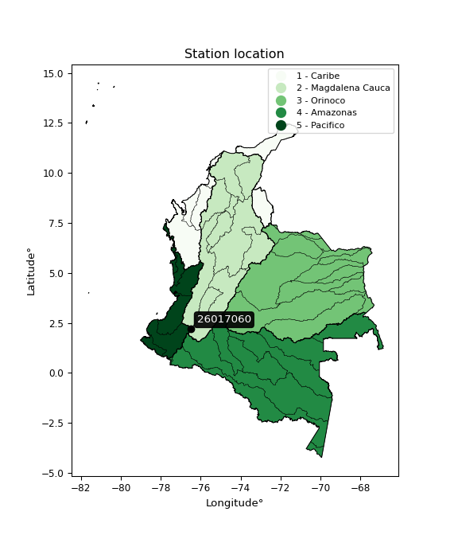

<div align="center">


</div>

# PMP Station (Rain, Pmax24h): 26017060

Probable Maximum Precipitation (PMP) is the greatest amount of rainfall for a specific duration that is meteorologically possible for a given location, acting as a "worst-case" scenario for extreme storms, crucial for designing safety-critical infrastructure like bridges, river deviations, dams, spillways, and nuclear plants to prevent catastrophic failure. PMP is calculated by hydrologists using meteorological data to determine the upper limit of extreme rainfall, often leading to the Probable Maximum Flood (PMF) for flood control design, and is increasingly being studied for climate change impacts. Probable Maximum Precipitation (PMP) is the theoretical upper limit of rainfall, a deterministic estimate for extreme events, while probability distributions (like GEV, Gumbel) describe the likelihood and frequency of various precipitation amounts, including rare ones, showing how often events occur, with PMP representing the extreme end of these distributions, used for critical infrastructure design to ensure safety against the worst conceivable weather, unlike standard statistical forecasts which cover typical probabilities.

The most common probability distributions in hydrology, used for analyzing floods, rainfall, and streamflow, include the Normal, Log-Normal, Gumbel, Gamma (including Log-Pearson Type III), and Generalized Extreme Value (GEV) distributions, often chosen based on the data´s skewness and whether modeling extremes or general conditions, with Gumbel and GEV popular for extreme events like floods, while the Normal distribution serves as a baseline, though often requiring transformations for skewed hydrological data. These distributions help in designing water infrastructure, managing water resources, and forecasting hydrologic events.

> Hydrological data often isn´t perfectly normal (it´s skewed), so different distributions are needed for different applications, such as: **Flood Frequency Analysis**: Using Gumbel, GEV, or Log-Pearson Type III for predicting extreme flood magnitudes and their return periods, **Rainfall Analysis**: Normal for annual totals, but Log-Normal, Weibull, or GEV for intensity or extreme daily rainfall, **Streamflow Modeling**: Gamma and Log-Normal for maximum flows, GEV for minimum flows, and Kappa for daily flows.

<div align="center">

</img>

</div>


## A. General information


### 1. General running parameters

• app_version: _v20260113_. • runtime: _2026-01-13 16:28:34.738620_. • Python version: _3.14.0_. • SciPy version: _1.16.3_. • Pandas version: _2.3.3_. • NumPy version: _2.3.5_. • Stations dataset (station_dataset_file): _dataset/pmax24h_in/automatic_colombia_2003_2025.csv_. • Stations catalog (station_catalog_file): _dataset/CNE.xls_. • Minimum year to eval til year_max (date_min): _1900_. • Maximum year to eval since year_min (date_max): _2025_. • Creates, save and include plots into reports (create_plot): _False_. • Plot only fit distributions with Δo > Δ (plot_only_fit): _True_. • Plot only simple graphs avoiding multiple CDFs and multiple Extreme values plots (plot_only_simple): _True_. • Eval low extreme values, if False, evaluates high extreme values (low_extreme): _False_. • Eval every SciPy distribution as logarithmic (pdist_logarithmic_on): _True_. • Standard deviation normalized (ddof): _1.0_. • Return periods to eval in years (Tr): _[2, 2.33, 5, 10, 15, 20, 25, 50, 75, 100, 200, 250, 500, 750, 1000]_. • Minimum data sample per station, 0 means any (minimum_sample): _5_. • Z-Score maximum threshold to adjust a value, 0 means disable (zscore_max): _3.5_. • Z-Score minimum threshold to adjust a value, 0 means disable (zscore_min): _-2.5_. • Avoid zeros, e.g. rain = 0 (avoid_zeros): _True_. • Avoid null values (avoid_nans): _True_. 

:file_folder:Table: [dataset.csv](../../dataset/pmax24h_in/automatic_colombia_2003_2025.csv)

> Delta Degrees of Freedom (DDOF): is a parameter used in the formulas for calculating variance and standard deviation. When ddof=0, the divisor is $N$ (the total number of observations) and this is used when your data set is the entire population. When ddof=1, the divisor is $N-1$ and this is used when your data set is a sample drawn from a larger population. Using $N-1$ provides an unbiased estimate of the population variance (known as Bessel´s correction).


### 2. Station info and location

|   id |   CODIGO | NOMBRE                          | CATEGORIA    | TECNOLOGIA                              | ESTADO   | FECHA_INSTALACION   |   FECHA_SUSPENSION |   ALTITUD |   LATITUD |   LONGITUD | DEPARTAMENTO   | MUNICIPIO         | AREA_OPERATIVA                         | ENTIDAD                                                     | AREA_HIDROGRAFICA   | ZONA_HIDROGRAFICA   | SUBZONA_HIDROGRAFICA   | CORRIENTE   | Catalogo   |   Version |
|-----:|---------:|:--------------------------------|:-------------|:----------------------------------------|:---------|:--------------------|-------------------:|----------:|----------:|-----------:|:---------------|:------------------|:---------------------------------------|:------------------------------------------------------------|:--------------------|:--------------------|:-----------------------|:------------|:-----------|----------:|
|    0 | 26017060 | PUENTE ARAGON  - AUT [26017060] | Limnigráfica | Automática con Telemetría, Convencional | Activa   | 15/05/1970          |                nan |      2993 |       2.2 |      -76.5 | Cauca          | Puracé (Coconuco) | Area Operativa 09 - Cauca-Valle-Caldas | INSTITUTO DE HIDROLOGIA METEOROLOGIA Y ESTUDIOS AMBIENTALES | Magdalena Cauca     | Cauca               | Alto Río Cauca         | Cauca       | CNE_IDEAM  |  20251226 |

<div align="center">

Dynamic map: [:earth_americas:Google](http://maps.google.com/maps?q=2.2,-76.5) [:earth_americas:OSM](https://www.openstreetmap.org/#map=18/2.2/-76.5&layers=P) [:earth_americas:Bing](https://www.bing.com/maps?cp=2.2~-76.5&lvl=18) [:earth_americas:Apple](https://maps.apple.com/frame?center=2.2%2C-76.5&span=0.003%2C0.006)

</div>


<div align="center">

```geojson
{
  "type": "Feature",
  "geometry": {
    "type": "Point", 
    "coordinates": [-76.5, 2.2]
  }, 
  "properties": {
    "Name": "26017060"
  }
}
```

</div>


### 3. Discrete values table and plot

<div align="center">

|               |           0 |           1 |           2 |           3 |          4 |
|:--------------|------------:|------------:|------------:|------------:|-----------:|
| Date          | 2019        | 2020        | 2021        | 2022        | 2025       |
| Value         |   29.4      |   30.6      |   27.2      |   41.2      |  142.4     |
| Value_initial |   29.4      |   30.6      |   27.2      |   41.2      |  142.4     |
| count         |    5        |    5        |    5        |    5        |    5       |
| mean          |   54.16     |   54.16     |   54.16     |   54.16     |   54.16    |
| std           |   49.6216   |   49.6216   |   49.6216   |   49.6216   |   49.6216  |
| zscore        |   -0.498976 |   -0.474793 |   -0.543311 |   -0.261176 |    1.77826 |


</div>


> The initial value (value_initial) correspond to the initial obtained or null completed value, and value (value) is adjusted only when the initial value is outside the valid range (outlier) definite through the Z-Score value. If Z-Score is active, values out of range or outliers are replaced with the station mean value. A Z-Score (or standard score) measures how many standard deviations a data point is from the mean of a dataset, indicating its relative position; positive scores mean above the mean, negative mean below, and a score of zero is exactly at the mean, allowing for comparison of values from different distributions. It´s calculated using the formula $z=(x–μ)/σ$, where $x$ is the data point, $μ$ is the mean, and $σ$ is the standard deviation, helping identify outliers and understand probability.
>
> <sub>**Note**: In this study, "completing" (filling gaps in) and "extending" (forecasting or lengthening the historical record) rainfall data series are avoided for certain critical analyses because they introduce artificial bias and uncertainty, which can distort the statistics of rare events (extremes), alter day-to-day variability, and compromise the integrity and homogeneity of the original data. Some reasons against Completing/Extending rainfall data are: **Distortion of Extremes and Variability**: The primary issue is that most gap-filling or extension methods rely on averaging or regression with nearby stations, which inherently smooths the data. Rainfall is highly variable in space and time, with a large percentage of zero values and occasional large storms. Infilling methods often underestimate the highest values and overestimate the lowest (zero) values, which severely distorts analyses focused on flood frequency, drought severity, and intensity-duration-frequency (IDF) curves, **Loss of Data Homogeneity**: Infilled or extended data are synthetic estimates, not actual measurements. Combining these estimates with observed data can violate the assumption of data homogeneity, which requires that the data properties do not change over time. Inhomogeneity can lead to incorrect conclusions about long-term trends or changes in climate patterns, **Propagation of Errors**: Errors and biases from the original data (e.g., wind-induced undercatch, instrument errors, site changes) or the data used for imputation can propagate through the analysis, leading to unreliable hydrological models and inaccurate predictions, **Compromised Statistical Integrity**: For statistical analyses, especially those involving the frequency of events, using artificial data can introduce time bias or autocorrelation that doesn´t exist in reality, making it difficult to assess the true probability of events, **Difficulty in Validation**: It is difficult to accurately validate the quality of filled or extended data, especially for past periods where ground-truth measurements are unavailable. The reliability of imputation techniques heavily depends on the density of the surrounding station network and the complexity of the local topography.</sub>


### 4. Active continuous probability distributions from SciPy (45 of 104 available)

A Probability Density Function (PDF) describes the relative likelihood of a continuous random variable falling within a specific range, where the total area under its curve equals 1, and the area over any interval gives the actual probability for that range. Unlike discrete probabilities (like rolling a die), a PDF shows density, not direct probability for a single point (which is zero), with higher points indicating higher likelihood, often visualized as a bell curve for normal distributions.

A log of a probability density function (log-PDF) is simply the logarithm of the PDF´s value, denoted as $log(f(x))$, useful for converting multiplication of probabilities into addition, improving numerical stability with tiny numbers, and connecting to information theory concepts like entropy. Instead of dealing with very small probabilities (e.g., 0.000001), log-PDFs use negative numbers (e.g., $log(0.00001) ≈ -11.51$ that are easier for computers to handle, preventing underflow errors and simplifying complex calculations. In this study, each active probability distribution from SciPy is also evaluated in the $log$ form.

[scipy.stats](https://docs.scipy.org/doc/scipy/reference/stats.html) is a Python´s powerful submodule within the SciPy library for comprehensive statistical analysis, offering over 130 probability distributions (like Normal, Poisson), functions for descriptive stats (mean, variance), hypothesis testing (t-tests, chi-square), random variable generation, and statistical tests, making it essential for data science, modeling, and research. It provides tools to explore, model, and draw conclusions from data efficiently, working seamlessly with NumPy.

<div align="center">

|   id | p_dist             |   n_parameter | fit_method   | label                                                                       | active   | ref                                                                                                        |
|-----:|:-------------------|--------------:|:-------------|:----------------------------------------------------------------------------|:---------|:-----------------------------------------------------------------------------------------------------------|
|    0 | alpha              |             3 | MLE          | Alpha                                                                       | True     | [:mortar_board:](https://docs.scipy.org/doc/scipy/reference/generated/scipy.stats.alpha.html)              |
|    1 | betaprime          |             4 | MLE          | Beta prime                                                                  | True     | [:mortar_board:](https://docs.scipy.org/doc/scipy/reference/generated/scipy.stats.betaprime.html)          |
|    2 | chi2               |             3 | MLE          | Chi²                                                                        | True     | [:mortar_board:](https://docs.scipy.org/doc/scipy/reference/generated/scipy.stats.chi2.html)               |
|    3 | crystalball        |             4 | MLE          | Crystalball                                                                 | True     | [:mortar_board:](https://docs.scipy.org/doc/scipy/reference/generated/scipy.stats.crystalball.html)        |
|    4 | dweibull           |             3 | MLE          | Double Weibull                                                              | True     | [:mortar_board:](https://docs.scipy.org/doc/scipy/reference/generated/scipy.stats.dweibull.html)           |
|    5 | erlang             |             3 | MLE          | Erlang                                                                      | True     | [:mortar_board:](https://docs.scipy.org/doc/scipy/reference/generated/scipy.stats.erlang.html)             |
|    6 | expon              |             2 | MLE          | Exponential                                                                 | True     | [:mortar_board:](https://docs.scipy.org/doc/scipy/reference/generated/scipy.stats.expon.html)              |
|    7 | exponnorm          |             3 | MLE          | Exponentially modified Normal                                               | True     | [:mortar_board:](https://docs.scipy.org/doc/scipy/reference/generated/scipy.stats.exponnorm.html)          |
|    8 | f                  |             4 | MLE          | F                                                                           | True     | [:mortar_board:](https://docs.scipy.org/doc/scipy/reference/generated/scipy.stats.f.html)                  |
|    9 | fatiguelife        |             3 | MLE          | Fatigue-life (Birnbaum-Saunders)                                            | True     | [:mortar_board:](https://docs.scipy.org/doc/scipy/reference/generated/scipy.stats.fatiguelife.html)        |
|   10 | fisk               |             3 | MLE          | Fisk                                                                        | True     | [:mortar_board:](https://docs.scipy.org/doc/scipy/reference/generated/scipy.stats.fisk.html)               |
|   11 | gamma              |             3 | MLE          | Gamma                                                                       | True     | [:mortar_board:](https://docs.scipy.org/doc/scipy/reference/generated/scipy.stats.gamma.html)              |
|   12 | genexpon           |             5 | MLE          | Generalized exponential                                                     | True     | [:mortar_board:](https://docs.scipy.org/doc/scipy/reference/generated/scipy.stats.genexpon.html)           |
|   13 | genlogistic        |             3 | MLE          | Generalized logistic                                                        | True     | [:mortar_board:](https://docs.scipy.org/doc/scipy/reference/generated/scipy.stats.genlogistic.html)        |
|   14 | gibrat             |             2 | MM           | Gibrat                                                                      | True     | [:mortar_board:](https://docs.scipy.org/doc/scipy/reference/generated/scipy.stats.gibrat.html)             |
|   15 | gompertz           |             3 | MLE          | Gompertz (or truncated Gumbel)                                              | True     | [:mortar_board:](https://docs.scipy.org/doc/scipy/reference/generated/scipy.stats.gompertz.html)           |
|   16 | gumbel_l           |             2 | MM           | Gumbel Left Skew                                                            | True     | [:mortar_board:](https://docs.scipy.org/doc/scipy/reference/generated/scipy.stats.gumbel_l.html)           |
|   17 | gumbel_r           |             2 | MM           | Gumbel Right Skew                                                           | True     | [:mortar_board:](https://docs.scipy.org/doc/scipy/reference/generated/scipy.stats.gumbel_r.html)           |
|   18 | halflogistic       |             2 | MM           | Half-logistic                                                               | True     | [:mortar_board:](https://docs.scipy.org/doc/scipy/reference/generated/scipy.stats.halflogistic.html)       |
|   19 | halfnorm           |             2 | MM           | Half Normal                                                                 | True     | [:mortar_board:](https://docs.scipy.org/doc/scipy/reference/generated/scipy.stats.halfnorm.html)           |
|   20 | hypsecant          |             2 | MM           | hyperbolic secant                                                           | True     | [:mortar_board:](https://docs.scipy.org/doc/scipy/reference/generated/scipy.stats.hypsecant.html)          |
|   21 | invgamma           |             3 | MLE          | Inverted gamma                                                              | True     | [:mortar_board:](https://docs.scipy.org/doc/scipy/reference/generated/scipy.stats.invgamma.html)           |
|   22 | invgauss           |             3 | MLE          | Inverse Gaussian                                                            | True     | [:mortar_board:](https://docs.scipy.org/doc/scipy/reference/generated/scipy.stats.invgauss.html)           |
|   23 | invweibull         |             3 | MLE          | Inverted Weibull                                                            | True     | [:mortar_board:](https://docs.scipy.org/doc/scipy/reference/generated/scipy.stats.invweibull.html)         |
|   24 | kappa4             |             4 | MLE          | Kappa 4                                                                     | True     | [:mortar_board:](https://docs.scipy.org/doc/scipy/reference/generated/scipy.stats.kappa4.html)             |
|   25 | kstwobign          |             2 | MLE          | Limiting distribution of scaled Kolmogorov-Smirnov two-sided test statistic | True     | [:mortar_board:](https://docs.scipy.org/doc/scipy/reference/generated/scipy.stats.kstwobign.html)          |
|   26 | laplace            |             2 | MM           | Laplace                                                                     | True     | [:mortar_board:](https://docs.scipy.org/doc/scipy/reference/generated/scipy.stats.laplace.html)            |
|   27 | laplace_asymmetric |             3 | MLE          | Asymmetric Laplace                                                          | True     | [:mortar_board:](https://docs.scipy.org/doc/scipy/reference/generated/scipy.stats.laplace_asymmetric.html) |
|   28 | loggamma           |             3 | MLE          | Log gamma                                                                   | True     | [:mortar_board:](https://docs.scipy.org/doc/scipy/reference/generated/scipy.stats.loggamma.html)           |
|   29 | logistic           |             2 | MM           | Logistic (or Sech-squared)                                                  | True     | [:mortar_board:](https://docs.scipy.org/doc/scipy/reference/generated/scipy.stats.logistic.html)           |
|   30 | lognorm            |             3 | MLE          | Log Normal                                                                  | True     | [:mortar_board:](https://docs.scipy.org/doc/scipy/reference/generated/scipy.stats.lognorm.html)            |
|   31 | maxwell            |             2 | MM           | Maxwell                                                                     | True     | [:mortar_board:](https://docs.scipy.org/doc/scipy/reference/generated/scipy.stats.maxwell.html)            |
|   32 | mielke             |             4 | MLE          | Mielke Beta-Kappa / Dagum                                                   | True     | [:mortar_board:](https://docs.scipy.org/doc/scipy/reference/generated/scipy.stats.mielke.html)             |
|   33 | moyal              |             2 | MM           | Moyal                                                                       | True     | [:mortar_board:](https://docs.scipy.org/doc/scipy/reference/generated/scipy.stats.moyal.html)              |
|   34 | nakagami           |             3 | MLE          | Nakagami                                                                    | True     | [:mortar_board:](https://docs.scipy.org/doc/scipy/reference/generated/scipy.stats.nakagami.html)           |
|   35 | ncf                |             5 | MLE          | Non-central F distribution                                                  | True     | [:mortar_board:](https://docs.scipy.org/doc/scipy/reference/generated/scipy.stats.ncf.html)                |
|   36 | nct                |             4 | MLE          | Non-central Student’s t                                                     | True     | [:mortar_board:](https://docs.scipy.org/doc/scipy/reference/generated/scipy.stats.nct.html)                |
|   37 | norm               |             2 | MM           | Normal                                                                      | True     | [:mortar_board:](https://docs.scipy.org/doc/scipy/reference/generated/scipy.stats.norm.html)               |
|   38 | pearson3           |             3 | MM           | Pearson type III                                                            | True     | [:mortar_board:](https://docs.scipy.org/doc/scipy/reference/generated/scipy.stats.pearson3.html)           |
|   39 | rayleigh           |             2 | MM           | Rayleigh                                                                    | True     | [:mortar_board:](https://docs.scipy.org/doc/scipy/reference/generated/scipy.stats.rayleigh.html)           |
|   40 | rice               |             3 | MLE          | Rice                                                                        | True     | [:mortar_board:](https://docs.scipy.org/doc/scipy/reference/generated/scipy.stats.rice.html)               |
|   41 | t                  |             3 | MLE          | Student’s t                                                                 | True     | [:mortar_board:](https://docs.scipy.org/doc/scipy/reference/generated/scipy.stats.t.html)                  |
|   42 | truncnorm          |             4 | MLE          | Truncated normal                                                            | True     | [:mortar_board:](https://docs.scipy.org/doc/scipy/reference/generated/scipy.stats.truncnorm.html)          |
|   43 | wald               |             2 | MM           | Wald                                                                        | True     | [:mortar_board:](https://docs.scipy.org/doc/scipy/reference/generated/scipy.stats.wald.html)               |
|   44 | weibull_min        |             3 | MLE          | Weibull minimum                                                             | True     | [:mortar_board:](https://docs.scipy.org/doc/scipy/reference/generated/scipy.stats.weibull_min.html)        |

</div>

> **n_parameter:** # arguments & localization & scale.
>
> **Fit methods:** (MLE) maximum likelihood, (MM) L-moments.
>
>**Inactive** (With the only purpose of prevent loops, zero divisions, infinite values, over high estimated values or horizontal trending for recurrence intervals estimations, the follow distributions were disabled.)**:** foldnorm, gennorm, norminvgauss, powernorm, powerlognorm, skewnorm, genextreme, anglit, arcsine, argus, beta, bradford, burr, burr12, cauchy, cosine, halfcauchy, foldcauchy, skewcauchy, wrapcauchy, dgamma, gengamma, exponweib, exponpow, truncexpon, gausshyper, genhalflogistic, genhyperbolic, geninvgauss, halfgennorm, johnsonsb, johnsonsu, kappa3, ksone, kstwo, loglaplace, levy, levy_l, levy_stable, ncx2, pareto, genpareto, truncpareto, lomax, powerlaw, rdist, rel_breitwigner, recipinvgauss, semicircular, studentized_range, trapezoid, triang, truncweibull_min, tukeylambda, uniform, loguniform, vonmises, vonmises_line, weibull_max, 


## B. Probability (PDF) vs. Empirical (EDF) distributions functions

A continuous probability distribution (CPD) describes probabilities for variables that can take any value within a range (like rain any time), unlike discrete variables with specific outcomes (like temperature). It uses a Probability Density Function (PDF), a curve where the total area under it equals 1, and the probability of the variable falling within an interval (a to b) is found by calculating the area under the curve between those points. A key feature is that the probability of hitting any single exact value is zero, so probabilities are always expressed for ranges, e.g., $P(a ≤ X ≤ b)$.

<div align="center">

Distributions parameters from station values
|    |   station | p_dist                |   n |            loc |          scale | shape                  | shape1                 | shape2               | shape3   |
|---:|----------:|:----------------------|----:|---------------:|---------------:|:-----------------------|:-----------------------|:---------------------|:---------|
|  0 |  26017060 | alpha                 |   5 |     24.8842    |    4.30372     | 3.6458596765031886e-09 |                        |                      |          |
|  1 |  26017060 | betaprime             |   5 |     11.7186    |   13.7586      | 6.056230943667051      | 3.396855477847968      |                      |          |
|  2 |  26017060 | chi2                  |   5 |     27.2       |   28.7359      | 0.9899637932056644     |                        |                      |          |
|  3 |  26017060 | crystalball           |   5 |     54.16      |   44.383       | 4201.639514678579      | 436.02793922040405     |                      |          |
|  4 |  26017060 | dweibull              |   5 |     30.6       |   44.2511      | 0.6918893950446143     |                        |                      |          |
|  5 |  26017060 | erlang                |   5 |     27.2       |   36.2743      | 0.3700644133706045     |                        |                      |          |
|  6 |  26017060 | expon                 |   5 |     27.2       |   26.96        |                        |                        |                      |          |
|  7 |  26017060 | exponnorm             |   5 |     27.1592    |    0.0130972   | 2058.613358731911      |                        |                      |          |
|  8 |  26017060 | f                     |   5 |     26.7579    |    1.73575     | 61.35258306829266      | 1.0144640575844317     |                      |          |
|  9 |  26017060 | fatiguelife           |   5 |     27.2       |    8.12113e-06 | 1912.2082463194984     |                        |                      |          |
| 10 |  26017060 | fisk                  |   5 |     27.2       |   13.3761      | 0.831395520950914      |                        |                      |          |
| 11 |  26017060 | gamma                 |   5 |     27.2       |   29.9145      | 0.34477092759148725    |                        |                      |          |
| 12 |  26017060 | genexpon              |   5 |     27.2       |    2.49413     | 0.09252199827391208    | 2.2188153956153924e-09 | 2.487625690294516    |          |
| 13 |  26017060 | genlogistic           |   5 |   -144.342     |   22.9282      | 2666.857293099215      |                        |                      |          |
| 14 |  26017060 | gibrat                |   5 |     20.3014    |   20.5363      |                        |                        |                      |          |
| 15 |  26017060 | gompertz              |   5 |     27.2       |    4.61745e+12 | 151710448490.91125     |                        |                      |          |
| 16 |  26017060 | gumbel_l              |   5 |     74.1347    |   34.6052      |                        |                        |                      |          |
| 17 |  26017060 | gumbel_r              |   5 |     34.1853    |   34.6052      |                        |                        |                      |          |
| 18 |  26017060 | halflogistic          |   5 |      1.55589   |   37.9458      |                        |                        |                      |          |
| 19 |  26017060 | halfnorm              |   5 |     -4.58563   |   73.6267      |                        |                        |                      |          |
| 20 |  26017060 | hypsecant             |   5 |     54.16      |   28.2551      |                        |                        |                      |          |
| 21 |  26017060 | invgamma              |   5 |     26.7436    |    0.873024    | 0.5071613638163524     |                        |                      |          |
| 22 |  26017060 | invgauss              |   5 |     26.6564    |    2.12481     | 12.944000286576799     |                        |                      |          |
| 23 |  26017060 | invweibull            |   5 |     27.2       |    1.20661     | 0.054548482543807855   |                        |                      |          |
| 24 |  26017060 | kappa4                |   5 |     15.4936    |  127.624       | 1.100880566388819      | 0.9794369578309008     |                      |          |
| 25 |  26017060 | kstwobign             |   5 |    -54.4498    |  127.003       |                        |                        |                      |          |
| 26 |  26017060 | laplace               |   5 |     54.16      |   31.3835      |                        |                        |                      |          |
| 27 |  26017060 | laplace_asymmetric    |   5 |     27.2       |    0.0236534   | 0.0008791403246748498  |                        |                      |          |
| 28 |  26017060 | loggamma              |   5 | -16844.5       | 2175.79        | 2361.2275599880886     |                        |                      |          |
| 29 |  26017060 | logistic              |   5 |     54.16      |   24.4696      |                        |                        |                      |          |
| 30 |  26017060 | lognorm               |   5 |     27.2       |    0.00844128  | 14.314981705485396     |                        |                      |          |
| 31 |  26017060 | maxwell               |   5 |    -51.009     |   65.9049      |                        |                        |                      |          |
| 32 |  26017060 | mielke                |   5 |     26.3691    |    1.90764     | 2.6382527468699255     | 1.156770971674987      |                      |          |
| 33 |  26017060 | moyal                 |   5 |     28.779     |   19.9793      |                        |                        |                      |          |
| 34 |  26017060 | nakagami              |   5 |     27.2       |   73.3213      | 0.11592574292074725    |                        |                      |          |
| 35 |  26017060 | ncf                   |   5 |     -0.114674  |    0.0735067   | 0.01828659926204647    | 21.788719906664074     | 11.556905894274896   |          |
| 36 |  26017060 | nct                   |   5 |     -0.0893507 |    0.622017    | 2.588551559480738      | 55.52950781149001      |                      |          |
| 37 |  26017060 | norm                  |   5 |     54.16      |   44.383       |                        |                        |                      |          |
| 38 |  26017060 | pearson3              |   5 |     54.16      |   44.3829      | 1.457281493491334      |                        |                      |          |
| 39 |  26017060 | rayleigh              |   5 |    -30.7472    |   67.7461      |                        |                        |                      |          |
| 40 |  26017060 | rice                  |   5 |     -8.72257   |   54.4246      | 0.0002195209375848183  |                        |                      |          |
| 41 |  26017060 | t                     |   5 |     29.6594    |    1.40414     | 0.4593040789205849     |                        |                      |          |
| 42 |  26017060 | truncnorm             |   5 | -32458.6       | 1183.81        | 27.441873499162597     | 13298.22738903929      |                      |          |
| 43 |  26017060 | wald                  |   5 |      9.77705   |   44.383       |                        |                        |                      |          |
| 44 |  26017060 | weibull_min           |   5 |     27.2       |   59.0543      | 0.42177120561157694    |                        |                      |          |
| 45 |  26017060 | logalpha              |   5 |      3.22763   |    0.141821    | 9.760327898173011e-07  |                        |                      |          |
| 46 |  26017060 | logbetaprime          |   5 |      0.210804  |    1.49222     | 130.59703007668435     | 56.001787603156885     |                      |          |
| 47 |  26017060 | logchi2               |   5 |      3.30322   |    0.982852    | 1.0171488903015735     |                        |                      |          |
| 48 |  26017060 | logcrystalball        |   5 |      3.75646   |    0.617353    | 10.219085665780913     | 28.468984419501993     |                      |          |
| 49 |  26017060 | logdweibull           |   5 |      3.38099   |    0.495019    | 0.8126308605153545     |                        |                      |          |
| 50 |  26017060 | logerlang             |   5 |      3.30322   |    0.569432    | 0.5829195925458927     |                        |                      |          |
| 51 |  26017060 | logexpon              |   5 |      3.30322   |    0.453241    |                        |                        |                      |          |
| 52 |  26017060 | logexponnorm          |   5 |      3.30241   |    0.000240972 | 1857.8249683970648     |                        |                      |          |
| 53 |  26017060 | logf                  |   5 |      3.30322   |    0.690953    | 0.7763659893253606     | 271.70368596969377     |                      |          |
| 54 |  26017060 | logfatiguelife        |   5 |      3.30322   |    4.81294e-07 | 1126.2891328055675     |                        |                      |          |
| 55 |  26017060 | logfisk               |   5 |      3.30322   |    0.445316    | 0.4178882965139794     |                        |                      |          |
| 56 |  26017060 | loggamma              |   5 |      3.30322   |    0.459488    | 0.7489727873049365     |                        |                      |          |
| 57 |  26017060 | loggenexpon           |   5 |      3.30322   |    0.758667    | 1.6738768520175862     | 5.53640017912598e-10   | 5.972573090965417    |          |
| 58 |  26017060 | loggenlogistic        |   5 |      0.789872  |    0.351444    | 2250.957345210074      |                        |                      |          |
| 59 |  26017060 | loggibrat             |   5 |      3.2855    |    0.285653    |                        |                        |                      |          |
| 60 |  26017060 | loggompertz           |   5 |      3.30322   |    6.48563e+12 | 13219520277557.283     |                        |                      |          |
| 61 |  26017060 | loggumbel_l           |   5 |      4.0343    |    0.481348    |                        |                        |                      |          |
| 62 |  26017060 | loggumbel_r           |   5 |      3.47862   |    0.481348    |                        |                        |                      |          |
| 63 |  26017060 | loghalflogistic       |   5 |      3.02475   |    0.527814    |                        |                        |                      |          |
| 64 |  26017060 | loghalfnorm           |   5 |      2.93933   |    1.02412     |                        |                        |                      |          |
| 65 |  26017060 | loghypsecant          |   5 |      3.75646   |    0.393019    |                        |                        |                      |          |
| 66 |  26017060 | loginvgamma           |   5 |      3.27191   |    0.0789375   | 0.7996469263252712     |                        |                      |          |
| 67 |  26017060 | loginvgauss           |   5 |      3.27973   |    0.0963058   | 4.950151727343336      |                        |                      |          |
| 68 |  26017060 | loginvweibull         |   5 |      3.30322   |    0.0181895   | 0.06410657101643022    |                        |                      |          |
| 69 |  26017060 | logkappa4             |   5 |      3.17546   |    1.92527     | 1.0695948605924122     | 1.0796842037514327     |                      |          |
| 70 |  26017060 | logkstwobign          |   5 |      2.1701    |    1.84604     |                        |                        |                      |          |
| 71 |  26017060 | loglaplace            |   5 |      3.75646   |    0.436534    |                        |                        |                      |          |
| 72 |  26017060 | loglaplace_asymmetric |   5 |      3.30322   |    0.000109155 | 0.0002408246534451779  |                        |                      |          |
| 73 |  26017060 | logloggamma           |   5 |   -176.702     |   24.6701      | 1502.9768659670453     |                        |                      |          |
| 74 |  26017060 | loglogistic           |   5 |      3.75646   |    0.340364    |                        |                        |                      |          |
| 75 |  26017060 | loglognorm            |   5 |      3.30322   |    0.000308546 | 13.675203806458569     |                        |                      |          |
| 76 |  26017060 | logmaxwell            |   5 |      2.29359   |    0.916715    |                        |                        |                      |          |
| 77 |  26017060 | logmielke             |   5 |      3.1757    |    0.045791    | 18.961020564800506     | 1.6027099809913983     |                      |          |
| 78 |  26017060 | logmoyal              |   5 |      3.40342   |    0.277906    |                        |                        |                      |          |
| 79 |  26017060 | lognakagami           |   5 |      3.30322   |    1.14105     | 0.18366715013185472    |                        |                      |          |
| 80 |  26017060 | logncf                |   5 |     -1.66949   |    5.39326     | 311.2312897913084      | 323.05696038777864     | 0.019058679195802723 |          |
| 81 |  26017060 | lognct                |   5 |     -0.10951   |    0.0903107   | 27.00829693727175      | 41.256676832409596     |                      |          |
| 82 |  26017060 | lognorm               |   5 |      3.75646   |    0.617352    |                        |                        |                      |          |
| 83 |  26017060 | logpearson3           |   5 |      3.75646   |    0.617351    | 1.3206505675161542     |                        |                      |          |
| 84 |  26017060 | lograyleigh           |   5 |      2.57543   |    0.942326    |                        |                        |                      |          |
| 85 |  26017060 | logrice               |   5 |      2.85684   |    0.771504    | 0.0004136795827607805  |                        |                      |          |
| 86 |  26017060 | logt                  |   5 |      3.3915    |    0.0557379   | 0.5688967260946107     |                        |                      |          |
| 87 |  26017060 | logtruncnorm          |   5 |     -5.63863   |    2.39104     | 3.7397292543106095     | 4.4320810009926035     |                      |          |
| 88 |  26017060 | logwald               |   5 |      3.13911   |    0.617352    |                        |                        |                      |          |
| 89 |  26017060 | logweibull_min        |   5 |      3.30322   |    0.438731    | 0.4595991673655222     |                        |                      |          |

</div>

> **loc** (Location parameter): This shifts the distribution along the x-axis. For many common distributions, like the normal (Gaussian) distribution, loc represents the mean $μ$. For others, like the uniform distribution, it might represent the minimum value, or for the beta distribution, the left end of the support interval.
>
> **scale** (Scale parameter): This determines the width or spread of the distribution. For the normal distribution, scale represents the standard deviation $σ$. For a uniform distribution, it defines the length of the interval (from $loc$ to $loc + scale$).
>
> **shape** (Shape parameters): Refers to parameters that define the specific form of a probability distribution, distinct from its location (loc) and scale (scale). These parameters are required arguments for most distribution functions. For example, a normal (Gaussian) distribution is fully defined by its location (mean) and scale (standard deviation), so it has no specific shape parameters beyond loc and scale. However, other distributions have intrinsic properties that need specification, as Gamma distribution that takes a shape parameter, often named $a$ or $alpha$.


### 0. Cumulative distribution values - CDF (90 evaluated)

Cumulative Distribution Function (CDF), denoted as $F$<sub>$X$</sub>$(x)$, is a function that gives the probability that a random variable $X$ will take a value less than or equal to a specific value, $x$ (i.e., $(P(X≥x)$. It essentially "accumulates" probabilities from a given point up to the far right (positive infinity), providing a complete picture of the distribution´s probabilities for both discrete (like rain) and continuous (like temperature) variables, helping to find probabilities over ranges or above certain values. Each station is evaluated separately ordering the $x$ values ascending, calculating the CDF and PDF values for the activated distributions and their logarithmic forms.

<div align="center">

CDF ordered by x ascending and calculating $log(f(x))$ separately
|   id |   Station |   date |     x |   count |   mean |     std |    zscore |   Value_initial |   station |   m |     alpha |   alpha_pdf |   betaprime |   betaprime_pdf |        chi2 |    chi2_pdf |   crystalball |   crystalball_pdf |   dweibull |   dweibull_pdf |      erlang |   erlang_pdf |     expon |   expon_pdf |   exponnorm |   exponnorm_pdf |         f |       f_pdf |   fatiguelife |   fatiguelife_pdf |        fisk |     fisk_pdf |       gamma |   gamma_pdf |    genexpon |   genexpon_pdf |   genlogistic |   genlogistic_pdf |   gibrat |   gibrat_pdf |   gompertz |   gompertz_pdf |   gumbel_l |   gumbel_l_pdf |   gumbel_r |   gumbel_r_pdf |   halflogistic |   halflogistic_pdf |   halfnorm |   halfnorm_pdf |   hypsecant |   hypsecant_pdf |   invgamma |   invgamma_pdf |   invgauss |   invgauss_pdf |   invweibull |   invweibull_pdf |      kappa4 |   kappa4_pdf |   kstwobign |   kstwobign_pdf |   laplace |   laplace_pdf |   laplace_asymmetric |   laplace_asymmetric_pdf |    loggamma |   loggamma_pdf |   logistic |   logistic_pdf |   lognorm |   lognorm_pdf |   maxwell |   maxwell_pdf |   mielke |   mielke_pdf |    moyal |   moyal_pdf |    nakagami |   nakagami_pdf |      ncf |     ncf_pdf |      nct |     nct_pdf |     norm |   norm_pdf |   pearson3 |   pearson3_pdf |   rayleigh |   rayleigh_pdf |     rice |   rice_pdf |        t |       t_pdf |   truncnorm |   truncnorm_pdf |     wald |    wald_pdf |   weibull_min |   weibull_min_pdf |   logalpha |   logalpha_pdf |   logbetaprime |   logbetaprime_pdf |     logchi2 |   logchi2_pdf |   logcrystalball |   logcrystalball_pdf |   logdweibull |   logdweibull_pdf |   logerlang |   logerlang_pdf |   logexpon |   logexpon_pdf |   logexponnorm |   logexponnorm_pdf |        logf |   logf_pdf |   logfatiguelife |   logfatiguelife_pdf |     logfisk |   logfisk_pdf |   loggenexpon |   loggenexpon_pdf |   loggenlogistic |   loggenlogistic_pdf |   loggibrat |   loggibrat_pdf |   loggompertz |   loggompertz_pdf |   loggumbel_l |   loggumbel_l_pdf |   loggumbel_r |   loggumbel_r_pdf |   loghalflogistic |   loghalflogistic_pdf |   loghalfnorm |   loghalfnorm_pdf |   loghypsecant |   loghypsecant_pdf |   loginvgamma |   loginvgamma_pdf |   loginvgauss |   loginvgauss_pdf |   loginvweibull |   loginvweibull_pdf |   logkappa4 |   logkappa4_pdf |   logkstwobign |   logkstwobign_pdf |   loglaplace |   loglaplace_pdf |   loglaplace_asymmetric |   loglaplace_asymmetric_pdf |   logloggamma |   logloggamma_pdf |   loglogistic |   loglogistic_pdf |   loglognorm |   loglognorm_pdf |   logmaxwell |   logmaxwell_pdf |   logmielke |   logmielke_pdf |   logmoyal |   logmoyal_pdf |   lognakagami |   lognakagami_pdf |   logncf |   logncf_pdf |   lognct |   lognct_pdf |   logpearson3 |   logpearson3_pdf |   lograyleigh |   lograyleigh_pdf |   logrice |   logrice_pdf |     logt |   logt_pdf |   logtruncnorm |   logtruncnorm_pdf |   logwald |   logwald_pdf |   logweibull_min |   logweibull_min_pdf |
|-----:|----------:|-------:|------:|--------:|-------:|--------:|----------:|----------------:|----------:|----:|----------:|------------:|------------:|----------------:|------------:|------------:|--------------:|------------------:|-----------:|---------------:|------------:|-------------:|----------:|------------:|------------:|----------------:|----------:|------------:|--------------:|------------------:|------------:|-------------:|------------:|------------:|------------:|---------------:|--------------:|------------------:|---------:|-------------:|-----------:|---------------:|-----------:|---------------:|-----------:|---------------:|---------------:|-------------------:|-----------:|---------------:|------------:|----------------:|-----------:|---------------:|-----------:|---------------:|-------------:|-----------------:|------------:|-------------:|------------:|----------------:|----------:|--------------:|---------------------:|-------------------------:|------------:|---------------:|-----------:|---------------:|----------:|--------------:|----------:|--------------:|---------:|-------------:|---------:|------------:|------------:|---------------:|---------:|------------:|---------:|------------:|---------:|-----------:|-----------:|---------------:|-----------:|---------------:|---------:|-----------:|---------:|------------:|------------:|----------------:|---------:|------------:|--------------:|------------------:|-----------:|---------------:|---------------:|-------------------:|------------:|--------------:|-----------------:|---------------------:|--------------:|------------------:|------------:|----------------:|-----------:|---------------:|---------------:|-------------------:|------------:|-----------:|-----------------:|---------------------:|------------:|--------------:|--------------:|------------------:|-----------------:|---------------------:|------------:|----------------:|--------------:|------------------:|--------------:|------------------:|--------------:|------------------:|------------------:|----------------------:|--------------:|------------------:|---------------:|-------------------:|--------------:|------------------:|--------------:|------------------:|----------------:|--------------------:|------------:|----------------:|---------------:|-------------------:|-------------:|-----------------:|------------------------:|----------------------------:|--------------:|------------------:|--------------:|------------------:|-------------:|-----------------:|-------------:|-----------------:|------------:|----------------:|-----------:|---------------:|--------------:|------------------:|---------:|-------------:|---------:|-------------:|--------------:|------------------:|--------------:|------------------:|----------:|--------------:|---------:|-----------:|---------------:|-------------------:|----------:|--------------:|-----------------:|---------------------:|
|    0 |  26017060 |   2021 |  27.2 |       5 |  54.16 | 49.6216 | -0.543311 |            27.2 |  26017060 |   1 | 0.0631074 | 0.113871    |    0.230643 |     0.029074    | 1.07009e-08 | 1.4909e+06  |      0.271779 |        0.00747429 |   0.422083 |     0.0145507  | 1.33836e-06 |  1.39408e+08 | 0         |  0.037092   |  0.00151285 |     0.0369992   | 0.0514669 | 0.257136    |     0.0781257 |       9.36865e+10 | 1.12299e-13 | 26.2798      | 3.62406e-06 | 3.51695e+08 | 3.66611e-09 |    0.0370959   |      0.222721 |       0.0145845   | 0.137664 |  0.0318964   | 2.8443e-12 |    0.0328559   |   0.227107 |    0.00575372  |   0.294148 |     0.0104013  |       0.325605 |         0.0117797  |   0.33405  |     0.00987264 |    0.234037 |     0.00755665  |  0.0515433 |     0.257188   |  0.0518696 |    0.221872    |   0.00202212 |      1.92608e+11 | 6.03773e-15 |   0.212638   |    0.197078 |     0.0119954   |  0.211782 |   0.0067482   |           7.7292e-07 |              0.0371675   | 6.18138e-12 |  10425.1       |   0.249407 |     0.00765045 |  0.231423 |     0.493553  |  0.296397 |    0.00843149 | 0.05334  |  0.122511    | 0.298198 |  0.0120916  | 0.000135971 |    8.87351e+09 | 0.270612 | 0.0145747   | 0.193343 | 0.0263443   | 0.271779 | 0.00747429 |   0.316926 |     0.0118149  |   0.306371 |     0.00875771 | 0.195737 | 0.00975385 | 0.246209 | 0.0423376   | 7.93768e-05 |      0.0232099  | 0.263101 | 0.0228417   |   1.44072e-07 |       1.71039e+07 |  0.0606086 |      3.40662   |       0.222158 |          0.61104   | 1.24487e-08 |   1.42564e+07 |         0.231422 |             0.493552 |      0.400359 |         0.929656  | 1.75003e-09 |     2.29712e+06 |   0        |      2.20633   |     0.00179838 |          2.22878   | 9.87244e-07 | 8.6296e+08 |        0.0277538 |          5.90155e+11 | 5.38486e-07 |   5.06716e+08 |   7.75394e-11 |         2.20634   |         0.171461 |            0.859982  |  0.00271771 |       0.472267  |   7.24142e-15 |         2.03828   |      0.196654 |         0.365449  |      0.237013 |         0.708871  |          0.257838 |             0.884326  |      0.27765  |          0.731429 |       0.194628 |          0.464928  |     0.0540215 |         4.61644   |     0.0522745 |         5.3911    |     0.000576623 |         6.20819e+11 |  0.00239544 |        0.794826 |       0.154512 |          0.756665  |     0.177033 |        0.405542  |             8.93773e-08 |                   2.20626   |      0.237446 |          0.482652 |      0.208889 |         0.485522  |     0.023082 |      8.99943e+12 |     0.250105 |         0.575656 |    0.123116 |       2.97041   |   0.231093 |      0.839246  |   1.73468e-06 |       1.43486e+09 | 0.23522  |    0.549513  | 0.229501 |    0.67811   |      0.250537 |         0.803576  |      0.257884 |          0.608241 |  0.15412  |     0.634358  | 0.234342 |  1.33367   |    8.51932e-07 |           1.75254  |  0.129264 |     1.71071   |      1.28362e-07 |          1.32845e+08 |
|    1 |  26017060 |   2019 |  29.4 |       5 |  54.16 | 49.6216 | -0.498976 |            29.4 |  26017060 |   2 | 0.340569  | 0.106927    |    0.294372 |     0.0286722   | 0.22164     | 0.0486033   |      0.288466 |        0.00769331 |   0.460447 |     0.0218787  | 0.392162    |  0.0631      | 0.0783616 |  0.0341854  |  0.0797503  |     0.0341314   | 0.422853  | 0.088191    |     0.607261  |       0.0237815   | 0.182324    |  0.0563391   | 0.447616    | 0.0664      | 0.0783696   |    0.0341887   |      0.255517 |       0.015202    | 0.207802 |  0.0314796   | 0.0697323  |    0.0305647   |   0.240067 |    0.00602858  |   0.317175 |     0.0105248  |       0.351271 |         0.0115508  |   0.355627 |     0.00974176 |    0.251143 |     0.00799453  |  0.422899  |     0.0881776  |  0.408509  |    0.0934954   |   0.379931   |      0.00911664  | 0.0272363   |   0.0112435  |    0.223986 |     0.0124497   |  0.227161 |   0.00723823  |           0.0785155  |              0.0342493   | 0.267956    |      2.33933   |   0.266615 |     0.00799078 |  0.271533 |     0.537102  |  0.315093 |    0.00856158 | 0.349615 |  0.112359    | 0.324831 |  0.0121081  | 0.365558    |    0.0385215   | 0.302808 | 0.0146725   | 0.2521   | 0.0268618   | 0.288466 | 0.00769331 |   0.342764 |     0.0116674  |   0.325729 |     0.00883651 | 0.217551 | 0.0100704  | 0.452241 | 0.177825    | 0.049861    |      0.0220559  | 0.311919 | 0.021504    |   0.22094     |       0.0372895   |  0.355097  |      3.13727   |       0.271751 |          0.662014  | 0.215369    |   1.37171     |         0.271532 |             0.537101 |      0.5      |       541.519     | 0.334435    |     2.29735     |   0.157687 |      1.85842   |     0.16099    |          1.87411   | 0.329745    | 1.59447    |        0.639424  |          0.85889     | 0.325374    |   1.17937     |   0.157687    |         1.85843   |         0.24331  |            0.978223  |  0.136613   |       2.29209   |   0.146605    |         1.73946   |      0.226918 |         0.413356  |      0.293805 |         0.747617  |          0.325217 |             0.847111  |      0.333725 |          0.709905 |       0.233788 |          0.542796  |     0.385132  |         2.94745   |     0.398768  |         2.86057   |     0.402098    |         0.301944    |  0.0551732  |        0.641213 |       0.217246 |          0.849452  |     0.21156  |        0.484635  |             0.157682    |                   1.85837   |      0.276586 |          0.523113 |      0.249155 |         0.549638  |     0.657027 |      0.345633    |     0.296119 |         0.606009 |    0.359608 |       2.7506    |   0.297799 |      0.869238  |   0.295969    |       1.39682     | 0.279673 |    0.592176  | 0.284419 |    0.730931  |      0.313277 |         0.805843  |      0.306083 |          0.629516 |  0.206093 |     0.699123  | 0.448136 |  4.78152   |    0.128323    |           1.55099  |  0.262348 |     1.64346   |      0.363344    |          1.69868     |
|    2 |  26017060 |   2020 |  30.6 |       5 |  54.16 | 49.6216 | -0.474793 |            30.6 |  26017060 |   3 | 0.451477  | 0.0791633   |    0.328426 |     0.0280461   | 0.273064    | 0.0382051   |      0.297767 |        0.00780737 |   0.5      |   574.757      | 0.456709    |  0.0464054   | 0.118485  |  0.0326972  |  0.11981    |     0.0326456   | 0.506764  | 0.0556991   |     0.632459  |       0.0187472   | 0.242548    |  0.0449244   | 0.514933    | 0.0479592   | 0.118496    |    0.0327002   |      0.273923 |       0.0154665   | 0.245039 |  0.0305276   | 0.105696   |    0.0293831   |   0.247392 |    0.00618113  |   0.329835 |     0.0105718  |       0.365054 |         0.0114207  |   0.367273 |     0.00966746 |    0.26088  |     0.00823355  |  0.506797  |     0.0556903  |  0.498932  |    0.0609361   |   0.388657   |      0.0058929   | 0.0404425   |   0.0108015  |    0.239052 |     0.0126538   |  0.236015 |   0.00752035  |           0.118712   |              0.0327553   | 0.352832    |      1.93213   |   0.276312 |     0.00817193 |  0.293433 |     0.557521  |  0.325405 |    0.00862385 | 0.465777 |  0.0826786   | 0.33935  |  0.0120867  | 0.404374    |    0.0275687   | 0.320419 | 0.0146743   | 0.284249 | 0.0266739   | 0.297767 | 0.00780737 |   0.356708 |     0.0115715  |   0.336354 |     0.00887079 | 0.22973  | 0.0102257  | 0.647602 | 0.113953    | 0.0759633   |      0.0214508  | 0.337252 | 0.020715    |   0.259171    |       0.0275687   |  0.463297  |      2.31264   |       0.298664 |          0.682802  | 0.264181    |   1.09611     |         0.293433 |             0.55752  |      0.560723 |         1.15534   | 0.415527    |     1.80114     |   0.228847 |      1.70142   |     0.232713   |          1.7139    | 0.384989    | 1.20939    |        0.66975   |          0.675452    | 0.364528    |   0.821873    |   0.228848    |         1.70142   |         0.28326  |            1.01638   |  0.227901   |       2.22938   |   0.213431    |         1.60325   |      0.24397  |         0.439271  |      0.323953 |         0.758591  |          0.358677 |             0.825433  |      0.36188  |          0.697514 |       0.256326 |          0.583961  |     0.483334  |         2.03981   |     0.49367   |         1.96954   |     0.411831    |         0.198853    |  0.0804925  |        0.625764 |       0.251891 |          0.880737  |     0.231864 |        0.531147  |             0.228841    |                   1.70138   |      0.297898 |          0.542114 |      0.271785 |         0.581489  |     0.668113 |      0.225351    |     0.32061  |         0.617967 |    0.459789 |       2.25913   |   0.332615 |      0.869839  |   0.344648    |       1.07309     | 0.303741 |    0.610644  | 0.314069 |    0.750493  |      0.34539  |         0.798779  |      0.331418 |          0.636654 |  0.234604 |     0.725458  | 0.632676 |  3.66306   |    0.188451    |           1.45592  |  0.325613 |     1.51577   |      0.420973    |          1.23456     |
|    3 |  26017060 |   2022 |  41.2 |       5 |  54.16 | 49.6216 | -0.261176 |            41.2 |  26017060 |   4 | 0.791952  | 0.0124583   |    0.578113 |     0.0186967   | 0.51885     | 0.0155458   |      0.385142 |        0.00861348 |   0.65534  |     0.00836994 | 0.716569    |  0.014206    | 0.405056  |  0.0220677  |  0.405933   |     0.0220335   | 0.733726  | 0.00897422  |     0.753841  |       0.00772854  | 0.509474    |  0.014841    | 0.772104    | 0.0133121   | 0.405089    |    0.0220688   |      0.442356 |       0.0157338   | 0.506977 |  0.0190865   | 0.368705   |    0.0207417   |   0.32028  |    0.00758331  |   0.441968 |     0.0104283  |       0.479533 |         0.0101467  |   0.465967 |     0.00893164 |    0.358864 |     0.0101762   |  0.733726  |     0.00897311 |  0.754726  |    0.0103161   |   0.416928   |      0.00142117  | 0.146142    |   0.00946936 |    0.378105 |     0.0132429   |  0.330846 |   0.010542    |           0.405685   |              0.0220892   | 0.709703    |      0.737133  |   0.370602 |     0.00953248 |  0.475447 |     0.644991  |  0.418734 |    0.00890551 | 0.815987 |  0.0123824   | 0.463664 |  0.011187   | 0.561191    |    0.00925865  | 0.471361 | 0.0135032   | 0.531832 | 0.0191632   | 0.385142 | 0.00861348 |   0.473565 |     0.0103967  |   0.431034 |     0.00891931 | 0.343414 | 0.0110662  | 0.876722 | 0.00488667  | 0.277555    |      0.0167764  | 0.520813 | 0.0142068   |   0.420118    |       0.00951984  |  0.772616  |      0.450537  |       0.511302 |          0.709975  | 0.477332    |   0.507263    |         0.475446 |             0.64499  |      0.759628 |         0.423972  | 0.729784    |     0.631643    |   0.59993  |      0.882687  |     0.605165   |          0.88195   | 0.600375    | 0.473242   |        0.795223  |          0.281972    | 0.49269     |   0.251552    |   0.599931    |         0.882687  |         0.582046 |            0.896213  |  0.661232   |       0.845148  |   0.571017    |         0.874388  |      0.404776 |         0.641559  |      0.544654 |         0.687517  |          0.576451 |             0.632518  |      0.5532   |          0.583327 |       0.469255 |          0.806135  |     0.751337  |         0.403091  |     0.760911  |         0.425765  |     0.44118     |         0.0557382   |  0.259135   |        0.586088 |       0.517409 |          0.837924  |     0.458295 |        1.04985   |             0.599918    |                   0.882685  |      0.474374 |          0.625228 |      0.472103 |         0.732221  |     0.700849 |      0.0611539   |     0.509306 |         0.62832  |    0.800281 |       0.52158   |   0.570476 |      0.693373  |   0.545607    |       0.472858    | 0.496553 |    0.658642  | 0.541664 |    0.735807  |      0.563634 |         0.64845   |      0.520804 |          0.616824 |  0.463987 |     0.775897  | 0.884962 |  0.198183  |    0.532964    |           0.90173  |  0.642354 |     0.709426  |      0.62281     |          0.407068    |
|    4 |  26017060 |   2025 | 142.4 |       5 |  54.16 | 49.6216 |  1.77826  |           142.4 |  26017060 |   5 | 0.970786  | 0.000248485 |    0.981291 |     0.000388964 | 0.955415    | 0.000921772 |      0.976602 |        0.00124557 |   0.925132 |     0.00087981 | 0.992773    |  0.000231344 | 0.98606   |  0.00051706 |  0.986077   |     0.000516403 | 0.905616  | 0.000411869 |     0.975559  |       0.000490238 | 0.856947    |  0.000884721 | 0.997025    | 0.000113578 | 0.986066    |    0.000516882 |      0.99017  |       0.000426604 | 0.962677 |  0.000667038 | 0.977291   |    0.000746123 |   0.999246 |    0.000156683 |   0.957103 |     0.00121263 |       0.952294 |         0.00122721 |   0.954105 |     0.00147731 |    0.97199  |     0.000990034 |  0.905603  |     0.00041187 |  0.948436  |    0.000424905 |   0.458484   |      0.000169299 | 0.975819    |   0.00727591 |    0.983619 |     0.000799653 |  0.969948 |   0.000957582 |           0.986181   |              0.000513623 | 0.984768    |      0.0350404 |   0.973561 |     0.00105193 |  0.974252 |     0.0970383 |  0.965084 |    0.00140607 | 0.980583 |  0.000190864 | 0.95357  |  0.00116063 | 0.889929    |    0.00138355  | 0.975344 | 0.000738679 | 0.970617 | 0.000516235 | 0.976602 | 0.00124557 |   0.952394 |     0.00123957 |   0.961846 |     0.00143943 | 0.978829 | 0.00108014 | 0.956685 | 0.000176459 | 0.931355    |      0.00159901 | 0.952718 | 0.000898145 |   0.734345    |       0.00128926  |  0.934703  |      0.0376378 |       0.96985  |          0.0859457 | 0.801702    |   0.136793    |         0.974252 |             0.097039 |      0.961536 |         0.0508166 | 0.979459    |     0.0401869   |   0.974071 |      0.0572069 |     0.975265   |          0.0552505 | 0.87196     | 0.10126    |        0.950184  |          0.0511435   | 0.633834    |   0.0585875   |   0.974072    |         0.0572063 |         0.984246 |            0.0444722 |  0.961443   |       0.0499869 |   0.965755    |         0.0698009 |      0.998912 |         0.0154268 |      0.95485  |         0.0916494 |          0.950019 |             0.0923275 |      0.951362 |          0.111523 |       0.970138 |          0.0758705 |     0.909095  |         0.0419859 |     0.935882  |         0.0474226 |     0.472898    |         0.0137142   |  1          |        7.81643  |       0.97915  |          0.0682437 |     0.968161 |        0.0729352 |             0.974068    |                   0.0572117 |      0.971274 |          0.104824 |      0.971586 |         0.0811092 |     0.73499  |      0.0144689   |     0.962456 |         0.107497 |    0.967169 |       0.0289814 |   0.951419 |      0.0872976 |   0.860864    |       0.137216    | 0.966655 |    0.0995191 | 0.973593 |    0.0724365 |      0.951169 |         0.0951366 |      0.959161 |          0.109607 |  0.975544 |     0.0863579 | 0.952706 |  0.0171611 |    0.999998    |           0.103542 |  0.951059 |     0.0671201 |      0.841343    |          0.0810935   |


</div>

An Empirical Distribution Function (EDF) is a step-function estimate of a true cumulative distribution function (CDF) based on observed sample data, representing the proportion of data points less than or equal to a given value. It is calculated by ordering your data and jumping up by $1/n$ (where $n$ is sample size) at each unique data point, allowing analysis without assuming an underlying population distribution, and it gets closer to the true CDF as the sample size grows. For the empirical probability calculations, the parameter $m$ correspond to the order number which means the position of the $x$ values in an ascending order list.

The Kolmogorov-Smirnov (K-S) test is a non-parametric statistical test used to determine if a sample data set comes from a specific theoretical distribution (one-sample) or if two different samples come from the same underlying distribution (two-sample), by comparing their cumulative distribution functions (CDFs). It calculates the maximum vertical difference (D statistic) between these functions, with a small p-value indicating a significant difference and rejection of the null hypothesis (that the data/samples match).


### 1. EDF California (1923)

California´s estimates the true probability distribution of water-related data (like rainfall, streamflow) using observed samples, crucial for risk assessment.

<div align="center">


$P=m/n$


</div>


**1.1. Empirical values**

<div align="center">

|                | 0              | 1                  | 2              | 3                 | 4              |
|:---------------|:---------------|:-------------------|:---------------|:------------------|:---------------|
| date           | 2021           | 2019               | 2020           | 2022              | 2025           |
| x              | 27.2           | 29.4               | 30.6           | 41.2              | 142.4          |
| m              | 1              | 2                  | 3              | 4                 | 5              |
| empirical_dist | edf_california | edf_california     | edf_california | edf_california    | edf_california |
| empirical      | 0.2            | 0.4                | 0.6            | 0.8               | 1.0            |
| empirical_tr   | 1.25           | 1.6666666666666667 | 2.5            | 5.000000000000001 | inf            |

</div>


**1.2. Kolmogorov-Smirnov fit test (sorted by Δ)**


<div align="center">

|                | 0                   | 1                   | 2                   | 3                  | 4                   | 5                  | 6                  | 7                   | 8                   | 9                   | 10                  | 11                 | 12                 | 13                 | 14                  | 15                  | 16                 | 17                 | 18                  | 19                  | 20                  | 21                  | 22                  | 23                  | 24                  | 25                  | 26                 | 27                 | 28                 | 29                  | 30                  | 31                  | 32                 | 33                  | 34                 | 35                 | 36                  | 37                 | 38                  | 39                 | 40                  | 41                  | 42                  | 43                  | 44                  | 45                  | 46                  | 47                 | 48                  | 49                 | 50                 | 51                  | 52                 | 53                 | 54                 | 55                 | 56                 | 57                  | 58                  | 59                 | 60                  | 61                  | 62                  | 63                  | 64                  | 65                    | 66                 | 67                 | 68                  | 69                  | 70                 | 71                 | 72                  | 73                 | 74                 | 75                  | 76                 | 77                 | 78                  | 79                  | 80                 | 81                 | 82                  | 83                  | 84                 | 85                 | 86                 | 87                 | 88                 | 89                 |
|:---------------|:--------------------|:--------------------|:--------------------|:-------------------|:--------------------|:-------------------|:-------------------|:--------------------|:--------------------|:--------------------|:--------------------|:-------------------|:-------------------|:-------------------|:--------------------|:--------------------|:-------------------|:-------------------|:--------------------|:--------------------|:--------------------|:--------------------|:--------------------|:--------------------|:--------------------|:--------------------|:-------------------|:-------------------|:-------------------|:--------------------|:--------------------|:--------------------|:-------------------|:--------------------|:-------------------|:-------------------|:--------------------|:-------------------|:--------------------|:-------------------|:--------------------|:--------------------|:--------------------|:--------------------|:--------------------|:--------------------|:--------------------|:-------------------|:--------------------|:-------------------|:-------------------|:--------------------|:-------------------|:-------------------|:-------------------|:-------------------|:-------------------|:--------------------|:--------------------|:-------------------|:--------------------|:--------------------|:--------------------|:--------------------|:--------------------|:----------------------|:-------------------|:-------------------|:--------------------|:--------------------|:-------------------|:-------------------|:--------------------|:-------------------|:-------------------|:--------------------|:-------------------|:-------------------|:--------------------|:--------------------|:-------------------|:-------------------|:--------------------|:--------------------|:-------------------|:-------------------|:-------------------|:-------------------|:-------------------|:-------------------|
| station        | 26017060            | 26017060            | 26017060            | 26017060           | 26017060            | 26017060           | 26017060           | 26017060            | 26017060            | 26017060            | 26017060            | 26017060           | 26017060           | 26017060           | 26017060            | 26017060            | 26017060           | 26017060           | 26017060            | 26017060            | 26017060            | 26017060            | 26017060            | 26017060            | 26017060            | 26017060            | 26017060           | 26017060           | 26017060           | 26017060            | 26017060            | 26017060            | 26017060           | 26017060            | 26017060           | 26017060           | 26017060            | 26017060           | 26017060            | 26017060           | 26017060            | 26017060            | 26017060            | 26017060            | 26017060            | 26017060            | 26017060            | 26017060           | 26017060            | 26017060           | 26017060           | 26017060            | 26017060           | 26017060           | 26017060           | 26017060           | 26017060           | 26017060            | 26017060            | 26017060           | 26017060            | 26017060            | 26017060            | 26017060            | 26017060            | 26017060              | 26017060           | 26017060           | 26017060            | 26017060            | 26017060           | 26017060           | 26017060            | 26017060           | 26017060           | 26017060            | 26017060           | 26017060           | 26017060            | 26017060            | 26017060           | 26017060           | 26017060            | 26017060            | 26017060           | 26017060           | 26017060           | 26017060           | 26017060           | 26017060           |
| empirical_dist | edf_california      | edf_california      | edf_california      | edf_california     | edf_california      | edf_california     | edf_california     | edf_california      | edf_california      | edf_california      | edf_california      | edf_california     | edf_california     | edf_california     | edf_california      | edf_california      | edf_california     | edf_california     | edf_california      | edf_california      | edf_california      | edf_california      | edf_california      | edf_california      | edf_california      | edf_california      | edf_california     | edf_california     | edf_california     | edf_california      | edf_california      | edf_california      | edf_california     | edf_california      | edf_california     | edf_california     | edf_california      | edf_california     | edf_california      | edf_california     | edf_california      | edf_california      | edf_california      | edf_california      | edf_california      | edf_california      | edf_california      | edf_california     | edf_california      | edf_california     | edf_california     | edf_california      | edf_california     | edf_california     | edf_california     | edf_california     | edf_california     | edf_california      | edf_california      | edf_california     | edf_california      | edf_california      | edf_california      | edf_california      | edf_california      | edf_california        | edf_california     | edf_california     | edf_california      | edf_california      | edf_california     | edf_california     | edf_california      | edf_california     | edf_california     | edf_california      | edf_california     | edf_california     | edf_california      | edf_california      | edf_california     | edf_california     | edf_california      | edf_california      | edf_california     | edf_california     | edf_california     | edf_california     | edf_california     | edf_california     |
| p_dist         | t                   | logt                | logalpha            | logmielke          | loginvgamma         | mielke             | loginvgauss        | invgauss            | invgamma            | alpha               | f                   | gamma              | erlang             | logweibull_min     | logerlang           | logdweibull         | fatiguelife        | logf               | dweibull            | nakagami            | logfatiguelife      | loghalflogistic     | loghalfnorm         | loggamma            | loggamma            | logpearson3         | lognakagami        | loglognorm         | logmoyal           | betaprime           | logwald             | loggumbel_r         | wald               | lograyleigh         | lognct             | logmaxwell         | logbetaprime        | logncf             | nct                 | loggenlogistic     | halflogistic        | lognorm             | lognorm             | logcrystalball      | logloggamma         | pearson3            | chi2                | loglogistic        | ncf                 | halfnorm           | logchi2            | moyal               | loghypsecant       | logkstwobign       | gibrat             | fisk               | genlogistic        | gumbel_r            | logrice             | logfisk            | logexponnorm        | loglaplace          | rayleigh            | loggenexpon         | logexpon            | loglaplace_asymmetric | loggibrat          | weibull_min        | maxwell             | loggompertz         | loggumbel_l        | logtruncnorm       | crystalball         | norm               | kstwobign          | logistic            | hypsecant          | rice               | laplace             | gumbel_l            | exponnorm          | laplace_asymmetric | genexpon            | expon               | gompertz           | truncnorm          | loginvweibull      | logkappa4          | invweibull         | kappa4             |
| delta          | 0.07672154280139487 | 0.08496175074137635 | 0.13939139872102596 | 0.1402105915039512 | 0.14597850710278099 | 0.1466599777887493 | 0.1477254560827215 | 0.14813037423091682 | 0.14845666303324098 | 0.14852280232606152 | 0.14853308635765958 | 0.199996375940745  | 0.1999986616427477 | 0.1999998716383128 | 0.19999999824997006 | 0.20035909916129396 | 0.2072606313386658 | 0.2150113996333295 | 0.22208330944483612 | 0.23880894863997015 | 0.23942383241500453 | 0.24132290212670582 | 0.24680018696642025 | 0.24716839976696392 | 0.24716839976696392 | 0.25461032450337395 | 0.2553524079658758 | 0.2650098846444183 | 0.2673845285941806 | 0.27157392730431473 | 0.27438663586449485 | 0.27604704708649663 | 0.2791869402395737 | 0.27919625589355435 | 0.2859309771438073 | 0.290693985836302  | 0.30133606777653543 | 0.3034471619917903 | 0.31575076159319837 | 0.3167402617370124 | 0.32046711452267335 | 0.32455339365210895 | 0.32455339365210895 | 0.32455436233308194 | 0.32562561756640085 | 0.32643536084849334 | 0.32693624442157737 | 0.3282150920373958 | 0.32863935908540287 | 0.334032915467497  | 0.3358191486308292 | 0.33633565097214513 | 0.3436740754502097 | 0.3481088794347524 | 0.3549611159647045 | 0.3574516797700583 | 0.357643541981695  | 0.35803221710973837 | 0.36539607225610937 | 0.3661662519295812 | 0.36728745087878945 | 0.36813617292710055 | 0.36896610809854846 | 0.37115226340242236 | 0.37115302916265913 | 0.3711593302382826    | 0.3720986483911385 | 0.3798822932753265 | 0.38126551084426513 | 0.38656909917348425 | 0.3952235451070848 | 0.4115494871635036 | 0.41485821488789587 | 0.4148582221525882 | 0.4218954468952153 | 0.42939837242417944 | 0.4411363686455358 | 0.4565860254417924 | 0.46915431342571706 | 0.47971999992504444 | 0.480190172734801  | 0.481288338731926  | 0.48150370963349587 | 0.48151544181176065 | 0.4943036360024238 | 0.5240366858065383 | 0.5271019626722685 | 0.5408646438837027 | 0.5415163598628481 | 0.6538584501159748 |
| deltao         | 0.5865427407550001  | 0.5865427407550001  | 0.5865427407550001  | 0.5865427407550001 | 0.5865427407550001  | 0.5865427407550001 | 0.5865427407550001 | 0.5865427407550001  | 0.5865427407550001  | 0.5865427407550001  | 0.5865427407550001  | 0.5865427407550001 | 0.5865427407550001 | 0.5865427407550001 | 0.5865427407550001  | 0.5865427407550001  | 0.5865427407550001 | 0.5865427407550001 | 0.5865427407550001  | 0.5865427407550001  | 0.5865427407550001  | 0.5865427407550001  | 0.5865427407550001  | 0.5865427407550001  | 0.5865427407550001  | 0.5865427407550001  | 0.5865427407550001 | 0.5865427407550001 | 0.5865427407550001 | 0.5865427407550001  | 0.5865427407550001  | 0.5865427407550001  | 0.5865427407550001 | 0.5865427407550001  | 0.5865427407550001 | 0.5865427407550001 | 0.5865427407550001  | 0.5865427407550001 | 0.5865427407550001  | 0.5865427407550001 | 0.5865427407550001  | 0.5865427407550001  | 0.5865427407550001  | 0.5865427407550001  | 0.5865427407550001  | 0.5865427407550001  | 0.5865427407550001  | 0.5865427407550001 | 0.5865427407550001  | 0.5865427407550001 | 0.5865427407550001 | 0.5865427407550001  | 0.5865427407550001 | 0.5865427407550001 | 0.5865427407550001 | 0.5865427407550001 | 0.5865427407550001 | 0.5865427407550001  | 0.5865427407550001  | 0.5865427407550001 | 0.5865427407550001  | 0.5865427407550001  | 0.5865427407550001  | 0.5865427407550001  | 0.5865427407550001  | 0.5865427407550001    | 0.5865427407550001 | 0.5865427407550001 | 0.5865427407550001  | 0.5865427407550001  | 0.5865427407550001 | 0.5865427407550001 | 0.5865427407550001  | 0.5865427407550001 | 0.5865427407550001 | 0.5865427407550001  | 0.5865427407550001 | 0.5865427407550001 | 0.5865427407550001  | 0.5865427407550001  | 0.5865427407550001 | 0.5865427407550001 | 0.5865427407550001  | 0.5865427407550001  | 0.5865427407550001 | 0.5865427407550001 | 0.5865427407550001 | 0.5865427407550001 | 0.5865427407550001 | 0.5865427407550001 |
| eval           | Δo > Δ              | Δo > Δ              | Δo > Δ              | Δo > Δ             | Δo > Δ              | Δo > Δ             | Δo > Δ             | Δo > Δ              | Δo > Δ              | Δo > Δ              | Δo > Δ              | Δo > Δ             | Δo > Δ             | Δo > Δ             | Δo > Δ              | Δo > Δ              | Δo > Δ             | Δo > Δ             | Δo > Δ              | Δo > Δ              | Δo > Δ              | Δo > Δ              | Δo > Δ              | Δo > Δ              | Δo > Δ              | Δo > Δ              | Δo > Δ             | Δo > Δ             | Δo > Δ             | Δo > Δ              | Δo > Δ              | Δo > Δ              | Δo > Δ             | Δo > Δ              | Δo > Δ             | Δo > Δ             | Δo > Δ              | Δo > Δ             | Δo > Δ              | Δo > Δ             | Δo > Δ              | Δo > Δ              | Δo > Δ              | Δo > Δ              | Δo > Δ              | Δo > Δ              | Δo > Δ              | Δo > Δ             | Δo > Δ              | Δo > Δ             | Δo > Δ             | Δo > Δ              | Δo > Δ             | Δo > Δ             | Δo > Δ             | Δo > Δ             | Δo > Δ             | Δo > Δ              | Δo > Δ              | Δo > Δ             | Δo > Δ              | Δo > Δ              | Δo > Δ              | Δo > Δ              | Δo > Δ              | Δo > Δ                | Δo > Δ             | Δo > Δ             | Δo > Δ              | Δo > Δ              | Δo > Δ             | Δo > Δ             | Δo > Δ              | Δo > Δ             | Δo > Δ             | Δo > Δ              | Δo > Δ             | Δo > Δ             | Δo > Δ              | Δo > Δ              | Δo > Δ             | Δo > Δ             | Δo > Δ              | Δo > Δ              | Δo > Δ             | Δo > Δ             | Δo > Δ             | Δo > Δ             | Δo > Δ             | Δo <= Δ            |
| fit            | 1                   | 1                   | 1                   | 1                  | 1                   | 1                  | 1                  | 1                   | 1                   | 1                   | 1                   | 1                  | 1                  | 1                  | 1                   | 1                   | 1                  | 1                  | 1                   | 1                   | 1                   | 1                   | 1                   | 1                   | 1                   | 1                   | 1                  | 1                  | 1                  | 1                   | 1                   | 1                   | 1                  | 1                   | 1                  | 1                  | 1                   | 1                  | 1                   | 1                  | 1                   | 1                   | 1                   | 1                   | 1                   | 1                   | 1                   | 1                  | 1                   | 1                  | 1                  | 1                   | 1                  | 1                  | 1                  | 1                  | 1                  | 1                   | 1                   | 1                  | 1                   | 1                   | 1                   | 1                   | 1                   | 1                     | 1                  | 1                  | 1                   | 1                   | 1                  | 1                  | 1                   | 1                  | 1                  | 1                   | 1                  | 1                  | 1                   | 1                   | 1                  | 1                  | 1                   | 1                   | 1                  | 1                  | 1                  | 1                  | 1                  | 0                  |
| n              | 5                   | 5                   | 5                   | 5                  | 5                   | 5                  | 5                  | 5                   | 5                   | 5                   | 5                   | 5                  | 5                  | 5                  | 5                   | 5                   | 5                  | 5                  | 5                   | 5                   | 5                   | 5                   | 5                   | 5                   | 5                   | 5                   | 5                  | 5                  | 5                  | 5                   | 5                   | 5                   | 5                  | 5                   | 5                  | 5                  | 5                   | 5                  | 5                   | 5                  | 5                   | 5                   | 5                   | 5                   | 5                   | 5                   | 5                   | 5                  | 5                   | 5                  | 5                  | 5                   | 5                  | 5                  | 5                  | 5                  | 5                  | 5                   | 5                   | 5                  | 5                   | 5                   | 5                   | 5                   | 5                   | 5                     | 5                  | 5                  | 5                   | 5                   | 5                  | 5                  | 5                   | 5                  | 5                  | 5                   | 5                  | 5                  | 5                   | 5                   | 5                  | 5                  | 5                   | 5                   | 5                  | 5                  | 5                  | 5                  | 5                  | 5                  |
| best_fit       | 1                   | 0                   | 0                   | 0                  | 0                   | 0                  | 0                  | 0                   | 0                   | 0                   | 0                   | 0                  | 0                  | 0                  | 0                   | 0                   | 0                  | 0                  | 0                   | 0                   | 0                   | 0                   | 0                   | 0                   | 0                   | 0                   | 0                  | 0                  | 0                  | 0                   | 0                   | 0                   | 0                  | 0                   | 0                  | 0                  | 0                   | 0                  | 0                   | 0                  | 0                   | 0                   | 0                   | 0                   | 0                   | 0                   | 0                   | 0                  | 0                   | 0                  | 0                  | 0                   | 0                  | 0                  | 0                  | 0                  | 0                  | 0                   | 0                   | 0                  | 0                   | 0                   | 0                   | 0                   | 0                   | 0                     | 0                  | 0                  | 0                   | 0                   | 0                  | 0                  | 0                   | 0                  | 0                  | 0                   | 0                  | 0                  | 0                   | 0                   | 0                  | 0                  | 0                   | 0                   | 0                  | 0                  | 0                  | 0                  | 0                  | 0                  |
| best_fit_sort  | 1                   | 2                   | 3                   | 4                  | 5                   | 6                  | 7                  | 8                   | 9                   | 10                  | 11                  | 12                 | 13                 | 14                 | 15                  | 16                  | 17                 | 18                 | 19                  | 20                  | 21                  | 22                  | 23                  | 24                  | 25                  | 26                  | 27                 | 28                 | 29                 | 30                  | 31                  | 32                  | 33                 | 34                  | 35                 | 36                 | 37                  | 38                 | 39                  | 40                 | 41                  | 42                  | 43                  | 44                  | 45                  | 46                  | 47                  | 48                 | 49                  | 50                 | 51                 | 52                  | 53                 | 54                 | 55                 | 56                 | 57                 | 58                  | 59                  | 60                 | 61                  | 62                  | 63                  | 64                  | 65                  | 66                    | 67                 | 68                 | 69                  | 70                  | 71                 | 72                 | 73                  | 74                 | 75                 | 76                  | 77                 | 78                 | 79                  | 80                  | 81                 | 82                 | 83                  | 84                  | 85                 | 86                 | 87                 | 88                 | 89                 | 90                 |

</div>


**1.3. Best fit**

<div align="center">

|   id |   station | empirical_dist   | p_dist   |     delta |   deltao | eval   |   fit |   n |   best_fit |   best_fit_sort |
|-----:|----------:|:-----------------|:---------|----------:|---------:|:-------|------:|----:|-----------:|----------------:|
|    0 |  26017060 | edf_california   | t        | 0.0767215 | 0.586543 | Δo > Δ |     1 |   5 |          1 |               1 |

</div>


### 2. EDF Hazen (1930)

Hazen method for plotting positions is a formula used to estimate the empirical cumulative probability distribution of flood events or other hydrological data. This formula often results in biased estimations, particularly when extrapolating to extreme events (high return periods).

<div align="center">


$P=(m-0.5)/n$


</div>


**2.1. Empirical values**

<div align="center">

|                | 0                  | 1                  | 2         | 3                 | 4                  |
|:---------------|:-------------------|:-------------------|:----------|:------------------|:-------------------|
| date           | 2021               | 2019               | 2020      | 2022              | 2025               |
| x              | 27.2               | 29.4               | 30.6      | 41.2              | 142.4              |
| m              | 1                  | 2                  | 3         | 4                 | 5                  |
| empirical_dist | edf_hazen          | edf_hazen          | edf_hazen | edf_hazen         | edf_hazen          |
| empirical      | 0.1                | 0.3                | 0.5       | 0.7               | 0.9                |
| empirical_tr   | 1.1111111111111112 | 1.4285714285714286 | 2.0       | 3.333333333333333 | 10.000000000000002 |

</div>


**2.2. Kolmogorov-Smirnov fit test (sorted by Δ)**


<div align="center">

|                | 0                   | 1                   | 2                   | 3                   | 4                  | 5                  | 6                   | 7                  | 8                   | 9                   | 10                  | 11                 | 12                  | 13                  | 14                  | 15                  | 16                  | 17                  | 18                  | 19                  | 20                  | 21                  | 22                  | 23                  | 24                  | 25                  | 26                 | 27                  | 28                  | 29                 | 30                  | 31                  | 32                 | 33                 | 34                  | 35                  | 36                  | 37                  | 38                  | 39                  | 40                  | 41                 | 42                  | 43                  | 44                  | 45                 | 46                  | 47                  | 48                 | 49                 | 50                  | 51                 | 52                 | 53                 | 54                 | 55                  | 56                  | 57                 | 58                 | 59                  | 60                    | 61                 | 62                  | 63                  | 64                 | 65                 | 66                 | 67                 | 68                 | 69                 | 70                  | 71                 | 72                 | 73                  | 74                  | 75                 | 76                 | 77                  | 78                 | 79                  | 80                  | 81                 | 82                 | 83                  | 84                 | 85                 | 86                 | 87                 | 88                  | 89                 |
|:---------------|:--------------------|:--------------------|:--------------------|:--------------------|:-------------------|:-------------------|:--------------------|:-------------------|:--------------------|:--------------------|:--------------------|:-------------------|:--------------------|:--------------------|:--------------------|:--------------------|:--------------------|:--------------------|:--------------------|:--------------------|:--------------------|:--------------------|:--------------------|:--------------------|:--------------------|:--------------------|:-------------------|:--------------------|:--------------------|:-------------------|:--------------------|:--------------------|:-------------------|:-------------------|:--------------------|:--------------------|:--------------------|:--------------------|:--------------------|:--------------------|:--------------------|:-------------------|:--------------------|:--------------------|:--------------------|:-------------------|:--------------------|:--------------------|:-------------------|:-------------------|:--------------------|:-------------------|:-------------------|:-------------------|:-------------------|:--------------------|:--------------------|:-------------------|:-------------------|:--------------------|:----------------------|:-------------------|:--------------------|:--------------------|:-------------------|:-------------------|:-------------------|:-------------------|:-------------------|:-------------------|:--------------------|:-------------------|:-------------------|:--------------------|:--------------------|:-------------------|:-------------------|:--------------------|:-------------------|:--------------------|:--------------------|:-------------------|:-------------------|:--------------------|:-------------------|:-------------------|:-------------------|:-------------------|:--------------------|:-------------------|
| station        | 26017060            | 26017060            | 26017060            | 26017060            | 26017060           | 26017060           | 26017060            | 26017060           | 26017060            | 26017060            | 26017060            | 26017060           | 26017060            | 26017060            | 26017060            | 26017060            | 26017060            | 26017060            | 26017060            | 26017060            | 26017060            | 26017060            | 26017060            | 26017060            | 26017060            | 26017060            | 26017060           | 26017060            | 26017060            | 26017060           | 26017060            | 26017060            | 26017060           | 26017060           | 26017060            | 26017060            | 26017060            | 26017060            | 26017060            | 26017060            | 26017060            | 26017060           | 26017060            | 26017060            | 26017060            | 26017060           | 26017060            | 26017060            | 26017060           | 26017060           | 26017060            | 26017060           | 26017060           | 26017060           | 26017060           | 26017060            | 26017060            | 26017060           | 26017060           | 26017060            | 26017060              | 26017060           | 26017060            | 26017060            | 26017060           | 26017060           | 26017060           | 26017060           | 26017060           | 26017060           | 26017060            | 26017060           | 26017060           | 26017060            | 26017060            | 26017060           | 26017060           | 26017060            | 26017060           | 26017060            | 26017060            | 26017060           | 26017060           | 26017060            | 26017060           | 26017060           | 26017060           | 26017060           | 26017060            | 26017060           |
| empirical_dist | edf_hazen           | edf_hazen           | edf_hazen           | edf_hazen           | edf_hazen          | edf_hazen          | edf_hazen           | edf_hazen          | edf_hazen           | edf_hazen           | edf_hazen           | edf_hazen          | edf_hazen           | edf_hazen           | edf_hazen           | edf_hazen           | edf_hazen           | edf_hazen           | edf_hazen           | edf_hazen           | edf_hazen           | edf_hazen           | edf_hazen           | edf_hazen           | edf_hazen           | edf_hazen           | edf_hazen          | edf_hazen           | edf_hazen           | edf_hazen          | edf_hazen           | edf_hazen           | edf_hazen          | edf_hazen          | edf_hazen           | edf_hazen           | edf_hazen           | edf_hazen           | edf_hazen           | edf_hazen           | edf_hazen           | edf_hazen          | edf_hazen           | edf_hazen           | edf_hazen           | edf_hazen          | edf_hazen           | edf_hazen           | edf_hazen          | edf_hazen          | edf_hazen           | edf_hazen          | edf_hazen          | edf_hazen          | edf_hazen          | edf_hazen           | edf_hazen           | edf_hazen          | edf_hazen          | edf_hazen           | edf_hazen             | edf_hazen          | edf_hazen           | edf_hazen           | edf_hazen          | edf_hazen          | edf_hazen          | edf_hazen          | edf_hazen          | edf_hazen          | edf_hazen           | edf_hazen          | edf_hazen          | edf_hazen           | edf_hazen           | edf_hazen          | edf_hazen          | edf_hazen           | edf_hazen          | edf_hazen           | edf_hazen           | edf_hazen          | edf_hazen          | edf_hazen           | edf_hazen          | edf_hazen          | edf_hazen          | edf_hazen          | edf_hazen           | edf_hazen          |
| p_dist         | logalpha            | loginvgamma         | alpha               | loginvgauss         | erlang             | logweibull_min     | logerlang           | logmielke          | invgauss            | logf                | mielke              | f                  | invgamma            | nakagami            | loggamma            | loggamma            | gamma               | logpearson3         | lognakagami         | loghalflogistic     | logmoyal            | betaprime           | logwald             | loggumbel_r         | t                   | loghalfnorm         | wald               | lograyleigh         | logt                | lognct             | logmaxwell          | logbetaprime        | logncf             | nct                | loggenlogistic      | lognorm             | lognorm             | logcrystalball      | halflogistic        | logloggamma         | pearson3            | chi2               | loglogistic         | ncf                 | halfnorm            | logchi2            | moyal               | loghypsecant        | logkstwobign       | gibrat             | fisk                | genlogistic        | gumbel_r           | logrice            | logfisk            | logexponnorm        | loglaplace          | rayleigh           | loggenexpon        | logexpon            | loglaplace_asymmetric | loggibrat          | weibull_min         | maxwell             | loggompertz        | loggumbel_l        | logdweibull        | fatiguelife        | logtruncnorm       | crystalball        | norm                | kstwobign          | dweibull           | logistic            | logfatiguelife      | hypsecant          | rice               | loglognorm          | laplace            | gumbel_l            | exponnorm           | laplace_asymmetric | genexpon           | expon               | gompertz           | truncnorm          | loginvweibull      | logkappa4          | invweibull          | kappa4             |
| delta          | 0.07261582058785032 | 0.08513203015255072 | 0.09195201270647668 | 0.09876833316514316 | 0.0999986616427477 | 0.0999998716383128 | 0.09999999824997005 | 0.1002812905805438 | 0.10850881217177999 | 0.11501139963332951 | 0.11598664334520359 | 0.1228526908049456 | 0.12289866616076345 | 0.13880894863997006 | 0.14716839976696394 | 0.14716839976696394 | 0.14761609558602223 | 0.15461032450337397 | 0.15535240796587585 | 0.15783761093516616 | 0.16738452859418063 | 0.17157392730431476 | 0.17438663586449488 | 0.17604704708649666 | 0.17672154280139496 | 0.17765001508041087 | 0.1791869402395736 | 0.17919625589355426 | 0.18496175074137644 | 0.1859309771438073 | 0.19069398583630193 | 0.20133606777653545 | 0.2034471619917902 | 0.2157507615931984 | 0.21674026173701244 | 0.22455339365210886 | 0.22455339365210886 | 0.22455436233308185 | 0.22560495551059603 | 0.22562561756640076 | 0.22643536084849325 | 0.2269362444215774 | 0.22821509203739582 | 0.22863935908540278 | 0.23405014066357696 | 0.2358191486308292 | 0.23633565097214504 | 0.24367407545020975 | 0.2481088794347524 | 0.2549611159647045 | 0.25745167977005834 | 0.2576435419816949 | 0.2580322171097383 | 0.2653960722561094 | 0.2661662519295812 | 0.26728745087878947 | 0.26813617292710057 | 0.2689661080985484 | 0.2711522634024224 | 0.27115302916265915 | 0.27115933023828265   | 0.2720986483911385 | 0.27988229327532643 | 0.28126551084426504 | 0.2865690991734843 | 0.2952235451070847 | 0.300359099161294  | 0.3072606313386658 | 0.3115494871635036 | 0.3148582148878958 | 0.31485822215258813 | 0.3218954468952152 | 0.3220833094448361 | 0.32939837242417935 | 0.33942383241500457 | 0.3411363686455357 | 0.3565860254417923 | 0.35702693729304275 | 0.369154313425717  | 0.37971999992504435 | 0.38019017273480105 | 0.381288338731926  | 0.3815037096334959 | 0.38151544181176067 | 0.3943036360024238 | 0.4240366858065383 | 0.4271019626722685 | 0.4408646438837026 | 0.44151635986284804 | 0.5538584501159747 |
| deltao         | 0.5865427407550001  | 0.5865427407550001  | 0.5865427407550001  | 0.5865427407550001  | 0.5865427407550001 | 0.5865427407550001 | 0.5865427407550001  | 0.5865427407550001 | 0.5865427407550001  | 0.5865427407550001  | 0.5865427407550001  | 0.5865427407550001 | 0.5865427407550001  | 0.5865427407550001  | 0.5865427407550001  | 0.5865427407550001  | 0.5865427407550001  | 0.5865427407550001  | 0.5865427407550001  | 0.5865427407550001  | 0.5865427407550001  | 0.5865427407550001  | 0.5865427407550001  | 0.5865427407550001  | 0.5865427407550001  | 0.5865427407550001  | 0.5865427407550001 | 0.5865427407550001  | 0.5865427407550001  | 0.5865427407550001 | 0.5865427407550001  | 0.5865427407550001  | 0.5865427407550001 | 0.5865427407550001 | 0.5865427407550001  | 0.5865427407550001  | 0.5865427407550001  | 0.5865427407550001  | 0.5865427407550001  | 0.5865427407550001  | 0.5865427407550001  | 0.5865427407550001 | 0.5865427407550001  | 0.5865427407550001  | 0.5865427407550001  | 0.5865427407550001 | 0.5865427407550001  | 0.5865427407550001  | 0.5865427407550001 | 0.5865427407550001 | 0.5865427407550001  | 0.5865427407550001 | 0.5865427407550001 | 0.5865427407550001 | 0.5865427407550001 | 0.5865427407550001  | 0.5865427407550001  | 0.5865427407550001 | 0.5865427407550001 | 0.5865427407550001  | 0.5865427407550001    | 0.5865427407550001 | 0.5865427407550001  | 0.5865427407550001  | 0.5865427407550001 | 0.5865427407550001 | 0.5865427407550001 | 0.5865427407550001 | 0.5865427407550001 | 0.5865427407550001 | 0.5865427407550001  | 0.5865427407550001 | 0.5865427407550001 | 0.5865427407550001  | 0.5865427407550001  | 0.5865427407550001 | 0.5865427407550001 | 0.5865427407550001  | 0.5865427407550001 | 0.5865427407550001  | 0.5865427407550001  | 0.5865427407550001 | 0.5865427407550001 | 0.5865427407550001  | 0.5865427407550001 | 0.5865427407550001 | 0.5865427407550001 | 0.5865427407550001 | 0.5865427407550001  | 0.5865427407550001 |
| eval           | Δo > Δ              | Δo > Δ              | Δo > Δ              | Δo > Δ              | Δo > Δ             | Δo > Δ             | Δo > Δ              | Δo > Δ             | Δo > Δ              | Δo > Δ              | Δo > Δ              | Δo > Δ             | Δo > Δ              | Δo > Δ              | Δo > Δ              | Δo > Δ              | Δo > Δ              | Δo > Δ              | Δo > Δ              | Δo > Δ              | Δo > Δ              | Δo > Δ              | Δo > Δ              | Δo > Δ              | Δo > Δ              | Δo > Δ              | Δo > Δ             | Δo > Δ              | Δo > Δ              | Δo > Δ             | Δo > Δ              | Δo > Δ              | Δo > Δ             | Δo > Δ             | Δo > Δ              | Δo > Δ              | Δo > Δ              | Δo > Δ              | Δo > Δ              | Δo > Δ              | Δo > Δ              | Δo > Δ             | Δo > Δ              | Δo > Δ              | Δo > Δ              | Δo > Δ             | Δo > Δ              | Δo > Δ              | Δo > Δ             | Δo > Δ             | Δo > Δ              | Δo > Δ             | Δo > Δ             | Δo > Δ             | Δo > Δ             | Δo > Δ              | Δo > Δ              | Δo > Δ             | Δo > Δ             | Δo > Δ              | Δo > Δ                | Δo > Δ             | Δo > Δ              | Δo > Δ              | Δo > Δ             | Δo > Δ             | Δo > Δ             | Δo > Δ             | Δo > Δ             | Δo > Δ             | Δo > Δ              | Δo > Δ             | Δo > Δ             | Δo > Δ              | Δo > Δ              | Δo > Δ             | Δo > Δ             | Δo > Δ              | Δo > Δ             | Δo > Δ              | Δo > Δ              | Δo > Δ             | Δo > Δ             | Δo > Δ              | Δo > Δ             | Δo > Δ             | Δo > Δ             | Δo > Δ             | Δo > Δ              | Δo > Δ             |
| fit            | 1                   | 1                   | 1                   | 1                   | 1                  | 1                  | 1                   | 1                  | 1                   | 1                   | 1                   | 1                  | 1                   | 1                   | 1                   | 1                   | 1                   | 1                   | 1                   | 1                   | 1                   | 1                   | 1                   | 1                   | 1                   | 1                   | 1                  | 1                   | 1                   | 1                  | 1                   | 1                   | 1                  | 1                  | 1                   | 1                   | 1                   | 1                   | 1                   | 1                   | 1                   | 1                  | 1                   | 1                   | 1                   | 1                  | 1                   | 1                   | 1                  | 1                  | 1                   | 1                  | 1                  | 1                  | 1                  | 1                   | 1                   | 1                  | 1                  | 1                   | 1                     | 1                  | 1                   | 1                   | 1                  | 1                  | 1                  | 1                  | 1                  | 1                  | 1                   | 1                  | 1                  | 1                   | 1                   | 1                  | 1                  | 1                   | 1                  | 1                   | 1                   | 1                  | 1                  | 1                   | 1                  | 1                  | 1                  | 1                  | 1                   | 1                  |
| n              | 5                   | 5                   | 5                   | 5                   | 5                  | 5                  | 5                   | 5                  | 5                   | 5                   | 5                   | 5                  | 5                   | 5                   | 5                   | 5                   | 5                   | 5                   | 5                   | 5                   | 5                   | 5                   | 5                   | 5                   | 5                   | 5                   | 5                  | 5                   | 5                   | 5                  | 5                   | 5                   | 5                  | 5                  | 5                   | 5                   | 5                   | 5                   | 5                   | 5                   | 5                   | 5                  | 5                   | 5                   | 5                   | 5                  | 5                   | 5                   | 5                  | 5                  | 5                   | 5                  | 5                  | 5                  | 5                  | 5                   | 5                   | 5                  | 5                  | 5                   | 5                     | 5                  | 5                   | 5                   | 5                  | 5                  | 5                  | 5                  | 5                  | 5                  | 5                   | 5                  | 5                  | 5                   | 5                   | 5                  | 5                  | 5                   | 5                  | 5                   | 5                   | 5                  | 5                  | 5                   | 5                  | 5                  | 5                  | 5                  | 5                   | 5                  |
| best_fit       | 1                   | 0                   | 0                   | 0                   | 0                  | 0                  | 0                   | 0                  | 0                   | 0                   | 0                   | 0                  | 0                   | 0                   | 0                   | 0                   | 0                   | 0                   | 0                   | 0                   | 0                   | 0                   | 0                   | 0                   | 0                   | 0                   | 0                  | 0                   | 0                   | 0                  | 0                   | 0                   | 0                  | 0                  | 0                   | 0                   | 0                   | 0                   | 0                   | 0                   | 0                   | 0                  | 0                   | 0                   | 0                   | 0                  | 0                   | 0                   | 0                  | 0                  | 0                   | 0                  | 0                  | 0                  | 0                  | 0                   | 0                   | 0                  | 0                  | 0                   | 0                     | 0                  | 0                   | 0                   | 0                  | 0                  | 0                  | 0                  | 0                  | 0                  | 0                   | 0                  | 0                  | 0                   | 0                   | 0                  | 0                  | 0                   | 0                  | 0                   | 0                   | 0                  | 0                  | 0                   | 0                  | 0                  | 0                  | 0                  | 0                   | 0                  |
| best_fit_sort  | 1                   | 2                   | 3                   | 4                   | 5                  | 6                  | 7                   | 8                  | 9                   | 10                  | 11                  | 12                 | 13                  | 14                  | 15                  | 16                  | 17                  | 18                  | 19                  | 20                  | 21                  | 22                  | 23                  | 24                  | 25                  | 26                  | 27                 | 28                  | 29                  | 30                 | 31                  | 32                  | 33                 | 34                 | 35                  | 36                  | 37                  | 38                  | 39                  | 40                  | 41                  | 42                 | 43                  | 44                  | 45                  | 46                 | 47                  | 48                  | 49                 | 50                 | 51                  | 52                 | 53                 | 54                 | 55                 | 56                  | 57                  | 58                 | 59                 | 60                  | 61                    | 62                 | 63                  | 64                  | 65                 | 66                 | 67                 | 68                 | 69                 | 70                 | 71                  | 72                 | 73                 | 74                  | 75                  | 76                 | 77                 | 78                  | 79                 | 80                  | 81                  | 82                 | 83                 | 84                  | 85                 | 86                 | 87                 | 88                 | 89                  | 90                 |

</div>


**2.3. Best fit**

<div align="center">

|   id |   station | empirical_dist   | p_dist   |     delta |   deltao | eval   |   fit |   n |   best_fit |   best_fit_sort |
|-----:|----------:|:-----------------|:---------|----------:|---------:|:-------|------:|----:|-----------:|----------------:|
|    0 |  26017060 | edf_hazen        | logalpha | 0.0726158 | 0.586543 | Δo > Δ |     1 |   5 |          1 |               1 |

</div>


### 3. EDF Weibull (1939)

Weibull plotting position formula is an empirical method used to estimate the non-exceedance probability or plotting position for a set of observed data, is often recommended or widely used in practice, particularly in flood frequency analysis.

<div align="center">


$P=m/(n+1)$


</div>


**3.1. Empirical values**

<div align="center">

|                | 0                   | 1                  | 2           | 3                  | 4                  |
|:---------------|:--------------------|:-------------------|:------------|:-------------------|:-------------------|
| date           | 2021                | 2019               | 2020        | 2022               | 2025               |
| x              | 27.2                | 29.4               | 30.6        | 41.2               | 142.4              |
| m              | 1                   | 2                  | 3           | 4                  | 5                  |
| empirical_dist | edf_weibull         | edf_weibull        | edf_weibull | edf_weibull        | edf_weibull        |
| empirical      | 0.16666666666666666 | 0.3333333333333333 | 0.5         | 0.6666666666666666 | 0.8333333333333334 |
| empirical_tr   | 1.2                 | 1.4999999999999998 | 2.0         | 2.9999999999999996 | 6.000000000000002  |

</div>


**3.2. Kolmogorov-Smirnov fit test (sorted by Δ)**


<div align="center">

|                | 0                   | 1                   | 2                   | 3                   | 4                   | 5                   | 6                   | 7                   | 8                   | 9                   | 10                  | 11                  | 12                  | 13                  | 14                  | 15                  | 16                  | 17                  | 18                  | 19                 | 20                  | 21                  | 22                  | 23                  | 24                  | 25                  | 26                  | 27                  | 28                 | 29                  | 30                  | 31                  | 32                  | 33                  | 34                 | 35                  | 36                 | 37                 | 38                  | 39                  | 40                  | 41                  | 42                 | 43                  | 44                  | 45                  | 46                  | 47                 | 48                  | 49                  | 50                  | 51                 | 52                  | 53                 | 54                  | 55                 | 56                 | 57                  | 58                  | 59                 | 60                 | 61                  | 62                  | 63                 | 64                  | 65                    | 66                 | 67                 | 68                  | 69                 | 70                 | 71                 | 72                 | 73                  | 74                 | 75                 | 76                  | 77                 | 78                  | 79                 | 80                  | 81                 | 82                  | 83                 | 84                 | 85                  | 86                 | 87                 | 88                 | 89                 |
|:---------------|:--------------------|:--------------------|:--------------------|:--------------------|:--------------------|:--------------------|:--------------------|:--------------------|:--------------------|:--------------------|:--------------------|:--------------------|:--------------------|:--------------------|:--------------------|:--------------------|:--------------------|:--------------------|:--------------------|:-------------------|:--------------------|:--------------------|:--------------------|:--------------------|:--------------------|:--------------------|:--------------------|:--------------------|:-------------------|:--------------------|:--------------------|:--------------------|:--------------------|:--------------------|:-------------------|:--------------------|:-------------------|:-------------------|:--------------------|:--------------------|:--------------------|:--------------------|:-------------------|:--------------------|:--------------------|:--------------------|:--------------------|:-------------------|:--------------------|:--------------------|:--------------------|:-------------------|:--------------------|:-------------------|:--------------------|:-------------------|:-------------------|:--------------------|:--------------------|:-------------------|:-------------------|:--------------------|:--------------------|:-------------------|:--------------------|:----------------------|:-------------------|:-------------------|:--------------------|:-------------------|:-------------------|:-------------------|:-------------------|:--------------------|:-------------------|:-------------------|:--------------------|:-------------------|:--------------------|:-------------------|:--------------------|:-------------------|:--------------------|:-------------------|:-------------------|:--------------------|:-------------------|:-------------------|:-------------------|:-------------------|
| station        | 26017060            | 26017060            | 26017060            | 26017060            | 26017060            | 26017060            | 26017060            | 26017060            | 26017060            | 26017060            | 26017060            | 26017060            | 26017060            | 26017060            | 26017060            | 26017060            | 26017060            | 26017060            | 26017060            | 26017060           | 26017060            | 26017060            | 26017060            | 26017060            | 26017060            | 26017060            | 26017060            | 26017060            | 26017060           | 26017060            | 26017060            | 26017060            | 26017060            | 26017060            | 26017060           | 26017060            | 26017060           | 26017060           | 26017060            | 26017060            | 26017060            | 26017060            | 26017060           | 26017060            | 26017060            | 26017060            | 26017060            | 26017060           | 26017060            | 26017060            | 26017060            | 26017060           | 26017060            | 26017060           | 26017060            | 26017060           | 26017060           | 26017060            | 26017060            | 26017060           | 26017060           | 26017060            | 26017060            | 26017060           | 26017060            | 26017060              | 26017060           | 26017060           | 26017060            | 26017060           | 26017060           | 26017060           | 26017060           | 26017060            | 26017060           | 26017060           | 26017060            | 26017060           | 26017060            | 26017060           | 26017060            | 26017060           | 26017060            | 26017060           | 26017060           | 26017060            | 26017060           | 26017060           | 26017060           | 26017060           |
| empirical_dist | edf_weibull         | edf_weibull         | edf_weibull         | edf_weibull         | edf_weibull         | edf_weibull         | edf_weibull         | edf_weibull         | edf_weibull         | edf_weibull         | edf_weibull         | edf_weibull         | edf_weibull         | edf_weibull         | edf_weibull         | edf_weibull         | edf_weibull         | edf_weibull         | edf_weibull         | edf_weibull        | edf_weibull         | edf_weibull         | edf_weibull         | edf_weibull         | edf_weibull         | edf_weibull         | edf_weibull         | edf_weibull         | edf_weibull        | edf_weibull         | edf_weibull         | edf_weibull         | edf_weibull         | edf_weibull         | edf_weibull        | edf_weibull         | edf_weibull        | edf_weibull        | edf_weibull         | edf_weibull         | edf_weibull         | edf_weibull         | edf_weibull        | edf_weibull         | edf_weibull         | edf_weibull         | edf_weibull         | edf_weibull        | edf_weibull         | edf_weibull         | edf_weibull         | edf_weibull        | edf_weibull         | edf_weibull        | edf_weibull         | edf_weibull        | edf_weibull        | edf_weibull         | edf_weibull         | edf_weibull        | edf_weibull        | edf_weibull         | edf_weibull         | edf_weibull        | edf_weibull         | edf_weibull           | edf_weibull        | edf_weibull        | edf_weibull         | edf_weibull        | edf_weibull        | edf_weibull        | edf_weibull        | edf_weibull         | edf_weibull        | edf_weibull        | edf_weibull         | edf_weibull        | edf_weibull         | edf_weibull        | edf_weibull         | edf_weibull        | edf_weibull         | edf_weibull        | edf_weibull        | edf_weibull         | edf_weibull        | edf_weibull        | edf_weibull        | edf_weibull        |
| p_dist         | logalpha            | loginvgamma         | loginvgauss         | invgauss            | invgamma            | f                   | logmielke           | alpha               | loghalfnorm         | loghalflogistic     | mielke              | logpearson3         | wald                | nakagami            | gamma               | lognakagami         | erlang              | logf                | logweibull_min      | logerlang          | loggamma            | loggamma            | logmoyal            | lograyleigh         | betaprime           | logwald             | loggumbel_r         | logmaxwell          | lognct             | halflogistic        | pearson3            | ncf                 | logncf              | logfisk             | halfnorm           | logbetaprime        | logloggamma        | moyal              | lognorm             | lognorm             | logcrystalball      | t                   | nct                | loggenlogistic      | logt                | gumbel_r            | genlogistic         | chi2               | loglogistic         | logdweibull         | rayleigh            | logchi2            | loghypsecant        | weibull_min        | maxwell             | logkstwobign       | gibrat             | dweibull            | fisk                | loggumbel_l        | logrice            | logexponnorm        | loglaplace          | loggenexpon        | logexpon            | loglaplace_asymmetric | loggibrat          | fatiguelife        | crystalball         | norm               | loggompertz        | kstwobign          | logistic           | logfatiguelife      | hypsecant          | logtruncnorm       | rice                | loglognorm         | laplace             | gumbel_l           | loginvweibull       | invweibull         | exponnorm           | laplace_asymmetric | genexpon           | expon               | gompertz           | logkappa4          | truncnorm          | kappa4             |
| delta          | 0.10605806538769261 | 0.11264517376944765 | 0.11439212274938815 | 0.11510259861531746 | 0.11512332969990763 | 0.11519975302432622 | 0.13383574499638795 | 0.13745266892313268 | 0.13812037151354323 | 0.14132290212670584 | 0.14931997667853691 | 0.15461032450337397 | 0.16274787775325605 | 0.16653069586034142 | 0.16666304260741166 | 0.16666493198629606 | 0.16666532830941436 | 0.16666567942264043 | 0.16666653830497943 | 0.1666666649166367 | 0.16666666666048527 | 0.16666666666048527 | 0.16738452859418063 | 0.16858211138622065 | 0.17157392730431476 | 0.17438663586449488 | 0.17604704708649666 | 0.17939009334929928 | 0.1859309771438073 | 0.18713378118933993 | 0.19310202751515992 | 0.19530602575206946 | 0.19625929101470357 | 0.19949958526291456 | 0.2006995821341636 | 0.20133606777653545 | 0.2021016760778463 | 0.2030023176388117 | 0.20656650843216384 | 0.20656650843216384 | 0.20656720536318451 | 0.21005487613472829 | 0.2157507615931984 | 0.21674026173701244 | 0.21829508407470977 | 0.22469888377640496 | 0.22607673827563846 | 0.2269362444215774 | 0.22821509203739582 | 0.23369243249462732 | 0.23563277476521505 | 0.2358191486308292 | 0.24367407545020975 | 0.2465489599419931 | 0.24793217751093172 | 0.2481088794347524 | 0.2549611159647045 | 0.25541664277816944 | 0.25745167977005834 | 0.2618902117737514 | 0.2653960722561094 | 0.26728745087878947 | 0.26813617292710057 | 0.2711522634024224 | 0.27115302916265915 | 0.27115933023828265   | 0.2720986483911385 | 0.2739272980053325 | 0.28152488155456246 | 0.2815248888192548 | 0.2865690991734843 | 0.2885621135618819 | 0.296065039090846  | 0.30609049908167124 | 0.3078030353122024 | 0.3115494871635036 | 0.32325269210845897 | 0.3236936039597094 | 0.33582098009238365 | 0.346386666591711  | 0.36043529600560187 | 0.3748496931961814 | 0.38019017273480105 | 0.381288338731926  | 0.3815037096334959 | 0.38151544181176067 | 0.3943036360024238 | 0.4195074948531719 | 0.4240366858065383 | 0.5205251167826414 |
| deltao         | 0.5865427407550001  | 0.5865427407550001  | 0.5865427407550001  | 0.5865427407550001  | 0.5865427407550001  | 0.5865427407550001  | 0.5865427407550001  | 0.5865427407550001  | 0.5865427407550001  | 0.5865427407550001  | 0.5865427407550001  | 0.5865427407550001  | 0.5865427407550001  | 0.5865427407550001  | 0.5865427407550001  | 0.5865427407550001  | 0.5865427407550001  | 0.5865427407550001  | 0.5865427407550001  | 0.5865427407550001 | 0.5865427407550001  | 0.5865427407550001  | 0.5865427407550001  | 0.5865427407550001  | 0.5865427407550001  | 0.5865427407550001  | 0.5865427407550001  | 0.5865427407550001  | 0.5865427407550001 | 0.5865427407550001  | 0.5865427407550001  | 0.5865427407550001  | 0.5865427407550001  | 0.5865427407550001  | 0.5865427407550001 | 0.5865427407550001  | 0.5865427407550001 | 0.5865427407550001 | 0.5865427407550001  | 0.5865427407550001  | 0.5865427407550001  | 0.5865427407550001  | 0.5865427407550001 | 0.5865427407550001  | 0.5865427407550001  | 0.5865427407550001  | 0.5865427407550001  | 0.5865427407550001 | 0.5865427407550001  | 0.5865427407550001  | 0.5865427407550001  | 0.5865427407550001 | 0.5865427407550001  | 0.5865427407550001 | 0.5865427407550001  | 0.5865427407550001 | 0.5865427407550001 | 0.5865427407550001  | 0.5865427407550001  | 0.5865427407550001 | 0.5865427407550001 | 0.5865427407550001  | 0.5865427407550001  | 0.5865427407550001 | 0.5865427407550001  | 0.5865427407550001    | 0.5865427407550001 | 0.5865427407550001 | 0.5865427407550001  | 0.5865427407550001 | 0.5865427407550001 | 0.5865427407550001 | 0.5865427407550001 | 0.5865427407550001  | 0.5865427407550001 | 0.5865427407550001 | 0.5865427407550001  | 0.5865427407550001 | 0.5865427407550001  | 0.5865427407550001 | 0.5865427407550001  | 0.5865427407550001 | 0.5865427407550001  | 0.5865427407550001 | 0.5865427407550001 | 0.5865427407550001  | 0.5865427407550001 | 0.5865427407550001 | 0.5865427407550001 | 0.5865427407550001 |
| eval           | Δo > Δ              | Δo > Δ              | Δo > Δ              | Δo > Δ              | Δo > Δ              | Δo > Δ              | Δo > Δ              | Δo > Δ              | Δo > Δ              | Δo > Δ              | Δo > Δ              | Δo > Δ              | Δo > Δ              | Δo > Δ              | Δo > Δ              | Δo > Δ              | Δo > Δ              | Δo > Δ              | Δo > Δ              | Δo > Δ             | Δo > Δ              | Δo > Δ              | Δo > Δ              | Δo > Δ              | Δo > Δ              | Δo > Δ              | Δo > Δ              | Δo > Δ              | Δo > Δ             | Δo > Δ              | Δo > Δ              | Δo > Δ              | Δo > Δ              | Δo > Δ              | Δo > Δ             | Δo > Δ              | Δo > Δ             | Δo > Δ             | Δo > Δ              | Δo > Δ              | Δo > Δ              | Δo > Δ              | Δo > Δ             | Δo > Δ              | Δo > Δ              | Δo > Δ              | Δo > Δ              | Δo > Δ             | Δo > Δ              | Δo > Δ              | Δo > Δ              | Δo > Δ             | Δo > Δ              | Δo > Δ             | Δo > Δ              | Δo > Δ             | Δo > Δ             | Δo > Δ              | Δo > Δ              | Δo > Δ             | Δo > Δ             | Δo > Δ              | Δo > Δ              | Δo > Δ             | Δo > Δ              | Δo > Δ                | Δo > Δ             | Δo > Δ             | Δo > Δ              | Δo > Δ             | Δo > Δ             | Δo > Δ             | Δo > Δ             | Δo > Δ              | Δo > Δ             | Δo > Δ             | Δo > Δ              | Δo > Δ             | Δo > Δ              | Δo > Δ             | Δo > Δ              | Δo > Δ             | Δo > Δ              | Δo > Δ             | Δo > Δ             | Δo > Δ              | Δo > Δ             | Δo > Δ             | Δo > Δ             | Δo > Δ             |
| fit            | 1                   | 1                   | 1                   | 1                   | 1                   | 1                   | 1                   | 1                   | 1                   | 1                   | 1                   | 1                   | 1                   | 1                   | 1                   | 1                   | 1                   | 1                   | 1                   | 1                  | 1                   | 1                   | 1                   | 1                   | 1                   | 1                   | 1                   | 1                   | 1                  | 1                   | 1                   | 1                   | 1                   | 1                   | 1                  | 1                   | 1                  | 1                  | 1                   | 1                   | 1                   | 1                   | 1                  | 1                   | 1                   | 1                   | 1                   | 1                  | 1                   | 1                   | 1                   | 1                  | 1                   | 1                  | 1                   | 1                  | 1                  | 1                   | 1                   | 1                  | 1                  | 1                   | 1                   | 1                  | 1                   | 1                     | 1                  | 1                  | 1                   | 1                  | 1                  | 1                  | 1                  | 1                   | 1                  | 1                  | 1                   | 1                  | 1                   | 1                  | 1                   | 1                  | 1                   | 1                  | 1                  | 1                   | 1                  | 1                  | 1                  | 1                  |
| n              | 5                   | 5                   | 5                   | 5                   | 5                   | 5                   | 5                   | 5                   | 5                   | 5                   | 5                   | 5                   | 5                   | 5                   | 5                   | 5                   | 5                   | 5                   | 5                   | 5                  | 5                   | 5                   | 5                   | 5                   | 5                   | 5                   | 5                   | 5                   | 5                  | 5                   | 5                   | 5                   | 5                   | 5                   | 5                  | 5                   | 5                  | 5                  | 5                   | 5                   | 5                   | 5                   | 5                  | 5                   | 5                   | 5                   | 5                   | 5                  | 5                   | 5                   | 5                   | 5                  | 5                   | 5                  | 5                   | 5                  | 5                  | 5                   | 5                   | 5                  | 5                  | 5                   | 5                   | 5                  | 5                   | 5                     | 5                  | 5                  | 5                   | 5                  | 5                  | 5                  | 5                  | 5                   | 5                  | 5                  | 5                   | 5                  | 5                   | 5                  | 5                   | 5                  | 5                   | 5                  | 5                  | 5                   | 5                  | 5                  | 5                  | 5                  |
| best_fit       | 1                   | 0                   | 0                   | 0                   | 0                   | 0                   | 0                   | 0                   | 0                   | 0                   | 0                   | 0                   | 0                   | 0                   | 0                   | 0                   | 0                   | 0                   | 0                   | 0                  | 0                   | 0                   | 0                   | 0                   | 0                   | 0                   | 0                   | 0                   | 0                  | 0                   | 0                   | 0                   | 0                   | 0                   | 0                  | 0                   | 0                  | 0                  | 0                   | 0                   | 0                   | 0                   | 0                  | 0                   | 0                   | 0                   | 0                   | 0                  | 0                   | 0                   | 0                   | 0                  | 0                   | 0                  | 0                   | 0                  | 0                  | 0                   | 0                   | 0                  | 0                  | 0                   | 0                   | 0                  | 0                   | 0                     | 0                  | 0                  | 0                   | 0                  | 0                  | 0                  | 0                  | 0                   | 0                  | 0                  | 0                   | 0                  | 0                   | 0                  | 0                   | 0                  | 0                   | 0                  | 0                  | 0                   | 0                  | 0                  | 0                  | 0                  |
| best_fit_sort  | 1                   | 2                   | 3                   | 4                   | 5                   | 6                   | 7                   | 8                   | 9                   | 10                  | 11                  | 12                  | 13                  | 14                  | 15                  | 16                  | 17                  | 18                  | 19                  | 20                 | 21                  | 22                  | 23                  | 24                  | 25                  | 26                  | 27                  | 28                  | 29                 | 30                  | 31                  | 32                  | 33                  | 34                  | 35                 | 36                  | 37                 | 38                 | 39                  | 40                  | 41                  | 42                  | 43                 | 44                  | 45                  | 46                  | 47                  | 48                 | 49                  | 50                  | 51                  | 52                 | 53                  | 54                 | 55                  | 56                 | 57                 | 58                  | 59                  | 60                 | 61                 | 62                  | 63                  | 64                 | 65                  | 66                    | 67                 | 68                 | 69                  | 70                 | 71                 | 72                 | 73                 | 74                  | 75                 | 76                 | 77                  | 78                 | 79                  | 80                 | 81                  | 82                 | 83                  | 84                 | 85                 | 86                  | 87                 | 88                 | 89                 | 90                 |

</div>


**3.3. Best fit**

<div align="center">

|   id |   station | empirical_dist   | p_dist   |    delta |   deltao | eval   |   fit |   n |   best_fit |   best_fit_sort |
|-----:|----------:|:-----------------|:---------|---------:|---------:|:-------|------:|----:|-----------:|----------------:|
|    0 |  26017060 | edf_weibull      | logalpha | 0.106058 | 0.586543 | Δo > Δ |     1 |   5 |          1 |               1 |

</div>


### 4. EDF Beard (1943)

The Beard formula (or Beard´s plotting position formula) in hydrology is used to estimate the empirical non-exceedance probability _(P)_ of a flood event (or other extreme hydrological data point) within a given dataset.

<div align="center">


$P=(m-0.31)/(n+0.38)$


</div>


**4.1. Empirical values**

<div align="center">

|                | 0                   | 1                  | 2         | 3                  | 4                  |
|:---------------|:--------------------|:-------------------|:----------|:-------------------|:-------------------|
| date           | 2021                | 2019               | 2020      | 2022               | 2025               |
| x              | 27.2                | 29.4               | 30.6      | 41.2               | 142.4              |
| m              | 1                   | 2                  | 3         | 4                  | 5                  |
| empirical_dist | edf_beard           | edf_beard          | edf_beard | edf_beard          | edf_beard          |
| empirical      | 0.12825278810408922 | 0.3141263940520446 | 0.5       | 0.6858736059479554 | 0.8717472118959109 |
| empirical_tr   | 1.1471215351812367  | 1.4579945799457996 | 2.0       | 3.183431952662722  | 7.797101449275368  |

</div>


**4.2. Kolmogorov-Smirnov fit test (sorted by Δ)**


<div align="center">

|                | 0                  | 1                   | 2                   | 3                   | 4                  | 5                   | 6                   | 7                   | 8                   | 9                   | 10                 | 11                 | 12                  | 13                 | 14                 | 15                  | 16                  | 17                  | 18                  | 19                  | 20                  | 21                  | 22                  | 23                  | 24                  | 25                  | 26                  | 27                  | 28                 | 29                  | 30                  | 31                  | 32                  | 33                  | 34                  | 35                  | 36                  | 37                  | 38                  | 39                  | 40                 | 41                  | 42                  | 43                  | 44                 | 45                  | 46                 | 47                  | 48                 | 49                  | 50                  | 51                 | 52                  | 53                 | 54                  | 55                 | 56                 | 57                 | 58                  | 59                  | 60                 | 61                  | 62                    | 63                 | 64                  | 65                 | 66                 | 67                 | 68                  | 69                  | 70                 | 71                 | 72                 | 73                  | 74                  | 75                 | 76                 | 77                 | 78                  | 79                 | 80                  | 81                 | 82                 | 83                  | 84                 | 85                  | 86                 | 87                 | 88                 | 89                 |
|:---------------|:-------------------|:--------------------|:--------------------|:--------------------|:-------------------|:--------------------|:--------------------|:--------------------|:--------------------|:--------------------|:-------------------|:-------------------|:--------------------|:-------------------|:-------------------|:--------------------|:--------------------|:--------------------|:--------------------|:--------------------|:--------------------|:--------------------|:--------------------|:--------------------|:--------------------|:--------------------|:--------------------|:--------------------|:-------------------|:--------------------|:--------------------|:--------------------|:--------------------|:--------------------|:--------------------|:--------------------|:--------------------|:--------------------|:--------------------|:--------------------|:-------------------|:--------------------|:--------------------|:--------------------|:-------------------|:--------------------|:-------------------|:--------------------|:-------------------|:--------------------|:--------------------|:-------------------|:--------------------|:-------------------|:--------------------|:-------------------|:-------------------|:-------------------|:--------------------|:--------------------|:-------------------|:--------------------|:----------------------|:-------------------|:--------------------|:-------------------|:-------------------|:-------------------|:--------------------|:--------------------|:-------------------|:-------------------|:-------------------|:--------------------|:--------------------|:-------------------|:-------------------|:-------------------|:--------------------|:-------------------|:--------------------|:-------------------|:-------------------|:--------------------|:-------------------|:--------------------|:-------------------|:-------------------|:-------------------|:-------------------|
| station        | 26017060           | 26017060            | 26017060            | 26017060            | 26017060           | 26017060            | 26017060            | 26017060            | 26017060            | 26017060            | 26017060           | 26017060           | 26017060            | 26017060           | 26017060           | 26017060            | 26017060            | 26017060            | 26017060            | 26017060            | 26017060            | 26017060            | 26017060            | 26017060            | 26017060            | 26017060            | 26017060            | 26017060            | 26017060           | 26017060            | 26017060            | 26017060            | 26017060            | 26017060            | 26017060            | 26017060            | 26017060            | 26017060            | 26017060            | 26017060            | 26017060           | 26017060            | 26017060            | 26017060            | 26017060           | 26017060            | 26017060           | 26017060            | 26017060           | 26017060            | 26017060            | 26017060           | 26017060            | 26017060           | 26017060            | 26017060           | 26017060           | 26017060           | 26017060            | 26017060            | 26017060           | 26017060            | 26017060              | 26017060           | 26017060            | 26017060           | 26017060           | 26017060           | 26017060            | 26017060            | 26017060           | 26017060           | 26017060           | 26017060            | 26017060            | 26017060           | 26017060           | 26017060           | 26017060            | 26017060           | 26017060            | 26017060           | 26017060           | 26017060            | 26017060           | 26017060            | 26017060           | 26017060           | 26017060           | 26017060           |
| empirical_dist | edf_beard          | edf_beard           | edf_beard           | edf_beard           | edf_beard          | edf_beard           | edf_beard           | edf_beard           | edf_beard           | edf_beard           | edf_beard          | edf_beard          | edf_beard           | edf_beard          | edf_beard          | edf_beard           | edf_beard           | edf_beard           | edf_beard           | edf_beard           | edf_beard           | edf_beard           | edf_beard           | edf_beard           | edf_beard           | edf_beard           | edf_beard           | edf_beard           | edf_beard          | edf_beard           | edf_beard           | edf_beard           | edf_beard           | edf_beard           | edf_beard           | edf_beard           | edf_beard           | edf_beard           | edf_beard           | edf_beard           | edf_beard          | edf_beard           | edf_beard           | edf_beard           | edf_beard          | edf_beard           | edf_beard          | edf_beard           | edf_beard          | edf_beard           | edf_beard           | edf_beard          | edf_beard           | edf_beard          | edf_beard           | edf_beard          | edf_beard          | edf_beard          | edf_beard           | edf_beard           | edf_beard          | edf_beard           | edf_beard             | edf_beard          | edf_beard           | edf_beard          | edf_beard          | edf_beard          | edf_beard           | edf_beard           | edf_beard          | edf_beard          | edf_beard          | edf_beard           | edf_beard           | edf_beard          | edf_beard          | edf_beard          | edf_beard           | edf_beard          | edf_beard           | edf_beard          | edf_beard          | edf_beard           | edf_beard          | edf_beard           | edf_beard          | edf_beard          | edf_beard          | edf_beard          |
| p_dist         | loginvgamma        | loginvgauss         | logalpha            | invgauss            | alpha              | f                   | invgamma            | logmielke           | nakagami            | erlang              | logf               | logweibull_min     | logerlang           | mielke             | gamma              | loghalflogistic     | loggamma            | loggamma            | loghalfnorm         | logpearson3         | lognakagami         | wald                | logmoyal            | lograyleigh         | betaprime           | logwald             | loggumbel_r         | logmaxwell          | lognct             | t                   | logncf              | logt                | logbetaprime        | halflogistic        | lognorm             | lognorm             | logcrystalball      | logloggamma         | pearson3            | ncf                 | nct                | loggenlogistic      | halfnorm            | moyal               | chi2               | loglogistic         | logchi2            | logfisk             | genlogistic        | loghypsecant        | gumbel_r            | logkstwobign       | rayleigh            | gibrat             | fisk                | logrice            | weibull_min        | maxwell            | logexponnorm        | loglaplace          | loggenexpon        | logexpon            | loglaplace_asymmetric | loggibrat          | logdweibull         | loggumbel_l        | loggompertz        | fatiguelife        | dweibull            | crystalball         | norm               | kstwobign          | logtruncnorm       | logistic            | logfatiguelife      | hypsecant          | rice               | loglognorm         | laplace             | gumbel_l           | exponnorm           | laplace_asymmetric | genexpon           | expon               | gompertz           | loginvweibull       | invweibull         | truncnorm          | logkappa4          | kappa4             |
| delta          | 0.0742312952068702 | 0.08464193911309853 | 0.08674221463989484 | 0.09438241811973536 | 0.1060784067585212 | 0.10872629675290096 | 0.10877227210871881 | 0.11440768463258832 | 0.12811681729776397 | 0.12825144974683692 | 0.128251800860063  | 0.128252659742402  | 0.12825278635405926 | 0.1301130373972481 | 0.1334897015339776 | 0.14132290212670584 | 0.14716839976696394 | 0.14716839976696394 | 0.14939722697632166 | 0.15461032450337397 | 0.15535240796587585 | 0.16506054618752908 | 0.16738452859418063 | 0.16858211138622065 | 0.17157392730431476 | 0.17438663586449488 | 0.17604704708649666 | 0.17939009334929928 | 0.1859309771438073 | 0.19084793685343948 | 0.19625929101470357 | 0.19908814479342096 | 0.20133606777653545 | 0.20634072047062874 | 0.21042699960006434 | 0.21042699960006434 | 0.21042796828103733 | 0.21149922351435624 | 0.21230896679644873 | 0.21451296503335826 | 0.2157507615931984 | 0.21674026173701244 | 0.21990652141545242 | 0.22220925692010052 | 0.2269362444215774 | 0.22821509203739582 | 0.2358191486308292 | 0.23791346382549206 | 0.2435171479296504 | 0.24367407545020975 | 0.24390582305769376 | 0.2481088794347524 | 0.25483971404650385 | 0.2549611159647045 | 0.25745167977005834 | 0.2653960722561094 | 0.2657558992232819 | 0.2671391167922205 | 0.26728745087878947 | 0.26813617292710057 | 0.2711522634024224 | 0.27115302916265915 | 0.27115933023828265   | 0.2720986483911385 | 0.27210631105720473 | 0.2810971510550402 | 0.2865690991734843 | 0.2931342372866212 | 0.29383052134074694 | 0.30073182083585126 | 0.3007318281005436 | 0.3077690528431707 | 0.3115494871635036 | 0.31527197837213483 | 0.32529743836295993 | 0.3270099745934912 | 0.3424596313897478 | 0.3429005432409981 | 0.35502791937367245 | 0.3655936058729998 | 0.38019017273480105 | 0.381288338731926  | 0.3815037096334959 | 0.38151544181176067 | 0.3943036360024238 | 0.39884917456817937 | 0.4132635717587589 | 0.4240366858065383 | 0.4267382498316581 | 0.5397320560639302 |
| deltao         | 0.5865427407550001 | 0.5865427407550001  | 0.5865427407550001  | 0.5865427407550001  | 0.5865427407550001 | 0.5865427407550001  | 0.5865427407550001  | 0.5865427407550001  | 0.5865427407550001  | 0.5865427407550001  | 0.5865427407550001 | 0.5865427407550001 | 0.5865427407550001  | 0.5865427407550001 | 0.5865427407550001 | 0.5865427407550001  | 0.5865427407550001  | 0.5865427407550001  | 0.5865427407550001  | 0.5865427407550001  | 0.5865427407550001  | 0.5865427407550001  | 0.5865427407550001  | 0.5865427407550001  | 0.5865427407550001  | 0.5865427407550001  | 0.5865427407550001  | 0.5865427407550001  | 0.5865427407550001 | 0.5865427407550001  | 0.5865427407550001  | 0.5865427407550001  | 0.5865427407550001  | 0.5865427407550001  | 0.5865427407550001  | 0.5865427407550001  | 0.5865427407550001  | 0.5865427407550001  | 0.5865427407550001  | 0.5865427407550001  | 0.5865427407550001 | 0.5865427407550001  | 0.5865427407550001  | 0.5865427407550001  | 0.5865427407550001 | 0.5865427407550001  | 0.5865427407550001 | 0.5865427407550001  | 0.5865427407550001 | 0.5865427407550001  | 0.5865427407550001  | 0.5865427407550001 | 0.5865427407550001  | 0.5865427407550001 | 0.5865427407550001  | 0.5865427407550001 | 0.5865427407550001 | 0.5865427407550001 | 0.5865427407550001  | 0.5865427407550001  | 0.5865427407550001 | 0.5865427407550001  | 0.5865427407550001    | 0.5865427407550001 | 0.5865427407550001  | 0.5865427407550001 | 0.5865427407550001 | 0.5865427407550001 | 0.5865427407550001  | 0.5865427407550001  | 0.5865427407550001 | 0.5865427407550001 | 0.5865427407550001 | 0.5865427407550001  | 0.5865427407550001  | 0.5865427407550001 | 0.5865427407550001 | 0.5865427407550001 | 0.5865427407550001  | 0.5865427407550001 | 0.5865427407550001  | 0.5865427407550001 | 0.5865427407550001 | 0.5865427407550001  | 0.5865427407550001 | 0.5865427407550001  | 0.5865427407550001 | 0.5865427407550001 | 0.5865427407550001 | 0.5865427407550001 |
| eval           | Δo > Δ             | Δo > Δ              | Δo > Δ              | Δo > Δ              | Δo > Δ             | Δo > Δ              | Δo > Δ              | Δo > Δ              | Δo > Δ              | Δo > Δ              | Δo > Δ             | Δo > Δ             | Δo > Δ              | Δo > Δ             | Δo > Δ             | Δo > Δ              | Δo > Δ              | Δo > Δ              | Δo > Δ              | Δo > Δ              | Δo > Δ              | Δo > Δ              | Δo > Δ              | Δo > Δ              | Δo > Δ              | Δo > Δ              | Δo > Δ              | Δo > Δ              | Δo > Δ             | Δo > Δ              | Δo > Δ              | Δo > Δ              | Δo > Δ              | Δo > Δ              | Δo > Δ              | Δo > Δ              | Δo > Δ              | Δo > Δ              | Δo > Δ              | Δo > Δ              | Δo > Δ             | Δo > Δ              | Δo > Δ              | Δo > Δ              | Δo > Δ             | Δo > Δ              | Δo > Δ             | Δo > Δ              | Δo > Δ             | Δo > Δ              | Δo > Δ              | Δo > Δ             | Δo > Δ              | Δo > Δ             | Δo > Δ              | Δo > Δ             | Δo > Δ             | Δo > Δ             | Δo > Δ              | Δo > Δ              | Δo > Δ             | Δo > Δ              | Δo > Δ                | Δo > Δ             | Δo > Δ              | Δo > Δ             | Δo > Δ             | Δo > Δ             | Δo > Δ              | Δo > Δ              | Δo > Δ             | Δo > Δ             | Δo > Δ             | Δo > Δ              | Δo > Δ              | Δo > Δ             | Δo > Δ             | Δo > Δ             | Δo > Δ              | Δo > Δ             | Δo > Δ              | Δo > Δ             | Δo > Δ             | Δo > Δ              | Δo > Δ             | Δo > Δ              | Δo > Δ             | Δo > Δ             | Δo > Δ             | Δo > Δ             |
| fit            | 1                  | 1                   | 1                   | 1                   | 1                  | 1                   | 1                   | 1                   | 1                   | 1                   | 1                  | 1                  | 1                   | 1                  | 1                  | 1                   | 1                   | 1                   | 1                   | 1                   | 1                   | 1                   | 1                   | 1                   | 1                   | 1                   | 1                   | 1                   | 1                  | 1                   | 1                   | 1                   | 1                   | 1                   | 1                   | 1                   | 1                   | 1                   | 1                   | 1                   | 1                  | 1                   | 1                   | 1                   | 1                  | 1                   | 1                  | 1                   | 1                  | 1                   | 1                   | 1                  | 1                   | 1                  | 1                   | 1                  | 1                  | 1                  | 1                   | 1                   | 1                  | 1                   | 1                     | 1                  | 1                   | 1                  | 1                  | 1                  | 1                   | 1                   | 1                  | 1                  | 1                  | 1                   | 1                   | 1                  | 1                  | 1                  | 1                   | 1                  | 1                   | 1                  | 1                  | 1                   | 1                  | 1                   | 1                  | 1                  | 1                  | 1                  |
| n              | 5                  | 5                   | 5                   | 5                   | 5                  | 5                   | 5                   | 5                   | 5                   | 5                   | 5                  | 5                  | 5                   | 5                  | 5                  | 5                   | 5                   | 5                   | 5                   | 5                   | 5                   | 5                   | 5                   | 5                   | 5                   | 5                   | 5                   | 5                   | 5                  | 5                   | 5                   | 5                   | 5                   | 5                   | 5                   | 5                   | 5                   | 5                   | 5                   | 5                   | 5                  | 5                   | 5                   | 5                   | 5                  | 5                   | 5                  | 5                   | 5                  | 5                   | 5                   | 5                  | 5                   | 5                  | 5                   | 5                  | 5                  | 5                  | 5                   | 5                   | 5                  | 5                   | 5                     | 5                  | 5                   | 5                  | 5                  | 5                  | 5                   | 5                   | 5                  | 5                  | 5                  | 5                   | 5                   | 5                  | 5                  | 5                  | 5                   | 5                  | 5                   | 5                  | 5                  | 5                   | 5                  | 5                   | 5                  | 5                  | 5                  | 5                  |
| best_fit       | 1                  | 0                   | 0                   | 0                   | 0                  | 0                   | 0                   | 0                   | 0                   | 0                   | 0                  | 0                  | 0                   | 0                  | 0                  | 0                   | 0                   | 0                   | 0                   | 0                   | 0                   | 0                   | 0                   | 0                   | 0                   | 0                   | 0                   | 0                   | 0                  | 0                   | 0                   | 0                   | 0                   | 0                   | 0                   | 0                   | 0                   | 0                   | 0                   | 0                   | 0                  | 0                   | 0                   | 0                   | 0                  | 0                   | 0                  | 0                   | 0                  | 0                   | 0                   | 0                  | 0                   | 0                  | 0                   | 0                  | 0                  | 0                  | 0                   | 0                   | 0                  | 0                   | 0                     | 0                  | 0                   | 0                  | 0                  | 0                  | 0                   | 0                   | 0                  | 0                  | 0                  | 0                   | 0                   | 0                  | 0                  | 0                  | 0                   | 0                  | 0                   | 0                  | 0                  | 0                   | 0                  | 0                   | 0                  | 0                  | 0                  | 0                  |
| best_fit_sort  | 1                  | 2                   | 3                   | 4                   | 5                  | 6                   | 7                   | 8                   | 9                   | 10                  | 11                 | 12                 | 13                  | 14                 | 15                 | 16                  | 17                  | 18                  | 19                  | 20                  | 21                  | 22                  | 23                  | 24                  | 25                  | 26                  | 27                  | 28                  | 29                 | 30                  | 31                  | 32                  | 33                  | 34                  | 35                  | 36                  | 37                  | 38                  | 39                  | 40                  | 41                 | 42                  | 43                  | 44                  | 45                 | 46                  | 47                 | 48                  | 49                 | 50                  | 51                  | 52                 | 53                  | 54                 | 55                  | 56                 | 57                 | 58                 | 59                  | 60                  | 61                 | 62                  | 63                    | 64                 | 65                  | 66                 | 67                 | 68                 | 69                  | 70                  | 71                 | 72                 | 73                 | 74                  | 75                  | 76                 | 77                 | 78                 | 79                  | 80                 | 81                  | 82                 | 83                 | 84                  | 85                 | 86                  | 87                 | 88                 | 89                 | 90                 |

</div>


**4.3. Best fit**

<div align="center">

|   id |   station | empirical_dist   | p_dist      |     delta |   deltao | eval   |   fit |   n |   best_fit |   best_fit_sort |
|-----:|----------:|:-----------------|:------------|----------:|---------:|:-------|------:|----:|-----------:|----------------:|
|    0 |  26017060 | edf_beard        | loginvgamma | 0.0742313 | 0.586543 | Δo > Δ |     1 |   5 |          1 |               1 |

</div>


### 5. EDF Chegodayev (1955)

The Chegodayev formula is an empirical plotting position formula used in hydrological frequency analysis to estimate the exceedance probability or return period of a specific event from a set of observed data. It is primarily used for plotting observed data points on probability paper to fit a theoretical distribution, particularly for analyzing extreme events like maximum flood flows or rainfall intensities. The constant _b_ value in the generalized plotting position formula is 0.3.

<div align="center">


$P=(m-b)/(n+1-2b)$


</div>


**5.1. Empirical values**

<div align="center">

|                | 0                   | 1                   | 2              | 3                  | 4                  |
|:---------------|:--------------------|:--------------------|:---------------|:-------------------|:-------------------|
| date           | 2021                | 2019                | 2020           | 2022               | 2025               |
| x              | 27.2                | 29.4                | 30.6           | 41.2               | 142.4              |
| m              | 1                   | 2                   | 3              | 4                  | 5                  |
| empirical_dist | edf_chegodayev      | edf_chegodayev      | edf_chegodayev | edf_chegodayev     | edf_chegodayev     |
| empirical      | 0.12962962962962962 | 0.31481481481481477 | 0.5            | 0.6851851851851851 | 0.8703703703703703 |
| empirical_tr   | 1.148936170212766   | 1.4594594594594594  | 2.0            | 3.1764705882352935 | 7.714285714285713  |

</div>


**5.2. Kolmogorov-Smirnov fit test (sorted by Δ)**


<div align="center">

|                | 0                   | 1                   | 2                   | 3                   | 4                   | 5                   | 6                   | 7                   | 8                   | 9                   | 10                 | 11                 | 12                  | 13                  | 14                  | 15                  | 16                  | 17                  | 18                  | 19                  | 20                  | 21                  | 22                  | 23                  | 24                  | 25                  | 26                  | 27                  | 28                 | 29                 | 30                  | 31                  | 32                  | 33                  | 34                  | 35                  | 36                 | 37                  | 38                 | 39                  | 40                 | 41                  | 42                 | 43                 | 44                 | 45                  | 46                 | 47                  | 48                 | 49                  | 50                  | 51                 | 52                  | 53                 | 54                  | 55                 | 56                 | 57                 | 58                  | 59                  | 60                 | 61                 | 62                  | 63                    | 64                 | 65                  | 66                 | 67                  | 68                  | 69                  | 70                 | 71                 | 72                 | 73                 | 74                 | 75                  | 76                  | 77                  | 78                  | 79                 | 80                  | 81                 | 82                 | 83                  | 84                 | 85                  | 86                  | 87                 | 88                 | 89                 |
|:---------------|:--------------------|:--------------------|:--------------------|:--------------------|:--------------------|:--------------------|:--------------------|:--------------------|:--------------------|:--------------------|:-------------------|:-------------------|:--------------------|:--------------------|:--------------------|:--------------------|:--------------------|:--------------------|:--------------------|:--------------------|:--------------------|:--------------------|:--------------------|:--------------------|:--------------------|:--------------------|:--------------------|:--------------------|:-------------------|:-------------------|:--------------------|:--------------------|:--------------------|:--------------------|:--------------------|:--------------------|:-------------------|:--------------------|:-------------------|:--------------------|:-------------------|:--------------------|:-------------------|:-------------------|:-------------------|:--------------------|:-------------------|:--------------------|:-------------------|:--------------------|:--------------------|:-------------------|:--------------------|:-------------------|:--------------------|:-------------------|:-------------------|:-------------------|:--------------------|:--------------------|:-------------------|:-------------------|:--------------------|:----------------------|:-------------------|:--------------------|:-------------------|:--------------------|:--------------------|:--------------------|:-------------------|:-------------------|:-------------------|:-------------------|:-------------------|:--------------------|:--------------------|:--------------------|:--------------------|:-------------------|:--------------------|:-------------------|:-------------------|:--------------------|:-------------------|:--------------------|:--------------------|:-------------------|:-------------------|:-------------------|
| station        | 26017060            | 26017060            | 26017060            | 26017060            | 26017060            | 26017060            | 26017060            | 26017060            | 26017060            | 26017060            | 26017060           | 26017060           | 26017060            | 26017060            | 26017060            | 26017060            | 26017060            | 26017060            | 26017060            | 26017060            | 26017060            | 26017060            | 26017060            | 26017060            | 26017060            | 26017060            | 26017060            | 26017060            | 26017060           | 26017060           | 26017060            | 26017060            | 26017060            | 26017060            | 26017060            | 26017060            | 26017060           | 26017060            | 26017060           | 26017060            | 26017060           | 26017060            | 26017060           | 26017060           | 26017060           | 26017060            | 26017060           | 26017060            | 26017060           | 26017060            | 26017060            | 26017060           | 26017060            | 26017060           | 26017060            | 26017060           | 26017060           | 26017060           | 26017060            | 26017060            | 26017060           | 26017060           | 26017060            | 26017060              | 26017060           | 26017060            | 26017060           | 26017060            | 26017060            | 26017060            | 26017060           | 26017060           | 26017060           | 26017060           | 26017060           | 26017060            | 26017060            | 26017060            | 26017060            | 26017060           | 26017060            | 26017060           | 26017060           | 26017060            | 26017060           | 26017060            | 26017060            | 26017060           | 26017060           | 26017060           |
| empirical_dist | edf_chegodayev      | edf_chegodayev      | edf_chegodayev      | edf_chegodayev      | edf_chegodayev      | edf_chegodayev      | edf_chegodayev      | edf_chegodayev      | edf_chegodayev      | edf_chegodayev      | edf_chegodayev     | edf_chegodayev     | edf_chegodayev      | edf_chegodayev      | edf_chegodayev      | edf_chegodayev      | edf_chegodayev      | edf_chegodayev      | edf_chegodayev      | edf_chegodayev      | edf_chegodayev      | edf_chegodayev      | edf_chegodayev      | edf_chegodayev      | edf_chegodayev      | edf_chegodayev      | edf_chegodayev      | edf_chegodayev      | edf_chegodayev     | edf_chegodayev     | edf_chegodayev      | edf_chegodayev      | edf_chegodayev      | edf_chegodayev      | edf_chegodayev      | edf_chegodayev      | edf_chegodayev     | edf_chegodayev      | edf_chegodayev     | edf_chegodayev      | edf_chegodayev     | edf_chegodayev      | edf_chegodayev     | edf_chegodayev     | edf_chegodayev     | edf_chegodayev      | edf_chegodayev     | edf_chegodayev      | edf_chegodayev     | edf_chegodayev      | edf_chegodayev      | edf_chegodayev     | edf_chegodayev      | edf_chegodayev     | edf_chegodayev      | edf_chegodayev     | edf_chegodayev     | edf_chegodayev     | edf_chegodayev      | edf_chegodayev      | edf_chegodayev     | edf_chegodayev     | edf_chegodayev      | edf_chegodayev        | edf_chegodayev     | edf_chegodayev      | edf_chegodayev     | edf_chegodayev      | edf_chegodayev      | edf_chegodayev      | edf_chegodayev     | edf_chegodayev     | edf_chegodayev     | edf_chegodayev     | edf_chegodayev     | edf_chegodayev      | edf_chegodayev      | edf_chegodayev      | edf_chegodayev      | edf_chegodayev     | edf_chegodayev      | edf_chegodayev     | edf_chegodayev     | edf_chegodayev      | edf_chegodayev     | edf_chegodayev      | edf_chegodayev      | edf_chegodayev     | edf_chegodayev     | edf_chegodayev     |
| p_dist         | loginvgamma         | loginvgauss         | logalpha            | invgauss            | alpha               | f                   | invgamma            | logmielke           | nakagami            | erlang              | logf               | logweibull_min     | logerlang           | mielke              | gamma               | loghalflogistic     | loggamma            | loggamma            | loghalfnorm         | logpearson3         | lognakagami         | wald                | logmoyal            | lograyleigh         | betaprime           | logwald             | loggumbel_r         | logmaxwell          | lognct             | t                  | logncf              | logt                | logbetaprime        | halflogistic        | lognorm             | lognorm             | logcrystalball     | logloggamma         | pearson3           | ncf                 | nct                | loggenlogistic      | halfnorm           | moyal              | chi2               | loglogistic         | logchi2            | logfisk             | genlogistic        | gumbel_r            | loghypsecant        | logkstwobign       | rayleigh            | gibrat             | fisk                | weibull_min        | logrice            | maxwell            | logexponnorm        | loglaplace          | logdweibull        | loggenexpon        | logexpon            | loglaplace_asymmetric | loggibrat          | loggumbel_l         | loggompertz        | fatiguelife         | dweibull            | crystalball         | norm               | kstwobign          | logtruncnorm       | logistic           | logfatiguelife     | hypsecant           | rice                | loglognorm          | laplace             | gumbel_l           | exponnorm           | laplace_asymmetric | genexpon           | expon               | gompertz           | loginvweibull       | invweibull          | truncnorm          | logkappa4          | kappa4             |
| delta          | 0.07560813673241061 | 0.08395351835032838 | 0.08743063540266516 | 0.09369399735696521 | 0.10676682752129152 | 0.10803787599013082 | 0.10808385134594867 | 0.11509610539535864 | 0.12949365882330438 | 0.12962829127237732 | 0.1296286423856034 | 0.1296295012679424 | 0.12962962787959967 | 0.13080145816001842 | 0.13280128077120745 | 0.14132290212670584 | 0.14716839976696394 | 0.14716839976696394 | 0.14802038545078125 | 0.15461032450337397 | 0.15535240796587585 | 0.16437212542475876 | 0.16738452859418063 | 0.16858211138622065 | 0.17157392730431476 | 0.17438663586449488 | 0.17604704708649666 | 0.17939009334929928 | 0.1859309771438073 | 0.1915363576162098 | 0.19625929101470357 | 0.19977656555619128 | 0.20133606777653545 | 0.20565229970785842 | 0.20973857883729402 | 0.20973857883729402 | 0.209739547518267  | 0.21081080275158592 | 0.2116205460336784 | 0.21382454427058795 | 0.2157507615931984 | 0.21674026173701244 | 0.2192181006526821 | 0.2215208361573302 | 0.2269362444215774 | 0.22821509203739582 | 0.2358191486308292 | 0.23653662229995154 | 0.2428287271668801 | 0.24321740229492345 | 0.24367407545020975 | 0.2481088794347524 | 0.25415129328373354 | 0.2549611159647045 | 0.25745167977005834 | 0.2650674784605116 | 0.2653960722561094 | 0.2664506960294502 | 0.26728745087878947 | 0.26813617292710057 | 0.2707294695316643 | 0.2711522634024224 | 0.27115302916265915 | 0.27115933023828265   | 0.2720986483911385 | 0.28040873029226987 | 0.2865690991734843 | 0.29244581652385104 | 0.29245367981520654 | 0.30004340007308095 | 0.3000434073377733 | 0.3070806320804004 | 0.3115494871635036 | 0.3145835576093645 | 0.3246090176001898 | 0.32632155383072087 | 0.34177121062697746 | 0.34221212247822796 | 0.35433949861090214 | 0.3649051851102295 | 0.38019017273480105 | 0.381288338731926  | 0.3815037096334959 | 0.38151544181176067 | 0.3943036360024238 | 0.39747233304263885 | 0.41188673023321837 | 0.4240366858065383 | 0.4260498290688878 | 0.5390436353011598 |
| deltao         | 0.5865427407550001  | 0.5865427407550001  | 0.5865427407550001  | 0.5865427407550001  | 0.5865427407550001  | 0.5865427407550001  | 0.5865427407550001  | 0.5865427407550001  | 0.5865427407550001  | 0.5865427407550001  | 0.5865427407550001 | 0.5865427407550001 | 0.5865427407550001  | 0.5865427407550001  | 0.5865427407550001  | 0.5865427407550001  | 0.5865427407550001  | 0.5865427407550001  | 0.5865427407550001  | 0.5865427407550001  | 0.5865427407550001  | 0.5865427407550001  | 0.5865427407550001  | 0.5865427407550001  | 0.5865427407550001  | 0.5865427407550001  | 0.5865427407550001  | 0.5865427407550001  | 0.5865427407550001 | 0.5865427407550001 | 0.5865427407550001  | 0.5865427407550001  | 0.5865427407550001  | 0.5865427407550001  | 0.5865427407550001  | 0.5865427407550001  | 0.5865427407550001 | 0.5865427407550001  | 0.5865427407550001 | 0.5865427407550001  | 0.5865427407550001 | 0.5865427407550001  | 0.5865427407550001 | 0.5865427407550001 | 0.5865427407550001 | 0.5865427407550001  | 0.5865427407550001 | 0.5865427407550001  | 0.5865427407550001 | 0.5865427407550001  | 0.5865427407550001  | 0.5865427407550001 | 0.5865427407550001  | 0.5865427407550001 | 0.5865427407550001  | 0.5865427407550001 | 0.5865427407550001 | 0.5865427407550001 | 0.5865427407550001  | 0.5865427407550001  | 0.5865427407550001 | 0.5865427407550001 | 0.5865427407550001  | 0.5865427407550001    | 0.5865427407550001 | 0.5865427407550001  | 0.5865427407550001 | 0.5865427407550001  | 0.5865427407550001  | 0.5865427407550001  | 0.5865427407550001 | 0.5865427407550001 | 0.5865427407550001 | 0.5865427407550001 | 0.5865427407550001 | 0.5865427407550001  | 0.5865427407550001  | 0.5865427407550001  | 0.5865427407550001  | 0.5865427407550001 | 0.5865427407550001  | 0.5865427407550001 | 0.5865427407550001 | 0.5865427407550001  | 0.5865427407550001 | 0.5865427407550001  | 0.5865427407550001  | 0.5865427407550001 | 0.5865427407550001 | 0.5865427407550001 |
| eval           | Δo > Δ              | Δo > Δ              | Δo > Δ              | Δo > Δ              | Δo > Δ              | Δo > Δ              | Δo > Δ              | Δo > Δ              | Δo > Δ              | Δo > Δ              | Δo > Δ             | Δo > Δ             | Δo > Δ              | Δo > Δ              | Δo > Δ              | Δo > Δ              | Δo > Δ              | Δo > Δ              | Δo > Δ              | Δo > Δ              | Δo > Δ              | Δo > Δ              | Δo > Δ              | Δo > Δ              | Δo > Δ              | Δo > Δ              | Δo > Δ              | Δo > Δ              | Δo > Δ             | Δo > Δ             | Δo > Δ              | Δo > Δ              | Δo > Δ              | Δo > Δ              | Δo > Δ              | Δo > Δ              | Δo > Δ             | Δo > Δ              | Δo > Δ             | Δo > Δ              | Δo > Δ             | Δo > Δ              | Δo > Δ             | Δo > Δ             | Δo > Δ             | Δo > Δ              | Δo > Δ             | Δo > Δ              | Δo > Δ             | Δo > Δ              | Δo > Δ              | Δo > Δ             | Δo > Δ              | Δo > Δ             | Δo > Δ              | Δo > Δ             | Δo > Δ             | Δo > Δ             | Δo > Δ              | Δo > Δ              | Δo > Δ             | Δo > Δ             | Δo > Δ              | Δo > Δ                | Δo > Δ             | Δo > Δ              | Δo > Δ             | Δo > Δ              | Δo > Δ              | Δo > Δ              | Δo > Δ             | Δo > Δ             | Δo > Δ             | Δo > Δ             | Δo > Δ             | Δo > Δ              | Δo > Δ              | Δo > Δ              | Δo > Δ              | Δo > Δ             | Δo > Δ              | Δo > Δ             | Δo > Δ             | Δo > Δ              | Δo > Δ             | Δo > Δ              | Δo > Δ              | Δo > Δ             | Δo > Δ             | Δo > Δ             |
| fit            | 1                   | 1                   | 1                   | 1                   | 1                   | 1                   | 1                   | 1                   | 1                   | 1                   | 1                  | 1                  | 1                   | 1                   | 1                   | 1                   | 1                   | 1                   | 1                   | 1                   | 1                   | 1                   | 1                   | 1                   | 1                   | 1                   | 1                   | 1                   | 1                  | 1                  | 1                   | 1                   | 1                   | 1                   | 1                   | 1                   | 1                  | 1                   | 1                  | 1                   | 1                  | 1                   | 1                  | 1                  | 1                  | 1                   | 1                  | 1                   | 1                  | 1                   | 1                   | 1                  | 1                   | 1                  | 1                   | 1                  | 1                  | 1                  | 1                   | 1                   | 1                  | 1                  | 1                   | 1                     | 1                  | 1                   | 1                  | 1                   | 1                   | 1                   | 1                  | 1                  | 1                  | 1                  | 1                  | 1                   | 1                   | 1                   | 1                   | 1                  | 1                   | 1                  | 1                  | 1                   | 1                  | 1                   | 1                   | 1                  | 1                  | 1                  |
| n              | 5                   | 5                   | 5                   | 5                   | 5                   | 5                   | 5                   | 5                   | 5                   | 5                   | 5                  | 5                  | 5                   | 5                   | 5                   | 5                   | 5                   | 5                   | 5                   | 5                   | 5                   | 5                   | 5                   | 5                   | 5                   | 5                   | 5                   | 5                   | 5                  | 5                  | 5                   | 5                   | 5                   | 5                   | 5                   | 5                   | 5                  | 5                   | 5                  | 5                   | 5                  | 5                   | 5                  | 5                  | 5                  | 5                   | 5                  | 5                   | 5                  | 5                   | 5                   | 5                  | 5                   | 5                  | 5                   | 5                  | 5                  | 5                  | 5                   | 5                   | 5                  | 5                  | 5                   | 5                     | 5                  | 5                   | 5                  | 5                   | 5                   | 5                   | 5                  | 5                  | 5                  | 5                  | 5                  | 5                   | 5                   | 5                   | 5                   | 5                  | 5                   | 5                  | 5                  | 5                   | 5                  | 5                   | 5                   | 5                  | 5                  | 5                  |
| best_fit       | 1                   | 0                   | 0                   | 0                   | 0                   | 0                   | 0                   | 0                   | 0                   | 0                   | 0                  | 0                  | 0                   | 0                   | 0                   | 0                   | 0                   | 0                   | 0                   | 0                   | 0                   | 0                   | 0                   | 0                   | 0                   | 0                   | 0                   | 0                   | 0                  | 0                  | 0                   | 0                   | 0                   | 0                   | 0                   | 0                   | 0                  | 0                   | 0                  | 0                   | 0                  | 0                   | 0                  | 0                  | 0                  | 0                   | 0                  | 0                   | 0                  | 0                   | 0                   | 0                  | 0                   | 0                  | 0                   | 0                  | 0                  | 0                  | 0                   | 0                   | 0                  | 0                  | 0                   | 0                     | 0                  | 0                   | 0                  | 0                   | 0                   | 0                   | 0                  | 0                  | 0                  | 0                  | 0                  | 0                   | 0                   | 0                   | 0                   | 0                  | 0                   | 0                  | 0                  | 0                   | 0                  | 0                   | 0                   | 0                  | 0                  | 0                  |
| best_fit_sort  | 1                   | 2                   | 3                   | 4                   | 5                   | 6                   | 7                   | 8                   | 9                   | 10                  | 11                 | 12                 | 13                  | 14                  | 15                  | 16                  | 17                  | 18                  | 19                  | 20                  | 21                  | 22                  | 23                  | 24                  | 25                  | 26                  | 27                  | 28                  | 29                 | 30                 | 31                  | 32                  | 33                  | 34                  | 35                  | 36                  | 37                 | 38                  | 39                 | 40                  | 41                 | 42                  | 43                 | 44                 | 45                 | 46                  | 47                 | 48                  | 49                 | 50                  | 51                  | 52                 | 53                  | 54                 | 55                  | 56                 | 57                 | 58                 | 59                  | 60                  | 61                 | 62                 | 63                  | 64                    | 65                 | 66                  | 67                 | 68                  | 69                  | 70                  | 71                 | 72                 | 73                 | 74                 | 75                 | 76                  | 77                  | 78                  | 79                  | 80                 | 81                  | 82                 | 83                 | 84                  | 85                 | 86                  | 87                  | 88                 | 89                 | 90                 |

</div>


**5.3. Best fit**

<div align="center">

|   id |   station | empirical_dist   | p_dist      |     delta |   deltao | eval   |   fit |   n |   best_fit |   best_fit_sort |
|-----:|----------:|:-----------------|:------------|----------:|---------:|:-------|------:|----:|-----------:|----------------:|
|    0 |  26017060 | edf_chegodayev   | loginvgamma | 0.0756081 | 0.586543 | Δo > Δ |     1 |   5 |          1 |               1 |

</div>


### 6. EDF Blom (1958)

The Blom formula is a specific "plotting position" formula used in hydrology and statistical analysis to estimate the empirical cumulative probability (or non-exceedance probability) of a data series. It is particularly recommended for data that are approximately normally distributed. The constant _a_ is set to 0.375 (or 3/8).

<div align="center">


$P=(m-a)/(n+1-2a)$


</div>


**6.1. Empirical values**

<div align="center">

|                | 0                   | 1                   | 2        | 3                  | 4                  |
|:---------------|:--------------------|:--------------------|:---------|:-------------------|:-------------------|
| date           | 2021                | 2019                | 2020     | 2022               | 2025               |
| x              | 27.2                | 29.4                | 30.6     | 41.2               | 142.4              |
| m              | 1                   | 2                   | 3        | 4                  | 5                  |
| empirical_dist | edf_blom            | edf_blom            | edf_blom | edf_blom           | edf_blom           |
| empirical      | 0.11904761904761904 | 0.30952380952380953 | 0.5      | 0.6904761904761905 | 0.8809523809523809 |
| empirical_tr   | 1.135135135135135   | 1.4482758620689655  | 2.0      | 3.230769230769231  | 8.399999999999999  |

</div>


**6.2. Kolmogorov-Smirnov fit test (sorted by Δ)**


<div align="center">

|                | 0                   | 1                   | 2                   | 3                   | 4                   | 5                   | 6                   | 7                  | 8                   | 9                   | 10                  | 11                  | 12                  | 13                  | 14                 | 15                  | 16                  | 17                  | 18                  | 19                  | 20                  | 21                  | 22                 | 23                  | 24                  | 25                  | 26                  | 27                  | 28                 | 29                  | 30                  | 31                  | 32                  | 33                  | 34                  | 35                  | 36                  | 37                 | 38                  | 39                  | 40                  | 41                 | 42                  | 43                  | 44                 | 45                  | 46                 | 47                  | 48                  | 49                 | 50                  | 51                 | 52                 | 53                  | 54                 | 55                 | 56                  | 57                  | 58                  | 59                 | 60                  | 61                    | 62                  | 63                 | 64                 | 65                 | 66                 | 67                 | 68                 | 69                 | 70                  | 71                 | 72                 | 73                  | 74                 | 75                 | 76                 | 77                 | 78                 | 79                  | 80                  | 81                 | 82                 | 83                  | 84                 | 85                  | 86                  | 87                 | 88                 | 89                 |
|:---------------|:--------------------|:--------------------|:--------------------|:--------------------|:--------------------|:--------------------|:--------------------|:-------------------|:--------------------|:--------------------|:--------------------|:--------------------|:--------------------|:--------------------|:-------------------|:--------------------|:--------------------|:--------------------|:--------------------|:--------------------|:--------------------|:--------------------|:-------------------|:--------------------|:--------------------|:--------------------|:--------------------|:--------------------|:-------------------|:--------------------|:--------------------|:--------------------|:--------------------|:--------------------|:--------------------|:--------------------|:--------------------|:-------------------|:--------------------|:--------------------|:--------------------|:-------------------|:--------------------|:--------------------|:-------------------|:--------------------|:-------------------|:--------------------|:--------------------|:-------------------|:--------------------|:-------------------|:-------------------|:--------------------|:-------------------|:-------------------|:--------------------|:--------------------|:--------------------|:-------------------|:--------------------|:----------------------|:--------------------|:-------------------|:-------------------|:-------------------|:-------------------|:-------------------|:-------------------|:-------------------|:--------------------|:-------------------|:-------------------|:--------------------|:-------------------|:-------------------|:-------------------|:-------------------|:-------------------|:--------------------|:--------------------|:-------------------|:-------------------|:--------------------|:-------------------|:--------------------|:--------------------|:-------------------|:-------------------|:-------------------|
| station        | 26017060            | 26017060            | 26017060            | 26017060            | 26017060            | 26017060            | 26017060            | 26017060           | 26017060            | 26017060            | 26017060            | 26017060            | 26017060            | 26017060            | 26017060           | 26017060            | 26017060            | 26017060            | 26017060            | 26017060            | 26017060            | 26017060            | 26017060           | 26017060            | 26017060            | 26017060            | 26017060            | 26017060            | 26017060           | 26017060            | 26017060            | 26017060            | 26017060            | 26017060            | 26017060            | 26017060            | 26017060            | 26017060           | 26017060            | 26017060            | 26017060            | 26017060           | 26017060            | 26017060            | 26017060           | 26017060            | 26017060           | 26017060            | 26017060            | 26017060           | 26017060            | 26017060           | 26017060           | 26017060            | 26017060           | 26017060           | 26017060            | 26017060            | 26017060            | 26017060           | 26017060            | 26017060              | 26017060            | 26017060           | 26017060           | 26017060           | 26017060           | 26017060           | 26017060           | 26017060           | 26017060            | 26017060           | 26017060           | 26017060            | 26017060           | 26017060           | 26017060           | 26017060           | 26017060           | 26017060            | 26017060            | 26017060           | 26017060           | 26017060            | 26017060           | 26017060            | 26017060            | 26017060           | 26017060           | 26017060           |
| empirical_dist | edf_blom            | edf_blom            | edf_blom            | edf_blom            | edf_blom            | edf_blom            | edf_blom            | edf_blom           | edf_blom            | edf_blom            | edf_blom            | edf_blom            | edf_blom            | edf_blom            | edf_blom           | edf_blom            | edf_blom            | edf_blom            | edf_blom            | edf_blom            | edf_blom            | edf_blom            | edf_blom           | edf_blom            | edf_blom            | edf_blom            | edf_blom            | edf_blom            | edf_blom           | edf_blom            | edf_blom            | edf_blom            | edf_blom            | edf_blom            | edf_blom            | edf_blom            | edf_blom            | edf_blom           | edf_blom            | edf_blom            | edf_blom            | edf_blom           | edf_blom            | edf_blom            | edf_blom           | edf_blom            | edf_blom           | edf_blom            | edf_blom            | edf_blom           | edf_blom            | edf_blom           | edf_blom           | edf_blom            | edf_blom           | edf_blom           | edf_blom            | edf_blom            | edf_blom            | edf_blom           | edf_blom            | edf_blom              | edf_blom            | edf_blom           | edf_blom           | edf_blom           | edf_blom           | edf_blom           | edf_blom           | edf_blom           | edf_blom            | edf_blom           | edf_blom           | edf_blom            | edf_blom           | edf_blom           | edf_blom           | edf_blom           | edf_blom           | edf_blom            | edf_blom            | edf_blom           | edf_blom           | edf_blom            | edf_blom           | edf_blom            | edf_blom            | edf_blom           | edf_blom           | edf_blom           |
| p_dist         | loginvgamma         | logalpha            | loginvgauss         | invgauss            | alpha               | logmielke           | f                   | invgamma           | erlang              | logf                | logweibull_min      | logerlang           | mielke              | nakagami            | gamma              | loghalflogistic     | loggamma            | loggamma            | logpearson3         | lognakagami         | loghalfnorm         | logmoyal            | wald               | lograyleigh         | betaprime           | logwald             | loggumbel_r         | logmaxwell          | lognct             | t                   | logt                | logncf              | logbetaprime        | halflogistic        | lognorm             | lognorm             | logcrystalball      | nct                | logloggamma         | loggenlogistic      | pearson3            | ncf                | halfnorm            | moyal               | chi2               | loglogistic         | logchi2            | loghypsecant        | logfisk             | logkstwobign       | genlogistic         | gumbel_r           | gibrat             | fisk                | rayleigh           | logrice            | logexponnorm        | loglaplace          | weibull_min         | loggenexpon        | logexpon            | loglaplace_asymmetric | maxwell             | loggibrat          | logdweibull        | loggumbel_l        | loggompertz        | fatiguelife        | dweibull           | crystalball        | norm                | logtruncnorm       | kstwobign          | logistic            | logfatiguelife     | hypsecant          | rice               | loglognorm         | laplace            | gumbel_l            | exponnorm           | laplace_asymmetric | genexpon           | expon               | gompertz           | loginvweibull       | invweibull          | truncnorm          | logkappa4          | kappa4             |
| delta          | 0.07560822062874117 | 0.08213963011165981 | 0.08924452364133362 | 0.09898500264797044 | 0.10147582223028617 | 0.10980510010435329 | 0.11332888128113605 | 0.1133748566369539 | 0.11904628069036674 | 0.11904663180359282 | 0.11904749068593183 | 0.11904761729758909 | 0.12551045286901308 | 0.12928513911616057 | 0.1380922860622127 | 0.14132290212670584 | 0.14716839976696394 | 0.14716839976696394 | 0.15461032450337397 | 0.15535240796587585 | 0.15860239603279183 | 0.16738452859418063 | 0.1696631307157641 | 0.16967244636974477 | 0.17157392730431476 | 0.17438663586449488 | 0.17604704708649666 | 0.18117017631249244 | 0.1859309771438073 | 0.18624535232520445 | 0.19448556026518593 | 0.19625929101470357 | 0.20133606777653545 | 0.21094330499886377 | 0.21502958412829937 | 0.21502958412829937 | 0.21503055280927236 | 0.2157507615931984 | 0.21610180804259127 | 0.21674026173701244 | 0.21691155132468376 | 0.2191155495615933 | 0.22450910594368745 | 0.22681184144833555 | 0.2269362444215774 | 0.22821509203739582 | 0.2358191486308292 | 0.24367407545020975 | 0.24711863288196212 | 0.2481088794347524 | 0.24811973245788543 | 0.2485084075859288 | 0.2549611159647045 | 0.25745167977005834 | 0.2594422985747389 | 0.2653960722561094 | 0.26728745087878947 | 0.26813617292710057 | 0.27035848375151694 | 0.2711522634024224 | 0.27115302916265915 | 0.27115933023828265   | 0.27174170132045555 | 0.2720986483911385 | 0.2813114801136749 | 0.2856997355832752 | 0.2865690991734843 | 0.2977368218148563 | 0.3030356903972171 | 0.3053344053640863 | 0.30533441262877864 | 0.3115494871635036 | 0.3123716373714057 | 0.31987456290036986 | 0.329900022891195  | 0.3316125591217262 | 0.3470622159179828 | 0.3475031277692332 | 0.3596305039019075 | 0.37019619040123486 | 0.38019017273480105 | 0.381288338731926  | 0.3815037096334959 | 0.38151544181176067 | 0.3943036360024238 | 0.40805434362464943 | 0.42246874081522895 | 0.4240366858065383 | 0.4313408343598931 | 0.5443346405921652 |
| deltao         | 0.5865427407550001  | 0.5865427407550001  | 0.5865427407550001  | 0.5865427407550001  | 0.5865427407550001  | 0.5865427407550001  | 0.5865427407550001  | 0.5865427407550001 | 0.5865427407550001  | 0.5865427407550001  | 0.5865427407550001  | 0.5865427407550001  | 0.5865427407550001  | 0.5865427407550001  | 0.5865427407550001 | 0.5865427407550001  | 0.5865427407550001  | 0.5865427407550001  | 0.5865427407550001  | 0.5865427407550001  | 0.5865427407550001  | 0.5865427407550001  | 0.5865427407550001 | 0.5865427407550001  | 0.5865427407550001  | 0.5865427407550001  | 0.5865427407550001  | 0.5865427407550001  | 0.5865427407550001 | 0.5865427407550001  | 0.5865427407550001  | 0.5865427407550001  | 0.5865427407550001  | 0.5865427407550001  | 0.5865427407550001  | 0.5865427407550001  | 0.5865427407550001  | 0.5865427407550001 | 0.5865427407550001  | 0.5865427407550001  | 0.5865427407550001  | 0.5865427407550001 | 0.5865427407550001  | 0.5865427407550001  | 0.5865427407550001 | 0.5865427407550001  | 0.5865427407550001 | 0.5865427407550001  | 0.5865427407550001  | 0.5865427407550001 | 0.5865427407550001  | 0.5865427407550001 | 0.5865427407550001 | 0.5865427407550001  | 0.5865427407550001 | 0.5865427407550001 | 0.5865427407550001  | 0.5865427407550001  | 0.5865427407550001  | 0.5865427407550001 | 0.5865427407550001  | 0.5865427407550001    | 0.5865427407550001  | 0.5865427407550001 | 0.5865427407550001 | 0.5865427407550001 | 0.5865427407550001 | 0.5865427407550001 | 0.5865427407550001 | 0.5865427407550001 | 0.5865427407550001  | 0.5865427407550001 | 0.5865427407550001 | 0.5865427407550001  | 0.5865427407550001 | 0.5865427407550001 | 0.5865427407550001 | 0.5865427407550001 | 0.5865427407550001 | 0.5865427407550001  | 0.5865427407550001  | 0.5865427407550001 | 0.5865427407550001 | 0.5865427407550001  | 0.5865427407550001 | 0.5865427407550001  | 0.5865427407550001  | 0.5865427407550001 | 0.5865427407550001 | 0.5865427407550001 |
| eval           | Δo > Δ              | Δo > Δ              | Δo > Δ              | Δo > Δ              | Δo > Δ              | Δo > Δ              | Δo > Δ              | Δo > Δ             | Δo > Δ              | Δo > Δ              | Δo > Δ              | Δo > Δ              | Δo > Δ              | Δo > Δ              | Δo > Δ             | Δo > Δ              | Δo > Δ              | Δo > Δ              | Δo > Δ              | Δo > Δ              | Δo > Δ              | Δo > Δ              | Δo > Δ             | Δo > Δ              | Δo > Δ              | Δo > Δ              | Δo > Δ              | Δo > Δ              | Δo > Δ             | Δo > Δ              | Δo > Δ              | Δo > Δ              | Δo > Δ              | Δo > Δ              | Δo > Δ              | Δo > Δ              | Δo > Δ              | Δo > Δ             | Δo > Δ              | Δo > Δ              | Δo > Δ              | Δo > Δ             | Δo > Δ              | Δo > Δ              | Δo > Δ             | Δo > Δ              | Δo > Δ             | Δo > Δ              | Δo > Δ              | Δo > Δ             | Δo > Δ              | Δo > Δ             | Δo > Δ             | Δo > Δ              | Δo > Δ             | Δo > Δ             | Δo > Δ              | Δo > Δ              | Δo > Δ              | Δo > Δ             | Δo > Δ              | Δo > Δ                | Δo > Δ              | Δo > Δ             | Δo > Δ             | Δo > Δ             | Δo > Δ             | Δo > Δ             | Δo > Δ             | Δo > Δ             | Δo > Δ              | Δo > Δ             | Δo > Δ             | Δo > Δ              | Δo > Δ             | Δo > Δ             | Δo > Δ             | Δo > Δ             | Δo > Δ             | Δo > Δ              | Δo > Δ              | Δo > Δ             | Δo > Δ             | Δo > Δ              | Δo > Δ             | Δo > Δ              | Δo > Δ              | Δo > Δ             | Δo > Δ             | Δo > Δ             |
| fit            | 1                   | 1                   | 1                   | 1                   | 1                   | 1                   | 1                   | 1                  | 1                   | 1                   | 1                   | 1                   | 1                   | 1                   | 1                  | 1                   | 1                   | 1                   | 1                   | 1                   | 1                   | 1                   | 1                  | 1                   | 1                   | 1                   | 1                   | 1                   | 1                  | 1                   | 1                   | 1                   | 1                   | 1                   | 1                   | 1                   | 1                   | 1                  | 1                   | 1                   | 1                   | 1                  | 1                   | 1                   | 1                  | 1                   | 1                  | 1                   | 1                   | 1                  | 1                   | 1                  | 1                  | 1                   | 1                  | 1                  | 1                   | 1                   | 1                   | 1                  | 1                   | 1                     | 1                   | 1                  | 1                  | 1                  | 1                  | 1                  | 1                  | 1                  | 1                   | 1                  | 1                  | 1                   | 1                  | 1                  | 1                  | 1                  | 1                  | 1                   | 1                   | 1                  | 1                  | 1                   | 1                  | 1                   | 1                   | 1                  | 1                  | 1                  |
| n              | 5                   | 5                   | 5                   | 5                   | 5                   | 5                   | 5                   | 5                  | 5                   | 5                   | 5                   | 5                   | 5                   | 5                   | 5                  | 5                   | 5                   | 5                   | 5                   | 5                   | 5                   | 5                   | 5                  | 5                   | 5                   | 5                   | 5                   | 5                   | 5                  | 5                   | 5                   | 5                   | 5                   | 5                   | 5                   | 5                   | 5                   | 5                  | 5                   | 5                   | 5                   | 5                  | 5                   | 5                   | 5                  | 5                   | 5                  | 5                   | 5                   | 5                  | 5                   | 5                  | 5                  | 5                   | 5                  | 5                  | 5                   | 5                   | 5                   | 5                  | 5                   | 5                     | 5                   | 5                  | 5                  | 5                  | 5                  | 5                  | 5                  | 5                  | 5                   | 5                  | 5                  | 5                   | 5                  | 5                  | 5                  | 5                  | 5                  | 5                   | 5                   | 5                  | 5                  | 5                   | 5                  | 5                   | 5                   | 5                  | 5                  | 5                  |
| best_fit       | 1                   | 0                   | 0                   | 0                   | 0                   | 0                   | 0                   | 0                  | 0                   | 0                   | 0                   | 0                   | 0                   | 0                   | 0                  | 0                   | 0                   | 0                   | 0                   | 0                   | 0                   | 0                   | 0                  | 0                   | 0                   | 0                   | 0                   | 0                   | 0                  | 0                   | 0                   | 0                   | 0                   | 0                   | 0                   | 0                   | 0                   | 0                  | 0                   | 0                   | 0                   | 0                  | 0                   | 0                   | 0                  | 0                   | 0                  | 0                   | 0                   | 0                  | 0                   | 0                  | 0                  | 0                   | 0                  | 0                  | 0                   | 0                   | 0                   | 0                  | 0                   | 0                     | 0                   | 0                  | 0                  | 0                  | 0                  | 0                  | 0                  | 0                  | 0                   | 0                  | 0                  | 0                   | 0                  | 0                  | 0                  | 0                  | 0                  | 0                   | 0                   | 0                  | 0                  | 0                   | 0                  | 0                   | 0                   | 0                  | 0                  | 0                  |
| best_fit_sort  | 1                   | 2                   | 3                   | 4                   | 5                   | 6                   | 7                   | 8                  | 9                   | 10                  | 11                  | 12                  | 13                  | 14                  | 15                 | 16                  | 17                  | 18                  | 19                  | 20                  | 21                  | 22                  | 23                 | 24                  | 25                  | 26                  | 27                  | 28                  | 29                 | 30                  | 31                  | 32                  | 33                  | 34                  | 35                  | 36                  | 37                  | 38                 | 39                  | 40                  | 41                  | 42                 | 43                  | 44                  | 45                 | 46                  | 47                 | 48                  | 49                  | 50                 | 51                  | 52                 | 53                 | 54                  | 55                 | 56                 | 57                  | 58                  | 59                  | 60                 | 61                  | 62                    | 63                  | 64                 | 65                 | 66                 | 67                 | 68                 | 69                 | 70                 | 71                  | 72                 | 73                 | 74                  | 75                 | 76                 | 77                 | 78                 | 79                 | 80                  | 81                  | 82                 | 83                 | 84                  | 85                 | 86                  | 87                  | 88                 | 89                 | 90                 |

</div>


**6.3. Best fit**

<div align="center">

|   id |   station | empirical_dist   | p_dist      |     delta |   deltao | eval   |   fit |   n |   best_fit |   best_fit_sort |
|-----:|----------:|:-----------------|:------------|----------:|---------:|:-------|------:|----:|-----------:|----------------:|
|    0 |  26017060 | edf_blom         | loginvgamma | 0.0756082 | 0.586543 | Δo > Δ |     1 |   5 |          1 |               1 |

</div>


### 7. EDF Tukey (1962)

In hydrology, the Tukey formula is used as a plotting position formula to estimate the empirical probability or frequency of a flood event (or other hydrological data). The formula parameter is given as _c=0.333_ (or 1/3).

<div align="center">


$P=(m-c)/(n+1-2c)$


</div>


**7.1. Empirical values**

<div align="center">

|                | 0                  | 1                  | 2         | 3         | 4         |
|:---------------|:-------------------|:-------------------|:----------|:----------|:----------|
| date           | 2021               | 2019               | 2020      | 2022      | 2025      |
| x              | 27.2               | 29.4               | 30.6      | 41.2      | 142.4     |
| m              | 1                  | 2                  | 3         | 4         | 5         |
| empirical_dist | edf_tukey          | edf_tukey          | edf_tukey | edf_tukey | edf_tukey |
| empirical      | 0.125              | 0.3125             | 0.5       | 0.6875    | 0.875     |
| empirical_tr   | 1.1428571428571428 | 1.4545454545454546 | 2.0       | 3.2       | 8.0       |

</div>


**7.2. Kolmogorov-Smirnov fit test (sorted by Δ)**


<div align="center">

|                | 0                   | 1                   | 2                   | 3                   | 4                   | 5                   | 6                   | 7                   | 8                  | 9                   | 10                  | 11                  | 12                 | 13                  | 14                  | 15                  | 16                  | 17                  | 18                  | 19                  | 20                  | 21                  | 22                  | 23                  | 24                  | 25                  | 26                  | 27                  | 28                 | 29                  | 30                  | 31                 | 32                  | 33                 | 34                 | 35                 | 36                 | 37                 | 38                 | 39                 | 40                  | 41                  | 42                  | 43                  | 44                 | 45                  | 46                 | 47                 | 48                  | 49                  | 50                  | 51                 | 52                 | 53                 | 54                  | 55                 | 56                  | 57                 | 58                  | 59                 | 60                 | 61                  | 62                    | 63                 | 64                 | 65                  | 66                 | 67                 | 68                  | 69                 | 70                 | 71                  | 72                 | 73                 | 74                  | 75                  | 76                  | 77                  | 78                 | 79                 | 80                  | 81                 | 82                 | 83                  | 84                 | 85                 | 86                 | 87                 | 88                  | 89                 |
|:---------------|:--------------------|:--------------------|:--------------------|:--------------------|:--------------------|:--------------------|:--------------------|:--------------------|:-------------------|:--------------------|:--------------------|:--------------------|:-------------------|:--------------------|:--------------------|:--------------------|:--------------------|:--------------------|:--------------------|:--------------------|:--------------------|:--------------------|:--------------------|:--------------------|:--------------------|:--------------------|:--------------------|:--------------------|:-------------------|:--------------------|:--------------------|:-------------------|:--------------------|:-------------------|:-------------------|:-------------------|:-------------------|:-------------------|:-------------------|:-------------------|:--------------------|:--------------------|:--------------------|:--------------------|:-------------------|:--------------------|:-------------------|:-------------------|:--------------------|:--------------------|:--------------------|:-------------------|:-------------------|:-------------------|:--------------------|:-------------------|:--------------------|:-------------------|:--------------------|:-------------------|:-------------------|:--------------------|:----------------------|:-------------------|:-------------------|:--------------------|:-------------------|:-------------------|:--------------------|:-------------------|:-------------------|:--------------------|:-------------------|:-------------------|:--------------------|:--------------------|:--------------------|:--------------------|:-------------------|:-------------------|:--------------------|:-------------------|:-------------------|:--------------------|:-------------------|:-------------------|:-------------------|:-------------------|:--------------------|:-------------------|
| station        | 26017060            | 26017060            | 26017060            | 26017060            | 26017060            | 26017060            | 26017060            | 26017060            | 26017060           | 26017060            | 26017060            | 26017060            | 26017060           | 26017060            | 26017060            | 26017060            | 26017060            | 26017060            | 26017060            | 26017060            | 26017060            | 26017060            | 26017060            | 26017060            | 26017060            | 26017060            | 26017060            | 26017060            | 26017060           | 26017060            | 26017060            | 26017060           | 26017060            | 26017060           | 26017060           | 26017060           | 26017060           | 26017060           | 26017060           | 26017060           | 26017060            | 26017060            | 26017060            | 26017060            | 26017060           | 26017060            | 26017060           | 26017060           | 26017060            | 26017060            | 26017060            | 26017060           | 26017060           | 26017060           | 26017060            | 26017060           | 26017060            | 26017060           | 26017060            | 26017060           | 26017060           | 26017060            | 26017060              | 26017060           | 26017060           | 26017060            | 26017060           | 26017060           | 26017060            | 26017060           | 26017060           | 26017060            | 26017060           | 26017060           | 26017060            | 26017060            | 26017060            | 26017060            | 26017060           | 26017060           | 26017060            | 26017060           | 26017060           | 26017060            | 26017060           | 26017060           | 26017060           | 26017060           | 26017060            | 26017060           |
| empirical_dist | edf_tukey           | edf_tukey           | edf_tukey           | edf_tukey           | edf_tukey           | edf_tukey           | edf_tukey           | edf_tukey           | edf_tukey          | edf_tukey           | edf_tukey           | edf_tukey           | edf_tukey          | edf_tukey           | edf_tukey           | edf_tukey           | edf_tukey           | edf_tukey           | edf_tukey           | edf_tukey           | edf_tukey           | edf_tukey           | edf_tukey           | edf_tukey           | edf_tukey           | edf_tukey           | edf_tukey           | edf_tukey           | edf_tukey          | edf_tukey           | edf_tukey           | edf_tukey          | edf_tukey           | edf_tukey          | edf_tukey          | edf_tukey          | edf_tukey          | edf_tukey          | edf_tukey          | edf_tukey          | edf_tukey           | edf_tukey           | edf_tukey           | edf_tukey           | edf_tukey          | edf_tukey           | edf_tukey          | edf_tukey          | edf_tukey           | edf_tukey           | edf_tukey           | edf_tukey          | edf_tukey          | edf_tukey          | edf_tukey           | edf_tukey          | edf_tukey           | edf_tukey          | edf_tukey           | edf_tukey          | edf_tukey          | edf_tukey           | edf_tukey             | edf_tukey          | edf_tukey          | edf_tukey           | edf_tukey          | edf_tukey          | edf_tukey           | edf_tukey          | edf_tukey          | edf_tukey           | edf_tukey          | edf_tukey          | edf_tukey           | edf_tukey           | edf_tukey           | edf_tukey           | edf_tukey          | edf_tukey          | edf_tukey           | edf_tukey          | edf_tukey          | edf_tukey           | edf_tukey          | edf_tukey          | edf_tukey          | edf_tukey          | edf_tukey           | edf_tukey          |
| p_dist         | loginvgamma         | logalpha            | loginvgauss         | invgauss            | alpha               | f                   | invgamma            | logmielke           | erlang             | logf                | logweibull_min      | logerlang           | nakagami           | mielke              | gamma               | loghalflogistic     | loggamma            | loggamma            | loghalfnorm         | logpearson3         | lognakagami         | wald                | logmoyal            | lograyleigh         | betaprime           | logwald             | loggumbel_r         | logmaxwell          | lognct             | t                   | logncf              | logt               | logbetaprime        | halflogistic       | lognorm            | lognorm            | logcrystalball     | logloggamma        | pearson3           | nct                | ncf                 | loggenlogistic      | halfnorm            | moyal               | chi2               | loglogistic         | logchi2            | logfisk            | loghypsecant        | genlogistic         | gumbel_r            | logkstwobign       | gibrat             | rayleigh           | fisk                | logrice            | logexponnorm        | weibull_min        | loglaplace          | maxwell            | loggenexpon        | logexpon            | loglaplace_asymmetric | loggibrat          | logdweibull        | loggumbel_l         | loggompertz        | fatiguelife        | dweibull            | crystalball        | norm               | kstwobign           | logtruncnorm       | logistic           | logfatiguelife      | hypsecant           | rice                | loglognorm          | laplace            | gumbel_l           | exponnorm           | laplace_asymmetric | genexpon           | expon               | gompertz           | loginvweibull      | invweibull         | truncnorm          | logkappa4           | kappa4             |
| delta          | 0.07263203015255071 | 0.08511582058785028 | 0.08626833316514315 | 0.09600881217177998 | 0.10445201270647664 | 0.11035269080494559 | 0.11039866616076344 | 0.11278129058054376 | 0.1249986616427477 | 0.12499901275597378 | 0.12499987163831279 | 0.12499999824997005 | 0.1263089486399701 | 0.12848664334520354 | 0.13511609558602222 | 0.14132290212670584 | 0.14716839976696394 | 0.14716839976696394 | 0.15265001508041087 | 0.15461032450337397 | 0.15535240796587585 | 0.16668694023957364 | 0.16738452859418063 | 0.16858211138622065 | 0.17157392730431476 | 0.17438663586449488 | 0.17604704708649666 | 0.17939009334929928 | 0.1859309771438073 | 0.18922154280139492 | 0.19625929101470357 | 0.1974617507413764 | 0.20133606777653545 | 0.2079671145226733 | 0.2120533936521089 | 0.2120533936521089 | 0.2120543623330819 | 0.2131256175664008 | 0.2139353608484933 | 0.2157507615931984 | 0.21613935908540283 | 0.21674026173701244 | 0.22153291546749698 | 0.22383565097214508 | 0.2269362444215774 | 0.22821509203739582 | 0.2358191486308292 | 0.2411662519295812 | 0.24367407545020975 | 0.24514354198169497 | 0.24553221710973833 | 0.2481088794347524 | 0.2549611159647045 | 0.2564661080985484 | 0.25745167977005834 | 0.2653960722561094 | 0.26728745087878947 | 0.2673822932753265 | 0.26813617292710057 | 0.2687655108442651 | 0.2711522634024224 | 0.27115302916265915 | 0.27115933023828265   | 0.2720986483911385 | 0.275359099161294  | 0.28272354510708475 | 0.2865690991734843 | 0.2947606313386658 | 0.29708330944483613 | 0.3023582148878958 | 0.3023582221525882 | 0.30939544689521525 | 0.3115494871635036 | 0.3168983724241794 | 0.32692383241500456 | 0.32863636864553575 | 0.34408602544179234 | 0.34452693729304273 | 0.356654313425717  | 0.3672199999250444 | 0.38019017273480105 | 0.381288338731926  | 0.3815037096334959 | 0.38151544181176067 | 0.3943036360024238 | 0.4021019626722685 | 0.416516359862848  | 0.4240366858065383 | 0.42836464388370266 | 0.5413584501159747 |
| deltao         | 0.5865427407550001  | 0.5865427407550001  | 0.5865427407550001  | 0.5865427407550001  | 0.5865427407550001  | 0.5865427407550001  | 0.5865427407550001  | 0.5865427407550001  | 0.5865427407550001 | 0.5865427407550001  | 0.5865427407550001  | 0.5865427407550001  | 0.5865427407550001 | 0.5865427407550001  | 0.5865427407550001  | 0.5865427407550001  | 0.5865427407550001  | 0.5865427407550001  | 0.5865427407550001  | 0.5865427407550001  | 0.5865427407550001  | 0.5865427407550001  | 0.5865427407550001  | 0.5865427407550001  | 0.5865427407550001  | 0.5865427407550001  | 0.5865427407550001  | 0.5865427407550001  | 0.5865427407550001 | 0.5865427407550001  | 0.5865427407550001  | 0.5865427407550001 | 0.5865427407550001  | 0.5865427407550001 | 0.5865427407550001 | 0.5865427407550001 | 0.5865427407550001 | 0.5865427407550001 | 0.5865427407550001 | 0.5865427407550001 | 0.5865427407550001  | 0.5865427407550001  | 0.5865427407550001  | 0.5865427407550001  | 0.5865427407550001 | 0.5865427407550001  | 0.5865427407550001 | 0.5865427407550001 | 0.5865427407550001  | 0.5865427407550001  | 0.5865427407550001  | 0.5865427407550001 | 0.5865427407550001 | 0.5865427407550001 | 0.5865427407550001  | 0.5865427407550001 | 0.5865427407550001  | 0.5865427407550001 | 0.5865427407550001  | 0.5865427407550001 | 0.5865427407550001 | 0.5865427407550001  | 0.5865427407550001    | 0.5865427407550001 | 0.5865427407550001 | 0.5865427407550001  | 0.5865427407550001 | 0.5865427407550001 | 0.5865427407550001  | 0.5865427407550001 | 0.5865427407550001 | 0.5865427407550001  | 0.5865427407550001 | 0.5865427407550001 | 0.5865427407550001  | 0.5865427407550001  | 0.5865427407550001  | 0.5865427407550001  | 0.5865427407550001 | 0.5865427407550001 | 0.5865427407550001  | 0.5865427407550001 | 0.5865427407550001 | 0.5865427407550001  | 0.5865427407550001 | 0.5865427407550001 | 0.5865427407550001 | 0.5865427407550001 | 0.5865427407550001  | 0.5865427407550001 |
| eval           | Δo > Δ              | Δo > Δ              | Δo > Δ              | Δo > Δ              | Δo > Δ              | Δo > Δ              | Δo > Δ              | Δo > Δ              | Δo > Δ             | Δo > Δ              | Δo > Δ              | Δo > Δ              | Δo > Δ             | Δo > Δ              | Δo > Δ              | Δo > Δ              | Δo > Δ              | Δo > Δ              | Δo > Δ              | Δo > Δ              | Δo > Δ              | Δo > Δ              | Δo > Δ              | Δo > Δ              | Δo > Δ              | Δo > Δ              | Δo > Δ              | Δo > Δ              | Δo > Δ             | Δo > Δ              | Δo > Δ              | Δo > Δ             | Δo > Δ              | Δo > Δ             | Δo > Δ             | Δo > Δ             | Δo > Δ             | Δo > Δ             | Δo > Δ             | Δo > Δ             | Δo > Δ              | Δo > Δ              | Δo > Δ              | Δo > Δ              | Δo > Δ             | Δo > Δ              | Δo > Δ             | Δo > Δ             | Δo > Δ              | Δo > Δ              | Δo > Δ              | Δo > Δ             | Δo > Δ             | Δo > Δ             | Δo > Δ              | Δo > Δ             | Δo > Δ              | Δo > Δ             | Δo > Δ              | Δo > Δ             | Δo > Δ             | Δo > Δ              | Δo > Δ                | Δo > Δ             | Δo > Δ             | Δo > Δ              | Δo > Δ             | Δo > Δ             | Δo > Δ              | Δo > Δ             | Δo > Δ             | Δo > Δ              | Δo > Δ             | Δo > Δ             | Δo > Δ              | Δo > Δ              | Δo > Δ              | Δo > Δ              | Δo > Δ             | Δo > Δ             | Δo > Δ              | Δo > Δ             | Δo > Δ             | Δo > Δ              | Δo > Δ             | Δo > Δ             | Δo > Δ             | Δo > Δ             | Δo > Δ              | Δo > Δ             |
| fit            | 1                   | 1                   | 1                   | 1                   | 1                   | 1                   | 1                   | 1                   | 1                  | 1                   | 1                   | 1                   | 1                  | 1                   | 1                   | 1                   | 1                   | 1                   | 1                   | 1                   | 1                   | 1                   | 1                   | 1                   | 1                   | 1                   | 1                   | 1                   | 1                  | 1                   | 1                   | 1                  | 1                   | 1                  | 1                  | 1                  | 1                  | 1                  | 1                  | 1                  | 1                   | 1                   | 1                   | 1                   | 1                  | 1                   | 1                  | 1                  | 1                   | 1                   | 1                   | 1                  | 1                  | 1                  | 1                   | 1                  | 1                   | 1                  | 1                   | 1                  | 1                  | 1                   | 1                     | 1                  | 1                  | 1                   | 1                  | 1                  | 1                   | 1                  | 1                  | 1                   | 1                  | 1                  | 1                   | 1                   | 1                   | 1                   | 1                  | 1                  | 1                   | 1                  | 1                  | 1                   | 1                  | 1                  | 1                  | 1                  | 1                   | 1                  |
| n              | 5                   | 5                   | 5                   | 5                   | 5                   | 5                   | 5                   | 5                   | 5                  | 5                   | 5                   | 5                   | 5                  | 5                   | 5                   | 5                   | 5                   | 5                   | 5                   | 5                   | 5                   | 5                   | 5                   | 5                   | 5                   | 5                   | 5                   | 5                   | 5                  | 5                   | 5                   | 5                  | 5                   | 5                  | 5                  | 5                  | 5                  | 5                  | 5                  | 5                  | 5                   | 5                   | 5                   | 5                   | 5                  | 5                   | 5                  | 5                  | 5                   | 5                   | 5                   | 5                  | 5                  | 5                  | 5                   | 5                  | 5                   | 5                  | 5                   | 5                  | 5                  | 5                   | 5                     | 5                  | 5                  | 5                   | 5                  | 5                  | 5                   | 5                  | 5                  | 5                   | 5                  | 5                  | 5                   | 5                   | 5                   | 5                   | 5                  | 5                  | 5                   | 5                  | 5                  | 5                   | 5                  | 5                  | 5                  | 5                  | 5                   | 5                  |
| best_fit       | 1                   | 0                   | 0                   | 0                   | 0                   | 0                   | 0                   | 0                   | 0                  | 0                   | 0                   | 0                   | 0                  | 0                   | 0                   | 0                   | 0                   | 0                   | 0                   | 0                   | 0                   | 0                   | 0                   | 0                   | 0                   | 0                   | 0                   | 0                   | 0                  | 0                   | 0                   | 0                  | 0                   | 0                  | 0                  | 0                  | 0                  | 0                  | 0                  | 0                  | 0                   | 0                   | 0                   | 0                   | 0                  | 0                   | 0                  | 0                  | 0                   | 0                   | 0                   | 0                  | 0                  | 0                  | 0                   | 0                  | 0                   | 0                  | 0                   | 0                  | 0                  | 0                   | 0                     | 0                  | 0                  | 0                   | 0                  | 0                  | 0                   | 0                  | 0                  | 0                   | 0                  | 0                  | 0                   | 0                   | 0                   | 0                   | 0                  | 0                  | 0                   | 0                  | 0                  | 0                   | 0                  | 0                  | 0                  | 0                  | 0                   | 0                  |
| best_fit_sort  | 1                   | 2                   | 3                   | 4                   | 5                   | 6                   | 7                   | 8                   | 9                  | 10                  | 11                  | 12                  | 13                 | 14                  | 15                  | 16                  | 17                  | 18                  | 19                  | 20                  | 21                  | 22                  | 23                  | 24                  | 25                  | 26                  | 27                  | 28                  | 29                 | 30                  | 31                  | 32                 | 33                  | 34                 | 35                 | 36                 | 37                 | 38                 | 39                 | 40                 | 41                  | 42                  | 43                  | 44                  | 45                 | 46                  | 47                 | 48                 | 49                  | 50                  | 51                  | 52                 | 53                 | 54                 | 55                  | 56                 | 57                  | 58                 | 59                  | 60                 | 61                 | 62                  | 63                    | 64                 | 65                 | 66                  | 67                 | 68                 | 69                  | 70                 | 71                 | 72                  | 73                 | 74                 | 75                  | 76                  | 77                  | 78                  | 79                 | 80                 | 81                  | 82                 | 83                 | 84                  | 85                 | 86                 | 87                 | 88                 | 89                  | 90                 |

</div>


**7.3. Best fit**

<div align="center">

|   id |   station | empirical_dist   | p_dist      |    delta |   deltao | eval   |   fit |   n |   best_fit |   best_fit_sort |
|-----:|----------:|:-----------------|:------------|---------:|---------:|:-------|------:|----:|-----------:|----------------:|
|    0 |  26017060 | edf_tukey        | loginvgamma | 0.072632 | 0.586543 | Δo > Δ |     1 |   5 |          1 |               1 |

</div>


### 8. EDF Gringorten (1963)

Gringorten plotting position formula is essential for estimating the probability and return periods of extreme events like floods and heavy rainfall. The constant _a=0.44_.

<div align="center">


$P=(m-a)/(n+1-2a)$


</div>


**8.1. Empirical values**

<div align="center">

|                | 0                   | 1                  | 2              | 3                 | 4                  |
|:---------------|:--------------------|:-------------------|:---------------|:------------------|:-------------------|
| date           | 2021                | 2019               | 2020           | 2022              | 2025               |
| x              | 27.2                | 29.4               | 30.6           | 41.2              | 142.4              |
| m              | 1                   | 2                  | 3              | 4                 | 5                  |
| empirical_dist | edf_gringorten      | edf_gringorten     | edf_gringorten | edf_gringorten    | edf_gringorten     |
| empirical      | 0.10937500000000001 | 0.3046875          | 0.5            | 0.6953125         | 0.8906249999999999 |
| empirical_tr   | 1.1228070175438596  | 1.4382022471910112 | 2.0            | 3.282051282051282 | 9.142857142857133  |

</div>


**8.2. Kolmogorov-Smirnov fit test (sorted by Δ)**


<div align="center">

|                | 0                   | 1                   | 2                   | 3                   | 4                   | 5                   | 6                   | 7                  | 8                   | 9                   | 10                  | 11                  | 12                  | 13                 | 14                  | 15                  | 16                  | 17                  | 18                  | 19                  | 20                  | 21                  | 22                  | 23                  | 24                  | 25                 | 26                  | 27                  | 28                 | 29                  | 30                 | 31                  | 32                  | 33                 | 34                  | 35                  | 36                 | 37                 | 38                 | 39                 | 40                 | 41                  | 42                 | 43                  | 44                  | 45                  | 46                 | 47                  | 48                 | 49                  | 50                 | 51                 | 52                 | 53                  | 54                 | 55                 | 56                  | 57                  | 58                 | 59                  | 60                    | 61                 | 62                 | 63                 | 64                 | 65                  | 66                 | 67                 | 68                 | 69                 | 70                 | 71                  | 72                  | 73                 | 74                  | 75                  | 76                  | 77                  | 78                 | 79                 | 80                  | 81                 | 82                 | 83                  | 84                 | 85                 | 86                 | 87                 | 88                  | 89                 |
|:---------------|:--------------------|:--------------------|:--------------------|:--------------------|:--------------------|:--------------------|:--------------------|:-------------------|:--------------------|:--------------------|:--------------------|:--------------------|:--------------------|:-------------------|:--------------------|:--------------------|:--------------------|:--------------------|:--------------------|:--------------------|:--------------------|:--------------------|:--------------------|:--------------------|:--------------------|:-------------------|:--------------------|:--------------------|:-------------------|:--------------------|:-------------------|:--------------------|:--------------------|:-------------------|:--------------------|:--------------------|:-------------------|:-------------------|:-------------------|:-------------------|:-------------------|:--------------------|:-------------------|:--------------------|:--------------------|:--------------------|:-------------------|:--------------------|:-------------------|:--------------------|:-------------------|:-------------------|:-------------------|:--------------------|:-------------------|:-------------------|:--------------------|:--------------------|:-------------------|:--------------------|:----------------------|:-------------------|:-------------------|:-------------------|:-------------------|:--------------------|:-------------------|:-------------------|:-------------------|:-------------------|:-------------------|:--------------------|:--------------------|:-------------------|:--------------------|:--------------------|:--------------------|:--------------------|:-------------------|:-------------------|:--------------------|:-------------------|:-------------------|:--------------------|:-------------------|:-------------------|:-------------------|:-------------------|:--------------------|:-------------------|
| station        | 26017060            | 26017060            | 26017060            | 26017060            | 26017060            | 26017060            | 26017060            | 26017060           | 26017060            | 26017060            | 26017060            | 26017060            | 26017060            | 26017060           | 26017060            | 26017060            | 26017060            | 26017060            | 26017060            | 26017060            | 26017060            | 26017060            | 26017060            | 26017060            | 26017060            | 26017060           | 26017060            | 26017060            | 26017060           | 26017060            | 26017060           | 26017060            | 26017060            | 26017060           | 26017060            | 26017060            | 26017060           | 26017060           | 26017060           | 26017060           | 26017060           | 26017060            | 26017060           | 26017060            | 26017060            | 26017060            | 26017060           | 26017060            | 26017060           | 26017060            | 26017060           | 26017060           | 26017060           | 26017060            | 26017060           | 26017060           | 26017060            | 26017060            | 26017060           | 26017060            | 26017060              | 26017060           | 26017060           | 26017060           | 26017060           | 26017060            | 26017060           | 26017060           | 26017060           | 26017060           | 26017060           | 26017060            | 26017060            | 26017060           | 26017060            | 26017060            | 26017060            | 26017060            | 26017060           | 26017060           | 26017060            | 26017060           | 26017060           | 26017060            | 26017060           | 26017060           | 26017060           | 26017060           | 26017060            | 26017060           |
| empirical_dist | edf_gringorten      | edf_gringorten      | edf_gringorten      | edf_gringorten      | edf_gringorten      | edf_gringorten      | edf_gringorten      | edf_gringorten     | edf_gringorten      | edf_gringorten      | edf_gringorten      | edf_gringorten      | edf_gringorten      | edf_gringorten     | edf_gringorten      | edf_gringorten      | edf_gringorten      | edf_gringorten      | edf_gringorten      | edf_gringorten      | edf_gringorten      | edf_gringorten      | edf_gringorten      | edf_gringorten      | edf_gringorten      | edf_gringorten     | edf_gringorten      | edf_gringorten      | edf_gringorten     | edf_gringorten      | edf_gringorten     | edf_gringorten      | edf_gringorten      | edf_gringorten     | edf_gringorten      | edf_gringorten      | edf_gringorten     | edf_gringorten     | edf_gringorten     | edf_gringorten     | edf_gringorten     | edf_gringorten      | edf_gringorten     | edf_gringorten      | edf_gringorten      | edf_gringorten      | edf_gringorten     | edf_gringorten      | edf_gringorten     | edf_gringorten      | edf_gringorten     | edf_gringorten     | edf_gringorten     | edf_gringorten      | edf_gringorten     | edf_gringorten     | edf_gringorten      | edf_gringorten      | edf_gringorten     | edf_gringorten      | edf_gringorten        | edf_gringorten     | edf_gringorten     | edf_gringorten     | edf_gringorten     | edf_gringorten      | edf_gringorten     | edf_gringorten     | edf_gringorten     | edf_gringorten     | edf_gringorten     | edf_gringorten      | edf_gringorten      | edf_gringorten     | edf_gringorten      | edf_gringorten      | edf_gringorten      | edf_gringorten      | edf_gringorten     | edf_gringorten     | edf_gringorten      | edf_gringorten     | edf_gringorten     | edf_gringorten      | edf_gringorten     | edf_gringorten     | edf_gringorten     | edf_gringorten     | edf_gringorten      | edf_gringorten     |
| p_dist         | logalpha            | loginvgamma         | loginvgauss         | alpha               | invgauss            | logmielke           | erlang              | logweibull_min     | logerlang           | logf                | f                   | invgamma            | mielke              | nakagami           | gamma               | loggamma            | loggamma            | loghalflogistic     | logpearson3         | lognakagami         | logmoyal            | loghalfnorm         | betaprime           | logwald             | wald                | lograyleigh        | loggumbel_r         | t                   | lognct             | logmaxwell          | logt               | logncf              | logbetaprime        | nct                | halflogistic        | loggenlogistic      | lognorm            | lognorm            | logcrystalball     | logloggamma        | pearson3           | ncf                 | chi2               | loglogistic         | halfnorm            | moyal               | logchi2            | loghypsecant        | logkstwobign       | genlogistic         | gumbel_r           | gibrat             | logfisk            | fisk                | rayleigh           | logrice            | logexponnorm        | loglaplace          | loggenexpon        | logexpon            | loglaplace_asymmetric | loggibrat          | weibull_min        | maxwell            | loggompertz        | loggumbel_l         | logdweibull        | fatiguelife        | crystalball        | norm               | logtruncnorm       | dweibull            | kstwobign           | logistic           | logfatiguelife      | hypsecant           | rice                | loglognorm          | laplace            | gumbel_l           | exponnorm           | laplace_asymmetric | genexpon           | expon               | gompertz           | loginvweibull      | truncnorm          | invweibull         | logkappa4           | kappa4             |
| delta          | 0.07730332058785028 | 0.08044453015255071 | 0.09408083316514315 | 0.09663951270647664 | 0.10382131217177998 | 0.10496879058054376 | 0.10937366164274771 | 0.1093748716383128 | 0.10937499824997006 | 0.11501139963332951 | 0.11816519080494559 | 0.11821116616076344 | 0.12067414334520354 | 0.1341214486399701 | 0.14292859558602222 | 0.14716839976696394 | 0.14716839976696394 | 0.14846261093516616 | 0.15461032450337397 | 0.15535240796587585 | 0.16738452859418063 | 0.16827501508041087 | 0.17157392730431476 | 0.17438663586449488 | 0.17449944023957364 | 0.1745087558935543 | 0.17604704708649666 | 0.18140904280139492 | 0.1859309771438073 | 0.18600648583630197 | 0.1896492507413764 | 0.19875966199179024 | 0.20133606777653545 | 0.2157507615931984 | 0.21622995551059604 | 0.21674026173701244 | 0.2198658936521089 | 0.2198658936521089 | 0.2198668623330819 | 0.2209381175664008 | 0.2217478608484933 | 0.22395185908540283 | 0.2269362444215774 | 0.22821509203739582 | 0.22934541546749698 | 0.23164815097214508 | 0.2358191486308292 | 0.24367407545020975 | 0.2481088794347524 | 0.25295604198169497 | 0.2533447171097383 | 0.2549611159647045 | 0.2567912519295811 | 0.25745167977005834 | 0.2642786080985484 | 0.2653960722561094 | 0.26728745087878947 | 0.26813617292710057 | 0.2711522634024224 | 0.27115302916265915 | 0.27115933023828265   | 0.2720986483911385 | 0.2751947932753265 | 0.2765780108442651 | 0.2865690991734843 | 0.29053604510708475 | 0.290984099161294  | 0.3025731313386658 | 0.3101707148878958 | 0.3101707221525882 | 0.3115494871635036 | 0.31270830944483613 | 0.31720794689521525 | 0.3247108724241794 | 0.33473633241500456 | 0.33644886864553575 | 0.35189852544179234 | 0.35233943729304273 | 0.364466813425717  | 0.3750324999250444 | 0.38019017273480105 | 0.381288338731926  | 0.3815037096334959 | 0.38151544181176067 | 0.3943036360024238 | 0.4177269626722684 | 0.4240366858065383 | 0.4321413598628479 | 0.43617714388370266 | 0.5491709501159747 |
| deltao         | 0.5865427407550001  | 0.5865427407550001  | 0.5865427407550001  | 0.5865427407550001  | 0.5865427407550001  | 0.5865427407550001  | 0.5865427407550001  | 0.5865427407550001 | 0.5865427407550001  | 0.5865427407550001  | 0.5865427407550001  | 0.5865427407550001  | 0.5865427407550001  | 0.5865427407550001 | 0.5865427407550001  | 0.5865427407550001  | 0.5865427407550001  | 0.5865427407550001  | 0.5865427407550001  | 0.5865427407550001  | 0.5865427407550001  | 0.5865427407550001  | 0.5865427407550001  | 0.5865427407550001  | 0.5865427407550001  | 0.5865427407550001 | 0.5865427407550001  | 0.5865427407550001  | 0.5865427407550001 | 0.5865427407550001  | 0.5865427407550001 | 0.5865427407550001  | 0.5865427407550001  | 0.5865427407550001 | 0.5865427407550001  | 0.5865427407550001  | 0.5865427407550001 | 0.5865427407550001 | 0.5865427407550001 | 0.5865427407550001 | 0.5865427407550001 | 0.5865427407550001  | 0.5865427407550001 | 0.5865427407550001  | 0.5865427407550001  | 0.5865427407550001  | 0.5865427407550001 | 0.5865427407550001  | 0.5865427407550001 | 0.5865427407550001  | 0.5865427407550001 | 0.5865427407550001 | 0.5865427407550001 | 0.5865427407550001  | 0.5865427407550001 | 0.5865427407550001 | 0.5865427407550001  | 0.5865427407550001  | 0.5865427407550001 | 0.5865427407550001  | 0.5865427407550001    | 0.5865427407550001 | 0.5865427407550001 | 0.5865427407550001 | 0.5865427407550001 | 0.5865427407550001  | 0.5865427407550001 | 0.5865427407550001 | 0.5865427407550001 | 0.5865427407550001 | 0.5865427407550001 | 0.5865427407550001  | 0.5865427407550001  | 0.5865427407550001 | 0.5865427407550001  | 0.5865427407550001  | 0.5865427407550001  | 0.5865427407550001  | 0.5865427407550001 | 0.5865427407550001 | 0.5865427407550001  | 0.5865427407550001 | 0.5865427407550001 | 0.5865427407550001  | 0.5865427407550001 | 0.5865427407550001 | 0.5865427407550001 | 0.5865427407550001 | 0.5865427407550001  | 0.5865427407550001 |
| eval           | Δo > Δ              | Δo > Δ              | Δo > Δ              | Δo > Δ              | Δo > Δ              | Δo > Δ              | Δo > Δ              | Δo > Δ             | Δo > Δ              | Δo > Δ              | Δo > Δ              | Δo > Δ              | Δo > Δ              | Δo > Δ             | Δo > Δ              | Δo > Δ              | Δo > Δ              | Δo > Δ              | Δo > Δ              | Δo > Δ              | Δo > Δ              | Δo > Δ              | Δo > Δ              | Δo > Δ              | Δo > Δ              | Δo > Δ             | Δo > Δ              | Δo > Δ              | Δo > Δ             | Δo > Δ              | Δo > Δ             | Δo > Δ              | Δo > Δ              | Δo > Δ             | Δo > Δ              | Δo > Δ              | Δo > Δ             | Δo > Δ             | Δo > Δ             | Δo > Δ             | Δo > Δ             | Δo > Δ              | Δo > Δ             | Δo > Δ              | Δo > Δ              | Δo > Δ              | Δo > Δ             | Δo > Δ              | Δo > Δ             | Δo > Δ              | Δo > Δ             | Δo > Δ             | Δo > Δ             | Δo > Δ              | Δo > Δ             | Δo > Δ             | Δo > Δ              | Δo > Δ              | Δo > Δ             | Δo > Δ              | Δo > Δ                | Δo > Δ             | Δo > Δ             | Δo > Δ             | Δo > Δ             | Δo > Δ              | Δo > Δ             | Δo > Δ             | Δo > Δ             | Δo > Δ             | Δo > Δ             | Δo > Δ              | Δo > Δ              | Δo > Δ             | Δo > Δ              | Δo > Δ              | Δo > Δ              | Δo > Δ              | Δo > Δ             | Δo > Δ             | Δo > Δ              | Δo > Δ             | Δo > Δ             | Δo > Δ              | Δo > Δ             | Δo > Δ             | Δo > Δ             | Δo > Δ             | Δo > Δ              | Δo > Δ             |
| fit            | 1                   | 1                   | 1                   | 1                   | 1                   | 1                   | 1                   | 1                  | 1                   | 1                   | 1                   | 1                   | 1                   | 1                  | 1                   | 1                   | 1                   | 1                   | 1                   | 1                   | 1                   | 1                   | 1                   | 1                   | 1                   | 1                  | 1                   | 1                   | 1                  | 1                   | 1                  | 1                   | 1                   | 1                  | 1                   | 1                   | 1                  | 1                  | 1                  | 1                  | 1                  | 1                   | 1                  | 1                   | 1                   | 1                   | 1                  | 1                   | 1                  | 1                   | 1                  | 1                  | 1                  | 1                   | 1                  | 1                  | 1                   | 1                   | 1                  | 1                   | 1                     | 1                  | 1                  | 1                  | 1                  | 1                   | 1                  | 1                  | 1                  | 1                  | 1                  | 1                   | 1                   | 1                  | 1                   | 1                   | 1                   | 1                   | 1                  | 1                  | 1                   | 1                  | 1                  | 1                   | 1                  | 1                  | 1                  | 1                  | 1                   | 1                  |
| n              | 5                   | 5                   | 5                   | 5                   | 5                   | 5                   | 5                   | 5                  | 5                   | 5                   | 5                   | 5                   | 5                   | 5                  | 5                   | 5                   | 5                   | 5                   | 5                   | 5                   | 5                   | 5                   | 5                   | 5                   | 5                   | 5                  | 5                   | 5                   | 5                  | 5                   | 5                  | 5                   | 5                   | 5                  | 5                   | 5                   | 5                  | 5                  | 5                  | 5                  | 5                  | 5                   | 5                  | 5                   | 5                   | 5                   | 5                  | 5                   | 5                  | 5                   | 5                  | 5                  | 5                  | 5                   | 5                  | 5                  | 5                   | 5                   | 5                  | 5                   | 5                     | 5                  | 5                  | 5                  | 5                  | 5                   | 5                  | 5                  | 5                  | 5                  | 5                  | 5                   | 5                   | 5                  | 5                   | 5                   | 5                   | 5                   | 5                  | 5                  | 5                   | 5                  | 5                  | 5                   | 5                  | 5                  | 5                  | 5                  | 5                   | 5                  |
| best_fit       | 1                   | 0                   | 0                   | 0                   | 0                   | 0                   | 0                   | 0                  | 0                   | 0                   | 0                   | 0                   | 0                   | 0                  | 0                   | 0                   | 0                   | 0                   | 0                   | 0                   | 0                   | 0                   | 0                   | 0                   | 0                   | 0                  | 0                   | 0                   | 0                  | 0                   | 0                  | 0                   | 0                   | 0                  | 0                   | 0                   | 0                  | 0                  | 0                  | 0                  | 0                  | 0                   | 0                  | 0                   | 0                   | 0                   | 0                  | 0                   | 0                  | 0                   | 0                  | 0                  | 0                  | 0                   | 0                  | 0                  | 0                   | 0                   | 0                  | 0                   | 0                     | 0                  | 0                  | 0                  | 0                  | 0                   | 0                  | 0                  | 0                  | 0                  | 0                  | 0                   | 0                   | 0                  | 0                   | 0                   | 0                   | 0                   | 0                  | 0                  | 0                   | 0                  | 0                  | 0                   | 0                  | 0                  | 0                  | 0                  | 0                   | 0                  |
| best_fit_sort  | 1                   | 2                   | 3                   | 4                   | 5                   | 6                   | 7                   | 8                  | 9                   | 10                  | 11                  | 12                  | 13                  | 14                 | 15                  | 16                  | 17                  | 18                  | 19                  | 20                  | 21                  | 22                  | 23                  | 24                  | 25                  | 26                 | 27                  | 28                  | 29                 | 30                  | 31                 | 32                  | 33                  | 34                 | 35                  | 36                  | 37                 | 38                 | 39                 | 40                 | 41                 | 42                  | 43                 | 44                  | 45                  | 46                  | 47                 | 48                  | 49                 | 50                  | 51                 | 52                 | 53                 | 54                  | 55                 | 56                 | 57                  | 58                  | 59                 | 60                  | 61                    | 62                 | 63                 | 64                 | 65                 | 66                  | 67                 | 68                 | 69                 | 70                 | 71                 | 72                  | 73                  | 74                 | 75                  | 76                  | 77                  | 78                  | 79                 | 80                 | 81                  | 82                 | 83                 | 84                  | 85                 | 86                 | 87                 | 88                 | 89                  | 90                 |

</div>


**8.3. Best fit**

<div align="center">

|   id |   station | empirical_dist   | p_dist   |     delta |   deltao | eval   |   fit |   n |   best_fit |   best_fit_sort |
|-----:|----------:|:-----------------|:---------|----------:|---------:|:-------|------:|----:|-----------:|----------------:|
|    0 |  26017060 | edf_gringorten   | logalpha | 0.0773033 | 0.586543 | Δo > Δ |     1 |   5 |          1 |               1 |

</div>


### 9. EDF Filliben (1975)

The specific values of the constants (0.3175) (often denoted as $alpha$) and (0.365) are derived from a method proposed by James J. Filliben in a 1975 paper. This particular formula is the mean value of the $i$-th order statistic of the normal distribution and is considered a robust and effective plotting position formula for the normal probability plot correlation coefficient test for normality.

<div align="center">


$P=(m-0.3175)/(n+0.365)$


</div>


**9.1. Empirical values**

<div align="center">

|                | 0                   | 1                  | 2            | 3                  | 4                  |
|:---------------|:--------------------|:-------------------|:-------------|:-------------------|:-------------------|
| date           | 2021                | 2019               | 2020         | 2022               | 2025               |
| x              | 27.2                | 29.4               | 30.6         | 41.2               | 142.4              |
| m              | 1                   | 2                  | 3            | 4                  | 5                  |
| empirical_dist | edf_filliben        | edf_filliben       | edf_filliben | edf_filliben       | edf_filliben       |
| empirical      | 0.12721342031686858 | 0.3136067101584343 | 0.5          | 0.6863932898415657 | 0.8727865796831314 |
| empirical_tr   | 1.1457554725040042  | 1.456890699253225  | 2.0          | 3.188707280832095  | 7.860805860805863  |

</div>


**9.2. Kolmogorov-Smirnov fit test (sorted by Δ)**


<div align="center">

|                | 0                   | 1                   | 2                   | 3                  | 4                   | 5                   | 6                   | 7                   | 8                   | 9                   | 10                  | 11                  | 12                  | 13                  | 14                  | 15                  | 16                  | 17                  | 18                 | 19                  | 20                  | 21                 | 22                  | 23                  | 24                  | 25                  | 26                  | 27                  | 28                 | 29                  | 30                  | 31                  | 32                  | 33                  | 34                  | 35                  | 36                  | 37                  | 38                  | 39                 | 40                 | 41                  | 42                  | 43                  | 44                 | 45                  | 46                 | 47                  | 48                  | 49                  | 50                 | 51                 | 52                 | 53                 | 54                  | 55                 | 56                  | 57                  | 58                  | 59                  | 60                 | 61                  | 62                    | 63                 | 64                 | 65                 | 66                 | 67                  | 68                 | 69                 | 70                  | 71                 | 72                 | 73                  | 74                 | 75                 | 76                 | 77                  | 78                 | 79                  | 80                  | 81                 | 82                 | 83                  | 84                 | 85                  | 86                  | 87                 | 88                 | 89                 |
|:---------------|:--------------------|:--------------------|:--------------------|:-------------------|:--------------------|:--------------------|:--------------------|:--------------------|:--------------------|:--------------------|:--------------------|:--------------------|:--------------------|:--------------------|:--------------------|:--------------------|:--------------------|:--------------------|:-------------------|:--------------------|:--------------------|:-------------------|:--------------------|:--------------------|:--------------------|:--------------------|:--------------------|:--------------------|:-------------------|:--------------------|:--------------------|:--------------------|:--------------------|:--------------------|:--------------------|:--------------------|:--------------------|:--------------------|:--------------------|:-------------------|:-------------------|:--------------------|:--------------------|:--------------------|:-------------------|:--------------------|:-------------------|:--------------------|:--------------------|:--------------------|:-------------------|:-------------------|:-------------------|:-------------------|:--------------------|:-------------------|:--------------------|:--------------------|:--------------------|:--------------------|:-------------------|:--------------------|:----------------------|:-------------------|:-------------------|:-------------------|:-------------------|:--------------------|:-------------------|:-------------------|:--------------------|:-------------------|:-------------------|:--------------------|:-------------------|:-------------------|:-------------------|:--------------------|:-------------------|:--------------------|:--------------------|:-------------------|:-------------------|:--------------------|:-------------------|:--------------------|:--------------------|:-------------------|:-------------------|:-------------------|
| station        | 26017060            | 26017060            | 26017060            | 26017060           | 26017060            | 26017060            | 26017060            | 26017060            | 26017060            | 26017060            | 26017060            | 26017060            | 26017060            | 26017060            | 26017060            | 26017060            | 26017060            | 26017060            | 26017060           | 26017060            | 26017060            | 26017060           | 26017060            | 26017060            | 26017060            | 26017060            | 26017060            | 26017060            | 26017060           | 26017060            | 26017060            | 26017060            | 26017060            | 26017060            | 26017060            | 26017060            | 26017060            | 26017060            | 26017060            | 26017060           | 26017060           | 26017060            | 26017060            | 26017060            | 26017060           | 26017060            | 26017060           | 26017060            | 26017060            | 26017060            | 26017060           | 26017060           | 26017060           | 26017060           | 26017060            | 26017060           | 26017060            | 26017060            | 26017060            | 26017060            | 26017060           | 26017060            | 26017060              | 26017060           | 26017060           | 26017060           | 26017060           | 26017060            | 26017060           | 26017060           | 26017060            | 26017060           | 26017060           | 26017060            | 26017060           | 26017060           | 26017060           | 26017060            | 26017060           | 26017060            | 26017060            | 26017060           | 26017060           | 26017060            | 26017060           | 26017060            | 26017060            | 26017060           | 26017060           | 26017060           |
| empirical_dist | edf_filliben        | edf_filliben        | edf_filliben        | edf_filliben       | edf_filliben        | edf_filliben        | edf_filliben        | edf_filliben        | edf_filliben        | edf_filliben        | edf_filliben        | edf_filliben        | edf_filliben        | edf_filliben        | edf_filliben        | edf_filliben        | edf_filliben        | edf_filliben        | edf_filliben       | edf_filliben        | edf_filliben        | edf_filliben       | edf_filliben        | edf_filliben        | edf_filliben        | edf_filliben        | edf_filliben        | edf_filliben        | edf_filliben       | edf_filliben        | edf_filliben        | edf_filliben        | edf_filliben        | edf_filliben        | edf_filliben        | edf_filliben        | edf_filliben        | edf_filliben        | edf_filliben        | edf_filliben       | edf_filliben       | edf_filliben        | edf_filliben        | edf_filliben        | edf_filliben       | edf_filliben        | edf_filliben       | edf_filliben        | edf_filliben        | edf_filliben        | edf_filliben       | edf_filliben       | edf_filliben       | edf_filliben       | edf_filliben        | edf_filliben       | edf_filliben        | edf_filliben        | edf_filliben        | edf_filliben        | edf_filliben       | edf_filliben        | edf_filliben          | edf_filliben       | edf_filliben       | edf_filliben       | edf_filliben       | edf_filliben        | edf_filliben       | edf_filliben       | edf_filliben        | edf_filliben       | edf_filliben       | edf_filliben        | edf_filliben       | edf_filliben       | edf_filliben       | edf_filliben        | edf_filliben       | edf_filliben        | edf_filliben        | edf_filliben       | edf_filliben       | edf_filliben        | edf_filliben       | edf_filliben        | edf_filliben        | edf_filliben       | edf_filliben       | edf_filliben       |
| p_dist         | loginvgamma         | loginvgauss         | logalpha            | invgauss           | alpha               | f                   | invgamma            | logmielke           | nakagami            | erlang              | logf                | logweibull_min      | logerlang           | mielke              | gamma               | loghalflogistic     | loggamma            | loggamma            | loghalfnorm        | logpearson3         | lognakagami         | wald               | logmoyal            | lograyleigh         | betaprime           | logwald             | loggumbel_r         | logmaxwell          | lognct             | t                   | logncf              | logt                | logbetaprime        | halflogistic        | lognorm             | lognorm             | logcrystalball      | logloggamma         | pearson3            | ncf                | nct                | loggenlogistic      | halfnorm            | moyal               | chi2               | loglogistic         | logchi2            | logfisk             | loghypsecant        | genlogistic         | gumbel_r           | logkstwobign       | gibrat             | rayleigh           | fisk                | logrice            | weibull_min         | logexponnorm        | maxwell             | loglaplace          | loggenexpon        | logexpon            | loglaplace_asymmetric | loggibrat          | logdweibull        | loggumbel_l        | loggompertz        | fatiguelife         | dweibull           | crystalball        | norm                | kstwobign          | logtruncnorm       | logistic            | logfatiguelife     | hypsecant          | rice               | loglognorm          | laplace            | gumbel_l            | exponnorm           | laplace_asymmetric | genexpon           | expon               | gompertz           | loginvweibull       | invweibull          | truncnorm          | logkappa4          | kappa4             |
| delta          | 0.07319192741964957 | 0.08516162300670888 | 0.08622253074628461 | 0.0949021020133457 | 0.10555872286491097 | 0.10924598064651131 | 0.10929195600232916 | 0.11388800073897809 | 0.12707744951054334 | 0.12721208195961628 | 0.12721243307284236 | 0.12721329195518136 | 0.12721341856683863 | 0.12959335350363788 | 0.13400938542758795 | 0.14132290212670584 | 0.14716839976696394 | 0.14716839976696394 | 0.1504365947635423 | 0.15461032450337397 | 0.15535240796587585 | 0.1655802300811393 | 0.16738452859418063 | 0.16858211138622065 | 0.17157392730431476 | 0.17438663586449488 | 0.17604704708649666 | 0.17939009334929928 | 0.1859309771438073 | 0.19032825295982925 | 0.19625929101470357 | 0.19856846089981073 | 0.20133606777653545 | 0.20686040436423897 | 0.21094668349367457 | 0.21094668349367457 | 0.21094765217464756 | 0.21201890740796647 | 0.21282865069005896 | 0.2150326489269685 | 0.2157507615931984 | 0.21674026173701244 | 0.22042620530906265 | 0.22272894081371075 | 0.2269362444215774 | 0.22821509203739582 | 0.2358191486308292 | 0.23895283161271264 | 0.24367407545020975 | 0.24403683182326064 | 0.244425506951304  | 0.2481088794347524 | 0.2549611159647045 | 0.2553593979401141 | 0.25745167977005834 | 0.2653960722561094 | 0.26627558311689214 | 0.26728745087878947 | 0.26765880068583076 | 0.26813617292710057 | 0.2711522634024224 | 0.27115302916265915 | 0.27115933023828265   | 0.2720986483911385 | 0.2731456788444254 | 0.2816168349486504 | 0.2865690991734843 | 0.29365392118023154 | 0.2948698891279675 | 0.3012515047294615 | 0.30125151199415384 | 0.3082887367367809 | 0.3115494871635036 | 0.31579166226574507 | 0.3258171222565703 | 0.3275296584871014 | 0.342979315283358  | 0.34342022713460846 | 0.3555476032672827 | 0.36611328976661006 | 0.38019017273480105 | 0.381288338731926  | 0.3815037096334959 | 0.38151544181176067 | 0.3943036360024238 | 0.39988854235539995 | 0.41430293954597947 | 0.4240366858065383 | 0.4272579337252683 | 0.5402517399575404 |
| deltao         | 0.5865427407550001  | 0.5865427407550001  | 0.5865427407550001  | 0.5865427407550001 | 0.5865427407550001  | 0.5865427407550001  | 0.5865427407550001  | 0.5865427407550001  | 0.5865427407550001  | 0.5865427407550001  | 0.5865427407550001  | 0.5865427407550001  | 0.5865427407550001  | 0.5865427407550001  | 0.5865427407550001  | 0.5865427407550001  | 0.5865427407550001  | 0.5865427407550001  | 0.5865427407550001 | 0.5865427407550001  | 0.5865427407550001  | 0.5865427407550001 | 0.5865427407550001  | 0.5865427407550001  | 0.5865427407550001  | 0.5865427407550001  | 0.5865427407550001  | 0.5865427407550001  | 0.5865427407550001 | 0.5865427407550001  | 0.5865427407550001  | 0.5865427407550001  | 0.5865427407550001  | 0.5865427407550001  | 0.5865427407550001  | 0.5865427407550001  | 0.5865427407550001  | 0.5865427407550001  | 0.5865427407550001  | 0.5865427407550001 | 0.5865427407550001 | 0.5865427407550001  | 0.5865427407550001  | 0.5865427407550001  | 0.5865427407550001 | 0.5865427407550001  | 0.5865427407550001 | 0.5865427407550001  | 0.5865427407550001  | 0.5865427407550001  | 0.5865427407550001 | 0.5865427407550001 | 0.5865427407550001 | 0.5865427407550001 | 0.5865427407550001  | 0.5865427407550001 | 0.5865427407550001  | 0.5865427407550001  | 0.5865427407550001  | 0.5865427407550001  | 0.5865427407550001 | 0.5865427407550001  | 0.5865427407550001    | 0.5865427407550001 | 0.5865427407550001 | 0.5865427407550001 | 0.5865427407550001 | 0.5865427407550001  | 0.5865427407550001 | 0.5865427407550001 | 0.5865427407550001  | 0.5865427407550001 | 0.5865427407550001 | 0.5865427407550001  | 0.5865427407550001 | 0.5865427407550001 | 0.5865427407550001 | 0.5865427407550001  | 0.5865427407550001 | 0.5865427407550001  | 0.5865427407550001  | 0.5865427407550001 | 0.5865427407550001 | 0.5865427407550001  | 0.5865427407550001 | 0.5865427407550001  | 0.5865427407550001  | 0.5865427407550001 | 0.5865427407550001 | 0.5865427407550001 |
| eval           | Δo > Δ              | Δo > Δ              | Δo > Δ              | Δo > Δ             | Δo > Δ              | Δo > Δ              | Δo > Δ              | Δo > Δ              | Δo > Δ              | Δo > Δ              | Δo > Δ              | Δo > Δ              | Δo > Δ              | Δo > Δ              | Δo > Δ              | Δo > Δ              | Δo > Δ              | Δo > Δ              | Δo > Δ             | Δo > Δ              | Δo > Δ              | Δo > Δ             | Δo > Δ              | Δo > Δ              | Δo > Δ              | Δo > Δ              | Δo > Δ              | Δo > Δ              | Δo > Δ             | Δo > Δ              | Δo > Δ              | Δo > Δ              | Δo > Δ              | Δo > Δ              | Δo > Δ              | Δo > Δ              | Δo > Δ              | Δo > Δ              | Δo > Δ              | Δo > Δ             | Δo > Δ             | Δo > Δ              | Δo > Δ              | Δo > Δ              | Δo > Δ             | Δo > Δ              | Δo > Δ             | Δo > Δ              | Δo > Δ              | Δo > Δ              | Δo > Δ             | Δo > Δ             | Δo > Δ             | Δo > Δ             | Δo > Δ              | Δo > Δ             | Δo > Δ              | Δo > Δ              | Δo > Δ              | Δo > Δ              | Δo > Δ             | Δo > Δ              | Δo > Δ                | Δo > Δ             | Δo > Δ             | Δo > Δ             | Δo > Δ             | Δo > Δ              | Δo > Δ             | Δo > Δ             | Δo > Δ              | Δo > Δ             | Δo > Δ             | Δo > Δ              | Δo > Δ             | Δo > Δ             | Δo > Δ             | Δo > Δ              | Δo > Δ             | Δo > Δ              | Δo > Δ              | Δo > Δ             | Δo > Δ             | Δo > Δ              | Δo > Δ             | Δo > Δ              | Δo > Δ              | Δo > Δ             | Δo > Δ             | Δo > Δ             |
| fit            | 1                   | 1                   | 1                   | 1                  | 1                   | 1                   | 1                   | 1                   | 1                   | 1                   | 1                   | 1                   | 1                   | 1                   | 1                   | 1                   | 1                   | 1                   | 1                  | 1                   | 1                   | 1                  | 1                   | 1                   | 1                   | 1                   | 1                   | 1                   | 1                  | 1                   | 1                   | 1                   | 1                   | 1                   | 1                   | 1                   | 1                   | 1                   | 1                   | 1                  | 1                  | 1                   | 1                   | 1                   | 1                  | 1                   | 1                  | 1                   | 1                   | 1                   | 1                  | 1                  | 1                  | 1                  | 1                   | 1                  | 1                   | 1                   | 1                   | 1                   | 1                  | 1                   | 1                     | 1                  | 1                  | 1                  | 1                  | 1                   | 1                  | 1                  | 1                   | 1                  | 1                  | 1                   | 1                  | 1                  | 1                  | 1                   | 1                  | 1                   | 1                   | 1                  | 1                  | 1                   | 1                  | 1                   | 1                   | 1                  | 1                  | 1                  |
| n              | 5                   | 5                   | 5                   | 5                  | 5                   | 5                   | 5                   | 5                   | 5                   | 5                   | 5                   | 5                   | 5                   | 5                   | 5                   | 5                   | 5                   | 5                   | 5                  | 5                   | 5                   | 5                  | 5                   | 5                   | 5                   | 5                   | 5                   | 5                   | 5                  | 5                   | 5                   | 5                   | 5                   | 5                   | 5                   | 5                   | 5                   | 5                   | 5                   | 5                  | 5                  | 5                   | 5                   | 5                   | 5                  | 5                   | 5                  | 5                   | 5                   | 5                   | 5                  | 5                  | 5                  | 5                  | 5                   | 5                  | 5                   | 5                   | 5                   | 5                   | 5                  | 5                   | 5                     | 5                  | 5                  | 5                  | 5                  | 5                   | 5                  | 5                  | 5                   | 5                  | 5                  | 5                   | 5                  | 5                  | 5                  | 5                   | 5                  | 5                   | 5                   | 5                  | 5                  | 5                   | 5                  | 5                   | 5                   | 5                  | 5                  | 5                  |
| best_fit       | 1                   | 0                   | 0                   | 0                  | 0                   | 0                   | 0                   | 0                   | 0                   | 0                   | 0                   | 0                   | 0                   | 0                   | 0                   | 0                   | 0                   | 0                   | 0                  | 0                   | 0                   | 0                  | 0                   | 0                   | 0                   | 0                   | 0                   | 0                   | 0                  | 0                   | 0                   | 0                   | 0                   | 0                   | 0                   | 0                   | 0                   | 0                   | 0                   | 0                  | 0                  | 0                   | 0                   | 0                   | 0                  | 0                   | 0                  | 0                   | 0                   | 0                   | 0                  | 0                  | 0                  | 0                  | 0                   | 0                  | 0                   | 0                   | 0                   | 0                   | 0                  | 0                   | 0                     | 0                  | 0                  | 0                  | 0                  | 0                   | 0                  | 0                  | 0                   | 0                  | 0                  | 0                   | 0                  | 0                  | 0                  | 0                   | 0                  | 0                   | 0                   | 0                  | 0                  | 0                   | 0                  | 0                   | 0                   | 0                  | 0                  | 0                  |
| best_fit_sort  | 1                   | 2                   | 3                   | 4                  | 5                   | 6                   | 7                   | 8                   | 9                   | 10                  | 11                  | 12                  | 13                  | 14                  | 15                  | 16                  | 17                  | 18                  | 19                 | 20                  | 21                  | 22                 | 23                  | 24                  | 25                  | 26                  | 27                  | 28                  | 29                 | 30                  | 31                  | 32                  | 33                  | 34                  | 35                  | 36                  | 37                  | 38                  | 39                  | 40                 | 41                 | 42                  | 43                  | 44                  | 45                 | 46                  | 47                 | 48                  | 49                  | 50                  | 51                 | 52                 | 53                 | 54                 | 55                  | 56                 | 57                  | 58                  | 59                  | 60                  | 61                 | 62                  | 63                    | 64                 | 65                 | 66                 | 67                 | 68                  | 69                 | 70                 | 71                  | 72                 | 73                 | 74                  | 75                 | 76                 | 77                 | 78                  | 79                 | 80                  | 81                  | 82                 | 83                 | 84                  | 85                 | 86                  | 87                  | 88                 | 89                 | 90                 |

</div>


**9.3. Best fit**

<div align="center">

|   id |   station | empirical_dist   | p_dist      |     delta |   deltao | eval   |   fit |   n |   best_fit |   best_fit_sort |
|-----:|----------:|:-----------------|:------------|----------:|---------:|:-------|------:|----:|-----------:|----------------:|
|    0 |  26017060 | edf_filliben     | loginvgamma | 0.0731919 | 0.586543 | Δo > Δ |     1 |   5 |          1 |               1 |

</div>


### 10. EDF Jenkinson (1977)

The Jenkinson formula in hydrology is an empirical plotting position formula used to estimate the non-exceedance probability _(P)_ or return period _(T)_ of a given ordered observation within a sample. It is a widely used method in the frequency analysis of extreme events such as floods and rainfall, as it provides a distribution-free way to plot data. _a≈0.31_ and _b≈0.38_ are constants derived to approximate the median of the probability distribution for the given rank.

<div align="center">


$P=(m-a)/(n+b)$


</div>


**10.1. Empirical values**

<div align="center">

|                | 0                   | 1                  | 2             | 3                  | 4                  |
|:---------------|:--------------------|:-------------------|:--------------|:-------------------|:-------------------|
| date           | 2021                | 2019               | 2020          | 2022               | 2025               |
| x              | 27.2                | 29.4               | 30.6          | 41.2               | 142.4              |
| m              | 1                   | 2                  | 3             | 4                  | 5                  |
| empirical_dist | edf_jenkinson       | edf_jenkinson      | edf_jenkinson | edf_jenkinson      | edf_jenkinson      |
| empirical      | 0.12825278810408922 | 0.3141263940520446 | 0.5           | 0.6858736059479554 | 0.8717472118959109 |
| empirical_tr   | 1.1471215351812367  | 1.4579945799457996 | 2.0           | 3.183431952662722  | 7.797101449275368  |

</div>


**10.2. Kolmogorov-Smirnov fit test (sorted by Δ)**


<div align="center">

|                | 0                  | 1                   | 2                   | 3                   | 4                  | 5                   | 6                   | 7                   | 8                   | 9                   | 10                 | 11                 | 12                  | 13                 | 14                 | 15                  | 16                  | 17                  | 18                  | 19                  | 20                  | 21                  | 22                  | 23                  | 24                  | 25                  | 26                  | 27                  | 28                 | 29                  | 30                  | 31                  | 32                  | 33                  | 34                  | 35                  | 36                  | 37                  | 38                  | 39                  | 40                 | 41                  | 42                  | 43                  | 44                 | 45                  | 46                 | 47                  | 48                 | 49                  | 50                  | 51                 | 52                  | 53                 | 54                  | 55                 | 56                 | 57                 | 58                  | 59                  | 60                 | 61                  | 62                    | 63                 | 64                  | 65                 | 66                 | 67                 | 68                  | 69                  | 70                 | 71                 | 72                 | 73                  | 74                  | 75                 | 76                 | 77                 | 78                  | 79                 | 80                  | 81                 | 82                 | 83                  | 84                 | 85                  | 86                 | 87                 | 88                 | 89                 |
|:---------------|:-------------------|:--------------------|:--------------------|:--------------------|:-------------------|:--------------------|:--------------------|:--------------------|:--------------------|:--------------------|:-------------------|:-------------------|:--------------------|:-------------------|:-------------------|:--------------------|:--------------------|:--------------------|:--------------------|:--------------------|:--------------------|:--------------------|:--------------------|:--------------------|:--------------------|:--------------------|:--------------------|:--------------------|:-------------------|:--------------------|:--------------------|:--------------------|:--------------------|:--------------------|:--------------------|:--------------------|:--------------------|:--------------------|:--------------------|:--------------------|:-------------------|:--------------------|:--------------------|:--------------------|:-------------------|:--------------------|:-------------------|:--------------------|:-------------------|:--------------------|:--------------------|:-------------------|:--------------------|:-------------------|:--------------------|:-------------------|:-------------------|:-------------------|:--------------------|:--------------------|:-------------------|:--------------------|:----------------------|:-------------------|:--------------------|:-------------------|:-------------------|:-------------------|:--------------------|:--------------------|:-------------------|:-------------------|:-------------------|:--------------------|:--------------------|:-------------------|:-------------------|:-------------------|:--------------------|:-------------------|:--------------------|:-------------------|:-------------------|:--------------------|:-------------------|:--------------------|:-------------------|:-------------------|:-------------------|:-------------------|
| station        | 26017060           | 26017060            | 26017060            | 26017060            | 26017060           | 26017060            | 26017060            | 26017060            | 26017060            | 26017060            | 26017060           | 26017060           | 26017060            | 26017060           | 26017060           | 26017060            | 26017060            | 26017060            | 26017060            | 26017060            | 26017060            | 26017060            | 26017060            | 26017060            | 26017060            | 26017060            | 26017060            | 26017060            | 26017060           | 26017060            | 26017060            | 26017060            | 26017060            | 26017060            | 26017060            | 26017060            | 26017060            | 26017060            | 26017060            | 26017060            | 26017060           | 26017060            | 26017060            | 26017060            | 26017060           | 26017060            | 26017060           | 26017060            | 26017060           | 26017060            | 26017060            | 26017060           | 26017060            | 26017060           | 26017060            | 26017060           | 26017060           | 26017060           | 26017060            | 26017060            | 26017060           | 26017060            | 26017060              | 26017060           | 26017060            | 26017060           | 26017060           | 26017060           | 26017060            | 26017060            | 26017060           | 26017060           | 26017060           | 26017060            | 26017060            | 26017060           | 26017060           | 26017060           | 26017060            | 26017060           | 26017060            | 26017060           | 26017060           | 26017060            | 26017060           | 26017060            | 26017060           | 26017060           | 26017060           | 26017060           |
| empirical_dist | edf_jenkinson      | edf_jenkinson       | edf_jenkinson       | edf_jenkinson       | edf_jenkinson      | edf_jenkinson       | edf_jenkinson       | edf_jenkinson       | edf_jenkinson       | edf_jenkinson       | edf_jenkinson      | edf_jenkinson      | edf_jenkinson       | edf_jenkinson      | edf_jenkinson      | edf_jenkinson       | edf_jenkinson       | edf_jenkinson       | edf_jenkinson       | edf_jenkinson       | edf_jenkinson       | edf_jenkinson       | edf_jenkinson       | edf_jenkinson       | edf_jenkinson       | edf_jenkinson       | edf_jenkinson       | edf_jenkinson       | edf_jenkinson      | edf_jenkinson       | edf_jenkinson       | edf_jenkinson       | edf_jenkinson       | edf_jenkinson       | edf_jenkinson       | edf_jenkinson       | edf_jenkinson       | edf_jenkinson       | edf_jenkinson       | edf_jenkinson       | edf_jenkinson      | edf_jenkinson       | edf_jenkinson       | edf_jenkinson       | edf_jenkinson      | edf_jenkinson       | edf_jenkinson      | edf_jenkinson       | edf_jenkinson      | edf_jenkinson       | edf_jenkinson       | edf_jenkinson      | edf_jenkinson       | edf_jenkinson      | edf_jenkinson       | edf_jenkinson      | edf_jenkinson      | edf_jenkinson      | edf_jenkinson       | edf_jenkinson       | edf_jenkinson      | edf_jenkinson       | edf_jenkinson         | edf_jenkinson      | edf_jenkinson       | edf_jenkinson      | edf_jenkinson      | edf_jenkinson      | edf_jenkinson       | edf_jenkinson       | edf_jenkinson      | edf_jenkinson      | edf_jenkinson      | edf_jenkinson       | edf_jenkinson       | edf_jenkinson      | edf_jenkinson      | edf_jenkinson      | edf_jenkinson       | edf_jenkinson      | edf_jenkinson       | edf_jenkinson      | edf_jenkinson      | edf_jenkinson       | edf_jenkinson      | edf_jenkinson       | edf_jenkinson      | edf_jenkinson      | edf_jenkinson      | edf_jenkinson      |
| p_dist         | loginvgamma        | loginvgauss         | logalpha            | invgauss            | alpha              | f                   | invgamma            | logmielke           | nakagami            | erlang              | logf               | logweibull_min     | logerlang           | mielke             | gamma              | loghalflogistic     | loggamma            | loggamma            | loghalfnorm         | logpearson3         | lognakagami         | wald                | logmoyal            | lograyleigh         | betaprime           | logwald             | loggumbel_r         | logmaxwell          | lognct             | t                   | logncf              | logt                | logbetaprime        | halflogistic        | lognorm             | lognorm             | logcrystalball      | logloggamma         | pearson3            | ncf                 | nct                | loggenlogistic      | halfnorm            | moyal               | chi2               | loglogistic         | logchi2            | logfisk             | genlogistic        | loghypsecant        | gumbel_r            | logkstwobign       | rayleigh            | gibrat             | fisk                | logrice            | weibull_min        | maxwell            | logexponnorm        | loglaplace          | loggenexpon        | logexpon            | loglaplace_asymmetric | loggibrat          | logdweibull         | loggumbel_l        | loggompertz        | fatiguelife        | dweibull            | crystalball         | norm               | kstwobign          | logtruncnorm       | logistic            | logfatiguelife      | hypsecant          | rice               | loglognorm         | laplace             | gumbel_l           | exponnorm           | laplace_asymmetric | genexpon           | expon               | gompertz           | loginvweibull       | invweibull         | truncnorm          | logkappa4          | kappa4             |
| delta          | 0.0742312952068702 | 0.08464193911309853 | 0.08674221463989484 | 0.09438241811973536 | 0.1060784067585212 | 0.10872629675290096 | 0.10877227210871881 | 0.11440768463258832 | 0.12811681729776397 | 0.12825144974683692 | 0.128251800860063  | 0.128252659742402  | 0.12825278635405926 | 0.1301130373972481 | 0.1334897015339776 | 0.14132290212670584 | 0.14716839976696394 | 0.14716839976696394 | 0.14939722697632166 | 0.15461032450337397 | 0.15535240796587585 | 0.16506054618752908 | 0.16738452859418063 | 0.16858211138622065 | 0.17157392730431476 | 0.17438663586449488 | 0.17604704708649666 | 0.17939009334929928 | 0.1859309771438073 | 0.19084793685343948 | 0.19625929101470357 | 0.19908814479342096 | 0.20133606777653545 | 0.20634072047062874 | 0.21042699960006434 | 0.21042699960006434 | 0.21042796828103733 | 0.21149922351435624 | 0.21230896679644873 | 0.21451296503335826 | 0.2157507615931984 | 0.21674026173701244 | 0.21990652141545242 | 0.22220925692010052 | 0.2269362444215774 | 0.22821509203739582 | 0.2358191486308292 | 0.23791346382549206 | 0.2435171479296504 | 0.24367407545020975 | 0.24390582305769376 | 0.2481088794347524 | 0.25483971404650385 | 0.2549611159647045 | 0.25745167977005834 | 0.2653960722561094 | 0.2657558992232819 | 0.2671391167922205 | 0.26728745087878947 | 0.26813617292710057 | 0.2711522634024224 | 0.27115302916265915 | 0.27115933023828265   | 0.2720986483911385 | 0.27210631105720473 | 0.2810971510550402 | 0.2865690991734843 | 0.2931342372866212 | 0.29383052134074694 | 0.30073182083585126 | 0.3007318281005436 | 0.3077690528431707 | 0.3115494871635036 | 0.31527197837213483 | 0.32529743836295993 | 0.3270099745934912 | 0.3424596313897478 | 0.3429005432409981 | 0.35502791937367245 | 0.3655936058729998 | 0.38019017273480105 | 0.381288338731926  | 0.3815037096334959 | 0.38151544181176067 | 0.3943036360024238 | 0.39884917456817937 | 0.4132635717587589 | 0.4240366858065383 | 0.4267382498316581 | 0.5397320560639302 |
| deltao         | 0.5865427407550001 | 0.5865427407550001  | 0.5865427407550001  | 0.5865427407550001  | 0.5865427407550001 | 0.5865427407550001  | 0.5865427407550001  | 0.5865427407550001  | 0.5865427407550001  | 0.5865427407550001  | 0.5865427407550001 | 0.5865427407550001 | 0.5865427407550001  | 0.5865427407550001 | 0.5865427407550001 | 0.5865427407550001  | 0.5865427407550001  | 0.5865427407550001  | 0.5865427407550001  | 0.5865427407550001  | 0.5865427407550001  | 0.5865427407550001  | 0.5865427407550001  | 0.5865427407550001  | 0.5865427407550001  | 0.5865427407550001  | 0.5865427407550001  | 0.5865427407550001  | 0.5865427407550001 | 0.5865427407550001  | 0.5865427407550001  | 0.5865427407550001  | 0.5865427407550001  | 0.5865427407550001  | 0.5865427407550001  | 0.5865427407550001  | 0.5865427407550001  | 0.5865427407550001  | 0.5865427407550001  | 0.5865427407550001  | 0.5865427407550001 | 0.5865427407550001  | 0.5865427407550001  | 0.5865427407550001  | 0.5865427407550001 | 0.5865427407550001  | 0.5865427407550001 | 0.5865427407550001  | 0.5865427407550001 | 0.5865427407550001  | 0.5865427407550001  | 0.5865427407550001 | 0.5865427407550001  | 0.5865427407550001 | 0.5865427407550001  | 0.5865427407550001 | 0.5865427407550001 | 0.5865427407550001 | 0.5865427407550001  | 0.5865427407550001  | 0.5865427407550001 | 0.5865427407550001  | 0.5865427407550001    | 0.5865427407550001 | 0.5865427407550001  | 0.5865427407550001 | 0.5865427407550001 | 0.5865427407550001 | 0.5865427407550001  | 0.5865427407550001  | 0.5865427407550001 | 0.5865427407550001 | 0.5865427407550001 | 0.5865427407550001  | 0.5865427407550001  | 0.5865427407550001 | 0.5865427407550001 | 0.5865427407550001 | 0.5865427407550001  | 0.5865427407550001 | 0.5865427407550001  | 0.5865427407550001 | 0.5865427407550001 | 0.5865427407550001  | 0.5865427407550001 | 0.5865427407550001  | 0.5865427407550001 | 0.5865427407550001 | 0.5865427407550001 | 0.5865427407550001 |
| eval           | Δo > Δ             | Δo > Δ              | Δo > Δ              | Δo > Δ              | Δo > Δ             | Δo > Δ              | Δo > Δ              | Δo > Δ              | Δo > Δ              | Δo > Δ              | Δo > Δ             | Δo > Δ             | Δo > Δ              | Δo > Δ             | Δo > Δ             | Δo > Δ              | Δo > Δ              | Δo > Δ              | Δo > Δ              | Δo > Δ              | Δo > Δ              | Δo > Δ              | Δo > Δ              | Δo > Δ              | Δo > Δ              | Δo > Δ              | Δo > Δ              | Δo > Δ              | Δo > Δ             | Δo > Δ              | Δo > Δ              | Δo > Δ              | Δo > Δ              | Δo > Δ              | Δo > Δ              | Δo > Δ              | Δo > Δ              | Δo > Δ              | Δo > Δ              | Δo > Δ              | Δo > Δ             | Δo > Δ              | Δo > Δ              | Δo > Δ              | Δo > Δ             | Δo > Δ              | Δo > Δ             | Δo > Δ              | Δo > Δ             | Δo > Δ              | Δo > Δ              | Δo > Δ             | Δo > Δ              | Δo > Δ             | Δo > Δ              | Δo > Δ             | Δo > Δ             | Δo > Δ             | Δo > Δ              | Δo > Δ              | Δo > Δ             | Δo > Δ              | Δo > Δ                | Δo > Δ             | Δo > Δ              | Δo > Δ             | Δo > Δ             | Δo > Δ             | Δo > Δ              | Δo > Δ              | Δo > Δ             | Δo > Δ             | Δo > Δ             | Δo > Δ              | Δo > Δ              | Δo > Δ             | Δo > Δ             | Δo > Δ             | Δo > Δ              | Δo > Δ             | Δo > Δ              | Δo > Δ             | Δo > Δ             | Δo > Δ              | Δo > Δ             | Δo > Δ              | Δo > Δ             | Δo > Δ             | Δo > Δ             | Δo > Δ             |
| fit            | 1                  | 1                   | 1                   | 1                   | 1                  | 1                   | 1                   | 1                   | 1                   | 1                   | 1                  | 1                  | 1                   | 1                  | 1                  | 1                   | 1                   | 1                   | 1                   | 1                   | 1                   | 1                   | 1                   | 1                   | 1                   | 1                   | 1                   | 1                   | 1                  | 1                   | 1                   | 1                   | 1                   | 1                   | 1                   | 1                   | 1                   | 1                   | 1                   | 1                   | 1                  | 1                   | 1                   | 1                   | 1                  | 1                   | 1                  | 1                   | 1                  | 1                   | 1                   | 1                  | 1                   | 1                  | 1                   | 1                  | 1                  | 1                  | 1                   | 1                   | 1                  | 1                   | 1                     | 1                  | 1                   | 1                  | 1                  | 1                  | 1                   | 1                   | 1                  | 1                  | 1                  | 1                   | 1                   | 1                  | 1                  | 1                  | 1                   | 1                  | 1                   | 1                  | 1                  | 1                   | 1                  | 1                   | 1                  | 1                  | 1                  | 1                  |
| n              | 5                  | 5                   | 5                   | 5                   | 5                  | 5                   | 5                   | 5                   | 5                   | 5                   | 5                  | 5                  | 5                   | 5                  | 5                  | 5                   | 5                   | 5                   | 5                   | 5                   | 5                   | 5                   | 5                   | 5                   | 5                   | 5                   | 5                   | 5                   | 5                  | 5                   | 5                   | 5                   | 5                   | 5                   | 5                   | 5                   | 5                   | 5                   | 5                   | 5                   | 5                  | 5                   | 5                   | 5                   | 5                  | 5                   | 5                  | 5                   | 5                  | 5                   | 5                   | 5                  | 5                   | 5                  | 5                   | 5                  | 5                  | 5                  | 5                   | 5                   | 5                  | 5                   | 5                     | 5                  | 5                   | 5                  | 5                  | 5                  | 5                   | 5                   | 5                  | 5                  | 5                  | 5                   | 5                   | 5                  | 5                  | 5                  | 5                   | 5                  | 5                   | 5                  | 5                  | 5                   | 5                  | 5                   | 5                  | 5                  | 5                  | 5                  |
| best_fit       | 1                  | 0                   | 0                   | 0                   | 0                  | 0                   | 0                   | 0                   | 0                   | 0                   | 0                  | 0                  | 0                   | 0                  | 0                  | 0                   | 0                   | 0                   | 0                   | 0                   | 0                   | 0                   | 0                   | 0                   | 0                   | 0                   | 0                   | 0                   | 0                  | 0                   | 0                   | 0                   | 0                   | 0                   | 0                   | 0                   | 0                   | 0                   | 0                   | 0                   | 0                  | 0                   | 0                   | 0                   | 0                  | 0                   | 0                  | 0                   | 0                  | 0                   | 0                   | 0                  | 0                   | 0                  | 0                   | 0                  | 0                  | 0                  | 0                   | 0                   | 0                  | 0                   | 0                     | 0                  | 0                   | 0                  | 0                  | 0                  | 0                   | 0                   | 0                  | 0                  | 0                  | 0                   | 0                   | 0                  | 0                  | 0                  | 0                   | 0                  | 0                   | 0                  | 0                  | 0                   | 0                  | 0                   | 0                  | 0                  | 0                  | 0                  |
| best_fit_sort  | 1                  | 2                   | 3                   | 4                   | 5                  | 6                   | 7                   | 8                   | 9                   | 10                  | 11                 | 12                 | 13                  | 14                 | 15                 | 16                  | 17                  | 18                  | 19                  | 20                  | 21                  | 22                  | 23                  | 24                  | 25                  | 26                  | 27                  | 28                  | 29                 | 30                  | 31                  | 32                  | 33                  | 34                  | 35                  | 36                  | 37                  | 38                  | 39                  | 40                  | 41                 | 42                  | 43                  | 44                  | 45                 | 46                  | 47                 | 48                  | 49                 | 50                  | 51                  | 52                 | 53                  | 54                 | 55                  | 56                 | 57                 | 58                 | 59                  | 60                  | 61                 | 62                  | 63                    | 64                 | 65                  | 66                 | 67                 | 68                 | 69                  | 70                  | 71                 | 72                 | 73                 | 74                  | 75                  | 76                 | 77                 | 78                 | 79                  | 80                 | 81                  | 82                 | 83                 | 84                  | 85                 | 86                  | 87                 | 88                 | 89                 | 90                 |

</div>


**10.3. Best fit**

<div align="center">

|   id |   station | empirical_dist   | p_dist      |     delta |   deltao | eval   |   fit |   n |   best_fit |   best_fit_sort |
|-----:|----------:|:-----------------|:------------|----------:|---------:|:-------|------:|----:|-----------:|----------------:|
|    0 |  26017060 | edf_jenkinson    | loginvgamma | 0.0742313 | 0.586543 | Δo > Δ |     1 |   5 |          1 |               1 |

</div>


### 11. EDF Cunnane (1978)

Cunnane´s work in statistical hydrology has focused on the performance and evaluation of different probability distributions (such as GEV, Gumbel, Lognormal) for flood frequency estimation. _b_ is a constant, typically set to 0.4.

<div align="center">


$P=(m-b)/(n+1-2b)$


</div>


**11.1. Empirical values**

<div align="center">

|                | 0                   | 1                  | 2           | 3                  | 4                  |
|:---------------|:--------------------|:-------------------|:------------|:-------------------|:-------------------|
| date           | 2021                | 2019               | 2020        | 2022               | 2025               |
| x              | 27.2                | 29.4               | 30.6        | 41.2               | 142.4              |
| m              | 1                   | 2                  | 3           | 4                  | 5                  |
| empirical_dist | edf_cunnane         | edf_cunnane        | edf_cunnane | edf_cunnane        | edf_cunnane        |
| empirical      | 0.11538461538461538 | 0.3076923076923077 | 0.5         | 0.6923076923076923 | 0.8846153846153845 |
| empirical_tr   | 1.1304347826086958  | 1.4444444444444444 | 2.0         | 3.25               | 8.666666666666655  |

</div>


**11.2. Kolmogorov-Smirnov fit test (sorted by Δ)**


<div align="center">

|                | 0                  | 1                   | 2                   | 3                   | 4                   | 5                   | 6                   | 7                   | 8                   | 9                   | 10                  | 11                  | 12                  | 13                 | 14                 | 15                 | 16                  | 17                  | 18                  | 19                  | 20                 | 21                  | 22                  | 23                 | 24                  | 25                  | 26                  | 27                  | 28                  | 29                 | 30                 | 31                  | 32                  | 33                 | 34                 | 35                  | 36                 | 37                 | 38                  | 39                 | 40                  | 41                  | 42                  | 43                 | 44                  | 45                  | 46                 | 47                  | 48                 | 49                  | 50                 | 51                  | 52                 | 53                  | 54                 | 55                 | 56                  | 57                  | 58                 | 59                  | 60                    | 61                 | 62                  | 63                 | 64                 | 65                 | 66                  | 67                 | 68                  | 69                 | 70                  | 71                 | 72                  | 73                 | 74                  | 75                  | 76                  | 77                 | 78                 | 79                 | 80                  | 81                 | 82                 | 83                  | 84                 | 85                  | 86                 | 87                 | 88                  | 89                 |
|:---------------|:-------------------|:--------------------|:--------------------|:--------------------|:--------------------|:--------------------|:--------------------|:--------------------|:--------------------|:--------------------|:--------------------|:--------------------|:--------------------|:-------------------|:-------------------|:-------------------|:--------------------|:--------------------|:--------------------|:--------------------|:-------------------|:--------------------|:--------------------|:-------------------|:--------------------|:--------------------|:--------------------|:--------------------|:--------------------|:-------------------|:-------------------|:--------------------|:--------------------|:-------------------|:-------------------|:--------------------|:-------------------|:-------------------|:--------------------|:-------------------|:--------------------|:--------------------|:--------------------|:-------------------|:--------------------|:--------------------|:-------------------|:--------------------|:-------------------|:--------------------|:-------------------|:--------------------|:-------------------|:--------------------|:-------------------|:-------------------|:--------------------|:--------------------|:-------------------|:--------------------|:----------------------|:-------------------|:--------------------|:-------------------|:-------------------|:-------------------|:--------------------|:-------------------|:--------------------|:-------------------|:--------------------|:-------------------|:--------------------|:-------------------|:--------------------|:--------------------|:--------------------|:-------------------|:-------------------|:-------------------|:--------------------|:-------------------|:-------------------|:--------------------|:-------------------|:--------------------|:-------------------|:-------------------|:--------------------|:-------------------|
| station        | 26017060           | 26017060            | 26017060            | 26017060            | 26017060            | 26017060            | 26017060            | 26017060            | 26017060            | 26017060            | 26017060            | 26017060            | 26017060            | 26017060           | 26017060           | 26017060           | 26017060            | 26017060            | 26017060            | 26017060            | 26017060           | 26017060            | 26017060            | 26017060           | 26017060            | 26017060            | 26017060            | 26017060            | 26017060            | 26017060           | 26017060           | 26017060            | 26017060            | 26017060           | 26017060           | 26017060            | 26017060           | 26017060           | 26017060            | 26017060           | 26017060            | 26017060            | 26017060            | 26017060           | 26017060            | 26017060            | 26017060           | 26017060            | 26017060           | 26017060            | 26017060           | 26017060            | 26017060           | 26017060            | 26017060           | 26017060           | 26017060            | 26017060            | 26017060           | 26017060            | 26017060              | 26017060           | 26017060            | 26017060           | 26017060           | 26017060           | 26017060            | 26017060           | 26017060            | 26017060           | 26017060            | 26017060           | 26017060            | 26017060           | 26017060            | 26017060            | 26017060            | 26017060           | 26017060           | 26017060           | 26017060            | 26017060           | 26017060           | 26017060            | 26017060           | 26017060            | 26017060           | 26017060           | 26017060            | 26017060           |
| empirical_dist | edf_cunnane        | edf_cunnane         | edf_cunnane         | edf_cunnane         | edf_cunnane         | edf_cunnane         | edf_cunnane         | edf_cunnane         | edf_cunnane         | edf_cunnane         | edf_cunnane         | edf_cunnane         | edf_cunnane         | edf_cunnane        | edf_cunnane        | edf_cunnane        | edf_cunnane         | edf_cunnane         | edf_cunnane         | edf_cunnane         | edf_cunnane        | edf_cunnane         | edf_cunnane         | edf_cunnane        | edf_cunnane         | edf_cunnane         | edf_cunnane         | edf_cunnane         | edf_cunnane         | edf_cunnane        | edf_cunnane        | edf_cunnane         | edf_cunnane         | edf_cunnane        | edf_cunnane        | edf_cunnane         | edf_cunnane        | edf_cunnane        | edf_cunnane         | edf_cunnane        | edf_cunnane         | edf_cunnane         | edf_cunnane         | edf_cunnane        | edf_cunnane         | edf_cunnane         | edf_cunnane        | edf_cunnane         | edf_cunnane        | edf_cunnane         | edf_cunnane        | edf_cunnane         | edf_cunnane        | edf_cunnane         | edf_cunnane        | edf_cunnane        | edf_cunnane         | edf_cunnane         | edf_cunnane        | edf_cunnane         | edf_cunnane           | edf_cunnane        | edf_cunnane         | edf_cunnane        | edf_cunnane        | edf_cunnane        | edf_cunnane         | edf_cunnane        | edf_cunnane         | edf_cunnane        | edf_cunnane         | edf_cunnane        | edf_cunnane         | edf_cunnane        | edf_cunnane         | edf_cunnane         | edf_cunnane         | edf_cunnane        | edf_cunnane        | edf_cunnane        | edf_cunnane         | edf_cunnane        | edf_cunnane        | edf_cunnane         | edf_cunnane        | edf_cunnane         | edf_cunnane        | edf_cunnane        | edf_cunnane         | edf_cunnane        |
| p_dist         | loginvgamma        | logalpha            | loginvgauss         | alpha               | invgauss            | logmielke           | f                   | invgamma            | erlang              | logf                | logweibull_min      | logerlang           | mielke              | nakagami           | gamma              | loghalflogistic    | loggamma            | loggamma            | logpearson3         | lognakagami         | loghalfnorm        | logmoyal            | wald                | lograyleigh        | betaprime           | logwald             | loggumbel_r         | logmaxwell          | t                   | lognct             | logt               | logncf              | logbetaprime        | halflogistic       | nct                | loggenlogistic      | lognorm            | lognorm            | logcrystalball      | logloggamma        | pearson3            | ncf                 | halfnorm            | chi2               | loglogistic         | moyal               | logchi2            | loghypsecant        | logkstwobign       | genlogistic         | gumbel_r           | logfisk             | gibrat             | fisk                | rayleigh           | logrice            | logexponnorm        | loglaplace          | loggenexpon        | logexpon            | loglaplace_asymmetric | loggibrat          | weibull_min         | maxwell            | logdweibull        | loggompertz        | loggumbel_l         | fatiguelife        | dweibull            | crystalball        | norm                | logtruncnorm       | kstwobign           | logistic           | logfatiguelife      | hypsecant           | rice                | loglognorm         | laplace            | gumbel_l           | exponnorm           | laplace_asymmetric | genexpon           | expon               | gompertz           | loginvweibull       | truncnorm          | invweibull         | logkappa4           | kappa4             |
| delta          | 0.077439722460243  | 0.08030812828015799 | 0.09107602547283544 | 0.09964432039878435 | 0.10081650447947227 | 0.10797359827285147 | 0.11516038311263788 | 0.11520635846845573 | 0.11538327702736308 | 0.11538362814058915 | 0.11538448702292817 | 0.11538461363458542 | 0.12367895103751125 | 0.1311166409476624 | 0.1399237878937145 | 0.1424529955505508 | 0.14716839976696394 | 0.14716839976696394 | 0.15461032450337397 | 0.15535240796587585 | 0.1622653996957955 | 0.16738452859418063 | 0.17149463254726593 | 0.1715039482012466 | 0.17157392730431476 | 0.17438663586449488 | 0.17604704708649666 | 0.18300167814399426 | 0.18441385049370262 | 0.1859309771438073 | 0.1926540584336841 | 0.19625929101470357 | 0.20133606777653545 | 0.2127748068303656 | 0.2157507615931984 | 0.21674026173701244 | 0.2168610859598012 | 0.2168610859598012 | 0.21686205464077418 | 0.2179333098740931 | 0.21874305315618559 | 0.22094705139309512 | 0.22634060777518927 | 0.2269362444215774 | 0.22821509203739582 | 0.22864334327983737 | 0.2358191486308292 | 0.24367407545020975 | 0.2481088794347524 | 0.24995123428938726 | 0.2503399094174306 | 0.25078163654496566 | 0.2549611159647045 | 0.25745167977005834 | 0.2612738004062407 | 0.2653960722561094 | 0.26728745087878947 | 0.26813617292710057 | 0.2711522634024224 | 0.27115302916265915 | 0.27115933023828265   | 0.2720986483911385 | 0.27218998558301877 | 0.2735732031519574 | 0.2849744837766786 | 0.2865690991734843 | 0.28753123741477704 | 0.2995683236463581 | 0.30669869406022077 | 0.3071659071955881 | 0.30716591446028046 | 0.3115494871635036 | 0.31420313920290754 | 0.3217060647318717 | 0.33173152472269685 | 0.33344406095322804 | 0.34889371774948463 | 0.349334629600735  | 0.3614620057334093 | 0.3720276922327367 | 0.38019017273480105 | 0.381288338731926  | 0.3815037096334959 | 0.38151544181176067 | 0.3943036360024238 | 0.41171734728765297 | 0.4240366858065383 | 0.4261317444782325 | 0.43317233619139495 | 0.546166142423667  |
| deltao         | 0.5865427407550001 | 0.5865427407550001  | 0.5865427407550001  | 0.5865427407550001  | 0.5865427407550001  | 0.5865427407550001  | 0.5865427407550001  | 0.5865427407550001  | 0.5865427407550001  | 0.5865427407550001  | 0.5865427407550001  | 0.5865427407550001  | 0.5865427407550001  | 0.5865427407550001 | 0.5865427407550001 | 0.5865427407550001 | 0.5865427407550001  | 0.5865427407550001  | 0.5865427407550001  | 0.5865427407550001  | 0.5865427407550001 | 0.5865427407550001  | 0.5865427407550001  | 0.5865427407550001 | 0.5865427407550001  | 0.5865427407550001  | 0.5865427407550001  | 0.5865427407550001  | 0.5865427407550001  | 0.5865427407550001 | 0.5865427407550001 | 0.5865427407550001  | 0.5865427407550001  | 0.5865427407550001 | 0.5865427407550001 | 0.5865427407550001  | 0.5865427407550001 | 0.5865427407550001 | 0.5865427407550001  | 0.5865427407550001 | 0.5865427407550001  | 0.5865427407550001  | 0.5865427407550001  | 0.5865427407550001 | 0.5865427407550001  | 0.5865427407550001  | 0.5865427407550001 | 0.5865427407550001  | 0.5865427407550001 | 0.5865427407550001  | 0.5865427407550001 | 0.5865427407550001  | 0.5865427407550001 | 0.5865427407550001  | 0.5865427407550001 | 0.5865427407550001 | 0.5865427407550001  | 0.5865427407550001  | 0.5865427407550001 | 0.5865427407550001  | 0.5865427407550001    | 0.5865427407550001 | 0.5865427407550001  | 0.5865427407550001 | 0.5865427407550001 | 0.5865427407550001 | 0.5865427407550001  | 0.5865427407550001 | 0.5865427407550001  | 0.5865427407550001 | 0.5865427407550001  | 0.5865427407550001 | 0.5865427407550001  | 0.5865427407550001 | 0.5865427407550001  | 0.5865427407550001  | 0.5865427407550001  | 0.5865427407550001 | 0.5865427407550001 | 0.5865427407550001 | 0.5865427407550001  | 0.5865427407550001 | 0.5865427407550001 | 0.5865427407550001  | 0.5865427407550001 | 0.5865427407550001  | 0.5865427407550001 | 0.5865427407550001 | 0.5865427407550001  | 0.5865427407550001 |
| eval           | Δo > Δ             | Δo > Δ              | Δo > Δ              | Δo > Δ              | Δo > Δ              | Δo > Δ              | Δo > Δ              | Δo > Δ              | Δo > Δ              | Δo > Δ              | Δo > Δ              | Δo > Δ              | Δo > Δ              | Δo > Δ             | Δo > Δ             | Δo > Δ             | Δo > Δ              | Δo > Δ              | Δo > Δ              | Δo > Δ              | Δo > Δ             | Δo > Δ              | Δo > Δ              | Δo > Δ             | Δo > Δ              | Δo > Δ              | Δo > Δ              | Δo > Δ              | Δo > Δ              | Δo > Δ             | Δo > Δ             | Δo > Δ              | Δo > Δ              | Δo > Δ             | Δo > Δ             | Δo > Δ              | Δo > Δ             | Δo > Δ             | Δo > Δ              | Δo > Δ             | Δo > Δ              | Δo > Δ              | Δo > Δ              | Δo > Δ             | Δo > Δ              | Δo > Δ              | Δo > Δ             | Δo > Δ              | Δo > Δ             | Δo > Δ              | Δo > Δ             | Δo > Δ              | Δo > Δ             | Δo > Δ              | Δo > Δ             | Δo > Δ             | Δo > Δ              | Δo > Δ              | Δo > Δ             | Δo > Δ              | Δo > Δ                | Δo > Δ             | Δo > Δ              | Δo > Δ             | Δo > Δ             | Δo > Δ             | Δo > Δ              | Δo > Δ             | Δo > Δ              | Δo > Δ             | Δo > Δ              | Δo > Δ             | Δo > Δ              | Δo > Δ             | Δo > Δ              | Δo > Δ              | Δo > Δ              | Δo > Δ             | Δo > Δ             | Δo > Δ             | Δo > Δ              | Δo > Δ             | Δo > Δ             | Δo > Δ              | Δo > Δ             | Δo > Δ              | Δo > Δ             | Δo > Δ             | Δo > Δ              | Δo > Δ             |
| fit            | 1                  | 1                   | 1                   | 1                   | 1                   | 1                   | 1                   | 1                   | 1                   | 1                   | 1                   | 1                   | 1                   | 1                  | 1                  | 1                  | 1                   | 1                   | 1                   | 1                   | 1                  | 1                   | 1                   | 1                  | 1                   | 1                   | 1                   | 1                   | 1                   | 1                  | 1                  | 1                   | 1                   | 1                  | 1                  | 1                   | 1                  | 1                  | 1                   | 1                  | 1                   | 1                   | 1                   | 1                  | 1                   | 1                   | 1                  | 1                   | 1                  | 1                   | 1                  | 1                   | 1                  | 1                   | 1                  | 1                  | 1                   | 1                   | 1                  | 1                   | 1                     | 1                  | 1                   | 1                  | 1                  | 1                  | 1                   | 1                  | 1                   | 1                  | 1                   | 1                  | 1                   | 1                  | 1                   | 1                   | 1                   | 1                  | 1                  | 1                  | 1                   | 1                  | 1                  | 1                   | 1                  | 1                   | 1                  | 1                  | 1                   | 1                  |
| n              | 5                  | 5                   | 5                   | 5                   | 5                   | 5                   | 5                   | 5                   | 5                   | 5                   | 5                   | 5                   | 5                   | 5                  | 5                  | 5                  | 5                   | 5                   | 5                   | 5                   | 5                  | 5                   | 5                   | 5                  | 5                   | 5                   | 5                   | 5                   | 5                   | 5                  | 5                  | 5                   | 5                   | 5                  | 5                  | 5                   | 5                  | 5                  | 5                   | 5                  | 5                   | 5                   | 5                   | 5                  | 5                   | 5                   | 5                  | 5                   | 5                  | 5                   | 5                  | 5                   | 5                  | 5                   | 5                  | 5                  | 5                   | 5                   | 5                  | 5                   | 5                     | 5                  | 5                   | 5                  | 5                  | 5                  | 5                   | 5                  | 5                   | 5                  | 5                   | 5                  | 5                   | 5                  | 5                   | 5                   | 5                   | 5                  | 5                  | 5                  | 5                   | 5                  | 5                  | 5                   | 5                  | 5                   | 5                  | 5                  | 5                   | 5                  |
| best_fit       | 1                  | 0                   | 0                   | 0                   | 0                   | 0                   | 0                   | 0                   | 0                   | 0                   | 0                   | 0                   | 0                   | 0                  | 0                  | 0                  | 0                   | 0                   | 0                   | 0                   | 0                  | 0                   | 0                   | 0                  | 0                   | 0                   | 0                   | 0                   | 0                   | 0                  | 0                  | 0                   | 0                   | 0                  | 0                  | 0                   | 0                  | 0                  | 0                   | 0                  | 0                   | 0                   | 0                   | 0                  | 0                   | 0                   | 0                  | 0                   | 0                  | 0                   | 0                  | 0                   | 0                  | 0                   | 0                  | 0                  | 0                   | 0                   | 0                  | 0                   | 0                     | 0                  | 0                   | 0                  | 0                  | 0                  | 0                   | 0                  | 0                   | 0                  | 0                   | 0                  | 0                   | 0                  | 0                   | 0                   | 0                   | 0                  | 0                  | 0                  | 0                   | 0                  | 0                  | 0                   | 0                  | 0                   | 0                  | 0                  | 0                   | 0                  |
| best_fit_sort  | 1                  | 2                   | 3                   | 4                   | 5                   | 6                   | 7                   | 8                   | 9                   | 10                  | 11                  | 12                  | 13                  | 14                 | 15                 | 16                 | 17                  | 18                  | 19                  | 20                  | 21                 | 22                  | 23                  | 24                 | 25                  | 26                  | 27                  | 28                  | 29                  | 30                 | 31                 | 32                  | 33                  | 34                 | 35                 | 36                  | 37                 | 38                 | 39                  | 40                 | 41                  | 42                  | 43                  | 44                 | 45                  | 46                  | 47                 | 48                  | 49                 | 50                  | 51                 | 52                  | 53                 | 54                  | 55                 | 56                 | 57                  | 58                  | 59                 | 60                  | 61                    | 62                 | 63                  | 64                 | 65                 | 66                 | 67                  | 68                 | 69                  | 70                 | 71                  | 72                 | 73                  | 74                 | 75                  | 76                  | 77                  | 78                 | 79                 | 80                 | 81                  | 82                 | 83                 | 84                  | 85                 | 86                  | 87                 | 88                 | 89                  | 90                 |

</div>


**11.3. Best fit**

<div align="center">

|   id |   station | empirical_dist   | p_dist      |     delta |   deltao | eval   |   fit |   n |   best_fit |   best_fit_sort |
|-----:|----------:|:-----------------|:------------|----------:|---------:|:-------|------:|----:|-----------:|----------------:|
|    0 |  26017060 | edf_cunnane      | loginvgamma | 0.0774397 | 0.586543 | Δo > Δ |     1 |   5 |          1 |               1 |

</div>


### 12. EDF Adamowski (1981)

The Adamowski formula in hydrology refers to a specific plotting position formula used for estimating the non-parametric empirical distribution of hydrological events (like flood peaks) to calculate their return periods. This formula provides an alternative to traditional parametric methods (like the Gumbel or Log Pearson Type III distributions). 

<div align="center">


$P=(m-0.25)/(n+0.5)$


</div>


**12.1. Empirical values**

<div align="center">

|                | 0                   | 1                  | 2             | 3                  | 4                  |
|:---------------|:--------------------|:-------------------|:--------------|:-------------------|:-------------------|
| date           | 2021                | 2019               | 2020          | 2022               | 2025               |
| x              | 27.2                | 29.4               | 30.6          | 41.2               | 142.4              |
| m              | 1                   | 2                  | 3             | 4                  | 5                  |
| empirical_dist | edf_adamowski       | edf_adamowski      | edf_adamowski | edf_adamowski      | edf_adamowski      |
| empirical      | 0.13636363636363635 | 0.3181818181818182 | 0.5           | 0.6818181818181818 | 0.8636363636363636 |
| empirical_tr   | 1.1578947368421053  | 1.4666666666666666 | 2.0           | 3.1428571428571423 | 7.333333333333334  |

</div>


**12.2. Kolmogorov-Smirnov fit test (sorted by Δ)**


<div align="center">

|                | 0                   | 1                   | 2                  | 3                   | 4                   | 5                   | 6                   | 7                   | 8                   | 9                  | 10                  | 11                  | 12                  | 13                  | 14                 | 15                  | 16                  | 17                  | 18                  | 19                  | 20                  | 21                  | 22                  | 23                  | 24                  | 25                  | 26                  | 27                  | 28                 | 29                  | 30                  | 31                  | 32                  | 33                  | 34                  | 35                  | 36                  | 37                  | 38                  | 39                 | 40                 | 41                  | 42                  | 43                  | 44                 | 45                  | 46                  | 47                 | 48                  | 49                 | 50                  | 51                 | 52                 | 53                 | 54                  | 55                  | 56                  | 57                 | 58                 | 59                  | 60                  | 61                 | 62                  | 63                    | 64                 | 65                 | 66                 | 67                 | 68                  | 69                 | 70                  | 71                 | 72                  | 73                 | 74                 | 75                 | 76                 | 77                  | 78                 | 79                  | 80                  | 81                 | 82                 | 83                  | 84                  | 85                 | 86                  | 87                 | 88                 | 89                 |
|:---------------|:--------------------|:--------------------|:-------------------|:--------------------|:--------------------|:--------------------|:--------------------|:--------------------|:--------------------|:-------------------|:--------------------|:--------------------|:--------------------|:--------------------|:-------------------|:--------------------|:--------------------|:--------------------|:--------------------|:--------------------|:--------------------|:--------------------|:--------------------|:--------------------|:--------------------|:--------------------|:--------------------|:--------------------|:-------------------|:--------------------|:--------------------|:--------------------|:--------------------|:--------------------|:--------------------|:--------------------|:--------------------|:--------------------|:--------------------|:-------------------|:-------------------|:--------------------|:--------------------|:--------------------|:-------------------|:--------------------|:--------------------|:-------------------|:--------------------|:-------------------|:--------------------|:-------------------|:-------------------|:-------------------|:--------------------|:--------------------|:--------------------|:-------------------|:-------------------|:--------------------|:--------------------|:-------------------|:--------------------|:----------------------|:-------------------|:-------------------|:-------------------|:-------------------|:--------------------|:-------------------|:--------------------|:-------------------|:--------------------|:-------------------|:-------------------|:-------------------|:-------------------|:--------------------|:-------------------|:--------------------|:--------------------|:-------------------|:-------------------|:--------------------|:--------------------|:-------------------|:--------------------|:-------------------|:-------------------|:-------------------|
| station        | 26017060            | 26017060            | 26017060           | 26017060            | 26017060            | 26017060            | 26017060            | 26017060            | 26017060            | 26017060           | 26017060            | 26017060            | 26017060            | 26017060            | 26017060           | 26017060            | 26017060            | 26017060            | 26017060            | 26017060            | 26017060            | 26017060            | 26017060            | 26017060            | 26017060            | 26017060            | 26017060            | 26017060            | 26017060           | 26017060            | 26017060            | 26017060            | 26017060            | 26017060            | 26017060            | 26017060            | 26017060            | 26017060            | 26017060            | 26017060           | 26017060           | 26017060            | 26017060            | 26017060            | 26017060           | 26017060            | 26017060            | 26017060           | 26017060            | 26017060           | 26017060            | 26017060           | 26017060           | 26017060           | 26017060            | 26017060            | 26017060            | 26017060           | 26017060           | 26017060            | 26017060            | 26017060           | 26017060            | 26017060              | 26017060           | 26017060           | 26017060           | 26017060           | 26017060            | 26017060           | 26017060            | 26017060           | 26017060            | 26017060           | 26017060           | 26017060           | 26017060           | 26017060            | 26017060           | 26017060            | 26017060            | 26017060           | 26017060           | 26017060            | 26017060            | 26017060           | 26017060            | 26017060           | 26017060           | 26017060           |
| empirical_dist | edf_adamowski       | edf_adamowski       | edf_adamowski      | edf_adamowski       | edf_adamowski       | edf_adamowski       | edf_adamowski       | edf_adamowski       | edf_adamowski       | edf_adamowski      | edf_adamowski       | edf_adamowski       | edf_adamowski       | edf_adamowski       | edf_adamowski      | edf_adamowski       | edf_adamowski       | edf_adamowski       | edf_adamowski       | edf_adamowski       | edf_adamowski       | edf_adamowski       | edf_adamowski       | edf_adamowski       | edf_adamowski       | edf_adamowski       | edf_adamowski       | edf_adamowski       | edf_adamowski      | edf_adamowski       | edf_adamowski       | edf_adamowski       | edf_adamowski       | edf_adamowski       | edf_adamowski       | edf_adamowski       | edf_adamowski       | edf_adamowski       | edf_adamowski       | edf_adamowski      | edf_adamowski      | edf_adamowski       | edf_adamowski       | edf_adamowski       | edf_adamowski      | edf_adamowski       | edf_adamowski       | edf_adamowski      | edf_adamowski       | edf_adamowski      | edf_adamowski       | edf_adamowski      | edf_adamowski      | edf_adamowski      | edf_adamowski       | edf_adamowski       | edf_adamowski       | edf_adamowski      | edf_adamowski      | edf_adamowski       | edf_adamowski       | edf_adamowski      | edf_adamowski       | edf_adamowski         | edf_adamowski      | edf_adamowski      | edf_adamowski      | edf_adamowski      | edf_adamowski       | edf_adamowski      | edf_adamowski       | edf_adamowski      | edf_adamowski       | edf_adamowski      | edf_adamowski      | edf_adamowski      | edf_adamowski      | edf_adamowski       | edf_adamowski      | edf_adamowski       | edf_adamowski       | edf_adamowski      | edf_adamowski      | edf_adamowski       | edf_adamowski       | edf_adamowski      | edf_adamowski       | edf_adamowski      | edf_adamowski      | edf_adamowski      |
| p_dist         | loginvgamma         | loginvgauss         | invgauss           | logalpha            | f                   | invgamma            | alpha               | logmielke           | mielke              | nakagami           | gamma               | erlang              | logf                | logweibull_min      | logerlang          | loghalfnorm         | loghalflogistic     | loggamma            | loggamma            | logpearson3         | lognakagami         | wald                | logmoyal            | lograyleigh         | betaprime           | logwald             | loggumbel_r         | logmaxwell          | lognct             | t                   | logncf              | logbetaprime        | halflogistic        | logt                | lognorm             | lognorm             | logcrystalball      | logloggamma         | pearson3            | ncf                | nct                | halfnorm            | loggenlogistic      | moyal               | chi2               | loglogistic         | logfisk             | logchi2            | genlogistic         | gumbel_r           | loghypsecant        | logkstwobign       | rayleigh           | gibrat             | fisk                | weibull_min         | maxwell             | logdweibull        | logrice            | logexponnorm        | loglaplace          | loggenexpon        | logexpon            | loglaplace_asymmetric | loggibrat          | loggumbel_l        | dweibull           | loggompertz        | fatiguelife         | crystalball        | norm                | kstwobign          | logistic            | logtruncnorm       | logfatiguelife     | hypsecant          | rice               | loglognorm          | laplace            | gumbel_l            | exponnorm           | laplace_asymmetric | genexpon           | expon               | loginvweibull       | gompertz           | invweibull          | logkappa4          | truncnorm          | kappa4             |
| delta          | 0.08234214346641734 | 0.08408909244635784 | 0.0903269939899618 | 0.09079763876966851 | 0.10467087262312741 | 0.10471684797894526 | 0.11013383088829487 | 0.11846310876236199 | 0.13416846152702178 | 0.1362276655573111 | 0.13636001230438136 | 0.13636229800638405 | 0.13636264911961013 | 0.13636350800194913 | 0.1363636346136064 | 0.14128637871677452 | 0.14132290212670584 | 0.14716839976696394 | 0.14716839976696394 | 0.15461032450337397 | 0.15535240796587585 | 0.16274787775325605 | 0.16738452859418063 | 0.16858211138622065 | 0.17157392730431476 | 0.17438663586449488 | 0.17604704708649666 | 0.17939009334929928 | 0.1859309771438073 | 0.19490336098321315 | 0.19625929101470357 | 0.20133606777653545 | 0.20228529634085507 | 0.20314356892319463 | 0.20656650843216384 | 0.20656650843216384 | 0.20656720536318451 | 0.20744379938458257 | 0.20825354266667506 | 0.2104575409035846 | 0.2157507615931984 | 0.21585109728567875 | 0.21674026173701244 | 0.21815383279032685 | 0.2269362444215774 | 0.22821509203739582 | 0.22980261556594483 | 0.2358191486308292 | 0.23946172379987674 | 0.2398503989279201 | 0.24367407545020975 | 0.2481088794347524 | 0.2507842899167302 | 0.2549611159647045 | 0.25745167977005834 | 0.26170047509350824 | 0.26308369266244686 | 0.2639954627976576 | 0.2653960722561094 | 0.26728745087878947 | 0.26813617292710057 | 0.2711522634024224 | 0.27115302916265915 | 0.27115933023828265   | 0.2720986483911385 | 0.2770417269252665 | 0.2857196730811998 | 0.2865690991734843 | 0.28907881315684764 | 0.2966763967060776 | 0.29667640397076994 | 0.303713628713397  | 0.31121655424236117 | 0.3115494871635036 | 0.3212420142331864 | 0.3229545504637175 | 0.3384042072599741 | 0.33884511911122456 | 0.3509724952438988 | 0.36153818174322616 | 0.38019017273480105 | 0.381288338731926  | 0.3815037096334959 | 0.38151544181176067 | 0.39073832630863214 | 0.3943036360024238 | 0.40515272349921166 | 0.4226828257018844 | 0.4240366858065383 | 0.5356766319341565 |
| deltao         | 0.5865427407550001  | 0.5865427407550001  | 0.5865427407550001 | 0.5865427407550001  | 0.5865427407550001  | 0.5865427407550001  | 0.5865427407550001  | 0.5865427407550001  | 0.5865427407550001  | 0.5865427407550001 | 0.5865427407550001  | 0.5865427407550001  | 0.5865427407550001  | 0.5865427407550001  | 0.5865427407550001 | 0.5865427407550001  | 0.5865427407550001  | 0.5865427407550001  | 0.5865427407550001  | 0.5865427407550001  | 0.5865427407550001  | 0.5865427407550001  | 0.5865427407550001  | 0.5865427407550001  | 0.5865427407550001  | 0.5865427407550001  | 0.5865427407550001  | 0.5865427407550001  | 0.5865427407550001 | 0.5865427407550001  | 0.5865427407550001  | 0.5865427407550001  | 0.5865427407550001  | 0.5865427407550001  | 0.5865427407550001  | 0.5865427407550001  | 0.5865427407550001  | 0.5865427407550001  | 0.5865427407550001  | 0.5865427407550001 | 0.5865427407550001 | 0.5865427407550001  | 0.5865427407550001  | 0.5865427407550001  | 0.5865427407550001 | 0.5865427407550001  | 0.5865427407550001  | 0.5865427407550001 | 0.5865427407550001  | 0.5865427407550001 | 0.5865427407550001  | 0.5865427407550001 | 0.5865427407550001 | 0.5865427407550001 | 0.5865427407550001  | 0.5865427407550001  | 0.5865427407550001  | 0.5865427407550001 | 0.5865427407550001 | 0.5865427407550001  | 0.5865427407550001  | 0.5865427407550001 | 0.5865427407550001  | 0.5865427407550001    | 0.5865427407550001 | 0.5865427407550001 | 0.5865427407550001 | 0.5865427407550001 | 0.5865427407550001  | 0.5865427407550001 | 0.5865427407550001  | 0.5865427407550001 | 0.5865427407550001  | 0.5865427407550001 | 0.5865427407550001 | 0.5865427407550001 | 0.5865427407550001 | 0.5865427407550001  | 0.5865427407550001 | 0.5865427407550001  | 0.5865427407550001  | 0.5865427407550001 | 0.5865427407550001 | 0.5865427407550001  | 0.5865427407550001  | 0.5865427407550001 | 0.5865427407550001  | 0.5865427407550001 | 0.5865427407550001 | 0.5865427407550001 |
| eval           | Δo > Δ              | Δo > Δ              | Δo > Δ             | Δo > Δ              | Δo > Δ              | Δo > Δ              | Δo > Δ              | Δo > Δ              | Δo > Δ              | Δo > Δ             | Δo > Δ              | Δo > Δ              | Δo > Δ              | Δo > Δ              | Δo > Δ             | Δo > Δ              | Δo > Δ              | Δo > Δ              | Δo > Δ              | Δo > Δ              | Δo > Δ              | Δo > Δ              | Δo > Δ              | Δo > Δ              | Δo > Δ              | Δo > Δ              | Δo > Δ              | Δo > Δ              | Δo > Δ             | Δo > Δ              | Δo > Δ              | Δo > Δ              | Δo > Δ              | Δo > Δ              | Δo > Δ              | Δo > Δ              | Δo > Δ              | Δo > Δ              | Δo > Δ              | Δo > Δ             | Δo > Δ             | Δo > Δ              | Δo > Δ              | Δo > Δ              | Δo > Δ             | Δo > Δ              | Δo > Δ              | Δo > Δ             | Δo > Δ              | Δo > Δ             | Δo > Δ              | Δo > Δ             | Δo > Δ             | Δo > Δ             | Δo > Δ              | Δo > Δ              | Δo > Δ              | Δo > Δ             | Δo > Δ             | Δo > Δ              | Δo > Δ              | Δo > Δ             | Δo > Δ              | Δo > Δ                | Δo > Δ             | Δo > Δ             | Δo > Δ             | Δo > Δ             | Δo > Δ              | Δo > Δ             | Δo > Δ              | Δo > Δ             | Δo > Δ              | Δo > Δ             | Δo > Δ             | Δo > Δ             | Δo > Δ             | Δo > Δ              | Δo > Δ             | Δo > Δ              | Δo > Δ              | Δo > Δ             | Δo > Δ             | Δo > Δ              | Δo > Δ              | Δo > Δ             | Δo > Δ              | Δo > Δ             | Δo > Δ             | Δo > Δ             |
| fit            | 1                   | 1                   | 1                  | 1                   | 1                   | 1                   | 1                   | 1                   | 1                   | 1                  | 1                   | 1                   | 1                   | 1                   | 1                  | 1                   | 1                   | 1                   | 1                   | 1                   | 1                   | 1                   | 1                   | 1                   | 1                   | 1                   | 1                   | 1                   | 1                  | 1                   | 1                   | 1                   | 1                   | 1                   | 1                   | 1                   | 1                   | 1                   | 1                   | 1                  | 1                  | 1                   | 1                   | 1                   | 1                  | 1                   | 1                   | 1                  | 1                   | 1                  | 1                   | 1                  | 1                  | 1                  | 1                   | 1                   | 1                   | 1                  | 1                  | 1                   | 1                   | 1                  | 1                   | 1                     | 1                  | 1                  | 1                  | 1                  | 1                   | 1                  | 1                   | 1                  | 1                   | 1                  | 1                  | 1                  | 1                  | 1                   | 1                  | 1                   | 1                   | 1                  | 1                  | 1                   | 1                   | 1                  | 1                   | 1                  | 1                  | 1                  |
| n              | 5                   | 5                   | 5                  | 5                   | 5                   | 5                   | 5                   | 5                   | 5                   | 5                  | 5                   | 5                   | 5                   | 5                   | 5                  | 5                   | 5                   | 5                   | 5                   | 5                   | 5                   | 5                   | 5                   | 5                   | 5                   | 5                   | 5                   | 5                   | 5                  | 5                   | 5                   | 5                   | 5                   | 5                   | 5                   | 5                   | 5                   | 5                   | 5                   | 5                  | 5                  | 5                   | 5                   | 5                   | 5                  | 5                   | 5                   | 5                  | 5                   | 5                  | 5                   | 5                  | 5                  | 5                  | 5                   | 5                   | 5                   | 5                  | 5                  | 5                   | 5                   | 5                  | 5                   | 5                     | 5                  | 5                  | 5                  | 5                  | 5                   | 5                  | 5                   | 5                  | 5                   | 5                  | 5                  | 5                  | 5                  | 5                   | 5                  | 5                   | 5                   | 5                  | 5                  | 5                   | 5                   | 5                  | 5                   | 5                  | 5                  | 5                  |
| best_fit       | 1                   | 0                   | 0                  | 0                   | 0                   | 0                   | 0                   | 0                   | 0                   | 0                  | 0                   | 0                   | 0                   | 0                   | 0                  | 0                   | 0                   | 0                   | 0                   | 0                   | 0                   | 0                   | 0                   | 0                   | 0                   | 0                   | 0                   | 0                   | 0                  | 0                   | 0                   | 0                   | 0                   | 0                   | 0                   | 0                   | 0                   | 0                   | 0                   | 0                  | 0                  | 0                   | 0                   | 0                   | 0                  | 0                   | 0                   | 0                  | 0                   | 0                  | 0                   | 0                  | 0                  | 0                  | 0                   | 0                   | 0                   | 0                  | 0                  | 0                   | 0                   | 0                  | 0                   | 0                     | 0                  | 0                  | 0                  | 0                  | 0                   | 0                  | 0                   | 0                  | 0                   | 0                  | 0                  | 0                  | 0                  | 0                   | 0                  | 0                   | 0                   | 0                  | 0                  | 0                   | 0                   | 0                  | 0                   | 0                  | 0                  | 0                  |
| best_fit_sort  | 1                   | 2                   | 3                  | 4                   | 5                   | 6                   | 7                   | 8                   | 9                   | 10                 | 11                  | 12                  | 13                  | 14                  | 15                 | 16                  | 17                  | 18                  | 19                  | 20                  | 21                  | 22                  | 23                  | 24                  | 25                  | 26                  | 27                  | 28                  | 29                 | 30                  | 31                  | 32                  | 33                  | 34                  | 35                  | 36                  | 37                  | 38                  | 39                  | 40                 | 41                 | 42                  | 43                  | 44                  | 45                 | 46                  | 47                  | 48                 | 49                  | 50                 | 51                  | 52                 | 53                 | 54                 | 55                  | 56                  | 57                  | 58                 | 59                 | 60                  | 61                  | 62                 | 63                  | 64                    | 65                 | 66                 | 67                 | 68                 | 69                  | 70                 | 71                  | 72                 | 73                  | 74                 | 75                 | 76                 | 77                 | 78                  | 79                 | 80                  | 81                  | 82                 | 83                 | 84                  | 85                  | 86                 | 87                  | 88                 | 89                 | 90                 |

</div>


**12.3. Best fit**

<div align="center">

|   id |   station | empirical_dist   | p_dist      |     delta |   deltao | eval   |   fit |   n |   best_fit |   best_fit_sort |
|-----:|----------:|:-----------------|:------------|----------:|---------:|:-------|------:|----:|-----------:|----------------:|
|    0 |  26017060 | edf_adamowski    | loginvgamma | 0.0823421 | 0.586543 | Δo > Δ |     1 |   5 |          1 |               1 |

</div>


## C. Best fit & Estimate extreme values for specific return periods - Tr

Best fit in probability distribution analysis means finding the theoretical distribution (like Normal, Poisson, Exponential) that most accurately mirrors your real-world data´s patterns (shape, center, spread) for better predictions, using methods like visual checks (Q-Q plots), goodness-of-fit tests (Kolmogorov-Smirnov, Chi-Squared), and information criteria (AIC) to score and select the simplest, most representative model.


### 1. Best fit (ordered by delta Δ)

:file_folder:Table: [bestfit_26017060.csv](table/bestfit_26017060.csv)

<div align="center">

|   id |   station | empirical_dist   | p_dist      |     delta |   deltao | eval   |   fit |   n |   best_fit |   best_fit_sort |
|-----:|----------:|:-----------------|:------------|----------:|---------:|:-------|------:|----:|-----------:|----------------:|
|    0 |  26017060 | edf_hazen        | logalpha    | 0.0726158 | 0.586543 | Δo > Δ |     1 |   5 |          1 |               1 |
|    1 |  26017060 | edf_tukey        | loginvgamma | 0.072632  | 0.586543 | Δo > Δ |     1 |   5 |          1 |               2 |
|    2 |  26017060 | edf_filliben     | loginvgamma | 0.0731919 | 0.586543 | Δo > Δ |     1 |   5 |          1 |               3 |
|    3 |  26017060 | edf_jenkinson    | loginvgamma | 0.0742313 | 0.586543 | Δo > Δ |     1 |   5 |          1 |               4 |
|    4 |  26017060 | edf_beard        | loginvgamma | 0.0742313 | 0.586543 | Δo > Δ |     1 |   5 |          1 |               5 |
|    5 |  26017060 | edf_chegodayev   | loginvgamma | 0.0756081 | 0.586543 | Δo > Δ |     1 |   5 |          1 |               6 |
|    6 |  26017060 | edf_blom         | loginvgamma | 0.0756082 | 0.586543 | Δo > Δ |     1 |   5 |          1 |               7 |
|    7 |  26017060 | edf_california   | t           | 0.0767215 | 0.586543 | Δo > Δ |     1 |   5 |          1 |               8 |
|    8 |  26017060 | edf_gringorten   | logalpha    | 0.0773033 | 0.586543 | Δo > Δ |     1 |   5 |          1 |               9 |
|    9 |  26017060 | edf_cunnane      | loginvgamma | 0.0774397 | 0.586543 | Δo > Δ |     1 |   5 |          1 |              10 |
|   10 |  26017060 | edf_adamowski    | loginvgamma | 0.0823421 | 0.586543 | Δo > Δ |     1 |   5 |          1 |              11 |
|   11 |  26017060 | edf_weibull      | logalpha    | 0.106058  | 0.586543 | Δo > Δ |     1 |   5 |          1 |              12 |

</div>


### 2. Extreme values and % difference analysis

In hydrology, a return period (or recurrence interval $Tr$) is the statistical average time between extreme events like floods or droughts of a specific magnitude, indicating how rare an event is, with a 100-year flood, for example, having a 1% chance of occurring in any given year, not that it happens exactly every century. It is a key tool for infrastructure design (like bridges or dams) and risk assessment, calculated from historical data to determine the probability of future events, although it is important to remember it is statistical average, and events can cluster or be missed.

The extreme value porcentage difference is evaluated as $pdiff = 1 - (ETrBf / ETr) * 100$, where _ETrBf_ correspond to the bestfit extreme value for a specific recurrence interval and _ETr_ correspond to the extreme value for one of the most used PDFsused in hydrology.

> risk_rate: assuming the return period as the project useful life.

:file_folder:Table: [extreme_26017060.csv](table/extreme_26017060.csv), all PDFs.  
:file_folder:Table: [extremepdiff_26017060.csv](table/extremepdiff_26017060.csv), % difference between bestfit and most used PDFs in Hydrology.

<div align="center">

Extreme values table for only best fit PDFs
|   id |      tr |   prob_l |     prob_g |     alpha |   betaprime |     chi2 |   crystalball |   dweibull |   erlang |    expon |   exponnorm |           f |   fatiguelife |       fisk |    gamma |   genexpon |   genlogistic |   gibrat |   gompertz |   gumbel_l |   gumbel_r |   halflogistic |   halfnorm |   hypsecant |    invgamma |   invgauss |      invweibull |   kappa4 |   kstwobign |   laplace |   laplace_asymmetric |   loggamma |   logistic |   lognorm |   maxwell |    mielke |    moyal |   nakagami |      ncf |      nct |     norm |   pearson3 |   rayleigh |     rice |           t |   truncnorm |     wald |   weibull_min |         logalpha |   logbetaprime |          logchi2 |   logcrystalball |   logdweibull |   logerlang |   logexpon |   logexponnorm |        logf |   logfatiguelife |        logfisk |   loggenexpon |   loggenlogistic |   loggibrat |   loggompertz |   loggumbel_l |   loggumbel_r |   loghalflogistic |   loghalfnorm |   loghypsecant |     loginvgamma |      loginvgauss |   loginvweibull |   logkappa4 |   logkstwobign |   loglaplace |   loglaplace_asymmetric |   logloggamma |   loglogistic |    loglognorm |   logmaxwell |        logmielke |   logmoyal |   lognakagami |   logncf |   lognct |   logpearson3 |   lograyleigh |   logrice |             logt |   logtruncnorm |   logwald |   logweibull_min |   station |   n |   risk_rate |
|-----:|--------:|---------:|-----------:|----------:|------------:|---------:|--------------:|-----------:|---------:|---------:|------------:|------------:|--------------:|-----------:|---------:|-----------:|--------------:|---------:|-----------:|-----------:|-----------:|---------------:|-----------:|------------:|------------:|-----------:|----------------:|---------:|------------:|----------:|---------------------:|-----------:|-----------:|----------:|----------:|----------:|---------:|-----------:|---------:|---------:|---------:|-----------:|-----------:|---------:|------------:|------------:|---------:|--------------:|-----------------:|---------------:|-----------------:|-----------------:|--------------:|------------:|-----------:|---------------:|------------:|-----------------:|---------------:|--------------:|-----------------:|------------:|--------------:|--------------:|--------------:|------------------:|--------------:|---------------:|----------------:|-----------------:|----------------:|------------:|---------------:|-------------:|------------------------:|--------------:|--------------:|--------------:|-------------:|-----------------:|-----------:|--------------:|---------:|---------:|--------------:|--------------:|----------:|-----------------:|---------------:|----------:|-----------------:|----------:|----:|------------:|
|    0 |    2    | 0.5      | 0.5        |   31.2649 |     37.3779 |  40.0259 |       54.16   |    30.6    |  31.6307 |  45.8872 |     45.8478 |     30.481  |       27.2    |    40.5761 |  30.2994 |    45.8853 |       44.9316 |  40.8377 |    48.2966 |    61.4514 |    46.8686 |        43.2437 |    45.0748 |     54.16   |     30.4804 |    30.6176 |  1026.29        |  81.6714 |     50.6542 |   54.16   |              45.8492 |    33.4971 |    54.16   |   42.7966 |   50.3641 |   31.0372 |  44.5147 |    35.6986 |  43.3537 |  39.5948 |  54.16   |    43.785  |    49.0178 |  55.3574 |     29.6594 |     57.0448 |  39.7729 |       51.966  |     31.1214      |        40.5512 |     43.1577      |          42.7966 |       29.4    |     32.2732 |    37.2399 |        37.0668 |     34.6672 |          27.2    |  42.4587       |       37.2398 |          37.7681 |     35.5574 |       38.2171 |       47.3648 |       38.6689 |           36.7675 |       37.7161 |        42.7966 |   30.8601       |     30.6999      |  6863.89        |     62.4337 |        40.3598 |      42.7966 |                 37.2402 |       42.9208 |       42.7966 |  27.2084      |      40.5955 |     31.1777      |    37.4233 |       37.6879 |  41.4163 |  38.9659 |       37.5115 |       39.8424 |   43.173  |    29.7106       |        39.7628 |   35.0347 |     33.1437      |  26017060 |   5 |    0.75     |
|    1 |    2.33 | 0.570815 | 0.429185   |   32.4766 |     40.8132 |  44.8629 |       62.0802 |    33.5268 |  33.8081 |  50.0046 |     49.9655 |     32.0147 |       28.1456 |    46.0494 |  31.9318 |    50.0022 |       49.7947 |  44.8497 |    52.9448 |    68.3421 |    54.2075 |        50.7892 |    53.6228 |     60.4985 |     32.0141 |    32.0414 | 48788           |  90.2966 |     56.5877 |   58.9529 |              49.9582 |    35.4409 |    61.1382 |   47.7808 |   58.5926 |   32.1257 |  51.4619 |    42.2699 |  49.0298 |  43.3305 |  62.0802 |    51.2072 |    57.368  |  62.0657 |     30.0523 |     63.6176 |  44.9662 |       66.9091 |     32.3892      |        44.8767 |     51.1608      |          47.7809 |       30.877  |     34.1416 |    39.9089 |        39.6898 |     38.8523 |          27.734  |  65.651        |       39.9088 |          40.691  |     37.5982 |       41.1905 |       52.1292 |       42.8249 |           40.8363 |       42.478  |        46.7411 |   32.2497       |     32.0663      |     1.23987e+67 |     70.5769 |        43.9952 |      45.747  |                 39.9094 |       48.0786 |       47.1589 |  27.2965      |      45.5183 |     32.3987      |    41.2202 |       43.5597 |  46.1986 |  42.8876 |       41.6615 |       44.7495 |   47.4801 |    30.1461       |        43.0313 |   37.6591 |     36.893       |  26017060 |   5 |    0.729209 |
|    2 |    5    | 0.8      | 0.2        |   41.8717 |     58.9444 |  73.9003 |       91.5136 |    69.5987 |  48.6445 |  70.5904 |     70.5528 |     52.6075 |       48.2339 |    98.0739 |  43.4878 |    70.5859 |       70.9211 |  67.9481 |    76.1848 |    90.6028 |    86.0911 |        84.9314 |    89.7708 |     85.9237 |     52.6096 |    46.7791 |     1.05566e+12 | 119.144  |     81.7921 |   82.9164 |              70.5022 |    47.8201 |    88.0821 |   71.9546 |   90.9794 |   40.0041 |  83.6421 |    94.5065 |  74.8348 |  63.5887 |  91.5136 |    85.087  |    90.7977 |  88.9217 |     33.6252 |     96.4601 |  74.0386 |      209.702  |     44.1424      |        67.4284 |    140.648       |          71.9547 |       45.8569 |     47.0086 |    56.4119 |        55.8646 |     83.043  |          41.9163 |   5.88889e+06  |       56.4117 |          56.2517 |     51.8444 |       59.9088 |       71.0487 |       66.727  |           65.6593 |       70.2312 |        66.5718 |   48.0738       |     45.9217      |   inf           |    104.318  |        63.4618 |      63.8445 |                 56.4132 |       73.1885 |       68.6007 |   6.11786e+14 |      71.4218 |     41.1778      |    64.4922 |       97.7134 |  70.7234 |  63.5586 |       66.5977 |       71.2415 |   69.4782 |    33.4962       |        61.9201 |   56.4278 |     93.5811      |  26017060 |   5 |    0.67232  |
|    3 |   10    | 0.9      | 0.1        |   59.1328 |     78.1529 | 104.327  |      111.039  |   118.631  |  65.623  |  89.2777 |     89.2415 |    129.882  |       75.9707 |   215.171  |  57.0509 |    89.2711 |       88.1276 |  94.2777 |    97.2814 |   102.997  |   112.06   |       113.285  |   116.52   |    106.226  |    129.909  |    80.2387 |     9.95739e+17 | 132.205  |    100.982  |  104.67   |              89.1515 |    63.6475 |   107.925  |   94.4081 |  113.772  |   53.0502 | 111.66   |   150.005  |  97.0024 |  86.2266 | 111.039  |   113.405  |   114.634  | 108.071  |     47.8829 |    126.245  | 104.891  |      453.827  |     77.9624      |        90.9495 |    402.787       |          94.4083 |       71.5282 |     64.8523 |    77.2342 |        76.191  |    195.892  |          74.1392 |   3.82738e+38  |       77.2339 |          73.2281 |     74.7749 |       84.1742 |       84.4162 |       95.7581 |           97.4042 |      101.886  |        88.2952 |  117.214        |     83.1626      |   inf           |    122.829  |        83.8787 |      86.4039 |                 77.2368 |       96.59   |       90.4063 | inf           |      98.0654 |     57.0757      |    95.2269 |      197.488  |  95.5237 |  85.6031 |       97.7939 |       99.2486 |   91.1459 |    45.1751       |        81.5417 |   86.6704 |    402.09        |  26017060 |   5 |    0.651322 |
|    4 |   15    | 0.933333 | 0.0666667  |   76.3323 |     91.08   | 123.168  |      120.783  |   152.406  |  76.4799 | 100.209  |    100.174  |    256.848  |       94.1111 |   347.008  |  65.8014 |   100.201  |       97.8352 | 112.439  |   109.622  |   108.609  |   126.711  |       129.331  |   130.44   |    117.813  |    256.934  |   114.096  |     2.33871e+21 | 136.644  |    111.17   |  117.395  |             100.061  |    75.4981 |   118.737  |  108.111  |  125.466  |   65.11   | 127.92   |   181.359  | 109.944  | 102.153  | 120.783  |   129.374  |   126.915  | 117.937  |     73.7463 |    143.656  | 124.703  |      653.902  |    137.414       |       106.615  |    771.397       |         108.111  |       94.942  |     78.9113 |    92.8158 |        91.3559 |    338.581  |         107.653  |   2.33985e+108 |       92.8153 |          84.9768 |     96.264  |      102.7    |       91.2709 |      117.404  |          121.761  |      123.653  |       103.736  |  323.365        |    135.156       |   inf           |    129.422  |        97.2662 |     103.134  |                 92.8194 |      110.889  |      105.078  | inf           |     115.388  |     74.2999      |   119.395  |      288.747  | 111.619  | 100.578  |      121.204  |      117.738  |  104.828  |    69.9754       |        93.04   |  114.171  |   1257.09        |  26017060 |   5 |    0.644736 |
|    5 |   20    | 0.95     | 0.05       |   93.5167 |    101.153  | 136.873  |      127.163  |   178.321  |  84.483  | 107.965  |    107.93   |    432.919  |      107.542  |   488.954  |  72.2753 |   107.956  |      104.632  | 126.684  |   118.378  |   112.103  |   136.97   |       140.573  |   139.72   |    125.987  |    433.102  |   146.18   |     5.35975e+23 | 138.886  |    118.032  |  126.423  |             107.801  |    85.3178 |   126.209  |  118.145  |  133.227  |   76.5952 | 139.436  |   202.715  | 119.2    | 114.933  | 127.163  |   140.514  |   135.078  | 124.495  |    112.143  |    156.003  | 139.467  |      823.393  |    242.083       |       118.744  |   1236.87        |         118.145  |      117.039  |     90.9323 |   105.742  |       103.913  |    506.725  |         141.889  |   3.19303e+223 |      105.742  |          94.3077 |    117.36   |      118.268  |       95.8159 |      135.411  |          142.37   |      140.692  |       116.227  |  975.939        |    203.268       |   inf           |    132.761  |       107.469  |     116.935  |                105.747  |      121.365  |      116.587  | inf           |     128.542  |     93.5807      |   140.137  |      372.887  | 123.867  | 112.333  |      140.68   |      131.895  |  115.041  |   123.049        |       100.76   |  140.198  |   3223.64        |  26017060 |   5 |    0.641514 |
|    6 |   25    | 0.96     | 0.04       |  110.695  |    109.538  | 147.664  |      131.861  |   199.45   |  90.8332 | 113.981  |    113.947  |    657.688  |      118.213  |   638.767  |  77.4228 |   113.972  |      109.868  | 138.561  |   125.17   |   114.589  |   144.871  |       149.234  |   146.625  |    132.313  |    658.011  |   176.142  |     3.52447e+25 | 140.24   |    123.173  |  133.426  |             113.804  |    93.8562 |   131.926  |  126.122  |  138.989  |   87.6776 | 148.362  |   218.745  | 126.444  | 125.811  | 131.861  |   149.063  |   141.143  | 129.367  |    163.742  |    165.577  | 151.293  |      971.25   |    426.391       |       128.793  |   1793.32        |         126.122  |      138.248  |    101.628  |   116.996  |       114.83   |    697.801  |         176.699  | inf            |      116.996  |         102.188  |    138.441  |      131.951  |       99.1873 |      151.143  |          160.599  |      154.875  |       126.918  | 3165.51         |    289.107       |   inf           |    134.765  |       115.807  |     128.898  |                117.002  |      129.695  |      126.236  | inf           |     139.268  |    115.351       |   158.662  |      451.375  | 133.881  | 122.179  |      157.672  |      143.504  |  123.267  |   243.573        |       106.343  |  165.264  |   7231.44        |  26017060 |   5 |    0.639603 |
|    7 |   50    | 0.98     | 0.02       |  196.56   |    139.22   | 181.904  |      145.311  |   270.328  | 111.198  | 132.668  |    132.635  |   2502.82   |      152.451  |  1470.29   |  93.9774 |   132.657  |      125.996  | 180.424  |   146.266  |   121.338  |   169.213  |       175.922  |   166.696  |    151.926  |   2504.56   |   299.281  |     1.4039e+31  | 142.976  |    138.267  |  155.18   |             132.454  |   126.528  |   149.391  |  152.071  |  155.699  |  139.428  | 176.072  |   265.662  | 149.427  | 165.948  | 145.311  |   175.206  |   158.749  | 143.511  |    636.094  |    195.299  | 189.904  |     1526.22   |   7221.81        |       164.068  |   5822.47        |         152.071  |      236.831  |    144.355  |   160.181  |       156.611  |   1948.83   |         357.23   | inf            |      160.18   |         130.846  |    247.833  |      185.396  |      108.949  |      212.046  |          232.787  |      204.751  |       166.725  |    2.48367e+06  |   1043.07        |   inf           |    138.732  |       144.218  |     174.445  |                160.19   |      156.795  |      160.95   | inf           |     175.71   |    274.677       |   233.273  |      787.742  | 168.152  | 157.478  |      223.119  |      183.324  |  150.634  | 36581.3          |       120.714  |  282.763  | 138300           |  26017060 |   5 |    0.63583  |
|    8 |   75    | 0.986667 | 0.0133333  |  282.413  |    159.511  | 202.34   |      152.529  |   315.169  | 123.472  | 143.599  |    143.567  |   5534.58   |      173.071  |  2396.59   | 103.98   |   143.587  |      135.37   | 208.699  |   158.607  |   124.751  |   183.361  |       191.435  |   177.621  |    163.387  |   5539.06   |   392.614  |     2.52585e+34 | 143.9    |    146.572  |  167.904  |             143.363  |   150.892  |   159.479  |  168.13   |  164.785  |  187.567  | 192.276  |   291.251  | 163.284  | 194.75   | 152.529  |   190.263  |   168.327  | 151.206  |   1495.79   |    212.673  | 213.663  |     1921.09   | 122268           |       187.954  |  11752.1         |         168.13   |      328.752  |    177.807  |   192.497  |       187.782  |   3622.83   |         545.839  | inf            |      192.495  |         151.065  |    367.252  |      226.2    |      114.246  |      258.166  |          288.85   |      238.356  |       195.542  |    4.92699e+09  |   2496.32        |   inf           |    140.021  |       162.722  |     208.222  |                192.509  |      173.565  |      185.195  | inf           |     199.379  |    558.447       |   292.249  |     1066.85   | 190.657  | 182.012  |      272.265  |      209.45   |  167.994  |     5.96809e+07  |       126.866  |  393.505  |      1.06626e+06 |  26017060 |   5 |    0.634587 |
|    9 |  100    | 0.99     | 0.01       |  368.263  |    175.417  | 216.988  |      157.41   |   348.384  | 132.31   | 151.355  |    151.324  |   9738.9    |      187.908  |  3389.79   | 111.191  |   151.342  |      142.004  | 230.603  |   167.363  |   126.983  |   193.375  |       202.415  |   185.064  |    171.518  |   9747.56   |   468.039  |     5.08422e+36 | 144.366  |    152.263  |  176.933  |             151.103  |   171.06   |   166.601  |  179.942  |  170.973  |  233.515  | 203.772  |   308.664  | 173.332  | 218.042  | 157.41   |   200.859  |   174.852  | 156.448  |   2772.43   |    224.994  | 230.986  |     2234.07   |      2.06983e+06 |       206.565  |  19437.4         |         179.942  |      417.064  |    206.378  |   219.306  |       213.593  |   5665.3    |         740.529  | inf            |      219.304  |         167.236  |    498.058  |      260.489  |      117.849  |      296.749  |          336.512  |      264.355  |       218.954  |    1.91577e+13  |   4870.53        |   inf           |    140.652  |       176.754  |     236.084  |                219.321  |      185.898  |      204.48   | inf           |     217.301  |   1041.78        |   342.926  |     1311.47   | 207.842  | 201.469  |      313.107  |      229.35   |  180.954  |     8.39324e+11  |       130.294  |  500.721  |      5.2478e+06  |  26017060 |   5 |    0.633968 |
|   10 |  200    | 0.995    | 0.005      |  711.654  |    219.662  | 252.7    |      168.483  |   432.877  | 153.974  | 170.043  |    170.012  |  38116.7    |      224.225  |  7814.44   | 128.892  |   170.028  |      157.955  | 290.194  |   188.459  |   131.835  |   217.448  |       228.812  |   202.087  |    191.104  |  38158      |   678.843  |     1.75724e+42 | 145.071  |    165.369  |  198.686  |             169.752  |   231.759  |   183.685  |  209.904  |  185.131  |  404.697  | 231.47   |   348.368  | 198.36   | 285.863  | 168.483  |   226.142  |   189.783  | 168.443  |  12434.6    |    254.662  | 274.135  |     3104.35   |      1.69949e+11 |       257.897  |  66244.2         |         209.905  |      752.081  |    296.477  |   300.255  |       291.309  |  16991      |        1562.51   | inf            |      300.252  |         213.554  |   1140.94   |      365.997  |      126.077  |      414.778  |          485.807  |      334.982  |       287.524  |    4.66996e+29  |  28305.1         |   inf           |    141.57   |       213.846  |     319.504  |                300.278  |      217.169  |      259.332  | inf           |     264.599  |   8103.84        |   504.105  |     2100.94   | 253.83   | 256.616  |      436.622  |      282.289  |  214.493  |     6.54818e+36  |       135.966  |  912.546  |      4.03074e+08 |  26017060 |   5 |    0.633042 |
|   11 |  250    | 0.996    | 0.004      |  883.349  |    235.914  | 264.306  |      171.867  |   461.351  | 161.044  | 176.059  |    176.029  |  59165.2    |      236.061  | 10224.2    | 134.673  |   176.043  |      163.083  | 311.575  |   195.251  |   133.263  |   225.187  |       237.298  |   207.324  |    197.409  |  59232.8    |   754.742  |     1.06026e+44 | 145.214  |    169.425  |  205.689  |             175.756  |   255.656  |   189.17   |  220.02   |  189.489  |  485.479  | 240.387  |   360.539  | 206.684  | 311.812  | 171.867  |   234.217  |   194.379  | 172.135  |  20194.1    |    264.208  | 288.41   |     3420.54   |      4.86958e+13 |       276.612  |  98657.4         |         220.021  |      913.436  |    333.428  |   332.211  |       321.914  |  24334.2    |        1993      | inf            |      332.208  |         231.017  |   1536.12   |      408.34   |      128.606  |      461.921  |          546.675  |      360.294  |       313.88   |    5.86049e+38  |  51934           |   inf           |    141.747  |       226.833  |     352.194  |                332.237  |      227.722  |      279.891  | inf           |     281.136  |  19388.9         |   570.671  |     2427.94   | 270.132  | 277.241  |      485.416  |      300.925  |  226.019  |     6.1826e+53   |       137.187  | 1112.98   |      1.90021e+09 |  26017060 |   5 |    0.632858 |
|   12 |  500    | 0.998    | 0.002      | 1741.82   |    293.718  | 300.635  |      181.901  |   553.511  | 183.246  | 194.746  |    194.717  | 231953      |      273.19   | 23555.9    | 152.848  |   194.728  |      178.998  | 385.468  |   216.348  |   137.355  |   249.209  |       263.639  |   222.938  |    216.995  | 232262      |  1012.42   |     3.56426e+49 | 145.501  |    181.579  |  227.443  |             194.405  |   347.105  |   206.18   |  252.977  |  202.494  |  863.302  | 268.084  |   396.688  | 233.453  | 408.169  | 181.901  |   259.128  |   208.092  | 183.152  |  91228.9    |    293.84   | 333.8    |     4518.78   |      9.40408e+25 |       342.667  | 343139           |         252.978  |     1692.48   |    481.281  |   454.834  |       439.042  |  75400      |        4275.99   | inf            |      454.829  |         294.844  |   4293.46   |      573.734  |      136.139  |      645.175  |          788.581  |      447.692  |       412.169  |    2.03136e+90  | 381369           |   inf           |    142.091  |       270.667  |     476.641  |                454.875  |      262.08   |      354.606  | inf           |     336.882  | 731574           |   838.885  |     3733.47   | 325.965  | 352.142  |      672.62   |      364.165  |  264.221  |     2.52599e+178 |       139.725  | 2092.58   |      3.80781e+11 |  26017060 |   5 |    0.632489 |
|   13 |  750    | 0.998667 | 0.00133333 | 2600.29   |    333.386  | 322.057  |      187.476  |   609.906  | 196.382  | 205.677  |    205.65   | 515862      |      295.127  | 38375.7    | 163.609  |   205.658  |      188.302  | 434.337  |   228.688  |   139.542  |   263.251  |       279.037  |   231.661  |    228.451  | 516608      |  1176.84   |     6.0644e+52  | 145.598  |    188.408  |  240.168  |             205.314  |   415.34   |   216.118  |  273.373  |  209.767  | 1215.14   | 284.286  |   416.788  | 249.793  | 477.659  | 187.476  |   273.596  |   215.761  | 189.312  | 220514      |    311.162  | 361.014  |     5244.9    |      1.81604e+38 |       387.612  | 715453           |         273.373  |     2448.54   |    597.329  |   546.594  |       526.428  | 147519      |        6713.02   | inf            |      546.587  |         340.039  |   8472.61   |      700.007  |      140.344  |      784.347  |          976.937  |      505.445  |       483.373  |    1.04887e+149 |      1.30978e+06 |   inf           |    142.2    |       298.91   |     568.933  |                546.646  |      283.326  |      407.174  | inf           |     372.75   |      1.43439e+07 |  1050.94   |     4744.75   | 362.607  | 404.888  |      812.556  |      405.156  |  288.332  |   inf            |       140.602  | 3055.51   |      1.19249e+13 |  26017060 |   5 |    0.632366 |
|   14 | 1000    | 0.999    | 0.001      | 3458.76   |    364.533  | 337.322  |      191.314  |   650.982  | 205.76   | 213.433  |    213.406  | 909575      |      310.776  | 54252.1    | 171.295  |   213.413  |      194.902  | 471.734  |   237.444  |   141.014  |   273.213  |       289.96   |   237.685  |    236.58   | 910962      |  1298.91   |     1.18722e+55 | 145.647  |    193.138  |  249.196  |             213.054  |   471.851  |   223.166  |  288.363  |  214.795  | 1551.1    | 295.782  |   430.629  | 261.711  | 533.974  | 191.314  |   283.82   |   221.06   | 193.569  | 412503      |    323.446  | 380.591  |     5798.59   |      3.50694e+50 |       422.715  |      1.20766e+06 |         288.364  |     3193.41   |    696.627  |   622.719  |       598.787  | 238423      |        9260.72   | inf            |      622.711  |         376.239  |  14253.7    |      806.118  |      143.247  |      900.912  |         1137.23   |      549.623  |       541.235  |    8.66576e+212 |      3.22834e+06 |   inf           |    142.254  |       320.187  |     645.062  |                622.781  |      298.932  |      449.111  | inf           |     399.748  |      1.96512e+08 |  1233.16   |     5597.31   | 390.559  | 447.042  |      928.508  |      436.148  |  306.268  |   inf            |       141.046  | 4011.82   |      1.60476e+14 |  26017060 |   5 |    0.632305 |


</div>


<sub>**APP DISCLAIMER**: NO WARRANTY - This software is provided by [github.com/rcfdtools](https://github.com/rcfdtools) "as is", without any express or implied warranty, including warranties of merchantability, fitness for a particular purpose, or non-infringement. There is no guarantee that the software will be error-free or operate without interruption. LIMITATION OF LIABILITY - Neither the authors nor copyright holders will be liable for claims or damages arising from the software or its use. You are responsible for determining if the software is appropriate for your use and assume all associated risks, including errors, legal compliance, and data loss. NO PROFESSIONAL ADVICE - The software provides general information and does not offer professional advice. It should not replace consultation with professional advisors.</sub>