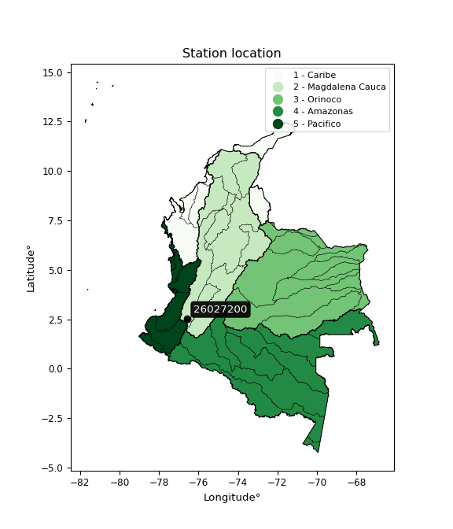

<div align="center">


</div>

# PMP Station (Rain, Pmax24h): 26027200

Probable Maximum Precipitation (PMP) is the greatest amount of rainfall for a specific duration that is meteorologically possible for a given location, acting as a "worst-case" scenario for extreme storms, crucial for designing safety-critical infrastructure like bridges, river deviations, dams, spillways, and nuclear plants to prevent catastrophic failure. PMP is calculated by hydrologists using meteorological data to determine the upper limit of extreme rainfall, often leading to the Probable Maximum Flood (PMF) for flood control design, and is increasingly being studied for climate change impacts.

<div align="center">

</img>

</div>


## A. General information


### 1. General running parameters

• app_version: _v20260103_. • runtime: _2026-01-03 07:24:50.581521_. • Python version: _3.14.0_. • SciPy version: _1.16.3_. • Pandas version: _2.3.3_. • NumPy version: _2.3.5_. • Stations dataset (station_dataset_file): _dataset/pmax24h_in/automatic_colombia_2003_2024.csv_. • Stations catalog (station_catalog_file): _dataset/CNE.xls_. • Minimum year to eval til year_max (date_min): _1900_. • Maximum year to eval since year_min (date_max): _2024_. • Creates, save and include plots into reports (create_plot): _False_. • Plot only fit distributions with Δo > Δ (plot_only_fit): _True_. • Eval low extreme values, if False, evaluates high extreme values (low_extreme): _False_. • Eval every SciPy distribution as logarithmic (pdist_logarithmic_on): _True_. • Standard deviation normalized (ddof): _1.0_. • Return periods to eval in years (Tr): _[2, 2.33, 5, 10, 15, 20, 25, 50, 75, 100, 200, 250, 500, 750, 1000]_. • Minimum data sample per station, 0 means any (minimum_sample): _5_. • Z-Score maximum threshold to adjust a value, 0 means disable (zscore_max): _3.5_. • Z-Score minimum threshold to adjust a value, 0 means disable (zscore_min): _-2.5_. • Avoid zeros, e.g. rain = 0 (avoid_zeros): _True_. • Avoid null values (avoid_nans): _True_. [:file_folder:Dataset file.](../../dataset/pmax24h_in/automatic_colombia_2003_2024.csv)

> Delta Degrees of Freedom (DDOF): is a parameter used in the formulas for calculating variance and standard deviation. When ddof=0, the divisor is $N$ (the total number of observations) and this is used when your data set is the entire population. When ddof=1, the divisor is $N-1$ and this is used when your data set is a sample drawn from a larger population. Using $N-1$ provides an unbiased estimate of the population variance (known as Bessel´s correction).


### 2. Station info and location

|   id |   CODIGO | NOMBRE                             | CATEGORIA    | TECNOLOGIA                              | ESTADO           | FECHA_INSTALACION   |   FECHA_SUSPENSION |   ALTITUD |   LATITUD |   LONGITUD | DEPARTAMENTO   | MUNICIPIO   | AREA_OPERATIVA                         | ENTIDAD                                                     | AREA_HIDROGRAFICA   | ZONA_HIDROGRAFICA   | SUBZONA_HIDROGRAFICA   | CORRIENTE   | Catalogo   |   Version |
|-----:|---------:|:-----------------------------------|:-------------|:----------------------------------------|:-----------------|:--------------------|-------------------:|----------:|----------:|-----------:|:---------------|:------------|:---------------------------------------|:------------------------------------------------------------|:--------------------|:--------------------|:-----------------------|:------------|:-----------|----------:|
|    0 | 26027200 | PUENTE CARRETERA  - AUT [26027200] | Limnimétrica | Automática con Telemetría, Convencional | En Mantenimiento | 14/10/1969          |                nan |      1744 |   2.53675 |   -76.5584 | Cauca          | Popayán     | Area Operativa 09 - Cauca-Valle-Caldas | INSTITUTO DE HIDROLOGIA METEOROLOGIA Y ESTUDIOS AMBIENTALES | Magdalena Cauca     | Cauca               | Río Palacé             | Palace      | CNE_IDEAM  |  20251226 |

<div align="center">

Dynamic map: [:earth_americas:Google](http://maps.google.com/maps?q=2.53675,-76.558444444) [:earth_americas:OSM](https://www.openstreetmap.org/#map=18/2.53675/-76.558444444&layers=P) [:earth_americas:Bing](https://www.bing.com/maps?cp=2.53675~-76.558444444&lvl=18) [:earth_americas:Apple](https://maps.apple.com/frame?center=2.53675%2C-76.558444444&span=0.003%2C0.006)

</div>


<div align="center">

```geojson
{
  "type": "Feature",
  "geometry": {
    "type": "Point", 
    "coordinates": [-76.558444444, 2.53675]
  }, 
  "properties": {
    "Name": "26027200"
  }
}
```

</div>


### 3. Discrete values table and plot

<div align="center">

|               |            0 |           1 |           2 |           3 |          4 |
|:--------------|-------------:|------------:|------------:|------------:|-----------:|
| Date          | 2019         | 2020        | 2021        | 2022        | 2023       |
| Value         |   50.2       |   57.8      |   67.6      |   55.4      |   22.6     |
| Value_initial |   50.2       |   57.8      |   67.6      |   55.4      |   22.6     |
| count         |    5         |    5        |    5        |    5        |    5       |
| mean          |   50.72      |   50.72     |   50.72     |   50.72     |   50.72    |
| std           |   16.9408    |   16.9408   |   16.9408   |   16.9408   |   16.9408  |
| zscore        |   -0.0306951 |    0.417925 |    0.996409 |    0.276256 |   -1.65989 |


</div>


> The initial value (value_initial) correspond to the initial obtained or null completed value, and value (value) is adjusted only when the initial value is outside the valid range definite through the Z-Score value. If Z-Score is active, values out of range or outliers are replaced with the station mean value


### 4. Active continuous probability distributions from SciPy (44 of 104 available)

A Probability Density Function (PDF) describes the relative likelihood of a continuous random variable falling within a specific range, where the total area under its curve equals 1, and the area over any interval gives the actual probability for that range. Unlike discrete probabilities (like rolling a die), a PDF shows density, not direct probability for a single point (which is zero), with higher points indicating higher likelihood, often visualized as a bell curve for normal distributions.

A log of a probability density function (log-PDF) is simply the logarithm of the PDF´s value, denoted as $log(f(x))$, useful for converting multiplication of probabilities into addition, improving numerical stability with tiny numbers, and connecting to information theory concepts like entropy. Instead of dealing with very small probabilities (e.g., 0.000001), log-PDFs use negative numbers (e.g., $log(0.00001) ≈ -11.51$ that are easier for computers to handle, preventing underflow errors and simplifying complex calculations. In this study, each active probability distribution from SciPy is also evaluated in the $log$ form.

[scipy.stats](https://docs.scipy.org/doc/scipy/reference/stats.html) is a Python´s powerful submodule within the SciPy library for comprehensive statistical analysis, offering over 130 probability distributions (like Normal, Poisson), functions for descriptive stats (mean, variance), hypothesis testing (t-tests, chi-square), random variable generation, and statistical tests, making it essential for data science, modeling, and research. It provides tools to explore, model, and draw conclusions from data efficiently, working seamlessly with NumPy.

<div align="center">

|   id | p_dist             |   n_parameter | fit_method   | label                                                                       | active   | ref                                                                                                        |
|-----:|:-------------------|--------------:|:-------------|:----------------------------------------------------------------------------|:---------|:-----------------------------------------------------------------------------------------------------------|
|    0 | alpha              |             3 | MLE          | Alpha                                                                       | True     | [:mortar_board:](https://docs.scipy.org/doc/scipy/reference/generated/scipy.stats.alpha.html)              |
|    1 | betaprime          |             4 | MLE          | Beta prime                                                                  | True     | [:mortar_board:](https://docs.scipy.org/doc/scipy/reference/generated/scipy.stats.betaprime.html)          |
|    2 | chi2               |             3 | MLE          | Chi²                                                                        | True     | [:mortar_board:](https://docs.scipy.org/doc/scipy/reference/generated/scipy.stats.chi2.html)               |
|    3 | crystalball        |             4 | MLE          | Crystalball                                                                 | True     | [:mortar_board:](https://docs.scipy.org/doc/scipy/reference/generated/scipy.stats.crystalball.html)        |
|    4 | erlang             |             3 | MLE          | Erlang                                                                      | True     | [:mortar_board:](https://docs.scipy.org/doc/scipy/reference/generated/scipy.stats.erlang.html)             |
|    5 | expon              |             2 | MLE          | Exponential                                                                 | True     | [:mortar_board:](https://docs.scipy.org/doc/scipy/reference/generated/scipy.stats.expon.html)              |
|    6 | exponnorm          |             3 | MLE          | Exponentially modified Normal                                               | True     | [:mortar_board:](https://docs.scipy.org/doc/scipy/reference/generated/scipy.stats.exponnorm.html)          |
|    7 | f                  |             4 | MLE          | F                                                                           | True     | [:mortar_board:](https://docs.scipy.org/doc/scipy/reference/generated/scipy.stats.f.html)                  |
|    8 | fatiguelife        |             3 | MLE          | Fatigue-life (Birnbaum-Saunders)                                            | True     | [:mortar_board:](https://docs.scipy.org/doc/scipy/reference/generated/scipy.stats.fatiguelife.html)        |
|    9 | fisk               |             3 | MLE          | Fisk                                                                        | True     | [:mortar_board:](https://docs.scipy.org/doc/scipy/reference/generated/scipy.stats.fisk.html)               |
|   10 | gamma              |             3 | MLE          | Gamma                                                                       | True     | [:mortar_board:](https://docs.scipy.org/doc/scipy/reference/generated/scipy.stats.gamma.html)              |
|   11 | genexpon           |             5 | MLE          | Generalized exponential                                                     | True     | [:mortar_board:](https://docs.scipy.org/doc/scipy/reference/generated/scipy.stats.genexpon.html)           |
|   12 | genlogistic        |             3 | MLE          | Generalized logistic                                                        | True     | [:mortar_board:](https://docs.scipy.org/doc/scipy/reference/generated/scipy.stats.genlogistic.html)        |
|   13 | gibrat             |             2 | MM           | Gibrat                                                                      | True     | [:mortar_board:](https://docs.scipy.org/doc/scipy/reference/generated/scipy.stats.gibrat.html)             |
|   14 | gompertz           |             3 | MLE          | Gompertz (or truncated Gumbel)                                              | True     | [:mortar_board:](https://docs.scipy.org/doc/scipy/reference/generated/scipy.stats.gompertz.html)           |
|   15 | gumbel_l           |             2 | MM           | Gumbel Left Skew                                                            | True     | [:mortar_board:](https://docs.scipy.org/doc/scipy/reference/generated/scipy.stats.gumbel_l.html)           |
|   16 | gumbel_r           |             2 | MM           | Gumbel Right Skew                                                           | True     | [:mortar_board:](https://docs.scipy.org/doc/scipy/reference/generated/scipy.stats.gumbel_r.html)           |
|   17 | halflogistic       |             2 | MM           | Half-logistic                                                               | True     | [:mortar_board:](https://docs.scipy.org/doc/scipy/reference/generated/scipy.stats.halflogistic.html)       |
|   18 | halfnorm           |             2 | MM           | Half Normal                                                                 | True     | [:mortar_board:](https://docs.scipy.org/doc/scipy/reference/generated/scipy.stats.halfnorm.html)           |
|   19 | hypsecant          |             2 | MM           | hyperbolic secant                                                           | True     | [:mortar_board:](https://docs.scipy.org/doc/scipy/reference/generated/scipy.stats.hypsecant.html)          |
|   20 | invgamma           |             3 | MLE          | Inverted gamma                                                              | True     | [:mortar_board:](https://docs.scipy.org/doc/scipy/reference/generated/scipy.stats.invgamma.html)           |
|   21 | invgauss           |             3 | MLE          | Inverse Gaussian                                                            | True     | [:mortar_board:](https://docs.scipy.org/doc/scipy/reference/generated/scipy.stats.invgauss.html)           |
|   22 | invweibull         |             3 | MLE          | Inverted Weibull                                                            | True     | [:mortar_board:](https://docs.scipy.org/doc/scipy/reference/generated/scipy.stats.invweibull.html)         |
|   23 | johnsonsu          |             4 | MLE          | Johnson Su                                                                  | True     | [:mortar_board:](https://docs.scipy.org/doc/scipy/reference/generated/scipy.stats.johnsonsu.html)          |
|   24 | kstwobign          |             2 | MLE          | Limiting distribution of scaled Kolmogorov-Smirnov two-sided test statistic | True     | [:mortar_board:](https://docs.scipy.org/doc/scipy/reference/generated/scipy.stats.kstwobign.html)          |
|   25 | laplace            |             2 | MM           | Laplace                                                                     | True     | [:mortar_board:](https://docs.scipy.org/doc/scipy/reference/generated/scipy.stats.laplace.html)            |
|   26 | laplace_asymmetric |             3 | MLE          | Asymmetric Laplace                                                          | True     | [:mortar_board:](https://docs.scipy.org/doc/scipy/reference/generated/scipy.stats.laplace_asymmetric.html) |
|   27 | loggamma           |             3 | MLE          | Log gamma                                                                   | True     | [:mortar_board:](https://docs.scipy.org/doc/scipy/reference/generated/scipy.stats.loggamma.html)           |
|   28 | logistic           |             2 | MM           | Logistic (or Sech-squared)                                                  | True     | [:mortar_board:](https://docs.scipy.org/doc/scipy/reference/generated/scipy.stats.logistic.html)           |
|   29 | lognorm            |             3 | MLE          | Log Normal                                                                  | True     | [:mortar_board:](https://docs.scipy.org/doc/scipy/reference/generated/scipy.stats.lognorm.html)            |
|   30 | maxwell            |             2 | MM           | Maxwell                                                                     | True     | [:mortar_board:](https://docs.scipy.org/doc/scipy/reference/generated/scipy.stats.maxwell.html)            |
|   31 | mielke             |             4 | MLE          | Mielke Beta-Kappa / Dagum                                                   | True     | [:mortar_board:](https://docs.scipy.org/doc/scipy/reference/generated/scipy.stats.mielke.html)             |
|   32 | moyal              |             2 | MM           | Moyal                                                                       | True     | [:mortar_board:](https://docs.scipy.org/doc/scipy/reference/generated/scipy.stats.moyal.html)              |
|   33 | nakagami           |             3 | MLE          | Nakagami                                                                    | True     | [:mortar_board:](https://docs.scipy.org/doc/scipy/reference/generated/scipy.stats.nakagami.html)           |
|   34 | ncf                |             5 | MLE          | Non-central F distribution                                                  | True     | [:mortar_board:](https://docs.scipy.org/doc/scipy/reference/generated/scipy.stats.ncf.html)                |
|   35 | nct                |             4 | MLE          | Non-central Student’s t                                                     | True     | [:mortar_board:](https://docs.scipy.org/doc/scipy/reference/generated/scipy.stats.nct.html)                |
|   36 | norm               |             2 | MM           | Normal                                                                      | True     | [:mortar_board:](https://docs.scipy.org/doc/scipy/reference/generated/scipy.stats.norm.html)               |
|   37 | pearson3           |             3 | MM           | Pearson type III                                                            | True     | [:mortar_board:](https://docs.scipy.org/doc/scipy/reference/generated/scipy.stats.pearson3.html)           |
|   38 | rayleigh           |             2 | MM           | Rayleigh                                                                    | True     | [:mortar_board:](https://docs.scipy.org/doc/scipy/reference/generated/scipy.stats.rayleigh.html)           |
|   39 | rice               |             3 | MLE          | Rice                                                                        | True     | [:mortar_board:](https://docs.scipy.org/doc/scipy/reference/generated/scipy.stats.rice.html)               |
|   40 | t                  |             3 | MLE          | Student’s t                                                                 | True     | [:mortar_board:](https://docs.scipy.org/doc/scipy/reference/generated/scipy.stats.t.html)                  |
|   41 | truncnorm          |             4 | MLE          | Truncated normal                                                            | True     | [:mortar_board:](https://docs.scipy.org/doc/scipy/reference/generated/scipy.stats.truncnorm.html)          |
|   42 | wald               |             2 | MM           | Wald                                                                        | True     | [:mortar_board:](https://docs.scipy.org/doc/scipy/reference/generated/scipy.stats.wald.html)               |
|   43 | weibull_min        |             3 | MLE          | Weibull minimum                                                             | True     | [:mortar_board:](https://docs.scipy.org/doc/scipy/reference/generated/scipy.stats.weibull_min.html)        |

</div>

> **n_parameter:** # arguments & localization & scale.
>
> **Fit methods:** (MLE) maximum likelihood, (MM) L-moments.
>
>**Inactive** (With the only purpose of prevent loops, zero divisions, infinite values, over high estimated values or horizontal trending for recurrence intervals estimations, the follow distributions were disabled.)**:** foldnorm, gennorm, norminvgauss, powernorm, powerlognorm, skewnorm, genextreme, anglit, arcsine, argus, beta, bradford, burr, burr12, cauchy, cosine, halfcauchy, foldcauchy, skewcauchy, wrapcauchy, dgamma, gengamma, exponweib, exponpow, truncexpon, gausshyper, genhalflogistic, genhyperbolic, geninvgauss, halfgennorm, johnsonsb, kappa4, kappa3, ksone, kstwo, loglaplace, levy, levy_l, levy_stable, ncx2, pareto, genpareto, truncpareto, lomax, powerlaw, rdist, rel_breitwigner, recipinvgauss, semicircular, studentized_range, trapezoid, triang, truncweibull_min, tukeylambda, uniform, loguniform, vonmises, vonmises_line, weibull_max, dweibull, 


## B. Probability distributions vs. Empirical distributions

A continuous probability distribution (CPD) describes probabilities for variables that can take any value within a range (like rain any time), unlike discrete variables with specific outcomes (like temperature). It uses a Probability Density Function (PDF), a curve where the total area under it equals 1, and the probability of the variable falling within an interval (a to b) is found by calculating the area under the curve between those points. A key feature is that the probability of hitting any single exact value is zero, so probabilities are always expressed for ranges, e.g., $P(a ≤ X ≤ b)$.

<div align="center">

Distributions parameters from station values
|    |   station | p_dist                |   n |               loc |            scale | shape                  | shape1              | shape2               | shape3   |
|---:|----------:|:----------------------|----:|------------------:|-----------------:|:-----------------------|:--------------------|:---------------------|:---------|
|  0 |  26027200 | alpha                 |   5 |    -321.179       |   8466.96        | 22.811770198755866     |                     |                      |          |
|  1 |  26027200 | betaprime             |   5 |    -258.559       |  38854.5         | 379.33326613788904     | 47679.72398649712   |                      |          |
|  2 |  26027200 | chi2                  |   5 |    -189.309       |      0.514173    | 466.1098465306219      |                     |                      |          |
|  3 |  26027200 | crystalball           |   5 |      50.72        |     15.1523      | 16265.616989890852     | 1.8364798838252723  |                      |          |
|  4 |  26027200 | erlang                |   5 |    -206.337       |      0.969716    | 265.0157209554044      |                     |                      |          |
|  5 |  26027200 | expon                 |   5 |      22.6         |     28.12        |                        |                     |                      |          |
|  6 |  26027200 | exponnorm             |   5 |      50.7106      |     15.1524      | 0.0006103917821533145  |                     |                      |          |
|  7 |  26027200 | f                     |   5 |   -3305.81        |   3356.42        | 109791.78862112615     | 826342.8454429507   |                      |          |
|  8 |  26027200 | fatiguelife           |   5 |      22.6         |      1.12217e-06 | 5373.148324571779      |                     |                      |          |
|  9 |  26027200 | fisk                  |   5 |      -1.16689e+09 |      1.16689e+09 | 140948621.3780232      |                     |                      |          |
| 10 |  26027200 | gamma                 |   5 |    -165.481       |      1.15184     | 187.84282065890682     |                     |                      |          |
| 11 |  26027200 | genexpon              |   5 |      22.6         |      6.58002     | 0.10934139748079184    | 0.3215650721706571  | 0.16918012614380099  |          |
| 12 |  26027200 | genlogistic           |   5 |      64.8048      |      3.11251     | 0.20813595883835007    |                     |                      |          |
| 13 |  26027200 | gibrat                |   5 |      39.1607      |      7.01109     |                        |                     |                      |          |
| 14 |  26027200 | gompertz              |   5 |      -7.86631     |     10.7107      | 0.002221393906216413   |                     |                      |          |
| 15 |  26027200 | gumbel_l              |   5 |      57.5394      |     11.8142      |                        |                     |                      |          |
| 16 |  26027200 | gumbel_r              |   5 |      43.9006      |     11.8142      |                        |                     |                      |          |
| 17 |  26027200 | halflogistic          |   5 |      32.761       |     12.9547      |                        |                     |                      |          |
| 18 |  26027200 | halfnorm              |   5 |      30.6643      |     25.1361      |                        |                     |                      |          |
| 19 |  26027200 | hypsecant             |   5 |      50.72        |      9.64628     |                        |                     |                      |          |
| 20 |  26027200 | invgamma              |   5 |    -201.989       |  64230.3         | 255.3948403994558      |                     |                      |          |
| 21 |  26027200 | invgauss              |   5 |     -73.3228      |   6316.45        | 0.0196214736983961     |                     |                      |          |
| 22 |  26027200 | invweibull            |   5 |      22.6         |      1.4744      | 0.06247447042227137    |                     |                      |          |
| 23 |  26027200 | johnsonsu             |   5 |      73.6037      |      0.294567    | 7.001277834686292      | 1.4517997675342746  |                      |          |
| 24 |  26027200 | kstwobign             |   5 |     -16.1861      |     76.2903      |                        |                     |                      |          |
| 25 |  26027200 | laplace               |   5 |      50.72        |     10.7143      |                        |                     |                      |          |
| 26 |  26027200 | laplace_asymmetric    |   5 |      57.8         |      9.05292     | 1.469090888627493      |                     |                      |          |
| 27 |  26027200 | loggamma              |   5 |      67.6001      |      3.22061e-06 | 1.9127310744710564e-07 |                     |                      |          |
| 28 |  26027200 | logistic              |   5 |      50.72        |      8.35393     |                        |                     |                      |          |
| 29 |  26027200 | lognorm               |   5 |      22.6         |      0.0219492   | 14.726858499517562     |                     |                      |          |
| 30 |  26027200 | maxwell               |   5 |      14.8153      |     22.4999      |                        |                     |                      |          |
| 31 |  26027200 | mielke                |   5 |     -41.7558      |    109.463       | 5.431614285780764      | 5428.2824387314995  |                      |          |
| 32 |  26027200 | moyal                 |   5 |      42.0549      |      6.82095     |                        |                     |                      |          |
| 33 |  26027200 | nakagami              |   5 |      50.2         |      9.19792     | 0.23600550258761877    |                     |                      |          |
| 34 |  26027200 | ncf                   |   5 |      -0.88364     |      0.00114739  | 0.0008004470608920658  | 3651.839205489865   | 36.06994492793329    |          |
| 35 |  26027200 | nct                   |   5 |   -1216.16        |     15.0517      | 258734.0102738858      | 84.16819909408272   |                      |          |
| 36 |  26027200 | norm                  |   5 |      50.72        |     15.1523      |                        |                     |                      |          |
| 37 |  26027200 | pearson3              |   5 |      50.72        |     15.1523      | -0.9755148917709708    |                     |                      |          |
| 38 |  26027200 | rayleigh              |   5 |      21.7327      |     23.1285      |                        |                     |                      |          |
| 39 |  26027200 | rice                  |   5 |      11.4869      |     16.4194      | 2.1356529630467067     |                     |                      |          |
| 40 |  26027200 | t                     |   5 |      50.7205      |     15.153       | 1348945.9332473746     |                     |                      |          |
| 41 |  26027200 | truncnorm             |   5 |      64.0294      |     22.1821      | -188.02010413547623    | 0.16096544359546555 |                      |          |
| 42 |  26027200 | wald                  |   5 |      35.5677      |     15.1523      |                        |                     |                      |          |
| 43 |  26027200 | weibull_min           |   5 |      -3.29934e+06 |      3.2994e+06  | 308388.1541145884      |                     |                      |          |
| 44 |  26027200 | logalpha              |   5 |      -9.24368     |    417.859       | 31.914455842245303     |                     |                      |          |
| 45 |  26027200 | logbetaprime          |   5 |     -18.0914      |    458.689       | 3283.1831453600644     | 68597.4317184161    |                      |          |
| 46 |  26027200 | logchi2               |   5 |       3.11795     |      1.01259     | 1.0357748950311614     |                     |                      |          |
| 47 |  26027200 | logcrystalball        |   5 |       3.86383     |      0.385083    | 64.07956025335731      | 3.5290744427998355  |                      |          |
| 48 |  26027200 | logerlang             |   5 |       3.11795     |      0.95553     | 0.17203188068234776    |                     |                      |          |
| 49 |  26027200 | logexpon              |   5 |       3.11795     |      0.745878    |                        |                     |                      |          |
| 50 |  26027200 | logexponnorm          |   5 |       3.86356     |      0.385079    | 0.0007028271840809159  |                     |                      |          |
| 51 |  26027200 | logf                  |   5 |    -626.469       |    630.332       | 10466002.593631543     | 10949008.018979566  |                      |          |
| 52 |  26027200 | logfatiguelife        |   5 |    -182.121       |    185.984       | 0.0020760079624370436  |                     |                      |          |
| 53 |  26027200 | logfisk               |   5 |      -2.84939e+07 |      2.84939e+07 | 142006897.32176855     |                     |                      |          |
| 54 |  26027200 | loggamma              |   5 |       3.11795     |      0.835922    | 0.8437778600278545     |                     |                      |          |
| 55 |  26027200 | loggenexpon           |   5 |       3.11795     |      1.18353     | 1.2010075199979968     | 1.3489146677950656  | 0.8047449567578259   |          |
| 56 |  26027200 | loggenlogistic        |   5 |       4.21362     |      1.6641e-06  | 4.762401179778748e-06  |                     |                      |          |
| 57 |  26027200 | loggibrat             |   5 |       3.5701      |      0.178155    |                        |                     |                      |          |
| 58 |  26027200 | loggompertz           |   5 |       3.10897     |      0.256792    | 0.029920565900430258   |                     |                      |          |
| 59 |  26027200 | loggumbel_l           |   5 |       4.03714     |      0.300247    |                        |                     |                      |          |
| 60 |  26027200 | loggumbel_r           |   5 |       3.69052     |      0.300247    |                        |                     |                      |          |
| 61 |  26027200 | loghalflogistic       |   5 |       3.40746     |      0.329202    |                        |                     |                      |          |
| 62 |  26027200 | loghalfnorm           |   5 |       3.35411     |      0.638837    |                        |                     |                      |          |
| 63 |  26027200 | loghypsecant          |   5 |       3.86383     |      0.245151    |                        |                     |                      |          |
| 64 |  26027200 | loginvgamma           |   5 |      -5.60798     |   5032.88        | 532.1762671425419      |                     |                      |          |
| 65 |  26027200 | loginvgauss           |   5 |      -0.404621    |    438.906       | 0.009734925482763453   |                     |                      |          |
| 66 |  26027200 | loginvweibull         |   5 |      -2.77693e+07 |      2.77693e+07 | 62700418.44860049      |                     |                      |          |
| 67 |  26027200 | logjohnsonsu          |   5 |       4.21361     |      1.32165e-13 | 2.5002757785209266     | 0.14270361358667852 |                      |          |
| 68 |  26027200 | logkstwobign          |   5 |       2.09877     |      2.01178     |                        |                     |                      |          |
| 69 |  26027200 | loglaplace            |   5 |       3.86383     |      0.272294    |                        |                     |                      |          |
| 70 |  26027200 | loglaplace_asymmetric |   5 |       4.05699     |      0.188428    | 1.6361555104636962     |                     |                      |          |
| 71 |  26027200 | logloggamma           |   5 |       4.21665     |      7.92897e-07 | 2.2366892537989943e-06 |                     |                      |          |
| 72 |  26027200 | loglogistic           |   5 |       3.86383     |      0.212307    |                        |                     |                      |          |
| 73 |  26027200 | loglognorm            |   5 |       3.11795     |      0.000799643 | 14.109946435980204     |                     |                      |          |
| 74 |  26027200 | logmaxwell            |   5 |       2.95135     |      0.571814    |                        |                     |                      |          |
| 75 |  26027200 | logmielke             |   5 |      -2.68007e+07 |      2.68007e+07 | 74213393.39742623      | 6895807875.075503   |                      |          |
| 76 |  26027200 | logmoyal              |   5 |       3.64361     |      0.173348    |                        |                     |                      |          |
| 77 |  26027200 | lognakagami           |   5 |       3.91602     |      0.167467    | 0.12361342157775324    |                     |                      |          |
| 78 |  26027200 | logncf                |   5 |      -5.32634     |      9.18157     | 2329.966276602524      | 1660.1206961445191  | 0.010443293657504675 |          |
| 79 |  26027200 | lognct                |   5 |      -0.723684    |      0.0186112   | 58.11230038204653      | 242.82505697934653  |                      |          |
| 80 |  26027200 | lognorm               |   5 |       3.86383     |      0.385082    |                        |                     |                      |          |
| 81 |  26027200 | logpearson3           |   5 |       3.86383     |      0.385082    | -1.2657405894339673    |                     |                      |          |
| 82 |  26027200 | lograyleigh           |   5 |       3.12716     |      0.587774    |                        |                     |                      |          |
| 83 |  26027200 | logrice               |   5 |    -140.079       |      0.385083    | 373.7970857834017      |                     |                      |          |
| 84 |  26027200 | logt                  |   5 |       4.02573     |      0.0843341   | 0.886274605157938      |                     |                      |          |
| 85 |  26027200 | logtruncnorm          |   5 |      -0.0962792   |      1.03226     | 3.886885014166456      | 4.17517642575081    |                      |          |
| 86 |  26027200 | logwald               |   5 |       3.47877     |      0.385059    |                        |                     |                      |          |
| 87 |  26027200 | logweibull_min        |   5 | -897801           | 897805           | 3839052.131023623      |                     |                      |          |

</div>

> **loc** (Location parameter): This shifts the distribution along the x-axis. For many common distributions, like the normal (Gaussian) distribution, loc represents the mean $μ$. For others, like the uniform distribution, it might represent the minimum value, or for the beta distribution, the left end of the support interval.
>
> **scale** (Scale parameter): This determines the width or spread of the distribution. For the normal distribution, scale represents the standard deviation $σ$. For a uniform distribution, it defines the length of the interval (from $loc$ to $loc + scale$).
>
> **shape** (Shape parameters): Refers to parameters that define the specific form of a probability distribution, distinct from its location (loc) and scale (scale). These parameters are required arguments for most distribution functions. For example, a normal (Gaussian) distribution is fully defined by its location (mean) and scale (standard deviation), so it has no specific shape parameters beyond loc and scale. However, other distributions have intrinsic properties that need specification, as Gamma distribution that takes a shape parameter, often named $a$ or $alpha$.


### 0. Cumulative distribution values - CDF (88 evaluated)

Cumulative Distribution Function (CDF), denoted as $F$<sub>$X$</sub>$(x)$, is a function that gives the probability that a random variable $X$ will take a value less than or equal to a specific value, $x$ (i.e., $(P(X≥x)$. It essentially "accumulates" probabilities from a given point up to the far right (positive infinity), providing a complete picture of the distribution´s probabilities for both discrete (like rain) and continuous (like temperature) variables, helping to find probabilities over ranges or above certain values. Each station is evaluated separately ordering the $x$ values ascending, calculating the CDF and PDF values for the activated distributions and their logarithmic forms.

<div align="center">

CDF ordered by x ascending and calculating $log(f(x))$ separately
|   id |   Station |   date |    x |   count |   mean |     std |     zscore |   Value_initial |   station |   m |     alpha |   alpha_pdf |   betaprime |   betaprime_pdf |      chi2 |   chi2_pdf |   crystalball |   crystalball_pdf |    erlang |   erlang_pdf |    expon |   expon_pdf |   exponnorm |   exponnorm_pdf |         f |      f_pdf |   fatiguelife |   fatiguelife_pdf |      fisk |   fisk_pdf |     gamma |   gamma_pdf |    genexpon |   genexpon_pdf |   genlogistic |   genlogistic_pdf |   gibrat |   gibrat_pdf |   gompertz |   gompertz_pdf |   gumbel_l |   gumbel_l_pdf |   gumbel_r |   gumbel_r_pdf |   halflogistic |   halflogistic_pdf |   halfnorm |   halfnorm_pdf |   hypsecant |   hypsecant_pdf |   invgamma |   invgamma_pdf |   invgauss |   invgauss_pdf |   invweibull |   invweibull_pdf |   johnsonsu |   johnsonsu_pdf |   kstwobign |   kstwobign_pdf |   laplace |   laplace_pdf |   laplace_asymmetric |   laplace_asymmetric_pdf |    loggamma |   loggamma_pdf |   logistic |   logistic_pdf |   lognorm |   lognorm_pdf |   maxwell |   maxwell_pdf |    mielke |   mielke_pdf |       moyal |   moyal_pdf |    nakagami |   nakagami_pdf |       ncf |    ncf_pdf |      nct |    nct_pdf |      norm |   norm_pdf |   pearson3 |   pearson3_pdf |    rayleigh |   rayleigh_pdf |      rice |   rice_pdf |        t |      t_pdf |   truncnorm |   truncnorm_pdf |     wald |   wald_pdf |   weibull_min |   weibull_min_pdf |   logalpha |   logalpha_pdf |   logbetaprime |   logbetaprime_pdf |     logchi2 |   logchi2_pdf |   logcrystalball |   logcrystalball_pdf |   logerlang |   logerlang_pdf |   logexpon |   logexpon_pdf |   logexponnorm |   logexponnorm_pdf |      logf |   logf_pdf |   logfatiguelife |   logfatiguelife_pdf |   logfisk |   logfisk_pdf |   loggenexpon |   loggenexpon_pdf |   loggenlogistic |   loggenlogistic_pdf |   loggibrat |   loggibrat_pdf |   loggompertz |   loggompertz_pdf |   loggumbel_l |   loggumbel_l_pdf |   loggumbel_r |   loggumbel_r_pdf |   loghalflogistic |   loghalflogistic_pdf |   loghalfnorm |   loghalfnorm_pdf |   loghypsecant |   loghypsecant_pdf |   loginvgamma |   loginvgamma_pdf |   loginvgauss |   loginvgauss_pdf |   loginvweibull |   loginvweibull_pdf |   logjohnsonsu |   logjohnsonsu_pdf |   logkstwobign |   logkstwobign_pdf |   loglaplace |   loglaplace_pdf |   loglaplace_asymmetric |   loglaplace_asymmetric_pdf |   logloggamma |   logloggamma_pdf |   loglogistic |   loglogistic_pdf |   loglognorm |   loglognorm_pdf |   logmaxwell |   logmaxwell_pdf |   logmielke |   logmielke_pdf |   logmoyal |   logmoyal_pdf |   lognakagami |   lognakagami_pdf |    logncf |   logncf_pdf |    lognct |   lognct_pdf |   logpearson3 |   logpearson3_pdf |   lograyleigh |   lograyleigh_pdf |   logrice |   logrice_pdf |      logt |   logt_pdf |   logtruncnorm |   logtruncnorm_pdf |   logwald |   logwald_pdf |   logweibull_min |   logweibull_min_pdf |
|-----:|----------:|-------:|-----:|--------:|-------:|--------:|-----------:|----------------:|----------:|----:|----------:|------------:|------------:|----------------:|----------:|-----------:|--------------:|------------------:|----------:|-------------:|---------:|------------:|------------:|----------------:|----------:|-----------:|--------------:|------------------:|----------:|-----------:|----------:|------------:|------------:|---------------:|--------------:|------------------:|---------:|-------------:|-----------:|---------------:|-----------:|---------------:|-----------:|---------------:|---------------:|-------------------:|-----------:|---------------:|------------:|----------------:|-----------:|---------------:|-----------:|---------------:|-------------:|-----------------:|------------:|----------------:|------------:|----------------:|----------:|--------------:|---------------------:|-------------------------:|------------:|---------------:|-----------:|---------------:|----------:|--------------:|----------:|--------------:|----------:|-------------:|------------:|------------:|------------:|---------------:|----------:|-----------:|---------:|-----------:|----------:|-----------:|-----------:|---------------:|------------:|---------------:|----------:|-----------:|---------:|-----------:|------------:|----------------:|---------:|-----------:|--------------:|------------------:|-----------:|---------------:|---------------:|-------------------:|------------:|--------------:|-----------------:|---------------------:|------------:|----------------:|-----------:|---------------:|---------------:|-------------------:|----------:|-----------:|-----------------:|---------------------:|----------:|--------------:|--------------:|------------------:|-----------------:|---------------------:|------------:|----------------:|--------------:|------------------:|--------------:|------------------:|--------------:|------------------:|------------------:|----------------------:|--------------:|------------------:|---------------:|-------------------:|--------------:|------------------:|--------------:|------------------:|----------------:|--------------------:|---------------:|-------------------:|---------------:|-------------------:|-------------:|-----------------:|------------------------:|----------------------------:|--------------:|------------------:|--------------:|------------------:|-------------:|-----------------:|-------------:|-----------------:|------------:|----------------:|-----------:|---------------:|--------------:|------------------:|----------:|-------------:|----------:|-------------:|--------------:|------------------:|--------------:|------------------:|----------:|--------------:|----------:|-----------:|---------------:|-------------------:|----------:|--------------:|-----------------:|---------------------:|
|    0 |  26027200 |   2023 | 22.6 |       5 |  50.72 | 16.9408 | -1.65989   |            22.6 |  26027200 |   1 | 0.0345871 |  0.00548211 |   0.0364038 |      0.00533828 | 0.0344561 | 0.00527621 |     0.0317397 |        0.00470502 | 0.0339641 |   0.00515934 | 0        |  0.0355619  |   0.0317408 |      0.00470514 | 0.0327759 | 0.00483138 |     0.0490815 |       5.91319e+12 | 0.0245829 | 0.00289637 | 0.0320321 |  0.00499777 | 3.45877e-10 |     0.0166172  |     0.0594706 |        0.00397684 | 0        |   0          |  0.0353303 |     0.00343968 |  0.0506275 |     0.00417494 | 0.00231672 |     0.00118983 |       0        |         0          |   0        |      0         |   0.0344698 |      0.00356639 |  0.0311893 |     0.00519354 |  0.0384347 |     0.00627555 |  0.000277563 |      3.99724e+10 |   0.0683973 |      0.00375422 |   0.0416843 |      0.00918469 | 0.0362372 |    0.00338212 |            0.0484401 |               0.00364223 | 1.36993e-13 |     260.29     |  0.0333725 |     0.00386151 | 0.0263767 |      0.158739 | 0.0106281 |     0.0039984 | 0.0558532 |    0.004714  | 3.14791e-05 | 4.20774e-05 | 0           |    0           | 0.0317868 | 0.00607772 | 0.031733 | 0.00470632 | 0.0317397 | 0.00470502 |  0.0511307 |     0.00453067 | 0.000702883 |     0.00162024 | 0.0266538 | 0.00534439 | 0.031743 | 0.00470523 |    0.054797 |      0.00557445 | 0        |  0         |     0.0377476 |        0.00346079 |  0.0294819 |       0.183391 |      0.0277393 |           0.166504 | 8.76016e-09 |   1.02159e+07 |         0.026377 |             0.15874  |   0.0024867 |     9.63301e+11 |   0        |       1.3407   |       0.026376 |           0.158736 | 0.0265456 |   0.15966  |        0.0265498 |             0.159827 | 0.0160611 |     0.0787591 |   2.13719e-11 |          1.01476  |         0        |             0.124408 |    0        |        0        |     0.0010647 |          0.120537 |     0.0457415 |          0.148808 |    0.00119113 |         0.0267104 |          0        |              0        |      0        |          0        |      0.0303527 |           0.123625 |     0.0289775 |          0.179554 |      0.027877 |          0.185281 |       0.0357744 |            0.269024 |      0.0326272 |        0.00949921  |      0.0404376 |           0.341771 |    0.0323098 |         0.118658 |               0.0346214 |                    0.112299 |      0.045079 |          0.127164 |     0.0289387 |          0.132362 |    0.0227529 |      8.61729e+12 |   0.00641328 |         0.113531 |   0.0466563 |        0.129195 | 5.2402e-06 |    0.000327512 |   0           |       0           | 0.0322027 |     0.188889 | 0.0281122 |     0.20169  |     0.0489624 |          0.155544 |      0        |          0        | 0.0263767 |      0.158739 | 0.0379942 |  0.0369099 |    0           |            0       |  0        |      0        |        0.0205013 |            0.0867598 |
|    1 |  26027200 |   2019 | 50.2 |       5 |  50.72 | 16.9408 | -0.0306951 |            50.2 |  26027200 |   2 | 0.505222  |  0.0244887  |   0.4977    |      0.0250537  | 0.504838  | 0.0254181  |     0.486312  |        0.0263132  | 0.496721  |   0.0252976  | 0.625254 |  0.0133267  |   0.486314  |      0.0263131  | 0.489789  | 0.0261584  |     0.821994  |       0.0043569   | 0.414105  | 0.0293062  | 0.492377  |  0.0253159  | 0.568957    |     0.0178674  |     0.375861  |        0.0249058  | 0.675076 |   0.0325998  |  0.393593  |     0.0284457  |  0.415666  |     0.0265741  | 0.556146   |     0.0276196  |       0.587    |         0.0252971  |   0.562958 |      0.023468  |   0.482849  |      0.0329503  |  0.509271  |     0.0252479  |  0.518239  |     0.0230888  |  0.434852    |      0.000819689 |   0.360575  |      0.0232185  |   0.564805  |      0.0192159  | 0.476313  |    0.0444557  |            0.385902  |               0.0290162  | 0.684415    |       0.414696 |  0.484443  |     0.0298971  | 0.5539    |      1.02652  | 0.519856  |     0.0254664 | 0.388063  |    0.0229219 | 0.582028    | 0.0276678   | 5.75671e-08 |    3.82416e+06 | 0.518815  | 0.0230619  | 0.486394 | 0.0263101  | 0.486312  | 0.0263132  |  0.421789  |     0.0253731  | 0.53115     |     0.0249508  | 0.49645   | 0.0256172  | 0.4863   | 0.0263122  |    0.472558 |      0.0262586  | 0.654051 |  0.0277278 |     0.398104  |        0.0285606  |  0.564151  |       0.950133 |      0.55664   |           1.00519  | 0.612639    |   0.304589    |         0.5539   |             1.02652  |   0.942713  |     0.0978904   |   0.65698  |       0.459887 |       0.553901 |           1.02653  | 0.554862  |   1.02536  |        0.554372  |             1.02335  | 0.465607  |     1.24005   |   0.638485    |          0.539407 |         0        |             1.22111  |    0.746503 |        0.925429 |     0.484856  |          1.39067  |     0.487289  |          1.14077  |    0.623828   |         0.980434  |          0.648326 |              0.880423 |      0.620912 |          0.848305 |      0.567255  |           1.26955  |     0.558745  |          0.95353  |      0.564504 |          0.924699 |       0.577263  |            0.716165 |      0.0487078 |        0.0484331   |      0.611811  |           0.681448 |    0.587205  |         1.51599  |               0.460858  |                    1.49485  |      0.42824  |          1.20803  |     0.561144  |          1.15993  |    0.68773   |      0.0314291   |   0.58403    |         0.957004 |   0.425268  |        1.1776   | 0.648536   |    0.945476    |   0.000204131 |       1.13641e+11 | 0.556698  |     0.940228 | 0.586574  |     0.887737 |     0.470326  |          1.08554  |      0.593681 |          0.927773 | 0.5539    |      1.02652  | 0.21852   |  1.34536   |    4.74641e-07 |            5.64434 |  0.717098 |      0.849329 |        0.466627  |            1.43351   |
|    2 |  26027200 |   2022 | 55.4 |       5 |  50.72 | 16.9408 |  0.276256  |            55.4 |  26027200 |   3 | 0.628509  |  0.0225723  |   0.625126  |      0.0235459  | 0.633484  | 0.0236427  |     0.621287  |        0.0251024  | 0.625262  |   0.0237217  | 0.688523 |  0.0110767  |   0.621289  |      0.0251022  | 0.623725  | 0.0248696  |     0.842838  |       0.00368844  | 0.569813  | 0.0296087  | 0.621078  |  0.0237651  | 0.655303    |     0.0153251  |     0.52792   |        0.0336623  | 0.79953  |   0.0172641  |  0.55701   |     0.033767   |  0.56585   |     0.0306613  | 0.685357   |     0.0219175  |       0.703288 |         0.0195059  |   0.674919 |      0.0195595 |   0.648707  |      0.0294622  |  0.636069  |     0.0231333  |  0.633389  |     0.0209307  |  0.438754    |      0.000688463 |   0.503125  |      0.0318117  |   0.657985  |      0.016569   | 0.676949  |    0.0301513  |            0.570535  |               0.0428988  | 0.722623    |       0.361927 |  0.636502  |     0.0276956  | 0.652278  |      0.959573 | 0.645845  |     0.0226785 | 0.523192  |    0.0292497 | 0.706938    | 0.0204892   | 0.589075    |    0.0502957   | 0.633379  | 0.0207531  | 0.621342 | 0.0250953  | 0.621287  | 0.0251024  |  0.563722  |     0.0288195  | 0.653362    |     0.0218166  | 0.626821  | 0.0240949  | 0.621271 | 0.0251017  |    0.618201 |      0.0295672  | 0.767405 |  0.0169536 |     0.56194   |        0.0337957  |  0.654523  |       0.876286 |      0.65282   |           0.937072 | 0.641126    |   0.27428     |         0.652278 |             0.95957  |   0.951452  |     0.0801803   |   0.699441 |       0.402959 |       0.65228  |           0.959578 | 0.65308   |   0.957838 |        0.652418  |             0.956112 | 0.58745   |     1.20783   |   0.688594    |          0.478013 |         0        |             1.61904  |    0.819705 |        0.590967 |     0.627556  |          1.47588  |     0.604509  |          1.22189  |    0.711891   |         0.805745  |          0.726893 |              0.716318 |      0.698801 |          0.73189  |      0.684455  |           1.08645  |     0.649633  |          0.883169 |      0.652212 |          0.848659 |       0.644148  |            0.639695 |      0.0547874 |        0.0795167   |      0.675323  |           0.606728 |    0.712572  |         1.05558  |               0.634474  |                    2.05799  |      0.565508 |          1.59525  |     0.670415  |          1.04075  |    0.690645  |      0.0278604   |   0.67367    |         0.856389 |   0.558722  |        1.54715  | 0.731593   |    0.744297    |   0.715581    |       1.72769     | 0.646527  |     0.875155 | 0.66985   |     0.797284 |     0.584114  |          1.21485  |      0.680097 |          0.821724 | 0.652278  |      0.959573 | 0.459175  |  3.61665   |    0.464124    |            3.87661 |  0.787497 |      0.597367 |        0.616344  |            1.57164   |
|    3 |  26027200 |   2020 | 57.8 |       5 |  50.72 | 16.9408 |  0.417925  |            57.8 |  26027200 |   4 | 0.680927  |  0.0210562  |   0.679976  |      0.0220955  | 0.688413  | 0.0220656  |     0.679841  |        0.0236059  | 0.680482  |   0.0222268  | 0.714004 |  0.0101705  |   0.679843  |      0.0236058  | 0.681705  | 0.023364   |     0.851375  |       0.00343101  | 0.63899   | 0.027864   | 0.676417  |  0.0222827  | 0.690661    |     0.0141423  |     0.613076  |        0.0370898  | 0.835909 |   0.0132701  |  0.63914   |     0.0344153  |  0.640236  |     0.031131   | 0.734652   |     0.0191748  |       0.747121 |         0.0170521  |   0.719658 |      0.0177244 |   0.715098  |      0.0257464  |  0.689669  |     0.021477   |  0.68192   |     0.019475   |  0.440348    |      0.000641018 |   0.584359  |      0.03582    |   0.696208  |      0.0152824  | 0.74178   |    0.0241004  |            0.683367  |               0.0513826  | 0.737536    |       0.341548 |  0.700044  |     0.0251358  | 0.692029  |      0.913524 | 0.698149  |     0.0208683 | 0.597344  |    0.0325902 | 0.752519    | 0.0175479   | 0.69367     |    0.0377829   | 0.681447  | 0.0192705  | 0.679877 | 0.023598   | 0.679841  | 0.0236059  |  0.633729  |     0.0293796  | 0.70356     |     0.0199873  | 0.682936  | 0.0225955  | 0.679823 | 0.0236055  |    0.690534 |      0.0306584  | 0.804087 |  0.0137518 |     0.644051  |        0.0343667  |  0.690776  |       0.832393 |      0.691633  |           0.891928 | 0.652509    |   0.262678    |         0.692028 |             0.913523 |   0.954715  |     0.0738201   |   0.716054 |       0.380687 |       0.692031 |           0.913528 | 0.692753  |   0.911644 |        0.692023  |             0.910164 | 0.63756   |     1.15164   |   0.70833     |          0.452854 |         0        |             1.82797  |    0.842641 |        0.494308 |     0.689756  |          1.45017  |     0.656428  |          1.22252  |    0.744482   |         0.731636  |          0.755875 |              0.65105  |      0.728777 |          0.681839 |      0.728273  |           0.978607 |     0.686203  |          0.840371 |      0.687308 |          0.805583 |       0.670545  |            0.605102 |      0.0586847 |        0.106669    |      0.70036   |           0.573979 |    0.754026  |         0.90334  |               0.72804   |                    2.36148  |      0.637375 |          1.79797  |     0.712963  |          0.96392  |    0.691799  |      0.0265587   |   0.708903   |         0.804558 |   0.628344  |        1.73994  | 0.761498   |    0.667062    |   0.778037    |       1.2619      | 0.682809  |     0.834805 | 0.702693  |     0.751045 |     0.636437  |          1.24996  |      0.71386  |          0.770122 | 0.692029  |      0.913524 | 0.61      |  3.21572   |    0.615742    |            3.28874 |  0.811094 |      0.517784 |        0.682883  |            1.55735   |
|    4 |  26027200 |   2021 | 67.6 |       5 |  50.72 | 16.9408 |  0.996409  |            67.6 |  26027200 |   5 | 0.849305  |  0.0131012  |   0.857001  |      0.0136685  | 0.863255  | 0.0133209  |     0.867364  |        0.0141561  | 0.857955  |   0.0136454  | 0.798161 |  0.00717778 |   0.867365  |      0.014156   | 0.86725   | 0.0140233  |     0.880712  |       0.00260857  | 0.852547  | 0.0151845  | 0.854715  |  0.0137571  | 0.806762    |     0.00968529 |     0.931346  |        0.0180271  | 0.919285 |   0.00526274 |  0.921772  |     0.018627   |  0.903992  |     0.019043   | 0.87413    |     0.0099535  |       0.872784 |         0.00919543 |   0.858283 |      0.0107838 |   0.890455  |      0.0111334  |  0.85919   |     0.0129431  |  0.838772  |     0.0124419  |  0.445882    |      0.000499989 |   0.947111  |      0.0260483  |   0.820915  |      0.01029    | 0.896544  |    0.00965587 |            0.935451  |               0.0104748  | 0.785736    |       0.27645  |  0.882944  |     0.0123719  | 0.818147  |      0.685802 | 0.861582  |     0.0124538 | 0.994712  |    0.0491596 | 0.877821    | 0.00888581  | 0.919386    |    0.0123179   | 0.836544  | 0.0123266  | 0.867332 | 0.0141514  | 0.867364  | 0.0141561  |  0.894323  |     0.0205694  | 0.860046    |     0.0120003  | 0.863068  | 0.0137686  | 0.867348 | 0.0141567  |    1        |      0.031481   | 0.897236 |  0.0063869 |     0.924349  |        0.0182544  |  0.806119  |       0.633934 |      0.814977  |           0.673146 | 0.690644    |   0.225704    |         0.818146 |             0.685801 |   0.964727  |     0.0551472   |   0.769833 |       0.308585 |       0.818149 |           0.685801 | 0.818568  |   0.683938 |        0.817701  |             0.683745 | 0.793367  |     0.817017  |   0.772396    |          0.367222 |         0.999956 |             2.86143  |    0.900477 |        0.271773 |     0.886843  |          0.973368 |     0.834692  |          0.991    |    0.839342   |         0.489595  |          0.840947 |              0.444726 |      0.821508 |          0.505223 |      0.850001  |           0.589469 |     0.802969  |          0.643498 |      0.799124 |          0.617216 |       0.755317  |            0.478575 |      0.991406  |        1.85419e+10 |      0.780921  |           0.456089 |    0.861615  |         0.50822  |               0.930195  |                    0.606128 |      0.991447 |          2.79678  |     0.838556  |          0.637663 |    0.695635  |      0.0226366   |   0.818658   |         0.594747 |   0.968929  |        2.5402   | 0.84681    |    0.436389    |   0.908053    |       0.531225    | 0.799358  |     0.645809 | 0.805916  |     0.565438 |     0.831255  |          1.17026  |      0.818827 |          0.569745 | 0.818147  |      0.685802 | 0.85342   |  0.621403  |    1           |            1.76569 |  0.87487  |      0.31659  |        0.893941  |            1.01757   |


</div>

An Empirical Distribution Function (EDF) is a step-function estimate of a true cumulative distribution function (CDF) based on observed sample data, representing the proportion of data points less than or equal to a given value. It is calculated by ordering your data and jumping up by $1/n$ (where $n$ is sample size) at each unique data point, allowing analysis without assuming an underlying population distribution, and it gets closer to the true CDF as the sample size grows. For the empirical probability calculations, the parameter $m$ correspond to the order number which means the position of the $x$ values in an ascending order list.


### 1. Empirical - EDF California (1923)

California´s estimates the true probability distribution of water-related data (like rainfall, streamflow) using observed samples, crucial for risk assessment.

<div align="center">


$P=m/n$


</div>


**1.1. Empirical values**

<div align="center">

|                | 0              | 1                  | 2              | 3                 | 4              |
|:---------------|:---------------|:-------------------|:---------------|:------------------|:---------------|
| date           | 2023           | 2019               | 2022           | 2020              | 2021           |
| x              | 22.6           | 50.2               | 55.4           | 57.8              | 67.6           |
| m              | 1              | 2                  | 3              | 4                 | 5              |
| empirical_dist | edf_california | edf_california     | edf_california | edf_california    | edf_california |
| empirical      | 0.2            | 0.4                | 0.6            | 0.8               | 1.0            |
| empirical_tr   | 1.25           | 1.6666666666666667 | 2.5            | 5.000000000000001 | inf            |

</div>


**1.2. Kolmogorov-Smirnov fit test (sorted by Δ)**


<div align="center">

|                | 0                   | 1                   | 2                  | 3                   | 4                   | 5                  | 6                  | 7                   | 8                   | 9                   | 10                    | 11                 | 12                  | 13                  | 14                  | 15                 | 16                  | 17                  | 18                  | 19                  | 20                  | 21                  | 22                  | 23                  | 24                  | 25                 | 26                  | 27                 | 28                  | 29                 | 30                 | 31                  | 32                  | 33                  | 34                  | 35                  | 36                 | 37                 | 38                 | 39                  | 40                  | 41                  | 42                  | 43                  | 44                 | 45                  | 46                  | 47                  | 48                  | 49                 | 50                  | 51                  | 52                 | 53                  | 54                 | 55                 | 56                 | 57                 | 58                  | 59                 | 60                  | 61                 | 62                  | 63                  | 64                 | 65                  | 66                 | 67                 | 68                  | 69                  | 70                  | 71                 | 72                 | 73                  | 74                 | 75                 | 76                 | 77                  | 78                 | 79                 | 80                 | 81                  | 82                 | 83                 | 84                 | 85                 | 86                 | 87                 |
|:---------------|:--------------------|:--------------------|:-------------------|:--------------------|:--------------------|:-------------------|:-------------------|:--------------------|:--------------------|:--------------------|:----------------------|:-------------------|:--------------------|:--------------------|:--------------------|:-------------------|:--------------------|:--------------------|:--------------------|:--------------------|:--------------------|:--------------------|:--------------------|:--------------------|:--------------------|:-------------------|:--------------------|:-------------------|:--------------------|:-------------------|:-------------------|:--------------------|:--------------------|:--------------------|:--------------------|:--------------------|:-------------------|:-------------------|:-------------------|:--------------------|:--------------------|:--------------------|:--------------------|:--------------------|:-------------------|:--------------------|:--------------------|:--------------------|:--------------------|:-------------------|:--------------------|:--------------------|:-------------------|:--------------------|:-------------------|:-------------------|:-------------------|:-------------------|:--------------------|:-------------------|:--------------------|:-------------------|:--------------------|:--------------------|:-------------------|:--------------------|:-------------------|:-------------------|:--------------------|:--------------------|:--------------------|:-------------------|:-------------------|:--------------------|:-------------------|:-------------------|:-------------------|:--------------------|:-------------------|:-------------------|:-------------------|:--------------------|:-------------------|:-------------------|:-------------------|:-------------------|:-------------------|:-------------------|
| station        | 26027200            | 26027200            | 26027200           | 26027200            | 26027200            | 26027200           | 26027200           | 26027200            | 26027200            | 26027200            | 26027200              | 26027200           | 26027200            | 26027200            | 26027200            | 26027200           | 26027200            | 26027200            | 26027200            | 26027200            | 26027200            | 26027200            | 26027200            | 26027200            | 26027200            | 26027200           | 26027200            | 26027200           | 26027200            | 26027200           | 26027200           | 26027200            | 26027200            | 26027200            | 26027200            | 26027200            | 26027200           | 26027200           | 26027200           | 26027200            | 26027200            | 26027200            | 26027200            | 26027200            | 26027200           | 26027200            | 26027200            | 26027200            | 26027200            | 26027200           | 26027200            | 26027200            | 26027200           | 26027200            | 26027200           | 26027200           | 26027200           | 26027200           | 26027200            | 26027200           | 26027200            | 26027200           | 26027200            | 26027200            | 26027200           | 26027200            | 26027200           | 26027200           | 26027200            | 26027200            | 26027200            | 26027200           | 26027200           | 26027200            | 26027200           | 26027200           | 26027200           | 26027200            | 26027200           | 26027200           | 26027200           | 26027200            | 26027200           | 26027200           | 26027200           | 26027200           | 26027200           | 26027200           |
| empirical_dist | edf_california      | edf_california      | edf_california     | edf_california      | edf_california      | edf_california     | edf_california     | edf_california      | edf_california      | edf_california      | edf_california        | edf_california     | edf_california      | edf_california      | edf_california      | edf_california     | edf_california      | edf_california      | edf_california      | edf_california      | edf_california      | edf_california      | edf_california      | edf_california      | edf_california      | edf_california     | edf_california      | edf_california     | edf_california      | edf_california     | edf_california     | edf_california      | edf_california      | edf_california      | edf_california      | edf_california      | edf_california     | edf_california     | edf_california     | edf_california      | edf_california      | edf_california      | edf_california      | edf_california      | edf_california     | edf_california      | edf_california      | edf_california      | edf_california      | edf_california     | edf_california      | edf_california      | edf_california     | edf_california      | edf_california     | edf_california     | edf_california     | edf_california     | edf_california      | edf_california     | edf_california      | edf_california     | edf_california      | edf_california      | edf_california     | edf_california      | edf_california     | edf_california     | edf_california      | edf_california      | edf_california      | edf_california     | edf_california     | edf_california      | edf_california     | edf_california     | edf_california     | edf_california      | edf_california     | edf_california     | edf_california     | edf_california      | edf_california     | edf_california     | edf_california     | edf_california     | edf_california     | edf_california     |
| p_dist         | truncnorm           | laplace_asymmetric  | gumbel_l           | invgauss            | weibull_min         | logloggamma        | betaprime          | laplace             | gompertz            | loggumbel_l         | loglaplace_asymmetric | alpha              | hypsecant           | chi2                | erlang              | pearson3           | logistic            | f                   | gamma               | ncf                 | t                   | exponnorm           | norm                | crystalball         | nct                 | logpearson3        | invgamma            | loghypsecant       | loglogistic         | logmielke          | rice               | fisk                | kstwobign           | logweibull_min      | logf                | logexponnorm        | logrice            | lognorm            | lognorm            | logcrystalball      | logfatiguelife      | logbetaprime        | genlogistic         | loglaplace          | maxwell            | logt                | logmaxwell          | logalpha            | lognct              | loginvgamma        | gumbel_r            | loggompertz         | rayleigh           | moyal               | genexpon           | lograyleigh        | halflogistic       | halfnorm           | logncf              | loginvgauss        | mielke              | logfisk            | johnsonsu           | logkstwobign        | loghalfnorm        | loggumbel_r         | expon              | loggenexpon        | loginvweibull       | loghalflogistic     | logmoyal            | wald               | logexpon           | gibrat              | loggamma           | loggamma           | loglognorm         | logchi2             | logwald            | loggibrat          | lognakagami        | logtruncnorm        | nakagami           | fatiguelife        | logerlang          | invweibull         | logjohnsonsu       | loggenlogistic     |
| delta          | 0.14520295024115593 | 0.15155986808358282 | 0.1597641882729175 | 0.16156526332410676 | 0.16225239538665487 | 0.1626254135856684 | 0.163596238119799  | 0.16376284972674982 | 0.16466974831773695 | 0.16530778433414006 | 0.1653785620321383    | 0.1654128826776694 | 0.16553024471630023 | 0.16554386889054112 | 0.16603587975847112 | 0.1662714620044805 | 0.16662752753268784 | 0.16722407819217133 | 0.16796787011830622 | 0.16821316964956892 | 0.16825697660089706 | 0.16825915412457484 | 0.16826026161319252 | 0.16826026567481317 | 0.16826699851044793 | 0.1687453599895723 | 0.16881072081197923 | 0.1696472839383831 | 0.17106128393217693 | 0.1716561215991842 | 0.1733462250849711 | 0.17541707996361378 | 0.17908495019007808 | 0.17949867345203718 | 0.18143238595117595 | 0.18185101969939022 | 0.1818531675879661 | 0.1818531955127909 | 0.1818531955127909 | 0.18185377496809152 | 0.18229879637476365 | 0.18502289273879713 | 0.18692350853684414 | 0.18720454480734705 | 0.1893718540267471 | 0.18999981689040535 | 0.19358671602384003 | 0.19388090335826513 | 0.19408424714834616 | 0.1970306609771313 | 0.19768328035750019 | 0.19893529651978922 | 0.1992971172564999 | 0.19996852090550044 | 0.199999999654123  | 0.2                | 0.2                | 0.2                | 0.20064202091773764 | 0.2008761388731095 | 0.20265647630961592 | 0.20663250691961   | 0.21564063233411368 | 0.21907859558750675 | 0.2209121511338762 | 0.22382771175074345 | 0.2252543776591488 | 0.2384854309903709 | 0.24468304887505754 | 0.24832620120308757 | 0.24853591764825067 | 0.2540510317421174 | 0.2569801166809732 | 0.27507560045088153 | 0.2844152479334352 | 0.2844152479334352 | 0.3043649892505428 | 0.30935563654113474 | 0.3170978702991424 | 0.3465031236690773 | 0.3997958693540744 | 0.39999952535922134 | 0.3999999424329024 | 0.421993787256458  | 0.5427131990268436 | 0.5541180661418388 | 0.7413153270772342 | 0.8                |
| deltao         | 0.5865427407550001  | 0.5865427407550001  | 0.5865427407550001 | 0.5865427407550001  | 0.5865427407550001  | 0.5865427407550001 | 0.5865427407550001 | 0.5865427407550001  | 0.5865427407550001  | 0.5865427407550001  | 0.5865427407550001    | 0.5865427407550001 | 0.5865427407550001  | 0.5865427407550001  | 0.5865427407550001  | 0.5865427407550001 | 0.5865427407550001  | 0.5865427407550001  | 0.5865427407550001  | 0.5865427407550001  | 0.5865427407550001  | 0.5865427407550001  | 0.5865427407550001  | 0.5865427407550001  | 0.5865427407550001  | 0.5865427407550001 | 0.5865427407550001  | 0.5865427407550001 | 0.5865427407550001  | 0.5865427407550001 | 0.5865427407550001 | 0.5865427407550001  | 0.5865427407550001  | 0.5865427407550001  | 0.5865427407550001  | 0.5865427407550001  | 0.5865427407550001 | 0.5865427407550001 | 0.5865427407550001 | 0.5865427407550001  | 0.5865427407550001  | 0.5865427407550001  | 0.5865427407550001  | 0.5865427407550001  | 0.5865427407550001 | 0.5865427407550001  | 0.5865427407550001  | 0.5865427407550001  | 0.5865427407550001  | 0.5865427407550001 | 0.5865427407550001  | 0.5865427407550001  | 0.5865427407550001 | 0.5865427407550001  | 0.5865427407550001 | 0.5865427407550001 | 0.5865427407550001 | 0.5865427407550001 | 0.5865427407550001  | 0.5865427407550001 | 0.5865427407550001  | 0.5865427407550001 | 0.5865427407550001  | 0.5865427407550001  | 0.5865427407550001 | 0.5865427407550001  | 0.5865427407550001 | 0.5865427407550001 | 0.5865427407550001  | 0.5865427407550001  | 0.5865427407550001  | 0.5865427407550001 | 0.5865427407550001 | 0.5865427407550001  | 0.5865427407550001 | 0.5865427407550001 | 0.5865427407550001 | 0.5865427407550001  | 0.5865427407550001 | 0.5865427407550001 | 0.5865427407550001 | 0.5865427407550001  | 0.5865427407550001 | 0.5865427407550001 | 0.5865427407550001 | 0.5865427407550001 | 0.5865427407550001 | 0.5865427407550001 |
| eval           | Δo > Δ              | Δo > Δ              | Δo > Δ             | Δo > Δ              | Δo > Δ              | Δo > Δ             | Δo > Δ             | Δo > Δ              | Δo > Δ              | Δo > Δ              | Δo > Δ                | Δo > Δ             | Δo > Δ              | Δo > Δ              | Δo > Δ              | Δo > Δ             | Δo > Δ              | Δo > Δ              | Δo > Δ              | Δo > Δ              | Δo > Δ              | Δo > Δ              | Δo > Δ              | Δo > Δ              | Δo > Δ              | Δo > Δ             | Δo > Δ              | Δo > Δ             | Δo > Δ              | Δo > Δ             | Δo > Δ             | Δo > Δ              | Δo > Δ              | Δo > Δ              | Δo > Δ              | Δo > Δ              | Δo > Δ             | Δo > Δ             | Δo > Δ             | Δo > Δ              | Δo > Δ              | Δo > Δ              | Δo > Δ              | Δo > Δ              | Δo > Δ             | Δo > Δ              | Δo > Δ              | Δo > Δ              | Δo > Δ              | Δo > Δ             | Δo > Δ              | Δo > Δ              | Δo > Δ             | Δo > Δ              | Δo > Δ             | Δo > Δ             | Δo > Δ             | Δo > Δ             | Δo > Δ              | Δo > Δ             | Δo > Δ              | Δo > Δ             | Δo > Δ              | Δo > Δ              | Δo > Δ             | Δo > Δ              | Δo > Δ             | Δo > Δ             | Δo > Δ              | Δo > Δ              | Δo > Δ              | Δo > Δ             | Δo > Δ             | Δo > Δ              | Δo > Δ             | Δo > Δ             | Δo > Δ             | Δo > Δ              | Δo > Δ             | Δo > Δ             | Δo > Δ             | Δo > Δ              | Δo > Δ             | Δo > Δ             | Δo > Δ             | Δo > Δ             | Δo <= Δ            | Δo <= Δ            |
| fit            | 1                   | 1                   | 1                  | 1                   | 1                   | 1                  | 1                  | 1                   | 1                   | 1                   | 1                     | 1                  | 1                   | 1                   | 1                   | 1                  | 1                   | 1                   | 1                   | 1                   | 1                   | 1                   | 1                   | 1                   | 1                   | 1                  | 1                   | 1                  | 1                   | 1                  | 1                  | 1                   | 1                   | 1                   | 1                   | 1                   | 1                  | 1                  | 1                  | 1                   | 1                   | 1                   | 1                   | 1                   | 1                  | 1                   | 1                   | 1                   | 1                   | 1                  | 1                   | 1                   | 1                  | 1                   | 1                  | 1                  | 1                  | 1                  | 1                   | 1                  | 1                   | 1                  | 1                   | 1                   | 1                  | 1                   | 1                  | 1                  | 1                   | 1                   | 1                   | 1                  | 1                  | 1                   | 1                  | 1                  | 1                  | 1                   | 1                  | 1                  | 1                  | 1                   | 1                  | 1                  | 1                  | 1                  | 0                  | 0                  |
| n              | 5                   | 5                   | 5                  | 5                   | 5                   | 5                  | 5                  | 5                   | 5                   | 5                   | 5                     | 5                  | 5                   | 5                   | 5                   | 5                  | 5                   | 5                   | 5                   | 5                   | 5                   | 5                   | 5                   | 5                   | 5                   | 5                  | 5                   | 5                  | 5                   | 5                  | 5                  | 5                   | 5                   | 5                   | 5                   | 5                   | 5                  | 5                  | 5                  | 5                   | 5                   | 5                   | 5                   | 5                   | 5                  | 5                   | 5                   | 5                   | 5                   | 5                  | 5                   | 5                   | 5                  | 5                   | 5                  | 5                  | 5                  | 5                  | 5                   | 5                  | 5                   | 5                  | 5                   | 5                   | 5                  | 5                   | 5                  | 5                  | 5                   | 5                   | 5                   | 5                  | 5                  | 5                   | 5                  | 5                  | 5                  | 5                   | 5                  | 5                  | 5                  | 5                   | 5                  | 5                  | 5                  | 5                  | 5                  | 5                  |
| best_fit       | 1                   | 0                   | 0                  | 0                   | 0                   | 0                  | 0                  | 0                   | 0                   | 0                   | 0                     | 0                  | 0                   | 0                   | 0                   | 0                  | 0                   | 0                   | 0                   | 0                   | 0                   | 0                   | 0                   | 0                   | 0                   | 0                  | 0                   | 0                  | 0                   | 0                  | 0                  | 0                   | 0                   | 0                   | 0                   | 0                   | 0                  | 0                  | 0                  | 0                   | 0                   | 0                   | 0                   | 0                   | 0                  | 0                   | 0                   | 0                   | 0                   | 0                  | 0                   | 0                   | 0                  | 0                   | 0                  | 0                  | 0                  | 0                  | 0                   | 0                  | 0                   | 0                  | 0                   | 0                   | 0                  | 0                   | 0                  | 0                  | 0                   | 0                   | 0                   | 0                  | 0                  | 0                   | 0                  | 0                  | 0                  | 0                   | 0                  | 0                  | 0                  | 0                   | 0                  | 0                  | 0                  | 0                  | 0                  | 0                  |
| best_fit_sort  | 1                   | 2                   | 3                  | 4                   | 5                   | 6                  | 7                  | 8                   | 9                   | 10                  | 11                    | 12                 | 13                  | 14                  | 15                  | 16                 | 17                  | 18                  | 19                  | 20                  | 21                  | 22                  | 23                  | 24                  | 25                  | 26                 | 27                  | 28                 | 29                  | 30                 | 31                 | 32                  | 33                  | 34                  | 35                  | 36                  | 37                 | 38                 | 39                 | 40                  | 41                  | 42                  | 43                  | 44                  | 45                 | 46                  | 47                  | 48                  | 49                  | 50                 | 51                  | 52                  | 53                 | 54                  | 55                 | 56                 | 57                 | 58                 | 59                  | 60                 | 61                  | 62                 | 63                  | 64                  | 65                 | 66                  | 67                 | 68                 | 69                  | 70                  | 71                  | 72                 | 73                 | 74                  | 75                 | 76                 | 77                 | 78                  | 79                 | 80                 | 81                 | 82                  | 83                 | 84                 | 85                 | 86                 | 87                 | 88                 |

</div>


**1.3. Best fit**

<div align="center">

|   id |   station | empirical_dist   | p_dist    |    delta |   deltao | eval   |   fit |   n |   best_fit |   best_fit_sort |
|-----:|----------:|:-----------------|:----------|---------:|---------:|:-------|------:|----:|-----------:|----------------:|
|    0 |  26027200 | edf_california   | truncnorm | 0.145203 | 0.586543 | Δo > Δ |     1 |   5 |          1 |               1 |

</div>


### 2. Empirical - EDF Hazen (1930)

Hazen method for plotting positions is a formula used to estimate the empirical cumulative probability distribution of flood events or other hydrological data. This formula often results in biased estimations, particularly when extrapolating to extreme events (high return periods).

<div align="center">


$P=(m-0.5)/n$


</div>


**2.1. Empirical values**

<div align="center">

|                | 0                  | 1                  | 2         | 3                 | 4                  |
|:---------------|:-------------------|:-------------------|:----------|:------------------|:-------------------|
| date           | 2023               | 2019               | 2022      | 2020              | 2021               |
| x              | 22.6               | 50.2               | 55.4      | 57.8              | 67.6               |
| m              | 1                  | 2                  | 3         | 4                 | 5                  |
| empirical_dist | edf_hazen          | edf_hazen          | edf_hazen | edf_hazen         | edf_hazen          |
| empirical      | 0.1                | 0.3                | 0.5       | 0.7               | 0.9                |
| empirical_tr   | 1.1111111111111112 | 1.4285714285714286 | 2.0       | 3.333333333333333 | 10.000000000000002 |

</div>


**2.2. Kolmogorov-Smirnov fit test (sorted by Δ)**


<div align="center">

|                | 0                   | 1                   | 2                   | 3                  | 4                  | 5                   | 6                   | 7                   | 8                  | 9                   | 10                 | 11                  | 12                    | 13                  | 14                  | 15                  | 16                  | 17                 | 18                  | 19                 | 20                  | 21                  | 22                  | 23                  | 24                 | 25                 | 26                  | 27                  | 28                  | 29                  | 30                 | 31                  | 32                  | 33                  | 34                 | 35                 | 36                  | 37                 | 38                 | 39                 | 40                 | 41                 | 42                  | 43                  | 44                 | 45                 | 46                  | 47                 | 48                 | 49                 | 50                 | 51                 | 52                  | 53                  | 54                  | 55                 | 56                 | 57                  | 58                  | 59                 | 60                  | 61                  | 62                 | 63                 | 64                 | 65                 | 66                  | 67                 | 68                 | 69                 | 70                 | 71                  | 72                  | 73                 | 74                 | 75                  | 76                  | 77                  | 78                  | 79                  | 80                  | 81                 | 82                  | 83                  | 84                 | 85                 | 86                 | 87                 |
|:---------------|:--------------------|:--------------------|:--------------------|:-------------------|:-------------------|:--------------------|:--------------------|:--------------------|:-------------------|:--------------------|:-------------------|:--------------------|:----------------------|:--------------------|:--------------------|:--------------------|:--------------------|:-------------------|:--------------------|:-------------------|:--------------------|:--------------------|:--------------------|:--------------------|:-------------------|:-------------------|:--------------------|:--------------------|:--------------------|:--------------------|:-------------------|:--------------------|:--------------------|:--------------------|:-------------------|:-------------------|:--------------------|:-------------------|:-------------------|:-------------------|:-------------------|:-------------------|:--------------------|:--------------------|:-------------------|:-------------------|:--------------------|:-------------------|:-------------------|:-------------------|:-------------------|:-------------------|:--------------------|:--------------------|:--------------------|:-------------------|:-------------------|:--------------------|:--------------------|:-------------------|:--------------------|:--------------------|:-------------------|:-------------------|:-------------------|:-------------------|:--------------------|:-------------------|:-------------------|:-------------------|:-------------------|:--------------------|:--------------------|:-------------------|:-------------------|:--------------------|:--------------------|:--------------------|:--------------------|:--------------------|:--------------------|:-------------------|:--------------------|:--------------------|:-------------------|:-------------------|:-------------------|:-------------------|
| station        | 26027200            | 26027200            | 26027200            | 26027200           | 26027200           | 26027200            | 26027200            | 26027200            | 26027200           | 26027200            | 26027200           | 26027200            | 26027200              | 26027200            | 26027200            | 26027200            | 26027200            | 26027200           | 26027200            | 26027200           | 26027200            | 26027200            | 26027200            | 26027200            | 26027200           | 26027200           | 26027200            | 26027200            | 26027200            | 26027200            | 26027200           | 26027200            | 26027200            | 26027200            | 26027200           | 26027200           | 26027200            | 26027200           | 26027200           | 26027200           | 26027200           | 26027200           | 26027200            | 26027200            | 26027200           | 26027200           | 26027200            | 26027200           | 26027200           | 26027200           | 26027200           | 26027200           | 26027200            | 26027200            | 26027200            | 26027200           | 26027200           | 26027200            | 26027200            | 26027200           | 26027200            | 26027200            | 26027200           | 26027200           | 26027200           | 26027200           | 26027200            | 26027200           | 26027200           | 26027200           | 26027200           | 26027200            | 26027200            | 26027200           | 26027200           | 26027200            | 26027200            | 26027200            | 26027200            | 26027200            | 26027200            | 26027200           | 26027200            | 26027200            | 26027200           | 26027200           | 26027200           | 26027200           |
| empirical_dist | edf_hazen           | edf_hazen           | edf_hazen           | edf_hazen          | edf_hazen          | edf_hazen           | edf_hazen           | edf_hazen           | edf_hazen          | edf_hazen           | edf_hazen          | edf_hazen           | edf_hazen             | edf_hazen           | edf_hazen           | edf_hazen           | edf_hazen           | edf_hazen          | edf_hazen           | edf_hazen          | edf_hazen           | edf_hazen           | edf_hazen           | edf_hazen           | edf_hazen          | edf_hazen          | edf_hazen           | edf_hazen           | edf_hazen           | edf_hazen           | edf_hazen          | edf_hazen           | edf_hazen           | edf_hazen           | edf_hazen          | edf_hazen          | edf_hazen           | edf_hazen          | edf_hazen          | edf_hazen          | edf_hazen          | edf_hazen          | edf_hazen           | edf_hazen           | edf_hazen          | edf_hazen          | edf_hazen           | edf_hazen          | edf_hazen          | edf_hazen          | edf_hazen          | edf_hazen          | edf_hazen           | edf_hazen           | edf_hazen           | edf_hazen          | edf_hazen          | edf_hazen           | edf_hazen           | edf_hazen          | edf_hazen           | edf_hazen           | edf_hazen          | edf_hazen          | edf_hazen          | edf_hazen          | edf_hazen           | edf_hazen          | edf_hazen          | edf_hazen          | edf_hazen          | edf_hazen           | edf_hazen           | edf_hazen          | edf_hazen          | edf_hazen           | edf_hazen           | edf_hazen           | edf_hazen           | edf_hazen           | edf_hazen           | edf_hazen          | edf_hazen           | edf_hazen           | edf_hazen          | edf_hazen          | edf_hazen          | edf_hazen          |
| p_dist         | laplace_asymmetric  | genlogistic         | logt                | gompertz           | weibull_min        | mielke              | fisk                | johnsonsu           | gumbel_l           | pearson3            | logmielke          | logloggamma         | loglaplace_asymmetric | logfisk             | logweibull_min      | logpearson3         | truncnorm           | laplace            | hypsecant           | logistic           | loggompertz         | t                   | crystalball         | norm                | exponnorm          | nct                | loggumbel_l         | f                   | gamma               | rice                | erlang             | betaprime           | chi2                | alpha               | invgamma           | invgauss           | ncf                 | maxwell            | rayleigh           | logcrystalball     | lognorm            | lognorm            | logrice             | logexponnorm        | logfatiguelife     | logf               | gumbel_r            | logbetaprime       | logncf             | loginvgamma        | loglogistic        | halfnorm           | logalpha            | loginvgauss         | kstwobign           | loghypsecant       | genexpon           | loginvweibull       | moyal               | logmaxwell         | lognct              | halflogistic        | loglaplace         | lograyleigh        | lognakagami        | logtruncnorm       | nakagami            | logkstwobign       | logchi2            | loghalfnorm        | loggumbel_r        | expon               | loggenexpon         | loghalflogistic    | logmoyal           | wald                | logexpon            | gibrat              | loggamma            | loggamma            | loglognorm          | logwald            | loggibrat           | invweibull          | fatiguelife        | logjohnsonsu       | logerlang          | loggenlogistic     |
| delta          | 0.08590242391356667 | 0.08692350853684405 | 0.08999981689040526 | 0.0935930067913569 | 0.0981041542065913 | 0.10265647630961583 | 0.11410532428385672 | 0.11564063233411359 | 0.1156662554717291 | 0.12178936760793113 | 0.1252677849399641 | 0.12823994235620106 | 0.16085825642632562   | 0.16560671548996164 | 0.16662686789975928 | 0.17032602693123206 | 0.17255820292008667 | 0.1769491388378912 | 0.18284924583436202 | 0.1844434777506323 | 0.18485573897119872 | 0.18630014373406917 | 0.18631172460048223 | 0.18631173891830666 | 0.1863144773401672 | 0.1863936406896078 | 0.18728893919841788 | 0.18978916511606037 | 0.19237653084174494 | 0.19645004990818227 | 0.1967206462557674 | 0.19769950903549488 | 0.20483820832520577 | 0.20522233245433713 | 0.2092709232250674 | 0.218239295745617  | 0.21881493782171918 | 0.2198557365662746 | 0.2311500915365156 | 0.2539000015577368 | 0.253900091159793  | 0.253900091159793  | 0.25390010658218903 | 0.25390116992747264 | 0.2543724539745122 | 0.2548618827306655 | 0.25614630798919286 | 0.2566404028139219 | 0.2566981040445638 | 0.2587452831702966 | 0.2611444970279358 | 0.2629575001988366 | 0.26415108914771074 | 0.26450350840437503 | 0.26480483059405696 | 0.2672545376969229 | 0.2689567496344361 | 0.27726334458757224 | 0.28202753033298894 | 0.2840304544108507 | 0.28657381992318226 | 0.28700007738120964 | 0.2872045448073471 | 0.2936812344517408 | 0.2997958693540744 | 0.2999995253592213 | 0.29999994243290234 | 0.3118106836032056 | 0.3126393293938287 | 0.3209121511338762 | 0.3238277117507435 | 0.32525437765914883 | 0.33848543099037093 | 0.3483262012030876 | 0.3485359176482507 | 0.35405103174211744 | 0.35698011668097324 | 0.37507560045088156 | 0.38441524793343523 | 0.38441524793343523 | 0.38773007540612164 | 0.4170978702991424 | 0.44650312366907735 | 0.45411806614183886 | 0.521993787256458  | 0.6413153270772342 | 0.6427131990268435 | 0.7                |
| deltao         | 0.5865427407550001  | 0.5865427407550001  | 0.5865427407550001  | 0.5865427407550001 | 0.5865427407550001 | 0.5865427407550001  | 0.5865427407550001  | 0.5865427407550001  | 0.5865427407550001 | 0.5865427407550001  | 0.5865427407550001 | 0.5865427407550001  | 0.5865427407550001    | 0.5865427407550001  | 0.5865427407550001  | 0.5865427407550001  | 0.5865427407550001  | 0.5865427407550001 | 0.5865427407550001  | 0.5865427407550001 | 0.5865427407550001  | 0.5865427407550001  | 0.5865427407550001  | 0.5865427407550001  | 0.5865427407550001 | 0.5865427407550001 | 0.5865427407550001  | 0.5865427407550001  | 0.5865427407550001  | 0.5865427407550001  | 0.5865427407550001 | 0.5865427407550001  | 0.5865427407550001  | 0.5865427407550001  | 0.5865427407550001 | 0.5865427407550001 | 0.5865427407550001  | 0.5865427407550001 | 0.5865427407550001 | 0.5865427407550001 | 0.5865427407550001 | 0.5865427407550001 | 0.5865427407550001  | 0.5865427407550001  | 0.5865427407550001 | 0.5865427407550001 | 0.5865427407550001  | 0.5865427407550001 | 0.5865427407550001 | 0.5865427407550001 | 0.5865427407550001 | 0.5865427407550001 | 0.5865427407550001  | 0.5865427407550001  | 0.5865427407550001  | 0.5865427407550001 | 0.5865427407550001 | 0.5865427407550001  | 0.5865427407550001  | 0.5865427407550001 | 0.5865427407550001  | 0.5865427407550001  | 0.5865427407550001 | 0.5865427407550001 | 0.5865427407550001 | 0.5865427407550001 | 0.5865427407550001  | 0.5865427407550001 | 0.5865427407550001 | 0.5865427407550001 | 0.5865427407550001 | 0.5865427407550001  | 0.5865427407550001  | 0.5865427407550001 | 0.5865427407550001 | 0.5865427407550001  | 0.5865427407550001  | 0.5865427407550001  | 0.5865427407550001  | 0.5865427407550001  | 0.5865427407550001  | 0.5865427407550001 | 0.5865427407550001  | 0.5865427407550001  | 0.5865427407550001 | 0.5865427407550001 | 0.5865427407550001 | 0.5865427407550001 |
| eval           | Δo > Δ              | Δo > Δ              | Δo > Δ              | Δo > Δ             | Δo > Δ             | Δo > Δ              | Δo > Δ              | Δo > Δ              | Δo > Δ             | Δo > Δ              | Δo > Δ             | Δo > Δ              | Δo > Δ                | Δo > Δ              | Δo > Δ              | Δo > Δ              | Δo > Δ              | Δo > Δ             | Δo > Δ              | Δo > Δ             | Δo > Δ              | Δo > Δ              | Δo > Δ              | Δo > Δ              | Δo > Δ             | Δo > Δ             | Δo > Δ              | Δo > Δ              | Δo > Δ              | Δo > Δ              | Δo > Δ             | Δo > Δ              | Δo > Δ              | Δo > Δ              | Δo > Δ             | Δo > Δ             | Δo > Δ              | Δo > Δ             | Δo > Δ             | Δo > Δ             | Δo > Δ             | Δo > Δ             | Δo > Δ              | Δo > Δ              | Δo > Δ             | Δo > Δ             | Δo > Δ              | Δo > Δ             | Δo > Δ             | Δo > Δ             | Δo > Δ             | Δo > Δ             | Δo > Δ              | Δo > Δ              | Δo > Δ              | Δo > Δ             | Δo > Δ             | Δo > Δ              | Δo > Δ              | Δo > Δ             | Δo > Δ              | Δo > Δ              | Δo > Δ             | Δo > Δ             | Δo > Δ             | Δo > Δ             | Δo > Δ              | Δo > Δ             | Δo > Δ             | Δo > Δ             | Δo > Δ             | Δo > Δ              | Δo > Δ              | Δo > Δ             | Δo > Δ             | Δo > Δ              | Δo > Δ              | Δo > Δ              | Δo > Δ              | Δo > Δ              | Δo > Δ              | Δo > Δ             | Δo > Δ              | Δo > Δ              | Δo > Δ             | Δo <= Δ            | Δo <= Δ            | Δo <= Δ            |
| fit            | 1                   | 1                   | 1                   | 1                  | 1                  | 1                   | 1                   | 1                   | 1                  | 1                   | 1                  | 1                   | 1                     | 1                   | 1                   | 1                   | 1                   | 1                  | 1                   | 1                  | 1                   | 1                   | 1                   | 1                   | 1                  | 1                  | 1                   | 1                   | 1                   | 1                   | 1                  | 1                   | 1                   | 1                   | 1                  | 1                  | 1                   | 1                  | 1                  | 1                  | 1                  | 1                  | 1                   | 1                   | 1                  | 1                  | 1                   | 1                  | 1                  | 1                  | 1                  | 1                  | 1                   | 1                   | 1                   | 1                  | 1                  | 1                   | 1                   | 1                  | 1                   | 1                   | 1                  | 1                  | 1                  | 1                  | 1                   | 1                  | 1                  | 1                  | 1                  | 1                   | 1                   | 1                  | 1                  | 1                   | 1                   | 1                   | 1                   | 1                   | 1                   | 1                  | 1                   | 1                   | 1                  | 0                  | 0                  | 0                  |
| n              | 5                   | 5                   | 5                   | 5                  | 5                  | 5                   | 5                   | 5                   | 5                  | 5                   | 5                  | 5                   | 5                     | 5                   | 5                   | 5                   | 5                   | 5                  | 5                   | 5                  | 5                   | 5                   | 5                   | 5                   | 5                  | 5                  | 5                   | 5                   | 5                   | 5                   | 5                  | 5                   | 5                   | 5                   | 5                  | 5                  | 5                   | 5                  | 5                  | 5                  | 5                  | 5                  | 5                   | 5                   | 5                  | 5                  | 5                   | 5                  | 5                  | 5                  | 5                  | 5                  | 5                   | 5                   | 5                   | 5                  | 5                  | 5                   | 5                   | 5                  | 5                   | 5                   | 5                  | 5                  | 5                  | 5                  | 5                   | 5                  | 5                  | 5                  | 5                  | 5                   | 5                   | 5                  | 5                  | 5                   | 5                   | 5                   | 5                   | 5                   | 5                   | 5                  | 5                   | 5                   | 5                  | 5                  | 5                  | 5                  |
| best_fit       | 1                   | 0                   | 0                   | 0                  | 0                  | 0                   | 0                   | 0                   | 0                  | 0                   | 0                  | 0                   | 0                     | 0                   | 0                   | 0                   | 0                   | 0                  | 0                   | 0                  | 0                   | 0                   | 0                   | 0                   | 0                  | 0                  | 0                   | 0                   | 0                   | 0                   | 0                  | 0                   | 0                   | 0                   | 0                  | 0                  | 0                   | 0                  | 0                  | 0                  | 0                  | 0                  | 0                   | 0                   | 0                  | 0                  | 0                   | 0                  | 0                  | 0                  | 0                  | 0                  | 0                   | 0                   | 0                   | 0                  | 0                  | 0                   | 0                   | 0                  | 0                   | 0                   | 0                  | 0                  | 0                  | 0                  | 0                   | 0                  | 0                  | 0                  | 0                  | 0                   | 0                   | 0                  | 0                  | 0                   | 0                   | 0                   | 0                   | 0                   | 0                   | 0                  | 0                   | 0                   | 0                  | 0                  | 0                  | 0                  |
| best_fit_sort  | 1                   | 2                   | 3                   | 4                  | 5                  | 6                   | 7                   | 8                   | 9                  | 10                  | 11                 | 12                  | 13                    | 14                  | 15                  | 16                  | 17                  | 18                 | 19                  | 20                 | 21                  | 22                  | 23                  | 24                  | 25                 | 26                 | 27                  | 28                  | 29                  | 30                  | 31                 | 32                  | 33                  | 34                  | 35                 | 36                 | 37                  | 38                 | 39                 | 40                 | 41                 | 42                 | 43                  | 44                  | 45                 | 46                 | 47                  | 48                 | 49                 | 50                 | 51                 | 52                 | 53                  | 54                  | 55                  | 56                 | 57                 | 58                  | 59                  | 60                 | 61                  | 62                  | 63                 | 64                 | 65                 | 66                 | 67                  | 68                 | 69                 | 70                 | 71                 | 72                  | 73                  | 74                 | 75                 | 76                  | 77                  | 78                  | 79                  | 80                  | 81                  | 82                 | 83                  | 84                  | 85                 | 86                 | 87                 | 88                 |

</div>


**2.3. Best fit**

<div align="center">

|   id |   station | empirical_dist   | p_dist             |     delta |   deltao | eval   |   fit |   n |   best_fit |   best_fit_sort |
|-----:|----------:|:-----------------|:-------------------|----------:|---------:|:-------|------:|----:|-----------:|----------------:|
|    0 |  26027200 | edf_hazen        | laplace_asymmetric | 0.0859024 | 0.586543 | Δo > Δ |     1 |   5 |          1 |               1 |

</div>


### 3. Empirical - EDF Weibull (1939)

Weibull plotting position formula is an empirical method used to estimate the non-exceedance probability or plotting position for a set of observed data, is often recommended or widely used in practice, particularly in flood frequency analysis.

<div align="center">


$P=m/(n+1)$


</div>


**3.1. Empirical values**

<div align="center">

|                | 0                   | 1                  | 2           | 3                  | 4                  |
|:---------------|:--------------------|:-------------------|:------------|:-------------------|:-------------------|
| date           | 2023                | 2019               | 2022        | 2020               | 2021               |
| x              | 22.6                | 50.2               | 55.4        | 57.8               | 67.6               |
| m              | 1                   | 2                  | 3           | 4                  | 5                  |
| empirical_dist | edf_weibull         | edf_weibull        | edf_weibull | edf_weibull        | edf_weibull        |
| empirical      | 0.16666666666666666 | 0.3333333333333333 | 0.5         | 0.6666666666666666 | 0.8333333333333334 |
| empirical_tr   | 1.2                 | 1.4999999999999998 | 2.0         | 2.9999999999999996 | 6.000000000000002  |

</div>


**3.2. Kolmogorov-Smirnov fit test (sorted by Δ)**


<div align="center">

|                | 0                   | 1                   | 2                   | 3                   | 4                   | 5                   | 6                  | 7                   | 8                     | 9                   | 10                  | 11                  | 12                 | 13                 | 14                  | 15                  | 16                  | 17                 | 18                  | 19                  | 20                  | 21                  | 22                  | 23                  | 24                  | 25                  | 26                  | 27                  | 28                  | 29                  | 30                  | 31                  | 32                 | 33                  | 34                 | 35                 | 36                  | 37                  | 38                  | 39                  | 40                  | 41                  | 42                 | 43                 | 44                  | 45                 | 46                  | 47                 | 48                  | 49                  | 50                  | 51                 | 52                 | 53                 | 54                  | 55                 | 56                  | 57                 | 58                  | 59                  | 60                  | 61                 | 62                  | 63                 | 64                  | 65                 | 66                 | 67                  | 68                 | 69                 | 70                 | 71                 | 72                 | 73                 | 74                 | 75                  | 76                  | 77                  | 78                 | 79                 | 80                 | 81                 | 82                 | 83                 | 84                 | 85                 | 86                 | 87                 |
|:---------------|:--------------------|:--------------------|:--------------------|:--------------------|:--------------------|:--------------------|:-------------------|:--------------------|:----------------------|:--------------------|:--------------------|:--------------------|:-------------------|:-------------------|:--------------------|:--------------------|:--------------------|:-------------------|:--------------------|:--------------------|:--------------------|:--------------------|:--------------------|:--------------------|:--------------------|:--------------------|:--------------------|:--------------------|:--------------------|:--------------------|:--------------------|:--------------------|:-------------------|:--------------------|:-------------------|:-------------------|:--------------------|:--------------------|:--------------------|:--------------------|:--------------------|:--------------------|:-------------------|:-------------------|:--------------------|:-------------------|:--------------------|:-------------------|:--------------------|:--------------------|:--------------------|:-------------------|:-------------------|:-------------------|:--------------------|:-------------------|:--------------------|:-------------------|:--------------------|:--------------------|:--------------------|:-------------------|:--------------------|:-------------------|:--------------------|:-------------------|:-------------------|:--------------------|:-------------------|:-------------------|:-------------------|:-------------------|:-------------------|:-------------------|:-------------------|:--------------------|:--------------------|:--------------------|:-------------------|:-------------------|:-------------------|:-------------------|:-------------------|:-------------------|:-------------------|:-------------------|:-------------------|:-------------------|
| station        | 26027200            | 26027200            | 26027200            | 26027200            | 26027200            | 26027200            | 26027200           | 26027200            | 26027200              | 26027200            | 26027200            | 26027200            | 26027200           | 26027200           | 26027200            | 26027200            | 26027200            | 26027200           | 26027200            | 26027200            | 26027200            | 26027200            | 26027200            | 26027200            | 26027200            | 26027200            | 26027200            | 26027200            | 26027200            | 26027200            | 26027200            | 26027200            | 26027200           | 26027200            | 26027200           | 26027200           | 26027200            | 26027200            | 26027200            | 26027200            | 26027200            | 26027200            | 26027200           | 26027200           | 26027200            | 26027200           | 26027200            | 26027200           | 26027200            | 26027200            | 26027200            | 26027200           | 26027200           | 26027200           | 26027200            | 26027200           | 26027200            | 26027200           | 26027200            | 26027200            | 26027200            | 26027200           | 26027200            | 26027200           | 26027200            | 26027200           | 26027200           | 26027200            | 26027200           | 26027200           | 26027200           | 26027200           | 26027200           | 26027200           | 26027200           | 26027200            | 26027200            | 26027200            | 26027200           | 26027200           | 26027200           | 26027200           | 26027200           | 26027200           | 26027200           | 26027200           | 26027200           | 26027200           |
| empirical_dist | edf_weibull         | edf_weibull         | edf_weibull         | edf_weibull         | edf_weibull         | edf_weibull         | edf_weibull        | edf_weibull         | edf_weibull           | edf_weibull         | edf_weibull         | edf_weibull         | edf_weibull        | edf_weibull        | edf_weibull         | edf_weibull         | edf_weibull         | edf_weibull        | edf_weibull         | edf_weibull         | edf_weibull         | edf_weibull         | edf_weibull         | edf_weibull         | edf_weibull         | edf_weibull         | edf_weibull         | edf_weibull         | edf_weibull         | edf_weibull         | edf_weibull         | edf_weibull         | edf_weibull        | edf_weibull         | edf_weibull        | edf_weibull        | edf_weibull         | edf_weibull         | edf_weibull         | edf_weibull         | edf_weibull         | edf_weibull         | edf_weibull        | edf_weibull        | edf_weibull         | edf_weibull        | edf_weibull         | edf_weibull        | edf_weibull         | edf_weibull         | edf_weibull         | edf_weibull        | edf_weibull        | edf_weibull        | edf_weibull         | edf_weibull        | edf_weibull         | edf_weibull        | edf_weibull         | edf_weibull         | edf_weibull         | edf_weibull        | edf_weibull         | edf_weibull        | edf_weibull         | edf_weibull        | edf_weibull        | edf_weibull         | edf_weibull        | edf_weibull        | edf_weibull        | edf_weibull        | edf_weibull        | edf_weibull        | edf_weibull        | edf_weibull         | edf_weibull         | edf_weibull         | edf_weibull        | edf_weibull        | edf_weibull        | edf_weibull        | edf_weibull        | edf_weibull        | edf_weibull        | edf_weibull        | edf_weibull        | edf_weibull        |
| p_dist         | genlogistic         | johnsonsu           | pearson3            | gumbel_l            | laplace_asymmetric  | logt                | weibull_min        | gompertz            | loglaplace_asymmetric | logmielke           | logpearson3         | fisk                | logweibull_min     | hypsecant          | logfisk             | logistic            | t                   | crystalball        | norm                | exponnorm           | nct                 | loggumbel_l         | f                   | logloggamma         | gamma               | mielke              | rice                | erlang              | betaprime           | loggompertz         | truncnorm           | chi2                | alpha              | invgamma            | laplace            | invgauss           | ncf                 | maxwell             | rayleigh            | logcrystalball      | lognorm             | lognorm             | logrice            | logexponnorm       | logfatiguelife      | logf               | gumbel_r            | logbetaprime       | logncf              | loginvgamma         | loglogistic         | halfnorm           | logalpha           | loginvgauss        | kstwobign           | loghypsecant       | genexpon            | loginvweibull      | moyal               | logmaxwell          | lognct              | halflogistic       | loglaplace          | lograyleigh        | logkstwobign        | logchi2            | loghalfnorm        | loggumbel_r         | expon              | loggenexpon        | loghalflogistic    | logmoyal           | wald               | logexpon           | lognakagami        | logtruncnorm        | nakagami            | gibrat              | loggamma           | loggamma           | loglognorm         | logwald            | invweibull         | loggibrat          | fatiguelife        | logjohnsonsu       | logerlang          | loggenlogistic     |
| delta          | 0.10719601870623954 | 0.11377726967840551 | 0.11553600294806216 | 0.11603912489391796 | 0.11822653475024947 | 0.12867244140374912 | 0.1289190620533215 | 0.13133641498440357 | 0.13447393876175373   | 0.13559527801137294 | 0.13699269359789873 | 0.14208374663028042 | 0.1461653401187038 | 0.1495159125010287 | 0.15060559286232605 | 0.15111014441729897 | 0.15296681040073584 | 0.1529783912671489 | 0.15297840558497333 | 0.15298114400683388 | 0.15306030735627446 | 0.15395560586508455 | 0.15645583178272704 | 0.15811396931934263 | 0.15904319750841162 | 0.16137874929211982 | 0.16311671657484894 | 0.16338731292243408 | 0.16436617570216155 | 0.16560196318645587 | 0.16666666654600182 | 0.17150487499187245 | 0.1718889991210038 | 0.17593758989173408 | 0.1769491388378912 | 0.1849059624122837 | 0.18548160448838585 | 0.18652240323294128 | 0.19781675820318229 | 0.22056666822440346 | 0.22056675782645968 | 0.22056675782645968 | 0.2205667732488557 | 0.2205678365941393 | 0.22103912064117887 | 0.2215285493973322 | 0.22281297465585953 | 0.2233070694805886 | 0.22336477071123045 | 0.22541194983696328 | 0.22781116369460247 | 0.2296241668655033 | 0.2308177558143774 | 0.2311701750710417 | 0.23147149726072364 | 0.2339212043635896 | 0.23562341630110278 | 0.2439300112542389 | 0.24869419699965561 | 0.25069712107751735 | 0.25324048658984893 | 0.2536667440478763 | 0.25387121147401376 | 0.2603479011184075 | 0.27847735026987225 | 0.2793059960604954 | 0.2875788178005429 | 0.29049437841741016 | 0.2919210443258155 | 0.3051520976570376 | 0.3149928678697543 | 0.3152025843149174 | 0.3207176984087841 | 0.3236467833476399 | 0.3331292026874077 | 0.33333285869255463 | 0.33333327576623567 | 0.34174226711754824 | 0.3510819146001019 | 0.3510819146001019 | 0.3543967420727883 | 0.3837645369658091 | 0.3874513994751722 | 0.413169790335744  | 0.4886604539231247 | 0.6079819937439008 | 0.6093798656935103 | 0.6666666666666666 |
| deltao         | 0.5865427407550001  | 0.5865427407550001  | 0.5865427407550001  | 0.5865427407550001  | 0.5865427407550001  | 0.5865427407550001  | 0.5865427407550001 | 0.5865427407550001  | 0.5865427407550001    | 0.5865427407550001  | 0.5865427407550001  | 0.5865427407550001  | 0.5865427407550001 | 0.5865427407550001 | 0.5865427407550001  | 0.5865427407550001  | 0.5865427407550001  | 0.5865427407550001 | 0.5865427407550001  | 0.5865427407550001  | 0.5865427407550001  | 0.5865427407550001  | 0.5865427407550001  | 0.5865427407550001  | 0.5865427407550001  | 0.5865427407550001  | 0.5865427407550001  | 0.5865427407550001  | 0.5865427407550001  | 0.5865427407550001  | 0.5865427407550001  | 0.5865427407550001  | 0.5865427407550001 | 0.5865427407550001  | 0.5865427407550001 | 0.5865427407550001 | 0.5865427407550001  | 0.5865427407550001  | 0.5865427407550001  | 0.5865427407550001  | 0.5865427407550001  | 0.5865427407550001  | 0.5865427407550001 | 0.5865427407550001 | 0.5865427407550001  | 0.5865427407550001 | 0.5865427407550001  | 0.5865427407550001 | 0.5865427407550001  | 0.5865427407550001  | 0.5865427407550001  | 0.5865427407550001 | 0.5865427407550001 | 0.5865427407550001 | 0.5865427407550001  | 0.5865427407550001 | 0.5865427407550001  | 0.5865427407550001 | 0.5865427407550001  | 0.5865427407550001  | 0.5865427407550001  | 0.5865427407550001 | 0.5865427407550001  | 0.5865427407550001 | 0.5865427407550001  | 0.5865427407550001 | 0.5865427407550001 | 0.5865427407550001  | 0.5865427407550001 | 0.5865427407550001 | 0.5865427407550001 | 0.5865427407550001 | 0.5865427407550001 | 0.5865427407550001 | 0.5865427407550001 | 0.5865427407550001  | 0.5865427407550001  | 0.5865427407550001  | 0.5865427407550001 | 0.5865427407550001 | 0.5865427407550001 | 0.5865427407550001 | 0.5865427407550001 | 0.5865427407550001 | 0.5865427407550001 | 0.5865427407550001 | 0.5865427407550001 | 0.5865427407550001 |
| eval           | Δo > Δ              | Δo > Δ              | Δo > Δ              | Δo > Δ              | Δo > Δ              | Δo > Δ              | Δo > Δ             | Δo > Δ              | Δo > Δ                | Δo > Δ              | Δo > Δ              | Δo > Δ              | Δo > Δ             | Δo > Δ             | Δo > Δ              | Δo > Δ              | Δo > Δ              | Δo > Δ             | Δo > Δ              | Δo > Δ              | Δo > Δ              | Δo > Δ              | Δo > Δ              | Δo > Δ              | Δo > Δ              | Δo > Δ              | Δo > Δ              | Δo > Δ              | Δo > Δ              | Δo > Δ              | Δo > Δ              | Δo > Δ              | Δo > Δ             | Δo > Δ              | Δo > Δ             | Δo > Δ             | Δo > Δ              | Δo > Δ              | Δo > Δ              | Δo > Δ              | Δo > Δ              | Δo > Δ              | Δo > Δ             | Δo > Δ             | Δo > Δ              | Δo > Δ             | Δo > Δ              | Δo > Δ             | Δo > Δ              | Δo > Δ              | Δo > Δ              | Δo > Δ             | Δo > Δ             | Δo > Δ             | Δo > Δ              | Δo > Δ             | Δo > Δ              | Δo > Δ             | Δo > Δ              | Δo > Δ              | Δo > Δ              | Δo > Δ             | Δo > Δ              | Δo > Δ             | Δo > Δ              | Δo > Δ             | Δo > Δ             | Δo > Δ              | Δo > Δ             | Δo > Δ             | Δo > Δ             | Δo > Δ             | Δo > Δ             | Δo > Δ             | Δo > Δ             | Δo > Δ              | Δo > Δ              | Δo > Δ              | Δo > Δ             | Δo > Δ             | Δo > Δ             | Δo > Δ             | Δo > Δ             | Δo > Δ             | Δo > Δ             | Δo <= Δ            | Δo <= Δ            | Δo <= Δ            |
| fit            | 1                   | 1                   | 1                   | 1                   | 1                   | 1                   | 1                  | 1                   | 1                     | 1                   | 1                   | 1                   | 1                  | 1                  | 1                   | 1                   | 1                   | 1                  | 1                   | 1                   | 1                   | 1                   | 1                   | 1                   | 1                   | 1                   | 1                   | 1                   | 1                   | 1                   | 1                   | 1                   | 1                  | 1                   | 1                  | 1                  | 1                   | 1                   | 1                   | 1                   | 1                   | 1                   | 1                  | 1                  | 1                   | 1                  | 1                   | 1                  | 1                   | 1                   | 1                   | 1                  | 1                  | 1                  | 1                   | 1                  | 1                   | 1                  | 1                   | 1                   | 1                   | 1                  | 1                   | 1                  | 1                   | 1                  | 1                  | 1                   | 1                  | 1                  | 1                  | 1                  | 1                  | 1                  | 1                  | 1                   | 1                   | 1                   | 1                  | 1                  | 1                  | 1                  | 1                  | 1                  | 1                  | 0                  | 0                  | 0                  |
| n              | 5                   | 5                   | 5                   | 5                   | 5                   | 5                   | 5                  | 5                   | 5                     | 5                   | 5                   | 5                   | 5                  | 5                  | 5                   | 5                   | 5                   | 5                  | 5                   | 5                   | 5                   | 5                   | 5                   | 5                   | 5                   | 5                   | 5                   | 5                   | 5                   | 5                   | 5                   | 5                   | 5                  | 5                   | 5                  | 5                  | 5                   | 5                   | 5                   | 5                   | 5                   | 5                   | 5                  | 5                  | 5                   | 5                  | 5                   | 5                  | 5                   | 5                   | 5                   | 5                  | 5                  | 5                  | 5                   | 5                  | 5                   | 5                  | 5                   | 5                   | 5                   | 5                  | 5                   | 5                  | 5                   | 5                  | 5                  | 5                   | 5                  | 5                  | 5                  | 5                  | 5                  | 5                  | 5                  | 5                   | 5                   | 5                   | 5                  | 5                  | 5                  | 5                  | 5                  | 5                  | 5                  | 5                  | 5                  | 5                  |
| best_fit       | 1                   | 0                   | 0                   | 0                   | 0                   | 0                   | 0                  | 0                   | 0                     | 0                   | 0                   | 0                   | 0                  | 0                  | 0                   | 0                   | 0                   | 0                  | 0                   | 0                   | 0                   | 0                   | 0                   | 0                   | 0                   | 0                   | 0                   | 0                   | 0                   | 0                   | 0                   | 0                   | 0                  | 0                   | 0                  | 0                  | 0                   | 0                   | 0                   | 0                   | 0                   | 0                   | 0                  | 0                  | 0                   | 0                  | 0                   | 0                  | 0                   | 0                   | 0                   | 0                  | 0                  | 0                  | 0                   | 0                  | 0                   | 0                  | 0                   | 0                   | 0                   | 0                  | 0                   | 0                  | 0                   | 0                  | 0                  | 0                   | 0                  | 0                  | 0                  | 0                  | 0                  | 0                  | 0                  | 0                   | 0                   | 0                   | 0                  | 0                  | 0                  | 0                  | 0                  | 0                  | 0                  | 0                  | 0                  | 0                  |
| best_fit_sort  | 1                   | 2                   | 3                   | 4                   | 5                   | 6                   | 7                  | 8                   | 9                     | 10                  | 11                  | 12                  | 13                 | 14                 | 15                  | 16                  | 17                  | 18                 | 19                  | 20                  | 21                  | 22                  | 23                  | 24                  | 25                  | 26                  | 27                  | 28                  | 29                  | 30                  | 31                  | 32                  | 33                 | 34                  | 35                 | 36                 | 37                  | 38                  | 39                  | 40                  | 41                  | 42                  | 43                 | 44                 | 45                  | 46                 | 47                  | 48                 | 49                  | 50                  | 51                  | 52                 | 53                 | 54                 | 55                  | 56                 | 57                  | 58                 | 59                  | 60                  | 61                  | 62                 | 63                  | 64                 | 65                  | 66                 | 67                 | 68                  | 69                 | 70                 | 71                 | 72                 | 73                 | 74                 | 75                 | 76                  | 77                  | 78                  | 79                 | 80                 | 81                 | 82                 | 83                 | 84                 | 85                 | 86                 | 87                 | 88                 |

</div>


**3.3. Best fit**

<div align="center">

|   id |   station | empirical_dist   | p_dist      |    delta |   deltao | eval   |   fit |   n |   best_fit |   best_fit_sort |
|-----:|----------:|:-----------------|:------------|---------:|---------:|:-------|------:|----:|-----------:|----------------:|
|    0 |  26027200 | edf_weibull      | genlogistic | 0.107196 | 0.586543 | Δo > Δ |     1 |   5 |          1 |               1 |

</div>


### 4. Empirical - EDF Beard (1943)

The Beard formula (or Beard´s plotting position formula) in hydrology is used to estimate the empirical non-exceedance probability _(P)_ of a flood event (or other extreme hydrological data point) within a given dataset.

<div align="center">


$P=(m-0.31)/(n+0.38)$


</div>


**4.1. Empirical values**

<div align="center">

|                | 0                   | 1                  | 2         | 3                  | 4                  |
|:---------------|:--------------------|:-------------------|:----------|:-------------------|:-------------------|
| date           | 2023                | 2019               | 2022      | 2020               | 2021               |
| x              | 22.6                | 50.2               | 55.4      | 57.8               | 67.6               |
| m              | 1                   | 2                  | 3         | 4                  | 5                  |
| empirical_dist | edf_beard           | edf_beard          | edf_beard | edf_beard          | edf_beard          |
| empirical      | 0.12825278810408922 | 0.3141263940520446 | 0.5       | 0.6858736059479554 | 0.8717472118959109 |
| empirical_tr   | 1.1471215351812367  | 1.4579945799457996 | 2.0       | 3.183431952662722  | 7.797101449275368  |

</div>


**4.2. Kolmogorov-Smirnov fit test (sorted by Δ)**


<div align="center">

|                | 0                   | 1                   | 2                   | 3                   | 4                  | 5                   | 6                   | 7                   | 8                  | 9                   | 10                  | 11                  | 12                    | 13                 | 14                  | 15                  | 16                  | 17                  | 18                  | 19                 | 20                  | 21                 | 22                  | 23                  | 24                  | 25                  | 26                  | 27                 | 28                 | 29                  | 30                  | 31                  | 32                  | 33                 | 34                  | 35                  | 36                  | 37                  | 38                  | 39                  | 40                  | 41                  | 42                 | 43                 | 44                  | 45                  | 46                  | 47                 | 48                  | 49                  | 50                  | 51                 | 52                 | 53                 | 54                  | 55                 | 56                 | 57                 | 58                 | 59                  | 60                 | 61                 | 62                  | 63                 | 64                  | 65                 | 66                 | 67                  | 68                 | 69                 | 70                  | 71                 | 72                 | 73                  | 74                  | 75                 | 76                 | 77                  | 78                 | 79                 | 80                 | 81                 | 82                 | 83                 | 84                 | 85                 | 86                 | 87                 |
|:---------------|:--------------------|:--------------------|:--------------------|:--------------------|:-------------------|:--------------------|:--------------------|:--------------------|:-------------------|:--------------------|:--------------------|:--------------------|:----------------------|:-------------------|:--------------------|:--------------------|:--------------------|:--------------------|:--------------------|:-------------------|:--------------------|:-------------------|:--------------------|:--------------------|:--------------------|:--------------------|:--------------------|:-------------------|:-------------------|:--------------------|:--------------------|:--------------------|:--------------------|:-------------------|:--------------------|:--------------------|:--------------------|:--------------------|:--------------------|:--------------------|:--------------------|:--------------------|:-------------------|:-------------------|:--------------------|:--------------------|:--------------------|:-------------------|:--------------------|:--------------------|:--------------------|:-------------------|:-------------------|:-------------------|:--------------------|:-------------------|:-------------------|:-------------------|:-------------------|:--------------------|:-------------------|:-------------------|:--------------------|:-------------------|:--------------------|:-------------------|:-------------------|:--------------------|:-------------------|:-------------------|:--------------------|:-------------------|:-------------------|:--------------------|:--------------------|:-------------------|:-------------------|:--------------------|:-------------------|:-------------------|:-------------------|:-------------------|:-------------------|:-------------------|:-------------------|:-------------------|:-------------------|:-------------------|
| station        | 26027200            | 26027200            | 26027200            | 26027200            | 26027200           | 26027200            | 26027200            | 26027200            | 26027200           | 26027200            | 26027200            | 26027200            | 26027200              | 26027200           | 26027200            | 26027200            | 26027200            | 26027200            | 26027200            | 26027200           | 26027200            | 26027200           | 26027200            | 26027200            | 26027200            | 26027200            | 26027200            | 26027200           | 26027200           | 26027200            | 26027200            | 26027200            | 26027200            | 26027200           | 26027200            | 26027200            | 26027200            | 26027200            | 26027200            | 26027200            | 26027200            | 26027200            | 26027200           | 26027200           | 26027200            | 26027200            | 26027200            | 26027200           | 26027200            | 26027200            | 26027200            | 26027200           | 26027200           | 26027200           | 26027200            | 26027200           | 26027200           | 26027200           | 26027200           | 26027200            | 26027200           | 26027200           | 26027200            | 26027200           | 26027200            | 26027200           | 26027200           | 26027200            | 26027200           | 26027200           | 26027200            | 26027200           | 26027200           | 26027200            | 26027200            | 26027200           | 26027200           | 26027200            | 26027200           | 26027200           | 26027200           | 26027200           | 26027200           | 26027200           | 26027200           | 26027200           | 26027200           | 26027200           |
| empirical_dist | edf_beard           | edf_beard           | edf_beard           | edf_beard           | edf_beard          | edf_beard           | edf_beard           | edf_beard           | edf_beard          | edf_beard           | edf_beard           | edf_beard           | edf_beard             | edf_beard          | edf_beard           | edf_beard           | edf_beard           | edf_beard           | edf_beard           | edf_beard          | edf_beard           | edf_beard          | edf_beard           | edf_beard           | edf_beard           | edf_beard           | edf_beard           | edf_beard          | edf_beard          | edf_beard           | edf_beard           | edf_beard           | edf_beard           | edf_beard          | edf_beard           | edf_beard           | edf_beard           | edf_beard           | edf_beard           | edf_beard           | edf_beard           | edf_beard           | edf_beard          | edf_beard          | edf_beard           | edf_beard           | edf_beard           | edf_beard          | edf_beard           | edf_beard           | edf_beard           | edf_beard          | edf_beard          | edf_beard          | edf_beard           | edf_beard          | edf_beard          | edf_beard          | edf_beard          | edf_beard           | edf_beard          | edf_beard          | edf_beard           | edf_beard          | edf_beard           | edf_beard          | edf_beard          | edf_beard           | edf_beard          | edf_beard          | edf_beard           | edf_beard          | edf_beard          | edf_beard           | edf_beard           | edf_beard          | edf_beard          | edf_beard           | edf_beard          | edf_beard          | edf_beard          | edf_beard          | edf_beard          | edf_beard          | edf_beard          | edf_beard          | edf_beard          | edf_beard          |
| p_dist         | genlogistic         | laplace_asymmetric  | weibull_min         | gompertz            | logt               | johnsonsu           | gumbel_l            | fisk                | pearson3           | logmielke           | logloggamma         | mielke              | loglaplace_asymmetric | logfisk            | logweibull_min      | logpearson3         | truncnorm           | hypsecant           | logistic            | loggompertz        | t                   | crystalball        | norm                | exponnorm           | nct                 | loggumbel_l         | f                   | laplace            | gamma              | rice                | erlang              | betaprime           | chi2                | alpha              | invgamma            | invgauss            | ncf                 | maxwell             | rayleigh            | logcrystalball      | lognorm             | lognorm             | logrice            | logexponnorm       | logfatiguelife      | logf                | gumbel_r            | logbetaprime       | logncf              | loginvgamma         | loglogistic         | halfnorm           | logalpha           | loginvgauss        | kstwobign           | loghypsecant       | genexpon           | loginvweibull      | moyal              | logmaxwell          | lognct             | halflogistic       | loglaplace          | lograyleigh        | logkstwobign        | logchi2            | loghalfnorm        | loggumbel_r         | expon              | lognakagami        | logtruncnorm        | nakagami           | loggenexpon        | loghalflogistic     | logmoyal            | wald               | logexpon           | gibrat              | loggamma           | loggamma           | loglognorm         | logwald            | invweibull         | loggibrat          | fatiguelife        | logjohnsonsu       | logerlang          | loggenlogistic     |
| delta          | 0.07279711448479953 | 0.07981265618767203 | 0.09050518349074406 | 0.09292253642182614 | 0.095606384948972  | 0.10151423828206907 | 0.10153986141968446 | 0.10366986806770298 | 0.1076629735558865 | 0.11114139088791947 | 0.11970009075676513 | 0.12296487072954232 | 0.14673186237428099   | 0.151480321437917  | 0.15250047384771465 | 0.15619963287918742 | 0.15843180886804203 | 0.16872285178231738 | 0.17031708369858767 | 0.1707293449191541 | 0.17217374968202454 | 0.1721853305484376 | 0.17218534486626202 | 0.17218808328812257 | 0.17226724663756315 | 0.17316254514637325 | 0.17566277106401573 | 0.1769491388378912 | 0.1782501367897003 | 0.18232365585613763 | 0.18259425220372277 | 0.18357311498345025 | 0.19071181427316114 | 0.1910959384022925 | 0.19514452917302277 | 0.20411290169357238 | 0.20468854376967455 | 0.20572934251422997 | 0.21702369748447098 | 0.23977360750569215 | 0.23977369710774837 | 0.23977369710774837 | 0.2397737125301444 | 0.239774775875428  | 0.24024605992246756 | 0.24073548867862088 | 0.24201991393714822 | 0.2425140087618773 | 0.24257170999251915 | 0.24461888911825197 | 0.24701810297589116 | 0.248831106146792  | 0.2500246950956661 | 0.2503771143523304 | 0.25067843654201233 | 0.2531281436448783 | 0.2548303555823915 | 0.2631369505355276 | 0.2679011362809443 | 0.26990406035880604 | 0.2724474258711376 | 0.272873683329165  | 0.27307815075530245 | 0.2795548403996962 | 0.29768428955116094 | 0.2985129353417841 | 0.3067857570818316 | 0.30970131769869885 | 0.3111279836071042 | 0.313922263406119  | 0.31412591941126594 | 0.314126336484947  | 0.3243590369383263 | 0.33419980715104297 | 0.33440952359620607 | 0.3399246376900728 | 0.3428537226289286 | 0.36094920639883693 | 0.3702888538813906 | 0.3702888538813906 | 0.373603681354077  | 0.4029714762470978 | 0.4258652780377497 | 0.4323767296170327 | 0.5078673932044133 | 0.6271889330251896 | 0.6285868049747989 | 0.6858736059479554 |
| deltao         | 0.5865427407550001  | 0.5865427407550001  | 0.5865427407550001  | 0.5865427407550001  | 0.5865427407550001 | 0.5865427407550001  | 0.5865427407550001  | 0.5865427407550001  | 0.5865427407550001 | 0.5865427407550001  | 0.5865427407550001  | 0.5865427407550001  | 0.5865427407550001    | 0.5865427407550001 | 0.5865427407550001  | 0.5865427407550001  | 0.5865427407550001  | 0.5865427407550001  | 0.5865427407550001  | 0.5865427407550001 | 0.5865427407550001  | 0.5865427407550001 | 0.5865427407550001  | 0.5865427407550001  | 0.5865427407550001  | 0.5865427407550001  | 0.5865427407550001  | 0.5865427407550001 | 0.5865427407550001 | 0.5865427407550001  | 0.5865427407550001  | 0.5865427407550001  | 0.5865427407550001  | 0.5865427407550001 | 0.5865427407550001  | 0.5865427407550001  | 0.5865427407550001  | 0.5865427407550001  | 0.5865427407550001  | 0.5865427407550001  | 0.5865427407550001  | 0.5865427407550001  | 0.5865427407550001 | 0.5865427407550001 | 0.5865427407550001  | 0.5865427407550001  | 0.5865427407550001  | 0.5865427407550001 | 0.5865427407550001  | 0.5865427407550001  | 0.5865427407550001  | 0.5865427407550001 | 0.5865427407550001 | 0.5865427407550001 | 0.5865427407550001  | 0.5865427407550001 | 0.5865427407550001 | 0.5865427407550001 | 0.5865427407550001 | 0.5865427407550001  | 0.5865427407550001 | 0.5865427407550001 | 0.5865427407550001  | 0.5865427407550001 | 0.5865427407550001  | 0.5865427407550001 | 0.5865427407550001 | 0.5865427407550001  | 0.5865427407550001 | 0.5865427407550001 | 0.5865427407550001  | 0.5865427407550001 | 0.5865427407550001 | 0.5865427407550001  | 0.5865427407550001  | 0.5865427407550001 | 0.5865427407550001 | 0.5865427407550001  | 0.5865427407550001 | 0.5865427407550001 | 0.5865427407550001 | 0.5865427407550001 | 0.5865427407550001 | 0.5865427407550001 | 0.5865427407550001 | 0.5865427407550001 | 0.5865427407550001 | 0.5865427407550001 |
| eval           | Δo > Δ              | Δo > Δ              | Δo > Δ              | Δo > Δ              | Δo > Δ             | Δo > Δ              | Δo > Δ              | Δo > Δ              | Δo > Δ             | Δo > Δ              | Δo > Δ              | Δo > Δ              | Δo > Δ                | Δo > Δ             | Δo > Δ              | Δo > Δ              | Δo > Δ              | Δo > Δ              | Δo > Δ              | Δo > Δ             | Δo > Δ              | Δo > Δ             | Δo > Δ              | Δo > Δ              | Δo > Δ              | Δo > Δ              | Δo > Δ              | Δo > Δ             | Δo > Δ             | Δo > Δ              | Δo > Δ              | Δo > Δ              | Δo > Δ              | Δo > Δ             | Δo > Δ              | Δo > Δ              | Δo > Δ              | Δo > Δ              | Δo > Δ              | Δo > Δ              | Δo > Δ              | Δo > Δ              | Δo > Δ             | Δo > Δ             | Δo > Δ              | Δo > Δ              | Δo > Δ              | Δo > Δ             | Δo > Δ              | Δo > Δ              | Δo > Δ              | Δo > Δ             | Δo > Δ             | Δo > Δ             | Δo > Δ              | Δo > Δ             | Δo > Δ             | Δo > Δ             | Δo > Δ             | Δo > Δ              | Δo > Δ             | Δo > Δ             | Δo > Δ              | Δo > Δ             | Δo > Δ              | Δo > Δ             | Δo > Δ             | Δo > Δ              | Δo > Δ             | Δo > Δ             | Δo > Δ              | Δo > Δ             | Δo > Δ             | Δo > Δ              | Δo > Δ              | Δo > Δ             | Δo > Δ             | Δo > Δ              | Δo > Δ             | Δo > Δ             | Δo > Δ             | Δo > Δ             | Δo > Δ             | Δo > Δ             | Δo > Δ             | Δo <= Δ            | Δo <= Δ            | Δo <= Δ            |
| fit            | 1                   | 1                   | 1                   | 1                   | 1                  | 1                   | 1                   | 1                   | 1                  | 1                   | 1                   | 1                   | 1                     | 1                  | 1                   | 1                   | 1                   | 1                   | 1                   | 1                  | 1                   | 1                  | 1                   | 1                   | 1                   | 1                   | 1                   | 1                  | 1                  | 1                   | 1                   | 1                   | 1                   | 1                  | 1                   | 1                   | 1                   | 1                   | 1                   | 1                   | 1                   | 1                   | 1                  | 1                  | 1                   | 1                   | 1                   | 1                  | 1                   | 1                   | 1                   | 1                  | 1                  | 1                  | 1                   | 1                  | 1                  | 1                  | 1                  | 1                   | 1                  | 1                  | 1                   | 1                  | 1                   | 1                  | 1                  | 1                   | 1                  | 1                  | 1                   | 1                  | 1                  | 1                   | 1                   | 1                  | 1                  | 1                   | 1                  | 1                  | 1                  | 1                  | 1                  | 1                  | 1                  | 0                  | 0                  | 0                  |
| n              | 5                   | 5                   | 5                   | 5                   | 5                  | 5                   | 5                   | 5                   | 5                  | 5                   | 5                   | 5                   | 5                     | 5                  | 5                   | 5                   | 5                   | 5                   | 5                   | 5                  | 5                   | 5                  | 5                   | 5                   | 5                   | 5                   | 5                   | 5                  | 5                  | 5                   | 5                   | 5                   | 5                   | 5                  | 5                   | 5                   | 5                   | 5                   | 5                   | 5                   | 5                   | 5                   | 5                  | 5                  | 5                   | 5                   | 5                   | 5                  | 5                   | 5                   | 5                   | 5                  | 5                  | 5                  | 5                   | 5                  | 5                  | 5                  | 5                  | 5                   | 5                  | 5                  | 5                   | 5                  | 5                   | 5                  | 5                  | 5                   | 5                  | 5                  | 5                   | 5                  | 5                  | 5                   | 5                   | 5                  | 5                  | 5                   | 5                  | 5                  | 5                  | 5                  | 5                  | 5                  | 5                  | 5                  | 5                  | 5                  |
| best_fit       | 1                   | 0                   | 0                   | 0                   | 0                  | 0                   | 0                   | 0                   | 0                  | 0                   | 0                   | 0                   | 0                     | 0                  | 0                   | 0                   | 0                   | 0                   | 0                   | 0                  | 0                   | 0                  | 0                   | 0                   | 0                   | 0                   | 0                   | 0                  | 0                  | 0                   | 0                   | 0                   | 0                   | 0                  | 0                   | 0                   | 0                   | 0                   | 0                   | 0                   | 0                   | 0                   | 0                  | 0                  | 0                   | 0                   | 0                   | 0                  | 0                   | 0                   | 0                   | 0                  | 0                  | 0                  | 0                   | 0                  | 0                  | 0                  | 0                  | 0                   | 0                  | 0                  | 0                   | 0                  | 0                   | 0                  | 0                  | 0                   | 0                  | 0                  | 0                   | 0                  | 0                  | 0                   | 0                   | 0                  | 0                  | 0                   | 0                  | 0                  | 0                  | 0                  | 0                  | 0                  | 0                  | 0                  | 0                  | 0                  |
| best_fit_sort  | 1                   | 2                   | 3                   | 4                   | 5                  | 6                   | 7                   | 8                   | 9                  | 10                  | 11                  | 12                  | 13                    | 14                 | 15                  | 16                  | 17                  | 18                  | 19                  | 20                 | 21                  | 22                 | 23                  | 24                  | 25                  | 26                  | 27                  | 28                 | 29                 | 30                  | 31                  | 32                  | 33                  | 34                 | 35                  | 36                  | 37                  | 38                  | 39                  | 40                  | 41                  | 42                  | 43                 | 44                 | 45                  | 46                  | 47                  | 48                 | 49                  | 50                  | 51                  | 52                 | 53                 | 54                 | 55                  | 56                 | 57                 | 58                 | 59                 | 60                  | 61                 | 62                 | 63                  | 64                 | 65                  | 66                 | 67                 | 68                  | 69                 | 70                 | 71                  | 72                 | 73                 | 74                  | 75                  | 76                 | 77                 | 78                  | 79                 | 80                 | 81                 | 82                 | 83                 | 84                 | 85                 | 86                 | 87                 | 88                 |

</div>


**4.3. Best fit**

<div align="center">

|   id |   station | empirical_dist   | p_dist      |     delta |   deltao | eval   |   fit |   n |   best_fit |   best_fit_sort |
|-----:|----------:|:-----------------|:------------|----------:|---------:|:-------|------:|----:|-----------:|----------------:|
|    0 |  26027200 | edf_beard        | genlogistic | 0.0727971 | 0.586543 | Δo > Δ |     1 |   5 |          1 |               1 |

</div>


### 5. Empirical - EDF Chegodayev (1955)

The Chegodayev formula is an empirical plotting position formula used in hydrological frequency analysis to estimate the exceedance probability or return period of a specific event from a set of observed data. It is primarily used for plotting observed data points on probability paper to fit a theoretical distribution, particularly for analyzing extreme events like maximum flood flows or rainfall intensities. The constant _b_ value in the generalized plotting position formula is 0.3.

<div align="center">


$P=(m-b)/(n+1-2b)$


</div>


**5.1. Empirical values**

<div align="center">

|                | 0                   | 1                   | 2              | 3                  | 4                  |
|:---------------|:--------------------|:--------------------|:---------------|:-------------------|:-------------------|
| date           | 2023                | 2019                | 2022           | 2020               | 2021               |
| x              | 22.6                | 50.2                | 55.4           | 57.8               | 67.6               |
| m              | 1                   | 2                   | 3              | 4                  | 5                  |
| empirical_dist | edf_chegodayev      | edf_chegodayev      | edf_chegodayev | edf_chegodayev     | edf_chegodayev     |
| empirical      | 0.12962962962962962 | 0.31481481481481477 | 0.5            | 0.6851851851851851 | 0.8703703703703703 |
| empirical_tr   | 1.148936170212766   | 1.4594594594594594  | 2.0            | 3.1764705882352935 | 7.714285714285713  |

</div>


**5.2. Kolmogorov-Smirnov fit test (sorted by Δ)**


<div align="center">

|                | 0                   | 1                   | 2                   | 3                   | 4                   | 5                   | 6                   | 7                   | 8                   | 9                   | 10                  | 11                  | 12                    | 13                  | 14                 | 15                  | 16                 | 17                  | 18                  | 19                  | 20                 | 21                  | 22                  | 23                  | 24                 | 25                 | 26                  | 27                 | 28                  | 29                 | 30                  | 31                 | 32                 | 33                  | 34                  | 35                  | 36                 | 37                  | 38                  | 39                 | 40                  | 41                  | 42                  | 43                  | 44                 | 45                  | 46                  | 47                  | 48                 | 49                  | 50                  | 51                  | 52                  | 53                  | 54                  | 55                  | 56                  | 57                  | 58                  | 59                 | 60                 | 61                  | 62                 | 63                  | 64                 | 65                  | 66                  | 67                 | 68                  | 69                  | 70                 | 71                 | 72                  | 73                 | 74                 | 75                  | 76                  | 77                 | 78                  | 79                  | 80                  | 81                  | 82                 | 83                  | 84                 | 85                 | 86                 | 87                 |
|:---------------|:--------------------|:--------------------|:--------------------|:--------------------|:--------------------|:--------------------|:--------------------|:--------------------|:--------------------|:--------------------|:--------------------|:--------------------|:----------------------|:--------------------|:-------------------|:--------------------|:-------------------|:--------------------|:--------------------|:--------------------|:-------------------|:--------------------|:--------------------|:--------------------|:-------------------|:-------------------|:--------------------|:-------------------|:--------------------|:-------------------|:--------------------|:-------------------|:-------------------|:--------------------|:--------------------|:--------------------|:-------------------|:--------------------|:--------------------|:-------------------|:--------------------|:--------------------|:--------------------|:--------------------|:-------------------|:--------------------|:--------------------|:--------------------|:-------------------|:--------------------|:--------------------|:--------------------|:--------------------|:--------------------|:--------------------|:--------------------|:--------------------|:--------------------|:--------------------|:-------------------|:-------------------|:--------------------|:-------------------|:--------------------|:-------------------|:--------------------|:--------------------|:-------------------|:--------------------|:--------------------|:-------------------|:-------------------|:--------------------|:-------------------|:-------------------|:--------------------|:--------------------|:-------------------|:--------------------|:--------------------|:--------------------|:--------------------|:-------------------|:--------------------|:-------------------|:-------------------|:-------------------|:-------------------|
| station        | 26027200            | 26027200            | 26027200            | 26027200            | 26027200            | 26027200            | 26027200            | 26027200            | 26027200            | 26027200            | 26027200            | 26027200            | 26027200              | 26027200            | 26027200           | 26027200            | 26027200           | 26027200            | 26027200            | 26027200            | 26027200           | 26027200            | 26027200            | 26027200            | 26027200           | 26027200           | 26027200            | 26027200           | 26027200            | 26027200           | 26027200            | 26027200           | 26027200           | 26027200            | 26027200            | 26027200            | 26027200           | 26027200            | 26027200            | 26027200           | 26027200            | 26027200            | 26027200            | 26027200            | 26027200           | 26027200            | 26027200            | 26027200            | 26027200           | 26027200            | 26027200            | 26027200            | 26027200            | 26027200            | 26027200            | 26027200            | 26027200            | 26027200            | 26027200            | 26027200           | 26027200           | 26027200            | 26027200           | 26027200            | 26027200           | 26027200            | 26027200            | 26027200           | 26027200            | 26027200            | 26027200           | 26027200           | 26027200            | 26027200           | 26027200           | 26027200            | 26027200            | 26027200           | 26027200            | 26027200            | 26027200            | 26027200            | 26027200           | 26027200            | 26027200           | 26027200           | 26027200           | 26027200           |
| empirical_dist | edf_chegodayev      | edf_chegodayev      | edf_chegodayev      | edf_chegodayev      | edf_chegodayev      | edf_chegodayev      | edf_chegodayev      | edf_chegodayev      | edf_chegodayev      | edf_chegodayev      | edf_chegodayev      | edf_chegodayev      | edf_chegodayev        | edf_chegodayev      | edf_chegodayev     | edf_chegodayev      | edf_chegodayev     | edf_chegodayev      | edf_chegodayev      | edf_chegodayev      | edf_chegodayev     | edf_chegodayev      | edf_chegodayev      | edf_chegodayev      | edf_chegodayev     | edf_chegodayev     | edf_chegodayev      | edf_chegodayev     | edf_chegodayev      | edf_chegodayev     | edf_chegodayev      | edf_chegodayev     | edf_chegodayev     | edf_chegodayev      | edf_chegodayev      | edf_chegodayev      | edf_chegodayev     | edf_chegodayev      | edf_chegodayev      | edf_chegodayev     | edf_chegodayev      | edf_chegodayev      | edf_chegodayev      | edf_chegodayev      | edf_chegodayev     | edf_chegodayev      | edf_chegodayev      | edf_chegodayev      | edf_chegodayev     | edf_chegodayev      | edf_chegodayev      | edf_chegodayev      | edf_chegodayev      | edf_chegodayev      | edf_chegodayev      | edf_chegodayev      | edf_chegodayev      | edf_chegodayev      | edf_chegodayev      | edf_chegodayev     | edf_chegodayev     | edf_chegodayev      | edf_chegodayev     | edf_chegodayev      | edf_chegodayev     | edf_chegodayev      | edf_chegodayev      | edf_chegodayev     | edf_chegodayev      | edf_chegodayev      | edf_chegodayev     | edf_chegodayev     | edf_chegodayev      | edf_chegodayev     | edf_chegodayev     | edf_chegodayev      | edf_chegodayev      | edf_chegodayev     | edf_chegodayev      | edf_chegodayev      | edf_chegodayev      | edf_chegodayev      | edf_chegodayev     | edf_chegodayev      | edf_chegodayev     | edf_chegodayev     | edf_chegodayev     | edf_chegodayev     |
| p_dist         | genlogistic         | laplace_asymmetric  | weibull_min         | gompertz            | logt                | johnsonsu           | gumbel_l            | fisk                | pearson3            | logmielke           | logloggamma         | mielke              | loglaplace_asymmetric | logfisk             | logweibull_min     | logpearson3         | truncnorm          | hypsecant           | logistic            | loggompertz         | t                  | crystalball         | norm                | exponnorm           | nct                | loggumbel_l        | f                   | laplace            | gamma               | rice               | erlang              | betaprime          | chi2               | alpha               | invgamma            | invgauss            | ncf                | maxwell             | rayleigh            | logcrystalball     | lognorm             | lognorm             | logrice             | logexponnorm        | logfatiguelife     | logf                | gumbel_r            | logbetaprime        | logncf             | loginvgamma         | loglogistic         | halfnorm            | logalpha            | loginvgauss         | kstwobign           | loghypsecant        | genexpon            | loginvweibull       | moyal               | logmaxwell         | lognct             | halflogistic        | loglaplace         | lograyleigh         | logkstwobign       | logchi2             | loghalfnorm         | loggumbel_r        | expon               | lognakagami         | logtruncnorm       | nakagami           | loggenexpon         | loghalflogistic    | logmoyal           | wald                | logexpon            | gibrat             | loggamma            | loggamma            | loglognorm          | logwald             | invweibull         | loggibrat           | fatiguelife        | logjohnsonsu       | logerlang          | loggenlogistic     |
| delta          | 0.07210869372202922 | 0.08118949771321243 | 0.09188202501628447 | 0.09429937794736655 | 0.09629480571174215 | 0.10082581751929875 | 0.10085144065691432 | 0.10504670959324339 | 0.10697455279311635 | 0.11045297012514932 | 0.12107693228230565 | 0.12434171225508284 | 0.14604344161151084   | 0.15079190067514686 | 0.1518120530849445 | 0.15551121211641727 | 0.1577433881052719 | 0.16803443101954724 | 0.16962866293581752 | 0.17004092415638394 | 0.1714853289192544 | 0.17149690978566745 | 0.17149692410349188 | 0.17149966252535243 | 0.171578825874793  | 0.1724741243836031 | 0.17497435030124558 | 0.1769491388378912 | 0.17756171602693016 | 0.1816352350933675 | 0.18190583144095263 | 0.1828846942206801 | 0.190023393510391  | 0.19040751763952235 | 0.19445610841025263 | 0.20342448093080223 | 0.2040001230069044 | 0.20504092175145983 | 0.21633527672170083 | 0.239085186742922  | 0.23908527634497823 | 0.23908527634497823 | 0.23908529176737425 | 0.23908635511265786 | 0.2395576391596974 | 0.24004706791585073 | 0.24133149317437808 | 0.24182558799910714 | 0.241883289229749  | 0.24393046835548182 | 0.24632968221312102 | 0.24814268538402184 | 0.24933627433289596 | 0.24968869358956025 | 0.24999001577924218 | 0.25243972288210814 | 0.25414193481962133 | 0.26244852977275746 | 0.26721271551817416 | 0.2692156395960359 | 0.2717590051083675 | 0.27218526256639486 | 0.2723897299925323 | 0.27886641963692604 | 0.2969958687883908 | 0.29782451457901393 | 0.30609733631906144 | 0.3090128969359287 | 0.31043956284433405 | 0.31461068416888915 | 0.3148143401740361 | 0.3148147572477171 | 0.32367061617555615 | 0.3335113863882728 | 0.3337211028334359 | 0.33923621692730266 | 0.34216530186615846 | 0.3602607856360668 | 0.36960043311862045 | 0.36960043311862045 | 0.37291526059130686 | 0.40228305548432763 | 0.4244884365122092 | 0.43168830885426257 | 0.5071789724416432 | 0.6265005122624193 | 0.6278983842120288 | 0.6851851851851851 |
| deltao         | 0.5865427407550001  | 0.5865427407550001  | 0.5865427407550001  | 0.5865427407550001  | 0.5865427407550001  | 0.5865427407550001  | 0.5865427407550001  | 0.5865427407550001  | 0.5865427407550001  | 0.5865427407550001  | 0.5865427407550001  | 0.5865427407550001  | 0.5865427407550001    | 0.5865427407550001  | 0.5865427407550001 | 0.5865427407550001  | 0.5865427407550001 | 0.5865427407550001  | 0.5865427407550001  | 0.5865427407550001  | 0.5865427407550001 | 0.5865427407550001  | 0.5865427407550001  | 0.5865427407550001  | 0.5865427407550001 | 0.5865427407550001 | 0.5865427407550001  | 0.5865427407550001 | 0.5865427407550001  | 0.5865427407550001 | 0.5865427407550001  | 0.5865427407550001 | 0.5865427407550001 | 0.5865427407550001  | 0.5865427407550001  | 0.5865427407550001  | 0.5865427407550001 | 0.5865427407550001  | 0.5865427407550001  | 0.5865427407550001 | 0.5865427407550001  | 0.5865427407550001  | 0.5865427407550001  | 0.5865427407550001  | 0.5865427407550001 | 0.5865427407550001  | 0.5865427407550001  | 0.5865427407550001  | 0.5865427407550001 | 0.5865427407550001  | 0.5865427407550001  | 0.5865427407550001  | 0.5865427407550001  | 0.5865427407550001  | 0.5865427407550001  | 0.5865427407550001  | 0.5865427407550001  | 0.5865427407550001  | 0.5865427407550001  | 0.5865427407550001 | 0.5865427407550001 | 0.5865427407550001  | 0.5865427407550001 | 0.5865427407550001  | 0.5865427407550001 | 0.5865427407550001  | 0.5865427407550001  | 0.5865427407550001 | 0.5865427407550001  | 0.5865427407550001  | 0.5865427407550001 | 0.5865427407550001 | 0.5865427407550001  | 0.5865427407550001 | 0.5865427407550001 | 0.5865427407550001  | 0.5865427407550001  | 0.5865427407550001 | 0.5865427407550001  | 0.5865427407550001  | 0.5865427407550001  | 0.5865427407550001  | 0.5865427407550001 | 0.5865427407550001  | 0.5865427407550001 | 0.5865427407550001 | 0.5865427407550001 | 0.5865427407550001 |
| eval           | Δo > Δ              | Δo > Δ              | Δo > Δ              | Δo > Δ              | Δo > Δ              | Δo > Δ              | Δo > Δ              | Δo > Δ              | Δo > Δ              | Δo > Δ              | Δo > Δ              | Δo > Δ              | Δo > Δ                | Δo > Δ              | Δo > Δ             | Δo > Δ              | Δo > Δ             | Δo > Δ              | Δo > Δ              | Δo > Δ              | Δo > Δ             | Δo > Δ              | Δo > Δ              | Δo > Δ              | Δo > Δ             | Δo > Δ             | Δo > Δ              | Δo > Δ             | Δo > Δ              | Δo > Δ             | Δo > Δ              | Δo > Δ             | Δo > Δ             | Δo > Δ              | Δo > Δ              | Δo > Δ              | Δo > Δ             | Δo > Δ              | Δo > Δ              | Δo > Δ             | Δo > Δ              | Δo > Δ              | Δo > Δ              | Δo > Δ              | Δo > Δ             | Δo > Δ              | Δo > Δ              | Δo > Δ              | Δo > Δ             | Δo > Δ              | Δo > Δ              | Δo > Δ              | Δo > Δ              | Δo > Δ              | Δo > Δ              | Δo > Δ              | Δo > Δ              | Δo > Δ              | Δo > Δ              | Δo > Δ             | Δo > Δ             | Δo > Δ              | Δo > Δ             | Δo > Δ              | Δo > Δ             | Δo > Δ              | Δo > Δ              | Δo > Δ             | Δo > Δ              | Δo > Δ              | Δo > Δ             | Δo > Δ             | Δo > Δ              | Δo > Δ             | Δo > Δ             | Δo > Δ              | Δo > Δ              | Δo > Δ             | Δo > Δ              | Δo > Δ              | Δo > Δ              | Δo > Δ              | Δo > Δ             | Δo > Δ              | Δo > Δ             | Δo <= Δ            | Δo <= Δ            | Δo <= Δ            |
| fit            | 1                   | 1                   | 1                   | 1                   | 1                   | 1                   | 1                   | 1                   | 1                   | 1                   | 1                   | 1                   | 1                     | 1                   | 1                  | 1                   | 1                  | 1                   | 1                   | 1                   | 1                  | 1                   | 1                   | 1                   | 1                  | 1                  | 1                   | 1                  | 1                   | 1                  | 1                   | 1                  | 1                  | 1                   | 1                   | 1                   | 1                  | 1                   | 1                   | 1                  | 1                   | 1                   | 1                   | 1                   | 1                  | 1                   | 1                   | 1                   | 1                  | 1                   | 1                   | 1                   | 1                   | 1                   | 1                   | 1                   | 1                   | 1                   | 1                   | 1                  | 1                  | 1                   | 1                  | 1                   | 1                  | 1                   | 1                   | 1                  | 1                   | 1                   | 1                  | 1                  | 1                   | 1                  | 1                  | 1                   | 1                   | 1                  | 1                   | 1                   | 1                   | 1                   | 1                  | 1                   | 1                  | 0                  | 0                  | 0                  |
| n              | 5                   | 5                   | 5                   | 5                   | 5                   | 5                   | 5                   | 5                   | 5                   | 5                   | 5                   | 5                   | 5                     | 5                   | 5                  | 5                   | 5                  | 5                   | 5                   | 5                   | 5                  | 5                   | 5                   | 5                   | 5                  | 5                  | 5                   | 5                  | 5                   | 5                  | 5                   | 5                  | 5                  | 5                   | 5                   | 5                   | 5                  | 5                   | 5                   | 5                  | 5                   | 5                   | 5                   | 5                   | 5                  | 5                   | 5                   | 5                   | 5                  | 5                   | 5                   | 5                   | 5                   | 5                   | 5                   | 5                   | 5                   | 5                   | 5                   | 5                  | 5                  | 5                   | 5                  | 5                   | 5                  | 5                   | 5                   | 5                  | 5                   | 5                   | 5                  | 5                  | 5                   | 5                  | 5                  | 5                   | 5                   | 5                  | 5                   | 5                   | 5                   | 5                   | 5                  | 5                   | 5                  | 5                  | 5                  | 5                  |
| best_fit       | 1                   | 0                   | 0                   | 0                   | 0                   | 0                   | 0                   | 0                   | 0                   | 0                   | 0                   | 0                   | 0                     | 0                   | 0                  | 0                   | 0                  | 0                   | 0                   | 0                   | 0                  | 0                   | 0                   | 0                   | 0                  | 0                  | 0                   | 0                  | 0                   | 0                  | 0                   | 0                  | 0                  | 0                   | 0                   | 0                   | 0                  | 0                   | 0                   | 0                  | 0                   | 0                   | 0                   | 0                   | 0                  | 0                   | 0                   | 0                   | 0                  | 0                   | 0                   | 0                   | 0                   | 0                   | 0                   | 0                   | 0                   | 0                   | 0                   | 0                  | 0                  | 0                   | 0                  | 0                   | 0                  | 0                   | 0                   | 0                  | 0                   | 0                   | 0                  | 0                  | 0                   | 0                  | 0                  | 0                   | 0                   | 0                  | 0                   | 0                   | 0                   | 0                   | 0                  | 0                   | 0                  | 0                  | 0                  | 0                  |
| best_fit_sort  | 1                   | 2                   | 3                   | 4                   | 5                   | 6                   | 7                   | 8                   | 9                   | 10                  | 11                  | 12                  | 13                    | 14                  | 15                 | 16                  | 17                 | 18                  | 19                  | 20                  | 21                 | 22                  | 23                  | 24                  | 25                 | 26                 | 27                  | 28                 | 29                  | 30                 | 31                  | 32                 | 33                 | 34                  | 35                  | 36                  | 37                 | 38                  | 39                  | 40                 | 41                  | 42                  | 43                  | 44                  | 45                 | 46                  | 47                  | 48                  | 49                 | 50                  | 51                  | 52                  | 53                  | 54                  | 55                  | 56                  | 57                  | 58                  | 59                  | 60                 | 61                 | 62                  | 63                 | 64                  | 65                 | 66                  | 67                  | 68                 | 69                  | 70                  | 71                 | 72                 | 73                  | 74                 | 75                 | 76                  | 77                  | 78                 | 79                  | 80                  | 81                  | 82                  | 83                 | 84                  | 85                 | 86                 | 87                 | 88                 |

</div>


**5.3. Best fit**

<div align="center">

|   id |   station | empirical_dist   | p_dist      |     delta |   deltao | eval   |   fit |   n |   best_fit |   best_fit_sort |
|-----:|----------:|:-----------------|:------------|----------:|---------:|:-------|------:|----:|-----------:|----------------:|
|    0 |  26027200 | edf_chegodayev   | genlogistic | 0.0721087 | 0.586543 | Δo > Δ |     1 |   5 |          1 |               1 |

</div>


### 6. Empirical - EDF Blom (1958)

The Blom formula is a specific "plotting position" formula used in hydrology and statistical analysis to estimate the empirical cumulative probability (or non-exceedance probability) of a data series. It is particularly recommended for data that are approximately normally distributed. The constant _a_ is set to 0.375 (or 3/8).

<div align="center">


$P=(m-a)/(n+1-2a)$


</div>


**6.1. Empirical values**

<div align="center">

|                | 0                   | 1                   | 2        | 3                  | 4                  |
|:---------------|:--------------------|:--------------------|:---------|:-------------------|:-------------------|
| date           | 2023                | 2019                | 2022     | 2020               | 2021               |
| x              | 22.6                | 50.2                | 55.4     | 57.8               | 67.6               |
| m              | 1                   | 2                   | 3        | 4                  | 5                  |
| empirical_dist | edf_blom            | edf_blom            | edf_blom | edf_blom           | edf_blom           |
| empirical      | 0.11904761904761904 | 0.30952380952380953 | 0.5      | 0.6904761904761905 | 0.8809523809523809 |
| empirical_tr   | 1.135135135135135   | 1.4482758620689655  | 2.0      | 3.230769230769231  | 8.399999999999999  |

</div>


**6.2. Kolmogorov-Smirnov fit test (sorted by Δ)**


<div align="center">

|                | 0                   | 1                   | 2                   | 3                   | 4                   | 5                   | 6                  | 7                   | 8                   | 9                   | 10                  | 11                  | 12                    | 13                 | 14                  | 15                 | 16                  | 17                  | 18                  | 19                  | 20                  | 21                  | 22                 | 23                  | 24                  | 25                 | 26                  | 27                  | 28                 | 29                  | 30                  | 31                  | 32                  | 33                  | 34                  | 35                  | 36                  | 37                  | 38                  | 39                  | 40                  | 41                  | 42                 | 43                 | 44                  | 45                  | 46                 | 47                  | 48                  | 49                  | 50                  | 51                 | 52                 | 53                 | 54                 | 55                 | 56                  | 57                 | 58                 | 59                  | 60                 | 61                 | 62                  | 63                 | 64                  | 65                  | 66                 | 67                  | 68                 | 69                 | 70                  | 71                 | 72                 | 73                  | 74                  | 75                 | 76                 | 77                 | 78                 | 79                 | 80                 | 81                  | 82                  | 83                 | 84                 | 85                 | 86                 | 87                 |
|:---------------|:--------------------|:--------------------|:--------------------|:--------------------|:--------------------|:--------------------|:-------------------|:--------------------|:--------------------|:--------------------|:--------------------|:--------------------|:----------------------|:-------------------|:--------------------|:-------------------|:--------------------|:--------------------|:--------------------|:--------------------|:--------------------|:--------------------|:-------------------|:--------------------|:--------------------|:-------------------|:--------------------|:--------------------|:-------------------|:--------------------|:--------------------|:--------------------|:--------------------|:--------------------|:--------------------|:--------------------|:--------------------|:--------------------|:--------------------|:--------------------|:--------------------|:--------------------|:-------------------|:-------------------|:--------------------|:--------------------|:-------------------|:--------------------|:--------------------|:--------------------|:--------------------|:-------------------|:-------------------|:-------------------|:-------------------|:-------------------|:--------------------|:-------------------|:-------------------|:--------------------|:-------------------|:-------------------|:--------------------|:-------------------|:--------------------|:--------------------|:-------------------|:--------------------|:-------------------|:-------------------|:--------------------|:-------------------|:-------------------|:--------------------|:--------------------|:-------------------|:-------------------|:-------------------|:-------------------|:-------------------|:-------------------|:--------------------|:--------------------|:-------------------|:-------------------|:-------------------|:-------------------|:-------------------|
| station        | 26027200            | 26027200            | 26027200            | 26027200            | 26027200            | 26027200            | 26027200           | 26027200            | 26027200            | 26027200            | 26027200            | 26027200            | 26027200              | 26027200           | 26027200            | 26027200           | 26027200            | 26027200            | 26027200            | 26027200            | 26027200            | 26027200            | 26027200           | 26027200            | 26027200            | 26027200           | 26027200            | 26027200            | 26027200           | 26027200            | 26027200            | 26027200            | 26027200            | 26027200            | 26027200            | 26027200            | 26027200            | 26027200            | 26027200            | 26027200            | 26027200            | 26027200            | 26027200           | 26027200           | 26027200            | 26027200            | 26027200           | 26027200            | 26027200            | 26027200            | 26027200            | 26027200           | 26027200           | 26027200           | 26027200           | 26027200           | 26027200            | 26027200           | 26027200           | 26027200            | 26027200           | 26027200           | 26027200            | 26027200           | 26027200            | 26027200            | 26027200           | 26027200            | 26027200           | 26027200           | 26027200            | 26027200           | 26027200           | 26027200            | 26027200            | 26027200           | 26027200           | 26027200           | 26027200           | 26027200           | 26027200           | 26027200            | 26027200            | 26027200           | 26027200           | 26027200           | 26027200           | 26027200           |
| empirical_dist | edf_blom            | edf_blom            | edf_blom            | edf_blom            | edf_blom            | edf_blom            | edf_blom           | edf_blom            | edf_blom            | edf_blom            | edf_blom            | edf_blom            | edf_blom              | edf_blom           | edf_blom            | edf_blom           | edf_blom            | edf_blom            | edf_blom            | edf_blom            | edf_blom            | edf_blom            | edf_blom           | edf_blom            | edf_blom            | edf_blom           | edf_blom            | edf_blom            | edf_blom           | edf_blom            | edf_blom            | edf_blom            | edf_blom            | edf_blom            | edf_blom            | edf_blom            | edf_blom            | edf_blom            | edf_blom            | edf_blom            | edf_blom            | edf_blom            | edf_blom           | edf_blom           | edf_blom            | edf_blom            | edf_blom           | edf_blom            | edf_blom            | edf_blom            | edf_blom            | edf_blom           | edf_blom           | edf_blom           | edf_blom           | edf_blom           | edf_blom            | edf_blom           | edf_blom           | edf_blom            | edf_blom           | edf_blom           | edf_blom            | edf_blom           | edf_blom            | edf_blom            | edf_blom           | edf_blom            | edf_blom           | edf_blom           | edf_blom            | edf_blom           | edf_blom           | edf_blom            | edf_blom            | edf_blom           | edf_blom           | edf_blom           | edf_blom           | edf_blom           | edf_blom           | edf_blom            | edf_blom            | edf_blom           | edf_blom           | edf_blom           | edf_blom           | edf_blom           |
| p_dist         | laplace_asymmetric  | genlogistic         | gompertz            | weibull_min         | logt                | fisk                | johnsonsu          | gumbel_l            | pearson3            | mielke              | logmielke           | logloggamma         | loglaplace_asymmetric | logfisk            | logweibull_min      | logpearson3        | truncnorm           | hypsecant           | logistic            | loggompertz         | t                   | crystalball         | norm               | exponnorm           | nct                 | laplace            | loggumbel_l         | f                   | gamma              | rice                | erlang              | betaprime           | chi2                | alpha               | invgamma            | invgauss            | ncf                 | maxwell             | rayleigh            | logcrystalball      | lognorm             | lognorm             | logrice            | logexponnorm       | logfatiguelife      | logf                | gumbel_r           | logbetaprime        | logncf              | loginvgamma         | loglogistic         | halfnorm           | logalpha           | loginvgauss        | kstwobign          | loghypsecant       | genexpon            | loginvweibull      | moyal              | logmaxwell          | lognct             | halflogistic       | loglaplace          | lograyleigh        | logkstwobign        | logchi2             | lognakagami        | logtruncnorm        | nakagami           | loghalfnorm        | loggumbel_r         | expon              | loggenexpon        | loghalflogistic     | logmoyal            | wald               | logexpon           | gibrat             | loggamma           | loggamma           | loglognorm         | logwald             | invweibull          | loggibrat          | fatiguelife        | logjohnsonsu       | logerlang          | loggenlogistic     |
| delta          | 0.07637861438975713 | 0.07739969901303456 | 0.08406919726754736 | 0.08858034468278175 | 0.09100380042073691 | 0.10458151476004718 | 0.1061168228103041 | 0.10614244594791955 | 0.11226555808412159 | 0.11375970167307226 | 0.11574397541615455 | 0.11871613283239152 | 0.15133444690251607   | 0.1560829059661521 | 0.15710305837594973 | 0.1608022174074225 | 0.16303439339627712 | 0.17332543631055247 | 0.17491966822682276 | 0.17533192944738918 | 0.17677633421025962 | 0.17678791507667269 | 0.1767879293944971 | 0.17679066781635766 | 0.17686983116579824 | 0.1769491388378912 | 0.17776512967460834 | 0.18026535559225082 | 0.1828527213179354 | 0.18692624038437272 | 0.18719683673195786 | 0.18817569951168533 | 0.19531439880139623 | 0.19569852293052759 | 0.19974711370125786 | 0.20871548622180747 | 0.20929112829790963 | 0.21033192704246506 | 0.22162628201270607 | 0.24437619203392724 | 0.24437628163598346 | 0.24437628163598346 | 0.2443762970583795 | 0.2443773604036631 | 0.24484864445070265 | 0.24533807320685597 | 0.2466224984653833 | 0.24711659329011237 | 0.24717429452075423 | 0.24922147364648706 | 0.25162068750412625 | 0.2534336906750271 | 0.2546272796239012 | 0.2549796988805655 | 0.2552810210702474 | 0.2577307281731134 | 0.25943294011062656 | 0.2677395350637627 | 0.2725037208091794 | 0.27450664488704113 | 0.2770500103993727 | 0.2774762678574001 | 0.27768073528353754 | 0.2841574249279313 | 0.30228687407939603 | 0.30311551987001917 | 0.3093196788778839 | 0.30952333488303085 | 0.3095237519567119 | 0.3113883416100667 | 0.31430390222693394 | 0.3157305681353393 | 0.3289616214665614 | 0.33880239167927806 | 0.33901210812444116 | 0.3445272222183079 | 0.3474563071571637 | 0.365551790927072  | 0.3748914384096257 | 0.3748914384096257 | 0.3782062658823121 | 0.40757406077533287 | 0.43507044709421977 | 0.4369793141452678 | 0.5124699777326485 | 0.6317915175534247 | 0.633189389503034  | 0.6904761904761905 |
| deltao         | 0.5865427407550001  | 0.5865427407550001  | 0.5865427407550001  | 0.5865427407550001  | 0.5865427407550001  | 0.5865427407550001  | 0.5865427407550001 | 0.5865427407550001  | 0.5865427407550001  | 0.5865427407550001  | 0.5865427407550001  | 0.5865427407550001  | 0.5865427407550001    | 0.5865427407550001 | 0.5865427407550001  | 0.5865427407550001 | 0.5865427407550001  | 0.5865427407550001  | 0.5865427407550001  | 0.5865427407550001  | 0.5865427407550001  | 0.5865427407550001  | 0.5865427407550001 | 0.5865427407550001  | 0.5865427407550001  | 0.5865427407550001 | 0.5865427407550001  | 0.5865427407550001  | 0.5865427407550001 | 0.5865427407550001  | 0.5865427407550001  | 0.5865427407550001  | 0.5865427407550001  | 0.5865427407550001  | 0.5865427407550001  | 0.5865427407550001  | 0.5865427407550001  | 0.5865427407550001  | 0.5865427407550001  | 0.5865427407550001  | 0.5865427407550001  | 0.5865427407550001  | 0.5865427407550001 | 0.5865427407550001 | 0.5865427407550001  | 0.5865427407550001  | 0.5865427407550001 | 0.5865427407550001  | 0.5865427407550001  | 0.5865427407550001  | 0.5865427407550001  | 0.5865427407550001 | 0.5865427407550001 | 0.5865427407550001 | 0.5865427407550001 | 0.5865427407550001 | 0.5865427407550001  | 0.5865427407550001 | 0.5865427407550001 | 0.5865427407550001  | 0.5865427407550001 | 0.5865427407550001 | 0.5865427407550001  | 0.5865427407550001 | 0.5865427407550001  | 0.5865427407550001  | 0.5865427407550001 | 0.5865427407550001  | 0.5865427407550001 | 0.5865427407550001 | 0.5865427407550001  | 0.5865427407550001 | 0.5865427407550001 | 0.5865427407550001  | 0.5865427407550001  | 0.5865427407550001 | 0.5865427407550001 | 0.5865427407550001 | 0.5865427407550001 | 0.5865427407550001 | 0.5865427407550001 | 0.5865427407550001  | 0.5865427407550001  | 0.5865427407550001 | 0.5865427407550001 | 0.5865427407550001 | 0.5865427407550001 | 0.5865427407550001 |
| eval           | Δo > Δ              | Δo > Δ              | Δo > Δ              | Δo > Δ              | Δo > Δ              | Δo > Δ              | Δo > Δ             | Δo > Δ              | Δo > Δ              | Δo > Δ              | Δo > Δ              | Δo > Δ              | Δo > Δ                | Δo > Δ             | Δo > Δ              | Δo > Δ             | Δo > Δ              | Δo > Δ              | Δo > Δ              | Δo > Δ              | Δo > Δ              | Δo > Δ              | Δo > Δ             | Δo > Δ              | Δo > Δ              | Δo > Δ             | Δo > Δ              | Δo > Δ              | Δo > Δ             | Δo > Δ              | Δo > Δ              | Δo > Δ              | Δo > Δ              | Δo > Δ              | Δo > Δ              | Δo > Δ              | Δo > Δ              | Δo > Δ              | Δo > Δ              | Δo > Δ              | Δo > Δ              | Δo > Δ              | Δo > Δ             | Δo > Δ             | Δo > Δ              | Δo > Δ              | Δo > Δ             | Δo > Δ              | Δo > Δ              | Δo > Δ              | Δo > Δ              | Δo > Δ             | Δo > Δ             | Δo > Δ             | Δo > Δ             | Δo > Δ             | Δo > Δ              | Δo > Δ             | Δo > Δ             | Δo > Δ              | Δo > Δ             | Δo > Δ             | Δo > Δ              | Δo > Δ             | Δo > Δ              | Δo > Δ              | Δo > Δ             | Δo > Δ              | Δo > Δ             | Δo > Δ             | Δo > Δ              | Δo > Δ             | Δo > Δ             | Δo > Δ              | Δo > Δ              | Δo > Δ             | Δo > Δ             | Δo > Δ             | Δo > Δ             | Δo > Δ             | Δo > Δ             | Δo > Δ              | Δo > Δ              | Δo > Δ             | Δo > Δ             | Δo <= Δ            | Δo <= Δ            | Δo <= Δ            |
| fit            | 1                   | 1                   | 1                   | 1                   | 1                   | 1                   | 1                  | 1                   | 1                   | 1                   | 1                   | 1                   | 1                     | 1                  | 1                   | 1                  | 1                   | 1                   | 1                   | 1                   | 1                   | 1                   | 1                  | 1                   | 1                   | 1                  | 1                   | 1                   | 1                  | 1                   | 1                   | 1                   | 1                   | 1                   | 1                   | 1                   | 1                   | 1                   | 1                   | 1                   | 1                   | 1                   | 1                  | 1                  | 1                   | 1                   | 1                  | 1                   | 1                   | 1                   | 1                   | 1                  | 1                  | 1                  | 1                  | 1                  | 1                   | 1                  | 1                  | 1                   | 1                  | 1                  | 1                   | 1                  | 1                   | 1                   | 1                  | 1                   | 1                  | 1                  | 1                   | 1                  | 1                  | 1                   | 1                   | 1                  | 1                  | 1                  | 1                  | 1                  | 1                  | 1                   | 1                   | 1                  | 1                  | 0                  | 0                  | 0                  |
| n              | 5                   | 5                   | 5                   | 5                   | 5                   | 5                   | 5                  | 5                   | 5                   | 5                   | 5                   | 5                   | 5                     | 5                  | 5                   | 5                  | 5                   | 5                   | 5                   | 5                   | 5                   | 5                   | 5                  | 5                   | 5                   | 5                  | 5                   | 5                   | 5                  | 5                   | 5                   | 5                   | 5                   | 5                   | 5                   | 5                   | 5                   | 5                   | 5                   | 5                   | 5                   | 5                   | 5                  | 5                  | 5                   | 5                   | 5                  | 5                   | 5                   | 5                   | 5                   | 5                  | 5                  | 5                  | 5                  | 5                  | 5                   | 5                  | 5                  | 5                   | 5                  | 5                  | 5                   | 5                  | 5                   | 5                   | 5                  | 5                   | 5                  | 5                  | 5                   | 5                  | 5                  | 5                   | 5                   | 5                  | 5                  | 5                  | 5                  | 5                  | 5                  | 5                   | 5                   | 5                  | 5                  | 5                  | 5                  | 5                  |
| best_fit       | 1                   | 0                   | 0                   | 0                   | 0                   | 0                   | 0                  | 0                   | 0                   | 0                   | 0                   | 0                   | 0                     | 0                  | 0                   | 0                  | 0                   | 0                   | 0                   | 0                   | 0                   | 0                   | 0                  | 0                   | 0                   | 0                  | 0                   | 0                   | 0                  | 0                   | 0                   | 0                   | 0                   | 0                   | 0                   | 0                   | 0                   | 0                   | 0                   | 0                   | 0                   | 0                   | 0                  | 0                  | 0                   | 0                   | 0                  | 0                   | 0                   | 0                   | 0                   | 0                  | 0                  | 0                  | 0                  | 0                  | 0                   | 0                  | 0                  | 0                   | 0                  | 0                  | 0                   | 0                  | 0                   | 0                   | 0                  | 0                   | 0                  | 0                  | 0                   | 0                  | 0                  | 0                   | 0                   | 0                  | 0                  | 0                  | 0                  | 0                  | 0                  | 0                   | 0                   | 0                  | 0                  | 0                  | 0                  | 0                  |
| best_fit_sort  | 1                   | 2                   | 3                   | 4                   | 5                   | 6                   | 7                  | 8                   | 9                   | 10                  | 11                  | 12                  | 13                    | 14                 | 15                  | 16                 | 17                  | 18                  | 19                  | 20                  | 21                  | 22                  | 23                 | 24                  | 25                  | 26                 | 27                  | 28                  | 29                 | 30                  | 31                  | 32                  | 33                  | 34                  | 35                  | 36                  | 37                  | 38                  | 39                  | 40                  | 41                  | 42                  | 43                 | 44                 | 45                  | 46                  | 47                 | 48                  | 49                  | 50                  | 51                  | 52                 | 53                 | 54                 | 55                 | 56                 | 57                  | 58                 | 59                 | 60                  | 61                 | 62                 | 63                  | 64                 | 65                  | 66                  | 67                 | 68                  | 69                 | 70                 | 71                  | 72                 | 73                 | 74                  | 75                  | 76                 | 77                 | 78                 | 79                 | 80                 | 81                 | 82                  | 83                  | 84                 | 85                 | 86                 | 87                 | 88                 |

</div>


**6.3. Best fit**

<div align="center">

|   id |   station | empirical_dist   | p_dist             |     delta |   deltao | eval   |   fit |   n |   best_fit |   best_fit_sort |
|-----:|----------:|:-----------------|:-------------------|----------:|---------:|:-------|------:|----:|-----------:|----------------:|
|    0 |  26027200 | edf_blom         | laplace_asymmetric | 0.0763786 | 0.586543 | Δo > Δ |     1 |   5 |          1 |               1 |

</div>


### 7. Empirical - EDF Tukey (1962)

In hydrology, the Tukey formula is used as a plotting position formula to estimate the empirical probability or frequency of a flood event (or other hydrological data). The formula parameter is given as _c=0.333_ (or 1/3).

<div align="center">


$P=(m-c)/(n+1-2c)$


</div>


**7.1. Empirical values**

<div align="center">

|                | 0                  | 1                  | 2         | 3         | 4         |
|:---------------|:-------------------|:-------------------|:----------|:----------|:----------|
| date           | 2023               | 2019               | 2022      | 2020      | 2021      |
| x              | 22.6               | 50.2               | 55.4      | 57.8      | 67.6      |
| m              | 1                  | 2                  | 3         | 4         | 5         |
| empirical_dist | edf_tukey          | edf_tukey          | edf_tukey | edf_tukey | edf_tukey |
| empirical      | 0.125              | 0.3125             | 0.5       | 0.6875    | 0.875     |
| empirical_tr   | 1.1428571428571428 | 1.4545454545454546 | 2.0       | 3.2       | 8.0       |

</div>


**7.2. Kolmogorov-Smirnov fit test (sorted by Δ)**


<div align="center">

|                | 0                  | 1                   | 2                   | 3                   | 4                   | 5                   | 6                   | 7                   | 8                   | 9                   | 10                 | 11                  | 12                    | 13                  | 14                  | 15                  | 16                  | 17                 | 18                 | 19                 | 20                  | 21                  | 22                  | 23                 | 24                  | 25                  | 26                 | 27                  | 28                  | 29                  | 30                 | 31                  | 32                  | 33                  | 34                 | 35                 | 36                  | 37                 | 38                 | 39                  | 40                 | 41                 | 42                  | 43                  | 44                  | 45                 | 46                  | 47                 | 48                  | 49                 | 50                  | 51                 | 52                 | 53                 | 54                  | 55                 | 56                 | 57                 | 58                  | 59                  | 60                  | 61                  | 62                 | 63                 | 64                  | 65                 | 66                 | 67                 | 68                 | 69                 | 70                  | 71                 | 72                 | 73                 | 74                 | 75                  | 76                 | 77                  | 78                 | 79                 | 80                  | 81                 | 82                  | 83                  | 84                 | 85                 | 86                 | 87                 |
|:---------------|:-------------------|:--------------------|:--------------------|:--------------------|:--------------------|:--------------------|:--------------------|:--------------------|:--------------------|:--------------------|:-------------------|:--------------------|:----------------------|:--------------------|:--------------------|:--------------------|:--------------------|:-------------------|:-------------------|:-------------------|:--------------------|:--------------------|:--------------------|:-------------------|:--------------------|:--------------------|:-------------------|:--------------------|:--------------------|:--------------------|:-------------------|:--------------------|:--------------------|:--------------------|:-------------------|:-------------------|:--------------------|:-------------------|:-------------------|:--------------------|:-------------------|:-------------------|:--------------------|:--------------------|:--------------------|:-------------------|:--------------------|:-------------------|:--------------------|:-------------------|:--------------------|:-------------------|:-------------------|:-------------------|:--------------------|:-------------------|:-------------------|:-------------------|:--------------------|:--------------------|:--------------------|:--------------------|:-------------------|:-------------------|:--------------------|:-------------------|:-------------------|:-------------------|:-------------------|:-------------------|:--------------------|:-------------------|:-------------------|:-------------------|:-------------------|:--------------------|:-------------------|:--------------------|:-------------------|:-------------------|:--------------------|:-------------------|:--------------------|:--------------------|:-------------------|:-------------------|:-------------------|:-------------------|
| station        | 26027200           | 26027200            | 26027200            | 26027200            | 26027200            | 26027200            | 26027200            | 26027200            | 26027200            | 26027200            | 26027200           | 26027200            | 26027200              | 26027200            | 26027200            | 26027200            | 26027200            | 26027200           | 26027200           | 26027200           | 26027200            | 26027200            | 26027200            | 26027200           | 26027200            | 26027200            | 26027200           | 26027200            | 26027200            | 26027200            | 26027200           | 26027200            | 26027200            | 26027200            | 26027200           | 26027200           | 26027200            | 26027200           | 26027200           | 26027200            | 26027200           | 26027200           | 26027200            | 26027200            | 26027200            | 26027200           | 26027200            | 26027200           | 26027200            | 26027200           | 26027200            | 26027200           | 26027200           | 26027200           | 26027200            | 26027200           | 26027200           | 26027200           | 26027200            | 26027200            | 26027200            | 26027200            | 26027200           | 26027200           | 26027200            | 26027200           | 26027200           | 26027200           | 26027200           | 26027200           | 26027200            | 26027200           | 26027200           | 26027200           | 26027200           | 26027200            | 26027200           | 26027200            | 26027200           | 26027200           | 26027200            | 26027200           | 26027200            | 26027200            | 26027200           | 26027200           | 26027200           | 26027200           |
| empirical_dist | edf_tukey          | edf_tukey           | edf_tukey           | edf_tukey           | edf_tukey           | edf_tukey           | edf_tukey           | edf_tukey           | edf_tukey           | edf_tukey           | edf_tukey          | edf_tukey           | edf_tukey             | edf_tukey           | edf_tukey           | edf_tukey           | edf_tukey           | edf_tukey          | edf_tukey          | edf_tukey          | edf_tukey           | edf_tukey           | edf_tukey           | edf_tukey          | edf_tukey           | edf_tukey           | edf_tukey          | edf_tukey           | edf_tukey           | edf_tukey           | edf_tukey          | edf_tukey           | edf_tukey           | edf_tukey           | edf_tukey          | edf_tukey          | edf_tukey           | edf_tukey          | edf_tukey          | edf_tukey           | edf_tukey          | edf_tukey          | edf_tukey           | edf_tukey           | edf_tukey           | edf_tukey          | edf_tukey           | edf_tukey          | edf_tukey           | edf_tukey          | edf_tukey           | edf_tukey          | edf_tukey          | edf_tukey          | edf_tukey           | edf_tukey          | edf_tukey          | edf_tukey          | edf_tukey           | edf_tukey           | edf_tukey           | edf_tukey           | edf_tukey          | edf_tukey          | edf_tukey           | edf_tukey          | edf_tukey          | edf_tukey          | edf_tukey          | edf_tukey          | edf_tukey           | edf_tukey          | edf_tukey          | edf_tukey          | edf_tukey          | edf_tukey           | edf_tukey          | edf_tukey           | edf_tukey          | edf_tukey          | edf_tukey           | edf_tukey          | edf_tukey           | edf_tukey           | edf_tukey          | edf_tukey          | edf_tukey          | edf_tukey          |
| p_dist         | genlogistic        | laplace_asymmetric  | weibull_min         | gompertz            | logt                | fisk                | johnsonsu           | gumbel_l            | pearson3            | logmielke           | logloggamma        | mielke              | loglaplace_asymmetric | logfisk             | logweibull_min      | logpearson3         | truncnorm           | hypsecant          | logistic           | loggompertz        | t                   | crystalball         | norm                | exponnorm          | nct                 | loggumbel_l         | laplace            | f                   | gamma               | rice                | erlang             | betaprime           | chi2                | alpha               | invgamma           | invgauss           | ncf                 | maxwell            | rayleigh           | logcrystalball      | lognorm            | lognorm            | logrice             | logexponnorm        | logfatiguelife      | logf               | gumbel_r            | logbetaprime       | logncf              | loginvgamma        | loglogistic         | halfnorm           | logalpha           | loginvgauss        | kstwobign           | loghypsecant       | genexpon           | loginvweibull      | moyal               | logmaxwell          | lognct              | halflogistic        | loglaplace         | lograyleigh        | logkstwobign        | logchi2            | loghalfnorm        | loggumbel_r        | lognakagami        | logtruncnorm       | nakagami            | expon              | loggenexpon        | loghalflogistic    | logmoyal           | wald                | logexpon           | gibrat              | loggamma           | loggamma           | loglognorm          | logwald            | invweibull          | loggibrat           | fatiguelife        | logjohnsonsu       | logerlang          | loggenlogistic     |
| delta          | 0.0744235085368441 | 0.07655986808358281 | 0.08725239538665484 | 0.08966974831773693 | 0.09397999089692738 | 0.10160532428385671 | 0.10314063233411364 | 0.10316625547172908 | 0.10928936760793112 | 0.11276778493996409 | 0.116447302652676  | 0.11971208262545319 | 0.1483582564263256    | 0.15310671548996163 | 0.15412686789975927 | 0.15782602693123204 | 0.16005820292008666 | 0.170349245834362  | 0.1719434777506323 | 0.1723557389711987 | 0.17380014373406916 | 0.17381172460048222 | 0.17381173891830665 | 0.1738144773401672 | 0.17389364068960778 | 0.17478893919841787 | 0.1769491388378912 | 0.17728916511606035 | 0.17987653084174493 | 0.18395004990818226 | 0.1842206462557674 | 0.18519950903549487 | 0.19233820832520576 | 0.19272233245433712 | 0.1967709232250674 | 0.205739295745617  | 0.20631493782171917 | 0.2073557365662746 | 0.2186500915365156 | 0.24140000155773678 | 0.241400091159793  | 0.241400091159793  | 0.24140010658218902 | 0.24140116992747263 | 0.24187245397451218 | 0.2423618827306655 | 0.24364630798919285 | 0.2441404028139219 | 0.24419810404456377 | 0.2462452831702966 | 0.24864449702793578 | 0.2504575001988366 | 0.2516510891477107 | 0.252003508404375  | 0.25230483059405695 | 0.2547545376969229 | 0.2564567496344361 | 0.2647633445875722 | 0.26952753033298893 | 0.27153045441085066 | 0.27407381992318225 | 0.27450007738120963 | 0.2747045448073471 | 0.2811812344517408 | 0.29931068360320556 | 0.3001393293938287 | 0.3084121511338762 | 0.3113277117507435 | 0.3122958693540744 | 0.3124995253592213 | 0.31249994243290236 | 0.3127543776591488 | 0.3259854309903709 | 0.3358262012030876 | 0.3360359176482507 | 0.34155103174211743 | 0.3444801166809732 | 0.36257560045088155 | 0.3719152479334352 | 0.3719152479334352 | 0.37523007540612163 | 0.4045978702991424 | 0.42911806614183884 | 0.43400312366907734 | 0.509493787256458  | 0.6288153270772342 | 0.6302131990268436 | 0.6875             |
| deltao         | 0.5865427407550001 | 0.5865427407550001  | 0.5865427407550001  | 0.5865427407550001  | 0.5865427407550001  | 0.5865427407550001  | 0.5865427407550001  | 0.5865427407550001  | 0.5865427407550001  | 0.5865427407550001  | 0.5865427407550001 | 0.5865427407550001  | 0.5865427407550001    | 0.5865427407550001  | 0.5865427407550001  | 0.5865427407550001  | 0.5865427407550001  | 0.5865427407550001 | 0.5865427407550001 | 0.5865427407550001 | 0.5865427407550001  | 0.5865427407550001  | 0.5865427407550001  | 0.5865427407550001 | 0.5865427407550001  | 0.5865427407550001  | 0.5865427407550001 | 0.5865427407550001  | 0.5865427407550001  | 0.5865427407550001  | 0.5865427407550001 | 0.5865427407550001  | 0.5865427407550001  | 0.5865427407550001  | 0.5865427407550001 | 0.5865427407550001 | 0.5865427407550001  | 0.5865427407550001 | 0.5865427407550001 | 0.5865427407550001  | 0.5865427407550001 | 0.5865427407550001 | 0.5865427407550001  | 0.5865427407550001  | 0.5865427407550001  | 0.5865427407550001 | 0.5865427407550001  | 0.5865427407550001 | 0.5865427407550001  | 0.5865427407550001 | 0.5865427407550001  | 0.5865427407550001 | 0.5865427407550001 | 0.5865427407550001 | 0.5865427407550001  | 0.5865427407550001 | 0.5865427407550001 | 0.5865427407550001 | 0.5865427407550001  | 0.5865427407550001  | 0.5865427407550001  | 0.5865427407550001  | 0.5865427407550001 | 0.5865427407550001 | 0.5865427407550001  | 0.5865427407550001 | 0.5865427407550001 | 0.5865427407550001 | 0.5865427407550001 | 0.5865427407550001 | 0.5865427407550001  | 0.5865427407550001 | 0.5865427407550001 | 0.5865427407550001 | 0.5865427407550001 | 0.5865427407550001  | 0.5865427407550001 | 0.5865427407550001  | 0.5865427407550001 | 0.5865427407550001 | 0.5865427407550001  | 0.5865427407550001 | 0.5865427407550001  | 0.5865427407550001  | 0.5865427407550001 | 0.5865427407550001 | 0.5865427407550001 | 0.5865427407550001 |
| eval           | Δo > Δ             | Δo > Δ              | Δo > Δ              | Δo > Δ              | Δo > Δ              | Δo > Δ              | Δo > Δ              | Δo > Δ              | Δo > Δ              | Δo > Δ              | Δo > Δ             | Δo > Δ              | Δo > Δ                | Δo > Δ              | Δo > Δ              | Δo > Δ              | Δo > Δ              | Δo > Δ             | Δo > Δ             | Δo > Δ             | Δo > Δ              | Δo > Δ              | Δo > Δ              | Δo > Δ             | Δo > Δ              | Δo > Δ              | Δo > Δ             | Δo > Δ              | Δo > Δ              | Δo > Δ              | Δo > Δ             | Δo > Δ              | Δo > Δ              | Δo > Δ              | Δo > Δ             | Δo > Δ             | Δo > Δ              | Δo > Δ             | Δo > Δ             | Δo > Δ              | Δo > Δ             | Δo > Δ             | Δo > Δ              | Δo > Δ              | Δo > Δ              | Δo > Δ             | Δo > Δ              | Δo > Δ             | Δo > Δ              | Δo > Δ             | Δo > Δ              | Δo > Δ             | Δo > Δ             | Δo > Δ             | Δo > Δ              | Δo > Δ             | Δo > Δ             | Δo > Δ             | Δo > Δ              | Δo > Δ              | Δo > Δ              | Δo > Δ              | Δo > Δ             | Δo > Δ             | Δo > Δ              | Δo > Δ             | Δo > Δ             | Δo > Δ             | Δo > Δ             | Δo > Δ             | Δo > Δ              | Δo > Δ             | Δo > Δ             | Δo > Δ             | Δo > Δ             | Δo > Δ              | Δo > Δ             | Δo > Δ              | Δo > Δ             | Δo > Δ             | Δo > Δ              | Δo > Δ             | Δo > Δ              | Δo > Δ              | Δo > Δ             | Δo <= Δ            | Δo <= Δ            | Δo <= Δ            |
| fit            | 1                  | 1                   | 1                   | 1                   | 1                   | 1                   | 1                   | 1                   | 1                   | 1                   | 1                  | 1                   | 1                     | 1                   | 1                   | 1                   | 1                   | 1                  | 1                  | 1                  | 1                   | 1                   | 1                   | 1                  | 1                   | 1                   | 1                  | 1                   | 1                   | 1                   | 1                  | 1                   | 1                   | 1                   | 1                  | 1                  | 1                   | 1                  | 1                  | 1                   | 1                  | 1                  | 1                   | 1                   | 1                   | 1                  | 1                   | 1                  | 1                   | 1                  | 1                   | 1                  | 1                  | 1                  | 1                   | 1                  | 1                  | 1                  | 1                   | 1                   | 1                   | 1                   | 1                  | 1                  | 1                   | 1                  | 1                  | 1                  | 1                  | 1                  | 1                   | 1                  | 1                  | 1                  | 1                  | 1                   | 1                  | 1                   | 1                  | 1                  | 1                   | 1                  | 1                   | 1                   | 1                  | 0                  | 0                  | 0                  |
| n              | 5                  | 5                   | 5                   | 5                   | 5                   | 5                   | 5                   | 5                   | 5                   | 5                   | 5                  | 5                   | 5                     | 5                   | 5                   | 5                   | 5                   | 5                  | 5                  | 5                  | 5                   | 5                   | 5                   | 5                  | 5                   | 5                   | 5                  | 5                   | 5                   | 5                   | 5                  | 5                   | 5                   | 5                   | 5                  | 5                  | 5                   | 5                  | 5                  | 5                   | 5                  | 5                  | 5                   | 5                   | 5                   | 5                  | 5                   | 5                  | 5                   | 5                  | 5                   | 5                  | 5                  | 5                  | 5                   | 5                  | 5                  | 5                  | 5                   | 5                   | 5                   | 5                   | 5                  | 5                  | 5                   | 5                  | 5                  | 5                  | 5                  | 5                  | 5                   | 5                  | 5                  | 5                  | 5                  | 5                   | 5                  | 5                   | 5                  | 5                  | 5                   | 5                  | 5                   | 5                   | 5                  | 5                  | 5                  | 5                  |
| best_fit       | 1                  | 0                   | 0                   | 0                   | 0                   | 0                   | 0                   | 0                   | 0                   | 0                   | 0                  | 0                   | 0                     | 0                   | 0                   | 0                   | 0                   | 0                  | 0                  | 0                  | 0                   | 0                   | 0                   | 0                  | 0                   | 0                   | 0                  | 0                   | 0                   | 0                   | 0                  | 0                   | 0                   | 0                   | 0                  | 0                  | 0                   | 0                  | 0                  | 0                   | 0                  | 0                  | 0                   | 0                   | 0                   | 0                  | 0                   | 0                  | 0                   | 0                  | 0                   | 0                  | 0                  | 0                  | 0                   | 0                  | 0                  | 0                  | 0                   | 0                   | 0                   | 0                   | 0                  | 0                  | 0                   | 0                  | 0                  | 0                  | 0                  | 0                  | 0                   | 0                  | 0                  | 0                  | 0                  | 0                   | 0                  | 0                   | 0                  | 0                  | 0                   | 0                  | 0                   | 0                   | 0                  | 0                  | 0                  | 0                  |
| best_fit_sort  | 1                  | 2                   | 3                   | 4                   | 5                   | 6                   | 7                   | 8                   | 9                   | 10                  | 11                 | 12                  | 13                    | 14                  | 15                  | 16                  | 17                  | 18                 | 19                 | 20                 | 21                  | 22                  | 23                  | 24                 | 25                  | 26                  | 27                 | 28                  | 29                  | 30                  | 31                 | 32                  | 33                  | 34                  | 35                 | 36                 | 37                  | 38                 | 39                 | 40                  | 41                 | 42                 | 43                  | 44                  | 45                  | 46                 | 47                  | 48                 | 49                  | 50                 | 51                  | 52                 | 53                 | 54                 | 55                  | 56                 | 57                 | 58                 | 59                  | 60                  | 61                  | 62                  | 63                 | 64                 | 65                  | 66                 | 67                 | 68                 | 69                 | 70                 | 71                  | 72                 | 73                 | 74                 | 75                 | 76                  | 77                 | 78                  | 79                 | 80                 | 81                  | 82                 | 83                  | 84                  | 85                 | 86                 | 87                 | 88                 |

</div>


**7.3. Best fit**

<div align="center">

|   id |   station | empirical_dist   | p_dist      |     delta |   deltao | eval   |   fit |   n |   best_fit |   best_fit_sort |
|-----:|----------:|:-----------------|:------------|----------:|---------:|:-------|------:|----:|-----------:|----------------:|
|    0 |  26027200 | edf_tukey        | genlogistic | 0.0744235 | 0.586543 | Δo > Δ |     1 |   5 |          1 |               1 |

</div>


### 8. Empirical - EDF Gringorten (1963)

Gringorten plotting position formula is essential for estimating the probability and return periods of extreme events like floods and heavy rainfall. The constant _a=0.44_.

<div align="center">


$P=(m-a)/(n+1-2a)$


</div>


**8.1. Empirical values**

<div align="center">

|                | 0                   | 1                  | 2              | 3                 | 4                  |
|:---------------|:--------------------|:-------------------|:---------------|:------------------|:-------------------|
| date           | 2023                | 2019               | 2022           | 2020              | 2021               |
| x              | 22.6                | 50.2               | 55.4           | 57.8              | 67.6               |
| m              | 1                   | 2                  | 3              | 4                 | 5                  |
| empirical_dist | edf_gringorten      | edf_gringorten     | edf_gringorten | edf_gringorten    | edf_gringorten     |
| empirical      | 0.10937500000000001 | 0.3046875          | 0.5            | 0.6953125         | 0.8906249999999999 |
| empirical_tr   | 1.1228070175438596  | 1.4382022471910112 | 2.0            | 3.282051282051282 | 9.142857142857133  |

</div>


**8.2. Kolmogorov-Smirnov fit test (sorted by Δ)**


<div align="center">

|                | 0                   | 1                  | 2                   | 3                   | 4                   | 5                  | 6                   | 7                   | 8                   | 9                   | 10                  | 11                  | 12                    | 13                  | 14                  | 15                  | 16                  | 17                 | 18                 | 19                 | 20                 | 21                  | 22                  | 23                  | 24                 | 25                  | 26                  | 27                  | 28                  | 29                  | 30                 | 31                  | 32                  | 33                  | 34                 | 35                 | 36                  | 37                 | 38                 | 39                  | 40                 | 41                 | 42                  | 43                  | 44                  | 45                 | 46                  | 47                 | 48                  | 49                 | 50                 | 51                 | 52                 | 53                 | 54                  | 55                 | 56                 | 57                 | 58                  | 59                  | 60                  | 61                  | 62                 | 63                 | 64                 | 65                 | 66                  | 67                  | 68                 | 69                 | 70                 | 71                 | 72                 | 73                 | 74                 | 75                  | 76                 | 77                  | 78                 | 79                 | 80                  | 81                 | 82                  | 83                 | 84                 | 85                 | 86                 | 87                 |
|:---------------|:--------------------|:-------------------|:--------------------|:--------------------|:--------------------|:-------------------|:--------------------|:--------------------|:--------------------|:--------------------|:--------------------|:--------------------|:----------------------|:--------------------|:--------------------|:--------------------|:--------------------|:-------------------|:-------------------|:-------------------|:-------------------|:--------------------|:--------------------|:--------------------|:-------------------|:--------------------|:--------------------|:--------------------|:--------------------|:--------------------|:-------------------|:--------------------|:--------------------|:--------------------|:-------------------|:-------------------|:--------------------|:-------------------|:-------------------|:--------------------|:-------------------|:-------------------|:--------------------|:--------------------|:--------------------|:-------------------|:--------------------|:-------------------|:--------------------|:-------------------|:-------------------|:-------------------|:-------------------|:-------------------|:--------------------|:-------------------|:-------------------|:-------------------|:--------------------|:--------------------|:--------------------|:--------------------|:-------------------|:-------------------|:-------------------|:-------------------|:--------------------|:--------------------|:-------------------|:-------------------|:-------------------|:-------------------|:-------------------|:-------------------|:-------------------|:--------------------|:-------------------|:--------------------|:-------------------|:-------------------|:--------------------|:-------------------|:--------------------|:-------------------|:-------------------|:-------------------|:-------------------|:-------------------|
| station        | 26027200            | 26027200           | 26027200            | 26027200            | 26027200            | 26027200           | 26027200            | 26027200            | 26027200            | 26027200            | 26027200            | 26027200            | 26027200              | 26027200            | 26027200            | 26027200            | 26027200            | 26027200           | 26027200           | 26027200           | 26027200           | 26027200            | 26027200            | 26027200            | 26027200           | 26027200            | 26027200            | 26027200            | 26027200            | 26027200            | 26027200           | 26027200            | 26027200            | 26027200            | 26027200           | 26027200           | 26027200            | 26027200           | 26027200           | 26027200            | 26027200           | 26027200           | 26027200            | 26027200            | 26027200            | 26027200           | 26027200            | 26027200           | 26027200            | 26027200           | 26027200           | 26027200           | 26027200           | 26027200           | 26027200            | 26027200           | 26027200           | 26027200           | 26027200            | 26027200            | 26027200            | 26027200            | 26027200           | 26027200           | 26027200           | 26027200           | 26027200            | 26027200            | 26027200           | 26027200           | 26027200           | 26027200           | 26027200           | 26027200           | 26027200           | 26027200            | 26027200           | 26027200            | 26027200           | 26027200           | 26027200            | 26027200           | 26027200            | 26027200           | 26027200           | 26027200           | 26027200           | 26027200           |
| empirical_dist | edf_gringorten      | edf_gringorten     | edf_gringorten      | edf_gringorten      | edf_gringorten      | edf_gringorten     | edf_gringorten      | edf_gringorten      | edf_gringorten      | edf_gringorten      | edf_gringorten      | edf_gringorten      | edf_gringorten        | edf_gringorten      | edf_gringorten      | edf_gringorten      | edf_gringorten      | edf_gringorten     | edf_gringorten     | edf_gringorten     | edf_gringorten     | edf_gringorten      | edf_gringorten      | edf_gringorten      | edf_gringorten     | edf_gringorten      | edf_gringorten      | edf_gringorten      | edf_gringorten      | edf_gringorten      | edf_gringorten     | edf_gringorten      | edf_gringorten      | edf_gringorten      | edf_gringorten     | edf_gringorten     | edf_gringorten      | edf_gringorten     | edf_gringorten     | edf_gringorten      | edf_gringorten     | edf_gringorten     | edf_gringorten      | edf_gringorten      | edf_gringorten      | edf_gringorten     | edf_gringorten      | edf_gringorten     | edf_gringorten      | edf_gringorten     | edf_gringorten     | edf_gringorten     | edf_gringorten     | edf_gringorten     | edf_gringorten      | edf_gringorten     | edf_gringorten     | edf_gringorten     | edf_gringorten      | edf_gringorten      | edf_gringorten      | edf_gringorten      | edf_gringorten     | edf_gringorten     | edf_gringorten     | edf_gringorten     | edf_gringorten      | edf_gringorten      | edf_gringorten     | edf_gringorten     | edf_gringorten     | edf_gringorten     | edf_gringorten     | edf_gringorten     | edf_gringorten     | edf_gringorten      | edf_gringorten     | edf_gringorten      | edf_gringorten     | edf_gringorten     | edf_gringorten      | edf_gringorten     | edf_gringorten      | edf_gringorten     | edf_gringorten     | edf_gringorten     | edf_gringorten     | edf_gringorten     |
| p_dist         | laplace_asymmetric  | genlogistic        | logt                | gompertz            | weibull_min         | mielke             | fisk                | johnsonsu           | gumbel_l            | pearson3            | logmielke           | logloggamma         | loglaplace_asymmetric | logfisk             | logweibull_min      | logpearson3         | truncnorm           | laplace            | hypsecant          | logistic           | loggompertz        | t                   | crystalball         | norm                | exponnorm          | nct                 | loggumbel_l         | f                   | gamma               | rice                | erlang             | betaprime           | chi2                | alpha               | invgamma           | invgauss           | ncf                 | maxwell            | rayleigh           | logcrystalball      | lognorm            | lognorm            | logrice             | logexponnorm        | logfatiguelife      | logf               | gumbel_r            | logbetaprime       | logncf              | loginvgamma        | loglogistic        | halfnorm           | logalpha           | loginvgauss        | kstwobign           | loghypsecant       | genexpon           | loginvweibull      | moyal               | logmaxwell          | lognct              | halflogistic        | loglaplace         | lograyleigh        | lognakagami        | logtruncnorm       | nakagami            | logkstwobign        | logchi2            | loghalfnorm        | loggumbel_r        | expon              | loggenexpon        | loghalflogistic    | logmoyal           | wald                | logexpon           | gibrat              | loggamma           | loggamma           | loglognorm          | logwald            | loggibrat           | invweibull         | fatiguelife        | logjohnsonsu       | logerlang          | loggenlogistic     |
| delta          | 0.08121492391356666 | 0.0822360085368441 | 0.08616749089692738 | 0.08890550679135689 | 0.09341665420659129 | 0.1040870826254533 | 0.10941782428385671 | 0.11095313233411364 | 0.11097875547172908 | 0.11710186760793112 | 0.12058028493996409 | 0.12355244235620105 | 0.1561707564263256    | 0.16091921548996163 | 0.16193936789975927 | 0.16563852693123204 | 0.16787070292008666 | 0.1769491388378912 | 0.178161745834362  | 0.1797559777506323 | 0.1801682389711987 | 0.18161264373406916 | 0.18162422460048222 | 0.18162423891830665 | 0.1816269773401672 | 0.18170614068960778 | 0.18260143919841787 | 0.18510166511606035 | 0.18768903084174493 | 0.19176254990818226 | 0.1920331462557674 | 0.19301200903549487 | 0.20015070832520576 | 0.20053483245433712 | 0.2045834232250674 | 0.213551795745617  | 0.21412743782171917 | 0.2151682365662746 | 0.2264625915365156 | 0.24921250155773678 | 0.249212591159793  | 0.249212591159793  | 0.24921260658218902 | 0.24921366992747263 | 0.24968495397451218 | 0.2501743827306655 | 0.25145880798919285 | 0.2519529028139219 | 0.25201060404456377 | 0.2540577831702966 | 0.2564569970279358 | 0.2582700001988366 | 0.2594635891477107 | 0.259816008404375  | 0.26011733059405695 | 0.2625670376969229 | 0.2642692496344361 | 0.2725758445875722 | 0.27734003033298893 | 0.27934295441085066 | 0.28188631992318225 | 0.28231257738120963 | 0.2825170448073471 | 0.2889937344517408 | 0.3044833693540744 | 0.3046870253592213 | 0.30468744243290236 | 0.30712318360320556 | 0.3079518293938287 | 0.3162246511338762 | 0.3191402117507435 | 0.3205668776591488 | 0.3337979309903709 | 0.3436387012030876 | 0.3438484176482507 | 0.34936353174211743 | 0.3522926166809732 | 0.37038810045088155 | 0.3797277479334352 | 0.3797277479334352 | 0.38304257540612163 | 0.4124103702991424 | 0.44181562366907734 | 0.4447430661418387 | 0.517306287256458  | 0.6366278270772342 | 0.6380256990268436 | 0.6953125          |
| deltao         | 0.5865427407550001  | 0.5865427407550001 | 0.5865427407550001  | 0.5865427407550001  | 0.5865427407550001  | 0.5865427407550001 | 0.5865427407550001  | 0.5865427407550001  | 0.5865427407550001  | 0.5865427407550001  | 0.5865427407550001  | 0.5865427407550001  | 0.5865427407550001    | 0.5865427407550001  | 0.5865427407550001  | 0.5865427407550001  | 0.5865427407550001  | 0.5865427407550001 | 0.5865427407550001 | 0.5865427407550001 | 0.5865427407550001 | 0.5865427407550001  | 0.5865427407550001  | 0.5865427407550001  | 0.5865427407550001 | 0.5865427407550001  | 0.5865427407550001  | 0.5865427407550001  | 0.5865427407550001  | 0.5865427407550001  | 0.5865427407550001 | 0.5865427407550001  | 0.5865427407550001  | 0.5865427407550001  | 0.5865427407550001 | 0.5865427407550001 | 0.5865427407550001  | 0.5865427407550001 | 0.5865427407550001 | 0.5865427407550001  | 0.5865427407550001 | 0.5865427407550001 | 0.5865427407550001  | 0.5865427407550001  | 0.5865427407550001  | 0.5865427407550001 | 0.5865427407550001  | 0.5865427407550001 | 0.5865427407550001  | 0.5865427407550001 | 0.5865427407550001 | 0.5865427407550001 | 0.5865427407550001 | 0.5865427407550001 | 0.5865427407550001  | 0.5865427407550001 | 0.5865427407550001 | 0.5865427407550001 | 0.5865427407550001  | 0.5865427407550001  | 0.5865427407550001  | 0.5865427407550001  | 0.5865427407550001 | 0.5865427407550001 | 0.5865427407550001 | 0.5865427407550001 | 0.5865427407550001  | 0.5865427407550001  | 0.5865427407550001 | 0.5865427407550001 | 0.5865427407550001 | 0.5865427407550001 | 0.5865427407550001 | 0.5865427407550001 | 0.5865427407550001 | 0.5865427407550001  | 0.5865427407550001 | 0.5865427407550001  | 0.5865427407550001 | 0.5865427407550001 | 0.5865427407550001  | 0.5865427407550001 | 0.5865427407550001  | 0.5865427407550001 | 0.5865427407550001 | 0.5865427407550001 | 0.5865427407550001 | 0.5865427407550001 |
| eval           | Δo > Δ              | Δo > Δ             | Δo > Δ              | Δo > Δ              | Δo > Δ              | Δo > Δ             | Δo > Δ              | Δo > Δ              | Δo > Δ              | Δo > Δ              | Δo > Δ              | Δo > Δ              | Δo > Δ                | Δo > Δ              | Δo > Δ              | Δo > Δ              | Δo > Δ              | Δo > Δ             | Δo > Δ             | Δo > Δ             | Δo > Δ             | Δo > Δ              | Δo > Δ              | Δo > Δ              | Δo > Δ             | Δo > Δ              | Δo > Δ              | Δo > Δ              | Δo > Δ              | Δo > Δ              | Δo > Δ             | Δo > Δ              | Δo > Δ              | Δo > Δ              | Δo > Δ             | Δo > Δ             | Δo > Δ              | Δo > Δ             | Δo > Δ             | Δo > Δ              | Δo > Δ             | Δo > Δ             | Δo > Δ              | Δo > Δ              | Δo > Δ              | Δo > Δ             | Δo > Δ              | Δo > Δ             | Δo > Δ              | Δo > Δ             | Δo > Δ             | Δo > Δ             | Δo > Δ             | Δo > Δ             | Δo > Δ              | Δo > Δ             | Δo > Δ             | Δo > Δ             | Δo > Δ              | Δo > Δ              | Δo > Δ              | Δo > Δ              | Δo > Δ             | Δo > Δ             | Δo > Δ             | Δo > Δ             | Δo > Δ              | Δo > Δ              | Δo > Δ             | Δo > Δ             | Δo > Δ             | Δo > Δ             | Δo > Δ             | Δo > Δ             | Δo > Δ             | Δo > Δ              | Δo > Δ             | Δo > Δ              | Δo > Δ             | Δo > Δ             | Δo > Δ              | Δo > Δ             | Δo > Δ              | Δo > Δ             | Δo > Δ             | Δo <= Δ            | Δo <= Δ            | Δo <= Δ            |
| fit            | 1                   | 1                  | 1                   | 1                   | 1                   | 1                  | 1                   | 1                   | 1                   | 1                   | 1                   | 1                   | 1                     | 1                   | 1                   | 1                   | 1                   | 1                  | 1                  | 1                  | 1                  | 1                   | 1                   | 1                   | 1                  | 1                   | 1                   | 1                   | 1                   | 1                   | 1                  | 1                   | 1                   | 1                   | 1                  | 1                  | 1                   | 1                  | 1                  | 1                   | 1                  | 1                  | 1                   | 1                   | 1                   | 1                  | 1                   | 1                  | 1                   | 1                  | 1                  | 1                  | 1                  | 1                  | 1                   | 1                  | 1                  | 1                  | 1                   | 1                   | 1                   | 1                   | 1                  | 1                  | 1                  | 1                  | 1                   | 1                   | 1                  | 1                  | 1                  | 1                  | 1                  | 1                  | 1                  | 1                   | 1                  | 1                   | 1                  | 1                  | 1                   | 1                  | 1                   | 1                  | 1                  | 0                  | 0                  | 0                  |
| n              | 5                   | 5                  | 5                   | 5                   | 5                   | 5                  | 5                   | 5                   | 5                   | 5                   | 5                   | 5                   | 5                     | 5                   | 5                   | 5                   | 5                   | 5                  | 5                  | 5                  | 5                  | 5                   | 5                   | 5                   | 5                  | 5                   | 5                   | 5                   | 5                   | 5                   | 5                  | 5                   | 5                   | 5                   | 5                  | 5                  | 5                   | 5                  | 5                  | 5                   | 5                  | 5                  | 5                   | 5                   | 5                   | 5                  | 5                   | 5                  | 5                   | 5                  | 5                  | 5                  | 5                  | 5                  | 5                   | 5                  | 5                  | 5                  | 5                   | 5                   | 5                   | 5                   | 5                  | 5                  | 5                  | 5                  | 5                   | 5                   | 5                  | 5                  | 5                  | 5                  | 5                  | 5                  | 5                  | 5                   | 5                  | 5                   | 5                  | 5                  | 5                   | 5                  | 5                   | 5                  | 5                  | 5                  | 5                  | 5                  |
| best_fit       | 1                   | 0                  | 0                   | 0                   | 0                   | 0                  | 0                   | 0                   | 0                   | 0                   | 0                   | 0                   | 0                     | 0                   | 0                   | 0                   | 0                   | 0                  | 0                  | 0                  | 0                  | 0                   | 0                   | 0                   | 0                  | 0                   | 0                   | 0                   | 0                   | 0                   | 0                  | 0                   | 0                   | 0                   | 0                  | 0                  | 0                   | 0                  | 0                  | 0                   | 0                  | 0                  | 0                   | 0                   | 0                   | 0                  | 0                   | 0                  | 0                   | 0                  | 0                  | 0                  | 0                  | 0                  | 0                   | 0                  | 0                  | 0                  | 0                   | 0                   | 0                   | 0                   | 0                  | 0                  | 0                  | 0                  | 0                   | 0                   | 0                  | 0                  | 0                  | 0                  | 0                  | 0                  | 0                  | 0                   | 0                  | 0                   | 0                  | 0                  | 0                   | 0                  | 0                   | 0                  | 0                  | 0                  | 0                  | 0                  |
| best_fit_sort  | 1                   | 2                  | 3                   | 4                   | 5                   | 6                  | 7                   | 8                   | 9                   | 10                  | 11                  | 12                  | 13                    | 14                  | 15                  | 16                  | 17                  | 18                 | 19                 | 20                 | 21                 | 22                  | 23                  | 24                  | 25                 | 26                  | 27                  | 28                  | 29                  | 30                  | 31                 | 32                  | 33                  | 34                  | 35                 | 36                 | 37                  | 38                 | 39                 | 40                  | 41                 | 42                 | 43                  | 44                  | 45                  | 46                 | 47                  | 48                 | 49                  | 50                 | 51                 | 52                 | 53                 | 54                 | 55                  | 56                 | 57                 | 58                 | 59                  | 60                  | 61                  | 62                  | 63                 | 64                 | 65                 | 66                 | 67                  | 68                  | 69                 | 70                 | 71                 | 72                 | 73                 | 74                 | 75                 | 76                  | 77                 | 78                  | 79                 | 80                 | 81                  | 82                 | 83                  | 84                 | 85                 | 86                 | 87                 | 88                 |

</div>


**8.3. Best fit**

<div align="center">

|   id |   station | empirical_dist   | p_dist             |     delta |   deltao | eval   |   fit |   n |   best_fit |   best_fit_sort |
|-----:|----------:|:-----------------|:-------------------|----------:|---------:|:-------|------:|----:|-----------:|----------------:|
|    0 |  26027200 | edf_gringorten   | laplace_asymmetric | 0.0812149 | 0.586543 | Δo > Δ |     1 |   5 |          1 |               1 |

</div>


### 9. Empirical - EDF Filliben (1975)

The specific values of the constants (0.3175) (often denoted as $alpha$) and (0.365) are derived from a method proposed by James J. Filliben in a 1975 paper. This particular formula is the mean value of the $i$-th order statistic of the normal distribution and is considered a robust and effective plotting position formula for the normal probability plot correlation coefficient test for normality.

<div align="center">


$P=(m-0.3175)/(n+0.365)$


</div>


**9.1. Empirical values**

<div align="center">

|                | 0                   | 1                  | 2            | 3                  | 4                  |
|:---------------|:--------------------|:-------------------|:-------------|:-------------------|:-------------------|
| date           | 2023                | 2019               | 2022         | 2020               | 2021               |
| x              | 22.6                | 50.2               | 55.4         | 57.8               | 67.6               |
| m              | 1                   | 2                  | 3            | 4                  | 5                  |
| empirical_dist | edf_filliben        | edf_filliben       | edf_filliben | edf_filliben       | edf_filliben       |
| empirical      | 0.12721342031686858 | 0.3136067101584343 | 0.5          | 0.6863932898415657 | 0.8727865796831314 |
| empirical_tr   | 1.1457554725040042  | 1.456890699253225  | 2.0          | 3.188707280832095  | 7.860805860805863  |

</div>


**9.2. Kolmogorov-Smirnov fit test (sorted by Δ)**


<div align="center">

|                | 0                   | 1                   | 2                   | 3                   | 4                   | 5                  | 6                   | 7                   | 8                   | 9                   | 10                  | 11                  | 12                    | 13                  | 14                 | 15                  | 16                  | 17                  | 18                 | 19                  | 20                  | 21                  | 22                  | 23                  | 24                 | 25                 | 26                  | 27                 | 28                  | 29                  | 30                  | 31                 | 32                  | 33                  | 34                  | 35                  | 36                 | 37                  | 38                  | 39                 | 40                  | 41                  | 42                  | 43                  | 44                 | 45                  | 46                  | 47                  | 48                 | 49                  | 50                 | 51                  | 52                  | 53                  | 54                 | 55                  | 56                 | 57                  | 58                  | 59                 | 60                 | 61                  | 62                 | 63                  | 64                 | 65                 | 66                  | 67                 | 68                  | 69                  | 70                 | 71                  | 72                  | 73                 | 74                 | 75                  | 76                  | 77                 | 78                  | 79                  | 80                  | 81                 | 82                 | 83                  | 84                 | 85                 | 86                 | 87                 |
|:---------------|:--------------------|:--------------------|:--------------------|:--------------------|:--------------------|:-------------------|:--------------------|:--------------------|:--------------------|:--------------------|:--------------------|:--------------------|:----------------------|:--------------------|:-------------------|:--------------------|:--------------------|:--------------------|:-------------------|:--------------------|:--------------------|:--------------------|:--------------------|:--------------------|:-------------------|:-------------------|:--------------------|:-------------------|:--------------------|:--------------------|:--------------------|:-------------------|:--------------------|:--------------------|:--------------------|:--------------------|:-------------------|:--------------------|:--------------------|:-------------------|:--------------------|:--------------------|:--------------------|:--------------------|:-------------------|:--------------------|:--------------------|:--------------------|:-------------------|:--------------------|:-------------------|:--------------------|:--------------------|:--------------------|:-------------------|:--------------------|:-------------------|:--------------------|:--------------------|:-------------------|:-------------------|:--------------------|:-------------------|:--------------------|:-------------------|:-------------------|:--------------------|:-------------------|:--------------------|:--------------------|:-------------------|:--------------------|:--------------------|:-------------------|:-------------------|:--------------------|:--------------------|:-------------------|:--------------------|:--------------------|:--------------------|:-------------------|:-------------------|:--------------------|:-------------------|:-------------------|:-------------------|:-------------------|
| station        | 26027200            | 26027200            | 26027200            | 26027200            | 26027200            | 26027200           | 26027200            | 26027200            | 26027200            | 26027200            | 26027200            | 26027200            | 26027200              | 26027200            | 26027200           | 26027200            | 26027200            | 26027200            | 26027200           | 26027200            | 26027200            | 26027200            | 26027200            | 26027200            | 26027200           | 26027200           | 26027200            | 26027200           | 26027200            | 26027200            | 26027200            | 26027200           | 26027200            | 26027200            | 26027200            | 26027200            | 26027200           | 26027200            | 26027200            | 26027200           | 26027200            | 26027200            | 26027200            | 26027200            | 26027200           | 26027200            | 26027200            | 26027200            | 26027200           | 26027200            | 26027200           | 26027200            | 26027200            | 26027200            | 26027200           | 26027200            | 26027200           | 26027200            | 26027200            | 26027200           | 26027200           | 26027200            | 26027200           | 26027200            | 26027200           | 26027200           | 26027200            | 26027200           | 26027200            | 26027200            | 26027200           | 26027200            | 26027200            | 26027200           | 26027200           | 26027200            | 26027200            | 26027200           | 26027200            | 26027200            | 26027200            | 26027200           | 26027200           | 26027200            | 26027200           | 26027200           | 26027200           | 26027200           |
| empirical_dist | edf_filliben        | edf_filliben        | edf_filliben        | edf_filliben        | edf_filliben        | edf_filliben       | edf_filliben        | edf_filliben        | edf_filliben        | edf_filliben        | edf_filliben        | edf_filliben        | edf_filliben          | edf_filliben        | edf_filliben       | edf_filliben        | edf_filliben        | edf_filliben        | edf_filliben       | edf_filliben        | edf_filliben        | edf_filliben        | edf_filliben        | edf_filliben        | edf_filliben       | edf_filliben       | edf_filliben        | edf_filliben       | edf_filliben        | edf_filliben        | edf_filliben        | edf_filliben       | edf_filliben        | edf_filliben        | edf_filliben        | edf_filliben        | edf_filliben       | edf_filliben        | edf_filliben        | edf_filliben       | edf_filliben        | edf_filliben        | edf_filliben        | edf_filliben        | edf_filliben       | edf_filliben        | edf_filliben        | edf_filliben        | edf_filliben       | edf_filliben        | edf_filliben       | edf_filliben        | edf_filliben        | edf_filliben        | edf_filliben       | edf_filliben        | edf_filliben       | edf_filliben        | edf_filliben        | edf_filliben       | edf_filliben       | edf_filliben        | edf_filliben       | edf_filliben        | edf_filliben       | edf_filliben       | edf_filliben        | edf_filliben       | edf_filliben        | edf_filliben        | edf_filliben       | edf_filliben        | edf_filliben        | edf_filliben       | edf_filliben       | edf_filliben        | edf_filliben        | edf_filliben       | edf_filliben        | edf_filliben        | edf_filliben        | edf_filliben       | edf_filliben       | edf_filliben        | edf_filliben       | edf_filliben       | edf_filliben       | edf_filliben       |
| p_dist         | genlogistic         | laplace_asymmetric  | weibull_min         | gompertz            | logt                | johnsonsu          | gumbel_l            | fisk                | pearson3            | logmielke           | logloggamma         | mielke              | loglaplace_asymmetric | logfisk             | logweibull_min     | logpearson3         | truncnorm           | hypsecant           | logistic           | loggompertz         | t                   | crystalball         | norm                | exponnorm           | nct                | loggumbel_l        | f                   | laplace            | gamma               | rice                | erlang              | betaprime          | chi2                | alpha               | invgamma            | invgauss            | ncf                | maxwell             | rayleigh            | logcrystalball     | lognorm             | lognorm             | logrice             | logexponnorm        | logfatiguelife     | logf                | gumbel_r            | logbetaprime        | logncf             | loginvgamma         | loglogistic        | halfnorm            | logalpha            | loginvgauss         | kstwobign          | loghypsecant        | genexpon           | loginvweibull       | moyal               | logmaxwell         | lognct             | halflogistic        | loglaplace         | lograyleigh         | logkstwobign       | logchi2            | loghalfnorm         | loggumbel_r        | expon               | lognakagami         | logtruncnorm       | nakagami            | loggenexpon         | loghalflogistic    | logmoyal           | wald                | logexpon            | gibrat             | loggamma            | loggamma            | loglognorm          | logwald            | invweibull         | loggibrat           | fatiguelife        | logjohnsonsu       | logerlang          | loggenlogistic     |
| delta          | 0.07331679837840976 | 0.07877328840045139 | 0.08946581570352342 | 0.09188316863460551 | 0.09508670105536166 | 0.1020339221756793 | 0.10205954531329481 | 0.10263050028048235 | 0.10818265744949684 | 0.11166107478152981 | 0.11866072296954455 | 0.12192550294232174 | 0.14725154626789133   | 0.15200000533152735 | 0.153020157741325  | 0.15671931677279777 | 0.15895149276165238 | 0.16924253567592773 | 0.170836767592198  | 0.17124902881276444 | 0.17269343357563488 | 0.17270501444204794 | 0.17270502875987237 | 0.17270776718173292 | 0.1727869305311735 | 0.1736822290399836 | 0.17618245495762608 | 0.1769491388378912 | 0.17876982068331065 | 0.18284333974974798 | 0.18311393609733312 | 0.1840927988770606 | 0.19123149816677149 | 0.19161562229590284 | 0.19566421306663312 | 0.20463258558718272 | 0.2052082276632849 | 0.20624902640784032 | 0.21754338137808132 | 0.2402932913993025 | 0.24029338100135872 | 0.24029338100135872 | 0.24029339642375475 | 0.24029445976903835 | 0.2407657438160779 | 0.24125517257223122 | 0.24253959783075857 | 0.24303369265548763 | 0.2430913938861295 | 0.24513857301186232 | 0.2475377868695015 | 0.24935079004040234 | 0.25054437898927645 | 0.25089679824594074 | 0.2511981204356227 | 0.25364782753848863 | 0.2553500394760018 | 0.26365663442913795 | 0.26842082017455465 | 0.2704237442524164 | 0.272967109764748  | 0.27339336722277535 | 0.2735978346489128 | 0.28007452429330654 | 0.2982039734447713 | 0.2990326192353944 | 0.30730544097544193 | 0.3102210015923092 | 0.31164766750071454 | 0.31340257951250866 | 0.3136062355176556 | 0.31360665259133663 | 0.32487872083193664 | 0.3347194910446533 | 0.3349292074898164 | 0.34044432158368315 | 0.34337340652253895 | 0.3614688902924473 | 0.37080853777500095 | 0.37080853777500095 | 0.37412336524768736 | 0.4034911601407081 | 0.4269046458249703 | 0.43289641351064306 | 0.5083870770980237 | 0.6277086169187999 | 0.6291064888684093 | 0.6863932898415657 |
| deltao         | 0.5865427407550001  | 0.5865427407550001  | 0.5865427407550001  | 0.5865427407550001  | 0.5865427407550001  | 0.5865427407550001 | 0.5865427407550001  | 0.5865427407550001  | 0.5865427407550001  | 0.5865427407550001  | 0.5865427407550001  | 0.5865427407550001  | 0.5865427407550001    | 0.5865427407550001  | 0.5865427407550001 | 0.5865427407550001  | 0.5865427407550001  | 0.5865427407550001  | 0.5865427407550001 | 0.5865427407550001  | 0.5865427407550001  | 0.5865427407550001  | 0.5865427407550001  | 0.5865427407550001  | 0.5865427407550001 | 0.5865427407550001 | 0.5865427407550001  | 0.5865427407550001 | 0.5865427407550001  | 0.5865427407550001  | 0.5865427407550001  | 0.5865427407550001 | 0.5865427407550001  | 0.5865427407550001  | 0.5865427407550001  | 0.5865427407550001  | 0.5865427407550001 | 0.5865427407550001  | 0.5865427407550001  | 0.5865427407550001 | 0.5865427407550001  | 0.5865427407550001  | 0.5865427407550001  | 0.5865427407550001  | 0.5865427407550001 | 0.5865427407550001  | 0.5865427407550001  | 0.5865427407550001  | 0.5865427407550001 | 0.5865427407550001  | 0.5865427407550001 | 0.5865427407550001  | 0.5865427407550001  | 0.5865427407550001  | 0.5865427407550001 | 0.5865427407550001  | 0.5865427407550001 | 0.5865427407550001  | 0.5865427407550001  | 0.5865427407550001 | 0.5865427407550001 | 0.5865427407550001  | 0.5865427407550001 | 0.5865427407550001  | 0.5865427407550001 | 0.5865427407550001 | 0.5865427407550001  | 0.5865427407550001 | 0.5865427407550001  | 0.5865427407550001  | 0.5865427407550001 | 0.5865427407550001  | 0.5865427407550001  | 0.5865427407550001 | 0.5865427407550001 | 0.5865427407550001  | 0.5865427407550001  | 0.5865427407550001 | 0.5865427407550001  | 0.5865427407550001  | 0.5865427407550001  | 0.5865427407550001 | 0.5865427407550001 | 0.5865427407550001  | 0.5865427407550001 | 0.5865427407550001 | 0.5865427407550001 | 0.5865427407550001 |
| eval           | Δo > Δ              | Δo > Δ              | Δo > Δ              | Δo > Δ              | Δo > Δ              | Δo > Δ             | Δo > Δ              | Δo > Δ              | Δo > Δ              | Δo > Δ              | Δo > Δ              | Δo > Δ              | Δo > Δ                | Δo > Δ              | Δo > Δ             | Δo > Δ              | Δo > Δ              | Δo > Δ              | Δo > Δ             | Δo > Δ              | Δo > Δ              | Δo > Δ              | Δo > Δ              | Δo > Δ              | Δo > Δ             | Δo > Δ             | Δo > Δ              | Δo > Δ             | Δo > Δ              | Δo > Δ              | Δo > Δ              | Δo > Δ             | Δo > Δ              | Δo > Δ              | Δo > Δ              | Δo > Δ              | Δo > Δ             | Δo > Δ              | Δo > Δ              | Δo > Δ             | Δo > Δ              | Δo > Δ              | Δo > Δ              | Δo > Δ              | Δo > Δ             | Δo > Δ              | Δo > Δ              | Δo > Δ              | Δo > Δ             | Δo > Δ              | Δo > Δ             | Δo > Δ              | Δo > Δ              | Δo > Δ              | Δo > Δ             | Δo > Δ              | Δo > Δ             | Δo > Δ              | Δo > Δ              | Δo > Δ             | Δo > Δ             | Δo > Δ              | Δo > Δ             | Δo > Δ              | Δo > Δ             | Δo > Δ             | Δo > Δ              | Δo > Δ             | Δo > Δ              | Δo > Δ              | Δo > Δ             | Δo > Δ              | Δo > Δ              | Δo > Δ             | Δo > Δ             | Δo > Δ              | Δo > Δ              | Δo > Δ             | Δo > Δ              | Δo > Δ              | Δo > Δ              | Δo > Δ             | Δo > Δ             | Δo > Δ              | Δo > Δ             | Δo <= Δ            | Δo <= Δ            | Δo <= Δ            |
| fit            | 1                   | 1                   | 1                   | 1                   | 1                   | 1                  | 1                   | 1                   | 1                   | 1                   | 1                   | 1                   | 1                     | 1                   | 1                  | 1                   | 1                   | 1                   | 1                  | 1                   | 1                   | 1                   | 1                   | 1                   | 1                  | 1                  | 1                   | 1                  | 1                   | 1                   | 1                   | 1                  | 1                   | 1                   | 1                   | 1                   | 1                  | 1                   | 1                   | 1                  | 1                   | 1                   | 1                   | 1                   | 1                  | 1                   | 1                   | 1                   | 1                  | 1                   | 1                  | 1                   | 1                   | 1                   | 1                  | 1                   | 1                  | 1                   | 1                   | 1                  | 1                  | 1                   | 1                  | 1                   | 1                  | 1                  | 1                   | 1                  | 1                   | 1                   | 1                  | 1                   | 1                   | 1                  | 1                  | 1                   | 1                   | 1                  | 1                   | 1                   | 1                   | 1                  | 1                  | 1                   | 1                  | 0                  | 0                  | 0                  |
| n              | 5                   | 5                   | 5                   | 5                   | 5                   | 5                  | 5                   | 5                   | 5                   | 5                   | 5                   | 5                   | 5                     | 5                   | 5                  | 5                   | 5                   | 5                   | 5                  | 5                   | 5                   | 5                   | 5                   | 5                   | 5                  | 5                  | 5                   | 5                  | 5                   | 5                   | 5                   | 5                  | 5                   | 5                   | 5                   | 5                   | 5                  | 5                   | 5                   | 5                  | 5                   | 5                   | 5                   | 5                   | 5                  | 5                   | 5                   | 5                   | 5                  | 5                   | 5                  | 5                   | 5                   | 5                   | 5                  | 5                   | 5                  | 5                   | 5                   | 5                  | 5                  | 5                   | 5                  | 5                   | 5                  | 5                  | 5                   | 5                  | 5                   | 5                   | 5                  | 5                   | 5                   | 5                  | 5                  | 5                   | 5                   | 5                  | 5                   | 5                   | 5                   | 5                  | 5                  | 5                   | 5                  | 5                  | 5                  | 5                  |
| best_fit       | 1                   | 0                   | 0                   | 0                   | 0                   | 0                  | 0                   | 0                   | 0                   | 0                   | 0                   | 0                   | 0                     | 0                   | 0                  | 0                   | 0                   | 0                   | 0                  | 0                   | 0                   | 0                   | 0                   | 0                   | 0                  | 0                  | 0                   | 0                  | 0                   | 0                   | 0                   | 0                  | 0                   | 0                   | 0                   | 0                   | 0                  | 0                   | 0                   | 0                  | 0                   | 0                   | 0                   | 0                   | 0                  | 0                   | 0                   | 0                   | 0                  | 0                   | 0                  | 0                   | 0                   | 0                   | 0                  | 0                   | 0                  | 0                   | 0                   | 0                  | 0                  | 0                   | 0                  | 0                   | 0                  | 0                  | 0                   | 0                  | 0                   | 0                   | 0                  | 0                   | 0                   | 0                  | 0                  | 0                   | 0                   | 0                  | 0                   | 0                   | 0                   | 0                  | 0                  | 0                   | 0                  | 0                  | 0                  | 0                  |
| best_fit_sort  | 1                   | 2                   | 3                   | 4                   | 5                   | 6                  | 7                   | 8                   | 9                   | 10                  | 11                  | 12                  | 13                    | 14                  | 15                 | 16                  | 17                  | 18                  | 19                 | 20                  | 21                  | 22                  | 23                  | 24                  | 25                 | 26                 | 27                  | 28                 | 29                  | 30                  | 31                  | 32                 | 33                  | 34                  | 35                  | 36                  | 37                 | 38                  | 39                  | 40                 | 41                  | 42                  | 43                  | 44                  | 45                 | 46                  | 47                  | 48                  | 49                 | 50                  | 51                 | 52                  | 53                  | 54                  | 55                 | 56                  | 57                 | 58                  | 59                  | 60                 | 61                 | 62                  | 63                 | 64                  | 65                 | 66                 | 67                  | 68                 | 69                  | 70                  | 71                 | 72                  | 73                  | 74                 | 75                 | 76                  | 77                  | 78                 | 79                  | 80                  | 81                  | 82                 | 83                 | 84                  | 85                 | 86                 | 87                 | 88                 |

</div>


**9.3. Best fit**

<div align="center">

|   id |   station | empirical_dist   | p_dist      |     delta |   deltao | eval   |   fit |   n |   best_fit |   best_fit_sort |
|-----:|----------:|:-----------------|:------------|----------:|---------:|:-------|------:|----:|-----------:|----------------:|
|    0 |  26027200 | edf_filliben     | genlogistic | 0.0733168 | 0.586543 | Δo > Δ |     1 |   5 |          1 |               1 |

</div>


### 10. Empirical - EDF Jenkinson (1977)

The Jenkinson formula in hydrology is an empirical plotting position formula used to estimate the non-exceedance probability _(P)_ or return period _(T)_ of a given ordered observation within a sample. It is a widely used method in the frequency analysis of extreme events such as floods and rainfall, as it provides a distribution-free way to plot data. _a≈0.31_ and _b≈0.38_ are constants derived to approximate the median of the probability distribution for the given rank.

<div align="center">


$P=(m-a)/(n+b)$


</div>


**10.1. Empirical values**

<div align="center">

|                | 0                   | 1                  | 2             | 3                  | 4                  |
|:---------------|:--------------------|:-------------------|:--------------|:-------------------|:-------------------|
| date           | 2023                | 2019               | 2022          | 2020               | 2021               |
| x              | 22.6                | 50.2               | 55.4          | 57.8               | 67.6               |
| m              | 1                   | 2                  | 3             | 4                  | 5                  |
| empirical_dist | edf_jenkinson       | edf_jenkinson      | edf_jenkinson | edf_jenkinson      | edf_jenkinson      |
| empirical      | 0.12825278810408922 | 0.3141263940520446 | 0.5           | 0.6858736059479554 | 0.8717472118959109 |
| empirical_tr   | 1.1471215351812367  | 1.4579945799457996 | 2.0           | 3.183431952662722  | 7.797101449275368  |

</div>


**10.2. Kolmogorov-Smirnov fit test (sorted by Δ)**


<div align="center">

|                | 0                   | 1                   | 2                   | 3                   | 4                  | 5                   | 6                   | 7                   | 8                  | 9                   | 10                  | 11                  | 12                    | 13                 | 14                  | 15                  | 16                  | 17                  | 18                  | 19                 | 20                  | 21                 | 22                  | 23                  | 24                  | 25                  | 26                  | 27                 | 28                 | 29                  | 30                  | 31                  | 32                  | 33                 | 34                  | 35                  | 36                  | 37                  | 38                  | 39                  | 40                  | 41                  | 42                 | 43                 | 44                  | 45                  | 46                  | 47                 | 48                  | 49                  | 50                  | 51                 | 52                 | 53                 | 54                  | 55                 | 56                 | 57                 | 58                 | 59                  | 60                 | 61                 | 62                  | 63                 | 64                  | 65                 | 66                 | 67                  | 68                 | 69                 | 70                  | 71                 | 72                 | 73                  | 74                  | 75                 | 76                 | 77                  | 78                 | 79                 | 80                 | 81                 | 82                 | 83                 | 84                 | 85                 | 86                 | 87                 |
|:---------------|:--------------------|:--------------------|:--------------------|:--------------------|:-------------------|:--------------------|:--------------------|:--------------------|:-------------------|:--------------------|:--------------------|:--------------------|:----------------------|:-------------------|:--------------------|:--------------------|:--------------------|:--------------------|:--------------------|:-------------------|:--------------------|:-------------------|:--------------------|:--------------------|:--------------------|:--------------------|:--------------------|:-------------------|:-------------------|:--------------------|:--------------------|:--------------------|:--------------------|:-------------------|:--------------------|:--------------------|:--------------------|:--------------------|:--------------------|:--------------------|:--------------------|:--------------------|:-------------------|:-------------------|:--------------------|:--------------------|:--------------------|:-------------------|:--------------------|:--------------------|:--------------------|:-------------------|:-------------------|:-------------------|:--------------------|:-------------------|:-------------------|:-------------------|:-------------------|:--------------------|:-------------------|:-------------------|:--------------------|:-------------------|:--------------------|:-------------------|:-------------------|:--------------------|:-------------------|:-------------------|:--------------------|:-------------------|:-------------------|:--------------------|:--------------------|:-------------------|:-------------------|:--------------------|:-------------------|:-------------------|:-------------------|:-------------------|:-------------------|:-------------------|:-------------------|:-------------------|:-------------------|:-------------------|
| station        | 26027200            | 26027200            | 26027200            | 26027200            | 26027200           | 26027200            | 26027200            | 26027200            | 26027200           | 26027200            | 26027200            | 26027200            | 26027200              | 26027200           | 26027200            | 26027200            | 26027200            | 26027200            | 26027200            | 26027200           | 26027200            | 26027200           | 26027200            | 26027200            | 26027200            | 26027200            | 26027200            | 26027200           | 26027200           | 26027200            | 26027200            | 26027200            | 26027200            | 26027200           | 26027200            | 26027200            | 26027200            | 26027200            | 26027200            | 26027200            | 26027200            | 26027200            | 26027200           | 26027200           | 26027200            | 26027200            | 26027200            | 26027200           | 26027200            | 26027200            | 26027200            | 26027200           | 26027200           | 26027200           | 26027200            | 26027200           | 26027200           | 26027200           | 26027200           | 26027200            | 26027200           | 26027200           | 26027200            | 26027200           | 26027200            | 26027200           | 26027200           | 26027200            | 26027200           | 26027200           | 26027200            | 26027200           | 26027200           | 26027200            | 26027200            | 26027200           | 26027200           | 26027200            | 26027200           | 26027200           | 26027200           | 26027200           | 26027200           | 26027200           | 26027200           | 26027200           | 26027200           | 26027200           |
| empirical_dist | edf_jenkinson       | edf_jenkinson       | edf_jenkinson       | edf_jenkinson       | edf_jenkinson      | edf_jenkinson       | edf_jenkinson       | edf_jenkinson       | edf_jenkinson      | edf_jenkinson       | edf_jenkinson       | edf_jenkinson       | edf_jenkinson         | edf_jenkinson      | edf_jenkinson       | edf_jenkinson       | edf_jenkinson       | edf_jenkinson       | edf_jenkinson       | edf_jenkinson      | edf_jenkinson       | edf_jenkinson      | edf_jenkinson       | edf_jenkinson       | edf_jenkinson       | edf_jenkinson       | edf_jenkinson       | edf_jenkinson      | edf_jenkinson      | edf_jenkinson       | edf_jenkinson       | edf_jenkinson       | edf_jenkinson       | edf_jenkinson      | edf_jenkinson       | edf_jenkinson       | edf_jenkinson       | edf_jenkinson       | edf_jenkinson       | edf_jenkinson       | edf_jenkinson       | edf_jenkinson       | edf_jenkinson      | edf_jenkinson      | edf_jenkinson       | edf_jenkinson       | edf_jenkinson       | edf_jenkinson      | edf_jenkinson       | edf_jenkinson       | edf_jenkinson       | edf_jenkinson      | edf_jenkinson      | edf_jenkinson      | edf_jenkinson       | edf_jenkinson      | edf_jenkinson      | edf_jenkinson      | edf_jenkinson      | edf_jenkinson       | edf_jenkinson      | edf_jenkinson      | edf_jenkinson       | edf_jenkinson      | edf_jenkinson       | edf_jenkinson      | edf_jenkinson      | edf_jenkinson       | edf_jenkinson      | edf_jenkinson      | edf_jenkinson       | edf_jenkinson      | edf_jenkinson      | edf_jenkinson       | edf_jenkinson       | edf_jenkinson      | edf_jenkinson      | edf_jenkinson       | edf_jenkinson      | edf_jenkinson      | edf_jenkinson      | edf_jenkinson      | edf_jenkinson      | edf_jenkinson      | edf_jenkinson      | edf_jenkinson      | edf_jenkinson      | edf_jenkinson      |
| p_dist         | genlogistic         | laplace_asymmetric  | weibull_min         | gompertz            | logt               | johnsonsu           | gumbel_l            | fisk                | pearson3           | logmielke           | logloggamma         | mielke              | loglaplace_asymmetric | logfisk            | logweibull_min      | logpearson3         | truncnorm           | hypsecant           | logistic            | loggompertz        | t                   | crystalball        | norm                | exponnorm           | nct                 | loggumbel_l         | f                   | laplace            | gamma              | rice                | erlang              | betaprime           | chi2                | alpha              | invgamma            | invgauss            | ncf                 | maxwell             | rayleigh            | logcrystalball      | lognorm             | lognorm             | logrice            | logexponnorm       | logfatiguelife      | logf                | gumbel_r            | logbetaprime       | logncf              | loginvgamma         | loglogistic         | halfnorm           | logalpha           | loginvgauss        | kstwobign           | loghypsecant       | genexpon           | loginvweibull      | moyal              | logmaxwell          | lognct             | halflogistic       | loglaplace          | lograyleigh        | logkstwobign        | logchi2            | loghalfnorm        | loggumbel_r         | expon              | lognakagami        | logtruncnorm        | nakagami           | loggenexpon        | loghalflogistic     | logmoyal            | wald               | logexpon           | gibrat              | loggamma           | loggamma           | loglognorm         | logwald            | invweibull         | loggibrat          | fatiguelife        | logjohnsonsu       | logerlang          | loggenlogistic     |
| delta          | 0.07279711448479953 | 0.07981265618767203 | 0.09050518349074406 | 0.09292253642182614 | 0.095606384948972  | 0.10151423828206907 | 0.10153986141968446 | 0.10366986806770298 | 0.1076629735558865 | 0.11114139088791947 | 0.11970009075676513 | 0.12296487072954232 | 0.14673186237428099   | 0.151480321437917  | 0.15250047384771465 | 0.15619963287918742 | 0.15843180886804203 | 0.16872285178231738 | 0.17031708369858767 | 0.1707293449191541 | 0.17217374968202454 | 0.1721853305484376 | 0.17218534486626202 | 0.17218808328812257 | 0.17226724663756315 | 0.17316254514637325 | 0.17566277106401573 | 0.1769491388378912 | 0.1782501367897003 | 0.18232365585613763 | 0.18259425220372277 | 0.18357311498345025 | 0.19071181427316114 | 0.1910959384022925 | 0.19514452917302277 | 0.20411290169357238 | 0.20468854376967455 | 0.20572934251422997 | 0.21702369748447098 | 0.23977360750569215 | 0.23977369710774837 | 0.23977369710774837 | 0.2397737125301444 | 0.239774775875428  | 0.24024605992246756 | 0.24073548867862088 | 0.24201991393714822 | 0.2425140087618773 | 0.24257170999251915 | 0.24461888911825197 | 0.24701810297589116 | 0.248831106146792  | 0.2500246950956661 | 0.2503771143523304 | 0.25067843654201233 | 0.2531281436448783 | 0.2548303555823915 | 0.2631369505355276 | 0.2679011362809443 | 0.26990406035880604 | 0.2724474258711376 | 0.272873683329165  | 0.27307815075530245 | 0.2795548403996962 | 0.29768428955116094 | 0.2985129353417841 | 0.3067857570818316 | 0.30970131769869885 | 0.3111279836071042 | 0.313922263406119  | 0.31412591941126594 | 0.314126336484947  | 0.3243590369383263 | 0.33419980715104297 | 0.33440952359620607 | 0.3399246376900728 | 0.3428537226289286 | 0.36094920639883693 | 0.3702888538813906 | 0.3702888538813906 | 0.373603681354077  | 0.4029714762470978 | 0.4258652780377497 | 0.4323767296170327 | 0.5078673932044133 | 0.6271889330251896 | 0.6285868049747989 | 0.6858736059479554 |
| deltao         | 0.5865427407550001  | 0.5865427407550001  | 0.5865427407550001  | 0.5865427407550001  | 0.5865427407550001 | 0.5865427407550001  | 0.5865427407550001  | 0.5865427407550001  | 0.5865427407550001 | 0.5865427407550001  | 0.5865427407550001  | 0.5865427407550001  | 0.5865427407550001    | 0.5865427407550001 | 0.5865427407550001  | 0.5865427407550001  | 0.5865427407550001  | 0.5865427407550001  | 0.5865427407550001  | 0.5865427407550001 | 0.5865427407550001  | 0.5865427407550001 | 0.5865427407550001  | 0.5865427407550001  | 0.5865427407550001  | 0.5865427407550001  | 0.5865427407550001  | 0.5865427407550001 | 0.5865427407550001 | 0.5865427407550001  | 0.5865427407550001  | 0.5865427407550001  | 0.5865427407550001  | 0.5865427407550001 | 0.5865427407550001  | 0.5865427407550001  | 0.5865427407550001  | 0.5865427407550001  | 0.5865427407550001  | 0.5865427407550001  | 0.5865427407550001  | 0.5865427407550001  | 0.5865427407550001 | 0.5865427407550001 | 0.5865427407550001  | 0.5865427407550001  | 0.5865427407550001  | 0.5865427407550001 | 0.5865427407550001  | 0.5865427407550001  | 0.5865427407550001  | 0.5865427407550001 | 0.5865427407550001 | 0.5865427407550001 | 0.5865427407550001  | 0.5865427407550001 | 0.5865427407550001 | 0.5865427407550001 | 0.5865427407550001 | 0.5865427407550001  | 0.5865427407550001 | 0.5865427407550001 | 0.5865427407550001  | 0.5865427407550001 | 0.5865427407550001  | 0.5865427407550001 | 0.5865427407550001 | 0.5865427407550001  | 0.5865427407550001 | 0.5865427407550001 | 0.5865427407550001  | 0.5865427407550001 | 0.5865427407550001 | 0.5865427407550001  | 0.5865427407550001  | 0.5865427407550001 | 0.5865427407550001 | 0.5865427407550001  | 0.5865427407550001 | 0.5865427407550001 | 0.5865427407550001 | 0.5865427407550001 | 0.5865427407550001 | 0.5865427407550001 | 0.5865427407550001 | 0.5865427407550001 | 0.5865427407550001 | 0.5865427407550001 |
| eval           | Δo > Δ              | Δo > Δ              | Δo > Δ              | Δo > Δ              | Δo > Δ             | Δo > Δ              | Δo > Δ              | Δo > Δ              | Δo > Δ             | Δo > Δ              | Δo > Δ              | Δo > Δ              | Δo > Δ                | Δo > Δ             | Δo > Δ              | Δo > Δ              | Δo > Δ              | Δo > Δ              | Δo > Δ              | Δo > Δ             | Δo > Δ              | Δo > Δ             | Δo > Δ              | Δo > Δ              | Δo > Δ              | Δo > Δ              | Δo > Δ              | Δo > Δ             | Δo > Δ             | Δo > Δ              | Δo > Δ              | Δo > Δ              | Δo > Δ              | Δo > Δ             | Δo > Δ              | Δo > Δ              | Δo > Δ              | Δo > Δ              | Δo > Δ              | Δo > Δ              | Δo > Δ              | Δo > Δ              | Δo > Δ             | Δo > Δ             | Δo > Δ              | Δo > Δ              | Δo > Δ              | Δo > Δ             | Δo > Δ              | Δo > Δ              | Δo > Δ              | Δo > Δ             | Δo > Δ             | Δo > Δ             | Δo > Δ              | Δo > Δ             | Δo > Δ             | Δo > Δ             | Δo > Δ             | Δo > Δ              | Δo > Δ             | Δo > Δ             | Δo > Δ              | Δo > Δ             | Δo > Δ              | Δo > Δ             | Δo > Δ             | Δo > Δ              | Δo > Δ             | Δo > Δ             | Δo > Δ              | Δo > Δ             | Δo > Δ             | Δo > Δ              | Δo > Δ              | Δo > Δ             | Δo > Δ             | Δo > Δ              | Δo > Δ             | Δo > Δ             | Δo > Δ             | Δo > Δ             | Δo > Δ             | Δo > Δ             | Δo > Δ             | Δo <= Δ            | Δo <= Δ            | Δo <= Δ            |
| fit            | 1                   | 1                   | 1                   | 1                   | 1                  | 1                   | 1                   | 1                   | 1                  | 1                   | 1                   | 1                   | 1                     | 1                  | 1                   | 1                   | 1                   | 1                   | 1                   | 1                  | 1                   | 1                  | 1                   | 1                   | 1                   | 1                   | 1                   | 1                  | 1                  | 1                   | 1                   | 1                   | 1                   | 1                  | 1                   | 1                   | 1                   | 1                   | 1                   | 1                   | 1                   | 1                   | 1                  | 1                  | 1                   | 1                   | 1                   | 1                  | 1                   | 1                   | 1                   | 1                  | 1                  | 1                  | 1                   | 1                  | 1                  | 1                  | 1                  | 1                   | 1                  | 1                  | 1                   | 1                  | 1                   | 1                  | 1                  | 1                   | 1                  | 1                  | 1                   | 1                  | 1                  | 1                   | 1                   | 1                  | 1                  | 1                   | 1                  | 1                  | 1                  | 1                  | 1                  | 1                  | 1                  | 0                  | 0                  | 0                  |
| n              | 5                   | 5                   | 5                   | 5                   | 5                  | 5                   | 5                   | 5                   | 5                  | 5                   | 5                   | 5                   | 5                     | 5                  | 5                   | 5                   | 5                   | 5                   | 5                   | 5                  | 5                   | 5                  | 5                   | 5                   | 5                   | 5                   | 5                   | 5                  | 5                  | 5                   | 5                   | 5                   | 5                   | 5                  | 5                   | 5                   | 5                   | 5                   | 5                   | 5                   | 5                   | 5                   | 5                  | 5                  | 5                   | 5                   | 5                   | 5                  | 5                   | 5                   | 5                   | 5                  | 5                  | 5                  | 5                   | 5                  | 5                  | 5                  | 5                  | 5                   | 5                  | 5                  | 5                   | 5                  | 5                   | 5                  | 5                  | 5                   | 5                  | 5                  | 5                   | 5                  | 5                  | 5                   | 5                   | 5                  | 5                  | 5                   | 5                  | 5                  | 5                  | 5                  | 5                  | 5                  | 5                  | 5                  | 5                  | 5                  |
| best_fit       | 1                   | 0                   | 0                   | 0                   | 0                  | 0                   | 0                   | 0                   | 0                  | 0                   | 0                   | 0                   | 0                     | 0                  | 0                   | 0                   | 0                   | 0                   | 0                   | 0                  | 0                   | 0                  | 0                   | 0                   | 0                   | 0                   | 0                   | 0                  | 0                  | 0                   | 0                   | 0                   | 0                   | 0                  | 0                   | 0                   | 0                   | 0                   | 0                   | 0                   | 0                   | 0                   | 0                  | 0                  | 0                   | 0                   | 0                   | 0                  | 0                   | 0                   | 0                   | 0                  | 0                  | 0                  | 0                   | 0                  | 0                  | 0                  | 0                  | 0                   | 0                  | 0                  | 0                   | 0                  | 0                   | 0                  | 0                  | 0                   | 0                  | 0                  | 0                   | 0                  | 0                  | 0                   | 0                   | 0                  | 0                  | 0                   | 0                  | 0                  | 0                  | 0                  | 0                  | 0                  | 0                  | 0                  | 0                  | 0                  |
| best_fit_sort  | 1                   | 2                   | 3                   | 4                   | 5                  | 6                   | 7                   | 8                   | 9                  | 10                  | 11                  | 12                  | 13                    | 14                 | 15                  | 16                  | 17                  | 18                  | 19                  | 20                 | 21                  | 22                 | 23                  | 24                  | 25                  | 26                  | 27                  | 28                 | 29                 | 30                  | 31                  | 32                  | 33                  | 34                 | 35                  | 36                  | 37                  | 38                  | 39                  | 40                  | 41                  | 42                  | 43                 | 44                 | 45                  | 46                  | 47                  | 48                 | 49                  | 50                  | 51                  | 52                 | 53                 | 54                 | 55                  | 56                 | 57                 | 58                 | 59                 | 60                  | 61                 | 62                 | 63                  | 64                 | 65                  | 66                 | 67                 | 68                  | 69                 | 70                 | 71                  | 72                 | 73                 | 74                  | 75                  | 76                 | 77                 | 78                  | 79                 | 80                 | 81                 | 82                 | 83                 | 84                 | 85                 | 86                 | 87                 | 88                 |

</div>


**10.3. Best fit**

<div align="center">

|   id |   station | empirical_dist   | p_dist      |     delta |   deltao | eval   |   fit |   n |   best_fit |   best_fit_sort |
|-----:|----------:|:-----------------|:------------|----------:|---------:|:-------|------:|----:|-----------:|----------------:|
|    0 |  26027200 | edf_jenkinson    | genlogistic | 0.0727971 | 0.586543 | Δo > Δ |     1 |   5 |          1 |               1 |

</div>


### 11. Empirical - EDF Cunnane (1978)

Cunnane´s work in statistical hydrology has focused on the performance and evaluation of different probability distributions (such as GEV, Gumbel, Lognormal) for flood frequency estimation. _b_ is a constant, typically set to 0.4.

<div align="center">


$P=(m-b)/(n+1-2b)$


</div>


**11.1. Empirical values**

<div align="center">

|                | 0                   | 1                  | 2           | 3                  | 4                  |
|:---------------|:--------------------|:-------------------|:------------|:-------------------|:-------------------|
| date           | 2023                | 2019               | 2022        | 2020               | 2021               |
| x              | 22.6                | 50.2               | 55.4        | 57.8               | 67.6               |
| m              | 1                   | 2                  | 3           | 4                  | 5                  |
| empirical_dist | edf_cunnane         | edf_cunnane        | edf_cunnane | edf_cunnane        | edf_cunnane        |
| empirical      | 0.11538461538461538 | 0.3076923076923077 | 0.5         | 0.6923076923076923 | 0.8846153846153845 |
| empirical_tr   | 1.1304347826086958  | 1.4444444444444444 | 2.0         | 3.25               | 8.666666666666655  |

</div>


**11.2. Kolmogorov-Smirnov fit test (sorted by Δ)**


<div align="center">

|                | 0                   | 1                   | 2                   | 3                   | 4                   | 5                  | 6                   | 7                   | 8                   | 9                   | 10                  | 11                  | 12                    | 13                  | 14                  | 15                  | 16                  | 17                 | 18                  | 19                 | 20                 | 21                  | 22                 | 23                  | 24                  | 25                  | 26                  | 27                  | 28                  | 29                  | 30                  | 31                  | 32                  | 33                 | 34                 | 35                 | 36                  | 37                  | 38                 | 39                  | 40                  | 41                  | 42                 | 43                  | 44                  | 45                 | 46                  | 47                 | 48                  | 49                 | 50                 | 51                 | 52                 | 53                 | 54                  | 55                 | 56                 | 57                 | 58                 | 59                  | 60                  | 61                 | 62                  | 63                 | 64                  | 65                 | 66                 | 67                  | 68                  | 69                 | 70                  | 71                 | 72                 | 73                 | 74                 | 75                 | 76                 | 77                  | 78                 | 79                 | 80                 | 81                 | 82                 | 83                  | 84                 | 85                 | 86                 | 87                 |
|:---------------|:--------------------|:--------------------|:--------------------|:--------------------|:--------------------|:-------------------|:--------------------|:--------------------|:--------------------|:--------------------|:--------------------|:--------------------|:----------------------|:--------------------|:--------------------|:--------------------|:--------------------|:-------------------|:--------------------|:-------------------|:-------------------|:--------------------|:-------------------|:--------------------|:--------------------|:--------------------|:--------------------|:--------------------|:--------------------|:--------------------|:--------------------|:--------------------|:--------------------|:-------------------|:-------------------|:-------------------|:--------------------|:--------------------|:-------------------|:--------------------|:--------------------|:--------------------|:-------------------|:--------------------|:--------------------|:-------------------|:--------------------|:-------------------|:--------------------|:-------------------|:-------------------|:-------------------|:-------------------|:-------------------|:--------------------|:-------------------|:-------------------|:-------------------|:-------------------|:--------------------|:--------------------|:-------------------|:--------------------|:-------------------|:--------------------|:-------------------|:-------------------|:--------------------|:--------------------|:-------------------|:--------------------|:-------------------|:-------------------|:-------------------|:-------------------|:-------------------|:-------------------|:--------------------|:-------------------|:-------------------|:-------------------|:-------------------|:-------------------|:--------------------|:-------------------|:-------------------|:-------------------|:-------------------|
| station        | 26027200            | 26027200            | 26027200            | 26027200            | 26027200            | 26027200           | 26027200            | 26027200            | 26027200            | 26027200            | 26027200            | 26027200            | 26027200              | 26027200            | 26027200            | 26027200            | 26027200            | 26027200           | 26027200            | 26027200           | 26027200           | 26027200            | 26027200           | 26027200            | 26027200            | 26027200            | 26027200            | 26027200            | 26027200            | 26027200            | 26027200            | 26027200            | 26027200            | 26027200           | 26027200           | 26027200           | 26027200            | 26027200            | 26027200           | 26027200            | 26027200            | 26027200            | 26027200           | 26027200            | 26027200            | 26027200           | 26027200            | 26027200           | 26027200            | 26027200           | 26027200           | 26027200           | 26027200           | 26027200           | 26027200            | 26027200           | 26027200           | 26027200           | 26027200           | 26027200            | 26027200            | 26027200           | 26027200            | 26027200           | 26027200            | 26027200           | 26027200           | 26027200            | 26027200            | 26027200           | 26027200            | 26027200           | 26027200           | 26027200           | 26027200           | 26027200           | 26027200           | 26027200            | 26027200           | 26027200           | 26027200           | 26027200           | 26027200           | 26027200            | 26027200           | 26027200           | 26027200           | 26027200           |
| empirical_dist | edf_cunnane         | edf_cunnane         | edf_cunnane         | edf_cunnane         | edf_cunnane         | edf_cunnane        | edf_cunnane         | edf_cunnane         | edf_cunnane         | edf_cunnane         | edf_cunnane         | edf_cunnane         | edf_cunnane           | edf_cunnane         | edf_cunnane         | edf_cunnane         | edf_cunnane         | edf_cunnane        | edf_cunnane         | edf_cunnane        | edf_cunnane        | edf_cunnane         | edf_cunnane        | edf_cunnane         | edf_cunnane         | edf_cunnane         | edf_cunnane         | edf_cunnane         | edf_cunnane         | edf_cunnane         | edf_cunnane         | edf_cunnane         | edf_cunnane         | edf_cunnane        | edf_cunnane        | edf_cunnane        | edf_cunnane         | edf_cunnane         | edf_cunnane        | edf_cunnane         | edf_cunnane         | edf_cunnane         | edf_cunnane        | edf_cunnane         | edf_cunnane         | edf_cunnane        | edf_cunnane         | edf_cunnane        | edf_cunnane         | edf_cunnane        | edf_cunnane        | edf_cunnane        | edf_cunnane        | edf_cunnane        | edf_cunnane         | edf_cunnane        | edf_cunnane        | edf_cunnane        | edf_cunnane        | edf_cunnane         | edf_cunnane         | edf_cunnane        | edf_cunnane         | edf_cunnane        | edf_cunnane         | edf_cunnane        | edf_cunnane        | edf_cunnane         | edf_cunnane         | edf_cunnane        | edf_cunnane         | edf_cunnane        | edf_cunnane        | edf_cunnane        | edf_cunnane        | edf_cunnane        | edf_cunnane        | edf_cunnane         | edf_cunnane        | edf_cunnane        | edf_cunnane        | edf_cunnane        | edf_cunnane        | edf_cunnane         | edf_cunnane        | edf_cunnane        | edf_cunnane        | edf_cunnane        |
| p_dist         | laplace_asymmetric  | genlogistic         | gompertz            | logt                | weibull_min         | fisk               | johnsonsu           | gumbel_l            | mielke              | pearson3            | logmielke           | logloggamma         | loglaplace_asymmetric | logfisk             | logweibull_min      | logpearson3         | truncnorm           | hypsecant          | logistic            | laplace            | loggompertz        | t                   | crystalball        | norm                | exponnorm           | nct                 | loggumbel_l         | f                   | gamma               | rice                | erlang              | betaprime           | chi2                | alpha              | invgamma           | invgauss           | ncf                 | maxwell             | rayleigh           | logcrystalball      | lognorm             | lognorm             | logrice            | logexponnorm        | logfatiguelife      | logf               | gumbel_r            | logbetaprime       | logncf              | loginvgamma        | loglogistic        | halfnorm           | logalpha           | loginvgauss        | kstwobign           | loghypsecant       | genexpon           | loginvweibull      | moyal              | logmaxwell          | lognct              | halflogistic       | loglaplace          | lograyleigh        | logkstwobign        | logchi2            | lognakagami        | logtruncnorm        | nakagami            | loghalfnorm        | loggumbel_r         | expon              | loggenexpon        | loghalflogistic    | logmoyal           | wald               | logexpon           | gibrat              | loggamma           | loggamma           | loglognorm         | logwald            | invweibull         | loggibrat           | fatiguelife        | logjohnsonsu       | logerlang          | loggenlogistic     |
| delta          | 0.07821011622125895 | 0.07923120084453639 | 0.08590069909904918 | 0.08917229858923509 | 0.09041184651428358 | 0.106413016591549  | 0.10794832464180593 | 0.10797394777942138 | 0.11009669801006872 | 0.11409705991562341 | 0.11757547724765638 | 0.12054763466389334 | 0.1531659487340179    | 0.15791440779765392 | 0.15893456020745156 | 0.16263371923892433 | 0.16486589522777895 | 0.1751569381420543 | 0.17675117005832458 | 0.1769491388378912 | 0.177163431278891  | 0.17860783604176145 | 0.1786194169081745 | 0.17861943122599894 | 0.17862216964785949 | 0.17870133299730007 | 0.17959663150611016 | 0.18209685742375264 | 0.18468422314943722 | 0.18875774221587455 | 0.18902833856345969 | 0.19000720134318716 | 0.19714590063289805 | 0.1975300247620294 | 0.2015786155327597 | 0.2105469880533093 | 0.21112263012941146 | 0.21216342887396689 | 0.2234577838442079 | 0.24620769386542907 | 0.24620778346748529 | 0.24620778346748529 | 0.2462077988898813 | 0.24620886223516492 | 0.24668014628220447 | 0.2471695750383578 | 0.24845400029688514 | 0.2489480951216142 | 0.24900579635225606 | 0.2510529754779889 | 0.2534521893356281 | 0.2552651925065289 | 0.256458781455403  | 0.2568112007120673 | 0.25711252290174924 | 0.2595622300046152 | 0.2612644419421284 | 0.2695710368952645 | 0.2743352226406812 | 0.27633814671854295 | 0.27888151223087454 | 0.2793077696889019 | 0.27951223711503936 | 0.2859889267594331 | 0.30411837591089785 | 0.304947021701521  | 0.3074881770463821 | 0.30769183305152903 | 0.30769225012521007 | 0.3132198434415685 | 0.31613540405843576 | 0.3175620699668411 | 0.3307931232980632 | 0.3406338935107799 | 0.340843609955943  | 0.3463587240498097 | 0.3492878089886655 | 0.36738329275857384 | 0.3767229402411275 | 0.3767229402411275 | 0.3800377677138139 | 0.4094055626068347 | 0.4387334507572233 | 0.43881081597676963 | 0.5143014795641503 | 0.6336230193849265 | 0.6350208913345359 | 0.6923076923076923 |
| deltao         | 0.5865427407550001  | 0.5865427407550001  | 0.5865427407550001  | 0.5865427407550001  | 0.5865427407550001  | 0.5865427407550001 | 0.5865427407550001  | 0.5865427407550001  | 0.5865427407550001  | 0.5865427407550001  | 0.5865427407550001  | 0.5865427407550001  | 0.5865427407550001    | 0.5865427407550001  | 0.5865427407550001  | 0.5865427407550001  | 0.5865427407550001  | 0.5865427407550001 | 0.5865427407550001  | 0.5865427407550001 | 0.5865427407550001 | 0.5865427407550001  | 0.5865427407550001 | 0.5865427407550001  | 0.5865427407550001  | 0.5865427407550001  | 0.5865427407550001  | 0.5865427407550001  | 0.5865427407550001  | 0.5865427407550001  | 0.5865427407550001  | 0.5865427407550001  | 0.5865427407550001  | 0.5865427407550001 | 0.5865427407550001 | 0.5865427407550001 | 0.5865427407550001  | 0.5865427407550001  | 0.5865427407550001 | 0.5865427407550001  | 0.5865427407550001  | 0.5865427407550001  | 0.5865427407550001 | 0.5865427407550001  | 0.5865427407550001  | 0.5865427407550001 | 0.5865427407550001  | 0.5865427407550001 | 0.5865427407550001  | 0.5865427407550001 | 0.5865427407550001 | 0.5865427407550001 | 0.5865427407550001 | 0.5865427407550001 | 0.5865427407550001  | 0.5865427407550001 | 0.5865427407550001 | 0.5865427407550001 | 0.5865427407550001 | 0.5865427407550001  | 0.5865427407550001  | 0.5865427407550001 | 0.5865427407550001  | 0.5865427407550001 | 0.5865427407550001  | 0.5865427407550001 | 0.5865427407550001 | 0.5865427407550001  | 0.5865427407550001  | 0.5865427407550001 | 0.5865427407550001  | 0.5865427407550001 | 0.5865427407550001 | 0.5865427407550001 | 0.5865427407550001 | 0.5865427407550001 | 0.5865427407550001 | 0.5865427407550001  | 0.5865427407550001 | 0.5865427407550001 | 0.5865427407550001 | 0.5865427407550001 | 0.5865427407550001 | 0.5865427407550001  | 0.5865427407550001 | 0.5865427407550001 | 0.5865427407550001 | 0.5865427407550001 |
| eval           | Δo > Δ              | Δo > Δ              | Δo > Δ              | Δo > Δ              | Δo > Δ              | Δo > Δ             | Δo > Δ              | Δo > Δ              | Δo > Δ              | Δo > Δ              | Δo > Δ              | Δo > Δ              | Δo > Δ                | Δo > Δ              | Δo > Δ              | Δo > Δ              | Δo > Δ              | Δo > Δ             | Δo > Δ              | Δo > Δ             | Δo > Δ             | Δo > Δ              | Δo > Δ             | Δo > Δ              | Δo > Δ              | Δo > Δ              | Δo > Δ              | Δo > Δ              | Δo > Δ              | Δo > Δ              | Δo > Δ              | Δo > Δ              | Δo > Δ              | Δo > Δ             | Δo > Δ             | Δo > Δ             | Δo > Δ              | Δo > Δ              | Δo > Δ             | Δo > Δ              | Δo > Δ              | Δo > Δ              | Δo > Δ             | Δo > Δ              | Δo > Δ              | Δo > Δ             | Δo > Δ              | Δo > Δ             | Δo > Δ              | Δo > Δ             | Δo > Δ             | Δo > Δ             | Δo > Δ             | Δo > Δ             | Δo > Δ              | Δo > Δ             | Δo > Δ             | Δo > Δ             | Δo > Δ             | Δo > Δ              | Δo > Δ              | Δo > Δ             | Δo > Δ              | Δo > Δ             | Δo > Δ              | Δo > Δ             | Δo > Δ             | Δo > Δ              | Δo > Δ              | Δo > Δ             | Δo > Δ              | Δo > Δ             | Δo > Δ             | Δo > Δ             | Δo > Δ             | Δo > Δ             | Δo > Δ             | Δo > Δ              | Δo > Δ             | Δo > Δ             | Δo > Δ             | Δo > Δ             | Δo > Δ             | Δo > Δ              | Δo > Δ             | Δo <= Δ            | Δo <= Δ            | Δo <= Δ            |
| fit            | 1                   | 1                   | 1                   | 1                   | 1                   | 1                  | 1                   | 1                   | 1                   | 1                   | 1                   | 1                   | 1                     | 1                   | 1                   | 1                   | 1                   | 1                  | 1                   | 1                  | 1                  | 1                   | 1                  | 1                   | 1                   | 1                   | 1                   | 1                   | 1                   | 1                   | 1                   | 1                   | 1                   | 1                  | 1                  | 1                  | 1                   | 1                   | 1                  | 1                   | 1                   | 1                   | 1                  | 1                   | 1                   | 1                  | 1                   | 1                  | 1                   | 1                  | 1                  | 1                  | 1                  | 1                  | 1                   | 1                  | 1                  | 1                  | 1                  | 1                   | 1                   | 1                  | 1                   | 1                  | 1                   | 1                  | 1                  | 1                   | 1                   | 1                  | 1                   | 1                  | 1                  | 1                  | 1                  | 1                  | 1                  | 1                   | 1                  | 1                  | 1                  | 1                  | 1                  | 1                   | 1                  | 0                  | 0                  | 0                  |
| n              | 5                   | 5                   | 5                   | 5                   | 5                   | 5                  | 5                   | 5                   | 5                   | 5                   | 5                   | 5                   | 5                     | 5                   | 5                   | 5                   | 5                   | 5                  | 5                   | 5                  | 5                  | 5                   | 5                  | 5                   | 5                   | 5                   | 5                   | 5                   | 5                   | 5                   | 5                   | 5                   | 5                   | 5                  | 5                  | 5                  | 5                   | 5                   | 5                  | 5                   | 5                   | 5                   | 5                  | 5                   | 5                   | 5                  | 5                   | 5                  | 5                   | 5                  | 5                  | 5                  | 5                  | 5                  | 5                   | 5                  | 5                  | 5                  | 5                  | 5                   | 5                   | 5                  | 5                   | 5                  | 5                   | 5                  | 5                  | 5                   | 5                   | 5                  | 5                   | 5                  | 5                  | 5                  | 5                  | 5                  | 5                  | 5                   | 5                  | 5                  | 5                  | 5                  | 5                  | 5                   | 5                  | 5                  | 5                  | 5                  |
| best_fit       | 1                   | 0                   | 0                   | 0                   | 0                   | 0                  | 0                   | 0                   | 0                   | 0                   | 0                   | 0                   | 0                     | 0                   | 0                   | 0                   | 0                   | 0                  | 0                   | 0                  | 0                  | 0                   | 0                  | 0                   | 0                   | 0                   | 0                   | 0                   | 0                   | 0                   | 0                   | 0                   | 0                   | 0                  | 0                  | 0                  | 0                   | 0                   | 0                  | 0                   | 0                   | 0                   | 0                  | 0                   | 0                   | 0                  | 0                   | 0                  | 0                   | 0                  | 0                  | 0                  | 0                  | 0                  | 0                   | 0                  | 0                  | 0                  | 0                  | 0                   | 0                   | 0                  | 0                   | 0                  | 0                   | 0                  | 0                  | 0                   | 0                   | 0                  | 0                   | 0                  | 0                  | 0                  | 0                  | 0                  | 0                  | 0                   | 0                  | 0                  | 0                  | 0                  | 0                  | 0                   | 0                  | 0                  | 0                  | 0                  |
| best_fit_sort  | 1                   | 2                   | 3                   | 4                   | 5                   | 6                  | 7                   | 8                   | 9                   | 10                  | 11                  | 12                  | 13                    | 14                  | 15                  | 16                  | 17                  | 18                 | 19                  | 20                 | 21                 | 22                  | 23                 | 24                  | 25                  | 26                  | 27                  | 28                  | 29                  | 30                  | 31                  | 32                  | 33                  | 34                 | 35                 | 36                 | 37                  | 38                  | 39                 | 40                  | 41                  | 42                  | 43                 | 44                  | 45                  | 46                 | 47                  | 48                 | 49                  | 50                 | 51                 | 52                 | 53                 | 54                 | 55                  | 56                 | 57                 | 58                 | 59                 | 60                  | 61                  | 62                 | 63                  | 64                 | 65                  | 66                 | 67                 | 68                  | 69                  | 70                 | 71                  | 72                 | 73                 | 74                 | 75                 | 76                 | 77                 | 78                  | 79                 | 80                 | 81                 | 82                 | 83                 | 84                  | 85                 | 86                 | 87                 | 88                 |

</div>


**11.3. Best fit**

<div align="center">

|   id |   station | empirical_dist   | p_dist             |     delta |   deltao | eval   |   fit |   n |   best_fit |   best_fit_sort |
|-----:|----------:|:-----------------|:-------------------|----------:|---------:|:-------|------:|----:|-----------:|----------------:|
|    0 |  26027200 | edf_cunnane      | laplace_asymmetric | 0.0782101 | 0.586543 | Δo > Δ |     1 |   5 |          1 |               1 |

</div>


### 12. Empirical - EDF Adamowski (1981)

The Adamowski formula in hydrology refers to a specific plotting position formula used for estimating the non-parametric empirical distribution of hydrological events (like flood peaks) to calculate their return periods. This formula provides an alternative to traditional parametric methods (like the Gumbel or Log Pearson Type III distributions). 

<div align="center">


$P=(m-0.25)/(n+0.5)$


</div>


**12.1. Empirical values**

<div align="center">

|                | 0                   | 1                  | 2             | 3                  | 4                  |
|:---------------|:--------------------|:-------------------|:--------------|:-------------------|:-------------------|
| date           | 2023                | 2019               | 2022          | 2020               | 2021               |
| x              | 22.6                | 50.2               | 55.4          | 57.8               | 67.6               |
| m              | 1                   | 2                  | 3             | 4                  | 5                  |
| empirical_dist | edf_adamowski       | edf_adamowski      | edf_adamowski | edf_adamowski      | edf_adamowski      |
| empirical      | 0.13636363636363635 | 0.3181818181818182 | 0.5           | 0.6818181818181818 | 0.8636363636363636 |
| empirical_tr   | 1.1578947368421053  | 1.4666666666666666 | 2.0           | 3.1428571428571423 | 7.333333333333334  |

</div>


**12.2. Kolmogorov-Smirnov fit test (sorted by Δ)**


<div align="center">

|                | 0                   | 1                   | 2                  | 3                   | 4                  | 5                   | 6                   | 7                   | 8                   | 9                   | 10                  | 11                  | 12                    | 13                  | 14                 | 15                  | 16                  | 17                  | 18                 | 19                  | 20                  | 21                  | 22                  | 23                  | 24                 | 25                 | 26                  | 27                  | 28                 | 29                  | 30                  | 31                 | 32                  | 33                  | 34                  | 35                  | 36                 | 37                  | 38                  | 39                 | 40                  | 41                  | 42                  | 43                  | 44                 | 45                  | 46                  | 47                  | 48                 | 49                  | 50                 | 51                  | 52                  | 53                  | 54                  | 55                  | 56                 | 57                  | 58                  | 59                 | 60                 | 61                  | 62                 | 63                  | 64                 | 65                 | 66                  | 67                 | 68                  | 69                  | 70                 | 71                  | 72                  | 73                 | 74                 | 75                  | 76                  | 77                 | 78                  | 79                  | 80                  | 81                 | 82                 | 83                  | 84                 | 85                 | 86                 | 87                 |
|:---------------|:--------------------|:--------------------|:-------------------|:--------------------|:-------------------|:--------------------|:--------------------|:--------------------|:--------------------|:--------------------|:--------------------|:--------------------|:----------------------|:--------------------|:-------------------|:--------------------|:--------------------|:--------------------|:-------------------|:--------------------|:--------------------|:--------------------|:--------------------|:--------------------|:-------------------|:-------------------|:--------------------|:--------------------|:-------------------|:--------------------|:--------------------|:-------------------|:--------------------|:--------------------|:--------------------|:--------------------|:-------------------|:--------------------|:--------------------|:-------------------|:--------------------|:--------------------|:--------------------|:--------------------|:-------------------|:--------------------|:--------------------|:--------------------|:-------------------|:--------------------|:-------------------|:--------------------|:--------------------|:--------------------|:--------------------|:--------------------|:-------------------|:--------------------|:--------------------|:-------------------|:-------------------|:--------------------|:-------------------|:--------------------|:-------------------|:-------------------|:--------------------|:-------------------|:--------------------|:--------------------|:-------------------|:--------------------|:--------------------|:-------------------|:-------------------|:--------------------|:--------------------|:-------------------|:--------------------|:--------------------|:--------------------|:-------------------|:-------------------|:--------------------|:-------------------|:-------------------|:-------------------|:-------------------|
| station        | 26027200            | 26027200            | 26027200           | 26027200            | 26027200           | 26027200            | 26027200            | 26027200            | 26027200            | 26027200            | 26027200            | 26027200            | 26027200              | 26027200            | 26027200           | 26027200            | 26027200            | 26027200            | 26027200           | 26027200            | 26027200            | 26027200            | 26027200            | 26027200            | 26027200           | 26027200           | 26027200            | 26027200            | 26027200           | 26027200            | 26027200            | 26027200           | 26027200            | 26027200            | 26027200            | 26027200            | 26027200           | 26027200            | 26027200            | 26027200           | 26027200            | 26027200            | 26027200            | 26027200            | 26027200           | 26027200            | 26027200            | 26027200            | 26027200           | 26027200            | 26027200           | 26027200            | 26027200            | 26027200            | 26027200            | 26027200            | 26027200           | 26027200            | 26027200            | 26027200           | 26027200           | 26027200            | 26027200           | 26027200            | 26027200           | 26027200           | 26027200            | 26027200           | 26027200            | 26027200            | 26027200           | 26027200            | 26027200            | 26027200           | 26027200           | 26027200            | 26027200            | 26027200           | 26027200            | 26027200            | 26027200            | 26027200           | 26027200           | 26027200            | 26027200           | 26027200           | 26027200           | 26027200           |
| empirical_dist | edf_adamowski       | edf_adamowski       | edf_adamowski      | edf_adamowski       | edf_adamowski      | edf_adamowski       | edf_adamowski       | edf_adamowski       | edf_adamowski       | edf_adamowski       | edf_adamowski       | edf_adamowski       | edf_adamowski         | edf_adamowski       | edf_adamowski      | edf_adamowski       | edf_adamowski       | edf_adamowski       | edf_adamowski      | edf_adamowski       | edf_adamowski       | edf_adamowski       | edf_adamowski       | edf_adamowski       | edf_adamowski      | edf_adamowski      | edf_adamowski       | edf_adamowski       | edf_adamowski      | edf_adamowski       | edf_adamowski       | edf_adamowski      | edf_adamowski       | edf_adamowski       | edf_adamowski       | edf_adamowski       | edf_adamowski      | edf_adamowski       | edf_adamowski       | edf_adamowski      | edf_adamowski       | edf_adamowski       | edf_adamowski       | edf_adamowski       | edf_adamowski      | edf_adamowski       | edf_adamowski       | edf_adamowski       | edf_adamowski      | edf_adamowski       | edf_adamowski      | edf_adamowski       | edf_adamowski       | edf_adamowski       | edf_adamowski       | edf_adamowski       | edf_adamowski      | edf_adamowski       | edf_adamowski       | edf_adamowski      | edf_adamowski      | edf_adamowski       | edf_adamowski      | edf_adamowski       | edf_adamowski      | edf_adamowski      | edf_adamowski       | edf_adamowski      | edf_adamowski       | edf_adamowski       | edf_adamowski      | edf_adamowski       | edf_adamowski       | edf_adamowski      | edf_adamowski      | edf_adamowski       | edf_adamowski       | edf_adamowski      | edf_adamowski       | edf_adamowski       | edf_adamowski       | edf_adamowski      | edf_adamowski      | edf_adamowski       | edf_adamowski      | edf_adamowski      | edf_adamowski      | edf_adamowski      |
| p_dist         | genlogistic         | laplace_asymmetric  | johnsonsu          | gumbel_l            | weibull_min        | logt                | gompertz            | pearson3            | logmielke           | fisk                | logloggamma         | mielke              | loglaplace_asymmetric | logfisk             | logweibull_min     | logpearson3         | truncnorm           | hypsecant           | logistic           | loggompertz         | t                   | crystalball         | norm                | exponnorm           | nct                | loggumbel_l        | f                   | gamma               | laplace            | rice                | erlang              | betaprime          | chi2                | alpha               | invgamma            | invgauss            | ncf                | maxwell             | rayleigh            | logcrystalball     | lognorm             | lognorm             | logrice             | logexponnorm        | logfatiguelife     | logf                | gumbel_r            | logbetaprime        | logncf             | loginvgamma         | loglogistic        | halfnorm            | logalpha            | loginvgauss         | kstwobign           | loghypsecant        | genexpon           | loginvweibull       | moyal               | logmaxwell         | lognct             | halflogistic        | loglaplace         | lograyleigh         | logkstwobign       | logchi2            | loghalfnorm         | loggumbel_r        | expon               | lognakagami         | logtruncnorm       | nakagami            | loggenexpon         | loghalflogistic    | logmoyal           | wald                | logexpon            | gibrat             | loggamma            | loggamma            | loglognorm          | logwald            | invweibull         | loggibrat           | fatiguelife        | logjohnsonsu       | logerlang          | loggenlogistic     |
| delta          | 0.07689298840320924 | 0.08792350444721916 | 0.0974588141522954 | 0.09748443728991091 | 0.0986160317502912 | 0.09966180907874556 | 0.10103338468137328 | 0.10360754942611294 | 0.10708596675814591 | 0.11178071632725012 | 0.12781093901631235 | 0.13107571898908954 | 0.14267643824450743   | 0.14742489730814345 | 0.1484450497179411 | 0.15214420874941387 | 0.15437638473826848 | 0.16466742765254383 | 0.1662616595688141 | 0.16667392078938054 | 0.16811832555225098 | 0.16812990641866404 | 0.16812992073648847 | 0.16813265915834902 | 0.1682118225077896 | 0.1691071210165997 | 0.17160734693424218 | 0.17419471265992675 | 0.1769491388378912 | 0.17826823172636408 | 0.17853882807394922 | 0.1795176908536767 | 0.18665639014338758 | 0.18704051427251894 | 0.19108910504324922 | 0.20005747756379882 | 0.200633119639901  | 0.20167391838445642 | 0.21296827335469742 | 0.2357181833759186 | 0.23571827297797482 | 0.23571827297797482 | 0.23571828840037085 | 0.23571935174565445 | 0.236190635792694  | 0.23668006454884732 | 0.23796448980737467 | 0.23845858463210373 | 0.2385162858627456 | 0.24056346498847841 | 0.2429626788461176 | 0.24477568201701844 | 0.24596927096589255 | 0.24632169022255684 | 0.24662301241223877 | 0.24907271951510473 | 0.2507749314526179 | 0.25908152640575405 | 0.26384571215117075 | 0.2658486362290325 | 0.2683920017413641 | 0.26881825919939145 | 0.2690227266255289 | 0.27549941626992264 | 0.2936288654213874 | 0.2944575112120105 | 0.30273033295205803 | 0.3056458935689253 | 0.30707255947733064 | 0.31797768753589256 | 0.3181813435410395 | 0.31818176061472053 | 0.32030361280855274 | 0.3301443830212694 | 0.3303540994664325 | 0.33586921356029925 | 0.33879829849915505 | 0.3568937822690634 | 0.36623342975161705 | 0.36623342975161705 | 0.36954825722430346 | 0.3989160521173242 | 0.4177544297782025 | 0.42832130548725916 | 0.5038119690746399 | 0.623133508895416  | 0.6245313808450255 | 0.6818181818181818 |
| deltao         | 0.5865427407550001  | 0.5865427407550001  | 0.5865427407550001 | 0.5865427407550001  | 0.5865427407550001 | 0.5865427407550001  | 0.5865427407550001  | 0.5865427407550001  | 0.5865427407550001  | 0.5865427407550001  | 0.5865427407550001  | 0.5865427407550001  | 0.5865427407550001    | 0.5865427407550001  | 0.5865427407550001 | 0.5865427407550001  | 0.5865427407550001  | 0.5865427407550001  | 0.5865427407550001 | 0.5865427407550001  | 0.5865427407550001  | 0.5865427407550001  | 0.5865427407550001  | 0.5865427407550001  | 0.5865427407550001 | 0.5865427407550001 | 0.5865427407550001  | 0.5865427407550001  | 0.5865427407550001 | 0.5865427407550001  | 0.5865427407550001  | 0.5865427407550001 | 0.5865427407550001  | 0.5865427407550001  | 0.5865427407550001  | 0.5865427407550001  | 0.5865427407550001 | 0.5865427407550001  | 0.5865427407550001  | 0.5865427407550001 | 0.5865427407550001  | 0.5865427407550001  | 0.5865427407550001  | 0.5865427407550001  | 0.5865427407550001 | 0.5865427407550001  | 0.5865427407550001  | 0.5865427407550001  | 0.5865427407550001 | 0.5865427407550001  | 0.5865427407550001 | 0.5865427407550001  | 0.5865427407550001  | 0.5865427407550001  | 0.5865427407550001  | 0.5865427407550001  | 0.5865427407550001 | 0.5865427407550001  | 0.5865427407550001  | 0.5865427407550001 | 0.5865427407550001 | 0.5865427407550001  | 0.5865427407550001 | 0.5865427407550001  | 0.5865427407550001 | 0.5865427407550001 | 0.5865427407550001  | 0.5865427407550001 | 0.5865427407550001  | 0.5865427407550001  | 0.5865427407550001 | 0.5865427407550001  | 0.5865427407550001  | 0.5865427407550001 | 0.5865427407550001 | 0.5865427407550001  | 0.5865427407550001  | 0.5865427407550001 | 0.5865427407550001  | 0.5865427407550001  | 0.5865427407550001  | 0.5865427407550001 | 0.5865427407550001 | 0.5865427407550001  | 0.5865427407550001 | 0.5865427407550001 | 0.5865427407550001 | 0.5865427407550001 |
| eval           | Δo > Δ              | Δo > Δ              | Δo > Δ             | Δo > Δ              | Δo > Δ             | Δo > Δ              | Δo > Δ              | Δo > Δ              | Δo > Δ              | Δo > Δ              | Δo > Δ              | Δo > Δ              | Δo > Δ                | Δo > Δ              | Δo > Δ             | Δo > Δ              | Δo > Δ              | Δo > Δ              | Δo > Δ             | Δo > Δ              | Δo > Δ              | Δo > Δ              | Δo > Δ              | Δo > Δ              | Δo > Δ             | Δo > Δ             | Δo > Δ              | Δo > Δ              | Δo > Δ             | Δo > Δ              | Δo > Δ              | Δo > Δ             | Δo > Δ              | Δo > Δ              | Δo > Δ              | Δo > Δ              | Δo > Δ             | Δo > Δ              | Δo > Δ              | Δo > Δ             | Δo > Δ              | Δo > Δ              | Δo > Δ              | Δo > Δ              | Δo > Δ             | Δo > Δ              | Δo > Δ              | Δo > Δ              | Δo > Δ             | Δo > Δ              | Δo > Δ             | Δo > Δ              | Δo > Δ              | Δo > Δ              | Δo > Δ              | Δo > Δ              | Δo > Δ             | Δo > Δ              | Δo > Δ              | Δo > Δ             | Δo > Δ             | Δo > Δ              | Δo > Δ             | Δo > Δ              | Δo > Δ             | Δo > Δ             | Δo > Δ              | Δo > Δ             | Δo > Δ              | Δo > Δ              | Δo > Δ             | Δo > Δ              | Δo > Δ              | Δo > Δ             | Δo > Δ             | Δo > Δ              | Δo > Δ              | Δo > Δ             | Δo > Δ              | Δo > Δ              | Δo > Δ              | Δo > Δ             | Δo > Δ             | Δo > Δ              | Δo > Δ             | Δo <= Δ            | Δo <= Δ            | Δo <= Δ            |
| fit            | 1                   | 1                   | 1                  | 1                   | 1                  | 1                   | 1                   | 1                   | 1                   | 1                   | 1                   | 1                   | 1                     | 1                   | 1                  | 1                   | 1                   | 1                   | 1                  | 1                   | 1                   | 1                   | 1                   | 1                   | 1                  | 1                  | 1                   | 1                   | 1                  | 1                   | 1                   | 1                  | 1                   | 1                   | 1                   | 1                   | 1                  | 1                   | 1                   | 1                  | 1                   | 1                   | 1                   | 1                   | 1                  | 1                   | 1                   | 1                   | 1                  | 1                   | 1                  | 1                   | 1                   | 1                   | 1                   | 1                   | 1                  | 1                   | 1                   | 1                  | 1                  | 1                   | 1                  | 1                   | 1                  | 1                  | 1                   | 1                  | 1                   | 1                   | 1                  | 1                   | 1                   | 1                  | 1                  | 1                   | 1                   | 1                  | 1                   | 1                   | 1                   | 1                  | 1                  | 1                   | 1                  | 0                  | 0                  | 0                  |
| n              | 5                   | 5                   | 5                  | 5                   | 5                  | 5                   | 5                   | 5                   | 5                   | 5                   | 5                   | 5                   | 5                     | 5                   | 5                  | 5                   | 5                   | 5                   | 5                  | 5                   | 5                   | 5                   | 5                   | 5                   | 5                  | 5                  | 5                   | 5                   | 5                  | 5                   | 5                   | 5                  | 5                   | 5                   | 5                   | 5                   | 5                  | 5                   | 5                   | 5                  | 5                   | 5                   | 5                   | 5                   | 5                  | 5                   | 5                   | 5                   | 5                  | 5                   | 5                  | 5                   | 5                   | 5                   | 5                   | 5                   | 5                  | 5                   | 5                   | 5                  | 5                  | 5                   | 5                  | 5                   | 5                  | 5                  | 5                   | 5                  | 5                   | 5                   | 5                  | 5                   | 5                   | 5                  | 5                  | 5                   | 5                   | 5                  | 5                   | 5                   | 5                   | 5                  | 5                  | 5                   | 5                  | 5                  | 5                  | 5                  |
| best_fit       | 1                   | 0                   | 0                  | 0                   | 0                  | 0                   | 0                   | 0                   | 0                   | 0                   | 0                   | 0                   | 0                     | 0                   | 0                  | 0                   | 0                   | 0                   | 0                  | 0                   | 0                   | 0                   | 0                   | 0                   | 0                  | 0                  | 0                   | 0                   | 0                  | 0                   | 0                   | 0                  | 0                   | 0                   | 0                   | 0                   | 0                  | 0                   | 0                   | 0                  | 0                   | 0                   | 0                   | 0                   | 0                  | 0                   | 0                   | 0                   | 0                  | 0                   | 0                  | 0                   | 0                   | 0                   | 0                   | 0                   | 0                  | 0                   | 0                   | 0                  | 0                  | 0                   | 0                  | 0                   | 0                  | 0                  | 0                   | 0                  | 0                   | 0                   | 0                  | 0                   | 0                   | 0                  | 0                  | 0                   | 0                   | 0                  | 0                   | 0                   | 0                   | 0                  | 0                  | 0                   | 0                  | 0                  | 0                  | 0                  |
| best_fit_sort  | 1                   | 2                   | 3                  | 4                   | 5                  | 6                   | 7                   | 8                   | 9                   | 10                  | 11                  | 12                  | 13                    | 14                  | 15                 | 16                  | 17                  | 18                  | 19                 | 20                  | 21                  | 22                  | 23                  | 24                  | 25                 | 26                 | 27                  | 28                  | 29                 | 30                  | 31                  | 32                 | 33                  | 34                  | 35                  | 36                  | 37                 | 38                  | 39                  | 40                 | 41                  | 42                  | 43                  | 44                  | 45                 | 46                  | 47                  | 48                  | 49                 | 50                  | 51                 | 52                  | 53                  | 54                  | 55                  | 56                  | 57                 | 58                  | 59                  | 60                 | 61                 | 62                  | 63                 | 64                  | 65                 | 66                 | 67                  | 68                 | 69                  | 70                  | 71                 | 72                  | 73                  | 74                 | 75                 | 76                  | 77                  | 78                 | 79                  | 80                  | 81                  | 82                 | 83                 | 84                  | 85                 | 86                 | 87                 | 88                 |

</div>


**12.3. Best fit**

<div align="center">

|   id |   station | empirical_dist   | p_dist      |    delta |   deltao | eval   |   fit |   n |   best_fit |   best_fit_sort |
|-----:|----------:|:-----------------|:------------|---------:|---------:|:-------|------:|----:|-----------:|----------------:|
|    0 |  26027200 | edf_adamowski    | genlogistic | 0.076893 | 0.586543 | Δo > Δ |     1 |   5 |          1 |               1 |

</div>


## C. Best fit & Estimate extreme values for specific return periods - Tr

Best fit in probability distribution analysis means finding the theoretical distribution (like Normal, Poisson, Exponential) that most accurately mirrors your real-world data´s patterns (shape, center, spread) for better predictions, using methods like visual checks (Q-Q plots), goodness-of-fit tests (Kolmogorov-Smirnov, Chi-Squared), and information criteria (AIC) to score and select the simplest, most representative model.


### 1. Best fit (ordered by delta Δ)

<div align="center">

|   id |   station | empirical_dist   | p_dist             |     delta |   deltao | eval   |   fit |   n |   best_fit |   best_fit_sort |
|-----:|----------:|:-----------------|:-------------------|----------:|---------:|:-------|------:|----:|-----------:|----------------:|
|    0 |  26027200 | edf_chegodayev   | genlogistic        | 0.0721087 | 0.586543 | Δo > Δ |     1 |   5 |          1 |               1 |
|    1 |  26027200 | edf_jenkinson    | genlogistic        | 0.0727971 | 0.586543 | Δo > Δ |     1 |   5 |          1 |               2 |
|    2 |  26027200 | edf_beard        | genlogistic        | 0.0727971 | 0.586543 | Δo > Δ |     1 |   5 |          1 |               3 |
|    3 |  26027200 | edf_filliben     | genlogistic        | 0.0733168 | 0.586543 | Δo > Δ |     1 |   5 |          1 |               4 |
|    4 |  26027200 | edf_tukey        | genlogistic        | 0.0744235 | 0.586543 | Δo > Δ |     1 |   5 |          1 |               5 |
|    5 |  26027200 | edf_blom         | laplace_asymmetric | 0.0763786 | 0.586543 | Δo > Δ |     1 |   5 |          1 |               6 |
|    6 |  26027200 | edf_adamowski    | genlogistic        | 0.076893  | 0.586543 | Δo > Δ |     1 |   5 |          1 |               7 |
|    7 |  26027200 | edf_cunnane      | laplace_asymmetric | 0.0782101 | 0.586543 | Δo > Δ |     1 |   5 |          1 |               8 |
|    8 |  26027200 | edf_gringorten   | laplace_asymmetric | 0.0812149 | 0.586543 | Δo > Δ |     1 |   5 |          1 |               9 |
|    9 |  26027200 | edf_hazen        | laplace_asymmetric | 0.0859024 | 0.586543 | Δo > Δ |     1 |   5 |          1 |              10 |
|   10 |  26027200 | edf_weibull      | genlogistic        | 0.107196  | 0.586543 | Δo > Δ |     1 |   5 |          1 |              11 |
|   11 |  26027200 | edf_california   | truncnorm          | 0.145203  | 0.586543 | Δo > Δ |     1 |   5 |          1 |              12 |

</div>

:file_folder:Tables: [bestfit_26027200.csv](table/bestfit_26027200.csv) | [extreme_26027200.csv](table/extreme_26027200.csv)


### 2. Extreme values

In hydrology, a return period (or recurrence interval $Tr$) is the statistical average time between extreme events like floods or droughts of a specific magnitude, indicating how rare an event is, with a 100-year flood, for example, having a 1% chance of occurring in any given year, not that it happens exactly every century. It is a key tool for infrastructure design (like bridges or dams) and risk assessment, calculated from historical data to determine the probability of future events, although it is important to remember it is statistical average, and events can cluster or be missed.

> risk_rate: assuming the return period as the project useful life.

|   id |      tr |   prob_l |     prob_g |    alpha |   betaprime |     chi2 |   crystalball |   erlang |    expon |   exponnorm |       f |   fatiguelife |     fisk |    gamma |   genexpon |   genlogistic |   gibrat |   gompertz |   gumbel_l |   gumbel_r |   halflogistic |   halfnorm |   hypsecant |   invgamma |   invgauss |      invweibull |   johnsonsu |   kstwobign |   laplace |   laplace_asymmetric |   loggamma |   logistic |   lognorm |   maxwell |   mielke |    moyal |   nakagami |      ncf |     nct |    norm |   pearson3 |   rayleigh |    rice |       t |   truncnorm |     wald |   weibull_min |   logalpha |   logbetaprime |          logchi2 |   logcrystalball |   logerlang |   logexpon |   logexponnorm |     logf |   logfatiguelife |   logfisk |   loggenexpon |   loggenlogistic |   loggibrat |   loggompertz |   loggumbel_l |   loggumbel_r |   loghalflogistic |   loghalfnorm |   loghypsecant |   loginvgamma |   loginvgauss |   loginvweibull |   logjohnsonsu |   logkstwobign |   loglaplace |   loglaplace_asymmetric |   logloggamma |   loglogistic |   loglognorm |   logmaxwell |   logmielke |   logmoyal |   lognakagami |   logncf |   lognct |   logpearson3 |   lograyleigh |   logrice |             logt |   logtruncnorm |   logwald |   logweibull_min |   station |   n |   risk_rate |
|-----:|--------:|---------:|-----------:|---------:|------------:|---------:|--------------:|---------:|---------:|------------:|--------:|--------------:|---------:|---------:|-----------:|--------------:|---------:|-----------:|-----------:|-----------:|---------------:|-----------:|------------:|-----------:|-----------:|----------------:|------------:|------------:|----------:|---------------------:|-----------:|-----------:|----------:|----------:|---------:|---------:|-----------:|---------:|--------:|--------:|-----------:|-----------:|--------:|--------:|------------:|---------:|--------------:|-----------:|---------------:|-----------------:|-----------------:|------------:|-----------:|---------------:|---------:|-----------------:|----------:|--------------:|-----------------:|------------:|--------------:|--------------:|--------------:|------------------:|--------------:|---------------:|--------------:|--------------:|----------------:|---------------:|---------------:|-------------:|------------------------:|--------------:|--------------:|-------------:|-------------:|------------:|-----------:|--------------:|---------:|---------:|--------------:|--------------:|----------:|-----------------:|---------------:|----------:|-----------------:|----------:|----:|------------:|
|    0 |    2    | 0.5      | 0.5        |  49.9869 |     50.2918 |  50.0097 |       50.72   |  50.3296 |  42.0913 |     50.7199 | 50.5903 |       22.6    |  53.0729 |  50.5012 |    46.5155 |       54.5528 |  46.1717 |    53.6809 |    53.2093 |    48.2307 |        46.9932 |    47.6183 |     50.72   |    49.8332 |    49.4131 |   543.135       |     55.3015 |     46.9497 |   50.72   |              53.6449 |    35.5815 |    50.72   |   47.6474 |   49.4241 |  54.5924 |  47.4271 |    53.8179 |  49.388  | 50.717  | 50.72   |    53.1458 |    48.9644 | 50.3386 | 50.7205 |     51.2304 |  45.8082 |       53.5317 |    46.9658 |        47.4699 |     36.9618      |          47.6474 |     22.8496 |    37.9001 |        47.6474 |  47.6016 |          47.6185 |   51.6073 |       40.0683 |         inf      |     42.4471 |       50.7462 |       50.7591 |       44.7265 |           43.3421 |       44.0355 |        47.6474 |       47.234  |       46.872  |         45.2918 |        67.5998 |        43.1063 |      47.6474 |                 51.4776 |       53.0341 |       47.6474 |  22.6181     |      46.1037 |     53.2223 |    43.8223 |       51.3531 |  47.2912 |  45.68   |       51.5654 |       45.5684 |   47.6474 |     56.0212      |        55.9246 |   42.0563 |          51.362  |  26027200 |   5 |    0.75     |
|    1 |    2.33 | 0.570815 | 0.429185   |  52.9133 |     53.1427 |  52.8198 |       53.4239 |  53.155  |  46.3858 |     53.4239 | 53.312  |       23.6317 |  55.4339 |  53.3277 |    50.3042 |       56.6381 |  47.5415 |    55.8075 |    55.5618 |    50.7362 |        49.5692 |    50.5366 |     52.884  |    52.6678 |    52.5121 | 15535.9         |     57.4187 |     50.514  |   52.3563 |              55.4065 |    39.8253 |    53.1024 |   51.0368 |   52.2333 |  56.9709 |  49.7989 |    55.0454 |  52.4935 | 53.4213 | 53.4239 |    55.6457 |    51.8152 | 53.1257 | 53.4245 |     53.7729 |  47.5812 |       55.6621 |    50.554  |        50.9151 |     44.1854      |          51.0368 |     23.1489 |    42.4728 |        51.0367 |  50.9902 |          51.0157 |   54.6465 |       44.6516 |         inf      |     43.9505 |       53.3057 |       53.8863 |       47.6671 |           46.2743 |       47.4257 |        50.3412 |       50.8416 |       50.5446 |         49.7521 |        67.5999 |        47.3543 |      49.6706 |                 53.6233 |       55.5837 |       50.6214 |  22.8253     |      49.5156 |     55.8301 |    46.5449 |       52.1903 |  50.9622 |  49.3231 |       54.794  |       48.9922 |   51.0368 |     57.1292      |        57.0358 |   43.9946 |          53.8103 |  26027200 |   5 |    0.729209 |
|    2 |    5    | 0.8      | 0.2        |  64.2053 |     63.892  |  63.4551 |       63.4725 |  63.8359 |  67.8574 |     63.4725 | 63.4411 |       45.5482 |  64.5499 |  64.0472 |    66.9118 |       62.772  |  55.4273 |    62.6842 |    63.1616 |    61.6213 |        61.2254 |    62.8775 |     61.5641 |    63.5821 |    64.724  |     3.94027e+10 |     63.3548 |     65.6543 |   60.5374 |              60.6311 |    71.3123 |    62.301  |   65.8857 |   63.2901 |  63.3008 |  60.7852 |    61.1658 |  64.8515 | 63.473  | 63.4725 |    63.6349 |    63.2281 | 63.5849 | 63.4735 |     61.3065 |  57.5065 |       62.5444 |    66.9572 |        66.1481 |    126.828       |          65.8858 |     27.5508 |    75.068  |        65.8855 |  65.8431 |          65.9211 |   68.1577 |       73.1882 |         inf      |     53.7018 |       62.6169 |       65.3671 |       62.8577 |           62.2271 |       64.8976 |        62.7665 |       67.2903 |       67.6962 |         74.8217 |        67.6    |        70.5914 |      61.1499 |                 59.8825 |       62.6491 |       63.953  |   1.7608e+51 |      65.581  |     63.0678 |    61.5362 |       58.8767 |  67.6673 |  66.904  |       65.8527 |       65.4772 |   65.8857 |     63.4585      |        61.5742 |   56.6161 |          62.546  |  26027200 |   5 |    0.67232  |
|    3 |   10    | 0.9      | 0.1        |  72.0799 |     71.1582 |  70.6786 |       70.1385 |  71.08   |  87.3487 |     70.1385 | 70.173  |       75.8093 |  71.2634 |  71.3471 |    80.1815 |       66.1029 |  64.4162 |    66.5157 |    67.3928 |    70.487  |        70.9053 |    72.0095 |     68.4955 |    71.1678 |    73.4558 |     6.48874e+15 |     66.0354 |     77.1816 |   67.964  |              64.9025 |   122.859  |    69.0755 |   78.0485 |   71.0714 |  65.6038 |  70.3505 |    66.1639 |  73.7623 | 70.1422 | 70.1385 |    67.8796 |    71.3657 | 70.5865 | 70.1398 |     64.449  |  68.0396 |       66.3762 |    81.2216 |        78.7846 |    377.95        |          78.0486 |     37.0533 |   125.889  |        78.0482 |  78.0161 |          78.1549 |   80.2012 |      109.859  |         inf      |     67.4819 |       68.5518 |       72.788  |       78.7428 |           79.5809 |       81.8511 |        74.8567 |       81.5354 |       83.0512 |        104.32   |        67.6    |        95.6682 |      73.8524 |                 64.8586 |       65.3203 |       75.9681 | inf          |      79.921  |     65.8083 |    78.4701 |       66.6204 |  82.0846 |  83.45   |       71.9904 |       80.52   |   78.0485 |     75.516       |        64.2379 |   73.9926 |          68.0103 |  26027200 |   5 |    0.651322 |
|    4 |   15    | 0.933333 | 0.0666667  |  76.1311 |     74.8247 |  74.3339 |       73.465  |  74.7427 |  98.7504 |     73.465  | 73.5361 |       95.6006 |  74.9213 |  75.0467 |    87.5066 |       67.7115 |  70.6163 |    68.2514 |    69.309  |    75.489  |        76.3832 |    76.7618 |     72.4512 |    75.0612 |    78.0094 |     5.693e+18   |     67.0984 |     83.3012 |   72.3083 |              67.401  |   169.528  |    72.7665 |   84.9336 |   75.0638 |  66.3251 |  75.9018 |    68.824  |  78.4224 | 73.4706 | 73.465  |    69.7086 |    75.5586 | 74.0942 | 73.4664 |     65.4953 |  74.8035 |       68.1115 |    89.626  |        85.997  |    740.955       |          84.9337 |     46.0072 |   170.345  |        84.9332 |  84.9095 |          85.0893 |   87.6361 |      137.719  |         inf      |     78.9968 |       71.4321 |       76.4205 |       89.4167 |           91.4671 |       92.3588 |        82.7732 |       89.903  |       92.2714 |        125.836  |        67.6    |       112.422  |      82.4733 |                 67.9591 |       66.1679 |       83.4392 | inf          |      88.4558 |     66.6787 |    90.3596 |       71.3954 |  90.5304 |  93.7531 |       74.62   |       89.5736 |   84.9336 |     90.3778      |        65.2655 |   87.8695 |          70.6396 |  26027200 |   5 |    0.644736 |
|    5 |   20    | 0.95     | 0.05       |  78.8297 |     77.2406 |  76.746  |       75.6434 |  77.1585 | 106.84   |     75.6434 | 75.7398 |      110.254  |  77.4495 |  77.49   |    92.5669 |       68.7729 |  75.4799 |    69.3319 |    70.5018 |    78.9912 |        80.2213 |    79.9302 |     75.2417 |    77.6508 |    81.064  |     6.54759e+20 |     67.7124 |     87.4236 |   75.3906 |              69.1738 |   213.295  |    75.3176 |   89.7683 |   77.7135 |  66.6779 |  79.8332 |    70.6083 |  81.5513 | 75.6504 | 75.6434 |    70.8081 |    78.3455 | 76.3955 | 75.6449 |     66.0195 |  79.8439 |       69.1916 |    95.6697 |        91.0862 |   1207.97        |          89.7684 |     54.4232 |   211.115  |        89.7678 |  89.7512 |          89.9624 |   93.174  |      161.051  |         inf      |     89.3886 |       73.2885 |       78.7725 |       97.7403 |          100.838  |      100.104  |        88.8566 |       95.9087 |       98.9757 |        143.49   |        67.6    |       125.332  |      89.1935 |                 70.2483 |       66.5844 |       89.0282 | inf          |      94.6174 |     67.108  |    99.8544 |       74.8346 |  96.5816 | 101.418  |       76.1792 |       96.1476 |   89.7683 |    108.878       |        65.8115 |   99.8773 |          72.3273 |  26027200 |   5 |    0.641514 |
|    6 |   25    | 0.96     | 0.04       |  80.8398 |     79.0264 |  78.5309 |       77.247  |  78.9456 | 113.115  |     77.247  | 77.3628 |      121.896  |  79.3836 |  79.2991 |    96.4283 |       69.5648 |  79.5344 |    70.1009 |    71.3506 |    81.6889 |        83.1783 |    82.2876 |     77.4014 |    79.5777 |    83.3498 |     2.53158e+22 |     68.1271 |     90.5115 |   77.7815 |              70.5489 |   255.034  |    77.2692 |   93.5023 |   79.6806 |  66.8871 |  82.8806 |    71.9391 |  83.8937 | 77.2551 | 77.247  |    71.5696 |    80.4161 | 78.0914 | 77.2486 |     66.3345 |  83.8812 |       69.9603 |   100.417  |        95.0301 |   1774.18        |          93.5025 |     62.4247 |   249.346  |        93.5018 |  93.4911 |          93.7281 |   97.6455 |      181.503  |         inf      |     99.0892 |       74.64   |       80.4901 |      104.676  |          108.707  |      106.284  |        93.8699 |      100.62   |      104.284  |        158.76   |        67.6    |       135.965  |      94.781  |                 72.077  |       66.832  |       93.5551 | inf          |      99.4677 |     67.366  |   107.895  |       77.522  | 101.322  | 107.59   |       77.2444 |      101.342  |   93.5023 |    131.901       |        66.1504 |  110.669  |          73.5528 |  26027200 |   5 |    0.639603 |
|    7 |   50    | 0.98     | 0.02       |  86.7092 |     84.1755 |  83.6859 |       81.8391 |  84.1043 | 132.606  |     81.8392 | 82.0135 |      159.25   |  85.2928 |  84.5286 |   108.144  |       71.9121 |  93.8267 |    72.1884 |    73.6546 |    89.9991 |        92.2893 |    89.1397 |     84.0972 |    85.194  |    90.0728 |     1.96401e+27 |     69.1605 |     99.5788 |   85.2081 |              74.8202 |   445.481  |    83.232  |  105.077  |   85.3855 |  67.3003 |  92.3407 |    75.8142 |  90.785  | 81.8508 | 81.8391 |    73.5364 |    86.4267 | 82.956  | 81.8409 |     66.9661 |  97.0629 |       72.0468 |   115.577  |       107.327  |   5996.51        |         105.077  |     98.5716 |   418.151  |       105.076  | 105.087  |         105.412  |  112.681  |      260.933  |         inf      |    142.479  |       78.4402 |       85.3439 |      129.291  |          137.027  |      126.503  |       111.283  |      115.624  |      121.466  |        216.789  |        67.6    |       172.691  |     114.47   |                 78.0665 |       67.3223 |      108.863  | inf          |     114.987  |     67.9073 |   137.219  |       85.9481 | 116.385  | 128.188  |       79.9148 |      118.067  |  105.077  |    365.708       |        66.8554 |  154.705  |          76.9851 |  26027200 |   5 |    0.63583  |
|    8 |   75    | 0.986667 | 0.0133333  |  89.9297 |     86.9597 |  86.4787 |       84.3031 |  86.8975 | 144.008  |     84.3032 | 84.5109 |      181.746  |  88.7057 |  87.3648 |   114.845  |       73.236  | 103.48   |    73.2441 |    74.8197 |    94.8293 |        97.5855 |    92.8697 |     88.0102 |    88.2689 |    93.7904 |     1.36538e+30 |     69.6325 |    104.568  |   89.5524 |              77.3188 |   618.259  |    86.6758 |  111.867  |   88.4872 |  67.4365 |  97.8728 |    77.9242 |  94.5951 | 84.3168 | 84.3031 |    74.4679 |    89.6966 | 85.5706 | 84.305  |     67.1771 | 105.174  |       73.1019 |   124.781  |       114.59   |  12391.8         |         111.867  |    130.999  |   565.817  |       111.866  | 111.892  |         112.274  |  122.398  |      321.137  |         inf      |    182.087  |       80.4373 |       87.9088 |      146.178  |          156.768  |      139.082  |       122.919  |      124.706  |      132.062  |        259.823  |        67.6    |       196.971  |     127.832  |                 81.7983 |       67.4843 |      118.82   | inf          |     124.418  |     68.1195 |   157.933  |       90.9222 | 125.476  | 141.361  |       81.1239 |      128.298  |  111.867  |   1087.05        |        67.099  |  190.119  |          78.7812 |  26027200 |   5 |    0.634587 |
|    9 |  100    | 0.99     | 0.01       |  92.1369 |     88.8514 |  88.3782 |       85.9696 |  88.7968 | 152.097  |     85.9697 | 86.2008 |      197.933  |  91.1153 |  89.2949 |   119.546  |       74.1621 | 110.958  |    73.9347 |    75.5818 |    98.2479 |       101.334  |    95.4107 |     90.7859 |    90.3733 |    96.349  |     1.40213e+32 |     69.923  |    107.986  |   92.6347 |              79.0916 |   780.545  |    89.1073 |  116.707  |   90.5999 |  67.5043 | 101.798  |    79.3607 |  97.2166 | 85.9848 | 85.9696 |    75.0516 |    91.9244 | 87.3407 | 85.9716 |     67.2827 | 111.088  |       73.7921 |   131.48   |       119.788  |  20841.2         |         116.707  |    161.275  |   701.238  |       116.706  | 116.743  |         117.168  |  129.759  |      371.467  |         inf      |    220.192  |       81.7718 |       89.6279 |      159.446  |          172.436  |      148.36   |       131.903  |      131.305  |      139.848  |        295.348  |        67.6    |       215.55   |     138.248  |                 84.5538 |       67.565  |      126.394  | inf          |     131.281  |     68.2451 |   174.498  |       94.4706 | 132.07   | 151.268  |       81.858  |      135.771  |  116.707  |   3390.94        |        67.2225 |  220.951  |          79.9787 |  26027200 |   5 |    0.633968 |
|   10 |  200    | 0.995    | 0.005      |  97.2326 |     93.1679 |  92.7189 |       89.7499 |  93.1348 | 171.589  |     89.7499 | 90.0363 |      237.556  |  96.8954 |  93.709  |   130.73   |       76.3653 | 131.302  |    75.4358 |    77.2383 |   106.467  |       110.346  |   101.222  |     97.4728 |    95.2224 |   102.287  |     9.61006e+36 |     70.5062 |    115.859  |  100.061  |              83.3629 |  1370.79   |    94.9399 |  128.475  |   95.4334 |  67.6059 | 111.254  |    82.6419 | 103.297  | 89.7686 | 89.7499 |    76.2451 |    97.0218 | 91.36   | 89.752  |     67.4413 | 125.819  |       75.2922 |   148.257  |       132.499  |  73953.5         |         128.475  |    270.75   |  1175.97   |       128.474  | 128.543  |         129.079  |  149.272  |      525.049  |         inf      |    369.244  |       84.7512 |       93.4816 |      196.483  |          216.813  |      171.974  |       156.335  |      147.782  |      159.602  |        401.922  |        67.6    |       265.284  |     166.966  |                 91.5801 |       67.6858 |      146.589  | inf          |     148.439  |     68.4993 |   221.902  |      103.089  | 148.49   | 177.261  |       83.2888 |      154.549  |  128.475  | 440736           |        67.4099 |  321.275  |          82.6446 |  26027200 |   5 |    0.633042 |
|   11 |  250    | 0.996    | 0.004      |  98.8149 |     94.494  |  94.0543 |       90.9051 |  94.4688 | 177.863  |     90.9052 | 91.2091 |      250.469  |  98.7511 |  95.0679 |   134.295  |       77.0689 | 138.602  |    75.8774 |    77.7257 |   109.109  |       113.243  |   103.01   |     99.6254 |    96.7255 |   104.14   |     3.44674e+38 |     70.6654 |    118.295  |  102.452  |              84.738  |  1643.91   |    96.8124 |  132.303  |   96.9213 |  67.6263 | 114.298  |    83.6498 | 105.192  | 90.925  | 90.9051 |    76.5754 |    98.5909 | 92.5894 | 90.9072 |     67.473  | 130.693  |       75.7335 |   153.862  |       136.655  | 111581           |         132.303  |    321.291  |  1388.93   |       132.302  | 132.381  |         132.956  |  156.139  |      586.21   |         inf      |    444.497  |       85.6488 |       94.6467 |      210.129  |          233.378  |      179.969  |       165.126  |      153.272  |      166.279  |        443.77   |        67.6    |       282.888  |     177.425  |                 93.9641 |       67.7099 |      153.734  | inf          |     154.16   |     68.5722 |   239.75   |      105.886  | 153.948  | 186.325  |       83.6654 |      160.836  |  132.303  |      5.74963e+06 |        67.4477 |  363.632  |          83.4458 |  26027200 |   5 |    0.632858 |
|   12 |  500    | 0.998    | 0.002      | 103.579  |     98.4464 |  98.0386 |       94.3309 |  98.4478 | 197.355  |     94.331  | 94.6888 |      290.977  | 104.506  |  99.1252 |   145.284  |       79.2445 | 163.829  |    77.1436 |    79.1228 |   117.31   |       122.236  |   108.341  |    106.312  |   101.243  |   109.738  |     2.30582e+43 |     71.0914 |    125.596  |  109.879  |              89.0094 |  2893.64   |   102.62   |  144.338  |  101.361  |  67.6693 | 123.754  |    86.65   | 110.914  | 94.3544 | 94.3309 |    77.4665 |   103.273  | 96.238  | 94.3332 |     67.5365 | 146.189  |       76.9988 |   171.957  |       149.786  | 404105           |         144.338  |    552.829  |  2329.23   |       144.337  | 144.454  |         145.157  |  179.51   |      822.965  |          67.5538 |    843.855  |       88.2761 |       98.0677 |      258.822  |          293.294  |      206.08   |       195.711  |      170.951  |      188.087  |        603.495  |        67.6    |       342.952  |     214.281  |                101.772  |       67.758  |      178.182  | inf          |     172.574  |     68.7835 |   304.877  |      114.65   | 171.48   | 216.893  |       84.6314 |      181.157  |  144.338  |      5.05069e+12 |        67.5236 |  539.119  |          85.7858 |  26027200 |   5 |    0.632489 |
|   13 |  750    | 0.998667 | 0.00133333 | 106.272  |    100.655  | 100.268  |       96.234  | 100.673  | 208.756  |     96.2341 | 96.6229 |      314.911  | 107.869  | 101.397  |   151.663  |       80.5125 | 180.513  |    77.8203 |    79.8695 |   122.104  |       127.493  |   111.319  |    110.223  |   103.791  |   112.917  |     1.52671e+46 |     71.3011 |    129.698  |  114.223  |              91.5079 |  4030.6    |   106.012  |  151.49   |  103.844  |  67.686  | 129.285  |    88.3228 | 114.159  | 96.2596 | 96.234  |    77.9076 |   105.891  | 98.2666 | 96.2364 |     67.5577 | 155.48   |       77.675  |   183.051  |       157.636  | 862761           |         151.491  |    764.454  |  3151.77   |       151.489  | 151.63   |         152.415  |  194.751  |     1001.8    |          67.5695 |   1289.39   |       89.7137 |       99.9465 |      292.358  |          335.213  |      222.283  |       216.164  |      181.755  |      201.637  |        722.315  |        67.6    |       382.127  |     239.295  |                106.637  |       67.7741 |      194.228  | inf          |     183.816  |     68.9006 |   350.894  |      119.835  | 182.162  | 236.628  |       85.0787 |      193.62   |  151.49   |      1.14413e+19 |        67.5491 |  682.693  |          87.0632 |  26027200 |   5 |    0.632366 |
|   14 | 1000    | 0.999    | 0.001      | 108.146  |    102.18   | 101.809  |       97.5443 | 102.211  | 216.846  |     97.5444 | 97.9551 |      331.984  | 110.253  | 102.968  |   156.171  |       81.411  | 193.28   |    78.2758 |    80.3721 |   125.505  |       131.222  |   113.375  |    112.998  |   105.562  |   115.134  |     1.53022e+48 |     71.4354 |    132.54   |  117.305  |              93.2807 |  5100.29   |   108.419  |  156.62   |  105.561  |  67.6958 | 133.21   |    89.4766 | 116.421  | 97.5714 | 97.5443 |    78.1902 |   107.7    | 99.6639 | 97.5467 |     67.5682 | 162.163  |       78.1301 |   191.163  |       163.285  |      1.48101e+06 |         156.62   |    964.564  |  3906.1    |       156.618  | 156.778  |         157.623  |  206.337  |     1151.02   |          67.5774 |   1783.52   |       90.6947 |      101.231  |      318.749  |          368.531  |      234.21   |       231.96   |      189.639  |      211.627  |        820.527  |        67.6    |       411.862  |     258.793  |                110.23   |       67.7821 |      206.475  | inf          |     192.011  |     68.9819 |   387.696  |      123.541  | 189.942  | 251.541  |       85.3533 |      202.73   |  156.62   |      4.97115e+25 |        67.5618 |  809.071  |          87.9337 |  26027200 |   5 |    0.632305 |

<sub>**APP DISCLAIMER**: NO WARRANTY - This software is provided by [github.com/rcfdtools](https://github.com/rcfdtools) "as is", without any express or implied warranty, including warranties of merchantability, fitness for a particular purpose, or non-infringement. There is no guarantee that the software will be error-free or operate without interruption. LIMITATION OF LIABILITY - Neither the authors nor copyright holders will be liable for claims or damages arising from the software or its use. You are responsible for determining if the software is appropriate for your use and assume all associated risks, including errors, legal compliance, and data loss. NO PROFESSIONAL ADVICE - The software provides general information and does not offer professional advice. It should not replace consultation with professional advisors.</sub>