<div align="center">


</div>

# PMax24h Station (Rain): 26027200

Maximum Precipitation in 24 hours (PMax24h) is the greatest amount of rainfall for a specific duration that is meteorologically possible for a given location, acting as a "worst-case" scenario for extreme storms, crucial for designing safety-critical infrastructure like bridges, river deviations, dams, spillways, and nuclear plants to prevent catastrophic failure. The PMax24h is related with the Probable Maximum Precipitation (PMP) and it is calculated by hydrologists using meteorological data to determine the upper limit of extreme rainfall, often leading to the Probable Maximum Flood (PMF) for flood control design, and is increasingly being studied for climate change impacts. Probable Maximum Precipitation (PMP) is the theoretical upper limit of rainfall, a deterministic estimate for extreme events, while probability distributions (like GEV, Gumbel) describe the likelihood and frequency of various precipitation amounts, including rare ones, showing how often events occur, with PMP representing the extreme end of these distributions, used for critical infrastructure design to ensure safety against the worst conceivable weather, unlike standard statistical forecasts which cover typical probabilities.

The most common probability distributions in hydrology, used for analyzing floods, rainfall, and streamflow, include the Normal, Log-Normal, Gumbel, Gamma (including Log-Pearson Type III), and Generalized Extreme Value (GEV) distributions, often chosen based on the data´s skewness and whether modeling extremes or general conditions, with Gumbel and GEV popular for extreme events like floods, while the Normal distribution serves as a baseline, though often requiring transformations for skewed hydrological data. These distributions help in designing water infrastructure, managing water resources, and forecasting hydrologic events.

> Hydrological data often isn´t perfectly normal (it´s skewed), so different distributions are needed for different applications, such as: **Flood Frequency Analysis**: Using Gumbel, GEV, or Log-Pearson Type III for predicting extreme flood magnitudes and their return periods, **Rainfall Analysis**: Normal for annual totals, but Log-Normal, Weibull, or GEV for intensity or extreme daily rainfall, **Streamflow Modeling**: Gamma and Log-Normal for maximum flows, GEV for minimum flows, and Kappa for daily flows.

<div align="center">

</img>

</div>


## A. General information


### 1. General running parameters

• app_version: _v20260312_. • runtime: _2026-03-12 07:15:23.203550_. • Python version: _3.14.0_. • SciPy version: _1.16.3_. • Pandas version: _2.3.3_. • NumPy version: _2.3.5_. • Stations dataset (station_dataset_file): _dataset/pmax24h_in/automatic_colombia_2003_2025.csv_. • Stations catalog (station_catalog_file): _dataset/CNE.xls_. • Minimum year to eval til year_max (date_min): _1900_. • Maximum year to eval since year_min (date_max): _2025_. • Creates, save and include plots into reports (create_plot): _True_. • Plot only fit distributions with Δo > Δ (plot_only_fit): _True_. • Plot only simple graphs avoiding multiple CDFs and multiple Extreme values plots (plot_only_simple): _True_. • Eval low extreme values, if False, evaluates high extreme values (low_extreme): _False_. • Eval every SciPy distribution as logarithmic (pdist_logarithmic_on): _True_. • Standard deviation normalized (ddof): _1.0_. • Return periods to eval in years (Tr): _[2, 2.33, 5, 10, 15, 20, 25, 50, 75, 100, 200, 250, 500, 750, 1000]_. • Minimum data sample per station, 0 means any (minimum_sample): _5_. • Z-Score maximum threshold to adjust a value, 0 means disable (zscore_max): _3.5_. • Z-Score minimum threshold to adjust a value, 0 means disable (zscore_min): _-2.5_. • Avoid zeros, e.g. rain = 0 (avoid_zeros): _True_. • Avoid null values (avoid_nans): _True_. 

:file_folder:Table: [dataset.csv](../../dataset/pmax24h_in/automatic_colombia_2003_2025.csv)

> Delta Degrees of Freedom (DDOF): is a parameter used in the formulas for calculating variance and standard deviation. When ddof=0, the divisor is $N$ (the total number of observations) and this is used when your data set is the entire population. When ddof=1, the divisor is $N-1$ and this is used when your data set is a sample drawn from a larger population. Using $N-1$ provides an unbiased estimate of the population variance (known as Bessel´s correction).


### 2. Station info and location

|   id |   CODIGO | NOMBRE                             | CATEGORIA    | TECNOLOGIA                              | ESTADO           | FECHA_INSTALACION   |   FECHA_SUSPENSION |   ALTITUD |   LATITUD |   LONGITUD | DEPARTAMENTO   | MUNICIPIO   | AREA_OPERATIVA                         | ENTIDAD                                                     | AREA_HIDROGRAFICA   | ZONA_HIDROGRAFICA   | SUBZONA_HIDROGRAFICA   | CORRIENTE   | Catalogo   |   Version |
|-----:|---------:|:-----------------------------------|:-------------|:----------------------------------------|:-----------------|:--------------------|-------------------:|----------:|----------:|-----------:|:---------------|:------------|:---------------------------------------|:------------------------------------------------------------|:--------------------|:--------------------|:-----------------------|:------------|:-----------|----------:|
|    0 | 26027200 | PUENTE CARRETERA  - AUT [26027200] | Limnimétrica | Automática con Telemetría, Convencional | En Mantenimiento | 14/10/1969          |                nan |      1744 |   2.53675 |   -76.5584 | Cauca          | Popayán     | Area Operativa 09 - Cauca-Valle-Caldas | INSTITUTO DE HIDROLOGIA METEOROLOGIA Y ESTUDIOS AMBIENTALES | Magdalena Cauca     | Cauca               | Río Palacé             | Palace      | CNE_IDEAM  |  20251226 |

<div align="center">

Dynamic map: [:earth_americas:Google](http://maps.google.com/maps?q=2.53675,-76.558444444) [:earth_americas:OSM](https://www.openstreetmap.org/#map=18/2.53675/-76.558444444&layers=P) [:earth_americas:Bing](https://www.bing.com/maps?cp=2.53675~-76.558444444&lvl=18) [:earth_americas:Apple](https://maps.apple.com/frame?center=2.53675%2C-76.558444444&span=0.003%2C0.006)

</div>


<div align="center">

```geojson
{
  "type": "Feature",
  "geometry": {
    "type": "Point", 
    "coordinates": [-76.558444444, 2.53675]
  }, 
  "properties": {
    "Name": "26027200"
  }
}
```

</div>


### 3. Discrete values table and plot

<div align="center">

|               |           0 |           1 |          2 |           3 |          4 |          5 |
|:--------------|------------:|------------:|-----------:|------------:|-----------:|-----------:|
| Date          | 2019        | 2020        | 2021       | 2022        | 2023       | 2025       |
| Value         |   50.2      |   57.8      |   67.6     |   55.4      |   22.6     |   12.8     |
| Value_initial |   50.2      |   57.8      |   67.6     |   55.4      |   22.6     |   12.8     |
| count         |    6        |    6        |    6       |    6        |    6       |    6       |
| mean          |   44.4      |   44.4      |   44.4     |   44.4      |   44.4     |   44.4     |
| std           |   21.6621   |   21.6621   |   21.6621  |   21.6621   |   21.6621  |   21.6621  |
| zscore        |    0.267748 |    0.618591 |    1.07099 |    0.507799 |   -1.00636 |   -1.45877 |


</div>


<div align="center">

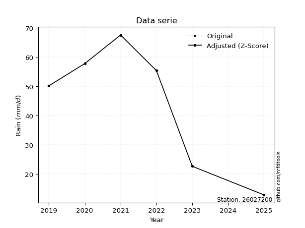</img>

</div>


> The initial value (value_initial) correspond to the initial obtained or null completed value, and value (value) is adjusted only when the initial value is outside the valid range (outlier) definite through the Z-Score value. If Z-Score is active, values out of range or outliers are replaced with the station mean value. A Z-Score (or standard score) measures how many standard deviations a data point is from the mean of a dataset, indicating its relative position; positive scores mean above the mean, negative mean below, and a score of zero is exactly at the mean, allowing for comparison of values from different distributions. It´s calculated using the formula $z=(x–μ)/σ$, where $x$ is the data point, $μ$ is the mean, and $σ$ is the standard deviation, helping identify outliers and understand probability.
>
> <sub>**Note**: In this study, "completing" (filling gaps in) and "extending" (forecasting or lengthening the historical record) rainfall data series are avoided for certain critical analyses because they introduce artificial bias and uncertainty, which can distort the statistics of rare events (extremes), alter day-to-day variability, and compromise the integrity and homogeneity of the original data. Some reasons against Completing/Extending rainfall data are: **Distortion of Extremes and Variability**: The primary issue is that most gap-filling or extension methods rely on averaging or regression with nearby stations, which inherently smooths the data. Rainfall is highly variable in space and time, with a large percentage of zero values and occasional large storms. Infilling methods often underestimate the highest values and overestimate the lowest (zero) values, which severely distorts analyses focused on flood frequency, drought severity, and intensity-duration-frequency (IDF) curves, **Loss of Data Homogeneity**: Infilled or extended data are synthetic estimates, not actual measurements. Combining these estimates with observed data can violate the assumption of data homogeneity, which requires that the data properties do not change over time. Inhomogeneity can lead to incorrect conclusions about long-term trends or changes in climate patterns, **Propagation of Errors**: Errors and biases from the original data (e.g., wind-induced undercatch, instrument errors, site changes) or the data used for imputation can propagate through the analysis, leading to unreliable hydrological models and inaccurate predictions, **Compromised Statistical Integrity**: For statistical analyses, especially those involving the frequency of events, using artificial data can introduce time bias or autocorrelation that doesn´t exist in reality, making it difficult to assess the true probability of events, **Difficulty in Validation**: It is difficult to accurately validate the quality of filled or extended data, especially for past periods where ground-truth measurements are unavailable. The reliability of imputation techniques heavily depends on the density of the surrounding station network and the complexity of the local topography.</sub>


### 4. Active continuous probability distributions from SciPy (80 of 104 available)

A Probability Density Function (PDF) describes the relative likelihood of a continuous random variable falling within a specific range, where the total area under its curve equals 1, and the area over any interval gives the actual probability for that range. Unlike discrete probabilities (like rolling a die), a PDF shows density, not direct probability for a single point (which is zero), with higher points indicating higher likelihood, often visualized as a bell curve for normal distributions.

A log of a probability density function (log-PDF) is simply the logarithm of the PDF´s value, denoted as $log(f(x))$, useful for converting multiplication of probabilities into addition, improving numerical stability with tiny numbers, and connecting to information theory concepts like entropy. Instead of dealing with very small probabilities (e.g., 0.000001), log-PDFs use negative numbers (e.g., $log(0.00001) ≈ -11.51$ that are easier for computers to handle, preventing underflow errors and simplifying complex calculations. In this study, each active probability distribution from SciPy is also evaluated in the $log$ form.

[scipy.stats](https://docs.scipy.org/doc/scipy/reference/stats.html) is a Python´s powerful submodule within the SciPy library for comprehensive statistical analysis, offering over 130 probability distributions (like Normal, Poisson, etc.), functions for descriptive stats (mean, variance), hypothesis testing (t-tests, chi-square), random variable generation, and statistical tests, making it essential for data science, modeling, and research. It provides tools to explore, model, and draw conclusions from data efficiently, working seamlessly with [NumPy](https://numpy.org/).

<div align="center">

|   id | p_dist           |   n_parameter | fit_method   | label                                                                       | active   | ref                                                                                                      |
|-----:|:-----------------|--------------:|:-------------|:----------------------------------------------------------------------------|:---------|:---------------------------------------------------------------------------------------------------------|
|    0 | alpha            |             3 | MLE          | Alpha                                                                       | True     | [:mortar_board:](https://docs.scipy.org/doc/scipy/reference/generated/scipy.stats.alpha.html)            |
|    1 | anglit           |             2 | MM           | Anglit                                                                      | True     | [:mortar_board:](https://docs.scipy.org/doc/scipy/reference/generated/scipy.stats.anglit.html)           |
|    2 | arcsine          |             2 | MM           | Arcsine                                                                     | True     | [:mortar_board:](https://docs.scipy.org/doc/scipy/reference/generated/scipy.stats.arcsine.html)          |
|    3 | argus            |             3 | MLE          | Argus                                                                       | True     | [:mortar_board:](https://docs.scipy.org/doc/scipy/reference/generated/scipy.stats.argus.html)            |
|    4 | beta             |             4 | MLE          | Beta                                                                        | True     | [:mortar_board:](https://docs.scipy.org/doc/scipy/reference/generated/scipy.stats.beta.html)             |
|    5 | betaprime        |             4 | MLE          | Beta prime                                                                  | True     | [:mortar_board:](https://docs.scipy.org/doc/scipy/reference/generated/scipy.stats.betaprime.html)        |
|    6 | bradford         |             3 | MLE          | Bradford                                                                    | True     | [:mortar_board:](https://docs.scipy.org/doc/scipy/reference/generated/scipy.stats.bradford.html)         |
|    7 | burr             |             4 | MLE          | Burr (Type III)                                                             | True     | [:mortar_board:](https://docs.scipy.org/doc/scipy/reference/generated/scipy.stats.burr.html)             |
|    8 | burr12           |             4 | MLE          | Burr (Type III) 12                                                          | True     | [:mortar_board:](https://docs.scipy.org/doc/scipy/reference/generated/scipy.stats.burr12.html)           |
|    9 | cosine           |             2 | MLE          | Cosine                                                                      | True     | [:mortar_board:](https://docs.scipy.org/doc/scipy/reference/generated/scipy.stats.cosine.html)           |
|   10 | crystalball      |             4 | MLE          | Crystalball                                                                 | True     | [:mortar_board:](https://docs.scipy.org/doc/scipy/reference/generated/scipy.stats.crystalball.html)      |
|   11 | dgamma           |             3 | MLE          | Double gamma                                                                | True     | [:mortar_board:](https://docs.scipy.org/doc/scipy/reference/generated/scipy.stats.dgamma.html)           |
|   12 | dweibull         |             3 | MLE          | Double Weibull                                                              | True     | [:mortar_board:](https://docs.scipy.org/doc/scipy/reference/generated/scipy.stats.dweibull.html)         |
|   13 | erlang           |             3 | MLE          | Erlang                                                                      | True     | [:mortar_board:](https://docs.scipy.org/doc/scipy/reference/generated/scipy.stats.erlang.html)           |
|   14 | exponnorm        |             3 | MLE          | Exponentially modified Normal                                               | True     | [:mortar_board:](https://docs.scipy.org/doc/scipy/reference/generated/scipy.stats.exponnorm.html)        |
|   15 | exponpow         |             3 | MLE          | Exponential power                                                           | True     | [:mortar_board:](https://docs.scipy.org/doc/scipy/reference/generated/scipy.stats.exponpow.html)         |
|   16 | exponweib        |             4 | MLE          | Exponentiated Weibull                                                       | True     | [:mortar_board:](https://docs.scipy.org/doc/scipy/reference/generated/scipy.stats.exponweib.html)        |
|   17 | f                |             4 | MLE          | F                                                                           | True     | [:mortar_board:](https://docs.scipy.org/doc/scipy/reference/generated/scipy.stats.f.html)                |
|   18 | fatiguelife      |             3 | MLE          | Fatigue-life (Birnbaum-Saunders)                                            | True     | [:mortar_board:](https://docs.scipy.org/doc/scipy/reference/generated/scipy.stats.fatiguelife.html)      |
|   19 | foldnorm         |             3 | MM           | Fold Normal                                                                 | True     | [:mortar_board:](https://docs.scipy.org/doc/scipy/reference/generated/scipy.stats.foldnorm.html)         |
|   20 | gamma            |             3 | MLE          | Gamma                                                                       | True     | [:mortar_board:](https://docs.scipy.org/doc/scipy/reference/generated/scipy.stats.gamma.html)            |
|   21 | gausshyper       |             6 | MLE          | Gauss hypergeometric                                                        | True     | [:mortar_board:](https://docs.scipy.org/doc/scipy/reference/generated/scipy.stats.gausshyper.html)       |
|   22 | genexpon         |             5 | MLE          | Generalized exponential                                                     | True     | [:mortar_board:](https://docs.scipy.org/doc/scipy/reference/generated/scipy.stats.genexpon.html)         |
|   23 | genextreme       |             3 | MLE          | Generalized exponential                                                     | True     | [:mortar_board:](https://docs.scipy.org/doc/scipy/reference/generated/scipy.stats.genextreme.html)       |
|   24 | gengamma         |             4 | MLE          | Generalized gamma                                                           | True     | [:mortar_board:](https://docs.scipy.org/doc/scipy/reference/generated/scipy.stats.gengamma.html)         |
|   25 | genhalflogistic  |             3 | MLE          | Generalized half-logistic                                                   | True     | [:mortar_board:](https://docs.scipy.org/doc/scipy/reference/generated/scipy.stats.genhalflogistic.html)  |
|   26 | genlogistic      |             3 | MLE          | Generalized logistic                                                        | True     | [:mortar_board:](https://docs.scipy.org/doc/scipy/reference/generated/scipy.stats.genlogistic.html)      |
|   27 | gennorm          |             3 | MLE          | Generalized Normal                                                          | True     | [:mortar_board:](https://docs.scipy.org/doc/scipy/reference/generated/scipy.stats.gennorm.html)          |
|   28 | genpareto        |             3 | MLE          | Generalized Pareto                                                          | True     | [:mortar_board:](https://docs.scipy.org/doc/scipy/reference/generated/scipy.stats.genpareto.html)        |
|   29 | gompertz         |             3 | MLE          | Gompertz (or truncated Gumbel)                                              | True     | [:mortar_board:](https://docs.scipy.org/doc/scipy/reference/generated/scipy.stats.gompertz.html)         |
|   30 | gumbel_l         |             2 | MM           | Gumbel Left Skew                                                            | True     | [:mortar_board:](https://docs.scipy.org/doc/scipy/reference/generated/scipy.stats.gumbel_l.html)         |
|   31 | gumbel_r         |             2 | MM           | Gumbel Right Skew                                                           | True     | [:mortar_board:](https://docs.scipy.org/doc/scipy/reference/generated/scipy.stats.gumbel_r.html)         |
|   32 | halfgennorm      |             3 | MLE          | Upper half of a generalized normal                                          | True     | [:mortar_board:](https://docs.scipy.org/doc/scipy/reference/generated/scipy.stats.halfgennorm.html)      |
|   33 | halflogistic     |             2 | MM           | Half-logistic                                                               | True     | [:mortar_board:](https://docs.scipy.org/doc/scipy/reference/generated/scipy.stats.halflogistic.html)     |
|   34 | halfnorm         |             2 | MM           | Half Normal                                                                 | True     | [:mortar_board:](https://docs.scipy.org/doc/scipy/reference/generated/scipy.stats.halfnorm.html)         |
|   35 | hypsecant        |             2 | MM           | hyperbolic secant                                                           | True     | [:mortar_board:](https://docs.scipy.org/doc/scipy/reference/generated/scipy.stats.hypsecant.html)        |
|   36 | invgamma         |             3 | MLE          | Inverted gamma                                                              | True     | [:mortar_board:](https://docs.scipy.org/doc/scipy/reference/generated/scipy.stats.invgamma.html)         |
|   37 | invgauss         |             3 | MLE          | Inverse Gaussian                                                            | True     | [:mortar_board:](https://docs.scipy.org/doc/scipy/reference/generated/scipy.stats.invgauss.html)         |
|   38 | invweibull       |             3 | MLE          | Inverted Weibull                                                            | True     | [:mortar_board:](https://docs.scipy.org/doc/scipy/reference/generated/scipy.stats.invweibull.html)       |
|   39 | johnsonsb        |             4 | MLE          | Johnson SB                                                                  | True     | [:mortar_board:](https://docs.scipy.org/doc/scipy/reference/generated/scipy.stats.johnsonsb.html)        |
|   40 | johnsonsu        |             4 | MLE          | Johnson Su                                                                  | True     | [:mortar_board:](https://docs.scipy.org/doc/scipy/reference/generated/scipy.stats.johnsonsu.html)        |
|   41 | kappa3           |             3 | MLE          | Kappa 3                                                                     | True     | [:mortar_board:](https://docs.scipy.org/doc/scipy/reference/generated/scipy.stats.kappa3.html)           |
|   42 | kappa4           |             4 | MLE          | Kappa 4                                                                     | True     | [:mortar_board:](https://docs.scipy.org/doc/scipy/reference/generated/scipy.stats.kappa4.html)           |
|   43 | ksone            |             3 | MLE          | Kolmogorov-Smirnov one-sided test statistic distribution                    | True     | [:mortar_board:](https://docs.scipy.org/doc/scipy/reference/generated/scipy.stats.ksone.html)            |
|   44 | kstwobign        |             2 | MLE          | Limiting distribution of scaled Kolmogorov-Smirnov two-sided test statistic | True     | [:mortar_board:](https://docs.scipy.org/doc/scipy/reference/generated/scipy.stats.kstwobign.html)        |
|   45 | laplace          |             2 | MM           | Laplace                                                                     | True     | [:mortar_board:](https://docs.scipy.org/doc/scipy/reference/generated/scipy.stats.laplace.html)          |
|   46 | levy_l           |             2 | MLE          | Left-skewed Levy                                                            | True     | [:mortar_board:](https://docs.scipy.org/doc/scipy/reference/generated/scipy.stats.levy_l.html)           |
|   47 | loggamma         |             3 | MLE          | Log gamma                                                                   | True     | [:mortar_board:](https://docs.scipy.org/doc/scipy/reference/generated/scipy.stats.loggamma.html)         |
|   48 | logistic         |             2 | MM           | Logistic (or Sech-squared)                                                  | True     | [:mortar_board:](https://docs.scipy.org/doc/scipy/reference/generated/scipy.stats.logistic.html)         |
|   49 | loglaplace       |             3 | MLE          | Log-Laplace                                                                 | True     | [:mortar_board:](https://docs.scipy.org/doc/scipy/reference/generated/scipy.stats.loglaplace.html)       |
|   50 | lomax            |             3 | MLE          | Lomax (Pareto of the second kind)                                           | True     | [:mortar_board:](https://docs.scipy.org/doc/scipy/reference/generated/scipy.stats.lomax.html)            |
|   51 | maxwell          |             2 | MM           | Maxwell                                                                     | True     | [:mortar_board:](https://docs.scipy.org/doc/scipy/reference/generated/scipy.stats.maxwell.html)          |
|   52 | mielke           |             4 | MLE          | Mielke Beta-Kappa / Dagum                                                   | True     | [:mortar_board:](https://docs.scipy.org/doc/scipy/reference/generated/scipy.stats.mielke.html)           |
|   53 | moyal            |             2 | MM           | Moyal                                                                       | True     | [:mortar_board:](https://docs.scipy.org/doc/scipy/reference/generated/scipy.stats.moyal.html)            |
|   54 | nakagami         |             3 | MLE          | Nakagami                                                                    | True     | [:mortar_board:](https://docs.scipy.org/doc/scipy/reference/generated/scipy.stats.nakagami.html)         |
|   55 | ncf              |             5 | MLE          | Non-central F distribution                                                  | True     | [:mortar_board:](https://docs.scipy.org/doc/scipy/reference/generated/scipy.stats.ncf.html)              |
|   56 | nct              |             4 | MLE          | Non-central Student’s t                                                     | True     | [:mortar_board:](https://docs.scipy.org/doc/scipy/reference/generated/scipy.stats.nct.html)              |
|   57 | norm             |             2 | MM           | Normal                                                                      | True     | [:mortar_board:](https://docs.scipy.org/doc/scipy/reference/generated/scipy.stats.norm.html)             |
|   58 | pearson3         |             3 | MM           | Pearson type III                                                            | True     | [:mortar_board:](https://docs.scipy.org/doc/scipy/reference/generated/scipy.stats.pearson3.html)         |
|   59 | powerlaw         |             3 | MLE          | Power-function                                                              | True     | [:mortar_board:](https://docs.scipy.org/doc/scipy/reference/generated/scipy.stats.powerlaw.html)         |
|   60 | rayleigh         |             2 | MM           | Rayleigh                                                                    | True     | [:mortar_board:](https://docs.scipy.org/doc/scipy/reference/generated/scipy.stats.rayleigh.html)         |
|   61 | rdist            |             3 | MLE          | R-distributed (symmetric beta)                                              | True     | [:mortar_board:](https://docs.scipy.org/doc/scipy/reference/generated/scipy.stats.rdist.html)            |
|   62 | rice             |             3 | MLE          | Rice                                                                        | True     | [:mortar_board:](https://docs.scipy.org/doc/scipy/reference/generated/scipy.stats.rice.html)             |
|   63 | semicircular     |             2 | MM           | Semicircular                                                                | True     | [:mortar_board:](https://docs.scipy.org/doc/scipy/reference/generated/scipy.stats.semicircular.html)     |
|   64 | skewnorm         |             3 | MLE          | Skew normal                                                                 | True     | [:mortar_board:](https://docs.scipy.org/doc/scipy/reference/generated/scipy.stats.skewnorm.html)         |
|   65 | t                |             3 | MLE          | Student’s t                                                                 | True     | [:mortar_board:](https://docs.scipy.org/doc/scipy/reference/generated/scipy.stats.t.html)                |
|   66 | trapezoid        |             4 | MLE          | Trapezoid                                                                   | True     | [:mortar_board:](https://docs.scipy.org/doc/scipy/reference/generated/scipy.stats.trapezoid.html)        |
|   67 | triang           |             3 | MLE          | Triangular                                                                  | True     | [:mortar_board:](https://docs.scipy.org/doc/scipy/reference/generated/scipy.stats.triang.html)           |
|   68 | truncexpon       |             3 | MLE          | Truncated exponential                                                       | True     | [:mortar_board:](https://docs.scipy.org/doc/scipy/reference/generated/scipy.stats.truncexpon.html)       |
|   69 | truncnorm        |             4 | MLE          | Truncated normal                                                            | True     | [:mortar_board:](https://docs.scipy.org/doc/scipy/reference/generated/scipy.stats.truncnorm.html)        |
|   70 | truncpareto      |             4 | MLE          | Upper truncated Pareto                                                      | True     | [:mortar_board:](https://docs.scipy.org/doc/scipy/reference/generated/scipy.stats.truncpareto.html)      |
|   71 | truncweibull_min |             5 | MLE          | Doubly truncated Weibull minimum                                            | True     | [:mortar_board:](https://docs.scipy.org/doc/scipy/reference/generated/scipy.stats.truncweibull_min.html) |
|   72 | tukeylambda      |             3 | MLE          | Tukey-Lamdba                                                                | True     | [:mortar_board:](https://docs.scipy.org/doc/scipy/reference/generated/scipy.stats.tukeylambda.html)      |
|   73 | uniform          |             2 | MLE          | Uniform                                                                     | True     | [:mortar_board:](https://docs.scipy.org/doc/scipy/reference/generated/scipy.stats.uniform.html)          |
|   74 | vonmises         |             3 | MLE          | Von Mises                                                                   | True     | [:mortar_board:](https://docs.scipy.org/doc/scipy/reference/generated/scipy.stats.vonmises.html)         |
|   75 | vonmises_line    |             3 | MLE          | Von Mises line                                                              | True     | [:mortar_board:](https://docs.scipy.org/doc/scipy/reference/generated/scipy.stats.vonmises_line.html)    |
|   76 | wald             |             2 | MM           | Wald                                                                        | True     | [:mortar_board:](https://docs.scipy.org/doc/scipy/reference/generated/scipy.stats.wald.html)             |
|   77 | weibull_max      |             3 | MLE          | Weibull maximum                                                             | True     | [:mortar_board:](https://docs.scipy.org/doc/scipy/reference/generated/scipy.stats.weibull_max.html)      |
|   78 | weibull_min      |             3 | MLE          | Weibull minimum                                                             | True     | [:mortar_board:](https://docs.scipy.org/doc/scipy/reference/generated/scipy.stats.weibull_min.html)      |
|   79 | wrapcauchy       |             3 | MLE          | Wrapped  Cauchy                                                             | True     | [:mortar_board:](https://docs.scipy.org/doc/scipy/reference/generated/scipy.stats.wrapcauchy.html)       |

</div>

> **n_parameter:** # arguments & localization & scale.
>
> **Fit methods:** (MLE) maximum likelihood, (MM) L-moments.
>
>**Inactive** (With the only purpose of prevent loops, zero divisions, infinite values, over high estimated values or horizontal trending for recurrence intervals estimations, the follow distributions were disabled.)**:** lognorm, norminvgauss, powernorm, powerlognorm, cauchy, halfcauchy, foldcauchy, skewcauchy, chi2, expon, fisk, genhyperbolic, geninvgauss, gibrat, kstwo, laplace_asymmetric, levy, levy_stable, ncx2, pareto, rel_breitwigner, recipinvgauss, studentized_range, loguniform, 


## B. Probability (PDF) vs. Empirical (EDF) distributions functions

A continuous probability distribution (CPD) describes probabilities for variables that can take any value within a range (like rain any time), unlike discrete variables with specific outcomes (like temperature). It uses a Probability Density Function (PDF), a curve where the total area under it equals 1, and the probability of the variable falling within an interval (a to b) is found by calculating the area under the curve between those points. A key feature is that the probability of hitting any single exact value is zero, so probabilities are always expressed for ranges, e.g., $P(a ≤ X ≤ b)$.

<div align="center">

Distributions parameters from station values
|     |   station | p_dist              |   n |               loc |            scale | shape                  | shape1                 | shape2                | shape3             |
|----:|----------:|:--------------------|----:|------------------:|-----------------:|:-----------------------|:-----------------------|:----------------------|:-------------------|
|   0 |  26027200 | alpha               |   6 |    -238.056       |   3738.8         | 13.342727902469438     |                        |                       |                    |
|   1 |  26027200 | anglit              |   6 |      44.4         |     57.849       |                        |                        |                       |                    |
|   2 |  26027200 | arcsine             |   6 |      16.4343      |     55.9314      |                        |                        |                       |                    |
|   3 |  26027200 | argus               |   6 |      -6.36248     |     76.2862      | 1.756955131218274      |                        |                       |                    |
|   4 |  26027200 | beta                |   6 |       7.47354     |     60.1265      | 0.4538714858556463     | 0.27715094227758513    |                       |                    |
|   5 |  26027200 | betaprime           |   6 |    -321.567       |  33975.6         | 324.42989021866254     | 30141.348875677315     |                       |                    |
|   6 |  26027200 | bradford            |   6 |      12.8         |     54.8001      | 0.8386217347745364     |                        |                       |                    |
|   7 |  26027200 | burr                |   6 |      -5.88344     |     74.1075      | 467.3086532621203      | 0.00429122194605727    |                       |                    |
|   8 |  26027200 | burr12              |   6 |      -1.72686     |     14.3884      | 451.39732906681934     | 0.002147528435440975   |                       |                    |
|   9 |  26027200 | cosine              |   6 |      42.9248      |     15.9112      |                        |                        |                       |                    |
|  10 |  26027200 | crystalball         |   6 |      44.4         |     19.7747      | 1998.2313889839365     | 5397.281361201685      |                       |                    |
|  11 |  26027200 | dgamma              |   6 |      52.2082      |     14.8233      | 1.0703863456403133     |                        |                       |                    |
|  12 |  26027200 | dweibull            |   6 |      55.4         |     14.7721      | 0.6773723584169589     |                        |                       |                    |
|  13 |  26027200 | erlang              |   6 |    -280.16        |      1.27101     | 255.26687841651574     |                        |                       |                    |
|  14 |  26027200 | exponnorm           |   6 |      44.3861      |     19.7748      | 0.0007074517408507341  |                        |                       |                    |
|  15 |  26027200 | exponpow            |   6 |      12.8         |      1.99632     | 0.14124222364438538    |                        |                       |                    |
|  16 |  26027200 | exponweib           |   6 |      12.8         |      0.0926725   | 2.004101487867589      | 0.15092966948604342    |                       |                    |
|  17 |  26027200 | f                   |   6 |   -5518.94        |   5563.46        | 173800.04386581684     | 1777987.2640958715     |                       |                    |
|  18 |  26027200 | fatiguelife         |   6 |      12.8         |      0.000183437 | 402.2650632533953      |                        |                       |                    |
|  19 |  26027200 | foldnorm            |   6 |      49.5193      |      0.345409    | 3.289931456897679e-08  |                        |                       |                    |
|  20 |  26027200 | gamma               |   6 |    -258.138       |      1.33929     | 225.90419969286484     |                        |                       |                    |
|  21 |  26027200 | gausshyper          |   6 |      10.9391      |     56.6609      | 1.1494490429899762     | 0.7964087705990243     | 0.8374196343097249    | 1.0897717288626798 |
|  22 |  26027200 | genexpon            |   6 |      12.8         |      1.45257     | 0.04576569005909541    | 0.00017739494814306877 | 1.322642529231943     |                    |
|  23 |  26027200 | genextreme          |   6 |      47.5585      |     22.7944      | 1.1373594552936337     |                        |                       |                    |
|  24 |  26027200 | gengamma            |   6 |      12.8         |      0.628347    | 1.836860495681451      | 0.26452529115425244    |                       |                    |
|  25 |  26027200 | genhalflogistic     |   6 |       0.979756    |     71.2836      | 1.0699996091687063     |                        |                       |                    |
|  26 |  26027200 | genlogistic         |   6 |      67.6002      |      1.59866e-05 | 6.890802675546073e-07  |                        |                       |                    |
|  27 |  26027200 | gennorm             |   6 |      55.4         |      2.06695e-09 | 0.10568474305732589    |                        |                       |                    |
|  28 |  26027200 | genpareto           |   6 |      -0.0193195   |    126.709       | -1.8738539824943443    |                        |                       |                    |
|  29 |  26027200 | gompertz            |   6 |      12.7453      |     20.9874      | 0.18577591211914848    |                        |                       |                    |
|  30 |  26027200 | gumbel_l            |   6 |      53.2997      |     15.4183      |                        |                        |                       |                    |
|  31 |  26027200 | gumbel_r            |   6 |      35.5003      |     15.4183      |                        |                        |                       |                    |
|  32 |  26027200 | halfgennorm         |   6 |      12.8         |      0.806859    | 0.33406783502867343    |                        |                       |                    |
|  33 |  26027200 | halflogistic        |   6 |      20.9623      |     16.9067      |                        |                        |                       |                    |
|  34 |  26027200 | halfnorm            |   6 |      18.226       |     32.8042      |                        |                        |                       |                    |
|  35 |  26027200 | hypsecant           |   6 |      44.4         |     12.589       |                        |                        |                       |                    |
|  36 |  26027200 | invgamma            |   6 |    -201.757       |  35913.2         | 147.11929253863553     |                        |                       |                    |
|  37 |  26027200 | invgauss            |   6 |     -83.4069      |   4537.67        | 0.028146994360869572   |                        |                       |                    |
|  38 |  26027200 | invweibull          |   6 |      12.8         |      1.80478     | 0.06710895928567392    |                        |                       |                    |
|  39 |  26027200 | johnsonsb           |   6 |      12.7971      |     54.8029      | -1.422294875363575     | 0.16496856516417216    |                       |                    |
|  40 |  26027200 | johnsonsu           |   6 |      73.9316      |      0.240373    | 6.9303749486839195     | 1.3209367510164798     |                       |                    |
|  41 |  26027200 | kappa3              |   6 |      12.8         |     54.742       | 1648.8457846002498     |                        |                       |                    |
|  42 |  26027200 | kappa4              |   6 |      10.6448      |     61.5101      | 1.0320934775345        | 1.0799745360583288     |                       |                    |
|  43 |  26027200 | ksone               |   6 |      10.1492      |     68.5017      | 1.0                    |                        |                       |                    |
|  44 |  26027200 | kstwobign           |   6 |     -33.1147      |     88.1661      |                        |                        |                       |                    |
|  45 |  26027200 | laplace             |   6 |      44.4         |     13.9828      |                        |                        |                       |                    |
|  46 |  26027200 | levy_l              |   6 |      69.4145      |      7.50336     |                        |                        |                       |                    |
|  47 |  26027200 | loggamma            |   6 |      67.6002      |      1.31801e-05 | 5.669522991538082e-07  |                        |                       |                    |
|  48 |  26027200 | logistic            |   6 |      44.4         |     10.9024      |                        |                        |                       |                    |
|  49 |  26027200 | loglaplace          |   6 |      -0.128521    |     55.5285      | 2.2304966411464218     |                        |                       |                    |
|  50 |  26027200 | lomax               |   6 |      12.8         |   3276.98        | 102.17809767709738     |                        |                       |                    |
|  51 |  26027200 | maxwell             |   6 |      -2.45781     |     29.3638      |                        |                        |                       |                    |
|  52 |  26027200 | mielke              |   6 |      12.8         |     55.002       | 0.383342034555858      | 553.2994362112577      |                       |                    |
|  53 |  26027200 | moyal               |   6 |      33.0915      |      8.90176     |                        |                        |                       |                    |
|  54 |  26027200 | nakagami            |   6 |      22.6         |     28.8207      | 0.3193424407049156     |                        |                       |                    |
|  55 |  26027200 | ncf                 |   6 |      -0.155529    |      0.00103183  | 0.0005583961751548101  | 18.988172526423547     | 22.317922774017937    |                    |
|  56 |  26027200 | nct                 |   6 |    1344.16        |     19.7432      | 619495.7785335239      | -65.8331771905238      |                       |                    |
|  57 |  26027200 | norm                |   6 |      44.4         |     19.7747      |                        |                        |                       |                    |
|  58 |  26027200 | pearson3            |   6 |      44.4         |     19.7747      | -0.5495121037833642    |                        |                       |                    |
|  59 |  26027200 | powerlaw            |   6 |      12.8         |     54.8         | 0.14807468488188424    |                        |                       |                    |
|  60 |  26027200 | rayleigh            |   6 |       6.56978     |     30.1841      |                        |                        |                       |                    |
|  61 |  26027200 | rdist               |   6 |       9.60328     |     12.9967      | 1.3021858548973055     |                        |                       |                    |
|  62 |  26027200 | rice                |   6 |       1.24575     |     22.4371      | 1.5735413392223543     |                        |                       |                    |
|  63 |  26027200 | semicircular        |   6 |      44.4         |     39.5495      |                        |                        |                       |                    |
|  64 |  26027200 | skewnorm            |   6 |      67.6         |     30.4835      | -86155587.09232962     |                        |                       |                    |
|  65 |  26027200 | t                   |   6 |      44.3999      |     19.7748      | 71259506.35057783      |                        |                       |                    |
|  66 |  26027200 | trapezoid           |   6 |     -12.108       |     83.8971      | 1.0                    | 1.0                    |                       |                    |
|  67 |  26027200 | triang              |   6 |      -2.81175     |     70.4179      | 0.9999997243606886     |                        |                       |                    |
|  68 |  26027200 | truncexpon          |   6 |       9.60438     |     87.3201      | 0.6641724468657331     |                        |                       |                    |
|  69 |  26027200 | truncnorm           |   6 |      44.4         |     19.7747      | -118.20667223999361    | 381.2052706890346      |                       |                    |
|  70 |  26027200 | truncpareto         |   6 |      12.7072      |      0.0927885   | 0.2042813967377703     | 591.5902250307311      |                       |                    |
|  71 |  26027200 | truncweibull_min    |   6 |       9.62361     |     87.1432      | 1.3479313096536525     | 1.6986276475377926e-12 | 0.6652998938005454    |                    |
|  72 |  26027200 | tukeylambda         |   6 |      40.2         |     33.2798      | 1.2145900748918035     |                        |                       |                    |
|  73 |  26027200 | uniform             |   6 |      12.8         |     54.8         |                        |                        |                       |                    |
|  74 |  26027200 | vonmises            |   6 |      -0.616338    |      1           | 0.8589075156110862     |                        |                       |                    |
|  75 |  26027200 | vonmises_line       |   6 |      54.1835      |     13.1728      | 0.7596339235190483     |                        |                       |                    |
|  76 |  26027200 | wald                |   6 |      24.6252      |     19.7748      |                        |                        |                       |                    |
|  77 |  26027200 | weibull_max         |   6 |      67.6         |      1.33566     | 0.3018646241457352     |                        |                       |                    |
|  78 |  26027200 | weibull_min         |   6 |      -1.23633e+09 |      1.23633e+09 | 83368417.63204205      |                        |                       |                    |
|  79 |  26027200 | wrapcauchy          |   6 |      12.8         |      8.72169     | 0.372211217649127      |                        |                       |                    |
|  80 |  26027200 | logalpha            |   6 |     -14.3087      |    508.259       | 28.34683926553423      |                        |                       |                    |
|  81 |  26027200 | loganglit           |   6 |       3.64476     |      1.7638      |                        |                        |                       |                    |
|  82 |  26027200 | logarcsine          |   6 |       2.79212     |      1.7053      |                        |                        |                       |                    |
|  83 |  26027200 | logargus            |   6 |       1.83258     |      2.43331     | 2.4913004663596805     |                        |                       |                    |
|  84 |  26027200 | logbeta             |   6 |       2.51107     |      1.70254     | 0.402402776700278      | 0.1790425246712939     |                       |                    |
|  85 |  26027200 | logbetaprime        |   6 |      -3.70221     |   2104.41        | 136.55017851709903     | 39058.370449973634     |                       |                    |
|  86 |  26027200 | logbradford         |   6 |       2.54907     |      1.67508     | 3.2612260171787115e-05 |                        |                       |                    |
|  87 |  26027200 | logburr             |   6 |       1.73089     |      2.50008     | 460.21646487908083     | 0.006481927767165975   |                       |                    |
|  88 |  26027200 | logburr12           |   6 |     -32.3845      |     40.2421      | 78.76368955698688      | 3577.0273894815446     |                       |                    |
|  89 |  26027200 | logcosine           |   6 |       3.56926     |      0.497589    |                        |                        |                       |                    |
|  90 |  26027200 | logcrystalball      |   6 |       3.64476     |      0.602925    | 6.669817593066773      | 155.32445006812492     |                       |                    |
|  91 |  26027200 | logdgamma           |   6 |       3.91602     |      0.605937    | 0.5731871981293934     |                        |                       |                    |
|  92 |  26027200 | logdweibull         |   6 |       4.01458     |      0.571653    | 0.7037765213421405     |                        |                       |                    |
|  93 |  26027200 | logerlang           |   6 |      -6.30247     |      0.0391068   | 254.29055049356475     |                        |                       |                    |
|  94 |  26027200 | logexponnorm        |   6 |       3.64429     |      0.602927    | 0.0007778885411084659  |                        |                       |                    |
|  95 |  26027200 | logexponpow         |   6 |       2.54945     |      1.1926      | 0.6664825334227636     |                        |                       |                    |
|  96 |  26027200 | logexponweib        |   6 |       2.54945     |      1.49489     | 0.3100183449182278     | 0.49037756966954354    |                       |                    |
|  97 |  26027200 | logf                |   6 |    -885.054       |    888.698       | 12749481.617174871     | 6518054.037088754      |                       |                    |
|  98 |  26027200 | logfatiguelife      |   6 |    -283.039       |    286.684       | 0.002096422545648161   |                        |                       |                    |
|  99 |  26027200 | logfoldnorm         |   6 |      -1.31708     |      0.582309    | 8.524729338225246      |                        |                       |                    |
| 100 |  26027200 | loggamma            |   6 |      -6.40014     |      0.0381589   | 262.88368642900065     |                        |                       |                    |
| 101 |  26027200 | loggausshyper       |   6 |       2.52353     |      1.69007     | 1.0420213766062816     | 0.951971726449581      | 1.0097818767418882    | 1.0990050829240334 |
| 102 |  26027200 | loggenexpon         |   6 |       2.54944     |      0.0201272   | 0.007607025983280294   | 3.149504533119197      | 9.583905955310487e-05 |                    |
| 103 |  26027200 | loggenextreme       |   6 |       3.7404      |      0.629589    | 1.3304796564871424     |                        |                       |                    |
| 104 |  26027200 | loggengamma         |   6 |       2.54945     |      1.11405     | 0.7500044633637375     | 1.144869698133035      |                       |                    |
| 105 |  26027200 | loggenhalflogistic  |   6 |       2.47311     |      1.87122     | 1.075108372822769      |                        |                       |                    |
| 106 |  26027200 | loggenlogistic      |   6 |       4.21364     |      1.1043e-06  | 1.9438481767699396e-06 |                        |                       |                    |
| 107 |  26027200 | loggennorm          |   6 |       4.01458     |      7.31375e-11 | 0.10785451203230514    |                        |                       |                    |
| 108 |  26027200 | loggenpareto        |   6 |      -0.00162524  |      7.90489     | -1.8753141692175075    |                        |                       |                    |
| 109 |  26027200 | loggompertz         |   6 |       2.54945     |      0.479738    | 0.0652314759844207     |                        |                       |                    |
| 110 |  26027200 | loggumbel_l         |   6 |       3.91611     |      0.470099    |                        |                        |                       |                    |
| 111 |  26027200 | loggumbel_r         |   6 |       3.37342     |      0.470099    |                        |                        |                       |                    |
| 112 |  26027200 | loghalfgennorm      |   6 |       2.54596     |      1.67966     | 651.7467131019289      |                        |                       |                    |
| 113 |  26027200 | loghalflogistic     |   6 |       2.9302      |      0.515454    |                        |                        |                       |                    |
| 114 |  26027200 | loghalfnorm         |   6 |       2.84679     |      1.00012     |                        |                        |                       |                    |
| 115 |  26027200 | loghypsecant        |   6 |       3.64476     |      0.383834    |                        |                        |                       |                    |
| 116 |  26027200 | loginvgamma         |   6 |      -9.92719     |   6352.45        | 469.490846825709       |                        |                       |                    |
| 117 |  26027200 | loginvgauss         |   6 |      -2.07748     |    421.9         | 0.01356208210279524    |                        |                       |                    |
| 118 |  26027200 | loginvweibull       |   6 |      -5.61804e+07 |      5.61804e+07 | 85965853.92216437      |                        |                       |                    |
| 119 |  26027200 | logjohnsonsb        |   6 |       0.901936    |      3.31167     | -0.6179068501415708    | 0.08550203368120024    |                       |                    |
| 120 |  26027200 | logjohnsonsu        |   6 |       4.21361     |      1.72686e-12 | 5.554253996932969      | 0.2255140872763881     |                       |                    |
| 121 |  26027200 | logkappa3           |   6 |       2.54906     |      1.66472     | 19811.14972165091      |                        |                       |                    |
| 122 |  26027200 | logkappa4           |   6 |       2.40848     |      1.91948     | 1.0510947662504904     | 1.0633466774444345     |                       |                    |
| 123 |  26027200 | logksone            |   6 |       2.38303     |      1.997       | 1.0                    |                        |                       |                    |
| 124 |  26027200 | logkstwobign        |   6 |       1.08576     |      2.91484     |                        |                        |                       |                    |
| 125 |  26027200 | loglaplace          |   6 |       3.64476     |      0.426332    |                        |                        |                       |                    |
| 126 |  26027200 | loglevy_l           |   6 |       4.24586     |      0.132958    |                        |                        |                       |                    |
| 127 |  26027200 | logloggamma         |   6 |       4.21368     |      4.36918e-06 | 7.667465279175261e-06  |                        |                       |                    |
| 128 |  26027200 | loglogistic         |   6 |       3.64476     |      0.33241     |                        |                        |                       |                    |
| 129 |  26027200 | logloglaplace       |   6 |      -5.38585e+07 |      5.38585e+07 | 120546667.63452846     |                        |                       |                    |
| 130 |  26027200 | loglomax            |   6 |       2.54945     |     42.0701      | 38.66092675612752      |                        |                       |                    |
| 131 |  26027200 | logmaxwell          |   6 |       2.21609     |      0.895292    |                        |                        |                       |                    |
| 132 |  26027200 | logmielke           |   6 |   -2295.28        |   2299.5         | 4081.662652294358      | 2298327.3782321177     |                       |                    |
| 133 |  26027200 | logmoyal            |   6 |       3.29997     |      0.271412    |                        |                        |                       |                    |
| 134 |  26027200 | lognakagami         |   6 |       3.11795     |      0.759151    | 0.4434508563468397     |                        |                       |                    |
| 135 |  26027200 | logncf              |   6 |      -9.55212     |     13.1841      | 1378.3037979690712     | 2384.9093500966183     | 0.06996928493312166   |                    |
| 136 |  26027200 | lognct              |   6 |     -27.3539      |      0.561118    | 8923.554666082797      | 55.238148324426504     |                       |                    |
| 137 |  26027200 | lognorm             |   6 |       3.64476     |      0.602925    |                        |                        |                       |                    |
| 138 |  26027200 | logpearson3         |   6 |       3.64476     |      0.602925    | -0.8635961719645401    |                        |                       |                    |
| 139 |  26027200 | logpowerlaw         |   6 |       2.54945     |      1.66416     | 0.16061190850948595    |                        |                       |                    |
| 140 |  26027200 | lograyleigh         |   6 |       2.49133     |      0.920304    |                        |                        |                       |                    |
| 141 |  26027200 | logrdist            |   6 |       3.3816      |      0.832151    | 1.1153703437778486     |                        |                       |                    |
| 142 |  26027200 | logrice             |   6 |       2.15394     |      0.659594    | 1.986000750259525      |                        |                       |                    |
| 143 |  26027200 | logsemicircular     |   6 |       3.64476     |      1.20585     |                        |                        |                       |                    |
| 144 |  26027200 | logskewnorm         |   6 |       4.21361     |      0.828782    | -14415518.47110239     |                        |                       |                    |
| 145 |  26027200 | logt                |   6 |       3.64477     |      0.602928    | 514961411.76355827     |                        |                       |                    |
| 146 |  26027200 | logtrapezoid        |   6 |       1.93944     |      2.55799     | 1.0                    | 1.0                    |                       |                    |
| 147 |  26027200 | logtriang           |   6 |       2.17711     |      2.0366      | 0.9999472189238088     |                        |                       |                    |
| 148 |  26027200 | logtruncexpon       |   6 |       2.54944     |      1.96728     | 0.8459218291823699     |                        |                       |                    |
| 149 |  26027200 | logtruncnorm        |   6 |      -0.126971    |      1.62466     | 1.9972906501323073     | 2.6716908535237973     |                       |                    |
| 150 |  26027200 | logtruncpareto      |   6 |       2.54603     |      0.00341327  | 0.20363248945829507    | 488.5564299688162      |                       |                    |
| 151 |  26027200 | logtruncweibull_min |   6 |       2.54857     |      1.97623     | 0.9423435220706864     | 0.00043869233856268404 | 0.8425309495639772    |                    |
| 152 |  26027200 | logtukeylambda      |   6 |       3.39053     |      0.939244    | 1.1167024549766502     |                        |                       |                    |
| 153 |  26027200 | loguniform          |   6 |       2.54945     |      1.66416     |                        |                        |                       |                    |
| 154 |  26027200 | logvonmises         |   6 |      -2.6029      |      1           | 3.3008688395003953     |                        |                       |                    |
| 155 |  26027200 | logvonmises_line    |   6 |       3.35062     |      0.2747      | 1.3719464460384346e-06 |                        |                       |                    |
| 156 |  26027200 | logwald             |   6 |       3.04184     |      0.602926    |                        |                        |                       |                    |
| 157 |  26027200 | logweibull_max      |   6 |       4.21361     |      0.774273    | 0.5060485899983707     |                        |                       |                    |
| 158 |  26027200 | logweibull_min      |   6 | -718238           | 718242           | 1778056.4338112646     |                        |                       |                    |
| 159 |  26027200 | logwrapcauchy       |   6 |       2.54943     |      0.264863    | 0.4610885624687211     |                        |                       |                    |

</div>

> **loc** (Location parameter): This shifts the distribution along the x-axis. For many common distributions, like the normal (Gaussian) distribution, loc represents the mean $μ$. For others, like the uniform distribution, it might represent the minimum value, or for the beta distribution, the left end of the support interval.
>
> **scale** (Scale parameter): This determines the width or spread of the distribution. For the normal distribution, scale represents the standard deviation $σ$. For a uniform distribution, it defines the length of the interval (from $loc$ to $loc + scale$).
>
> **shape** (Shape parameters): Refers to parameters that define the specific form of a probability distribution, distinct from its location (loc) and scale (scale). These parameters are required arguments for most distribution functions. For example, a normal (Gaussian) distribution is fully defined by its location (mean) and scale (standard deviation), so it has no specific shape parameters beyond loc and scale. However, other distributions have intrinsic properties that need specification, as Gamma distribution that takes a shape parameter, often named $a$ or $alpha$.


### 0. Cumulative distribution values - CDF (160 evaluated)

Cumulative Distribution Function (CDF), denoted as $F$<sub>$X$</sub>$(x)$, is a function that gives the probability that a random variable $X$ will take a value less than or equal to a specific value, $x$ (i.e., $(P(X≥x)$. It essentially "accumulates" probabilities from a given point up to the far right (positive infinity), providing a complete picture of the distribution´s probabilities for both discrete (like rain) and continuous (like temperature) variables, helping to find probabilities over ranges or above certain values. Each station is evaluated separately ordering the $x$ values ascending, calculating the CDF and PDF values for the activated distributions and their logarithmic forms.

<div align="center">

CDF ordered by x ascending and calculating $log(f(x))$ separately
|   id |   Station |   date |    x |   count |   mean |     std |    zscore |   Value_initial |   station |   m |     alpha |   alpha_pdf |    anglit |   anglit_pdf |   arcsine |   arcsine_pdf |     argus |   argus_pdf |     beta |    beta_pdf |   betaprime |   betaprime_pdf |    bradford |   bradford_pdf |      burr |   burr_pdf |     burr12 |   burr12_pdf |    cosine |   cosine_pdf |   crystalball |   crystalball_pdf |    dgamma |   dgamma_pdf |   dweibull |   dweibull_pdf |    erlang |   erlang_pdf |   exponnorm |   exponnorm_pdf |   exponpow |   exponpow_pdf |   exponweib |   exponweib_pdf |         f |      f_pdf |   fatiguelife |   fatiguelife_pdf |   foldnorm |   foldnorm_pdf |     gamma |   gamma_pdf |   gausshyper |   gausshyper_pdf |    genexpon |   genexpon_pdf |   genextreme |   genextreme_pdf |    gengamma |   gengamma_pdf |   genhalflogistic |   genhalflogistic_pdf |   genlogistic |   genlogistic_pdf |   gennorm |   gennorm_pdf |   genpareto |   genpareto_pdf |    gompertz |   gompertz_pdf |   gumbel_l |   gumbel_l_pdf |   gumbel_r |   gumbel_r_pdf |   halfgennorm |   halfgennorm_pdf |   halflogistic |   halflogistic_pdf |   halfnorm |   halfnorm_pdf |   hypsecant |   hypsecant_pdf |   invgamma |   invgamma_pdf |   invgauss |   invgauss_pdf |   invweibull |   invweibull_pdf |   johnsonsb |   johnsonsb_pdf |   johnsonsu |   johnsonsu_pdf |      kappa3 |   kappa3_pdf |    kappa4 |   kappa4_pdf |     ksone |   ksone_pdf |   kstwobign |   kstwobign_pdf |   laplace |   laplace_pdf |   levy_l |   levy_l_pdf |   loggamma |   loggamma_pdf |   logistic |   logistic_pdf |   loglaplace |   loglaplace_pdf |      lomax |   lomax_pdf |   maxwell |   maxwell_pdf |      mielke |   mielke_pdf |      moyal |   moyal_pdf |   nakagami |   nakagami_pdf |       ncf |    ncf_pdf |       nct |    nct_pdf |      norm |   norm_pdf |   pearson3 |   pearson3_pdf |   powerlaw |   powerlaw_pdf |   rayleigh |   rayleigh_pdf |    rdist |    rdist_pdf |      rice |   rice_pdf |   semicircular |   semicircular_pdf |   skewnorm |   skewnorm_pdf |         t |      t_pdf |   trapezoid |   trapezoid_pdf |    triang |   triang_pdf |   truncexpon |   truncexpon_pdf |   truncnorm |   truncnorm_pdf |   truncpareto |   truncpareto_pdf |   truncweibull_min |   truncweibull_min_pdf |   tukeylambda |   tukeylambda_pdf |   uniform |   uniform_pdf |   vonmises |   vonmises_pdf |   vonmises_line |   vonmises_line_pdf |     wald |   wald_pdf |   weibull_max |   weibull_max_pdf |   weibull_min |   weibull_min_pdf |   wrapcauchy |   wrapcauchy_pdf |   logalpha |   logalpha_pdf |   loganglit |   loganglit_pdf |   logarcsine |   logarcsine_pdf |   logargus |   logargus_pdf |   logbeta |   logbeta_pdf |   logbetaprime |   logbetaprime_pdf |   logbradford |   logbradford_pdf |   logburr |   logburr_pdf |   logburr12 |   logburr12_pdf |   logcosine |   logcosine_pdf |   logcrystalball |   logcrystalball_pdf |   logdgamma |   logdgamma_pdf |   logdweibull |   logdweibull_pdf |   logerlang |   logerlang_pdf |   logexponnorm |   logexponnorm_pdf |   logexponpow |   logexponpow_pdf |   logexponweib |   logexponweib_pdf |      logf |   logf_pdf |   logfatiguelife |   logfatiguelife_pdf |   logfoldnorm |   logfoldnorm_pdf |   loggausshyper |   loggausshyper_pdf |   loggenexpon |   loggenexpon_pdf |   loggenextreme |   loggenextreme_pdf |   loggengamma |   loggengamma_pdf |   loggenhalflogistic |   loggenhalflogistic_pdf |   loggenlogistic |   loggenlogistic_pdf |   loggennorm |   loggennorm_pdf |   loggenpareto |   loggenpareto_pdf |   loggompertz |   loggompertz_pdf |   loggumbel_l |   loggumbel_l_pdf |   loggumbel_r |   loggumbel_r_pdf |   loghalfgennorm |   loghalfgennorm_pdf |   loghalflogistic |   loghalflogistic_pdf |   loghalfnorm |   loghalfnorm_pdf |   loghypsecant |   loghypsecant_pdf |   loginvgamma |   loginvgamma_pdf |   loginvgauss |   loginvgauss_pdf |   loginvweibull |   loginvweibull_pdf |   logjohnsonsb |   logjohnsonsb_pdf |   logjohnsonsu |   logjohnsonsu_pdf |   logkappa3 |   logkappa3_pdf |   logkappa4 |   logkappa4_pdf |   logksone |   logksone_pdf |   logkstwobign |   logkstwobign_pdf |   loglevy_l |   loglevy_l_pdf |   logloggamma |   logloggamma_pdf |   loglogistic |   loglogistic_pdf |   logloglaplace |   logloglaplace_pdf |    loglomax |   loglomax_pdf |   logmaxwell |   logmaxwell_pdf |   logmielke |   logmielke_pdf |    logmoyal |   logmoyal_pdf |   lognakagami |   lognakagami_pdf |    logncf |   logncf_pdf |    lognct |   lognct_pdf |   lognorm |   lognorm_pdf |   logpearson3 |   logpearson3_pdf |   logpowerlaw |   logpowerlaw_pdf |   lograyleigh |   lograyleigh_pdf |    logrdist |   logrdist_pdf |   logrice |   logrice_pdf |   logsemicircular |   logsemicircular_pdf |   logskewnorm |   logskewnorm_pdf |      logt |   logt_pdf |   logtrapezoid |   logtrapezoid_pdf |   logtriang |   logtriang_pdf |   logtruncexpon |   logtruncexpon_pdf |   logtruncnorm |   logtruncnorm_pdf |   logtruncpareto |   logtruncpareto_pdf |   logtruncweibull_min |   logtruncweibull_min_pdf |   logtukeylambda |   logtukeylambda_pdf |   loguniform |   loguniform_pdf |   logvonmises |   logvonmises_pdf |   logvonmises_line |   logvonmises_line_pdf |   logwald |   logwald_pdf |   logweibull_max |   logweibull_max_pdf |   logweibull_min |   logweibull_min_pdf |   logwrapcauchy |   logwrapcauchy_pdf |
|-----:|----------:|-------:|-----:|--------:|-------:|--------:|----------:|----------------:|----------:|----:|----------:|------------:|----------:|-------------:|----------:|--------------:|----------:|------------:|---------:|------------:|------------:|----------------:|------------:|---------------:|----------:|-----------:|-----------:|-------------:|----------:|-------------:|--------------:|------------------:|----------:|-------------:|-----------:|---------------:|----------:|-------------:|------------:|----------------:|-----------:|---------------:|------------:|----------------:|----------:|-----------:|--------------:|------------------:|-----------:|---------------:|----------:|------------:|-------------:|-----------------:|------------:|---------------:|-------------:|-----------------:|------------:|---------------:|------------------:|----------------------:|--------------:|------------------:|----------:|--------------:|------------:|----------------:|------------:|---------------:|-----------:|---------------:|-----------:|---------------:|--------------:|------------------:|---------------:|-------------------:|-----------:|---------------:|------------:|----------------:|-----------:|---------------:|-----------:|---------------:|-------------:|-----------------:|------------:|----------------:|------------:|----------------:|------------:|-------------:|----------:|-------------:|----------:|------------:|------------:|----------------:|----------:|--------------:|---------:|-------------:|-----------:|---------------:|-----------:|---------------:|-------------:|-----------------:|-----------:|------------:|----------:|--------------:|------------:|-------------:|-----------:|------------:|-----------:|---------------:|----------:|-----------:|----------:|-----------:|----------:|-----------:|-----------:|---------------:|-----------:|---------------:|-----------:|---------------:|---------:|-------------:|----------:|-----------:|---------------:|-------------------:|-----------:|---------------:|----------:|-----------:|------------:|----------------:|----------:|-------------:|-------------:|-----------------:|------------:|----------------:|--------------:|------------------:|-------------------:|-----------------------:|--------------:|------------------:|----------:|--------------:|-----------:|---------------:|----------------:|--------------------:|---------:|-----------:|--------------:|------------------:|--------------:|------------------:|-------------:|-----------------:|-----------:|---------------:|------------:|----------------:|-------------:|-----------------:|-----------:|---------------:|----------:|--------------:|---------------:|-------------------:|--------------:|------------------:|----------:|--------------:|------------:|----------------:|------------:|----------------:|-----------------:|---------------------:|------------:|----------------:|--------------:|------------------:|------------:|----------------:|---------------:|-------------------:|--------------:|------------------:|---------------:|-------------------:|----------:|-----------:|-----------------:|---------------------:|--------------:|------------------:|----------------:|--------------------:|--------------:|------------------:|----------------:|--------------------:|--------------:|------------------:|---------------------:|-------------------------:|-----------------:|---------------------:|-------------:|-----------------:|---------------:|-------------------:|--------------:|------------------:|--------------:|------------------:|--------------:|------------------:|-----------------:|---------------------:|------------------:|----------------------:|--------------:|------------------:|---------------:|-------------------:|--------------:|------------------:|--------------:|------------------:|----------------:|--------------------:|---------------:|-------------------:|---------------:|-------------------:|------------:|----------------:|------------:|----------------:|-----------:|---------------:|---------------:|-------------------:|------------:|----------------:|--------------:|------------------:|--------------:|------------------:|----------------:|--------------------:|------------:|---------------:|-------------:|-----------------:|------------:|----------------:|------------:|---------------:|--------------:|------------------:|----------:|-------------:|----------:|-------------:|----------:|--------------:|--------------:|------------------:|--------------:|------------------:|--------------:|------------------:|------------:|---------------:|----------:|--------------:|------------------:|----------------------:|--------------:|------------------:|----------:|-----------:|---------------:|-------------------:|------------:|----------------:|----------------:|--------------------:|---------------:|-------------------:|-----------------:|---------------------:|----------------------:|--------------------------:|-----------------:|---------------------:|-------------:|-----------------:|--------------:|------------------:|-------------------:|-----------------------:|----------:|--------------:|-----------------:|---------------------:|-----------------:|---------------------:|----------------:|--------------------:|
|    0 |  26027200 |   2025 | 12.8 |       6 |   44.4 | 21.6621 | -1.45877  |            12.8 |  26027200 |   1 | 0.0592081 |  0.00700418 | 0.0561099 |   0.00795636 |  0        |     0         | 0.0484865 |  0.00522538 | 0.147679 | 0.0131804   |   0.0589839 |      0.00611712 | 3.78028e-07 |      0.0251279 | 0.0630962 | 0.00677222 | 0.00927084 |   0.0652478  | 0.0477209 |   0.00683231 |     0.0550216 |         0.0056272 | 0.0397285 |   0.00262581 |  0.0644235 |     0.00209909 | 0.0567431 |   0.00601102 |   0.0550217 |      0.00562719 | 0.00748517 |    5.95152e+11 | 7.03199e-05 |     1.19233e+10 | 0.0541213 | 0.00557766 |     0.0900541 |       1.72581e+08 |   0        |   0            | 0.0540929 |  0.00587174 |    0.0223422 |        0.0136573 | 6.36239e-07 |     0.0315066  |    0.0887851 |       0.00344947 | 4.92988e-08 |    1.34843e+07 |         0.0910177 |            0.00845655 |      0        |        0.00406137 | 0.0854075 |    0.00105605 |    0.106114 |      0.00870494 | 0.000484836 |     0.00887057 |  0.0697618 |     0.00436299 |  0.0127881 |     0.0036156  |   2.14571e-13 |        0.208257   |      0         |         0          |   0        |      0         |   0.0516168 |      0.00408221 |  0.0518971 |     0.00627153 |  0.0529059 |     0.00677561 |  3.85036e-05 |      1.47859e+10 |  0.00114841 |     0.220384    |   0.0965671 |      0.00369636 | 2.08248e-08 |    0.0181856 | 0.0048874 |    0.0193401 | 0.0386974 |   0.0145982 |   0.0509174 |      0.00898016 | 0.0521798 |    0.0037317  | 0.284181 |   0.00240086 |  0.0363388 |       0.13901  |  0.0522303 |     0.0045405  |    0.0382996 |        0.0898351 | 1.1997e-13 |  0.0311806  | 0.0344314 |    0.00641002 | 4.76831e-07 |  1.02901e+08 | 0.00177211 |  0.00105805 | 0          |     0          | 0.0349172 | 0.00780594 | 0.0550601 | 0.00562848 | 0.0550216 |  0.0056272 |  0.0669287 |     0.00515368 | 0.00361709 |    3.01516e+11 |  0.0210766 |     0.00669413 | 0.594279 |    0.0299257 | 0.0389761 | 0.00682533 |      0.0524266 |         0.00967952 |  0.0722256 |      0.0052014 | 0.0550227 | 0.00562726 |   0.0881419 |      0.00707741 | 0.0491516 |   0.00629675 |    0.0740469 |        0.02275   |   0.0550216 |       0.0056272 |      0        |        3.02196    |          0.0261028 |              0.0110133 |   7.10543e-15 |         0.0300207 |  0        |     0.0182482 |    2.74316 |      0.235144  |     6.29361e-11 |          0.00491712 | 0        | 0          |     0.0464885 |       0.000785797 |     0.0617581 |        0.00403315 |  3.69027e-08 |        0.0398866 |  0.0357489 |       0.14061  |   0.0267838 |        0.183072 |     0        |         0        |  0.0300139 |      0.0934304 | 0.0731951 |    0.777857   |      0.0343226 |           0.134507 |   0.000221083 |          0.596996 | 0.0357672 |      0.130348 |   0.0505397 |        0.111019 |   0.0325452 |        0.172513 |        0.0346335 |             0.127056 |   0.020839  |     0.0393417   |     0.0718959 |         0.0669771 |   0.0359683 |        0.13697  |      0.0346343 |           0.127058 |   5.20985e-11 |      78188.6      |     0.00435984 |        1.49251e+12 | 0.0350796 |   0.128096 |        0.0338749 |             0.125642 |     0.0297324 |          0.115983 |       0.0183473 |            0.732058 |   2.43506e-06 |          0.377952 |       0.0762841 |           0.0886582 |   6.51352e-14 |        125.941    |            0.0208549 |                 0.27934  |         0        |             0.094048 |    0.0600355 |        0.0250498 |       0.390787 |        0.195209    |   3.18353e-09 |          0.135973 |     0.0531635 |          0.110029 |    0.00311813 |         0.0382755 |         0        |             0.595885 |          0        |              0        |      0        |          0        |      0.0366509 |          0.0952756 |     0.0362181 |          0.141807 |     0.0381655 |          0.155073 |       0.0374576 |            0.188259 |       0.268035 |        0.0340228   |       0.204713 |          0.0384703 | 0.000228613 |        0.600402 |   0.0313689 |        0.6248   |  0.0833333 |       0.500752 |      0.0374458 |           0.224757 |    0.220489 |       0.0633069 |     0.0539036 |         0.0945954 |     0.0357401 |          0.103676 |       0.0200476 |           0.0448708 | 2.76448e-12 |       0.918964 |    0.0131726 |         0.115283 |    0.051662 |       0.0917677 | 6.73654e-05 |     0.00208309 |   0           |          0        | 0.0375415 |     0.140169 | 0.0352687 |     0.129324 | 0.0346333 |      0.127055 |     0.0525023 |          0.121373 |    0.00315264 |        1.1402e+12 |    0.00199156 |         0.0684747 | 8.43508e-10 |    2.54587e+06 | 0.0270718 |      0.146623 |         0.0164257 |              0.220805 |     0.0446473 |          0.128227 | 0.0346332 |   0.127054 |      0.0568689 |           0.186452 |   0.0334248 |        0.179544 |     1.23045e-06 |            0.890472 |    0           |           0        |         0        |           83.2567    |           4.98039e-06 |                  1.30003  |      7.10543e-15 |             1.04143  |     0        |         0.600903 |       1.03324 |          0.103919 |          0.0358167 |               0.579376 | 0         |      0        |         0.229269 |          0.102684    |        0.0336169 |            0.0818062 |     3.08243e-05 |            1.62914  |
|    1 |  26027200 |   2023 | 22.6 |       6 |   44.4 | 21.6621 | -1.00636  |            22.6 |  26027200 |   2 | 0.15839   |  0.013301   | 0.157834  |   0.0126047  |  0.21546  |     0.0181716 | 0.115449  |  0.00855419 | 0.24752  | 0.0085945   |   0.144955  |      0.0116296  | 0.229449    |      0.0218509 | 0.146977  | 0.0103476  | 0.398955   |   0.0239508  | 0.144343  |   0.0128956  |     0.13514   |         0.0109874 | 0.075811  |   0.00498476 |  0.08984   |     0.00318483 | 0.141918  |   0.0115846  |   0.13514   |      0.0109874  | 0.91769    |    0.00519418  | 0.752032    |     0.00716739  | 0.13376   | 0.0109421  |     0.717212  |       0.00991586  |   0        |   0            | 0.138183  |  0.0115202  |    0.174056  |        0.016259  | 0.266427    |     0.023202   |    0.130501  |       0.00519232 | 0.659085    |    0.0137666   |         0.181312  |            0.0100428  |      0        |        0.00619619 | 0.097623  |    0.00147671 |    0.19533  |      0.00954266 | 0.105358    |     0.0126649  |  0.127631  |     0.00772559 |  0.0993893 |     0.0148824  |   0.406342    |        0.0208217  |      0.0483952 |         0.0295048  |   0.106072 |      0.0241074 |   0.111519  |      0.00867837 |  0.143369  |     0.0125773  |  0.150819  |     0.013263   |  0.409563    |      0.00250359  |  0.0470943  |     0.00201492  |   0.142182  |      0.00578798 | 0.178219    |    0.0181856 | 0.179831  |    0.0174801 | 0.18176   |   0.0145982 |   0.180599  |      0.016787   | 0.105168  |    0.00752118 | 0.3111   |   0.00314893 |  0.205101  |       0.475723 |  0.119249  |     0.00963354 |    0.145317  |        0.340854  | 0.26296    |  0.0229128  | 0.133453  |    0.0137486  | 0.5162      |  0.020192    | 0.0714324  |  0.0159103  | 5.3588e-11 |  9633.72       | 0.160455  | 0.0171007  | 0.135183  | 0.0109868  | 0.13514   |  0.0109874 |  0.136311  |     0.00926369 | 0.775008   |    0.0117101   |  0.131531  |     0.0152804  | 1        | 6655.71      | 0.135564  | 0.0128586  |      0.167773  |         0.0134306  |  0.139888  |      0.0088038 | 0.135142  | 0.0109875  |   0.171145  |      0.00986201 | 0.130228  |   0.0102494  |    0.284941  |        0.0203348 |   0.13514   |       0.0109874 |      0.843814 |        0.0109199  |          0.168464  |              0.0168362 |   0.18941     |         0.0181486 |  0.178832 |     0.0182482 |    4.08581 |      0.0997178 |     0.0516816   |          0.00601    | 0        | 0          |     0.0555003 |       0.00107646  |     0.116126  |        0.00735728 |  0.299949    |        0.0192495 |  0.206463  |       0.477529 |   0.218767  |        0.468774 |     0.288001 |         0.474786 |  0.125359  |      0.2703    | 0.244361  |    0.210555   |      0.199181  |           0.465802 |   0.339614    |          0.596989 | 0.172486  |      0.370957 |   0.168844  |        0.341008 |   0.230286  |        0.516917 |        0.191124  |             0.451714 |   0.0628282 |     0.126479    |     0.126711  |         0.136525  |   0.201968  |        0.468161 |      0.191126  |           0.451716 |   0.568724    |          0.568091 |     0.787828   |        0.151867    | 0.192009  |   0.45161  |        0.189954  |             0.452279 |     0.181821  |          0.453472 |       0.411028  |            0.622942 |   0.284784    |          0.572873 |       0.152657  |           0.19683   |   0.505482    |          0.580528 |            0.211978  |                 0.405393 |         0        |             0.255832 |    0.0797907 |        0.0487681 |       0.512501 |        0.23726     |   0.137678    |          0.383508 |     0.167294  |          0.324288 |    0.178725   |         0.654646  |         0.340843 |             0.595885 |          0.180136 |              0.938542 |      0.213708 |          0.768996 |      0.158036  |          0.395023  |     0.208472  |          0.482472 |     0.219935  |          0.490715 |       0.25254   |            0.5318   |       0.28853  |        0.0398246   |       0.232497 |          0.0628761 | 0.34156     |        0.600402 |   0.36107   |        0.565378 |  0.368013  |       0.500752 |      0.284086  |           0.56983  |    0.268655 |       0.114488  |     0.146184  |         0.256538  |     0.170112  |          0.424698 |       0.0715605 |           0.160167  | 0.404847    |       0.539632 |    0.202314  |         0.54448  |    0.141803 |       0.251824  | 0.161994    |     0.773174   |   2.43241e-14 |         48.5782   | 0.204329  |     0.46597  | 0.193436  |     0.453999 | 0.191123  |      0.451713 |     0.177836  |          0.348106 |    0.841551   |        0.237752   |    0.206894   |         0.586773  | 0.389623    |    0.432021    | 0.200572  |      0.478189 |         0.230992  |              0.474894 |     0.186165  |          0.401781 | 0.191121  |   0.451708 |      0.212261  |           0.360219 |   0.213422  |        0.453685 |     0.439658    |            0.666988 |    1.02811e-05 |           1.74721  |         0.903694 |            0.175123  |           0.463989    |                  0.656883 |      0.34239     |             0.58031  |     0.341616 |         0.600903 |       1.16874 |          0.415856 |          0.365195  |               0.579377 | 0.0125982 |      0.717169 |         0.303592 |          0.167151    |        0.130375  |            0.300734  |     0.437066    |            0.275942 |
|    2 |  26027200 |   2019 | 50.2 |       6 |   44.4 | 21.6621 |  0.267748 |            50.2 |  26027200 |   3 | 0.645165  |  0.016749   | 0.599591  |   0.01694    |  0.566499 |     0.0116351 | 0.530083  |  0.0226612  | 0.475351 | 0.00968796  |   0.623132  |      0.0183992  | 0.743112    |      0.0159812 | 0.571874  | 0.020448   | 0.711808   |   0.00538007 | 0.643034  |   0.0189779  |     0.615355  |         0.019325  | 0.446787  |   0.0265471  |  0.305393  |     0.0196127  | 0.621819  |   0.0184964  |   0.615353  |      0.0193249  | 0.970956   |    0.000753108 | 0.838222    |     0.00154351  | 0.613513  | 0.0193388  |     0.86917   |       0.00318856  |   0.951232 |   0.3314       | 0.620883  |  0.0186623  |    0.636741  |        0.0174948 | 0.693575    |     0.00969185 |    0.413481  |       0.0184519  | 0.824855    |    0.00287036  |         0.556228  |            0.0185469  |      0        |        0.0203605  | 0.203903  |    0.0122651  |    0.515386 |      0.0148632  | 0.601861    |     0.020995   |  0.558634  |     0.0234128  |  0.680157  |     0.0170028  |   0.699012    |        0.00567781 |      0.69866   |         0.0151382  |   0.670286 |      0.0151257 |   0.641723  |      0.0228198  |  0.638422  |     0.017845   |  0.637902  |     0.0167852  |  0.442226    |      0.000647453 |  0.0974794  |     0.00239282  |   0.479467  |      0.0221752  | 0.680142    |    0.0181856 | 0.664414  |    0.0179841 | 0.584669  |   0.0145982 |   0.666305  |      0.0141032  | 0.669762  |    0.0236174  | 0.467966 |   0.0106733  |  0.683155  |       0.564908 |  0.629948  |     0.0213819  |    0.735361  |        0.620734  | 0.686372   |  0.00966874 | 0.640479  |    0.0175028  | 0.862556    |  0.00884102  | 0.702072   |  0.0159338  | 0.705726   |     0.0130371  | 0.655936  | 0.0137431  | 0.615326  | 0.019323   | 0.615355  |  0.019325  |  0.582856  |     0.0208357  | 0.945003   |    0.00374147  |  0.648199  |     0.0168472  | 1        |    0         | 0.627115  | 0.0182006  |      0.593026  |         0.0159228  |  0.568135  |      0.0222395 | 0.615356  | 0.0193249  |   0.551561  |      0.0177043  | 0.566733  |   0.0213814  |    0.766135  |        0.0148241 |   0.615355  |       0.019325  |      0.96982  |        0.00219475 |          0.68432   |              0.018917  |   0.674957    |         0.0176255 |  0.682482 |     0.0182482 |    8.66631 |      0.277319  |     0.411529    |          0.0217046  | 0.763365 | 0.013268   |     0.114135  |       0.0042975   |     0.547898  |        0.0242014  |  0.591419    |        0.0108792 |  0.676672  |       0.549593 |   0.651375  |        0.540352 |     0.603054 |         0.393777 |  0.606509  |      1.09088   | 0.439695  |    0.371718   |      0.66911   |           0.56147  |   0.816047    |          0.59698  | 0.669203  |      0.913582 |   0.655309  |        0.796474 |   0.713057  |        0.565134 |        0.673606  |             0.597992 |   0.5       |     1.53061e+06 |     0.374049  |         0.775124  |   0.675893  |        0.566088 |      0.673608  |           0.597989 |   0.863193    |          0.21839  |     0.860502   |        0.0571208   | 0.673082  |   0.595962 |        0.673788  |             0.599194 |     0.677985  |          0.615734 |       0.851172  |            0.498588 |   0.702025    |          0.415047 |       0.493774  |           0.880042  |   0.807538    |          0.230298 |            0.675834  |                 0.848972 |         0        |             1.04244  |    0.203953  |        0.653674  |       0.756707 |        0.435947    |   0.653845    |          0.812537 |     0.632044  |          0.782558 |    0.729568   |         0.489333  |         0.816398 |             0.595885 |          0.742604 |              0.435091 |      0.714974 |          0.4505   |      0.708267  |          0.658026  |     0.683591  |          0.552833 |     0.676186  |          0.51587  |       0.666435  |            0.413833 |       0.337264 |        0.115309    |       0.331158 |          0.274819  | 0.82072     |        0.600402 |   0.815525  |        0.586112 |  0.767646  |       0.500752 |      0.697585  |           0.398719 |    0.474506 |       0.627739  |     0.593116  |         1.04086   |     0.693389  |          0.639574 |       0.426999  |           0.955713  | 0.709416    |       0.258635 |    0.692631  |         0.529716 |    0.584907 |       1.03836   | 0.747863    |     0.448713   |   0.715029    |          0.560193 | 0.6733    |     0.560639 | 0.673828  |     0.592106 | 0.673606  |      0.597993 |     0.631529  |          0.719592 |    0.968852   |        0.113868   |    0.698274   |         0.507537  | 0.736917    |    0.521598    | 0.677897  |      0.569483 |         0.641988  |              0.514412 |     0.71954   |          0.902614 | 0.673601  |   0.597993 |      0.597076  |           0.604151 |   0.729055  |        0.838525 |     0.87722     |            0.444568 |    0.861928    |           0.580572 |         0.983846 |            0.061194  |           0.884338    |                  0.419784 |      0.805507    |             0.591119 |     0.821176 |         0.600903 |       1.65814 |          0.631017 |          0.827576  |               0.579377 | 0.800428  |      0.35345  |         0.539892 |          0.565886    |        0.634828  |            0.910685  |     0.668718    |            0.581395 |
|    3 |  26027200 |   2022 | 55.4 |       6 |   44.4 | 21.6621 |  0.507799 |            55.4 |  26027200 |   4 | 0.726457  |  0.0144486  | 0.6856    |   0.0160513  |  0.62868  |     0.0123801 | 0.655539  |  0.0254818  | 0.530491 | 0.0117611   |   0.71378   |      0.0163277  | 0.82418     |      0.0152113 | 0.68316   | 0.0223545  | 0.737275   |   0.0044582  | 0.737173  |   0.0170852  |     0.710985  |         0.0172825 | 0.583944  |   0.0253222  |  0.5       |  2005.94       | 0.712917  |   0.0164026  |   0.710983  |      0.0172825  | 0.974477   |    0.000608662 | 0.845645    |     0.00132162  | 0.709244  | 0.0173076  |     0.884536  |       0.00273706  |   1        |   2.63992e-63  | 0.712751  |  0.0165295  |    0.729566  |        0.0182902 | 0.740046    |     0.00822202 |    0.523958  |       0.0244063  | 0.838558    |    0.00242115  |         0.660251  |            0.0216052  |      0        |        0.0254759  | 0.500277  |   19.6415     |    0.59903  |      0.0175395  | 0.708328    |     0.0197052  |  0.682074  |     0.0236293  |  0.759503  |     0.0135509  |   0.726262    |        0.00483772 |      0.769239  |         0.0120742  |   0.742873 |      0.0127985 |   0.748286  |      0.0179751  |  0.725266  |     0.0154583  |  0.719493  |     0.0145291  |  0.445376    |      0.00056749  |  0.111992   |     0.00331305  |   0.608417  |      0.0273778  | 0.774707    |    0.0181856 | 0.758891  |    0.0183845 | 0.66058   |   0.0145982 |   0.734215  |      0.01202    | 0.772323  |    0.0162826  | 0.535655 |   0.0159372  |  0.736436  |       0.514875 |  0.732815  |     0.0179591  |    0.789986  |        0.492606  | 0.732793   |  0.00822474 | 0.725554  |    0.0151418  | 0.906694    |  0.00815901  | 0.775157   |  0.0122894  | 0.767726   |     0.0108556  | 0.721457  | 0.0114831  | 0.71095   | 0.0172819  | 0.710985  |  0.0172825 |  0.689515  |     0.0199144  | 0.963396   |    0.0033487   |  0.729788  |     0.0144822  | 1        |    0         | 0.716606  | 0.0160977  |      0.674755  |         0.0154617  |  0.688997  |      0.0241598 | 0.710986  | 0.0172824  |   0.647465  |      0.0191819  | 0.68337   |   0.0234788  |    0.84097   |        0.0139671 |   0.710985  |       0.0172825 |      0.980367 |        0.00187697 |          0.781724  |              0.0185233 |   0.767312    |         0.0179277 |  0.777372 |     0.0182482 |    9.33885 |      0.279603  |     0.527301    |          0.0223931  | 0.821617 | 0.00940802 |     0.142302  |       0.00686522  |     0.676078  |        0.0246223  |  0.658546    |        0.0155468 |  0.728549  |       0.501884 |   0.703579  |        0.517837 |     0.642801 |         0.414318 |  0.720725  |      1.22007   | 0.481716  |    0.496642   |      0.722221  |           0.514885 |   0.874888    |          0.596979 | 0.763336  |      0.997114 |   0.732505  |        0.763137 |   0.766604  |        0.519939 |        0.730184  |             0.548215 |   0.687024  |     0.979615    |     0.5       |     12211.4       |   0.729384  |        0.517917 |      0.730185  |           0.548212 |   0.883377    |          0.191608 |     0.865903   |        0.0525889   | 0.729481  |   0.546641 |        0.730463  |             0.548969 |     0.73609   |          0.561312 |       0.900005  |            0.493029 |   0.741182    |          0.379385 |       0.593601  |           1.16914   |   0.828984    |          0.205339 |            0.765138  |                 0.96871  |         0        |             1.23995  |    0.499975  |     1809.65      |       0.803678 |        0.525992    |   0.732254    |          0.771836 |     0.708587  |          0.764343 |    0.774402   |         0.42116   |         0.875132 |             0.595885 |          0.782532 |              0.376021 |      0.757051 |          0.403485 |      0.767944  |          0.552426  |     0.735699  |          0.503305 |     0.724883  |          0.471424 |       0.705393  |            0.376702 |       0.350936 |        0.169461    |       0.364672 |          0.425768  | 0.879898    |        0.600402 |   0.873842  |        0.598213 |  0.817003  |       0.500752 |      0.735105  |           0.362686 |    0.551677 |       0.98115   |     0.705114  |         1.2374    |     0.7526    |          0.560131 |       0.530425  |           1.05101   | 0.733796    |       0.236399 |    0.742335  |         0.478172 |    0.696749 |       1.23685   | 0.788636    |     0.38014    |   0.766569    |          0.486181 | 0.726327  |     0.513982 | 0.729846  |     0.542813 | 0.730184  |      0.548216 |     0.701914  |          0.704312 |    0.97975    |        0.107403   |    0.745834   |         0.457114  | 0.791961    |    0.604212    | 0.731735  |      0.521521 |         0.692136  |              0.502502 |     0.810217  |          0.935356 | 0.730179  |   0.548218 |      0.658109  |           0.634278 |   0.814047  |        0.886054 |     0.919959    |            0.422843 |    0.91501     |           0.4983   |         0.989629 |            0.0562848 |           0.924657    |                  0.398544 |      0.864161    |             0.599728 |     0.880403 |         0.600903 |       1.71773 |          0.575875 |          0.884682  |               0.579376 | 0.831871  |      0.287348 |         0.604802 |          0.773272    |        0.723564  |            0.879902  |     0.739319    |            0.87819  |
|    4 |  26027200 |   2020 | 57.8 |       6 |   44.4 | 21.6621 |  0.618591 |            57.8 |  26027200 |   5 | 0.759746  |  0.0132863  | 0.72344   |   0.0154643  |  0.659058 |     0.0129677 | 0.717905  |  0.0264313  | 0.56057  | 0.0134161   |   0.75156   |      0.0151365  | 0.860287    |      0.0148805 | 0.737867  | 0.0232347  | 0.747549   |   0.00411113 | 0.776837  |   0.0159434  |     0.750998  |         0.0160357 | 0.641249  |   0.0224041  |  0.626619  |     0.0307727  | 0.750862  |   0.0151998  |   0.750996  |      0.0160357  | 0.975872   |    0.000555539 | 0.848714    |     0.00123762  | 0.749323  | 0.0160659  |     0.890887  |       0.00255756  |   1        |   3.65264e-125 | 0.750974  |  0.0153045  |    0.774133  |        0.0188826 | 0.759048    |     0.00762099 |    0.586776  |       0.0280651  | 0.844161    |    0.00225131  |         0.714158  |            0.0233634  |      0        |        0.0282525  | 0.746529  |    0.0265693  |    0.643268 |      0.0194259  | 0.754364    |     0.0186056  |  0.737878  |     0.022763   |  0.790226  |     0.0120667  |   0.737476    |        0.00451281 |      0.796674  |         0.0108037  |   0.772325 |      0.0117487 |   0.788548  |      0.0155882  |  0.760873  |     0.0142037  |  0.753002  |     0.0133892  |  0.446701    |      0.000536844 |  0.120834   |     0.00412074  |   0.676663  |      0.0294063  | 0.818352    |    0.0181856 | 0.80332   |    0.0186511 | 0.695616  |   0.0145982 |   0.761931  |      0.0110809  | 0.808231  |    0.0137146  | 0.578466 |   0.0199873  |  0.757773  |       0.491163 |  0.773659  |     0.0160617  |    0.809872  |        0.445963  | 0.751814   |  0.00763374 | 0.760454  |    0.0139344  | 0.925946    |  0.00788786  | 0.802886   |  0.0108436  | 0.792668   |     0.00993858 | 0.747833  | 0.0105058  | 0.750961  | 0.0160357  | 0.750998  |  0.0160357 |  0.736209  |     0.0189418  | 0.971247   |    0.00319593  |  0.763152  |     0.0133179  | 1        |    0         | 0.753847  | 0.0149199  |      0.711496  |         0.0151447  |  0.747843  |      0.0248561 | 0.750998  | 0.0160357  |   0.69432   |      0.0198638  | 0.740881  |   0.0244468  |    0.874034  |        0.0135884 |   0.750998  |       0.0160357 |      0.984725 |        0.00175732 |          0.825915  |              0.0182993 |   0.81059     |         0.0181486 |  0.821168 |     0.0182482 |    9.90923 |      0.103757  |     0.580482    |          0.0218356  | 0.842575 | 0.00809689 |     0.161211  |       0.00906261  |     0.73427   |        0.0237472  |  0.700051    |        0.0192495 |  0.749362  |       0.47949  |   0.725296  |        0.506141 |     0.660621 |         0.426473 |  0.773303  |      1.25642   | 0.504702  |    0.59465    |      0.74359   |           0.492683 |   0.900205    |          0.596978 | 0.806407  |      1.03417  |   0.764322  |        0.736064 |   0.788193  |        0.497971 |        0.752921  |             0.523769 |   0.724098  |     0.784017    |     0.574061  |         1.13315   |   0.750865  |        0.494927 |      0.752922  |           0.523766 |   0.891274    |          0.180882 |     0.868096   |        0.0508247   | 0.752155  |   0.52242  |        0.753227  |             0.524334 |     0.759336  |          0.534668 |       0.920895  |            0.492362 |   0.756943    |          0.363908 |       0.646885  |           1.35222   |   0.837481    |          0.195428 |            0.807547  |                 1.03297  |         0        |             1.33605  |    0.741475  |        1.51307   |       0.827228 |        0.58824     |   0.76438     |          0.742002 |     0.740609  |          0.744582 |    0.791671   |         0.393411  |         0.900403 |             0.595885 |          0.797973 |              0.352348 |      0.773741 |          0.383649 |      0.790414  |          0.507426  |     0.756555  |          0.480101 |     0.744445  |          0.451008 |       0.721032  |            0.36086  |       0.358994 |        0.214171    |       0.38516  |          0.550464  | 0.905361    |        0.600402 |   0.899368  |        0.605922 |  0.838239  |       0.500752 |      0.750161  |           0.347422 |    0.598549 |       1.24643   |     0.759594  |         1.33301   |     0.775583  |          0.523613 |       0.572948  |           0.955833  | 0.74363     |       0.227444 |    0.762124  |         0.455003 |    0.751228 |       1.33354   | 0.804185    |     0.353403   |   0.786534    |          0.455526 | 0.747656  |     0.491691 | 0.75236   |     0.518705 | 0.75292   |      0.523769 |     0.731488  |          0.689536 |    0.98425    |        0.104861   |    0.764749   |         0.434875  | 0.818761    |    0.663289    | 0.753369  |      0.49852  |         0.713314  |              0.496136 |     0.850112  |          0.945682 | 0.752916  |   0.523772 |      0.685283  |           0.64724  |   0.852057  |        0.906504 |     0.9377      |            0.413825 |    0.935453    |           0.466062 |         0.991976 |            0.0543888 |           0.941372    |                  0.389793 |      0.889704    |             0.605071 |     0.905887 |         0.600903 |       1.74157 |          0.54849  |          0.909253  |               0.579376 | 0.843545  |      0.263607 |         0.64055  |          0.921887    |        0.760238  |            0.84765   |     0.780275    |            1.05845  |
|    5 |  26027200 |   2021 | 67.6 |       6 |   44.4 | 21.6621 |  1.07099  |            67.6 |  26027200 |   6 | 0.866643  |  0.00861608 | 0.859405  |   0.0120176  |  0.811424 |     0.0203844 | 0.967733  |  0.0197553  | 0.999973 | 1.11866e+09 |   0.873637  |      0.00974441 | 0.999999    |      0.0136667 | 0.983104  | 0.0263225  | 0.782222   |   0.00304516 | 0.905942  |   0.0102026  |     0.879645  |         0.010137  | 0.808109  |   0.012421   |  0.792289  |     0.0101309  | 0.873349  |   0.009768   |   0.879644  |      0.0101371  | 0.980474   |    0.000396606 | 0.859469    |     0.000975731 | 0.878354  | 0.0101833  |     0.912884  |       0.00196494  |   1        |   0            | 0.874047  |  0.00978717 |    1         |       22.237     | 0.823268    |     0.00558981 |    1         |       3.70693    | 0.863454    |    0.00172395  |         1         |            0.310308   |      0.999992 |        0.0431031  | 0.848829  |    0.00484347 |    1        | 217503          | 0.904626    |     0.0115232  |  0.920194  |     0.0130859  |  0.88277   |     0.00713911 |   0.776296    |        0.00347715 |      0.880787  |         0.00663094 |   0.867704 |      0.007836  |   0.900015  |      0.00781231 |  0.874273  |     0.00900761 |  0.861295  |     0.0087893  |  0.451454    |      0.000439678 |  0.999998   |     2.30562e+08 |   0.954807  |      0.019829   | 0.996569    |    0.0181227 | 1         |    0.246903  | 0.838678  |   0.0145982 |   0.852965  |      0.00761117 | 0.904852  |    0.00680461 | 0.958001 |   0.0565522  |  0.827454  |       0.397663 |  0.893593  |     0.00872147 |    0.868325  |        0.308855  | 0.816321   |  0.00563302 | 0.872422  |    0.00898144 | 0.998505    |  0.00617832  | 0.885541   |  0.00638475 | 0.873634   |     0.00672285 | 0.833336  | 0.00711082 | 0.879617  | 0.0101384  | 0.879645  |  0.010137  |  0.891694  |     0.0122157  | 1          |    0.00270209  |  0.870503  |     0.00867453 | 1        |    0         | 0.874368  | 0.00965003 |      0.850758  |         0.0130363  |  1         |      0.0261743 | 0.879645  | 0.010137   |   0.90263   |      0.0226484  | 0.999827  |   0.0283994  |    1         |        0.0121459 |   0.879645  |       0.010137  |      1        |        0.00138674 |          1         |              0.0171803 |   1           |         0.0298855 |  1        |     0.0182482 |   11.2456  |      0.227715  |     0.76763     |          0.0156566  | 0.902783 | 0.00458789 |     0.999939  |       1.28584e+09 |     0.923179  |        0.0132939  |  1           |        0.0398866 |  0.817662  |       0.391895 |   0.800608  |        0.453049 |     0.732485 |         0.50115  |  0.962888  |      0.998331  | 0.998814  |    5.6157e+11 |      0.81393   |           0.404424 |   0.993703    |          0.596976 | 0.979178  |      1.13073  |   0.868125  |        0.57481  |   0.859232  |        0.406973 |        0.827281  |             0.423989 |   0.815554  |     0.440126    |     0.689338  |         0.522788  |   0.821312  |        0.403514 |      0.827282  |           0.423986 |   0.916728    |          0.14515  |     0.875593   |        0.0451055   | 0.826374  |   0.423527 |        0.827627  |             0.423955 |     0.834755  |          0.4267   |       1         |            2.44852  |   0.809485    |          0.307307 |       1         |       14585.6       |   0.865449    |          0.162687 |            1         |                13.9159   |         0.999948 |             1.76017  |    0.840262  |        0.305677  |       1        |        3.54002e+06 |   0.868505    |          0.573965 |     0.847858  |          0.609392 |    0.845847   |         0.301233  |         0.993715 |             0.590357 |          0.846856 |              0.274355 |      0.828266 |          0.313554 |      0.857785  |          0.358307  |     0.82472   |          0.389612 |     0.808976  |          0.372643 |       0.77308   |            0.304458 |       0.994185 |        3.84585e+12 |       0.996688 |       8903.05      | 0.999396    |        0.600398 |   1         |        4.64813  |  0.916667  |       0.500752 |      0.800279  |           0.29322  |    0.957696 |       3.19682   |     0.999879  |         1.75469   |     0.847001  |          0.389851 |       0.699226  |           0.673196  | 0.776833    |       0.197279 |    0.826584  |         0.36819  |    0.991979 |       1.74189   | 0.852606    |     0.268422   |   0.849462    |          0.350303 | 0.8178    |     0.402854 | 0.826055  |     0.420659 | 0.827281  |      0.423989 |     0.832639  |          0.590662 |    1          |        0.0965121  |    0.826418   |         0.352976  | 0.996456    |   14.2134      | 0.824339  |      0.406435 |         0.788773  |              0.465508 |     1         |          0.962719 | 0.827277  |   0.423993 |      0.790402  |           0.695112 |   0.999947  |        0.982028 |     1           |            0.382157 |    0.999998    |           0.361915 |         1        |            0.0483008 |           1           |                  0.359346 |      0.987517    |             0.666221 |     1        |         0.600903 |       1.81889 |          0.437117 |          0.999994  |               0.579376 | 0.879064  |      0.194232 |         1        |          1.56721e+07 |        0.878092  |            0.635117  |     0.999993    |            1.62914  |


</div>

An Empirical Distribution Function (EDF) is a step-function estimate of a true cumulative distribution function (CDF) based on observed sample data, representing the proportion of data points less than or equal to a given value. It is calculated by ordering your data and jumping up by $1/n$ (where $n$ is sample size) at each unique data point, allowing analysis without assuming an underlying population distribution, and it gets closer to the true CDF as the sample size grows. For the empirical probability calculations, the parameter $m$ correspond to the order number which means the position of the $x$ values in an ascending order list.

The Kolmogorov-Smirnov (K-S) test is a non-parametric statistical test used to determine if a sample data set comes from a specific theoretical distribution (one-sample) or if two different samples come from the same underlying distribution (two-sample), by comparing their cumulative distribution functions (CDFs). It calculates the maximum vertical difference (D statistic) between these functions, with a small p-value indicating a significant difference and rejection of the null hypothesis (that the data/samples match).


### 1. EDF California (1923)

California´s estimates the true probability distribution of water-related data (like rainfall, streamflow) using observed samples, crucial for risk assessment.

<div align="center">


$P=m/n$


</div>


**1.1. Empirical values**

<div align="center">

|                | 0                   | 1                  | 2              | 3                  | 4                  | 5              |
|:---------------|:--------------------|:-------------------|:---------------|:-------------------|:-------------------|:---------------|
| date           | 2025                | 2023               | 2019           | 2022               | 2020               | 2021           |
| x              | 12.8                | 22.6               | 50.2           | 55.4               | 57.8               | 67.6           |
| m              | 1                   | 2                  | 3              | 4                  | 5                  | 6              |
| empirical_dist | edf_california      | edf_california     | edf_california | edf_california     | edf_california     | edf_california |
| empirical      | 0.16666666666666666 | 0.3333333333333333 | 0.5            | 0.6666666666666666 | 0.8333333333333334 | 1.0            |
| empirical_tr   | 1.2                 | 1.4999999999999998 | 2.0            | 2.9999999999999996 | 6.000000000000002  | inf            |

</div>


**1.2. Kolmogorov-Smirnov fit test (sorted by Δ)**


<div align="center">

|                | 0                 | 1                   | 2                   | 3                  | 4                   | 5                   | 6                   | 7                   | 8                   | 9                  | 10                  | 11                 | 12                 | 13                  | 14                  | 15                 | 16                 | 17                 | 18                  | 19                  | 20                  | 21                 | 22                 | 23                  | 24                  | 25                  | 26                  | 27                  | 28                  | 29                  | 30                  | 31                  | 32                  | 33                 | 34                 | 35                  | 36                 | 37                 | 38                  | 39                  | 40                 | 41                 | 42                  | 43                  | 44                  | 45                  | 46                 | 47                  | 48                 | 49                  | 50                  | 51                  | 52                  | 53                  | 54                  | 55                 | 56                  | 57                 | 58                  | 59                  | 60                | 61                  | 62                  | 63                 | 64                  | 65                 | 66                  | 67                  | 68                 | 69                  | 70                  | 71                  | 72                  | 73                 | 74                 | 75                  | 76                  | 77                 | 78                  | 79                  | 80                  | 81                 | 82                  | 83                  | 84                  | 85                  | 86                  | 87                  | 88                | 89                  | 90                 | 91                  | 92                  | 93                  | 94                 | 95                  | 96                  | 97                  | 98                  | 99                  | 100                 | 101                | 102                 | 103                 | 104                 | 105                | 106                 | 107                | 108                 | 109                 | 110                | 111                 | 112                | 113                | 114                 | 115                | 116                 | 117                | 118                | 119                | 120                 | 121                | 122                | 123                | 124                 | 125                | 126                | 127                 | 128                | 129                | 130               | 131                 | 132                | 133               | 134                | 135                | 136                 | 137                | 138                 | 139                 | 140                | 141                 | 142                | 143                 | 144                 | 145                 | 146                 | 147                | 148                | 149                | 150                | 151                | 152                | 153                | 154                | 155                | 156                | 157                | 158              | 159                |
|:---------------|:------------------|:--------------------|:--------------------|:-------------------|:--------------------|:--------------------|:--------------------|:--------------------|:--------------------|:-------------------|:--------------------|:-------------------|:-------------------|:--------------------|:--------------------|:-------------------|:-------------------|:-------------------|:--------------------|:--------------------|:--------------------|:-------------------|:-------------------|:--------------------|:--------------------|:--------------------|:--------------------|:--------------------|:--------------------|:--------------------|:--------------------|:--------------------|:--------------------|:-------------------|:-------------------|:--------------------|:-------------------|:-------------------|:--------------------|:--------------------|:-------------------|:-------------------|:--------------------|:--------------------|:--------------------|:--------------------|:-------------------|:--------------------|:-------------------|:--------------------|:--------------------|:--------------------|:--------------------|:--------------------|:--------------------|:-------------------|:--------------------|:-------------------|:--------------------|:--------------------|:------------------|:--------------------|:--------------------|:-------------------|:--------------------|:-------------------|:--------------------|:--------------------|:-------------------|:--------------------|:--------------------|:--------------------|:--------------------|:-------------------|:-------------------|:--------------------|:--------------------|:-------------------|:--------------------|:--------------------|:--------------------|:-------------------|:--------------------|:--------------------|:--------------------|:--------------------|:--------------------|:--------------------|:------------------|:--------------------|:-------------------|:--------------------|:--------------------|:--------------------|:-------------------|:--------------------|:--------------------|:--------------------|:--------------------|:--------------------|:--------------------|:-------------------|:--------------------|:--------------------|:--------------------|:-------------------|:--------------------|:-------------------|:--------------------|:--------------------|:-------------------|:--------------------|:-------------------|:-------------------|:--------------------|:-------------------|:--------------------|:-------------------|:-------------------|:-------------------|:--------------------|:-------------------|:-------------------|:-------------------|:--------------------|:-------------------|:-------------------|:--------------------|:-------------------|:-------------------|:------------------|:--------------------|:-------------------|:------------------|:-------------------|:-------------------|:--------------------|:-------------------|:--------------------|:--------------------|:-------------------|:--------------------|:-------------------|:--------------------|:--------------------|:--------------------|:--------------------|:-------------------|:-------------------|:-------------------|:-------------------|:-------------------|:-------------------|:-------------------|:-------------------|:-------------------|:-------------------|:-------------------|:-----------------|:-------------------|
| station        | 26027200          | 26027200            | 26027200            | 26027200           | 26027200            | 26027200            | 26027200            | 26027200            | 26027200            | 26027200           | 26027200            | 26027200           | 26027200           | 26027200            | 26027200            | 26027200           | 26027200           | 26027200           | 26027200            | 26027200            | 26027200            | 26027200           | 26027200           | 26027200            | 26027200            | 26027200            | 26027200            | 26027200            | 26027200            | 26027200            | 26027200            | 26027200            | 26027200            | 26027200           | 26027200           | 26027200            | 26027200           | 26027200           | 26027200            | 26027200            | 26027200           | 26027200           | 26027200            | 26027200            | 26027200            | 26027200            | 26027200           | 26027200            | 26027200           | 26027200            | 26027200            | 26027200            | 26027200            | 26027200            | 26027200            | 26027200           | 26027200            | 26027200           | 26027200            | 26027200            | 26027200          | 26027200            | 26027200            | 26027200           | 26027200            | 26027200           | 26027200            | 26027200            | 26027200           | 26027200            | 26027200            | 26027200            | 26027200            | 26027200           | 26027200           | 26027200            | 26027200            | 26027200           | 26027200            | 26027200            | 26027200            | 26027200           | 26027200            | 26027200            | 26027200            | 26027200            | 26027200            | 26027200            | 26027200          | 26027200            | 26027200           | 26027200            | 26027200            | 26027200            | 26027200           | 26027200            | 26027200            | 26027200            | 26027200            | 26027200            | 26027200            | 26027200           | 26027200            | 26027200            | 26027200            | 26027200           | 26027200            | 26027200           | 26027200            | 26027200            | 26027200           | 26027200            | 26027200           | 26027200           | 26027200            | 26027200           | 26027200            | 26027200           | 26027200           | 26027200           | 26027200            | 26027200           | 26027200           | 26027200           | 26027200            | 26027200           | 26027200           | 26027200            | 26027200           | 26027200           | 26027200          | 26027200            | 26027200           | 26027200          | 26027200           | 26027200           | 26027200            | 26027200           | 26027200            | 26027200            | 26027200           | 26027200            | 26027200           | 26027200            | 26027200            | 26027200            | 26027200            | 26027200           | 26027200           | 26027200           | 26027200           | 26027200           | 26027200           | 26027200           | 26027200           | 26027200           | 26027200           | 26027200           | 26027200         | 26027200           |
| empirical_dist | edf_california    | edf_california      | edf_california      | edf_california     | edf_california      | edf_california      | edf_california      | edf_california      | edf_california      | edf_california     | edf_california      | edf_california     | edf_california     | edf_california      | edf_california      | edf_california     | edf_california     | edf_california     | edf_california      | edf_california      | edf_california      | edf_california     | edf_california     | edf_california      | edf_california      | edf_california      | edf_california      | edf_california      | edf_california      | edf_california      | edf_california      | edf_california      | edf_california      | edf_california     | edf_california     | edf_california      | edf_california     | edf_california     | edf_california      | edf_california      | edf_california     | edf_california     | edf_california      | edf_california      | edf_california      | edf_california      | edf_california     | edf_california      | edf_california     | edf_california      | edf_california      | edf_california      | edf_california      | edf_california      | edf_california      | edf_california     | edf_california      | edf_california     | edf_california      | edf_california      | edf_california    | edf_california      | edf_california      | edf_california     | edf_california      | edf_california     | edf_california      | edf_california      | edf_california     | edf_california      | edf_california      | edf_california      | edf_california      | edf_california     | edf_california     | edf_california      | edf_california      | edf_california     | edf_california      | edf_california      | edf_california      | edf_california     | edf_california      | edf_california      | edf_california      | edf_california      | edf_california      | edf_california      | edf_california    | edf_california      | edf_california     | edf_california      | edf_california      | edf_california      | edf_california     | edf_california      | edf_california      | edf_california      | edf_california      | edf_california      | edf_california      | edf_california     | edf_california      | edf_california      | edf_california      | edf_california     | edf_california      | edf_california     | edf_california      | edf_california      | edf_california     | edf_california      | edf_california     | edf_california     | edf_california      | edf_california     | edf_california      | edf_california     | edf_california     | edf_california     | edf_california      | edf_california     | edf_california     | edf_california     | edf_california      | edf_california     | edf_california     | edf_california      | edf_california     | edf_california     | edf_california    | edf_california      | edf_california     | edf_california    | edf_california     | edf_california     | edf_california      | edf_california     | edf_california      | edf_california      | edf_california     | edf_california      | edf_california     | edf_california      | edf_california      | edf_california      | edf_california      | edf_california     | edf_california     | edf_california     | edf_california     | edf_california     | edf_california     | edf_california     | edf_california     | edf_california     | edf_california     | edf_california     | edf_california   | edf_california     |
| p_dist         | genhalflogistic   | gausshyper          | ksone               | trapezoid          | kappa4              | logburr12           | semicircular        | loggumbel_l         | kstwobign           | wrapcauchy         | logpearson3         | logwrapcauchy      | logburr            | ncf                 | logt                | lognorm            | logcrystalball     | logexponnorm       | logf                | logfatiguelife      | lognct              | alpha              | tukeylambda        | anglit              | loggenhalflogistic  | logrice             | logfoldnorm         | logerlang           | kappa3              | logncf              | logalpha            | uniform             | invgauss            | loggamma           | loggamma           | loginvgamma         | truncweibull_min   | logbetaprime       | burr                | lomax               | loggenextreme      | logloggamma        | betaprime           | arcsine             | cosine              | invgamma            | genpareto          | loginvgauss         | johnsonsu          | erlang              | logmielke           | logmaxwell          | logweibull_max      | loglogistic         | skewnorm            | genexpon           | gamma               | loggompertz        | pearson3            | rice                | nct               | t                   | crystalball         | norm               | truncnorm           | exponnorm          | lograyleigh         | loganglit           | f                  | logkstwobign        | maxwell             | rayleigh            | loggenexpon         | logweibull_min     | triang             | gumbel_l            | logargus            | loghypsecant       | logtrapezoid        | logsemicircular     | logcosine           | logistic           | loghalfnorm         | weibull_min         | burr12              | argus               | logskewnorm         | hypsecant           | loglomax          | halfgennorm         | loginvweibull      | halfnorm            | gompertz            | laplace             | logtriang          | loggumbel_r         | gumbel_r            | loglevy_l           | loglaplace          | loglaplace          | logrdist            | loghalflogistic    | bradford            | dweibull            | genextreme          | logmoyal           | levy_l              | loggenpareto       | dgamma              | moyal               | truncexpon         | logarcsine          | logksone           | logdgamma          | beta                | vonmises_line      | halflogistic        | loggennorm         | gennorm            | logloglaplace      | logtukeylambda      | loggengamma        | logdweibull        | logkappa4          | logbradford         | loghalfgennorm     | logkappa3          | logwald             | loguniform         | gengamma           | logvonmises_line  | logbeta             | nakagami           | lognakagami       | wald               | loggausshyper      | logtruncnorm        | mielke             | logexponpow         | logtruncexpon       | fatiguelife        | logtruncweibull_min | exponweib          | powerlaw            | logjohnsonsu        | foldnorm            | logexponweib        | logjohnsonsb       | logpowerlaw        | truncpareto        | invweibull         | logtruncpareto     | exponpow           | rdist              | weibull_max        | johnsonsb          | genlogistic        | loggenlogistic     | logvonmises      | vonmises           |
| delta          | 0.152020979161306 | 0.15927686264303398 | 0.16132216899638752 | 0.1621882671453492 | 0.16441362038614415 | 0.16448944510633673 | 0.16556050042920983 | 0.16603953218393347 | 0.16630547969058473 | 0.1666666297640099 | 0.16736119892609747 | 0.1687180094538816 | 0.1692027637181367 | 0.17287810237418566 | 0.17360096734387054 | 0.1736055875278557 | 0.1736060373281334 | 0.1736076870696306 | 0.17362616643793238 | 0.17378828786068024 | 0.17394474341842636 | 0.1749432701332344 | 0.1749573766550654 | 0.17549909912654119 | 0.17583415462555874 | 0.17789675155708695 | 0.17798527186763424 | 0.17868804172568187 | 0.18014169594078044 | 0.18219989025092087 | 0.18233843781561976 | 0.18248175182481763 | 0.18251477543089215 | 0.1831553214717998 | 0.1831553214717998 | 0.18359143733037364 | 0.1843200207704181 | 0.1860702009153854 | 0.18635637629095989 | 0.18637230682784112 | 0.1864483407399412 | 0.1871493332478121 | 0.18837823979287202 | 0.18857559270959323 | 0.18899027015497433 | 0.18996460191552023 | 0.1900657178239442 | 0.19102350380535127 | 0.1911514278404336 | 0.19141548222043686 | 0.19153045403302096 | 0.19263131935837952 | 0.19278326070402207 | 0.19338925895241443 | 0.19344526081159227 | 0.1935746282719878 | 0.19515058269968896 | 0.1956549702047991 | 0.19702250354149217 | 0.19776893326310685 | 0.198150014795117 | 0.19819138382737828 | 0.19819311146984375 | 0.1981931211114914 | 0.19819314692822534 | 0.1981932873729443 | 0.19827402556932805 | 0.19939196208863996 | 0.1995734467189012 | 0.19972083491754455 | 0.19988051952382677 | 0.20180238122072053 | 0.20202503275507078 | 0.2029581021172523 | 0.2031055371235873 | 0.20570270132057397 | 0.20797455225833666 | 0.2082667671677334 | 0.20959808931177082 | 0.21122661837264467 | 0.21305717664303092 | 0.2140845480143111 | 0.21497358469959416 | 0.21720696711295118 | 0.21777811446420803 | 0.21788388000086495 | 0.21954045134291844 | 0.22181405532364293 | 0.223167422148016 | 0.22370414800835903 | 0.2269197376047386 | 0.22726123524474398 | 0.22797537837126333 | 0.22816575874291983 | 0.2290553557331274 | 0.22956835007503984 | 0.23394398505441127 | 0.23478434410819016 | 0.23536123952790045 | 0.23536123952790045 | 0.23691693492383537 | 0.2426043660244066 | 0.24311196543117686 | 0.24349335010568146 | 0.24655766989651173 | 0.2478625150017033 | 0.25486749269679565 | 0.2567067391174279 | 0.25752228722941395 | 0.26190095281727166 | 0.2661345325261958 | 0.26751468186804994 | 0.2676463133177813 | 0.2705050844540588 | 0.27276328005205275 | 0.2816517539907911 | 0.28493809737512915 | 0.2960470446102007 | 0.2960974852232078 | 0.3007741047265311 | 0.30550733748606973 | 0.3075381114254786 | 0.3106623085319855 | 0.3155254361658316 | 0.31604674897791685 | 0.3163983267573942 | 0.3207200817946563 | 0.32073511424921414 | 0.3211755759813376 | 0.3257520872105754 | 0.327576014788743 | 0.32863111117973776 | 0.3333333332797453 | 0.333333333333309 | 0.3333333333333333 | 0.3511717415141128 | 0.36192799934236164 | 0.3625563648066281 | 0.36319292957848304 | 0.37722002654587483 | 0.3838783209320468 | 0.384338428891264   | 0.4186983220660004 | 0.44500277448342407 | 0.44817364050840436 | 0.45123217259505566 | 0.45449492067021374 | 0.4743393461681086 | 0.5082181539724933 | 0.5104805421044829 | 0.5485457112314307 | 0.5703603798969588 | 0.5843567968220686 | 0.6666666666371663 | 0.6721224887017694 | 0.7124989878287522 | 0.8333333333333334 | 0.8333333333333334 | 1.15813625705264 | 10.245564886156021 |
| deltao         | 0.530385761606    | 0.530385761606      | 0.530385761606      | 0.530385761606     | 0.530385761606      | 0.530385761606      | 0.530385761606      | 0.530385761606      | 0.530385761606      | 0.530385761606     | 0.530385761606      | 0.530385761606     | 0.530385761606     | 0.530385761606      | 0.530385761606      | 0.530385761606     | 0.530385761606     | 0.530385761606     | 0.530385761606      | 0.530385761606      | 0.530385761606      | 0.530385761606     | 0.530385761606     | 0.530385761606      | 0.530385761606      | 0.530385761606      | 0.530385761606      | 0.530385761606      | 0.530385761606      | 0.530385761606      | 0.530385761606      | 0.530385761606      | 0.530385761606      | 0.530385761606     | 0.530385761606     | 0.530385761606      | 0.530385761606     | 0.530385761606     | 0.530385761606      | 0.530385761606      | 0.530385761606     | 0.530385761606     | 0.530385761606      | 0.530385761606      | 0.530385761606      | 0.530385761606      | 0.530385761606     | 0.530385761606      | 0.530385761606     | 0.530385761606      | 0.530385761606      | 0.530385761606      | 0.530385761606      | 0.530385761606      | 0.530385761606      | 0.530385761606     | 0.530385761606      | 0.530385761606     | 0.530385761606      | 0.530385761606      | 0.530385761606    | 0.530385761606      | 0.530385761606      | 0.530385761606     | 0.530385761606      | 0.530385761606     | 0.530385761606      | 0.530385761606      | 0.530385761606     | 0.530385761606      | 0.530385761606      | 0.530385761606      | 0.530385761606      | 0.530385761606     | 0.530385761606     | 0.530385761606      | 0.530385761606      | 0.530385761606     | 0.530385761606      | 0.530385761606      | 0.530385761606      | 0.530385761606     | 0.530385761606      | 0.530385761606      | 0.530385761606      | 0.530385761606      | 0.530385761606      | 0.530385761606      | 0.530385761606    | 0.530385761606      | 0.530385761606     | 0.530385761606      | 0.530385761606      | 0.530385761606      | 0.530385761606     | 0.530385761606      | 0.530385761606      | 0.530385761606      | 0.530385761606      | 0.530385761606      | 0.530385761606      | 0.530385761606     | 0.530385761606      | 0.530385761606      | 0.530385761606      | 0.530385761606     | 0.530385761606      | 0.530385761606     | 0.530385761606      | 0.530385761606      | 0.530385761606     | 0.530385761606      | 0.530385761606     | 0.530385761606     | 0.530385761606      | 0.530385761606     | 0.530385761606      | 0.530385761606     | 0.530385761606     | 0.530385761606     | 0.530385761606      | 0.530385761606     | 0.530385761606     | 0.530385761606     | 0.530385761606      | 0.530385761606     | 0.530385761606     | 0.530385761606      | 0.530385761606     | 0.530385761606     | 0.530385761606    | 0.530385761606      | 0.530385761606     | 0.530385761606    | 0.530385761606     | 0.530385761606     | 0.530385761606      | 0.530385761606     | 0.530385761606      | 0.530385761606      | 0.530385761606     | 0.530385761606      | 0.530385761606     | 0.530385761606      | 0.530385761606      | 0.530385761606      | 0.530385761606      | 0.530385761606     | 0.530385761606     | 0.530385761606     | 0.530385761606     | 0.530385761606     | 0.530385761606     | 0.530385761606     | 0.530385761606     | 0.530385761606     | 0.530385761606     | 0.530385761606     | 0.530385761606   | 0.530385761606     |
| eval           | Δo > Δ            | Δo > Δ              | Δo > Δ              | Δo > Δ             | Δo > Δ              | Δo > Δ              | Δo > Δ              | Δo > Δ              | Δo > Δ              | Δo > Δ             | Δo > Δ              | Δo > Δ             | Δo > Δ             | Δo > Δ              | Δo > Δ              | Δo > Δ             | Δo > Δ             | Δo > Δ             | Δo > Δ              | Δo > Δ              | Δo > Δ              | Δo > Δ             | Δo > Δ             | Δo > Δ              | Δo > Δ              | Δo > Δ              | Δo > Δ              | Δo > Δ              | Δo > Δ              | Δo > Δ              | Δo > Δ              | Δo > Δ              | Δo > Δ              | Δo > Δ             | Δo > Δ             | Δo > Δ              | Δo > Δ             | Δo > Δ             | Δo > Δ              | Δo > Δ              | Δo > Δ             | Δo > Δ             | Δo > Δ              | Δo > Δ              | Δo > Δ              | Δo > Δ              | Δo > Δ             | Δo > Δ              | Δo > Δ             | Δo > Δ              | Δo > Δ              | Δo > Δ              | Δo > Δ              | Δo > Δ              | Δo > Δ              | Δo > Δ             | Δo > Δ              | Δo > Δ             | Δo > Δ              | Δo > Δ              | Δo > Δ            | Δo > Δ              | Δo > Δ              | Δo > Δ             | Δo > Δ              | Δo > Δ             | Δo > Δ              | Δo > Δ              | Δo > Δ             | Δo > Δ              | Δo > Δ              | Δo > Δ              | Δo > Δ              | Δo > Δ             | Δo > Δ             | Δo > Δ              | Δo > Δ              | Δo > Δ             | Δo > Δ              | Δo > Δ              | Δo > Δ              | Δo > Δ             | Δo > Δ              | Δo > Δ              | Δo > Δ              | Δo > Δ              | Δo > Δ              | Δo > Δ              | Δo > Δ            | Δo > Δ              | Δo > Δ             | Δo > Δ              | Δo > Δ              | Δo > Δ              | Δo > Δ             | Δo > Δ              | Δo > Δ              | Δo > Δ              | Δo > Δ              | Δo > Δ              | Δo > Δ              | Δo > Δ             | Δo > Δ              | Δo > Δ              | Δo > Δ              | Δo > Δ             | Δo > Δ              | Δo > Δ             | Δo > Δ              | Δo > Δ              | Δo > Δ             | Δo > Δ              | Δo > Δ             | Δo > Δ             | Δo > Δ              | Δo > Δ             | Δo > Δ              | Δo > Δ             | Δo > Δ             | Δo > Δ             | Δo > Δ              | Δo > Δ             | Δo > Δ             | Δo > Δ             | Δo > Δ              | Δo > Δ             | Δo > Δ             | Δo > Δ              | Δo > Δ             | Δo > Δ             | Δo > Δ            | Δo > Δ              | Δo > Δ             | Δo > Δ            | Δo > Δ             | Δo > Δ             | Δo > Δ              | Δo > Δ             | Δo > Δ              | Δo > Δ              | Δo > Δ             | Δo > Δ              | Δo > Δ             | Δo > Δ              | Δo > Δ              | Δo > Δ              | Δo > Δ              | Δo > Δ             | Δo > Δ             | Δo > Δ             | Δo <= Δ            | Δo <= Δ            | Δo <= Δ            | Δo <= Δ            | Δo <= Δ            | Δo <= Δ            | Δo <= Δ            | Δo <= Δ            | Δo <= Δ          | Δo <= Δ            |
| fit            | 1                 | 1                   | 1                   | 1                  | 1                   | 1                   | 1                   | 1                   | 1                   | 1                  | 1                   | 1                  | 1                  | 1                   | 1                   | 1                  | 1                  | 1                  | 1                   | 1                   | 1                   | 1                  | 1                  | 1                   | 1                   | 1                   | 1                   | 1                   | 1                   | 1                   | 1                   | 1                   | 1                   | 1                  | 1                  | 1                   | 1                  | 1                  | 1                   | 1                   | 1                  | 1                  | 1                   | 1                   | 1                   | 1                   | 1                  | 1                   | 1                  | 1                   | 1                   | 1                   | 1                   | 1                   | 1                   | 1                  | 1                   | 1                  | 1                   | 1                   | 1                 | 1                   | 1                   | 1                  | 1                   | 1                  | 1                   | 1                   | 1                  | 1                   | 1                   | 1                   | 1                   | 1                  | 1                  | 1                   | 1                   | 1                  | 1                   | 1                   | 1                   | 1                  | 1                   | 1                   | 1                   | 1                   | 1                   | 1                   | 1                 | 1                   | 1                  | 1                   | 1                   | 1                   | 1                  | 1                   | 1                   | 1                   | 1                   | 1                   | 1                   | 1                  | 1                   | 1                   | 1                   | 1                  | 1                   | 1                  | 1                   | 1                   | 1                  | 1                   | 1                  | 1                  | 1                   | 1                  | 1                   | 1                  | 1                  | 1                  | 1                   | 1                  | 1                  | 1                  | 1                   | 1                  | 1                  | 1                   | 1                  | 1                  | 1                 | 1                   | 1                  | 1                 | 1                  | 1                  | 1                   | 1                  | 1                   | 1                   | 1                  | 1                   | 1                  | 1                   | 1                   | 1                   | 1                   | 1                  | 1                  | 1                  | 0                  | 0                  | 0                  | 0                  | 0                  | 0                  | 0                  | 0                  | 0                | 0                  |
| n              | 6                 | 6                   | 6                   | 6                  | 6                   | 6                   | 6                   | 6                   | 6                   | 6                  | 6                   | 6                  | 6                  | 6                   | 6                   | 6                  | 6                  | 6                  | 6                   | 6                   | 6                   | 6                  | 6                  | 6                   | 6                   | 6                   | 6                   | 6                   | 6                   | 6                   | 6                   | 6                   | 6                   | 6                  | 6                  | 6                   | 6                  | 6                  | 6                   | 6                   | 6                  | 6                  | 6                   | 6                   | 6                   | 6                   | 6                  | 6                   | 6                  | 6                   | 6                   | 6                   | 6                   | 6                   | 6                   | 6                  | 6                   | 6                  | 6                   | 6                   | 6                 | 6                   | 6                   | 6                  | 6                   | 6                  | 6                   | 6                   | 6                  | 6                   | 6                   | 6                   | 6                   | 6                  | 6                  | 6                   | 6                   | 6                  | 6                   | 6                   | 6                   | 6                  | 6                   | 6                   | 6                   | 6                   | 6                   | 6                   | 6                 | 6                   | 6                  | 6                   | 6                   | 6                   | 6                  | 6                   | 6                   | 6                   | 6                   | 6                   | 6                   | 6                  | 6                   | 6                   | 6                   | 6                  | 6                   | 6                  | 6                   | 6                   | 6                  | 6                   | 6                  | 6                  | 6                   | 6                  | 6                   | 6                  | 6                  | 6                  | 6                   | 6                  | 6                  | 6                  | 6                   | 6                  | 6                  | 6                   | 6                  | 6                  | 6                 | 6                   | 6                  | 6                 | 6                  | 6                  | 6                   | 6                  | 6                   | 6                   | 6                  | 6                   | 6                  | 6                   | 6                   | 6                   | 6                   | 6                  | 6                  | 6                  | 6                  | 6                  | 6                  | 6                  | 6                  | 6                  | 6                  | 6                  | 6                | 6                  |
| best_fit       | 1                 | 0                   | 0                   | 0                  | 0                   | 0                   | 0                   | 0                   | 0                   | 0                  | 0                   | 0                  | 0                  | 0                   | 0                   | 0                  | 0                  | 0                  | 0                   | 0                   | 0                   | 0                  | 0                  | 0                   | 0                   | 0                   | 0                   | 0                   | 0                   | 0                   | 0                   | 0                   | 0                   | 0                  | 0                  | 0                   | 0                  | 0                  | 0                   | 0                   | 0                  | 0                  | 0                   | 0                   | 0                   | 0                   | 0                  | 0                   | 0                  | 0                   | 0                   | 0                   | 0                   | 0                   | 0                   | 0                  | 0                   | 0                  | 0                   | 0                   | 0                 | 0                   | 0                   | 0                  | 0                   | 0                  | 0                   | 0                   | 0                  | 0                   | 0                   | 0                   | 0                   | 0                  | 0                  | 0                   | 0                   | 0                  | 0                   | 0                   | 0                   | 0                  | 0                   | 0                   | 0                   | 0                   | 0                   | 0                   | 0                 | 0                   | 0                  | 0                   | 0                   | 0                   | 0                  | 0                   | 0                   | 0                   | 0                   | 0                   | 0                   | 0                  | 0                   | 0                   | 0                   | 0                  | 0                   | 0                  | 0                   | 0                   | 0                  | 0                   | 0                  | 0                  | 0                   | 0                  | 0                   | 0                  | 0                  | 0                  | 0                   | 0                  | 0                  | 0                  | 0                   | 0                  | 0                  | 0                   | 0                  | 0                  | 0                 | 0                   | 0                  | 0                 | 0                  | 0                  | 0                   | 0                  | 0                   | 0                   | 0                  | 0                   | 0                  | 0                   | 0                   | 0                   | 0                   | 0                  | 0                  | 0                  | 0                  | 0                  | 0                  | 0                  | 0                  | 0                  | 0                  | 0                  | 0                | 0                  |
| best_fit_sort  | 1                 | 2                   | 3                   | 4                  | 5                   | 6                   | 7                   | 8                   | 9                   | 10                 | 11                  | 12                 | 13                 | 14                  | 15                  | 16                 | 17                 | 18                 | 19                  | 20                  | 21                  | 22                 | 23                 | 24                  | 25                  | 26                  | 27                  | 28                  | 29                  | 30                  | 31                  | 32                  | 33                  | 34                 | 35                 | 36                  | 37                 | 38                 | 39                  | 40                  | 41                 | 42                 | 43                  | 44                  | 45                  | 46                  | 47                 | 48                  | 49                 | 50                  | 51                  | 52                  | 53                  | 54                  | 55                  | 56                 | 57                  | 58                 | 59                  | 60                  | 61                | 62                  | 63                  | 64                 | 65                  | 66                 | 67                  | 68                  | 69                 | 70                  | 71                  | 72                  | 73                  | 74                 | 75                 | 76                  | 77                  | 78                 | 79                  | 80                  | 81                  | 82                 | 83                  | 84                  | 85                  | 86                  | 87                  | 88                  | 89                | 90                  | 91                 | 92                  | 93                  | 94                  | 95                 | 96                  | 97                  | 98                  | 99                  | 100                 | 101                 | 102                | 103                 | 104                 | 105                 | 106                | 107                 | 108                | 109                 | 110                 | 111                | 112                 | 113                | 114                | 115                 | 116                | 117                 | 118                | 119                | 120                | 121                 | 122                | 123                | 124                | 125                 | 126                | 127                | 128                 | 129                | 130                | 131               | 132                 | 133                | 134               | 135                | 136                | 137                 | 138                | 139                 | 140                 | 141                | 142                 | 143                | 144                 | 145                 | 146                 | 147                 | 148                | 149                | 150                | 151                | 152                | 153                | 154                | 155                | 156                | 157                | 158                | 159              | 160                |

</div>


**1.3. Best fit**

<div align="center">

|   id |   station | empirical_dist   | p_dist          |    delta |   deltao | eval   |   fit |   n |   best_fit |   best_fit_sort |
|-----:|----------:|:-----------------|:----------------|---------:|---------:|:-------|------:|----:|-----------:|----------------:|
|    0 |  26027200 | edf_california   | genhalflogistic | 0.152021 | 0.530386 | Δo > Δ |     1 |   6 |          1 |               1 |

</div>


<div align="center">

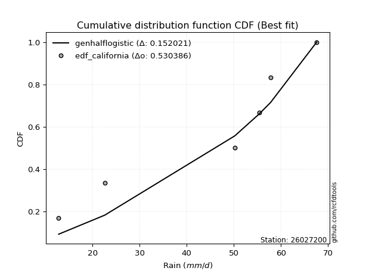</img>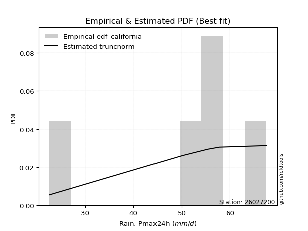</img>

</div>


### 2. EDF Hazen (1930)

Hazen method for plotting positions is a formula used to estimate the empirical cumulative probability distribution of flood events or other hydrological data. This formula often results in biased estimations, particularly when extrapolating to extreme events (high return periods).

<div align="center">


$P=(m-0.5)/n$


</div>


**2.1. Empirical values**

<div align="center">

|                | 0                   | 1                  | 2                  | 3                  | 4         | 5                  |
|:---------------|:--------------------|:-------------------|:-------------------|:-------------------|:----------|:-------------------|
| date           | 2025                | 2023               | 2019               | 2022               | 2020      | 2021               |
| x              | 12.8                | 22.6               | 50.2               | 55.4               | 57.8      | 67.6               |
| m              | 1                   | 2                  | 3                  | 4                  | 5         | 6                  |
| empirical_dist | edf_hazen           | edf_hazen          | edf_hazen          | edf_hazen          | edf_hazen | edf_hazen          |
| empirical      | 0.08333333333333333 | 0.25               | 0.4166666666666667 | 0.5833333333333334 | 0.75      | 0.9166666666666666 |
| empirical_tr   | 1.090909090909091   | 1.3333333333333333 | 1.7142857142857144 | 2.4000000000000004 | 4.0       | 11.999999999999995 |

</div>


**2.2. Kolmogorov-Smirnov fit test (sorted by Δ)**


<div align="center">

|                | 0                   | 1                   | 2                   | 3                   | 4                   | 5                   | 6                   | 7                   | 8                  | 9                   | 10                 | 11                 | 12                 | 13                 | 14                  | 15                  | 16                  | 17                 | 18                  | 19                 | 20                  | 21                  | 22                 | 23                  | 24                  | 25                  | 26                  | 27                  | 28                  | 29                  | 30                 | 31                  | 32                  | 33                 | 34                  | 35                | 36                  | 37                  | 38                  | 39                  | 40                  | 41                  | 42                  | 43                  | 44                 | 45                  | 46                 | 47                  | 48                  | 49                  | 50                  | 51                  | 52                  | 53                 | 54                  | 55                  | 56                  | 57                  | 58                  | 59                  | 60                | 61                  | 62                 | 63                  | 64                  | 65                  | 66                  | 67                  | 68                 | 69                  | 70               | 71                 | 72                  | 73                  | 74                  | 75                  | 76                | 77                 | 78                 | 79                  | 80                 | 81                 | 82                  | 83                 | 84                 | 85                  | 86                  | 87                  | 88                  | 89                  | 90                  | 91                 | 92                 | 93                  | 94                 | 95                  | 96                  | 97                  | 98                 | 99                  | 100                 | 101                | 102                 | 103                | 104                | 105               | 106                | 107                 | 108                | 109                 | 110                 | 111                | 112                 | 113                | 114                 | 115                 | 116                 | 117                | 118                | 119                | 120                | 121                 | 122                | 123                | 124                 | 125               | 126                 | 127                 | 128                | 129                | 130                 | 131                 | 132                | 133                | 134                 | 135                 | 136                | 137                | 138                 | 139                 | 140                 | 141                 | 142                | 143                 | 144                 | 145                | 146                | 147                | 148                | 149               | 150                | 151                | 152               | 153               | 154                | 155                | 156            | 157            | 158                | 159                |
|:---------------|:--------------------|:--------------------|:--------------------|:--------------------|:--------------------|:--------------------|:--------------------|:--------------------|:-------------------|:--------------------|:-------------------|:-------------------|:-------------------|:-------------------|:--------------------|:--------------------|:--------------------|:-------------------|:--------------------|:-------------------|:--------------------|:--------------------|:-------------------|:--------------------|:--------------------|:--------------------|:--------------------|:--------------------|:--------------------|:--------------------|:-------------------|:--------------------|:--------------------|:-------------------|:--------------------|:------------------|:--------------------|:--------------------|:--------------------|:--------------------|:--------------------|:--------------------|:--------------------|:--------------------|:-------------------|:--------------------|:-------------------|:--------------------|:--------------------|:--------------------|:--------------------|:--------------------|:--------------------|:-------------------|:--------------------|:--------------------|:--------------------|:--------------------|:--------------------|:--------------------|:------------------|:--------------------|:-------------------|:--------------------|:--------------------|:--------------------|:--------------------|:--------------------|:-------------------|:--------------------|:-----------------|:-------------------|:--------------------|:--------------------|:--------------------|:--------------------|:------------------|:-------------------|:-------------------|:--------------------|:-------------------|:-------------------|:--------------------|:-------------------|:-------------------|:--------------------|:--------------------|:--------------------|:--------------------|:--------------------|:--------------------|:-------------------|:-------------------|:--------------------|:-------------------|:--------------------|:--------------------|:--------------------|:-------------------|:--------------------|:--------------------|:-------------------|:--------------------|:-------------------|:-------------------|:------------------|:-------------------|:--------------------|:-------------------|:--------------------|:--------------------|:-------------------|:--------------------|:-------------------|:--------------------|:--------------------|:--------------------|:-------------------|:-------------------|:-------------------|:-------------------|:--------------------|:-------------------|:-------------------|:--------------------|:------------------|:--------------------|:--------------------|:-------------------|:-------------------|:--------------------|:--------------------|:-------------------|:-------------------|:--------------------|:--------------------|:-------------------|:-------------------|:--------------------|:--------------------|:--------------------|:--------------------|:-------------------|:--------------------|:--------------------|:-------------------|:-------------------|:-------------------|:-------------------|:------------------|:-------------------|:-------------------|:------------------|:------------------|:-------------------|:-------------------|:---------------|:---------------|:-------------------|:-------------------|
| station        | 26027200            | 26027200            | 26027200            | 26027200            | 26027200            | 26027200            | 26027200            | 26027200            | 26027200           | 26027200            | 26027200           | 26027200           | 26027200           | 26027200           | 26027200            | 26027200            | 26027200            | 26027200           | 26027200            | 26027200           | 26027200            | 26027200            | 26027200           | 26027200            | 26027200            | 26027200            | 26027200            | 26027200            | 26027200            | 26027200            | 26027200           | 26027200            | 26027200            | 26027200           | 26027200            | 26027200          | 26027200            | 26027200            | 26027200            | 26027200            | 26027200            | 26027200            | 26027200            | 26027200            | 26027200           | 26027200            | 26027200           | 26027200            | 26027200            | 26027200            | 26027200            | 26027200            | 26027200            | 26027200           | 26027200            | 26027200            | 26027200            | 26027200            | 26027200            | 26027200            | 26027200          | 26027200            | 26027200           | 26027200            | 26027200            | 26027200            | 26027200            | 26027200            | 26027200           | 26027200            | 26027200         | 26027200           | 26027200            | 26027200            | 26027200            | 26027200            | 26027200          | 26027200           | 26027200           | 26027200            | 26027200           | 26027200           | 26027200            | 26027200           | 26027200           | 26027200            | 26027200            | 26027200            | 26027200            | 26027200            | 26027200            | 26027200           | 26027200           | 26027200            | 26027200           | 26027200            | 26027200            | 26027200            | 26027200           | 26027200            | 26027200            | 26027200           | 26027200            | 26027200           | 26027200           | 26027200          | 26027200           | 26027200            | 26027200           | 26027200            | 26027200            | 26027200           | 26027200            | 26027200           | 26027200            | 26027200            | 26027200            | 26027200           | 26027200           | 26027200           | 26027200           | 26027200            | 26027200           | 26027200           | 26027200            | 26027200          | 26027200            | 26027200            | 26027200           | 26027200           | 26027200            | 26027200            | 26027200           | 26027200           | 26027200            | 26027200            | 26027200           | 26027200           | 26027200            | 26027200            | 26027200            | 26027200            | 26027200           | 26027200            | 26027200            | 26027200           | 26027200           | 26027200           | 26027200           | 26027200          | 26027200           | 26027200           | 26027200          | 26027200          | 26027200           | 26027200           | 26027200       | 26027200       | 26027200           | 26027200           |
| empirical_dist | edf_hazen           | edf_hazen           | edf_hazen           | edf_hazen           | edf_hazen           | edf_hazen           | edf_hazen           | edf_hazen           | edf_hazen          | edf_hazen           | edf_hazen          | edf_hazen          | edf_hazen          | edf_hazen          | edf_hazen           | edf_hazen           | edf_hazen           | edf_hazen          | edf_hazen           | edf_hazen          | edf_hazen           | edf_hazen           | edf_hazen          | edf_hazen           | edf_hazen           | edf_hazen           | edf_hazen           | edf_hazen           | edf_hazen           | edf_hazen           | edf_hazen          | edf_hazen           | edf_hazen           | edf_hazen          | edf_hazen           | edf_hazen         | edf_hazen           | edf_hazen           | edf_hazen           | edf_hazen           | edf_hazen           | edf_hazen           | edf_hazen           | edf_hazen           | edf_hazen          | edf_hazen           | edf_hazen          | edf_hazen           | edf_hazen           | edf_hazen           | edf_hazen           | edf_hazen           | edf_hazen           | edf_hazen          | edf_hazen           | edf_hazen           | edf_hazen           | edf_hazen           | edf_hazen           | edf_hazen           | edf_hazen         | edf_hazen           | edf_hazen          | edf_hazen           | edf_hazen           | edf_hazen           | edf_hazen           | edf_hazen           | edf_hazen          | edf_hazen           | edf_hazen        | edf_hazen          | edf_hazen           | edf_hazen           | edf_hazen           | edf_hazen           | edf_hazen         | edf_hazen          | edf_hazen          | edf_hazen           | edf_hazen          | edf_hazen          | edf_hazen           | edf_hazen          | edf_hazen          | edf_hazen           | edf_hazen           | edf_hazen           | edf_hazen           | edf_hazen           | edf_hazen           | edf_hazen          | edf_hazen          | edf_hazen           | edf_hazen          | edf_hazen           | edf_hazen           | edf_hazen           | edf_hazen          | edf_hazen           | edf_hazen           | edf_hazen          | edf_hazen           | edf_hazen          | edf_hazen          | edf_hazen         | edf_hazen          | edf_hazen           | edf_hazen          | edf_hazen           | edf_hazen           | edf_hazen          | edf_hazen           | edf_hazen          | edf_hazen           | edf_hazen           | edf_hazen           | edf_hazen          | edf_hazen          | edf_hazen          | edf_hazen          | edf_hazen           | edf_hazen          | edf_hazen          | edf_hazen           | edf_hazen         | edf_hazen           | edf_hazen           | edf_hazen          | edf_hazen          | edf_hazen           | edf_hazen           | edf_hazen          | edf_hazen          | edf_hazen           | edf_hazen           | edf_hazen          | edf_hazen          | edf_hazen           | edf_hazen           | edf_hazen           | edf_hazen           | edf_hazen          | edf_hazen           | edf_hazen           | edf_hazen          | edf_hazen          | edf_hazen          | edf_hazen          | edf_hazen         | edf_hazen          | edf_hazen          | edf_hazen         | edf_hazen         | edf_hazen          | edf_hazen          | edf_hazen      | edf_hazen      | edf_hazen          | edf_hazen          |
| p_dist         | loggenextreme       | genpareto           | johnsonsu           | weibull_min         | argus               | trapezoid           | genhalflogistic     | gumbel_l            | logweibull_max     | arcsine             | triang             | loglevy_l          | skewnorm           | burr               | dweibull            | genextreme          | pearson3            | ksone              | logmielke           | dgamma             | wrapcauchy          | semicircular        | logloggamma        | logtrapezoid        | anglit              | gompertz            | logarcsine          | logdgamma           | beta                | logargus            | f                  | vonmises_line       | nct                 | exponnorm          | truncnorm           | crystalball       | norm                | t                   | levy_l              | gamma               | erlang              | betaprime           | rice                | loggennorm          | gennorm            | logistic            | logpearson3        | loggumbel_l         | logloglaplace       | logweibull_min      | gausshyper          | invgauss            | invgamma            | maxwell            | hypsecant           | logsemicircular     | cosine              | logdweibull         | alpha               | rayleigh            | loganglit         | loggompertz         | logburr12          | ncf                 | logbeta             | kappa4              | kstwobign           | loginvweibull       | logwrapcauchy      | logbetaprime        | logburr          | laplace            | halfnorm            | logf                | logncf              | logt                | lognorm           | logcrystalball     | logexponnorm       | logfatiguelife      | lognct             | tukeylambda        | loggenhalflogistic  | logerlang          | loginvgauss        | logalpha            | logrice             | logfoldnorm         | kappa3              | gumbel_r            | uniform             | loggamma           | loggamma           | loginvgamma         | truncweibull_min   | lomax               | logmaxwell          | loglogistic         | genexpon           | logkstwobign        | lograyleigh         | halflogistic       | halfgennorm         | loggenexpon        | moyal              | nakagami          | loghypsecant       | loglomax            | burr12             | logcosine           | loghalfnorm         | lognakagami        | logskewnorm         | logtriang          | loggumbel_r         | loglaplace          | loglaplace          | logrdist           | loghalflogistic    | bradford           | logmoyal           | loggenpareto        | wald               | truncexpon         | logksone            | logjohnsonsu      | logwald             | logtukeylambda      | loggengamma        | logjohnsonsb       | logkappa4           | logbradford         | loghalfgennorm     | logkappa3          | loguniform          | gengamma            | logvonmises_line   | loggausshyper      | logtruncnorm        | mielke              | logexponpow         | logtruncexpon       | invweibull         | fatiguelife         | logtruncweibull_min | exponweib          | powerlaw           | foldnorm           | logexponweib       | weibull_max       | logpowerlaw        | truncpareto        | johnsonsb         | logtruncpareto    | exponpow           | rdist              | genlogistic    | loggenlogistic | logvonmises        | vonmises           |
| delta          | 0.10311500740660784 | 0.10673238449061084 | 0.10781809450710028 | 0.13387363377961786 | 0.13455054666753163 | 0.13489403811892492 | 0.13956127362956589 | 0.14196714537436345 | 0.1459359706440641 | 0.14983250964561895 | 0.1500667554505572 | 0.1514510107748568 | 0.1514682495410456 | 0.1552075459078877 | 0.16016001677234815 | 0.16322433656317836 | 0.16618892020164228 | 0.1680027910842365 | 0.16823997885317948 | 0.1741889538960806 | 0.17475248184273823 | 0.17635903240220946 | 0.1764488752735101 | 0.18040953659221642 | 0.18292383664275774 | 0.18519477099344867 | 0.18638695519352183 | 0.18717175112072548 | 0.18942994671871938 | 0.18984275832031655 | 0.1968458805069398 | 0.19831842065745778 | 0.19865959018485851 | 0.1986864791734731 | 0.19868827245584658 | 0.198688283295181 | 0.19868828427962254 | 0.19868905240327234 | 0.20084783249803978 | 0.20421679045593394 | 0.20515209455026068 | 0.20646566498004787 | 0.21044787549306415 | 0.21271371127686742 | 0.2127641518898745 | 0.21328136897983957 | 0.2148620934911139 | 0.21537749779747634 | 0.21744077139319773 | 0.21816136428777738 | 0.22007422339975363 | 0.22123581538777032 | 0.22175557089183634 | 0.2238121179748666 | 0.22505640639728125 | 0.22532113646854973 | 0.22636689040601848 | 0.22732897519865214 | 0.22849824372283395 | 0.23153207429849226 | 0.234707979719258 | 0.23717871374831995 | 0.2386420520271691 | 0.23926909728556484 | 0.24529777784640439 | 0.24774695371947747 | 0.24963881302391805 | 0.24976788910439968 | 0.2520513427872149 | 0.25244337251477683 | 0.25253609705147 | 0.2530951499807739 | 0.25361970586009747 | 0.25641494363007383 | 0.25663375243954095 | 0.25693430067720385 | 0.256938920861189 | 0.2569393706614667 | 0.2569410204029639 | 0.25712162119401355 | 0.2571612318555166 | 0.2582907099883987 | 0.25916748795889205 | 0.2592263792763945 | 0.2595197272206758 | 0.26000563681687666 | 0.26123008489042027 | 0.26131860520096756 | 0.26347502927411376 | 0.26349051307687293 | 0.26581508515815094 | 0.2664886548051331 | 0.2664886548051331 | 0.26692477066370696 | 0.2676533541037514 | 0.26970564016117443 | 0.27596465269171283 | 0.27672259228574775 | 0.2769079616053211 | 0.28091876703922064 | 0.28160735890266136 | 0.2819928747908225 | 0.28234500954131897 | 0.2853583660884041 | 0.2854049110659623 | 0.289059173905767 | 0.2916001005010667 | 0.29274944435662237 | 0.2951414877386174 | 0.29639050997636424 | 0.29830691803292747 | 0.2983627705991048 | 0.30287378467625176 | 0.3123886890664607 | 0.31290168340837315 | 0.31869457286123376 | 0.31869457286123376 | 0.3202502682571687 | 0.3259376993577399 | 0.3264452987645102 | 0.3311958483350366 | 0.34004007245076123 | 0.3466986649342953 | 0.3494678658595291 | 0.35097964665111464 | 0.364840307175071 | 0.38376157053512644 | 0.38884067081940304 | 0.3908714447588119 | 0.3910060128347752 | 0.39885876949916493 | 0.39938008231125016 | 0.3997316600907275 | 0.4040534151279896 | 0.40450890931467093 | 0.40908542054390873 | 0.4109093481220763 | 0.4345050748474461 | 0.44526133267569495 | 0.44588969813996143 | 0.44652626291181635 | 0.46055335987920815 | 0.4652123778980974 | 0.46721165426538014 | 0.46767176222459733 | 0.5020316553993337 | 0.5283361078167574 | 0.5345655059283889 | 0.5378282540035471 | 0.588789155368436 | 0.5915514873058265 | 0.5938138754378162 | 0.629165654495419 | 0.653693713230292 | 0.6676901301554019 | 0.7499999999704997 | 0.75           | 0.75           | 1.2414695903859732 | 10.328898219489355 |
| deltao         | 0.530385761606      | 0.530385761606      | 0.530385761606      | 0.530385761606      | 0.530385761606      | 0.530385761606      | 0.530385761606      | 0.530385761606      | 0.530385761606     | 0.530385761606      | 0.530385761606     | 0.530385761606     | 0.530385761606     | 0.530385761606     | 0.530385761606      | 0.530385761606      | 0.530385761606      | 0.530385761606     | 0.530385761606      | 0.530385761606     | 0.530385761606      | 0.530385761606      | 0.530385761606     | 0.530385761606      | 0.530385761606      | 0.530385761606      | 0.530385761606      | 0.530385761606      | 0.530385761606      | 0.530385761606      | 0.530385761606     | 0.530385761606      | 0.530385761606      | 0.530385761606     | 0.530385761606      | 0.530385761606    | 0.530385761606      | 0.530385761606      | 0.530385761606      | 0.530385761606      | 0.530385761606      | 0.530385761606      | 0.530385761606      | 0.530385761606      | 0.530385761606     | 0.530385761606      | 0.530385761606     | 0.530385761606      | 0.530385761606      | 0.530385761606      | 0.530385761606      | 0.530385761606      | 0.530385761606      | 0.530385761606     | 0.530385761606      | 0.530385761606      | 0.530385761606      | 0.530385761606      | 0.530385761606      | 0.530385761606      | 0.530385761606    | 0.530385761606      | 0.530385761606     | 0.530385761606      | 0.530385761606      | 0.530385761606      | 0.530385761606      | 0.530385761606      | 0.530385761606     | 0.530385761606      | 0.530385761606   | 0.530385761606     | 0.530385761606      | 0.530385761606      | 0.530385761606      | 0.530385761606      | 0.530385761606    | 0.530385761606     | 0.530385761606     | 0.530385761606      | 0.530385761606     | 0.530385761606     | 0.530385761606      | 0.530385761606     | 0.530385761606     | 0.530385761606      | 0.530385761606      | 0.530385761606      | 0.530385761606      | 0.530385761606      | 0.530385761606      | 0.530385761606     | 0.530385761606     | 0.530385761606      | 0.530385761606     | 0.530385761606      | 0.530385761606      | 0.530385761606      | 0.530385761606     | 0.530385761606      | 0.530385761606      | 0.530385761606     | 0.530385761606      | 0.530385761606     | 0.530385761606     | 0.530385761606    | 0.530385761606     | 0.530385761606      | 0.530385761606     | 0.530385761606      | 0.530385761606      | 0.530385761606     | 0.530385761606      | 0.530385761606     | 0.530385761606      | 0.530385761606      | 0.530385761606      | 0.530385761606     | 0.530385761606     | 0.530385761606     | 0.530385761606     | 0.530385761606      | 0.530385761606     | 0.530385761606     | 0.530385761606      | 0.530385761606    | 0.530385761606      | 0.530385761606      | 0.530385761606     | 0.530385761606     | 0.530385761606      | 0.530385761606      | 0.530385761606     | 0.530385761606     | 0.530385761606      | 0.530385761606      | 0.530385761606     | 0.530385761606     | 0.530385761606      | 0.530385761606      | 0.530385761606      | 0.530385761606      | 0.530385761606     | 0.530385761606      | 0.530385761606      | 0.530385761606     | 0.530385761606     | 0.530385761606     | 0.530385761606     | 0.530385761606    | 0.530385761606     | 0.530385761606     | 0.530385761606    | 0.530385761606    | 0.530385761606     | 0.530385761606     | 0.530385761606 | 0.530385761606 | 0.530385761606     | 0.530385761606     |
| eval           | Δo > Δ              | Δo > Δ              | Δo > Δ              | Δo > Δ              | Δo > Δ              | Δo > Δ              | Δo > Δ              | Δo > Δ              | Δo > Δ             | Δo > Δ              | Δo > Δ             | Δo > Δ             | Δo > Δ             | Δo > Δ             | Δo > Δ              | Δo > Δ              | Δo > Δ              | Δo > Δ             | Δo > Δ              | Δo > Δ             | Δo > Δ              | Δo > Δ              | Δo > Δ             | Δo > Δ              | Δo > Δ              | Δo > Δ              | Δo > Δ              | Δo > Δ              | Δo > Δ              | Δo > Δ              | Δo > Δ             | Δo > Δ              | Δo > Δ              | Δo > Δ             | Δo > Δ              | Δo > Δ            | Δo > Δ              | Δo > Δ              | Δo > Δ              | Δo > Δ              | Δo > Δ              | Δo > Δ              | Δo > Δ              | Δo > Δ              | Δo > Δ             | Δo > Δ              | Δo > Δ             | Δo > Δ              | Δo > Δ              | Δo > Δ              | Δo > Δ              | Δo > Δ              | Δo > Δ              | Δo > Δ             | Δo > Δ              | Δo > Δ              | Δo > Δ              | Δo > Δ              | Δo > Δ              | Δo > Δ              | Δo > Δ            | Δo > Δ              | Δo > Δ             | Δo > Δ              | Δo > Δ              | Δo > Δ              | Δo > Δ              | Δo > Δ              | Δo > Δ             | Δo > Δ              | Δo > Δ           | Δo > Δ             | Δo > Δ              | Δo > Δ              | Δo > Δ              | Δo > Δ              | Δo > Δ            | Δo > Δ             | Δo > Δ             | Δo > Δ              | Δo > Δ             | Δo > Δ             | Δo > Δ              | Δo > Δ             | Δo > Δ             | Δo > Δ              | Δo > Δ              | Δo > Δ              | Δo > Δ              | Δo > Δ              | Δo > Δ              | Δo > Δ             | Δo > Δ             | Δo > Δ              | Δo > Δ             | Δo > Δ              | Δo > Δ              | Δo > Δ              | Δo > Δ             | Δo > Δ              | Δo > Δ              | Δo > Δ             | Δo > Δ              | Δo > Δ             | Δo > Δ             | Δo > Δ            | Δo > Δ             | Δo > Δ              | Δo > Δ             | Δo > Δ              | Δo > Δ              | Δo > Δ             | Δo > Δ              | Δo > Δ             | Δo > Δ              | Δo > Δ              | Δo > Δ              | Δo > Δ             | Δo > Δ             | Δo > Δ             | Δo > Δ             | Δo > Δ              | Δo > Δ             | Δo > Δ             | Δo > Δ              | Δo > Δ            | Δo > Δ              | Δo > Δ              | Δo > Δ             | Δo > Δ             | Δo > Δ              | Δo > Δ              | Δo > Δ             | Δo > Δ             | Δo > Δ              | Δo > Δ              | Δo > Δ             | Δo > Δ             | Δo > Δ              | Δo > Δ              | Δo > Δ              | Δo > Δ              | Δo > Δ             | Δo > Δ              | Δo > Δ              | Δo > Δ             | Δo > Δ             | Δo <= Δ            | Δo <= Δ            | Δo <= Δ           | Δo <= Δ            | Δo <= Δ            | Δo <= Δ           | Δo <= Δ           | Δo <= Δ            | Δo <= Δ            | Δo <= Δ        | Δo <= Δ        | Δo <= Δ            | Δo <= Δ            |
| fit            | 1                   | 1                   | 1                   | 1                   | 1                   | 1                   | 1                   | 1                   | 1                  | 1                   | 1                  | 1                  | 1                  | 1                  | 1                   | 1                   | 1                   | 1                  | 1                   | 1                  | 1                   | 1                   | 1                  | 1                   | 1                   | 1                   | 1                   | 1                   | 1                   | 1                   | 1                  | 1                   | 1                   | 1                  | 1                   | 1                 | 1                   | 1                   | 1                   | 1                   | 1                   | 1                   | 1                   | 1                   | 1                  | 1                   | 1                  | 1                   | 1                   | 1                   | 1                   | 1                   | 1                   | 1                  | 1                   | 1                   | 1                   | 1                   | 1                   | 1                   | 1                 | 1                   | 1                  | 1                   | 1                   | 1                   | 1                   | 1                   | 1                  | 1                   | 1                | 1                  | 1                   | 1                   | 1                   | 1                   | 1                 | 1                  | 1                  | 1                   | 1                  | 1                  | 1                   | 1                  | 1                  | 1                   | 1                   | 1                   | 1                   | 1                   | 1                   | 1                  | 1                  | 1                   | 1                  | 1                   | 1                   | 1                   | 1                  | 1                   | 1                   | 1                  | 1                   | 1                  | 1                  | 1                 | 1                  | 1                   | 1                  | 1                   | 1                   | 1                  | 1                   | 1                  | 1                   | 1                   | 1                   | 1                  | 1                  | 1                  | 1                  | 1                   | 1                  | 1                  | 1                   | 1                 | 1                   | 1                   | 1                  | 1                  | 1                   | 1                   | 1                  | 1                  | 1                   | 1                   | 1                  | 1                  | 1                   | 1                   | 1                   | 1                   | 1                  | 1                   | 1                   | 1                  | 1                  | 0                  | 0                  | 0                 | 0                  | 0                  | 0                 | 0                 | 0                  | 0                  | 0              | 0              | 0                  | 0                  |
| n              | 6                   | 6                   | 6                   | 6                   | 6                   | 6                   | 6                   | 6                   | 6                  | 6                   | 6                  | 6                  | 6                  | 6                  | 6                   | 6                   | 6                   | 6                  | 6                   | 6                  | 6                   | 6                   | 6                  | 6                   | 6                   | 6                   | 6                   | 6                   | 6                   | 6                   | 6                  | 6                   | 6                   | 6                  | 6                   | 6                 | 6                   | 6                   | 6                   | 6                   | 6                   | 6                   | 6                   | 6                   | 6                  | 6                   | 6                  | 6                   | 6                   | 6                   | 6                   | 6                   | 6                   | 6                  | 6                   | 6                   | 6                   | 6                   | 6                   | 6                   | 6                 | 6                   | 6                  | 6                   | 6                   | 6                   | 6                   | 6                   | 6                  | 6                   | 6                | 6                  | 6                   | 6                   | 6                   | 6                   | 6                 | 6                  | 6                  | 6                   | 6                  | 6                  | 6                   | 6                  | 6                  | 6                   | 6                   | 6                   | 6                   | 6                   | 6                   | 6                  | 6                  | 6                   | 6                  | 6                   | 6                   | 6                   | 6                  | 6                   | 6                   | 6                  | 6                   | 6                  | 6                  | 6                 | 6                  | 6                   | 6                  | 6                   | 6                   | 6                  | 6                   | 6                  | 6                   | 6                   | 6                   | 6                  | 6                  | 6                  | 6                  | 6                   | 6                  | 6                  | 6                   | 6                 | 6                   | 6                   | 6                  | 6                  | 6                   | 6                   | 6                  | 6                  | 6                   | 6                   | 6                  | 6                  | 6                   | 6                   | 6                   | 6                   | 6                  | 6                   | 6                   | 6                  | 6                  | 6                  | 6                  | 6                 | 6                  | 6                  | 6                 | 6                 | 6                  | 6                  | 6              | 6              | 6                  | 6                  |
| best_fit       | 1                   | 0                   | 0                   | 0                   | 0                   | 0                   | 0                   | 0                   | 0                  | 0                   | 0                  | 0                  | 0                  | 0                  | 0                   | 0                   | 0                   | 0                  | 0                   | 0                  | 0                   | 0                   | 0                  | 0                   | 0                   | 0                   | 0                   | 0                   | 0                   | 0                   | 0                  | 0                   | 0                   | 0                  | 0                   | 0                 | 0                   | 0                   | 0                   | 0                   | 0                   | 0                   | 0                   | 0                   | 0                  | 0                   | 0                  | 0                   | 0                   | 0                   | 0                   | 0                   | 0                   | 0                  | 0                   | 0                   | 0                   | 0                   | 0                   | 0                   | 0                 | 0                   | 0                  | 0                   | 0                   | 0                   | 0                   | 0                   | 0                  | 0                   | 0                | 0                  | 0                   | 0                   | 0                   | 0                   | 0                 | 0                  | 0                  | 0                   | 0                  | 0                  | 0                   | 0                  | 0                  | 0                   | 0                   | 0                   | 0                   | 0                   | 0                   | 0                  | 0                  | 0                   | 0                  | 0                   | 0                   | 0                   | 0                  | 0                   | 0                   | 0                  | 0                   | 0                  | 0                  | 0                 | 0                  | 0                   | 0                  | 0                   | 0                   | 0                  | 0                   | 0                  | 0                   | 0                   | 0                   | 0                  | 0                  | 0                  | 0                  | 0                   | 0                  | 0                  | 0                   | 0                 | 0                   | 0                   | 0                  | 0                  | 0                   | 0                   | 0                  | 0                  | 0                   | 0                   | 0                  | 0                  | 0                   | 0                   | 0                   | 0                   | 0                  | 0                   | 0                   | 0                  | 0                  | 0                  | 0                  | 0                 | 0                  | 0                  | 0                 | 0                 | 0                  | 0                  | 0              | 0              | 0                  | 0                  |
| best_fit_sort  | 1                   | 2                   | 3                   | 4                   | 5                   | 6                   | 7                   | 8                   | 9                  | 10                  | 11                 | 12                 | 13                 | 14                 | 15                  | 16                  | 17                  | 18                 | 19                  | 20                 | 21                  | 22                  | 23                 | 24                  | 25                  | 26                  | 27                  | 28                  | 29                  | 30                  | 31                 | 32                  | 33                  | 34                 | 35                  | 36                | 37                  | 38                  | 39                  | 40                  | 41                  | 42                  | 43                  | 44                  | 45                 | 46                  | 47                 | 48                  | 49                  | 50                  | 51                  | 52                  | 53                  | 54                 | 55                  | 56                  | 57                  | 58                  | 59                  | 60                  | 61                | 62                  | 63                 | 64                  | 65                  | 66                  | 67                  | 68                  | 69                 | 70                  | 71               | 72                 | 73                  | 74                  | 75                  | 76                  | 77                | 78                 | 79                 | 80                  | 81                 | 82                 | 83                  | 84                 | 85                 | 86                  | 87                  | 88                  | 89                  | 90                  | 91                  | 92                 | 93                 | 94                  | 95                 | 96                  | 97                  | 98                  | 99                 | 100                 | 101                 | 102                | 103                 | 104                | 105                | 106               | 107                | 108                 | 109                | 110                 | 111                 | 112                | 113                 | 114                | 115                 | 116                 | 117                 | 118                | 119                | 120                | 121                | 122                 | 123                | 124                | 125                 | 126               | 127                 | 128                 | 129                | 130                | 131                 | 132                 | 133                | 134                | 135                 | 136                 | 137                | 138                | 139                 | 140                 | 141                 | 142                 | 143                | 144                 | 145                 | 146                | 147                | 148                | 149                | 150               | 151                | 152                | 153               | 154               | 155                | 156                | 157            | 158            | 159                | 160                |

</div>


**2.3. Best fit**

<div align="center">

|   id |   station | empirical_dist   | p_dist        |    delta |   deltao | eval   |   fit |   n |   best_fit |   best_fit_sort |
|-----:|----------:|:-----------------|:--------------|---------:|---------:|:-------|------:|----:|-----------:|----------------:|
|    0 |  26027200 | edf_hazen        | loggenextreme | 0.103115 | 0.530386 | Δo > Δ |     1 |   6 |          1 |               1 |

</div>


<div align="center">

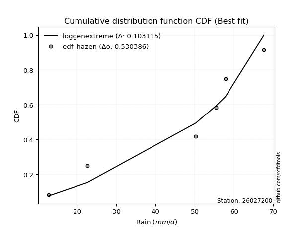</img>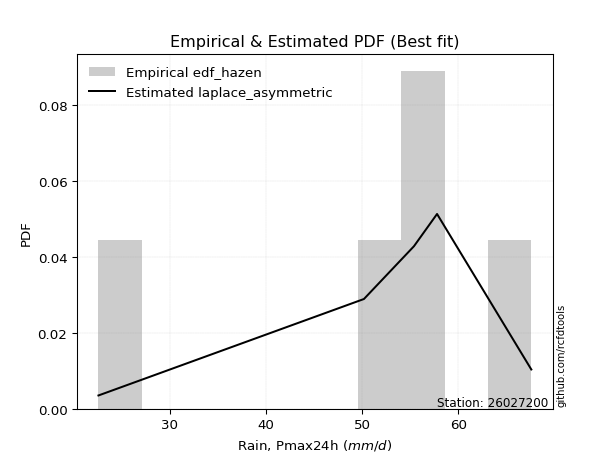</img>

</div>


### 3. EDF Weibull (1939)

Weibull plotting position formula is an empirical method used to estimate the non-exceedance probability or plotting position for a set of observed data, is often recommended or widely used in practice, particularly in flood frequency analysis.

<div align="center">


$P=m/(n+1)$


</div>


**3.1. Empirical values**

<div align="center">

|                | 0                   | 1                  | 2                   | 3                  | 4                  | 5                  |
|:---------------|:--------------------|:-------------------|:--------------------|:-------------------|:-------------------|:-------------------|
| date           | 2025                | 2023               | 2019                | 2022               | 2020               | 2021               |
| x              | 12.8                | 22.6               | 50.2                | 55.4               | 57.8               | 67.6               |
| m              | 1                   | 2                  | 3                   | 4                  | 5                  | 6                  |
| empirical_dist | edf_weibull         | edf_weibull        | edf_weibull         | edf_weibull        | edf_weibull        | edf_weibull        |
| empirical      | 0.14285714285714285 | 0.2857142857142857 | 0.42857142857142855 | 0.5714285714285714 | 0.7142857142857143 | 0.8571428571428571 |
| empirical_tr   | 1.1666666666666665  | 1.4                | 1.75                | 2.333333333333333  | 3.5                | 6.999999999999997  |

</div>


**3.2. Kolmogorov-Smirnov fit test (sorted by Δ)**


<div align="center">

|                | 0                   | 1                   | 2                   | 3                   | 4                   | 5                   | 6                  | 7                  | 8                   | 9                   | 10                  | 11                  | 12                 | 13                  | 14                 | 15                  | 16                  | 17                  | 18                  | 19                 | 20                  | 21                 | 22                  | 23                  | 24                  | 25                  | 26                  | 27                 | 28                  | 29                  | 30                  | 31                  | 32                  | 33                  | 34                  | 35                  | 36                  | 37                  | 38                | 39                  | 40                 | 41                 | 42                  | 43                  | 44                  | 45                  | 46                  | 47                 | 48                  | 49                 | 50                  | 51                 | 52                  | 53                  | 54                  | 55                 | 56                 | 57                  | 58                  | 59                  | 60                  | 61                  | 62                  | 63                  | 64                  | 65                 | 66                 | 67                 | 68                  | 69                  | 70                  | 71                  | 72                 | 73                  | 74                 | 75                | 76                  | 77                  | 78                  | 79                 | 80                  | 81                  | 82                 | 83                  | 84                  | 85                 | 86                 | 87                 | 88                 | 89                  | 90                 | 91                  | 92                  | 93                 | 94                  | 95                  | 96                  | 97                 | 98                  | 99                 | 100                | 101                 | 102                | 103                 | 104                | 105                 | 106                | 107                 | 108                | 109                | 110                | 111                 | 112                | 113                 | 114                | 115                | 116                | 117                | 118                 | 119                | 120                 | 121                 | 122                | 123                 | 124                 | 125                | 126                | 127                | 128                | 129                 | 130                 | 131                | 132                 | 133                 | 134                 | 135                 | 136                 | 137                 | 138                 | 139                | 140                 | 141                | 142                | 143                | 144                 | 145               | 146                | 147                | 148               | 149                | 150                | 151                | 152                | 153                | 154                | 155               | 156                | 157                | 158                | 159                |
|:---------------|:--------------------|:--------------------|:--------------------|:--------------------|:--------------------|:--------------------|:-------------------|:-------------------|:--------------------|:--------------------|:--------------------|:--------------------|:-------------------|:--------------------|:-------------------|:--------------------|:--------------------|:--------------------|:--------------------|:-------------------|:--------------------|:-------------------|:--------------------|:--------------------|:--------------------|:--------------------|:--------------------|:-------------------|:--------------------|:--------------------|:--------------------|:--------------------|:--------------------|:--------------------|:--------------------|:--------------------|:--------------------|:--------------------|:------------------|:--------------------|:-------------------|:-------------------|:--------------------|:--------------------|:--------------------|:--------------------|:--------------------|:-------------------|:--------------------|:-------------------|:--------------------|:-------------------|:--------------------|:--------------------|:--------------------|:-------------------|:-------------------|:--------------------|:--------------------|:--------------------|:--------------------|:--------------------|:--------------------|:--------------------|:--------------------|:-------------------|:-------------------|:-------------------|:--------------------|:--------------------|:--------------------|:--------------------|:-------------------|:--------------------|:-------------------|:------------------|:--------------------|:--------------------|:--------------------|:-------------------|:--------------------|:--------------------|:-------------------|:--------------------|:--------------------|:-------------------|:-------------------|:-------------------|:-------------------|:--------------------|:-------------------|:--------------------|:--------------------|:-------------------|:--------------------|:--------------------|:--------------------|:-------------------|:--------------------|:-------------------|:-------------------|:--------------------|:-------------------|:--------------------|:-------------------|:--------------------|:-------------------|:--------------------|:-------------------|:-------------------|:-------------------|:--------------------|:-------------------|:--------------------|:-------------------|:-------------------|:-------------------|:-------------------|:--------------------|:-------------------|:--------------------|:--------------------|:-------------------|:--------------------|:--------------------|:-------------------|:-------------------|:-------------------|:-------------------|:--------------------|:--------------------|:-------------------|:--------------------|:--------------------|:--------------------|:--------------------|:--------------------|:--------------------|:--------------------|:-------------------|:--------------------|:-------------------|:-------------------|:-------------------|:--------------------|:------------------|:-------------------|:-------------------|:------------------|:-------------------|:-------------------|:-------------------|:-------------------|:-------------------|:-------------------|:------------------|:-------------------|:-------------------|:-------------------|:-------------------|
| station        | 26027200            | 26027200            | 26027200            | 26027200            | 26027200            | 26027200            | 26027200           | 26027200           | 26027200            | 26027200            | 26027200            | 26027200            | 26027200           | 26027200            | 26027200           | 26027200            | 26027200            | 26027200            | 26027200            | 26027200           | 26027200            | 26027200           | 26027200            | 26027200            | 26027200            | 26027200            | 26027200            | 26027200           | 26027200            | 26027200            | 26027200            | 26027200            | 26027200            | 26027200            | 26027200            | 26027200            | 26027200            | 26027200            | 26027200          | 26027200            | 26027200           | 26027200           | 26027200            | 26027200            | 26027200            | 26027200            | 26027200            | 26027200           | 26027200            | 26027200           | 26027200            | 26027200           | 26027200            | 26027200            | 26027200            | 26027200           | 26027200           | 26027200            | 26027200            | 26027200            | 26027200            | 26027200            | 26027200            | 26027200            | 26027200            | 26027200           | 26027200           | 26027200           | 26027200            | 26027200            | 26027200            | 26027200            | 26027200           | 26027200            | 26027200           | 26027200          | 26027200            | 26027200            | 26027200            | 26027200           | 26027200            | 26027200            | 26027200           | 26027200            | 26027200            | 26027200           | 26027200           | 26027200           | 26027200           | 26027200            | 26027200           | 26027200            | 26027200            | 26027200           | 26027200            | 26027200            | 26027200            | 26027200           | 26027200            | 26027200           | 26027200           | 26027200            | 26027200           | 26027200            | 26027200           | 26027200            | 26027200           | 26027200            | 26027200           | 26027200           | 26027200           | 26027200            | 26027200           | 26027200            | 26027200           | 26027200           | 26027200           | 26027200           | 26027200            | 26027200           | 26027200            | 26027200            | 26027200           | 26027200            | 26027200            | 26027200           | 26027200           | 26027200           | 26027200           | 26027200            | 26027200            | 26027200           | 26027200            | 26027200            | 26027200            | 26027200            | 26027200            | 26027200            | 26027200            | 26027200           | 26027200            | 26027200           | 26027200           | 26027200           | 26027200            | 26027200          | 26027200           | 26027200           | 26027200          | 26027200           | 26027200           | 26027200           | 26027200           | 26027200           | 26027200           | 26027200          | 26027200           | 26027200           | 26027200           | 26027200           |
| empirical_dist | edf_weibull         | edf_weibull         | edf_weibull         | edf_weibull         | edf_weibull         | edf_weibull         | edf_weibull        | edf_weibull        | edf_weibull         | edf_weibull         | edf_weibull         | edf_weibull         | edf_weibull        | edf_weibull         | edf_weibull        | edf_weibull         | edf_weibull         | edf_weibull         | edf_weibull         | edf_weibull        | edf_weibull         | edf_weibull        | edf_weibull         | edf_weibull         | edf_weibull         | edf_weibull         | edf_weibull         | edf_weibull        | edf_weibull         | edf_weibull         | edf_weibull         | edf_weibull         | edf_weibull         | edf_weibull         | edf_weibull         | edf_weibull         | edf_weibull         | edf_weibull         | edf_weibull       | edf_weibull         | edf_weibull        | edf_weibull        | edf_weibull         | edf_weibull         | edf_weibull         | edf_weibull         | edf_weibull         | edf_weibull        | edf_weibull         | edf_weibull        | edf_weibull         | edf_weibull        | edf_weibull         | edf_weibull         | edf_weibull         | edf_weibull        | edf_weibull        | edf_weibull         | edf_weibull         | edf_weibull         | edf_weibull         | edf_weibull         | edf_weibull         | edf_weibull         | edf_weibull         | edf_weibull        | edf_weibull        | edf_weibull        | edf_weibull         | edf_weibull         | edf_weibull         | edf_weibull         | edf_weibull        | edf_weibull         | edf_weibull        | edf_weibull       | edf_weibull         | edf_weibull         | edf_weibull         | edf_weibull        | edf_weibull         | edf_weibull         | edf_weibull        | edf_weibull         | edf_weibull         | edf_weibull        | edf_weibull        | edf_weibull        | edf_weibull        | edf_weibull         | edf_weibull        | edf_weibull         | edf_weibull         | edf_weibull        | edf_weibull         | edf_weibull         | edf_weibull         | edf_weibull        | edf_weibull         | edf_weibull        | edf_weibull        | edf_weibull         | edf_weibull        | edf_weibull         | edf_weibull        | edf_weibull         | edf_weibull        | edf_weibull         | edf_weibull        | edf_weibull        | edf_weibull        | edf_weibull         | edf_weibull        | edf_weibull         | edf_weibull        | edf_weibull        | edf_weibull        | edf_weibull        | edf_weibull         | edf_weibull        | edf_weibull         | edf_weibull         | edf_weibull        | edf_weibull         | edf_weibull         | edf_weibull        | edf_weibull        | edf_weibull        | edf_weibull        | edf_weibull         | edf_weibull         | edf_weibull        | edf_weibull         | edf_weibull         | edf_weibull         | edf_weibull         | edf_weibull         | edf_weibull         | edf_weibull         | edf_weibull        | edf_weibull         | edf_weibull        | edf_weibull        | edf_weibull        | edf_weibull         | edf_weibull       | edf_weibull        | edf_weibull        | edf_weibull       | edf_weibull        | edf_weibull        | edf_weibull        | edf_weibull        | edf_weibull        | edf_weibull        | edf_weibull       | edf_weibull        | edf_weibull        | edf_weibull        | edf_weibull        |
| p_dist         | loglevy_l           | trapezoid           | levy_l              | logweibull_max      | genhalflogistic     | arcsine             | genpareto          | loggenextreme      | burr                | johnsonsu           | skewnorm            | beta                | pearson3           | genextreme          | triang             | ksone               | logmielke           | gumbel_l            | wrapcauchy          | semicircular       | logloggamma         | logdweibull        | logtrapezoid        | weibull_min         | argus               | anglit              | logarcsine          | logargus           | gompertz            | f                   | nct                 | exponnorm           | truncnorm           | crystalball         | norm                | t                   | gamma               | erlang              | betaprime         | dweibull            | rice               | logistic           | logpearson3         | loggumbel_l         | logweibull_min      | gausshyper          | invgauss            | logbeta            | invgamma            | dgamma             | maxwell             | hypsecant          | logsemicircular     | logloglaplace       | cosine              | alpha              | rayleigh           | loganglit           | logdgamma           | loggennorm          | gennorm             | loggompertz         | logburr12           | ncf                 | vonmises_line       | kappa4             | kstwobign          | loginvweibull      | logwrapcauchy       | logbetaprime        | logburr             | laplace             | halfnorm           | logf                | logncf             | logt              | lognorm             | logcrystalball      | logexponnorm        | logfatiguelife     | lognct              | tukeylambda         | loggenhalflogistic | logerlang           | loginvgauss         | logalpha           | logrice            | logfoldnorm        | kappa3             | gumbel_r            | uniform            | loggamma            | loggamma            | loginvgamma        | truncweibull_min    | lomax               | logmaxwell          | loglogistic        | genexpon            | logkstwobign       | lograyleigh        | halflogistic        | halfgennorm        | loggenexpon         | moyal              | loghypsecant        | loglomax           | burr12              | logcosine          | nakagami           | loghalfnorm        | lognakagami         | logskewnorm        | logtriang           | loggumbel_r        | loglaplace         | loglaplace         | logrdist           | loghalflogistic     | bradford           | logmoyal            | loggenpareto        | logjohnsonsu       | wald                | truncexpon          | logksone           | logjohnsonsb       | logwald            | logtukeylambda     | loggengamma         | logkappa4           | logbradford        | loghalfgennorm      | logkappa3           | loguniform          | gengamma            | logvonmises_line    | invweibull          | loggausshyper       | logtruncnorm       | mielke              | logexponpow        | fatiguelife        | logtruncexpon      | logtruncweibull_min | exponweib         | logexponweib       | powerlaw           | foldnorm          | weibull_max        | logpowerlaw        | truncpareto        | johnsonsb          | logtruncpareto     | exponpow           | rdist             | genlogistic        | loggenlogistic     | logvonmises        | vonmises           |
| delta          | 0.11573672506057109 | 0.12298927621416306 | 0.14132402297423025 | 0.14285711535067724 | 0.14285714285714035 | 0.14285714285714285 | 0.1428571428571429 | 0.1428571428571429 | 0.14330278400312585 | 0.14353238022138598 | 0.14582621319254466 | 0.15371566100443368 | 0.1542841582968804 | 0.15521293161213498 | 0.1554864895045397 | 0.15609802917947463 | 0.15633521694841762 | 0.15808365370152636 | 0.16284771993797637 | 0.1644542704974476 | 0.16454411336874825 | 0.1678051656748426 | 0.16850477468745456 | 0.16958791949390356 | 0.17026483238181733 | 0.17101907473799588 | 0.17448219328875997 | 0.1779379964155547 | 0.18035633075221572 | 0.18494111860217793 | 0.18675482828009665 | 0.18678171726871123 | 0.18678351055108472 | 0.18678352139041915 | 0.18678352237486068 | 0.18678429049851047 | 0.19231202855117208 | 0.19324733264549881 | 0.194560903075286 | 0.19587430248663384 | 0.1985431135883023 | 0.2013766070750777 | 0.20295733158635204 | 0.20347273589271447 | 0.20625660238301552 | 0.20816946149499177 | 0.20933105348300846 | 0.2095834921321187 | 0.20985080898707448 | 0.2099032396103663 | 0.21190735607010475 | 0.2131516444925194 | 0.21341637456378787 | 0.21415380626962427 | 0.21446212850125662 | 0.2165934818180721 | 0.2196273123937304 | 0.22280321781449614 | 0.22288603683501118 | 0.22461847318162928 | 0.22466891379463635 | 0.22527395184355808 | 0.22673729012240723 | 0.22736433538080297 | 0.23403270637174348 | 0.2358421918147156 | 0.2377340511191562 | 0.2378631271996378 | 0.24014658088245305 | 0.24053861061001497 | 0.24063133514670815 | 0.24119038807601206 | 0.2417149439553356 | 0.24451018172531197 | 0.2447289905347791 | 0.245029538772442 | 0.24503415895642716 | 0.24503460875670485 | 0.24503625849820204 | 0.2452168592892517 | 0.24525646995075473 | 0.24638594808363684 | 0.2472627260541302 | 0.24732161737163266 | 0.24761496531591393 | 0.2481008749121148 | 0.2493253229856584 | 0.2494138432962057 | 0.2515702673693519 | 0.25158575117211107 | 0.2539103232533891 | 0.25458389290037126 | 0.25458389290037126 | 0.2550200087589451 | 0.25574859219898954 | 0.25780087825641257 | 0.26405989078695097 | 0.2648178303809859 | 0.26500319970055924 | 0.2690140051344588 | 0.2697025969978995 | 0.27008811288606066 | 0.2704402476365571 | 0.27345360418364223 | 0.2735001491612004 | 0.27969533859630485 | 0.2808446824518605 | 0.28323672583385556 | 0.2844857480716024 | 0.2857142856606977 | 0.2864021561281656 | 0.28645800869434296 | 0.2909690227714899 | 0.30048392716169886 | 0.3009969215036113 | 0.3067898109564719 | 0.3067898109564719 | 0.3083455063524068 | 0.31403293745297806 | 0.3145405368597483 | 0.31929108643027476 | 0.32813531054599937 | 0.3291260214607853 | 0.33479390302953344 | 0.33756310395476724 | 0.3390748847463528 | 0.3552917271204895 | 0.3718568086303646 | 0.3769359089146412 | 0.37896668285405005 | 0.38695400759440307 | 0.3874753204064883 | 0.38782689818596566 | 0.39214865322322773 | 0.39260414740990907 | 0.39628333506743424 | 0.39900458621731444 | 0.40568856837428785 | 0.42260031294268424 | 0.4333565707709331 | 0.43398493623519957 | 0.4346215010070545 | 0.4405989244219524 | 0.4486485979744463 | 0.45576700031983547 | 0.466317369685048 | 0.5021139682892614 | 0.5164313459119956 | 0.522660744023627 | 0.5530748696541503 | 0.5558372015915408 | 0.5580995897235305 | 0.5934513687811331 | 0.6179794275160063 | 0.6319758444411162 | 0.714285714256214 | 0.7142857142857143 | 0.7142857142857143 | 1.2295648284812113 | 10.388422029013164 |
| deltao         | 0.530385761606      | 0.530385761606      | 0.530385761606      | 0.530385761606      | 0.530385761606      | 0.530385761606      | 0.530385761606     | 0.530385761606     | 0.530385761606      | 0.530385761606      | 0.530385761606      | 0.530385761606      | 0.530385761606     | 0.530385761606      | 0.530385761606     | 0.530385761606      | 0.530385761606      | 0.530385761606      | 0.530385761606      | 0.530385761606     | 0.530385761606      | 0.530385761606     | 0.530385761606      | 0.530385761606      | 0.530385761606      | 0.530385761606      | 0.530385761606      | 0.530385761606     | 0.530385761606      | 0.530385761606      | 0.530385761606      | 0.530385761606      | 0.530385761606      | 0.530385761606      | 0.530385761606      | 0.530385761606      | 0.530385761606      | 0.530385761606      | 0.530385761606    | 0.530385761606      | 0.530385761606     | 0.530385761606     | 0.530385761606      | 0.530385761606      | 0.530385761606      | 0.530385761606      | 0.530385761606      | 0.530385761606     | 0.530385761606      | 0.530385761606     | 0.530385761606      | 0.530385761606     | 0.530385761606      | 0.530385761606      | 0.530385761606      | 0.530385761606     | 0.530385761606     | 0.530385761606      | 0.530385761606      | 0.530385761606      | 0.530385761606      | 0.530385761606      | 0.530385761606      | 0.530385761606      | 0.530385761606      | 0.530385761606     | 0.530385761606     | 0.530385761606     | 0.530385761606      | 0.530385761606      | 0.530385761606      | 0.530385761606      | 0.530385761606     | 0.530385761606      | 0.530385761606     | 0.530385761606    | 0.530385761606      | 0.530385761606      | 0.530385761606      | 0.530385761606     | 0.530385761606      | 0.530385761606      | 0.530385761606     | 0.530385761606      | 0.530385761606      | 0.530385761606     | 0.530385761606     | 0.530385761606     | 0.530385761606     | 0.530385761606      | 0.530385761606     | 0.530385761606      | 0.530385761606      | 0.530385761606     | 0.530385761606      | 0.530385761606      | 0.530385761606      | 0.530385761606     | 0.530385761606      | 0.530385761606     | 0.530385761606     | 0.530385761606      | 0.530385761606     | 0.530385761606      | 0.530385761606     | 0.530385761606      | 0.530385761606     | 0.530385761606      | 0.530385761606     | 0.530385761606     | 0.530385761606     | 0.530385761606      | 0.530385761606     | 0.530385761606      | 0.530385761606     | 0.530385761606     | 0.530385761606     | 0.530385761606     | 0.530385761606      | 0.530385761606     | 0.530385761606      | 0.530385761606      | 0.530385761606     | 0.530385761606      | 0.530385761606      | 0.530385761606     | 0.530385761606     | 0.530385761606     | 0.530385761606     | 0.530385761606      | 0.530385761606      | 0.530385761606     | 0.530385761606      | 0.530385761606      | 0.530385761606      | 0.530385761606      | 0.530385761606      | 0.530385761606      | 0.530385761606      | 0.530385761606     | 0.530385761606      | 0.530385761606     | 0.530385761606     | 0.530385761606     | 0.530385761606      | 0.530385761606    | 0.530385761606     | 0.530385761606     | 0.530385761606    | 0.530385761606     | 0.530385761606     | 0.530385761606     | 0.530385761606     | 0.530385761606     | 0.530385761606     | 0.530385761606    | 0.530385761606     | 0.530385761606     | 0.530385761606     | 0.530385761606     |
| eval           | Δo > Δ              | Δo > Δ              | Δo > Δ              | Δo > Δ              | Δo > Δ              | Δo > Δ              | Δo > Δ             | Δo > Δ             | Δo > Δ              | Δo > Δ              | Δo > Δ              | Δo > Δ              | Δo > Δ             | Δo > Δ              | Δo > Δ             | Δo > Δ              | Δo > Δ              | Δo > Δ              | Δo > Δ              | Δo > Δ             | Δo > Δ              | Δo > Δ             | Δo > Δ              | Δo > Δ              | Δo > Δ              | Δo > Δ              | Δo > Δ              | Δo > Δ             | Δo > Δ              | Δo > Δ              | Δo > Δ              | Δo > Δ              | Δo > Δ              | Δo > Δ              | Δo > Δ              | Δo > Δ              | Δo > Δ              | Δo > Δ              | Δo > Δ            | Δo > Δ              | Δo > Δ             | Δo > Δ             | Δo > Δ              | Δo > Δ              | Δo > Δ              | Δo > Δ              | Δo > Δ              | Δo > Δ             | Δo > Δ              | Δo > Δ             | Δo > Δ              | Δo > Δ             | Δo > Δ              | Δo > Δ              | Δo > Δ              | Δo > Δ             | Δo > Δ             | Δo > Δ              | Δo > Δ              | Δo > Δ              | Δo > Δ              | Δo > Δ              | Δo > Δ              | Δo > Δ              | Δo > Δ              | Δo > Δ             | Δo > Δ             | Δo > Δ             | Δo > Δ              | Δo > Δ              | Δo > Δ              | Δo > Δ              | Δo > Δ             | Δo > Δ              | Δo > Δ             | Δo > Δ            | Δo > Δ              | Δo > Δ              | Δo > Δ              | Δo > Δ             | Δo > Δ              | Δo > Δ              | Δo > Δ             | Δo > Δ              | Δo > Δ              | Δo > Δ             | Δo > Δ             | Δo > Δ             | Δo > Δ             | Δo > Δ              | Δo > Δ             | Δo > Δ              | Δo > Δ              | Δo > Δ             | Δo > Δ              | Δo > Δ              | Δo > Δ              | Δo > Δ             | Δo > Δ              | Δo > Δ             | Δo > Δ             | Δo > Δ              | Δo > Δ             | Δo > Δ              | Δo > Δ             | Δo > Δ              | Δo > Δ             | Δo > Δ              | Δo > Δ             | Δo > Δ             | Δo > Δ             | Δo > Δ              | Δo > Δ             | Δo > Δ              | Δo > Δ             | Δo > Δ             | Δo > Δ             | Δo > Δ             | Δo > Δ              | Δo > Δ             | Δo > Δ              | Δo > Δ              | Δo > Δ             | Δo > Δ              | Δo > Δ              | Δo > Δ             | Δo > Δ             | Δo > Δ             | Δo > Δ             | Δo > Δ              | Δo > Δ              | Δo > Δ             | Δo > Δ              | Δo > Δ              | Δo > Δ              | Δo > Δ              | Δo > Δ              | Δo > Δ              | Δo > Δ              | Δo > Δ             | Δo > Δ              | Δo > Δ             | Δo > Δ             | Δo > Δ             | Δo > Δ              | Δo > Δ            | Δo > Δ             | Δo > Δ             | Δo > Δ            | Δo <= Δ            | Δo <= Δ            | Δo <= Δ            | Δo <= Δ            | Δo <= Δ            | Δo <= Δ            | Δo <= Δ           | Δo <= Δ            | Δo <= Δ            | Δo <= Δ            | Δo <= Δ            |
| fit            | 1                   | 1                   | 1                   | 1                   | 1                   | 1                   | 1                  | 1                  | 1                   | 1                   | 1                   | 1                   | 1                  | 1                   | 1                  | 1                   | 1                   | 1                   | 1                   | 1                  | 1                   | 1                  | 1                   | 1                   | 1                   | 1                   | 1                   | 1                  | 1                   | 1                   | 1                   | 1                   | 1                   | 1                   | 1                   | 1                   | 1                   | 1                   | 1                 | 1                   | 1                  | 1                  | 1                   | 1                   | 1                   | 1                   | 1                   | 1                  | 1                   | 1                  | 1                   | 1                  | 1                   | 1                   | 1                   | 1                  | 1                  | 1                   | 1                   | 1                   | 1                   | 1                   | 1                   | 1                   | 1                   | 1                  | 1                  | 1                  | 1                   | 1                   | 1                   | 1                   | 1                  | 1                   | 1                  | 1                 | 1                   | 1                   | 1                   | 1                  | 1                   | 1                   | 1                  | 1                   | 1                   | 1                  | 1                  | 1                  | 1                  | 1                   | 1                  | 1                   | 1                   | 1                  | 1                   | 1                   | 1                   | 1                  | 1                   | 1                  | 1                  | 1                   | 1                  | 1                   | 1                  | 1                   | 1                  | 1                   | 1                  | 1                  | 1                  | 1                   | 1                  | 1                   | 1                  | 1                  | 1                  | 1                  | 1                   | 1                  | 1                   | 1                   | 1                  | 1                   | 1                   | 1                  | 1                  | 1                  | 1                  | 1                   | 1                   | 1                  | 1                   | 1                   | 1                   | 1                   | 1                   | 1                   | 1                   | 1                  | 1                   | 1                  | 1                  | 1                  | 1                   | 1                 | 1                  | 1                  | 1                 | 0                  | 0                  | 0                  | 0                  | 0                  | 0                  | 0                 | 0                  | 0                  | 0                  | 0                  |
| n              | 6                   | 6                   | 6                   | 6                   | 6                   | 6                   | 6                  | 6                  | 6                   | 6                   | 6                   | 6                   | 6                  | 6                   | 6                  | 6                   | 6                   | 6                   | 6                   | 6                  | 6                   | 6                  | 6                   | 6                   | 6                   | 6                   | 6                   | 6                  | 6                   | 6                   | 6                   | 6                   | 6                   | 6                   | 6                   | 6                   | 6                   | 6                   | 6                 | 6                   | 6                  | 6                  | 6                   | 6                   | 6                   | 6                   | 6                   | 6                  | 6                   | 6                  | 6                   | 6                  | 6                   | 6                   | 6                   | 6                  | 6                  | 6                   | 6                   | 6                   | 6                   | 6                   | 6                   | 6                   | 6                   | 6                  | 6                  | 6                  | 6                   | 6                   | 6                   | 6                   | 6                  | 6                   | 6                  | 6                 | 6                   | 6                   | 6                   | 6                  | 6                   | 6                   | 6                  | 6                   | 6                   | 6                  | 6                  | 6                  | 6                  | 6                   | 6                  | 6                   | 6                   | 6                  | 6                   | 6                   | 6                   | 6                  | 6                   | 6                  | 6                  | 6                   | 6                  | 6                   | 6                  | 6                   | 6                  | 6                   | 6                  | 6                  | 6                  | 6                   | 6                  | 6                   | 6                  | 6                  | 6                  | 6                  | 6                   | 6                  | 6                   | 6                   | 6                  | 6                   | 6                   | 6                  | 6                  | 6                  | 6                  | 6                   | 6                   | 6                  | 6                   | 6                   | 6                   | 6                   | 6                   | 6                   | 6                   | 6                  | 6                   | 6                  | 6                  | 6                  | 6                   | 6                 | 6                  | 6                  | 6                 | 6                  | 6                  | 6                  | 6                  | 6                  | 6                  | 6                 | 6                  | 6                  | 6                  | 6                  |
| best_fit       | 1                   | 0                   | 0                   | 0                   | 0                   | 0                   | 0                  | 0                  | 0                   | 0                   | 0                   | 0                   | 0                  | 0                   | 0                  | 0                   | 0                   | 0                   | 0                   | 0                  | 0                   | 0                  | 0                   | 0                   | 0                   | 0                   | 0                   | 0                  | 0                   | 0                   | 0                   | 0                   | 0                   | 0                   | 0                   | 0                   | 0                   | 0                   | 0                 | 0                   | 0                  | 0                  | 0                   | 0                   | 0                   | 0                   | 0                   | 0                  | 0                   | 0                  | 0                   | 0                  | 0                   | 0                   | 0                   | 0                  | 0                  | 0                   | 0                   | 0                   | 0                   | 0                   | 0                   | 0                   | 0                   | 0                  | 0                  | 0                  | 0                   | 0                   | 0                   | 0                   | 0                  | 0                   | 0                  | 0                 | 0                   | 0                   | 0                   | 0                  | 0                   | 0                   | 0                  | 0                   | 0                   | 0                  | 0                  | 0                  | 0                  | 0                   | 0                  | 0                   | 0                   | 0                  | 0                   | 0                   | 0                   | 0                  | 0                   | 0                  | 0                  | 0                   | 0                  | 0                   | 0                  | 0                   | 0                  | 0                   | 0                  | 0                  | 0                  | 0                   | 0                  | 0                   | 0                  | 0                  | 0                  | 0                  | 0                   | 0                  | 0                   | 0                   | 0                  | 0                   | 0                   | 0                  | 0                  | 0                  | 0                  | 0                   | 0                   | 0                  | 0                   | 0                   | 0                   | 0                   | 0                   | 0                   | 0                   | 0                  | 0                   | 0                  | 0                  | 0                  | 0                   | 0                 | 0                  | 0                  | 0                 | 0                  | 0                  | 0                  | 0                  | 0                  | 0                  | 0                 | 0                  | 0                  | 0                  | 0                  |
| best_fit_sort  | 1                   | 2                   | 3                   | 4                   | 5                   | 6                   | 7                  | 8                  | 9                   | 10                  | 11                  | 12                  | 13                 | 14                  | 15                 | 16                  | 17                  | 18                  | 19                  | 20                 | 21                  | 22                 | 23                  | 24                  | 25                  | 26                  | 27                  | 28                 | 29                  | 30                  | 31                  | 32                  | 33                  | 34                  | 35                  | 36                  | 37                  | 38                  | 39                | 40                  | 41                 | 42                 | 43                  | 44                  | 45                  | 46                  | 47                  | 48                 | 49                  | 50                 | 51                  | 52                 | 53                  | 54                  | 55                  | 56                 | 57                 | 58                  | 59                  | 60                  | 61                  | 62                  | 63                  | 64                  | 65                  | 66                 | 67                 | 68                 | 69                  | 70                  | 71                  | 72                  | 73                 | 74                  | 75                 | 76                | 77                  | 78                  | 79                  | 80                 | 81                  | 82                  | 83                 | 84                  | 85                  | 86                 | 87                 | 88                 | 89                 | 90                  | 91                 | 92                  | 93                  | 94                 | 95                  | 96                  | 97                  | 98                 | 99                  | 100                | 101                | 102                 | 103                | 104                 | 105                | 106                 | 107                | 108                 | 109                | 110                | 111                | 112                 | 113                | 114                 | 115                | 116                | 117                | 118                | 119                 | 120                | 121                 | 122                 | 123                | 124                 | 125                 | 126                | 127                | 128                | 129                | 130                 | 131                 | 132                | 133                 | 134                 | 135                 | 136                 | 137                 | 138                 | 139                 | 140                | 141                 | 142                | 143                | 144                | 145                 | 146               | 147                | 148                | 149               | 150                | 151                | 152                | 153                | 154                | 155                | 156               | 157                | 158                | 159                | 160                |

</div>


**3.3. Best fit**

<div align="center">

|   id |   station | empirical_dist   | p_dist    |    delta |   deltao | eval   |   fit |   n |   best_fit |   best_fit_sort |
|-----:|----------:|:-----------------|:----------|---------:|---------:|:-------|------:|----:|-----------:|----------------:|
|    0 |  26027200 | edf_weibull      | loglevy_l | 0.115737 | 0.530386 | Δo > Δ |     1 |   6 |          1 |               1 |

</div>


<div align="center">

</img>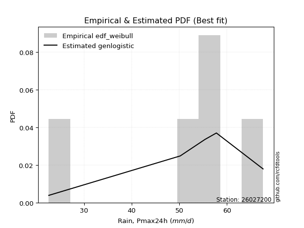</img>

</div>


### 4. EDF Beard (1943)

The Beard formula (or Beard´s plotting position formula) in hydrology is used to estimate the empirical non-exceedance probability _(P)_ of a flood event (or other extreme hydrological data point) within a given dataset.

<div align="center">


$P=(m-0.31)/(n+0.38)$


</div>


**4.1. Empirical values**

<div align="center">

|                | 0                   | 1                   | 2                  | 3                  | 4                  | 5                  |
|:---------------|:--------------------|:--------------------|:-------------------|:-------------------|:-------------------|:-------------------|
| date           | 2025                | 2023                | 2019               | 2022               | 2020               | 2021               |
| x              | 12.8                | 22.6                | 50.2               | 55.4               | 57.8               | 67.6               |
| m              | 1                   | 2                   | 3                  | 4                  | 5                  | 6                  |
| empirical_dist | edf_beard           | edf_beard           | edf_beard          | edf_beard          | edf_beard          | edf_beard          |
| empirical      | 0.10815047021943573 | 0.26489028213166144 | 0.4216300940438871 | 0.5783699059561128 | 0.7351097178683387 | 0.8918495297805643 |
| empirical_tr   | 1.1212653778558874  | 1.3603411513859276  | 1.7289972899728996 | 2.3717472118959106 | 3.7751479289940844 | 9.246376811594207  |

</div>


**4.2. Kolmogorov-Smirnov fit test (sorted by Δ)**


<div align="center">

|                | 0                   | 1                   | 2                   | 3                   | 4                   | 5                   | 6                   | 7                  | 8                  | 9                   | 10                  | 11                  | 12                 | 13                  | 14                  | 15                  | 16                  | 17                  | 18                  | 19                  | 20                  | 21                  | 22                  | 23                  | 24                  | 25                 | 26                  | 27                 | 28                 | 29                  | 30                  | 31             | 32                  | 33                  | 34                  | 35                  | 36                 | 37                 | 38                 | 39                  | 40                  | 41                  | 42                  | 43                 | 44                  | 45                  | 46                 | 47                  | 48                  | 49                 | 50                  | 51                 | 52                  | 53                  | 54                  | 55                 | 56                 | 57                  | 58                 | 59                  | 60                  | 61                  | 62                 | 63                  | 64                 | 65                  | 66                 | 67                  | 68                  | 69                 | 70                  | 71                  | 72                  | 73                 | 74                 | 75                 | 76                 | 77                 | 78                  | 79                 | 80                  | 81                  | 82                 | 83                 | 84                  | 85                 | 86                 | 87                 | 88                 | 89                 | 90                 | 91                 | 92                 | 93                 | 94                  | 95                | 96                 | 97                 | 98                  | 99                 | 100                | 101                | 102                 | 103                 | 104                 | 105                | 106                | 107                | 108               | 109                | 110                 | 111                | 112                | 113                | 114                | 115                | 116                | 117                 | 118                | 119                 | 120                | 121                | 122                 | 123                 | 124                | 125                 | 126                | 127               | 128                | 129                | 130                | 131                | 132                | 133                 | 134                | 135                 | 136                 | 137                 | 138                | 139                 | 140               | 141                | 142                | 143                | 144                 | 145                 | 146                | 147                | 148                | 149                | 150                | 151                | 152                | 153                | 154                | 155                | 156                | 157                | 158                | 159                |
|:---------------|:--------------------|:--------------------|:--------------------|:--------------------|:--------------------|:--------------------|:--------------------|:-------------------|:-------------------|:--------------------|:--------------------|:--------------------|:-------------------|:--------------------|:--------------------|:--------------------|:--------------------|:--------------------|:--------------------|:--------------------|:--------------------|:--------------------|:--------------------|:--------------------|:--------------------|:-------------------|:--------------------|:-------------------|:-------------------|:--------------------|:--------------------|:---------------|:--------------------|:--------------------|:--------------------|:--------------------|:-------------------|:-------------------|:-------------------|:--------------------|:--------------------|:--------------------|:--------------------|:-------------------|:--------------------|:--------------------|:-------------------|:--------------------|:--------------------|:-------------------|:--------------------|:-------------------|:--------------------|:--------------------|:--------------------|:-------------------|:-------------------|:--------------------|:-------------------|:--------------------|:--------------------|:--------------------|:-------------------|:--------------------|:-------------------|:--------------------|:-------------------|:--------------------|:--------------------|:-------------------|:--------------------|:--------------------|:--------------------|:-------------------|:-------------------|:-------------------|:-------------------|:-------------------|:--------------------|:-------------------|:--------------------|:--------------------|:-------------------|:-------------------|:--------------------|:-------------------|:-------------------|:-------------------|:-------------------|:-------------------|:-------------------|:-------------------|:-------------------|:-------------------|:--------------------|:------------------|:-------------------|:-------------------|:--------------------|:-------------------|:-------------------|:-------------------|:--------------------|:--------------------|:--------------------|:-------------------|:-------------------|:-------------------|:------------------|:-------------------|:--------------------|:-------------------|:-------------------|:-------------------|:-------------------|:-------------------|:-------------------|:--------------------|:-------------------|:--------------------|:-------------------|:-------------------|:--------------------|:--------------------|:-------------------|:--------------------|:-------------------|:------------------|:-------------------|:-------------------|:-------------------|:-------------------|:-------------------|:--------------------|:-------------------|:--------------------|:--------------------|:--------------------|:-------------------|:--------------------|:------------------|:-------------------|:-------------------|:-------------------|:--------------------|:--------------------|:-------------------|:-------------------|:-------------------|:-------------------|:-------------------|:-------------------|:-------------------|:-------------------|:-------------------|:-------------------|:-------------------|:-------------------|:-------------------|:-------------------|
| station        | 26027200            | 26027200            | 26027200            | 26027200            | 26027200            | 26027200            | 26027200            | 26027200           | 26027200           | 26027200            | 26027200            | 26027200            | 26027200           | 26027200            | 26027200            | 26027200            | 26027200            | 26027200            | 26027200            | 26027200            | 26027200            | 26027200            | 26027200            | 26027200            | 26027200            | 26027200           | 26027200            | 26027200           | 26027200           | 26027200            | 26027200            | 26027200       | 26027200            | 26027200            | 26027200            | 26027200            | 26027200           | 26027200           | 26027200           | 26027200            | 26027200            | 26027200            | 26027200            | 26027200           | 26027200            | 26027200            | 26027200           | 26027200            | 26027200            | 26027200           | 26027200            | 26027200           | 26027200            | 26027200            | 26027200            | 26027200           | 26027200           | 26027200            | 26027200           | 26027200            | 26027200            | 26027200            | 26027200           | 26027200            | 26027200           | 26027200            | 26027200           | 26027200            | 26027200            | 26027200           | 26027200            | 26027200            | 26027200            | 26027200           | 26027200           | 26027200           | 26027200           | 26027200           | 26027200            | 26027200           | 26027200            | 26027200            | 26027200           | 26027200           | 26027200            | 26027200           | 26027200           | 26027200           | 26027200           | 26027200           | 26027200           | 26027200           | 26027200           | 26027200           | 26027200            | 26027200          | 26027200           | 26027200           | 26027200            | 26027200           | 26027200           | 26027200           | 26027200            | 26027200            | 26027200            | 26027200           | 26027200           | 26027200           | 26027200          | 26027200           | 26027200            | 26027200           | 26027200           | 26027200           | 26027200           | 26027200           | 26027200           | 26027200            | 26027200           | 26027200            | 26027200           | 26027200           | 26027200            | 26027200            | 26027200           | 26027200            | 26027200           | 26027200          | 26027200           | 26027200           | 26027200           | 26027200           | 26027200           | 26027200            | 26027200           | 26027200            | 26027200            | 26027200            | 26027200           | 26027200            | 26027200          | 26027200           | 26027200           | 26027200           | 26027200            | 26027200            | 26027200           | 26027200           | 26027200           | 26027200           | 26027200           | 26027200           | 26027200           | 26027200           | 26027200           | 26027200           | 26027200           | 26027200           | 26027200           | 26027200           |
| empirical_dist | edf_beard           | edf_beard           | edf_beard           | edf_beard           | edf_beard           | edf_beard           | edf_beard           | edf_beard          | edf_beard          | edf_beard           | edf_beard           | edf_beard           | edf_beard          | edf_beard           | edf_beard           | edf_beard           | edf_beard           | edf_beard           | edf_beard           | edf_beard           | edf_beard           | edf_beard           | edf_beard           | edf_beard           | edf_beard           | edf_beard          | edf_beard           | edf_beard          | edf_beard          | edf_beard           | edf_beard           | edf_beard      | edf_beard           | edf_beard           | edf_beard           | edf_beard           | edf_beard          | edf_beard          | edf_beard          | edf_beard           | edf_beard           | edf_beard           | edf_beard           | edf_beard          | edf_beard           | edf_beard           | edf_beard          | edf_beard           | edf_beard           | edf_beard          | edf_beard           | edf_beard          | edf_beard           | edf_beard           | edf_beard           | edf_beard          | edf_beard          | edf_beard           | edf_beard          | edf_beard           | edf_beard           | edf_beard           | edf_beard          | edf_beard           | edf_beard          | edf_beard           | edf_beard          | edf_beard           | edf_beard           | edf_beard          | edf_beard           | edf_beard           | edf_beard           | edf_beard          | edf_beard          | edf_beard          | edf_beard          | edf_beard          | edf_beard           | edf_beard          | edf_beard           | edf_beard           | edf_beard          | edf_beard          | edf_beard           | edf_beard          | edf_beard          | edf_beard          | edf_beard          | edf_beard          | edf_beard          | edf_beard          | edf_beard          | edf_beard          | edf_beard           | edf_beard         | edf_beard          | edf_beard          | edf_beard           | edf_beard          | edf_beard          | edf_beard          | edf_beard           | edf_beard           | edf_beard           | edf_beard          | edf_beard          | edf_beard          | edf_beard         | edf_beard          | edf_beard           | edf_beard          | edf_beard          | edf_beard          | edf_beard          | edf_beard          | edf_beard          | edf_beard           | edf_beard          | edf_beard           | edf_beard          | edf_beard          | edf_beard           | edf_beard           | edf_beard          | edf_beard           | edf_beard          | edf_beard         | edf_beard          | edf_beard          | edf_beard          | edf_beard          | edf_beard          | edf_beard           | edf_beard          | edf_beard           | edf_beard           | edf_beard           | edf_beard          | edf_beard           | edf_beard         | edf_beard          | edf_beard          | edf_beard          | edf_beard           | edf_beard           | edf_beard          | edf_beard          | edf_beard          | edf_beard          | edf_beard          | edf_beard          | edf_beard          | edf_beard          | edf_beard          | edf_beard          | edf_beard          | edf_beard          | edf_beard          | edf_beard          |
| p_dist         | genpareto           | loggenextreme       | logweibull_max      | johnsonsu           | trapezoid           | genhalflogistic     | loglevy_l           | gumbel_l           | arcsine            | triang              | skewnorm            | genextreme          | weibull_min        | argus               | burr                | pearson3            | ksone               | logmielke           | wrapcauchy          | semicircular        | logloggamma         | beta                | dweibull            | logtrapezoid        | levy_l              | anglit             | gompertz            | logarcsine         | logargus           | dgamma              | f                   | logloglaplace  | nct                 | exponnorm           | truncnorm           | crystalball         | norm               | t                  | gamma              | erlang              | betaprime           | logdgamma           | logdweibull         | rice               | logistic            | logpearson3         | loggumbel_l        | logweibull_min      | vonmises_line       | gausshyper         | invgauss            | invgamma           | loggennorm          | gennorm             | maxwell             | hypsecant          | logsemicircular    | cosine              | alpha              | rayleigh            | loganglit           | logbeta             | loggompertz        | logburr12           | ncf                | kappa4              | kstwobign          | loginvweibull       | logwrapcauchy       | logbetaprime       | logburr             | laplace             | halfnorm            | logf               | logncf             | logt               | lognorm            | logcrystalball     | logexponnorm        | logfatiguelife     | lognct              | tukeylambda         | loggenhalflogistic | logerlang          | loginvgauss         | logalpha           | logrice            | logfoldnorm        | kappa3             | gumbel_r           | uniform            | loggamma           | loggamma           | loginvgamma        | truncweibull_min    | lomax             | logmaxwell         | loglogistic        | genexpon            | logkstwobign       | lograyleigh        | halflogistic       | halfgennorm         | loggenexpon         | moyal               | nakagami           | loghypsecant       | loglomax           | burr12            | logcosine          | loghalfnorm         | lognakagami        | logskewnorm        | logtriang          | loggumbel_r        | loglaplace         | loglaplace         | logrdist            | loghalflogistic    | bradford            | logmoyal           | loggenpareto       | wald                | truncexpon          | logksone           | logjohnsonsu        | logjohnsonsb       | logwald           | logtukeylambda     | loggengamma        | logkappa4          | logbradford        | loghalfgennorm     | logkappa3           | loguniform         | gengamma            | logvonmises_line    | loggausshyper       | logtruncnorm       | invweibull          | mielke            | logexponpow        | fatiguelife        | logtruncexpon      | logtruncweibull_min | exponweib           | logexponweib       | powerlaw           | foldnorm           | weibull_max        | logpowerlaw        | truncpareto        | johnsonsb          | logtruncpareto     | exponpow           | rdist              | genlogistic        | loggenlogistic     | logvonmises        | vonmises           |
| delta          | 0.10815047021943569 | 0.11223303051384853 | 0.12111883375796169 | 0.12270837663876172 | 0.12993061074170448 | 0.13459784625234544 | 0.13656072864319546 | 0.1372596501189021 | 0.1448690822683985 | 0.14510332807333676 | 0.14650482216382515 | 0.14833405443151704 | 0.1487639159112793 | 0.14944082879919307 | 0.15024411853066727 | 0.16122549282442183 | 0.16303936370701605 | 0.16327655147595904 | 0.16978905446551779 | 0.17139560502498902 | 0.17148544789628967 | 0.17453966458705805 | 0.17505029890400958 | 0.17544610921499598 | 0.17603069561193735 | 0.1779604092655373 | 0.18023134361622822 | 0.1814235278163014 | 0.1848793309430961 | 0.18907923602774204 | 0.19188245312971935 | 0.193329802687 | 0.19369616280763807 | 0.19372305179625265 | 0.19372484507862614 | 0.19372485591796057 | 0.1937248569024021 | 0.1937256250260519 | 0.1992533630787135 | 0.20018866717304024 | 0.20150223760282743 | 0.20206203325238692 | 0.20251183831254982 | 0.2054844481158437 | 0.20831794160261913 | 0.20989866611389346 | 0.2104140704202559 | 0.21319793691055694 | 0.21320870278911921 | 0.2151107960225332 | 0.21627238801054988 | 0.2167921435146159 | 0.21767713865408786 | 0.21772757926709493 | 0.21884869059764617 | 0.2200929790200608 | 0.2203577090913293 | 0.22140346302879804 | 0.2235348163456135 | 0.22656864692127182 | 0.22974455234203756 | 0.23040749571474306 | 0.2322152863710995 | 0.23367862464994865 | 0.2343056699083444 | 0.24278352634225703 | 0.2446753856466976 | 0.24480446172717923 | 0.24708791540999447 | 0.2474799451375564 | 0.24757266967424957 | 0.24813172260355348 | 0.24865627848287702 | 0.2514515162528534 | 0.2516703250623205 | 0.2519708732999834 | 0.2519754934839686 | 0.2519759432842463 | 0.25197759302574346 | 0.2521581938167931 | 0.25219780447829615 | 0.25332728261117826 | 0.2542040605816716 | 0.2542629518991741 | 0.25455629984345535 | 0.2550422094396562 | 0.2562666575131998 | 0.2563551778237471 | 0.2585116018968933 | 0.2585270856996525 | 0.2608516577809305 | 0.2615252274279127 | 0.2615252274279127 | 0.2619613432864865 | 0.26268992672653096 | 0.264742212783954 | 0.2710012253144924 | 0.2717591649085273 | 0.27194453422810067 | 0.2759553396620002 | 0.2766439315254409 | 0.2770294474136021 | 0.27738158216409853 | 0.28039493871118365 | 0.28044148368874183 | 0.2840957465285466 | 0.2866366731238463 | 0.2877860169794019 | 0.290178060361397 | 0.2914270825991438 | 0.29334349065570703 | 0.2933993432218844 | 0.2979103572990313 | 0.3074252616892403 | 0.3079382560311527 | 0.3137311454840133 | 0.3137311454840133 | 0.31528684087994824 | 0.3209742719805195 | 0.32148187138728973 | 0.3262324209578162 | 0.3350766450735408 | 0.34173523755707486 | 0.34450443848230866 | 0.3460162192738942 | 0.34995002504340966 | 0.3761157307031139 | 0.378798143157906 | 0.3838772434421826 | 0.3859080173815915 | 0.3938953421219445 | 0.3944166549340297 | 0.3947682327135071 | 0.39908998775076915 | 0.3995454819374505 | 0.40322466959497566 | 0.40594592074485586 | 0.42954164747022566 | 0.4402979052984745 | 0.44039524101199506 | 0.440926270762741 | 0.4415628355345959 | 0.4523213721337187 | 0.4555899325019877 | 0.4627083348473769  | 0.48714137326767226 | 0.5229379718718856 | 0.5233726804395369 | 0.5296020785511686 | 0.5738988732367747 | 0.5766612051741651 | 0.5789235933061547 | 0.6142753723637575 | 0.6388034310986306 | 0.6527998480237405 | 0.7351097178388383 | 0.7351097178683387 | 0.7351097178683387 | 1.2365061630087528 | 10.353715356375456 |
| deltao         | 0.530385761606      | 0.530385761606      | 0.530385761606      | 0.530385761606      | 0.530385761606      | 0.530385761606      | 0.530385761606      | 0.530385761606     | 0.530385761606     | 0.530385761606      | 0.530385761606      | 0.530385761606      | 0.530385761606     | 0.530385761606      | 0.530385761606      | 0.530385761606      | 0.530385761606      | 0.530385761606      | 0.530385761606      | 0.530385761606      | 0.530385761606      | 0.530385761606      | 0.530385761606      | 0.530385761606      | 0.530385761606      | 0.530385761606     | 0.530385761606      | 0.530385761606     | 0.530385761606     | 0.530385761606      | 0.530385761606      | 0.530385761606 | 0.530385761606      | 0.530385761606      | 0.530385761606      | 0.530385761606      | 0.530385761606     | 0.530385761606     | 0.530385761606     | 0.530385761606      | 0.530385761606      | 0.530385761606      | 0.530385761606      | 0.530385761606     | 0.530385761606      | 0.530385761606      | 0.530385761606     | 0.530385761606      | 0.530385761606      | 0.530385761606     | 0.530385761606      | 0.530385761606     | 0.530385761606      | 0.530385761606      | 0.530385761606      | 0.530385761606     | 0.530385761606     | 0.530385761606      | 0.530385761606     | 0.530385761606      | 0.530385761606      | 0.530385761606      | 0.530385761606     | 0.530385761606      | 0.530385761606     | 0.530385761606      | 0.530385761606     | 0.530385761606      | 0.530385761606      | 0.530385761606     | 0.530385761606      | 0.530385761606      | 0.530385761606      | 0.530385761606     | 0.530385761606     | 0.530385761606     | 0.530385761606     | 0.530385761606     | 0.530385761606      | 0.530385761606     | 0.530385761606      | 0.530385761606      | 0.530385761606     | 0.530385761606     | 0.530385761606      | 0.530385761606     | 0.530385761606     | 0.530385761606     | 0.530385761606     | 0.530385761606     | 0.530385761606     | 0.530385761606     | 0.530385761606     | 0.530385761606     | 0.530385761606      | 0.530385761606    | 0.530385761606     | 0.530385761606     | 0.530385761606      | 0.530385761606     | 0.530385761606     | 0.530385761606     | 0.530385761606      | 0.530385761606      | 0.530385761606      | 0.530385761606     | 0.530385761606     | 0.530385761606     | 0.530385761606    | 0.530385761606     | 0.530385761606      | 0.530385761606     | 0.530385761606     | 0.530385761606     | 0.530385761606     | 0.530385761606     | 0.530385761606     | 0.530385761606      | 0.530385761606     | 0.530385761606      | 0.530385761606     | 0.530385761606     | 0.530385761606      | 0.530385761606      | 0.530385761606     | 0.530385761606      | 0.530385761606     | 0.530385761606    | 0.530385761606     | 0.530385761606     | 0.530385761606     | 0.530385761606     | 0.530385761606     | 0.530385761606      | 0.530385761606     | 0.530385761606      | 0.530385761606      | 0.530385761606      | 0.530385761606     | 0.530385761606      | 0.530385761606    | 0.530385761606     | 0.530385761606     | 0.530385761606     | 0.530385761606      | 0.530385761606      | 0.530385761606     | 0.530385761606     | 0.530385761606     | 0.530385761606     | 0.530385761606     | 0.530385761606     | 0.530385761606     | 0.530385761606     | 0.530385761606     | 0.530385761606     | 0.530385761606     | 0.530385761606     | 0.530385761606     | 0.530385761606     |
| eval           | Δo > Δ              | Δo > Δ              | Δo > Δ              | Δo > Δ              | Δo > Δ              | Δo > Δ              | Δo > Δ              | Δo > Δ             | Δo > Δ             | Δo > Δ              | Δo > Δ              | Δo > Δ              | Δo > Δ             | Δo > Δ              | Δo > Δ              | Δo > Δ              | Δo > Δ              | Δo > Δ              | Δo > Δ              | Δo > Δ              | Δo > Δ              | Δo > Δ              | Δo > Δ              | Δo > Δ              | Δo > Δ              | Δo > Δ             | Δo > Δ              | Δo > Δ             | Δo > Δ             | Δo > Δ              | Δo > Δ              | Δo > Δ         | Δo > Δ              | Δo > Δ              | Δo > Δ              | Δo > Δ              | Δo > Δ             | Δo > Δ             | Δo > Δ             | Δo > Δ              | Δo > Δ              | Δo > Δ              | Δo > Δ              | Δo > Δ             | Δo > Δ              | Δo > Δ              | Δo > Δ             | Δo > Δ              | Δo > Δ              | Δo > Δ             | Δo > Δ              | Δo > Δ             | Δo > Δ              | Δo > Δ              | Δo > Δ              | Δo > Δ             | Δo > Δ             | Δo > Δ              | Δo > Δ             | Δo > Δ              | Δo > Δ              | Δo > Δ              | Δo > Δ             | Δo > Δ              | Δo > Δ             | Δo > Δ              | Δo > Δ             | Δo > Δ              | Δo > Δ              | Δo > Δ             | Δo > Δ              | Δo > Δ              | Δo > Δ              | Δo > Δ             | Δo > Δ             | Δo > Δ             | Δo > Δ             | Δo > Δ             | Δo > Δ              | Δo > Δ             | Δo > Δ              | Δo > Δ              | Δo > Δ             | Δo > Δ             | Δo > Δ              | Δo > Δ             | Δo > Δ             | Δo > Δ             | Δo > Δ             | Δo > Δ             | Δo > Δ             | Δo > Δ             | Δo > Δ             | Δo > Δ             | Δo > Δ              | Δo > Δ            | Δo > Δ             | Δo > Δ             | Δo > Δ              | Δo > Δ             | Δo > Δ             | Δo > Δ             | Δo > Δ              | Δo > Δ              | Δo > Δ              | Δo > Δ             | Δo > Δ             | Δo > Δ             | Δo > Δ            | Δo > Δ             | Δo > Δ              | Δo > Δ             | Δo > Δ             | Δo > Δ             | Δo > Δ             | Δo > Δ             | Δo > Δ             | Δo > Δ              | Δo > Δ             | Δo > Δ              | Δo > Δ             | Δo > Δ             | Δo > Δ              | Δo > Δ              | Δo > Δ             | Δo > Δ              | Δo > Δ             | Δo > Δ            | Δo > Δ             | Δo > Δ             | Δo > Δ             | Δo > Δ             | Δo > Δ             | Δo > Δ              | Δo > Δ             | Δo > Δ              | Δo > Δ              | Δo > Δ              | Δo > Δ             | Δo > Δ              | Δo > Δ            | Δo > Δ             | Δo > Δ             | Δo > Δ             | Δo > Δ              | Δo > Δ              | Δo > Δ             | Δo > Δ             | Δo > Δ             | Δo <= Δ            | Δo <= Δ            | Δo <= Δ            | Δo <= Δ            | Δo <= Δ            | Δo <= Δ            | Δo <= Δ            | Δo <= Δ            | Δo <= Δ            | Δo <= Δ            | Δo <= Δ            |
| fit            | 1                   | 1                   | 1                   | 1                   | 1                   | 1                   | 1                   | 1                  | 1                  | 1                   | 1                   | 1                   | 1                  | 1                   | 1                   | 1                   | 1                   | 1                   | 1                   | 1                   | 1                   | 1                   | 1                   | 1                   | 1                   | 1                  | 1                   | 1                  | 1                  | 1                   | 1                   | 1              | 1                   | 1                   | 1                   | 1                   | 1                  | 1                  | 1                  | 1                   | 1                   | 1                   | 1                   | 1                  | 1                   | 1                   | 1                  | 1                   | 1                   | 1                  | 1                   | 1                  | 1                   | 1                   | 1                   | 1                  | 1                  | 1                   | 1                  | 1                   | 1                   | 1                   | 1                  | 1                   | 1                  | 1                   | 1                  | 1                   | 1                   | 1                  | 1                   | 1                   | 1                   | 1                  | 1                  | 1                  | 1                  | 1                  | 1                   | 1                  | 1                   | 1                   | 1                  | 1                  | 1                   | 1                  | 1                  | 1                  | 1                  | 1                  | 1                  | 1                  | 1                  | 1                  | 1                   | 1                 | 1                  | 1                  | 1                   | 1                  | 1                  | 1                  | 1                   | 1                   | 1                   | 1                  | 1                  | 1                  | 1                 | 1                  | 1                   | 1                  | 1                  | 1                  | 1                  | 1                  | 1                  | 1                   | 1                  | 1                   | 1                  | 1                  | 1                   | 1                   | 1                  | 1                   | 1                  | 1                 | 1                  | 1                  | 1                  | 1                  | 1                  | 1                   | 1                  | 1                   | 1                   | 1                   | 1                  | 1                   | 1                 | 1                  | 1                  | 1                  | 1                   | 1                   | 1                  | 1                  | 1                  | 0                  | 0                  | 0                  | 0                  | 0                  | 0                  | 0                  | 0                  | 0                  | 0                  | 0                  |
| n              | 6                   | 6                   | 6                   | 6                   | 6                   | 6                   | 6                   | 6                  | 6                  | 6                   | 6                   | 6                   | 6                  | 6                   | 6                   | 6                   | 6                   | 6                   | 6                   | 6                   | 6                   | 6                   | 6                   | 6                   | 6                   | 6                  | 6                   | 6                  | 6                  | 6                   | 6                   | 6              | 6                   | 6                   | 6                   | 6                   | 6                  | 6                  | 6                  | 6                   | 6                   | 6                   | 6                   | 6                  | 6                   | 6                   | 6                  | 6                   | 6                   | 6                  | 6                   | 6                  | 6                   | 6                   | 6                   | 6                  | 6                  | 6                   | 6                  | 6                   | 6                   | 6                   | 6                  | 6                   | 6                  | 6                   | 6                  | 6                   | 6                   | 6                  | 6                   | 6                   | 6                   | 6                  | 6                  | 6                  | 6                  | 6                  | 6                   | 6                  | 6                   | 6                   | 6                  | 6                  | 6                   | 6                  | 6                  | 6                  | 6                  | 6                  | 6                  | 6                  | 6                  | 6                  | 6                   | 6                 | 6                  | 6                  | 6                   | 6                  | 6                  | 6                  | 6                   | 6                   | 6                   | 6                  | 6                  | 6                  | 6                 | 6                  | 6                   | 6                  | 6                  | 6                  | 6                  | 6                  | 6                  | 6                   | 6                  | 6                   | 6                  | 6                  | 6                   | 6                   | 6                  | 6                   | 6                  | 6                 | 6                  | 6                  | 6                  | 6                  | 6                  | 6                   | 6                  | 6                   | 6                   | 6                   | 6                  | 6                   | 6                 | 6                  | 6                  | 6                  | 6                   | 6                   | 6                  | 6                  | 6                  | 6                  | 6                  | 6                  | 6                  | 6                  | 6                  | 6                  | 6                  | 6                  | 6                  | 6                  |
| best_fit       | 1                   | 0                   | 0                   | 0                   | 0                   | 0                   | 0                   | 0                  | 0                  | 0                   | 0                   | 0                   | 0                  | 0                   | 0                   | 0                   | 0                   | 0                   | 0                   | 0                   | 0                   | 0                   | 0                   | 0                   | 0                   | 0                  | 0                   | 0                  | 0                  | 0                   | 0                   | 0              | 0                   | 0                   | 0                   | 0                   | 0                  | 0                  | 0                  | 0                   | 0                   | 0                   | 0                   | 0                  | 0                   | 0                   | 0                  | 0                   | 0                   | 0                  | 0                   | 0                  | 0                   | 0                   | 0                   | 0                  | 0                  | 0                   | 0                  | 0                   | 0                   | 0                   | 0                  | 0                   | 0                  | 0                   | 0                  | 0                   | 0                   | 0                  | 0                   | 0                   | 0                   | 0                  | 0                  | 0                  | 0                  | 0                  | 0                   | 0                  | 0                   | 0                   | 0                  | 0                  | 0                   | 0                  | 0                  | 0                  | 0                  | 0                  | 0                  | 0                  | 0                  | 0                  | 0                   | 0                 | 0                  | 0                  | 0                   | 0                  | 0                  | 0                  | 0                   | 0                   | 0                   | 0                  | 0                  | 0                  | 0                 | 0                  | 0                   | 0                  | 0                  | 0                  | 0                  | 0                  | 0                  | 0                   | 0                  | 0                   | 0                  | 0                  | 0                   | 0                   | 0                  | 0                   | 0                  | 0                 | 0                  | 0                  | 0                  | 0                  | 0                  | 0                   | 0                  | 0                   | 0                   | 0                   | 0                  | 0                   | 0                 | 0                  | 0                  | 0                  | 0                   | 0                   | 0                  | 0                  | 0                  | 0                  | 0                  | 0                  | 0                  | 0                  | 0                  | 0                  | 0                  | 0                  | 0                  | 0                  |
| best_fit_sort  | 1                   | 2                   | 3                   | 4                   | 5                   | 6                   | 7                   | 8                  | 9                  | 10                  | 11                  | 12                  | 13                 | 14                  | 15                  | 16                  | 17                  | 18                  | 19                  | 20                  | 21                  | 22                  | 23                  | 24                  | 25                  | 26                 | 27                  | 28                 | 29                 | 30                  | 31                  | 32             | 33                  | 34                  | 35                  | 36                  | 37                 | 38                 | 39                 | 40                  | 41                  | 42                  | 43                  | 44                 | 45                  | 46                  | 47                 | 48                  | 49                  | 50                 | 51                  | 52                 | 53                  | 54                  | 55                  | 56                 | 57                 | 58                  | 59                 | 60                  | 61                  | 62                  | 63                 | 64                  | 65                 | 66                  | 67                 | 68                  | 69                  | 70                 | 71                  | 72                  | 73                  | 74                 | 75                 | 76                 | 77                 | 78                 | 79                  | 80                 | 81                  | 82                  | 83                 | 84                 | 85                  | 86                 | 87                 | 88                 | 89                 | 90                 | 91                 | 92                 | 93                 | 94                 | 95                  | 96                | 97                 | 98                 | 99                  | 100                | 101                | 102                | 103                 | 104                 | 105                 | 106                | 107                | 108                | 109               | 110                | 111                 | 112                | 113                | 114                | 115                | 116                | 117                | 118                 | 119                | 120                 | 121                | 122                | 123                 | 124                 | 125                | 126                 | 127                | 128               | 129                | 130                | 131                | 132                | 133                | 134                 | 135                | 136                 | 137                 | 138                 | 139                | 140                 | 141               | 142                | 143                | 144                | 145                 | 146                 | 147                | 148                | 149                | 150                | 151                | 152                | 153                | 154                | 155                | 156                | 157                | 158                | 159                | 160                |

</div>


**4.3. Best fit**

<div align="center">

|   id |   station | empirical_dist   | p_dist    |   delta |   deltao | eval   |   fit |   n |   best_fit |   best_fit_sort |
|-----:|----------:|:-----------------|:----------|--------:|---------:|:-------|------:|----:|-----------:|----------------:|
|    0 |  26027200 | edf_beard        | genpareto | 0.10815 | 0.530386 | Δo > Δ |     1 |   6 |          1 |               1 |

</div>


<div align="center">

</img>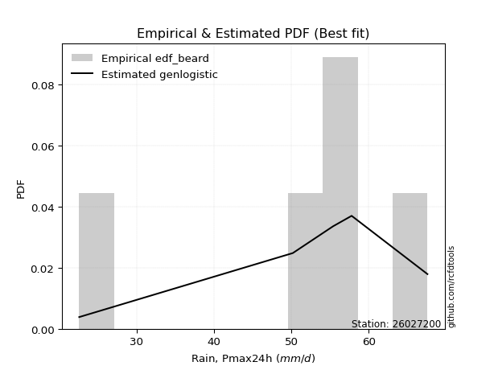</img>

</div>


### 5. EDF Chegodayev (1955)

The Chegodayev formula is an empirical plotting position formula used in hydrological frequency analysis to estimate the exceedance probability or return period of a specific event from a set of observed data. It is primarily used for plotting observed data points on probability paper to fit a theoretical distribution, particularly for analyzing extreme events like maximum flood flows or rainfall intensities. The constant _b_ value in the generalized plotting position formula is 0.3.

<div align="center">


$P=(m-b)/(n+1-2b)$


</div>


**5.1. Empirical values**

<div align="center">

|                | 0                   | 1                  | 2                  | 3                  | 4                 | 5                 |
|:---------------|:--------------------|:-------------------|:-------------------|:-------------------|:------------------|:------------------|
| date           | 2025                | 2023               | 2019               | 2022               | 2020              | 2021              |
| x              | 12.8                | 22.6               | 50.2               | 55.4               | 57.8              | 67.6              |
| m              | 1                   | 2                  | 3                  | 4                  | 5                 | 6                 |
| empirical_dist | edf_chegodayev      | edf_chegodayev     | edf_chegodayev     | edf_chegodayev     | edf_chegodayev    | edf_chegodayev    |
| empirical      | 0.10937499999999999 | 0.265625           | 0.421875           | 0.578125           | 0.734375          | 0.890625          |
| empirical_tr   | 1.1228070175438596  | 1.3617021276595744 | 1.7297297297297298 | 2.3703703703703702 | 3.764705882352941 | 9.142857142857142 |

</div>


**5.2. Kolmogorov-Smirnov fit test (sorted by Δ)**


<div align="center">

|                | 0              | 1                  | 2                   | 3                   | 4                  | 5                   | 6                  | 7                   | 8                   | 9                   | 10                  | 11                  | 12                  | 13                 | 14                  | 15                  | 16                  | 17                  | 18                 | 19                  | 20                 | 21                  | 22                 | 23                 | 24                  | 25                  | 26                  | 27                  | 28                  | 29                 | 30                  | 31                 | 32                  | 33                  | 34                 | 35                  | 36                  | 37                  | 38                  | 39                  | 40                  | 41                 | 42                  | 43                  | 44                  | 45                 | 46                  | 47                  | 48                  | 49                  | 50                | 51                  | 52                  | 53                 | 54                 | 55                  | 56                  | 57                  | 58                  | 59                  | 60                  | 61                  | 62                  | 63                  | 64                  | 65                  | 66                  | 67                  | 68                 | 69                  | 70                 | 71                 | 72                  | 73                 | 74                  | 75                  | 76                 | 77                 | 78                 | 79                  | 80                 | 81                 | 82                  | 83                 | 84                 | 85                  | 86                  | 87                  | 88                  | 89                 | 90                  | 91                 | 92                 | 93                  | 94                 | 95                 | 96                 | 97                  | 98                 | 99                 | 100                 | 101                | 102                 | 103                | 104                 | 105                | 106                | 107                 | 108                | 109                | 110                 | 111                | 112                 | 113                | 114                 | 115                 | 116                 | 117                 | 118                | 119                 | 120                | 121                | 122               | 123                | 124                | 125               | 126                | 127                | 128                 | 129                | 130                | 131                 | 132                | 133                | 134                | 135                | 136               | 137                | 138                 | 139                 | 140                | 141                 | 142                 | 143                 | 144                 | 145                | 146                | 147                | 148                | 149               | 150                | 151                | 152               | 153               | 154                | 155                | 156            | 157            | 158              | 159                |
|:---------------|:---------------|:-------------------|:--------------------|:--------------------|:-------------------|:--------------------|:-------------------|:--------------------|:--------------------|:--------------------|:--------------------|:--------------------|:--------------------|:-------------------|:--------------------|:--------------------|:--------------------|:--------------------|:-------------------|:--------------------|:-------------------|:--------------------|:-------------------|:-------------------|:--------------------|:--------------------|:--------------------|:--------------------|:--------------------|:-------------------|:--------------------|:-------------------|:--------------------|:--------------------|:-------------------|:--------------------|:--------------------|:--------------------|:--------------------|:--------------------|:--------------------|:-------------------|:--------------------|:--------------------|:--------------------|:-------------------|:--------------------|:--------------------|:--------------------|:--------------------|:------------------|:--------------------|:--------------------|:-------------------|:-------------------|:--------------------|:--------------------|:--------------------|:--------------------|:--------------------|:--------------------|:--------------------|:--------------------|:--------------------|:--------------------|:--------------------|:--------------------|:--------------------|:-------------------|:--------------------|:-------------------|:-------------------|:--------------------|:-------------------|:--------------------|:--------------------|:-------------------|:-------------------|:-------------------|:--------------------|:-------------------|:-------------------|:--------------------|:-------------------|:-------------------|:--------------------|:--------------------|:--------------------|:--------------------|:-------------------|:--------------------|:-------------------|:-------------------|:--------------------|:-------------------|:-------------------|:-------------------|:--------------------|:-------------------|:-------------------|:--------------------|:-------------------|:--------------------|:-------------------|:--------------------|:-------------------|:-------------------|:--------------------|:-------------------|:-------------------|:--------------------|:-------------------|:--------------------|:-------------------|:--------------------|:--------------------|:--------------------|:--------------------|:-------------------|:--------------------|:-------------------|:-------------------|:------------------|:-------------------|:-------------------|:------------------|:-------------------|:-------------------|:--------------------|:-------------------|:-------------------|:--------------------|:-------------------|:-------------------|:-------------------|:-------------------|:------------------|:-------------------|:--------------------|:--------------------|:-------------------|:--------------------|:--------------------|:--------------------|:--------------------|:-------------------|:-------------------|:-------------------|:-------------------|:------------------|:-------------------|:-------------------|:------------------|:------------------|:-------------------|:-------------------|:---------------|:---------------|:-----------------|:-------------------|
| station        | 26027200       | 26027200           | 26027200            | 26027200            | 26027200           | 26027200            | 26027200           | 26027200            | 26027200            | 26027200            | 26027200            | 26027200            | 26027200            | 26027200           | 26027200            | 26027200            | 26027200            | 26027200            | 26027200           | 26027200            | 26027200           | 26027200            | 26027200           | 26027200           | 26027200            | 26027200            | 26027200            | 26027200            | 26027200            | 26027200           | 26027200            | 26027200           | 26027200            | 26027200            | 26027200           | 26027200            | 26027200            | 26027200            | 26027200            | 26027200            | 26027200            | 26027200           | 26027200            | 26027200            | 26027200            | 26027200           | 26027200            | 26027200            | 26027200            | 26027200            | 26027200          | 26027200            | 26027200            | 26027200           | 26027200           | 26027200            | 26027200            | 26027200            | 26027200            | 26027200            | 26027200            | 26027200            | 26027200            | 26027200            | 26027200            | 26027200            | 26027200            | 26027200            | 26027200           | 26027200            | 26027200           | 26027200           | 26027200            | 26027200           | 26027200            | 26027200            | 26027200           | 26027200           | 26027200           | 26027200            | 26027200           | 26027200           | 26027200            | 26027200           | 26027200           | 26027200            | 26027200            | 26027200            | 26027200            | 26027200           | 26027200            | 26027200           | 26027200           | 26027200            | 26027200           | 26027200           | 26027200           | 26027200            | 26027200           | 26027200           | 26027200            | 26027200           | 26027200            | 26027200           | 26027200            | 26027200           | 26027200           | 26027200            | 26027200           | 26027200           | 26027200            | 26027200           | 26027200            | 26027200           | 26027200            | 26027200            | 26027200            | 26027200            | 26027200           | 26027200            | 26027200           | 26027200           | 26027200          | 26027200           | 26027200           | 26027200          | 26027200           | 26027200           | 26027200            | 26027200           | 26027200           | 26027200            | 26027200           | 26027200           | 26027200           | 26027200           | 26027200          | 26027200           | 26027200            | 26027200            | 26027200           | 26027200            | 26027200            | 26027200            | 26027200            | 26027200           | 26027200           | 26027200           | 26027200           | 26027200          | 26027200           | 26027200           | 26027200          | 26027200          | 26027200           | 26027200           | 26027200       | 26027200       | 26027200         | 26027200           |
| empirical_dist | edf_chegodayev | edf_chegodayev     | edf_chegodayev      | edf_chegodayev      | edf_chegodayev     | edf_chegodayev      | edf_chegodayev     | edf_chegodayev      | edf_chegodayev      | edf_chegodayev      | edf_chegodayev      | edf_chegodayev      | edf_chegodayev      | edf_chegodayev     | edf_chegodayev      | edf_chegodayev      | edf_chegodayev      | edf_chegodayev      | edf_chegodayev     | edf_chegodayev      | edf_chegodayev     | edf_chegodayev      | edf_chegodayev     | edf_chegodayev     | edf_chegodayev      | edf_chegodayev      | edf_chegodayev      | edf_chegodayev      | edf_chegodayev      | edf_chegodayev     | edf_chegodayev      | edf_chegodayev     | edf_chegodayev      | edf_chegodayev      | edf_chegodayev     | edf_chegodayev      | edf_chegodayev      | edf_chegodayev      | edf_chegodayev      | edf_chegodayev      | edf_chegodayev      | edf_chegodayev     | edf_chegodayev      | edf_chegodayev      | edf_chegodayev      | edf_chegodayev     | edf_chegodayev      | edf_chegodayev      | edf_chegodayev      | edf_chegodayev      | edf_chegodayev    | edf_chegodayev      | edf_chegodayev      | edf_chegodayev     | edf_chegodayev     | edf_chegodayev      | edf_chegodayev      | edf_chegodayev      | edf_chegodayev      | edf_chegodayev      | edf_chegodayev      | edf_chegodayev      | edf_chegodayev      | edf_chegodayev      | edf_chegodayev      | edf_chegodayev      | edf_chegodayev      | edf_chegodayev      | edf_chegodayev     | edf_chegodayev      | edf_chegodayev     | edf_chegodayev     | edf_chegodayev      | edf_chegodayev     | edf_chegodayev      | edf_chegodayev      | edf_chegodayev     | edf_chegodayev     | edf_chegodayev     | edf_chegodayev      | edf_chegodayev     | edf_chegodayev     | edf_chegodayev      | edf_chegodayev     | edf_chegodayev     | edf_chegodayev      | edf_chegodayev      | edf_chegodayev      | edf_chegodayev      | edf_chegodayev     | edf_chegodayev      | edf_chegodayev     | edf_chegodayev     | edf_chegodayev      | edf_chegodayev     | edf_chegodayev     | edf_chegodayev     | edf_chegodayev      | edf_chegodayev     | edf_chegodayev     | edf_chegodayev      | edf_chegodayev     | edf_chegodayev      | edf_chegodayev     | edf_chegodayev      | edf_chegodayev     | edf_chegodayev     | edf_chegodayev      | edf_chegodayev     | edf_chegodayev     | edf_chegodayev      | edf_chegodayev     | edf_chegodayev      | edf_chegodayev     | edf_chegodayev      | edf_chegodayev      | edf_chegodayev      | edf_chegodayev      | edf_chegodayev     | edf_chegodayev      | edf_chegodayev     | edf_chegodayev     | edf_chegodayev    | edf_chegodayev     | edf_chegodayev     | edf_chegodayev    | edf_chegodayev     | edf_chegodayev     | edf_chegodayev      | edf_chegodayev     | edf_chegodayev     | edf_chegodayev      | edf_chegodayev     | edf_chegodayev     | edf_chegodayev     | edf_chegodayev     | edf_chegodayev    | edf_chegodayev     | edf_chegodayev      | edf_chegodayev      | edf_chegodayev     | edf_chegodayev      | edf_chegodayev      | edf_chegodayev      | edf_chegodayev      | edf_chegodayev     | edf_chegodayev     | edf_chegodayev     | edf_chegodayev     | edf_chegodayev    | edf_chegodayev     | edf_chegodayev     | edf_chegodayev    | edf_chegodayev    | edf_chegodayev     | edf_chegodayev     | edf_chegodayev | edf_chegodayev | edf_chegodayev   | edf_chegodayev     |
| p_dist         | genpareto      | loggenextreme      | logweibull_max      | johnsonsu           | trapezoid          | genhalflogistic     | loglevy_l          | gumbel_l            | arcsine             | triang              | skewnorm            | genextreme          | weibull_min         | burr               | argus               | pearson3            | ksone               | logmielke           | wrapcauchy         | semicircular        | logloggamma        | beta                | levy_l             | logtrapezoid       | dweibull            | anglit              | gompertz            | logarcsine          | logargus            | dgamma             | f                   | nct                | exponnorm           | truncnorm           | crystalball        | norm                | t                   | logloglaplace       | gamma               | erlang              | betaprime           | logdweibull        | logdgamma           | rice                | logistic            | logpearson3        | loggumbel_l         | logweibull_min      | vonmises_line       | gausshyper          | invgauss          | invgamma            | loggennorm          | gennorm            | maxwell            | hypsecant           | logsemicircular     | cosine              | alpha               | rayleigh            | loganglit           | logbeta             | loggompertz         | logburr12           | ncf                 | kappa4              | kstwobign           | loginvweibull       | logwrapcauchy      | logbetaprime        | logburr            | laplace            | halfnorm            | logf               | logncf              | logt                | lognorm            | logcrystalball     | logexponnorm       | logfatiguelife      | lognct             | tukeylambda        | loggenhalflogistic  | logerlang          | loginvgauss        | logalpha            | logrice             | logfoldnorm         | kappa3              | gumbel_r           | uniform             | loggamma           | loggamma           | loginvgamma         | truncweibull_min   | lomax              | logmaxwell         | loglogistic         | genexpon           | logkstwobign       | lograyleigh         | halflogistic       | halfgennorm         | loggenexpon        | moyal               | nakagami           | loghypsecant       | loglomax            | burr12             | logcosine          | loghalfnorm         | lognakagami        | logskewnorm         | logtriang          | loggumbel_r         | loglaplace          | loglaplace          | logrdist            | loghalflogistic    | bradford            | logmoyal           | loggenpareto       | wald              | truncexpon         | logksone           | logjohnsonsu      | logjohnsonsb       | logwald            | logtukeylambda      | loggengamma        | logkappa4          | logbradford         | loghalfgennorm     | logkappa3          | loguniform         | gengamma           | logvonmises_line  | loggausshyper      | invweibull          | logtruncnorm        | mielke             | logexponpow         | fatiguelife         | logtruncexpon       | logtruncweibull_min | exponweib          | logexponweib       | powerlaw           | foldnorm           | weibull_max       | logpowerlaw        | truncpareto        | johnsonsb         | logtruncpareto    | exponpow           | rdist              | genlogistic    | loggenlogistic | logvonmises      | vonmises           |
| delta          | 0.109375       | 0.1129677483821871 | 0.11989430397739743 | 0.12344309450710028 | 0.1296857047855916 | 0.13435294029623257 | 0.1358260107748568 | 0.13799436798724066 | 0.14462417631228563 | 0.14485842211722388 | 0.14625991620771228 | 0.14759933656317836 | 0.14949863377961786 | 0.1499992125745544 | 0.15017554666753163 | 0.16098058686830896 | 0.16279445775090318 | 0.16303164551984617 | 0.1695441485094049 | 0.17115069906887614 | 0.1712405419401768 | 0.17380494671871938 | 0.1748061658313731 | 0.1752012032588831 | 0.17578501677234815 | 0.17771550330942443 | 0.17998643766011535 | 0.18117862186018852 | 0.18463442498698324 | 0.1898139538960806 | 0.19163754717360648 | 0.1934512568515252 | 0.19347814584013978 | 0.19347993912251327 | 0.1934799499618477 | 0.19347995094628923 | 0.19348071906993902 | 0.19406452055533857 | 0.19900845712260062 | 0.19994376121692736 | 0.20125733164671455 | 0.2012873085319855 | 0.20279675112072548 | 0.20523954215973084 | 0.20807303564650625 | 0.2096537601577806 | 0.21016916446414302 | 0.21295303095444407 | 0.21394342065745778 | 0.21486589006642032 | 0.216027482054437 | 0.21654723755850303 | 0.21792204461020073 | 0.2179724852232078 | 0.2186037846415333 | 0.21984807306394794 | 0.22011280313521642 | 0.22115855707268517 | 0.22328991038950063 | 0.22632374096515895 | 0.22949964638592468 | 0.22967277784640439 | 0.23197038041498663 | 0.23343371869383578 | 0.23406076395223152 | 0.24253862038614415 | 0.24443047969058473 | 0.24455955577106636 | 0.2468430094538816 | 0.24723503918144352 | 0.2473277637181367 | 0.2478868166474406 | 0.24841137252676415 | 0.2512066102967405 | 0.25142541910620764 | 0.25172596734387054 | 0.2517305875278557 | 0.2517310373281334 | 0.2517326870696306 | 0.25191328786068024 | 0.2519528985221833 | 0.2530823766550654 | 0.25395915462555874 | 0.2540180459430612 | 0.2543113938873425 | 0.25479730348354335 | 0.25602175155708695 | 0.25611027186763424 | 0.25826669594078044 | 0.2582821797435396 | 0.26060675182481763 | 0.2612803214717998 | 0.2612803214717998 | 0.26171643733037364 | 0.2624450207704181 | 0.2644973068278411 | 0.2707563193583795 | 0.27151425895241443 | 0.2716996282719878 | 0.2757104337058873 | 0.27639902556932805 | 0.2767845414574892 | 0.27713667620798565 | 0.2801500327550708 | 0.28019657773262896 | 0.2838508405724337 | 0.2863917671677334 | 0.28754111102328905 | 0.2899331544052841 | 0.2911821766430309 | 0.29309858469959416 | 0.2931544372657715 | 0.29766545134291844 | 0.3071803557331274 | 0.30769335007503984 | 0.31348623952790045 | 0.31348623952790045 | 0.31504193492383537 | 0.3207293660244066 | 0.32123696543117686 | 0.3259875150017033 | 0.3348317391174279 | 0.341490331600962 | 0.3442595325261958 | 0.3457713133177813 | 0.349215307175071 | 0.3753810128347752 | 0.3785532372017931 | 0.38363233748606973 | 0.3856631114254786 | 0.3936504361658316 | 0.39417174897791685 | 0.3945233267573942 | 0.3988450817946563 | 0.3993005759813376 | 0.4029797636388628 | 0.405701014788743 | 0.4292967415141128 | 0.43917071123143075 | 0.44005299934236164 | 0.4406813648066281 | 0.44131792957848304 | 0.45158665426538014 | 0.45534502654587483 | 0.462463428891264   | 0.4864066553993337 | 0.5222032540035471 | 0.5231277744834241 | 0.5293571725950557 | 0.573164155368436 | 0.5759264873058265 | 0.5781888754378162 | 0.613540654495419 | 0.638068713230292 | 0.6520651301554019 | 0.7343749999704997 | 0.734375       | 0.734375       | 1.23626125705264 | 10.354939886156021 |
| deltao         | 0.530385761606 | 0.530385761606     | 0.530385761606      | 0.530385761606      | 0.530385761606     | 0.530385761606      | 0.530385761606     | 0.530385761606      | 0.530385761606      | 0.530385761606      | 0.530385761606      | 0.530385761606      | 0.530385761606      | 0.530385761606     | 0.530385761606      | 0.530385761606      | 0.530385761606      | 0.530385761606      | 0.530385761606     | 0.530385761606      | 0.530385761606     | 0.530385761606      | 0.530385761606     | 0.530385761606     | 0.530385761606      | 0.530385761606      | 0.530385761606      | 0.530385761606      | 0.530385761606      | 0.530385761606     | 0.530385761606      | 0.530385761606     | 0.530385761606      | 0.530385761606      | 0.530385761606     | 0.530385761606      | 0.530385761606      | 0.530385761606      | 0.530385761606      | 0.530385761606      | 0.530385761606      | 0.530385761606     | 0.530385761606      | 0.530385761606      | 0.530385761606      | 0.530385761606     | 0.530385761606      | 0.530385761606      | 0.530385761606      | 0.530385761606      | 0.530385761606    | 0.530385761606      | 0.530385761606      | 0.530385761606     | 0.530385761606     | 0.530385761606      | 0.530385761606      | 0.530385761606      | 0.530385761606      | 0.530385761606      | 0.530385761606      | 0.530385761606      | 0.530385761606      | 0.530385761606      | 0.530385761606      | 0.530385761606      | 0.530385761606      | 0.530385761606      | 0.530385761606     | 0.530385761606      | 0.530385761606     | 0.530385761606     | 0.530385761606      | 0.530385761606     | 0.530385761606      | 0.530385761606      | 0.530385761606     | 0.530385761606     | 0.530385761606     | 0.530385761606      | 0.530385761606     | 0.530385761606     | 0.530385761606      | 0.530385761606     | 0.530385761606     | 0.530385761606      | 0.530385761606      | 0.530385761606      | 0.530385761606      | 0.530385761606     | 0.530385761606      | 0.530385761606     | 0.530385761606     | 0.530385761606      | 0.530385761606     | 0.530385761606     | 0.530385761606     | 0.530385761606      | 0.530385761606     | 0.530385761606     | 0.530385761606      | 0.530385761606     | 0.530385761606      | 0.530385761606     | 0.530385761606      | 0.530385761606     | 0.530385761606     | 0.530385761606      | 0.530385761606     | 0.530385761606     | 0.530385761606      | 0.530385761606     | 0.530385761606      | 0.530385761606     | 0.530385761606      | 0.530385761606      | 0.530385761606      | 0.530385761606      | 0.530385761606     | 0.530385761606      | 0.530385761606     | 0.530385761606     | 0.530385761606    | 0.530385761606     | 0.530385761606     | 0.530385761606    | 0.530385761606     | 0.530385761606     | 0.530385761606      | 0.530385761606     | 0.530385761606     | 0.530385761606      | 0.530385761606     | 0.530385761606     | 0.530385761606     | 0.530385761606     | 0.530385761606    | 0.530385761606     | 0.530385761606      | 0.530385761606      | 0.530385761606     | 0.530385761606      | 0.530385761606      | 0.530385761606      | 0.530385761606      | 0.530385761606     | 0.530385761606     | 0.530385761606     | 0.530385761606     | 0.530385761606    | 0.530385761606     | 0.530385761606     | 0.530385761606    | 0.530385761606    | 0.530385761606     | 0.530385761606     | 0.530385761606 | 0.530385761606 | 0.530385761606   | 0.530385761606     |
| eval           | Δo > Δ         | Δo > Δ             | Δo > Δ              | Δo > Δ              | Δo > Δ             | Δo > Δ              | Δo > Δ             | Δo > Δ              | Δo > Δ              | Δo > Δ              | Δo > Δ              | Δo > Δ              | Δo > Δ              | Δo > Δ             | Δo > Δ              | Δo > Δ              | Δo > Δ              | Δo > Δ              | Δo > Δ             | Δo > Δ              | Δo > Δ             | Δo > Δ              | Δo > Δ             | Δo > Δ             | Δo > Δ              | Δo > Δ              | Δo > Δ              | Δo > Δ              | Δo > Δ              | Δo > Δ             | Δo > Δ              | Δo > Δ             | Δo > Δ              | Δo > Δ              | Δo > Δ             | Δo > Δ              | Δo > Δ              | Δo > Δ              | Δo > Δ              | Δo > Δ              | Δo > Δ              | Δo > Δ             | Δo > Δ              | Δo > Δ              | Δo > Δ              | Δo > Δ             | Δo > Δ              | Δo > Δ              | Δo > Δ              | Δo > Δ              | Δo > Δ            | Δo > Δ              | Δo > Δ              | Δo > Δ             | Δo > Δ             | Δo > Δ              | Δo > Δ              | Δo > Δ              | Δo > Δ              | Δo > Δ              | Δo > Δ              | Δo > Δ              | Δo > Δ              | Δo > Δ              | Δo > Δ              | Δo > Δ              | Δo > Δ              | Δo > Δ              | Δo > Δ             | Δo > Δ              | Δo > Δ             | Δo > Δ             | Δo > Δ              | Δo > Δ             | Δo > Δ              | Δo > Δ              | Δo > Δ             | Δo > Δ             | Δo > Δ             | Δo > Δ              | Δo > Δ             | Δo > Δ             | Δo > Δ              | Δo > Δ             | Δo > Δ             | Δo > Δ              | Δo > Δ              | Δo > Δ              | Δo > Δ              | Δo > Δ             | Δo > Δ              | Δo > Δ             | Δo > Δ             | Δo > Δ              | Δo > Δ             | Δo > Δ             | Δo > Δ             | Δo > Δ              | Δo > Δ             | Δo > Δ             | Δo > Δ              | Δo > Δ             | Δo > Δ              | Δo > Δ             | Δo > Δ              | Δo > Δ             | Δo > Δ             | Δo > Δ              | Δo > Δ             | Δo > Δ             | Δo > Δ              | Δo > Δ             | Δo > Δ              | Δo > Δ             | Δo > Δ              | Δo > Δ              | Δo > Δ              | Δo > Δ              | Δo > Δ             | Δo > Δ              | Δo > Δ             | Δo > Δ             | Δo > Δ            | Δo > Δ             | Δo > Δ             | Δo > Δ            | Δo > Δ             | Δo > Δ             | Δo > Δ              | Δo > Δ             | Δo > Δ             | Δo > Δ              | Δo > Δ             | Δo > Δ             | Δo > Δ             | Δo > Δ             | Δo > Δ            | Δo > Δ             | Δo > Δ              | Δo > Δ              | Δo > Δ             | Δo > Δ              | Δo > Δ              | Δo > Δ              | Δo > Δ              | Δo > Δ             | Δo > Δ             | Δo > Δ             | Δo > Δ             | Δo <= Δ           | Δo <= Δ            | Δo <= Δ            | Δo <= Δ           | Δo <= Δ           | Δo <= Δ            | Δo <= Δ            | Δo <= Δ        | Δo <= Δ        | Δo <= Δ          | Δo <= Δ            |
| fit            | 1              | 1                  | 1                   | 1                   | 1                  | 1                   | 1                  | 1                   | 1                   | 1                   | 1                   | 1                   | 1                   | 1                  | 1                   | 1                   | 1                   | 1                   | 1                  | 1                   | 1                  | 1                   | 1                  | 1                  | 1                   | 1                   | 1                   | 1                   | 1                   | 1                  | 1                   | 1                  | 1                   | 1                   | 1                  | 1                   | 1                   | 1                   | 1                   | 1                   | 1                   | 1                  | 1                   | 1                   | 1                   | 1                  | 1                   | 1                   | 1                   | 1                   | 1                 | 1                   | 1                   | 1                  | 1                  | 1                   | 1                   | 1                   | 1                   | 1                   | 1                   | 1                   | 1                   | 1                   | 1                   | 1                   | 1                   | 1                   | 1                  | 1                   | 1                  | 1                  | 1                   | 1                  | 1                   | 1                   | 1                  | 1                  | 1                  | 1                   | 1                  | 1                  | 1                   | 1                  | 1                  | 1                   | 1                   | 1                   | 1                   | 1                  | 1                   | 1                  | 1                  | 1                   | 1                  | 1                  | 1                  | 1                   | 1                  | 1                  | 1                   | 1                  | 1                   | 1                  | 1                   | 1                  | 1                  | 1                   | 1                  | 1                  | 1                   | 1                  | 1                   | 1                  | 1                   | 1                   | 1                   | 1                   | 1                  | 1                   | 1                  | 1                  | 1                 | 1                  | 1                  | 1                 | 1                  | 1                  | 1                   | 1                  | 1                  | 1                   | 1                  | 1                  | 1                  | 1                  | 1                 | 1                  | 1                   | 1                   | 1                  | 1                   | 1                   | 1                   | 1                   | 1                  | 1                  | 1                  | 1                  | 0                 | 0                  | 0                  | 0                 | 0                 | 0                  | 0                  | 0              | 0              | 0                | 0                  |
| n              | 6              | 6                  | 6                   | 6                   | 6                  | 6                   | 6                  | 6                   | 6                   | 6                   | 6                   | 6                   | 6                   | 6                  | 6                   | 6                   | 6                   | 6                   | 6                  | 6                   | 6                  | 6                   | 6                  | 6                  | 6                   | 6                   | 6                   | 6                   | 6                   | 6                  | 6                   | 6                  | 6                   | 6                   | 6                  | 6                   | 6                   | 6                   | 6                   | 6                   | 6                   | 6                  | 6                   | 6                   | 6                   | 6                  | 6                   | 6                   | 6                   | 6                   | 6                 | 6                   | 6                   | 6                  | 6                  | 6                   | 6                   | 6                   | 6                   | 6                   | 6                   | 6                   | 6                   | 6                   | 6                   | 6                   | 6                   | 6                   | 6                  | 6                   | 6                  | 6                  | 6                   | 6                  | 6                   | 6                   | 6                  | 6                  | 6                  | 6                   | 6                  | 6                  | 6                   | 6                  | 6                  | 6                   | 6                   | 6                   | 6                   | 6                  | 6                   | 6                  | 6                  | 6                   | 6                  | 6                  | 6                  | 6                   | 6                  | 6                  | 6                   | 6                  | 6                   | 6                  | 6                   | 6                  | 6                  | 6                   | 6                  | 6                  | 6                   | 6                  | 6                   | 6                  | 6                   | 6                   | 6                   | 6                   | 6                  | 6                   | 6                  | 6                  | 6                 | 6                  | 6                  | 6                 | 6                  | 6                  | 6                   | 6                  | 6                  | 6                   | 6                  | 6                  | 6                  | 6                  | 6                 | 6                  | 6                   | 6                   | 6                  | 6                   | 6                   | 6                   | 6                   | 6                  | 6                  | 6                  | 6                  | 6                 | 6                  | 6                  | 6                 | 6                 | 6                  | 6                  | 6              | 6              | 6                | 6                  |
| best_fit       | 1              | 0                  | 0                   | 0                   | 0                  | 0                   | 0                  | 0                   | 0                   | 0                   | 0                   | 0                   | 0                   | 0                  | 0                   | 0                   | 0                   | 0                   | 0                  | 0                   | 0                  | 0                   | 0                  | 0                  | 0                   | 0                   | 0                   | 0                   | 0                   | 0                  | 0                   | 0                  | 0                   | 0                   | 0                  | 0                   | 0                   | 0                   | 0                   | 0                   | 0                   | 0                  | 0                   | 0                   | 0                   | 0                  | 0                   | 0                   | 0                   | 0                   | 0                 | 0                   | 0                   | 0                  | 0                  | 0                   | 0                   | 0                   | 0                   | 0                   | 0                   | 0                   | 0                   | 0                   | 0                   | 0                   | 0                   | 0                   | 0                  | 0                   | 0                  | 0                  | 0                   | 0                  | 0                   | 0                   | 0                  | 0                  | 0                  | 0                   | 0                  | 0                  | 0                   | 0                  | 0                  | 0                   | 0                   | 0                   | 0                   | 0                  | 0                   | 0                  | 0                  | 0                   | 0                  | 0                  | 0                  | 0                   | 0                  | 0                  | 0                   | 0                  | 0                   | 0                  | 0                   | 0                  | 0                  | 0                   | 0                  | 0                  | 0                   | 0                  | 0                   | 0                  | 0                   | 0                   | 0                   | 0                   | 0                  | 0                   | 0                  | 0                  | 0                 | 0                  | 0                  | 0                 | 0                  | 0                  | 0                   | 0                  | 0                  | 0                   | 0                  | 0                  | 0                  | 0                  | 0                 | 0                  | 0                   | 0                   | 0                  | 0                   | 0                   | 0                   | 0                   | 0                  | 0                  | 0                  | 0                  | 0                 | 0                  | 0                  | 0                 | 0                 | 0                  | 0                  | 0              | 0              | 0                | 0                  |
| best_fit_sort  | 1              | 2                  | 3                   | 4                   | 5                  | 6                   | 7                  | 8                   | 9                   | 10                  | 11                  | 12                  | 13                  | 14                 | 15                  | 16                  | 17                  | 18                  | 19                 | 20                  | 21                 | 22                  | 23                 | 24                 | 25                  | 26                  | 27                  | 28                  | 29                  | 30                 | 31                  | 32                 | 33                  | 34                  | 35                 | 36                  | 37                  | 38                  | 39                  | 40                  | 41                  | 42                 | 43                  | 44                  | 45                  | 46                 | 47                  | 48                  | 49                  | 50                  | 51                | 52                  | 53                  | 54                 | 55                 | 56                  | 57                  | 58                  | 59                  | 60                  | 61                  | 62                  | 63                  | 64                  | 65                  | 66                  | 67                  | 68                  | 69                 | 70                  | 71                 | 72                 | 73                  | 74                 | 75                  | 76                  | 77                 | 78                 | 79                 | 80                  | 81                 | 82                 | 83                  | 84                 | 85                 | 86                  | 87                  | 88                  | 89                  | 90                 | 91                  | 92                 | 93                 | 94                  | 95                 | 96                 | 97                 | 98                  | 99                 | 100                | 101                 | 102                | 103                 | 104                | 105                 | 106                | 107                | 108                 | 109                | 110                | 111                 | 112                | 113                 | 114                | 115                 | 116                 | 117                 | 118                 | 119                | 120                 | 121                | 122                | 123               | 124                | 125                | 126               | 127                | 128                | 129                 | 130                | 131                | 132                 | 133                | 134                | 135                | 136                | 137               | 138                | 139                 | 140                 | 141                | 142                 | 143                 | 144                 | 145                 | 146                | 147                | 148                | 149                | 150               | 151                | 152                | 153               | 154               | 155                | 156                | 157            | 158            | 159              | 160                |

</div>


**5.3. Best fit**

<div align="center">

|   id |   station | empirical_dist   | p_dist    |    delta |   deltao | eval   |   fit |   n |   best_fit |   best_fit_sort |
|-----:|----------:|:-----------------|:----------|---------:|---------:|:-------|------:|----:|-----------:|----------------:|
|    0 |  26027200 | edf_chegodayev   | genpareto | 0.109375 | 0.530386 | Δo > Δ |     1 |   6 |          1 |               1 |

</div>


<div align="center">

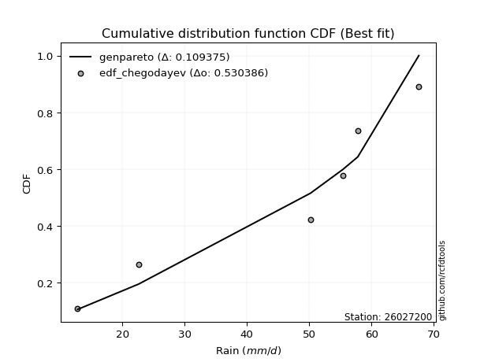</img></img>

</div>


### 6. EDF Blom (1958)

The Blom formula is a specific "plotting position" formula used in hydrology and statistical analysis to estimate the empirical cumulative probability (or non-exceedance probability) of a data series. It is particularly recommended for data that are approximately normally distributed. The constant _a_ is set to 0.375 (or 3/8).

<div align="center">


$P=(m-a)/(n+1-2a)$


</div>


**6.1. Empirical values**

<div align="center">

|                | 0                  | 1                  | 2                  | 3                 | 4                 | 5                  |
|:---------------|:-------------------|:-------------------|:-------------------|:------------------|:------------------|:-------------------|
| date           | 2025               | 2023               | 2019               | 2022              | 2020              | 2021               |
| x              | 12.8               | 22.6               | 50.2               | 55.4              | 57.8              | 67.6               |
| m              | 1                  | 2                  | 3                  | 4                 | 5                 | 6                  |
| empirical_dist | edf_blom           | edf_blom           | edf_blom           | edf_blom          | edf_blom          | edf_blom           |
| empirical      | 0.1                | 0.26               | 0.42               | 0.58              | 0.74              | 0.9                |
| empirical_tr   | 1.1111111111111112 | 1.3513513513513513 | 1.7241379310344827 | 2.380952380952381 | 3.846153846153846 | 10.000000000000002 |

</div>


**6.2. Kolmogorov-Smirnov fit test (sorted by Δ)**


<div align="center">

|                | 0                   | 1                  | 2                   | 3                   | 4                   | 5                   | 6                   | 7                   | 8                   | 9                   | 10                  | 11                 | 12                 | 13                 | 14                  | 15                  | 16                 | 17                  | 18                  | 19                  | 20                  | 21                 | 22                  | 23                  | 24                  | 25                  | 26                  | 27                 | 28                  | 29                  | 30                 | 31                  | 32                 | 33                  | 34                 | 35                  | 36                  | 37                 | 38                  | 39                  | 40                  | 41                  | 42                  | 43                 | 44                  | 45                  | 46                 | 47                  | 48                  | 49                  | 50                 | 51                  | 52                  | 53                  | 54                 | 55                  | 56                  | 57                  | 58                  | 59                  | 60                 | 61                  | 62                  | 63                 | 64                  | 65                  | 66                  | 67                  | 68                  | 69                  | 70                 | 71                  | 72                  | 73                  | 74                  | 75                  | 76                 | 77                 | 78                 | 79                  | 80                 | 81                 | 82                  | 83                 | 84                 | 85                  | 86                  | 87                  | 88                  | 89                  | 90                  | 91                 | 92                 | 93                  | 94                 | 95                  | 96                  | 97                  | 98                 | 99                  | 100                 | 101                | 102                 | 103                | 104               | 105                | 106                | 107                 | 108                | 109                 | 110                 | 111                | 112                 | 113                | 114                 | 115                 | 116                 | 117                | 118                | 119                | 120                | 121                 | 122               | 123                | 124                 | 125               | 126                 | 127                | 128                 | 129                | 130                 | 131                 | 132                | 133                | 134                 | 135                | 136               | 137                | 138                 | 139                 | 140                 | 141                | 142                 | 143                 | 144                 | 145                | 146               | 147               | 148                | 149               | 150                | 151                | 152                | 153               | 154                | 155                | 156            | 157            | 158              | 159                |
|:---------------|:--------------------|:-------------------|:--------------------|:--------------------|:--------------------|:--------------------|:--------------------|:--------------------|:--------------------|:--------------------|:--------------------|:-------------------|:-------------------|:-------------------|:--------------------|:--------------------|:-------------------|:--------------------|:--------------------|:--------------------|:--------------------|:-------------------|:--------------------|:--------------------|:--------------------|:--------------------|:--------------------|:-------------------|:--------------------|:--------------------|:-------------------|:--------------------|:-------------------|:--------------------|:-------------------|:--------------------|:--------------------|:-------------------|:--------------------|:--------------------|:--------------------|:--------------------|:--------------------|:-------------------|:--------------------|:--------------------|:-------------------|:--------------------|:--------------------|:--------------------|:-------------------|:--------------------|:--------------------|:--------------------|:-------------------|:--------------------|:--------------------|:--------------------|:--------------------|:--------------------|:-------------------|:--------------------|:--------------------|:-------------------|:--------------------|:--------------------|:--------------------|:--------------------|:--------------------|:--------------------|:-------------------|:--------------------|:--------------------|:--------------------|:--------------------|:--------------------|:-------------------|:-------------------|:-------------------|:--------------------|:-------------------|:-------------------|:--------------------|:-------------------|:-------------------|:--------------------|:--------------------|:--------------------|:--------------------|:--------------------|:--------------------|:-------------------|:-------------------|:--------------------|:-------------------|:--------------------|:--------------------|:--------------------|:-------------------|:--------------------|:--------------------|:-------------------|:--------------------|:-------------------|:------------------|:-------------------|:-------------------|:--------------------|:-------------------|:--------------------|:--------------------|:-------------------|:--------------------|:-------------------|:--------------------|:--------------------|:--------------------|:-------------------|:-------------------|:-------------------|:-------------------|:--------------------|:------------------|:-------------------|:--------------------|:------------------|:--------------------|:-------------------|:--------------------|:-------------------|:--------------------|:--------------------|:-------------------|:-------------------|:--------------------|:-------------------|:------------------|:-------------------|:--------------------|:--------------------|:--------------------|:-------------------|:--------------------|:--------------------|:--------------------|:-------------------|:------------------|:------------------|:-------------------|:------------------|:-------------------|:-------------------|:-------------------|:------------------|:-------------------|:-------------------|:---------------|:---------------|:-----------------|:-------------------|
| station        | 26027200            | 26027200           | 26027200            | 26027200            | 26027200            | 26027200            | 26027200            | 26027200            | 26027200            | 26027200            | 26027200            | 26027200           | 26027200           | 26027200           | 26027200            | 26027200            | 26027200           | 26027200            | 26027200            | 26027200            | 26027200            | 26027200           | 26027200            | 26027200            | 26027200            | 26027200            | 26027200            | 26027200           | 26027200            | 26027200            | 26027200           | 26027200            | 26027200           | 26027200            | 26027200           | 26027200            | 26027200            | 26027200           | 26027200            | 26027200            | 26027200            | 26027200            | 26027200            | 26027200           | 26027200            | 26027200            | 26027200           | 26027200            | 26027200            | 26027200            | 26027200           | 26027200            | 26027200            | 26027200            | 26027200           | 26027200            | 26027200            | 26027200            | 26027200            | 26027200            | 26027200           | 26027200            | 26027200            | 26027200           | 26027200            | 26027200            | 26027200            | 26027200            | 26027200            | 26027200            | 26027200           | 26027200            | 26027200            | 26027200            | 26027200            | 26027200            | 26027200           | 26027200           | 26027200           | 26027200            | 26027200           | 26027200           | 26027200            | 26027200           | 26027200           | 26027200            | 26027200            | 26027200            | 26027200            | 26027200            | 26027200            | 26027200           | 26027200           | 26027200            | 26027200           | 26027200            | 26027200            | 26027200            | 26027200           | 26027200            | 26027200            | 26027200           | 26027200            | 26027200           | 26027200          | 26027200           | 26027200           | 26027200            | 26027200           | 26027200            | 26027200            | 26027200           | 26027200            | 26027200           | 26027200            | 26027200            | 26027200            | 26027200           | 26027200           | 26027200           | 26027200           | 26027200            | 26027200          | 26027200           | 26027200            | 26027200          | 26027200            | 26027200           | 26027200            | 26027200           | 26027200            | 26027200            | 26027200           | 26027200           | 26027200            | 26027200           | 26027200          | 26027200           | 26027200            | 26027200            | 26027200            | 26027200           | 26027200            | 26027200            | 26027200            | 26027200           | 26027200          | 26027200          | 26027200           | 26027200          | 26027200           | 26027200           | 26027200           | 26027200          | 26027200           | 26027200           | 26027200       | 26027200       | 26027200         | 26027200           |
| empirical_dist | edf_blom            | edf_blom           | edf_blom            | edf_blom            | edf_blom            | edf_blom            | edf_blom            | edf_blom            | edf_blom            | edf_blom            | edf_blom            | edf_blom           | edf_blom           | edf_blom           | edf_blom            | edf_blom            | edf_blom           | edf_blom            | edf_blom            | edf_blom            | edf_blom            | edf_blom           | edf_blom            | edf_blom            | edf_blom            | edf_blom            | edf_blom            | edf_blom           | edf_blom            | edf_blom            | edf_blom           | edf_blom            | edf_blom           | edf_blom            | edf_blom           | edf_blom            | edf_blom            | edf_blom           | edf_blom            | edf_blom            | edf_blom            | edf_blom            | edf_blom            | edf_blom           | edf_blom            | edf_blom            | edf_blom           | edf_blom            | edf_blom            | edf_blom            | edf_blom           | edf_blom            | edf_blom            | edf_blom            | edf_blom           | edf_blom            | edf_blom            | edf_blom            | edf_blom            | edf_blom            | edf_blom           | edf_blom            | edf_blom            | edf_blom           | edf_blom            | edf_blom            | edf_blom            | edf_blom            | edf_blom            | edf_blom            | edf_blom           | edf_blom            | edf_blom            | edf_blom            | edf_blom            | edf_blom            | edf_blom           | edf_blom           | edf_blom           | edf_blom            | edf_blom           | edf_blom           | edf_blom            | edf_blom           | edf_blom           | edf_blom            | edf_blom            | edf_blom            | edf_blom            | edf_blom            | edf_blom            | edf_blom           | edf_blom           | edf_blom            | edf_blom           | edf_blom            | edf_blom            | edf_blom            | edf_blom           | edf_blom            | edf_blom            | edf_blom           | edf_blom            | edf_blom           | edf_blom          | edf_blom           | edf_blom           | edf_blom            | edf_blom           | edf_blom            | edf_blom            | edf_blom           | edf_blom            | edf_blom           | edf_blom            | edf_blom            | edf_blom            | edf_blom           | edf_blom           | edf_blom           | edf_blom           | edf_blom            | edf_blom          | edf_blom           | edf_blom            | edf_blom          | edf_blom            | edf_blom           | edf_blom            | edf_blom           | edf_blom            | edf_blom            | edf_blom           | edf_blom           | edf_blom            | edf_blom           | edf_blom          | edf_blom           | edf_blom            | edf_blom            | edf_blom            | edf_blom           | edf_blom            | edf_blom            | edf_blom            | edf_blom           | edf_blom          | edf_blom          | edf_blom           | edf_blom          | edf_blom           | edf_blom           | edf_blom           | edf_blom          | edf_blom           | edf_blom           | edf_blom       | edf_blom       | edf_blom         | edf_blom           |
| p_dist         | genpareto           | loggenextreme      | johnsonsu           | logweibull_max      | trapezoid           | genhalflogistic     | gumbel_l            | loglevy_l           | weibull_min         | argus               | arcsine             | triang             | skewnorm           | burr               | genextreme          | pearson3            | ksone              | logmielke           | dweibull            | wrapcauchy          | semicircular        | logloggamma        | logtrapezoid        | beta                | anglit              | gompertz            | logarcsine          | levy_l             | dgamma              | logargus            | f                  | nct                 | exponnorm          | truncnorm           | crystalball        | norm                | t                   | logdgamma          | logloglaplace       | gamma               | erlang              | betaprime           | rice                | vonmises_line      | logistic            | logdweibull         | logpearson3        | loggumbel_l         | logweibull_min      | loggennorm          | gennorm            | gausshyper          | invgauss            | invgamma            | maxwell            | hypsecant           | logsemicircular     | cosine              | alpha               | rayleigh            | loganglit          | loggompertz         | logbeta             | logburr12          | ncf                 | kappa4              | kstwobign           | loginvweibull       | logwrapcauchy       | logbetaprime        | logburr            | laplace             | halfnorm            | logf                | logncf              | logt                | lognorm            | logcrystalball     | logexponnorm       | logfatiguelife      | lognct             | tukeylambda        | loggenhalflogistic  | logerlang          | loginvgauss        | logalpha            | logrice             | logfoldnorm         | kappa3              | gumbel_r            | uniform             | loggamma           | loggamma           | loginvgamma         | truncweibull_min   | lomax               | logmaxwell          | loglogistic         | genexpon           | logkstwobign        | lograyleigh         | halflogistic       | halfgennorm         | loggenexpon        | moyal             | nakagami           | loghypsecant       | loglomax            | burr12             | logcosine           | loghalfnorm         | lognakagami        | logskewnorm         | logtriang          | loggumbel_r         | loglaplace          | loglaplace          | logrdist           | loghalflogistic    | bradford           | logmoyal           | loggenpareto        | wald              | truncexpon         | logksone            | logjohnsonsu      | logwald             | logjohnsonsb       | logtukeylambda      | loggengamma        | logkappa4           | logbradford         | loghalfgennorm     | logkappa3          | loguniform          | gengamma           | logvonmises_line  | loggausshyper      | logtruncnorm        | mielke              | logexponpow         | invweibull         | fatiguelife         | logtruncexpon       | logtruncweibull_min | exponweib          | powerlaw          | logexponweib      | foldnorm           | weibull_max       | logpowerlaw        | truncpareto        | johnsonsb          | logtruncpareto    | exponpow           | rdist              | genlogistic    | loggenlogistic | logvonmises      | vonmises           |
| delta          | 0.09999999999999998 | 0.1073427483821871 | 0.11781809450710029 | 0.12926930397739742 | 0.13156070478559162 | 0.13622794029623259 | 0.13863381204103015 | 0.14145101077485678 | 0.14387363377961787 | 0.14455054666753164 | 0.14649917631228565 | 0.1467334221172239 | 0.1481349162077123 | 0.1518742125745544 | 0.15322433656317835 | 0.16285558686830898 | 0.1646694577509032 | 0.16490664551984618 | 0.17016001677234815 | 0.17141914850940493 | 0.17302569906887616 | 0.1731155419401768 | 0.17707620325888312 | 0.17942994671871937 | 0.17959050330942444 | 0.18186143766011537 | 0.18305362186018853 | 0.1841811658313731 | 0.18418895389608061 | 0.18650942498698325 | 0.1935125471736065 | 0.19532625685152522 | 0.1953531458401398 | 0.19535493912251328 | 0.1953549499618477 | 0.19535495094628924 | 0.19535571906993904 | 0.1971717511207255 | 0.20077410472653112 | 0.20088345712260064 | 0.20181876121692738 | 0.20313233164671457 | 0.20711454215973085 | 0.2083184206574578 | 0.20994803564650627 | 0.21066230853198553 | 0.2115287601577806 | 0.21204416446414304 | 0.21482803095444408 | 0.21604704461020072 | 0.2160974852232078 | 0.21674089006642033 | 0.21790248205443702 | 0.21842223755850304 | 0.2204787846415333 | 0.22172307306394795 | 0.22198780313521643 | 0.22303355707268518 | 0.22516491038950065 | 0.22819874096515896 | 0.2313746463859247 | 0.23384538041498665 | 0.23529777784640438 | 0.2353087186938358 | 0.23593576395223154 | 0.24441362038614417 | 0.24630547969058475 | 0.24643455577106638 | 0.24871800945388162 | 0.24911003918144353 | 0.2492027637181367 | 0.24976181664744063 | 0.25028637252676417 | 0.25308161029674053 | 0.25330041910620765 | 0.25360096734387055 | 0.2536055875278557 | 0.2536060373281334 | 0.2536076870696306 | 0.25378828786068025 | 0.2538278985221833 | 0.2549573766550654 | 0.25583415462555875 | 0.2558930459430612 | 0.2561863938873425 | 0.25667230348354336 | 0.25789675155708697 | 0.25798527186763426 | 0.26014169594078046 | 0.26015717974353963 | 0.26248175182481764 | 0.2631553214717998 | 0.2631553214717998 | 0.26359143733037366 | 0.2643200207704181 | 0.26637230682784113 | 0.27263131935837953 | 0.27338925895241445 | 0.2735746282719878 | 0.27758543370588734 | 0.27827402556932807 | 0.2786595414574892 | 0.27901167620798567 | 0.2820250327550708 | 0.282071577732629 | 0.2857258405724337 | 0.2882667671677334 | 0.28941611102328907 | 0.2918081544052841 | 0.29305717664303094 | 0.29497358469959417 | 0.2950294372657715 | 0.29954045134291846 | 0.3090553557331274 | 0.30956835007503986 | 0.31536123952790046 | 0.31536123952790046 | 0.3169169349238354 | 0.3226043660244066 | 0.3231119654311769 | 0.3278625150017033 | 0.33670673911742793 | 0.343365331600962 | 0.3461345325261958 | 0.34764631331778134 | 0.354840307175071 | 0.38042823720179314 | 0.3810060128347752 | 0.38550733748606975 | 0.3875381114254786 | 0.39552543616583163 | 0.39604674897791686 | 0.3963983267573942 | 0.4007200817946563 | 0.40117557598133763 | 0.4048547636388628 | 0.407576014788743 | 0.4311717415141128 | 0.44192799934236165 | 0.44255636480662813 | 0.44319292957848305 | 0.4485457112314308 | 0.45721165426538013 | 0.45722002654587485 | 0.46433842889126403 | 0.4920316553993337 | 0.525002774483424 | 0.527828254003547 | 0.5312321725950557 | 0.578789155368436 | 0.5815514873058265 | 0.5838138754378162 | 0.6191656544954189 | 0.643693713230292 | 0.6576901301554019 | 0.7399999999704997 | 0.74           | 0.74           | 1.23813625705264 | 10.345564886156021 |
| deltao         | 0.530385761606      | 0.530385761606     | 0.530385761606      | 0.530385761606      | 0.530385761606      | 0.530385761606      | 0.530385761606      | 0.530385761606      | 0.530385761606      | 0.530385761606      | 0.530385761606      | 0.530385761606     | 0.530385761606     | 0.530385761606     | 0.530385761606      | 0.530385761606      | 0.530385761606     | 0.530385761606      | 0.530385761606      | 0.530385761606      | 0.530385761606      | 0.530385761606     | 0.530385761606      | 0.530385761606      | 0.530385761606      | 0.530385761606      | 0.530385761606      | 0.530385761606     | 0.530385761606      | 0.530385761606      | 0.530385761606     | 0.530385761606      | 0.530385761606     | 0.530385761606      | 0.530385761606     | 0.530385761606      | 0.530385761606      | 0.530385761606     | 0.530385761606      | 0.530385761606      | 0.530385761606      | 0.530385761606      | 0.530385761606      | 0.530385761606     | 0.530385761606      | 0.530385761606      | 0.530385761606     | 0.530385761606      | 0.530385761606      | 0.530385761606      | 0.530385761606     | 0.530385761606      | 0.530385761606      | 0.530385761606      | 0.530385761606     | 0.530385761606      | 0.530385761606      | 0.530385761606      | 0.530385761606      | 0.530385761606      | 0.530385761606     | 0.530385761606      | 0.530385761606      | 0.530385761606     | 0.530385761606      | 0.530385761606      | 0.530385761606      | 0.530385761606      | 0.530385761606      | 0.530385761606      | 0.530385761606     | 0.530385761606      | 0.530385761606      | 0.530385761606      | 0.530385761606      | 0.530385761606      | 0.530385761606     | 0.530385761606     | 0.530385761606     | 0.530385761606      | 0.530385761606     | 0.530385761606     | 0.530385761606      | 0.530385761606     | 0.530385761606     | 0.530385761606      | 0.530385761606      | 0.530385761606      | 0.530385761606      | 0.530385761606      | 0.530385761606      | 0.530385761606     | 0.530385761606     | 0.530385761606      | 0.530385761606     | 0.530385761606      | 0.530385761606      | 0.530385761606      | 0.530385761606     | 0.530385761606      | 0.530385761606      | 0.530385761606     | 0.530385761606      | 0.530385761606     | 0.530385761606    | 0.530385761606     | 0.530385761606     | 0.530385761606      | 0.530385761606     | 0.530385761606      | 0.530385761606      | 0.530385761606     | 0.530385761606      | 0.530385761606     | 0.530385761606      | 0.530385761606      | 0.530385761606      | 0.530385761606     | 0.530385761606     | 0.530385761606     | 0.530385761606     | 0.530385761606      | 0.530385761606    | 0.530385761606     | 0.530385761606      | 0.530385761606    | 0.530385761606      | 0.530385761606     | 0.530385761606      | 0.530385761606     | 0.530385761606      | 0.530385761606      | 0.530385761606     | 0.530385761606     | 0.530385761606      | 0.530385761606     | 0.530385761606    | 0.530385761606     | 0.530385761606      | 0.530385761606      | 0.530385761606      | 0.530385761606     | 0.530385761606      | 0.530385761606      | 0.530385761606      | 0.530385761606     | 0.530385761606    | 0.530385761606    | 0.530385761606     | 0.530385761606    | 0.530385761606     | 0.530385761606     | 0.530385761606     | 0.530385761606    | 0.530385761606     | 0.530385761606     | 0.530385761606 | 0.530385761606 | 0.530385761606   | 0.530385761606     |
| eval           | Δo > Δ              | Δo > Δ             | Δo > Δ              | Δo > Δ              | Δo > Δ              | Δo > Δ              | Δo > Δ              | Δo > Δ              | Δo > Δ              | Δo > Δ              | Δo > Δ              | Δo > Δ             | Δo > Δ             | Δo > Δ             | Δo > Δ              | Δo > Δ              | Δo > Δ             | Δo > Δ              | Δo > Δ              | Δo > Δ              | Δo > Δ              | Δo > Δ             | Δo > Δ              | Δo > Δ              | Δo > Δ              | Δo > Δ              | Δo > Δ              | Δo > Δ             | Δo > Δ              | Δo > Δ              | Δo > Δ             | Δo > Δ              | Δo > Δ             | Δo > Δ              | Δo > Δ             | Δo > Δ              | Δo > Δ              | Δo > Δ             | Δo > Δ              | Δo > Δ              | Δo > Δ              | Δo > Δ              | Δo > Δ              | Δo > Δ             | Δo > Δ              | Δo > Δ              | Δo > Δ             | Δo > Δ              | Δo > Δ              | Δo > Δ              | Δo > Δ             | Δo > Δ              | Δo > Δ              | Δo > Δ              | Δo > Δ             | Δo > Δ              | Δo > Δ              | Δo > Δ              | Δo > Δ              | Δo > Δ              | Δo > Δ             | Δo > Δ              | Δo > Δ              | Δo > Δ             | Δo > Δ              | Δo > Δ              | Δo > Δ              | Δo > Δ              | Δo > Δ              | Δo > Δ              | Δo > Δ             | Δo > Δ              | Δo > Δ              | Δo > Δ              | Δo > Δ              | Δo > Δ              | Δo > Δ             | Δo > Δ             | Δo > Δ             | Δo > Δ              | Δo > Δ             | Δo > Δ             | Δo > Δ              | Δo > Δ             | Δo > Δ             | Δo > Δ              | Δo > Δ              | Δo > Δ              | Δo > Δ              | Δo > Δ              | Δo > Δ              | Δo > Δ             | Δo > Δ             | Δo > Δ              | Δo > Δ             | Δo > Δ              | Δo > Δ              | Δo > Δ              | Δo > Δ             | Δo > Δ              | Δo > Δ              | Δo > Δ             | Δo > Δ              | Δo > Δ             | Δo > Δ            | Δo > Δ             | Δo > Δ             | Δo > Δ              | Δo > Δ             | Δo > Δ              | Δo > Δ              | Δo > Δ             | Δo > Δ              | Δo > Δ             | Δo > Δ              | Δo > Δ              | Δo > Δ              | Δo > Δ             | Δo > Δ             | Δo > Δ             | Δo > Δ             | Δo > Δ              | Δo > Δ            | Δo > Δ             | Δo > Δ              | Δo > Δ            | Δo > Δ              | Δo > Δ             | Δo > Δ              | Δo > Δ             | Δo > Δ              | Δo > Δ              | Δo > Δ             | Δo > Δ             | Δo > Δ              | Δo > Δ             | Δo > Δ            | Δo > Δ             | Δo > Δ              | Δo > Δ              | Δo > Δ              | Δo > Δ             | Δo > Δ              | Δo > Δ              | Δo > Δ              | Δo > Δ             | Δo > Δ            | Δo > Δ            | Δo <= Δ            | Δo <= Δ           | Δo <= Δ            | Δo <= Δ            | Δo <= Δ            | Δo <= Δ           | Δo <= Δ            | Δo <= Δ            | Δo <= Δ        | Δo <= Δ        | Δo <= Δ          | Δo <= Δ            |
| fit            | 1                   | 1                  | 1                   | 1                   | 1                   | 1                   | 1                   | 1                   | 1                   | 1                   | 1                   | 1                  | 1                  | 1                  | 1                   | 1                   | 1                  | 1                   | 1                   | 1                   | 1                   | 1                  | 1                   | 1                   | 1                   | 1                   | 1                   | 1                  | 1                   | 1                   | 1                  | 1                   | 1                  | 1                   | 1                  | 1                   | 1                   | 1                  | 1                   | 1                   | 1                   | 1                   | 1                   | 1                  | 1                   | 1                   | 1                  | 1                   | 1                   | 1                   | 1                  | 1                   | 1                   | 1                   | 1                  | 1                   | 1                   | 1                   | 1                   | 1                   | 1                  | 1                   | 1                   | 1                  | 1                   | 1                   | 1                   | 1                   | 1                   | 1                   | 1                  | 1                   | 1                   | 1                   | 1                   | 1                   | 1                  | 1                  | 1                  | 1                   | 1                  | 1                  | 1                   | 1                  | 1                  | 1                   | 1                   | 1                   | 1                   | 1                   | 1                   | 1                  | 1                  | 1                   | 1                  | 1                   | 1                   | 1                   | 1                  | 1                   | 1                   | 1                  | 1                   | 1                  | 1                 | 1                  | 1                  | 1                   | 1                  | 1                   | 1                   | 1                  | 1                   | 1                  | 1                   | 1                   | 1                   | 1                  | 1                  | 1                  | 1                  | 1                   | 1                 | 1                  | 1                   | 1                 | 1                   | 1                  | 1                   | 1                  | 1                   | 1                   | 1                  | 1                  | 1                   | 1                  | 1                 | 1                  | 1                   | 1                   | 1                   | 1                  | 1                   | 1                   | 1                   | 1                  | 1                 | 1                 | 0                  | 0                 | 0                  | 0                  | 0                  | 0                 | 0                  | 0                  | 0              | 0              | 0                | 0                  |
| n              | 6                   | 6                  | 6                   | 6                   | 6                   | 6                   | 6                   | 6                   | 6                   | 6                   | 6                   | 6                  | 6                  | 6                  | 6                   | 6                   | 6                  | 6                   | 6                   | 6                   | 6                   | 6                  | 6                   | 6                   | 6                   | 6                   | 6                   | 6                  | 6                   | 6                   | 6                  | 6                   | 6                  | 6                   | 6                  | 6                   | 6                   | 6                  | 6                   | 6                   | 6                   | 6                   | 6                   | 6                  | 6                   | 6                   | 6                  | 6                   | 6                   | 6                   | 6                  | 6                   | 6                   | 6                   | 6                  | 6                   | 6                   | 6                   | 6                   | 6                   | 6                  | 6                   | 6                   | 6                  | 6                   | 6                   | 6                   | 6                   | 6                   | 6                   | 6                  | 6                   | 6                   | 6                   | 6                   | 6                   | 6                  | 6                  | 6                  | 6                   | 6                  | 6                  | 6                   | 6                  | 6                  | 6                   | 6                   | 6                   | 6                   | 6                   | 6                   | 6                  | 6                  | 6                   | 6                  | 6                   | 6                   | 6                   | 6                  | 6                   | 6                   | 6                  | 6                   | 6                  | 6                 | 6                  | 6                  | 6                   | 6                  | 6                   | 6                   | 6                  | 6                   | 6                  | 6                   | 6                   | 6                   | 6                  | 6                  | 6                  | 6                  | 6                   | 6                 | 6                  | 6                   | 6                 | 6                   | 6                  | 6                   | 6                  | 6                   | 6                   | 6                  | 6                  | 6                   | 6                  | 6                 | 6                  | 6                   | 6                   | 6                   | 6                  | 6                   | 6                   | 6                   | 6                  | 6                 | 6                 | 6                  | 6                 | 6                  | 6                  | 6                  | 6                 | 6                  | 6                  | 6              | 6              | 6                | 6                  |
| best_fit       | 1                   | 0                  | 0                   | 0                   | 0                   | 0                   | 0                   | 0                   | 0                   | 0                   | 0                   | 0                  | 0                  | 0                  | 0                   | 0                   | 0                  | 0                   | 0                   | 0                   | 0                   | 0                  | 0                   | 0                   | 0                   | 0                   | 0                   | 0                  | 0                   | 0                   | 0                  | 0                   | 0                  | 0                   | 0                  | 0                   | 0                   | 0                  | 0                   | 0                   | 0                   | 0                   | 0                   | 0                  | 0                   | 0                   | 0                  | 0                   | 0                   | 0                   | 0                  | 0                   | 0                   | 0                   | 0                  | 0                   | 0                   | 0                   | 0                   | 0                   | 0                  | 0                   | 0                   | 0                  | 0                   | 0                   | 0                   | 0                   | 0                   | 0                   | 0                  | 0                   | 0                   | 0                   | 0                   | 0                   | 0                  | 0                  | 0                  | 0                   | 0                  | 0                  | 0                   | 0                  | 0                  | 0                   | 0                   | 0                   | 0                   | 0                   | 0                   | 0                  | 0                  | 0                   | 0                  | 0                   | 0                   | 0                   | 0                  | 0                   | 0                   | 0                  | 0                   | 0                  | 0                 | 0                  | 0                  | 0                   | 0                  | 0                   | 0                   | 0                  | 0                   | 0                  | 0                   | 0                   | 0                   | 0                  | 0                  | 0                  | 0                  | 0                   | 0                 | 0                  | 0                   | 0                 | 0                   | 0                  | 0                   | 0                  | 0                   | 0                   | 0                  | 0                  | 0                   | 0                  | 0                 | 0                  | 0                   | 0                   | 0                   | 0                  | 0                   | 0                   | 0                   | 0                  | 0                 | 0                 | 0                  | 0                 | 0                  | 0                  | 0                  | 0                 | 0                  | 0                  | 0              | 0              | 0                | 0                  |
| best_fit_sort  | 1                   | 2                  | 3                   | 4                   | 5                   | 6                   | 7                   | 8                   | 9                   | 10                  | 11                  | 12                 | 13                 | 14                 | 15                  | 16                  | 17                 | 18                  | 19                  | 20                  | 21                  | 22                 | 23                  | 24                  | 25                  | 26                  | 27                  | 28                 | 29                  | 30                  | 31                 | 32                  | 33                 | 34                  | 35                 | 36                  | 37                  | 38                 | 39                  | 40                  | 41                  | 42                  | 43                  | 44                 | 45                  | 46                  | 47                 | 48                  | 49                  | 50                  | 51                 | 52                  | 53                  | 54                  | 55                 | 56                  | 57                  | 58                  | 59                  | 60                  | 61                 | 62                  | 63                  | 64                 | 65                  | 66                  | 67                  | 68                  | 69                  | 70                  | 71                 | 72                  | 73                  | 74                  | 75                  | 76                  | 77                 | 78                 | 79                 | 80                  | 81                 | 82                 | 83                  | 84                 | 85                 | 86                  | 87                  | 88                  | 89                  | 90                  | 91                  | 92                 | 93                 | 94                  | 95                 | 96                  | 97                  | 98                  | 99                 | 100                 | 101                 | 102                | 103                 | 104                | 105               | 106                | 107                | 108                 | 109                | 110                 | 111                 | 112                | 113                 | 114                | 115                 | 116                 | 117                 | 118                | 119                | 120                | 121                | 122                 | 123               | 124                | 125                 | 126               | 127                 | 128                | 129                 | 130                | 131                 | 132                 | 133                | 134                | 135                 | 136                | 137               | 138                | 139                 | 140                 | 141                 | 142                | 143                 | 144                 | 145                 | 146                | 147               | 148               | 149                | 150               | 151                | 152                | 153                | 154               | 155                | 156                | 157            | 158            | 159              | 160                |

</div>


**6.3. Best fit**

<div align="center">

|   id |   station | empirical_dist   | p_dist    |   delta |   deltao | eval   |   fit |   n |   best_fit |   best_fit_sort |
|-----:|----------:|:-----------------|:----------|--------:|---------:|:-------|------:|----:|-----------:|----------------:|
|    0 |  26027200 | edf_blom         | genpareto |     0.1 | 0.530386 | Δo > Δ |     1 |   6 |          1 |               1 |

</div>


<div align="center">

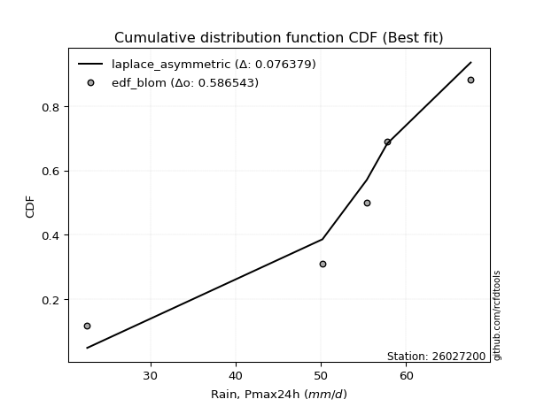</img></img>

</div>


### 7. EDF Tukey (1962)

In hydrology, the Tukey formula is used as a plotting position formula to estimate the empirical probability or frequency of a flood event (or other hydrological data). The formula parameter is given as _c=0.333_ (or 1/3).

<div align="center">


$P=(m-c)/(n+1-2c)$


</div>


**7.1. Empirical values**

<div align="center">

|                | 0                   | 1                  | 2                   | 3                  | 4                  | 5                  |
|:---------------|:--------------------|:-------------------|:--------------------|:-------------------|:-------------------|:-------------------|
| date           | 2025                | 2023               | 2019                | 2022               | 2020               | 2021               |
| x              | 12.8                | 22.6               | 50.2                | 55.4               | 57.8               | 67.6               |
| m              | 1                   | 2                  | 3                   | 4                  | 5                  | 6                  |
| empirical_dist | edf_tukey           | edf_tukey          | edf_tukey           | edf_tukey          | edf_tukey          | edf_tukey          |
| empirical      | 0.10526315789473684 | 0.2631578947368421 | 0.42105263157894735 | 0.5789473684210527 | 0.7368421052631579 | 0.8947368421052632 |
| empirical_tr   | 1.1176470588235294  | 1.357142857142857  | 1.7272727272727273  | 2.375              | 3.7999999999999994 | 9.5                |

</div>


**7.2. Kolmogorov-Smirnov fit test (sorted by Δ)**


<div align="center">

|                | 0                   | 1                   | 2                   | 3                   | 4                   | 5                   | 6                   | 7                   | 8                  | 9                   | 10                  | 11                  | 12                  | 13                  | 14                  | 15                  | 16                  | 17                  | 18                  | 19                 | 20                  | 21                  | 22                  | 23                  | 24                  | 25                  | 26                | 27                  | 28                 | 29                 | 30                  | 31                  | 32                  | 33                  | 34                  | 35                  | 36                  | 37                  | 38                  | 39                  | 40                  | 41                 | 42                  | 43                 | 44                 | 45                  | 46                  | 47                  | 48                  | 49                  | 50                  | 51                  | 52                  | 53                  | 54                  | 55                 | 56                  | 57                  | 58                 | 59                 | 60                  | 61                  | 62                 | 63                  | 64                  | 65                 | 66                 | 67                  | 68                  | 69                  | 70                  | 71                  | 72                 | 73                 | 74                 | 75                 | 76                  | 77                  | 78                  | 79                 | 80                  | 81                  | 82                 | 83                  | 84                  | 85                | 86                 | 87                 | 88                 | 89                 | 90                 | 91                  | 92                  | 93                 | 94                  | 95                  | 96                  | 97                 | 98                  | 99               | 100                | 101                 | 102                | 103                 | 104                | 105                 | 106                 | 107                | 108                 | 109                | 110                | 111                 | 112                | 113                 | 114                | 115                | 116                | 117               | 118                 | 119                | 120                 | 121                | 122                 | 123                 | 124               | 125                 | 126                 | 127                | 128                | 129                 | 130                | 131                | 132                 | 133                 | 134                 | 135                 | 136                 | 137                 | 138                | 139                | 140                | 141                | 142                 | 143                | 144                 | 145                | 146                | 147               | 148                | 149                | 150                | 151                | 152                | 153              | 154                | 155                | 156                | 157                | 158                | 159                |
|:---------------|:--------------------|:--------------------|:--------------------|:--------------------|:--------------------|:--------------------|:--------------------|:--------------------|:-------------------|:--------------------|:--------------------|:--------------------|:--------------------|:--------------------|:--------------------|:--------------------|:--------------------|:--------------------|:--------------------|:-------------------|:--------------------|:--------------------|:--------------------|:--------------------|:--------------------|:--------------------|:------------------|:--------------------|:-------------------|:-------------------|:--------------------|:--------------------|:--------------------|:--------------------|:--------------------|:--------------------|:--------------------|:--------------------|:--------------------|:--------------------|:--------------------|:-------------------|:--------------------|:-------------------|:-------------------|:--------------------|:--------------------|:--------------------|:--------------------|:--------------------|:--------------------|:--------------------|:--------------------|:--------------------|:--------------------|:-------------------|:--------------------|:--------------------|:-------------------|:-------------------|:--------------------|:--------------------|:-------------------|:--------------------|:--------------------|:-------------------|:-------------------|:--------------------|:--------------------|:--------------------|:--------------------|:--------------------|:-------------------|:-------------------|:-------------------|:-------------------|:--------------------|:--------------------|:--------------------|:-------------------|:--------------------|:--------------------|:-------------------|:--------------------|:--------------------|:------------------|:-------------------|:-------------------|:-------------------|:-------------------|:-------------------|:--------------------|:--------------------|:-------------------|:--------------------|:--------------------|:--------------------|:-------------------|:--------------------|:-----------------|:-------------------|:--------------------|:-------------------|:--------------------|:-------------------|:--------------------|:--------------------|:-------------------|:--------------------|:-------------------|:-------------------|:--------------------|:-------------------|:--------------------|:-------------------|:-------------------|:-------------------|:------------------|:--------------------|:-------------------|:--------------------|:-------------------|:--------------------|:--------------------|:------------------|:--------------------|:--------------------|:-------------------|:-------------------|:--------------------|:-------------------|:-------------------|:--------------------|:--------------------|:--------------------|:--------------------|:--------------------|:--------------------|:-------------------|:-------------------|:-------------------|:-------------------|:--------------------|:-------------------|:--------------------|:-------------------|:-------------------|:------------------|:-------------------|:-------------------|:-------------------|:-------------------|:-------------------|:-----------------|:-------------------|:-------------------|:-------------------|:-------------------|:-------------------|:-------------------|
| station        | 26027200            | 26027200            | 26027200            | 26027200            | 26027200            | 26027200            | 26027200            | 26027200            | 26027200           | 26027200            | 26027200            | 26027200            | 26027200            | 26027200            | 26027200            | 26027200            | 26027200            | 26027200            | 26027200            | 26027200           | 26027200            | 26027200            | 26027200            | 26027200            | 26027200            | 26027200            | 26027200          | 26027200            | 26027200           | 26027200           | 26027200            | 26027200            | 26027200            | 26027200            | 26027200            | 26027200            | 26027200            | 26027200            | 26027200            | 26027200            | 26027200            | 26027200           | 26027200            | 26027200           | 26027200           | 26027200            | 26027200            | 26027200            | 26027200            | 26027200            | 26027200            | 26027200            | 26027200            | 26027200            | 26027200            | 26027200           | 26027200            | 26027200            | 26027200           | 26027200           | 26027200            | 26027200            | 26027200           | 26027200            | 26027200            | 26027200           | 26027200           | 26027200            | 26027200            | 26027200            | 26027200            | 26027200            | 26027200           | 26027200           | 26027200           | 26027200           | 26027200            | 26027200            | 26027200            | 26027200           | 26027200            | 26027200            | 26027200           | 26027200            | 26027200            | 26027200          | 26027200           | 26027200           | 26027200           | 26027200           | 26027200           | 26027200            | 26027200            | 26027200           | 26027200            | 26027200            | 26027200            | 26027200           | 26027200            | 26027200         | 26027200           | 26027200            | 26027200           | 26027200            | 26027200           | 26027200            | 26027200            | 26027200           | 26027200            | 26027200           | 26027200           | 26027200            | 26027200           | 26027200            | 26027200           | 26027200           | 26027200           | 26027200          | 26027200            | 26027200           | 26027200            | 26027200           | 26027200            | 26027200            | 26027200          | 26027200            | 26027200            | 26027200           | 26027200           | 26027200            | 26027200           | 26027200           | 26027200            | 26027200            | 26027200            | 26027200            | 26027200            | 26027200            | 26027200           | 26027200           | 26027200           | 26027200           | 26027200            | 26027200           | 26027200            | 26027200           | 26027200           | 26027200          | 26027200           | 26027200           | 26027200           | 26027200           | 26027200           | 26027200         | 26027200           | 26027200           | 26027200           | 26027200           | 26027200           | 26027200           |
| empirical_dist | edf_tukey           | edf_tukey           | edf_tukey           | edf_tukey           | edf_tukey           | edf_tukey           | edf_tukey           | edf_tukey           | edf_tukey          | edf_tukey           | edf_tukey           | edf_tukey           | edf_tukey           | edf_tukey           | edf_tukey           | edf_tukey           | edf_tukey           | edf_tukey           | edf_tukey           | edf_tukey          | edf_tukey           | edf_tukey           | edf_tukey           | edf_tukey           | edf_tukey           | edf_tukey           | edf_tukey         | edf_tukey           | edf_tukey          | edf_tukey          | edf_tukey           | edf_tukey           | edf_tukey           | edf_tukey           | edf_tukey           | edf_tukey           | edf_tukey           | edf_tukey           | edf_tukey           | edf_tukey           | edf_tukey           | edf_tukey          | edf_tukey           | edf_tukey          | edf_tukey          | edf_tukey           | edf_tukey           | edf_tukey           | edf_tukey           | edf_tukey           | edf_tukey           | edf_tukey           | edf_tukey           | edf_tukey           | edf_tukey           | edf_tukey          | edf_tukey           | edf_tukey           | edf_tukey          | edf_tukey          | edf_tukey           | edf_tukey           | edf_tukey          | edf_tukey           | edf_tukey           | edf_tukey          | edf_tukey          | edf_tukey           | edf_tukey           | edf_tukey           | edf_tukey           | edf_tukey           | edf_tukey          | edf_tukey          | edf_tukey          | edf_tukey          | edf_tukey           | edf_tukey           | edf_tukey           | edf_tukey          | edf_tukey           | edf_tukey           | edf_tukey          | edf_tukey           | edf_tukey           | edf_tukey         | edf_tukey          | edf_tukey          | edf_tukey          | edf_tukey          | edf_tukey          | edf_tukey           | edf_tukey           | edf_tukey          | edf_tukey           | edf_tukey           | edf_tukey           | edf_tukey          | edf_tukey           | edf_tukey        | edf_tukey          | edf_tukey           | edf_tukey          | edf_tukey           | edf_tukey          | edf_tukey           | edf_tukey           | edf_tukey          | edf_tukey           | edf_tukey          | edf_tukey          | edf_tukey           | edf_tukey          | edf_tukey           | edf_tukey          | edf_tukey          | edf_tukey          | edf_tukey         | edf_tukey           | edf_tukey          | edf_tukey           | edf_tukey          | edf_tukey           | edf_tukey           | edf_tukey         | edf_tukey           | edf_tukey           | edf_tukey          | edf_tukey          | edf_tukey           | edf_tukey          | edf_tukey          | edf_tukey           | edf_tukey           | edf_tukey           | edf_tukey           | edf_tukey           | edf_tukey           | edf_tukey          | edf_tukey          | edf_tukey          | edf_tukey          | edf_tukey           | edf_tukey          | edf_tukey           | edf_tukey          | edf_tukey          | edf_tukey         | edf_tukey          | edf_tukey          | edf_tukey          | edf_tukey          | edf_tukey          | edf_tukey        | edf_tukey          | edf_tukey          | edf_tukey          | edf_tukey          | edf_tukey          | edf_tukey          |
| p_dist         | genpareto           | loggenextreme       | johnsonsu           | logweibull_max      | trapezoid           | genhalflogistic     | gumbel_l            | loglevy_l           | arcsine            | triang              | weibull_min         | skewnorm            | argus               | genextreme          | burr                | pearson3            | ksone               | logmielke           | wrapcauchy          | semicircular       | logloggamma         | dweibull            | logtrapezoid        | beta                | anglit              | levy_l              | gompertz          | logarcsine          | logargus           | dgamma             | f                   | nct                 | exponnorm           | truncnorm           | crystalball         | norm                | t                   | logloglaplace       | gamma               | logdgamma           | erlang              | betaprime          | logdweibull         | rice               | logistic           | logpearson3         | loggumbel_l         | vonmises_line       | logweibull_min      | gausshyper          | invgauss            | loggennorm          | gennorm             | invgamma            | maxwell             | hypsecant          | logsemicircular     | cosine              | alpha              | rayleigh           | loganglit           | logbeta             | loggompertz        | logburr12           | ncf                 | kappa4             | kstwobign          | loginvweibull       | logwrapcauchy       | logbetaprime        | logburr             | laplace             | halfnorm           | logf               | logncf             | logt               | lognorm             | logcrystalball      | logexponnorm        | logfatiguelife     | lognct              | tukeylambda         | loggenhalflogistic | logerlang           | loginvgauss         | logalpha          | logrice            | logfoldnorm        | kappa3             | gumbel_r           | uniform            | loggamma            | loggamma            | loginvgamma        | truncweibull_min    | lomax               | logmaxwell          | loglogistic        | genexpon            | logkstwobign     | lograyleigh        | halflogistic        | halfgennorm        | loggenexpon         | moyal              | nakagami            | loghypsecant        | loglomax           | burr12              | logcosine          | loghalfnorm        | lognakagami         | logskewnorm        | logtriang           | loggumbel_r        | loglaplace         | loglaplace         | logrdist          | loghalflogistic     | bradford           | logmoyal            | loggenpareto       | wald                | truncexpon          | logksone          | logjohnsonsu        | logjohnsonsb        | logwald            | logtukeylambda     | loggengamma         | logkappa4          | logbradford        | loghalfgennorm      | logkappa3           | loguniform          | gengamma            | logvonmises_line    | loggausshyper       | logtruncnorm       | mielke             | logexponpow        | invweibull         | fatiguelife         | logtruncexpon      | logtruncweibull_min | exponweib          | powerlaw           | logexponweib      | foldnorm           | weibull_max        | logpowerlaw        | truncpareto        | johnsonsb          | logtruncpareto   | exponpow           | rdist              | genlogistic        | loggenlogistic     | logvonmises        | vonmises           |
| delta          | 0.10526315789473684 | 0.11050064311902918 | 0.12097598924394237 | 0.12400614608266058 | 0.13050807320664426 | 0.13517530871728523 | 0.13758118046208279 | 0.13829311603801464 | 0.1454465447333383 | 0.14568079053827654 | 0.14703152851645995 | 0.14708228462876494 | 0.14770844140437372 | 0.15006644182633622 | 0.15082158099560705 | 0.16180295528936162 | 0.16361682617195583 | 0.16385401394089882 | 0.17036651693045757 | 0.1719730674899288 | 0.17206291036122945 | 0.17331791150919024 | 0.17602357167993576 | 0.17627205198187723 | 0.17853787173047708 | 0.17891800793663626 | 0.180808806081168 | 0.18200099028124117 | 0.1854567934080359 | 0.1873468486329227 | 0.19245991559465914 | 0.19427362527257785 | 0.19430051426119244 | 0.19430230754356592 | 0.19430231838290035 | 0.19430231936734188 | 0.19430308749099168 | 0.19551094683179426 | 0.19983082554365328 | 0.20032964585756757 | 0.20076612963798002 | 0.2020797000677672 | 0.20539915063724867 | 0.2060619105807835 | 0.2088954040675589 | 0.21047612857883324 | 0.21099153288519568 | 0.21147631539429987 | 0.21377539937549672 | 0.21568825848747297 | 0.21684985047548966 | 0.21709967618914808 | 0.21715011680215515 | 0.21736960597955568 | 0.21942615306258595 | 0.2206704414850006 | 0.22093517155626907 | 0.22198092549373782 | 0.2241122788105533 | 0.2271461093862116 | 0.23032201480697734 | 0.23213988310956224 | 0.2327927488360393 | 0.23425608711488843 | 0.23488313237328418 | 0.2433609888071968 | 0.2452528481116374 | 0.24538192419211902 | 0.24766537787493426 | 0.24805740760249617 | 0.24815013213918935 | 0.24870918506849327 | 0.2492337409478168 | 0.2520289787177932 | 0.2522477875272603 | 0.2525483357649232 | 0.25255295594890836 | 0.25255340574918606 | 0.25255505549068324 | 0.2527356562817329 | 0.25277526694323593 | 0.25390474507611804 | 0.2547815230466114 | 0.25484041436411387 | 0.25513376230839513 | 0.255619671904596 | 0.2568441199781396 | 0.2569326402886869 | 0.2590890643618331 | 0.2591045481645923 | 0.2614291202458703 | 0.26210268989285246 | 0.26210268989285246 | 0.2625388057514263 | 0.26326738919147075 | 0.26531967524889377 | 0.27157868777943217 | 0.2723366273734671 | 0.27252199669304045 | 0.27653280212694 | 0.2772213939903807 | 0.27760690987854186 | 0.2779590446290383 | 0.28097240117612343 | 0.2810189461536816 | 0.28467320899348636 | 0.28721413558878606 | 0.2883634794443417 | 0.29075552282633677 | 0.2920045450640836 | 0.2939209531206468 | 0.29397680568682416 | 0.2984878197639711 | 0.30800272415418006 | 0.3085157184960925 | 0.3143086079489531 | 0.3143086079489531 | 0.315864303344888 | 0.32155173444545926 | 0.3220593338522295 | 0.32680988342275596 | 0.3356541075384806 | 0.34231270002201464 | 0.34508190094724844 | 0.346593681738834 | 0.35168241243822884 | 0.37784811809793306 | 0.3793756056228458 | 0.3844547059071224 | 0.38648547984653125 | 0.3944728045868843 | 0.3949941173989695 | 0.39534569517844687 | 0.39966745021570893 | 0.40012294440239027 | 0.40380213205991544 | 0.40652338320979564 | 0.43011910993516544 | 0.4408753677634143 | 0.4415037332276808 | 0.4421402979995357 | 0.4432825533366939 | 0.45405375952853805 | 0.4561673949669275 | 0.46328579731231667 | 0.4888737606624916 | 0.5239501429044767 | 0.524670359266705 | 0.5301795410161083 | 0.5756312606315939 | 0.5783935925689845 | 0.5806559807009741 | 0.6160077597585767 | 0.64053581849345 | 0.6545322354185599 | 0.7368421052336576 | 0.7368421052631579 | 0.7368421052631579 | 1.2370836254736925 | 10.350828044050758 |
| deltao         | 0.530385761606      | 0.530385761606      | 0.530385761606      | 0.530385761606      | 0.530385761606      | 0.530385761606      | 0.530385761606      | 0.530385761606      | 0.530385761606     | 0.530385761606      | 0.530385761606      | 0.530385761606      | 0.530385761606      | 0.530385761606      | 0.530385761606      | 0.530385761606      | 0.530385761606      | 0.530385761606      | 0.530385761606      | 0.530385761606     | 0.530385761606      | 0.530385761606      | 0.530385761606      | 0.530385761606      | 0.530385761606      | 0.530385761606      | 0.530385761606    | 0.530385761606      | 0.530385761606     | 0.530385761606     | 0.530385761606      | 0.530385761606      | 0.530385761606      | 0.530385761606      | 0.530385761606      | 0.530385761606      | 0.530385761606      | 0.530385761606      | 0.530385761606      | 0.530385761606      | 0.530385761606      | 0.530385761606     | 0.530385761606      | 0.530385761606     | 0.530385761606     | 0.530385761606      | 0.530385761606      | 0.530385761606      | 0.530385761606      | 0.530385761606      | 0.530385761606      | 0.530385761606      | 0.530385761606      | 0.530385761606      | 0.530385761606      | 0.530385761606     | 0.530385761606      | 0.530385761606      | 0.530385761606     | 0.530385761606     | 0.530385761606      | 0.530385761606      | 0.530385761606     | 0.530385761606      | 0.530385761606      | 0.530385761606     | 0.530385761606     | 0.530385761606      | 0.530385761606      | 0.530385761606      | 0.530385761606      | 0.530385761606      | 0.530385761606     | 0.530385761606     | 0.530385761606     | 0.530385761606     | 0.530385761606      | 0.530385761606      | 0.530385761606      | 0.530385761606     | 0.530385761606      | 0.530385761606      | 0.530385761606     | 0.530385761606      | 0.530385761606      | 0.530385761606    | 0.530385761606     | 0.530385761606     | 0.530385761606     | 0.530385761606     | 0.530385761606     | 0.530385761606      | 0.530385761606      | 0.530385761606     | 0.530385761606      | 0.530385761606      | 0.530385761606      | 0.530385761606     | 0.530385761606      | 0.530385761606   | 0.530385761606     | 0.530385761606      | 0.530385761606     | 0.530385761606      | 0.530385761606     | 0.530385761606      | 0.530385761606      | 0.530385761606     | 0.530385761606      | 0.530385761606     | 0.530385761606     | 0.530385761606      | 0.530385761606     | 0.530385761606      | 0.530385761606     | 0.530385761606     | 0.530385761606     | 0.530385761606    | 0.530385761606      | 0.530385761606     | 0.530385761606      | 0.530385761606     | 0.530385761606      | 0.530385761606      | 0.530385761606    | 0.530385761606      | 0.530385761606      | 0.530385761606     | 0.530385761606     | 0.530385761606      | 0.530385761606     | 0.530385761606     | 0.530385761606      | 0.530385761606      | 0.530385761606      | 0.530385761606      | 0.530385761606      | 0.530385761606      | 0.530385761606     | 0.530385761606     | 0.530385761606     | 0.530385761606     | 0.530385761606      | 0.530385761606     | 0.530385761606      | 0.530385761606     | 0.530385761606     | 0.530385761606    | 0.530385761606     | 0.530385761606     | 0.530385761606     | 0.530385761606     | 0.530385761606     | 0.530385761606   | 0.530385761606     | 0.530385761606     | 0.530385761606     | 0.530385761606     | 0.530385761606     | 0.530385761606     |
| eval           | Δo > Δ              | Δo > Δ              | Δo > Δ              | Δo > Δ              | Δo > Δ              | Δo > Δ              | Δo > Δ              | Δo > Δ              | Δo > Δ             | Δo > Δ              | Δo > Δ              | Δo > Δ              | Δo > Δ              | Δo > Δ              | Δo > Δ              | Δo > Δ              | Δo > Δ              | Δo > Δ              | Δo > Δ              | Δo > Δ             | Δo > Δ              | Δo > Δ              | Δo > Δ              | Δo > Δ              | Δo > Δ              | Δo > Δ              | Δo > Δ            | Δo > Δ              | Δo > Δ             | Δo > Δ             | Δo > Δ              | Δo > Δ              | Δo > Δ              | Δo > Δ              | Δo > Δ              | Δo > Δ              | Δo > Δ              | Δo > Δ              | Δo > Δ              | Δo > Δ              | Δo > Δ              | Δo > Δ             | Δo > Δ              | Δo > Δ             | Δo > Δ             | Δo > Δ              | Δo > Δ              | Δo > Δ              | Δo > Δ              | Δo > Δ              | Δo > Δ              | Δo > Δ              | Δo > Δ              | Δo > Δ              | Δo > Δ              | Δo > Δ             | Δo > Δ              | Δo > Δ              | Δo > Δ             | Δo > Δ             | Δo > Δ              | Δo > Δ              | Δo > Δ             | Δo > Δ              | Δo > Δ              | Δo > Δ             | Δo > Δ             | Δo > Δ              | Δo > Δ              | Δo > Δ              | Δo > Δ              | Δo > Δ              | Δo > Δ             | Δo > Δ             | Δo > Δ             | Δo > Δ             | Δo > Δ              | Δo > Δ              | Δo > Δ              | Δo > Δ             | Δo > Δ              | Δo > Δ              | Δo > Δ             | Δo > Δ              | Δo > Δ              | Δo > Δ            | Δo > Δ             | Δo > Δ             | Δo > Δ             | Δo > Δ             | Δo > Δ             | Δo > Δ              | Δo > Δ              | Δo > Δ             | Δo > Δ              | Δo > Δ              | Δo > Δ              | Δo > Δ             | Δo > Δ              | Δo > Δ           | Δo > Δ             | Δo > Δ              | Δo > Δ             | Δo > Δ              | Δo > Δ             | Δo > Δ              | Δo > Δ              | Δo > Δ             | Δo > Δ              | Δo > Δ             | Δo > Δ             | Δo > Δ              | Δo > Δ             | Δo > Δ              | Δo > Δ             | Δo > Δ             | Δo > Δ             | Δo > Δ            | Δo > Δ              | Δo > Δ             | Δo > Δ              | Δo > Δ             | Δo > Δ              | Δo > Δ              | Δo > Δ            | Δo > Δ              | Δo > Δ              | Δo > Δ             | Δo > Δ             | Δo > Δ              | Δo > Δ             | Δo > Δ             | Δo > Δ              | Δo > Δ              | Δo > Δ              | Δo > Δ              | Δo > Δ              | Δo > Δ              | Δo > Δ             | Δo > Δ             | Δo > Δ             | Δo > Δ             | Δo > Δ              | Δo > Δ             | Δo > Δ              | Δo > Δ             | Δo > Δ             | Δo > Δ            | Δo > Δ             | Δo <= Δ            | Δo <= Δ            | Δo <= Δ            | Δo <= Δ            | Δo <= Δ          | Δo <= Δ            | Δo <= Δ            | Δo <= Δ            | Δo <= Δ            | Δo <= Δ            | Δo <= Δ            |
| fit            | 1                   | 1                   | 1                   | 1                   | 1                   | 1                   | 1                   | 1                   | 1                  | 1                   | 1                   | 1                   | 1                   | 1                   | 1                   | 1                   | 1                   | 1                   | 1                   | 1                  | 1                   | 1                   | 1                   | 1                   | 1                   | 1                   | 1                 | 1                   | 1                  | 1                  | 1                   | 1                   | 1                   | 1                   | 1                   | 1                   | 1                   | 1                   | 1                   | 1                   | 1                   | 1                  | 1                   | 1                  | 1                  | 1                   | 1                   | 1                   | 1                   | 1                   | 1                   | 1                   | 1                   | 1                   | 1                   | 1                  | 1                   | 1                   | 1                  | 1                  | 1                   | 1                   | 1                  | 1                   | 1                   | 1                  | 1                  | 1                   | 1                   | 1                   | 1                   | 1                   | 1                  | 1                  | 1                  | 1                  | 1                   | 1                   | 1                   | 1                  | 1                   | 1                   | 1                  | 1                   | 1                   | 1                 | 1                  | 1                  | 1                  | 1                  | 1                  | 1                   | 1                   | 1                  | 1                   | 1                   | 1                   | 1                  | 1                   | 1                | 1                  | 1                   | 1                  | 1                   | 1                  | 1                   | 1                   | 1                  | 1                   | 1                  | 1                  | 1                   | 1                  | 1                   | 1                  | 1                  | 1                  | 1                 | 1                   | 1                  | 1                   | 1                  | 1                   | 1                   | 1                 | 1                   | 1                   | 1                  | 1                  | 1                   | 1                  | 1                  | 1                   | 1                   | 1                   | 1                   | 1                   | 1                   | 1                  | 1                  | 1                  | 1                  | 1                   | 1                  | 1                   | 1                  | 1                  | 1                 | 1                  | 0                  | 0                  | 0                  | 0                  | 0                | 0                  | 0                  | 0                  | 0                  | 0                  | 0                  |
| n              | 6                   | 6                   | 6                   | 6                   | 6                   | 6                   | 6                   | 6                   | 6                  | 6                   | 6                   | 6                   | 6                   | 6                   | 6                   | 6                   | 6                   | 6                   | 6                   | 6                  | 6                   | 6                   | 6                   | 6                   | 6                   | 6                   | 6                 | 6                   | 6                  | 6                  | 6                   | 6                   | 6                   | 6                   | 6                   | 6                   | 6                   | 6                   | 6                   | 6                   | 6                   | 6                  | 6                   | 6                  | 6                  | 6                   | 6                   | 6                   | 6                   | 6                   | 6                   | 6                   | 6                   | 6                   | 6                   | 6                  | 6                   | 6                   | 6                  | 6                  | 6                   | 6                   | 6                  | 6                   | 6                   | 6                  | 6                  | 6                   | 6                   | 6                   | 6                   | 6                   | 6                  | 6                  | 6                  | 6                  | 6                   | 6                   | 6                   | 6                  | 6                   | 6                   | 6                  | 6                   | 6                   | 6                 | 6                  | 6                  | 6                  | 6                  | 6                  | 6                   | 6                   | 6                  | 6                   | 6                   | 6                   | 6                  | 6                   | 6                | 6                  | 6                   | 6                  | 6                   | 6                  | 6                   | 6                   | 6                  | 6                   | 6                  | 6                  | 6                   | 6                  | 6                   | 6                  | 6                  | 6                  | 6                 | 6                   | 6                  | 6                   | 6                  | 6                   | 6                   | 6                 | 6                   | 6                   | 6                  | 6                  | 6                   | 6                  | 6                  | 6                   | 6                   | 6                   | 6                   | 6                   | 6                   | 6                  | 6                  | 6                  | 6                  | 6                   | 6                  | 6                   | 6                  | 6                  | 6                 | 6                  | 6                  | 6                  | 6                  | 6                  | 6                | 6                  | 6                  | 6                  | 6                  | 6                  | 6                  |
| best_fit       | 1                   | 0                   | 0                   | 0                   | 0                   | 0                   | 0                   | 0                   | 0                  | 0                   | 0                   | 0                   | 0                   | 0                   | 0                   | 0                   | 0                   | 0                   | 0                   | 0                  | 0                   | 0                   | 0                   | 0                   | 0                   | 0                   | 0                 | 0                   | 0                  | 0                  | 0                   | 0                   | 0                   | 0                   | 0                   | 0                   | 0                   | 0                   | 0                   | 0                   | 0                   | 0                  | 0                   | 0                  | 0                  | 0                   | 0                   | 0                   | 0                   | 0                   | 0                   | 0                   | 0                   | 0                   | 0                   | 0                  | 0                   | 0                   | 0                  | 0                  | 0                   | 0                   | 0                  | 0                   | 0                   | 0                  | 0                  | 0                   | 0                   | 0                   | 0                   | 0                   | 0                  | 0                  | 0                  | 0                  | 0                   | 0                   | 0                   | 0                  | 0                   | 0                   | 0                  | 0                   | 0                   | 0                 | 0                  | 0                  | 0                  | 0                  | 0                  | 0                   | 0                   | 0                  | 0                   | 0                   | 0                   | 0                  | 0                   | 0                | 0                  | 0                   | 0                  | 0                   | 0                  | 0                   | 0                   | 0                  | 0                   | 0                  | 0                  | 0                   | 0                  | 0                   | 0                  | 0                  | 0                  | 0                 | 0                   | 0                  | 0                   | 0                  | 0                   | 0                   | 0                 | 0                   | 0                   | 0                  | 0                  | 0                   | 0                  | 0                  | 0                   | 0                   | 0                   | 0                   | 0                   | 0                   | 0                  | 0                  | 0                  | 0                  | 0                   | 0                  | 0                   | 0                  | 0                  | 0                 | 0                  | 0                  | 0                  | 0                  | 0                  | 0                | 0                  | 0                  | 0                  | 0                  | 0                  | 0                  |
| best_fit_sort  | 1                   | 2                   | 3                   | 4                   | 5                   | 6                   | 7                   | 8                   | 9                  | 10                  | 11                  | 12                  | 13                  | 14                  | 15                  | 16                  | 17                  | 18                  | 19                  | 20                 | 21                  | 22                  | 23                  | 24                  | 25                  | 26                  | 27                | 28                  | 29                 | 30                 | 31                  | 32                  | 33                  | 34                  | 35                  | 36                  | 37                  | 38                  | 39                  | 40                  | 41                  | 42                 | 43                  | 44                 | 45                 | 46                  | 47                  | 48                  | 49                  | 50                  | 51                  | 52                  | 53                  | 54                  | 55                  | 56                 | 57                  | 58                  | 59                 | 60                 | 61                  | 62                  | 63                 | 64                  | 65                  | 66                 | 67                 | 68                  | 69                  | 70                  | 71                  | 72                  | 73                 | 74                 | 75                 | 76                 | 77                  | 78                  | 79                  | 80                 | 81                  | 82                  | 83                 | 84                  | 85                  | 86                | 87                 | 88                 | 89                 | 90                 | 91                 | 92                  | 93                  | 94                 | 95                  | 96                  | 97                  | 98                 | 99                  | 100              | 101                | 102                 | 103                | 104                 | 105                | 106                 | 107                 | 108                | 109                 | 110                | 111                | 112                 | 113                | 114                 | 115                | 116                | 117                | 118               | 119                 | 120                | 121                 | 122                | 123                 | 124                 | 125               | 126                 | 127                 | 128                | 129                | 130                 | 131                | 132                | 133                 | 134                 | 135                 | 136                 | 137                 | 138                 | 139                | 140                | 141                | 142                | 143                 | 144                | 145                 | 146                | 147                | 148               | 149                | 150                | 151                | 152                | 153                | 154              | 155                | 156                | 157                | 158                | 159                | 160                |

</div>


**7.3. Best fit**

<div align="center">

|   id |   station | empirical_dist   | p_dist    |    delta |   deltao | eval   |   fit |   n |   best_fit |   best_fit_sort |
|-----:|----------:|:-----------------|:----------|---------:|---------:|:-------|------:|----:|-----------:|----------------:|
|    0 |  26027200 | edf_tukey        | genpareto | 0.105263 | 0.530386 | Δo > Δ |     1 |   6 |          1 |               1 |

</div>


<div align="center">

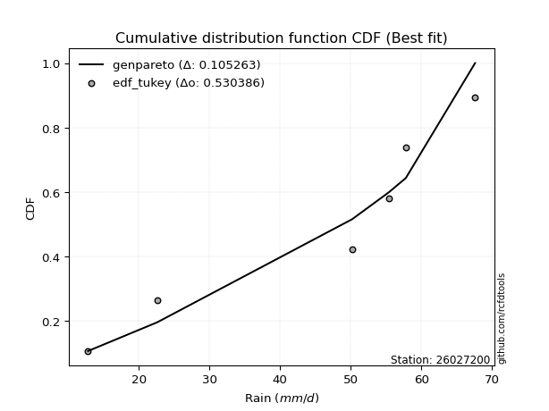</img></img>

</div>


### 8. EDF Gringorten (1963)

Gringorten plotting position formula is essential for estimating the probability and return periods of extreme events like floods and heavy rainfall. The constant _a=0.44_.

<div align="center">


$P=(m-a)/(n+1-2a)$


</div>


**8.1. Empirical values**

<div align="center">

|                | 0                   | 1                  | 2                   | 3                  | 4                  | 5                  |
|:---------------|:--------------------|:-------------------|:--------------------|:-------------------|:-------------------|:-------------------|
| date           | 2025                | 2023               | 2019                | 2022               | 2020               | 2021               |
| x              | 12.8                | 22.6               | 50.2                | 55.4               | 57.8               | 67.6               |
| m              | 1                   | 2                  | 3                   | 4                  | 5                  | 6                  |
| empirical_dist | edf_gringorten      | edf_gringorten     | edf_gringorten      | edf_gringorten     | edf_gringorten     | edf_gringorten     |
| empirical      | 0.09150326797385622 | 0.2549019607843137 | 0.41830065359477125 | 0.5816993464052288 | 0.7450980392156862 | 0.9084967320261437 |
| empirical_tr   | 1.1007194244604317  | 1.3421052631578947 | 1.7191011235955058  | 2.3906250000000004 | 3.9230769230769216 | 10.928571428571415 |

</div>


**8.2. Kolmogorov-Smirnov fit test (sorted by Δ)**


<div align="center">

|                | 0                   | 1                  | 2                   | 3                   | 4                  | 5                   | 6                   | 7                   | 8                   | 9                   | 10                  | 11                  | 12                  | 13                  | 14                  | 15                 | 16                  | 17                  | 18                  | 19                  | 20                 | 21                  | 22                  | 23                  | 24                  | 25                 | 26                  | 27                  | 28                  | 29                 | 30                  | 31                  | 32                  | 33                  | 34                | 35                  | 36                  | 37                  | 38                  | 39                  | 40                 | 41                 | 42                  | 43                  | 44                | 45                  | 46                  | 47                | 48                  | 49                 | 50                  | 51                  | 52                  | 53                  | 54                  | 55                  | 56                  | 57                  | 58                  | 59                 | 60                  | 61                  | 62                  | 63                  | 64                  | 65                 | 66                  | 67                 | 68                  | 69                  | 70                  | 71                  | 72                 | 73                  | 74                 | 75                 | 76                  | 77                  | 78                  | 79                | 80                | 81                  | 82                 | 83                  | 84                 | 85                 | 86                 | 87                | 88                 | 89                  | 90                 | 91                  | 92                  | 93                 | 94                  | 95                  | 96                  | 97                 | 98                  | 99                  | 100                | 101                 | 102                | 103                | 104                | 105                 | 106                 | 107                | 108                 | 109                 | 110                | 111                 | 112                | 113                 | 114                | 115                | 116                | 117                | 118                 | 119                | 120                 | 121                 | 122                 | 123                 | 124                 | 125                 | 126                 | 127                | 128                | 129                 | 130                 | 131                | 132                 | 133               | 134                 | 135                 | 136                 | 137                 | 138                | 139                 | 140                | 141                | 142                | 143                 | 144                 | 145              | 146                | 147                | 148                | 149                | 150                | 151                | 152               | 153                | 154                | 155               | 156                | 157                | 158                | 159                |
|:---------------|:--------------------|:-------------------|:--------------------|:--------------------|:-------------------|:--------------------|:--------------------|:--------------------|:--------------------|:--------------------|:--------------------|:--------------------|:--------------------|:--------------------|:--------------------|:-------------------|:--------------------|:--------------------|:--------------------|:--------------------|:-------------------|:--------------------|:--------------------|:--------------------|:--------------------|:-------------------|:--------------------|:--------------------|:--------------------|:-------------------|:--------------------|:--------------------|:--------------------|:--------------------|:------------------|:--------------------|:--------------------|:--------------------|:--------------------|:--------------------|:-------------------|:-------------------|:--------------------|:--------------------|:------------------|:--------------------|:--------------------|:------------------|:--------------------|:-------------------|:--------------------|:--------------------|:--------------------|:--------------------|:--------------------|:--------------------|:--------------------|:--------------------|:--------------------|:-------------------|:--------------------|:--------------------|:--------------------|:--------------------|:--------------------|:-------------------|:--------------------|:-------------------|:--------------------|:--------------------|:--------------------|:--------------------|:-------------------|:--------------------|:-------------------|:-------------------|:--------------------|:--------------------|:--------------------|:------------------|:------------------|:--------------------|:-------------------|:--------------------|:-------------------|:-------------------|:-------------------|:------------------|:-------------------|:--------------------|:-------------------|:--------------------|:--------------------|:-------------------|:--------------------|:--------------------|:--------------------|:-------------------|:--------------------|:--------------------|:-------------------|:--------------------|:-------------------|:-------------------|:-------------------|:--------------------|:--------------------|:-------------------|:--------------------|:--------------------|:-------------------|:--------------------|:-------------------|:--------------------|:-------------------|:-------------------|:-------------------|:-------------------|:--------------------|:-------------------|:--------------------|:--------------------|:--------------------|:--------------------|:--------------------|:--------------------|:--------------------|:-------------------|:-------------------|:--------------------|:--------------------|:-------------------|:--------------------|:------------------|:--------------------|:--------------------|:--------------------|:--------------------|:-------------------|:--------------------|:-------------------|:-------------------|:-------------------|:--------------------|:--------------------|:-----------------|:-------------------|:-------------------|:-------------------|:-------------------|:-------------------|:-------------------|:------------------|:-------------------|:-------------------|:------------------|:-------------------|:-------------------|:-------------------|:-------------------|
| station        | 26027200            | 26027200           | 26027200            | 26027200            | 26027200           | 26027200            | 26027200            | 26027200            | 26027200            | 26027200            | 26027200            | 26027200            | 26027200            | 26027200            | 26027200            | 26027200           | 26027200            | 26027200            | 26027200            | 26027200            | 26027200           | 26027200            | 26027200            | 26027200            | 26027200            | 26027200           | 26027200            | 26027200            | 26027200            | 26027200           | 26027200            | 26027200            | 26027200            | 26027200            | 26027200          | 26027200            | 26027200            | 26027200            | 26027200            | 26027200            | 26027200           | 26027200           | 26027200            | 26027200            | 26027200          | 26027200            | 26027200            | 26027200          | 26027200            | 26027200           | 26027200            | 26027200            | 26027200            | 26027200            | 26027200            | 26027200            | 26027200            | 26027200            | 26027200            | 26027200           | 26027200            | 26027200            | 26027200            | 26027200            | 26027200            | 26027200           | 26027200            | 26027200           | 26027200            | 26027200            | 26027200            | 26027200            | 26027200           | 26027200            | 26027200           | 26027200           | 26027200            | 26027200            | 26027200            | 26027200          | 26027200          | 26027200            | 26027200           | 26027200            | 26027200           | 26027200           | 26027200           | 26027200          | 26027200           | 26027200            | 26027200           | 26027200            | 26027200            | 26027200           | 26027200            | 26027200            | 26027200            | 26027200           | 26027200            | 26027200            | 26027200           | 26027200            | 26027200           | 26027200           | 26027200           | 26027200            | 26027200            | 26027200           | 26027200            | 26027200            | 26027200           | 26027200            | 26027200           | 26027200            | 26027200           | 26027200           | 26027200           | 26027200           | 26027200            | 26027200           | 26027200            | 26027200            | 26027200            | 26027200            | 26027200            | 26027200            | 26027200            | 26027200           | 26027200           | 26027200            | 26027200            | 26027200           | 26027200            | 26027200          | 26027200            | 26027200            | 26027200            | 26027200            | 26027200           | 26027200            | 26027200           | 26027200           | 26027200           | 26027200            | 26027200            | 26027200         | 26027200           | 26027200           | 26027200           | 26027200           | 26027200           | 26027200           | 26027200          | 26027200           | 26027200           | 26027200          | 26027200           | 26027200           | 26027200           | 26027200           |
| empirical_dist | edf_gringorten      | edf_gringorten     | edf_gringorten      | edf_gringorten      | edf_gringorten     | edf_gringorten      | edf_gringorten      | edf_gringorten      | edf_gringorten      | edf_gringorten      | edf_gringorten      | edf_gringorten      | edf_gringorten      | edf_gringorten      | edf_gringorten      | edf_gringorten     | edf_gringorten      | edf_gringorten      | edf_gringorten      | edf_gringorten      | edf_gringorten     | edf_gringorten      | edf_gringorten      | edf_gringorten      | edf_gringorten      | edf_gringorten     | edf_gringorten      | edf_gringorten      | edf_gringorten      | edf_gringorten     | edf_gringorten      | edf_gringorten      | edf_gringorten      | edf_gringorten      | edf_gringorten    | edf_gringorten      | edf_gringorten      | edf_gringorten      | edf_gringorten      | edf_gringorten      | edf_gringorten     | edf_gringorten     | edf_gringorten      | edf_gringorten      | edf_gringorten    | edf_gringorten      | edf_gringorten      | edf_gringorten    | edf_gringorten      | edf_gringorten     | edf_gringorten      | edf_gringorten      | edf_gringorten      | edf_gringorten      | edf_gringorten      | edf_gringorten      | edf_gringorten      | edf_gringorten      | edf_gringorten      | edf_gringorten     | edf_gringorten      | edf_gringorten      | edf_gringorten      | edf_gringorten      | edf_gringorten      | edf_gringorten     | edf_gringorten      | edf_gringorten     | edf_gringorten      | edf_gringorten      | edf_gringorten      | edf_gringorten      | edf_gringorten     | edf_gringorten      | edf_gringorten     | edf_gringorten     | edf_gringorten      | edf_gringorten      | edf_gringorten      | edf_gringorten    | edf_gringorten    | edf_gringorten      | edf_gringorten     | edf_gringorten      | edf_gringorten     | edf_gringorten     | edf_gringorten     | edf_gringorten    | edf_gringorten     | edf_gringorten      | edf_gringorten     | edf_gringorten      | edf_gringorten      | edf_gringorten     | edf_gringorten      | edf_gringorten      | edf_gringorten      | edf_gringorten     | edf_gringorten      | edf_gringorten      | edf_gringorten     | edf_gringorten      | edf_gringorten     | edf_gringorten     | edf_gringorten     | edf_gringorten      | edf_gringorten      | edf_gringorten     | edf_gringorten      | edf_gringorten      | edf_gringorten     | edf_gringorten      | edf_gringorten     | edf_gringorten      | edf_gringorten     | edf_gringorten     | edf_gringorten     | edf_gringorten     | edf_gringorten      | edf_gringorten     | edf_gringorten      | edf_gringorten      | edf_gringorten      | edf_gringorten      | edf_gringorten      | edf_gringorten      | edf_gringorten      | edf_gringorten     | edf_gringorten     | edf_gringorten      | edf_gringorten      | edf_gringorten     | edf_gringorten      | edf_gringorten    | edf_gringorten      | edf_gringorten      | edf_gringorten      | edf_gringorten      | edf_gringorten     | edf_gringorten      | edf_gringorten     | edf_gringorten     | edf_gringorten     | edf_gringorten      | edf_gringorten      | edf_gringorten   | edf_gringorten     | edf_gringorten     | edf_gringorten     | edf_gringorten     | edf_gringorten     | edf_gringorten     | edf_gringorten    | edf_gringorten     | edf_gringorten     | edf_gringorten    | edf_gringorten     | edf_gringorten     | edf_gringorten     | edf_gringorten     |
| p_dist         | genpareto           | loggenextreme      | johnsonsu           | trapezoid           | logweibull_max     | genhalflogistic     | weibull_min         | argus               | gumbel_l            | loglevy_l           | arcsine             | triang              | skewnorm            | burr                | genextreme          | pearson3           | dweibull            | ksone               | logmielke           | wrapcauchy          | semicircular       | logloggamma         | logtrapezoid        | dgamma              | anglit              | gompertz           | beta                | logarcsine          | logargus            | logdgamma          | levy_l              | f                   | nct                 | exponnorm           | truncnorm         | crystalball         | norm                | t                   | gamma               | vonmises_line       | erlang             | betaprime          | rice                | logloglaplace       | logistic          | logpearson3         | loggumbel_l         | loggennorm        | gennorm             | logweibull_min     | gausshyper          | logdweibull         | invgauss            | invgamma            | maxwell             | hypsecant           | logsemicircular     | cosine              | alpha               | rayleigh           | loganglit           | loggompertz         | logburr12           | ncf                 | logbeta             | kappa4             | kstwobign           | loginvweibull      | logwrapcauchy       | logbetaprime        | logburr             | laplace             | halfnorm           | logf                | logncf             | logt               | lognorm             | logcrystalball      | logexponnorm        | logfatiguelife    | lognct            | tukeylambda         | loggenhalflogistic | logerlang           | loginvgauss        | logalpha           | logrice            | logfoldnorm       | kappa3             | gumbel_r            | uniform            | loggamma            | loggamma            | loginvgamma        | truncweibull_min    | lomax               | logmaxwell          | loglogistic        | genexpon            | logkstwobign        | lograyleigh        | halflogistic        | halfgennorm        | loggenexpon        | moyal              | nakagami            | loghypsecant        | loglomax           | burr12              | logcosine           | loghalfnorm        | lognakagami         | logskewnorm        | logtriang           | loggumbel_r        | loglaplace         | loglaplace         | logrdist           | loghalflogistic     | bradford           | logmoyal            | loggenpareto        | wald                | truncexpon          | logksone            | logjohnsonsu        | logwald             | logjohnsonsb       | logtukeylambda     | loggengamma         | logkappa4           | logbradford        | loghalfgennorm      | logkappa3         | loguniform          | gengamma            | logvonmises_line    | loggausshyper       | logtruncnorm       | mielke              | logexponpow        | invweibull         | logtruncexpon      | fatiguelife         | logtruncweibull_min | exponweib        | powerlaw           | logexponweib       | foldnorm           | weibull_max        | logpowerlaw        | truncpareto        | johnsonsb         | logtruncpareto     | exponpow           | rdist             | genlogistic        | loggenlogistic     | logvonmises        | vonmises           |
| delta          | 0.10183042370629702 | 0.1022447091665008 | 0.11272005529141399 | 0.13326005119082035 | 0.1377660360035412 | 0.13792728670146132 | 0.13877559456393157 | 0.13945250745184534 | 0.14033315844625888 | 0.14654904999054297 | 0.14819852271751438 | 0.14843276852245263 | 0.14983426261294103 | 0.15357355897978314 | 0.15832237577886454 | 0.1645549332735377 | 0.16506197755666185 | 0.16636880415613192 | 0.16660599192507491 | 0.17311849491463366 | 0.1747250454741049 | 0.17481488834540554 | 0.17877554966411185 | 0.17909091468039431 | 0.18128984971465317 | 0.1835607840653441 | 0.18452798593440556 | 0.18475296826541726 | 0.18820877139221198 | 0.1920737119050392 | 0.19267789785751688 | 0.19521189357883523 | 0.19702560325675395 | 0.19705249224536853 | 0.197054285527742 | 0.19705429636707644 | 0.19705429735151797 | 0.19705506547516777 | 0.20258280352782937 | 0.20322038144177149 | 0.2035181076221561 | 0.2048316780519433 | 0.20881388856495958 | 0.20927083675267477 | 0.211647382051735 | 0.21322810656300933 | 0.21374351086937177 | 0.214347698204972 | 0.21439813881797906 | 0.2165273773596728 | 0.21844023647164906 | 0.21915904055812918 | 0.21960182845966575 | 0.22012158396373177 | 0.22217813104676204 | 0.22342241946917668 | 0.22368714954044516 | 0.22473290347791391 | 0.22686425679472938 | 0.2298980873703877 | 0.23307399279115343 | 0.23554472682021538 | 0.23700806509906452 | 0.23763511035746027 | 0.24039581706209057 | 0.2461129667913729 | 0.24800482609581348 | 0.2481339021762951 | 0.25041735585911035 | 0.25080938558667226 | 0.25090211012336544 | 0.25146116305266936 | 0.2519857189319929 | 0.25478095670196926 | 0.2549997655114364 | 0.2553003137490993 | 0.25530493393308445 | 0.25530538373336215 | 0.25530703347485934 | 0.255487634265909 | 0.255527244927412 | 0.25665672306029413 | 0.2575335010307875 | 0.25759239234828996 | 0.2578857402925712 | 0.2583716498887721 | 0.2595960979623157 | 0.259684618272863 | 0.2618410423460092 | 0.26185652614876836 | 0.2641810982300464 | 0.26485466787702855 | 0.26485466787702855 | 0.2652907837356024 | 0.26601936717564684 | 0.26807165323306986 | 0.27433066576360826 | 0.2750886053576432 | 0.27527397467721654 | 0.27928478011111607 | 0.2799733719745568 | 0.28035888786271795 | 0.2807110226132144 | 0.2837243791602995 | 0.2837709241378577 | 0.28742518697766245 | 0.28996611357296215 | 0.2911154574285178 | 0.29350750081051286 | 0.29475652304825967 | 0.2966729311048229 | 0.29672878367100025 | 0.3012397977481472 | 0.31075470213835615 | 0.3112676964802686 | 0.3170605859331292 | 0.3170605859331292 | 0.3186162813290641 | 0.32430371242963535 | 0.3248113118364056 | 0.32956186140693206 | 0.33840608552265666 | 0.34506467800619073 | 0.34783387893142453 | 0.34934565972301007 | 0.35993834639075717 | 0.38212758360702187 | 0.3861040520504614 | 0.3872066838912985 | 0.38923745783070735 | 0.39722478257106036 | 0.3977460953831456 | 0.39809767316262296 | 0.402419428199885 | 0.40287492238656636 | 0.40655411004409153 | 0.40927536119397173 | 0.43287108791934154 | 0.4436273457475904 | 0.44425571121185686 | 0.4448922759837118 | 0.4570424432575744 | 0.4589193729511036 | 0.46230969348106643 | 0.46603777529649276 | 0.49712969461502 | 0.5267021208886529 | 0.5329262932192333 | 0.5329315190002843 | 0.5838871945841222 | 0.5866495265215128 | 0.5889119146535025 | 0.624263693711105 | 0.6487917524459783 | 0.6627881693710882 | 0.745098039186186 | 0.7450980392156862 | 0.7450980392156862 | 1.2398356034578686 | 10.337068154129877 |
| deltao         | 0.530385761606      | 0.530385761606     | 0.530385761606      | 0.530385761606      | 0.530385761606     | 0.530385761606      | 0.530385761606      | 0.530385761606      | 0.530385761606      | 0.530385761606      | 0.530385761606      | 0.530385761606      | 0.530385761606      | 0.530385761606      | 0.530385761606      | 0.530385761606     | 0.530385761606      | 0.530385761606      | 0.530385761606      | 0.530385761606      | 0.530385761606     | 0.530385761606      | 0.530385761606      | 0.530385761606      | 0.530385761606      | 0.530385761606     | 0.530385761606      | 0.530385761606      | 0.530385761606      | 0.530385761606     | 0.530385761606      | 0.530385761606      | 0.530385761606      | 0.530385761606      | 0.530385761606    | 0.530385761606      | 0.530385761606      | 0.530385761606      | 0.530385761606      | 0.530385761606      | 0.530385761606     | 0.530385761606     | 0.530385761606      | 0.530385761606      | 0.530385761606    | 0.530385761606      | 0.530385761606      | 0.530385761606    | 0.530385761606      | 0.530385761606     | 0.530385761606      | 0.530385761606      | 0.530385761606      | 0.530385761606      | 0.530385761606      | 0.530385761606      | 0.530385761606      | 0.530385761606      | 0.530385761606      | 0.530385761606     | 0.530385761606      | 0.530385761606      | 0.530385761606      | 0.530385761606      | 0.530385761606      | 0.530385761606     | 0.530385761606      | 0.530385761606     | 0.530385761606      | 0.530385761606      | 0.530385761606      | 0.530385761606      | 0.530385761606     | 0.530385761606      | 0.530385761606     | 0.530385761606     | 0.530385761606      | 0.530385761606      | 0.530385761606      | 0.530385761606    | 0.530385761606    | 0.530385761606      | 0.530385761606     | 0.530385761606      | 0.530385761606     | 0.530385761606     | 0.530385761606     | 0.530385761606    | 0.530385761606     | 0.530385761606      | 0.530385761606     | 0.530385761606      | 0.530385761606      | 0.530385761606     | 0.530385761606      | 0.530385761606      | 0.530385761606      | 0.530385761606     | 0.530385761606      | 0.530385761606      | 0.530385761606     | 0.530385761606      | 0.530385761606     | 0.530385761606     | 0.530385761606     | 0.530385761606      | 0.530385761606      | 0.530385761606     | 0.530385761606      | 0.530385761606      | 0.530385761606     | 0.530385761606      | 0.530385761606     | 0.530385761606      | 0.530385761606     | 0.530385761606     | 0.530385761606     | 0.530385761606     | 0.530385761606      | 0.530385761606     | 0.530385761606      | 0.530385761606      | 0.530385761606      | 0.530385761606      | 0.530385761606      | 0.530385761606      | 0.530385761606      | 0.530385761606     | 0.530385761606     | 0.530385761606      | 0.530385761606      | 0.530385761606     | 0.530385761606      | 0.530385761606    | 0.530385761606      | 0.530385761606      | 0.530385761606      | 0.530385761606      | 0.530385761606     | 0.530385761606      | 0.530385761606     | 0.530385761606     | 0.530385761606     | 0.530385761606      | 0.530385761606      | 0.530385761606   | 0.530385761606     | 0.530385761606     | 0.530385761606     | 0.530385761606     | 0.530385761606     | 0.530385761606     | 0.530385761606    | 0.530385761606     | 0.530385761606     | 0.530385761606    | 0.530385761606     | 0.530385761606     | 0.530385761606     | 0.530385761606     |
| eval           | Δo > Δ              | Δo > Δ             | Δo > Δ              | Δo > Δ              | Δo > Δ             | Δo > Δ              | Δo > Δ              | Δo > Δ              | Δo > Δ              | Δo > Δ              | Δo > Δ              | Δo > Δ              | Δo > Δ              | Δo > Δ              | Δo > Δ              | Δo > Δ             | Δo > Δ              | Δo > Δ              | Δo > Δ              | Δo > Δ              | Δo > Δ             | Δo > Δ              | Δo > Δ              | Δo > Δ              | Δo > Δ              | Δo > Δ             | Δo > Δ              | Δo > Δ              | Δo > Δ              | Δo > Δ             | Δo > Δ              | Δo > Δ              | Δo > Δ              | Δo > Δ              | Δo > Δ            | Δo > Δ              | Δo > Δ              | Δo > Δ              | Δo > Δ              | Δo > Δ              | Δo > Δ             | Δo > Δ             | Δo > Δ              | Δo > Δ              | Δo > Δ            | Δo > Δ              | Δo > Δ              | Δo > Δ            | Δo > Δ              | Δo > Δ             | Δo > Δ              | Δo > Δ              | Δo > Δ              | Δo > Δ              | Δo > Δ              | Δo > Δ              | Δo > Δ              | Δo > Δ              | Δo > Δ              | Δo > Δ             | Δo > Δ              | Δo > Δ              | Δo > Δ              | Δo > Δ              | Δo > Δ              | Δo > Δ             | Δo > Δ              | Δo > Δ             | Δo > Δ              | Δo > Δ              | Δo > Δ              | Δo > Δ              | Δo > Δ             | Δo > Δ              | Δo > Δ             | Δo > Δ             | Δo > Δ              | Δo > Δ              | Δo > Δ              | Δo > Δ            | Δo > Δ            | Δo > Δ              | Δo > Δ             | Δo > Δ              | Δo > Δ             | Δo > Δ             | Δo > Δ             | Δo > Δ            | Δo > Δ             | Δo > Δ              | Δo > Δ             | Δo > Δ              | Δo > Δ              | Δo > Δ             | Δo > Δ              | Δo > Δ              | Δo > Δ              | Δo > Δ             | Δo > Δ              | Δo > Δ              | Δo > Δ             | Δo > Δ              | Δo > Δ             | Δo > Δ             | Δo > Δ             | Δo > Δ              | Δo > Δ              | Δo > Δ             | Δo > Δ              | Δo > Δ              | Δo > Δ             | Δo > Δ              | Δo > Δ             | Δo > Δ              | Δo > Δ             | Δo > Δ             | Δo > Δ             | Δo > Δ             | Δo > Δ              | Δo > Δ             | Δo > Δ              | Δo > Δ              | Δo > Δ              | Δo > Δ              | Δo > Δ              | Δo > Δ              | Δo > Δ              | Δo > Δ             | Δo > Δ             | Δo > Δ              | Δo > Δ              | Δo > Δ             | Δo > Δ              | Δo > Δ            | Δo > Δ              | Δo > Δ              | Δo > Δ              | Δo > Δ              | Δo > Δ             | Δo > Δ              | Δo > Δ             | Δo > Δ             | Δo > Δ             | Δo > Δ              | Δo > Δ              | Δo > Δ           | Δo > Δ             | Δo <= Δ            | Δo <= Δ            | Δo <= Δ            | Δo <= Δ            | Δo <= Δ            | Δo <= Δ           | Δo <= Δ            | Δo <= Δ            | Δo <= Δ           | Δo <= Δ            | Δo <= Δ            | Δo <= Δ            | Δo <= Δ            |
| fit            | 1                   | 1                  | 1                   | 1                   | 1                  | 1                   | 1                   | 1                   | 1                   | 1                   | 1                   | 1                   | 1                   | 1                   | 1                   | 1                  | 1                   | 1                   | 1                   | 1                   | 1                  | 1                   | 1                   | 1                   | 1                   | 1                  | 1                   | 1                   | 1                   | 1                  | 1                   | 1                   | 1                   | 1                   | 1                 | 1                   | 1                   | 1                   | 1                   | 1                   | 1                  | 1                  | 1                   | 1                   | 1                 | 1                   | 1                   | 1                 | 1                   | 1                  | 1                   | 1                   | 1                   | 1                   | 1                   | 1                   | 1                   | 1                   | 1                   | 1                  | 1                   | 1                   | 1                   | 1                   | 1                   | 1                  | 1                   | 1                  | 1                   | 1                   | 1                   | 1                   | 1                  | 1                   | 1                  | 1                  | 1                   | 1                   | 1                   | 1                 | 1                 | 1                   | 1                  | 1                   | 1                  | 1                  | 1                  | 1                 | 1                  | 1                   | 1                  | 1                   | 1                   | 1                  | 1                   | 1                   | 1                   | 1                  | 1                   | 1                   | 1                  | 1                   | 1                  | 1                  | 1                  | 1                   | 1                   | 1                  | 1                   | 1                   | 1                  | 1                   | 1                  | 1                   | 1                  | 1                  | 1                  | 1                  | 1                   | 1                  | 1                   | 1                   | 1                   | 1                   | 1                   | 1                   | 1                   | 1                  | 1                  | 1                   | 1                   | 1                  | 1                   | 1                 | 1                   | 1                   | 1                   | 1                   | 1                  | 1                   | 1                  | 1                  | 1                  | 1                   | 1                   | 1                | 1                  | 0                  | 0                  | 0                  | 0                  | 0                  | 0                 | 0                  | 0                  | 0                 | 0                  | 0                  | 0                  | 0                  |
| n              | 6                   | 6                  | 6                   | 6                   | 6                  | 6                   | 6                   | 6                   | 6                   | 6                   | 6                   | 6                   | 6                   | 6                   | 6                   | 6                  | 6                   | 6                   | 6                   | 6                   | 6                  | 6                   | 6                   | 6                   | 6                   | 6                  | 6                   | 6                   | 6                   | 6                  | 6                   | 6                   | 6                   | 6                   | 6                 | 6                   | 6                   | 6                   | 6                   | 6                   | 6                  | 6                  | 6                   | 6                   | 6                 | 6                   | 6                   | 6                 | 6                   | 6                  | 6                   | 6                   | 6                   | 6                   | 6                   | 6                   | 6                   | 6                   | 6                   | 6                  | 6                   | 6                   | 6                   | 6                   | 6                   | 6                  | 6                   | 6                  | 6                   | 6                   | 6                   | 6                   | 6                  | 6                   | 6                  | 6                  | 6                   | 6                   | 6                   | 6                 | 6                 | 6                   | 6                  | 6                   | 6                  | 6                  | 6                  | 6                 | 6                  | 6                   | 6                  | 6                   | 6                   | 6                  | 6                   | 6                   | 6                   | 6                  | 6                   | 6                   | 6                  | 6                   | 6                  | 6                  | 6                  | 6                   | 6                   | 6                  | 6                   | 6                   | 6                  | 6                   | 6                  | 6                   | 6                  | 6                  | 6                  | 6                  | 6                   | 6                  | 6                   | 6                   | 6                   | 6                   | 6                   | 6                   | 6                   | 6                  | 6                  | 6                   | 6                   | 6                  | 6                   | 6                 | 6                   | 6                   | 6                   | 6                   | 6                  | 6                   | 6                  | 6                  | 6                  | 6                   | 6                   | 6                | 6                  | 6                  | 6                  | 6                  | 6                  | 6                  | 6                 | 6                  | 6                  | 6                 | 6                  | 6                  | 6                  | 6                  |
| best_fit       | 1                   | 0                  | 0                   | 0                   | 0                  | 0                   | 0                   | 0                   | 0                   | 0                   | 0                   | 0                   | 0                   | 0                   | 0                   | 0                  | 0                   | 0                   | 0                   | 0                   | 0                  | 0                   | 0                   | 0                   | 0                   | 0                  | 0                   | 0                   | 0                   | 0                  | 0                   | 0                   | 0                   | 0                   | 0                 | 0                   | 0                   | 0                   | 0                   | 0                   | 0                  | 0                  | 0                   | 0                   | 0                 | 0                   | 0                   | 0                 | 0                   | 0                  | 0                   | 0                   | 0                   | 0                   | 0                   | 0                   | 0                   | 0                   | 0                   | 0                  | 0                   | 0                   | 0                   | 0                   | 0                   | 0                  | 0                   | 0                  | 0                   | 0                   | 0                   | 0                   | 0                  | 0                   | 0                  | 0                  | 0                   | 0                   | 0                   | 0                 | 0                 | 0                   | 0                  | 0                   | 0                  | 0                  | 0                  | 0                 | 0                  | 0                   | 0                  | 0                   | 0                   | 0                  | 0                   | 0                   | 0                   | 0                  | 0                   | 0                   | 0                  | 0                   | 0                  | 0                  | 0                  | 0                   | 0                   | 0                  | 0                   | 0                   | 0                  | 0                   | 0                  | 0                   | 0                  | 0                  | 0                  | 0                  | 0                   | 0                  | 0                   | 0                   | 0                   | 0                   | 0                   | 0                   | 0                   | 0                  | 0                  | 0                   | 0                   | 0                  | 0                   | 0                 | 0                   | 0                   | 0                   | 0                   | 0                  | 0                   | 0                  | 0                  | 0                  | 0                   | 0                   | 0                | 0                  | 0                  | 0                  | 0                  | 0                  | 0                  | 0                 | 0                  | 0                  | 0                 | 0                  | 0                  | 0                  | 0                  |
| best_fit_sort  | 1                   | 2                  | 3                   | 4                   | 5                  | 6                   | 7                   | 8                   | 9                   | 10                  | 11                  | 12                  | 13                  | 14                  | 15                  | 16                 | 17                  | 18                  | 19                  | 20                  | 21                 | 22                  | 23                  | 24                  | 25                  | 26                 | 27                  | 28                  | 29                  | 30                 | 31                  | 32                  | 33                  | 34                  | 35                | 36                  | 37                  | 38                  | 39                  | 40                  | 41                 | 42                 | 43                  | 44                  | 45                | 46                  | 47                  | 48                | 49                  | 50                 | 51                  | 52                  | 53                  | 54                  | 55                  | 56                  | 57                  | 58                  | 59                  | 60                 | 61                  | 62                  | 63                  | 64                  | 65                  | 66                 | 67                  | 68                 | 69                  | 70                  | 71                  | 72                  | 73                 | 74                  | 75                 | 76                 | 77                  | 78                  | 79                  | 80                | 81                | 82                  | 83                 | 84                  | 85                 | 86                 | 87                 | 88                | 89                 | 90                  | 91                 | 92                  | 93                  | 94                 | 95                  | 96                  | 97                  | 98                 | 99                  | 100                 | 101                | 102                 | 103                | 104                | 105                | 106                 | 107                 | 108                | 109                 | 110                 | 111                | 112                 | 113                | 114                 | 115                | 116                | 117                | 118                | 119                 | 120                | 121                 | 122                 | 123                 | 124                 | 125                 | 126                 | 127                 | 128                | 129                | 130                 | 131                 | 132                | 133                 | 134               | 135                 | 136                 | 137                 | 138                 | 139                | 140                 | 141                | 142                | 143                | 144                 | 145                 | 146              | 147                | 148                | 149                | 150                | 151                | 152                | 153               | 154                | 155                | 156               | 157                | 158                | 159                | 160                |

</div>


**8.3. Best fit**

<div align="center">

|   id |   station | empirical_dist   | p_dist    |   delta |   deltao | eval   |   fit |   n |   best_fit |   best_fit_sort |
|-----:|----------:|:-----------------|:----------|--------:|---------:|:-------|------:|----:|-----------:|----------------:|
|    0 |  26027200 | edf_gringorten   | genpareto | 0.10183 | 0.530386 | Δo > Δ |     1 |   6 |          1 |               1 |

</div>


<div align="center">

</img>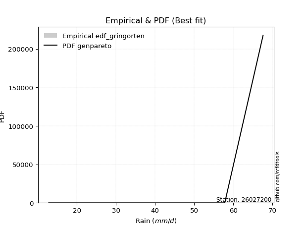</img>

</div>


### 9. EDF Filliben (1975)

The specific values of the constants (0.3175) (often denoted as $alpha$) and (0.365) are derived from a method proposed by James J. Filliben in a 1975 paper. This particular formula is the mean value of the $i$-th order statistic of the normal distribution and is considered a robust and effective plotting position formula for the normal probability plot correlation coefficient test for normality.

<div align="center">


$P=(m-0.3175)/(n+0.365)$


</div>


**9.1. Empirical values**

<div align="center">

|                | 0                   | 1                   | 2                  | 3                  | 4                  | 5                  |
|:---------------|:--------------------|:--------------------|:-------------------|:-------------------|:-------------------|:-------------------|
| date           | 2025                | 2023                | 2019               | 2022               | 2020               | 2021               |
| x              | 12.8                | 22.6                | 50.2               | 55.4               | 57.8               | 67.6               |
| m              | 1                   | 2                   | 3                  | 4                  | 5                  | 6                  |
| empirical_dist | edf_filliben        | edf_filliben        | edf_filliben       | edf_filliben       | edf_filliben       | edf_filliben       |
| empirical      | 0.10722702278083267 | 0.26433621366849963 | 0.4214454045561665 | 0.5785545954438335 | 0.7356637863315004 | 0.8927729772191673 |
| empirical_tr   | 1.1201055873295205  | 1.3593166043780034  | 1.7284453496266123 | 2.3727865796831313 | 3.783060921248143  | 9.326007326007321  |

</div>


**9.2. Kolmogorov-Smirnov fit test (sorted by Δ)**


<div align="center">

|                | 0                   | 1                   | 2                   | 3                   | 4                   | 5                   | 6                  | 7                  | 8                  | 9                   | 10                  | 11                 | 12                  | 13                 | 14                  | 15                  | 16                  | 17                  | 18                 | 19                  | 20                  | 21                  | 22                 | 23                  | 24                 | 25                 | 26                  | 27                | 28                 | 29                  | 30                  | 31                  | 32                  | 33                  | 34                  | 35                  | 36                 | 37                 | 38                 | 39                  | 40                 | 41                  | 42                  | 43                 | 44                  | 45                  | 46                 | 47                 | 48                  | 49                 | 50                  | 51                 | 52                  | 53                  | 54                  | 55                 | 56                 | 57                  | 58                 | 59                  | 60                  | 61                 | 62                 | 63                  | 64                | 65                  | 66                 | 67                  | 68                  | 69                | 70                  | 71                  | 72                  | 73                | 74                 | 75                | 76                 | 77                 | 78                  | 79                 | 80                  | 81                  | 82                 | 83                 | 84                  | 85                 | 86                 | 87                 | 88                 | 89                 | 90                 | 91                 | 92                 | 93                 | 94                  | 95                 | 96                | 97                 | 98                  | 99                 | 100                | 101                | 102                 | 103                 | 104                 | 105                | 106                | 107                 | 108                | 109                | 110                 | 111               | 112                | 113                | 114                | 115                | 116                | 117                 | 118                | 119                 | 120                | 121                | 122                 | 123                 | 124                | 125                | 126                 | 127                | 128                | 129                | 130                | 131                | 132                | 133                 | 134                | 135                 | 136                 | 137                 | 138                | 139                | 140               | 141                | 142                | 143                | 144                 | 145                 | 146                | 147                | 148                | 149                | 150                | 151                | 152                | 153                | 154                | 155                | 156                | 157                | 158                | 159                |
|:---------------|:--------------------|:--------------------|:--------------------|:--------------------|:--------------------|:--------------------|:-------------------|:-------------------|:-------------------|:--------------------|:--------------------|:-------------------|:--------------------|:-------------------|:--------------------|:--------------------|:--------------------|:--------------------|:-------------------|:--------------------|:--------------------|:--------------------|:-------------------|:--------------------|:-------------------|:-------------------|:--------------------|:------------------|:-------------------|:--------------------|:--------------------|:--------------------|:--------------------|:--------------------|:--------------------|:--------------------|:-------------------|:-------------------|:-------------------|:--------------------|:-------------------|:--------------------|:--------------------|:-------------------|:--------------------|:--------------------|:-------------------|:-------------------|:--------------------|:-------------------|:--------------------|:-------------------|:--------------------|:--------------------|:--------------------|:-------------------|:-------------------|:--------------------|:-------------------|:--------------------|:--------------------|:-------------------|:-------------------|:--------------------|:------------------|:--------------------|:-------------------|:--------------------|:--------------------|:------------------|:--------------------|:--------------------|:--------------------|:------------------|:-------------------|:------------------|:-------------------|:-------------------|:--------------------|:-------------------|:--------------------|:--------------------|:-------------------|:-------------------|:--------------------|:-------------------|:-------------------|:-------------------|:-------------------|:-------------------|:-------------------|:-------------------|:-------------------|:-------------------|:--------------------|:-------------------|:------------------|:-------------------|:--------------------|:-------------------|:-------------------|:-------------------|:--------------------|:--------------------|:--------------------|:-------------------|:-------------------|:--------------------|:-------------------|:-------------------|:--------------------|:------------------|:-------------------|:-------------------|:-------------------|:-------------------|:-------------------|:--------------------|:-------------------|:--------------------|:-------------------|:-------------------|:--------------------|:--------------------|:-------------------|:-------------------|:--------------------|:-------------------|:-------------------|:-------------------|:-------------------|:-------------------|:-------------------|:--------------------|:-------------------|:--------------------|:--------------------|:--------------------|:-------------------|:-------------------|:------------------|:-------------------|:-------------------|:-------------------|:--------------------|:--------------------|:-------------------|:-------------------|:-------------------|:-------------------|:-------------------|:-------------------|:-------------------|:-------------------|:-------------------|:-------------------|:-------------------|:-------------------|:-------------------|:-------------------|
| station        | 26027200            | 26027200            | 26027200            | 26027200            | 26027200            | 26027200            | 26027200           | 26027200           | 26027200           | 26027200            | 26027200            | 26027200           | 26027200            | 26027200           | 26027200            | 26027200            | 26027200            | 26027200            | 26027200           | 26027200            | 26027200            | 26027200            | 26027200           | 26027200            | 26027200           | 26027200           | 26027200            | 26027200          | 26027200           | 26027200            | 26027200            | 26027200            | 26027200            | 26027200            | 26027200            | 26027200            | 26027200           | 26027200           | 26027200           | 26027200            | 26027200           | 26027200            | 26027200            | 26027200           | 26027200            | 26027200            | 26027200           | 26027200           | 26027200            | 26027200           | 26027200            | 26027200           | 26027200            | 26027200            | 26027200            | 26027200           | 26027200           | 26027200            | 26027200           | 26027200            | 26027200            | 26027200           | 26027200           | 26027200            | 26027200          | 26027200            | 26027200           | 26027200            | 26027200            | 26027200          | 26027200            | 26027200            | 26027200            | 26027200          | 26027200           | 26027200          | 26027200           | 26027200           | 26027200            | 26027200           | 26027200            | 26027200            | 26027200           | 26027200           | 26027200            | 26027200           | 26027200           | 26027200           | 26027200           | 26027200           | 26027200           | 26027200           | 26027200           | 26027200           | 26027200            | 26027200           | 26027200          | 26027200           | 26027200            | 26027200           | 26027200           | 26027200           | 26027200            | 26027200            | 26027200            | 26027200           | 26027200           | 26027200            | 26027200           | 26027200           | 26027200            | 26027200          | 26027200           | 26027200           | 26027200           | 26027200           | 26027200           | 26027200            | 26027200           | 26027200            | 26027200           | 26027200           | 26027200            | 26027200            | 26027200           | 26027200           | 26027200            | 26027200           | 26027200           | 26027200           | 26027200           | 26027200           | 26027200           | 26027200            | 26027200           | 26027200            | 26027200            | 26027200            | 26027200           | 26027200           | 26027200          | 26027200           | 26027200           | 26027200           | 26027200            | 26027200            | 26027200           | 26027200           | 26027200           | 26027200           | 26027200           | 26027200           | 26027200           | 26027200           | 26027200           | 26027200           | 26027200           | 26027200           | 26027200           | 26027200           |
| empirical_dist | edf_filliben        | edf_filliben        | edf_filliben        | edf_filliben        | edf_filliben        | edf_filliben        | edf_filliben       | edf_filliben       | edf_filliben       | edf_filliben        | edf_filliben        | edf_filliben       | edf_filliben        | edf_filliben       | edf_filliben        | edf_filliben        | edf_filliben        | edf_filliben        | edf_filliben       | edf_filliben        | edf_filliben        | edf_filliben        | edf_filliben       | edf_filliben        | edf_filliben       | edf_filliben       | edf_filliben        | edf_filliben      | edf_filliben       | edf_filliben        | edf_filliben        | edf_filliben        | edf_filliben        | edf_filliben        | edf_filliben        | edf_filliben        | edf_filliben       | edf_filliben       | edf_filliben       | edf_filliben        | edf_filliben       | edf_filliben        | edf_filliben        | edf_filliben       | edf_filliben        | edf_filliben        | edf_filliben       | edf_filliben       | edf_filliben        | edf_filliben       | edf_filliben        | edf_filliben       | edf_filliben        | edf_filliben        | edf_filliben        | edf_filliben       | edf_filliben       | edf_filliben        | edf_filliben       | edf_filliben        | edf_filliben        | edf_filliben       | edf_filliben       | edf_filliben        | edf_filliben      | edf_filliben        | edf_filliben       | edf_filliben        | edf_filliben        | edf_filliben      | edf_filliben        | edf_filliben        | edf_filliben        | edf_filliben      | edf_filliben       | edf_filliben      | edf_filliben       | edf_filliben       | edf_filliben        | edf_filliben       | edf_filliben        | edf_filliben        | edf_filliben       | edf_filliben       | edf_filliben        | edf_filliben       | edf_filliben       | edf_filliben       | edf_filliben       | edf_filliben       | edf_filliben       | edf_filliben       | edf_filliben       | edf_filliben       | edf_filliben        | edf_filliben       | edf_filliben      | edf_filliben       | edf_filliben        | edf_filliben       | edf_filliben       | edf_filliben       | edf_filliben        | edf_filliben        | edf_filliben        | edf_filliben       | edf_filliben       | edf_filliben        | edf_filliben       | edf_filliben       | edf_filliben        | edf_filliben      | edf_filliben       | edf_filliben       | edf_filliben       | edf_filliben       | edf_filliben       | edf_filliben        | edf_filliben       | edf_filliben        | edf_filliben       | edf_filliben       | edf_filliben        | edf_filliben        | edf_filliben       | edf_filliben       | edf_filliben        | edf_filliben       | edf_filliben       | edf_filliben       | edf_filliben       | edf_filliben       | edf_filliben       | edf_filliben        | edf_filliben       | edf_filliben        | edf_filliben        | edf_filliben        | edf_filliben       | edf_filliben       | edf_filliben      | edf_filliben       | edf_filliben       | edf_filliben       | edf_filliben        | edf_filliben        | edf_filliben       | edf_filliben       | edf_filliben       | edf_filliben       | edf_filliben       | edf_filliben       | edf_filliben       | edf_filliben       | edf_filliben       | edf_filliben       | edf_filliben       | edf_filliben       | edf_filliben       | edf_filliben       |
| p_dist         | genpareto           | loggenextreme       | logweibull_max      | johnsonsu           | trapezoid           | genhalflogistic     | loglevy_l          | gumbel_l           | arcsine            | triang              | skewnorm            | weibull_min        | argus               | genextreme         | burr                | pearson3            | ksone               | logmielke           | wrapcauchy         | semicircular        | logloggamma         | dweibull            | beta               | logtrapezoid        | levy_l             | anglit             | gompertz            | logarcsine        | logargus           | dgamma              | f                   | logloglaplace       | nct                 | exponnorm           | truncnorm           | crystalball         | norm               | t                  | gamma              | erlang              | logdgamma          | betaprime           | logdweibull         | rice               | logistic            | logpearson3         | loggumbel_l        | vonmises_line      | logweibull_min      | gausshyper         | invgauss            | invgamma           | loggennorm          | gennorm             | maxwell             | hypsecant          | logsemicircular    | cosine              | alpha              | rayleigh            | loganglit           | logbeta            | loggompertz        | logburr12           | ncf               | kappa4              | kstwobign          | loginvweibull       | logwrapcauchy       | logbetaprime      | logburr             | laplace             | halfnorm            | logf              | logncf             | logt              | lognorm            | logcrystalball     | logexponnorm        | logfatiguelife     | lognct              | tukeylambda         | loggenhalflogistic | logerlang          | loginvgauss         | logalpha           | logrice            | logfoldnorm        | kappa3             | gumbel_r           | uniform            | loggamma           | loggamma           | loginvgamma        | truncweibull_min    | lomax              | logmaxwell        | loglogistic        | genexpon            | logkstwobign       | lograyleigh        | halflogistic       | halfgennorm         | loggenexpon         | moyal               | nakagami           | loghypsecant       | loglomax            | burr12             | logcosine          | loghalfnorm         | lognakagami       | logskewnorm        | logtriang          | loggumbel_r        | loglaplace         | loglaplace         | logrdist            | loghalflogistic    | bradford            | logmoyal           | loggenpareto       | wald                | truncexpon          | logksone           | logjohnsonsu       | logjohnsonsb        | logwald            | logtukeylambda     | loggengamma        | logkappa4          | logbradford        | loghalfgennorm     | logkappa3           | loguniform         | gengamma            | logvonmises_line    | loggausshyper       | logtruncnorm       | mielke             | invweibull        | logexponpow        | fatiguelife        | logtruncexpon      | logtruncweibull_min | exponweib           | logexponweib       | powerlaw           | foldnorm           | weibull_max        | logpowerlaw        | truncpareto        | johnsonsb          | logtruncpareto     | exponpow           | rdist              | genlogistic        | loggenlogistic     | logvonmises        | vonmises           |
| delta          | 0.10722702278083274 | 0.11167896205068673 | 0.12204228119656475 | 0.12215430817559991 | 0.13011530022942508 | 0.13478253574006605 | 0.1371147971063572 | 0.1371884074848636 | 0.1450537717561191 | 0.14528801756105736 | 0.14668951165154576 | 0.1482098474481175 | 0.14888676033603127 | 0.1488881228946788 | 0.15042880801838787 | 0.16141018231214244 | 0.16322405319473665 | 0.16346124096367964 | 0.1699737439532384 | 0.17158029451270962 | 0.17167013738401027 | 0.17449623044084778 | 0.1750937330502198 | 0.17563079870271658 | 0.1769541430505404 | 0.1781450987532579 | 0.18041603310394883 | 0.181608217304022 | 0.1850640204308167 | 0.18852516756458024 | 0.19206714261743996 | 0.19354708194569836 | 0.19388085229535867 | 0.19390774128397326 | 0.19390953456634674 | 0.19390954540568117 | 0.1939095463901227 | 0.1939103145137725 | 0.1994380525664341 | 0.20037335666076084 | 0.2015079647892251 | 0.20168692709054803 | 0.20343528575115277 | 0.2056691376035643 | 0.20850263109033973 | 0.21008335560161406 | 0.2105987599079765 | 0.2126546343259574 | 0.21338262639827754 | 0.2152954855102538 | 0.21645707749827048 | 0.2169768330023365 | 0.21749244916636726 | 0.21754288977937433 | 0.21903338008536677 | 0.2202776685077814 | 0.2205423985790499 | 0.22158815251651864 | 0.2237195058333341 | 0.22675333640899242 | 0.22992924182975816 | 0.2309615641779048 | 0.2323999758588201 | 0.23386331413766925 | 0.234490359396065 | 0.24296821582997763 | 0.2448600751344182 | 0.24498915121489984 | 0.24727260489771508 | 0.247664634625277 | 0.24775735916197017 | 0.24831641209127409 | 0.24884096797059763 | 0.251636205740574 | 0.2518550145500411 | 0.252155562787704 | 0.2521601829716892 | 0.2521606327719669 | 0.25216228251346406 | 0.2523428833045137 | 0.25238249396601675 | 0.25351197209889886 | 0.2543887500693922 | 0.2544476413868947 | 0.25474098933117595 | 0.2552268989273768 | 0.2564513470009204 | 0.2565398673114677 | 0.2586962913846139 | 0.2587117751873731 | 0.2610363472686511 | 0.2617099169156333 | 0.2617099169156333 | 0.2621460327742071 | 0.26287461621425157 | 0.2649269022716746 | 0.271185914802213 | 0.2719438543962479 | 0.27212922371582127 | 0.2761400291497208 | 0.2768286210131615 | 0.2772141369013227 | 0.27756627165181913 | 0.28057962819890425 | 0.28062617317646243 | 0.2842804360162672 | 0.2868213626115669 | 0.28797070646712253 | 0.2903627498491176 | 0.2916117720868644 | 0.29352818014342763 | 0.293584032709605 | 0.2980950467867519 | 0.3076099511769609 | 0.3081229455188733 | 0.3139158349717339 | 0.3139158349717339 | 0.31547153036766884 | 0.3211589614682401 | 0.32166656087501033 | 0.3264171104455368 | 0.3352613345612614 | 0.34191992704479546 | 0.34468912797002926 | 0.3462009087616148 | 0.3505040935065714 | 0.37666979916627563 | 0.3789828326456266 | 0.3840619329299032 | 0.3860927068693121 | 0.3940800316096651 | 0.3946013444217503 | 0.3949529222012277 | 0.39927467723848975 | 0.3997301714251711 | 0.40340935908269626 | 0.40613061023257646 | 0.42972633695794626 | 0.4404825947861951 | 0.4411109602504616 | 0.441318688450598 | 0.4417475250223165 | 0.4528754405968805 | 0.4557746219897083 | 0.4628930243350975  | 0.48769544173083407 | 0.5234920403350474 | 0.5235573699272575 | 0.5297867680388891 | 0.5744529416999364 | 0.5772152736373268 | 0.5794776617693165 | 0.6148294408269193 | 0.6393574995617923 | 0.6533539164869022 | 0.7356637863020001 | 0.7356637863315004 | 0.7356637863315004 | 1.2366908524964733 | 10.352791908936855 |
| deltao         | 0.530385761606      | 0.530385761606      | 0.530385761606      | 0.530385761606      | 0.530385761606      | 0.530385761606      | 0.530385761606     | 0.530385761606     | 0.530385761606     | 0.530385761606      | 0.530385761606      | 0.530385761606     | 0.530385761606      | 0.530385761606     | 0.530385761606      | 0.530385761606      | 0.530385761606      | 0.530385761606      | 0.530385761606     | 0.530385761606      | 0.530385761606      | 0.530385761606      | 0.530385761606     | 0.530385761606      | 0.530385761606     | 0.530385761606     | 0.530385761606      | 0.530385761606    | 0.530385761606     | 0.530385761606      | 0.530385761606      | 0.530385761606      | 0.530385761606      | 0.530385761606      | 0.530385761606      | 0.530385761606      | 0.530385761606     | 0.530385761606     | 0.530385761606     | 0.530385761606      | 0.530385761606     | 0.530385761606      | 0.530385761606      | 0.530385761606     | 0.530385761606      | 0.530385761606      | 0.530385761606     | 0.530385761606     | 0.530385761606      | 0.530385761606     | 0.530385761606      | 0.530385761606     | 0.530385761606      | 0.530385761606      | 0.530385761606      | 0.530385761606     | 0.530385761606     | 0.530385761606      | 0.530385761606     | 0.530385761606      | 0.530385761606      | 0.530385761606     | 0.530385761606     | 0.530385761606      | 0.530385761606    | 0.530385761606      | 0.530385761606     | 0.530385761606      | 0.530385761606      | 0.530385761606    | 0.530385761606      | 0.530385761606      | 0.530385761606      | 0.530385761606    | 0.530385761606     | 0.530385761606    | 0.530385761606     | 0.530385761606     | 0.530385761606      | 0.530385761606     | 0.530385761606      | 0.530385761606      | 0.530385761606     | 0.530385761606     | 0.530385761606      | 0.530385761606     | 0.530385761606     | 0.530385761606     | 0.530385761606     | 0.530385761606     | 0.530385761606     | 0.530385761606     | 0.530385761606     | 0.530385761606     | 0.530385761606      | 0.530385761606     | 0.530385761606    | 0.530385761606     | 0.530385761606      | 0.530385761606     | 0.530385761606     | 0.530385761606     | 0.530385761606      | 0.530385761606      | 0.530385761606      | 0.530385761606     | 0.530385761606     | 0.530385761606      | 0.530385761606     | 0.530385761606     | 0.530385761606      | 0.530385761606    | 0.530385761606     | 0.530385761606     | 0.530385761606     | 0.530385761606     | 0.530385761606     | 0.530385761606      | 0.530385761606     | 0.530385761606      | 0.530385761606     | 0.530385761606     | 0.530385761606      | 0.530385761606      | 0.530385761606     | 0.530385761606     | 0.530385761606      | 0.530385761606     | 0.530385761606     | 0.530385761606     | 0.530385761606     | 0.530385761606     | 0.530385761606     | 0.530385761606      | 0.530385761606     | 0.530385761606      | 0.530385761606      | 0.530385761606      | 0.530385761606     | 0.530385761606     | 0.530385761606    | 0.530385761606     | 0.530385761606     | 0.530385761606     | 0.530385761606      | 0.530385761606      | 0.530385761606     | 0.530385761606     | 0.530385761606     | 0.530385761606     | 0.530385761606     | 0.530385761606     | 0.530385761606     | 0.530385761606     | 0.530385761606     | 0.530385761606     | 0.530385761606     | 0.530385761606     | 0.530385761606     | 0.530385761606     |
| eval           | Δo > Δ              | Δo > Δ              | Δo > Δ              | Δo > Δ              | Δo > Δ              | Δo > Δ              | Δo > Δ             | Δo > Δ             | Δo > Δ             | Δo > Δ              | Δo > Δ              | Δo > Δ             | Δo > Δ              | Δo > Δ             | Δo > Δ              | Δo > Δ              | Δo > Δ              | Δo > Δ              | Δo > Δ             | Δo > Δ              | Δo > Δ              | Δo > Δ              | Δo > Δ             | Δo > Δ              | Δo > Δ             | Δo > Δ             | Δo > Δ              | Δo > Δ            | Δo > Δ             | Δo > Δ              | Δo > Δ              | Δo > Δ              | Δo > Δ              | Δo > Δ              | Δo > Δ              | Δo > Δ              | Δo > Δ             | Δo > Δ             | Δo > Δ             | Δo > Δ              | Δo > Δ             | Δo > Δ              | Δo > Δ              | Δo > Δ             | Δo > Δ              | Δo > Δ              | Δo > Δ             | Δo > Δ             | Δo > Δ              | Δo > Δ             | Δo > Δ              | Δo > Δ             | Δo > Δ              | Δo > Δ              | Δo > Δ              | Δo > Δ             | Δo > Δ             | Δo > Δ              | Δo > Δ             | Δo > Δ              | Δo > Δ              | Δo > Δ             | Δo > Δ             | Δo > Δ              | Δo > Δ            | Δo > Δ              | Δo > Δ             | Δo > Δ              | Δo > Δ              | Δo > Δ            | Δo > Δ              | Δo > Δ              | Δo > Δ              | Δo > Δ            | Δo > Δ             | Δo > Δ            | Δo > Δ             | Δo > Δ             | Δo > Δ              | Δo > Δ             | Δo > Δ              | Δo > Δ              | Δo > Δ             | Δo > Δ             | Δo > Δ              | Δo > Δ             | Δo > Δ             | Δo > Δ             | Δo > Δ             | Δo > Δ             | Δo > Δ             | Δo > Δ             | Δo > Δ             | Δo > Δ             | Δo > Δ              | Δo > Δ             | Δo > Δ            | Δo > Δ             | Δo > Δ              | Δo > Δ             | Δo > Δ             | Δo > Δ             | Δo > Δ              | Δo > Δ              | Δo > Δ              | Δo > Δ             | Δo > Δ             | Δo > Δ              | Δo > Δ             | Δo > Δ             | Δo > Δ              | Δo > Δ            | Δo > Δ             | Δo > Δ             | Δo > Δ             | Δo > Δ             | Δo > Δ             | Δo > Δ              | Δo > Δ             | Δo > Δ              | Δo > Δ             | Δo > Δ             | Δo > Δ              | Δo > Δ              | Δo > Δ             | Δo > Δ             | Δo > Δ              | Δo > Δ             | Δo > Δ             | Δo > Δ             | Δo > Δ             | Δo > Δ             | Δo > Δ             | Δo > Δ              | Δo > Δ             | Δo > Δ              | Δo > Δ              | Δo > Δ              | Δo > Δ             | Δo > Δ             | Δo > Δ            | Δo > Δ             | Δo > Δ             | Δo > Δ             | Δo > Δ              | Δo > Δ              | Δo > Δ             | Δo > Δ             | Δo > Δ             | Δo <= Δ            | Δo <= Δ            | Δo <= Δ            | Δo <= Δ            | Δo <= Δ            | Δo <= Δ            | Δo <= Δ            | Δo <= Δ            | Δo <= Δ            | Δo <= Δ            | Δo <= Δ            |
| fit            | 1                   | 1                   | 1                   | 1                   | 1                   | 1                   | 1                  | 1                  | 1                  | 1                   | 1                   | 1                  | 1                   | 1                  | 1                   | 1                   | 1                   | 1                   | 1                  | 1                   | 1                   | 1                   | 1                  | 1                   | 1                  | 1                  | 1                   | 1                 | 1                  | 1                   | 1                   | 1                   | 1                   | 1                   | 1                   | 1                   | 1                  | 1                  | 1                  | 1                   | 1                  | 1                   | 1                   | 1                  | 1                   | 1                   | 1                  | 1                  | 1                   | 1                  | 1                   | 1                  | 1                   | 1                   | 1                   | 1                  | 1                  | 1                   | 1                  | 1                   | 1                   | 1                  | 1                  | 1                   | 1                 | 1                   | 1                  | 1                   | 1                   | 1                 | 1                   | 1                   | 1                   | 1                 | 1                  | 1                 | 1                  | 1                  | 1                   | 1                  | 1                   | 1                   | 1                  | 1                  | 1                   | 1                  | 1                  | 1                  | 1                  | 1                  | 1                  | 1                  | 1                  | 1                  | 1                   | 1                  | 1                 | 1                  | 1                   | 1                  | 1                  | 1                  | 1                   | 1                   | 1                   | 1                  | 1                  | 1                   | 1                  | 1                  | 1                   | 1                 | 1                  | 1                  | 1                  | 1                  | 1                  | 1                   | 1                  | 1                   | 1                  | 1                  | 1                   | 1                   | 1                  | 1                  | 1                   | 1                  | 1                  | 1                  | 1                  | 1                  | 1                  | 1                   | 1                  | 1                   | 1                   | 1                   | 1                  | 1                  | 1                 | 1                  | 1                  | 1                  | 1                   | 1                   | 1                  | 1                  | 1                  | 0                  | 0                  | 0                  | 0                  | 0                  | 0                  | 0                  | 0                  | 0                  | 0                  | 0                  |
| n              | 6                   | 6                   | 6                   | 6                   | 6                   | 6                   | 6                  | 6                  | 6                  | 6                   | 6                   | 6                  | 6                   | 6                  | 6                   | 6                   | 6                   | 6                   | 6                  | 6                   | 6                   | 6                   | 6                  | 6                   | 6                  | 6                  | 6                   | 6                 | 6                  | 6                   | 6                   | 6                   | 6                   | 6                   | 6                   | 6                   | 6                  | 6                  | 6                  | 6                   | 6                  | 6                   | 6                   | 6                  | 6                   | 6                   | 6                  | 6                  | 6                   | 6                  | 6                   | 6                  | 6                   | 6                   | 6                   | 6                  | 6                  | 6                   | 6                  | 6                   | 6                   | 6                  | 6                  | 6                   | 6                 | 6                   | 6                  | 6                   | 6                   | 6                 | 6                   | 6                   | 6                   | 6                 | 6                  | 6                 | 6                  | 6                  | 6                   | 6                  | 6                   | 6                   | 6                  | 6                  | 6                   | 6                  | 6                  | 6                  | 6                  | 6                  | 6                  | 6                  | 6                  | 6                  | 6                   | 6                  | 6                 | 6                  | 6                   | 6                  | 6                  | 6                  | 6                   | 6                   | 6                   | 6                  | 6                  | 6                   | 6                  | 6                  | 6                   | 6                 | 6                  | 6                  | 6                  | 6                  | 6                  | 6                   | 6                  | 6                   | 6                  | 6                  | 6                   | 6                   | 6                  | 6                  | 6                   | 6                  | 6                  | 6                  | 6                  | 6                  | 6                  | 6                   | 6                  | 6                   | 6                   | 6                   | 6                  | 6                  | 6                 | 6                  | 6                  | 6                  | 6                   | 6                   | 6                  | 6                  | 6                  | 6                  | 6                  | 6                  | 6                  | 6                  | 6                  | 6                  | 6                  | 6                  | 6                  | 6                  |
| best_fit       | 1                   | 0                   | 0                   | 0                   | 0                   | 0                   | 0                  | 0                  | 0                  | 0                   | 0                   | 0                  | 0                   | 0                  | 0                   | 0                   | 0                   | 0                   | 0                  | 0                   | 0                   | 0                   | 0                  | 0                   | 0                  | 0                  | 0                   | 0                 | 0                  | 0                   | 0                   | 0                   | 0                   | 0                   | 0                   | 0                   | 0                  | 0                  | 0                  | 0                   | 0                  | 0                   | 0                   | 0                  | 0                   | 0                   | 0                  | 0                  | 0                   | 0                  | 0                   | 0                  | 0                   | 0                   | 0                   | 0                  | 0                  | 0                   | 0                  | 0                   | 0                   | 0                  | 0                  | 0                   | 0                 | 0                   | 0                  | 0                   | 0                   | 0                 | 0                   | 0                   | 0                   | 0                 | 0                  | 0                 | 0                  | 0                  | 0                   | 0                  | 0                   | 0                   | 0                  | 0                  | 0                   | 0                  | 0                  | 0                  | 0                  | 0                  | 0                  | 0                  | 0                  | 0                  | 0                   | 0                  | 0                 | 0                  | 0                   | 0                  | 0                  | 0                  | 0                   | 0                   | 0                   | 0                  | 0                  | 0                   | 0                  | 0                  | 0                   | 0                 | 0                  | 0                  | 0                  | 0                  | 0                  | 0                   | 0                  | 0                   | 0                  | 0                  | 0                   | 0                   | 0                  | 0                  | 0                   | 0                  | 0                  | 0                  | 0                  | 0                  | 0                  | 0                   | 0                  | 0                   | 0                   | 0                   | 0                  | 0                  | 0                 | 0                  | 0                  | 0                  | 0                   | 0                   | 0                  | 0                  | 0                  | 0                  | 0                  | 0                  | 0                  | 0                  | 0                  | 0                  | 0                  | 0                  | 0                  | 0                  |
| best_fit_sort  | 1                   | 2                   | 3                   | 4                   | 5                   | 6                   | 7                  | 8                  | 9                  | 10                  | 11                  | 12                 | 13                  | 14                 | 15                  | 16                  | 17                  | 18                  | 19                 | 20                  | 21                  | 22                  | 23                 | 24                  | 25                 | 26                 | 27                  | 28                | 29                 | 30                  | 31                  | 32                  | 33                  | 34                  | 35                  | 36                  | 37                 | 38                 | 39                 | 40                  | 41                 | 42                  | 43                  | 44                 | 45                  | 46                  | 47                 | 48                 | 49                  | 50                 | 51                  | 52                 | 53                  | 54                  | 55                  | 56                 | 57                 | 58                  | 59                 | 60                  | 61                  | 62                 | 63                 | 64                  | 65                | 66                  | 67                 | 68                  | 69                  | 70                | 71                  | 72                  | 73                  | 74                | 75                 | 76                | 77                 | 78                 | 79                  | 80                 | 81                  | 82                  | 83                 | 84                 | 85                  | 86                 | 87                 | 88                 | 89                 | 90                 | 91                 | 92                 | 93                 | 94                 | 95                  | 96                 | 97                | 98                 | 99                  | 100                | 101                | 102                | 103                 | 104                 | 105                 | 106                | 107                | 108                 | 109                | 110                | 111                 | 112               | 113                | 114                | 115                | 116                | 117                | 118                 | 119                | 120                 | 121                | 122                | 123                 | 124                 | 125                | 126                | 127                 | 128                | 129                | 130                | 131                | 132                | 133                | 134                 | 135                | 136                 | 137                 | 138                 | 139                | 140                | 141               | 142                | 143                | 144                | 145                 | 146                 | 147                | 148                | 149                | 150                | 151                | 152                | 153                | 154                | 155                | 156                | 157                | 158                | 159                | 160                |

</div>


**9.3. Best fit**

<div align="center">

|   id |   station | empirical_dist   | p_dist    |    delta |   deltao | eval   |   fit |   n |   best_fit |   best_fit_sort |
|-----:|----------:|:-----------------|:----------|---------:|---------:|:-------|------:|----:|-----------:|----------------:|
|    0 |  26027200 | edf_filliben     | genpareto | 0.107227 | 0.530386 | Δo > Δ |     1 |   6 |          1 |               1 |

</div>


<div align="center">

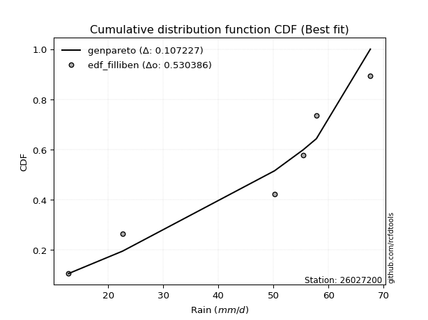</img>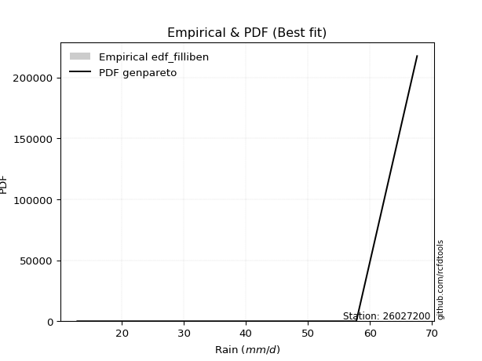</img>

</div>


### 10. EDF Jenkinson (1977)

The Jenkinson formula in hydrology is an empirical plotting position formula used to estimate the non-exceedance probability _(P)_ or return period _(T)_ of a given ordered observation within a sample. It is a widely used method in the frequency analysis of extreme events such as floods and rainfall, as it provides a distribution-free way to plot data. _a≈0.31_ and _b≈0.38_ are constants derived to approximate the median of the probability distribution for the given rank.

<div align="center">


$P=(m-a)/(n+b)$


</div>


**10.1. Empirical values**

<div align="center">

|                | 0                   | 1                   | 2                  | 3                  | 4                  | 5                  |
|:---------------|:--------------------|:--------------------|:-------------------|:-------------------|:-------------------|:-------------------|
| date           | 2025                | 2023                | 2019               | 2022               | 2020               | 2021               |
| x              | 12.8                | 22.6                | 50.2               | 55.4               | 57.8               | 67.6               |
| m              | 1                   | 2                   | 3                  | 4                  | 5                  | 6                  |
| empirical_dist | edf_jenkinson       | edf_jenkinson       | edf_jenkinson      | edf_jenkinson      | edf_jenkinson      | edf_jenkinson      |
| empirical      | 0.10815047021943573 | 0.26489028213166144 | 0.4216300940438871 | 0.5783699059561128 | 0.7351097178683387 | 0.8918495297805643 |
| empirical_tr   | 1.1212653778558874  | 1.3603411513859276  | 1.7289972899728996 | 2.3717472118959106 | 3.7751479289940844 | 9.246376811594207  |

</div>


**10.2. Kolmogorov-Smirnov fit test (sorted by Δ)**


<div align="center">

|                | 0                   | 1                   | 2                   | 3                   | 4                   | 5                   | 6                   | 7                  | 8                  | 9                   | 10                  | 11                  | 12                 | 13                  | 14                  | 15                  | 16                  | 17                  | 18                  | 19                  | 20                  | 21                  | 22                  | 23                  | 24                  | 25                 | 26                  | 27                 | 28                 | 29                  | 30                  | 31             | 32                  | 33                  | 34                  | 35                  | 36                 | 37                 | 38                 | 39                  | 40                  | 41                  | 42                  | 43                 | 44                  | 45                  | 46                 | 47                  | 48                  | 49                 | 50                  | 51                 | 52                  | 53                  | 54                  | 55                 | 56                 | 57                  | 58                 | 59                  | 60                  | 61                  | 62                 | 63                  | 64                 | 65                  | 66                 | 67                  | 68                  | 69                 | 70                  | 71                  | 72                  | 73                 | 74                 | 75                 | 76                 | 77                 | 78                  | 79                 | 80                  | 81                  | 82                 | 83                 | 84                  | 85                 | 86                 | 87                 | 88                 | 89                 | 90                 | 91                 | 92                 | 93                 | 94                  | 95                | 96                 | 97                 | 98                  | 99                 | 100                | 101                | 102                 | 103                 | 104                 | 105                | 106                | 107                | 108               | 109                | 110                 | 111                | 112                | 113                | 114                | 115                | 116                | 117                 | 118                | 119                 | 120                | 121                | 122                 | 123                 | 124                | 125                 | 126                | 127               | 128                | 129                | 130                | 131                | 132                | 133                 | 134                | 135                 | 136                 | 137                 | 138                | 139                 | 140               | 141                | 142                | 143                | 144                 | 145                 | 146                | 147                | 148                | 149                | 150                | 151                | 152                | 153                | 154                | 155                | 156                | 157                | 158                | 159                |
|:---------------|:--------------------|:--------------------|:--------------------|:--------------------|:--------------------|:--------------------|:--------------------|:-------------------|:-------------------|:--------------------|:--------------------|:--------------------|:-------------------|:--------------------|:--------------------|:--------------------|:--------------------|:--------------------|:--------------------|:--------------------|:--------------------|:--------------------|:--------------------|:--------------------|:--------------------|:-------------------|:--------------------|:-------------------|:-------------------|:--------------------|:--------------------|:---------------|:--------------------|:--------------------|:--------------------|:--------------------|:-------------------|:-------------------|:-------------------|:--------------------|:--------------------|:--------------------|:--------------------|:-------------------|:--------------------|:--------------------|:-------------------|:--------------------|:--------------------|:-------------------|:--------------------|:-------------------|:--------------------|:--------------------|:--------------------|:-------------------|:-------------------|:--------------------|:-------------------|:--------------------|:--------------------|:--------------------|:-------------------|:--------------------|:-------------------|:--------------------|:-------------------|:--------------------|:--------------------|:-------------------|:--------------------|:--------------------|:--------------------|:-------------------|:-------------------|:-------------------|:-------------------|:-------------------|:--------------------|:-------------------|:--------------------|:--------------------|:-------------------|:-------------------|:--------------------|:-------------------|:-------------------|:-------------------|:-------------------|:-------------------|:-------------------|:-------------------|:-------------------|:-------------------|:--------------------|:------------------|:-------------------|:-------------------|:--------------------|:-------------------|:-------------------|:-------------------|:--------------------|:--------------------|:--------------------|:-------------------|:-------------------|:-------------------|:------------------|:-------------------|:--------------------|:-------------------|:-------------------|:-------------------|:-------------------|:-------------------|:-------------------|:--------------------|:-------------------|:--------------------|:-------------------|:-------------------|:--------------------|:--------------------|:-------------------|:--------------------|:-------------------|:------------------|:-------------------|:-------------------|:-------------------|:-------------------|:-------------------|:--------------------|:-------------------|:--------------------|:--------------------|:--------------------|:-------------------|:--------------------|:------------------|:-------------------|:-------------------|:-------------------|:--------------------|:--------------------|:-------------------|:-------------------|:-------------------|:-------------------|:-------------------|:-------------------|:-------------------|:-------------------|:-------------------|:-------------------|:-------------------|:-------------------|:-------------------|:-------------------|
| station        | 26027200            | 26027200            | 26027200            | 26027200            | 26027200            | 26027200            | 26027200            | 26027200           | 26027200           | 26027200            | 26027200            | 26027200            | 26027200           | 26027200            | 26027200            | 26027200            | 26027200            | 26027200            | 26027200            | 26027200            | 26027200            | 26027200            | 26027200            | 26027200            | 26027200            | 26027200           | 26027200            | 26027200           | 26027200           | 26027200            | 26027200            | 26027200       | 26027200            | 26027200            | 26027200            | 26027200            | 26027200           | 26027200           | 26027200           | 26027200            | 26027200            | 26027200            | 26027200            | 26027200           | 26027200            | 26027200            | 26027200           | 26027200            | 26027200            | 26027200           | 26027200            | 26027200           | 26027200            | 26027200            | 26027200            | 26027200           | 26027200           | 26027200            | 26027200           | 26027200            | 26027200            | 26027200            | 26027200           | 26027200            | 26027200           | 26027200            | 26027200           | 26027200            | 26027200            | 26027200           | 26027200            | 26027200            | 26027200            | 26027200           | 26027200           | 26027200           | 26027200           | 26027200           | 26027200            | 26027200           | 26027200            | 26027200            | 26027200           | 26027200           | 26027200            | 26027200           | 26027200           | 26027200           | 26027200           | 26027200           | 26027200           | 26027200           | 26027200           | 26027200           | 26027200            | 26027200          | 26027200           | 26027200           | 26027200            | 26027200           | 26027200           | 26027200           | 26027200            | 26027200            | 26027200            | 26027200           | 26027200           | 26027200           | 26027200          | 26027200           | 26027200            | 26027200           | 26027200           | 26027200           | 26027200           | 26027200           | 26027200           | 26027200            | 26027200           | 26027200            | 26027200           | 26027200           | 26027200            | 26027200            | 26027200           | 26027200            | 26027200           | 26027200          | 26027200           | 26027200           | 26027200           | 26027200           | 26027200           | 26027200            | 26027200           | 26027200            | 26027200            | 26027200            | 26027200           | 26027200            | 26027200          | 26027200           | 26027200           | 26027200           | 26027200            | 26027200            | 26027200           | 26027200           | 26027200           | 26027200           | 26027200           | 26027200           | 26027200           | 26027200           | 26027200           | 26027200           | 26027200           | 26027200           | 26027200           | 26027200           |
| empirical_dist | edf_jenkinson       | edf_jenkinson       | edf_jenkinson       | edf_jenkinson       | edf_jenkinson       | edf_jenkinson       | edf_jenkinson       | edf_jenkinson      | edf_jenkinson      | edf_jenkinson       | edf_jenkinson       | edf_jenkinson       | edf_jenkinson      | edf_jenkinson       | edf_jenkinson       | edf_jenkinson       | edf_jenkinson       | edf_jenkinson       | edf_jenkinson       | edf_jenkinson       | edf_jenkinson       | edf_jenkinson       | edf_jenkinson       | edf_jenkinson       | edf_jenkinson       | edf_jenkinson      | edf_jenkinson       | edf_jenkinson      | edf_jenkinson      | edf_jenkinson       | edf_jenkinson       | edf_jenkinson  | edf_jenkinson       | edf_jenkinson       | edf_jenkinson       | edf_jenkinson       | edf_jenkinson      | edf_jenkinson      | edf_jenkinson      | edf_jenkinson       | edf_jenkinson       | edf_jenkinson       | edf_jenkinson       | edf_jenkinson      | edf_jenkinson       | edf_jenkinson       | edf_jenkinson      | edf_jenkinson       | edf_jenkinson       | edf_jenkinson      | edf_jenkinson       | edf_jenkinson      | edf_jenkinson       | edf_jenkinson       | edf_jenkinson       | edf_jenkinson      | edf_jenkinson      | edf_jenkinson       | edf_jenkinson      | edf_jenkinson       | edf_jenkinson       | edf_jenkinson       | edf_jenkinson      | edf_jenkinson       | edf_jenkinson      | edf_jenkinson       | edf_jenkinson      | edf_jenkinson       | edf_jenkinson       | edf_jenkinson      | edf_jenkinson       | edf_jenkinson       | edf_jenkinson       | edf_jenkinson      | edf_jenkinson      | edf_jenkinson      | edf_jenkinson      | edf_jenkinson      | edf_jenkinson       | edf_jenkinson      | edf_jenkinson       | edf_jenkinson       | edf_jenkinson      | edf_jenkinson      | edf_jenkinson       | edf_jenkinson      | edf_jenkinson      | edf_jenkinson      | edf_jenkinson      | edf_jenkinson      | edf_jenkinson      | edf_jenkinson      | edf_jenkinson      | edf_jenkinson      | edf_jenkinson       | edf_jenkinson     | edf_jenkinson      | edf_jenkinson      | edf_jenkinson       | edf_jenkinson      | edf_jenkinson      | edf_jenkinson      | edf_jenkinson       | edf_jenkinson       | edf_jenkinson       | edf_jenkinson      | edf_jenkinson      | edf_jenkinson      | edf_jenkinson     | edf_jenkinson      | edf_jenkinson       | edf_jenkinson      | edf_jenkinson      | edf_jenkinson      | edf_jenkinson      | edf_jenkinson      | edf_jenkinson      | edf_jenkinson       | edf_jenkinson      | edf_jenkinson       | edf_jenkinson      | edf_jenkinson      | edf_jenkinson       | edf_jenkinson       | edf_jenkinson      | edf_jenkinson       | edf_jenkinson      | edf_jenkinson     | edf_jenkinson      | edf_jenkinson      | edf_jenkinson      | edf_jenkinson      | edf_jenkinson      | edf_jenkinson       | edf_jenkinson      | edf_jenkinson       | edf_jenkinson       | edf_jenkinson       | edf_jenkinson      | edf_jenkinson       | edf_jenkinson     | edf_jenkinson      | edf_jenkinson      | edf_jenkinson      | edf_jenkinson       | edf_jenkinson       | edf_jenkinson      | edf_jenkinson      | edf_jenkinson      | edf_jenkinson      | edf_jenkinson      | edf_jenkinson      | edf_jenkinson      | edf_jenkinson      | edf_jenkinson      | edf_jenkinson      | edf_jenkinson      | edf_jenkinson      | edf_jenkinson      | edf_jenkinson      |
| p_dist         | genpareto           | loggenextreme       | logweibull_max      | johnsonsu           | trapezoid           | genhalflogistic     | loglevy_l           | gumbel_l           | arcsine            | triang              | skewnorm            | genextreme          | weibull_min        | argus               | burr                | pearson3            | ksone               | logmielke           | wrapcauchy          | semicircular        | logloggamma         | beta                | dweibull            | logtrapezoid        | levy_l              | anglit             | gompertz            | logarcsine         | logargus           | dgamma              | f                   | logloglaplace  | nct                 | exponnorm           | truncnorm           | crystalball         | norm               | t                  | gamma              | erlang              | betaprime           | logdgamma           | logdweibull         | rice               | logistic            | logpearson3         | loggumbel_l        | logweibull_min      | vonmises_line       | gausshyper         | invgauss            | invgamma           | loggennorm          | gennorm             | maxwell             | hypsecant          | logsemicircular    | cosine              | alpha              | rayleigh            | loganglit           | logbeta             | loggompertz        | logburr12           | ncf                | kappa4              | kstwobign          | loginvweibull       | logwrapcauchy       | logbetaprime       | logburr             | laplace             | halfnorm            | logf               | logncf             | logt               | lognorm            | logcrystalball     | logexponnorm        | logfatiguelife     | lognct              | tukeylambda         | loggenhalflogistic | logerlang          | loginvgauss         | logalpha           | logrice            | logfoldnorm        | kappa3             | gumbel_r           | uniform            | loggamma           | loggamma           | loginvgamma        | truncweibull_min    | lomax             | logmaxwell         | loglogistic        | genexpon            | logkstwobign       | lograyleigh        | halflogistic       | halfgennorm         | loggenexpon         | moyal               | nakagami           | loghypsecant       | loglomax           | burr12            | logcosine          | loghalfnorm         | lognakagami        | logskewnorm        | logtriang          | loggumbel_r        | loglaplace         | loglaplace         | logrdist            | loghalflogistic    | bradford            | logmoyal           | loggenpareto       | wald                | truncexpon          | logksone           | logjohnsonsu        | logjohnsonsb       | logwald           | logtukeylambda     | loggengamma        | logkappa4          | logbradford        | loghalfgennorm     | logkappa3           | loguniform         | gengamma            | logvonmises_line    | loggausshyper       | logtruncnorm       | invweibull          | mielke            | logexponpow        | fatiguelife        | logtruncexpon      | logtruncweibull_min | exponweib           | logexponweib       | powerlaw           | foldnorm           | weibull_max        | logpowerlaw        | truncpareto        | johnsonsb          | logtruncpareto     | exponpow           | rdist              | genlogistic        | loggenlogistic     | logvonmises        | vonmises           |
| delta          | 0.10815047021943569 | 0.11223303051384853 | 0.12111883375796169 | 0.12270837663876172 | 0.12993061074170448 | 0.13459784625234544 | 0.13656072864319546 | 0.1372596501189021 | 0.1448690822683985 | 0.14510332807333676 | 0.14650482216382515 | 0.14833405443151704 | 0.1487639159112793 | 0.14944082879919307 | 0.15024411853066727 | 0.16122549282442183 | 0.16303936370701605 | 0.16327655147595904 | 0.16978905446551779 | 0.17139560502498902 | 0.17148544789628967 | 0.17453966458705805 | 0.17505029890400958 | 0.17544610921499598 | 0.17603069561193735 | 0.1779604092655373 | 0.18023134361622822 | 0.1814235278163014 | 0.1848793309430961 | 0.18907923602774204 | 0.19188245312971935 | 0.193329802687 | 0.19369616280763807 | 0.19372305179625265 | 0.19372484507862614 | 0.19372485591796057 | 0.1937248569024021 | 0.1937256250260519 | 0.1992533630787135 | 0.20018866717304024 | 0.20150223760282743 | 0.20206203325238692 | 0.20251183831254982 | 0.2054844481158437 | 0.20831794160261913 | 0.20989866611389346 | 0.2104140704202559 | 0.21319793691055694 | 0.21320870278911921 | 0.2151107960225332 | 0.21627238801054988 | 0.2167921435146159 | 0.21767713865408786 | 0.21772757926709493 | 0.21884869059764617 | 0.2200929790200608 | 0.2203577090913293 | 0.22140346302879804 | 0.2235348163456135 | 0.22656864692127182 | 0.22974455234203756 | 0.23040749571474306 | 0.2322152863710995 | 0.23367862464994865 | 0.2343056699083444 | 0.24278352634225703 | 0.2446753856466976 | 0.24480446172717923 | 0.24708791540999447 | 0.2474799451375564 | 0.24757266967424957 | 0.24813172260355348 | 0.24865627848287702 | 0.2514515162528534 | 0.2516703250623205 | 0.2519708732999834 | 0.2519754934839686 | 0.2519759432842463 | 0.25197759302574346 | 0.2521581938167931 | 0.25219780447829615 | 0.25332728261117826 | 0.2542040605816716 | 0.2542629518991741 | 0.25455629984345535 | 0.2550422094396562 | 0.2562666575131998 | 0.2563551778237471 | 0.2585116018968933 | 0.2585270856996525 | 0.2608516577809305 | 0.2615252274279127 | 0.2615252274279127 | 0.2619613432864865 | 0.26268992672653096 | 0.264742212783954 | 0.2710012253144924 | 0.2717591649085273 | 0.27194453422810067 | 0.2759553396620002 | 0.2766439315254409 | 0.2770294474136021 | 0.27738158216409853 | 0.28039493871118365 | 0.28044148368874183 | 0.2840957465285466 | 0.2866366731238463 | 0.2877860169794019 | 0.290178060361397 | 0.2914270825991438 | 0.29334349065570703 | 0.2933993432218844 | 0.2979103572990313 | 0.3074252616892403 | 0.3079382560311527 | 0.3137311454840133 | 0.3137311454840133 | 0.31528684087994824 | 0.3209742719805195 | 0.32148187138728973 | 0.3262324209578162 | 0.3350766450735408 | 0.34173523755707486 | 0.34450443848230866 | 0.3460162192738942 | 0.34995002504340966 | 0.3761157307031139 | 0.378798143157906 | 0.3838772434421826 | 0.3859080173815915 | 0.3938953421219445 | 0.3944166549340297 | 0.3947682327135071 | 0.39908998775076915 | 0.3995454819374505 | 0.40322466959497566 | 0.40594592074485586 | 0.42954164747022566 | 0.4402979052984745 | 0.44039524101199506 | 0.440926270762741 | 0.4415628355345959 | 0.4523213721337187 | 0.4555899325019877 | 0.4627083348473769  | 0.48714137326767226 | 0.5229379718718856 | 0.5233726804395369 | 0.5296020785511686 | 0.5738988732367747 | 0.5766612051741651 | 0.5789235933061547 | 0.6142753723637575 | 0.6388034310986306 | 0.6527998480237405 | 0.7351097178388383 | 0.7351097178683387 | 0.7351097178683387 | 1.2365061630087528 | 10.353715356375456 |
| deltao         | 0.530385761606      | 0.530385761606      | 0.530385761606      | 0.530385761606      | 0.530385761606      | 0.530385761606      | 0.530385761606      | 0.530385761606     | 0.530385761606     | 0.530385761606      | 0.530385761606      | 0.530385761606      | 0.530385761606     | 0.530385761606      | 0.530385761606      | 0.530385761606      | 0.530385761606      | 0.530385761606      | 0.530385761606      | 0.530385761606      | 0.530385761606      | 0.530385761606      | 0.530385761606      | 0.530385761606      | 0.530385761606      | 0.530385761606     | 0.530385761606      | 0.530385761606     | 0.530385761606     | 0.530385761606      | 0.530385761606      | 0.530385761606 | 0.530385761606      | 0.530385761606      | 0.530385761606      | 0.530385761606      | 0.530385761606     | 0.530385761606     | 0.530385761606     | 0.530385761606      | 0.530385761606      | 0.530385761606      | 0.530385761606      | 0.530385761606     | 0.530385761606      | 0.530385761606      | 0.530385761606     | 0.530385761606      | 0.530385761606      | 0.530385761606     | 0.530385761606      | 0.530385761606     | 0.530385761606      | 0.530385761606      | 0.530385761606      | 0.530385761606     | 0.530385761606     | 0.530385761606      | 0.530385761606     | 0.530385761606      | 0.530385761606      | 0.530385761606      | 0.530385761606     | 0.530385761606      | 0.530385761606     | 0.530385761606      | 0.530385761606     | 0.530385761606      | 0.530385761606      | 0.530385761606     | 0.530385761606      | 0.530385761606      | 0.530385761606      | 0.530385761606     | 0.530385761606     | 0.530385761606     | 0.530385761606     | 0.530385761606     | 0.530385761606      | 0.530385761606     | 0.530385761606      | 0.530385761606      | 0.530385761606     | 0.530385761606     | 0.530385761606      | 0.530385761606     | 0.530385761606     | 0.530385761606     | 0.530385761606     | 0.530385761606     | 0.530385761606     | 0.530385761606     | 0.530385761606     | 0.530385761606     | 0.530385761606      | 0.530385761606    | 0.530385761606     | 0.530385761606     | 0.530385761606      | 0.530385761606     | 0.530385761606     | 0.530385761606     | 0.530385761606      | 0.530385761606      | 0.530385761606      | 0.530385761606     | 0.530385761606     | 0.530385761606     | 0.530385761606    | 0.530385761606     | 0.530385761606      | 0.530385761606     | 0.530385761606     | 0.530385761606     | 0.530385761606     | 0.530385761606     | 0.530385761606     | 0.530385761606      | 0.530385761606     | 0.530385761606      | 0.530385761606     | 0.530385761606     | 0.530385761606      | 0.530385761606      | 0.530385761606     | 0.530385761606      | 0.530385761606     | 0.530385761606    | 0.530385761606     | 0.530385761606     | 0.530385761606     | 0.530385761606     | 0.530385761606     | 0.530385761606      | 0.530385761606     | 0.530385761606      | 0.530385761606      | 0.530385761606      | 0.530385761606     | 0.530385761606      | 0.530385761606    | 0.530385761606     | 0.530385761606     | 0.530385761606     | 0.530385761606      | 0.530385761606      | 0.530385761606     | 0.530385761606     | 0.530385761606     | 0.530385761606     | 0.530385761606     | 0.530385761606     | 0.530385761606     | 0.530385761606     | 0.530385761606     | 0.530385761606     | 0.530385761606     | 0.530385761606     | 0.530385761606     | 0.530385761606     |
| eval           | Δo > Δ              | Δo > Δ              | Δo > Δ              | Δo > Δ              | Δo > Δ              | Δo > Δ              | Δo > Δ              | Δo > Δ             | Δo > Δ             | Δo > Δ              | Δo > Δ              | Δo > Δ              | Δo > Δ             | Δo > Δ              | Δo > Δ              | Δo > Δ              | Δo > Δ              | Δo > Δ              | Δo > Δ              | Δo > Δ              | Δo > Δ              | Δo > Δ              | Δo > Δ              | Δo > Δ              | Δo > Δ              | Δo > Δ             | Δo > Δ              | Δo > Δ             | Δo > Δ             | Δo > Δ              | Δo > Δ              | Δo > Δ         | Δo > Δ              | Δo > Δ              | Δo > Δ              | Δo > Δ              | Δo > Δ             | Δo > Δ             | Δo > Δ             | Δo > Δ              | Δo > Δ              | Δo > Δ              | Δo > Δ              | Δo > Δ             | Δo > Δ              | Δo > Δ              | Δo > Δ             | Δo > Δ              | Δo > Δ              | Δo > Δ             | Δo > Δ              | Δo > Δ             | Δo > Δ              | Δo > Δ              | Δo > Δ              | Δo > Δ             | Δo > Δ             | Δo > Δ              | Δo > Δ             | Δo > Δ              | Δo > Δ              | Δo > Δ              | Δo > Δ             | Δo > Δ              | Δo > Δ             | Δo > Δ              | Δo > Δ             | Δo > Δ              | Δo > Δ              | Δo > Δ             | Δo > Δ              | Δo > Δ              | Δo > Δ              | Δo > Δ             | Δo > Δ             | Δo > Δ             | Δo > Δ             | Δo > Δ             | Δo > Δ              | Δo > Δ             | Δo > Δ              | Δo > Δ              | Δo > Δ             | Δo > Δ             | Δo > Δ              | Δo > Δ             | Δo > Δ             | Δo > Δ             | Δo > Δ             | Δo > Δ             | Δo > Δ             | Δo > Δ             | Δo > Δ             | Δo > Δ             | Δo > Δ              | Δo > Δ            | Δo > Δ             | Δo > Δ             | Δo > Δ              | Δo > Δ             | Δo > Δ             | Δo > Δ             | Δo > Δ              | Δo > Δ              | Δo > Δ              | Δo > Δ             | Δo > Δ             | Δo > Δ             | Δo > Δ            | Δo > Δ             | Δo > Δ              | Δo > Δ             | Δo > Δ             | Δo > Δ             | Δo > Δ             | Δo > Δ             | Δo > Δ             | Δo > Δ              | Δo > Δ             | Δo > Δ              | Δo > Δ             | Δo > Δ             | Δo > Δ              | Δo > Δ              | Δo > Δ             | Δo > Δ              | Δo > Δ             | Δo > Δ            | Δo > Δ             | Δo > Δ             | Δo > Δ             | Δo > Δ             | Δo > Δ             | Δo > Δ              | Δo > Δ             | Δo > Δ              | Δo > Δ              | Δo > Δ              | Δo > Δ             | Δo > Δ              | Δo > Δ            | Δo > Δ             | Δo > Δ             | Δo > Δ             | Δo > Δ              | Δo > Δ              | Δo > Δ             | Δo > Δ             | Δo > Δ             | Δo <= Δ            | Δo <= Δ            | Δo <= Δ            | Δo <= Δ            | Δo <= Δ            | Δo <= Δ            | Δo <= Δ            | Δo <= Δ            | Δo <= Δ            | Δo <= Δ            | Δo <= Δ            |
| fit            | 1                   | 1                   | 1                   | 1                   | 1                   | 1                   | 1                   | 1                  | 1                  | 1                   | 1                   | 1                   | 1                  | 1                   | 1                   | 1                   | 1                   | 1                   | 1                   | 1                   | 1                   | 1                   | 1                   | 1                   | 1                   | 1                  | 1                   | 1                  | 1                  | 1                   | 1                   | 1              | 1                   | 1                   | 1                   | 1                   | 1                  | 1                  | 1                  | 1                   | 1                   | 1                   | 1                   | 1                  | 1                   | 1                   | 1                  | 1                   | 1                   | 1                  | 1                   | 1                  | 1                   | 1                   | 1                   | 1                  | 1                  | 1                   | 1                  | 1                   | 1                   | 1                   | 1                  | 1                   | 1                  | 1                   | 1                  | 1                   | 1                   | 1                  | 1                   | 1                   | 1                   | 1                  | 1                  | 1                  | 1                  | 1                  | 1                   | 1                  | 1                   | 1                   | 1                  | 1                  | 1                   | 1                  | 1                  | 1                  | 1                  | 1                  | 1                  | 1                  | 1                  | 1                  | 1                   | 1                 | 1                  | 1                  | 1                   | 1                  | 1                  | 1                  | 1                   | 1                   | 1                   | 1                  | 1                  | 1                  | 1                 | 1                  | 1                   | 1                  | 1                  | 1                  | 1                  | 1                  | 1                  | 1                   | 1                  | 1                   | 1                  | 1                  | 1                   | 1                   | 1                  | 1                   | 1                  | 1                 | 1                  | 1                  | 1                  | 1                  | 1                  | 1                   | 1                  | 1                   | 1                   | 1                   | 1                  | 1                   | 1                 | 1                  | 1                  | 1                  | 1                   | 1                   | 1                  | 1                  | 1                  | 0                  | 0                  | 0                  | 0                  | 0                  | 0                  | 0                  | 0                  | 0                  | 0                  | 0                  |
| n              | 6                   | 6                   | 6                   | 6                   | 6                   | 6                   | 6                   | 6                  | 6                  | 6                   | 6                   | 6                   | 6                  | 6                   | 6                   | 6                   | 6                   | 6                   | 6                   | 6                   | 6                   | 6                   | 6                   | 6                   | 6                   | 6                  | 6                   | 6                  | 6                  | 6                   | 6                   | 6              | 6                   | 6                   | 6                   | 6                   | 6                  | 6                  | 6                  | 6                   | 6                   | 6                   | 6                   | 6                  | 6                   | 6                   | 6                  | 6                   | 6                   | 6                  | 6                   | 6                  | 6                   | 6                   | 6                   | 6                  | 6                  | 6                   | 6                  | 6                   | 6                   | 6                   | 6                  | 6                   | 6                  | 6                   | 6                  | 6                   | 6                   | 6                  | 6                   | 6                   | 6                   | 6                  | 6                  | 6                  | 6                  | 6                  | 6                   | 6                  | 6                   | 6                   | 6                  | 6                  | 6                   | 6                  | 6                  | 6                  | 6                  | 6                  | 6                  | 6                  | 6                  | 6                  | 6                   | 6                 | 6                  | 6                  | 6                   | 6                  | 6                  | 6                  | 6                   | 6                   | 6                   | 6                  | 6                  | 6                  | 6                 | 6                  | 6                   | 6                  | 6                  | 6                  | 6                  | 6                  | 6                  | 6                   | 6                  | 6                   | 6                  | 6                  | 6                   | 6                   | 6                  | 6                   | 6                  | 6                 | 6                  | 6                  | 6                  | 6                  | 6                  | 6                   | 6                  | 6                   | 6                   | 6                   | 6                  | 6                   | 6                 | 6                  | 6                  | 6                  | 6                   | 6                   | 6                  | 6                  | 6                  | 6                  | 6                  | 6                  | 6                  | 6                  | 6                  | 6                  | 6                  | 6                  | 6                  | 6                  |
| best_fit       | 1                   | 0                   | 0                   | 0                   | 0                   | 0                   | 0                   | 0                  | 0                  | 0                   | 0                   | 0                   | 0                  | 0                   | 0                   | 0                   | 0                   | 0                   | 0                   | 0                   | 0                   | 0                   | 0                   | 0                   | 0                   | 0                  | 0                   | 0                  | 0                  | 0                   | 0                   | 0              | 0                   | 0                   | 0                   | 0                   | 0                  | 0                  | 0                  | 0                   | 0                   | 0                   | 0                   | 0                  | 0                   | 0                   | 0                  | 0                   | 0                   | 0                  | 0                   | 0                  | 0                   | 0                   | 0                   | 0                  | 0                  | 0                   | 0                  | 0                   | 0                   | 0                   | 0                  | 0                   | 0                  | 0                   | 0                  | 0                   | 0                   | 0                  | 0                   | 0                   | 0                   | 0                  | 0                  | 0                  | 0                  | 0                  | 0                   | 0                  | 0                   | 0                   | 0                  | 0                  | 0                   | 0                  | 0                  | 0                  | 0                  | 0                  | 0                  | 0                  | 0                  | 0                  | 0                   | 0                 | 0                  | 0                  | 0                   | 0                  | 0                  | 0                  | 0                   | 0                   | 0                   | 0                  | 0                  | 0                  | 0                 | 0                  | 0                   | 0                  | 0                  | 0                  | 0                  | 0                  | 0                  | 0                   | 0                  | 0                   | 0                  | 0                  | 0                   | 0                   | 0                  | 0                   | 0                  | 0                 | 0                  | 0                  | 0                  | 0                  | 0                  | 0                   | 0                  | 0                   | 0                   | 0                   | 0                  | 0                   | 0                 | 0                  | 0                  | 0                  | 0                   | 0                   | 0                  | 0                  | 0                  | 0                  | 0                  | 0                  | 0                  | 0                  | 0                  | 0                  | 0                  | 0                  | 0                  | 0                  |
| best_fit_sort  | 1                   | 2                   | 3                   | 4                   | 5                   | 6                   | 7                   | 8                  | 9                  | 10                  | 11                  | 12                  | 13                 | 14                  | 15                  | 16                  | 17                  | 18                  | 19                  | 20                  | 21                  | 22                  | 23                  | 24                  | 25                  | 26                 | 27                  | 28                 | 29                 | 30                  | 31                  | 32             | 33                  | 34                  | 35                  | 36                  | 37                 | 38                 | 39                 | 40                  | 41                  | 42                  | 43                  | 44                 | 45                  | 46                  | 47                 | 48                  | 49                  | 50                 | 51                  | 52                 | 53                  | 54                  | 55                  | 56                 | 57                 | 58                  | 59                 | 60                  | 61                  | 62                  | 63                 | 64                  | 65                 | 66                  | 67                 | 68                  | 69                  | 70                 | 71                  | 72                  | 73                  | 74                 | 75                 | 76                 | 77                 | 78                 | 79                  | 80                 | 81                  | 82                  | 83                 | 84                 | 85                  | 86                 | 87                 | 88                 | 89                 | 90                 | 91                 | 92                 | 93                 | 94                 | 95                  | 96                | 97                 | 98                 | 99                  | 100                | 101                | 102                | 103                 | 104                 | 105                 | 106                | 107                | 108                | 109               | 110                | 111                 | 112                | 113                | 114                | 115                | 116                | 117                | 118                 | 119                | 120                 | 121                | 122                | 123                 | 124                 | 125                | 126                 | 127                | 128               | 129                | 130                | 131                | 132                | 133                | 134                 | 135                | 136                 | 137                 | 138                 | 139                | 140                 | 141               | 142                | 143                | 144                | 145                 | 146                 | 147                | 148                | 149                | 150                | 151                | 152                | 153                | 154                | 155                | 156                | 157                | 158                | 159                | 160                |

</div>


**10.3. Best fit**

<div align="center">

|   id |   station | empirical_dist   | p_dist    |   delta |   deltao | eval   |   fit |   n |   best_fit |   best_fit_sort |
|-----:|----------:|:-----------------|:----------|--------:|---------:|:-------|------:|----:|-----------:|----------------:|
|    0 |  26027200 | edf_jenkinson    | genpareto | 0.10815 | 0.530386 | Δo > Δ |     1 |   6 |          1 |               1 |

</div>


<div align="center">

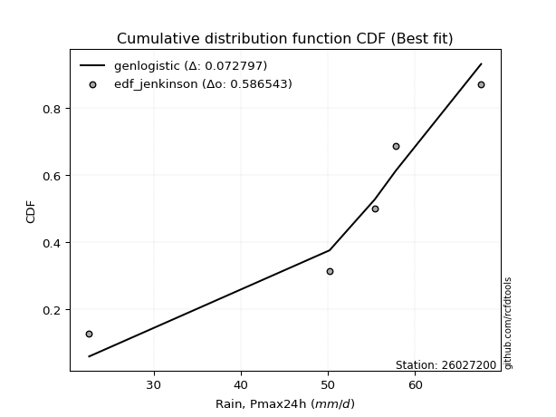</img></img>

</div>


### 11. EDF Cunnane (1978)

Cunnane´s work in statistical hydrology has focused on the performance and evaluation of different probability distributions (such as GEV, Gumbel, Lognormal) for flood frequency estimation. _b_ is a constant, typically set to 0.4.

<div align="center">


$P=(m-b)/(n+1-2b)$


</div>


**11.1. Empirical values**

<div align="center">

|                | 0                  | 1                   | 2                   | 3                  | 4                  | 5                  |
|:---------------|:-------------------|:--------------------|:--------------------|:-------------------|:-------------------|:-------------------|
| date           | 2025               | 2023                | 2019                | 2022               | 2020               | 2021               |
| x              | 12.8               | 22.6                | 50.2                | 55.4               | 57.8               | 67.6               |
| m              | 1                  | 2                   | 3                   | 4                  | 5                  | 6                  |
| empirical_dist | edf_cunnane        | edf_cunnane         | edf_cunnane         | edf_cunnane        | edf_cunnane        | edf_cunnane        |
| empirical      | 0.0967741935483871 | 0.25806451612903225 | 0.41935483870967744 | 0.5806451612903226 | 0.7419354838709676 | 0.9032258064516128 |
| empirical_tr   | 1.1071428571428572 | 1.3478260869565217  | 1.7222222222222225  | 2.384615384615385  | 3.8749999999999982 | 10.333333333333318 |

</div>


**11.2. Kolmogorov-Smirnov fit test (sorted by Δ)**


<div align="center">

|                | 0                   | 1                   | 2                   | 3                   | 4                   | 5                   | 6                  | 7                  | 8                   | 9                   | 10                 | 11                  | 12                  | 13                  | 14                | 15                  | 16                  | 17                  | 18                 | 19                  | 20                 | 21                  | 22                  | 23                | 24                  | 25                  | 26                  | 27                  | 28                 | 29                | 30                  | 31                  | 32                  | 33                  | 34                  | 35                  | 36                 | 37                 | 38                 | 39                  | 40                  | 41                  | 42                  | 43                 | 44                  | 45                  | 46                  | 47                  | 48                  | 49                  | 50                  | 51                  | 52                  | 53                 | 54                  | 55                 | 56                  | 57                  | 58                 | 59                 | 60                  | 61                 | 62                  | 63                  | 64                  | 65                  | 66                 | 67                  | 68                  | 69                  | 70                  | 71                 | 72                 | 73                 | 74                 | 75                 | 76                 | 77                  | 78                  | 79                 | 80                  | 81                  | 82                 | 83                 | 84                  | 85                 | 86                 | 87                 | 88                | 89                 | 90                 | 91                  | 92                  | 93                 | 94                  | 95                 | 96                 | 97                | 98                  | 99                 | 100                | 101                | 102                | 103                 | 104                | 105                 | 106                 | 107                | 108                | 109                | 110                | 111                 | 112               | 113              | 114                | 115               | 116               | 117                 | 118                 | 119                | 120                | 121                | 122                 | 123                 | 124                | 125                | 126                | 127                 | 128                | 129                 | 130                | 131                | 132                | 133                 | 134                | 135                 | 136                 | 137                 | 138                | 139                | 140                | 141                | 142                | 143                | 144                 | 145                 | 146                | 147                | 148                | 149                | 150                | 151                | 152                | 153                | 154                | 155                | 156                | 157                | 158                | 159               |
|:---------------|:--------------------|:--------------------|:--------------------|:--------------------|:--------------------|:--------------------|:-------------------|:-------------------|:--------------------|:--------------------|:-------------------|:--------------------|:--------------------|:--------------------|:------------------|:--------------------|:--------------------|:--------------------|:-------------------|:--------------------|:-------------------|:--------------------|:--------------------|:------------------|:--------------------|:--------------------|:--------------------|:--------------------|:-------------------|:------------------|:--------------------|:--------------------|:--------------------|:--------------------|:--------------------|:--------------------|:-------------------|:-------------------|:-------------------|:--------------------|:--------------------|:--------------------|:--------------------|:-------------------|:--------------------|:--------------------|:--------------------|:--------------------|:--------------------|:--------------------|:--------------------|:--------------------|:--------------------|:-------------------|:--------------------|:-------------------|:--------------------|:--------------------|:-------------------|:-------------------|:--------------------|:-------------------|:--------------------|:--------------------|:--------------------|:--------------------|:-------------------|:--------------------|:--------------------|:--------------------|:--------------------|:-------------------|:-------------------|:-------------------|:-------------------|:-------------------|:-------------------|:--------------------|:--------------------|:-------------------|:--------------------|:--------------------|:-------------------|:-------------------|:--------------------|:-------------------|:-------------------|:-------------------|:------------------|:-------------------|:-------------------|:--------------------|:--------------------|:-------------------|:--------------------|:-------------------|:-------------------|:------------------|:--------------------|:-------------------|:-------------------|:-------------------|:-------------------|:--------------------|:-------------------|:--------------------|:--------------------|:-------------------|:-------------------|:-------------------|:-------------------|:--------------------|:------------------|:-----------------|:-------------------|:------------------|:------------------|:--------------------|:--------------------|:-------------------|:-------------------|:-------------------|:--------------------|:--------------------|:-------------------|:-------------------|:-------------------|:--------------------|:-------------------|:--------------------|:-------------------|:-------------------|:-------------------|:--------------------|:-------------------|:--------------------|:--------------------|:--------------------|:-------------------|:-------------------|:-------------------|:-------------------|:-------------------|:-------------------|:--------------------|:--------------------|:-------------------|:-------------------|:-------------------|:-------------------|:-------------------|:-------------------|:-------------------|:-------------------|:-------------------|:-------------------|:-------------------|:-------------------|:-------------------|:------------------|
| station        | 26027200            | 26027200            | 26027200            | 26027200            | 26027200            | 26027200            | 26027200           | 26027200           | 26027200            | 26027200            | 26027200           | 26027200            | 26027200            | 26027200            | 26027200          | 26027200            | 26027200            | 26027200            | 26027200           | 26027200            | 26027200           | 26027200            | 26027200            | 26027200          | 26027200            | 26027200            | 26027200            | 26027200            | 26027200           | 26027200          | 26027200            | 26027200            | 26027200            | 26027200            | 26027200            | 26027200            | 26027200           | 26027200           | 26027200           | 26027200            | 26027200            | 26027200            | 26027200            | 26027200           | 26027200            | 26027200            | 26027200            | 26027200            | 26027200            | 26027200            | 26027200            | 26027200            | 26027200            | 26027200           | 26027200            | 26027200           | 26027200            | 26027200            | 26027200           | 26027200           | 26027200            | 26027200           | 26027200            | 26027200            | 26027200            | 26027200            | 26027200           | 26027200            | 26027200            | 26027200            | 26027200            | 26027200           | 26027200           | 26027200           | 26027200           | 26027200           | 26027200           | 26027200            | 26027200            | 26027200           | 26027200            | 26027200            | 26027200           | 26027200           | 26027200            | 26027200           | 26027200           | 26027200           | 26027200          | 26027200           | 26027200           | 26027200            | 26027200            | 26027200           | 26027200            | 26027200           | 26027200           | 26027200          | 26027200            | 26027200           | 26027200           | 26027200           | 26027200           | 26027200            | 26027200           | 26027200            | 26027200            | 26027200           | 26027200           | 26027200           | 26027200           | 26027200            | 26027200          | 26027200         | 26027200           | 26027200          | 26027200          | 26027200            | 26027200            | 26027200           | 26027200           | 26027200           | 26027200            | 26027200            | 26027200           | 26027200           | 26027200           | 26027200            | 26027200           | 26027200            | 26027200           | 26027200           | 26027200           | 26027200            | 26027200           | 26027200            | 26027200            | 26027200            | 26027200           | 26027200           | 26027200           | 26027200           | 26027200           | 26027200           | 26027200            | 26027200            | 26027200           | 26027200           | 26027200           | 26027200           | 26027200           | 26027200           | 26027200           | 26027200           | 26027200           | 26027200           | 26027200           | 26027200           | 26027200           | 26027200          |
| empirical_dist | edf_cunnane         | edf_cunnane         | edf_cunnane         | edf_cunnane         | edf_cunnane         | edf_cunnane         | edf_cunnane        | edf_cunnane        | edf_cunnane         | edf_cunnane         | edf_cunnane        | edf_cunnane         | edf_cunnane         | edf_cunnane         | edf_cunnane       | edf_cunnane         | edf_cunnane         | edf_cunnane         | edf_cunnane        | edf_cunnane         | edf_cunnane        | edf_cunnane         | edf_cunnane         | edf_cunnane       | edf_cunnane         | edf_cunnane         | edf_cunnane         | edf_cunnane         | edf_cunnane        | edf_cunnane       | edf_cunnane         | edf_cunnane         | edf_cunnane         | edf_cunnane         | edf_cunnane         | edf_cunnane         | edf_cunnane        | edf_cunnane        | edf_cunnane        | edf_cunnane         | edf_cunnane         | edf_cunnane         | edf_cunnane         | edf_cunnane        | edf_cunnane         | edf_cunnane         | edf_cunnane         | edf_cunnane         | edf_cunnane         | edf_cunnane         | edf_cunnane         | edf_cunnane         | edf_cunnane         | edf_cunnane        | edf_cunnane         | edf_cunnane        | edf_cunnane         | edf_cunnane         | edf_cunnane        | edf_cunnane        | edf_cunnane         | edf_cunnane        | edf_cunnane         | edf_cunnane         | edf_cunnane         | edf_cunnane         | edf_cunnane        | edf_cunnane         | edf_cunnane         | edf_cunnane         | edf_cunnane         | edf_cunnane        | edf_cunnane        | edf_cunnane        | edf_cunnane        | edf_cunnane        | edf_cunnane        | edf_cunnane         | edf_cunnane         | edf_cunnane        | edf_cunnane         | edf_cunnane         | edf_cunnane        | edf_cunnane        | edf_cunnane         | edf_cunnane        | edf_cunnane        | edf_cunnane        | edf_cunnane       | edf_cunnane        | edf_cunnane        | edf_cunnane         | edf_cunnane         | edf_cunnane        | edf_cunnane         | edf_cunnane        | edf_cunnane        | edf_cunnane       | edf_cunnane         | edf_cunnane        | edf_cunnane        | edf_cunnane        | edf_cunnane        | edf_cunnane         | edf_cunnane        | edf_cunnane         | edf_cunnane         | edf_cunnane        | edf_cunnane        | edf_cunnane        | edf_cunnane        | edf_cunnane         | edf_cunnane       | edf_cunnane      | edf_cunnane        | edf_cunnane       | edf_cunnane       | edf_cunnane         | edf_cunnane         | edf_cunnane        | edf_cunnane        | edf_cunnane        | edf_cunnane         | edf_cunnane         | edf_cunnane        | edf_cunnane        | edf_cunnane        | edf_cunnane         | edf_cunnane        | edf_cunnane         | edf_cunnane        | edf_cunnane        | edf_cunnane        | edf_cunnane         | edf_cunnane        | edf_cunnane         | edf_cunnane         | edf_cunnane         | edf_cunnane        | edf_cunnane        | edf_cunnane        | edf_cunnane        | edf_cunnane        | edf_cunnane        | edf_cunnane         | edf_cunnane         | edf_cunnane        | edf_cunnane        | edf_cunnane        | edf_cunnane        | edf_cunnane        | edf_cunnane        | edf_cunnane        | edf_cunnane        | edf_cunnane        | edf_cunnane        | edf_cunnane        | edf_cunnane        | edf_cunnane        | edf_cunnane       |
| p_dist         | genpareto           | loggenextreme       | johnsonsu           | trapezoid           | logweibull_max      | genhalflogistic     | gumbel_l           | weibull_min        | argus               | loglevy_l           | arcsine            | triang              | skewnorm            | burr                | genextreme        | pearson3            | ksone               | logmielke           | dweibull           | wrapcauchy          | semicircular       | logloggamma         | logtrapezoid        | anglit            | beta                | dgamma              | gompertz            | logarcsine          | logargus           | levy_l            | f                   | logdgamma           | nct                 | exponnorm           | truncnorm           | crystalball         | norm               | t                  | gamma              | erlang              | betaprime           | logloglaplace       | vonmises_line       | rice               | logistic            | logpearson3         | loggumbel_l         | logdweibull         | loggennorm          | gennorm             | logweibull_min      | gausshyper          | invgauss            | invgamma           | maxwell             | hypsecant          | logsemicircular     | cosine              | alpha              | rayleigh           | loganglit           | loggompertz        | logburr12           | ncf                 | logbeta             | kappa4              | kstwobign          | loginvweibull       | logwrapcauchy       | logbetaprime        | logburr             | laplace            | halfnorm           | logf               | logncf             | logt               | lognorm            | logcrystalball      | logexponnorm        | logfatiguelife     | lognct              | tukeylambda         | loggenhalflogistic | logerlang          | loginvgauss         | logalpha           | logrice            | logfoldnorm        | kappa3            | gumbel_r           | uniform            | loggamma            | loggamma            | loginvgamma        | truncweibull_min    | lomax              | logmaxwell         | loglogistic       | genexpon            | logkstwobign       | lograyleigh        | halflogistic       | halfgennorm        | loggenexpon         | moyal              | nakagami            | loghypsecant        | loglomax           | burr12             | logcosine          | loghalfnorm        | lognakagami         | logskewnorm       | logtriang        | loggumbel_r        | loglaplace        | loglaplace        | logrdist            | loghalflogistic     | bradford           | logmoyal           | loggenpareto       | wald                | truncexpon          | logksone           | logjohnsonsu       | logwald            | logjohnsonsb        | logtukeylambda     | loggengamma         | logkappa4          | logbradford        | loghalfgennorm     | logkappa3           | loguniform         | gengamma            | logvonmises_line    | loggausshyper       | logtruncnorm       | mielke             | logexponpow        | invweibull         | logtruncexpon      | fatiguelife        | logtruncweibull_min | exponweib           | powerlaw           | logexponweib       | foldnorm           | weibull_max        | logpowerlaw        | truncpareto        | johnsonsb          | logtruncpareto     | exponpow           | rdist              | genlogistic        | loggenlogistic     | logvonmises        | vonmises          |
| delta          | 0.09866786836157848 | 0.10540726451121935 | 0.11588261063613253 | 0.13220586607591417 | 0.13249511042901033 | 0.13687310158655513 | 0.1392789733313527 | 0.1419381499086501 | 0.14261506279656389 | 0.14338649464582442 | 0.1471443376026082 | 0.14737858340754645 | 0.14878007749803485 | 0.15251937386487696 | 0.155159820434146 | 0.16350074815863153 | 0.16531461904122574 | 0.16555180681016873 | 0.1682245329013804 | 0.17206430979972748 | 0.1736708603591987 | 0.17376070323049936 | 0.17772136454920567 | 0.180235664599747 | 0.18136543058968702 | 0.18225347002511286 | 0.18250659895043791 | 0.18369878315051108 | 0.1871545862773058 | 0.187406972282986 | 0.19415770846392905 | 0.19523626724975773 | 0.19597141814184776 | 0.19599830713046235 | 0.19600010041283583 | 0.19600011125217026 | 0.1960001122366118 | 0.1960008803602616 | 0.2015286184129232 | 0.20246392250724993 | 0.20377749293703712 | 0.20399991117814387 | 0.20638293678649003 | 0.2077597034500534 | 0.21059319693682882 | 0.21217392144810315 | 0.21268932575446559 | 0.21388811498359828 | 0.21540188331987817 | 0.21545232393288524 | 0.21547319224476663 | 0.21738605135674288 | 0.21854764334475957 | 0.2190673988488256 | 0.22112394593185586 | 0.2223682343542705 | 0.22263296442553898 | 0.22367871836300773 | 0.2258100716798232 | 0.2288439022554815 | 0.23201980767624725 | 0.2344905417053092 | 0.23595387998415834 | 0.23658092524255409 | 0.23723326171737202 | 0.24505878167646672 | 0.2469506409809073 | 0.24707971706138893 | 0.24936317074420417 | 0.24975520047176608 | 0.24984792500845926 | 0.2504069779377632 | 0.2509315338170867 | 0.2537267715870631 | 0.2539455803965302 | 0.2542461286341931 | 0.2542507488181783 | 0.25425119861845596 | 0.25425284835995315 | 0.2544334491510028 | 0.25447305981250584 | 0.25560253794538795 | 0.2564793159158813 | 0.2565382072333838 | 0.25683155517766504 | 0.2573174647738659 | 0.2585419128474095 | 0.2586304331579568 | 0.260786857231103 | 0.2608023410338622 | 0.2631269131151402 | 0.26380048276212237 | 0.26380048276212237 | 0.2642365986206962 | 0.26496518206074066 | 0.2670174681181637 | 0.2732764806487021 | 0.274034420242737 | 0.27421978956231036 | 0.2782305949962099 | 0.2789191868596506 | 0.2793047027478118 | 0.2796568374983082 | 0.28267019404539334 | 0.2827167390229515 | 0.28637100186275627 | 0.28891192845805597 | 0.2900612723136116 | 0.2924533156956067 | 0.2937023379333535 | 0.2956187459899167 | 0.29567459855609407 | 0.300185612633241 | 0.30970051702345 | 0.3102135113653624 | 0.316006400818223 | 0.316006400818223 | 0.31756209621415793 | 0.32324952731472917 | 0.3237571267214994 | 0.3285076762920259 | 0.3373519004077505 | 0.34401049289128455 | 0.34677969381651835 | 0.3482914746081039 | 0.3567757910460386 | 0.3810733984921157 | 0.38294149670574285 | 0.3861524987763923 | 0.38818327271580116 | 0.3961705974561542 | 0.3966919102682394 | 0.3970434880477168 | 0.40136524308497884 | 0.4018207372716602 | 0.40549992492918535 | 0.40822117607906555 | 0.43181690280443535 | 0.4425731606326842 | 0.4432015260969507 | 0.4438380908688056 | 0.4517715176830435 | 0.4578651878361974 | 0.4591471381363479 | 0.4649835901815866  | 0.49396713927030145 | 0.5256479357737467 | 0.5297637378745148 | 0.5318773338853782 | 0.5807246392394037 | 0.5834869711767943 | 0.5857493593087839 | 0.6211011383663865 | 0.6456291971012598 | 0.6596256140263697 | 0.7419354838414675 | 0.7419354838709676 | 0.7419354838709676 | 1.2387814183429624 | 10.34233907970441 |
| deltao         | 0.530385761606      | 0.530385761606      | 0.530385761606      | 0.530385761606      | 0.530385761606      | 0.530385761606      | 0.530385761606     | 0.530385761606     | 0.530385761606      | 0.530385761606      | 0.530385761606     | 0.530385761606      | 0.530385761606      | 0.530385761606      | 0.530385761606    | 0.530385761606      | 0.530385761606      | 0.530385761606      | 0.530385761606     | 0.530385761606      | 0.530385761606     | 0.530385761606      | 0.530385761606      | 0.530385761606    | 0.530385761606      | 0.530385761606      | 0.530385761606      | 0.530385761606      | 0.530385761606     | 0.530385761606    | 0.530385761606      | 0.530385761606      | 0.530385761606      | 0.530385761606      | 0.530385761606      | 0.530385761606      | 0.530385761606     | 0.530385761606     | 0.530385761606     | 0.530385761606      | 0.530385761606      | 0.530385761606      | 0.530385761606      | 0.530385761606     | 0.530385761606      | 0.530385761606      | 0.530385761606      | 0.530385761606      | 0.530385761606      | 0.530385761606      | 0.530385761606      | 0.530385761606      | 0.530385761606      | 0.530385761606     | 0.530385761606      | 0.530385761606     | 0.530385761606      | 0.530385761606      | 0.530385761606     | 0.530385761606     | 0.530385761606      | 0.530385761606     | 0.530385761606      | 0.530385761606      | 0.530385761606      | 0.530385761606      | 0.530385761606     | 0.530385761606      | 0.530385761606      | 0.530385761606      | 0.530385761606      | 0.530385761606     | 0.530385761606     | 0.530385761606     | 0.530385761606     | 0.530385761606     | 0.530385761606     | 0.530385761606      | 0.530385761606      | 0.530385761606     | 0.530385761606      | 0.530385761606      | 0.530385761606     | 0.530385761606     | 0.530385761606      | 0.530385761606     | 0.530385761606     | 0.530385761606     | 0.530385761606    | 0.530385761606     | 0.530385761606     | 0.530385761606      | 0.530385761606      | 0.530385761606     | 0.530385761606      | 0.530385761606     | 0.530385761606     | 0.530385761606    | 0.530385761606      | 0.530385761606     | 0.530385761606     | 0.530385761606     | 0.530385761606     | 0.530385761606      | 0.530385761606     | 0.530385761606      | 0.530385761606      | 0.530385761606     | 0.530385761606     | 0.530385761606     | 0.530385761606     | 0.530385761606      | 0.530385761606    | 0.530385761606   | 0.530385761606     | 0.530385761606    | 0.530385761606    | 0.530385761606      | 0.530385761606      | 0.530385761606     | 0.530385761606     | 0.530385761606     | 0.530385761606      | 0.530385761606      | 0.530385761606     | 0.530385761606     | 0.530385761606     | 0.530385761606      | 0.530385761606     | 0.530385761606      | 0.530385761606     | 0.530385761606     | 0.530385761606     | 0.530385761606      | 0.530385761606     | 0.530385761606      | 0.530385761606      | 0.530385761606      | 0.530385761606     | 0.530385761606     | 0.530385761606     | 0.530385761606     | 0.530385761606     | 0.530385761606     | 0.530385761606      | 0.530385761606      | 0.530385761606     | 0.530385761606     | 0.530385761606     | 0.530385761606     | 0.530385761606     | 0.530385761606     | 0.530385761606     | 0.530385761606     | 0.530385761606     | 0.530385761606     | 0.530385761606     | 0.530385761606     | 0.530385761606     | 0.530385761606    |
| eval           | Δo > Δ              | Δo > Δ              | Δo > Δ              | Δo > Δ              | Δo > Δ              | Δo > Δ              | Δo > Δ             | Δo > Δ             | Δo > Δ              | Δo > Δ              | Δo > Δ             | Δo > Δ              | Δo > Δ              | Δo > Δ              | Δo > Δ            | Δo > Δ              | Δo > Δ              | Δo > Δ              | Δo > Δ             | Δo > Δ              | Δo > Δ             | Δo > Δ              | Δo > Δ              | Δo > Δ            | Δo > Δ              | Δo > Δ              | Δo > Δ              | Δo > Δ              | Δo > Δ             | Δo > Δ            | Δo > Δ              | Δo > Δ              | Δo > Δ              | Δo > Δ              | Δo > Δ              | Δo > Δ              | Δo > Δ             | Δo > Δ             | Δo > Δ             | Δo > Δ              | Δo > Δ              | Δo > Δ              | Δo > Δ              | Δo > Δ             | Δo > Δ              | Δo > Δ              | Δo > Δ              | Δo > Δ              | Δo > Δ              | Δo > Δ              | Δo > Δ              | Δo > Δ              | Δo > Δ              | Δo > Δ             | Δo > Δ              | Δo > Δ             | Δo > Δ              | Δo > Δ              | Δo > Δ             | Δo > Δ             | Δo > Δ              | Δo > Δ             | Δo > Δ              | Δo > Δ              | Δo > Δ              | Δo > Δ              | Δo > Δ             | Δo > Δ              | Δo > Δ              | Δo > Δ              | Δo > Δ              | Δo > Δ             | Δo > Δ             | Δo > Δ             | Δo > Δ             | Δo > Δ             | Δo > Δ             | Δo > Δ              | Δo > Δ              | Δo > Δ             | Δo > Δ              | Δo > Δ              | Δo > Δ             | Δo > Δ             | Δo > Δ              | Δo > Δ             | Δo > Δ             | Δo > Δ             | Δo > Δ            | Δo > Δ             | Δo > Δ             | Δo > Δ              | Δo > Δ              | Δo > Δ             | Δo > Δ              | Δo > Δ             | Δo > Δ             | Δo > Δ            | Δo > Δ              | Δo > Δ             | Δo > Δ             | Δo > Δ             | Δo > Δ             | Δo > Δ              | Δo > Δ             | Δo > Δ              | Δo > Δ              | Δo > Δ             | Δo > Δ             | Δo > Δ             | Δo > Δ             | Δo > Δ              | Δo > Δ            | Δo > Δ           | Δo > Δ             | Δo > Δ            | Δo > Δ            | Δo > Δ              | Δo > Δ              | Δo > Δ             | Δo > Δ             | Δo > Δ             | Δo > Δ              | Δo > Δ              | Δo > Δ             | Δo > Δ             | Δo > Δ             | Δo > Δ              | Δo > Δ             | Δo > Δ              | Δo > Δ             | Δo > Δ             | Δo > Δ             | Δo > Δ              | Δo > Δ             | Δo > Δ              | Δo > Δ              | Δo > Δ              | Δo > Δ             | Δo > Δ             | Δo > Δ             | Δo > Δ             | Δo > Δ             | Δo > Δ             | Δo > Δ              | Δo > Δ              | Δo > Δ             | Δo > Δ             | Δo <= Δ            | Δo <= Δ            | Δo <= Δ            | Δo <= Δ            | Δo <= Δ            | Δo <= Δ            | Δo <= Δ            | Δo <= Δ            | Δo <= Δ            | Δo <= Δ            | Δo <= Δ            | Δo <= Δ           |
| fit            | 1                   | 1                   | 1                   | 1                   | 1                   | 1                   | 1                  | 1                  | 1                   | 1                   | 1                  | 1                   | 1                   | 1                   | 1                 | 1                   | 1                   | 1                   | 1                  | 1                   | 1                  | 1                   | 1                   | 1                 | 1                   | 1                   | 1                   | 1                   | 1                  | 1                 | 1                   | 1                   | 1                   | 1                   | 1                   | 1                   | 1                  | 1                  | 1                  | 1                   | 1                   | 1                   | 1                   | 1                  | 1                   | 1                   | 1                   | 1                   | 1                   | 1                   | 1                   | 1                   | 1                   | 1                  | 1                   | 1                  | 1                   | 1                   | 1                  | 1                  | 1                   | 1                  | 1                   | 1                   | 1                   | 1                   | 1                  | 1                   | 1                   | 1                   | 1                   | 1                  | 1                  | 1                  | 1                  | 1                  | 1                  | 1                   | 1                   | 1                  | 1                   | 1                   | 1                  | 1                  | 1                   | 1                  | 1                  | 1                  | 1                 | 1                  | 1                  | 1                   | 1                   | 1                  | 1                   | 1                  | 1                  | 1                 | 1                   | 1                  | 1                  | 1                  | 1                  | 1                   | 1                  | 1                   | 1                   | 1                  | 1                  | 1                  | 1                  | 1                   | 1                 | 1                | 1                  | 1                 | 1                 | 1                   | 1                   | 1                  | 1                  | 1                  | 1                   | 1                   | 1                  | 1                  | 1                  | 1                   | 1                  | 1                   | 1                  | 1                  | 1                  | 1                   | 1                  | 1                   | 1                   | 1                   | 1                  | 1                  | 1                  | 1                  | 1                  | 1                  | 1                   | 1                   | 1                  | 1                  | 0                  | 0                  | 0                  | 0                  | 0                  | 0                  | 0                  | 0                  | 0                  | 0                  | 0                  | 0                 |
| n              | 6                   | 6                   | 6                   | 6                   | 6                   | 6                   | 6                  | 6                  | 6                   | 6                   | 6                  | 6                   | 6                   | 6                   | 6                 | 6                   | 6                   | 6                   | 6                  | 6                   | 6                  | 6                   | 6                   | 6                 | 6                   | 6                   | 6                   | 6                   | 6                  | 6                 | 6                   | 6                   | 6                   | 6                   | 6                   | 6                   | 6                  | 6                  | 6                  | 6                   | 6                   | 6                   | 6                   | 6                  | 6                   | 6                   | 6                   | 6                   | 6                   | 6                   | 6                   | 6                   | 6                   | 6                  | 6                   | 6                  | 6                   | 6                   | 6                  | 6                  | 6                   | 6                  | 6                   | 6                   | 6                   | 6                   | 6                  | 6                   | 6                   | 6                   | 6                   | 6                  | 6                  | 6                  | 6                  | 6                  | 6                  | 6                   | 6                   | 6                  | 6                   | 6                   | 6                  | 6                  | 6                   | 6                  | 6                  | 6                  | 6                 | 6                  | 6                  | 6                   | 6                   | 6                  | 6                   | 6                  | 6                  | 6                 | 6                   | 6                  | 6                  | 6                  | 6                  | 6                   | 6                  | 6                   | 6                   | 6                  | 6                  | 6                  | 6                  | 6                   | 6                 | 6                | 6                  | 6                 | 6                 | 6                   | 6                   | 6                  | 6                  | 6                  | 6                   | 6                   | 6                  | 6                  | 6                  | 6                   | 6                  | 6                   | 6                  | 6                  | 6                  | 6                   | 6                  | 6                   | 6                   | 6                   | 6                  | 6                  | 6                  | 6                  | 6                  | 6                  | 6                   | 6                   | 6                  | 6                  | 6                  | 6                  | 6                  | 6                  | 6                  | 6                  | 6                  | 6                  | 6                  | 6                  | 6                  | 6                 |
| best_fit       | 1                   | 0                   | 0                   | 0                   | 0                   | 0                   | 0                  | 0                  | 0                   | 0                   | 0                  | 0                   | 0                   | 0                   | 0                 | 0                   | 0                   | 0                   | 0                  | 0                   | 0                  | 0                   | 0                   | 0                 | 0                   | 0                   | 0                   | 0                   | 0                  | 0                 | 0                   | 0                   | 0                   | 0                   | 0                   | 0                   | 0                  | 0                  | 0                  | 0                   | 0                   | 0                   | 0                   | 0                  | 0                   | 0                   | 0                   | 0                   | 0                   | 0                   | 0                   | 0                   | 0                   | 0                  | 0                   | 0                  | 0                   | 0                   | 0                  | 0                  | 0                   | 0                  | 0                   | 0                   | 0                   | 0                   | 0                  | 0                   | 0                   | 0                   | 0                   | 0                  | 0                  | 0                  | 0                  | 0                  | 0                  | 0                   | 0                   | 0                  | 0                   | 0                   | 0                  | 0                  | 0                   | 0                  | 0                  | 0                  | 0                 | 0                  | 0                  | 0                   | 0                   | 0                  | 0                   | 0                  | 0                  | 0                 | 0                   | 0                  | 0                  | 0                  | 0                  | 0                   | 0                  | 0                   | 0                   | 0                  | 0                  | 0                  | 0                  | 0                   | 0                 | 0                | 0                  | 0                 | 0                 | 0                   | 0                   | 0                  | 0                  | 0                  | 0                   | 0                   | 0                  | 0                  | 0                  | 0                   | 0                  | 0                   | 0                  | 0                  | 0                  | 0                   | 0                  | 0                   | 0                   | 0                   | 0                  | 0                  | 0                  | 0                  | 0                  | 0                  | 0                   | 0                   | 0                  | 0                  | 0                  | 0                  | 0                  | 0                  | 0                  | 0                  | 0                  | 0                  | 0                  | 0                  | 0                  | 0                 |
| best_fit_sort  | 1                   | 2                   | 3                   | 4                   | 5                   | 6                   | 7                  | 8                  | 9                   | 10                  | 11                 | 12                  | 13                  | 14                  | 15                | 16                  | 17                  | 18                  | 19                 | 20                  | 21                 | 22                  | 23                  | 24                | 25                  | 26                  | 27                  | 28                  | 29                 | 30                | 31                  | 32                  | 33                  | 34                  | 35                  | 36                  | 37                 | 38                 | 39                 | 40                  | 41                  | 42                  | 43                  | 44                 | 45                  | 46                  | 47                  | 48                  | 49                  | 50                  | 51                  | 52                  | 53                  | 54                 | 55                  | 56                 | 57                  | 58                  | 59                 | 60                 | 61                  | 62                 | 63                  | 64                  | 65                  | 66                  | 67                 | 68                  | 69                  | 70                  | 71                  | 72                 | 73                 | 74                 | 75                 | 76                 | 77                 | 78                  | 79                  | 80                 | 81                  | 82                  | 83                 | 84                 | 85                  | 86                 | 87                 | 88                 | 89                | 90                 | 91                 | 92                  | 93                  | 94                 | 95                  | 96                 | 97                 | 98                | 99                  | 100                | 101                | 102                | 103                | 104                 | 105                | 106                 | 107                 | 108                | 109                | 110                | 111                | 112                 | 113               | 114              | 115                | 116               | 117               | 118                 | 119                 | 120                | 121                | 122                | 123                 | 124                 | 125                | 126                | 127                | 128                 | 129                | 130                 | 131                | 132                | 133                | 134                 | 135                | 136                 | 137                 | 138                 | 139                | 140                | 141                | 142                | 143                | 144                | 145                 | 146                 | 147                | 148                | 149                | 150                | 151                | 152                | 153                | 154                | 155                | 156                | 157                | 158                | 159                | 160               |

</div>


**11.3. Best fit**

<div align="center">

|   id |   station | empirical_dist   | p_dist    |     delta |   deltao | eval   |   fit |   n |   best_fit |   best_fit_sort |
|-----:|----------:|:-----------------|:----------|----------:|---------:|:-------|------:|----:|-----------:|----------------:|
|    0 |  26027200 | edf_cunnane      | genpareto | 0.0986679 | 0.530386 | Δo > Δ |     1 |   6 |          1 |               1 |

</div>


<div align="center">

</img>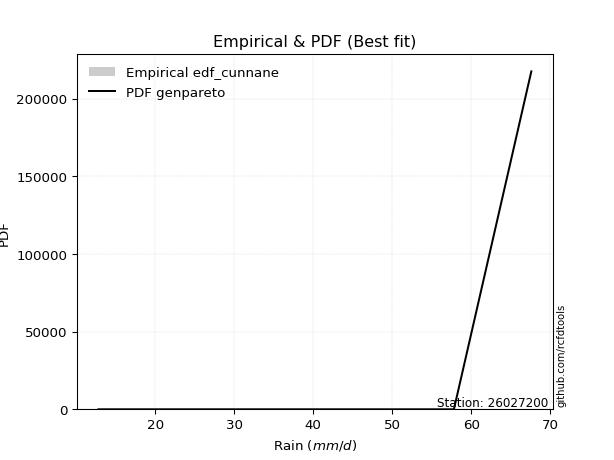</img>

</div>


### 12. EDF Adamowski (1981)

The Adamowski formula in hydrology refers to a specific plotting position formula used for estimating the non-parametric empirical distribution of hydrological events (like flood peaks) to calculate their return periods. This formula provides an alternative to traditional parametric methods (like the Gumbel or Log Pearson Type III distributions). 

<div align="center">


$P=(m-0.25)/(n+0.5)$


</div>


**12.1. Empirical values**

<div align="center">

|                | 0                   | 1                  | 2                  | 3                  | 4                  | 5                  |
|:---------------|:--------------------|:-------------------|:-------------------|:-------------------|:-------------------|:-------------------|
| date           | 2025                | 2023               | 2019               | 2022               | 2020               | 2021               |
| x              | 12.8                | 22.6               | 50.2               | 55.4               | 57.8               | 67.6               |
| m              | 1                   | 2                  | 3                  | 4                  | 5                  | 6                  |
| empirical_dist | edf_adamowski       | edf_adamowski      | edf_adamowski      | edf_adamowski      | edf_adamowski      | edf_adamowski      |
| empirical      | 0.11538461538461539 | 0.2692307692307692 | 0.4230769230769231 | 0.5769230769230769 | 0.7307692307692307 | 0.8846153846153846 |
| empirical_tr   | 1.1304347826086958  | 1.3684210526315788 | 1.7333333333333334 | 2.3636363636363633 | 3.7142857142857135 | 8.666666666666664  |

</div>


**12.2. Kolmogorov-Smirnov fit test (sorted by Δ)**


<div align="center">

|                | 0                   | 1                   | 2                  | 3                  | 4                   | 5                  | 6                  | 7                   | 8                   | 9                  | 10                 | 11                 | 12                  | 13                  | 14                  | 15                 | 16                 | 17                 | 18                  | 19                 | 20                  | 21                  | 22                 | 23                  | 24                  | 25                  | 26                  | 27                  | 28                  | 29                 | 30                  | 31                 | 32                 | 33                  | 34                  | 35                  | 36                  | 37                 | 38                 | 39                  | 40                 | 41                  | 42                  | 43                 | 44                  | 45                  | 46                  | 47                | 48                  | 49                  | 50                  | 51                  | 52                | 53                  | 54                  | 55                 | 56                  | 57                 | 58                  | 59                  | 60                 | 61                 | 62                  | 63                 | 64                  | 65                  | 66                  | 67                 | 68                  | 69                  | 70                  | 71                  | 72                  | 73                  | 74                  | 75                  | 76                  | 77                 | 78                 | 79                  | 80                 | 81                 | 82                  | 83                  | 84                 | 85                 | 86                 | 87                  | 88                  | 89                  | 90                  | 91                  | 92                  | 93                  | 94                | 95                  | 96                  | 97                  | 98                 | 99                  | 100               | 101                 | 102                | 103                | 104                | 105                 | 106                 | 107               | 108                 | 109                 | 110                | 111                 | 112                 | 113                 | 114                 | 115                | 116                | 117                | 118                 | 119                | 120                 | 121                 | 122                | 123                | 124                 | 125                | 126                 | 127                 | 128                 | 129                | 130                 | 131                | 132                 | 133                | 134                 | 135                | 136                | 137                | 138                 | 139                 | 140                 | 141                 | 142                | 143                 | 144                 | 145                | 146                | 147               | 148                | 149                | 150                | 151               | 152                | 153                | 154                | 155                | 156                | 157                | 158                | 159                |
|:---------------|:--------------------|:--------------------|:-------------------|:-------------------|:--------------------|:-------------------|:-------------------|:--------------------|:--------------------|:-------------------|:-------------------|:-------------------|:--------------------|:--------------------|:--------------------|:-------------------|:-------------------|:-------------------|:--------------------|:-------------------|:--------------------|:--------------------|:-------------------|:--------------------|:--------------------|:--------------------|:--------------------|:--------------------|:--------------------|:-------------------|:--------------------|:-------------------|:-------------------|:--------------------|:--------------------|:--------------------|:--------------------|:-------------------|:-------------------|:--------------------|:-------------------|:--------------------|:--------------------|:-------------------|:--------------------|:--------------------|:--------------------|:------------------|:--------------------|:--------------------|:--------------------|:--------------------|:------------------|:--------------------|:--------------------|:-------------------|:--------------------|:-------------------|:--------------------|:--------------------|:-------------------|:-------------------|:--------------------|:-------------------|:--------------------|:--------------------|:--------------------|:-------------------|:--------------------|:--------------------|:--------------------|:--------------------|:--------------------|:--------------------|:--------------------|:--------------------|:--------------------|:-------------------|:-------------------|:--------------------|:-------------------|:-------------------|:--------------------|:--------------------|:-------------------|:-------------------|:-------------------|:--------------------|:--------------------|:--------------------|:--------------------|:--------------------|:--------------------|:--------------------|:------------------|:--------------------|:--------------------|:--------------------|:-------------------|:--------------------|:------------------|:--------------------|:-------------------|:-------------------|:-------------------|:--------------------|:--------------------|:------------------|:--------------------|:--------------------|:-------------------|:--------------------|:--------------------|:--------------------|:--------------------|:-------------------|:-------------------|:-------------------|:--------------------|:-------------------|:--------------------|:--------------------|:-------------------|:-------------------|:--------------------|:-------------------|:--------------------|:--------------------|:--------------------|:-------------------|:--------------------|:-------------------|:--------------------|:-------------------|:--------------------|:-------------------|:-------------------|:-------------------|:--------------------|:--------------------|:--------------------|:--------------------|:-------------------|:--------------------|:--------------------|:-------------------|:-------------------|:------------------|:-------------------|:-------------------|:-------------------|:------------------|:-------------------|:-------------------|:-------------------|:-------------------|:-------------------|:-------------------|:-------------------|:-------------------|
| station        | 26027200            | 26027200            | 26027200           | 26027200           | 26027200            | 26027200           | 26027200           | 26027200            | 26027200            | 26027200           | 26027200           | 26027200           | 26027200            | 26027200            | 26027200            | 26027200           | 26027200           | 26027200           | 26027200            | 26027200           | 26027200            | 26027200            | 26027200           | 26027200            | 26027200            | 26027200            | 26027200            | 26027200            | 26027200            | 26027200           | 26027200            | 26027200           | 26027200           | 26027200            | 26027200            | 26027200            | 26027200            | 26027200           | 26027200           | 26027200            | 26027200           | 26027200            | 26027200            | 26027200           | 26027200            | 26027200            | 26027200            | 26027200          | 26027200            | 26027200            | 26027200            | 26027200            | 26027200          | 26027200            | 26027200            | 26027200           | 26027200            | 26027200           | 26027200            | 26027200            | 26027200           | 26027200           | 26027200            | 26027200           | 26027200            | 26027200            | 26027200            | 26027200           | 26027200            | 26027200            | 26027200            | 26027200            | 26027200            | 26027200            | 26027200            | 26027200            | 26027200            | 26027200           | 26027200           | 26027200            | 26027200           | 26027200           | 26027200            | 26027200            | 26027200           | 26027200           | 26027200           | 26027200            | 26027200            | 26027200            | 26027200            | 26027200            | 26027200            | 26027200            | 26027200          | 26027200            | 26027200            | 26027200            | 26027200           | 26027200            | 26027200          | 26027200            | 26027200           | 26027200           | 26027200           | 26027200            | 26027200            | 26027200          | 26027200            | 26027200            | 26027200           | 26027200            | 26027200            | 26027200            | 26027200            | 26027200           | 26027200           | 26027200           | 26027200            | 26027200           | 26027200            | 26027200            | 26027200           | 26027200           | 26027200            | 26027200           | 26027200            | 26027200            | 26027200            | 26027200           | 26027200            | 26027200           | 26027200            | 26027200           | 26027200            | 26027200           | 26027200           | 26027200           | 26027200            | 26027200            | 26027200            | 26027200            | 26027200           | 26027200            | 26027200            | 26027200           | 26027200           | 26027200          | 26027200           | 26027200           | 26027200           | 26027200          | 26027200           | 26027200           | 26027200           | 26027200           | 26027200           | 26027200           | 26027200           | 26027200           |
| empirical_dist | edf_adamowski       | edf_adamowski       | edf_adamowski      | edf_adamowski      | edf_adamowski       | edf_adamowski      | edf_adamowski      | edf_adamowski       | edf_adamowski       | edf_adamowski      | edf_adamowski      | edf_adamowski      | edf_adamowski       | edf_adamowski       | edf_adamowski       | edf_adamowski      | edf_adamowski      | edf_adamowski      | edf_adamowski       | edf_adamowski      | edf_adamowski       | edf_adamowski       | edf_adamowski      | edf_adamowski       | edf_adamowski       | edf_adamowski       | edf_adamowski       | edf_adamowski       | edf_adamowski       | edf_adamowski      | edf_adamowski       | edf_adamowski      | edf_adamowski      | edf_adamowski       | edf_adamowski       | edf_adamowski       | edf_adamowski       | edf_adamowski      | edf_adamowski      | edf_adamowski       | edf_adamowski      | edf_adamowski       | edf_adamowski       | edf_adamowski      | edf_adamowski       | edf_adamowski       | edf_adamowski       | edf_adamowski     | edf_adamowski       | edf_adamowski       | edf_adamowski       | edf_adamowski       | edf_adamowski     | edf_adamowski       | edf_adamowski       | edf_adamowski      | edf_adamowski       | edf_adamowski      | edf_adamowski       | edf_adamowski       | edf_adamowski      | edf_adamowski      | edf_adamowski       | edf_adamowski      | edf_adamowski       | edf_adamowski       | edf_adamowski       | edf_adamowski      | edf_adamowski       | edf_adamowski       | edf_adamowski       | edf_adamowski       | edf_adamowski       | edf_adamowski       | edf_adamowski       | edf_adamowski       | edf_adamowski       | edf_adamowski      | edf_adamowski      | edf_adamowski       | edf_adamowski      | edf_adamowski      | edf_adamowski       | edf_adamowski       | edf_adamowski      | edf_adamowski      | edf_adamowski      | edf_adamowski       | edf_adamowski       | edf_adamowski       | edf_adamowski       | edf_adamowski       | edf_adamowski       | edf_adamowski       | edf_adamowski     | edf_adamowski       | edf_adamowski       | edf_adamowski       | edf_adamowski      | edf_adamowski       | edf_adamowski     | edf_adamowski       | edf_adamowski      | edf_adamowski      | edf_adamowski      | edf_adamowski       | edf_adamowski       | edf_adamowski     | edf_adamowski       | edf_adamowski       | edf_adamowski      | edf_adamowski       | edf_adamowski       | edf_adamowski       | edf_adamowski       | edf_adamowski      | edf_adamowski      | edf_adamowski      | edf_adamowski       | edf_adamowski      | edf_adamowski       | edf_adamowski       | edf_adamowski      | edf_adamowski      | edf_adamowski       | edf_adamowski      | edf_adamowski       | edf_adamowski       | edf_adamowski       | edf_adamowski      | edf_adamowski       | edf_adamowski      | edf_adamowski       | edf_adamowski      | edf_adamowski       | edf_adamowski      | edf_adamowski      | edf_adamowski      | edf_adamowski       | edf_adamowski       | edf_adamowski       | edf_adamowski       | edf_adamowski      | edf_adamowski       | edf_adamowski       | edf_adamowski      | edf_adamowski      | edf_adamowski     | edf_adamowski      | edf_adamowski      | edf_adamowski      | edf_adamowski     | edf_adamowski      | edf_adamowski      | edf_adamowski      | edf_adamowski      | edf_adamowski      | edf_adamowski      | edf_adamowski      | edf_adamowski      |
| p_dist         | genpareto           | loggenextreme       | logweibull_max     | johnsonsu          | trapezoid           | loglevy_l          | genhalflogistic    | gumbel_l            | arcsine             | triang             | genextreme         | skewnorm           | burr                | weibull_min         | argus               | pearson3           | ksone              | logmielke          | wrapcauchy          | levy_l             | semicircular        | logloggamma         | beta               | logtrapezoid        | anglit              | gompertz            | dweibull            | logarcsine          | logargus            | f                  | nct                 | exponnorm          | truncnorm          | crystalball         | norm                | t                   | dgamma              | logdweibull        | logloglaplace      | gamma               | erlang             | betaprime           | rice                | logdgamma          | logistic            | logpearson3         | loggumbel_l         | logweibull_min    | gausshyper          | invgauss            | invgamma            | maxwell             | vonmises_line     | hypsecant           | logsemicircular     | loggennorm         | gennorm             | cosine             | alpha               | rayleigh            | logbeta            | loganglit          | loggompertz         | logburr12          | ncf                 | kappa4              | kstwobign           | loginvweibull      | logwrapcauchy       | logbetaprime        | logburr             | laplace             | halfnorm            | logf                | logncf              | logt                | lognorm             | logcrystalball     | logexponnorm       | logfatiguelife      | lognct             | tukeylambda        | loggenhalflogistic  | logerlang           | loginvgauss        | logalpha           | logrice            | logfoldnorm         | kappa3              | gumbel_r            | uniform             | loggamma            | loggamma            | loginvgamma         | truncweibull_min  | lomax               | logmaxwell          | loglogistic         | genexpon           | logkstwobign        | lograyleigh       | halflogistic        | halfgennorm        | loggenexpon        | moyal              | nakagami            | loghypsecant        | loglomax          | burr12              | logcosine           | loghalfnorm        | lognakagami         | logskewnorm         | logtriang           | loggumbel_r         | loglaplace         | loglaplace         | logrdist           | loghalflogistic     | bradford           | logmoyal            | loggenpareto        | wald               | truncexpon         | logksone            | logjohnsonsu       | logjohnsonsb        | logwald             | logtukeylambda      | loggengamma        | logkappa4           | logbradford        | loghalfgennorm      | logkappa3          | loguniform          | gengamma           | logvonmises_line   | loggausshyper      | invweibull          | logtruncnorm        | mielke              | logexponpow         | fatiguelife        | logtruncexpon       | logtruncweibull_min | exponweib          | logexponweib       | powerlaw          | foldnorm           | weibull_max        | logpowerlaw        | truncpareto       | johnsonsb          | logtruncpareto     | exponpow           | rdist              | genlogistic        | loggenlogistic     | logvonmises        | vonmises           |
| delta          | 0.11538461538461542 | 0.11657351761295631 | 0.1168153499726286 | 0.1270488637378695 | 0.12848378170866853 | 0.1322202415440875 | 0.1331510172193095 | 0.14160013721800987 | 0.14342225323536256 | 0.1436564990403008 | 0.1439935673324091 | 0.1450579931307892 | 0.14879728949763132 | 0.15310440301038708 | 0.15378131589830085 | 0.1597786637913859 | 0.1615925346739801 | 0.1618297224429231 | 0.16834222543248184 | 0.1687965504467577 | 0.16994877599195307 | 0.17003861886325372 | 0.1701991774879501 | 0.17399928018196004 | 0.17651358023250135 | 0.17878451458319228 | 0.17939078600311736 | 0.17997669878326544 | 0.18343250191006016 | 0.1904356240966834 | 0.19224933377460213 | 0.1922762227632167 | 0.1922780160455902 | 0.19227802688492462 | 0.19227802786936615 | 0.19227879599301595 | 0.19341972312684982 | 0.1952776931473701 | 0.1976702897861078 | 0.19780653404567755 | 0.1987418381400043 | 0.20005540856979148 | 0.20403761908280776 | 0.2064025203514947 | 0.20687111256958318 | 0.20845183708085752 | 0.20896724138721995 | 0.211751107877521 | 0.21366396698949724 | 0.21482555897751393 | 0.21534531448157995 | 0.21740186156461022 | 0.217549189888227 | 0.21864614998702486 | 0.21891088005829334 | 0.2191239676871238 | 0.21917440830013088 | 0.2199566339957621 | 0.22208798731257756 | 0.22512181788823588 | 0.2260670086156351 | 0.2282977233090016 | 0.23076845733806356 | 0.2322317956169127 | 0.23285884087530845 | 0.24133669730922108 | 0.24322855661366166 | 0.2433576326941433 | 0.24564108637695853 | 0.24603311610452044 | 0.24612584064121362 | 0.24668489357051754 | 0.24720944944984108 | 0.25000468721981745 | 0.25022349602928456 | 0.25052404426694747 | 0.25052866445093264 | 0.2505291142512103 | 0.2505307639927075 | 0.25071136478375716 | 0.2507509754452602 | 0.2518804535781423 | 0.25275723154863566 | 0.25281612286613814 | 0.2531094708104194 | 0.2535953804066203 | 0.2548198284801639 | 0.25490834879071117 | 0.25706477286385737 | 0.25708025666661655 | 0.25940482874789456 | 0.26007839839487673 | 0.26007839839487673 | 0.26051451425345057 | 0.261243097693495 | 0.26329538375091804 | 0.26955439628145644 | 0.27031233587549136 | 0.2704977051950647 | 0.27450851062896425 | 0.275197102492405 | 0.27558261838056614 | 0.2759347531310626 | 0.2789481096781477 | 0.2789946546557059 | 0.28264891749551063 | 0.28518984409081033 | 0.286339187946366 | 0.28873123132836104 | 0.28998025356610785 | 0.2918966616226711 | 0.29195251418884843 | 0.29646352826599537 | 0.30597843265620434 | 0.30649142699811677 | 0.3122843164509774 | 0.3122843164509774 | 0.3138400118469123 | 0.31952744294748353 | 0.3200350423542538 | 0.32478559192478024 | 0.33362981604050485 | 0.3402884085240389 | 0.3430576094492727 | 0.34456939024085825 | 0.3456095379443017 | 0.37177524360400593 | 0.37735131412487005 | 0.38243041440914666 | 0.3844611883485555 | 0.39244851308890855 | 0.3929698259009938 | 0.39332140368047114 | 0.3976431587177332 | 0.39809865290441454 | 0.4017778405619397 | 0.4044990917118199 | 0.4280948184371897 | 0.43316109584681534 | 0.43885107626543857 | 0.43947944172970504 | 0.44011600650155996 | 0.4479808850346109 | 0.45414310346895176 | 0.46126150581434094 | 0.4828008861685645 | 0.5185974847727779 | 0.521925851406501 | 0.5281552495181325 | 0.5695583861376667 | 0.5723207180750574 | 0.574583106207047 | 0.6099348852646496 | 0.6344629439995229 | 0.6484593609246327 | 0.7307692307397304 | 0.7307692307692307 | 0.7307692307692307 | 1.2350593339757168 | 10.360949501540636 |
| deltao         | 0.530385761606      | 0.530385761606      | 0.530385761606     | 0.530385761606     | 0.530385761606      | 0.530385761606     | 0.530385761606     | 0.530385761606      | 0.530385761606      | 0.530385761606     | 0.530385761606     | 0.530385761606     | 0.530385761606      | 0.530385761606      | 0.530385761606      | 0.530385761606     | 0.530385761606     | 0.530385761606     | 0.530385761606      | 0.530385761606     | 0.530385761606      | 0.530385761606      | 0.530385761606     | 0.530385761606      | 0.530385761606      | 0.530385761606      | 0.530385761606      | 0.530385761606      | 0.530385761606      | 0.530385761606     | 0.530385761606      | 0.530385761606     | 0.530385761606     | 0.530385761606      | 0.530385761606      | 0.530385761606      | 0.530385761606      | 0.530385761606     | 0.530385761606     | 0.530385761606      | 0.530385761606     | 0.530385761606      | 0.530385761606      | 0.530385761606     | 0.530385761606      | 0.530385761606      | 0.530385761606      | 0.530385761606    | 0.530385761606      | 0.530385761606      | 0.530385761606      | 0.530385761606      | 0.530385761606    | 0.530385761606      | 0.530385761606      | 0.530385761606     | 0.530385761606      | 0.530385761606     | 0.530385761606      | 0.530385761606      | 0.530385761606     | 0.530385761606     | 0.530385761606      | 0.530385761606     | 0.530385761606      | 0.530385761606      | 0.530385761606      | 0.530385761606     | 0.530385761606      | 0.530385761606      | 0.530385761606      | 0.530385761606      | 0.530385761606      | 0.530385761606      | 0.530385761606      | 0.530385761606      | 0.530385761606      | 0.530385761606     | 0.530385761606     | 0.530385761606      | 0.530385761606     | 0.530385761606     | 0.530385761606      | 0.530385761606      | 0.530385761606     | 0.530385761606     | 0.530385761606     | 0.530385761606      | 0.530385761606      | 0.530385761606      | 0.530385761606      | 0.530385761606      | 0.530385761606      | 0.530385761606      | 0.530385761606    | 0.530385761606      | 0.530385761606      | 0.530385761606      | 0.530385761606     | 0.530385761606      | 0.530385761606    | 0.530385761606      | 0.530385761606     | 0.530385761606     | 0.530385761606     | 0.530385761606      | 0.530385761606      | 0.530385761606    | 0.530385761606      | 0.530385761606      | 0.530385761606     | 0.530385761606      | 0.530385761606      | 0.530385761606      | 0.530385761606      | 0.530385761606     | 0.530385761606     | 0.530385761606     | 0.530385761606      | 0.530385761606     | 0.530385761606      | 0.530385761606      | 0.530385761606     | 0.530385761606     | 0.530385761606      | 0.530385761606     | 0.530385761606      | 0.530385761606      | 0.530385761606      | 0.530385761606     | 0.530385761606      | 0.530385761606     | 0.530385761606      | 0.530385761606     | 0.530385761606      | 0.530385761606     | 0.530385761606     | 0.530385761606     | 0.530385761606      | 0.530385761606      | 0.530385761606      | 0.530385761606      | 0.530385761606     | 0.530385761606      | 0.530385761606      | 0.530385761606     | 0.530385761606     | 0.530385761606    | 0.530385761606     | 0.530385761606     | 0.530385761606     | 0.530385761606    | 0.530385761606     | 0.530385761606     | 0.530385761606     | 0.530385761606     | 0.530385761606     | 0.530385761606     | 0.530385761606     | 0.530385761606     |
| eval           | Δo > Δ              | Δo > Δ              | Δo > Δ             | Δo > Δ             | Δo > Δ              | Δo > Δ             | Δo > Δ             | Δo > Δ              | Δo > Δ              | Δo > Δ             | Δo > Δ             | Δo > Δ             | Δo > Δ              | Δo > Δ              | Δo > Δ              | Δo > Δ             | Δo > Δ             | Δo > Δ             | Δo > Δ              | Δo > Δ             | Δo > Δ              | Δo > Δ              | Δo > Δ             | Δo > Δ              | Δo > Δ              | Δo > Δ              | Δo > Δ              | Δo > Δ              | Δo > Δ              | Δo > Δ             | Δo > Δ              | Δo > Δ             | Δo > Δ             | Δo > Δ              | Δo > Δ              | Δo > Δ              | Δo > Δ              | Δo > Δ             | Δo > Δ             | Δo > Δ              | Δo > Δ             | Δo > Δ              | Δo > Δ              | Δo > Δ             | Δo > Δ              | Δo > Δ              | Δo > Δ              | Δo > Δ            | Δo > Δ              | Δo > Δ              | Δo > Δ              | Δo > Δ              | Δo > Δ            | Δo > Δ              | Δo > Δ              | Δo > Δ             | Δo > Δ              | Δo > Δ             | Δo > Δ              | Δo > Δ              | Δo > Δ             | Δo > Δ             | Δo > Δ              | Δo > Δ             | Δo > Δ              | Δo > Δ              | Δo > Δ              | Δo > Δ             | Δo > Δ              | Δo > Δ              | Δo > Δ              | Δo > Δ              | Δo > Δ              | Δo > Δ              | Δo > Δ              | Δo > Δ              | Δo > Δ              | Δo > Δ             | Δo > Δ             | Δo > Δ              | Δo > Δ             | Δo > Δ             | Δo > Δ              | Δo > Δ              | Δo > Δ             | Δo > Δ             | Δo > Δ             | Δo > Δ              | Δo > Δ              | Δo > Δ              | Δo > Δ              | Δo > Δ              | Δo > Δ              | Δo > Δ              | Δo > Δ            | Δo > Δ              | Δo > Δ              | Δo > Δ              | Δo > Δ             | Δo > Δ              | Δo > Δ            | Δo > Δ              | Δo > Δ             | Δo > Δ             | Δo > Δ             | Δo > Δ              | Δo > Δ              | Δo > Δ            | Δo > Δ              | Δo > Δ              | Δo > Δ             | Δo > Δ              | Δo > Δ              | Δo > Δ              | Δo > Δ              | Δo > Δ             | Δo > Δ             | Δo > Δ             | Δo > Δ              | Δo > Δ             | Δo > Δ              | Δo > Δ              | Δo > Δ             | Δo > Δ             | Δo > Δ              | Δo > Δ             | Δo > Δ              | Δo > Δ              | Δo > Δ              | Δo > Δ             | Δo > Δ              | Δo > Δ             | Δo > Δ              | Δo > Δ             | Δo > Δ              | Δo > Δ             | Δo > Δ             | Δo > Δ             | Δo > Δ              | Δo > Δ              | Δo > Δ              | Δo > Δ              | Δo > Δ             | Δo > Δ              | Δo > Δ              | Δo > Δ             | Δo > Δ             | Δo > Δ            | Δo > Δ             | Δo <= Δ            | Δo <= Δ            | Δo <= Δ           | Δo <= Δ            | Δo <= Δ            | Δo <= Δ            | Δo <= Δ            | Δo <= Δ            | Δo <= Δ            | Δo <= Δ            | Δo <= Δ            |
| fit            | 1                   | 1                   | 1                  | 1                  | 1                   | 1                  | 1                  | 1                   | 1                   | 1                  | 1                  | 1                  | 1                   | 1                   | 1                   | 1                  | 1                  | 1                  | 1                   | 1                  | 1                   | 1                   | 1                  | 1                   | 1                   | 1                   | 1                   | 1                   | 1                   | 1                  | 1                   | 1                  | 1                  | 1                   | 1                   | 1                   | 1                   | 1                  | 1                  | 1                   | 1                  | 1                   | 1                   | 1                  | 1                   | 1                   | 1                   | 1                 | 1                   | 1                   | 1                   | 1                   | 1                 | 1                   | 1                   | 1                  | 1                   | 1                  | 1                   | 1                   | 1                  | 1                  | 1                   | 1                  | 1                   | 1                   | 1                   | 1                  | 1                   | 1                   | 1                   | 1                   | 1                   | 1                   | 1                   | 1                   | 1                   | 1                  | 1                  | 1                   | 1                  | 1                  | 1                   | 1                   | 1                  | 1                  | 1                  | 1                   | 1                   | 1                   | 1                   | 1                   | 1                   | 1                   | 1                 | 1                   | 1                   | 1                   | 1                  | 1                   | 1                 | 1                   | 1                  | 1                  | 1                  | 1                   | 1                   | 1                 | 1                   | 1                   | 1                  | 1                   | 1                   | 1                   | 1                   | 1                  | 1                  | 1                  | 1                   | 1                  | 1                   | 1                   | 1                  | 1                  | 1                   | 1                  | 1                   | 1                   | 1                   | 1                  | 1                   | 1                  | 1                   | 1                  | 1                   | 1                  | 1                  | 1                  | 1                   | 1                   | 1                   | 1                   | 1                  | 1                   | 1                   | 1                  | 1                  | 1                 | 1                  | 0                  | 0                  | 0                 | 0                  | 0                  | 0                  | 0                  | 0                  | 0                  | 0                  | 0                  |
| n              | 6                   | 6                   | 6                  | 6                  | 6                   | 6                  | 6                  | 6                   | 6                   | 6                  | 6                  | 6                  | 6                   | 6                   | 6                   | 6                  | 6                  | 6                  | 6                   | 6                  | 6                   | 6                   | 6                  | 6                   | 6                   | 6                   | 6                   | 6                   | 6                   | 6                  | 6                   | 6                  | 6                  | 6                   | 6                   | 6                   | 6                   | 6                  | 6                  | 6                   | 6                  | 6                   | 6                   | 6                  | 6                   | 6                   | 6                   | 6                 | 6                   | 6                   | 6                   | 6                   | 6                 | 6                   | 6                   | 6                  | 6                   | 6                  | 6                   | 6                   | 6                  | 6                  | 6                   | 6                  | 6                   | 6                   | 6                   | 6                  | 6                   | 6                   | 6                   | 6                   | 6                   | 6                   | 6                   | 6                   | 6                   | 6                  | 6                  | 6                   | 6                  | 6                  | 6                   | 6                   | 6                  | 6                  | 6                  | 6                   | 6                   | 6                   | 6                   | 6                   | 6                   | 6                   | 6                 | 6                   | 6                   | 6                   | 6                  | 6                   | 6                 | 6                   | 6                  | 6                  | 6                  | 6                   | 6                   | 6                 | 6                   | 6                   | 6                  | 6                   | 6                   | 6                   | 6                   | 6                  | 6                  | 6                  | 6                   | 6                  | 6                   | 6                   | 6                  | 6                  | 6                   | 6                  | 6                   | 6                   | 6                   | 6                  | 6                   | 6                  | 6                   | 6                  | 6                   | 6                  | 6                  | 6                  | 6                   | 6                   | 6                   | 6                   | 6                  | 6                   | 6                   | 6                  | 6                  | 6                 | 6                  | 6                  | 6                  | 6                 | 6                  | 6                  | 6                  | 6                  | 6                  | 6                  | 6                  | 6                  |
| best_fit       | 1                   | 0                   | 0                  | 0                  | 0                   | 0                  | 0                  | 0                   | 0                   | 0                  | 0                  | 0                  | 0                   | 0                   | 0                   | 0                  | 0                  | 0                  | 0                   | 0                  | 0                   | 0                   | 0                  | 0                   | 0                   | 0                   | 0                   | 0                   | 0                   | 0                  | 0                   | 0                  | 0                  | 0                   | 0                   | 0                   | 0                   | 0                  | 0                  | 0                   | 0                  | 0                   | 0                   | 0                  | 0                   | 0                   | 0                   | 0                 | 0                   | 0                   | 0                   | 0                   | 0                 | 0                   | 0                   | 0                  | 0                   | 0                  | 0                   | 0                   | 0                  | 0                  | 0                   | 0                  | 0                   | 0                   | 0                   | 0                  | 0                   | 0                   | 0                   | 0                   | 0                   | 0                   | 0                   | 0                   | 0                   | 0                  | 0                  | 0                   | 0                  | 0                  | 0                   | 0                   | 0                  | 0                  | 0                  | 0                   | 0                   | 0                   | 0                   | 0                   | 0                   | 0                   | 0                 | 0                   | 0                   | 0                   | 0                  | 0                   | 0                 | 0                   | 0                  | 0                  | 0                  | 0                   | 0                   | 0                 | 0                   | 0                   | 0                  | 0                   | 0                   | 0                   | 0                   | 0                  | 0                  | 0                  | 0                   | 0                  | 0                   | 0                   | 0                  | 0                  | 0                   | 0                  | 0                   | 0                   | 0                   | 0                  | 0                   | 0                  | 0                   | 0                  | 0                   | 0                  | 0                  | 0                  | 0                   | 0                   | 0                   | 0                   | 0                  | 0                   | 0                   | 0                  | 0                  | 0                 | 0                  | 0                  | 0                  | 0                 | 0                  | 0                  | 0                  | 0                  | 0                  | 0                  | 0                  | 0                  |
| best_fit_sort  | 1                   | 2                   | 3                  | 4                  | 5                   | 6                  | 7                  | 8                   | 9                   | 10                 | 11                 | 12                 | 13                  | 14                  | 15                  | 16                 | 17                 | 18                 | 19                  | 20                 | 21                  | 22                  | 23                 | 24                  | 25                  | 26                  | 27                  | 28                  | 29                  | 30                 | 31                  | 32                 | 33                 | 34                  | 35                  | 36                  | 37                  | 38                 | 39                 | 40                  | 41                 | 42                  | 43                  | 44                 | 45                  | 46                  | 47                  | 48                | 49                  | 50                  | 51                  | 52                  | 53                | 54                  | 55                  | 56                 | 57                  | 58                 | 59                  | 60                  | 61                 | 62                 | 63                  | 64                 | 65                  | 66                  | 67                  | 68                 | 69                  | 70                  | 71                  | 72                  | 73                  | 74                  | 75                  | 76                  | 77                  | 78                 | 79                 | 80                  | 81                 | 82                 | 83                  | 84                  | 85                 | 86                 | 87                 | 88                  | 89                  | 90                  | 91                  | 92                  | 93                  | 94                  | 95                | 96                  | 97                  | 98                  | 99                 | 100                 | 101               | 102                 | 103                | 104                | 105                | 106                 | 107                 | 108               | 109                 | 110                 | 111                | 112                 | 113                 | 114                 | 115                 | 116                | 117                | 118                | 119                 | 120                | 121                 | 122                 | 123                | 124                | 125                 | 126                | 127                 | 128                 | 129                 | 130                | 131                 | 132                | 133                 | 134                | 135                 | 136                | 137                | 138                | 139                 | 140                 | 141                 | 142                 | 143                | 144                 | 145                 | 146                | 147                | 148               | 149                | 150                | 151                | 152               | 153                | 154                | 155                | 156                | 157                | 158                | 159                | 160                |

</div>


**12.3. Best fit**

<div align="center">

|   id |   station | empirical_dist   | p_dist    |    delta |   deltao | eval   |   fit |   n |   best_fit |   best_fit_sort |
|-----:|----------:|:-----------------|:----------|---------:|---------:|:-------|------:|----:|-----------:|----------------:|
|    0 |  26027200 | edf_adamowski    | genpareto | 0.115385 | 0.530386 | Δo > Δ |     1 |   6 |          1 |               1 |

</div>


<div align="center">

</img>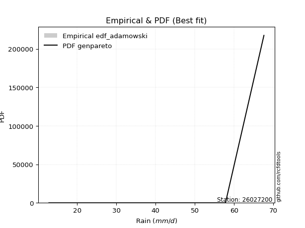</img>

</div>


## C. Best fit & Estimate extreme values for specific return periods - Tr

Best fit in probability distribution analysis means finding the theoretical distribution (like Normal, Poisson, Exponential, etc.) that most accurately mirrors your real-world data´s patterns (shape, center, spread) for better predictions, using methods like visual checks (Q-Q plots), goodness-of-fit tests (Kolmogorov-Smirnov, Chi-Squared), and information criteria (AIC) to score and select the simplest, most representative model.


### 1. Best fit (ordered by delta Δ)

:file_folder:Table: [bestfit_26027200.csv](table/bestfit_26027200.csv)

<div align="center">

|   id |   station | empirical_dist   | p_dist          |     delta |   deltao | eval   |   fit |   n |   best_fit |   best_fit_sort |
|-----:|----------:|:-----------------|:----------------|----------:|---------:|:-------|------:|----:|-----------:|----------------:|
|    0 |  26027200 | edf_cunnane      | genpareto       | 0.0986679 | 0.530386 | Δo > Δ |     1 |   6 |          1 |               1 |
|    1 |  26027200 | edf_blom         | genpareto       | 0.1       | 0.530386 | Δo > Δ |     1 |   6 |          1 |               2 |
|    2 |  26027200 | edf_gringorten   | genpareto       | 0.10183   | 0.530386 | Δo > Δ |     1 |   6 |          1 |               3 |
|    3 |  26027200 | edf_hazen        | loggenextreme   | 0.103115  | 0.530386 | Δo > Δ |     1 |   6 |          1 |               4 |
|    4 |  26027200 | edf_tukey        | genpareto       | 0.105263  | 0.530386 | Δo > Δ |     1 |   6 |          1 |               5 |
|    5 |  26027200 | edf_filliben     | genpareto       | 0.107227  | 0.530386 | Δo > Δ |     1 |   6 |          1 |               6 |
|    6 |  26027200 | edf_beard        | genpareto       | 0.10815   | 0.530386 | Δo > Δ |     1 |   6 |          1 |               7 |
|    7 |  26027200 | edf_jenkinson    | genpareto       | 0.10815   | 0.530386 | Δo > Δ |     1 |   6 |          1 |               8 |
|    8 |  26027200 | edf_chegodayev   | genpareto       | 0.109375  | 0.530386 | Δo > Δ |     1 |   6 |          1 |               9 |
|    9 |  26027200 | edf_adamowski    | genpareto       | 0.115385  | 0.530386 | Δo > Δ |     1 |   6 |          1 |              10 |
|   10 |  26027200 | edf_weibull      | loglevy_l       | 0.115737  | 0.530386 | Δo > Δ |     1 |   6 |          1 |              11 |
|   11 |  26027200 | edf_california   | genhalflogistic | 0.152021  | 0.530386 | Δo > Δ |     1 |   6 |          1 |              12 |

</div>


### 2. Extreme values and % difference analysis

In hydrology, a return period (or recurrence interval $Tr$) is the statistical average time between extreme events like floods or droughts of a specific magnitude, indicating how rare an event is, with a 100-year flood, for example, having a 1% chance of occurring in any given year, not that it happens exactly every century. It is a key tool for infrastructure design (like bridges or dams) and risk assessment, calculated from historical data to determine the probability of future events, although it is important to remember it is statistical average, and events can cluster or be missed.

The extreme value porcentage difference is evaluated as $pdiff = 1 - (ETrBf / ETr) * 100$, where _ETrBf_ correspond to the bestfit extreme value for a specific recurrence interval and _ETr_ correspond to the extreme value for one of the most used PDFsused in hydrology.

> risk_rate: assuming the return period as the project useful life.

:file_folder:Table: [extreme_26027200.csv](table/extreme_26027200.csv), all PDFs.  
:file_folder:Table: [extremepdiff_26027200.csv](table/extremepdiff_26027200.csv), % difference between bestfit and most used PDFs in Hydrology.

<div align="center">

Extreme values table for only best fit PDFs
|   id |      tr |   prob_l |     prob_g |    alpha |   anglit |   arcsine |   argus |    beta |   betaprime |   bradford |    burr |   burr12 |   cosine |   crystalball |   dgamma |   dweibull |   erlang |   exponnorm |   exponpow |   exponweib |        f |   fatiguelife |   foldnorm |    gamma |   gausshyper |   genexpon |   genextreme |   gengamma |   genhalflogistic |   genlogistic |   gennorm |   genpareto |   gompertz |   gumbel_l |   gumbel_r |   halfgennorm |   halflogistic |   halfnorm |   hypsecant |   invgamma |   invgauss |      invweibull |   johnsonsb |   johnsonsu |   kappa3 |   kappa4 |   ksone |   kstwobign |   laplace |   levy_l |   loggamma |   logistic |   loglaplace |    lomax |   maxwell |   mielke |    moyal |   nakagami |      ncf |      nct |     norm |   pearson3 |   powerlaw |   rayleigh |    rdist |     rice |   semicircular |   skewnorm |        t |   trapezoid |   triang |   truncexpon |   truncnorm |   truncpareto |   truncweibull_min |   tukeylambda |   uniform |   vonmises |   vonmises_line |     wald |   weibull_max |   weibull_min |   wrapcauchy |   logalpha |   loganglit |   logarcsine |   logargus |   logbeta |   logbetaprime |   logbradford |   logburr |   logburr12 |   logcosine |   logcrystalball |   logdgamma |   logdweibull |   logerlang |   logexponnorm |   logexponpow |    logexponweib |     logf |   logfatiguelife |   logfoldnorm |   loggausshyper |   loggenexpon |   loggenextreme |   loggengamma |   loggenhalflogistic |   loggenlogistic |      loggennorm |   loggenpareto |   loggompertz |   loggumbel_l |   loggumbel_r |   loghalfgennorm |   loghalflogistic |   loghalfnorm |   loghypsecant |   loginvgamma |   loginvgauss |   loginvweibull |   logjohnsonsb |   logjohnsonsu |   logkappa3 |   logkappa4 |   logksone |   logkstwobign |   loglevy_l |   logloggamma |   loglogistic |   logloglaplace |   loglomax |   logmaxwell |   logmielke |   logmoyal |   lognakagami |   logncf |   lognct |   lognorm |   logpearson3 |   logpowerlaw |   lograyleigh |   logrdist |   logrice |   logsemicircular |   logskewnorm |     logt |   logtrapezoid |   logtriang |   logtruncexpon |   logtruncnorm |   logtruncpareto |   logtruncweibull_min |   logtukeylambda |   loguniform |   logvonmises |   logvonmises_line |   logwald |   logweibull_max |   logweibull_min |   logwrapcauchy |   station |   n |   risk_rate |
|-----:|--------:|---------:|-----------:|---------:|---------:|----------:|--------:|--------:|------------:|-----------:|--------:|---------:|---------:|--------------:|---------:|-----------:|---------:|------------:|-----------:|------------:|---------:|--------------:|-----------:|---------:|-------------:|-----------:|-------------:|-----------:|------------------:|--------------:|----------:|------------:|-----------:|-----------:|-----------:|--------------:|---------------:|-----------:|------------:|-----------:|-----------:|----------------:|------------:|------------:|---------:|---------:|--------:|------------:|----------:|---------:|-----------:|-----------:|-------------:|---------:|----------:|---------:|---------:|-----------:|---------:|---------:|---------:|-----------:|-----------:|-----------:|---------:|---------:|---------------:|-----------:|---------:|------------:|---------:|-------------:|------------:|--------------:|-------------------:|--------------:|----------:|-----------:|----------------:|---------:|--------------:|--------------:|-------------:|-----------:|------------:|-------------:|-----------:|----------:|---------------:|--------------:|----------:|------------:|------------:|-----------------:|------------:|--------------:|------------:|---------------:|--------------:|----------------:|---------:|-----------------:|--------------:|----------------:|--------------:|----------------:|--------------:|---------------------:|-----------------:|----------------:|---------------:|--------------:|--------------:|--------------:|-----------------:|------------------:|--------------:|---------------:|--------------:|--------------:|----------------:|---------------:|---------------:|------------:|------------:|-----------:|---------------:|------------:|--------------:|--------------:|----------------:|-----------:|-------------:|------------:|-----------:|--------------:|---------:|---------:|----------:|--------------:|--------------:|--------------:|-----------:|----------:|------------------:|--------------:|---------:|---------------:|------------:|----------------:|---------------:|-----------------:|----------------------:|-----------------:|-------------:|--------------:|-------------------:|----------:|-----------------:|-----------------:|----------------:|----------:|----:|------------:|
|    0 |    2    | 0.5      | 0.5        |  42.1569 |  44.4    |   44.4    | 48.8485 | 52.6486 |     43.7623 |    36.0602 | 46.5667 |  27.6867 |  42.9248 |       44.4    |  52.2082 |    55.4    |  43.8635 |     44.4001 |    12.8213 |     13.1646 |  44.4935 |       12.8002 |    49.7523 |  43.967  |      42.231  |    34.7193 |      54.3903 |    15.8322 |           47.037  |           inf |   55.4    |     49.1505 |    45.3631 |    47.6487 |    41.1513 |       28.0157 |        39.5362 |    40.3521 |     44.4    |    42.9061 |    42.5464 |   437.72        |     67.5901 |     51.1073 |  12.8    |  40.9425 | 44.4    |     39.8492 |   44.4    |  52.9213 |    37.2817 |    44.4    |      38.2738 |  35.1057 |   42.7087 |  12.8    |  40.1025 |    37.5468 |  40.3944 |  44.4007 |  44.4    |    46.2027 |    13.3079 |    42.1089 |  9.60328 |  43.521  |        44.4    |    47.0392 |  44.3999 |     47.2162 |  46.9812 |      33.8733 |     44.4    |       13.5593 |            40.5578 |       40.2    |   40.2    |  -0.616338 |         54.1835 |  37.9898 |       67.2034 |       48.1884 |      40.2    |    37.3859 |     38.2738 |      38.2738 |    45.1859 |   57.336  |        37.979  |       29.5655 |   40.9604 |     41.2043 |     35.4905 |          38.2737 |     50.2    |       55.4    |     37.6748 |        38.2736 |       20.1872 |    13.0265      |  38.2654 |          38.2902 |       38.3574 |         26.1667 |       33.0472 |         50.5531 |       22.3887 |              39.6223 |         inf      |    55.4         |        21.4274 |       41.5276 |       42.2589 |       34.6644 |          29.5193 |           32.9992 |       33.8304 |        38.2738 |       37.0744 |       36.8136 |         35.3802 |        67.4376 |        64.7604 |     12.7951 |     28.9061 |    29.4156 |        33.0495 |     52.1227 |       45.5449 |       38.2738 |         53.8676 |    27.3993 |      36.3502 |     45.9552 |    33.5735 |       36.6542 |  37.7104 |  38.1725 |   38.2738 |       41.7008 |       13.0877 |       35.6914 |    29.4177 |   37.6049 |           38.2738 |       38.6522 |  38.274  |        42.445  |     37.2321 |         24.7931 |        32.2583 |          13.1468 |               23.8959 |          29.6817 |      29.4156 |     0.0740581 |            28.5205 |   31.4789 |          46.448  |          43.1633 |         29.4154 |  26027200 |   6 |    0.75     |
|    1 |    2.33 | 0.570815 | 0.429185   |  45.9553 |  48.5104 |   50.5704 | 51.9576 | 58.5453 |     47.4149 |    39.9652 | 50.1482 |  32.7056 |  46.4794 |       47.9288 |  54.8874 |    56.3218 |  47.498  |     47.9289 |    12.8624 |     13.7046 |  48.0229 |       13.7456 |    49.7924 |  47.5703 |      46.3917 |    39.5479 |      57.2214 |    17.9279 |           50.9781 |           inf |   55.4722 |     53.742  |    48.7255 |    50.7188 |    44.4212 |       33.7113 |        42.8981 |    44.1606 |     47.2241 |    46.5447 |    46.3608 | 10030.1         |     67.5967 |     53.9917 |  12.8    |  44.9548 | 49.251  |     43.9683 |   46.5355 |  57.4097 |    41.6472 |    47.5091 |      40.8487 |  40.0407 |   46.3749 |  12.8    |  43.1979 |    41.3231 |  44.5296 |  47.93   |  47.9288 |    49.6222 |    14.0425 |    45.8293 | 12.012   |  47.1805 |        48.8085 |    50.3204 |  47.9288 |     51.2782 |  50.3906 |      37.9284 |     47.9288 |       13.9967 |            44.2465 |       44.2597 |   44.0807 |  -0.389799 |         57.3588 |  40.3037 |       67.4035 |       51.1413 |      48.2102 |    41.8831 |     43.384  |      46.1961 |    48.547  |   62.8883 |        42.521  |       33.2891 |   44.8167 |     45.1477 |     39.6633 |          42.6214 |     51.0429 |       57.637  |     42.1235 |        42.6212 |       22.6835 |    13.386       |  42.6312 |          42.626  |       42.5577 |         29.563  |       37.8156 |         54.2967 |       25.4994 |              43.9133 |         inf      |    55.479       |        28.5256 |       45.3484 |       46.4057 |       38.2985 |          33.2443 |           36.5609 |       37.9957 |        41.7154 |       41.475  |       41.4716 |         40.6399 |        67.5798 |        66.2979 |     12.7951 |     32.7644 |    33.8841 |        37.8711 |     56.4375 |       49.1156 |       42.0795 |         57.6715 |    32.4612 |      40.6492 |     49.5151 |    36.8963 |       40.1752 |  42.2225 |  42.5435 |   42.6214 |       46.129  |       13.4658 |       39.9786 |    34.893  |   42.0249 |           43.78   |       42.2588 |  42.6217 |        48.0412 |     41.0904 |         27.8026 |        34.5044 |          13.346  |               26.8187 |          33.5547 |      33.0948 |     0.0820954 |            32.2284 |   33.78   |          52.8157 |          46.7785 |         39.3679 |  26027200 |   6 |    0.729209 |
|    2 |    5    | 0.8      | 0.2        |  61.0218 |  63.0129 |   67.0247 | 60.867  | 66.986  |     61.2045 |    53.8221 | 60.42   | inf      |  59.2887 |       61.0428 |  66.9602 |    68.3835 |  61.2427 |     61.043  |    14.2857 |     32.7869 |  61.1534 |       33.8258 |    49.962  |  61.2116 |      59.1546 |    63.6895 |      63.9605 |    42.6834 |           61.253  |           inf |   60.9285 |     64.2864 |    60.3519 |    60.637  |    58.6268 |       75.0515 |        58.1102 |    60.2663 |     58.5523 |    60.716  |    61.5658 |     9.18886e+09 |     67.5999 |     61.8629 |  56.7908 |  57.6219 | 64.9505 |     61.4654 |   57.2124 |  64.8459 |    63.2993 |    59.5139 |      56.566  |  64.8254 |   60.8048 |  43.5309 |  57.5357 |    58.5481 |  63.3126 |  61.0453 |  61.0428 |    61.346  |    24.9426 |    60.7238 | 19.0784  |  61.0822 |        63.8529 |    59.8771 |  61.0428 |     62.9319 |  60.1719 |      52.5149 |     61.0428 |       19.4075 |            56.389  |       57.2155 |   56.64   |   0.498118 |         69.7839 |  53.2569 |       67.5907 |       60.6809 |      62.0023 |    64.7106 |     67.5094 |      76.2923 |    59.0358 |   67.5299 |        65.3641 |       48.8686 |   57.4421 |     60.7523 |     59.2053 |          63.5736 |     65.3722 |       91.7857 |     64.2455 |        63.5735 |       39.239  |    24.6417      |  63.6929 |          63.5269 |       62.6166 |         45.344  |       65.5803 |         63.3888 |       48.613  |              57.3768 |         inf      |    61.5217      |        55.0108 |       60.7278 |       62.7919 |       59.0589 |          48.8374 |           58.1349 |       62.0845 |        58.9248 |       63.6201 |       66.0162 |         74.2079 |        67.6    |        67.5306 |     12.7951 |     48.885  |    53.5505 |        67.5357 |     64.3863 |       59.5325 |       60.6781 |         81.1188 |    76.5368 |      63.1139 |     59.8849 |    57.1264 |       59.5766 |  64.764  |  63.7118 |   63.5736 |       64.0891 |       19.3796 |       62.9583 |    56.1324 |   63.827  |           69.2606 |       54.7972 |  63.5742 |        68.537  |     54.5249 |         42.5025 |        45.4747 |          15.9517 |               41.4773 |          49.7342 |      48.4618 |     0.121076  |            47.8667 |   50.1393 |          64.9519 |          60.6594 |         58.8455 |  26027200 |   6 |    0.67232  |
|    3 |   10    | 0.9      | 0.1        |  71.9307 |  71.2215 |   70.997  | 64.6563 | 67.5494 |     70.5405 |    60.5013 | 64.4309 | inf      |  67.0277 |       69.7423 |  77.5982 |    85.2231 |  70.5685 |     69.7425 |    19.8346 |    138.962  |  69.8763 |       61.5514 |    50.0875 |  70.4803 |      64.013  |    85.6046 |      66.0499 |    96.2968 |           64.7467 |           inf |   86.639  |     66.6959 |    67.2043 |    66.159  |    70.1971 |      132.494  |        70.7431 |    72.1842 |     67.5981 |    70.7151 |    72.5943 |     6.60145e+14 |     67.6    |     65.2823 |  62.2897 |  62.8709 | 71.8007 |     74.7871 |   66.9045 |  66.6412 |    84.0855 |    68.355  |      76.0142 |  87.4852 |   70.9598 |  54.5844 |  70.019  |    71.8998 |  79.5409 |  69.7452 |  69.7423 |    68.2963 |    39.7007 |    71.3439 | 21.3611  |  70.4786 |        71.5724 |    63.7694 |  69.7424 |     67.4838 |  63.9925 |      59.7321 |     69.7423 |       29.8516 |            61.8958 |       62.637  |   62.12   |   1.16547  |         78.9173 |  67.0032 |       67.5992 |       65.9921 |      65.0259 |    87.3816 |     86.7078 |      86.1148 |    63.9305 |   67.5985 |        87.7182 |       57.7801 |   63.0676 |     71.7479 |     75.4169 |          82.8841 |     88.9809 |      170.487  |     85.5521 |        82.884  |       60.7585 |   132.177       |  83.1394 |          82.8023 |       80.8993 |         55.3994 |       97.7199 |         66.0167 |       86.3159 |              62.814  |         inf      |    99.1104      |        63.9076 |       71.7049 |       74.3059 |       84.0415 |          57.761  |           85.4491 |       89.2859 |        77.6387 |       85.3397 |       91.6737 |        121.182  |        67.6    |        67.5901 |     12.7951 |     57.8604 |    65.3871 |       104.908  |     66.4675 |       63.6652 |       79.4512 |        110.565  |   169.219  |      86.0186 |     63.9932 |    83.5861 |       79.9756 |  86.6129 |  83.3551 |   82.8841 |       76.7491 |       30.3568 |       87.032  |    63.9937 |   84.4721 |           87.6404 |       60.914  |  82.885  |        78.7408 |     60.8951 |         52.8752 |        53.7931 |          22.1385 |               52.1277 |          58.7899 |      57.2365 |     0.15859   |            56.8842 |   76.2431 |          66.9896 |          70.1018 |         63.4612 |  26027200 |   6 |    0.651322 |
|    4 |   15    | 0.933333 | 0.0666667  |  77.6776 |  74.7268 |   71.7546 | 66.021  | 67.5883 |     75.256  |    62.8197 | 65.7178 | inf      |  70.5529 |       74.0836 |  83.77   |    96.9537 |  75.2848 |     74.0837 |    26.3426 |    312.399  |  74.2329 |       79.6845 |    50.1528 |  75.1715 |      65.4353 |    98.4242 |      66.6423 |   147.29   |           65.7851 |           inf |  122.021  |     67.1771 |    70.3725 |    68.6598 |    76.725  |      175.641  |        77.8922 |    78.3862 |     72.7605 |    75.8944 |    78.393  |     3.62716e+17 |     67.6    |     66.6072 |  64.1226 |  64.546  | 74.0841 |     81.8594 |   72.5741 |  67.1835 |    97.0679 |    73.172  |      90.3583 | 100.812  |   76.1702 |  58.7426 |  77.2637 |    78.9238 |  89.0786 |  74.0865 |  74.0836 |    71.5271 |    47.1897 |    76.8159 | 21.9322  |  75.2026 |        74.5828 |    65.05   |  74.0836 |     68.9443 |  65.2184 |      62.2768 |     74.0836 |       37.2322 |            63.7727 |       64.3759 |   63.9467 |   1.50816  |         83.3944 |  75.8305 |       67.5998 |       68.3975 |      65.909  |   101.886  |     96.4879 |      88.1272 |    65.7639 |   67.5998 |       101.861  |       61.0982 |   64.9624 |     77.3818 |     84.2066 |          94.614  |    108.278  |      260.195  |     98.8867 |        94.6139 |       76.6171 |   669.584       |  94.9655 |          94.5173 |       91.9313 |         59.2783 |      120.16   |         66.694  |      120.141  |              64.5218 |         inf      |   189.594       |        65.848  |       77.3537 |       80.1932 |      102.549  |          61.0842 |          106.26   |      107.87   |        90.8733 |       99.1129 |      108.662  |        159.809  |        67.6    |        67.5963 |     12.7951 |     61.0946 |    69.8878 |       132.542  |     67.1093 |       64.9984 |       92.0207 |        132.523  |   270.956  |     100.829  |     65.3179 |   104.247  |       93.2538 | 100.345  |  95.342  |   94.6141 |       83.0937 |       37.8062 |      102.834  |    65.8284 |   97.2135 |           96.0651 |       63.0721 |  94.6151 |        82.3264 |     63.0928 |         57.195  |        57.5387 |          27.7181 |               56.6264 |          62.0768 |      60.5012 |     0.182662  |            60.2529 |   99.7899 |          67.3349 |          74.8486 |         64.8558 |  26027200 |   6 |    0.644736 |
|    5 |   20    | 0.95     | 0.05       |  81.558  |  76.7888 |   72.0214 | 66.7533 | 67.5959 |     78.3645 |    63.9967 | 66.3525 | inf      |  72.7208 |       76.9265 |  88.1345 |   106.003  |  78.396  |     76.9267 |    32.8541 |    531.117  |  77.0872 |       93.1097 |    50.1963 |  78.2674 |      66.0888 |   107.52   |      66.9164 |   194.4    |           66.2782 |           inf |  161.971  |     67.3533 |    72.3616 |    70.2165 |    81.2957 |      210.788  |        82.9011 |    82.5211 |     76.4023 |    79.3571 |    82.3001 |     3.00603e+19 |     67.6    |     67.363  |  65.0391 |  65.3609 | 75.2258 |     86.6235 |   76.5967 |  67.4612 |   106.71   |    76.5014 |     102.149  | 110.299  |   79.6281 |  60.9136 |  82.3946 |    83.6206 |  95.9319 |  76.9294 |  76.9265 |    73.5594 |    51.5561 |    80.4529 | 22.1699  |  78.3065 |        76.2525 |    65.6885 |  76.9266 |     69.6648 |  65.8231 |      63.5775 |     76.9265 |       42.3443 |            64.7199 |       65.2247 |   64.86   |   1.71921  |         86.0483 |  82.4086 |       67.5999 |       69.8947 |      66.3382 |   112.819  |    102.749  |      88.847  |    66.764  |   67.6    |       112.445  |       62.828  |   65.9138 |     81.1164 |     90.1136 |         103.181  |    125.033  |      359.398  |    108.802  |       103.181  |       89.4842 |  2891.1         | 103.609  |         103.077  |       99.9589 |         61.3139 |      137.906  |         66.988  |      151.577  |              65.3472 |         inf      |   392.46        |        66.5729 |       81.1045 |       84.091  |      117.884  |          62.8168 |          123.791  |      122.363  |       101.545  |      109.439  |      121.736  |        193.972  |        67.6    |        67.598  |     12.7951 |     62.7435 |    72.253  |       155.152  |     67.4404 |       65.6573 |      101.852  |        150.7    |   379.545  |     112.04   |     65.9724 |   121.901  |      103.317  | 110.582  | 104.121  |  103.181  |       87.2141 |       42.8904 |      114.894  |    66.5385 |  106.602  |          101.082  |       64.1766 | 103.182  |        84.1549 |     64.2059 |         59.5573 |        59.6803 |          32.3127 |               59.1012 |          63.7614 |      62.2028 |     0.201047  |            62.0114 |  121.952  |          67.4523 |          77.9642 |         65.5427 |  26027200 |   6 |    0.641514 |
|    6 |   25    | 0.96     | 0.04       |  84.476  |  78.1861 |   72.1452 | 67.2195 | 67.5981 |     80.6632 |    64.7086 | 66.7307 | inf      |  74.2411 |       79.0193 |  91.5133 |   113.407  |  80.6977 |     79.0195 |    39.1343 |    781.903  |  79.1891 |      103.777  |    50.2287 |  80.5586 |      66.4569 |   114.575  |      67.0727 |   238.05   |           66.5646 |           inf |  204.339  |     67.4376 |    73.7843 |    71.3242 |    84.8163 |      240.741  |        86.7602 |    85.5977 |     79.2208 |    81.9428 |    85.2325 |     9.02995e+20 |     67.6    |     67.8691 |  65.589  |  65.8401 | 75.9108 |     90.192  |   79.7169 |  67.6355 |   114.454  |    79.0484 |     112.344  | 117.677  |   82.1953 |  62.246  |  86.3715 |    87.1195 | 101.314  |  79.0222 |  79.0193 |    75.0138 |    54.396  |    83.1552 | 22.2944  |  80.596  |        77.3357 |    66.0711 |  79.0194 |     70.0941 |  66.1834 |      64.3673 |     79.0193 |       46.0301 |            65.2913 |       65.7253 |   65.408  |   1.86084  |         87.7837 |  87.6775 |       67.6    |       70.9601 |      66.593  |   121.696  |    107.221  |      89.1829 |    67.4065 |   67.6    |       120.994  |       63.8893 |   66.4864 |     83.8864 |     94.5014 |         109.98   |    140.087  |      467.344  |    116.772  |       109.98   |      100.448  | 10802.5         | 110.471  |         109.871  |      106.313  |         62.5625 |      152.792  |         67.1478 |      181.309  |              65.831  |         inf      |   846.021       |        66.9223 |       83.889  |       86.9795 |      131.242  |          63.8798 |          139.248  |      134.396  |       110.657  |      117.789  |      132.508  |        225.188  |        67.6    |        67.5988 |     12.7951 |     63.7384 |    73.7104 |       174.58   |     67.649  |       66.0502 |      110.077  |        166.499  |   493.793  |     121.162  |     66.3628 |   137.615  |      111.505  | 118.826  | 111.101  |  109.98   |       90.2171 |       46.5306 |      124.761  |    66.8891 |  114.098  |          104.477  |       64.8477 | 109.981  |        85.2635 |     64.8784 |         61.0461 |        61.0686 |          36.0558 |               60.666  |          64.7821 |      63.2466 |     0.216203  |            63.091  |  143.205  |          67.5059 |          80.2599 |         65.9533 |  26027200 |   6 |    0.639603 |
|    7 |   50    | 0.98     | 0.02       |  93.1346 |  81.6259 |   72.3105 | 68.2591 | 67.5998 |     87.2947 |    66.1455 | 67.4826 | inf      |  78.2221 |       85.0123 | 101.981  |   138.378  |  87.3429 |     85.0125 |    66.4275 |   2300.92   |  85.2112 |      138.001  |    50.3229 |  87.1766 |      67.1204 |   136.49   |      67.3631 |   419.886  |           67.1122 |           inf |  427.182  |     67.5557 |    77.6734 |    74.3311 |    95.6616 |      349.498  |        98.6507 |    94.5401 |     87.9593 |    89.5237 |    93.8991 |     3.21925e+25 |     67.6    |     69.1131 |  66.6888 |  66.7672 | 77.2808 |    100.671  |   89.409  |  68.028  |   140.108  |    86.8301 |     150.969  | 140.696  |   89.6406 |  64.9784 |  98.7175 |    97.2988 | 118.503  |  85.0149 |  85.0123 |    78.9873 |    60.6109 |    90.9994 | 22.4944  |  87.1714 |        79.8103 |    66.8358 |  85.0124 |     70.9459 |  66.8984 |      65.9687 |     85.0123 |       55.2051 |            66.4408 |       66.6991 |   66.504  |   2.17741  |         91.5472 | 104.88   |       67.6    |       73.8522 |      67.0981 |   151.684  |    119.077  |      89.6336 |    68.8565 |   67.6    |       149.588  |       66.066  |   67.6493 |     91.9068 |    107.03   |         132.029  |    201.214  |     1123.66   |    143.211  |       132.029  |      140.438  |     1.84509e+06 | 132.743  |         131.918  |      126.832  |         65.1045 |      205.877  |         67.4223 |      314.336  |              66.7636 |         inf      | 46554.2         |        67.4146 |       91.9609 |       95.3308 |      182.676  |          66.0603 |          200.091  |      176.518  |       144.441  |      145.794  |      169.86   |        356.604  |        67.6    |        67.5997 |     65.4511 |     65.7227 |    76.714  |       246.86   |     68.1212 |       66.8308 |      139.553  |        226.938  |  1129.2    |     152.039  |     67.1382 |   200.515  |      139.186  | 146.264  | 133.817  |  132.029  |       98.6081 |       55.5293 |      158.47   |    67.4005 |  138.661  |          112.664  |       66.21   | 132.03   |        87.5071 |     66.234  |         64.1971 |        64.1171 |          47.2223 |               63.9906 |          66.8332 |      65.3871 |     0.269641  |            65.3069 |  241.964  |          67.5766 |          86.8384 |         66.7745 |  26027200 |   6 |    0.63583  |
|    8 |   75    | 0.986667 | 0.0133333  |  97.975  |  83.1397 |   72.3412 | 68.6648 | 67.6    |     90.8828 |    66.6284 | 67.7367 | inf      |  80.1232 |       88.228  | 108.089  |   154.262  |  90.9415 |     88.2282 |    88.4683 |   4025.26   |  88.4444 |      158.612  |    50.3741 |  90.7625 |      67.3116 |   149.309  |      67.4512 |   564.07   |           67.285  |           inf |  649.078  |     67.5793 |    79.6536 |    75.8516 |   101.965  |      424.693  |       105.563  |    99.4079 |     93.066  |    93.7021 |    98.7169 |     1.42427e+28 |     67.6    |     69.6719 |  67.0554 |  67.0625 | 77.7375 |    106.436  |   95.0786 |  68.1893 |   156.323  |    91.3246 |     179.457  | 154.234  |   93.6885 |  65.9094 | 105.937  |   102.841  | 128.95   |  88.2303 |  88.228  |    81.0046 |    62.8509 |    95.2669 | 22.5433  |  90.71   |        80.7988 |    67.0906 |  88.2281 |     71.2279 |  67.1351 |      66.5091 |     88.228  |       58.9214 |            66.8261 |       67.0123 |   66.8693 |   2.29115  |         92.8697 | 115.466  |       67.6    |       75.3147 |      67.2656 |   171.074  |    124.702  |      89.7175 |    69.429  |   67.6    |       167.863  |       66.8079 |   68.0656 |     96.2587 |    113.587  |         145.629  |    249.9    |     1952.75   |    159.948  |       145.629  |      168.355  |     7.8511e+07  | 146.494  |         145.525  |      139.429  |         65.9563 |      242.224  |         67.4968 |      431.982  |              67.0599 |         inf      |     2.44314e+06 |        67.5133 |       96.345  |       99.8544 |      221.386  |          66.8035 |          247.028  |      204.758  |       168.776  |      163.75   |      194.737  |        465.827  |        67.6    |        67.5999 |     66.1819 |     66.374  |    77.7422 |       298.698  |     68.3161 |       67.0895 |      160.049  |        272.008  |  1844.64   |     172.01   |     67.3951 |   249.889  |      157.043  | 163.699  | 147.885  |  145.629  |      102.944  |       59.1561 |      180.491  |    67.5083 |  153.985  |          116.112  |       66.6702 | 145.631  |        88.2628 |     66.6889 |         65.3021 |        65.225  |          52.6181 |               65.1606 |          67.5136 |      66.1166 |     0.306739  |            66.0627 |  334.137  |          67.5895 |          90.3676 |         67.049  |  26027200 |   6 |    0.634587 |
|    9 |  100    | 0.99     | 0.01       | 101.33   |  84.0399 |   72.3519 | 68.8898 | 67.6    |     93.3216 |    66.8706 | 67.8695 | inf      |  81.3148 |       90.4029 | 112.417  |   166.062  |  93.3886 |     90.4031 |   107.069  |   5827.78   |  90.632  |      173.443  |    50.409  |  93.2016 |      67.399  |   158.405  |      67.4929 |   685.948  |           67.3689 |           inf |  863.81   |     67.5879 |    80.9533 |    76.8462 |   106.427  |      483.487  |       110.455  |   102.724  |     96.6884 |    96.5732 |   102.043  |     1.06222e+30 |     67.6    |     70.0128 |  67.2387 |  67.206  | 77.9658 |    110.386  |   99.1012 |  68.2836 |   168.407  |    94.4977 |     202.874  | 163.872  |   96.4457 |  66.3787 | 111.059  |   106.615  | 136.562  |  90.405  |  90.4029 |    82.3247 |    64.004  |    98.1743 | 22.5636  |  93.107  |        81.3524 |    67.2179 |  90.403  |     71.3686 |  67.2531 |      66.7805 |     90.4029 |       60.9259 |            67.0192 |       67.1656 |   67.052  |   2.34908  |         93.5393 | 123.184  |       67.6    |       76.2713 |      67.3492 |   185.734  |    128.172  |      89.7468 |    69.7479 |   67.6    |       181.575  |       67.182  |   68.2959 |     99.2194 |    117.899  |         155.614  |    291.929  |     2937.72   |    172.434  |       155.614  |      190.362  |     1.57175e+09 | 156.594  |         155.519  |      148.651  |         66.3799 |      270.629  |         67.5297 |      540.403  |              67.2039 |         inf      |     1.1087e+08  |        67.5494 |       99.3287 |      102.929  |      253.646  |          67.1784 |          286.763  |      226.543  |       188.485  |      177.253  |      213.891  |        562.798  |        67.6    |        67.5999 |     66.5504 |     66.6949 |    78.2614 |       340.369  |     68.4304 |       67.2186 |      176.307  |        309.316  |  2621.19   |     187.096  |     67.5235 |   292.126  |      170.501  | 176.736  | 158.237  |  155.614  |      105.796  |       61.1093 |      197.221  |    67.549  |  165.31   |          118.088  |       66.9015 | 155.616  |        88.6421 |     66.917  |         65.8655 |        65.7981 |          55.7671 |               65.7578 |          67.8512 |      66.4843 |     0.336551  |            66.4439 |  422.79   |          67.5941 |          92.7533 |         67.1865 |  26027200 |   6 |    0.633968 |
|   10 |  200    | 0.995    | 0.005      | 109.194  |  85.7405 |   72.3623 | 69.2781 | 67.6    |     98.8892 |    67.2348 | 68.098  | inf      |  83.7376 |       95.3363 | 122.831  |   196.195  |  98.9788 |     95.3366 |   162.638  |  13163.7    |  95.5964 |      209.746  |    50.4889 |  98.7761 |      67.5158 |   180.32   |      67.5515 |  1055.91   |           67.4902 |           inf | 1650.1    |     67.5967 |    83.7892 |    79.008  |   117.153  |      644.571  |       122.216  |   110.309  |    105.415  |   103.224  |   109.793  |     3.3743e+34  |     67.6    |     70.6886 |  67.5136 |  67.4136 | 78.3083 |    119.485  |  108.793  |  68.4622 |   199.629  |   102.11   |     272.625  | 187.206  |  102.754  |  67.0876 | 123.4    |   115.241  | 155.661  |  95.338  |  95.3363 |    85.1887 |    65.776  |   104.827  | 22.5874  |  98.5539 |        82.3175 |    67.409  |  95.3365 |     71.5791 |  67.4298 |      67.1893 |     95.3363 |       64.1327 |            67.3093 |       67.3897 |   67.326  |   2.43687  |         94.5509 | 142.41   |       67.6    |       78.3506 |      67.4746 |   224.395  |    134.993  |      89.7751 |    70.3011 |   67.6    |       217.346  |       67.747  |   68.7261 |    105.982  |    127.179  |         180.873  |    426.561  |     8276.47   |    204.734  |       180.873  |      251.511  |     6.77291e+12 | 182.166  |         180.816  |      171.893  |         67.0073 |      348.907  |         67.5721 |      922.135  |              67.4122 |         inf      |     1.18274e+14 |        67.5862 |      106.147  |      109.942  |      351.767  |          67.748  |          410.442  |      285.478  |       245.942  |      212.593  |      265.716  |        886.738  |        67.6    |        67.6    |     67.1069 |     67.1653 |    79.0467 |       459.816  |     68.6473 |       67.4118 |      222.363  |        421.598  |  6177.9    |     226.773  |     67.7193 |   425.58   |      205.773  | 210.574  | 184.515  |  180.873  |      111.994  |       64.2302 |      241.568  |    67.592  |  194.221  |          121.614  |       67.2498 | 180.876  |        89.2129 |     67.2599 |         66.7243 |        66.6832 |          61.1817 |               66.6692 |          68.3511 |      67.0398 |     0.424886  |            67.0198 |  759.788  |          67.5985 |          98.1582 |         67.3931 |  26027200 |   6 |    0.633042 |
|   11 |  250    | 0.996    | 0.004      | 111.67   |  86.1733 |   72.3635 | 69.3684 | 67.6    |    100.601  |    67.3077 | 68.1551 | inf      |  84.4018 |       96.844  | 126.18   |   206.382  | 100.698  |     96.8442 |   183.9    |  16773      |  97.1141 |      221.577  |    50.5135 | 100.491  |      67.5364 |   187.375  |      67.5624 |  1200.57   |           67.5136 |           inf | 2007.63   |     67.5978 |    84.6262 |    79.644  |   120.601  |      702.5    |       125.997  |   112.642  |    108.224  |   105.295  |   112.219  |     9.4515e+35  |     67.6    |     70.871  |  67.5686 |  67.4535 | 78.3768 |    122.3    |  111.914  |  68.5087 |   210.349  |   104.553  |     299.834  | 194.752  |  104.695  |  67.2303 | 127.373  |   117.892  | 162.056  |  96.8454 |  96.844  |    86.0285 |    66.1366 |   106.874  | 22.5911  | 100.221  |        82.5439 |    67.4472 |  96.8441 |     71.6212 |  67.4651 |      67.2713 |     96.844  |       64.8046 |            67.3674 |       67.4334 |   67.3808 |   2.45452  |         94.7539 | 148.77   |       67.6    |       78.9624 |      67.4997 |   237.918  |    136.786  |      89.7785 |    70.4304 |   67.6    |       229.732  |       67.8606 |   68.8419 |    108.061  |    129.848  |         189.381  |    482.527  |    11723.6    |    215.836  |       189.382  |      273.806  |     1.41596e+14 | 190.785  |         189.342  |      179.697  |         67.1306 |      377.321  |         67.5793 |     1093.63   |              67.4523 |         inf      |     6.31138e+16 |        67.5909 |      108.243  |      112.095  |      390.765  |          67.8655 |          460.592  |      306.526  |       267.937  |      224.869  |      284.262  |       1026.29   |        67.6    |        67.6    |     67.2188 |     67.2569 |    79.2048 |       504.675  |     68.7039 |       67.4504 |      239.564  |        465.797  |  8168.37   |     240.604  |     67.761  |   480.382  |      218.025  | 222.239  | 193.394  |  189.381  |      113.805  |       64.8835 |      257.131  |    67.5977 |  204.038  |          122.457  |       67.3197 | 189.384  |        89.3274 |     67.3286 |         66.898  |        66.864  |          62.378  |               66.8538 |          68.4495 |      67.1515 |     0.459983  |            67.1356 |  922.382  |          67.599  |          99.8077 |         67.4345 |  26027200 |   6 |    0.632858 |
|   12 |  500    | 0.998    | 0.002      | 119.226  |  87.2465 |   72.3652 | 69.5756 | 67.6    |    105.703  |    67.4538 | 68.3066 | inf      |  86.1693 |      101.315  | 136.572  |   239.448  | 105.827  |    101.315  |   260.874  |  33796.6    | 101.617  |      258.691  |    50.5867 | 105.609  |      67.5733 |   209.29   |      67.5829 |  1740.58   |           67.5589 |           inf | 3565.19   |     67.5994 |    87.0319 |    81.4674 |   131.304  |      902.237  |       137.733  |   119.599  |    116.951  |   111.549  |   119.575  |     2.93548e+40 |     67.6    |     71.3541 |  67.6798 |  67.5307 | 78.5138 |    130.738  |  121.606  |  68.6288 |   245.864  |   112.132  |     402.921  | 218.296  |  110.49   |  67.5212 | 139.713  |   125.791  | 182.759  | 101.316  | 101.315  |    88.4236 |    66.8641 |   112.984  | 22.5969  | 105.171  |        83.0652 |    67.5236 | 101.315  |     71.7052 |  67.5356 |      67.4355 |    101.315  |       66.1803 |            67.4836 |       67.519  |   67.4904 |   2.48987  |         95.1603 | 168.993  |       67.6    |       80.7161 |      67.5499 |   283.588  |    141.336  |      89.7831 |    70.7274 |   67.6    |       271.126  |       68.0883 |   69.165  |    114.255  |    137.228  |         217.039  |    709.81   |    36090.3    |    252.661  |       217.04   |      351.881  |     5.24677e+18 | 218.822  |         217.072  |      204.983  |         67.3728 |      476.707  |         67.5918 |     1849.96   |              67.5299 |         inf      |     4.15626e+28 |        67.5975 |      114.49   |      118.503  |      541.544  |          68.1165 |          658.731  |      378.948  |       349.606  |      266.029  |      348.354  |       1615.42   |        67.6    |        67.6    |     67.4431 |     67.4356 |    79.5217 |       667.063  |     68.8502 |       67.5276 |      301.84   |        634.881  | 19652      |     287.097  |     67.8567 |   699.832  |      259.048  | 261.049  | 222.343  |  217.04   |      118.932  |       66.2207 |      309.784  |    67.606  |  236.193  |          124.419  |       67.4597 | 217.043  |        89.5565 |     67.466  |         67.2477 |        67.2295 |          64.8977 |               67.2253 |          68.6435 |      67.3754 |     0.59994   |            67.3677 | 1708.83   |          67.5998 |         104.691  |         67.5173 |  26027200 |   6 |    0.632489 |
|   13 |  750    | 0.998667 | 0.00133333 | 123.567  |  87.7217 |   72.3655 | 69.6585 | 67.6    |    108.555  |    67.5025 | 68.3842 | inf      |  87.0258 |      103.799  | 142.645  |   259.745  | 108.695  |    103.799  |   313.757  |  49315      | 104.119  |      280.62   |    50.6276 | 108.473  |      67.584  |   222.11   |      67.5892 |  2126.87   |           67.5734 |           inf | 4878.34   |     67.5997 |    88.321  |    82.4419 |   137.56   |     1033.5    |       144.594  |   123.485  |    122.055  |   115.095  |   123.766  |     1.24108e+43 |     67.6    |     71.5889 |  67.7191 |  67.5553 | 78.5595 |    135.479  |  127.275  |  68.6857 |   268.279  |   116.56   |     478.954  | 232.143  |  113.731  |  67.6265 | 146.932  |   130.2    | 195.497  | 103.799  | 103.799  |    89.6937 |    67.1084 |   116.401  | 22.5983  | 107.924  |        83.275  |    67.5491 | 103.799  |     71.7332 |  67.5591 |      67.4903 |    103.799  |       66.6486 |            67.5224 |       67.5468 |   67.5269 |   2.50166  |         95.2958 | 181.118  |       67.6    |       81.6534 |      67.5666 |   313.069  |    143.398  |      89.7839 |    70.8466 |   67.6    |       297.515  |       68.1644 |   69.3383 |    117.715  |    140.953  |         234.113  |    891.21   |    71692.8    |    275.932  |       234.114  |      404.163  |     5.26023e+21 | 236.142  |         234.201  |      220.536  |         67.4515 |      543.361  |         67.5952 |     2509.02   |              67.5547 |          67.5508 |     3.37431e+38 |        67.5988 |      117.978  |      122.077  |      655.363  |          68.2136 |          811.988  |      426.618  |       408.479  |      292.376  |      390.835  |       2106      |        67.6    |        67.6    |     67.518  |     67.4931 |    79.6277 |       780.24   |     68.9197 |       67.5533 |      345.467  |        760.97   | 33084.7    |     316.914  |     67.899  |   872.128  |      285.233  | 285.664  | 240.278  |  234.113  |      121.613  |       66.6757 |      343.795  |    67.6078 |  256.216  |          125.217  |       67.5065 | 234.117  |        89.6329 |     67.5119 |         67.3648 |        67.3526 |          65.7774 |               67.3499 |          68.7068 |      67.4502 |     0.710844  |            67.4453 | 2473.19   |          67.5999 |         107.399  |         67.545  |  26027200 |   6 |    0.632366 |
|   14 | 1000    | 0.999    | 0.001      | 126.617  |  88.0048 |   72.3656 | 69.705  | 67.6    |    110.526  |    67.5269 | 68.4364 | inf      |  87.5661 |      105.509  | 146.952  |   274.556  | 110.678  |    105.509  |   354.864  |  63676.8    | 105.843  |      296.262  |    50.6559 | 110.453  |      67.5888 |   231.206  |      67.5922 |  2435.79   |           67.5804 |           inf | 6039.38   |     67.5998 |    89.1899 |    83.0978 |   141.998  |     1133.34   |       149.46   |   126.169  |    125.677  |   117.568  |   126.696  |     9.04916e+44 |     67.6    |     71.7382 |  67.7407 |  67.5672 | 78.5823 |    138.763  |  131.298  |  68.7215 |   284.959  |   119.7    |     541.451  | 242.001  |  115.97   |  67.6854 | 152.054  |   133.242  | 204.835  | 105.509  | 105.509  |    90.5435 |    67.231  |   118.762  | 22.5989  | 109.822  |        83.3929 |    67.5618 | 105.509  |     71.7472 |  67.5709 |      67.5177 |    105.509  |       66.8846 |            67.5418 |       67.5605 |   67.5452 |   2.50756  |         95.3636 | 189.841  |       67.6    |       82.2843 |      67.5749 |   335.321  |    144.642  |      89.7842 |    70.9135 |   67.6    |       317.273  |       68.2025 |   69.4573 |    120.103  |    143.355  |         246.643  |   1048.11   |   118107      |    293.263  |       246.643  |      444.422  |     9.94566e+23 | 248.859  |         246.777  |      231.925  |         67.4902 |      594.822  |         67.5967 |     3111      |              67.5668 |          67.5636 |     1.8214e+47  |        67.5993 |      120.387  |      124.542  |      750.325  |          68.2689 |          941.862  |      462.996  |       456.168  |      312.155  |      423.433  |       2541.88   |        67.6    |        67.6    |     67.5555 |     67.5213 |    79.6807 |       869.723  |     68.9634 |       67.5661 |      380.177  |        865.343  | 48037.2    |     339.313  |     67.9256 |  1019.53   |      304.842  | 304.035  | 253.468  |  246.643  |      123.388  |       66.905  |      369.457  |    67.6084 |  270.989  |          125.668  |       67.5298 | 246.647  |        89.6712 |     67.5348 |         67.4235 |        67.4143 |          66.225  |               67.4123 |          68.7381 |      67.4876 |     0.805002  |            67.4841 | 3226.64   |          67.5999 |         109.26   |         67.5588 |  26027200 |   6 |    0.632305 |


</div>


<div align="center">

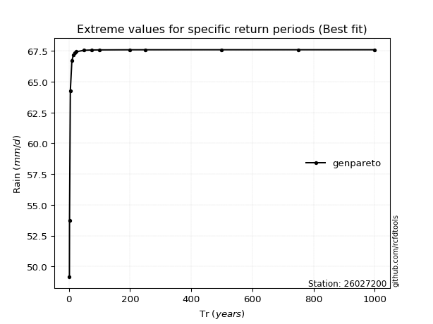</img>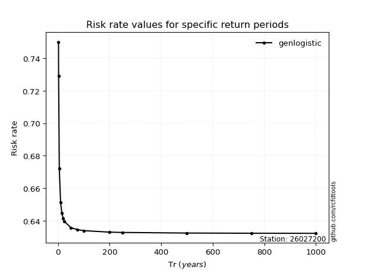</img>

</div>


<sub>**APP DISCLAIMER**: NO WARRANTY - This software is provided by [github.com/rcfdtools](https://github.com/rcfdtools) "as is", without any express or implied warranty, including warranties of merchantability, fitness for a particular purpose, or non-infringement. There is no guarantee that the software will be error-free or operate without interruption. LIMITATION OF LIABILITY - Neither the authors nor copyright holders will be liable for claims or damages arising from the software or its use. You are responsible for determining if the software is appropriate for your use and assume all associated risks, including errors, legal compliance, and data loss. NO PROFESSIONAL ADVICE - The software provides general information and does not offer professional advice. It should not replace consultation with professional advisors.</sub>