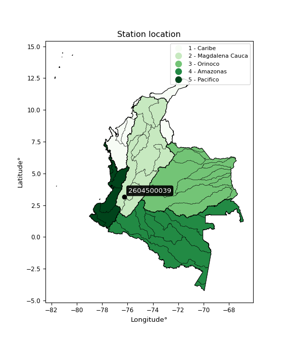

<div align="center">


</div>

# PMP Station (Rain, Pmax24h): 2604500039

Probable Maximum Precipitation (PMP) is the greatest amount of rainfall for a specific duration that is meteorologically possible for a given location, acting as a "worst-case" scenario for extreme storms, crucial for designing safety-critical infrastructure like bridges, river deviations, dams, spillways, and nuclear plants to prevent catastrophic failure. PMP is calculated by hydrologists using meteorological data to determine the upper limit of extreme rainfall, often leading to the Probable Maximum Flood (PMF) for flood control design, and is increasingly being studied for climate change impacts. Probable Maximum Precipitation (PMP) is the theoretical upper limit of rainfall, a deterministic estimate for extreme events, while probability distributions (like GEV, Gumbel) describe the likelihood and frequency of various precipitation amounts, including rare ones, showing how often events occur, with PMP representing the extreme end of these distributions, used for critical infrastructure design to ensure safety against the worst conceivable weather, unlike standard statistical forecasts which cover typical probabilities.

The most common probability distributions in hydrology, used for analyzing floods, rainfall, and streamflow, include the Normal, Log-Normal, Gumbel, Gamma (including Log-Pearson Type III), and Generalized Extreme Value (GEV) distributions, often chosen based on the data´s skewness and whether modeling extremes or general conditions, with Gumbel and GEV popular for extreme events like floods, while the Normal distribution serves as a baseline, though often requiring transformations for skewed hydrological data. These distributions help in designing water infrastructure, managing water resources, and forecasting hydrologic events.

> Hydrological data often isn´t perfectly normal (it´s skewed), so different distributions are needed for different applications, such as: **Flood Frequency Analysis**: Using Gumbel, GEV, or Log-Pearson Type III for predicting extreme flood magnitudes and their return periods, **Rainfall Analysis**: Normal for annual totals, but Log-Normal, Weibull, or GEV for intensity or extreme daily rainfall, **Streamflow Modeling**: Gamma and Log-Normal for maximum flows, GEV for minimum flows, and Kappa for daily flows.

<div align="center">

</img>

</div>


## A. General information


### 1. General running parameters

• app_version: _v20260108_. • runtime: _2026-01-09 11:32:22.148588_. • Python version: _3.14.0_. • SciPy version: _1.16.3_. • Pandas version: _2.3.3_. • NumPy version: _2.3.5_. • Stations dataset (station_dataset_file): _dataset/pmax24h_in/automatic_colombia_2003_2024.csv_. • Stations catalog (station_catalog_file): _dataset/CNE.xls_. • Minimum year to eval til year_max (date_min): _1900_. • Maximum year to eval since year_min (date_max): _2024_. • Creates, save and include plots into reports (create_plot): _False_. • Plot only fit distributions with Δo > Δ (plot_only_fit): _True_. • Plot only simple graphs avoiding multiple CDFs and multiple Extreme values plots (plot_only_simple): _True_. • Eval low extreme values, if False, evaluates high extreme values (low_extreme): _False_. • Eval every SciPy distribution as logarithmic (pdist_logarithmic_on): _True_. • Standard deviation normalized (ddof): _1.0_. • Return periods to eval in years (Tr): _[2, 2.33, 5, 10, 15, 20, 25, 50, 75, 100, 200, 250, 500, 750, 1000]_. • Minimum data sample per station, 0 means any (minimum_sample): _5_. • Z-Score maximum threshold to adjust a value, 0 means disable (zscore_max): _3.5_. • Z-Score minimum threshold to adjust a value, 0 means disable (zscore_min): _-2.5_. • Avoid zeros, e.g. rain = 0 (avoid_zeros): _True_. • Avoid null values (avoid_nans): _True_. 

:file_folder:Table: [dataset.csv](../../dataset/pmax24h_in/automatic_colombia_2003_2024.csv)

> Delta Degrees of Freedom (DDOF): is a parameter used in the formulas for calculating variance and standard deviation. When ddof=0, the divisor is $N$ (the total number of observations) and this is used when your data set is the entire population. When ddof=1, the divisor is $N-1$ and this is used when your data set is a sample drawn from a larger population. Using $N-1$ provides an unbiased estimate of the population variance (known as Bessel´s correction).


### 2. Station info and location

|   id |     CODIGO | NOMBRE                      | CATEGORIA               | TECNOLOGIA                              | ESTADO           | FECHA_INSTALACION   |   FECHA_SUSPENSION |   ALTITUD |   LATITUD |   LONGITUD | DEPARTAMENTO   | MUNICIPIO   | AREA_OPERATIVA                         | ENTIDAD                                                     | AREA_HIDROGRAFICA   | ZONA_HIDROGRAFICA   | SUBZONA_HIDROGRAFICA   |   CORRIENTE | Catalogo   |   Version |
|-----:|-----------:|:----------------------------|:------------------------|:----------------------------------------|:-----------------|:--------------------|-------------------:|----------:|----------:|-----------:|:---------------|:------------|:---------------------------------------|:------------------------------------------------------------|:--------------------|:--------------------|:-----------------------|------------:|:-----------|----------:|
|    0 | 2604500039 | CORINTO - AUT  [2604500039] | Climatológica Principal | Automática con Telemetría, Convencional | En Mantenimiento | 20/12/2017          |                nan |      1036 |      3.18 |     -76.25 | Cauca          | Corinto     | Area Operativa 09 - Cauca-Valle-Caldas | INSTITUTO DE HIDROLOGIA METEOROLOGIA Y ESTUDIOS AMBIENTALES | Magdalena Cauca     | Cauca               | Río Palo               |         nan | CNE_IDEAM  |  20251226 |

<div align="center">

Dynamic map: [:earth_americas:Google](http://maps.google.com/maps?q=3.18,-76.25) [:earth_americas:OSM](https://www.openstreetmap.org/#map=18/3.18/-76.25&layers=P) [:earth_americas:Bing](https://www.bing.com/maps?cp=3.18~-76.25&lvl=18) [:earth_americas:Apple](https://maps.apple.com/frame?center=3.18%2C-76.25&span=0.003%2C0.006)

</div>


<div align="center">

```geojson
{
  "type": "Feature",
  "geometry": {
    "type": "Point", 
    "coordinates": [-76.25, 3.18]
  }, 
  "properties": {
    "Name": "2604500039"
  }
}
```

</div>


### 3. Discrete values table and plot

<div align="center">

|               |          0 |          1 |          2 |           3 |           4 |          5 |
|:--------------|-----------:|-----------:|-----------:|------------:|------------:|-----------:|
| Date          | 2019       | 2020       | 2021       | 2022        | 2023        | 2024       |
| Value         |   76.6     |   51.3     |   62.6     |   57.1      |   59.5      |   91       |
| Value_initial |   76.6     |   51.3     |   62.6     |   57.1      |   59.5      |   91       |
| count         |    6       |    6       |    6       |    6        |    6        |    6       |
| mean          |   66.35    |   66.35    |   66.35    |   66.35     |   66.35     |   66.35    |
| std           |   14.7359  |   14.7359  |   14.7359  |   14.7359   |   14.7359   |   14.7359  |
| zscore        |    0.69558 |   -1.02131 |   -0.25448 |   -0.627718 |   -0.464851 |    1.67278 |


</div>


> The initial value (value_initial) correspond to the initial obtained or null completed value, and value (value) is adjusted only when the initial value is outside the valid range (outlier) definite through the Z-Score value. If Z-Score is active, values out of range or outliers are replaced with the station mean value. A Z-Score (or standard score) measures how many standard deviations a data point is from the mean of a dataset, indicating its relative position; positive scores mean above the mean, negative mean below, and a score of zero is exactly at the mean, allowing for comparison of values from different distributions. It´s calculated using the formula $z=(x–μ)/σ$, where $x$ is the data point, $μ$ is the mean, and $σ$ is the standard deviation, helping identify outliers and understand probability.
>
> <sub>**Note**: In this study, "completing" (filling gaps in) and "extending" (forecasting or lengthening the historical record) rainfall data series are avoided for certain critical analyses because they introduce artificial bias and uncertainty, which can distort the statistics of rare events (extremes), alter day-to-day variability, and compromise the integrity and homogeneity of the original data. Some reasons against Completing/Extending rainfall data are: **Distortion of Extremes and Variability**: The primary issue is that most gap-filling or extension methods rely on averaging or regression with nearby stations, which inherently smooths the data. Rainfall is highly variable in space and time, with a large percentage of zero values and occasional large storms. Infilling methods often underestimate the highest values and overestimate the lowest (zero) values, which severely distorts analyses focused on flood frequency, drought severity, and intensity-duration-frequency (IDF) curves, **Loss of Data Homogeneity**: Infilled or extended data are synthetic estimates, not actual measurements. Combining these estimates with observed data can violate the assumption of data homogeneity, which requires that the data properties do not change over time. Inhomogeneity can lead to incorrect conclusions about long-term trends or changes in climate patterns, **Propagation of Errors**: Errors and biases from the original data (e.g., wind-induced undercatch, instrument errors, site changes) or the data used for imputation can propagate through the analysis, leading to unreliable hydrological models and inaccurate predictions, **Compromised Statistical Integrity**: For statistical analyses, especially those involving the frequency of events, using artificial data can introduce time bias or autocorrelation that doesn´t exist in reality, making it difficult to assess the true probability of events, **Difficulty in Validation**: It is difficult to accurately validate the quality of filled or extended data, especially for past periods where ground-truth measurements are unavailable. The reliability of imputation techniques heavily depends on the density of the surrounding station network and the complexity of the local topography.</sub>


### 4. Active continuous probability distributions from SciPy (45 of 104 available)

A Probability Density Function (PDF) describes the relative likelihood of a continuous random variable falling within a specific range, where the total area under its curve equals 1, and the area over any interval gives the actual probability for that range. Unlike discrete probabilities (like rolling a die), a PDF shows density, not direct probability for a single point (which is zero), with higher points indicating higher likelihood, often visualized as a bell curve for normal distributions.

A log of a probability density function (log-PDF) is simply the logarithm of the PDF´s value, denoted as $log(f(x))$, useful for converting multiplication of probabilities into addition, improving numerical stability with tiny numbers, and connecting to information theory concepts like entropy. Instead of dealing with very small probabilities (e.g., 0.000001), log-PDFs use negative numbers (e.g., $log(0.00001) ≈ -11.51$ that are easier for computers to handle, preventing underflow errors and simplifying complex calculations. In this study, each active probability distribution from SciPy is also evaluated in the $log$ form.

[scipy.stats](https://docs.scipy.org/doc/scipy/reference/stats.html) is a Python´s powerful submodule within the SciPy library for comprehensive statistical analysis, offering over 130 probability distributions (like Normal, Poisson), functions for descriptive stats (mean, variance), hypothesis testing (t-tests, chi-square), random variable generation, and statistical tests, making it essential for data science, modeling, and research. It provides tools to explore, model, and draw conclusions from data efficiently, working seamlessly with NumPy.

<div align="center">

|   id | p_dist             |   n_parameter | fit_method   | label                                                                       | active   | ref                                                                                                        |
|-----:|:-------------------|--------------:|:-------------|:----------------------------------------------------------------------------|:---------|:-----------------------------------------------------------------------------------------------------------|
|    0 | alpha              |             3 | MLE          | Alpha                                                                       | True     | [:mortar_board:](https://docs.scipy.org/doc/scipy/reference/generated/scipy.stats.alpha.html)              |
|    1 | betaprime          |             4 | MLE          | Beta prime                                                                  | True     | [:mortar_board:](https://docs.scipy.org/doc/scipy/reference/generated/scipy.stats.betaprime.html)          |
|    2 | chi2               |             3 | MLE          | Chi²                                                                        | True     | [:mortar_board:](https://docs.scipy.org/doc/scipy/reference/generated/scipy.stats.chi2.html)               |
|    3 | crystalball        |             4 | MLE          | Crystalball                                                                 | True     | [:mortar_board:](https://docs.scipy.org/doc/scipy/reference/generated/scipy.stats.crystalball.html)        |
|    4 | dweibull           |             3 | MLE          | Double Weibull                                                              | True     | [:mortar_board:](https://docs.scipy.org/doc/scipy/reference/generated/scipy.stats.dweibull.html)           |
|    5 | erlang             |             3 | MLE          | Erlang                                                                      | True     | [:mortar_board:](https://docs.scipy.org/doc/scipy/reference/generated/scipy.stats.erlang.html)             |
|    6 | expon              |             2 | MLE          | Exponential                                                                 | True     | [:mortar_board:](https://docs.scipy.org/doc/scipy/reference/generated/scipy.stats.expon.html)              |
|    7 | exponnorm          |             3 | MLE          | Exponentially modified Normal                                               | True     | [:mortar_board:](https://docs.scipy.org/doc/scipy/reference/generated/scipy.stats.exponnorm.html)          |
|    8 | f                  |             4 | MLE          | F                                                                           | True     | [:mortar_board:](https://docs.scipy.org/doc/scipy/reference/generated/scipy.stats.f.html)                  |
|    9 | fatiguelife        |             3 | MLE          | Fatigue-life (Birnbaum-Saunders)                                            | True     | [:mortar_board:](https://docs.scipy.org/doc/scipy/reference/generated/scipy.stats.fatiguelife.html)        |
|   10 | fisk               |             3 | MLE          | Fisk                                                                        | True     | [:mortar_board:](https://docs.scipy.org/doc/scipy/reference/generated/scipy.stats.fisk.html)               |
|   11 | gamma              |             3 | MLE          | Gamma                                                                       | True     | [:mortar_board:](https://docs.scipy.org/doc/scipy/reference/generated/scipy.stats.gamma.html)              |
|   12 | genexpon           |             5 | MLE          | Generalized exponential                                                     | True     | [:mortar_board:](https://docs.scipy.org/doc/scipy/reference/generated/scipy.stats.genexpon.html)           |
|   13 | genlogistic        |             3 | MLE          | Generalized logistic                                                        | True     | [:mortar_board:](https://docs.scipy.org/doc/scipy/reference/generated/scipy.stats.genlogistic.html)        |
|   14 | gibrat             |             2 | MM           | Gibrat                                                                      | True     | [:mortar_board:](https://docs.scipy.org/doc/scipy/reference/generated/scipy.stats.gibrat.html)             |
|   15 | gompertz           |             3 | MLE          | Gompertz (or truncated Gumbel)                                              | True     | [:mortar_board:](https://docs.scipy.org/doc/scipy/reference/generated/scipy.stats.gompertz.html)           |
|   16 | gumbel_l           |             2 | MM           | Gumbel Left Skew                                                            | True     | [:mortar_board:](https://docs.scipy.org/doc/scipy/reference/generated/scipy.stats.gumbel_l.html)           |
|   17 | gumbel_r           |             2 | MM           | Gumbel Right Skew                                                           | True     | [:mortar_board:](https://docs.scipy.org/doc/scipy/reference/generated/scipy.stats.gumbel_r.html)           |
|   18 | halflogistic       |             2 | MM           | Half-logistic                                                               | True     | [:mortar_board:](https://docs.scipy.org/doc/scipy/reference/generated/scipy.stats.halflogistic.html)       |
|   19 | halfnorm           |             2 | MM           | Half Normal                                                                 | True     | [:mortar_board:](https://docs.scipy.org/doc/scipy/reference/generated/scipy.stats.halfnorm.html)           |
|   20 | hypsecant          |             2 | MM           | hyperbolic secant                                                           | True     | [:mortar_board:](https://docs.scipy.org/doc/scipy/reference/generated/scipy.stats.hypsecant.html)          |
|   21 | invgamma           |             3 | MLE          | Inverted gamma                                                              | True     | [:mortar_board:](https://docs.scipy.org/doc/scipy/reference/generated/scipy.stats.invgamma.html)           |
|   22 | invgauss           |             3 | MLE          | Inverse Gaussian                                                            | True     | [:mortar_board:](https://docs.scipy.org/doc/scipy/reference/generated/scipy.stats.invgauss.html)           |
|   23 | invweibull         |             3 | MLE          | Inverted Weibull                                                            | True     | [:mortar_board:](https://docs.scipy.org/doc/scipy/reference/generated/scipy.stats.invweibull.html)         |
|   24 | kappa4             |             4 | MLE          | Kappa 4                                                                     | True     | [:mortar_board:](https://docs.scipy.org/doc/scipy/reference/generated/scipy.stats.kappa4.html)             |
|   25 | kstwobign          |             2 | MLE          | Limiting distribution of scaled Kolmogorov-Smirnov two-sided test statistic | True     | [:mortar_board:](https://docs.scipy.org/doc/scipy/reference/generated/scipy.stats.kstwobign.html)          |
|   26 | laplace            |             2 | MM           | Laplace                                                                     | True     | [:mortar_board:](https://docs.scipy.org/doc/scipy/reference/generated/scipy.stats.laplace.html)            |
|   27 | laplace_asymmetric |             3 | MLE          | Asymmetric Laplace                                                          | True     | [:mortar_board:](https://docs.scipy.org/doc/scipy/reference/generated/scipy.stats.laplace_asymmetric.html) |
|   28 | loggamma           |             3 | MLE          | Log gamma                                                                   | True     | [:mortar_board:](https://docs.scipy.org/doc/scipy/reference/generated/scipy.stats.loggamma.html)           |
|   29 | logistic           |             2 | MM           | Logistic (or Sech-squared)                                                  | True     | [:mortar_board:](https://docs.scipy.org/doc/scipy/reference/generated/scipy.stats.logistic.html)           |
|   30 | lognorm            |             3 | MLE          | Log Normal                                                                  | True     | [:mortar_board:](https://docs.scipy.org/doc/scipy/reference/generated/scipy.stats.lognorm.html)            |
|   31 | maxwell            |             2 | MM           | Maxwell                                                                     | True     | [:mortar_board:](https://docs.scipy.org/doc/scipy/reference/generated/scipy.stats.maxwell.html)            |
|   32 | mielke             |             4 | MLE          | Mielke Beta-Kappa / Dagum                                                   | True     | [:mortar_board:](https://docs.scipy.org/doc/scipy/reference/generated/scipy.stats.mielke.html)             |
|   33 | moyal              |             2 | MM           | Moyal                                                                       | True     | [:mortar_board:](https://docs.scipy.org/doc/scipy/reference/generated/scipy.stats.moyal.html)              |
|   34 | nakagami           |             3 | MLE          | Nakagami                                                                    | True     | [:mortar_board:](https://docs.scipy.org/doc/scipy/reference/generated/scipy.stats.nakagami.html)           |
|   35 | ncf                |             5 | MLE          | Non-central F distribution                                                  | True     | [:mortar_board:](https://docs.scipy.org/doc/scipy/reference/generated/scipy.stats.ncf.html)                |
|   36 | nct                |             4 | MLE          | Non-central Student’s t                                                     | True     | [:mortar_board:](https://docs.scipy.org/doc/scipy/reference/generated/scipy.stats.nct.html)                |
|   37 | norm               |             2 | MM           | Normal                                                                      | True     | [:mortar_board:](https://docs.scipy.org/doc/scipy/reference/generated/scipy.stats.norm.html)               |
|   38 | pearson3           |             3 | MM           | Pearson type III                                                            | True     | [:mortar_board:](https://docs.scipy.org/doc/scipy/reference/generated/scipy.stats.pearson3.html)           |
|   39 | rayleigh           |             2 | MM           | Rayleigh                                                                    | True     | [:mortar_board:](https://docs.scipy.org/doc/scipy/reference/generated/scipy.stats.rayleigh.html)           |
|   40 | rice               |             3 | MLE          | Rice                                                                        | True     | [:mortar_board:](https://docs.scipy.org/doc/scipy/reference/generated/scipy.stats.rice.html)               |
|   41 | t                  |             3 | MLE          | Student’s t                                                                 | True     | [:mortar_board:](https://docs.scipy.org/doc/scipy/reference/generated/scipy.stats.t.html)                  |
|   42 | truncnorm          |             4 | MLE          | Truncated normal                                                            | True     | [:mortar_board:](https://docs.scipy.org/doc/scipy/reference/generated/scipy.stats.truncnorm.html)          |
|   43 | wald               |             2 | MM           | Wald                                                                        | True     | [:mortar_board:](https://docs.scipy.org/doc/scipy/reference/generated/scipy.stats.wald.html)               |
|   44 | weibull_min        |             3 | MLE          | Weibull minimum                                                             | True     | [:mortar_board:](https://docs.scipy.org/doc/scipy/reference/generated/scipy.stats.weibull_min.html)        |

</div>

> **n_parameter:** # arguments & localization & scale.
>
> **Fit methods:** (MLE) maximum likelihood, (MM) L-moments.
>
>**Inactive** (With the only purpose of prevent loops, zero divisions, infinite values, over high estimated values or horizontal trending for recurrence intervals estimations, the follow distributions were disabled.)**:** foldnorm, gennorm, norminvgauss, powernorm, powerlognorm, skewnorm, genextreme, anglit, arcsine, argus, beta, bradford, burr, burr12, cauchy, cosine, halfcauchy, foldcauchy, skewcauchy, wrapcauchy, dgamma, gengamma, exponweib, exponpow, truncexpon, gausshyper, genhalflogistic, genhyperbolic, geninvgauss, halfgennorm, johnsonsb, johnsonsu, kappa3, ksone, kstwo, loglaplace, levy, levy_l, levy_stable, ncx2, pareto, genpareto, truncpareto, lomax, powerlaw, rdist, rel_breitwigner, recipinvgauss, semicircular, studentized_range, trapezoid, triang, truncweibull_min, tukeylambda, uniform, loguniform, vonmises, vonmises_line, weibull_max, 


## B. Probability (PDF) vs. Empirical (EDF) distributions functions

A continuous probability distribution (CPD) describes probabilities for variables that can take any value within a range (like rain any time), unlike discrete variables with specific outcomes (like temperature). It uses a Probability Density Function (PDF), a curve where the total area under it equals 1, and the probability of the variable falling within an interval (a to b) is found by calculating the area under the curve between those points. A key feature is that the probability of hitting any single exact value is zero, so probabilities are always expressed for ranges, e.g., $P(a ≤ X ≤ b)$.

<div align="center">

Distributions parameters from station values
|    |    station | p_dist                |   n |           loc |           scale | shape                 | shape1             | shape2              | shape3   |
|---:|-----------:|:----------------------|----:|--------------:|----------------:|:----------------------|:-------------------|:--------------------|:---------|
|  0 | 2604500039 | alpha                 |   6 |     29.7309   |   101.003       | 3.103844432334786     |                    |                     |          |
|  1 | 2604500039 | betaprime             |   6 |     -1.47709  |     3.93522     | 518.6711182269182     | 31.12707897387608  |                     |          |
|  2 | 2604500039 | chi2                  |   6 |     51.3      |     1.67592     | 0.3405803643782931    |                    |                     |          |
|  3 | 2604500039 | crystalball           |   6 |     66.3502   |    13.452       | 11861.756549699852    | 64.76913070365384  |                     |          |
|  4 | 2604500039 | dweibull              |   6 |     59.5      |    10.6468      | 0.9763442171503341    |                    |                     |          |
|  5 | 2604500039 | erlang                |   6 |     51.3      |    15.5274      | 0.7107888906946024    |                    |                     |          |
|  6 | 2604500039 | expon                 |   6 |     51.3      |    15.05        |                       |                    |                     |          |
|  7 | 2604500039 | exponnorm             |   6 |     51.2842   |     0.00483357  | 3097.5563829843422    |                    |                     |          |
|  8 | 2604500039 | f                     |   6 |     42.3958   |    17.7533      | 5736.864405150878     | 7.153266999605364  |                     |          |
|  9 | 2604500039 | fatiguelife           |   6 |     51.3      |     4.63161e-06 | 1904.7565140143206    |                    |                     |          |
| 10 | 2604500039 | fisk                  |   6 |     49.3104   |    12.2956      | 1.7859019314638689    |                    |                     |          |
| 11 | 2604500039 | gamma                 |   6 |     51.3      |    14.7047      | 0.5171938123530353    |                    |                     |          |
| 12 | 2604500039 | genexpon              |   6 |     51.2992   |   150.509       | 8.831799540757544     | 20.21585467046762  | 0.6347880472378948  |          |
| 13 | 2604500039 | genlogistic           |   6 |     -8.55903  |     9.68225     | 1218.62253600239      |                    |                     |          |
| 14 | 2604500039 | gibrat                |   6 |     56.0879   |     6.22429     |                       |                    |                     |          |
| 15 | 2604500039 | gompertz              |   6 |     51.3      |    30.3846      | 1.2064317978427066    |                    |                     |          |
| 16 | 2604500039 | gumbel_l              |   6 |     72.4041   |    10.4885      |                       |                    |                     |          |
| 17 | 2604500039 | gumbel_r              |   6 |     60.2959   |    10.4885      |                       |                    |                     |          |
| 18 | 2604500039 | halflogistic          |   6 |     50.4063   |    11.501       |                       |                    |                     |          |
| 19 | 2604500039 | halfnorm              |   6 |     48.5448   |    22.3154      |                       |                    |                     |          |
| 20 | 2604500039 | hypsecant             |   6 |     66.35     |     8.5638      |                       |                    |                     |          |
| 21 | 2604500039 | invgamma              |   6 |     42.3846   |    63.5273      | 3.5766947211252575    |                    |                     |          |
| 22 | 2604500039 | invgauss              |   6 |     46.5478   |    30.3834      | 0.6517435645304308    |                    |                     |          |
| 23 | 2604500039 | invweibull            |   6 |     33.2186   |    25.5328      | 3.125639461778893     |                    |                     |          |
| 24 | 2604500039 | kappa4                |   6 |     48.4913   |    45.1272      | 1.0665044215177826    | 1.0598988993167444 |                     |          |
| 25 | 2604500039 | kstwobign             |   6 |     25.9416   |    46.4745      |                       |                    |                     |          |
| 26 | 2604500039 | laplace               |   6 |     66.35     |     9.51199     |                       |                    |                     |          |
| 27 | 2604500039 | laplace_asymmetric    |   6 |     57.1      |     7.40934     | 0.5546137551505779    |                    |                     |          |
| 28 | 2604500039 | loggamma              |   6 |  -2867.35     |   425.424       | 988.9249069413504     |                    |                     |          |
| 29 | 2604500039 | logistic              |   6 |     66.35     |     7.41647     |                       |                    |                     |          |
| 30 | 2604500039 | lognorm               |   6 |     51.3      |     0.0395643   | 13.141014274233642    |                    |                     |          |
| 31 | 2604500039 | maxwell               |   6 |     34.4744   |    19.975       |                       |                    |                     |          |
| 32 | 2604500039 | mielke                |   6 |     -1.80151  |    28.3782      | 1463.863544642094     | 6.938498877371778  |                     |          |
| 33 | 2604500039 | moyal                 |   6 |     58.6573   |     6.05552     |                       |                    |                     |          |
| 34 | 2604500039 | nakagami              |   6 |     51.3      |    28.3156      | 0.3527467281066162    |                    |                     |          |
| 35 | 2604500039 | ncf                   |   6 |     -3.50122  |    11.6009      | 166.82396938881863    | 66.94152385187999  | 809.0356579512281   |          |
| 36 | 2604500039 | nct                   |   6 |     -0.149969 |     0.622211    | 15.18242995288763     | 101.36322532291126 |                     |          |
| 37 | 2604500039 | norm                  |   6 |     66.35     |    13.452       |                       |                    |                     |          |
| 38 | 2604500039 | pearson3              |   6 |     66.35     |    13.452       | 0.7860180644028933    |                    |                     |          |
| 39 | 2604500039 | rayleigh              |   6 |     40.6156   |    20.5331      |                       |                    |                     |          |
| 40 | 2604500039 | rice                  |   6 |     44.4028   |    18.2022      | 0.0007701061472372875 |                    |                     |          |
| 41 | 2604500039 | t                     |   6 |     66.3501   |    13.453       | 5302335.328741396     |                    |                     |          |
| 42 | 2604500039 | truncnorm             |   6 |     35.9407   |     3.02009     | 5.085695356477229     | 18.23098180540663  |                     |          |
| 43 | 2604500039 | wald                  |   6 |     52.8981   |    13.4519      |                       |                    |                     |          |
| 44 | 2604500039 | weibull_min           |   6 |     51.3      |    17.0968      | 0.9419879360897006    |                    |                     |          |
| 45 | 2604500039 | logalpha              |   6 |      1.37793  |    42.0165      | 15.106835301628351    |                    |                     |          |
| 46 | 2604500039 | logbetaprime          |   6 |     -0.386097 |   143.843       | 220.61283992316442    | 7008.474666785278  |                     |          |
| 47 | 2604500039 | logchi2               |   6 |      3.93769  |     0.992738    | 0.9742507952670776    |                    |                     |          |
| 48 | 2604500039 | logcrystalball        |   6 |      4.17579  |     0.192445    | 5.4990533331810605    | 21.34713989569721  |                     |          |
| 49 | 2604500039 | logdweibull           |   6 |      4.11804  |     0.158787    | 1.1050205585632342    |                    |                     |          |
| 50 | 2604500039 | logerlang             |   6 |      3.93769  |     0.317974    | 0.3352645366820616    |                    |                     |          |
| 51 | 2604500039 | logexpon              |   6 |      3.93769  |     0.238091    |                       |                    |                     |          |
| 52 | 2604500039 | logexponnorm          |   6 |      3.96641  |     0.0611308   | 3.425014236355611     |                    |                     |          |
| 53 | 2604500039 | logf                  |   6 |      3.93769  |     0.247142    | 0.76951695473659      | 248.3285973671322  |                     |          |
| 54 | 2604500039 | logfatiguelife        |   6 |      3.83654  |     0.282235    | 0.6336999125743912    |                    |                     |          |
| 55 | 2604500039 | logfisk               |   6 |      3.86176  |     0.260925    | 2.4771481333902408    |                    |                     |          |
| 56 | 2604500039 | loggamma              |   6 |      3.93769  |     0.23206     | 0.7165578801066932    |                    |                     |          |
| 57 | 2604500039 | loggenexpon           |   6 |      3.93754  |     0.179179    | 0.5808280506856274    | 2.6455113064466342 | 0.05481827686234919 |          |
| 58 | 2604500039 | loggenlogistic        |   6 |      3.07941  |     0.148513    | 880.8802709024255     |                    |                     |          |
| 59 | 2604500039 | loggibrat             |   6 |      4.02897  |     0.0890476   |                       |                    |                     |          |
| 60 | 2604500039 | loggompertz           |   6 |      3.93769  |     0.437396    | 1.0758834299030475    |                    |                     |          |
| 61 | 2604500039 | loggumbel_l           |   6 |      4.26239  |     0.150051    |                       |                    |                     |          |
| 62 | 2604500039 | loggumbel_r           |   6 |      4.08917  |     0.150051    |                       |                    |                     |          |
| 63 | 2604500039 | loghalflogistic       |   6 |      3.94767  |     0.164547    |                       |                    |                     |          |
| 64 | 2604500039 | loghalfnorm           |   6 |      3.92106  |     0.31925     |                       |                    |                     |          |
| 65 | 2604500039 | loghypsecant          |   6 |      4.17578  |     0.122516    |                       |                    |                     |          |
| 66 | 2604500039 | loginvgamma           |   6 |     -6.87039  | 37163.4         | 3365.258793777588     |                    |                     |          |
| 67 | 2604500039 | loginvgauss           |   6 |      3.81248  |     1.02588     | 0.35412993471426435   |                    |                     |          |
| 68 | 2604500039 | loginvweibull         |   6 |      2.94135  |     1.1355      | 8.100442312855161     |                    |                     |          |
| 69 | 2604500039 | logkappa4             |   6 |      3.85014  |     0.681657    | 1.147631262515037     | 1.0227717931943223 |                     |          |
| 70 | 2604500039 | logkstwobign          |   6 |      3.56449  |     0.701505    |                       |                    |                     |          |
| 71 | 2604500039 | loglaplace            |   6 |      4.17578  |     0.136081    |                       |                    |                     |          |
| 72 | 2604500039 | loglaplace_asymmetric |   6 |      4.0448   |     0.117906    | 0.5884800177886602    |                    |                     |          |
| 73 | 2604500039 | logloggamma           |   6 |    -35.3837   |     5.82764     | 887.7732715624703     |                    |                     |          |
| 74 | 2604500039 | loglogistic           |   6 |      4.17578  |     0.106102    |                       |                    |                     |          |
| 75 | 2604500039 | loglognorm            |   6 |      3.93769  |     0.000828182 | 12.6484436761878      |                    |                     |          |
| 76 | 2604500039 | logmaxwell            |   6 |      3.71976  |     0.285768    |                       |                    |                     |          |
| 77 | 2604500039 | logmielke             |   6 | -17214.6      | 17218.2         | 2793688.547902546     | 117498.68580904003 |                     |          |
| 78 | 2604500039 | logmoyal              |   6 |      4.06573  |     0.0866317   |                       |                    |                     |          |
| 79 | 2604500039 | lognakagami           |   6 |      3.93769  |     0.244517    | 0.3034425574512346    |                    |                     |          |
| 80 | 2604500039 | logncf                |   6 |      0.982579 |     2.82474e-05 | 0.0032731542849423105 | 162.31717658799806 | 368.9612161837026   |          |
| 81 | 2604500039 | lognct                |   6 |     -3.40613  |     0.0244148   | 587.6266344616113     | 310.2649003114818  |                     |          |
| 82 | 2604500039 | lognorm               |   6 |      4.17578  |     0.192447    |                       |                    |                     |          |
| 83 | 2604500039 | logpearson3           |   6 |      4.17578  |     0.192447    | 0.5942078984160748    |                    |                     |          |
| 84 | 2604500039 | lograyleigh           |   6 |      3.80762  |     0.293751    |                       |                    |                     |          |
| 85 | 2604500039 | logrice               |   6 |      3.84648  |     0.269699    | 0.0006258756693174107 |                    |                     |          |
| 86 | 2604500039 | logt                  |   6 |      4.17578  |     0.192443    | 55012786.689839825    |                    |                     |          |
| 87 | 2604500039 | logtruncnorm          |   6 |     -1.28658  |     1.3955      | 3.7436629503205747    | 4.154390577178187  |                     |          |
| 88 | 2604500039 | logwald               |   6 |      3.98334  |     0.192447    |                       |                    |                     |          |
| 89 | 2604500039 | logweibull_min        |   6 |      3.93769  |     0.197514    | 0.5779046653703769    |                    |                     |          |

</div>

> **loc** (Location parameter): This shifts the distribution along the x-axis. For many common distributions, like the normal (Gaussian) distribution, loc represents the mean $μ$. For others, like the uniform distribution, it might represent the minimum value, or for the beta distribution, the left end of the support interval.
>
> **scale** (Scale parameter): This determines the width or spread of the distribution. For the normal distribution, scale represents the standard deviation $σ$. For a uniform distribution, it defines the length of the interval (from $loc$ to $loc + scale$).
>
> **shape** (Shape parameters): Refers to parameters that define the specific form of a probability distribution, distinct from its location (loc) and scale (scale). These parameters are required arguments for most distribution functions. For example, a normal (Gaussian) distribution is fully defined by its location (mean) and scale (standard deviation), so it has no specific shape parameters beyond loc and scale. However, other distributions have intrinsic properties that need specification, as Gamma distribution that takes a shape parameter, often named $a$ or $alpha$.


### 0. Cumulative distribution values - CDF (90 evaluated)

Cumulative Distribution Function (CDF), denoted as $F$<sub>$X$</sub>$(x)$, is a function that gives the probability that a random variable $X$ will take a value less than or equal to a specific value, $x$ (i.e., $(P(X≥x)$. It essentially "accumulates" probabilities from a given point up to the far right (positive infinity), providing a complete picture of the distribution´s probabilities for both discrete (like rain) and continuous (like temperature) variables, helping to find probabilities over ranges or above certain values. Each station is evaluated separately ordering the $x$ values ascending, calculating the CDF and PDF values for the activated distributions and their logarithmic forms.

<div align="center">

CDF ordered by x ascending and calculating $log(f(x))$ separately
|   id |    Station |   date |    x |   count |   mean |     std |    zscore |   Value_initial |    station |   m |     alpha |   alpha_pdf |   betaprime |   betaprime_pdf |       chi2 |    chi2_pdf |   crystalball |   crystalball_pdf |   dweibull |   dweibull_pdf |      erlang |    erlang_pdf |    expon |   expon_pdf |   exponnorm |   exponnorm_pdf |        f |      f_pdf |   fatiguelife |   fatiguelife_pdf |     fisk |   fisk_pdf |       gamma |       gamma_pdf |   genexpon |   genexpon_pdf |   genlogistic |   genlogistic_pdf |    gibrat |   gibrat_pdf |    gompertz |   gompertz_pdf |   gumbel_l |   gumbel_l_pdf |   gumbel_r |   gumbel_r_pdf |   halflogistic |   halflogistic_pdf |   halfnorm |   halfnorm_pdf |   hypsecant |   hypsecant_pdf |   invgamma |   invgamma_pdf |   invgauss |   invgauss_pdf |   invweibull |   invweibull_pdf |      kappa4 |   kappa4_pdf |   kstwobign |   kstwobign_pdf |   laplace |   laplace_pdf |   laplace_asymmetric |   laplace_asymmetric_pdf |    loggamma |   loggamma_pdf |   logistic |   logistic_pdf |   lognorm |   lognorm_pdf |   maxwell |   maxwell_pdf |   mielke |   mielke_pdf |     moyal |   moyal_pdf |   nakagami |   nakagami_pdf |      ncf |    ncf_pdf |       nct |    nct_pdf |     norm |   norm_pdf |   pearson3 |   pearson3_pdf |   rayleigh |   rayleigh_pdf |      rice |   rice_pdf |        t |      t_pdf |   truncnorm |   truncnorm_pdf |     wald |   wald_pdf |   weibull_min |   weibull_min_pdf |   logalpha |   logalpha_pdf |   logbetaprime |   logbetaprime_pdf |     logchi2 |   logchi2_pdf |   logcrystalball |   logcrystalball_pdf |   logdweibull |   logdweibull_pdf |   logerlang |   logerlang_pdf |   logexpon |   logexpon_pdf |   logexponnorm |   logexponnorm_pdf |        logf |    logf_pdf |   logfatiguelife |   logfatiguelife_pdf |   logfisk |   logfisk_pdf |   loggenexpon |   loggenexpon_pdf |   loggenlogistic |   loggenlogistic_pdf |   loggibrat |   loggibrat_pdf |   loggompertz |   loggompertz_pdf |   loggumbel_l |   loggumbel_l_pdf |   loggumbel_r |   loggumbel_r_pdf |   loghalflogistic |   loghalflogistic_pdf |   loghalfnorm |   loghalfnorm_pdf |   loghypsecant |   loghypsecant_pdf |   loginvgamma |   loginvgamma_pdf |   loginvgauss |   loginvgauss_pdf |   loginvweibull |   loginvweibull_pdf |   logkappa4 |   logkappa4_pdf |   logkstwobign |   logkstwobign_pdf |   loglaplace |   loglaplace_pdf |   loglaplace_asymmetric |   loglaplace_asymmetric_pdf |   logloggamma |   logloggamma_pdf |   loglogistic |   loglogistic_pdf |   loglognorm |   loglognorm_pdf |   logmaxwell |   logmaxwell_pdf |   logmielke |   logmielke_pdf |   logmoyal |   logmoyal_pdf |   lognakagami |   lognakagami_pdf |   logncf |   logncf_pdf |   lognct |   lognct_pdf |   logpearson3 |   logpearson3_pdf |   lograyleigh |   lograyleigh_pdf |   logrice |   logrice_pdf |     logt |   logt_pdf |   logtruncnorm |   logtruncnorm_pdf |   logwald |   logwald_pdf |   logweibull_min |   logweibull_min_pdf |
|-----:|-----------:|-------:|-----:|--------:|-------:|--------:|----------:|----------------:|-----------:|----:|----------:|------------:|------------:|----------------:|-----------:|------------:|--------------:|------------------:|-----------:|---------------:|------------:|--------------:|---------:|------------:|------------:|----------------:|---------:|-----------:|--------------:|------------------:|---------:|-----------:|------------:|----------------:|-----------:|---------------:|--------------:|------------------:|----------:|-------------:|------------:|---------------:|-----------:|---------------:|-----------:|---------------:|---------------:|-------------------:|-----------:|---------------:|------------:|----------------:|-----------:|---------------:|-----------:|---------------:|-------------:|-----------------:|------------:|-------------:|------------:|----------------:|----------:|--------------:|---------------------:|-------------------------:|------------:|---------------:|-----------:|---------------:|----------:|--------------:|----------:|--------------:|---------:|-------------:|----------:|------------:|-----------:|---------------:|---------:|-----------:|----------:|-----------:|---------:|-----------:|-----------:|---------------:|-----------:|---------------:|----------:|-----------:|---------:|-----------:|------------:|----------------:|---------:|-----------:|--------------:|------------------:|-----------:|---------------:|---------------:|-------------------:|------------:|--------------:|-----------------:|---------------------:|--------------:|------------------:|------------:|----------------:|-----------:|---------------:|---------------:|-------------------:|------------:|------------:|-----------------:|---------------------:|----------:|--------------:|--------------:|------------------:|-----------------:|---------------------:|------------:|----------------:|--------------:|------------------:|--------------:|------------------:|--------------:|------------------:|------------------:|----------------------:|--------------:|------------------:|---------------:|-------------------:|--------------:|------------------:|--------------:|------------------:|----------------:|--------------------:|------------:|----------------:|---------------:|-------------------:|-------------:|-----------------:|------------------------:|----------------------------:|--------------:|------------------:|--------------:|------------------:|-------------:|-----------------:|-------------:|-----------------:|------------:|----------------:|-----------:|---------------:|--------------:|------------------:|---------:|-------------:|---------:|-------------:|--------------:|------------------:|--------------:|------------------:|----------:|--------------:|---------:|-----------:|---------------:|-------------------:|----------:|--------------:|-----------------:|---------------------:|
|    0 | 2604500039 |   2020 | 51.3 |       6 |  66.35 | 14.7359 | -1.02131  |            51.3 | 2604500039 |   1 | 0.0572319 |  0.0249258  |    0.102366 |      0.0195266  | 0.00342229 | 8.20192e+10 |      0.131611 |         0.0158604 |   0.230362 |     0.0212558  | 1.37234e-11 | 1372.81       | 0        |  0.0664452  |  0.00105784 |      0.0666848  | 0.05068  | 0.0279777  |      0.123448 |       1.24084e+11 | 0.037231 | 0.0321748  | 1.35161e-08 | 983818          |  4.403e-05 |     0.0586775  |     0.0808986 |        0.0209884  | 0         |   0          | 2.58908e-10 |     0.0397053  |   0.125151 |     0.0111523  |  0.0946361 |     0.0212734  |      0.0388348 |         0.043409   |  0.0982603 |     0.0354833  |    0.108742 |       0.0124524 |  0.0506796 |     0.0279773  |   0.045782 |     0.0334921  |    0.0528376 |       0.0268581  | 1.09723e-15 |    0.219848  |    0.072874 |      0.0209425  |  0.10276  |    0.0108032  |             0.05735  |               0.0139561  | 3.11652e-11 |   50286.5      |   0.116164 |      0.0138435 |  0.108011 |      0.964342 |  0.129037 |    0.0198768  |      nan |          nan | 0.0663856 |  0.0224262  | 7.6656e-12 |   761.113      | 0.106748 | 0.0193073  | 0.0937501 | 0.0205002  | 0.131614 | 0.0158606  |   0.113633 |     0.0211665  |   0.126618 |     0.0221333  | 0.0692753 | 0.0193754  | 0.131631 | 0.0158608  | 4.26013e-06 |     1.74478     | 0        | 0          |   3.24323e-15 |        0.429964   |   0.095538 |       1.08833  |       0.258414 |           1.07786  | 2.68485e-08 |   2.94504e+07 |         0.108002 |             0.964297 |      0.158142 |          1.11535  | 1.17203e-05 |     8.84825e+09 |   0        |       4.20007  |      0.0522095 |           1.27547  | 1.65206e-06 | 1.43134e+09 |        0.0454007 |             1.68962  | 0.0448754 |      1.39838  |   0.000493147 |          3.2407   |        0.0659577 |             1.20559  |   0         |        0        |    4.1134e-08 |          2.45975  |      0.108518 |          0.682465 |     0.0642933 |          1.17587  |          0        |              0        |      0.041552 |          2.49586  |      0.0905626 |           0.729259 |      0.104033 |          0.976442 |     0.0471551 |          1.56984  |       0.0559357 |            1.31135  | 1.25259e-14 |       166.033   |      0.0602655 |           1.24635  |    0.0869189 |         0.63873  |               0.0549387 |                    0.791791 |      0.11287  |          0.965899 |      0.095869 |          0.816934 |    0.0127478 |      5.85946e+12 |    0.0993609 |         1.21406  |   0.0686785 |        1.18711  |  0.0362784 |       1.07696  |   8.79172e-10 |       1.20146e+06 | 0.310215 |     0.781851 | 0.138675 |     1.04697  |      0.091721 |          1.16563  |     0.0933813 |          1.36662  | 0.0555826 |      1.18426  | 0.108006 |   0.964332 |    3.33025e-07 |           3.47903  |  0        |      0        |      3.42593e-09 |          4.45825e+06 |
|    1 | 2604500039 |   2022 | 57.1 |       6 |  66.35 | 14.7359 | -0.627718 |            57.1 | 2604500039 |   2 | 0.279016  |  0.0453345  |    0.249675 |      0.0303396  | 0.984756   | 0.0061648   |      0.245839 |         0.0234124 |   0.395877 |     0.0376052  | 0.469796    |    0.0459957  | 0.319809 |  0.0451954  |  0.321887   |      0.0452913  | 0.293973 | 0.0468262  |      0.721566 |       0.0170024   | 0.306787 | 0.048758   | 0.613351    |      0.0418878  |  0.295199  |     0.0436454  |     0.251077  |        0.0358172  | 0.0346532 |   0.0757235  | 0.224105    |     0.0372865  |   0.2074   |     0.0175649  |  0.257631  |     0.0333134  |      0.283061  |         0.0399913  |  0.298557  |     0.0332215  |    0.208389 |       0.0226324 |  0.293971  |     0.046826   |   0.313955 |     0.0468583  |    0.291583  |       0.047033   | 0.156354    |    0.0253923 |    0.240293 |      0.0346214  |  0.189076 |    0.0198777  |             0.235238 |               0.057245   | 0.524652    |       2.65718  |   0.223181 |      0.0233765 |  0.248065 |      1.64443  |  0.266824 |    0.0269822  |      nan |          nan | 0.255447  |  0.039244   | 0.252975   |     0.030436   | 0.250524 | 0.0294261  | 0.25163   | 0.0325902  | 0.245843 | 0.0234125  |   0.265318 |     0.0300185  |   0.275491 |     0.0283275  | 0.215964  | 0.0300469  | 0.245858 | 0.0234115  | 0.999993    |     1.58174e-05 | 0.178993 | 0.0796939  |   0.303161    |        0.0408788  |   0.258449 |       1.91032  |       0.384309 |           1.25229  | 0.267498    |   1.17303     |         0.248052 |             1.6444   |      0.326804 |          2.09676  | 0.717835    |     1.73815     |   0.362297 |       2.67839  |      0.298048  |           2.87574  | 0.539624    | 1.71598     |        0.315102  |             2.72313  | 0.293547  |      2.80651  |   0.311622    |          2.55958  |        0.266399  |             2.37096  |   0.0421024 |        5.67194  |    0.258096   |          2.33127  |      0.209069 |          1.23631  |     0.260791  |          2.33596  |          0.286868 |              2.78859  |      0.3017   |          2.31837  |      0.210542  |           1.59589  |      0.2471   |          1.68495  |     0.305276  |          2.70831  |       0.283381  |            2.62318  | 0.225838    |         1.84151 |      0.263448  |           2.33837  |    0.190968  |         1.40334  |               0.257228  |                    3.70724  |      0.25156  |          1.61765  |      0.225402 |          1.64555  |    0.649669  |      0.273488    |    0.269382  |         1.89166  |   0.265221  |        2.33621  |  0.259167  |       2.74922  |   0.464186    |       2.51476     | 0.396657 |     0.824966 | 0.2792   |     1.55381  |      0.263767 |          1.97203  |     0.278176  |          1.98407  | 0.236903  |      2.08063  | 0.248061 |   1.64445  |    0.323595    |           2.60246  |  0.186529 |      5.56128  |      0.504472    |          1.87715     |
|    2 | 2604500039 |   2023 | 59.5 |       6 |  66.35 | 14.7359 | -0.464851 |            59.5 | 2604500039 |   3 | 0.386646  |  0.0436503  |    0.32559  |      0.0326658  | 0.994019   | 0.00226036  |      0.305295 |         0.0260504 |   0.5      |     0.104796   | 0.566967    |    0.0356531  | 0.420072 |  0.0385335  |  0.422322   |      0.0385833  | 0.40236  | 0.0429626  |      0.757585 |       0.0133139   | 0.416896 | 0.0426063  | 0.698549    |      0.0301022  |  0.393499  |     0.0383587  |     0.34003   |        0.0378668  | 0.273878  |   0.0975931  | 0.311851    |     0.0357878  |   0.253381 |     0.0208002  |  0.339991  |     0.0349712  |      0.37596   |         0.0373297  |  0.376519  |     0.0316957  |    0.268871 |       0.0277937 |  0.402357  |     0.0429626  |   0.419633 |     0.0409978  |    0.401064  |       0.0435788  | 0.216724    |    0.0249499 |    0.325771 |      0.0362309  |  0.243341 |    0.0255826  |             0.360992 |               0.0478319  | 0.620307    |       2.02923  |   0.284221 |      0.0274308 |  0.320375 |      1.85914  |  0.3337   |    0.0286027  |      nan |          nan | 0.350932  |  0.0397743  | 0.321745   |     0.0270818  | 0.324121 | 0.0316723  | 0.332723  | 0.0346609  | 0.305299 | 0.0260505  |   0.339414 |     0.0315031  |   0.344876 |     0.0293439  | 0.291049  | 0.0323049  | 0.305311 | 0.026049   | 1           |     4.40564e-08 | 0.356817 | 0.0662315  |   0.393777    |        0.0348557  |   0.341416 |       2.10264  |       0.436576 |           1.28293  | 0.311337    |   0.972424    |         0.320361 |             1.85913  |      0.421526 |          2.4798   | 0.777986    |     1.23014     |   0.463565 |       2.25306  |      0.413578  |           2.6803   | 0.601373    | 1.31743     |        0.422678  |             2.481    | 0.40718   |      2.66687  |   0.411511    |          2.29341  |        0.366896  |             2.47567  |   0.327817  |        6.33545  |    0.352214   |          2.23644  |      0.265523 |          1.51054  |     0.360048  |          2.45114  |          0.397148 |              2.55938  |      0.394552 |          2.18707  |      0.285137  |           2.02835  |      0.321136 |          1.90124  |     0.41346   |          2.51925  |       0.391726  |            2.5981   | 0.300078    |         1.76943 |      0.361678  |           2.40315  |    0.25844   |         1.89916  |               0.395202  |                    3.0186   |      0.322599 |          1.82483  |      0.300186 |          1.97993  |    0.659149  |      0.195545    |    0.350154  |         2.01724  |   0.364621  |        2.45777  |  0.373623  |       2.75798  |   0.558691    |       2.09792     | 0.430747 |     0.82997  | 0.346135 |     1.68965  |      0.348368 |          2.11862  |     0.361713  |          2.05901  | 0.325836  |      2.21975  | 0.320371 |   1.85917  |    0.424912    |           2.32404  |  0.393547 |      4.33937  |      0.571441    |          1.4152      |
|    3 | 2604500039 |   2021 | 62.6 |       6 |  66.35 | 14.7359 | -0.25448  |            62.6 | 2604500039 |   4 | 0.512838  |  0.0373143  |    0.428617 |      0.0333839  | 0.998086   | 0.000687013 |      0.390207 |         0.0285265 |   0.629513 |     0.034981   | 0.662563    |    0.0266143  | 0.528026 |  0.0313604  |  0.53036    |      0.0313674  | 0.524133 | 0.035433   |      0.793902 |       0.0103422   | 0.534652 | 0.0334345  | 0.776386    |      0.0208835  |  0.502783  |     0.0322849  |     0.456909  |        0.036951   | 0.518028  |   0.061199   | 0.419276    |     0.033445   |   0.324758 |     0.0252808  |  0.448084  |     0.0342958  |      0.485471  |         0.0332284  |  0.4712    |     0.0293219  |    0.364867 |       0.0338698 |  0.524131  |     0.0354332  |   0.534236 |     0.0330513  |    0.524774  |       0.035996   | 0.293473    |    0.0245952 |    0.43751  |      0.0353951  |  0.337096 |    0.0354391  |             0.493324 |               0.0379264  | 0.709065    |       1.49976  |   0.376218 |      0.0316428 |  0.419669 |      2.03083  |  0.423966 |    0.0293881  |      nan |          nan | 0.470213  |  0.0366555  | 0.400673   |     0.0239946  | 0.424169 | 0.0324886  | 0.440797  | 0.0345862  | 0.390211 | 0.0285265  |   0.437628 |     0.0315293  |   0.43627  |     0.0293952  | 0.393305  | 0.0333219  | 0.390217 | 0.0285245  | 1           |     8.66403e-12 | 0.529068 | 0.0458793  |   0.491867    |        0.0286774  |   0.451066 |       2.18572  |       0.502045 |           1.28932  | 0.356442    |   0.814969    |         0.419655 |             2.03083  |      0.544944 |          2.52993  | 0.830312    |     0.862097    |   0.566614 |       1.82025  |      0.537715  |           2.19523  | 0.660022    | 1.01544     |        0.538853  |             2.08793  | 0.532493  |      2.24243  |   0.519855    |          1.97564  |        0.490477  |             2.35174  |   0.575774  |        3.63385  |    0.462123   |          2.08563  |      0.351377 |          1.87131  |     0.482781  |          2.34293  |          0.518721 |              2.22104  |      0.50075  |          1.98918  |      0.400301  |           2.47171  |      0.422409 |          2.06488  |     0.532307  |          2.1486   |       0.517204  |            2.31072  | 0.388296    |         1.70814 |      0.481303  |           2.27722  |    0.375361  |         2.75837  |               0.530625  |                    2.34269  |      0.420047 |          1.99379  |      0.409089 |          2.27833  |    0.667648  |      0.144233    |    0.454006  |         2.05018  |   0.487824  |        2.35375  |  0.506911  |       2.45209  |   0.654952    |       1.70851     | 0.472877 |     0.827473 | 0.434693 |     1.78275  |      0.457306 |          2.14331  |     0.466209  |          2.0361   | 0.439676  |      2.23616  | 0.419668 |   2.03087  |    0.535028    |           2.01885  |  0.573228 |      2.83797  |      0.633793    |          1.06793     |
|    4 | 2604500039 |   2019 | 76.6 |       6 |  66.35 | 14.7359 |  0.69558  |            76.6 | 2604500039 |   5 | 0.829442  |  0.0117055  |    0.806816 |      0.018054   | 0.999984   | 5.40218e-06 |      0.776958 |         0.0221846 |   0.897855 |     0.00926262 | 0.881901    |    0.00855665 | 0.813824 |  0.0123705  |  0.815638   |      0.0123136  | 0.824523 | 0.0115314  |      0.890094 |       0.00455699  | 0.805938 | 0.0102353  | 0.93324     |      0.0054616  |  0.809799  |     0.0137466  |     0.8315    |        0.0158455  | 0.883478  |   0.00955158 | 0.791468    |     0.0190388  |   0.775054 |     0.0319966  |  0.809532  |     0.0163087  |      0.813997  |         0.0146687  |  0.791322  |     0.0162225  |    0.81321  |       0.0205812 |  0.824523  |     0.0115315  |   0.820818 |     0.0116572  |    0.82634   |       0.0113568  | 0.633728    |    0.0242788 |    0.814365 |      0.0173739  |  0.829792 |    0.017894   |             0.822331 |               0.0132991  | 0.892934    |       0.515377 |   0.799322 |      0.0216284 |  0.80123  |      1.44935  |  0.782979 |    0.0192223  |      nan |          nan | 0.820196  |  0.0145924  | 0.66916    |     0.0151049  | 0.798507 | 0.0183155  | 0.813146  | 0.0169175  | 0.776961 | 0.0221844  |   0.795439 |     0.0176726  |   0.784683 |     0.0183774  | 0.790797  | 0.0203302  | 0.776942 | 0.0221838  | 1           |     3.16322e-34 | 0.855414 | 0.0107541  |   0.764617    |        0.0126774  |   0.819973 |       1.2579   |       0.741402 |           1.01453  | 0.485522    |   0.514121    |         0.801224 |             1.4494   |      0.881269 |          0.855275 | 0.933024    |     0.286941    |   0.814339 |       0.779788 |      0.8236    |           0.842509 | 0.800954    | 0.482207    |        0.821614  |             0.854339 | 0.816611  |      0.777989 |   0.807748    |          0.950977 |        0.832707  |             1.02638  |   0.893656  |        0.592692 |    0.801028   |          1.2239   |      0.810187 |          2.10206  |     0.827203  |          1.04581  |          0.829922 |              0.94572  |      0.809085 |          1.0626   |      0.835229  |           1.28563  |      0.804083 |          1.42388  |     0.82354   |          0.870553 |       0.83001   |            0.896546 | 0.71854     |         1.58632 |      0.82499   |           1.09897  |    0.848869  |         1.1106   |               0.828593  |                    0.855508 |      0.797756 |          1.45424  |      0.822666 |          1.37497  |    0.6875    |      0.0698157   |    0.803999  |         1.2553   |   0.83266   |        1.03654  |  0.835984  |       0.93318  |   0.887464    |       0.701758    | 0.63264  |     0.736541 | 0.767321 |     1.32532  |      0.81093  |          1.20935  |     0.804787  |          1.20123  | 0.81076   |      1.28033  | 0.801236 |   1.44936  |    0.845796    |           1.13881  |  0.866988 |      0.680848 |      0.778088    |          0.481579    |
|    5 | 2604500039 |   2024 | 91   |       6 |  66.35 | 14.7359 |  1.67278  |            91   | 2604500039 |   6 | 0.928097  |  0.00372617 |    0.956874 |      0.00484885 | 1          | 5.06326e-08 |      0.966557 |         0.0055333 |   0.972036 |     0.00249945 | 0.957574    |    0.00297133 | 0.928487 |  0.00475171 |  0.929534   |      0.00470641 | 0.925517 | 0.00400444 |      0.93786  |       0.00237006  | 0.898494 | 0.00390695 | 0.978729    |      0.00165027 |  0.93621   |     0.00506416 |     0.959154  |        0.00413119 | 0.95768   |   0.00258377 | 0.961208    |     0.00568888 |   0.997229 |     0.00155591 |  0.947873  |     0.00483813 |      0.943036  |         0.00481188 |  0.942894  |     0.00585286 |    0.964244 |       0.0041665 |  0.925518  |     0.00400446 |   0.926867 |     0.00436918 |    0.925085  |       0.00389673 | 0.997695    |    0.0318861 |    0.96029  |      0.00478434 |  0.962545 |    0.00393767 |             0.939537 |               0.00452588 | 0.952723    |       0.221686 |   0.965232 |      0.0045249 |  0.95917  |      0.455305 |  0.95415  |    0.00583567 |      nan |          nan | 0.944817  |  0.00454913 | 0.838598   |     0.00876295 | 0.95357  | 0.00514004 | 0.95342   | 0.00466211 | 0.966557 | 0.00553319 |   0.949717 |     0.00538504 |   0.950738 |     0.00588707 | 0.96225   | 0.00530928 | 0.966546 | 0.00553424 | 1           |     4.8435e-67  | 0.946027 | 0.00343917 |   0.890443    |        0.00574836 |   0.955017 |       0.405634 |       0.88127  |           0.607641 | 0.562711    |   0.392434    |         0.959169 |             0.455321 |      0.967086 |          0.251908 | 0.967113    |     0.131619    |   0.909946 |       0.378232 |      0.922521  |           0.370049 | 0.866272    | 0.296211    |        0.921945  |             0.374376 | 0.905299  |      0.327182 |   0.922641    |          0.434523 |        0.944216  |             0.364926 |   0.954347  |        0.198989 |    0.945697   |          0.495246 |      0.994688 |          0.185439 |     0.941589  |          0.377677 |          0.936811 |              0.371888 |      0.93532  |          0.453588 |      0.958744  |           0.335799 |      0.958579 |          0.447343 |     0.924528  |          0.370656 |       0.929923  |            0.348697 | 0.990391    |         1.63304 |      0.94749   |           0.403901 |    0.957382  |         0.313178 |               0.927451  |                    0.362099 |      0.957906 |          0.468042 |      0.959226 |          0.368625 |    0.697435  |      0.0481439   |    0.946499  |         0.463693 |   0.944899  |        0.365008 |  0.938938  |       0.351733 |   0.965725    |       0.260202    | 0.747723 |     0.593874 | 0.928358 |     0.571666 |      0.945595 |          0.435034 |     0.943052  |          0.464114 | 0.951886  |      0.439468 | 0.959174 |   0.455285 |    1           |           0.687138 |  0.94161  |      0.262753 |      0.842907    |          0.293169    |


</div>

An Empirical Distribution Function (EDF) is a step-function estimate of a true cumulative distribution function (CDF) based on observed sample data, representing the proportion of data points less than or equal to a given value. It is calculated by ordering your data and jumping up by $1/n$ (where $n$ is sample size) at each unique data point, allowing analysis without assuming an underlying population distribution, and it gets closer to the true CDF as the sample size grows. For the empirical probability calculations, the parameter $m$ correspond to the order number which means the position of the $x$ values in an ascending order list.

The Kolmogorov-Smirnov (K-S) test is a non-parametric statistical test used to determine if a sample data set comes from a specific theoretical distribution (one-sample) or if two different samples come from the same underlying distribution (two-sample), by comparing their cumulative distribution functions (CDFs). It calculates the maximum vertical difference (D statistic) between these functions, with a small p-value indicating a significant difference and rejection of the null hypothesis (that the data/samples match).


### 1. EDF California (1923)

California´s estimates the true probability distribution of water-related data (like rainfall, streamflow) using observed samples, crucial for risk assessment.

<div align="center">


$P=m/n$


</div>


**1.1. Empirical values**

<div align="center">

|                | 0                   | 1                  | 2              | 3                  | 4                  | 5              |
|:---------------|:--------------------|:-------------------|:---------------|:-------------------|:-------------------|:---------------|
| date           | 2020                | 2022               | 2023           | 2021               | 2019               | 2024           |
| x              | 51.3                | 57.1               | 59.5           | 62.6               | 76.6               | 91.0           |
| m              | 1                   | 2                  | 3              | 4                  | 5                  | 6              |
| empirical_dist | edf_california      | edf_california     | edf_california | edf_california     | edf_california     | edf_california |
| empirical      | 0.16666666666666666 | 0.3333333333333333 | 0.5            | 0.6666666666666666 | 0.8333333333333334 | 1.0            |
| empirical_tr   | 1.2                 | 1.4999999999999998 | 2.0            | 2.9999999999999996 | 6.000000000000002  | inf            |

</div>


**1.2. Kolmogorov-Smirnov fit test (sorted by Δ)**


<div align="center">

|                | 0                   | 1                | 2                   | 3                   | 4                   | 5                   | 6                   | 7                   | 8                     | 9                   | 10                  | 11                  | 12                 | 13                  | 14                 | 15                  | 16                 | 17                | 18                  | 19                 | 20                 | 21                 | 22                 | 23                  | 24                  | 25                  | 26                  | 27                  | 28                  | 29                 | 30                  | 31                  | 32                  | 33                 | 34                  | 35                  | 36                  | 37                  | 38                  | 39                  | 40                 | 41                  | 42                  | 43                 | 44                 | 45                  | 46                  | 47                 | 48                  | 49                  | 50                  | 51                  | 52                  | 53                  | 54                  | 55                  | 56                  | 57                  | 58                 | 59                 | 60                 | 61                  | 62                  | 63                  | 64                  | 65                 | 66                 | 67                 | 68                 | 69                 | 70                 | 71                  | 72                  | 73                 | 74                  | 75                 | 76                 | 77                 | 78                 | 79                 | 80                  | 81                 | 82                  | 83                 | 84                 | 85                  | 86                  | 87                 | 88                 | 89             |
|:---------------|:--------------------|:-----------------|:--------------------|:--------------------|:--------------------|:--------------------|:--------------------|:--------------------|:----------------------|:--------------------|:--------------------|:--------------------|:-------------------|:--------------------|:-------------------|:--------------------|:-------------------|:------------------|:--------------------|:-------------------|:-------------------|:-------------------|:-------------------|:--------------------|:--------------------|:--------------------|:--------------------|:--------------------|:--------------------|:-------------------|:--------------------|:--------------------|:--------------------|:-------------------|:--------------------|:--------------------|:--------------------|:--------------------|:--------------------|:--------------------|:-------------------|:--------------------|:--------------------|:-------------------|:-------------------|:--------------------|:--------------------|:-------------------|:--------------------|:--------------------|:--------------------|:--------------------|:--------------------|:--------------------|:--------------------|:--------------------|:--------------------|:--------------------|:-------------------|:-------------------|:-------------------|:--------------------|:--------------------|:--------------------|:--------------------|:-------------------|:-------------------|:-------------------|:-------------------|:-------------------|:-------------------|:--------------------|:--------------------|:-------------------|:--------------------|:-------------------|:-------------------|:-------------------|:-------------------|:-------------------|:--------------------|:-------------------|:--------------------|:-------------------|:-------------------|:--------------------|:--------------------|:-------------------|:-------------------|:---------------|
| station        | 2604500039          | 2604500039       | 2604500039          | 2604500039          | 2604500039          | 2604500039          | 2604500039          | 2604500039          | 2604500039            | 2604500039          | 2604500039          | 2604500039          | 2604500039         | 2604500039          | 2604500039         | 2604500039          | 2604500039         | 2604500039        | 2604500039          | 2604500039         | 2604500039         | 2604500039         | 2604500039         | 2604500039          | 2604500039          | 2604500039          | 2604500039          | 2604500039          | 2604500039          | 2604500039         | 2604500039          | 2604500039          | 2604500039          | 2604500039         | 2604500039          | 2604500039          | 2604500039          | 2604500039          | 2604500039          | 2604500039          | 2604500039         | 2604500039          | 2604500039          | 2604500039         | 2604500039         | 2604500039          | 2604500039          | 2604500039         | 2604500039          | 2604500039          | 2604500039          | 2604500039          | 2604500039          | 2604500039          | 2604500039          | 2604500039          | 2604500039          | 2604500039          | 2604500039         | 2604500039         | 2604500039         | 2604500039          | 2604500039          | 2604500039          | 2604500039          | 2604500039         | 2604500039         | 2604500039         | 2604500039         | 2604500039         | 2604500039         | 2604500039          | 2604500039          | 2604500039         | 2604500039          | 2604500039         | 2604500039         | 2604500039         | 2604500039         | 2604500039         | 2604500039          | 2604500039         | 2604500039          | 2604500039         | 2604500039         | 2604500039          | 2604500039          | 2604500039         | 2604500039         | 2604500039     |
| empirical_dist | edf_california      | edf_california   | edf_california      | edf_california      | edf_california      | edf_california      | edf_california      | edf_california      | edf_california        | edf_california      | edf_california      | edf_california      | edf_california     | edf_california      | edf_california     | edf_california      | edf_california     | edf_california    | edf_california      | edf_california     | edf_california     | edf_california     | edf_california     | edf_california      | edf_california      | edf_california      | edf_california      | edf_california      | edf_california      | edf_california     | edf_california      | edf_california      | edf_california      | edf_california     | edf_california      | edf_california      | edf_california      | edf_california      | edf_california      | edf_california      | edf_california     | edf_california      | edf_california      | edf_california     | edf_california     | edf_california      | edf_california      | edf_california     | edf_california      | edf_california      | edf_california      | edf_california      | edf_california      | edf_california      | edf_california      | edf_california      | edf_california      | edf_california      | edf_california     | edf_california     | edf_california     | edf_california      | edf_california      | edf_california      | edf_california      | edf_california     | edf_california     | edf_california     | edf_california     | edf_california     | edf_california     | edf_california      | edf_california      | edf_california     | edf_california      | edf_california     | edf_california     | edf_california     | edf_california     | edf_california     | edf_california      | edf_california     | edf_california      | edf_california     | edf_california     | edf_california      | edf_california      | edf_california     | edf_california     | edf_california |
| p_dist         | dweibull            | logdweibull      | logfatiguelife      | logexponnorm        | fisk                | invgauss            | logfisk             | loginvgauss         | loglaplace_asymmetric | invweibull          | f                   | invgamma            | loginvweibull      | alpha               | logmoyal           | logbetaprime        | exponnorm          | loghalfnorm       | loggenexpon         | genexpon           | logtruncnorm       | lognakagami        | erlang             | wald                | logexpon            | logwald             | expon               | loghalflogistic     | logweibull_min      | laplace_asymmetric | weibull_min         | loggenlogistic      | logmielke           | halflogistic       | loggumbel_r         | logkstwobign        | loggamma            | loggamma            | halfnorm            | moyal               | lograyleigh        | loggompertz         | logf                | logpearson3        | genlogistic        | logmaxwell          | logalpha            | gumbel_r           | nct                 | logrice             | pearson3            | kstwobign           | rayleigh            | lognct              | betaprime           | ncf                 | maxwell             | loginvgamma         | logloggamma        | lognorm            | lognorm            | logt                | logcrystalball      | gompertz            | logncf              | loglogistic        | nakagami           | loghypsecant       | rice               | t                  | norm               | crystalball         | logkappa4           | gamma              | logistic            | loggibrat          | loglaplace         | gibrat             | hypsecant          | loggumbel_l        | loglognorm          | laplace            | gumbel_l            | kappa4             | logerlang          | fatiguelife         | logchi2             | chi2               | truncnorm          | mielke         |
| delta          | 0.06452125518193241 | 0.12172272578623 | 0.12781371650406148 | 0.12895190600892703 | 0.13201430703584072 | 0.13243074424937362 | 0.13417354428866546 | 0.13435930464696766 | 0.13604163300966932   | 0.14189225083815926 | 0.14253352210648518 | 0.14253581202668386 | 0.1494623802230144 | 0.15382853368170457 | 0.1597554065485861 | 0.16462150533130282 | 0.1656088229999775 | 0.165916615098203 | 0.16617352006394082 | 0.1666226366416235 | 0.1666663336413665 | 0.1666666657874947 | 0.1666666666529433 | 0.16666666666666666 | 0.16666666666666666 | 0.16666666666666666 | 0.16666666666666666 | 0.16666666666666666 | 0.17113914923721146 | 0.1733423851801006 | 0.17480011861915978 | 0.17619015937469912 | 0.17884244174816144 | 0.1811958354718613 | 0.18388557279938994 | 0.18536379057916363 | 0.19131843825515854 | 0.19131843825515854 | 0.19546623248122497 | 0.19645368324390422 | 0.2004579346395502 | 0.20454330314533375 | 0.20629077924393163 | 0.2093606986720754 | 0.2097576938136913 | 0.21266092398569275 | 0.21560102007086268 | 0.2185831069901618 | 0.22586985688020755 | 0.22699065910054217 | 0.22903840135687437 | 0.22915708238893012 | 0.23039647618727277 | 0.23197389030750143 | 0.23804961821856296 | 0.24249814339186787 | 0.24270055979137417 | 0.24425790526281121 | 0.2466191698643062 | 0.2469978168032103 | 0.2469978168032103 | 0.24699912216733166 | 0.24701160099338532 | 0.24739042729820016 | 0.25227709384767094 | 0.2575772553336543 | 0.2659933413257256 | 0.2663657387314696 | 0.2733612713447008 | 0.2764495079322259 | 0.2764557359510682 | 0.27646012709603374 | 0.27837107502534625 | 0.2800172499406927 | 0.29044853231722817 | 0.2912309230157777 | 0.2913052150456222 | 0.2986800918596443 | 0.3017991978363521 | 0.3152898296014352 | 0.31633588084787395 | 0.3295703327030229 | 0.34190906081238515 | 0.3731940870718389 | 0.3845013894944324 | 0.38823275767239046 | 0.43728906409924506 | 0.6514224810851394 | 0.6666599795406005 | nan            |
| deltao         | 0.530385761606      | 0.530385761606   | 0.530385761606      | 0.530385761606      | 0.530385761606      | 0.530385761606      | 0.530385761606      | 0.530385761606      | 0.530385761606        | 0.530385761606      | 0.530385761606      | 0.530385761606      | 0.530385761606     | 0.530385761606      | 0.530385761606     | 0.530385761606      | 0.530385761606     | 0.530385761606    | 0.530385761606      | 0.530385761606     | 0.530385761606     | 0.530385761606     | 0.530385761606     | 0.530385761606      | 0.530385761606      | 0.530385761606      | 0.530385761606      | 0.530385761606      | 0.530385761606      | 0.530385761606     | 0.530385761606      | 0.530385761606      | 0.530385761606      | 0.530385761606     | 0.530385761606      | 0.530385761606      | 0.530385761606      | 0.530385761606      | 0.530385761606      | 0.530385761606      | 0.530385761606     | 0.530385761606      | 0.530385761606      | 0.530385761606     | 0.530385761606     | 0.530385761606      | 0.530385761606      | 0.530385761606     | 0.530385761606      | 0.530385761606      | 0.530385761606      | 0.530385761606      | 0.530385761606      | 0.530385761606      | 0.530385761606      | 0.530385761606      | 0.530385761606      | 0.530385761606      | 0.530385761606     | 0.530385761606     | 0.530385761606     | 0.530385761606      | 0.530385761606      | 0.530385761606      | 0.530385761606      | 0.530385761606     | 0.530385761606     | 0.530385761606     | 0.530385761606     | 0.530385761606     | 0.530385761606     | 0.530385761606      | 0.530385761606      | 0.530385761606     | 0.530385761606      | 0.530385761606     | 0.530385761606     | 0.530385761606     | 0.530385761606     | 0.530385761606     | 0.530385761606      | 0.530385761606     | 0.530385761606      | 0.530385761606     | 0.530385761606     | 0.530385761606      | 0.530385761606      | 0.530385761606     | 0.530385761606     | 0.530385761606 |
| eval           | Δo > Δ              | Δo > Δ           | Δo > Δ              | Δo > Δ              | Δo > Δ              | Δo > Δ              | Δo > Δ              | Δo > Δ              | Δo > Δ                | Δo > Δ              | Δo > Δ              | Δo > Δ              | Δo > Δ             | Δo > Δ              | Δo > Δ             | Δo > Δ              | Δo > Δ             | Δo > Δ            | Δo > Δ              | Δo > Δ             | Δo > Δ             | Δo > Δ             | Δo > Δ             | Δo > Δ              | Δo > Δ              | Δo > Δ              | Δo > Δ              | Δo > Δ              | Δo > Δ              | Δo > Δ             | Δo > Δ              | Δo > Δ              | Δo > Δ              | Δo > Δ             | Δo > Δ              | Δo > Δ              | Δo > Δ              | Δo > Δ              | Δo > Δ              | Δo > Δ              | Δo > Δ             | Δo > Δ              | Δo > Δ              | Δo > Δ             | Δo > Δ             | Δo > Δ              | Δo > Δ              | Δo > Δ             | Δo > Δ              | Δo > Δ              | Δo > Δ              | Δo > Δ              | Δo > Δ              | Δo > Δ              | Δo > Δ              | Δo > Δ              | Δo > Δ              | Δo > Δ              | Δo > Δ             | Δo > Δ             | Δo > Δ             | Δo > Δ              | Δo > Δ              | Δo > Δ              | Δo > Δ              | Δo > Δ             | Δo > Δ             | Δo > Δ             | Δo > Δ             | Δo > Δ             | Δo > Δ             | Δo > Δ              | Δo > Δ              | Δo > Δ             | Δo > Δ              | Δo > Δ             | Δo > Δ             | Δo > Δ             | Δo > Δ             | Δo > Δ             | Δo > Δ              | Δo > Δ             | Δo > Δ              | Δo > Δ             | Δo > Δ             | Δo > Δ              | Δo > Δ              | Δo <= Δ            | Δo <= Δ            | Δo <= Δ        |
| fit            | 1                   | 1                | 1                   | 1                   | 1                   | 1                   | 1                   | 1                   | 1                     | 1                   | 1                   | 1                   | 1                  | 1                   | 1                  | 1                   | 1                  | 1                 | 1                   | 1                  | 1                  | 1                  | 1                  | 1                   | 1                   | 1                   | 1                   | 1                   | 1                   | 1                  | 1                   | 1                   | 1                   | 1                  | 1                   | 1                   | 1                   | 1                   | 1                   | 1                   | 1                  | 1                   | 1                   | 1                  | 1                  | 1                   | 1                   | 1                  | 1                   | 1                   | 1                   | 1                   | 1                   | 1                   | 1                   | 1                   | 1                   | 1                   | 1                  | 1                  | 1                  | 1                   | 1                   | 1                   | 1                   | 1                  | 1                  | 1                  | 1                  | 1                  | 1                  | 1                   | 1                   | 1                  | 1                   | 1                  | 1                  | 1                  | 1                  | 1                  | 1                   | 1                  | 1                   | 1                  | 1                  | 1                   | 1                   | 0                  | 0                  | 0              |
| n              | 6                   | 6                | 6                   | 6                   | 6                   | 6                   | 6                   | 6                   | 6                     | 6                   | 6                   | 6                   | 6                  | 6                   | 6                  | 6                   | 6                  | 6                 | 6                   | 6                  | 6                  | 6                  | 6                  | 6                   | 6                   | 6                   | 6                   | 6                   | 6                   | 6                  | 6                   | 6                   | 6                   | 6                  | 6                   | 6                   | 6                   | 6                   | 6                   | 6                   | 6                  | 6                   | 6                   | 6                  | 6                  | 6                   | 6                   | 6                  | 6                   | 6                   | 6                   | 6                   | 6                   | 6                   | 6                   | 6                   | 6                   | 6                   | 6                  | 6                  | 6                  | 6                   | 6                   | 6                   | 6                   | 6                  | 6                  | 6                  | 6                  | 6                  | 6                  | 6                   | 6                   | 6                  | 6                   | 6                  | 6                  | 6                  | 6                  | 6                  | 6                   | 6                  | 6                   | 6                  | 6                  | 6                   | 6                   | 6                  | 6                  | 6              |
| best_fit       | 1                   | 0                | 0                   | 0                   | 0                   | 0                   | 0                   | 0                   | 0                     | 0                   | 0                   | 0                   | 0                  | 0                   | 0                  | 0                   | 0                  | 0                 | 0                   | 0                  | 0                  | 0                  | 0                  | 0                   | 0                   | 0                   | 0                   | 0                   | 0                   | 0                  | 0                   | 0                   | 0                   | 0                  | 0                   | 0                   | 0                   | 0                   | 0                   | 0                   | 0                  | 0                   | 0                   | 0                  | 0                  | 0                   | 0                   | 0                  | 0                   | 0                   | 0                   | 0                   | 0                   | 0                   | 0                   | 0                   | 0                   | 0                   | 0                  | 0                  | 0                  | 0                   | 0                   | 0                   | 0                   | 0                  | 0                  | 0                  | 0                  | 0                  | 0                  | 0                   | 0                   | 0                  | 0                   | 0                  | 0                  | 0                  | 0                  | 0                  | 0                   | 0                  | 0                   | 0                  | 0                  | 0                   | 0                   | 0                  | 0                  | 0              |
| best_fit_sort  | 1                   | 2                | 3                   | 4                   | 5                   | 6                   | 7                   | 8                   | 9                     | 10                  | 11                  | 12                  | 13                 | 14                  | 15                 | 16                  | 17                 | 18                | 19                  | 20                 | 21                 | 22                 | 23                 | 24                  | 25                  | 26                  | 27                  | 28                  | 29                  | 30                 | 31                  | 32                  | 33                  | 34                 | 35                  | 36                  | 37                  | 38                  | 39                  | 40                  | 41                 | 42                  | 43                  | 44                 | 45                 | 46                  | 47                  | 48                 | 49                  | 50                  | 51                  | 52                  | 53                  | 54                  | 55                  | 56                  | 57                  | 58                  | 59                 | 60                 | 61                 | 62                  | 63                  | 64                  | 65                  | 66                 | 67                 | 68                 | 69                 | 70                 | 71                 | 72                  | 73                  | 74                 | 75                  | 76                 | 77                 | 78                 | 79                 | 80                 | 81                  | 82                 | 83                  | 84                 | 85                 | 86                  | 87                  | 88                 | 89                 | 90             |

</div>


**1.3. Best fit**

<div align="center">

|   id |    station | empirical_dist   | p_dist   |     delta |   deltao | eval   |   fit |   n |   best_fit |   best_fit_sort |
|-----:|-----------:|:-----------------|:---------|----------:|---------:|:-------|------:|----:|-----------:|----------------:|
|    0 | 2604500039 | edf_california   | dweibull | 0.0645213 | 0.530386 | Δo > Δ |     1 |   6 |          1 |               1 |

</div>


### 2. EDF Hazen (1930)

Hazen method for plotting positions is a formula used to estimate the empirical cumulative probability distribution of flood events or other hydrological data. This formula often results in biased estimations, particularly when extrapolating to extreme events (high return periods).

<div align="center">


$P=(m-0.5)/n$


</div>


**2.1. Empirical values**

<div align="center">

|                | 0                   | 1                  | 2                  | 3                  | 4         | 5                  |
|:---------------|:--------------------|:-------------------|:-------------------|:-------------------|:----------|:-------------------|
| date           | 2020                | 2022               | 2023               | 2021               | 2019      | 2024               |
| x              | 51.3                | 57.1               | 59.5               | 62.6               | 76.6      | 91.0               |
| m              | 1                   | 2                  | 3                  | 4                  | 5         | 6                  |
| empirical_dist | edf_hazen           | edf_hazen          | edf_hazen          | edf_hazen          | edf_hazen | edf_hazen          |
| empirical      | 0.08333333333333333 | 0.25               | 0.4166666666666667 | 0.5833333333333334 | 0.75      | 0.9166666666666666 |
| empirical_tr   | 1.090909090909091   | 1.3333333333333333 | 1.7142857142857144 | 2.4000000000000004 | 4.0       | 11.999999999999995 |

</div>


**2.2. Kolmogorov-Smirnov fit test (sorted by Δ)**


<div align="center">

|                | 0                   | 1                   | 2                   | 3                   | 4                   | 5                   | 6                   | 7                   | 8                  | 9                     | 10                  | 11                  | 12                  | 13                  | 14                 | 15                  | 16                  | 17                  | 18                  | 19                  | 20                  | 21                  | 22                  | 23                  | 24                  | 25                  | 26                  | 27                  | 28                  | 29                  | 30                  | 31                  | 32                  | 33                 | 34                  | 35                  | 36                 | 37                  | 38                  | 39                  | 40                 | 41                 | 42                 | 43                  | 44                 | 45                  | 46                  | 47                 | 48                 | 49                 | 50                  | 51                  | 52                  | 53                  | 54                 | 55                  | 56                 | 57                  | 58                 | 59                  | 60                  | 61                  | 62                  | 63                  | 64                  | 65                | 66                 | 67                  | 68                  | 69                 | 70                  | 71                  | 72                  | 73                  | 74                  | 75                  | 76                 | 77                 | 78                  | 79                  | 80                  | 81                 | 82                 | 83                  | 84                  | 85                 | 86                 | 87                 | 88                 | 89             |
|:---------------|:--------------------|:--------------------|:--------------------|:--------------------|:--------------------|:--------------------|:--------------------|:--------------------|:-------------------|:----------------------|:--------------------|:--------------------|:--------------------|:--------------------|:-------------------|:--------------------|:--------------------|:--------------------|:--------------------|:--------------------|:--------------------|:--------------------|:--------------------|:--------------------|:--------------------|:--------------------|:--------------------|:--------------------|:--------------------|:--------------------|:--------------------|:--------------------|:--------------------|:-------------------|:--------------------|:--------------------|:-------------------|:--------------------|:--------------------|:--------------------|:-------------------|:-------------------|:-------------------|:--------------------|:-------------------|:--------------------|:--------------------|:-------------------|:-------------------|:-------------------|:--------------------|:--------------------|:--------------------|:--------------------|:-------------------|:--------------------|:-------------------|:--------------------|:-------------------|:--------------------|:--------------------|:--------------------|:--------------------|:--------------------|:--------------------|:------------------|:-------------------|:--------------------|:--------------------|:-------------------|:--------------------|:--------------------|:--------------------|:--------------------|:--------------------|:--------------------|:-------------------|:-------------------|:--------------------|:--------------------|:--------------------|:-------------------|:-------------------|:--------------------|:--------------------|:-------------------|:-------------------|:-------------------|:-------------------|:---------------|
| station        | 2604500039          | 2604500039          | 2604500039          | 2604500039          | 2604500039          | 2604500039          | 2604500039          | 2604500039          | 2604500039         | 2604500039            | 2604500039          | 2604500039          | 2604500039          | 2604500039          | 2604500039         | 2604500039          | 2604500039          | 2604500039          | 2604500039          | 2604500039          | 2604500039          | 2604500039          | 2604500039          | 2604500039          | 2604500039          | 2604500039          | 2604500039          | 2604500039          | 2604500039          | 2604500039          | 2604500039          | 2604500039          | 2604500039          | 2604500039         | 2604500039          | 2604500039          | 2604500039         | 2604500039          | 2604500039          | 2604500039          | 2604500039         | 2604500039         | 2604500039         | 2604500039          | 2604500039         | 2604500039          | 2604500039          | 2604500039         | 2604500039         | 2604500039         | 2604500039          | 2604500039          | 2604500039          | 2604500039          | 2604500039         | 2604500039          | 2604500039         | 2604500039          | 2604500039         | 2604500039          | 2604500039          | 2604500039          | 2604500039          | 2604500039          | 2604500039          | 2604500039        | 2604500039         | 2604500039          | 2604500039          | 2604500039         | 2604500039          | 2604500039          | 2604500039          | 2604500039          | 2604500039          | 2604500039          | 2604500039         | 2604500039         | 2604500039          | 2604500039          | 2604500039          | 2604500039         | 2604500039         | 2604500039          | 2604500039          | 2604500039         | 2604500039         | 2604500039         | 2604500039         | 2604500039     |
| empirical_dist | edf_hazen           | edf_hazen           | edf_hazen           | edf_hazen           | edf_hazen           | edf_hazen           | edf_hazen           | edf_hazen           | edf_hazen          | edf_hazen             | edf_hazen           | edf_hazen           | edf_hazen           | edf_hazen           | edf_hazen          | edf_hazen           | edf_hazen           | edf_hazen           | edf_hazen           | edf_hazen           | edf_hazen           | edf_hazen           | edf_hazen           | edf_hazen           | edf_hazen           | edf_hazen           | edf_hazen           | edf_hazen           | edf_hazen           | edf_hazen           | edf_hazen           | edf_hazen           | edf_hazen           | edf_hazen          | edf_hazen           | edf_hazen           | edf_hazen          | edf_hazen           | edf_hazen           | edf_hazen           | edf_hazen          | edf_hazen          | edf_hazen          | edf_hazen           | edf_hazen          | edf_hazen           | edf_hazen           | edf_hazen          | edf_hazen          | edf_hazen          | edf_hazen           | edf_hazen           | edf_hazen           | edf_hazen           | edf_hazen          | edf_hazen           | edf_hazen          | edf_hazen           | edf_hazen          | edf_hazen           | edf_hazen           | edf_hazen           | edf_hazen           | edf_hazen           | edf_hazen           | edf_hazen         | edf_hazen          | edf_hazen           | edf_hazen           | edf_hazen          | edf_hazen           | edf_hazen           | edf_hazen           | edf_hazen           | edf_hazen           | edf_hazen           | edf_hazen          | edf_hazen          | edf_hazen           | edf_hazen           | edf_hazen           | edf_hazen          | edf_hazen          | edf_hazen           | edf_hazen           | edf_hazen          | edf_hazen          | edf_hazen          | edf_hazen          | edf_hazen      |
| p_dist         | fisk                | logfisk             | invgauss            | logfatiguelife      | loginvgauss         | logexponnorm        | invgamma            | f                   | invweibull         | loglaplace_asymmetric | alpha               | loginvweibull       | exponnorm           | loghalfnorm         | loggenexpon        | genexpon            | loghalflogistic     | expon               | logmoyal            | laplace_asymmetric  | weibull_min         | loggenlogistic      | logmielke           | logtruncnorm        | halflogistic        | loggumbel_r         | logkstwobign        | wald                | halfnorm            | logexpon            | moyal               | logwald             | lograyleigh         | loggompertz        | logpearson3         | genlogistic         | logmaxwell         | logdweibull         | logalpha            | gumbel_r            | nct                | logrice            | pearson3           | kstwobign           | rayleigh           | dweibull            | lognct              | betaprime          | ncf                | maxwell            | loginvgamma         | logloggamma         | lognorm             | lognorm             | logt               | logcrystalball      | gompertz           | loglogistic         | logbetaprime       | nakagami            | loghypsecant        | rice                | t                   | norm                | crystalball         | logkappa4         | logistic           | loggibrat           | loglaplace          | lognakagami        | gibrat              | hypsecant           | erlang              | logncf              | loggumbel_l         | laplace             | logweibull_min     | gumbel_l           | loggamma            | loggamma            | logf                | kappa4             | logchi2            | gamma               | loglognorm          | logerlang          | fatiguelife        | chi2               | truncnorm          | mielke         |
| delta          | 0.05678738330795502 | 0.06661136781303767 | 0.07081763549259545 | 0.07161363500253959 | 0.07353982386040414 | 0.07360046753856953 | 0.07452308359956517 | 0.07452330587697775 | 0.0763402368897046 | 0.07859299939075748   | 0.07944168687177611 | 0.08000993031169623 | 0.08227548966664418 | 0.08258328176486973 | 0.0828401867306075 | 0.08328930330829018 | 0.08333333333333333 | 0.08333333333333333 | 0.08598411151580798 | 0.09000905184676733 | 0.09146678528582652 | 0.09285682604136586 | 0.09550910841482818 | 0.09579554983197658 | 0.09786250213852804 | 0.10055223946605668 | 0.10203045724583037 | 0.10541367082814679 | 0.11213289914789171 | 0.11229745968629218 | 0.11312034991057096 | 0.11698839089902213 | 0.11712460130621694 | 0.1212099698120005 | 0.12602736533874215 | 0.12642436048035804 | 0.1293275906523595 | 0.13126866919309788 | 0.13226768673752942 | 0.13524977365682855 | 0.1425365235468743 | 0.1436573257672089 | 0.1457050680235411 | 0.14582374905559686 | 0.1470631428539395 | 0.14785458851526578 | 0.14864055697416817 | 0.1547162848852297 | 0.1591648100585346 | 0.1593672264580409 | 0.16092457192947796 | 0.16328583653097295 | 0.16366448346987705 | 0.16366448346987705 | 0.1636657888339984 | 0.16367826766005206 | 0.1640570939648669 | 0.17424392200032102 | 0.1750803321258732 | 0.18266000799239235 | 0.18303240539813637 | 0.19002793801136753 | 0.19311617459889263 | 0.19312240261773495 | 0.19312679376270048 | 0.195037741692013 | 0.2071151989838949 | 0.20789758968244437 | 0.20797188171228892 | 0.2141855842256698 | 0.21534675852631094 | 0.21846586450301886 | 0.21979604287066434 | 0.22688205664971173 | 0.23195649626810194 | 0.24623699936968962 | 0.2544724825705448 | 0.2585757274790519 | 0.27465177158849186 | 0.27465177158849186 | 0.28962411257726495 | 0.2898607537385056 | 0.3539557307659117 | 0.36335058327402603 | 0.39966921418120727 | 0.4678347228277657 | 0.4715660910057238 | 0.7347558144184728 | 0.7499933128739339 | nan            |
| deltao         | 0.530385761606      | 0.530385761606      | 0.530385761606      | 0.530385761606      | 0.530385761606      | 0.530385761606      | 0.530385761606      | 0.530385761606      | 0.530385761606     | 0.530385761606        | 0.530385761606      | 0.530385761606      | 0.530385761606      | 0.530385761606      | 0.530385761606     | 0.530385761606      | 0.530385761606      | 0.530385761606      | 0.530385761606      | 0.530385761606      | 0.530385761606      | 0.530385761606      | 0.530385761606      | 0.530385761606      | 0.530385761606      | 0.530385761606      | 0.530385761606      | 0.530385761606      | 0.530385761606      | 0.530385761606      | 0.530385761606      | 0.530385761606      | 0.530385761606      | 0.530385761606     | 0.530385761606      | 0.530385761606      | 0.530385761606     | 0.530385761606      | 0.530385761606      | 0.530385761606      | 0.530385761606     | 0.530385761606     | 0.530385761606     | 0.530385761606      | 0.530385761606     | 0.530385761606      | 0.530385761606      | 0.530385761606     | 0.530385761606     | 0.530385761606     | 0.530385761606      | 0.530385761606      | 0.530385761606      | 0.530385761606      | 0.530385761606     | 0.530385761606      | 0.530385761606     | 0.530385761606      | 0.530385761606     | 0.530385761606      | 0.530385761606      | 0.530385761606      | 0.530385761606      | 0.530385761606      | 0.530385761606      | 0.530385761606    | 0.530385761606     | 0.530385761606      | 0.530385761606      | 0.530385761606     | 0.530385761606      | 0.530385761606      | 0.530385761606      | 0.530385761606      | 0.530385761606      | 0.530385761606      | 0.530385761606     | 0.530385761606     | 0.530385761606      | 0.530385761606      | 0.530385761606      | 0.530385761606     | 0.530385761606     | 0.530385761606      | 0.530385761606      | 0.530385761606     | 0.530385761606     | 0.530385761606     | 0.530385761606     | 0.530385761606 |
| eval           | Δo > Δ              | Δo > Δ              | Δo > Δ              | Δo > Δ              | Δo > Δ              | Δo > Δ              | Δo > Δ              | Δo > Δ              | Δo > Δ             | Δo > Δ                | Δo > Δ              | Δo > Δ              | Δo > Δ              | Δo > Δ              | Δo > Δ             | Δo > Δ              | Δo > Δ              | Δo > Δ              | Δo > Δ              | Δo > Δ              | Δo > Δ              | Δo > Δ              | Δo > Δ              | Δo > Δ              | Δo > Δ              | Δo > Δ              | Δo > Δ              | Δo > Δ              | Δo > Δ              | Δo > Δ              | Δo > Δ              | Δo > Δ              | Δo > Δ              | Δo > Δ             | Δo > Δ              | Δo > Δ              | Δo > Δ             | Δo > Δ              | Δo > Δ              | Δo > Δ              | Δo > Δ             | Δo > Δ             | Δo > Δ             | Δo > Δ              | Δo > Δ             | Δo > Δ              | Δo > Δ              | Δo > Δ             | Δo > Δ             | Δo > Δ             | Δo > Δ              | Δo > Δ              | Δo > Δ              | Δo > Δ              | Δo > Δ             | Δo > Δ              | Δo > Δ             | Δo > Δ              | Δo > Δ             | Δo > Δ              | Δo > Δ              | Δo > Δ              | Δo > Δ              | Δo > Δ              | Δo > Δ              | Δo > Δ            | Δo > Δ             | Δo > Δ              | Δo > Δ              | Δo > Δ             | Δo > Δ              | Δo > Δ              | Δo > Δ              | Δo > Δ              | Δo > Δ              | Δo > Δ              | Δo > Δ             | Δo > Δ             | Δo > Δ              | Δo > Δ              | Δo > Δ              | Δo > Δ             | Δo > Δ             | Δo > Δ              | Δo > Δ              | Δo > Δ             | Δo > Δ             | Δo <= Δ            | Δo <= Δ            | Δo <= Δ        |
| fit            | 1                   | 1                   | 1                   | 1                   | 1                   | 1                   | 1                   | 1                   | 1                  | 1                     | 1                   | 1                   | 1                   | 1                   | 1                  | 1                   | 1                   | 1                   | 1                   | 1                   | 1                   | 1                   | 1                   | 1                   | 1                   | 1                   | 1                   | 1                   | 1                   | 1                   | 1                   | 1                   | 1                   | 1                  | 1                   | 1                   | 1                  | 1                   | 1                   | 1                   | 1                  | 1                  | 1                  | 1                   | 1                  | 1                   | 1                   | 1                  | 1                  | 1                  | 1                   | 1                   | 1                   | 1                   | 1                  | 1                   | 1                  | 1                   | 1                  | 1                   | 1                   | 1                   | 1                   | 1                   | 1                   | 1                 | 1                  | 1                   | 1                   | 1                  | 1                   | 1                   | 1                   | 1                   | 1                   | 1                   | 1                  | 1                  | 1                   | 1                   | 1                   | 1                  | 1                  | 1                   | 1                   | 1                  | 1                  | 0                  | 0                  | 0              |
| n              | 6                   | 6                   | 6                   | 6                   | 6                   | 6                   | 6                   | 6                   | 6                  | 6                     | 6                   | 6                   | 6                   | 6                   | 6                  | 6                   | 6                   | 6                   | 6                   | 6                   | 6                   | 6                   | 6                   | 6                   | 6                   | 6                   | 6                   | 6                   | 6                   | 6                   | 6                   | 6                   | 6                   | 6                  | 6                   | 6                   | 6                  | 6                   | 6                   | 6                   | 6                  | 6                  | 6                  | 6                   | 6                  | 6                   | 6                   | 6                  | 6                  | 6                  | 6                   | 6                   | 6                   | 6                   | 6                  | 6                   | 6                  | 6                   | 6                  | 6                   | 6                   | 6                   | 6                   | 6                   | 6                   | 6                 | 6                  | 6                   | 6                   | 6                  | 6                   | 6                   | 6                   | 6                   | 6                   | 6                   | 6                  | 6                  | 6                   | 6                   | 6                   | 6                  | 6                  | 6                   | 6                   | 6                  | 6                  | 6                  | 6                  | 6              |
| best_fit       | 1                   | 0                   | 0                   | 0                   | 0                   | 0                   | 0                   | 0                   | 0                  | 0                     | 0                   | 0                   | 0                   | 0                   | 0                  | 0                   | 0                   | 0                   | 0                   | 0                   | 0                   | 0                   | 0                   | 0                   | 0                   | 0                   | 0                   | 0                   | 0                   | 0                   | 0                   | 0                   | 0                   | 0                  | 0                   | 0                   | 0                  | 0                   | 0                   | 0                   | 0                  | 0                  | 0                  | 0                   | 0                  | 0                   | 0                   | 0                  | 0                  | 0                  | 0                   | 0                   | 0                   | 0                   | 0                  | 0                   | 0                  | 0                   | 0                  | 0                   | 0                   | 0                   | 0                   | 0                   | 0                   | 0                 | 0                  | 0                   | 0                   | 0                  | 0                   | 0                   | 0                   | 0                   | 0                   | 0                   | 0                  | 0                  | 0                   | 0                   | 0                   | 0                  | 0                  | 0                   | 0                   | 0                  | 0                  | 0                  | 0                  | 0              |
| best_fit_sort  | 1                   | 2                   | 3                   | 4                   | 5                   | 6                   | 7                   | 8                   | 9                  | 10                    | 11                  | 12                  | 13                  | 14                  | 15                 | 16                  | 17                  | 18                  | 19                  | 20                  | 21                  | 22                  | 23                  | 24                  | 25                  | 26                  | 27                  | 28                  | 29                  | 30                  | 31                  | 32                  | 33                  | 34                 | 35                  | 36                  | 37                 | 38                  | 39                  | 40                  | 41                 | 42                 | 43                 | 44                  | 45                 | 46                  | 47                  | 48                 | 49                 | 50                 | 51                  | 52                  | 53                  | 54                  | 55                 | 56                  | 57                 | 58                  | 59                 | 60                  | 61                  | 62                  | 63                  | 64                  | 65                  | 66                | 67                 | 68                  | 69                  | 70                 | 71                  | 72                  | 73                  | 74                  | 75                  | 76                  | 77                 | 78                 | 79                  | 80                  | 81                  | 82                 | 83                 | 84                  | 85                  | 86                 | 87                 | 88                 | 89                 | 90             |

</div>


**2.3. Best fit**

<div align="center">

|   id |    station | empirical_dist   | p_dist   |     delta |   deltao | eval   |   fit |   n |   best_fit |   best_fit_sort |
|-----:|-----------:|:-----------------|:---------|----------:|---------:|:-------|------:|----:|-----------:|----------------:|
|    0 | 2604500039 | edf_hazen        | fisk     | 0.0567874 | 0.530386 | Δo > Δ |     1 |   6 |          1 |               1 |

</div>


### 3. EDF Weibull (1939)

Weibull plotting position formula is an empirical method used to estimate the non-exceedance probability or plotting position for a set of observed data, is often recommended or widely used in practice, particularly in flood frequency analysis.

<div align="center">


$P=m/(n+1)$


</div>


**3.1. Empirical values**

<div align="center">

|                | 0                   | 1                  | 2                   | 3                  | 4                  | 5                  |
|:---------------|:--------------------|:-------------------|:--------------------|:-------------------|:-------------------|:-------------------|
| date           | 2020                | 2022               | 2023                | 2021               | 2019               | 2024               |
| x              | 51.3                | 57.1               | 59.5                | 62.6               | 76.6               | 91.0               |
| m              | 1                   | 2                  | 3                   | 4                  | 5                  | 6                  |
| empirical_dist | edf_weibull         | edf_weibull        | edf_weibull         | edf_weibull        | edf_weibull        | edf_weibull        |
| empirical      | 0.14285714285714285 | 0.2857142857142857 | 0.42857142857142855 | 0.5714285714285714 | 0.7142857142857143 | 0.8571428571428571 |
| empirical_tr   | 1.1666666666666665  | 1.4                | 1.75                | 2.333333333333333  | 3.5                | 6.999999999999997  |

</div>


**3.2. Kolmogorov-Smirnov fit test (sorted by Δ)**


<div align="center">

|                | 0                   | 1                   | 2                   | 3                   | 4                   | 5                   | 6                  | 7                   | 8                   | 9                  | 10                  | 11                  | 12                  | 13                  | 14                  | 15                  | 16                  | 17                  | 18                    | 19                 | 20                  | 21                  | 22                  | 23                  | 24                  | 25                  | 26                  | 27                  | 28                  | 29                  | 30                  | 31                  | 32                 | 33                  | 34                 | 35                 | 36                | 37                  | 38                 | 39                 | 40                | 41                 | 42                  | 43                  | 44                  | 45                  | 46                  | 47                  | 48                  | 49                  | 50                  | 51                  | 52                  | 53                  | 54                  | 55                  | 56                  | 57                  | 58                 | 59                  | 60                 | 61                  | 62                 | 63                  | 64                  | 65                 | 66                  | 67                  | 68                  | 69                  | 70                  | 71                  | 72                  | 73                  | 74                  | 75                  | 76                  | 77                  | 78                 | 79                 | 80                  | 81                  | 82                  | 83                  | 84                  | 85               | 86                 | 87                 | 88                 | 89             |
|:---------------|:--------------------|:--------------------|:--------------------|:--------------------|:--------------------|:--------------------|:-------------------|:--------------------|:--------------------|:-------------------|:--------------------|:--------------------|:--------------------|:--------------------|:--------------------|:--------------------|:--------------------|:--------------------|:----------------------|:-------------------|:--------------------|:--------------------|:--------------------|:--------------------|:--------------------|:--------------------|:--------------------|:--------------------|:--------------------|:--------------------|:--------------------|:--------------------|:-------------------|:--------------------|:-------------------|:-------------------|:------------------|:--------------------|:-------------------|:-------------------|:------------------|:-------------------|:--------------------|:--------------------|:--------------------|:--------------------|:--------------------|:--------------------|:--------------------|:--------------------|:--------------------|:--------------------|:--------------------|:--------------------|:--------------------|:--------------------|:--------------------|:--------------------|:-------------------|:--------------------|:-------------------|:--------------------|:-------------------|:--------------------|:--------------------|:-------------------|:--------------------|:--------------------|:--------------------|:--------------------|:--------------------|:--------------------|:--------------------|:--------------------|:--------------------|:--------------------|:--------------------|:--------------------|:-------------------|:-------------------|:--------------------|:--------------------|:--------------------|:--------------------|:--------------------|:-----------------|:-------------------|:-------------------|:-------------------|:---------------|
| station        | 2604500039          | 2604500039          | 2604500039          | 2604500039          | 2604500039          | 2604500039          | 2604500039         | 2604500039          | 2604500039          | 2604500039         | 2604500039          | 2604500039          | 2604500039          | 2604500039          | 2604500039          | 2604500039          | 2604500039          | 2604500039          | 2604500039            | 2604500039         | 2604500039          | 2604500039          | 2604500039          | 2604500039          | 2604500039          | 2604500039          | 2604500039          | 2604500039          | 2604500039          | 2604500039          | 2604500039          | 2604500039          | 2604500039         | 2604500039          | 2604500039         | 2604500039         | 2604500039        | 2604500039          | 2604500039         | 2604500039         | 2604500039        | 2604500039         | 2604500039          | 2604500039          | 2604500039          | 2604500039          | 2604500039          | 2604500039          | 2604500039          | 2604500039          | 2604500039          | 2604500039          | 2604500039          | 2604500039          | 2604500039          | 2604500039          | 2604500039          | 2604500039          | 2604500039         | 2604500039          | 2604500039         | 2604500039          | 2604500039         | 2604500039          | 2604500039          | 2604500039         | 2604500039          | 2604500039          | 2604500039          | 2604500039          | 2604500039          | 2604500039          | 2604500039          | 2604500039          | 2604500039          | 2604500039          | 2604500039          | 2604500039          | 2604500039         | 2604500039         | 2604500039          | 2604500039          | 2604500039          | 2604500039          | 2604500039          | 2604500039       | 2604500039         | 2604500039         | 2604500039         | 2604500039     |
| empirical_dist | edf_weibull         | edf_weibull         | edf_weibull         | edf_weibull         | edf_weibull         | edf_weibull         | edf_weibull        | edf_weibull         | edf_weibull         | edf_weibull        | edf_weibull         | edf_weibull         | edf_weibull         | edf_weibull         | edf_weibull         | edf_weibull         | edf_weibull         | edf_weibull         | edf_weibull           | edf_weibull        | edf_weibull         | edf_weibull         | edf_weibull         | edf_weibull         | edf_weibull         | edf_weibull         | edf_weibull         | edf_weibull         | edf_weibull         | edf_weibull         | edf_weibull         | edf_weibull         | edf_weibull        | edf_weibull         | edf_weibull        | edf_weibull        | edf_weibull       | edf_weibull         | edf_weibull        | edf_weibull        | edf_weibull       | edf_weibull        | edf_weibull         | edf_weibull         | edf_weibull         | edf_weibull         | edf_weibull         | edf_weibull         | edf_weibull         | edf_weibull         | edf_weibull         | edf_weibull         | edf_weibull         | edf_weibull         | edf_weibull         | edf_weibull         | edf_weibull         | edf_weibull         | edf_weibull        | edf_weibull         | edf_weibull        | edf_weibull         | edf_weibull        | edf_weibull         | edf_weibull         | edf_weibull        | edf_weibull         | edf_weibull         | edf_weibull         | edf_weibull         | edf_weibull         | edf_weibull         | edf_weibull         | edf_weibull         | edf_weibull         | edf_weibull         | edf_weibull         | edf_weibull         | edf_weibull        | edf_weibull        | edf_weibull         | edf_weibull         | edf_weibull         | edf_weibull         | edf_weibull         | edf_weibull      | edf_weibull        | edf_weibull        | edf_weibull        | edf_weibull    |
| p_dist         | halfnorm            | loghalfnorm         | logfisk             | halflogistic        | lograyleigh         | fisk                | moyal              | invgauss            | logfatiguelife      | laplace_asymmetric | loginvgauss         | logexponnorm        | invgamma            | f                   | logkstwobign        | invweibull          | loggumbel_r         | logpearson3         | loglaplace_asymmetric | alpha              | logbetaprime        | loginvweibull       | genlogistic         | logmaxwell          | logmielke           | loggenlogistic      | logalpha            | logmoyal            | gumbel_r            | nct                 | logrice             | pearson3            | kstwobign          | rayleigh            | lognct             | exponnorm          | loggenexpon       | betaprime           | genexpon           | logtruncnorm       | loggompertz       | weibull_min        | wald                | expon               | logexpon            | loghalflogistic     | ncf                 | maxwell             | loginvgamma         | logloggamma         | lognorm             | lognorm             | logt                | logcrystalball      | gompertz            | logwald             | loglogistic         | logdweibull         | logncf             | nakagami            | loghypsecant       | rice                | lognakagami        | t                   | norm                | crystalball        | logkappa4           | dweibull            | erlang              | logistic            | loglaplace          | hypsecant           | logweibull_min      | loggumbel_l         | laplace             | loggamma            | loggamma            | loggibrat           | gumbel_l           | gibrat             | logf                | kappa4              | logchi2             | gamma               | loglognorm          | logerlang        | fatiguelife        | chi2               | truncnorm          | mielke         |
| delta          | 0.10022813724312973 | 0.10130514687733158 | 0.10232565352732337 | 0.10402233163659283 | 0.10521983940145496 | 0.10562616119425443 | 0.1059104435038033 | 0.10653192120688115 | 0.10732792071682529 | 0.1080449297244731 | 0.10925410957468984 | 0.10931475325285522 | 0.11023736931385086 | 0.11023759159126345 | 0.11070381452716238 | 0.11205452260399029 | 0.11291707555142583 | 0.11412260343398017 | 0.11430728510504318   | 0.1151559725860618 | 0.11555652260206367 | 0.11572421602598193 | 0.11721427471989887 | 0.11742282874759752 | 0.11837382392874429 | 0.11842117607002467 | 0.12036292483276745 | 0.12169839723009368 | 0.12334501175206658 | 0.13063176164211232 | 0.13175256386244694 | 0.13380030611877913 | 0.1339189871508349 | 0.13515838094917754 | 0.1367357950694062 | 0.1417992991904537 | 0.142363996254417 | 0.14281152298046773 | 0.1428131128320997 | 0.1428570719280855 | 0.142857101723139 | 0.1428571428571396 | 0.14285714285714285 | 0.14285714285714285 | 0.14285714285714285 | 0.14285714285714285 | 0.14726004815377264 | 0.14746246455327894 | 0.14901981002471598 | 0.15138107462621098 | 0.15175972156511508 | 0.15175972156511508 | 0.15176102692923643 | 0.15177350575529008 | 0.15215233206010492 | 0.15270267661330783 | 0.16233916009555904 | 0.16698295490738357 | 0.1673582471259022 | 0.17075524608763037 | 0.1711276434933744 | 0.17812317610660555 | 0.1784712985113841 | 0.18121141269413066 | 0.18121764071297297 | 0.1812220318579385 | 0.18313297978725102 | 0.18356887422955148 | 0.18408175715637864 | 0.19521043707913294 | 0.19606711980752695 | 0.20656110259825688 | 0.21875819685625908 | 0.22005173436333997 | 0.23433223746492765 | 0.23893748587420616 | 0.23893748587420616 | 0.24361187539673007 | 0.2466709655742899 | 0.2510610442405966 | 0.25390982686297925 | 0.27795599183374364 | 0.29443192124210216 | 0.32763629755974033 | 0.36395492846692157 | 0.43212043711348 | 0.4358518052914381 | 0.6990415287041871 | 0.7142790271596482 | nan            |
| deltao         | 0.530385761606      | 0.530385761606      | 0.530385761606      | 0.530385761606      | 0.530385761606      | 0.530385761606      | 0.530385761606     | 0.530385761606      | 0.530385761606      | 0.530385761606     | 0.530385761606      | 0.530385761606      | 0.530385761606      | 0.530385761606      | 0.530385761606      | 0.530385761606      | 0.530385761606      | 0.530385761606      | 0.530385761606        | 0.530385761606     | 0.530385761606      | 0.530385761606      | 0.530385761606      | 0.530385761606      | 0.530385761606      | 0.530385761606      | 0.530385761606      | 0.530385761606      | 0.530385761606      | 0.530385761606      | 0.530385761606      | 0.530385761606      | 0.530385761606     | 0.530385761606      | 0.530385761606     | 0.530385761606     | 0.530385761606    | 0.530385761606      | 0.530385761606     | 0.530385761606     | 0.530385761606    | 0.530385761606     | 0.530385761606      | 0.530385761606      | 0.530385761606      | 0.530385761606      | 0.530385761606      | 0.530385761606      | 0.530385761606      | 0.530385761606      | 0.530385761606      | 0.530385761606      | 0.530385761606      | 0.530385761606      | 0.530385761606      | 0.530385761606      | 0.530385761606      | 0.530385761606      | 0.530385761606     | 0.530385761606      | 0.530385761606     | 0.530385761606      | 0.530385761606     | 0.530385761606      | 0.530385761606      | 0.530385761606     | 0.530385761606      | 0.530385761606      | 0.530385761606      | 0.530385761606      | 0.530385761606      | 0.530385761606      | 0.530385761606      | 0.530385761606      | 0.530385761606      | 0.530385761606      | 0.530385761606      | 0.530385761606      | 0.530385761606     | 0.530385761606     | 0.530385761606      | 0.530385761606      | 0.530385761606      | 0.530385761606      | 0.530385761606      | 0.530385761606   | 0.530385761606     | 0.530385761606     | 0.530385761606     | 0.530385761606 |
| eval           | Δo > Δ              | Δo > Δ              | Δo > Δ              | Δo > Δ              | Δo > Δ              | Δo > Δ              | Δo > Δ             | Δo > Δ              | Δo > Δ              | Δo > Δ             | Δo > Δ              | Δo > Δ              | Δo > Δ              | Δo > Δ              | Δo > Δ              | Δo > Δ              | Δo > Δ              | Δo > Δ              | Δo > Δ                | Δo > Δ             | Δo > Δ              | Δo > Δ              | Δo > Δ              | Δo > Δ              | Δo > Δ              | Δo > Δ              | Δo > Δ              | Δo > Δ              | Δo > Δ              | Δo > Δ              | Δo > Δ              | Δo > Δ              | Δo > Δ             | Δo > Δ              | Δo > Δ             | Δo > Δ             | Δo > Δ            | Δo > Δ              | Δo > Δ             | Δo > Δ             | Δo > Δ            | Δo > Δ             | Δo > Δ              | Δo > Δ              | Δo > Δ              | Δo > Δ              | Δo > Δ              | Δo > Δ              | Δo > Δ              | Δo > Δ              | Δo > Δ              | Δo > Δ              | Δo > Δ              | Δo > Δ              | Δo > Δ              | Δo > Δ              | Δo > Δ              | Δo > Δ              | Δo > Δ             | Δo > Δ              | Δo > Δ             | Δo > Δ              | Δo > Δ             | Δo > Δ              | Δo > Δ              | Δo > Δ             | Δo > Δ              | Δo > Δ              | Δo > Δ              | Δo > Δ              | Δo > Δ              | Δo > Δ              | Δo > Δ              | Δo > Δ              | Δo > Δ              | Δo > Δ              | Δo > Δ              | Δo > Δ              | Δo > Δ             | Δo > Δ             | Δo > Δ              | Δo > Δ              | Δo > Δ              | Δo > Δ              | Δo > Δ              | Δo > Δ           | Δo > Δ             | Δo <= Δ            | Δo <= Δ            | Δo <= Δ        |
| fit            | 1                   | 1                   | 1                   | 1                   | 1                   | 1                   | 1                  | 1                   | 1                   | 1                  | 1                   | 1                   | 1                   | 1                   | 1                   | 1                   | 1                   | 1                   | 1                     | 1                  | 1                   | 1                   | 1                   | 1                   | 1                   | 1                   | 1                   | 1                   | 1                   | 1                   | 1                   | 1                   | 1                  | 1                   | 1                  | 1                  | 1                 | 1                   | 1                  | 1                  | 1                 | 1                  | 1                   | 1                   | 1                   | 1                   | 1                   | 1                   | 1                   | 1                   | 1                   | 1                   | 1                   | 1                   | 1                   | 1                   | 1                   | 1                   | 1                  | 1                   | 1                  | 1                   | 1                  | 1                   | 1                   | 1                  | 1                   | 1                   | 1                   | 1                   | 1                   | 1                   | 1                   | 1                   | 1                   | 1                   | 1                   | 1                   | 1                  | 1                  | 1                   | 1                   | 1                   | 1                   | 1                   | 1                | 1                  | 0                  | 0                  | 0              |
| n              | 6                   | 6                   | 6                   | 6                   | 6                   | 6                   | 6                  | 6                   | 6                   | 6                  | 6                   | 6                   | 6                   | 6                   | 6                   | 6                   | 6                   | 6                   | 6                     | 6                  | 6                   | 6                   | 6                   | 6                   | 6                   | 6                   | 6                   | 6                   | 6                   | 6                   | 6                   | 6                   | 6                  | 6                   | 6                  | 6                  | 6                 | 6                   | 6                  | 6                  | 6                 | 6                  | 6                   | 6                   | 6                   | 6                   | 6                   | 6                   | 6                   | 6                   | 6                   | 6                   | 6                   | 6                   | 6                   | 6                   | 6                   | 6                   | 6                  | 6                   | 6                  | 6                   | 6                  | 6                   | 6                   | 6                  | 6                   | 6                   | 6                   | 6                   | 6                   | 6                   | 6                   | 6                   | 6                   | 6                   | 6                   | 6                   | 6                  | 6                  | 6                   | 6                   | 6                   | 6                   | 6                   | 6                | 6                  | 6                  | 6                  | 6              |
| best_fit       | 1                   | 0                   | 0                   | 0                   | 0                   | 0                   | 0                  | 0                   | 0                   | 0                  | 0                   | 0                   | 0                   | 0                   | 0                   | 0                   | 0                   | 0                   | 0                     | 0                  | 0                   | 0                   | 0                   | 0                   | 0                   | 0                   | 0                   | 0                   | 0                   | 0                   | 0                   | 0                   | 0                  | 0                   | 0                  | 0                  | 0                 | 0                   | 0                  | 0                  | 0                 | 0                  | 0                   | 0                   | 0                   | 0                   | 0                   | 0                   | 0                   | 0                   | 0                   | 0                   | 0                   | 0                   | 0                   | 0                   | 0                   | 0                   | 0                  | 0                   | 0                  | 0                   | 0                  | 0                   | 0                   | 0                  | 0                   | 0                   | 0                   | 0                   | 0                   | 0                   | 0                   | 0                   | 0                   | 0                   | 0                   | 0                   | 0                  | 0                  | 0                   | 0                   | 0                   | 0                   | 0                   | 0                | 0                  | 0                  | 0                  | 0              |
| best_fit_sort  | 1                   | 2                   | 3                   | 4                   | 5                   | 6                   | 7                  | 8                   | 9                   | 10                 | 11                  | 12                  | 13                  | 14                  | 15                  | 16                  | 17                  | 18                  | 19                    | 20                 | 21                  | 22                  | 23                  | 24                  | 25                  | 26                  | 27                  | 28                  | 29                  | 30                  | 31                  | 32                  | 33                 | 34                  | 35                 | 36                 | 37                | 38                  | 39                 | 40                 | 41                | 42                 | 43                  | 44                  | 45                  | 46                  | 47                  | 48                  | 49                  | 50                  | 51                  | 52                  | 53                  | 54                  | 55                  | 56                  | 57                  | 58                  | 59                 | 60                  | 61                 | 62                  | 63                 | 64                  | 65                  | 66                 | 67                  | 68                  | 69                  | 70                  | 71                  | 72                  | 73                  | 74                  | 75                  | 76                  | 77                  | 78                  | 79                 | 80                 | 81                  | 82                  | 83                  | 84                  | 85                  | 86               | 87                 | 88                 | 89                 | 90             |

</div>


**3.3. Best fit**

<div align="center">

|   id |    station | empirical_dist   | p_dist   |    delta |   deltao | eval   |   fit |   n |   best_fit |   best_fit_sort |
|-----:|-----------:|:-----------------|:---------|---------:|---------:|:-------|------:|----:|-----------:|----------------:|
|    0 | 2604500039 | edf_weibull      | halfnorm | 0.100228 | 0.530386 | Δo > Δ |     1 |   6 |          1 |               1 |

</div>


### 4. EDF Beard (1943)

The Beard formula (or Beard´s plotting position formula) in hydrology is used to estimate the empirical non-exceedance probability _(P)_ of a flood event (or other extreme hydrological data point) within a given dataset.

<div align="center">


$P=(m-0.31)/(n+0.38)$


</div>


**4.1. Empirical values**

<div align="center">

|                | 0                   | 1                   | 2                  | 3                  | 4                  | 5                  |
|:---------------|:--------------------|:--------------------|:-------------------|:-------------------|:-------------------|:-------------------|
| date           | 2020                | 2022                | 2023               | 2021               | 2019               | 2024               |
| x              | 51.3                | 57.1                | 59.5               | 62.6               | 76.6               | 91.0               |
| m              | 1                   | 2                   | 3                  | 4                  | 5                  | 6                  |
| empirical_dist | edf_beard           | edf_beard           | edf_beard          | edf_beard          | edf_beard          | edf_beard          |
| empirical      | 0.10815047021943573 | 0.26489028213166144 | 0.4216300940438871 | 0.5783699059561128 | 0.7351097178683387 | 0.8918495297805643 |
| empirical_tr   | 1.1212653778558874  | 1.3603411513859276  | 1.7289972899728996 | 2.3717472118959106 | 3.7751479289940844 | 9.246376811594207  |

</div>


**4.2. Kolmogorov-Smirnov fit test (sorted by Δ)**


<div align="center">

|                | 0                   | 1                   | 2                 | 3                   | 4                   | 5                   | 6                   | 7                   | 8                   | 9                   | 10                  | 11                  | 12                    | 13                  | 14                  | 15                  | 16                  | 17                  | 18                 | 19                  | 20                  | 21                  | 22                 | 23                  | 24                  | 25                  | 26                  | 27                  | 28                  | 29                 | 30                  | 31                  | 32                  | 33                 | 34                  | 35                  | 36                  | 37                | 38                  | 39                  | 40                  | 41                  | 42                 | 43                  | 44                  | 45                 | 46                  | 47                  | 48                  | 49                  | 50                 | 51                 | 52                 | 53                 | 54                  | 55                 | 56                  | 57                 | 58                  | 59                 | 60                 | 61                  | 62                  | 63                 | 64                  | 65                  | 66                  | 67                 | 68                  | 69                  | 70                 | 71                 | 72                 | 73                 | 74                  | 75                  | 76                  | 77                  | 78                 | 79                 | 80                 | 81                  | 82                  | 83                 | 84                  | 85                 | 86                  | 87                 | 88                 | 89             |
|:---------------|:--------------------|:--------------------|:------------------|:--------------------|:--------------------|:--------------------|:--------------------|:--------------------|:--------------------|:--------------------|:--------------------|:--------------------|:----------------------|:--------------------|:--------------------|:--------------------|:--------------------|:--------------------|:-------------------|:--------------------|:--------------------|:--------------------|:-------------------|:--------------------|:--------------------|:--------------------|:--------------------|:--------------------|:--------------------|:-------------------|:--------------------|:--------------------|:--------------------|:-------------------|:--------------------|:--------------------|:--------------------|:------------------|:--------------------|:--------------------|:--------------------|:--------------------|:-------------------|:--------------------|:--------------------|:-------------------|:--------------------|:--------------------|:--------------------|:--------------------|:-------------------|:-------------------|:-------------------|:-------------------|:--------------------|:-------------------|:--------------------|:-------------------|:--------------------|:-------------------|:-------------------|:--------------------|:--------------------|:-------------------|:--------------------|:--------------------|:--------------------|:-------------------|:--------------------|:--------------------|:-------------------|:-------------------|:-------------------|:-------------------|:--------------------|:--------------------|:--------------------|:--------------------|:-------------------|:-------------------|:-------------------|:--------------------|:--------------------|:-------------------|:--------------------|:-------------------|:--------------------|:-------------------|:-------------------|:---------------|
| station        | 2604500039          | 2604500039          | 2604500039        | 2604500039          | 2604500039          | 2604500039          | 2604500039          | 2604500039          | 2604500039          | 2604500039          | 2604500039          | 2604500039          | 2604500039            | 2604500039          | 2604500039          | 2604500039          | 2604500039          | 2604500039          | 2604500039         | 2604500039          | 2604500039          | 2604500039          | 2604500039         | 2604500039          | 2604500039          | 2604500039          | 2604500039          | 2604500039          | 2604500039          | 2604500039         | 2604500039          | 2604500039          | 2604500039          | 2604500039         | 2604500039          | 2604500039          | 2604500039          | 2604500039        | 2604500039          | 2604500039          | 2604500039          | 2604500039          | 2604500039         | 2604500039          | 2604500039          | 2604500039         | 2604500039          | 2604500039          | 2604500039          | 2604500039          | 2604500039         | 2604500039         | 2604500039         | 2604500039         | 2604500039          | 2604500039         | 2604500039          | 2604500039         | 2604500039          | 2604500039         | 2604500039         | 2604500039          | 2604500039          | 2604500039         | 2604500039          | 2604500039          | 2604500039          | 2604500039         | 2604500039          | 2604500039          | 2604500039         | 2604500039         | 2604500039         | 2604500039         | 2604500039          | 2604500039          | 2604500039          | 2604500039          | 2604500039         | 2604500039         | 2604500039         | 2604500039          | 2604500039          | 2604500039         | 2604500039          | 2604500039         | 2604500039          | 2604500039         | 2604500039         | 2604500039     |
| empirical_dist | edf_beard           | edf_beard           | edf_beard         | edf_beard           | edf_beard           | edf_beard           | edf_beard           | edf_beard           | edf_beard           | edf_beard           | edf_beard           | edf_beard           | edf_beard             | edf_beard           | edf_beard           | edf_beard           | edf_beard           | edf_beard           | edf_beard          | edf_beard           | edf_beard           | edf_beard           | edf_beard          | edf_beard           | edf_beard           | edf_beard           | edf_beard           | edf_beard           | edf_beard           | edf_beard          | edf_beard           | edf_beard           | edf_beard           | edf_beard          | edf_beard           | edf_beard           | edf_beard           | edf_beard         | edf_beard           | edf_beard           | edf_beard           | edf_beard           | edf_beard          | edf_beard           | edf_beard           | edf_beard          | edf_beard           | edf_beard           | edf_beard           | edf_beard           | edf_beard          | edf_beard          | edf_beard          | edf_beard          | edf_beard           | edf_beard          | edf_beard           | edf_beard          | edf_beard           | edf_beard          | edf_beard          | edf_beard           | edf_beard           | edf_beard          | edf_beard           | edf_beard           | edf_beard           | edf_beard          | edf_beard           | edf_beard           | edf_beard          | edf_beard          | edf_beard          | edf_beard          | edf_beard           | edf_beard           | edf_beard           | edf_beard           | edf_beard          | edf_beard          | edf_beard          | edf_beard           | edf_beard           | edf_beard          | edf_beard           | edf_beard          | edf_beard           | edf_beard          | edf_beard          | edf_beard      |
| p_dist         | fisk                | loghalfnorm         | logfisk           | invgauss            | logfatiguelife      | laplace_asymmetric  | loginvgauss         | logexponnorm        | invgamma            | f                   | invweibull          | halflogistic        | loglaplace_asymmetric | alpha               | loginvweibull       | loggumbel_r         | logkstwobign        | logmielke           | loggenlogistic     | logmoyal            | exponnorm           | halfnorm            | loggenexpon        | genexpon            | weibull_min         | logexpon            | loghalflogistic     | expon               | moyal               | logtruncnorm       | lograyleigh         | loggompertz         | wald                | logpearson3        | genlogistic         | logmaxwell          | logalpha            | gumbel_r          | logwald             | nct                 | logrice             | pearson3            | kstwobign          | rayleigh            | lognct              | logdweibull        | betaprime           | logbetaprime        | ncf                 | maxwell             | loginvgamma        | logloggamma        | lognorm            | lognorm            | logt                | logcrystalball     | gompertz            | dweibull           | loglogistic         | nakagami           | loghypsecant       | rice                | t                   | norm               | crystalball         | logkappa4           | lognakagami         | logncf             | logistic            | loglaplace          | erlang             | hypsecant          | loggibrat          | loggumbel_l        | gibrat              | logweibull_min      | laplace             | gumbel_l            | loggamma           | loggamma           | logf               | kappa4              | logchi2             | gamma              | loglognorm          | logerlang          | fatiguelife         | chi2               | truncnorm          | mielke         |
| delta          | 0.07091948855654731 | 0.07761985438764918 | 0.081501649944699 | 0.08570791762425678 | 0.08650391713420091 | 0.08722092614184873 | 0.08843010599206547 | 0.08849074967023085 | 0.08941336573122649 | 0.08941358800863908 | 0.09123051902136592 | 0.09289907476130749 | 0.0934832815224188    | 0.09433196900343743 | 0.09490021244335756 | 0.09558881208883613 | 0.09706702986860982 | 0.09754982034611992 | 0.0975971724874003 | 0.10087439364746931 | 0.10709262655274658 | 0.10716947177067115 | 0.1076573236167099 | 0.10810644019439258 | 0.10815047021943248 | 0.10815047021943573 | 0.10815047021943573 | 0.10815047021943573 | 0.10815692253335041 | 0.1106858319636379 | 0.11216117392899638 | 0.11624654243477994 | 0.12030395295980811 | 0.1210639379615216 | 0.12146093310313749 | 0.12436416327513894 | 0.12730425936030887 | 0.130286346279608 | 0.13187867303068346 | 0.13757309616965374 | 0.13869389838998836 | 0.14074164064632055 | 0.1408603216783763 | 0.14209971547671896 | 0.14367712959694762 | 0.1461589513247592 | 0.14975285750800915 | 0.15026319523977077 | 0.15420138268131406 | 0.15440379908082036 | 0.1559611445522574 | 0.1583224091537524 | 0.1587010560926565 | 0.1587010560926565 | 0.15870236145677785 | 0.1587148402828315 | 0.15909366658764634 | 0.1627448706469271 | 0.16928049462310046 | 0.1776965806151718 | 0.1780689780209158 | 0.18506451063414697 | 0.18815274722167208 | 0.1881589752405144 | 0.18816336638547992 | 0.19007431431479244 | 0.19929530209400836 | 0.2020649197636093 | 0.20215177160667436 | 0.20300845433506837 | 0.2049057607390029 | 0.2135024371257983 | 0.2227878718141058 | 0.2269930688908814 | 0.23023704065797237 | 0.23958220043888334 | 0.24127357199246907 | 0.25361230010183133 | 0.2597614894568304 | 0.2597614894568304 | 0.2747338304456035 | 0.28489732636128506 | 0.32913859387980937 | 0.3484603011423646 | 0.38477893204954583 | 0.4529444406961043 | 0.45667580887406234 | 0.7198655322868114 | 0.7351030307422725 | nan            |
| deltao         | 0.530385761606      | 0.530385761606      | 0.530385761606    | 0.530385761606      | 0.530385761606      | 0.530385761606      | 0.530385761606      | 0.530385761606      | 0.530385761606      | 0.530385761606      | 0.530385761606      | 0.530385761606      | 0.530385761606        | 0.530385761606      | 0.530385761606      | 0.530385761606      | 0.530385761606      | 0.530385761606      | 0.530385761606     | 0.530385761606      | 0.530385761606      | 0.530385761606      | 0.530385761606     | 0.530385761606      | 0.530385761606      | 0.530385761606      | 0.530385761606      | 0.530385761606      | 0.530385761606      | 0.530385761606     | 0.530385761606      | 0.530385761606      | 0.530385761606      | 0.530385761606     | 0.530385761606      | 0.530385761606      | 0.530385761606      | 0.530385761606    | 0.530385761606      | 0.530385761606      | 0.530385761606      | 0.530385761606      | 0.530385761606     | 0.530385761606      | 0.530385761606      | 0.530385761606     | 0.530385761606      | 0.530385761606      | 0.530385761606      | 0.530385761606      | 0.530385761606     | 0.530385761606     | 0.530385761606     | 0.530385761606     | 0.530385761606      | 0.530385761606     | 0.530385761606      | 0.530385761606     | 0.530385761606      | 0.530385761606     | 0.530385761606     | 0.530385761606      | 0.530385761606      | 0.530385761606     | 0.530385761606      | 0.530385761606      | 0.530385761606      | 0.530385761606     | 0.530385761606      | 0.530385761606      | 0.530385761606     | 0.530385761606     | 0.530385761606     | 0.530385761606     | 0.530385761606      | 0.530385761606      | 0.530385761606      | 0.530385761606      | 0.530385761606     | 0.530385761606     | 0.530385761606     | 0.530385761606      | 0.530385761606      | 0.530385761606     | 0.530385761606      | 0.530385761606     | 0.530385761606      | 0.530385761606     | 0.530385761606     | 0.530385761606 |
| eval           | Δo > Δ              | Δo > Δ              | Δo > Δ            | Δo > Δ              | Δo > Δ              | Δo > Δ              | Δo > Δ              | Δo > Δ              | Δo > Δ              | Δo > Δ              | Δo > Δ              | Δo > Δ              | Δo > Δ                | Δo > Δ              | Δo > Δ              | Δo > Δ              | Δo > Δ              | Δo > Δ              | Δo > Δ             | Δo > Δ              | Δo > Δ              | Δo > Δ              | Δo > Δ             | Δo > Δ              | Δo > Δ              | Δo > Δ              | Δo > Δ              | Δo > Δ              | Δo > Δ              | Δo > Δ             | Δo > Δ              | Δo > Δ              | Δo > Δ              | Δo > Δ             | Δo > Δ              | Δo > Δ              | Δo > Δ              | Δo > Δ            | Δo > Δ              | Δo > Δ              | Δo > Δ              | Δo > Δ              | Δo > Δ             | Δo > Δ              | Δo > Δ              | Δo > Δ             | Δo > Δ              | Δo > Δ              | Δo > Δ              | Δo > Δ              | Δo > Δ             | Δo > Δ             | Δo > Δ             | Δo > Δ             | Δo > Δ              | Δo > Δ             | Δo > Δ              | Δo > Δ             | Δo > Δ              | Δo > Δ             | Δo > Δ             | Δo > Δ              | Δo > Δ              | Δo > Δ             | Δo > Δ              | Δo > Δ              | Δo > Δ              | Δo > Δ             | Δo > Δ              | Δo > Δ              | Δo > Δ             | Δo > Δ             | Δo > Δ             | Δo > Δ             | Δo > Δ              | Δo > Δ              | Δo > Δ              | Δo > Δ              | Δo > Δ             | Δo > Δ             | Δo > Δ             | Δo > Δ              | Δo > Δ              | Δo > Δ             | Δo > Δ              | Δo > Δ             | Δo > Δ              | Δo <= Δ            | Δo <= Δ            | Δo <= Δ        |
| fit            | 1                   | 1                   | 1                 | 1                   | 1                   | 1                   | 1                   | 1                   | 1                   | 1                   | 1                   | 1                   | 1                     | 1                   | 1                   | 1                   | 1                   | 1                   | 1                  | 1                   | 1                   | 1                   | 1                  | 1                   | 1                   | 1                   | 1                   | 1                   | 1                   | 1                  | 1                   | 1                   | 1                   | 1                  | 1                   | 1                   | 1                   | 1                 | 1                   | 1                   | 1                   | 1                   | 1                  | 1                   | 1                   | 1                  | 1                   | 1                   | 1                   | 1                   | 1                  | 1                  | 1                  | 1                  | 1                   | 1                  | 1                   | 1                  | 1                   | 1                  | 1                  | 1                   | 1                   | 1                  | 1                   | 1                   | 1                   | 1                  | 1                   | 1                   | 1                  | 1                  | 1                  | 1                  | 1                   | 1                   | 1                   | 1                   | 1                  | 1                  | 1                  | 1                   | 1                   | 1                  | 1                   | 1                  | 1                   | 0                  | 0                  | 0              |
| n              | 6                   | 6                   | 6                 | 6                   | 6                   | 6                   | 6                   | 6                   | 6                   | 6                   | 6                   | 6                   | 6                     | 6                   | 6                   | 6                   | 6                   | 6                   | 6                  | 6                   | 6                   | 6                   | 6                  | 6                   | 6                   | 6                   | 6                   | 6                   | 6                   | 6                  | 6                   | 6                   | 6                   | 6                  | 6                   | 6                   | 6                   | 6                 | 6                   | 6                   | 6                   | 6                   | 6                  | 6                   | 6                   | 6                  | 6                   | 6                   | 6                   | 6                   | 6                  | 6                  | 6                  | 6                  | 6                   | 6                  | 6                   | 6                  | 6                   | 6                  | 6                  | 6                   | 6                   | 6                  | 6                   | 6                   | 6                   | 6                  | 6                   | 6                   | 6                  | 6                  | 6                  | 6                  | 6                   | 6                   | 6                   | 6                   | 6                  | 6                  | 6                  | 6                   | 6                   | 6                  | 6                   | 6                  | 6                   | 6                  | 6                  | 6              |
| best_fit       | 1                   | 0                   | 0                 | 0                   | 0                   | 0                   | 0                   | 0                   | 0                   | 0                   | 0                   | 0                   | 0                     | 0                   | 0                   | 0                   | 0                   | 0                   | 0                  | 0                   | 0                   | 0                   | 0                  | 0                   | 0                   | 0                   | 0                   | 0                   | 0                   | 0                  | 0                   | 0                   | 0                   | 0                  | 0                   | 0                   | 0                   | 0                 | 0                   | 0                   | 0                   | 0                   | 0                  | 0                   | 0                   | 0                  | 0                   | 0                   | 0                   | 0                   | 0                  | 0                  | 0                  | 0                  | 0                   | 0                  | 0                   | 0                  | 0                   | 0                  | 0                  | 0                   | 0                   | 0                  | 0                   | 0                   | 0                   | 0                  | 0                   | 0                   | 0                  | 0                  | 0                  | 0                  | 0                   | 0                   | 0                   | 0                   | 0                  | 0                  | 0                  | 0                   | 0                   | 0                  | 0                   | 0                  | 0                   | 0                  | 0                  | 0              |
| best_fit_sort  | 1                   | 2                   | 3                 | 4                   | 5                   | 6                   | 7                   | 8                   | 9                   | 10                  | 11                  | 12                  | 13                    | 14                  | 15                  | 16                  | 17                  | 18                  | 19                 | 20                  | 21                  | 22                  | 23                 | 24                  | 25                  | 26                  | 27                  | 28                  | 29                  | 30                 | 31                  | 32                  | 33                  | 34                 | 35                  | 36                  | 37                  | 38                | 39                  | 40                  | 41                  | 42                  | 43                 | 44                  | 45                  | 46                 | 47                  | 48                  | 49                  | 50                  | 51                 | 52                 | 53                 | 54                 | 55                  | 56                 | 57                  | 58                 | 59                  | 60                 | 61                 | 62                  | 63                  | 64                 | 65                  | 66                  | 67                  | 68                 | 69                  | 70                  | 71                 | 72                 | 73                 | 74                 | 75                  | 76                  | 77                  | 78                  | 79                 | 80                 | 81                 | 82                  | 83                  | 84                 | 85                  | 86                 | 87                  | 88                 | 89                 | 90             |

</div>


**4.3. Best fit**

<div align="center">

|   id |    station | empirical_dist   | p_dist   |     delta |   deltao | eval   |   fit |   n |   best_fit |   best_fit_sort |
|-----:|-----------:|:-----------------|:---------|----------:|---------:|:-------|------:|----:|-----------:|----------------:|
|    0 | 2604500039 | edf_beard        | fisk     | 0.0709195 | 0.530386 | Δo > Δ |     1 |   6 |          1 |               1 |

</div>


### 5. EDF Chegodayev (1955)

The Chegodayev formula is an empirical plotting position formula used in hydrological frequency analysis to estimate the exceedance probability or return period of a specific event from a set of observed data. It is primarily used for plotting observed data points on probability paper to fit a theoretical distribution, particularly for analyzing extreme events like maximum flood flows or rainfall intensities. The constant _b_ value in the generalized plotting position formula is 0.3.

<div align="center">


$P=(m-b)/(n+1-2b)$


</div>


**5.1. Empirical values**

<div align="center">

|                | 0                   | 1                  | 2                  | 3                  | 4                 | 5                 |
|:---------------|:--------------------|:-------------------|:-------------------|:-------------------|:------------------|:------------------|
| date           | 2020                | 2022               | 2023               | 2021               | 2019              | 2024              |
| x              | 51.3                | 57.1               | 59.5               | 62.6               | 76.6              | 91.0              |
| m              | 1                   | 2                  | 3                  | 4                  | 5                 | 6                 |
| empirical_dist | edf_chegodayev      | edf_chegodayev     | edf_chegodayev     | edf_chegodayev     | edf_chegodayev    | edf_chegodayev    |
| empirical      | 0.10937499999999999 | 0.265625           | 0.421875           | 0.578125           | 0.734375          | 0.890625          |
| empirical_tr   | 1.1228070175438596  | 1.3617021276595744 | 1.7297297297297298 | 2.3703703703703702 | 3.764705882352941 | 9.142857142857142 |

</div>


**5.2. Kolmogorov-Smirnov fit test (sorted by Δ)**


<div align="center">

|                | 0                   | 1                   | 2                   | 3                   | 4                   | 5                  | 6                   | 7                   | 8                   | 9                   | 10                 | 11                  | 12                    | 13                  | 14                  | 15                  | 16                | 17                 | 18                  | 19                  | 20                  | 21                  | 22                  | 23                  | 24                  | 25                  | 26                  | 27                  | 28                  | 29                  | 30                  | 31                  | 32                  | 33                  | 34                  | 35                  | 36                  | 37                  | 38                  | 39                  | 40                  | 41                  | 42                 | 43                  | 44                 | 45                  | 46                  | 47                  | 48                  | 49                  | 50                  | 51                  | 52                  | 53                  | 54                  | 55                 | 56                  | 57                  | 58                  | 59                  | 60                | 61                  | 62                  | 63                  | 64                 | 65                  | 66                 | 67                  | 68                  | 69                  | 70                  | 71                 | 72                  | 73                  | 74                  | 75                  | 76                  | 77                 | 78                  | 79                  | 80                  | 81                  | 82                  | 83                  | 84                  | 85                 | 86                 | 87                 | 88                 | 89             |
|:---------------|:--------------------|:--------------------|:--------------------|:--------------------|:--------------------|:-------------------|:--------------------|:--------------------|:--------------------|:--------------------|:-------------------|:--------------------|:----------------------|:--------------------|:--------------------|:--------------------|:------------------|:-------------------|:--------------------|:--------------------|:--------------------|:--------------------|:--------------------|:--------------------|:--------------------|:--------------------|:--------------------|:--------------------|:--------------------|:--------------------|:--------------------|:--------------------|:--------------------|:--------------------|:--------------------|:--------------------|:--------------------|:--------------------|:--------------------|:--------------------|:--------------------|:--------------------|:-------------------|:--------------------|:-------------------|:--------------------|:--------------------|:--------------------|:--------------------|:--------------------|:--------------------|:--------------------|:--------------------|:--------------------|:--------------------|:-------------------|:--------------------|:--------------------|:--------------------|:--------------------|:------------------|:--------------------|:--------------------|:--------------------|:-------------------|:--------------------|:-------------------|:--------------------|:--------------------|:--------------------|:--------------------|:-------------------|:--------------------|:--------------------|:--------------------|:--------------------|:--------------------|:-------------------|:--------------------|:--------------------|:--------------------|:--------------------|:--------------------|:--------------------|:--------------------|:-------------------|:-------------------|:-------------------|:-------------------|:---------------|
| station        | 2604500039          | 2604500039          | 2604500039          | 2604500039          | 2604500039          | 2604500039         | 2604500039          | 2604500039          | 2604500039          | 2604500039          | 2604500039         | 2604500039          | 2604500039            | 2604500039          | 2604500039          | 2604500039          | 2604500039        | 2604500039         | 2604500039          | 2604500039          | 2604500039          | 2604500039          | 2604500039          | 2604500039          | 2604500039          | 2604500039          | 2604500039          | 2604500039          | 2604500039          | 2604500039          | 2604500039          | 2604500039          | 2604500039          | 2604500039          | 2604500039          | 2604500039          | 2604500039          | 2604500039          | 2604500039          | 2604500039          | 2604500039          | 2604500039          | 2604500039         | 2604500039          | 2604500039         | 2604500039          | 2604500039          | 2604500039          | 2604500039          | 2604500039          | 2604500039          | 2604500039          | 2604500039          | 2604500039          | 2604500039          | 2604500039         | 2604500039          | 2604500039          | 2604500039          | 2604500039          | 2604500039        | 2604500039          | 2604500039          | 2604500039          | 2604500039         | 2604500039          | 2604500039         | 2604500039          | 2604500039          | 2604500039          | 2604500039          | 2604500039         | 2604500039          | 2604500039          | 2604500039          | 2604500039          | 2604500039          | 2604500039         | 2604500039          | 2604500039          | 2604500039          | 2604500039          | 2604500039          | 2604500039          | 2604500039          | 2604500039         | 2604500039         | 2604500039         | 2604500039         | 2604500039     |
| empirical_dist | edf_chegodayev      | edf_chegodayev      | edf_chegodayev      | edf_chegodayev      | edf_chegodayev      | edf_chegodayev     | edf_chegodayev      | edf_chegodayev      | edf_chegodayev      | edf_chegodayev      | edf_chegodayev     | edf_chegodayev      | edf_chegodayev        | edf_chegodayev      | edf_chegodayev      | edf_chegodayev      | edf_chegodayev    | edf_chegodayev     | edf_chegodayev      | edf_chegodayev      | edf_chegodayev      | edf_chegodayev      | edf_chegodayev      | edf_chegodayev      | edf_chegodayev      | edf_chegodayev      | edf_chegodayev      | edf_chegodayev      | edf_chegodayev      | edf_chegodayev      | edf_chegodayev      | edf_chegodayev      | edf_chegodayev      | edf_chegodayev      | edf_chegodayev      | edf_chegodayev      | edf_chegodayev      | edf_chegodayev      | edf_chegodayev      | edf_chegodayev      | edf_chegodayev      | edf_chegodayev      | edf_chegodayev     | edf_chegodayev      | edf_chegodayev     | edf_chegodayev      | edf_chegodayev      | edf_chegodayev      | edf_chegodayev      | edf_chegodayev      | edf_chegodayev      | edf_chegodayev      | edf_chegodayev      | edf_chegodayev      | edf_chegodayev      | edf_chegodayev     | edf_chegodayev      | edf_chegodayev      | edf_chegodayev      | edf_chegodayev      | edf_chegodayev    | edf_chegodayev      | edf_chegodayev      | edf_chegodayev      | edf_chegodayev     | edf_chegodayev      | edf_chegodayev     | edf_chegodayev      | edf_chegodayev      | edf_chegodayev      | edf_chegodayev      | edf_chegodayev     | edf_chegodayev      | edf_chegodayev      | edf_chegodayev      | edf_chegodayev      | edf_chegodayev      | edf_chegodayev     | edf_chegodayev      | edf_chegodayev      | edf_chegodayev      | edf_chegodayev      | edf_chegodayev      | edf_chegodayev      | edf_chegodayev      | edf_chegodayev     | edf_chegodayev     | edf_chegodayev     | edf_chegodayev     | edf_chegodayev |
| p_dist         | fisk                | loghalfnorm         | logfisk             | invgauss            | logfatiguelife      | laplace_asymmetric | loginvgauss         | logexponnorm        | invgamma            | f                   | invweibull         | halflogistic        | loglaplace_asymmetric | alpha               | loggumbel_r         | loginvweibull       | logkstwobign      | logmielke          | loggenlogistic      | logmoyal            | halfnorm            | moyal               | exponnorm           | loggenexpon         | genexpon            | weibull_min         | logexpon            | loghalflogistic     | expon               | logtruncnorm        | lograyleigh         | loggompertz         | logpearson3         | wald                | genlogistic         | logmaxwell          | logalpha            | gumbel_r            | logwald             | nct                 | logrice             | pearson3            | kstwobign          | rayleigh            | lognct             | logdweibull         | logbetaprime        | betaprime           | ncf                 | maxwell             | loginvgamma         | logloggamma         | lognorm             | lognorm             | logt                | logcrystalball     | gompertz            | dweibull            | loglogistic         | nakagami            | loghypsecant      | rice                | t                   | norm                | crystalball        | logkappa4           | lognakagami        | logncf              | logistic            | loglaplace          | erlang              | hypsecant          | loggibrat           | loggumbel_l         | gibrat              | logweibull_min      | laplace             | gumbel_l           | loggamma            | loggamma            | logf                | kappa4              | logchi2             | gamma               | loglognorm          | logerlang          | fatiguelife        | chi2               | truncnorm          | mielke         |
| delta          | 0.07214401833711157 | 0.07737494843153636 | 0.08223636781303767 | 0.08644263549259545 | 0.08723863500253959 | 0.0879556440101874 | 0.08916482386040414 | 0.08922546753856953 | 0.09014808359956517 | 0.09014830587697775 | 0.0919652368897046 | 0.09265416880519467 | 0.09421799939075748   | 0.09506668687177611 | 0.09534390613272331 | 0.09563493031169623 | 0.096822123912497 | 0.0982845382144586 | 0.09833189035573897 | 0.10160911151580798 | 0.10692456581455834 | 0.10791201657723759 | 0.10831715633331084 | 0.10888185339727416 | 0.10933096997495684 | 0.10937499999999674 | 0.10937499999999999 | 0.10937499999999999 | 0.10937499999999999 | 0.11142054983197658 | 0.11191626797288357 | 0.11600163647866713 | 0.12081903200540878 | 0.12103867082814679 | 0.12121602714702467 | 0.12411925731902612 | 0.12705935340419605 | 0.13004144032349518 | 0.13261339089902213 | 0.13732819021354092 | 0.13844899243387554 | 0.14049673469020774 | 0.1406154157222635 | 0.14185480952060614 | 0.1434322236408348 | 0.14689366919309788 | 0.14903866545920652 | 0.14950795155189633 | 0.15395647672520124 | 0.15415889312470754 | 0.15571623859614458 | 0.15807750319763958 | 0.15845615013654368 | 0.15845615013654368 | 0.15845745550066503 | 0.1584699343267187 | 0.15884876063153353 | 0.16347958851526578 | 0.16903558866698765 | 0.17745167465905898 | 0.177824072064803 | 0.18481960467803416 | 0.18790784126555926 | 0.18791406928440157 | 0.1879184604293671 | 0.18982940835867962 | 0.1985605842256698 | 0.20084038998304504 | 0.20190686565056154 | 0.20276354837895555 | 0.20417104287066434 | 0.2132575311696855 | 0.22352258968244437 | 0.22674816293476857 | 0.23097175852631094 | 0.23884748257054478 | 0.24102866603635625 | 0.2533673941457185 | 0.25902677158849186 | 0.25902677158849186 | 0.27399911257726495 | 0.28465242040517225 | 0.32791406409924506 | 0.34772558327402603 | 0.38404421418120727 | 0.4522097228277657 | 0.4559410910057238 | 0.7191308144184728 | 0.7343683128739339 | nan            |
| deltao         | 0.530385761606      | 0.530385761606      | 0.530385761606      | 0.530385761606      | 0.530385761606      | 0.530385761606     | 0.530385761606      | 0.530385761606      | 0.530385761606      | 0.530385761606      | 0.530385761606     | 0.530385761606      | 0.530385761606        | 0.530385761606      | 0.530385761606      | 0.530385761606      | 0.530385761606    | 0.530385761606     | 0.530385761606      | 0.530385761606      | 0.530385761606      | 0.530385761606      | 0.530385761606      | 0.530385761606      | 0.530385761606      | 0.530385761606      | 0.530385761606      | 0.530385761606      | 0.530385761606      | 0.530385761606      | 0.530385761606      | 0.530385761606      | 0.530385761606      | 0.530385761606      | 0.530385761606      | 0.530385761606      | 0.530385761606      | 0.530385761606      | 0.530385761606      | 0.530385761606      | 0.530385761606      | 0.530385761606      | 0.530385761606     | 0.530385761606      | 0.530385761606     | 0.530385761606      | 0.530385761606      | 0.530385761606      | 0.530385761606      | 0.530385761606      | 0.530385761606      | 0.530385761606      | 0.530385761606      | 0.530385761606      | 0.530385761606      | 0.530385761606     | 0.530385761606      | 0.530385761606      | 0.530385761606      | 0.530385761606      | 0.530385761606    | 0.530385761606      | 0.530385761606      | 0.530385761606      | 0.530385761606     | 0.530385761606      | 0.530385761606     | 0.530385761606      | 0.530385761606      | 0.530385761606      | 0.530385761606      | 0.530385761606     | 0.530385761606      | 0.530385761606      | 0.530385761606      | 0.530385761606      | 0.530385761606      | 0.530385761606     | 0.530385761606      | 0.530385761606      | 0.530385761606      | 0.530385761606      | 0.530385761606      | 0.530385761606      | 0.530385761606      | 0.530385761606     | 0.530385761606     | 0.530385761606     | 0.530385761606     | 0.530385761606 |
| eval           | Δo > Δ              | Δo > Δ              | Δo > Δ              | Δo > Δ              | Δo > Δ              | Δo > Δ             | Δo > Δ              | Δo > Δ              | Δo > Δ              | Δo > Δ              | Δo > Δ             | Δo > Δ              | Δo > Δ                | Δo > Δ              | Δo > Δ              | Δo > Δ              | Δo > Δ            | Δo > Δ             | Δo > Δ              | Δo > Δ              | Δo > Δ              | Δo > Δ              | Δo > Δ              | Δo > Δ              | Δo > Δ              | Δo > Δ              | Δo > Δ              | Δo > Δ              | Δo > Δ              | Δo > Δ              | Δo > Δ              | Δo > Δ              | Δo > Δ              | Δo > Δ              | Δo > Δ              | Δo > Δ              | Δo > Δ              | Δo > Δ              | Δo > Δ              | Δo > Δ              | Δo > Δ              | Δo > Δ              | Δo > Δ             | Δo > Δ              | Δo > Δ             | Δo > Δ              | Δo > Δ              | Δo > Δ              | Δo > Δ              | Δo > Δ              | Δo > Δ              | Δo > Δ              | Δo > Δ              | Δo > Δ              | Δo > Δ              | Δo > Δ             | Δo > Δ              | Δo > Δ              | Δo > Δ              | Δo > Δ              | Δo > Δ            | Δo > Δ              | Δo > Δ              | Δo > Δ              | Δo > Δ             | Δo > Δ              | Δo > Δ             | Δo > Δ              | Δo > Δ              | Δo > Δ              | Δo > Δ              | Δo > Δ             | Δo > Δ              | Δo > Δ              | Δo > Δ              | Δo > Δ              | Δo > Δ              | Δo > Δ             | Δo > Δ              | Δo > Δ              | Δo > Δ              | Δo > Δ              | Δo > Δ              | Δo > Δ              | Δo > Δ              | Δo > Δ             | Δo > Δ             | Δo <= Δ            | Δo <= Δ            | Δo <= Δ        |
| fit            | 1                   | 1                   | 1                   | 1                   | 1                   | 1                  | 1                   | 1                   | 1                   | 1                   | 1                  | 1                   | 1                     | 1                   | 1                   | 1                   | 1                 | 1                  | 1                   | 1                   | 1                   | 1                   | 1                   | 1                   | 1                   | 1                   | 1                   | 1                   | 1                   | 1                   | 1                   | 1                   | 1                   | 1                   | 1                   | 1                   | 1                   | 1                   | 1                   | 1                   | 1                   | 1                   | 1                  | 1                   | 1                  | 1                   | 1                   | 1                   | 1                   | 1                   | 1                   | 1                   | 1                   | 1                   | 1                   | 1                  | 1                   | 1                   | 1                   | 1                   | 1                 | 1                   | 1                   | 1                   | 1                  | 1                   | 1                  | 1                   | 1                   | 1                   | 1                   | 1                  | 1                   | 1                   | 1                   | 1                   | 1                   | 1                  | 1                   | 1                   | 1                   | 1                   | 1                   | 1                   | 1                   | 1                  | 1                  | 0                  | 0                  | 0              |
| n              | 6                   | 6                   | 6                   | 6                   | 6                   | 6                  | 6                   | 6                   | 6                   | 6                   | 6                  | 6                   | 6                     | 6                   | 6                   | 6                   | 6                 | 6                  | 6                   | 6                   | 6                   | 6                   | 6                   | 6                   | 6                   | 6                   | 6                   | 6                   | 6                   | 6                   | 6                   | 6                   | 6                   | 6                   | 6                   | 6                   | 6                   | 6                   | 6                   | 6                   | 6                   | 6                   | 6                  | 6                   | 6                  | 6                   | 6                   | 6                   | 6                   | 6                   | 6                   | 6                   | 6                   | 6                   | 6                   | 6                  | 6                   | 6                   | 6                   | 6                   | 6                 | 6                   | 6                   | 6                   | 6                  | 6                   | 6                  | 6                   | 6                   | 6                   | 6                   | 6                  | 6                   | 6                   | 6                   | 6                   | 6                   | 6                  | 6                   | 6                   | 6                   | 6                   | 6                   | 6                   | 6                   | 6                  | 6                  | 6                  | 6                  | 6              |
| best_fit       | 1                   | 0                   | 0                   | 0                   | 0                   | 0                  | 0                   | 0                   | 0                   | 0                   | 0                  | 0                   | 0                     | 0                   | 0                   | 0                   | 0                 | 0                  | 0                   | 0                   | 0                   | 0                   | 0                   | 0                   | 0                   | 0                   | 0                   | 0                   | 0                   | 0                   | 0                   | 0                   | 0                   | 0                   | 0                   | 0                   | 0                   | 0                   | 0                   | 0                   | 0                   | 0                   | 0                  | 0                   | 0                  | 0                   | 0                   | 0                   | 0                   | 0                   | 0                   | 0                   | 0                   | 0                   | 0                   | 0                  | 0                   | 0                   | 0                   | 0                   | 0                 | 0                   | 0                   | 0                   | 0                  | 0                   | 0                  | 0                   | 0                   | 0                   | 0                   | 0                  | 0                   | 0                   | 0                   | 0                   | 0                   | 0                  | 0                   | 0                   | 0                   | 0                   | 0                   | 0                   | 0                   | 0                  | 0                  | 0                  | 0                  | 0              |
| best_fit_sort  | 1                   | 2                   | 3                   | 4                   | 5                   | 6                  | 7                   | 8                   | 9                   | 10                  | 11                 | 12                  | 13                    | 14                  | 15                  | 16                  | 17                | 18                 | 19                  | 20                  | 21                  | 22                  | 23                  | 24                  | 25                  | 26                  | 27                  | 28                  | 29                  | 30                  | 31                  | 32                  | 33                  | 34                  | 35                  | 36                  | 37                  | 38                  | 39                  | 40                  | 41                  | 42                  | 43                 | 44                  | 45                 | 46                  | 47                  | 48                  | 49                  | 50                  | 51                  | 52                  | 53                  | 54                  | 55                  | 56                 | 57                  | 58                  | 59                  | 60                  | 61                | 62                  | 63                  | 64                  | 65                 | 66                  | 67                 | 68                  | 69                  | 70                  | 71                  | 72                 | 73                  | 74                  | 75                  | 76                  | 77                  | 78                 | 79                  | 80                  | 81                  | 82                  | 83                  | 84                  | 85                  | 86                 | 87                 | 88                 | 89                 | 90             |

</div>


**5.3. Best fit**

<div align="center">

|   id |    station | empirical_dist   | p_dist   |    delta |   deltao | eval   |   fit |   n |   best_fit |   best_fit_sort |
|-----:|-----------:|:-----------------|:---------|---------:|---------:|:-------|------:|----:|-----------:|----------------:|
|    0 | 2604500039 | edf_chegodayev   | fisk     | 0.072144 | 0.530386 | Δo > Δ |     1 |   6 |          1 |               1 |

</div>


### 6. EDF Blom (1958)

The Blom formula is a specific "plotting position" formula used in hydrology and statistical analysis to estimate the empirical cumulative probability (or non-exceedance probability) of a data series. It is particularly recommended for data that are approximately normally distributed. The constant _a_ is set to 0.375 (or 3/8).

<div align="center">


$P=(m-a)/(n+1-2a)$


</div>


**6.1. Empirical values**

<div align="center">

|                | 0                  | 1                  | 2                  | 3                 | 4                 | 5                  |
|:---------------|:-------------------|:-------------------|:-------------------|:------------------|:------------------|:-------------------|
| date           | 2020               | 2022               | 2023               | 2021              | 2019              | 2024               |
| x              | 51.3               | 57.1               | 59.5               | 62.6              | 76.6              | 91.0               |
| m              | 1                  | 2                  | 3                  | 4                 | 5                 | 6                  |
| empirical_dist | edf_blom           | edf_blom           | edf_blom           | edf_blom          | edf_blom          | edf_blom           |
| empirical      | 0.1                | 0.26               | 0.42               | 0.58              | 0.74              | 0.9                |
| empirical_tr   | 1.1111111111111112 | 1.3513513513513513 | 1.7241379310344827 | 2.380952380952381 | 3.846153846153846 | 10.000000000000002 |

</div>


**6.2. Kolmogorov-Smirnov fit test (sorted by Δ)**


<div align="center">

|                | 0                  | 1                   | 2                   | 3                   | 4                  | 5                   | 6                   | 7                   | 8                   | 9                  | 10                  | 11                    | 12                  | 13                  | 14                 | 15                  | 16                  | 17                  | 18                  | 19                  | 20                  | 21                  | 22                  | 23                  | 24             | 25              | 26                  | 27                  | 28                 | 29                  | 30                  | 31                 | 32                  | 33                  | 34                  | 35                  | 36                  | 37                | 38                  | 39                  | 40                 | 41                  | 42                 | 43                  | 44                 | 45                  | 46                 | 47                 | 48                 | 49                  | 50                 | 51                  | 52                  | 53                  | 54                  | 55                | 56                  | 57                  | 58                 | 59                  | 60                  | 61                  | 62                  | 63                  | 64                  | 65                  | 66                 | 67                 | 68                 | 69                  | 70                  | 71                  | 72                  | 73                  | 74                  | 75                  | 76                  | 77                 | 78                  | 79                  | 80                  | 81                 | 82                 | 83                | 84                  | 85                 | 86                  | 87                 | 88                 | 89             |
|:---------------|:-------------------|:--------------------|:--------------------|:--------------------|:-------------------|:--------------------|:--------------------|:--------------------|:--------------------|:-------------------|:--------------------|:----------------------|:--------------------|:--------------------|:-------------------|:--------------------|:--------------------|:--------------------|:--------------------|:--------------------|:--------------------|:--------------------|:--------------------|:--------------------|:---------------|:----------------|:--------------------|:--------------------|:-------------------|:--------------------|:--------------------|:-------------------|:--------------------|:--------------------|:--------------------|:--------------------|:--------------------|:------------------|:--------------------|:--------------------|:-------------------|:--------------------|:-------------------|:--------------------|:-------------------|:--------------------|:-------------------|:-------------------|:-------------------|:--------------------|:-------------------|:--------------------|:--------------------|:--------------------|:--------------------|:------------------|:--------------------|:--------------------|:-------------------|:--------------------|:--------------------|:--------------------|:--------------------|:--------------------|:--------------------|:--------------------|:-------------------|:-------------------|:-------------------|:--------------------|:--------------------|:--------------------|:--------------------|:--------------------|:--------------------|:--------------------|:--------------------|:-------------------|:--------------------|:--------------------|:--------------------|:-------------------|:-------------------|:------------------|:--------------------|:-------------------|:--------------------|:-------------------|:-------------------|:---------------|
| station        | 2604500039         | 2604500039          | 2604500039          | 2604500039          | 2604500039         | 2604500039          | 2604500039          | 2604500039          | 2604500039          | 2604500039         | 2604500039          | 2604500039            | 2604500039          | 2604500039          | 2604500039         | 2604500039          | 2604500039          | 2604500039          | 2604500039          | 2604500039          | 2604500039          | 2604500039          | 2604500039          | 2604500039          | 2604500039     | 2604500039      | 2604500039          | 2604500039          | 2604500039         | 2604500039          | 2604500039          | 2604500039         | 2604500039          | 2604500039          | 2604500039          | 2604500039          | 2604500039          | 2604500039        | 2604500039          | 2604500039          | 2604500039         | 2604500039          | 2604500039         | 2604500039          | 2604500039         | 2604500039          | 2604500039         | 2604500039         | 2604500039         | 2604500039          | 2604500039         | 2604500039          | 2604500039          | 2604500039          | 2604500039          | 2604500039        | 2604500039          | 2604500039          | 2604500039         | 2604500039          | 2604500039          | 2604500039          | 2604500039          | 2604500039          | 2604500039          | 2604500039          | 2604500039         | 2604500039         | 2604500039         | 2604500039          | 2604500039          | 2604500039          | 2604500039          | 2604500039          | 2604500039          | 2604500039          | 2604500039          | 2604500039         | 2604500039          | 2604500039          | 2604500039          | 2604500039         | 2604500039         | 2604500039        | 2604500039          | 2604500039         | 2604500039          | 2604500039         | 2604500039         | 2604500039     |
| empirical_dist | edf_blom           | edf_blom            | edf_blom            | edf_blom            | edf_blom           | edf_blom            | edf_blom            | edf_blom            | edf_blom            | edf_blom           | edf_blom            | edf_blom              | edf_blom            | edf_blom            | edf_blom           | edf_blom            | edf_blom            | edf_blom            | edf_blom            | edf_blom            | edf_blom            | edf_blom            | edf_blom            | edf_blom            | edf_blom       | edf_blom        | edf_blom            | edf_blom            | edf_blom           | edf_blom            | edf_blom            | edf_blom           | edf_blom            | edf_blom            | edf_blom            | edf_blom            | edf_blom            | edf_blom          | edf_blom            | edf_blom            | edf_blom           | edf_blom            | edf_blom           | edf_blom            | edf_blom           | edf_blom            | edf_blom           | edf_blom           | edf_blom           | edf_blom            | edf_blom           | edf_blom            | edf_blom            | edf_blom            | edf_blom            | edf_blom          | edf_blom            | edf_blom            | edf_blom           | edf_blom            | edf_blom            | edf_blom            | edf_blom            | edf_blom            | edf_blom            | edf_blom            | edf_blom           | edf_blom           | edf_blom           | edf_blom            | edf_blom            | edf_blom            | edf_blom            | edf_blom            | edf_blom            | edf_blom            | edf_blom            | edf_blom           | edf_blom            | edf_blom            | edf_blom            | edf_blom           | edf_blom           | edf_blom          | edf_blom            | edf_blom           | edf_blom            | edf_blom           | edf_blom           | edf_blom       |
| p_dist         | fisk               | logfisk             | loghalfnorm         | invgauss            | logfatiguelife     | loginvgauss         | logexponnorm        | invgamma            | f                   | invweibull         | laplace_asymmetric  | loglaplace_asymmetric | alpha               | loginvweibull       | logmielke          | loggenlogistic      | halflogistic        | logmoyal            | loggumbel_r         | logkstwobign        | exponnorm           | loggenexpon         | genexpon            | weibull_min         | expon          | loghalflogistic | logexpon            | logtruncnorm        | halfnorm           | moyal               | lograyleigh         | wald               | loggompertz         | logpearson3         | genlogistic         | logmaxwell          | logwald             | logalpha          | gumbel_r            | nct                 | logrice            | logdweibull         | pearson3           | kstwobign           | rayleigh           | lognct              | betaprime          | ncf                | maxwell            | loginvgamma         | dweibull           | logbetaprime        | logloggamma         | lognorm             | lognorm             | logt              | logcrystalball      | gompertz            | loglogistic        | nakagami            | loghypsecant        | rice                | t                   | norm                | crystalball         | logkappa4           | logistic           | lognakagami        | loglaplace         | erlang              | logncf              | hypsecant           | loggibrat           | gibrat              | loggumbel_l         | laplace             | logweibull_min      | gumbel_l           | loggamma            | loggamma            | logf                | kappa4             | logchi2            | gamma             | loglognorm          | logerlang          | fatiguelife         | chi2               | truncnorm          | mielke         |
| delta          | 0.0659381796788705 | 0.07661136781303768 | 0.07924994843153632 | 0.08081763549259546 | 0.0816136350025396 | 0.08353982386040415 | 0.08360046753856953 | 0.08452308359956517 | 0.08452330587697776 | 0.0863402368897046 | 0.08667571851343392 | 0.08859299939075749   | 0.08944168687177612 | 0.09000993031169624 | 0.0926595382144586 | 0.09270689035573898 | 0.09452916880519463 | 0.09598411151580799 | 0.09721890613272327 | 0.09869712391249696 | 0.09894215633331085 | 0.09950685339727418 | 0.09995596997495686 | 0.09999999999999676 | 0.1            | 0.1             | 0.10229745968629217 | 0.10579554983197659 | 0.1087995658145583 | 0.10978701657723755 | 0.11379126797288353 | 0.1154136708281468 | 0.11787663647866709 | 0.12269403200540874 | 0.12309102714702463 | 0.12599425731902608 | 0.12698839089902214 | 0.128934353404196 | 0.13191644032349514 | 0.13920319021354088 | 0.1403239924338755 | 0.14126866919309788 | 0.1423717346902077 | 0.14249041572226345 | 0.1437298095206061 | 0.14530722364083476 | 0.1513829515518963 | 0.1558314767252012 | 0.1560338931247075 | 0.15759123859614454 | 0.1578545885152658 | 0.15841366545920652 | 0.15995250319763954 | 0.16033115013654364 | 0.16033115013654364 | 0.160332455500665 | 0.16034493432671865 | 0.16072376063153349 | 0.1709105886669876 | 0.17932667465905894 | 0.17969907206480296 | 0.18669460467803412 | 0.18978284126555922 | 0.18978906928440153 | 0.18979346042936707 | 0.19170440835867958 | 0.2037818656505615 | 0.2041855842256698 | 0.2046385483789555 | 0.20979604287066433 | 0.21021538998304504 | 0.21513253116968545 | 0.21789758968244438 | 0.22534675852631095 | 0.22862316293476853 | 0.24290366603635621 | 0.24447248257054477 | 0.2552423941457185 | 0.26465177158849185 | 0.26465177158849185 | 0.27962411257726494 | 0.2865274204051722 | 0.3372890640992451 | 0.353350583274026 | 0.38966921418120726 | 0.4578347228277657 | 0.46156609100572377 | 0.7247558144184728 | 0.7399933128739339 | nan            |
| deltao         | 0.530385761606     | 0.530385761606      | 0.530385761606      | 0.530385761606      | 0.530385761606     | 0.530385761606      | 0.530385761606      | 0.530385761606      | 0.530385761606      | 0.530385761606     | 0.530385761606      | 0.530385761606        | 0.530385761606      | 0.530385761606      | 0.530385761606     | 0.530385761606      | 0.530385761606      | 0.530385761606      | 0.530385761606      | 0.530385761606      | 0.530385761606      | 0.530385761606      | 0.530385761606      | 0.530385761606      | 0.530385761606 | 0.530385761606  | 0.530385761606      | 0.530385761606      | 0.530385761606     | 0.530385761606      | 0.530385761606      | 0.530385761606     | 0.530385761606      | 0.530385761606      | 0.530385761606      | 0.530385761606      | 0.530385761606      | 0.530385761606    | 0.530385761606      | 0.530385761606      | 0.530385761606     | 0.530385761606      | 0.530385761606     | 0.530385761606      | 0.530385761606     | 0.530385761606      | 0.530385761606     | 0.530385761606     | 0.530385761606     | 0.530385761606      | 0.530385761606     | 0.530385761606      | 0.530385761606      | 0.530385761606      | 0.530385761606      | 0.530385761606    | 0.530385761606      | 0.530385761606      | 0.530385761606     | 0.530385761606      | 0.530385761606      | 0.530385761606      | 0.530385761606      | 0.530385761606      | 0.530385761606      | 0.530385761606      | 0.530385761606     | 0.530385761606     | 0.530385761606     | 0.530385761606      | 0.530385761606      | 0.530385761606      | 0.530385761606      | 0.530385761606      | 0.530385761606      | 0.530385761606      | 0.530385761606      | 0.530385761606     | 0.530385761606      | 0.530385761606      | 0.530385761606      | 0.530385761606     | 0.530385761606     | 0.530385761606    | 0.530385761606      | 0.530385761606     | 0.530385761606      | 0.530385761606     | 0.530385761606     | 0.530385761606 |
| eval           | Δo > Δ             | Δo > Δ              | Δo > Δ              | Δo > Δ              | Δo > Δ             | Δo > Δ              | Δo > Δ              | Δo > Δ              | Δo > Δ              | Δo > Δ             | Δo > Δ              | Δo > Δ                | Δo > Δ              | Δo > Δ              | Δo > Δ             | Δo > Δ              | Δo > Δ              | Δo > Δ              | Δo > Δ              | Δo > Δ              | Δo > Δ              | Δo > Δ              | Δo > Δ              | Δo > Δ              | Δo > Δ         | Δo > Δ          | Δo > Δ              | Δo > Δ              | Δo > Δ             | Δo > Δ              | Δo > Δ              | Δo > Δ             | Δo > Δ              | Δo > Δ              | Δo > Δ              | Δo > Δ              | Δo > Δ              | Δo > Δ            | Δo > Δ              | Δo > Δ              | Δo > Δ             | Δo > Δ              | Δo > Δ             | Δo > Δ              | Δo > Δ             | Δo > Δ              | Δo > Δ             | Δo > Δ             | Δo > Δ             | Δo > Δ              | Δo > Δ             | Δo > Δ              | Δo > Δ              | Δo > Δ              | Δo > Δ              | Δo > Δ            | Δo > Δ              | Δo > Δ              | Δo > Δ             | Δo > Δ              | Δo > Δ              | Δo > Δ              | Δo > Δ              | Δo > Δ              | Δo > Δ              | Δo > Δ              | Δo > Δ             | Δo > Δ             | Δo > Δ             | Δo > Δ              | Δo > Δ              | Δo > Δ              | Δo > Δ              | Δo > Δ              | Δo > Δ              | Δo > Δ              | Δo > Δ              | Δo > Δ             | Δo > Δ              | Δo > Δ              | Δo > Δ              | Δo > Δ             | Δo > Δ             | Δo > Δ            | Δo > Δ              | Δo > Δ             | Δo > Δ              | Δo <= Δ            | Δo <= Δ            | Δo <= Δ        |
| fit            | 1                  | 1                   | 1                   | 1                   | 1                  | 1                   | 1                   | 1                   | 1                   | 1                  | 1                   | 1                     | 1                   | 1                   | 1                  | 1                   | 1                   | 1                   | 1                   | 1                   | 1                   | 1                   | 1                   | 1                   | 1              | 1               | 1                   | 1                   | 1                  | 1                   | 1                   | 1                  | 1                   | 1                   | 1                   | 1                   | 1                   | 1                 | 1                   | 1                   | 1                  | 1                   | 1                  | 1                   | 1                  | 1                   | 1                  | 1                  | 1                  | 1                   | 1                  | 1                   | 1                   | 1                   | 1                   | 1                 | 1                   | 1                   | 1                  | 1                   | 1                   | 1                   | 1                   | 1                   | 1                   | 1                   | 1                  | 1                  | 1                  | 1                   | 1                   | 1                   | 1                   | 1                   | 1                   | 1                   | 1                   | 1                  | 1                   | 1                   | 1                   | 1                  | 1                  | 1                 | 1                   | 1                  | 1                   | 0                  | 0                  | 0              |
| n              | 6                  | 6                   | 6                   | 6                   | 6                  | 6                   | 6                   | 6                   | 6                   | 6                  | 6                   | 6                     | 6                   | 6                   | 6                  | 6                   | 6                   | 6                   | 6                   | 6                   | 6                   | 6                   | 6                   | 6                   | 6              | 6               | 6                   | 6                   | 6                  | 6                   | 6                   | 6                  | 6                   | 6                   | 6                   | 6                   | 6                   | 6                 | 6                   | 6                   | 6                  | 6                   | 6                  | 6                   | 6                  | 6                   | 6                  | 6                  | 6                  | 6                   | 6                  | 6                   | 6                   | 6                   | 6                   | 6                 | 6                   | 6                   | 6                  | 6                   | 6                   | 6                   | 6                   | 6                   | 6                   | 6                   | 6                  | 6                  | 6                  | 6                   | 6                   | 6                   | 6                   | 6                   | 6                   | 6                   | 6                   | 6                  | 6                   | 6                   | 6                   | 6                  | 6                  | 6                 | 6                   | 6                  | 6                   | 6                  | 6                  | 6              |
| best_fit       | 1                  | 0                   | 0                   | 0                   | 0                  | 0                   | 0                   | 0                   | 0                   | 0                  | 0                   | 0                     | 0                   | 0                   | 0                  | 0                   | 0                   | 0                   | 0                   | 0                   | 0                   | 0                   | 0                   | 0                   | 0              | 0               | 0                   | 0                   | 0                  | 0                   | 0                   | 0                  | 0                   | 0                   | 0                   | 0                   | 0                   | 0                 | 0                   | 0                   | 0                  | 0                   | 0                  | 0                   | 0                  | 0                   | 0                  | 0                  | 0                  | 0                   | 0                  | 0                   | 0                   | 0                   | 0                   | 0                 | 0                   | 0                   | 0                  | 0                   | 0                   | 0                   | 0                   | 0                   | 0                   | 0                   | 0                  | 0                  | 0                  | 0                   | 0                   | 0                   | 0                   | 0                   | 0                   | 0                   | 0                   | 0                  | 0                   | 0                   | 0                   | 0                  | 0                  | 0                 | 0                   | 0                  | 0                   | 0                  | 0                  | 0              |
| best_fit_sort  | 1                  | 2                   | 3                   | 4                   | 5                  | 6                   | 7                   | 8                   | 9                   | 10                 | 11                  | 12                    | 13                  | 14                  | 15                 | 16                  | 17                  | 18                  | 19                  | 20                  | 21                  | 22                  | 23                  | 24                  | 25             | 26              | 27                  | 28                  | 29                 | 30                  | 31                  | 32                 | 33                  | 34                  | 35                  | 36                  | 37                  | 38                | 39                  | 40                  | 41                 | 42                  | 43                 | 44                  | 45                 | 46                  | 47                 | 48                 | 49                 | 50                  | 51                 | 52                  | 53                  | 54                  | 55                  | 56                | 57                  | 58                  | 59                 | 60                  | 61                  | 62                  | 63                  | 64                  | 65                  | 66                  | 67                 | 68                 | 69                 | 70                  | 71                  | 72                  | 73                  | 74                  | 75                  | 76                  | 77                  | 78                 | 79                  | 80                  | 81                  | 82                 | 83                 | 84                | 85                  | 86                 | 87                  | 88                 | 89                 | 90             |

</div>


**6.3. Best fit**

<div align="center">

|   id |    station | empirical_dist   | p_dist   |     delta |   deltao | eval   |   fit |   n |   best_fit |   best_fit_sort |
|-----:|-----------:|:-----------------|:---------|----------:|---------:|:-------|------:|----:|-----------:|----------------:|
|    0 | 2604500039 | edf_blom         | fisk     | 0.0659382 | 0.530386 | Δo > Δ |     1 |   6 |          1 |               1 |

</div>


### 7. EDF Tukey (1962)

In hydrology, the Tukey formula is used as a plotting position formula to estimate the empirical probability or frequency of a flood event (or other hydrological data). The formula parameter is given as _c=0.333_ (or 1/3).

<div align="center">


$P=(m-c)/(n+1-2c)$


</div>


**7.1. Empirical values**

<div align="center">

|                | 0                   | 1                  | 2                   | 3                  | 4                  | 5                  |
|:---------------|:--------------------|:-------------------|:--------------------|:-------------------|:-------------------|:-------------------|
| date           | 2020                | 2022               | 2023                | 2021               | 2019               | 2024               |
| x              | 51.3                | 57.1               | 59.5                | 62.6               | 76.6               | 91.0               |
| m              | 1                   | 2                  | 3                   | 4                  | 5                  | 6                  |
| empirical_dist | edf_tukey           | edf_tukey          | edf_tukey           | edf_tukey          | edf_tukey          | edf_tukey          |
| empirical      | 0.10526315789473684 | 0.2631578947368421 | 0.42105263157894735 | 0.5789473684210527 | 0.7368421052631579 | 0.8947368421052632 |
| empirical_tr   | 1.1176470588235294  | 1.357142857142857  | 1.7272727272727273  | 2.375              | 3.7999999999999994 | 9.5                |

</div>


**7.2. Kolmogorov-Smirnov fit test (sorted by Δ)**


<div align="center">

|                | 0                   | 1                   | 2                   | 3                  | 4                   | 5                   | 6                   | 7                   | 8                   | 9                  | 10                  | 11                    | 12                  | 13                  | 14                  | 15                  | 16                  | 17                  | 18                  | 19                  | 20                  | 21                  | 22                  | 23                  | 24                  | 25                  | 26                  | 27                  | 28                  | 29                  | 30                  | 31                  | 32                  | 33                  | 34                  | 35                  | 36                 | 37                  | 38                  | 39                  | 40                 | 41                 | 42                  | 43                 | 44                  | 45                  | 46                | 47                  | 48                 | 49                 | 50                  | 51                  | 52                  | 53                  | 54                 | 55                  | 56                  | 57                  | 58                 | 59                  | 60                  | 61                 | 62                  | 63                  | 64                  | 65                  | 66                 | 67                 | 68                 | 69                 | 70                  | 71                  | 72                  | 73                  | 74                  | 75                 | 76                 | 77                  | 78                  | 79                  | 80                  | 81                 | 82                 | 83                  | 84                 | 85                  | 86                 | 87                 | 88                 | 89             |
|:---------------|:--------------------|:--------------------|:--------------------|:-------------------|:--------------------|:--------------------|:--------------------|:--------------------|:--------------------|:-------------------|:--------------------|:----------------------|:--------------------|:--------------------|:--------------------|:--------------------|:--------------------|:--------------------|:--------------------|:--------------------|:--------------------|:--------------------|:--------------------|:--------------------|:--------------------|:--------------------|:--------------------|:--------------------|:--------------------|:--------------------|:--------------------|:--------------------|:--------------------|:--------------------|:--------------------|:--------------------|:-------------------|:--------------------|:--------------------|:--------------------|:-------------------|:-------------------|:--------------------|:-------------------|:--------------------|:--------------------|:------------------|:--------------------|:-------------------|:-------------------|:--------------------|:--------------------|:--------------------|:--------------------|:-------------------|:--------------------|:--------------------|:--------------------|:-------------------|:--------------------|:--------------------|:-------------------|:--------------------|:--------------------|:--------------------|:--------------------|:-------------------|:-------------------|:-------------------|:-------------------|:--------------------|:--------------------|:--------------------|:--------------------|:--------------------|:-------------------|:-------------------|:--------------------|:--------------------|:--------------------|:--------------------|:-------------------|:-------------------|:--------------------|:-------------------|:--------------------|:-------------------|:-------------------|:-------------------|:---------------|
| station        | 2604500039          | 2604500039          | 2604500039          | 2604500039         | 2604500039          | 2604500039          | 2604500039          | 2604500039          | 2604500039          | 2604500039         | 2604500039          | 2604500039            | 2604500039          | 2604500039          | 2604500039          | 2604500039          | 2604500039          | 2604500039          | 2604500039          | 2604500039          | 2604500039          | 2604500039          | 2604500039          | 2604500039          | 2604500039          | 2604500039          | 2604500039          | 2604500039          | 2604500039          | 2604500039          | 2604500039          | 2604500039          | 2604500039          | 2604500039          | 2604500039          | 2604500039          | 2604500039         | 2604500039          | 2604500039          | 2604500039          | 2604500039         | 2604500039         | 2604500039          | 2604500039         | 2604500039          | 2604500039          | 2604500039        | 2604500039          | 2604500039         | 2604500039         | 2604500039          | 2604500039          | 2604500039          | 2604500039          | 2604500039         | 2604500039          | 2604500039          | 2604500039          | 2604500039         | 2604500039          | 2604500039          | 2604500039         | 2604500039          | 2604500039          | 2604500039          | 2604500039          | 2604500039         | 2604500039         | 2604500039         | 2604500039         | 2604500039          | 2604500039          | 2604500039          | 2604500039          | 2604500039          | 2604500039         | 2604500039         | 2604500039          | 2604500039          | 2604500039          | 2604500039          | 2604500039         | 2604500039         | 2604500039          | 2604500039         | 2604500039          | 2604500039         | 2604500039         | 2604500039         | 2604500039     |
| empirical_dist | edf_tukey           | edf_tukey           | edf_tukey           | edf_tukey          | edf_tukey           | edf_tukey           | edf_tukey           | edf_tukey           | edf_tukey           | edf_tukey          | edf_tukey           | edf_tukey             | edf_tukey           | edf_tukey           | edf_tukey           | edf_tukey           | edf_tukey           | edf_tukey           | edf_tukey           | edf_tukey           | edf_tukey           | edf_tukey           | edf_tukey           | edf_tukey           | edf_tukey           | edf_tukey           | edf_tukey           | edf_tukey           | edf_tukey           | edf_tukey           | edf_tukey           | edf_tukey           | edf_tukey           | edf_tukey           | edf_tukey           | edf_tukey           | edf_tukey          | edf_tukey           | edf_tukey           | edf_tukey           | edf_tukey          | edf_tukey          | edf_tukey           | edf_tukey          | edf_tukey           | edf_tukey           | edf_tukey         | edf_tukey           | edf_tukey          | edf_tukey          | edf_tukey           | edf_tukey           | edf_tukey           | edf_tukey           | edf_tukey          | edf_tukey           | edf_tukey           | edf_tukey           | edf_tukey          | edf_tukey           | edf_tukey           | edf_tukey          | edf_tukey           | edf_tukey           | edf_tukey           | edf_tukey           | edf_tukey          | edf_tukey          | edf_tukey          | edf_tukey          | edf_tukey           | edf_tukey           | edf_tukey           | edf_tukey           | edf_tukey           | edf_tukey          | edf_tukey          | edf_tukey           | edf_tukey           | edf_tukey           | edf_tukey           | edf_tukey          | edf_tukey          | edf_tukey           | edf_tukey          | edf_tukey           | edf_tukey          | edf_tukey          | edf_tukey          | edf_tukey      |
| p_dist         | fisk                | loghalfnorm         | logfisk             | invgauss           | logfatiguelife      | laplace_asymmetric  | loginvgauss         | logexponnorm        | invgamma            | f                  | invweibull          | loglaplace_asymmetric | alpha               | loginvweibull       | halflogistic        | logmielke           | loggenlogistic      | loggumbel_r         | logkstwobign        | logmoyal            | exponnorm           | loggenexpon         | genexpon            | weibull_min         | loghalflogistic     | logexpon            | expon               | halfnorm            | moyal               | logtruncnorm        | lograyleigh         | loggompertz         | wald                | logpearson3         | genlogistic         | logmaxwell          | logalpha           | logwald             | gumbel_r            | nct                 | logrice            | pearson3           | kstwobign           | rayleigh           | lognct              | logdweibull         | betaprime         | logbetaprime        | ncf                | maxwell            | loginvgamma         | logloggamma         | lognorm             | lognorm             | logt               | logcrystalball      | gompertz            | dweibull            | loglogistic        | nakagami            | loghypsecant        | rice               | t                   | norm                | crystalball         | logkappa4           | lognakagami        | logistic           | loglaplace         | logncf             | erlang              | hypsecant           | loggibrat           | loggumbel_l         | gibrat              | logweibull_min     | laplace            | gumbel_l            | loggamma            | loggamma            | logf                | kappa4             | logchi2            | gamma               | loglognorm         | logerlang           | fatiguelife        | chi2               | truncnorm          | mielke         |
| delta          | 0.06909607441571264 | 0.07819731685258902 | 0.07976926254987982 | 0.0839755302294376 | 0.08477152973938173 | 0.08562308693448661 | 0.08669771859724629 | 0.08675836227541167 | 0.08768097833640731 | 0.0876812006138199 | 0.08949813162654674 | 0.09175089412759962   | 0.09259958160861825 | 0.09316782504853838 | 0.09347653722624732 | 0.09581743295130074 | 0.09586478509258112 | 0.09616627455377597 | 0.09764449233354966 | 0.09914200625265013 | 0.10420531422804769 | 0.10477001129201101 | 0.10521912786969369 | 0.10526315789473359 | 0.10526315789473684 | 0.10526315789473684 | 0.10526315789473684 | 0.10774693423561099 | 0.10873438499829025 | 0.10895344456881872 | 0.11273863639393622 | 0.11682400489971978 | 0.11857156556498893 | 0.12164140042646143 | 0.12203839556807733 | 0.12494162574007878 | 0.1278817218252487 | 0.13014628563586428 | 0.13086380874454784 | 0.13815055863459358 | 0.1392713608549282 | 0.1413191031112604 | 0.14143778414331615 | 0.1426771779416588 | 0.14425459206188745 | 0.14442656392994002 | 0.150330319972949 | 0.15315050756446968 | 0.1547788451462539 | 0.1549812615457602 | 0.15653860701719724 | 0.15889987161869223 | 0.15927851855759634 | 0.15927851855759634 | 0.1592798239217177 | 0.15929230274777134 | 0.15967112905258618 | 0.16101248325210793 | 0.1698579570880403 | 0.17827404308011163 | 0.17864644048585565 | 0.1856419730990868 | 0.18873020968661192 | 0.18873643770545423 | 0.18874082885041976 | 0.19065177677973227 | 0.2010276894888277 | 0.2027292340716142 | 0.2035859168000082 | 0.2049522320883082 | 0.20663814813382225 | 0.21407989959073814 | 0.22105548441928646 | 0.22757053135582123 | 0.22850465326315303 | 0.2413145878337027 | 0.2418510344574089 | 0.25418976256677117 | 0.26149387685164976 | 0.26149387685164976 | 0.27646621784042286 | 0.2854747888262249 | 0.3320259062045082 | 0.35019268853718394 | 0.3865113194443652 | 0.45467682809092363 | 0.4584081962688817 | 0.7215979196816307 | 0.7368354181370917 | nan            |
| deltao         | 0.530385761606      | 0.530385761606      | 0.530385761606      | 0.530385761606     | 0.530385761606      | 0.530385761606      | 0.530385761606      | 0.530385761606      | 0.530385761606      | 0.530385761606     | 0.530385761606      | 0.530385761606        | 0.530385761606      | 0.530385761606      | 0.530385761606      | 0.530385761606      | 0.530385761606      | 0.530385761606      | 0.530385761606      | 0.530385761606      | 0.530385761606      | 0.530385761606      | 0.530385761606      | 0.530385761606      | 0.530385761606      | 0.530385761606      | 0.530385761606      | 0.530385761606      | 0.530385761606      | 0.530385761606      | 0.530385761606      | 0.530385761606      | 0.530385761606      | 0.530385761606      | 0.530385761606      | 0.530385761606      | 0.530385761606     | 0.530385761606      | 0.530385761606      | 0.530385761606      | 0.530385761606     | 0.530385761606     | 0.530385761606      | 0.530385761606     | 0.530385761606      | 0.530385761606      | 0.530385761606    | 0.530385761606      | 0.530385761606     | 0.530385761606     | 0.530385761606      | 0.530385761606      | 0.530385761606      | 0.530385761606      | 0.530385761606     | 0.530385761606      | 0.530385761606      | 0.530385761606      | 0.530385761606     | 0.530385761606      | 0.530385761606      | 0.530385761606     | 0.530385761606      | 0.530385761606      | 0.530385761606      | 0.530385761606      | 0.530385761606     | 0.530385761606     | 0.530385761606     | 0.530385761606     | 0.530385761606      | 0.530385761606      | 0.530385761606      | 0.530385761606      | 0.530385761606      | 0.530385761606     | 0.530385761606     | 0.530385761606      | 0.530385761606      | 0.530385761606      | 0.530385761606      | 0.530385761606     | 0.530385761606     | 0.530385761606      | 0.530385761606     | 0.530385761606      | 0.530385761606     | 0.530385761606     | 0.530385761606     | 0.530385761606 |
| eval           | Δo > Δ              | Δo > Δ              | Δo > Δ              | Δo > Δ             | Δo > Δ              | Δo > Δ              | Δo > Δ              | Δo > Δ              | Δo > Δ              | Δo > Δ             | Δo > Δ              | Δo > Δ                | Δo > Δ              | Δo > Δ              | Δo > Δ              | Δo > Δ              | Δo > Δ              | Δo > Δ              | Δo > Δ              | Δo > Δ              | Δo > Δ              | Δo > Δ              | Δo > Δ              | Δo > Δ              | Δo > Δ              | Δo > Δ              | Δo > Δ              | Δo > Δ              | Δo > Δ              | Δo > Δ              | Δo > Δ              | Δo > Δ              | Δo > Δ              | Δo > Δ              | Δo > Δ              | Δo > Δ              | Δo > Δ             | Δo > Δ              | Δo > Δ              | Δo > Δ              | Δo > Δ             | Δo > Δ             | Δo > Δ              | Δo > Δ             | Δo > Δ              | Δo > Δ              | Δo > Δ            | Δo > Δ              | Δo > Δ             | Δo > Δ             | Δo > Δ              | Δo > Δ              | Δo > Δ              | Δo > Δ              | Δo > Δ             | Δo > Δ              | Δo > Δ              | Δo > Δ              | Δo > Δ             | Δo > Δ              | Δo > Δ              | Δo > Δ             | Δo > Δ              | Δo > Δ              | Δo > Δ              | Δo > Δ              | Δo > Δ             | Δo > Δ             | Δo > Δ             | Δo > Δ             | Δo > Δ              | Δo > Δ              | Δo > Δ              | Δo > Δ              | Δo > Δ              | Δo > Δ             | Δo > Δ             | Δo > Δ              | Δo > Δ              | Δo > Δ              | Δo > Δ              | Δo > Δ             | Δo > Δ             | Δo > Δ              | Δo > Δ             | Δo > Δ              | Δo > Δ             | Δo <= Δ            | Δo <= Δ            | Δo <= Δ        |
| fit            | 1                   | 1                   | 1                   | 1                  | 1                   | 1                   | 1                   | 1                   | 1                   | 1                  | 1                   | 1                     | 1                   | 1                   | 1                   | 1                   | 1                   | 1                   | 1                   | 1                   | 1                   | 1                   | 1                   | 1                   | 1                   | 1                   | 1                   | 1                   | 1                   | 1                   | 1                   | 1                   | 1                   | 1                   | 1                   | 1                   | 1                  | 1                   | 1                   | 1                   | 1                  | 1                  | 1                   | 1                  | 1                   | 1                   | 1                 | 1                   | 1                  | 1                  | 1                   | 1                   | 1                   | 1                   | 1                  | 1                   | 1                   | 1                   | 1                  | 1                   | 1                   | 1                  | 1                   | 1                   | 1                   | 1                   | 1                  | 1                  | 1                  | 1                  | 1                   | 1                   | 1                   | 1                   | 1                   | 1                  | 1                  | 1                   | 1                   | 1                   | 1                   | 1                  | 1                  | 1                   | 1                  | 1                   | 1                  | 0                  | 0                  | 0              |
| n              | 6                   | 6                   | 6                   | 6                  | 6                   | 6                   | 6                   | 6                   | 6                   | 6                  | 6                   | 6                     | 6                   | 6                   | 6                   | 6                   | 6                   | 6                   | 6                   | 6                   | 6                   | 6                   | 6                   | 6                   | 6                   | 6                   | 6                   | 6                   | 6                   | 6                   | 6                   | 6                   | 6                   | 6                   | 6                   | 6                   | 6                  | 6                   | 6                   | 6                   | 6                  | 6                  | 6                   | 6                  | 6                   | 6                   | 6                 | 6                   | 6                  | 6                  | 6                   | 6                   | 6                   | 6                   | 6                  | 6                   | 6                   | 6                   | 6                  | 6                   | 6                   | 6                  | 6                   | 6                   | 6                   | 6                   | 6                  | 6                  | 6                  | 6                  | 6                   | 6                   | 6                   | 6                   | 6                   | 6                  | 6                  | 6                   | 6                   | 6                   | 6                   | 6                  | 6                  | 6                   | 6                  | 6                   | 6                  | 6                  | 6                  | 6              |
| best_fit       | 1                   | 0                   | 0                   | 0                  | 0                   | 0                   | 0                   | 0                   | 0                   | 0                  | 0                   | 0                     | 0                   | 0                   | 0                   | 0                   | 0                   | 0                   | 0                   | 0                   | 0                   | 0                   | 0                   | 0                   | 0                   | 0                   | 0                   | 0                   | 0                   | 0                   | 0                   | 0                   | 0                   | 0                   | 0                   | 0                   | 0                  | 0                   | 0                   | 0                   | 0                  | 0                  | 0                   | 0                  | 0                   | 0                   | 0                 | 0                   | 0                  | 0                  | 0                   | 0                   | 0                   | 0                   | 0                  | 0                   | 0                   | 0                   | 0                  | 0                   | 0                   | 0                  | 0                   | 0                   | 0                   | 0                   | 0                  | 0                  | 0                  | 0                  | 0                   | 0                   | 0                   | 0                   | 0                   | 0                  | 0                  | 0                   | 0                   | 0                   | 0                   | 0                  | 0                  | 0                   | 0                  | 0                   | 0                  | 0                  | 0                  | 0              |
| best_fit_sort  | 1                   | 2                   | 3                   | 4                  | 5                   | 6                   | 7                   | 8                   | 9                   | 10                 | 11                  | 12                    | 13                  | 14                  | 15                  | 16                  | 17                  | 18                  | 19                  | 20                  | 21                  | 22                  | 23                  | 24                  | 25                  | 26                  | 27                  | 28                  | 29                  | 30                  | 31                  | 32                  | 33                  | 34                  | 35                  | 36                  | 37                 | 38                  | 39                  | 40                  | 41                 | 42                 | 43                  | 44                 | 45                  | 46                  | 47                | 48                  | 49                 | 50                 | 51                  | 52                  | 53                  | 54                  | 55                 | 56                  | 57                  | 58                  | 59                 | 60                  | 61                  | 62                 | 63                  | 64                  | 65                  | 66                  | 67                 | 68                 | 69                 | 70                 | 71                  | 72                  | 73                  | 74                  | 75                  | 76                 | 77                 | 78                  | 79                  | 80                  | 81                  | 82                 | 83                 | 84                  | 85                 | 86                  | 87                 | 88                 | 89                 | 90             |

</div>


**7.3. Best fit**

<div align="center">

|   id |    station | empirical_dist   | p_dist   |     delta |   deltao | eval   |   fit |   n |   best_fit |   best_fit_sort |
|-----:|-----------:|:-----------------|:---------|----------:|---------:|:-------|------:|----:|-----------:|----------------:|
|    0 | 2604500039 | edf_tukey        | fisk     | 0.0690961 | 0.530386 | Δo > Δ |     1 |   6 |          1 |               1 |

</div>


### 8. EDF Gringorten (1963)

Gringorten plotting position formula is essential for estimating the probability and return periods of extreme events like floods and heavy rainfall. The constant _a=0.44_.

<div align="center">


$P=(m-a)/(n+1-2a)$


</div>


**8.1. Empirical values**

<div align="center">

|                | 0                   | 1                  | 2                   | 3                  | 4                  | 5                  |
|:---------------|:--------------------|:-------------------|:--------------------|:-------------------|:-------------------|:-------------------|
| date           | 2020                | 2022               | 2023                | 2021               | 2019               | 2024               |
| x              | 51.3                | 57.1               | 59.5                | 62.6               | 76.6               | 91.0               |
| m              | 1                   | 2                  | 3                   | 4                  | 5                  | 6                  |
| empirical_dist | edf_gringorten      | edf_gringorten     | edf_gringorten      | edf_gringorten     | edf_gringorten     | edf_gringorten     |
| empirical      | 0.09150326797385622 | 0.2549019607843137 | 0.41830065359477125 | 0.5816993464052288 | 0.7450980392156862 | 0.9084967320261437 |
| empirical_tr   | 1.1007194244604317  | 1.3421052631578947 | 1.7191011235955058  | 2.3906250000000004 | 3.9230769230769216 | 10.928571428571415 |

</div>


**8.2. Kolmogorov-Smirnov fit test (sorted by Δ)**


<div align="center">

|                | 0                   | 1                   | 2                   | 3                   | 4                   | 5                   | 6                   | 7                   | 8                   | 9                   | 10                    | 11                  | 12                  | 13                  | 14                  | 15                 | 16                  | 17                  | 18                  | 19                  | 20                  | 21                  | 22                  | 23                  | 24                  | 25                 | 26                 | 27                  | 28                  | 29                  | 30                  | 31                  | 32                  | 33                  | 34                  | 35                  | 36                  | 37                  | 38                  | 39                 | 40                  | 41                  | 42                  | 43                 | 44                  | 45                 | 46                 | 47                  | 48                  | 49                  | 50                  | 51                  | 52                  | 53                  | 54                  | 55                 | 56                  | 57                 | 58                  | 59                  | 60                 | 61                  | 62                  | 63                  | 64                 | 65                  | 66                  | 67                  | 68                 | 69                  | 70                  | 71                 | 72                  | 73                  | 74                  | 75                  | 76                  | 77                 | 78                  | 79                  | 80                  | 81                  | 82                  | 83                 | 84                  | 85                | 86                  | 87                 | 88                 | 89             |
|:---------------|:--------------------|:--------------------|:--------------------|:--------------------|:--------------------|:--------------------|:--------------------|:--------------------|:--------------------|:--------------------|:----------------------|:--------------------|:--------------------|:--------------------|:--------------------|:-------------------|:--------------------|:--------------------|:--------------------|:--------------------|:--------------------|:--------------------|:--------------------|:--------------------|:--------------------|:-------------------|:-------------------|:--------------------|:--------------------|:--------------------|:--------------------|:--------------------|:--------------------|:--------------------|:--------------------|:--------------------|:--------------------|:--------------------|:--------------------|:-------------------|:--------------------|:--------------------|:--------------------|:-------------------|:--------------------|:-------------------|:-------------------|:--------------------|:--------------------|:--------------------|:--------------------|:--------------------|:--------------------|:--------------------|:--------------------|:-------------------|:--------------------|:-------------------|:--------------------|:--------------------|:-------------------|:--------------------|:--------------------|:--------------------|:-------------------|:--------------------|:--------------------|:--------------------|:-------------------|:--------------------|:--------------------|:-------------------|:--------------------|:--------------------|:--------------------|:--------------------|:--------------------|:-------------------|:--------------------|:--------------------|:--------------------|:--------------------|:--------------------|:-------------------|:--------------------|:------------------|:--------------------|:-------------------|:-------------------|:---------------|
| station        | 2604500039          | 2604500039          | 2604500039          | 2604500039          | 2604500039          | 2604500039          | 2604500039          | 2604500039          | 2604500039          | 2604500039          | 2604500039            | 2604500039          | 2604500039          | 2604500039          | 2604500039          | 2604500039         | 2604500039          | 2604500039          | 2604500039          | 2604500039          | 2604500039          | 2604500039          | 2604500039          | 2604500039          | 2604500039          | 2604500039         | 2604500039         | 2604500039          | 2604500039          | 2604500039          | 2604500039          | 2604500039          | 2604500039          | 2604500039          | 2604500039          | 2604500039          | 2604500039          | 2604500039          | 2604500039          | 2604500039         | 2604500039          | 2604500039          | 2604500039          | 2604500039         | 2604500039          | 2604500039         | 2604500039         | 2604500039          | 2604500039          | 2604500039          | 2604500039          | 2604500039          | 2604500039          | 2604500039          | 2604500039          | 2604500039         | 2604500039          | 2604500039         | 2604500039          | 2604500039          | 2604500039         | 2604500039          | 2604500039          | 2604500039          | 2604500039         | 2604500039          | 2604500039          | 2604500039          | 2604500039         | 2604500039          | 2604500039          | 2604500039         | 2604500039          | 2604500039          | 2604500039          | 2604500039          | 2604500039          | 2604500039         | 2604500039          | 2604500039          | 2604500039          | 2604500039          | 2604500039          | 2604500039         | 2604500039          | 2604500039        | 2604500039          | 2604500039         | 2604500039         | 2604500039     |
| empirical_dist | edf_gringorten      | edf_gringorten      | edf_gringorten      | edf_gringorten      | edf_gringorten      | edf_gringorten      | edf_gringorten      | edf_gringorten      | edf_gringorten      | edf_gringorten      | edf_gringorten        | edf_gringorten      | edf_gringorten      | edf_gringorten      | edf_gringorten      | edf_gringorten     | edf_gringorten      | edf_gringorten      | edf_gringorten      | edf_gringorten      | edf_gringorten      | edf_gringorten      | edf_gringorten      | edf_gringorten      | edf_gringorten      | edf_gringorten     | edf_gringorten     | edf_gringorten      | edf_gringorten      | edf_gringorten      | edf_gringorten      | edf_gringorten      | edf_gringorten      | edf_gringorten      | edf_gringorten      | edf_gringorten      | edf_gringorten      | edf_gringorten      | edf_gringorten      | edf_gringorten     | edf_gringorten      | edf_gringorten      | edf_gringorten      | edf_gringorten     | edf_gringorten      | edf_gringorten     | edf_gringorten     | edf_gringorten      | edf_gringorten      | edf_gringorten      | edf_gringorten      | edf_gringorten      | edf_gringorten      | edf_gringorten      | edf_gringorten      | edf_gringorten     | edf_gringorten      | edf_gringorten     | edf_gringorten      | edf_gringorten      | edf_gringorten     | edf_gringorten      | edf_gringorten      | edf_gringorten      | edf_gringorten     | edf_gringorten      | edf_gringorten      | edf_gringorten      | edf_gringorten     | edf_gringorten      | edf_gringorten      | edf_gringorten     | edf_gringorten      | edf_gringorten      | edf_gringorten      | edf_gringorten      | edf_gringorten      | edf_gringorten     | edf_gringorten      | edf_gringorten      | edf_gringorten      | edf_gringorten      | edf_gringorten      | edf_gringorten     | edf_gringorten      | edf_gringorten    | edf_gringorten      | edf_gringorten     | edf_gringorten     | edf_gringorten |
| p_dist         | fisk                | logfisk             | invgauss            | logfatiguelife      | loginvgauss         | logexponnorm        | invgamma            | f                   | loghalfnorm         | invweibull          | loglaplace_asymmetric | alpha               | loginvweibull       | laplace_asymmetric  | exponnorm           | logmoyal           | loggenexpon         | loggenlogistic      | genexpon            | weibull_min         | loghalflogistic     | expon               | logmielke           | halflogistic        | loggumbel_r         | logkstwobign       | logtruncnorm       | logexpon            | wald                | halfnorm            | moyal               | lograyleigh         | loggompertz         | logwald             | logpearson3         | genlogistic         | logmaxwell          | logalpha            | gumbel_r            | logdweibull        | nct                 | logrice             | pearson3            | kstwobign          | rayleigh            | lognct             | dweibull           | betaprime           | ncf                 | maxwell             | loginvgamma         | logloggamma         | lognorm             | lognorm             | logt                | logcrystalball     | gompertz            | logbetaprime       | loglogistic         | nakagami            | loghypsecant       | rice                | t                   | norm                | crystalball        | logkappa4           | logistic            | loglaplace          | lognakagami        | loggibrat           | erlang              | hypsecant          | logncf              | gibrat              | loggumbel_l         | laplace             | logweibull_min      | gumbel_l           | loggamma            | loggamma            | logf                | kappa4              | logchi2             | gamma              | loglognorm          | logerlang         | fatiguelife         | chi2               | truncnorm          | mielke         |
| delta          | 0.06084014046318431 | 0.07151332859735149 | 0.07571959627690927 | 0.07651559578685341 | 0.07844178464471796 | 0.07850242832288334 | 0.07942504438387898 | 0.07942526666129157 | 0.08094929483676516 | 0.08124219767401841 | 0.0834949601750713    | 0.08434364765608993 | 0.08491189109601005 | 0.08837506491866276 | 0.09044542430716707 | 0.0908860723001218 | 0.09101012137113039 | 0.09122283911326129 | 0.09145923794881307 | 0.09150326797385297 | 0.09150326797385622 | 0.09150326797385622 | 0.09387512148672361 | 0.09622851521042347 | 0.09891825253795211 | 0.1003964703177258 | 0.1006975106162904 | 0.10739549890197847 | 0.11031563161246061 | 0.11049891221978714 | 0.11148636298246639 | 0.11549061437811237 | 0.11957598288389593 | 0.12189035168333595 | 0.12439337841063758 | 0.12479037355225348 | 0.12769360372425492 | 0.13063369980942485 | 0.13361578672872398 | 0.1361706299774117 | 0.14090253661876972 | 0.14202333883910434 | 0.14407108109543654 | 0.1441897621274923 | 0.14542915592583494 | 0.1470065700460636 | 0.1527565492995796 | 0.15308229795712514 | 0.15753082313043004 | 0.15773323952993634 | 0.15929058500137339 | 0.16165184960286838 | 0.16203049654177248 | 0.16203049654177248 | 0.16203180190589384 | 0.1620442807319475 | 0.16242310703676233 | 0.1669103974853503 | 0.17260993507221645 | 0.18102602106428778 | 0.1813984184700318 | 0.18839395108326296 | 0.19148218767078806 | 0.19148841568963038 | 0.1914928068345959 | 0.19340375476390842 | 0.20548121205579034 | 0.20633789478418435 | 0.2092836234413561 | 0.21279955046675808 | 0.21489408208635064 | 0.2168318775749143 | 0.21871212200918883 | 0.22024871931062465 | 0.23032250933999737 | 0.24460301244158505 | 0.24957052178623107 | 0.2569417405509473 | 0.26974981080417815 | 0.26974981080417815 | 0.28472215179295124 | 0.28822676681040105 | 0.34578579612538873 | 0.3584486224897123 | 0.39476725339689356 | 0.462932762043452 | 0.46666413022141007 | 0.7298538536341591 | 0.7450913520896202 | nan            |
| deltao         | 0.530385761606      | 0.530385761606      | 0.530385761606      | 0.530385761606      | 0.530385761606      | 0.530385761606      | 0.530385761606      | 0.530385761606      | 0.530385761606      | 0.530385761606      | 0.530385761606        | 0.530385761606      | 0.530385761606      | 0.530385761606      | 0.530385761606      | 0.530385761606     | 0.530385761606      | 0.530385761606      | 0.530385761606      | 0.530385761606      | 0.530385761606      | 0.530385761606      | 0.530385761606      | 0.530385761606      | 0.530385761606      | 0.530385761606     | 0.530385761606     | 0.530385761606      | 0.530385761606      | 0.530385761606      | 0.530385761606      | 0.530385761606      | 0.530385761606      | 0.530385761606      | 0.530385761606      | 0.530385761606      | 0.530385761606      | 0.530385761606      | 0.530385761606      | 0.530385761606     | 0.530385761606      | 0.530385761606      | 0.530385761606      | 0.530385761606     | 0.530385761606      | 0.530385761606     | 0.530385761606     | 0.530385761606      | 0.530385761606      | 0.530385761606      | 0.530385761606      | 0.530385761606      | 0.530385761606      | 0.530385761606      | 0.530385761606      | 0.530385761606     | 0.530385761606      | 0.530385761606     | 0.530385761606      | 0.530385761606      | 0.530385761606     | 0.530385761606      | 0.530385761606      | 0.530385761606      | 0.530385761606     | 0.530385761606      | 0.530385761606      | 0.530385761606      | 0.530385761606     | 0.530385761606      | 0.530385761606      | 0.530385761606     | 0.530385761606      | 0.530385761606      | 0.530385761606      | 0.530385761606      | 0.530385761606      | 0.530385761606     | 0.530385761606      | 0.530385761606      | 0.530385761606      | 0.530385761606      | 0.530385761606      | 0.530385761606     | 0.530385761606      | 0.530385761606    | 0.530385761606      | 0.530385761606     | 0.530385761606     | 0.530385761606 |
| eval           | Δo > Δ              | Δo > Δ              | Δo > Δ              | Δo > Δ              | Δo > Δ              | Δo > Δ              | Δo > Δ              | Δo > Δ              | Δo > Δ              | Δo > Δ              | Δo > Δ                | Δo > Δ              | Δo > Δ              | Δo > Δ              | Δo > Δ              | Δo > Δ             | Δo > Δ              | Δo > Δ              | Δo > Δ              | Δo > Δ              | Δo > Δ              | Δo > Δ              | Δo > Δ              | Δo > Δ              | Δo > Δ              | Δo > Δ             | Δo > Δ             | Δo > Δ              | Δo > Δ              | Δo > Δ              | Δo > Δ              | Δo > Δ              | Δo > Δ              | Δo > Δ              | Δo > Δ              | Δo > Δ              | Δo > Δ              | Δo > Δ              | Δo > Δ              | Δo > Δ             | Δo > Δ              | Δo > Δ              | Δo > Δ              | Δo > Δ             | Δo > Δ              | Δo > Δ             | Δo > Δ             | Δo > Δ              | Δo > Δ              | Δo > Δ              | Δo > Δ              | Δo > Δ              | Δo > Δ              | Δo > Δ              | Δo > Δ              | Δo > Δ             | Δo > Δ              | Δo > Δ             | Δo > Δ              | Δo > Δ              | Δo > Δ             | Δo > Δ              | Δo > Δ              | Δo > Δ              | Δo > Δ             | Δo > Δ              | Δo > Δ              | Δo > Δ              | Δo > Δ             | Δo > Δ              | Δo > Δ              | Δo > Δ             | Δo > Δ              | Δo > Δ              | Δo > Δ              | Δo > Δ              | Δo > Δ              | Δo > Δ             | Δo > Δ              | Δo > Δ              | Δo > Δ              | Δo > Δ              | Δo > Δ              | Δo > Δ             | Δo > Δ              | Δo > Δ            | Δo > Δ              | Δo <= Δ            | Δo <= Δ            | Δo <= Δ        |
| fit            | 1                   | 1                   | 1                   | 1                   | 1                   | 1                   | 1                   | 1                   | 1                   | 1                   | 1                     | 1                   | 1                   | 1                   | 1                   | 1                  | 1                   | 1                   | 1                   | 1                   | 1                   | 1                   | 1                   | 1                   | 1                   | 1                  | 1                  | 1                   | 1                   | 1                   | 1                   | 1                   | 1                   | 1                   | 1                   | 1                   | 1                   | 1                   | 1                   | 1                  | 1                   | 1                   | 1                   | 1                  | 1                   | 1                  | 1                  | 1                   | 1                   | 1                   | 1                   | 1                   | 1                   | 1                   | 1                   | 1                  | 1                   | 1                  | 1                   | 1                   | 1                  | 1                   | 1                   | 1                   | 1                  | 1                   | 1                   | 1                   | 1                  | 1                   | 1                   | 1                  | 1                   | 1                   | 1                   | 1                   | 1                   | 1                  | 1                   | 1                   | 1                   | 1                   | 1                   | 1                  | 1                   | 1                 | 1                   | 0                  | 0                  | 0              |
| n              | 6                   | 6                   | 6                   | 6                   | 6                   | 6                   | 6                   | 6                   | 6                   | 6                   | 6                     | 6                   | 6                   | 6                   | 6                   | 6                  | 6                   | 6                   | 6                   | 6                   | 6                   | 6                   | 6                   | 6                   | 6                   | 6                  | 6                  | 6                   | 6                   | 6                   | 6                   | 6                   | 6                   | 6                   | 6                   | 6                   | 6                   | 6                   | 6                   | 6                  | 6                   | 6                   | 6                   | 6                  | 6                   | 6                  | 6                  | 6                   | 6                   | 6                   | 6                   | 6                   | 6                   | 6                   | 6                   | 6                  | 6                   | 6                  | 6                   | 6                   | 6                  | 6                   | 6                   | 6                   | 6                  | 6                   | 6                   | 6                   | 6                  | 6                   | 6                   | 6                  | 6                   | 6                   | 6                   | 6                   | 6                   | 6                  | 6                   | 6                   | 6                   | 6                   | 6                   | 6                  | 6                   | 6                 | 6                   | 6                  | 6                  | 6              |
| best_fit       | 1                   | 0                   | 0                   | 0                   | 0                   | 0                   | 0                   | 0                   | 0                   | 0                   | 0                     | 0                   | 0                   | 0                   | 0                   | 0                  | 0                   | 0                   | 0                   | 0                   | 0                   | 0                   | 0                   | 0                   | 0                   | 0                  | 0                  | 0                   | 0                   | 0                   | 0                   | 0                   | 0                   | 0                   | 0                   | 0                   | 0                   | 0                   | 0                   | 0                  | 0                   | 0                   | 0                   | 0                  | 0                   | 0                  | 0                  | 0                   | 0                   | 0                   | 0                   | 0                   | 0                   | 0                   | 0                   | 0                  | 0                   | 0                  | 0                   | 0                   | 0                  | 0                   | 0                   | 0                   | 0                  | 0                   | 0                   | 0                   | 0                  | 0                   | 0                   | 0                  | 0                   | 0                   | 0                   | 0                   | 0                   | 0                  | 0                   | 0                   | 0                   | 0                   | 0                   | 0                  | 0                   | 0                 | 0                   | 0                  | 0                  | 0              |
| best_fit_sort  | 1                   | 2                   | 3                   | 4                   | 5                   | 6                   | 7                   | 8                   | 9                   | 10                  | 11                    | 12                  | 13                  | 14                  | 15                  | 16                 | 17                  | 18                  | 19                  | 20                  | 21                  | 22                  | 23                  | 24                  | 25                  | 26                 | 27                 | 28                  | 29                  | 30                  | 31                  | 32                  | 33                  | 34                  | 35                  | 36                  | 37                  | 38                  | 39                  | 40                 | 41                  | 42                  | 43                  | 44                 | 45                  | 46                 | 47                 | 48                  | 49                  | 50                  | 51                  | 52                  | 53                  | 54                  | 55                  | 56                 | 57                  | 58                 | 59                  | 60                  | 61                 | 62                  | 63                  | 64                  | 65                 | 66                  | 67                  | 68                  | 69                 | 70                  | 71                  | 72                 | 73                  | 74                  | 75                  | 76                  | 77                  | 78                 | 79                  | 80                  | 81                  | 82                  | 83                  | 84                 | 85                  | 86                | 87                  | 88                 | 89                 | 90             |

</div>


**8.3. Best fit**

<div align="center">

|   id |    station | empirical_dist   | p_dist   |     delta |   deltao | eval   |   fit |   n |   best_fit |   best_fit_sort |
|-----:|-----------:|:-----------------|:---------|----------:|---------:|:-------|------:|----:|-----------:|----------------:|
|    0 | 2604500039 | edf_gringorten   | fisk     | 0.0608401 | 0.530386 | Δo > Δ |     1 |   6 |          1 |               1 |

</div>


### 9. EDF Filliben (1975)

The specific values of the constants (0.3175) (often denoted as $alpha$) and (0.365) are derived from a method proposed by James J. Filliben in a 1975 paper. This particular formula is the mean value of the $i$-th order statistic of the normal distribution and is considered a robust and effective plotting position formula for the normal probability plot correlation coefficient test for normality.

<div align="center">


$P=(m-0.3175)/(n+0.365)$


</div>


**9.1. Empirical values**

<div align="center">

|                | 0                   | 1                   | 2                  | 3                  | 4                  | 5                  |
|:---------------|:--------------------|:--------------------|:-------------------|:-------------------|:-------------------|:-------------------|
| date           | 2020                | 2022                | 2023               | 2021               | 2019               | 2024               |
| x              | 51.3                | 57.1                | 59.5               | 62.6               | 76.6               | 91.0               |
| m              | 1                   | 2                   | 3                  | 4                  | 5                  | 6                  |
| empirical_dist | edf_filliben        | edf_filliben        | edf_filliben       | edf_filliben       | edf_filliben       | edf_filliben       |
| empirical      | 0.10722702278083267 | 0.26433621366849963 | 0.4214454045561665 | 0.5785545954438335 | 0.7356637863315004 | 0.8927729772191673 |
| empirical_tr   | 1.1201055873295205  | 1.3593166043780034  | 1.7284453496266123 | 2.3727865796831313 | 3.783060921248143  | 9.326007326007321  |

</div>


**9.2. Kolmogorov-Smirnov fit test (sorted by Δ)**


<div align="center">

|                | 0                   | 1                   | 2                   | 3                   | 4                   | 5                   | 6                   | 7                  | 8                   | 9                   | 10                  | 11                    | 12                  | 13                  | 14                 | 15                  | 16                  | 17                  | 18                  | 19                  | 20                  | 21                  | 22                  | 23                  | 24                  | 25                  | 26                  | 27                  | 28                  | 29                  | 30                  | 31                 | 32                  | 33                  | 34                  | 35                 | 36                  | 37                  | 38                 | 39                 | 40                  | 41                 | 42                  | 43                  | 44                  | 45                  | 46                 | 47                  | 48                  | 49                  | 50                  | 51                  | 52                  | 53                  | 54                 | 55                  | 56                | 57                  | 58                  | 59                  | 60                  | 61                  | 62                  | 63                  | 64                  | 65                 | 66                  | 67                  | 68                  | 69                  | 70                 | 71                  | 72                | 73                  | 74                  | 75                  | 76                  | 77                | 78                 | 79                 | 80                 | 81                 | 82                 | 83                 | 84                  | 85                 | 86                  | 87                 | 88                 | 89             |
|:---------------|:--------------------|:--------------------|:--------------------|:--------------------|:--------------------|:--------------------|:--------------------|:-------------------|:--------------------|:--------------------|:--------------------|:----------------------|:--------------------|:--------------------|:-------------------|:--------------------|:--------------------|:--------------------|:--------------------|:--------------------|:--------------------|:--------------------|:--------------------|:--------------------|:--------------------|:--------------------|:--------------------|:--------------------|:--------------------|:--------------------|:--------------------|:-------------------|:--------------------|:--------------------|:--------------------|:-------------------|:--------------------|:--------------------|:-------------------|:-------------------|:--------------------|:-------------------|:--------------------|:--------------------|:--------------------|:--------------------|:-------------------|:--------------------|:--------------------|:--------------------|:--------------------|:--------------------|:--------------------|:--------------------|:-------------------|:--------------------|:------------------|:--------------------|:--------------------|:--------------------|:--------------------|:--------------------|:--------------------|:--------------------|:--------------------|:-------------------|:--------------------|:--------------------|:--------------------|:--------------------|:-------------------|:--------------------|:------------------|:--------------------|:--------------------|:--------------------|:--------------------|:------------------|:-------------------|:-------------------|:-------------------|:-------------------|:-------------------|:-------------------|:--------------------|:-------------------|:--------------------|:-------------------|:-------------------|:---------------|
| station        | 2604500039          | 2604500039          | 2604500039          | 2604500039          | 2604500039          | 2604500039          | 2604500039          | 2604500039         | 2604500039          | 2604500039          | 2604500039          | 2604500039            | 2604500039          | 2604500039          | 2604500039         | 2604500039          | 2604500039          | 2604500039          | 2604500039          | 2604500039          | 2604500039          | 2604500039          | 2604500039          | 2604500039          | 2604500039          | 2604500039          | 2604500039          | 2604500039          | 2604500039          | 2604500039          | 2604500039          | 2604500039         | 2604500039          | 2604500039          | 2604500039          | 2604500039         | 2604500039          | 2604500039          | 2604500039         | 2604500039         | 2604500039          | 2604500039         | 2604500039          | 2604500039          | 2604500039          | 2604500039          | 2604500039         | 2604500039          | 2604500039          | 2604500039          | 2604500039          | 2604500039          | 2604500039          | 2604500039          | 2604500039         | 2604500039          | 2604500039        | 2604500039          | 2604500039          | 2604500039          | 2604500039          | 2604500039          | 2604500039          | 2604500039          | 2604500039          | 2604500039         | 2604500039          | 2604500039          | 2604500039          | 2604500039          | 2604500039         | 2604500039          | 2604500039        | 2604500039          | 2604500039          | 2604500039          | 2604500039          | 2604500039        | 2604500039         | 2604500039         | 2604500039         | 2604500039         | 2604500039         | 2604500039         | 2604500039          | 2604500039         | 2604500039          | 2604500039         | 2604500039         | 2604500039     |
| empirical_dist | edf_filliben        | edf_filliben        | edf_filliben        | edf_filliben        | edf_filliben        | edf_filliben        | edf_filliben        | edf_filliben       | edf_filliben        | edf_filliben        | edf_filliben        | edf_filliben          | edf_filliben        | edf_filliben        | edf_filliben       | edf_filliben        | edf_filliben        | edf_filliben        | edf_filliben        | edf_filliben        | edf_filliben        | edf_filliben        | edf_filliben        | edf_filliben        | edf_filliben        | edf_filliben        | edf_filliben        | edf_filliben        | edf_filliben        | edf_filliben        | edf_filliben        | edf_filliben       | edf_filliben        | edf_filliben        | edf_filliben        | edf_filliben       | edf_filliben        | edf_filliben        | edf_filliben       | edf_filliben       | edf_filliben        | edf_filliben       | edf_filliben        | edf_filliben        | edf_filliben        | edf_filliben        | edf_filliben       | edf_filliben        | edf_filliben        | edf_filliben        | edf_filliben        | edf_filliben        | edf_filliben        | edf_filliben        | edf_filliben       | edf_filliben        | edf_filliben      | edf_filliben        | edf_filliben        | edf_filliben        | edf_filliben        | edf_filliben        | edf_filliben        | edf_filliben        | edf_filliben        | edf_filliben       | edf_filliben        | edf_filliben        | edf_filliben        | edf_filliben        | edf_filliben       | edf_filliben        | edf_filliben      | edf_filliben        | edf_filliben        | edf_filliben        | edf_filliben        | edf_filliben      | edf_filliben       | edf_filliben       | edf_filliben       | edf_filliben       | edf_filliben       | edf_filliben       | edf_filliben        | edf_filliben       | edf_filliben        | edf_filliben       | edf_filliben       | edf_filliben   |
| p_dist         | fisk                | loghalfnorm         | logfisk             | invgauss            | logfatiguelife      | laplace_asymmetric  | loginvgauss         | logexponnorm       | invgamma            | f                   | invweibull          | loglaplace_asymmetric | halflogistic        | alpha               | loginvweibull      | loggumbel_r         | logmielke           | loggenlogistic      | logkstwobign        | logmoyal            | exponnorm           | loggenexpon         | genexpon            | weibull_min         | loghalflogistic     | logexpon            | expon               | halfnorm            | moyal               | logtruncnorm        | lograyleigh         | loggompertz        | wald                | logpearson3         | genlogistic         | logmaxwell         | logalpha            | gumbel_r            | logwald            | nct                | logrice             | pearson3           | kstwobign           | rayleigh            | lognct              | logdweibull         | betaprime          | logbetaprime        | ncf                 | maxwell             | loginvgamma         | logloggamma         | lognorm             | lognorm             | logt               | logcrystalball      | gompertz          | dweibull            | loglogistic         | nakagami            | loghypsecant        | rice                | t                   | norm                | crystalball         | logkappa4          | lognakagami         | logistic            | logncf              | loglaplace          | erlang             | hypsecant           | loggibrat         | loggumbel_l         | gibrat              | logweibull_min      | laplace             | gumbel_l          | loggamma           | loggamma           | logf               | kappa4             | logchi2            | gamma              | loglognorm          | logerlang          | fatiguelife         | chi2               | truncnorm          | mielke         |
| delta          | 0.07027439334737007 | 0.07780454387536984 | 0.08094758148153725 | 0.08515384916109503 | 0.08594984867103916 | 0.08666685767868698 | 0.08787603752890372 | 0.0879366812070691 | 0.08885929726806474 | 0.08885951954547733 | 0.09067645055820417 | 0.09292921305925705   | 0.09308376424902814 | 0.09377790054027568 | 0.0943461439801958 | 0.09577350157655679 | 0.09699575188295817 | 0.09704310402423855 | 0.09725171935633048 | 0.10032032518430756 | 0.10616917911414352 | 0.10673387617810684 | 0.10718299275578952 | 0.10722702278082942 | 0.10722702278083267 | 0.10722702278083267 | 0.10722702278083267 | 0.10735416125839181 | 0.10834161202107107 | 0.11013176350047615 | 0.11234586341671704 | 0.1164312319225006 | 0.11974988449664636 | 0.12124862744924225 | 0.12164562259085815 | 0.1245488527628596 | 0.12748894884802953 | 0.13047103576732866 | 0.1313246045675217 | 0.1377577856573744 | 0.13887858787770901 | 0.1409263301340412 | 0.14104501116609697 | 0.14228440496443961 | 0.14386181908466827 | 0.14560488286159745 | 0.1499375469957298 | 0.15118664267837384 | 0.15438607216903472 | 0.15458848856854102 | 0.15614583403997806 | 0.15850709864147305 | 0.15888574558037716 | 0.15888574558037716 | 0.1588870509444985 | 0.15889952977055216 | 0.159278356075367 | 0.16219080218376536 | 0.16946518411082112 | 0.17788127010289245 | 0.17825366750863647 | 0.18524920012186763 | 0.18833743670939274 | 0.18834366472823505 | 0.18834805587320058 | 0.1902590038025131 | 0.19984937055717017 | 0.20233646109439501 | 0.20298836720221236 | 0.20319314382278902 | 0.2054598292021647 | 0.21368712661351896 | 0.222233803350944 | 0.22717775837860205 | 0.22968297219481057 | 0.24013626890204515 | 0.24145826148018973 | 0.253796989589552 | 0.2603155579199922 | 0.2603155579199922 | 0.2752878989087653 | 0.2850820158490057 | 0.3300620413184123 | 0.3490143696055264 | 0.38533300051270764 | 0.4534985091592661 | 0.45722987733722414 | 0.7204196007499732 | 0.7356570992054343 | nan            |
| deltao         | 0.530385761606      | 0.530385761606      | 0.530385761606      | 0.530385761606      | 0.530385761606      | 0.530385761606      | 0.530385761606      | 0.530385761606     | 0.530385761606      | 0.530385761606      | 0.530385761606      | 0.530385761606        | 0.530385761606      | 0.530385761606      | 0.530385761606     | 0.530385761606      | 0.530385761606      | 0.530385761606      | 0.530385761606      | 0.530385761606      | 0.530385761606      | 0.530385761606      | 0.530385761606      | 0.530385761606      | 0.530385761606      | 0.530385761606      | 0.530385761606      | 0.530385761606      | 0.530385761606      | 0.530385761606      | 0.530385761606      | 0.530385761606     | 0.530385761606      | 0.530385761606      | 0.530385761606      | 0.530385761606     | 0.530385761606      | 0.530385761606      | 0.530385761606     | 0.530385761606     | 0.530385761606      | 0.530385761606     | 0.530385761606      | 0.530385761606      | 0.530385761606      | 0.530385761606      | 0.530385761606     | 0.530385761606      | 0.530385761606      | 0.530385761606      | 0.530385761606      | 0.530385761606      | 0.530385761606      | 0.530385761606      | 0.530385761606     | 0.530385761606      | 0.530385761606    | 0.530385761606      | 0.530385761606      | 0.530385761606      | 0.530385761606      | 0.530385761606      | 0.530385761606      | 0.530385761606      | 0.530385761606      | 0.530385761606     | 0.530385761606      | 0.530385761606      | 0.530385761606      | 0.530385761606      | 0.530385761606     | 0.530385761606      | 0.530385761606    | 0.530385761606      | 0.530385761606      | 0.530385761606      | 0.530385761606      | 0.530385761606    | 0.530385761606     | 0.530385761606     | 0.530385761606     | 0.530385761606     | 0.530385761606     | 0.530385761606     | 0.530385761606      | 0.530385761606     | 0.530385761606      | 0.530385761606     | 0.530385761606     | 0.530385761606 |
| eval           | Δo > Δ              | Δo > Δ              | Δo > Δ              | Δo > Δ              | Δo > Δ              | Δo > Δ              | Δo > Δ              | Δo > Δ             | Δo > Δ              | Δo > Δ              | Δo > Δ              | Δo > Δ                | Δo > Δ              | Δo > Δ              | Δo > Δ             | Δo > Δ              | Δo > Δ              | Δo > Δ              | Δo > Δ              | Δo > Δ              | Δo > Δ              | Δo > Δ              | Δo > Δ              | Δo > Δ              | Δo > Δ              | Δo > Δ              | Δo > Δ              | Δo > Δ              | Δo > Δ              | Δo > Δ              | Δo > Δ              | Δo > Δ             | Δo > Δ              | Δo > Δ              | Δo > Δ              | Δo > Δ             | Δo > Δ              | Δo > Δ              | Δo > Δ             | Δo > Δ             | Δo > Δ              | Δo > Δ             | Δo > Δ              | Δo > Δ              | Δo > Δ              | Δo > Δ              | Δo > Δ             | Δo > Δ              | Δo > Δ              | Δo > Δ              | Δo > Δ              | Δo > Δ              | Δo > Δ              | Δo > Δ              | Δo > Δ             | Δo > Δ              | Δo > Δ            | Δo > Δ              | Δo > Δ              | Δo > Δ              | Δo > Δ              | Δo > Δ              | Δo > Δ              | Δo > Δ              | Δo > Δ              | Δo > Δ             | Δo > Δ              | Δo > Δ              | Δo > Δ              | Δo > Δ              | Δo > Δ             | Δo > Δ              | Δo > Δ            | Δo > Δ              | Δo > Δ              | Δo > Δ              | Δo > Δ              | Δo > Δ            | Δo > Δ             | Δo > Δ             | Δo > Δ             | Δo > Δ             | Δo > Δ             | Δo > Δ             | Δo > Δ              | Δo > Δ             | Δo > Δ              | Δo <= Δ            | Δo <= Δ            | Δo <= Δ        |
| fit            | 1                   | 1                   | 1                   | 1                   | 1                   | 1                   | 1                   | 1                  | 1                   | 1                   | 1                   | 1                     | 1                   | 1                   | 1                  | 1                   | 1                   | 1                   | 1                   | 1                   | 1                   | 1                   | 1                   | 1                   | 1                   | 1                   | 1                   | 1                   | 1                   | 1                   | 1                   | 1                  | 1                   | 1                   | 1                   | 1                  | 1                   | 1                   | 1                  | 1                  | 1                   | 1                  | 1                   | 1                   | 1                   | 1                   | 1                  | 1                   | 1                   | 1                   | 1                   | 1                   | 1                   | 1                   | 1                  | 1                   | 1                 | 1                   | 1                   | 1                   | 1                   | 1                   | 1                   | 1                   | 1                   | 1                  | 1                   | 1                   | 1                   | 1                   | 1                  | 1                   | 1                 | 1                   | 1                   | 1                   | 1                   | 1                 | 1                  | 1                  | 1                  | 1                  | 1                  | 1                  | 1                   | 1                  | 1                   | 0                  | 0                  | 0              |
| n              | 6                   | 6                   | 6                   | 6                   | 6                   | 6                   | 6                   | 6                  | 6                   | 6                   | 6                   | 6                     | 6                   | 6                   | 6                  | 6                   | 6                   | 6                   | 6                   | 6                   | 6                   | 6                   | 6                   | 6                   | 6                   | 6                   | 6                   | 6                   | 6                   | 6                   | 6                   | 6                  | 6                   | 6                   | 6                   | 6                  | 6                   | 6                   | 6                  | 6                  | 6                   | 6                  | 6                   | 6                   | 6                   | 6                   | 6                  | 6                   | 6                   | 6                   | 6                   | 6                   | 6                   | 6                   | 6                  | 6                   | 6                 | 6                   | 6                   | 6                   | 6                   | 6                   | 6                   | 6                   | 6                   | 6                  | 6                   | 6                   | 6                   | 6                   | 6                  | 6                   | 6                 | 6                   | 6                   | 6                   | 6                   | 6                 | 6                  | 6                  | 6                  | 6                  | 6                  | 6                  | 6                   | 6                  | 6                   | 6                  | 6                  | 6              |
| best_fit       | 1                   | 0                   | 0                   | 0                   | 0                   | 0                   | 0                   | 0                  | 0                   | 0                   | 0                   | 0                     | 0                   | 0                   | 0                  | 0                   | 0                   | 0                   | 0                   | 0                   | 0                   | 0                   | 0                   | 0                   | 0                   | 0                   | 0                   | 0                   | 0                   | 0                   | 0                   | 0                  | 0                   | 0                   | 0                   | 0                  | 0                   | 0                   | 0                  | 0                  | 0                   | 0                  | 0                   | 0                   | 0                   | 0                   | 0                  | 0                   | 0                   | 0                   | 0                   | 0                   | 0                   | 0                   | 0                  | 0                   | 0                 | 0                   | 0                   | 0                   | 0                   | 0                   | 0                   | 0                   | 0                   | 0                  | 0                   | 0                   | 0                   | 0                   | 0                  | 0                   | 0                 | 0                   | 0                   | 0                   | 0                   | 0                 | 0                  | 0                  | 0                  | 0                  | 0                  | 0                  | 0                   | 0                  | 0                   | 0                  | 0                  | 0              |
| best_fit_sort  | 1                   | 2                   | 3                   | 4                   | 5                   | 6                   | 7                   | 8                  | 9                   | 10                  | 11                  | 12                    | 13                  | 14                  | 15                 | 16                  | 17                  | 18                  | 19                  | 20                  | 21                  | 22                  | 23                  | 24                  | 25                  | 26                  | 27                  | 28                  | 29                  | 30                  | 31                  | 32                 | 33                  | 34                  | 35                  | 36                 | 37                  | 38                  | 39                 | 40                 | 41                  | 42                 | 43                  | 44                  | 45                  | 46                  | 47                 | 48                  | 49                  | 50                  | 51                  | 52                  | 53                  | 54                  | 55                 | 56                  | 57                | 58                  | 59                  | 60                  | 61                  | 62                  | 63                  | 64                  | 65                  | 66                 | 67                  | 68                  | 69                  | 70                  | 71                 | 72                  | 73                | 74                  | 75                  | 76                  | 77                  | 78                | 79                 | 80                 | 81                 | 82                 | 83                 | 84                 | 85                  | 86                 | 87                  | 88                 | 89                 | 90             |

</div>


**9.3. Best fit**

<div align="center">

|   id |    station | empirical_dist   | p_dist   |     delta |   deltao | eval   |   fit |   n |   best_fit |   best_fit_sort |
|-----:|-----------:|:-----------------|:---------|----------:|---------:|:-------|------:|----:|-----------:|----------------:|
|    0 | 2604500039 | edf_filliben     | fisk     | 0.0702744 | 0.530386 | Δo > Δ |     1 |   6 |          1 |               1 |

</div>


### 10. EDF Jenkinson (1977)

The Jenkinson formula in hydrology is an empirical plotting position formula used to estimate the non-exceedance probability _(P)_ or return period _(T)_ of a given ordered observation within a sample. It is a widely used method in the frequency analysis of extreme events such as floods and rainfall, as it provides a distribution-free way to plot data. _a≈0.31_ and _b≈0.38_ are constants derived to approximate the median of the probability distribution for the given rank.

<div align="center">


$P=(m-a)/(n+b)$


</div>


**10.1. Empirical values**

<div align="center">

|                | 0                   | 1                   | 2                  | 3                  | 4                  | 5                  |
|:---------------|:--------------------|:--------------------|:-------------------|:-------------------|:-------------------|:-------------------|
| date           | 2020                | 2022                | 2023               | 2021               | 2019               | 2024               |
| x              | 51.3                | 57.1                | 59.5               | 62.6               | 76.6               | 91.0               |
| m              | 1                   | 2                   | 3                  | 4                  | 5                  | 6                  |
| empirical_dist | edf_jenkinson       | edf_jenkinson       | edf_jenkinson      | edf_jenkinson      | edf_jenkinson      | edf_jenkinson      |
| empirical      | 0.10815047021943573 | 0.26489028213166144 | 0.4216300940438871 | 0.5783699059561128 | 0.7351097178683387 | 0.8918495297805643 |
| empirical_tr   | 1.1212653778558874  | 1.3603411513859276  | 1.7289972899728996 | 2.3717472118959106 | 3.7751479289940844 | 9.246376811594207  |

</div>


**10.2. Kolmogorov-Smirnov fit test (sorted by Δ)**


<div align="center">

|                | 0                   | 1                   | 2                 | 3                   | 4                   | 5                   | 6                   | 7                   | 8                   | 9                   | 10                  | 11                  | 12                    | 13                  | 14                  | 15                  | 16                  | 17                  | 18                 | 19                  | 20                  | 21                  | 22                 | 23                  | 24                  | 25                  | 26                  | 27                  | 28                  | 29                 | 30                  | 31                  | 32                  | 33                 | 34                  | 35                  | 36                  | 37                | 38                  | 39                  | 40                  | 41                  | 42                 | 43                  | 44                  | 45                 | 46                  | 47                  | 48                  | 49                  | 50                 | 51                 | 52                 | 53                 | 54                  | 55                 | 56                  | 57                 | 58                  | 59                 | 60                 | 61                  | 62                  | 63                 | 64                  | 65                  | 66                  | 67                 | 68                  | 69                  | 70                 | 71                 | 72                 | 73                 | 74                  | 75                  | 76                  | 77                  | 78                 | 79                 | 80                 | 81                  | 82                  | 83                 | 84                  | 85                 | 86                  | 87                 | 88                 | 89             |
|:---------------|:--------------------|:--------------------|:------------------|:--------------------|:--------------------|:--------------------|:--------------------|:--------------------|:--------------------|:--------------------|:--------------------|:--------------------|:----------------------|:--------------------|:--------------------|:--------------------|:--------------------|:--------------------|:-------------------|:--------------------|:--------------------|:--------------------|:-------------------|:--------------------|:--------------------|:--------------------|:--------------------|:--------------------|:--------------------|:-------------------|:--------------------|:--------------------|:--------------------|:-------------------|:--------------------|:--------------------|:--------------------|:------------------|:--------------------|:--------------------|:--------------------|:--------------------|:-------------------|:--------------------|:--------------------|:-------------------|:--------------------|:--------------------|:--------------------|:--------------------|:-------------------|:-------------------|:-------------------|:-------------------|:--------------------|:-------------------|:--------------------|:-------------------|:--------------------|:-------------------|:-------------------|:--------------------|:--------------------|:-------------------|:--------------------|:--------------------|:--------------------|:-------------------|:--------------------|:--------------------|:-------------------|:-------------------|:-------------------|:-------------------|:--------------------|:--------------------|:--------------------|:--------------------|:-------------------|:-------------------|:-------------------|:--------------------|:--------------------|:-------------------|:--------------------|:-------------------|:--------------------|:-------------------|:-------------------|:---------------|
| station        | 2604500039          | 2604500039          | 2604500039        | 2604500039          | 2604500039          | 2604500039          | 2604500039          | 2604500039          | 2604500039          | 2604500039          | 2604500039          | 2604500039          | 2604500039            | 2604500039          | 2604500039          | 2604500039          | 2604500039          | 2604500039          | 2604500039         | 2604500039          | 2604500039          | 2604500039          | 2604500039         | 2604500039          | 2604500039          | 2604500039          | 2604500039          | 2604500039          | 2604500039          | 2604500039         | 2604500039          | 2604500039          | 2604500039          | 2604500039         | 2604500039          | 2604500039          | 2604500039          | 2604500039        | 2604500039          | 2604500039          | 2604500039          | 2604500039          | 2604500039         | 2604500039          | 2604500039          | 2604500039         | 2604500039          | 2604500039          | 2604500039          | 2604500039          | 2604500039         | 2604500039         | 2604500039         | 2604500039         | 2604500039          | 2604500039         | 2604500039          | 2604500039         | 2604500039          | 2604500039         | 2604500039         | 2604500039          | 2604500039          | 2604500039         | 2604500039          | 2604500039          | 2604500039          | 2604500039         | 2604500039          | 2604500039          | 2604500039         | 2604500039         | 2604500039         | 2604500039         | 2604500039          | 2604500039          | 2604500039          | 2604500039          | 2604500039         | 2604500039         | 2604500039         | 2604500039          | 2604500039          | 2604500039         | 2604500039          | 2604500039         | 2604500039          | 2604500039         | 2604500039         | 2604500039     |
| empirical_dist | edf_jenkinson       | edf_jenkinson       | edf_jenkinson     | edf_jenkinson       | edf_jenkinson       | edf_jenkinson       | edf_jenkinson       | edf_jenkinson       | edf_jenkinson       | edf_jenkinson       | edf_jenkinson       | edf_jenkinson       | edf_jenkinson         | edf_jenkinson       | edf_jenkinson       | edf_jenkinson       | edf_jenkinson       | edf_jenkinson       | edf_jenkinson      | edf_jenkinson       | edf_jenkinson       | edf_jenkinson       | edf_jenkinson      | edf_jenkinson       | edf_jenkinson       | edf_jenkinson       | edf_jenkinson       | edf_jenkinson       | edf_jenkinson       | edf_jenkinson      | edf_jenkinson       | edf_jenkinson       | edf_jenkinson       | edf_jenkinson      | edf_jenkinson       | edf_jenkinson       | edf_jenkinson       | edf_jenkinson     | edf_jenkinson       | edf_jenkinson       | edf_jenkinson       | edf_jenkinson       | edf_jenkinson      | edf_jenkinson       | edf_jenkinson       | edf_jenkinson      | edf_jenkinson       | edf_jenkinson       | edf_jenkinson       | edf_jenkinson       | edf_jenkinson      | edf_jenkinson      | edf_jenkinson      | edf_jenkinson      | edf_jenkinson       | edf_jenkinson      | edf_jenkinson       | edf_jenkinson      | edf_jenkinson       | edf_jenkinson      | edf_jenkinson      | edf_jenkinson       | edf_jenkinson       | edf_jenkinson      | edf_jenkinson       | edf_jenkinson       | edf_jenkinson       | edf_jenkinson      | edf_jenkinson       | edf_jenkinson       | edf_jenkinson      | edf_jenkinson      | edf_jenkinson      | edf_jenkinson      | edf_jenkinson       | edf_jenkinson       | edf_jenkinson       | edf_jenkinson       | edf_jenkinson      | edf_jenkinson      | edf_jenkinson      | edf_jenkinson       | edf_jenkinson       | edf_jenkinson      | edf_jenkinson       | edf_jenkinson      | edf_jenkinson       | edf_jenkinson      | edf_jenkinson      | edf_jenkinson  |
| p_dist         | fisk                | loghalfnorm         | logfisk           | invgauss            | logfatiguelife      | laplace_asymmetric  | loginvgauss         | logexponnorm        | invgamma            | f                   | invweibull          | halflogistic        | loglaplace_asymmetric | alpha               | loginvweibull       | loggumbel_r         | logkstwobign        | logmielke           | loggenlogistic     | logmoyal            | exponnorm           | halfnorm            | loggenexpon        | genexpon            | weibull_min         | logexpon            | loghalflogistic     | expon               | moyal               | logtruncnorm       | lograyleigh         | loggompertz         | wald                | logpearson3        | genlogistic         | logmaxwell          | logalpha            | gumbel_r          | logwald             | nct                 | logrice             | pearson3            | kstwobign          | rayleigh            | lognct              | logdweibull        | betaprime           | logbetaprime        | ncf                 | maxwell             | loginvgamma        | logloggamma        | lognorm            | lognorm            | logt                | logcrystalball     | gompertz            | dweibull           | loglogistic         | nakagami           | loghypsecant       | rice                | t                   | norm               | crystalball         | logkappa4           | lognakagami         | logncf             | logistic            | loglaplace          | erlang             | hypsecant          | loggibrat          | loggumbel_l        | gibrat              | logweibull_min      | laplace             | gumbel_l            | loggamma           | loggamma           | logf               | kappa4              | logchi2             | gamma              | loglognorm          | logerlang          | fatiguelife         | chi2               | truncnorm          | mielke         |
| delta          | 0.07091948855654731 | 0.07761985438764918 | 0.081501649944699 | 0.08570791762425678 | 0.08650391713420091 | 0.08722092614184873 | 0.08843010599206547 | 0.08849074967023085 | 0.08941336573122649 | 0.08941358800863908 | 0.09123051902136592 | 0.09289907476130749 | 0.0934832815224188    | 0.09433196900343743 | 0.09490021244335756 | 0.09558881208883613 | 0.09706702986860982 | 0.09754982034611992 | 0.0975971724874003 | 0.10087439364746931 | 0.10709262655274658 | 0.10716947177067115 | 0.1076573236167099 | 0.10810644019439258 | 0.10815047021943248 | 0.10815047021943573 | 0.10815047021943573 | 0.10815047021943573 | 0.10815692253335041 | 0.1106858319636379 | 0.11216117392899638 | 0.11624654243477994 | 0.12030395295980811 | 0.1210639379615216 | 0.12146093310313749 | 0.12436416327513894 | 0.12730425936030887 | 0.130286346279608 | 0.13187867303068346 | 0.13757309616965374 | 0.13869389838998836 | 0.14074164064632055 | 0.1408603216783763 | 0.14209971547671896 | 0.14367712959694762 | 0.1461589513247592 | 0.14975285750800915 | 0.15026319523977077 | 0.15420138268131406 | 0.15440379908082036 | 0.1559611445522574 | 0.1583224091537524 | 0.1587010560926565 | 0.1587010560926565 | 0.15870236145677785 | 0.1587148402828315 | 0.15909366658764634 | 0.1627448706469271 | 0.16928049462310046 | 0.1776965806151718 | 0.1780689780209158 | 0.18506451063414697 | 0.18815274722167208 | 0.1881589752405144 | 0.18816336638547992 | 0.19007431431479244 | 0.19929530209400836 | 0.2020649197636093 | 0.20215177160667436 | 0.20300845433506837 | 0.2049057607390029 | 0.2135024371257983 | 0.2227878718141058 | 0.2269930688908814 | 0.23023704065797237 | 0.23958220043888334 | 0.24127357199246907 | 0.25361230010183133 | 0.2597614894568304 | 0.2597614894568304 | 0.2747338304456035 | 0.28489732636128506 | 0.32913859387980937 | 0.3484603011423646 | 0.38477893204954583 | 0.4529444406961043 | 0.45667580887406234 | 0.7198655322868114 | 0.7351030307422725 | nan            |
| deltao         | 0.530385761606      | 0.530385761606      | 0.530385761606    | 0.530385761606      | 0.530385761606      | 0.530385761606      | 0.530385761606      | 0.530385761606      | 0.530385761606      | 0.530385761606      | 0.530385761606      | 0.530385761606      | 0.530385761606        | 0.530385761606      | 0.530385761606      | 0.530385761606      | 0.530385761606      | 0.530385761606      | 0.530385761606     | 0.530385761606      | 0.530385761606      | 0.530385761606      | 0.530385761606     | 0.530385761606      | 0.530385761606      | 0.530385761606      | 0.530385761606      | 0.530385761606      | 0.530385761606      | 0.530385761606     | 0.530385761606      | 0.530385761606      | 0.530385761606      | 0.530385761606     | 0.530385761606      | 0.530385761606      | 0.530385761606      | 0.530385761606    | 0.530385761606      | 0.530385761606      | 0.530385761606      | 0.530385761606      | 0.530385761606     | 0.530385761606      | 0.530385761606      | 0.530385761606     | 0.530385761606      | 0.530385761606      | 0.530385761606      | 0.530385761606      | 0.530385761606     | 0.530385761606     | 0.530385761606     | 0.530385761606     | 0.530385761606      | 0.530385761606     | 0.530385761606      | 0.530385761606     | 0.530385761606      | 0.530385761606     | 0.530385761606     | 0.530385761606      | 0.530385761606      | 0.530385761606     | 0.530385761606      | 0.530385761606      | 0.530385761606      | 0.530385761606     | 0.530385761606      | 0.530385761606      | 0.530385761606     | 0.530385761606     | 0.530385761606     | 0.530385761606     | 0.530385761606      | 0.530385761606      | 0.530385761606      | 0.530385761606      | 0.530385761606     | 0.530385761606     | 0.530385761606     | 0.530385761606      | 0.530385761606      | 0.530385761606     | 0.530385761606      | 0.530385761606     | 0.530385761606      | 0.530385761606     | 0.530385761606     | 0.530385761606 |
| eval           | Δo > Δ              | Δo > Δ              | Δo > Δ            | Δo > Δ              | Δo > Δ              | Δo > Δ              | Δo > Δ              | Δo > Δ              | Δo > Δ              | Δo > Δ              | Δo > Δ              | Δo > Δ              | Δo > Δ                | Δo > Δ              | Δo > Δ              | Δo > Δ              | Δo > Δ              | Δo > Δ              | Δo > Δ             | Δo > Δ              | Δo > Δ              | Δo > Δ              | Δo > Δ             | Δo > Δ              | Δo > Δ              | Δo > Δ              | Δo > Δ              | Δo > Δ              | Δo > Δ              | Δo > Δ             | Δo > Δ              | Δo > Δ              | Δo > Δ              | Δo > Δ             | Δo > Δ              | Δo > Δ              | Δo > Δ              | Δo > Δ            | Δo > Δ              | Δo > Δ              | Δo > Δ              | Δo > Δ              | Δo > Δ             | Δo > Δ              | Δo > Δ              | Δo > Δ             | Δo > Δ              | Δo > Δ              | Δo > Δ              | Δo > Δ              | Δo > Δ             | Δo > Δ             | Δo > Δ             | Δo > Δ             | Δo > Δ              | Δo > Δ             | Δo > Δ              | Δo > Δ             | Δo > Δ              | Δo > Δ             | Δo > Δ             | Δo > Δ              | Δo > Δ              | Δo > Δ             | Δo > Δ              | Δo > Δ              | Δo > Δ              | Δo > Δ             | Δo > Δ              | Δo > Δ              | Δo > Δ             | Δo > Δ             | Δo > Δ             | Δo > Δ             | Δo > Δ              | Δo > Δ              | Δo > Δ              | Δo > Δ              | Δo > Δ             | Δo > Δ             | Δo > Δ             | Δo > Δ              | Δo > Δ              | Δo > Δ             | Δo > Δ              | Δo > Δ             | Δo > Δ              | Δo <= Δ            | Δo <= Δ            | Δo <= Δ        |
| fit            | 1                   | 1                   | 1                 | 1                   | 1                   | 1                   | 1                   | 1                   | 1                   | 1                   | 1                   | 1                   | 1                     | 1                   | 1                   | 1                   | 1                   | 1                   | 1                  | 1                   | 1                   | 1                   | 1                  | 1                   | 1                   | 1                   | 1                   | 1                   | 1                   | 1                  | 1                   | 1                   | 1                   | 1                  | 1                   | 1                   | 1                   | 1                 | 1                   | 1                   | 1                   | 1                   | 1                  | 1                   | 1                   | 1                  | 1                   | 1                   | 1                   | 1                   | 1                  | 1                  | 1                  | 1                  | 1                   | 1                  | 1                   | 1                  | 1                   | 1                  | 1                  | 1                   | 1                   | 1                  | 1                   | 1                   | 1                   | 1                  | 1                   | 1                   | 1                  | 1                  | 1                  | 1                  | 1                   | 1                   | 1                   | 1                   | 1                  | 1                  | 1                  | 1                   | 1                   | 1                  | 1                   | 1                  | 1                   | 0                  | 0                  | 0              |
| n              | 6                   | 6                   | 6                 | 6                   | 6                   | 6                   | 6                   | 6                   | 6                   | 6                   | 6                   | 6                   | 6                     | 6                   | 6                   | 6                   | 6                   | 6                   | 6                  | 6                   | 6                   | 6                   | 6                  | 6                   | 6                   | 6                   | 6                   | 6                   | 6                   | 6                  | 6                   | 6                   | 6                   | 6                  | 6                   | 6                   | 6                   | 6                 | 6                   | 6                   | 6                   | 6                   | 6                  | 6                   | 6                   | 6                  | 6                   | 6                   | 6                   | 6                   | 6                  | 6                  | 6                  | 6                  | 6                   | 6                  | 6                   | 6                  | 6                   | 6                  | 6                  | 6                   | 6                   | 6                  | 6                   | 6                   | 6                   | 6                  | 6                   | 6                   | 6                  | 6                  | 6                  | 6                  | 6                   | 6                   | 6                   | 6                   | 6                  | 6                  | 6                  | 6                   | 6                   | 6                  | 6                   | 6                  | 6                   | 6                  | 6                  | 6              |
| best_fit       | 1                   | 0                   | 0                 | 0                   | 0                   | 0                   | 0                   | 0                   | 0                   | 0                   | 0                   | 0                   | 0                     | 0                   | 0                   | 0                   | 0                   | 0                   | 0                  | 0                   | 0                   | 0                   | 0                  | 0                   | 0                   | 0                   | 0                   | 0                   | 0                   | 0                  | 0                   | 0                   | 0                   | 0                  | 0                   | 0                   | 0                   | 0                 | 0                   | 0                   | 0                   | 0                   | 0                  | 0                   | 0                   | 0                  | 0                   | 0                   | 0                   | 0                   | 0                  | 0                  | 0                  | 0                  | 0                   | 0                  | 0                   | 0                  | 0                   | 0                  | 0                  | 0                   | 0                   | 0                  | 0                   | 0                   | 0                   | 0                  | 0                   | 0                   | 0                  | 0                  | 0                  | 0                  | 0                   | 0                   | 0                   | 0                   | 0                  | 0                  | 0                  | 0                   | 0                   | 0                  | 0                   | 0                  | 0                   | 0                  | 0                  | 0              |
| best_fit_sort  | 1                   | 2                   | 3                 | 4                   | 5                   | 6                   | 7                   | 8                   | 9                   | 10                  | 11                  | 12                  | 13                    | 14                  | 15                  | 16                  | 17                  | 18                  | 19                 | 20                  | 21                  | 22                  | 23                 | 24                  | 25                  | 26                  | 27                  | 28                  | 29                  | 30                 | 31                  | 32                  | 33                  | 34                 | 35                  | 36                  | 37                  | 38                | 39                  | 40                  | 41                  | 42                  | 43                 | 44                  | 45                  | 46                 | 47                  | 48                  | 49                  | 50                  | 51                 | 52                 | 53                 | 54                 | 55                  | 56                 | 57                  | 58                 | 59                  | 60                 | 61                 | 62                  | 63                  | 64                 | 65                  | 66                  | 67                  | 68                 | 69                  | 70                  | 71                 | 72                 | 73                 | 74                 | 75                  | 76                  | 77                  | 78                  | 79                 | 80                 | 81                 | 82                  | 83                  | 84                 | 85                  | 86                 | 87                  | 88                 | 89                 | 90             |

</div>


**10.3. Best fit**

<div align="center">

|   id |    station | empirical_dist   | p_dist   |     delta |   deltao | eval   |   fit |   n |   best_fit |   best_fit_sort |
|-----:|-----------:|:-----------------|:---------|----------:|---------:|:-------|------:|----:|-----------:|----------------:|
|    0 | 2604500039 | edf_jenkinson    | fisk     | 0.0709195 | 0.530386 | Δo > Δ |     1 |   6 |          1 |               1 |

</div>


### 11. EDF Cunnane (1978)

Cunnane´s work in statistical hydrology has focused on the performance and evaluation of different probability distributions (such as GEV, Gumbel, Lognormal) for flood frequency estimation. _b_ is a constant, typically set to 0.4.

<div align="center">


$P=(m-b)/(n+1-2b)$


</div>


**11.1. Empirical values**

<div align="center">

|                | 0                  | 1                   | 2                   | 3                  | 4                  | 5                  |
|:---------------|:-------------------|:--------------------|:--------------------|:-------------------|:-------------------|:-------------------|
| date           | 2020               | 2022                | 2023                | 2021               | 2019               | 2024               |
| x              | 51.3               | 57.1                | 59.5                | 62.6               | 76.6               | 91.0               |
| m              | 1                  | 2                   | 3                   | 4                  | 5                  | 6                  |
| empirical_dist | edf_cunnane        | edf_cunnane         | edf_cunnane         | edf_cunnane        | edf_cunnane        | edf_cunnane        |
| empirical      | 0.0967741935483871 | 0.25806451612903225 | 0.41935483870967744 | 0.5806451612903226 | 0.7419354838709676 | 0.9032258064516128 |
| empirical_tr   | 1.1071428571428572 | 1.3478260869565217  | 1.7222222222222225  | 2.384615384615385  | 3.8749999999999982 | 10.333333333333318 |

</div>


**11.2. Kolmogorov-Smirnov fit test (sorted by Δ)**


<div align="center">

|                | 0                   | 1                   | 2                   | 3                   | 4                   | 5                  | 6                   | 7                   | 8                   | 9                   | 10                    | 11                  | 12                  | 13                 | 14                  | 15                  | 16                  | 17                  | 18                  | 19                  | 20                  | 21                  | 22                 | 23                 | 24                  | 25                  | 26                  | 27                  | 28                  | 29                  | 30                  | 31                  | 32                  | 33                 | 34                 | 35                 | 36                  | 37                  | 38                 | 39                  | 40                  | 41                  | 42                  | 43                 | 44                  | 45                  | 46                  | 47                  | 48                  | 49                  | 50                 | 51                 | 52                 | 53                 | 54                  | 55                 | 56                  | 57                  | 58                  | 59                 | 60                  | 61                  | 62                  | 63                 | 64                  | 65                  | 66                  | 67                  | 68                  | 69                 | 70                  | 71                 | 72                  | 73                 | 74                 | 75                  | 76                  | 77                  | 78                 | 79                 | 80                 | 81                  | 82                  | 83                 | 84                | 85                 | 86                 | 87                 | 88                 | 89             |
|:---------------|:--------------------|:--------------------|:--------------------|:--------------------|:--------------------|:-------------------|:--------------------|:--------------------|:--------------------|:--------------------|:----------------------|:--------------------|:--------------------|:-------------------|:--------------------|:--------------------|:--------------------|:--------------------|:--------------------|:--------------------|:--------------------|:--------------------|:-------------------|:-------------------|:--------------------|:--------------------|:--------------------|:--------------------|:--------------------|:--------------------|:--------------------|:--------------------|:--------------------|:-------------------|:-------------------|:-------------------|:--------------------|:--------------------|:-------------------|:--------------------|:--------------------|:--------------------|:--------------------|:-------------------|:--------------------|:--------------------|:--------------------|:--------------------|:--------------------|:--------------------|:-------------------|:-------------------|:-------------------|:-------------------|:--------------------|:-------------------|:--------------------|:--------------------|:--------------------|:-------------------|:--------------------|:--------------------|:--------------------|:-------------------|:--------------------|:--------------------|:--------------------|:--------------------|:--------------------|:-------------------|:--------------------|:-------------------|:--------------------|:-------------------|:-------------------|:--------------------|:--------------------|:--------------------|:-------------------|:-------------------|:-------------------|:--------------------|:--------------------|:-------------------|:------------------|:-------------------|:-------------------|:-------------------|:-------------------|:---------------|
| station        | 2604500039          | 2604500039          | 2604500039          | 2604500039          | 2604500039          | 2604500039         | 2604500039          | 2604500039          | 2604500039          | 2604500039          | 2604500039            | 2604500039          | 2604500039          | 2604500039         | 2604500039          | 2604500039          | 2604500039          | 2604500039          | 2604500039          | 2604500039          | 2604500039          | 2604500039          | 2604500039         | 2604500039         | 2604500039          | 2604500039          | 2604500039          | 2604500039          | 2604500039          | 2604500039          | 2604500039          | 2604500039          | 2604500039          | 2604500039         | 2604500039         | 2604500039         | 2604500039          | 2604500039          | 2604500039         | 2604500039          | 2604500039          | 2604500039          | 2604500039          | 2604500039         | 2604500039          | 2604500039          | 2604500039          | 2604500039          | 2604500039          | 2604500039          | 2604500039         | 2604500039         | 2604500039         | 2604500039         | 2604500039          | 2604500039         | 2604500039          | 2604500039          | 2604500039          | 2604500039         | 2604500039          | 2604500039          | 2604500039          | 2604500039         | 2604500039          | 2604500039          | 2604500039          | 2604500039          | 2604500039          | 2604500039         | 2604500039          | 2604500039         | 2604500039          | 2604500039         | 2604500039         | 2604500039          | 2604500039          | 2604500039          | 2604500039         | 2604500039         | 2604500039         | 2604500039          | 2604500039          | 2604500039         | 2604500039        | 2604500039         | 2604500039         | 2604500039         | 2604500039         | 2604500039     |
| empirical_dist | edf_cunnane         | edf_cunnane         | edf_cunnane         | edf_cunnane         | edf_cunnane         | edf_cunnane        | edf_cunnane         | edf_cunnane         | edf_cunnane         | edf_cunnane         | edf_cunnane           | edf_cunnane         | edf_cunnane         | edf_cunnane        | edf_cunnane         | edf_cunnane         | edf_cunnane         | edf_cunnane         | edf_cunnane         | edf_cunnane         | edf_cunnane         | edf_cunnane         | edf_cunnane        | edf_cunnane        | edf_cunnane         | edf_cunnane         | edf_cunnane         | edf_cunnane         | edf_cunnane         | edf_cunnane         | edf_cunnane         | edf_cunnane         | edf_cunnane         | edf_cunnane        | edf_cunnane        | edf_cunnane        | edf_cunnane         | edf_cunnane         | edf_cunnane        | edf_cunnane         | edf_cunnane         | edf_cunnane         | edf_cunnane         | edf_cunnane        | edf_cunnane         | edf_cunnane         | edf_cunnane         | edf_cunnane         | edf_cunnane         | edf_cunnane         | edf_cunnane        | edf_cunnane        | edf_cunnane        | edf_cunnane        | edf_cunnane         | edf_cunnane        | edf_cunnane         | edf_cunnane         | edf_cunnane         | edf_cunnane        | edf_cunnane         | edf_cunnane         | edf_cunnane         | edf_cunnane        | edf_cunnane         | edf_cunnane         | edf_cunnane         | edf_cunnane         | edf_cunnane         | edf_cunnane        | edf_cunnane         | edf_cunnane        | edf_cunnane         | edf_cunnane        | edf_cunnane        | edf_cunnane         | edf_cunnane         | edf_cunnane         | edf_cunnane        | edf_cunnane        | edf_cunnane        | edf_cunnane         | edf_cunnane         | edf_cunnane        | edf_cunnane       | edf_cunnane        | edf_cunnane        | edf_cunnane        | edf_cunnane        | edf_cunnane    |
| p_dist         | fisk                | logfisk             | invgauss            | logfatiguelife      | loghalfnorm         | loginvgauss        | logexponnorm        | invgamma            | f                   | invweibull          | loglaplace_asymmetric | laplace_asymmetric  | alpha               | loginvweibull      | loggenlogistic      | logmielke           | logmoyal            | halflogistic        | exponnorm           | loggenexpon         | genexpon            | weibull_min         | expon              | loghalflogistic    | loggumbel_r         | logkstwobign        | logtruncnorm        | logexpon            | halfnorm            | moyal               | wald                | lograyleigh         | loggompertz         | logpearson3        | genlogistic        | logwald            | logmaxwell          | logalpha            | gumbel_r           | logdweibull         | nct                 | logrice             | pearson3            | kstwobign          | rayleigh            | lognct              | betaprime           | dweibull            | ncf                 | maxwell             | loginvgamma        | logloggamma        | lognorm            | lognorm            | logt                | logcrystalball     | gompertz            | logbetaprime        | loglogistic         | nakagami           | loghypsecant        | rice                | t                   | norm               | crystalball         | logkappa4           | logistic            | loglaplace          | lognakagami         | erlang             | logncf              | hypsecant          | loggibrat           | gibrat             | loggumbel_l        | laplace             | logweibull_min      | gumbel_l            | loggamma           | loggamma           | logf               | kappa4              | logchi2             | gamma              | loglognorm        | logerlang          | fatiguelife        | chi2               | truncnorm          | mielke         |
| delta          | 0.06400269580790285 | 0.07467588394207003 | 0.07888215162162782 | 0.07967815113157195 | 0.07989510972185898 | 0.0816043399894365 | 0.08166498366760189 | 0.08258759972859753 | 0.08258782200601011 | 0.08440475301873696 | 0.08665751551978984   | 0.08732087980375658 | 0.08750620300080847 | 0.0880744464407286 | 0.09077140648477133 | 0.09282093637181743 | 0.09404862764484034 | 0.09517433009551729 | 0.09571634988169794 | 0.09628104694566127 | 0.09673016352334395 | 0.09677419354838385 | 0.0967741935483871 | 0.0967741935483871 | 0.09786406742304593 | 0.09934228520281962 | 0.10386006596100894 | 0.10423294355725993 | 0.10944472710488096 | 0.11043217786756021 | 0.11347818695717915 | 0.11443642926320619 | 0.11852179776898975 | 0.1233391932957314 | 0.1237361884373473 | 0.1250529070280545 | 0.12663941860934874 | 0.12957951469451867 | 0.1325616016138178 | 0.13933318532213024 | 0.13984835150386354 | 0.14096915372419816 | 0.14301689598053036 | 0.1431355770125861 | 0.14437497081092876 | 0.14595238493115742 | 0.15202811284221895 | 0.15591910464429815 | 0.15647663801552386 | 0.15667905441503016 | 0.1582363998864672 | 0.1605976644879622 | 0.1609763114268663 | 0.1609763114268663 | 0.16097761679098765 | 0.1609900956170413 | 0.16136892192185615 | 0.16163947191081943 | 0.17155574995731027 | 0.1799718359493816 | 0.18034423335512562 | 0.18733976596835678 | 0.19042800255588188 | 0.1904342305747242 | 0.19043862171968973 | 0.19234956964900224 | 0.20442702694088416 | 0.20528370966927817 | 0.20612106809663755 | 0.2117315267416321 | 0.21344119643465795 | 0.2157776924600081 | 0.21596210581147662 | 0.2234112746553432 | 0.2292683242250912 | 0.24354882732667887 | 0.24640796644151253 | 0.25588755543604114 | 0.2665872554594596 | 0.2665872554594596 | 0.2815595964482327 | 0.28717258169549487 | 0.34051487055085783 | 0.3552860671449938 | 0.391604698052175 | 0.4597702066987335 | 0.4635015748766915 | 0.7266912982894406 | 0.7419287967449016 | nan            |
| deltao         | 0.530385761606      | 0.530385761606      | 0.530385761606      | 0.530385761606      | 0.530385761606      | 0.530385761606     | 0.530385761606      | 0.530385761606      | 0.530385761606      | 0.530385761606      | 0.530385761606        | 0.530385761606      | 0.530385761606      | 0.530385761606     | 0.530385761606      | 0.530385761606      | 0.530385761606      | 0.530385761606      | 0.530385761606      | 0.530385761606      | 0.530385761606      | 0.530385761606      | 0.530385761606     | 0.530385761606     | 0.530385761606      | 0.530385761606      | 0.530385761606      | 0.530385761606      | 0.530385761606      | 0.530385761606      | 0.530385761606      | 0.530385761606      | 0.530385761606      | 0.530385761606     | 0.530385761606     | 0.530385761606     | 0.530385761606      | 0.530385761606      | 0.530385761606     | 0.530385761606      | 0.530385761606      | 0.530385761606      | 0.530385761606      | 0.530385761606     | 0.530385761606      | 0.530385761606      | 0.530385761606      | 0.530385761606      | 0.530385761606      | 0.530385761606      | 0.530385761606     | 0.530385761606     | 0.530385761606     | 0.530385761606     | 0.530385761606      | 0.530385761606     | 0.530385761606      | 0.530385761606      | 0.530385761606      | 0.530385761606     | 0.530385761606      | 0.530385761606      | 0.530385761606      | 0.530385761606     | 0.530385761606      | 0.530385761606      | 0.530385761606      | 0.530385761606      | 0.530385761606      | 0.530385761606     | 0.530385761606      | 0.530385761606     | 0.530385761606      | 0.530385761606     | 0.530385761606     | 0.530385761606      | 0.530385761606      | 0.530385761606      | 0.530385761606     | 0.530385761606     | 0.530385761606     | 0.530385761606      | 0.530385761606      | 0.530385761606     | 0.530385761606    | 0.530385761606     | 0.530385761606     | 0.530385761606     | 0.530385761606     | 0.530385761606 |
| eval           | Δo > Δ              | Δo > Δ              | Δo > Δ              | Δo > Δ              | Δo > Δ              | Δo > Δ             | Δo > Δ              | Δo > Δ              | Δo > Δ              | Δo > Δ              | Δo > Δ                | Δo > Δ              | Δo > Δ              | Δo > Δ             | Δo > Δ              | Δo > Δ              | Δo > Δ              | Δo > Δ              | Δo > Δ              | Δo > Δ              | Δo > Δ              | Δo > Δ              | Δo > Δ             | Δo > Δ             | Δo > Δ              | Δo > Δ              | Δo > Δ              | Δo > Δ              | Δo > Δ              | Δo > Δ              | Δo > Δ              | Δo > Δ              | Δo > Δ              | Δo > Δ             | Δo > Δ             | Δo > Δ             | Δo > Δ              | Δo > Δ              | Δo > Δ             | Δo > Δ              | Δo > Δ              | Δo > Δ              | Δo > Δ              | Δo > Δ             | Δo > Δ              | Δo > Δ              | Δo > Δ              | Δo > Δ              | Δo > Δ              | Δo > Δ              | Δo > Δ             | Δo > Δ             | Δo > Δ             | Δo > Δ             | Δo > Δ              | Δo > Δ             | Δo > Δ              | Δo > Δ              | Δo > Δ              | Δo > Δ             | Δo > Δ              | Δo > Δ              | Δo > Δ              | Δo > Δ             | Δo > Δ              | Δo > Δ              | Δo > Δ              | Δo > Δ              | Δo > Δ              | Δo > Δ             | Δo > Δ              | Δo > Δ             | Δo > Δ              | Δo > Δ             | Δo > Δ             | Δo > Δ              | Δo > Δ              | Δo > Δ              | Δo > Δ             | Δo > Δ             | Δo > Δ             | Δo > Δ              | Δo > Δ              | Δo > Δ             | Δo > Δ            | Δo > Δ             | Δo > Δ             | Δo <= Δ            | Δo <= Δ            | Δo <= Δ        |
| fit            | 1                   | 1                   | 1                   | 1                   | 1                   | 1                  | 1                   | 1                   | 1                   | 1                   | 1                     | 1                   | 1                   | 1                  | 1                   | 1                   | 1                   | 1                   | 1                   | 1                   | 1                   | 1                   | 1                  | 1                  | 1                   | 1                   | 1                   | 1                   | 1                   | 1                   | 1                   | 1                   | 1                   | 1                  | 1                  | 1                  | 1                   | 1                   | 1                  | 1                   | 1                   | 1                   | 1                   | 1                  | 1                   | 1                   | 1                   | 1                   | 1                   | 1                   | 1                  | 1                  | 1                  | 1                  | 1                   | 1                  | 1                   | 1                   | 1                   | 1                  | 1                   | 1                   | 1                   | 1                  | 1                   | 1                   | 1                   | 1                   | 1                   | 1                  | 1                   | 1                  | 1                   | 1                  | 1                  | 1                   | 1                   | 1                   | 1                  | 1                  | 1                  | 1                   | 1                   | 1                  | 1                 | 1                  | 1                  | 0                  | 0                  | 0              |
| n              | 6                   | 6                   | 6                   | 6                   | 6                   | 6                  | 6                   | 6                   | 6                   | 6                   | 6                     | 6                   | 6                   | 6                  | 6                   | 6                   | 6                   | 6                   | 6                   | 6                   | 6                   | 6                   | 6                  | 6                  | 6                   | 6                   | 6                   | 6                   | 6                   | 6                   | 6                   | 6                   | 6                   | 6                  | 6                  | 6                  | 6                   | 6                   | 6                  | 6                   | 6                   | 6                   | 6                   | 6                  | 6                   | 6                   | 6                   | 6                   | 6                   | 6                   | 6                  | 6                  | 6                  | 6                  | 6                   | 6                  | 6                   | 6                   | 6                   | 6                  | 6                   | 6                   | 6                   | 6                  | 6                   | 6                   | 6                   | 6                   | 6                   | 6                  | 6                   | 6                  | 6                   | 6                  | 6                  | 6                   | 6                   | 6                   | 6                  | 6                  | 6                  | 6                   | 6                   | 6                  | 6                 | 6                  | 6                  | 6                  | 6                  | 6              |
| best_fit       | 1                   | 0                   | 0                   | 0                   | 0                   | 0                  | 0                   | 0                   | 0                   | 0                   | 0                     | 0                   | 0                   | 0                  | 0                   | 0                   | 0                   | 0                   | 0                   | 0                   | 0                   | 0                   | 0                  | 0                  | 0                   | 0                   | 0                   | 0                   | 0                   | 0                   | 0                   | 0                   | 0                   | 0                  | 0                  | 0                  | 0                   | 0                   | 0                  | 0                   | 0                   | 0                   | 0                   | 0                  | 0                   | 0                   | 0                   | 0                   | 0                   | 0                   | 0                  | 0                  | 0                  | 0                  | 0                   | 0                  | 0                   | 0                   | 0                   | 0                  | 0                   | 0                   | 0                   | 0                  | 0                   | 0                   | 0                   | 0                   | 0                   | 0                  | 0                   | 0                  | 0                   | 0                  | 0                  | 0                   | 0                   | 0                   | 0                  | 0                  | 0                  | 0                   | 0                   | 0                  | 0                 | 0                  | 0                  | 0                  | 0                  | 0              |
| best_fit_sort  | 1                   | 2                   | 3                   | 4                   | 5                   | 6                  | 7                   | 8                   | 9                   | 10                  | 11                    | 12                  | 13                  | 14                 | 15                  | 16                  | 17                  | 18                  | 19                  | 20                  | 21                  | 22                  | 23                 | 24                 | 25                  | 26                  | 27                  | 28                  | 29                  | 30                  | 31                  | 32                  | 33                  | 34                 | 35                 | 36                 | 37                  | 38                  | 39                 | 40                  | 41                  | 42                  | 43                  | 44                 | 45                  | 46                  | 47                  | 48                  | 49                  | 50                  | 51                 | 52                 | 53                 | 54                 | 55                  | 56                 | 57                  | 58                  | 59                  | 60                 | 61                  | 62                  | 63                  | 64                 | 65                  | 66                  | 67                  | 68                  | 69                  | 70                 | 71                  | 72                 | 73                  | 74                 | 75                 | 76                  | 77                  | 78                  | 79                 | 80                 | 81                 | 82                  | 83                  | 84                 | 85                | 86                 | 87                 | 88                 | 89                 | 90             |

</div>


**11.3. Best fit**

<div align="center">

|   id |    station | empirical_dist   | p_dist   |     delta |   deltao | eval   |   fit |   n |   best_fit |   best_fit_sort |
|-----:|-----------:|:-----------------|:---------|----------:|---------:|:-------|------:|----:|-----------:|----------------:|
|    0 | 2604500039 | edf_cunnane      | fisk     | 0.0640027 | 0.530386 | Δo > Δ |     1 |   6 |          1 |               1 |

</div>


### 12. EDF Adamowski (1981)

The Adamowski formula in hydrology refers to a specific plotting position formula used for estimating the non-parametric empirical distribution of hydrological events (like flood peaks) to calculate their return periods. This formula provides an alternative to traditional parametric methods (like the Gumbel or Log Pearson Type III distributions). 

<div align="center">


$P=(m-0.25)/(n+0.5)$


</div>


**12.1. Empirical values**

<div align="center">

|                | 0                   | 1                  | 2                  | 3                  | 4                  | 5                  |
|:---------------|:--------------------|:-------------------|:-------------------|:-------------------|:-------------------|:-------------------|
| date           | 2020                | 2022               | 2023               | 2021               | 2019               | 2024               |
| x              | 51.3                | 57.1               | 59.5               | 62.6               | 76.6               | 91.0               |
| m              | 1                   | 2                  | 3                  | 4                  | 5                  | 6                  |
| empirical_dist | edf_adamowski       | edf_adamowski      | edf_adamowski      | edf_adamowski      | edf_adamowski      | edf_adamowski      |
| empirical      | 0.11538461538461539 | 0.2692307692307692 | 0.4230769230769231 | 0.5769230769230769 | 0.7307692307692307 | 0.8846153846153846 |
| empirical_tr   | 1.1304347826086958  | 1.3684210526315788 | 1.7333333333333334 | 2.3636363636363633 | 3.7142857142857135 | 8.666666666666664  |

</div>


**12.2. Kolmogorov-Smirnov fit test (sorted by Δ)**


<div align="center">

|                | 0                   | 1                   | 2                   | 3                   | 4                   | 5                   | 6                   | 7                   | 8                  | 9                   | 10                  | 11                  | 12                  | 13                 | 14                    | 15                  | 16                 | 17                  | 18                  | 19                  | 20                  | 21                  | 22                  | 23                  | 24                  | 25                  | 26                  | 27                  | 28                  | 29                  | 30                  | 31                  | 32                  | 33                  | 34                | 35                  | 36                  | 37                  | 38                 | 39                 | 40                 | 41                 | 42                  | 43                | 44                  | 45                  | 46                 | 47                  | 48                 | 49                 | 50                  | 51                  | 52                  | 53                  | 54                 | 55                  | 56                 | 57                  | 58                  | 59                  | 60                  | 61                  | 62                  | 63                  | 64                  | 65                 | 66                  | 67                  | 68                  | 69                 | 70                  | 71                  | 72                  | 73                 | 74                  | 75                  | 76                  | 77                 | 78                  | 79                  | 80                  | 81                 | 82                  | 83                 | 84                  | 85                 | 86                  | 87                 | 88                 | 89             |
|:---------------|:--------------------|:--------------------|:--------------------|:--------------------|:--------------------|:--------------------|:--------------------|:--------------------|:-------------------|:--------------------|:--------------------|:--------------------|:--------------------|:-------------------|:----------------------|:--------------------|:-------------------|:--------------------|:--------------------|:--------------------|:--------------------|:--------------------|:--------------------|:--------------------|:--------------------|:--------------------|:--------------------|:--------------------|:--------------------|:--------------------|:--------------------|:--------------------|:--------------------|:--------------------|:------------------|:--------------------|:--------------------|:--------------------|:-------------------|:-------------------|:-------------------|:-------------------|:--------------------|:------------------|:--------------------|:--------------------|:-------------------|:--------------------|:-------------------|:-------------------|:--------------------|:--------------------|:--------------------|:--------------------|:-------------------|:--------------------|:-------------------|:--------------------|:--------------------|:--------------------|:--------------------|:--------------------|:--------------------|:--------------------|:--------------------|:-------------------|:--------------------|:--------------------|:--------------------|:-------------------|:--------------------|:--------------------|:--------------------|:-------------------|:--------------------|:--------------------|:--------------------|:-------------------|:--------------------|:--------------------|:--------------------|:-------------------|:--------------------|:-------------------|:--------------------|:-------------------|:--------------------|:-------------------|:-------------------|:---------------|
| station        | 2604500039          | 2604500039          | 2604500039          | 2604500039          | 2604500039          | 2604500039          | 2604500039          | 2604500039          | 2604500039         | 2604500039          | 2604500039          | 2604500039          | 2604500039          | 2604500039         | 2604500039            | 2604500039          | 2604500039         | 2604500039          | 2604500039          | 2604500039          | 2604500039          | 2604500039          | 2604500039          | 2604500039          | 2604500039          | 2604500039          | 2604500039          | 2604500039          | 2604500039          | 2604500039          | 2604500039          | 2604500039          | 2604500039          | 2604500039          | 2604500039        | 2604500039          | 2604500039          | 2604500039          | 2604500039         | 2604500039         | 2604500039         | 2604500039         | 2604500039          | 2604500039        | 2604500039          | 2604500039          | 2604500039         | 2604500039          | 2604500039         | 2604500039         | 2604500039          | 2604500039          | 2604500039          | 2604500039          | 2604500039         | 2604500039          | 2604500039         | 2604500039          | 2604500039          | 2604500039          | 2604500039          | 2604500039          | 2604500039          | 2604500039          | 2604500039          | 2604500039         | 2604500039          | 2604500039          | 2604500039          | 2604500039         | 2604500039          | 2604500039          | 2604500039          | 2604500039         | 2604500039          | 2604500039          | 2604500039          | 2604500039         | 2604500039          | 2604500039          | 2604500039          | 2604500039         | 2604500039          | 2604500039         | 2604500039          | 2604500039         | 2604500039          | 2604500039         | 2604500039         | 2604500039     |
| empirical_dist | edf_adamowski       | edf_adamowski       | edf_adamowski       | edf_adamowski       | edf_adamowski       | edf_adamowski       | edf_adamowski       | edf_adamowski       | edf_adamowski      | edf_adamowski       | edf_adamowski       | edf_adamowski       | edf_adamowski       | edf_adamowski      | edf_adamowski         | edf_adamowski       | edf_adamowski      | edf_adamowski       | edf_adamowski       | edf_adamowski       | edf_adamowski       | edf_adamowski       | edf_adamowski       | edf_adamowski       | edf_adamowski       | edf_adamowski       | edf_adamowski       | edf_adamowski       | edf_adamowski       | edf_adamowski       | edf_adamowski       | edf_adamowski       | edf_adamowski       | edf_adamowski       | edf_adamowski     | edf_adamowski       | edf_adamowski       | edf_adamowski       | edf_adamowski      | edf_adamowski      | edf_adamowski      | edf_adamowski      | edf_adamowski       | edf_adamowski     | edf_adamowski       | edf_adamowski       | edf_adamowski      | edf_adamowski       | edf_adamowski      | edf_adamowski      | edf_adamowski       | edf_adamowski       | edf_adamowski       | edf_adamowski       | edf_adamowski      | edf_adamowski       | edf_adamowski      | edf_adamowski       | edf_adamowski       | edf_adamowski       | edf_adamowski       | edf_adamowski       | edf_adamowski       | edf_adamowski       | edf_adamowski       | edf_adamowski      | edf_adamowski       | edf_adamowski       | edf_adamowski       | edf_adamowski      | edf_adamowski       | edf_adamowski       | edf_adamowski       | edf_adamowski      | edf_adamowski       | edf_adamowski       | edf_adamowski       | edf_adamowski      | edf_adamowski       | edf_adamowski       | edf_adamowski       | edf_adamowski      | edf_adamowski       | edf_adamowski      | edf_adamowski       | edf_adamowski      | edf_adamowski       | edf_adamowski      | edf_adamowski      | edf_adamowski  |
| p_dist         | fisk                | loghalfnorm         | logfisk             | invgauss            | logfatiguelife      | halflogistic        | laplace_asymmetric  | loginvgauss         | logexponnorm       | invgamma            | f                   | invweibull          | logkstwobign        | loggumbel_r        | loglaplace_asymmetric | alpha               | loginvweibull      | logmielke           | loggenlogistic      | logmoyal            | halfnorm            | moyal               | lograyleigh         | exponnorm           | loggenexpon         | genexpon            | logtruncnorm        | loggompertz         | weibull_min         | loghalflogistic     | logexpon            | expon               | logpearson3         | genlogistic         | logmaxwell        | wald                | logalpha            | gumbel_r            | nct                | logwald            | logrice            | pearson3           | kstwobign           | rayleigh          | lognct              | logbetaprime        | betaprime          | logdweibull         | ncf                | maxwell            | loginvgamma         | logloggamma         | lognorm             | lognorm             | logt               | logcrystalball      | gompertz           | dweibull            | loglogistic         | nakagami            | loghypsecant        | rice                | t                   | norm                | crystalball         | logkappa4          | logncf              | lognakagami         | erlang              | logistic           | loglaplace          | hypsecant           | loggumbel_l         | loggibrat          | gibrat              | logweibull_min      | laplace             | gumbel_l           | loggamma            | loggamma            | logf                | kappa4             | logchi2             | gamma              | loglognorm          | logerlang          | fatiguelife         | chi2               | truncnorm          | mielke         |
| delta          | 0.07815363372172697 | 0.07831546650203614 | 0.08584213704380694 | 0.09004840472336473 | 0.09084440423330886 | 0.09145224572827154 | 0.09156141324095668 | 0.09277059309117341 | 0.0928312367693388 | 0.09375385283033444 | 0.09375407510774703 | 0.09557100612047387 | 0.09562020083557388 | 0.0964335590679094 | 0.09782376862152675   | 0.09867245610254538 | 0.0992406995424655 | 0.10189030744522787 | 0.10193765958650824 | 0.10521488074657726 | 0.10572264273763521 | 0.10671009350031446 | 0.11071434489596044 | 0.11432677171792624 | 0.11489146878188956 | 0.11534058535957224 | 0.11538454445555801 | 0.11538457425061155 | 0.11538461538461214 | 0.11538461538461539 | 0.11538461538461539 | 0.11538461538461539 | 0.11961710892848565 | 0.12001410407010155 | 0.122917334242103 | 0.12464444005891606 | 0.12585743032727292 | 0.12883951724657206 | 0.1361262671366178 | 0.1362191601297914 | 0.1372470693569524 | 0.1392948116132846 | 0.13941349264534036 | 0.140652886443683 | 0.14223030056391167 | 0.14302905007459113 | 0.1483060284749732 | 0.15049943842386715 | 0.1527545536482781 | 0.1529569700477844 | 0.15451431551922146 | 0.15687558012071645 | 0.15725422705962055 | 0.15725422705962055 | 0.1572555324237419 | 0.15726801124979556 | 0.1576468375546104 | 0.16708535774603506 | 0.16783366559006452 | 0.17624975158213585 | 0.17662214898787987 | 0.18361768160111103 | 0.18670591818863613 | 0.18671214620747845 | 0.18671653735244398 | 0.1886274852817565 | 0.19483077459842965 | 0.19495481499490058 | 0.20056527363989513 | 0.2007049425736384 | 0.20156162530203242 | 0.21205560809276236 | 0.22554623985784544 | 0.2271283589132136 | 0.23457752775708016 | 0.23524171333977556 | 0.23982674295943313 | 0.2521654710687954 | 0.25542100235772264 | 0.25542100235772264 | 0.27039334334649573 | 0.2834504973282491 | 0.32190444871462964 | 0.3441198140432568 | 0.38043844495043805 | 0.4486039535969965 | 0.45233532177495456 | 0.7155250451877035 | 0.7307625436431646 | nan            |
| deltao         | 0.530385761606      | 0.530385761606      | 0.530385761606      | 0.530385761606      | 0.530385761606      | 0.530385761606      | 0.530385761606      | 0.530385761606      | 0.530385761606     | 0.530385761606      | 0.530385761606      | 0.530385761606      | 0.530385761606      | 0.530385761606     | 0.530385761606        | 0.530385761606      | 0.530385761606     | 0.530385761606      | 0.530385761606      | 0.530385761606      | 0.530385761606      | 0.530385761606      | 0.530385761606      | 0.530385761606      | 0.530385761606      | 0.530385761606      | 0.530385761606      | 0.530385761606      | 0.530385761606      | 0.530385761606      | 0.530385761606      | 0.530385761606      | 0.530385761606      | 0.530385761606      | 0.530385761606    | 0.530385761606      | 0.530385761606      | 0.530385761606      | 0.530385761606     | 0.530385761606     | 0.530385761606     | 0.530385761606     | 0.530385761606      | 0.530385761606    | 0.530385761606      | 0.530385761606      | 0.530385761606     | 0.530385761606      | 0.530385761606     | 0.530385761606     | 0.530385761606      | 0.530385761606      | 0.530385761606      | 0.530385761606      | 0.530385761606     | 0.530385761606      | 0.530385761606     | 0.530385761606      | 0.530385761606      | 0.530385761606      | 0.530385761606      | 0.530385761606      | 0.530385761606      | 0.530385761606      | 0.530385761606      | 0.530385761606     | 0.530385761606      | 0.530385761606      | 0.530385761606      | 0.530385761606     | 0.530385761606      | 0.530385761606      | 0.530385761606      | 0.530385761606     | 0.530385761606      | 0.530385761606      | 0.530385761606      | 0.530385761606     | 0.530385761606      | 0.530385761606      | 0.530385761606      | 0.530385761606     | 0.530385761606      | 0.530385761606     | 0.530385761606      | 0.530385761606     | 0.530385761606      | 0.530385761606     | 0.530385761606     | 0.530385761606 |
| eval           | Δo > Δ              | Δo > Δ              | Δo > Δ              | Δo > Δ              | Δo > Δ              | Δo > Δ              | Δo > Δ              | Δo > Δ              | Δo > Δ             | Δo > Δ              | Δo > Δ              | Δo > Δ              | Δo > Δ              | Δo > Δ             | Δo > Δ                | Δo > Δ              | Δo > Δ             | Δo > Δ              | Δo > Δ              | Δo > Δ              | Δo > Δ              | Δo > Δ              | Δo > Δ              | Δo > Δ              | Δo > Δ              | Δo > Δ              | Δo > Δ              | Δo > Δ              | Δo > Δ              | Δo > Δ              | Δo > Δ              | Δo > Δ              | Δo > Δ              | Δo > Δ              | Δo > Δ            | Δo > Δ              | Δo > Δ              | Δo > Δ              | Δo > Δ             | Δo > Δ             | Δo > Δ             | Δo > Δ             | Δo > Δ              | Δo > Δ            | Δo > Δ              | Δo > Δ              | Δo > Δ             | Δo > Δ              | Δo > Δ             | Δo > Δ             | Δo > Δ              | Δo > Δ              | Δo > Δ              | Δo > Δ              | Δo > Δ             | Δo > Δ              | Δo > Δ             | Δo > Δ              | Δo > Δ              | Δo > Δ              | Δo > Δ              | Δo > Δ              | Δo > Δ              | Δo > Δ              | Δo > Δ              | Δo > Δ             | Δo > Δ              | Δo > Δ              | Δo > Δ              | Δo > Δ             | Δo > Δ              | Δo > Δ              | Δo > Δ              | Δo > Δ             | Δo > Δ              | Δo > Δ              | Δo > Δ              | Δo > Δ             | Δo > Δ              | Δo > Δ              | Δo > Δ              | Δo > Δ             | Δo > Δ              | Δo > Δ             | Δo > Δ              | Δo > Δ             | Δo > Δ              | Δo <= Δ            | Δo <= Δ            | Δo <= Δ        |
| fit            | 1                   | 1                   | 1                   | 1                   | 1                   | 1                   | 1                   | 1                   | 1                  | 1                   | 1                   | 1                   | 1                   | 1                  | 1                     | 1                   | 1                  | 1                   | 1                   | 1                   | 1                   | 1                   | 1                   | 1                   | 1                   | 1                   | 1                   | 1                   | 1                   | 1                   | 1                   | 1                   | 1                   | 1                   | 1                 | 1                   | 1                   | 1                   | 1                  | 1                  | 1                  | 1                  | 1                   | 1                 | 1                   | 1                   | 1                  | 1                   | 1                  | 1                  | 1                   | 1                   | 1                   | 1                   | 1                  | 1                   | 1                  | 1                   | 1                   | 1                   | 1                   | 1                   | 1                   | 1                   | 1                   | 1                  | 1                   | 1                   | 1                   | 1                  | 1                   | 1                   | 1                   | 1                  | 1                   | 1                   | 1                   | 1                  | 1                   | 1                   | 1                   | 1                  | 1                   | 1                  | 1                   | 1                  | 1                   | 0                  | 0                  | 0              |
| n              | 6                   | 6                   | 6                   | 6                   | 6                   | 6                   | 6                   | 6                   | 6                  | 6                   | 6                   | 6                   | 6                   | 6                  | 6                     | 6                   | 6                  | 6                   | 6                   | 6                   | 6                   | 6                   | 6                   | 6                   | 6                   | 6                   | 6                   | 6                   | 6                   | 6                   | 6                   | 6                   | 6                   | 6                   | 6                 | 6                   | 6                   | 6                   | 6                  | 6                  | 6                  | 6                  | 6                   | 6                 | 6                   | 6                   | 6                  | 6                   | 6                  | 6                  | 6                   | 6                   | 6                   | 6                   | 6                  | 6                   | 6                  | 6                   | 6                   | 6                   | 6                   | 6                   | 6                   | 6                   | 6                   | 6                  | 6                   | 6                   | 6                   | 6                  | 6                   | 6                   | 6                   | 6                  | 6                   | 6                   | 6                   | 6                  | 6                   | 6                   | 6                   | 6                  | 6                   | 6                  | 6                   | 6                  | 6                   | 6                  | 6                  | 6              |
| best_fit       | 1                   | 0                   | 0                   | 0                   | 0                   | 0                   | 0                   | 0                   | 0                  | 0                   | 0                   | 0                   | 0                   | 0                  | 0                     | 0                   | 0                  | 0                   | 0                   | 0                   | 0                   | 0                   | 0                   | 0                   | 0                   | 0                   | 0                   | 0                   | 0                   | 0                   | 0                   | 0                   | 0                   | 0                   | 0                 | 0                   | 0                   | 0                   | 0                  | 0                  | 0                  | 0                  | 0                   | 0                 | 0                   | 0                   | 0                  | 0                   | 0                  | 0                  | 0                   | 0                   | 0                   | 0                   | 0                  | 0                   | 0                  | 0                   | 0                   | 0                   | 0                   | 0                   | 0                   | 0                   | 0                   | 0                  | 0                   | 0                   | 0                   | 0                  | 0                   | 0                   | 0                   | 0                  | 0                   | 0                   | 0                   | 0                  | 0                   | 0                   | 0                   | 0                  | 0                   | 0                  | 0                   | 0                  | 0                   | 0                  | 0                  | 0              |
| best_fit_sort  | 1                   | 2                   | 3                   | 4                   | 5                   | 6                   | 7                   | 8                   | 9                  | 10                  | 11                  | 12                  | 13                  | 14                 | 15                    | 16                  | 17                 | 18                  | 19                  | 20                  | 21                  | 22                  | 23                  | 24                  | 25                  | 26                  | 27                  | 28                  | 29                  | 30                  | 31                  | 32                  | 33                  | 34                  | 35                | 36                  | 37                  | 38                  | 39                 | 40                 | 41                 | 42                 | 43                  | 44                | 45                  | 46                  | 47                 | 48                  | 49                 | 50                 | 51                  | 52                  | 53                  | 54                  | 55                 | 56                  | 57                 | 58                  | 59                  | 60                  | 61                  | 62                  | 63                  | 64                  | 65                  | 66                 | 67                  | 68                  | 69                  | 70                 | 71                  | 72                  | 73                  | 74                 | 75                  | 76                  | 77                  | 78                 | 79                  | 80                  | 81                  | 82                 | 83                  | 84                 | 85                  | 86                 | 87                  | 88                 | 89                 | 90             |

</div>


**12.3. Best fit**

<div align="center">

|   id |    station | empirical_dist   | p_dist   |     delta |   deltao | eval   |   fit |   n |   best_fit |   best_fit_sort |
|-----:|-----------:|:-----------------|:---------|----------:|---------:|:-------|------:|----:|-----------:|----------------:|
|    0 | 2604500039 | edf_adamowski    | fisk     | 0.0781536 | 0.530386 | Δo > Δ |     1 |   6 |          1 |               1 |

</div>


## C. Best fit & Estimate extreme values for specific return periods - Tr

Best fit in probability distribution analysis means finding the theoretical distribution (like Normal, Poisson, Exponential) that most accurately mirrors your real-world data´s patterns (shape, center, spread) for better predictions, using methods like visual checks (Q-Q plots), goodness-of-fit tests (Kolmogorov-Smirnov, Chi-Squared), and information criteria (AIC) to score and select the simplest, most representative model.


### 1. Best fit (ordered by delta Δ)

:file_folder:Table: [bestfit_2604500039.csv](table/bestfit_2604500039.csv)

<div align="center">

|   id |    station | empirical_dist   | p_dist   |     delta |   deltao | eval   |   fit |   n |   best_fit |   best_fit_sort |
|-----:|-----------:|:-----------------|:---------|----------:|---------:|:-------|------:|----:|-----------:|----------------:|
|    0 | 2604500039 | edf_hazen        | fisk     | 0.0567874 | 0.530386 | Δo > Δ |     1 |   6 |          1 |               1 |
|    1 | 2604500039 | edf_gringorten   | fisk     | 0.0608401 | 0.530386 | Δo > Δ |     1 |   6 |          1 |               2 |
|    2 | 2604500039 | edf_cunnane      | fisk     | 0.0640027 | 0.530386 | Δo > Δ |     1 |   6 |          1 |               3 |
|    3 | 2604500039 | edf_california   | dweibull | 0.0645213 | 0.530386 | Δo > Δ |     1 |   6 |          1 |               4 |
|    4 | 2604500039 | edf_blom         | fisk     | 0.0659382 | 0.530386 | Δo > Δ |     1 |   6 |          1 |               5 |
|    5 | 2604500039 | edf_tukey        | fisk     | 0.0690961 | 0.530386 | Δo > Δ |     1 |   6 |          1 |               6 |
|    6 | 2604500039 | edf_filliben     | fisk     | 0.0702744 | 0.530386 | Δo > Δ |     1 |   6 |          1 |               7 |
|    7 | 2604500039 | edf_jenkinson    | fisk     | 0.0709195 | 0.530386 | Δo > Δ |     1 |   6 |          1 |               8 |
|    8 | 2604500039 | edf_beard        | fisk     | 0.0709195 | 0.530386 | Δo > Δ |     1 |   6 |          1 |               9 |
|    9 | 2604500039 | edf_chegodayev   | fisk     | 0.072144  | 0.530386 | Δo > Δ |     1 |   6 |          1 |              10 |
|   10 | 2604500039 | edf_adamowski    | fisk     | 0.0781536 | 0.530386 | Δo > Δ |     1 |   6 |          1 |              11 |
|   11 | 2604500039 | edf_weibull      | halfnorm | 0.100228  | 0.530386 | Δo > Δ |     1 |   6 |          1 |              12 |

</div>


### 2. Extreme values and % difference analysis

In hydrology, a return period (or recurrence interval $Tr$) is the statistical average time between extreme events like floods or droughts of a specific magnitude, indicating how rare an event is, with a 100-year flood, for example, having a 1% chance of occurring in any given year, not that it happens exactly every century. It is a key tool for infrastructure design (like bridges or dams) and risk assessment, calculated from historical data to determine the probability of future events, although it is important to remember it is statistical average, and events can cluster or be missed.

The extreme value porcentage difference is evaluated as $pdiff = 1 - (ETrBf / ETr) * 100$, where _ETrBf_ correspond to the bestfit extreme value for a specific recurrence interval and _ETr_ correspond to the extreme value for one of the most used PDFsused in hydrology.

> risk_rate: assuming the return period as the project useful life.

:file_folder:Table: [extreme_2604500039.csv](table/extreme_2604500039.csv), all PDFs.  
:file_folder:Table: [extremepdiff_2604500039.csv](table/extremepdiff_2604500039.csv), % difference between bestfit and most used PDFs in Hydrology.

<div align="center">

Extreme values table for only best fit PDFs
|   id |      tr |   prob_l |     prob_g |    alpha |   betaprime |    chi2 |   crystalball |   dweibull |   erlang |    expon |   exponnorm |        f |   fatiguelife |     fisk |    gamma |   genexpon |   genlogistic |   gibrat |   gompertz |   gumbel_l |   gumbel_r |   halflogistic |   halfnorm |   hypsecant |   invgamma |   invgauss |   invweibull |   kappa4 |   kstwobign |   laplace |   laplace_asymmetric |   loggamma |   logistic |   lognorm |   maxwell |   mielke |    moyal |   nakagami |      ncf |      nct |     norm |   pearson3 |   rayleigh |     rice |        t |   truncnorm |     wald |   weibull_min |   logalpha |   logbetaprime |          logchi2 |   logcrystalball |   logdweibull |   logerlang |   logexpon |   logexponnorm |      logf |   logfatiguelife |   logfisk |   loggenexpon |   loggenlogistic |   loggibrat |   loggompertz |   loggumbel_l |   loggumbel_r |   loghalflogistic |   loghalfnorm |   loghypsecant |   loginvgamma |   loginvgauss |   loginvweibull |   logkappa4 |   logkstwobign |   loglaplace |   loglaplace_asymmetric |   logloggamma |   loglogistic |    loglognorm |   logmaxwell |   logmielke |   logmoyal |   lognakagami |   logncf |   lognct |   logpearson3 |   lograyleigh |   logrice |     logt |   logtruncnorm |   logwald |   logweibull_min |    station |   n |   risk_rate |
|-----:|--------:|---------:|-----------:|---------:|------------:|--------:|--------------:|-----------:|---------:|---------:|------------:|---------:|--------------:|---------:|---------:|-----------:|--------------:|---------:|-----------:|-----------:|-----------:|---------------:|-----------:|------------:|-----------:|-----------:|-------------:|---------:|------------:|----------:|---------------------:|-----------:|-----------:|----------:|----------:|---------:|---------:|-----------:|---------:|---------:|---------:|-----------:|-----------:|---------:|---------:|------------:|---------:|--------------:|-----------:|---------------:|-----------------:|-----------------:|--------------:|------------:|-----------:|---------------:|----------:|-----------------:|----------:|--------------:|-----------------:|------------:|--------------:|--------------:|--------------:|------------------:|--------------:|---------------:|--------------:|--------------:|----------------:|------------:|---------------:|-------------:|------------------------:|--------------:|--------------:|--------------:|-------------:|------------:|-----------:|--------------:|---------:|---------:|--------------:|--------------:|----------:|---------:|---------------:|----------:|-----------------:|-----------:|----:|------------:|
|    0 |    2    | 0.5      | 0.5        |  62.2596 |     64.7613 | 51.3369 |       66.3502 |    59.5    |  57.7822 |  61.7319 |     61.6621 |  61.9346 |       51.3    |  61.606  |  54.8631 |    62.514  |       63.7839 |  62.3122 |    65.0936 |    68.5599 |    64.1401 |        63.0414 |    63.5964 |     66.35   |    61.9347 |    61.6013 |      61.928  |  71.0807 |     64.4026 |   66.35   |              62.7772 |    56.5891 |    66.35   |   65.0907 |   65.1995 |  62.8829 |  63.4266 |    67.0662 |  64.9572 |  64.3382 |  66.35   |    64.6048 |    64.7915 |  65.8342 |  66.3501 |     51.6926 |  61.9894 |       62.8861 |    64.0217 |        62.5008 |     78.8445      |          65.0911 |       61.439  |     52.9047 |    60.5048 |        61.5718 |   55.8996 |          61.4837 |   61.725  |       61.9834 |          62.855  |     61.4371 |       63.7649 |       67.1815 |       63.065  |           62.0813 |       62.5764 |        65.0907 |       64.9715 |       61.6897 |         62.1409 |     66.9075 |        63.1201 |      65.0907 |                 61.8122 |       65.1232 |       65.0907 |  51.3425      |      64.0282 |     62.9262 |    62.4246 |       57.9476 |  64.6935 |  64.9238 |       63.8685 |       63.6555 |   64.3301 |  65.0907 |        61.5482 |   61.1543 |          56.9654 | 2604500039 |   6 |    0.75     |
|    1 |    2.33 | 0.570815 | 0.429185   |  64.2408 |     66.9995 | 51.3813 |       68.7507 |    61.0536 |  59.6085 |  64.0303 |     63.9487 |  63.9849 |       51.8351 |  63.7349 |  56.1575 |    64.8452 |       65.8378 |  63.5282 |    67.4432 |    70.6484 |    66.3644 |        65.3284 |    66.1872 |     68.2711 |    63.985  |    63.7545 |      63.9435 |  74.0052 |     66.5739 |   67.8027 |              64.8175 |    58.1657 |    68.465  |   67.3649 |   67.6935 |  64.8935 |  65.5322 |    70.7054 |  67.2529 |  66.5281 |  68.7505 |    66.9888 |    67.3223 |  68.0777 |  68.7508 |     51.7778 |  63.5635 |       65.6133 |    66.186  |        66.0633 |     92.9269      |          67.3653 |       63.2463 |     53.7948 |    62.7454 |        63.5854 |   58.2209 |          63.5956 |   63.7217 |       64.3066 |          64.8669 |     62.5153 |       66.1167 |       69.2191 |       65.1041 |           64.1462 |       64.9393 |        66.9045 |       67.2215 |       63.772  |         64.1304 |     69.862  |        65.2231 |      66.4576 |                 63.7329 |       67.4343 |       67.0903 |  51.7076      |      66.3539 |     64.9392 |    64.3337 |       59.8491 |  70.6368 |  67.5655 |       66.101  |       66.0025 |   66.5045 |  67.3649 |        63.7485 |   62.547  |          59.4737 | 2604500039 |   6 |    0.729209 |
|    2 |    5    | 0.8      | 0.2        |  74.3248 |     76.2276 | 51.9831 |       77.6716 |    69.2349 |  69.4324 |  75.522  |     75.381  |  74.636  |       63.2027 |  76.0324 |  63.807  |    75.9032 |       74.7599 |  70.529  |    77.0542 |    77.3954 |    76.028  |        75.6765 |    77.1432 |     75.9772 |    74.636  |    74.9202 |      74.4767 |  83.3937 |     75.797  |   75.0657 |              75.0183 |    67.4107 |    76.6314 |   76.5351 |   77.5095 |  74.3736 |  75.2857 |    86.9541 |  76.6818 |  75.8452 |  77.6715 |    76.8603 |    77.4545 |  77.0597 |  77.6724 |     52.1979 |  72.375  |       79.6346 |    75.4382 |        81.5088 |    250.685       |          76.5355 |       71.1474 |     60.6538 |    75.2551 |        74.6124 |   76.449  |          74.7911 |   75.0677 |       75.9887 |          74.3809 |     69.1009 |       76.5358 |       76.2335 |       74.7566 |           74.3823 |       75.9589 |        74.7024 |       76.3821 |       74.6787 |         74.2791 |     80.6549 |        74.9658 |      73.7346 |                 74.2685 |       76.7187 |       75.4048 |   6.50192e+16 |      76.358  |     74.4043 |    73.9669 |       69.4714 | 100.066  |  78.6018 |       75.925  |       76.2979 |   75.9712 |  76.5349 |        73.7402 |   70.9501 |          80.4555 | 2604500039 |   6 |    0.67232  |
|    3 |   10    | 0.9      | 0.1        |  85.0091 |     83.25   | 53.0155 |       83.5895 |    76.8341 |  78.9045 |  85.9539 |     85.759  |  85.7159 |       78.8984 |  91.3899 |  71.7312 |    85.2359 |       82.0262 |  78.5092 |    83.7407 |    81.1518 |    83.8988 |        84.2702 |    85.2505 |     82.1308 |    85.7159 |    85.8334 |      85.6725 |  87.3726 |     82.8193 |   81.659  |              84.2784 |    77.6958 |    82.6456 |   83.2971 |   84.4176 |  83.0777 |  83.7776 |    99.3885 |  83.8204 |  83.2564 |  83.5894 |    84.3216 |    84.6789 |  83.464  |  83.5908 |     52.5705 |  81.726  |       92.7417 |    82.8505 |        94.0355 |    712.308       |          83.2974 |       78.4375 |     69.9313 |    88.7583 |        86.2659 |  104.101  |          86.4208 |   89.5901 |       86.8711 |          83.1509 |     77.458  |       84.622  |       80.4423 |       83.6666 |           84.1137 |       85.3002 |        81.5769 |       83.2278 |       85.9414 |         84.8148 |     85.9585 |        83.3483 |      81.0281 |                 85.3332 |       83.5287 |       82.18   | inf           |      84.2899 |     83.0837 |    83.5216 |       78.0483 | 128.666  |  87.1396 |       84.0485 |       84.6056 |   83.5334 |  83.2966 |        80.6253 |   81.1059 |         118.393  | 2604500039 |   6 |    0.651322 |
|    4 |   15    | 0.933333 | 0.0666667  |  92.4806 |     87.0614 | 53.7714 |       86.5427 |    81.3196 |  84.5844 |  92.0562 |     91.8297 |  93.0911 |       89.1637 | 103.201  |  76.6171 |    90.4435 |       86.1256 |  84.0135 |    87.0632 |    82.853  |    88.3395 |        89.1334 |    89.4695 |     85.6425 |    93.0909 |    92.5555 |      93.2813 |  88.6606 |     86.5472 |   85.5157 |              89.6952 |    84.5968 |    85.9225 |   86.8917 |   87.962  |  88.4194 |  88.7059 |   105.911  |  87.6826 |  87.3986 |  86.5426 |    88.3265 |    88.4013 |  86.7638 |  86.5442 |     52.7849 |  87.7309 |      100.529  |    87.0145 |       101.098  |   1361.34        |          86.8919 |       82.8786 |     76.6829 |    97.754  |        93.9091 |  126.783  |          94.0432 |  101.386  |       93.4205 |          88.5474 |     83.8043 |       88.9229 |       82.4241 |       89.1543 |           90.1747 |       90.6073 |        85.78   |       86.8987 |       93.33   |         91.9191 |     87.7996 |        88.1729 |      85.6245 |                 92.5548 |       87.1364 |       86.1242 | inf           |      88.6742 |     88.4119 |    89.6229 |       82.9859 | 146.828  |  91.8184 |       88.6859 |       89.2332 |   87.719  |  86.8911 |        83.5611 |   88.3815 |         155.242  | 2604500039 |   6 |    0.644736 |
|    5 |   20    | 0.95     | 0.05       |  98.5469 |     89.6777 | 54.3587 |       88.4767 |    84.5157 |  88.6593 |  96.3858 |     96.137  |  98.8015 |       96.7638 | 113.251  |  80.1647 |    94.0404 |       88.9959 |  88.3313 |    89.218  |    83.9119 |    91.4487 |        92.5408 |    92.2823 |     88.1199 |    98.8013 |    97.4645 |      99.2567 |  89.2922 |     89.0585 |   88.2522 |              93.5385 |    89.9206 |    88.1873 |   89.3293 |   90.3143 |  92.3581 |  92.1962 |   110.269  |  90.3289 |  90.2915 |  88.4765 |    91.0527 |    90.8754 |  88.957  |  88.4783 |     52.9354 |  92.2057 |      106.098  |    89.9321 |       106.05   |   2181.36        |          89.3296 |       86.1253 |     82.1024 |   104.684  |        99.7394 |  146.615  |          99.8666 |  111.976  |       98.1637 |          92.533  |     89.1442 |       91.819  |       83.6823 |       93.2095 |           94.6796 |       94.3278 |        88.8748 |       89.4005 |       98.9852 |         97.4934 |     88.731  |        91.5793 |      89.043  |                 98.0464 |       89.578  |       88.9605 | inf           |      91.7091 |     92.3425 |    94.2117 |       86.4622 | 160.489  |  95.0472 |       91.9609 |       92.4482 |   90.6165 |  89.3287 |        85.1975 |   94.2245 |         191.781  | 2604500039 |   6 |    0.641514 |
|    6 |   25    | 0.96     | 0.04       | 103.796  |     91.6676 | 54.8385 |       89.9003 |    87.0015 |  91.8414 |  99.7441 |     99.4779 | 103.534  |      102.802  | 122.187  |  82.9549 |    96.779  |       91.2068 |  91.9308 |    90.7901 |    84.6655 |    93.8436 |        95.166  |    94.3752 |     90.0373 |   103.533  |   101.347  |     104.262  |  89.6658 |     90.9395 |   90.3747 |              96.5195 |    94.3091 |    89.9199 |   91.1674 |   92.0607 |  95.5087 |  94.9016 |   113.514  |  92.3391 |  92.5191 |  89.9002 |    93.1124 |    92.7136 |  90.5866 |  89.9021 |     53.0514 |  95.7899 |      110.441  |    92.184  |       109.872  |   3162.32        |          91.1676 |       88.703  |     86.6874 |   110.396  |       104.51   |  164.544  |         104.639  |  121.874  |      101.902  |          95.7248 |     93.8551 |       93.9871 |       84.5893 |       96.4585 |           98.3033 |       97.1948 |        91.3463 |       91.2937 |      103.628  |        102.169  |     89.2925 |        94.2168 |      91.7883 |                102.529  |       91.4164 |       91.1931 | inf           |      94.0292 |     95.4878 |    97.9295 |       89.1467 | 171.574  |  97.5118 |       94.5014 |       94.9117 |   92.8311 |  91.1667 |        86.2424 |   99.182  |         228.358  | 2604500039 |   6 |    0.639603 |
|    7 |   50    | 0.98     | 0.02       | 124.21   |     97.6838 | 56.4373 |       93.9771 |    94.7554 | 101.822  | 110.176  |    109.856  | 120.151  |      122.177  | 157.993  |  91.7951 |   105.028  |       98.0174 | 104.619  |    95.2115 |    86.711  |   101.221  |       103.255  |   100.458  |     95.9817 |   120.15   |   113.79   |     122.191  |  90.395  |     96.4632 |   96.9679 |             105.78   |   109.508  |    95.2136 |   96.6427 |   97.1254 | 105.892  | 103.3    |   122.954  |  98.4035 |  99.3989 |  93.977  |    99.2614 |    98.0497 |  95.3169 |  93.9792 |     53.4068 | 107.492  |      124.044  |    99.169  |       121.708  |  10281           |          96.6429 |       97.0683 |    103.263  |   130.205  |       120.833  |  238.348  |         121.03   |  166.885  |      113.875  |         106.266  |    112.537  |      100.344  |       87.1012 |      107.196  |          110.364  |      106.032  |        99.4545 |       96.9673 |      119.636  |        119.046  |     90.4179 |       102.409  |     100.868  |                117.804  |       96.8795 |       98.3676 | inf           |     101.095  |    105.863  |   110.432  |       97.4411 | 209.054  | 105.008  |      102.441  |      102.441  |   99.5709 |  96.6418 |        88.4948 |  117.258  |         415.831  | 2604500039 |   6 |    0.63583  |
|    8 |   75    | 0.986667 | 0.0133333  | 140.211  |    101.118  | 57.4332 |       96.1646 |    99.3106 | 107.715  | 116.278  |    115.927  | 131.41   |      133.845  | 186.213  |  97.0643 |   109.69   |      101.976  | 113.189  |    97.5278 |    87.7453 |   105.509  |       107.956  |   103.77   |     99.4556 |   131.41   |   121.311  |     134.625  |  90.6301 |     99.5023 |  100.825  |             111.196  |   119.606  |    98.271  |   99.7149 |   99.8791 | 112.429  | 108.211  |   128.093  | 101.857  | 103.425  |  96.1645 |   102.716  |   100.953  |  97.8904 |  96.1668 |     53.6115 | 114.694  |      132.073  |   103.279  |       128.65   |  20787.7         |          99.715  |      102.233  |    114.79   |   143.401  |       131.539  |  298.142  |         131.832  |  209.483  |      121.15   |         112.918  |    127.215  |      103.833  |       88.3997 |      113.978  |          118.044  |      111.176  |       104.522  |      100.173  |      130.241  |        130.931  |     90.792  |       107.216  |     106.59   |                127.774  |       99.9362 |      102.766  | inf           |     105.157  |    112.402  |   118.47   |      102.277  | 233.367  | 109.315  |      107.147  |      106.785  |  103.441  |  99.714  |        89.2994 |  129.982  |         613.792  | 2604500039 |   6 |    0.634587 |
|    9 |  100    | 0.99     | 0.01       | 154.181  |    103.529  | 58.1614 |       97.6441 |   102.55   | 111.916  | 120.608  |    120.234  | 140.188  |      142.241  | 210.445  | 100.838  |   112.933  |      104.778  | 119.828  |    99.0704 |    88.4219 |   108.544  |       111.284  |   106.026  |    101.92   |   140.187  |   126.744  |     144.461  |  90.7452 |    101.585  |  103.561  |             115.04   |   127.367  |   100.43   |  101.848  |  101.755  | 117.293  | 111.696  |   131.594  | 104.277  | 106.294  |  97.644  |   105.114  |   102.931  |  99.6437 |  97.6465 |     53.7555 | 119.944  |      137.798  |   106.217  |       133.599  |  34436.6         |         101.848  |      106.027  |    123.895  |   153.568  |       139.705  |  350.387  |         140.099  |  252.024  |      126.442  |         117.876  |    139.89   |      106.22   |       89.2595 |      119.036  |          123.8    |      114.823  |       108.273  |      102.408  |      138.386  |        140.468  |     90.9782 |       110.64   |     110.845  |                135.355  |      102.055  |      105.989  | inf           |     108.017  |    117.272  |   124.525  |      105.707  | 251.808  | 112.35   |      110.524  |      109.85   |  106.163  | 101.847  |        89.7127 |  140.121  |         822.828  | 2604500039 |   6 |    0.633968 |
|   10 |  200    | 0.995    | 0.005      | 201.28   |    109.271  | 59.9765 |      101      |   110.379  | 122.094  | 131.04   |    130.612  | 164.413  |      162.792  | 287.528  | 110.033  |   120.544  |      111.513  | 137.889  |   102.494  |    89.8925 |   115.841  |       119.285  |   111.185  |    107.856  |   164.411  |   140.137  |     172.191  |  90.9132 |    106.38   |  110.154  |             124.3    |   148.322  |   105.608  |  106.857  |  106.046  | 129.853  | 120.091  |   139.595  | 110.031  | 113.274  | 101      |   110.741  |   107.456  | 103.655  | 101.003  |     54.0978 | 133.022  |      151.68   |   113.402  |       145.642  | 117930           |         106.857  |      115.642  |    149.44   |   181.123  |       161.525  |  521.062  |         162.296  |  433.77   |      139.659  |         130.706  |    181.136  |      111.706  |       91.1573 |      132.133  |          138.814  |      123.619  |       117.87   |      107.688  |      160.377  |        168.116  |     91.2556 |       118.946  |     121.809  |                155.521  |      107.019  |      114.138  | inf           |     114.856  |    129.861  |   140.416  |      113.983  | 300.747  | 119.615  |      118.816  |      117.197  |  112.665  | 106.856  |        90.3473 |  168.95   |        1762.91   | 2604500039 |   6 |    0.633042 |
|   11 |  250    | 0.996    | 0.004      | 222.252  |    111.105  | 60.5762 |      102.026  |   112.905  | 125.386  | 134.398  |    133.953  | 173.249  |      169.49   | 319.384  | 113.019  |   122.939  |      113.679  | 144.369  |   103.519  |    90.3251 |   118.187  |       121.857  |   112.772  |    109.767  |   173.247  |   144.531  |     182.499  |  90.9459 |    107.865  |  112.277  |             127.281  |   155.81   |   107.27   |  108.437  |  107.367  | 134.166  | 122.793  |   142.055  | 111.866  | 115.548  | 102.026  |   112.513  |   108.849  | 104.89   | 102.028  |     54.2067 | 137.348  |      156.174  |   115.753  |       149.563  | 175951           |         108.437  |      118.886  |    158.881  |   191.006  |       169.251  |  593.301  |         170.19   |  534.797  |      144.061  |         135.12   |    198.733  |      113.4    |       91.7233 |      136.643  |          144.018  |      126.458  |       121.137  |      109.362  |      168.24   |        178.711  |     91.3106 |       121.641  |     125.565  |                162.632  |      108.58   |      116.885  | inf           |     117.047  |    134.188  |   145.951  |      116.654  | 317.981  | 121.948  |      121.538  |      119.556  |  114.745  | 108.435  |        90.4763 |  179.738  |        2290.31   | 2604500039 |   6 |    0.632858 |
|   12 |  500    | 0.998    | 0.002      | 317.561  |    116.78   | 62.4781 |      105.067  |   120.771  | 135.648  | 144.83   |    144.331  | 204.453  |      190.501  | 447.903  | 122.362  |   130.218  |      120.4    | 166.766  |   106.498  |    91.5655 |   125.467  |       129.841  |   117.505  |    115.703  |   204.451  |   158.409  |     219.622  |  91.0095 |    112.313  |  118.87   |             136.541  |   181.667  |   112.426  |  113.259  |  111.308  | 148.472  | 131.188  |   149.385  | 117.533  | 122.715  | 105.067  |   117.912  |   113.005  | 108.575  | 105.07   |     54.5411 | 151.106  |      170.203  |   123.203  |       161.907  | 615815           |         113.259  |      129.46   |    192.631  |   225.278  |       195.686  |  893.039  |         197.332  | 1171.34   |      158.219  |         149.793  |    273.793  |      118.465  |       93.3655 |      151.642  |          161.444  |      135.316  |       131.873  |      114.497  |      195.428  |        218.456  |     91.4196 |       130.088  |     137.985  |                186.861  |      113.339  |      125.832  | inf           |     123.837  |    148.558  |   164.576  |      124.989  | 376.67   | 129.191  |      130.18   |      126.88   |  121.184  | 113.258  |        90.7367 |  218.834  |        5426.53   | 2604500039 |   6 |    0.632489 |
|   13 |  750    | 0.998667 | 0.00133333 | 406.227  |    120.092  | 63.6142 |      106.757  |   125.383  | 141.675  | 150.932  |    150.401  | 225.691  |      202.915  | 549.681  | 127.868  |   134.375  |      124.329  | 181.577  |   108.115  |    92.2284 |   129.723  |       134.508  |   120.149  |    119.176  |   225.688  |   166.673  |     245.464  |  91.03   |    114.811  |  122.727  |             141.958  |   198.806  |   115.438  |  116.03   |  113.513  | 157.523  | 136.099  |   153.477  | 120.833  | 126.992  | 106.757  |   121.006  |   115.329  | 110.635  | 106.76   |     54.7341 | 159.354  |      178.454  |   127.675  |       169.258  |      1.2892e+06  |         116.03   |      136.01   |    215.912  |   248.11   |       213.024  | 1138.44   |         215.234  | 2072.99   |      166.854  |         159.098  |    338.414  |      121.303  |       94.2551 |      161.163  |          172.592  |      140.532  |       138.59   |      117.466  |      213.485  |        247.695  |     91.4555 |       135.088  |     145.813  |                202.675  |      116.066  |      131.373  | inf           |     127.805  |    157.661  |   176.553  |      129.896  | 414.969  | 133.437  |      135.377  |      131.17   |  124.94   | 116.028  |        90.8241 |  246.243  |        9300.08   | 2604500039 |   6 |    0.632366 |
|   14 | 1000    | 0.999    | 0.001      | 492.248  |    122.44   | 64.4292 |      107.92   |   128.66   | 145.96   | 155.262  |    154.709  | 242.28   |      211.77   | 637.248  | 131.791  |   137.282  |      127.116  | 192.911  |   109.212  |    92.6746 |   132.742  |       137.818  |   121.974  |    121.639  |   242.276  |   172.597  |     265.938  |  91.0401 |    116.542  |  125.463  |             145.801  |   211.966  |   117.574  |  117.977  |  115.037  | 164.272  | 139.583  |   156.301  | 123.17   | 130.068  | 107.92   |   123.175  |   116.936  | 112.059  | 107.923  |     54.8699 | 165.287  |      184.328  |   130.905  |       174.536  |      2.18273e+06 |         117.977  |      140.831  |    234.246  |   265.7    |       226.249  | 1354.43   |         228.94   | 3301.72   |      173.145  |         166.047  |    397.99   |      123.266  |       94.8587 |      168.276  |          180.963  |      144.252  |       143.562  |      119.56   |      227.371  |        271.836  |     91.4733 |       138.665  |     151.634  |                214.7    |      117.98   |      135.45   | inf           |     130.622  |    164.454  |   185.577  |      133.394  | 444.1    | 136.458  |      139.133  |      134.219  |  127.604  | 117.975  |        90.868  |  268.058  |       13835.4    | 2604500039 |   6 |    0.632305 |


</div>


<sub>**APP DISCLAIMER**: NO WARRANTY - This software is provided by [github.com/rcfdtools](https://github.com/rcfdtools) "as is", without any express or implied warranty, including warranties of merchantability, fitness for a particular purpose, or non-infringement. There is no guarantee that the software will be error-free or operate without interruption. LIMITATION OF LIABILITY - Neither the authors nor copyright holders will be liable for claims or damages arising from the software or its use. You are responsible for determining if the software is appropriate for your use and assume all associated risks, including errors, legal compliance, and data loss. NO PROFESSIONAL ADVICE - The software provides general information and does not offer professional advice. It should not replace consultation with professional advisors.</sub>