<div align="center">


</div>

# Station (rain, Pmax24h): 2604500134

Probable Maximum Precipitation (PMP) is the greatest amount of rainfall for a specific duration that is meteorologically possible for a given location, acting as a "worst-case" scenario for extreme storms, crucial for designing safety-critical infrastructure like bridges, river deviations, dams, spillways, and nuclear plants to prevent catastrophic failure. PMP is calculated by hydrologists using meteorological data to determine the upper limit of extreme rainfall, often leading to the Probable Maximum Flood (PMF) for flood control design, and is increasingly being studied for climate change impacts.

<div align="center">

</img>

</div>


## A. General information


### 1. General running parameters

• app_version: _v20251225_. • runtime: _2025-12-26 14:25:08.064167_. • Python version: _3.14.0_. • SciPy version: _1.16.3_. • Pandas version: _2.3.3_. • NumPy version: _2.3.5_. • Stations dataset (station_dataset_file): _dataset/pmax24h_in/automatic_colombia.csv_. • Stations catalog (station_catalog_file): _dataset/CNE_IDEAM.xls_. • Plot only fit distributions with Δo > Δ (plot_only_fit): _True_. • Eval low extreme values, if False, evaluates high extreme values (low_extreme): _False_. • Eval every SciPy distribution as logarithmic (pdist_logarithmic_on): _True_. • Standard deviation normalized (ddof): _1.0_. • Return periods to eval in years (Tr): _[2, 2.33, 5, 10, 15, 20, 25, 50, 75, 100, 200, 250, 500, 750, 1000]_. • Minimum data sample per station, 0 means any (minimum_sample): _5_. • Z-Score threshold to adjust a value, 0 means disable (zscore): _3.5_. • Avoid zeros, e.g. rain = 0 (avoid_zeros): _True_. • Avoid null values (avoid_nans): _True_. [:file_folder:Dataset file.](../../dataset/pmax24h_in/automatic_colombia.csv)


### 2. Station info and location

|   id |     CODIGO | NOMBRE                                         | CATEGORIA               | TECNOLOGIA                | ESTADO           | FECHA_INSTALACION   |   FECHA_SUSPENSION |   ALTITUD |   LATITUD |   LONGITUD | DEPARTAMENTO   | MUNICIPIO   | AREA_OPERATIVA                         | ENTIDAD                                                     | AREA_HIDROGRAFICA   | ZONA_HIDROGRAFICA   | SUBZONA_HIDROGRAFICA   |   CORRIENTE | OBSERVACION                                                              |   SUBRED | Catalogo   |
|-----:|-----------:|:-----------------------------------------------|:------------------------|:--------------------------|:-----------------|:--------------------|-------------------:|----------:|----------:|-----------:|:---------------|:------------|:---------------------------------------|:------------------------------------------------------------|:--------------------|:--------------------|:-----------------------|------------:|:-------------------------------------------------------------------------|---------:|:-----------|
|    0 | 2604500134 | TORIBIO ALERTAS   TORIBIO - AUT   [2604500134] | Climatológica Principal | Automática con Telemetría | En Mantenimiento | 27/04/2017          |                nan |      1759 |   2.95239 |   -76.2621 | Cauca          | Toribío     | Area Operativa 09 - Cauca-Valle-Caldas | INSTITUTO DE HIDROLOGIA METEOROLOGIA Y ESTUDIOS AMBIENTALES | Magdalena Cauca     | Cauca               | Río Palo               |         nan | Por REQ 2021-000578 se hacen ajustes solicitados por la Coordinadora AO. |      nan | CNE_IDEAM  |

<div align="center">

Map location in: [:earth_americas:Google](http://maps.google.com/maps?q=2.952388889,-76.262083333) [:earth_americas:OSM](https://www.openstreetmap.org/#map=18/2.952388889/-76.262083333&layers=P) [:earth_americas:Bing](https://www.bing.com/maps?cp=2.952388889~-76.262083333&lvl=18) [:earth_americas:Apple](https://maps.apple.com/frame?center=2.952388889%2C-76.262083333&span=0.003%2C0.006)

</div>


<div align="center">

```geojson
{
  "type": "Feature",
  "geometry": {
    "type": "Point", 
    "coordinates": [-76.262083333, 2.952388889]
  }, 
  "properties": {
    "Name": "2604500134"
  }
}
```

</div>


### 3. Discrete values table and plot

|               |           0 |           1 |           2 |         3 |          4 |
|:--------------|------------:|------------:|------------:|----------:|-----------:|
| Date          | 2019        | 2020        | 2021        | 2022      | 2023       |
| Value         |   38.7      |   56.2      |  132.4      |   38.8    |  169.6     |
| Value_initial |   38.7      |   56.2      |  132.4      |   38.8    |  169.6     |
| count         |    5        |    5        |    5        |    5      |    5       |
| mean          |   87.14     |   87.14     |   87.14     |   87.14   |   87.14    |
| std           |   60.1843   |   60.1843   |   60.1843   |   60.1843 |   60.1843  |
| zscore        |   -0.804861 |   -0.514088 |    0.752024 |   -0.8032 |    1.37013 |

<div align="center">

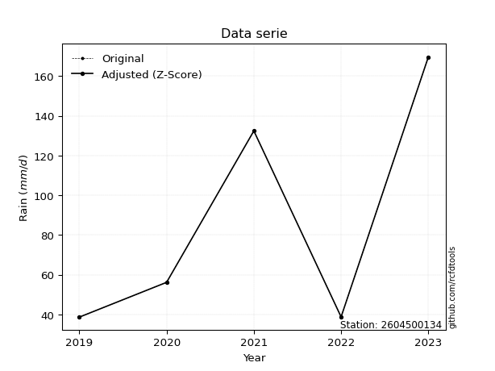</img>

</div>

> If Z-Score is active, values out of range or outliers are replaced with the station mean value.


### 4. Active continuous probability distributions from SciPy (2 of 104 available)

[scipy.stats](https://docs.scipy.org/doc/scipy/reference/stats.html) is a Python´s powerful submodule within the SciPy library for comprehensive statistical analysis, offering over 130 probability distributions (like Normal, Poisson), functions for descriptive stats (mean, variance), hypothesis testing (t-tests, chi-square), random variable generation, and statistical tests, making it essential for data science, modeling, and research. It provides tools to explore, model, and draw conclusions from data efficiently, working seamlessly with NumPy.

<div align="center">

|   id | p_dist   |   n_parameter | fit_method   | label             | active   | ref                                                                                              |
|-----:|:---------|--------------:|:-------------|:------------------|:---------|:-------------------------------------------------------------------------------------------------|
|    0 | gumbel_l |             2 | MM           | Gumbel Left Skew  | True     | [:mortar_board:](https://docs.scipy.org/doc/scipy/reference/generated/scipy.stats.gumbel_l.html) |
|    1 | gumbel_r |             2 | MM           | Gumbel Right Skew | True     | [:mortar_board:](https://docs.scipy.org/doc/scipy/reference/generated/scipy.stats.gumbel_r.html) |

</div>

> **n_parameter:** # arguments & localization & scale.
>
> **Fit methods:** (MLE) maximum likelihood, (MM) L-moments.
>
>**Inactive:** norm, lognorm, foldnorm, halfnorm, gennorm, norminvgauss, powernorm, powerlognorm, skewnorm, truncnorm, pearson3, genextreme, alpha, anglit, arcsine, argus, beta, betaprime, bradford, burr, burr12, cauchy, cosine, halfcauchy, foldcauchy, skewcauchy, wrapcauchy, chi2, crystalball, gamma, dgamma, gengamma, invgamma, loggamma, expon, genexpon, exponnorm, exponweib, exponpow, erlang, fatiguelife, truncexpon, f, fisk, genlogistic, gausshyper, genhalflogistic, genhyperbolic, geninvgauss, gibrat, gompertz, halflogistic, halfgennorm, hypsecant, invgauss, invweibull, johnsonsb, johnsonsu, kappa4, kappa3, ksone, kstwo, kstwobign, laplace, laplace_asymmetric, loglaplace, levy, levy_l, levy_stable, logistic, maxwell, mielke, moyal, nakagami, ncx2, ncf, nct, pareto, genpareto, truncpareto, lomax, powerlaw, rdist, rayleigh, rel_breitwigner, rice, recipinvgauss, semicircular, studentized_range, t, trapezoid, triang, truncweibull_min, tukeylambda, uniform, loguniform, vonmises, vonmises_line, wald, weibull_min, weibull_max, dweibull, 


## B. Probability distributions vs. Empirical distributions

A continuous probability distribution (CPD) describes probabilities for variables that can take any value within a range (like rain any time), unlike discrete variables with specific outcomes (like temperature). It uses a Probability Density Function (PDF), a curve where the total area under it equals 1, and the probability of the variable falling within an interval (a to b) is found by calculating the area under the curve between those points. A key feature is that the probability of hitting any single exact value is zero, so probabilities are always expressed for ranges, e.g., $P(a ≤ X ≤ b)$.

<div align="center">

Distributions parameters
|    |    station | p_dist      |   n |       loc |    scale | shape   | shape1   | shape2   | shape3   |
|---:|-----------:|:------------|----:|----------:|---------:|:--------|:---------|:---------|:---------|
|  0 | 2604500134 | gumbel_l    |   5 | 111.367   | 41.9714  |         |          |          |          |
|  1 | 2604500134 | gumbel_r    |   5 |  62.9134  | 41.9714  |         |          |          |          |
|  2 | 2604500134 | loggumbel_l |   5 |   4.5524  |  0.48493 |         |          |          |          |
|  3 | 2604500134 | loggumbel_r |   5 |   3.99258 |  0.48493 |         |          |          |          |

</div>

> **loc** (Location parameter): This shifts the distribution along the x-axis. For many common distributions, like the normal (Gaussian) distribution, loc represents the mean $μ$. For others, like the uniform distribution, it might represent the minimum value, or for the beta distribution, the left end of the support interval.
>
> **scale** (Scale parameter): This determines the width or spread of the distribution. For the normal distribution, scale represents the standard deviation $σ$. For a uniform distribution, it defines the length of the interval (from $loc$ to $loc + scale$).
>
> **shape** (Shape parameters): Refers to parameters that define the specific form of a probability distribution, distinct from its location (loc) and scale (scale). These parameters are required arguments for most distribution functions. For example, a normal (Gaussian) distribution is fully defined by its location (mean) and scale (standard deviation), so it has no specific shape parameters beyond loc and scale. However, other distributions have intrinsic properties that need specification, as Gamma distribution that takes a shape parameter, often named $a$ or $alpha$.


### 0. Cumulative distribution values - CDF (4 evaluated)

> Ordered by x ascending and calculating $log(f(x))$ separately. 

|   id |    Station |   date |     x |   count |   mean |     std |    zscore |   Value_initial |    station |   m |   gumbel_l |   gumbel_l_pdf |   gumbel_r |   gumbel_r_pdf |   loggumbel_l |   loggumbel_l_pdf |   loggumbel_r |   loggumbel_r_pdf |
|-----:|-----------:|-------:|------:|--------:|-------:|--------:|----------:|----------------:|-----------:|----:|-----------:|---------------:|-----------:|---------------:|--------------:|------------------:|--------------:|------------------:|
|    0 | 2604500134 |   2019 |  38.7 |       5 |  87.14 | 60.1843 | -0.804861 |            38.7 | 2604500134 |   1 |   0.162261 |     0.00353384 |   0.168551 |     0.0071503  |      0.145654 |          0.27734  |      0.134994 |          0.557458 |
|    1 | 2604500134 |   2022 |  38.8 |       5 |  87.14 | 60.1843 | -0.8032   |            38.8 | 2604500134 |   2 |   0.162614 |     0.00354077 |   0.169267 |     0.00716357 |      0.146372 |          0.278586 |      0.136436 |          0.560425 |
|    2 | 2604500134 |   2020 |  56.2 |       5 |  87.14 | 60.1843 | -0.514088 |            56.2 | 2604500134 |   3 |   0.235581 |     0.00489269 |   0.309296 |     0.00864744 |      0.288063 |          0.498818 |      0.39542  |          0.756549 |
|    3 | 2604500134 |   2021 | 132.4 |       5 |  87.14 | 60.1843 |  0.752024 |           132.4 | 2604500134 |   4 |   0.808065 |     0.00754818 |   0.826146 |     0.00375923 |      0.863154 |          0.561262 |      0.853425 |          0.278939 |
|    4 | 2604500134 |   2023 | 169.6 |       5 |  87.14 | 60.1843 |  1.37013  |           169.6 | 2604500134 |   5 |   0.981769 |     0.00173947 |   0.924301 |     0.00173354 |      0.963635 |          0.248528 |      0.909265 |          0.178351 |

An Empirical Distribution Function (EDF) is a step-function estimate of a true cumulative distribution function (CDF) based on observed sample data, representing the proportion of data points less than or equal to a given value. It is calculated by ordering your data and jumping up by $1/n$ (where $n$ is sample size) at each unique data point, allowing analysis without assuming an underlying population distribution, and it gets closer to the true CDF as the sample size grows.


### 1. Empirical - EDF California (1923)

California´s estimates the true probability distribution of water-related data (like rainfall, streamflow) using observed samples, crucial for risk assessment.

<div align="center">


$P=m/n$


</div>


**1.1. Empirical values**

<div align="center">

|                | 0              | 1                  | 2              | 3                 | 4              |
|:---------------|:---------------|:-------------------|:---------------|:------------------|:---------------|
| date           | 2019           | 2022               | 2020           | 2021              | 2023           |
| x              | 38.7           | 38.8               | 56.2           | 132.4             | 169.6          |
| m              | 1              | 2                  | 3              | 4                 | 5              |
| empirical_dist | edf_california | edf_california     | edf_california | edf_california    | edf_california |
| empirical      | 0.2            | 0.4                | 0.6            | 0.8               | 1.0            |
| empirical_tr   | 1.25           | 1.6666666666666667 | 2.5            | 5.000000000000001 | inf            |

</div>


**1.2. Kolmogorov-Smirnov fit test (sorted by Δ)**


<div align="center">

|                | 0                  | 1                  | 2                   | 3                  |
|:---------------|:-------------------|:-------------------|:--------------------|:-------------------|
| station        | 2604500134         | 2604500134         | 2604500134          | 2604500134         |
| empirical_dist | edf_california     | edf_california     | edf_california      | edf_california     |
| p_dist         | loggumbel_r        | gumbel_r           | loggumbel_l         | gumbel_l           |
| delta          | 0.2635640494599984 | 0.2907035025061546 | 0.31193728612029875 | 0.3644185132936465 |
| deltao         | 0.5865427407550001 | 0.5865427407550001 | 0.5865427407550001  | 0.5865427407550001 |
| eval           | Δo > Δ             | Δo > Δ             | Δo > Δ              | Δo > Δ             |
| fit            | 1                  | 1                  | 1                   | 1                  |
| n              | 5                  | 5                  | 5                   | 5                  |
| best_fit       | 1                  | 0                  | 0                   | 0                  |
| best_fit_sort  | 1                  | 2                  | 3                   | 4                  |

</div>


<div align="center">

</img>

</div>


**1.3. Best fit**

<div align="center">

|   id |    station | empirical_dist   | p_dist      |    delta |   deltao | eval   |   fit |   n |   best_fit |   best_fit_sort |
|-----:|-----------:|:-----------------|:------------|---------:|---------:|:-------|------:|----:|-----------:|----------------:|
|    0 | 2604500134 | edf_california   | loggumbel_r | 0.263564 | 0.586543 | Δo > Δ |     1 |   5 |          1 |               1 |

</div>


<div align="center">

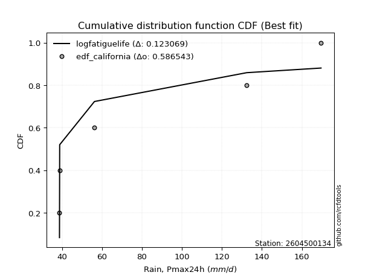</img>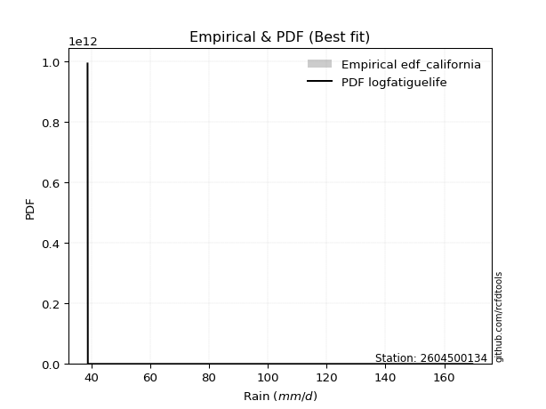</img>

</div>


### 2. Empirical - EDF Hazen (1930)

Hazen method for plotting positions is a formula used to estimate the empirical cumulative probability distribution of flood events or other hydrological data. This formula often results in biased estimations, particularly when extrapolating to extreme events (high return periods).

<div align="center">


$P=(m-0.5)/n$


</div>


**2.1. Empirical values**

<div align="center">

|                | 0                  | 1                  | 2         | 3                 | 4                  |
|:---------------|:-------------------|:-------------------|:----------|:------------------|:-------------------|
| date           | 2019               | 2022               | 2020      | 2021              | 2023               |
| x              | 38.7               | 38.8               | 56.2      | 132.4             | 169.6              |
| m              | 1                  | 2                  | 3         | 4                 | 5                  |
| empirical_dist | edf_hazen          | edf_hazen          | edf_hazen | edf_hazen         | edf_hazen          |
| empirical      | 0.1                | 0.3                | 0.5       | 0.7               | 0.9                |
| empirical_tr   | 1.1111111111111112 | 1.4285714285714286 | 2.0       | 3.333333333333333 | 10.000000000000002 |

</div>


**2.2. Kolmogorov-Smirnov fit test (sorted by Δ)**


<div align="center">

|                | 0                   | 1                   | 2                   | 3                  |
|:---------------|:--------------------|:--------------------|:--------------------|:-------------------|
| station        | 2604500134          | 2604500134          | 2604500134          | 2604500134         |
| empirical_dist | edf_hazen           | edf_hazen           | edf_hazen           | edf_hazen          |
| p_dist         | loggumbel_r         | gumbel_r            | loggumbel_l         | gumbel_l           |
| delta          | 0.16356404945999836 | 0.19070350250615464 | 0.21193728612029877 | 0.2644185132936465 |
| deltao         | 0.5865427407550001  | 0.5865427407550001  | 0.5865427407550001  | 0.5865427407550001 |
| eval           | Δo > Δ              | Δo > Δ              | Δo > Δ              | Δo > Δ             |
| fit            | 1                   | 1                   | 1                   | 1                  |
| n              | 5                   | 5                   | 5                   | 5                  |
| best_fit       | 1                   | 0                   | 0                   | 0                  |
| best_fit_sort  | 1                   | 2                   | 3                   | 4                  |

</div>


<div align="center">

</img>

</div>


**2.3. Best fit**

<div align="center">

|   id |    station | empirical_dist   | p_dist      |    delta |   deltao | eval   |   fit |   n |   best_fit |   best_fit_sort |
|-----:|-----------:|:-----------------|:------------|---------:|---------:|:-------|------:|----:|-----------:|----------------:|
|    0 | 2604500134 | edf_hazen        | loggumbel_r | 0.163564 | 0.586543 | Δo > Δ |     1 |   5 |          1 |               1 |

</div>


<div align="center">

</img>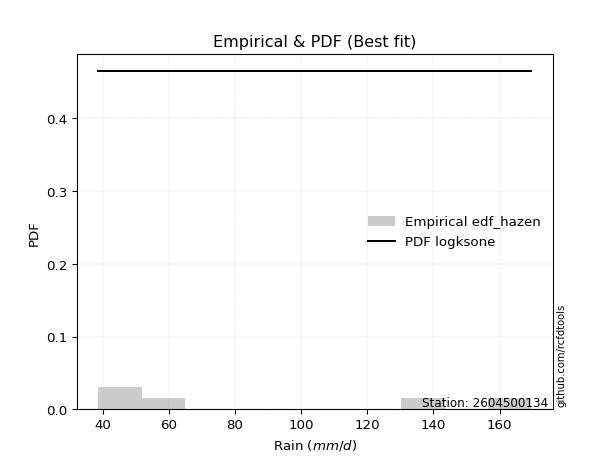</img>

</div>


### 3. Empirical - EDF Weibull (1939)

Weibull plotting position formula is an empirical method used to estimate the non-exceedance probability or plotting position for a set of observed data, is often recommended or widely used in practice, particularly in flood frequency analysis.

<div align="center">


$P=m/(n+1)$


</div>


**3.1. Empirical values**

<div align="center">

|                | 0                   | 1                  | 2           | 3                  | 4                  |
|:---------------|:--------------------|:-------------------|:------------|:-------------------|:-------------------|
| date           | 2019                | 2022               | 2020        | 2021               | 2023               |
| x              | 38.7                | 38.8               | 56.2        | 132.4              | 169.6              |
| m              | 1                   | 2                  | 3           | 4                  | 5                  |
| empirical_dist | edf_weibull         | edf_weibull        | edf_weibull | edf_weibull        | edf_weibull        |
| empirical      | 0.16666666666666666 | 0.3333333333333333 | 0.5         | 0.6666666666666666 | 0.8333333333333334 |
| empirical_tr   | 1.2                 | 1.4999999999999998 | 2.0         | 2.9999999999999996 | 6.000000000000002  |

</div>


**3.2. Kolmogorov-Smirnov fit test (sorted by Δ)**


<div align="center">

|                | 0                   | 1                  | 2                   | 3                  |
|:---------------|:--------------------|:-------------------|:--------------------|:-------------------|
| station        | 2604500134          | 2604500134         | 2604500134          | 2604500134         |
| empirical_dist | edf_weibull         | edf_weibull        | edf_weibull         | edf_weibull        |
| p_dist         | gumbel_r            | loggumbel_r        | loggumbel_l         | gumbel_l           |
| delta          | 0.19070350250615464 | 0.1968973827933317 | 0.21193728612029877 | 0.2644185132936465 |
| deltao         | 0.5865427407550001  | 0.5865427407550001 | 0.5865427407550001  | 0.5865427407550001 |
| eval           | Δo > Δ              | Δo > Δ             | Δo > Δ              | Δo > Δ             |
| fit            | 1                   | 1                  | 1                   | 1                  |
| n              | 5                   | 5                  | 5                   | 5                  |
| best_fit       | 1                   | 0                  | 0                   | 0                  |
| best_fit_sort  | 1                   | 2                  | 3                   | 4                  |

</div>


<div align="center">

</img>

</div>


**3.3. Best fit**

<div align="center">

|   id |    station | empirical_dist   | p_dist   |    delta |   deltao | eval   |   fit |   n |   best_fit |   best_fit_sort |
|-----:|-----------:|:-----------------|:---------|---------:|---------:|:-------|------:|----:|-----------:|----------------:|
|    0 | 2604500134 | edf_weibull      | gumbel_r | 0.190704 | 0.586543 | Δo > Δ |     1 |   5 |          1 |               1 |

</div>


<div align="center">

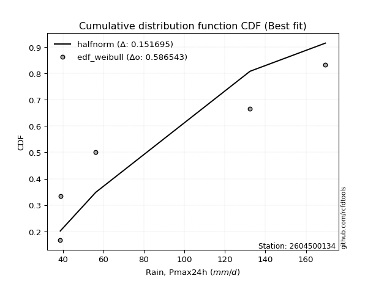</img>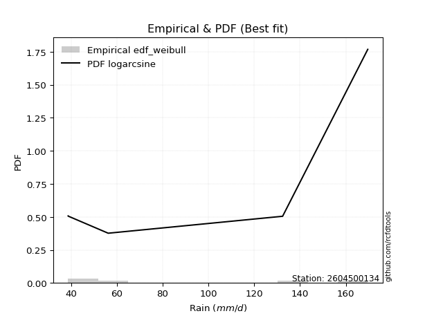</img>

</div>


### 4. Empirical - EDF Beard (1943)

The Beard formula (or Beard´s plotting position formula) in hydrology is used to estimate the empirical non-exceedance probability _(P)_ of a flood event (or other extreme hydrological data point) within a given dataset.

<div align="center">


$P=(m-0.31)/(n+0.38)$


</div>


**4.1. Empirical values**

<div align="center">

|                | 0                   | 1                  | 2         | 3                  | 4                  |
|:---------------|:--------------------|:-------------------|:----------|:-------------------|:-------------------|
| date           | 2019                | 2022               | 2020      | 2021               | 2023               |
| x              | 38.7                | 38.8               | 56.2      | 132.4              | 169.6              |
| m              | 1                   | 2                  | 3         | 4                  | 5                  |
| empirical_dist | edf_beard           | edf_beard          | edf_beard | edf_beard          | edf_beard          |
| empirical      | 0.12825278810408922 | 0.3141263940520446 | 0.5       | 0.6858736059479554 | 0.8717472118959109 |
| empirical_tr   | 1.1471215351812367  | 1.4579945799457996 | 2.0       | 3.183431952662722  | 7.797101449275368  |

</div>


**4.2. Kolmogorov-Smirnov fit test (sorted by Δ)**


<div align="center">

|                | 0                  | 1                   | 2                   | 3                  |
|:---------------|:-------------------|:--------------------|:--------------------|:-------------------|
| station        | 2604500134         | 2604500134          | 2604500134          | 2604500134         |
| empirical_dist | edf_beard          | edf_beard           | edf_beard           | edf_beard          |
| p_dist         | loggumbel_r        | gumbel_r            | loggumbel_l         | gumbel_l           |
| delta          | 0.177690443512043  | 0.19070350250615464 | 0.21193728612029877 | 0.2644185132936465 |
| deltao         | 0.5865427407550001 | 0.5865427407550001  | 0.5865427407550001  | 0.5865427407550001 |
| eval           | Δo > Δ             | Δo > Δ              | Δo > Δ              | Δo > Δ             |
| fit            | 1                  | 1                   | 1                   | 1                  |
| n              | 5                  | 5                   | 5                   | 5                  |
| best_fit       | 1                  | 0                   | 0                   | 0                  |
| best_fit_sort  | 1                  | 2                   | 3                   | 4                  |

</div>


<div align="center">

</img>

</div>


**4.3. Best fit**

<div align="center">

|   id |    station | empirical_dist   | p_dist      |   delta |   deltao | eval   |   fit |   n |   best_fit |   best_fit_sort |
|-----:|-----------:|:-----------------|:------------|--------:|---------:|:-------|------:|----:|-----------:|----------------:|
|    0 | 2604500134 | edf_beard        | loggumbel_r | 0.17769 | 0.586543 | Δo > Δ |     1 |   5 |          1 |               1 |

</div>


<div align="center">

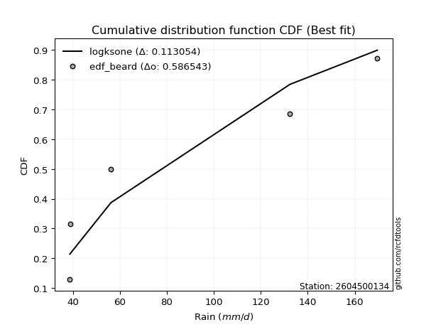</img></img>

</div>


### 5. Empirical - EDF Chegodayev (1955)

The Chegodayev formula is an empirical plotting position formula used in hydrological frequency analysis to estimate the exceedance probability or return period of a specific event from a set of observed data. It is primarily used for plotting observed data points on probability paper to fit a theoretical distribution, particularly for analyzing extreme events like maximum flood flows or rainfall intensities. The constant _b_ value in the generalized plotting position formula is 0.3.

<div align="center">


$P=(m-b)/(n+1-2b)$


</div>


**5.1. Empirical values**

<div align="center">

|                | 0                   | 1                   | 2              | 3                  | 4                  |
|:---------------|:--------------------|:--------------------|:---------------|:-------------------|:-------------------|
| date           | 2019                | 2022                | 2020           | 2021               | 2023               |
| x              | 38.7                | 38.8                | 56.2           | 132.4              | 169.6              |
| m              | 1                   | 2                   | 3              | 4                  | 5                  |
| empirical_dist | edf_chegodayev      | edf_chegodayev      | edf_chegodayev | edf_chegodayev     | edf_chegodayev     |
| empirical      | 0.12962962962962962 | 0.31481481481481477 | 0.5            | 0.6851851851851851 | 0.8703703703703703 |
| empirical_tr   | 1.148936170212766   | 1.4594594594594594  | 2.0            | 3.1764705882352935 | 7.714285714285713  |

</div>


**5.2. Kolmogorov-Smirnov fit test (sorted by Δ)**


<div align="center">

|                | 0                   | 1                   | 2                   | 3                  |
|:---------------|:--------------------|:--------------------|:--------------------|:-------------------|
| station        | 2604500134          | 2604500134          | 2604500134          | 2604500134         |
| empirical_dist | edf_chegodayev      | edf_chegodayev      | edf_chegodayev      | edf_chegodayev     |
| p_dist         | loggumbel_r         | gumbel_r            | loggumbel_l         | gumbel_l           |
| delta          | 0.17837886427481314 | 0.19070350250615464 | 0.21193728612029877 | 0.2644185132936465 |
| deltao         | 0.5865427407550001  | 0.5865427407550001  | 0.5865427407550001  | 0.5865427407550001 |
| eval           | Δo > Δ              | Δo > Δ              | Δo > Δ              | Δo > Δ             |
| fit            | 1                   | 1                   | 1                   | 1                  |
| n              | 5                   | 5                   | 5                   | 5                  |
| best_fit       | 1                   | 0                   | 0                   | 0                  |
| best_fit_sort  | 1                   | 2                   | 3                   | 4                  |

</div>


<div align="center">

</img>

</div>


**5.3. Best fit**

<div align="center">

|   id |    station | empirical_dist   | p_dist      |    delta |   deltao | eval   |   fit |   n |   best_fit |   best_fit_sort |
|-----:|-----------:|:-----------------|:------------|---------:|---------:|:-------|------:|----:|-----------:|----------------:|
|    0 | 2604500134 | edf_chegodayev   | loggumbel_r | 0.178379 | 0.586543 | Δo > Δ |     1 |   5 |          1 |               1 |

</div>


<div align="center">

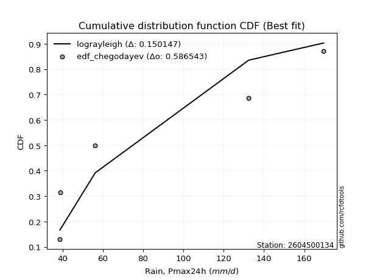</img></img>

</div>


### 6. Empirical - EDF Blom (1958)

The Blom formula is a specific "plotting position" formula used in hydrology and statistical analysis to estimate the empirical cumulative probability (or non-exceedance probability) of a data series. It is particularly recommended for data that are approximately normally distributed. The constant _a_ is set to 0.375 (or 3/8).

<div align="center">


$P=(m-a)/(n+1-2a)$


</div>


**6.1. Empirical values**

<div align="center">

|                | 0                   | 1                   | 2        | 3                  | 4                  |
|:---------------|:--------------------|:--------------------|:---------|:-------------------|:-------------------|
| date           | 2019                | 2022                | 2020     | 2021               | 2023               |
| x              | 38.7                | 38.8                | 56.2     | 132.4              | 169.6              |
| m              | 1                   | 2                   | 3        | 4                  | 5                  |
| empirical_dist | edf_blom            | edf_blom            | edf_blom | edf_blom           | edf_blom           |
| empirical      | 0.11904761904761904 | 0.30952380952380953 | 0.5      | 0.6904761904761905 | 0.8809523809523809 |
| empirical_tr   | 1.135135135135135   | 1.4482758620689655  | 2.0      | 3.230769230769231  | 8.399999999999999  |

</div>


**6.2. Kolmogorov-Smirnov fit test (sorted by Δ)**


<div align="center">

|                | 0                  | 1                   | 2                   | 3                  |
|:---------------|:-------------------|:--------------------|:--------------------|:-------------------|
| station        | 2604500134         | 2604500134          | 2604500134          | 2604500134         |
| empirical_dist | edf_blom           | edf_blom            | edf_blom            | edf_blom           |
| p_dist         | loggumbel_r        | gumbel_r            | loggumbel_l         | gumbel_l           |
| delta          | 0.1730878589838079 | 0.19070350250615464 | 0.21193728612029877 | 0.2644185132936465 |
| deltao         | 0.5865427407550001 | 0.5865427407550001  | 0.5865427407550001  | 0.5865427407550001 |
| eval           | Δo > Δ             | Δo > Δ              | Δo > Δ              | Δo > Δ             |
| fit            | 1                  | 1                   | 1                   | 1                  |
| n              | 5                  | 5                   | 5                   | 5                  |
| best_fit       | 1                  | 0                   | 0                   | 0                  |
| best_fit_sort  | 1                  | 2                   | 3                   | 4                  |

</div>


<div align="center">

</img>

</div>


**6.3. Best fit**

<div align="center">

|   id |    station | empirical_dist   | p_dist      |    delta |   deltao | eval   |   fit |   n |   best_fit |   best_fit_sort |
|-----:|-----------:|:-----------------|:------------|---------:|---------:|:-------|------:|----:|-----------:|----------------:|
|    0 | 2604500134 | edf_blom         | loggumbel_r | 0.173088 | 0.586543 | Δo > Δ |     1 |   5 |          1 |               1 |

</div>


<div align="center">

</img>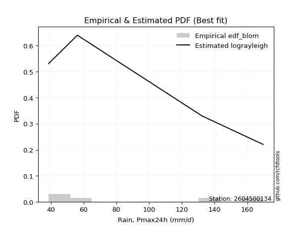</img>

</div>


### 7. Empirical - EDF Tukey (1962)

In hydrology, the Tukey formula is used as a plotting position formula to estimate the empirical probability or frequency of a flood event (or other hydrological data). The formula parameter is given as _c=0.333_ (or 1/3).

<div align="center">


$P=(m-c)/(n+1-2c)$


</div>


**7.1. Empirical values**

<div align="center">

|                | 0                  | 1                  | 2         | 3         | 4         |
|:---------------|:-------------------|:-------------------|:----------|:----------|:----------|
| date           | 2019               | 2022               | 2020      | 2021      | 2023      |
| x              | 38.7               | 38.8               | 56.2      | 132.4     | 169.6     |
| m              | 1                  | 2                  | 3         | 4         | 5         |
| empirical_dist | edf_tukey          | edf_tukey          | edf_tukey | edf_tukey | edf_tukey |
| empirical      | 0.125              | 0.3125             | 0.5       | 0.6875    | 0.875     |
| empirical_tr   | 1.1428571428571428 | 1.4545454545454546 | 2.0       | 3.2       | 8.0       |

</div>


**7.2. Kolmogorov-Smirnov fit test (sorted by Δ)**


<div align="center">

|                | 0                   | 1                   | 2                   | 3                  |
|:---------------|:--------------------|:--------------------|:--------------------|:-------------------|
| station        | 2604500134          | 2604500134          | 2604500134          | 2604500134         |
| empirical_dist | edf_tukey           | edf_tukey           | edf_tukey           | edf_tukey          |
| p_dist         | loggumbel_r         | gumbel_r            | loggumbel_l         | gumbel_l           |
| delta          | 0.17606404945999837 | 0.19070350250615464 | 0.21193728612029877 | 0.2644185132936465 |
| deltao         | 0.5865427407550001  | 0.5865427407550001  | 0.5865427407550001  | 0.5865427407550001 |
| eval           | Δo > Δ              | Δo > Δ              | Δo > Δ              | Δo > Δ             |
| fit            | 1                   | 1                   | 1                   | 1                  |
| n              | 5                   | 5                   | 5                   | 5                  |
| best_fit       | 1                   | 0                   | 0                   | 0                  |
| best_fit_sort  | 1                   | 2                   | 3                   | 4                  |

</div>


<div align="center">

</img>

</div>


**7.3. Best fit**

<div align="center">

|   id |    station | empirical_dist   | p_dist      |    delta |   deltao | eval   |   fit |   n |   best_fit |   best_fit_sort |
|-----:|-----------:|:-----------------|:------------|---------:|---------:|:-------|------:|----:|-----------:|----------------:|
|    0 | 2604500134 | edf_tukey        | loggumbel_r | 0.176064 | 0.586543 | Δo > Δ |     1 |   5 |          1 |               1 |

</div>


<div align="center">

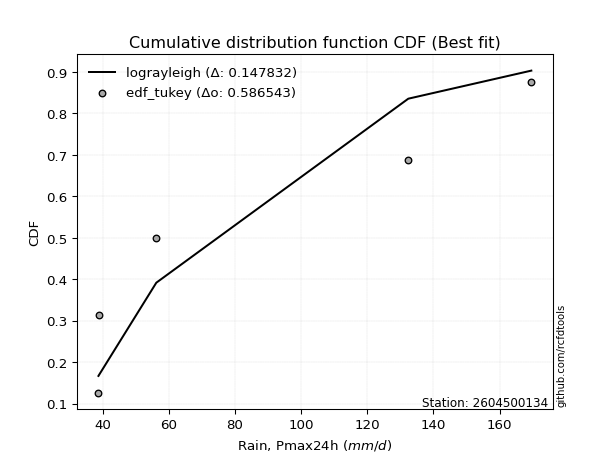</img>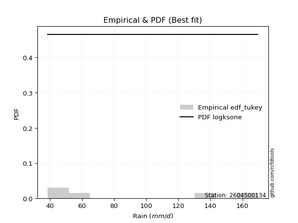</img>

</div>


### 8. Empirical - EDF Gringorten (1963)

Gringorten plotting position formula is essential for estimating the probability and return periods of extreme events like floods and heavy rainfall. The constant _a=0.44_.

<div align="center">


$P=(m-a)/(n+1-2a)$


</div>


**8.1. Empirical values**

<div align="center">

|                | 0                   | 1                  | 2              | 3                 | 4                  |
|:---------------|:--------------------|:-------------------|:---------------|:------------------|:-------------------|
| date           | 2019                | 2022               | 2020           | 2021              | 2023               |
| x              | 38.7                | 38.8               | 56.2           | 132.4             | 169.6              |
| m              | 1                   | 2                  | 3              | 4                 | 5                  |
| empirical_dist | edf_gringorten      | edf_gringorten     | edf_gringorten | edf_gringorten    | edf_gringorten     |
| empirical      | 0.10937500000000001 | 0.3046875          | 0.5            | 0.6953125         | 0.8906249999999999 |
| empirical_tr   | 1.1228070175438596  | 1.4382022471910112 | 2.0            | 3.282051282051282 | 9.142857142857133  |

</div>


**8.2. Kolmogorov-Smirnov fit test (sorted by Δ)**


<div align="center">

|                | 0                   | 1                   | 2                   | 3                  |
|:---------------|:--------------------|:--------------------|:--------------------|:-------------------|
| station        | 2604500134          | 2604500134          | 2604500134          | 2604500134         |
| empirical_dist | edf_gringorten      | edf_gringorten      | edf_gringorten      | edf_gringorten     |
| p_dist         | loggumbel_r         | gumbel_r            | loggumbel_l         | gumbel_l           |
| delta          | 0.16825154945999837 | 0.19070350250615464 | 0.21193728612029877 | 0.2644185132936465 |
| deltao         | 0.5865427407550001  | 0.5865427407550001  | 0.5865427407550001  | 0.5865427407550001 |
| eval           | Δo > Δ              | Δo > Δ              | Δo > Δ              | Δo > Δ             |
| fit            | 1                   | 1                   | 1                   | 1                  |
| n              | 5                   | 5                   | 5                   | 5                  |
| best_fit       | 1                   | 0                   | 0                   | 0                  |
| best_fit_sort  | 1                   | 2                   | 3                   | 4                  |

</div>


<div align="center">

</img>

</div>


**8.3. Best fit**

<div align="center">

|   id |    station | empirical_dist   | p_dist      |    delta |   deltao | eval   |   fit |   n |   best_fit |   best_fit_sort |
|-----:|-----------:|:-----------------|:------------|---------:|---------:|:-------|------:|----:|-----------:|----------------:|
|    0 | 2604500134 | edf_gringorten   | loggumbel_r | 0.168252 | 0.586543 | Δo > Δ |     1 |   5 |          1 |               1 |

</div>


<div align="center">

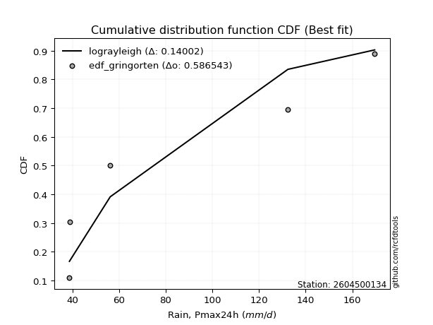</img>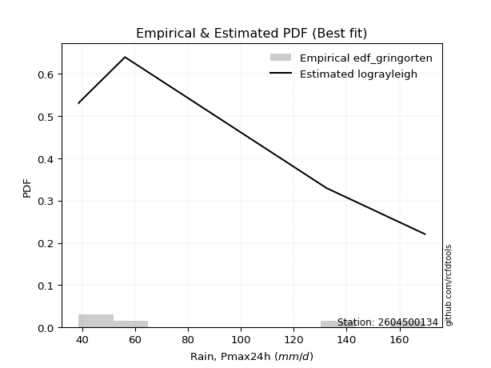</img>

</div>


### 9. Empirical - EDF Filliben (1975)

The specific values of the constants (0.3175) (often denoted as $alpha$) and (0.365) are derived from a method proposed by James J. Filliben in a 1975 paper. This particular formula is the mean value of the $i$-th order statistic of the normal distribution and is considered a robust and effective plotting position formula for the normal probability plot correlation coefficient test for normality.

<div align="center">


$P=(m-0.3175)/(n+0.365)$


</div>


**9.1. Empirical values**

<div align="center">

|                | 0                   | 1                  | 2            | 3                  | 4                  |
|:---------------|:--------------------|:-------------------|:-------------|:-------------------|:-------------------|
| date           | 2019                | 2022               | 2020         | 2021               | 2023               |
| x              | 38.7                | 38.8               | 56.2         | 132.4              | 169.6              |
| m              | 1                   | 2                  | 3            | 4                  | 5                  |
| empirical_dist | edf_filliben        | edf_filliben       | edf_filliben | edf_filliben       | edf_filliben       |
| empirical      | 0.12721342031686858 | 0.3136067101584343 | 0.5          | 0.6863932898415657 | 0.8727865796831314 |
| empirical_tr   | 1.1457554725040042  | 1.456890699253225  | 2.0          | 3.188707280832095  | 7.860805860805863  |

</div>


**9.2. Kolmogorov-Smirnov fit test (sorted by Δ)**


<div align="center">

|                | 0                   | 1                   | 2                   | 3                  |
|:---------------|:--------------------|:--------------------|:--------------------|:-------------------|
| station        | 2604500134          | 2604500134          | 2604500134          | 2604500134         |
| empirical_dist | edf_filliben        | edf_filliben        | edf_filliben        | edf_filliben       |
| p_dist         | loggumbel_r         | gumbel_r            | loggumbel_l         | gumbel_l           |
| delta          | 0.17717075961843265 | 0.19070350250615464 | 0.21193728612029877 | 0.2644185132936465 |
| deltao         | 0.5865427407550001  | 0.5865427407550001  | 0.5865427407550001  | 0.5865427407550001 |
| eval           | Δo > Δ              | Δo > Δ              | Δo > Δ              | Δo > Δ             |
| fit            | 1                   | 1                   | 1                   | 1                  |
| n              | 5                   | 5                   | 5                   | 5                  |
| best_fit       | 1                   | 0                   | 0                   | 0                  |
| best_fit_sort  | 1                   | 2                   | 3                   | 4                  |

</div>


<div align="center">

</img>

</div>


**9.3. Best fit**

<div align="center">

|   id |    station | empirical_dist   | p_dist      |    delta |   deltao | eval   |   fit |   n |   best_fit |   best_fit_sort |
|-----:|-----------:|:-----------------|:------------|---------:|---------:|:-------|------:|----:|-----------:|----------------:|
|    0 | 2604500134 | edf_filliben     | loggumbel_r | 0.177171 | 0.586543 | Δo > Δ |     1 |   5 |          1 |               1 |

</div>


<div align="center">

</img>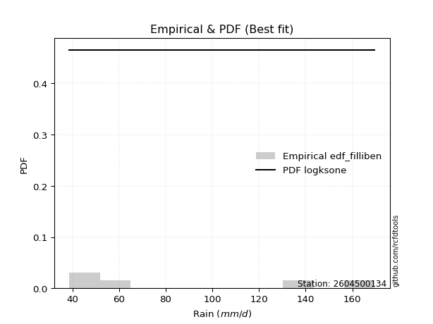</img>

</div>


### 10. Empirical - EDF Jenkinson (1977)

The Jenkinson formula in hydrology is an empirical plotting position formula used to estimate the non-exceedance probability _(P)_ or return period _(T)_ of a given ordered observation within a sample. It is a widely used method in the frequency analysis of extreme events such as floods and rainfall, as it provides a distribution-free way to plot data. _a≈0.31_ and _b≈0.38_ are constants derived to approximate the median of the probability distribution for the given rank.

<div align="center">


$P=(m-a)/(n+b)$


</div>


**10.1. Empirical values**

<div align="center">

|                | 0                   | 1                  | 2             | 3                  | 4                  |
|:---------------|:--------------------|:-------------------|:--------------|:-------------------|:-------------------|
| date           | 2019                | 2022               | 2020          | 2021               | 2023               |
| x              | 38.7                | 38.8               | 56.2          | 132.4              | 169.6              |
| m              | 1                   | 2                  | 3             | 4                  | 5                  |
| empirical_dist | edf_jenkinson       | edf_jenkinson      | edf_jenkinson | edf_jenkinson      | edf_jenkinson      |
| empirical      | 0.12825278810408922 | 0.3141263940520446 | 0.5           | 0.6858736059479554 | 0.8717472118959109 |
| empirical_tr   | 1.1471215351812367  | 1.4579945799457996 | 2.0           | 3.183431952662722  | 7.797101449275368  |

</div>


**10.2. Kolmogorov-Smirnov fit test (sorted by Δ)**


<div align="center">

|                | 0                  | 1                   | 2                   | 3                  |
|:---------------|:-------------------|:--------------------|:--------------------|:-------------------|
| station        | 2604500134         | 2604500134          | 2604500134          | 2604500134         |
| empirical_dist | edf_jenkinson      | edf_jenkinson       | edf_jenkinson       | edf_jenkinson      |
| p_dist         | loggumbel_r        | gumbel_r            | loggumbel_l         | gumbel_l           |
| delta          | 0.177690443512043  | 0.19070350250615464 | 0.21193728612029877 | 0.2644185132936465 |
| deltao         | 0.5865427407550001 | 0.5865427407550001  | 0.5865427407550001  | 0.5865427407550001 |
| eval           | Δo > Δ             | Δo > Δ              | Δo > Δ              | Δo > Δ             |
| fit            | 1                  | 1                   | 1                   | 1                  |
| n              | 5                  | 5                   | 5                   | 5                  |
| best_fit       | 1                  | 0                   | 0                   | 0                  |
| best_fit_sort  | 1                  | 2                   | 3                   | 4                  |

</div>


<div align="center">

</img>

</div>


**10.3. Best fit**

<div align="center">

|   id |    station | empirical_dist   | p_dist      |   delta |   deltao | eval   |   fit |   n |   best_fit |   best_fit_sort |
|-----:|-----------:|:-----------------|:------------|--------:|---------:|:-------|------:|----:|-----------:|----------------:|
|    0 | 2604500134 | edf_jenkinson    | loggumbel_r | 0.17769 | 0.586543 | Δo > Δ |     1 |   5 |          1 |               1 |

</div>


<div align="center">

</img></img>

</div>


### 11. Empirical - EDF Cunnane (1978)

Cunnane´s work in statistical hydrology has focused on the performance and evaluation of different probability distributions (such as GEV, Gumbel, Lognormal) for flood frequency estimation. _b_ is a constant, typically set to 0.4.

<div align="center">


$P=(m-b)/(n+1-2b)$


</div>


**11.1. Empirical values**

<div align="center">

|                | 0                   | 1                  | 2           | 3                  | 4                  |
|:---------------|:--------------------|:-------------------|:------------|:-------------------|:-------------------|
| date           | 2019                | 2022               | 2020        | 2021               | 2023               |
| x              | 38.7                | 38.8               | 56.2        | 132.4              | 169.6              |
| m              | 1                   | 2                  | 3           | 4                  | 5                  |
| empirical_dist | edf_cunnane         | edf_cunnane        | edf_cunnane | edf_cunnane        | edf_cunnane        |
| empirical      | 0.11538461538461538 | 0.3076923076923077 | 0.5         | 0.6923076923076923 | 0.8846153846153845 |
| empirical_tr   | 1.1304347826086958  | 1.4444444444444444 | 2.0         | 3.25               | 8.666666666666655  |

</div>


**11.2. Kolmogorov-Smirnov fit test (sorted by Δ)**


<div align="center">

|                | 0                   | 1                   | 2                   | 3                  |
|:---------------|:--------------------|:--------------------|:--------------------|:-------------------|
| station        | 2604500134          | 2604500134          | 2604500134          | 2604500134         |
| empirical_dist | edf_cunnane         | edf_cunnane         | edf_cunnane         | edf_cunnane        |
| p_dist         | loggumbel_r         | gumbel_r            | loggumbel_l         | gumbel_l           |
| delta          | 0.17125635715230608 | 0.19070350250615464 | 0.21193728612029877 | 0.2644185132936465 |
| deltao         | 0.5865427407550001  | 0.5865427407550001  | 0.5865427407550001  | 0.5865427407550001 |
| eval           | Δo > Δ              | Δo > Δ              | Δo > Δ              | Δo > Δ             |
| fit            | 1                   | 1                   | 1                   | 1                  |
| n              | 5                   | 5                   | 5                   | 5                  |
| best_fit       | 1                   | 0                   | 0                   | 0                  |
| best_fit_sort  | 1                   | 2                   | 3                   | 4                  |

</div>


<div align="center">

</img>

</div>


**11.3. Best fit**

<div align="center">

|   id |    station | empirical_dist   | p_dist      |    delta |   deltao | eval   |   fit |   n |   best_fit |   best_fit_sort |
|-----:|-----------:|:-----------------|:------------|---------:|---------:|:-------|------:|----:|-----------:|----------------:|
|    0 | 2604500134 | edf_cunnane      | loggumbel_r | 0.171256 | 0.586543 | Δo > Δ |     1 |   5 |          1 |               1 |

</div>


<div align="center">

</img>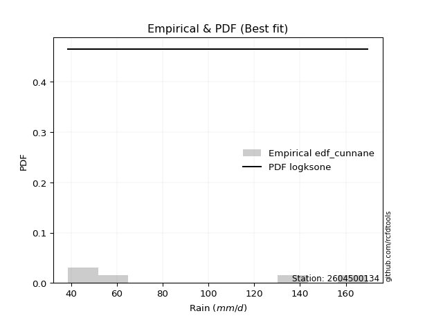</img>

</div>


### 12. Empirical - EDF Adamowski (1981)

The Adamowski formula in hydrology refers to a specific plotting position formula used for estimating the non-parametric empirical distribution of hydrological events (like flood peaks) to calculate their return periods. This formula provides an alternative to traditional parametric methods (like the Gumbel or Log Pearson Type III distributions). 

<div align="center">


$P=(m-0.25)/(n+0.5)$


</div>


**12.1. Empirical values**

<div align="center">

|                | 0                   | 1                  | 2             | 3                  | 4                  |
|:---------------|:--------------------|:-------------------|:--------------|:-------------------|:-------------------|
| date           | 2019                | 2022               | 2020          | 2021               | 2023               |
| x              | 38.7                | 38.8               | 56.2          | 132.4              | 169.6              |
| m              | 1                   | 2                  | 3             | 4                  | 5                  |
| empirical_dist | edf_adamowski       | edf_adamowski      | edf_adamowski | edf_adamowski      | edf_adamowski      |
| empirical      | 0.13636363636363635 | 0.3181818181818182 | 0.5           | 0.6818181818181818 | 0.8636363636363636 |
| empirical_tr   | 1.1578947368421053  | 1.4666666666666666 | 2.0           | 3.1428571428571423 | 7.333333333333334  |

</div>


**12.2. Kolmogorov-Smirnov fit test (sorted by Δ)**


<div align="center">

|                | 0                   | 1                   | 2                   | 3                  |
|:---------------|:--------------------|:--------------------|:--------------------|:-------------------|
| station        | 2604500134          | 2604500134          | 2604500134          | 2604500134         |
| empirical_dist | edf_adamowski       | edf_adamowski       | edf_adamowski       | edf_adamowski      |
| p_dist         | loggumbel_r         | gumbel_r            | loggumbel_l         | gumbel_l           |
| delta          | 0.18174586764181655 | 0.19070350250615464 | 0.21193728612029877 | 0.2644185132936465 |
| deltao         | 0.5865427407550001  | 0.5865427407550001  | 0.5865427407550001  | 0.5865427407550001 |
| eval           | Δo > Δ              | Δo > Δ              | Δo > Δ              | Δo > Δ             |
| fit            | 1                   | 1                   | 1                   | 1                  |
| n              | 5                   | 5                   | 5                   | 5                  |
| best_fit       | 1                   | 0                   | 0                   | 0                  |
| best_fit_sort  | 1                   | 2                   | 3                   | 4                  |

</div>


<div align="center">

</img>

</div>


**12.3. Best fit**

<div align="center">

|   id |    station | empirical_dist   | p_dist      |    delta |   deltao | eval   |   fit |   n |   best_fit |   best_fit_sort |
|-----:|-----------:|:-----------------|:------------|---------:|---------:|:-------|------:|----:|-----------:|----------------:|
|    0 | 2604500134 | edf_adamowski    | loggumbel_r | 0.181746 | 0.586543 | Δo > Δ |     1 |   5 |          1 |               1 |

</div>


<div align="center">

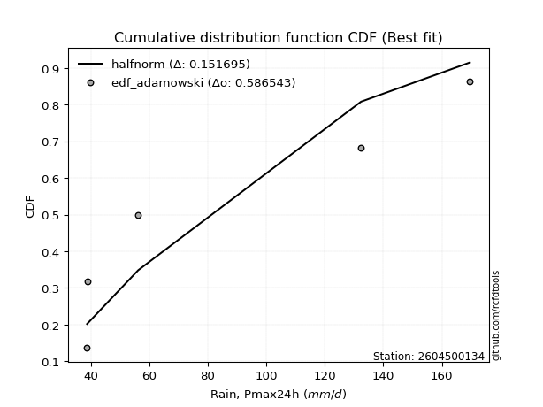</img>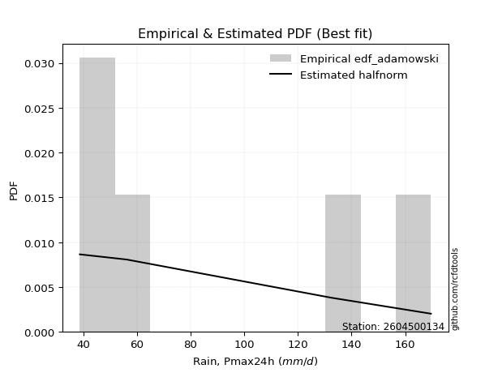</img>

</div>


## C. Best fit & Estimate extreme values for specific return periods - Tr


### 1. Best fit (ordered by delta Δ)

<div align="center">

|   id |    station | empirical_dist   | p_dist      |    delta |   deltao | eval   |   fit |   n |   best_fit |   best_fit_sort |
|-----:|-----------:|:-----------------|:------------|---------:|---------:|:-------|------:|----:|-----------:|----------------:|
|    0 | 2604500134 | edf_hazen        | loggumbel_r | 0.163564 | 0.586543 | Δo > Δ |     1 |   5 |          1 |               1 |
|    1 | 2604500134 | edf_gringorten   | loggumbel_r | 0.168252 | 0.586543 | Δo > Δ |     1 |   5 |          1 |               2 |
|    2 | 2604500134 | edf_cunnane      | loggumbel_r | 0.171256 | 0.586543 | Δo > Δ |     1 |   5 |          1 |               3 |
|    3 | 2604500134 | edf_blom         | loggumbel_r | 0.173088 | 0.586543 | Δo > Δ |     1 |   5 |          1 |               4 |
|    4 | 2604500134 | edf_tukey        | loggumbel_r | 0.176064 | 0.586543 | Δo > Δ |     1 |   5 |          1 |               5 |
|    5 | 2604500134 | edf_filliben     | loggumbel_r | 0.177171 | 0.586543 | Δo > Δ |     1 |   5 |          1 |               6 |
|    6 | 2604500134 | edf_beard        | loggumbel_r | 0.17769  | 0.586543 | Δo > Δ |     1 |   5 |          1 |               7 |
|    7 | 2604500134 | edf_jenkinson    | loggumbel_r | 0.17769  | 0.586543 | Δo > Δ |     1 |   5 |          1 |               8 |
|    8 | 2604500134 | edf_chegodayev   | loggumbel_r | 0.178379 | 0.586543 | Δo > Δ |     1 |   5 |          1 |               9 |
|    9 | 2604500134 | edf_adamowski    | loggumbel_r | 0.181746 | 0.586543 | Δo > Δ |     1 |   5 |          1 |              10 |
|   10 | 2604500134 | edf_weibull      | gumbel_r    | 0.190704 | 0.586543 | Δo > Δ |     1 |   5 |          1 |              11 |
|   11 | 2604500134 | edf_california   | loggumbel_r | 0.263564 | 0.586543 | Δo > Δ |     1 |   5 |          1 |              12 |

</div>

:file_folder:Tables: [bestfit_2604500134.csv](table/bestfit_2604500134.csv) | [extreme_2604500134.csv](table/extreme_2604500134.csv)


### 2. Extreme values

In hydrology, a return period (or recurrence interval $Tr$) is the statistical average time between extreme events like floods or droughts of a specific magnitude, indicating how rare an event is, with a 100-year flood, for example, having a 1% chance of occurring in any given year, not that it happens exactly every century. It is a key tool for infrastructure design (like bridges or dams) and risk assessment, calculated from historical data to determine the probability of future events, although it is important to remember it is statistical average, and events can cluster or be missed.

> risk_rate: assuming the return period as the project useful life.

|   id |      tr |   prob_l |     prob_g |   gumbel_l |   gumbel_r |   loggumbel_l |   loggumbel_r |    station |   n |   risk_rate |
|-----:|--------:|---------:|-----------:|-----------:|-----------:|--------------:|--------------:|-----------:|----:|------------:|
|    0 |    2    | 0.5      | 0.5        |    95.9835 |    78.2965 |       79.4133 |       64.7357 | 2604500134 |   5 |    0.75     |
|    1 |    2.33 | 0.570815 | 0.429185   |   104.341  |    87.1976 |       87.4638 |       71.7476 | 2604500134 |   5 |    0.729209 |
|    2 |    5    | 0.8      | 0.2        |   131.34   |   125.868  |      119.482  |      112.162  | 2604500134 |   5 |    0.67232  |
|    3 |   10    | 0.9      | 0.1        |   146.372  |   157.365  |      142.145  |      161.394  | 2604500134 |   5 |    0.651322 |
|    4 |   15    | 0.933333 | 0.0666667  |   153.18   |   175.135  |      153.776  |      198.177  | 2604500134 |   5 |    0.644736 |
|    5 |   20    | 0.95     | 0.05       |   157.417  |   187.577  |      161.492  |      228.816  | 2604500134 |   5 |    0.641514 |
|    6 |   25    | 0.96     | 0.04       |   160.433  |   197.161  |      167.218  |      255.608  | 2604500134 |   5 |    0.639603 |
|    7 |   50    | 0.98     | 0.02       |   168.618  |   226.683  |      183.804  |      359.512  | 2604500134 |   5 |    0.63583  |
|    8 |   75    | 0.986667 | 0.0133333  |   172.757  |   243.843  |      192.808  |      438.346  | 2604500134 |   5 |    0.634587 |
|    9 |  100    | 0.99     | 0.01       |   175.464  |   255.988  |      198.934  |      504.38   | 2604500134 |   5 |    0.633968 |
|   10 |  200    | 0.995    | 0.005      |   181.349  |   285.186  |      212.93   |      706.751  | 2604500134 |   5 |    0.633042 |
|   11 |  250    | 0.996    | 0.004      |   183.081  |   294.573  |      217.233  |      787.711  | 2604500134 |   5 |    0.632858 |
|   12 |  500    | 0.998    | 0.002      |   188.044  |   323.707  |      230.055  |     1102.95   | 2604500134 |   5 |    0.632489 |
|   13 |  750    | 0.998667 | 0.00133333 |   190.697  |   340.739  |      237.215  |     1342.82   | 2604500134 |   5 |    0.632366 |
|   14 | 1000    | 0.999    | 0.001      |   192.482  |   352.821  |      242.159  |     1543.98   | 2604500134 |   5 |    0.632305 |

<div align="center">

</img>

</div>


<div align="center">

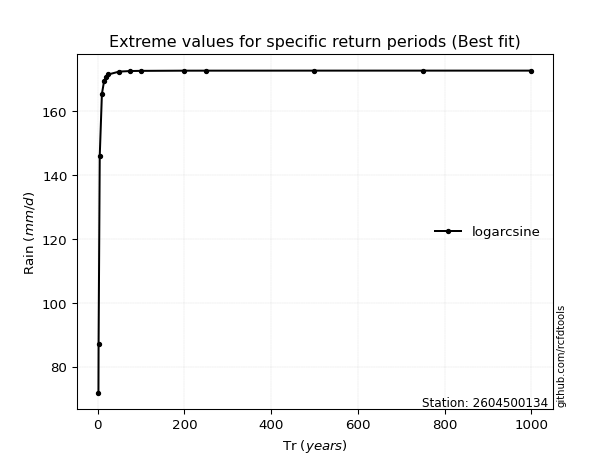</img>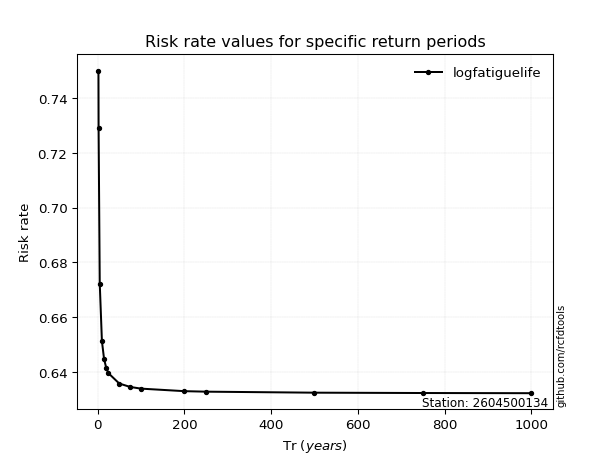</img>

</div>


<sub>**APP DISCLAIMER**: NO WARRANTY - This software is provided by [github.com/rcfdtools](https://github.com/rcfdtools) "as is", without any express or implied warranty, including warranties of merchantability, fitness for a particular purpose, or non-infringement. There is no guarantee that the software will be error-free or operate without interruption. LIMITATION OF LIABILITY - Neither the authors nor copyright holders will be liable for claims or damages arising from the software or its use. You are responsible for determining if the software is appropriate for your use and assume all associated risks, including errors, legal compliance, and data loss. NO PROFESSIONAL ADVICE - The software provides general information and does not offer professional advice. It should not replace consultation with professional advisors.</sub>