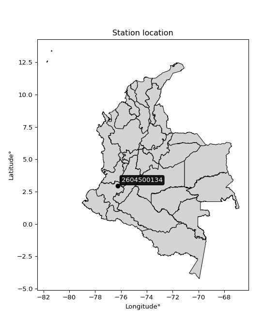

<div align="center">


</div>

# PMP Station (Rain, Pmax24h): 2604500134

Probable Maximum Precipitation (PMP) is the greatest amount of rainfall for a specific duration that is meteorologically possible for a given location, acting as a "worst-case" scenario for extreme storms, crucial for designing safety-critical infrastructure like bridges, river deviations, dams, spillways, and nuclear plants to prevent catastrophic failure. PMP is calculated by hydrologists using meteorological data to determine the upper limit of extreme rainfall, often leading to the Probable Maximum Flood (PMF) for flood control design, and is increasingly being studied for climate change impacts. Probable Maximum Precipitation (PMP) is the theoretical upper limit of rainfall, a deterministic estimate for extreme events, while probability distributions (like GEV, Gumbel) describe the likelihood and frequency of various precipitation amounts, including rare ones, showing how often events occur, with PMP representing the extreme end of these distributions, used for critical infrastructure design to ensure safety against the worst conceivable weather, unlike standard statistical forecasts which cover typical probabilities.

The most common probability distributions in hydrology, used for analyzing floods, rainfall, and streamflow, include the Normal, Log-Normal, Gumbel, Gamma (including Log-Pearson Type III), and Generalized Extreme Value (GEV) distributions, often chosen based on the data´s skewness and whether modeling extremes or general conditions, with Gumbel and GEV popular for extreme events like floods, while the Normal distribution serves as a baseline, though often requiring transformations for skewed hydrological data. These distributions help in designing water infrastructure, managing water resources, and forecasting hydrologic events.

> Hydrological data often isn´t perfectly normal (it´s skewed), so different distributions are needed for different applications, such as: **Flood Frequency Analysis**: Using Gumbel, GEV, or Log-Pearson Type III for predicting extreme flood magnitudes and their return periods, **Rainfall Analysis**: Normal for annual totals, but Log-Normal, Weibull, or GEV for intensity or extreme daily rainfall, **Streamflow Modeling**: Gamma and Log-Normal for maximum flows, GEV for minimum flows, and Kappa for daily flows.

<div align="center">

</img>

</div>


## A. General information


### 1. General running parameters

• app_version: _v20260113_. • runtime: _2026-01-17 18:24:04.630693_. • Python version: _3.14.0_. • SciPy version: _1.16.3_. • Pandas version: _2.3.3_. • NumPy version: _2.3.5_. • Stations dataset (station_dataset_file): _dataset/pmax24h_in/automatic_colombia_2003_2025.csv_. • Stations catalog (station_catalog_file): _dataset/CNE.xls_. • Minimum year to eval til year_max (date_min): _1900_. • Maximum year to eval since year_min (date_max): _2025_. • Creates, save and include plots into reports (create_plot): _False_. • Plot only fit distributions with Δo > Δ (plot_only_fit): _True_. • Plot only simple graphs avoiding multiple CDFs and multiple Extreme values plots (plot_only_simple): _True_. • Eval low extreme values, if False, evaluates high extreme values (low_extreme): _False_. • Eval every SciPy distribution as logarithmic (pdist_logarithmic_on): _True_. • Standard deviation normalized (ddof): _1.0_. • Return periods to eval in years (Tr): _[2, 2.33, 5, 10, 15, 20, 25, 50, 75, 100, 200, 250, 500, 750, 1000]_. • Minimum data sample per station, 0 means any (minimum_sample): _5_. • Z-Score maximum threshold to adjust a value, 0 means disable (zscore_max): _3.5_. • Z-Score minimum threshold to adjust a value, 0 means disable (zscore_min): _-2.5_. • Avoid zeros, e.g. rain = 0 (avoid_zeros): _True_. • Avoid null values (avoid_nans): _True_. 

:file_folder:Table: [dataset.csv](../../dataset/pmax24h_in/automatic_colombia_2003_2025.csv)

> Delta Degrees of Freedom (DDOF): is a parameter used in the formulas for calculating variance and standard deviation. When ddof=0, the divisor is $N$ (the total number of observations) and this is used when your data set is the entire population. When ddof=1, the divisor is $N-1$ and this is used when your data set is a sample drawn from a larger population. Using $N-1$ provides an unbiased estimate of the population variance (known as Bessel´s correction).


### 2. Station info and location

|   id |     CODIGO | NOMBRE                                         | CATEGORIA               | TECNOLOGIA                | ESTADO           | FECHA_INSTALACION   |   FECHA_SUSPENSION |   ALTITUD |   LATITUD |   LONGITUD | DEPARTAMENTO   | MUNICIPIO   | AREA_OPERATIVA                         | ENTIDAD                                                     | AREA_HIDROGRAFICA   | ZONA_HIDROGRAFICA   | SUBZONA_HIDROGRAFICA   |   CORRIENTE | Catalogo   |   Version |
|-----:|-----------:|:-----------------------------------------------|:------------------------|:--------------------------|:-----------------|:--------------------|-------------------:|----------:|----------:|-----------:|:---------------|:------------|:---------------------------------------|:------------------------------------------------------------|:--------------------|:--------------------|:-----------------------|------------:|:-----------|----------:|
|    0 | 2604500134 | TORIBIO ALERTAS   TORIBIO - AUT   [2604500134] | Climatológica Principal | Automática con Telemetría | En Mantenimiento | 27/04/2017          |                nan |      1759 |   2.95239 |   -76.2621 | Cauca          | Toribío     | Area Operativa 09 - Cauca-Valle-Caldas | INSTITUTO DE HIDROLOGIA METEOROLOGIA Y ESTUDIOS AMBIENTALES | Magdalena Cauca     | Cauca               | Río Palo               |         nan | CNE_IDEAM  |  20251226 |

<div align="center">

Dynamic map: [:earth_americas:Google](http://maps.google.com/maps?q=2.952388889,-76.262083333) [:earth_americas:OSM](https://www.openstreetmap.org/#map=18/2.952388889/-76.262083333&layers=P) [:earth_americas:Bing](https://www.bing.com/maps?cp=2.952388889~-76.262083333&lvl=18) [:earth_americas:Apple](https://maps.apple.com/frame?center=2.952388889%2C-76.262083333&span=0.003%2C0.006)

</div>


<div align="center">

```geojson
{
  "type": "Feature",
  "geometry": {
    "type": "Point", 
    "coordinates": [-76.262083333, 2.952388889]
  }, 
  "properties": {
    "Name": "2604500134"
  }
}
```

</div>


### 3. Discrete values table and plot

<div align="center">

|               |           0 |           1 |           2 |         3 |          4 |
|:--------------|------------:|------------:|------------:|----------:|-----------:|
| Date          | 2019        | 2020        | 2021        | 2022      | 2023       |
| Value         |   38.7      |   56.2      |  132.4      |   38.8    |  169.6     |
| Value_initial |   38.7      |   56.2      |  132.4      |   38.8    |  169.6     |
| count         |    5        |    5        |    5        |    5      |    5       |
| mean          |   87.14     |   87.14     |   87.14     |   87.14   |   87.14    |
| std           |   60.1843   |   60.1843   |   60.1843   |   60.1843 |   60.1843  |
| zscore        |   -0.804861 |   -0.514088 |    0.752024 |   -0.8032 |    1.37013 |


</div>


> The initial value (value_initial) correspond to the initial obtained or null completed value, and value (value) is adjusted only when the initial value is outside the valid range (outlier) definite through the Z-Score value. If Z-Score is active, values out of range or outliers are replaced with the station mean value. A Z-Score (or standard score) measures how many standard deviations a data point is from the mean of a dataset, indicating its relative position; positive scores mean above the mean, negative mean below, and a score of zero is exactly at the mean, allowing for comparison of values from different distributions. It´s calculated using the formula $z=(x–μ)/σ$, where $x$ is the data point, $μ$ is the mean, and $σ$ is the standard deviation, helping identify outliers and understand probability.
>
> <sub>**Note**: In this study, "completing" (filling gaps in) and "extending" (forecasting or lengthening the historical record) rainfall data series are avoided for certain critical analyses because they introduce artificial bias and uncertainty, which can distort the statistics of rare events (extremes), alter day-to-day variability, and compromise the integrity and homogeneity of the original data. Some reasons against Completing/Extending rainfall data are: **Distortion of Extremes and Variability**: The primary issue is that most gap-filling or extension methods rely on averaging or regression with nearby stations, which inherently smooths the data. Rainfall is highly variable in space and time, with a large percentage of zero values and occasional large storms. Infilling methods often underestimate the highest values and overestimate the lowest (zero) values, which severely distorts analyses focused on flood frequency, drought severity, and intensity-duration-frequency (IDF) curves, **Loss of Data Homogeneity**: Infilled or extended data are synthetic estimates, not actual measurements. Combining these estimates with observed data can violate the assumption of data homogeneity, which requires that the data properties do not change over time. Inhomogeneity can lead to incorrect conclusions about long-term trends or changes in climate patterns, **Propagation of Errors**: Errors and biases from the original data (e.g., wind-induced undercatch, instrument errors, site changes) or the data used for imputation can propagate through the analysis, leading to unreliable hydrological models and inaccurate predictions, **Compromised Statistical Integrity**: For statistical analyses, especially those involving the frequency of events, using artificial data can introduce time bias or autocorrelation that doesn´t exist in reality, making it difficult to assess the true probability of events, **Difficulty in Validation**: It is difficult to accurately validate the quality of filled or extended data, especially for past periods where ground-truth measurements are unavailable. The reliability of imputation techniques heavily depends on the density of the surrounding station network and the complexity of the local topography.</sub>


### 4. Active continuous probability distributions from SciPy (80 of 104 available)

A Probability Density Function (PDF) describes the relative likelihood of a continuous random variable falling within a specific range, where the total area under its curve equals 1, and the area over any interval gives the actual probability for that range. Unlike discrete probabilities (like rolling a die), a PDF shows density, not direct probability for a single point (which is zero), with higher points indicating higher likelihood, often visualized as a bell curve for normal distributions.

A log of a probability density function (log-PDF) is simply the logarithm of the PDF´s value, denoted as $log(f(x))$, useful for converting multiplication of probabilities into addition, improving numerical stability with tiny numbers, and connecting to information theory concepts like entropy. Instead of dealing with very small probabilities (e.g., 0.000001), log-PDFs use negative numbers (e.g., $log(0.00001) ≈ -11.51$ that are easier for computers to handle, preventing underflow errors and simplifying complex calculations. In this study, each active probability distribution from SciPy is also evaluated in the $log$ form.

[scipy.stats](https://docs.scipy.org/doc/scipy/reference/stats.html) is a Python´s powerful submodule within the SciPy library for comprehensive statistical analysis, offering over 130 probability distributions (like Normal, Poisson), functions for descriptive stats (mean, variance), hypothesis testing (t-tests, chi-square), random variable generation, and statistical tests, making it essential for data science, modeling, and research. It provides tools to explore, model, and draw conclusions from data efficiently, working seamlessly with NumPy.

<div align="center">

|   id | p_dist           |   n_parameter | fit_method   | label                                                                       | active   | ref                                                                                                      |
|-----:|:-----------------|--------------:|:-------------|:----------------------------------------------------------------------------|:---------|:---------------------------------------------------------------------------------------------------------|
|    0 | alpha            |             3 | MLE          | Alpha                                                                       | True     | [:mortar_board:](https://docs.scipy.org/doc/scipy/reference/generated/scipy.stats.alpha.html)            |
|    1 | anglit           |             2 | MM           | Anglit                                                                      | True     | [:mortar_board:](https://docs.scipy.org/doc/scipy/reference/generated/scipy.stats.anglit.html)           |
|    2 | arcsine          |             2 | MM           | Arcsine                                                                     | True     | [:mortar_board:](https://docs.scipy.org/doc/scipy/reference/generated/scipy.stats.arcsine.html)          |
|    3 | argus            |             3 | MLE          | Argus                                                                       | True     | [:mortar_board:](https://docs.scipy.org/doc/scipy/reference/generated/scipy.stats.argus.html)            |
|    4 | beta             |             4 | MLE          | Beta                                                                        | True     | [:mortar_board:](https://docs.scipy.org/doc/scipy/reference/generated/scipy.stats.beta.html)             |
|    5 | betaprime        |             4 | MLE          | Beta prime                                                                  | True     | [:mortar_board:](https://docs.scipy.org/doc/scipy/reference/generated/scipy.stats.betaprime.html)        |
|    6 | bradford         |             3 | MLE          | Bradford                                                                    | True     | [:mortar_board:](https://docs.scipy.org/doc/scipy/reference/generated/scipy.stats.bradford.html)         |
|    7 | burr             |             4 | MLE          | Burr (Type III)                                                             | True     | [:mortar_board:](https://docs.scipy.org/doc/scipy/reference/generated/scipy.stats.burr.html)             |
|    8 | burr12           |             4 | MLE          | Burr (Type III) 12                                                          | True     | [:mortar_board:](https://docs.scipy.org/doc/scipy/reference/generated/scipy.stats.burr12.html)           |
|    9 | cosine           |             2 | MLE          | Cosine                                                                      | True     | [:mortar_board:](https://docs.scipy.org/doc/scipy/reference/generated/scipy.stats.cosine.html)           |
|   10 | crystalball      |             4 | MLE          | Crystalball                                                                 | True     | [:mortar_board:](https://docs.scipy.org/doc/scipy/reference/generated/scipy.stats.crystalball.html)      |
|   11 | dgamma           |             3 | MLE          | Double gamma                                                                | True     | [:mortar_board:](https://docs.scipy.org/doc/scipy/reference/generated/scipy.stats.dgamma.html)           |
|   12 | dweibull         |             3 | MLE          | Double Weibull                                                              | True     | [:mortar_board:](https://docs.scipy.org/doc/scipy/reference/generated/scipy.stats.dweibull.html)         |
|   13 | erlang           |             3 | MLE          | Erlang                                                                      | True     | [:mortar_board:](https://docs.scipy.org/doc/scipy/reference/generated/scipy.stats.erlang.html)           |
|   14 | exponnorm        |             3 | MLE          | Exponentially modified Normal                                               | True     | [:mortar_board:](https://docs.scipy.org/doc/scipy/reference/generated/scipy.stats.exponnorm.html)        |
|   15 | exponpow         |             3 | MLE          | Exponential power                                                           | True     | [:mortar_board:](https://docs.scipy.org/doc/scipy/reference/generated/scipy.stats.exponpow.html)         |
|   16 | exponweib        |             4 | MLE          | Exponentiated Weibull                                                       | True     | [:mortar_board:](https://docs.scipy.org/doc/scipy/reference/generated/scipy.stats.exponweib.html)        |
|   17 | f                |             4 | MLE          | F                                                                           | True     | [:mortar_board:](https://docs.scipy.org/doc/scipy/reference/generated/scipy.stats.f.html)                |
|   18 | fatiguelife      |             3 | MLE          | Fatigue-life (Birnbaum-Saunders)                                            | True     | [:mortar_board:](https://docs.scipy.org/doc/scipy/reference/generated/scipy.stats.fatiguelife.html)      |
|   19 | foldnorm         |             3 | MM           | Fold Normal                                                                 | True     | [:mortar_board:](https://docs.scipy.org/doc/scipy/reference/generated/scipy.stats.foldnorm.html)         |
|   20 | gamma            |             3 | MLE          | Gamma                                                                       | True     | [:mortar_board:](https://docs.scipy.org/doc/scipy/reference/generated/scipy.stats.gamma.html)            |
|   21 | gausshyper       |             6 | MLE          | Gauss hypergeometric                                                        | True     | [:mortar_board:](https://docs.scipy.org/doc/scipy/reference/generated/scipy.stats.gausshyper.html)       |
|   22 | genexpon         |             5 | MLE          | Generalized exponential                                                     | True     | [:mortar_board:](https://docs.scipy.org/doc/scipy/reference/generated/scipy.stats.genexpon.html)         |
|   23 | genextreme       |             3 | MLE          | Generalized exponential                                                     | True     | [:mortar_board:](https://docs.scipy.org/doc/scipy/reference/generated/scipy.stats.genextreme.html)       |
|   24 | gengamma         |             4 | MLE          | Generalized gamma                                                           | True     | [:mortar_board:](https://docs.scipy.org/doc/scipy/reference/generated/scipy.stats.gengamma.html)         |
|   25 | genhalflogistic  |             3 | MLE          | Generalized half-logistic                                                   | True     | [:mortar_board:](https://docs.scipy.org/doc/scipy/reference/generated/scipy.stats.genhalflogistic.html)  |
|   26 | genlogistic      |             3 | MLE          | Generalized logistic                                                        | True     | [:mortar_board:](https://docs.scipy.org/doc/scipy/reference/generated/scipy.stats.genlogistic.html)      |
|   27 | gennorm          |             3 | MLE          | Generalized Normal                                                          | True     | [:mortar_board:](https://docs.scipy.org/doc/scipy/reference/generated/scipy.stats.gennorm.html)          |
|   28 | genpareto        |             3 | MLE          | Generalized Pareto                                                          | True     | [:mortar_board:](https://docs.scipy.org/doc/scipy/reference/generated/scipy.stats.genpareto.html)        |
|   29 | gompertz         |             3 | MLE          | Gompertz (or truncated Gumbel)                                              | True     | [:mortar_board:](https://docs.scipy.org/doc/scipy/reference/generated/scipy.stats.gompertz.html)         |
|   30 | gumbel_l         |             2 | MM           | Gumbel Left Skew                                                            | True     | [:mortar_board:](https://docs.scipy.org/doc/scipy/reference/generated/scipy.stats.gumbel_l.html)         |
|   31 | gumbel_r         |             2 | MM           | Gumbel Right Skew                                                           | True     | [:mortar_board:](https://docs.scipy.org/doc/scipy/reference/generated/scipy.stats.gumbel_r.html)         |
|   32 | halfgennorm      |             3 | MLE          | Upper half of a generalized normal                                          | True     | [:mortar_board:](https://docs.scipy.org/doc/scipy/reference/generated/scipy.stats.halfgennorm.html)      |
|   33 | halflogistic     |             2 | MM           | Half-logistic                                                               | True     | [:mortar_board:](https://docs.scipy.org/doc/scipy/reference/generated/scipy.stats.halflogistic.html)     |
|   34 | halfnorm         |             2 | MM           | Half Normal                                                                 | True     | [:mortar_board:](https://docs.scipy.org/doc/scipy/reference/generated/scipy.stats.halfnorm.html)         |
|   35 | hypsecant        |             2 | MM           | hyperbolic secant                                                           | True     | [:mortar_board:](https://docs.scipy.org/doc/scipy/reference/generated/scipy.stats.hypsecant.html)        |
|   36 | invgamma         |             3 | MLE          | Inverted gamma                                                              | True     | [:mortar_board:](https://docs.scipy.org/doc/scipy/reference/generated/scipy.stats.invgamma.html)         |
|   37 | invgauss         |             3 | MLE          | Inverse Gaussian                                                            | True     | [:mortar_board:](https://docs.scipy.org/doc/scipy/reference/generated/scipy.stats.invgauss.html)         |
|   38 | invweibull       |             3 | MLE          | Inverted Weibull                                                            | True     | [:mortar_board:](https://docs.scipy.org/doc/scipy/reference/generated/scipy.stats.invweibull.html)       |
|   39 | johnsonsb        |             4 | MLE          | Johnson SB                                                                  | True     | [:mortar_board:](https://docs.scipy.org/doc/scipy/reference/generated/scipy.stats.johnsonsb.html)        |
|   40 | johnsonsu        |             4 | MLE          | Johnson Su                                                                  | True     | [:mortar_board:](https://docs.scipy.org/doc/scipy/reference/generated/scipy.stats.johnsonsu.html)        |
|   41 | kappa3           |             3 | MLE          | Kappa 3                                                                     | True     | [:mortar_board:](https://docs.scipy.org/doc/scipy/reference/generated/scipy.stats.kappa3.html)           |
|   42 | kappa4           |             4 | MLE          | Kappa 4                                                                     | True     | [:mortar_board:](https://docs.scipy.org/doc/scipy/reference/generated/scipy.stats.kappa4.html)           |
|   43 | ksone            |             3 | MLE          | Kolmogorov-Smirnov one-sided test statistic distribution                    | True     | [:mortar_board:](https://docs.scipy.org/doc/scipy/reference/generated/scipy.stats.ksone.html)            |
|   44 | kstwobign        |             2 | MLE          | Limiting distribution of scaled Kolmogorov-Smirnov two-sided test statistic | True     | [:mortar_board:](https://docs.scipy.org/doc/scipy/reference/generated/scipy.stats.kstwobign.html)        |
|   45 | laplace          |             2 | MM           | Laplace                                                                     | True     | [:mortar_board:](https://docs.scipy.org/doc/scipy/reference/generated/scipy.stats.laplace.html)          |
|   46 | levy_l           |             2 | MLE          | Left-skewed Levy                                                            | True     | [:mortar_board:](https://docs.scipy.org/doc/scipy/reference/generated/scipy.stats.levy_l.html)           |
|   47 | loggamma         |             3 | MLE          | Log gamma                                                                   | True     | [:mortar_board:](https://docs.scipy.org/doc/scipy/reference/generated/scipy.stats.loggamma.html)         |
|   48 | logistic         |             2 | MM           | Logistic (or Sech-squared)                                                  | True     | [:mortar_board:](https://docs.scipy.org/doc/scipy/reference/generated/scipy.stats.logistic.html)         |
|   49 | loglaplace       |             3 | MLE          | Log-Laplace                                                                 | True     | [:mortar_board:](https://docs.scipy.org/doc/scipy/reference/generated/scipy.stats.loglaplace.html)       |
|   50 | lomax            |             3 | MLE          | Lomax (Pareto of the second kind)                                           | True     | [:mortar_board:](https://docs.scipy.org/doc/scipy/reference/generated/scipy.stats.lomax.html)            |
|   51 | maxwell          |             2 | MM           | Maxwell                                                                     | True     | [:mortar_board:](https://docs.scipy.org/doc/scipy/reference/generated/scipy.stats.maxwell.html)          |
|   52 | mielke           |             4 | MLE          | Mielke Beta-Kappa / Dagum                                                   | True     | [:mortar_board:](https://docs.scipy.org/doc/scipy/reference/generated/scipy.stats.mielke.html)           |
|   53 | moyal            |             2 | MM           | Moyal                                                                       | True     | [:mortar_board:](https://docs.scipy.org/doc/scipy/reference/generated/scipy.stats.moyal.html)            |
|   54 | nakagami         |             3 | MLE          | Nakagami                                                                    | True     | [:mortar_board:](https://docs.scipy.org/doc/scipy/reference/generated/scipy.stats.nakagami.html)         |
|   55 | ncf              |             5 | MLE          | Non-central F distribution                                                  | True     | [:mortar_board:](https://docs.scipy.org/doc/scipy/reference/generated/scipy.stats.ncf.html)              |
|   56 | nct              |             4 | MLE          | Non-central Student’s t                                                     | True     | [:mortar_board:](https://docs.scipy.org/doc/scipy/reference/generated/scipy.stats.nct.html)              |
|   57 | norm             |             2 | MM           | Normal                                                                      | True     | [:mortar_board:](https://docs.scipy.org/doc/scipy/reference/generated/scipy.stats.norm.html)             |
|   58 | pearson3         |             3 | MM           | Pearson type III                                                            | True     | [:mortar_board:](https://docs.scipy.org/doc/scipy/reference/generated/scipy.stats.pearson3.html)         |
|   59 | powerlaw         |             3 | MLE          | Power-function                                                              | True     | [:mortar_board:](https://docs.scipy.org/doc/scipy/reference/generated/scipy.stats.powerlaw.html)         |
|   60 | rayleigh         |             2 | MM           | Rayleigh                                                                    | True     | [:mortar_board:](https://docs.scipy.org/doc/scipy/reference/generated/scipy.stats.rayleigh.html)         |
|   61 | rdist            |             3 | MLE          | R-distributed (symmetric beta)                                              | True     | [:mortar_board:](https://docs.scipy.org/doc/scipy/reference/generated/scipy.stats.rdist.html)            |
|   62 | rice             |             3 | MLE          | Rice                                                                        | True     | [:mortar_board:](https://docs.scipy.org/doc/scipy/reference/generated/scipy.stats.rice.html)             |
|   63 | semicircular     |             2 | MM           | Semicircular                                                                | True     | [:mortar_board:](https://docs.scipy.org/doc/scipy/reference/generated/scipy.stats.semicircular.html)     |
|   64 | skewnorm         |             3 | MLE          | Skew normal                                                                 | True     | [:mortar_board:](https://docs.scipy.org/doc/scipy/reference/generated/scipy.stats.skewnorm.html)         |
|   65 | t                |             3 | MLE          | Student’s t                                                                 | True     | [:mortar_board:](https://docs.scipy.org/doc/scipy/reference/generated/scipy.stats.t.html)                |
|   66 | trapezoid        |             4 | MLE          | Trapezoid                                                                   | True     | [:mortar_board:](https://docs.scipy.org/doc/scipy/reference/generated/scipy.stats.trapezoid.html)        |
|   67 | triang           |             3 | MLE          | Triangular                                                                  | True     | [:mortar_board:](https://docs.scipy.org/doc/scipy/reference/generated/scipy.stats.triang.html)           |
|   68 | truncexpon       |             3 | MLE          | Truncated exponential                                                       | True     | [:mortar_board:](https://docs.scipy.org/doc/scipy/reference/generated/scipy.stats.truncexpon.html)       |
|   69 | truncnorm        |             4 | MLE          | Truncated normal                                                            | True     | [:mortar_board:](https://docs.scipy.org/doc/scipy/reference/generated/scipy.stats.truncnorm.html)        |
|   70 | truncpareto      |             4 | MLE          | Upper truncated Pareto                                                      | True     | [:mortar_board:](https://docs.scipy.org/doc/scipy/reference/generated/scipy.stats.truncpareto.html)      |
|   71 | truncweibull_min |             5 | MLE          | Doubly truncated Weibull minimum                                            | True     | [:mortar_board:](https://docs.scipy.org/doc/scipy/reference/generated/scipy.stats.truncweibull_min.html) |
|   72 | tukeylambda      |             3 | MLE          | Tukey-Lamdba                                                                | True     | [:mortar_board:](https://docs.scipy.org/doc/scipy/reference/generated/scipy.stats.tukeylambda.html)      |
|   73 | uniform          |             2 | MLE          | Uniform                                                                     | True     | [:mortar_board:](https://docs.scipy.org/doc/scipy/reference/generated/scipy.stats.uniform.html)          |
|   74 | vonmises         |             3 | MLE          | Von Mises                                                                   | True     | [:mortar_board:](https://docs.scipy.org/doc/scipy/reference/generated/scipy.stats.vonmises.html)         |
|   75 | vonmises_line    |             3 | MLE          | Von Mises line                                                              | True     | [:mortar_board:](https://docs.scipy.org/doc/scipy/reference/generated/scipy.stats.vonmises_line.html)    |
|   76 | wald             |             2 | MM           | Wald                                                                        | True     | [:mortar_board:](https://docs.scipy.org/doc/scipy/reference/generated/scipy.stats.wald.html)             |
|   77 | weibull_max      |             3 | MLE          | Weibull maximum                                                             | True     | [:mortar_board:](https://docs.scipy.org/doc/scipy/reference/generated/scipy.stats.weibull_max.html)      |
|   78 | weibull_min      |             3 | MLE          | Weibull minimum                                                             | True     | [:mortar_board:](https://docs.scipy.org/doc/scipy/reference/generated/scipy.stats.weibull_min.html)      |
|   79 | wrapcauchy       |             3 | MLE          | Wrapped  Cauchy                                                             | True     | [:mortar_board:](https://docs.scipy.org/doc/scipy/reference/generated/scipy.stats.wrapcauchy.html)       |

</div>

> **n_parameter:** # arguments & localization & scale.
>
> **Fit methods:** (MLE) maximum likelihood, (MM) L-moments.
>
>**Inactive** (With the only purpose of prevent loops, zero divisions, infinite values, over high estimated values or horizontal trending for recurrence intervals estimations, the follow distributions were disabled.)**:** lognorm, norminvgauss, powernorm, powerlognorm, cauchy, halfcauchy, foldcauchy, skewcauchy, chi2, expon, fisk, genhyperbolic, geninvgauss, gibrat, kstwo, laplace_asymmetric, levy, levy_stable, ncx2, pareto, rel_breitwigner, recipinvgauss, studentized_range, loguniform, 


## B. Probability (PDF) vs. Empirical (EDF) distributions functions

A continuous probability distribution (CPD) describes probabilities for variables that can take any value within a range (like rain any time), unlike discrete variables with specific outcomes (like temperature). It uses a Probability Density Function (PDF), a curve where the total area under it equals 1, and the probability of the variable falling within an interval (a to b) is found by calculating the area under the curve between those points. A key feature is that the probability of hitting any single exact value is zero, so probabilities are always expressed for ranges, e.g., $P(a ≤ X ≤ b)$.

<div align="center">

Distributions parameters from station values
|     |    station | p_dist              |   n |              loc |          scale | shape                  | shape1                | shape2                | shape3             |
|----:|-----------:|:--------------------|----:|-----------------:|---------------:|:-----------------------|:----------------------|:----------------------|:-------------------|
|   0 | 2604500134 | alpha               |   5 |     31.4847      |   11.2249      | 2.307449798259362e-10  |                       |                       |                    |
|   1 | 2604500134 | anglit              |   5 |     87.14        |  157.476       |                        |                       |                       |                    |
|   2 | 2604500134 | arcsine             |   5 |     11.0123      |  152.256       |                        |                       |                       |                    |
|   3 | 2604500134 | argus               |   5 |    -21.8942      |  202.763       | 3.1524636091896324e-06 |                       |                       |                    |
|   4 | 2604500134 | beta                |   5 |     30.0444      |  139.556       | 0.13169978820735928    | 0.22045635044775697   |                       |                    |
|   5 | 2604500134 | betaprime           |   5 |     -0.249695    |    0.487458    | 385.2543539760347      | 3.0892481549396145    |                       |                    |
|   6 | 2604500134 | bradford            |   5 |      8.06823     |  161.532       | 3.762285525323966e-05  |                       |                       |                    |
|   7 | 2604500134 | burr                |   5 |      0.158708    |    4.04585     | 2.0476635003991        | 194.9317098870872     |                       |                    |
|   8 | 2604500134 | burr12              |   5 |     -1.10157     |   39.4471      | 484.5074282362749      | 0.003352813488884082  |                       |                    |
|   9 | 2604500134 | cosine              |   5 |     91.0647      |   42.6921      |                        |                       |                       |                    |
|  10 | 2604500134 | crystalball         |   5 |     87.14        |   53.8305      | 6424.786392861422      | 4483.946807672084     |                       |                    |
|  11 | 2604500134 | dgamma              |   5 |     95.405       |    3.47901     | 15.159795117533315     |                       |                       |                    |
|  12 | 2604500134 | dweibull            |   5 |     99.5702      |   58.7494      | 4.852969568654868      |                       |                       |                    |
|  13 | 2604500134 | erlang              |   5 |     38.7         |   31.6449      | 0.34357334615308777    |                       |                       |                    |
|  14 | 2604500134 | exponnorm           |   5 |     38.6565      |    0.01308     | 3693.900716665281      |                       |                       |                    |
|  15 | 2604500134 | exponpow            |   5 |     38.7         |   62.9194      | 0.5035435579108523     |                       |                       |                    |
|  16 | 2604500134 | exponweib           |   5 |     38.7         |   60.3771      | 0.20651074936123587    | 0.8078133530766285    |                       |                    |
|  17 | 2604500134 | f                   |   5 |     38.6994      |    0.003234    | 284.8713421893108      | 0.4373143436269977    |                       |                    |
|  18 | 2604500134 | fatiguelife         |   5 |     38.7         |    1.67107e-05 | 1794.4786215469899     |                       |                       |                    |
|  19 | 2604500134 | foldnorm            |   5 |      0.583228    |   61.7703      | 1.3126311379304334     |                       |                       |                    |
|  20 | 2604500134 | gamma               |   5 |     38.7         |   64.4723      | 0.22321024541016166    |                       |                       |                    |
|  21 | 2604500134 | gausshyper          |   5 |      5.24337     |  164.357       | 1.1810539916257292     | 0.803785385452898     | 1.029922702683272     | 0.8679355770988013 |
|  22 | 2604500134 | genexpon            |   5 |     38.7         |   62.9957      | 1.300479715097294      | 6.098585649436754e-12 | 1.309222556487907     |                    |
|  23 | 2604500134 | genextreme          |   5 |     40.223       |   11.1552      | -7.324439313230098     |                       |                       |                    |
|  24 | 2604500134 | gengamma            |   5 |     38.7         |   57.2497      | 0.7938585821451625     | 0.8940966841033628    |                       |                    |
|  25 | 2604500134 | genhalflogistic     |   5 |     25.7951      |  150.659       | 1.0476606173491563     |                       |                       |                    |
|  26 | 2604500134 | genlogistic         |   5 |   -235.551       |   39.471       | 1880.2163638442016     |                       |                       |                    |
|  27 | 2604500134 | gennorm             |   5 |     56.2         |    0.00171828  | 0.1888968488000075     |                       |                       |                    |
|  28 | 2604500134 | genpareto           |   5 |     -1.68543     |  258.271       | -1.5078396532897935    |                       |                       |                    |
|  29 | 2604500134 | gompertz            |   5 |     38.7         |    1.9668e+12  | 40642461039.13251      |                       |                       |                    |
|  30 | 2604500134 | gumbel_l            |   5 |    111.367       |   41.9714      |                        |                       |                       |                    |
|  31 | 2604500134 | gumbel_r            |   5 |     62.9134      |   41.9714      |                        |                       |                       |                    |
|  32 | 2604500134 | halfgennorm         |   5 |     38.7         |    0.302609    | 0.31059277349922493    |                       |                       |                    |
|  33 | 2604500134 | halflogistic        |   5 |     23.3384      |   46.0231      |                        |                       |                       |                    |
|  34 | 2604500134 | halfnorm            |   5 |     15.8896      |   89.2992      |                        |                       |                       |                    |
|  35 | 2604500134 | hypsecant           |   5 |     87.14        |   34.2695      |                        |                       |                       |                    |
|  36 | 2604500134 | invgamma            |   5 |     38.7         |    4.55888e-08 | 0.20062461118431174    |                       |                       |                    |
|  37 | 2604500134 | invgauss            |   5 |     38.6389      |    0.221793    | 218.6773397850781      |                       |                       |                    |
|  38 | 2604500134 | invweibull          |   5 |     38.7         |    1.26473     | 0.07526284819041956    |                       |                       |                    |
|  39 | 2604500134 | johnsonsb           |   5 |     23.8474      |  145.753       | -0.25915204867132113   | 0.09992991033592824   |                       |                    |
|  40 | 2604500134 | johnsonsu           |   5 |      1.29131e+09 |    1.93412e+08 | 62903196.70338501      | 24218708.053522773    |                       |                    |
|  41 | 2604500134 | kappa3              |   5 |     38.7         |  130.857       | 4788.295957028908      |                       |                       |                    |
|  42 | 2604500134 | kappa4              |   5 |     -4.69734     |  178.801       | 1.321058865327839      | 1.0098746027726957    |                       |                    |
|  43 | 2604500134 | ksone               |   5 |     -6.09709     |  186.474       | 1.0                    |                       |                       |                    |
|  44 | 2604500134 | kstwobign           |   5 |    -73.0594      |  183.276       |                        |                       |                       |                    |
|  45 | 2604500134 | laplace             |   5 |     87.14        |   38.0639      |                        |                       |                       |                    |
|  46 | 2604500134 | levy_l              |   5 |    176.443       |   26.0861      |                        |                       |                       |                    |
|  47 | 2604500134 | loggamma            |   5 | -12799.3         | 1829.06        | 1148.0292738944872     |                       |                       |                    |
|  48 | 2604500134 | logistic            |   5 |     87.14        |   29.6783      |                        |                       |                       |                    |
|  49 | 2604500134 | loglaplace          |   5 |     -0.132849    |   56.3328      | 1.851909928876429      |                       |                       |                    |
|  50 | 2604500134 | lomax               |   5 |     38.7         |    9.52649e+07 | 1325327.586472159      |                       |                       |                    |
|  51 | 2604500134 | maxwell             |   5 |    -40.4156      |   79.9336      |                        |                       |                       |                    |
|  52 | 2604500134 | mielke              |   5 |     24.3654      |    0.0915655   | 5922.883728028863      | 1.494679351245905     |                       |                    |
|  53 | 2604500134 | moyal               |   5 |     56.3563      |   24.2322      |                        |                       |                       |                    |
|  54 | 2604500134 | nakagami            |   5 |     38.7         |   80.381       | 0.11490277840752315    |                       |                       |                    |
|  55 | 2604500134 | ncf                 |   5 |     -1.75822     |   60.3707      | 148.96777636799743     | 6.546677355570864     | 7.030116057092201     |                    |
|  56 | 2604500134 | nct                 |   5 |     -0.202899    |    1.12371     | 1.9961593961507438     | 47.946642485899474    |                       |                    |
|  57 | 2604500134 | norm                |   5 |     87.14        |   53.8305      |                        |                       |                       |                    |
|  58 | 2604500134 | pearson3            |   5 |     87.14        |   53.8304      | 0.5092479121042732     |                       |                       |                    |
|  59 | 2604500134 | powerlaw            |   5 |     38.7         |  130.9         | 0.10643746972390943    |                       |                       |                    |
|  60 | 2604500134 | rayleigh            |   5 |    -15.8408      |   82.1668      |                        |                       |                       |                    |
|  61 | 2604500134 | rdist               |   5 |     32.9683      |   23.2317      | 1.3857428206144977     |                       |                       |                    |
|  62 | 2604500134 | rice                |   5 |      0.15544     |   72.3326      | 0.0013231580213131752  |                       |                       |                    |
|  63 | 2604500134 | semicircular        |   5 |     87.14        |  107.661       |                        |                       |                       |                    |
|  64 | 2604500134 | skewnorm            |   5 |     38.7         |   72.4183      | 23620487.99381872      |                       |                       |                    |
|  65 | 2604500134 | t                   |   5 |     87.1401      |   53.8291      | 3655239.8410601476     |                       |                       |                    |
|  66 | 2604500134 | trapezoid           |   5 |     25.61        |  157.08        | 1.0                    | 1.0                   |                       |                    |
|  67 | 2604500134 | triang              |   5 |    -36.2126      |  205.813       | 0.9999999979336058     |                       |                       |                    |
|  68 | 2604500134 | truncexpon          |   5 |      8.20581     |  168.075       | 0.9602513313090353     |                       |                       |                    |
|  69 | 2604500134 | truncnorm           |   5 | -80745.4         | 2087.46        | 38.69978176843685      | 179.36092987676108    |                       |                    |
|  70 | 2604500134 | truncpareto         |   5 |     -2.14748e+09 |    2.14748e+09 | 44332859.44704658      | 1.0000000609550628    |                       |                    |
|  71 | 2604500134 | truncweibull_min    |   5 |      8.14147     |  185.6         | 1.2458401770001912     | 7.196720068228196e-05 | 0.8699278379952845    |                    |
|  72 | 2604500134 | tukeylambda         |   5 |    104.232       |   75.373       | 1.1501740131615852     |                       |                       |                    |
|  73 | 2604500134 | uniform             |   5 |     38.7         |  130.9         |                        |                       |                       |                    |
|  74 | 2604500134 | vonmises            |   5 |      0.435824    |    1           | 3.5771857961949824     |                       |                       |                    |
|  75 | 2604500134 | vonmises_line       |   5 |    103.843       |   20.931       | 2.8814797918031773e-06 |                       |                       |                    |
|  76 | 2604500134 | wald                |   5 |     33.3095      |   53.8305      |                        |                       |                       |                    |
|  77 | 2604500134 | weibull_max         |   5 |    169.6         |    1.52055     | 0.1199872944394731     |                       |                       |                    |
|  78 | 2604500134 | weibull_min         |   5 |     38.7         |   37.7526      | 0.5277016330542892     |                       |                       |                    |
|  79 | 2604500134 | wrapcauchy          |   5 |     38.7         |   20.8336      | 0.9951578589811256     |                       |                       |                    |
|  80 | 2604500134 | logalpha            |   5 |      3.45171     |    0.386415    | 0.7069736824413433     |                       |                       |                    |
|  81 | 2604500134 | loganglit           |   5 |      4.27249     |    1.81944     |                        |                       |                       |                    |
|  82 | 2604500134 | logarcsine          |   5 |      3.39292     |    1.75913     |                        |                       |                       |                    |
|  83 | 2604500134 | logargus            |   5 |      3.03198     |    2.2389      | 9.571633874258485e-05  |                       |                       |                    |
|  84 | 2604500134 | logbeta             |   5 |      3.53511     |    1.59834     | 0.7458298021526502     | 0.5181941881651375    |                       |                    |
|  85 | 2604500134 | logbetaprime        |   5 |     -0.938357    |    2.91934     | 196.0594297037128      | 110.83093694931875    |                       |                    |
|  86 | 2604500134 | logbradford         |   5 |      3.65583     |    1.47761     | 1.100113370333375      |                       |                       |                    |
|  87 | 2604500134 | logburr             |   5 |      3.04873     |    0.185462    | 2.408189902498009      | 35.81019821208949     |                       |                    |
|  88 | 2604500134 | logburr12           |   5 |      3.65571     |    4.67372     | 0.41908019603537716    | 2.5695048499556172    |                       |                    |
|  89 | 2604500134 | logcosine           |   5 |      4.29998     |    0.487154    |                        |                       |                       |                    |
|  90 | 2604500134 | logcrystalball      |   5 |      4.27249     |    0.621947    | 7.424658678556549      | 453.41875926581923    |                       |                    |
|  91 | 2604500134 | logdgamma           |   5 |      3.93754     |    0.383852    | 1.4570178446171802     |                       |                       |                    |
|  92 | 2604500134 | logdweibull         |   5 |      4.02892     |    0.505291    | 0.9513627694843523     |                       |                       |                    |
|  93 | 2604500134 | logerlang           |   5 |      3.65584     |    0.517042    | 0.49216108661935587    |                       |                       |                    |
|  94 | 2604500134 | logexponnorm        |   5 |      3.65535     |    0.000135612 | 4533.503256015061      |                       |                       |                    |
|  95 | 2604500134 | logexponpow         |   5 |      3.65584     |    1.81524     | 0.18399558969706722    |                       |                       |                    |
|  96 | 2604500134 | logexponweib        |   5 |      3.65584     |    0.840033    | 0.7877185166015938     | 0.9941626508207124    |                       |                    |
|  97 | 2604500134 | logf                |   5 |      3.65584     |    0.525884    | 0.8452355061169818     | 1095.7917162185722    |                       |                    |
|  98 | 2604500134 | logfatiguelife      |   5 |      3.65584     |    4.67148e-07 | 1509.6051732276883     |                       |                       |                    |
|  99 | 2604500134 | logfoldnorm         |   5 |      3.13557     |    0.668957    | 1.6591673448117843     |                       |                       |                    |
| 100 | 2604500134 | loggamma            |   5 |      3.65584     |    0.346714    | 0.19434091319080332    |                       |                       |                    |
| 101 | 2604500134 | loggausshyper       |   5 |      3.65584     |    1.72105     | 0.7843747386886266     | 1.1600921885944966    | 1.0010795241775274    | 1.100826988962241  |
| 102 | 2604500134 | loggenexpon         |   5 |      3.65584     |    1.11774     | 1.8125704101760143     | 0.0032281332418561534 | 3.561867208981377e-05 |                    |
| 103 | 2604500134 | loggenextreme       |   5 |      3.66676     |    0.0616367   | -5.642167476563547     |                       |                       |                    |
| 104 | 2604500134 | loggengamma         |   5 |      3.65584     |    0.864363    | 0.7839316915869518     | 0.9813250491260892    |                       |                    |
| 105 | 2604500134 | loggenhalflogistic  |   5 |      3.64611     |    1.63598     | 1.099941575390171      |                       |                       |                    |
| 106 | 2604500134 | loggenlogistic      |   5 |      0.602395    |    0.484309    | 1057.727646611057      |                       |                       |                    |
| 107 | 2604500134 | loggennorm          |   5 |      4.39464     |    0.738807    | 1688772.5042753778     |                       |                       |                    |
| 108 | 2604500134 | loggenpareto        |   5 |     -0.00996142  |   11.5801      | -2.2514388681284876    |                       |                       |                    |
| 109 | 2604500134 | loggompertz         |   5 |      3.65584     |    1.26224     | 1.1424454347179767     |                       |                       |                    |
| 110 | 2604500134 | loggumbel_l         |   5 |      4.5524      |    0.48493     |                        |                       |                       |                    |
| 111 | 2604500134 | loggumbel_r         |   5 |      3.99258     |    0.48493     |                        |                       |                       |                    |
| 112 | 2604500134 | loghalfgennorm      |   5 |      3.65584     |    0.013496    | 0.35719201920424487    |                       |                       |                    |
| 113 | 2604500134 | loghalflogistic     |   5 |      3.53534     |    0.531743    |                        |                       |                       |                    |
| 114 | 2604500134 | loghalfnorm         |   5 |      3.44928     |    1.03175     |                        |                       |                       |                    |
| 115 | 2604500134 | loghypsecant        |   5 |      4.27249     |    0.395944    |                        |                       |                       |                    |
| 116 | 2604500134 | loginvgamma         |   5 |      3.60684     |    0.0555331   | 0.5275676751947527     |                       |                       |                    |
| 117 | 2604500134 | loginvgauss         |   5 |      3.65425     |    0.00579025  | 106.77316020236694     |                       |                       |                    |
| 118 | 2604500134 | loginvweibull       |   5 |      3.65584     |    0.227544    | 0.06014704973335011    |                       |                       |                    |
| 119 | 2604500134 | logjohnsonsb        |   5 |      3.65584     |    3.43845     | 2.0601527743315966     | 0.12228690639618228   |                       |                    |
| 120 | 2604500134 | logjohnsonsu        |   5 |      2.98593e+07 |    1.62776e+06 | 175840520.58213478     | 48801478.98867217     |                       |                    |
| 121 | 2604500134 | logkappa3           |   5 |      3.65584     |    1.47683     | 3060.8776398164846     |                       |                       |                    |
| 122 | 2604500134 | logkappa4           |   5 |      3.47868     |    1.73953     | 1.113670902846895      | 1.0419367650209204    |                       |                    |
| 123 | 2604500134 | logksone            |   5 |      3.19525     |    2.15449     | 1.0                    |                       |                       |                    |
| 124 | 2604500134 | logkstwobign        |   5 |      2.33176     |    2.21529     |                        |                       |                       |                    |
| 125 | 2604500134 | loglaplace          |   5 |      4.27249     |    0.439783    |                        |                       |                       |                    |
| 126 | 2604500134 | loglevy_l           |   5 |      5.19201     |    0.222137    |                        |                       |                       |                    |
| 127 | 2604500134 | logloggamma         |   5 |   -135.885       |   20.1863      | 1036.7185608039695     |                       |                       |                    |
| 128 | 2604500134 | loglogistic         |   5 |      4.27249     |    0.342897    |                        |                       |                       |                    |
| 129 | 2604500134 | logloglaplace       |   5 |     -0.0174003   |    4.04632     | 7.983769120000716      |                       |                       |                    |
| 130 | 2604500134 | loglomax            |   5 |      3.65584     |   14.2291      | 24.081241721208166     |                       |                       |                    |
| 131 | 2604500134 | logmaxwell          |   5 |      2.79874     |    0.923538    |                        |                       |                       |                    |
| 132 | 2604500134 | logmielke           |   5 |      3.32724     |    0.0919174   | 42.37510382853429      | 1.8271689553856092    |                       |                    |
| 133 | 2604500134 | logmoyal            |   5 |      3.91682     |    0.279974    |                        |                       |                       |                    |
| 134 | 2604500134 | lognakagami         |   5 |      3.65584     |    1.38899     | 0.29614690202119387    |                       |                       |                    |
| 135 | 2604500134 | logncf              |   5 |      3.36839     |    0.00055004  | 0.09626774741385322    | 4.084509173153863     | 94.64584691233304     |                    |
| 136 | 2604500134 | lognct              |   5 |      0.0522541   |    0.0600158   | 25.32945366848317      | 68.1929398889859      |                       |                    |
| 137 | 2604500134 | lognorm             |   5 |      4.27249     |    0.621947    |                        |                       |                       |                    |
| 138 | 2604500134 | logpearson3         |   5 |      4.27249     |    0.621947    | 0.3229034356039894     |                       |                       |                    |
| 139 | 2604500134 | logpowerlaw         |   5 |      3.65584     |    1.4776      | 0.11454524859450226    |                       |                       |                    |
| 140 | 2604500134 | lograyleigh         |   5 |      3.08267     |    0.94934     |                        |                       |                       |                    |
| 141 | 2604500134 | logrdist            |   5 |      4.48457     |    0.828731    | 1.0338323702707606     |                       |                       |                    |
| 142 | 2604500134 | logrice             |   5 |      3.23063     |    0.833656    | 0.3441484654534781     |                       |                       |                    |
| 143 | 2604500134 | logsemicircular     |   5 |      4.27249     |    1.24389     |                        |                       |                       |                    |
| 144 | 2604500134 | logskewnorm         |   5 |      3.65584     |    0.875778    | 11087604.966443136     |                       |                       |                    |
| 145 | 2604500134 | logt                |   5 |      4.27249     |    0.621946    | 2022454984.1911523     |                       |                       |                    |
| 146 | 2604500134 | logtrapezoid        |   5 |      2.51336     |    2.6387      | 1.0                    | 1.0                   |                       |                    |
| 147 | 2604500134 | logtriang           |   5 |      2.8962      |    2.23724     | 0.9999999028167588     |                       |                       |                    |
| 148 | 2604500134 | logtruncexpon       |   5 |      3.65584     |    2.04287     | 0.7233038734193349     |                       |                       |                    |
| 149 | 2604500134 | logtruncnorm        |   5 |     -6.57008     |    2.74986     | 3.7183805255089153     | 4.2560465580555835    |                       |                    |
| 150 | 2604500134 | logtruncpareto      |   5 |     -8.3886e+06  |    8.38861e+06 | 6054820.381567353      | 1.0000001776725713    |                       |                    |
| 151 | 2604500134 | logtruncweibull_min |   5 |      3.65524     |    2.37343     | 0.08104627139255564    | 0.0002523869940871575 | 0.622813688775717     |                    |
| 152 | 2604500134 | logtukeylambda      |   5 |      4.394       |    0.900092    | 1.2172566884734228     |                       |                       |                    |
| 153 | 2604500134 | loguniform          |   5 |      3.65584     |    1.4776      |                        |                       |                       |                    |
| 154 | 2604500134 | logvonmises         |   5 |     -2.02582     |    1           | 3.065381911880039      |                       |                       |                    |
| 155 | 2604500134 | logvonmises_line    |   5 |      4.39506     |    0.235301    | 0.0011312164444438242  |                       |                       |                    |
| 156 | 2604500134 | logwald             |   5 |      3.65054     |    0.621947    |                        |                       |                       |                    |
| 157 | 2604500134 | logweibull_max      |   5 |      5.13344     |    1.12093     | 0.6172905836911982     |                       |                       |                    |
| 158 | 2604500134 | logweibull_min      |   5 |      3.65584     |    1.13264     | 0.3598208543537212     |                       |                       |                    |
| 159 | 2604500134 | logwrapcauchy       |   5 |      3.65584     |    0.235168    | 0.989274717646411      |                       |                       |                    |

</div>

> **loc** (Location parameter): This shifts the distribution along the x-axis. For many common distributions, like the normal (Gaussian) distribution, loc represents the mean $μ$. For others, like the uniform distribution, it might represent the minimum value, or for the beta distribution, the left end of the support interval.
>
> **scale** (Scale parameter): This determines the width or spread of the distribution. For the normal distribution, scale represents the standard deviation $σ$. For a uniform distribution, it defines the length of the interval (from $loc$ to $loc + scale$).
>
> **shape** (Shape parameters): Refers to parameters that define the specific form of a probability distribution, distinct from its location (loc) and scale (scale). These parameters are required arguments for most distribution functions. For example, a normal (Gaussian) distribution is fully defined by its location (mean) and scale (standard deviation), so it has no specific shape parameters beyond loc and scale. However, other distributions have intrinsic properties that need specification, as Gamma distribution that takes a shape parameter, often named $a$ or $alpha$.


### 0. Cumulative distribution values - CDF (160 evaluated)

Cumulative Distribution Function (CDF), denoted as $F$<sub>$X$</sub>$(x)$, is a function that gives the probability that a random variable $X$ will take a value less than or equal to a specific value, $x$ (i.e., $(P(X≥x)$. It essentially "accumulates" probabilities from a given point up to the far right (positive infinity), providing a complete picture of the distribution´s probabilities for both discrete (like rain) and continuous (like temperature) variables, helping to find probabilities over ranges or above certain values. Each station is evaluated separately ordering the $x$ values ascending, calculating the CDF and PDF values for the activated distributions and their logarithmic forms.

<div align="center">

CDF ordered by x ascending and calculating $log(f(x))$ separately
|   id |    Station |   date |     x |   count |   mean |     std |    zscore |   Value_initial |    station |   m |    alpha |   alpha_pdf |   anglit |   anglit_pdf |   arcsine |   arcsine_pdf |    argus |   argus_pdf |     beta |    beta_pdf |   betaprime |   betaprime_pdf |   bradford |   bradford_pdf |     burr |   burr_pdf |    burr12 |   burr12_pdf |   cosine |   cosine_pdf |   crystalball |   crystalball_pdf |   dgamma |   dgamma_pdf |   dweibull |   dweibull_pdf |      erlang |   erlang_pdf |   exponnorm |   exponnorm_pdf |    exponpow |     exponpow_pdf |   exponweib |   exponweib_pdf |         f |         f_pdf |   fatiguelife |   fatiguelife_pdf |   foldnorm |   foldnorm_pdf |       gamma |   gamma_pdf |   gausshyper |   gausshyper_pdf |    genexpon |   genexpon_pdf |   genextreme |   genextreme_pdf |    gengamma |   gengamma_pdf |   genhalflogistic |   genhalflogistic_pdf |   genlogistic |   genlogistic_pdf |   gennorm |   gennorm_pdf |   genpareto |   genpareto_pdf |    gompertz |   gompertz_pdf |   gumbel_l |   gumbel_l_pdf |   gumbel_r |   gumbel_r_pdf |   halfgennorm |   halfgennorm_pdf |   halflogistic |   halflogistic_pdf |   halfnorm |   halfnorm_pdf |   hypsecant |   hypsecant_pdf |   invgamma |   invgamma_pdf |   invgauss |   invgauss_pdf |   invweibull |   invweibull_pdf |   johnsonsb |   johnsonsb_pdf |   johnsonsu |   johnsonsu_pdf |      kappa3 |   kappa3_pdf |      kappa4 |   kappa4_pdf |    ksone |   ksone_pdf |   kstwobign |   kstwobign_pdf |   laplace |   laplace_pdf |   levy_l |   levy_l_pdf |   loggamma |   loggamma_pdf |   logistic |   logistic_pdf |   loglaplace |   loglaplace_pdf |       lomax |   lomax_pdf |   maxwell |   maxwell_pdf |   mielke |   mielke_pdf |    moyal |   moyal_pdf |    nakagami |   nakagami_pdf |      ncf |    ncf_pdf |      nct |    nct_pdf |     norm |   norm_pdf |   pearson3 |   pearson3_pdf |   powerlaw |   powerlaw_pdf |   rayleigh |   rayleigh_pdf |    rdist |   rdist_pdf |     rice |   rice_pdf |   semicircular |   semicircular_pdf |   skewnorm |   skewnorm_pdf |        t |      t_pdf |   trapezoid |   trapezoid_pdf |   triang |   triang_pdf |   truncexpon |   truncexpon_pdf |   truncnorm |   truncnorm_pdf |   truncpareto |   truncpareto_pdf |   truncweibull_min |   truncweibull_min_pdf |   tukeylambda |   tukeylambda_pdf |     uniform |   uniform_pdf |   vonmises |   vonmises_pdf |   vonmises_line |   vonmises_line_pdf |       wald |   wald_pdf |   weibull_max |   weibull_max_pdf |   weibull_min |   weibull_min_pdf |   wrapcauchy |   wrapcauchy_pdf |   logalpha |   logalpha_pdf |   loganglit |   loganglit_pdf |   logarcsine |   logarcsine_pdf |   logargus |   logargus_pdf |   logbeta |   logbeta_pdf |   logbetaprime |   logbetaprime_pdf |   logbradford |   logbradford_pdf |   logburr |   logburr_pdf |   logburr12 |   logburr12_pdf |   logcosine |   logcosine_pdf |   logcrystalball |   logcrystalball_pdf |   logdgamma |   logdgamma_pdf |   logdweibull |   logdweibull_pdf |   logerlang |   logerlang_pdf |   logexponnorm |   logexponnorm_pdf |   logexponpow |   logexponpow_pdf |   logexponweib |   logexponweib_pdf |        logf |     logf_pdf |   logfatiguelife |   logfatiguelife_pdf |   logfoldnorm |   logfoldnorm_pdf |   loggausshyper |   loggausshyper_pdf |   loggenexpon |   loggenexpon_pdf |   loggenextreme |   loggenextreme_pdf |   loggengamma |   loggengamma_pdf |   loggenhalflogistic |   loggenhalflogistic_pdf |   loggenlogistic |   loggenlogistic_pdf |   loggennorm |   loggennorm_pdf |   loggenpareto |   loggenpareto_pdf |   loggompertz |   loggompertz_pdf |   loggumbel_l |   loggumbel_l_pdf |   loggumbel_r |   loggumbel_r_pdf |   loghalfgennorm |   loghalfgennorm_pdf |   loghalflogistic |   loghalflogistic_pdf |   loghalfnorm |   loghalfnorm_pdf |   loghypsecant |   loghypsecant_pdf |   loginvgamma |   loginvgamma_pdf |   loginvgauss |   loginvgauss_pdf |   loginvweibull |   loginvweibull_pdf |   logjohnsonsb |   logjohnsonsb_pdf |   logjohnsonsu |   logjohnsonsu_pdf |   logkappa3 |   logkappa3_pdf |   logkappa4 |   logkappa4_pdf |   logksone |   logksone_pdf |   logkstwobign |   logkstwobign_pdf |   loglevy_l |   loglevy_l_pdf |   logloggamma |   logloggamma_pdf |   loglogistic |   loglogistic_pdf |   logloglaplace |   logloglaplace_pdf |   loglomax |   loglomax_pdf |   logmaxwell |   logmaxwell_pdf |   logmielke |   logmielke_pdf |   logmoyal |   logmoyal_pdf |   lognakagami |   lognakagami_pdf |   logncf |   logncf_pdf |   lognct |   lognct_pdf |   lognorm |   lognorm_pdf |   logpearson3 |   logpearson3_pdf |   logpowerlaw |   logpowerlaw_pdf |   lograyleigh |   lograyleigh_pdf |    logrdist |   logrdist_pdf |   logrice |   logrice_pdf |   logsemicircular |   logsemicircular_pdf |   logskewnorm |   logskewnorm_pdf |     logt |   logt_pdf |   logtrapezoid |   logtrapezoid_pdf |   logtriang |   logtriang_pdf |   logtruncexpon |   logtruncexpon_pdf |   logtruncnorm |   logtruncnorm_pdf |   logtruncpareto |   logtruncpareto_pdf |   logtruncweibull_min |   logtruncweibull_min_pdf |   logtukeylambda |   logtukeylambda_pdf |   loguniform |   loguniform_pdf |   logvonmises |   logvonmises_pdf |   logvonmises_line |   logvonmises_line_pdf |     logwald |   logwald_pdf |   logweibull_max |   logweibull_max_pdf |   logweibull_min |   logweibull_min_pdf |   logwrapcauchy |   logwrapcauchy_pdf |
|-----:|-----------:|-------:|------:|--------:|-------:|--------:|----------:|----------------:|-----------:|----:|---------:|------------:|---------:|-------------:|----------:|--------------:|---------:|------------:|---------:|------------:|------------:|----------------:|-----------:|---------------:|---------:|-----------:|----------:|-------------:|---------:|-------------:|--------------:|------------------:|---------:|-------------:|-----------:|---------------:|------------:|-------------:|------------:|----------------:|------------:|-----------------:|------------:|----------------:|----------:|--------------:|--------------:|------------------:|-----------:|---------------:|------------:|------------:|-------------:|-----------------:|------------:|---------------:|-------------:|-----------------:|------------:|---------------:|------------------:|----------------------:|--------------:|------------------:|----------:|--------------:|------------:|----------------:|------------:|---------------:|-----------:|---------------:|-----------:|---------------:|--------------:|------------------:|---------------:|-------------------:|-----------:|---------------:|------------:|----------------:|-----------:|---------------:|-----------:|---------------:|-------------:|-----------------:|------------:|----------------:|------------:|----------------:|------------:|-------------:|------------:|-------------:|---------:|------------:|------------:|----------------:|----------:|--------------:|---------:|-------------:|-----------:|---------------:|-----------:|---------------:|-------------:|-----------------:|------------:|------------:|----------:|--------------:|---------:|-------------:|---------:|------------:|------------:|---------------:|---------:|-----------:|---------:|-----------:|---------:|-----------:|-----------:|---------------:|-----------:|---------------:|-----------:|---------------:|---------:|------------:|---------:|-----------:|---------------:|-------------------:|-----------:|---------------:|---------:|-----------:|------------:|----------------:|---------:|-------------:|-------------:|-----------------:|------------:|----------------:|--------------:|------------------:|-------------------:|-----------------------:|--------------:|------------------:|------------:|--------------:|-----------:|---------------:|----------------:|--------------------:|-----------:|-----------:|--------------:|------------------:|--------------:|------------------:|-------------:|-----------------:|-----------:|---------------:|------------:|----------------:|-------------:|-----------------:|-----------:|---------------:|----------:|--------------:|---------------:|-------------------:|--------------:|------------------:|----------:|--------------:|------------:|----------------:|------------:|----------------:|-----------------:|---------------------:|------------:|----------------:|--------------:|------------------:|------------:|----------------:|---------------:|-------------------:|--------------:|------------------:|---------------:|-------------------:|------------:|-------------:|-----------------:|---------------------:|--------------:|------------------:|----------------:|--------------------:|--------------:|------------------:|----------------:|--------------------:|--------------:|------------------:|---------------------:|-------------------------:|-----------------:|---------------------:|-------------:|-----------------:|---------------:|-------------------:|--------------:|------------------:|--------------:|------------------:|--------------:|------------------:|-----------------:|---------------------:|------------------:|----------------------:|--------------:|------------------:|---------------:|-------------------:|--------------:|------------------:|--------------:|------------------:|----------------:|--------------------:|---------------:|-------------------:|---------------:|-------------------:|------------:|----------------:|------------:|----------------:|-----------:|---------------:|---------------:|-------------------:|------------:|----------------:|--------------:|------------------:|--------------:|------------------:|----------------:|--------------------:|-----------:|---------------:|-------------:|-----------------:|------------:|----------------:|-----------:|---------------:|--------------:|------------------:|---------:|-------------:|---------:|-------------:|----------:|--------------:|--------------:|------------------:|--------------:|------------------:|--------------:|------------------:|------------:|---------------:|----------:|--------------:|------------------:|----------------------:|--------------:|------------------:|---------:|-----------:|---------------:|-------------------:|------------:|----------------:|----------------:|--------------------:|---------------:|-------------------:|-----------------:|---------------------:|----------------------:|--------------------------:|-----------------:|---------------------:|-------------:|-----------------:|--------------:|------------------:|-------------------:|-----------------------:|------------:|--------------:|-----------------:|---------------------:|-----------------:|---------------------:|----------------:|--------------------:|
|    0 | 2604500134 |   2019 |  38.7 |       5 |  87.14 | 60.1843 | -0.804861 |            38.7 | 2604500134 |   1 | 0.119777 | 0.0512941   | 0.211436 |   0.00518591 |  0.280464 |    0.00542005 | 0.130923 |  0.0042195  | 0.453564 | 0.00721263  |    0.153531 |      0.0122612  |   0.189636 |     0.0061908  | 0.146639 | 0.0148832  | 0.0144719 |  0.0397031   | 0.154968 |   0.00498606 |      0.184097 |        0.00494364 | 0.17769  |   0.0130769  |   0.152446 |     0.0144365  | 4.71238e-06 |  2.27861e+08 | 0.000900459 |      0.0206693  | 9.33024e-09 | 661211           |  0.00220112 |     5.16781e+10 | 0.0457279 | 127.516       |     0.0240629 |       4.20924e+10 |   0.216531 |     0.0060743  | 0.000300541 | 9.4412e+09  |     0.166585 |       0.00557285 | 6.17159e-12 |     0.020644   |  0.000216866 |    996.281       | 5.51613e-12 |   551.026      |         0.0448431 |            0.00363861 |      0.164493 |        0.00751814 |  0.186612 |   0.00479939  |    0.163336 |      0.00423893 | 3.01585e-13 |     0.0206643  |   0.162261 |     0.00353384 |   0.168551 |     0.0071503  |    9.4387e-14 |       0.415101    |       0.165358 |         0.010567   |   0.201615 |     0.00864817 |    0.151932 |      0.004267   |  0.0742179 |    1.63234e+06 |  0.0570237 |    2.03508     |  7.37425e-06 |      9.2307e+08  |    0.316815 |     0.00266777  |    0.184465 |      0.00494218 | 1.73231e-09 |   0.00762841 | 8.37293e-13 |  42.2952     | 0.240232 |  0.00536267 |    0.148935 |      0.0075103  |  0.140052 |    0.00367938 | 0.336569 |   0.00114653 | 0.00138719 |    6.07058e+11 |   0.163533 |     0.0046091  |     0.123031 |         0.279755 | 1.78973e-07 |  0.013912   |  0.193821 |    0.0059917  |      nan |          nan | 0.150001 |  0.00840923 | 0.000168719 |    5.45676e+09 | 0.155711 | 0.0118874  | 0.147328 | 0.0144682  | 0.184097 | 0.00494364 |   0.185978 |     0.00591828 |  0.0185677 |    2.78139e+11 |   0.197724 |     0.00648116 | 0.598429 |   0.017396  | 0.132361 | 0.00639194 |       0.223546 |         0.00528086 | 0          |     0.0110177  | 0.18409  | 0.00494365 |  0.00694444 |      0.00106103 | 0.132485 |   0.00353705 |     0.268834 |       0.00804033 | 2.27374e-13 |      0.0185516  |    0          |        0.0221278  |           0.176362 |             0.00681738 |   7.10543e-15 |        0.0131685  | 0           |    0.00763942 |    6.84331 |       0.414636 |      0.00466365 |          0.00760377 | 0.00410645 | 0.00410251 |      0.181456 |       0.00028388  |   5.03157e-09 |   373682          |  2.59031e-05 |      3.14772     |   0.154961 |      2.40864   |    0.186442 |        0.428112 |     0.2527   |         0.50751  |   0.114173 |       0.35858  | 0.0850993 |   0.537308    |       0.158758 |           0.447476 |   7.35849e-06 |          1.0034   |  0.13501  |      1.04293  |   0.0314181 |      95.763     |    0.135294 |        0.407072 |         0.160725 |             0.392367 |    0.337156 |        0.61296  |      0.236345 |          0.451605 | 4.34151e-08 |     4.81147e+07 |    0.000789935 |           1.62499  |     0.0013414 |       5.55771e+11 |    1.08744e-12 |        1917.63     | 3.34168e-07 |  3.18011e+08 |        0.0823058 |          9.94389e+11 |      0.181635 |          0.435013 |     9.26164e-13 |         1636.71     |   2.11728e-10 |          1.62164  |      0.00120293 |        6126.49      |   1.86613e-12 |       3232.68     |            0.0029824 |                 0.307637 |         0.144952 |             0.577521 |  3.77187e-06 |         0.676766 |       0.425353 |        0.172736    |   1.03842e-09 |          0.905093 |      0.145654 |          0.27734  |      0.134994 |          0.557458 |       6.5774e-12 |           15.7892    |          0.112826 |              0.928335 |      0.158682 |          0.75799  |       0.13219  |           0.324345 |      0.141623 |         4.17273   |     0.0570966 |        78.2868    |     0.000467084 |         4.85152e+11 |     0.00789404 |        5.96554e+12 |       0.157137 |           0.392401 | 3.68748e-10 |        0.675354 | 4.71926e-15 |       24.5466   |   0.213784 |       0.464148 |       0.132684 |           0.591912 |    0.296254 |       0.0918676 |      0.161783 |          0.386875 |      0.142052 |          0.355422 |        0.230976 |            0.502025 | 3.6361e-12 |       1.69239  |     0.165246 |         0.48374  |    0.11555  |       1.32403   |   0.110996 |       0.637759 |   5.15767e-10 |     687893        | 0.127943 |     1.16264  | 0.151314 |     0.500196 |  0.160725 |      0.392367 |      0.159783 |          0.439127 |     0.0166732 |       4.30056e+12 |      0.166617 |          0.530012 | 2.55157e-09 |    1.43352e+07 |  0.115391 |      0.510216 |          0.197852 |              0.444479 |    0          |          0.911058 | 0.160723 |   0.392364 |       0.187465 |           0.328171 |    0.11529  |        0.303537 |     1.50086e-06 |            0.950771 |     0.00143874 |           1.60402  |        0.0139771 |             1.08525  |           1.44162e-06 |               190.319     |       0.00119786 |             0.902061 |   0          |         0.676772 |       1.16318 |          0.387139 |         6.5787e-07 |               0.675625 | 6.31381e-27 |   7.05545e-23 |         0.30546  |             0.151338 |      2.86006e-06 |          2.31735e+09 |       1.418e-05 |        125.524      |
|    1 | 2604500134 |   2022 |  38.8 |       5 |  87.14 | 60.1843 | -0.8032   |            38.8 | 2604500134 |   2 | 0.124921 | 0.0515682   | 0.211955 |   0.00519056 |  0.281006 |    0.00541246 | 0.131345 |  0.00422578 | 0.454282 | 0.0071453   |    0.154758 |      0.0122833  |   0.190255 |     0.0061908  | 0.148129 | 0.014917   | 0.0184509 |  0.0398059   | 0.155467 |   0.00499427 |      0.184592 |        0.0049519  | 0.179    |   0.013126   |   0.153892 |     0.0144814  | 0.155       |  0.531288    | 0.00296612  |      0.0206356  | 0.0389564   |      0.196062    |  0.343427   |     0.57129     | 0.630409  |   0.798649    |     0.51719   |       0.0859238   |   0.217139 |     0.00607687 | 0.258607    | 0.576506    |     0.167142 |       0.00557412 | 0.00206227  |     0.0206014  |  0.234488    |      0.464321    | 0.0118451   |     0.0839145  |         0.0452071 |            0.00364127 |      0.165245 |        0.00753344 |  0.187094 |   0.00482916  |    0.16376  |      0.00424002 | 0.00206429  |     0.0206216  |   0.162614 |     0.00354077 |   0.169267 |     0.00716357 |    0.0243905  |       0.204323    |       0.166414 |         0.0105632  |   0.20248  |     0.00864569 |    0.152359 |      0.00427807 |  0.941794  |    0.116775    |  0.241771  |    1.46639     |  0.298069    |      0.271542    |    0.317081 |     0.0026529   |    0.18496  |      0.00495042 | 0.000762843 |   0.00762841 | 0.00427069  |   0.0323279  | 0.240768 |  0.00536267 |    0.149687 |      0.0075256  |  0.14042  |    0.00368906 | 0.336683 |   0.0011477  | 0.419014   |   31.3586      |   0.163995 |     0.00461956 |     0.123755 |         0.281401 | 0.00139041  |  0.0138927  |  0.194421 |    0.00599942 |      nan |          nan | 0.150843 |  0.00842778 | 0.177314    |    0.407477    | 0.156901 | 0.0119084  | 0.148776 | 0.0144986  | 0.184592 | 0.0049519  |   0.186571 |     0.00592747 |  0.465844  |    0.495833    |   0.198373 |     0.00648779 | 0.600169 |   0.0174082 | 0.133001 | 0.0064038  |       0.224074 |         0.00528362 | 0.00110195 |     0.0110177  | 0.184585 | 0.00495191 |  0.00705095 |      0.00106914 | 0.132839 |   0.00354177 |     0.269638 |       0.00803555 | 0.00185344  |      0.0185172  |    0.00221049 |        0.0220821  |           0.177044 |             0.00681992 |   0.0010138   |        0.00979165 | 0.000763942 |    0.00763942 |    6.88087 |       0.337336 |      0.00542403 |          0.00760377 | 0.00452988 | 0.00436684 |      0.181484 |       0.000284115 |   0.0427261   |        0.22058    |  0.248235    |      1.59133     |   0.161186 |      2.41497   |    0.187548 |        0.429088 |     0.254007 |         0.505473 |   0.1151   |       0.359938 | 0.0864827 |   0.534878    |       0.159915 |           0.449337 |   0.0025943   |          1.00148  |  0.137709 |      1.04909  |   0.104842  |      14.9778    |    0.136347 |        0.408749 |         0.16174  |             0.393981 |    0.33874  |        0.614505 |      0.237514 |          0.453991 | 0.0829845   |    15.7733      |    0.00497538  |           1.61846  |     0.294559  |      20.3075      |    0.01076     |           3.26004  | 0.0828131   | 13.5421      |        0.51963   |          3.8017      |      0.182759 |          0.436101 |     0.00951742  |            2.88971  |   0.00417614  |          1.61487  |      0.274885   |          24.378     |   0.0122955   |          3.65846  |            0.003777  |                 0.308174 |         0.146446 |             0.580378 |  0.5         |         0.676767 |       0.425799 |        0.172904    |   0.00233538  |          0.904827 |      0.146372 |          0.278586 |      0.136436 |          0.560425 |       0.0272721  |            9.07649   |          0.115221 |              0.927821 |      0.160638 |          0.757608 |       0.133029 |           0.326284 |      0.152277 |         4.08315   |     0.241085  |        56.794     |     0.270036    |         8.23974     |     0.881084   |        9.42573     |       0.158152 |           0.394064 | 0.00174285  |        0.675354 | 0.0031899   |        1.10996  |   0.214981 |       0.464148 |       0.134215 |           0.594863 |    0.296492 |       0.0920884 |      0.162784 |          0.388448 |      0.142972 |          0.357339 |        0.232275 |            0.504494 | 0.00435754 |       1.68471  |     0.166496 |         0.485395 |    0.118981 |       1.33521   |   0.112647 |       0.642267 |   0.0187346   |          4.29985  | 0.130951 |     1.16824  | 0.152608 |     0.502429 |  0.16174  |      0.393981 |      0.160919 |          0.440926 |     0.483174  |      21.4463      |      0.167986 |          0.531523 | 0.0228222   |    4.57367     |  0.11671  |      0.512549 |          0.199    |              0.445084 |    0.00235149 |          0.911054 | 0.161737 |   0.393978 |       0.188313 |           0.328912 |    0.116074 |        0.304568 |     0.00245356  |            0.949571 |     0.00557093 |           1.59843  |        0.0167751 |             1.08323  |           0.196419    |                38.1202    |       0.00346337 |             0.860381 |   0.00174651 |         0.676772 |       1.16419 |          0.388873 |         0.00174421 |               0.675625 | 1.72143e-18 |   8.7312e-15  |         0.305851 |             0.151633 |      0.105957    |         13.9617      |       0.252796  |         61.6615     |
|    2 | 2604500134 |   2020 |  56.2 |       5 |  87.14 | 60.1843 | -0.514088 |            56.2 | 2604500134 |   3 | 0.649707 | 0.0132251   | 0.308542 |   0.0058662  |  0.366776 |    0.00457626 | 0.214043 |  0.0052589  | 0.531412 | 0.0030879   |    0.374969 |      0.0119405  |   0.297975 |     0.00619077 | 0.408895 | 0.0133306  | 0.454757  |  0.0154573   | 0.254024 |   0.00628038 |      0.282724 |        0.00628269 | 0.422198 |   0.0107535  |   0.397562 |     0.0101987  | 0.80356     |  0.010331    | 0.304482    |      0.0143951  | 0.498652    |      0.0128026   |  0.783956   |     0.00618317  | 0.880221  |   0.0014965   |     0.715754  |       0.00552468  |   0.32663  |     0.00649039 | 0.78155     | 0.00796574  |     0.265593 |       0.0057223  | 0.303209    |     0.0143845  |  0.488445    |      0.00273046  | 0.3999      |     0.0133001  |         0.112882  |            0.00415496 |      0.313891 |        0.00921173 |  0.5      |   1.45744     |    0.239296 |      0.00444885 | 0.303456    |     0.0143936  |   0.235581 |     0.00489269 |   0.309296 |     0.00864744 |    0.637317   |       0.0122123   |       0.342579 |         0.00958909 |   0.348305 |     0.00806946 |    0.245204 |      0.00646821 |  0.979348  |    0.000236758 |  0.914629  |    0.00254648  |  0.440175    |      0.00155343  |    0.350309 |     0.00147095  |    0.283023 |      0.00627622 | 0.133497    |   0.00762841 | 0.213121    |   0.00922509 | 0.334079 |  0.00536267 |    0.297556 |      0.00911717 |  0.221797 |    0.00582698 | 0.358622 |   0.00138648 | 0.954848   |    0.195881    |   0.260665 |     0.0064936  |     0.287367 |         0.65343  | 0.21609     |  0.0109058  |  0.308688 |    0.00702433 |      nan |          nan | 0.31575  |  0.00998539 | 0.580713    |    0.00758861  | 0.371464 | 0.0117394  | 0.401499 | 0.0129667  | 0.282724 | 0.00628269 |   0.301743 |     0.00718869 |  0.807206  |    0.00490954  |   0.319111 |     0.00726544 | 1        | 715.846     | 0.259308 | 0.00793418 |       0.319596 |         0.00566375 | 0.19095    |     0.0107007  | 0.282719 | 0.00628279 |  0.0379243  |      0.00247952 | 0.201613 |   0.00436332 |     0.402462 |       0.00724528 | 0.277247    |      0.0134111  |    0.325002   |        0.0154184  |           0.298147 |             0.00703364 |   0.141806    |        0.00769983 | 0.13369     |    0.00763942 |    9.08393 |       0.254174 |      0.13773    |          0.00760378 | 0.295613   | 0.0181236  |      0.186821 |       0.000331617 |   0.486494    |        0.0103203  |  0.49827     |      0.000111507 |   0.677396 |      0.608229  |    0.367722 |        0.530036 |     0.410685 |         0.376623 |   0.28214  |       0.534233 | 0.25743   |   0.432147    |       0.367443 |           0.639858 |   0.330348    |          0.785281 |  0.525224 |      0.823503 |   0.534601  |       0.345711  |    0.327387 |        0.604125 |         0.347666 |             0.59409  |    0.541652 |        0.601601 |      0.5      |          4.75092  | 0.774437    |     0.616244    |    0.455354    |           0.885895 |     0.670956  |       0.256116    |    0.447154    |           0.744718 | 0.622572    |  0.569018    |        0.723069  |          0.26564     |      0.371696 |          0.572652 |     0.421503    |            0.768918 |   0.453924    |          0.885539 |      0.585763   |           0.148834  |   0.469984    |          0.751594 |            0.134445  |                 0.404113 |         0.408859 |             0.754731 |  0.5         |         0.676767 |       0.495028 |        0.203063    |   0.324886    |          0.821171 |      0.288063 |          0.498818 |      0.39542  |          0.756549 |       0.679526   |            0.598489  |          0.433432 |              0.763656 |      0.425752 |          0.660435 |       0.315482 |           0.672596 |      0.630375 |         0.423552  |     0.909303  |         0.13221   |     0.378818    |         0.0592831   |     0.964274   |        0.0288922   |       0.345519 |           0.601614 | 0.251959    |        0.675354 | 0.278939    |        0.675439 |   0.386946 |       0.464148 |       0.399871 |           0.754896 |    0.337905 |       0.136247  |      0.3459   |          0.585758 |      0.329524 |          0.644327 |        0.5      |            0.986548 | 0.463804   |       0.884267 |     0.379458 |         0.631289 |    0.571951 |       0.822172  |   0.413029 |       0.834348 |   0.354755    |          0.553988 | 0.521296 |     0.767381 | 0.382822 |     0.690673 |  0.347666 |      0.59409  |      0.364648 |          0.630669 |     0.854141  |       0.262245    |      0.391494 |          0.638891 | 0.310761    |    0.467675    |  0.350969 |      0.70318  |          0.376142 |              0.501888 |    0.329889   |          0.832032 | 0.347663 |   0.594089 |       0.329888 |           0.435335 |    0.25634  |        0.452611 |     0.324208    |            0.792069 |     0.470124   |           0.959622 |        0.368925  |             0.82905  |           0.812739    |                 0.362255  |       0.262627   |             0.659792 |   0.252488   |         0.676772 |       1.35246 |          0.612285 |         0.252166   |               0.676401 | 0.45263     |   1.19168     |         0.371228 |             0.20559  |      0.488596    |          0.33076     |       0.49831   |          0.00718518 |
|    3 | 2604500134 |   2021 | 132.4 |       5 |  87.14 | 60.1843 |  0.752024 |           132.4 | 2604500134 |   4 | 0.911433 | 0.000874023 | 0.771842 |   0.00532966 |  0.702661 |    0.00520008 | 0.726892 |  0.00730474 | 0.695553 | 0.00225169  |    0.844244 |      0.00246165 |   0.769707 |     0.00619066 | 0.856878 | 0.00204859 | 0.861996  |  0.00167925  | 0.785221 |   0.00584087 |      0.799767 |        0.00520446 | 0.556033 |   0.00892536 |   0.528816 |     0.00413442 | 0.9917      |  0.000309055 | 0.856326    |      0.00297362 | 0.90875     |      0.00203401  |  0.944846   |     0.000758531 | 0.917006  |   0.000193672 |     0.906511  |       0.00117615  |   0.793993 |     0.00462634 | 0.969042    | 0.000663566 |     0.717927 |       0.006328   | 0.85548     |     0.00298346 |  0.565622    |      0.000469631 | 0.848945    |     0.00244464 |         0.56851   |            0.0086829  |      0.845236 |        0.0036004  |  0.921647 |   0.000769034 |    0.636771 |      0.00647563 | 0.855755    |     0.00298072 |   0.808065 |     0.00754818 |   0.826146 |     0.00375923 |    0.919168   |       0.0010949   |       0.828977 |         0.00339826 |   0.808012 |     0.00381456 |    0.833929 |      0.00462915 |  0.985251  |    3.15796e-05 |  0.965453  |    0.00020673  |  0.485181    |      0.000281853 |    0.43954  |     0.00142237  |    0.799405 |      0.0052021  | 0.714782    |   0.00762841 | 0.761327    |   0.00619405 | 0.742715 |  0.00536267 |    0.838109 |      0.00395461 |  0.847745 |    0.00399998 | 0.558462 |   0.00518419 | 0.998154   |    0.0063272   |   0.821277 |     0.00494575 |     0.876039 |         0.281869 | 0.728436    |  0.00377801 |  0.802731 |    0.00450743 |      nan |          nan | 0.835041 |  0.00335479 | 0.841204    |    0.00179257  | 0.843374 | 0.00251756 | 0.847383 | 0.00211284 | 0.799767 | 0.00520446 |   0.808099 |     0.00445331 |  0.96504   |    0.00109623  |   0.803574 |     0.00431295 | 1        |   0         | 0.811999 | 0.00475192 |       0.759525 |         0.00536529 | 0.804291   |     0.0047705  | 0.799772 | 0.0052045  |  0.462189   |      0.00865603 | 0.671176 |   0.00796116 |     0.846352 |       0.00460425 | 0.824355    |      0.00326227 |    0.916965   |        0.00319786 |           0.799918 |             0.00583211 |   0.708163    |        0.00745086 | 0.715814    |    0.00763942 |   21.5125  |       0.72265  |      0.717139   |          0.00760379 | 0.8663     | 0.00244898 |      0.230478 |       0.00109101  |   0.801228    |        0.00180858 |  0.500622    |      3.05645e-05 |   0.8802   |      0.0895973 |    0.812138 |        0.429364 |     0.745624 |         0.504903 |   0.82372  |       0.622099 | 0.680617  |   0.687767    |       0.839915 |           0.347192 |   0.876173    |          0.523766 |  0.866886 |      0.162005 |   0.687007  |       0.0996456 |    0.839887 |        0.444296 |         0.837972 |             0.394438 |    0.916434 |        0.188002 |      0.90425  |          0.175707 | 0.971542    |     0.0641018   |    0.864858    |           0.219815 |     0.784925  |       0.075976    |    0.812252    |           0.228253 | 0.86989     |  0.143559    |        0.858786  |          0.0978261   |      0.830766 |          0.377237 |     0.867193    |            0.350482 |   0.863932    |          0.220654 |      0.648619   |           0.0404613 |   0.827035    |          0.215241 |            0.672329  |                 1.00597  |         0.858562 |             0.270319 |  0.5         |         0.676767 |       0.740086 |        0.466222    |   0.848125    |          0.364231 |      0.863154 |          0.561262 |      0.853425 |          0.278939 |       0.897794   |            0.105164  |          0.853763 |              0.254906 |      0.836184 |          0.293357 |       0.866732 |           0.326835 |      0.787834 |         0.0850562 |     0.953758  |         0.0221595 |     0.405154    |         0.0179001   |     0.976626   |        0.00854997  |       0.841586 |           0.394493 | 0.830678    |        0.675354 | 0.828939    |        0.632668 |   0.784679 |       0.464148 |       0.859937 |           0.291275 |    0.605659 |       0.772174  |      0.835044 |          0.399825 |      0.856767 |          0.357883 |        0.892119 |            0.17566  | 0.864193   |       0.211552 |     0.835879 |         0.343296 |    0.87705  |       0.134509  |   0.859359 |       0.248551 |   0.686661    |          0.275862 | 0.841697 |     0.162437 | 0.846526 |     0.311217 |  0.837972 |      0.394438 |      0.839248 |          0.355558 |     0.97921   |       0.091191    |      0.835332 |          0.329457 | 0.664382    |    0.447165    |  0.844436 |      0.350294 |          0.800675 |              0.445254 |    0.839816   |          0.339802 | 0.837971 |   0.394442 |       0.808392 |           0.681478 |    0.790892 |        0.795015 |     0.878569    |            0.520705 |     0.943282   |           0.275031 |        0.898722  |             0.446648 |           0.974942    |                 0.111028  |       0.821872   |             0.675096 |   0.832421   |         0.676772 |       1.847   |          0.369127 |         0.832109   |               0.676013 | 0.883943    |   0.179395    |         0.674548 |             0.662071 |      0.643033    |          0.107572    |       0.502953  |          0.0144504  |
|    4 | 2604500134 |   2023 | 169.6 |       5 |  87.14 | 60.1843 |  1.37013  |           169.6 | 2604500134 |   5 | 0.935226 | 0.000467956 | 0.933032 |   0.00317468 |  1        |    0          | 0.964476 |  0.00459346 | 0.999862 | 9.78633e+08 |    0.909598 |      0.00122323 |   0.999999 |     0.00619061 | 0.9112   | 0.00102376 | 0.907428  |  0.000880951 | 0.946218 |   0.002738   |      0.93722  |        0.00229263 | 0.966085 |   0.00385816 |   0.952087 |     0.00778688 | 0.997862    |  7.65931e-05 | 0.933472    |      0.00137693 | 0.961094    |      0.000919091 |  0.965968   |     0.000419874 | 0.922856  |   0.000128861 |     0.940582  |       0.00070428  |   0.922691 |     0.00234634 | 0.985646    | 0.000287416 |     1        |       5.20706    | 0.932948    |     0.00138421 |  0.580188    |      0.000329439 | 0.915878    |     0.00129125 |         1         |            0.0706071  |      0.93658  |        0.00155466 |  0.942932 |   0.000426898 |    1        |    915.003      | 0.933126    |     0.00138189 |   0.981769 |     0.00173947 |   0.924301 |     0.00173354 |    0.948751   |       0.000571719 |       0.919996 |         0.00166881 |   0.914803 |     0.00203102 |    0.94276  |      0.0016613  |  0.986208  |    2.11386e-05 |  0.971414  |    0.000125057 |  0.49398     |      0.000200309 |    0.999585 |     4.61575e+09 |    0.936929 |      0.00229737 | 0.998559    |   0.00762077 | 0.983749    |   0.00585589 | 0.942206 |  0.00536267 |    0.939968 |      0.00173457 |  0.942703 |    0.00150529 | 0.949109 |   0.0169227  | 0.999202   |    0.00267222  |   0.941501 |     0.0018558  |     0.929407 |         0.160518 | 0.83815     |  0.00225166 |  0.924949 |    0.00218407 |      nan |          nan | 0.923003 |  0.0015838  | 0.89584     |    0.0011943   | 0.910152 | 0.00124692 | 0.903862 | 0.00107418 | 0.93722  | 0.00229263 |   0.926615 |     0.00207894 |  1         |    0.00081312  |   0.921665 |     0.00215164 | 1        |   0         | 0.935676 | 0.0020832  |       0.934465 |         0.00380178 | 0.929324   |     0.00215088 | 0.937224 | 0.00229256 |  0.840278   |      0.0116713  | 1        |   0.00971758 |     1        |       0.00369009 | 0.911995    |      0.00163527 |    1          |        0.00148367 |           1        |             0.00492213 |   0.998369    |        0.00960592 | 1           |    0.00763942 |   27.194   |       0.481158 |      1          |          0.00760377 | 0.929849   | 0.00115737 |      0.977721 |       9.29978e+10 |   0.854463    |        0.00113078 |  0.996688    |      3.14738     |   0.898951 |      0.0639838 |    0.905656 |        0.321315 |     0.9344   |         1.76852  |   0.958945 |       0.43387  | 1         |   1.30516e+07 |       0.909755 |           0.221648 |   0.999998    |          0.477788 |  0.899961 |      0.109418 |   0.709214  |       0.0808704 |    0.929892 |        0.281085 |         0.916865 |             0.246064 |    0.952493 |        0.109662 |      0.939037 |          0.110498 | 0.983612    |     0.0361769   |    0.909661    |           0.146941 |     0.801929  |       0.0621989   |    0.860848    |           0.167585 | 0.900484    |  0.105857    |        0.880625  |          0.0794547   |      0.907807 |          0.247133 |     0.944872    |            0.276554 |   0.908931    |          0.147681 |      0.657663   |           0.0330582 |   0.872589    |          0.156125 |            1         |                34.4271   |         0.912599 |             0.172332 |  0.999996    |         0.676765 |       1        |        6.37503e+07 |   0.921195    |          0.229952 |      0.963635 |          0.248528 |      0.909265 |          0.178351 |       0.919803   |            0.0749023 |          0.905636 |              0.169089 |      0.897394 |          0.204064 |       0.927943 |           0.180437 |      0.806281 |         0.0653667 |     0.958532  |         0.0168102 |     0.40919     |         0.0148838   |     0.978595   |        0.00744264  |       0.920004 |           0.242609 | 0.997905    |        0.674252 | 0.989302    |        0.696233 |   0.899609 |       0.464148 |       0.918394 |           0.186316 |    0.948536 |       1.99122   |      0.915281 |          0.251089 |      0.924897 |          0.202576 |        0.927201 |            0.112838 | 0.907374   |       0.142013 |     0.90593  |         0.226098 |    0.904589 |       0.0915624 |   0.909344 |       0.161201 |   0.74927     |          0.230951 | 0.875498 |     0.114248 | 0.908943 |     0.198663 |  0.916865 |      0.246064 |      0.910805 |          0.226817 |     1         |       0.077521    |      0.903021 |          0.220676 | 0.791497    |    0.62175     |  0.914587 |      0.221307 |          0.902349 |              0.369394 |    0.908433   |          0.219489 | 0.916864 |   0.246066 |       0.985942 |           0.752603 |    1        |        0.893957 |     0.999996    |            0.461266 |     0.999999   |           0.188236 |        0.999999  |             0.373547 |           1           |                 0.0924912 |       1          |             1.11006  |   1          |         0.676772 |       1.91918 |          0.220042 |         0.999437   |               0.675625 | 0.919925    |   0.116573    |         1        |        331310        |      0.667259    |          0.0891624   |       0.999892  |        125.524      |


</div>

An Empirical Distribution Function (EDF) is a step-function estimate of a true cumulative distribution function (CDF) based on observed sample data, representing the proportion of data points less than or equal to a given value. It is calculated by ordering your data and jumping up by $1/n$ (where $n$ is sample size) at each unique data point, allowing analysis without assuming an underlying population distribution, and it gets closer to the true CDF as the sample size grows. For the empirical probability calculations, the parameter $m$ correspond to the order number which means the position of the $x$ values in an ascending order list.

The Kolmogorov-Smirnov (K-S) test is a non-parametric statistical test used to determine if a sample data set comes from a specific theoretical distribution (one-sample) or if two different samples come from the same underlying distribution (two-sample), by comparing their cumulative distribution functions (CDFs). It calculates the maximum vertical difference (D statistic) between these functions, with a small p-value indicating a significant difference and rejection of the null hypothesis (that the data/samples match).


### 1. EDF California (1923)

California´s estimates the true probability distribution of water-related data (like rainfall, streamflow) using observed samples, crucial for risk assessment.

<div align="center">


$P=m/n$


</div>


**1.1. Empirical values**

<div align="center">

|                | 0              | 1                  | 2              | 3                 | 4              |
|:---------------|:---------------|:-------------------|:---------------|:------------------|:---------------|
| date           | 2019           | 2022               | 2020           | 2021              | 2023           |
| x              | 38.7           | 38.8               | 56.2           | 132.4             | 169.6          |
| m              | 1              | 2                  | 3              | 4                 | 5              |
| empirical_dist | edf_california | edf_california     | edf_california | edf_california    | edf_california |
| empirical      | 0.2            | 0.4                | 0.6            | 0.8               | 1.0            |
| empirical_tr   | 1.25           | 1.6666666666666667 | 2.5            | 5.000000000000001 | inf            |

</div>


**1.2. Kolmogorov-Smirnov fit test (sorted by Δ)**


<div align="center">

|                | 0                   | 1                   | 2                  | 3                  | 4                   | 5                   | 6                   | 7                  | 8                   | 9                   | 10                  | 11                  | 12                  | 13                  | 14                  | 15                  | 16                 | 17                  | 18                 | 19                  | 20                  | 21                  | 22                  | 23                  | 24                 | 25                 | 26                 | 27                  | 28                  | 29                  | 30                 | 31                  | 32                  | 33                 | 34                 | 35                 | 36                  | 37                 | 38                  | 39                  | 40                  | 41                 | 42                  | 43                 | 44                 | 45                  | 46                 | 47                 | 48                 | 49                  | 50                  | 51                 | 52                 | 53                  | 54                  | 55                  | 56                 | 57                 | 58                 | 59                 | 60                  | 61                 | 62                  | 63                 | 64                  | 65                 | 66                  | 67                 | 68                 | 69                  | 70                 | 71                 | 72                 | 73                  | 74                 | 75                  | 76                  | 77                  | 78                  | 79                 | 80                  | 81                  | 82                  | 83                 | 84                  | 85                  | 86                  | 87                  | 88                 | 89                 | 90                  | 91                 | 92                  | 93                  | 94                 | 95                 | 96                  | 97                 | 98                 | 99                  | 100                | 101                | 102                | 103                 | 104                 | 105                | 106                | 107                | 108                | 109                | 110                 | 111                 | 112                | 113                 | 114                | 115                 | 116                 | 117                 | 118                 | 119                | 120                | 121                | 122                | 123                | 124                 | 125                | 126                 | 127                 | 128                 | 129                 | 130                | 131                | 132                 | 133                | 134                 | 135                | 136                | 137                | 138                 | 139                | 140                | 141                | 142                | 143                | 144                 | 145                | 146                | 147                 | 148                 | 149                 | 150                 | 151                 | 152                | 153                | 154                | 155                | 156                | 157                | 158                | 159                |
|:---------------|:--------------------|:--------------------|:-------------------|:-------------------|:--------------------|:--------------------|:--------------------|:-------------------|:--------------------|:--------------------|:--------------------|:--------------------|:--------------------|:--------------------|:--------------------|:--------------------|:-------------------|:--------------------|:-------------------|:--------------------|:--------------------|:--------------------|:--------------------|:--------------------|:-------------------|:-------------------|:-------------------|:--------------------|:--------------------|:--------------------|:-------------------|:--------------------|:--------------------|:-------------------|:-------------------|:-------------------|:--------------------|:-------------------|:--------------------|:--------------------|:--------------------|:-------------------|:--------------------|:-------------------|:-------------------|:--------------------|:-------------------|:-------------------|:-------------------|:--------------------|:--------------------|:-------------------|:-------------------|:--------------------|:--------------------|:--------------------|:-------------------|:-------------------|:-------------------|:-------------------|:--------------------|:-------------------|:--------------------|:-------------------|:--------------------|:-------------------|:--------------------|:-------------------|:-------------------|:--------------------|:-------------------|:-------------------|:-------------------|:--------------------|:-------------------|:--------------------|:--------------------|:--------------------|:--------------------|:-------------------|:--------------------|:--------------------|:--------------------|:-------------------|:--------------------|:--------------------|:--------------------|:--------------------|:-------------------|:-------------------|:--------------------|:-------------------|:--------------------|:--------------------|:-------------------|:-------------------|:--------------------|:-------------------|:-------------------|:--------------------|:-------------------|:-------------------|:-------------------|:--------------------|:--------------------|:-------------------|:-------------------|:-------------------|:-------------------|:-------------------|:--------------------|:--------------------|:-------------------|:--------------------|:-------------------|:--------------------|:--------------------|:--------------------|:--------------------|:-------------------|:-------------------|:-------------------|:-------------------|:-------------------|:--------------------|:-------------------|:--------------------|:--------------------|:--------------------|:--------------------|:-------------------|:-------------------|:--------------------|:-------------------|:--------------------|:-------------------|:-------------------|:-------------------|:--------------------|:-------------------|:-------------------|:-------------------|:-------------------|:-------------------|:--------------------|:-------------------|:-------------------|:--------------------|:--------------------|:--------------------|:--------------------|:--------------------|:-------------------|:-------------------|:-------------------|:-------------------|:-------------------|:-------------------|:-------------------|:-------------------|
| station        | 2604500134          | 2604500134          | 2604500134         | 2604500134         | 2604500134          | 2604500134          | 2604500134          | 2604500134         | 2604500134          | 2604500134          | 2604500134          | 2604500134          | 2604500134          | 2604500134          | 2604500134          | 2604500134          | 2604500134         | 2604500134          | 2604500134         | 2604500134          | 2604500134          | 2604500134          | 2604500134          | 2604500134          | 2604500134         | 2604500134         | 2604500134         | 2604500134          | 2604500134          | 2604500134          | 2604500134         | 2604500134          | 2604500134          | 2604500134         | 2604500134         | 2604500134         | 2604500134          | 2604500134         | 2604500134          | 2604500134          | 2604500134          | 2604500134         | 2604500134          | 2604500134         | 2604500134         | 2604500134          | 2604500134         | 2604500134         | 2604500134         | 2604500134          | 2604500134          | 2604500134         | 2604500134         | 2604500134          | 2604500134          | 2604500134          | 2604500134         | 2604500134         | 2604500134         | 2604500134         | 2604500134          | 2604500134         | 2604500134          | 2604500134         | 2604500134          | 2604500134         | 2604500134          | 2604500134         | 2604500134         | 2604500134          | 2604500134         | 2604500134         | 2604500134         | 2604500134          | 2604500134         | 2604500134          | 2604500134          | 2604500134          | 2604500134          | 2604500134         | 2604500134          | 2604500134          | 2604500134          | 2604500134         | 2604500134          | 2604500134          | 2604500134          | 2604500134          | 2604500134         | 2604500134         | 2604500134          | 2604500134         | 2604500134          | 2604500134          | 2604500134         | 2604500134         | 2604500134          | 2604500134         | 2604500134         | 2604500134          | 2604500134         | 2604500134         | 2604500134         | 2604500134          | 2604500134          | 2604500134         | 2604500134         | 2604500134         | 2604500134         | 2604500134         | 2604500134          | 2604500134          | 2604500134         | 2604500134          | 2604500134         | 2604500134          | 2604500134          | 2604500134          | 2604500134          | 2604500134         | 2604500134         | 2604500134         | 2604500134         | 2604500134         | 2604500134          | 2604500134         | 2604500134          | 2604500134          | 2604500134          | 2604500134          | 2604500134         | 2604500134         | 2604500134          | 2604500134         | 2604500134          | 2604500134         | 2604500134         | 2604500134         | 2604500134          | 2604500134         | 2604500134         | 2604500134         | 2604500134         | 2604500134         | 2604500134          | 2604500134         | 2604500134         | 2604500134          | 2604500134          | 2604500134          | 2604500134          | 2604500134          | 2604500134         | 2604500134         | 2604500134         | 2604500134         | 2604500134         | 2604500134         | 2604500134         | 2604500134         |
| empirical_dist | edf_california      | edf_california      | edf_california     | edf_california     | edf_california      | edf_california      | edf_california      | edf_california     | edf_california      | edf_california      | edf_california      | edf_california      | edf_california      | edf_california      | edf_california      | edf_california      | edf_california     | edf_california      | edf_california     | edf_california      | edf_california      | edf_california      | edf_california      | edf_california      | edf_california     | edf_california     | edf_california     | edf_california      | edf_california      | edf_california      | edf_california     | edf_california      | edf_california      | edf_california     | edf_california     | edf_california     | edf_california      | edf_california     | edf_california      | edf_california      | edf_california      | edf_california     | edf_california      | edf_california     | edf_california     | edf_california      | edf_california     | edf_california     | edf_california     | edf_california      | edf_california      | edf_california     | edf_california     | edf_california      | edf_california      | edf_california      | edf_california     | edf_california     | edf_california     | edf_california     | edf_california      | edf_california     | edf_california      | edf_california     | edf_california      | edf_california     | edf_california      | edf_california     | edf_california     | edf_california      | edf_california     | edf_california     | edf_california     | edf_california      | edf_california     | edf_california      | edf_california      | edf_california      | edf_california      | edf_california     | edf_california      | edf_california      | edf_california      | edf_california     | edf_california      | edf_california      | edf_california      | edf_california      | edf_california     | edf_california     | edf_california      | edf_california     | edf_california      | edf_california      | edf_california     | edf_california     | edf_california      | edf_california     | edf_california     | edf_california      | edf_california     | edf_california     | edf_california     | edf_california      | edf_california      | edf_california     | edf_california     | edf_california     | edf_california     | edf_california     | edf_california      | edf_california      | edf_california     | edf_california      | edf_california     | edf_california      | edf_california      | edf_california      | edf_california      | edf_california     | edf_california     | edf_california     | edf_california     | edf_california     | edf_california      | edf_california     | edf_california      | edf_california      | edf_california      | edf_california      | edf_california     | edf_california     | edf_california      | edf_california     | edf_california      | edf_california     | edf_california     | edf_california     | edf_california      | edf_california     | edf_california     | edf_california     | edf_california     | edf_california     | edf_california      | edf_california     | edf_california     | edf_california      | edf_california      | edf_california      | edf_california      | edf_california      | edf_california     | edf_california     | edf_california     | edf_california     | edf_california     | edf_california     | edf_california     | edf_california     |
| p_dist         | logfatiguelife      | logdgamma           | logdweibull        | logloglaplace      | fatiguelife         | logarcsine          | truncexpon          | exponweib          | logexponpow         | gamma               | powerlaw            | logtruncweibull_min | gennorm             | logksone            | nakagami            | logsemicircular     | loggenpareto       | logfoldnorm         | logweibull_max     | lograyleigh         | loganglit           | arcsine             | logmaxwell          | logalpha            | logpearson3        | loghalfnorm        | logbetaprime       | levy_l              | ncf                 | dgamma              | erlang             | betaprime           | lognct              | loginvgamma        | nct                | halfnorm           | burr                | lognorm            | logcrystalball      | logt                | loggenlogistic      | beta               | logloggamma         | logpowerlaw        | logjohnsonsu       | halflogistic        | loglevy_l          | logburr            | loggumbel_r        | logkstwobign        | ksone               | logncf             | logtrapezoid       | loglogistic         | dweibull            | logcosine           | foldnorm           | alpha              | f                  | semicircular       | rayleigh            | logmielke          | logrice             | moyal              | loghypsecant        | loghalflogistic    | genlogistic         | logmoyal           | gumbel_r           | maxwell             | anglit             | logburr12          | logwrapcauchy      | pearson3            | wrapcauchy         | loggennorm          | truncweibull_min    | bradford            | kstwobign           | loginvgauss        | loggumbel_l         | loglaplace          | loglaplace          | invgauss           | johnsonsu           | logerlang           | logf                | norm                | crystalball        | t                  | logargus            | logweibull_min     | gausshyper          | logistic            | rice               | loggenextreme      | logbeta             | logtriang          | cosine             | hypsecant           | loggamma           | loggamma           | weibull_min        | johnsonsb           | genpareto           | exponpow           | gumbel_l           | loghalfgennorm     | halfgennorm        | logrdist           | laplace             | lognakagami         | burr12             | logtruncpareto      | argus              | loggengamma         | gengamma            | logexponweib        | loggausshyper       | logtruncnorm       | logexponnorm       | wald               | loglomax           | kappa4             | loggenexpon         | logtukeylambda     | logkappa4           | exponnorm           | logbradford         | logtruncexpon       | logskewnorm        | loggompertz        | truncpareto         | gompertz           | genexpon            | truncnorm          | loguniform         | logvonmises_line   | logkappa3           | triang             | lomax              | rdist              | logwald            | skewnorm           | genextreme          | tukeylambda        | vonmises_line      | loggenhalflogistic  | uniform             | kappa3              | logjohnsonsb        | genhalflogistic     | invweibull         | invgamma           | trapezoid          | weibull_max        | loginvweibull      | logvonmises        | vonmises           | mielke             |
| delta          | 0.12306855592907728 | 0.13715626558292832 | 0.1624863751062355 | 0.1677252202980389 | 0.17593709712815467 | 0.18931493652987358 | 0.19753785391655593 | 0.1977988835359207 | 0.19865859728748272 | 0.19969945922938098 | 0.20720552374357426 | 0.2127392778656101  | 0.21290648138391624 | 0.21305363800778138 | 0.22268634947550142 | 0.22385818471917862 | 0.2253525497085182 | 0.22830369984666882 | 0.2287720421843572 | 0.23201356737199233 | 0.23227833049584695 | 0.23322378746815714 | 0.23350379544177366 | 0.23881401604479816 | 0.2390813425184919 | 0.2393619539747709 | 0.2400847749324403 | 0.24153796937317118 | 0.24309893638138116 | 0.24396745802385145 | 0.2449997839544791 | 0.24524216990042833 | 0.24739184651765395 | 0.2477234933099876 | 0.2512236245747877 | 0.2516949474494315 | 0.25187063964445944 | 0.2523339285485314 | 0.25233393212389454 | 0.25233709490610357 | 0.25355356646175375 | 0.2535642903776001 | 0.25410005999611424 | 0.2541409239908201 | 0.2544808672995663 | 0.25742072788294645 | 0.2620950975865427 | 0.262290885390873  | 0.2635640494599984 | 0.26578458405277816 | 0.26592109190708463 | 0.2690492926015956 | 0.2701120173707517 | 0.27047561076885024 | 0.27118436347991937 | 0.27261347038067185 | 0.2733704746035026 | 0.275079202295893  | 0.2802213249936286 | 0.2804036804549756 | 0.28088851041580803 | 0.2810188119307211 | 0.28328964163884773 | 0.28425009239567   | 0.28451780171270924 | 0.2847789321122031 | 0.28610918098339244 | 0.2873525688178668 | 0.2907035025061546 | 0.29131177955739923 | 0.2914575324586852 | 0.2951576059056925 | 0.2970471510852526 | 0.29825733715236363 | 0.2993778691355995 | 0.30000000000000004 | 0.30185304090182385 | 0.30202536595716856 | 0.30244395897769866 | 0.3093025275497002 | 0.31193728612029875 | 0.31263285615896175 | 0.31263285615896175 | 0.314629021967029  | 0.31697673958185435 | 0.31701547195176494 | 0.31718691454988157 | 0.31727573281646504 | 0.3172757338422173 | 0.3172812673860888 | 0.31786037351330965 | 0.3327410335706187 | 0.33440716056331704 | 0.33933459361256635 | 0.3406919981934453 | 0.3423371175056663 | 0.34257030547449097 | 0.3436596226415206 | 0.3459762742909187 | 0.35479557478848334 | 0.3548484056286403 | 0.3548484056286403 | 0.3572738722623463 | 0.36045955739372243 | 0.36070435254026945 | 0.361043575999978  | 0.3644185132936465 | 0.3727278572277311 | 0.3756094539966227 | 0.3771777873002484 | 0.37820266202089414 | 0.38126538609546146 | 0.3815490849426768 | 0.38322491208576254 | 0.3859572789580614 | 0.38770448636753674 | 0.38815491203127456 | 0.38923996731842236 | 0.39048257710482015 | 0.3944290742067878 | 0.3950246225401546 | 0.3954701156418005 | 0.3956424602114753 | 0.395729313724668  | 0.39582386171373624 | 0.3965366255491901 | 0.39681010139711786 | 0.39703387674233726 | 0.39740569780430174 | 0.39754644411931234 | 0.3976485136514206 | 0.3976646154390558 | 0.39778950756488696 | 0.3979357083394901 | 0.39793773349085154 | 0.398146561735607  | 0.3982534913788693 | 0.3982557927806326 | 0.39825714838031123 | 0.3983871131826882 | 0.3986095860965059 | 0.399999999989341  | 0.4                | 0.4090498227330873 | 0.41981160709250087 | 0.458193755248557  | 0.4622703637441036 | 0.46555451887731447 | 0.46631016042780743 | 0.46650280551172935 | 0.48108392823804824 | 0.48711821465367744 | 0.5060202185249848 | 0.5417941609858723 | 0.5620757353338354 | 0.5695219269286559 | 0.5908097108869963 | 1.0470009929261719 | 26.19396706139487  | nan                |
| deltao         | 0.5865427407550001  | 0.5865427407550001  | 0.5865427407550001 | 0.5865427407550001 | 0.5865427407550001  | 0.5865427407550001  | 0.5865427407550001  | 0.5865427407550001 | 0.5865427407550001  | 0.5865427407550001  | 0.5865427407550001  | 0.5865427407550001  | 0.5865427407550001  | 0.5865427407550001  | 0.5865427407550001  | 0.5865427407550001  | 0.5865427407550001 | 0.5865427407550001  | 0.5865427407550001 | 0.5865427407550001  | 0.5865427407550001  | 0.5865427407550001  | 0.5865427407550001  | 0.5865427407550001  | 0.5865427407550001 | 0.5865427407550001 | 0.5865427407550001 | 0.5865427407550001  | 0.5865427407550001  | 0.5865427407550001  | 0.5865427407550001 | 0.5865427407550001  | 0.5865427407550001  | 0.5865427407550001 | 0.5865427407550001 | 0.5865427407550001 | 0.5865427407550001  | 0.5865427407550001 | 0.5865427407550001  | 0.5865427407550001  | 0.5865427407550001  | 0.5865427407550001 | 0.5865427407550001  | 0.5865427407550001 | 0.5865427407550001 | 0.5865427407550001  | 0.5865427407550001 | 0.5865427407550001 | 0.5865427407550001 | 0.5865427407550001  | 0.5865427407550001  | 0.5865427407550001 | 0.5865427407550001 | 0.5865427407550001  | 0.5865427407550001  | 0.5865427407550001  | 0.5865427407550001 | 0.5865427407550001 | 0.5865427407550001 | 0.5865427407550001 | 0.5865427407550001  | 0.5865427407550001 | 0.5865427407550001  | 0.5865427407550001 | 0.5865427407550001  | 0.5865427407550001 | 0.5865427407550001  | 0.5865427407550001 | 0.5865427407550001 | 0.5865427407550001  | 0.5865427407550001 | 0.5865427407550001 | 0.5865427407550001 | 0.5865427407550001  | 0.5865427407550001 | 0.5865427407550001  | 0.5865427407550001  | 0.5865427407550001  | 0.5865427407550001  | 0.5865427407550001 | 0.5865427407550001  | 0.5865427407550001  | 0.5865427407550001  | 0.5865427407550001 | 0.5865427407550001  | 0.5865427407550001  | 0.5865427407550001  | 0.5865427407550001  | 0.5865427407550001 | 0.5865427407550001 | 0.5865427407550001  | 0.5865427407550001 | 0.5865427407550001  | 0.5865427407550001  | 0.5865427407550001 | 0.5865427407550001 | 0.5865427407550001  | 0.5865427407550001 | 0.5865427407550001 | 0.5865427407550001  | 0.5865427407550001 | 0.5865427407550001 | 0.5865427407550001 | 0.5865427407550001  | 0.5865427407550001  | 0.5865427407550001 | 0.5865427407550001 | 0.5865427407550001 | 0.5865427407550001 | 0.5865427407550001 | 0.5865427407550001  | 0.5865427407550001  | 0.5865427407550001 | 0.5865427407550001  | 0.5865427407550001 | 0.5865427407550001  | 0.5865427407550001  | 0.5865427407550001  | 0.5865427407550001  | 0.5865427407550001 | 0.5865427407550001 | 0.5865427407550001 | 0.5865427407550001 | 0.5865427407550001 | 0.5865427407550001  | 0.5865427407550001 | 0.5865427407550001  | 0.5865427407550001  | 0.5865427407550001  | 0.5865427407550001  | 0.5865427407550001 | 0.5865427407550001 | 0.5865427407550001  | 0.5865427407550001 | 0.5865427407550001  | 0.5865427407550001 | 0.5865427407550001 | 0.5865427407550001 | 0.5865427407550001  | 0.5865427407550001 | 0.5865427407550001 | 0.5865427407550001 | 0.5865427407550001 | 0.5865427407550001 | 0.5865427407550001  | 0.5865427407550001 | 0.5865427407550001 | 0.5865427407550001  | 0.5865427407550001  | 0.5865427407550001  | 0.5865427407550001  | 0.5865427407550001  | 0.5865427407550001 | 0.5865427407550001 | 0.5865427407550001 | 0.5865427407550001 | 0.5865427407550001 | 0.5865427407550001 | 0.5865427407550001 | 0.5865427407550001 |
| eval           | Δo > Δ              | Δo > Δ              | Δo > Δ             | Δo > Δ             | Δo > Δ              | Δo > Δ              | Δo > Δ              | Δo > Δ             | Δo > Δ              | Δo > Δ              | Δo > Δ              | Δo > Δ              | Δo > Δ              | Δo > Δ              | Δo > Δ              | Δo > Δ              | Δo > Δ             | Δo > Δ              | Δo > Δ             | Δo > Δ              | Δo > Δ              | Δo > Δ              | Δo > Δ              | Δo > Δ              | Δo > Δ             | Δo > Δ             | Δo > Δ             | Δo > Δ              | Δo > Δ              | Δo > Δ              | Δo > Δ             | Δo > Δ              | Δo > Δ              | Δo > Δ             | Δo > Δ             | Δo > Δ             | Δo > Δ              | Δo > Δ             | Δo > Δ              | Δo > Δ              | Δo > Δ              | Δo > Δ             | Δo > Δ              | Δo > Δ             | Δo > Δ             | Δo > Δ              | Δo > Δ             | Δo > Δ             | Δo > Δ             | Δo > Δ              | Δo > Δ              | Δo > Δ             | Δo > Δ             | Δo > Δ              | Δo > Δ              | Δo > Δ              | Δo > Δ             | Δo > Δ             | Δo > Δ             | Δo > Δ             | Δo > Δ              | Δo > Δ             | Δo > Δ              | Δo > Δ             | Δo > Δ              | Δo > Δ             | Δo > Δ              | Δo > Δ             | Δo > Δ             | Δo > Δ              | Δo > Δ             | Δo > Δ             | Δo > Δ             | Δo > Δ              | Δo > Δ             | Δo > Δ              | Δo > Δ              | Δo > Δ              | Δo > Δ              | Δo > Δ             | Δo > Δ              | Δo > Δ              | Δo > Δ              | Δo > Δ             | Δo > Δ              | Δo > Δ              | Δo > Δ              | Δo > Δ              | Δo > Δ             | Δo > Δ             | Δo > Δ              | Δo > Δ             | Δo > Δ              | Δo > Δ              | Δo > Δ             | Δo > Δ             | Δo > Δ              | Δo > Δ             | Δo > Δ             | Δo > Δ              | Δo > Δ             | Δo > Δ             | Δo > Δ             | Δo > Δ              | Δo > Δ              | Δo > Δ             | Δo > Δ             | Δo > Δ             | Δo > Δ             | Δo > Δ             | Δo > Δ              | Δo > Δ              | Δo > Δ             | Δo > Δ              | Δo > Δ             | Δo > Δ              | Δo > Δ              | Δo > Δ              | Δo > Δ              | Δo > Δ             | Δo > Δ             | Δo > Δ             | Δo > Δ             | Δo > Δ             | Δo > Δ              | Δo > Δ             | Δo > Δ              | Δo > Δ              | Δo > Δ              | Δo > Δ              | Δo > Δ             | Δo > Δ             | Δo > Δ              | Δo > Δ             | Δo > Δ              | Δo > Δ             | Δo > Δ             | Δo > Δ             | Δo > Δ              | Δo > Δ             | Δo > Δ             | Δo > Δ             | Δo > Δ             | Δo > Δ             | Δo > Δ              | Δo > Δ             | Δo > Δ             | Δo > Δ              | Δo > Δ              | Δo > Δ              | Δo > Δ              | Δo > Δ              | Δo > Δ             | Δo > Δ             | Δo > Δ             | Δo > Δ             | Δo <= Δ            | Δo <= Δ            | Δo <= Δ            | Δo <= Δ            |
| fit            | 1                   | 1                   | 1                  | 1                  | 1                   | 1                   | 1                   | 1                  | 1                   | 1                   | 1                   | 1                   | 1                   | 1                   | 1                   | 1                   | 1                  | 1                   | 1                  | 1                   | 1                   | 1                   | 1                   | 1                   | 1                  | 1                  | 1                  | 1                   | 1                   | 1                   | 1                  | 1                   | 1                   | 1                  | 1                  | 1                  | 1                   | 1                  | 1                   | 1                   | 1                   | 1                  | 1                   | 1                  | 1                  | 1                   | 1                  | 1                  | 1                  | 1                   | 1                   | 1                  | 1                  | 1                   | 1                   | 1                   | 1                  | 1                  | 1                  | 1                  | 1                   | 1                  | 1                   | 1                  | 1                   | 1                  | 1                   | 1                  | 1                  | 1                   | 1                  | 1                  | 1                  | 1                   | 1                  | 1                   | 1                   | 1                   | 1                   | 1                  | 1                   | 1                   | 1                   | 1                  | 1                   | 1                   | 1                   | 1                   | 1                  | 1                  | 1                   | 1                  | 1                   | 1                   | 1                  | 1                  | 1                   | 1                  | 1                  | 1                   | 1                  | 1                  | 1                  | 1                   | 1                   | 1                  | 1                  | 1                  | 1                  | 1                  | 1                   | 1                   | 1                  | 1                   | 1                  | 1                   | 1                   | 1                   | 1                   | 1                  | 1                  | 1                  | 1                  | 1                  | 1                   | 1                  | 1                   | 1                   | 1                   | 1                   | 1                  | 1                  | 1                   | 1                  | 1                   | 1                  | 1                  | 1                  | 1                   | 1                  | 1                  | 1                  | 1                  | 1                  | 1                   | 1                  | 1                  | 1                   | 1                   | 1                   | 1                   | 1                   | 1                  | 1                  | 1                  | 1                  | 0                  | 0                  | 0                  | 0                  |
| n              | 5                   | 5                   | 5                  | 5                  | 5                   | 5                   | 5                   | 5                  | 5                   | 5                   | 5                   | 5                   | 5                   | 5                   | 5                   | 5                   | 5                  | 5                   | 5                  | 5                   | 5                   | 5                   | 5                   | 5                   | 5                  | 5                  | 5                  | 5                   | 5                   | 5                   | 5                  | 5                   | 5                   | 5                  | 5                  | 5                  | 5                   | 5                  | 5                   | 5                   | 5                   | 5                  | 5                   | 5                  | 5                  | 5                   | 5                  | 5                  | 5                  | 5                   | 5                   | 5                  | 5                  | 5                   | 5                   | 5                   | 5                  | 5                  | 5                  | 5                  | 5                   | 5                  | 5                   | 5                  | 5                   | 5                  | 5                   | 5                  | 5                  | 5                   | 5                  | 5                  | 5                  | 5                   | 5                  | 5                   | 5                   | 5                   | 5                   | 5                  | 5                   | 5                   | 5                   | 5                  | 5                   | 5                   | 5                   | 5                   | 5                  | 5                  | 5                   | 5                  | 5                   | 5                   | 5                  | 5                  | 5                   | 5                  | 5                  | 5                   | 5                  | 5                  | 5                  | 5                   | 5                   | 5                  | 5                  | 5                  | 5                  | 5                  | 5                   | 5                   | 5                  | 5                   | 5                  | 5                   | 5                   | 5                   | 5                   | 5                  | 5                  | 5                  | 5                  | 5                  | 5                   | 5                  | 5                   | 5                   | 5                   | 5                   | 5                  | 5                  | 5                   | 5                  | 5                   | 5                  | 5                  | 5                  | 5                   | 5                  | 5                  | 5                  | 5                  | 5                  | 5                   | 5                  | 5                  | 5                   | 5                   | 5                   | 5                   | 5                   | 5                  | 5                  | 5                  | 5                  | 5                  | 5                  | 5                  | 5                  |
| best_fit       | 1                   | 0                   | 0                  | 0                  | 0                   | 0                   | 0                   | 0                  | 0                   | 0                   | 0                   | 0                   | 0                   | 0                   | 0                   | 0                   | 0                  | 0                   | 0                  | 0                   | 0                   | 0                   | 0                   | 0                   | 0                  | 0                  | 0                  | 0                   | 0                   | 0                   | 0                  | 0                   | 0                   | 0                  | 0                  | 0                  | 0                   | 0                  | 0                   | 0                   | 0                   | 0                  | 0                   | 0                  | 0                  | 0                   | 0                  | 0                  | 0                  | 0                   | 0                   | 0                  | 0                  | 0                   | 0                   | 0                   | 0                  | 0                  | 0                  | 0                  | 0                   | 0                  | 0                   | 0                  | 0                   | 0                  | 0                   | 0                  | 0                  | 0                   | 0                  | 0                  | 0                  | 0                   | 0                  | 0                   | 0                   | 0                   | 0                   | 0                  | 0                   | 0                   | 0                   | 0                  | 0                   | 0                   | 0                   | 0                   | 0                  | 0                  | 0                   | 0                  | 0                   | 0                   | 0                  | 0                  | 0                   | 0                  | 0                  | 0                   | 0                  | 0                  | 0                  | 0                   | 0                   | 0                  | 0                  | 0                  | 0                  | 0                  | 0                   | 0                   | 0                  | 0                   | 0                  | 0                   | 0                   | 0                   | 0                   | 0                  | 0                  | 0                  | 0                  | 0                  | 0                   | 0                  | 0                   | 0                   | 0                   | 0                   | 0                  | 0                  | 0                   | 0                  | 0                   | 0                  | 0                  | 0                  | 0                   | 0                  | 0                  | 0                  | 0                  | 0                  | 0                   | 0                  | 0                  | 0                   | 0                   | 0                   | 0                   | 0                   | 0                  | 0                  | 0                  | 0                  | 0                  | 0                  | 0                  | 0                  |
| best_fit_sort  | 1                   | 2                   | 3                  | 4                  | 5                   | 6                   | 7                   | 8                  | 9                   | 10                  | 11                  | 12                  | 13                  | 14                  | 15                  | 16                  | 17                 | 18                  | 19                 | 20                  | 21                  | 22                  | 23                  | 24                  | 25                 | 26                 | 27                 | 28                  | 29                  | 30                  | 31                 | 32                  | 33                  | 34                 | 35                 | 36                 | 37                  | 38                 | 39                  | 40                  | 41                  | 42                 | 43                  | 44                 | 45                 | 46                  | 47                 | 48                 | 49                 | 50                  | 51                  | 52                 | 53                 | 54                  | 55                  | 56                  | 57                 | 58                 | 59                 | 60                 | 61                  | 62                 | 63                  | 64                 | 65                  | 66                 | 67                  | 68                 | 69                 | 70                  | 71                 | 72                 | 73                 | 74                  | 75                 | 76                  | 77                  | 78                  | 79                  | 80                 | 81                  | 82                  | 83                  | 84                 | 85                  | 86                  | 87                  | 88                  | 89                 | 90                 | 91                  | 92                 | 93                  | 94                  | 95                 | 96                 | 97                  | 98                 | 99                 | 100                 | 101                | 102                | 103                | 104                 | 105                 | 106                | 107                | 108                | 109                | 110                | 111                 | 112                 | 113                | 114                 | 115                | 116                 | 117                 | 118                 | 119                 | 120                | 121                | 122                | 123                | 124                | 125                 | 126                | 127                 | 128                 | 129                 | 130                 | 131                | 132                | 133                 | 134                | 135                 | 136                | 137                | 138                | 139                 | 140                | 141                | 142                | 143                | 144                | 145                 | 146                | 147                | 148                 | 149                 | 150                 | 151                 | 152                 | 153                | 154                | 155                | 156                | 157                | 158                | 159                | 160                |

</div>


**1.3. Best fit**

<div align="center">

|   id |    station | empirical_dist   | p_dist         |    delta |   deltao | eval   |   fit |   n |   best_fit |   best_fit_sort |
|-----:|-----------:|:-----------------|:---------------|---------:|---------:|:-------|------:|----:|-----------:|----------------:|
|    0 | 2604500134 | edf_california   | logfatiguelife | 0.123069 | 0.586543 | Δo > Δ |     1 |   5 |          1 |               1 |

</div>


### 2. EDF Hazen (1930)

Hazen method for plotting positions is a formula used to estimate the empirical cumulative probability distribution of flood events or other hydrological data. This formula often results in biased estimations, particularly when extrapolating to extreme events (high return periods).

<div align="center">


$P=(m-0.5)/n$


</div>


**2.1. Empirical values**

<div align="center">

|                | 0                  | 1                  | 2         | 3                 | 4                  |
|:---------------|:-------------------|:-------------------|:----------|:------------------|:-------------------|
| date           | 2019               | 2022               | 2020      | 2021              | 2023               |
| x              | 38.7               | 38.8               | 56.2      | 132.4             | 169.6              |
| m              | 1                  | 2                  | 3         | 4                 | 5                  |
| empirical_dist | edf_hazen          | edf_hazen          | edf_hazen | edf_hazen         | edf_hazen          |
| empirical      | 0.1                | 0.3                | 0.5       | 0.7               | 0.9                |
| empirical_tr   | 1.1111111111111112 | 1.4285714285714286 | 2.0       | 3.333333333333333 | 10.000000000000002 |

</div>


**2.2. Kolmogorov-Smirnov fit test (sorted by Δ)**


<div align="center">

|                | 0                   | 1                   | 2                   | 3                   | 4                   | 5                   | 6                   | 7                   | 8                   | 9                  | 10                  | 11                  | 12                 | 13                 | 14                  | 15                  | 16                  | 17                  | 18                  | 19                 | 20                  | 21                  | 22                  | 23                  | 24                  | 25                  | 26                  | 27                  | 28                  | 29                  | 30                  | 31                  | 32                 | 33                  | 34                  | 35                  | 36                  | 37                  | 38                  | 39                  | 40                  | 41                  | 42                  | 43                 | 44                  | 45                  | 46                 | 47                  | 48                  | 49                  | 50                  | 51                  | 52                  | 53                  | 54                  | 55                 | 56                  | 57                 | 58                 | 59                  | 60                  | 61                  | 62                  | 63                  | 64                  | 65                  | 66                  | 67                  | 68                  | 69                 | 70                  | 71                  | 72                  | 73                  | 74                  | 75                 | 76                  | 77                 | 78                  | 79                  | 80                  | 81                  | 82                  | 83                  | 84                 | 85                  | 86                  | 87                  | 88                  | 89                  | 90                  | 91                  | 92                 | 93                 | 94                  | 95                  | 96                 | 97                  | 98                 | 99                 | 100                 | 101                | 102                 | 103                 | 104                | 105                | 106                 | 107                | 108                 | 109                 | 110                | 111                | 112                | 113                | 114                | 115                 | 116                | 117                | 118                | 119                | 120                 | 121                 | 122                 | 123                | 124                 | 125                 | 126                | 127                | 128                 | 129                 | 130                | 131                | 132                 | 133                 | 134                 | 135                | 136                 | 137                 | 138                | 139                | 140                | 141                | 142                 | 143                 | 144                | 145                 | 146                | 147                | 148                | 149                 | 150                 | 151                | 152                | 153                 | 154                 | 155                | 156                | 157                | 158                | 159                |
|:---------------|:--------------------|:--------------------|:--------------------|:--------------------|:--------------------|:--------------------|:--------------------|:--------------------|:--------------------|:-------------------|:--------------------|:--------------------|:-------------------|:-------------------|:--------------------|:--------------------|:--------------------|:--------------------|:--------------------|:-------------------|:--------------------|:--------------------|:--------------------|:--------------------|:--------------------|:--------------------|:--------------------|:--------------------|:--------------------|:--------------------|:--------------------|:--------------------|:-------------------|:--------------------|:--------------------|:--------------------|:--------------------|:--------------------|:--------------------|:--------------------|:--------------------|:--------------------|:--------------------|:-------------------|:--------------------|:--------------------|:-------------------|:--------------------|:--------------------|:--------------------|:--------------------|:--------------------|:--------------------|:--------------------|:--------------------|:-------------------|:--------------------|:-------------------|:-------------------|:--------------------|:--------------------|:--------------------|:--------------------|:--------------------|:--------------------|:--------------------|:--------------------|:--------------------|:--------------------|:-------------------|:--------------------|:--------------------|:--------------------|:--------------------|:--------------------|:-------------------|:--------------------|:-------------------|:--------------------|:--------------------|:--------------------|:--------------------|:--------------------|:--------------------|:-------------------|:--------------------|:--------------------|:--------------------|:--------------------|:--------------------|:--------------------|:--------------------|:-------------------|:-------------------|:--------------------|:--------------------|:-------------------|:--------------------|:-------------------|:-------------------|:--------------------|:-------------------|:--------------------|:--------------------|:-------------------|:-------------------|:--------------------|:-------------------|:--------------------|:--------------------|:-------------------|:-------------------|:-------------------|:-------------------|:-------------------|:--------------------|:-------------------|:-------------------|:-------------------|:-------------------|:--------------------|:--------------------|:--------------------|:-------------------|:--------------------|:--------------------|:-------------------|:-------------------|:--------------------|:--------------------|:-------------------|:-------------------|:--------------------|:--------------------|:--------------------|:-------------------|:--------------------|:--------------------|:-------------------|:-------------------|:-------------------|:-------------------|:--------------------|:--------------------|:-------------------|:--------------------|:-------------------|:-------------------|:-------------------|:--------------------|:--------------------|:-------------------|:-------------------|:--------------------|:--------------------|:-------------------|:-------------------|:-------------------|:-------------------|:-------------------|
| station        | 2604500134          | 2604500134          | 2604500134          | 2604500134          | 2604500134          | 2604500134          | 2604500134          | 2604500134          | 2604500134          | 2604500134         | 2604500134          | 2604500134          | 2604500134         | 2604500134         | 2604500134          | 2604500134          | 2604500134          | 2604500134          | 2604500134          | 2604500134         | 2604500134          | 2604500134          | 2604500134          | 2604500134          | 2604500134          | 2604500134          | 2604500134          | 2604500134          | 2604500134          | 2604500134          | 2604500134          | 2604500134          | 2604500134         | 2604500134          | 2604500134          | 2604500134          | 2604500134          | 2604500134          | 2604500134          | 2604500134          | 2604500134          | 2604500134          | 2604500134          | 2604500134         | 2604500134          | 2604500134          | 2604500134         | 2604500134          | 2604500134          | 2604500134          | 2604500134          | 2604500134          | 2604500134          | 2604500134          | 2604500134          | 2604500134         | 2604500134          | 2604500134         | 2604500134         | 2604500134          | 2604500134          | 2604500134          | 2604500134          | 2604500134          | 2604500134          | 2604500134          | 2604500134          | 2604500134          | 2604500134          | 2604500134         | 2604500134          | 2604500134          | 2604500134          | 2604500134          | 2604500134          | 2604500134         | 2604500134          | 2604500134         | 2604500134          | 2604500134          | 2604500134          | 2604500134          | 2604500134          | 2604500134          | 2604500134         | 2604500134          | 2604500134          | 2604500134          | 2604500134          | 2604500134          | 2604500134          | 2604500134          | 2604500134         | 2604500134         | 2604500134          | 2604500134          | 2604500134         | 2604500134          | 2604500134         | 2604500134         | 2604500134          | 2604500134         | 2604500134          | 2604500134          | 2604500134         | 2604500134         | 2604500134          | 2604500134         | 2604500134          | 2604500134          | 2604500134         | 2604500134         | 2604500134         | 2604500134         | 2604500134         | 2604500134          | 2604500134         | 2604500134         | 2604500134         | 2604500134         | 2604500134          | 2604500134          | 2604500134          | 2604500134         | 2604500134          | 2604500134          | 2604500134         | 2604500134         | 2604500134          | 2604500134          | 2604500134         | 2604500134         | 2604500134          | 2604500134          | 2604500134          | 2604500134         | 2604500134          | 2604500134          | 2604500134         | 2604500134         | 2604500134         | 2604500134         | 2604500134          | 2604500134          | 2604500134         | 2604500134          | 2604500134         | 2604500134         | 2604500134         | 2604500134          | 2604500134          | 2604500134         | 2604500134         | 2604500134          | 2604500134          | 2604500134         | 2604500134         | 2604500134         | 2604500134         | 2604500134         |
| empirical_dist | edf_hazen           | edf_hazen           | edf_hazen           | edf_hazen           | edf_hazen           | edf_hazen           | edf_hazen           | edf_hazen           | edf_hazen           | edf_hazen          | edf_hazen           | edf_hazen           | edf_hazen          | edf_hazen          | edf_hazen           | edf_hazen           | edf_hazen           | edf_hazen           | edf_hazen           | edf_hazen          | edf_hazen           | edf_hazen           | edf_hazen           | edf_hazen           | edf_hazen           | edf_hazen           | edf_hazen           | edf_hazen           | edf_hazen           | edf_hazen           | edf_hazen           | edf_hazen           | edf_hazen          | edf_hazen           | edf_hazen           | edf_hazen           | edf_hazen           | edf_hazen           | edf_hazen           | edf_hazen           | edf_hazen           | edf_hazen           | edf_hazen           | edf_hazen          | edf_hazen           | edf_hazen           | edf_hazen          | edf_hazen           | edf_hazen           | edf_hazen           | edf_hazen           | edf_hazen           | edf_hazen           | edf_hazen           | edf_hazen           | edf_hazen          | edf_hazen           | edf_hazen          | edf_hazen          | edf_hazen           | edf_hazen           | edf_hazen           | edf_hazen           | edf_hazen           | edf_hazen           | edf_hazen           | edf_hazen           | edf_hazen           | edf_hazen           | edf_hazen          | edf_hazen           | edf_hazen           | edf_hazen           | edf_hazen           | edf_hazen           | edf_hazen          | edf_hazen           | edf_hazen          | edf_hazen           | edf_hazen           | edf_hazen           | edf_hazen           | edf_hazen           | edf_hazen           | edf_hazen          | edf_hazen           | edf_hazen           | edf_hazen           | edf_hazen           | edf_hazen           | edf_hazen           | edf_hazen           | edf_hazen          | edf_hazen          | edf_hazen           | edf_hazen           | edf_hazen          | edf_hazen           | edf_hazen          | edf_hazen          | edf_hazen           | edf_hazen          | edf_hazen           | edf_hazen           | edf_hazen          | edf_hazen          | edf_hazen           | edf_hazen          | edf_hazen           | edf_hazen           | edf_hazen          | edf_hazen          | edf_hazen          | edf_hazen          | edf_hazen          | edf_hazen           | edf_hazen          | edf_hazen          | edf_hazen          | edf_hazen          | edf_hazen           | edf_hazen           | edf_hazen           | edf_hazen          | edf_hazen           | edf_hazen           | edf_hazen          | edf_hazen          | edf_hazen           | edf_hazen           | edf_hazen          | edf_hazen          | edf_hazen           | edf_hazen           | edf_hazen           | edf_hazen          | edf_hazen           | edf_hazen           | edf_hazen          | edf_hazen          | edf_hazen          | edf_hazen          | edf_hazen           | edf_hazen           | edf_hazen          | edf_hazen           | edf_hazen          | edf_hazen          | edf_hazen          | edf_hazen           | edf_hazen           | edf_hazen          | edf_hazen          | edf_hazen           | edf_hazen           | edf_hazen          | edf_hazen          | edf_hazen          | edf_hazen          | edf_hazen          |
| p_dist         | logksone            | logsemicircular     | logfoldnorm         | loganglit           | lograyleigh         | logmaxwell          | logpearson3         | loghalfnorm         | logbetaprime        | nakagami           | ncf                 | dgamma              | betaprime          | lognct             | loginvgamma         | nct                 | halfnorm            | lognorm             | logcrystalball      | logt               | logarcsine          | logloggamma         | logjohnsonsu        | burr                | halflogistic        | loggenlogistic      | loggumbel_r         | logkstwobign        | ksone               | logburr             | truncexpon          | logncf              | logtrapezoid       | loglogistic         | logexponpow         | dweibull            | logcosine           | foldnorm            | logalpha            | semicircular        | arcsine             | rayleigh            | logmielke           | logrice            | moyal               | loghypsecant        | loghalflogistic    | genlogistic         | logmoyal            | gumbel_r            | maxwell             | anglit              | logloglaplace       | logburr12           | loglevy_l           | logwrapcauchy      | pearson3            | wrapcauchy         | loggennorm         | truncweibull_min    | bradford            | kstwobign           | logdweibull         | logweibull_max      | alpha               | loggumbel_l         | loglaplace          | loglaplace          | johnsonsu           | logf               | fatiguelife         | norm                | crystalball         | t                   | logargus            | gennorm            | logfatiguelife      | logweibull_min     | gausshyper          | levy_l              | logdgamma           | logistic            | rice                | loggenextreme       | logbeta            | logtriang           | cosine              | hypsecant           | weibull_min         | johnsonsb           | genpareto           | exponpow            | gumbel_l           | loghalfgennorm     | logerlang           | halfgennorm         | logrdist           | laplace             | lognakagami        | burr12             | gamma               | logtruncpareto     | exponweib           | argus               | loggengamma        | gengamma           | logexponweib        | loggausshyper      | logtruncnorm        | logexponnorm        | wald               | loglomax           | kappa4             | loggenexpon        | logtukeylambda     | logkappa4           | exponnorm          | logbradford        | logtruncexpon      | logskewnorm        | loggompertz         | truncpareto         | gompertz            | genexpon           | truncnorm           | loguniform          | logvonmises_line   | logkappa3          | triang              | lomax               | logwald            | erlang             | powerlaw            | skewnorm            | logtruncweibull_min | genextreme         | loggenpareto        | beta                | logpowerlaw        | tukeylambda        | vonmises_line      | loggenhalflogistic | uniform             | kappa3              | f                  | genhalflogistic     | invweibull         | loginvgauss        | invgauss           | loggamma            | loggamma            | trapezoid          | weibull_max        | loginvweibull       | rdist               | logjohnsonsb       | invgamma           | logvonmises        | vonmises           | mielke             |
| delta          | 0.11378352100792061 | 0.12385818471917864 | 0.13076558566888852 | 0.13227833049584697 | 0.13533247179046426 | 0.13587869020657584 | 0.13924819672302902 | 0.13936195397477086 | 0.14008477493244026 | 0.1412040605987216 | 0.14337404472233595 | 0.14396745802385136 | 0.1452421699004283 | 0.1473918465176539 | 0.14772349330998757 | 0.15122362457478766 | 0.15169494744943152 | 0.15233392854853145 | 0.15233393212389457 | 0.1523370949061036 | 0.15269964013520884 | 0.15410005999611426 | 0.15448086729956634 | 0.15687750004768175 | 0.15742072788294648 | 0.15856224948136344 | 0.16356404945999836 | 0.16578458405277816 | 0.16592109190708465 | 0.16688571958501908 | 0.16883380123439454 | 0.16904929260159557 | 0.1701120173707517 | 0.17047561076885026 | 0.17095610568423614 | 0.17118436347991928 | 0.17261347038067187 | 0.17337047460350263 | 0.18020042656019042 | 0.18040368045497562 | 0.18046448029787174 | 0.18088851041580806 | 0.18101881193072109 | 0.1832896416388477 | 0.18425009239567003 | 0.18451780171270926 | 0.1847789321122031 | 0.18610918098339246 | 0.18735256881786677 | 0.19070350250615464 | 0.19131177955739925 | 0.19145753245868524 | 0.19211858419132055 | 0.19515760590569248 | 0.19625436692106688 | 0.1970471510852525 | 0.19825733715236366 | 0.1993778691355994 | 0.2                | 0.20185304090182388 | 0.20202536595716858 | 0.20244395897769868 | 0.20424952388337814 | 0.20546014251849495 | 0.21143309000339128 | 0.21193728612029877 | 0.21263285615896177 | 0.21263285615896177 | 0.21697673958185437 | 0.2171869145498815 | 0.21718966238024112 | 0.21727573281646506 | 0.21727573384221732 | 0.21728126738608883 | 0.21786037351330967 | 0.2216471600943012 | 0.22306855592907726 | 0.2327410335706187 | 0.23440716056331706 | 0.23656851652524055 | 0.23715626558292832 | 0.23933459361256637 | 0.24069199819344533 | 0.24233711750566633 | 0.242570305474491  | 0.24365962264152063 | 0.24597627429091873 | 0.25479557478848336 | 0.25727387226234627 | 0.26045955739372234 | 0.26070435254026947 | 0.26104357599997796 | 0.2644185132936465 | 0.2727278572277311 | 0.27443708110867515 | 0.27560945399662273 | 0.2771777873002484 | 0.27820266202089416 | 0.2812653860954614 | 0.2815490849426768 | 0.28155043255505097 | 0.2832249120857625 | 0.28395623890936583 | 0.28595727895806144 | 0.2877044863675367 | 0.2881549120312745 | 0.28923996731842233 | 0.2904825771048201 | 0.29442907420678777 | 0.29502462254015455 | 0.2954701156418005 | 0.2956424602114753 | 0.295729313724668  | 0.2958238617137362 | 0.2965366255491901 | 0.29681010139711783 | 0.2970338767423372 | 0.2974056978043017 | 0.2975464441193123 | 0.2976485136514206 | 0.29766461543905576 | 0.29778950756488687 | 0.29793570833949007 | 0.2979377334908515 | 0.29814656173560694 | 0.29825349137886925 | 0.2982557927806326 | 0.2982571483803112 | 0.29838711318268824 | 0.29860958609650584 | 0.3                | 0.3035597593356778 | 0.30720552374357424 | 0.30904982273308734 | 0.31273927786561007 | 0.3198116070925009 | 0.32535254970851823 | 0.35356429037760007 | 0.3541409239908201 | 0.358193755248557  | 0.3622703637441036 | 0.3655545188773145 | 0.36631016042780745 | 0.36650280551172937 | 0.3802213249936286 | 0.38711821465367746 | 0.4060202185249848 | 0.4093025275497002 | 0.414629021967029  | 0.45484840562864026 | 0.45484840562864026 | 0.4620757353338354 | 0.4695219269286558 | 0.49080971088699626 | 0.49999999998934097 | 0.5810839282380482 | 0.6417941609858724 | 1.147000992926172  | 26.29396706139487  | nan                |
| deltao         | 0.5865427407550001  | 0.5865427407550001  | 0.5865427407550001  | 0.5865427407550001  | 0.5865427407550001  | 0.5865427407550001  | 0.5865427407550001  | 0.5865427407550001  | 0.5865427407550001  | 0.5865427407550001 | 0.5865427407550001  | 0.5865427407550001  | 0.5865427407550001 | 0.5865427407550001 | 0.5865427407550001  | 0.5865427407550001  | 0.5865427407550001  | 0.5865427407550001  | 0.5865427407550001  | 0.5865427407550001 | 0.5865427407550001  | 0.5865427407550001  | 0.5865427407550001  | 0.5865427407550001  | 0.5865427407550001  | 0.5865427407550001  | 0.5865427407550001  | 0.5865427407550001  | 0.5865427407550001  | 0.5865427407550001  | 0.5865427407550001  | 0.5865427407550001  | 0.5865427407550001 | 0.5865427407550001  | 0.5865427407550001  | 0.5865427407550001  | 0.5865427407550001  | 0.5865427407550001  | 0.5865427407550001  | 0.5865427407550001  | 0.5865427407550001  | 0.5865427407550001  | 0.5865427407550001  | 0.5865427407550001 | 0.5865427407550001  | 0.5865427407550001  | 0.5865427407550001 | 0.5865427407550001  | 0.5865427407550001  | 0.5865427407550001  | 0.5865427407550001  | 0.5865427407550001  | 0.5865427407550001  | 0.5865427407550001  | 0.5865427407550001  | 0.5865427407550001 | 0.5865427407550001  | 0.5865427407550001 | 0.5865427407550001 | 0.5865427407550001  | 0.5865427407550001  | 0.5865427407550001  | 0.5865427407550001  | 0.5865427407550001  | 0.5865427407550001  | 0.5865427407550001  | 0.5865427407550001  | 0.5865427407550001  | 0.5865427407550001  | 0.5865427407550001 | 0.5865427407550001  | 0.5865427407550001  | 0.5865427407550001  | 0.5865427407550001  | 0.5865427407550001  | 0.5865427407550001 | 0.5865427407550001  | 0.5865427407550001 | 0.5865427407550001  | 0.5865427407550001  | 0.5865427407550001  | 0.5865427407550001  | 0.5865427407550001  | 0.5865427407550001  | 0.5865427407550001 | 0.5865427407550001  | 0.5865427407550001  | 0.5865427407550001  | 0.5865427407550001  | 0.5865427407550001  | 0.5865427407550001  | 0.5865427407550001  | 0.5865427407550001 | 0.5865427407550001 | 0.5865427407550001  | 0.5865427407550001  | 0.5865427407550001 | 0.5865427407550001  | 0.5865427407550001 | 0.5865427407550001 | 0.5865427407550001  | 0.5865427407550001 | 0.5865427407550001  | 0.5865427407550001  | 0.5865427407550001 | 0.5865427407550001 | 0.5865427407550001  | 0.5865427407550001 | 0.5865427407550001  | 0.5865427407550001  | 0.5865427407550001 | 0.5865427407550001 | 0.5865427407550001 | 0.5865427407550001 | 0.5865427407550001 | 0.5865427407550001  | 0.5865427407550001 | 0.5865427407550001 | 0.5865427407550001 | 0.5865427407550001 | 0.5865427407550001  | 0.5865427407550001  | 0.5865427407550001  | 0.5865427407550001 | 0.5865427407550001  | 0.5865427407550001  | 0.5865427407550001 | 0.5865427407550001 | 0.5865427407550001  | 0.5865427407550001  | 0.5865427407550001 | 0.5865427407550001 | 0.5865427407550001  | 0.5865427407550001  | 0.5865427407550001  | 0.5865427407550001 | 0.5865427407550001  | 0.5865427407550001  | 0.5865427407550001 | 0.5865427407550001 | 0.5865427407550001 | 0.5865427407550001 | 0.5865427407550001  | 0.5865427407550001  | 0.5865427407550001 | 0.5865427407550001  | 0.5865427407550001 | 0.5865427407550001 | 0.5865427407550001 | 0.5865427407550001  | 0.5865427407550001  | 0.5865427407550001 | 0.5865427407550001 | 0.5865427407550001  | 0.5865427407550001  | 0.5865427407550001 | 0.5865427407550001 | 0.5865427407550001 | 0.5865427407550001 | 0.5865427407550001 |
| eval           | Δo > Δ              | Δo > Δ              | Δo > Δ              | Δo > Δ              | Δo > Δ              | Δo > Δ              | Δo > Δ              | Δo > Δ              | Δo > Δ              | Δo > Δ             | Δo > Δ              | Δo > Δ              | Δo > Δ             | Δo > Δ             | Δo > Δ              | Δo > Δ              | Δo > Δ              | Δo > Δ              | Δo > Δ              | Δo > Δ             | Δo > Δ              | Δo > Δ              | Δo > Δ              | Δo > Δ              | Δo > Δ              | Δo > Δ              | Δo > Δ              | Δo > Δ              | Δo > Δ              | Δo > Δ              | Δo > Δ              | Δo > Δ              | Δo > Δ             | Δo > Δ              | Δo > Δ              | Δo > Δ              | Δo > Δ              | Δo > Δ              | Δo > Δ              | Δo > Δ              | Δo > Δ              | Δo > Δ              | Δo > Δ              | Δo > Δ             | Δo > Δ              | Δo > Δ              | Δo > Δ             | Δo > Δ              | Δo > Δ              | Δo > Δ              | Δo > Δ              | Δo > Δ              | Δo > Δ              | Δo > Δ              | Δo > Δ              | Δo > Δ             | Δo > Δ              | Δo > Δ             | Δo > Δ             | Δo > Δ              | Δo > Δ              | Δo > Δ              | Δo > Δ              | Δo > Δ              | Δo > Δ              | Δo > Δ              | Δo > Δ              | Δo > Δ              | Δo > Δ              | Δo > Δ             | Δo > Δ              | Δo > Δ              | Δo > Δ              | Δo > Δ              | Δo > Δ              | Δo > Δ             | Δo > Δ              | Δo > Δ             | Δo > Δ              | Δo > Δ              | Δo > Δ              | Δo > Δ              | Δo > Δ              | Δo > Δ              | Δo > Δ             | Δo > Δ              | Δo > Δ              | Δo > Δ              | Δo > Δ              | Δo > Δ              | Δo > Δ              | Δo > Δ              | Δo > Δ             | Δo > Δ             | Δo > Δ              | Δo > Δ              | Δo > Δ             | Δo > Δ              | Δo > Δ             | Δo > Δ             | Δo > Δ              | Δo > Δ             | Δo > Δ              | Δo > Δ              | Δo > Δ             | Δo > Δ             | Δo > Δ              | Δo > Δ             | Δo > Δ              | Δo > Δ              | Δo > Δ             | Δo > Δ             | Δo > Δ             | Δo > Δ             | Δo > Δ             | Δo > Δ              | Δo > Δ             | Δo > Δ             | Δo > Δ             | Δo > Δ             | Δo > Δ              | Δo > Δ              | Δo > Δ              | Δo > Δ             | Δo > Δ              | Δo > Δ              | Δo > Δ             | Δo > Δ             | Δo > Δ              | Δo > Δ              | Δo > Δ             | Δo > Δ             | Δo > Δ              | Δo > Δ              | Δo > Δ              | Δo > Δ             | Δo > Δ              | Δo > Δ              | Δo > Δ             | Δo > Δ             | Δo > Δ             | Δo > Δ             | Δo > Δ              | Δo > Δ              | Δo > Δ             | Δo > Δ              | Δo > Δ             | Δo > Δ             | Δo > Δ             | Δo > Δ              | Δo > Δ              | Δo > Δ             | Δo > Δ             | Δo > Δ              | Δo > Δ              | Δo > Δ             | Δo <= Δ            | Δo <= Δ            | Δo <= Δ            | Δo <= Δ            |
| fit            | 1                   | 1                   | 1                   | 1                   | 1                   | 1                   | 1                   | 1                   | 1                   | 1                  | 1                   | 1                   | 1                  | 1                  | 1                   | 1                   | 1                   | 1                   | 1                   | 1                  | 1                   | 1                   | 1                   | 1                   | 1                   | 1                   | 1                   | 1                   | 1                   | 1                   | 1                   | 1                   | 1                  | 1                   | 1                   | 1                   | 1                   | 1                   | 1                   | 1                   | 1                   | 1                   | 1                   | 1                  | 1                   | 1                   | 1                  | 1                   | 1                   | 1                   | 1                   | 1                   | 1                   | 1                   | 1                   | 1                  | 1                   | 1                  | 1                  | 1                   | 1                   | 1                   | 1                   | 1                   | 1                   | 1                   | 1                   | 1                   | 1                   | 1                  | 1                   | 1                   | 1                   | 1                   | 1                   | 1                  | 1                   | 1                  | 1                   | 1                   | 1                   | 1                   | 1                   | 1                   | 1                  | 1                   | 1                   | 1                   | 1                   | 1                   | 1                   | 1                   | 1                  | 1                  | 1                   | 1                   | 1                  | 1                   | 1                  | 1                  | 1                   | 1                  | 1                   | 1                   | 1                  | 1                  | 1                   | 1                  | 1                   | 1                   | 1                  | 1                  | 1                  | 1                  | 1                  | 1                   | 1                  | 1                  | 1                  | 1                  | 1                   | 1                   | 1                   | 1                  | 1                   | 1                   | 1                  | 1                  | 1                   | 1                   | 1                  | 1                  | 1                   | 1                   | 1                   | 1                  | 1                   | 1                   | 1                  | 1                  | 1                  | 1                  | 1                   | 1                   | 1                  | 1                   | 1                  | 1                  | 1                  | 1                   | 1                   | 1                  | 1                  | 1                   | 1                   | 1                  | 0                  | 0                  | 0                  | 0                  |
| n              | 5                   | 5                   | 5                   | 5                   | 5                   | 5                   | 5                   | 5                   | 5                   | 5                  | 5                   | 5                   | 5                  | 5                  | 5                   | 5                   | 5                   | 5                   | 5                   | 5                  | 5                   | 5                   | 5                   | 5                   | 5                   | 5                   | 5                   | 5                   | 5                   | 5                   | 5                   | 5                   | 5                  | 5                   | 5                   | 5                   | 5                   | 5                   | 5                   | 5                   | 5                   | 5                   | 5                   | 5                  | 5                   | 5                   | 5                  | 5                   | 5                   | 5                   | 5                   | 5                   | 5                   | 5                   | 5                   | 5                  | 5                   | 5                  | 5                  | 5                   | 5                   | 5                   | 5                   | 5                   | 5                   | 5                   | 5                   | 5                   | 5                   | 5                  | 5                   | 5                   | 5                   | 5                   | 5                   | 5                  | 5                   | 5                  | 5                   | 5                   | 5                   | 5                   | 5                   | 5                   | 5                  | 5                   | 5                   | 5                   | 5                   | 5                   | 5                   | 5                   | 5                  | 5                  | 5                   | 5                   | 5                  | 5                   | 5                  | 5                  | 5                   | 5                  | 5                   | 5                   | 5                  | 5                  | 5                   | 5                  | 5                   | 5                   | 5                  | 5                  | 5                  | 5                  | 5                  | 5                   | 5                  | 5                  | 5                  | 5                  | 5                   | 5                   | 5                   | 5                  | 5                   | 5                   | 5                  | 5                  | 5                   | 5                   | 5                  | 5                  | 5                   | 5                   | 5                   | 5                  | 5                   | 5                   | 5                  | 5                  | 5                  | 5                  | 5                   | 5                   | 5                  | 5                   | 5                  | 5                  | 5                  | 5                   | 5                   | 5                  | 5                  | 5                   | 5                   | 5                  | 5                  | 5                  | 5                  | 5                  |
| best_fit       | 1                   | 0                   | 0                   | 0                   | 0                   | 0                   | 0                   | 0                   | 0                   | 0                  | 0                   | 0                   | 0                  | 0                  | 0                   | 0                   | 0                   | 0                   | 0                   | 0                  | 0                   | 0                   | 0                   | 0                   | 0                   | 0                   | 0                   | 0                   | 0                   | 0                   | 0                   | 0                   | 0                  | 0                   | 0                   | 0                   | 0                   | 0                   | 0                   | 0                   | 0                   | 0                   | 0                   | 0                  | 0                   | 0                   | 0                  | 0                   | 0                   | 0                   | 0                   | 0                   | 0                   | 0                   | 0                   | 0                  | 0                   | 0                  | 0                  | 0                   | 0                   | 0                   | 0                   | 0                   | 0                   | 0                   | 0                   | 0                   | 0                   | 0                  | 0                   | 0                   | 0                   | 0                   | 0                   | 0                  | 0                   | 0                  | 0                   | 0                   | 0                   | 0                   | 0                   | 0                   | 0                  | 0                   | 0                   | 0                   | 0                   | 0                   | 0                   | 0                   | 0                  | 0                  | 0                   | 0                   | 0                  | 0                   | 0                  | 0                  | 0                   | 0                  | 0                   | 0                   | 0                  | 0                  | 0                   | 0                  | 0                   | 0                   | 0                  | 0                  | 0                  | 0                  | 0                  | 0                   | 0                  | 0                  | 0                  | 0                  | 0                   | 0                   | 0                   | 0                  | 0                   | 0                   | 0                  | 0                  | 0                   | 0                   | 0                  | 0                  | 0                   | 0                   | 0                   | 0                  | 0                   | 0                   | 0                  | 0                  | 0                  | 0                  | 0                   | 0                   | 0                  | 0                   | 0                  | 0                  | 0                  | 0                   | 0                   | 0                  | 0                  | 0                   | 0                   | 0                  | 0                  | 0                  | 0                  | 0                  |
| best_fit_sort  | 1                   | 2                   | 3                   | 4                   | 5                   | 6                   | 7                   | 8                   | 9                   | 10                 | 11                  | 12                  | 13                 | 14                 | 15                  | 16                  | 17                  | 18                  | 19                  | 20                 | 21                  | 22                  | 23                  | 24                  | 25                  | 26                  | 27                  | 28                  | 29                  | 30                  | 31                  | 32                  | 33                 | 34                  | 35                  | 36                  | 37                  | 38                  | 39                  | 40                  | 41                  | 42                  | 43                  | 44                 | 45                  | 46                  | 47                 | 48                  | 49                  | 50                  | 51                  | 52                  | 53                  | 54                  | 55                  | 56                 | 57                  | 58                 | 59                 | 60                  | 61                  | 62                  | 63                  | 64                  | 65                  | 66                  | 67                  | 68                  | 69                  | 70                 | 71                  | 72                  | 73                  | 74                  | 75                  | 76                 | 77                  | 78                 | 79                  | 80                  | 81                  | 82                  | 83                  | 84                  | 85                 | 86                  | 87                  | 88                  | 89                  | 90                  | 91                  | 92                  | 93                 | 94                 | 95                  | 96                  | 97                 | 98                  | 99                 | 100                | 101                 | 102                | 103                 | 104                 | 105                | 106                | 107                 | 108                | 109                 | 110                 | 111                | 112                | 113                | 114                | 115                | 116                 | 117                | 118                | 119                | 120                | 121                 | 122                 | 123                 | 124                | 125                 | 126                 | 127                | 128                | 129                 | 130                 | 131                | 132                | 133                 | 134                 | 135                 | 136                | 137                 | 138                 | 139                | 140                | 141                | 142                | 143                 | 144                 | 145                | 146                 | 147                | 148                | 149                | 150                 | 151                 | 152                | 153                | 154                 | 155                 | 156                | 157                | 158                | 159                | 160                |

</div>


**2.3. Best fit**

<div align="center">

|   id |    station | empirical_dist   | p_dist   |    delta |   deltao | eval   |   fit |   n |   best_fit |   best_fit_sort |
|-----:|-----------:|:-----------------|:---------|---------:|---------:|:-------|------:|----:|-----------:|----------------:|
|    0 | 2604500134 | edf_hazen        | logksone | 0.113784 | 0.586543 | Δo > Δ |     1 |   5 |          1 |               1 |

</div>


### 3. EDF Weibull (1939)

Weibull plotting position formula is an empirical method used to estimate the non-exceedance probability or plotting position for a set of observed data, is often recommended or widely used in practice, particularly in flood frequency analysis.

<div align="center">


$P=m/(n+1)$


</div>


**3.1. Empirical values**

<div align="center">

|                | 0                   | 1                  | 2           | 3                  | 4                  |
|:---------------|:--------------------|:-------------------|:------------|:-------------------|:-------------------|
| date           | 2019                | 2022               | 2020        | 2021               | 2023               |
| x              | 38.7                | 38.8               | 56.2        | 132.4              | 169.6              |
| m              | 1                   | 2                  | 3           | 4                  | 5                  |
| empirical_dist | edf_weibull         | edf_weibull        | edf_weibull | edf_weibull        | edf_weibull        |
| empirical      | 0.16666666666666666 | 0.3333333333333333 | 0.5         | 0.6666666666666666 | 0.8333333333333334 |
| empirical_tr   | 1.2                 | 1.4999999999999998 | 2.0         | 2.9999999999999996 | 6.000000000000002  |

</div>


**3.2. Kolmogorov-Smirnov fit test (sorted by Δ)**


<div align="center">

|                | 0                   | 1                   | 2                  | 3                  | 4                   | 5                   | 6                   | 7                   | 8                   | 9                   | 10                  | 11                  | 12                  | 13                  | 14                  | 15                  | 16                  | 17                 | 18                 | 19                  | 20                  | 21                  | 22                  | 23                  | 24                  | 25                  | 26                  | 27                  | 28                  | 29                  | 30                  | 31                  | 32                  | 33                  | 34                  | 35                  | 36                  | 37                  | 38                 | 39                  | 40                 | 41                  | 42                  | 43                  | 44                  | 45                  | 46                  | 47                  | 48                 | 49                  | 50                  | 51                  | 52                 | 53                  | 54                  | 55                  | 56                 | 57                  | 58                  | 59                  | 60                  | 61                  | 62                 | 63                  | 64                  | 65                  | 66                  | 67                  | 68                 | 69                 | 70                 | 71                  | 72                  | 73                  | 74                 | 75                 | 76                  | 77                  | 78                  | 79                  | 80                  | 81                  | 82                 | 83                  | 84                  | 85                  | 86                 | 87                  | 88                  | 89                 | 90                 | 91                  | 92                 | 93                  | 94                  | 95                  | 96                 | 97                 | 98                 | 99                  | 100                 | 101                | 102                | 103                 | 104                 | 105                | 106                 | 107                 | 108                | 109                 | 110                 | 111                 | 112                 | 113                 | 114                | 115                | 116                | 117                | 118                | 119                | 120                 | 121                | 122                 | 123                 | 124                 | 125                 | 126                | 127                | 128                | 129                | 130                 | 131                 | 132                | 133                | 134                | 135                 | 136                | 137                | 138                 | 139                | 140                | 141                | 142                | 143                 | 144                 | 145                | 146                 | 147                | 148                | 149                | 150                 | 151                 | 152                 | 153                | 154                 | 155                | 156                | 157                | 158                | 159                |
|:---------------|:--------------------|:--------------------|:-------------------|:-------------------|:--------------------|:--------------------|:--------------------|:--------------------|:--------------------|:--------------------|:--------------------|:--------------------|:--------------------|:--------------------|:--------------------|:--------------------|:--------------------|:-------------------|:-------------------|:--------------------|:--------------------|:--------------------|:--------------------|:--------------------|:--------------------|:--------------------|:--------------------|:--------------------|:--------------------|:--------------------|:--------------------|:--------------------|:--------------------|:--------------------|:--------------------|:--------------------|:--------------------|:--------------------|:-------------------|:--------------------|:-------------------|:--------------------|:--------------------|:--------------------|:--------------------|:--------------------|:--------------------|:--------------------|:-------------------|:--------------------|:--------------------|:--------------------|:-------------------|:--------------------|:--------------------|:--------------------|:-------------------|:--------------------|:--------------------|:--------------------|:--------------------|:--------------------|:-------------------|:--------------------|:--------------------|:--------------------|:--------------------|:--------------------|:-------------------|:-------------------|:-------------------|:--------------------|:--------------------|:--------------------|:-------------------|:-------------------|:--------------------|:--------------------|:--------------------|:--------------------|:--------------------|:--------------------|:-------------------|:--------------------|:--------------------|:--------------------|:-------------------|:--------------------|:--------------------|:-------------------|:-------------------|:--------------------|:-------------------|:--------------------|:--------------------|:--------------------|:-------------------|:-------------------|:-------------------|:--------------------|:--------------------|:-------------------|:-------------------|:--------------------|:--------------------|:-------------------|:--------------------|:--------------------|:-------------------|:--------------------|:--------------------|:--------------------|:--------------------|:--------------------|:-------------------|:-------------------|:-------------------|:-------------------|:-------------------|:-------------------|:--------------------|:-------------------|:--------------------|:--------------------|:--------------------|:--------------------|:-------------------|:-------------------|:-------------------|:-------------------|:--------------------|:--------------------|:-------------------|:-------------------|:-------------------|:--------------------|:-------------------|:-------------------|:--------------------|:-------------------|:-------------------|:-------------------|:-------------------|:--------------------|:--------------------|:-------------------|:--------------------|:-------------------|:-------------------|:-------------------|:--------------------|:--------------------|:--------------------|:-------------------|:--------------------|:-------------------|:-------------------|:-------------------|:-------------------|:-------------------|
| station        | 2604500134          | 2604500134          | 2604500134         | 2604500134         | 2604500134          | 2604500134          | 2604500134          | 2604500134          | 2604500134          | 2604500134          | 2604500134          | 2604500134          | 2604500134          | 2604500134          | 2604500134          | 2604500134          | 2604500134          | 2604500134         | 2604500134         | 2604500134          | 2604500134          | 2604500134          | 2604500134          | 2604500134          | 2604500134          | 2604500134          | 2604500134          | 2604500134          | 2604500134          | 2604500134          | 2604500134          | 2604500134          | 2604500134          | 2604500134          | 2604500134          | 2604500134          | 2604500134          | 2604500134          | 2604500134         | 2604500134          | 2604500134         | 2604500134          | 2604500134          | 2604500134          | 2604500134          | 2604500134          | 2604500134          | 2604500134          | 2604500134         | 2604500134          | 2604500134          | 2604500134          | 2604500134         | 2604500134          | 2604500134          | 2604500134          | 2604500134         | 2604500134          | 2604500134          | 2604500134          | 2604500134          | 2604500134          | 2604500134         | 2604500134          | 2604500134          | 2604500134          | 2604500134          | 2604500134          | 2604500134         | 2604500134         | 2604500134         | 2604500134          | 2604500134          | 2604500134          | 2604500134         | 2604500134         | 2604500134          | 2604500134          | 2604500134          | 2604500134          | 2604500134          | 2604500134          | 2604500134         | 2604500134          | 2604500134          | 2604500134          | 2604500134         | 2604500134          | 2604500134          | 2604500134         | 2604500134         | 2604500134          | 2604500134         | 2604500134          | 2604500134          | 2604500134          | 2604500134         | 2604500134         | 2604500134         | 2604500134          | 2604500134          | 2604500134         | 2604500134         | 2604500134          | 2604500134          | 2604500134         | 2604500134          | 2604500134          | 2604500134         | 2604500134          | 2604500134          | 2604500134          | 2604500134          | 2604500134          | 2604500134         | 2604500134         | 2604500134         | 2604500134         | 2604500134         | 2604500134         | 2604500134          | 2604500134         | 2604500134          | 2604500134          | 2604500134          | 2604500134          | 2604500134         | 2604500134         | 2604500134         | 2604500134         | 2604500134          | 2604500134          | 2604500134         | 2604500134         | 2604500134         | 2604500134          | 2604500134         | 2604500134         | 2604500134          | 2604500134         | 2604500134         | 2604500134         | 2604500134         | 2604500134          | 2604500134          | 2604500134         | 2604500134          | 2604500134         | 2604500134         | 2604500134         | 2604500134          | 2604500134          | 2604500134          | 2604500134         | 2604500134          | 2604500134         | 2604500134         | 2604500134         | 2604500134         | 2604500134         |
| empirical_dist | edf_weibull         | edf_weibull         | edf_weibull        | edf_weibull        | edf_weibull         | edf_weibull         | edf_weibull         | edf_weibull         | edf_weibull         | edf_weibull         | edf_weibull         | edf_weibull         | edf_weibull         | edf_weibull         | edf_weibull         | edf_weibull         | edf_weibull         | edf_weibull        | edf_weibull        | edf_weibull         | edf_weibull         | edf_weibull         | edf_weibull         | edf_weibull         | edf_weibull         | edf_weibull         | edf_weibull         | edf_weibull         | edf_weibull         | edf_weibull         | edf_weibull         | edf_weibull         | edf_weibull         | edf_weibull         | edf_weibull         | edf_weibull         | edf_weibull         | edf_weibull         | edf_weibull        | edf_weibull         | edf_weibull        | edf_weibull         | edf_weibull         | edf_weibull         | edf_weibull         | edf_weibull         | edf_weibull         | edf_weibull         | edf_weibull        | edf_weibull         | edf_weibull         | edf_weibull         | edf_weibull        | edf_weibull         | edf_weibull         | edf_weibull         | edf_weibull        | edf_weibull         | edf_weibull         | edf_weibull         | edf_weibull         | edf_weibull         | edf_weibull        | edf_weibull         | edf_weibull         | edf_weibull         | edf_weibull         | edf_weibull         | edf_weibull        | edf_weibull        | edf_weibull        | edf_weibull         | edf_weibull         | edf_weibull         | edf_weibull        | edf_weibull        | edf_weibull         | edf_weibull         | edf_weibull         | edf_weibull         | edf_weibull         | edf_weibull         | edf_weibull        | edf_weibull         | edf_weibull         | edf_weibull         | edf_weibull        | edf_weibull         | edf_weibull         | edf_weibull        | edf_weibull        | edf_weibull         | edf_weibull        | edf_weibull         | edf_weibull         | edf_weibull         | edf_weibull        | edf_weibull        | edf_weibull        | edf_weibull         | edf_weibull         | edf_weibull        | edf_weibull        | edf_weibull         | edf_weibull         | edf_weibull        | edf_weibull         | edf_weibull         | edf_weibull        | edf_weibull         | edf_weibull         | edf_weibull         | edf_weibull         | edf_weibull         | edf_weibull        | edf_weibull        | edf_weibull        | edf_weibull        | edf_weibull        | edf_weibull        | edf_weibull         | edf_weibull        | edf_weibull         | edf_weibull         | edf_weibull         | edf_weibull         | edf_weibull        | edf_weibull        | edf_weibull        | edf_weibull        | edf_weibull         | edf_weibull         | edf_weibull        | edf_weibull        | edf_weibull        | edf_weibull         | edf_weibull        | edf_weibull        | edf_weibull         | edf_weibull        | edf_weibull        | edf_weibull        | edf_weibull        | edf_weibull         | edf_weibull         | edf_weibull        | edf_weibull         | edf_weibull        | edf_weibull        | edf_weibull        | edf_weibull         | edf_weibull         | edf_weibull         | edf_weibull        | edf_weibull         | edf_weibull        | edf_weibull        | edf_weibull        | edf_weibull        | edf_weibull        |
| p_dist         | logarcsine          | logksone            | logsemicircular    | loganglit          | halfnorm            | dgamma              | loglevy_l           | logfoldnorm         | ksone               | wrapcauchy          | logwrapcauchy       | logweibull_max      | arcsine             | loggennorm          | halflogistic        | lograyleigh         | logmaxwell          | levy_l             | logtrapezoid       | logloggamma         | logexponpow         | lognorm             | logcrystalball      | logt                | logpearson3         | loghalfnorm         | foldnorm            | logbetaprime        | nakagami            | logjohnsonsu        | loggenextreme       | ncf                 | betaprime           | dweibull            | truncexpon          | semicircular        | lognct              | rayleigh            | loginvgamma        | moyal               | nct                | genlogistic         | burr                | loglogistic         | gumbel_r            | maxwell             | anglit              | loggenlogistic      | loggumbel_r        | logcosine           | pearson3            | logkstwobign        | logburr            | loghypsecant        | truncweibull_min    | bradford            | logncf             | kstwobign           | loggumbel_l         | loglaplace          | loglaplace          | logalpha            | logmielke          | logrice             | johnsonsu           | norm                | crystalball         | t                   | loghalflogistic    | logargus           | logmoyal           | logfatiguelife      | logloglaplace       | johnsonsb           | logweibull_min     | logburr12          | gausshyper          | logdweibull         | logistic            | fatiguelife         | rice                | logtriang           | alpha              | cosine              | logbeta             | logdgamma           | logf               | genextreme          | hypsecant           | gennorm            | loggenpareto       | genpareto           | gumbel_l           | laplace             | exponweib           | argus               | beta               | weibull_min        | exponpow           | triang              | gamma               | logerlang          | loghalfgennorm     | powerlaw            | halfgennorm         | logrdist           | logtruncweibull_min | lognakagami         | burr12             | logtruncpareto      | loggengamma         | gengamma            | logexponweib        | loggausshyper       | erlang             | logtruncnorm       | logexponnorm       | wald               | loglomax           | kappa4             | loggenexpon         | logtukeylambda     | logkappa4           | exponnorm           | logbradford         | logtruncexpon       | logskewnorm        | loggompertz        | truncpareto        | gompertz           | genexpon            | truncnorm           | loguniform         | logvonmises_line   | logkappa3          | lomax               | skewnorm           | logwald            | invweibull          | logpowerlaw        | tukeylambda        | vonmises_line      | loggenhalflogistic | uniform             | kappa3              | f                  | genhalflogistic     | loginvgauss        | invgauss           | loginvweibull      | weibull_max         | loggamma            | loggamma            | trapezoid          | rdist               | logjohnsonsb       | invgamma           | logvonmises        | vonmises           | mielke             |
| delta          | 0.10106698706760331 | 0.11835201158236566 | 0.1343332355235024 | 0.1457850477599137 | 0.15169494744943152 | 0.15433326449652876 | 0.16209509758654272 | 0.16409891900222184 | 0.16592109190708465 | 0.16664076354589916 | 0.16665248661723653 | 0.16666666618996595 | 0.16666666666666663 | 0.16666666666666669 | 0.16691913012727178 | 0.16866580512379759 | 0.16921202353990916 | 0.1699018498585739 | 0.1701120173707517 | 0.17054948554032348 | 0.17095610568423614 | 0.17159378692589455 | 0.17159378846106704 | 0.17159607629088136 | 0.17258153005636234 | 0.17269528730810418 | 0.17337047460350263 | 0.17341810826577359 | 0.17453739393205492 | 0.17518132126376512 | 0.17567045083899968 | 0.17670737805566927 | 0.17857550323376162 | 0.17944179029210922 | 0.17968526879722502 | 0.18040368045497562 | 0.18072517985098724 | 0.18088851041580806 | 0.1810568266433209 | 0.18425009239567003 | 0.184556957908121  | 0.18610918098339246 | 0.19021083338101508 | 0.19036174848772716 | 0.19070350250615464 | 0.19131177955739925 | 0.19145753245868524 | 0.19189558281469676 | 0.1968973827933317 | 0.19698669783981626 | 0.19825733715236366 | 0.19911791738611148 | 0.2002190529183524 | 0.20030430374911934 | 0.20185304090182388 | 0.20202536595716858 | 0.2023826259349289 | 0.20244395897769868 | 0.21193728612029877 | 0.21263285615896177 | 0.21263285615896177 | 0.21353375989352374 | 0.2143521452640544 | 0.21662297497218103 | 0.21697673958185437 | 0.21727573281646506 | 0.21727573384221732 | 0.21728126738608883 | 0.2181122654455364 | 0.2182330340579613 | 0.2206859021512001 | 0.22306855592907726 | 0.22545191752465388 | 0.22712622406038901 | 0.2273765687589585 | 0.2284909392390258 | 0.23440716056331706 | 0.23758285721671146 | 0.23933459361256637 | 0.23984483098590548 | 0.24069199819344533 | 0.24365962264152063 | 0.2447664233367246 | 0.24597627429091873 | 0.24685059737400497 | 0.24976703170063852 | 0.2505202478832148 | 0.25314494042583424 | 0.25479557478848336 | 0.2549804934276345 | 0.2586858830418516 | 0.26070435254026947 | 0.2644185132936465 | 0.27820266202089416 | 0.28395623890936583 | 0.28595727895806144 | 0.2868976237109334 | 0.2906072055956796 | 0.2943769093333113 | 0.29838711318268824 | 0.30237535376329616 | 0.3048753247637531 | 0.3060611905610644 | 0.30720552374357424 | 0.30894278732995606 | 0.3105111206335817 | 0.31273927786561007 | 0.31459871942879475 | 0.3148824182760101 | 0.31655824541909583 | 0.32103781970087003 | 0.32148824536460785 | 0.32257330065175566 | 0.32381591043815344 | 0.3250337547800266 | 0.3277624075401211 | 0.3283579558734879 | 0.3288034489751338 | 0.3289757935448086 | 0.3290626470580013 | 0.32915719504706953 | 0.3298699588825234 | 0.33014343473045116 | 0.33036721007567055 | 0.33073903113763503 | 0.33087977745264563 | 0.3309818469847539 | 0.3309979487723891 | 0.3311228408982202 | 0.3312690416728234 | 0.33127106682418483 | 0.33147989506894027 | 0.3315868247122026 | 0.3315891261139659 | 0.3315904817136445 | 0.33194291942983917 | 0.3322313820496072 | 0.3333333333333333 | 0.33935355185831817 | 0.3541409239908201 | 0.358193755248557  | 0.3622703637441036 | 0.3655545188773145 | 0.36631016042780745 | 0.36650280551172937 | 0.3802213249936286 | 0.38711821465367746 | 0.4093025275497002 | 0.414629021967029  | 0.4241430442203296 | 0.43618859359532247 | 0.45484840562864026 | 0.45484840562864026 | 0.4620757353338354 | 0.49999999998934097 | 0.547750594904715  | 0.608460827652539  | 1.1803343262595054 | 26.360633728061536 | nan                |
| deltao         | 0.5865427407550001  | 0.5865427407550001  | 0.5865427407550001 | 0.5865427407550001 | 0.5865427407550001  | 0.5865427407550001  | 0.5865427407550001  | 0.5865427407550001  | 0.5865427407550001  | 0.5865427407550001  | 0.5865427407550001  | 0.5865427407550001  | 0.5865427407550001  | 0.5865427407550001  | 0.5865427407550001  | 0.5865427407550001  | 0.5865427407550001  | 0.5865427407550001 | 0.5865427407550001 | 0.5865427407550001  | 0.5865427407550001  | 0.5865427407550001  | 0.5865427407550001  | 0.5865427407550001  | 0.5865427407550001  | 0.5865427407550001  | 0.5865427407550001  | 0.5865427407550001  | 0.5865427407550001  | 0.5865427407550001  | 0.5865427407550001  | 0.5865427407550001  | 0.5865427407550001  | 0.5865427407550001  | 0.5865427407550001  | 0.5865427407550001  | 0.5865427407550001  | 0.5865427407550001  | 0.5865427407550001 | 0.5865427407550001  | 0.5865427407550001 | 0.5865427407550001  | 0.5865427407550001  | 0.5865427407550001  | 0.5865427407550001  | 0.5865427407550001  | 0.5865427407550001  | 0.5865427407550001  | 0.5865427407550001 | 0.5865427407550001  | 0.5865427407550001  | 0.5865427407550001  | 0.5865427407550001 | 0.5865427407550001  | 0.5865427407550001  | 0.5865427407550001  | 0.5865427407550001 | 0.5865427407550001  | 0.5865427407550001  | 0.5865427407550001  | 0.5865427407550001  | 0.5865427407550001  | 0.5865427407550001 | 0.5865427407550001  | 0.5865427407550001  | 0.5865427407550001  | 0.5865427407550001  | 0.5865427407550001  | 0.5865427407550001 | 0.5865427407550001 | 0.5865427407550001 | 0.5865427407550001  | 0.5865427407550001  | 0.5865427407550001  | 0.5865427407550001 | 0.5865427407550001 | 0.5865427407550001  | 0.5865427407550001  | 0.5865427407550001  | 0.5865427407550001  | 0.5865427407550001  | 0.5865427407550001  | 0.5865427407550001 | 0.5865427407550001  | 0.5865427407550001  | 0.5865427407550001  | 0.5865427407550001 | 0.5865427407550001  | 0.5865427407550001  | 0.5865427407550001 | 0.5865427407550001 | 0.5865427407550001  | 0.5865427407550001 | 0.5865427407550001  | 0.5865427407550001  | 0.5865427407550001  | 0.5865427407550001 | 0.5865427407550001 | 0.5865427407550001 | 0.5865427407550001  | 0.5865427407550001  | 0.5865427407550001 | 0.5865427407550001 | 0.5865427407550001  | 0.5865427407550001  | 0.5865427407550001 | 0.5865427407550001  | 0.5865427407550001  | 0.5865427407550001 | 0.5865427407550001  | 0.5865427407550001  | 0.5865427407550001  | 0.5865427407550001  | 0.5865427407550001  | 0.5865427407550001 | 0.5865427407550001 | 0.5865427407550001 | 0.5865427407550001 | 0.5865427407550001 | 0.5865427407550001 | 0.5865427407550001  | 0.5865427407550001 | 0.5865427407550001  | 0.5865427407550001  | 0.5865427407550001  | 0.5865427407550001  | 0.5865427407550001 | 0.5865427407550001 | 0.5865427407550001 | 0.5865427407550001 | 0.5865427407550001  | 0.5865427407550001  | 0.5865427407550001 | 0.5865427407550001 | 0.5865427407550001 | 0.5865427407550001  | 0.5865427407550001 | 0.5865427407550001 | 0.5865427407550001  | 0.5865427407550001 | 0.5865427407550001 | 0.5865427407550001 | 0.5865427407550001 | 0.5865427407550001  | 0.5865427407550001  | 0.5865427407550001 | 0.5865427407550001  | 0.5865427407550001 | 0.5865427407550001 | 0.5865427407550001 | 0.5865427407550001  | 0.5865427407550001  | 0.5865427407550001  | 0.5865427407550001 | 0.5865427407550001  | 0.5865427407550001 | 0.5865427407550001 | 0.5865427407550001 | 0.5865427407550001 | 0.5865427407550001 |
| eval           | Δo > Δ              | Δo > Δ              | Δo > Δ             | Δo > Δ             | Δo > Δ              | Δo > Δ              | Δo > Δ              | Δo > Δ              | Δo > Δ              | Δo > Δ              | Δo > Δ              | Δo > Δ              | Δo > Δ              | Δo > Δ              | Δo > Δ              | Δo > Δ              | Δo > Δ              | Δo > Δ             | Δo > Δ             | Δo > Δ              | Δo > Δ              | Δo > Δ              | Δo > Δ              | Δo > Δ              | Δo > Δ              | Δo > Δ              | Δo > Δ              | Δo > Δ              | Δo > Δ              | Δo > Δ              | Δo > Δ              | Δo > Δ              | Δo > Δ              | Δo > Δ              | Δo > Δ              | Δo > Δ              | Δo > Δ              | Δo > Δ              | Δo > Δ             | Δo > Δ              | Δo > Δ             | Δo > Δ              | Δo > Δ              | Δo > Δ              | Δo > Δ              | Δo > Δ              | Δo > Δ              | Δo > Δ              | Δo > Δ             | Δo > Δ              | Δo > Δ              | Δo > Δ              | Δo > Δ             | Δo > Δ              | Δo > Δ              | Δo > Δ              | Δo > Δ             | Δo > Δ              | Δo > Δ              | Δo > Δ              | Δo > Δ              | Δo > Δ              | Δo > Δ             | Δo > Δ              | Δo > Δ              | Δo > Δ              | Δo > Δ              | Δo > Δ              | Δo > Δ             | Δo > Δ             | Δo > Δ             | Δo > Δ              | Δo > Δ              | Δo > Δ              | Δo > Δ             | Δo > Δ             | Δo > Δ              | Δo > Δ              | Δo > Δ              | Δo > Δ              | Δo > Δ              | Δo > Δ              | Δo > Δ             | Δo > Δ              | Δo > Δ              | Δo > Δ              | Δo > Δ             | Δo > Δ              | Δo > Δ              | Δo > Δ             | Δo > Δ             | Δo > Δ              | Δo > Δ             | Δo > Δ              | Δo > Δ              | Δo > Δ              | Δo > Δ             | Δo > Δ             | Δo > Δ             | Δo > Δ              | Δo > Δ              | Δo > Δ             | Δo > Δ             | Δo > Δ              | Δo > Δ              | Δo > Δ             | Δo > Δ              | Δo > Δ              | Δo > Δ             | Δo > Δ              | Δo > Δ              | Δo > Δ              | Δo > Δ              | Δo > Δ              | Δo > Δ             | Δo > Δ             | Δo > Δ             | Δo > Δ             | Δo > Δ             | Δo > Δ             | Δo > Δ              | Δo > Δ             | Δo > Δ              | Δo > Δ              | Δo > Δ              | Δo > Δ              | Δo > Δ             | Δo > Δ             | Δo > Δ             | Δo > Δ             | Δo > Δ              | Δo > Δ              | Δo > Δ             | Δo > Δ             | Δo > Δ             | Δo > Δ              | Δo > Δ             | Δo > Δ             | Δo > Δ              | Δo > Δ             | Δo > Δ             | Δo > Δ             | Δo > Δ             | Δo > Δ              | Δo > Δ              | Δo > Δ             | Δo > Δ              | Δo > Δ             | Δo > Δ             | Δo > Δ             | Δo > Δ              | Δo > Δ              | Δo > Δ              | Δo > Δ             | Δo > Δ              | Δo > Δ             | Δo <= Δ            | Δo <= Δ            | Δo <= Δ            | Δo <= Δ            |
| fit            | 1                   | 1                   | 1                  | 1                  | 1                   | 1                   | 1                   | 1                   | 1                   | 1                   | 1                   | 1                   | 1                   | 1                   | 1                   | 1                   | 1                   | 1                  | 1                  | 1                   | 1                   | 1                   | 1                   | 1                   | 1                   | 1                   | 1                   | 1                   | 1                   | 1                   | 1                   | 1                   | 1                   | 1                   | 1                   | 1                   | 1                   | 1                   | 1                  | 1                   | 1                  | 1                   | 1                   | 1                   | 1                   | 1                   | 1                   | 1                   | 1                  | 1                   | 1                   | 1                   | 1                  | 1                   | 1                   | 1                   | 1                  | 1                   | 1                   | 1                   | 1                   | 1                   | 1                  | 1                   | 1                   | 1                   | 1                   | 1                   | 1                  | 1                  | 1                  | 1                   | 1                   | 1                   | 1                  | 1                  | 1                   | 1                   | 1                   | 1                   | 1                   | 1                   | 1                  | 1                   | 1                   | 1                   | 1                  | 1                   | 1                   | 1                  | 1                  | 1                   | 1                  | 1                   | 1                   | 1                   | 1                  | 1                  | 1                  | 1                   | 1                   | 1                  | 1                  | 1                   | 1                   | 1                  | 1                   | 1                   | 1                  | 1                   | 1                   | 1                   | 1                   | 1                   | 1                  | 1                  | 1                  | 1                  | 1                  | 1                  | 1                   | 1                  | 1                   | 1                   | 1                   | 1                   | 1                  | 1                  | 1                  | 1                  | 1                   | 1                   | 1                  | 1                  | 1                  | 1                   | 1                  | 1                  | 1                   | 1                  | 1                  | 1                  | 1                  | 1                   | 1                   | 1                  | 1                   | 1                  | 1                  | 1                  | 1                   | 1                   | 1                   | 1                  | 1                   | 1                  | 0                  | 0                  | 0                  | 0                  |
| n              | 5                   | 5                   | 5                  | 5                  | 5                   | 5                   | 5                   | 5                   | 5                   | 5                   | 5                   | 5                   | 5                   | 5                   | 5                   | 5                   | 5                   | 5                  | 5                  | 5                   | 5                   | 5                   | 5                   | 5                   | 5                   | 5                   | 5                   | 5                   | 5                   | 5                   | 5                   | 5                   | 5                   | 5                   | 5                   | 5                   | 5                   | 5                   | 5                  | 5                   | 5                  | 5                   | 5                   | 5                   | 5                   | 5                   | 5                   | 5                   | 5                  | 5                   | 5                   | 5                   | 5                  | 5                   | 5                   | 5                   | 5                  | 5                   | 5                   | 5                   | 5                   | 5                   | 5                  | 5                   | 5                   | 5                   | 5                   | 5                   | 5                  | 5                  | 5                  | 5                   | 5                   | 5                   | 5                  | 5                  | 5                   | 5                   | 5                   | 5                   | 5                   | 5                   | 5                  | 5                   | 5                   | 5                   | 5                  | 5                   | 5                   | 5                  | 5                  | 5                   | 5                  | 5                   | 5                   | 5                   | 5                  | 5                  | 5                  | 5                   | 5                   | 5                  | 5                  | 5                   | 5                   | 5                  | 5                   | 5                   | 5                  | 5                   | 5                   | 5                   | 5                   | 5                   | 5                  | 5                  | 5                  | 5                  | 5                  | 5                  | 5                   | 5                  | 5                   | 5                   | 5                   | 5                   | 5                  | 5                  | 5                  | 5                  | 5                   | 5                   | 5                  | 5                  | 5                  | 5                   | 5                  | 5                  | 5                   | 5                  | 5                  | 5                  | 5                  | 5                   | 5                   | 5                  | 5                   | 5                  | 5                  | 5                  | 5                   | 5                   | 5                   | 5                  | 5                   | 5                  | 5                  | 5                  | 5                  | 5                  |
| best_fit       | 1                   | 0                   | 0                  | 0                  | 0                   | 0                   | 0                   | 0                   | 0                   | 0                   | 0                   | 0                   | 0                   | 0                   | 0                   | 0                   | 0                   | 0                  | 0                  | 0                   | 0                   | 0                   | 0                   | 0                   | 0                   | 0                   | 0                   | 0                   | 0                   | 0                   | 0                   | 0                   | 0                   | 0                   | 0                   | 0                   | 0                   | 0                   | 0                  | 0                   | 0                  | 0                   | 0                   | 0                   | 0                   | 0                   | 0                   | 0                   | 0                  | 0                   | 0                   | 0                   | 0                  | 0                   | 0                   | 0                   | 0                  | 0                   | 0                   | 0                   | 0                   | 0                   | 0                  | 0                   | 0                   | 0                   | 0                   | 0                   | 0                  | 0                  | 0                  | 0                   | 0                   | 0                   | 0                  | 0                  | 0                   | 0                   | 0                   | 0                   | 0                   | 0                   | 0                  | 0                   | 0                   | 0                   | 0                  | 0                   | 0                   | 0                  | 0                  | 0                   | 0                  | 0                   | 0                   | 0                   | 0                  | 0                  | 0                  | 0                   | 0                   | 0                  | 0                  | 0                   | 0                   | 0                  | 0                   | 0                   | 0                  | 0                   | 0                   | 0                   | 0                   | 0                   | 0                  | 0                  | 0                  | 0                  | 0                  | 0                  | 0                   | 0                  | 0                   | 0                   | 0                   | 0                   | 0                  | 0                  | 0                  | 0                  | 0                   | 0                   | 0                  | 0                  | 0                  | 0                   | 0                  | 0                  | 0                   | 0                  | 0                  | 0                  | 0                  | 0                   | 0                   | 0                  | 0                   | 0                  | 0                  | 0                  | 0                   | 0                   | 0                   | 0                  | 0                   | 0                  | 0                  | 0                  | 0                  | 0                  |
| best_fit_sort  | 1                   | 2                   | 3                  | 4                  | 5                   | 6                   | 7                   | 8                   | 9                   | 10                  | 11                  | 12                  | 13                  | 14                  | 15                  | 16                  | 17                  | 18                 | 19                 | 20                  | 21                  | 22                  | 23                  | 24                  | 25                  | 26                  | 27                  | 28                  | 29                  | 30                  | 31                  | 32                  | 33                  | 34                  | 35                  | 36                  | 37                  | 38                  | 39                 | 40                  | 41                 | 42                  | 43                  | 44                  | 45                  | 46                  | 47                  | 48                  | 49                 | 50                  | 51                  | 52                  | 53                 | 54                  | 55                  | 56                  | 57                 | 58                  | 59                  | 60                  | 61                  | 62                  | 63                 | 64                  | 65                  | 66                  | 67                  | 68                  | 69                 | 70                 | 71                 | 72                  | 73                  | 74                  | 75                 | 76                 | 77                  | 78                  | 79                  | 80                  | 81                  | 82                  | 83                 | 84                  | 85                  | 86                  | 87                 | 88                  | 89                  | 90                 | 91                 | 92                  | 93                 | 94                  | 95                  | 96                  | 97                 | 98                 | 99                 | 100                 | 101                 | 102                | 103                | 104                 | 105                 | 106                | 107                 | 108                 | 109                | 110                 | 111                 | 112                 | 113                 | 114                 | 115                | 116                | 117                | 118                | 119                | 120                | 121                 | 122                | 123                 | 124                 | 125                 | 126                 | 127                | 128                | 129                | 130                | 131                 | 132                 | 133                | 134                | 135                | 136                 | 137                | 138                | 139                 | 140                | 141                | 142                | 143                | 144                 | 145                 | 146                | 147                 | 148                | 149                | 150                | 151                 | 152                 | 153                 | 154                | 155                 | 156                | 157                | 158                | 159                | 160                |

</div>


**3.3. Best fit**

<div align="center">

|   id |    station | empirical_dist   | p_dist     |    delta |   deltao | eval   |   fit |   n |   best_fit |   best_fit_sort |
|-----:|-----------:|:-----------------|:-----------|---------:|---------:|:-------|------:|----:|-----------:|----------------:|
|    0 | 2604500134 | edf_weibull      | logarcsine | 0.101067 | 0.586543 | Δo > Δ |     1 |   5 |          1 |               1 |

</div>


### 4. EDF Beard (1943)

The Beard formula (or Beard´s plotting position formula) in hydrology is used to estimate the empirical non-exceedance probability _(P)_ of a flood event (or other extreme hydrological data point) within a given dataset.

<div align="center">


$P=(m-0.31)/(n+0.38)$


</div>


**4.1. Empirical values**

<div align="center">

|                | 0                   | 1                  | 2         | 3                  | 4                  |
|:---------------|:--------------------|:-------------------|:----------|:-------------------|:-------------------|
| date           | 2019                | 2022               | 2020      | 2021               | 2023               |
| x              | 38.7                | 38.8               | 56.2      | 132.4              | 169.6              |
| m              | 1                   | 2                  | 3         | 4                  | 5                  |
| empirical_dist | edf_beard           | edf_beard          | edf_beard | edf_beard          | edf_beard          |
| empirical      | 0.12825278810408922 | 0.3141263940520446 | 0.5       | 0.6858736059479554 | 0.8717472118959109 |
| empirical_tr   | 1.1471215351812367  | 1.4579945799457996 | 2.0       | 3.183431952662722  | 7.797101449275368  |

</div>


**4.2. Kolmogorov-Smirnov fit test (sorted by Δ)**


<div align="center">

|                | 0                  | 1                   | 2                   | 3                   | 4                   | 5                   | 6                   | 7                   | 8                   | 9                   | 10                  | 11                  | 12                  | 13                  | 14                 | 15                  | 16                 | 17                  | 18                  | 19                  | 20                  | 21                  | 22                  | 23                 | 24                  | 25                 | 26                 | 27                  | 28                  | 29                 | 30                  | 31                  | 32                  | 33                  | 34                  | 35                  | 36                 | 37                  | 38                 | 39                  | 40                  | 41                 | 42                  | 43                 | 44                  | 45                  | 46                  | 47                  | 48                  | 49                  | 50                  | 51                  | 52                  | 53                  | 54                  | 55                  | 56                  | 57                 | 58                  | 59                  | 60                  | 61                  | 62                  | 63                  | 64                 | 65                  | 66                  | 67                  | 68                  | 69                  | 70                  | 71                  | 72                  | 73                  | 74                  | 75                  | 76                  | 77                 | 78                  | 79                  | 80                  | 81                 | 82                  | 83                  | 84                 | 85                  | 86                  | 87                  | 88                  | 89                  | 90                 | 91                 | 92                 | 93                  | 94                  | 95                  | 96                 | 97                  | 98                 | 99                  | 100                | 101                 | 102                 | 103                | 104                 | 105                 | 106                 | 107                 | 108                 | 109                 | 110                 | 111                | 112                 | 113                | 114                | 115                | 116                | 117                | 118                 | 119                | 120                 | 121                 | 122                 | 123                 | 124                | 125                | 126                | 127                | 128                 | 129                | 130                | 131                | 132                 | 133                | 134                 | 135                 | 136                | 137                | 138                | 139                | 140                | 141                | 142                 | 143                 | 144                 | 145                | 146                 | 147                | 148                | 149                 | 150                 | 151                | 152                | 153                | 154                 | 155                | 156                | 157                | 158                | 159                |
|:---------------|:-------------------|:--------------------|:--------------------|:--------------------|:--------------------|:--------------------|:--------------------|:--------------------|:--------------------|:--------------------|:--------------------|:--------------------|:--------------------|:--------------------|:-------------------|:--------------------|:-------------------|:--------------------|:--------------------|:--------------------|:--------------------|:--------------------|:--------------------|:-------------------|:--------------------|:-------------------|:-------------------|:--------------------|:--------------------|:-------------------|:--------------------|:--------------------|:--------------------|:--------------------|:--------------------|:--------------------|:-------------------|:--------------------|:-------------------|:--------------------|:--------------------|:-------------------|:--------------------|:-------------------|:--------------------|:--------------------|:--------------------|:--------------------|:--------------------|:--------------------|:--------------------|:--------------------|:--------------------|:--------------------|:--------------------|:--------------------|:--------------------|:-------------------|:--------------------|:--------------------|:--------------------|:--------------------|:--------------------|:--------------------|:-------------------|:--------------------|:--------------------|:--------------------|:--------------------|:--------------------|:--------------------|:--------------------|:--------------------|:--------------------|:--------------------|:--------------------|:--------------------|:-------------------|:--------------------|:--------------------|:--------------------|:-------------------|:--------------------|:--------------------|:-------------------|:--------------------|:--------------------|:--------------------|:--------------------|:--------------------|:-------------------|:-------------------|:-------------------|:--------------------|:--------------------|:--------------------|:-------------------|:--------------------|:-------------------|:--------------------|:-------------------|:--------------------|:--------------------|:-------------------|:--------------------|:--------------------|:--------------------|:--------------------|:--------------------|:--------------------|:--------------------|:-------------------|:--------------------|:-------------------|:-------------------|:-------------------|:-------------------|:-------------------|:--------------------|:-------------------|:--------------------|:--------------------|:--------------------|:--------------------|:-------------------|:-------------------|:-------------------|:-------------------|:--------------------|:-------------------|:-------------------|:-------------------|:--------------------|:-------------------|:--------------------|:--------------------|:-------------------|:-------------------|:-------------------|:-------------------|:-------------------|:-------------------|:--------------------|:--------------------|:--------------------|:-------------------|:--------------------|:-------------------|:-------------------|:--------------------|:--------------------|:-------------------|:-------------------|:-------------------|:--------------------|:-------------------|:-------------------|:-------------------|:-------------------|:-------------------|
| station        | 2604500134         | 2604500134          | 2604500134          | 2604500134          | 2604500134          | 2604500134          | 2604500134          | 2604500134          | 2604500134          | 2604500134          | 2604500134          | 2604500134          | 2604500134          | 2604500134          | 2604500134         | 2604500134          | 2604500134         | 2604500134          | 2604500134          | 2604500134          | 2604500134          | 2604500134          | 2604500134          | 2604500134         | 2604500134          | 2604500134         | 2604500134         | 2604500134          | 2604500134          | 2604500134         | 2604500134          | 2604500134          | 2604500134          | 2604500134          | 2604500134          | 2604500134          | 2604500134         | 2604500134          | 2604500134         | 2604500134          | 2604500134          | 2604500134         | 2604500134          | 2604500134         | 2604500134          | 2604500134          | 2604500134          | 2604500134          | 2604500134          | 2604500134          | 2604500134          | 2604500134          | 2604500134          | 2604500134          | 2604500134          | 2604500134          | 2604500134          | 2604500134         | 2604500134          | 2604500134          | 2604500134          | 2604500134          | 2604500134          | 2604500134          | 2604500134         | 2604500134          | 2604500134          | 2604500134          | 2604500134          | 2604500134          | 2604500134          | 2604500134          | 2604500134          | 2604500134          | 2604500134          | 2604500134          | 2604500134          | 2604500134         | 2604500134          | 2604500134          | 2604500134          | 2604500134         | 2604500134          | 2604500134          | 2604500134         | 2604500134          | 2604500134          | 2604500134          | 2604500134          | 2604500134          | 2604500134         | 2604500134         | 2604500134         | 2604500134          | 2604500134          | 2604500134          | 2604500134         | 2604500134          | 2604500134         | 2604500134          | 2604500134         | 2604500134          | 2604500134          | 2604500134         | 2604500134          | 2604500134          | 2604500134          | 2604500134          | 2604500134          | 2604500134          | 2604500134          | 2604500134         | 2604500134          | 2604500134         | 2604500134         | 2604500134         | 2604500134         | 2604500134         | 2604500134          | 2604500134         | 2604500134          | 2604500134          | 2604500134          | 2604500134          | 2604500134         | 2604500134         | 2604500134         | 2604500134         | 2604500134          | 2604500134         | 2604500134         | 2604500134         | 2604500134          | 2604500134         | 2604500134          | 2604500134          | 2604500134         | 2604500134         | 2604500134         | 2604500134         | 2604500134         | 2604500134         | 2604500134          | 2604500134          | 2604500134          | 2604500134         | 2604500134          | 2604500134         | 2604500134         | 2604500134          | 2604500134          | 2604500134         | 2604500134         | 2604500134         | 2604500134          | 2604500134         | 2604500134         | 2604500134         | 2604500134         | 2604500134         |
| empirical_dist | edf_beard          | edf_beard           | edf_beard           | edf_beard           | edf_beard           | edf_beard           | edf_beard           | edf_beard           | edf_beard           | edf_beard           | edf_beard           | edf_beard           | edf_beard           | edf_beard           | edf_beard          | edf_beard           | edf_beard          | edf_beard           | edf_beard           | edf_beard           | edf_beard           | edf_beard           | edf_beard           | edf_beard          | edf_beard           | edf_beard          | edf_beard          | edf_beard           | edf_beard           | edf_beard          | edf_beard           | edf_beard           | edf_beard           | edf_beard           | edf_beard           | edf_beard           | edf_beard          | edf_beard           | edf_beard          | edf_beard           | edf_beard           | edf_beard          | edf_beard           | edf_beard          | edf_beard           | edf_beard           | edf_beard           | edf_beard           | edf_beard           | edf_beard           | edf_beard           | edf_beard           | edf_beard           | edf_beard           | edf_beard           | edf_beard           | edf_beard           | edf_beard          | edf_beard           | edf_beard           | edf_beard           | edf_beard           | edf_beard           | edf_beard           | edf_beard          | edf_beard           | edf_beard           | edf_beard           | edf_beard           | edf_beard           | edf_beard           | edf_beard           | edf_beard           | edf_beard           | edf_beard           | edf_beard           | edf_beard           | edf_beard          | edf_beard           | edf_beard           | edf_beard           | edf_beard          | edf_beard           | edf_beard           | edf_beard          | edf_beard           | edf_beard           | edf_beard           | edf_beard           | edf_beard           | edf_beard          | edf_beard          | edf_beard          | edf_beard           | edf_beard           | edf_beard           | edf_beard          | edf_beard           | edf_beard          | edf_beard           | edf_beard          | edf_beard           | edf_beard           | edf_beard          | edf_beard           | edf_beard           | edf_beard           | edf_beard           | edf_beard           | edf_beard           | edf_beard           | edf_beard          | edf_beard           | edf_beard          | edf_beard          | edf_beard          | edf_beard          | edf_beard          | edf_beard           | edf_beard          | edf_beard           | edf_beard           | edf_beard           | edf_beard           | edf_beard          | edf_beard          | edf_beard          | edf_beard          | edf_beard           | edf_beard          | edf_beard          | edf_beard          | edf_beard           | edf_beard          | edf_beard           | edf_beard           | edf_beard          | edf_beard          | edf_beard          | edf_beard          | edf_beard          | edf_beard          | edf_beard           | edf_beard           | edf_beard           | edf_beard          | edf_beard           | edf_beard          | edf_beard          | edf_beard           | edf_beard           | edf_beard          | edf_beard          | edf_beard          | edf_beard           | edf_beard          | edf_beard          | edf_beard          | edf_beard          | edf_beard          |
| p_dist         | logksone           | logsemicircular     | logarcsine          | loganglit           | dgamma              | logfoldnorm         | lograyleigh         | logmaxwell          | halfnorm            | arcsine             | lognorm             | logcrystalball      | logt                | logpearson3         | loghalfnorm        | logloggamma         | logbetaprime       | nakagami            | logjohnsonsu        | halflogistic        | ncf                 | betaprime           | dweibull            | truncexpon         | lognct              | loginvgamma        | nct                | ksone               | loglevy_l           | logtrapezoid       | logexponpow         | burr                | loglogistic         | loggenlogistic      | foldnorm            | logweibull_max      | loggumbel_r        | logcosine           | logkstwobign       | semicircular        | rayleigh            | logburr            | logwrapcauchy       | logncf             | moyal               | loghypsecant        | wrapcauchy          | loggennorm          | genlogistic         | gumbel_r            | maxwell             | anglit              | logalpha            | logmielke           | logrice             | pearson3            | loghalflogistic     | logmoyal           | truncweibull_min    | bradford            | kstwobign           | logloglaplace       | logweibull_min      | levy_l              | logburr12          | loggumbel_l         | loglaplace          | loglaplace          | loggenextreme       | johnsonsu           | norm                | crystalball         | t                   | logargus            | logdweibull         | fatiguelife         | logfatiguelife      | alpha              | logdgamma           | logf                | gausshyper          | gennorm            | logistic            | rice                | logbeta            | logtriang           | cosine              | johnsonsb           | hypsecant           | genpareto           | gumbel_l           | weibull_min        | exponpow           | laplace             | gamma               | exponweib           | logerlang          | argus               | loghalfgennorm     | halfgennorm         | logrdist           | genextreme          | lognakagami         | burr12             | loggenpareto        | logtruncpareto      | triang              | loggengamma         | gengamma            | logexponweib        | loggausshyper       | erlang             | powerlaw            | logtruncnorm       | logexponnorm       | wald               | loglomax           | kappa4             | loggenexpon         | logtukeylambda     | logkappa4           | exponnorm           | logbradford         | logtruncexpon       | logskewnorm        | loggompertz        | truncpareto        | gompertz           | genexpon            | truncnorm          | loguniform         | logvonmises_line   | logkappa3           | lomax              | logtruncweibull_min | skewnorm            | logwald            | beta               | logpowerlaw        | tukeylambda        | vonmises_line      | loggenhalflogistic | uniform             | kappa3              | invweibull          | f                  | genhalflogistic     | loginvgauss        | invgauss           | loggamma            | loggamma            | weibull_max        | trapezoid          | loginvweibull      | rdist               | logjohnsonsb       | invgamma           | logvonmises        | vonmises           | mielke             |
| delta          | 0.1130536380077814 | 0.12385818471917864 | 0.12444685203111963 | 0.13227833049584697 | 0.13512632521524007 | 0.14489197972093304 | 0.14945886584250878 | 0.15000508425862036 | 0.15169494744943152 | 0.15221169219378253 | 0.15238684764460586 | 0.15238684917977835 | 0.15238913700959267 | 0.15337459077507354 | 0.1534883480268155 | 0.15410005999611426 | 0.1542111689844849 | 0.15533045465076611 | 0.15597438198247643 | 0.15742072788294648 | 0.15750043877438047 | 0.15936856395247292 | 0.16023485101082052 | 0.1604783295159362 | 0.16151824056969855 | 0.1618498873620322 | 0.1653500186268323 | 0.16592109190708465 | 0.16800157881697766 | 0.1701120173707517 | 0.17095610568423614 | 0.17100389409972627 | 0.17115480920643847 | 0.17268864353340796 | 0.17337047460350263 | 0.17720735441440574 | 0.177690443512043  | 0.17777975855852757 | 0.1799109781048228 | 0.18040368045497562 | 0.18088851041580806 | 0.1810121136370636 | 0.18292075703320798 | 0.1831756866536402 | 0.18425009239567003 | 0.18451780171270926 | 0.18525147508355488 | 0.18587360594795543 | 0.18610918098339246 | 0.19070350250615464 | 0.19131177955739925 | 0.19145753245868524 | 0.19432682061223494 | 0.19514520598276572 | 0.19741603569089233 | 0.19825733715236366 | 0.19890532616424772 | 0.2014789628699114 | 0.20185304090182388 | 0.20202536595716858 | 0.20244395897769868 | 0.20624497824336507 | 0.20816962947766982 | 0.20831572842115134 | 0.2092839999577371 | 0.21193728612029877 | 0.21263285615896177 | 0.21263285615896177 | 0.21408432940157718 | 0.21697673958185437 | 0.21727573281646506 | 0.21727573384221732 | 0.21728126738608883 | 0.21786037351330967 | 0.21837591793542266 | 0.22063789170461667 | 0.22306855592907726 | 0.2255594840554358 | 0.23056009241934972 | 0.23131330860192614 | 0.23440716056331706 | 0.2357735541463457 | 0.23933459361256637 | 0.24069199819344533 | 0.242570305474491  | 0.24365962264152063 | 0.24597627429091873 | 0.24633316334167782 | 0.25479557478848336 | 0.26070435254026947 | 0.2644185132936465 | 0.2714002663143909 | 0.2751699700520226 | 0.27820266202089416 | 0.28316841448200736 | 0.28395623890936583 | 0.2856683854824643 | 0.28595727895806144 | 0.2868542512797757 | 0.28973584804866737 | 0.291304181352293  | 0.29155881898841174 | 0.29539178014750606 | 0.2956754789947214 | 0.29709976160442897 | 0.29735130613780714 | 0.29838711318268824 | 0.30183088041958134 | 0.30228130608331916 | 0.30336636137046696 | 0.30460897115686475 | 0.3058268154987378 | 0.30720552374357424 | 0.3085554682588324 | 0.3091510165921992 | 0.3095965096938451 | 0.3097688542635199 | 0.3098557077767126 | 0.30995025576578084 | 0.3106630196012347 | 0.31093649544916246 | 0.31116027079438185 | 0.31153209185634634 | 0.31167283817135694 | 0.3117749077034652 | 0.3117910094911004 | 0.3119159016169315 | 0.3120621023915347 | 0.31206412754289614 | 0.3122729557876516 | 0.3123798854309139 | 0.3123821868326772 | 0.31238354243235583 | 0.3127359801485505 | 0.31273927786561007 | 0.31302444276831853 | 0.3141263940520446 | 0.3253115022735109 | 0.3541409239908201 | 0.358193755248557  | 0.3622703637441036 | 0.3655545188773145 | 0.36631016042780745 | 0.36650280551172937 | 0.37776743042089567 | 0.3802213249936286 | 0.38711821465367746 | 0.4093025275497002 | 0.414629021967029  | 0.45484840562864026 | 0.45484840562864026 | 0.4553955328766113 | 0.4620757353338354 | 0.4625569227829071 | 0.49999999998934097 | 0.5669575341860036 | 0.6276677669338278 | 1.1611273869782166 | 26.322219849498957 | nan                |
| deltao         | 0.5865427407550001 | 0.5865427407550001  | 0.5865427407550001  | 0.5865427407550001  | 0.5865427407550001  | 0.5865427407550001  | 0.5865427407550001  | 0.5865427407550001  | 0.5865427407550001  | 0.5865427407550001  | 0.5865427407550001  | 0.5865427407550001  | 0.5865427407550001  | 0.5865427407550001  | 0.5865427407550001 | 0.5865427407550001  | 0.5865427407550001 | 0.5865427407550001  | 0.5865427407550001  | 0.5865427407550001  | 0.5865427407550001  | 0.5865427407550001  | 0.5865427407550001  | 0.5865427407550001 | 0.5865427407550001  | 0.5865427407550001 | 0.5865427407550001 | 0.5865427407550001  | 0.5865427407550001  | 0.5865427407550001 | 0.5865427407550001  | 0.5865427407550001  | 0.5865427407550001  | 0.5865427407550001  | 0.5865427407550001  | 0.5865427407550001  | 0.5865427407550001 | 0.5865427407550001  | 0.5865427407550001 | 0.5865427407550001  | 0.5865427407550001  | 0.5865427407550001 | 0.5865427407550001  | 0.5865427407550001 | 0.5865427407550001  | 0.5865427407550001  | 0.5865427407550001  | 0.5865427407550001  | 0.5865427407550001  | 0.5865427407550001  | 0.5865427407550001  | 0.5865427407550001  | 0.5865427407550001  | 0.5865427407550001  | 0.5865427407550001  | 0.5865427407550001  | 0.5865427407550001  | 0.5865427407550001 | 0.5865427407550001  | 0.5865427407550001  | 0.5865427407550001  | 0.5865427407550001  | 0.5865427407550001  | 0.5865427407550001  | 0.5865427407550001 | 0.5865427407550001  | 0.5865427407550001  | 0.5865427407550001  | 0.5865427407550001  | 0.5865427407550001  | 0.5865427407550001  | 0.5865427407550001  | 0.5865427407550001  | 0.5865427407550001  | 0.5865427407550001  | 0.5865427407550001  | 0.5865427407550001  | 0.5865427407550001 | 0.5865427407550001  | 0.5865427407550001  | 0.5865427407550001  | 0.5865427407550001 | 0.5865427407550001  | 0.5865427407550001  | 0.5865427407550001 | 0.5865427407550001  | 0.5865427407550001  | 0.5865427407550001  | 0.5865427407550001  | 0.5865427407550001  | 0.5865427407550001 | 0.5865427407550001 | 0.5865427407550001 | 0.5865427407550001  | 0.5865427407550001  | 0.5865427407550001  | 0.5865427407550001 | 0.5865427407550001  | 0.5865427407550001 | 0.5865427407550001  | 0.5865427407550001 | 0.5865427407550001  | 0.5865427407550001  | 0.5865427407550001 | 0.5865427407550001  | 0.5865427407550001  | 0.5865427407550001  | 0.5865427407550001  | 0.5865427407550001  | 0.5865427407550001  | 0.5865427407550001  | 0.5865427407550001 | 0.5865427407550001  | 0.5865427407550001 | 0.5865427407550001 | 0.5865427407550001 | 0.5865427407550001 | 0.5865427407550001 | 0.5865427407550001  | 0.5865427407550001 | 0.5865427407550001  | 0.5865427407550001  | 0.5865427407550001  | 0.5865427407550001  | 0.5865427407550001 | 0.5865427407550001 | 0.5865427407550001 | 0.5865427407550001 | 0.5865427407550001  | 0.5865427407550001 | 0.5865427407550001 | 0.5865427407550001 | 0.5865427407550001  | 0.5865427407550001 | 0.5865427407550001  | 0.5865427407550001  | 0.5865427407550001 | 0.5865427407550001 | 0.5865427407550001 | 0.5865427407550001 | 0.5865427407550001 | 0.5865427407550001 | 0.5865427407550001  | 0.5865427407550001  | 0.5865427407550001  | 0.5865427407550001 | 0.5865427407550001  | 0.5865427407550001 | 0.5865427407550001 | 0.5865427407550001  | 0.5865427407550001  | 0.5865427407550001 | 0.5865427407550001 | 0.5865427407550001 | 0.5865427407550001  | 0.5865427407550001 | 0.5865427407550001 | 0.5865427407550001 | 0.5865427407550001 | 0.5865427407550001 |
| eval           | Δo > Δ             | Δo > Δ              | Δo > Δ              | Δo > Δ              | Δo > Δ              | Δo > Δ              | Δo > Δ              | Δo > Δ              | Δo > Δ              | Δo > Δ              | Δo > Δ              | Δo > Δ              | Δo > Δ              | Δo > Δ              | Δo > Δ             | Δo > Δ              | Δo > Δ             | Δo > Δ              | Δo > Δ              | Δo > Δ              | Δo > Δ              | Δo > Δ              | Δo > Δ              | Δo > Δ             | Δo > Δ              | Δo > Δ             | Δo > Δ             | Δo > Δ              | Δo > Δ              | Δo > Δ             | Δo > Δ              | Δo > Δ              | Δo > Δ              | Δo > Δ              | Δo > Δ              | Δo > Δ              | Δo > Δ             | Δo > Δ              | Δo > Δ             | Δo > Δ              | Δo > Δ              | Δo > Δ             | Δo > Δ              | Δo > Δ             | Δo > Δ              | Δo > Δ              | Δo > Δ              | Δo > Δ              | Δo > Δ              | Δo > Δ              | Δo > Δ              | Δo > Δ              | Δo > Δ              | Δo > Δ              | Δo > Δ              | Δo > Δ              | Δo > Δ              | Δo > Δ             | Δo > Δ              | Δo > Δ              | Δo > Δ              | Δo > Δ              | Δo > Δ              | Δo > Δ              | Δo > Δ             | Δo > Δ              | Δo > Δ              | Δo > Δ              | Δo > Δ              | Δo > Δ              | Δo > Δ              | Δo > Δ              | Δo > Δ              | Δo > Δ              | Δo > Δ              | Δo > Δ              | Δo > Δ              | Δo > Δ             | Δo > Δ              | Δo > Δ              | Δo > Δ              | Δo > Δ             | Δo > Δ              | Δo > Δ              | Δo > Δ             | Δo > Δ              | Δo > Δ              | Δo > Δ              | Δo > Δ              | Δo > Δ              | Δo > Δ             | Δo > Δ             | Δo > Δ             | Δo > Δ              | Δo > Δ              | Δo > Δ              | Δo > Δ             | Δo > Δ              | Δo > Δ             | Δo > Δ              | Δo > Δ             | Δo > Δ              | Δo > Δ              | Δo > Δ             | Δo > Δ              | Δo > Δ              | Δo > Δ              | Δo > Δ              | Δo > Δ              | Δo > Δ              | Δo > Δ              | Δo > Δ             | Δo > Δ              | Δo > Δ             | Δo > Δ             | Δo > Δ             | Δo > Δ             | Δo > Δ             | Δo > Δ              | Δo > Δ             | Δo > Δ              | Δo > Δ              | Δo > Δ              | Δo > Δ              | Δo > Δ             | Δo > Δ             | Δo > Δ             | Δo > Δ             | Δo > Δ              | Δo > Δ             | Δo > Δ             | Δo > Δ             | Δo > Δ              | Δo > Δ             | Δo > Δ              | Δo > Δ              | Δo > Δ             | Δo > Δ             | Δo > Δ             | Δo > Δ             | Δo > Δ             | Δo > Δ             | Δo > Δ              | Δo > Δ              | Δo > Δ              | Δo > Δ             | Δo > Δ              | Δo > Δ             | Δo > Δ             | Δo > Δ              | Δo > Δ              | Δo > Δ             | Δo > Δ             | Δo > Δ             | Δo > Δ              | Δo > Δ             | Δo <= Δ            | Δo <= Δ            | Δo <= Δ            | Δo <= Δ            |
| fit            | 1                  | 1                   | 1                   | 1                   | 1                   | 1                   | 1                   | 1                   | 1                   | 1                   | 1                   | 1                   | 1                   | 1                   | 1                  | 1                   | 1                  | 1                   | 1                   | 1                   | 1                   | 1                   | 1                   | 1                  | 1                   | 1                  | 1                  | 1                   | 1                   | 1                  | 1                   | 1                   | 1                   | 1                   | 1                   | 1                   | 1                  | 1                   | 1                  | 1                   | 1                   | 1                  | 1                   | 1                  | 1                   | 1                   | 1                   | 1                   | 1                   | 1                   | 1                   | 1                   | 1                   | 1                   | 1                   | 1                   | 1                   | 1                  | 1                   | 1                   | 1                   | 1                   | 1                   | 1                   | 1                  | 1                   | 1                   | 1                   | 1                   | 1                   | 1                   | 1                   | 1                   | 1                   | 1                   | 1                   | 1                   | 1                  | 1                   | 1                   | 1                   | 1                  | 1                   | 1                   | 1                  | 1                   | 1                   | 1                   | 1                   | 1                   | 1                  | 1                  | 1                  | 1                   | 1                   | 1                   | 1                  | 1                   | 1                  | 1                   | 1                  | 1                   | 1                   | 1                  | 1                   | 1                   | 1                   | 1                   | 1                   | 1                   | 1                   | 1                  | 1                   | 1                  | 1                  | 1                  | 1                  | 1                  | 1                   | 1                  | 1                   | 1                   | 1                   | 1                   | 1                  | 1                  | 1                  | 1                  | 1                   | 1                  | 1                  | 1                  | 1                   | 1                  | 1                   | 1                   | 1                  | 1                  | 1                  | 1                  | 1                  | 1                  | 1                   | 1                   | 1                   | 1                  | 1                   | 1                  | 1                  | 1                   | 1                   | 1                  | 1                  | 1                  | 1                   | 1                  | 0                  | 0                  | 0                  | 0                  |
| n              | 5                  | 5                   | 5                   | 5                   | 5                   | 5                   | 5                   | 5                   | 5                   | 5                   | 5                   | 5                   | 5                   | 5                   | 5                  | 5                   | 5                  | 5                   | 5                   | 5                   | 5                   | 5                   | 5                   | 5                  | 5                   | 5                  | 5                  | 5                   | 5                   | 5                  | 5                   | 5                   | 5                   | 5                   | 5                   | 5                   | 5                  | 5                   | 5                  | 5                   | 5                   | 5                  | 5                   | 5                  | 5                   | 5                   | 5                   | 5                   | 5                   | 5                   | 5                   | 5                   | 5                   | 5                   | 5                   | 5                   | 5                   | 5                  | 5                   | 5                   | 5                   | 5                   | 5                   | 5                   | 5                  | 5                   | 5                   | 5                   | 5                   | 5                   | 5                   | 5                   | 5                   | 5                   | 5                   | 5                   | 5                   | 5                  | 5                   | 5                   | 5                   | 5                  | 5                   | 5                   | 5                  | 5                   | 5                   | 5                   | 5                   | 5                   | 5                  | 5                  | 5                  | 5                   | 5                   | 5                   | 5                  | 5                   | 5                  | 5                   | 5                  | 5                   | 5                   | 5                  | 5                   | 5                   | 5                   | 5                   | 5                   | 5                   | 5                   | 5                  | 5                   | 5                  | 5                  | 5                  | 5                  | 5                  | 5                   | 5                  | 5                   | 5                   | 5                   | 5                   | 5                  | 5                  | 5                  | 5                  | 5                   | 5                  | 5                  | 5                  | 5                   | 5                  | 5                   | 5                   | 5                  | 5                  | 5                  | 5                  | 5                  | 5                  | 5                   | 5                   | 5                   | 5                  | 5                   | 5                  | 5                  | 5                   | 5                   | 5                  | 5                  | 5                  | 5                   | 5                  | 5                  | 5                  | 5                  | 5                  |
| best_fit       | 1                  | 0                   | 0                   | 0                   | 0                   | 0                   | 0                   | 0                   | 0                   | 0                   | 0                   | 0                   | 0                   | 0                   | 0                  | 0                   | 0                  | 0                   | 0                   | 0                   | 0                   | 0                   | 0                   | 0                  | 0                   | 0                  | 0                  | 0                   | 0                   | 0                  | 0                   | 0                   | 0                   | 0                   | 0                   | 0                   | 0                  | 0                   | 0                  | 0                   | 0                   | 0                  | 0                   | 0                  | 0                   | 0                   | 0                   | 0                   | 0                   | 0                   | 0                   | 0                   | 0                   | 0                   | 0                   | 0                   | 0                   | 0                  | 0                   | 0                   | 0                   | 0                   | 0                   | 0                   | 0                  | 0                   | 0                   | 0                   | 0                   | 0                   | 0                   | 0                   | 0                   | 0                   | 0                   | 0                   | 0                   | 0                  | 0                   | 0                   | 0                   | 0                  | 0                   | 0                   | 0                  | 0                   | 0                   | 0                   | 0                   | 0                   | 0                  | 0                  | 0                  | 0                   | 0                   | 0                   | 0                  | 0                   | 0                  | 0                   | 0                  | 0                   | 0                   | 0                  | 0                   | 0                   | 0                   | 0                   | 0                   | 0                   | 0                   | 0                  | 0                   | 0                  | 0                  | 0                  | 0                  | 0                  | 0                   | 0                  | 0                   | 0                   | 0                   | 0                   | 0                  | 0                  | 0                  | 0                  | 0                   | 0                  | 0                  | 0                  | 0                   | 0                  | 0                   | 0                   | 0                  | 0                  | 0                  | 0                  | 0                  | 0                  | 0                   | 0                   | 0                   | 0                  | 0                   | 0                  | 0                  | 0                   | 0                   | 0                  | 0                  | 0                  | 0                   | 0                  | 0                  | 0                  | 0                  | 0                  |
| best_fit_sort  | 1                  | 2                   | 3                   | 4                   | 5                   | 6                   | 7                   | 8                   | 9                   | 10                  | 11                  | 12                  | 13                  | 14                  | 15                 | 16                  | 17                 | 18                  | 19                  | 20                  | 21                  | 22                  | 23                  | 24                 | 25                  | 26                 | 27                 | 28                  | 29                  | 30                 | 31                  | 32                  | 33                  | 34                  | 35                  | 36                  | 37                 | 38                  | 39                 | 40                  | 41                  | 42                 | 43                  | 44                 | 45                  | 46                  | 47                  | 48                  | 49                  | 50                  | 51                  | 52                  | 53                  | 54                  | 55                  | 56                  | 57                  | 58                 | 59                  | 60                  | 61                  | 62                  | 63                  | 64                  | 65                 | 66                  | 67                  | 68                  | 69                  | 70                  | 71                  | 72                  | 73                  | 74                  | 75                  | 76                  | 77                  | 78                 | 79                  | 80                  | 81                  | 82                 | 83                  | 84                  | 85                 | 86                  | 87                  | 88                  | 89                  | 90                  | 91                 | 92                 | 93                 | 94                  | 95                  | 96                  | 97                 | 98                  | 99                 | 100                 | 101                | 102                 | 103                 | 104                | 105                 | 106                 | 107                 | 108                 | 109                 | 110                 | 111                 | 112                | 113                 | 114                | 115                | 116                | 117                | 118                | 119                 | 120                | 121                 | 122                 | 123                 | 124                 | 125                | 126                | 127                | 128                | 129                 | 130                | 131                | 132                | 133                 | 134                | 135                 | 136                 | 137                | 138                | 139                | 140                | 141                | 142                | 143                 | 144                 | 145                 | 146                | 147                 | 148                | 149                | 150                 | 151                 | 152                | 153                | 154                | 155                 | 156                | 157                | 158                | 159                | 160                |

</div>


**4.3. Best fit**

<div align="center">

|   id |    station | empirical_dist   | p_dist   |    delta |   deltao | eval   |   fit |   n |   best_fit |   best_fit_sort |
|-----:|-----------:|:-----------------|:---------|---------:|---------:|:-------|------:|----:|-----------:|----------------:|
|    0 | 2604500134 | edf_beard        | logksone | 0.113054 | 0.586543 | Δo > Δ |     1 |   5 |          1 |               1 |

</div>


### 5. EDF Chegodayev (1955)

The Chegodayev formula is an empirical plotting position formula used in hydrological frequency analysis to estimate the exceedance probability or return period of a specific event from a set of observed data. It is primarily used for plotting observed data points on probability paper to fit a theoretical distribution, particularly for analyzing extreme events like maximum flood flows or rainfall intensities. The constant _b_ value in the generalized plotting position formula is 0.3.

<div align="center">


$P=(m-b)/(n+1-2b)$


</div>


**5.1. Empirical values**

<div align="center">

|                | 0                   | 1                   | 2              | 3                  | 4                  |
|:---------------|:--------------------|:--------------------|:---------------|:-------------------|:-------------------|
| date           | 2019                | 2022                | 2020           | 2021               | 2023               |
| x              | 38.7                | 38.8                | 56.2           | 132.4              | 169.6              |
| m              | 1                   | 2                   | 3              | 4                  | 5                  |
| empirical_dist | edf_chegodayev      | edf_chegodayev      | edf_chegodayev | edf_chegodayev     | edf_chegodayev     |
| empirical      | 0.12962962962962962 | 0.31481481481481477 | 0.5            | 0.6851851851851851 | 0.8703703703703703 |
| empirical_tr   | 1.148936170212766   | 1.4594594594594594  | 2.0            | 3.1764705882352935 | 7.714285714285713  |

</div>


**5.2. Kolmogorov-Smirnov fit test (sorted by Δ)**


<div align="center">

|                | 0                  | 1                   | 2                   | 3                   | 4                   | 5                   | 6                  | 7                   | 8                   | 9                   | 10                 | 11                 | 12                  | 13                  | 14                  | 15                  | 16                  | 17                  | 18                  | 19                  | 20                  | 21                  | 22                  | 23                  | 24                 | 25                  | 26                  | 27                  | 28                  | 29                 | 30                  | 31                 | 32                  | 33                  | 34                  | 35                  | 36                  | 37                  | 38                  | 39                  | 40                  | 41                 | 42                  | 43                  | 44                  | 45                  | 46                  | 47                  | 48                  | 49                  | 50                  | 51                  | 52                  | 53                  | 54                  | 55                  | 56                  | 57                  | 58                  | 59                  | 60                  | 61                 | 62                  | 63                  | 64                  | 65                  | 66                  | 67                  | 68                  | 69                  | 70                  | 71                  | 72                  | 73                  | 74                  | 75                 | 76                  | 77                 | 78                  | 79                 | 80                  | 81                  | 82                  | 83                  | 84                 | 85                  | 86                 | 87                  | 88                  | 89                  | 90                 | 91                  | 92                  | 93                  | 94                  | 95                  | 96                  | 97                  | 98                  | 99                 | 100                 | 101                 | 102                 | 103                | 104                 | 105                | 106                 | 107                | 108                | 109                | 110                | 111                | 112                 | 113                 | 114                | 115                 | 116                 | 117                 | 118                | 119                 | 120                | 121                | 122                | 123                | 124                 | 125                 | 126                | 127                 | 128                 | 129                | 130                | 131                 | 132                 | 133                | 134                | 135                | 136                 | 137                | 138                | 139                | 140                | 141                | 142                 | 143                 | 144                 | 145                | 146                 | 147                | 148                | 149                 | 150                 | 151                 | 152                | 153                | 154                 | 155                | 156                | 157                | 158                | 159                |
|:---------------|:-------------------|:--------------------|:--------------------|:--------------------|:--------------------|:--------------------|:-------------------|:--------------------|:--------------------|:--------------------|:-------------------|:-------------------|:--------------------|:--------------------|:--------------------|:--------------------|:--------------------|:--------------------|:--------------------|:--------------------|:--------------------|:--------------------|:--------------------|:--------------------|:-------------------|:--------------------|:--------------------|:--------------------|:--------------------|:-------------------|:--------------------|:-------------------|:--------------------|:--------------------|:--------------------|:--------------------|:--------------------|:--------------------|:--------------------|:--------------------|:--------------------|:-------------------|:--------------------|:--------------------|:--------------------|:--------------------|:--------------------|:--------------------|:--------------------|:--------------------|:--------------------|:--------------------|:--------------------|:--------------------|:--------------------|:--------------------|:--------------------|:--------------------|:--------------------|:--------------------|:--------------------|:-------------------|:--------------------|:--------------------|:--------------------|:--------------------|:--------------------|:--------------------|:--------------------|:--------------------|:--------------------|:--------------------|:--------------------|:--------------------|:--------------------|:-------------------|:--------------------|:-------------------|:--------------------|:-------------------|:--------------------|:--------------------|:--------------------|:--------------------|:-------------------|:--------------------|:-------------------|:--------------------|:--------------------|:--------------------|:-------------------|:--------------------|:--------------------|:--------------------|:--------------------|:--------------------|:--------------------|:--------------------|:--------------------|:-------------------|:--------------------|:--------------------|:--------------------|:-------------------|:--------------------|:-------------------|:--------------------|:-------------------|:-------------------|:-------------------|:-------------------|:-------------------|:--------------------|:--------------------|:-------------------|:--------------------|:--------------------|:--------------------|:-------------------|:--------------------|:-------------------|:-------------------|:-------------------|:-------------------|:--------------------|:--------------------|:-------------------|:--------------------|:--------------------|:-------------------|:-------------------|:--------------------|:--------------------|:-------------------|:-------------------|:-------------------|:--------------------|:-------------------|:-------------------|:-------------------|:-------------------|:-------------------|:--------------------|:--------------------|:--------------------|:-------------------|:--------------------|:-------------------|:-------------------|:--------------------|:--------------------|:--------------------|:-------------------|:-------------------|:--------------------|:-------------------|:-------------------|:-------------------|:-------------------|:-------------------|
| station        | 2604500134         | 2604500134          | 2604500134          | 2604500134          | 2604500134          | 2604500134          | 2604500134         | 2604500134          | 2604500134          | 2604500134          | 2604500134         | 2604500134         | 2604500134          | 2604500134          | 2604500134          | 2604500134          | 2604500134          | 2604500134          | 2604500134          | 2604500134          | 2604500134          | 2604500134          | 2604500134          | 2604500134          | 2604500134         | 2604500134          | 2604500134          | 2604500134          | 2604500134          | 2604500134         | 2604500134          | 2604500134         | 2604500134          | 2604500134          | 2604500134          | 2604500134          | 2604500134          | 2604500134          | 2604500134          | 2604500134          | 2604500134          | 2604500134         | 2604500134          | 2604500134          | 2604500134          | 2604500134          | 2604500134          | 2604500134          | 2604500134          | 2604500134          | 2604500134          | 2604500134          | 2604500134          | 2604500134          | 2604500134          | 2604500134          | 2604500134          | 2604500134          | 2604500134          | 2604500134          | 2604500134          | 2604500134         | 2604500134          | 2604500134          | 2604500134          | 2604500134          | 2604500134          | 2604500134          | 2604500134          | 2604500134          | 2604500134          | 2604500134          | 2604500134          | 2604500134          | 2604500134          | 2604500134         | 2604500134          | 2604500134         | 2604500134          | 2604500134         | 2604500134          | 2604500134          | 2604500134          | 2604500134          | 2604500134         | 2604500134          | 2604500134         | 2604500134          | 2604500134          | 2604500134          | 2604500134         | 2604500134          | 2604500134          | 2604500134          | 2604500134          | 2604500134          | 2604500134          | 2604500134          | 2604500134          | 2604500134         | 2604500134          | 2604500134          | 2604500134          | 2604500134         | 2604500134          | 2604500134         | 2604500134          | 2604500134         | 2604500134         | 2604500134         | 2604500134         | 2604500134         | 2604500134          | 2604500134          | 2604500134         | 2604500134          | 2604500134          | 2604500134          | 2604500134         | 2604500134          | 2604500134         | 2604500134         | 2604500134         | 2604500134         | 2604500134          | 2604500134          | 2604500134         | 2604500134          | 2604500134          | 2604500134         | 2604500134         | 2604500134          | 2604500134          | 2604500134         | 2604500134         | 2604500134         | 2604500134          | 2604500134         | 2604500134         | 2604500134         | 2604500134         | 2604500134         | 2604500134          | 2604500134          | 2604500134          | 2604500134         | 2604500134          | 2604500134         | 2604500134         | 2604500134          | 2604500134          | 2604500134          | 2604500134         | 2604500134         | 2604500134          | 2604500134         | 2604500134         | 2604500134         | 2604500134         | 2604500134         |
| empirical_dist | edf_chegodayev     | edf_chegodayev      | edf_chegodayev      | edf_chegodayev      | edf_chegodayev      | edf_chegodayev      | edf_chegodayev     | edf_chegodayev      | edf_chegodayev      | edf_chegodayev      | edf_chegodayev     | edf_chegodayev     | edf_chegodayev      | edf_chegodayev      | edf_chegodayev      | edf_chegodayev      | edf_chegodayev      | edf_chegodayev      | edf_chegodayev      | edf_chegodayev      | edf_chegodayev      | edf_chegodayev      | edf_chegodayev      | edf_chegodayev      | edf_chegodayev     | edf_chegodayev      | edf_chegodayev      | edf_chegodayev      | edf_chegodayev      | edf_chegodayev     | edf_chegodayev      | edf_chegodayev     | edf_chegodayev      | edf_chegodayev      | edf_chegodayev      | edf_chegodayev      | edf_chegodayev      | edf_chegodayev      | edf_chegodayev      | edf_chegodayev      | edf_chegodayev      | edf_chegodayev     | edf_chegodayev      | edf_chegodayev      | edf_chegodayev      | edf_chegodayev      | edf_chegodayev      | edf_chegodayev      | edf_chegodayev      | edf_chegodayev      | edf_chegodayev      | edf_chegodayev      | edf_chegodayev      | edf_chegodayev      | edf_chegodayev      | edf_chegodayev      | edf_chegodayev      | edf_chegodayev      | edf_chegodayev      | edf_chegodayev      | edf_chegodayev      | edf_chegodayev     | edf_chegodayev      | edf_chegodayev      | edf_chegodayev      | edf_chegodayev      | edf_chegodayev      | edf_chegodayev      | edf_chegodayev      | edf_chegodayev      | edf_chegodayev      | edf_chegodayev      | edf_chegodayev      | edf_chegodayev      | edf_chegodayev      | edf_chegodayev     | edf_chegodayev      | edf_chegodayev     | edf_chegodayev      | edf_chegodayev     | edf_chegodayev      | edf_chegodayev      | edf_chegodayev      | edf_chegodayev      | edf_chegodayev     | edf_chegodayev      | edf_chegodayev     | edf_chegodayev      | edf_chegodayev      | edf_chegodayev      | edf_chegodayev     | edf_chegodayev      | edf_chegodayev      | edf_chegodayev      | edf_chegodayev      | edf_chegodayev      | edf_chegodayev      | edf_chegodayev      | edf_chegodayev      | edf_chegodayev     | edf_chegodayev      | edf_chegodayev      | edf_chegodayev      | edf_chegodayev     | edf_chegodayev      | edf_chegodayev     | edf_chegodayev      | edf_chegodayev     | edf_chegodayev     | edf_chegodayev     | edf_chegodayev     | edf_chegodayev     | edf_chegodayev      | edf_chegodayev      | edf_chegodayev     | edf_chegodayev      | edf_chegodayev      | edf_chegodayev      | edf_chegodayev     | edf_chegodayev      | edf_chegodayev     | edf_chegodayev     | edf_chegodayev     | edf_chegodayev     | edf_chegodayev      | edf_chegodayev      | edf_chegodayev     | edf_chegodayev      | edf_chegodayev      | edf_chegodayev     | edf_chegodayev     | edf_chegodayev      | edf_chegodayev      | edf_chegodayev     | edf_chegodayev     | edf_chegodayev     | edf_chegodayev      | edf_chegodayev     | edf_chegodayev     | edf_chegodayev     | edf_chegodayev     | edf_chegodayev     | edf_chegodayev      | edf_chegodayev      | edf_chegodayev      | edf_chegodayev     | edf_chegodayev      | edf_chegodayev     | edf_chegodayev     | edf_chegodayev      | edf_chegodayev      | edf_chegodayev      | edf_chegodayev     | edf_chegodayev     | edf_chegodayev      | edf_chegodayev     | edf_chegodayev     | edf_chegodayev     | edf_chegodayev     | edf_chegodayev     |
| p_dist         | logksone           | logarcsine          | logsemicircular     | loganglit           | dgamma              | logfoldnorm         | lograyleigh        | logmaxwell          | arcsine             | halfnorm            | lognorm            | logcrystalball     | logt                | logpearson3         | logloggamma         | loghalfnorm         | logbetaprime        | nakagami            | logjohnsonsu        | halflogistic        | ncf                 | betaprime           | dweibull            | truncexpon          | lognct             | loginvgamma         | ksone               | nct                 | loglevy_l           | logtrapezoid       | logexponpow         | burr               | loglogistic         | foldnorm            | loggenlogistic      | logweibull_max      | loggumbel_r         | logcosine           | semicircular        | logkstwobign        | rayleigh            | logburr            | logwrapcauchy       | logncf              | moyal               | loghypsecant        | wrapcauchy          | loggennorm          | genlogistic         | gumbel_r            | maxwell             | anglit              | logalpha            | logmielke           | logrice             | pearson3            | loghalflogistic     | truncweibull_min    | bradford            | logmoyal            | kstwobign           | logloglaplace      | levy_l              | logweibull_min      | logburr12           | loggumbel_l         | loglaplace          | loglaplace          | loggenextreme       | johnsonsu           | norm                | crystalball         | t                   | logargus            | logdweibull         | fatiguelife        | logfatiguelife      | alpha              | logdgamma           | logf               | gausshyper          | gennorm             | logistic            | rice                | logbeta            | logtriang           | johnsonsb          | cosine              | hypsecant           | genpareto           | gumbel_l           | weibull_min         | exponpow            | laplace             | gamma               | exponweib           | argus               | logerlang           | loghalfgennorm      | genextreme         | halfgennorm         | logrdist            | loggenpareto        | lognakagami        | burr12              | logtruncpareto     | triang              | loggengamma        | gengamma           | logexponweib       | loggausshyper      | erlang             | powerlaw            | logtruncnorm        | logexponnorm       | wald                | loglomax            | kappa4              | loggenexpon        | logtukeylambda      | logkappa4          | exponnorm          | logbradford        | logtruncexpon      | logskewnorm         | loggompertz         | truncpareto        | logtruncweibull_min | gompertz            | genexpon           | truncnorm          | loguniform          | logvonmises_line    | logkappa3          | lomax              | skewnorm           | logwald             | beta               | logpowerlaw        | tukeylambda        | vonmises_line      | loggenhalflogistic | uniform             | kappa3              | invweibull          | f                  | genhalflogistic     | loginvgauss        | invgauss           | weibull_max         | loggamma            | loggamma            | loginvweibull      | trapezoid          | rdist               | logjohnsonsb       | invgamma           | logvonmises        | vonmises           | mielke             |
| delta          | 0.1130536380077814 | 0.12307001050557922 | 0.12385818471917864 | 0.13227833049584697 | 0.13581474597801022 | 0.14558040048370335 | 0.1501472866052791 | 0.15069350502139067 | 0.15083485066824212 | 0.15169494744943152 | 0.153075268407376  | 0.1530752699425485 | 0.15307755777236282 | 0.15406301153784385 | 0.15410005999611426 | 0.15417676878958564 | 0.15489958974725504 | 0.15601887541353643 | 0.15666280274524658 | 0.15742072788294648 | 0.15818885953715078 | 0.16005698471524307 | 0.16092327177359067 | 0.16116675027870653 | 0.1622066613324687 | 0.16253830812480236 | 0.16592109190708465 | 0.16603843938960244 | 0.16662473729143726 | 0.1701120173707517 | 0.17095610568423614 | 0.1716923148624966 | 0.17184322996920862 | 0.17337047460350263 | 0.17337706429617827 | 0.17583051288886534 | 0.17837886427481314 | 0.17846817932129772 | 0.18040368045497562 | 0.18059939886759294 | 0.18088851041580806 | 0.1817005343998339 | 0.18223233627043767 | 0.18386410741641035 | 0.18425009239567003 | 0.18451780171270926 | 0.18456305432078457 | 0.18518518518518523 | 0.18610918098339246 | 0.19070350250615464 | 0.19131177955739925 | 0.19145753245868524 | 0.19501524137500525 | 0.19583362674553587 | 0.19810445645366248 | 0.19825733715236366 | 0.19959374692701787 | 0.20185304090182388 | 0.20202536595716858 | 0.20216738363268155 | 0.20244395897769868 | 0.2069333990061354 | 0.20693888689561094 | 0.20885805024043996 | 0.20997242072050726 | 0.21193728612029877 | 0.21263285615896177 | 0.21263285615896177 | 0.21270748787603666 | 0.21697673958185437 | 0.21727573281646506 | 0.21727573384221732 | 0.21728126738608883 | 0.21786037351330967 | 0.21906433869819297 | 0.221326312467387  | 0.22306855592907726 | 0.2262479048182061 | 0.23124851318212003 | 0.2320017293646963 | 0.23440716056331706 | 0.23646197490911602 | 0.23933459361256637 | 0.24069199819344533 | 0.242570305474491  | 0.24365962264152063 | 0.2456447425789075 | 0.24597627429091873 | 0.25479557478848336 | 0.26070435254026947 | 0.2644185132936465 | 0.27208868707716105 | 0.27585839081479274 | 0.27820266202089416 | 0.28385683524477767 | 0.28395623890936583 | 0.28595727895806144 | 0.28635680624523463 | 0.28754267204254585 | 0.2901819774628712 | 0.29042426881143746 | 0.29199260211506317 | 0.29572292007888856 | 0.2960802009102762 | 0.29636389975749156 | 0.2980397269005773 | 0.29838711318268824 | 0.3025193011823515 | 0.3029697268460893 | 0.3040547821332371 | 0.3052973919196349 | 0.3065152362615081 | 0.30720552374357424 | 0.30924388902160255 | 0.3098394373549693 | 0.31028493045661526 | 0.31045727502629006 | 0.31054412853948277 | 0.310638676528551  | 0.31135144036400486 | 0.3116249162119326 | 0.311848691557152  | 0.3122205126191165 | 0.3123612589341271 | 0.31246332846623537 | 0.31247943025387054 | 0.3126043223797017 | 0.31273927786561007 | 0.31275052315430485 | 0.3127525483056663 | 0.3129613765504217 | 0.31306830619368403 | 0.31307060759544736 | 0.313071963195126  | 0.3134244009113206 | 0.3137128635310887 | 0.31481481481481477 | 0.3239346607479705 | 0.3541409239908201 | 0.358193755248557  | 0.3622703637441036 | 0.3655545188773145 | 0.36631016042780745 | 0.36650280551172937 | 0.37639058889535515 | 0.3802213249936286 | 0.38711821465367746 | 0.4093025275497002 | 0.414629021967029  | 0.45470711211384096 | 0.45484840562864026 | 0.45484840562864026 | 0.4611800812573666 | 0.4620757353338354 | 0.49999999998934097 | 0.5662691134232335 | 0.6269793461710575 | 1.1618158077409868 | 26.3235966910245   | nan                |
| deltao         | 0.5865427407550001 | 0.5865427407550001  | 0.5865427407550001  | 0.5865427407550001  | 0.5865427407550001  | 0.5865427407550001  | 0.5865427407550001 | 0.5865427407550001  | 0.5865427407550001  | 0.5865427407550001  | 0.5865427407550001 | 0.5865427407550001 | 0.5865427407550001  | 0.5865427407550001  | 0.5865427407550001  | 0.5865427407550001  | 0.5865427407550001  | 0.5865427407550001  | 0.5865427407550001  | 0.5865427407550001  | 0.5865427407550001  | 0.5865427407550001  | 0.5865427407550001  | 0.5865427407550001  | 0.5865427407550001 | 0.5865427407550001  | 0.5865427407550001  | 0.5865427407550001  | 0.5865427407550001  | 0.5865427407550001 | 0.5865427407550001  | 0.5865427407550001 | 0.5865427407550001  | 0.5865427407550001  | 0.5865427407550001  | 0.5865427407550001  | 0.5865427407550001  | 0.5865427407550001  | 0.5865427407550001  | 0.5865427407550001  | 0.5865427407550001  | 0.5865427407550001 | 0.5865427407550001  | 0.5865427407550001  | 0.5865427407550001  | 0.5865427407550001  | 0.5865427407550001  | 0.5865427407550001  | 0.5865427407550001  | 0.5865427407550001  | 0.5865427407550001  | 0.5865427407550001  | 0.5865427407550001  | 0.5865427407550001  | 0.5865427407550001  | 0.5865427407550001  | 0.5865427407550001  | 0.5865427407550001  | 0.5865427407550001  | 0.5865427407550001  | 0.5865427407550001  | 0.5865427407550001 | 0.5865427407550001  | 0.5865427407550001  | 0.5865427407550001  | 0.5865427407550001  | 0.5865427407550001  | 0.5865427407550001  | 0.5865427407550001  | 0.5865427407550001  | 0.5865427407550001  | 0.5865427407550001  | 0.5865427407550001  | 0.5865427407550001  | 0.5865427407550001  | 0.5865427407550001 | 0.5865427407550001  | 0.5865427407550001 | 0.5865427407550001  | 0.5865427407550001 | 0.5865427407550001  | 0.5865427407550001  | 0.5865427407550001  | 0.5865427407550001  | 0.5865427407550001 | 0.5865427407550001  | 0.5865427407550001 | 0.5865427407550001  | 0.5865427407550001  | 0.5865427407550001  | 0.5865427407550001 | 0.5865427407550001  | 0.5865427407550001  | 0.5865427407550001  | 0.5865427407550001  | 0.5865427407550001  | 0.5865427407550001  | 0.5865427407550001  | 0.5865427407550001  | 0.5865427407550001 | 0.5865427407550001  | 0.5865427407550001  | 0.5865427407550001  | 0.5865427407550001 | 0.5865427407550001  | 0.5865427407550001 | 0.5865427407550001  | 0.5865427407550001 | 0.5865427407550001 | 0.5865427407550001 | 0.5865427407550001 | 0.5865427407550001 | 0.5865427407550001  | 0.5865427407550001  | 0.5865427407550001 | 0.5865427407550001  | 0.5865427407550001  | 0.5865427407550001  | 0.5865427407550001 | 0.5865427407550001  | 0.5865427407550001 | 0.5865427407550001 | 0.5865427407550001 | 0.5865427407550001 | 0.5865427407550001  | 0.5865427407550001  | 0.5865427407550001 | 0.5865427407550001  | 0.5865427407550001  | 0.5865427407550001 | 0.5865427407550001 | 0.5865427407550001  | 0.5865427407550001  | 0.5865427407550001 | 0.5865427407550001 | 0.5865427407550001 | 0.5865427407550001  | 0.5865427407550001 | 0.5865427407550001 | 0.5865427407550001 | 0.5865427407550001 | 0.5865427407550001 | 0.5865427407550001  | 0.5865427407550001  | 0.5865427407550001  | 0.5865427407550001 | 0.5865427407550001  | 0.5865427407550001 | 0.5865427407550001 | 0.5865427407550001  | 0.5865427407550001  | 0.5865427407550001  | 0.5865427407550001 | 0.5865427407550001 | 0.5865427407550001  | 0.5865427407550001 | 0.5865427407550001 | 0.5865427407550001 | 0.5865427407550001 | 0.5865427407550001 |
| eval           | Δo > Δ             | Δo > Δ              | Δo > Δ              | Δo > Δ              | Δo > Δ              | Δo > Δ              | Δo > Δ             | Δo > Δ              | Δo > Δ              | Δo > Δ              | Δo > Δ             | Δo > Δ             | Δo > Δ              | Δo > Δ              | Δo > Δ              | Δo > Δ              | Δo > Δ              | Δo > Δ              | Δo > Δ              | Δo > Δ              | Δo > Δ              | Δo > Δ              | Δo > Δ              | Δo > Δ              | Δo > Δ             | Δo > Δ              | Δo > Δ              | Δo > Δ              | Δo > Δ              | Δo > Δ             | Δo > Δ              | Δo > Δ             | Δo > Δ              | Δo > Δ              | Δo > Δ              | Δo > Δ              | Δo > Δ              | Δo > Δ              | Δo > Δ              | Δo > Δ              | Δo > Δ              | Δo > Δ             | Δo > Δ              | Δo > Δ              | Δo > Δ              | Δo > Δ              | Δo > Δ              | Δo > Δ              | Δo > Δ              | Δo > Δ              | Δo > Δ              | Δo > Δ              | Δo > Δ              | Δo > Δ              | Δo > Δ              | Δo > Δ              | Δo > Δ              | Δo > Δ              | Δo > Δ              | Δo > Δ              | Δo > Δ              | Δo > Δ             | Δo > Δ              | Δo > Δ              | Δo > Δ              | Δo > Δ              | Δo > Δ              | Δo > Δ              | Δo > Δ              | Δo > Δ              | Δo > Δ              | Δo > Δ              | Δo > Δ              | Δo > Δ              | Δo > Δ              | Δo > Δ             | Δo > Δ              | Δo > Δ             | Δo > Δ              | Δo > Δ             | Δo > Δ              | Δo > Δ              | Δo > Δ              | Δo > Δ              | Δo > Δ             | Δo > Δ              | Δo > Δ             | Δo > Δ              | Δo > Δ              | Δo > Δ              | Δo > Δ             | Δo > Δ              | Δo > Δ              | Δo > Δ              | Δo > Δ              | Δo > Δ              | Δo > Δ              | Δo > Δ              | Δo > Δ              | Δo > Δ             | Δo > Δ              | Δo > Δ              | Δo > Δ              | Δo > Δ             | Δo > Δ              | Δo > Δ             | Δo > Δ              | Δo > Δ             | Δo > Δ             | Δo > Δ             | Δo > Δ             | Δo > Δ             | Δo > Δ              | Δo > Δ              | Δo > Δ             | Δo > Δ              | Δo > Δ              | Δo > Δ              | Δo > Δ             | Δo > Δ              | Δo > Δ             | Δo > Δ             | Δo > Δ             | Δo > Δ             | Δo > Δ              | Δo > Δ              | Δo > Δ             | Δo > Δ              | Δo > Δ              | Δo > Δ             | Δo > Δ             | Δo > Δ              | Δo > Δ              | Δo > Δ             | Δo > Δ             | Δo > Δ             | Δo > Δ              | Δo > Δ             | Δo > Δ             | Δo > Δ             | Δo > Δ             | Δo > Δ             | Δo > Δ              | Δo > Δ              | Δo > Δ              | Δo > Δ             | Δo > Δ              | Δo > Δ             | Δo > Δ             | Δo > Δ              | Δo > Δ              | Δo > Δ              | Δo > Δ             | Δo > Δ             | Δo > Δ              | Δo > Δ             | Δo <= Δ            | Δo <= Δ            | Δo <= Δ            | Δo <= Δ            |
| fit            | 1                  | 1                   | 1                   | 1                   | 1                   | 1                   | 1                  | 1                   | 1                   | 1                   | 1                  | 1                  | 1                   | 1                   | 1                   | 1                   | 1                   | 1                   | 1                   | 1                   | 1                   | 1                   | 1                   | 1                   | 1                  | 1                   | 1                   | 1                   | 1                   | 1                  | 1                   | 1                  | 1                   | 1                   | 1                   | 1                   | 1                   | 1                   | 1                   | 1                   | 1                   | 1                  | 1                   | 1                   | 1                   | 1                   | 1                   | 1                   | 1                   | 1                   | 1                   | 1                   | 1                   | 1                   | 1                   | 1                   | 1                   | 1                   | 1                   | 1                   | 1                   | 1                  | 1                   | 1                   | 1                   | 1                   | 1                   | 1                   | 1                   | 1                   | 1                   | 1                   | 1                   | 1                   | 1                   | 1                  | 1                   | 1                  | 1                   | 1                  | 1                   | 1                   | 1                   | 1                   | 1                  | 1                   | 1                  | 1                   | 1                   | 1                   | 1                  | 1                   | 1                   | 1                   | 1                   | 1                   | 1                   | 1                   | 1                   | 1                  | 1                   | 1                   | 1                   | 1                  | 1                   | 1                  | 1                   | 1                  | 1                  | 1                  | 1                  | 1                  | 1                   | 1                   | 1                  | 1                   | 1                   | 1                   | 1                  | 1                   | 1                  | 1                  | 1                  | 1                  | 1                   | 1                   | 1                  | 1                   | 1                   | 1                  | 1                  | 1                   | 1                   | 1                  | 1                  | 1                  | 1                   | 1                  | 1                  | 1                  | 1                  | 1                  | 1                   | 1                   | 1                   | 1                  | 1                   | 1                  | 1                  | 1                   | 1                   | 1                   | 1                  | 1                  | 1                   | 1                  | 0                  | 0                  | 0                  | 0                  |
| n              | 5                  | 5                   | 5                   | 5                   | 5                   | 5                   | 5                  | 5                   | 5                   | 5                   | 5                  | 5                  | 5                   | 5                   | 5                   | 5                   | 5                   | 5                   | 5                   | 5                   | 5                   | 5                   | 5                   | 5                   | 5                  | 5                   | 5                   | 5                   | 5                   | 5                  | 5                   | 5                  | 5                   | 5                   | 5                   | 5                   | 5                   | 5                   | 5                   | 5                   | 5                   | 5                  | 5                   | 5                   | 5                   | 5                   | 5                   | 5                   | 5                   | 5                   | 5                   | 5                   | 5                   | 5                   | 5                   | 5                   | 5                   | 5                   | 5                   | 5                   | 5                   | 5                  | 5                   | 5                   | 5                   | 5                   | 5                   | 5                   | 5                   | 5                   | 5                   | 5                   | 5                   | 5                   | 5                   | 5                  | 5                   | 5                  | 5                   | 5                  | 5                   | 5                   | 5                   | 5                   | 5                  | 5                   | 5                  | 5                   | 5                   | 5                   | 5                  | 5                   | 5                   | 5                   | 5                   | 5                   | 5                   | 5                   | 5                   | 5                  | 5                   | 5                   | 5                   | 5                  | 5                   | 5                  | 5                   | 5                  | 5                  | 5                  | 5                  | 5                  | 5                   | 5                   | 5                  | 5                   | 5                   | 5                   | 5                  | 5                   | 5                  | 5                  | 5                  | 5                  | 5                   | 5                   | 5                  | 5                   | 5                   | 5                  | 5                  | 5                   | 5                   | 5                  | 5                  | 5                  | 5                   | 5                  | 5                  | 5                  | 5                  | 5                  | 5                   | 5                   | 5                   | 5                  | 5                   | 5                  | 5                  | 5                   | 5                   | 5                   | 5                  | 5                  | 5                   | 5                  | 5                  | 5                  | 5                  | 5                  |
| best_fit       | 1                  | 0                   | 0                   | 0                   | 0                   | 0                   | 0                  | 0                   | 0                   | 0                   | 0                  | 0                  | 0                   | 0                   | 0                   | 0                   | 0                   | 0                   | 0                   | 0                   | 0                   | 0                   | 0                   | 0                   | 0                  | 0                   | 0                   | 0                   | 0                   | 0                  | 0                   | 0                  | 0                   | 0                   | 0                   | 0                   | 0                   | 0                   | 0                   | 0                   | 0                   | 0                  | 0                   | 0                   | 0                   | 0                   | 0                   | 0                   | 0                   | 0                   | 0                   | 0                   | 0                   | 0                   | 0                   | 0                   | 0                   | 0                   | 0                   | 0                   | 0                   | 0                  | 0                   | 0                   | 0                   | 0                   | 0                   | 0                   | 0                   | 0                   | 0                   | 0                   | 0                   | 0                   | 0                   | 0                  | 0                   | 0                  | 0                   | 0                  | 0                   | 0                   | 0                   | 0                   | 0                  | 0                   | 0                  | 0                   | 0                   | 0                   | 0                  | 0                   | 0                   | 0                   | 0                   | 0                   | 0                   | 0                   | 0                   | 0                  | 0                   | 0                   | 0                   | 0                  | 0                   | 0                  | 0                   | 0                  | 0                  | 0                  | 0                  | 0                  | 0                   | 0                   | 0                  | 0                   | 0                   | 0                   | 0                  | 0                   | 0                  | 0                  | 0                  | 0                  | 0                   | 0                   | 0                  | 0                   | 0                   | 0                  | 0                  | 0                   | 0                   | 0                  | 0                  | 0                  | 0                   | 0                  | 0                  | 0                  | 0                  | 0                  | 0                   | 0                   | 0                   | 0                  | 0                   | 0                  | 0                  | 0                   | 0                   | 0                   | 0                  | 0                  | 0                   | 0                  | 0                  | 0                  | 0                  | 0                  |
| best_fit_sort  | 1                  | 2                   | 3                   | 4                   | 5                   | 6                   | 7                  | 8                   | 9                   | 10                  | 11                 | 12                 | 13                  | 14                  | 15                  | 16                  | 17                  | 18                  | 19                  | 20                  | 21                  | 22                  | 23                  | 24                  | 25                 | 26                  | 27                  | 28                  | 29                  | 30                 | 31                  | 32                 | 33                  | 34                  | 35                  | 36                  | 37                  | 38                  | 39                  | 40                  | 41                  | 42                 | 43                  | 44                  | 45                  | 46                  | 47                  | 48                  | 49                  | 50                  | 51                  | 52                  | 53                  | 54                  | 55                  | 56                  | 57                  | 58                  | 59                  | 60                  | 61                  | 62                 | 63                  | 64                  | 65                  | 66                  | 67                  | 68                  | 69                  | 70                  | 71                  | 72                  | 73                  | 74                  | 75                  | 76                 | 77                  | 78                 | 79                  | 80                 | 81                  | 82                  | 83                  | 84                  | 85                 | 86                  | 87                 | 88                  | 89                  | 90                  | 91                 | 92                  | 93                  | 94                  | 95                  | 96                  | 97                  | 98                  | 99                  | 100                | 101                 | 102                 | 103                 | 104                | 105                 | 106                | 107                 | 108                | 109                | 110                | 111                | 112                | 113                 | 114                 | 115                | 116                 | 117                 | 118                 | 119                | 120                 | 121                | 122                | 123                | 124                | 125                 | 126                 | 127                | 128                 | 129                 | 130                | 131                | 132                 | 133                 | 134                | 135                | 136                | 137                 | 138                | 139                | 140                | 141                | 142                | 143                 | 144                 | 145                 | 146                | 147                 | 148                | 149                | 150                 | 151                 | 152                 | 153                | 154                | 155                 | 156                | 157                | 158                | 159                | 160                |

</div>


**5.3. Best fit**

<div align="center">

|   id |    station | empirical_dist   | p_dist   |    delta |   deltao | eval   |   fit |   n |   best_fit |   best_fit_sort |
|-----:|-----------:|:-----------------|:---------|---------:|---------:|:-------|------:|----:|-----------:|----------------:|
|    0 | 2604500134 | edf_chegodayev   | logksone | 0.113054 | 0.586543 | Δo > Δ |     1 |   5 |          1 |               1 |

</div>


### 6. EDF Blom (1958)

The Blom formula is a specific "plotting position" formula used in hydrology and statistical analysis to estimate the empirical cumulative probability (or non-exceedance probability) of a data series. It is particularly recommended for data that are approximately normally distributed. The constant _a_ is set to 0.375 (or 3/8).

<div align="center">


$P=(m-a)/(n+1-2a)$


</div>


**6.1. Empirical values**

<div align="center">

|                | 0                   | 1                   | 2        | 3                  | 4                  |
|:---------------|:--------------------|:--------------------|:---------|:-------------------|:-------------------|
| date           | 2019                | 2022                | 2020     | 2021               | 2023               |
| x              | 38.7                | 38.8                | 56.2     | 132.4              | 169.6              |
| m              | 1                   | 2                   | 3        | 4                  | 5                  |
| empirical_dist | edf_blom            | edf_blom            | edf_blom | edf_blom           | edf_blom           |
| empirical      | 0.11904761904761904 | 0.30952380952380953 | 0.5      | 0.6904761904761905 | 0.8809523809523809 |
| empirical_tr   | 1.135135135135135   | 1.4482758620689655  | 2.0      | 3.230769230769231  | 8.399999999999999  |

</div>


**6.2. Kolmogorov-Smirnov fit test (sorted by Δ)**


<div align="center">

|                | 0                  | 1                   | 2                   | 3                  | 4                   | 5                  | 6                   | 7                   | 8                  | 9                  | 10                 | 11                  | 12                  | 13                  | 14                  | 15                 | 16                  | 17                  | 18                  | 19                  | 20                  | 21                  | 22                  | 23                  | 24                 | 25                 | 26                 | 27                  | 28                  | 29                  | 30                 | 31                  | 32                  | 33                 | 34                  | 35                  | 36                 | 37                  | 38                  | 39                  | 40                  | 41                  | 42                  | 43                  | 44                  | 45                  | 46                 | 47                 | 48                  | 49                  | 50                  | 51                  | 52                  | 53                  | 54                  | 55                  | 56                  | 57                  | 58                  | 59                  | 60                  | 61                  | 62                  | 63                  | 64                  | 65                  | 66                  | 67                  | 68                  | 69                  | 70                  | 71                  | 72                  | 73                  | 74                  | 75                  | 76                  | 77                  | 78                  | 79                  | 80                  | 81                  | 82                  | 83                  | 84                 | 85                  | 86                  | 87                  | 88                  | 89                  | 90                 | 91                 | 92                 | 93                  | 94                 | 95                  | 96                 | 97                  | 98                 | 99                  | 100                 | 101                 | 102                | 103                 | 104                 | 105                 | 106                 | 107                | 108                 | 109                | 110                | 111                | 112                | 113                | 114                | 115                 | 116                 | 117                | 118                 | 119                | 120                 | 121                 | 122                 | 123                 | 124                | 125                 | 126                 | 127                | 128                 | 129                | 130                | 131                | 132                 | 133                | 134                 | 135                 | 136                 | 137                | 138                | 139                | 140                | 141                | 142                 | 143                 | 144                | 145                 | 146                 | 147                | 148                | 149                 | 150                 | 151                | 152                | 153                | 154                 | 155                | 156                | 157                | 158                | 159                |
|:---------------|:-------------------|:--------------------|:--------------------|:-------------------|:--------------------|:-------------------|:--------------------|:--------------------|:-------------------|:-------------------|:-------------------|:--------------------|:--------------------|:--------------------|:--------------------|:-------------------|:--------------------|:--------------------|:--------------------|:--------------------|:--------------------|:--------------------|:--------------------|:--------------------|:-------------------|:-------------------|:-------------------|:--------------------|:--------------------|:--------------------|:-------------------|:--------------------|:--------------------|:-------------------|:--------------------|:--------------------|:-------------------|:--------------------|:--------------------|:--------------------|:--------------------|:--------------------|:--------------------|:--------------------|:--------------------|:--------------------|:-------------------|:-------------------|:--------------------|:--------------------|:--------------------|:--------------------|:--------------------|:--------------------|:--------------------|:--------------------|:--------------------|:--------------------|:--------------------|:--------------------|:--------------------|:--------------------|:--------------------|:--------------------|:--------------------|:--------------------|:--------------------|:--------------------|:--------------------|:--------------------|:--------------------|:--------------------|:--------------------|:--------------------|:--------------------|:--------------------|:--------------------|:--------------------|:--------------------|:--------------------|:--------------------|:--------------------|:--------------------|:--------------------|:-------------------|:--------------------|:--------------------|:--------------------|:--------------------|:--------------------|:-------------------|:-------------------|:-------------------|:--------------------|:-------------------|:--------------------|:-------------------|:--------------------|:-------------------|:--------------------|:--------------------|:--------------------|:-------------------|:--------------------|:--------------------|:--------------------|:--------------------|:-------------------|:--------------------|:-------------------|:-------------------|:-------------------|:-------------------|:-------------------|:-------------------|:--------------------|:--------------------|:-------------------|:--------------------|:-------------------|:--------------------|:--------------------|:--------------------|:--------------------|:-------------------|:--------------------|:--------------------|:-------------------|:--------------------|:-------------------|:-------------------|:-------------------|:--------------------|:-------------------|:--------------------|:--------------------|:--------------------|:-------------------|:-------------------|:-------------------|:-------------------|:-------------------|:--------------------|:--------------------|:-------------------|:--------------------|:--------------------|:-------------------|:-------------------|:--------------------|:--------------------|:-------------------|:-------------------|:-------------------|:--------------------|:-------------------|:-------------------|:-------------------|:-------------------|:-------------------|
| station        | 2604500134         | 2604500134          | 2604500134          | 2604500134         | 2604500134          | 2604500134         | 2604500134          | 2604500134          | 2604500134         | 2604500134         | 2604500134         | 2604500134          | 2604500134          | 2604500134          | 2604500134          | 2604500134         | 2604500134          | 2604500134          | 2604500134          | 2604500134          | 2604500134          | 2604500134          | 2604500134          | 2604500134          | 2604500134         | 2604500134         | 2604500134         | 2604500134          | 2604500134          | 2604500134          | 2604500134         | 2604500134          | 2604500134          | 2604500134         | 2604500134          | 2604500134          | 2604500134         | 2604500134          | 2604500134          | 2604500134          | 2604500134          | 2604500134          | 2604500134          | 2604500134          | 2604500134          | 2604500134          | 2604500134         | 2604500134         | 2604500134          | 2604500134          | 2604500134          | 2604500134          | 2604500134          | 2604500134          | 2604500134          | 2604500134          | 2604500134          | 2604500134          | 2604500134          | 2604500134          | 2604500134          | 2604500134          | 2604500134          | 2604500134          | 2604500134          | 2604500134          | 2604500134          | 2604500134          | 2604500134          | 2604500134          | 2604500134          | 2604500134          | 2604500134          | 2604500134          | 2604500134          | 2604500134          | 2604500134          | 2604500134          | 2604500134          | 2604500134          | 2604500134          | 2604500134          | 2604500134          | 2604500134          | 2604500134         | 2604500134          | 2604500134          | 2604500134          | 2604500134          | 2604500134          | 2604500134         | 2604500134         | 2604500134         | 2604500134          | 2604500134         | 2604500134          | 2604500134         | 2604500134          | 2604500134         | 2604500134          | 2604500134          | 2604500134          | 2604500134         | 2604500134          | 2604500134          | 2604500134          | 2604500134          | 2604500134         | 2604500134          | 2604500134         | 2604500134         | 2604500134         | 2604500134         | 2604500134         | 2604500134         | 2604500134          | 2604500134          | 2604500134         | 2604500134          | 2604500134         | 2604500134          | 2604500134          | 2604500134          | 2604500134          | 2604500134         | 2604500134          | 2604500134          | 2604500134         | 2604500134          | 2604500134         | 2604500134         | 2604500134         | 2604500134          | 2604500134         | 2604500134          | 2604500134          | 2604500134          | 2604500134         | 2604500134         | 2604500134         | 2604500134         | 2604500134         | 2604500134          | 2604500134          | 2604500134         | 2604500134          | 2604500134          | 2604500134         | 2604500134         | 2604500134          | 2604500134          | 2604500134         | 2604500134         | 2604500134         | 2604500134          | 2604500134         | 2604500134         | 2604500134         | 2604500134         | 2604500134         |
| empirical_dist | edf_blom           | edf_blom            | edf_blom            | edf_blom           | edf_blom            | edf_blom           | edf_blom            | edf_blom            | edf_blom           | edf_blom           | edf_blom           | edf_blom            | edf_blom            | edf_blom            | edf_blom            | edf_blom           | edf_blom            | edf_blom            | edf_blom            | edf_blom            | edf_blom            | edf_blom            | edf_blom            | edf_blom            | edf_blom           | edf_blom           | edf_blom           | edf_blom            | edf_blom            | edf_blom            | edf_blom           | edf_blom            | edf_blom            | edf_blom           | edf_blom            | edf_blom            | edf_blom           | edf_blom            | edf_blom            | edf_blom            | edf_blom            | edf_blom            | edf_blom            | edf_blom            | edf_blom            | edf_blom            | edf_blom           | edf_blom           | edf_blom            | edf_blom            | edf_blom            | edf_blom            | edf_blom            | edf_blom            | edf_blom            | edf_blom            | edf_blom            | edf_blom            | edf_blom            | edf_blom            | edf_blom            | edf_blom            | edf_blom            | edf_blom            | edf_blom            | edf_blom            | edf_blom            | edf_blom            | edf_blom            | edf_blom            | edf_blom            | edf_blom            | edf_blom            | edf_blom            | edf_blom            | edf_blom            | edf_blom            | edf_blom            | edf_blom            | edf_blom            | edf_blom            | edf_blom            | edf_blom            | edf_blom            | edf_blom           | edf_blom            | edf_blom            | edf_blom            | edf_blom            | edf_blom            | edf_blom           | edf_blom           | edf_blom           | edf_blom            | edf_blom           | edf_blom            | edf_blom           | edf_blom            | edf_blom           | edf_blom            | edf_blom            | edf_blom            | edf_blom           | edf_blom            | edf_blom            | edf_blom            | edf_blom            | edf_blom           | edf_blom            | edf_blom           | edf_blom           | edf_blom           | edf_blom           | edf_blom           | edf_blom           | edf_blom            | edf_blom            | edf_blom           | edf_blom            | edf_blom           | edf_blom            | edf_blom            | edf_blom            | edf_blom            | edf_blom           | edf_blom            | edf_blom            | edf_blom           | edf_blom            | edf_blom           | edf_blom           | edf_blom           | edf_blom            | edf_blom           | edf_blom            | edf_blom            | edf_blom            | edf_blom           | edf_blom           | edf_blom           | edf_blom           | edf_blom           | edf_blom            | edf_blom            | edf_blom           | edf_blom            | edf_blom            | edf_blom           | edf_blom           | edf_blom            | edf_blom            | edf_blom           | edf_blom           | edf_blom           | edf_blom            | edf_blom           | edf_blom           | edf_blom           | edf_blom           | edf_blom           |
| p_dist         | logksone           | logsemicircular     | loganglit           | logarcsine         | dgamma              | logfoldnorm        | lograyleigh         | logmaxwell          | logpearson3        | loghalfnorm        | logbetaprime       | nakagami            | halfnorm            | lognorm             | logcrystalball      | logt               | ncf                 | logloggamma         | logjohnsonsu        | betaprime           | truncexpon          | lognct              | loginvgamma         | halflogistic        | nct                | arcsine            | dweibull           | ksone               | burr                | loggenlogistic      | logtrapezoid       | loglogistic         | logexponpow         | loggumbel_r        | logcosine           | foldnorm            | logkstwobign       | logburr             | loglevy_l           | logncf              | semicircular        | rayleigh            | moyal               | loghypsecant        | genlogistic         | logweibull_max      | logwrapcauchy      | logalpha           | wrapcauchy          | loggennorm          | logmielke           | gumbel_r            | maxwell             | anglit              | logrice             | loghalflogistic     | logmoyal            | pearson3            | logloglaplace       | truncweibull_min    | bradford            | kstwobign           | logburr12           | loggumbel_l         | loglaplace          | loglaplace          | logweibull_min      | logdweibull         | fatiguelife         | johnsonsu           | norm                | crystalball         | t                   | levy_l              | logargus            | alpha               | logfatiguelife      | loggenextreme       | logdgamma           | logf                | gennorm             | gausshyper          | logistic            | rice                | logbeta            | logtriang           | cosine              | johnsonsb           | hypsecant           | genpareto           | gumbel_l           | weibull_min        | exponpow           | laplace             | logerlang          | gamma               | loghalfgennorm     | exponweib           | halfgennorm        | argus               | logrdist            | lognakagami         | burr12             | logtruncpareto      | loggengamma         | gengamma            | triang              | logexponweib       | loggausshyper       | genextreme         | erlang             | logtruncnorm       | logexponnorm       | wald               | loglomax           | kappa4              | loggenexpon         | logtukeylambda     | loggenpareto        | logkappa4          | exponnorm           | logbradford         | logtruncexpon       | logskewnorm         | loggompertz        | powerlaw            | truncpareto         | gompertz           | genexpon            | truncnorm          | loguniform         | logvonmises_line   | logkappa3           | lomax              | skewnorm            | logwald             | logtruncweibull_min | beta               | logpowerlaw        | tukeylambda        | vonmises_line      | loggenhalflogistic | uniform             | kappa3              | f                  | invweibull          | genhalflogistic     | loginvgauss        | invgauss           | loggamma            | loggamma            | weibull_max        | trapezoid          | loginvweibull      | rdist               | logjohnsonsb       | invgamma           | logvonmises        | vonmises           | mielke             |
| delta          | 0.1130536380077814 | 0.12385818471917864 | 0.13227833049584697 | 0.1336520210875898 | 0.13444364850004187 | 0.140289395192698  | 0.14485628131427375 | 0.14540249973038533 | 0.1487720062468385 | 0.1488857634985804 | 0.1496085844562498 | 0.15072787012253108 | 0.15169494744943152 | 0.15233392854853145 | 0.15233393212389457 | 0.1523370949061036 | 0.15289785424614544 | 0.15410005999611426 | 0.15448086729956634 | 0.15476597942423784 | 0.15587574498770118 | 0.15691565604146346 | 0.15724730283379712 | 0.15742072788294648 | 0.1607474340985972 | 0.1614168612502527 | 0.1616605539561098 | 0.16592109190708465 | 0.16640130957149124 | 0.16808605900517293 | 0.1701120173707517 | 0.17047561076885026 | 0.17095610568423614 | 0.1730878589838079 | 0.17317717403029248 | 0.17337047460350263 | 0.1753083935765877 | 0.17640952910882857 | 0.17720674787344784 | 0.17857310212540511 | 0.18040368045497562 | 0.18088851041580806 | 0.18425009239567003 | 0.18451780171270926 | 0.18610918098339246 | 0.18641252347087592 | 0.187523341561443  | 0.1897242360839999 | 0.18985405961178992 | 0.19047619047619047 | 0.19054262145453063 | 0.19070350250615464 | 0.19131177955739925 | 0.19145753245868524 | 0.19281345116265725 | 0.19430274163601263 | 0.19687637834167632 | 0.19825733715236366 | 0.20164239371513004 | 0.20185304090182388 | 0.20202536595716858 | 0.20244395897769868 | 0.20468141542950202 | 0.21193728612029877 | 0.21263285615896177 | 0.21263285615896177 | 0.21369341452299961 | 0.21377333340718763 | 0.21603530717638164 | 0.21697673958185437 | 0.21727573281646506 | 0.21727573384221732 | 0.21728126738608883 | 0.21752089747762152 | 0.21786037351330967 | 0.22095689952720077 | 0.22306855592907726 | 0.22328949845804724 | 0.22595750789111468 | 0.22671072407369106 | 0.23117096961811068 | 0.23440716056331706 | 0.23933459361256637 | 0.24069199819344533 | 0.242570305474491  | 0.24365962264152063 | 0.24597627429091873 | 0.25093574786991285 | 0.25479557478848336 | 0.26070435254026947 | 0.2644185132936465 | 0.2667976817861558 | 0.2705673855237875 | 0.27820266202089416 | 0.2810658009542293 | 0.28155043255505097 | 0.2822516667515406 | 0.28395623890936583 | 0.2851332635204322 | 0.28595727895806144 | 0.28670159682405794 | 0.29078919561927097 | 0.2910728944664863 | 0.29274872160957205 | 0.29722829589134625 | 0.29767872155508407 | 0.29838711318268824 | 0.2987637768422319 | 0.30000638662862966 | 0.3007639880448818 | 0.3035597593356778 | 0.3039528837305973 | 0.3045484320639641 | 0.30499392516561   | 0.3051662697352848 | 0.30525312324847753 | 0.30534767123754575 | 0.3060604350729996 | 0.30630493066089914 | 0.3063339109209274 | 0.30655768626614677 | 0.30692950732811125 | 0.30707025364312185 | 0.30717232317523013 | 0.3071884249628653 | 0.30720552374357424 | 0.30731331708869647 | 0.3074595178632996 | 0.30746154301466105 | 0.3076703712594165 | 0.3077773009026788 | 0.3077796023044421 | 0.30778095790412074 | 0.3081333956203154 | 0.30904982273308734 | 0.30952380952380953 | 0.31273927786561007 | 0.3345166713299811 | 0.3541409239908201 | 0.358193755248557  | 0.3622703637441036 | 0.3655545188773145 | 0.36631016042780745 | 0.36650280551172937 | 0.3802213249936286 | 0.38697259947736573 | 0.38711821465367746 | 0.4093025275497002 | 0.414629021967029  | 0.45484840562864026 | 0.45484840562864026 | 0.4599981174048463 | 0.4620757353338354 | 0.4717620918393772 | 0.49999999998934097 | 0.5715601187142387 | 0.6322703514620628 | 1.1565248024499815 | 26.31301468044249  | nan                |
| deltao         | 0.5865427407550001 | 0.5865427407550001  | 0.5865427407550001  | 0.5865427407550001 | 0.5865427407550001  | 0.5865427407550001 | 0.5865427407550001  | 0.5865427407550001  | 0.5865427407550001 | 0.5865427407550001 | 0.5865427407550001 | 0.5865427407550001  | 0.5865427407550001  | 0.5865427407550001  | 0.5865427407550001  | 0.5865427407550001 | 0.5865427407550001  | 0.5865427407550001  | 0.5865427407550001  | 0.5865427407550001  | 0.5865427407550001  | 0.5865427407550001  | 0.5865427407550001  | 0.5865427407550001  | 0.5865427407550001 | 0.5865427407550001 | 0.5865427407550001 | 0.5865427407550001  | 0.5865427407550001  | 0.5865427407550001  | 0.5865427407550001 | 0.5865427407550001  | 0.5865427407550001  | 0.5865427407550001 | 0.5865427407550001  | 0.5865427407550001  | 0.5865427407550001 | 0.5865427407550001  | 0.5865427407550001  | 0.5865427407550001  | 0.5865427407550001  | 0.5865427407550001  | 0.5865427407550001  | 0.5865427407550001  | 0.5865427407550001  | 0.5865427407550001  | 0.5865427407550001 | 0.5865427407550001 | 0.5865427407550001  | 0.5865427407550001  | 0.5865427407550001  | 0.5865427407550001  | 0.5865427407550001  | 0.5865427407550001  | 0.5865427407550001  | 0.5865427407550001  | 0.5865427407550001  | 0.5865427407550001  | 0.5865427407550001  | 0.5865427407550001  | 0.5865427407550001  | 0.5865427407550001  | 0.5865427407550001  | 0.5865427407550001  | 0.5865427407550001  | 0.5865427407550001  | 0.5865427407550001  | 0.5865427407550001  | 0.5865427407550001  | 0.5865427407550001  | 0.5865427407550001  | 0.5865427407550001  | 0.5865427407550001  | 0.5865427407550001  | 0.5865427407550001  | 0.5865427407550001  | 0.5865427407550001  | 0.5865427407550001  | 0.5865427407550001  | 0.5865427407550001  | 0.5865427407550001  | 0.5865427407550001  | 0.5865427407550001  | 0.5865427407550001  | 0.5865427407550001 | 0.5865427407550001  | 0.5865427407550001  | 0.5865427407550001  | 0.5865427407550001  | 0.5865427407550001  | 0.5865427407550001 | 0.5865427407550001 | 0.5865427407550001 | 0.5865427407550001  | 0.5865427407550001 | 0.5865427407550001  | 0.5865427407550001 | 0.5865427407550001  | 0.5865427407550001 | 0.5865427407550001  | 0.5865427407550001  | 0.5865427407550001  | 0.5865427407550001 | 0.5865427407550001  | 0.5865427407550001  | 0.5865427407550001  | 0.5865427407550001  | 0.5865427407550001 | 0.5865427407550001  | 0.5865427407550001 | 0.5865427407550001 | 0.5865427407550001 | 0.5865427407550001 | 0.5865427407550001 | 0.5865427407550001 | 0.5865427407550001  | 0.5865427407550001  | 0.5865427407550001 | 0.5865427407550001  | 0.5865427407550001 | 0.5865427407550001  | 0.5865427407550001  | 0.5865427407550001  | 0.5865427407550001  | 0.5865427407550001 | 0.5865427407550001  | 0.5865427407550001  | 0.5865427407550001 | 0.5865427407550001  | 0.5865427407550001 | 0.5865427407550001 | 0.5865427407550001 | 0.5865427407550001  | 0.5865427407550001 | 0.5865427407550001  | 0.5865427407550001  | 0.5865427407550001  | 0.5865427407550001 | 0.5865427407550001 | 0.5865427407550001 | 0.5865427407550001 | 0.5865427407550001 | 0.5865427407550001  | 0.5865427407550001  | 0.5865427407550001 | 0.5865427407550001  | 0.5865427407550001  | 0.5865427407550001 | 0.5865427407550001 | 0.5865427407550001  | 0.5865427407550001  | 0.5865427407550001 | 0.5865427407550001 | 0.5865427407550001 | 0.5865427407550001  | 0.5865427407550001 | 0.5865427407550001 | 0.5865427407550001 | 0.5865427407550001 | 0.5865427407550001 |
| eval           | Δo > Δ             | Δo > Δ              | Δo > Δ              | Δo > Δ             | Δo > Δ              | Δo > Δ             | Δo > Δ              | Δo > Δ              | Δo > Δ             | Δo > Δ             | Δo > Δ             | Δo > Δ              | Δo > Δ              | Δo > Δ              | Δo > Δ              | Δo > Δ             | Δo > Δ              | Δo > Δ              | Δo > Δ              | Δo > Δ              | Δo > Δ              | Δo > Δ              | Δo > Δ              | Δo > Δ              | Δo > Δ             | Δo > Δ             | Δo > Δ             | Δo > Δ              | Δo > Δ              | Δo > Δ              | Δo > Δ             | Δo > Δ              | Δo > Δ              | Δo > Δ             | Δo > Δ              | Δo > Δ              | Δo > Δ             | Δo > Δ              | Δo > Δ              | Δo > Δ              | Δo > Δ              | Δo > Δ              | Δo > Δ              | Δo > Δ              | Δo > Δ              | Δo > Δ              | Δo > Δ             | Δo > Δ             | Δo > Δ              | Δo > Δ              | Δo > Δ              | Δo > Δ              | Δo > Δ              | Δo > Δ              | Δo > Δ              | Δo > Δ              | Δo > Δ              | Δo > Δ              | Δo > Δ              | Δo > Δ              | Δo > Δ              | Δo > Δ              | Δo > Δ              | Δo > Δ              | Δo > Δ              | Δo > Δ              | Δo > Δ              | Δo > Δ              | Δo > Δ              | Δo > Δ              | Δo > Δ              | Δo > Δ              | Δo > Δ              | Δo > Δ              | Δo > Δ              | Δo > Δ              | Δo > Δ              | Δo > Δ              | Δo > Δ              | Δo > Δ              | Δo > Δ              | Δo > Δ              | Δo > Δ              | Δo > Δ              | Δo > Δ             | Δo > Δ              | Δo > Δ              | Δo > Δ              | Δo > Δ              | Δo > Δ              | Δo > Δ             | Δo > Δ             | Δo > Δ             | Δo > Δ              | Δo > Δ             | Δo > Δ              | Δo > Δ             | Δo > Δ              | Δo > Δ             | Δo > Δ              | Δo > Δ              | Δo > Δ              | Δo > Δ             | Δo > Δ              | Δo > Δ              | Δo > Δ              | Δo > Δ              | Δo > Δ             | Δo > Δ              | Δo > Δ             | Δo > Δ             | Δo > Δ             | Δo > Δ             | Δo > Δ             | Δo > Δ             | Δo > Δ              | Δo > Δ              | Δo > Δ             | Δo > Δ              | Δo > Δ             | Δo > Δ              | Δo > Δ              | Δo > Δ              | Δo > Δ              | Δo > Δ             | Δo > Δ              | Δo > Δ              | Δo > Δ             | Δo > Δ              | Δo > Δ             | Δo > Δ             | Δo > Δ             | Δo > Δ              | Δo > Δ             | Δo > Δ              | Δo > Δ              | Δo > Δ              | Δo > Δ             | Δo > Δ             | Δo > Δ             | Δo > Δ             | Δo > Δ             | Δo > Δ              | Δo > Δ              | Δo > Δ             | Δo > Δ              | Δo > Δ              | Δo > Δ             | Δo > Δ             | Δo > Δ              | Δo > Δ              | Δo > Δ             | Δo > Δ             | Δo > Δ             | Δo > Δ              | Δo > Δ             | Δo <= Δ            | Δo <= Δ            | Δo <= Δ            | Δo <= Δ            |
| fit            | 1                  | 1                   | 1                   | 1                  | 1                   | 1                  | 1                   | 1                   | 1                  | 1                  | 1                  | 1                   | 1                   | 1                   | 1                   | 1                  | 1                   | 1                   | 1                   | 1                   | 1                   | 1                   | 1                   | 1                   | 1                  | 1                  | 1                  | 1                   | 1                   | 1                   | 1                  | 1                   | 1                   | 1                  | 1                   | 1                   | 1                  | 1                   | 1                   | 1                   | 1                   | 1                   | 1                   | 1                   | 1                   | 1                   | 1                  | 1                  | 1                   | 1                   | 1                   | 1                   | 1                   | 1                   | 1                   | 1                   | 1                   | 1                   | 1                   | 1                   | 1                   | 1                   | 1                   | 1                   | 1                   | 1                   | 1                   | 1                   | 1                   | 1                   | 1                   | 1                   | 1                   | 1                   | 1                   | 1                   | 1                   | 1                   | 1                   | 1                   | 1                   | 1                   | 1                   | 1                   | 1                  | 1                   | 1                   | 1                   | 1                   | 1                   | 1                  | 1                  | 1                  | 1                   | 1                  | 1                   | 1                  | 1                   | 1                  | 1                   | 1                   | 1                   | 1                  | 1                   | 1                   | 1                   | 1                   | 1                  | 1                   | 1                  | 1                  | 1                  | 1                  | 1                  | 1                  | 1                   | 1                   | 1                  | 1                   | 1                  | 1                   | 1                   | 1                   | 1                   | 1                  | 1                   | 1                   | 1                  | 1                   | 1                  | 1                  | 1                  | 1                   | 1                  | 1                   | 1                   | 1                   | 1                  | 1                  | 1                  | 1                  | 1                  | 1                   | 1                   | 1                  | 1                   | 1                   | 1                  | 1                  | 1                   | 1                   | 1                  | 1                  | 1                  | 1                   | 1                  | 0                  | 0                  | 0                  | 0                  |
| n              | 5                  | 5                   | 5                   | 5                  | 5                   | 5                  | 5                   | 5                   | 5                  | 5                  | 5                  | 5                   | 5                   | 5                   | 5                   | 5                  | 5                   | 5                   | 5                   | 5                   | 5                   | 5                   | 5                   | 5                   | 5                  | 5                  | 5                  | 5                   | 5                   | 5                   | 5                  | 5                   | 5                   | 5                  | 5                   | 5                   | 5                  | 5                   | 5                   | 5                   | 5                   | 5                   | 5                   | 5                   | 5                   | 5                   | 5                  | 5                  | 5                   | 5                   | 5                   | 5                   | 5                   | 5                   | 5                   | 5                   | 5                   | 5                   | 5                   | 5                   | 5                   | 5                   | 5                   | 5                   | 5                   | 5                   | 5                   | 5                   | 5                   | 5                   | 5                   | 5                   | 5                   | 5                   | 5                   | 5                   | 5                   | 5                   | 5                   | 5                   | 5                   | 5                   | 5                   | 5                   | 5                  | 5                   | 5                   | 5                   | 5                   | 5                   | 5                  | 5                  | 5                  | 5                   | 5                  | 5                   | 5                  | 5                   | 5                  | 5                   | 5                   | 5                   | 5                  | 5                   | 5                   | 5                   | 5                   | 5                  | 5                   | 5                  | 5                  | 5                  | 5                  | 5                  | 5                  | 5                   | 5                   | 5                  | 5                   | 5                  | 5                   | 5                   | 5                   | 5                   | 5                  | 5                   | 5                   | 5                  | 5                   | 5                  | 5                  | 5                  | 5                   | 5                  | 5                   | 5                   | 5                   | 5                  | 5                  | 5                  | 5                  | 5                  | 5                   | 5                   | 5                  | 5                   | 5                   | 5                  | 5                  | 5                   | 5                   | 5                  | 5                  | 5                  | 5                   | 5                  | 5                  | 5                  | 5                  | 5                  |
| best_fit       | 1                  | 0                   | 0                   | 0                  | 0                   | 0                  | 0                   | 0                   | 0                  | 0                  | 0                  | 0                   | 0                   | 0                   | 0                   | 0                  | 0                   | 0                   | 0                   | 0                   | 0                   | 0                   | 0                   | 0                   | 0                  | 0                  | 0                  | 0                   | 0                   | 0                   | 0                  | 0                   | 0                   | 0                  | 0                   | 0                   | 0                  | 0                   | 0                   | 0                   | 0                   | 0                   | 0                   | 0                   | 0                   | 0                   | 0                  | 0                  | 0                   | 0                   | 0                   | 0                   | 0                   | 0                   | 0                   | 0                   | 0                   | 0                   | 0                   | 0                   | 0                   | 0                   | 0                   | 0                   | 0                   | 0                   | 0                   | 0                   | 0                   | 0                   | 0                   | 0                   | 0                   | 0                   | 0                   | 0                   | 0                   | 0                   | 0                   | 0                   | 0                   | 0                   | 0                   | 0                   | 0                  | 0                   | 0                   | 0                   | 0                   | 0                   | 0                  | 0                  | 0                  | 0                   | 0                  | 0                   | 0                  | 0                   | 0                  | 0                   | 0                   | 0                   | 0                  | 0                   | 0                   | 0                   | 0                   | 0                  | 0                   | 0                  | 0                  | 0                  | 0                  | 0                  | 0                  | 0                   | 0                   | 0                  | 0                   | 0                  | 0                   | 0                   | 0                   | 0                   | 0                  | 0                   | 0                   | 0                  | 0                   | 0                  | 0                  | 0                  | 0                   | 0                  | 0                   | 0                   | 0                   | 0                  | 0                  | 0                  | 0                  | 0                  | 0                   | 0                   | 0                  | 0                   | 0                   | 0                  | 0                  | 0                   | 0                   | 0                  | 0                  | 0                  | 0                   | 0                  | 0                  | 0                  | 0                  | 0                  |
| best_fit_sort  | 1                  | 2                   | 3                   | 4                  | 5                   | 6                  | 7                   | 8                   | 9                  | 10                 | 11                 | 12                  | 13                  | 14                  | 15                  | 16                 | 17                  | 18                  | 19                  | 20                  | 21                  | 22                  | 23                  | 24                  | 25                 | 26                 | 27                 | 28                  | 29                  | 30                  | 31                 | 32                  | 33                  | 34                 | 35                  | 36                  | 37                 | 38                  | 39                  | 40                  | 41                  | 42                  | 43                  | 44                  | 45                  | 46                  | 47                 | 48                 | 49                  | 50                  | 51                  | 52                  | 53                  | 54                  | 55                  | 56                  | 57                  | 58                  | 59                  | 60                  | 61                  | 62                  | 63                  | 64                  | 65                  | 66                  | 67                  | 68                  | 69                  | 70                  | 71                  | 72                  | 73                  | 74                  | 75                  | 76                  | 77                  | 78                  | 79                  | 80                  | 81                  | 82                  | 83                  | 84                  | 85                 | 86                  | 87                  | 88                  | 89                  | 90                  | 91                 | 92                 | 93                 | 94                  | 95                 | 96                  | 97                 | 98                  | 99                 | 100                 | 101                 | 102                 | 103                | 104                 | 105                 | 106                 | 107                 | 108                | 109                 | 110                | 111                | 112                | 113                | 114                | 115                | 116                 | 117                 | 118                | 119                 | 120                | 121                 | 122                 | 123                 | 124                 | 125                | 126                 | 127                 | 128                | 129                 | 130                | 131                | 132                | 133                 | 134                | 135                 | 136                 | 137                 | 138                | 139                | 140                | 141                | 142                | 143                 | 144                 | 145                | 146                 | 147                 | 148                | 149                | 150                 | 151                 | 152                | 153                | 154                | 155                 | 156                | 157                | 158                | 159                | 160                |

</div>


**6.3. Best fit**

<div align="center">

|   id |    station | empirical_dist   | p_dist   |    delta |   deltao | eval   |   fit |   n |   best_fit |   best_fit_sort |
|-----:|-----------:|:-----------------|:---------|---------:|---------:|:-------|------:|----:|-----------:|----------------:|
|    0 | 2604500134 | edf_blom         | logksone | 0.113054 | 0.586543 | Δo > Δ |     1 |   5 |          1 |               1 |

</div>


### 7. EDF Tukey (1962)

In hydrology, the Tukey formula is used as a plotting position formula to estimate the empirical probability or frequency of a flood event (or other hydrological data). The formula parameter is given as _c=0.333_ (or 1/3).

<div align="center">


$P=(m-c)/(n+1-2c)$


</div>


**7.1. Empirical values**

<div align="center">

|                | 0                  | 1                  | 2         | 3         | 4         |
|:---------------|:-------------------|:-------------------|:----------|:----------|:----------|
| date           | 2019               | 2022               | 2020      | 2021      | 2023      |
| x              | 38.7               | 38.8               | 56.2      | 132.4     | 169.6     |
| m              | 1                  | 2                  | 3         | 4         | 5         |
| empirical_dist | edf_tukey          | edf_tukey          | edf_tukey | edf_tukey | edf_tukey |
| empirical      | 0.125              | 0.3125             | 0.5       | 0.6875    | 0.875     |
| empirical_tr   | 1.1428571428571428 | 1.4545454545454546 | 2.0       | 3.2       | 8.0       |

</div>


**7.2. Kolmogorov-Smirnov fit test (sorted by Δ)**


<div align="center">

|                | 0                  | 1                   | 2                   | 3                   | 4                   | 5                   | 6                   | 7                  | 8                   | 9                   | 10                  | 11                  | 12                  | 13                 | 14                  | 15                  | 16                  | 17                  | 18                  | 19                 | 20                  | 21                 | 22                  | 23                  | 24                  | 25                  | 26                  | 27                  | 28                 | 29                 | 30                  | 31                  | 32                 | 33                  | 34                  | 35                  | 36                  | 37                  | 38                  | 39                  | 40                  | 41                  | 42                  | 43                  | 44                  | 45                  | 46                  | 47                  | 48                 | 49                  | 50                  | 51                  | 52                  | 53                 | 54                 | 55                 | 56                  | 57                  | 58                  | 59                  | 60                  | 61                 | 62                 | 63                  | 64                  | 65                  | 66                  | 67                  | 68                 | 69                  | 70                  | 71                  | 72                  | 73                 | 74                  | 75                 | 76                  | 77                  | 78                  | 79                  | 80                  | 81                  | 82                  | 83                  | 84                 | 85                  | 86                  | 87                  | 88                  | 89                  | 90                 | 91                 | 92                 | 93                  | 94                  | 95                  | 96                  | 97                 | 98                  | 99                 | 100                | 101                 | 102                | 103                 | 104                | 105                 | 106                | 107                | 108                 | 109                 | 110                | 111                 | 112                | 113                 | 114                 | 115                | 116                | 117                | 118                | 119                | 120                 | 121                 | 122                | 123                | 124                | 125                 | 126                 | 127                | 128                | 129                 | 130                 | 131                | 132                | 133                 | 134                | 135                | 136                 | 137                | 138                | 139                | 140                | 141                | 142                 | 143                 | 144                | 145                | 146                 | 147                | 148                | 149                 | 150                 | 151                 | 152                | 153                 | 154                 | 155                | 156                | 157                | 158                | 159                |
|:---------------|:-------------------|:--------------------|:--------------------|:--------------------|:--------------------|:--------------------|:--------------------|:-------------------|:--------------------|:--------------------|:--------------------|:--------------------|:--------------------|:-------------------|:--------------------|:--------------------|:--------------------|:--------------------|:--------------------|:-------------------|:--------------------|:-------------------|:--------------------|:--------------------|:--------------------|:--------------------|:--------------------|:--------------------|:-------------------|:-------------------|:--------------------|:--------------------|:-------------------|:--------------------|:--------------------|:--------------------|:--------------------|:--------------------|:--------------------|:--------------------|:--------------------|:--------------------|:--------------------|:--------------------|:--------------------|:--------------------|:--------------------|:--------------------|:-------------------|:--------------------|:--------------------|:--------------------|:--------------------|:-------------------|:-------------------|:-------------------|:--------------------|:--------------------|:--------------------|:--------------------|:--------------------|:-------------------|:-------------------|:--------------------|:--------------------|:--------------------|:--------------------|:--------------------|:-------------------|:--------------------|:--------------------|:--------------------|:--------------------|:-------------------|:--------------------|:-------------------|:--------------------|:--------------------|:--------------------|:--------------------|:--------------------|:--------------------|:--------------------|:--------------------|:-------------------|:--------------------|:--------------------|:--------------------|:--------------------|:--------------------|:-------------------|:-------------------|:-------------------|:--------------------|:--------------------|:--------------------|:--------------------|:-------------------|:--------------------|:-------------------|:-------------------|:--------------------|:-------------------|:--------------------|:-------------------|:--------------------|:-------------------|:-------------------|:--------------------|:--------------------|:-------------------|:--------------------|:-------------------|:--------------------|:--------------------|:-------------------|:-------------------|:-------------------|:-------------------|:-------------------|:--------------------|:--------------------|:-------------------|:-------------------|:-------------------|:--------------------|:--------------------|:-------------------|:-------------------|:--------------------|:--------------------|:-------------------|:-------------------|:--------------------|:-------------------|:-------------------|:--------------------|:-------------------|:-------------------|:-------------------|:-------------------|:-------------------|:--------------------|:--------------------|:-------------------|:-------------------|:--------------------|:-------------------|:-------------------|:--------------------|:--------------------|:--------------------|:-------------------|:--------------------|:--------------------|:-------------------|:-------------------|:-------------------|:-------------------|:-------------------|
| station        | 2604500134         | 2604500134          | 2604500134          | 2604500134          | 2604500134          | 2604500134          | 2604500134          | 2604500134         | 2604500134          | 2604500134          | 2604500134          | 2604500134          | 2604500134          | 2604500134         | 2604500134          | 2604500134          | 2604500134          | 2604500134          | 2604500134          | 2604500134         | 2604500134          | 2604500134         | 2604500134          | 2604500134          | 2604500134          | 2604500134          | 2604500134          | 2604500134          | 2604500134         | 2604500134         | 2604500134          | 2604500134          | 2604500134         | 2604500134          | 2604500134          | 2604500134          | 2604500134          | 2604500134          | 2604500134          | 2604500134          | 2604500134          | 2604500134          | 2604500134          | 2604500134          | 2604500134          | 2604500134          | 2604500134          | 2604500134          | 2604500134         | 2604500134          | 2604500134          | 2604500134          | 2604500134          | 2604500134         | 2604500134         | 2604500134         | 2604500134          | 2604500134          | 2604500134          | 2604500134          | 2604500134          | 2604500134         | 2604500134         | 2604500134          | 2604500134          | 2604500134          | 2604500134          | 2604500134          | 2604500134         | 2604500134          | 2604500134          | 2604500134          | 2604500134          | 2604500134         | 2604500134          | 2604500134         | 2604500134          | 2604500134          | 2604500134          | 2604500134          | 2604500134          | 2604500134          | 2604500134          | 2604500134          | 2604500134         | 2604500134          | 2604500134          | 2604500134          | 2604500134          | 2604500134          | 2604500134         | 2604500134         | 2604500134         | 2604500134          | 2604500134          | 2604500134          | 2604500134          | 2604500134         | 2604500134          | 2604500134         | 2604500134         | 2604500134          | 2604500134         | 2604500134          | 2604500134         | 2604500134          | 2604500134         | 2604500134         | 2604500134          | 2604500134          | 2604500134         | 2604500134          | 2604500134         | 2604500134          | 2604500134          | 2604500134         | 2604500134         | 2604500134         | 2604500134         | 2604500134         | 2604500134          | 2604500134          | 2604500134         | 2604500134         | 2604500134         | 2604500134          | 2604500134          | 2604500134         | 2604500134         | 2604500134          | 2604500134          | 2604500134         | 2604500134         | 2604500134          | 2604500134         | 2604500134         | 2604500134          | 2604500134         | 2604500134         | 2604500134         | 2604500134         | 2604500134         | 2604500134          | 2604500134          | 2604500134         | 2604500134         | 2604500134          | 2604500134         | 2604500134         | 2604500134          | 2604500134          | 2604500134          | 2604500134         | 2604500134          | 2604500134          | 2604500134         | 2604500134         | 2604500134         | 2604500134         | 2604500134         |
| empirical_dist | edf_tukey          | edf_tukey           | edf_tukey           | edf_tukey           | edf_tukey           | edf_tukey           | edf_tukey           | edf_tukey          | edf_tukey           | edf_tukey           | edf_tukey           | edf_tukey           | edf_tukey           | edf_tukey          | edf_tukey           | edf_tukey           | edf_tukey           | edf_tukey           | edf_tukey           | edf_tukey          | edf_tukey           | edf_tukey          | edf_tukey           | edf_tukey           | edf_tukey           | edf_tukey           | edf_tukey           | edf_tukey           | edf_tukey          | edf_tukey          | edf_tukey           | edf_tukey           | edf_tukey          | edf_tukey           | edf_tukey           | edf_tukey           | edf_tukey           | edf_tukey           | edf_tukey           | edf_tukey           | edf_tukey           | edf_tukey           | edf_tukey           | edf_tukey           | edf_tukey           | edf_tukey           | edf_tukey           | edf_tukey           | edf_tukey          | edf_tukey           | edf_tukey           | edf_tukey           | edf_tukey           | edf_tukey          | edf_tukey          | edf_tukey          | edf_tukey           | edf_tukey           | edf_tukey           | edf_tukey           | edf_tukey           | edf_tukey          | edf_tukey          | edf_tukey           | edf_tukey           | edf_tukey           | edf_tukey           | edf_tukey           | edf_tukey          | edf_tukey           | edf_tukey           | edf_tukey           | edf_tukey           | edf_tukey          | edf_tukey           | edf_tukey          | edf_tukey           | edf_tukey           | edf_tukey           | edf_tukey           | edf_tukey           | edf_tukey           | edf_tukey           | edf_tukey           | edf_tukey          | edf_tukey           | edf_tukey           | edf_tukey           | edf_tukey           | edf_tukey           | edf_tukey          | edf_tukey          | edf_tukey          | edf_tukey           | edf_tukey           | edf_tukey           | edf_tukey           | edf_tukey          | edf_tukey           | edf_tukey          | edf_tukey          | edf_tukey           | edf_tukey          | edf_tukey           | edf_tukey          | edf_tukey           | edf_tukey          | edf_tukey          | edf_tukey           | edf_tukey           | edf_tukey          | edf_tukey           | edf_tukey          | edf_tukey           | edf_tukey           | edf_tukey          | edf_tukey          | edf_tukey          | edf_tukey          | edf_tukey          | edf_tukey           | edf_tukey           | edf_tukey          | edf_tukey          | edf_tukey          | edf_tukey           | edf_tukey           | edf_tukey          | edf_tukey          | edf_tukey           | edf_tukey           | edf_tukey          | edf_tukey          | edf_tukey           | edf_tukey          | edf_tukey          | edf_tukey           | edf_tukey          | edf_tukey          | edf_tukey          | edf_tukey          | edf_tukey          | edf_tukey           | edf_tukey           | edf_tukey          | edf_tukey          | edf_tukey           | edf_tukey          | edf_tukey          | edf_tukey           | edf_tukey           | edf_tukey           | edf_tukey          | edf_tukey           | edf_tukey           | edf_tukey          | edf_tukey          | edf_tukey          | edf_tukey          | edf_tukey          |
| p_dist         | logksone           | logsemicircular     | logarcsine          | loganglit           | dgamma              | logfoldnorm         | lograyleigh         | logmaxwell         | halfnorm            | logpearson3         | loghalfnorm         | lognorm             | logcrystalball      | logt               | logbetaprime        | nakagami            | logloggamma         | logjohnsonsu        | arcsine             | ncf                | halflogistic        | betaprime          | dweibull            | truncexpon          | lognct              | loginvgamma         | nct                 | ksone               | burr               | logtrapezoid       | loglogistic         | logexponpow         | loggenlogistic     | loglevy_l           | foldnorm            | loggumbel_r         | logcosine           | logkstwobign        | logburr             | semicircular        | logweibull_max      | rayleigh            | logncf              | moyal               | loghypsecant        | logwrapcauchy       | genlogistic         | wrapcauchy          | loggennorm         | gumbel_r            | maxwell             | anglit              | logalpha            | logmielke          | logrice            | loghalflogistic    | pearson3            | logmoyal            | truncweibull_min    | bradford            | kstwobign           | logloglaplace      | logburr12          | logweibull_min      | levy_l              | loggumbel_l         | loglaplace          | loglaplace          | logdweibull        | johnsonsu           | norm                | crystalball         | t                   | loggenextreme      | logargus            | fatiguelife        | logfatiguelife      | alpha               | logdgamma           | logf                | gennorm             | gausshyper          | logistic            | rice                | logbeta            | logtriang           | cosine              | johnsonsb           | hypsecant           | genpareto           | gumbel_l           | weibull_min        | exponpow           | laplace             | gamma               | exponweib           | logerlang           | loghalfgennorm     | argus               | halfgennorm        | logrdist           | lognakagami         | burr12             | genextreme          | logtruncpareto     | triang              | loggengamma        | loggenpareto       | gengamma            | logexponweib        | loggausshyper      | erlang              | logtruncnorm       | powerlaw            | logexponnorm        | wald               | loglomax           | kappa4             | loggenexpon        | logtukeylambda     | logkappa4           | exponnorm           | logbradford        | logtruncexpon      | logskewnorm        | loggompertz         | truncpareto         | gompertz           | genexpon           | truncnorm           | loguniform          | logvonmises_line   | logkappa3          | lomax               | skewnorm           | logwald            | logtruncweibull_min | beta               | logpowerlaw        | tukeylambda        | vonmises_line      | loggenhalflogistic | uniform             | kappa3              | f                  | invweibull         | genhalflogistic     | loginvgauss        | invgauss           | loggamma            | loggamma            | weibull_max         | trapezoid          | loginvweibull       | rdist               | logjohnsonsb       | invgamma           | logvonmises        | vonmises           | mielke             |
| delta          | 0.1130536380077814 | 0.12385818471917864 | 0.12769964013520885 | 0.13227833049584697 | 0.13349993116319545 | 0.14326558566888847 | 0.14783247179046421 | 0.1483786902065758 | 0.15169494744943152 | 0.15174819672302897 | 0.15186195397477087 | 0.15233392854853145 | 0.15233393212389457 | 0.1523370949061036 | 0.15258477493244027 | 0.15370406059872155 | 0.15410005999611426 | 0.15448086729956634 | 0.15546448029787174 | 0.1558740447223359 | 0.15742072788294648 | 0.1577421699004283 | 0.15868436347991932 | 0.15885193546389165 | 0.15989184651765392 | 0.16022349330998759 | 0.16372362457478767 | 0.16592109190708465 | 0.1693775000476817 | 0.1701120173707517 | 0.17047561076885026 | 0.17095610568423614 | 0.1710622494813634 | 0.17125436692106688 | 0.17337047460350263 | 0.17606404945999837 | 0.17615336450648295 | 0.17828458405277817 | 0.17938571958501903 | 0.18040368045497562 | 0.18046014251849496 | 0.18088851041580806 | 0.18154929260159558 | 0.18425009239567003 | 0.18451780171270926 | 0.18454715108525255 | 0.18610918098339246 | 0.18687786913559945 | 0.1875             | 0.19070350250615464 | 0.19131177955739925 | 0.19145753245868524 | 0.19270042656019037 | 0.1935188119307211 | 0.1957896416388477 | 0.1972789321122031 | 0.19825733715236366 | 0.19985256881786678 | 0.20185304090182388 | 0.20202536595716858 | 0.20244395897769868 | 0.2046185841913205 | 0.2076576059056925 | 0.20774103357061868 | 0.21156851652524056 | 0.21193728612029877 | 0.21263285615896177 | 0.21263285615896177 | 0.2167495238833781 | 0.21697673958185437 | 0.21727573281646506 | 0.21727573384221732 | 0.21728126738608883 | 0.2173371175056663 | 0.21786037351330967 | 0.2190114976525721 | 0.22306855592907726 | 0.22393309000339123 | 0.22893369836730515 | 0.22968691454988152 | 0.23414716009430114 | 0.23440716056331706 | 0.23933459361256637 | 0.24069199819344533 | 0.242570305474491  | 0.24365962264152063 | 0.24597627429091873 | 0.24795955739372239 | 0.25479557478848336 | 0.26070435254026947 | 0.2644185132936465 | 0.2697738722623463 | 0.273543575999978  | 0.27820266202089416 | 0.28155043255505097 | 0.28395623890936583 | 0.28404199143041975 | 0.2852278572277311 | 0.28595727895806144 | 0.2881094539966227 | 0.2896777873002484 | 0.29376538609546143 | 0.2940490849426768 | 0.29481160709250087 | 0.2957249120857625 | 0.29838711318268824 | 0.3002044863675367 | 0.3003525497085182 | 0.30065491203127453 | 0.30173996731842234 | 0.3029825771048201 | 0.30420042144669324 | 0.3069290742067878 | 0.30720552374357424 | 0.30752462254015456 | 0.3079701156418005 | 0.3081424602114753 | 0.308229313724668  | 0.3083238617137362 | 0.3090366255491901 | 0.30931010139711784 | 0.30953387674233723 | 0.3099056978043017 | 0.3100464441193123 | 0.3101485136514206 | 0.31016461543905577 | 0.31028950756488693 | 0.3104357083394901 | 0.3104377334908515 | 0.31064656173560695 | 0.31075349137886926 | 0.3107557927806326 | 0.3107571483803112 | 0.31110958609650585 | 0.3113980487162739 | 0.3125             | 0.31273927786561007 | 0.3285642903776001 | 0.3541409239908201 | 0.358193755248557  | 0.3622703637441036 | 0.3655545188773145 | 0.36631016042780745 | 0.36650280551172937 | 0.3802213249936286 | 0.3810202185249848 | 0.38711821465367746 | 0.4093025275497002 | 0.414629021967029  | 0.45484840562864026 | 0.45484840562864026 | 0.45702192692865584 | 0.4620757353338354 | 0.46580971088699624 | 0.49999999998934097 | 0.5685839282380483 | 0.6292941609858723 | 1.159500992926172  | 26.31896706139487  | nan                |
| deltao         | 0.5865427407550001 | 0.5865427407550001  | 0.5865427407550001  | 0.5865427407550001  | 0.5865427407550001  | 0.5865427407550001  | 0.5865427407550001  | 0.5865427407550001 | 0.5865427407550001  | 0.5865427407550001  | 0.5865427407550001  | 0.5865427407550001  | 0.5865427407550001  | 0.5865427407550001 | 0.5865427407550001  | 0.5865427407550001  | 0.5865427407550001  | 0.5865427407550001  | 0.5865427407550001  | 0.5865427407550001 | 0.5865427407550001  | 0.5865427407550001 | 0.5865427407550001  | 0.5865427407550001  | 0.5865427407550001  | 0.5865427407550001  | 0.5865427407550001  | 0.5865427407550001  | 0.5865427407550001 | 0.5865427407550001 | 0.5865427407550001  | 0.5865427407550001  | 0.5865427407550001 | 0.5865427407550001  | 0.5865427407550001  | 0.5865427407550001  | 0.5865427407550001  | 0.5865427407550001  | 0.5865427407550001  | 0.5865427407550001  | 0.5865427407550001  | 0.5865427407550001  | 0.5865427407550001  | 0.5865427407550001  | 0.5865427407550001  | 0.5865427407550001  | 0.5865427407550001  | 0.5865427407550001  | 0.5865427407550001 | 0.5865427407550001  | 0.5865427407550001  | 0.5865427407550001  | 0.5865427407550001  | 0.5865427407550001 | 0.5865427407550001 | 0.5865427407550001 | 0.5865427407550001  | 0.5865427407550001  | 0.5865427407550001  | 0.5865427407550001  | 0.5865427407550001  | 0.5865427407550001 | 0.5865427407550001 | 0.5865427407550001  | 0.5865427407550001  | 0.5865427407550001  | 0.5865427407550001  | 0.5865427407550001  | 0.5865427407550001 | 0.5865427407550001  | 0.5865427407550001  | 0.5865427407550001  | 0.5865427407550001  | 0.5865427407550001 | 0.5865427407550001  | 0.5865427407550001 | 0.5865427407550001  | 0.5865427407550001  | 0.5865427407550001  | 0.5865427407550001  | 0.5865427407550001  | 0.5865427407550001  | 0.5865427407550001  | 0.5865427407550001  | 0.5865427407550001 | 0.5865427407550001  | 0.5865427407550001  | 0.5865427407550001  | 0.5865427407550001  | 0.5865427407550001  | 0.5865427407550001 | 0.5865427407550001 | 0.5865427407550001 | 0.5865427407550001  | 0.5865427407550001  | 0.5865427407550001  | 0.5865427407550001  | 0.5865427407550001 | 0.5865427407550001  | 0.5865427407550001 | 0.5865427407550001 | 0.5865427407550001  | 0.5865427407550001 | 0.5865427407550001  | 0.5865427407550001 | 0.5865427407550001  | 0.5865427407550001 | 0.5865427407550001 | 0.5865427407550001  | 0.5865427407550001  | 0.5865427407550001 | 0.5865427407550001  | 0.5865427407550001 | 0.5865427407550001  | 0.5865427407550001  | 0.5865427407550001 | 0.5865427407550001 | 0.5865427407550001 | 0.5865427407550001 | 0.5865427407550001 | 0.5865427407550001  | 0.5865427407550001  | 0.5865427407550001 | 0.5865427407550001 | 0.5865427407550001 | 0.5865427407550001  | 0.5865427407550001  | 0.5865427407550001 | 0.5865427407550001 | 0.5865427407550001  | 0.5865427407550001  | 0.5865427407550001 | 0.5865427407550001 | 0.5865427407550001  | 0.5865427407550001 | 0.5865427407550001 | 0.5865427407550001  | 0.5865427407550001 | 0.5865427407550001 | 0.5865427407550001 | 0.5865427407550001 | 0.5865427407550001 | 0.5865427407550001  | 0.5865427407550001  | 0.5865427407550001 | 0.5865427407550001 | 0.5865427407550001  | 0.5865427407550001 | 0.5865427407550001 | 0.5865427407550001  | 0.5865427407550001  | 0.5865427407550001  | 0.5865427407550001 | 0.5865427407550001  | 0.5865427407550001  | 0.5865427407550001 | 0.5865427407550001 | 0.5865427407550001 | 0.5865427407550001 | 0.5865427407550001 |
| eval           | Δo > Δ             | Δo > Δ              | Δo > Δ              | Δo > Δ              | Δo > Δ              | Δo > Δ              | Δo > Δ              | Δo > Δ             | Δo > Δ              | Δo > Δ              | Δo > Δ              | Δo > Δ              | Δo > Δ              | Δo > Δ             | Δo > Δ              | Δo > Δ              | Δo > Δ              | Δo > Δ              | Δo > Δ              | Δo > Δ             | Δo > Δ              | Δo > Δ             | Δo > Δ              | Δo > Δ              | Δo > Δ              | Δo > Δ              | Δo > Δ              | Δo > Δ              | Δo > Δ             | Δo > Δ             | Δo > Δ              | Δo > Δ              | Δo > Δ             | Δo > Δ              | Δo > Δ              | Δo > Δ              | Δo > Δ              | Δo > Δ              | Δo > Δ              | Δo > Δ              | Δo > Δ              | Δo > Δ              | Δo > Δ              | Δo > Δ              | Δo > Δ              | Δo > Δ              | Δo > Δ              | Δo > Δ              | Δo > Δ             | Δo > Δ              | Δo > Δ              | Δo > Δ              | Δo > Δ              | Δo > Δ             | Δo > Δ             | Δo > Δ             | Δo > Δ              | Δo > Δ              | Δo > Δ              | Δo > Δ              | Δo > Δ              | Δo > Δ             | Δo > Δ             | Δo > Δ              | Δo > Δ              | Δo > Δ              | Δo > Δ              | Δo > Δ              | Δo > Δ             | Δo > Δ              | Δo > Δ              | Δo > Δ              | Δo > Δ              | Δo > Δ             | Δo > Δ              | Δo > Δ             | Δo > Δ              | Δo > Δ              | Δo > Δ              | Δo > Δ              | Δo > Δ              | Δo > Δ              | Δo > Δ              | Δo > Δ              | Δo > Δ             | Δo > Δ              | Δo > Δ              | Δo > Δ              | Δo > Δ              | Δo > Δ              | Δo > Δ             | Δo > Δ             | Δo > Δ             | Δo > Δ              | Δo > Δ              | Δo > Δ              | Δo > Δ              | Δo > Δ             | Δo > Δ              | Δo > Δ             | Δo > Δ             | Δo > Δ              | Δo > Δ             | Δo > Δ              | Δo > Δ             | Δo > Δ              | Δo > Δ             | Δo > Δ             | Δo > Δ              | Δo > Δ              | Δo > Δ             | Δo > Δ              | Δo > Δ             | Δo > Δ              | Δo > Δ              | Δo > Δ             | Δo > Δ             | Δo > Δ             | Δo > Δ             | Δo > Δ             | Δo > Δ              | Δo > Δ              | Δo > Δ             | Δo > Δ             | Δo > Δ             | Δo > Δ              | Δo > Δ              | Δo > Δ             | Δo > Δ             | Δo > Δ              | Δo > Δ              | Δo > Δ             | Δo > Δ             | Δo > Δ              | Δo > Δ             | Δo > Δ             | Δo > Δ              | Δo > Δ             | Δo > Δ             | Δo > Δ             | Δo > Δ             | Δo > Δ             | Δo > Δ              | Δo > Δ              | Δo > Δ             | Δo > Δ             | Δo > Δ              | Δo > Δ             | Δo > Δ             | Δo > Δ              | Δo > Δ              | Δo > Δ              | Δo > Δ             | Δo > Δ              | Δo > Δ              | Δo > Δ             | Δo <= Δ            | Δo <= Δ            | Δo <= Δ            | Δo <= Δ            |
| fit            | 1                  | 1                   | 1                   | 1                   | 1                   | 1                   | 1                   | 1                  | 1                   | 1                   | 1                   | 1                   | 1                   | 1                  | 1                   | 1                   | 1                   | 1                   | 1                   | 1                  | 1                   | 1                  | 1                   | 1                   | 1                   | 1                   | 1                   | 1                   | 1                  | 1                  | 1                   | 1                   | 1                  | 1                   | 1                   | 1                   | 1                   | 1                   | 1                   | 1                   | 1                   | 1                   | 1                   | 1                   | 1                   | 1                   | 1                   | 1                   | 1                  | 1                   | 1                   | 1                   | 1                   | 1                  | 1                  | 1                  | 1                   | 1                   | 1                   | 1                   | 1                   | 1                  | 1                  | 1                   | 1                   | 1                   | 1                   | 1                   | 1                  | 1                   | 1                   | 1                   | 1                   | 1                  | 1                   | 1                  | 1                   | 1                   | 1                   | 1                   | 1                   | 1                   | 1                   | 1                   | 1                  | 1                   | 1                   | 1                   | 1                   | 1                   | 1                  | 1                  | 1                  | 1                   | 1                   | 1                   | 1                   | 1                  | 1                   | 1                  | 1                  | 1                   | 1                  | 1                   | 1                  | 1                   | 1                  | 1                  | 1                   | 1                   | 1                  | 1                   | 1                  | 1                   | 1                   | 1                  | 1                  | 1                  | 1                  | 1                  | 1                   | 1                   | 1                  | 1                  | 1                  | 1                   | 1                   | 1                  | 1                  | 1                   | 1                   | 1                  | 1                  | 1                   | 1                  | 1                  | 1                   | 1                  | 1                  | 1                  | 1                  | 1                  | 1                   | 1                   | 1                  | 1                  | 1                   | 1                  | 1                  | 1                   | 1                   | 1                   | 1                  | 1                   | 1                   | 1                  | 0                  | 0                  | 0                  | 0                  |
| n              | 5                  | 5                   | 5                   | 5                   | 5                   | 5                   | 5                   | 5                  | 5                   | 5                   | 5                   | 5                   | 5                   | 5                  | 5                   | 5                   | 5                   | 5                   | 5                   | 5                  | 5                   | 5                  | 5                   | 5                   | 5                   | 5                   | 5                   | 5                   | 5                  | 5                  | 5                   | 5                   | 5                  | 5                   | 5                   | 5                   | 5                   | 5                   | 5                   | 5                   | 5                   | 5                   | 5                   | 5                   | 5                   | 5                   | 5                   | 5                   | 5                  | 5                   | 5                   | 5                   | 5                   | 5                  | 5                  | 5                  | 5                   | 5                   | 5                   | 5                   | 5                   | 5                  | 5                  | 5                   | 5                   | 5                   | 5                   | 5                   | 5                  | 5                   | 5                   | 5                   | 5                   | 5                  | 5                   | 5                  | 5                   | 5                   | 5                   | 5                   | 5                   | 5                   | 5                   | 5                   | 5                  | 5                   | 5                   | 5                   | 5                   | 5                   | 5                  | 5                  | 5                  | 5                   | 5                   | 5                   | 5                   | 5                  | 5                   | 5                  | 5                  | 5                   | 5                  | 5                   | 5                  | 5                   | 5                  | 5                  | 5                   | 5                   | 5                  | 5                   | 5                  | 5                   | 5                   | 5                  | 5                  | 5                  | 5                  | 5                  | 5                   | 5                   | 5                  | 5                  | 5                  | 5                   | 5                   | 5                  | 5                  | 5                   | 5                   | 5                  | 5                  | 5                   | 5                  | 5                  | 5                   | 5                  | 5                  | 5                  | 5                  | 5                  | 5                   | 5                   | 5                  | 5                  | 5                   | 5                  | 5                  | 5                   | 5                   | 5                   | 5                  | 5                   | 5                   | 5                  | 5                  | 5                  | 5                  | 5                  |
| best_fit       | 1                  | 0                   | 0                   | 0                   | 0                   | 0                   | 0                   | 0                  | 0                   | 0                   | 0                   | 0                   | 0                   | 0                  | 0                   | 0                   | 0                   | 0                   | 0                   | 0                  | 0                   | 0                  | 0                   | 0                   | 0                   | 0                   | 0                   | 0                   | 0                  | 0                  | 0                   | 0                   | 0                  | 0                   | 0                   | 0                   | 0                   | 0                   | 0                   | 0                   | 0                   | 0                   | 0                   | 0                   | 0                   | 0                   | 0                   | 0                   | 0                  | 0                   | 0                   | 0                   | 0                   | 0                  | 0                  | 0                  | 0                   | 0                   | 0                   | 0                   | 0                   | 0                  | 0                  | 0                   | 0                   | 0                   | 0                   | 0                   | 0                  | 0                   | 0                   | 0                   | 0                   | 0                  | 0                   | 0                  | 0                   | 0                   | 0                   | 0                   | 0                   | 0                   | 0                   | 0                   | 0                  | 0                   | 0                   | 0                   | 0                   | 0                   | 0                  | 0                  | 0                  | 0                   | 0                   | 0                   | 0                   | 0                  | 0                   | 0                  | 0                  | 0                   | 0                  | 0                   | 0                  | 0                   | 0                  | 0                  | 0                   | 0                   | 0                  | 0                   | 0                  | 0                   | 0                   | 0                  | 0                  | 0                  | 0                  | 0                  | 0                   | 0                   | 0                  | 0                  | 0                  | 0                   | 0                   | 0                  | 0                  | 0                   | 0                   | 0                  | 0                  | 0                   | 0                  | 0                  | 0                   | 0                  | 0                  | 0                  | 0                  | 0                  | 0                   | 0                   | 0                  | 0                  | 0                   | 0                  | 0                  | 0                   | 0                   | 0                   | 0                  | 0                   | 0                   | 0                  | 0                  | 0                  | 0                  | 0                  |
| best_fit_sort  | 1                  | 2                   | 3                   | 4                   | 5                   | 6                   | 7                   | 8                  | 9                   | 10                  | 11                  | 12                  | 13                  | 14                 | 15                  | 16                  | 17                  | 18                  | 19                  | 20                 | 21                  | 22                 | 23                  | 24                  | 25                  | 26                  | 27                  | 28                  | 29                 | 30                 | 31                  | 32                  | 33                 | 34                  | 35                  | 36                  | 37                  | 38                  | 39                  | 40                  | 41                  | 42                  | 43                  | 44                  | 45                  | 46                  | 47                  | 48                  | 49                 | 50                  | 51                  | 52                  | 53                  | 54                 | 55                 | 56                 | 57                  | 58                  | 59                  | 60                  | 61                  | 62                 | 63                 | 64                  | 65                  | 66                  | 67                  | 68                  | 69                 | 70                  | 71                  | 72                  | 73                  | 74                 | 75                  | 76                 | 77                  | 78                  | 79                  | 80                  | 81                  | 82                  | 83                  | 84                  | 85                 | 86                  | 87                  | 88                  | 89                  | 90                  | 91                 | 92                 | 93                 | 94                  | 95                  | 96                  | 97                  | 98                 | 99                  | 100                | 101                | 102                 | 103                | 104                 | 105                | 106                 | 107                | 108                | 109                 | 110                 | 111                | 112                 | 113                | 114                 | 115                 | 116                | 117                | 118                | 119                | 120                | 121                 | 122                 | 123                | 124                | 125                | 126                 | 127                 | 128                | 129                | 130                 | 131                 | 132                | 133                | 134                 | 135                | 136                | 137                 | 138                | 139                | 140                | 141                | 142                | 143                 | 144                 | 145                | 146                | 147                 | 148                | 149                | 150                 | 151                 | 152                 | 153                | 154                 | 155                 | 156                | 157                | 158                | 159                | 160                |

</div>


**7.3. Best fit**

<div align="center">

|   id |    station | empirical_dist   | p_dist   |    delta |   deltao | eval   |   fit |   n |   best_fit |   best_fit_sort |
|-----:|-----------:|:-----------------|:---------|---------:|---------:|:-------|------:|----:|-----------:|----------------:|
|    0 | 2604500134 | edf_tukey        | logksone | 0.113054 | 0.586543 | Δo > Δ |     1 |   5 |          1 |               1 |

</div>


### 8. EDF Gringorten (1963)

Gringorten plotting position formula is essential for estimating the probability and return periods of extreme events like floods and heavy rainfall. The constant _a=0.44_.

<div align="center">


$P=(m-a)/(n+1-2a)$


</div>


**8.1. Empirical values**

<div align="center">

|                | 0                   | 1                  | 2              | 3                 | 4                  |
|:---------------|:--------------------|:-------------------|:---------------|:------------------|:-------------------|
| date           | 2019                | 2022               | 2020           | 2021              | 2023               |
| x              | 38.7                | 38.8               | 56.2           | 132.4             | 169.6              |
| m              | 1                   | 2                  | 3              | 4                 | 5                  |
| empirical_dist | edf_gringorten      | edf_gringorten     | edf_gringorten | edf_gringorten    | edf_gringorten     |
| empirical      | 0.10937500000000001 | 0.3046875          | 0.5            | 0.6953125         | 0.8906249999999999 |
| empirical_tr   | 1.1228070175438596  | 1.4382022471910112 | 2.0            | 3.282051282051282 | 9.142857142857133  |

</div>


**8.2. Kolmogorov-Smirnov fit test (sorted by Δ)**


<div align="center">

|                | 0                  | 1                   | 2                   | 3                   | 4                  | 5                   | 6                  | 7                   | 8                   | 9                   | 10                  | 11                  | 12                 | 13                 | 14                  | 15                  | 16                  | 17                  | 18                 | 19                  | 20                  | 21                  | 22                  | 23                  | 24                  | 25                 | 26                 | 27                  | 28                  | 29                  | 30                 | 31                  | 32                  | 33                  | 34                  | 35                  | 36                  | 37                  | 38                  | 39                  | 40                  | 41                  | 42                  | 43                  | 44                 | 45                  | 46                  | 47                 | 48                 | 49                  | 50                  | 51                  | 52                  | 53                  | 54                  | 55                 | 56                  | 57                 | 58                  | 59                 | 60                  | 61                  | 62                  | 63                 | 64                  | 65                  | 66                  | 67                  | 68                  | 69                  | 70                  | 71                  | 72                  | 73                  | 74                  | 75                  | 76                  | 77                  | 78                  | 79                  | 80                 | 81                  | 82                  | 83                  | 84                 | 85                  | 86                  | 87                  | 88                 | 89                  | 90                 | 91                 | 92                 | 93                  | 94                 | 95                  | 96                 | 97                  | 98                 | 99                  | 100                 | 101                 | 102                | 103                | 104                | 105                 | 106                 | 107                | 108                 | 109                | 110                 | 111                | 112                | 113                | 114                | 115                | 116                 | 117                 | 118                | 119                | 120                | 121                 | 122                 | 123                | 124                | 125                 | 126                 | 127                | 128                | 129                 | 130                | 131                | 132                 | 133                 | 134                 | 135                 | 136                | 137                | 138                | 139                | 140                | 141                | 142                 | 143                 | 144                | 145                 | 146                | 147                | 148                | 149                 | 150                 | 151                | 152                 | 153                 | 154                 | 155                | 156                | 157                | 158                | 159                |
|:---------------|:-------------------|:--------------------|:--------------------|:--------------------|:-------------------|:--------------------|:-------------------|:--------------------|:--------------------|:--------------------|:--------------------|:--------------------|:-------------------|:-------------------|:--------------------|:--------------------|:--------------------|:--------------------|:-------------------|:--------------------|:--------------------|:--------------------|:--------------------|:--------------------|:--------------------|:-------------------|:-------------------|:--------------------|:--------------------|:--------------------|:-------------------|:--------------------|:--------------------|:--------------------|:--------------------|:--------------------|:--------------------|:--------------------|:--------------------|:--------------------|:--------------------|:--------------------|:--------------------|:--------------------|:-------------------|:--------------------|:--------------------|:-------------------|:-------------------|:--------------------|:--------------------|:--------------------|:--------------------|:--------------------|:--------------------|:-------------------|:--------------------|:-------------------|:--------------------|:-------------------|:--------------------|:--------------------|:--------------------|:-------------------|:--------------------|:--------------------|:--------------------|:--------------------|:--------------------|:--------------------|:--------------------|:--------------------|:--------------------|:--------------------|:--------------------|:--------------------|:--------------------|:--------------------|:--------------------|:--------------------|:-------------------|:--------------------|:--------------------|:--------------------|:-------------------|:--------------------|:--------------------|:--------------------|:-------------------|:--------------------|:-------------------|:-------------------|:-------------------|:--------------------|:-------------------|:--------------------|:-------------------|:--------------------|:-------------------|:--------------------|:--------------------|:--------------------|:-------------------|:-------------------|:-------------------|:--------------------|:--------------------|:-------------------|:--------------------|:-------------------|:--------------------|:-------------------|:-------------------|:-------------------|:-------------------|:-------------------|:--------------------|:--------------------|:-------------------|:-------------------|:-------------------|:--------------------|:--------------------|:-------------------|:-------------------|:--------------------|:--------------------|:-------------------|:-------------------|:--------------------|:-------------------|:-------------------|:--------------------|:--------------------|:--------------------|:--------------------|:-------------------|:-------------------|:-------------------|:-------------------|:-------------------|:-------------------|:--------------------|:--------------------|:-------------------|:--------------------|:-------------------|:-------------------|:-------------------|:--------------------|:--------------------|:-------------------|:--------------------|:--------------------|:--------------------|:-------------------|:-------------------|:-------------------|:-------------------|:-------------------|
| station        | 2604500134         | 2604500134          | 2604500134          | 2604500134          | 2604500134         | 2604500134          | 2604500134         | 2604500134          | 2604500134          | 2604500134          | 2604500134          | 2604500134          | 2604500134         | 2604500134         | 2604500134          | 2604500134          | 2604500134          | 2604500134          | 2604500134         | 2604500134          | 2604500134          | 2604500134          | 2604500134          | 2604500134          | 2604500134          | 2604500134         | 2604500134         | 2604500134          | 2604500134          | 2604500134          | 2604500134         | 2604500134          | 2604500134          | 2604500134          | 2604500134          | 2604500134          | 2604500134          | 2604500134          | 2604500134          | 2604500134          | 2604500134          | 2604500134          | 2604500134          | 2604500134          | 2604500134         | 2604500134          | 2604500134          | 2604500134         | 2604500134         | 2604500134          | 2604500134          | 2604500134          | 2604500134          | 2604500134          | 2604500134          | 2604500134         | 2604500134          | 2604500134         | 2604500134          | 2604500134         | 2604500134          | 2604500134          | 2604500134          | 2604500134         | 2604500134          | 2604500134          | 2604500134          | 2604500134          | 2604500134          | 2604500134          | 2604500134          | 2604500134          | 2604500134          | 2604500134          | 2604500134          | 2604500134          | 2604500134          | 2604500134          | 2604500134          | 2604500134          | 2604500134         | 2604500134          | 2604500134          | 2604500134          | 2604500134         | 2604500134          | 2604500134          | 2604500134          | 2604500134         | 2604500134          | 2604500134         | 2604500134         | 2604500134         | 2604500134          | 2604500134         | 2604500134          | 2604500134         | 2604500134          | 2604500134         | 2604500134          | 2604500134          | 2604500134          | 2604500134         | 2604500134         | 2604500134         | 2604500134          | 2604500134          | 2604500134         | 2604500134          | 2604500134         | 2604500134          | 2604500134         | 2604500134         | 2604500134         | 2604500134         | 2604500134         | 2604500134          | 2604500134          | 2604500134         | 2604500134         | 2604500134         | 2604500134          | 2604500134          | 2604500134         | 2604500134         | 2604500134          | 2604500134          | 2604500134         | 2604500134         | 2604500134          | 2604500134         | 2604500134         | 2604500134          | 2604500134          | 2604500134          | 2604500134          | 2604500134         | 2604500134         | 2604500134         | 2604500134         | 2604500134         | 2604500134         | 2604500134          | 2604500134          | 2604500134         | 2604500134          | 2604500134         | 2604500134         | 2604500134         | 2604500134          | 2604500134          | 2604500134         | 2604500134          | 2604500134          | 2604500134          | 2604500134         | 2604500134         | 2604500134         | 2604500134         | 2604500134         |
| empirical_dist | edf_gringorten     | edf_gringorten      | edf_gringorten      | edf_gringorten      | edf_gringorten     | edf_gringorten      | edf_gringorten     | edf_gringorten      | edf_gringorten      | edf_gringorten      | edf_gringorten      | edf_gringorten      | edf_gringorten     | edf_gringorten     | edf_gringorten      | edf_gringorten      | edf_gringorten      | edf_gringorten      | edf_gringorten     | edf_gringorten      | edf_gringorten      | edf_gringorten      | edf_gringorten      | edf_gringorten      | edf_gringorten      | edf_gringorten     | edf_gringorten     | edf_gringorten      | edf_gringorten      | edf_gringorten      | edf_gringorten     | edf_gringorten      | edf_gringorten      | edf_gringorten      | edf_gringorten      | edf_gringorten      | edf_gringorten      | edf_gringorten      | edf_gringorten      | edf_gringorten      | edf_gringorten      | edf_gringorten      | edf_gringorten      | edf_gringorten      | edf_gringorten     | edf_gringorten      | edf_gringorten      | edf_gringorten     | edf_gringorten     | edf_gringorten      | edf_gringorten      | edf_gringorten      | edf_gringorten      | edf_gringorten      | edf_gringorten      | edf_gringorten     | edf_gringorten      | edf_gringorten     | edf_gringorten      | edf_gringorten     | edf_gringorten      | edf_gringorten      | edf_gringorten      | edf_gringorten     | edf_gringorten      | edf_gringorten      | edf_gringorten      | edf_gringorten      | edf_gringorten      | edf_gringorten      | edf_gringorten      | edf_gringorten      | edf_gringorten      | edf_gringorten      | edf_gringorten      | edf_gringorten      | edf_gringorten      | edf_gringorten      | edf_gringorten      | edf_gringorten      | edf_gringorten     | edf_gringorten      | edf_gringorten      | edf_gringorten      | edf_gringorten     | edf_gringorten      | edf_gringorten      | edf_gringorten      | edf_gringorten     | edf_gringorten      | edf_gringorten     | edf_gringorten     | edf_gringorten     | edf_gringorten      | edf_gringorten     | edf_gringorten      | edf_gringorten     | edf_gringorten      | edf_gringorten     | edf_gringorten      | edf_gringorten      | edf_gringorten      | edf_gringorten     | edf_gringorten     | edf_gringorten     | edf_gringorten      | edf_gringorten      | edf_gringorten     | edf_gringorten      | edf_gringorten     | edf_gringorten      | edf_gringorten     | edf_gringorten     | edf_gringorten     | edf_gringorten     | edf_gringorten     | edf_gringorten      | edf_gringorten      | edf_gringorten     | edf_gringorten     | edf_gringorten     | edf_gringorten      | edf_gringorten      | edf_gringorten     | edf_gringorten     | edf_gringorten      | edf_gringorten      | edf_gringorten     | edf_gringorten     | edf_gringorten      | edf_gringorten     | edf_gringorten     | edf_gringorten      | edf_gringorten      | edf_gringorten      | edf_gringorten      | edf_gringorten     | edf_gringorten     | edf_gringorten     | edf_gringorten     | edf_gringorten     | edf_gringorten     | edf_gringorten      | edf_gringorten      | edf_gringorten     | edf_gringorten      | edf_gringorten     | edf_gringorten     | edf_gringorten     | edf_gringorten      | edf_gringorten      | edf_gringorten     | edf_gringorten      | edf_gringorten      | edf_gringorten      | edf_gringorten     | edf_gringorten     | edf_gringorten     | edf_gringorten     | edf_gringorten     |
| p_dist         | logksone           | logsemicircular     | loganglit           | logfoldnorm         | dgamma             | lograyleigh         | logmaxwell         | logarcsine          | logpearson3         | loghalfnorm         | logbetaprime        | nakagami            | ncf                | betaprime          | halfnorm            | lognct              | lognorm             | logcrystalball      | logt               | loginvgamma         | logloggamma         | logjohnsonsu        | nct                 | halflogistic        | truncexpon          | burr               | loggenlogistic     | ksone               | dweibull            | loggumbel_r         | logtrapezoid       | logkstwobign        | loglogistic         | logexponpow         | arcsine             | logburr             | logcosine           | foldnorm            | logncf              | semicircular        | rayleigh            | moyal               | loghypsecant        | logalpha            | logmielke          | genlogistic         | loglevy_l           | logrice            | loghalflogistic    | gumbel_r            | maxwell             | anglit              | logmoyal            | logwrapcauchy       | wrapcauchy          | loggennorm         | logweibull_max      | logloglaplace      | pearson3            | logburr12          | truncweibull_min    | bradford            | kstwobign           | logdweibull        | loggumbel_l         | loglaplace          | loglaplace          | fatiguelife         | alpha               | johnsonsu           | norm                | crystalball         | t                   | logargus            | logf                | logfatiguelife      | logweibull_min      | gennorm             | levy_l              | logdgamma           | loggenextreme      | gausshyper          | logistic            | rice                | logbeta            | logtriang           | cosine              | hypsecant           | johnsonsb          | genpareto           | weibull_min        | gumbel_l           | exponpow           | logerlang           | loghalfgennorm     | laplace             | halfgennorm        | gamma               | logrdist           | exponweib           | lognakagami         | argus               | burr12             | logtruncpareto     | loggengamma        | gengamma            | logexponweib        | loggausshyper      | triang              | logtruncnorm       | logexponnorm        | wald               | loglomax           | kappa4             | loggenexpon        | logtukeylambda     | logkappa4           | exponnorm           | logbradford        | logtruncexpon      | logskewnorm        | loggompertz         | truncpareto         | gompertz           | genexpon           | truncnorm           | loguniform          | logvonmises_line   | logkappa3          | lomax               | erlang             | logwald            | powerlaw            | skewnorm            | genextreme          | logtruncweibull_min | loggenpareto       | beta               | logpowerlaw        | tukeylambda        | vonmises_line      | loggenhalflogistic | uniform             | kappa3              | f                  | genhalflogistic     | invweibull         | loginvgauss        | invgauss           | loggamma            | loggamma            | trapezoid          | weibull_max         | loginvweibull       | rdist               | logjohnsonsb       | invgamma           | logvonmises        | vonmises           | mielke             |
| delta          | 0.1130536380077814 | 0.12385818471917864 | 0.13227833049584697 | 0.13545308566888847 | 0.1392799580238514 | 0.14001997179046421 | 0.1405661902065758 | 0.14332464013520885 | 0.14393569672302897 | 0.14404945397477087 | 0.14477227493244027 | 0.14589156059872155 | 0.1480615447223359 | 0.1499296699004283 | 0.15169494744943152 | 0.15207934651765392 | 0.15233392854853145 | 0.15233393212389457 | 0.1523370949061036 | 0.15241099330998759 | 0.15410005999611426 | 0.15448086729956634 | 0.15591112457478767 | 0.15742072788294648 | 0.15945880123439454 | 0.1615650000476817 | 0.1632497494813634 | 0.16592109190708465 | 0.16649686347991932 | 0.16825154945999837 | 0.1701120173707517 | 0.17047208405277817 | 0.17047561076885026 | 0.17095610568423614 | 0.17108948029787174 | 0.17157321958501903 | 0.17261347038067187 | 0.17337047460350263 | 0.17373679260159558 | 0.18040368045497562 | 0.18088851041580806 | 0.18425009239567003 | 0.18451780171270926 | 0.18488792656019037 | 0.1857063119307211 | 0.18610918098339246 | 0.18687936692106688 | 0.1879771416388477 | 0.1894664321122031 | 0.19070350250615464 | 0.19131177955739925 | 0.19145753245868524 | 0.19204006881786678 | 0.19235965108525255 | 0.19469036913559945 | 0.1953125          | 0.19608514251849496 | 0.1968060841913205 | 0.19825733715236366 | 0.1998451059056925 | 0.20185304090182388 | 0.20202536595716858 | 0.20244395897769868 | 0.2089370238833781 | 0.21193728612029877 | 0.21263285615896177 | 0.21263285615896177 | 0.21575377407546903 | 0.21612059000339123 | 0.21697673958185437 | 0.21727573281646506 | 0.21727573384221732 | 0.21728126738608883 | 0.21786037351330967 | 0.22187441454988152 | 0.22306855592907726 | 0.22336603357061857 | 0.22633466009430114 | 0.22719351652524056 | 0.22778126558292833 | 0.2329621175056662 | 0.23440716056331706 | 0.23933459361256637 | 0.24069199819344533 | 0.242570305474491  | 0.24365962264152063 | 0.24597627429091873 | 0.25479557478848336 | 0.2557720573937224 | 0.26070435254026947 | 0.2619613722623463 | 0.2644185132936465 | 0.265731075999978  | 0.27622949143041975 | 0.2774153572277311 | 0.27820266202089416 | 0.2802969539966227 | 0.28155043255505097 | 0.2818652873002484 | 0.28395623890936583 | 0.28595288609546143 | 0.28595727895806144 | 0.2862365849426768 | 0.2879124120857625 | 0.2923919863675367 | 0.29284241203127453 | 0.29392746731842234 | 0.2951700771048201 | 0.29838711318268824 | 0.2991165742067878 | 0.29971212254015456 | 0.3001576156418005 | 0.3003299602114753 | 0.300416813724668  | 0.3005113617137362 | 0.3012241255491901 | 0.30149760139711784 | 0.30172137674233723 | 0.3020931978043017 | 0.3022339441193123 | 0.3023360136514206 | 0.30235211543905577 | 0.30247700756488693 | 0.3026232083394901 | 0.3026252334908515 | 0.30283406173560695 | 0.30294099137886926 | 0.3029432927806326 | 0.3029446483803112 | 0.30329708609650585 | 0.3035597593356778 | 0.3046875          | 0.30720552374357424 | 0.30904982273308734 | 0.31043660709250076 | 0.31273927786561007 | 0.3159775497085182 | 0.3441892903776001 | 0.3541409239908201 | 0.358193755248557  | 0.3622703637441036 | 0.3655545188773145 | 0.36631016042780745 | 0.36650280551172937 | 0.3802213249936286 | 0.38711821465367746 | 0.3966452185249847 | 0.4093025275497002 | 0.414629021967029  | 0.45484840562864026 | 0.45484840562864026 | 0.4620757353338354 | 0.46483442692865584 | 0.48143471088699613 | 0.49999999998934097 | 0.5763964282380483 | 0.6371066609858723 | 1.151688492926172  | 26.30334206139487  | nan                |
| deltao         | 0.5865427407550001 | 0.5865427407550001  | 0.5865427407550001  | 0.5865427407550001  | 0.5865427407550001 | 0.5865427407550001  | 0.5865427407550001 | 0.5865427407550001  | 0.5865427407550001  | 0.5865427407550001  | 0.5865427407550001  | 0.5865427407550001  | 0.5865427407550001 | 0.5865427407550001 | 0.5865427407550001  | 0.5865427407550001  | 0.5865427407550001  | 0.5865427407550001  | 0.5865427407550001 | 0.5865427407550001  | 0.5865427407550001  | 0.5865427407550001  | 0.5865427407550001  | 0.5865427407550001  | 0.5865427407550001  | 0.5865427407550001 | 0.5865427407550001 | 0.5865427407550001  | 0.5865427407550001  | 0.5865427407550001  | 0.5865427407550001 | 0.5865427407550001  | 0.5865427407550001  | 0.5865427407550001  | 0.5865427407550001  | 0.5865427407550001  | 0.5865427407550001  | 0.5865427407550001  | 0.5865427407550001  | 0.5865427407550001  | 0.5865427407550001  | 0.5865427407550001  | 0.5865427407550001  | 0.5865427407550001  | 0.5865427407550001 | 0.5865427407550001  | 0.5865427407550001  | 0.5865427407550001 | 0.5865427407550001 | 0.5865427407550001  | 0.5865427407550001  | 0.5865427407550001  | 0.5865427407550001  | 0.5865427407550001  | 0.5865427407550001  | 0.5865427407550001 | 0.5865427407550001  | 0.5865427407550001 | 0.5865427407550001  | 0.5865427407550001 | 0.5865427407550001  | 0.5865427407550001  | 0.5865427407550001  | 0.5865427407550001 | 0.5865427407550001  | 0.5865427407550001  | 0.5865427407550001  | 0.5865427407550001  | 0.5865427407550001  | 0.5865427407550001  | 0.5865427407550001  | 0.5865427407550001  | 0.5865427407550001  | 0.5865427407550001  | 0.5865427407550001  | 0.5865427407550001  | 0.5865427407550001  | 0.5865427407550001  | 0.5865427407550001  | 0.5865427407550001  | 0.5865427407550001 | 0.5865427407550001  | 0.5865427407550001  | 0.5865427407550001  | 0.5865427407550001 | 0.5865427407550001  | 0.5865427407550001  | 0.5865427407550001  | 0.5865427407550001 | 0.5865427407550001  | 0.5865427407550001 | 0.5865427407550001 | 0.5865427407550001 | 0.5865427407550001  | 0.5865427407550001 | 0.5865427407550001  | 0.5865427407550001 | 0.5865427407550001  | 0.5865427407550001 | 0.5865427407550001  | 0.5865427407550001  | 0.5865427407550001  | 0.5865427407550001 | 0.5865427407550001 | 0.5865427407550001 | 0.5865427407550001  | 0.5865427407550001  | 0.5865427407550001 | 0.5865427407550001  | 0.5865427407550001 | 0.5865427407550001  | 0.5865427407550001 | 0.5865427407550001 | 0.5865427407550001 | 0.5865427407550001 | 0.5865427407550001 | 0.5865427407550001  | 0.5865427407550001  | 0.5865427407550001 | 0.5865427407550001 | 0.5865427407550001 | 0.5865427407550001  | 0.5865427407550001  | 0.5865427407550001 | 0.5865427407550001 | 0.5865427407550001  | 0.5865427407550001  | 0.5865427407550001 | 0.5865427407550001 | 0.5865427407550001  | 0.5865427407550001 | 0.5865427407550001 | 0.5865427407550001  | 0.5865427407550001  | 0.5865427407550001  | 0.5865427407550001  | 0.5865427407550001 | 0.5865427407550001 | 0.5865427407550001 | 0.5865427407550001 | 0.5865427407550001 | 0.5865427407550001 | 0.5865427407550001  | 0.5865427407550001  | 0.5865427407550001 | 0.5865427407550001  | 0.5865427407550001 | 0.5865427407550001 | 0.5865427407550001 | 0.5865427407550001  | 0.5865427407550001  | 0.5865427407550001 | 0.5865427407550001  | 0.5865427407550001  | 0.5865427407550001  | 0.5865427407550001 | 0.5865427407550001 | 0.5865427407550001 | 0.5865427407550001 | 0.5865427407550001 |
| eval           | Δo > Δ             | Δo > Δ              | Δo > Δ              | Δo > Δ              | Δo > Δ             | Δo > Δ              | Δo > Δ             | Δo > Δ              | Δo > Δ              | Δo > Δ              | Δo > Δ              | Δo > Δ              | Δo > Δ             | Δo > Δ             | Δo > Δ              | Δo > Δ              | Δo > Δ              | Δo > Δ              | Δo > Δ             | Δo > Δ              | Δo > Δ              | Δo > Δ              | Δo > Δ              | Δo > Δ              | Δo > Δ              | Δo > Δ             | Δo > Δ             | Δo > Δ              | Δo > Δ              | Δo > Δ              | Δo > Δ             | Δo > Δ              | Δo > Δ              | Δo > Δ              | Δo > Δ              | Δo > Δ              | Δo > Δ              | Δo > Δ              | Δo > Δ              | Δo > Δ              | Δo > Δ              | Δo > Δ              | Δo > Δ              | Δo > Δ              | Δo > Δ             | Δo > Δ              | Δo > Δ              | Δo > Δ             | Δo > Δ             | Δo > Δ              | Δo > Δ              | Δo > Δ              | Δo > Δ              | Δo > Δ              | Δo > Δ              | Δo > Δ             | Δo > Δ              | Δo > Δ             | Δo > Δ              | Δo > Δ             | Δo > Δ              | Δo > Δ              | Δo > Δ              | Δo > Δ             | Δo > Δ              | Δo > Δ              | Δo > Δ              | Δo > Δ              | Δo > Δ              | Δo > Δ              | Δo > Δ              | Δo > Δ              | Δo > Δ              | Δo > Δ              | Δo > Δ              | Δo > Δ              | Δo > Δ              | Δo > Δ              | Δo > Δ              | Δo > Δ              | Δo > Δ             | Δo > Δ              | Δo > Δ              | Δo > Δ              | Δo > Δ             | Δo > Δ              | Δo > Δ              | Δo > Δ              | Δo > Δ             | Δo > Δ              | Δo > Δ             | Δo > Δ             | Δo > Δ             | Δo > Δ              | Δo > Δ             | Δo > Δ              | Δo > Δ             | Δo > Δ              | Δo > Δ             | Δo > Δ              | Δo > Δ              | Δo > Δ              | Δo > Δ             | Δo > Δ             | Δo > Δ             | Δo > Δ              | Δo > Δ              | Δo > Δ             | Δo > Δ              | Δo > Δ             | Δo > Δ              | Δo > Δ             | Δo > Δ             | Δo > Δ             | Δo > Δ             | Δo > Δ             | Δo > Δ              | Δo > Δ              | Δo > Δ             | Δo > Δ             | Δo > Δ             | Δo > Δ              | Δo > Δ              | Δo > Δ             | Δo > Δ             | Δo > Δ              | Δo > Δ              | Δo > Δ             | Δo > Δ             | Δo > Δ              | Δo > Δ             | Δo > Δ             | Δo > Δ              | Δo > Δ              | Δo > Δ              | Δo > Δ              | Δo > Δ             | Δo > Δ             | Δo > Δ             | Δo > Δ             | Δo > Δ             | Δo > Δ             | Δo > Δ              | Δo > Δ              | Δo > Δ             | Δo > Δ              | Δo > Δ             | Δo > Δ             | Δo > Δ             | Δo > Δ              | Δo > Δ              | Δo > Δ             | Δo > Δ              | Δo > Δ              | Δo > Δ              | Δo > Δ             | Δo <= Δ            | Δo <= Δ            | Δo <= Δ            | Δo <= Δ            |
| fit            | 1                  | 1                   | 1                   | 1                   | 1                  | 1                   | 1                  | 1                   | 1                   | 1                   | 1                   | 1                   | 1                  | 1                  | 1                   | 1                   | 1                   | 1                   | 1                  | 1                   | 1                   | 1                   | 1                   | 1                   | 1                   | 1                  | 1                  | 1                   | 1                   | 1                   | 1                  | 1                   | 1                   | 1                   | 1                   | 1                   | 1                   | 1                   | 1                   | 1                   | 1                   | 1                   | 1                   | 1                   | 1                  | 1                   | 1                   | 1                  | 1                  | 1                   | 1                   | 1                   | 1                   | 1                   | 1                   | 1                  | 1                   | 1                  | 1                   | 1                  | 1                   | 1                   | 1                   | 1                  | 1                   | 1                   | 1                   | 1                   | 1                   | 1                   | 1                   | 1                   | 1                   | 1                   | 1                   | 1                   | 1                   | 1                   | 1                   | 1                   | 1                  | 1                   | 1                   | 1                   | 1                  | 1                   | 1                   | 1                   | 1                  | 1                   | 1                  | 1                  | 1                  | 1                   | 1                  | 1                   | 1                  | 1                   | 1                  | 1                   | 1                   | 1                   | 1                  | 1                  | 1                  | 1                   | 1                   | 1                  | 1                   | 1                  | 1                   | 1                  | 1                  | 1                  | 1                  | 1                  | 1                   | 1                   | 1                  | 1                  | 1                  | 1                   | 1                   | 1                  | 1                  | 1                   | 1                   | 1                  | 1                  | 1                   | 1                  | 1                  | 1                   | 1                   | 1                   | 1                   | 1                  | 1                  | 1                  | 1                  | 1                  | 1                  | 1                   | 1                   | 1                  | 1                   | 1                  | 1                  | 1                  | 1                   | 1                   | 1                  | 1                   | 1                   | 1                   | 1                  | 0                  | 0                  | 0                  | 0                  |
| n              | 5                  | 5                   | 5                   | 5                   | 5                  | 5                   | 5                  | 5                   | 5                   | 5                   | 5                   | 5                   | 5                  | 5                  | 5                   | 5                   | 5                   | 5                   | 5                  | 5                   | 5                   | 5                   | 5                   | 5                   | 5                   | 5                  | 5                  | 5                   | 5                   | 5                   | 5                  | 5                   | 5                   | 5                   | 5                   | 5                   | 5                   | 5                   | 5                   | 5                   | 5                   | 5                   | 5                   | 5                   | 5                  | 5                   | 5                   | 5                  | 5                  | 5                   | 5                   | 5                   | 5                   | 5                   | 5                   | 5                  | 5                   | 5                  | 5                   | 5                  | 5                   | 5                   | 5                   | 5                  | 5                   | 5                   | 5                   | 5                   | 5                   | 5                   | 5                   | 5                   | 5                   | 5                   | 5                   | 5                   | 5                   | 5                   | 5                   | 5                   | 5                  | 5                   | 5                   | 5                   | 5                  | 5                   | 5                   | 5                   | 5                  | 5                   | 5                  | 5                  | 5                  | 5                   | 5                  | 5                   | 5                  | 5                   | 5                  | 5                   | 5                   | 5                   | 5                  | 5                  | 5                  | 5                   | 5                   | 5                  | 5                   | 5                  | 5                   | 5                  | 5                  | 5                  | 5                  | 5                  | 5                   | 5                   | 5                  | 5                  | 5                  | 5                   | 5                   | 5                  | 5                  | 5                   | 5                   | 5                  | 5                  | 5                   | 5                  | 5                  | 5                   | 5                   | 5                   | 5                   | 5                  | 5                  | 5                  | 5                  | 5                  | 5                  | 5                   | 5                   | 5                  | 5                   | 5                  | 5                  | 5                  | 5                   | 5                   | 5                  | 5                   | 5                   | 5                   | 5                  | 5                  | 5                  | 5                  | 5                  |
| best_fit       | 1                  | 0                   | 0                   | 0                   | 0                  | 0                   | 0                  | 0                   | 0                   | 0                   | 0                   | 0                   | 0                  | 0                  | 0                   | 0                   | 0                   | 0                   | 0                  | 0                   | 0                   | 0                   | 0                   | 0                   | 0                   | 0                  | 0                  | 0                   | 0                   | 0                   | 0                  | 0                   | 0                   | 0                   | 0                   | 0                   | 0                   | 0                   | 0                   | 0                   | 0                   | 0                   | 0                   | 0                   | 0                  | 0                   | 0                   | 0                  | 0                  | 0                   | 0                   | 0                   | 0                   | 0                   | 0                   | 0                  | 0                   | 0                  | 0                   | 0                  | 0                   | 0                   | 0                   | 0                  | 0                   | 0                   | 0                   | 0                   | 0                   | 0                   | 0                   | 0                   | 0                   | 0                   | 0                   | 0                   | 0                   | 0                   | 0                   | 0                   | 0                  | 0                   | 0                   | 0                   | 0                  | 0                   | 0                   | 0                   | 0                  | 0                   | 0                  | 0                  | 0                  | 0                   | 0                  | 0                   | 0                  | 0                   | 0                  | 0                   | 0                   | 0                   | 0                  | 0                  | 0                  | 0                   | 0                   | 0                  | 0                   | 0                  | 0                   | 0                  | 0                  | 0                  | 0                  | 0                  | 0                   | 0                   | 0                  | 0                  | 0                  | 0                   | 0                   | 0                  | 0                  | 0                   | 0                   | 0                  | 0                  | 0                   | 0                  | 0                  | 0                   | 0                   | 0                   | 0                   | 0                  | 0                  | 0                  | 0                  | 0                  | 0                  | 0                   | 0                   | 0                  | 0                   | 0                  | 0                  | 0                  | 0                   | 0                   | 0                  | 0                   | 0                   | 0                   | 0                  | 0                  | 0                  | 0                  | 0                  |
| best_fit_sort  | 1                  | 2                   | 3                   | 4                   | 5                  | 6                   | 7                  | 8                   | 9                   | 10                  | 11                  | 12                  | 13                 | 14                 | 15                  | 16                  | 17                  | 18                  | 19                 | 20                  | 21                  | 22                  | 23                  | 24                  | 25                  | 26                 | 27                 | 28                  | 29                  | 30                  | 31                 | 32                  | 33                  | 34                  | 35                  | 36                  | 37                  | 38                  | 39                  | 40                  | 41                  | 42                  | 43                  | 44                  | 45                 | 46                  | 47                  | 48                 | 49                 | 50                  | 51                  | 52                  | 53                  | 54                  | 55                  | 56                 | 57                  | 58                 | 59                  | 60                 | 61                  | 62                  | 63                  | 64                 | 65                  | 66                  | 67                  | 68                  | 69                  | 70                  | 71                  | 72                  | 73                  | 74                  | 75                  | 76                  | 77                  | 78                  | 79                  | 80                  | 81                 | 82                  | 83                  | 84                  | 85                 | 86                  | 87                  | 88                  | 89                 | 90                  | 91                 | 92                 | 93                 | 94                  | 95                 | 96                  | 97                 | 98                  | 99                 | 100                 | 101                 | 102                 | 103                | 104                | 105                | 106                 | 107                 | 108                | 109                 | 110                | 111                 | 112                | 113                | 114                | 115                | 116                | 117                 | 118                 | 119                | 120                | 121                | 122                 | 123                 | 124                | 125                | 126                 | 127                 | 128                | 129                | 130                 | 131                | 132                | 133                 | 134                 | 135                 | 136                 | 137                | 138                | 139                | 140                | 141                | 142                | 143                 | 144                 | 145                | 146                 | 147                | 148                | 149                | 150                 | 151                 | 152                | 153                 | 154                 | 155                 | 156                | 157                | 158                | 159                | 160                |

</div>


**8.3. Best fit**

<div align="center">

|   id |    station | empirical_dist   | p_dist   |    delta |   deltao | eval   |   fit |   n |   best_fit |   best_fit_sort |
|-----:|-----------:|:-----------------|:---------|---------:|---------:|:-------|------:|----:|-----------:|----------------:|
|    0 | 2604500134 | edf_gringorten   | logksone | 0.113054 | 0.586543 | Δo > Δ |     1 |   5 |          1 |               1 |

</div>


### 9. EDF Filliben (1975)

The specific values of the constants (0.3175) (often denoted as $alpha$) and (0.365) are derived from a method proposed by James J. Filliben in a 1975 paper. This particular formula is the mean value of the $i$-th order statistic of the normal distribution and is considered a robust and effective plotting position formula for the normal probability plot correlation coefficient test for normality.

<div align="center">


$P=(m-0.3175)/(n+0.365)$


</div>


**9.1. Empirical values**

<div align="center">

|                | 0                   | 1                  | 2            | 3                  | 4                  |
|:---------------|:--------------------|:-------------------|:-------------|:-------------------|:-------------------|
| date           | 2019                | 2022               | 2020         | 2021               | 2023               |
| x              | 38.7                | 38.8               | 56.2         | 132.4              | 169.6              |
| m              | 1                   | 2                  | 3            | 4                  | 5                  |
| empirical_dist | edf_filliben        | edf_filliben       | edf_filliben | edf_filliben       | edf_filliben       |
| empirical      | 0.12721342031686858 | 0.3136067101584343 | 0.5          | 0.6863932898415657 | 0.8727865796831314 |
| empirical_tr   | 1.1457554725040042  | 1.456890699253225  | 2.0          | 3.188707280832095  | 7.860805860805863  |

</div>


**9.2. Kolmogorov-Smirnov fit test (sorted by Δ)**


<div align="center">

|                | 0                  | 1                   | 2                   | 3                   | 4                   | 5                  | 6                   | 7                   | 8                   | 9                   | 10                  | 11                 | 12                 | 13                  | 14                  | 15                  | 16                  | 17                  | 18                  | 19                  | 20                  | 21                  | 22                  | 23                  | 24                 | 25                  | 26                  | 27                  | 28                 | 29                 | 30                  | 31                  | 32                  | 33                  | 34                  | 35                  | 36                  | 37                  | 38                  | 39                  | 40                  | 41                  | 42                  | 43                  | 44                  | 45                  | 46                  | 47                  | 48                  | 49                  | 50                  | 51                  | 52                 | 53                  | 54                 | 55                  | 56                  | 57                  | 58                  | 59                  | 60                  | 61                  | 62                  | 63                  | 64                  | 65                  | 66                  | 67                  | 68                  | 69                  | 70                  | 71                  | 72                  | 73                  | 74                  | 75                  | 76                  | 77                  | 78                  | 79                 | 80                  | 81                  | 82                  | 83                  | 84                 | 85                  | 86                  | 87                  | 88                  | 89                  | 90                 | 91                  | 92                  | 93                  | 94                 | 95                  | 96                 | 97                  | 98                  | 99                 | 100                | 101                | 102                | 103                 | 104                | 105                 | 106                 | 107                | 108                | 109                | 110                | 111                 | 112                 | 113                 | 114                 | 115                 | 116                 | 117                | 118                | 119                 | 120                | 121                | 122                | 123                | 124                | 125                 | 126                 | 127                 | 128                | 129                 | 130                 | 131                 | 132                | 133                 | 134                | 135                 | 136                | 137                | 138                | 139                | 140                | 141                | 142                 | 143                 | 144                 | 145                | 146                 | 147                | 148                | 149                 | 150                 | 151                | 152                | 153                | 154                 | 155                | 156                | 157                | 158                | 159                |
|:---------------|:-------------------|:--------------------|:--------------------|:--------------------|:--------------------|:-------------------|:--------------------|:--------------------|:--------------------|:--------------------|:--------------------|:-------------------|:-------------------|:--------------------|:--------------------|:--------------------|:--------------------|:--------------------|:--------------------|:--------------------|:--------------------|:--------------------|:--------------------|:--------------------|:-------------------|:--------------------|:--------------------|:--------------------|:-------------------|:-------------------|:--------------------|:--------------------|:--------------------|:--------------------|:--------------------|:--------------------|:--------------------|:--------------------|:--------------------|:--------------------|:--------------------|:--------------------|:--------------------|:--------------------|:--------------------|:--------------------|:--------------------|:--------------------|:--------------------|:--------------------|:--------------------|:--------------------|:-------------------|:--------------------|:-------------------|:--------------------|:--------------------|:--------------------|:--------------------|:--------------------|:--------------------|:--------------------|:--------------------|:--------------------|:--------------------|:--------------------|:--------------------|:--------------------|:--------------------|:--------------------|:--------------------|:--------------------|:--------------------|:--------------------|:--------------------|:--------------------|:--------------------|:--------------------|:--------------------|:-------------------|:--------------------|:--------------------|:--------------------|:--------------------|:-------------------|:--------------------|:--------------------|:--------------------|:--------------------|:--------------------|:-------------------|:--------------------|:--------------------|:--------------------|:-------------------|:--------------------|:-------------------|:--------------------|:--------------------|:-------------------|:-------------------|:-------------------|:-------------------|:--------------------|:-------------------|:--------------------|:--------------------|:-------------------|:-------------------|:-------------------|:-------------------|:--------------------|:--------------------|:--------------------|:--------------------|:--------------------|:--------------------|:-------------------|:-------------------|:--------------------|:-------------------|:-------------------|:-------------------|:-------------------|:-------------------|:--------------------|:--------------------|:--------------------|:-------------------|:--------------------|:--------------------|:--------------------|:-------------------|:--------------------|:-------------------|:--------------------|:-------------------|:-------------------|:-------------------|:-------------------|:-------------------|:-------------------|:--------------------|:--------------------|:--------------------|:-------------------|:--------------------|:-------------------|:-------------------|:--------------------|:--------------------|:-------------------|:-------------------|:-------------------|:--------------------|:-------------------|:-------------------|:-------------------|:-------------------|:-------------------|
| station        | 2604500134         | 2604500134          | 2604500134          | 2604500134          | 2604500134          | 2604500134         | 2604500134          | 2604500134          | 2604500134          | 2604500134          | 2604500134          | 2604500134         | 2604500134         | 2604500134          | 2604500134          | 2604500134          | 2604500134          | 2604500134          | 2604500134          | 2604500134          | 2604500134          | 2604500134          | 2604500134          | 2604500134          | 2604500134         | 2604500134          | 2604500134          | 2604500134          | 2604500134         | 2604500134         | 2604500134          | 2604500134          | 2604500134          | 2604500134          | 2604500134          | 2604500134          | 2604500134          | 2604500134          | 2604500134          | 2604500134          | 2604500134          | 2604500134          | 2604500134          | 2604500134          | 2604500134          | 2604500134          | 2604500134          | 2604500134          | 2604500134          | 2604500134          | 2604500134          | 2604500134          | 2604500134         | 2604500134          | 2604500134         | 2604500134          | 2604500134          | 2604500134          | 2604500134          | 2604500134          | 2604500134          | 2604500134          | 2604500134          | 2604500134          | 2604500134          | 2604500134          | 2604500134          | 2604500134          | 2604500134          | 2604500134          | 2604500134          | 2604500134          | 2604500134          | 2604500134          | 2604500134          | 2604500134          | 2604500134          | 2604500134          | 2604500134          | 2604500134         | 2604500134          | 2604500134          | 2604500134          | 2604500134          | 2604500134         | 2604500134          | 2604500134          | 2604500134          | 2604500134          | 2604500134          | 2604500134         | 2604500134          | 2604500134          | 2604500134          | 2604500134         | 2604500134          | 2604500134         | 2604500134          | 2604500134          | 2604500134         | 2604500134         | 2604500134         | 2604500134         | 2604500134          | 2604500134         | 2604500134          | 2604500134          | 2604500134         | 2604500134         | 2604500134         | 2604500134         | 2604500134          | 2604500134          | 2604500134          | 2604500134          | 2604500134          | 2604500134          | 2604500134         | 2604500134         | 2604500134          | 2604500134         | 2604500134         | 2604500134         | 2604500134         | 2604500134         | 2604500134          | 2604500134          | 2604500134          | 2604500134         | 2604500134          | 2604500134          | 2604500134          | 2604500134         | 2604500134          | 2604500134         | 2604500134          | 2604500134         | 2604500134         | 2604500134         | 2604500134         | 2604500134         | 2604500134         | 2604500134          | 2604500134          | 2604500134          | 2604500134         | 2604500134          | 2604500134         | 2604500134         | 2604500134          | 2604500134          | 2604500134         | 2604500134         | 2604500134         | 2604500134          | 2604500134         | 2604500134         | 2604500134         | 2604500134         | 2604500134         |
| empirical_dist | edf_filliben       | edf_filliben        | edf_filliben        | edf_filliben        | edf_filliben        | edf_filliben       | edf_filliben        | edf_filliben        | edf_filliben        | edf_filliben        | edf_filliben        | edf_filliben       | edf_filliben       | edf_filliben        | edf_filliben        | edf_filliben        | edf_filliben        | edf_filliben        | edf_filliben        | edf_filliben        | edf_filliben        | edf_filliben        | edf_filliben        | edf_filliben        | edf_filliben       | edf_filliben        | edf_filliben        | edf_filliben        | edf_filliben       | edf_filliben       | edf_filliben        | edf_filliben        | edf_filliben        | edf_filliben        | edf_filliben        | edf_filliben        | edf_filliben        | edf_filliben        | edf_filliben        | edf_filliben        | edf_filliben        | edf_filliben        | edf_filliben        | edf_filliben        | edf_filliben        | edf_filliben        | edf_filliben        | edf_filliben        | edf_filliben        | edf_filliben        | edf_filliben        | edf_filliben        | edf_filliben       | edf_filliben        | edf_filliben       | edf_filliben        | edf_filliben        | edf_filliben        | edf_filliben        | edf_filliben        | edf_filliben        | edf_filliben        | edf_filliben        | edf_filliben        | edf_filliben        | edf_filliben        | edf_filliben        | edf_filliben        | edf_filliben        | edf_filliben        | edf_filliben        | edf_filliben        | edf_filliben        | edf_filliben        | edf_filliben        | edf_filliben        | edf_filliben        | edf_filliben        | edf_filliben        | edf_filliben       | edf_filliben        | edf_filliben        | edf_filliben        | edf_filliben        | edf_filliben       | edf_filliben        | edf_filliben        | edf_filliben        | edf_filliben        | edf_filliben        | edf_filliben       | edf_filliben        | edf_filliben        | edf_filliben        | edf_filliben       | edf_filliben        | edf_filliben       | edf_filliben        | edf_filliben        | edf_filliben       | edf_filliben       | edf_filliben       | edf_filliben       | edf_filliben        | edf_filliben       | edf_filliben        | edf_filliben        | edf_filliben       | edf_filliben       | edf_filliben       | edf_filliben       | edf_filliben        | edf_filliben        | edf_filliben        | edf_filliben        | edf_filliben        | edf_filliben        | edf_filliben       | edf_filliben       | edf_filliben        | edf_filliben       | edf_filliben       | edf_filliben       | edf_filliben       | edf_filliben       | edf_filliben        | edf_filliben        | edf_filliben        | edf_filliben       | edf_filliben        | edf_filliben        | edf_filliben        | edf_filliben       | edf_filliben        | edf_filliben       | edf_filliben        | edf_filliben       | edf_filliben       | edf_filliben       | edf_filliben       | edf_filliben       | edf_filliben       | edf_filliben        | edf_filliben        | edf_filliben        | edf_filliben       | edf_filliben        | edf_filliben       | edf_filliben       | edf_filliben        | edf_filliben        | edf_filliben       | edf_filliben       | edf_filliben       | edf_filliben        | edf_filliben       | edf_filliben       | edf_filliben       | edf_filliben       | edf_filliben       |
| p_dist         | logksone           | logsemicircular     | logarcsine          | loganglit           | dgamma              | logfoldnorm        | lograyleigh         | logmaxwell          | halfnorm            | lognorm             | logcrystalball      | logt               | logpearson3        | loghalfnorm         | arcsine             | logbetaprime        | logloggamma         | nakagami            | logjohnsonsu        | ncf                 | halflogistic        | betaprime           | dweibull            | truncexpon          | lognct             | loginvgamma         | nct                 | ksone               | loglevy_l          | logtrapezoid       | burr                | loglogistic         | logexponpow         | loggenlogistic      | foldnorm            | loggumbel_r         | logcosine           | logweibull_max      | logkstwobign        | semicircular        | logburr             | rayleigh            | logncf              | logwrapcauchy       | moyal               | loghypsecant        | wrapcauchy          | genlogistic         | loggennorm          | gumbel_r            | maxwell             | anglit              | logalpha           | logmielke           | logrice            | pearson3            | loghalflogistic     | logmoyal            | truncweibull_min    | bradford            | kstwobign           | logloglaplace       | logweibull_min      | logburr12           | levy_l              | loggumbel_l         | loglaplace          | loglaplace          | loggenextreme       | johnsonsu           | norm                | crystalball         | t                   | logdweibull         | logargus            | fatiguelife         | logfatiguelife      | alpha               | logdgamma           | logf               | gausshyper          | gennorm             | logistic            | rice                | logbeta            | logtriang           | cosine              | johnsonsb           | hypsecant           | genpareto           | gumbel_l           | weibull_min         | exponpow            | laplace             | gamma              | exponweib           | logerlang          | argus               | loghalfgennorm      | halfgennorm        | logrdist           | genextreme         | lognakagami        | burr12              | logtruncpareto     | loggenpareto        | triang              | loggengamma        | gengamma           | logexponweib       | loggausshyper      | erlang              | powerlaw            | logtruncnorm        | logexponnorm        | wald                | loglomax            | kappa4             | loggenexpon        | logtukeylambda      | logkappa4          | exponnorm          | logbradford        | logtruncexpon      | logskewnorm        | loggompertz         | truncpareto         | gompertz            | genexpon           | truncnorm           | loguniform          | logvonmises_line    | logkappa3          | lomax               | skewnorm           | logtruncweibull_min | logwald            | beta               | logpowerlaw        | tukeylambda        | vonmises_line      | loggenhalflogistic | uniform             | kappa3              | invweibull          | f                  | genhalflogistic     | loginvgauss        | invgauss           | loggamma            | loggamma            | weibull_max        | trapezoid          | loginvweibull      | rdist               | logjohnsonsb       | invgamma           | logvonmises        | vonmises           | mielke             |
| delta          | 0.1130536380077814 | 0.12385818471917864 | 0.12548621981834027 | 0.13227833049584697 | 0.13460664132162972 | 0.1443722958273228 | 0.14893918194889855 | 0.14948540036501012 | 0.15169494744943152 | 0.15233392854853145 | 0.15233393212389457 | 0.1523370949061036 | 0.1528549068814633 | 0.15296866413320515 | 0.15325105998100316 | 0.15369148509087455 | 0.15410005999611426 | 0.15481077075715588 | 0.15545469808886608 | 0.15698075488077023 | 0.15742072788294648 | 0.15884888005886258 | 0.15971516711721018 | 0.15995864562232598 | 0.1609985566760882 | 0.16133020346842186 | 0.16483033473322195 | 0.16592109190708465 | 0.1690409466041983 | 0.1701120173707517 | 0.17048421020611604 | 0.17063512531282812 | 0.17095610568423614 | 0.17216895963979773 | 0.17337047460350263 | 0.17717075961843265 | 0.17726007466491722 | 0.17824672220162638 | 0.17939129421121244 | 0.18040368045497562 | 0.18049242974345336 | 0.18088851041580806 | 0.18265600276002986 | 0.18344044092681822 | 0.18425009239567003 | 0.18451780171270926 | 0.18577115897716512 | 0.18610918098339246 | 0.18639328984156572 | 0.19070350250615464 | 0.19131177955739925 | 0.19145753245868524 | 0.1938071367186247 | 0.19462552208915537 | 0.196896351797282  | 0.19825733715236366 | 0.19838564227063737 | 0.20095927897630106 | 0.20185304090182388 | 0.20202536595716858 | 0.20244395897769868 | 0.20572529434975484 | 0.20764994558405947 | 0.20876431606412676 | 0.20935509620837198 | 0.21193728612029877 | 0.21263285615896177 | 0.21263285615896177 | 0.21512369718879776 | 0.21697673958185437 | 0.21727573281646506 | 0.21727573384221732 | 0.21728126738608883 | 0.21785623404181242 | 0.21786037351330967 | 0.22011820781100644 | 0.22306855592907726 | 0.22503980016182557 | 0.23004040852573948 | 0.2307936247083158 | 0.23440716056331706 | 0.23525387025273548 | 0.23933459361256637 | 0.24069199819344533 | 0.242570305474491  | 0.24365962264152063 | 0.24597627429091873 | 0.24685284723528805 | 0.25479557478848336 | 0.26070435254026947 | 0.2644185132936465 | 0.27088058242078056 | 0.27465028615841225 | 0.27820266202089416 | 0.2826487305883971 | 0.28395623890936583 | 0.2851487015888541 | 0.28595727895806144 | 0.28633456738616536 | 0.289216164155057  | 0.2907844974586827 | 0.2925981867756323 | 0.2948720962538957 | 0.29515579510111106 | 0.2968316222441968 | 0.29813912939164966 | 0.29838711318268824 | 0.301311196525971  | 0.3017616221897088 | 0.3028466774768566 | 0.3040892872632544 | 0.30530713160512757 | 0.30720552374357424 | 0.30803578436522205 | 0.30863133269858883 | 0.30907682580023477 | 0.30924917036990957 | 0.3093360238831023 | 0.3094305718721705 | 0.31014333570762437 | 0.3104168115555521 | 0.3106405869007715 | 0.311012407962736  | 0.3111531542777466 | 0.3112552238098549 | 0.31127132559749005 | 0.31139621772332116 | 0.31154241849792436 | 0.3115444436492858 | 0.31175327189404123 | 0.31186020153730354 | 0.31186250293906687 | 0.3118638585387455 | 0.31221629625494013 | 0.3125047588747082 | 0.31273927786561007 | 0.3136067101584343 | 0.3263508700607315 | 0.3541409239908201 | 0.358193755248557  | 0.3622703637441036 | 0.3655545188773145 | 0.36631016042780745 | 0.36650280551172937 | 0.37880679820811625 | 0.3802213249936286 | 0.38711821465367746 | 0.4093025275497002 | 0.414629021967029  | 0.45484840562864026 | 0.45484840562864026 | 0.4559152167702215 | 0.4620757353338354 | 0.4635962905701277 | 0.49999999998934097 | 0.5674772180796139 | 0.6281874508274381 | 1.1606077030846063 | 26.321180481711735 | nan                |
| deltao         | 0.5865427407550001 | 0.5865427407550001  | 0.5865427407550001  | 0.5865427407550001  | 0.5865427407550001  | 0.5865427407550001 | 0.5865427407550001  | 0.5865427407550001  | 0.5865427407550001  | 0.5865427407550001  | 0.5865427407550001  | 0.5865427407550001 | 0.5865427407550001 | 0.5865427407550001  | 0.5865427407550001  | 0.5865427407550001  | 0.5865427407550001  | 0.5865427407550001  | 0.5865427407550001  | 0.5865427407550001  | 0.5865427407550001  | 0.5865427407550001  | 0.5865427407550001  | 0.5865427407550001  | 0.5865427407550001 | 0.5865427407550001  | 0.5865427407550001  | 0.5865427407550001  | 0.5865427407550001 | 0.5865427407550001 | 0.5865427407550001  | 0.5865427407550001  | 0.5865427407550001  | 0.5865427407550001  | 0.5865427407550001  | 0.5865427407550001  | 0.5865427407550001  | 0.5865427407550001  | 0.5865427407550001  | 0.5865427407550001  | 0.5865427407550001  | 0.5865427407550001  | 0.5865427407550001  | 0.5865427407550001  | 0.5865427407550001  | 0.5865427407550001  | 0.5865427407550001  | 0.5865427407550001  | 0.5865427407550001  | 0.5865427407550001  | 0.5865427407550001  | 0.5865427407550001  | 0.5865427407550001 | 0.5865427407550001  | 0.5865427407550001 | 0.5865427407550001  | 0.5865427407550001  | 0.5865427407550001  | 0.5865427407550001  | 0.5865427407550001  | 0.5865427407550001  | 0.5865427407550001  | 0.5865427407550001  | 0.5865427407550001  | 0.5865427407550001  | 0.5865427407550001  | 0.5865427407550001  | 0.5865427407550001  | 0.5865427407550001  | 0.5865427407550001  | 0.5865427407550001  | 0.5865427407550001  | 0.5865427407550001  | 0.5865427407550001  | 0.5865427407550001  | 0.5865427407550001  | 0.5865427407550001  | 0.5865427407550001  | 0.5865427407550001  | 0.5865427407550001 | 0.5865427407550001  | 0.5865427407550001  | 0.5865427407550001  | 0.5865427407550001  | 0.5865427407550001 | 0.5865427407550001  | 0.5865427407550001  | 0.5865427407550001  | 0.5865427407550001  | 0.5865427407550001  | 0.5865427407550001 | 0.5865427407550001  | 0.5865427407550001  | 0.5865427407550001  | 0.5865427407550001 | 0.5865427407550001  | 0.5865427407550001 | 0.5865427407550001  | 0.5865427407550001  | 0.5865427407550001 | 0.5865427407550001 | 0.5865427407550001 | 0.5865427407550001 | 0.5865427407550001  | 0.5865427407550001 | 0.5865427407550001  | 0.5865427407550001  | 0.5865427407550001 | 0.5865427407550001 | 0.5865427407550001 | 0.5865427407550001 | 0.5865427407550001  | 0.5865427407550001  | 0.5865427407550001  | 0.5865427407550001  | 0.5865427407550001  | 0.5865427407550001  | 0.5865427407550001 | 0.5865427407550001 | 0.5865427407550001  | 0.5865427407550001 | 0.5865427407550001 | 0.5865427407550001 | 0.5865427407550001 | 0.5865427407550001 | 0.5865427407550001  | 0.5865427407550001  | 0.5865427407550001  | 0.5865427407550001 | 0.5865427407550001  | 0.5865427407550001  | 0.5865427407550001  | 0.5865427407550001 | 0.5865427407550001  | 0.5865427407550001 | 0.5865427407550001  | 0.5865427407550001 | 0.5865427407550001 | 0.5865427407550001 | 0.5865427407550001 | 0.5865427407550001 | 0.5865427407550001 | 0.5865427407550001  | 0.5865427407550001  | 0.5865427407550001  | 0.5865427407550001 | 0.5865427407550001  | 0.5865427407550001 | 0.5865427407550001 | 0.5865427407550001  | 0.5865427407550001  | 0.5865427407550001 | 0.5865427407550001 | 0.5865427407550001 | 0.5865427407550001  | 0.5865427407550001 | 0.5865427407550001 | 0.5865427407550001 | 0.5865427407550001 | 0.5865427407550001 |
| eval           | Δo > Δ             | Δo > Δ              | Δo > Δ              | Δo > Δ              | Δo > Δ              | Δo > Δ             | Δo > Δ              | Δo > Δ              | Δo > Δ              | Δo > Δ              | Δo > Δ              | Δo > Δ             | Δo > Δ             | Δo > Δ              | Δo > Δ              | Δo > Δ              | Δo > Δ              | Δo > Δ              | Δo > Δ              | Δo > Δ              | Δo > Δ              | Δo > Δ              | Δo > Δ              | Δo > Δ              | Δo > Δ             | Δo > Δ              | Δo > Δ              | Δo > Δ              | Δo > Δ             | Δo > Δ             | Δo > Δ              | Δo > Δ              | Δo > Δ              | Δo > Δ              | Δo > Δ              | Δo > Δ              | Δo > Δ              | Δo > Δ              | Δo > Δ              | Δo > Δ              | Δo > Δ              | Δo > Δ              | Δo > Δ              | Δo > Δ              | Δo > Δ              | Δo > Δ              | Δo > Δ              | Δo > Δ              | Δo > Δ              | Δo > Δ              | Δo > Δ              | Δo > Δ              | Δo > Δ             | Δo > Δ              | Δo > Δ             | Δo > Δ              | Δo > Δ              | Δo > Δ              | Δo > Δ              | Δo > Δ              | Δo > Δ              | Δo > Δ              | Δo > Δ              | Δo > Δ              | Δo > Δ              | Δo > Δ              | Δo > Δ              | Δo > Δ              | Δo > Δ              | Δo > Δ              | Δo > Δ              | Δo > Δ              | Δo > Δ              | Δo > Δ              | Δo > Δ              | Δo > Δ              | Δo > Δ              | Δo > Δ              | Δo > Δ              | Δo > Δ             | Δo > Δ              | Δo > Δ              | Δo > Δ              | Δo > Δ              | Δo > Δ             | Δo > Δ              | Δo > Δ              | Δo > Δ              | Δo > Δ              | Δo > Δ              | Δo > Δ             | Δo > Δ              | Δo > Δ              | Δo > Δ              | Δo > Δ             | Δo > Δ              | Δo > Δ             | Δo > Δ              | Δo > Δ              | Δo > Δ             | Δo > Δ             | Δo > Δ             | Δo > Δ             | Δo > Δ              | Δo > Δ             | Δo > Δ              | Δo > Δ              | Δo > Δ             | Δo > Δ             | Δo > Δ             | Δo > Δ             | Δo > Δ              | Δo > Δ              | Δo > Δ              | Δo > Δ              | Δo > Δ              | Δo > Δ              | Δo > Δ             | Δo > Δ             | Δo > Δ              | Δo > Δ             | Δo > Δ             | Δo > Δ             | Δo > Δ             | Δo > Δ             | Δo > Δ              | Δo > Δ              | Δo > Δ              | Δo > Δ             | Δo > Δ              | Δo > Δ              | Δo > Δ              | Δo > Δ             | Δo > Δ              | Δo > Δ             | Δo > Δ              | Δo > Δ             | Δo > Δ             | Δo > Δ             | Δo > Δ             | Δo > Δ             | Δo > Δ             | Δo > Δ              | Δo > Δ              | Δo > Δ              | Δo > Δ             | Δo > Δ              | Δo > Δ             | Δo > Δ             | Δo > Δ              | Δo > Δ              | Δo > Δ             | Δo > Δ             | Δo > Δ             | Δo > Δ              | Δo > Δ             | Δo <= Δ            | Δo <= Δ            | Δo <= Δ            | Δo <= Δ            |
| fit            | 1                  | 1                   | 1                   | 1                   | 1                   | 1                  | 1                   | 1                   | 1                   | 1                   | 1                   | 1                  | 1                  | 1                   | 1                   | 1                   | 1                   | 1                   | 1                   | 1                   | 1                   | 1                   | 1                   | 1                   | 1                  | 1                   | 1                   | 1                   | 1                  | 1                  | 1                   | 1                   | 1                   | 1                   | 1                   | 1                   | 1                   | 1                   | 1                   | 1                   | 1                   | 1                   | 1                   | 1                   | 1                   | 1                   | 1                   | 1                   | 1                   | 1                   | 1                   | 1                   | 1                  | 1                   | 1                  | 1                   | 1                   | 1                   | 1                   | 1                   | 1                   | 1                   | 1                   | 1                   | 1                   | 1                   | 1                   | 1                   | 1                   | 1                   | 1                   | 1                   | 1                   | 1                   | 1                   | 1                   | 1                   | 1                   | 1                   | 1                  | 1                   | 1                   | 1                   | 1                   | 1                  | 1                   | 1                   | 1                   | 1                   | 1                   | 1                  | 1                   | 1                   | 1                   | 1                  | 1                   | 1                  | 1                   | 1                   | 1                  | 1                  | 1                  | 1                  | 1                   | 1                  | 1                   | 1                   | 1                  | 1                  | 1                  | 1                  | 1                   | 1                   | 1                   | 1                   | 1                   | 1                   | 1                  | 1                  | 1                   | 1                  | 1                  | 1                  | 1                  | 1                  | 1                   | 1                   | 1                   | 1                  | 1                   | 1                   | 1                   | 1                  | 1                   | 1                  | 1                   | 1                  | 1                  | 1                  | 1                  | 1                  | 1                  | 1                   | 1                   | 1                   | 1                  | 1                   | 1                  | 1                  | 1                   | 1                   | 1                  | 1                  | 1                  | 1                   | 1                  | 0                  | 0                  | 0                  | 0                  |
| n              | 5                  | 5                   | 5                   | 5                   | 5                   | 5                  | 5                   | 5                   | 5                   | 5                   | 5                   | 5                  | 5                  | 5                   | 5                   | 5                   | 5                   | 5                   | 5                   | 5                   | 5                   | 5                   | 5                   | 5                   | 5                  | 5                   | 5                   | 5                   | 5                  | 5                  | 5                   | 5                   | 5                   | 5                   | 5                   | 5                   | 5                   | 5                   | 5                   | 5                   | 5                   | 5                   | 5                   | 5                   | 5                   | 5                   | 5                   | 5                   | 5                   | 5                   | 5                   | 5                   | 5                  | 5                   | 5                  | 5                   | 5                   | 5                   | 5                   | 5                   | 5                   | 5                   | 5                   | 5                   | 5                   | 5                   | 5                   | 5                   | 5                   | 5                   | 5                   | 5                   | 5                   | 5                   | 5                   | 5                   | 5                   | 5                   | 5                   | 5                  | 5                   | 5                   | 5                   | 5                   | 5                  | 5                   | 5                   | 5                   | 5                   | 5                   | 5                  | 5                   | 5                   | 5                   | 5                  | 5                   | 5                  | 5                   | 5                   | 5                  | 5                  | 5                  | 5                  | 5                   | 5                  | 5                   | 5                   | 5                  | 5                  | 5                  | 5                  | 5                   | 5                   | 5                   | 5                   | 5                   | 5                   | 5                  | 5                  | 5                   | 5                  | 5                  | 5                  | 5                  | 5                  | 5                   | 5                   | 5                   | 5                  | 5                   | 5                   | 5                   | 5                  | 5                   | 5                  | 5                   | 5                  | 5                  | 5                  | 5                  | 5                  | 5                  | 5                   | 5                   | 5                   | 5                  | 5                   | 5                  | 5                  | 5                   | 5                   | 5                  | 5                  | 5                  | 5                   | 5                  | 5                  | 5                  | 5                  | 5                  |
| best_fit       | 1                  | 0                   | 0                   | 0                   | 0                   | 0                  | 0                   | 0                   | 0                   | 0                   | 0                   | 0                  | 0                  | 0                   | 0                   | 0                   | 0                   | 0                   | 0                   | 0                   | 0                   | 0                   | 0                   | 0                   | 0                  | 0                   | 0                   | 0                   | 0                  | 0                  | 0                   | 0                   | 0                   | 0                   | 0                   | 0                   | 0                   | 0                   | 0                   | 0                   | 0                   | 0                   | 0                   | 0                   | 0                   | 0                   | 0                   | 0                   | 0                   | 0                   | 0                   | 0                   | 0                  | 0                   | 0                  | 0                   | 0                   | 0                   | 0                   | 0                   | 0                   | 0                   | 0                   | 0                   | 0                   | 0                   | 0                   | 0                   | 0                   | 0                   | 0                   | 0                   | 0                   | 0                   | 0                   | 0                   | 0                   | 0                   | 0                   | 0                  | 0                   | 0                   | 0                   | 0                   | 0                  | 0                   | 0                   | 0                   | 0                   | 0                   | 0                  | 0                   | 0                   | 0                   | 0                  | 0                   | 0                  | 0                   | 0                   | 0                  | 0                  | 0                  | 0                  | 0                   | 0                  | 0                   | 0                   | 0                  | 0                  | 0                  | 0                  | 0                   | 0                   | 0                   | 0                   | 0                   | 0                   | 0                  | 0                  | 0                   | 0                  | 0                  | 0                  | 0                  | 0                  | 0                   | 0                   | 0                   | 0                  | 0                   | 0                   | 0                   | 0                  | 0                   | 0                  | 0                   | 0                  | 0                  | 0                  | 0                  | 0                  | 0                  | 0                   | 0                   | 0                   | 0                  | 0                   | 0                  | 0                  | 0                   | 0                   | 0                  | 0                  | 0                  | 0                   | 0                  | 0                  | 0                  | 0                  | 0                  |
| best_fit_sort  | 1                  | 2                   | 3                   | 4                   | 5                   | 6                  | 7                   | 8                   | 9                   | 10                  | 11                  | 12                 | 13                 | 14                  | 15                  | 16                  | 17                  | 18                  | 19                  | 20                  | 21                  | 22                  | 23                  | 24                  | 25                 | 26                  | 27                  | 28                  | 29                 | 30                 | 31                  | 32                  | 33                  | 34                  | 35                  | 36                  | 37                  | 38                  | 39                  | 40                  | 41                  | 42                  | 43                  | 44                  | 45                  | 46                  | 47                  | 48                  | 49                  | 50                  | 51                  | 52                  | 53                 | 54                  | 55                 | 56                  | 57                  | 58                  | 59                  | 60                  | 61                  | 62                  | 63                  | 64                  | 65                  | 66                  | 67                  | 68                  | 69                  | 70                  | 71                  | 72                  | 73                  | 74                  | 75                  | 76                  | 77                  | 78                  | 79                  | 80                 | 81                  | 82                  | 83                  | 84                  | 85                 | 86                  | 87                  | 88                  | 89                  | 90                  | 91                 | 92                  | 93                  | 94                  | 95                 | 96                  | 97                 | 98                  | 99                  | 100                | 101                | 102                | 103                | 104                 | 105                | 106                 | 107                 | 108                | 109                | 110                | 111                | 112                 | 113                 | 114                 | 115                 | 116                 | 117                 | 118                | 119                | 120                 | 121                | 122                | 123                | 124                | 125                | 126                 | 127                 | 128                 | 129                | 130                 | 131                 | 132                 | 133                | 134                 | 135                | 136                 | 137                | 138                | 139                | 140                | 141                | 142                | 143                 | 144                 | 145                 | 146                | 147                 | 148                | 149                | 150                 | 151                 | 152                | 153                | 154                | 155                 | 156                | 157                | 158                | 159                | 160                |

</div>


**9.3. Best fit**

<div align="center">

|   id |    station | empirical_dist   | p_dist   |    delta |   deltao | eval   |   fit |   n |   best_fit |   best_fit_sort |
|-----:|-----------:|:-----------------|:---------|---------:|---------:|:-------|------:|----:|-----------:|----------------:|
|    0 | 2604500134 | edf_filliben     | logksone | 0.113054 | 0.586543 | Δo > Δ |     1 |   5 |          1 |               1 |

</div>


### 10. EDF Jenkinson (1977)

The Jenkinson formula in hydrology is an empirical plotting position formula used to estimate the non-exceedance probability _(P)_ or return period _(T)_ of a given ordered observation within a sample. It is a widely used method in the frequency analysis of extreme events such as floods and rainfall, as it provides a distribution-free way to plot data. _a≈0.31_ and _b≈0.38_ are constants derived to approximate the median of the probability distribution for the given rank.

<div align="center">


$P=(m-a)/(n+b)$


</div>


**10.1. Empirical values**

<div align="center">

|                | 0                   | 1                  | 2             | 3                  | 4                  |
|:---------------|:--------------------|:-------------------|:--------------|:-------------------|:-------------------|
| date           | 2019                | 2022               | 2020          | 2021               | 2023               |
| x              | 38.7                | 38.8               | 56.2          | 132.4              | 169.6              |
| m              | 1                   | 2                  | 3             | 4                  | 5                  |
| empirical_dist | edf_jenkinson       | edf_jenkinson      | edf_jenkinson | edf_jenkinson      | edf_jenkinson      |
| empirical      | 0.12825278810408922 | 0.3141263940520446 | 0.5           | 0.6858736059479554 | 0.8717472118959109 |
| empirical_tr   | 1.1471215351812367  | 1.4579945799457996 | 2.0           | 3.183431952662722  | 7.797101449275368  |

</div>


**10.2. Kolmogorov-Smirnov fit test (sorted by Δ)**


<div align="center">

|                | 0                  | 1                   | 2                   | 3                   | 4                   | 5                   | 6                   | 7                   | 8                   | 9                   | 10                  | 11                  | 12                  | 13                  | 14                 | 15                  | 16                 | 17                  | 18                  | 19                  | 20                  | 21                  | 22                  | 23                 | 24                  | 25                 | 26                 | 27                  | 28                  | 29                 | 30                  | 31                  | 32                  | 33                  | 34                  | 35                  | 36                 | 37                  | 38                 | 39                  | 40                  | 41                 | 42                  | 43                 | 44                  | 45                  | 46                  | 47                  | 48                  | 49                  | 50                  | 51                  | 52                  | 53                  | 54                  | 55                  | 56                  | 57                 | 58                  | 59                  | 60                  | 61                  | 62                  | 63                  | 64                 | 65                  | 66                  | 67                  | 68                  | 69                  | 70                  | 71                  | 72                  | 73                  | 74                  | 75                  | 76                  | 77                 | 78                  | 79                  | 80                  | 81                 | 82                  | 83                  | 84                 | 85                  | 86                  | 87                  | 88                  | 89                  | 90                 | 91                 | 92                 | 93                  | 94                  | 95                  | 96                 | 97                  | 98                 | 99                  | 100                | 101                 | 102                 | 103                | 104                 | 105                 | 106                 | 107                 | 108                 | 109                 | 110                 | 111                | 112                 | 113                | 114                | 115                | 116                | 117                | 118                 | 119                | 120                 | 121                 | 122                 | 123                 | 124                | 125                | 126                | 127                | 128                 | 129                | 130                | 131                | 132                 | 133                | 134                 | 135                 | 136                | 137                | 138                | 139                | 140                | 141                | 142                 | 143                 | 144                 | 145                | 146                 | 147                | 148                | 149                 | 150                 | 151                | 152                | 153                | 154                 | 155                | 156                | 157                | 158                | 159                |
|:---------------|:-------------------|:--------------------|:--------------------|:--------------------|:--------------------|:--------------------|:--------------------|:--------------------|:--------------------|:--------------------|:--------------------|:--------------------|:--------------------|:--------------------|:-------------------|:--------------------|:-------------------|:--------------------|:--------------------|:--------------------|:--------------------|:--------------------|:--------------------|:-------------------|:--------------------|:-------------------|:-------------------|:--------------------|:--------------------|:-------------------|:--------------------|:--------------------|:--------------------|:--------------------|:--------------------|:--------------------|:-------------------|:--------------------|:-------------------|:--------------------|:--------------------|:-------------------|:--------------------|:-------------------|:--------------------|:--------------------|:--------------------|:--------------------|:--------------------|:--------------------|:--------------------|:--------------------|:--------------------|:--------------------|:--------------------|:--------------------|:--------------------|:-------------------|:--------------------|:--------------------|:--------------------|:--------------------|:--------------------|:--------------------|:-------------------|:--------------------|:--------------------|:--------------------|:--------------------|:--------------------|:--------------------|:--------------------|:--------------------|:--------------------|:--------------------|:--------------------|:--------------------|:-------------------|:--------------------|:--------------------|:--------------------|:-------------------|:--------------------|:--------------------|:-------------------|:--------------------|:--------------------|:--------------------|:--------------------|:--------------------|:-------------------|:-------------------|:-------------------|:--------------------|:--------------------|:--------------------|:-------------------|:--------------------|:-------------------|:--------------------|:-------------------|:--------------------|:--------------------|:-------------------|:--------------------|:--------------------|:--------------------|:--------------------|:--------------------|:--------------------|:--------------------|:-------------------|:--------------------|:-------------------|:-------------------|:-------------------|:-------------------|:-------------------|:--------------------|:-------------------|:--------------------|:--------------------|:--------------------|:--------------------|:-------------------|:-------------------|:-------------------|:-------------------|:--------------------|:-------------------|:-------------------|:-------------------|:--------------------|:-------------------|:--------------------|:--------------------|:-------------------|:-------------------|:-------------------|:-------------------|:-------------------|:-------------------|:--------------------|:--------------------|:--------------------|:-------------------|:--------------------|:-------------------|:-------------------|:--------------------|:--------------------|:-------------------|:-------------------|:-------------------|:--------------------|:-------------------|:-------------------|:-------------------|:-------------------|:-------------------|
| station        | 2604500134         | 2604500134          | 2604500134          | 2604500134          | 2604500134          | 2604500134          | 2604500134          | 2604500134          | 2604500134          | 2604500134          | 2604500134          | 2604500134          | 2604500134          | 2604500134          | 2604500134         | 2604500134          | 2604500134         | 2604500134          | 2604500134          | 2604500134          | 2604500134          | 2604500134          | 2604500134          | 2604500134         | 2604500134          | 2604500134         | 2604500134         | 2604500134          | 2604500134          | 2604500134         | 2604500134          | 2604500134          | 2604500134          | 2604500134          | 2604500134          | 2604500134          | 2604500134         | 2604500134          | 2604500134         | 2604500134          | 2604500134          | 2604500134         | 2604500134          | 2604500134         | 2604500134          | 2604500134          | 2604500134          | 2604500134          | 2604500134          | 2604500134          | 2604500134          | 2604500134          | 2604500134          | 2604500134          | 2604500134          | 2604500134          | 2604500134          | 2604500134         | 2604500134          | 2604500134          | 2604500134          | 2604500134          | 2604500134          | 2604500134          | 2604500134         | 2604500134          | 2604500134          | 2604500134          | 2604500134          | 2604500134          | 2604500134          | 2604500134          | 2604500134          | 2604500134          | 2604500134          | 2604500134          | 2604500134          | 2604500134         | 2604500134          | 2604500134          | 2604500134          | 2604500134         | 2604500134          | 2604500134          | 2604500134         | 2604500134          | 2604500134          | 2604500134          | 2604500134          | 2604500134          | 2604500134         | 2604500134         | 2604500134         | 2604500134          | 2604500134          | 2604500134          | 2604500134         | 2604500134          | 2604500134         | 2604500134          | 2604500134         | 2604500134          | 2604500134          | 2604500134         | 2604500134          | 2604500134          | 2604500134          | 2604500134          | 2604500134          | 2604500134          | 2604500134          | 2604500134         | 2604500134          | 2604500134         | 2604500134         | 2604500134         | 2604500134         | 2604500134         | 2604500134          | 2604500134         | 2604500134          | 2604500134          | 2604500134          | 2604500134          | 2604500134         | 2604500134         | 2604500134         | 2604500134         | 2604500134          | 2604500134         | 2604500134         | 2604500134         | 2604500134          | 2604500134         | 2604500134          | 2604500134          | 2604500134         | 2604500134         | 2604500134         | 2604500134         | 2604500134         | 2604500134         | 2604500134          | 2604500134          | 2604500134          | 2604500134         | 2604500134          | 2604500134         | 2604500134         | 2604500134          | 2604500134          | 2604500134         | 2604500134         | 2604500134         | 2604500134          | 2604500134         | 2604500134         | 2604500134         | 2604500134         | 2604500134         |
| empirical_dist | edf_jenkinson      | edf_jenkinson       | edf_jenkinson       | edf_jenkinson       | edf_jenkinson       | edf_jenkinson       | edf_jenkinson       | edf_jenkinson       | edf_jenkinson       | edf_jenkinson       | edf_jenkinson       | edf_jenkinson       | edf_jenkinson       | edf_jenkinson       | edf_jenkinson      | edf_jenkinson       | edf_jenkinson      | edf_jenkinson       | edf_jenkinson       | edf_jenkinson       | edf_jenkinson       | edf_jenkinson       | edf_jenkinson       | edf_jenkinson      | edf_jenkinson       | edf_jenkinson      | edf_jenkinson      | edf_jenkinson       | edf_jenkinson       | edf_jenkinson      | edf_jenkinson       | edf_jenkinson       | edf_jenkinson       | edf_jenkinson       | edf_jenkinson       | edf_jenkinson       | edf_jenkinson      | edf_jenkinson       | edf_jenkinson      | edf_jenkinson       | edf_jenkinson       | edf_jenkinson      | edf_jenkinson       | edf_jenkinson      | edf_jenkinson       | edf_jenkinson       | edf_jenkinson       | edf_jenkinson       | edf_jenkinson       | edf_jenkinson       | edf_jenkinson       | edf_jenkinson       | edf_jenkinson       | edf_jenkinson       | edf_jenkinson       | edf_jenkinson       | edf_jenkinson       | edf_jenkinson      | edf_jenkinson       | edf_jenkinson       | edf_jenkinson       | edf_jenkinson       | edf_jenkinson       | edf_jenkinson       | edf_jenkinson      | edf_jenkinson       | edf_jenkinson       | edf_jenkinson       | edf_jenkinson       | edf_jenkinson       | edf_jenkinson       | edf_jenkinson       | edf_jenkinson       | edf_jenkinson       | edf_jenkinson       | edf_jenkinson       | edf_jenkinson       | edf_jenkinson      | edf_jenkinson       | edf_jenkinson       | edf_jenkinson       | edf_jenkinson      | edf_jenkinson       | edf_jenkinson       | edf_jenkinson      | edf_jenkinson       | edf_jenkinson       | edf_jenkinson       | edf_jenkinson       | edf_jenkinson       | edf_jenkinson      | edf_jenkinson      | edf_jenkinson      | edf_jenkinson       | edf_jenkinson       | edf_jenkinson       | edf_jenkinson      | edf_jenkinson       | edf_jenkinson      | edf_jenkinson       | edf_jenkinson      | edf_jenkinson       | edf_jenkinson       | edf_jenkinson      | edf_jenkinson       | edf_jenkinson       | edf_jenkinson       | edf_jenkinson       | edf_jenkinson       | edf_jenkinson       | edf_jenkinson       | edf_jenkinson      | edf_jenkinson       | edf_jenkinson      | edf_jenkinson      | edf_jenkinson      | edf_jenkinson      | edf_jenkinson      | edf_jenkinson       | edf_jenkinson      | edf_jenkinson       | edf_jenkinson       | edf_jenkinson       | edf_jenkinson       | edf_jenkinson      | edf_jenkinson      | edf_jenkinson      | edf_jenkinson      | edf_jenkinson       | edf_jenkinson      | edf_jenkinson      | edf_jenkinson      | edf_jenkinson       | edf_jenkinson      | edf_jenkinson       | edf_jenkinson       | edf_jenkinson      | edf_jenkinson      | edf_jenkinson      | edf_jenkinson      | edf_jenkinson      | edf_jenkinson      | edf_jenkinson       | edf_jenkinson       | edf_jenkinson       | edf_jenkinson      | edf_jenkinson       | edf_jenkinson      | edf_jenkinson      | edf_jenkinson       | edf_jenkinson       | edf_jenkinson      | edf_jenkinson      | edf_jenkinson      | edf_jenkinson       | edf_jenkinson      | edf_jenkinson      | edf_jenkinson      | edf_jenkinson      | edf_jenkinson      |
| p_dist         | logksone           | logsemicircular     | logarcsine          | loganglit           | dgamma              | logfoldnorm         | lograyleigh         | logmaxwell          | halfnorm            | arcsine             | lognorm             | logcrystalball      | logt                | logpearson3         | loghalfnorm        | logloggamma         | logbetaprime       | nakagami            | logjohnsonsu        | halflogistic        | ncf                 | betaprime           | dweibull            | truncexpon         | lognct              | loginvgamma        | nct                | ksone               | loglevy_l           | logtrapezoid       | logexponpow         | burr                | loglogistic         | loggenlogistic      | foldnorm            | logweibull_max      | loggumbel_r        | logcosine           | logkstwobign       | semicircular        | rayleigh            | logburr            | logwrapcauchy       | logncf             | moyal               | loghypsecant        | wrapcauchy          | loggennorm          | genlogistic         | gumbel_r            | maxwell             | anglit              | logalpha            | logmielke           | logrice             | pearson3            | loghalflogistic     | logmoyal           | truncweibull_min    | bradford            | kstwobign           | logloglaplace       | logweibull_min      | levy_l              | logburr12          | loggumbel_l         | loglaplace          | loglaplace          | loggenextreme       | johnsonsu           | norm                | crystalball         | t                   | logargus            | logdweibull         | fatiguelife         | logfatiguelife      | alpha              | logdgamma           | logf                | gausshyper          | gennorm            | logistic            | rice                | logbeta            | logtriang           | cosine              | johnsonsb           | hypsecant           | genpareto           | gumbel_l           | weibull_min        | exponpow           | laplace             | gamma               | exponweib           | logerlang          | argus               | loghalfgennorm     | halfgennorm         | logrdist           | genextreme          | lognakagami         | burr12             | loggenpareto        | logtruncpareto      | triang              | loggengamma         | gengamma            | logexponweib        | loggausshyper       | erlang             | powerlaw            | logtruncnorm       | logexponnorm       | wald               | loglomax           | kappa4             | loggenexpon         | logtukeylambda     | logkappa4           | exponnorm           | logbradford         | logtruncexpon       | logskewnorm        | loggompertz        | truncpareto        | gompertz           | genexpon            | truncnorm          | loguniform         | logvonmises_line   | logkappa3           | lomax              | logtruncweibull_min | skewnorm            | logwald            | beta               | logpowerlaw        | tukeylambda        | vonmises_line      | loggenhalflogistic | uniform             | kappa3              | invweibull          | f                  | genhalflogistic     | loginvgauss        | invgauss           | loggamma            | loggamma            | weibull_max        | trapezoid          | loginvweibull      | rdist               | logjohnsonsb       | invgamma           | logvonmises        | vonmises           | mielke             |
| delta          | 0.1130536380077814 | 0.12385818471917864 | 0.12444685203111963 | 0.13227833049584697 | 0.13512632521524007 | 0.14489197972093304 | 0.14945886584250878 | 0.15000508425862036 | 0.15169494744943152 | 0.15221169219378253 | 0.15238684764460586 | 0.15238684917977835 | 0.15238913700959267 | 0.15337459077507354 | 0.1534883480268155 | 0.15410005999611426 | 0.1542111689844849 | 0.15533045465076611 | 0.15597438198247643 | 0.15742072788294648 | 0.15750043877438047 | 0.15936856395247292 | 0.16023485101082052 | 0.1604783295159362 | 0.16151824056969855 | 0.1618498873620322 | 0.1653500186268323 | 0.16592109190708465 | 0.16800157881697766 | 0.1701120173707517 | 0.17095610568423614 | 0.17100389409972627 | 0.17115480920643847 | 0.17268864353340796 | 0.17337047460350263 | 0.17720735441440574 | 0.177690443512043  | 0.17777975855852757 | 0.1799109781048228 | 0.18040368045497562 | 0.18088851041580806 | 0.1810121136370636 | 0.18292075703320798 | 0.1831756866536402 | 0.18425009239567003 | 0.18451780171270926 | 0.18525147508355488 | 0.18587360594795543 | 0.18610918098339246 | 0.19070350250615464 | 0.19131177955739925 | 0.19145753245868524 | 0.19432682061223494 | 0.19514520598276572 | 0.19741603569089233 | 0.19825733715236366 | 0.19890532616424772 | 0.2014789628699114 | 0.20185304090182388 | 0.20202536595716858 | 0.20244395897769868 | 0.20624497824336507 | 0.20816962947766982 | 0.20831572842115134 | 0.2092839999577371 | 0.21193728612029877 | 0.21263285615896177 | 0.21263285615896177 | 0.21408432940157718 | 0.21697673958185437 | 0.21727573281646506 | 0.21727573384221732 | 0.21728126738608883 | 0.21786037351330967 | 0.21837591793542266 | 0.22063789170461667 | 0.22306855592907726 | 0.2255594840554358 | 0.23056009241934972 | 0.23131330860192614 | 0.23440716056331706 | 0.2357735541463457 | 0.23933459361256637 | 0.24069199819344533 | 0.242570305474491  | 0.24365962264152063 | 0.24597627429091873 | 0.24633316334167782 | 0.25479557478848336 | 0.26070435254026947 | 0.2644185132936465 | 0.2714002663143909 | 0.2751699700520226 | 0.27820266202089416 | 0.28316841448200736 | 0.28395623890936583 | 0.2856683854824643 | 0.28595727895806144 | 0.2868542512797757 | 0.28973584804866737 | 0.291304181352293  | 0.29155881898841174 | 0.29539178014750606 | 0.2956754789947214 | 0.29709976160442897 | 0.29735130613780714 | 0.29838711318268824 | 0.30183088041958134 | 0.30228130608331916 | 0.30336636137046696 | 0.30460897115686475 | 0.3058268154987378 | 0.30720552374357424 | 0.3085554682588324 | 0.3091510165921992 | 0.3095965096938451 | 0.3097688542635199 | 0.3098557077767126 | 0.30995025576578084 | 0.3106630196012347 | 0.31093649544916246 | 0.31116027079438185 | 0.31153209185634634 | 0.31167283817135694 | 0.3117749077034652 | 0.3117910094911004 | 0.3119159016169315 | 0.3120621023915347 | 0.31206412754289614 | 0.3122729557876516 | 0.3123798854309139 | 0.3123821868326772 | 0.31238354243235583 | 0.3127359801485505 | 0.31273927786561007 | 0.31302444276831853 | 0.3141263940520446 | 0.3253115022735109 | 0.3541409239908201 | 0.358193755248557  | 0.3622703637441036 | 0.3655545188773145 | 0.36631016042780745 | 0.36650280551172937 | 0.37776743042089567 | 0.3802213249936286 | 0.38711821465367746 | 0.4093025275497002 | 0.414629021967029  | 0.45484840562864026 | 0.45484840562864026 | 0.4553955328766113 | 0.4620757353338354 | 0.4625569227829071 | 0.49999999998934097 | 0.5669575341860036 | 0.6276677669338278 | 1.1611273869782166 | 26.322219849498957 | nan                |
| deltao         | 0.5865427407550001 | 0.5865427407550001  | 0.5865427407550001  | 0.5865427407550001  | 0.5865427407550001  | 0.5865427407550001  | 0.5865427407550001  | 0.5865427407550001  | 0.5865427407550001  | 0.5865427407550001  | 0.5865427407550001  | 0.5865427407550001  | 0.5865427407550001  | 0.5865427407550001  | 0.5865427407550001 | 0.5865427407550001  | 0.5865427407550001 | 0.5865427407550001  | 0.5865427407550001  | 0.5865427407550001  | 0.5865427407550001  | 0.5865427407550001  | 0.5865427407550001  | 0.5865427407550001 | 0.5865427407550001  | 0.5865427407550001 | 0.5865427407550001 | 0.5865427407550001  | 0.5865427407550001  | 0.5865427407550001 | 0.5865427407550001  | 0.5865427407550001  | 0.5865427407550001  | 0.5865427407550001  | 0.5865427407550001  | 0.5865427407550001  | 0.5865427407550001 | 0.5865427407550001  | 0.5865427407550001 | 0.5865427407550001  | 0.5865427407550001  | 0.5865427407550001 | 0.5865427407550001  | 0.5865427407550001 | 0.5865427407550001  | 0.5865427407550001  | 0.5865427407550001  | 0.5865427407550001  | 0.5865427407550001  | 0.5865427407550001  | 0.5865427407550001  | 0.5865427407550001  | 0.5865427407550001  | 0.5865427407550001  | 0.5865427407550001  | 0.5865427407550001  | 0.5865427407550001  | 0.5865427407550001 | 0.5865427407550001  | 0.5865427407550001  | 0.5865427407550001  | 0.5865427407550001  | 0.5865427407550001  | 0.5865427407550001  | 0.5865427407550001 | 0.5865427407550001  | 0.5865427407550001  | 0.5865427407550001  | 0.5865427407550001  | 0.5865427407550001  | 0.5865427407550001  | 0.5865427407550001  | 0.5865427407550001  | 0.5865427407550001  | 0.5865427407550001  | 0.5865427407550001  | 0.5865427407550001  | 0.5865427407550001 | 0.5865427407550001  | 0.5865427407550001  | 0.5865427407550001  | 0.5865427407550001 | 0.5865427407550001  | 0.5865427407550001  | 0.5865427407550001 | 0.5865427407550001  | 0.5865427407550001  | 0.5865427407550001  | 0.5865427407550001  | 0.5865427407550001  | 0.5865427407550001 | 0.5865427407550001 | 0.5865427407550001 | 0.5865427407550001  | 0.5865427407550001  | 0.5865427407550001  | 0.5865427407550001 | 0.5865427407550001  | 0.5865427407550001 | 0.5865427407550001  | 0.5865427407550001 | 0.5865427407550001  | 0.5865427407550001  | 0.5865427407550001 | 0.5865427407550001  | 0.5865427407550001  | 0.5865427407550001  | 0.5865427407550001  | 0.5865427407550001  | 0.5865427407550001  | 0.5865427407550001  | 0.5865427407550001 | 0.5865427407550001  | 0.5865427407550001 | 0.5865427407550001 | 0.5865427407550001 | 0.5865427407550001 | 0.5865427407550001 | 0.5865427407550001  | 0.5865427407550001 | 0.5865427407550001  | 0.5865427407550001  | 0.5865427407550001  | 0.5865427407550001  | 0.5865427407550001 | 0.5865427407550001 | 0.5865427407550001 | 0.5865427407550001 | 0.5865427407550001  | 0.5865427407550001 | 0.5865427407550001 | 0.5865427407550001 | 0.5865427407550001  | 0.5865427407550001 | 0.5865427407550001  | 0.5865427407550001  | 0.5865427407550001 | 0.5865427407550001 | 0.5865427407550001 | 0.5865427407550001 | 0.5865427407550001 | 0.5865427407550001 | 0.5865427407550001  | 0.5865427407550001  | 0.5865427407550001  | 0.5865427407550001 | 0.5865427407550001  | 0.5865427407550001 | 0.5865427407550001 | 0.5865427407550001  | 0.5865427407550001  | 0.5865427407550001 | 0.5865427407550001 | 0.5865427407550001 | 0.5865427407550001  | 0.5865427407550001 | 0.5865427407550001 | 0.5865427407550001 | 0.5865427407550001 | 0.5865427407550001 |
| eval           | Δo > Δ             | Δo > Δ              | Δo > Δ              | Δo > Δ              | Δo > Δ              | Δo > Δ              | Δo > Δ              | Δo > Δ              | Δo > Δ              | Δo > Δ              | Δo > Δ              | Δo > Δ              | Δo > Δ              | Δo > Δ              | Δo > Δ             | Δo > Δ              | Δo > Δ             | Δo > Δ              | Δo > Δ              | Δo > Δ              | Δo > Δ              | Δo > Δ              | Δo > Δ              | Δo > Δ             | Δo > Δ              | Δo > Δ             | Δo > Δ             | Δo > Δ              | Δo > Δ              | Δo > Δ             | Δo > Δ              | Δo > Δ              | Δo > Δ              | Δo > Δ              | Δo > Δ              | Δo > Δ              | Δo > Δ             | Δo > Δ              | Δo > Δ             | Δo > Δ              | Δo > Δ              | Δo > Δ             | Δo > Δ              | Δo > Δ             | Δo > Δ              | Δo > Δ              | Δo > Δ              | Δo > Δ              | Δo > Δ              | Δo > Δ              | Δo > Δ              | Δo > Δ              | Δo > Δ              | Δo > Δ              | Δo > Δ              | Δo > Δ              | Δo > Δ              | Δo > Δ             | Δo > Δ              | Δo > Δ              | Δo > Δ              | Δo > Δ              | Δo > Δ              | Δo > Δ              | Δo > Δ             | Δo > Δ              | Δo > Δ              | Δo > Δ              | Δo > Δ              | Δo > Δ              | Δo > Δ              | Δo > Δ              | Δo > Δ              | Δo > Δ              | Δo > Δ              | Δo > Δ              | Δo > Δ              | Δo > Δ             | Δo > Δ              | Δo > Δ              | Δo > Δ              | Δo > Δ             | Δo > Δ              | Δo > Δ              | Δo > Δ             | Δo > Δ              | Δo > Δ              | Δo > Δ              | Δo > Δ              | Δo > Δ              | Δo > Δ             | Δo > Δ             | Δo > Δ             | Δo > Δ              | Δo > Δ              | Δo > Δ              | Δo > Δ             | Δo > Δ              | Δo > Δ             | Δo > Δ              | Δo > Δ             | Δo > Δ              | Δo > Δ              | Δo > Δ             | Δo > Δ              | Δo > Δ              | Δo > Δ              | Δo > Δ              | Δo > Δ              | Δo > Δ              | Δo > Δ              | Δo > Δ             | Δo > Δ              | Δo > Δ             | Δo > Δ             | Δo > Δ             | Δo > Δ             | Δo > Δ             | Δo > Δ              | Δo > Δ             | Δo > Δ              | Δo > Δ              | Δo > Δ              | Δo > Δ              | Δo > Δ             | Δo > Δ             | Δo > Δ             | Δo > Δ             | Δo > Δ              | Δo > Δ             | Δo > Δ             | Δo > Δ             | Δo > Δ              | Δo > Δ             | Δo > Δ              | Δo > Δ              | Δo > Δ             | Δo > Δ             | Δo > Δ             | Δo > Δ             | Δo > Δ             | Δo > Δ             | Δo > Δ              | Δo > Δ              | Δo > Δ              | Δo > Δ             | Δo > Δ              | Δo > Δ             | Δo > Δ             | Δo > Δ              | Δo > Δ              | Δo > Δ             | Δo > Δ             | Δo > Δ             | Δo > Δ              | Δo > Δ             | Δo <= Δ            | Δo <= Δ            | Δo <= Δ            | Δo <= Δ            |
| fit            | 1                  | 1                   | 1                   | 1                   | 1                   | 1                   | 1                   | 1                   | 1                   | 1                   | 1                   | 1                   | 1                   | 1                   | 1                  | 1                   | 1                  | 1                   | 1                   | 1                   | 1                   | 1                   | 1                   | 1                  | 1                   | 1                  | 1                  | 1                   | 1                   | 1                  | 1                   | 1                   | 1                   | 1                   | 1                   | 1                   | 1                  | 1                   | 1                  | 1                   | 1                   | 1                  | 1                   | 1                  | 1                   | 1                   | 1                   | 1                   | 1                   | 1                   | 1                   | 1                   | 1                   | 1                   | 1                   | 1                   | 1                   | 1                  | 1                   | 1                   | 1                   | 1                   | 1                   | 1                   | 1                  | 1                   | 1                   | 1                   | 1                   | 1                   | 1                   | 1                   | 1                   | 1                   | 1                   | 1                   | 1                   | 1                  | 1                   | 1                   | 1                   | 1                  | 1                   | 1                   | 1                  | 1                   | 1                   | 1                   | 1                   | 1                   | 1                  | 1                  | 1                  | 1                   | 1                   | 1                   | 1                  | 1                   | 1                  | 1                   | 1                  | 1                   | 1                   | 1                  | 1                   | 1                   | 1                   | 1                   | 1                   | 1                   | 1                   | 1                  | 1                   | 1                  | 1                  | 1                  | 1                  | 1                  | 1                   | 1                  | 1                   | 1                   | 1                   | 1                   | 1                  | 1                  | 1                  | 1                  | 1                   | 1                  | 1                  | 1                  | 1                   | 1                  | 1                   | 1                   | 1                  | 1                  | 1                  | 1                  | 1                  | 1                  | 1                   | 1                   | 1                   | 1                  | 1                   | 1                  | 1                  | 1                   | 1                   | 1                  | 1                  | 1                  | 1                   | 1                  | 0                  | 0                  | 0                  | 0                  |
| n              | 5                  | 5                   | 5                   | 5                   | 5                   | 5                   | 5                   | 5                   | 5                   | 5                   | 5                   | 5                   | 5                   | 5                   | 5                  | 5                   | 5                  | 5                   | 5                   | 5                   | 5                   | 5                   | 5                   | 5                  | 5                   | 5                  | 5                  | 5                   | 5                   | 5                  | 5                   | 5                   | 5                   | 5                   | 5                   | 5                   | 5                  | 5                   | 5                  | 5                   | 5                   | 5                  | 5                   | 5                  | 5                   | 5                   | 5                   | 5                   | 5                   | 5                   | 5                   | 5                   | 5                   | 5                   | 5                   | 5                   | 5                   | 5                  | 5                   | 5                   | 5                   | 5                   | 5                   | 5                   | 5                  | 5                   | 5                   | 5                   | 5                   | 5                   | 5                   | 5                   | 5                   | 5                   | 5                   | 5                   | 5                   | 5                  | 5                   | 5                   | 5                   | 5                  | 5                   | 5                   | 5                  | 5                   | 5                   | 5                   | 5                   | 5                   | 5                  | 5                  | 5                  | 5                   | 5                   | 5                   | 5                  | 5                   | 5                  | 5                   | 5                  | 5                   | 5                   | 5                  | 5                   | 5                   | 5                   | 5                   | 5                   | 5                   | 5                   | 5                  | 5                   | 5                  | 5                  | 5                  | 5                  | 5                  | 5                   | 5                  | 5                   | 5                   | 5                   | 5                   | 5                  | 5                  | 5                  | 5                  | 5                   | 5                  | 5                  | 5                  | 5                   | 5                  | 5                   | 5                   | 5                  | 5                  | 5                  | 5                  | 5                  | 5                  | 5                   | 5                   | 5                   | 5                  | 5                   | 5                  | 5                  | 5                   | 5                   | 5                  | 5                  | 5                  | 5                   | 5                  | 5                  | 5                  | 5                  | 5                  |
| best_fit       | 1                  | 0                   | 0                   | 0                   | 0                   | 0                   | 0                   | 0                   | 0                   | 0                   | 0                   | 0                   | 0                   | 0                   | 0                  | 0                   | 0                  | 0                   | 0                   | 0                   | 0                   | 0                   | 0                   | 0                  | 0                   | 0                  | 0                  | 0                   | 0                   | 0                  | 0                   | 0                   | 0                   | 0                   | 0                   | 0                   | 0                  | 0                   | 0                  | 0                   | 0                   | 0                  | 0                   | 0                  | 0                   | 0                   | 0                   | 0                   | 0                   | 0                   | 0                   | 0                   | 0                   | 0                   | 0                   | 0                   | 0                   | 0                  | 0                   | 0                   | 0                   | 0                   | 0                   | 0                   | 0                  | 0                   | 0                   | 0                   | 0                   | 0                   | 0                   | 0                   | 0                   | 0                   | 0                   | 0                   | 0                   | 0                  | 0                   | 0                   | 0                   | 0                  | 0                   | 0                   | 0                  | 0                   | 0                   | 0                   | 0                   | 0                   | 0                  | 0                  | 0                  | 0                   | 0                   | 0                   | 0                  | 0                   | 0                  | 0                   | 0                  | 0                   | 0                   | 0                  | 0                   | 0                   | 0                   | 0                   | 0                   | 0                   | 0                   | 0                  | 0                   | 0                  | 0                  | 0                  | 0                  | 0                  | 0                   | 0                  | 0                   | 0                   | 0                   | 0                   | 0                  | 0                  | 0                  | 0                  | 0                   | 0                  | 0                  | 0                  | 0                   | 0                  | 0                   | 0                   | 0                  | 0                  | 0                  | 0                  | 0                  | 0                  | 0                   | 0                   | 0                   | 0                  | 0                   | 0                  | 0                  | 0                   | 0                   | 0                  | 0                  | 0                  | 0                   | 0                  | 0                  | 0                  | 0                  | 0                  |
| best_fit_sort  | 1                  | 2                   | 3                   | 4                   | 5                   | 6                   | 7                   | 8                   | 9                   | 10                  | 11                  | 12                  | 13                  | 14                  | 15                 | 16                  | 17                 | 18                  | 19                  | 20                  | 21                  | 22                  | 23                  | 24                 | 25                  | 26                 | 27                 | 28                  | 29                  | 30                 | 31                  | 32                  | 33                  | 34                  | 35                  | 36                  | 37                 | 38                  | 39                 | 40                  | 41                  | 42                 | 43                  | 44                 | 45                  | 46                  | 47                  | 48                  | 49                  | 50                  | 51                  | 52                  | 53                  | 54                  | 55                  | 56                  | 57                  | 58                 | 59                  | 60                  | 61                  | 62                  | 63                  | 64                  | 65                 | 66                  | 67                  | 68                  | 69                  | 70                  | 71                  | 72                  | 73                  | 74                  | 75                  | 76                  | 77                  | 78                 | 79                  | 80                  | 81                  | 82                 | 83                  | 84                  | 85                 | 86                  | 87                  | 88                  | 89                  | 90                  | 91                 | 92                 | 93                 | 94                  | 95                  | 96                  | 97                 | 98                  | 99                 | 100                 | 101                | 102                 | 103                 | 104                | 105                 | 106                 | 107                 | 108                 | 109                 | 110                 | 111                 | 112                | 113                 | 114                | 115                | 116                | 117                | 118                | 119                 | 120                | 121                 | 122                 | 123                 | 124                 | 125                | 126                | 127                | 128                | 129                 | 130                | 131                | 132                | 133                 | 134                | 135                 | 136                 | 137                | 138                | 139                | 140                | 141                | 142                | 143                 | 144                 | 145                 | 146                | 147                 | 148                | 149                | 150                 | 151                 | 152                | 153                | 154                | 155                 | 156                | 157                | 158                | 159                | 160                |

</div>


**10.3. Best fit**

<div align="center">

|   id |    station | empirical_dist   | p_dist   |    delta |   deltao | eval   |   fit |   n |   best_fit |   best_fit_sort |
|-----:|-----------:|:-----------------|:---------|---------:|---------:|:-------|------:|----:|-----------:|----------------:|
|    0 | 2604500134 | edf_jenkinson    | logksone | 0.113054 | 0.586543 | Δo > Δ |     1 |   5 |          1 |               1 |

</div>


### 11. EDF Cunnane (1978)

Cunnane´s work in statistical hydrology has focused on the performance and evaluation of different probability distributions (such as GEV, Gumbel, Lognormal) for flood frequency estimation. _b_ is a constant, typically set to 0.4.

<div align="center">


$P=(m-b)/(n+1-2b)$


</div>


**11.1. Empirical values**

<div align="center">

|                | 0                   | 1                  | 2           | 3                  | 4                  |
|:---------------|:--------------------|:-------------------|:------------|:-------------------|:-------------------|
| date           | 2019                | 2022               | 2020        | 2021               | 2023               |
| x              | 38.7                | 38.8               | 56.2        | 132.4              | 169.6              |
| m              | 1                   | 2                  | 3           | 4                  | 5                  |
| empirical_dist | edf_cunnane         | edf_cunnane        | edf_cunnane | edf_cunnane        | edf_cunnane        |
| empirical      | 0.11538461538461538 | 0.3076923076923077 | 0.5         | 0.6923076923076923 | 0.8846153846153845 |
| empirical_tr   | 1.1304347826086958  | 1.4444444444444444 | 2.0         | 3.25               | 8.666666666666655  |

</div>


**11.2. Kolmogorov-Smirnov fit test (sorted by Δ)**


<div align="center">

|                | 0                  | 1                   | 2                   | 3                  | 4                   | 5                   | 6                   | 7                  | 8                   | 9                   | 10                  | 11                  | 12                 | 13                  | 14                  | 15                  | 16                 | 17                 | 18                  | 19                  | 20                  | 21                  | 22                 | 23                  | 24                  | 25                 | 26                  | 27                  | 28                  | 29                 | 30                 | 31                  | 32                  | 33                  | 34                  | 35                  | 36                  | 37                  | 38                 | 39                  | 40                  | 41                  | 42                  | 43                  | 44                  | 45                  | 46                 | 47                  | 48                 | 49                  | 50                  | 51                  | 52                  | 53                  | 54                 | 55                 | 56                 | 57                  | 58                  | 59                  | 60                  | 61                  | 62                 | 63                  | 64                 | 65                  | 66                  | 67                  | 68                  | 69                  | 70                  | 71                  | 72                  | 73                  | 74                  | 75                 | 76                  | 77                  | 78                  | 79                  | 80                  | 81                  | 82                  | 83                  | 84                 | 85                  | 86                  | 87                 | 88                  | 89                  | 90                 | 91                 | 92                 | 93                  | 94                  | 95                 | 96                  | 97                 | 98                  | 99                 | 100                 | 101                 | 102                | 103                | 104                | 105                 | 106                 | 107                 | 108                 | 109                | 110                 | 111                | 112                | 113                | 114                | 115                | 116                | 117                 | 118                 | 119                 | 120                | 121                | 122                | 123                | 124                 | 125                | 126                 | 127                 | 128                 | 129                | 130                | 131                 | 132                 | 133                | 134                 | 135                 | 136                 | 137                 | 138                | 139                | 140                | 141                | 142                 | 143                 | 144                | 145                 | 146                 | 147                | 148                | 149                 | 150                 | 151                 | 152                | 153                | 154                 | 155                | 156                | 157                | 158                | 159                |
|:---------------|:-------------------|:--------------------|:--------------------|:-------------------|:--------------------|:--------------------|:--------------------|:-------------------|:--------------------|:--------------------|:--------------------|:--------------------|:-------------------|:--------------------|:--------------------|:--------------------|:-------------------|:-------------------|:--------------------|:--------------------|:--------------------|:--------------------|:-------------------|:--------------------|:--------------------|:-------------------|:--------------------|:--------------------|:--------------------|:-------------------|:-------------------|:--------------------|:--------------------|:--------------------|:--------------------|:--------------------|:--------------------|:--------------------|:-------------------|:--------------------|:--------------------|:--------------------|:--------------------|:--------------------|:--------------------|:--------------------|:-------------------|:--------------------|:-------------------|:--------------------|:--------------------|:--------------------|:--------------------|:--------------------|:-------------------|:-------------------|:-------------------|:--------------------|:--------------------|:--------------------|:--------------------|:--------------------|:-------------------|:--------------------|:-------------------|:--------------------|:--------------------|:--------------------|:--------------------|:--------------------|:--------------------|:--------------------|:--------------------|:--------------------|:--------------------|:-------------------|:--------------------|:--------------------|:--------------------|:--------------------|:--------------------|:--------------------|:--------------------|:--------------------|:-------------------|:--------------------|:--------------------|:-------------------|:--------------------|:--------------------|:-------------------|:-------------------|:-------------------|:--------------------|:--------------------|:-------------------|:--------------------|:-------------------|:--------------------|:-------------------|:--------------------|:--------------------|:-------------------|:-------------------|:-------------------|:--------------------|:--------------------|:--------------------|:--------------------|:-------------------|:--------------------|:-------------------|:-------------------|:-------------------|:-------------------|:-------------------|:-------------------|:--------------------|:--------------------|:--------------------|:-------------------|:-------------------|:-------------------|:-------------------|:--------------------|:-------------------|:--------------------|:--------------------|:--------------------|:-------------------|:-------------------|:--------------------|:--------------------|:-------------------|:--------------------|:--------------------|:--------------------|:--------------------|:-------------------|:-------------------|:-------------------|:-------------------|:--------------------|:--------------------|:-------------------|:--------------------|:--------------------|:-------------------|:-------------------|:--------------------|:--------------------|:--------------------|:-------------------|:-------------------|:--------------------|:-------------------|:-------------------|:-------------------|:-------------------|:-------------------|
| station        | 2604500134         | 2604500134          | 2604500134          | 2604500134         | 2604500134          | 2604500134          | 2604500134          | 2604500134         | 2604500134          | 2604500134          | 2604500134          | 2604500134          | 2604500134         | 2604500134          | 2604500134          | 2604500134          | 2604500134         | 2604500134         | 2604500134          | 2604500134          | 2604500134          | 2604500134          | 2604500134         | 2604500134          | 2604500134          | 2604500134         | 2604500134          | 2604500134          | 2604500134          | 2604500134         | 2604500134         | 2604500134          | 2604500134          | 2604500134          | 2604500134          | 2604500134          | 2604500134          | 2604500134          | 2604500134         | 2604500134          | 2604500134          | 2604500134          | 2604500134          | 2604500134          | 2604500134          | 2604500134          | 2604500134         | 2604500134          | 2604500134         | 2604500134          | 2604500134          | 2604500134          | 2604500134          | 2604500134          | 2604500134         | 2604500134         | 2604500134         | 2604500134          | 2604500134          | 2604500134          | 2604500134          | 2604500134          | 2604500134         | 2604500134          | 2604500134         | 2604500134          | 2604500134          | 2604500134          | 2604500134          | 2604500134          | 2604500134          | 2604500134          | 2604500134          | 2604500134          | 2604500134          | 2604500134         | 2604500134          | 2604500134          | 2604500134          | 2604500134          | 2604500134          | 2604500134          | 2604500134          | 2604500134          | 2604500134         | 2604500134          | 2604500134          | 2604500134         | 2604500134          | 2604500134          | 2604500134         | 2604500134         | 2604500134         | 2604500134          | 2604500134          | 2604500134         | 2604500134          | 2604500134         | 2604500134          | 2604500134         | 2604500134          | 2604500134          | 2604500134         | 2604500134         | 2604500134         | 2604500134          | 2604500134          | 2604500134          | 2604500134          | 2604500134         | 2604500134          | 2604500134         | 2604500134         | 2604500134         | 2604500134         | 2604500134         | 2604500134         | 2604500134          | 2604500134          | 2604500134          | 2604500134         | 2604500134         | 2604500134         | 2604500134         | 2604500134          | 2604500134         | 2604500134          | 2604500134          | 2604500134          | 2604500134         | 2604500134         | 2604500134          | 2604500134          | 2604500134         | 2604500134          | 2604500134          | 2604500134          | 2604500134          | 2604500134         | 2604500134         | 2604500134         | 2604500134         | 2604500134          | 2604500134          | 2604500134         | 2604500134          | 2604500134          | 2604500134         | 2604500134         | 2604500134          | 2604500134          | 2604500134          | 2604500134         | 2604500134         | 2604500134          | 2604500134         | 2604500134         | 2604500134         | 2604500134         | 2604500134         |
| empirical_dist | edf_cunnane        | edf_cunnane         | edf_cunnane         | edf_cunnane        | edf_cunnane         | edf_cunnane         | edf_cunnane         | edf_cunnane        | edf_cunnane         | edf_cunnane         | edf_cunnane         | edf_cunnane         | edf_cunnane        | edf_cunnane         | edf_cunnane         | edf_cunnane         | edf_cunnane        | edf_cunnane        | edf_cunnane         | edf_cunnane         | edf_cunnane         | edf_cunnane         | edf_cunnane        | edf_cunnane         | edf_cunnane         | edf_cunnane        | edf_cunnane         | edf_cunnane         | edf_cunnane         | edf_cunnane        | edf_cunnane        | edf_cunnane         | edf_cunnane         | edf_cunnane         | edf_cunnane         | edf_cunnane         | edf_cunnane         | edf_cunnane         | edf_cunnane        | edf_cunnane         | edf_cunnane         | edf_cunnane         | edf_cunnane         | edf_cunnane         | edf_cunnane         | edf_cunnane         | edf_cunnane        | edf_cunnane         | edf_cunnane        | edf_cunnane         | edf_cunnane         | edf_cunnane         | edf_cunnane         | edf_cunnane         | edf_cunnane        | edf_cunnane        | edf_cunnane        | edf_cunnane         | edf_cunnane         | edf_cunnane         | edf_cunnane         | edf_cunnane         | edf_cunnane        | edf_cunnane         | edf_cunnane        | edf_cunnane         | edf_cunnane         | edf_cunnane         | edf_cunnane         | edf_cunnane         | edf_cunnane         | edf_cunnane         | edf_cunnane         | edf_cunnane         | edf_cunnane         | edf_cunnane        | edf_cunnane         | edf_cunnane         | edf_cunnane         | edf_cunnane         | edf_cunnane         | edf_cunnane         | edf_cunnane         | edf_cunnane         | edf_cunnane        | edf_cunnane         | edf_cunnane         | edf_cunnane        | edf_cunnane         | edf_cunnane         | edf_cunnane        | edf_cunnane        | edf_cunnane        | edf_cunnane         | edf_cunnane         | edf_cunnane        | edf_cunnane         | edf_cunnane        | edf_cunnane         | edf_cunnane        | edf_cunnane         | edf_cunnane         | edf_cunnane        | edf_cunnane        | edf_cunnane        | edf_cunnane         | edf_cunnane         | edf_cunnane         | edf_cunnane         | edf_cunnane        | edf_cunnane         | edf_cunnane        | edf_cunnane        | edf_cunnane        | edf_cunnane        | edf_cunnane        | edf_cunnane        | edf_cunnane         | edf_cunnane         | edf_cunnane         | edf_cunnane        | edf_cunnane        | edf_cunnane        | edf_cunnane        | edf_cunnane         | edf_cunnane        | edf_cunnane         | edf_cunnane         | edf_cunnane         | edf_cunnane        | edf_cunnane        | edf_cunnane         | edf_cunnane         | edf_cunnane        | edf_cunnane         | edf_cunnane         | edf_cunnane         | edf_cunnane         | edf_cunnane        | edf_cunnane        | edf_cunnane        | edf_cunnane        | edf_cunnane         | edf_cunnane         | edf_cunnane        | edf_cunnane         | edf_cunnane         | edf_cunnane        | edf_cunnane        | edf_cunnane         | edf_cunnane         | edf_cunnane         | edf_cunnane        | edf_cunnane        | edf_cunnane         | edf_cunnane        | edf_cunnane        | edf_cunnane        | edf_cunnane        | edf_cunnane        |
| p_dist         | logksone           | logsemicircular     | loganglit           | dgamma             | logarcsine          | logfoldnorm         | lograyleigh         | logmaxwell         | logpearson3         | loghalfnorm         | logbetaprime        | nakagami            | ncf                | halfnorm            | lognorm             | logcrystalball      | logt               | betaprime          | truncexpon          | logloggamma         | logjohnsonsu        | lognct              | loginvgamma        | halflogistic        | nct                 | dweibull           | burr                | arcsine             | ksone               | loggenlogistic     | logtrapezoid       | loglogistic         | logexponpow         | loggumbel_r         | logcosine           | foldnorm            | logkstwobign        | logburr             | logncf             | semicircular        | loglevy_l           | rayleigh            | moyal               | loghypsecant        | genlogistic         | logalpha            | logmielke          | logwrapcauchy       | logweibull_max     | gumbel_r            | logrice             | maxwell             | anglit              | wrapcauchy          | loggennorm         | loghalflogistic    | logmoyal           | pearson3            | logloglaplace       | truncweibull_min    | bradford            | kstwobign           | logburr12          | loggumbel_l         | logdweibull        | loglaplace          | loglaplace          | fatiguelife         | johnsonsu           | norm                | crystalball         | t                   | logweibull_min      | logargus            | alpha               | levy_l             | logfatiguelife      | logdgamma           | logf                | loggenextreme       | gennorm             | gausshyper          | logistic            | rice                | logbeta            | logtriang           | cosine              | johnsonsb          | hypsecant           | genpareto           | gumbel_l           | weibull_min        | exponpow           | laplace             | logerlang           | loghalfgennorm     | gamma               | halfgennorm        | exponweib           | logrdist           | argus               | lognakagami         | burr12             | logtruncpareto     | loggengamma        | gengamma            | logexponweib        | loggausshyper       | triang              | logtruncnorm       | logexponnorm        | wald               | loglomax           | kappa4             | loggenexpon        | erlang             | logtukeylambda     | genextreme          | logkappa4           | exponnorm           | logbradford        | logtruncexpon      | logskewnorm        | loggompertz        | truncpareto         | gompertz           | genexpon            | truncnorm           | loguniform          | logvonmises_line   | logkappa3          | lomax               | powerlaw            | logwald            | skewnorm            | loggenpareto        | logtruncweibull_min | beta                | logpowerlaw        | tukeylambda        | vonmises_line      | loggenhalflogistic | uniform             | kappa3              | f                  | genhalflogistic     | invweibull          | loginvgauss        | invgauss           | loggamma            | loggamma            | weibull_max         | trapezoid          | loginvweibull      | rdist               | logjohnsonsb       | invgamma           | logvonmises        | vonmises           | mielke             |
| delta          | 0.1130536380077814 | 0.12385818471917864 | 0.13227833049584697 | 0.1362751503315437 | 0.13731502475059348 | 0.13845789336119618 | 0.14302477948277192 | 0.1435709978988835 | 0.14694050441533668 | 0.14705426166707858 | 0.14777708262474798 | 0.14889636829102926 | 0.1510663524146436 | 0.15169494744943152 | 0.15233392854853145 | 0.15233393212389457 | 0.1523370949061036 | 0.152934477592736  | 0.15404424315619936 | 0.15410005999611426 | 0.15448086729956634 | 0.15508415420996163 | 0.1554158010022953 | 0.15742072788294648 | 0.15891593226709538 | 0.1634920557876116 | 0.16456980773998942 | 0.16507986491325638 | 0.16592109190708465 | 0.1662545571736711 | 0.1701120173707517 | 0.17047561076885026 | 0.17095610568423614 | 0.17125635715230608 | 0.17261347038067187 | 0.17337047460350263 | 0.17347689174508588 | 0.17457802727732674 | 0.1767416002939033 | 0.18040368045497562 | 0.18086975153645152 | 0.18088851041580806 | 0.18425009239567003 | 0.18451780171270926 | 0.18610918098339246 | 0.18789273425249808 | 0.1887111196230288 | 0.18935484339294484 | 0.1900755271338796 | 0.19070350250615464 | 0.19098194933115542 | 0.19131177955739925 | 0.19145753245868524 | 0.19168556144329174 | 0.1923076923076923 | 0.1924712398045108 | 0.1950448765101745 | 0.19825733715236366 | 0.19981089188362822 | 0.20185304090182388 | 0.20202536595716858 | 0.20244395897769868 | 0.2028499135980002 | 0.21193728612029877 | 0.2119418315756858 | 0.21263285615896177 | 0.21263285615896177 | 0.21575377407546903 | 0.21697673958185437 | 0.21727573281646506 | 0.21727573384221732 | 0.21728126738608883 | 0.21735641818600315 | 0.21786037351330967 | 0.21912539769569894 | 0.2211839011406252 | 0.22306855592907726 | 0.22412600605961286 | 0.22487922224218923 | 0.22695250212105078 | 0.22933946778660885 | 0.23440716056331706 | 0.23933459361256637 | 0.24069199819344533 | 0.242570305474491  | 0.24365962264152063 | 0.24597627429091873 | 0.2527672497014147 | 0.25479557478848336 | 0.26070435254026947 | 0.2644185132936465 | 0.264966179954654  | 0.2687358836922857 | 0.27820266202089416 | 0.27923429912272746 | 0.2804201649200388 | 0.28155043255505097 | 0.2833017616889304 | 0.28395623890936583 | 0.2848700949925561 | 0.28595727895806144 | 0.28895769378776914 | 0.2892413926349845 | 0.2909172197780702 | 0.2953967940598444 | 0.29584721972358224 | 0.29693227501073005 | 0.29817488479712784 | 0.29838711318268824 | 0.3021213818990955 | 0.30271693023246227 | 0.3031624233341082 | 0.303334767903783  | 0.3034216214169757 | 0.3035161694060439 | 0.3035597593356778 | 0.3042289332414978 | 0.30442699170788534 | 0.30450240908942555 | 0.30472618443464494 | 0.3050980054966094 | 0.30523875181162   | 0.3053408213437283 | 0.3053569231313635 | 0.30548181525719464 | 0.3056280160317978 | 0.30563004118315923 | 0.30583886942791466 | 0.30594579907117697 | 0.3059481004729403 | 0.3059494560726189 | 0.30630189378881356 | 0.30720552374357424 | 0.3076923076923077 | 0.30904982273308734 | 0.30996793432390285 | 0.31273927786561007 | 0.33817967499298474 | 0.3541409239908201 | 0.358193755248557  | 0.3622703637441036 | 0.3655545188773145 | 0.36631016042780745 | 0.36650280551172937 | 0.3802213249936286 | 0.38711821465367746 | 0.39063560314036927 | 0.4093025275497002 | 0.414629021967029  | 0.45484840562864026 | 0.45484840562864026 | 0.46182961923634813 | 0.4620757353338354 | 0.4754250955023807 | 0.49999999998934097 | 0.5733916205457406 | 0.6341018532935646 | 1.1546933006184796 | 26.309351676779485 | nan                |
| deltao         | 0.5865427407550001 | 0.5865427407550001  | 0.5865427407550001  | 0.5865427407550001 | 0.5865427407550001  | 0.5865427407550001  | 0.5865427407550001  | 0.5865427407550001 | 0.5865427407550001  | 0.5865427407550001  | 0.5865427407550001  | 0.5865427407550001  | 0.5865427407550001 | 0.5865427407550001  | 0.5865427407550001  | 0.5865427407550001  | 0.5865427407550001 | 0.5865427407550001 | 0.5865427407550001  | 0.5865427407550001  | 0.5865427407550001  | 0.5865427407550001  | 0.5865427407550001 | 0.5865427407550001  | 0.5865427407550001  | 0.5865427407550001 | 0.5865427407550001  | 0.5865427407550001  | 0.5865427407550001  | 0.5865427407550001 | 0.5865427407550001 | 0.5865427407550001  | 0.5865427407550001  | 0.5865427407550001  | 0.5865427407550001  | 0.5865427407550001  | 0.5865427407550001  | 0.5865427407550001  | 0.5865427407550001 | 0.5865427407550001  | 0.5865427407550001  | 0.5865427407550001  | 0.5865427407550001  | 0.5865427407550001  | 0.5865427407550001  | 0.5865427407550001  | 0.5865427407550001 | 0.5865427407550001  | 0.5865427407550001 | 0.5865427407550001  | 0.5865427407550001  | 0.5865427407550001  | 0.5865427407550001  | 0.5865427407550001  | 0.5865427407550001 | 0.5865427407550001 | 0.5865427407550001 | 0.5865427407550001  | 0.5865427407550001  | 0.5865427407550001  | 0.5865427407550001  | 0.5865427407550001  | 0.5865427407550001 | 0.5865427407550001  | 0.5865427407550001 | 0.5865427407550001  | 0.5865427407550001  | 0.5865427407550001  | 0.5865427407550001  | 0.5865427407550001  | 0.5865427407550001  | 0.5865427407550001  | 0.5865427407550001  | 0.5865427407550001  | 0.5865427407550001  | 0.5865427407550001 | 0.5865427407550001  | 0.5865427407550001  | 0.5865427407550001  | 0.5865427407550001  | 0.5865427407550001  | 0.5865427407550001  | 0.5865427407550001  | 0.5865427407550001  | 0.5865427407550001 | 0.5865427407550001  | 0.5865427407550001  | 0.5865427407550001 | 0.5865427407550001  | 0.5865427407550001  | 0.5865427407550001 | 0.5865427407550001 | 0.5865427407550001 | 0.5865427407550001  | 0.5865427407550001  | 0.5865427407550001 | 0.5865427407550001  | 0.5865427407550001 | 0.5865427407550001  | 0.5865427407550001 | 0.5865427407550001  | 0.5865427407550001  | 0.5865427407550001 | 0.5865427407550001 | 0.5865427407550001 | 0.5865427407550001  | 0.5865427407550001  | 0.5865427407550001  | 0.5865427407550001  | 0.5865427407550001 | 0.5865427407550001  | 0.5865427407550001 | 0.5865427407550001 | 0.5865427407550001 | 0.5865427407550001 | 0.5865427407550001 | 0.5865427407550001 | 0.5865427407550001  | 0.5865427407550001  | 0.5865427407550001  | 0.5865427407550001 | 0.5865427407550001 | 0.5865427407550001 | 0.5865427407550001 | 0.5865427407550001  | 0.5865427407550001 | 0.5865427407550001  | 0.5865427407550001  | 0.5865427407550001  | 0.5865427407550001 | 0.5865427407550001 | 0.5865427407550001  | 0.5865427407550001  | 0.5865427407550001 | 0.5865427407550001  | 0.5865427407550001  | 0.5865427407550001  | 0.5865427407550001  | 0.5865427407550001 | 0.5865427407550001 | 0.5865427407550001 | 0.5865427407550001 | 0.5865427407550001  | 0.5865427407550001  | 0.5865427407550001 | 0.5865427407550001  | 0.5865427407550001  | 0.5865427407550001 | 0.5865427407550001 | 0.5865427407550001  | 0.5865427407550001  | 0.5865427407550001  | 0.5865427407550001 | 0.5865427407550001 | 0.5865427407550001  | 0.5865427407550001 | 0.5865427407550001 | 0.5865427407550001 | 0.5865427407550001 | 0.5865427407550001 |
| eval           | Δo > Δ             | Δo > Δ              | Δo > Δ              | Δo > Δ             | Δo > Δ              | Δo > Δ              | Δo > Δ              | Δo > Δ             | Δo > Δ              | Δo > Δ              | Δo > Δ              | Δo > Δ              | Δo > Δ             | Δo > Δ              | Δo > Δ              | Δo > Δ              | Δo > Δ             | Δo > Δ             | Δo > Δ              | Δo > Δ              | Δo > Δ              | Δo > Δ              | Δo > Δ             | Δo > Δ              | Δo > Δ              | Δo > Δ             | Δo > Δ              | Δo > Δ              | Δo > Δ              | Δo > Δ             | Δo > Δ             | Δo > Δ              | Δo > Δ              | Δo > Δ              | Δo > Δ              | Δo > Δ              | Δo > Δ              | Δo > Δ              | Δo > Δ             | Δo > Δ              | Δo > Δ              | Δo > Δ              | Δo > Δ              | Δo > Δ              | Δo > Δ              | Δo > Δ              | Δo > Δ             | Δo > Δ              | Δo > Δ             | Δo > Δ              | Δo > Δ              | Δo > Δ              | Δo > Δ              | Δo > Δ              | Δo > Δ             | Δo > Δ             | Δo > Δ             | Δo > Δ              | Δo > Δ              | Δo > Δ              | Δo > Δ              | Δo > Δ              | Δo > Δ             | Δo > Δ              | Δo > Δ             | Δo > Δ              | Δo > Δ              | Δo > Δ              | Δo > Δ              | Δo > Δ              | Δo > Δ              | Δo > Δ              | Δo > Δ              | Δo > Δ              | Δo > Δ              | Δo > Δ             | Δo > Δ              | Δo > Δ              | Δo > Δ              | Δo > Δ              | Δo > Δ              | Δo > Δ              | Δo > Δ              | Δo > Δ              | Δo > Δ             | Δo > Δ              | Δo > Δ              | Δo > Δ             | Δo > Δ              | Δo > Δ              | Δo > Δ             | Δo > Δ             | Δo > Δ             | Δo > Δ              | Δo > Δ              | Δo > Δ             | Δo > Δ              | Δo > Δ             | Δo > Δ              | Δo > Δ             | Δo > Δ              | Δo > Δ              | Δo > Δ             | Δo > Δ             | Δo > Δ             | Δo > Δ              | Δo > Δ              | Δo > Δ              | Δo > Δ              | Δo > Δ             | Δo > Δ              | Δo > Δ             | Δo > Δ             | Δo > Δ             | Δo > Δ             | Δo > Δ             | Δo > Δ             | Δo > Δ              | Δo > Δ              | Δo > Δ              | Δo > Δ             | Δo > Δ             | Δo > Δ             | Δo > Δ             | Δo > Δ              | Δo > Δ             | Δo > Δ              | Δo > Δ              | Δo > Δ              | Δo > Δ             | Δo > Δ             | Δo > Δ              | Δo > Δ              | Δo > Δ             | Δo > Δ              | Δo > Δ              | Δo > Δ              | Δo > Δ              | Δo > Δ             | Δo > Δ             | Δo > Δ             | Δo > Δ             | Δo > Δ              | Δo > Δ              | Δo > Δ             | Δo > Δ              | Δo > Δ              | Δo > Δ             | Δo > Δ             | Δo > Δ              | Δo > Δ              | Δo > Δ              | Δo > Δ             | Δo > Δ             | Δo > Δ              | Δo > Δ             | Δo <= Δ            | Δo <= Δ            | Δo <= Δ            | Δo <= Δ            |
| fit            | 1                  | 1                   | 1                   | 1                  | 1                   | 1                   | 1                   | 1                  | 1                   | 1                   | 1                   | 1                   | 1                  | 1                   | 1                   | 1                   | 1                  | 1                  | 1                   | 1                   | 1                   | 1                   | 1                  | 1                   | 1                   | 1                  | 1                   | 1                   | 1                   | 1                  | 1                  | 1                   | 1                   | 1                   | 1                   | 1                   | 1                   | 1                   | 1                  | 1                   | 1                   | 1                   | 1                   | 1                   | 1                   | 1                   | 1                  | 1                   | 1                  | 1                   | 1                   | 1                   | 1                   | 1                   | 1                  | 1                  | 1                  | 1                   | 1                   | 1                   | 1                   | 1                   | 1                  | 1                   | 1                  | 1                   | 1                   | 1                   | 1                   | 1                   | 1                   | 1                   | 1                   | 1                   | 1                   | 1                  | 1                   | 1                   | 1                   | 1                   | 1                   | 1                   | 1                   | 1                   | 1                  | 1                   | 1                   | 1                  | 1                   | 1                   | 1                  | 1                  | 1                  | 1                   | 1                   | 1                  | 1                   | 1                  | 1                   | 1                  | 1                   | 1                   | 1                  | 1                  | 1                  | 1                   | 1                   | 1                   | 1                   | 1                  | 1                   | 1                  | 1                  | 1                  | 1                  | 1                  | 1                  | 1                   | 1                   | 1                   | 1                  | 1                  | 1                  | 1                  | 1                   | 1                  | 1                   | 1                   | 1                   | 1                  | 1                  | 1                   | 1                   | 1                  | 1                   | 1                   | 1                   | 1                   | 1                  | 1                  | 1                  | 1                  | 1                   | 1                   | 1                  | 1                   | 1                   | 1                  | 1                  | 1                   | 1                   | 1                   | 1                  | 1                  | 1                   | 1                  | 0                  | 0                  | 0                  | 0                  |
| n              | 5                  | 5                   | 5                   | 5                  | 5                   | 5                   | 5                   | 5                  | 5                   | 5                   | 5                   | 5                   | 5                  | 5                   | 5                   | 5                   | 5                  | 5                  | 5                   | 5                   | 5                   | 5                   | 5                  | 5                   | 5                   | 5                  | 5                   | 5                   | 5                   | 5                  | 5                  | 5                   | 5                   | 5                   | 5                   | 5                   | 5                   | 5                   | 5                  | 5                   | 5                   | 5                   | 5                   | 5                   | 5                   | 5                   | 5                  | 5                   | 5                  | 5                   | 5                   | 5                   | 5                   | 5                   | 5                  | 5                  | 5                  | 5                   | 5                   | 5                   | 5                   | 5                   | 5                  | 5                   | 5                  | 5                   | 5                   | 5                   | 5                   | 5                   | 5                   | 5                   | 5                   | 5                   | 5                   | 5                  | 5                   | 5                   | 5                   | 5                   | 5                   | 5                   | 5                   | 5                   | 5                  | 5                   | 5                   | 5                  | 5                   | 5                   | 5                  | 5                  | 5                  | 5                   | 5                   | 5                  | 5                   | 5                  | 5                   | 5                  | 5                   | 5                   | 5                  | 5                  | 5                  | 5                   | 5                   | 5                   | 5                   | 5                  | 5                   | 5                  | 5                  | 5                  | 5                  | 5                  | 5                  | 5                   | 5                   | 5                   | 5                  | 5                  | 5                  | 5                  | 5                   | 5                  | 5                   | 5                   | 5                   | 5                  | 5                  | 5                   | 5                   | 5                  | 5                   | 5                   | 5                   | 5                   | 5                  | 5                  | 5                  | 5                  | 5                   | 5                   | 5                  | 5                   | 5                   | 5                  | 5                  | 5                   | 5                   | 5                   | 5                  | 5                  | 5                   | 5                  | 5                  | 5                  | 5                  | 5                  |
| best_fit       | 1                  | 0                   | 0                   | 0                  | 0                   | 0                   | 0                   | 0                  | 0                   | 0                   | 0                   | 0                   | 0                  | 0                   | 0                   | 0                   | 0                  | 0                  | 0                   | 0                   | 0                   | 0                   | 0                  | 0                   | 0                   | 0                  | 0                   | 0                   | 0                   | 0                  | 0                  | 0                   | 0                   | 0                   | 0                   | 0                   | 0                   | 0                   | 0                  | 0                   | 0                   | 0                   | 0                   | 0                   | 0                   | 0                   | 0                  | 0                   | 0                  | 0                   | 0                   | 0                   | 0                   | 0                   | 0                  | 0                  | 0                  | 0                   | 0                   | 0                   | 0                   | 0                   | 0                  | 0                   | 0                  | 0                   | 0                   | 0                   | 0                   | 0                   | 0                   | 0                   | 0                   | 0                   | 0                   | 0                  | 0                   | 0                   | 0                   | 0                   | 0                   | 0                   | 0                   | 0                   | 0                  | 0                   | 0                   | 0                  | 0                   | 0                   | 0                  | 0                  | 0                  | 0                   | 0                   | 0                  | 0                   | 0                  | 0                   | 0                  | 0                   | 0                   | 0                  | 0                  | 0                  | 0                   | 0                   | 0                   | 0                   | 0                  | 0                   | 0                  | 0                  | 0                  | 0                  | 0                  | 0                  | 0                   | 0                   | 0                   | 0                  | 0                  | 0                  | 0                  | 0                   | 0                  | 0                   | 0                   | 0                   | 0                  | 0                  | 0                   | 0                   | 0                  | 0                   | 0                   | 0                   | 0                   | 0                  | 0                  | 0                  | 0                  | 0                   | 0                   | 0                  | 0                   | 0                   | 0                  | 0                  | 0                   | 0                   | 0                   | 0                  | 0                  | 0                   | 0                  | 0                  | 0                  | 0                  | 0                  |
| best_fit_sort  | 1                  | 2                   | 3                   | 4                  | 5                   | 6                   | 7                   | 8                  | 9                   | 10                  | 11                  | 12                  | 13                 | 14                  | 15                  | 16                  | 17                 | 18                 | 19                  | 20                  | 21                  | 22                  | 23                 | 24                  | 25                  | 26                 | 27                  | 28                  | 29                  | 30                 | 31                 | 32                  | 33                  | 34                  | 35                  | 36                  | 37                  | 38                  | 39                 | 40                  | 41                  | 42                  | 43                  | 44                  | 45                  | 46                  | 47                 | 48                  | 49                 | 50                  | 51                  | 52                  | 53                  | 54                  | 55                 | 56                 | 57                 | 58                  | 59                  | 60                  | 61                  | 62                  | 63                 | 64                  | 65                 | 66                  | 67                  | 68                  | 69                  | 70                  | 71                  | 72                  | 73                  | 74                  | 75                  | 76                 | 77                  | 78                  | 79                  | 80                  | 81                  | 82                  | 83                  | 84                  | 85                 | 86                  | 87                  | 88                 | 89                  | 90                  | 91                 | 92                 | 93                 | 94                  | 95                  | 96                 | 97                  | 98                 | 99                  | 100                | 101                 | 102                 | 103                | 104                | 105                | 106                 | 107                 | 108                 | 109                 | 110                | 111                 | 112                | 113                | 114                | 115                | 116                | 117                | 118                 | 119                 | 120                 | 121                | 122                | 123                | 124                | 125                 | 126                | 127                 | 128                 | 129                 | 130                | 131                | 132                 | 133                 | 134                | 135                 | 136                 | 137                 | 138                 | 139                | 140                | 141                | 142                | 143                 | 144                 | 145                | 146                 | 147                 | 148                | 149                | 150                 | 151                 | 152                 | 153                | 154                | 155                 | 156                | 157                | 158                | 159                | 160                |

</div>


**11.3. Best fit**

<div align="center">

|   id |    station | empirical_dist   | p_dist   |    delta |   deltao | eval   |   fit |   n |   best_fit |   best_fit_sort |
|-----:|-----------:|:-----------------|:---------|---------:|---------:|:-------|------:|----:|-----------:|----------------:|
|    0 | 2604500134 | edf_cunnane      | logksone | 0.113054 | 0.586543 | Δo > Δ |     1 |   5 |          1 |               1 |

</div>


### 12. EDF Adamowski (1981)

The Adamowski formula in hydrology refers to a specific plotting position formula used for estimating the non-parametric empirical distribution of hydrological events (like flood peaks) to calculate their return periods. This formula provides an alternative to traditional parametric methods (like the Gumbel or Log Pearson Type III distributions). 

<div align="center">


$P=(m-0.25)/(n+0.5)$


</div>


**12.1. Empirical values**

<div align="center">

|                | 0                   | 1                  | 2             | 3                  | 4                  |
|:---------------|:--------------------|:-------------------|:--------------|:-------------------|:-------------------|
| date           | 2019                | 2022               | 2020          | 2021               | 2023               |
| x              | 38.7                | 38.8               | 56.2          | 132.4              | 169.6              |
| m              | 1                   | 2                  | 3             | 4                  | 5                  |
| empirical_dist | edf_adamowski       | edf_adamowski      | edf_adamowski | edf_adamowski      | edf_adamowski      |
| empirical      | 0.13636363636363635 | 0.3181818181818182 | 0.5           | 0.6818181818181818 | 0.8636363636363636 |
| empirical_tr   | 1.1578947368421053  | 1.4666666666666666 | 2.0           | 3.1428571428571423 | 7.333333333333334  |

</div>


**12.2. Kolmogorov-Smirnov fit test (sorted by Δ)**


<div align="center">

|                | 0                  | 1                  | 2                   | 3                   | 4                   | 5                  | 6                  | 7                   | 8                   | 9                   | 10                  | 11                  | 12                 | 13                  | 14                  | 15                 | 16                  | 17                  | 18                  | 19                  | 20                  | 21                  | 22                  | 23                  | 24                  | 25                 | 26                  | 27                  | 28                 | 29                  | 30                 | 31                  | 32                  | 33                  | 34                  | 35                  | 36                  | 37                  | 38                  | 39                  | 40                  | 41                  | 42                  | 43                  | 44                  | 45                  | 46                 | 47                  | 48                  | 49                  | 50                  | 51                  | 52                  | 53                 | 54                  | 55                 | 56                 | 57                  | 58                  | 59                  | 60                  | 61                  | 62                  | 63                  | 64                  | 65                  | 66                  | 67                  | 68                  | 69                  | 70                  | 71                  | 72                  | 73                  | 74                  | 75                  | 76                  | 77                  | 78                  | 79                  | 80                 | 81                  | 82                  | 83                  | 84                  | 85                 | 86                  | 87                  | 88                  | 89                  | 90                 | 91                  | 92                  | 93                  | 94                 | 95                  | 96                  | 97                 | 98                  | 99                 | 100                 | 101                | 102                | 103                 | 104                | 105                 | 106                | 107                | 108                | 109                 | 110                | 111                | 112                 | 113                 | 114                 | 115                 | 116                 | 117                 | 118                | 119                | 120                 | 121                | 122                | 123                | 124                | 125                | 126                 | 127                 | 128                 | 129                | 130                 | 131                 | 132                 | 133                | 134                 | 135                | 136                 | 137                | 138                | 139                | 140                | 141                | 142                 | 143                 | 144                 | 145                | 146                 | 147                | 148                | 149                | 150                | 151                 | 152                 | 153                | 154                 | 155                | 156                | 157                | 158                | 159                |
|:---------------|:-------------------|:-------------------|:--------------------|:--------------------|:--------------------|:-------------------|:-------------------|:--------------------|:--------------------|:--------------------|:--------------------|:--------------------|:-------------------|:--------------------|:--------------------|:-------------------|:--------------------|:--------------------|:--------------------|:--------------------|:--------------------|:--------------------|:--------------------|:--------------------|:--------------------|:-------------------|:--------------------|:--------------------|:-------------------|:--------------------|:-------------------|:--------------------|:--------------------|:--------------------|:--------------------|:--------------------|:--------------------|:--------------------|:--------------------|:--------------------|:--------------------|:--------------------|:--------------------|:--------------------|:--------------------|:--------------------|:-------------------|:--------------------|:--------------------|:--------------------|:--------------------|:--------------------|:--------------------|:-------------------|:--------------------|:-------------------|:-------------------|:--------------------|:--------------------|:--------------------|:--------------------|:--------------------|:--------------------|:--------------------|:--------------------|:--------------------|:--------------------|:--------------------|:--------------------|:--------------------|:--------------------|:--------------------|:--------------------|:--------------------|:--------------------|:--------------------|:--------------------|:--------------------|:--------------------|:--------------------|:-------------------|:--------------------|:--------------------|:--------------------|:--------------------|:-------------------|:--------------------|:--------------------|:--------------------|:--------------------|:-------------------|:--------------------|:--------------------|:--------------------|:-------------------|:--------------------|:--------------------|:-------------------|:--------------------|:-------------------|:--------------------|:-------------------|:-------------------|:--------------------|:-------------------|:--------------------|:-------------------|:-------------------|:-------------------|:--------------------|:-------------------|:-------------------|:--------------------|:--------------------|:--------------------|:--------------------|:--------------------|:--------------------|:-------------------|:-------------------|:--------------------|:-------------------|:-------------------|:-------------------|:-------------------|:-------------------|:--------------------|:--------------------|:--------------------|:-------------------|:--------------------|:--------------------|:--------------------|:-------------------|:--------------------|:-------------------|:--------------------|:-------------------|:-------------------|:-------------------|:-------------------|:-------------------|:--------------------|:--------------------|:--------------------|:-------------------|:--------------------|:-------------------|:-------------------|:-------------------|:-------------------|:--------------------|:--------------------|:-------------------|:--------------------|:-------------------|:-------------------|:-------------------|:-------------------|:-------------------|
| station        | 2604500134         | 2604500134         | 2604500134          | 2604500134          | 2604500134          | 2604500134         | 2604500134         | 2604500134          | 2604500134          | 2604500134          | 2604500134          | 2604500134          | 2604500134         | 2604500134          | 2604500134          | 2604500134         | 2604500134          | 2604500134          | 2604500134          | 2604500134          | 2604500134          | 2604500134          | 2604500134          | 2604500134          | 2604500134          | 2604500134         | 2604500134          | 2604500134          | 2604500134         | 2604500134          | 2604500134         | 2604500134          | 2604500134          | 2604500134          | 2604500134          | 2604500134          | 2604500134          | 2604500134          | 2604500134          | 2604500134          | 2604500134          | 2604500134          | 2604500134          | 2604500134          | 2604500134          | 2604500134          | 2604500134         | 2604500134          | 2604500134          | 2604500134          | 2604500134          | 2604500134          | 2604500134          | 2604500134         | 2604500134          | 2604500134         | 2604500134         | 2604500134          | 2604500134          | 2604500134          | 2604500134          | 2604500134          | 2604500134          | 2604500134          | 2604500134          | 2604500134          | 2604500134          | 2604500134          | 2604500134          | 2604500134          | 2604500134          | 2604500134          | 2604500134          | 2604500134          | 2604500134          | 2604500134          | 2604500134          | 2604500134          | 2604500134          | 2604500134          | 2604500134         | 2604500134          | 2604500134          | 2604500134          | 2604500134          | 2604500134         | 2604500134          | 2604500134          | 2604500134          | 2604500134          | 2604500134         | 2604500134          | 2604500134          | 2604500134          | 2604500134         | 2604500134          | 2604500134          | 2604500134         | 2604500134          | 2604500134         | 2604500134          | 2604500134         | 2604500134         | 2604500134          | 2604500134         | 2604500134          | 2604500134         | 2604500134         | 2604500134         | 2604500134          | 2604500134         | 2604500134         | 2604500134          | 2604500134          | 2604500134          | 2604500134          | 2604500134          | 2604500134          | 2604500134         | 2604500134         | 2604500134          | 2604500134         | 2604500134         | 2604500134         | 2604500134         | 2604500134         | 2604500134          | 2604500134          | 2604500134          | 2604500134         | 2604500134          | 2604500134          | 2604500134          | 2604500134         | 2604500134          | 2604500134         | 2604500134          | 2604500134         | 2604500134         | 2604500134         | 2604500134         | 2604500134         | 2604500134          | 2604500134          | 2604500134          | 2604500134         | 2604500134          | 2604500134         | 2604500134         | 2604500134         | 2604500134         | 2604500134          | 2604500134          | 2604500134         | 2604500134          | 2604500134         | 2604500134         | 2604500134         | 2604500134         | 2604500134         |
| empirical_dist | edf_adamowski      | edf_adamowski      | edf_adamowski       | edf_adamowski       | edf_adamowski       | edf_adamowski      | edf_adamowski      | edf_adamowski       | edf_adamowski       | edf_adamowski       | edf_adamowski       | edf_adamowski       | edf_adamowski      | edf_adamowski       | edf_adamowski       | edf_adamowski      | edf_adamowski       | edf_adamowski       | edf_adamowski       | edf_adamowski       | edf_adamowski       | edf_adamowski       | edf_adamowski       | edf_adamowski       | edf_adamowski       | edf_adamowski      | edf_adamowski       | edf_adamowski       | edf_adamowski      | edf_adamowski       | edf_adamowski      | edf_adamowski       | edf_adamowski       | edf_adamowski       | edf_adamowski       | edf_adamowski       | edf_adamowski       | edf_adamowski       | edf_adamowski       | edf_adamowski       | edf_adamowski       | edf_adamowski       | edf_adamowski       | edf_adamowski       | edf_adamowski       | edf_adamowski       | edf_adamowski      | edf_adamowski       | edf_adamowski       | edf_adamowski       | edf_adamowski       | edf_adamowski       | edf_adamowski       | edf_adamowski      | edf_adamowski       | edf_adamowski      | edf_adamowski      | edf_adamowski       | edf_adamowski       | edf_adamowski       | edf_adamowski       | edf_adamowski       | edf_adamowski       | edf_adamowski       | edf_adamowski       | edf_adamowski       | edf_adamowski       | edf_adamowski       | edf_adamowski       | edf_adamowski       | edf_adamowski       | edf_adamowski       | edf_adamowski       | edf_adamowski       | edf_adamowski       | edf_adamowski       | edf_adamowski       | edf_adamowski       | edf_adamowski       | edf_adamowski       | edf_adamowski      | edf_adamowski       | edf_adamowski       | edf_adamowski       | edf_adamowski       | edf_adamowski      | edf_adamowski       | edf_adamowski       | edf_adamowski       | edf_adamowski       | edf_adamowski      | edf_adamowski       | edf_adamowski       | edf_adamowski       | edf_adamowski      | edf_adamowski       | edf_adamowski       | edf_adamowski      | edf_adamowski       | edf_adamowski      | edf_adamowski       | edf_adamowski      | edf_adamowski      | edf_adamowski       | edf_adamowski      | edf_adamowski       | edf_adamowski      | edf_adamowski      | edf_adamowski      | edf_adamowski       | edf_adamowski      | edf_adamowski      | edf_adamowski       | edf_adamowski       | edf_adamowski       | edf_adamowski       | edf_adamowski       | edf_adamowski       | edf_adamowski      | edf_adamowski      | edf_adamowski       | edf_adamowski      | edf_adamowski      | edf_adamowski      | edf_adamowski      | edf_adamowski      | edf_adamowski       | edf_adamowski       | edf_adamowski       | edf_adamowski      | edf_adamowski       | edf_adamowski       | edf_adamowski       | edf_adamowski      | edf_adamowski       | edf_adamowski      | edf_adamowski       | edf_adamowski      | edf_adamowski      | edf_adamowski      | edf_adamowski      | edf_adamowski      | edf_adamowski       | edf_adamowski       | edf_adamowski       | edf_adamowski      | edf_adamowski       | edf_adamowski      | edf_adamowski      | edf_adamowski      | edf_adamowski      | edf_adamowski       | edf_adamowski       | edf_adamowski      | edf_adamowski       | edf_adamowski      | edf_adamowski      | edf_adamowski      | edf_adamowski      | edf_adamowski      |
| p_dist         | logksone           | logarcsine         | logsemicircular     | loganglit           | dgamma              | arcsine            | logfoldnorm        | halfnorm            | lograyleigh         | logmaxwell          | logloggamma         | lognorm             | logcrystalball     | logt                | halflogistic        | logpearson3        | loghalfnorm         | logbetaprime        | nakagami            | logjohnsonsu        | ncf                 | loglevy_l           | betaprime           | dweibull            | truncexpon          | lognct             | loginvgamma         | ksone               | logweibull_max     | nct                 | logtrapezoid       | logexponpow         | foldnorm            | burr                | loglogistic         | loggenlogistic      | logwrapcauchy       | semicircular        | rayleigh            | wrapcauchy          | loggumbel_r         | loggennorm          | logcosine           | logkstwobign        | moyal               | logburr             | loghypsecant       | genlogistic         | logncf              | gumbel_r            | maxwell             | anglit              | pearson3            | logalpha           | logmielke           | levy_l             | logrice            | truncweibull_min    | bradford            | kstwobign           | loghalflogistic     | logmoyal            | loggenextreme       | logloglaplace       | loggumbel_l         | logweibull_min      | loglaplace          | loglaplace          | logburr12           | johnsonsu           | norm                | crystalball         | t                   | logargus            | logdweibull         | logfatiguelife      | fatiguelife         | alpha               | gausshyper          | logdgamma           | logf               | logistic            | gennorm             | rice                | johnsonsb           | logbeta            | logtriang           | cosine              | hypsecant           | genpareto           | gumbel_l           | weibull_min         | laplace             | exponpow            | genextreme         | exponweib           | argus               | gamma              | loggenpareto        | logerlang          | loghalfgennorm      | halfgennorm        | logrdist           | triang              | lognakagami        | burr12              | logtruncpareto     | loggengamma        | gengamma           | powerlaw            | logexponweib       | loggausshyper      | erlang              | logtruncnorm        | logtruncweibull_min | logexponnorm        | wald                | loglomax            | kappa4             | loggenexpon        | logtukeylambda      | logkappa4          | exponnorm          | logbradford        | logtruncexpon      | logskewnorm        | loggompertz         | truncpareto         | gompertz            | genexpon           | truncnorm           | loguniform          | logvonmises_line    | logkappa3          | lomax               | skewnorm           | beta                | logwald            | logpowerlaw        | tukeylambda        | vonmises_line      | loggenhalflogistic | uniform             | kappa3              | invweibull          | f                  | genhalflogistic     | loginvgauss        | invgauss           | weibull_max        | loginvweibull      | loggamma            | loggamma            | trapezoid          | rdist               | logjohnsonsb       | invgamma           | logvonmises        | vonmises           | mielke             |
| delta          | 0.1130536380077814 | 0.1163360037715725 | 0.12385818471917864 | 0.13227833049584697 | 0.13918174934501362 | 0.1441008439342354 | 0.1489474038507067 | 0.15169494744943152 | 0.15351428997228245 | 0.15406050838839402 | 0.15539797038880834 | 0.15644227177437942 | 0.1564422733095519 | 0.15644456113936622 | 0.15742072788294648 | 0.1574300149048472 | 0.15754377215658905 | 0.15826659311425845 | 0.15938587878053978 | 0.16002980611224998 | 0.16155586290415413 | 0.16209509758654272 | 0.16342398808224648 | 0.16429027514059408 | 0.16453375364570988 | 0.1655736646994721 | 0.16590531149180576 | 0.16592109190708465 | 0.1690965061548586 | 0.16940544275660585 | 0.1701120173707517 | 0.17095610568423614 | 0.17337047460350263 | 0.17505931822949994 | 0.17521023333621202 | 0.17674406766318163 | 0.17886533290343432 | 0.18040368045497562 | 0.18088851041580806 | 0.18119605095378122 | 0.18174586764181655 | 0.18181818181818182 | 0.18183518268830112 | 0.18396640223459634 | 0.18425009239567003 | 0.18506753776683726 | 0.1851527885976042 | 0.18610918098339246 | 0.18723111078341376 | 0.19070350250615464 | 0.19131177955739925 | 0.19145753245868524 | 0.19825733715236366 | 0.1983822447420086 | 0.19920063011253927 | 0.2002048801616042 | 0.2014714598206659 | 0.20185304090182388 | 0.20202536595716858 | 0.20244395897769868 | 0.20296075029402127 | 0.20553438699968496 | 0.20597348114202996 | 0.21030040237313874 | 0.21193728612029877 | 0.21222505360744337 | 0.21263285615896177 | 0.21263285615896177 | 0.21333942408751067 | 0.21697673958185437 | 0.21727573281646506 | 0.21727573384221732 | 0.21728126738608883 | 0.21786037351330967 | 0.22243134206519632 | 0.22306855592907726 | 0.22469331583439034 | 0.22961490818520947 | 0.23440716056331706 | 0.23461551654912338 | 0.2353687327316997 | 0.23933459361256637 | 0.23982897827611938 | 0.24069199819344533 | 0.24227773921190415 | 0.242570305474491  | 0.24365962264152063 | 0.24597627429091873 | 0.25479557478848336 | 0.26070435254026947 | 0.2644185132936465 | 0.27545569044416446 | 0.27820266202089416 | 0.27922539418179615 | 0.2834479707288645 | 0.28395623890936583 | 0.28595727895806144 | 0.287223838611781  | 0.28898891334488186 | 0.289723809612238  | 0.29090967540954926 | 0.2937912721784409 | 0.2953596054820666 | 0.29838711318268824 | 0.2994472042772796 | 0.29973090312449496 | 0.3014067302675807 | 0.3058863045493549 | 0.3063367302130927 | 0.30720552374357424 | 0.3074217855002405 | 0.3086643952866383 | 0.30988223962851147 | 0.31261089238860595 | 0.31273927786561007 | 0.31320644072197273 | 0.31365193382361867 | 0.31382427839329347 | 0.3139111319064862 | 0.3140056798955544 | 0.31471844373100827 | 0.314991919578936  | 0.3152156949241554 | 0.3155875159861199 | 0.3157282623011305 | 0.3158303318332388 | 0.31584643362087395 | 0.31597132574670506 | 0.31611752652130826 | 0.3161195516726697 | 0.31632837991742513 | 0.31643530956068744 | 0.31643761096245077 | 0.3164389665621294 | 0.31679140427832403 | 0.3170798668980921 | 0.31720065401396375 | 0.3181818181818182 | 0.3541409239908201 | 0.358193755248557  | 0.3622703637441036 | 0.3655545188773145 | 0.36631016042780745 | 0.36650280551172937 | 0.36965658216134845 | 0.3802213249936286 | 0.38711821465367746 | 0.4093025275497002 | 0.414629021967029  | 0.4513401087468376 | 0.4544460745233599 | 0.45484840562864026 | 0.45484840562864026 | 0.4620757353338354 | 0.49999999998934097 | 0.5629021100562301 | 0.6236123428040541 | 1.1651828111079903 | 26.330330697758505 | nan                |
| deltao         | 0.5865427407550001 | 0.5865427407550001 | 0.5865427407550001  | 0.5865427407550001  | 0.5865427407550001  | 0.5865427407550001 | 0.5865427407550001 | 0.5865427407550001  | 0.5865427407550001  | 0.5865427407550001  | 0.5865427407550001  | 0.5865427407550001  | 0.5865427407550001 | 0.5865427407550001  | 0.5865427407550001  | 0.5865427407550001 | 0.5865427407550001  | 0.5865427407550001  | 0.5865427407550001  | 0.5865427407550001  | 0.5865427407550001  | 0.5865427407550001  | 0.5865427407550001  | 0.5865427407550001  | 0.5865427407550001  | 0.5865427407550001 | 0.5865427407550001  | 0.5865427407550001  | 0.5865427407550001 | 0.5865427407550001  | 0.5865427407550001 | 0.5865427407550001  | 0.5865427407550001  | 0.5865427407550001  | 0.5865427407550001  | 0.5865427407550001  | 0.5865427407550001  | 0.5865427407550001  | 0.5865427407550001  | 0.5865427407550001  | 0.5865427407550001  | 0.5865427407550001  | 0.5865427407550001  | 0.5865427407550001  | 0.5865427407550001  | 0.5865427407550001  | 0.5865427407550001 | 0.5865427407550001  | 0.5865427407550001  | 0.5865427407550001  | 0.5865427407550001  | 0.5865427407550001  | 0.5865427407550001  | 0.5865427407550001 | 0.5865427407550001  | 0.5865427407550001 | 0.5865427407550001 | 0.5865427407550001  | 0.5865427407550001  | 0.5865427407550001  | 0.5865427407550001  | 0.5865427407550001  | 0.5865427407550001  | 0.5865427407550001  | 0.5865427407550001  | 0.5865427407550001  | 0.5865427407550001  | 0.5865427407550001  | 0.5865427407550001  | 0.5865427407550001  | 0.5865427407550001  | 0.5865427407550001  | 0.5865427407550001  | 0.5865427407550001  | 0.5865427407550001  | 0.5865427407550001  | 0.5865427407550001  | 0.5865427407550001  | 0.5865427407550001  | 0.5865427407550001  | 0.5865427407550001 | 0.5865427407550001  | 0.5865427407550001  | 0.5865427407550001  | 0.5865427407550001  | 0.5865427407550001 | 0.5865427407550001  | 0.5865427407550001  | 0.5865427407550001  | 0.5865427407550001  | 0.5865427407550001 | 0.5865427407550001  | 0.5865427407550001  | 0.5865427407550001  | 0.5865427407550001 | 0.5865427407550001  | 0.5865427407550001  | 0.5865427407550001 | 0.5865427407550001  | 0.5865427407550001 | 0.5865427407550001  | 0.5865427407550001 | 0.5865427407550001 | 0.5865427407550001  | 0.5865427407550001 | 0.5865427407550001  | 0.5865427407550001 | 0.5865427407550001 | 0.5865427407550001 | 0.5865427407550001  | 0.5865427407550001 | 0.5865427407550001 | 0.5865427407550001  | 0.5865427407550001  | 0.5865427407550001  | 0.5865427407550001  | 0.5865427407550001  | 0.5865427407550001  | 0.5865427407550001 | 0.5865427407550001 | 0.5865427407550001  | 0.5865427407550001 | 0.5865427407550001 | 0.5865427407550001 | 0.5865427407550001 | 0.5865427407550001 | 0.5865427407550001  | 0.5865427407550001  | 0.5865427407550001  | 0.5865427407550001 | 0.5865427407550001  | 0.5865427407550001  | 0.5865427407550001  | 0.5865427407550001 | 0.5865427407550001  | 0.5865427407550001 | 0.5865427407550001  | 0.5865427407550001 | 0.5865427407550001 | 0.5865427407550001 | 0.5865427407550001 | 0.5865427407550001 | 0.5865427407550001  | 0.5865427407550001  | 0.5865427407550001  | 0.5865427407550001 | 0.5865427407550001  | 0.5865427407550001 | 0.5865427407550001 | 0.5865427407550001 | 0.5865427407550001 | 0.5865427407550001  | 0.5865427407550001  | 0.5865427407550001 | 0.5865427407550001  | 0.5865427407550001 | 0.5865427407550001 | 0.5865427407550001 | 0.5865427407550001 | 0.5865427407550001 |
| eval           | Δo > Δ             | Δo > Δ             | Δo > Δ              | Δo > Δ              | Δo > Δ              | Δo > Δ             | Δo > Δ             | Δo > Δ              | Δo > Δ              | Δo > Δ              | Δo > Δ              | Δo > Δ              | Δo > Δ             | Δo > Δ              | Δo > Δ              | Δo > Δ             | Δo > Δ              | Δo > Δ              | Δo > Δ              | Δo > Δ              | Δo > Δ              | Δo > Δ              | Δo > Δ              | Δo > Δ              | Δo > Δ              | Δo > Δ             | Δo > Δ              | Δo > Δ              | Δo > Δ             | Δo > Δ              | Δo > Δ             | Δo > Δ              | Δo > Δ              | Δo > Δ              | Δo > Δ              | Δo > Δ              | Δo > Δ              | Δo > Δ              | Δo > Δ              | Δo > Δ              | Δo > Δ              | Δo > Δ              | Δo > Δ              | Δo > Δ              | Δo > Δ              | Δo > Δ              | Δo > Δ             | Δo > Δ              | Δo > Δ              | Δo > Δ              | Δo > Δ              | Δo > Δ              | Δo > Δ              | Δo > Δ             | Δo > Δ              | Δo > Δ             | Δo > Δ             | Δo > Δ              | Δo > Δ              | Δo > Δ              | Δo > Δ              | Δo > Δ              | Δo > Δ              | Δo > Δ              | Δo > Δ              | Δo > Δ              | Δo > Δ              | Δo > Δ              | Δo > Δ              | Δo > Δ              | Δo > Δ              | Δo > Δ              | Δo > Δ              | Δo > Δ              | Δo > Δ              | Δo > Δ              | Δo > Δ              | Δo > Δ              | Δo > Δ              | Δo > Δ              | Δo > Δ             | Δo > Δ              | Δo > Δ              | Δo > Δ              | Δo > Δ              | Δo > Δ             | Δo > Δ              | Δo > Δ              | Δo > Δ              | Δo > Δ              | Δo > Δ             | Δo > Δ              | Δo > Δ              | Δo > Δ              | Δo > Δ             | Δo > Δ              | Δo > Δ              | Δo > Δ             | Δo > Δ              | Δo > Δ             | Δo > Δ              | Δo > Δ             | Δo > Δ             | Δo > Δ              | Δo > Δ             | Δo > Δ              | Δo > Δ             | Δo > Δ             | Δo > Δ             | Δo > Δ              | Δo > Δ             | Δo > Δ             | Δo > Δ              | Δo > Δ              | Δo > Δ              | Δo > Δ              | Δo > Δ              | Δo > Δ              | Δo > Δ             | Δo > Δ             | Δo > Δ              | Δo > Δ             | Δo > Δ             | Δo > Δ             | Δo > Δ             | Δo > Δ             | Δo > Δ              | Δo > Δ              | Δo > Δ              | Δo > Δ             | Δo > Δ              | Δo > Δ              | Δo > Δ              | Δo > Δ             | Δo > Δ              | Δo > Δ             | Δo > Δ              | Δo > Δ             | Δo > Δ             | Δo > Δ             | Δo > Δ             | Δo > Δ             | Δo > Δ              | Δo > Δ              | Δo > Δ              | Δo > Δ             | Δo > Δ              | Δo > Δ             | Δo > Δ             | Δo > Δ             | Δo > Δ             | Δo > Δ              | Δo > Δ              | Δo > Δ             | Δo > Δ              | Δo > Δ             | Δo <= Δ            | Δo <= Δ            | Δo <= Δ            | Δo <= Δ            |
| fit            | 1                  | 1                  | 1                   | 1                   | 1                   | 1                  | 1                  | 1                   | 1                   | 1                   | 1                   | 1                   | 1                  | 1                   | 1                   | 1                  | 1                   | 1                   | 1                   | 1                   | 1                   | 1                   | 1                   | 1                   | 1                   | 1                  | 1                   | 1                   | 1                  | 1                   | 1                  | 1                   | 1                   | 1                   | 1                   | 1                   | 1                   | 1                   | 1                   | 1                   | 1                   | 1                   | 1                   | 1                   | 1                   | 1                   | 1                  | 1                   | 1                   | 1                   | 1                   | 1                   | 1                   | 1                  | 1                   | 1                  | 1                  | 1                   | 1                   | 1                   | 1                   | 1                   | 1                   | 1                   | 1                   | 1                   | 1                   | 1                   | 1                   | 1                   | 1                   | 1                   | 1                   | 1                   | 1                   | 1                   | 1                   | 1                   | 1                   | 1                   | 1                  | 1                   | 1                   | 1                   | 1                   | 1                  | 1                   | 1                   | 1                   | 1                   | 1                  | 1                   | 1                   | 1                   | 1                  | 1                   | 1                   | 1                  | 1                   | 1                  | 1                   | 1                  | 1                  | 1                   | 1                  | 1                   | 1                  | 1                  | 1                  | 1                   | 1                  | 1                  | 1                   | 1                   | 1                   | 1                   | 1                   | 1                   | 1                  | 1                  | 1                   | 1                  | 1                  | 1                  | 1                  | 1                  | 1                   | 1                   | 1                   | 1                  | 1                   | 1                   | 1                   | 1                  | 1                   | 1                  | 1                   | 1                  | 1                  | 1                  | 1                  | 1                  | 1                   | 1                   | 1                   | 1                  | 1                   | 1                  | 1                  | 1                  | 1                  | 1                   | 1                   | 1                  | 1                   | 1                  | 0                  | 0                  | 0                  | 0                  |
| n              | 5                  | 5                  | 5                   | 5                   | 5                   | 5                  | 5                  | 5                   | 5                   | 5                   | 5                   | 5                   | 5                  | 5                   | 5                   | 5                  | 5                   | 5                   | 5                   | 5                   | 5                   | 5                   | 5                   | 5                   | 5                   | 5                  | 5                   | 5                   | 5                  | 5                   | 5                  | 5                   | 5                   | 5                   | 5                   | 5                   | 5                   | 5                   | 5                   | 5                   | 5                   | 5                   | 5                   | 5                   | 5                   | 5                   | 5                  | 5                   | 5                   | 5                   | 5                   | 5                   | 5                   | 5                  | 5                   | 5                  | 5                  | 5                   | 5                   | 5                   | 5                   | 5                   | 5                   | 5                   | 5                   | 5                   | 5                   | 5                   | 5                   | 5                   | 5                   | 5                   | 5                   | 5                   | 5                   | 5                   | 5                   | 5                   | 5                   | 5                   | 5                  | 5                   | 5                   | 5                   | 5                   | 5                  | 5                   | 5                   | 5                   | 5                   | 5                  | 5                   | 5                   | 5                   | 5                  | 5                   | 5                   | 5                  | 5                   | 5                  | 5                   | 5                  | 5                  | 5                   | 5                  | 5                   | 5                  | 5                  | 5                  | 5                   | 5                  | 5                  | 5                   | 5                   | 5                   | 5                   | 5                   | 5                   | 5                  | 5                  | 5                   | 5                  | 5                  | 5                  | 5                  | 5                  | 5                   | 5                   | 5                   | 5                  | 5                   | 5                   | 5                   | 5                  | 5                   | 5                  | 5                   | 5                  | 5                  | 5                  | 5                  | 5                  | 5                   | 5                   | 5                   | 5                  | 5                   | 5                  | 5                  | 5                  | 5                  | 5                   | 5                   | 5                  | 5                   | 5                  | 5                  | 5                  | 5                  | 5                  |
| best_fit       | 1                  | 0                  | 0                   | 0                   | 0                   | 0                  | 0                  | 0                   | 0                   | 0                   | 0                   | 0                   | 0                  | 0                   | 0                   | 0                  | 0                   | 0                   | 0                   | 0                   | 0                   | 0                   | 0                   | 0                   | 0                   | 0                  | 0                   | 0                   | 0                  | 0                   | 0                  | 0                   | 0                   | 0                   | 0                   | 0                   | 0                   | 0                   | 0                   | 0                   | 0                   | 0                   | 0                   | 0                   | 0                   | 0                   | 0                  | 0                   | 0                   | 0                   | 0                   | 0                   | 0                   | 0                  | 0                   | 0                  | 0                  | 0                   | 0                   | 0                   | 0                   | 0                   | 0                   | 0                   | 0                   | 0                   | 0                   | 0                   | 0                   | 0                   | 0                   | 0                   | 0                   | 0                   | 0                   | 0                   | 0                   | 0                   | 0                   | 0                   | 0                  | 0                   | 0                   | 0                   | 0                   | 0                  | 0                   | 0                   | 0                   | 0                   | 0                  | 0                   | 0                   | 0                   | 0                  | 0                   | 0                   | 0                  | 0                   | 0                  | 0                   | 0                  | 0                  | 0                   | 0                  | 0                   | 0                  | 0                  | 0                  | 0                   | 0                  | 0                  | 0                   | 0                   | 0                   | 0                   | 0                   | 0                   | 0                  | 0                  | 0                   | 0                  | 0                  | 0                  | 0                  | 0                  | 0                   | 0                   | 0                   | 0                  | 0                   | 0                   | 0                   | 0                  | 0                   | 0                  | 0                   | 0                  | 0                  | 0                  | 0                  | 0                  | 0                   | 0                   | 0                   | 0                  | 0                   | 0                  | 0                  | 0                  | 0                  | 0                   | 0                   | 0                  | 0                   | 0                  | 0                  | 0                  | 0                  | 0                  |
| best_fit_sort  | 1                  | 2                  | 3                   | 4                   | 5                   | 6                  | 7                  | 8                   | 9                   | 10                  | 11                  | 12                  | 13                 | 14                  | 15                  | 16                 | 17                  | 18                  | 19                  | 20                  | 21                  | 22                  | 23                  | 24                  | 25                  | 26                 | 27                  | 28                  | 29                 | 30                  | 31                 | 32                  | 33                  | 34                  | 35                  | 36                  | 37                  | 38                  | 39                  | 40                  | 41                  | 42                  | 43                  | 44                  | 45                  | 46                  | 47                 | 48                  | 49                  | 50                  | 51                  | 52                  | 53                  | 54                 | 55                  | 56                 | 57                 | 58                  | 59                  | 60                  | 61                  | 62                  | 63                  | 64                  | 65                  | 66                  | 67                  | 68                  | 69                  | 70                  | 71                  | 72                  | 73                  | 74                  | 75                  | 76                  | 77                  | 78                  | 79                  | 80                  | 81                 | 82                  | 83                  | 84                  | 85                  | 86                 | 87                  | 88                  | 89                  | 90                  | 91                 | 92                  | 93                  | 94                  | 95                 | 96                  | 97                  | 98                 | 99                  | 100                | 101                 | 102                | 103                | 104                 | 105                | 106                 | 107                | 108                | 109                | 110                 | 111                | 112                | 113                 | 114                 | 115                 | 116                 | 117                 | 118                 | 119                | 120                | 121                 | 122                | 123                | 124                | 125                | 126                | 127                 | 128                 | 129                 | 130                | 131                 | 132                 | 133                 | 134                | 135                 | 136                | 137                 | 138                | 139                | 140                | 141                | 142                | 143                 | 144                 | 145                 | 146                | 147                 | 148                | 149                | 150                | 151                | 152                 | 153                 | 154                | 155                 | 156                | 157                | 158                | 159                | 160                |

</div>


**12.3. Best fit**

<div align="center">

|   id |    station | empirical_dist   | p_dist   |    delta |   deltao | eval   |   fit |   n |   best_fit |   best_fit_sort |
|-----:|-----------:|:-----------------|:---------|---------:|---------:|:-------|------:|----:|-----------:|----------------:|
|    0 | 2604500134 | edf_adamowski    | logksone | 0.113054 | 0.586543 | Δo > Δ |     1 |   5 |          1 |               1 |

</div>


## C. Best fit & Estimate extreme values for specific return periods - Tr

Best fit in probability distribution analysis means finding the theoretical distribution (like Normal, Poisson, Exponential) that most accurately mirrors your real-world data´s patterns (shape, center, spread) for better predictions, using methods like visual checks (Q-Q plots), goodness-of-fit tests (Kolmogorov-Smirnov, Chi-Squared), and information criteria (AIC) to score and select the simplest, most representative model.


### 1. Best fit (ordered by delta Δ)

:file_folder:Table: [bestfit_2604500134.csv](table/bestfit_2604500134.csv)

<div align="center">

|   id |    station | empirical_dist   | p_dist         |    delta |   deltao | eval   |   fit |   n |   best_fit |   best_fit_sort |
|-----:|-----------:|:-----------------|:---------------|---------:|---------:|:-------|------:|----:|-----------:|----------------:|
|    0 | 2604500134 | edf_weibull      | logarcsine     | 0.101067 | 0.586543 | Δo > Δ |     1 |   5 |          1 |               1 |
|    1 | 2604500134 | edf_adamowski    | logksone       | 0.113054 | 0.586543 | Δo > Δ |     1 |   5 |          1 |               2 |
|    2 | 2604500134 | edf_jenkinson    | logksone       | 0.113054 | 0.586543 | Δo > Δ |     1 |   5 |          1 |               3 |
|    3 | 2604500134 | edf_cunnane      | logksone       | 0.113054 | 0.586543 | Δo > Δ |     1 |   5 |          1 |               4 |
|    4 | 2604500134 | edf_gringorten   | logksone       | 0.113054 | 0.586543 | Δo > Δ |     1 |   5 |          1 |               5 |
|    5 | 2604500134 | edf_tukey        | logksone       | 0.113054 | 0.586543 | Δo > Δ |     1 |   5 |          1 |               6 |
|    6 | 2604500134 | edf_blom         | logksone       | 0.113054 | 0.586543 | Δo > Δ |     1 |   5 |          1 |               7 |
|    7 | 2604500134 | edf_filliben     | logksone       | 0.113054 | 0.586543 | Δo > Δ |     1 |   5 |          1 |               8 |
|    8 | 2604500134 | edf_chegodayev   | logksone       | 0.113054 | 0.586543 | Δo > Δ |     1 |   5 |          1 |               9 |
|    9 | 2604500134 | edf_beard        | logksone       | 0.113054 | 0.586543 | Δo > Δ |     1 |   5 |          1 |              10 |
|   10 | 2604500134 | edf_hazen        | logksone       | 0.113784 | 0.586543 | Δo > Δ |     1 |   5 |          1 |              11 |
|   11 | 2604500134 | edf_california   | logfatiguelife | 0.123069 | 0.586543 | Δo > Δ |     1 |   5 |          1 |              12 |

</div>


### 2. Extreme values and % difference analysis

In hydrology, a return period (or recurrence interval $Tr$) is the statistical average time between extreme events like floods or droughts of a specific magnitude, indicating how rare an event is, with a 100-year flood, for example, having a 1% chance of occurring in any given year, not that it happens exactly every century. It is a key tool for infrastructure design (like bridges or dams) and risk assessment, calculated from historical data to determine the probability of future events, although it is important to remember it is statistical average, and events can cluster or be missed.

The extreme value porcentage difference is evaluated as $pdiff = 1 - (ETrBf / ETr) * 100$, where _ETrBf_ correspond to the bestfit extreme value for a specific recurrence interval and _ETr_ correspond to the extreme value for one of the most used PDFsused in hydrology.

> risk_rate: assuming the return period as the project useful life.

:file_folder:Table: [extreme_2604500134.csv](table/extreme_2604500134.csv), all PDFs.  
:file_folder:Table: [extremepdiff_2604500134.csv](table/extremepdiff_2604500134.csv), % difference between bestfit and most used PDFs in Hydrology.

<div align="center">

Extreme values table for only best fit PDFs
|   id |      tr |   prob_l |     prob_g |     alpha |   anglit |   arcsine |   argus |     beta |   betaprime |   bradford |      burr |   burr12 |   cosine |   crystalball |   dgamma |   dweibull |   erlang |   exponnorm |   exponpow |   exponweib |                f |   fatiguelife |   foldnorm |    gamma |   gausshyper |   genexpon |      genextreme |   gengamma |   genhalflogistic |   genlogistic |   gennorm |   genpareto |   gompertz |   gumbel_l |   gumbel_r |   halfgennorm |   halflogistic |   halfnorm |   hypsecant |        invgamma |   invgauss |     invweibull |   johnsonsb |   johnsonsu |   kappa3 |   kappa4 |   ksone |   kstwobign |   laplace |   levy_l |   loggamma |   logistic |   loglaplace |    lomax |   maxwell |    mielke |    moyal |   nakagami |      ncf |       nct |     norm |   pearson3 |   powerlaw |   rayleigh |   rdist |     rice |   semicircular |   skewnorm |        t |   trapezoid |   triang |   truncexpon |   truncnorm |   truncpareto |   truncweibull_min |   tukeylambda |   uniform |   vonmises |   vonmises_line |     wald |   weibull_max |   weibull_min |   wrapcauchy |        logalpha |   loganglit |   logarcsine |   logargus |   logbeta |   logbetaprime |   logbradford |         logburr |       logburr12 |   logcosine |   logcrystalball |   logdgamma |   logdweibull |   logerlang |   logexponnorm |      logexponpow |   logexponweib |       logf |   logfatiguelife |   logfoldnorm |   loggausshyper |   loggenexpon |   loggenextreme |   loggengamma |   loggenhalflogistic |   loggenlogistic |   loggennorm |   loggenpareto |   loggompertz |   loggumbel_l |   loggumbel_r |   loghalfgennorm |   loghalflogistic |   loghalfnorm |   loghypsecant |     loginvgamma |      loginvgauss |   loginvweibull |   logjohnsonsb |   logjohnsonsu |   logkappa3 |   logkappa4 |   logksone |   logkstwobign |   loglevy_l |   logloggamma |   loglogistic |   logloglaplace |   loglomax |   logmaxwell |        logmielke |   logmoyal |   lognakagami |           logncf |    lognct |   lognorm |   logpearson3 |   logpowerlaw |   lograyleigh |   logrdist |   logrice |   logsemicircular |   logskewnorm |     logt |   logtrapezoid |   logtriang |   logtruncexpon |   logtruncnorm |   logtruncpareto |   logtruncweibull_min |   logtukeylambda |   loguniform |   logvonmises |   logvonmises_line |   logwald |   logweibull_max |   logweibull_min |   logwrapcauchy |    station |   n |   risk_rate |
|-----:|--------:|---------:|-----------:|----------:|---------:|----------:|--------:|---------:|------------:|-----------:|----------:|---------:|---------:|--------------:|---------:|-----------:|---------:|------------:|-----------:|------------:|-----------------:|--------------:|-----------:|---------:|-------------:|-----------:|----------------:|-----------:|------------------:|--------------:|----------:|------------:|-----------:|-----------:|-----------:|--------------:|---------------:|-----------:|------------:|----------------:|-----------:|---------------:|------------:|------------:|---------:|---------:|--------:|------------:|----------:|---------:|-----------:|-----------:|-------------:|---------:|----------:|----------:|---------:|-----------:|---------:|----------:|---------:|-----------:|-----------:|-----------:|--------:|---------:|---------------:|-----------:|---------:|------------:|---------:|-------------:|------------:|--------------:|-------------------:|--------------:|----------:|-----------:|----------------:|---------:|--------------:|--------------:|-------------:|----------------:|------------:|-------------:|-----------:|----------:|---------------:|--------------:|----------------:|----------------:|------------:|-----------------:|------------:|--------------:|------------:|---------------:|-----------------:|---------------:|-----------:|-----------------:|--------------:|----------------:|--------------:|----------------:|--------------:|---------------------:|-----------------:|-------------:|---------------:|--------------:|--------------:|--------------:|-----------------:|------------------:|--------------:|---------------:|----------------:|-----------------:|----------------:|---------------:|---------------:|------------:|------------:|-----------:|---------------:|------------:|--------------:|--------------:|----------------:|-----------:|-------------:|-----------------:|-----------:|--------------:|-----------------:|----------:|----------:|--------------:|--------------:|--------------:|-----------:|----------:|------------------:|--------------:|---------:|---------------:|------------:|----------------:|---------------:|-----------------:|----------------------:|-----------------:|-------------:|--------------:|-------------------:|----------:|-----------------:|-----------------:|----------------:|-----------:|----:|------------:|
|    0 |    2    | 0.5      | 0.5        |   48.1268 |  87.14   |    87.14  | 101.448 |  47.3636 |     67.657  |    88.8334 |   63.6418 |  59.3385 |  91.0647 |       87.14   |   95.405 |    99.5702 |  41.9515 |     72.1467 |    56.3055 |     39.668  |     38.7242      |       38.7    |    82.3147 |  40.6633 |      96.5164 |    72.2763 |    61.0134      |    64.8054 |           124.11  |       76.4859 |   56.2    |     109.37  |    72.2433 |    95.9835 |    78.2965 |       47.9542 |        73.9    |    76.1209 |     87.14   |    38.7         |    39.1213 |  203.483       |     159.46  |     87.14   |   38.7   |   92.598 |  87.14  |     78.6152 |   87.14   |  119.103 |    38.9511 |    87.14   |      71.6999 |  88.5236 |   82.5361 |   54.2464 |  75.4415 |    47.8087 |  68.1525 |   64.5306 |  87.14   |    82.5891 |    38.8944 |    80.9032 | 32.9683 |  85.3207 |        87.14   |    87.5454 |  87.1401 |     136.682 |  109.319 |      70.232  |     76.0546 |       69.1324 |            85.1955 |       104.232 |   104.15  |   0.435824 |         103.843 |  69.6904 |       169.528 |       57.5499 |      104.151 |    46.223       |     71.6999 |      71.6999 |    80.9576 |   96.4155 |        68.904  |       70.7493 |    54.5502      |   51.4529       |     73.6981 |          71.6999 |     51.2921 |       56.2    |     43.3792 |        59.2342 |     40.9131      |        60.6    |    47.4096 |     38.7         |       69.842  |         62.6502 |       59.3395 |    42.1921      |       58.5755 |              108.768 |          63.5871 |      81.0156 |        57.5845 |       70.4138 |       79.4133 |       64.7357 |     45.8938      |           61.5295 |       63.1288 |        71.6999 |   45.9608       |     39.1227      |     2.33046e+45 |        38.7    |        71.6975 |      38.7   |     78.7351 |    71.6999 |        64.3979 |     110.358 |       72.0953 |       71.6999 |         56.2    |    58.6366 |      67.9856 |     51.9259      |    62.6352 |       76.2766 |     54.703       |   66.6489 |   71.6999 |       69.3433 |       38.8349 |       66.7151 |    88.6388 |   69.5033 |           71.6999 |       69.8634 |  71.7003 |        79.7741 |     88.0733 |         71.0841 |        58.0178 |          66.4727 |               40.0762 |          80.9636 |      81.0156 |      0.131886 |            81.0493 |   58.6085 |          91.3229 |    58.2554       |         81.0156 | 2604500134 |   5 |    0.75     |
|    1 |    2.33 | 0.570815 | 0.429185   |   51.2869 |  98.3293 |   103.937 | 111.224 |  71.0746 |     75.4385 |   100.272  |   70.5809 |  65.2964 | 100.602  |       96.7461 |  133.944 |   139.458  |  43.6701 |     79.5257 |    62.5027 |     40.8853 |     38.7499      |       40.4136 |    93.0777 |  42.3285 |     108.422  |    79.6741 |   144.18        |    72.4903 |           132.665 |       84.8581 |   56.7299 |     121.758 |    79.6339 |   104.341  |    87.1976 |       51.5578 |        83.0517 |    86.4884 |     94.8277 |    38.7         |    39.3199 | 2797.15        |     167.795 |     96.7608 |   38.7   |  102.87  | 100.345 |     87.1778 |   92.9532 |  134.708 |    39.2058 |    95.6036 |      76.681  |  99.5012 |   92.5161 |   58.8021 |  83.8676 |    54.9332 |  76.0215 |   71.7857 |  96.7461 |    92.2195 |    39.3748 |    91.0309 | 37.1048 |  94.2362 |        99.1407 |    95.953  |  96.7459 |     144.288 |  119.284 |      81.2078 |     84.2827 |       75.536  |            95.7307 |       113.848 |   113.42  |   0.534332 |         113.157 |  75.9892 |       169.588 |       66.1906 |      169.154 |    49.1155      |     81.5951 |      87.0567 |    90.1857 |  110.508  |        76.9973 |       78.5828 |    59.5855      |   63.3967       |     82.1714 |          80.1161 |     58.8792 |       60.281  |     45.2969 |        65.0653 |     43.9381      |        68.1305 |    51.7747 |     40.0345      |       78.6695 |         69.9494 |       65.1995 |    51.5057      |       65.4435 |              118.687 |          70.4674 |      81.0156 |        78.8498 |       77.8876 |       87.4638 |       71.7476 |     48.8083      |           68.3919 |       71.1621 |        78.3599 |   50.1632       |     39.3219      |   inf           |        38.7    |        79.9822 |      38.7   |     87.9739 |    83.5179 |        71.4201 |     126.041 |       80.6226 |       79.0655 |         60.768  |    64.3623 |      76.2948 |     56.1226      |    69.0396 |       91.6831 |     60.2266      |   74.2462 |   80.1161 |       77.522  |       39.1304 |       74.9967 |   105.994  |   77.2548 |           82.3636 |       77.3406 |  80.1164 |        90.6454 |     98.1492 |         78.7842 |        62.9566 |          73.4593 |               41.1137 |          90.3414 |      89.9522 |      0.146844 |            89.9846 |   63.0328 |         109.332  |    78.8181       |        167.71   | 2604500134 |   5 |    0.729209 |
|    2 |    5    | 0.8      | 0.2        |   75.7912 | 137.808  |   148.729 | 142.582 | 162.968  |    117.096  |   137.293  |  110.644  | 105.139  | 134.972  |      132.445  |  150.453 |   157.271  |  55.8595 |    116.418  |    96.6161 |     59.0032 |     40.3769      |       76.8158 |   133.71   |  58.687  |     145.031  |   116.662  | 89979.4         |   115.333  |           155.21  |      121.228  |   71.1345 |     154.472 |   116.585  |   131.34   |   125.868  |       78.5674 |       124.462  |   130.331  |    125.665  |    38.7002      |    41.9698 |    5.71749e+08 |     169.598 |    132.515  |   38.7   |  138.689 | 143.082 |    123.55   |  122.018  |  160.56  |    42.2359 |   128.283  |     107.282  | 154.387  |  131.797  |   88.1538 | 122.898  |   112.098  | 117.637  |  114.001  | 132.445  |   130.608  |    54.7861 |   131.576  | 49.4601 | 129.929  |       140.094  |   131.508  | 132.444  |     166.107 |  147.872 |     122.623  |    125.408  |      105.152  |           132.414  |       144.637 |   143.42  |   0.90524  |         143.297 | 111.25   |       169.6   |      131.724  |      169.528 |    77.1156      |    128.753  |     146.068  |   127.501  |  153.152  |       119.105  |      114.942  |    96.9805      | 1113.54         |    121.631  |         121.017  |     88.6535 |       89.1077 |     58.7605 |       104.046  |    164.48        |       125.699  |    90.9715 |     82.2625      |      122.551  |        110.843  |      104.409  |     1.13817e+24 |      117.875  |              148.527 |         110.106  |      81.0156 |       147.847  |      117.389  |      119.482  |      112.162  |     75.3571      |          110.354  |      118.098  |       111.899  |  154.73         |     42.0151      |   inf           |        38.7063 |       120.081  |     126.52  |    126.473  |   136.843  |       110.854  |     157.08  |      121.926  |      115.336  |         91.9282 |   103.474  |     120.115  |     89.2457      |   108.378  |      215.543  |    106.668       |  115.812  |  121.017  |      119.56   |       47.7733 |      119.809  |   171.897  |  117.941  |          132.2    |      118.889  | 121.018  |       130.775  |    133.921  |        114.463  |        90.0806 |         107.851  |               54.3441 |         128.164  |     126.207  |      0.220337 |           126.259  |   94.732  |         153.661  |  2715.31         |        169.288  | 2604500134 |   5 |    0.67232  |
|    3 |   10    | 0.9      | 0.1        |  120.811  | 160.153  |   159.542 | 157.704 | 169.305  |    162.253  |   153.447  |  159.574  | 161.679  | 155.736  |      156.127  |  159.079 |   164.373  |  70.1843 |    149.909  |   128.282  |     92.9537 |     78.6497      |      127.078  |   160.843  |  82.1554 |     159.078  |   150.238  |     2.193e+07   |   158.412  |           163.022 |      150.85   |  110.176  |     164.28  |   150.128  |   146.372  |   157.365  |      117.439  |       158.851  |   162.774  |    150.29   |    38.7067      |    51.6062 |    1.22306e+13 |     169.6   |    156.233  |  156.68  |  155.335 | 161.73  |    151.243  |  148.401  |  166.802 |    47.4447 |   152.35   |     145.517  | 204.211  |  159.441  |  129.753  | 156.88   |   173.149  | 161.998  |  166.108  | 156.127  |   158.392  |    87.3451 |   160.486  | 53.6772 | 155.379  |       161.108  |   157.817  | 156.125  |     174.629 |  159.038 |     144.475  |    162.723  |      127.366  |           150.22   |       157.647 |   156.51  |   1.16158  |         156.449 | 148.67   |       169.6   |      222.079  |      169.568 |   172.432       |    166.679  |     165.506  |   150.67   |  165.083  |       162.593  |      138.618  |   169.661       |    3.26855e+06  |    154.152  |         159.102  |    122.193  |      129.306  |     77.2126 |       159.33   |   4579.69        |       223.373  |   168.829  |    222.358       |      164.48   |        145.983  |      160.092  |   inf           |      206.883  |              159.991 |         158.367  |      81.0156 |       164.781  |      155.875  |      142.145  |      161.394  |    135.25        |          164.189  |      171.803  |       148.726  | 8476.22         |     52.8432      |   inf           |        38.9288 |       157.235  |     146.712 |    148.048  |   169.743  |       154.925  |     165.654 |      160.173  |      152.309  |        138.745  |   161.348  |     165.312  |    161.594       |   160.492  |      421.186  |    218.115       |  162.433  |  159.102  |      162.056  |       69.7419 |      167.322  |   194.161  |  159.426  |          168.529  |      163.427  | 159.103  |       150.904  |    151.205  |        138.021  |       114.965  |         132.78   |               78.7059 |         148.354  |     146.303  |      0.292533 |           146.39   |  145.969  |         164.709  |     3.82536e+06  |        169.46   | 2604500134 |   5 |    0.651322 |
|    4 |   15    | 0.933333 | 0.0666667  |  165.671  | 169.695  |   161.604 | 163.452 | 169.553  |    193.163  |   158.831  |  196.199  | inf      | 165.195  |      167.944  |  163.305 |   167.443  |  79.4305 |    169.499  |   146.349  |    118.976  |    293.884       |      159.95   |   174.396  |  98.3638 |     163.22   |   169.879  |     4.87315e+08 |   184.881  |           165.376 |      167.562  |  150.095  |     166.714 |   169.75   |   153.18   |   175.135  |      147.251  |       178.312  |   179.657  |    164.343  |    38.7508      |    66.7005 |    3.39263e+15 |     169.6   |    168.069  |  161.05  |  160.989 | 167.945 |    165.944  |  163.835  |  168.687 |    51.53   |   165.463  |     173.922  | 233.356  |  173.624  |  164.263  | 176.601  |   207.681  | 192.02   |  205.396  | 167.944  |   172.964  |   107.159  |   175.382  | 54.7885 | 168.492  |       169.303  |   171.509  | 167.942  |     177.364 |  162.621 |     152.44   |    184.543  |      137.81   |           156.484  |       161.855 |   160.873 |   1.29502  |         160.832 | 172.7    |       169.6   |      288.065  |      169.58  |   381.932       |    186.106  |     169.497  |   160.545  |  167.516  |       191.245  |      148.014  |   253.434       |    4.10613e+10  |    171.721  |         182.379  |    146.3    |      161.443  |     91.448  |       204.436  | 103589           |       313.902  |   249.257  |    426.081       |      190.499  |        162.821  |      205.569  |   inf           |      289.661  |              163.5   |         194.41   |      81.0156 |       167.649  |      179.379  |      153.776  |      198.177  |    208.171       |          205.588  |      208.807  |       174.945  |    4.76716e+06  |     74.2154      |   inf           |        40.086  |       179.875  |     154.135 |    155.905  |   182.381  |       185.053  |     168.335 |      183.451  |      177.224  |        179.563  |   210.485  |     194.749  |    255.805       |   201.564  |      599.666  |    374.495       |  195.202  |  182.379  |      189.574  |       86.9112 |      198.745  |   198.908  |  186.191  |          185.265  |      192.856  | 182.379  |       157.998  |    157.21   |        147.497  |       127.818  |         143.39   |               95.8277 |         155.478  |     153.69   |      0.339639 |           153.793  |  192.679  |         167.119  |     2.67549e+09  |        169.509  | 2604500134 |   5 |    0.644736 |
|    5 |   20    | 0.95     | 0.05       |  210.491  | 175.308  |   162.331 | 166.608 | 169.587  |    217.508  |   161.523  |  226.743  | inf      | 171.012  |      175.683  |  166.079 |   169.336  |  86.2724 |    183.399  |   158.881  |    139.625  |    989.845       |      184.288  |   183.274  | 110.681  |     165.131  |   183.814  |     4.27351e+09 |   204.122  |           166.503 |      179.263  |  188.243  |     167.729 |   183.672  |   157.417  |   187.577  |      171.823  |       191.947  |   190.913  |    174.256  |    38.9133      |    86.5911 |    1.7423e+17  |     169.6   |    175.819  |  163.234 |  163.831 | 171.053 |    175.848  |  174.785  |  169.653 |    54.905  |   174.526  |     197.379  | 254.034  |  183.038  |  194.953  | 190.568  |   231.211  | 215.5    |  238.309  | 175.683  |   182.766  |   119.544  |   185.283  | 55.2664 | 177.208  |       173.848  |   180.637  | 175.681  |     178.713 |  164.389 |     156.569  |    200.02   |      144.019  |           159.686  |       163.92  |   163.055 |   1.38515  |         163.024 | 190.606  |       169.6   |      340.643  |      169.585 |   843.743       |    198.575  |     170.925  |   166.237  |  168.4    |       213.251  |      153.042  |   351.109       |    1.0841e+15   |    183.505  |         199.438  |    165.88   |      189.251  |    103.429  |       243.989  |      1.66275e+06 |       400.039  |   331.624  |    689.61        |      209.73   |        172.809  |      245.473  |   inf           |      368.711  |              165.174 |         224.425  |      81.0156 |       168.576  |      196.458  |      161.492  |      228.816  |    294.71        |          240.666  |      237.807  |       196.176  |    2.49135e+10  |    113.56        |   inf           |        43.2633 |       196.44   |     157.986 |    159.94   |   189.049  |       208.585  |     169.725 |      200.466  |      196.789  |        217.372  |   254.875  |     217.125  |    378.231       |   236.862  |      759.587  |    588.849       |  221.468  |  199.438  |      210.468  |       99.4919 |      222.831  |   200.649  |  206.415  |          195.254  |      215.365  | 199.438  |       161.619  |    160.26   |        152.602  |       135.737  |         149.257  |              107.815  |         159.079  |     157.522  |      0.376044 |           157.633  |  236.966  |         168.061  |     9.26183e+11  |        169.532  | 2604500134 |   5 |    0.641514 |
|    6 |   25    | 0.96     | 0.04       |  255.296  | 179.112  |   162.667 | 168.643 | 169.595  |    237.933  |   163.139  |  253.476  | inf      | 175.091  |      181.38   |  168.131 |   170.678  |  91.713  |    194.18   |   168.425  |    156.709  |   2677.78        |      203.626  |   189.81   | 120.622  |     166.211  |   194.623  |     2.27574e+10 |   219.28   |           167.162 |      188.276  |  224.36   |     168.264 |   194.47   |   160.433  |   197.161  |      192.934  |       202.452  |   199.288  |    181.929  |    39.3486      |   110.709  |    3.62012e+18 |     169.6   |    181.525  |  164.545 |  165.54  | 172.918 |    183.266  |  183.279  |  170.259 |    57.807  |   181.459  |     217.731  | 270.074  |  190.026  |  223.109  | 201.394  |   248.874  | 235.1    |  267.21   | 181.38   |   190.113  |   127.902  |   192.639  | 55.5227 | 183.683  |       176.797  |   187.429  | 181.378  |     179.516 |  165.442 |     159.095  |    212.024  |      148.166  |           161.631  |       165.141 |   164.364 |   1.45319  |         164.339 | 204.949  |       169.6   |      384.68   |      169.588 |  1861.88        |    207.497  |     171.592  |   170.014  |  168.819  |       231.369  |      156.172  |   464.517       |    4.54004e+19  |    192.249  |         213.007  |    182.678  |      214.23   |    113.958  |       279.866  |      1.98854e+07 |       483.042  |   415.631  |   1011           |      225.116  |        179.469  |      281.685  |   inf           |      445.147  |              166.147 |         250.669  |      81.0156 |       168.98   |      209.923  |      167.218  |      255.608  |    395.492       |          271.723  |      261.968  |       214.361  |    1.13137e+15  |    185.825       |   inf           |        49.868  |       209.601  |     160.343 |    162.388  |   193.167  |       228.152  |     170.603 |      213.974  |      213.201  |        253.316  |   296.126  |     235.383  |    535.426       |   268.422  |      905.898  |    875.85        |  243.803  |  213.007  |      227.519  |      108.904  |      242.597  |   201.475  |  222.845  |          202.021  |      233.8    | 213.007  |       163.816  |    162.105  |        155.792  |       141.119  |         152.979  |              116.55   |         161.241  |     159.866  |      0.406346 |           159.984  |  279.676  |         168.535  |     1.8213e+14   |        169.546  | 2604500134 |   5 |    0.639603 |
|    7 |   50    | 0.98     | 0.02       |  479.247  | 188.476  |   163.118 | 173.256 | 169.6    |    311.274  |   166.369  |  357.318  | inf      | 185.773  |      197.694  |  174.075 |   174.322  | 109.213  |    227.671  |   197.065  |    214.682  |  62869.7         |      265.669  |   208.527  | 153.24   |     168.166  |   228.2    |     3.93212e+12 |   267.512  |           168.433 |      216.04   |  380.259  |     169.13  |   228.014  |   168.618  |   226.683  |      270.638  |       234.82   |   223.631  |    205.716  |    59.2334      |   279.522  |    4.14598e+22 |     169.6   |    197.864  |  167.167 |  168.96  | 176.648 |    205.049  |  209.663  |  171.623 |    68.538  |   202.643  |     295.331  | 319.898  |  210.293  |  342.547  | 235.002  |   300.577  | 304.839  |  380.169  | 197.694  |   211.777  |   146.97   |   213.992  | 55.9505 | 202.481  |       183.533  |   207.17   | 197.692  |     181.111 |  167.531 |     164.266  |    249.299  |      157.707  |           165.577  |       167.53  |   166.982 |   1.65819  |         166.97  | 251.779  |       169.6   |      539.372  |      169.595 | 96914.5         |    231.205  |     172.487  |   178.9    |  169.395  |       294.155  |      162.698  |  1326.71        |    1.82024e+44  |    217.169  |         257.189  |    245.48   |      315.941  |    155.012  |       428.57   |      2.79182e+11 |       869.222  |   854.733  |   3450.05        |      275.71   |        194.86   |      431.913  |   inf           |      803.732  |              167.998 |         352.413  |      81.0156 |       169.47   |      252.881  |      183.804  |      359.512  |   1136           |          394.95   |      347.052  |       282.167  |    6.14135e+51  |   3981.74        |   inf           |       206.45   |       252.374  |     165.162 |    167.318  |   201.672  |       296.874  |     172.597 |      257.802  |      272.322  |        419.141  |   476.148  |     297.49   |   2147.55        |   395.782  |     1512.48   |   4114.15        |  326.113  |  257.189  |      285.644  |      133.556  |      310.478  |   202.614  |  278.302  |          218.372  |      296.843  | 257.19   |       168.264  |    165.829  |        162.479  |       153.709  |         160.921  |              138.689  |         165.531  |     164.661  |      0.515378 |           164.79   |  480.436  |         169.259  |     2.38567e+23  |        169.573  | 2604500134 |   5 |    0.63583  |
|    8 |   75    | 0.986667 | 0.0133333  |  703.168  | 192.597  |   163.201 | 175.086 | 169.6    |    362.242  |   167.446  |  436.252  | inf      | 190.874  |      206.448  |  177.319 |   176.172  | 119.788  |    247.261  |   213.121  |    251.41   | 401371           |      303.034  |   218.571  | 173.294  |     168.734  |   247.841  |     7.85506e+13 |   296.431  |           168.84  |      232.178  |  508.302  |     169.345 |   247.635  |   172.757  |   243.843  |      325.144  |       253.636  |   236.882  |    219.618  |   193.645       |   501.434  |    9.48017e+24 |     169.6   |    206.631  |  168.041 |  170.098 | 177.891 |    217.034  |  225.096  |  172.184 |    76.1537 |   214.877  |     352.98   | 349.043  |  221.312  |  442.648  | 254.656  |   328.779  | 352.802  |  466.622  | 206.448  |   223.786  |   154.09   |   225.609  | 56.061  | 212.707  |       186.224  |   217.916  | 206.445  |     181.639 |  168.223 |     166.025  |    271.095  |      161.356  |           166.909  |       168.303 |   167.855 |   1.7763   |         167.847 | 280.595  |       169.6   |      642.254  |      169.597 |     5.03241e+06 |    242.479  |     172.653  |   182.551  |  169.506  |       335.991  |      164.956  |  2855.55        |    9.70715e+69  |    230.185  |         284.562  |    291.141  |      397.375  |    186.266  |       549.898  |      2.67984e+14 |      1226.8    |  1317.78   |   7225.5         |      307.395  |        200.873  |      554.606  |   inf           |     1139.35   |              168.576 |         429.581  |      81.0156 |       169.548  |      278.751  |      192.808  |      438.346  |   2334.4         |          490.855  |      404.47   |       331.329  |    7.86252e+109 | 132714           |   inf           |       569.485  |       278.817  |     166.801 |    168.956  |   204.59   |       343.151  |     173.423 |      284.843  |      313.67   |        574.61   |   632.674  |     337.88   |   6387.33        |   496.675  |     1999.34   |  13373.9         |  385.144  |  284.562  |      323.612  |      144.034  |      355.077  |   202.834  |  314.047  |          225.268  |      338.039  | 284.562  |       169.763  |    167.081  |        164.803  |       158.575  |         163.728  |              147.831  |         166.934  |     166.291  |      0.593183 |           166.424  |  670.241  |         169.424  |     1.77157e+30  |        169.582  | 2604500134 |   5 |    0.634587 |
|    9 |  100    | 0.99     | 0.01       |  927.08   | 195.047  |   163.23  | 176.107 | 169.6    |    402.612  |   167.985  |  502.447  | inf      | 194.071  |      212.368  |  179.539 |   177.387  | 127.412  |    261.161  |   224.213  |    278.506  |      1.49591e+06 |      329.92   |   225.365  | 187.872  |     168.994  |   261.776  |     6.54047e+14 |   317.229  |           169.038 |      243.599  |  618.811  |     169.435 |   261.557  |   175.464  |   255.988  |      368.124  |       266.953  |   245.909  |    229.479  |   688.718       |   753.195  |    4.4316e+26  |     169.6   |    212.561  |  168.478 |  170.666 | 178.512 |    225.245  |  236.047  |  172.512 |    82.2342 |   223.515  |     400.587  | 369.721  |  228.818  |  531.996  | 268.599  |   347.969  | 390.545  |  539.441  | 212.368  |   232.061  |   157.805  |   233.523  | 56.1082 | 219.675  |       187.731  |   225.237  | 212.365  |     181.903 |  168.568 |     166.912  |    286.556  |      163.289  |           167.579  |       168.682 |   168.291 |   1.86045  |         168.285 | 301.606  |       169.6   |      720.731  |      169.598 |     2.61152e+08 |    249.442  |     172.711  |   184.621  |  169.546  |       368.234  |      166.101  |  5344.37        |    1.55678e+96  |    238.738  |         304.708  |    328.34   |      467.966  |    212.478  |       656.288  |      6.13848e+16 |      1567.01   |  1798.93   |  12299           |      330.864  |        204.135  |      662.261  |   inf           |     1461.25   |              168.855 |         494.207  |      81.0156 |       169.573  |      297.416  |      198.934  |      504.38   |   4082.31        |          572.5    |      448.934  |       371.312  |    2.87778e+188 |      4.84009e+06 |   inf           |       849.011  |       298.255  |     167.626 |    169.77   |   206.064  |       378.958  |     173.908 |      304.694  |      346.59   |        725.927  |   776.301  |     368.488  |  16235           |   583.494  |     2417.79   |  35984.8         |  432.898  |  304.708  |      352.495  |      149.803  |      389.077  |   202.913  |  340.985  |          229.224  |      369.331  | 304.709  |       170.516  |    167.709  |        165.983  |       161.159  |         165.163  |              152.806  |         167.626  |     167.112  |      0.657    |           167.247  |  854.388  |         169.49   |     7.51221e+35  |        169.587  | 2604500134 |   5 |    0.633968 |
|   10 |  200    | 0.995    | 0.005      | 1822.71   | 199.677  |   163.258 | 177.882 | 169.6    |    516.606  |   168.792  |  705.665  | inf      | 200.572  |      225.798  |  184.655 |   180.047  | 146.128  |    294.651  |   249.964  |    346.786  |      3.56137e+07 |      395.731  |   240.775  | 223.973  |     169.344  |   295.352  |     1.06779e+17 |   368.196  |           169.329 |      271.058  |  964.093  |     169.542 |   295.1    |   181.349  |   285.186  |      487.238  |       298.969  |   266.555  |    253.235  | 20616           |  1859.92   |    4.57923e+30 |     169.6   |    226.011  |  169.133 |  171.516 | 179.445 |    244.159  |  262.431  |  173.133 |    99.5256 |   244.236  |     543.356  | 419.545  |  245.99   |  832.865  | 302.193  |   391.725  | 496.123  |  764.433  | 225.798  |   251.295  |   163.578  |   251.632  | 56.1662 | 235.616  |       190.358  |   241.98   | 225.795  |     182.297 |  169.085 |     168.25   |    323.797  |      166.342  |           168.587  |       169.239 |   168.945 |   2.06845  |         168.942 | 353.94   |       169.6   |      928.302  |      169.599 |     1.89091e+15 |    263.148  |     172.767  |   188.276  |  169.586  |       455.681  |      167.838  | 34126.8         |    4.40749e+202 |    257.121  |         355.853  |    437.707  |      695.636  |    292.909  |      1005      |      1.91386e+23 |      2828.18   |  3852.71   |  45218.6         |      390.958  |        209.505  |     1015.46   |   inf           |     2671.08   |              169.253 |         692.197  |      81.0156 |       169.594  |      343.386  |      212.93   |      706.751  |  18589           |          828.754  |      569.877  |       488.586  |  inf            |      3.62843e+12 |   inf           |      1146.34   |       347.52   |     168.872 |    170.975  |   208.296  |       476.292  |     174.83  |      354.903  |      440.341  |       1321.48   |  1283.86   |     449.352  | 310515           |   860.206  |     3732.68   | 754340           |  572.222  |  355.853  |      429.328  |      159.202  |      479.625  |   202.991  |  411.601  |          236.289  |      452.224  | 355.854  |       171.649  |    168.653  |        167.778  |       165.243  |         167.356  |              160.832  |         168.642  |     168.352  |      0.852564 |           168.49   | 1564.06   |         169.564  |     1.63516e+52  |        169.593  | 2604500134 |   5 |    0.633042 |
|   11 |  250    | 0.996    | 0.004      | 2270.52   | 200.855  |   163.262 | 178.298 | 169.6    |    559.04   |   168.954  |  787.087  | inf      | 202.354  |      229.902  |  186.243 |   180.836  | 152.242  |    305.433  |   257.975  |    369.559  |      9.88148e+07 |      417.179  |   245.484  | 235.846  |     169.406  |   306.161  |     5.49409e+17 |   384.84   |           169.386 |      279.885  | 1102.4    |     169.559 |   305.899  |   183.081  |   294.573  |      530.491  |       309.262  |   272.907  |    260.882  | 62618           |  2415.88   |    8.93942e+31 |     169.6   |    230.122  |  169.265 |  171.685 | 179.631 |    250.012  |  270.924  |  173.294 |   105.988  |   250.889  |     599.382  | 435.585  |  251.275  |  963.359  | 313.008  |   405.137  | 535.098  |  855.083  | 229.902  |   257.302  |   164.762  |   257.207  | 56.1755 | 240.523  |       190.975  |   247.131  | 229.899  |     182.376 |  169.188 |     168.519  |    335.782  |      166.976  |           168.789  |       169.348 |   169.076 |   2.13814  |         169.074 | 371.253  |       169.6   |     1000.64   |      169.6   |     5.08666e+18 |    266.754  |     172.774  |   189.142  |  169.591  |       487.06   |      168.189  | 70050.9         |    1.4252e+256  |    262.403  |         373.133  |    479.882  |      790.863  |    325.119  |      1152.78   |      4.05675e+25 |      3420.87   |  4938.18   |  69119           |      411.414  |        210.681  |     1165.26   |   inf           |     3246.7    |              169.329 |         771.383  |      81.0156 |       169.597  |      358.47   |      217.233  |      787.711  |  31913.7         |          933.41   |      613.271  |       533.72   |  inf            |      1.50824e+15 |   inf           |      1173      |       364.14   |     169.122 |    171.212  |   208.745  |       511.21   |     175.071 |      371.809  |      475.52   |       1620.83   |  1514.27   |     477.65   |      1.04494e+06 |   974.693  |     4265.67   |      2.55587e+06 |  625.686  |  373.133  |      456.408  |      161.198  |      511.531  |   203.001  |  436.142  |          237.977  |      481.29   | 373.135  |       171.876  |    168.842  |        168.14   |       166.092  |         167.801  |              162.523  |         168.84   |     168.601  |      0.932575 |           168.739  | 1910.42   |         169.575  |     2.30988e+58  |        169.595  | 2604500134 |   5 |    0.632858 |
|   12 |  500    | 0.998    | 0.002      | 4509.58   | 203.776  |   163.266 | 179.253 | 169.6    |    712.086  |   169.277  | 1104.64   | inf      | 207.096  |      242.073  |  191.024 |   183.113  | 171.46   |    338.923  |   282.056  |    442.423  |      2.35257e+09 |      484.461  |   259.45   | 273.364  |     169.518  |   339.738  |     8.87075e+19 |   437.204  |           169.496 |      307.284  | 1631.62   |     169.585 |   339.442  |   188.044  |   323.707  |      681.038  |       341.209  |   291.845  |    284.636  |     1.98108e+06 |  4935.39   |    9.05336e+35 |     169.6   |    242.311  |  169.527 |  172.022 | 180.004 |    267.552  |  297.308  |  173.712 |   129.344  |   271.52   |     813.002  | 485.409  |  267.049  | 1518.38   | 346.601  |   444.973  | 674.449  | 1210.76   | 242.073  |   275.472  |   167.161  |   273.839  | 56.191  | 255.165  |       192.394  |   262.489  | 242.069  |     182.533 |  169.394 |     169.059  |    373      |      168.27   |           169.194  |       169.561 |   169.338 |   2.36857  |         169.337 | 426.305  |       169.6   |     1242.28   |      169.6   |     7.16135e+35 |    275.912  |     172.783  |   191.147  |  169.598  |       595.896  |      168.893  |     1.05173e+06 |  inf            |    276.994  |         429.471  |    637.684  |     1180.31   |    450.703  |      1765.3    |      3.42218e+33 |      6180.01   | 10761.8    | 261629           |      478.591  |        213.204  |     1786.72   |   inf           |     5968.33   |              169.473 |        1079.62   |      81.0156 |       169.599  |      406.161  |      230.055  |     1102.95   | 202579           |         1350.13   |      763.268  |       702.273  |  inf            |      5.70965e+25 |   inf           |      1199.92   |       418.25   |     169.624 |    171.679  |   209.647  |       631.942  |     175.694 |      426.74   |      603.518  |       3173.55   |  2553.67   |     573.134  |      1.35875e+08 |  1436.91   |     6347.99   |      2.99446e+08 |  825.237  |  429.471  |      548.553  |      165.313  |      619.91   |   203.015  |  518.373  |          241.911  |      579.518  | 429.472  |       172.331  |    169.221  |        168.869  |       167.823  |         168.697  |              165.998  |         169.23   |     169.1    |      1.25731  |           169.24   | 3608.82   |         169.592  |     2.85571e+80  |        169.597  | 2604500134 |   5 |    0.632489 |
|   13 |  750    | 0.998667 | 0.00133333 | 6748.62   | 205.07   |   163.267 | 179.637 | 169.6    |    818.813  |   169.385  | 1346.72   | inf      | 209.394  |      248.834  |  193.728 |   184.342  | 182.841  |    358.514  |   295.611  |    486.388  |      1.5027e+10  |      524.214  |   267.208  | 295.697  |     169.551  |   359.378  |     1.73297e+21 |   468.265  |           169.532 |      323.301  | 2020.69   |     169.592 |   359.064  |   190.697  |   340.739  |      781.005  |       359.885  |   302.424  |    298.531  |     1.4949e+07  |  7024.27   |    1.98802e+38 |     169.6   |    249.083  |  169.614 |  172.134 | 180.128 |    277.406  |  312.742  |  173.91  |   145.653  |   283.573  |     971.703  | 514.554  |  275.871  | 1984.4    | 366.252  |   467.122  | 770.659  | 1483.75   | 248.834  |   285.797  |   167.969  |   283.14   | 56.195  | 263.352  |       192.965  |   271.069  | 248.83   |     182.585 |  169.463 |     169.239  |    394.763  |      168.71   |           169.329  |       169.631 |   169.425 |   2.51627  |         169.425 | 459.312  |       169.6   |     1395.42   |      169.601 |     1.00796e+53 |    280.066  |     172.785  |   191.959  |  169.599  |       668.394  |      169.128  |     7.65876e+06 |  inf            |    284.354  |         464.364  |    752.407  |     1493.64   |    546.435  |      2265.06   |      4.39292e+38 |      8736.68   | 17057.6    | 574438           |      520.54   |        214.124  |     2294.27   |   inf           |     8535.63   |              169.519 |        1314.09   |      81.0156 |       169.6    |      434.617  |      237.215  |     1342.82   | 674869           |         1675.28   |      862.509  |       824.572  |  inf            |      4.46681e+33 |   inf           |      1203.22   |       451.71   |     169.793 |    171.831  |   209.948  |       711.876  |     175.991 |      460.624  |      693.698  |       4834.63   |  3491.32   |     634.633  |      6.2582e+09  |  1803.15   |     7924.37   |      1.13443e+10 |  970.277  |  464.364  |      608.544  |      166.723  |      690.235  |   203.017  |  570.915  |          243.513  |      642.877  | 464.365  |       172.482  |    169.347  |        169.112  |       168.41   |         168.997  |              167.184  |         169.357  |     169.266  |      1.509    |           169.407  | 5284.32   |         169.596  |     3.9841e+95   |        169.598  | 2604500134 |   5 |    0.632366 |
|   14 | 1000    | 0.999    | 0.001      | 8987.67   | 205.84   |   163.267 | 179.853 | 169.6    |    903.47   |   169.439  | 1549.97   | inf      | 210.844  |      253.489  |  195.61  |   185.174  | 190.969  |    372.413  |   305.005  |    518.129  |      5.60099e+10 |      552.57   |   272.549  | 311.69   |     169.565  |   373.314  |     1.42702e+22 |   490.481  |           169.55  |      334.663  | 2337.14   |     169.595 |   372.985  |   192.482  |   352.821  |      857.519  |       373.133  |   309.731  |    308.39   |     6.27132e+07 |  8792.25   |    9.10782e+39 |     169.6   |    253.745  |  169.658 |  172.19  | 180.191 |    284.233  |  323.692  |  174.034 |   158.594  |   292.121  |    1102.76   | 535.233  |  281.968  | 2400.67   | 380.194  |   482.374  | 846.492  | 1713.93   | 253.489  |   293.004  |   168.375  |   289.567  | 56.1967 | 269.01   |       193.286  |   276.994  | 253.485  |     182.611 |  169.497 |     169.329  |    410.201  |      168.931  |           169.397  |       169.665 |   169.469 |   2.62772  |         169.469 | 483.056  |       169.6   |     1509.31   |      169.601 |     1.41861e+70 |    282.571  |     172.785  |   192.416  |  169.599  |       724.228  |      169.246  |     3.8915e+07  |  inf            |    289.097  |         490.022  |    845.827  |     1766.09   |    626.829  |      2703.28   |      2.94851e+42 |     11170.4    | 23696.7    |      1.00666e+06 |      551.539  |        214.61   |     2739.61   |   inf           |    11009.5    |              169.541 |        1510.67   |      81.0156 |       169.6    |      455.046  |      242.159  |     1543.98   |      1.67702e+06 |         1952.36   |      938.481  |       924.054  |  inf            |      9.52538e+39 |   inf           |      1204.15   |       476.29   |     169.879 |    171.906  |   210.099  |       773.108  |     176.177 |      485.477  |      765.705  |       6604.21   |  4372.75   |     680.955  |      1.66517e+11 |  2118.32   |     9235      |      2.40271e+11 | 1088.57   |  490.022  |      654.063  |      167.435  |      743.442  |   203.018  |  610.293  |          244.417  |      690.634  | 490.023  |       172.558  |    169.41   |        169.235  |       168.706  |         169.147  |              167.783  |         169.419  |     169.35   |      1.71016  |           169.49   | 6952.28   |         169.597  |     2.50159e+107 |        169.599  | 2604500134 |   5 |    0.632305 |


</div>


<sub>**APP DISCLAIMER**: NO WARRANTY - This software is provided by [github.com/rcfdtools](https://github.com/rcfdtools) "as is", without any express or implied warranty, including warranties of merchantability, fitness for a particular purpose, or non-infringement. There is no guarantee that the software will be error-free or operate without interruption. LIMITATION OF LIABILITY - Neither the authors nor copyright holders will be liable for claims or damages arising from the software or its use. You are responsible for determining if the software is appropriate for your use and assume all associated risks, including errors, legal compliance, and data loss. NO PROFESSIONAL ADVICE - The software provides general information and does not offer professional advice. It should not replace consultation with professional advisors.</sub>