<div align="center">


</div>

# PMP Station (Rain, Pmax24h): 26055100

Probable Maximum Precipitation (PMP) is the greatest amount of rainfall for a specific duration that is meteorologically possible for a given location, acting as a "worst-case" scenario for extreme storms, crucial for designing safety-critical infrastructure like bridges, river deviations, dams, spillways, and nuclear plants to prevent catastrophic failure. PMP is calculated by hydrologists using meteorological data to determine the upper limit of extreme rainfall, often leading to the Probable Maximum Flood (PMF) for flood control design, and is increasingly being studied for climate change impacts. Probable Maximum Precipitation (PMP) is the theoretical upper limit of rainfall, a deterministic estimate for extreme events, while probability distributions (like GEV, Gumbel) describe the likelihood and frequency of various precipitation amounts, including rare ones, showing how often events occur, with PMP representing the extreme end of these distributions, used for critical infrastructure design to ensure safety against the worst conceivable weather, unlike standard statistical forecasts which cover typical probabilities.

The most common probability distributions in hydrology, used for analyzing floods, rainfall, and streamflow, include the Normal, Log-Normal, Gumbel, Gamma (including Log-Pearson Type III), and Generalized Extreme Value (GEV) distributions, often chosen based on the data´s skewness and whether modeling extremes or general conditions, with Gumbel and GEV popular for extreme events like floods, while the Normal distribution serves as a baseline, though often requiring transformations for skewed hydrological data. These distributions help in designing water infrastructure, managing water resources, and forecasting hydrologic events.

> Hydrological data often isn´t perfectly normal (it´s skewed), so different distributions are needed for different applications, such as: **Flood Frequency Analysis**: Using Gumbel, GEV, or Log-Pearson Type III for predicting extreme flood magnitudes and their return periods, **Rainfall Analysis**: Normal for annual totals, but Log-Normal, Weibull, or GEV for intensity or extreme daily rainfall, **Streamflow Modeling**: Gamma and Log-Normal for maximum flows, GEV for minimum flows, and Kappa for daily flows.

<div align="center">

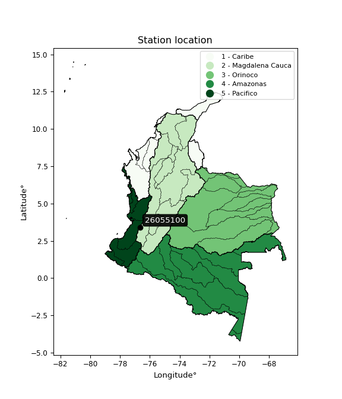</img>

</div>


## A. General information


### 1. General running parameters

• app_version: _v20260103_. • runtime: _2026-01-05 16:20:51.132608_. • Python version: _3.14.0_. • SciPy version: _1.16.3_. • Pandas version: _2.3.3_. • NumPy version: _2.3.5_. • Stations dataset (station_dataset_file): _dataset/pmax24h_in/automatic_colombia_2003_2024.csv_. • Stations catalog (station_catalog_file): _dataset/CNE.xls_. • Minimum year to eval til year_max (date_min): _1900_. • Maximum year to eval since year_min (date_max): _2024_. • Creates, save and include plots into reports (create_plot): _True_. • Plot only fit distributions with Δo > Δ (plot_only_fit): _True_. • Plot only simple graphs avoiding multiple CDFs and multiple Extreme values plots (plot_only_simple): _True_. • Eval low extreme values, if False, evaluates high extreme values (low_extreme): _False_. • Eval every SciPy distribution as logarithmic (pdist_logarithmic_on): _True_. • Standard deviation normalized (ddof): _1.0_. • Return periods to eval in years (Tr): _[2, 2.33, 5, 10, 15, 20, 25, 50, 75, 100, 200, 250, 500, 750, 1000]_. • Minimum data sample per station, 0 means any (minimum_sample): _5_. • Z-Score maximum threshold to adjust a value, 0 means disable (zscore_max): _3.5_. • Z-Score minimum threshold to adjust a value, 0 means disable (zscore_min): _-2.5_. • Avoid zeros, e.g. rain = 0 (avoid_zeros): _True_. • Avoid null values (avoid_nans): _True_. 

[:file_folder:Dataset file](../../dataset/pmax24h_in/automatic_colombia_2003_2024.csv)

> Delta Degrees of Freedom (DDOF): is a parameter used in the formulas for calculating variance and standard deviation. When ddof=0, the divisor is $N$ (the total number of observations) and this is used when your data set is the entire population. When ddof=1, the divisor is $N-1$ and this is used when your data set is a sample drawn from a larger population. Using $N-1$ provides an unbiased estimate of the population variance (known as Bessel´s correction).


### 2. Station info and location

|   id |   CODIGO | NOMBRE                      | CATEGORIA               | TECNOLOGIA                | ESTADO           | FECHA_INSTALACION   |   FECHA_SUSPENSION |   ALTITUD |   LATITUD |   LONGITUD | DEPARTAMENTO    | MUNICIPIO   | AREA_OPERATIVA                         | ENTIDAD                                                     | AREA_HIDROGRAFICA   | ZONA_HIDROGRAFICA   | SUBZONA_HIDROGRAFICA   |   CORRIENTE | Catalogo   |   Version |
|-----:|---------:|:----------------------------|:------------------------|:--------------------------|:-----------------|:--------------------|-------------------:|----------:|----------:|-----------:|:----------------|:------------|:---------------------------------------|:------------------------------------------------------------|:--------------------|:--------------------|:-----------------------|------------:|:-----------|----------:|
|    0 | 26055100 | FARALLONES - AUT [26055100] | Climatológica Principal | Automática con Telemetría | En Mantenimiento | 28/06/2005          |                nan |      2275 |   3.41606 |   -76.6515 | Valle Del Cauca | Cali        | Area Operativa 09 - Cauca-Valle-Caldas | INSTITUTO DE HIDROLOGIA METEOROLOGIA Y ESTUDIOS AMBIENTALES | Magdalena Cauca     | Cauca               | Ríos Cali              |         nan | CNE_IDEAM  |  20251226 |

<div align="center">

Dynamic map: [:earth_americas:Google](http://maps.google.com/maps?q=3.416055556,-76.6515) [:earth_americas:OSM](https://www.openstreetmap.org/#map=18/3.416055556/-76.6515&layers=P) [:earth_americas:Bing](https://www.bing.com/maps?cp=3.416055556~-76.6515&lvl=18) [:earth_americas:Apple](https://maps.apple.com/frame?center=3.416055556%2C-76.6515&span=0.003%2C0.006)

</div>


<div align="center">

```geojson
{
  "type": "Feature",
  "geometry": {
    "type": "Point", 
    "coordinates": [-76.6515, 3.416055556]
  }, 
  "properties": {
    "Name": "26055100"
  }
}
```

</div>


### 3. Discrete values table and plot

<div align="center">

|               |          0 |           1 |           2 |           3 |           4 |           5 |           6 |          7 |         8 |
|:--------------|-----------:|------------:|------------:|------------:|------------:|------------:|------------:|-----------:|----------:|
| Date          | 2016       | 2017        | 2018        | 2019        | 2020        | 2021        | 2022        | 2023       | 2024      |
| Value         |    0.1     |   45.5      |   49.7      |   49.2      |   44.5      |   44.2      |   30.1      |    0.6     |   42.6    |
| Value_initial |    0.1     |   45.5      |   49.7      |   49.2      |   44.5      |   44.2      |   30.1      |    0.6     |   42.6    |
| count         |    9       |    9        |    9        |    9        |    9        |    9        |    9        |    9       |    9      |
| mean          |   34.0556  |   34.0556   |   34.0556   |   34.0556   |   34.0556   |   34.0556   |   34.0556   |   34.0556  |   34.0556 |
| std           |   19.9311  |   19.9311   |   19.9311   |   19.9311   |   19.9311   |   19.9311   |   19.9311   |   19.9311  |   19.9311 |
| zscore        |   -1.70365 |    0.574201 |    0.784927 |    0.759841 |    0.524028 |    0.508976 |   -0.198462 |   -1.67856 |    0.4287 |


</div>


<div align="center">

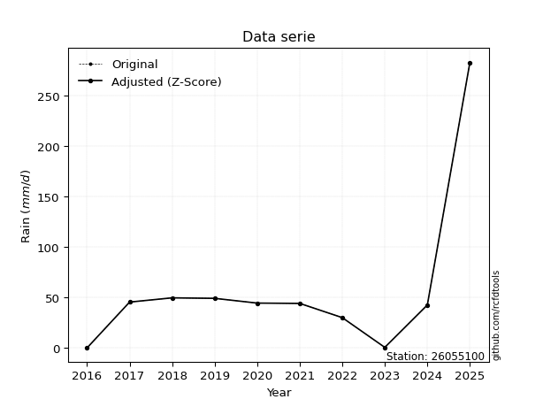</img>

</div>


> The initial value (value_initial) correspond to the initial obtained or null completed value, and value (value) is adjusted only when the initial value is outside the valid range (outlier) definite through the Z-Score value. If Z-Score is active, values out of range or outliers are replaced with the station mean value. A Z-Score (or standard score) measures how many standard deviations a data point is from the mean of a dataset, indicating its relative position; positive scores mean above the mean, negative mean below, and a score of zero is exactly at the mean, allowing for comparison of values from different distributions. It´s calculated using the formula $z=(x–μ)/σ$, where $x$ is the data point, $μ$ is the mean, and $σ$ is the standard deviation, helping identify outliers and understand probability.
>
> <sub>**Note**: In this study, "completing" (filling gaps in) and "extending" (forecasting or lengthening the historical record) rainfall data series are avoided for certain critical analyses because they introduce artificial bias and uncertainty, which can distort the statistics of rare events (extremes), alter day-to-day variability, and compromise the integrity and homogeneity of the original data. Some reasons against Completing/Extending rainfall data are: **Distortion of Extremes and Variability**: The primary issue is that most gap-filling or extension methods rely on averaging or regression with nearby stations, which inherently smooths the data. Rainfall is highly variable in space and time, with a large percentage of zero values and occasional large storms. Infilling methods often underestimate the highest values and overestimate the lowest (zero) values, which severely distorts analyses focused on flood frequency, drought severity, and intensity-duration-frequency (IDF) curves, **Loss of Data Homogeneity**: Infilled or extended data are synthetic estimates, not actual measurements. Combining these estimates with observed data can violate the assumption of data homogeneity, which requires that the data properties do not change over time. Inhomogeneity can lead to incorrect conclusions about long-term trends or changes in climate patterns, **Propagation of Errors**: Errors and biases from the original data (e.g., wind-induced undercatch, instrument errors, site changes) or the data used for imputation can propagate through the analysis, leading to unreliable hydrological models and inaccurate predictions, **Compromised Statistical Integrity**: For statistical analyses, especially those involving the frequency of events, using artificial data can introduce time bias or autocorrelation that doesn´t exist in reality, making it difficult to assess the true probability of events, **Difficulty in Validation**: It is difficult to accurately validate the quality of filled or extended data, especially for past periods where ground-truth measurements are unavailable. The reliability of imputation techniques heavily depends on the density of the surrounding station network and the complexity of the local topography.</sub>


### 4. Active continuous probability distributions from SciPy (44 of 104 available)

A Probability Density Function (PDF) describes the relative likelihood of a continuous random variable falling within a specific range, where the total area under its curve equals 1, and the area over any interval gives the actual probability for that range. Unlike discrete probabilities (like rolling a die), a PDF shows density, not direct probability for a single point (which is zero), with higher points indicating higher likelihood, often visualized as a bell curve for normal distributions.

A log of a probability density function (log-PDF) is simply the logarithm of the PDF´s value, denoted as $log(f(x))$, useful for converting multiplication of probabilities into addition, improving numerical stability with tiny numbers, and connecting to information theory concepts like entropy. Instead of dealing with very small probabilities (e.g., 0.000001), log-PDFs use negative numbers (e.g., $log(0.00001) ≈ -11.51$ that are easier for computers to handle, preventing underflow errors and simplifying complex calculations. In this study, each active probability distribution from SciPy is also evaluated in the $log$ form.

[scipy.stats](https://docs.scipy.org/doc/scipy/reference/stats.html) is a Python´s powerful submodule within the SciPy library for comprehensive statistical analysis, offering over 130 probability distributions (like Normal, Poisson), functions for descriptive stats (mean, variance), hypothesis testing (t-tests, chi-square), random variable generation, and statistical tests, making it essential for data science, modeling, and research. It provides tools to explore, model, and draw conclusions from data efficiently, working seamlessly with NumPy.

<div align="center">

|   id | p_dist             |   n_parameter | fit_method   | label                                                                       | active   | ref                                                                                                        |
|-----:|:-------------------|--------------:|:-------------|:----------------------------------------------------------------------------|:---------|:-----------------------------------------------------------------------------------------------------------|
|    0 | alpha              |             3 | MLE          | Alpha                                                                       | True     | [:mortar_board:](https://docs.scipy.org/doc/scipy/reference/generated/scipy.stats.alpha.html)              |
|    1 | betaprime          |             4 | MLE          | Beta prime                                                                  | True     | [:mortar_board:](https://docs.scipy.org/doc/scipy/reference/generated/scipy.stats.betaprime.html)          |
|    2 | chi2               |             3 | MLE          | Chi²                                                                        | True     | [:mortar_board:](https://docs.scipy.org/doc/scipy/reference/generated/scipy.stats.chi2.html)               |
|    3 | crystalball        |             4 | MLE          | Crystalball                                                                 | True     | [:mortar_board:](https://docs.scipy.org/doc/scipy/reference/generated/scipy.stats.crystalball.html)        |
|    4 | erlang             |             3 | MLE          | Erlang                                                                      | True     | [:mortar_board:](https://docs.scipy.org/doc/scipy/reference/generated/scipy.stats.erlang.html)             |
|    5 | expon              |             2 | MLE          | Exponential                                                                 | True     | [:mortar_board:](https://docs.scipy.org/doc/scipy/reference/generated/scipy.stats.expon.html)              |
|    6 | exponnorm          |             3 | MLE          | Exponentially modified Normal                                               | True     | [:mortar_board:](https://docs.scipy.org/doc/scipy/reference/generated/scipy.stats.exponnorm.html)          |
|    7 | f                  |             4 | MLE          | F                                                                           | True     | [:mortar_board:](https://docs.scipy.org/doc/scipy/reference/generated/scipy.stats.f.html)                  |
|    8 | fatiguelife        |             3 | MLE          | Fatigue-life (Birnbaum-Saunders)                                            | True     | [:mortar_board:](https://docs.scipy.org/doc/scipy/reference/generated/scipy.stats.fatiguelife.html)        |
|    9 | fisk               |             3 | MLE          | Fisk                                                                        | True     | [:mortar_board:](https://docs.scipy.org/doc/scipy/reference/generated/scipy.stats.fisk.html)               |
|   10 | gamma              |             3 | MLE          | Gamma                                                                       | True     | [:mortar_board:](https://docs.scipy.org/doc/scipy/reference/generated/scipy.stats.gamma.html)              |
|   11 | genexpon           |             5 | MLE          | Generalized exponential                                                     | True     | [:mortar_board:](https://docs.scipy.org/doc/scipy/reference/generated/scipy.stats.genexpon.html)           |
|   12 | genlogistic        |             3 | MLE          | Generalized logistic                                                        | True     | [:mortar_board:](https://docs.scipy.org/doc/scipy/reference/generated/scipy.stats.genlogistic.html)        |
|   13 | gibrat             |             2 | MM           | Gibrat                                                                      | True     | [:mortar_board:](https://docs.scipy.org/doc/scipy/reference/generated/scipy.stats.gibrat.html)             |
|   14 | gompertz           |             3 | MLE          | Gompertz (or truncated Gumbel)                                              | True     | [:mortar_board:](https://docs.scipy.org/doc/scipy/reference/generated/scipy.stats.gompertz.html)           |
|   15 | gumbel_l           |             2 | MM           | Gumbel Left Skew                                                            | True     | [:mortar_board:](https://docs.scipy.org/doc/scipy/reference/generated/scipy.stats.gumbel_l.html)           |
|   16 | gumbel_r           |             2 | MM           | Gumbel Right Skew                                                           | True     | [:mortar_board:](https://docs.scipy.org/doc/scipy/reference/generated/scipy.stats.gumbel_r.html)           |
|   17 | halflogistic       |             2 | MM           | Half-logistic                                                               | True     | [:mortar_board:](https://docs.scipy.org/doc/scipy/reference/generated/scipy.stats.halflogistic.html)       |
|   18 | halfnorm           |             2 | MM           | Half Normal                                                                 | True     | [:mortar_board:](https://docs.scipy.org/doc/scipy/reference/generated/scipy.stats.halfnorm.html)           |
|   19 | hypsecant          |             2 | MM           | hyperbolic secant                                                           | True     | [:mortar_board:](https://docs.scipy.org/doc/scipy/reference/generated/scipy.stats.hypsecant.html)          |
|   20 | invgamma           |             3 | MLE          | Inverted gamma                                                              | True     | [:mortar_board:](https://docs.scipy.org/doc/scipy/reference/generated/scipy.stats.invgamma.html)           |
|   21 | invgauss           |             3 | MLE          | Inverse Gaussian                                                            | True     | [:mortar_board:](https://docs.scipy.org/doc/scipy/reference/generated/scipy.stats.invgauss.html)           |
|   22 | invweibull         |             3 | MLE          | Inverted Weibull                                                            | True     | [:mortar_board:](https://docs.scipy.org/doc/scipy/reference/generated/scipy.stats.invweibull.html)         |
|   23 | johnsonsu          |             4 | MLE          | Johnson Su                                                                  | True     | [:mortar_board:](https://docs.scipy.org/doc/scipy/reference/generated/scipy.stats.johnsonsu.html)          |
|   24 | kstwobign          |             2 | MLE          | Limiting distribution of scaled Kolmogorov-Smirnov two-sided test statistic | True     | [:mortar_board:](https://docs.scipy.org/doc/scipy/reference/generated/scipy.stats.kstwobign.html)          |
|   25 | laplace            |             2 | MM           | Laplace                                                                     | True     | [:mortar_board:](https://docs.scipy.org/doc/scipy/reference/generated/scipy.stats.laplace.html)            |
|   26 | laplace_asymmetric |             3 | MLE          | Asymmetric Laplace                                                          | True     | [:mortar_board:](https://docs.scipy.org/doc/scipy/reference/generated/scipy.stats.laplace_asymmetric.html) |
|   27 | loggamma           |             3 | MLE          | Log gamma                                                                   | True     | [:mortar_board:](https://docs.scipy.org/doc/scipy/reference/generated/scipy.stats.loggamma.html)           |
|   28 | logistic           |             2 | MM           | Logistic (or Sech-squared)                                                  | True     | [:mortar_board:](https://docs.scipy.org/doc/scipy/reference/generated/scipy.stats.logistic.html)           |
|   29 | lognorm            |             3 | MLE          | Log Normal                                                                  | True     | [:mortar_board:](https://docs.scipy.org/doc/scipy/reference/generated/scipy.stats.lognorm.html)            |
|   30 | maxwell            |             2 | MM           | Maxwell                                                                     | True     | [:mortar_board:](https://docs.scipy.org/doc/scipy/reference/generated/scipy.stats.maxwell.html)            |
|   31 | mielke             |             4 | MLE          | Mielke Beta-Kappa / Dagum                                                   | True     | [:mortar_board:](https://docs.scipy.org/doc/scipy/reference/generated/scipy.stats.mielke.html)             |
|   32 | moyal              |             2 | MM           | Moyal                                                                       | True     | [:mortar_board:](https://docs.scipy.org/doc/scipy/reference/generated/scipy.stats.moyal.html)              |
|   33 | nakagami           |             3 | MLE          | Nakagami                                                                    | True     | [:mortar_board:](https://docs.scipy.org/doc/scipy/reference/generated/scipy.stats.nakagami.html)           |
|   34 | ncf                |             5 | MLE          | Non-central F distribution                                                  | True     | [:mortar_board:](https://docs.scipy.org/doc/scipy/reference/generated/scipy.stats.ncf.html)                |
|   35 | nct                |             4 | MLE          | Non-central Student’s t                                                     | True     | [:mortar_board:](https://docs.scipy.org/doc/scipy/reference/generated/scipy.stats.nct.html)                |
|   36 | norm               |             2 | MM           | Normal                                                                      | True     | [:mortar_board:](https://docs.scipy.org/doc/scipy/reference/generated/scipy.stats.norm.html)               |
|   37 | pearson3           |             3 | MM           | Pearson type III                                                            | True     | [:mortar_board:](https://docs.scipy.org/doc/scipy/reference/generated/scipy.stats.pearson3.html)           |
|   38 | rayleigh           |             2 | MM           | Rayleigh                                                                    | True     | [:mortar_board:](https://docs.scipy.org/doc/scipy/reference/generated/scipy.stats.rayleigh.html)           |
|   39 | rice               |             3 | MLE          | Rice                                                                        | True     | [:mortar_board:](https://docs.scipy.org/doc/scipy/reference/generated/scipy.stats.rice.html)               |
|   40 | t                  |             3 | MLE          | Student’s t                                                                 | True     | [:mortar_board:](https://docs.scipy.org/doc/scipy/reference/generated/scipy.stats.t.html)                  |
|   41 | truncnorm          |             4 | MLE          | Truncated normal                                                            | True     | [:mortar_board:](https://docs.scipy.org/doc/scipy/reference/generated/scipy.stats.truncnorm.html)          |
|   42 | wald               |             2 | MM           | Wald                                                                        | True     | [:mortar_board:](https://docs.scipy.org/doc/scipy/reference/generated/scipy.stats.wald.html)               |
|   43 | weibull_min        |             3 | MLE          | Weibull minimum                                                             | True     | [:mortar_board:](https://docs.scipy.org/doc/scipy/reference/generated/scipy.stats.weibull_min.html)        |

</div>

> **n_parameter:** # arguments & localization & scale.
>
> **Fit methods:** (MLE) maximum likelihood, (MM) L-moments.
>
>**Inactive** (With the only purpose of prevent loops, zero divisions, infinite values, over high estimated values or horizontal trending for recurrence intervals estimations, the follow distributions were disabled.)**:** foldnorm, gennorm, norminvgauss, powernorm, powerlognorm, skewnorm, genextreme, anglit, arcsine, argus, beta, bradford, burr, burr12, cauchy, cosine, halfcauchy, foldcauchy, skewcauchy, wrapcauchy, dgamma, gengamma, exponweib, exponpow, truncexpon, gausshyper, genhalflogistic, genhyperbolic, geninvgauss, halfgennorm, johnsonsb, kappa4, kappa3, ksone, kstwo, loglaplace, levy, levy_l, levy_stable, ncx2, pareto, genpareto, truncpareto, lomax, powerlaw, rdist, rel_breitwigner, recipinvgauss, semicircular, studentized_range, trapezoid, triang, truncweibull_min, tukeylambda, uniform, loguniform, vonmises, vonmises_line, weibull_max, dweibull, 


## B. Probability (PDF) vs. Empirical (EDF) distributions functions

A continuous probability distribution (CPD) describes probabilities for variables that can take any value within a range (like rain any time), unlike discrete variables with specific outcomes (like temperature). It uses a Probability Density Function (PDF), a curve where the total area under it equals 1, and the probability of the variable falling within an interval (a to b) is found by calculating the area under the curve between those points. A key feature is that the probability of hitting any single exact value is zero, so probabilities are always expressed for ranges, e.g., $P(a ≤ X ≤ b)$.

<div align="center">

Distributions parameters from station values
|    |   station | p_dist                |   n |               loc |            scale | shape                  | shape1                 | shape2              | shape3   |
|---:|----------:|:----------------------|----:|------------------:|-----------------:|:-----------------------|:-----------------------|:--------------------|:---------|
|  0 |  26055100 | alpha                 |   9 |       0.00408987  |      0.284574    | 1.3362075089155415e-06 |                        |                     |          |
|  1 |  26055100 | betaprime             |   9 |   -1256.97        | 493391           | 4596.065012125275      | 1756481.584533153      |                     |          |
|  2 |  26055100 | chi2                  |   9 |    -150.322       |      1.0757      | 170.69949978194455     |                        |                     |          |
|  3 |  26055100 | crystalball           |   9 |      34.0556      |     18.7912      | 3389.0824055869152     | 1127.5683479097588     |                     |          |
|  4 |  26055100 | erlang                |   9 |       0.1         |     31.2545      | 0.7377956900556686     |                        |                     |          |
|  5 |  26055100 | expon                 |   9 |       0.1         |     33.9556      |                        |                        |                     |          |
|  6 |  26055100 | exponnorm             |   9 |      34.0425      |     18.7911      | 0.0006803194480711741  |                        |                     |          |
|  7 |  26055100 | f                     |   9 |       0.1         |     31.8333      | 1.0217634591017632     | 19.60050670496544      |                     |          |
|  8 |  26055100 | fatiguelife           |   9 |   -4152.5         |   4186.49        | 0.004481640990849143   |                        |                     |          |
|  9 |  26055100 | fisk                  |   9 |       0.1         |     22.7213      | 0.763633732870983      |                        |                     |          |
| 10 |  26055100 | gamma                 |   9 |       0.1         |     57.5535      | 0.596040199353705      |                        |                     |          |
| 11 |  26055100 | genexpon              |   9 |       0.0999938   |      2.18118     | 0.0642023815633696     | 1.6724896945942192e-07 | 1.1728910087641666  |          |
| 12 |  26055100 | genlogistic           |   9 |      49.7002      |      1.42879e-05 | 9.147193927774559e-07  |                        |                     |          |
| 13 |  26055100 | gibrat                |   9 |      19.7202      |      8.69482     |                        |                        |                     |          |
| 14 |  26055100 | gompertz              |   9 |       1.69791     |      3.32157     | 1.391333651332513e-06  |                        |                     |          |
| 15 |  26055100 | gumbel_l              |   9 |      42.5126      |     14.6514      |                        |                        |                     |          |
| 16 |  26055100 | gumbel_r              |   9 |      25.5985      |     14.6514      |                        |                        |                     |          |
| 17 |  26055100 | halflogistic          |   9 |      11.7836      |     16.0658      |                        |                        |                     |          |
| 18 |  26055100 | halfnorm              |   9 |       9.18334     |     31.1727      |                        |                        |                     |          |
| 19 |  26055100 | hypsecant             |   9 |      34.0556      |     11.9628      |                        |                        |                     |          |
| 20 |  26055100 | invgamma              |   9 |    -238.097       |  49510.2         | 183.4457678498273      |                        |                     |          |
| 21 |  26055100 | invgauss              |   9 |    -100.41        |   5306.09        | 0.025278773594158747   |                        |                     |          |
| 22 |  26055100 | invweibull            |   9 |      -2.75192e+09 |      2.75192e+09 | 135266884.4814356      |                        |                     |          |
| 23 |  26055100 | johnsonsu             |   9 |      49.7         |      5.10182e-12 | 2.9981595504255165     | 0.13428337693185663    |                     |          |
| 24 |  26055100 | kstwobign             |   9 |     -48.2856      |     93.7259      |                        |                        |                     |          |
| 25 |  26055100 | laplace               |   9 |      34.0556      |     13.2874      |                        |                        |                     |          |
| 26 |  26055100 | laplace_asymmetric    |   9 |      49.7         |      0.112507    | 138.99680707290315     |                        |                     |          |
| 27 |  26055100 | loggamma              |   9 |      49.7005      |      2.46686e-05 | 1.5783815860698742e-06 |                        |                     |          |
| 28 |  26055100 | logistic              |   9 |      34.0556      |     10.3601      |                        |                        |                     |          |
| 29 |  26055100 | lognorm               |   9 |       0.1         |      0.231576    | 13.280043863012839     |                        |                     |          |
| 30 |  26055100 | maxwell               |   9 |     -10.4717      |     27.9033      |                        |                        |                     |          |
| 31 |  26055100 | mielke                |   9 | -188002           | 188052           | 12003.767031430312     | 63560932.231375486     |                     |          |
| 32 |  26055100 | moyal                 |   9 |      23.3095      |      8.45901     |                        |                        |                     |          |
| 33 |  26055100 | nakagami              |   9 |       0.1         |     54.2231      | 0.1238528336445405     |                        |                     |          |
| 34 |  26055100 | ncf                   |   9 |       0.1         |      5.70156     | 0.5739646790029818     | 9.155202442568502      | 2.3260852402681236  |          |
| 35 |  26055100 | nct                   |   9 |      -2.97968     |      0.337779    | 0.5935331097650616     | 20.033886764864747     |                     |          |
| 36 |  26055100 | norm                  |   9 |      34.0556      |     18.7912      |                        |                        |                     |          |
| 37 |  26055100 | pearson3              |   9 |      34.0556      |     18.7912      | -1.0892825055834876    |                        |                     |          |
| 38 |  26055100 | rayleigh              |   9 |      -1.8931      |     28.6829      |                        |                        |                     |          |
| 39 |  26055100 | rice                  |   9 |     -13.46        |     20.4866      | 2.0544351073356664     |                        |                     |          |
| 40 |  26055100 | t                     |   9 |      34.0552      |     18.7918      | 21285979.393829335     |                        |                     |          |
| 41 |  26055100 | truncnorm             |   9 |      26.0693      |     25.2023      | -1.0304544495168604    | 274.52090517950273     |                     |          |
| 42 |  26055100 | wald                  |   9 |      15.2644      |     18.7912      |                        |                        |                     |          |
| 43 |  26055100 | weibull_min           |   9 |      -9.10693e+08 |      9.10693e+08 | 78711800.10693383      |                        |                     |          |
| 44 |  26055100 | logalpha              |   9 |     -28.8618      |    394.981       | 12.706709469985533     |                        |                     |          |
| 45 |  26055100 | logbetaprime          |   9 |      -2.30259     |      3.28073     | 0.2029692927444713     | 0.7949821624036779     |                     |          |
| 46 |  26055100 | logchi2               |   9 |      -2.30259     |      1.23013     | 1.0204856938578046     |                        |                     |          |
| 47 |  26055100 | logcrystalball        |   9 |       2.61631     |      2.19581     | 11.873600836309867     | 21.281208388159847     |                     |          |
| 48 |  26055100 | logerlang             |   9 |     -30.7558      |      0.161875    | 206.09826477233491     |                        |                     |          |
| 49 |  26055100 | logexpon              |   9 |      -2.30259     |      4.9189      |                        |                        |                     |          |
| 50 |  26055100 | logexponnorm          |   9 |       2.6151      |      2.19582     | 0.0005546625385300936  |                        |                     |          |
| 51 |  26055100 | logf                  |   9 |      -2.30259     |      1.1093      | 0.2919974851329126     | 1.738658389023199      |                     |          |
| 52 |  26055100 | logfatiguelife        |   9 |   -1103.81        |   1106.41        | 0.0019780043874611138  |                        |                     |          |
| 53 |  26055100 | logfisk               |   9 |      -2.30259     |      1.57743     | 0.7846133473808845     |                        |                     |          |
| 54 |  26055100 | loggamma              |   9 |     -35.5275      |      0.135676    | 281.030202308138       |                        |                     |          |
| 55 |  26055100 | loggenexpon           |   9 |      -2.30259     |      3.11721     | 0.28833669187587496    | 1.5857648736535488     | 0.24241008882878867 |          |
| 56 |  26055100 | loggenlogistic        |   9 |       3.90602     |      6.20023e-07 | 4.800018562435114e-07  |                        |                     |          |
| 57 |  26055100 | loggibrat             |   9 |       0.941201    |      1.01602     |                        |                        |                     |          |
| 58 |  26055100 | loggompertz           |   9 |      -2.30259     |      2.04484     | 0.06995071517494694    |                        |                     |          |
| 59 |  26055100 | loggumbel_l           |   9 |       3.60454     |      1.71207     |                        |                        |                     |          |
| 60 |  26055100 | loggumbel_r           |   9 |       1.62808     |      1.71207     |                        |                        |                     |          |
| 61 |  26055100 | loghalflogistic       |   9 |       0.0137604   |      1.87735     |                        |                        |                     |          |
| 62 |  26055100 | loghalfnorm           |   9 |      -0.290094    |      3.64264     |                        |                        |                     |          |
| 63 |  26055100 | loghypsecant          |   9 |       2.61631     |      1.3979      |                        |                        |                     |          |
| 64 |  26055100 | loginvgamma           |   9 |     -46.8412      |  23310.5         | 472.14188579698066     |                        |                     |          |
| 65 |  26055100 | loginvgauss           |   9 |     -16.7719      |   1210.42        | 0.015933920723992842   |                        |                     |          |
| 66 |  26055100 | loginvweibull         |   9 |      -4.45664e+08 |      4.45664e+08 | 164653077.0045527      |                        |                     |          |
| 67 |  26055100 | logjohnsonsu          |   9 |       3.906       |      6.66469e-16 | 1.9852335013927198     | 0.08717950238285796    |                     |          |
| 68 |  26055100 | logkstwobign          |   9 |      -7.90498     |     12.0137      |                        |                        |                     |          |
| 69 |  26055100 | loglaplace            |   9 |       2.61631     |      1.55267     |                        |                        |                     |          |
| 70 |  26055100 | loglaplace_asymmetric |   9 |       3.90601     |      0.0104748   | 123.13375263826663     |                        |                     |          |
| 71 |  26055100 | logloggamma           |   9 |       3.90621     |      1.51281e-06 | 1.1662154727830406e-06 |                        |                     |          |
| 72 |  26055100 | loglogistic           |   9 |       2.61631     |      1.21061     |                        |                        |                     |          |
| 73 |  26055100 | loglognorm            |   9 |    -887.256       |    889.866       | 0.0024624196768075913  |                        |                     |          |
| 74 |  26055100 | logmaxwell            |   9 |      -2.58684     |      3.26059     |                        |                        |                     |          |
| 75 |  26055100 | logmielke             |   9 |      -2.30259     |      9.3964      | 0.19022322333092906    | 2.0478499948332693     |                     |          |
| 76 |  26055100 | logmoyal              |   9 |       1.3606      |      0.988462    |                        |                        |                     |          |
| 77 |  26055100 | lognakagami           |   9 |   -1628.41        |   1631.03        | 138152.3000510129      |                        |                     |          |
| 78 |  26055100 | logncf                |   9 |      -2.30259     |      1.08731     | 1.0041277870367968     | 1.1074453988937394     | 1.0692487676654467  |          |
| 79 |  26055100 | lognct                |   9 |    -105.83        |      2.10934     | 13567.642760224677     | 51.40919388072355      |                     |          |
| 80 |  26055100 | lognorm               |   9 |       2.61631     |      2.19581     |                        |                        |                     |          |
| 81 |  26055100 | logpearson3           |   9 |       2.6163      |      2.19583     | -1.452661889494945     |                        |                     |          |
| 82 |  26055100 | lograyleigh           |   9 |      -1.58438     |      3.35167     |                        |                        |                     |          |
| 83 |  26055100 | logrice               |   9 |    -789.853       |      2.19025     | 361.81562209764115     |                        |                     |          |
| 84 |  26055100 | logt                  |   9 |       3.79687     |      0.0303395   | 0.38483010233590653    |                        |                     |          |
| 85 |  26055100 | logtruncnorm          |   9 |       3.16909     |      2.20165     | -2.4852640366632817    | 0.33471584869699544    |                     |          |
| 86 |  26055100 | logwald               |   9 |       0.420539    |      2.19579     |                        |                        |                     |          |
| 87 |  26055100 | logweibull_min        |   9 |      -2.30259     |      1.69505     | 0.23056193785465456    |                        |                     |          |

</div>

> **loc** (Location parameter): This shifts the distribution along the x-axis. For many common distributions, like the normal (Gaussian) distribution, loc represents the mean $μ$. For others, like the uniform distribution, it might represent the minimum value, or for the beta distribution, the left end of the support interval.
>
> **scale** (Scale parameter): This determines the width or spread of the distribution. For the normal distribution, scale represents the standard deviation $σ$. For a uniform distribution, it defines the length of the interval (from $loc$ to $loc + scale$).
>
> **shape** (Shape parameters): Refers to parameters that define the specific form of a probability distribution, distinct from its location (loc) and scale (scale). These parameters are required arguments for most distribution functions. For example, a normal (Gaussian) distribution is fully defined by its location (mean) and scale (standard deviation), so it has no specific shape parameters beyond loc and scale. However, other distributions have intrinsic properties that need specification, as Gamma distribution that takes a shape parameter, often named $a$ or $alpha$.


### 0. Cumulative distribution values - CDF (88 evaluated)

Cumulative Distribution Function (CDF), denoted as $F$<sub>$X$</sub>$(x)$, is a function that gives the probability that a random variable $X$ will take a value less than or equal to a specific value, $x$ (i.e., $(P(X≥x)$. It essentially "accumulates" probabilities from a given point up to the far right (positive infinity), providing a complete picture of the distribution´s probabilities for both discrete (like rain) and continuous (like temperature) variables, helping to find probabilities over ranges or above certain values. Each station is evaluated separately ordering the $x$ values ascending, calculating the CDF and PDF values for the activated distributions and their logarithmic forms.

<div align="center">

CDF ordered by x ascending and calculating $log(f(x))$ separately
|   id |   Station |   date |    x |   count |    mean |     std |    zscore |   Value_initial |   station |   m |     alpha |   alpha_pdf |   betaprime |   betaprime_pdf |      chi2 |   chi2_pdf |   crystalball |   crystalball_pdf |      erlang |    erlang_pdf |     expon |   expon_pdf |   exponnorm |   exponnorm_pdf |           f |       f_pdf |   fatiguelife |   fatiguelife_pdf |        fisk |     fisk_pdf |       gamma |       gamma_pdf |    genexpon |   genexpon_pdf |   genlogistic |   genlogistic_pdf |   gibrat |   gibrat_pdf |   gompertz |   gompertz_pdf |   gumbel_l |   gumbel_l_pdf |   gumbel_r |   gumbel_r_pdf |   halflogistic |   halflogistic_pdf |   halfnorm |   halfnorm_pdf |   hypsecant |   hypsecant_pdf |   invgamma |   invgamma_pdf |   invgauss |   invgauss_pdf |   invweibull |   invweibull_pdf |   johnsonsu |   johnsonsu_pdf |   kstwobign |   kstwobign_pdf |   laplace |   laplace_pdf |   laplace_asymmetric |   laplace_asymmetric_pdf |   loggamma |   loggamma_pdf |   logistic |   logistic_pdf |   lognorm |   lognorm_pdf |   maxwell |   maxwell_pdf |    mielke |   mielke_pdf |       moyal |   moyal_pdf |    nakagami |   nakagami_pdf |         ncf |     ncf_pdf |       nct |    nct_pdf |      norm |   norm_pdf |   pearson3 |   pearson3_pdf |   rayleigh |   rayleigh_pdf |      rice |   rice_pdf |        t |      t_pdf |   truncnorm |   truncnorm_pdf |     wald |   wald_pdf |   weibull_min |   weibull_min_pdf |   logalpha |   logalpha_pdf |   logbetaprime |   logbetaprime_pdf |     logchi2 |   logchi2_pdf |   logcrystalball |   logcrystalball_pdf |   logerlang |   logerlang_pdf |   logexpon |   logexpon_pdf |   logexponnorm |   logexponnorm_pdf |       logf |    logf_pdf |   logfatiguelife |   logfatiguelife_pdf |     logfisk |   logfisk_pdf |   loggenexpon |   loggenexpon_pdf |   loggenlogistic |   loggenlogistic_pdf |   loggibrat |   loggibrat_pdf |   loggompertz |   loggompertz_pdf |   loggumbel_l |   loggumbel_l_pdf |   loggumbel_r |   loggumbel_r_pdf |   loghalflogistic |   loghalflogistic_pdf |   loghalfnorm |   loghalfnorm_pdf |   loghypsecant |   loghypsecant_pdf |   loginvgamma |   loginvgamma_pdf |   loginvgauss |   loginvgauss_pdf |   loginvweibull |   loginvweibull_pdf |   logjohnsonsu |   logjohnsonsu_pdf |   logkstwobign |   logkstwobign_pdf |   loglaplace |   loglaplace_pdf |   loglaplace_asymmetric |   loglaplace_asymmetric_pdf |   logloggamma |   logloggamma_pdf |   loglogistic |   loglogistic_pdf |   loglognorm |   loglognorm_pdf |   logmaxwell |   logmaxwell_pdf |   logmielke |   logmielke_pdf |    logmoyal |   logmoyal_pdf |   lognakagami |   lognakagami_pdf |      logncf |   logncf_pdf |    lognct |   lognct_pdf |   logpearson3 |   logpearson3_pdf |   lograyleigh |   lograyleigh_pdf |   logrice |   logrice_pdf |      logt |   logt_pdf |   logtruncnorm |   logtruncnorm_pdf |   logwald |   logwald_pdf |   logweibull_min |   logweibull_min_pdf |
|-----:|----------:|-------:|-----:|--------:|--------:|--------:|----------:|----------------:|----------:|----:|----------:|------------:|------------:|----------------:|----------:|-----------:|--------------:|------------------:|------------:|--------------:|----------:|------------:|------------:|----------------:|------------:|------------:|--------------:|------------------:|------------:|-------------:|------------:|----------------:|------------:|---------------:|--------------:|------------------:|---------:|-------------:|-----------:|---------------:|-----------:|---------------:|-----------:|---------------:|---------------:|-------------------:|-----------:|---------------:|------------:|----------------:|-----------:|---------------:|-----------:|---------------:|-------------:|-----------------:|------------:|----------------:|------------:|----------------:|----------:|--------------:|---------------------:|-------------------------:|-----------:|---------------:|-----------:|---------------:|----------:|--------------:|----------:|--------------:|----------:|-------------:|------------:|------------:|------------:|---------------:|------------:|------------:|----------:|-----------:|----------:|-----------:|-----------:|---------------:|-----------:|---------------:|----------:|-----------:|---------:|-----------:|------------:|----------------:|---------:|-----------:|--------------:|------------------:|-----------:|---------------:|---------------:|-------------------:|------------:|--------------:|-----------------:|---------------------:|------------:|----------------:|-----------:|---------------:|---------------:|-------------------:|-----------:|------------:|-----------------:|---------------------:|------------:|--------------:|--------------:|------------------:|-----------------:|---------------------:|------------:|----------------:|--------------:|------------------:|--------------:|------------------:|--------------:|------------------:|------------------:|----------------------:|--------------:|------------------:|---------------:|-------------------:|--------------:|------------------:|--------------:|------------------:|----------------:|--------------------:|---------------:|-------------------:|---------------:|-------------------:|-------------:|-----------------:|------------------------:|----------------------------:|--------------:|------------------:|--------------:|------------------:|-------------:|-----------------:|-------------:|-----------------:|------------:|----------------:|------------:|---------------:|--------------:|------------------:|------------:|-------------:|----------:|-------------:|--------------:|------------------:|--------------:|------------------:|----------:|--------------:|----------:|-----------:|---------------:|-------------------:|----------:|--------------:|-----------------:|---------------------:|
|    0 |  26055100 |   2016 |  0.1 |       9 | 34.0556 | 19.9311 | -1.70365  |             0.1 |  26055100 |   1 | 0.0030063 | 0.302497    |   0.0365873 |      0.00427789 | 0.0403609 | 0.00499236 |     0.0353817 |        0.00414879 | 3.14397e-14 | 1671.45       | 0         |  0.0294503  |   0.0353822 |      0.00414886 | 3.29334e-10 | 1.21238e+07 |     0.0348604 |        0.0041384  | 1.23336e-14 | 678.663      | 8.95743e-12 | 384715          | 1.82187e-07 |     0.0294347  |      0        |        0.00267454 | 0        |   0          | 0          |     0          |  0.0538097 |     0.00357202 | 0.00334833 |     0.00130247 |       0        |         0          |   0        |      0         |   0.0372114 |       0.0031035 |  0.0398686 |     0.00509608 |  0.0402255 |     0.00549186 |    0.0420413 |       0.00654889 |    0.133345 |     0.00058285  |   0.0474067 |      0.00809113 | 0.0388277 |    0.00292215 |            0.0419284 |               0.00268117 |  0.0126726 |      0.0157875 |  0.0363504 |     0.00338114 | 0.0125413 |     0.0147786 | 0.0138567 |    0.00382025 | 0.0420994 |   0.00268801 | 8.0547e-05  | 7.82977e-05 | 2.03337e-05 |    3.62939e+11 | 2.09237e-06 | 4.32687e+10 | 0.046159  | 0.057103   | 0.0353817 | 0.00414879 |  0.0557996 |     0.00381035 | 0.00241135 |     0.00241677 | 0.0295686 | 0.00477634 | 0.035388 | 0.00414925 | 5.41914e-06 |       0.0109698 | 0        | 0          |     0.0261663 |        0.00223172 |  0.0151924 |      0.021439  |    0.000561035 |        2.56419e+11 | 1.04534e-08 |   1.20106e+07 |        0.0125413 |            0.0147785 |   0.0138179 |       0.0168935 |   0        |      0.203298  |      0.0125416 |          0.0147788 | 0.00421974 | 1.38728e+12 |        0.012382  |            0.0147302 | 6.29341e-13 |  1111.91      |   1.41204e-11 |         0.0924984 |         0        |           0.00632989 |    0        |       0         |   1.34874e-08 |         0.0342085 |     0.0312381 |         0.0179579 |   4.85479e-05 |       0.000281662 |          0        |              0        |      0        |          0        |      0.018861  |          0.0134845 |     0.0109263 |         0.0145404 |     0.0129949 |         0.0185503 |       0.0186751 |           0.0274644 |       0.100127 |        0.0024666   |      0.0184761 |          0.0341204 |    0.0210435 |        0.0135531 |              0.00811801 |                   0.006294  |     0.0083432 |        0.00643171 |     0.0169043 |         0.0137273 |    0.0122766 |        0.0146191 |  0.000175819 |       0.00185275 | 0.000784355 |     3.35974e+11 | 1.78527e-10 |    3.76074e-09 |     0.0124291 |         0.0146904 | 7.14655e-09 |  8.07951e+06 | 0.0127927 |    0.0150556 |     0.035481  |         0.0189063 |      0        |         0         | 0.0123543 |     0.0146247 | 0.0434189 |  0.0027394 |    1.00988e-07 |          0.0132233 |  0        |     0         |      0.000255502 |          1.32635e+11 |
|    1 |  26055100 |   2023 |  0.6 |       9 | 34.0556 | 19.9311 | -1.67856  |             0.6 |  26055100 |   2 | 0.632974  | 0.570497    |   0.0387776 |      0.00448464 | 0.0429175 | 0.00523524 |     0.0375065 |        0.0043516  | 0.0512812   |    0.0749758  | 0.0146172 |  0.0290198  |   0.0375071 |      0.00435167 | 0.0943819   | 0.0958986   |     0.0369804 |        0.00434295 | 0.0514478   |   0.0745321  | 0.0659485   |      0.0781889  | 0.0146097   |     0.0290047  |      0        |        0.00276153 | 0        |   0          | 0          |     0          |  0.0556248 |     0.00368894 | 0.00405389 |     0.00152402 |       0        |         0          |   0        |      0         |   0.0387958 |       0.003235  |  0.0424799 |     0.00535002 |  0.0430408 |     0.00577046 |    0.0454035 |       0.00690093 |    0.133638 |     0.000589675 |   0.0515572 |      0.0085108  | 0.0403166 |    0.0030342  |            0.0432906 |               0.00276828 |  0.082651  |      0.0709108 |  0.0380793 |     0.0035356  | 0.0772034 |     0.0659029 | 0.0158516 |    0.00416115 | 0.043465  |   0.0027752  | 0.000129217 | 0.000118757 | 0.256681    |    0.127161    | 0.120188    | 0.0731951   | 0.0769793 | 0.065031   | 0.0375065 | 0.0043516  |  0.0577351 |     0.00393218 | 0.00377038 |     0.00301894 | 0.0320154 | 0.00501197 | 0.037513 | 0.00435207 | 0.00554642  |       0.0111942 | 0        | 0          |     0.027306  |        0.00232755 |  0.110259  |      0.0925579 |    0.765775    |        0.0605032   | 0.767229    |   0.131892    |        0.077203  |            0.0659027 |   0.0865665 |       0.0724791 |   0.30529  |      0.141233  |      0.077204  |          0.0659029 | 0.776509   | 0.0511622   |        0.0773154 |            0.0663832 | 0.524969    |     0.109202  |   0.202591    |         0.12652   |         0        |           0.0253406  |    0        |       0         |   0.0934055   |         0.0744889 |     0.0864152 |         0.0482276 |   0.0305638   |       0.0622667   |          0        |              0        |      0        |          0        |      0.0677187 |          0.0480786 |     0.0790262 |         0.0705643 |     0.0979431 |         0.0846909 |       0.128311  |           0.0973371 |       0.105442 |        0.00359999  |      0.156847  |          0.116955  |    0.0667246 |        0.042974  |              0.0325657  |                   0.0252486 |     0.033205  |        0.0255975  |     0.0702341 |         0.0539406 |    0.0767966 |        0.0660077 |  0.0608722   |       0.0809997  | 0.72739     |     0.0747142   | 0.00996537  |    0.0375818   |     0.0768923 |         0.065795  | 0.447795    |  0.0961568   | 0.0783231 |    0.0665362 |     0.0905119 |         0.0462456 |      0.050004 |         0.0907869 | 0.0766655 |     0.0657201 | 0.049637  |  0.0044343 |    0.0653934   |          0.0717649 |  0        |     0         |      0.636827    |          0.0473345   |
|    2 |  26055100 |   2022 | 30.1 |       9 | 34.0556 | 19.9311 | -0.198462 |            30.1 |  26055100 |   3 | 0.992456  | 0.000250669 |   0.419661  |      0.0205382  | 0.449959  | 0.0201421  |     0.416639  |        0.0207651  | 0.732981    |    0.00997167 | 0.58667   |  0.0121727  |   0.416643  |      0.0207652  | 0.654416    | 0.00796139  |     0.417804  |        0.0208293  | 0.552855    |   0.0062925  | 0.632556    |      0.00895857 | 0.586477    |     0.0121719  |      0        |        0.0182541  | 0.570298 |   0.0378363  | 0.00716723 |     0.00215045 |  0.34859   |     0.0190565  | 0.479278   |     0.0240589  |       0.51539  |         0.0228552  |   0.497775 |      0.0204362 |   0.396617  |       0.0252171 |  0.456238  |     0.0200647  |  0.462709  |     0.0192042  |    0.484176  |       0.0172616  |    0.162056 |     0.00168093  |   0.51368   |      0.0165645  | 0.371265  |    0.0279412  |            0.285532  |               0.0182587  |  0.644484  |      0.161494  |  0.405691  |     0.0232725  | 0.640189  |     0.170347  | 0.450943  |    0.0210058  | 0.285818  |   0.0182463  | 0.503241    | 0.0252332   | 0.704776    |    0.00562602  | 0.613974    | 0.00933295  | 0.698172  | 0.00536363 | 0.416639  | 0.0207651  |  0.350492  |     0.0182041  | 0.463166   |     0.0208762  | 0.429359  | 0.0204283  | 0.416649 | 0.0207645  | 0.485663    |       0.0184167 | 0.568966 | 0.0294267  |     0.298454  |        0.0214932  |  0.67918   |      0.135817  |    0.875429    |        0.0135781   | 0.967756    |   0.0152283   |        0.640188  |            0.170347  |   0.642032  |       0.15814   |   0.68659  |      0.0637156 |      0.640187  |          0.170347  | 0.874249   | 0.0128975   |        0.643406  |            0.17026   | 0.732814    |     0.0269183 |   0.662621    |         0.0927215 |         0        |           0.525077   |    0.81209  |       0.109414  |   0.657007    |         0.191219  |     0.589237  |         0.213468  |   0.701662    |       0.145205    |          0.717791 |              0.129112 |      0.689546 |          0.130959 |      0.670663  |          0.195754  |     0.642346  |         0.160471  |     0.663076  |         0.14368   |       0.61674   |           0.110126  |       0.144238 |        0.0394827   |      0.661817  |          0.104431  |    0.699046  |        0.19383   |              0.67782    |                   0.525522  |     0.679266  |        0.52364    |     0.657255  |         0.18608   |    0.641406  |        0.170351  |  0.662855    |       0.152728   | 0.883889    |     0.0216591   | 0.722124    |    0.134734    |     0.640071  |         0.170474  | 0.644682    |  0.0274758   | 0.6401    |    0.169072  |     0.558162  |         0.217535  |      0.669712 |         0.146681  | 0.640489  |     0.170731  | 0.124779  |  0.122227  |    0.858312    |          0.288451  |  0.77985  |     0.109376  |      0.733665    |          0.0142351   |
|    3 |  26055100 |   2024 | 42.6 |       9 | 34.0556 | 19.9311 |  0.4287   |            42.6 |  26055100 |   4 | 0.99467   | 0.000125138 |   0.674367  |      0.018807   | 0.690127  | 0.0171673  |     0.675339  |        0.0191452  | 0.831203    |    0.00610116 | 0.713964  |  0.00842385 |   0.675344  |      0.0191451  | 0.737177    | 0.00550136  |     0.676645  |        0.0191035  | 0.61732     |   0.00424465 | 0.726307    |      0.00626337 | 0.713775    |     0.00842496 |      0        |        0.0406357  | 0.83336  |   0.0109191  | 0.266555   |     0.0684528  |  0.634315  |     0.0251083  | 0.730985   |     0.0156342  |       0.743861 |         0.0139013  |   0.716273 |      0.0144089 |   0.710172  |       0.0210158 |  0.692735  |     0.0167348  |  0.68564   |     0.0156656  |    0.675462  |       0.0130268  |    0.19775  |     0.00525897  |   0.69609   |      0.0124428  | 0.737157  |    0.0197814  |            0.635037  |               0.0406083  |  0.698682  |      0.150154  |  0.695242  |     0.0204515  | 0.697471  |     0.158943  | 0.694166  |    0.0169495  | 0.634804  |   0.0405225  | 0.749162    | 0.0143283   | 0.765133    |    0.004167    | 0.712834    | 0.00664963  | 0.750127  | 0.00323735 | 0.675339  | 0.0191452  |  0.622579  |     0.0243109  | 0.699745   |     0.0162382  | 0.679081  | 0.0182575  | 0.67534  | 0.0191445  | 0.6984      |       0.0150433 | 0.80145  | 0.0112702  |     0.648026  |        0.0317659  |  0.724337  |      0.124055  |    0.879948    |        0.0124725   | 0.972619    |   0.0128462   |        0.69747   |            0.158944  |   0.695151  |       0.147327  |   0.707957 |      0.0593717 |      0.697469  |          0.158943  | 0.878556   | 0.0119214   |        0.700607  |            0.158563  | 0.741791    |     0.0248219 |   0.693802    |         0.0868154 |         0        |           0.68707    |    0.845549 |       0.0845817 |   0.722268    |         0.183501  |     0.663734  |         0.214057  |   0.748827    |       0.126511    |          0.759731 |              0.112608 |      0.732838 |          0.118348 |      0.734079  |          0.168861  |     0.696155  |         0.14896   |     0.711031  |         0.132226  |       0.653703  |           0.102668  |       0.168872 |        0.142504    |      0.696785  |          0.0969184 |    0.75937   |        0.154978  |              0.887288   |                   0.687926  |     0.887817  |        0.684411   |     0.718693  |         0.167001  |    0.698662  |        0.15879   |  0.713692    |       0.139764   | 0.891102    |     0.0199053   | 0.765457    |    0.115162    |     0.697394  |         0.15905   | 0.653879    |  0.0255208   | 0.696955  |    0.157771  |     0.636455  |         0.232498  |      0.718439 |         0.133747  | 0.697892  |     0.159248  | 0.281958  |  2.19589   |    0.95725     |          0.280118  |  0.814155 |     0.0890233 |      0.738454    |          0.0133579   |
|    4 |  26055100 |   2021 | 44.2 |       9 | 34.0556 | 19.9311 |  0.508976 |            44.2 |  26055100 |   5 | 0.994863  | 0.000116242 |   0.703852  |      0.0180325  | 0.716972  | 0.0163786  |     0.70535   |        0.0183515  | 0.840673    |    0.00574078 | 0.727129  |  0.00803612 |   0.705355  |      0.0183514  | 0.74579     | 0.00526822  |     0.706581  |        0.0182995  | 0.623965    |   0.00406289 | 0.736116    |      0.00600138 | 0.726942    |     0.00803738 |      0        |        0.0450188  | 0.849694 |   0.00953751 | 0.394585   |     0.0914696  |  0.674393  |     0.0249363  | 0.755071   |     0.0144786  |       0.765291 |         0.0128948  |   0.738695 |      0.0136196 |   0.742399  |       0.0192587 |  0.718881  |     0.0159398  |  0.71013   |     0.0149408  |    0.695807  |       0.0124043  |    0.207423 |     0.00698545  |   0.715544  |      0.0118747  | 0.766975  |    0.0175373  |            0.703451  |               0.0449831  |  0.704194  |      0.148806  |  0.726946  |     0.0191596  | 0.703306  |     0.157547  | 0.720613  |    0.0161019  | 0.703066  |   0.0448797  | 0.771134    | 0.0131506   | 0.771689    |    0.00402916  | 0.72325     | 0.00637198  | 0.755168  | 0.00306551 | 0.70535   | 0.0183515  |  0.661614  |     0.0244445  | 0.725062   |     0.0154037  | 0.707689  | 0.0174887  | 0.70535  | 0.0183508  | 0.72196     |       0.0144007 | 0.818531 | 0.0101074  |     0.698522  |        0.0312438  |  0.728887  |      0.122759  |    0.880406    |        0.0123636   | 0.973089    |   0.0126175   |        0.703305  |            0.157547  |   0.70056   |       0.146044  |   0.710138 |      0.0589283 |      0.703304  |          0.157547  | 0.878994   | 0.0118247   |        0.706427  |            0.157138  | 0.742703    |     0.0246147 |   0.696991    |         0.0861868 |         0        |           0.706965   |    0.848627 |       0.0823796 |   0.729012    |         0.182303  |     0.671618  |         0.213589  |   0.753456    |       0.124581    |          0.763852 |              0.110936 |      0.737177 |          0.11702  |      0.74025   |          0.165868  |     0.701622  |         0.147603  |     0.715883  |         0.130937  |       0.657473  |           0.101864  |       0.174946 |        0.191578    |      0.700344  |          0.0961202 |    0.765017  |        0.151341  |              0.913019   |                   0.707875  |     0.913413  |        0.704143   |     0.72481   |         0.16476   |    0.704491  |        0.157379  |  0.718819    |       0.138311   | 0.891833    |     0.0197297   | 0.769667    |    0.113219    |     0.703233  |         0.157652  | 0.654816    |  0.0253268   | 0.702747  |    0.156391  |     0.645051  |         0.233769  |      0.723345 |         0.132325  | 0.703738  |     0.157842  | 0.43578   |  7.29283   |    0.967555    |          0.27884   |  0.817403 |     0.0871473 |      0.738945    |          0.0132707   |
|    5 |  26055100 |   2020 | 44.5 |       9 | 34.0556 | 19.9311 |  0.524028 |            44.5 |  26055100 |   6 | 0.994897  | 0.00011468  |   0.709238  |      0.0178771  | 0.721862  | 0.0162245  |     0.710832  |        0.0181916  | 0.842386    |    0.00567585 | 0.729529  |  0.00796543 |   0.710837  |      0.0181916  | 0.747364    | 0.00522604  |     0.712047  |        0.018138   | 0.625179    |   0.00403024 | 0.73791     |      0.00595385 | 0.729343    |     0.00796672 |      0        |        0.0458917  | 0.85252  |   0.0093033  | 0.422632   |     0.0954774  |  0.681864  |     0.0248681  | 0.759383   |     0.0142662  |       0.769132 |         0.0127114  |   0.742759 |      0.0134725 |   0.748126  |       0.0189253 |  0.72364   |     0.0157855  |  0.714591  |     0.0148015  |    0.699511  |       0.0122878  |    0.209584 |     0.00743376  |   0.71909   |      0.0117685  | 0.772178  |    0.0171458  |            0.717076  |               0.0458544  |  0.705199  |      0.148556  |  0.732656  |     0.0189063  | 0.704371  |     0.157287  | 0.725419  |    0.0159389  | 0.71666   |   0.0457473  | 0.775048    | 0.0129386   | 0.772894    |    0.00400419  | 0.725154    | 0.00632134  | 0.756083  | 0.00303494 | 0.710832  | 0.0181916  |  0.668947  |     0.0244427  | 0.729659   |     0.0152447  | 0.712913  | 0.0173358  | 0.710832 | 0.018191   | 0.726261    |       0.0142769 | 0.821533 | 0.00990606 |     0.70787   |        0.0310703  |  0.729717  |      0.12252   |    0.88049     |        0.0123438   | 0.973174    |   0.012576    |        0.70437   |            0.157287  |   0.701547  |       0.145806  |   0.710536 |      0.0588474 |      0.704369  |          0.157287  | 0.879074   | 0.0118072   |        0.707489  |            0.156873  | 0.742869    |     0.024577  |   0.697574    |         0.0860714 |         0        |           0.710677   |    0.849183 |       0.0819835 |   0.730244    |         0.182075  |     0.673063  |         0.213491  |   0.754298    |       0.124229    |          0.764601 |              0.110631 |      0.737967 |          0.116777 |      0.74137   |          0.165318  |     0.70262   |         0.147352  |     0.716767  |         0.130699  |       0.658162  |           0.101716  |       0.176284 |        0.204288    |      0.700994  |          0.0959738 |    0.766038  |        0.150683  |              0.917819   |                   0.711597  |     0.918189  |        0.707824   |     0.725923  |         0.164345  |    0.705555  |        0.157116  |  0.719754    |       0.138043   | 0.891966    |     0.0196977   | 0.770432    |    0.112865    |     0.704298  |         0.157392  | 0.654987    |  0.0252914   | 0.703804  |    0.156134  |     0.646633  |         0.233994  |      0.724239 |         0.132063  | 0.704804  |     0.15758   | 0.488704  |  8.18224   |    0.96944     |          0.278597  |  0.817991 |     0.0868084 |      0.739035    |          0.0132548   |
|    6 |  26055100 |   2017 | 45.5 |       9 | 34.0556 | 19.9311 |  0.574201 |            45.5 |  26055100 |   7 | 0.995009  | 0.000109694 |   0.726848  |      0.0173381  | 0.737825  | 0.0156984  |     0.728748  |        0.0176365  | 0.847955    |    0.00546511 | 0.737379  |  0.00773427 |   0.728753  |      0.0176364  | 0.752521    | 0.00508874  |     0.729907  |        0.0175775  | 0.629156    |   0.00392445 | 0.743786    |      0.00579889 | 0.737194    |     0.00773564 |      0        |        0.0489258  | 0.861451 |   0.00857277 | 0.523951   |     0.106378   |  0.706587  |     0.0245556  | 0.773299   |     0.0135691  |       0.781542 |         0.0121124  |   0.755987 |      0.012985  |   0.766496  |       0.017815  |  0.739164  |     0.0152615  |  0.729158  |     0.014331   |    0.711605  |       0.0119006  |    0.217935 |     0.00941556  |   0.730682  |      0.0114161  | 0.788694  |    0.0159027  |            0.764428  |               0.0488824  |  0.708491  |      0.147729  |  0.751133  |     0.0180434  | 0.707856  |     0.156427  | 0.741083  |    0.0153877  | 0.763898  |   0.0487625  | 0.78764     | 0.0122516   | 0.776857    |    0.00392279  | 0.731392    | 0.00615572  | 0.759068  | 0.00293652 | 0.728748  | 0.0176365  |  0.693363  |     0.0243705  | 0.744637   |     0.0147105  | 0.729987  | 0.0168081  | 0.728748 | 0.0176359  | 0.740329    |       0.0138576 | 0.831117 | 0.00926939 |     0.738585  |        0.0303135  |  0.732431  |      0.121735  |    0.880763    |        0.012279    | 0.973452    |   0.0124408   |        0.707856  |            0.156427  |   0.704778  |       0.14502   |   0.711841 |      0.0585821 |      0.707855  |          0.156426  | 0.879335   | 0.0117497   |        0.710965  |            0.155995  | 0.743414    |     0.0244538 |   0.699482    |         0.0856925 |         0        |           0.723009   |    0.85099  |       0.0806986 |   0.734282    |         0.18131   |     0.677804  |         0.213145  |   0.757046    |       0.123073    |          0.767049 |              0.109632 |      0.740554 |          0.115978 |      0.745024  |          0.16351   |     0.705885  |         0.14652   |     0.719663  |         0.129915  |       0.660417  |           0.10123   |       0.181398 |        0.260352    |      0.703121  |          0.0954929 |    0.769363  |        0.148542  |              0.93377    |                   0.723964  |     0.934055  |        0.720055   |     0.72956   |         0.162977  |    0.709037  |        0.156247  |  0.722811    |       0.137161   | 0.892402    |     0.019593    | 0.772927    |    0.111709    |     0.707786  |         0.15653   | 0.655548    |  0.0251759   | 0.707264  |    0.155284  |     0.651841  |         0.234715  |      0.727164 |         0.131202  | 0.708297  |     0.156714  | 0.640073  |  4.71785   |    0.975622    |          0.277784  |  0.819908 |     0.0857063 |      0.739329    |          0.0132028   |
|    7 |  26055100 |   2019 | 49.2 |       9 | 34.0556 | 19.9311 |  0.759841 |            49.2 |  26055100 |   8 | 0.995385  | 9.38145e-05 |   0.786991  |      0.0151223  | 0.792136  | 0.013635   |     0.789859  |        0.0153431  | 0.866832    |    0.00475624 | 0.764491  |  0.00693579 |   0.789864  |      0.0153429  | 0.770467    | 0.00462151  |     0.790774  |        0.0152718  | 0.643003    |   0.0035701  | 0.76424     |      0.00526841 | 0.764312    |     0.00693742 |      0        |        0.0620029  | 0.888953 |   0.00642193 | 0.895762   |     0.0709576  |  0.793702  |     0.022225   | 0.818964   |     0.0111634  |       0.822492 |         0.0100682  |   0.800756 |      0.0112286 |   0.825035  |       0.0139002 |  0.791913  |     0.0132346  |  0.778885  |     0.01254    |    0.753026  |       0.0104992  |    0.310865 |     0.0948635   |   0.770544  |      0.010139   | 0.840052  |    0.0120376  |            0.968482  |               0.0619309  |  0.719925  |      0.144752  |  0.811808  |     0.0147465  | 0.719965  |     0.153312  | 0.794151  |    0.0132874  | 0.967405  |   0.0617519  | 0.828629    | 0.00997228  | 0.790846    |    0.00364419  | 0.75309     | 0.00558308  | 0.769317  | 0.00261383 | 0.789859  | 0.0153431  |  0.781708  |     0.0231075  | 0.795366   |     0.0127085  | 0.788295  | 0.0146686  | 0.789857 | 0.0153427  | 0.788639    |       0.0122419 | 0.86161  | 0.00730809 |     0.842328  |        0.0251736  |  0.74184   |      0.118957  |    0.881715    |        0.0120553   | 0.974406    |   0.0119769   |        0.719965  |            0.153312  |   0.716006  |       0.14219   |   0.716385 |      0.0576583 |      0.719963  |          0.153312  | 0.880246   | 0.0115509   |        0.723038  |            0.152822  | 0.745309    |     0.0240282 |   0.70613     |         0.08436   |         0        |           0.768121   |    0.857128 |       0.0763736 |   0.748345    |         0.178406  |     0.69441   |         0.211604  |   0.76651     |       0.11905     |          0.775484 |              0.106167 |      0.749511 |          0.113179 |      0.757558  |          0.157144  |     0.717224  |         0.143535  |     0.729711  |         0.127127  |       0.668264  |           0.0995161 |       0.235415 |        2.65213     |      0.710521  |          0.0938032 |    0.780689  |        0.141248  |              0.992121   |                   0.769205  |     0.99208   |        0.764787   |     0.742111  |         0.158087  |    0.72113   |        0.153101  |  0.733413    |       0.134026   | 0.89392     |     0.0192301   | 0.781504    |    0.107718    |     0.719903  |         0.15341   | 0.657501    |  0.0247764   | 0.719285  |    0.152208  |     0.670284  |         0.237012  |      0.737303 |         0.128155  | 0.720427  |     0.153578  | 0.788836  |  0.803878  |    0.997222    |          0.27472   |  0.826461 |     0.0819627 |      0.740354    |          0.0130231   |
|    8 |  26055100 |   2018 | 49.7 |       9 | 34.0556 | 19.9311 |  0.784927 |            49.7 |  26055100 |   9 | 0.995431  | 9.19363e-05 |   0.794473  |      0.0148036  | 0.798882  | 0.0133477  |     0.797448  |        0.0150122  | 0.869188    |    0.00466834 | 0.767934  |  0.00683441 |   0.797453  |      0.0150121  | 0.772763    | 0.00456288  |     0.798327  |        0.0149402  | 0.644778    |   0.00352626 | 0.766858    |      0.00520151 | 0.767755    |     0.00683607 |      0.999989 |        0.0640195  | 0.892104 |   0.0061856  | 0.927805   |     0.0571283  |  0.804702  |     0.0217703  | 0.82447    |     0.0108614  |       0.827462 |         0.00981297 |   0.806313 |      0.0109984 |   0.831862  |       0.0134104 |  0.798461  |     0.0129554  |  0.785094  |     0.0122958  |    0.758229  |       0.0103151  |    0.99799  |     1.16549e+08 |   0.775571  |      0.00997071 | 0.845959  |    0.011593   |            0.999948  |               0.0639431  |  0.721387  |      0.14436   |  0.81907   |     0.0143043  | 0.721513  |     0.152899  | 0.800723  |    0.013001   | 0.998779  |   0.0636556  | 0.833545    | 0.0096949   | 0.792659    |    0.00360901  | 0.755863    | 0.00551029  | 0.770614  | 0.00257465 | 0.797448  | 0.0150122  |  0.793188  |     0.0228045  | 0.801653   |     0.0124386  | 0.795554  | 0.0143634  | 0.797446 | 0.0150118  | 0.794704    |       0.0120187 | 0.865208 | 0.00708343 |     0.85468   |        0.0242262  |  0.743041  |      0.118596  |    0.881836    |        0.0120269   | 0.974527    |   0.0119183   |        0.721513  |            0.152899  |   0.717442  |       0.141817  |   0.716967 |      0.0575399 |      0.721512  |          0.152899  | 0.880363   | 0.0115256   |        0.724581  |            0.152402  | 0.745552    |     0.023974  |   0.706982    |         0.0841877 |         0.999986 |           0.774157   |    0.857898 |       0.0758356 |   0.750147    |         0.178007  |     0.696549  |         0.211368  |   0.767711    |       0.118534    |          0.776555 |              0.105724 |      0.750654 |          0.112818 |      0.759143  |          0.156322  |     0.718674  |         0.143142  |     0.730995  |         0.126763  |       0.669269  |           0.0992941 |       0.973244 |        6.73401e+12 |      0.711468  |          0.093585  |    0.782112  |        0.140331  |              0.99993    |                   0.775258  |     0.999844  |        0.770771   |     0.743706  |         0.157447  |    0.722676  |        0.152684  |  0.734766    |       0.133618   | 0.894114    |     0.0191837   | 0.782591    |    0.10721     |     0.721452  |         0.152996  | 0.657751    |  0.0247255   | 0.720822  |    0.151801  |     0.672682  |         0.23728   |      0.738597 |         0.127759  | 0.721978  |     0.153163  | 0.79645   |  0.705628  |    0.999998    |          0.274301  |  0.827288 |     0.0814933 |      0.740485    |          0.0130002   |


</div>

An Empirical Distribution Function (EDF) is a step-function estimate of a true cumulative distribution function (CDF) based on observed sample data, representing the proportion of data points less than or equal to a given value. It is calculated by ordering your data and jumping up by $1/n$ (where $n$ is sample size) at each unique data point, allowing analysis without assuming an underlying population distribution, and it gets closer to the true CDF as the sample size grows. For the empirical probability calculations, the parameter $m$ correspond to the order number which means the position of the $x$ values in an ascending order list.

The Kolmogorov-Smirnov (K-S) test is a non-parametric statistical test used to determine if a sample data set comes from a specific theoretical distribution (one-sample) or if two different samples come from the same underlying distribution (two-sample), by comparing their cumulative distribution functions (CDFs). It calculates the maximum vertical difference (D statistic) between these functions, with a small p-value indicating a significant difference and rejection of the null hypothesis (that the data/samples match).


### 1. EDF California (1923)

California´s estimates the true probability distribution of water-related data (like rainfall, streamflow) using observed samples, crucial for risk assessment.

<div align="center">


$P=m/n$


</div>


**1.1. Empirical values**

<div align="center">

|                | 0                  | 1                  | 2                  | 3                  | 4                  | 5                  | 6                  | 7                  | 8              |
|:---------------|:-------------------|:-------------------|:-------------------|:-------------------|:-------------------|:-------------------|:-------------------|:-------------------|:---------------|
| date           | 2016               | 2023               | 2022               | 2024               | 2021               | 2020               | 2017               | 2019               | 2018           |
| x              | 0.1                | 0.6                | 30.1               | 42.6               | 44.2               | 44.5               | 45.5               | 49.2               | 49.7           |
| m              | 1                  | 2                  | 3                  | 4                  | 5                  | 6                  | 7                  | 8                  | 9              |
| empirical_dist | edf_california     | edf_california     | edf_california     | edf_california     | edf_california     | edf_california     | edf_california     | edf_california     | edf_california |
| empirical      | 0.1111111111111111 | 0.2222222222222222 | 0.3333333333333333 | 0.4444444444444444 | 0.5555555555555556 | 0.6666666666666666 | 0.7777777777777778 | 0.8888888888888888 | 1.0            |
| empirical_tr   | 1.125              | 1.2857142857142856 | 1.4999999999999998 | 1.7999999999999998 | 2.25               | 2.9999999999999996 | 4.5                | 8.999999999999996  | inf            |

</div>


**1.2. Kolmogorov-Smirnov fit test (sorted by Δ)**


<div align="center">

|                | 0                   | 1                   | 2                   | 3                   | 4                   | 5                   | 6                   | 7                   | 8                   | 9                   | 10                  | 11                  | 12                  | 13                  | 14                  | 15                  | 16                  | 17                  | 18                  | 19                  | 20                  | 21                  | 22                  | 23                  | 24                  | 25                  | 26                  | 27                  | 28                  | 29                  | 30                  | 31                  | 32                  | 33                  | 34                  | 35                  | 36                  | 37                  | 38                  | 39                  | 40                  | 41                  | 42                  | 43                  | 44                  | 45                  | 46                  | 47                  | 48                  | 49                  | 50                  | 51                  | 52                  | 53                  | 54                  | 55                  | 56                  | 57                  | 58                  | 59                  | 60                  | 61                  | 62                  | 63                  | 64                  | 65                  | 66                  | 67                  | 68                  | 69                  | 70                  | 71                  | 72                  | 73                  | 74                    | 75                  | 76                  | 77                  | 78                  | 79                  | 80                  | 81                  | 82                  | 83                  | 84                  | 85                  | 86                  | 87                  |
|:---------------|:--------------------|:--------------------|:--------------------|:--------------------|:--------------------|:--------------------|:--------------------|:--------------------|:--------------------|:--------------------|:--------------------|:--------------------|:--------------------|:--------------------|:--------------------|:--------------------|:--------------------|:--------------------|:--------------------|:--------------------|:--------------------|:--------------------|:--------------------|:--------------------|:--------------------|:--------------------|:--------------------|:--------------------|:--------------------|:--------------------|:--------------------|:--------------------|:--------------------|:--------------------|:--------------------|:--------------------|:--------------------|:--------------------|:--------------------|:--------------------|:--------------------|:--------------------|:--------------------|:--------------------|:--------------------|:--------------------|:--------------------|:--------------------|:--------------------|:--------------------|:--------------------|:--------------------|:--------------------|:--------------------|:--------------------|:--------------------|:--------------------|:--------------------|:--------------------|:--------------------|:--------------------|:--------------------|:--------------------|:--------------------|:--------------------|:--------------------|:--------------------|:--------------------|:--------------------|:--------------------|:--------------------|:--------------------|:--------------------|:--------------------|:----------------------|:--------------------|:--------------------|:--------------------|:--------------------|:--------------------|:--------------------|:--------------------|:--------------------|:--------------------|:--------------------|:--------------------|:--------------------|:--------------------|
| station        | 26055100            | 26055100            | 26055100            | 26055100            | 26055100            | 26055100            | 26055100            | 26055100            | 26055100            | 26055100            | 26055100            | 26055100            | 26055100            | 26055100            | 26055100            | 26055100            | 26055100            | 26055100            | 26055100            | 26055100            | 26055100            | 26055100            | 26055100            | 26055100            | 26055100            | 26055100            | 26055100            | 26055100            | 26055100            | 26055100            | 26055100            | 26055100            | 26055100            | 26055100            | 26055100            | 26055100            | 26055100            | 26055100            | 26055100            | 26055100            | 26055100            | 26055100            | 26055100            | 26055100            | 26055100            | 26055100            | 26055100            | 26055100            | 26055100            | 26055100            | 26055100            | 26055100            | 26055100            | 26055100            | 26055100            | 26055100            | 26055100            | 26055100            | 26055100            | 26055100            | 26055100            | 26055100            | 26055100            | 26055100            | 26055100            | 26055100            | 26055100            | 26055100            | 26055100            | 26055100            | 26055100            | 26055100            | 26055100            | 26055100            | 26055100              | 26055100            | 26055100            | 26055100            | 26055100            | 26055100            | 26055100            | 26055100            | 26055100            | 26055100            | 26055100            | 26055100            | 26055100            | 26055100            |
| empirical_dist | edf_california      | edf_california      | edf_california      | edf_california      | edf_california      | edf_california      | edf_california      | edf_california      | edf_california      | edf_california      | edf_california      | edf_california      | edf_california      | edf_california      | edf_california      | edf_california      | edf_california      | edf_california      | edf_california      | edf_california      | edf_california      | edf_california      | edf_california      | edf_california      | edf_california      | edf_california      | edf_california      | edf_california      | edf_california      | edf_california      | edf_california      | edf_california      | edf_california      | edf_california      | edf_california      | edf_california      | edf_california      | edf_california      | edf_california      | edf_california      | edf_california      | edf_california      | edf_california      | edf_california      | edf_california      | edf_california      | edf_california      | edf_california      | edf_california      | edf_california      | edf_california      | edf_california      | edf_california      | edf_california      | edf_california      | edf_california      | edf_california      | edf_california      | edf_california      | edf_california      | edf_california      | edf_california      | edf_california      | edf_california      | edf_california      | edf_california      | edf_california      | edf_california      | edf_california      | edf_california      | edf_california      | edf_california      | edf_california      | edf_california      | edf_california        | edf_california      | edf_california      | edf_california      | edf_california      | edf_california      | edf_california      | edf_california      | edf_california      | edf_california      | edf_california      | edf_california      | edf_california      | edf_california      |
| p_dist         | mielke              | laplace_asymmetric  | gumbel_l            | weibull_min         | pearson3            | logt                | betaprime           | norm                | crystalball         | t                   | exponnorm           | fatiguelife         | rice                | invgauss            | invweibull          | chi2                | invgamma            | maxwell             | logistic            | kstwobign           | truncnorm           | rayleigh            | hypsecant           | genexpon            | expon               | halfnorm            | ncf                 | gumbel_r            | laplace             | gamma               | halflogistic        | loggumbel_l         | moyal               | lognakagami         | lognct              | logexponnorm        | logcrystalball      | lognorm             | lognorm             | logrice             | loglognorm          | logerlang           | loginvgamma         | logfatiguelife      | loggamma            | loggamma            | f                   | loggompertz         | loglogistic         | gompertz            | logpearson3         | logkstwobign        | loggenexpon         | logmaxwell          | loginvgauss         | loginvweibull       | lograyleigh         | loghypsecant        | logncf              | logalpha            | logexpon            | fisk                | loghalfnorm         | wald                | nct                 | loglaplace          | loggumbel_r         | nakagami            | loghalflogistic     | logmoyal            | gibrat              | logfisk             | erlang              | logweibull_min      | loglaplace_asymmetric | logloggamma         | logwald             | loggibrat           | logtruncnorm        | logbetaprime        | logmielke           | logf                | johnsonsu           | logchi2             | logjohnsonsu        | alpha               | loggenlogistic      | genlogistic         |
| delta          | 0.19035909897873826 | 0.19059297927483665 | 0.19529771140897445 | 0.20358135475774164 | 0.20681213827209366 | 0.20855422755316044 | 0.2299230316597155  | 0.23089467213504178 | 0.23089467606508218 | 0.23089602681699595 | 0.23089991166833257 | 0.232200669485654   | 0.2346367667582665  | 0.24119572120951527 | 0.24177074969639323 | 0.24568286446938814 | 0.24829013764728725 | 0.24972203615335342 | 0.25079775847845664 | 0.25164559784539287 | 0.2539559416205307  | 0.25530038911177955 | 0.2657275591761742  | 0.2693304831183806  | 0.2695191332793122  | 0.2718288506943125  | 0.2806404225720797  | 0.28654098057151556 | 0.2927120871301443  | 0.2992222139782195  | 0.2994161713020145  | 0.3034511147809281  | 0.30471714640762415 | 0.30673737550181773 | 0.3067667505829423  | 0.3068536123819124  | 0.3068545493123957  | 0.30685524278466075 | 0.30685524278466075 | 0.3071558987633301  | 0.308073065178509   | 0.30869841825470906 | 0.30901315670129964 | 0.31007273482083914 | 0.3111506874073386  | 0.3111506874073386  | 0.3210826233953496  | 0.32367335641583334 | 0.3239219660784827  | 0.3261661060968266  | 0.32731838099400967 | 0.32848367933037753 | 0.32928773520800164 | 0.3295220190288756  | 0.3297425695550725  | 0.3307306829580149  | 0.336378335643668   | 0.33732998872457626 | 0.34224908839147994 | 0.3458467831883208  | 0.35325641188707707 | 0.3552224633912249  | 0.35621263993173663 | 0.3570054791345161  | 0.36483897402739723 | 0.3657125235412854  | 0.36832916330557913 | 0.37144311434424376 | 0.3844574807721827  | 0.3887908764315224  | 0.3889150680485891  | 0.3994806103254133  | 0.39964776735722435 | 0.4146045918391933  | 0.4428438597915927    | 0.44337238589271233 | 0.446516212365027   | 0.4787564333325473  | 0.5249784596954987  | 0.5435528556534581  | 0.5505556302427788  | 0.5542864232794761  | 0.5780237073400031  | 0.6344229078213193  | 0.6534743340365524  | 0.6591223240672512  | 0.8888888888888888  | 0.8888888888888888  |
| deltao         | 0.41761268023100007 | 0.41761268023100007 | 0.41761268023100007 | 0.41761268023100007 | 0.41761268023100007 | 0.41761268023100007 | 0.41761268023100007 | 0.41761268023100007 | 0.41761268023100007 | 0.41761268023100007 | 0.41761268023100007 | 0.41761268023100007 | 0.41761268023100007 | 0.41761268023100007 | 0.41761268023100007 | 0.41761268023100007 | 0.41761268023100007 | 0.41761268023100007 | 0.41761268023100007 | 0.41761268023100007 | 0.41761268023100007 | 0.41761268023100007 | 0.41761268023100007 | 0.41761268023100007 | 0.41761268023100007 | 0.41761268023100007 | 0.41761268023100007 | 0.41761268023100007 | 0.41761268023100007 | 0.41761268023100007 | 0.41761268023100007 | 0.41761268023100007 | 0.41761268023100007 | 0.41761268023100007 | 0.41761268023100007 | 0.41761268023100007 | 0.41761268023100007 | 0.41761268023100007 | 0.41761268023100007 | 0.41761268023100007 | 0.41761268023100007 | 0.41761268023100007 | 0.41761268023100007 | 0.41761268023100007 | 0.41761268023100007 | 0.41761268023100007 | 0.41761268023100007 | 0.41761268023100007 | 0.41761268023100007 | 0.41761268023100007 | 0.41761268023100007 | 0.41761268023100007 | 0.41761268023100007 | 0.41761268023100007 | 0.41761268023100007 | 0.41761268023100007 | 0.41761268023100007 | 0.41761268023100007 | 0.41761268023100007 | 0.41761268023100007 | 0.41761268023100007 | 0.41761268023100007 | 0.41761268023100007 | 0.41761268023100007 | 0.41761268023100007 | 0.41761268023100007 | 0.41761268023100007 | 0.41761268023100007 | 0.41761268023100007 | 0.41761268023100007 | 0.41761268023100007 | 0.41761268023100007 | 0.41761268023100007 | 0.41761268023100007 | 0.41761268023100007   | 0.41761268023100007 | 0.41761268023100007 | 0.41761268023100007 | 0.41761268023100007 | 0.41761268023100007 | 0.41761268023100007 | 0.41761268023100007 | 0.41761268023100007 | 0.41761268023100007 | 0.41761268023100007 | 0.41761268023100007 | 0.41761268023100007 | 0.41761268023100007 |
| eval           | Δo > Δ              | Δo > Δ              | Δo > Δ              | Δo > Δ              | Δo > Δ              | Δo > Δ              | Δo > Δ              | Δo > Δ              | Δo > Δ              | Δo > Δ              | Δo > Δ              | Δo > Δ              | Δo > Δ              | Δo > Δ              | Δo > Δ              | Δo > Δ              | Δo > Δ              | Δo > Δ              | Δo > Δ              | Δo > Δ              | Δo > Δ              | Δo > Δ              | Δo > Δ              | Δo > Δ              | Δo > Δ              | Δo > Δ              | Δo > Δ              | Δo > Δ              | Δo > Δ              | Δo > Δ              | Δo > Δ              | Δo > Δ              | Δo > Δ              | Δo > Δ              | Δo > Δ              | Δo > Δ              | Δo > Δ              | Δo > Δ              | Δo > Δ              | Δo > Δ              | Δo > Δ              | Δo > Δ              | Δo > Δ              | Δo > Δ              | Δo > Δ              | Δo > Δ              | Δo > Δ              | Δo > Δ              | Δo > Δ              | Δo > Δ              | Δo > Δ              | Δo > Δ              | Δo > Δ              | Δo > Δ              | Δo > Δ              | Δo > Δ              | Δo > Δ              | Δo > Δ              | Δo > Δ              | Δo > Δ              | Δo > Δ              | Δo > Δ              | Δo > Δ              | Δo > Δ              | Δo > Δ              | Δo > Δ              | Δo > Δ              | Δo > Δ              | Δo > Δ              | Δo > Δ              | Δo > Δ              | Δo > Δ              | Δo > Δ              | Δo > Δ              | Δo <= Δ               | Δo <= Δ             | Δo <= Δ             | Δo <= Δ             | Δo <= Δ             | Δo <= Δ             | Δo <= Δ             | Δo <= Δ             | Δo <= Δ             | Δo <= Δ             | Δo <= Δ             | Δo <= Δ             | Δo <= Δ             | Δo <= Δ             |
| fit            | 1                   | 1                   | 1                   | 1                   | 1                   | 1                   | 1                   | 1                   | 1                   | 1                   | 1                   | 1                   | 1                   | 1                   | 1                   | 1                   | 1                   | 1                   | 1                   | 1                   | 1                   | 1                   | 1                   | 1                   | 1                   | 1                   | 1                   | 1                   | 1                   | 1                   | 1                   | 1                   | 1                   | 1                   | 1                   | 1                   | 1                   | 1                   | 1                   | 1                   | 1                   | 1                   | 1                   | 1                   | 1                   | 1                   | 1                   | 1                   | 1                   | 1                   | 1                   | 1                   | 1                   | 1                   | 1                   | 1                   | 1                   | 1                   | 1                   | 1                   | 1                   | 1                   | 1                   | 1                   | 1                   | 1                   | 1                   | 1                   | 1                   | 1                   | 1                   | 1                   | 1                   | 1                   | 0                     | 0                   | 0                   | 0                   | 0                   | 0                   | 0                   | 0                   | 0                   | 0                   | 0                   | 0                   | 0                   | 0                   |
| n              | 9                   | 9                   | 9                   | 9                   | 9                   | 9                   | 9                   | 9                   | 9                   | 9                   | 9                   | 9                   | 9                   | 9                   | 9                   | 9                   | 9                   | 9                   | 9                   | 9                   | 9                   | 9                   | 9                   | 9                   | 9                   | 9                   | 9                   | 9                   | 9                   | 9                   | 9                   | 9                   | 9                   | 9                   | 9                   | 9                   | 9                   | 9                   | 9                   | 9                   | 9                   | 9                   | 9                   | 9                   | 9                   | 9                   | 9                   | 9                   | 9                   | 9                   | 9                   | 9                   | 9                   | 9                   | 9                   | 9                   | 9                   | 9                   | 9                   | 9                   | 9                   | 9                   | 9                   | 9                   | 9                   | 9                   | 9                   | 9                   | 9                   | 9                   | 9                   | 9                   | 9                   | 9                   | 9                     | 9                   | 9                   | 9                   | 9                   | 9                   | 9                   | 9                   | 9                   | 9                   | 9                   | 9                   | 9                   | 9                   |
| best_fit       | 1                   | 0                   | 0                   | 0                   | 0                   | 0                   | 0                   | 0                   | 0                   | 0                   | 0                   | 0                   | 0                   | 0                   | 0                   | 0                   | 0                   | 0                   | 0                   | 0                   | 0                   | 0                   | 0                   | 0                   | 0                   | 0                   | 0                   | 0                   | 0                   | 0                   | 0                   | 0                   | 0                   | 0                   | 0                   | 0                   | 0                   | 0                   | 0                   | 0                   | 0                   | 0                   | 0                   | 0                   | 0                   | 0                   | 0                   | 0                   | 0                   | 0                   | 0                   | 0                   | 0                   | 0                   | 0                   | 0                   | 0                   | 0                   | 0                   | 0                   | 0                   | 0                   | 0                   | 0                   | 0                   | 0                   | 0                   | 0                   | 0                   | 0                   | 0                   | 0                   | 0                   | 0                   | 0                     | 0                   | 0                   | 0                   | 0                   | 0                   | 0                   | 0                   | 0                   | 0                   | 0                   | 0                   | 0                   | 0                   |
| best_fit_sort  | 1                   | 2                   | 3                   | 4                   | 5                   | 6                   | 7                   | 8                   | 9                   | 10                  | 11                  | 12                  | 13                  | 14                  | 15                  | 16                  | 17                  | 18                  | 19                  | 20                  | 21                  | 22                  | 23                  | 24                  | 25                  | 26                  | 27                  | 28                  | 29                  | 30                  | 31                  | 32                  | 33                  | 34                  | 35                  | 36                  | 37                  | 38                  | 39                  | 40                  | 41                  | 42                  | 43                  | 44                  | 45                  | 46                  | 47                  | 48                  | 49                  | 50                  | 51                  | 52                  | 53                  | 54                  | 55                  | 56                  | 57                  | 58                  | 59                  | 60                  | 61                  | 62                  | 63                  | 64                  | 65                  | 66                  | 67                  | 68                  | 69                  | 70                  | 71                  | 72                  | 73                  | 74                  | 75                    | 76                  | 77                  | 78                  | 79                  | 80                  | 81                  | 82                  | 83                  | 84                  | 85                  | 86                  | 87                  | 88                  |

</div>


**1.3. Best fit**

<div align="center">

|   id |   station | empirical_dist   | p_dist   |    delta |   deltao | eval   |   fit |   n |   best_fit |   best_fit_sort |
|-----:|----------:|:-----------------|:---------|---------:|---------:|:-------|------:|----:|-----------:|----------------:|
|    0 |  26055100 | edf_california   | mielke   | 0.190359 | 0.417613 | Δo > Δ |     1 |   9 |          1 |               1 |

</div>


<div align="center">

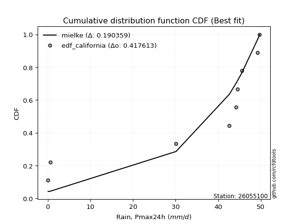</img>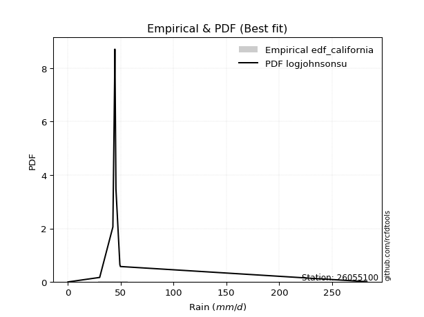</img>

</div>


### 2. EDF Hazen (1930)

Hazen method for plotting positions is a formula used to estimate the empirical cumulative probability distribution of flood events or other hydrological data. This formula often results in biased estimations, particularly when extrapolating to extreme events (high return periods).

<div align="center">


$P=(m-0.5)/n$


</div>


**2.1. Empirical values**

<div align="center">

|                | 0                   | 1                   | 2                  | 3                  | 4         | 5                  | 6                  | 7                  | 8                  |
|:---------------|:--------------------|:--------------------|:-------------------|:-------------------|:----------|:-------------------|:-------------------|:-------------------|:-------------------|
| date           | 2016                | 2023                | 2022               | 2024               | 2021      | 2020               | 2017               | 2019               | 2018               |
| x              | 0.1                 | 0.6                 | 30.1               | 42.6               | 44.2      | 44.5               | 45.5               | 49.2               | 49.7               |
| m              | 1                   | 2                   | 3                  | 4                  | 5         | 6                  | 7                  | 8                  | 9                  |
| empirical_dist | edf_hazen           | edf_hazen           | edf_hazen          | edf_hazen          | edf_hazen | edf_hazen          | edf_hazen          | edf_hazen          | edf_hazen          |
| empirical      | 0.05555555555555555 | 0.16666666666666666 | 0.2777777777777778 | 0.3888888888888889 | 0.5       | 0.6111111111111112 | 0.7222222222222222 | 0.8333333333333334 | 0.9444444444444444 |
| empirical_tr   | 1.0588235294117647  | 1.2                 | 1.3846153846153846 | 1.6363636363636362 | 2.0       | 2.5714285714285716 | 3.5999999999999996 | 6.000000000000002  | 17.999999999999993 |

</div>


**2.2. Kolmogorov-Smirnov fit test (sorted by Δ)**


<div align="center">

|                | 0                   | 1                   | 2                   | 3                   | 4                   | 5                   | 6                   | 7                   | 8                   | 9                   | 10                  | 11                  | 12                  | 13                  | 14                  | 15                  | 16                  | 17                  | 18                  | 19                  | 20                  | 21                  | 22                  | 23                  | 24                  | 25                  | 26                  | 27                  | 28                  | 29                  | 30                  | 31                  | 32                  | 33                  | 34                  | 35                  | 36                  | 37                  | 38                  | 39                  | 40                  | 41                  | 42                  | 43                  | 44                  | 45                  | 46                  | 47                  | 48                  | 49                  | 50                  | 51                  | 52                  | 53                  | 54                  | 55                  | 56                  | 57                  | 58                  | 59                  | 60                  | 61                  | 62                  | 63                  | 64                  | 65                  | 66                  | 67                  | 68                  | 69                  | 70                  | 71                  | 72                  | 73                  | 74                    | 75                  | 76                  | 77                  | 78                  | 79                  | 80                  | 81                  | 82                  | 83                  | 84                  | 85                  | 86                  | 87                  |
|:---------------|:--------------------|:--------------------|:--------------------|:--------------------|:--------------------|:--------------------|:--------------------|:--------------------|:--------------------|:--------------------|:--------------------|:--------------------|:--------------------|:--------------------|:--------------------|:--------------------|:--------------------|:--------------------|:--------------------|:--------------------|:--------------------|:--------------------|:--------------------|:--------------------|:--------------------|:--------------------|:--------------------|:--------------------|:--------------------|:--------------------|:--------------------|:--------------------|:--------------------|:--------------------|:--------------------|:--------------------|:--------------------|:--------------------|:--------------------|:--------------------|:--------------------|:--------------------|:--------------------|:--------------------|:--------------------|:--------------------|:--------------------|:--------------------|:--------------------|:--------------------|:--------------------|:--------------------|:--------------------|:--------------------|:--------------------|:--------------------|:--------------------|:--------------------|:--------------------|:--------------------|:--------------------|:--------------------|:--------------------|:--------------------|:--------------------|:--------------------|:--------------------|:--------------------|:--------------------|:--------------------|:--------------------|:--------------------|:--------------------|:--------------------|:----------------------|:--------------------|:--------------------|:--------------------|:--------------------|:--------------------|:--------------------|:--------------------|:--------------------|:--------------------|:--------------------|:--------------------|:--------------------|:--------------------|
| station        | 26055100            | 26055100            | 26055100            | 26055100            | 26055100            | 26055100            | 26055100            | 26055100            | 26055100            | 26055100            | 26055100            | 26055100            | 26055100            | 26055100            | 26055100            | 26055100            | 26055100            | 26055100            | 26055100            | 26055100            | 26055100            | 26055100            | 26055100            | 26055100            | 26055100            | 26055100            | 26055100            | 26055100            | 26055100            | 26055100            | 26055100            | 26055100            | 26055100            | 26055100            | 26055100            | 26055100            | 26055100            | 26055100            | 26055100            | 26055100            | 26055100            | 26055100            | 26055100            | 26055100            | 26055100            | 26055100            | 26055100            | 26055100            | 26055100            | 26055100            | 26055100            | 26055100            | 26055100            | 26055100            | 26055100            | 26055100            | 26055100            | 26055100            | 26055100            | 26055100            | 26055100            | 26055100            | 26055100            | 26055100            | 26055100            | 26055100            | 26055100            | 26055100            | 26055100            | 26055100            | 26055100            | 26055100            | 26055100            | 26055100            | 26055100              | 26055100            | 26055100            | 26055100            | 26055100            | 26055100            | 26055100            | 26055100            | 26055100            | 26055100            | 26055100            | 26055100            | 26055100            | 26055100            |
| empirical_dist | edf_hazen           | edf_hazen           | edf_hazen           | edf_hazen           | edf_hazen           | edf_hazen           | edf_hazen           | edf_hazen           | edf_hazen           | edf_hazen           | edf_hazen           | edf_hazen           | edf_hazen           | edf_hazen           | edf_hazen           | edf_hazen           | edf_hazen           | edf_hazen           | edf_hazen           | edf_hazen           | edf_hazen           | edf_hazen           | edf_hazen           | edf_hazen           | edf_hazen           | edf_hazen           | edf_hazen           | edf_hazen           | edf_hazen           | edf_hazen           | edf_hazen           | edf_hazen           | edf_hazen           | edf_hazen           | edf_hazen           | edf_hazen           | edf_hazen           | edf_hazen           | edf_hazen           | edf_hazen           | edf_hazen           | edf_hazen           | edf_hazen           | edf_hazen           | edf_hazen           | edf_hazen           | edf_hazen           | edf_hazen           | edf_hazen           | edf_hazen           | edf_hazen           | edf_hazen           | edf_hazen           | edf_hazen           | edf_hazen           | edf_hazen           | edf_hazen           | edf_hazen           | edf_hazen           | edf_hazen           | edf_hazen           | edf_hazen           | edf_hazen           | edf_hazen           | edf_hazen           | edf_hazen           | edf_hazen           | edf_hazen           | edf_hazen           | edf_hazen           | edf_hazen           | edf_hazen           | edf_hazen           | edf_hazen           | edf_hazen             | edf_hazen           | edf_hazen           | edf_hazen           | edf_hazen           | edf_hazen           | edf_hazen           | edf_hazen           | edf_hazen           | edf_hazen           | edf_hazen           | edf_hazen           | edf_hazen           | edf_hazen           |
| p_dist         | logt                | pearson3            | gumbel_l            | mielke              | laplace_asymmetric  | weibull_min         | gompertz            | logpearson3         | betaprime           | norm                | crystalball         | t                   | exponnorm           | invweibull          | fatiguelife         | rice                | invgauss            | fisk                | chi2                | invgamma            | maxwell             | logistic            | kstwobign           | truncnorm           | rayleigh            | loggumbel_l         | hypsecant           | genexpon            | expon               | halfnorm            | ncf                 | loginvweibull       | gumbel_r            | laplace             | gamma               | halflogistic        | moyal               | lognakagami         | lognct              | logexponnorm        | logcrystalball      | lognorm             | lognorm             | logrice             | loglognorm          | logerlang           | loginvgamma         | logfatiguelife      | loggamma            | loggamma            | logncf              | f                   | loggompertz         | loglogistic         | logkstwobign        | loggenexpon         | logmaxwell          | loginvgauss         | lograyleigh         | loghypsecant        | logalpha            | logexpon            | loghalfnorm         | wald                | nct                 | loglaplace          | loggumbel_r         | nakagami            | loghalflogistic     | logmoyal            | gibrat              | logfisk             | erlang              | logweibull_min      | loglaplace_asymmetric | logloggamma         | logwald             | johnsonsu           | loggibrat           | logtruncnorm        | logjohnsonsu        | logbetaprime        | logmielke           | logf                | logchi2             | alpha               | loggenlogistic      | genlogistic         |
| delta          | 0.15299867199760492 | 0.23368964487084426 | 0.2454262969483187  | 0.2459146545342938  | 0.24614853483039217 | 0.25913691031329716 | 0.2706105505412711  | 0.2803846864563918  | 0.28547858721527103 | 0.2864502276905973  | 0.2864502316206377  | 0.28645158237255147 | 0.2864554672238881  | 0.28657311061325047 | 0.2877562250412095  | 0.290192322313822   | 0.2967512767650708  | 0.2996669078356693  | 0.30123842002494366 | 0.30384569320284277 | 0.30527759170890895 | 0.30635331403401217 | 0.3072011534009484  | 0.3095114971760862  | 0.31085594466733507 | 0.31145900098763446 | 0.3212831147317297  | 0.3248860386739361  | 0.32507468883486773 | 0.32738440624986803 | 0.33619597812763524 | 0.3389622795947085  | 0.3420965361270711  | 0.3482676426856998  | 0.35477776953377504 | 0.35497172685757    | 0.3602727019631797  | 0.36229293105737326 | 0.3623223061384978  | 0.3624091679374679  | 0.3624101048679512  | 0.3624107983402163  | 0.3624107983402163  | 0.36271145431888563 | 0.36362862073406454 | 0.3642539738102646  | 0.36456871225685517 | 0.36562829037639466 | 0.3667062429628941  | 0.3667062429628941  | 0.3669041772625289  | 0.3766381789509051  | 0.37922891197138886 | 0.37947752163403825 | 0.38403923488593306 | 0.38484329076355717 | 0.38507757458443115 | 0.385298125110628   | 0.3919338911992235  | 0.3928855442801318  | 0.4014023387438763  | 0.4088119674426326  | 0.41176819548729215 | 0.4125610346900716  | 0.42039452958295276 | 0.42126807909684094 | 0.42388471886113466 | 0.4269986698997993  | 0.44001303632773825 | 0.4443464319870779  | 0.44447062360414463 | 0.45503616588096885 | 0.4552033229127799  | 0.4701601473947489  | 0.4983994153471482    | 0.49892794144826785 | 0.5020717679205825  | 0.5224681517844476  | 0.5343119888881028  | 0.5805340152510542  | 0.597918778480997   | 0.5991084112090137  | 0.6061111857983342  | 0.6098419788350317  | 0.6899784633768747  | 0.7146778796228067  | 0.8333333333333334  | 0.8333333333333334  |
| deltao         | 0.41761268023100007 | 0.41761268023100007 | 0.41761268023100007 | 0.41761268023100007 | 0.41761268023100007 | 0.41761268023100007 | 0.41761268023100007 | 0.41761268023100007 | 0.41761268023100007 | 0.41761268023100007 | 0.41761268023100007 | 0.41761268023100007 | 0.41761268023100007 | 0.41761268023100007 | 0.41761268023100007 | 0.41761268023100007 | 0.41761268023100007 | 0.41761268023100007 | 0.41761268023100007 | 0.41761268023100007 | 0.41761268023100007 | 0.41761268023100007 | 0.41761268023100007 | 0.41761268023100007 | 0.41761268023100007 | 0.41761268023100007 | 0.41761268023100007 | 0.41761268023100007 | 0.41761268023100007 | 0.41761268023100007 | 0.41761268023100007 | 0.41761268023100007 | 0.41761268023100007 | 0.41761268023100007 | 0.41761268023100007 | 0.41761268023100007 | 0.41761268023100007 | 0.41761268023100007 | 0.41761268023100007 | 0.41761268023100007 | 0.41761268023100007 | 0.41761268023100007 | 0.41761268023100007 | 0.41761268023100007 | 0.41761268023100007 | 0.41761268023100007 | 0.41761268023100007 | 0.41761268023100007 | 0.41761268023100007 | 0.41761268023100007 | 0.41761268023100007 | 0.41761268023100007 | 0.41761268023100007 | 0.41761268023100007 | 0.41761268023100007 | 0.41761268023100007 | 0.41761268023100007 | 0.41761268023100007 | 0.41761268023100007 | 0.41761268023100007 | 0.41761268023100007 | 0.41761268023100007 | 0.41761268023100007 | 0.41761268023100007 | 0.41761268023100007 | 0.41761268023100007 | 0.41761268023100007 | 0.41761268023100007 | 0.41761268023100007 | 0.41761268023100007 | 0.41761268023100007 | 0.41761268023100007 | 0.41761268023100007 | 0.41761268023100007 | 0.41761268023100007   | 0.41761268023100007 | 0.41761268023100007 | 0.41761268023100007 | 0.41761268023100007 | 0.41761268023100007 | 0.41761268023100007 | 0.41761268023100007 | 0.41761268023100007 | 0.41761268023100007 | 0.41761268023100007 | 0.41761268023100007 | 0.41761268023100007 | 0.41761268023100007 |
| eval           | Δo > Δ              | Δo > Δ              | Δo > Δ              | Δo > Δ              | Δo > Δ              | Δo > Δ              | Δo > Δ              | Δo > Δ              | Δo > Δ              | Δo > Δ              | Δo > Δ              | Δo > Δ              | Δo > Δ              | Δo > Δ              | Δo > Δ              | Δo > Δ              | Δo > Δ              | Δo > Δ              | Δo > Δ              | Δo > Δ              | Δo > Δ              | Δo > Δ              | Δo > Δ              | Δo > Δ              | Δo > Δ              | Δo > Δ              | Δo > Δ              | Δo > Δ              | Δo > Δ              | Δo > Δ              | Δo > Δ              | Δo > Δ              | Δo > Δ              | Δo > Δ              | Δo > Δ              | Δo > Δ              | Δo > Δ              | Δo > Δ              | Δo > Δ              | Δo > Δ              | Δo > Δ              | Δo > Δ              | Δo > Δ              | Δo > Δ              | Δo > Δ              | Δo > Δ              | Δo > Δ              | Δo > Δ              | Δo > Δ              | Δo > Δ              | Δo > Δ              | Δo > Δ              | Δo > Δ              | Δo > Δ              | Δo > Δ              | Δo > Δ              | Δo > Δ              | Δo > Δ              | Δo > Δ              | Δo > Δ              | Δo > Δ              | Δo > Δ              | Δo > Δ              | Δo > Δ              | Δo <= Δ             | Δo <= Δ             | Δo <= Δ             | Δo <= Δ             | Δo <= Δ             | Δo <= Δ             | Δo <= Δ             | Δo <= Δ             | Δo <= Δ             | Δo <= Δ             | Δo <= Δ               | Δo <= Δ             | Δo <= Δ             | Δo <= Δ             | Δo <= Δ             | Δo <= Δ             | Δo <= Δ             | Δo <= Δ             | Δo <= Δ             | Δo <= Δ             | Δo <= Δ             | Δo <= Δ             | Δo <= Δ             | Δo <= Δ             |
| fit            | 1                   | 1                   | 1                   | 1                   | 1                   | 1                   | 1                   | 1                   | 1                   | 1                   | 1                   | 1                   | 1                   | 1                   | 1                   | 1                   | 1                   | 1                   | 1                   | 1                   | 1                   | 1                   | 1                   | 1                   | 1                   | 1                   | 1                   | 1                   | 1                   | 1                   | 1                   | 1                   | 1                   | 1                   | 1                   | 1                   | 1                   | 1                   | 1                   | 1                   | 1                   | 1                   | 1                   | 1                   | 1                   | 1                   | 1                   | 1                   | 1                   | 1                   | 1                   | 1                   | 1                   | 1                   | 1                   | 1                   | 1                   | 1                   | 1                   | 1                   | 1                   | 1                   | 1                   | 1                   | 0                   | 0                   | 0                   | 0                   | 0                   | 0                   | 0                   | 0                   | 0                   | 0                   | 0                     | 0                   | 0                   | 0                   | 0                   | 0                   | 0                   | 0                   | 0                   | 0                   | 0                   | 0                   | 0                   | 0                   |
| n              | 9                   | 9                   | 9                   | 9                   | 9                   | 9                   | 9                   | 9                   | 9                   | 9                   | 9                   | 9                   | 9                   | 9                   | 9                   | 9                   | 9                   | 9                   | 9                   | 9                   | 9                   | 9                   | 9                   | 9                   | 9                   | 9                   | 9                   | 9                   | 9                   | 9                   | 9                   | 9                   | 9                   | 9                   | 9                   | 9                   | 9                   | 9                   | 9                   | 9                   | 9                   | 9                   | 9                   | 9                   | 9                   | 9                   | 9                   | 9                   | 9                   | 9                   | 9                   | 9                   | 9                   | 9                   | 9                   | 9                   | 9                   | 9                   | 9                   | 9                   | 9                   | 9                   | 9                   | 9                   | 9                   | 9                   | 9                   | 9                   | 9                   | 9                   | 9                   | 9                   | 9                   | 9                   | 9                     | 9                   | 9                   | 9                   | 9                   | 9                   | 9                   | 9                   | 9                   | 9                   | 9                   | 9                   | 9                   | 9                   |
| best_fit       | 1                   | 0                   | 0                   | 0                   | 0                   | 0                   | 0                   | 0                   | 0                   | 0                   | 0                   | 0                   | 0                   | 0                   | 0                   | 0                   | 0                   | 0                   | 0                   | 0                   | 0                   | 0                   | 0                   | 0                   | 0                   | 0                   | 0                   | 0                   | 0                   | 0                   | 0                   | 0                   | 0                   | 0                   | 0                   | 0                   | 0                   | 0                   | 0                   | 0                   | 0                   | 0                   | 0                   | 0                   | 0                   | 0                   | 0                   | 0                   | 0                   | 0                   | 0                   | 0                   | 0                   | 0                   | 0                   | 0                   | 0                   | 0                   | 0                   | 0                   | 0                   | 0                   | 0                   | 0                   | 0                   | 0                   | 0                   | 0                   | 0                   | 0                   | 0                   | 0                   | 0                   | 0                   | 0                     | 0                   | 0                   | 0                   | 0                   | 0                   | 0                   | 0                   | 0                   | 0                   | 0                   | 0                   | 0                   | 0                   |
| best_fit_sort  | 1                   | 2                   | 3                   | 4                   | 5                   | 6                   | 7                   | 8                   | 9                   | 10                  | 11                  | 12                  | 13                  | 14                  | 15                  | 16                  | 17                  | 18                  | 19                  | 20                  | 21                  | 22                  | 23                  | 24                  | 25                  | 26                  | 27                  | 28                  | 29                  | 30                  | 31                  | 32                  | 33                  | 34                  | 35                  | 36                  | 37                  | 38                  | 39                  | 40                  | 41                  | 42                  | 43                  | 44                  | 45                  | 46                  | 47                  | 48                  | 49                  | 50                  | 51                  | 52                  | 53                  | 54                  | 55                  | 56                  | 57                  | 58                  | 59                  | 60                  | 61                  | 62                  | 63                  | 64                  | 65                  | 66                  | 67                  | 68                  | 69                  | 70                  | 71                  | 72                  | 73                  | 74                  | 75                    | 76                  | 77                  | 78                  | 79                  | 80                  | 81                  | 82                  | 83                  | 84                  | 85                  | 86                  | 87                  | 88                  |

</div>


**2.3. Best fit**

<div align="center">

|   id |   station | empirical_dist   | p_dist   |    delta |   deltao | eval   |   fit |   n |   best_fit |   best_fit_sort |
|-----:|----------:|:-----------------|:---------|---------:|---------:|:-------|------:|----:|-----------:|----------------:|
|    0 |  26055100 | edf_hazen        | logt     | 0.152999 | 0.417613 | Δo > Δ |     1 |   9 |          1 |               1 |

</div>


<div align="center">

</img>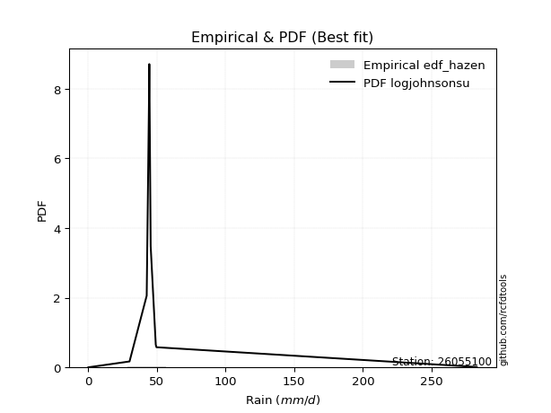</img>

</div>


### 3. EDF Weibull (1939)

Weibull plotting position formula is an empirical method used to estimate the non-exceedance probability or plotting position for a set of observed data, is often recommended or widely used in practice, particularly in flood frequency analysis.

<div align="center">


$P=m/(n+1)$


</div>


**3.1. Empirical values**

<div align="center">

|                | 0                  | 1           | 2                  | 3                  | 4           | 5           | 6                 | 7                 | 8                  |
|:---------------|:-------------------|:------------|:-------------------|:-------------------|:------------|:------------|:------------------|:------------------|:-------------------|
| date           | 2016               | 2023        | 2022               | 2024               | 2021        | 2020        | 2017              | 2019              | 2018               |
| x              | 0.1                | 0.6         | 30.1               | 42.6               | 44.2        | 44.5        | 45.5              | 49.2              | 49.7               |
| m              | 1                  | 2           | 3                  | 4                  | 5           | 6           | 7                 | 8                 | 9                  |
| empirical_dist | edf_weibull        | edf_weibull | edf_weibull        | edf_weibull        | edf_weibull | edf_weibull | edf_weibull       | edf_weibull       | edf_weibull        |
| empirical      | 0.1                | 0.2         | 0.3                | 0.4                | 0.5         | 0.6         | 0.7               | 0.8               | 0.9                |
| empirical_tr   | 1.1111111111111112 | 1.25        | 1.4285714285714286 | 1.6666666666666667 | 2.0         | 2.5         | 3.333333333333333 | 5.000000000000001 | 10.000000000000002 |

</div>


**3.2. Kolmogorov-Smirnov fit test (sorted by Δ)**


<div align="center">

|                | 0                   | 1                   | 2                   | 3                   | 4                   | 5                   | 6                   | 7                   | 8                   | 9                   | 10                  | 11                  | 12                  | 13                  | 14                  | 15                  | 16                  | 17                  | 18                  | 19                  | 20                  | 21                  | 22                  | 23                  | 24                  | 25                  | 26                  | 27                  | 28                  | 29                  | 30                  | 31                  | 32                  | 33                  | 34                  | 35                  | 36                  | 37                  | 38                  | 39                  | 40                  | 41                  | 42                  | 43                  | 44                  | 45                  | 46                  | 47                  | 48                  | 49                  | 50                  | 51                  | 52                  | 53                  | 54                  | 55                  | 56                  | 57                  | 58                  | 59                  | 60                  | 61                  | 62                  | 63                  | 64                  | 65                  | 66                  | 67                  | 68                  | 69                  | 70                  | 71                  | 72                  | 73                  | 74                  | 75                    | 76                  | 77                  | 78                  | 79                  | 80                  | 81                  | 82                  | 83                  | 84                  | 85                  | 86                  | 87                  |
|:---------------|:--------------------|:--------------------|:--------------------|:--------------------|:--------------------|:--------------------|:--------------------|:--------------------|:--------------------|:--------------------|:--------------------|:--------------------|:--------------------|:--------------------|:--------------------|:--------------------|:--------------------|:--------------------|:--------------------|:--------------------|:--------------------|:--------------------|:--------------------|:--------------------|:--------------------|:--------------------|:--------------------|:--------------------|:--------------------|:--------------------|:--------------------|:--------------------|:--------------------|:--------------------|:--------------------|:--------------------|:--------------------|:--------------------|:--------------------|:--------------------|:--------------------|:--------------------|:--------------------|:--------------------|:--------------------|:--------------------|:--------------------|:--------------------|:--------------------|:--------------------|:--------------------|:--------------------|:--------------------|:--------------------|:--------------------|:--------------------|:--------------------|:--------------------|:--------------------|:--------------------|:--------------------|:--------------------|:--------------------|:--------------------|:--------------------|:--------------------|:--------------------|:--------------------|:--------------------|:--------------------|:--------------------|:--------------------|:--------------------|:--------------------|:--------------------|:----------------------|:--------------------|:--------------------|:--------------------|:--------------------|:--------------------|:--------------------|:--------------------|:--------------------|:--------------------|:--------------------|:--------------------|:--------------------|
| station        | 26055100            | 26055100            | 26055100            | 26055100            | 26055100            | 26055100            | 26055100            | 26055100            | 26055100            | 26055100            | 26055100            | 26055100            | 26055100            | 26055100            | 26055100            | 26055100            | 26055100            | 26055100            | 26055100            | 26055100            | 26055100            | 26055100            | 26055100            | 26055100            | 26055100            | 26055100            | 26055100            | 26055100            | 26055100            | 26055100            | 26055100            | 26055100            | 26055100            | 26055100            | 26055100            | 26055100            | 26055100            | 26055100            | 26055100            | 26055100            | 26055100            | 26055100            | 26055100            | 26055100            | 26055100            | 26055100            | 26055100            | 26055100            | 26055100            | 26055100            | 26055100            | 26055100            | 26055100            | 26055100            | 26055100            | 26055100            | 26055100            | 26055100            | 26055100            | 26055100            | 26055100            | 26055100            | 26055100            | 26055100            | 26055100            | 26055100            | 26055100            | 26055100            | 26055100            | 26055100            | 26055100            | 26055100            | 26055100            | 26055100            | 26055100            | 26055100              | 26055100            | 26055100            | 26055100            | 26055100            | 26055100            | 26055100            | 26055100            | 26055100            | 26055100            | 26055100            | 26055100            | 26055100            |
| empirical_dist | edf_weibull         | edf_weibull         | edf_weibull         | edf_weibull         | edf_weibull         | edf_weibull         | edf_weibull         | edf_weibull         | edf_weibull         | edf_weibull         | edf_weibull         | edf_weibull         | edf_weibull         | edf_weibull         | edf_weibull         | edf_weibull         | edf_weibull         | edf_weibull         | edf_weibull         | edf_weibull         | edf_weibull         | edf_weibull         | edf_weibull         | edf_weibull         | edf_weibull         | edf_weibull         | edf_weibull         | edf_weibull         | edf_weibull         | edf_weibull         | edf_weibull         | edf_weibull         | edf_weibull         | edf_weibull         | edf_weibull         | edf_weibull         | edf_weibull         | edf_weibull         | edf_weibull         | edf_weibull         | edf_weibull         | edf_weibull         | edf_weibull         | edf_weibull         | edf_weibull         | edf_weibull         | edf_weibull         | edf_weibull         | edf_weibull         | edf_weibull         | edf_weibull         | edf_weibull         | edf_weibull         | edf_weibull         | edf_weibull         | edf_weibull         | edf_weibull         | edf_weibull         | edf_weibull         | edf_weibull         | edf_weibull         | edf_weibull         | edf_weibull         | edf_weibull         | edf_weibull         | edf_weibull         | edf_weibull         | edf_weibull         | edf_weibull         | edf_weibull         | edf_weibull         | edf_weibull         | edf_weibull         | edf_weibull         | edf_weibull         | edf_weibull           | edf_weibull         | edf_weibull         | edf_weibull         | edf_weibull         | edf_weibull         | edf_weibull         | edf_weibull         | edf_weibull         | edf_weibull         | edf_weibull         | edf_weibull         | edf_weibull         |
| p_dist         | logt                | pearson3            | gumbel_l            | mielke              | laplace_asymmetric  | weibull_min         | fisk                | logpearson3         | betaprime           | norm                | crystalball         | t                   | exponnorm           | invweibull          | fatiguelife         | rice                | invgauss            | loggumbel_l         | chi2                | invgamma            | gompertz            | maxwell             | logistic            | kstwobign           | truncnorm           | rayleigh            | hypsecant           | genexpon            | expon               | ncf                 | halfnorm            | loginvweibull       | gumbel_r            | gamma               | laplace             | lognakagami         | lognct              | logexponnorm        | logcrystalball      | lognorm             | lognorm             | logrice             | loglognorm          | logerlang           | loginvgamma         | logfatiguelife      | halflogistic        | loggamma            | loggamma            | logncf              | moyal               | f                   | loggompertz         | loglogistic         | logkstwobign        | loggenexpon         | logmaxwell          | loginvgauss         | lograyleigh         | loghypsecant        | logalpha            | logexpon            | loghalfnorm         | nct                 | loglaplace          | wald                | loggumbel_r         | nakagami            | loghalflogistic     | logmoyal            | logfisk             | erlang              | gibrat              | logweibull_min      | logwald             | loglaplace_asymmetric | logloggamma         | johnsonsu           | loggibrat           | logtruncnorm        | logjohnsonsu        | logbetaprime        | logf                | logmielke           | logchi2             | alpha               | loggenlogistic      | genlogistic         |
| delta          | 0.17522089421982712 | 0.22257853375973313 | 0.23431518583720756 | 0.23480354342318266 | 0.23503742371928105 | 0.24802579920218604 | 0.2552224633912249  | 0.2581624642341696  | 0.2743674761041599  | 0.2753391165794862  | 0.2753391205095266  | 0.27534047126144034 | 0.27534435611277697 | 0.27546199950213934 | 0.2766451139300984  | 0.2790812112027109  | 0.28564016565395967 | 0.28923677876541226 | 0.29012730891383254 | 0.29273458209173164 | 0.2928327727634933  | 0.2941664805977978  | 0.29524220292290104 | 0.29609004228983726 | 0.2984003860649751  | 0.29974483355622394 | 0.3101720036206186  | 0.313774927562825   | 0.3139635777237566  | 0.31397375590541304 | 0.3162732951387569  | 0.3167400573724863  | 0.33098542501595996 | 0.33255554731155285 | 0.3371565315745887  | 0.34007070883515106 | 0.3401000839162756  | 0.3401869457152457  | 0.340187882645729   | 0.3401885761179941  | 0.3401885761179941  | 0.34048923209666343 | 0.34140639851184235 | 0.3420317515880424  | 0.34234649003463297 | 0.34340606815417246 | 0.3438606157464589  | 0.3444840207406719  | 0.3444840207406719  | 0.3446819550403067  | 0.34916159085206855 | 0.3544159567286829  | 0.35700668974916666 | 0.35725529941181605 | 0.36181701266371086 | 0.36262106854133497 | 0.36285535236220895 | 0.3630759028884058  | 0.3697116689770013  | 0.3706633220579096  | 0.3791801165216541  | 0.3865897452204104  | 0.38954597326506996 | 0.39817230736073056 | 0.39904585687461874 | 0.4014499235789605  | 0.40166249663891246 | 0.4047764476775771  | 0.41779081410551605 | 0.4221242097648557  | 0.43281394365874665 | 0.4329811006905577  | 0.4333595124930335  | 0.4368268140614155  | 0.4798495456983603  | 0.4872883042360371    | 0.4878168303371567  | 0.4891348184511143  | 0.5120897666658806  | 0.5583117930288319  | 0.5645854451476636  | 0.5754286744516353  | 0.5765086455016983  | 0.583888963576112   | 0.6677562411546525  | 0.6924556574005845  | 0.8                 | 0.8                 |
| deltao         | 0.41761268023100007 | 0.41761268023100007 | 0.41761268023100007 | 0.41761268023100007 | 0.41761268023100007 | 0.41761268023100007 | 0.41761268023100007 | 0.41761268023100007 | 0.41761268023100007 | 0.41761268023100007 | 0.41761268023100007 | 0.41761268023100007 | 0.41761268023100007 | 0.41761268023100007 | 0.41761268023100007 | 0.41761268023100007 | 0.41761268023100007 | 0.41761268023100007 | 0.41761268023100007 | 0.41761268023100007 | 0.41761268023100007 | 0.41761268023100007 | 0.41761268023100007 | 0.41761268023100007 | 0.41761268023100007 | 0.41761268023100007 | 0.41761268023100007 | 0.41761268023100007 | 0.41761268023100007 | 0.41761268023100007 | 0.41761268023100007 | 0.41761268023100007 | 0.41761268023100007 | 0.41761268023100007 | 0.41761268023100007 | 0.41761268023100007 | 0.41761268023100007 | 0.41761268023100007 | 0.41761268023100007 | 0.41761268023100007 | 0.41761268023100007 | 0.41761268023100007 | 0.41761268023100007 | 0.41761268023100007 | 0.41761268023100007 | 0.41761268023100007 | 0.41761268023100007 | 0.41761268023100007 | 0.41761268023100007 | 0.41761268023100007 | 0.41761268023100007 | 0.41761268023100007 | 0.41761268023100007 | 0.41761268023100007 | 0.41761268023100007 | 0.41761268023100007 | 0.41761268023100007 | 0.41761268023100007 | 0.41761268023100007 | 0.41761268023100007 | 0.41761268023100007 | 0.41761268023100007 | 0.41761268023100007 | 0.41761268023100007 | 0.41761268023100007 | 0.41761268023100007 | 0.41761268023100007 | 0.41761268023100007 | 0.41761268023100007 | 0.41761268023100007 | 0.41761268023100007 | 0.41761268023100007 | 0.41761268023100007 | 0.41761268023100007 | 0.41761268023100007 | 0.41761268023100007   | 0.41761268023100007 | 0.41761268023100007 | 0.41761268023100007 | 0.41761268023100007 | 0.41761268023100007 | 0.41761268023100007 | 0.41761268023100007 | 0.41761268023100007 | 0.41761268023100007 | 0.41761268023100007 | 0.41761268023100007 | 0.41761268023100007 |
| eval           | Δo > Δ              | Δo > Δ              | Δo > Δ              | Δo > Δ              | Δo > Δ              | Δo > Δ              | Δo > Δ              | Δo > Δ              | Δo > Δ              | Δo > Δ              | Δo > Δ              | Δo > Δ              | Δo > Δ              | Δo > Δ              | Δo > Δ              | Δo > Δ              | Δo > Δ              | Δo > Δ              | Δo > Δ              | Δo > Δ              | Δo > Δ              | Δo > Δ              | Δo > Δ              | Δo > Δ              | Δo > Δ              | Δo > Δ              | Δo > Δ              | Δo > Δ              | Δo > Δ              | Δo > Δ              | Δo > Δ              | Δo > Δ              | Δo > Δ              | Δo > Δ              | Δo > Δ              | Δo > Δ              | Δo > Δ              | Δo > Δ              | Δo > Δ              | Δo > Δ              | Δo > Δ              | Δo > Δ              | Δo > Δ              | Δo > Δ              | Δo > Δ              | Δo > Δ              | Δo > Δ              | Δo > Δ              | Δo > Δ              | Δo > Δ              | Δo > Δ              | Δo > Δ              | Δo > Δ              | Δo > Δ              | Δo > Δ              | Δo > Δ              | Δo > Δ              | Δo > Δ              | Δo > Δ              | Δo > Δ              | Δo > Δ              | Δo > Δ              | Δo > Δ              | Δo > Δ              | Δo > Δ              | Δo > Δ              | Δo > Δ              | Δo > Δ              | Δo <= Δ             | Δo <= Δ             | Δo <= Δ             | Δo <= Δ             | Δo <= Δ             | Δo <= Δ             | Δo <= Δ             | Δo <= Δ               | Δo <= Δ             | Δo <= Δ             | Δo <= Δ             | Δo <= Δ             | Δo <= Δ             | Δo <= Δ             | Δo <= Δ             | Δo <= Δ             | Δo <= Δ             | Δo <= Δ             | Δo <= Δ             | Δo <= Δ             |
| fit            | 1                   | 1                   | 1                   | 1                   | 1                   | 1                   | 1                   | 1                   | 1                   | 1                   | 1                   | 1                   | 1                   | 1                   | 1                   | 1                   | 1                   | 1                   | 1                   | 1                   | 1                   | 1                   | 1                   | 1                   | 1                   | 1                   | 1                   | 1                   | 1                   | 1                   | 1                   | 1                   | 1                   | 1                   | 1                   | 1                   | 1                   | 1                   | 1                   | 1                   | 1                   | 1                   | 1                   | 1                   | 1                   | 1                   | 1                   | 1                   | 1                   | 1                   | 1                   | 1                   | 1                   | 1                   | 1                   | 1                   | 1                   | 1                   | 1                   | 1                   | 1                   | 1                   | 1                   | 1                   | 1                   | 1                   | 1                   | 1                   | 0                   | 0                   | 0                   | 0                   | 0                   | 0                   | 0                   | 0                     | 0                   | 0                   | 0                   | 0                   | 0                   | 0                   | 0                   | 0                   | 0                   | 0                   | 0                   | 0                   |
| n              | 9                   | 9                   | 9                   | 9                   | 9                   | 9                   | 9                   | 9                   | 9                   | 9                   | 9                   | 9                   | 9                   | 9                   | 9                   | 9                   | 9                   | 9                   | 9                   | 9                   | 9                   | 9                   | 9                   | 9                   | 9                   | 9                   | 9                   | 9                   | 9                   | 9                   | 9                   | 9                   | 9                   | 9                   | 9                   | 9                   | 9                   | 9                   | 9                   | 9                   | 9                   | 9                   | 9                   | 9                   | 9                   | 9                   | 9                   | 9                   | 9                   | 9                   | 9                   | 9                   | 9                   | 9                   | 9                   | 9                   | 9                   | 9                   | 9                   | 9                   | 9                   | 9                   | 9                   | 9                   | 9                   | 9                   | 9                   | 9                   | 9                   | 9                   | 9                   | 9                   | 9                   | 9                   | 9                   | 9                     | 9                   | 9                   | 9                   | 9                   | 9                   | 9                   | 9                   | 9                   | 9                   | 9                   | 9                   | 9                   |
| best_fit       | 1                   | 0                   | 0                   | 0                   | 0                   | 0                   | 0                   | 0                   | 0                   | 0                   | 0                   | 0                   | 0                   | 0                   | 0                   | 0                   | 0                   | 0                   | 0                   | 0                   | 0                   | 0                   | 0                   | 0                   | 0                   | 0                   | 0                   | 0                   | 0                   | 0                   | 0                   | 0                   | 0                   | 0                   | 0                   | 0                   | 0                   | 0                   | 0                   | 0                   | 0                   | 0                   | 0                   | 0                   | 0                   | 0                   | 0                   | 0                   | 0                   | 0                   | 0                   | 0                   | 0                   | 0                   | 0                   | 0                   | 0                   | 0                   | 0                   | 0                   | 0                   | 0                   | 0                   | 0                   | 0                   | 0                   | 0                   | 0                   | 0                   | 0                   | 0                   | 0                   | 0                   | 0                   | 0                   | 0                     | 0                   | 0                   | 0                   | 0                   | 0                   | 0                   | 0                   | 0                   | 0                   | 0                   | 0                   | 0                   |
| best_fit_sort  | 1                   | 2                   | 3                   | 4                   | 5                   | 6                   | 7                   | 8                   | 9                   | 10                  | 11                  | 12                  | 13                  | 14                  | 15                  | 16                  | 17                  | 18                  | 19                  | 20                  | 21                  | 22                  | 23                  | 24                  | 25                  | 26                  | 27                  | 28                  | 29                  | 30                  | 31                  | 32                  | 33                  | 34                  | 35                  | 36                  | 37                  | 38                  | 39                  | 40                  | 41                  | 42                  | 43                  | 44                  | 45                  | 46                  | 47                  | 48                  | 49                  | 50                  | 51                  | 52                  | 53                  | 54                  | 55                  | 56                  | 57                  | 58                  | 59                  | 60                  | 61                  | 62                  | 63                  | 64                  | 65                  | 66                  | 67                  | 68                  | 69                  | 70                  | 71                  | 72                  | 73                  | 74                  | 75                  | 76                    | 77                  | 78                  | 79                  | 80                  | 81                  | 82                  | 83                  | 84                  | 85                  | 86                  | 87                  | 88                  |

</div>


**3.3. Best fit**

<div align="center">

|   id |   station | empirical_dist   | p_dist   |    delta |   deltao | eval   |   fit |   n |   best_fit |   best_fit_sort |
|-----:|----------:|:-----------------|:---------|---------:|---------:|:-------|------:|----:|-----------:|----------------:|
|    0 |  26055100 | edf_weibull      | logt     | 0.175221 | 0.417613 | Δo > Δ |     1 |   9 |          1 |               1 |

</div>


<div align="center">

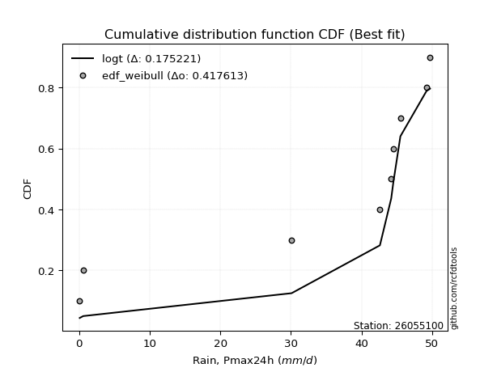</img>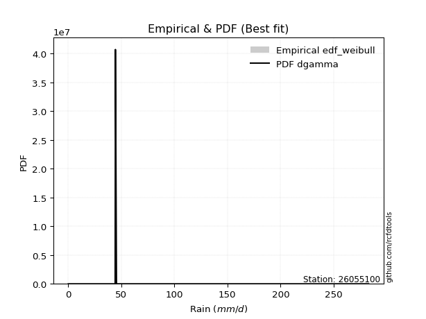</img>

</div>


### 4. EDF Beard (1943)

The Beard formula (or Beard´s plotting position formula) in hydrology is used to estimate the empirical non-exceedance probability _(P)_ of a flood event (or other extreme hydrological data point) within a given dataset.

<div align="center">


$P=(m-0.31)/(n+0.38)$


</div>


**4.1. Empirical values**

<div align="center">

|                | 0                   | 1                   | 2                  | 3                   | 4         | 5                  | 6                  | 7                  | 8                  |
|:---------------|:--------------------|:--------------------|:-------------------|:--------------------|:----------|:-------------------|:-------------------|:-------------------|:-------------------|
| date           | 2016                | 2023                | 2022               | 2024                | 2021      | 2020               | 2017               | 2019               | 2018               |
| x              | 0.1                 | 0.6                 | 30.1               | 42.6                | 44.2      | 44.5               | 45.5               | 49.2               | 49.7               |
| m              | 1                   | 2                   | 3                  | 4                   | 5         | 6                  | 7                  | 8                  | 9                  |
| empirical_dist | edf_beard           | edf_beard           | edf_beard          | edf_beard           | edf_beard | edf_beard          | edf_beard          | edf_beard          | edf_beard          |
| empirical      | 0.07356076759061833 | 0.18017057569296374 | 0.2867803837953091 | 0.39339019189765456 | 0.5       | 0.6066098081023454 | 0.7132196162046908 | 0.8198294243070362 | 0.9264392324093815 |
| empirical_tr   | 1.0794016110471807  | 1.2197659297789336  | 1.4020926756352765 | 1.6485061511423549  | 2.0       | 2.542005420054201  | 3.486988847583642  | 5.550295857988164  | 13.5942028985507   |

</div>


**4.2. Kolmogorov-Smirnov fit test (sorted by Δ)**


<div align="center">

|                | 0                   | 1                   | 2                   | 3                   | 4                   | 5                   | 6                   | 7                   | 8                   | 9                   | 10                  | 11                  | 12                  | 13                  | 14                  | 15                  | 16                  | 17                  | 18                  | 19                  | 20                  | 21                  | 22                  | 23                  | 24                  | 25                  | 26                  | 27                  | 28                  | 29                  | 30                  | 31                  | 32                  | 33                  | 34                  | 35                  | 36                  | 37                  | 38                  | 39                  | 40                  | 41                  | 42                  | 43                  | 44                  | 45                  | 46                  | 47                  | 48                  | 49                  | 50                  | 51                  | 52                  | 53                  | 54                  | 55                  | 56                  | 57                  | 58                  | 59                  | 60                  | 61                  | 62                  | 63                  | 64                  | 65                  | 66                  | 67                  | 68                  | 69                  | 70                  | 71                  | 72                  | 73                  | 74                  | 75                    | 76                  | 77                  | 78                  | 79                  | 80                  | 81                  | 82                  | 83                  | 84                  | 85                  | 86                  | 87                  |
|:---------------|:--------------------|:--------------------|:--------------------|:--------------------|:--------------------|:--------------------|:--------------------|:--------------------|:--------------------|:--------------------|:--------------------|:--------------------|:--------------------|:--------------------|:--------------------|:--------------------|:--------------------|:--------------------|:--------------------|:--------------------|:--------------------|:--------------------|:--------------------|:--------------------|:--------------------|:--------------------|:--------------------|:--------------------|:--------------------|:--------------------|:--------------------|:--------------------|:--------------------|:--------------------|:--------------------|:--------------------|:--------------------|:--------------------|:--------------------|:--------------------|:--------------------|:--------------------|:--------------------|:--------------------|:--------------------|:--------------------|:--------------------|:--------------------|:--------------------|:--------------------|:--------------------|:--------------------|:--------------------|:--------------------|:--------------------|:--------------------|:--------------------|:--------------------|:--------------------|:--------------------|:--------------------|:--------------------|:--------------------|:--------------------|:--------------------|:--------------------|:--------------------|:--------------------|:--------------------|:--------------------|:--------------------|:--------------------|:--------------------|:--------------------|:--------------------|:----------------------|:--------------------|:--------------------|:--------------------|:--------------------|:--------------------|:--------------------|:--------------------|:--------------------|:--------------------|:--------------------|:--------------------|:--------------------|
| station        | 26055100            | 26055100            | 26055100            | 26055100            | 26055100            | 26055100            | 26055100            | 26055100            | 26055100            | 26055100            | 26055100            | 26055100            | 26055100            | 26055100            | 26055100            | 26055100            | 26055100            | 26055100            | 26055100            | 26055100            | 26055100            | 26055100            | 26055100            | 26055100            | 26055100            | 26055100            | 26055100            | 26055100            | 26055100            | 26055100            | 26055100            | 26055100            | 26055100            | 26055100            | 26055100            | 26055100            | 26055100            | 26055100            | 26055100            | 26055100            | 26055100            | 26055100            | 26055100            | 26055100            | 26055100            | 26055100            | 26055100            | 26055100            | 26055100            | 26055100            | 26055100            | 26055100            | 26055100            | 26055100            | 26055100            | 26055100            | 26055100            | 26055100            | 26055100            | 26055100            | 26055100            | 26055100            | 26055100            | 26055100            | 26055100            | 26055100            | 26055100            | 26055100            | 26055100            | 26055100            | 26055100            | 26055100            | 26055100            | 26055100            | 26055100            | 26055100              | 26055100            | 26055100            | 26055100            | 26055100            | 26055100            | 26055100            | 26055100            | 26055100            | 26055100            | 26055100            | 26055100            | 26055100            |
| empirical_dist | edf_beard           | edf_beard           | edf_beard           | edf_beard           | edf_beard           | edf_beard           | edf_beard           | edf_beard           | edf_beard           | edf_beard           | edf_beard           | edf_beard           | edf_beard           | edf_beard           | edf_beard           | edf_beard           | edf_beard           | edf_beard           | edf_beard           | edf_beard           | edf_beard           | edf_beard           | edf_beard           | edf_beard           | edf_beard           | edf_beard           | edf_beard           | edf_beard           | edf_beard           | edf_beard           | edf_beard           | edf_beard           | edf_beard           | edf_beard           | edf_beard           | edf_beard           | edf_beard           | edf_beard           | edf_beard           | edf_beard           | edf_beard           | edf_beard           | edf_beard           | edf_beard           | edf_beard           | edf_beard           | edf_beard           | edf_beard           | edf_beard           | edf_beard           | edf_beard           | edf_beard           | edf_beard           | edf_beard           | edf_beard           | edf_beard           | edf_beard           | edf_beard           | edf_beard           | edf_beard           | edf_beard           | edf_beard           | edf_beard           | edf_beard           | edf_beard           | edf_beard           | edf_beard           | edf_beard           | edf_beard           | edf_beard           | edf_beard           | edf_beard           | edf_beard           | edf_beard           | edf_beard           | edf_beard             | edf_beard           | edf_beard           | edf_beard           | edf_beard           | edf_beard           | edf_beard           | edf_beard           | edf_beard           | edf_beard           | edf_beard           | edf_beard           | edf_beard           |
| p_dist         | logt                | pearson3            | gumbel_l            | mielke              | laplace_asymmetric  | weibull_min         | logpearson3         | gompertz            | betaprime           | fisk                | norm                | crystalball         | t                   | exponnorm           | invweibull          | fatiguelife         | rice                | invgauss            | chi2                | invgamma            | maxwell             | logistic            | loggumbel_l         | kstwobign           | truncnorm           | rayleigh            | hypsecant           | genexpon            | expon               | halfnorm            | ncf                 | loginvweibull       | gumbel_r            | laplace             | gamma               | halflogistic        | lognakagami         | lognct              | logexponnorm        | logcrystalball      | lognorm             | lognorm             | logrice             | loglognorm          | logerlang           | loginvgamma         | moyal               | logfatiguelife      | loggamma            | loggamma            | logncf              | f                   | loggompertz         | loglogistic         | logkstwobign        | loggenexpon         | logmaxwell          | loginvgauss         | lograyleigh         | loghypsecant        | logalpha            | logexpon            | loghalfnorm         | wald                | nct                 | loglaplace          | loggumbel_r         | nakagami            | loghalflogistic     | logmoyal            | gibrat              | logfisk             | erlang              | logweibull_min      | logwald             | loglaplace_asymmetric | logloggamma         | johnsonsu           | loggibrat           | logtruncnorm        | logjohnsonsu        | logbetaprime        | logf                | logmielke           | logchi2             | alpha               | loggenlogistic      | genlogistic         |
| delta          | 0.16200127801513625 | 0.2291883418620786  | 0.24092499393955302 | 0.24141335152552812 | 0.2416472318216265  | 0.2546356073045315  | 0.2713820804388605  | 0.2796131565588024  | 0.28097728420650536 | 0.2816616958006064  | 0.28194892468183164 | 0.28194892861187204 | 0.2819502793637858  | 0.2819541642151224  | 0.2820718076044848  | 0.28325492203244385 | 0.28569101930505636 | 0.2922499737563051  | 0.296737117016178   | 0.2993443901940771  | 0.3007762887001433  | 0.3018520110252465  | 0.3024563949701031  | 0.3026998503921827  | 0.30501019416732056 | 0.3063546416585694  | 0.31678181172296405 | 0.32038473566517045 | 0.32057338582610206 | 0.32288310324110236 | 0.3271933721101039  | 0.32995967357717715 | 0.3375952331183054  | 0.34376633967693415 | 0.3457751635162437  | 0.35047042384880434 | 0.3532903250398419  | 0.3533197001209665  | 0.3534065619199366  | 0.3534074988504199  | 0.35340819232268494 | 0.35340819232268494 | 0.3537088483013543  | 0.3546260147165332  | 0.35525136779273325 | 0.35556610623932383 | 0.355771398954414   | 0.3566256843588633  | 0.3577036369453628  | 0.3577036369453628  | 0.35790157124499755 | 0.3676355729333738  | 0.3702263059538575  | 0.3704749156165069  | 0.3750366288684017  | 0.37584068474602583 | 0.3760749685668998  | 0.37629551909309666 | 0.38293128518169217 | 0.38388293826260045 | 0.392399732726345   | 0.39980936142510126 | 0.4027655894697608  | 0.40805973168130594 | 0.4113919235654214  | 0.4122654730793096  | 0.4148821128436033  | 0.41799606388226795 | 0.4310104303102069  | 0.43534382596954657 | 0.43996932059537897 | 0.4460335598634375  | 0.44620071689524854 | 0.45665623836845176 | 0.49306916190305117 | 0.49389811233838254   | 0.4944266384395022  | 0.5089642427581504  | 0.5253093828705715  | 0.5715314092335229  | 0.5844148694546998  | 0.5886482906563261  | 0.5963380698087346  | 0.5971085797808029  | 0.6809758573593434  | 0.7056752736052754  | 0.8198294243070362  | 0.8198294243070362  |
| deltao         | 0.41761268023100007 | 0.41761268023100007 | 0.41761268023100007 | 0.41761268023100007 | 0.41761268023100007 | 0.41761268023100007 | 0.41761268023100007 | 0.41761268023100007 | 0.41761268023100007 | 0.41761268023100007 | 0.41761268023100007 | 0.41761268023100007 | 0.41761268023100007 | 0.41761268023100007 | 0.41761268023100007 | 0.41761268023100007 | 0.41761268023100007 | 0.41761268023100007 | 0.41761268023100007 | 0.41761268023100007 | 0.41761268023100007 | 0.41761268023100007 | 0.41761268023100007 | 0.41761268023100007 | 0.41761268023100007 | 0.41761268023100007 | 0.41761268023100007 | 0.41761268023100007 | 0.41761268023100007 | 0.41761268023100007 | 0.41761268023100007 | 0.41761268023100007 | 0.41761268023100007 | 0.41761268023100007 | 0.41761268023100007 | 0.41761268023100007 | 0.41761268023100007 | 0.41761268023100007 | 0.41761268023100007 | 0.41761268023100007 | 0.41761268023100007 | 0.41761268023100007 | 0.41761268023100007 | 0.41761268023100007 | 0.41761268023100007 | 0.41761268023100007 | 0.41761268023100007 | 0.41761268023100007 | 0.41761268023100007 | 0.41761268023100007 | 0.41761268023100007 | 0.41761268023100007 | 0.41761268023100007 | 0.41761268023100007 | 0.41761268023100007 | 0.41761268023100007 | 0.41761268023100007 | 0.41761268023100007 | 0.41761268023100007 | 0.41761268023100007 | 0.41761268023100007 | 0.41761268023100007 | 0.41761268023100007 | 0.41761268023100007 | 0.41761268023100007 | 0.41761268023100007 | 0.41761268023100007 | 0.41761268023100007 | 0.41761268023100007 | 0.41761268023100007 | 0.41761268023100007 | 0.41761268023100007 | 0.41761268023100007 | 0.41761268023100007 | 0.41761268023100007 | 0.41761268023100007   | 0.41761268023100007 | 0.41761268023100007 | 0.41761268023100007 | 0.41761268023100007 | 0.41761268023100007 | 0.41761268023100007 | 0.41761268023100007 | 0.41761268023100007 | 0.41761268023100007 | 0.41761268023100007 | 0.41761268023100007 | 0.41761268023100007 |
| eval           | Δo > Δ              | Δo > Δ              | Δo > Δ              | Δo > Δ              | Δo > Δ              | Δo > Δ              | Δo > Δ              | Δo > Δ              | Δo > Δ              | Δo > Δ              | Δo > Δ              | Δo > Δ              | Δo > Δ              | Δo > Δ              | Δo > Δ              | Δo > Δ              | Δo > Δ              | Δo > Δ              | Δo > Δ              | Δo > Δ              | Δo > Δ              | Δo > Δ              | Δo > Δ              | Δo > Δ              | Δo > Δ              | Δo > Δ              | Δo > Δ              | Δo > Δ              | Δo > Δ              | Δo > Δ              | Δo > Δ              | Δo > Δ              | Δo > Δ              | Δo > Δ              | Δo > Δ              | Δo > Δ              | Δo > Δ              | Δo > Δ              | Δo > Δ              | Δo > Δ              | Δo > Δ              | Δo > Δ              | Δo > Δ              | Δo > Δ              | Δo > Δ              | Δo > Δ              | Δo > Δ              | Δo > Δ              | Δo > Δ              | Δo > Δ              | Δo > Δ              | Δo > Δ              | Δo > Δ              | Δo > Δ              | Δo > Δ              | Δo > Δ              | Δo > Δ              | Δo > Δ              | Δo > Δ              | Δo > Δ              | Δo > Δ              | Δo > Δ              | Δo > Δ              | Δo > Δ              | Δo > Δ              | Δo > Δ              | Δo > Δ              | Δo <= Δ             | Δo <= Δ             | Δo <= Δ             | Δo <= Δ             | Δo <= Δ             | Δo <= Δ             | Δo <= Δ             | Δo <= Δ             | Δo <= Δ               | Δo <= Δ             | Δo <= Δ             | Δo <= Δ             | Δo <= Δ             | Δo <= Δ             | Δo <= Δ             | Δo <= Δ             | Δo <= Δ             | Δo <= Δ             | Δo <= Δ             | Δo <= Δ             | Δo <= Δ             |
| fit            | 1                   | 1                   | 1                   | 1                   | 1                   | 1                   | 1                   | 1                   | 1                   | 1                   | 1                   | 1                   | 1                   | 1                   | 1                   | 1                   | 1                   | 1                   | 1                   | 1                   | 1                   | 1                   | 1                   | 1                   | 1                   | 1                   | 1                   | 1                   | 1                   | 1                   | 1                   | 1                   | 1                   | 1                   | 1                   | 1                   | 1                   | 1                   | 1                   | 1                   | 1                   | 1                   | 1                   | 1                   | 1                   | 1                   | 1                   | 1                   | 1                   | 1                   | 1                   | 1                   | 1                   | 1                   | 1                   | 1                   | 1                   | 1                   | 1                   | 1                   | 1                   | 1                   | 1                   | 1                   | 1                   | 1                   | 1                   | 0                   | 0                   | 0                   | 0                   | 0                   | 0                   | 0                   | 0                   | 0                     | 0                   | 0                   | 0                   | 0                   | 0                   | 0                   | 0                   | 0                   | 0                   | 0                   | 0                   | 0                   |
| n              | 9                   | 9                   | 9                   | 9                   | 9                   | 9                   | 9                   | 9                   | 9                   | 9                   | 9                   | 9                   | 9                   | 9                   | 9                   | 9                   | 9                   | 9                   | 9                   | 9                   | 9                   | 9                   | 9                   | 9                   | 9                   | 9                   | 9                   | 9                   | 9                   | 9                   | 9                   | 9                   | 9                   | 9                   | 9                   | 9                   | 9                   | 9                   | 9                   | 9                   | 9                   | 9                   | 9                   | 9                   | 9                   | 9                   | 9                   | 9                   | 9                   | 9                   | 9                   | 9                   | 9                   | 9                   | 9                   | 9                   | 9                   | 9                   | 9                   | 9                   | 9                   | 9                   | 9                   | 9                   | 9                   | 9                   | 9                   | 9                   | 9                   | 9                   | 9                   | 9                   | 9                   | 9                   | 9                   | 9                     | 9                   | 9                   | 9                   | 9                   | 9                   | 9                   | 9                   | 9                   | 9                   | 9                   | 9                   | 9                   |
| best_fit       | 1                   | 0                   | 0                   | 0                   | 0                   | 0                   | 0                   | 0                   | 0                   | 0                   | 0                   | 0                   | 0                   | 0                   | 0                   | 0                   | 0                   | 0                   | 0                   | 0                   | 0                   | 0                   | 0                   | 0                   | 0                   | 0                   | 0                   | 0                   | 0                   | 0                   | 0                   | 0                   | 0                   | 0                   | 0                   | 0                   | 0                   | 0                   | 0                   | 0                   | 0                   | 0                   | 0                   | 0                   | 0                   | 0                   | 0                   | 0                   | 0                   | 0                   | 0                   | 0                   | 0                   | 0                   | 0                   | 0                   | 0                   | 0                   | 0                   | 0                   | 0                   | 0                   | 0                   | 0                   | 0                   | 0                   | 0                   | 0                   | 0                   | 0                   | 0                   | 0                   | 0                   | 0                   | 0                   | 0                     | 0                   | 0                   | 0                   | 0                   | 0                   | 0                   | 0                   | 0                   | 0                   | 0                   | 0                   | 0                   |
| best_fit_sort  | 1                   | 2                   | 3                   | 4                   | 5                   | 6                   | 7                   | 8                   | 9                   | 10                  | 11                  | 12                  | 13                  | 14                  | 15                  | 16                  | 17                  | 18                  | 19                  | 20                  | 21                  | 22                  | 23                  | 24                  | 25                  | 26                  | 27                  | 28                  | 29                  | 30                  | 31                  | 32                  | 33                  | 34                  | 35                  | 36                  | 37                  | 38                  | 39                  | 40                  | 41                  | 42                  | 43                  | 44                  | 45                  | 46                  | 47                  | 48                  | 49                  | 50                  | 51                  | 52                  | 53                  | 54                  | 55                  | 56                  | 57                  | 58                  | 59                  | 60                  | 61                  | 62                  | 63                  | 64                  | 65                  | 66                  | 67                  | 68                  | 69                  | 70                  | 71                  | 72                  | 73                  | 74                  | 75                  | 76                    | 77                  | 78                  | 79                  | 80                  | 81                  | 82                  | 83                  | 84                  | 85                  | 86                  | 87                  | 88                  |

</div>


**4.3. Best fit**

<div align="center">

|   id |   station | empirical_dist   | p_dist   |    delta |   deltao | eval   |   fit |   n |   best_fit |   best_fit_sort |
|-----:|----------:|:-----------------|:---------|---------:|---------:|:-------|------:|----:|-----------:|----------------:|
|    0 |  26055100 | edf_beard        | logt     | 0.162001 | 0.417613 | Δo > Δ |     1 |   9 |          1 |               1 |

</div>


<div align="center">

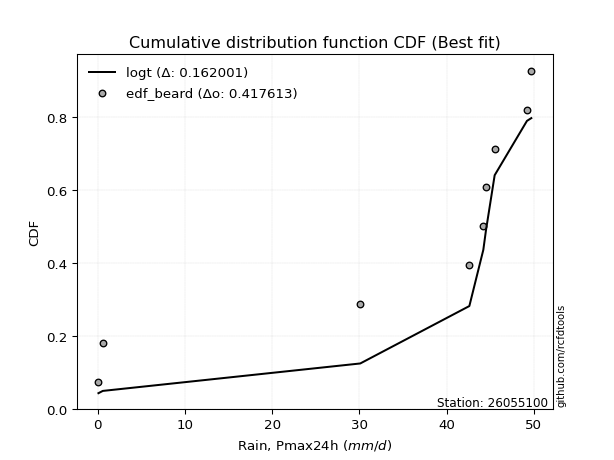</img></img>

</div>


### 5. EDF Chegodayev (1955)

The Chegodayev formula is an empirical plotting position formula used in hydrological frequency analysis to estimate the exceedance probability or return period of a specific event from a set of observed data. It is primarily used for plotting observed data points on probability paper to fit a theoretical distribution, particularly for analyzing extreme events like maximum flood flows or rainfall intensities. The constant _b_ value in the generalized plotting position formula is 0.3.

<div align="center">


$P=(m-b)/(n+1-2b)$


</div>


**5.1. Empirical values**

<div align="center">

|                | 0                   | 1                   | 2                  | 3                   | 4              | 5                  | 6                  | 7                  | 8                  |
|:---------------|:--------------------|:--------------------|:-------------------|:--------------------|:---------------|:-------------------|:-------------------|:-------------------|:-------------------|
| date           | 2016                | 2023                | 2022               | 2024                | 2021           | 2020               | 2017               | 2019               | 2018               |
| x              | 0.1                 | 0.6                 | 30.1               | 42.6                | 44.2           | 44.5               | 45.5               | 49.2               | 49.7               |
| m              | 1                   | 2                   | 3                  | 4                   | 5              | 6                  | 7                  | 8                  | 9                  |
| empirical_dist | edf_chegodayev      | edf_chegodayev      | edf_chegodayev     | edf_chegodayev      | edf_chegodayev | edf_chegodayev     | edf_chegodayev     | edf_chegodayev     | edf_chegodayev     |
| empirical      | 0.07446808510638298 | 0.18085106382978722 | 0.2872340425531915 | 0.39361702127659576 | 0.5            | 0.6063829787234043 | 0.7127659574468085 | 0.8191489361702128 | 0.9255319148936169 |
| empirical_tr   | 1.0804597701149425  | 1.2207792207792207  | 1.4029850746268657 | 1.6491228070175437  | 2.0            | 2.540540540540541  | 3.481481481481481  | 5.529411764705883  | 13.428571428571399 |

</div>


**5.2. Kolmogorov-Smirnov fit test (sorted by Δ)**


<div align="center">

|                | 0                   | 1                   | 2                   | 3                   | 4                   | 5                   | 6                   | 7                   | 8                   | 9                   | 10                  | 11                  | 12                  | 13                  | 14                  | 15                  | 16                  | 17                  | 18                  | 19                  | 20                  | 21                  | 22                  | 23                  | 24                  | 25                  | 26                  | 27                  | 28                  | 29                  | 30                  | 31                  | 32                  | 33                  | 34                  | 35                  | 36                  | 37                  | 38                  | 39                  | 40                  | 41                  | 42                  | 43                  | 44                  | 45                  | 46                  | 47                  | 48                  | 49                  | 50                  | 51                  | 52                  | 53                  | 54                  | 55                  | 56                  | 57                  | 58                  | 59                  | 60                  | 61                  | 62                  | 63                  | 64                  | 65                  | 66                  | 67                  | 68                  | 69                  | 70                  | 71                  | 72                  | 73                  | 74                  | 75                    | 76                  | 77                  | 78                  | 79                  | 80                  | 81                  | 82                  | 83                  | 84                  | 85                  | 86                  | 87                  |
|:---------------|:--------------------|:--------------------|:--------------------|:--------------------|:--------------------|:--------------------|:--------------------|:--------------------|:--------------------|:--------------------|:--------------------|:--------------------|:--------------------|:--------------------|:--------------------|:--------------------|:--------------------|:--------------------|:--------------------|:--------------------|:--------------------|:--------------------|:--------------------|:--------------------|:--------------------|:--------------------|:--------------------|:--------------------|:--------------------|:--------------------|:--------------------|:--------------------|:--------------------|:--------------------|:--------------------|:--------------------|:--------------------|:--------------------|:--------------------|:--------------------|:--------------------|:--------------------|:--------------------|:--------------------|:--------------------|:--------------------|:--------------------|:--------------------|:--------------------|:--------------------|:--------------------|:--------------------|:--------------------|:--------------------|:--------------------|:--------------------|:--------------------|:--------------------|:--------------------|:--------------------|:--------------------|:--------------------|:--------------------|:--------------------|:--------------------|:--------------------|:--------------------|:--------------------|:--------------------|:--------------------|:--------------------|:--------------------|:--------------------|:--------------------|:--------------------|:----------------------|:--------------------|:--------------------|:--------------------|:--------------------|:--------------------|:--------------------|:--------------------|:--------------------|:--------------------|:--------------------|:--------------------|:--------------------|
| station        | 26055100            | 26055100            | 26055100            | 26055100            | 26055100            | 26055100            | 26055100            | 26055100            | 26055100            | 26055100            | 26055100            | 26055100            | 26055100            | 26055100            | 26055100            | 26055100            | 26055100            | 26055100            | 26055100            | 26055100            | 26055100            | 26055100            | 26055100            | 26055100            | 26055100            | 26055100            | 26055100            | 26055100            | 26055100            | 26055100            | 26055100            | 26055100            | 26055100            | 26055100            | 26055100            | 26055100            | 26055100            | 26055100            | 26055100            | 26055100            | 26055100            | 26055100            | 26055100            | 26055100            | 26055100            | 26055100            | 26055100            | 26055100            | 26055100            | 26055100            | 26055100            | 26055100            | 26055100            | 26055100            | 26055100            | 26055100            | 26055100            | 26055100            | 26055100            | 26055100            | 26055100            | 26055100            | 26055100            | 26055100            | 26055100            | 26055100            | 26055100            | 26055100            | 26055100            | 26055100            | 26055100            | 26055100            | 26055100            | 26055100            | 26055100            | 26055100              | 26055100            | 26055100            | 26055100            | 26055100            | 26055100            | 26055100            | 26055100            | 26055100            | 26055100            | 26055100            | 26055100            | 26055100            |
| empirical_dist | edf_chegodayev      | edf_chegodayev      | edf_chegodayev      | edf_chegodayev      | edf_chegodayev      | edf_chegodayev      | edf_chegodayev      | edf_chegodayev      | edf_chegodayev      | edf_chegodayev      | edf_chegodayev      | edf_chegodayev      | edf_chegodayev      | edf_chegodayev      | edf_chegodayev      | edf_chegodayev      | edf_chegodayev      | edf_chegodayev      | edf_chegodayev      | edf_chegodayev      | edf_chegodayev      | edf_chegodayev      | edf_chegodayev      | edf_chegodayev      | edf_chegodayev      | edf_chegodayev      | edf_chegodayev      | edf_chegodayev      | edf_chegodayev      | edf_chegodayev      | edf_chegodayev      | edf_chegodayev      | edf_chegodayev      | edf_chegodayev      | edf_chegodayev      | edf_chegodayev      | edf_chegodayev      | edf_chegodayev      | edf_chegodayev      | edf_chegodayev      | edf_chegodayev      | edf_chegodayev      | edf_chegodayev      | edf_chegodayev      | edf_chegodayev      | edf_chegodayev      | edf_chegodayev      | edf_chegodayev      | edf_chegodayev      | edf_chegodayev      | edf_chegodayev      | edf_chegodayev      | edf_chegodayev      | edf_chegodayev      | edf_chegodayev      | edf_chegodayev      | edf_chegodayev      | edf_chegodayev      | edf_chegodayev      | edf_chegodayev      | edf_chegodayev      | edf_chegodayev      | edf_chegodayev      | edf_chegodayev      | edf_chegodayev      | edf_chegodayev      | edf_chegodayev      | edf_chegodayev      | edf_chegodayev      | edf_chegodayev      | edf_chegodayev      | edf_chegodayev      | edf_chegodayev      | edf_chegodayev      | edf_chegodayev      | edf_chegodayev        | edf_chegodayev      | edf_chegodayev      | edf_chegodayev      | edf_chegodayev      | edf_chegodayev      | edf_chegodayev      | edf_chegodayev      | edf_chegodayev      | edf_chegodayev      | edf_chegodayev      | edf_chegodayev      | edf_chegodayev      |
| p_dist         | logt                | pearson3            | gumbel_l            | mielke              | laplace_asymmetric  | weibull_min         | logpearson3         | gompertz            | betaprime           | fisk                | norm                | crystalball         | t                   | exponnorm           | invweibull          | fatiguelife         | rice                | invgauss            | chi2                | invgamma            | maxwell             | logistic            | loggumbel_l         | kstwobign           | truncnorm           | rayleigh            | hypsecant           | genexpon            | expon               | halfnorm            | ncf                 | loginvweibull       | gumbel_r            | laplace             | gamma               | halflogistic        | lognakagami         | lognct              | logexponnorm        | logcrystalball      | lognorm             | lognorm             | logrice             | loglognorm          | logerlang           | loginvgamma         | moyal               | logfatiguelife      | loggamma            | loggamma            | logncf              | f                   | loggompertz         | loglogistic         | logkstwobign        | loggenexpon         | logmaxwell          | loginvgauss         | lograyleigh         | loghypsecant        | logalpha            | logexpon            | loghalfnorm         | wald                | nct                 | loglaplace          | loggumbel_r         | nakagami            | loghalflogistic     | logmoyal            | gibrat              | logfisk             | erlang              | logweibull_min      | logwald             | loglaplace_asymmetric | logloggamma         | johnsonsu           | loggibrat           | logtruncnorm        | logjohnsonsu        | logbetaprime        | logf                | logmielke           | logchi2             | alpha               | loggenlogistic      | genlogistic         |
| delta          | 0.16245493677301864 | 0.2289615124831374  | 0.24069816456061183 | 0.24118652214658692 | 0.2414204024426853  | 0.2544087779255903  | 0.2709284216809781  | 0.2800668153166848  | 0.28075045482756417 | 0.28075437828484173 | 0.28172209530289044 | 0.28172209923293084 | 0.2817234499848446  | 0.28172733483618123 | 0.2818449782255436  | 0.28302809265350265 | 0.28546418992611516 | 0.29202314437736393 | 0.2965102876372368  | 0.2991175608151359  | 0.3005494593212021  | 0.3016251816463053  | 0.30200273621222073 | 0.3024730210132415  | 0.30478336478837936 | 0.3061278122796282  | 0.31655498234402285 | 0.32015790628622925 | 0.32034655644716087 | 0.32265627386216117 | 0.3267397133522215  | 0.32950601481929476 | 0.3373684037393642  | 0.34353951029799296 | 0.3453215047583613  | 0.35024359446986314 | 0.35283666628195953 | 0.3528660413630841  | 0.3529529031620542  | 0.3529538400925375  | 0.35295453356480255 | 0.35295453356480255 | 0.3532551895434719  | 0.3541723559586508  | 0.35479770903485086 | 0.35511244748144144 | 0.3555445695754728  | 0.35617202560098093 | 0.3572499781874804  | 0.3572499781874804  | 0.35744791248711516 | 0.3671819141754914  | 0.36977264719597513 | 0.3700212568586245  | 0.37458297011051933 | 0.37538702598814344 | 0.3756213098090174  | 0.3758418603352143  | 0.3824776264238098  | 0.38342927950471806 | 0.3919460739684626  | 0.39935570266721887 | 0.40231193071187843 | 0.40783290230236474 | 0.41093826480753903 | 0.4118118143214272  | 0.41442845408572093 | 0.41754240512438556 | 0.4305567715523245  | 0.4348901672116642  | 0.43974249121643777 | 0.4455799011055551  | 0.44574705813736615 | 0.4559757502316283  | 0.4926155031451688  | 0.49367128295944135   | 0.494199809060561   | 0.508283754621327   | 0.5248557241126891  | 0.5710777504756405  | 0.5837343813178764  | 0.5881946318984437  | 0.5956575816719111  | 0.5966549210229205  | 0.680522198601461   | 0.705221614847393   | 0.8191489361702128  | 0.8191489361702128  |
| deltao         | 0.41761268023100007 | 0.41761268023100007 | 0.41761268023100007 | 0.41761268023100007 | 0.41761268023100007 | 0.41761268023100007 | 0.41761268023100007 | 0.41761268023100007 | 0.41761268023100007 | 0.41761268023100007 | 0.41761268023100007 | 0.41761268023100007 | 0.41761268023100007 | 0.41761268023100007 | 0.41761268023100007 | 0.41761268023100007 | 0.41761268023100007 | 0.41761268023100007 | 0.41761268023100007 | 0.41761268023100007 | 0.41761268023100007 | 0.41761268023100007 | 0.41761268023100007 | 0.41761268023100007 | 0.41761268023100007 | 0.41761268023100007 | 0.41761268023100007 | 0.41761268023100007 | 0.41761268023100007 | 0.41761268023100007 | 0.41761268023100007 | 0.41761268023100007 | 0.41761268023100007 | 0.41761268023100007 | 0.41761268023100007 | 0.41761268023100007 | 0.41761268023100007 | 0.41761268023100007 | 0.41761268023100007 | 0.41761268023100007 | 0.41761268023100007 | 0.41761268023100007 | 0.41761268023100007 | 0.41761268023100007 | 0.41761268023100007 | 0.41761268023100007 | 0.41761268023100007 | 0.41761268023100007 | 0.41761268023100007 | 0.41761268023100007 | 0.41761268023100007 | 0.41761268023100007 | 0.41761268023100007 | 0.41761268023100007 | 0.41761268023100007 | 0.41761268023100007 | 0.41761268023100007 | 0.41761268023100007 | 0.41761268023100007 | 0.41761268023100007 | 0.41761268023100007 | 0.41761268023100007 | 0.41761268023100007 | 0.41761268023100007 | 0.41761268023100007 | 0.41761268023100007 | 0.41761268023100007 | 0.41761268023100007 | 0.41761268023100007 | 0.41761268023100007 | 0.41761268023100007 | 0.41761268023100007 | 0.41761268023100007 | 0.41761268023100007 | 0.41761268023100007 | 0.41761268023100007   | 0.41761268023100007 | 0.41761268023100007 | 0.41761268023100007 | 0.41761268023100007 | 0.41761268023100007 | 0.41761268023100007 | 0.41761268023100007 | 0.41761268023100007 | 0.41761268023100007 | 0.41761268023100007 | 0.41761268023100007 | 0.41761268023100007 |
| eval           | Δo > Δ              | Δo > Δ              | Δo > Δ              | Δo > Δ              | Δo > Δ              | Δo > Δ              | Δo > Δ              | Δo > Δ              | Δo > Δ              | Δo > Δ              | Δo > Δ              | Δo > Δ              | Δo > Δ              | Δo > Δ              | Δo > Δ              | Δo > Δ              | Δo > Δ              | Δo > Δ              | Δo > Δ              | Δo > Δ              | Δo > Δ              | Δo > Δ              | Δo > Δ              | Δo > Δ              | Δo > Δ              | Δo > Δ              | Δo > Δ              | Δo > Δ              | Δo > Δ              | Δo > Δ              | Δo > Δ              | Δo > Δ              | Δo > Δ              | Δo > Δ              | Δo > Δ              | Δo > Δ              | Δo > Δ              | Δo > Δ              | Δo > Δ              | Δo > Δ              | Δo > Δ              | Δo > Δ              | Δo > Δ              | Δo > Δ              | Δo > Δ              | Δo > Δ              | Δo > Δ              | Δo > Δ              | Δo > Δ              | Δo > Δ              | Δo > Δ              | Δo > Δ              | Δo > Δ              | Δo > Δ              | Δo > Δ              | Δo > Δ              | Δo > Δ              | Δo > Δ              | Δo > Δ              | Δo > Δ              | Δo > Δ              | Δo > Δ              | Δo > Δ              | Δo > Δ              | Δo > Δ              | Δo > Δ              | Δo > Δ              | Δo > Δ              | Δo <= Δ             | Δo <= Δ             | Δo <= Δ             | Δo <= Δ             | Δo <= Δ             | Δo <= Δ             | Δo <= Δ             | Δo <= Δ               | Δo <= Δ             | Δo <= Δ             | Δo <= Δ             | Δo <= Δ             | Δo <= Δ             | Δo <= Δ             | Δo <= Δ             | Δo <= Δ             | Δo <= Δ             | Δo <= Δ             | Δo <= Δ             | Δo <= Δ             |
| fit            | 1                   | 1                   | 1                   | 1                   | 1                   | 1                   | 1                   | 1                   | 1                   | 1                   | 1                   | 1                   | 1                   | 1                   | 1                   | 1                   | 1                   | 1                   | 1                   | 1                   | 1                   | 1                   | 1                   | 1                   | 1                   | 1                   | 1                   | 1                   | 1                   | 1                   | 1                   | 1                   | 1                   | 1                   | 1                   | 1                   | 1                   | 1                   | 1                   | 1                   | 1                   | 1                   | 1                   | 1                   | 1                   | 1                   | 1                   | 1                   | 1                   | 1                   | 1                   | 1                   | 1                   | 1                   | 1                   | 1                   | 1                   | 1                   | 1                   | 1                   | 1                   | 1                   | 1                   | 1                   | 1                   | 1                   | 1                   | 1                   | 0                   | 0                   | 0                   | 0                   | 0                   | 0                   | 0                   | 0                     | 0                   | 0                   | 0                   | 0                   | 0                   | 0                   | 0                   | 0                   | 0                   | 0                   | 0                   | 0                   |
| n              | 9                   | 9                   | 9                   | 9                   | 9                   | 9                   | 9                   | 9                   | 9                   | 9                   | 9                   | 9                   | 9                   | 9                   | 9                   | 9                   | 9                   | 9                   | 9                   | 9                   | 9                   | 9                   | 9                   | 9                   | 9                   | 9                   | 9                   | 9                   | 9                   | 9                   | 9                   | 9                   | 9                   | 9                   | 9                   | 9                   | 9                   | 9                   | 9                   | 9                   | 9                   | 9                   | 9                   | 9                   | 9                   | 9                   | 9                   | 9                   | 9                   | 9                   | 9                   | 9                   | 9                   | 9                   | 9                   | 9                   | 9                   | 9                   | 9                   | 9                   | 9                   | 9                   | 9                   | 9                   | 9                   | 9                   | 9                   | 9                   | 9                   | 9                   | 9                   | 9                   | 9                   | 9                   | 9                   | 9                     | 9                   | 9                   | 9                   | 9                   | 9                   | 9                   | 9                   | 9                   | 9                   | 9                   | 9                   | 9                   |
| best_fit       | 1                   | 0                   | 0                   | 0                   | 0                   | 0                   | 0                   | 0                   | 0                   | 0                   | 0                   | 0                   | 0                   | 0                   | 0                   | 0                   | 0                   | 0                   | 0                   | 0                   | 0                   | 0                   | 0                   | 0                   | 0                   | 0                   | 0                   | 0                   | 0                   | 0                   | 0                   | 0                   | 0                   | 0                   | 0                   | 0                   | 0                   | 0                   | 0                   | 0                   | 0                   | 0                   | 0                   | 0                   | 0                   | 0                   | 0                   | 0                   | 0                   | 0                   | 0                   | 0                   | 0                   | 0                   | 0                   | 0                   | 0                   | 0                   | 0                   | 0                   | 0                   | 0                   | 0                   | 0                   | 0                   | 0                   | 0                   | 0                   | 0                   | 0                   | 0                   | 0                   | 0                   | 0                   | 0                   | 0                     | 0                   | 0                   | 0                   | 0                   | 0                   | 0                   | 0                   | 0                   | 0                   | 0                   | 0                   | 0                   |
| best_fit_sort  | 1                   | 2                   | 3                   | 4                   | 5                   | 6                   | 7                   | 8                   | 9                   | 10                  | 11                  | 12                  | 13                  | 14                  | 15                  | 16                  | 17                  | 18                  | 19                  | 20                  | 21                  | 22                  | 23                  | 24                  | 25                  | 26                  | 27                  | 28                  | 29                  | 30                  | 31                  | 32                  | 33                  | 34                  | 35                  | 36                  | 37                  | 38                  | 39                  | 40                  | 41                  | 42                  | 43                  | 44                  | 45                  | 46                  | 47                  | 48                  | 49                  | 50                  | 51                  | 52                  | 53                  | 54                  | 55                  | 56                  | 57                  | 58                  | 59                  | 60                  | 61                  | 62                  | 63                  | 64                  | 65                  | 66                  | 67                  | 68                  | 69                  | 70                  | 71                  | 72                  | 73                  | 74                  | 75                  | 76                    | 77                  | 78                  | 79                  | 80                  | 81                  | 82                  | 83                  | 84                  | 85                  | 86                  | 87                  | 88                  |

</div>


**5.3. Best fit**

<div align="center">

|   id |   station | empirical_dist   | p_dist   |    delta |   deltao | eval   |   fit |   n |   best_fit |   best_fit_sort |
|-----:|----------:|:-----------------|:---------|---------:|---------:|:-------|------:|----:|-----------:|----------------:|
|    0 |  26055100 | edf_chegodayev   | logt     | 0.162455 | 0.417613 | Δo > Δ |     1 |   9 |          1 |               1 |

</div>


<div align="center">

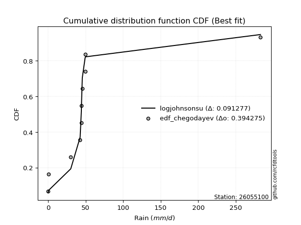</img>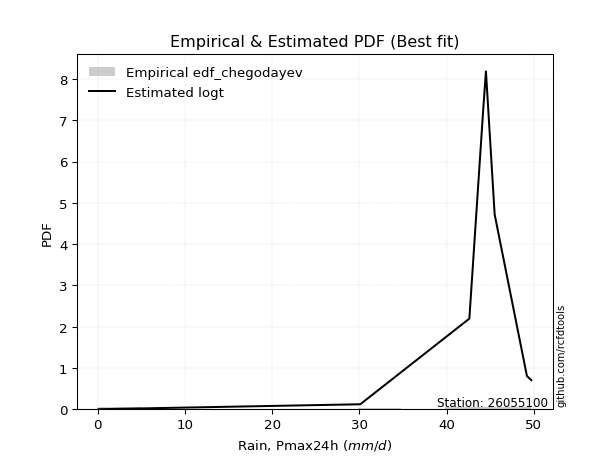</img>

</div>


### 6. EDF Blom (1958)

The Blom formula is a specific "plotting position" formula used in hydrology and statistical analysis to estimate the empirical cumulative probability (or non-exceedance probability) of a data series. It is particularly recommended for data that are approximately normally distributed. The constant _a_ is set to 0.375 (or 3/8).

<div align="center">


$P=(m-a)/(n+1-2a)$


</div>


**6.1. Empirical values**

<div align="center">

|                | 0                   | 1                   | 2                   | 3                  | 4        | 5                  | 6                  | 7                  | 8                  |
|:---------------|:--------------------|:--------------------|:--------------------|:-------------------|:---------|:-------------------|:-------------------|:-------------------|:-------------------|
| date           | 2016                | 2023                | 2022                | 2024               | 2021     | 2020               | 2017               | 2019               | 2018               |
| x              | 0.1                 | 0.6                 | 30.1                | 42.6               | 44.2     | 44.5               | 45.5               | 49.2               | 49.7               |
| m              | 1                   | 2                   | 3                   | 4                  | 5        | 6                  | 7                  | 8                  | 9                  |
| empirical_dist | edf_blom            | edf_blom            | edf_blom            | edf_blom           | edf_blom | edf_blom           | edf_blom           | edf_blom           | edf_blom           |
| empirical      | 0.06756756756756757 | 0.17567567567567569 | 0.28378378378378377 | 0.3918918918918919 | 0.5      | 0.6081081081081081 | 0.7162162162162162 | 0.8243243243243243 | 0.9324324324324325 |
| empirical_tr   | 1.072463768115942   | 1.2131147540983607  | 1.3962264150943395  | 1.6444444444444444 | 2.0      | 2.5517241379310347 | 3.523809523809524  | 5.6923076923076925 | 14.800000000000006 |

</div>


**6.2. Kolmogorov-Smirnov fit test (sorted by Δ)**


<div align="center">

|                | 0                   | 1                   | 2                   | 3                   | 4                   | 5                   | 6                   | 7                   | 8                   | 9                   | 10                  | 11                  | 12                  | 13                  | 14                  | 15                  | 16                  | 17                  | 18                  | 19                  | 20                  | 21                  | 22                  | 23                  | 24                  | 25                  | 26                  | 27                  | 28                  | 29                  | 30                  | 31                  | 32                  | 33                  | 34                  | 35                  | 36                  | 37                  | 38                  | 39                  | 40                  | 41                  | 42                  | 43                  | 44                  | 45                  | 46                  | 47                  | 48                  | 49                  | 50                  | 51                  | 52                  | 53                  | 54                  | 55                  | 56                  | 57                  | 58                  | 59                  | 60                  | 61                  | 62                  | 63                  | 64                  | 65                  | 66                  | 67                  | 68                  | 69                  | 70                  | 71                  | 72                  | 73                  | 74                    | 75                  | 76                  | 77                  | 78                  | 79                  | 80                  | 81                  | 82                  | 83                  | 84                  | 85                  | 86                  | 87                  |
|:---------------|:--------------------|:--------------------|:--------------------|:--------------------|:--------------------|:--------------------|:--------------------|:--------------------|:--------------------|:--------------------|:--------------------|:--------------------|:--------------------|:--------------------|:--------------------|:--------------------|:--------------------|:--------------------|:--------------------|:--------------------|:--------------------|:--------------------|:--------------------|:--------------------|:--------------------|:--------------------|:--------------------|:--------------------|:--------------------|:--------------------|:--------------------|:--------------------|:--------------------|:--------------------|:--------------------|:--------------------|:--------------------|:--------------------|:--------------------|:--------------------|:--------------------|:--------------------|:--------------------|:--------------------|:--------------------|:--------------------|:--------------------|:--------------------|:--------------------|:--------------------|:--------------------|:--------------------|:--------------------|:--------------------|:--------------------|:--------------------|:--------------------|:--------------------|:--------------------|:--------------------|:--------------------|:--------------------|:--------------------|:--------------------|:--------------------|:--------------------|:--------------------|:--------------------|:--------------------|:--------------------|:--------------------|:--------------------|:--------------------|:--------------------|:----------------------|:--------------------|:--------------------|:--------------------|:--------------------|:--------------------|:--------------------|:--------------------|:--------------------|:--------------------|:--------------------|:--------------------|:--------------------|:--------------------|
| station        | 26055100            | 26055100            | 26055100            | 26055100            | 26055100            | 26055100            | 26055100            | 26055100            | 26055100            | 26055100            | 26055100            | 26055100            | 26055100            | 26055100            | 26055100            | 26055100            | 26055100            | 26055100            | 26055100            | 26055100            | 26055100            | 26055100            | 26055100            | 26055100            | 26055100            | 26055100            | 26055100            | 26055100            | 26055100            | 26055100            | 26055100            | 26055100            | 26055100            | 26055100            | 26055100            | 26055100            | 26055100            | 26055100            | 26055100            | 26055100            | 26055100            | 26055100            | 26055100            | 26055100            | 26055100            | 26055100            | 26055100            | 26055100            | 26055100            | 26055100            | 26055100            | 26055100            | 26055100            | 26055100            | 26055100            | 26055100            | 26055100            | 26055100            | 26055100            | 26055100            | 26055100            | 26055100            | 26055100            | 26055100            | 26055100            | 26055100            | 26055100            | 26055100            | 26055100            | 26055100            | 26055100            | 26055100            | 26055100            | 26055100            | 26055100              | 26055100            | 26055100            | 26055100            | 26055100            | 26055100            | 26055100            | 26055100            | 26055100            | 26055100            | 26055100            | 26055100            | 26055100            | 26055100            |
| empirical_dist | edf_blom            | edf_blom            | edf_blom            | edf_blom            | edf_blom            | edf_blom            | edf_blom            | edf_blom            | edf_blom            | edf_blom            | edf_blom            | edf_blom            | edf_blom            | edf_blom            | edf_blom            | edf_blom            | edf_blom            | edf_blom            | edf_blom            | edf_blom            | edf_blom            | edf_blom            | edf_blom            | edf_blom            | edf_blom            | edf_blom            | edf_blom            | edf_blom            | edf_blom            | edf_blom            | edf_blom            | edf_blom            | edf_blom            | edf_blom            | edf_blom            | edf_blom            | edf_blom            | edf_blom            | edf_blom            | edf_blom            | edf_blom            | edf_blom            | edf_blom            | edf_blom            | edf_blom            | edf_blom            | edf_blom            | edf_blom            | edf_blom            | edf_blom            | edf_blom            | edf_blom            | edf_blom            | edf_blom            | edf_blom            | edf_blom            | edf_blom            | edf_blom            | edf_blom            | edf_blom            | edf_blom            | edf_blom            | edf_blom            | edf_blom            | edf_blom            | edf_blom            | edf_blom            | edf_blom            | edf_blom            | edf_blom            | edf_blom            | edf_blom            | edf_blom            | edf_blom            | edf_blom              | edf_blom            | edf_blom            | edf_blom            | edf_blom            | edf_blom            | edf_blom            | edf_blom            | edf_blom            | edf_blom            | edf_blom            | edf_blom            | edf_blom            | edf_blom            |
| p_dist         | logt                | pearson3            | gumbel_l            | mielke              | laplace_asymmetric  | weibull_min         | logpearson3         | gompertz            | betaprime           | norm                | crystalball         | t                   | exponnorm           | invweibull          | fatiguelife         | rice                | fisk                | invgauss            | chi2                | invgamma            | maxwell             | logistic            | kstwobign           | loggumbel_l         | truncnorm           | rayleigh            | hypsecant           | genexpon            | expon               | halfnorm            | ncf                 | loginvweibull       | gumbel_r            | laplace             | gamma               | halflogistic        | lognakagami         | lognct              | logexponnorm        | logcrystalball      | lognorm             | lognorm             | logrice             | moyal               | loglognorm          | logerlang           | loginvgamma         | logfatiguelife      | loggamma            | loggamma            | logncf              | f                   | loggompertz         | loglogistic         | logkstwobign        | loggenexpon         | logmaxwell          | loginvgauss         | lograyleigh         | loghypsecant        | logalpha            | logexpon            | loghalfnorm         | wald                | nct                 | loglaplace          | loggumbel_r         | nakagami            | loghalflogistic     | logmoyal            | gibrat              | logfisk             | erlang              | logweibull_min      | loglaplace_asymmetric | logloggamma         | logwald             | johnsonsu           | loggibrat           | logtruncnorm        | logjohnsonsu        | logbetaprime        | logmielke           | logf                | logchi2             | alpha               | loggenlogistic      | genlogistic         |
| delta          | 0.1590046780036109  | 0.23068664186784127 | 0.2424232939453157  | 0.2429116515312908  | 0.24314553182738918 | 0.2561339073102942  | 0.2743786804503858  | 0.27661655654727707 | 0.28247558421226804 | 0.2834472246875943  | 0.2834472286176347  | 0.2834485793695485  | 0.2834524642208851  | 0.2835701076102475  | 0.2847532220382065  | 0.28718931931081904 | 0.28765489582365733 | 0.2937482737620678  | 0.2982354170219407  | 0.3008426901998398  | 0.30227458870590596 | 0.3033503110310092  | 0.3041981503979454  | 0.3054529949816285  | 0.30650849417308323 | 0.3078529416643321  | 0.3182801117287267  | 0.3218830356709331  | 0.32207168583186474 | 0.32438140324686504 | 0.33018997212162926 | 0.3329562735887025  | 0.3390935331240681  | 0.34526463968269683 | 0.34877176352776906 | 0.351968723854567   | 0.3562869250513673  | 0.3563163001324918  | 0.35640316193146193 | 0.35640409886194524 | 0.3564047923342103  | 0.3564047923342103  | 0.35670544831287965 | 0.3572696989601767  | 0.35762261472805856 | 0.3582479678042586  | 0.3585627062508492  | 0.3596222843703887  | 0.36070023695688813 | 0.36070023695688813 | 0.3608981712565229  | 0.37063217294489914 | 0.3732229059653829  | 0.37347151562803227 | 0.3780332288799271  | 0.3788372847575512  | 0.37907156857842517 | 0.379292119104622   | 0.3859278851932175  | 0.3868795382741258  | 0.39539633273787034 | 0.4028059614366266  | 0.4057621894812862  | 0.4095580316870686  | 0.4143885235769468  | 0.41526207309083496 | 0.4178787128551287  | 0.4209926638937933  | 0.43400703032173227 | 0.4383404259810719  | 0.44146762060114164 | 0.44903015987496286 | 0.4491973169067739  | 0.46115113838573984 | 0.4953964123441452    | 0.49592493844526486 | 0.4960657619145765  | 0.5134591427754386  | 0.5283059828820968  | 0.5745280092450482  | 0.5889097694719879  | 0.5916448906678514  | 0.6001051797923282  | 0.6008329698260226  | 0.6839724573708688  | 0.7086718736168007  | 0.8243243243243243  | 0.8243243243243243  |
| deltao         | 0.41761268023100007 | 0.41761268023100007 | 0.41761268023100007 | 0.41761268023100007 | 0.41761268023100007 | 0.41761268023100007 | 0.41761268023100007 | 0.41761268023100007 | 0.41761268023100007 | 0.41761268023100007 | 0.41761268023100007 | 0.41761268023100007 | 0.41761268023100007 | 0.41761268023100007 | 0.41761268023100007 | 0.41761268023100007 | 0.41761268023100007 | 0.41761268023100007 | 0.41761268023100007 | 0.41761268023100007 | 0.41761268023100007 | 0.41761268023100007 | 0.41761268023100007 | 0.41761268023100007 | 0.41761268023100007 | 0.41761268023100007 | 0.41761268023100007 | 0.41761268023100007 | 0.41761268023100007 | 0.41761268023100007 | 0.41761268023100007 | 0.41761268023100007 | 0.41761268023100007 | 0.41761268023100007 | 0.41761268023100007 | 0.41761268023100007 | 0.41761268023100007 | 0.41761268023100007 | 0.41761268023100007 | 0.41761268023100007 | 0.41761268023100007 | 0.41761268023100007 | 0.41761268023100007 | 0.41761268023100007 | 0.41761268023100007 | 0.41761268023100007 | 0.41761268023100007 | 0.41761268023100007 | 0.41761268023100007 | 0.41761268023100007 | 0.41761268023100007 | 0.41761268023100007 | 0.41761268023100007 | 0.41761268023100007 | 0.41761268023100007 | 0.41761268023100007 | 0.41761268023100007 | 0.41761268023100007 | 0.41761268023100007 | 0.41761268023100007 | 0.41761268023100007 | 0.41761268023100007 | 0.41761268023100007 | 0.41761268023100007 | 0.41761268023100007 | 0.41761268023100007 | 0.41761268023100007 | 0.41761268023100007 | 0.41761268023100007 | 0.41761268023100007 | 0.41761268023100007 | 0.41761268023100007 | 0.41761268023100007 | 0.41761268023100007 | 0.41761268023100007   | 0.41761268023100007 | 0.41761268023100007 | 0.41761268023100007 | 0.41761268023100007 | 0.41761268023100007 | 0.41761268023100007 | 0.41761268023100007 | 0.41761268023100007 | 0.41761268023100007 | 0.41761268023100007 | 0.41761268023100007 | 0.41761268023100007 | 0.41761268023100007 |
| eval           | Δo > Δ              | Δo > Δ              | Δo > Δ              | Δo > Δ              | Δo > Δ              | Δo > Δ              | Δo > Δ              | Δo > Δ              | Δo > Δ              | Δo > Δ              | Δo > Δ              | Δo > Δ              | Δo > Δ              | Δo > Δ              | Δo > Δ              | Δo > Δ              | Δo > Δ              | Δo > Δ              | Δo > Δ              | Δo > Δ              | Δo > Δ              | Δo > Δ              | Δo > Δ              | Δo > Δ              | Δo > Δ              | Δo > Δ              | Δo > Δ              | Δo > Δ              | Δo > Δ              | Δo > Δ              | Δo > Δ              | Δo > Δ              | Δo > Δ              | Δo > Δ              | Δo > Δ              | Δo > Δ              | Δo > Δ              | Δo > Δ              | Δo > Δ              | Δo > Δ              | Δo > Δ              | Δo > Δ              | Δo > Δ              | Δo > Δ              | Δo > Δ              | Δo > Δ              | Δo > Δ              | Δo > Δ              | Δo > Δ              | Δo > Δ              | Δo > Δ              | Δo > Δ              | Δo > Δ              | Δo > Δ              | Δo > Δ              | Δo > Δ              | Δo > Δ              | Δo > Δ              | Δo > Δ              | Δo > Δ              | Δo > Δ              | Δo > Δ              | Δo > Δ              | Δo > Δ              | Δo > Δ              | Δo > Δ              | Δo <= Δ             | Δo <= Δ             | Δo <= Δ             | Δo <= Δ             | Δo <= Δ             | Δo <= Δ             | Δo <= Δ             | Δo <= Δ             | Δo <= Δ               | Δo <= Δ             | Δo <= Δ             | Δo <= Δ             | Δo <= Δ             | Δo <= Δ             | Δo <= Δ             | Δo <= Δ             | Δo <= Δ             | Δo <= Δ             | Δo <= Δ             | Δo <= Δ             | Δo <= Δ             | Δo <= Δ             |
| fit            | 1                   | 1                   | 1                   | 1                   | 1                   | 1                   | 1                   | 1                   | 1                   | 1                   | 1                   | 1                   | 1                   | 1                   | 1                   | 1                   | 1                   | 1                   | 1                   | 1                   | 1                   | 1                   | 1                   | 1                   | 1                   | 1                   | 1                   | 1                   | 1                   | 1                   | 1                   | 1                   | 1                   | 1                   | 1                   | 1                   | 1                   | 1                   | 1                   | 1                   | 1                   | 1                   | 1                   | 1                   | 1                   | 1                   | 1                   | 1                   | 1                   | 1                   | 1                   | 1                   | 1                   | 1                   | 1                   | 1                   | 1                   | 1                   | 1                   | 1                   | 1                   | 1                   | 1                   | 1                   | 1                   | 1                   | 0                   | 0                   | 0                   | 0                   | 0                   | 0                   | 0                   | 0                   | 0                     | 0                   | 0                   | 0                   | 0                   | 0                   | 0                   | 0                   | 0                   | 0                   | 0                   | 0                   | 0                   | 0                   |
| n              | 9                   | 9                   | 9                   | 9                   | 9                   | 9                   | 9                   | 9                   | 9                   | 9                   | 9                   | 9                   | 9                   | 9                   | 9                   | 9                   | 9                   | 9                   | 9                   | 9                   | 9                   | 9                   | 9                   | 9                   | 9                   | 9                   | 9                   | 9                   | 9                   | 9                   | 9                   | 9                   | 9                   | 9                   | 9                   | 9                   | 9                   | 9                   | 9                   | 9                   | 9                   | 9                   | 9                   | 9                   | 9                   | 9                   | 9                   | 9                   | 9                   | 9                   | 9                   | 9                   | 9                   | 9                   | 9                   | 9                   | 9                   | 9                   | 9                   | 9                   | 9                   | 9                   | 9                   | 9                   | 9                   | 9                   | 9                   | 9                   | 9                   | 9                   | 9                   | 9                   | 9                   | 9                   | 9                     | 9                   | 9                   | 9                   | 9                   | 9                   | 9                   | 9                   | 9                   | 9                   | 9                   | 9                   | 9                   | 9                   |
| best_fit       | 1                   | 0                   | 0                   | 0                   | 0                   | 0                   | 0                   | 0                   | 0                   | 0                   | 0                   | 0                   | 0                   | 0                   | 0                   | 0                   | 0                   | 0                   | 0                   | 0                   | 0                   | 0                   | 0                   | 0                   | 0                   | 0                   | 0                   | 0                   | 0                   | 0                   | 0                   | 0                   | 0                   | 0                   | 0                   | 0                   | 0                   | 0                   | 0                   | 0                   | 0                   | 0                   | 0                   | 0                   | 0                   | 0                   | 0                   | 0                   | 0                   | 0                   | 0                   | 0                   | 0                   | 0                   | 0                   | 0                   | 0                   | 0                   | 0                   | 0                   | 0                   | 0                   | 0                   | 0                   | 0                   | 0                   | 0                   | 0                   | 0                   | 0                   | 0                   | 0                   | 0                   | 0                   | 0                     | 0                   | 0                   | 0                   | 0                   | 0                   | 0                   | 0                   | 0                   | 0                   | 0                   | 0                   | 0                   | 0                   |
| best_fit_sort  | 1                   | 2                   | 3                   | 4                   | 5                   | 6                   | 7                   | 8                   | 9                   | 10                  | 11                  | 12                  | 13                  | 14                  | 15                  | 16                  | 17                  | 18                  | 19                  | 20                  | 21                  | 22                  | 23                  | 24                  | 25                  | 26                  | 27                  | 28                  | 29                  | 30                  | 31                  | 32                  | 33                  | 34                  | 35                  | 36                  | 37                  | 38                  | 39                  | 40                  | 41                  | 42                  | 43                  | 44                  | 45                  | 46                  | 47                  | 48                  | 49                  | 50                  | 51                  | 52                  | 53                  | 54                  | 55                  | 56                  | 57                  | 58                  | 59                  | 60                  | 61                  | 62                  | 63                  | 64                  | 65                  | 66                  | 67                  | 68                  | 69                  | 70                  | 71                  | 72                  | 73                  | 74                  | 75                    | 76                  | 77                  | 78                  | 79                  | 80                  | 81                  | 82                  | 83                  | 84                  | 85                  | 86                  | 87                  | 88                  |

</div>


**6.3. Best fit**

<div align="center">

|   id |   station | empirical_dist   | p_dist   |    delta |   deltao | eval   |   fit |   n |   best_fit |   best_fit_sort |
|-----:|----------:|:-----------------|:---------|---------:|---------:|:-------|------:|----:|-----------:|----------------:|
|    0 |  26055100 | edf_blom         | logt     | 0.159005 | 0.417613 | Δo > Δ |     1 |   9 |          1 |               1 |

</div>


<div align="center">

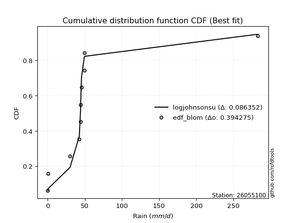</img>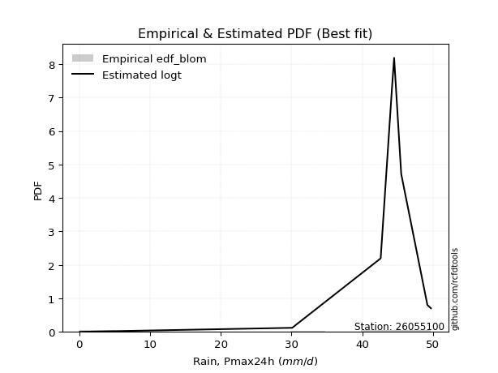</img>

</div>


### 7. EDF Tukey (1962)

In hydrology, the Tukey formula is used as a plotting position formula to estimate the empirical probability or frequency of a flood event (or other hydrological data). The formula parameter is given as _c=0.333_ (or 1/3).

<div align="center">


$P=(m-c)/(n+1-2c)$


</div>


**7.1. Empirical values**

<div align="center">

|                | 0                   | 1                   | 2                  | 3                   | 4         | 5                  | 6                  | 7                  | 8                  |
|:---------------|:--------------------|:--------------------|:-------------------|:--------------------|:----------|:-------------------|:-------------------|:-------------------|:-------------------|
| date           | 2016                | 2023                | 2022               | 2024                | 2021      | 2020               | 2017               | 2019               | 2018               |
| x              | 0.1                 | 0.6                 | 30.1               | 42.6                | 44.2      | 44.5               | 45.5               | 49.2               | 49.7               |
| m              | 1                   | 2                   | 3                  | 4                   | 5         | 6                  | 7                  | 8                  | 9                  |
| empirical_dist | edf_tukey           | edf_tukey           | edf_tukey          | edf_tukey           | edf_tukey | edf_tukey          | edf_tukey          | edf_tukey          | edf_tukey          |
| empirical      | 0.07142857142857142 | 0.17857142857142858 | 0.2857142857142857 | 0.39285714285714285 | 0.5       | 0.6071428571428571 | 0.7142857142857143 | 0.8214285714285714 | 0.9285714285714286 |
| empirical_tr   | 1.0769230769230769  | 1.2173913043478262  | 1.4                | 1.6470588235294117  | 2.0       | 2.545454545454545  | 3.5                | 5.599999999999999  | 14.000000000000007 |

</div>


**7.2. Kolmogorov-Smirnov fit test (sorted by Δ)**


<div align="center">

|                | 0                   | 1                   | 2                   | 3                   | 4                   | 5                   | 6                   | 7                   | 8                   | 9                   | 10                  | 11                  | 12                  | 13                  | 14                  | 15                  | 16                  | 17                  | 18                  | 19                  | 20                  | 21                  | 22                  | 23                  | 24                  | 25                  | 26                  | 27                  | 28                  | 29                  | 30                  | 31                  | 32                  | 33                  | 34                  | 35                  | 36                  | 37                  | 38                  | 39                  | 40                  | 41                  | 42                  | 43                  | 44                  | 45                  | 46                  | 47                  | 48                  | 49                  | 50                  | 51                  | 52                  | 53                  | 54                  | 55                  | 56                  | 57                  | 58                  | 59                  | 60                  | 61                  | 62                  | 63                  | 64                  | 65                  | 66                  | 67                  | 68                  | 69                  | 70                  | 71                  | 72                  | 73                  | 74                  | 75                    | 76                  | 77                  | 78                  | 79                  | 80                  | 81                  | 82                  | 83                  | 84                  | 85                  | 86                  | 87                  |
|:---------------|:--------------------|:--------------------|:--------------------|:--------------------|:--------------------|:--------------------|:--------------------|:--------------------|:--------------------|:--------------------|:--------------------|:--------------------|:--------------------|:--------------------|:--------------------|:--------------------|:--------------------|:--------------------|:--------------------|:--------------------|:--------------------|:--------------------|:--------------------|:--------------------|:--------------------|:--------------------|:--------------------|:--------------------|:--------------------|:--------------------|:--------------------|:--------------------|:--------------------|:--------------------|:--------------------|:--------------------|:--------------------|:--------------------|:--------------------|:--------------------|:--------------------|:--------------------|:--------------------|:--------------------|:--------------------|:--------------------|:--------------------|:--------------------|:--------------------|:--------------------|:--------------------|:--------------------|:--------------------|:--------------------|:--------------------|:--------------------|:--------------------|:--------------------|:--------------------|:--------------------|:--------------------|:--------------------|:--------------------|:--------------------|:--------------------|:--------------------|:--------------------|:--------------------|:--------------------|:--------------------|:--------------------|:--------------------|:--------------------|:--------------------|:--------------------|:----------------------|:--------------------|:--------------------|:--------------------|:--------------------|:--------------------|:--------------------|:--------------------|:--------------------|:--------------------|:--------------------|:--------------------|:--------------------|
| station        | 26055100            | 26055100            | 26055100            | 26055100            | 26055100            | 26055100            | 26055100            | 26055100            | 26055100            | 26055100            | 26055100            | 26055100            | 26055100            | 26055100            | 26055100            | 26055100            | 26055100            | 26055100            | 26055100            | 26055100            | 26055100            | 26055100            | 26055100            | 26055100            | 26055100            | 26055100            | 26055100            | 26055100            | 26055100            | 26055100            | 26055100            | 26055100            | 26055100            | 26055100            | 26055100            | 26055100            | 26055100            | 26055100            | 26055100            | 26055100            | 26055100            | 26055100            | 26055100            | 26055100            | 26055100            | 26055100            | 26055100            | 26055100            | 26055100            | 26055100            | 26055100            | 26055100            | 26055100            | 26055100            | 26055100            | 26055100            | 26055100            | 26055100            | 26055100            | 26055100            | 26055100            | 26055100            | 26055100            | 26055100            | 26055100            | 26055100            | 26055100            | 26055100            | 26055100            | 26055100            | 26055100            | 26055100            | 26055100            | 26055100            | 26055100            | 26055100              | 26055100            | 26055100            | 26055100            | 26055100            | 26055100            | 26055100            | 26055100            | 26055100            | 26055100            | 26055100            | 26055100            | 26055100            |
| empirical_dist | edf_tukey           | edf_tukey           | edf_tukey           | edf_tukey           | edf_tukey           | edf_tukey           | edf_tukey           | edf_tukey           | edf_tukey           | edf_tukey           | edf_tukey           | edf_tukey           | edf_tukey           | edf_tukey           | edf_tukey           | edf_tukey           | edf_tukey           | edf_tukey           | edf_tukey           | edf_tukey           | edf_tukey           | edf_tukey           | edf_tukey           | edf_tukey           | edf_tukey           | edf_tukey           | edf_tukey           | edf_tukey           | edf_tukey           | edf_tukey           | edf_tukey           | edf_tukey           | edf_tukey           | edf_tukey           | edf_tukey           | edf_tukey           | edf_tukey           | edf_tukey           | edf_tukey           | edf_tukey           | edf_tukey           | edf_tukey           | edf_tukey           | edf_tukey           | edf_tukey           | edf_tukey           | edf_tukey           | edf_tukey           | edf_tukey           | edf_tukey           | edf_tukey           | edf_tukey           | edf_tukey           | edf_tukey           | edf_tukey           | edf_tukey           | edf_tukey           | edf_tukey           | edf_tukey           | edf_tukey           | edf_tukey           | edf_tukey           | edf_tukey           | edf_tukey           | edf_tukey           | edf_tukey           | edf_tukey           | edf_tukey           | edf_tukey           | edf_tukey           | edf_tukey           | edf_tukey           | edf_tukey           | edf_tukey           | edf_tukey           | edf_tukey             | edf_tukey           | edf_tukey           | edf_tukey           | edf_tukey           | edf_tukey           | edf_tukey           | edf_tukey           | edf_tukey           | edf_tukey           | edf_tukey           | edf_tukey           | edf_tukey           |
| p_dist         | logt                | pearson3            | gumbel_l            | mielke              | laplace_asymmetric  | weibull_min         | logpearson3         | gompertz            | betaprime           | norm                | crystalball         | t                   | exponnorm           | invweibull          | fatiguelife         | fisk                | rice                | invgauss            | chi2                | invgamma            | maxwell             | logistic            | kstwobign           | loggumbel_l         | truncnorm           | rayleigh            | hypsecant           | genexpon            | expon               | halfnorm            | ncf                 | loginvweibull       | gumbel_r            | laplace             | gamma               | halflogistic        | lognakagami         | lognct              | logexponnorm        | logcrystalball      | lognorm             | lognorm             | logrice             | loglognorm          | moyal               | logerlang           | loginvgamma         | logfatiguelife      | loggamma            | loggamma            | logncf              | f                   | loggompertz         | loglogistic         | logkstwobign        | loggenexpon         | logmaxwell          | loginvgauss         | lograyleigh         | loghypsecant        | logalpha            | logexpon            | loghalfnorm         | wald                | nct                 | loglaplace          | loggumbel_r         | nakagami            | loghalflogistic     | logmoyal            | gibrat              | logfisk             | erlang              | logweibull_min      | logwald             | loglaplace_asymmetric | logloggamma         | johnsonsu           | loggibrat           | logtruncnorm        | logjohnsonsu        | logbetaprime        | logf                | logmielke           | logchi2             | alpha               | loggenlogistic      | genlogistic         |
| delta          | 0.16093517993411283 | 0.2297213909025903  | 0.24145804298006474 | 0.24194640056603983 | 0.24218028086213822 | 0.2551686563450432  | 0.2724481785198839  | 0.278547058477779   | 0.2815103332470171  | 0.28248197372234335 | 0.28248197765238375 | 0.2824833284042975  | 0.28248721325563414 | 0.2826048566449965  | 0.28378797107295556 | 0.2837938919626535  | 0.2862240683455681  | 0.29278302279681684 | 0.2972701660566897  | 0.2998774392345888  | 0.301309337740655   | 0.3023850600657582  | 0.30323289943269444 | 0.30352249305112655 | 0.30554324320783227 | 0.3068876906990811  | 0.31731486076347576 | 0.32091778470568216 | 0.3211064348666138  | 0.3234161522816141  | 0.32825947019112733 | 0.3310257716582006  | 0.33812828215881713 | 0.34429938871744586 | 0.34684126159726714 | 0.35100347288931605 | 0.35435642312086535 | 0.3543857982019899  | 0.35447266000096    | 0.3544735969314433  | 0.35447429040370837 | 0.35447429040370837 | 0.3547749463823777  | 0.35569211279755664 | 0.3563044479949257  | 0.3563174658737567  | 0.35663220432034726 | 0.35769178243988675 | 0.3587697350263862  | 0.3587697350263862  | 0.358967669326021   | 0.3687016710143972  | 0.37129240403488095 | 0.37154101369753034 | 0.37610272694942515 | 0.37690678282704926 | 0.37714106664792324 | 0.3773616171741201  | 0.3839973832627156  | 0.3849490363436239  | 0.3934658308073684  | 0.4008754595061247  | 0.40383168755078425 | 0.40859278072181765 | 0.41245802164644485 | 0.41333157116033303 | 0.41594821092462675 | 0.4190621619632914  | 0.43207652839123034 | 0.43640992405057    | 0.4405023696358907  | 0.44709965794446094 | 0.44726681497627196 | 0.4582553854899869  | 0.4941352599840746  | 0.49443116137889426   | 0.4949596874800139  | 0.5105633898796856  | 0.5263754809515949  | 0.5725975073145463  | 0.586014016576235   | 0.5897143887373495  | 0.5979372169302697  | 0.5981746778618263  | 0.6820419554403668  | 0.7067413716862988  | 0.8214285714285714  | 0.8214285714285714  |
| deltao         | 0.41761268023100007 | 0.41761268023100007 | 0.41761268023100007 | 0.41761268023100007 | 0.41761268023100007 | 0.41761268023100007 | 0.41761268023100007 | 0.41761268023100007 | 0.41761268023100007 | 0.41761268023100007 | 0.41761268023100007 | 0.41761268023100007 | 0.41761268023100007 | 0.41761268023100007 | 0.41761268023100007 | 0.41761268023100007 | 0.41761268023100007 | 0.41761268023100007 | 0.41761268023100007 | 0.41761268023100007 | 0.41761268023100007 | 0.41761268023100007 | 0.41761268023100007 | 0.41761268023100007 | 0.41761268023100007 | 0.41761268023100007 | 0.41761268023100007 | 0.41761268023100007 | 0.41761268023100007 | 0.41761268023100007 | 0.41761268023100007 | 0.41761268023100007 | 0.41761268023100007 | 0.41761268023100007 | 0.41761268023100007 | 0.41761268023100007 | 0.41761268023100007 | 0.41761268023100007 | 0.41761268023100007 | 0.41761268023100007 | 0.41761268023100007 | 0.41761268023100007 | 0.41761268023100007 | 0.41761268023100007 | 0.41761268023100007 | 0.41761268023100007 | 0.41761268023100007 | 0.41761268023100007 | 0.41761268023100007 | 0.41761268023100007 | 0.41761268023100007 | 0.41761268023100007 | 0.41761268023100007 | 0.41761268023100007 | 0.41761268023100007 | 0.41761268023100007 | 0.41761268023100007 | 0.41761268023100007 | 0.41761268023100007 | 0.41761268023100007 | 0.41761268023100007 | 0.41761268023100007 | 0.41761268023100007 | 0.41761268023100007 | 0.41761268023100007 | 0.41761268023100007 | 0.41761268023100007 | 0.41761268023100007 | 0.41761268023100007 | 0.41761268023100007 | 0.41761268023100007 | 0.41761268023100007 | 0.41761268023100007 | 0.41761268023100007 | 0.41761268023100007 | 0.41761268023100007   | 0.41761268023100007 | 0.41761268023100007 | 0.41761268023100007 | 0.41761268023100007 | 0.41761268023100007 | 0.41761268023100007 | 0.41761268023100007 | 0.41761268023100007 | 0.41761268023100007 | 0.41761268023100007 | 0.41761268023100007 | 0.41761268023100007 |
| eval           | Δo > Δ              | Δo > Δ              | Δo > Δ              | Δo > Δ              | Δo > Δ              | Δo > Δ              | Δo > Δ              | Δo > Δ              | Δo > Δ              | Δo > Δ              | Δo > Δ              | Δo > Δ              | Δo > Δ              | Δo > Δ              | Δo > Δ              | Δo > Δ              | Δo > Δ              | Δo > Δ              | Δo > Δ              | Δo > Δ              | Δo > Δ              | Δo > Δ              | Δo > Δ              | Δo > Δ              | Δo > Δ              | Δo > Δ              | Δo > Δ              | Δo > Δ              | Δo > Δ              | Δo > Δ              | Δo > Δ              | Δo > Δ              | Δo > Δ              | Δo > Δ              | Δo > Δ              | Δo > Δ              | Δo > Δ              | Δo > Δ              | Δo > Δ              | Δo > Δ              | Δo > Δ              | Δo > Δ              | Δo > Δ              | Δo > Δ              | Δo > Δ              | Δo > Δ              | Δo > Δ              | Δo > Δ              | Δo > Δ              | Δo > Δ              | Δo > Δ              | Δo > Δ              | Δo > Δ              | Δo > Δ              | Δo > Δ              | Δo > Δ              | Δo > Δ              | Δo > Δ              | Δo > Δ              | Δo > Δ              | Δo > Δ              | Δo > Δ              | Δo > Δ              | Δo > Δ              | Δo > Δ              | Δo > Δ              | Δo > Δ              | Δo <= Δ             | Δo <= Δ             | Δo <= Δ             | Δo <= Δ             | Δo <= Δ             | Δo <= Δ             | Δo <= Δ             | Δo <= Δ             | Δo <= Δ               | Δo <= Δ             | Δo <= Δ             | Δo <= Δ             | Δo <= Δ             | Δo <= Δ             | Δo <= Δ             | Δo <= Δ             | Δo <= Δ             | Δo <= Δ             | Δo <= Δ             | Δo <= Δ             | Δo <= Δ             |
| fit            | 1                   | 1                   | 1                   | 1                   | 1                   | 1                   | 1                   | 1                   | 1                   | 1                   | 1                   | 1                   | 1                   | 1                   | 1                   | 1                   | 1                   | 1                   | 1                   | 1                   | 1                   | 1                   | 1                   | 1                   | 1                   | 1                   | 1                   | 1                   | 1                   | 1                   | 1                   | 1                   | 1                   | 1                   | 1                   | 1                   | 1                   | 1                   | 1                   | 1                   | 1                   | 1                   | 1                   | 1                   | 1                   | 1                   | 1                   | 1                   | 1                   | 1                   | 1                   | 1                   | 1                   | 1                   | 1                   | 1                   | 1                   | 1                   | 1                   | 1                   | 1                   | 1                   | 1                   | 1                   | 1                   | 1                   | 1                   | 0                   | 0                   | 0                   | 0                   | 0                   | 0                   | 0                   | 0                   | 0                     | 0                   | 0                   | 0                   | 0                   | 0                   | 0                   | 0                   | 0                   | 0                   | 0                   | 0                   | 0                   |
| n              | 9                   | 9                   | 9                   | 9                   | 9                   | 9                   | 9                   | 9                   | 9                   | 9                   | 9                   | 9                   | 9                   | 9                   | 9                   | 9                   | 9                   | 9                   | 9                   | 9                   | 9                   | 9                   | 9                   | 9                   | 9                   | 9                   | 9                   | 9                   | 9                   | 9                   | 9                   | 9                   | 9                   | 9                   | 9                   | 9                   | 9                   | 9                   | 9                   | 9                   | 9                   | 9                   | 9                   | 9                   | 9                   | 9                   | 9                   | 9                   | 9                   | 9                   | 9                   | 9                   | 9                   | 9                   | 9                   | 9                   | 9                   | 9                   | 9                   | 9                   | 9                   | 9                   | 9                   | 9                   | 9                   | 9                   | 9                   | 9                   | 9                   | 9                   | 9                   | 9                   | 9                   | 9                   | 9                   | 9                     | 9                   | 9                   | 9                   | 9                   | 9                   | 9                   | 9                   | 9                   | 9                   | 9                   | 9                   | 9                   |
| best_fit       | 1                   | 0                   | 0                   | 0                   | 0                   | 0                   | 0                   | 0                   | 0                   | 0                   | 0                   | 0                   | 0                   | 0                   | 0                   | 0                   | 0                   | 0                   | 0                   | 0                   | 0                   | 0                   | 0                   | 0                   | 0                   | 0                   | 0                   | 0                   | 0                   | 0                   | 0                   | 0                   | 0                   | 0                   | 0                   | 0                   | 0                   | 0                   | 0                   | 0                   | 0                   | 0                   | 0                   | 0                   | 0                   | 0                   | 0                   | 0                   | 0                   | 0                   | 0                   | 0                   | 0                   | 0                   | 0                   | 0                   | 0                   | 0                   | 0                   | 0                   | 0                   | 0                   | 0                   | 0                   | 0                   | 0                   | 0                   | 0                   | 0                   | 0                   | 0                   | 0                   | 0                   | 0                   | 0                   | 0                     | 0                   | 0                   | 0                   | 0                   | 0                   | 0                   | 0                   | 0                   | 0                   | 0                   | 0                   | 0                   |
| best_fit_sort  | 1                   | 2                   | 3                   | 4                   | 5                   | 6                   | 7                   | 8                   | 9                   | 10                  | 11                  | 12                  | 13                  | 14                  | 15                  | 16                  | 17                  | 18                  | 19                  | 20                  | 21                  | 22                  | 23                  | 24                  | 25                  | 26                  | 27                  | 28                  | 29                  | 30                  | 31                  | 32                  | 33                  | 34                  | 35                  | 36                  | 37                  | 38                  | 39                  | 40                  | 41                  | 42                  | 43                  | 44                  | 45                  | 46                  | 47                  | 48                  | 49                  | 50                  | 51                  | 52                  | 53                  | 54                  | 55                  | 56                  | 57                  | 58                  | 59                  | 60                  | 61                  | 62                  | 63                  | 64                  | 65                  | 66                  | 67                  | 68                  | 69                  | 70                  | 71                  | 72                  | 73                  | 74                  | 75                  | 76                    | 77                  | 78                  | 79                  | 80                  | 81                  | 82                  | 83                  | 84                  | 85                  | 86                  | 87                  | 88                  |

</div>


**7.3. Best fit**

<div align="center">

|   id |   station | empirical_dist   | p_dist   |    delta |   deltao | eval   |   fit |   n |   best_fit |   best_fit_sort |
|-----:|----------:|:-----------------|:---------|---------:|---------:|:-------|------:|----:|-----------:|----------------:|
|    0 |  26055100 | edf_tukey        | logt     | 0.160935 | 0.417613 | Δo > Δ |     1 |   9 |          1 |               1 |

</div>


<div align="center">

</img></img>

</div>


### 8. EDF Gringorten (1963)

Gringorten plotting position formula is essential for estimating the probability and return periods of extreme events like floods and heavy rainfall. The constant _a=0.44_.

<div align="center">


$P=(m-a)/(n+1-2a)$


</div>


**8.1. Empirical values**

<div align="center">

|                | 0                    | 1                  | 2                   | 3                  | 4              | 5                  | 6                  | 7                  | 8                  |
|:---------------|:---------------------|:-------------------|:--------------------|:-------------------|:---------------|:-------------------|:-------------------|:-------------------|:-------------------|
| date           | 2016                 | 2023               | 2022                | 2024               | 2021           | 2020               | 2017               | 2019               | 2018               |
| x              | 0.1                  | 0.6                | 30.1                | 42.6               | 44.2           | 44.5               | 45.5               | 49.2               | 49.7               |
| m              | 1                    | 2                  | 3                   | 4                  | 5              | 6                  | 7                  | 8                  | 9                  |
| empirical_dist | edf_gringorten       | edf_gringorten     | edf_gringorten      | edf_gringorten     | edf_gringorten | edf_gringorten     | edf_gringorten     | edf_gringorten     | edf_gringorten     |
| empirical      | 0.061403508771929835 | 0.1710526315789474 | 0.28070175438596495 | 0.3903508771929825 | 0.5            | 0.6096491228070176 | 0.7192982456140351 | 0.8289473684210527 | 0.9385964912280703 |
| empirical_tr   | 1.0654205607476634   | 1.2063492063492063 | 1.3902439024390243  | 1.6402877697841727 | 2.0            | 2.561797752808989  | 3.5625             | 5.846153846153847  | 16.285714285714324 |

</div>


**8.2. Kolmogorov-Smirnov fit test (sorted by Δ)**


<div align="center">

|                | 0                   | 1                   | 2                   | 3                   | 4                   | 5                   | 6                   | 7                   | 8                   | 9                   | 10                  | 11                  | 12                  | 13                  | 14                  | 15                  | 16                  | 17                  | 18                  | 19                  | 20                  | 21                  | 22                  | 23                  | 24                  | 25                  | 26                  | 27                  | 28                  | 29                  | 30                  | 31                  | 32                  | 33                  | 34                  | 35                  | 36                  | 37                  | 38                  | 39                  | 40                  | 41                  | 42                  | 43                  | 44                  | 45                  | 46                  | 47                  | 48                  | 49                  | 50                  | 51                  | 52                  | 53                  | 54                  | 55                  | 56                  | 57                  | 58                  | 59                  | 60                  | 61                  | 62                  | 63                  | 64                  | 65                  | 66                  | 67                  | 68                  | 69                  | 70                  | 71                  | 72                  | 73                  | 74                    | 75                  | 76                  | 77                  | 78                  | 79                  | 80                  | 81                  | 82                  | 83                  | 84                  | 85                  | 86                  | 87                  |
|:---------------|:--------------------|:--------------------|:--------------------|:--------------------|:--------------------|:--------------------|:--------------------|:--------------------|:--------------------|:--------------------|:--------------------|:--------------------|:--------------------|:--------------------|:--------------------|:--------------------|:--------------------|:--------------------|:--------------------|:--------------------|:--------------------|:--------------------|:--------------------|:--------------------|:--------------------|:--------------------|:--------------------|:--------------------|:--------------------|:--------------------|:--------------------|:--------------------|:--------------------|:--------------------|:--------------------|:--------------------|:--------------------|:--------------------|:--------------------|:--------------------|:--------------------|:--------------------|:--------------------|:--------------------|:--------------------|:--------------------|:--------------------|:--------------------|:--------------------|:--------------------|:--------------------|:--------------------|:--------------------|:--------------------|:--------------------|:--------------------|:--------------------|:--------------------|:--------------------|:--------------------|:--------------------|:--------------------|:--------------------|:--------------------|:--------------------|:--------------------|:--------------------|:--------------------|:--------------------|:--------------------|:--------------------|:--------------------|:--------------------|:--------------------|:----------------------|:--------------------|:--------------------|:--------------------|:--------------------|:--------------------|:--------------------|:--------------------|:--------------------|:--------------------|:--------------------|:--------------------|:--------------------|:--------------------|
| station        | 26055100            | 26055100            | 26055100            | 26055100            | 26055100            | 26055100            | 26055100            | 26055100            | 26055100            | 26055100            | 26055100            | 26055100            | 26055100            | 26055100            | 26055100            | 26055100            | 26055100            | 26055100            | 26055100            | 26055100            | 26055100            | 26055100            | 26055100            | 26055100            | 26055100            | 26055100            | 26055100            | 26055100            | 26055100            | 26055100            | 26055100            | 26055100            | 26055100            | 26055100            | 26055100            | 26055100            | 26055100            | 26055100            | 26055100            | 26055100            | 26055100            | 26055100            | 26055100            | 26055100            | 26055100            | 26055100            | 26055100            | 26055100            | 26055100            | 26055100            | 26055100            | 26055100            | 26055100            | 26055100            | 26055100            | 26055100            | 26055100            | 26055100            | 26055100            | 26055100            | 26055100            | 26055100            | 26055100            | 26055100            | 26055100            | 26055100            | 26055100            | 26055100            | 26055100            | 26055100            | 26055100            | 26055100            | 26055100            | 26055100            | 26055100              | 26055100            | 26055100            | 26055100            | 26055100            | 26055100            | 26055100            | 26055100            | 26055100            | 26055100            | 26055100            | 26055100            | 26055100            | 26055100            |
| empirical_dist | edf_gringorten      | edf_gringorten      | edf_gringorten      | edf_gringorten      | edf_gringorten      | edf_gringorten      | edf_gringorten      | edf_gringorten      | edf_gringorten      | edf_gringorten      | edf_gringorten      | edf_gringorten      | edf_gringorten      | edf_gringorten      | edf_gringorten      | edf_gringorten      | edf_gringorten      | edf_gringorten      | edf_gringorten      | edf_gringorten      | edf_gringorten      | edf_gringorten      | edf_gringorten      | edf_gringorten      | edf_gringorten      | edf_gringorten      | edf_gringorten      | edf_gringorten      | edf_gringorten      | edf_gringorten      | edf_gringorten      | edf_gringorten      | edf_gringorten      | edf_gringorten      | edf_gringorten      | edf_gringorten      | edf_gringorten      | edf_gringorten      | edf_gringorten      | edf_gringorten      | edf_gringorten      | edf_gringorten      | edf_gringorten      | edf_gringorten      | edf_gringorten      | edf_gringorten      | edf_gringorten      | edf_gringorten      | edf_gringorten      | edf_gringorten      | edf_gringorten      | edf_gringorten      | edf_gringorten      | edf_gringorten      | edf_gringorten      | edf_gringorten      | edf_gringorten      | edf_gringorten      | edf_gringorten      | edf_gringorten      | edf_gringorten      | edf_gringorten      | edf_gringorten      | edf_gringorten      | edf_gringorten      | edf_gringorten      | edf_gringorten      | edf_gringorten      | edf_gringorten      | edf_gringorten      | edf_gringorten      | edf_gringorten      | edf_gringorten      | edf_gringorten      | edf_gringorten        | edf_gringorten      | edf_gringorten      | edf_gringorten      | edf_gringorten      | edf_gringorten      | edf_gringorten      | edf_gringorten      | edf_gringorten      | edf_gringorten      | edf_gringorten      | edf_gringorten      | edf_gringorten      | edf_gringorten      |
| p_dist         | logt                | pearson3            | gumbel_l            | mielke              | laplace_asymmetric  | weibull_min         | gompertz            | logpearson3         | betaprime           | norm                | crystalball         | t                   | exponnorm           | invweibull          | fatiguelife         | rice                | fisk                | invgauss            | chi2                | invgamma            | maxwell             | logistic            | kstwobign           | truncnorm           | loggumbel_l         | rayleigh            | hypsecant           | genexpon            | expon               | halfnorm            | ncf                 | loginvweibull       | gumbel_r            | laplace             | gamma               | halflogistic        | moyal               | lognakagami         | lognct              | logexponnorm        | logcrystalball      | lognorm             | lognorm             | logrice             | loglognorm          | logerlang           | loginvgamma         | logfatiguelife      | loggamma            | loggamma            | logncf              | f                   | loggompertz         | loglogistic         | logkstwobign        | loggenexpon         | logmaxwell          | loginvgauss         | lograyleigh         | loghypsecant        | logalpha            | logexpon            | loghalfnorm         | wald                | nct                 | loglaplace          | loggumbel_r         | nakagami            | loghalflogistic     | logmoyal            | gibrat              | logfisk             | erlang              | logweibull_min      | loglaplace_asymmetric | logloggamma         | logwald             | johnsonsu           | loggibrat           | logtruncnorm        | logjohnsonsu        | logbetaprime        | logmielke           | logf                | logchi2             | alpha               | loggenlogistic      | genlogistic         |
| delta          | 0.15592264860579208 | 0.23222765656675065 | 0.24396430864422508 | 0.24445266623020018 | 0.24468654652629857 | 0.25767492200920356 | 0.27353452714945825 | 0.27746070984820465 | 0.2840165989111774  | 0.2849882393865037  | 0.2849882433165441  | 0.28498959406845786 | 0.2849934789197945  | 0.28511112230915686 | 0.2862942367371159  | 0.2887303340097284  | 0.2938189546192952  | 0.2952892884609772  | 0.29977643172085006 | 0.30238370489874916 | 0.30381560340481534 | 0.30489132572991856 | 0.3057391650968548  | 0.3080495088719926  | 0.3085350243794473  | 0.30939395636324146 | 0.3198211264276361  | 0.3234240503698425  | 0.3236127005307741  | 0.3259224179457744  | 0.3332720015194481  | 0.3360383029865213  | 0.3406345478229775  | 0.3468056543816062  | 0.3518537929255879  | 0.3535097385534764  | 0.35881071365908607 | 0.3593689544491861  | 0.35939832953031065 | 0.35948519132928075 | 0.35948612825976406 | 0.3594868217320291  | 0.3594868217320291  | 0.35978747771069847 | 0.3607046441258774  | 0.3613299972020774  | 0.361644735648668   | 0.3627043137682075  | 0.36378226635470695 | 0.36378226635470695 | 0.3639802006543417  | 0.37371420234271796 | 0.3763049353632017  | 0.3765535450258511  | 0.3811152582777459  | 0.38191931415537    | 0.382153597976244   | 0.38237414850244084 | 0.38900991459103634 | 0.3899615676719446  | 0.39847836213568916 | 0.40588799083444543 | 0.408844218879105   | 0.411099046385978   | 0.4174705529747656  | 0.4183441024886538  | 0.4209607422529475  | 0.4240746932916121  | 0.4370890597195511  | 0.44142245537889074 | 0.443008635300051   | 0.4521121892727817  | 0.4522793463045927  | 0.4657741824824681  | 0.4969374270430546    | 0.49746595314417424 | 0.49914779131239534 | 0.5180821868721669  | 0.5313880122799157  | 0.5776100386428671  | 0.5935328135687162  | 0.5947269200656702  | 0.6031872091901471  | 0.605456013922751   | 0.6870544867686876  | 0.7117539030146196  | 0.8289473684210527  | 0.8289473684210527  |
| deltao         | 0.41761268023100007 | 0.41761268023100007 | 0.41761268023100007 | 0.41761268023100007 | 0.41761268023100007 | 0.41761268023100007 | 0.41761268023100007 | 0.41761268023100007 | 0.41761268023100007 | 0.41761268023100007 | 0.41761268023100007 | 0.41761268023100007 | 0.41761268023100007 | 0.41761268023100007 | 0.41761268023100007 | 0.41761268023100007 | 0.41761268023100007 | 0.41761268023100007 | 0.41761268023100007 | 0.41761268023100007 | 0.41761268023100007 | 0.41761268023100007 | 0.41761268023100007 | 0.41761268023100007 | 0.41761268023100007 | 0.41761268023100007 | 0.41761268023100007 | 0.41761268023100007 | 0.41761268023100007 | 0.41761268023100007 | 0.41761268023100007 | 0.41761268023100007 | 0.41761268023100007 | 0.41761268023100007 | 0.41761268023100007 | 0.41761268023100007 | 0.41761268023100007 | 0.41761268023100007 | 0.41761268023100007 | 0.41761268023100007 | 0.41761268023100007 | 0.41761268023100007 | 0.41761268023100007 | 0.41761268023100007 | 0.41761268023100007 | 0.41761268023100007 | 0.41761268023100007 | 0.41761268023100007 | 0.41761268023100007 | 0.41761268023100007 | 0.41761268023100007 | 0.41761268023100007 | 0.41761268023100007 | 0.41761268023100007 | 0.41761268023100007 | 0.41761268023100007 | 0.41761268023100007 | 0.41761268023100007 | 0.41761268023100007 | 0.41761268023100007 | 0.41761268023100007 | 0.41761268023100007 | 0.41761268023100007 | 0.41761268023100007 | 0.41761268023100007 | 0.41761268023100007 | 0.41761268023100007 | 0.41761268023100007 | 0.41761268023100007 | 0.41761268023100007 | 0.41761268023100007 | 0.41761268023100007 | 0.41761268023100007 | 0.41761268023100007 | 0.41761268023100007   | 0.41761268023100007 | 0.41761268023100007 | 0.41761268023100007 | 0.41761268023100007 | 0.41761268023100007 | 0.41761268023100007 | 0.41761268023100007 | 0.41761268023100007 | 0.41761268023100007 | 0.41761268023100007 | 0.41761268023100007 | 0.41761268023100007 | 0.41761268023100007 |
| eval           | Δo > Δ              | Δo > Δ              | Δo > Δ              | Δo > Δ              | Δo > Δ              | Δo > Δ              | Δo > Δ              | Δo > Δ              | Δo > Δ              | Δo > Δ              | Δo > Δ              | Δo > Δ              | Δo > Δ              | Δo > Δ              | Δo > Δ              | Δo > Δ              | Δo > Δ              | Δo > Δ              | Δo > Δ              | Δo > Δ              | Δo > Δ              | Δo > Δ              | Δo > Δ              | Δo > Δ              | Δo > Δ              | Δo > Δ              | Δo > Δ              | Δo > Δ              | Δo > Δ              | Δo > Δ              | Δo > Δ              | Δo > Δ              | Δo > Δ              | Δo > Δ              | Δo > Δ              | Δo > Δ              | Δo > Δ              | Δo > Δ              | Δo > Δ              | Δo > Δ              | Δo > Δ              | Δo > Δ              | Δo > Δ              | Δo > Δ              | Δo > Δ              | Δo > Δ              | Δo > Δ              | Δo > Δ              | Δo > Δ              | Δo > Δ              | Δo > Δ              | Δo > Δ              | Δo > Δ              | Δo > Δ              | Δo > Δ              | Δo > Δ              | Δo > Δ              | Δo > Δ              | Δo > Δ              | Δo > Δ              | Δo > Δ              | Δo > Δ              | Δo > Δ              | Δo > Δ              | Δo > Δ              | Δo <= Δ             | Δo <= Δ             | Δo <= Δ             | Δo <= Δ             | Δo <= Δ             | Δo <= Δ             | Δo <= Δ             | Δo <= Δ             | Δo <= Δ             | Δo <= Δ               | Δo <= Δ             | Δo <= Δ             | Δo <= Δ             | Δo <= Δ             | Δo <= Δ             | Δo <= Δ             | Δo <= Δ             | Δo <= Δ             | Δo <= Δ             | Δo <= Δ             | Δo <= Δ             | Δo <= Δ             | Δo <= Δ             |
| fit            | 1                   | 1                   | 1                   | 1                   | 1                   | 1                   | 1                   | 1                   | 1                   | 1                   | 1                   | 1                   | 1                   | 1                   | 1                   | 1                   | 1                   | 1                   | 1                   | 1                   | 1                   | 1                   | 1                   | 1                   | 1                   | 1                   | 1                   | 1                   | 1                   | 1                   | 1                   | 1                   | 1                   | 1                   | 1                   | 1                   | 1                   | 1                   | 1                   | 1                   | 1                   | 1                   | 1                   | 1                   | 1                   | 1                   | 1                   | 1                   | 1                   | 1                   | 1                   | 1                   | 1                   | 1                   | 1                   | 1                   | 1                   | 1                   | 1                   | 1                   | 1                   | 1                   | 1                   | 1                   | 1                   | 0                   | 0                   | 0                   | 0                   | 0                   | 0                   | 0                   | 0                   | 0                   | 0                     | 0                   | 0                   | 0                   | 0                   | 0                   | 0                   | 0                   | 0                   | 0                   | 0                   | 0                   | 0                   | 0                   |
| n              | 9                   | 9                   | 9                   | 9                   | 9                   | 9                   | 9                   | 9                   | 9                   | 9                   | 9                   | 9                   | 9                   | 9                   | 9                   | 9                   | 9                   | 9                   | 9                   | 9                   | 9                   | 9                   | 9                   | 9                   | 9                   | 9                   | 9                   | 9                   | 9                   | 9                   | 9                   | 9                   | 9                   | 9                   | 9                   | 9                   | 9                   | 9                   | 9                   | 9                   | 9                   | 9                   | 9                   | 9                   | 9                   | 9                   | 9                   | 9                   | 9                   | 9                   | 9                   | 9                   | 9                   | 9                   | 9                   | 9                   | 9                   | 9                   | 9                   | 9                   | 9                   | 9                   | 9                   | 9                   | 9                   | 9                   | 9                   | 9                   | 9                   | 9                   | 9                   | 9                   | 9                   | 9                   | 9                     | 9                   | 9                   | 9                   | 9                   | 9                   | 9                   | 9                   | 9                   | 9                   | 9                   | 9                   | 9                   | 9                   |
| best_fit       | 1                   | 0                   | 0                   | 0                   | 0                   | 0                   | 0                   | 0                   | 0                   | 0                   | 0                   | 0                   | 0                   | 0                   | 0                   | 0                   | 0                   | 0                   | 0                   | 0                   | 0                   | 0                   | 0                   | 0                   | 0                   | 0                   | 0                   | 0                   | 0                   | 0                   | 0                   | 0                   | 0                   | 0                   | 0                   | 0                   | 0                   | 0                   | 0                   | 0                   | 0                   | 0                   | 0                   | 0                   | 0                   | 0                   | 0                   | 0                   | 0                   | 0                   | 0                   | 0                   | 0                   | 0                   | 0                   | 0                   | 0                   | 0                   | 0                   | 0                   | 0                   | 0                   | 0                   | 0                   | 0                   | 0                   | 0                   | 0                   | 0                   | 0                   | 0                   | 0                   | 0                   | 0                   | 0                     | 0                   | 0                   | 0                   | 0                   | 0                   | 0                   | 0                   | 0                   | 0                   | 0                   | 0                   | 0                   | 0                   |
| best_fit_sort  | 1                   | 2                   | 3                   | 4                   | 5                   | 6                   | 7                   | 8                   | 9                   | 10                  | 11                  | 12                  | 13                  | 14                  | 15                  | 16                  | 17                  | 18                  | 19                  | 20                  | 21                  | 22                  | 23                  | 24                  | 25                  | 26                  | 27                  | 28                  | 29                  | 30                  | 31                  | 32                  | 33                  | 34                  | 35                  | 36                  | 37                  | 38                  | 39                  | 40                  | 41                  | 42                  | 43                  | 44                  | 45                  | 46                  | 47                  | 48                  | 49                  | 50                  | 51                  | 52                  | 53                  | 54                  | 55                  | 56                  | 57                  | 58                  | 59                  | 60                  | 61                  | 62                  | 63                  | 64                  | 65                  | 66                  | 67                  | 68                  | 69                  | 70                  | 71                  | 72                  | 73                  | 74                  | 75                    | 76                  | 77                  | 78                  | 79                  | 80                  | 81                  | 82                  | 83                  | 84                  | 85                  | 86                  | 87                  | 88                  |

</div>


**8.3. Best fit**

<div align="center">

|   id |   station | empirical_dist   | p_dist   |    delta |   deltao | eval   |   fit |   n |   best_fit |   best_fit_sort |
|-----:|----------:|:-----------------|:---------|---------:|---------:|:-------|------:|----:|-----------:|----------------:|
|    0 |  26055100 | edf_gringorten   | logt     | 0.155923 | 0.417613 | Δo > Δ |     1 |   9 |          1 |               1 |

</div>


<div align="center">

</img></img>

</div>


### 9. EDF Filliben (1975)

The specific values of the constants (0.3175) (often denoted as $alpha$) and (0.365) are derived from a method proposed by James J. Filliben in a 1975 paper. This particular formula is the mean value of the $i$-th order statistic of the normal distribution and is considered a robust and effective plotting position formula for the normal probability plot correlation coefficient test for normality.

<div align="center">


$P=(m-0.3175)/(n+0.365)$


</div>


**9.1. Empirical values**

<div align="center">

|                | 0                   | 1                  | 2                   | 3                   | 4            | 5                  | 6                  | 7                  | 8                  |
|:---------------|:--------------------|:-------------------|:--------------------|:--------------------|:-------------|:-------------------|:-------------------|:-------------------|:-------------------|
| date           | 2016                | 2023               | 2022                | 2024                | 2021         | 2020               | 2017               | 2019               | 2018               |
| x              | 0.1                 | 0.6                | 30.1                | 42.6                | 44.2         | 44.5               | 45.5               | 49.2               | 49.7               |
| m              | 1                   | 2                  | 3                   | 4                   | 5            | 6                  | 7                  | 8                  | 9                  |
| empirical_dist | edf_filliben        | edf_filliben       | edf_filliben        | edf_filliben        | edf_filliben | edf_filliben       | edf_filliben       | edf_filliben       | edf_filliben       |
| empirical      | 0.07287773625200214 | 0.1796583021890016 | 0.28643886812600106 | 0.39321943406300053 | 0.5          | 0.6067805659369995 | 0.7135611318739989 | 0.8203416978109984 | 0.9271222637479978 |
| empirical_tr   | 1.0786063921681543  | 1.219004230393752  | 1.401421623643846   | 1.6480422349318082  | 2.0          | 2.5431093007467753 | 3.491146318732526  | 5.566121842496286  | 13.721611721611705 |

</div>


**9.2. Kolmogorov-Smirnov fit test (sorted by Δ)**


<div align="center">

|                | 0                   | 1                   | 2                   | 3                   | 4                   | 5                   | 6                   | 7                   | 8                   | 9                   | 10                  | 11                  | 12                  | 13                  | 14                  | 15                  | 16                  | 17                  | 18                  | 19                  | 20                  | 21                  | 22                  | 23                  | 24                  | 25                  | 26                  | 27                  | 28                  | 29                  | 30                  | 31                  | 32                  | 33                  | 34                  | 35                  | 36                  | 37                  | 38                  | 39                  | 40                  | 41                  | 42                  | 43                  | 44                  | 45                  | 46                  | 47                  | 48                  | 49                  | 50                  | 51                  | 52                  | 53                  | 54                  | 55                  | 56                  | 57                  | 58                  | 59                  | 60                  | 61                  | 62                  | 63                  | 64                  | 65                  | 66                  | 67                  | 68                  | 69                  | 70                  | 71                  | 72                  | 73                  | 74                  | 75                    | 76                  | 77                  | 78                  | 79                  | 80                  | 81                  | 82                  | 83                  | 84                  | 85                  | 86                  | 87                  |
|:---------------|:--------------------|:--------------------|:--------------------|:--------------------|:--------------------|:--------------------|:--------------------|:--------------------|:--------------------|:--------------------|:--------------------|:--------------------|:--------------------|:--------------------|:--------------------|:--------------------|:--------------------|:--------------------|:--------------------|:--------------------|:--------------------|:--------------------|:--------------------|:--------------------|:--------------------|:--------------------|:--------------------|:--------------------|:--------------------|:--------------------|:--------------------|:--------------------|:--------------------|:--------------------|:--------------------|:--------------------|:--------------------|:--------------------|:--------------------|:--------------------|:--------------------|:--------------------|:--------------------|:--------------------|:--------------------|:--------------------|:--------------------|:--------------------|:--------------------|:--------------------|:--------------------|:--------------------|:--------------------|:--------------------|:--------------------|:--------------------|:--------------------|:--------------------|:--------------------|:--------------------|:--------------------|:--------------------|:--------------------|:--------------------|:--------------------|:--------------------|:--------------------|:--------------------|:--------------------|:--------------------|:--------------------|:--------------------|:--------------------|:--------------------|:--------------------|:----------------------|:--------------------|:--------------------|:--------------------|:--------------------|:--------------------|:--------------------|:--------------------|:--------------------|:--------------------|:--------------------|:--------------------|:--------------------|
| station        | 26055100            | 26055100            | 26055100            | 26055100            | 26055100            | 26055100            | 26055100            | 26055100            | 26055100            | 26055100            | 26055100            | 26055100            | 26055100            | 26055100            | 26055100            | 26055100            | 26055100            | 26055100            | 26055100            | 26055100            | 26055100            | 26055100            | 26055100            | 26055100            | 26055100            | 26055100            | 26055100            | 26055100            | 26055100            | 26055100            | 26055100            | 26055100            | 26055100            | 26055100            | 26055100            | 26055100            | 26055100            | 26055100            | 26055100            | 26055100            | 26055100            | 26055100            | 26055100            | 26055100            | 26055100            | 26055100            | 26055100            | 26055100            | 26055100            | 26055100            | 26055100            | 26055100            | 26055100            | 26055100            | 26055100            | 26055100            | 26055100            | 26055100            | 26055100            | 26055100            | 26055100            | 26055100            | 26055100            | 26055100            | 26055100            | 26055100            | 26055100            | 26055100            | 26055100            | 26055100            | 26055100            | 26055100            | 26055100            | 26055100            | 26055100            | 26055100              | 26055100            | 26055100            | 26055100            | 26055100            | 26055100            | 26055100            | 26055100            | 26055100            | 26055100            | 26055100            | 26055100            | 26055100            |
| empirical_dist | edf_filliben        | edf_filliben        | edf_filliben        | edf_filliben        | edf_filliben        | edf_filliben        | edf_filliben        | edf_filliben        | edf_filliben        | edf_filliben        | edf_filliben        | edf_filliben        | edf_filliben        | edf_filliben        | edf_filliben        | edf_filliben        | edf_filliben        | edf_filliben        | edf_filliben        | edf_filliben        | edf_filliben        | edf_filliben        | edf_filliben        | edf_filliben        | edf_filliben        | edf_filliben        | edf_filliben        | edf_filliben        | edf_filliben        | edf_filliben        | edf_filliben        | edf_filliben        | edf_filliben        | edf_filliben        | edf_filliben        | edf_filliben        | edf_filliben        | edf_filliben        | edf_filliben        | edf_filliben        | edf_filliben        | edf_filliben        | edf_filliben        | edf_filliben        | edf_filliben        | edf_filliben        | edf_filliben        | edf_filliben        | edf_filliben        | edf_filliben        | edf_filliben        | edf_filliben        | edf_filliben        | edf_filliben        | edf_filliben        | edf_filliben        | edf_filliben        | edf_filliben        | edf_filliben        | edf_filliben        | edf_filliben        | edf_filliben        | edf_filliben        | edf_filliben        | edf_filliben        | edf_filliben        | edf_filliben        | edf_filliben        | edf_filliben        | edf_filliben        | edf_filliben        | edf_filliben        | edf_filliben        | edf_filliben        | edf_filliben        | edf_filliben          | edf_filliben        | edf_filliben        | edf_filliben        | edf_filliben        | edf_filliben        | edf_filliben        | edf_filliben        | edf_filliben        | edf_filliben        | edf_filliben        | edf_filliben        | edf_filliben        |
| p_dist         | logt                | pearson3            | gumbel_l            | mielke              | laplace_asymmetric  | weibull_min         | logpearson3         | gompertz            | betaprime           | norm                | crystalball         | t                   | exponnorm           | invweibull          | fisk                | fatiguelife         | rice                | invgauss            | chi2                | invgamma            | maxwell             | logistic            | loggumbel_l         | kstwobign           | truncnorm           | rayleigh            | hypsecant           | genexpon            | expon               | halfnorm            | ncf                 | loginvweibull       | gumbel_r            | laplace             | gamma               | halflogistic        | lognakagami         | lognct              | logexponnorm        | logcrystalball      | lognorm             | lognorm             | logrice             | loglognorm          | logerlang           | loginvgamma         | moyal               | logfatiguelife      | loggamma            | loggamma            | logncf              | f                   | loggompertz         | loglogistic         | logkstwobign        | loggenexpon         | logmaxwell          | loginvgauss         | lograyleigh         | loghypsecant        | logalpha            | logexpon            | loghalfnorm         | wald                | nct                 | loglaplace          | loggumbel_r         | nakagami            | loghalflogistic     | logmoyal            | gibrat              | logfisk             | erlang              | logweibull_min      | logwald             | loglaplace_asymmetric | logloggamma         | johnsonsu           | loggibrat           | logtruncnorm        | logjohnsonsu        | logbetaprime        | logf                | logmielke           | logchi2             | alpha               | loggenlogistic      | genlogistic         |
| delta          | 0.16165976234582818 | 0.22935909969673263 | 0.24109575177420706 | 0.24158410936018215 | 0.24181798965628054 | 0.25480636513918553 | 0.27172359610816854 | 0.27927164088949435 | 0.2811480420411594  | 0.28211968251648567 | 0.2821196864465261  | 0.28212103719843984 | 0.28212492204977646 | 0.28224256543913884 | 0.28234472713922265 | 0.2834256798670979  | 0.2858617771397104  | 0.29242073159095916 | 0.29690787485083203 | 0.29951514802873114 | 0.3009470465347973  | 0.30202276885990054 | 0.3027979106394112  | 0.30287060822683676 | 0.3051809520019746  | 0.30652539949322344 | 0.3169525695576181  | 0.3205554934998245  | 0.3207441436607561  | 0.3230538610757564  | 0.327534887779412   | 0.3303011892464852  | 0.33776599095295945 | 0.3439370975115882  | 0.3461166791855518  | 0.35064118168345837 | 0.35363184070915    | 0.35366121579027454 | 0.35374807758924465 | 0.35374901451972796 | 0.353749707991993   | 0.353749707991993   | 0.35405036397066236 | 0.3549675303858413  | 0.3555928834620413  | 0.3559076219086319  | 0.35594215678906804 | 0.3569672000281714  | 0.35804515261467085 | 0.35804515261467085 | 0.3582430869143056  | 0.36797708860268186 | 0.3705678216231656  | 0.370816431285815   | 0.3753781445377098  | 0.3761822004153339  | 0.3764164842362079  | 0.37663703476240473 | 0.38327280085100024 | 0.3842244539319085  | 0.39274124839565305 | 0.40015087709440933 | 0.4031071051390689  | 0.40823048951595997 | 0.4117334392347295  | 0.4126069887486177  | 0.4152236285129114  | 0.418337579551576   | 0.431351945979515   | 0.43568534163885464 | 0.440140078430033   | 0.4463750755327456  | 0.4465422325645566  | 0.4571685118724139  | 0.49341067757235924 | 0.4940688701730366    | 0.4945973962741562  | 0.5094765162621127  | 0.5256508985398796  | 0.5718729249028309  | 0.584927142958662   | 0.5889898063256341  | 0.5968503433126967  | 0.597450095450111   | 0.6813173730286515  | 0.7060167892745834  | 0.8203416978109984  | 0.8203416978109984  |
| deltao         | 0.41761268023100007 | 0.41761268023100007 | 0.41761268023100007 | 0.41761268023100007 | 0.41761268023100007 | 0.41761268023100007 | 0.41761268023100007 | 0.41761268023100007 | 0.41761268023100007 | 0.41761268023100007 | 0.41761268023100007 | 0.41761268023100007 | 0.41761268023100007 | 0.41761268023100007 | 0.41761268023100007 | 0.41761268023100007 | 0.41761268023100007 | 0.41761268023100007 | 0.41761268023100007 | 0.41761268023100007 | 0.41761268023100007 | 0.41761268023100007 | 0.41761268023100007 | 0.41761268023100007 | 0.41761268023100007 | 0.41761268023100007 | 0.41761268023100007 | 0.41761268023100007 | 0.41761268023100007 | 0.41761268023100007 | 0.41761268023100007 | 0.41761268023100007 | 0.41761268023100007 | 0.41761268023100007 | 0.41761268023100007 | 0.41761268023100007 | 0.41761268023100007 | 0.41761268023100007 | 0.41761268023100007 | 0.41761268023100007 | 0.41761268023100007 | 0.41761268023100007 | 0.41761268023100007 | 0.41761268023100007 | 0.41761268023100007 | 0.41761268023100007 | 0.41761268023100007 | 0.41761268023100007 | 0.41761268023100007 | 0.41761268023100007 | 0.41761268023100007 | 0.41761268023100007 | 0.41761268023100007 | 0.41761268023100007 | 0.41761268023100007 | 0.41761268023100007 | 0.41761268023100007 | 0.41761268023100007 | 0.41761268023100007 | 0.41761268023100007 | 0.41761268023100007 | 0.41761268023100007 | 0.41761268023100007 | 0.41761268023100007 | 0.41761268023100007 | 0.41761268023100007 | 0.41761268023100007 | 0.41761268023100007 | 0.41761268023100007 | 0.41761268023100007 | 0.41761268023100007 | 0.41761268023100007 | 0.41761268023100007 | 0.41761268023100007 | 0.41761268023100007 | 0.41761268023100007   | 0.41761268023100007 | 0.41761268023100007 | 0.41761268023100007 | 0.41761268023100007 | 0.41761268023100007 | 0.41761268023100007 | 0.41761268023100007 | 0.41761268023100007 | 0.41761268023100007 | 0.41761268023100007 | 0.41761268023100007 | 0.41761268023100007 |
| eval           | Δo > Δ              | Δo > Δ              | Δo > Δ              | Δo > Δ              | Δo > Δ              | Δo > Δ              | Δo > Δ              | Δo > Δ              | Δo > Δ              | Δo > Δ              | Δo > Δ              | Δo > Δ              | Δo > Δ              | Δo > Δ              | Δo > Δ              | Δo > Δ              | Δo > Δ              | Δo > Δ              | Δo > Δ              | Δo > Δ              | Δo > Δ              | Δo > Δ              | Δo > Δ              | Δo > Δ              | Δo > Δ              | Δo > Δ              | Δo > Δ              | Δo > Δ              | Δo > Δ              | Δo > Δ              | Δo > Δ              | Δo > Δ              | Δo > Δ              | Δo > Δ              | Δo > Δ              | Δo > Δ              | Δo > Δ              | Δo > Δ              | Δo > Δ              | Δo > Δ              | Δo > Δ              | Δo > Δ              | Δo > Δ              | Δo > Δ              | Δo > Δ              | Δo > Δ              | Δo > Δ              | Δo > Δ              | Δo > Δ              | Δo > Δ              | Δo > Δ              | Δo > Δ              | Δo > Δ              | Δo > Δ              | Δo > Δ              | Δo > Δ              | Δo > Δ              | Δo > Δ              | Δo > Δ              | Δo > Δ              | Δo > Δ              | Δo > Δ              | Δo > Δ              | Δo > Δ              | Δo > Δ              | Δo > Δ              | Δo > Δ              | Δo <= Δ             | Δo <= Δ             | Δo <= Δ             | Δo <= Δ             | Δo <= Δ             | Δo <= Δ             | Δo <= Δ             | Δo <= Δ             | Δo <= Δ               | Δo <= Δ             | Δo <= Δ             | Δo <= Δ             | Δo <= Δ             | Δo <= Δ             | Δo <= Δ             | Δo <= Δ             | Δo <= Δ             | Δo <= Δ             | Δo <= Δ             | Δo <= Δ             | Δo <= Δ             |
| fit            | 1                   | 1                   | 1                   | 1                   | 1                   | 1                   | 1                   | 1                   | 1                   | 1                   | 1                   | 1                   | 1                   | 1                   | 1                   | 1                   | 1                   | 1                   | 1                   | 1                   | 1                   | 1                   | 1                   | 1                   | 1                   | 1                   | 1                   | 1                   | 1                   | 1                   | 1                   | 1                   | 1                   | 1                   | 1                   | 1                   | 1                   | 1                   | 1                   | 1                   | 1                   | 1                   | 1                   | 1                   | 1                   | 1                   | 1                   | 1                   | 1                   | 1                   | 1                   | 1                   | 1                   | 1                   | 1                   | 1                   | 1                   | 1                   | 1                   | 1                   | 1                   | 1                   | 1                   | 1                   | 1                   | 1                   | 1                   | 0                   | 0                   | 0                   | 0                   | 0                   | 0                   | 0                   | 0                   | 0                     | 0                   | 0                   | 0                   | 0                   | 0                   | 0                   | 0                   | 0                   | 0                   | 0                   | 0                   | 0                   |
| n              | 9                   | 9                   | 9                   | 9                   | 9                   | 9                   | 9                   | 9                   | 9                   | 9                   | 9                   | 9                   | 9                   | 9                   | 9                   | 9                   | 9                   | 9                   | 9                   | 9                   | 9                   | 9                   | 9                   | 9                   | 9                   | 9                   | 9                   | 9                   | 9                   | 9                   | 9                   | 9                   | 9                   | 9                   | 9                   | 9                   | 9                   | 9                   | 9                   | 9                   | 9                   | 9                   | 9                   | 9                   | 9                   | 9                   | 9                   | 9                   | 9                   | 9                   | 9                   | 9                   | 9                   | 9                   | 9                   | 9                   | 9                   | 9                   | 9                   | 9                   | 9                   | 9                   | 9                   | 9                   | 9                   | 9                   | 9                   | 9                   | 9                   | 9                   | 9                   | 9                   | 9                   | 9                   | 9                   | 9                     | 9                   | 9                   | 9                   | 9                   | 9                   | 9                   | 9                   | 9                   | 9                   | 9                   | 9                   | 9                   |
| best_fit       | 1                   | 0                   | 0                   | 0                   | 0                   | 0                   | 0                   | 0                   | 0                   | 0                   | 0                   | 0                   | 0                   | 0                   | 0                   | 0                   | 0                   | 0                   | 0                   | 0                   | 0                   | 0                   | 0                   | 0                   | 0                   | 0                   | 0                   | 0                   | 0                   | 0                   | 0                   | 0                   | 0                   | 0                   | 0                   | 0                   | 0                   | 0                   | 0                   | 0                   | 0                   | 0                   | 0                   | 0                   | 0                   | 0                   | 0                   | 0                   | 0                   | 0                   | 0                   | 0                   | 0                   | 0                   | 0                   | 0                   | 0                   | 0                   | 0                   | 0                   | 0                   | 0                   | 0                   | 0                   | 0                   | 0                   | 0                   | 0                   | 0                   | 0                   | 0                   | 0                   | 0                   | 0                   | 0                   | 0                     | 0                   | 0                   | 0                   | 0                   | 0                   | 0                   | 0                   | 0                   | 0                   | 0                   | 0                   | 0                   |
| best_fit_sort  | 1                   | 2                   | 3                   | 4                   | 5                   | 6                   | 7                   | 8                   | 9                   | 10                  | 11                  | 12                  | 13                  | 14                  | 15                  | 16                  | 17                  | 18                  | 19                  | 20                  | 21                  | 22                  | 23                  | 24                  | 25                  | 26                  | 27                  | 28                  | 29                  | 30                  | 31                  | 32                  | 33                  | 34                  | 35                  | 36                  | 37                  | 38                  | 39                  | 40                  | 41                  | 42                  | 43                  | 44                  | 45                  | 46                  | 47                  | 48                  | 49                  | 50                  | 51                  | 52                  | 53                  | 54                  | 55                  | 56                  | 57                  | 58                  | 59                  | 60                  | 61                  | 62                  | 63                  | 64                  | 65                  | 66                  | 67                  | 68                  | 69                  | 70                  | 71                  | 72                  | 73                  | 74                  | 75                  | 76                    | 77                  | 78                  | 79                  | 80                  | 81                  | 82                  | 83                  | 84                  | 85                  | 86                  | 87                  | 88                  |

</div>


**9.3. Best fit**

<div align="center">

|   id |   station | empirical_dist   | p_dist   |   delta |   deltao | eval   |   fit |   n |   best_fit |   best_fit_sort |
|-----:|----------:|:-----------------|:---------|--------:|---------:|:-------|------:|----:|-----------:|----------------:|
|    0 |  26055100 | edf_filliben     | logt     | 0.16166 | 0.417613 | Δo > Δ |     1 |   9 |          1 |               1 |

</div>


<div align="center">

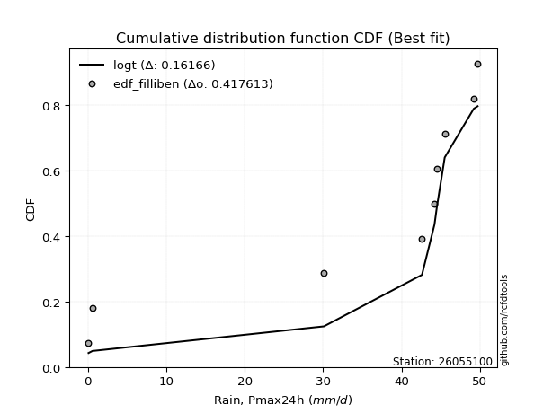</img>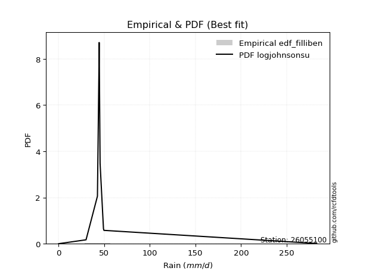</img>

</div>


### 10. EDF Jenkinson (1977)

The Jenkinson formula in hydrology is an empirical plotting position formula used to estimate the non-exceedance probability _(P)_ or return period _(T)_ of a given ordered observation within a sample. It is a widely used method in the frequency analysis of extreme events such as floods and rainfall, as it provides a distribution-free way to plot data. _a≈0.31_ and _b≈0.38_ are constants derived to approximate the median of the probability distribution for the given rank.

<div align="center">


$P=(m-a)/(n+b)$


</div>


**10.1. Empirical values**

<div align="center">

|                | 0                   | 1                   | 2                  | 3                   | 4             | 5                  | 6                  | 7                  | 8                  |
|:---------------|:--------------------|:--------------------|:-------------------|:--------------------|:--------------|:-------------------|:-------------------|:-------------------|:-------------------|
| date           | 2016                | 2023                | 2022               | 2024                | 2021          | 2020               | 2017               | 2019               | 2018               |
| x              | 0.1                 | 0.6                 | 30.1               | 42.6                | 44.2          | 44.5               | 45.5               | 49.2               | 49.7               |
| m              | 1                   | 2                   | 3                  | 4                   | 5             | 6                  | 7                  | 8                  | 9                  |
| empirical_dist | edf_jenkinson       | edf_jenkinson       | edf_jenkinson      | edf_jenkinson       | edf_jenkinson | edf_jenkinson      | edf_jenkinson      | edf_jenkinson      | edf_jenkinson      |
| empirical      | 0.07356076759061833 | 0.18017057569296374 | 0.2867803837953091 | 0.39339019189765456 | 0.5           | 0.6066098081023454 | 0.7132196162046908 | 0.8198294243070362 | 0.9264392324093815 |
| empirical_tr   | 1.0794016110471807  | 1.2197659297789336  | 1.4020926756352765 | 1.6485061511423549  | 2.0           | 2.542005420054201  | 3.486988847583642  | 5.550295857988164  | 13.5942028985507   |

</div>


**10.2. Kolmogorov-Smirnov fit test (sorted by Δ)**


<div align="center">

|                | 0                   | 1                   | 2                   | 3                   | 4                   | 5                   | 6                   | 7                   | 8                   | 9                   | 10                  | 11                  | 12                  | 13                  | 14                  | 15                  | 16                  | 17                  | 18                  | 19                  | 20                  | 21                  | 22                  | 23                  | 24                  | 25                  | 26                  | 27                  | 28                  | 29                  | 30                  | 31                  | 32                  | 33                  | 34                  | 35                  | 36                  | 37                  | 38                  | 39                  | 40                  | 41                  | 42                  | 43                  | 44                  | 45                  | 46                  | 47                  | 48                  | 49                  | 50                  | 51                  | 52                  | 53                  | 54                  | 55                  | 56                  | 57                  | 58                  | 59                  | 60                  | 61                  | 62                  | 63                  | 64                  | 65                  | 66                  | 67                  | 68                  | 69                  | 70                  | 71                  | 72                  | 73                  | 74                  | 75                    | 76                  | 77                  | 78                  | 79                  | 80                  | 81                  | 82                  | 83                  | 84                  | 85                  | 86                  | 87                  |
|:---------------|:--------------------|:--------------------|:--------------------|:--------------------|:--------------------|:--------------------|:--------------------|:--------------------|:--------------------|:--------------------|:--------------------|:--------------------|:--------------------|:--------------------|:--------------------|:--------------------|:--------------------|:--------------------|:--------------------|:--------------------|:--------------------|:--------------------|:--------------------|:--------------------|:--------------------|:--------------------|:--------------------|:--------------------|:--------------------|:--------------------|:--------------------|:--------------------|:--------------------|:--------------------|:--------------------|:--------------------|:--------------------|:--------------------|:--------------------|:--------------------|:--------------------|:--------------------|:--------------------|:--------------------|:--------------------|:--------------------|:--------------------|:--------------------|:--------------------|:--------------------|:--------------------|:--------------------|:--------------------|:--------------------|:--------------------|:--------------------|:--------------------|:--------------------|:--------------------|:--------------------|:--------------------|:--------------------|:--------------------|:--------------------|:--------------------|:--------------------|:--------------------|:--------------------|:--------------------|:--------------------|:--------------------|:--------------------|:--------------------|:--------------------|:--------------------|:----------------------|:--------------------|:--------------------|:--------------------|:--------------------|:--------------------|:--------------------|:--------------------|:--------------------|:--------------------|:--------------------|:--------------------|:--------------------|
| station        | 26055100            | 26055100            | 26055100            | 26055100            | 26055100            | 26055100            | 26055100            | 26055100            | 26055100            | 26055100            | 26055100            | 26055100            | 26055100            | 26055100            | 26055100            | 26055100            | 26055100            | 26055100            | 26055100            | 26055100            | 26055100            | 26055100            | 26055100            | 26055100            | 26055100            | 26055100            | 26055100            | 26055100            | 26055100            | 26055100            | 26055100            | 26055100            | 26055100            | 26055100            | 26055100            | 26055100            | 26055100            | 26055100            | 26055100            | 26055100            | 26055100            | 26055100            | 26055100            | 26055100            | 26055100            | 26055100            | 26055100            | 26055100            | 26055100            | 26055100            | 26055100            | 26055100            | 26055100            | 26055100            | 26055100            | 26055100            | 26055100            | 26055100            | 26055100            | 26055100            | 26055100            | 26055100            | 26055100            | 26055100            | 26055100            | 26055100            | 26055100            | 26055100            | 26055100            | 26055100            | 26055100            | 26055100            | 26055100            | 26055100            | 26055100            | 26055100              | 26055100            | 26055100            | 26055100            | 26055100            | 26055100            | 26055100            | 26055100            | 26055100            | 26055100            | 26055100            | 26055100            | 26055100            |
| empirical_dist | edf_jenkinson       | edf_jenkinson       | edf_jenkinson       | edf_jenkinson       | edf_jenkinson       | edf_jenkinson       | edf_jenkinson       | edf_jenkinson       | edf_jenkinson       | edf_jenkinson       | edf_jenkinson       | edf_jenkinson       | edf_jenkinson       | edf_jenkinson       | edf_jenkinson       | edf_jenkinson       | edf_jenkinson       | edf_jenkinson       | edf_jenkinson       | edf_jenkinson       | edf_jenkinson       | edf_jenkinson       | edf_jenkinson       | edf_jenkinson       | edf_jenkinson       | edf_jenkinson       | edf_jenkinson       | edf_jenkinson       | edf_jenkinson       | edf_jenkinson       | edf_jenkinson       | edf_jenkinson       | edf_jenkinson       | edf_jenkinson       | edf_jenkinson       | edf_jenkinson       | edf_jenkinson       | edf_jenkinson       | edf_jenkinson       | edf_jenkinson       | edf_jenkinson       | edf_jenkinson       | edf_jenkinson       | edf_jenkinson       | edf_jenkinson       | edf_jenkinson       | edf_jenkinson       | edf_jenkinson       | edf_jenkinson       | edf_jenkinson       | edf_jenkinson       | edf_jenkinson       | edf_jenkinson       | edf_jenkinson       | edf_jenkinson       | edf_jenkinson       | edf_jenkinson       | edf_jenkinson       | edf_jenkinson       | edf_jenkinson       | edf_jenkinson       | edf_jenkinson       | edf_jenkinson       | edf_jenkinson       | edf_jenkinson       | edf_jenkinson       | edf_jenkinson       | edf_jenkinson       | edf_jenkinson       | edf_jenkinson       | edf_jenkinson       | edf_jenkinson       | edf_jenkinson       | edf_jenkinson       | edf_jenkinson       | edf_jenkinson         | edf_jenkinson       | edf_jenkinson       | edf_jenkinson       | edf_jenkinson       | edf_jenkinson       | edf_jenkinson       | edf_jenkinson       | edf_jenkinson       | edf_jenkinson       | edf_jenkinson       | edf_jenkinson       | edf_jenkinson       |
| p_dist         | logt                | pearson3            | gumbel_l            | mielke              | laplace_asymmetric  | weibull_min         | logpearson3         | gompertz            | betaprime           | fisk                | norm                | crystalball         | t                   | exponnorm           | invweibull          | fatiguelife         | rice                | invgauss            | chi2                | invgamma            | maxwell             | logistic            | loggumbel_l         | kstwobign           | truncnorm           | rayleigh            | hypsecant           | genexpon            | expon               | halfnorm            | ncf                 | loginvweibull       | gumbel_r            | laplace             | gamma               | halflogistic        | lognakagami         | lognct              | logexponnorm        | logcrystalball      | lognorm             | lognorm             | logrice             | loglognorm          | logerlang           | loginvgamma         | moyal               | logfatiguelife      | loggamma            | loggamma            | logncf              | f                   | loggompertz         | loglogistic         | logkstwobign        | loggenexpon         | logmaxwell          | loginvgauss         | lograyleigh         | loghypsecant        | logalpha            | logexpon            | loghalfnorm         | wald                | nct                 | loglaplace          | loggumbel_r         | nakagami            | loghalflogistic     | logmoyal            | gibrat              | logfisk             | erlang              | logweibull_min      | logwald             | loglaplace_asymmetric | logloggamma         | johnsonsu           | loggibrat           | logtruncnorm        | logjohnsonsu        | logbetaprime        | logf                | logmielke           | logchi2             | alpha               | loggenlogistic      | genlogistic         |
| delta          | 0.16200127801513625 | 0.2291883418620786  | 0.24092499393955302 | 0.24141335152552812 | 0.2416472318216265  | 0.2546356073045315  | 0.2713820804388605  | 0.2796131565588024  | 0.28097728420650536 | 0.2816616958006064  | 0.28194892468183164 | 0.28194892861187204 | 0.2819502793637858  | 0.2819541642151224  | 0.2820718076044848  | 0.28325492203244385 | 0.28569101930505636 | 0.2922499737563051  | 0.296737117016178   | 0.2993443901940771  | 0.3007762887001433  | 0.3018520110252465  | 0.3024563949701031  | 0.3026998503921827  | 0.30501019416732056 | 0.3063546416585694  | 0.31678181172296405 | 0.32038473566517045 | 0.32057338582610206 | 0.32288310324110236 | 0.3271933721101039  | 0.32995967357717715 | 0.3375952331183054  | 0.34376633967693415 | 0.3457751635162437  | 0.35047042384880434 | 0.3532903250398419  | 0.3533197001209665  | 0.3534065619199366  | 0.3534074988504199  | 0.35340819232268494 | 0.35340819232268494 | 0.3537088483013543  | 0.3546260147165332  | 0.35525136779273325 | 0.35556610623932383 | 0.355771398954414   | 0.3566256843588633  | 0.3577036369453628  | 0.3577036369453628  | 0.35790157124499755 | 0.3676355729333738  | 0.3702263059538575  | 0.3704749156165069  | 0.3750366288684017  | 0.37584068474602583 | 0.3760749685668998  | 0.37629551909309666 | 0.38293128518169217 | 0.38388293826260045 | 0.392399732726345   | 0.39980936142510126 | 0.4027655894697608  | 0.40805973168130594 | 0.4113919235654214  | 0.4122654730793096  | 0.4148821128436033  | 0.41799606388226795 | 0.4310104303102069  | 0.43534382596954657 | 0.43996932059537897 | 0.4460335598634375  | 0.44620071689524854 | 0.45665623836845176 | 0.49306916190305117 | 0.49389811233838254   | 0.4944266384395022  | 0.5089642427581504  | 0.5253093828705715  | 0.5715314092335229  | 0.5844148694546998  | 0.5886482906563261  | 0.5963380698087346  | 0.5971085797808029  | 0.6809758573593434  | 0.7056752736052754  | 0.8198294243070362  | 0.8198294243070362  |
| deltao         | 0.41761268023100007 | 0.41761268023100007 | 0.41761268023100007 | 0.41761268023100007 | 0.41761268023100007 | 0.41761268023100007 | 0.41761268023100007 | 0.41761268023100007 | 0.41761268023100007 | 0.41761268023100007 | 0.41761268023100007 | 0.41761268023100007 | 0.41761268023100007 | 0.41761268023100007 | 0.41761268023100007 | 0.41761268023100007 | 0.41761268023100007 | 0.41761268023100007 | 0.41761268023100007 | 0.41761268023100007 | 0.41761268023100007 | 0.41761268023100007 | 0.41761268023100007 | 0.41761268023100007 | 0.41761268023100007 | 0.41761268023100007 | 0.41761268023100007 | 0.41761268023100007 | 0.41761268023100007 | 0.41761268023100007 | 0.41761268023100007 | 0.41761268023100007 | 0.41761268023100007 | 0.41761268023100007 | 0.41761268023100007 | 0.41761268023100007 | 0.41761268023100007 | 0.41761268023100007 | 0.41761268023100007 | 0.41761268023100007 | 0.41761268023100007 | 0.41761268023100007 | 0.41761268023100007 | 0.41761268023100007 | 0.41761268023100007 | 0.41761268023100007 | 0.41761268023100007 | 0.41761268023100007 | 0.41761268023100007 | 0.41761268023100007 | 0.41761268023100007 | 0.41761268023100007 | 0.41761268023100007 | 0.41761268023100007 | 0.41761268023100007 | 0.41761268023100007 | 0.41761268023100007 | 0.41761268023100007 | 0.41761268023100007 | 0.41761268023100007 | 0.41761268023100007 | 0.41761268023100007 | 0.41761268023100007 | 0.41761268023100007 | 0.41761268023100007 | 0.41761268023100007 | 0.41761268023100007 | 0.41761268023100007 | 0.41761268023100007 | 0.41761268023100007 | 0.41761268023100007 | 0.41761268023100007 | 0.41761268023100007 | 0.41761268023100007 | 0.41761268023100007 | 0.41761268023100007   | 0.41761268023100007 | 0.41761268023100007 | 0.41761268023100007 | 0.41761268023100007 | 0.41761268023100007 | 0.41761268023100007 | 0.41761268023100007 | 0.41761268023100007 | 0.41761268023100007 | 0.41761268023100007 | 0.41761268023100007 | 0.41761268023100007 |
| eval           | Δo > Δ              | Δo > Δ              | Δo > Δ              | Δo > Δ              | Δo > Δ              | Δo > Δ              | Δo > Δ              | Δo > Δ              | Δo > Δ              | Δo > Δ              | Δo > Δ              | Δo > Δ              | Δo > Δ              | Δo > Δ              | Δo > Δ              | Δo > Δ              | Δo > Δ              | Δo > Δ              | Δo > Δ              | Δo > Δ              | Δo > Δ              | Δo > Δ              | Δo > Δ              | Δo > Δ              | Δo > Δ              | Δo > Δ              | Δo > Δ              | Δo > Δ              | Δo > Δ              | Δo > Δ              | Δo > Δ              | Δo > Δ              | Δo > Δ              | Δo > Δ              | Δo > Δ              | Δo > Δ              | Δo > Δ              | Δo > Δ              | Δo > Δ              | Δo > Δ              | Δo > Δ              | Δo > Δ              | Δo > Δ              | Δo > Δ              | Δo > Δ              | Δo > Δ              | Δo > Δ              | Δo > Δ              | Δo > Δ              | Δo > Δ              | Δo > Δ              | Δo > Δ              | Δo > Δ              | Δo > Δ              | Δo > Δ              | Δo > Δ              | Δo > Δ              | Δo > Δ              | Δo > Δ              | Δo > Δ              | Δo > Δ              | Δo > Δ              | Δo > Δ              | Δo > Δ              | Δo > Δ              | Δo > Δ              | Δo > Δ              | Δo <= Δ             | Δo <= Δ             | Δo <= Δ             | Δo <= Δ             | Δo <= Δ             | Δo <= Δ             | Δo <= Δ             | Δo <= Δ             | Δo <= Δ               | Δo <= Δ             | Δo <= Δ             | Δo <= Δ             | Δo <= Δ             | Δo <= Δ             | Δo <= Δ             | Δo <= Δ             | Δo <= Δ             | Δo <= Δ             | Δo <= Δ             | Δo <= Δ             | Δo <= Δ             |
| fit            | 1                   | 1                   | 1                   | 1                   | 1                   | 1                   | 1                   | 1                   | 1                   | 1                   | 1                   | 1                   | 1                   | 1                   | 1                   | 1                   | 1                   | 1                   | 1                   | 1                   | 1                   | 1                   | 1                   | 1                   | 1                   | 1                   | 1                   | 1                   | 1                   | 1                   | 1                   | 1                   | 1                   | 1                   | 1                   | 1                   | 1                   | 1                   | 1                   | 1                   | 1                   | 1                   | 1                   | 1                   | 1                   | 1                   | 1                   | 1                   | 1                   | 1                   | 1                   | 1                   | 1                   | 1                   | 1                   | 1                   | 1                   | 1                   | 1                   | 1                   | 1                   | 1                   | 1                   | 1                   | 1                   | 1                   | 1                   | 0                   | 0                   | 0                   | 0                   | 0                   | 0                   | 0                   | 0                   | 0                     | 0                   | 0                   | 0                   | 0                   | 0                   | 0                   | 0                   | 0                   | 0                   | 0                   | 0                   | 0                   |
| n              | 9                   | 9                   | 9                   | 9                   | 9                   | 9                   | 9                   | 9                   | 9                   | 9                   | 9                   | 9                   | 9                   | 9                   | 9                   | 9                   | 9                   | 9                   | 9                   | 9                   | 9                   | 9                   | 9                   | 9                   | 9                   | 9                   | 9                   | 9                   | 9                   | 9                   | 9                   | 9                   | 9                   | 9                   | 9                   | 9                   | 9                   | 9                   | 9                   | 9                   | 9                   | 9                   | 9                   | 9                   | 9                   | 9                   | 9                   | 9                   | 9                   | 9                   | 9                   | 9                   | 9                   | 9                   | 9                   | 9                   | 9                   | 9                   | 9                   | 9                   | 9                   | 9                   | 9                   | 9                   | 9                   | 9                   | 9                   | 9                   | 9                   | 9                   | 9                   | 9                   | 9                   | 9                   | 9                   | 9                     | 9                   | 9                   | 9                   | 9                   | 9                   | 9                   | 9                   | 9                   | 9                   | 9                   | 9                   | 9                   |
| best_fit       | 1                   | 0                   | 0                   | 0                   | 0                   | 0                   | 0                   | 0                   | 0                   | 0                   | 0                   | 0                   | 0                   | 0                   | 0                   | 0                   | 0                   | 0                   | 0                   | 0                   | 0                   | 0                   | 0                   | 0                   | 0                   | 0                   | 0                   | 0                   | 0                   | 0                   | 0                   | 0                   | 0                   | 0                   | 0                   | 0                   | 0                   | 0                   | 0                   | 0                   | 0                   | 0                   | 0                   | 0                   | 0                   | 0                   | 0                   | 0                   | 0                   | 0                   | 0                   | 0                   | 0                   | 0                   | 0                   | 0                   | 0                   | 0                   | 0                   | 0                   | 0                   | 0                   | 0                   | 0                   | 0                   | 0                   | 0                   | 0                   | 0                   | 0                   | 0                   | 0                   | 0                   | 0                   | 0                   | 0                     | 0                   | 0                   | 0                   | 0                   | 0                   | 0                   | 0                   | 0                   | 0                   | 0                   | 0                   | 0                   |
| best_fit_sort  | 1                   | 2                   | 3                   | 4                   | 5                   | 6                   | 7                   | 8                   | 9                   | 10                  | 11                  | 12                  | 13                  | 14                  | 15                  | 16                  | 17                  | 18                  | 19                  | 20                  | 21                  | 22                  | 23                  | 24                  | 25                  | 26                  | 27                  | 28                  | 29                  | 30                  | 31                  | 32                  | 33                  | 34                  | 35                  | 36                  | 37                  | 38                  | 39                  | 40                  | 41                  | 42                  | 43                  | 44                  | 45                  | 46                  | 47                  | 48                  | 49                  | 50                  | 51                  | 52                  | 53                  | 54                  | 55                  | 56                  | 57                  | 58                  | 59                  | 60                  | 61                  | 62                  | 63                  | 64                  | 65                  | 66                  | 67                  | 68                  | 69                  | 70                  | 71                  | 72                  | 73                  | 74                  | 75                  | 76                    | 77                  | 78                  | 79                  | 80                  | 81                  | 82                  | 83                  | 84                  | 85                  | 86                  | 87                  | 88                  |

</div>


**10.3. Best fit**

<div align="center">

|   id |   station | empirical_dist   | p_dist   |    delta |   deltao | eval   |   fit |   n |   best_fit |   best_fit_sort |
|-----:|----------:|:-----------------|:---------|---------:|---------:|:-------|------:|----:|-----------:|----------------:|
|    0 |  26055100 | edf_jenkinson    | logt     | 0.162001 | 0.417613 | Δo > Δ |     1 |   9 |          1 |               1 |

</div>


<div align="center">

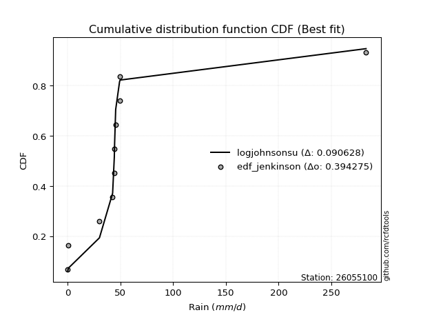</img></img>

</div>


### 11. EDF Cunnane (1978)

Cunnane´s work in statistical hydrology has focused on the performance and evaluation of different probability distributions (such as GEV, Gumbel, Lognormal) for flood frequency estimation. _b_ is a constant, typically set to 0.4.

<div align="center">


$P=(m-b)/(n+1-2b)$


</div>


**11.1. Empirical values**

<div align="center">

|                | 0                   | 1                  | 2                   | 3                  | 4           | 5                  | 6                 | 7                  | 8                  |
|:---------------|:--------------------|:-------------------|:--------------------|:-------------------|:------------|:-------------------|:------------------|:-------------------|:-------------------|
| date           | 2016                | 2023               | 2022                | 2024               | 2021        | 2020               | 2017              | 2019               | 2018               |
| x              | 0.1                 | 0.6                | 30.1                | 42.6               | 44.2        | 44.5               | 45.5              | 49.2               | 49.7               |
| m              | 1                   | 2                  | 3                   | 4                  | 5           | 6                  | 7                 | 8                  | 9                  |
| empirical_dist | edf_cunnane         | edf_cunnane        | edf_cunnane         | edf_cunnane        | edf_cunnane | edf_cunnane        | edf_cunnane       | edf_cunnane        | edf_cunnane        |
| empirical      | 0.06521739130434782 | 0.1739130434782609 | 0.28260869565217395 | 0.391304347826087  | 0.5         | 0.6086956521739131 | 0.717391304347826 | 0.8260869565217391 | 0.9347826086956522 |
| empirical_tr   | 1.069767441860465   | 1.2105263157894737 | 1.393939393939394   | 1.6428571428571428 | 2.0         | 2.555555555555556  | 3.538461538461538 | 5.75               | 15.333333333333343 |

</div>


**11.2. Kolmogorov-Smirnov fit test (sorted by Δ)**


<div align="center">

|                | 0                   | 1                   | 2                   | 3                   | 4                   | 5                   | 6                   | 7                   | 8                   | 9                   | 10                  | 11                  | 12                  | 13                  | 14                  | 15                  | 16                  | 17                  | 18                  | 19                  | 20                  | 21                  | 22                  | 23                  | 24                  | 25                  | 26                  | 27                  | 28                  | 29                  | 30                  | 31                  | 32                  | 33                  | 34                  | 35                  | 36                  | 37                  | 38                  | 39                  | 40                  | 41                  | 42                  | 43                  | 44                  | 45                  | 46                  | 47                  | 48                  | 49                  | 50                  | 51                  | 52                  | 53                  | 54                  | 55                  | 56                  | 57                  | 58                  | 59                  | 60                  | 61                  | 62                  | 63                  | 64                  | 65                  | 66                  | 67                  | 68                  | 69                  | 70                  | 71                  | 72                  | 73                  | 74                    | 75                  | 76                  | 77                  | 78                  | 79                  | 80                  | 81                  | 82                  | 83                  | 84                  | 85                  | 86                  | 87                  |
|:---------------|:--------------------|:--------------------|:--------------------|:--------------------|:--------------------|:--------------------|:--------------------|:--------------------|:--------------------|:--------------------|:--------------------|:--------------------|:--------------------|:--------------------|:--------------------|:--------------------|:--------------------|:--------------------|:--------------------|:--------------------|:--------------------|:--------------------|:--------------------|:--------------------|:--------------------|:--------------------|:--------------------|:--------------------|:--------------------|:--------------------|:--------------------|:--------------------|:--------------------|:--------------------|:--------------------|:--------------------|:--------------------|:--------------------|:--------------------|:--------------------|:--------------------|:--------------------|:--------------------|:--------------------|:--------------------|:--------------------|:--------------------|:--------------------|:--------------------|:--------------------|:--------------------|:--------------------|:--------------------|:--------------------|:--------------------|:--------------------|:--------------------|:--------------------|:--------------------|:--------------------|:--------------------|:--------------------|:--------------------|:--------------------|:--------------------|:--------------------|:--------------------|:--------------------|:--------------------|:--------------------|:--------------------|:--------------------|:--------------------|:--------------------|:----------------------|:--------------------|:--------------------|:--------------------|:--------------------|:--------------------|:--------------------|:--------------------|:--------------------|:--------------------|:--------------------|:--------------------|:--------------------|:--------------------|
| station        | 26055100            | 26055100            | 26055100            | 26055100            | 26055100            | 26055100            | 26055100            | 26055100            | 26055100            | 26055100            | 26055100            | 26055100            | 26055100            | 26055100            | 26055100            | 26055100            | 26055100            | 26055100            | 26055100            | 26055100            | 26055100            | 26055100            | 26055100            | 26055100            | 26055100            | 26055100            | 26055100            | 26055100            | 26055100            | 26055100            | 26055100            | 26055100            | 26055100            | 26055100            | 26055100            | 26055100            | 26055100            | 26055100            | 26055100            | 26055100            | 26055100            | 26055100            | 26055100            | 26055100            | 26055100            | 26055100            | 26055100            | 26055100            | 26055100            | 26055100            | 26055100            | 26055100            | 26055100            | 26055100            | 26055100            | 26055100            | 26055100            | 26055100            | 26055100            | 26055100            | 26055100            | 26055100            | 26055100            | 26055100            | 26055100            | 26055100            | 26055100            | 26055100            | 26055100            | 26055100            | 26055100            | 26055100            | 26055100            | 26055100            | 26055100              | 26055100            | 26055100            | 26055100            | 26055100            | 26055100            | 26055100            | 26055100            | 26055100            | 26055100            | 26055100            | 26055100            | 26055100            | 26055100            |
| empirical_dist | edf_cunnane         | edf_cunnane         | edf_cunnane         | edf_cunnane         | edf_cunnane         | edf_cunnane         | edf_cunnane         | edf_cunnane         | edf_cunnane         | edf_cunnane         | edf_cunnane         | edf_cunnane         | edf_cunnane         | edf_cunnane         | edf_cunnane         | edf_cunnane         | edf_cunnane         | edf_cunnane         | edf_cunnane         | edf_cunnane         | edf_cunnane         | edf_cunnane         | edf_cunnane         | edf_cunnane         | edf_cunnane         | edf_cunnane         | edf_cunnane         | edf_cunnane         | edf_cunnane         | edf_cunnane         | edf_cunnane         | edf_cunnane         | edf_cunnane         | edf_cunnane         | edf_cunnane         | edf_cunnane         | edf_cunnane         | edf_cunnane         | edf_cunnane         | edf_cunnane         | edf_cunnane         | edf_cunnane         | edf_cunnane         | edf_cunnane         | edf_cunnane         | edf_cunnane         | edf_cunnane         | edf_cunnane         | edf_cunnane         | edf_cunnane         | edf_cunnane         | edf_cunnane         | edf_cunnane         | edf_cunnane         | edf_cunnane         | edf_cunnane         | edf_cunnane         | edf_cunnane         | edf_cunnane         | edf_cunnane         | edf_cunnane         | edf_cunnane         | edf_cunnane         | edf_cunnane         | edf_cunnane         | edf_cunnane         | edf_cunnane         | edf_cunnane         | edf_cunnane         | edf_cunnane         | edf_cunnane         | edf_cunnane         | edf_cunnane         | edf_cunnane         | edf_cunnane           | edf_cunnane         | edf_cunnane         | edf_cunnane         | edf_cunnane         | edf_cunnane         | edf_cunnane         | edf_cunnane         | edf_cunnane         | edf_cunnane         | edf_cunnane         | edf_cunnane         | edf_cunnane         | edf_cunnane         |
| p_dist         | logt                | pearson3            | gumbel_l            | mielke              | laplace_asymmetric  | weibull_min         | gompertz            | logpearson3         | betaprime           | norm                | crystalball         | t                   | exponnorm           | invweibull          | fatiguelife         | rice                | fisk                | invgauss            | chi2                | invgamma            | maxwell             | logistic            | kstwobign           | loggumbel_l         | truncnorm           | rayleigh            | hypsecant           | genexpon            | expon               | halfnorm            | ncf                 | loginvweibull       | gumbel_r            | laplace             | gamma               | halflogistic        | lognakagami         | lognct              | logexponnorm        | logcrystalball      | lognorm             | lognorm             | moyal               | logrice             | loglognorm          | logerlang           | loginvgamma         | logfatiguelife      | loggamma            | loggamma            | logncf              | f                   | loggompertz         | loglogistic         | logkstwobign        | loggenexpon         | logmaxwell          | loginvgauss         | lograyleigh         | loghypsecant        | logalpha            | logexpon            | loghalfnorm         | wald                | nct                 | loglaplace          | loggumbel_r         | nakagami            | loghalflogistic     | logmoyal            | gibrat              | logfisk             | erlang              | logweibull_min      | loglaplace_asymmetric | logloggamma         | logwald             | johnsonsu           | loggibrat           | logtruncnorm        | logjohnsonsu        | logbetaprime        | logmielke           | logf                | logchi2             | alpha               | loggenlogistic      | genlogistic         |
| delta          | 0.15782958987200107 | 0.23127418593364618 | 0.2430108380111206  | 0.2434991955970957  | 0.2437330758931941  | 0.2567214513760991  | 0.27544146841566725 | 0.27555376858199565 | 0.28306312827807295 | 0.2840347687533992  | 0.28403477268343963 | 0.2840361234353534  | 0.28404000828669    | 0.2841576516760524  | 0.28534076610401143 | 0.28777686337662395 | 0.2900050720868771  | 0.2943358178278727  | 0.2988229610877456  | 0.3014302342656447  | 0.30286213277171087 | 0.3039378550968141  | 0.3047856944637503  | 0.3066280831132383  | 0.30709603823888815 | 0.308440485730137   | 0.31886765579453163 | 0.32247057973673804 | 0.32265922989766965 | 0.32496894731266995 | 0.3313650602532391  | 0.3341313617203123  | 0.339681077189873   | 0.34585218374850174 | 0.3499468516593789  | 0.3525562679203719  | 0.3574620131829771  | 0.35749138826410165 | 0.35757825006307176 | 0.35757918699355506 | 0.3575798804658201  | 0.3575798804658201  | 0.3578572430259816  | 0.35788053644448947 | 0.3587977028596684  | 0.35942305593586843 | 0.359737794382459   | 0.3607973725019985  | 0.36187532508849796 | 0.36187532508849796 | 0.36207325938813273 | 0.37180726107650897 | 0.3743979940969927  | 0.3746466037596421  | 0.3792083170115369  | 0.380012372889161   | 0.380246656710035   | 0.38046720723623184 | 0.38710297332482735 | 0.3880546264057356  | 0.39657142086948016 | 0.40398104956823644 | 0.406937277612896   | 0.4101455757528735  | 0.4155636117085566  | 0.4164371612224448  | 0.4190538009867385  | 0.42216775202540313 | 0.4351821184533421  | 0.43951551411268175 | 0.44205516466694655 | 0.4502052480065727  | 0.4503724050383837  | 0.46291377058315464 | 0.49598395640995013   | 0.4965124825110698  | 0.49724085004618634 | 0.5152217749728534  | 0.5294810710137067  | 0.575703097376658   | 0.5906724016694027  | 0.5928199787994612  | 0.6012802679239381  | 0.6025956020234374  | 0.6851475455024786  | 0.7098469617484106  | 0.8260869565217391  | 0.8260869565217391  |
| deltao         | 0.41761268023100007 | 0.41761268023100007 | 0.41761268023100007 | 0.41761268023100007 | 0.41761268023100007 | 0.41761268023100007 | 0.41761268023100007 | 0.41761268023100007 | 0.41761268023100007 | 0.41761268023100007 | 0.41761268023100007 | 0.41761268023100007 | 0.41761268023100007 | 0.41761268023100007 | 0.41761268023100007 | 0.41761268023100007 | 0.41761268023100007 | 0.41761268023100007 | 0.41761268023100007 | 0.41761268023100007 | 0.41761268023100007 | 0.41761268023100007 | 0.41761268023100007 | 0.41761268023100007 | 0.41761268023100007 | 0.41761268023100007 | 0.41761268023100007 | 0.41761268023100007 | 0.41761268023100007 | 0.41761268023100007 | 0.41761268023100007 | 0.41761268023100007 | 0.41761268023100007 | 0.41761268023100007 | 0.41761268023100007 | 0.41761268023100007 | 0.41761268023100007 | 0.41761268023100007 | 0.41761268023100007 | 0.41761268023100007 | 0.41761268023100007 | 0.41761268023100007 | 0.41761268023100007 | 0.41761268023100007 | 0.41761268023100007 | 0.41761268023100007 | 0.41761268023100007 | 0.41761268023100007 | 0.41761268023100007 | 0.41761268023100007 | 0.41761268023100007 | 0.41761268023100007 | 0.41761268023100007 | 0.41761268023100007 | 0.41761268023100007 | 0.41761268023100007 | 0.41761268023100007 | 0.41761268023100007 | 0.41761268023100007 | 0.41761268023100007 | 0.41761268023100007 | 0.41761268023100007 | 0.41761268023100007 | 0.41761268023100007 | 0.41761268023100007 | 0.41761268023100007 | 0.41761268023100007 | 0.41761268023100007 | 0.41761268023100007 | 0.41761268023100007 | 0.41761268023100007 | 0.41761268023100007 | 0.41761268023100007 | 0.41761268023100007 | 0.41761268023100007   | 0.41761268023100007 | 0.41761268023100007 | 0.41761268023100007 | 0.41761268023100007 | 0.41761268023100007 | 0.41761268023100007 | 0.41761268023100007 | 0.41761268023100007 | 0.41761268023100007 | 0.41761268023100007 | 0.41761268023100007 | 0.41761268023100007 | 0.41761268023100007 |
| eval           | Δo > Δ              | Δo > Δ              | Δo > Δ              | Δo > Δ              | Δo > Δ              | Δo > Δ              | Δo > Δ              | Δo > Δ              | Δo > Δ              | Δo > Δ              | Δo > Δ              | Δo > Δ              | Δo > Δ              | Δo > Δ              | Δo > Δ              | Δo > Δ              | Δo > Δ              | Δo > Δ              | Δo > Δ              | Δo > Δ              | Δo > Δ              | Δo > Δ              | Δo > Δ              | Δo > Δ              | Δo > Δ              | Δo > Δ              | Δo > Δ              | Δo > Δ              | Δo > Δ              | Δo > Δ              | Δo > Δ              | Δo > Δ              | Δo > Δ              | Δo > Δ              | Δo > Δ              | Δo > Δ              | Δo > Δ              | Δo > Δ              | Δo > Δ              | Δo > Δ              | Δo > Δ              | Δo > Δ              | Δo > Δ              | Δo > Δ              | Δo > Δ              | Δo > Δ              | Δo > Δ              | Δo > Δ              | Δo > Δ              | Δo > Δ              | Δo > Δ              | Δo > Δ              | Δo > Δ              | Δo > Δ              | Δo > Δ              | Δo > Δ              | Δo > Δ              | Δo > Δ              | Δo > Δ              | Δo > Δ              | Δo > Δ              | Δo > Δ              | Δo > Δ              | Δo > Δ              | Δo > Δ              | Δo > Δ              | Δo <= Δ             | Δo <= Δ             | Δo <= Δ             | Δo <= Δ             | Δo <= Δ             | Δo <= Δ             | Δo <= Δ             | Δo <= Δ             | Δo <= Δ               | Δo <= Δ             | Δo <= Δ             | Δo <= Δ             | Δo <= Δ             | Δo <= Δ             | Δo <= Δ             | Δo <= Δ             | Δo <= Δ             | Δo <= Δ             | Δo <= Δ             | Δo <= Δ             | Δo <= Δ             | Δo <= Δ             |
| fit            | 1                   | 1                   | 1                   | 1                   | 1                   | 1                   | 1                   | 1                   | 1                   | 1                   | 1                   | 1                   | 1                   | 1                   | 1                   | 1                   | 1                   | 1                   | 1                   | 1                   | 1                   | 1                   | 1                   | 1                   | 1                   | 1                   | 1                   | 1                   | 1                   | 1                   | 1                   | 1                   | 1                   | 1                   | 1                   | 1                   | 1                   | 1                   | 1                   | 1                   | 1                   | 1                   | 1                   | 1                   | 1                   | 1                   | 1                   | 1                   | 1                   | 1                   | 1                   | 1                   | 1                   | 1                   | 1                   | 1                   | 1                   | 1                   | 1                   | 1                   | 1                   | 1                   | 1                   | 1                   | 1                   | 1                   | 0                   | 0                   | 0                   | 0                   | 0                   | 0                   | 0                   | 0                   | 0                     | 0                   | 0                   | 0                   | 0                   | 0                   | 0                   | 0                   | 0                   | 0                   | 0                   | 0                   | 0                   | 0                   |
| n              | 9                   | 9                   | 9                   | 9                   | 9                   | 9                   | 9                   | 9                   | 9                   | 9                   | 9                   | 9                   | 9                   | 9                   | 9                   | 9                   | 9                   | 9                   | 9                   | 9                   | 9                   | 9                   | 9                   | 9                   | 9                   | 9                   | 9                   | 9                   | 9                   | 9                   | 9                   | 9                   | 9                   | 9                   | 9                   | 9                   | 9                   | 9                   | 9                   | 9                   | 9                   | 9                   | 9                   | 9                   | 9                   | 9                   | 9                   | 9                   | 9                   | 9                   | 9                   | 9                   | 9                   | 9                   | 9                   | 9                   | 9                   | 9                   | 9                   | 9                   | 9                   | 9                   | 9                   | 9                   | 9                   | 9                   | 9                   | 9                   | 9                   | 9                   | 9                   | 9                   | 9                   | 9                   | 9                     | 9                   | 9                   | 9                   | 9                   | 9                   | 9                   | 9                   | 9                   | 9                   | 9                   | 9                   | 9                   | 9                   |
| best_fit       | 1                   | 0                   | 0                   | 0                   | 0                   | 0                   | 0                   | 0                   | 0                   | 0                   | 0                   | 0                   | 0                   | 0                   | 0                   | 0                   | 0                   | 0                   | 0                   | 0                   | 0                   | 0                   | 0                   | 0                   | 0                   | 0                   | 0                   | 0                   | 0                   | 0                   | 0                   | 0                   | 0                   | 0                   | 0                   | 0                   | 0                   | 0                   | 0                   | 0                   | 0                   | 0                   | 0                   | 0                   | 0                   | 0                   | 0                   | 0                   | 0                   | 0                   | 0                   | 0                   | 0                   | 0                   | 0                   | 0                   | 0                   | 0                   | 0                   | 0                   | 0                   | 0                   | 0                   | 0                   | 0                   | 0                   | 0                   | 0                   | 0                   | 0                   | 0                   | 0                   | 0                   | 0                   | 0                     | 0                   | 0                   | 0                   | 0                   | 0                   | 0                   | 0                   | 0                   | 0                   | 0                   | 0                   | 0                   | 0                   |
| best_fit_sort  | 1                   | 2                   | 3                   | 4                   | 5                   | 6                   | 7                   | 8                   | 9                   | 10                  | 11                  | 12                  | 13                  | 14                  | 15                  | 16                  | 17                  | 18                  | 19                  | 20                  | 21                  | 22                  | 23                  | 24                  | 25                  | 26                  | 27                  | 28                  | 29                  | 30                  | 31                  | 32                  | 33                  | 34                  | 35                  | 36                  | 37                  | 38                  | 39                  | 40                  | 41                  | 42                  | 43                  | 44                  | 45                  | 46                  | 47                  | 48                  | 49                  | 50                  | 51                  | 52                  | 53                  | 54                  | 55                  | 56                  | 57                  | 58                  | 59                  | 60                  | 61                  | 62                  | 63                  | 64                  | 65                  | 66                  | 67                  | 68                  | 69                  | 70                  | 71                  | 72                  | 73                  | 74                  | 75                    | 76                  | 77                  | 78                  | 79                  | 80                  | 81                  | 82                  | 83                  | 84                  | 85                  | 86                  | 87                  | 88                  |

</div>


**11.3. Best fit**

<div align="center">

|   id |   station | empirical_dist   | p_dist   |   delta |   deltao | eval   |   fit |   n |   best_fit |   best_fit_sort |
|-----:|----------:|:-----------------|:---------|--------:|---------:|:-------|------:|----:|-----------:|----------------:|
|    0 |  26055100 | edf_cunnane      | logt     | 0.15783 | 0.417613 | Δo > Δ |     1 |   9 |          1 |               1 |

</div>


<div align="center">

</img>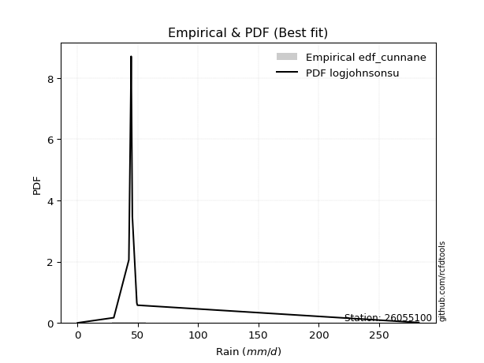</img>

</div>


### 12. EDF Adamowski (1981)

The Adamowski formula in hydrology refers to a specific plotting position formula used for estimating the non-parametric empirical distribution of hydrological events (like flood peaks) to calculate their return periods. This formula provides an alternative to traditional parametric methods (like the Gumbel or Log Pearson Type III distributions). 

<div align="center">


$P=(m-0.25)/(n+0.5)$


</div>


**12.1. Empirical values**

<div align="center">

|                | 0                   | 1                   | 2                  | 3                   | 4             | 5                  | 6                  | 7                  | 8                  |
|:---------------|:--------------------|:--------------------|:-------------------|:--------------------|:--------------|:-------------------|:-------------------|:-------------------|:-------------------|
| date           | 2016                | 2023                | 2022               | 2024                | 2021          | 2020               | 2017               | 2019               | 2018               |
| x              | 0.1                 | 0.6                 | 30.1               | 42.6                | 44.2          | 44.5               | 45.5               | 49.2               | 49.7               |
| m              | 1                   | 2                   | 3                  | 4                   | 5             | 6                  | 7                  | 8                  | 9                  |
| empirical_dist | edf_adamowski       | edf_adamowski       | edf_adamowski      | edf_adamowski       | edf_adamowski | edf_adamowski      | edf_adamowski      | edf_adamowski      | edf_adamowski      |
| empirical      | 0.07894736842105263 | 0.18421052631578946 | 0.2894736842105263 | 0.39473684210526316 | 0.5           | 0.6052631578947368 | 0.7105263157894737 | 0.8157894736842105 | 0.9210526315789473 |
| empirical_tr   | 1.0857142857142856  | 1.2258064516129032  | 1.4074074074074074 | 1.6521739130434783  | 2.0           | 2.533333333333333  | 3.4545454545454546 | 5.428571428571428  | 12.666666666666663 |

</div>


**12.2. Kolmogorov-Smirnov fit test (sorted by Δ)**


<div align="center">

|                | 0                   | 1                   | 2                   | 3                   | 4                   | 5                   | 6                   | 7                   | 8                   | 9                   | 10                  | 11                  | 12                  | 13                  | 14                  | 15                  | 16                  | 17                  | 18                  | 19                  | 20                  | 21                  | 22                  | 23                  | 24                  | 25                  | 26                  | 27                  | 28                  | 29                  | 30                  | 31                  | 32                  | 33                  | 34                  | 35                  | 36                  | 37                  | 38                  | 39                  | 40                  | 41                  | 42                  | 43                  | 44                  | 45                  | 46                  | 47                  | 48                  | 49                  | 50                  | 51                  | 52                  | 53                  | 54                  | 55                  | 56                  | 57                  | 58                  | 59                  | 60                  | 61                  | 62                  | 63                  | 64                  | 65                  | 66                  | 67                  | 68                  | 69                  | 70                  | 71                  | 72                  | 73                  | 74                  | 75                    | 76                  | 77                  | 78                  | 79                  | 80                  | 81                  | 82                  | 83                  | 84                  | 85                  | 86                  | 87                  |
|:---------------|:--------------------|:--------------------|:--------------------|:--------------------|:--------------------|:--------------------|:--------------------|:--------------------|:--------------------|:--------------------|:--------------------|:--------------------|:--------------------|:--------------------|:--------------------|:--------------------|:--------------------|:--------------------|:--------------------|:--------------------|:--------------------|:--------------------|:--------------------|:--------------------|:--------------------|:--------------------|:--------------------|:--------------------|:--------------------|:--------------------|:--------------------|:--------------------|:--------------------|:--------------------|:--------------------|:--------------------|:--------------------|:--------------------|:--------------------|:--------------------|:--------------------|:--------------------|:--------------------|:--------------------|:--------------------|:--------------------|:--------------------|:--------------------|:--------------------|:--------------------|:--------------------|:--------------------|:--------------------|:--------------------|:--------------------|:--------------------|:--------------------|:--------------------|:--------------------|:--------------------|:--------------------|:--------------------|:--------------------|:--------------------|:--------------------|:--------------------|:--------------------|:--------------------|:--------------------|:--------------------|:--------------------|:--------------------|:--------------------|:--------------------|:--------------------|:----------------------|:--------------------|:--------------------|:--------------------|:--------------------|:--------------------|:--------------------|:--------------------|:--------------------|:--------------------|:--------------------|:--------------------|:--------------------|
| station        | 26055100            | 26055100            | 26055100            | 26055100            | 26055100            | 26055100            | 26055100            | 26055100            | 26055100            | 26055100            | 26055100            | 26055100            | 26055100            | 26055100            | 26055100            | 26055100            | 26055100            | 26055100            | 26055100            | 26055100            | 26055100            | 26055100            | 26055100            | 26055100            | 26055100            | 26055100            | 26055100            | 26055100            | 26055100            | 26055100            | 26055100            | 26055100            | 26055100            | 26055100            | 26055100            | 26055100            | 26055100            | 26055100            | 26055100            | 26055100            | 26055100            | 26055100            | 26055100            | 26055100            | 26055100            | 26055100            | 26055100            | 26055100            | 26055100            | 26055100            | 26055100            | 26055100            | 26055100            | 26055100            | 26055100            | 26055100            | 26055100            | 26055100            | 26055100            | 26055100            | 26055100            | 26055100            | 26055100            | 26055100            | 26055100            | 26055100            | 26055100            | 26055100            | 26055100            | 26055100            | 26055100            | 26055100            | 26055100            | 26055100            | 26055100            | 26055100              | 26055100            | 26055100            | 26055100            | 26055100            | 26055100            | 26055100            | 26055100            | 26055100            | 26055100            | 26055100            | 26055100            | 26055100            |
| empirical_dist | edf_adamowski       | edf_adamowski       | edf_adamowski       | edf_adamowski       | edf_adamowski       | edf_adamowski       | edf_adamowski       | edf_adamowski       | edf_adamowski       | edf_adamowski       | edf_adamowski       | edf_adamowski       | edf_adamowski       | edf_adamowski       | edf_adamowski       | edf_adamowski       | edf_adamowski       | edf_adamowski       | edf_adamowski       | edf_adamowski       | edf_adamowski       | edf_adamowski       | edf_adamowski       | edf_adamowski       | edf_adamowski       | edf_adamowski       | edf_adamowski       | edf_adamowski       | edf_adamowski       | edf_adamowski       | edf_adamowski       | edf_adamowski       | edf_adamowski       | edf_adamowski       | edf_adamowski       | edf_adamowski       | edf_adamowski       | edf_adamowski       | edf_adamowski       | edf_adamowski       | edf_adamowski       | edf_adamowski       | edf_adamowski       | edf_adamowski       | edf_adamowski       | edf_adamowski       | edf_adamowski       | edf_adamowski       | edf_adamowski       | edf_adamowski       | edf_adamowski       | edf_adamowski       | edf_adamowski       | edf_adamowski       | edf_adamowski       | edf_adamowski       | edf_adamowski       | edf_adamowski       | edf_adamowski       | edf_adamowski       | edf_adamowski       | edf_adamowski       | edf_adamowski       | edf_adamowski       | edf_adamowski       | edf_adamowski       | edf_adamowski       | edf_adamowski       | edf_adamowski       | edf_adamowski       | edf_adamowski       | edf_adamowski       | edf_adamowski       | edf_adamowski       | edf_adamowski       | edf_adamowski         | edf_adamowski       | edf_adamowski       | edf_adamowski       | edf_adamowski       | edf_adamowski       | edf_adamowski       | edf_adamowski       | edf_adamowski       | edf_adamowski       | edf_adamowski       | edf_adamowski       | edf_adamowski       |
| p_dist         | logt                | pearson3            | gumbel_l            | mielke              | laplace_asymmetric  | weibull_min         | logpearson3         | fisk                | betaprime           | norm                | crystalball         | t                   | exponnorm           | invweibull          | fatiguelife         | gompertz            | rice                | invgauss            | chi2                | invgamma            | maxwell             | loggumbel_l         | logistic            | kstwobign           | truncnorm           | rayleigh            | hypsecant           | genexpon            | expon               | halfnorm            | ncf                 | loginvweibull       | gumbel_r            | laplace             | gamma               | halflogistic        | lognakagami         | lognct              | logexponnorm        | logcrystalball      | lognorm             | lognorm             | logrice             | loglognorm          | logerlang           | loginvgamma         | logfatiguelife      | moyal               | loggamma            | loggamma            | logncf              | f                   | loggompertz         | loglogistic         | logkstwobign        | loggenexpon         | logmaxwell          | loginvgauss         | lograyleigh         | loghypsecant        | logalpha            | logexpon            | loghalfnorm         | wald                | nct                 | loglaplace          | loggumbel_r         | nakagami            | loghalflogistic     | logmoyal            | gibrat              | logfisk             | erlang              | logweibull_min      | logwald             | loglaplace_asymmetric | logloggamma         | johnsonsu           | loggibrat           | logtruncnorm        | logjohnsonsu        | logbetaprime        | logf                | logmielke           | logchi2             | alpha               | loggenlogistic      | genlogistic         |
| delta          | 0.16469457843035346 | 0.22784169165447    | 0.23957834373194442 | 0.24006670131791952 | 0.2403005816140179  | 0.2532889570969229  | 0.26868878002364327 | 0.2762750949701722  | 0.27963063399889676 | 0.28060227447422303 | 0.28060227840426344 | 0.2806036291561772  | 0.2806075140075138  | 0.2807251573968762  | 0.28190827182483524 | 0.2823064569740196  | 0.28434436909744776 | 0.2909033235486965  | 0.2953904668085694  | 0.2979977399864685  | 0.2994296384925347  | 0.2997630945548859  | 0.3005053608176379  | 0.3013532001845741  | 0.30366354395971196 | 0.3050079914509608  | 0.31543516151535544 | 0.31903808545756185 | 0.31922673561849346 | 0.32153645303349376 | 0.3245000716948867  | 0.32726637316195994 | 0.3362485829106968  | 0.34241968946932555 | 0.3430818631010265  | 0.34912377364119573 | 0.3505970246246247  | 0.35062639970574927 | 0.3507132615047194  | 0.3507141984352027  | 0.35071489190746774 | 0.35071489190746774 | 0.3510155478861371  | 0.351932714301316   | 0.35255806737751605 | 0.35287280582410663 | 0.3539323839436461  | 0.3544247487468054  | 0.3550103365301456  | 0.3550103365301456  | 0.35520827082978035 | 0.3649422725181566  | 0.3675330055386403  | 0.3677816152012897  | 0.3723433284531845  | 0.37314738433080863 | 0.3733816681516826  | 0.37360221867787946 | 0.38023798476647497 | 0.38118963784738324 | 0.3897064323111278  | 0.39711606100988406 | 0.4000722890545436  | 0.40671308147369734 | 0.4086986231502042  | 0.4095721726640924  | 0.4121888124283861  | 0.41530276346705075 | 0.4283171298949897  | 0.43265052555432937 | 0.43862267038777036 | 0.4433402594482203  | 0.44350741648003134 | 0.452616287745626   | 0.49037586148783396 | 0.49255146213077394   | 0.4930799882318936  | 0.5049242921353247  | 0.5226160824553543  | 0.5688381088183057  | 0.5803749188318741  | 0.5859549902411089  | 0.5922981191859088  | 0.5944152793655857  | 0.6782825569441262  | 0.7029819731900582  | 0.8157894736842105  | 0.8157894736842105  |
| deltao         | 0.41761268023100007 | 0.41761268023100007 | 0.41761268023100007 | 0.41761268023100007 | 0.41761268023100007 | 0.41761268023100007 | 0.41761268023100007 | 0.41761268023100007 | 0.41761268023100007 | 0.41761268023100007 | 0.41761268023100007 | 0.41761268023100007 | 0.41761268023100007 | 0.41761268023100007 | 0.41761268023100007 | 0.41761268023100007 | 0.41761268023100007 | 0.41761268023100007 | 0.41761268023100007 | 0.41761268023100007 | 0.41761268023100007 | 0.41761268023100007 | 0.41761268023100007 | 0.41761268023100007 | 0.41761268023100007 | 0.41761268023100007 | 0.41761268023100007 | 0.41761268023100007 | 0.41761268023100007 | 0.41761268023100007 | 0.41761268023100007 | 0.41761268023100007 | 0.41761268023100007 | 0.41761268023100007 | 0.41761268023100007 | 0.41761268023100007 | 0.41761268023100007 | 0.41761268023100007 | 0.41761268023100007 | 0.41761268023100007 | 0.41761268023100007 | 0.41761268023100007 | 0.41761268023100007 | 0.41761268023100007 | 0.41761268023100007 | 0.41761268023100007 | 0.41761268023100007 | 0.41761268023100007 | 0.41761268023100007 | 0.41761268023100007 | 0.41761268023100007 | 0.41761268023100007 | 0.41761268023100007 | 0.41761268023100007 | 0.41761268023100007 | 0.41761268023100007 | 0.41761268023100007 | 0.41761268023100007 | 0.41761268023100007 | 0.41761268023100007 | 0.41761268023100007 | 0.41761268023100007 | 0.41761268023100007 | 0.41761268023100007 | 0.41761268023100007 | 0.41761268023100007 | 0.41761268023100007 | 0.41761268023100007 | 0.41761268023100007 | 0.41761268023100007 | 0.41761268023100007 | 0.41761268023100007 | 0.41761268023100007 | 0.41761268023100007 | 0.41761268023100007 | 0.41761268023100007   | 0.41761268023100007 | 0.41761268023100007 | 0.41761268023100007 | 0.41761268023100007 | 0.41761268023100007 | 0.41761268023100007 | 0.41761268023100007 | 0.41761268023100007 | 0.41761268023100007 | 0.41761268023100007 | 0.41761268023100007 | 0.41761268023100007 |
| eval           | Δo > Δ              | Δo > Δ              | Δo > Δ              | Δo > Δ              | Δo > Δ              | Δo > Δ              | Δo > Δ              | Δo > Δ              | Δo > Δ              | Δo > Δ              | Δo > Δ              | Δo > Δ              | Δo > Δ              | Δo > Δ              | Δo > Δ              | Δo > Δ              | Δo > Δ              | Δo > Δ              | Δo > Δ              | Δo > Δ              | Δo > Δ              | Δo > Δ              | Δo > Δ              | Δo > Δ              | Δo > Δ              | Δo > Δ              | Δo > Δ              | Δo > Δ              | Δo > Δ              | Δo > Δ              | Δo > Δ              | Δo > Δ              | Δo > Δ              | Δo > Δ              | Δo > Δ              | Δo > Δ              | Δo > Δ              | Δo > Δ              | Δo > Δ              | Δo > Δ              | Δo > Δ              | Δo > Δ              | Δo > Δ              | Δo > Δ              | Δo > Δ              | Δo > Δ              | Δo > Δ              | Δo > Δ              | Δo > Δ              | Δo > Δ              | Δo > Δ              | Δo > Δ              | Δo > Δ              | Δo > Δ              | Δo > Δ              | Δo > Δ              | Δo > Δ              | Δo > Δ              | Δo > Δ              | Δo > Δ              | Δo > Δ              | Δo > Δ              | Δo > Δ              | Δo > Δ              | Δo > Δ              | Δo > Δ              | Δo > Δ              | Δo > Δ              | Δo <= Δ             | Δo <= Δ             | Δo <= Δ             | Δo <= Δ             | Δo <= Δ             | Δo <= Δ             | Δo <= Δ             | Δo <= Δ               | Δo <= Δ             | Δo <= Δ             | Δo <= Δ             | Δo <= Δ             | Δo <= Δ             | Δo <= Δ             | Δo <= Δ             | Δo <= Δ             | Δo <= Δ             | Δo <= Δ             | Δo <= Δ             | Δo <= Δ             |
| fit            | 1                   | 1                   | 1                   | 1                   | 1                   | 1                   | 1                   | 1                   | 1                   | 1                   | 1                   | 1                   | 1                   | 1                   | 1                   | 1                   | 1                   | 1                   | 1                   | 1                   | 1                   | 1                   | 1                   | 1                   | 1                   | 1                   | 1                   | 1                   | 1                   | 1                   | 1                   | 1                   | 1                   | 1                   | 1                   | 1                   | 1                   | 1                   | 1                   | 1                   | 1                   | 1                   | 1                   | 1                   | 1                   | 1                   | 1                   | 1                   | 1                   | 1                   | 1                   | 1                   | 1                   | 1                   | 1                   | 1                   | 1                   | 1                   | 1                   | 1                   | 1                   | 1                   | 1                   | 1                   | 1                   | 1                   | 1                   | 1                   | 0                   | 0                   | 0                   | 0                   | 0                   | 0                   | 0                   | 0                     | 0                   | 0                   | 0                   | 0                   | 0                   | 0                   | 0                   | 0                   | 0                   | 0                   | 0                   | 0                   |
| n              | 9                   | 9                   | 9                   | 9                   | 9                   | 9                   | 9                   | 9                   | 9                   | 9                   | 9                   | 9                   | 9                   | 9                   | 9                   | 9                   | 9                   | 9                   | 9                   | 9                   | 9                   | 9                   | 9                   | 9                   | 9                   | 9                   | 9                   | 9                   | 9                   | 9                   | 9                   | 9                   | 9                   | 9                   | 9                   | 9                   | 9                   | 9                   | 9                   | 9                   | 9                   | 9                   | 9                   | 9                   | 9                   | 9                   | 9                   | 9                   | 9                   | 9                   | 9                   | 9                   | 9                   | 9                   | 9                   | 9                   | 9                   | 9                   | 9                   | 9                   | 9                   | 9                   | 9                   | 9                   | 9                   | 9                   | 9                   | 9                   | 9                   | 9                   | 9                   | 9                   | 9                   | 9                   | 9                   | 9                     | 9                   | 9                   | 9                   | 9                   | 9                   | 9                   | 9                   | 9                   | 9                   | 9                   | 9                   | 9                   |
| best_fit       | 1                   | 0                   | 0                   | 0                   | 0                   | 0                   | 0                   | 0                   | 0                   | 0                   | 0                   | 0                   | 0                   | 0                   | 0                   | 0                   | 0                   | 0                   | 0                   | 0                   | 0                   | 0                   | 0                   | 0                   | 0                   | 0                   | 0                   | 0                   | 0                   | 0                   | 0                   | 0                   | 0                   | 0                   | 0                   | 0                   | 0                   | 0                   | 0                   | 0                   | 0                   | 0                   | 0                   | 0                   | 0                   | 0                   | 0                   | 0                   | 0                   | 0                   | 0                   | 0                   | 0                   | 0                   | 0                   | 0                   | 0                   | 0                   | 0                   | 0                   | 0                   | 0                   | 0                   | 0                   | 0                   | 0                   | 0                   | 0                   | 0                   | 0                   | 0                   | 0                   | 0                   | 0                   | 0                   | 0                     | 0                   | 0                   | 0                   | 0                   | 0                   | 0                   | 0                   | 0                   | 0                   | 0                   | 0                   | 0                   |
| best_fit_sort  | 1                   | 2                   | 3                   | 4                   | 5                   | 6                   | 7                   | 8                   | 9                   | 10                  | 11                  | 12                  | 13                  | 14                  | 15                  | 16                  | 17                  | 18                  | 19                  | 20                  | 21                  | 22                  | 23                  | 24                  | 25                  | 26                  | 27                  | 28                  | 29                  | 30                  | 31                  | 32                  | 33                  | 34                  | 35                  | 36                  | 37                  | 38                  | 39                  | 40                  | 41                  | 42                  | 43                  | 44                  | 45                  | 46                  | 47                  | 48                  | 49                  | 50                  | 51                  | 52                  | 53                  | 54                  | 55                  | 56                  | 57                  | 58                  | 59                  | 60                  | 61                  | 62                  | 63                  | 64                  | 65                  | 66                  | 67                  | 68                  | 69                  | 70                  | 71                  | 72                  | 73                  | 74                  | 75                  | 76                    | 77                  | 78                  | 79                  | 80                  | 81                  | 82                  | 83                  | 84                  | 85                  | 86                  | 87                  | 88                  |

</div>


**12.3. Best fit**

<div align="center">

|   id |   station | empirical_dist   | p_dist   |    delta |   deltao | eval   |   fit |   n |   best_fit |   best_fit_sort |
|-----:|----------:|:-----------------|:---------|---------:|---------:|:-------|------:|----:|-----------:|----------------:|
|    0 |  26055100 | edf_adamowski    | logt     | 0.164695 | 0.417613 | Δo > Δ |     1 |   9 |          1 |               1 |

</div>


<div align="center">

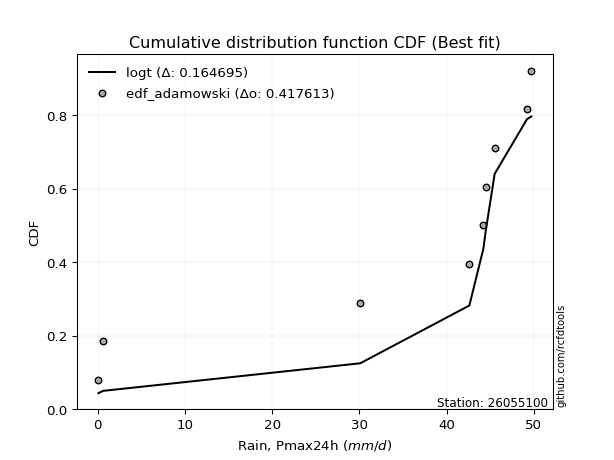</img>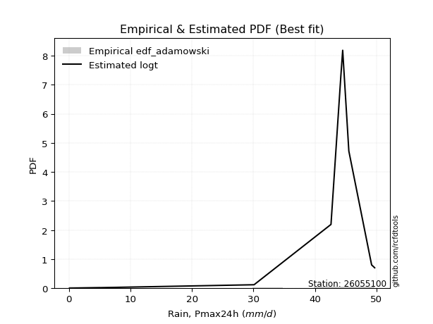</img>

</div>


## C. Best fit & Estimate extreme values for specific return periods - Tr

Best fit in probability distribution analysis means finding the theoretical distribution (like Normal, Poisson, Exponential) that most accurately mirrors your real-world data´s patterns (shape, center, spread) for better predictions, using methods like visual checks (Q-Q plots), goodness-of-fit tests (Kolmogorov-Smirnov, Chi-Squared), and information criteria (AIC) to score and select the simplest, most representative model.


### 1. Best fit (ordered by delta Δ)

<div align="center">

|   id |   station | empirical_dist   | p_dist   |    delta |   deltao | eval   |   fit |   n |   best_fit |   best_fit_sort |
|-----:|----------:|:-----------------|:---------|---------:|---------:|:-------|------:|----:|-----------:|----------------:|
|    0 |  26055100 | edf_hazen        | logt     | 0.152999 | 0.417613 | Δo > Δ |     1 |   9 |          1 |               1 |
|    1 |  26055100 | edf_gringorten   | logt     | 0.155923 | 0.417613 | Δo > Δ |     1 |   9 |          1 |               2 |
|    2 |  26055100 | edf_cunnane      | logt     | 0.15783  | 0.417613 | Δo > Δ |     1 |   9 |          1 |               3 |
|    3 |  26055100 | edf_blom         | logt     | 0.159005 | 0.417613 | Δo > Δ |     1 |   9 |          1 |               4 |
|    4 |  26055100 | edf_tukey        | logt     | 0.160935 | 0.417613 | Δo > Δ |     1 |   9 |          1 |               5 |
|    5 |  26055100 | edf_filliben     | logt     | 0.16166  | 0.417613 | Δo > Δ |     1 |   9 |          1 |               6 |
|    6 |  26055100 | edf_beard        | logt     | 0.162001 | 0.417613 | Δo > Δ |     1 |   9 |          1 |               7 |
|    7 |  26055100 | edf_jenkinson    | logt     | 0.162001 | 0.417613 | Δo > Δ |     1 |   9 |          1 |               8 |
|    8 |  26055100 | edf_chegodayev   | logt     | 0.162455 | 0.417613 | Δo > Δ |     1 |   9 |          1 |               9 |
|    9 |  26055100 | edf_adamowski    | logt     | 0.164695 | 0.417613 | Δo > Δ |     1 |   9 |          1 |              10 |
|   10 |  26055100 | edf_weibull      | logt     | 0.175221 | 0.417613 | Δo > Δ |     1 |   9 |          1 |              11 |
|   11 |  26055100 | edf_california   | mielke   | 0.190359 | 0.417613 | Δo > Δ |     1 |   9 |          1 |              12 |

</div>

:file_folder:Tables: [bestfit_26055100.csv](table/bestfit_26055100.csv) | [extreme_26055100.csv](table/extreme_26055100.csv)


### 2. Extreme values

In hydrology, a return period (or recurrence interval $Tr$) is the statistical average time between extreme events like floods or droughts of a specific magnitude, indicating how rare an event is, with a 100-year flood, for example, having a 1% chance of occurring in any given year, not that it happens exactly every century. It is a key tool for infrastructure design (like bridges or dams) and risk assessment, calculated from historical data to determine the probability of future events, although it is important to remember it is statistical average, and events can cluster or be missed.

> risk_rate: assuming the return period as the project useful life.

|   id |      tr |   prob_l |     prob_g |      alpha |   betaprime |     chi2 |   crystalball |   erlang |    expon |   exponnorm |        f |   fatiguelife |        fisk |    gamma |   genexpon |   genlogistic |   gibrat |   gompertz |   gumbel_l |   gumbel_r |   halflogistic |   halfnorm |   hypsecant |   invgamma |   invgauss |   invweibull |   johnsonsu |   kstwobign |   laplace |   laplace_asymmetric |   loggamma |   logistic |    lognorm |   maxwell |       mielke |    moyal |   nakagami |      ncf |         nct |    norm |   pearson3 |   rayleigh |    rice |       t |   truncnorm |     wald |   weibull_min |     logalpha |      logbetaprime |      logchi2 |   logcrystalball |   logerlang |         logexpon |   logexponnorm |              logf |   logfatiguelife |         logfisk |      loggenexpon |   loggenlogistic |       loggibrat |   loggompertz |   loggumbel_l |   loggumbel_r |   loghalflogistic |   loghalfnorm |   loghypsecant |   loginvgamma |   loginvgauss |    loginvweibull |   logjohnsonsu |     logkstwobign |   loglaplace |   loglaplace_asymmetric |   logloggamma |   loglogistic |   loglognorm |   logmaxwell |       logmielke |         logmoyal |   lognakagami |         logncf |     lognct |   logpearson3 |   lograyleigh |    logrice |             logt |   logtruncnorm |          logwald |   logweibull_min |   station |   n |   risk_rate |
|-----:|--------:|---------:|-----------:|-----------:|------------:|---------:|--------------:|---------:|---------:|------------:|---------:|--------------:|------------:|---------:|-----------:|--------------:|---------:|-----------:|-----------:|-----------:|---------------:|-----------:|------------:|-----------:|-----------:|-------------:|------------:|------------:|----------:|---------------------:|-----------:|-----------:|-----------:|----------:|-------------:|---------:|-----------:|---------:|------------:|--------:|-----------:|-----------:|--------:|--------:|------------:|---------:|--------------:|-------------:|------------------:|-------------:|-----------------:|------------:|-----------------:|---------------:|------------------:|-----------------:|----------------:|-----------------:|-----------------:|----------------:|--------------:|--------------:|--------------:|------------------:|--------------:|---------------:|--------------:|--------------:|-----------------:|---------------:|-----------------:|-------------:|------------------------:|--------------:|--------------:|-------------:|-------------:|----------------:|-----------------:|--------------:|---------------:|-----------:|--------------:|--------------:|-----------:|-----------------:|---------------:|-----------------:|-----------------:|----------:|----:|------------:|
|    0 |    2    | 0.5      | 0.5        |   0.426    |     33.9622 |  32.5826 |       34.0556 |  13.9368 |  23.6362 |     34.0553 |  15.4185 |       33.9917 |     22.8213 |  18.0642 |    23.6486 |           inf |  28.415  |    45.2727 |    37.1427 |    30.9685 |        29.4337 |    30.209  |     34.0556 |    32.2841 |    32.0507 |      31.0227 |     49.6873 |     29.2795 |   34.0556 |              38.8613 |    12.8876 |    34.0556 |    13.6851 |   32.4484 | -188002      |  29.9718 |    7.48667 |  19.591  |     10.8394 | 34.0556 |    37.4005 |    31.8784 | 33.5338 | 34.0552 |     30.8805 |  27.9642 |       37.8591 |      9.23233 |      0.117113     |     0.178842 |          13.6852 |     12.8393 |      3.02507     |        13.6852 |      0.107425     |          13.461  |    0.48425      |      6.4115      |              inf |     7.07959     |       13.2466 |       19.6298 |       9.54076 |       7.97442     |       8.73055 |        13.6851 |       13.0081 |       10.6192 |     11.3421      |        49.6999 |      7.66964     |      13.6851 |                 20.3295 |       20.2278 |       13.6851 |      13.6054 |      11.342  |     0.127864    |      8.49192     |       13.7023 |   1.12341      |    13.6172 |       22.831  |       10.6112 |    13.6884 |    44.5613       |        8.43036 |      6.71633     |     0.14131      |  26055100 |   9 |    0.75     |
|    1 |    2.33 | 0.570815 | 0.429185   |   0.506116 |     37.3678 |  36.1442 |       37.4089 |  17.7274 |  28.8219 |     37.4086 |  21.1372 |       37.3412 |     33.108  |  23.8704 |    28.8371 |           inf |  30.1137 |    45.9341 |    40.0601 |    34.0757 |        32.6284 |    33.8281 |     36.7392 |    35.8807 |    35.8506 |      35.3372 |     49.6966 |     33.6584 |   36.0848 |              40.9327 |    19.3619 |    37.01   |    20.25   |   35.9323 | -188002      |  32.9132 |   12.7339  |  25.7485 |     15.0967 | 37.4089 |    40.4506 |    35.4138 | 36.9979 | 37.4086 |     34.8205 |  30.163  |       40.1629 |     14.3748  |      0.137009     |     0.221435 |          20.2501 |     19.4634 |      6.41188     |        20.2501 |      0.119722     |          19.8936 |    0.966802     |     12.0511      |              inf |     8.63401     |       19.2361 |       27.6039 |      13.7173  |      11.5831      |      13.3262  |        18.7258 |       19.5639 |       16.407  |     20.1367      |        49.7    |     13.4442      |      17.3473 |                 24.117  |       24.0199 |       19.3279 |      20.1172 |      17.0408 |     0.16382     |     11.975       |       20.2694 |   3.80883      |    20.202  |       31.8908 |       16.0392 |    20.2347 |    44.9668       |       10.9964  |      8.68394     |     0.227077     |  26055100 |   9 |    0.729209 |
|    2 |    5    | 0.8      | 0.2        |   1.12735  |     50.0764 |  49.7839 |       49.8706 |  37.9306 |  54.7494 |     49.8703 |  56.1654 |       49.8123 |    139.688  |  56.6448 |    54.7782 |           inf |  39.8933 |    48.0708 |    49.485  |    47.5748 |        47.0838 |    49.1327 |     47.5039 |    49.8191 |    50.9429 |      54.0816 |     49.7    |     52.2588 |   46.2307 |              46.2113 |    90.1383 |    48.4177 |    86.8647 |   49.6444 | -188002      |  46.5379 |   51.7748  |  58.6821 |     63.4339 | 49.8706 |    50      |    49.5675 | 50.0116 | 49.8708 |     50.1443 |  42.4719 |       47.6056 |     83.7313  |      1.19319      |     0.787288 |          86.865  |     94.1517 |    274.259       |        86.866  |      1.01934      |          85.0467 | 1021.63         |    175.848       |              inf |    27.0716      |       66.467  |       83.0373 |      66.4252  |      62.7223      |      79.6894  |        65.8773 |       92.7868 |       90.2109 |    243.801       |        49.7    |    145.874       |      56.7701 |                 37.2736 |       37.2163 |       73.3013 |      86.1903 |      84.5988 |     2.1016      |     58.8453      |       86.8767 |   1.43493e+07  |    87.6975 |       84.4208 |       83.8419 |    86.4793 |    49.9587       |       24.6081  |     36.5906      | 62963.3          |  26055100 |   9 |    0.67232  |
|    3 |   10    | 0.9      | 0.1        |   2.2687   |     58.5528 |  59.1871 |       58.1374 |  57.2684 |  78.2856 |     58.1371 |  94.6164 |       58.1057 |    403.783  |  89.4523 |    78.3268 |           inf |  51.0409 |    49.2604 |    54.7324 |    58.5696 |        59.0884 |    60.4579 |     56.0999 |    59.5897 |    61.8404 |      69.3485 |     49.7    |     66.4207 |   55.4408 |              48.0532 |   255.656  |    56.8191 |   228.23   |   59.2943 |      48.0686 |  58.4003 |   91.752   |  92.4879 |    210.771  | 58.1374 |    54.904  |    59.6594 | 58.7311 | 58.1379 |     60.6747 |  55.5345 |       51.7493 |    301.7     |    309.712        |     2.94303  |         228.231  |    275.106  |   8296.51        |       228.235  |    399.272        |         223.185  |    1.86266e+10  |   1365.27        |              inf |    99.5954      |      134.728  |      153.31   |     240.053   |     255.06        |     299.32    |       179.874  |      270.107  |      302.51   |   1858.49        |        49.7    |    896.057       |     166.541  |                 43.3888 |       43.3599 |      195.645  |     226.573  |     261.267  |    68.3434      |    235.35        |      228.193  |   1.32441e+29  |   232.701  |      131.147  |      272.652  |   226.662  |    89.5326       |       34.8016  |    168.373       |     2.59654e+26  |  26055100 |   9 |    0.651322 |
|    4 |   15    | 0.933333 | 0.0666667  |   3.40598  |     62.7964 |  63.9866 |       62.2628 |  68.8303 |  92.0533 |     62.2624 | 119.447  |       62.2505 |    720.078  | 109.418  |    92.1018 |           inf |  58.73   |    49.7992 |    57.1088 |    64.7728 |        65.8819 |    66.3514 |     61.0055 |    64.6304 |    67.5554 |      77.9621 |     49.7    |     73.9389 |   60.8283 |              48.6219 |   432.991  |    61.3965 |   369.596  |   64.2456 |      48.6383 |  65.2847 |  114.142   | 114.421  |    420.301  | 62.2628 |    56.9654 |    64.8592 | 63.1008 | 62.2634 |     65.9949 |  63.9228 |       53.626  |    593.913   | 199282            |     6.6428   |         369.598  |    473.525  |  60963.5         |       369.604  | 343710            |         361.323  |    6.19443e+18  |   4100.42        |              inf |   244.597       |      186.024  |      202.381  |     495.576   |     564.166       |     595.973   |       319.097  |      465.493  |      567.07   |   5845.86        |        49.7    |   2348.86        |     312.56   |                 45.4725 |       45.4544 |      334.017  |     367.149  |     465.966  |   780.377       |    526.125       |      369.505  |   2.19038e+62  |   378.919  |      155.164  |      500.601  |   366.609  |   329.758        |       39.1299  |    448.704       |     2.50288e+54  |  26055100 |   9 |    0.644736 |
|    5 |   20    | 0.95     | 0.05       |   4.54226  |     65.5804 |  67.1685 |       64.9643 |  77.1143 | 101.822  |     64.964  | 138.03   |       64.967  |   1074.08   | 123.833  |   101.875  |           inf |  64.7616 |    50.1345 |    58.588  |    69.1161 |        70.6417 |    70.2807 |     64.4662 |    67.993  |    71.4008 |      83.993  |     49.7    |     79.0034 |   64.6509 |              48.8987 |   612.883  |    64.5603 |   506.791  |   67.5316 |      48.9156 |  70.1604 |  129.358   | 131.088  |    684.305  | 64.9643 |    58.186  |    68.3153 | 65.9681 | 64.965  |     69.4968 |  70.1737 |       54.7941 |    939.03    |      2.36839e+08  |    12.0007   |         506.792  |    677.711  | 250975           |       506.802  |      4.51101e+08  |         495.41   |    1.6196e+28   |   8659.17        |              inf |   494.93        |      227.55   |      240.568  |     823.243   |     983.917       |     943.266   |       478.134  |      667.545  |      863.55   |  13041.2         |        49.7    |   4495.61        |     488.565  |                 46.5226 |       46.5101 |      483.422  |     503.718  |     684.089  |  5449.47        |    930.083       |      506.652  |   8.50618e+105 |   521.565  |      170.412  |      749.697  |   502.292  |  3052.65         |       41.5132  |    931.495       |     6.85322e+84  |  26055100 |   9 |    0.641514 |
|    6 |   25    | 0.96     | 0.04       |   5.67814  |     67.6322 |  69.5306 |       66.953  |  83.5782 | 109.399  |     66.9527 | 152.979  |       66.9678 |   1458.44   | 135.134  |   109.456  |           inf |  69.7898 |    50.3732 |    59.6406 |    72.4616 |        74.3088 |    73.2042 |     67.1445 |    70.5    |    74.2842 |      88.6384 |     49.7    |     82.797  |   67.6159 |              49.0624 |   792.484  |    66.9806 |   639.372  |   69.9711 |      49.0796 |  73.9395 |  140.769   | 144.701  |    997.978  | 66.953  |    59.022  |    70.8832 | 68.0813 | 66.9538 |     72.0824 |  75.1805 |       55.6253 |   1325.79    |      4.56837e+11  |    19.1113   |         639.374  |    883.686  | 752178           |       639.387  |      8.01796e+11  |         625.016  |    2.18661e+38  |  15220.8         |              inf |   890.673       |      262.708  |      272.055  |    1217.05    |    1510.3         |    1327.39    |       653.838  |      872.251  |     1182.39   |  24195.2         |        49.7    |   7310.81        |     690.863  |                 47.1552 |       47.1462 |      641.435  |     635.805  |     909.733  | 28519.4         |   1446.47        |      639.192  |   2.0746e+159  |   659.938  |      181.203  |     1012.05   |   633.323  | 84555.7          |       43.0205  |   1672.12        |     1.6535e+116  |  26055100 |   9 |    0.639603 |
|    7 |   50    | 0.98     | 0.02       |  11.3558   |     73.5197 |  76.3877 |       72.648  | 103.83   | 132.935  |     72.6476 | 202.358  |       72.7026 |   3713.67   | 170.771  |   133.005  |           inf |  87.5144 |    51.0209 |    62.498  |    82.7675 |        85.6079 |    81.7019 |     75.4483 |    77.8314 |    82.793  |     102.949  |     49.7    |     93.9366 |   76.826  |              49.3849 |  1663.81   |    74.3753 |  1243.84   |   77.0461 |      49.4026 |  85.6715 |  174.14    | 191.214  |   3215.13   | 72.648  |    61.1399 |    78.3372 | 74.1436 | 72.6489 |     79.5167 |  91.5278 |       57.8817 |   3697.4     |      2.25803e+30  |    83.5312   |        1243.84   |   1902.53   |      2.27539e+07 |      1243.87   |      2.8841e+29   |        1216.24   |    5.05622e+96  |  81640.5         |              inf |  7066.71        |      388.429  |      379.895  |    4058.05    |    5655.6         |    3582.99    |      1725.36   |     1894.92   |     2972.79   | 162397           |        49.7    |  30484.8         |    2026.72   |                 48.4261 |       48.4243 |     1522.03   |    1239.03   |    2079.51   |     1.39107e+07 |   5697.6         |     1243.54   | inf            |  1295.31   |      209.245  |     2418.14   |  1229.99   |     3.1931e+21   |       46.2235  |  11294.4         |     1.30568e+272 |  26055100 |   9 |    0.63583  |
|    8 |   75    | 0.986667 | 0.0133333  |  17.0326   |     76.686  |  80.124  |       75.7037 | 115.775  | 146.703  |     75.7033 | 233.301  |       75.7829 |   6371.64   | 191.921  |   146.78   |           inf |  99.4856 |    51.3485 |    63.9429 |    88.7577 |        92.176  |    86.3276 |     80.301  |    81.8605 |    87.5152 |     111.266  |     49.7    |    100.066  |   82.2136 |              49.4909 |  2485.83   |    78.6462 |  1777.61   |   80.8926 |      49.5089 |  92.5322 |  192.335   | 221.721  |   6369.14   | 75.7037 |    62.1185 |    82.3925 | 77.4024 | 75.7047 |     83.5213 | 101.587  |       59.0227 |   6569.07    |      5.44978e+51  |   201.286    |        1777.61   |   2883.11   |      1.67198e+08 |      1777.66   |      2.93075e+48  |        1738.72   |    1.7071e+164  | 209148           |              inf | 28624.7         |      473.615  |      449.771  |    8171.68    |   12184.4         |    6151.74    |      3041.92   |     2891.08   |     4942.69   | 491106           |        49.7    |  66875.9         |    3803.69   |                 48.8514 |       48.852  |     2507.08   |    1772.75   |    3259.63   |     1.33968e+09 |  12701.7         |     1777.29   | inf            |  1860.61   |      222.192  |     3884.01   |  1756.23   |     3.92809e+58  |       47.3506  |  36589.7         |   inf            |  26055100 |   9 |    0.634587 |
|    9 |  100    | 0.99     | 0.01       |  22.7092   |     78.8303 |  82.6738 |       77.7704 | 124.285  | 156.471  |     77.77   | 256.187  |       77.8676 |   9327.77   | 207.037  |   156.554  |           inf | 108.759  |    51.5628 |    64.888  |    92.9973 |        96.8248 |    89.4789 |     83.7433 |    84.6242 |    90.7723 |     117.153  |     49.7    |    104.265  |   86.0361 |              49.5436 |  3265.97   |    81.6616 |  2263.19   |   83.5127 |      49.5617 |  97.3995 |  204.717   | 245.01   |  10343.3    | 77.7704 |    62.7223 |    85.1553 | 79.6087 | 77.7715 |     86.2351 | 108.921  |       59.769  |   9789.52    |      1.1842e+75   |   377.97     |        2263.2    |   3825.53   |      6.88321e+08 |      2263.26   |      2.97141e+68  |        2214.29   |    2.75781e+238 | 401418           |              inf | 84599.1         |      539.294  |      502.289  |   13411.2     |   20976.1         |    8890.37    |      4548.18   |     3856.77   |     7009.64   |      1.07479e+06 |        49.7    | 114560           |    5945.58   |                 49.0643 |       49.0662 |     3566.1    |    2258.92   |    4427.23   |     5.88924e+10 |  22432.3         |     2262.9    | inf            |  2377.34   |      230.043  |     5363.98   |  2234.61   |     8.08595e+121 |       47.9259  |  86210.1         |   inf            |  26055100 |   9 |    0.633968 |
|   10 |  200    | 0.995    | 0.005      |  45.4152   |     83.7029 |  88.5258 |       82.4585 | 144.893  | 180.007  |     82.4581 | 314.574  |       82.6001 |  23272.7    | 243.772  |   180.102  |           inf | 133.989  |    52.0285 |    66.9422 |   103.19   |       108.001  |    96.6861 |     92.0361 |    91.0114 |    98.352  |     131.306  |     49.7    |    113.937  |   95.2462 |              49.6224 |  6091.49   |    88.8949 |  3914.12   |   89.5069 |      49.6406 | 109.127  |  232.952   | 307.356  |  33260.5    | 82.4585 |    63.9305 |    91.4768 | 84.6189 | 82.4598 |     92.4041 | 127.19   |       61.3913 |  24986.8     |      1.05784e+182 |  1754.9      |        3914.13   |   7302.91   |      2.08222e+10 |      3914.24   |      1.22234e+155 |        3832.7    |  inf            |      1.84673e+06 |              inf |     1.61346e+06 |      715.484  |      638.566  |   44128.6     |   77429.8         |   20638.6     |     11986.3    |     7471.22   |    15744.3    |      7.06436e+06 |        49.7    | 395780           |   17442      |                 49.3842 |       49.3879 |     8303.73   |    3915.2    |    8919.36   |     5.68568e+15 |  88308.7         |     3914.27   | inf            |  4146.5    |      245.128  |    11227.8    |  3859.32   |   inf            |       48.8039  | 728897           |   inf            |  26055100 |   9 |    0.633042 |
|   11 |  250    | 0.996    | 0.004      |  56.7682   |     85.1943 |  90.333  |       83.8911 | 151.554  | 187.584  |     83.8907 | 334.37   |       84.0474 |  31212.2    | 255.679  |   187.683  |           inf | 143.042  |    52.1655 |    67.5467 |   106.467  |       111.594  |    98.9034 |     94.7056 |    92.9966 |   100.722  |     135.856  |     49.7    |    116.93   |   98.2112 |              49.6381 |  7378.31   |    91.2171 |  4627.42   |   91.3521 |      49.6563 | 112.902  |  241.609   | 329.48   |  48441.5    | 83.8911 |    64.2578 |    93.4227 | 86.1515 | 83.8925 |     94.2927 | 133.234  |       61.8686 |  33581.5     |      3.87626e+241 |  2889.65     |        4627.43   |   8910.75   |      6.24046e+10 |      4627.57   |      1.65169e+201 |        4532.56   |  inf            |      2.98324e+06 |              inf |     4.64693e+06 |      777.62   |      685.297  |   64715.7     |  117829           |   26742.6     |     16374.1    |     9163.48   |    20255.8    |      1.2941e+07  |        49.7    | 580873           |   24664.1    |                 49.4482 |       49.4523 |    10892.4    |    4632.08   |   11065.6    |     5.47058e+17 | 137274           |     4627.9    | inf            |  4915.38   |      249.008  |    14094.4    |  4560.71   |   inf            |       48.9817  |      1.477e+06   |   inf            |  26055100 |   9 |    0.632858 |
|   12 |  500    | 0.998    | 0.002      | 113.533    |     89.6236 |  95.7448 |       88.1397 | 172.313  | 211.12   |     88.1392 | 399.083  |       88.3422 |  77566.1    | 292.876  |   211.232  |           inf | 174.328  |    52.5583 |    69.2793 |   116.637  |       122.746  |   105.514  |    102.998  |    98.9775 |   107.901  |     149.978  |     49.7    |    125.9    |  107.421  |              49.6695 | 13067.2    |    98.419  |  7602.33   |   96.8582 |      49.6878 | 124.628  |  267.329   | 405.397  | 155747      | 88.1397 |    65.1229 |    99.2287 | 90.7003 | 88.1411 |     99.901  | 152.452  |       63.2368 |  82900.3     |    inf            | 13760.8      |        7602.34   |  16138.5    |      1.88778e+12 |      7602.6    |    inf            |        7454.33   |  inf            |      1.28327e+07 |              inf |     1.79832e+08 |      987.528  |      839.093  |  212392       |  433716           |   57902.1     |     43149.3    |    16887      |    43322.1    |      8.47107e+07 |        49.7    |      1.83413e+06 |   72354.6    |                 49.5763 |       49.5811 |    25270.2    |    7627.88   |   21057.3    |     2.7448e+25  | 540388           |     7604.8    | inf            |  8142.56   |      258.667  |    27777.4    |  7483.3    |   inf            |       49.3395  |      1.39518e+07 |   inf            |  26055100 |   9 |    0.632489 |
|   13 |  750    | 0.998667 | 0.00133333 | 170.297    |     92.0883 |  98.785  |       90.4998 | 184.498  | 224.888  |     90.4993 | 439.276  |       90.7299 | 132023      | 314.763  |   225.007  |           inf | 195.018  |    52.7683 |    70.2054 |   122.582  |       129.266  |   109.207  |    107.848  |   102.362  |   111.987  |     158.234  |     49.7    |    130.94   |  112.809  |              49.6799 | 17987.7    |   102.627  | 10016.6    |   99.9379 |      49.6982 | 131.488  |  281.633   | 455.37   | 308394      | 90.4998 |    65.54   |   102.475  | 93.2294 | 90.5013 |    103.021  | 163.974  |       63.9681 | 139467       |    inf            | 34528.4      |       10016.6    |  22503      |      1.38716e+13 |     10016.9    |    inf            |        9828.29   |  inf            |      2.95617e+07 |              inf |     2.01778e+09 |     1122.21   |      934.986  |  425468       |  929099           |   89149.4     |     76055.8    |    23806.8    |    66652      |      2.5407e+08  |        49.7    |      3.49905e+06 |  135793      |                 49.619  |       49.6241 |    41317.8    |   10064.6    |   30177.9    |     1.9474e+31  |      1.20455e+06 |    10021.3    | inf            | 10779.9    |      262.945  |    40593.4    |  9852.87   |   inf            |       49.4595  |      5.36248e+07 |   inf            |  26055100 |   9 |    0.632366 |
|   14 | 1000    | 0.999    | 0.001      | 227.061    |     93.787  | 100.892  |       92.1247 | 193.16   | 234.657  |     92.1243 | 468.881  |       92.3746 | 192508      | 330.343  |   234.78   |           inf | 210.851  |    52.9095 |    70.8286 |   126.8    |       133.89   |   111.758  |    111.29   |   104.718  |   114.842  |     164.09   |     49.7    |    134.431  |  116.631  |              49.6852 | 22434.2    |   105.61   | 12111.1    |  102.066  |      49.7035 | 136.355  |  291.485   | 493.585  | 500735      | 92.1247 |    65.8028 |   104.719  | 94.9716 | 92.1263 |    105.171  | 172.262  |       64.4603 | 201115       |    inf            | 66502.5      |       12111.1    |  28320.2    |      5.71066e+13 |     12111.5    |    inf            |       11889.5    |  inf            |      5.30424e+07 |              inf |     1.28349e+10 |     1223.1    |     1005.62   |  696458       |       1.59497e+06 |  120104       |    113706      |    30205.6    |    89987.9    |      5.53758e+08 |        49.7    |      5.47384e+06 |  212260      |                 49.6404 |       49.6456 |    58555.2    |   12181.7    |   38699.7    |     1.56767e+36 |      2.12726e+06 |    12118.1    | inf            | 13078.1    |      265.49   |    52761.2    | 11907.4    |   inf            |       49.5196  |      1.41248e+08 |   inf            |  26055100 |   9 |    0.632305 |

<div align="center">

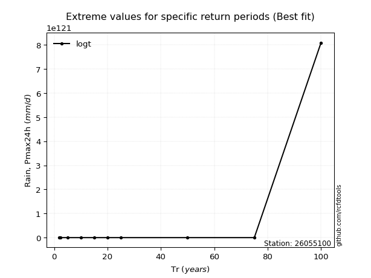</img>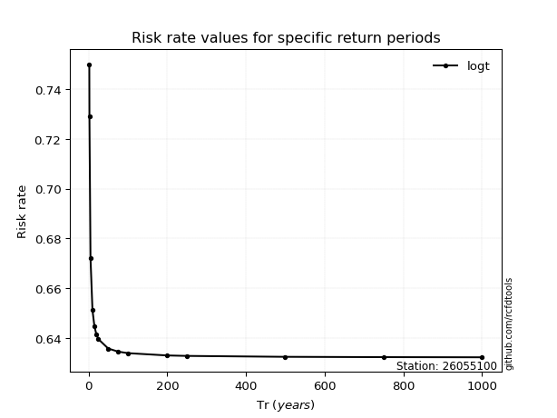</img>

</div>


<sub>**APP DISCLAIMER**: NO WARRANTY - This software is provided by [github.com/rcfdtools](https://github.com/rcfdtools) "as is", without any express or implied warranty, including warranties of merchantability, fitness for a particular purpose, or non-infringement. There is no guarantee that the software will be error-free or operate without interruption. LIMITATION OF LIABILITY - Neither the authors nor copyright holders will be liable for claims or damages arising from the software or its use. You are responsible for determining if the software is appropriate for your use and assume all associated risks, including errors, legal compliance, and data loss. NO PROFESSIONAL ADVICE - The software provides general information and does not offer professional advice. It should not replace consultation with professional advisors.</sub>