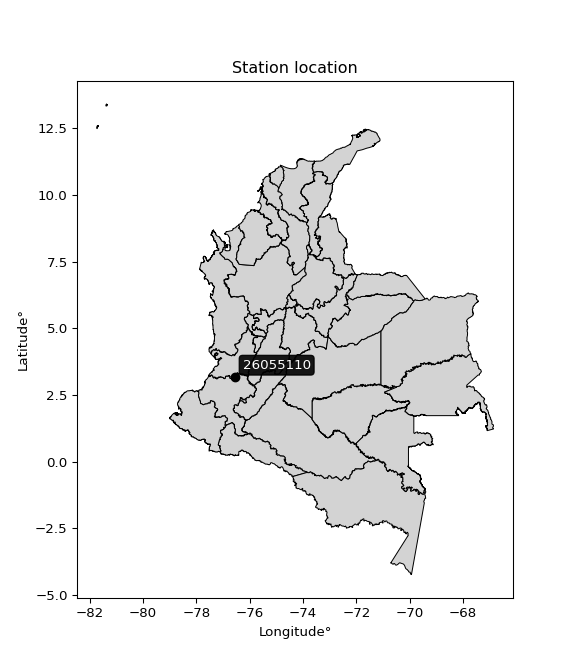

<div align="center">


</div>

# PMP Station (Rain, Pmax24h): 26055110

Probable Maximum Precipitation (PMP) is the greatest amount of rainfall for a specific duration that is meteorologically possible for a given location, acting as a "worst-case" scenario for extreme storms, crucial for designing safety-critical infrastructure like bridges, river deviations, dams, spillways, and nuclear plants to prevent catastrophic failure. PMP is calculated by hydrologists using meteorological data to determine the upper limit of extreme rainfall, often leading to the Probable Maximum Flood (PMF) for flood control design, and is increasingly being studied for climate change impacts. Probable Maximum Precipitation (PMP) is the theoretical upper limit of rainfall, a deterministic estimate for extreme events, while probability distributions (like GEV, Gumbel) describe the likelihood and frequency of various precipitation amounts, including rare ones, showing how often events occur, with PMP representing the extreme end of these distributions, used for critical infrastructure design to ensure safety against the worst conceivable weather, unlike standard statistical forecasts which cover typical probabilities.

The most common probability distributions in hydrology, used for analyzing floods, rainfall, and streamflow, include the Normal, Log-Normal, Gumbel, Gamma (including Log-Pearson Type III), and Generalized Extreme Value (GEV) distributions, often chosen based on the data´s skewness and whether modeling extremes or general conditions, with Gumbel and GEV popular for extreme events like floods, while the Normal distribution serves as a baseline, though often requiring transformations for skewed hydrological data. These distributions help in designing water infrastructure, managing water resources, and forecasting hydrologic events.

> Hydrological data often isn´t perfectly normal (it´s skewed), so different distributions are needed for different applications, such as: **Flood Frequency Analysis**: Using Gumbel, GEV, or Log-Pearson Type III for predicting extreme flood magnitudes and their return periods, **Rainfall Analysis**: Normal for annual totals, but Log-Normal, Weibull, or GEV for intensity or extreme daily rainfall, **Streamflow Modeling**: Gamma and Log-Normal for maximum flows, GEV for minimum flows, and Kappa for daily flows.

<div align="center">

</img>

</div>


## A. General information


### 1. General running parameters

• app_version: _v20260113_. • runtime: _2026-01-13 16:28:34.738620_. • Python version: _3.14.0_. • SciPy version: _1.16.3_. • Pandas version: _2.3.3_. • NumPy version: _2.3.5_. • Stations dataset (station_dataset_file): _dataset/pmax24h_in/automatic_colombia_2003_2025.csv_. • Stations catalog (station_catalog_file): _dataset/CNE.xls_. • Minimum year to eval til year_max (date_min): _1900_. • Maximum year to eval since year_min (date_max): _2025_. • Creates, save and include plots into reports (create_plot): _False_. • Plot only fit distributions with Δo > Δ (plot_only_fit): _True_. • Plot only simple graphs avoiding multiple CDFs and multiple Extreme values plots (plot_only_simple): _True_. • Eval low extreme values, if False, evaluates high extreme values (low_extreme): _False_. • Eval every SciPy distribution as logarithmic (pdist_logarithmic_on): _True_. • Standard deviation normalized (ddof): _1.0_. • Return periods to eval in years (Tr): _[2, 2.33, 5, 10, 15, 20, 25, 50, 75, 100, 200, 250, 500, 750, 1000]_. • Minimum data sample per station, 0 means any (minimum_sample): _5_. • Z-Score maximum threshold to adjust a value, 0 means disable (zscore_max): _3.5_. • Z-Score minimum threshold to adjust a value, 0 means disable (zscore_min): _-2.5_. • Avoid zeros, e.g. rain = 0 (avoid_zeros): _True_. • Avoid null values (avoid_nans): _True_. 

:file_folder:Table: [dataset.csv](../../dataset/pmax24h_in/automatic_colombia_2003_2025.csv)

> Delta Degrees of Freedom (DDOF): is a parameter used in the formulas for calculating variance and standard deviation. When ddof=0, the divisor is $N$ (the total number of observations) and this is used when your data set is the entire population. When ddof=1, the divisor is $N-1$ and this is used when your data set is a sample drawn from a larger population. Using $N-1$ provides an unbiased estimate of the population variance (known as Bessel´s correction).


### 2. Station info and location

|   id |   CODIGO | NOMBRE                            | CATEGORIA         | TECNOLOGIA                              | ESTADO           | FECHA_INSTALACION   |   FECHA_SUSPENSION |   ALTITUD |   LATITUD |   LONGITUD | DEPARTAMENTO    | MUNICIPIO   | AREA_OPERATIVA                         | ENTIDAD                                                     | AREA_HIDROGRAFICA   | ZONA_HIDROGRAFICA   | SUBZONA_HIDROGRAFICA   |   CORRIENTE | Catalogo   |   Version |
|-----:|---------:|:----------------------------------|:------------------|:----------------------------------------|:-----------------|:--------------------|-------------------:|----------:|----------:|-----------:|:----------------|:------------|:---------------------------------------|:------------------------------------------------------------|:--------------------|:--------------------|:-----------------------|------------:|:-----------|----------:|
|    0 | 26055110 | LA INDEPENDENCIA - AUT [26055110] | Agrometeorológica | Automática con Telemetría, Convencional | En Mantenimiento | 28/06/2005          |                nan |      1004 |   3.18536 |   -76.5693 | Valle Del Cauca | Jamundí     | Area Operativa 09 - Cauca-Valle-Caldas | INSTITUTO DE HIDROLOGIA METEOROLOGIA Y ESTUDIOS AMBIENTALES | Magdalena Cauca     | Cauca               | Ríos Claro y Jamundí   |         nan | CNE_IDEAM  |  20251226 |

<div align="center">

Dynamic map: [:earth_americas:Google](http://maps.google.com/maps?q=3.185361111,-76.569305556) [:earth_americas:OSM](https://www.openstreetmap.org/#map=18/3.185361111/-76.569305556&layers=P) [:earth_americas:Bing](https://www.bing.com/maps?cp=3.185361111~-76.569305556&lvl=18) [:earth_americas:Apple](https://maps.apple.com/frame?center=3.185361111%2C-76.569305556&span=0.003%2C0.006)

</div>


<div align="center">

```geojson
{
  "type": "Feature",
  "geometry": {
    "type": "Point", 
    "coordinates": [-76.569305556, 3.185361111]
  }, 
  "properties": {
    "Name": "26055110"
  }
}
```

</div>


### 3. Discrete values table and plot

<div align="center">

|               |          0 |           1 |          2 |           3 |           4 |           5 |             6 |          7 |           8 |
|:--------------|-----------:|------------:|-----------:|------------:|------------:|------------:|--------------:|-----------:|------------:|
| Date          | 2016       | 2017        | 2018       | 2019        | 2020        | 2021        | 2022          | 2023       | 2025        |
| Value         |    0.5     |   48.6      |   69.5     |   60.8      |   57.8      |   31.9      |   39.4        |    7.7     |   37.5      |
| Value_initial |    0.5     |   48.6      |   69.5     |   60.8      |   57.8      |   31.9      |   39.4        |    7.7     |   37.5      |
| count         |    9       |    9        |    9       |    9        |    9        |    9        |    9          |    9       |    9        |
| mean          |   39.3     |   39.3      |   39.3     |   39.3      |   39.3      |   39.3      |   39.3        |   39.3     |   39.3      |
| std           |   23.3587  |   23.3587   |   23.3587  |   23.3587   |   23.3587   |   23.3587   |   23.3587     |   23.3587  |   23.3587   |
| zscore        |   -1.66105 |    0.398138 |    1.29288 |    0.920427 |    0.791995 |   -0.316798 |    0.00428106 |   -1.35281 |   -0.077059 |


</div>


> The initial value (value_initial) correspond to the initial obtained or null completed value, and value (value) is adjusted only when the initial value is outside the valid range (outlier) definite through the Z-Score value. If Z-Score is active, values out of range or outliers are replaced with the station mean value. A Z-Score (or standard score) measures how many standard deviations a data point is from the mean of a dataset, indicating its relative position; positive scores mean above the mean, negative mean below, and a score of zero is exactly at the mean, allowing for comparison of values from different distributions. It´s calculated using the formula $z=(x–μ)/σ$, where $x$ is the data point, $μ$ is the mean, and $σ$ is the standard deviation, helping identify outliers and understand probability.
>
> <sub>**Note**: In this study, "completing" (filling gaps in) and "extending" (forecasting or lengthening the historical record) rainfall data series are avoided for certain critical analyses because they introduce artificial bias and uncertainty, which can distort the statistics of rare events (extremes), alter day-to-day variability, and compromise the integrity and homogeneity of the original data. Some reasons against Completing/Extending rainfall data are: **Distortion of Extremes and Variability**: The primary issue is that most gap-filling or extension methods rely on averaging or regression with nearby stations, which inherently smooths the data. Rainfall is highly variable in space and time, with a large percentage of zero values and occasional large storms. Infilling methods often underestimate the highest values and overestimate the lowest (zero) values, which severely distorts analyses focused on flood frequency, drought severity, and intensity-duration-frequency (IDF) curves, **Loss of Data Homogeneity**: Infilled or extended data are synthetic estimates, not actual measurements. Combining these estimates with observed data can violate the assumption of data homogeneity, which requires that the data properties do not change over time. Inhomogeneity can lead to incorrect conclusions about long-term trends or changes in climate patterns, **Propagation of Errors**: Errors and biases from the original data (e.g., wind-induced undercatch, instrument errors, site changes) or the data used for imputation can propagate through the analysis, leading to unreliable hydrological models and inaccurate predictions, **Compromised Statistical Integrity**: For statistical analyses, especially those involving the frequency of events, using artificial data can introduce time bias or autocorrelation that doesn´t exist in reality, making it difficult to assess the true probability of events, **Difficulty in Validation**: It is difficult to accurately validate the quality of filled or extended data, especially for past periods where ground-truth measurements are unavailable. The reliability of imputation techniques heavily depends on the density of the surrounding station network and the complexity of the local topography.</sub>


### 4. Active continuous probability distributions from SciPy (45 of 104 available)

A Probability Density Function (PDF) describes the relative likelihood of a continuous random variable falling within a specific range, where the total area under its curve equals 1, and the area over any interval gives the actual probability for that range. Unlike discrete probabilities (like rolling a die), a PDF shows density, not direct probability for a single point (which is zero), with higher points indicating higher likelihood, often visualized as a bell curve for normal distributions.

A log of a probability density function (log-PDF) is simply the logarithm of the PDF´s value, denoted as $log(f(x))$, useful for converting multiplication of probabilities into addition, improving numerical stability with tiny numbers, and connecting to information theory concepts like entropy. Instead of dealing with very small probabilities (e.g., 0.000001), log-PDFs use negative numbers (e.g., $log(0.00001) ≈ -11.51$ that are easier for computers to handle, preventing underflow errors and simplifying complex calculations. In this study, each active probability distribution from SciPy is also evaluated in the $log$ form.

[scipy.stats](https://docs.scipy.org/doc/scipy/reference/stats.html) is a Python´s powerful submodule within the SciPy library for comprehensive statistical analysis, offering over 130 probability distributions (like Normal, Poisson), functions for descriptive stats (mean, variance), hypothesis testing (t-tests, chi-square), random variable generation, and statistical tests, making it essential for data science, modeling, and research. It provides tools to explore, model, and draw conclusions from data efficiently, working seamlessly with NumPy.

<div align="center">

|   id | p_dist             |   n_parameter | fit_method   | label                                                                       | active   | ref                                                                                                        |
|-----:|:-------------------|--------------:|:-------------|:----------------------------------------------------------------------------|:---------|:-----------------------------------------------------------------------------------------------------------|
|    0 | alpha              |             3 | MLE          | Alpha                                                                       | True     | [:mortar_board:](https://docs.scipy.org/doc/scipy/reference/generated/scipy.stats.alpha.html)              |
|    1 | betaprime          |             4 | MLE          | Beta prime                                                                  | True     | [:mortar_board:](https://docs.scipy.org/doc/scipy/reference/generated/scipy.stats.betaprime.html)          |
|    2 | chi2               |             3 | MLE          | Chi²                                                                        | True     | [:mortar_board:](https://docs.scipy.org/doc/scipy/reference/generated/scipy.stats.chi2.html)               |
|    3 | crystalball        |             4 | MLE          | Crystalball                                                                 | True     | [:mortar_board:](https://docs.scipy.org/doc/scipy/reference/generated/scipy.stats.crystalball.html)        |
|    4 | dweibull           |             3 | MLE          | Double Weibull                                                              | True     | [:mortar_board:](https://docs.scipy.org/doc/scipy/reference/generated/scipy.stats.dweibull.html)           |
|    5 | erlang             |             3 | MLE          | Erlang                                                                      | True     | [:mortar_board:](https://docs.scipy.org/doc/scipy/reference/generated/scipy.stats.erlang.html)             |
|    6 | expon              |             2 | MLE          | Exponential                                                                 | True     | [:mortar_board:](https://docs.scipy.org/doc/scipy/reference/generated/scipy.stats.expon.html)              |
|    7 | exponnorm          |             3 | MLE          | Exponentially modified Normal                                               | True     | [:mortar_board:](https://docs.scipy.org/doc/scipy/reference/generated/scipy.stats.exponnorm.html)          |
|    8 | f                  |             4 | MLE          | F                                                                           | True     | [:mortar_board:](https://docs.scipy.org/doc/scipy/reference/generated/scipy.stats.f.html)                  |
|    9 | fatiguelife        |             3 | MLE          | Fatigue-life (Birnbaum-Saunders)                                            | True     | [:mortar_board:](https://docs.scipy.org/doc/scipy/reference/generated/scipy.stats.fatiguelife.html)        |
|   10 | fisk               |             3 | MLE          | Fisk                                                                        | True     | [:mortar_board:](https://docs.scipy.org/doc/scipy/reference/generated/scipy.stats.fisk.html)               |
|   11 | gamma              |             3 | MLE          | Gamma                                                                       | True     | [:mortar_board:](https://docs.scipy.org/doc/scipy/reference/generated/scipy.stats.gamma.html)              |
|   12 | genexpon           |             5 | MLE          | Generalized exponential                                                     | True     | [:mortar_board:](https://docs.scipy.org/doc/scipy/reference/generated/scipy.stats.genexpon.html)           |
|   13 | genlogistic        |             3 | MLE          | Generalized logistic                                                        | True     | [:mortar_board:](https://docs.scipy.org/doc/scipy/reference/generated/scipy.stats.genlogistic.html)        |
|   14 | gibrat             |             2 | MM           | Gibrat                                                                      | True     | [:mortar_board:](https://docs.scipy.org/doc/scipy/reference/generated/scipy.stats.gibrat.html)             |
|   15 | gompertz           |             3 | MLE          | Gompertz (or truncated Gumbel)                                              | True     | [:mortar_board:](https://docs.scipy.org/doc/scipy/reference/generated/scipy.stats.gompertz.html)           |
|   16 | gumbel_l           |             2 | MM           | Gumbel Left Skew                                                            | True     | [:mortar_board:](https://docs.scipy.org/doc/scipy/reference/generated/scipy.stats.gumbel_l.html)           |
|   17 | gumbel_r           |             2 | MM           | Gumbel Right Skew                                                           | True     | [:mortar_board:](https://docs.scipy.org/doc/scipy/reference/generated/scipy.stats.gumbel_r.html)           |
|   18 | halflogistic       |             2 | MM           | Half-logistic                                                               | True     | [:mortar_board:](https://docs.scipy.org/doc/scipy/reference/generated/scipy.stats.halflogistic.html)       |
|   19 | halfnorm           |             2 | MM           | Half Normal                                                                 | True     | [:mortar_board:](https://docs.scipy.org/doc/scipy/reference/generated/scipy.stats.halfnorm.html)           |
|   20 | hypsecant          |             2 | MM           | hyperbolic secant                                                           | True     | [:mortar_board:](https://docs.scipy.org/doc/scipy/reference/generated/scipy.stats.hypsecant.html)          |
|   21 | invgamma           |             3 | MLE          | Inverted gamma                                                              | True     | [:mortar_board:](https://docs.scipy.org/doc/scipy/reference/generated/scipy.stats.invgamma.html)           |
|   22 | invgauss           |             3 | MLE          | Inverse Gaussian                                                            | True     | [:mortar_board:](https://docs.scipy.org/doc/scipy/reference/generated/scipy.stats.invgauss.html)           |
|   23 | invweibull         |             3 | MLE          | Inverted Weibull                                                            | True     | [:mortar_board:](https://docs.scipy.org/doc/scipy/reference/generated/scipy.stats.invweibull.html)         |
|   24 | kappa4             |             4 | MLE          | Kappa 4                                                                     | True     | [:mortar_board:](https://docs.scipy.org/doc/scipy/reference/generated/scipy.stats.kappa4.html)             |
|   25 | kstwobign          |             2 | MLE          | Limiting distribution of scaled Kolmogorov-Smirnov two-sided test statistic | True     | [:mortar_board:](https://docs.scipy.org/doc/scipy/reference/generated/scipy.stats.kstwobign.html)          |
|   26 | laplace            |             2 | MM           | Laplace                                                                     | True     | [:mortar_board:](https://docs.scipy.org/doc/scipy/reference/generated/scipy.stats.laplace.html)            |
|   27 | laplace_asymmetric |             3 | MLE          | Asymmetric Laplace                                                          | True     | [:mortar_board:](https://docs.scipy.org/doc/scipy/reference/generated/scipy.stats.laplace_asymmetric.html) |
|   28 | loggamma           |             3 | MLE          | Log gamma                                                                   | True     | [:mortar_board:](https://docs.scipy.org/doc/scipy/reference/generated/scipy.stats.loggamma.html)           |
|   29 | logistic           |             2 | MM           | Logistic (or Sech-squared)                                                  | True     | [:mortar_board:](https://docs.scipy.org/doc/scipy/reference/generated/scipy.stats.logistic.html)           |
|   30 | lognorm            |             3 | MLE          | Log Normal                                                                  | True     | [:mortar_board:](https://docs.scipy.org/doc/scipy/reference/generated/scipy.stats.lognorm.html)            |
|   31 | maxwell            |             2 | MM           | Maxwell                                                                     | True     | [:mortar_board:](https://docs.scipy.org/doc/scipy/reference/generated/scipy.stats.maxwell.html)            |
|   32 | mielke             |             4 | MLE          | Mielke Beta-Kappa / Dagum                                                   | True     | [:mortar_board:](https://docs.scipy.org/doc/scipy/reference/generated/scipy.stats.mielke.html)             |
|   33 | moyal              |             2 | MM           | Moyal                                                                       | True     | [:mortar_board:](https://docs.scipy.org/doc/scipy/reference/generated/scipy.stats.moyal.html)              |
|   34 | nakagami           |             3 | MLE          | Nakagami                                                                    | True     | [:mortar_board:](https://docs.scipy.org/doc/scipy/reference/generated/scipy.stats.nakagami.html)           |
|   35 | ncf                |             5 | MLE          | Non-central F distribution                                                  | True     | [:mortar_board:](https://docs.scipy.org/doc/scipy/reference/generated/scipy.stats.ncf.html)                |
|   36 | nct                |             4 | MLE          | Non-central Student’s t                                                     | True     | [:mortar_board:](https://docs.scipy.org/doc/scipy/reference/generated/scipy.stats.nct.html)                |
|   37 | norm               |             2 | MM           | Normal                                                                      | True     | [:mortar_board:](https://docs.scipy.org/doc/scipy/reference/generated/scipy.stats.norm.html)               |
|   38 | pearson3           |             3 | MM           | Pearson type III                                                            | True     | [:mortar_board:](https://docs.scipy.org/doc/scipy/reference/generated/scipy.stats.pearson3.html)           |
|   39 | rayleigh           |             2 | MM           | Rayleigh                                                                    | True     | [:mortar_board:](https://docs.scipy.org/doc/scipy/reference/generated/scipy.stats.rayleigh.html)           |
|   40 | rice               |             3 | MLE          | Rice                                                                        | True     | [:mortar_board:](https://docs.scipy.org/doc/scipy/reference/generated/scipy.stats.rice.html)               |
|   41 | t                  |             3 | MLE          | Student’s t                                                                 | True     | [:mortar_board:](https://docs.scipy.org/doc/scipy/reference/generated/scipy.stats.t.html)                  |
|   42 | truncnorm          |             4 | MLE          | Truncated normal                                                            | True     | [:mortar_board:](https://docs.scipy.org/doc/scipy/reference/generated/scipy.stats.truncnorm.html)          |
|   43 | wald               |             2 | MM           | Wald                                                                        | True     | [:mortar_board:](https://docs.scipy.org/doc/scipy/reference/generated/scipy.stats.wald.html)               |
|   44 | weibull_min        |             3 | MLE          | Weibull minimum                                                             | True     | [:mortar_board:](https://docs.scipy.org/doc/scipy/reference/generated/scipy.stats.weibull_min.html)        |

</div>

> **n_parameter:** # arguments & localization & scale.
>
> **Fit methods:** (MLE) maximum likelihood, (MM) L-moments.
>
>**Inactive** (With the only purpose of prevent loops, zero divisions, infinite values, over high estimated values or horizontal trending for recurrence intervals estimations, the follow distributions were disabled.)**:** foldnorm, gennorm, norminvgauss, powernorm, powerlognorm, skewnorm, genextreme, anglit, arcsine, argus, beta, bradford, burr, burr12, cauchy, cosine, halfcauchy, foldcauchy, skewcauchy, wrapcauchy, dgamma, gengamma, exponweib, exponpow, truncexpon, gausshyper, genhalflogistic, genhyperbolic, geninvgauss, halfgennorm, johnsonsb, johnsonsu, kappa3, ksone, kstwo, loglaplace, levy, levy_l, levy_stable, ncx2, pareto, genpareto, truncpareto, lomax, powerlaw, rdist, rel_breitwigner, recipinvgauss, semicircular, studentized_range, trapezoid, triang, truncweibull_min, tukeylambda, uniform, loguniform, vonmises, vonmises_line, weibull_max, 


## B. Probability (PDF) vs. Empirical (EDF) distributions functions

A continuous probability distribution (CPD) describes probabilities for variables that can take any value within a range (like rain any time), unlike discrete variables with specific outcomes (like temperature). It uses a Probability Density Function (PDF), a curve where the total area under it equals 1, and the probability of the variable falling within an interval (a to b) is found by calculating the area under the curve between those points. A key feature is that the probability of hitting any single exact value is zero, so probabilities are always expressed for ranges, e.g., $P(a ≤ X ≤ b)$.

<div align="center">

Distributions parameters from station values
|    |   station | p_dist                |   n |               loc |            scale | shape                  | shape1               | shape2                 | shape3   |
|---:|----------:|:----------------------|----:|------------------:|-----------------:|:-----------------------|:---------------------|:-----------------------|:---------|
|  0 |  26055110 | alpha                 |   9 |       0.00144935  |      1.49542     | 1.1686000691066854e-09 |                      |                        |          |
|  1 |  26055110 | betaprime             |   9 |    -749.26        |  47049           | 1274.6897564328415     | 76063.8908622585     |                        |          |
|  2 |  26055110 | chi2                  |   9 |    -210.509       |      1.00605     | 248.0250408725326      |                      |                        |          |
|  3 |  26055110 | crystalball           |   9 |      39.3         |     22.0228      | 3483.9496224565432     | 1571.6679187464265   |                        |          |
|  4 |  26055110 | dweibull              |   9 |      39.4         |     17.0592      | 0.9598770812165482     |                      |                        |          |
|  5 |  26055110 | erlang                |   9 |    -290.071       |      1.53799     | 214.1236186247162      |                      |                        |          |
|  6 |  26055110 | expon                 |   9 |       0.5         |     38.8         |                        |                      |                        |          |
|  7 |  26055110 | exponnorm             |   9 |      39.2848      |     22.0228      | 0.0006882159477555698  |                      |                        |          |
|  8 |  26055110 | f                     |   9 |   -7451.37        |   7490.61        | 247438.6544855358      | 3246703.4528679512   |                        |          |
|  9 |  26055110 | fatiguelife           |   9 |       0.5         |      3.72954e-05 | 1076.8851991381566     |                      |                        |          |
| 10 |  26055110 | fisk                  |   9 |      -2.17024e+08 |      2.17024e+08 | 16752572.67680883      |                      |                        |          |
| 11 |  26055110 | gamma                 |   9 |    -328.893       |      1.38019     | 266.6112954119376      |                      |                        |          |
| 12 |  26055110 | genexpon              |   9 |       0.499972    |      2.1333      | 0.03486955383123563    | 0.017860332758048346 | 0.6201451857285363     |          |
| 13 |  26055110 | genlogistic           |   9 |      65.0388      |      3.95732     | 0.1489905633034077     |                      |                        |          |
| 14 |  26055110 | gibrat                |   9 |      22.4994      |     10.1901      |                        |                      |                        |          |
| 15 |  26055110 | gompertz              |   9 |      31.9         |     13.0964      | 0.20087497851617642    |                      |                        |          |
| 16 |  26055110 | gumbel_l              |   9 |      49.2114      |     17.1711      |                        |                      |                        |          |
| 17 |  26055110 | gumbel_r              |   9 |      29.3886      |     17.1711      |                        |                      |                        |          |
| 18 |  26055110 | halflogistic          |   9 |      13.1978      |     18.8287      |                        |                      |                        |          |
| 19 |  26055110 | halfnorm              |   9 |      10.1504      |     36.5336      |                        |                      |                        |          |
| 20 |  26055110 | hypsecant             |   9 |      39.3         |     14.0202      |                        |                      |                        |          |
| 21 |  26055110 | invgamma              |   9 |    -250.681       |  47356.5         | 164.56504220210104     |                      |                        |          |
| 22 |  26055110 | invgauss              |   9 |    -137.099       |   9414.32        | 0.018747516770262262   |                      |                        |          |
| 23 |  26055110 | invweibull            |   9 |      -1.38734e+09 |      1.38734e+09 | 66809798.40285158      |                      |                        |          |
| 24 |  26055110 | kappa4                |   9 |      -6.47268     |     76.9398      | 1.0997182376653194     | 1.0120214572545736   |                        |          |
| 25 |  26055110 | kstwobign             |   9 |     -49.7101      |    101.54        |                        |                      |                        |          |
| 26 |  26055110 | laplace               |   9 |      39.3         |     15.5725      |                        |                      |                        |          |
| 27 |  26055110 | laplace_asymmetric    |   9 |      39.4         |     17.6766      | 1.0029765488801567     |                      |                        |          |
| 28 |  26055110 | loggamma              |   9 |      59.2246      |     12.434       | 0.5833890609345627     |                      |                        |          |
| 29 |  26055110 | logistic              |   9 |      39.3         |     12.1418      |                        |                      |                        |          |
| 30 |  26055110 | lognorm               |   9 |       0.5         |      0.420865    | 12.69817978748591      |                      |                        |          |
| 31 |  26055110 | maxwell               |   9 |     -12.8848      |     32.702       |                        |                      |                        |          |
| 32 |  26055110 | mielke                |   9 |       0.5         |     71.3047      | 0.8640406893932018     | 54.027215371589094   |                        |          |
| 33 |  26055110 | moyal                 |   9 |      26.7059      |      9.91375     |                        |                      |                        |          |
| 34 |  26055110 | nakagami              |   9 |       0.5         |     45.986       | 0.3637639638852441     |                      |                        |          |
| 35 |  26055110 | ncf                   |   9 |       0.5         |      3.87305     | 0.6437059976498714     | 18.656820017940483   | 4.2436620588384955     |          |
| 36 |  26055110 | nct                   |   9 |   -1719.19        |     21.9167      | 311473.830363028       | 80.23520397962636    |                        |          |
| 37 |  26055110 | norm                  |   9 |      39.3         |     22.0228      |                        |                      |                        |          |
| 38 |  26055110 | pearson3              |   9 |      39.3         |     22.0228      | -0.4760001529404258    |                      |                        |          |
| 39 |  26055110 | rayleigh              |   9 |      -2.83093     |     33.6156      |                        |                      |                        |          |
| 40 |  26055110 | rice                  |   9 |     -11.7564      |     24.4829      | 1.7770705451026014     |                      |                        |          |
| 41 |  26055110 | t                     |   9 |      39.3009      |     22.0223      | 6910609.974280048      |                      |                        |          |
| 42 |  26055110 | truncnorm             |   9 |       1.11984     |     12.7957      | -2.8123606335154765    | 5.343976284586372    |                        |          |
| 43 |  26055110 | wald                  |   9 |      17.2772      |     22.0228      |                        |                      |                        |          |
| 44 |  26055110 | weibull_min           |   9 |    -747.71        |    797.207       | 44.291642468930405     |                      |                        |          |
| 45 |  26055110 | logalpha              |   9 |     -53.3602      |   1991.65        | 35.266322899819414     |                      |                        |          |
| 46 |  26055110 | logbetaprime          |   9 |      -0.693147    |      1.98576     | 0.8158035543207999     | 0.8655122693620536   |                        |          |
| 47 |  26055110 | logchi2               |   9 |      -0.693147    |      1.32279     | 1.212413377607831      |                      |                        |          |
| 48 |  26055110 | logcrystalball        |   9 |       3.15537     |      1.49312     | 714.9892168113942      | 23.931288345229508   |                        |          |
| 49 |  26055110 | logdweibull           |   9 |       3.67377     |      1.1705      | 0.6913195337590565     |                      |                        |          |
| 50 |  26055110 | logerlang             |   9 |     -21.0733      |      0.110325    | 219.52386329436916     |                      |                        |          |
| 51 |  26055110 | logexpon              |   9 |      -0.693147    |      3.84852     |                        |                      |                        |          |
| 52 |  26055110 | logexponnorm          |   9 |       3.15471     |      1.49312     | 0.00045697622839398406 |                      |                        |          |
| 53 |  26055110 | logf                  |   9 |      -0.693147    |      1.0972      | 1.157534023278124      | 1.1098835143986998   |                        |          |
| 54 |  26055110 | logfatiguelife        |   9 |   -1048.34        |   1051.5         | 0.0014235419670629674  |                      |                        |          |
| 55 |  26055110 | logfisk               |   9 |      -0.693147    |      1.82573     | 0.5244217357165923     |                      |                        |          |
| 56 |  26055110 | loggamma              |   9 |     -20.8848      |      0.101573    | 236.7629642458968      |                      |                        |          |
| 57 |  26055110 | loggenexpon           |   9 |      -0.700072    |      0.0389134   | 0.002324287109409626   | 6.375143497751408    | 2.1373957831286816e-05 |          |
| 58 |  26055110 | loggenlogistic        |   9 |       4.24134     |      1.98549e-06 | 1.8318742010776849e-06 |                      |                        |          |
| 59 |  26055110 | loggibrat             |   9 |       2.01632     |      0.690866    |                        |                      |                        |          |
| 60 |  26055110 | loggompertz           |   9 |      -0.693159    |      0.785225    | 0.003629038073533831   |                      |                        |          |
| 61 |  26055110 | loggumbel_l           |   9 |       3.82735     |      1.16418     |                        |                      |                        |          |
| 62 |  26055110 | loggumbel_r           |   9 |       2.48338     |      1.16418     |                        |                      |                        |          |
| 63 |  26055110 | loghalflogistic       |   9 |       1.38565     |      1.27658     |                        |                      |                        |          |
| 64 |  26055110 | loghalfnorm           |   9 |       1.17906     |      2.47694     |                        |                      |                        |          |
| 65 |  26055110 | loghypsecant          |   9 |       3.15537     |      0.950552    |                        |                      |                        |          |
| 66 |  26055110 | loginvgamma           |   9 |     -37.5841      |  27035.8         | 664.6080381694869      |                      |                        |          |
| 67 |  26055110 | loginvgauss           |   9 |     -11.8872      |   1143.58        | 0.013083231182594964   |                      |                        |          |
| 68 |  26055110 | loginvweibull         |   9 |      -2.16795e+08 |      2.16795e+08 | 112932895.29088584     |                      |                        |          |
| 69 |  26055110 | logkappa4             |   9 |      -0.829758    |      6.39382     | 1.0218883517593944     | 1.2318437340319084   |                        |          |
| 70 |  26055110 | logkstwobign          |   9 |      -4.77537     |      9.09484     |                        |                      |                        |          |
| 71 |  26055110 | loglaplace            |   9 |       3.15537     |      1.0558      |                        |                      |                        |          |
| 72 |  26055110 | loglaplace_asymmetric |   9 |       4.24133     |      0.0108237   | 100.26314643480481     |                      |                        |          |
| 73 |  26055110 | logloggamma           |   9 |       4.24136     |      2.23312e-06 | 2.0512547786283225e-06 |                      |                        |          |
| 74 |  26055110 | loglogistic           |   9 |       3.15537     |      0.823202    |                        |                      |                        |          |
| 75 |  26055110 | loglognorm            |   9 |   -1324.71        |   1327.86        | 0.001127410336015613   |                      |                        |          |
| 76 |  26055110 | logmaxwell            |   9 |      -0.382731    |      2.21717     |                        |                      |                        |          |
| 77 |  26055110 | logmielke             |   9 |      -1.83306e+08 |      1.83306e+08 | 204017661.66202223     | 719542872.4675114    |                        |          |
| 78 |  26055110 | logmoyal              |   9 |       2.3015      |      0.672142    |                        |                      |                        |          |
| 79 |  26055110 | lognakagami           |   9 |   -1641.68        |   1644.84        | 302456.48224950465     |                      |                        |          |
| 80 |  26055110 | logncf                |   9 |      -0.693147    |      1.08477     | 1.0186524384661073     | 1.253226995180539    | 1.0175040028640954     |          |
| 81 |  26055110 | lognct                |   9 |     -99.7787      |      1.48102     | 127586.69169948029     | 69.5013186830748     |                        |          |
| 82 |  26055110 | lognorm               |   9 |       3.15537     |      1.49312     |                        |                      |                        |          |
| 83 |  26055110 | logpearson3           |   9 |       3.15537     |      1.49313     | -1.830825732332154     |                      |                        |          |
| 84 |  26055110 | lograyleigh           |   9 |       0.298908    |      2.27913     |                        |                      |                        |          |
| 85 |  26055110 | logrice               |   9 |   -1440.73        |      1.49356     | 966.7413863711845      |                      |                        |          |
| 86 |  26055110 | logt                  |   9 |       3.83504     |      0.313238    | 1.0137198540529595     |                      |                        |          |
| 87 |  26055110 | logtruncnorm          |   9 |       2.61939     |      7.99417     | -0.41437053239937627   | 0.20289421570595617  |                        |          |
| 88 |  26055110 | logwald               |   9 |       1.6622      |      1.49315     |                        |                      |                        |          |
| 89 |  26055110 | logweibull_min        |   9 | -131496           | 131499           | 170544.3365581343      |                      |                        |          |

</div>

> **loc** (Location parameter): This shifts the distribution along the x-axis. For many common distributions, like the normal (Gaussian) distribution, loc represents the mean $μ$. For others, like the uniform distribution, it might represent the minimum value, or for the beta distribution, the left end of the support interval.
>
> **scale** (Scale parameter): This determines the width or spread of the distribution. For the normal distribution, scale represents the standard deviation $σ$. For a uniform distribution, it defines the length of the interval (from $loc$ to $loc + scale$).
>
> **shape** (Shape parameters): Refers to parameters that define the specific form of a probability distribution, distinct from its location (loc) and scale (scale). These parameters are required arguments for most distribution functions. For example, a normal (Gaussian) distribution is fully defined by its location (mean) and scale (standard deviation), so it has no specific shape parameters beyond loc and scale. However, other distributions have intrinsic properties that need specification, as Gamma distribution that takes a shape parameter, often named $a$ or $alpha$.


### 0. Cumulative distribution values - CDF (90 evaluated)

Cumulative Distribution Function (CDF), denoted as $F$<sub>$X$</sub>$(x)$, is a function that gives the probability that a random variable $X$ will take a value less than or equal to a specific value, $x$ (i.e., $(P(X≥x)$. It essentially "accumulates" probabilities from a given point up to the far right (positive infinity), providing a complete picture of the distribution´s probabilities for both discrete (like rain) and continuous (like temperature) variables, helping to find probabilities over ranges or above certain values. Each station is evaluated separately ordering the $x$ values ascending, calculating the CDF and PDF values for the activated distributions and their logarithmic forms.

<div align="center">

CDF ordered by x ascending and calculating $log(f(x))$ separately
|   id |   Station |   date |    x |   count |   mean |     std |      zscore |   Value_initial |   station |   m |      alpha |   alpha_pdf |   betaprime |   betaprime_pdf |      chi2 |   chi2_pdf |   crystalball |   crystalball_pdf |   dweibull |   dweibull_pdf |    erlang |   erlang_pdf |    expon |   expon_pdf |   exponnorm |   exponnorm_pdf |         f |      f_pdf |   fatiguelife |   fatiguelife_pdf |      fisk |   fisk_pdf |    gamma |   gamma_pdf |    genexpon |   genexpon_pdf |   genlogistic |   genlogistic_pdf |   gibrat |   gibrat_pdf |    gompertz |   gompertz_pdf |   gumbel_l |   gumbel_l_pdf |   gumbel_r |   gumbel_r_pdf |   halflogistic |   halflogistic_pdf |   halfnorm |   halfnorm_pdf |   hypsecant |   hypsecant_pdf |   invgamma |   invgamma_pdf |   invgauss |   invgauss_pdf |   invweibull |   invweibull_pdf |      kappa4 |   kappa4_pdf |   kstwobign |   kstwobign_pdf |   laplace |   laplace_pdf |   laplace_asymmetric |   laplace_asymmetric_pdf |   loggamma |   loggamma_pdf |   logistic |   logistic_pdf |   lognorm |   lognorm_pdf |   maxwell |   maxwell_pdf |      mielke |   mielke_pdf |       moyal |   moyal_pdf |    nakagami |   nakagami_pdf |         ncf |     ncf_pdf |       nct |    nct_pdf |      norm |   norm_pdf |   pearson3 |   pearson3_pdf |   rayleigh |   rayleigh_pdf |      rice |   rice_pdf |         t |      t_pdf |   truncnorm |   truncnorm_pdf |     wald |   wald_pdf |   weibull_min |   weibull_min_pdf |   logalpha |   logalpha_pdf |   logbetaprime |   logbetaprime_pdf |     logchi2 |    logchi2_pdf |   logcrystalball |   logcrystalball_pdf |   logdweibull |   logdweibull_pdf |   logerlang |   logerlang_pdf |   logexpon |   logexpon_pdf |   logexponnorm |   logexponnorm_pdf |        logf |    logf_pdf |   logfatiguelife |   logfatiguelife_pdf |     logfisk |   logfisk_pdf |   loggenexpon |   loggenexpon_pdf |   loggenlogistic |   loggenlogistic_pdf |   loggibrat |   loggibrat_pdf |   loggompertz |   loggompertz_pdf |   loggumbel_l |   loggumbel_l_pdf |   loggumbel_r |   loggumbel_r_pdf |   loghalflogistic |   loghalflogistic_pdf |   loghalfnorm |   loghalfnorm_pdf |   loghypsecant |   loghypsecant_pdf |   loginvgamma |   loginvgamma_pdf |   loginvgauss |   loginvgauss_pdf |   loginvweibull |   loginvweibull_pdf |   logkappa4 |   logkappa4_pdf |   logkstwobign |   logkstwobign_pdf |   loglaplace |   loglaplace_pdf |   loglaplace_asymmetric |   loglaplace_asymmetric_pdf |   logloggamma |   logloggamma_pdf |   loglogistic |   loglogistic_pdf |   loglognorm |   loglognorm_pdf |   logmaxwell |   logmaxwell_pdf |   logmielke |   logmielke_pdf |    logmoyal |   logmoyal_pdf |   lognakagami |   lognakagami_pdf |      logncf |   logncf_pdf |     lognct |   lognct_pdf |   logpearson3 |   logpearson3_pdf |   lograyleigh |   lograyleigh_pdf |    logrice |   logrice_pdf |      logt |   logt_pdf |   logtruncnorm |   logtruncnorm_pdf |   logwald |   logwald_pdf |   logweibull_min |   logweibull_min_pdf |
|-----:|----------:|-------:|-----:|--------:|-------:|--------:|------------:|----------------:|----------:|----:|-----------:|------------:|------------:|----------------:|----------:|-----------:|--------------:|------------------:|-----------:|---------------:|----------:|-------------:|---------:|------------:|------------:|----------------:|----------:|-----------:|--------------:|------------------:|----------:|-----------:|---------:|------------:|------------:|---------------:|--------------:|------------------:|---------:|-------------:|------------:|---------------:|-----------:|---------------:|-----------:|---------------:|---------------:|-------------------:|-----------:|---------------:|------------:|----------------:|-----------:|---------------:|-----------:|---------------:|-------------:|-----------------:|------------:|-------------:|------------:|----------------:|----------:|--------------:|---------------------:|-------------------------:|-----------:|---------------:|-----------:|---------------:|----------:|--------------:|----------:|--------------:|------------:|-------------:|------------:|------------:|------------:|---------------:|------------:|------------:|----------:|-----------:|----------:|-----------:|-----------:|---------------:|-----------:|---------------:|----------:|-----------:|----------:|-----------:|------------:|----------------:|---------:|-----------:|--------------:|------------------:|-----------:|---------------:|---------------:|-------------------:|------------:|---------------:|-----------------:|---------------------:|--------------:|------------------:|------------:|----------------:|-----------:|---------------:|---------------:|-------------------:|------------:|------------:|-----------------:|---------------------:|------------:|--------------:|--------------:|------------------:|-----------------:|---------------------:|------------:|----------------:|--------------:|------------------:|--------------:|------------------:|--------------:|------------------:|------------------:|----------------------:|--------------:|------------------:|---------------:|-------------------:|--------------:|------------------:|--------------:|------------------:|----------------:|--------------------:|------------:|----------------:|---------------:|-------------------:|-------------:|-----------------:|------------------------:|----------------------------:|--------------:|------------------:|--------------:|------------------:|-------------:|-----------------:|-------------:|-----------------:|------------:|----------------:|------------:|---------------:|--------------:|------------------:|------------:|-------------:|-----------:|-------------:|--------------:|------------------:|--------------:|------------------:|-----------:|--------------:|----------:|-----------:|---------------:|-------------------:|----------:|--------------:|-----------------:|---------------------:|
|    0 |  26055110 |   2016 |  0.5 |       9 |   39.3 | 23.3587 | -1.66105    |             0.5 |  26055110 |   1 | 0.00270384 | 0.0534017   |   0.0393511 |      0.0039513  | 0.0370528 | 0.00404288 |     0.0390508 |        0.00383723 |  0.0550643 |     0.00299752 | 0.0382524 |   0.0040149  | 0        |  0.0257732  |   0.0390508 |      0.00383724 | 0.0395525 | 0.00387939 |     0.0882035 |       6.14516e+09 | 0.0421345 | 0.00311541 | 0.039613 |  0.00408542 | 4.61904e-07 |     0.0163454  |     0.0880508 |        0.00331505 | 0        |   0          | 0           |     0          |  0.056927  |     0.00321907 | 0.00461516 |     0.00144558 |       0        |         0          |   0        |     0          |   0.0399415 |      0.00284139 |  0.0351088 |     0.00414126 |  0.039283  |     0.00455328 |    0.0274119 |       0.00474799 | 3.10536e-15 |    0.363954  |   0.0326375 |      0.00590929 | 0.0413898 |    0.00265788 |            0.0558943 |               0.00315266 | 0.00477409 |     0.00998309 |  0.0393328 |     0.00311204 |  0.004976 |    0.00964281 | 0.0173465 |    0.00375894 | 9.46703e-10 |    0.318666  | 0.000176991 | 0.000133477 | 7.15984e-14 |   938.367      | 4.35609e-07 | 1.26283e+09 | 0.0390717 | 0.00383942 | 0.0390508 | 0.00383723 |  0.0505632 |     0.00374811 | 0.00489727 |     0.00293327 | 0.026713  | 0.0044925  | 0.0390439 | 0.00383677 |    0.479402 |     0.0312179   | 0        | 0          |     0.0584583 |        0.00335737 | 0.00539188 |      0.0111034 |    4.85438e-14 |        356.705     | 1.32019e-10 | 720855         |         0.004976 |            0.0096428 |     0.0416692 |         0.0163915 |  0.00689428 |       0.0132058 |   0        |      0.25984   |     0.00497567 |         0.00964225 | 3.72349e-10 | 1.94108e+06 |       0.00495902 |           0.00962482 | 3.13302e-09 |    1.4799e+07 |   0.000415714 |         0.0603278 |         0        |           0.00972319 |  0          |       0         |   5.36055e-08 |        0.00462172 |     0.0203789 |         0.0173253 |   2.24224e-07 |       2.94885e-06 |          0        |              0        |      0        |          0        |      0.0111046 |          0.0116798 |    0.00501745 |         0.0104742 |    0.00634282 |         0.0141207 |      0.00873703 |            0.021574 | 2.43865e-16 |        0.34527  |      0.0122332 |          0.0337046 |    0.0130591 |        0.0123689 |                0.010598 |                   0.0097658 |     0.0107523 |        0.00987664 |    0.00923887 |         0.0111194 |   0.00501675 |       0.00971583 |     0        |         0        |  0.00451896 |      0.00502955 | 1.71986e-20 |    1.11393e-18 |    0.00504604 |        0.00975627 | 2.86974e-09 |  1.31652e+07 | 0.00500502 |   0.00969391 |     0.0268711 |         0.0188809 |      0        |          0        | 0.00498691 |    0.00965883 | 0.0212496 | 0.00474177 |    1.76656e-06 |           0.189965 |  0        |      0        |       0.00324416 |           0.00420073 |
|    1 |  26055110 |   2023 |  7.7 |       9 |   39.3 | 23.3587 | -1.35281    |             7.7 |  26055110 |   2 | 0.845982   | 0.0197557   |   0.0771084 |      0.00667441 | 0.0762876 | 0.00700046 |     0.0756613 |        0.00647083 |  0.0816144 |     0.00447946 | 0.0768878 |   0.00685624 | 0.169367 |  0.0214081  |   0.0756613 |      0.00647083 | 0.0765156 | 0.00652538 |     0.658366  |       0.0104009   | 0.0712227 | 0.00510627 | 0.078734 |  0.0069175  | 0.141628    |     0.0203307  |     0.115467  |        0.00434727 | 0        |   0          | 0           |     0          |  0.0852851 |     0.00474869 | 0.0291206  |     0.00599725 |       0        |         0          |   0        |     0          |   0.0665943 |      0.00471532 |  0.0759522 |     0.00735647 |  0.0832844 |     0.00778633 |    0.078637  |       0.00962976 | 0.126682    |    0.0160099 |   0.09347   |      0.0109386  | 0.065719  |    0.0042202  |            0.0838954 |               0.00473203 | 0.23944    |     0.205076   |  0.0689728 |     0.00528879 |  0.227778 |    0.202259   | 0.0589796 |    0.00792998 | 0.137912    |    0.0165502 | 0.00910862  | 0.00349998  | 0.201383    |     0.0202162  | 0.200085    | 0.0200677   | 0.0757008 | 0.00647374 | 0.0756613 | 0.00647083 |  0.0845146 |     0.00578877 | 0.0478861  |     0.00887306 | 0.0701265 | 0.00763436 | 0.0756508 | 0.00647029 |    0.695712 |     0.0273835   | 0        | 0          |     0.0879513 |        0.00492308 | 0.24724    |      0.204987  |    0.590373    |          0.0795871 | 0.80838     |      0.0899778 |         0.227778 |            0.202259  |     0.142024  |         0.075695  |  0.253435   |       0.201986  |   0.508601 |      0.127685  |     0.227772   |         0.202257   | 0.647173    | 0.0566057   |       0.227351   |           0.201757   | 0.552759    |    0.0474134  |   0.394485    |         0.185422  |         0        |           0.121186   |  0.00044491 |       0.0640671 |   0.108133    |        0.134102   |     0.193959  |         0.149288  |   0.231772    |       0.291063    |          0.251272 |              0.366942 |      0.272216 |          0.30319  |      0.191205  |          0.189271  |    0.244273   |         0.205987  |    0.284423   |         0.213383  |      0.319578   |            0.189907 | 0.476265    |        0.184982 |      0.371992  |          0.185125  |    0.17405   |        0.164851  |                0.131672 |                   0.121332  |     0.132529  |        0.121736   |    0.20531    |         0.198199  |   0.228214   |       0.202116   |     0.245849 |         0.236619 |  0.0947775  |      0.10546    | 0.224886    |    0.344904    |    0.228669   |        0.202439   | 0.543951    |  0.0664402   | 0.228183   |   0.202291   |     0.179233  |         0.122124  |      0.253383 |          0.25043  | 0.227845   |    0.202234   | 0.0538566 | 0.0298231  |    0.546977    |           0.206453 |  0.116678 |      0.697734 |       0.106591   |           0.130597   |
|    2 |  26055110 |   2021 | 31.9 |       9 |   39.3 | 23.3587 | -0.316798   |            31.9 |  26055110 |   3 | 0.962608   | 0.00117135  |   0.374675  |      0.0171312  | 0.385667  | 0.0173971  |     0.36843   |        0.0171206  |  0.31742   |     0.0184591  | 0.379734  |   0.0171693  | 0.554821 |  0.0114737  |   0.36843   |      0.0171207  | 0.37014   | 0.0171043  |     0.802908  |       0.00376505  | 0.331811  | 0.0171145  | 0.381959 |  0.0171439  | 0.526373    |     0.0117065  |     0.287168  |        0.0108092  | 0.467865 |   0.0423     | 4.72343e-11 |     0.0153382  |  0.305724  |     0.0147533  | 0.421501   |     0.021207   |       0.45947  |         0.020949   |   0.448378 |     0.0182931  |   0.33929   |      0.019871   |  0.397444  |     0.0176126  |  0.401473  |     0.0167555  |    0.452539  |       0.0172791  | 0.484554    |    0.0140881 |   0.461905  |      0.0159591  | 0.310881  |    0.0199635  |            0.328503  |               0.0185289  | 0.583924   |     0.247513   |  0.352181  |     0.0187904  |  0.581514 |    0.261589   | 0.401352  |    0.0179153  | 0.49231     |    0.013547  | 0.441573    | 0.0230309   | 0.56395     |     0.011525   | 0.603771    | 0.0125174   | 0.368499  | 0.0171178  | 0.36843   | 0.0171206  |  0.342232  |     0.0158231  | 0.413586   |     0.0180235  | 0.384535  | 0.0171567  | 0.368411  | 0.0171207  |    0.991905 |     0.00173144  | 0.492047 | 0.0307522  |     0.310703  |        0.014571   | 0.585526   |      0.240405  |    0.677511    |          0.0473311 | 0.899745    |      0.0445876 |         0.581514 |            0.261589  |     0.368166  |         0.368924  |  0.585287   |       0.236374  |   0.660348 |      0.0882554 |     0.581508   |         0.261591   | 0.708438    | 0.0330634   |       0.58018    |           0.261044   | 0.606195    |    0.0301248  |   0.642163    |         0.15526   |         0        |           0.449772   |  0.769987   |       0.209957  |   0.512241    |        0.448214   |     0.518585  |         0.302295  |   0.649712    |       0.24066     |          0.671509 |              0.215057 |      0.643431 |          0.210602 |      0.601138  |          0.318107  |    0.586485   |         0.243909  |    0.610765   |         0.218776  |      0.580401   |            0.164485 | 0.758588    |        0.218907 |      0.615207  |          0.149921  |    0.626242  |        0.354005  |                0.487888 |                   0.449576  |     0.489031  |        0.449204   |    0.592237   |         0.293357  |   0.581217   |       0.260885   |     0.609598 |         0.240571 |  0.452904   |      0.473226   | 0.673328    |    0.22895     |    0.582127   |        0.261088   | 0.618483    |  0.0415938   | 0.58163    |   0.26122    |     0.462997  |         0.300049  |      0.618421 |          0.232404 | 0.581493   |    0.261516   | 0.22156   | 0.42295    |    0.840768    |           0.205846 |  0.738963 |      0.198281 |       0.509402   |           0.453106   |
|    3 |  26055110 |   2025 | 37.5 |       9 |   39.3 | 23.3587 | -0.077059   |            37.5 |  26055110 |   4 | 0.968189   | 0.000847872 |   0.473273  |      0.0179009  | 0.484911  | 0.0178602  |     0.467429  |        0.0180545  |  0.442738  |     0.027205   | 0.478046  |   0.0177604  | 0.614652 |  0.00993165 |   0.46743   |      0.0180546  | 0.468956  | 0.018006   |     0.822496  |       0.00325101  | 0.433464  | 0.0189563  | 0.480109 |  0.0177294  | 0.587595    |     0.0101936  |     0.354531  |        0.0133352  | 0.650502 |   0.0246793  | 0.101637    |     0.0211314  |  0.396846  |     0.0177591  | 0.536059   |     0.0194652  |       0.56853  |         0.0179718  |   0.545911 |     0.0165026  |   0.459245  |      0.0225179  |  0.49698   |     0.0177468  |  0.495665  |     0.0167259  |    0.545821  |       0.0159146  | 0.562917    |    0.0139056 |   0.548063  |      0.0147364  | 0.445421  |    0.0286031  |            0.450523  |               0.0254113  | 0.623369   |     0.239873   |  0.463006  |     0.0204773  |  0.623273 |    0.254327   | 0.501477  |    0.0176744  | 0.56731     |    0.0132481 | 0.561786    | 0.0197309   | 0.625067    |     0.0103183  | 0.668543    | 0.0106449   | 0.467476  | 0.0180495  | 0.467429  | 0.0180545  |  0.436235  |     0.0176274  | 0.513112   |     0.0173774  | 0.48232   | 0.0176018  | 0.467412  | 0.0180549  |    0.997761 |     0.000549047 | 0.633392 | 0.0205118  |     0.400031  |        0.0172895  | 0.623821   |      0.232804  |    0.684974    |          0.0449896 | 0.906688    |      0.0413175 |         0.623273 |            0.254327  |     0.446951  |         0.701175  |  0.622974   |       0.229331  |   0.674326 |      0.0846233 |     0.623267   |         0.254329   | 0.713651    | 0.0314271   |       0.621858   |           0.253876   | 0.610964    |    0.0288705  |   0.666804    |         0.149407  |         0        |           0.522154   |  0.800892   |       0.173636  |   0.586447    |        0.466943   |     0.568279  |         0.311493  |   0.687088    |       0.221493    |          0.704829 |              0.197095 |      0.676464 |          0.197876 |      0.651035  |          0.297874  |    0.625333   |         0.23613   |    0.645466   |         0.210105  |      0.606483   |            0.157989 | 0.794623    |        0.227012 |      0.638978  |          0.143996  |    0.679328  |        0.303725  |                0.566298 |                   0.521828  |     0.567358  |        0.521152   |    0.638692   |         0.280325  |   0.622865   |       0.253657   |     0.647638 |         0.229577 |  0.534165   |      0.529399   | 0.708556    |    0.206892    |    0.623802   |        0.253802   | 0.625059    |  0.0397461   | 0.623329   |   0.253957   |     0.513871  |         0.329337  |      0.655086 |          0.220812 | 0.623241   |    0.25426    | 0.3109    | 0.702661   |    0.874023    |           0.205365 |  0.768744 |      0.17083  |       0.584523   |           0.473279   |
|    4 |  26055110 |   2022 | 39.4 |       9 |   39.3 | 23.3587 |  0.00428106 |            39.4 |  26055110 |   5 | 0.969722   | 0.000768124 |   0.507313  |      0.0179088  | 0.518773  | 0.0177626  |     0.501811  |        0.0181148  |  0.5       |     0.116501   | 0.511764  |   0.0177112  | 0.633067 |  0.00945702 |   0.501812  |      0.0181148  | 0.503236  | 0.0180568  |     0.828529  |       0.00310174  | 0.469771  | 0.0192275  | 0.513768 |  0.0176798  | 0.606515    |     0.00972593 |     0.380788  |        0.0143144  | 0.693549 |   0.0207694  | 0.143822    |     0.0232834  |  0.431491  |     0.0186976  | 0.572239   |     0.0186023  |       0.601697 |         0.0169411  |   0.576649 |     0.015851   |   0.50227   |      0.0227031  |  0.530522  |     0.017541   |  0.527253  |     0.0165078  |    0.575495  |       0.0153126  | 0.589286    |    0.0138523 |   0.575591  |      0.0142352  | 0.503201  |    0.0319024  |            0.501486  |               0.0282858  | 0.635157   |     0.237098   |  0.502059  |     0.0205897  |  0.635776 |    0.251559   | 0.534788  |    0.0173735  | 0.592396    |    0.0131582 | 0.598073    | 0.018462    | 0.6443      |     0.00992907 | 0.688202    | 0.010053    | 0.501848  | 0.0181091  | 0.501811  | 0.0181148  |  0.470146  |     0.018049   | 0.545761   |     0.0169759  | 0.51571   | 0.0175261  | 0.501795  | 0.0181152  |    0.998609 |     0.000356021 | 0.669907 | 0.0179921  |     0.433681  |        0.0181198  | 0.635261   |      0.230085  |    0.687181    |          0.0443096 | 0.908707    |      0.0403714 |         0.635776 |            0.251559  |     0.5       |     13724.2       |  0.634247   |       0.226796  |   0.678482 |      0.0835435 |     0.63577    |         0.251561   | 0.715192    | 0.0309535   |       0.634339   |           0.251141   | 0.612382    |    0.0285058  |   0.674143    |         0.147562  |         0        |           0.546516   |  0.809236   |       0.164129  |   0.609594    |        0.469445   |     0.583723  |         0.313376  |   0.69789     |       0.215624    |          0.714439 |              0.191754 |      0.686148 |          0.193977 |      0.665579  |          0.290575  |    0.636936   |         0.233336  |    0.655779   |         0.207197  |      0.614241   |            0.155943 | 0.805914    |        0.229929 |      0.646049  |          0.14216   |    0.693993  |        0.289835  |                0.592685 |                   0.546144  |     0.593709  |        0.545357   |    0.652429   |         0.275467  |   0.635335   |       0.250904   |     0.658895 |         0.225929 |  0.560674   |      0.54294    | 0.718621    |    0.200413    |    0.636279   |        0.25103    | 0.62701     |  0.039208    | 0.635813   |   0.251191   |     0.530377  |         0.338607  |      0.665908 |          0.217063 | 0.63574    |    0.251494   | 0.348189  | 0.806373   |    0.884169    |           0.205201 |  0.777001 |      0.163392 |       0.607992   |           0.476106   |
|    5 |  26055110 |   2017 | 48.6 |       9 |   39.3 | 23.3587 |  0.398138   |            48.6 |  26055110 |   6 | 0.975452   | 0.000504955 |   0.66632   |      0.0162039  | 0.674446  | 0.0156721  |     0.663593  |        0.0165697  |  0.712339  |     0.0165919  | 0.667988  |   0.0158308  | 0.710526 |  0.00746066 |   0.663593  |      0.0165697  | 0.664346  | 0.0164882  |     0.854189  |       0.00250794  | 0.643159  | 0.017716   | 0.669715 |  0.0158025  | 0.68655     |     0.00774772 |     0.537283  |        0.0199156  | 0.826531 |   0.00982122 | 0.404355    |     0.0327005  |  0.619024  |     0.0214109  | 0.721326   |     0.0137225  |       0.735273 |         0.0121987  |   0.707404 |     0.0125524  |   0.697172  |      0.0184855  |  0.682221  |     0.0150832  |  0.670163  |     0.0142775  |    0.701338  |       0.0119819  | 0.715714    |    0.0136453 |   0.694333  |      0.0115316  | 0.724827  |    0.0176705  |            0.704218  |               0.0167827  | 0.683519   |     0.223292   |  0.682644  |     0.0178426  |  0.687133 |    0.237223   | 0.683747  |    0.0147279  | 0.71166     |    0.0127838 | 0.740292    | 0.0126257   | 0.727388    |     0.0081657  | 0.768658    | 0.00753465  | 0.663571  | 0.0165632  | 0.663593  | 0.0165697  |  0.639532  |     0.0182162  | 0.689759   |     0.0141202  | 0.67013   | 0.0156562  | 0.663581  | 0.0165703  |    0.999896 |     3.19946e-05 | 0.794439 | 0.0100307  |     0.613775  |        0.0204368  | 0.682193   |      0.216726  |    0.69619     |          0.0415922 | 0.916777    |      0.0366097 |         0.687133 |            0.237223  |     0.631352  |         0.370112  |  0.680574   |       0.214257  |   0.695544 |      0.0791099 |     0.687128   |         0.237226   | 0.721487    | 0.0290681   |       0.685625   |           0.236959   | 0.618208    |    0.0270447  |   0.70427     |         0.13949   |         0        |           0.663272   |  0.839962   |       0.130322  |   0.707663    |        0.45922    |     0.649895  |         0.315623  |   0.74055     |       0.191064    |          0.752367 |              0.169964 |      0.725121 |          0.177473 |      0.723009  |          0.255991  |    0.68451    |         0.219577  |    0.697877   |         0.193734  |      0.646037   |            0.147031 | 0.855723    |        0.245936 |      0.675058  |          0.134283  |    0.749154  |        0.237589  |                0.71913  |                   0.662659  |     0.719932  |        0.6613     |    0.707787   |         0.251244  |   0.686563   |       0.236657   |     0.704587 |         0.209234 |  0.677978   |      0.562968   | 0.757911    |    0.174457    |    0.687525   |        0.236697   | 0.635009    |  0.03705     | 0.687095   |   0.236879   |     0.605664  |         0.379163  |      0.709724 |          0.200322 | 0.687085   |    0.23717    | 0.549111  | 0.99508    |    0.927152    |           0.204422 |  0.8083   |      0.135923 |       0.707534   |           0.46632    |
|    6 |  26055110 |   2020 | 57.8 |       9 |   39.3 | 23.3587 |  0.791995   |            57.8 |  26055110 |   7 | 0.979359   | 0.000357047 |   0.798989  |      0.0124126  | 0.80176   | 0.0118402  |     0.799556  |        0.0127293  |  0.829407  |     0.00956973 | 0.797291  |   0.0120901  | 0.771634 |  0.00588573 |   0.799557  |      0.0127293  | 0.79961   | 0.0126647  |     0.875137  |       0.00206596  | 0.785712  | 0.0129967  | 0.798767 |  0.0120626  | 0.750305    |     0.00617184 |     0.744741  |        0.0241603  | 0.892971 |   0.00522279 | 0.713662    |     0.0317344  |  0.80776   |     0.0184616  | 0.825994   |     0.00919586 |       0.82884  |         0.00831243 |   0.807858 |     0.00932943 |   0.833742  |      0.0113266  |  0.803812  |     0.0112439  |  0.78657   |     0.0109406  |    0.796294  |       0.00873494 | 0.840607    |    0.0135207 |   0.787785  |      0.00881955 | 0.847584  |    0.00978754 |            0.824505  |               0.00995763 | 0.721084   |     0.209797   |  0.821077  |     0.0120995  |  0.727028 |    0.222656   | 0.802549  |    0.0110244  | 0.827843    |    0.0124831 | 0.834906    | 0.00820667  | 0.79512     |     0.00658935 | 0.828575    | 0.00557945  | 0.799484  | 0.0127253  | 0.799556  | 0.0127293  |  0.794684  |     0.0149814  | 0.8034     |     0.0105486  | 0.798346  | 0.0120308  | 0.79955   | 0.0127298  |    0.999995 |     1.71463e-06 | 0.866202 | 0.00599129 |     0.794502  |        0.0178794  | 0.718669   |      0.203831  |    0.70322     |          0.0395365 | 0.922876    |      0.0337892 |         0.727028 |            0.222656  |     0.68503   |         0.26258   |  0.716682   |       0.202052  |   0.708955 |      0.0756253 |     0.727023   |         0.222659   | 0.726402    | 0.027649    |       0.725486   |           0.222532   | 0.6228      |    0.0259355  |   0.727857    |         0.132599  |         0        |           0.77832    |  0.860615   |       0.108745  |   0.784455    |        0.422241   |     0.704193  |         0.309493  |   0.771974    |       0.171614    |          0.78036  |              0.153159 |      0.754719 |          0.164013 |      0.764755  |          0.225561  |    0.721445   |         0.206262  |    0.730419   |         0.181541  |      0.670876   |            0.139499 | 0.900058    |        0.267459 |      0.69777   |          0.127732  |    0.787139  |        0.201611  |                0.843697 |                   0.777444  |     0.844211  |        0.775458   |    0.749371   |         0.228151  |   0.726368   |       0.222188   |     0.739581 |         0.194338 |  0.772284   |      0.514023   | 0.786444    |    0.155013    |    0.72733    |        0.222152   | 0.641288    |  0.0354091   | 0.726933   |   0.222346   |     0.674344  |         0.413054  |      0.7432   |          0.185791 | 0.726972   |    0.222614   | 0.696874  | 0.679511   |    0.962529    |           0.203674 |  0.830211 |      0.117407 |       0.785484   |           0.428268   |
|    7 |  26055110 |   2019 | 60.8 |       9 |   39.3 | 23.3587 |  0.920427   |            60.8 |  26055110 |   8 | 0.980377   | 0.000322691 |   0.834091  |      0.010984   | 0.835222  | 0.0104678  |     0.835532  |        0.0112481  |  0.855755  |     0.00804279 | 0.831506  |   0.0107173  | 0.788625 |  0.0054478  |   0.835533  |      0.0112481  | 0.835408  | 0.011195   |     0.881151  |       0.00194527  | 0.82213   | 0.011288   | 0.832898 |  0.0106887  | 0.768151    |     0.00573074 |     0.815883  |        0.0228787  | 0.907257 |   0.00433532 | 0.802937    |     0.0274626  |  0.859677  |     0.0160483  | 0.851698   |     0.00796204 |       0.852186 |         0.00727025 |   0.83437  |     0.00835367 |   0.864706  |      0.00936202 |  0.835574  |     0.0099347  |  0.817677  |     0.00979974 |    0.821071  |       0.00779516 | 0.881141    |    0.0135046 |   0.813     |      0.00799761 | 0.874291  |    0.00807249 |            0.851974  |               0.00839905 | 0.731594   |     0.205571   |  0.85455   |     0.0102369  |  0.738178 |    0.218021   | 0.833756  |    0.00978398 | 0.86516     |    0.0123955 | 0.85782     | 0.00709445  | 0.814172    |     0.00611572 | 0.844509    | 0.00505131  | 0.83545   | 0.0112454  | 0.835532  | 0.0112481  |  0.837208  |     0.0133331  | 0.833295   |     0.00938716 | 0.832433  | 0.0106906  | 0.835527  | 0.0112485  |    0.999998 |     5.9048e-07  | 0.882833 | 0.00512328 |     0.845185  |        0.0158216  | 0.728882   |      0.199813  |    0.705206    |          0.038966  | 0.924566    |      0.0330111 |         0.738178 |            0.218021  |     0.697795  |         0.242476  |  0.726809   |       0.198232  |   0.712757 |      0.0746374 |     0.738173   |         0.218024   | 0.727791    | 0.0272562   |       0.73663    |           0.217938   | 0.624104    |    0.025627   |   0.734515    |         0.130561  |         0        |           0.815518   |  0.865978   |       0.103305  |   0.805432    |        0.406519   |     0.719774  |         0.306216  |   0.780519    |       0.166134    |          0.787991 |              0.148471 |      0.76292  |          0.160133 |      0.775945  |          0.216723  |    0.731778   |         0.20211   |    0.739512   |         0.177848  |      0.677879   |            0.137289 | 0.913817    |        0.2767   |      0.704185  |          0.125822  |    0.797101  |        0.192176  |                0.883968 |                   0.814553  |     0.884376  |        0.812352   |    0.760738   |         0.221107  |   0.737495   |       0.217584   |     0.749302 |         0.189863 |  0.797652   |      0.48782    | 0.794152    |    0.149685    |    0.738455   |        0.217527   | 0.643068    |  0.0349524   | 0.738068   |   0.217722   |     0.69549   |         0.422716  |      0.752492 |          0.181479 | 0.73812    |    0.217982   | 0.728722  | 0.581032   |    0.972829    |           0.203438 |  0.836029 |      0.112594 |       0.806752   |           0.411975   |
|    8 |  26055110 |   2018 | 69.5 |       9 |   39.3 | 23.3587 |  1.29288    |            69.5 |  26055110 |   9 | 0.982833   | 0.000246975 |   0.91192   |      0.00699539 | 0.909612  | 0.00673375 |     0.91486   |        0.00707452 |  0.910886  |     0.00490124 | 0.907862  |   0.00692519 | 0.831083 |  0.00435352 |   0.91486   |      0.0070745  | 0.914436  | 0.00705812 |     0.896718  |       0.0016445   | 0.900467  | 0.00691847 | 0.908984 |  0.00689186 | 0.813012    |     0.00462188 |     0.959058  |        0.00883396 | 0.936836 |   0.00263827 | 0.964759    |     0.00954295 |  0.96159   |     0.00729107 | 0.907814   |     0.00511321 |       0.904261 |         0.00484131 |   0.895735 |     0.00583689 |   0.926472  |      0.00519796 |  0.906427  |     0.00646357 |  0.889182  |     0.006718   |    0.878387  |       0.005485   | 0.999238    |    0.0141699 |   0.873025  |      0.00586791 | 0.928099  |    0.00461718 |            0.909645  |               0.00512678 | 0.758313   |     0.193904   |  0.923245  |     0.00583635 |  0.766481 |    0.205092   | 0.90409   |    0.0064826  | 0.96958     |    0.010382  | 0.908034    | 0.00461773  | 0.861782    |     0.00485806 | 0.882657    | 0.00377826  | 0.91477   | 0.00707538 | 0.91486   | 0.00707452 |  0.929985  |     0.00795796 | 0.901226   |     0.00632245 | 0.908812  | 0.00694488 | 0.914858  | 0.00707478 |    1        |     1.9661e-08  | 0.918977 | 0.00333699 |     0.950061  |        0.00811158 | 0.754871   |      0.188757  |    0.71032     |          0.0375179 | 0.928848    |      0.031046  |         0.766481 |            0.205092  |     0.727314  |         0.201376  |  0.752622   |       0.187684  |   0.722567 |      0.0720883 |     0.766477   |         0.205095   | 0.731369    | 0.0262612   |       0.76493    |           0.205121   | 0.627478    |    0.0248422  |   0.751614    |         0.125133  |         0.999984 |           0.922492   |  0.878912   |       0.0904787 |   0.856526    |        0.355427   |     0.759978  |         0.294212  |   0.801793    |       0.152141    |          0.807043 |              0.136569 |      0.783657 |          0.150011 |      0.803394  |          0.193931  |    0.75805    |         0.19068   |    0.762633   |         0.167881  |      0.695848   |            0.131444 | 0.953201    |        0.318452 |      0.720675  |          0.120788  |    0.82124   |        0.169312  |                0.999901 |                   0.921382  |     0.999973  |        0.918533   |    0.789047   |         0.202201  |   0.765746   |       0.204744   |     0.773893 |         0.177864 |  0.857253   |      0.39989    | 0.813266    |    0.136345    |    0.766694   |        0.204629   | 0.647664    |  0.0337902   | 0.766333   |   0.204829   |     0.753664  |         0.446807  |      0.775997 |          0.170012 | 0.766418   |    0.205063   | 0.792025  | 0.380528   |    0.999992    |           0.202777 |  0.850294 |      0.100984 |       0.858451   |           0.358914   |


</div>

An Empirical Distribution Function (EDF) is a step-function estimate of a true cumulative distribution function (CDF) based on observed sample data, representing the proportion of data points less than or equal to a given value. It is calculated by ordering your data and jumping up by $1/n$ (where $n$ is sample size) at each unique data point, allowing analysis without assuming an underlying population distribution, and it gets closer to the true CDF as the sample size grows. For the empirical probability calculations, the parameter $m$ correspond to the order number which means the position of the $x$ values in an ascending order list.

The Kolmogorov-Smirnov (K-S) test is a non-parametric statistical test used to determine if a sample data set comes from a specific theoretical distribution (one-sample) or if two different samples come from the same underlying distribution (two-sample), by comparing their cumulative distribution functions (CDFs). It calculates the maximum vertical difference (D statistic) between these functions, with a small p-value indicating a significant difference and rejection of the null hypothesis (that the data/samples match).


### 1. EDF California (1923)

California´s estimates the true probability distribution of water-related data (like rainfall, streamflow) using observed samples, crucial for risk assessment.

<div align="center">


$P=m/n$


</div>


**1.1. Empirical values**

<div align="center">

|                | 0                  | 1                  | 2                  | 3                  | 4                  | 5                  | 6                  | 7                  | 8              |
|:---------------|:-------------------|:-------------------|:-------------------|:-------------------|:-------------------|:-------------------|:-------------------|:-------------------|:---------------|
| date           | 2016               | 2023               | 2021               | 2025               | 2022               | 2017               | 2020               | 2019               | 2018           |
| x              | 0.5                | 7.7                | 31.9               | 37.5               | 39.4               | 48.6               | 57.8               | 60.8               | 69.5           |
| m              | 1                  | 2                  | 3                  | 4                  | 5                  | 6                  | 7                  | 8                  | 9              |
| empirical_dist | edf_california     | edf_california     | edf_california     | edf_california     | edf_california     | edf_california     | edf_california     | edf_california     | edf_california |
| empirical      | 0.1111111111111111 | 0.2222222222222222 | 0.3333333333333333 | 0.4444444444444444 | 0.5555555555555556 | 0.6666666666666666 | 0.7777777777777778 | 0.8888888888888888 | 1.0            |
| empirical_tr   | 1.125              | 1.2857142857142856 | 1.4999999999999998 | 1.7999999999999998 | 2.25               | 2.9999999999999996 | 4.5                | 8.999999999999996  | inf            |

</div>


**1.2. Kolmogorov-Smirnov fit test (sorted by Δ)**


<div align="center">

|                | 0                   | 1                   | 2                   | 3                   | 4                   | 5                   | 6                   | 7                   | 8                   | 9                   | 10                  | 11                  | 12                  | 13                  | 14                  | 15                  | 16                  | 17                  | 18                  | 19                  | 20                  | 21                  | 22                  | 23                  | 24                    | 25                  | 26                  | 27                  | 28                  | 29                  | 30                  | 31                  | 32                  | 33                  | 34                  | 35                  | 36                  | 37                  | 38                  | 39                  | 40                  | 41                  | 42                  | 43                  | 44                  | 45                  | 46                  | 47                  | 48                  | 49                  | 50                  | 51                  | 52                  | 53                  | 54                  | 55                  | 56                  | 57                  | 58                  | 59                  | 60                  | 61                  | 62                  | 63                  | 64                  | 65                  | 66                  | 67                  | 68                  | 69                  | 70                  | 71                  | 72                  | 73                  | 74                  | 75                  | 76                  | 77                  | 78                  | 79                  | 80                  | 81                  | 82                  | 83                  | 84                  | 85                  | 86                  | 87                  | 88                  | 89                  |
|:---------------|:--------------------|:--------------------|:--------------------|:--------------------|:--------------------|:--------------------|:--------------------|:--------------------|:--------------------|:--------------------|:--------------------|:--------------------|:--------------------|:--------------------|:--------------------|:--------------------|:--------------------|:--------------------|:--------------------|:--------------------|:--------------------|:--------------------|:--------------------|:--------------------|:----------------------|:--------------------|:--------------------|:--------------------|:--------------------|:--------------------|:--------------------|:--------------------|:--------------------|:--------------------|:--------------------|:--------------------|:--------------------|:--------------------|:--------------------|:--------------------|:--------------------|:--------------------|:--------------------|:--------------------|:--------------------|:--------------------|:--------------------|:--------------------|:--------------------|:--------------------|:--------------------|:--------------------|:--------------------|:--------------------|:--------------------|:--------------------|:--------------------|:--------------------|:--------------------|:--------------------|:--------------------|:--------------------|:--------------------|:--------------------|:--------------------|:--------------------|:--------------------|:--------------------|:--------------------|:--------------------|:--------------------|:--------------------|:--------------------|:--------------------|:--------------------|:--------------------|:--------------------|:--------------------|:--------------------|:--------------------|:--------------------|:--------------------|:--------------------|:--------------------|:--------------------|:--------------------|:--------------------|:--------------------|:--------------------|:--------------------|
| station        | 26055110            | 26055110            | 26055110            | 26055110            | 26055110            | 26055110            | 26055110            | 26055110            | 26055110            | 26055110            | 26055110            | 26055110            | 26055110            | 26055110            | 26055110            | 26055110            | 26055110            | 26055110            | 26055110            | 26055110            | 26055110            | 26055110            | 26055110            | 26055110            | 26055110              | 26055110            | 26055110            | 26055110            | 26055110            | 26055110            | 26055110            | 26055110            | 26055110            | 26055110            | 26055110            | 26055110            | 26055110            | 26055110            | 26055110            | 26055110            | 26055110            | 26055110            | 26055110            | 26055110            | 26055110            | 26055110            | 26055110            | 26055110            | 26055110            | 26055110            | 26055110            | 26055110            | 26055110            | 26055110            | 26055110            | 26055110            | 26055110            | 26055110            | 26055110            | 26055110            | 26055110            | 26055110            | 26055110            | 26055110            | 26055110            | 26055110            | 26055110            | 26055110            | 26055110            | 26055110            | 26055110            | 26055110            | 26055110            | 26055110            | 26055110            | 26055110            | 26055110            | 26055110            | 26055110            | 26055110            | 26055110            | 26055110            | 26055110            | 26055110            | 26055110            | 26055110            | 26055110            | 26055110            | 26055110            | 26055110            |
| empirical_dist | edf_california      | edf_california      | edf_california      | edf_california      | edf_california      | edf_california      | edf_california      | edf_california      | edf_california      | edf_california      | edf_california      | edf_california      | edf_california      | edf_california      | edf_california      | edf_california      | edf_california      | edf_california      | edf_california      | edf_california      | edf_california      | edf_california      | edf_california      | edf_california      | edf_california        | edf_california      | edf_california      | edf_california      | edf_california      | edf_california      | edf_california      | edf_california      | edf_california      | edf_california      | edf_california      | edf_california      | edf_california      | edf_california      | edf_california      | edf_california      | edf_california      | edf_california      | edf_california      | edf_california      | edf_california      | edf_california      | edf_california      | edf_california      | edf_california      | edf_california      | edf_california      | edf_california      | edf_california      | edf_california      | edf_california      | edf_california      | edf_california      | edf_california      | edf_california      | edf_california      | edf_california      | edf_california      | edf_california      | edf_california      | edf_california      | edf_california      | edf_california      | edf_california      | edf_california      | edf_california      | edf_california      | edf_california      | edf_california      | edf_california      | edf_california      | edf_california      | edf_california      | edf_california      | edf_california      | edf_california      | edf_california      | edf_california      | edf_california      | edf_california      | edf_california      | edf_california      | edf_california      | edf_california      | edf_california      | edf_california      |
| p_dist         | kstwobign           | weibull_min         | gumbel_l            | pearson3            | laplace_asymmetric  | invgauss            | dweibull            | logmielke           | gamma               | invweibull          | betaprime           | erlang              | f                   | chi2                | invgamma            | nct                 | exponnorm           | norm                | crystalball         | t                   | fisk                | kappa4              | rice                | logistic            | loglaplace_asymmetric | hypsecant           | logloggamma         | laplace             | mielke              | maxwell             | rayleigh            | genlogistic         | logweibull_min      | loggompertz         | genexpon            | gumbel_r            | logt                | moyal               | expon               | wald                | halfnorm            | gibrat              | halflogistic        | nakagami            | loggumbel_l         | logpearson3         | logfatiguelife      | loglognorm          | logrice             | logexponnorm        | logcrystalball      | lognorm             | lognorm             | lognct              | lognakagami         | loggamma            | loggamma            | logerlang           | logalpha            | loginvgamma         | loglogistic         | loghypsecant        | ncf                 | logdweibull         | logmaxwell          | loginvgauss         | logkstwobign        | lograyleigh         | loglaplace          | loginvweibull       | loggenexpon         | loghalfnorm         | loggumbel_r         | logexpon            | loghalflogistic     | logmoyal            | logncf              | logbetaprime        | logfisk             | logwald             | gompertz            | logf                | logkappa4           | loggibrat           | fatiguelife         | logtruncnorm        | logchi2             | alpha               | truncnorm           | loggenlogistic      |
| delta          | 0.12875221297979567 | 0.13427092813846303 | 0.1369371086370777  | 0.13770762742620102 | 0.13832683121493144 | 0.1389377972294074  | 0.1406078159091938  | 0.14274706876732401 | 0.14348826188523828 | 0.14358521032588487 | 0.14511377506827539 | 0.14533445811872903 | 0.14570662494104114 | 0.14593463289478792 | 0.1462700504893025  | 0.14652141336974644 | 0.14656092294488654 | 0.1465609345410568  | 0.14656093885547955 | 0.14657147192435932 | 0.15099953431451751 | 0.15122024543247764 | 0.1520956910172297  | 0.15324942351228532 | 0.15455429372635654   | 0.15562794966484522 | 0.15569811651282223 | 0.15650324758652534 | 0.15897683004701335 | 0.1632426422725219  | 0.17433612017769323 | 0.17476736328749892 | 0.1760690006924503  | 0.1789073691449316  | 0.19303926928161336 | 0.19310162448796178 | 0.2079745553237773  | 0.21311360238947263 | 0.22148745298553246 | 0.2222222222222222  | 0.2222222222222222  | 0.2222222222222222  | 0.2222222222222222  | 0.23061686941802756 | 0.2400222384321138  | 0.24633579308372255 | 0.24684680152395494 | 0.2478841490345059  | 0.24816001527360282 | 0.2481746679061459  | 0.24818074345980073 | 0.24818075181439564 | 0.24818075181439564 | 0.24829676179781573 | 0.24879349841798332 | 0.2505908449674485  | 0.2505908449674485  | 0.2519536510867188  | 0.2521930520054609  | 0.25315149092911077 | 0.2589041050774175  | 0.2678048693842557  | 0.27043797971695877 | 0.2726860323665199  | 0.27626430468356616 | 0.2774317975436789  | 0.28187412182835053 | 0.28508763563380496 | 0.2929089978981945  | 0.3041515154421298  | 0.3088294284568652  | 0.3100974296635733  | 0.31637898399409675 | 0.327014350296362   | 0.3381757746006125  | 0.33999424950969653 | 0.35233614509112987 | 0.3681505168117063  | 0.3725215390990049  | 0.4056293301781722  | 0.4117332731410017  | 0.4249507756496522  | 0.42525514663486624 | 0.4366540920757506  | 0.46957482969180114 | 0.5074345937011691  | 0.5861579744934238  | 0.6292750231821476  | 0.6585716184591472  | 0.8888888888888888  |
| deltao         | 0.41761268023100007 | 0.41761268023100007 | 0.41761268023100007 | 0.41761268023100007 | 0.41761268023100007 | 0.41761268023100007 | 0.41761268023100007 | 0.41761268023100007 | 0.41761268023100007 | 0.41761268023100007 | 0.41761268023100007 | 0.41761268023100007 | 0.41761268023100007 | 0.41761268023100007 | 0.41761268023100007 | 0.41761268023100007 | 0.41761268023100007 | 0.41761268023100007 | 0.41761268023100007 | 0.41761268023100007 | 0.41761268023100007 | 0.41761268023100007 | 0.41761268023100007 | 0.41761268023100007 | 0.41761268023100007   | 0.41761268023100007 | 0.41761268023100007 | 0.41761268023100007 | 0.41761268023100007 | 0.41761268023100007 | 0.41761268023100007 | 0.41761268023100007 | 0.41761268023100007 | 0.41761268023100007 | 0.41761268023100007 | 0.41761268023100007 | 0.41761268023100007 | 0.41761268023100007 | 0.41761268023100007 | 0.41761268023100007 | 0.41761268023100007 | 0.41761268023100007 | 0.41761268023100007 | 0.41761268023100007 | 0.41761268023100007 | 0.41761268023100007 | 0.41761268023100007 | 0.41761268023100007 | 0.41761268023100007 | 0.41761268023100007 | 0.41761268023100007 | 0.41761268023100007 | 0.41761268023100007 | 0.41761268023100007 | 0.41761268023100007 | 0.41761268023100007 | 0.41761268023100007 | 0.41761268023100007 | 0.41761268023100007 | 0.41761268023100007 | 0.41761268023100007 | 0.41761268023100007 | 0.41761268023100007 | 0.41761268023100007 | 0.41761268023100007 | 0.41761268023100007 | 0.41761268023100007 | 0.41761268023100007 | 0.41761268023100007 | 0.41761268023100007 | 0.41761268023100007 | 0.41761268023100007 | 0.41761268023100007 | 0.41761268023100007 | 0.41761268023100007 | 0.41761268023100007 | 0.41761268023100007 | 0.41761268023100007 | 0.41761268023100007 | 0.41761268023100007 | 0.41761268023100007 | 0.41761268023100007 | 0.41761268023100007 | 0.41761268023100007 | 0.41761268023100007 | 0.41761268023100007 | 0.41761268023100007 | 0.41761268023100007 | 0.41761268023100007 | 0.41761268023100007 |
| eval           | Δo > Δ              | Δo > Δ              | Δo > Δ              | Δo > Δ              | Δo > Δ              | Δo > Δ              | Δo > Δ              | Δo > Δ              | Δo > Δ              | Δo > Δ              | Δo > Δ              | Δo > Δ              | Δo > Δ              | Δo > Δ              | Δo > Δ              | Δo > Δ              | Δo > Δ              | Δo > Δ              | Δo > Δ              | Δo > Δ              | Δo > Δ              | Δo > Δ              | Δo > Δ              | Δo > Δ              | Δo > Δ                | Δo > Δ              | Δo > Δ              | Δo > Δ              | Δo > Δ              | Δo > Δ              | Δo > Δ              | Δo > Δ              | Δo > Δ              | Δo > Δ              | Δo > Δ              | Δo > Δ              | Δo > Δ              | Δo > Δ              | Δo > Δ              | Δo > Δ              | Δo > Δ              | Δo > Δ              | Δo > Δ              | Δo > Δ              | Δo > Δ              | Δo > Δ              | Δo > Δ              | Δo > Δ              | Δo > Δ              | Δo > Δ              | Δo > Δ              | Δo > Δ              | Δo > Δ              | Δo > Δ              | Δo > Δ              | Δo > Δ              | Δo > Δ              | Δo > Δ              | Δo > Δ              | Δo > Δ              | Δo > Δ              | Δo > Δ              | Δo > Δ              | Δo > Δ              | Δo > Δ              | Δo > Δ              | Δo > Δ              | Δo > Δ              | Δo > Δ              | Δo > Δ              | Δo > Δ              | Δo > Δ              | Δo > Δ              | Δo > Δ              | Δo > Δ              | Δo > Δ              | Δo > Δ              | Δo > Δ              | Δo > Δ              | Δo > Δ              | Δo > Δ              | Δo <= Δ             | Δo <= Δ             | Δo <= Δ             | Δo <= Δ             | Δo <= Δ             | Δo <= Δ             | Δo <= Δ             | Δo <= Δ             | Δo <= Δ             |
| fit            | 1                   | 1                   | 1                   | 1                   | 1                   | 1                   | 1                   | 1                   | 1                   | 1                   | 1                   | 1                   | 1                   | 1                   | 1                   | 1                   | 1                   | 1                   | 1                   | 1                   | 1                   | 1                   | 1                   | 1                   | 1                     | 1                   | 1                   | 1                   | 1                   | 1                   | 1                   | 1                   | 1                   | 1                   | 1                   | 1                   | 1                   | 1                   | 1                   | 1                   | 1                   | 1                   | 1                   | 1                   | 1                   | 1                   | 1                   | 1                   | 1                   | 1                   | 1                   | 1                   | 1                   | 1                   | 1                   | 1                   | 1                   | 1                   | 1                   | 1                   | 1                   | 1                   | 1                   | 1                   | 1                   | 1                   | 1                   | 1                   | 1                   | 1                   | 1                   | 1                   | 1                   | 1                   | 1                   | 1                   | 1                   | 1                   | 1                   | 1                   | 1                   | 0                   | 0                   | 0                   | 0                   | 0                   | 0                   | 0                   | 0                   | 0                   |
| n              | 9                   | 9                   | 9                   | 9                   | 9                   | 9                   | 9                   | 9                   | 9                   | 9                   | 9                   | 9                   | 9                   | 9                   | 9                   | 9                   | 9                   | 9                   | 9                   | 9                   | 9                   | 9                   | 9                   | 9                   | 9                     | 9                   | 9                   | 9                   | 9                   | 9                   | 9                   | 9                   | 9                   | 9                   | 9                   | 9                   | 9                   | 9                   | 9                   | 9                   | 9                   | 9                   | 9                   | 9                   | 9                   | 9                   | 9                   | 9                   | 9                   | 9                   | 9                   | 9                   | 9                   | 9                   | 9                   | 9                   | 9                   | 9                   | 9                   | 9                   | 9                   | 9                   | 9                   | 9                   | 9                   | 9                   | 9                   | 9                   | 9                   | 9                   | 9                   | 9                   | 9                   | 9                   | 9                   | 9                   | 9                   | 9                   | 9                   | 9                   | 9                   | 9                   | 9                   | 9                   | 9                   | 9                   | 9                   | 9                   | 9                   | 9                   |
| best_fit       | 1                   | 0                   | 0                   | 0                   | 0                   | 0                   | 0                   | 0                   | 0                   | 0                   | 0                   | 0                   | 0                   | 0                   | 0                   | 0                   | 0                   | 0                   | 0                   | 0                   | 0                   | 0                   | 0                   | 0                   | 0                     | 0                   | 0                   | 0                   | 0                   | 0                   | 0                   | 0                   | 0                   | 0                   | 0                   | 0                   | 0                   | 0                   | 0                   | 0                   | 0                   | 0                   | 0                   | 0                   | 0                   | 0                   | 0                   | 0                   | 0                   | 0                   | 0                   | 0                   | 0                   | 0                   | 0                   | 0                   | 0                   | 0                   | 0                   | 0                   | 0                   | 0                   | 0                   | 0                   | 0                   | 0                   | 0                   | 0                   | 0                   | 0                   | 0                   | 0                   | 0                   | 0                   | 0                   | 0                   | 0                   | 0                   | 0                   | 0                   | 0                   | 0                   | 0                   | 0                   | 0                   | 0                   | 0                   | 0                   | 0                   | 0                   |
| best_fit_sort  | 1                   | 2                   | 3                   | 4                   | 5                   | 6                   | 7                   | 8                   | 9                   | 10                  | 11                  | 12                  | 13                  | 14                  | 15                  | 16                  | 17                  | 18                  | 19                  | 20                  | 21                  | 22                  | 23                  | 24                  | 25                    | 26                  | 27                  | 28                  | 29                  | 30                  | 31                  | 32                  | 33                  | 34                  | 35                  | 36                  | 37                  | 38                  | 39                  | 40                  | 41                  | 42                  | 43                  | 44                  | 45                  | 46                  | 47                  | 48                  | 49                  | 50                  | 51                  | 52                  | 53                  | 54                  | 55                  | 56                  | 57                  | 58                  | 59                  | 60                  | 61                  | 62                  | 63                  | 64                  | 65                  | 66                  | 67                  | 68                  | 69                  | 70                  | 71                  | 72                  | 73                  | 74                  | 75                  | 76                  | 77                  | 78                  | 79                  | 80                  | 81                  | 82                  | 83                  | 84                  | 85                  | 86                  | 87                  | 88                  | 89                  | 90                  |

</div>


**1.3. Best fit**

<div align="center">

|   id |   station | empirical_dist   | p_dist    |    delta |   deltao | eval   |   fit |   n |   best_fit |   best_fit_sort |
|-----:|----------:|:-----------------|:----------|---------:|---------:|:-------|------:|----:|-----------:|----------------:|
|    0 |  26055110 | edf_california   | kstwobign | 0.128752 | 0.417613 | Δo > Δ |     1 |   9 |          1 |               1 |

</div>


### 2. EDF Hazen (1930)

Hazen method for plotting positions is a formula used to estimate the empirical cumulative probability distribution of flood events or other hydrological data. This formula often results in biased estimations, particularly when extrapolating to extreme events (high return periods).

<div align="center">


$P=(m-0.5)/n$


</div>


**2.1. Empirical values**

<div align="center">

|                | 0                   | 1                   | 2                  | 3                  | 4         | 5                  | 6                  | 7                  | 8                  |
|:---------------|:--------------------|:--------------------|:-------------------|:-------------------|:----------|:-------------------|:-------------------|:-------------------|:-------------------|
| date           | 2016                | 2023                | 2021               | 2025               | 2022      | 2017               | 2020               | 2019               | 2018               |
| x              | 0.5                 | 7.7                 | 31.9               | 37.5               | 39.4      | 48.6               | 57.8               | 60.8               | 69.5               |
| m              | 1                   | 2                   | 3                  | 4                  | 5         | 6                  | 7                  | 8                  | 9                  |
| empirical_dist | edf_hazen           | edf_hazen           | edf_hazen          | edf_hazen          | edf_hazen | edf_hazen          | edf_hazen          | edf_hazen          | edf_hazen          |
| empirical      | 0.05555555555555555 | 0.16666666666666666 | 0.2777777777777778 | 0.3888888888888889 | 0.5       | 0.6111111111111112 | 0.7222222222222222 | 0.8333333333333334 | 0.9444444444444444 |
| empirical_tr   | 1.0588235294117647  | 1.2                 | 1.3846153846153846 | 1.6363636363636362 | 2.0       | 2.5714285714285716 | 3.5999999999999996 | 6.000000000000002  | 17.999999999999993 |

</div>


**2.2. Kolmogorov-Smirnov fit test (sorted by Δ)**


<div align="center">

|                | 0                   | 1                   | 2                   | 3                   | 4                   | 5                   | 6                   | 7                   | 8                   | 9                   | 10                  | 11                  | 12                  | 13                  | 14                  | 15                  | 16                  | 17                  | 18                  | 19                  | 20                  | 21                  | 22                  | 23                  | 24                  | 25                  | 26                  | 27                  | 28                  | 29                  | 30                  | 31                  | 32                  | 33                  | 34                  | 35                    | 36                  | 37                  | 38                  | 39                  | 40                  | 41                  | 42                  | 43                  | 44                  | 45                  | 46                  | 47                  | 48                  | 49                  | 50                  | 51                  | 52                  | 53                  | 54                  | 55                  | 56                  | 57                  | 58                  | 59                  | 60                  | 61                  | 62                  | 63                  | 64                  | 65                  | 66                  | 67                  | 68                  | 69                  | 70                  | 71                  | 72                  | 73                  | 74                  | 75                  | 76                  | 77                  | 78                  | 79                  | 80                  | 81                  | 82                  | 83                  | 84                  | 85                  | 86                  | 87                  | 88                  | 89                  |
|:---------------|:--------------------|:--------------------|:--------------------|:--------------------|:--------------------|:--------------------|:--------------------|:--------------------|:--------------------|:--------------------|:--------------------|:--------------------|:--------------------|:--------------------|:--------------------|:--------------------|:--------------------|:--------------------|:--------------------|:--------------------|:--------------------|:--------------------|:--------------------|:--------------------|:--------------------|:--------------------|:--------------------|:--------------------|:--------------------|:--------------------|:--------------------|:--------------------|:--------------------|:--------------------|:--------------------|:----------------------|:--------------------|:--------------------|:--------------------|:--------------------|:--------------------|:--------------------|:--------------------|:--------------------|:--------------------|:--------------------|:--------------------|:--------------------|:--------------------|:--------------------|:--------------------|:--------------------|:--------------------|:--------------------|:--------------------|:--------------------|:--------------------|:--------------------|:--------------------|:--------------------|:--------------------|:--------------------|:--------------------|:--------------------|:--------------------|:--------------------|:--------------------|:--------------------|:--------------------|:--------------------|:--------------------|:--------------------|:--------------------|:--------------------|:--------------------|:--------------------|:--------------------|:--------------------|:--------------------|:--------------------|:--------------------|:--------------------|:--------------------|:--------------------|:--------------------|:--------------------|:--------------------|:--------------------|:--------------------|:--------------------|
| station        | 26055110            | 26055110            | 26055110            | 26055110            | 26055110            | 26055110            | 26055110            | 26055110            | 26055110            | 26055110            | 26055110            | 26055110            | 26055110            | 26055110            | 26055110            | 26055110            | 26055110            | 26055110            | 26055110            | 26055110            | 26055110            | 26055110            | 26055110            | 26055110            | 26055110            | 26055110            | 26055110            | 26055110            | 26055110            | 26055110            | 26055110            | 26055110            | 26055110            | 26055110            | 26055110            | 26055110              | 26055110            | 26055110            | 26055110            | 26055110            | 26055110            | 26055110            | 26055110            | 26055110            | 26055110            | 26055110            | 26055110            | 26055110            | 26055110            | 26055110            | 26055110            | 26055110            | 26055110            | 26055110            | 26055110            | 26055110            | 26055110            | 26055110            | 26055110            | 26055110            | 26055110            | 26055110            | 26055110            | 26055110            | 26055110            | 26055110            | 26055110            | 26055110            | 26055110            | 26055110            | 26055110            | 26055110            | 26055110            | 26055110            | 26055110            | 26055110            | 26055110            | 26055110            | 26055110            | 26055110            | 26055110            | 26055110            | 26055110            | 26055110            | 26055110            | 26055110            | 26055110            | 26055110            | 26055110            | 26055110            |
| empirical_dist | edf_hazen           | edf_hazen           | edf_hazen           | edf_hazen           | edf_hazen           | edf_hazen           | edf_hazen           | edf_hazen           | edf_hazen           | edf_hazen           | edf_hazen           | edf_hazen           | edf_hazen           | edf_hazen           | edf_hazen           | edf_hazen           | edf_hazen           | edf_hazen           | edf_hazen           | edf_hazen           | edf_hazen           | edf_hazen           | edf_hazen           | edf_hazen           | edf_hazen           | edf_hazen           | edf_hazen           | edf_hazen           | edf_hazen           | edf_hazen           | edf_hazen           | edf_hazen           | edf_hazen           | edf_hazen           | edf_hazen           | edf_hazen             | edf_hazen           | edf_hazen           | edf_hazen           | edf_hazen           | edf_hazen           | edf_hazen           | edf_hazen           | edf_hazen           | edf_hazen           | edf_hazen           | edf_hazen           | edf_hazen           | edf_hazen           | edf_hazen           | edf_hazen           | edf_hazen           | edf_hazen           | edf_hazen           | edf_hazen           | edf_hazen           | edf_hazen           | edf_hazen           | edf_hazen           | edf_hazen           | edf_hazen           | edf_hazen           | edf_hazen           | edf_hazen           | edf_hazen           | edf_hazen           | edf_hazen           | edf_hazen           | edf_hazen           | edf_hazen           | edf_hazen           | edf_hazen           | edf_hazen           | edf_hazen           | edf_hazen           | edf_hazen           | edf_hazen           | edf_hazen           | edf_hazen           | edf_hazen           | edf_hazen           | edf_hazen           | edf_hazen           | edf_hazen           | edf_hazen           | edf_hazen           | edf_hazen           | edf_hazen           | edf_hazen           | edf_hazen           |
| p_dist         | weibull_min         | pearson3            | gumbel_l            | nct                 | exponnorm           | norm                | crystalball         | t                   | f                   | fisk                | betaprime           | logistic            | erlang              | laplace_asymmetric  | gamma               | rice                | dweibull            | chi2                | hypsecant           | genlogistic         | invgamma            | maxwell             | invgauss            | laplace             | rayleigh            | gumbel_r            | logt                | halfnorm            | moyal               | invweibull          | logmielke           | halflogistic        | kstwobign           | logpearson3         | kappa4              | loglaplace_asymmetric | logloggamma         | mielke              | logdweibull         | logweibull_min      | loggompertz         | loggumbel_l         | wald                | genexpon            | gibrat              | expon               | nakagami            | logfatiguelife      | loginvweibull       | loglognorm          | logrice             | logexponnorm        | logcrystalball      | lognorm             | lognorm             | lognct              | lognakagami         | loggamma            | loggamma            | logerlang           | logalpha            | loginvgamma         | loglogistic         | loghypsecant        | ncf                 | logmaxwell          | loginvgauss         | logkstwobign        | lograyleigh         | loglaplace          | gompertz            | loggenexpon         | loghalfnorm         | loggumbel_r         | logncf              | logexpon            | logfisk             | loghalflogistic     | logmoyal            | logbetaprime        | logwald             | logf                | logkappa4           | loggibrat           | fatiguelife         | logtruncnorm        | logchi2             | alpha               | truncnorm           | loggenlogistic      |
| delta          | 0.07871537258290749 | 0.08215207187064547 | 0.08553753942402287 | 0.09096585781419089 | 0.09100536738933097 | 0.09100537898550123 | 0.091005383299924   | 0.09101591636880375 | 0.0923618484388477  | 0.09544397875896196 | 0.09689704691238277 | 0.09885460467203466 | 0.1019563920904169  | 0.1022826694616561  | 0.10418121507333594 | 0.106757073575041   | 0.10718436967372447 | 0.10788914863099752 | 0.11151976633835303 | 0.11921180773194334 | 0.11966599464939148 | 0.1235741779126091  | 0.12369536046020563 | 0.12536154705295954 | 0.1358079506327109  | 0.1471700090445041  | 0.1524189997682217  | 0.17060027190842886 | 0.17289713067221907 | 0.17476163467661532 | 0.17512636167034057 | 0.18169223985028726 | 0.18412740719129084 | 0.19078023752816697 | 0.20677580098803316 | 0.21010984928191206   | 0.21125367206837775 | 0.21453238560256888 | 0.2171304768109643  | 0.23162455624800582 | 0.23446292470048713 | 0.24080699763631663 | 0.24450323588662642 | 0.24859482483716888 | 0.26161333579309337 | 0.277043008541088   | 0.2861724249735831  | 0.30240235707951046 | 0.30262307378632536 | 0.3034397045900614  | 0.30371557082915834 | 0.3037302234617014  | 0.30373629901535626 | 0.30373630736995116 | 0.30373630736995116 | 0.30385231735337126 | 0.30434905397353884 | 0.306146400523004   | 0.306146400523004   | 0.3075092066422743  | 0.3077486075610164  | 0.3087070464846663  | 0.31445966063297304 | 0.3233604249398112  | 0.3259935352725143  | 0.3318198602391217  | 0.33298735309923444 | 0.33742967738390606 | 0.3406431911893605  | 0.34846455345375005 | 0.35617771758544614 | 0.3643849840124207  | 0.3656529852191288  | 0.3719345395496523  | 0.37728470774525447 | 0.3825699058519175  | 0.38609227224597364 | 0.393731330156168   | 0.39554980506525206 | 0.4237060723672619  | 0.46118488573372773 | 0.4805063312052078  | 0.48081070219042177 | 0.49220964763130615 | 0.5251303852473567  | 0.5629901492567246  | 0.6417135300489794  | 0.684830578737703   | 0.7141271740147027  | 0.8333333333333334  |
| deltao         | 0.41761268023100007 | 0.41761268023100007 | 0.41761268023100007 | 0.41761268023100007 | 0.41761268023100007 | 0.41761268023100007 | 0.41761268023100007 | 0.41761268023100007 | 0.41761268023100007 | 0.41761268023100007 | 0.41761268023100007 | 0.41761268023100007 | 0.41761268023100007 | 0.41761268023100007 | 0.41761268023100007 | 0.41761268023100007 | 0.41761268023100007 | 0.41761268023100007 | 0.41761268023100007 | 0.41761268023100007 | 0.41761268023100007 | 0.41761268023100007 | 0.41761268023100007 | 0.41761268023100007 | 0.41761268023100007 | 0.41761268023100007 | 0.41761268023100007 | 0.41761268023100007 | 0.41761268023100007 | 0.41761268023100007 | 0.41761268023100007 | 0.41761268023100007 | 0.41761268023100007 | 0.41761268023100007 | 0.41761268023100007 | 0.41761268023100007   | 0.41761268023100007 | 0.41761268023100007 | 0.41761268023100007 | 0.41761268023100007 | 0.41761268023100007 | 0.41761268023100007 | 0.41761268023100007 | 0.41761268023100007 | 0.41761268023100007 | 0.41761268023100007 | 0.41761268023100007 | 0.41761268023100007 | 0.41761268023100007 | 0.41761268023100007 | 0.41761268023100007 | 0.41761268023100007 | 0.41761268023100007 | 0.41761268023100007 | 0.41761268023100007 | 0.41761268023100007 | 0.41761268023100007 | 0.41761268023100007 | 0.41761268023100007 | 0.41761268023100007 | 0.41761268023100007 | 0.41761268023100007 | 0.41761268023100007 | 0.41761268023100007 | 0.41761268023100007 | 0.41761268023100007 | 0.41761268023100007 | 0.41761268023100007 | 0.41761268023100007 | 0.41761268023100007 | 0.41761268023100007 | 0.41761268023100007 | 0.41761268023100007 | 0.41761268023100007 | 0.41761268023100007 | 0.41761268023100007 | 0.41761268023100007 | 0.41761268023100007 | 0.41761268023100007 | 0.41761268023100007 | 0.41761268023100007 | 0.41761268023100007 | 0.41761268023100007 | 0.41761268023100007 | 0.41761268023100007 | 0.41761268023100007 | 0.41761268023100007 | 0.41761268023100007 | 0.41761268023100007 | 0.41761268023100007 |
| eval           | Δo > Δ              | Δo > Δ              | Δo > Δ              | Δo > Δ              | Δo > Δ              | Δo > Δ              | Δo > Δ              | Δo > Δ              | Δo > Δ              | Δo > Δ              | Δo > Δ              | Δo > Δ              | Δo > Δ              | Δo > Δ              | Δo > Δ              | Δo > Δ              | Δo > Δ              | Δo > Δ              | Δo > Δ              | Δo > Δ              | Δo > Δ              | Δo > Δ              | Δo > Δ              | Δo > Δ              | Δo > Δ              | Δo > Δ              | Δo > Δ              | Δo > Δ              | Δo > Δ              | Δo > Δ              | Δo > Δ              | Δo > Δ              | Δo > Δ              | Δo > Δ              | Δo > Δ              | Δo > Δ                | Δo > Δ              | Δo > Δ              | Δo > Δ              | Δo > Δ              | Δo > Δ              | Δo > Δ              | Δo > Δ              | Δo > Δ              | Δo > Δ              | Δo > Δ              | Δo > Δ              | Δo > Δ              | Δo > Δ              | Δo > Δ              | Δo > Δ              | Δo > Δ              | Δo > Δ              | Δo > Δ              | Δo > Δ              | Δo > Δ              | Δo > Δ              | Δo > Δ              | Δo > Δ              | Δo > Δ              | Δo > Δ              | Δo > Δ              | Δo > Δ              | Δo > Δ              | Δo > Δ              | Δo > Δ              | Δo > Δ              | Δo > Δ              | Δo > Δ              | Δo > Δ              | Δo > Δ              | Δo > Δ              | Δo > Δ              | Δo > Δ              | Δo > Δ              | Δo > Δ              | Δo > Δ              | Δo > Δ              | Δo > Δ              | Δo <= Δ             | Δo <= Δ             | Δo <= Δ             | Δo <= Δ             | Δo <= Δ             | Δo <= Δ             | Δo <= Δ             | Δo <= Δ             | Δo <= Δ             | Δo <= Δ             | Δo <= Δ             |
| fit            | 1                   | 1                   | 1                   | 1                   | 1                   | 1                   | 1                   | 1                   | 1                   | 1                   | 1                   | 1                   | 1                   | 1                   | 1                   | 1                   | 1                   | 1                   | 1                   | 1                   | 1                   | 1                   | 1                   | 1                   | 1                   | 1                   | 1                   | 1                   | 1                   | 1                   | 1                   | 1                   | 1                   | 1                   | 1                   | 1                     | 1                   | 1                   | 1                   | 1                   | 1                   | 1                   | 1                   | 1                   | 1                   | 1                   | 1                   | 1                   | 1                   | 1                   | 1                   | 1                   | 1                   | 1                   | 1                   | 1                   | 1                   | 1                   | 1                   | 1                   | 1                   | 1                   | 1                   | 1                   | 1                   | 1                   | 1                   | 1                   | 1                   | 1                   | 1                   | 1                   | 1                   | 1                   | 1                   | 1                   | 1                   | 1                   | 1                   | 0                   | 0                   | 0                   | 0                   | 0                   | 0                   | 0                   | 0                   | 0                   | 0                   | 0                   |
| n              | 9                   | 9                   | 9                   | 9                   | 9                   | 9                   | 9                   | 9                   | 9                   | 9                   | 9                   | 9                   | 9                   | 9                   | 9                   | 9                   | 9                   | 9                   | 9                   | 9                   | 9                   | 9                   | 9                   | 9                   | 9                   | 9                   | 9                   | 9                   | 9                   | 9                   | 9                   | 9                   | 9                   | 9                   | 9                   | 9                     | 9                   | 9                   | 9                   | 9                   | 9                   | 9                   | 9                   | 9                   | 9                   | 9                   | 9                   | 9                   | 9                   | 9                   | 9                   | 9                   | 9                   | 9                   | 9                   | 9                   | 9                   | 9                   | 9                   | 9                   | 9                   | 9                   | 9                   | 9                   | 9                   | 9                   | 9                   | 9                   | 9                   | 9                   | 9                   | 9                   | 9                   | 9                   | 9                   | 9                   | 9                   | 9                   | 9                   | 9                   | 9                   | 9                   | 9                   | 9                   | 9                   | 9                   | 9                   | 9                   | 9                   | 9                   |
| best_fit       | 1                   | 0                   | 0                   | 0                   | 0                   | 0                   | 0                   | 0                   | 0                   | 0                   | 0                   | 0                   | 0                   | 0                   | 0                   | 0                   | 0                   | 0                   | 0                   | 0                   | 0                   | 0                   | 0                   | 0                   | 0                   | 0                   | 0                   | 0                   | 0                   | 0                   | 0                   | 0                   | 0                   | 0                   | 0                   | 0                     | 0                   | 0                   | 0                   | 0                   | 0                   | 0                   | 0                   | 0                   | 0                   | 0                   | 0                   | 0                   | 0                   | 0                   | 0                   | 0                   | 0                   | 0                   | 0                   | 0                   | 0                   | 0                   | 0                   | 0                   | 0                   | 0                   | 0                   | 0                   | 0                   | 0                   | 0                   | 0                   | 0                   | 0                   | 0                   | 0                   | 0                   | 0                   | 0                   | 0                   | 0                   | 0                   | 0                   | 0                   | 0                   | 0                   | 0                   | 0                   | 0                   | 0                   | 0                   | 0                   | 0                   | 0                   |
| best_fit_sort  | 1                   | 2                   | 3                   | 4                   | 5                   | 6                   | 7                   | 8                   | 9                   | 10                  | 11                  | 12                  | 13                  | 14                  | 15                  | 16                  | 17                  | 18                  | 19                  | 20                  | 21                  | 22                  | 23                  | 24                  | 25                  | 26                  | 27                  | 28                  | 29                  | 30                  | 31                  | 32                  | 33                  | 34                  | 35                  | 36                    | 37                  | 38                  | 39                  | 40                  | 41                  | 42                  | 43                  | 44                  | 45                  | 46                  | 47                  | 48                  | 49                  | 50                  | 51                  | 52                  | 53                  | 54                  | 55                  | 56                  | 57                  | 58                  | 59                  | 60                  | 61                  | 62                  | 63                  | 64                  | 65                  | 66                  | 67                  | 68                  | 69                  | 70                  | 71                  | 72                  | 73                  | 74                  | 75                  | 76                  | 77                  | 78                  | 79                  | 80                  | 81                  | 82                  | 83                  | 84                  | 85                  | 86                  | 87                  | 88                  | 89                  | 90                  |

</div>


**2.3. Best fit**

<div align="center">

|   id |   station | empirical_dist   | p_dist      |     delta |   deltao | eval   |   fit |   n |   best_fit |   best_fit_sort |
|-----:|----------:|:-----------------|:------------|----------:|---------:|:-------|------:|----:|-----------:|----------------:|
|    0 |  26055110 | edf_hazen        | weibull_min | 0.0787154 | 0.417613 | Δo > Δ |     1 |   9 |          1 |               1 |

</div>


### 3. EDF Weibull (1939)

Weibull plotting position formula is an empirical method used to estimate the non-exceedance probability or plotting position for a set of observed data, is often recommended or widely used in practice, particularly in flood frequency analysis.

<div align="center">


$P=m/(n+1)$


</div>


**3.1. Empirical values**

<div align="center">

|                | 0                  | 1           | 2                  | 3                  | 4           | 5           | 6                 | 7                 | 8                  |
|:---------------|:-------------------|:------------|:-------------------|:-------------------|:------------|:------------|:------------------|:------------------|:-------------------|
| date           | 2016               | 2023        | 2021               | 2025               | 2022        | 2017        | 2020              | 2019              | 2018               |
| x              | 0.5                | 7.7         | 31.9               | 37.5               | 39.4        | 48.6        | 57.8              | 60.8              | 69.5               |
| m              | 1                  | 2           | 3                  | 4                  | 5           | 6           | 7                 | 8                 | 9                  |
| empirical_dist | edf_weibull        | edf_weibull | edf_weibull        | edf_weibull        | edf_weibull | edf_weibull | edf_weibull       | edf_weibull       | edf_weibull        |
| empirical      | 0.1                | 0.2         | 0.3                | 0.4                | 0.5         | 0.6         | 0.7               | 0.8               | 0.9                |
| empirical_tr   | 1.1111111111111112 | 1.25        | 1.4285714285714286 | 1.6666666666666667 | 2.0         | 2.5         | 3.333333333333333 | 5.000000000000001 | 10.000000000000002 |

</div>


**3.2. Kolmogorov-Smirnov fit test (sorted by Δ)**


<div align="center">

|                | 0                   | 1                   | 2                   | 3                   | 4                   | 5                   | 6                   | 7                   | 8                   | 9                   | 10                  | 11                  | 12                  | 13                  | 14                  | 15                  | 16                  | 17                  | 18                  | 19                  | 20                  | 21                  | 22                  | 23                  | 24                  | 25                  | 26                  | 27                  | 28                  | 29                  | 30                  | 31                  | 32                  | 33                    | 34                  | 35                  | 36                  | 37                  | 38                  | 39                  | 40                  | 41                  | 42                  | 43                  | 44                  | 45                  | 46                  | 47                  | 48                  | 49                  | 50                  | 51                  | 52                  | 53                  | 54                  | 55                  | 56                  | 57                  | 58                  | 59                  | 60                  | 61                  | 62                  | 63                  | 64                  | 65                  | 66                  | 67                  | 68                  | 69                  | 70                  | 71                  | 72                  | 73                  | 74                  | 75                  | 76                  | 77                  | 78                  | 79                  | 80                  | 81                  | 82                  | 83                  | 84                  | 85                  | 86                  | 87                  | 88                  | 89                  |
|:---------------|:--------------------|:--------------------|:--------------------|:--------------------|:--------------------|:--------------------|:--------------------|:--------------------|:--------------------|:--------------------|:--------------------|:--------------------|:--------------------|:--------------------|:--------------------|:--------------------|:--------------------|:--------------------|:--------------------|:--------------------|:--------------------|:--------------------|:--------------------|:--------------------|:--------------------|:--------------------|:--------------------|:--------------------|:--------------------|:--------------------|:--------------------|:--------------------|:--------------------|:----------------------|:--------------------|:--------------------|:--------------------|:--------------------|:--------------------|:--------------------|:--------------------|:--------------------|:--------------------|:--------------------|:--------------------|:--------------------|:--------------------|:--------------------|:--------------------|:--------------------|:--------------------|:--------------------|:--------------------|:--------------------|:--------------------|:--------------------|:--------------------|:--------------------|:--------------------|:--------------------|:--------------------|:--------------------|:--------------------|:--------------------|:--------------------|:--------------------|:--------------------|:--------------------|:--------------------|:--------------------|:--------------------|:--------------------|:--------------------|:--------------------|:--------------------|:--------------------|:--------------------|:--------------------|:--------------------|:--------------------|:--------------------|:--------------------|:--------------------|:--------------------|:--------------------|:--------------------|:--------------------|:--------------------|:--------------------|:--------------------|
| station        | 26055110            | 26055110            | 26055110            | 26055110            | 26055110            | 26055110            | 26055110            | 26055110            | 26055110            | 26055110            | 26055110            | 26055110            | 26055110            | 26055110            | 26055110            | 26055110            | 26055110            | 26055110            | 26055110            | 26055110            | 26055110            | 26055110            | 26055110            | 26055110            | 26055110            | 26055110            | 26055110            | 26055110            | 26055110            | 26055110            | 26055110            | 26055110            | 26055110            | 26055110              | 26055110            | 26055110            | 26055110            | 26055110            | 26055110            | 26055110            | 26055110            | 26055110            | 26055110            | 26055110            | 26055110            | 26055110            | 26055110            | 26055110            | 26055110            | 26055110            | 26055110            | 26055110            | 26055110            | 26055110            | 26055110            | 26055110            | 26055110            | 26055110            | 26055110            | 26055110            | 26055110            | 26055110            | 26055110            | 26055110            | 26055110            | 26055110            | 26055110            | 26055110            | 26055110            | 26055110            | 26055110            | 26055110            | 26055110            | 26055110            | 26055110            | 26055110            | 26055110            | 26055110            | 26055110            | 26055110            | 26055110            | 26055110            | 26055110            | 26055110            | 26055110            | 26055110            | 26055110            | 26055110            | 26055110            | 26055110            |
| empirical_dist | edf_weibull         | edf_weibull         | edf_weibull         | edf_weibull         | edf_weibull         | edf_weibull         | edf_weibull         | edf_weibull         | edf_weibull         | edf_weibull         | edf_weibull         | edf_weibull         | edf_weibull         | edf_weibull         | edf_weibull         | edf_weibull         | edf_weibull         | edf_weibull         | edf_weibull         | edf_weibull         | edf_weibull         | edf_weibull         | edf_weibull         | edf_weibull         | edf_weibull         | edf_weibull         | edf_weibull         | edf_weibull         | edf_weibull         | edf_weibull         | edf_weibull         | edf_weibull         | edf_weibull         | edf_weibull           | edf_weibull         | edf_weibull         | edf_weibull         | edf_weibull         | edf_weibull         | edf_weibull         | edf_weibull         | edf_weibull         | edf_weibull         | edf_weibull         | edf_weibull         | edf_weibull         | edf_weibull         | edf_weibull         | edf_weibull         | edf_weibull         | edf_weibull         | edf_weibull         | edf_weibull         | edf_weibull         | edf_weibull         | edf_weibull         | edf_weibull         | edf_weibull         | edf_weibull         | edf_weibull         | edf_weibull         | edf_weibull         | edf_weibull         | edf_weibull         | edf_weibull         | edf_weibull         | edf_weibull         | edf_weibull         | edf_weibull         | edf_weibull         | edf_weibull         | edf_weibull         | edf_weibull         | edf_weibull         | edf_weibull         | edf_weibull         | edf_weibull         | edf_weibull         | edf_weibull         | edf_weibull         | edf_weibull         | edf_weibull         | edf_weibull         | edf_weibull         | edf_weibull         | edf_weibull         | edf_weibull         | edf_weibull         | edf_weibull         | edf_weibull         |
| p_dist         | weibull_min         | gumbel_l            | pearson3            | invgauss            | genlogistic         | gamma               | betaprime           | erlang              | f                   | chi2                | invgamma            | nct                 | exponnorm           | norm                | crystalball         | t                   | laplace_asymmetric  | fisk                | dweibull            | rice                | logistic            | hypsecant           | maxwell             | laplace             | logt                | rayleigh            | invweibull          | logmielke           | kstwobign           | logpearson3         | gumbel_r            | logdweibull         | kappa4              | loglaplace_asymmetric | logloggamma         | moyal               | mielke              | halfnorm            | halflogistic        | logweibull_min      | loggompertz         | loggumbel_l         | genexpon            | wald                | gibrat              | expon               | nakagami            | logfatiguelife      | loginvweibull       | loglognorm          | logrice             | logexponnorm        | logcrystalball      | lognorm             | lognorm             | lognct              | lognakagami         | loggamma            | loggamma            | logerlang           | logalpha            | loginvgamma         | loglogistic         | loghypsecant        | ncf                 | logmaxwell          | loginvgauss         | logkstwobign        | lograyleigh         | loglaplace          | loggenexpon         | loghalfnorm         | logncf              | loggumbel_r         | logfisk             | gompertz            | logexpon            | loghalflogistic     | logmoyal            | logbetaprime        | logwald             | logf                | logkappa4           | loggibrat           | fatiguelife         | logtruncnorm        | logchi2             | alpha               | truncnorm           | loggenlogistic      |
| delta          | 0.11204870591624085 | 0.11471488641485551 | 0.11548540520397882 | 0.11671557500718521 | 0.11921180773194334 | 0.12126603966301609 | 0.1228915528460532  | 0.12311223589650683 | 0.12348440271881893 | 0.12371241067256572 | 0.1240478282670803  | 0.12429919114752425 | 0.12433870072266433 | 0.12433871231883459 | 0.12433871663325735 | 0.12434924970213711 | 0.12450489168387835 | 0.12877731209229532 | 0.12940659189594672 | 0.1298734687950075  | 0.13102720129006312 | 0.1337419885605753  | 0.1410204200502997  | 0.1475837692751818  | 0.15181148047427362 | 0.15211389795547103 | 0.15253941245439312 | 0.15290413944811837 | 0.16190518496906864 | 0.16299678884596386 | 0.17087940226573958 | 0.17268603236651991 | 0.18455357876581097 | 0.18788762705968987   | 0.18903144984615555 | 0.19089138016725044 | 0.19231016338034668 | 0.2                 | 0.2                 | 0.20940233402578362 | 0.21224070247826493 | 0.21858477541409443 | 0.22637260261494668 | 0.2333921247755153  | 0.25050222468198224 | 0.2548207863188658  | 0.2639502027513609  | 0.28018013485728827 | 0.28040085156410316 | 0.2812174823678392  | 0.28149334860693614 | 0.2815080012394792  | 0.28151407679313406 | 0.28151408514772897 | 0.28151408514772897 | 0.28163009513114906 | 0.28212683175131664 | 0.2839241783007818  | 0.2839241783007818  | 0.2852869844200521  | 0.2855263853387942  | 0.2864848242624441  | 0.29223743841075084 | 0.301138202717589   | 0.3037713130502921  | 0.3095976380168995  | 0.31076513087701224 | 0.31520745516168386 | 0.3184209689671383  | 0.32624233123152785 | 0.3421627617901985  | 0.3434307629969066  | 0.3439513744119211  | 0.3497123173274301  | 0.35275893891264026 | 0.35617771758544614 | 0.3603476836296953  | 0.3715091079339458  | 0.37332758284302986 | 0.3903727390339285  | 0.43896266351150554 | 0.4471729978718744  | 0.45858847996819957 | 0.46998742540908395 | 0.5029081630251344  | 0.5407679270345025  | 0.6083801967156459  | 0.6626083565154808  | 0.6919049517924805  | 0.8                 |
| deltao         | 0.41761268023100007 | 0.41761268023100007 | 0.41761268023100007 | 0.41761268023100007 | 0.41761268023100007 | 0.41761268023100007 | 0.41761268023100007 | 0.41761268023100007 | 0.41761268023100007 | 0.41761268023100007 | 0.41761268023100007 | 0.41761268023100007 | 0.41761268023100007 | 0.41761268023100007 | 0.41761268023100007 | 0.41761268023100007 | 0.41761268023100007 | 0.41761268023100007 | 0.41761268023100007 | 0.41761268023100007 | 0.41761268023100007 | 0.41761268023100007 | 0.41761268023100007 | 0.41761268023100007 | 0.41761268023100007 | 0.41761268023100007 | 0.41761268023100007 | 0.41761268023100007 | 0.41761268023100007 | 0.41761268023100007 | 0.41761268023100007 | 0.41761268023100007 | 0.41761268023100007 | 0.41761268023100007   | 0.41761268023100007 | 0.41761268023100007 | 0.41761268023100007 | 0.41761268023100007 | 0.41761268023100007 | 0.41761268023100007 | 0.41761268023100007 | 0.41761268023100007 | 0.41761268023100007 | 0.41761268023100007 | 0.41761268023100007 | 0.41761268023100007 | 0.41761268023100007 | 0.41761268023100007 | 0.41761268023100007 | 0.41761268023100007 | 0.41761268023100007 | 0.41761268023100007 | 0.41761268023100007 | 0.41761268023100007 | 0.41761268023100007 | 0.41761268023100007 | 0.41761268023100007 | 0.41761268023100007 | 0.41761268023100007 | 0.41761268023100007 | 0.41761268023100007 | 0.41761268023100007 | 0.41761268023100007 | 0.41761268023100007 | 0.41761268023100007 | 0.41761268023100007 | 0.41761268023100007 | 0.41761268023100007 | 0.41761268023100007 | 0.41761268023100007 | 0.41761268023100007 | 0.41761268023100007 | 0.41761268023100007 | 0.41761268023100007 | 0.41761268023100007 | 0.41761268023100007 | 0.41761268023100007 | 0.41761268023100007 | 0.41761268023100007 | 0.41761268023100007 | 0.41761268023100007 | 0.41761268023100007 | 0.41761268023100007 | 0.41761268023100007 | 0.41761268023100007 | 0.41761268023100007 | 0.41761268023100007 | 0.41761268023100007 | 0.41761268023100007 | 0.41761268023100007 |
| eval           | Δo > Δ              | Δo > Δ              | Δo > Δ              | Δo > Δ              | Δo > Δ              | Δo > Δ              | Δo > Δ              | Δo > Δ              | Δo > Δ              | Δo > Δ              | Δo > Δ              | Δo > Δ              | Δo > Δ              | Δo > Δ              | Δo > Δ              | Δo > Δ              | Δo > Δ              | Δo > Δ              | Δo > Δ              | Δo > Δ              | Δo > Δ              | Δo > Δ              | Δo > Δ              | Δo > Δ              | Δo > Δ              | Δo > Δ              | Δo > Δ              | Δo > Δ              | Δo > Δ              | Δo > Δ              | Δo > Δ              | Δo > Δ              | Δo > Δ              | Δo > Δ                | Δo > Δ              | Δo > Δ              | Δo > Δ              | Δo > Δ              | Δo > Δ              | Δo > Δ              | Δo > Δ              | Δo > Δ              | Δo > Δ              | Δo > Δ              | Δo > Δ              | Δo > Δ              | Δo > Δ              | Δo > Δ              | Δo > Δ              | Δo > Δ              | Δo > Δ              | Δo > Δ              | Δo > Δ              | Δo > Δ              | Δo > Δ              | Δo > Δ              | Δo > Δ              | Δo > Δ              | Δo > Δ              | Δo > Δ              | Δo > Δ              | Δo > Δ              | Δo > Δ              | Δo > Δ              | Δo > Δ              | Δo > Δ              | Δo > Δ              | Δo > Δ              | Δo > Δ              | Δo > Δ              | Δo > Δ              | Δo > Δ              | Δo > Δ              | Δo > Δ              | Δo > Δ              | Δo > Δ              | Δo > Δ              | Δo > Δ              | Δo > Δ              | Δo > Δ              | Δo <= Δ             | Δo <= Δ             | Δo <= Δ             | Δo <= Δ             | Δo <= Δ             | Δo <= Δ             | Δo <= Δ             | Δo <= Δ             | Δo <= Δ             | Δo <= Δ             |
| fit            | 1                   | 1                   | 1                   | 1                   | 1                   | 1                   | 1                   | 1                   | 1                   | 1                   | 1                   | 1                   | 1                   | 1                   | 1                   | 1                   | 1                   | 1                   | 1                   | 1                   | 1                   | 1                   | 1                   | 1                   | 1                   | 1                   | 1                   | 1                   | 1                   | 1                   | 1                   | 1                   | 1                   | 1                     | 1                   | 1                   | 1                   | 1                   | 1                   | 1                   | 1                   | 1                   | 1                   | 1                   | 1                   | 1                   | 1                   | 1                   | 1                   | 1                   | 1                   | 1                   | 1                   | 1                   | 1                   | 1                   | 1                   | 1                   | 1                   | 1                   | 1                   | 1                   | 1                   | 1                   | 1                   | 1                   | 1                   | 1                   | 1                   | 1                   | 1                   | 1                   | 1                   | 1                   | 1                   | 1                   | 1                   | 1                   | 1                   | 1                   | 0                   | 0                   | 0                   | 0                   | 0                   | 0                   | 0                   | 0                   | 0                   | 0                   |
| n              | 9                   | 9                   | 9                   | 9                   | 9                   | 9                   | 9                   | 9                   | 9                   | 9                   | 9                   | 9                   | 9                   | 9                   | 9                   | 9                   | 9                   | 9                   | 9                   | 9                   | 9                   | 9                   | 9                   | 9                   | 9                   | 9                   | 9                   | 9                   | 9                   | 9                   | 9                   | 9                   | 9                   | 9                     | 9                   | 9                   | 9                   | 9                   | 9                   | 9                   | 9                   | 9                   | 9                   | 9                   | 9                   | 9                   | 9                   | 9                   | 9                   | 9                   | 9                   | 9                   | 9                   | 9                   | 9                   | 9                   | 9                   | 9                   | 9                   | 9                   | 9                   | 9                   | 9                   | 9                   | 9                   | 9                   | 9                   | 9                   | 9                   | 9                   | 9                   | 9                   | 9                   | 9                   | 9                   | 9                   | 9                   | 9                   | 9                   | 9                   | 9                   | 9                   | 9                   | 9                   | 9                   | 9                   | 9                   | 9                   | 9                   | 9                   |
| best_fit       | 1                   | 0                   | 0                   | 0                   | 0                   | 0                   | 0                   | 0                   | 0                   | 0                   | 0                   | 0                   | 0                   | 0                   | 0                   | 0                   | 0                   | 0                   | 0                   | 0                   | 0                   | 0                   | 0                   | 0                   | 0                   | 0                   | 0                   | 0                   | 0                   | 0                   | 0                   | 0                   | 0                   | 0                     | 0                   | 0                   | 0                   | 0                   | 0                   | 0                   | 0                   | 0                   | 0                   | 0                   | 0                   | 0                   | 0                   | 0                   | 0                   | 0                   | 0                   | 0                   | 0                   | 0                   | 0                   | 0                   | 0                   | 0                   | 0                   | 0                   | 0                   | 0                   | 0                   | 0                   | 0                   | 0                   | 0                   | 0                   | 0                   | 0                   | 0                   | 0                   | 0                   | 0                   | 0                   | 0                   | 0                   | 0                   | 0                   | 0                   | 0                   | 0                   | 0                   | 0                   | 0                   | 0                   | 0                   | 0                   | 0                   | 0                   |
| best_fit_sort  | 1                   | 2                   | 3                   | 4                   | 5                   | 6                   | 7                   | 8                   | 9                   | 10                  | 11                  | 12                  | 13                  | 14                  | 15                  | 16                  | 17                  | 18                  | 19                  | 20                  | 21                  | 22                  | 23                  | 24                  | 25                  | 26                  | 27                  | 28                  | 29                  | 30                  | 31                  | 32                  | 33                  | 34                    | 35                  | 36                  | 37                  | 38                  | 39                  | 40                  | 41                  | 42                  | 43                  | 44                  | 45                  | 46                  | 47                  | 48                  | 49                  | 50                  | 51                  | 52                  | 53                  | 54                  | 55                  | 56                  | 57                  | 58                  | 59                  | 60                  | 61                  | 62                  | 63                  | 64                  | 65                  | 66                  | 67                  | 68                  | 69                  | 70                  | 71                  | 72                  | 73                  | 74                  | 75                  | 76                  | 77                  | 78                  | 79                  | 80                  | 81                  | 82                  | 83                  | 84                  | 85                  | 86                  | 87                  | 88                  | 89                  | 90                  |

</div>


**3.3. Best fit**

<div align="center">

|   id |   station | empirical_dist   | p_dist      |    delta |   deltao | eval   |   fit |   n |   best_fit |   best_fit_sort |
|-----:|----------:|:-----------------|:------------|---------:|---------:|:-------|------:|----:|-----------:|----------------:|
|    0 |  26055110 | edf_weibull      | weibull_min | 0.112049 | 0.417613 | Δo > Δ |     1 |   9 |          1 |               1 |

</div>


### 4. EDF Beard (1943)

The Beard formula (or Beard´s plotting position formula) in hydrology is used to estimate the empirical non-exceedance probability _(P)_ of a flood event (or other extreme hydrological data point) within a given dataset.

<div align="center">


$P=(m-0.31)/(n+0.38)$


</div>


**4.1. Empirical values**

<div align="center">

|                | 0                   | 1                   | 2                  | 3                   | 4         | 5                  | 6                  | 7                  | 8                  |
|:---------------|:--------------------|:--------------------|:-------------------|:--------------------|:----------|:-------------------|:-------------------|:-------------------|:-------------------|
| date           | 2016                | 2023                | 2021               | 2025                | 2022      | 2017               | 2020               | 2019               | 2018               |
| x              | 0.5                 | 7.7                 | 31.9               | 37.5                | 39.4      | 48.6               | 57.8               | 60.8               | 69.5               |
| m              | 1                   | 2                   | 3                  | 4                   | 5         | 6                  | 7                  | 8                  | 9                  |
| empirical_dist | edf_beard           | edf_beard           | edf_beard          | edf_beard           | edf_beard | edf_beard          | edf_beard          | edf_beard          | edf_beard          |
| empirical      | 0.07356076759061833 | 0.18017057569296374 | 0.2867803837953091 | 0.39339019189765456 | 0.5       | 0.6066098081023454 | 0.7132196162046908 | 0.8198294243070362 | 0.9264392324093815 |
| empirical_tr   | 1.0794016110471807  | 1.2197659297789336  | 1.4020926756352765 | 1.6485061511423549  | 2.0       | 2.542005420054201  | 3.486988847583642  | 5.550295857988164  | 13.5942028985507   |

</div>


**4.2. Kolmogorov-Smirnov fit test (sorted by Δ)**


<div align="center">

|                | 0                   | 1                   | 2                   | 3                   | 4                   | 5                   | 6                   | 7                   | 8                   | 9                   | 10                  | 11                  | 12                  | 13                  | 14                  | 15                  | 16                  | 17                  | 18                  | 19                  | 20                  | 21                  | 22                  | 23                  | 24                  | 25                  | 26                  | 27                  | 28                  | 29                  | 30                  | 31                  | 32                  | 33                  | 34                  | 35                  | 36                    | 37                  | 38                  | 39                  | 40                  | 41                  | 42                  | 43                  | 44                  | 45                  | 46                  | 47                  | 48                  | 49                  | 50                  | 51                  | 52                  | 53                  | 54                  | 55                  | 56                  | 57                  | 58                  | 59                  | 60                  | 61                  | 62                  | 63                  | 64                  | 65                  | 66                  | 67                  | 68                  | 69                  | 70                  | 71                  | 72                  | 73                  | 74                  | 75                  | 76                  | 77                  | 78                  | 79                  | 80                  | 81                  | 82                  | 83                  | 84                  | 85                  | 86                  | 87                  | 88                  | 89                  |
|:---------------|:--------------------|:--------------------|:--------------------|:--------------------|:--------------------|:--------------------|:--------------------|:--------------------|:--------------------|:--------------------|:--------------------|:--------------------|:--------------------|:--------------------|:--------------------|:--------------------|:--------------------|:--------------------|:--------------------|:--------------------|:--------------------|:--------------------|:--------------------|:--------------------|:--------------------|:--------------------|:--------------------|:--------------------|:--------------------|:--------------------|:--------------------|:--------------------|:--------------------|:--------------------|:--------------------|:--------------------|:----------------------|:--------------------|:--------------------|:--------------------|:--------------------|:--------------------|:--------------------|:--------------------|:--------------------|:--------------------|:--------------------|:--------------------|:--------------------|:--------------------|:--------------------|:--------------------|:--------------------|:--------------------|:--------------------|:--------------------|:--------------------|:--------------------|:--------------------|:--------------------|:--------------------|:--------------------|:--------------------|:--------------------|:--------------------|:--------------------|:--------------------|:--------------------|:--------------------|:--------------------|:--------------------|:--------------------|:--------------------|:--------------------|:--------------------|:--------------------|:--------------------|:--------------------|:--------------------|:--------------------|:--------------------|:--------------------|:--------------------|:--------------------|:--------------------|:--------------------|:--------------------|:--------------------|:--------------------|:--------------------|
| station        | 26055110            | 26055110            | 26055110            | 26055110            | 26055110            | 26055110            | 26055110            | 26055110            | 26055110            | 26055110            | 26055110            | 26055110            | 26055110            | 26055110            | 26055110            | 26055110            | 26055110            | 26055110            | 26055110            | 26055110            | 26055110            | 26055110            | 26055110            | 26055110            | 26055110            | 26055110            | 26055110            | 26055110            | 26055110            | 26055110            | 26055110            | 26055110            | 26055110            | 26055110            | 26055110            | 26055110            | 26055110              | 26055110            | 26055110            | 26055110            | 26055110            | 26055110            | 26055110            | 26055110            | 26055110            | 26055110            | 26055110            | 26055110            | 26055110            | 26055110            | 26055110            | 26055110            | 26055110            | 26055110            | 26055110            | 26055110            | 26055110            | 26055110            | 26055110            | 26055110            | 26055110            | 26055110            | 26055110            | 26055110            | 26055110            | 26055110            | 26055110            | 26055110            | 26055110            | 26055110            | 26055110            | 26055110            | 26055110            | 26055110            | 26055110            | 26055110            | 26055110            | 26055110            | 26055110            | 26055110            | 26055110            | 26055110            | 26055110            | 26055110            | 26055110            | 26055110            | 26055110            | 26055110            | 26055110            | 26055110            |
| empirical_dist | edf_beard           | edf_beard           | edf_beard           | edf_beard           | edf_beard           | edf_beard           | edf_beard           | edf_beard           | edf_beard           | edf_beard           | edf_beard           | edf_beard           | edf_beard           | edf_beard           | edf_beard           | edf_beard           | edf_beard           | edf_beard           | edf_beard           | edf_beard           | edf_beard           | edf_beard           | edf_beard           | edf_beard           | edf_beard           | edf_beard           | edf_beard           | edf_beard           | edf_beard           | edf_beard           | edf_beard           | edf_beard           | edf_beard           | edf_beard           | edf_beard           | edf_beard           | edf_beard             | edf_beard           | edf_beard           | edf_beard           | edf_beard           | edf_beard           | edf_beard           | edf_beard           | edf_beard           | edf_beard           | edf_beard           | edf_beard           | edf_beard           | edf_beard           | edf_beard           | edf_beard           | edf_beard           | edf_beard           | edf_beard           | edf_beard           | edf_beard           | edf_beard           | edf_beard           | edf_beard           | edf_beard           | edf_beard           | edf_beard           | edf_beard           | edf_beard           | edf_beard           | edf_beard           | edf_beard           | edf_beard           | edf_beard           | edf_beard           | edf_beard           | edf_beard           | edf_beard           | edf_beard           | edf_beard           | edf_beard           | edf_beard           | edf_beard           | edf_beard           | edf_beard           | edf_beard           | edf_beard           | edf_beard           | edf_beard           | edf_beard           | edf_beard           | edf_beard           | edf_beard           | edf_beard           |
| p_dist         | weibull_min         | gumbel_l            | pearson3            | gamma               | betaprime           | erlang              | f                   | chi2                | nct                 | exponnorm           | norm                | crystalball         | t                   | fisk                | rice                | invgamma            | logistic            | laplace_asymmetric  | invgauss            | dweibull            | genlogistic         | hypsecant           | maxwell             | rayleigh            | laplace             | gumbel_r            | logt                | invweibull          | logmielke           | moyal               | kstwobign           | logpearson3         | halflogistic        | halfnorm            | kappa4              | logdweibull         | loglaplace_asymmetric | logloggamma         | mielke              | logweibull_min      | loggompertz         | loggumbel_l         | genexpon            | wald                | gibrat              | expon               | nakagami            | logfatiguelife      | loginvweibull       | loglognorm          | logrice             | logexponnorm        | logcrystalball      | lognorm             | lognorm             | lognct              | lognakagami         | loggamma            | loggamma            | logerlang           | logalpha            | loginvgamma         | loglogistic         | loghypsecant        | ncf                 | logmaxwell          | loginvgauss         | logkstwobign        | lograyleigh         | loglaplace          | loggenexpon         | gompertz            | loghalfnorm         | loggumbel_r         | logncf              | logfisk             | logexpon            | loghalflogistic     | logmoyal            | logbetaprime        | logwald             | logf                | logkappa4           | loggibrat           | fatiguelife         | logtruncnorm        | logchi2             | alpha               | truncnorm           | loggenlogistic      |
| delta          | 0.09221928160920458 | 0.09488546210781924 | 0.09565598089694255 | 0.10143661535597982 | 0.10306212853901693 | 0.10328281158947056 | 0.10365497841178266 | 0.10388298636552945 | 0.10446976684048798 | 0.10450927641562806 | 0.10450928801179832 | 0.10450929232622108 | 0.10451982539510084 | 0.10894788778525905 | 0.11004404448797124 | 0.11066338863186015 | 0.11119777698302687 | 0.11128527547918754 | 0.1146927544426743  | 0.11618697569125591 | 0.11921180773194334 | 0.12052237235588448 | 0.12119099574326342 | 0.13228447364843476 | 0.134364153070491   | 0.1510499779587033  | 0.15181148047427362 | 0.16575902865908398 | 0.16612375565280924 | 0.17106195586021417 | 0.1751248011737595  | 0.17621640505065472 | 0.18017057569296374 | 0.18017057569296374 | 0.19777319497050183 | 0.19912526477590142 | 0.20110724326438073   | 0.20225106605084642 | 0.20552977958503754 | 0.22262195023047449 | 0.2254603186829558  | 0.2318043916187853  | 0.23959221881963755 | 0.24000193287786076 | 0.2571120327843277  | 0.26804040252355665 | 0.27716981895605175 | 0.29339975106197913 | 0.293620467768794   | 0.2944370985725301  | 0.294712964811627   | 0.2947276174441701  | 0.2947336929978249  | 0.29473370135241983 | 0.29473370135241983 | 0.2948497113358399  | 0.2953464479560075  | 0.2971437945054727  | 0.2971437945054727  | 0.298506600624743   | 0.2987460015434851  | 0.29970444046713496 | 0.3054570546154417  | 0.3143578189222799  | 0.31699092925498296 | 0.32281725422159036 | 0.3239847470817031  | 0.3284270713663747  | 0.33164058517182915 | 0.3394619474362187  | 0.35538237799488936 | 0.35617771758544614 | 0.3566503792015975  | 0.36293193353212094 | 0.36378079871895735 | 0.37258836321967653 | 0.3735672998343862  | 0.3847287241386367  | 0.3865471990477207  | 0.41020216334096476 | 0.4521822797161964  | 0.4670024221789107  | 0.47180809617289043 | 0.4832070416137748  | 0.5161277792298253  | 0.5539875432391933  | 0.6282096210226822  | 0.6758279727201717  | 0.7051245679971714  | 0.8198294243070362  |
| deltao         | 0.41761268023100007 | 0.41761268023100007 | 0.41761268023100007 | 0.41761268023100007 | 0.41761268023100007 | 0.41761268023100007 | 0.41761268023100007 | 0.41761268023100007 | 0.41761268023100007 | 0.41761268023100007 | 0.41761268023100007 | 0.41761268023100007 | 0.41761268023100007 | 0.41761268023100007 | 0.41761268023100007 | 0.41761268023100007 | 0.41761268023100007 | 0.41761268023100007 | 0.41761268023100007 | 0.41761268023100007 | 0.41761268023100007 | 0.41761268023100007 | 0.41761268023100007 | 0.41761268023100007 | 0.41761268023100007 | 0.41761268023100007 | 0.41761268023100007 | 0.41761268023100007 | 0.41761268023100007 | 0.41761268023100007 | 0.41761268023100007 | 0.41761268023100007 | 0.41761268023100007 | 0.41761268023100007 | 0.41761268023100007 | 0.41761268023100007 | 0.41761268023100007   | 0.41761268023100007 | 0.41761268023100007 | 0.41761268023100007 | 0.41761268023100007 | 0.41761268023100007 | 0.41761268023100007 | 0.41761268023100007 | 0.41761268023100007 | 0.41761268023100007 | 0.41761268023100007 | 0.41761268023100007 | 0.41761268023100007 | 0.41761268023100007 | 0.41761268023100007 | 0.41761268023100007 | 0.41761268023100007 | 0.41761268023100007 | 0.41761268023100007 | 0.41761268023100007 | 0.41761268023100007 | 0.41761268023100007 | 0.41761268023100007 | 0.41761268023100007 | 0.41761268023100007 | 0.41761268023100007 | 0.41761268023100007 | 0.41761268023100007 | 0.41761268023100007 | 0.41761268023100007 | 0.41761268023100007 | 0.41761268023100007 | 0.41761268023100007 | 0.41761268023100007 | 0.41761268023100007 | 0.41761268023100007 | 0.41761268023100007 | 0.41761268023100007 | 0.41761268023100007 | 0.41761268023100007 | 0.41761268023100007 | 0.41761268023100007 | 0.41761268023100007 | 0.41761268023100007 | 0.41761268023100007 | 0.41761268023100007 | 0.41761268023100007 | 0.41761268023100007 | 0.41761268023100007 | 0.41761268023100007 | 0.41761268023100007 | 0.41761268023100007 | 0.41761268023100007 | 0.41761268023100007 |
| eval           | Δo > Δ              | Δo > Δ              | Δo > Δ              | Δo > Δ              | Δo > Δ              | Δo > Δ              | Δo > Δ              | Δo > Δ              | Δo > Δ              | Δo > Δ              | Δo > Δ              | Δo > Δ              | Δo > Δ              | Δo > Δ              | Δo > Δ              | Δo > Δ              | Δo > Δ              | Δo > Δ              | Δo > Δ              | Δo > Δ              | Δo > Δ              | Δo > Δ              | Δo > Δ              | Δo > Δ              | Δo > Δ              | Δo > Δ              | Δo > Δ              | Δo > Δ              | Δo > Δ              | Δo > Δ              | Δo > Δ              | Δo > Δ              | Δo > Δ              | Δo > Δ              | Δo > Δ              | Δo > Δ              | Δo > Δ                | Δo > Δ              | Δo > Δ              | Δo > Δ              | Δo > Δ              | Δo > Δ              | Δo > Δ              | Δo > Δ              | Δo > Δ              | Δo > Δ              | Δo > Δ              | Δo > Δ              | Δo > Δ              | Δo > Δ              | Δo > Δ              | Δo > Δ              | Δo > Δ              | Δo > Δ              | Δo > Δ              | Δo > Δ              | Δo > Δ              | Δo > Δ              | Δo > Δ              | Δo > Δ              | Δo > Δ              | Δo > Δ              | Δo > Δ              | Δo > Δ              | Δo > Δ              | Δo > Δ              | Δo > Δ              | Δo > Δ              | Δo > Δ              | Δo > Δ              | Δo > Δ              | Δo > Δ              | Δo > Δ              | Δo > Δ              | Δo > Δ              | Δo > Δ              | Δo > Δ              | Δo > Δ              | Δo > Δ              | Δo > Δ              | Δo <= Δ             | Δo <= Δ             | Δo <= Δ             | Δo <= Δ             | Δo <= Δ             | Δo <= Δ             | Δo <= Δ             | Δo <= Δ             | Δo <= Δ             | Δo <= Δ             |
| fit            | 1                   | 1                   | 1                   | 1                   | 1                   | 1                   | 1                   | 1                   | 1                   | 1                   | 1                   | 1                   | 1                   | 1                   | 1                   | 1                   | 1                   | 1                   | 1                   | 1                   | 1                   | 1                   | 1                   | 1                   | 1                   | 1                   | 1                   | 1                   | 1                   | 1                   | 1                   | 1                   | 1                   | 1                   | 1                   | 1                   | 1                     | 1                   | 1                   | 1                   | 1                   | 1                   | 1                   | 1                   | 1                   | 1                   | 1                   | 1                   | 1                   | 1                   | 1                   | 1                   | 1                   | 1                   | 1                   | 1                   | 1                   | 1                   | 1                   | 1                   | 1                   | 1                   | 1                   | 1                   | 1                   | 1                   | 1                   | 1                   | 1                   | 1                   | 1                   | 1                   | 1                   | 1                   | 1                   | 1                   | 1                   | 1                   | 1                   | 1                   | 0                   | 0                   | 0                   | 0                   | 0                   | 0                   | 0                   | 0                   | 0                   | 0                   |
| n              | 9                   | 9                   | 9                   | 9                   | 9                   | 9                   | 9                   | 9                   | 9                   | 9                   | 9                   | 9                   | 9                   | 9                   | 9                   | 9                   | 9                   | 9                   | 9                   | 9                   | 9                   | 9                   | 9                   | 9                   | 9                   | 9                   | 9                   | 9                   | 9                   | 9                   | 9                   | 9                   | 9                   | 9                   | 9                   | 9                   | 9                     | 9                   | 9                   | 9                   | 9                   | 9                   | 9                   | 9                   | 9                   | 9                   | 9                   | 9                   | 9                   | 9                   | 9                   | 9                   | 9                   | 9                   | 9                   | 9                   | 9                   | 9                   | 9                   | 9                   | 9                   | 9                   | 9                   | 9                   | 9                   | 9                   | 9                   | 9                   | 9                   | 9                   | 9                   | 9                   | 9                   | 9                   | 9                   | 9                   | 9                   | 9                   | 9                   | 9                   | 9                   | 9                   | 9                   | 9                   | 9                   | 9                   | 9                   | 9                   | 9                   | 9                   |
| best_fit       | 1                   | 0                   | 0                   | 0                   | 0                   | 0                   | 0                   | 0                   | 0                   | 0                   | 0                   | 0                   | 0                   | 0                   | 0                   | 0                   | 0                   | 0                   | 0                   | 0                   | 0                   | 0                   | 0                   | 0                   | 0                   | 0                   | 0                   | 0                   | 0                   | 0                   | 0                   | 0                   | 0                   | 0                   | 0                   | 0                   | 0                     | 0                   | 0                   | 0                   | 0                   | 0                   | 0                   | 0                   | 0                   | 0                   | 0                   | 0                   | 0                   | 0                   | 0                   | 0                   | 0                   | 0                   | 0                   | 0                   | 0                   | 0                   | 0                   | 0                   | 0                   | 0                   | 0                   | 0                   | 0                   | 0                   | 0                   | 0                   | 0                   | 0                   | 0                   | 0                   | 0                   | 0                   | 0                   | 0                   | 0                   | 0                   | 0                   | 0                   | 0                   | 0                   | 0                   | 0                   | 0                   | 0                   | 0                   | 0                   | 0                   | 0                   |
| best_fit_sort  | 1                   | 2                   | 3                   | 4                   | 5                   | 6                   | 7                   | 8                   | 9                   | 10                  | 11                  | 12                  | 13                  | 14                  | 15                  | 16                  | 17                  | 18                  | 19                  | 20                  | 21                  | 22                  | 23                  | 24                  | 25                  | 26                  | 27                  | 28                  | 29                  | 30                  | 31                  | 32                  | 33                  | 34                  | 35                  | 36                  | 37                    | 38                  | 39                  | 40                  | 41                  | 42                  | 43                  | 44                  | 45                  | 46                  | 47                  | 48                  | 49                  | 50                  | 51                  | 52                  | 53                  | 54                  | 55                  | 56                  | 57                  | 58                  | 59                  | 60                  | 61                  | 62                  | 63                  | 64                  | 65                  | 66                  | 67                  | 68                  | 69                  | 70                  | 71                  | 72                  | 73                  | 74                  | 75                  | 76                  | 77                  | 78                  | 79                  | 80                  | 81                  | 82                  | 83                  | 84                  | 85                  | 86                  | 87                  | 88                  | 89                  | 90                  |

</div>


**4.3. Best fit**

<div align="center">

|   id |   station | empirical_dist   | p_dist      |     delta |   deltao | eval   |   fit |   n |   best_fit |   best_fit_sort |
|-----:|----------:|:-----------------|:------------|----------:|---------:|:-------|------:|----:|-----------:|----------------:|
|    0 |  26055110 | edf_beard        | weibull_min | 0.0922193 | 0.417613 | Δo > Δ |     1 |   9 |          1 |               1 |

</div>


### 5. EDF Chegodayev (1955)

The Chegodayev formula is an empirical plotting position formula used in hydrological frequency analysis to estimate the exceedance probability or return period of a specific event from a set of observed data. It is primarily used for plotting observed data points on probability paper to fit a theoretical distribution, particularly for analyzing extreme events like maximum flood flows or rainfall intensities. The constant _b_ value in the generalized plotting position formula is 0.3.

<div align="center">


$P=(m-b)/(n+1-2b)$


</div>


**5.1. Empirical values**

<div align="center">

|                | 0                   | 1                   | 2                  | 3                   | 4              | 5                  | 6                  | 7                  | 8                  |
|:---------------|:--------------------|:--------------------|:-------------------|:--------------------|:---------------|:-------------------|:-------------------|:-------------------|:-------------------|
| date           | 2016                | 2023                | 2021               | 2025                | 2022           | 2017               | 2020               | 2019               | 2018               |
| x              | 0.5                 | 7.7                 | 31.9               | 37.5                | 39.4           | 48.6               | 57.8               | 60.8               | 69.5               |
| m              | 1                   | 2                   | 3                  | 4                   | 5              | 6                  | 7                  | 8                  | 9                  |
| empirical_dist | edf_chegodayev      | edf_chegodayev      | edf_chegodayev     | edf_chegodayev      | edf_chegodayev | edf_chegodayev     | edf_chegodayev     | edf_chegodayev     | edf_chegodayev     |
| empirical      | 0.07446808510638298 | 0.18085106382978722 | 0.2872340425531915 | 0.39361702127659576 | 0.5            | 0.6063829787234043 | 0.7127659574468085 | 0.8191489361702128 | 0.9255319148936169 |
| empirical_tr   | 1.0804597701149425  | 1.2207792207792207  | 1.4029850746268657 | 1.6491228070175437  | 2.0            | 2.540540540540541  | 3.481481481481481  | 5.529411764705883  | 13.428571428571399 |

</div>


**5.2. Kolmogorov-Smirnov fit test (sorted by Δ)**


<div align="center">

|                | 0                   | 1                   | 2                   | 3                   | 4                   | 5                   | 6                   | 7                   | 8                   | 9                   | 10                  | 11                  | 12                  | 13                  | 14                  | 15                  | 16                  | 17                  | 18                  | 19                  | 20                  | 21                  | 22                  | 23                  | 24                  | 25                  | 26                  | 27                  | 28                  | 29                  | 30                  | 31                  | 32                  | 33                  | 34                  | 35                  | 36                    | 37                  | 38                  | 39                  | 40                  | 41                  | 42                  | 43                  | 44                  | 45                  | 46                  | 47                  | 48                  | 49                  | 50                  | 51                  | 52                  | 53                  | 54                  | 55                  | 56                  | 57                  | 58                  | 59                  | 60                  | 61                  | 62                  | 63                  | 64                  | 65                  | 66                  | 67                  | 68                  | 69                  | 70                  | 71                  | 72                  | 73                  | 74                  | 75                  | 76                  | 77                  | 78                  | 79                  | 80                  | 81                  | 82                  | 83                  | 84                  | 85                  | 86                  | 87                  | 88                  | 89                  |
|:---------------|:--------------------|:--------------------|:--------------------|:--------------------|:--------------------|:--------------------|:--------------------|:--------------------|:--------------------|:--------------------|:--------------------|:--------------------|:--------------------|:--------------------|:--------------------|:--------------------|:--------------------|:--------------------|:--------------------|:--------------------|:--------------------|:--------------------|:--------------------|:--------------------|:--------------------|:--------------------|:--------------------|:--------------------|:--------------------|:--------------------|:--------------------|:--------------------|:--------------------|:--------------------|:--------------------|:--------------------|:----------------------|:--------------------|:--------------------|:--------------------|:--------------------|:--------------------|:--------------------|:--------------------|:--------------------|:--------------------|:--------------------|:--------------------|:--------------------|:--------------------|:--------------------|:--------------------|:--------------------|:--------------------|:--------------------|:--------------------|:--------------------|:--------------------|:--------------------|:--------------------|:--------------------|:--------------------|:--------------------|:--------------------|:--------------------|:--------------------|:--------------------|:--------------------|:--------------------|:--------------------|:--------------------|:--------------------|:--------------------|:--------------------|:--------------------|:--------------------|:--------------------|:--------------------|:--------------------|:--------------------|:--------------------|:--------------------|:--------------------|:--------------------|:--------------------|:--------------------|:--------------------|:--------------------|:--------------------|:--------------------|
| station        | 26055110            | 26055110            | 26055110            | 26055110            | 26055110            | 26055110            | 26055110            | 26055110            | 26055110            | 26055110            | 26055110            | 26055110            | 26055110            | 26055110            | 26055110            | 26055110            | 26055110            | 26055110            | 26055110            | 26055110            | 26055110            | 26055110            | 26055110            | 26055110            | 26055110            | 26055110            | 26055110            | 26055110            | 26055110            | 26055110            | 26055110            | 26055110            | 26055110            | 26055110            | 26055110            | 26055110            | 26055110              | 26055110            | 26055110            | 26055110            | 26055110            | 26055110            | 26055110            | 26055110            | 26055110            | 26055110            | 26055110            | 26055110            | 26055110            | 26055110            | 26055110            | 26055110            | 26055110            | 26055110            | 26055110            | 26055110            | 26055110            | 26055110            | 26055110            | 26055110            | 26055110            | 26055110            | 26055110            | 26055110            | 26055110            | 26055110            | 26055110            | 26055110            | 26055110            | 26055110            | 26055110            | 26055110            | 26055110            | 26055110            | 26055110            | 26055110            | 26055110            | 26055110            | 26055110            | 26055110            | 26055110            | 26055110            | 26055110            | 26055110            | 26055110            | 26055110            | 26055110            | 26055110            | 26055110            | 26055110            |
| empirical_dist | edf_chegodayev      | edf_chegodayev      | edf_chegodayev      | edf_chegodayev      | edf_chegodayev      | edf_chegodayev      | edf_chegodayev      | edf_chegodayev      | edf_chegodayev      | edf_chegodayev      | edf_chegodayev      | edf_chegodayev      | edf_chegodayev      | edf_chegodayev      | edf_chegodayev      | edf_chegodayev      | edf_chegodayev      | edf_chegodayev      | edf_chegodayev      | edf_chegodayev      | edf_chegodayev      | edf_chegodayev      | edf_chegodayev      | edf_chegodayev      | edf_chegodayev      | edf_chegodayev      | edf_chegodayev      | edf_chegodayev      | edf_chegodayev      | edf_chegodayev      | edf_chegodayev      | edf_chegodayev      | edf_chegodayev      | edf_chegodayev      | edf_chegodayev      | edf_chegodayev      | edf_chegodayev        | edf_chegodayev      | edf_chegodayev      | edf_chegodayev      | edf_chegodayev      | edf_chegodayev      | edf_chegodayev      | edf_chegodayev      | edf_chegodayev      | edf_chegodayev      | edf_chegodayev      | edf_chegodayev      | edf_chegodayev      | edf_chegodayev      | edf_chegodayev      | edf_chegodayev      | edf_chegodayev      | edf_chegodayev      | edf_chegodayev      | edf_chegodayev      | edf_chegodayev      | edf_chegodayev      | edf_chegodayev      | edf_chegodayev      | edf_chegodayev      | edf_chegodayev      | edf_chegodayev      | edf_chegodayev      | edf_chegodayev      | edf_chegodayev      | edf_chegodayev      | edf_chegodayev      | edf_chegodayev      | edf_chegodayev      | edf_chegodayev      | edf_chegodayev      | edf_chegodayev      | edf_chegodayev      | edf_chegodayev      | edf_chegodayev      | edf_chegodayev      | edf_chegodayev      | edf_chegodayev      | edf_chegodayev      | edf_chegodayev      | edf_chegodayev      | edf_chegodayev      | edf_chegodayev      | edf_chegodayev      | edf_chegodayev      | edf_chegodayev      | edf_chegodayev      | edf_chegodayev      | edf_chegodayev      |
| p_dist         | weibull_min         | gumbel_l            | pearson3            | gamma               | betaprime           | erlang              | f                   | chi2                | nct                 | exponnorm           | norm                | crystalball         | t                   | fisk                | invgamma            | rice                | laplace_asymmetric  | logistic            | invgauss            | dweibull            | genlogistic         | hypsecant           | maxwell             | rayleigh            | laplace             | gumbel_r            | logt                | invweibull          | logmielke           | moyal               | kstwobign           | logpearson3         | halflogistic        | halfnorm            | kappa4              | logdweibull         | loglaplace_asymmetric | logloggamma         | mielke              | logweibull_min      | loggompertz         | loggumbel_l         | genexpon            | wald                | gibrat              | expon               | nakagami            | logfatiguelife      | loginvweibull       | loglognorm          | logrice             | logexponnorm        | logcrystalball      | lognorm             | lognorm             | lognct              | lognakagami         | loggamma            | loggamma            | logerlang           | logalpha            | loginvgamma         | loglogistic         | loghypsecant        | ncf                 | logmaxwell          | loginvgauss         | logkstwobign        | lograyleigh         | loglaplace          | loggenexpon         | gompertz            | loghalfnorm         | loggumbel_r         | logncf              | logfisk             | logexpon            | loghalflogistic     | logmoyal            | logbetaprime        | logwald             | logf                | logkappa4           | loggibrat           | fatiguelife         | logtruncnorm        | logchi2             | alpha               | truncnorm           | loggenlogistic      |
| delta          | 0.09289976974602805 | 0.09556595024464272 | 0.09633646903376603 | 0.1021171034928033  | 0.10374261667584041 | 0.10396329972629403 | 0.10433546654860613 | 0.10456347450235293 | 0.10515025497731145 | 0.10518976455245153 | 0.1051897761486218  | 0.10518978046304456 | 0.10520031353192431 | 0.10962837592208252 | 0.11020972987397776 | 0.11072453262479472 | 0.11173893423706982 | 0.11187826511985034 | 0.1142390956847919  | 0.11664063444913819 | 0.11921180773194334 | 0.12097603111376676 | 0.1218714838800869  | 0.13296496178525824 | 0.13481781182837327 | 0.1517304660955268  | 0.15181148047427362 | 0.1653053699012016  | 0.16567009689492684 | 0.17174244399703764 | 0.1746711424158771  | 0.17576274629277233 | 0.18085106382978722 | 0.18085106382978722 | 0.19731953621261944 | 0.19821794726013675 | 0.20065358450649834   | 0.20179740729296403 | 0.20507612082715515 | 0.2221682914725921  | 0.2250066599250734  | 0.2313507328609029  | 0.23913856006175516 | 0.23977510349891956 | 0.2568852034053865  | 0.26758674376567426 | 0.27671616019816936 | 0.29294609230409674 | 0.29316680901091163 | 0.2939834398146477  | 0.2942593060537446  | 0.2942739586862877  | 0.29428003423994253 | 0.29428004259453744 | 0.29428004259453744 | 0.29439605257795753 | 0.2948927891981251  | 0.2966901357475903  | 0.2966901357475903  | 0.2980529418668606  | 0.2982923427856027  | 0.29925078170925257 | 0.3050033958575593  | 0.3139041601643975  | 0.31653727049710056 | 0.32236359546370796 | 0.3235310883238207  | 0.32797341260849233 | 0.33118692641394676 | 0.3390082886783363  | 0.354928719237007   | 0.35617771758544614 | 0.3561967204437151  | 0.36247827477423855 | 0.3631003105821339  | 0.37190787508285306 | 0.3731136410765038  | 0.3842750653807543  | 0.38609354028983833 | 0.4095216752041413  | 0.451728620958314   | 0.4663219340420872  | 0.47135443741500804 | 0.4827533828558924  | 0.5156741204719429  | 0.5535338844813109  | 0.6275291328858588  | 0.6753743139622893  | 0.704670909239289   | 0.8191489361702128  |
| deltao         | 0.41761268023100007 | 0.41761268023100007 | 0.41761268023100007 | 0.41761268023100007 | 0.41761268023100007 | 0.41761268023100007 | 0.41761268023100007 | 0.41761268023100007 | 0.41761268023100007 | 0.41761268023100007 | 0.41761268023100007 | 0.41761268023100007 | 0.41761268023100007 | 0.41761268023100007 | 0.41761268023100007 | 0.41761268023100007 | 0.41761268023100007 | 0.41761268023100007 | 0.41761268023100007 | 0.41761268023100007 | 0.41761268023100007 | 0.41761268023100007 | 0.41761268023100007 | 0.41761268023100007 | 0.41761268023100007 | 0.41761268023100007 | 0.41761268023100007 | 0.41761268023100007 | 0.41761268023100007 | 0.41761268023100007 | 0.41761268023100007 | 0.41761268023100007 | 0.41761268023100007 | 0.41761268023100007 | 0.41761268023100007 | 0.41761268023100007 | 0.41761268023100007   | 0.41761268023100007 | 0.41761268023100007 | 0.41761268023100007 | 0.41761268023100007 | 0.41761268023100007 | 0.41761268023100007 | 0.41761268023100007 | 0.41761268023100007 | 0.41761268023100007 | 0.41761268023100007 | 0.41761268023100007 | 0.41761268023100007 | 0.41761268023100007 | 0.41761268023100007 | 0.41761268023100007 | 0.41761268023100007 | 0.41761268023100007 | 0.41761268023100007 | 0.41761268023100007 | 0.41761268023100007 | 0.41761268023100007 | 0.41761268023100007 | 0.41761268023100007 | 0.41761268023100007 | 0.41761268023100007 | 0.41761268023100007 | 0.41761268023100007 | 0.41761268023100007 | 0.41761268023100007 | 0.41761268023100007 | 0.41761268023100007 | 0.41761268023100007 | 0.41761268023100007 | 0.41761268023100007 | 0.41761268023100007 | 0.41761268023100007 | 0.41761268023100007 | 0.41761268023100007 | 0.41761268023100007 | 0.41761268023100007 | 0.41761268023100007 | 0.41761268023100007 | 0.41761268023100007 | 0.41761268023100007 | 0.41761268023100007 | 0.41761268023100007 | 0.41761268023100007 | 0.41761268023100007 | 0.41761268023100007 | 0.41761268023100007 | 0.41761268023100007 | 0.41761268023100007 | 0.41761268023100007 |
| eval           | Δo > Δ              | Δo > Δ              | Δo > Δ              | Δo > Δ              | Δo > Δ              | Δo > Δ              | Δo > Δ              | Δo > Δ              | Δo > Δ              | Δo > Δ              | Δo > Δ              | Δo > Δ              | Δo > Δ              | Δo > Δ              | Δo > Δ              | Δo > Δ              | Δo > Δ              | Δo > Δ              | Δo > Δ              | Δo > Δ              | Δo > Δ              | Δo > Δ              | Δo > Δ              | Δo > Δ              | Δo > Δ              | Δo > Δ              | Δo > Δ              | Δo > Δ              | Δo > Δ              | Δo > Δ              | Δo > Δ              | Δo > Δ              | Δo > Δ              | Δo > Δ              | Δo > Δ              | Δo > Δ              | Δo > Δ                | Δo > Δ              | Δo > Δ              | Δo > Δ              | Δo > Δ              | Δo > Δ              | Δo > Δ              | Δo > Δ              | Δo > Δ              | Δo > Δ              | Δo > Δ              | Δo > Δ              | Δo > Δ              | Δo > Δ              | Δo > Δ              | Δo > Δ              | Δo > Δ              | Δo > Δ              | Δo > Δ              | Δo > Δ              | Δo > Δ              | Δo > Δ              | Δo > Δ              | Δo > Δ              | Δo > Δ              | Δo > Δ              | Δo > Δ              | Δo > Δ              | Δo > Δ              | Δo > Δ              | Δo > Δ              | Δo > Δ              | Δo > Δ              | Δo > Δ              | Δo > Δ              | Δo > Δ              | Δo > Δ              | Δo > Δ              | Δo > Δ              | Δo > Δ              | Δo > Δ              | Δo > Δ              | Δo > Δ              | Δo > Δ              | Δo <= Δ             | Δo <= Δ             | Δo <= Δ             | Δo <= Δ             | Δo <= Δ             | Δo <= Δ             | Δo <= Δ             | Δo <= Δ             | Δo <= Δ             | Δo <= Δ             |
| fit            | 1                   | 1                   | 1                   | 1                   | 1                   | 1                   | 1                   | 1                   | 1                   | 1                   | 1                   | 1                   | 1                   | 1                   | 1                   | 1                   | 1                   | 1                   | 1                   | 1                   | 1                   | 1                   | 1                   | 1                   | 1                   | 1                   | 1                   | 1                   | 1                   | 1                   | 1                   | 1                   | 1                   | 1                   | 1                   | 1                   | 1                     | 1                   | 1                   | 1                   | 1                   | 1                   | 1                   | 1                   | 1                   | 1                   | 1                   | 1                   | 1                   | 1                   | 1                   | 1                   | 1                   | 1                   | 1                   | 1                   | 1                   | 1                   | 1                   | 1                   | 1                   | 1                   | 1                   | 1                   | 1                   | 1                   | 1                   | 1                   | 1                   | 1                   | 1                   | 1                   | 1                   | 1                   | 1                   | 1                   | 1                   | 1                   | 1                   | 1                   | 0                   | 0                   | 0                   | 0                   | 0                   | 0                   | 0                   | 0                   | 0                   | 0                   |
| n              | 9                   | 9                   | 9                   | 9                   | 9                   | 9                   | 9                   | 9                   | 9                   | 9                   | 9                   | 9                   | 9                   | 9                   | 9                   | 9                   | 9                   | 9                   | 9                   | 9                   | 9                   | 9                   | 9                   | 9                   | 9                   | 9                   | 9                   | 9                   | 9                   | 9                   | 9                   | 9                   | 9                   | 9                   | 9                   | 9                   | 9                     | 9                   | 9                   | 9                   | 9                   | 9                   | 9                   | 9                   | 9                   | 9                   | 9                   | 9                   | 9                   | 9                   | 9                   | 9                   | 9                   | 9                   | 9                   | 9                   | 9                   | 9                   | 9                   | 9                   | 9                   | 9                   | 9                   | 9                   | 9                   | 9                   | 9                   | 9                   | 9                   | 9                   | 9                   | 9                   | 9                   | 9                   | 9                   | 9                   | 9                   | 9                   | 9                   | 9                   | 9                   | 9                   | 9                   | 9                   | 9                   | 9                   | 9                   | 9                   | 9                   | 9                   |
| best_fit       | 1                   | 0                   | 0                   | 0                   | 0                   | 0                   | 0                   | 0                   | 0                   | 0                   | 0                   | 0                   | 0                   | 0                   | 0                   | 0                   | 0                   | 0                   | 0                   | 0                   | 0                   | 0                   | 0                   | 0                   | 0                   | 0                   | 0                   | 0                   | 0                   | 0                   | 0                   | 0                   | 0                   | 0                   | 0                   | 0                   | 0                     | 0                   | 0                   | 0                   | 0                   | 0                   | 0                   | 0                   | 0                   | 0                   | 0                   | 0                   | 0                   | 0                   | 0                   | 0                   | 0                   | 0                   | 0                   | 0                   | 0                   | 0                   | 0                   | 0                   | 0                   | 0                   | 0                   | 0                   | 0                   | 0                   | 0                   | 0                   | 0                   | 0                   | 0                   | 0                   | 0                   | 0                   | 0                   | 0                   | 0                   | 0                   | 0                   | 0                   | 0                   | 0                   | 0                   | 0                   | 0                   | 0                   | 0                   | 0                   | 0                   | 0                   |
| best_fit_sort  | 1                   | 2                   | 3                   | 4                   | 5                   | 6                   | 7                   | 8                   | 9                   | 10                  | 11                  | 12                  | 13                  | 14                  | 15                  | 16                  | 17                  | 18                  | 19                  | 20                  | 21                  | 22                  | 23                  | 24                  | 25                  | 26                  | 27                  | 28                  | 29                  | 30                  | 31                  | 32                  | 33                  | 34                  | 35                  | 36                  | 37                    | 38                  | 39                  | 40                  | 41                  | 42                  | 43                  | 44                  | 45                  | 46                  | 47                  | 48                  | 49                  | 50                  | 51                  | 52                  | 53                  | 54                  | 55                  | 56                  | 57                  | 58                  | 59                  | 60                  | 61                  | 62                  | 63                  | 64                  | 65                  | 66                  | 67                  | 68                  | 69                  | 70                  | 71                  | 72                  | 73                  | 74                  | 75                  | 76                  | 77                  | 78                  | 79                  | 80                  | 81                  | 82                  | 83                  | 84                  | 85                  | 86                  | 87                  | 88                  | 89                  | 90                  |

</div>


**5.3. Best fit**

<div align="center">

|   id |   station | empirical_dist   | p_dist      |     delta |   deltao | eval   |   fit |   n |   best_fit |   best_fit_sort |
|-----:|----------:|:-----------------|:------------|----------:|---------:|:-------|------:|----:|-----------:|----------------:|
|    0 |  26055110 | edf_chegodayev   | weibull_min | 0.0928998 | 0.417613 | Δo > Δ |     1 |   9 |          1 |               1 |

</div>


### 6. EDF Blom (1958)

The Blom formula is a specific "plotting position" formula used in hydrology and statistical analysis to estimate the empirical cumulative probability (or non-exceedance probability) of a data series. It is particularly recommended for data that are approximately normally distributed. The constant _a_ is set to 0.375 (or 3/8).

<div align="center">


$P=(m-a)/(n+1-2a)$


</div>


**6.1. Empirical values**

<div align="center">

|                | 0                   | 1                   | 2                   | 3                  | 4        | 5                  | 6                  | 7                  | 8                  |
|:---------------|:--------------------|:--------------------|:--------------------|:-------------------|:---------|:-------------------|:-------------------|:-------------------|:-------------------|
| date           | 2016                | 2023                | 2021                | 2025               | 2022     | 2017               | 2020               | 2019               | 2018               |
| x              | 0.5                 | 7.7                 | 31.9                | 37.5               | 39.4     | 48.6               | 57.8               | 60.8               | 69.5               |
| m              | 1                   | 2                   | 3                   | 4                  | 5        | 6                  | 7                  | 8                  | 9                  |
| empirical_dist | edf_blom            | edf_blom            | edf_blom            | edf_blom           | edf_blom | edf_blom           | edf_blom           | edf_blom           | edf_blom           |
| empirical      | 0.06756756756756757 | 0.17567567567567569 | 0.28378378378378377 | 0.3918918918918919 | 0.5      | 0.6081081081081081 | 0.7162162162162162 | 0.8243243243243243 | 0.9324324324324325 |
| empirical_tr   | 1.072463768115942   | 1.2131147540983607  | 1.3962264150943395  | 1.6444444444444444 | 2.0      | 2.5517241379310347 | 3.523809523809524  | 5.6923076923076925 | 14.800000000000006 |

</div>


**6.2. Kolmogorov-Smirnov fit test (sorted by Δ)**


<div align="center">

|                | 0                   | 1                   | 2                   | 3                   | 4                   | 5                   | 6                   | 7                   | 8                   | 9                   | 10                  | 11                  | 12                  | 13                  | 14                  | 15                  | 16                  | 17                  | 18                  | 19                  | 20                  | 21                  | 22                  | 23                  | 24                  | 25                  | 26                  | 27                  | 28                  | 29                  | 30                  | 31                  | 32                  | 33                  | 34                  | 35                    | 36                  | 37                  | 38                  | 39                  | 40                  | 41                  | 42                  | 43                  | 44                  | 45                  | 46                  | 47                  | 48                  | 49                  | 50                  | 51                  | 52                  | 53                  | 54                  | 55                  | 56                  | 57                  | 58                  | 59                  | 60                  | 61                  | 62                  | 63                  | 64                  | 65                  | 66                  | 67                  | 68                  | 69                  | 70                  | 71                  | 72                  | 73                  | 74                  | 75                  | 76                  | 77                  | 78                  | 79                  | 80                  | 81                  | 82                  | 83                  | 84                  | 85                  | 86                  | 87                  | 88                  | 89                  |
|:---------------|:--------------------|:--------------------|:--------------------|:--------------------|:--------------------|:--------------------|:--------------------|:--------------------|:--------------------|:--------------------|:--------------------|:--------------------|:--------------------|:--------------------|:--------------------|:--------------------|:--------------------|:--------------------|:--------------------|:--------------------|:--------------------|:--------------------|:--------------------|:--------------------|:--------------------|:--------------------|:--------------------|:--------------------|:--------------------|:--------------------|:--------------------|:--------------------|:--------------------|:--------------------|:--------------------|:----------------------|:--------------------|:--------------------|:--------------------|:--------------------|:--------------------|:--------------------|:--------------------|:--------------------|:--------------------|:--------------------|:--------------------|:--------------------|:--------------------|:--------------------|:--------------------|:--------------------|:--------------------|:--------------------|:--------------------|:--------------------|:--------------------|:--------------------|:--------------------|:--------------------|:--------------------|:--------------------|:--------------------|:--------------------|:--------------------|:--------------------|:--------------------|:--------------------|:--------------------|:--------------------|:--------------------|:--------------------|:--------------------|:--------------------|:--------------------|:--------------------|:--------------------|:--------------------|:--------------------|:--------------------|:--------------------|:--------------------|:--------------------|:--------------------|:--------------------|:--------------------|:--------------------|:--------------------|:--------------------|:--------------------|
| station        | 26055110            | 26055110            | 26055110            | 26055110            | 26055110            | 26055110            | 26055110            | 26055110            | 26055110            | 26055110            | 26055110            | 26055110            | 26055110            | 26055110            | 26055110            | 26055110            | 26055110            | 26055110            | 26055110            | 26055110            | 26055110            | 26055110            | 26055110            | 26055110            | 26055110            | 26055110            | 26055110            | 26055110            | 26055110            | 26055110            | 26055110            | 26055110            | 26055110            | 26055110            | 26055110            | 26055110              | 26055110            | 26055110            | 26055110            | 26055110            | 26055110            | 26055110            | 26055110            | 26055110            | 26055110            | 26055110            | 26055110            | 26055110            | 26055110            | 26055110            | 26055110            | 26055110            | 26055110            | 26055110            | 26055110            | 26055110            | 26055110            | 26055110            | 26055110            | 26055110            | 26055110            | 26055110            | 26055110            | 26055110            | 26055110            | 26055110            | 26055110            | 26055110            | 26055110            | 26055110            | 26055110            | 26055110            | 26055110            | 26055110            | 26055110            | 26055110            | 26055110            | 26055110            | 26055110            | 26055110            | 26055110            | 26055110            | 26055110            | 26055110            | 26055110            | 26055110            | 26055110            | 26055110            | 26055110            | 26055110            |
| empirical_dist | edf_blom            | edf_blom            | edf_blom            | edf_blom            | edf_blom            | edf_blom            | edf_blom            | edf_blom            | edf_blom            | edf_blom            | edf_blom            | edf_blom            | edf_blom            | edf_blom            | edf_blom            | edf_blom            | edf_blom            | edf_blom            | edf_blom            | edf_blom            | edf_blom            | edf_blom            | edf_blom            | edf_blom            | edf_blom            | edf_blom            | edf_blom            | edf_blom            | edf_blom            | edf_blom            | edf_blom            | edf_blom            | edf_blom            | edf_blom            | edf_blom            | edf_blom              | edf_blom            | edf_blom            | edf_blom            | edf_blom            | edf_blom            | edf_blom            | edf_blom            | edf_blom            | edf_blom            | edf_blom            | edf_blom            | edf_blom            | edf_blom            | edf_blom            | edf_blom            | edf_blom            | edf_blom            | edf_blom            | edf_blom            | edf_blom            | edf_blom            | edf_blom            | edf_blom            | edf_blom            | edf_blom            | edf_blom            | edf_blom            | edf_blom            | edf_blom            | edf_blom            | edf_blom            | edf_blom            | edf_blom            | edf_blom            | edf_blom            | edf_blom            | edf_blom            | edf_blom            | edf_blom            | edf_blom            | edf_blom            | edf_blom            | edf_blom            | edf_blom            | edf_blom            | edf_blom            | edf_blom            | edf_blom            | edf_blom            | edf_blom            | edf_blom            | edf_blom            | edf_blom            | edf_blom            |
| p_dist         | weibull_min         | pearson3            | gumbel_l            | gamma               | betaprime           | erlang              | f                   | nct                 | exponnorm           | norm                | crystalball         | t                   | chi2                | fisk                | rice                | logistic            | laplace_asymmetric  | dweibull            | invgamma            | hypsecant           | maxwell             | invgauss            | genlogistic         | rayleigh            | laplace             | gumbel_r            | logt                | invweibull          | logmielke           | moyal               | halfnorm            | halflogistic        | kstwobign           | logpearson3         | kappa4              | loglaplace_asymmetric | logdweibull         | logloggamma         | mielke              | logweibull_min      | loggompertz         | loggumbel_l         | wald                | genexpon            | gibrat              | expon               | nakagami            | logfatiguelife      | loginvweibull       | loglognorm          | logrice             | logexponnorm        | logcrystalball      | lognorm             | lognorm             | lognct              | lognakagami         | loggamma            | loggamma            | logerlang           | logalpha            | loginvgamma         | loglogistic         | loghypsecant        | ncf                 | logmaxwell          | loginvgauss         | logkstwobign        | lograyleigh         | loglaplace          | gompertz            | loggenexpon         | loghalfnorm         | loggumbel_r         | logncf              | logexpon            | logfisk             | loghalflogistic     | logmoyal            | logbetaprime        | logwald             | logf                | logkappa4           | loggibrat           | fatiguelife         | logtruncnorm        | logchi2             | alpha               | truncnorm           | loggenlogistic      |
| delta          | 0.08772438159191652 | 0.0911610808796545  | 0.09154354543002885 | 0.09817520906732996 | 0.09856722852172888 | 0.0987879115721825  | 0.0991600783944946  | 0.09997486682319992 | 0.10001437639834    | 0.10001438799451026 | 0.10001439230893303 | 0.10002492537781278 | 0.10188314262499154 | 0.10445298776797099 | 0.10554914447068318 | 0.10670287696573881 | 0.10828867546766208 | 0.11319037567973045 | 0.1136599886433855  | 0.11752577234435901 | 0.11756817190660312 | 0.11768935445419965 | 0.11921180773194334 | 0.1298019446267049  | 0.13136755305896552 | 0.14655507794141526 | 0.15181148047427362 | 0.16875562867060934 | 0.1691203556643346  | 0.16989412766921608 | 0.17567567567567569 | 0.17663815644471037 | 0.17812140118528486 | 0.17921300506218008 | 0.20076979498202718 | 0.20410384327590608   | 0.20511846479895235 | 0.20524766606237177 | 0.2085263795965629  | 0.22561855024199984 | 0.22845691869448115 | 0.23480099163031065 | 0.24150023288362343 | 0.2425888188311629  | 0.2586103327900904  | 0.271037002535082   | 0.2801664189675771  | 0.2963963510735045  | 0.2966170677803194  | 0.29743369858405544 | 0.29770956482315236 | 0.29772421745569544 | 0.2977302930093503  | 0.2977303013639452  | 0.2977303013639452  | 0.2978463113473653  | 0.29834304796753286 | 0.30014039451699803 | 0.30014039451699803 | 0.30150320063626834 | 0.3017426015550104  | 0.3027010404786603  | 0.30845365462696706 | 0.3173544189338052  | 0.3199875292665083  | 0.3258138542331157  | 0.32698134709322846 | 0.3314236713779001  | 0.3346371851833545  | 0.34245854744774407 | 0.35617771758544614 | 0.3583789780064147  | 0.35964697921312283 | 0.3659285335436463  | 0.36827569873624544 | 0.37656389984591154 | 0.3770832632369646  | 0.38772532415016203 | 0.3895437990592461  | 0.41469706335825285 | 0.45517887972772175 | 0.4714973221961988  | 0.4748046961844158  | 0.48620364162530016 | 0.5191243792413507  | 0.5569841432507187  | 0.6327045210399703  | 0.678824572731697   | 0.7081211680086967  | 0.8243243243243243  |
| deltao         | 0.41761268023100007 | 0.41761268023100007 | 0.41761268023100007 | 0.41761268023100007 | 0.41761268023100007 | 0.41761268023100007 | 0.41761268023100007 | 0.41761268023100007 | 0.41761268023100007 | 0.41761268023100007 | 0.41761268023100007 | 0.41761268023100007 | 0.41761268023100007 | 0.41761268023100007 | 0.41761268023100007 | 0.41761268023100007 | 0.41761268023100007 | 0.41761268023100007 | 0.41761268023100007 | 0.41761268023100007 | 0.41761268023100007 | 0.41761268023100007 | 0.41761268023100007 | 0.41761268023100007 | 0.41761268023100007 | 0.41761268023100007 | 0.41761268023100007 | 0.41761268023100007 | 0.41761268023100007 | 0.41761268023100007 | 0.41761268023100007 | 0.41761268023100007 | 0.41761268023100007 | 0.41761268023100007 | 0.41761268023100007 | 0.41761268023100007   | 0.41761268023100007 | 0.41761268023100007 | 0.41761268023100007 | 0.41761268023100007 | 0.41761268023100007 | 0.41761268023100007 | 0.41761268023100007 | 0.41761268023100007 | 0.41761268023100007 | 0.41761268023100007 | 0.41761268023100007 | 0.41761268023100007 | 0.41761268023100007 | 0.41761268023100007 | 0.41761268023100007 | 0.41761268023100007 | 0.41761268023100007 | 0.41761268023100007 | 0.41761268023100007 | 0.41761268023100007 | 0.41761268023100007 | 0.41761268023100007 | 0.41761268023100007 | 0.41761268023100007 | 0.41761268023100007 | 0.41761268023100007 | 0.41761268023100007 | 0.41761268023100007 | 0.41761268023100007 | 0.41761268023100007 | 0.41761268023100007 | 0.41761268023100007 | 0.41761268023100007 | 0.41761268023100007 | 0.41761268023100007 | 0.41761268023100007 | 0.41761268023100007 | 0.41761268023100007 | 0.41761268023100007 | 0.41761268023100007 | 0.41761268023100007 | 0.41761268023100007 | 0.41761268023100007 | 0.41761268023100007 | 0.41761268023100007 | 0.41761268023100007 | 0.41761268023100007 | 0.41761268023100007 | 0.41761268023100007 | 0.41761268023100007 | 0.41761268023100007 | 0.41761268023100007 | 0.41761268023100007 | 0.41761268023100007 |
| eval           | Δo > Δ              | Δo > Δ              | Δo > Δ              | Δo > Δ              | Δo > Δ              | Δo > Δ              | Δo > Δ              | Δo > Δ              | Δo > Δ              | Δo > Δ              | Δo > Δ              | Δo > Δ              | Δo > Δ              | Δo > Δ              | Δo > Δ              | Δo > Δ              | Δo > Δ              | Δo > Δ              | Δo > Δ              | Δo > Δ              | Δo > Δ              | Δo > Δ              | Δo > Δ              | Δo > Δ              | Δo > Δ              | Δo > Δ              | Δo > Δ              | Δo > Δ              | Δo > Δ              | Δo > Δ              | Δo > Δ              | Δo > Δ              | Δo > Δ              | Δo > Δ              | Δo > Δ              | Δo > Δ                | Δo > Δ              | Δo > Δ              | Δo > Δ              | Δo > Δ              | Δo > Δ              | Δo > Δ              | Δo > Δ              | Δo > Δ              | Δo > Δ              | Δo > Δ              | Δo > Δ              | Δo > Δ              | Δo > Δ              | Δo > Δ              | Δo > Δ              | Δo > Δ              | Δo > Δ              | Δo > Δ              | Δo > Δ              | Δo > Δ              | Δo > Δ              | Δo > Δ              | Δo > Δ              | Δo > Δ              | Δo > Δ              | Δo > Δ              | Δo > Δ              | Δo > Δ              | Δo > Δ              | Δo > Δ              | Δo > Δ              | Δo > Δ              | Δo > Δ              | Δo > Δ              | Δo > Δ              | Δo > Δ              | Δo > Δ              | Δo > Δ              | Δo > Δ              | Δo > Δ              | Δo > Δ              | Δo > Δ              | Δo > Δ              | Δo > Δ              | Δo <= Δ             | Δo <= Δ             | Δo <= Δ             | Δo <= Δ             | Δo <= Δ             | Δo <= Δ             | Δo <= Δ             | Δo <= Δ             | Δo <= Δ             | Δo <= Δ             |
| fit            | 1                   | 1                   | 1                   | 1                   | 1                   | 1                   | 1                   | 1                   | 1                   | 1                   | 1                   | 1                   | 1                   | 1                   | 1                   | 1                   | 1                   | 1                   | 1                   | 1                   | 1                   | 1                   | 1                   | 1                   | 1                   | 1                   | 1                   | 1                   | 1                   | 1                   | 1                   | 1                   | 1                   | 1                   | 1                   | 1                     | 1                   | 1                   | 1                   | 1                   | 1                   | 1                   | 1                   | 1                   | 1                   | 1                   | 1                   | 1                   | 1                   | 1                   | 1                   | 1                   | 1                   | 1                   | 1                   | 1                   | 1                   | 1                   | 1                   | 1                   | 1                   | 1                   | 1                   | 1                   | 1                   | 1                   | 1                   | 1                   | 1                   | 1                   | 1                   | 1                   | 1                   | 1                   | 1                   | 1                   | 1                   | 1                   | 1                   | 1                   | 0                   | 0                   | 0                   | 0                   | 0                   | 0                   | 0                   | 0                   | 0                   | 0                   |
| n              | 9                   | 9                   | 9                   | 9                   | 9                   | 9                   | 9                   | 9                   | 9                   | 9                   | 9                   | 9                   | 9                   | 9                   | 9                   | 9                   | 9                   | 9                   | 9                   | 9                   | 9                   | 9                   | 9                   | 9                   | 9                   | 9                   | 9                   | 9                   | 9                   | 9                   | 9                   | 9                   | 9                   | 9                   | 9                   | 9                     | 9                   | 9                   | 9                   | 9                   | 9                   | 9                   | 9                   | 9                   | 9                   | 9                   | 9                   | 9                   | 9                   | 9                   | 9                   | 9                   | 9                   | 9                   | 9                   | 9                   | 9                   | 9                   | 9                   | 9                   | 9                   | 9                   | 9                   | 9                   | 9                   | 9                   | 9                   | 9                   | 9                   | 9                   | 9                   | 9                   | 9                   | 9                   | 9                   | 9                   | 9                   | 9                   | 9                   | 9                   | 9                   | 9                   | 9                   | 9                   | 9                   | 9                   | 9                   | 9                   | 9                   | 9                   |
| best_fit       | 1                   | 0                   | 0                   | 0                   | 0                   | 0                   | 0                   | 0                   | 0                   | 0                   | 0                   | 0                   | 0                   | 0                   | 0                   | 0                   | 0                   | 0                   | 0                   | 0                   | 0                   | 0                   | 0                   | 0                   | 0                   | 0                   | 0                   | 0                   | 0                   | 0                   | 0                   | 0                   | 0                   | 0                   | 0                   | 0                     | 0                   | 0                   | 0                   | 0                   | 0                   | 0                   | 0                   | 0                   | 0                   | 0                   | 0                   | 0                   | 0                   | 0                   | 0                   | 0                   | 0                   | 0                   | 0                   | 0                   | 0                   | 0                   | 0                   | 0                   | 0                   | 0                   | 0                   | 0                   | 0                   | 0                   | 0                   | 0                   | 0                   | 0                   | 0                   | 0                   | 0                   | 0                   | 0                   | 0                   | 0                   | 0                   | 0                   | 0                   | 0                   | 0                   | 0                   | 0                   | 0                   | 0                   | 0                   | 0                   | 0                   | 0                   |
| best_fit_sort  | 1                   | 2                   | 3                   | 4                   | 5                   | 6                   | 7                   | 8                   | 9                   | 10                  | 11                  | 12                  | 13                  | 14                  | 15                  | 16                  | 17                  | 18                  | 19                  | 20                  | 21                  | 22                  | 23                  | 24                  | 25                  | 26                  | 27                  | 28                  | 29                  | 30                  | 31                  | 32                  | 33                  | 34                  | 35                  | 36                    | 37                  | 38                  | 39                  | 40                  | 41                  | 42                  | 43                  | 44                  | 45                  | 46                  | 47                  | 48                  | 49                  | 50                  | 51                  | 52                  | 53                  | 54                  | 55                  | 56                  | 57                  | 58                  | 59                  | 60                  | 61                  | 62                  | 63                  | 64                  | 65                  | 66                  | 67                  | 68                  | 69                  | 70                  | 71                  | 72                  | 73                  | 74                  | 75                  | 76                  | 77                  | 78                  | 79                  | 80                  | 81                  | 82                  | 83                  | 84                  | 85                  | 86                  | 87                  | 88                  | 89                  | 90                  |

</div>


**6.3. Best fit**

<div align="center">

|   id |   station | empirical_dist   | p_dist      |     delta |   deltao | eval   |   fit |   n |   best_fit |   best_fit_sort |
|-----:|----------:|:-----------------|:------------|----------:|---------:|:-------|------:|----:|-----------:|----------------:|
|    0 |  26055110 | edf_blom         | weibull_min | 0.0877244 | 0.417613 | Δo > Δ |     1 |   9 |          1 |               1 |

</div>


### 7. EDF Tukey (1962)

In hydrology, the Tukey formula is used as a plotting position formula to estimate the empirical probability or frequency of a flood event (or other hydrological data). The formula parameter is given as _c=0.333_ (or 1/3).

<div align="center">


$P=(m-c)/(n+1-2c)$


</div>


**7.1. Empirical values**

<div align="center">

|                | 0                   | 1                   | 2                  | 3                   | 4         | 5                  | 6                  | 7                  | 8                  |
|:---------------|:--------------------|:--------------------|:-------------------|:--------------------|:----------|:-------------------|:-------------------|:-------------------|:-------------------|
| date           | 2016                | 2023                | 2021               | 2025                | 2022      | 2017               | 2020               | 2019               | 2018               |
| x              | 0.5                 | 7.7                 | 31.9               | 37.5                | 39.4      | 48.6               | 57.8               | 60.8               | 69.5               |
| m              | 1                   | 2                   | 3                  | 4                   | 5         | 6                  | 7                  | 8                  | 9                  |
| empirical_dist | edf_tukey           | edf_tukey           | edf_tukey          | edf_tukey           | edf_tukey | edf_tukey          | edf_tukey          | edf_tukey          | edf_tukey          |
| empirical      | 0.07142857142857142 | 0.17857142857142858 | 0.2857142857142857 | 0.39285714285714285 | 0.5       | 0.6071428571428571 | 0.7142857142857143 | 0.8214285714285714 | 0.9285714285714286 |
| empirical_tr   | 1.0769230769230769  | 1.2173913043478262  | 1.4                | 1.6470588235294117  | 2.0       | 2.545454545454545  | 3.5                | 5.599999999999999  | 14.000000000000007 |

</div>


**7.2. Kolmogorov-Smirnov fit test (sorted by Δ)**


<div align="center">

|                | 0                   | 1                   | 2                   | 3                   | 4                   | 5                   | 6                   | 7                   | 8                   | 9                   | 10                  | 11                  | 12                  | 13                  | 14                  | 15                  | 16                  | 17                  | 18                  | 19                  | 20                  | 21                  | 22                  | 23                  | 24                  | 25                  | 26                  | 27                  | 28                  | 29                  | 30                  | 31                  | 32                  | 33                  | 34                  | 35                  | 36                    | 37                  | 38                  | 39                  | 40                  | 41                  | 42                  | 43                  | 44                  | 45                  | 46                  | 47                  | 48                  | 49                  | 50                  | 51                  | 52                  | 53                  | 54                  | 55                  | 56                  | 57                  | 58                  | 59                  | 60                  | 61                  | 62                  | 63                  | 64                  | 65                  | 66                  | 67                  | 68                  | 69                  | 70                  | 71                  | 72                  | 73                  | 74                  | 75                  | 76                  | 77                  | 78                  | 79                  | 80                  | 81                  | 82                  | 83                  | 84                  | 85                  | 86                  | 87                  | 88                  | 89                  |
|:---------------|:--------------------|:--------------------|:--------------------|:--------------------|:--------------------|:--------------------|:--------------------|:--------------------|:--------------------|:--------------------|:--------------------|:--------------------|:--------------------|:--------------------|:--------------------|:--------------------|:--------------------|:--------------------|:--------------------|:--------------------|:--------------------|:--------------------|:--------------------|:--------------------|:--------------------|:--------------------|:--------------------|:--------------------|:--------------------|:--------------------|:--------------------|:--------------------|:--------------------|:--------------------|:--------------------|:--------------------|:----------------------|:--------------------|:--------------------|:--------------------|:--------------------|:--------------------|:--------------------|:--------------------|:--------------------|:--------------------|:--------------------|:--------------------|:--------------------|:--------------------|:--------------------|:--------------------|:--------------------|:--------------------|:--------------------|:--------------------|:--------------------|:--------------------|:--------------------|:--------------------|:--------------------|:--------------------|:--------------------|:--------------------|:--------------------|:--------------------|:--------------------|:--------------------|:--------------------|:--------------------|:--------------------|:--------------------|:--------------------|:--------------------|:--------------------|:--------------------|:--------------------|:--------------------|:--------------------|:--------------------|:--------------------|:--------------------|:--------------------|:--------------------|:--------------------|:--------------------|:--------------------|:--------------------|:--------------------|:--------------------|
| station        | 26055110            | 26055110            | 26055110            | 26055110            | 26055110            | 26055110            | 26055110            | 26055110            | 26055110            | 26055110            | 26055110            | 26055110            | 26055110            | 26055110            | 26055110            | 26055110            | 26055110            | 26055110            | 26055110            | 26055110            | 26055110            | 26055110            | 26055110            | 26055110            | 26055110            | 26055110            | 26055110            | 26055110            | 26055110            | 26055110            | 26055110            | 26055110            | 26055110            | 26055110            | 26055110            | 26055110            | 26055110              | 26055110            | 26055110            | 26055110            | 26055110            | 26055110            | 26055110            | 26055110            | 26055110            | 26055110            | 26055110            | 26055110            | 26055110            | 26055110            | 26055110            | 26055110            | 26055110            | 26055110            | 26055110            | 26055110            | 26055110            | 26055110            | 26055110            | 26055110            | 26055110            | 26055110            | 26055110            | 26055110            | 26055110            | 26055110            | 26055110            | 26055110            | 26055110            | 26055110            | 26055110            | 26055110            | 26055110            | 26055110            | 26055110            | 26055110            | 26055110            | 26055110            | 26055110            | 26055110            | 26055110            | 26055110            | 26055110            | 26055110            | 26055110            | 26055110            | 26055110            | 26055110            | 26055110            | 26055110            |
| empirical_dist | edf_tukey           | edf_tukey           | edf_tukey           | edf_tukey           | edf_tukey           | edf_tukey           | edf_tukey           | edf_tukey           | edf_tukey           | edf_tukey           | edf_tukey           | edf_tukey           | edf_tukey           | edf_tukey           | edf_tukey           | edf_tukey           | edf_tukey           | edf_tukey           | edf_tukey           | edf_tukey           | edf_tukey           | edf_tukey           | edf_tukey           | edf_tukey           | edf_tukey           | edf_tukey           | edf_tukey           | edf_tukey           | edf_tukey           | edf_tukey           | edf_tukey           | edf_tukey           | edf_tukey           | edf_tukey           | edf_tukey           | edf_tukey           | edf_tukey             | edf_tukey           | edf_tukey           | edf_tukey           | edf_tukey           | edf_tukey           | edf_tukey           | edf_tukey           | edf_tukey           | edf_tukey           | edf_tukey           | edf_tukey           | edf_tukey           | edf_tukey           | edf_tukey           | edf_tukey           | edf_tukey           | edf_tukey           | edf_tukey           | edf_tukey           | edf_tukey           | edf_tukey           | edf_tukey           | edf_tukey           | edf_tukey           | edf_tukey           | edf_tukey           | edf_tukey           | edf_tukey           | edf_tukey           | edf_tukey           | edf_tukey           | edf_tukey           | edf_tukey           | edf_tukey           | edf_tukey           | edf_tukey           | edf_tukey           | edf_tukey           | edf_tukey           | edf_tukey           | edf_tukey           | edf_tukey           | edf_tukey           | edf_tukey           | edf_tukey           | edf_tukey           | edf_tukey           | edf_tukey           | edf_tukey           | edf_tukey           | edf_tukey           | edf_tukey           | edf_tukey           |
| p_dist         | weibull_min         | gumbel_l            | pearson3            | gamma               | betaprime           | erlang              | f                   | chi2                | nct                 | exponnorm           | norm                | crystalball         | t                   | fisk                | rice                | logistic            | laplace_asymmetric  | invgamma            | dweibull            | invgauss            | genlogistic         | hypsecant           | maxwell             | rayleigh            | laplace             | gumbel_r            | logt                | invweibull          | logmielke           | moyal               | kstwobign           | logpearson3         | halflogistic        | halfnorm            | kappa4              | logdweibull         | loglaplace_asymmetric | logloggamma         | mielke              | logweibull_min      | loggompertz         | loggumbel_l         | wald                | genexpon            | gibrat              | expon               | nakagami            | logfatiguelife      | loginvweibull       | loglognorm          | logrice             | logexponnorm        | logcrystalball      | lognorm             | lognorm             | lognct              | lognakagami         | loggamma            | loggamma            | logerlang           | logalpha            | loginvgamma         | loglogistic         | loghypsecant        | ncf                 | logmaxwell          | loginvgauss         | logkstwobign        | lograyleigh         | loglaplace          | gompertz            | loggenexpon         | loghalfnorm         | loggumbel_r         | logncf              | logfisk             | logexpon            | loghalflogistic     | logmoyal            | logbetaprime        | logwald             | logf                | logkappa4           | loggibrat           | fatiguelife         | logtruncnorm        | logchi2             | alpha               | truncnorm           | loggenlogistic      |
| delta          | 0.09062013448766941 | 0.09347404736053078 | 0.09405683377540738 | 0.09983746823444466 | 0.10146298141748177 | 0.10168366446793539 | 0.10205583129024749 | 0.10228383924399428 | 0.10287061971895281 | 0.10291012929409289 | 0.10291014089026315 | 0.10291014520468592 | 0.10292067827356567 | 0.10734874066372388 | 0.10844489736643607 | 0.1095986298614917  | 0.110219177398164   | 0.11172948671288357 | 0.11512087761023237 | 0.11575885252369772 | 0.11921180773194334 | 0.11945627427486094 | 0.11959184862172825 | 0.1306853265268996  | 0.13329805498946745 | 0.14945083083716815 | 0.15181148047427362 | 0.1668251267401074  | 0.16718985373383266 | 0.169462808738679   | 0.17619089925478293 | 0.17728250313167815 | 0.17857142857142858 | 0.17857142857142858 | 0.19883929305152526 | 0.2012574609379485  | 0.20217334134540416   | 0.20331716413186984 | 0.20659587766606097 | 0.2236880483114979  | 0.22652641676397922 | 0.23287048969980872 | 0.24053498191837247 | 0.24065831690066097 | 0.2576450818248394  | 0.2691065006045801  | 0.2782359170370752  | 0.29446584914300256 | 0.29468656584981745 | 0.2955031966535535  | 0.29577906289265044 | 0.2957937155251935  | 0.29579979107884835 | 0.29579979943344326 | 0.29579979943344326 | 0.29591580941686335 | 0.29641254603703093 | 0.2982098925864961  | 0.2982098925864961  | 0.2995726987057664  | 0.2998120996245085  | 0.3007705385481584  | 0.30652315269646513 | 0.3154239170033033  | 0.3180570273360064  | 0.3238833523026138  | 0.32505084516272653 | 0.32949316944739815 | 0.3327066832528526  | 0.34052804551724214 | 0.35617771758544614 | 0.3564484760759128  | 0.3577164772826209  | 0.36399803161314437 | 0.3653799458404925  | 0.37418751034121167 | 0.3746333979154096  | 0.3857948222196601  | 0.38761329712874415 | 0.4118013104624999  | 0.4532483777972198  | 0.46860156930044583 | 0.47287419425391386 | 0.48427313969479824 | 0.5171938773108488  | 0.5550536413202167  | 0.6298087681442174  | 0.6768940708011951  | 0.7061906660781948  | 0.8214285714285714  |
| deltao         | 0.41761268023100007 | 0.41761268023100007 | 0.41761268023100007 | 0.41761268023100007 | 0.41761268023100007 | 0.41761268023100007 | 0.41761268023100007 | 0.41761268023100007 | 0.41761268023100007 | 0.41761268023100007 | 0.41761268023100007 | 0.41761268023100007 | 0.41761268023100007 | 0.41761268023100007 | 0.41761268023100007 | 0.41761268023100007 | 0.41761268023100007 | 0.41761268023100007 | 0.41761268023100007 | 0.41761268023100007 | 0.41761268023100007 | 0.41761268023100007 | 0.41761268023100007 | 0.41761268023100007 | 0.41761268023100007 | 0.41761268023100007 | 0.41761268023100007 | 0.41761268023100007 | 0.41761268023100007 | 0.41761268023100007 | 0.41761268023100007 | 0.41761268023100007 | 0.41761268023100007 | 0.41761268023100007 | 0.41761268023100007 | 0.41761268023100007 | 0.41761268023100007   | 0.41761268023100007 | 0.41761268023100007 | 0.41761268023100007 | 0.41761268023100007 | 0.41761268023100007 | 0.41761268023100007 | 0.41761268023100007 | 0.41761268023100007 | 0.41761268023100007 | 0.41761268023100007 | 0.41761268023100007 | 0.41761268023100007 | 0.41761268023100007 | 0.41761268023100007 | 0.41761268023100007 | 0.41761268023100007 | 0.41761268023100007 | 0.41761268023100007 | 0.41761268023100007 | 0.41761268023100007 | 0.41761268023100007 | 0.41761268023100007 | 0.41761268023100007 | 0.41761268023100007 | 0.41761268023100007 | 0.41761268023100007 | 0.41761268023100007 | 0.41761268023100007 | 0.41761268023100007 | 0.41761268023100007 | 0.41761268023100007 | 0.41761268023100007 | 0.41761268023100007 | 0.41761268023100007 | 0.41761268023100007 | 0.41761268023100007 | 0.41761268023100007 | 0.41761268023100007 | 0.41761268023100007 | 0.41761268023100007 | 0.41761268023100007 | 0.41761268023100007 | 0.41761268023100007 | 0.41761268023100007 | 0.41761268023100007 | 0.41761268023100007 | 0.41761268023100007 | 0.41761268023100007 | 0.41761268023100007 | 0.41761268023100007 | 0.41761268023100007 | 0.41761268023100007 | 0.41761268023100007 |
| eval           | Δo > Δ              | Δo > Δ              | Δo > Δ              | Δo > Δ              | Δo > Δ              | Δo > Δ              | Δo > Δ              | Δo > Δ              | Δo > Δ              | Δo > Δ              | Δo > Δ              | Δo > Δ              | Δo > Δ              | Δo > Δ              | Δo > Δ              | Δo > Δ              | Δo > Δ              | Δo > Δ              | Δo > Δ              | Δo > Δ              | Δo > Δ              | Δo > Δ              | Δo > Δ              | Δo > Δ              | Δo > Δ              | Δo > Δ              | Δo > Δ              | Δo > Δ              | Δo > Δ              | Δo > Δ              | Δo > Δ              | Δo > Δ              | Δo > Δ              | Δo > Δ              | Δo > Δ              | Δo > Δ              | Δo > Δ                | Δo > Δ              | Δo > Δ              | Δo > Δ              | Δo > Δ              | Δo > Δ              | Δo > Δ              | Δo > Δ              | Δo > Δ              | Δo > Δ              | Δo > Δ              | Δo > Δ              | Δo > Δ              | Δo > Δ              | Δo > Δ              | Δo > Δ              | Δo > Δ              | Δo > Δ              | Δo > Δ              | Δo > Δ              | Δo > Δ              | Δo > Δ              | Δo > Δ              | Δo > Δ              | Δo > Δ              | Δo > Δ              | Δo > Δ              | Δo > Δ              | Δo > Δ              | Δo > Δ              | Δo > Δ              | Δo > Δ              | Δo > Δ              | Δo > Δ              | Δo > Δ              | Δo > Δ              | Δo > Δ              | Δo > Δ              | Δo > Δ              | Δo > Δ              | Δo > Δ              | Δo > Δ              | Δo > Δ              | Δo > Δ              | Δo <= Δ             | Δo <= Δ             | Δo <= Δ             | Δo <= Δ             | Δo <= Δ             | Δo <= Δ             | Δo <= Δ             | Δo <= Δ             | Δo <= Δ             | Δo <= Δ             |
| fit            | 1                   | 1                   | 1                   | 1                   | 1                   | 1                   | 1                   | 1                   | 1                   | 1                   | 1                   | 1                   | 1                   | 1                   | 1                   | 1                   | 1                   | 1                   | 1                   | 1                   | 1                   | 1                   | 1                   | 1                   | 1                   | 1                   | 1                   | 1                   | 1                   | 1                   | 1                   | 1                   | 1                   | 1                   | 1                   | 1                   | 1                     | 1                   | 1                   | 1                   | 1                   | 1                   | 1                   | 1                   | 1                   | 1                   | 1                   | 1                   | 1                   | 1                   | 1                   | 1                   | 1                   | 1                   | 1                   | 1                   | 1                   | 1                   | 1                   | 1                   | 1                   | 1                   | 1                   | 1                   | 1                   | 1                   | 1                   | 1                   | 1                   | 1                   | 1                   | 1                   | 1                   | 1                   | 1                   | 1                   | 1                   | 1                   | 1                   | 1                   | 0                   | 0                   | 0                   | 0                   | 0                   | 0                   | 0                   | 0                   | 0                   | 0                   |
| n              | 9                   | 9                   | 9                   | 9                   | 9                   | 9                   | 9                   | 9                   | 9                   | 9                   | 9                   | 9                   | 9                   | 9                   | 9                   | 9                   | 9                   | 9                   | 9                   | 9                   | 9                   | 9                   | 9                   | 9                   | 9                   | 9                   | 9                   | 9                   | 9                   | 9                   | 9                   | 9                   | 9                   | 9                   | 9                   | 9                   | 9                     | 9                   | 9                   | 9                   | 9                   | 9                   | 9                   | 9                   | 9                   | 9                   | 9                   | 9                   | 9                   | 9                   | 9                   | 9                   | 9                   | 9                   | 9                   | 9                   | 9                   | 9                   | 9                   | 9                   | 9                   | 9                   | 9                   | 9                   | 9                   | 9                   | 9                   | 9                   | 9                   | 9                   | 9                   | 9                   | 9                   | 9                   | 9                   | 9                   | 9                   | 9                   | 9                   | 9                   | 9                   | 9                   | 9                   | 9                   | 9                   | 9                   | 9                   | 9                   | 9                   | 9                   |
| best_fit       | 1                   | 0                   | 0                   | 0                   | 0                   | 0                   | 0                   | 0                   | 0                   | 0                   | 0                   | 0                   | 0                   | 0                   | 0                   | 0                   | 0                   | 0                   | 0                   | 0                   | 0                   | 0                   | 0                   | 0                   | 0                   | 0                   | 0                   | 0                   | 0                   | 0                   | 0                   | 0                   | 0                   | 0                   | 0                   | 0                   | 0                     | 0                   | 0                   | 0                   | 0                   | 0                   | 0                   | 0                   | 0                   | 0                   | 0                   | 0                   | 0                   | 0                   | 0                   | 0                   | 0                   | 0                   | 0                   | 0                   | 0                   | 0                   | 0                   | 0                   | 0                   | 0                   | 0                   | 0                   | 0                   | 0                   | 0                   | 0                   | 0                   | 0                   | 0                   | 0                   | 0                   | 0                   | 0                   | 0                   | 0                   | 0                   | 0                   | 0                   | 0                   | 0                   | 0                   | 0                   | 0                   | 0                   | 0                   | 0                   | 0                   | 0                   |
| best_fit_sort  | 1                   | 2                   | 3                   | 4                   | 5                   | 6                   | 7                   | 8                   | 9                   | 10                  | 11                  | 12                  | 13                  | 14                  | 15                  | 16                  | 17                  | 18                  | 19                  | 20                  | 21                  | 22                  | 23                  | 24                  | 25                  | 26                  | 27                  | 28                  | 29                  | 30                  | 31                  | 32                  | 33                  | 34                  | 35                  | 36                  | 37                    | 38                  | 39                  | 40                  | 41                  | 42                  | 43                  | 44                  | 45                  | 46                  | 47                  | 48                  | 49                  | 50                  | 51                  | 52                  | 53                  | 54                  | 55                  | 56                  | 57                  | 58                  | 59                  | 60                  | 61                  | 62                  | 63                  | 64                  | 65                  | 66                  | 67                  | 68                  | 69                  | 70                  | 71                  | 72                  | 73                  | 74                  | 75                  | 76                  | 77                  | 78                  | 79                  | 80                  | 81                  | 82                  | 83                  | 84                  | 85                  | 86                  | 87                  | 88                  | 89                  | 90                  |

</div>


**7.3. Best fit**

<div align="center">

|   id |   station | empirical_dist   | p_dist      |     delta |   deltao | eval   |   fit |   n |   best_fit |   best_fit_sort |
|-----:|----------:|:-----------------|:------------|----------:|---------:|:-------|------:|----:|-----------:|----------------:|
|    0 |  26055110 | edf_tukey        | weibull_min | 0.0906201 | 0.417613 | Δo > Δ |     1 |   9 |          1 |               1 |

</div>


### 8. EDF Gringorten (1963)

Gringorten plotting position formula is essential for estimating the probability and return periods of extreme events like floods and heavy rainfall. The constant _a=0.44_.

<div align="center">


$P=(m-a)/(n+1-2a)$


</div>


**8.1. Empirical values**

<div align="center">

|                | 0                    | 1                  | 2                   | 3                  | 4              | 5                  | 6                  | 7                  | 8                  |
|:---------------|:---------------------|:-------------------|:--------------------|:-------------------|:---------------|:-------------------|:-------------------|:-------------------|:-------------------|
| date           | 2016                 | 2023               | 2021                | 2025               | 2022           | 2017               | 2020               | 2019               | 2018               |
| x              | 0.5                  | 7.7                | 31.9                | 37.5               | 39.4           | 48.6               | 57.8               | 60.8               | 69.5               |
| m              | 1                    | 2                  | 3                   | 4                  | 5              | 6                  | 7                  | 8                  | 9                  |
| empirical_dist | edf_gringorten       | edf_gringorten     | edf_gringorten      | edf_gringorten     | edf_gringorten | edf_gringorten     | edf_gringorten     | edf_gringorten     | edf_gringorten     |
| empirical      | 0.061403508771929835 | 0.1710526315789474 | 0.28070175438596495 | 0.3903508771929825 | 0.5            | 0.6096491228070176 | 0.7192982456140351 | 0.8289473684210527 | 0.9385964912280703 |
| empirical_tr   | 1.0654205607476634   | 1.2063492063492063 | 1.3902439024390243  | 1.6402877697841727 | 2.0            | 2.561797752808989  | 3.5625             | 5.846153846153847  | 16.285714285714324 |

</div>


**8.2. Kolmogorov-Smirnov fit test (sorted by Δ)**


<div align="center">

|                | 0                   | 1                   | 2                   | 3                   | 4                   | 5                   | 6                   | 7                   | 8                   | 9                   | 10                  | 11                  | 12                  | 13                  | 14                  | 15                  | 16                  | 17                  | 18                  | 19                  | 20                  | 21                  | 22                  | 23                  | 24                  | 25                  | 26                  | 27                  | 28                  | 29                  | 30                  | 31                  | 32                  | 33                  | 34                  | 35                    | 36                  | 37                  | 38                  | 39                  | 40                  | 41                  | 42                  | 43                  | 44                  | 45                  | 46                  | 47                  | 48                  | 49                  | 50                  | 51                  | 52                  | 53                  | 54                  | 55                  | 56                  | 57                  | 58                  | 59                  | 60                  | 61                  | 62                  | 63                  | 64                  | 65                  | 66                  | 67                  | 68                  | 69                  | 70                  | 71                  | 72                  | 73                  | 74                  | 75                  | 76                  | 77                  | 78                  | 79                  | 80                  | 81                  | 82                  | 83                  | 84                  | 85                  | 86                  | 87                  | 88                  | 89                  |
|:---------------|:--------------------|:--------------------|:--------------------|:--------------------|:--------------------|:--------------------|:--------------------|:--------------------|:--------------------|:--------------------|:--------------------|:--------------------|:--------------------|:--------------------|:--------------------|:--------------------|:--------------------|:--------------------|:--------------------|:--------------------|:--------------------|:--------------------|:--------------------|:--------------------|:--------------------|:--------------------|:--------------------|:--------------------|:--------------------|:--------------------|:--------------------|:--------------------|:--------------------|:--------------------|:--------------------|:----------------------|:--------------------|:--------------------|:--------------------|:--------------------|:--------------------|:--------------------|:--------------------|:--------------------|:--------------------|:--------------------|:--------------------|:--------------------|:--------------------|:--------------------|:--------------------|:--------------------|:--------------------|:--------------------|:--------------------|:--------------------|:--------------------|:--------------------|:--------------------|:--------------------|:--------------------|:--------------------|:--------------------|:--------------------|:--------------------|:--------------------|:--------------------|:--------------------|:--------------------|:--------------------|:--------------------|:--------------------|:--------------------|:--------------------|:--------------------|:--------------------|:--------------------|:--------------------|:--------------------|:--------------------|:--------------------|:--------------------|:--------------------|:--------------------|:--------------------|:--------------------|:--------------------|:--------------------|:--------------------|:--------------------|
| station        | 26055110            | 26055110            | 26055110            | 26055110            | 26055110            | 26055110            | 26055110            | 26055110            | 26055110            | 26055110            | 26055110            | 26055110            | 26055110            | 26055110            | 26055110            | 26055110            | 26055110            | 26055110            | 26055110            | 26055110            | 26055110            | 26055110            | 26055110            | 26055110            | 26055110            | 26055110            | 26055110            | 26055110            | 26055110            | 26055110            | 26055110            | 26055110            | 26055110            | 26055110            | 26055110            | 26055110              | 26055110            | 26055110            | 26055110            | 26055110            | 26055110            | 26055110            | 26055110            | 26055110            | 26055110            | 26055110            | 26055110            | 26055110            | 26055110            | 26055110            | 26055110            | 26055110            | 26055110            | 26055110            | 26055110            | 26055110            | 26055110            | 26055110            | 26055110            | 26055110            | 26055110            | 26055110            | 26055110            | 26055110            | 26055110            | 26055110            | 26055110            | 26055110            | 26055110            | 26055110            | 26055110            | 26055110            | 26055110            | 26055110            | 26055110            | 26055110            | 26055110            | 26055110            | 26055110            | 26055110            | 26055110            | 26055110            | 26055110            | 26055110            | 26055110            | 26055110            | 26055110            | 26055110            | 26055110            | 26055110            |
| empirical_dist | edf_gringorten      | edf_gringorten      | edf_gringorten      | edf_gringorten      | edf_gringorten      | edf_gringorten      | edf_gringorten      | edf_gringorten      | edf_gringorten      | edf_gringorten      | edf_gringorten      | edf_gringorten      | edf_gringorten      | edf_gringorten      | edf_gringorten      | edf_gringorten      | edf_gringorten      | edf_gringorten      | edf_gringorten      | edf_gringorten      | edf_gringorten      | edf_gringorten      | edf_gringorten      | edf_gringorten      | edf_gringorten      | edf_gringorten      | edf_gringorten      | edf_gringorten      | edf_gringorten      | edf_gringorten      | edf_gringorten      | edf_gringorten      | edf_gringorten      | edf_gringorten      | edf_gringorten      | edf_gringorten        | edf_gringorten      | edf_gringorten      | edf_gringorten      | edf_gringorten      | edf_gringorten      | edf_gringorten      | edf_gringorten      | edf_gringorten      | edf_gringorten      | edf_gringorten      | edf_gringorten      | edf_gringorten      | edf_gringorten      | edf_gringorten      | edf_gringorten      | edf_gringorten      | edf_gringorten      | edf_gringorten      | edf_gringorten      | edf_gringorten      | edf_gringorten      | edf_gringorten      | edf_gringorten      | edf_gringorten      | edf_gringorten      | edf_gringorten      | edf_gringorten      | edf_gringorten      | edf_gringorten      | edf_gringorten      | edf_gringorten      | edf_gringorten      | edf_gringorten      | edf_gringorten      | edf_gringorten      | edf_gringorten      | edf_gringorten      | edf_gringorten      | edf_gringorten      | edf_gringorten      | edf_gringorten      | edf_gringorten      | edf_gringorten      | edf_gringorten      | edf_gringorten      | edf_gringorten      | edf_gringorten      | edf_gringorten      | edf_gringorten      | edf_gringorten      | edf_gringorten      | edf_gringorten      | edf_gringorten      | edf_gringorten      |
| p_dist         | weibull_min         | pearson3            | gumbel_l            | betaprime           | f                   | nct                 | exponnorm           | norm                | crystalball         | t                   | erlang              | fisk                | gamma               | logistic            | rice                | chi2                | laplace_asymmetric  | dweibull            | hypsecant           | invgamma            | genlogistic         | maxwell             | invgauss            | laplace             | rayleigh            | gumbel_r            | logt                | halfnorm            | moyal               | invweibull          | logmielke           | halflogistic        | kstwobign           | logpearson3         | kappa4              | loglaplace_asymmetric | logloggamma         | logdweibull         | mielke              | logweibull_min      | loggompertz         | loggumbel_l         | wald                | genexpon            | gibrat              | expon               | nakagami            | logfatiguelife      | loginvweibull       | loglognorm          | logrice             | logexponnorm        | logcrystalball      | lognorm             | lognorm             | lognct              | lognakagami         | loggamma            | loggamma            | logerlang           | logalpha            | loginvgamma         | loglogistic         | loghypsecant        | ncf                 | logmaxwell          | loginvgauss         | logkstwobign        | lograyleigh         | loglaplace          | gompertz            | loggenexpon         | loghalfnorm         | loggumbel_r         | logncf              | logexpon            | logfisk             | loghalflogistic     | logmoyal            | logbetaprime        | logwald             | logf                | logkappa4           | loggibrat           | fatiguelife         | logtruncnorm        | logchi2             | alpha               | truncnorm           | loggenlogistic      |
| delta          | 0.08310133749518823 | 0.08653803678292621 | 0.08846151603220997 | 0.0939730703041956  | 0.09453703429776632 | 0.09535182272647164 | 0.09539133230161172 | 0.09539134389778198 | 0.09539134821220474 | 0.0954018812810845  | 0.09903241548222974 | 0.0998299436712427  | 0.10125723846514878 | 0.10207983286901053 | 0.10383309696685383 | 0.10496517202281036 | 0.1052066460698432  | 0.11010834628191157 | 0.11444374294654014 | 0.11674201804120432 | 0.11921180773194334 | 0.12065020130442194 | 0.12077138385201847 | 0.12828552366114665 | 0.13288397402452373 | 0.1457080207404105  | 0.15181148047427362 | 0.1710526315789474  | 0.17143514236812546 | 0.17183765806842816 | 0.1722023850621534  | 0.1787682632421001  | 0.18120343058310368 | 0.18493228431179287 | 0.203851824379846   | 0.2071858726737249    | 0.2083296954601906  | 0.2112825235945902  | 0.2116084089943817  | 0.22870057963981866 | 0.23153894809229997 | 0.23788302102812947 | 0.24304124758253282 | 0.24567084822898172 | 0.26015134748899976 | 0.2741190319329008  | 0.2832484483653959  | 0.2994783804713233  | 0.2996990971781382  | 0.30051572798187426 | 0.3007915942209712  | 0.30080624685351426 | 0.3008123224071691  | 0.300812330761764   | 0.300812330761764   | 0.3009283407451841  | 0.3014250773653517  | 0.30322242391481685 | 0.30322242391481685 | 0.30458523003408716 | 0.30482463095282925 | 0.30578306987647913 | 0.3115356840247859  | 0.32043644833162405 | 0.32306955866432713 | 0.3288958836309345  | 0.3300633764910473  | 0.3345057007757189  | 0.3377192145811733  | 0.3455405768455629  | 0.35617771758544614 | 0.36146100740423354 | 0.36272900861094165 | 0.3690105629414651  | 0.3728987428329737  | 0.37964592924373036 | 0.3817063073336929  | 0.39080735354798085 | 0.3926258284570649  | 0.4193201074549811  | 0.45826090912554057 | 0.47612036629292703 | 0.4778867255822346  | 0.489285671023119   | 0.5222064086391696  | 0.5600661726485374  | 0.6373275651366985  | 0.6819066021295159  | 0.7112031974065156  | 0.8289473684210527  |
| deltao         | 0.41761268023100007 | 0.41761268023100007 | 0.41761268023100007 | 0.41761268023100007 | 0.41761268023100007 | 0.41761268023100007 | 0.41761268023100007 | 0.41761268023100007 | 0.41761268023100007 | 0.41761268023100007 | 0.41761268023100007 | 0.41761268023100007 | 0.41761268023100007 | 0.41761268023100007 | 0.41761268023100007 | 0.41761268023100007 | 0.41761268023100007 | 0.41761268023100007 | 0.41761268023100007 | 0.41761268023100007 | 0.41761268023100007 | 0.41761268023100007 | 0.41761268023100007 | 0.41761268023100007 | 0.41761268023100007 | 0.41761268023100007 | 0.41761268023100007 | 0.41761268023100007 | 0.41761268023100007 | 0.41761268023100007 | 0.41761268023100007 | 0.41761268023100007 | 0.41761268023100007 | 0.41761268023100007 | 0.41761268023100007 | 0.41761268023100007   | 0.41761268023100007 | 0.41761268023100007 | 0.41761268023100007 | 0.41761268023100007 | 0.41761268023100007 | 0.41761268023100007 | 0.41761268023100007 | 0.41761268023100007 | 0.41761268023100007 | 0.41761268023100007 | 0.41761268023100007 | 0.41761268023100007 | 0.41761268023100007 | 0.41761268023100007 | 0.41761268023100007 | 0.41761268023100007 | 0.41761268023100007 | 0.41761268023100007 | 0.41761268023100007 | 0.41761268023100007 | 0.41761268023100007 | 0.41761268023100007 | 0.41761268023100007 | 0.41761268023100007 | 0.41761268023100007 | 0.41761268023100007 | 0.41761268023100007 | 0.41761268023100007 | 0.41761268023100007 | 0.41761268023100007 | 0.41761268023100007 | 0.41761268023100007 | 0.41761268023100007 | 0.41761268023100007 | 0.41761268023100007 | 0.41761268023100007 | 0.41761268023100007 | 0.41761268023100007 | 0.41761268023100007 | 0.41761268023100007 | 0.41761268023100007 | 0.41761268023100007 | 0.41761268023100007 | 0.41761268023100007 | 0.41761268023100007 | 0.41761268023100007 | 0.41761268023100007 | 0.41761268023100007 | 0.41761268023100007 | 0.41761268023100007 | 0.41761268023100007 | 0.41761268023100007 | 0.41761268023100007 | 0.41761268023100007 |
| eval           | Δo > Δ              | Δo > Δ              | Δo > Δ              | Δo > Δ              | Δo > Δ              | Δo > Δ              | Δo > Δ              | Δo > Δ              | Δo > Δ              | Δo > Δ              | Δo > Δ              | Δo > Δ              | Δo > Δ              | Δo > Δ              | Δo > Δ              | Δo > Δ              | Δo > Δ              | Δo > Δ              | Δo > Δ              | Δo > Δ              | Δo > Δ              | Δo > Δ              | Δo > Δ              | Δo > Δ              | Δo > Δ              | Δo > Δ              | Δo > Δ              | Δo > Δ              | Δo > Δ              | Δo > Δ              | Δo > Δ              | Δo > Δ              | Δo > Δ              | Δo > Δ              | Δo > Δ              | Δo > Δ                | Δo > Δ              | Δo > Δ              | Δo > Δ              | Δo > Δ              | Δo > Δ              | Δo > Δ              | Δo > Δ              | Δo > Δ              | Δo > Δ              | Δo > Δ              | Δo > Δ              | Δo > Δ              | Δo > Δ              | Δo > Δ              | Δo > Δ              | Δo > Δ              | Δo > Δ              | Δo > Δ              | Δo > Δ              | Δo > Δ              | Δo > Δ              | Δo > Δ              | Δo > Δ              | Δo > Δ              | Δo > Δ              | Δo > Δ              | Δo > Δ              | Δo > Δ              | Δo > Δ              | Δo > Δ              | Δo > Δ              | Δo > Δ              | Δo > Δ              | Δo > Δ              | Δo > Δ              | Δo > Δ              | Δo > Δ              | Δo > Δ              | Δo > Δ              | Δo > Δ              | Δo > Δ              | Δo > Δ              | Δo > Δ              | Δo <= Δ             | Δo <= Δ             | Δo <= Δ             | Δo <= Δ             | Δo <= Δ             | Δo <= Δ             | Δo <= Δ             | Δo <= Δ             | Δo <= Δ             | Δo <= Δ             | Δo <= Δ             |
| fit            | 1                   | 1                   | 1                   | 1                   | 1                   | 1                   | 1                   | 1                   | 1                   | 1                   | 1                   | 1                   | 1                   | 1                   | 1                   | 1                   | 1                   | 1                   | 1                   | 1                   | 1                   | 1                   | 1                   | 1                   | 1                   | 1                   | 1                   | 1                   | 1                   | 1                   | 1                   | 1                   | 1                   | 1                   | 1                   | 1                     | 1                   | 1                   | 1                   | 1                   | 1                   | 1                   | 1                   | 1                   | 1                   | 1                   | 1                   | 1                   | 1                   | 1                   | 1                   | 1                   | 1                   | 1                   | 1                   | 1                   | 1                   | 1                   | 1                   | 1                   | 1                   | 1                   | 1                   | 1                   | 1                   | 1                   | 1                   | 1                   | 1                   | 1                   | 1                   | 1                   | 1                   | 1                   | 1                   | 1                   | 1                   | 1                   | 1                   | 0                   | 0                   | 0                   | 0                   | 0                   | 0                   | 0                   | 0                   | 0                   | 0                   | 0                   |
| n              | 9                   | 9                   | 9                   | 9                   | 9                   | 9                   | 9                   | 9                   | 9                   | 9                   | 9                   | 9                   | 9                   | 9                   | 9                   | 9                   | 9                   | 9                   | 9                   | 9                   | 9                   | 9                   | 9                   | 9                   | 9                   | 9                   | 9                   | 9                   | 9                   | 9                   | 9                   | 9                   | 9                   | 9                   | 9                   | 9                     | 9                   | 9                   | 9                   | 9                   | 9                   | 9                   | 9                   | 9                   | 9                   | 9                   | 9                   | 9                   | 9                   | 9                   | 9                   | 9                   | 9                   | 9                   | 9                   | 9                   | 9                   | 9                   | 9                   | 9                   | 9                   | 9                   | 9                   | 9                   | 9                   | 9                   | 9                   | 9                   | 9                   | 9                   | 9                   | 9                   | 9                   | 9                   | 9                   | 9                   | 9                   | 9                   | 9                   | 9                   | 9                   | 9                   | 9                   | 9                   | 9                   | 9                   | 9                   | 9                   | 9                   | 9                   |
| best_fit       | 1                   | 0                   | 0                   | 0                   | 0                   | 0                   | 0                   | 0                   | 0                   | 0                   | 0                   | 0                   | 0                   | 0                   | 0                   | 0                   | 0                   | 0                   | 0                   | 0                   | 0                   | 0                   | 0                   | 0                   | 0                   | 0                   | 0                   | 0                   | 0                   | 0                   | 0                   | 0                   | 0                   | 0                   | 0                   | 0                     | 0                   | 0                   | 0                   | 0                   | 0                   | 0                   | 0                   | 0                   | 0                   | 0                   | 0                   | 0                   | 0                   | 0                   | 0                   | 0                   | 0                   | 0                   | 0                   | 0                   | 0                   | 0                   | 0                   | 0                   | 0                   | 0                   | 0                   | 0                   | 0                   | 0                   | 0                   | 0                   | 0                   | 0                   | 0                   | 0                   | 0                   | 0                   | 0                   | 0                   | 0                   | 0                   | 0                   | 0                   | 0                   | 0                   | 0                   | 0                   | 0                   | 0                   | 0                   | 0                   | 0                   | 0                   |
| best_fit_sort  | 1                   | 2                   | 3                   | 4                   | 5                   | 6                   | 7                   | 8                   | 9                   | 10                  | 11                  | 12                  | 13                  | 14                  | 15                  | 16                  | 17                  | 18                  | 19                  | 20                  | 21                  | 22                  | 23                  | 24                  | 25                  | 26                  | 27                  | 28                  | 29                  | 30                  | 31                  | 32                  | 33                  | 34                  | 35                  | 36                    | 37                  | 38                  | 39                  | 40                  | 41                  | 42                  | 43                  | 44                  | 45                  | 46                  | 47                  | 48                  | 49                  | 50                  | 51                  | 52                  | 53                  | 54                  | 55                  | 56                  | 57                  | 58                  | 59                  | 60                  | 61                  | 62                  | 63                  | 64                  | 65                  | 66                  | 67                  | 68                  | 69                  | 70                  | 71                  | 72                  | 73                  | 74                  | 75                  | 76                  | 77                  | 78                  | 79                  | 80                  | 81                  | 82                  | 83                  | 84                  | 85                  | 86                  | 87                  | 88                  | 89                  | 90                  |

</div>


**8.3. Best fit**

<div align="center">

|   id |   station | empirical_dist   | p_dist      |     delta |   deltao | eval   |   fit |   n |   best_fit |   best_fit_sort |
|-----:|----------:|:-----------------|:------------|----------:|---------:|:-------|------:|----:|-----------:|----------------:|
|    0 |  26055110 | edf_gringorten   | weibull_min | 0.0831013 | 0.417613 | Δo > Δ |     1 |   9 |          1 |               1 |

</div>


### 9. EDF Filliben (1975)

The specific values of the constants (0.3175) (often denoted as $alpha$) and (0.365) are derived from a method proposed by James J. Filliben in a 1975 paper. This particular formula is the mean value of the $i$-th order statistic of the normal distribution and is considered a robust and effective plotting position formula for the normal probability plot correlation coefficient test for normality.

<div align="center">


$P=(m-0.3175)/(n+0.365)$


</div>


**9.1. Empirical values**

<div align="center">

|                | 0                   | 1                  | 2                   | 3                   | 4            | 5                  | 6                  | 7                  | 8                  |
|:---------------|:--------------------|:-------------------|:--------------------|:--------------------|:-------------|:-------------------|:-------------------|:-------------------|:-------------------|
| date           | 2016                | 2023               | 2021                | 2025                | 2022         | 2017               | 2020               | 2019               | 2018               |
| x              | 0.5                 | 7.7                | 31.9                | 37.5                | 39.4         | 48.6               | 57.8               | 60.8               | 69.5               |
| m              | 1                   | 2                  | 3                   | 4                   | 5            | 6                  | 7                  | 8                  | 9                  |
| empirical_dist | edf_filliben        | edf_filliben       | edf_filliben        | edf_filliben        | edf_filliben | edf_filliben       | edf_filliben       | edf_filliben       | edf_filliben       |
| empirical      | 0.07287773625200214 | 0.1796583021890016 | 0.28643886812600106 | 0.39321943406300053 | 0.5          | 0.6067805659369995 | 0.7135611318739989 | 0.8203416978109984 | 0.9271222637479978 |
| empirical_tr   | 1.0786063921681543  | 1.219004230393752  | 1.401421623643846   | 1.6480422349318082  | 2.0          | 2.5431093007467753 | 3.491146318732526  | 5.566121842496286  | 13.721611721611705 |

</div>


**9.2. Kolmogorov-Smirnov fit test (sorted by Δ)**


<div align="center">

|                | 0                   | 1                   | 2                   | 3                   | 4                   | 5                   | 6                   | 7                   | 8                   | 9                   | 10                  | 11                  | 12                  | 13                  | 14                  | 15                  | 16                  | 17                  | 18                  | 19                  | 20                  | 21                  | 22                  | 23                  | 24                  | 25                  | 26                  | 27                  | 28                  | 29                  | 30                  | 31                  | 32                  | 33                  | 34                  | 35                  | 36                    | 37                  | 38                  | 39                  | 40                  | 41                  | 42                  | 43                  | 44                  | 45                  | 46                  | 47                  | 48                  | 49                  | 50                  | 51                  | 52                  | 53                  | 54                  | 55                  | 56                  | 57                  | 58                  | 59                  | 60                  | 61                  | 62                  | 63                  | 64                  | 65                  | 66                  | 67                  | 68                  | 69                  | 70                  | 71                  | 72                  | 73                  | 74                  | 75                  | 76                  | 77                  | 78                  | 79                  | 80                  | 81                  | 82                  | 83                  | 84                  | 85                  | 86                  | 87                  | 88                  | 89                  |
|:---------------|:--------------------|:--------------------|:--------------------|:--------------------|:--------------------|:--------------------|:--------------------|:--------------------|:--------------------|:--------------------|:--------------------|:--------------------|:--------------------|:--------------------|:--------------------|:--------------------|:--------------------|:--------------------|:--------------------|:--------------------|:--------------------|:--------------------|:--------------------|:--------------------|:--------------------|:--------------------|:--------------------|:--------------------|:--------------------|:--------------------|:--------------------|:--------------------|:--------------------|:--------------------|:--------------------|:--------------------|:----------------------|:--------------------|:--------------------|:--------------------|:--------------------|:--------------------|:--------------------|:--------------------|:--------------------|:--------------------|:--------------------|:--------------------|:--------------------|:--------------------|:--------------------|:--------------------|:--------------------|:--------------------|:--------------------|:--------------------|:--------------------|:--------------------|:--------------------|:--------------------|:--------------------|:--------------------|:--------------------|:--------------------|:--------------------|:--------------------|:--------------------|:--------------------|:--------------------|:--------------------|:--------------------|:--------------------|:--------------------|:--------------------|:--------------------|:--------------------|:--------------------|:--------------------|:--------------------|:--------------------|:--------------------|:--------------------|:--------------------|:--------------------|:--------------------|:--------------------|:--------------------|:--------------------|:--------------------|:--------------------|
| station        | 26055110            | 26055110            | 26055110            | 26055110            | 26055110            | 26055110            | 26055110            | 26055110            | 26055110            | 26055110            | 26055110            | 26055110            | 26055110            | 26055110            | 26055110            | 26055110            | 26055110            | 26055110            | 26055110            | 26055110            | 26055110            | 26055110            | 26055110            | 26055110            | 26055110            | 26055110            | 26055110            | 26055110            | 26055110            | 26055110            | 26055110            | 26055110            | 26055110            | 26055110            | 26055110            | 26055110            | 26055110              | 26055110            | 26055110            | 26055110            | 26055110            | 26055110            | 26055110            | 26055110            | 26055110            | 26055110            | 26055110            | 26055110            | 26055110            | 26055110            | 26055110            | 26055110            | 26055110            | 26055110            | 26055110            | 26055110            | 26055110            | 26055110            | 26055110            | 26055110            | 26055110            | 26055110            | 26055110            | 26055110            | 26055110            | 26055110            | 26055110            | 26055110            | 26055110            | 26055110            | 26055110            | 26055110            | 26055110            | 26055110            | 26055110            | 26055110            | 26055110            | 26055110            | 26055110            | 26055110            | 26055110            | 26055110            | 26055110            | 26055110            | 26055110            | 26055110            | 26055110            | 26055110            | 26055110            | 26055110            |
| empirical_dist | edf_filliben        | edf_filliben        | edf_filliben        | edf_filliben        | edf_filliben        | edf_filliben        | edf_filliben        | edf_filliben        | edf_filliben        | edf_filliben        | edf_filliben        | edf_filliben        | edf_filliben        | edf_filliben        | edf_filliben        | edf_filliben        | edf_filliben        | edf_filliben        | edf_filliben        | edf_filliben        | edf_filliben        | edf_filliben        | edf_filliben        | edf_filliben        | edf_filliben        | edf_filliben        | edf_filliben        | edf_filliben        | edf_filliben        | edf_filliben        | edf_filliben        | edf_filliben        | edf_filliben        | edf_filliben        | edf_filliben        | edf_filliben        | edf_filliben          | edf_filliben        | edf_filliben        | edf_filliben        | edf_filliben        | edf_filliben        | edf_filliben        | edf_filliben        | edf_filliben        | edf_filliben        | edf_filliben        | edf_filliben        | edf_filliben        | edf_filliben        | edf_filliben        | edf_filliben        | edf_filliben        | edf_filliben        | edf_filliben        | edf_filliben        | edf_filliben        | edf_filliben        | edf_filliben        | edf_filliben        | edf_filliben        | edf_filliben        | edf_filliben        | edf_filliben        | edf_filliben        | edf_filliben        | edf_filliben        | edf_filliben        | edf_filliben        | edf_filliben        | edf_filliben        | edf_filliben        | edf_filliben        | edf_filliben        | edf_filliben        | edf_filliben        | edf_filliben        | edf_filliben        | edf_filliben        | edf_filliben        | edf_filliben        | edf_filliben        | edf_filliben        | edf_filliben        | edf_filliben        | edf_filliben        | edf_filliben        | edf_filliben        | edf_filliben        | edf_filliben        |
| p_dist         | weibull_min         | gumbel_l            | pearson3            | gamma               | betaprime           | erlang              | f                   | chi2                | nct                 | exponnorm           | norm                | crystalball         | t                   | fisk                | rice                | logistic            | laplace_asymmetric  | invgamma            | invgauss            | dweibull            | genlogistic         | hypsecant           | maxwell             | rayleigh            | laplace             | gumbel_r            | logt                | invweibull          | logmielke           | moyal               | kstwobign           | logpearson3         | halflogistic        | halfnorm            | kappa4              | logdweibull         | loglaplace_asymmetric | logloggamma         | mielke              | logweibull_min      | loggompertz         | loggumbel_l         | genexpon            | wald                | gibrat              | expon               | nakagami            | logfatiguelife      | loginvweibull       | loglognorm          | logrice             | logexponnorm        | logcrystalball      | lognorm             | lognorm             | lognct              | lognakagami         | loggamma            | loggamma            | logerlang           | logalpha            | loginvgamma         | loglogistic         | loghypsecant        | ncf                 | logmaxwell          | loginvgauss         | logkstwobign        | lograyleigh         | loglaplace          | loggenexpon         | gompertz            | loghalfnorm         | loggumbel_r         | logncf              | logfisk             | logexpon            | loghalflogistic     | logmoyal            | logbetaprime        | logwald             | logf                | logkappa4           | loggibrat           | fatiguelife         | logtruncnorm        | logchi2             | alpha               | truncnorm           | loggenlogistic      |
| delta          | 0.09170700810524245 | 0.09437318860385711 | 0.09514370739298042 | 0.1009243418520177  | 0.1025498550350548  | 0.10277053808550843 | 0.10314270490782053 | 0.10337071286156732 | 0.10395749333652585 | 0.10399700291166593 | 0.10399701450783619 | 0.10399701882225895 | 0.10400755189113871 | 0.10843561428129692 | 0.10953177098400911 | 0.11068550347906474 | 0.11094375980987936 | 0.11100490430116822 | 0.11503427011198236 | 0.11584546002194773 | 0.11921180773194334 | 0.1201808566865763  | 0.12067872223930129 | 0.13177220014447263 | 0.1340226374011828  | 0.15053770445474118 | 0.15181148047427362 | 0.16610054432839205 | 0.1664652713221173  | 0.17054968235625204 | 0.17546631684306757 | 0.1765579207199628  | 0.1796583021890016  | 0.1796583021890016  | 0.1981147106398099  | 0.19980829611451767 | 0.2014487589336888    | 0.20259258172015449 | 0.2058712952543456  | 0.22296346589978255 | 0.22580183435226386 | 0.23214590728809337 | 0.23993373448894562 | 0.2401726907125148  | 0.25728279061898174 | 0.2683819181928647  | 0.2775113346253598  | 0.2937412667312872  | 0.2939619834381021  | 0.29477861424183815 | 0.2950544804809351  | 0.29506913311347815 | 0.295075208667133   | 0.2950752170217279  | 0.2950752170217279  | 0.295191227005148   | 0.2956879636253156  | 0.29748531017478075 | 0.29748531017478075 | 0.29884811629405106 | 0.29908751721279314 | 0.300045956136443   | 0.30579857028474977 | 0.31469933459158794 | 0.317332444924291   | 0.3231587698908984  | 0.3243262627510112  | 0.3287685870356828  | 0.3319821008411372  | 0.3398034631055268  | 0.35572389366419743 | 0.35617771758544614 | 0.35699189487090555 | 0.363273449201429   | 0.3642930722229195  | 0.3731006367236387  | 0.37390881550369426 | 0.38507023980794475 | 0.3868887147170288  | 0.4107144368449269  | 0.45252379538550447 | 0.46751469568287285 | 0.4721496118421985  | 0.4835485572830829  | 0.5164692948991334  | 0.5543290589085014  | 0.6287218945266444  | 0.6761694883894798  | 0.7054660836664794  | 0.8203416978109984  |
| deltao         | 0.41761268023100007 | 0.41761268023100007 | 0.41761268023100007 | 0.41761268023100007 | 0.41761268023100007 | 0.41761268023100007 | 0.41761268023100007 | 0.41761268023100007 | 0.41761268023100007 | 0.41761268023100007 | 0.41761268023100007 | 0.41761268023100007 | 0.41761268023100007 | 0.41761268023100007 | 0.41761268023100007 | 0.41761268023100007 | 0.41761268023100007 | 0.41761268023100007 | 0.41761268023100007 | 0.41761268023100007 | 0.41761268023100007 | 0.41761268023100007 | 0.41761268023100007 | 0.41761268023100007 | 0.41761268023100007 | 0.41761268023100007 | 0.41761268023100007 | 0.41761268023100007 | 0.41761268023100007 | 0.41761268023100007 | 0.41761268023100007 | 0.41761268023100007 | 0.41761268023100007 | 0.41761268023100007 | 0.41761268023100007 | 0.41761268023100007 | 0.41761268023100007   | 0.41761268023100007 | 0.41761268023100007 | 0.41761268023100007 | 0.41761268023100007 | 0.41761268023100007 | 0.41761268023100007 | 0.41761268023100007 | 0.41761268023100007 | 0.41761268023100007 | 0.41761268023100007 | 0.41761268023100007 | 0.41761268023100007 | 0.41761268023100007 | 0.41761268023100007 | 0.41761268023100007 | 0.41761268023100007 | 0.41761268023100007 | 0.41761268023100007 | 0.41761268023100007 | 0.41761268023100007 | 0.41761268023100007 | 0.41761268023100007 | 0.41761268023100007 | 0.41761268023100007 | 0.41761268023100007 | 0.41761268023100007 | 0.41761268023100007 | 0.41761268023100007 | 0.41761268023100007 | 0.41761268023100007 | 0.41761268023100007 | 0.41761268023100007 | 0.41761268023100007 | 0.41761268023100007 | 0.41761268023100007 | 0.41761268023100007 | 0.41761268023100007 | 0.41761268023100007 | 0.41761268023100007 | 0.41761268023100007 | 0.41761268023100007 | 0.41761268023100007 | 0.41761268023100007 | 0.41761268023100007 | 0.41761268023100007 | 0.41761268023100007 | 0.41761268023100007 | 0.41761268023100007 | 0.41761268023100007 | 0.41761268023100007 | 0.41761268023100007 | 0.41761268023100007 | 0.41761268023100007 |
| eval           | Δo > Δ              | Δo > Δ              | Δo > Δ              | Δo > Δ              | Δo > Δ              | Δo > Δ              | Δo > Δ              | Δo > Δ              | Δo > Δ              | Δo > Δ              | Δo > Δ              | Δo > Δ              | Δo > Δ              | Δo > Δ              | Δo > Δ              | Δo > Δ              | Δo > Δ              | Δo > Δ              | Δo > Δ              | Δo > Δ              | Δo > Δ              | Δo > Δ              | Δo > Δ              | Δo > Δ              | Δo > Δ              | Δo > Δ              | Δo > Δ              | Δo > Δ              | Δo > Δ              | Δo > Δ              | Δo > Δ              | Δo > Δ              | Δo > Δ              | Δo > Δ              | Δo > Δ              | Δo > Δ              | Δo > Δ                | Δo > Δ              | Δo > Δ              | Δo > Δ              | Δo > Δ              | Δo > Δ              | Δo > Δ              | Δo > Δ              | Δo > Δ              | Δo > Δ              | Δo > Δ              | Δo > Δ              | Δo > Δ              | Δo > Δ              | Δo > Δ              | Δo > Δ              | Δo > Δ              | Δo > Δ              | Δo > Δ              | Δo > Δ              | Δo > Δ              | Δo > Δ              | Δo > Δ              | Δo > Δ              | Δo > Δ              | Δo > Δ              | Δo > Δ              | Δo > Δ              | Δo > Δ              | Δo > Δ              | Δo > Δ              | Δo > Δ              | Δo > Δ              | Δo > Δ              | Δo > Δ              | Δo > Δ              | Δo > Δ              | Δo > Δ              | Δo > Δ              | Δo > Δ              | Δo > Δ              | Δo > Δ              | Δo > Δ              | Δo > Δ              | Δo <= Δ             | Δo <= Δ             | Δo <= Δ             | Δo <= Δ             | Δo <= Δ             | Δo <= Δ             | Δo <= Δ             | Δo <= Δ             | Δo <= Δ             | Δo <= Δ             |
| fit            | 1                   | 1                   | 1                   | 1                   | 1                   | 1                   | 1                   | 1                   | 1                   | 1                   | 1                   | 1                   | 1                   | 1                   | 1                   | 1                   | 1                   | 1                   | 1                   | 1                   | 1                   | 1                   | 1                   | 1                   | 1                   | 1                   | 1                   | 1                   | 1                   | 1                   | 1                   | 1                   | 1                   | 1                   | 1                   | 1                   | 1                     | 1                   | 1                   | 1                   | 1                   | 1                   | 1                   | 1                   | 1                   | 1                   | 1                   | 1                   | 1                   | 1                   | 1                   | 1                   | 1                   | 1                   | 1                   | 1                   | 1                   | 1                   | 1                   | 1                   | 1                   | 1                   | 1                   | 1                   | 1                   | 1                   | 1                   | 1                   | 1                   | 1                   | 1                   | 1                   | 1                   | 1                   | 1                   | 1                   | 1                   | 1                   | 1                   | 1                   | 0                   | 0                   | 0                   | 0                   | 0                   | 0                   | 0                   | 0                   | 0                   | 0                   |
| n              | 9                   | 9                   | 9                   | 9                   | 9                   | 9                   | 9                   | 9                   | 9                   | 9                   | 9                   | 9                   | 9                   | 9                   | 9                   | 9                   | 9                   | 9                   | 9                   | 9                   | 9                   | 9                   | 9                   | 9                   | 9                   | 9                   | 9                   | 9                   | 9                   | 9                   | 9                   | 9                   | 9                   | 9                   | 9                   | 9                   | 9                     | 9                   | 9                   | 9                   | 9                   | 9                   | 9                   | 9                   | 9                   | 9                   | 9                   | 9                   | 9                   | 9                   | 9                   | 9                   | 9                   | 9                   | 9                   | 9                   | 9                   | 9                   | 9                   | 9                   | 9                   | 9                   | 9                   | 9                   | 9                   | 9                   | 9                   | 9                   | 9                   | 9                   | 9                   | 9                   | 9                   | 9                   | 9                   | 9                   | 9                   | 9                   | 9                   | 9                   | 9                   | 9                   | 9                   | 9                   | 9                   | 9                   | 9                   | 9                   | 9                   | 9                   |
| best_fit       | 1                   | 0                   | 0                   | 0                   | 0                   | 0                   | 0                   | 0                   | 0                   | 0                   | 0                   | 0                   | 0                   | 0                   | 0                   | 0                   | 0                   | 0                   | 0                   | 0                   | 0                   | 0                   | 0                   | 0                   | 0                   | 0                   | 0                   | 0                   | 0                   | 0                   | 0                   | 0                   | 0                   | 0                   | 0                   | 0                   | 0                     | 0                   | 0                   | 0                   | 0                   | 0                   | 0                   | 0                   | 0                   | 0                   | 0                   | 0                   | 0                   | 0                   | 0                   | 0                   | 0                   | 0                   | 0                   | 0                   | 0                   | 0                   | 0                   | 0                   | 0                   | 0                   | 0                   | 0                   | 0                   | 0                   | 0                   | 0                   | 0                   | 0                   | 0                   | 0                   | 0                   | 0                   | 0                   | 0                   | 0                   | 0                   | 0                   | 0                   | 0                   | 0                   | 0                   | 0                   | 0                   | 0                   | 0                   | 0                   | 0                   | 0                   |
| best_fit_sort  | 1                   | 2                   | 3                   | 4                   | 5                   | 6                   | 7                   | 8                   | 9                   | 10                  | 11                  | 12                  | 13                  | 14                  | 15                  | 16                  | 17                  | 18                  | 19                  | 20                  | 21                  | 22                  | 23                  | 24                  | 25                  | 26                  | 27                  | 28                  | 29                  | 30                  | 31                  | 32                  | 33                  | 34                  | 35                  | 36                  | 37                    | 38                  | 39                  | 40                  | 41                  | 42                  | 43                  | 44                  | 45                  | 46                  | 47                  | 48                  | 49                  | 50                  | 51                  | 52                  | 53                  | 54                  | 55                  | 56                  | 57                  | 58                  | 59                  | 60                  | 61                  | 62                  | 63                  | 64                  | 65                  | 66                  | 67                  | 68                  | 69                  | 70                  | 71                  | 72                  | 73                  | 74                  | 75                  | 76                  | 77                  | 78                  | 79                  | 80                  | 81                  | 82                  | 83                  | 84                  | 85                  | 86                  | 87                  | 88                  | 89                  | 90                  |

</div>


**9.3. Best fit**

<div align="center">

|   id |   station | empirical_dist   | p_dist      |    delta |   deltao | eval   |   fit |   n |   best_fit |   best_fit_sort |
|-----:|----------:|:-----------------|:------------|---------:|---------:|:-------|------:|----:|-----------:|----------------:|
|    0 |  26055110 | edf_filliben     | weibull_min | 0.091707 | 0.417613 | Δo > Δ |     1 |   9 |          1 |               1 |

</div>


### 10. EDF Jenkinson (1977)

The Jenkinson formula in hydrology is an empirical plotting position formula used to estimate the non-exceedance probability _(P)_ or return period _(T)_ of a given ordered observation within a sample. It is a widely used method in the frequency analysis of extreme events such as floods and rainfall, as it provides a distribution-free way to plot data. _a≈0.31_ and _b≈0.38_ are constants derived to approximate the median of the probability distribution for the given rank.

<div align="center">


$P=(m-a)/(n+b)$


</div>


**10.1. Empirical values**

<div align="center">

|                | 0                   | 1                   | 2                  | 3                   | 4             | 5                  | 6                  | 7                  | 8                  |
|:---------------|:--------------------|:--------------------|:-------------------|:--------------------|:--------------|:-------------------|:-------------------|:-------------------|:-------------------|
| date           | 2016                | 2023                | 2021               | 2025                | 2022          | 2017               | 2020               | 2019               | 2018               |
| x              | 0.5                 | 7.7                 | 31.9               | 37.5                | 39.4          | 48.6               | 57.8               | 60.8               | 69.5               |
| m              | 1                   | 2                   | 3                  | 4                   | 5             | 6                  | 7                  | 8                  | 9                  |
| empirical_dist | edf_jenkinson       | edf_jenkinson       | edf_jenkinson      | edf_jenkinson       | edf_jenkinson | edf_jenkinson      | edf_jenkinson      | edf_jenkinson      | edf_jenkinson      |
| empirical      | 0.07356076759061833 | 0.18017057569296374 | 0.2867803837953091 | 0.39339019189765456 | 0.5           | 0.6066098081023454 | 0.7132196162046908 | 0.8198294243070362 | 0.9264392324093815 |
| empirical_tr   | 1.0794016110471807  | 1.2197659297789336  | 1.4020926756352765 | 1.6485061511423549  | 2.0           | 2.542005420054201  | 3.486988847583642  | 5.550295857988164  | 13.5942028985507   |

</div>


**10.2. Kolmogorov-Smirnov fit test (sorted by Δ)**


<div align="center">

|                | 0                   | 1                   | 2                   | 3                   | 4                   | 5                   | 6                   | 7                   | 8                   | 9                   | 10                  | 11                  | 12                  | 13                  | 14                  | 15                  | 16                  | 17                  | 18                  | 19                  | 20                  | 21                  | 22                  | 23                  | 24                  | 25                  | 26                  | 27                  | 28                  | 29                  | 30                  | 31                  | 32                  | 33                  | 34                  | 35                  | 36                    | 37                  | 38                  | 39                  | 40                  | 41                  | 42                  | 43                  | 44                  | 45                  | 46                  | 47                  | 48                  | 49                  | 50                  | 51                  | 52                  | 53                  | 54                  | 55                  | 56                  | 57                  | 58                  | 59                  | 60                  | 61                  | 62                  | 63                  | 64                  | 65                  | 66                  | 67                  | 68                  | 69                  | 70                  | 71                  | 72                  | 73                  | 74                  | 75                  | 76                  | 77                  | 78                  | 79                  | 80                  | 81                  | 82                  | 83                  | 84                  | 85                  | 86                  | 87                  | 88                  | 89                  |
|:---------------|:--------------------|:--------------------|:--------------------|:--------------------|:--------------------|:--------------------|:--------------------|:--------------------|:--------------------|:--------------------|:--------------------|:--------------------|:--------------------|:--------------------|:--------------------|:--------------------|:--------------------|:--------------------|:--------------------|:--------------------|:--------------------|:--------------------|:--------------------|:--------------------|:--------------------|:--------------------|:--------------------|:--------------------|:--------------------|:--------------------|:--------------------|:--------------------|:--------------------|:--------------------|:--------------------|:--------------------|:----------------------|:--------------------|:--------------------|:--------------------|:--------------------|:--------------------|:--------------------|:--------------------|:--------------------|:--------------------|:--------------------|:--------------------|:--------------------|:--------------------|:--------------------|:--------------------|:--------------------|:--------------------|:--------------------|:--------------------|:--------------------|:--------------------|:--------------------|:--------------------|:--------------------|:--------------------|:--------------------|:--------------------|:--------------------|:--------------------|:--------------------|:--------------------|:--------------------|:--------------------|:--------------------|:--------------------|:--------------------|:--------------------|:--------------------|:--------------------|:--------------------|:--------------------|:--------------------|:--------------------|:--------------------|:--------------------|:--------------------|:--------------------|:--------------------|:--------------------|:--------------------|:--------------------|:--------------------|:--------------------|
| station        | 26055110            | 26055110            | 26055110            | 26055110            | 26055110            | 26055110            | 26055110            | 26055110            | 26055110            | 26055110            | 26055110            | 26055110            | 26055110            | 26055110            | 26055110            | 26055110            | 26055110            | 26055110            | 26055110            | 26055110            | 26055110            | 26055110            | 26055110            | 26055110            | 26055110            | 26055110            | 26055110            | 26055110            | 26055110            | 26055110            | 26055110            | 26055110            | 26055110            | 26055110            | 26055110            | 26055110            | 26055110              | 26055110            | 26055110            | 26055110            | 26055110            | 26055110            | 26055110            | 26055110            | 26055110            | 26055110            | 26055110            | 26055110            | 26055110            | 26055110            | 26055110            | 26055110            | 26055110            | 26055110            | 26055110            | 26055110            | 26055110            | 26055110            | 26055110            | 26055110            | 26055110            | 26055110            | 26055110            | 26055110            | 26055110            | 26055110            | 26055110            | 26055110            | 26055110            | 26055110            | 26055110            | 26055110            | 26055110            | 26055110            | 26055110            | 26055110            | 26055110            | 26055110            | 26055110            | 26055110            | 26055110            | 26055110            | 26055110            | 26055110            | 26055110            | 26055110            | 26055110            | 26055110            | 26055110            | 26055110            |
| empirical_dist | edf_jenkinson       | edf_jenkinson       | edf_jenkinson       | edf_jenkinson       | edf_jenkinson       | edf_jenkinson       | edf_jenkinson       | edf_jenkinson       | edf_jenkinson       | edf_jenkinson       | edf_jenkinson       | edf_jenkinson       | edf_jenkinson       | edf_jenkinson       | edf_jenkinson       | edf_jenkinson       | edf_jenkinson       | edf_jenkinson       | edf_jenkinson       | edf_jenkinson       | edf_jenkinson       | edf_jenkinson       | edf_jenkinson       | edf_jenkinson       | edf_jenkinson       | edf_jenkinson       | edf_jenkinson       | edf_jenkinson       | edf_jenkinson       | edf_jenkinson       | edf_jenkinson       | edf_jenkinson       | edf_jenkinson       | edf_jenkinson       | edf_jenkinson       | edf_jenkinson       | edf_jenkinson         | edf_jenkinson       | edf_jenkinson       | edf_jenkinson       | edf_jenkinson       | edf_jenkinson       | edf_jenkinson       | edf_jenkinson       | edf_jenkinson       | edf_jenkinson       | edf_jenkinson       | edf_jenkinson       | edf_jenkinson       | edf_jenkinson       | edf_jenkinson       | edf_jenkinson       | edf_jenkinson       | edf_jenkinson       | edf_jenkinson       | edf_jenkinson       | edf_jenkinson       | edf_jenkinson       | edf_jenkinson       | edf_jenkinson       | edf_jenkinson       | edf_jenkinson       | edf_jenkinson       | edf_jenkinson       | edf_jenkinson       | edf_jenkinson       | edf_jenkinson       | edf_jenkinson       | edf_jenkinson       | edf_jenkinson       | edf_jenkinson       | edf_jenkinson       | edf_jenkinson       | edf_jenkinson       | edf_jenkinson       | edf_jenkinson       | edf_jenkinson       | edf_jenkinson       | edf_jenkinson       | edf_jenkinson       | edf_jenkinson       | edf_jenkinson       | edf_jenkinson       | edf_jenkinson       | edf_jenkinson       | edf_jenkinson       | edf_jenkinson       | edf_jenkinson       | edf_jenkinson       | edf_jenkinson       |
| p_dist         | weibull_min         | gumbel_l            | pearson3            | gamma               | betaprime           | erlang              | f                   | chi2                | nct                 | exponnorm           | norm                | crystalball         | t                   | fisk                | rice                | invgamma            | logistic            | laplace_asymmetric  | invgauss            | dweibull            | genlogistic         | hypsecant           | maxwell             | rayleigh            | laplace             | gumbel_r            | logt                | invweibull          | logmielke           | moyal               | kstwobign           | logpearson3         | halflogistic        | halfnorm            | kappa4              | logdweibull         | loglaplace_asymmetric | logloggamma         | mielke              | logweibull_min      | loggompertz         | loggumbel_l         | genexpon            | wald                | gibrat              | expon               | nakagami            | logfatiguelife      | loginvweibull       | loglognorm          | logrice             | logexponnorm        | logcrystalball      | lognorm             | lognorm             | lognct              | lognakagami         | loggamma            | loggamma            | logerlang           | logalpha            | loginvgamma         | loglogistic         | loghypsecant        | ncf                 | logmaxwell          | loginvgauss         | logkstwobign        | lograyleigh         | loglaplace          | loggenexpon         | gompertz            | loghalfnorm         | loggumbel_r         | logncf              | logfisk             | logexpon            | loghalflogistic     | logmoyal            | logbetaprime        | logwald             | logf                | logkappa4           | loggibrat           | fatiguelife         | logtruncnorm        | logchi2             | alpha               | truncnorm           | loggenlogistic      |
| delta          | 0.09221928160920458 | 0.09488546210781924 | 0.09565598089694255 | 0.10143661535597982 | 0.10306212853901693 | 0.10328281158947056 | 0.10365497841178266 | 0.10388298636552945 | 0.10446976684048798 | 0.10450927641562806 | 0.10450928801179832 | 0.10450929232622108 | 0.10451982539510084 | 0.10894788778525905 | 0.11004404448797124 | 0.11066338863186015 | 0.11119777698302687 | 0.11128527547918754 | 0.1146927544426743  | 0.11618697569125591 | 0.11921180773194334 | 0.12052237235588448 | 0.12119099574326342 | 0.13228447364843476 | 0.134364153070491   | 0.1510499779587033  | 0.15181148047427362 | 0.16575902865908398 | 0.16612375565280924 | 0.17106195586021417 | 0.1751248011737595  | 0.17621640505065472 | 0.18017057569296374 | 0.18017057569296374 | 0.19777319497050183 | 0.19912526477590142 | 0.20110724326438073   | 0.20225106605084642 | 0.20552977958503754 | 0.22262195023047449 | 0.2254603186829558  | 0.2318043916187853  | 0.23959221881963755 | 0.24000193287786076 | 0.2571120327843277  | 0.26804040252355665 | 0.27716981895605175 | 0.29339975106197913 | 0.293620467768794   | 0.2944370985725301  | 0.294712964811627   | 0.2947276174441701  | 0.2947336929978249  | 0.29473370135241983 | 0.29473370135241983 | 0.2948497113358399  | 0.2953464479560075  | 0.2971437945054727  | 0.2971437945054727  | 0.298506600624743   | 0.2987460015434851  | 0.29970444046713496 | 0.3054570546154417  | 0.3143578189222799  | 0.31699092925498296 | 0.32281725422159036 | 0.3239847470817031  | 0.3284270713663747  | 0.33164058517182915 | 0.3394619474362187  | 0.35538237799488936 | 0.35617771758544614 | 0.3566503792015975  | 0.36293193353212094 | 0.36378079871895735 | 0.37258836321967653 | 0.3735672998343862  | 0.3847287241386367  | 0.3865471990477207  | 0.41020216334096476 | 0.4521822797161964  | 0.4670024221789107  | 0.47180809617289043 | 0.4832070416137748  | 0.5161277792298253  | 0.5539875432391933  | 0.6282096210226822  | 0.6758279727201717  | 0.7051245679971714  | 0.8198294243070362  |
| deltao         | 0.41761268023100007 | 0.41761268023100007 | 0.41761268023100007 | 0.41761268023100007 | 0.41761268023100007 | 0.41761268023100007 | 0.41761268023100007 | 0.41761268023100007 | 0.41761268023100007 | 0.41761268023100007 | 0.41761268023100007 | 0.41761268023100007 | 0.41761268023100007 | 0.41761268023100007 | 0.41761268023100007 | 0.41761268023100007 | 0.41761268023100007 | 0.41761268023100007 | 0.41761268023100007 | 0.41761268023100007 | 0.41761268023100007 | 0.41761268023100007 | 0.41761268023100007 | 0.41761268023100007 | 0.41761268023100007 | 0.41761268023100007 | 0.41761268023100007 | 0.41761268023100007 | 0.41761268023100007 | 0.41761268023100007 | 0.41761268023100007 | 0.41761268023100007 | 0.41761268023100007 | 0.41761268023100007 | 0.41761268023100007 | 0.41761268023100007 | 0.41761268023100007   | 0.41761268023100007 | 0.41761268023100007 | 0.41761268023100007 | 0.41761268023100007 | 0.41761268023100007 | 0.41761268023100007 | 0.41761268023100007 | 0.41761268023100007 | 0.41761268023100007 | 0.41761268023100007 | 0.41761268023100007 | 0.41761268023100007 | 0.41761268023100007 | 0.41761268023100007 | 0.41761268023100007 | 0.41761268023100007 | 0.41761268023100007 | 0.41761268023100007 | 0.41761268023100007 | 0.41761268023100007 | 0.41761268023100007 | 0.41761268023100007 | 0.41761268023100007 | 0.41761268023100007 | 0.41761268023100007 | 0.41761268023100007 | 0.41761268023100007 | 0.41761268023100007 | 0.41761268023100007 | 0.41761268023100007 | 0.41761268023100007 | 0.41761268023100007 | 0.41761268023100007 | 0.41761268023100007 | 0.41761268023100007 | 0.41761268023100007 | 0.41761268023100007 | 0.41761268023100007 | 0.41761268023100007 | 0.41761268023100007 | 0.41761268023100007 | 0.41761268023100007 | 0.41761268023100007 | 0.41761268023100007 | 0.41761268023100007 | 0.41761268023100007 | 0.41761268023100007 | 0.41761268023100007 | 0.41761268023100007 | 0.41761268023100007 | 0.41761268023100007 | 0.41761268023100007 | 0.41761268023100007 |
| eval           | Δo > Δ              | Δo > Δ              | Δo > Δ              | Δo > Δ              | Δo > Δ              | Δo > Δ              | Δo > Δ              | Δo > Δ              | Δo > Δ              | Δo > Δ              | Δo > Δ              | Δo > Δ              | Δo > Δ              | Δo > Δ              | Δo > Δ              | Δo > Δ              | Δo > Δ              | Δo > Δ              | Δo > Δ              | Δo > Δ              | Δo > Δ              | Δo > Δ              | Δo > Δ              | Δo > Δ              | Δo > Δ              | Δo > Δ              | Δo > Δ              | Δo > Δ              | Δo > Δ              | Δo > Δ              | Δo > Δ              | Δo > Δ              | Δo > Δ              | Δo > Δ              | Δo > Δ              | Δo > Δ              | Δo > Δ                | Δo > Δ              | Δo > Δ              | Δo > Δ              | Δo > Δ              | Δo > Δ              | Δo > Δ              | Δo > Δ              | Δo > Δ              | Δo > Δ              | Δo > Δ              | Δo > Δ              | Δo > Δ              | Δo > Δ              | Δo > Δ              | Δo > Δ              | Δo > Δ              | Δo > Δ              | Δo > Δ              | Δo > Δ              | Δo > Δ              | Δo > Δ              | Δo > Δ              | Δo > Δ              | Δo > Δ              | Δo > Δ              | Δo > Δ              | Δo > Δ              | Δo > Δ              | Δo > Δ              | Δo > Δ              | Δo > Δ              | Δo > Δ              | Δo > Δ              | Δo > Δ              | Δo > Δ              | Δo > Δ              | Δo > Δ              | Δo > Δ              | Δo > Δ              | Δo > Δ              | Δo > Δ              | Δo > Δ              | Δo > Δ              | Δo <= Δ             | Δo <= Δ             | Δo <= Δ             | Δo <= Δ             | Δo <= Δ             | Δo <= Δ             | Δo <= Δ             | Δo <= Δ             | Δo <= Δ             | Δo <= Δ             |
| fit            | 1                   | 1                   | 1                   | 1                   | 1                   | 1                   | 1                   | 1                   | 1                   | 1                   | 1                   | 1                   | 1                   | 1                   | 1                   | 1                   | 1                   | 1                   | 1                   | 1                   | 1                   | 1                   | 1                   | 1                   | 1                   | 1                   | 1                   | 1                   | 1                   | 1                   | 1                   | 1                   | 1                   | 1                   | 1                   | 1                   | 1                     | 1                   | 1                   | 1                   | 1                   | 1                   | 1                   | 1                   | 1                   | 1                   | 1                   | 1                   | 1                   | 1                   | 1                   | 1                   | 1                   | 1                   | 1                   | 1                   | 1                   | 1                   | 1                   | 1                   | 1                   | 1                   | 1                   | 1                   | 1                   | 1                   | 1                   | 1                   | 1                   | 1                   | 1                   | 1                   | 1                   | 1                   | 1                   | 1                   | 1                   | 1                   | 1                   | 1                   | 0                   | 0                   | 0                   | 0                   | 0                   | 0                   | 0                   | 0                   | 0                   | 0                   |
| n              | 9                   | 9                   | 9                   | 9                   | 9                   | 9                   | 9                   | 9                   | 9                   | 9                   | 9                   | 9                   | 9                   | 9                   | 9                   | 9                   | 9                   | 9                   | 9                   | 9                   | 9                   | 9                   | 9                   | 9                   | 9                   | 9                   | 9                   | 9                   | 9                   | 9                   | 9                   | 9                   | 9                   | 9                   | 9                   | 9                   | 9                     | 9                   | 9                   | 9                   | 9                   | 9                   | 9                   | 9                   | 9                   | 9                   | 9                   | 9                   | 9                   | 9                   | 9                   | 9                   | 9                   | 9                   | 9                   | 9                   | 9                   | 9                   | 9                   | 9                   | 9                   | 9                   | 9                   | 9                   | 9                   | 9                   | 9                   | 9                   | 9                   | 9                   | 9                   | 9                   | 9                   | 9                   | 9                   | 9                   | 9                   | 9                   | 9                   | 9                   | 9                   | 9                   | 9                   | 9                   | 9                   | 9                   | 9                   | 9                   | 9                   | 9                   |
| best_fit       | 1                   | 0                   | 0                   | 0                   | 0                   | 0                   | 0                   | 0                   | 0                   | 0                   | 0                   | 0                   | 0                   | 0                   | 0                   | 0                   | 0                   | 0                   | 0                   | 0                   | 0                   | 0                   | 0                   | 0                   | 0                   | 0                   | 0                   | 0                   | 0                   | 0                   | 0                   | 0                   | 0                   | 0                   | 0                   | 0                   | 0                     | 0                   | 0                   | 0                   | 0                   | 0                   | 0                   | 0                   | 0                   | 0                   | 0                   | 0                   | 0                   | 0                   | 0                   | 0                   | 0                   | 0                   | 0                   | 0                   | 0                   | 0                   | 0                   | 0                   | 0                   | 0                   | 0                   | 0                   | 0                   | 0                   | 0                   | 0                   | 0                   | 0                   | 0                   | 0                   | 0                   | 0                   | 0                   | 0                   | 0                   | 0                   | 0                   | 0                   | 0                   | 0                   | 0                   | 0                   | 0                   | 0                   | 0                   | 0                   | 0                   | 0                   |
| best_fit_sort  | 1                   | 2                   | 3                   | 4                   | 5                   | 6                   | 7                   | 8                   | 9                   | 10                  | 11                  | 12                  | 13                  | 14                  | 15                  | 16                  | 17                  | 18                  | 19                  | 20                  | 21                  | 22                  | 23                  | 24                  | 25                  | 26                  | 27                  | 28                  | 29                  | 30                  | 31                  | 32                  | 33                  | 34                  | 35                  | 36                  | 37                    | 38                  | 39                  | 40                  | 41                  | 42                  | 43                  | 44                  | 45                  | 46                  | 47                  | 48                  | 49                  | 50                  | 51                  | 52                  | 53                  | 54                  | 55                  | 56                  | 57                  | 58                  | 59                  | 60                  | 61                  | 62                  | 63                  | 64                  | 65                  | 66                  | 67                  | 68                  | 69                  | 70                  | 71                  | 72                  | 73                  | 74                  | 75                  | 76                  | 77                  | 78                  | 79                  | 80                  | 81                  | 82                  | 83                  | 84                  | 85                  | 86                  | 87                  | 88                  | 89                  | 90                  |

</div>


**10.3. Best fit**

<div align="center">

|   id |   station | empirical_dist   | p_dist      |     delta |   deltao | eval   |   fit |   n |   best_fit |   best_fit_sort |
|-----:|----------:|:-----------------|:------------|----------:|---------:|:-------|------:|----:|-----------:|----------------:|
|    0 |  26055110 | edf_jenkinson    | weibull_min | 0.0922193 | 0.417613 | Δo > Δ |     1 |   9 |          1 |               1 |

</div>


### 11. EDF Cunnane (1978)

Cunnane´s work in statistical hydrology has focused on the performance and evaluation of different probability distributions (such as GEV, Gumbel, Lognormal) for flood frequency estimation. _b_ is a constant, typically set to 0.4.

<div align="center">


$P=(m-b)/(n+1-2b)$


</div>


**11.1. Empirical values**

<div align="center">

|                | 0                   | 1                  | 2                   | 3                  | 4           | 5                  | 6                 | 7                  | 8                  |
|:---------------|:--------------------|:-------------------|:--------------------|:-------------------|:------------|:-------------------|:------------------|:-------------------|:-------------------|
| date           | 2016                | 2023               | 2021                | 2025               | 2022        | 2017               | 2020              | 2019               | 2018               |
| x              | 0.5                 | 7.7                | 31.9                | 37.5               | 39.4        | 48.6               | 57.8              | 60.8               | 69.5               |
| m              | 1                   | 2                  | 3                   | 4                  | 5           | 6                  | 7                 | 8                  | 9                  |
| empirical_dist | edf_cunnane         | edf_cunnane        | edf_cunnane         | edf_cunnane        | edf_cunnane | edf_cunnane        | edf_cunnane       | edf_cunnane        | edf_cunnane        |
| empirical      | 0.06521739130434782 | 0.1739130434782609 | 0.28260869565217395 | 0.391304347826087  | 0.5         | 0.6086956521739131 | 0.717391304347826 | 0.8260869565217391 | 0.9347826086956522 |
| empirical_tr   | 1.069767441860465   | 1.2105263157894737 | 1.393939393939394   | 1.6428571428571428 | 2.0         | 2.555555555555556  | 3.538461538461538 | 5.75               | 15.333333333333343 |

</div>


**11.2. Kolmogorov-Smirnov fit test (sorted by Δ)**


<div align="center">

|                | 0                   | 1                   | 2                   | 3                   | 4                   | 5                   | 6                   | 7                   | 8                   | 9                   | 10                  | 11                  | 12                  | 13                  | 14                  | 15                  | 16                  | 17                  | 18                  | 19                  | 20                  | 21                  | 22                  | 23                  | 24                  | 25                  | 26                  | 27                  | 28                  | 29                  | 30                  | 31                  | 32                  | 33                  | 34                  | 35                    | 36                  | 37                  | 38                  | 39                  | 40                  | 41                  | 42                  | 43                  | 44                  | 45                  | 46                  | 47                  | 48                  | 49                  | 50                  | 51                  | 52                  | 53                  | 54                  | 55                  | 56                  | 57                  | 58                  | 59                  | 60                  | 61                  | 62                  | 63                  | 64                  | 65                  | 66                  | 67                  | 68                  | 69                  | 70                  | 71                  | 72                  | 73                  | 74                  | 75                  | 76                  | 77                  | 78                  | 79                  | 80                  | 81                  | 82                  | 83                  | 84                  | 85                  | 86                  | 87                  | 88                  | 89                  |
|:---------------|:--------------------|:--------------------|:--------------------|:--------------------|:--------------------|:--------------------|:--------------------|:--------------------|:--------------------|:--------------------|:--------------------|:--------------------|:--------------------|:--------------------|:--------------------|:--------------------|:--------------------|:--------------------|:--------------------|:--------------------|:--------------------|:--------------------|:--------------------|:--------------------|:--------------------|:--------------------|:--------------------|:--------------------|:--------------------|:--------------------|:--------------------|:--------------------|:--------------------|:--------------------|:--------------------|:----------------------|:--------------------|:--------------------|:--------------------|:--------------------|:--------------------|:--------------------|:--------------------|:--------------------|:--------------------|:--------------------|:--------------------|:--------------------|:--------------------|:--------------------|:--------------------|:--------------------|:--------------------|:--------------------|:--------------------|:--------------------|:--------------------|:--------------------|:--------------------|:--------------------|:--------------------|:--------------------|:--------------------|:--------------------|:--------------------|:--------------------|:--------------------|:--------------------|:--------------------|:--------------------|:--------------------|:--------------------|:--------------------|:--------------------|:--------------------|:--------------------|:--------------------|:--------------------|:--------------------|:--------------------|:--------------------|:--------------------|:--------------------|:--------------------|:--------------------|:--------------------|:--------------------|:--------------------|:--------------------|:--------------------|
| station        | 26055110            | 26055110            | 26055110            | 26055110            | 26055110            | 26055110            | 26055110            | 26055110            | 26055110            | 26055110            | 26055110            | 26055110            | 26055110            | 26055110            | 26055110            | 26055110            | 26055110            | 26055110            | 26055110            | 26055110            | 26055110            | 26055110            | 26055110            | 26055110            | 26055110            | 26055110            | 26055110            | 26055110            | 26055110            | 26055110            | 26055110            | 26055110            | 26055110            | 26055110            | 26055110            | 26055110              | 26055110            | 26055110            | 26055110            | 26055110            | 26055110            | 26055110            | 26055110            | 26055110            | 26055110            | 26055110            | 26055110            | 26055110            | 26055110            | 26055110            | 26055110            | 26055110            | 26055110            | 26055110            | 26055110            | 26055110            | 26055110            | 26055110            | 26055110            | 26055110            | 26055110            | 26055110            | 26055110            | 26055110            | 26055110            | 26055110            | 26055110            | 26055110            | 26055110            | 26055110            | 26055110            | 26055110            | 26055110            | 26055110            | 26055110            | 26055110            | 26055110            | 26055110            | 26055110            | 26055110            | 26055110            | 26055110            | 26055110            | 26055110            | 26055110            | 26055110            | 26055110            | 26055110            | 26055110            | 26055110            |
| empirical_dist | edf_cunnane         | edf_cunnane         | edf_cunnane         | edf_cunnane         | edf_cunnane         | edf_cunnane         | edf_cunnane         | edf_cunnane         | edf_cunnane         | edf_cunnane         | edf_cunnane         | edf_cunnane         | edf_cunnane         | edf_cunnane         | edf_cunnane         | edf_cunnane         | edf_cunnane         | edf_cunnane         | edf_cunnane         | edf_cunnane         | edf_cunnane         | edf_cunnane         | edf_cunnane         | edf_cunnane         | edf_cunnane         | edf_cunnane         | edf_cunnane         | edf_cunnane         | edf_cunnane         | edf_cunnane         | edf_cunnane         | edf_cunnane         | edf_cunnane         | edf_cunnane         | edf_cunnane         | edf_cunnane           | edf_cunnane         | edf_cunnane         | edf_cunnane         | edf_cunnane         | edf_cunnane         | edf_cunnane         | edf_cunnane         | edf_cunnane         | edf_cunnane         | edf_cunnane         | edf_cunnane         | edf_cunnane         | edf_cunnane         | edf_cunnane         | edf_cunnane         | edf_cunnane         | edf_cunnane         | edf_cunnane         | edf_cunnane         | edf_cunnane         | edf_cunnane         | edf_cunnane         | edf_cunnane         | edf_cunnane         | edf_cunnane         | edf_cunnane         | edf_cunnane         | edf_cunnane         | edf_cunnane         | edf_cunnane         | edf_cunnane         | edf_cunnane         | edf_cunnane         | edf_cunnane         | edf_cunnane         | edf_cunnane         | edf_cunnane         | edf_cunnane         | edf_cunnane         | edf_cunnane         | edf_cunnane         | edf_cunnane         | edf_cunnane         | edf_cunnane         | edf_cunnane         | edf_cunnane         | edf_cunnane         | edf_cunnane         | edf_cunnane         | edf_cunnane         | edf_cunnane         | edf_cunnane         | edf_cunnane         | edf_cunnane         |
| p_dist         | weibull_min         | pearson3            | gumbel_l            | betaprime           | erlang              | f                   | nct                 | exponnorm           | norm                | crystalball         | t                   | gamma               | fisk                | chi2                | rice                | logistic            | laplace_asymmetric  | dweibull            | invgamma            | hypsecant           | maxwell             | invgauss            | genlogistic         | laplace             | rayleigh            | gumbel_r            | logt                | invweibull          | logmielke           | moyal               | halfnorm            | halflogistic        | kstwobign           | logpearson3         | kappa4              | loglaplace_asymmetric | logloggamma         | logdweibull         | mielke              | logweibull_min      | loggompertz         | loggumbel_l         | wald                | genexpon            | gibrat              | expon               | nakagami            | logfatiguelife      | loginvweibull       | loglognorm          | logrice             | logexponnorm        | logcrystalball      | lognorm             | lognorm             | lognct              | lognakagami         | loggamma            | loggamma            | logerlang           | logalpha            | loginvgamma         | loglogistic         | loghypsecant        | ncf                 | logmaxwell          | loginvgauss         | logkstwobign        | lograyleigh         | loglaplace          | gompertz            | loggenexpon         | loghalfnorm         | loggumbel_r         | logncf              | logexpon            | logfisk             | loghalflogistic     | logmoyal            | logbetaprime        | logwald             | logf                | logkappa4           | loggibrat           | fatiguelife         | logtruncnorm        | logchi2             | alpha               | truncnorm           | loggenlogistic      |
| delta          | 0.08596174939450173 | 0.0893984486822397  | 0.09036845729841902 | 0.09680459632431408 | 0.09712547421602075 | 0.09739744619707981 | 0.09821223462578513 | 0.09825174420092521 | 0.09825175579709547 | 0.09825176011151823 | 0.09826229318039799 | 0.09935029719893979 | 0.1026903555705562  | 0.10305823075660137 | 0.10378651227326839 | 0.10494024476832402 | 0.10711358733605225 | 0.11201528754812062 | 0.11483507677499533 | 0.11635068421274919 | 0.11874326003821295 | 0.11886444258580947 | 0.11921180773194334 | 0.1301924649273557  | 0.13097703275831474 | 0.14479244574400046 | 0.15181148047427362 | 0.16993071680221916 | 0.1702954437959444  | 0.170481671735021   | 0.1739130434782609  | 0.17722570051051528 | 0.17929648931689468 | 0.18111840177937477 | 0.201944883113637   | 0.2052789314075159    | 0.2064227541939816  | 0.2074686410621721  | 0.20970146772817272 | 0.22679363837360966 | 0.22963200682609097 | 0.23597607976192048 | 0.24208777694942835 | 0.24376390696277273 | 0.2591978768558953  | 0.27221209066669183 | 0.2813415070991869  | 0.2975714392051143  | 0.2977921559119292  | 0.29860878671566526 | 0.2988846529547622  | 0.29889930558730526 | 0.2989053811409601  | 0.298905389495555   | 0.298905389495555   | 0.2990213994789751  | 0.2995181360991427  | 0.30131548264860786 | 0.30131548264860786 | 0.30267828876787817 | 0.30291768968662025 | 0.30387612861027014 | 0.3096287427585769  | 0.31852950706541505 | 0.32116261739811813 | 0.32698894236472553 | 0.3281564352248383  | 0.3325987595095099  | 0.3358122733149643  | 0.3436336355793539  | 0.35617771758544614 | 0.35955406613802454 | 0.36082206734473266 | 0.3671036216752561  | 0.37003833093366023 | 0.37773898797752137 | 0.3788458954343794  | 0.38890041228177186 | 0.3907188871908559  | 0.41645969555566764 | 0.4563539678593316  | 0.47325995439361357 | 0.4759797843160256  | 0.48737872975691    | 0.5202994673729605  | 0.5581592313823285  | 0.6344671532373851  | 0.6799996608633069  | 0.7092962561403066  | 0.8260869565217391  |
| deltao         | 0.41761268023100007 | 0.41761268023100007 | 0.41761268023100007 | 0.41761268023100007 | 0.41761268023100007 | 0.41761268023100007 | 0.41761268023100007 | 0.41761268023100007 | 0.41761268023100007 | 0.41761268023100007 | 0.41761268023100007 | 0.41761268023100007 | 0.41761268023100007 | 0.41761268023100007 | 0.41761268023100007 | 0.41761268023100007 | 0.41761268023100007 | 0.41761268023100007 | 0.41761268023100007 | 0.41761268023100007 | 0.41761268023100007 | 0.41761268023100007 | 0.41761268023100007 | 0.41761268023100007 | 0.41761268023100007 | 0.41761268023100007 | 0.41761268023100007 | 0.41761268023100007 | 0.41761268023100007 | 0.41761268023100007 | 0.41761268023100007 | 0.41761268023100007 | 0.41761268023100007 | 0.41761268023100007 | 0.41761268023100007 | 0.41761268023100007   | 0.41761268023100007 | 0.41761268023100007 | 0.41761268023100007 | 0.41761268023100007 | 0.41761268023100007 | 0.41761268023100007 | 0.41761268023100007 | 0.41761268023100007 | 0.41761268023100007 | 0.41761268023100007 | 0.41761268023100007 | 0.41761268023100007 | 0.41761268023100007 | 0.41761268023100007 | 0.41761268023100007 | 0.41761268023100007 | 0.41761268023100007 | 0.41761268023100007 | 0.41761268023100007 | 0.41761268023100007 | 0.41761268023100007 | 0.41761268023100007 | 0.41761268023100007 | 0.41761268023100007 | 0.41761268023100007 | 0.41761268023100007 | 0.41761268023100007 | 0.41761268023100007 | 0.41761268023100007 | 0.41761268023100007 | 0.41761268023100007 | 0.41761268023100007 | 0.41761268023100007 | 0.41761268023100007 | 0.41761268023100007 | 0.41761268023100007 | 0.41761268023100007 | 0.41761268023100007 | 0.41761268023100007 | 0.41761268023100007 | 0.41761268023100007 | 0.41761268023100007 | 0.41761268023100007 | 0.41761268023100007 | 0.41761268023100007 | 0.41761268023100007 | 0.41761268023100007 | 0.41761268023100007 | 0.41761268023100007 | 0.41761268023100007 | 0.41761268023100007 | 0.41761268023100007 | 0.41761268023100007 | 0.41761268023100007 |
| eval           | Δo > Δ              | Δo > Δ              | Δo > Δ              | Δo > Δ              | Δo > Δ              | Δo > Δ              | Δo > Δ              | Δo > Δ              | Δo > Δ              | Δo > Δ              | Δo > Δ              | Δo > Δ              | Δo > Δ              | Δo > Δ              | Δo > Δ              | Δo > Δ              | Δo > Δ              | Δo > Δ              | Δo > Δ              | Δo > Δ              | Δo > Δ              | Δo > Δ              | Δo > Δ              | Δo > Δ              | Δo > Δ              | Δo > Δ              | Δo > Δ              | Δo > Δ              | Δo > Δ              | Δo > Δ              | Δo > Δ              | Δo > Δ              | Δo > Δ              | Δo > Δ              | Δo > Δ              | Δo > Δ                | Δo > Δ              | Δo > Δ              | Δo > Δ              | Δo > Δ              | Δo > Δ              | Δo > Δ              | Δo > Δ              | Δo > Δ              | Δo > Δ              | Δo > Δ              | Δo > Δ              | Δo > Δ              | Δo > Δ              | Δo > Δ              | Δo > Δ              | Δo > Δ              | Δo > Δ              | Δo > Δ              | Δo > Δ              | Δo > Δ              | Δo > Δ              | Δo > Δ              | Δo > Δ              | Δo > Δ              | Δo > Δ              | Δo > Δ              | Δo > Δ              | Δo > Δ              | Δo > Δ              | Δo > Δ              | Δo > Δ              | Δo > Δ              | Δo > Δ              | Δo > Δ              | Δo > Δ              | Δo > Δ              | Δo > Δ              | Δo > Δ              | Δo > Δ              | Δo > Δ              | Δo > Δ              | Δo > Δ              | Δo > Δ              | Δo > Δ              | Δo <= Δ             | Δo <= Δ             | Δo <= Δ             | Δo <= Δ             | Δo <= Δ             | Δo <= Δ             | Δo <= Δ             | Δo <= Δ             | Δo <= Δ             | Δo <= Δ             |
| fit            | 1                   | 1                   | 1                   | 1                   | 1                   | 1                   | 1                   | 1                   | 1                   | 1                   | 1                   | 1                   | 1                   | 1                   | 1                   | 1                   | 1                   | 1                   | 1                   | 1                   | 1                   | 1                   | 1                   | 1                   | 1                   | 1                   | 1                   | 1                   | 1                   | 1                   | 1                   | 1                   | 1                   | 1                   | 1                   | 1                     | 1                   | 1                   | 1                   | 1                   | 1                   | 1                   | 1                   | 1                   | 1                   | 1                   | 1                   | 1                   | 1                   | 1                   | 1                   | 1                   | 1                   | 1                   | 1                   | 1                   | 1                   | 1                   | 1                   | 1                   | 1                   | 1                   | 1                   | 1                   | 1                   | 1                   | 1                   | 1                   | 1                   | 1                   | 1                   | 1                   | 1                   | 1                   | 1                   | 1                   | 1                   | 1                   | 1                   | 1                   | 0                   | 0                   | 0                   | 0                   | 0                   | 0                   | 0                   | 0                   | 0                   | 0                   |
| n              | 9                   | 9                   | 9                   | 9                   | 9                   | 9                   | 9                   | 9                   | 9                   | 9                   | 9                   | 9                   | 9                   | 9                   | 9                   | 9                   | 9                   | 9                   | 9                   | 9                   | 9                   | 9                   | 9                   | 9                   | 9                   | 9                   | 9                   | 9                   | 9                   | 9                   | 9                   | 9                   | 9                   | 9                   | 9                   | 9                     | 9                   | 9                   | 9                   | 9                   | 9                   | 9                   | 9                   | 9                   | 9                   | 9                   | 9                   | 9                   | 9                   | 9                   | 9                   | 9                   | 9                   | 9                   | 9                   | 9                   | 9                   | 9                   | 9                   | 9                   | 9                   | 9                   | 9                   | 9                   | 9                   | 9                   | 9                   | 9                   | 9                   | 9                   | 9                   | 9                   | 9                   | 9                   | 9                   | 9                   | 9                   | 9                   | 9                   | 9                   | 9                   | 9                   | 9                   | 9                   | 9                   | 9                   | 9                   | 9                   | 9                   | 9                   |
| best_fit       | 1                   | 0                   | 0                   | 0                   | 0                   | 0                   | 0                   | 0                   | 0                   | 0                   | 0                   | 0                   | 0                   | 0                   | 0                   | 0                   | 0                   | 0                   | 0                   | 0                   | 0                   | 0                   | 0                   | 0                   | 0                   | 0                   | 0                   | 0                   | 0                   | 0                   | 0                   | 0                   | 0                   | 0                   | 0                   | 0                     | 0                   | 0                   | 0                   | 0                   | 0                   | 0                   | 0                   | 0                   | 0                   | 0                   | 0                   | 0                   | 0                   | 0                   | 0                   | 0                   | 0                   | 0                   | 0                   | 0                   | 0                   | 0                   | 0                   | 0                   | 0                   | 0                   | 0                   | 0                   | 0                   | 0                   | 0                   | 0                   | 0                   | 0                   | 0                   | 0                   | 0                   | 0                   | 0                   | 0                   | 0                   | 0                   | 0                   | 0                   | 0                   | 0                   | 0                   | 0                   | 0                   | 0                   | 0                   | 0                   | 0                   | 0                   |
| best_fit_sort  | 1                   | 2                   | 3                   | 4                   | 5                   | 6                   | 7                   | 8                   | 9                   | 10                  | 11                  | 12                  | 13                  | 14                  | 15                  | 16                  | 17                  | 18                  | 19                  | 20                  | 21                  | 22                  | 23                  | 24                  | 25                  | 26                  | 27                  | 28                  | 29                  | 30                  | 31                  | 32                  | 33                  | 34                  | 35                  | 36                    | 37                  | 38                  | 39                  | 40                  | 41                  | 42                  | 43                  | 44                  | 45                  | 46                  | 47                  | 48                  | 49                  | 50                  | 51                  | 52                  | 53                  | 54                  | 55                  | 56                  | 57                  | 58                  | 59                  | 60                  | 61                  | 62                  | 63                  | 64                  | 65                  | 66                  | 67                  | 68                  | 69                  | 70                  | 71                  | 72                  | 73                  | 74                  | 75                  | 76                  | 77                  | 78                  | 79                  | 80                  | 81                  | 82                  | 83                  | 84                  | 85                  | 86                  | 87                  | 88                  | 89                  | 90                  |

</div>


**11.3. Best fit**

<div align="center">

|   id |   station | empirical_dist   | p_dist      |     delta |   deltao | eval   |   fit |   n |   best_fit |   best_fit_sort |
|-----:|----------:|:-----------------|:------------|----------:|---------:|:-------|------:|----:|-----------:|----------------:|
|    0 |  26055110 | edf_cunnane      | weibull_min | 0.0859617 | 0.417613 | Δo > Δ |     1 |   9 |          1 |               1 |

</div>


### 12. EDF Adamowski (1981)

The Adamowski formula in hydrology refers to a specific plotting position formula used for estimating the non-parametric empirical distribution of hydrological events (like flood peaks) to calculate their return periods. This formula provides an alternative to traditional parametric methods (like the Gumbel or Log Pearson Type III distributions). 

<div align="center">


$P=(m-0.25)/(n+0.5)$


</div>


**12.1. Empirical values**

<div align="center">

|                | 0                   | 1                   | 2                  | 3                   | 4             | 5                  | 6                  | 7                  | 8                  |
|:---------------|:--------------------|:--------------------|:-------------------|:--------------------|:--------------|:-------------------|:-------------------|:-------------------|:-------------------|
| date           | 2016                | 2023                | 2021               | 2025                | 2022          | 2017               | 2020               | 2019               | 2018               |
| x              | 0.5                 | 7.7                 | 31.9               | 37.5                | 39.4          | 48.6               | 57.8               | 60.8               | 69.5               |
| m              | 1                   | 2                   | 3                  | 4                   | 5             | 6                  | 7                  | 8                  | 9                  |
| empirical_dist | edf_adamowski       | edf_adamowski       | edf_adamowski      | edf_adamowski       | edf_adamowski | edf_adamowski      | edf_adamowski      | edf_adamowski      | edf_adamowski      |
| empirical      | 0.07894736842105263 | 0.18421052631578946 | 0.2894736842105263 | 0.39473684210526316 | 0.5           | 0.6052631578947368 | 0.7105263157894737 | 0.8157894736842105 | 0.9210526315789473 |
| empirical_tr   | 1.0857142857142856  | 1.2258064516129032  | 1.4074074074074074 | 1.6521739130434783  | 2.0           | 2.533333333333333  | 3.4545454545454546 | 5.428571428571428  | 12.666666666666663 |

</div>


**12.2. Kolmogorov-Smirnov fit test (sorted by Δ)**


<div align="center">

|                | 0                   | 1                   | 2                   | 3                   | 4                   | 5                   | 6                   | 7                   | 8                   | 9                   | 10                  | 11                  | 12                  | 13                  | 14                  | 15                  | 16                  | 17                  | 18                  | 19                  | 20                  | 21                  | 22                  | 23                  | 24                  | 25                  | 26                  | 27                  | 28                  | 29                  | 30                  | 31                  | 32                  | 33                  | 34                  | 35                  | 36                    | 37                  | 38                  | 39                  | 40                  | 41                  | 42                  | 43                  | 44                  | 45                  | 46                  | 47                  | 48                  | 49                  | 50                  | 51                  | 52                  | 53                  | 54                  | 55                  | 56                  | 57                  | 58                  | 59                  | 60                  | 61                  | 62                  | 63                  | 64                  | 65                  | 66                  | 67                  | 68                  | 69                  | 70                  | 71                  | 72                  | 73                  | 74                  | 75                  | 76                  | 77                  | 78                  | 79                  | 80                  | 81                  | 82                  | 83                  | 84                  | 85                  | 86                  | 87                  | 88                  | 89                  |
|:---------------|:--------------------|:--------------------|:--------------------|:--------------------|:--------------------|:--------------------|:--------------------|:--------------------|:--------------------|:--------------------|:--------------------|:--------------------|:--------------------|:--------------------|:--------------------|:--------------------|:--------------------|:--------------------|:--------------------|:--------------------|:--------------------|:--------------------|:--------------------|:--------------------|:--------------------|:--------------------|:--------------------|:--------------------|:--------------------|:--------------------|:--------------------|:--------------------|:--------------------|:--------------------|:--------------------|:--------------------|:----------------------|:--------------------|:--------------------|:--------------------|:--------------------|:--------------------|:--------------------|:--------------------|:--------------------|:--------------------|:--------------------|:--------------------|:--------------------|:--------------------|:--------------------|:--------------------|:--------------------|:--------------------|:--------------------|:--------------------|:--------------------|:--------------------|:--------------------|:--------------------|:--------------------|:--------------------|:--------------------|:--------------------|:--------------------|:--------------------|:--------------------|:--------------------|:--------------------|:--------------------|:--------------------|:--------------------|:--------------------|:--------------------|:--------------------|:--------------------|:--------------------|:--------------------|:--------------------|:--------------------|:--------------------|:--------------------|:--------------------|:--------------------|:--------------------|:--------------------|:--------------------|:--------------------|:--------------------|:--------------------|
| station        | 26055110            | 26055110            | 26055110            | 26055110            | 26055110            | 26055110            | 26055110            | 26055110            | 26055110            | 26055110            | 26055110            | 26055110            | 26055110            | 26055110            | 26055110            | 26055110            | 26055110            | 26055110            | 26055110            | 26055110            | 26055110            | 26055110            | 26055110            | 26055110            | 26055110            | 26055110            | 26055110            | 26055110            | 26055110            | 26055110            | 26055110            | 26055110            | 26055110            | 26055110            | 26055110            | 26055110            | 26055110              | 26055110            | 26055110            | 26055110            | 26055110            | 26055110            | 26055110            | 26055110            | 26055110            | 26055110            | 26055110            | 26055110            | 26055110            | 26055110            | 26055110            | 26055110            | 26055110            | 26055110            | 26055110            | 26055110            | 26055110            | 26055110            | 26055110            | 26055110            | 26055110            | 26055110            | 26055110            | 26055110            | 26055110            | 26055110            | 26055110            | 26055110            | 26055110            | 26055110            | 26055110            | 26055110            | 26055110            | 26055110            | 26055110            | 26055110            | 26055110            | 26055110            | 26055110            | 26055110            | 26055110            | 26055110            | 26055110            | 26055110            | 26055110            | 26055110            | 26055110            | 26055110            | 26055110            | 26055110            |
| empirical_dist | edf_adamowski       | edf_adamowski       | edf_adamowski       | edf_adamowski       | edf_adamowski       | edf_adamowski       | edf_adamowski       | edf_adamowski       | edf_adamowski       | edf_adamowski       | edf_adamowski       | edf_adamowski       | edf_adamowski       | edf_adamowski       | edf_adamowski       | edf_adamowski       | edf_adamowski       | edf_adamowski       | edf_adamowski       | edf_adamowski       | edf_adamowski       | edf_adamowski       | edf_adamowski       | edf_adamowski       | edf_adamowski       | edf_adamowski       | edf_adamowski       | edf_adamowski       | edf_adamowski       | edf_adamowski       | edf_adamowski       | edf_adamowski       | edf_adamowski       | edf_adamowski       | edf_adamowski       | edf_adamowski       | edf_adamowski         | edf_adamowski       | edf_adamowski       | edf_adamowski       | edf_adamowski       | edf_adamowski       | edf_adamowski       | edf_adamowski       | edf_adamowski       | edf_adamowski       | edf_adamowski       | edf_adamowski       | edf_adamowski       | edf_adamowski       | edf_adamowski       | edf_adamowski       | edf_adamowski       | edf_adamowski       | edf_adamowski       | edf_adamowski       | edf_adamowski       | edf_adamowski       | edf_adamowski       | edf_adamowski       | edf_adamowski       | edf_adamowski       | edf_adamowski       | edf_adamowski       | edf_adamowski       | edf_adamowski       | edf_adamowski       | edf_adamowski       | edf_adamowski       | edf_adamowski       | edf_adamowski       | edf_adamowski       | edf_adamowski       | edf_adamowski       | edf_adamowski       | edf_adamowski       | edf_adamowski       | edf_adamowski       | edf_adamowski       | edf_adamowski       | edf_adamowski       | edf_adamowski       | edf_adamowski       | edf_adamowski       | edf_adamowski       | edf_adamowski       | edf_adamowski       | edf_adamowski       | edf_adamowski       | edf_adamowski       |
| p_dist         | weibull_min         | gumbel_l            | pearson3            | gamma               | betaprime           | erlang              | f                   | chi2                | invgamma            | nct                 | exponnorm           | norm                | crystalball         | t                   | invgauss            | fisk                | laplace_asymmetric  | rice                | logistic            | dweibull            | genlogistic         | hypsecant           | maxwell             | rayleigh            | laplace             | logt                | gumbel_r            | invweibull          | logmielke           | kstwobign           | logpearson3         | moyal               | halflogistic        | halfnorm            | logdweibull         | kappa4              | loglaplace_asymmetric | logloggamma         | mielke              | logweibull_min      | loggompertz         | loggumbel_l         | genexpon            | wald                | gibrat              | expon               | nakagami            | logfatiguelife      | loginvweibull       | loglognorm          | logrice             | logexponnorm        | logcrystalball      | lognorm             | lognorm             | lognct              | lognakagami         | loggamma            | loggamma            | logerlang           | logalpha            | loginvgamma         | loglogistic         | loghypsecant        | ncf                 | logmaxwell          | loginvgauss         | logkstwobign        | lograyleigh         | loglaplace          | loggenexpon         | loghalfnorm         | gompertz            | logncf              | loggumbel_r         | logfisk             | logexpon            | loghalflogistic     | logmoyal            | logbetaprime        | logwald             | logf                | logkappa4           | loggibrat           | fatiguelife         | logtruncnorm        | logchi2             | alpha               | truncnorm           | loggenlogistic      |
| delta          | 0.0962592322320303  | 0.09892541273064497 | 0.09969593151976827 | 0.10547656597880554 | 0.10710207916184265 | 0.10732276221229628 | 0.10769492903460838 | 0.10792293698835517 | 0.10825835458286975 | 0.1085097174633137  | 0.10854922703845378 | 0.10854923863462404 | 0.1085492429490468  | 0.10855977601792656 | 0.11199945402745709 | 0.11298783840808477 | 0.11397857589440463 | 0.11408399511079696 | 0.11523772760585259 | 0.118880276106473   | 0.11921180773194334 | 0.12321567277110157 | 0.12523094636608914 | 0.13632442427126049 | 0.13705745348570808 | 0.15181148047427362 | 0.15508992858152904 | 0.16306572824386678 | 0.16343045523759203 | 0.1724315007585423  | 0.17352310463543752 | 0.1751019064830399  | 0.18421052631578946 | 0.18421052631578946 | 0.19373866394546724 | 0.19507989455528463 | 0.19841394284916353   | 0.19955776563562921 | 0.20283647916982034 | 0.21992864981525728 | 0.2227670182677386  | 0.2291110912035681  | 0.23689891840442034 | 0.23865528267025216 | 0.2557653825767191  | 0.26534710210833945 | 0.27447651854083455 | 0.2907064506467619  | 0.2909271673535768  | 0.2917437981573129  | 0.2920196643964098  | 0.2920343170289529  | 0.2920403925826077  | 0.2920404009372026  | 0.2920404009372026  | 0.2921564109206227  | 0.2926531475407903  | 0.2944504940902555  | 0.2944504940902555  | 0.2958133002095258  | 0.29605270112826787 | 0.29701114005191775 | 0.3027637542002245  | 0.31166451850706267 | 0.31429762883976575 | 0.32012395380637315 | 0.3212914466664859  | 0.3257337709511575  | 0.32894728475661195 | 0.3367686470210015  | 0.35268907757967216 | 0.3539570787863803  | 0.35617771758544614 | 0.3597408480961316  | 0.36023863311690374 | 0.3685484125968508  | 0.370873999419169   | 0.3820354237234195  | 0.3838538986325035  | 0.406162212718139   | 0.4494889793009792  | 0.46296247155608494 | 0.46911479575767323 | 0.4805137411985576  | 0.5134344788146081  | 0.5512942428239761  | 0.6241696703998565  | 0.6731346723049545  | 0.7024312675819542  | 0.8157894736842105  |
| deltao         | 0.41761268023100007 | 0.41761268023100007 | 0.41761268023100007 | 0.41761268023100007 | 0.41761268023100007 | 0.41761268023100007 | 0.41761268023100007 | 0.41761268023100007 | 0.41761268023100007 | 0.41761268023100007 | 0.41761268023100007 | 0.41761268023100007 | 0.41761268023100007 | 0.41761268023100007 | 0.41761268023100007 | 0.41761268023100007 | 0.41761268023100007 | 0.41761268023100007 | 0.41761268023100007 | 0.41761268023100007 | 0.41761268023100007 | 0.41761268023100007 | 0.41761268023100007 | 0.41761268023100007 | 0.41761268023100007 | 0.41761268023100007 | 0.41761268023100007 | 0.41761268023100007 | 0.41761268023100007 | 0.41761268023100007 | 0.41761268023100007 | 0.41761268023100007 | 0.41761268023100007 | 0.41761268023100007 | 0.41761268023100007 | 0.41761268023100007 | 0.41761268023100007   | 0.41761268023100007 | 0.41761268023100007 | 0.41761268023100007 | 0.41761268023100007 | 0.41761268023100007 | 0.41761268023100007 | 0.41761268023100007 | 0.41761268023100007 | 0.41761268023100007 | 0.41761268023100007 | 0.41761268023100007 | 0.41761268023100007 | 0.41761268023100007 | 0.41761268023100007 | 0.41761268023100007 | 0.41761268023100007 | 0.41761268023100007 | 0.41761268023100007 | 0.41761268023100007 | 0.41761268023100007 | 0.41761268023100007 | 0.41761268023100007 | 0.41761268023100007 | 0.41761268023100007 | 0.41761268023100007 | 0.41761268023100007 | 0.41761268023100007 | 0.41761268023100007 | 0.41761268023100007 | 0.41761268023100007 | 0.41761268023100007 | 0.41761268023100007 | 0.41761268023100007 | 0.41761268023100007 | 0.41761268023100007 | 0.41761268023100007 | 0.41761268023100007 | 0.41761268023100007 | 0.41761268023100007 | 0.41761268023100007 | 0.41761268023100007 | 0.41761268023100007 | 0.41761268023100007 | 0.41761268023100007 | 0.41761268023100007 | 0.41761268023100007 | 0.41761268023100007 | 0.41761268023100007 | 0.41761268023100007 | 0.41761268023100007 | 0.41761268023100007 | 0.41761268023100007 | 0.41761268023100007 |
| eval           | Δo > Δ              | Δo > Δ              | Δo > Δ              | Δo > Δ              | Δo > Δ              | Δo > Δ              | Δo > Δ              | Δo > Δ              | Δo > Δ              | Δo > Δ              | Δo > Δ              | Δo > Δ              | Δo > Δ              | Δo > Δ              | Δo > Δ              | Δo > Δ              | Δo > Δ              | Δo > Δ              | Δo > Δ              | Δo > Δ              | Δo > Δ              | Δo > Δ              | Δo > Δ              | Δo > Δ              | Δo > Δ              | Δo > Δ              | Δo > Δ              | Δo > Δ              | Δo > Δ              | Δo > Δ              | Δo > Δ              | Δo > Δ              | Δo > Δ              | Δo > Δ              | Δo > Δ              | Δo > Δ              | Δo > Δ                | Δo > Δ              | Δo > Δ              | Δo > Δ              | Δo > Δ              | Δo > Δ              | Δo > Δ              | Δo > Δ              | Δo > Δ              | Δo > Δ              | Δo > Δ              | Δo > Δ              | Δo > Δ              | Δo > Δ              | Δo > Δ              | Δo > Δ              | Δo > Δ              | Δo > Δ              | Δo > Δ              | Δo > Δ              | Δo > Δ              | Δo > Δ              | Δo > Δ              | Δo > Δ              | Δo > Δ              | Δo > Δ              | Δo > Δ              | Δo > Δ              | Δo > Δ              | Δo > Δ              | Δo > Δ              | Δo > Δ              | Δo > Δ              | Δo > Δ              | Δo > Δ              | Δo > Δ              | Δo > Δ              | Δo > Δ              | Δo > Δ              | Δo > Δ              | Δo > Δ              | Δo > Δ              | Δo > Δ              | Δo > Δ              | Δo <= Δ             | Δo <= Δ             | Δo <= Δ             | Δo <= Δ             | Δo <= Δ             | Δo <= Δ             | Δo <= Δ             | Δo <= Δ             | Δo <= Δ             | Δo <= Δ             |
| fit            | 1                   | 1                   | 1                   | 1                   | 1                   | 1                   | 1                   | 1                   | 1                   | 1                   | 1                   | 1                   | 1                   | 1                   | 1                   | 1                   | 1                   | 1                   | 1                   | 1                   | 1                   | 1                   | 1                   | 1                   | 1                   | 1                   | 1                   | 1                   | 1                   | 1                   | 1                   | 1                   | 1                   | 1                   | 1                   | 1                   | 1                     | 1                   | 1                   | 1                   | 1                   | 1                   | 1                   | 1                   | 1                   | 1                   | 1                   | 1                   | 1                   | 1                   | 1                   | 1                   | 1                   | 1                   | 1                   | 1                   | 1                   | 1                   | 1                   | 1                   | 1                   | 1                   | 1                   | 1                   | 1                   | 1                   | 1                   | 1                   | 1                   | 1                   | 1                   | 1                   | 1                   | 1                   | 1                   | 1                   | 1                   | 1                   | 1                   | 1                   | 0                   | 0                   | 0                   | 0                   | 0                   | 0                   | 0                   | 0                   | 0                   | 0                   |
| n              | 9                   | 9                   | 9                   | 9                   | 9                   | 9                   | 9                   | 9                   | 9                   | 9                   | 9                   | 9                   | 9                   | 9                   | 9                   | 9                   | 9                   | 9                   | 9                   | 9                   | 9                   | 9                   | 9                   | 9                   | 9                   | 9                   | 9                   | 9                   | 9                   | 9                   | 9                   | 9                   | 9                   | 9                   | 9                   | 9                   | 9                     | 9                   | 9                   | 9                   | 9                   | 9                   | 9                   | 9                   | 9                   | 9                   | 9                   | 9                   | 9                   | 9                   | 9                   | 9                   | 9                   | 9                   | 9                   | 9                   | 9                   | 9                   | 9                   | 9                   | 9                   | 9                   | 9                   | 9                   | 9                   | 9                   | 9                   | 9                   | 9                   | 9                   | 9                   | 9                   | 9                   | 9                   | 9                   | 9                   | 9                   | 9                   | 9                   | 9                   | 9                   | 9                   | 9                   | 9                   | 9                   | 9                   | 9                   | 9                   | 9                   | 9                   |
| best_fit       | 1                   | 0                   | 0                   | 0                   | 0                   | 0                   | 0                   | 0                   | 0                   | 0                   | 0                   | 0                   | 0                   | 0                   | 0                   | 0                   | 0                   | 0                   | 0                   | 0                   | 0                   | 0                   | 0                   | 0                   | 0                   | 0                   | 0                   | 0                   | 0                   | 0                   | 0                   | 0                   | 0                   | 0                   | 0                   | 0                   | 0                     | 0                   | 0                   | 0                   | 0                   | 0                   | 0                   | 0                   | 0                   | 0                   | 0                   | 0                   | 0                   | 0                   | 0                   | 0                   | 0                   | 0                   | 0                   | 0                   | 0                   | 0                   | 0                   | 0                   | 0                   | 0                   | 0                   | 0                   | 0                   | 0                   | 0                   | 0                   | 0                   | 0                   | 0                   | 0                   | 0                   | 0                   | 0                   | 0                   | 0                   | 0                   | 0                   | 0                   | 0                   | 0                   | 0                   | 0                   | 0                   | 0                   | 0                   | 0                   | 0                   | 0                   |
| best_fit_sort  | 1                   | 2                   | 3                   | 4                   | 5                   | 6                   | 7                   | 8                   | 9                   | 10                  | 11                  | 12                  | 13                  | 14                  | 15                  | 16                  | 17                  | 18                  | 19                  | 20                  | 21                  | 22                  | 23                  | 24                  | 25                  | 26                  | 27                  | 28                  | 29                  | 30                  | 31                  | 32                  | 33                  | 34                  | 35                  | 36                  | 37                    | 38                  | 39                  | 40                  | 41                  | 42                  | 43                  | 44                  | 45                  | 46                  | 47                  | 48                  | 49                  | 50                  | 51                  | 52                  | 53                  | 54                  | 55                  | 56                  | 57                  | 58                  | 59                  | 60                  | 61                  | 62                  | 63                  | 64                  | 65                  | 66                  | 67                  | 68                  | 69                  | 70                  | 71                  | 72                  | 73                  | 74                  | 75                  | 76                  | 77                  | 78                  | 79                  | 80                  | 81                  | 82                  | 83                  | 84                  | 85                  | 86                  | 87                  | 88                  | 89                  | 90                  |

</div>


**12.3. Best fit**

<div align="center">

|   id |   station | empirical_dist   | p_dist      |     delta |   deltao | eval   |   fit |   n |   best_fit |   best_fit_sort |
|-----:|----------:|:-----------------|:------------|----------:|---------:|:-------|------:|----:|-----------:|----------------:|
|    0 |  26055110 | edf_adamowski    | weibull_min | 0.0962592 | 0.417613 | Δo > Δ |     1 |   9 |          1 |               1 |

</div>


## C. Best fit & Estimate extreme values for specific return periods - Tr

Best fit in probability distribution analysis means finding the theoretical distribution (like Normal, Poisson, Exponential) that most accurately mirrors your real-world data´s patterns (shape, center, spread) for better predictions, using methods like visual checks (Q-Q plots), goodness-of-fit tests (Kolmogorov-Smirnov, Chi-Squared), and information criteria (AIC) to score and select the simplest, most representative model.


### 1. Best fit (ordered by delta Δ)

:file_folder:Table: [bestfit_26055110.csv](table/bestfit_26055110.csv)

<div align="center">

|   id |   station | empirical_dist   | p_dist      |     delta |   deltao | eval   |   fit |   n |   best_fit |   best_fit_sort |
|-----:|----------:|:-----------------|:------------|----------:|---------:|:-------|------:|----:|-----------:|----------------:|
|    0 |  26055110 | edf_hazen        | weibull_min | 0.0787154 | 0.417613 | Δo > Δ |     1 |   9 |          1 |               1 |
|    1 |  26055110 | edf_gringorten   | weibull_min | 0.0831013 | 0.417613 | Δo > Δ |     1 |   9 |          1 |               2 |
|    2 |  26055110 | edf_cunnane      | weibull_min | 0.0859617 | 0.417613 | Δo > Δ |     1 |   9 |          1 |               3 |
|    3 |  26055110 | edf_blom         | weibull_min | 0.0877244 | 0.417613 | Δo > Δ |     1 |   9 |          1 |               4 |
|    4 |  26055110 | edf_tukey        | weibull_min | 0.0906201 | 0.417613 | Δo > Δ |     1 |   9 |          1 |               5 |
|    5 |  26055110 | edf_filliben     | weibull_min | 0.091707  | 0.417613 | Δo > Δ |     1 |   9 |          1 |               6 |
|    6 |  26055110 | edf_beard        | weibull_min | 0.0922193 | 0.417613 | Δo > Δ |     1 |   9 |          1 |               7 |
|    7 |  26055110 | edf_jenkinson    | weibull_min | 0.0922193 | 0.417613 | Δo > Δ |     1 |   9 |          1 |               8 |
|    8 |  26055110 | edf_chegodayev   | weibull_min | 0.0928998 | 0.417613 | Δo > Δ |     1 |   9 |          1 |               9 |
|    9 |  26055110 | edf_adamowski    | weibull_min | 0.0962592 | 0.417613 | Δo > Δ |     1 |   9 |          1 |              10 |
|   10 |  26055110 | edf_weibull      | weibull_min | 0.112049  | 0.417613 | Δo > Δ |     1 |   9 |          1 |              11 |
|   11 |  26055110 | edf_california   | kstwobign   | 0.128752  | 0.417613 | Δo > Δ |     1 |   9 |          1 |              12 |

</div>


### 2. Extreme values and % difference analysis

In hydrology, a return period (or recurrence interval $Tr$) is the statistical average time between extreme events like floods or droughts of a specific magnitude, indicating how rare an event is, with a 100-year flood, for example, having a 1% chance of occurring in any given year, not that it happens exactly every century. It is a key tool for infrastructure design (like bridges or dams) and risk assessment, calculated from historical data to determine the probability of future events, although it is important to remember it is statistical average, and events can cluster or be missed.

The extreme value porcentage difference is evaluated as $pdiff = 1 - (ETrBf / ETr) * 100$, where _ETrBf_ correspond to the bestfit extreme value for a specific recurrence interval and _ETr_ correspond to the extreme value for one of the most used PDFsused in hydrology.

> risk_rate: assuming the return period as the project useful life.

:file_folder:Table: [extreme_26055110.csv](table/extreme_26055110.csv), all PDFs.  
:file_folder:Table: [extremepdiff_26055110.csv](table/extremepdiff_26055110.csv), % difference between bestfit and most used PDFs in Hydrology.

<div align="center">

Extreme values table for only best fit PDFs
|   id |      tr |   prob_l |     prob_g |      alpha |   betaprime |     chi2 |   crystalball |   dweibull |   erlang |    expon |   exponnorm |        f |   fatiguelife |     fisk |    gamma |   genexpon |   genlogistic |   gibrat |   gompertz |   gumbel_l |   gumbel_r |   halflogistic |   halfnorm |   hypsecant |   invgamma |   invgauss |   invweibull |   kappa4 |   kstwobign |   laplace |   laplace_asymmetric |   loggamma |   logistic |   lognorm |   maxwell |   mielke |    moyal |   nakagami |      ncf |      nct |     norm |   pearson3 |   rayleigh |     rice |        t |   truncnorm |     wald |   weibull_min |   logalpha |    logbetaprime |          logchi2 |   logcrystalball |      logdweibull |   logerlang |         logexpon |   logexponnorm |           logf |   logfatiguelife |        logfisk |   loggenexpon |   loggenlogistic |        loggibrat |   loggompertz |   loggumbel_l |   loggumbel_r |   loghalflogistic |   loghalfnorm |   loghypsecant |   loginvgamma |   loginvgauss |    loginvweibull |   logkappa4 |   logkstwobign |   loglaplace |   loglaplace_asymmetric |   logloggamma |   loglogistic |   loglognorm |   logmaxwell |   logmielke |   logmoyal |   lognakagami |        logncf |    lognct |   logpearson3 |   lograyleigh |   logrice |             logt |   logtruncnorm |          logwald |   logweibull_min |   station |   n |   risk_rate |
|-----:|--------:|---------:|-----------:|-----------:|------------:|---------:|--------------:|-----------:|---------:|---------:|------------:|---------:|--------------:|---------:|---------:|-----------:|--------------:|---------:|-----------:|-----------:|-----------:|---------------:|-----------:|------------:|-----------:|-----------:|-------------:|---------:|------------:|----------:|---------------------:|-----------:|-----------:|----------:|----------:|---------:|---------:|-----------:|---------:|---------:|---------:|-----------:|-----------:|---------:|---------:|------------:|---------:|--------------:|-----------:|----------------:|-----------------:|-----------------:|-----------------:|------------:|-----------------:|---------------:|---------------:|-----------------:|---------------:|--------------:|-----------------:|-----------------:|--------------:|--------------:|--------------:|------------------:|--------------:|---------------:|--------------:|--------------:|-----------------:|------------:|---------------:|-------------:|------------------------:|--------------:|--------------:|-------------:|-------------:|------------:|-----------:|--------------:|--------------:|----------:|--------------:|--------------:|----------:|-----------------:|---------------:|-----------------:|-----------------:|----------:|----:|------------:|
|    0 |    2    | 0.5      | 0.5        |    2.21857 |     38.9918 |  38.3454 |       39.3    |    39.4    |  38.7364 |  27.3941 |     39.3    |  39.2208 |      0.500037 |  40.9684 |  38.6221 |    29.7076 |       46.6661 |  32.6895 |    51.4536 |    42.918  |    35.682  |        33.8833 |    34.7919 |     39.3    |    37.6702 |    37.7594 |      34.6915 |  32.998  |     34.3216 |   39.3    |              39.3474 |    22.8764 |    39.3    |   23.4617 |   37.4165 |  32.4683 |  34.514  |    26.6301 |  24.4121 |  39.298  |  39.3    |    41.0412 |    36.7484 |  38.505  |  39.3009 |     1.15928 |  32.1611 |       42.9278 |    22.522  |    3.08776      |      1.16988     |          23.4617 |     39.4         |     22.3998 |      7.20259     |        23.4622 |    1.54955     |          23.5628 |   3.10367      |       13.7046 |         inf      |     14.9871      |       31.0363 |       29.984  |       18.3581 |           16.2503 |       17.2831 |        23.4617 |        22.547 |       19.6355 |     20.0376      |     8.74884 |        15.6627 |      23.4617 |                 32.7603 |       32.6797 |       23.4617 |      23.4686 |      20.6489 |     35.1112 |    16.9604 |       23.3954 |   4.28524     |   23.4419 |       35.935  |       19.7346 |   23.4614 |     46.2953      |        6.13133 |     14.4593      |          31.2423 |  26055110 |   9 |    0.75     |
|    1 |    2.33 | 0.570815 | 0.429185   |    2.63958 |     42.9717 |  42.359  |       43.23   |    41.8085 |  42.7652 |  33.3197 |     43.23   |  43.164  |      1.87738  |  44.6628 |  42.6554 |    35.8865 |       50.2393 |  34.6802 |    53.519  |    46.3371 |    39.3236 |        37.6274 |    39.0334 |     42.4452 |    41.7224 |    42.0742 |      39.0954 |  38.0684 |     39.0656 |   41.6782 |              42.0391 |    30.261  |    42.7626 |   30.625  |   41.4995 |  37.7647 |  37.9612 |    32.4992 |  29.3583 |  43.2292 |  43.23   |    44.8724 |    40.8918 |  42.5737 |  43.2308 |     3.43765 |  34.738  |       46.4902 |    30.0155 |    6.0962       |      1.53411     |          30.625  |     42.5641      |     30.014  |     12.9642      |        30.6257 |    2.76055     |          30.7785 |  11.6085       |       20.5661 |         inf      |     17.1528      |       36.2622 |       37.8064 |       23.4992 |           20.9463 |       23.0415 |        29.0381 |        29.925 |       26.6652 |     30.106       |    12.7079  |        23.9554 |      27.5668 |                 37.8248 |       37.7489 |       29.6698 |      30.6563 |      27.2346 |     40.1397 |    21.4259 |       30.5513 |  11.9333      |   30.6097 |       44.2309 |       26.1355 |   30.6271 |     49.6849      |        8.64197 |     17.2196      |          36.4269 |  26055110 |   9 |    0.729209 |
|    2 |    5    | 0.8      | 0.2        |    5.90412 |     57.8816 |  57.6518 |       57.8349 |    54.9742 |  58.025  |  62.9462 |     57.8348 |  57.8308 |     31.1357   |  58.9274 |  57.9024 |    66.7783 |       60.1137 |  46.1417 |    60.6934 |    57.3829 |    55.1442 |        54.5688 |    56.9701 |     55.0611 |    57.4632 |    59.055  |      58.2277 |  54.7998 |     59.2167 |   53.5689 |              55.4964 |    87.2254 |    56.1321 |   82.4352 |   57.5698 |  55.5756 |  53.929  |    58.5474 |  53.0673 |  57.8406 |  57.8349 |    58.157  |    57.4796 |  57.9378 |  57.8354 |    11.9115  |  49.1637 |       58.1091 |    89.5857 | 2479.63         |      7.03068     |          82.4352 |    110.523       |     90.8973 |    244.888       |        82.4369 | 3745.74        |          83.1133 |   7.05922e+10  |      105.223  |         inf      |     37.3085      |       59.9973 |       79.9476 |       68.689  |           66.0609 |       77.7414 |        68.3033 |        87.709 |       87.9197 |    176.519       |    38.3962  |       145.637  |      61.731  |                 54.5586 |       54.5124 |       73.4474 |      82.7815 |      80.9673 |     61.0942 |    63.2566 |       82.3743 |   1.04303e+06 |   82.5181 |       76.9519 |       80.4744 |   82.4646 |     71.022       |       26.1747  |     45.7923      |          59.8182 |  26055110 |   9 |    0.67232  |
|    3 |   10    | 0.9      | 0.1        |   11.9019  |     67.8764 |  68.1276 |       67.5234 |    67.4074 |  68.3999 |  89.8403 |     67.5233 |  67.5718 |     71.534    |  69.4327 |  68.2427 |    94.8211 |       64.9286 |  59.2064 |    64.9389 |    63.5327 |    68.0299 |        68.6379 |    70.2428 |     65.1354 |    68.5318 |    71.1769 |      73.8107 |  62.1966 |     74.5593 |   64.3629 |              67.7126 |   179.002  |    65.9783 |  158.997  |   68.8792 |  63.6207 |  67.8314 |    78.409  |  74.4839 |  67.5347 |  67.5234 |    66.1645 |    69.307  |  68.2745 |  67.5236 |    17.5362  |  64.4728 |       64.6515 |   189.451  |    7.49734e+08  |     32.0834      |         158.997  |    404.887       |    193.034  |   3527.65        |       159      |    1.06734e+14 |         160.728  |   1.09279e+52  |      338.388  |         inf      |     90.4664      |       79.4393 |      121.307  |      164.552  |          171.478  |      191.19   |       135.23   |       182.761 |      204.001  |    745.464       |    57.7875  |       575.555  |     128.331  |                 61.9976 |       61.9703 |      143.184  |     160.066  |     174.307  |     78.3809 |   162.353  |      159.073  |   1.70668e+20 |  159.347  |       95.0881 |      179.439  |  159.084  |    119.73        |       42.5622  |    129.292       |          78.8433 |  26055110 |   9 |    0.651322 |
|    4 |   15    | 0.933333 | 0.0666667  |   17.8782  |     72.8952 |  73.4549 |       72.3581 |    74.7942 |  73.6529 | 105.572  |     72.3581 |  72.4361 |     97.9552   |  75.1565 |  73.4705 |   111.225  |       67.1339 |  68.2178 |    66.9048 |    66.3178 |    75.2999 |        76.5997 |    77.1499 |     70.8847 |    74.2531 |    77.4924 |      82.6025 |  64.6639 |     82.7043 |   70.677  |              74.8586 |   257.531  |    71.3429 |  220.672  |   74.682  |  66.3489 |  75.8998 |    88.8186 |  87.299  |  72.3728 |  72.3581 |    69.9278 |    75.4011 |  73.4625 |  72.3583 |    20.3436  |  74.3036 |       67.6318 |   277.317  |    6.60987e+14  |     80.7043      |         220.672  |    990.661       |    282.626  |  16794.8         |       220.676  |    6.45445e+29 |         223.402  |   1.74505e+121 |      618.228  |         inf      |    166.657       |       90.2126 |      146.518  |      269.38   |          294.202  |      305.381  |       199.692  |       265.317 |      315.348  |   1680.37        |    65.1159  |      1193.78   |     196.901  |                 64.4934 |       64.473  |      205.994  |     222.462  |     258.331  |     88.8201 |   280.563  |      220.919  |   3.64721e+39 |  221.303  |      102.033  |      271.241  |  220.813  |    196.478       |       50.0924  |    251.792       |          89.3469 |  26055110 |   9 |    0.644736 |
|    5 |   20    | 0.95     | 0.05       |   23.8493  |     76.1931 |  76.9797 |       75.5243 |    80.0739 |  77.1204 | 116.734  |     75.5243 |  75.6228 |    117.517    |  79.1126 |  76.9186 |   122.864  |       68.5579 |  75.2866 |    68.1399 |    68.0514 |    80.3901 |        82.178  |    81.7549 |     74.9405 |    78.0737 |    81.7267 |      88.7583 |  65.8957 |     88.1911 |   75.157  |              79.9287 |   327.392  |    75.0508 |  273.51   |   78.533  |  67.7463 |  81.614  |    95.7724 |  96.5815 |  75.5412 |  75.5243 |    72.31   |    79.4516 |  76.8689 |  75.5244 |    22.1822  |  81.6295 |       69.4924 |   356.876  |    1.22411e+21  |    157.026       |         273.51   |   1968.53        |    363.497  |  50816.4         |       273.515  |    3.09902e+50 |         277.177  |   1.92097e+217 |      923.03   |         inf      |    269.127       |       97.6456 |      164.792  |      380.405  |          429.436  |      417.288  |       262.896  |       339.464 |      421.84   |   2968.6         |    68.7996  |      1951.44   |     266.782  |                 65.7441 |       65.7274 |      264.87   |     275.99   |     335.406  |     96.5794 |   413.315  |      273.935  |   1.59326e+63 |  274.417  |      105.774  |      356.963  |  273.703  |    319.891       |       54.354   |    413.766       |          96.5801 |  26055110 |   9 |    0.641514 |
|    6 |   25    | 0.96     | 0.04       |   29.8184  |     78.6266 |  79.5928 |       77.855  |    84.1885 |  79.6869 | 125.392  |     77.855  |  77.9693 |    133.059    |  82.139  |  79.4694 |   131.892  |       69.6077 |  81.1796 |    69.0236 |    69.285  |    84.311  |        86.4759 |    85.1812 |     78.0794 |    80.9243 |    84.8942 |      93.4999 |  66.6335 |     92.3009 |   78.6319 |              83.8614 |   391.02   |    77.8873 |  320.332  |   81.3921 |  68.6163 |  86.043  |   100.95   | 103.908  |  77.8737 |  77.855  |    74.0226 |    82.4611 |  79.3806 |  77.8551 |    23.5358  |  87.4973 |       70.8191 |   430.283  |    4.04007e+27  |    264.538       |         320.332  |   3446.07        |    437.91   | 119940           |       320.338  |    6.25576e+75 |         324.879  | inf            |     1243.34   |         inf      |    401.301       |      103.306  |      179.168  |      496.243  |          574.709  |      526.408  |       325.243  |       407.475 |      524.124  |   4601.71        |    70.9734  |      2819.84   |     337.656  |                 66.4955 |       66.4809 |      321.035  |     323.47   |     407.15   |    102.86   |   558.076  |      320.934  |   4.68477e+90 |  321.505  |      108.138  |      437.76   |  320.573  |    518.798       |       57.087   |    615.935       |         102.081  |  26055110 |   9 |    0.639603 |
|    7 |   50    | 0.98     | 0.02       |   59.654   |     85.6218 |  87.162  |       84.5293 |    97.0615 |  87.1017 | 152.286  |     84.5293 |  84.6916 |    182.927    |  91.3857 |  86.8322 |   159.934  |       72.6745 | 101.952  |    71.4407 |    72.6338 |    96.3892 |        99.7181 |    95.1403 |     87.8113 |    89.2708 |    94.2054 |     108.106  |  68.1039 |    104.369  |   89.4259 |              96.0776 |   653.051  |    86.5538 |  503.644  |   89.6838 |  70.5866 |  99.7926 |   116.011  | 127.47   |  84.5534 |  84.5293 |    78.7373 |    91.197  |  86.5898 |  84.5292 |    27.4121  | 106.656  |       74.4311 |   740.029  |    6.51155e+62  |   1369.17        |         503.644  |  22554.7         |    749.967  |      1.72776e+06 |       503.652  |    7.5696e+265 |         511.999  | inf            |     2953.43   |         inf      |   1641           |      120.382  |      224.834  |     1125.47   |         1410.48   |     1034.1    |       629.159  |       691.313 |      989.637  |  17756.3         |    75.0976  |      8311.45   |     701.942  |                 68.0002 |       67.9901 |      577.74   |     509.677  |     714.337  |    124.212  |  1417.58   |      505.072  |   1.3326e+276 |  506.01   |      113.26   |      791.527  |  504.089  |   5670.79        |       62.9824  |   2257.7         |         118.646  |  26055110 |   9 |    0.63583  |
|    8 |   75    | 0.986667 | 0.0133333  |   89.4855  |     89.3916 |  91.2764 |       88.1106 |   104.648  |  91.1203 | 168.019  |     88.1105 |  88.3003 |    212.959    |  96.7262 |  90.8188 |   176.338  |       74.3841 | 115.982  |    72.6721 |    74.3272 |   103.41   |       107.416  |   100.562  |     93.4986 |    93.8642 |    99.3509 |     116.596  |  68.5914 |    111.009  |   95.74   |             103.224  |   862.215  |    91.5592 |  642.054  |   94.1919 |  71.4444 | 107.833  |   124.209  | 141.888  |  88.1377 |  88.1106 |    81.153  |    95.9497 |  90.4672 |  88.1104 |    29.4921  | 118.445  |       76.2637 |   994.004  |    9.81089e+100 |   3630.5         |         642.054  |  74052.6         |   1003.84   |      8.22569e+06 |       642.064  |  inf           |         653.585  | inf            |     4729.83   |         inf      |   4248.25        |      130.066  |      252.188  |     1811.53   |         2376.97   |     1493.46   |       925.167  |       921.261 |     1403.89   |  38923.3         |    76.3448  |     15064.9    |    1077.01   |                 68.5023 |       68.4938 |      811.176  |     650.541  |     969.712  |    138.272  |  2445.1    |      644.216  | inf           |  645.45   |      115.153  |     1092.47   |  642.666  |  60676.3         |       65.0831  |   5021.19        |         128.02   |  26055110 |   9 |    0.634587 |
|    9 |  100    | 0.99     | 0.01       |  119.316   |     91.9479 |  94.0803 |       90.5327 |   110.052  |  93.8542 | 179.181  |     90.5327 |  90.7418 |    234.569    | 100.497  |  93.5293 |   187.977  |       75.5746 | 126.851  |    73.4804 |    75.4348 |   108.378  |       112.864  |   104.255  |     97.5328 |    97.0176 |   102.891  |     122.605  |  68.8342 |    115.559  |  100.22   |             108.294  |  1041.56   |    95.0931 |  756.645  |   97.2625 |  71.9816 | 113.538  |   129.794  | 152.432  |  90.5621 |  90.5327 |    82.7426 |    99.1876 |  93.093  |  90.5325 |    30.899   | 127.041  |       77.4646 |  1215.55   |    1.72383e+141 |   7287.56        |         756.645  | 178658           |   1224.06   |      2.48886e+07 |       756.656  |  inf           |         770.96   | inf            |     6519.53   |         inf      |   8876.12        |      136.818  |      271.856  |     2537.17   |         3439.12   |     1918.39   |      1216.21   |      1120.32  |     1784.62   |  67835.2         |    76.9262  |     22643.1    |    1459.24   |                 68.7535 |       68.7458 |     1030.79   |     767.301  |    1194.14   |    149.077  |  3599.67   |      759.469  | inf           |  760.958  |      116.16   |     1360.66   |  757.403  | 641480           |       66.1602  |   8993.01        |         134.548  |  26055110 |   9 |    0.633968 |
|   10 |  200    | 0.995    | 0.005      |  238.635   |     97.7657 | 100.503  |       96.027  |   123.139  | 100.103  | 206.075  |     96.027  |  96.282  |    287.464    | 109.541  |  99.7205 |   216.02   |       78.3951 | 156.42   |    75.2449 |    77.8424 |   120.324  |       125.962  |   112.701  |    107.252  |   104.313  |   111.104  |     137.051  |  69.1965 |    126.037  |  111.014  |             120.51   |  1604.04   |   103.57   | 1098.17   |  104.288  |  73.1359 | 127.281  |   142.559  | 178.999  |  96.0616 |  96.027  |    86.2178 |   106.596  |  99.0579 |  96.0267 |    34.0903  | 148.451  |       80.0809 |  1928.28   |  inf            |  39606.6         |        1098.17   |      1.67926e+06 |   1926.09   |      3.58525e+08 |      1098.18   |  inf           |        1121.45   | inf            |    13589.7    |         inf      |  65895.9         |      152.729  |      320.058  |     5702.63   |         8358.48   |     3401.33   |      2350.59   |      1753.5   |     3108      | 257890           |    77.7184  |     57881.3    |    3033.58   |                 69.1304 |       69.1238 |     1831.39   |    1115.88   |    1922.7    |    178.388  |  9139.95   |     1103.2    | inf           | 1105.5    |      117.793  |     2248.52   | 1099.39   |      7.47686e+09 |       67.8103  |  38401.2         |         149.91   |  26055110 |   9 |    0.633042 |
|   11 |  250    | 0.996    | 0.004      |  298.294   |     99.549  | 102.484  |       97.706  |   127.371  | 102.026  | 214.733  |     97.706  |  97.9756 |    304.703    | 112.445  | 101.624  |   225.047  |       79.2935 | 167.029  |    75.7658 |    78.5507 |   124.164  |       130.173  |   115.3    |    110.38   |   106.583  |   113.664  |     141.695  |  69.2686 |    129.28   |  114.489  |             124.443  |  1831.91   |   106.292  | 1230.58   |  106.45   |  73.4816 | 131.706  |   146.485  | 187.924  |  97.7423 |  97.706  |    87.2441 |   108.877  | 100.883  |  97.7056 |    35.0656  | 155.535  |       80.8523 |  2223.43   |  inf            |  68551.3         |        1230.57   |      3.57348e+06 |   2214.39   |      8.46212e+08 |      1230.59   |  inf           |        1257.55   | inf            |    17038.4    |         inf      | 135284           |      157.754  |      335.804  |     7398.61   |        11120.4    |     4056.6    |      2906.02   |      2013.18  |     3693.02   | 396176           |    77.8604  |     77389.4    |    3839.48   |                 69.2058 |       69.1995 |     2202.5    |    1251.21   |    2226.31   |    188.932  | 12337.3    |     1236.54   | inf           | 1239.17   |      118.147  |     2624.5    | 1231.98   |      7.85532e+11 |       68.1454  |  62074.3         |         154.755  |  26055110 |   9 |    0.632858 |
|   12 |  500    | 0.998    | 0.002      |  596.589   |    104.852  | 108.405  |      102.685  |   140.565  | 107.766  | 241.627  |    102.685  | 103      |    358.781    | 121.451  | 107.303  |   253.09   |       82.0672 | 203.695  |    77.2632 |    80.5814 |   136.083  |       143.243  |   123.048  |    120.098  |   113.428  |   121.401  |     156.11   |  69.412  |    138.998  |  125.283  |             136.659  |  2722.86   |   114.732  | 1724.72   |  112.903  |  74.5139 | 145.449  |   158.181  | 216.903  | 102.727  | 102.685  |    90.1915 |   115.681  | 106.301  | 102.685  |    37.9579  | 178.057  |       83.0675 |  3405.32   |  inf            | 380317           |        1724.72   |      4.11859e+07 |   3357.64   |      1.21898e+10 |      1724.74   |  inf           |        1766.38   | inf            |    33461.8    |         inf      |      1.62497e+06 |      173.095  |      385.37   |    16600.1    |        26975.1    |     6859.49   |      5616.26   |      3042.16  |     6209.35   |      1.50178e+06 |    78.1189  |    184802      |    7981.77   |                 69.3567 |       69.3508 |     3903.39   |    1757.06   |    3448.22   |    225.682  | 31325      |     1734.47   | inf           | 1738.39   |      118.908  |     4162.98   | 1726.86   |      8.60323e+21 |       68.8206  | 285818           |         169.53   |  26055110 |   9 |    0.632489 |
|   13 |  750    | 0.998667 | 0.00133333 |  894.883   |    107.808  | 111.726  |      105.451  |   148.316  | 110.978  | 257.359  |    105.451  | 105.792  |    390.733    | 126.712  | 110.479  |   269.494  |       83.682  | 227.944  |    78.0658 |    81.6667 |   143.051  |       150.884  |   127.376  |    125.783  |   117.306  |   125.792  |     164.536  |  69.4595 |    144.457  |  131.597  |             143.805  |  3398.74   |   119.664  | 2080.48   |  116.512  |  75.1012 | 153.489  |   164.711  | 234.789  | 105.496  | 105.451  |    91.7675 |   119.486  | 109.314  | 105.451  |    39.5646  | 191.561  |       84.2539 |  4326.38   |  inf            |      1.04213e+06 |        2080.48   |      1.83856e+08 |   4238.36   |      5.80347e+10 |      2080.5    |  inf           |        2133.4    | inf            |    48809      |         inf      |      8.41053e+06 |      181.897  |      414.795  |    26624.6    |        45283.7    |     9198.94   |      8257.19   |      3834.64  |     8331.4    |      3.27282e+06 |    78.1944  |    301350      |   12246.6    |                 69.4069 |       69.4012 |     5453.05   |    2121.85   |    4404.21   |    250.336  | 54026.7    |     2093.19   | inf           | 2098.1    |      119.187  |     5388.19   | 2083.17   |      8.00001e+31 |       69.0471  | 714026           |         177.996  |  26055110 |   9 |    0.632366 |
|   14 | 1000    | 0.999    | 0.001      | 1193.18    |    109.847  | 114.026  |      107.356  |   153.83   | 113.199  | 268.521  |    107.356  | 107.714  |    413.525    | 130.443  | 112.674  |   281.133  |       84.8255 | 246.5    |    78.6068 |    82.3971 |   147.994  |       156.304  |   130.365  |    129.817  |   120.007  |   128.854  |     170.513  |  69.4832 |    148.239  |  136.077  |             148.875  |  3961.85   |   123.161  | 2367.21   |  119.007  |  75.5144 | 159.193  |   169.218  | 247.924  | 107.402  | 107.356  |    92.8275 |   122.116  | 111.39   | 107.355  |    40.6708  | 201.275  |       85.0533 |  5107.13   |  inf            |      2.13548e+06 |        2367.21   |      5.46693e+08 |   4979.15   |      1.75597e+11 |      2367.24   |  inf           |        2429.58   | inf            |    63359.7    |          69.4259 |      2.95936e+07 |      188.072  |      435.854  |    37223.6    |        65392.6    |    11265.6    |     10854.1    |      4501.35  |    10223.2    |      5.68727e+06 |    78.2292  |    422859      |   16593      |                 69.4321 |       69.4264 |     6912.07   |    2416.19   |    5215.79   |    269.424  | 79535.6    |     2382.44   | inf           | 2388.17   |      119.335  |     6439.72   | 2370.37   |      6.6946e+41  |       69.1607  |      1.37955e+06 |         183.931  |  26055110 |   9 |    0.632305 |


</div>


<sub>**APP DISCLAIMER**: NO WARRANTY - This software is provided by [github.com/rcfdtools](https://github.com/rcfdtools) "as is", without any express or implied warranty, including warranties of merchantability, fitness for a particular purpose, or non-infringement. There is no guarantee that the software will be error-free or operate without interruption. LIMITATION OF LIABILITY - Neither the authors nor copyright holders will be liable for claims or damages arising from the software or its use. You are responsible for determining if the software is appropriate for your use and assume all associated risks, including errors, legal compliance, and data loss. NO PROFESSIONAL ADVICE - The software provides general information and does not offer professional advice. It should not replace consultation with professional advisors.</sub>