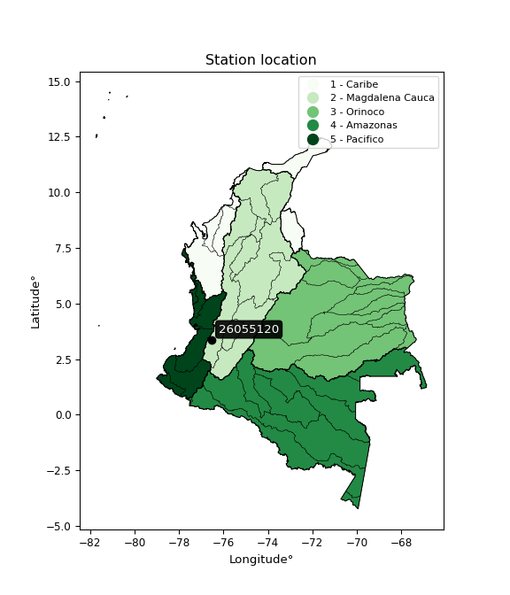

<div align="center">


</div>

# PMP Station (Rain, Pmax24h): 26055120

Probable Maximum Precipitation (PMP) is the greatest amount of rainfall for a specific duration that is meteorologically possible for a given location, acting as a "worst-case" scenario for extreme storms, crucial for designing safety-critical infrastructure like bridges, river deviations, dams, spillways, and nuclear plants to prevent catastrophic failure. PMP is calculated by hydrologists using meteorological data to determine the upper limit of extreme rainfall, often leading to the Probable Maximum Flood (PMF) for flood control design, and is increasingly being studied for climate change impacts. Probable Maximum Precipitation (PMP) is the theoretical upper limit of rainfall, a deterministic estimate for extreme events, while probability distributions (like GEV, Gumbel) describe the likelihood and frequency of various precipitation amounts, including rare ones, showing how often events occur, with PMP representing the extreme end of these distributions, used for critical infrastructure design to ensure safety against the worst conceivable weather, unlike standard statistical forecasts which cover typical probabilities.

The most common probability distributions in hydrology, used for analyzing floods, rainfall, and streamflow, include the Normal, Log-Normal, Gumbel, Gamma (including Log-Pearson Type III), and Generalized Extreme Value (GEV) distributions, often chosen based on the data´s skewness and whether modeling extremes or general conditions, with Gumbel and GEV popular for extreme events like floods, while the Normal distribution serves as a baseline, though often requiring transformations for skewed hydrological data. These distributions help in designing water infrastructure, managing water resources, and forecasting hydrologic events.

> Hydrological data often isn´t perfectly normal (it´s skewed), so different distributions are needed for different applications, such as: **Flood Frequency Analysis**: Using Gumbel, GEV, or Log-Pearson Type III for predicting extreme flood magnitudes and their return periods, **Rainfall Analysis**: Normal for annual totals, but Log-Normal, Weibull, or GEV for intensity or extreme daily rainfall, **Streamflow Modeling**: Gamma and Log-Normal for maximum flows, GEV for minimum flows, and Kappa for daily flows.

<div align="center">

</img>

</div>


## A. General information


### 1. General running parameters

• app_version: _v20260108_. • runtime: _2026-01-09 11:32:22.148588_. • Python version: _3.14.0_. • SciPy version: _1.16.3_. • Pandas version: _2.3.3_. • NumPy version: _2.3.5_. • Stations dataset (station_dataset_file): _dataset/pmax24h_in/automatic_colombia_2003_2024.csv_. • Stations catalog (station_catalog_file): _dataset/CNE.xls_. • Minimum year to eval til year_max (date_min): _1900_. • Maximum year to eval since year_min (date_max): _2024_. • Creates, save and include plots into reports (create_plot): _False_. • Plot only fit distributions with Δo > Δ (plot_only_fit): _True_. • Plot only simple graphs avoiding multiple CDFs and multiple Extreme values plots (plot_only_simple): _True_. • Eval low extreme values, if False, evaluates high extreme values (low_extreme): _False_. • Eval every SciPy distribution as logarithmic (pdist_logarithmic_on): _True_. • Standard deviation normalized (ddof): _1.0_. • Return periods to eval in years (Tr): _[2, 2.33, 5, 10, 15, 20, 25, 50, 75, 100, 200, 250, 500, 750, 1000]_. • Minimum data sample per station, 0 means any (minimum_sample): _5_. • Z-Score maximum threshold to adjust a value, 0 means disable (zscore_max): _3.5_. • Z-Score minimum threshold to adjust a value, 0 means disable (zscore_min): _-2.5_. • Avoid zeros, e.g. rain = 0 (avoid_zeros): _True_. • Avoid null values (avoid_nans): _True_. 

:file_folder:Table: [dataset.csv](../../dataset/pmax24h_in/automatic_colombia_2003_2024.csv)

> Delta Degrees of Freedom (DDOF): is a parameter used in the formulas for calculating variance and standard deviation. When ddof=0, the divisor is $N$ (the total number of observations) and this is used when your data set is the entire population. When ddof=1, the divisor is $N-1$ and this is used when your data set is a sample drawn from a larger population. Using $N-1$ provides an unbiased estimate of the population variance (known as Bessel´s correction).


### 2. Station info and location

|   id |   CODIGO | NOMBRE                                  | CATEGORIA               | TECNOLOGIA                              | ESTADO   | FECHA_INSTALACION   |   FECHA_SUSPENSION |   ALTITUD |   LATITUD |   LONGITUD | DEPARTAMENTO    | MUNICIPIO   | AREA_OPERATIVA                         | ENTIDAD                                                     | AREA_HIDROGRAFICA   | ZONA_HIDROGRAFICA   | SUBZONA_HIDROGRAFICA               |   CORRIENTE | Catalogo   |   Version |
|-----:|---------:|:----------------------------------------|:------------------------|:----------------------------------------|:---------|:--------------------|-------------------:|----------:|----------:|-----------:|:----------------|:------------|:---------------------------------------|:------------------------------------------------------------|:--------------------|:--------------------|:-----------------------------------|------------:|:-----------|----------:|
|    0 | 26055120 | UNIVERSIDAD DEL VALLE  - AUT [26055120] | Climatológica Principal | Automática con Telemetría, Convencional | Activa   | 26/11/2006          |                nan |       996 |     3.378 |   -76.5339 | Valle Del Cauca | Cali        | Area Operativa 09 - Cauca-Valle-Caldas | INSTITUTO DE HIDROLOGIA METEOROLOGIA Y ESTUDIOS AMBIENTALES | Magdalena Cauca     | Cauca               | Ríos Lilí, Melendez y Canaveralejo |         nan | CNE_IDEAM  |  20251226 |

<div align="center">

Dynamic map: [:earth_americas:Google](http://maps.google.com/maps?q=3.378,-76.53388889) [:earth_americas:OSM](https://www.openstreetmap.org/#map=18/3.378/-76.53388889&layers=P) [:earth_americas:Bing](https://www.bing.com/maps?cp=3.378~-76.53388889&lvl=18) [:earth_americas:Apple](https://maps.apple.com/frame?center=3.378%2C-76.53388889&span=0.003%2C0.006)

</div>


<div align="center">

```geojson
{
  "type": "Feature",
  "geometry": {
    "type": "Point", 
    "coordinates": [-76.53388889, 3.378]
  }, 
  "properties": {
    "Name": "26055120"
  }
}
```

</div>


### 3. Discrete values table and plot

<div align="center">

|               |          0 |           1 |           2 |          3 |           4 |           5 |           6 |          7 |           8 |
|:--------------|-----------:|------------:|------------:|-----------:|------------:|------------:|------------:|-----------:|------------:|
| Date          | 2016       | 2017        | 2018        | 2019       | 2020        | 2021        | 2022        | 2023       | 2024        |
| Value         |    1.4     |   58.9      |   60.5      |   69.9     |   64        |   34        |   22.2      |    1.9     |   63.8      |
| Value_initial |    1.4     |   58.9      |   60.5      |   69.9     |   64        |   34        |   22.2      |    1.9     |   63.8      |
| count         |    9       |    9        |    9        |    9       |    9        |    9        |    9        |    9       |    9        |
| mean          |   41.8444  |   41.8444   |   41.8444   |   41.8444  |   41.8444   |   41.8444   |   41.8444   |   41.8444  |   41.8444   |
| std           |   27.5629  |   27.5629   |   27.5629   |   27.5629  |   27.5629   |   27.5629   |   27.5629   |   27.5629  |   27.5629   |
| zscore        |   -1.46735 |    0.618787 |    0.676836 |    1.01787 |    0.803818 |   -0.284602 |   -0.712714 |   -1.44921 |    0.796562 |


</div>


> The initial value (value_initial) correspond to the initial obtained or null completed value, and value (value) is adjusted only when the initial value is outside the valid range (outlier) definite through the Z-Score value. If Z-Score is active, values out of range or outliers are replaced with the station mean value. A Z-Score (or standard score) measures how many standard deviations a data point is from the mean of a dataset, indicating its relative position; positive scores mean above the mean, negative mean below, and a score of zero is exactly at the mean, allowing for comparison of values from different distributions. It´s calculated using the formula $z=(x–μ)/σ$, where $x$ is the data point, $μ$ is the mean, and $σ$ is the standard deviation, helping identify outliers and understand probability.
>
> <sub>**Note**: In this study, "completing" (filling gaps in) and "extending" (forecasting or lengthening the historical record) rainfall data series are avoided for certain critical analyses because they introduce artificial bias and uncertainty, which can distort the statistics of rare events (extremes), alter day-to-day variability, and compromise the integrity and homogeneity of the original data. Some reasons against Completing/Extending rainfall data are: **Distortion of Extremes and Variability**: The primary issue is that most gap-filling or extension methods rely on averaging or regression with nearby stations, which inherently smooths the data. Rainfall is highly variable in space and time, with a large percentage of zero values and occasional large storms. Infilling methods often underestimate the highest values and overestimate the lowest (zero) values, which severely distorts analyses focused on flood frequency, drought severity, and intensity-duration-frequency (IDF) curves, **Loss of Data Homogeneity**: Infilled or extended data are synthetic estimates, not actual measurements. Combining these estimates with observed data can violate the assumption of data homogeneity, which requires that the data properties do not change over time. Inhomogeneity can lead to incorrect conclusions about long-term trends or changes in climate patterns, **Propagation of Errors**: Errors and biases from the original data (e.g., wind-induced undercatch, instrument errors, site changes) or the data used for imputation can propagate through the analysis, leading to unreliable hydrological models and inaccurate predictions, **Compromised Statistical Integrity**: For statistical analyses, especially those involving the frequency of events, using artificial data can introduce time bias or autocorrelation that doesn´t exist in reality, making it difficult to assess the true probability of events, **Difficulty in Validation**: It is difficult to accurately validate the quality of filled or extended data, especially for past periods where ground-truth measurements are unavailable. The reliability of imputation techniques heavily depends on the density of the surrounding station network and the complexity of the local topography.</sub>


### 4. Active continuous probability distributions from SciPy (45 of 104 available)

A Probability Density Function (PDF) describes the relative likelihood of a continuous random variable falling within a specific range, where the total area under its curve equals 1, and the area over any interval gives the actual probability for that range. Unlike discrete probabilities (like rolling a die), a PDF shows density, not direct probability for a single point (which is zero), with higher points indicating higher likelihood, often visualized as a bell curve for normal distributions.

A log of a probability density function (log-PDF) is simply the logarithm of the PDF´s value, denoted as $log(f(x))$, useful for converting multiplication of probabilities into addition, improving numerical stability with tiny numbers, and connecting to information theory concepts like entropy. Instead of dealing with very small probabilities (e.g., 0.000001), log-PDFs use negative numbers (e.g., $log(0.00001) ≈ -11.51$ that are easier for computers to handle, preventing underflow errors and simplifying complex calculations. In this study, each active probability distribution from SciPy is also evaluated in the $log$ form.

[scipy.stats](https://docs.scipy.org/doc/scipy/reference/stats.html) is a Python´s powerful submodule within the SciPy library for comprehensive statistical analysis, offering over 130 probability distributions (like Normal, Poisson), functions for descriptive stats (mean, variance), hypothesis testing (t-tests, chi-square), random variable generation, and statistical tests, making it essential for data science, modeling, and research. It provides tools to explore, model, and draw conclusions from data efficiently, working seamlessly with NumPy.

<div align="center">

|   id | p_dist             |   n_parameter | fit_method   | label                                                                       | active   | ref                                                                                                        |
|-----:|:-------------------|--------------:|:-------------|:----------------------------------------------------------------------------|:---------|:-----------------------------------------------------------------------------------------------------------|
|    0 | alpha              |             3 | MLE          | Alpha                                                                       | True     | [:mortar_board:](https://docs.scipy.org/doc/scipy/reference/generated/scipy.stats.alpha.html)              |
|    1 | betaprime          |             4 | MLE          | Beta prime                                                                  | True     | [:mortar_board:](https://docs.scipy.org/doc/scipy/reference/generated/scipy.stats.betaprime.html)          |
|    2 | chi2               |             3 | MLE          | Chi²                                                                        | True     | [:mortar_board:](https://docs.scipy.org/doc/scipy/reference/generated/scipy.stats.chi2.html)               |
|    3 | crystalball        |             4 | MLE          | Crystalball                                                                 | True     | [:mortar_board:](https://docs.scipy.org/doc/scipy/reference/generated/scipy.stats.crystalball.html)        |
|    4 | dweibull           |             3 | MLE          | Double Weibull                                                              | True     | [:mortar_board:](https://docs.scipy.org/doc/scipy/reference/generated/scipy.stats.dweibull.html)           |
|    5 | erlang             |             3 | MLE          | Erlang                                                                      | True     | [:mortar_board:](https://docs.scipy.org/doc/scipy/reference/generated/scipy.stats.erlang.html)             |
|    6 | expon              |             2 | MLE          | Exponential                                                                 | True     | [:mortar_board:](https://docs.scipy.org/doc/scipy/reference/generated/scipy.stats.expon.html)              |
|    7 | exponnorm          |             3 | MLE          | Exponentially modified Normal                                               | True     | [:mortar_board:](https://docs.scipy.org/doc/scipy/reference/generated/scipy.stats.exponnorm.html)          |
|    8 | f                  |             4 | MLE          | F                                                                           | True     | [:mortar_board:](https://docs.scipy.org/doc/scipy/reference/generated/scipy.stats.f.html)                  |
|    9 | fatiguelife        |             3 | MLE          | Fatigue-life (Birnbaum-Saunders)                                            | True     | [:mortar_board:](https://docs.scipy.org/doc/scipy/reference/generated/scipy.stats.fatiguelife.html)        |
|   10 | fisk               |             3 | MLE          | Fisk                                                                        | True     | [:mortar_board:](https://docs.scipy.org/doc/scipy/reference/generated/scipy.stats.fisk.html)               |
|   11 | gamma              |             3 | MLE          | Gamma                                                                       | True     | [:mortar_board:](https://docs.scipy.org/doc/scipy/reference/generated/scipy.stats.gamma.html)              |
|   12 | genexpon           |             5 | MLE          | Generalized exponential                                                     | True     | [:mortar_board:](https://docs.scipy.org/doc/scipy/reference/generated/scipy.stats.genexpon.html)           |
|   13 | genlogistic        |             3 | MLE          | Generalized logistic                                                        | True     | [:mortar_board:](https://docs.scipy.org/doc/scipy/reference/generated/scipy.stats.genlogistic.html)        |
|   14 | gibrat             |             2 | MM           | Gibrat                                                                      | True     | [:mortar_board:](https://docs.scipy.org/doc/scipy/reference/generated/scipy.stats.gibrat.html)             |
|   15 | gompertz           |             3 | MLE          | Gompertz (or truncated Gumbel)                                              | True     | [:mortar_board:](https://docs.scipy.org/doc/scipy/reference/generated/scipy.stats.gompertz.html)           |
|   16 | gumbel_l           |             2 | MM           | Gumbel Left Skew                                                            | True     | [:mortar_board:](https://docs.scipy.org/doc/scipy/reference/generated/scipy.stats.gumbel_l.html)           |
|   17 | gumbel_r           |             2 | MM           | Gumbel Right Skew                                                           | True     | [:mortar_board:](https://docs.scipy.org/doc/scipy/reference/generated/scipy.stats.gumbel_r.html)           |
|   18 | halflogistic       |             2 | MM           | Half-logistic                                                               | True     | [:mortar_board:](https://docs.scipy.org/doc/scipy/reference/generated/scipy.stats.halflogistic.html)       |
|   19 | halfnorm           |             2 | MM           | Half Normal                                                                 | True     | [:mortar_board:](https://docs.scipy.org/doc/scipy/reference/generated/scipy.stats.halfnorm.html)           |
|   20 | hypsecant          |             2 | MM           | hyperbolic secant                                                           | True     | [:mortar_board:](https://docs.scipy.org/doc/scipy/reference/generated/scipy.stats.hypsecant.html)          |
|   21 | invgamma           |             3 | MLE          | Inverted gamma                                                              | True     | [:mortar_board:](https://docs.scipy.org/doc/scipy/reference/generated/scipy.stats.invgamma.html)           |
|   22 | invgauss           |             3 | MLE          | Inverse Gaussian                                                            | True     | [:mortar_board:](https://docs.scipy.org/doc/scipy/reference/generated/scipy.stats.invgauss.html)           |
|   23 | invweibull         |             3 | MLE          | Inverted Weibull                                                            | True     | [:mortar_board:](https://docs.scipy.org/doc/scipy/reference/generated/scipy.stats.invweibull.html)         |
|   24 | kappa4             |             4 | MLE          | Kappa 4                                                                     | True     | [:mortar_board:](https://docs.scipy.org/doc/scipy/reference/generated/scipy.stats.kappa4.html)             |
|   25 | kstwobign          |             2 | MLE          | Limiting distribution of scaled Kolmogorov-Smirnov two-sided test statistic | True     | [:mortar_board:](https://docs.scipy.org/doc/scipy/reference/generated/scipy.stats.kstwobign.html)          |
|   26 | laplace            |             2 | MM           | Laplace                                                                     | True     | [:mortar_board:](https://docs.scipy.org/doc/scipy/reference/generated/scipy.stats.laplace.html)            |
|   27 | laplace_asymmetric |             3 | MLE          | Asymmetric Laplace                                                          | True     | [:mortar_board:](https://docs.scipy.org/doc/scipy/reference/generated/scipy.stats.laplace_asymmetric.html) |
|   28 | loggamma           |             3 | MLE          | Log gamma                                                                   | True     | [:mortar_board:](https://docs.scipy.org/doc/scipy/reference/generated/scipy.stats.loggamma.html)           |
|   29 | logistic           |             2 | MM           | Logistic (or Sech-squared)                                                  | True     | [:mortar_board:](https://docs.scipy.org/doc/scipy/reference/generated/scipy.stats.logistic.html)           |
|   30 | lognorm            |             3 | MLE          | Log Normal                                                                  | True     | [:mortar_board:](https://docs.scipy.org/doc/scipy/reference/generated/scipy.stats.lognorm.html)            |
|   31 | maxwell            |             2 | MM           | Maxwell                                                                     | True     | [:mortar_board:](https://docs.scipy.org/doc/scipy/reference/generated/scipy.stats.maxwell.html)            |
|   32 | mielke             |             4 | MLE          | Mielke Beta-Kappa / Dagum                                                   | True     | [:mortar_board:](https://docs.scipy.org/doc/scipy/reference/generated/scipy.stats.mielke.html)             |
|   33 | moyal              |             2 | MM           | Moyal                                                                       | True     | [:mortar_board:](https://docs.scipy.org/doc/scipy/reference/generated/scipy.stats.moyal.html)              |
|   34 | nakagami           |             3 | MLE          | Nakagami                                                                    | True     | [:mortar_board:](https://docs.scipy.org/doc/scipy/reference/generated/scipy.stats.nakagami.html)           |
|   35 | ncf                |             5 | MLE          | Non-central F distribution                                                  | True     | [:mortar_board:](https://docs.scipy.org/doc/scipy/reference/generated/scipy.stats.ncf.html)                |
|   36 | nct                |             4 | MLE          | Non-central Student’s t                                                     | True     | [:mortar_board:](https://docs.scipy.org/doc/scipy/reference/generated/scipy.stats.nct.html)                |
|   37 | norm               |             2 | MM           | Normal                                                                      | True     | [:mortar_board:](https://docs.scipy.org/doc/scipy/reference/generated/scipy.stats.norm.html)               |
|   38 | pearson3           |             3 | MM           | Pearson type III                                                            | True     | [:mortar_board:](https://docs.scipy.org/doc/scipy/reference/generated/scipy.stats.pearson3.html)           |
|   39 | rayleigh           |             2 | MM           | Rayleigh                                                                    | True     | [:mortar_board:](https://docs.scipy.org/doc/scipy/reference/generated/scipy.stats.rayleigh.html)           |
|   40 | rice               |             3 | MLE          | Rice                                                                        | True     | [:mortar_board:](https://docs.scipy.org/doc/scipy/reference/generated/scipy.stats.rice.html)               |
|   41 | t                  |             3 | MLE          | Student’s t                                                                 | True     | [:mortar_board:](https://docs.scipy.org/doc/scipy/reference/generated/scipy.stats.t.html)                  |
|   42 | truncnorm          |             4 | MLE          | Truncated normal                                                            | True     | [:mortar_board:](https://docs.scipy.org/doc/scipy/reference/generated/scipy.stats.truncnorm.html)          |
|   43 | wald               |             2 | MM           | Wald                                                                        | True     | [:mortar_board:](https://docs.scipy.org/doc/scipy/reference/generated/scipy.stats.wald.html)               |
|   44 | weibull_min        |             3 | MLE          | Weibull minimum                                                             | True     | [:mortar_board:](https://docs.scipy.org/doc/scipy/reference/generated/scipy.stats.weibull_min.html)        |

</div>

> **n_parameter:** # arguments & localization & scale.
>
> **Fit methods:** (MLE) maximum likelihood, (MM) L-moments.
>
>**Inactive** (With the only purpose of prevent loops, zero divisions, infinite values, over high estimated values or horizontal trending for recurrence intervals estimations, the follow distributions were disabled.)**:** foldnorm, gennorm, norminvgauss, powernorm, powerlognorm, skewnorm, genextreme, anglit, arcsine, argus, beta, bradford, burr, burr12, cauchy, cosine, halfcauchy, foldcauchy, skewcauchy, wrapcauchy, dgamma, gengamma, exponweib, exponpow, truncexpon, gausshyper, genhalflogistic, genhyperbolic, geninvgauss, halfgennorm, johnsonsb, johnsonsu, kappa3, ksone, kstwo, loglaplace, levy, levy_l, levy_stable, ncx2, pareto, genpareto, truncpareto, lomax, powerlaw, rdist, rel_breitwigner, recipinvgauss, semicircular, studentized_range, trapezoid, triang, truncweibull_min, tukeylambda, uniform, loguniform, vonmises, vonmises_line, weibull_max, 


## B. Probability (PDF) vs. Empirical (EDF) distributions functions

A continuous probability distribution (CPD) describes probabilities for variables that can take any value within a range (like rain any time), unlike discrete variables with specific outcomes (like temperature). It uses a Probability Density Function (PDF), a curve where the total area under it equals 1, and the probability of the variable falling within an interval (a to b) is found by calculating the area under the curve between those points. A key feature is that the probability of hitting any single exact value is zero, so probabilities are always expressed for ranges, e.g., $P(a ≤ X ≤ b)$.

<div align="center">

Distributions parameters from station values
|    |   station | p_dist                |   n |             loc |           scale | shape                  | shape1                | shape2                 | shape3   |
|---:|----------:|:----------------------|----:|----------------:|----------------:|:-----------------------|:----------------------|:-----------------------|:---------|
|  0 |  26055120 | alpha                 |   9 |    -0.00447968  |     3.3897      | 2.406960942847283e-09  |                       |                        |          |
|  1 |  26055120 | betaprime             |   9 |  -783.409       | 41101.4         | 996.8997396522739      | 49659.81506889088     |                        |          |
|  2 |  26055120 | chi2                  |   9 |     1.4         |     4.98179     | 0.4559857105363155     |                       |                        |          |
|  3 |  26055120 | crystalball           |   9 |    41.8444      |    25.9865      | 3817.781086279326      | 76.02666714325046     |                        |          |
|  4 |  26055120 | dweibull              |   9 |    40.6652      |    27.1086      | 2.6702027209778145     |                       |                        |          |
|  5 |  26055120 | erlang                |   9 |  -349.215       |     1.81934     | 214.85278179485692     |                       |                        |          |
|  6 |  26055120 | expon                 |   9 |     1.4         |    40.4444      |                        |                       |                        |          |
|  7 |  26055120 | exponnorm             |   9 |    41.825       |    25.9864      | 0.0007539738479501361  |                       |                        |          |
|  8 |  26055120 | f                     |   9 |     1.4         |    47.7594      | 1.1250768409358667     | 970.5220806622882     |                        |          |
|  9 |  26055120 | fatiguelife           |   9 |     1.4         |     0.00118389  | 191.9474559224057      |                       |                        |          |
| 10 |  26055120 | fisk                  |   9 |    -1.59738e+09 |     1.59738e+09 | 100384839.93139009     |                       |                        |          |
| 11 |  26055120 | gamma                 |   9 |  -352.139       |     1.78121     | 221.2792034137609      |                       |                        |          |
| 12 |  26055120 | genexpon              |   9 |     1.39992     |     2.32776     | 0.05744438634710586    | 6.987628454304233e-05 | 2.6892798950600483     |          |
| 13 |  26055120 | genlogistic           |   9 |    69.9001      |     1.03457e-05 | 3.690230724356039e-07  |                       |                        |          |
| 14 |  26055120 | gibrat                |   9 |    22.02        |    12.0241      |                        |                       |                        |          |
| 15 |  26055120 | gompertz              |   9 |    22.2         |     9.09775     | 0.01341353426716204    |                       |                        |          |
| 16 |  26055120 | gumbel_l              |   9 |    53.5398      |    20.2616      |                        |                       |                        |          |
| 17 |  26055120 | gumbel_r              |   9 |    30.1491      |    20.2616      |                        |                       |                        |          |
| 18 |  26055120 | halflogistic          |   9 |    11.0444      |    22.2176      |                        |                       |                        |          |
| 19 |  26055120 | halfnorm              |   9 |     7.44843     |    43.109       |                        |                       |                        |          |
| 20 |  26055120 | hypsecant             |   9 |    41.8444      |    16.5435      |                        |                       |                        |          |
| 21 |  26055120 | invgamma              |   9 |  -244.902       | 30665.4         | 107.93338858040019     |                       |                        |          |
| 22 |  26055120 | invgauss              |   9 |  -123.989       |  5813.38        | 0.028410714652981513   |                       |                        |          |
| 23 |  26055120 | invweibull            |   9 |    -1.43176e+06 |     1.43178e+06 | 55769.776313921975     |                       |                        |          |
| 24 |  26055120 | kappa4                |   9 |    -3.09135     |    77.5043      | 1.06116229864665       | 1.0618281113933803    |                        |          |
| 25 |  26055120 | kstwobign             |   9 |   -59.6247      |   115.442       |                        |                       |                        |          |
| 26 |  26055120 | laplace               |   9 |    41.8444      |    18.3753      |                        |                       |                        |          |
| 27 |  26055120 | laplace_asymmetric    |   9 |    64           |    10.9842      | 2.4287641194727385     |                       |                        |          |
| 28 |  26055120 | loggamma              |   9 |    69.9004      |     2.91272e-05 | 1.0384843170097329e-06 |                       |                        |          |
| 29 |  26055120 | logistic              |   9 |    41.8444      |    14.3271      |                        |                       |                        |          |
| 30 |  26055120 | lognorm               |   9 |     1.4         |     0.344561    | 12.453834168383498     |                       |                        |          |
| 31 |  26055120 | maxwell               |   9 |   -19.7327      |    38.5878      |                        |                       |                        |          |
| 32 |  26055120 | mielke                |   9 |     1.4         |    72.0671      | 0.6564811921688161     | 58.866579002045725    |                        |          |
| 33 |  26055120 | moyal                 |   9 |    26.9837      |    11.6981      |                        |                       |                        |          |
| 34 |  26055120 | nakagami              |   9 |     1.4         |    62.9594      | 0.22459200293366974    |                       |                        |          |
| 35 |  26055120 | ncf                   |   9 |     1.4         |     4.20412     | 0.4021483678507066     | 4031.8505749405986    | 4.599533258433336      |          |
| 36 |  26055120 | nct                   |   9 |    -0.386092    |     0.0767816   | 0.4130685917991359     | 54.73617653466275     |                        |          |
| 37 |  26055120 | norm                  |   9 |    41.8444      |    25.9865      |                        |                       |                        |          |
| 38 |  26055120 | pearson3              |   9 |    41.8445      |    25.9865      | -0.5252647908851406    |                       |                        |          |
| 39 |  26055120 | rayleigh              |   9 |    -7.86932     |    39.6658      |                        |                       |                        |          |
| 40 |  26055120 | rice                  |   9 |   -14.6065      |    29.5148      | 1.559922334442541      |                       |                        |          |
| 41 |  26055120 | t                     |   9 |    41.8472      |    25.9864      | 3985165.545911899      |                       |                        |          |
| 42 |  26055120 | truncnorm             |   9 |   -27.0566      |    14.0274      | -14.626653840595269    | 6.911943597775423     |                        |          |
| 43 |  26055120 | wald                  |   9 |    15.8579      |    25.9865      |                        |                       |                        |          |
| 44 |  26055120 | weibull_min           |   9 |    -1.48013e+09 |     1.48013e+09 | 76017324.89271694      |                       |                        |          |
| 45 |  26055120 | logalpha              |   9 |     0.00121257  |     0.874767    | 8.711642940947888e-09  |                       |                        |          |
| 46 |  26055120 | logbetaprime          |   9 |   -19.1665      |   114.233       | 248.28500374794214     | 1272.6770880935214    |                        |          |
| 47 |  26055120 | logchi2               |   9 |   -13.7665      |     0.0715444   | 235.85256915122545     |                       |                        |          |
| 48 |  26055120 | logcrystalball        |   9 |     3.14944     |     1.46623     | 676.7734104087406      | 6.8085867061876915    |                        |          |
| 49 |  26055120 | logdweibull           |   9 |     4.15575     |     1.65238     | 0.4003396346285493     |                       |                        |          |
| 50 |  26055120 | logerlang             |   9 |   -16.4129      |     0.123556    | 158.20958228809934     |                       |                        |          |
| 51 |  26055120 | logexpon              |   9 |     0.336472    |     2.81297     |                        |                       |                        |          |
| 52 |  26055120 | logexponnorm          |   9 |     3.14848     |     1.46624     | 0.0006565023599050235  |                       |                        |          |
| 53 |  26055120 | logf                  |   9 |  -774.047       |   777.197       | 612008.2682532207      | 7019888.626129424     |                        |          |
| 54 |  26055120 | logfatiguelife        |   9 |  -780.619       |   783.763       | 0.0018648965833067102  |                       |                        |          |
| 55 |  26055120 | logfisk               |   9 |    -2.43651e+08 |     2.43651e+08 | 334722975.9075001      |                       |                        |          |
| 56 |  26055120 | loggamma              |   9 |   -19.2091      |     0.106316    | 210.03842230759483     |                       |                        |          |
| 57 |  26055120 | loggenexpon           |   9 |     0.217674    |     0.0116727   | 0.001281636363845826   | 6.942768582412485     | 2.4769808976498935e-06 |          |
| 58 |  26055120 | loggenlogistic        |   9 |     4.24709     |     2.07955e-06 | 1.8910481714257058e-06 |                       |                        |          |
| 59 |  26055120 | loggibrat             |   9 |     2.03086     |     0.678447    |                        |                       |                        |          |
| 60 |  26055120 | loggompertz           |   9 |     0.336472    |     0.970096    | 0.03076078602000624    |                       |                        |          |
| 61 |  26055120 | loggumbel_l           |   9 |     3.80932     |     1.14322     |                        |                       |                        |          |
| 62 |  26055120 | loggumbel_r           |   9 |     2.48956     |     1.14322     |                        |                       |                        |          |
| 63 |  26055120 | loghalflogistic       |   9 |     1.4116      |     1.25358     |                        |                       |                        |          |
| 64 |  26055120 | loghalfnorm           |   9 |     1.20869     |     2.43236     |                        |                       |                        |          |
| 65 |  26055120 | loghypsecant          |   9 |     3.14944     |     0.933432    |                        |                       |                        |          |
| 66 |  26055120 | loginvgamma           |   9 |   -29.5679      | 15275.9         | 467.7944741996914      |                       |                        |          |
| 67 |  26055120 | loginvgauss           |   9 |    -9.24632     |   727.322       | 0.017023922565215163   |                       |                        |          |
| 68 |  26055120 | loginvweibull         |   9 |    -1.82431e+08 |     1.82431e+08 | 110984368.45244351     |                       |                        |          |
| 69 |  26055120 | logkappa4             |   9 |    -0.0427508   |     4.82799     | 1.0856869566341314     | 1.118340784071822     |                        |          |
| 70 |  26055120 | logkstwobign          |   9 |    -3.3735      |     7.42725     |                        |                       |                        |          |
| 71 |  26055120 | loglaplace            |   9 |     3.14944     |     1.03678     |                        |                       |                        |          |
| 72 |  26055120 | loglaplace_asymmetric |   9 |     4.24707     |     0.0128537   | 85.29669895624136      |                       |                        |          |
| 73 |  26055120 | logloggamma           |   9 |     4.24712     |     5.18882e-06 | 4.733873789339063e-06  |                       |                        |          |
| 74 |  26055120 | loglogistic           |   9 |     3.14944     |     0.808376    |                        |                       |                        |          |
| 75 |  26055120 | loglognorm            |   9 |     0.336472    |     0.0366788   | 12.089472032319676     |                       |                        |          |
| 76 |  26055120 | logmaxwell            |   9 |    -0.324913    |     2.17723     |                        |                       |                        |          |
| 77 |  26055120 | logmielke             |   9 |    -1.12193e+08 |     1.12193e+08 | 91651136.90877384      | 28358515438.409218    |                        |          |
| 78 |  26055120 | logmoyal              |   9 |     2.31096     |     0.660036    |                        |                       |                        |          |
| 79 |  26055120 | lognakagami           |   9 | -1121.85        |  1125           | 146632.53333580308     |                       |                        |          |
| 80 |  26055120 | logncf                |   9 |   -68.0401      |    70.8417      | 8635.918151671576      | 9351.755918431732     | 40.64027594541142      |          |
| 81 |  26055120 | lognct                |   9 |   -87.8378      |     1.44821     | 73019.10479562246      | 62.826193572468185    |                        |          |
| 82 |  26055120 | lognorm               |   9 |     3.14944     |     1.46623     |                        |                       |                        |          |
| 83 |  26055120 | logpearson3           |   9 |     3.14944     |     1.46624     | -1.1611666026095229    |                       |                        |          |
| 84 |  26055120 | lograyleigh           |   9 |     0.344496    |     2.23803     |                        |                       |                        |          |
| 85 |  26055120 | logrice               |   9 |    -0.668492    |     1.58945     | 2.149585370258981      |                       |                        |          |
| 86 |  26055120 | logt                  |   9 |     3.14944     |     1.46623     | 11424005645.074894     |                       |                        |          |
| 87 |  26055120 | logtruncnorm          |   9 |     1.3997      |     2.93657     | -0.3621154796733872    | 57.68698736373183     |                        |          |
| 88 |  26055120 | logwald               |   9 |     1.68322     |     1.46622     |                        |                       |                        |          |
| 89 |  26055120 | logweibull_min        |   9 |    -1.30019e+08 |     1.30019e+08 | 148522092.41894174     |                       |                        |          |

</div>

> **loc** (Location parameter): This shifts the distribution along the x-axis. For many common distributions, like the normal (Gaussian) distribution, loc represents the mean $μ$. For others, like the uniform distribution, it might represent the minimum value, or for the beta distribution, the left end of the support interval.
>
> **scale** (Scale parameter): This determines the width or spread of the distribution. For the normal distribution, scale represents the standard deviation $σ$. For a uniform distribution, it defines the length of the interval (from $loc$ to $loc + scale$).
>
> **shape** (Shape parameters): Refers to parameters that define the specific form of a probability distribution, distinct from its location (loc) and scale (scale). These parameters are required arguments for most distribution functions. For example, a normal (Gaussian) distribution is fully defined by its location (mean) and scale (standard deviation), so it has no specific shape parameters beyond loc and scale. However, other distributions have intrinsic properties that need specification, as Gamma distribution that takes a shape parameter, often named $a$ or $alpha$.


### 0. Cumulative distribution values - CDF (90 evaluated)

Cumulative Distribution Function (CDF), denoted as $F$<sub>$X$</sub>$(x)$, is a function that gives the probability that a random variable $X$ will take a value less than or equal to a specific value, $x$ (i.e., $(P(X≥x)$. It essentially "accumulates" probabilities from a given point up to the far right (positive infinity), providing a complete picture of the distribution´s probabilities for both discrete (like rain) and continuous (like temperature) variables, helping to find probabilities over ranges or above certain values. Each station is evaluated separately ordering the $x$ values ascending, calculating the CDF and PDF values for the activated distributions and their logarithmic forms.

<div align="center">

CDF ordered by x ascending and calculating $log(f(x))$ separately
|   id |   Station |   date |    x |   count |    mean |     std |    zscore |   Value_initial |   station |   m |     alpha |   alpha_pdf |   betaprime |   betaprime_pdf |        chi2 |    chi2_pdf |   crystalball |   crystalball_pdf |   dweibull |   dweibull_pdf |    erlang |   erlang_pdf |     expon |   expon_pdf |   exponnorm |   exponnorm_pdf |           f |           f_pdf |   fatiguelife |   fatiguelife_pdf |      fisk |   fisk_pdf |     gamma |   gamma_pdf |    genexpon |   genexpon_pdf |   genlogistic |   genlogistic_pdf |    gibrat |   gibrat_pdf |    gompertz |   gompertz_pdf |   gumbel_l |   gumbel_l_pdf |   gumbel_r |   gumbel_r_pdf |   halflogistic |   halflogistic_pdf |   halfnorm |   halfnorm_pdf |   hypsecant |   hypsecant_pdf |   invgamma |   invgamma_pdf |   invgauss |   invgauss_pdf |   invweibull |   invweibull_pdf |      kappa4 |   kappa4_pdf |   kstwobign |   kstwobign_pdf |   laplace |   laplace_pdf |   laplace_asymmetric |   laplace_asymmetric_pdf |   loggamma |   loggamma_pdf |   logistic |   logistic_pdf |   lognorm |   lognorm_pdf |   maxwell |   maxwell_pdf |      mielke |   mielke_pdf |      moyal |   moyal_pdf |    nakagami |   nakagami_pdf |         ncf |     ncf_pdf |       nct |    nct_pdf |      norm |   norm_pdf |   pearson3 |   pearson3_pdf |   rayleigh |   rayleigh_pdf |      rice |   rice_pdf |         t |      t_pdf |   truncnorm |   truncnorm_pdf |     wald |   wald_pdf |   weibull_min |   weibull_min_pdf |   logalpha |   logalpha_pdf |   logbetaprime |   logbetaprime_pdf |   logchi2 |   logchi2_pdf |   logcrystalball |   logcrystalball_pdf |   logdweibull |   logdweibull_pdf |   logerlang |   logerlang_pdf |   logexpon |   logexpon_pdf |   logexponnorm |   logexponnorm_pdf |      logf |   logf_pdf |   logfatiguelife |   logfatiguelife_pdf |   logfisk |   logfisk_pdf |   loggenexpon |   loggenexpon_pdf |   loggenlogistic |   loggenlogistic_pdf |   loggibrat |   loggibrat_pdf |   loggompertz |   loggompertz_pdf |   loggumbel_l |   loggumbel_l_pdf |   loggumbel_r |   loggumbel_r_pdf |   loghalflogistic |   loghalflogistic_pdf |   loghalfnorm |   loghalfnorm_pdf |   loghypsecant |   loghypsecant_pdf |   loginvgamma |   loginvgamma_pdf |   loginvgauss |   loginvgauss_pdf |   loginvweibull |   loginvweibull_pdf |   logkappa4 |   logkappa4_pdf |   logkstwobign |   logkstwobign_pdf |   loglaplace |   loglaplace_pdf |   loglaplace_asymmetric |   loglaplace_asymmetric_pdf |   logloggamma |   logloggamma_pdf |   loglogistic |   loglogistic_pdf |   loglognorm |   loglognorm_pdf |   logmaxwell |   logmaxwell_pdf |   logmielke |   logmielke_pdf |    logmoyal |   logmoyal_pdf |   lognakagami |   lognakagami_pdf |    logncf |   logncf_pdf |    lognct |   lognct_pdf |   logpearson3 |   logpearson3_pdf |   lograyleigh |   lograyleigh_pdf |   logrice |   logrice_pdf |      logt |   logt_pdf |   logtruncnorm |   logtruncnorm_pdf |   logwald |   logwald_pdf |   logweibull_min |   logweibull_min_pdf |
|-----:|----------:|-------:|-----:|--------:|--------:|--------:|----------:|----------------:|----------:|----:|----------:|------------:|------------:|----------------:|------------:|------------:|--------------:|------------------:|-----------:|---------------:|----------:|-------------:|----------:|------------:|------------:|----------------:|------------:|----------------:|--------------:|------------------:|----------:|-----------:|----------:|------------:|------------:|---------------:|--------------:|------------------:|----------:|-------------:|------------:|---------------:|-----------:|---------------:|-----------:|---------------:|---------------:|-------------------:|-----------:|---------------:|------------:|----------------:|-----------:|---------------:|-----------:|---------------:|-------------:|-----------------:|------------:|-------------:|------------:|----------------:|----------:|--------------:|---------------------:|-------------------------:|-----------:|---------------:|-----------:|---------------:|----------:|--------------:|----------:|--------------:|------------:|-------------:|-----------:|------------:|------------:|---------------:|------------:|------------:|----------:|-----------:|----------:|-----------:|-----------:|---------------:|-----------:|---------------:|----------:|-----------:|----------:|-----------:|------------:|----------------:|---------:|-----------:|--------------:|------------------:|-----------:|---------------:|---------------:|-------------------:|----------:|--------------:|-----------------:|---------------------:|--------------:|------------------:|------------:|----------------:|-----------:|---------------:|---------------:|-------------------:|----------:|-----------:|-----------------:|---------------------:|----------:|--------------:|--------------:|------------------:|-----------------:|---------------------:|------------:|----------------:|--------------:|------------------:|--------------:|------------------:|--------------:|------------------:|------------------:|----------------------:|--------------:|------------------:|---------------:|-------------------:|--------------:|------------------:|--------------:|------------------:|----------------:|--------------------:|------------:|----------------:|---------------:|-------------------:|-------------:|-----------------:|------------------------:|----------------------------:|--------------:|------------------:|--------------:|------------------:|-------------:|-----------------:|-------------:|-----------------:|------------:|----------------:|------------:|---------------:|--------------:|------------------:|----------:|-------------:|----------:|-------------:|--------------:|------------------:|--------------:|------------------:|----------:|--------------:|----------:|-----------:|---------------:|-------------------:|----------:|--------------:|-----------------:|---------------------:|
|    0 |  26055120 |   2016 |  1.4 |       9 | 41.8444 | 27.5629 | -1.46735  |             1.4 |  26055120 |   1 | 0.0158004 | 0.0745073   |   0.0615331 |      0.00476276 | 0.000175326 | 1.80023e+11 |     0.0598111 |        0.00457272 |  0.0339645 |     0.00621155 | 0.0614639 |   0.00489518 | 0         |  0.0247253  |   0.0598093 |      0.00457264 | 1.44465e-10 | 365994          |      0.027072 |       6.94166e+06 | 0.0631203 | 0.00371632 | 0.0586779 |  0.00475106 | 1.86699e-06 |     0.024678   |      0        |        0.00309856 | 0         |  0           | 0           |     0          |  0.0734445 |     0.00348831 |  0.0160419 |     0.0032719  |       0        |         0          |   0        |     0          |   0.0550888 |      0.00331333 |  0.0603797 |     0.00529733 |  0.0591585 |     0.00564823 |    0.057806  |       0.00641872 | 0.000693348 |    0.0202067 |   0.0573528 |      0.00735879 | 0.0553447 |    0.00301191 |            0.0818315 |               0.00306737 |  0.0310691 |      0.0496993 |  0.0560977 |     0.00369584 | 0.0275237 |     0.0431981 | 0.0399574 |    0.00533795 | 2.16595e-07 |  27.9743     | 0.00283851 |  0.00118372 | 1.13472e-08 |    2.29548e+07 | 0.000109588 | 8.62942e+08 | 0.0439146 | 0.0826921  | 0.0598111 | 0.00457272 |  0.0709281 |     0.00415885 |  0.026935  |     0.00573266 | 0.0441492 | 0.00557745 | 0.0597978 | 0.00457194 |    0.978753 |     0.00363319  | 0        | 0          |     0.0651866 |        0.00323631 |  0.0090748 |      0.206406  |      0.0302184 |          0.0490691 | 0.0314179 |     0.0513096 |        0.0275237 |            0.0431981 |      0.12348  |       0.0181015   |   0.0309055 |       0.0497669 |   0        |      0.355496  |      0.0275241 |          0.0431985 | 0.0272744 |  0.0430216 |        0.0271617 |            0.0430122 | 0.0132063 |     0.017903  |     0.0138378 |          0.123065 |         0        |            0.0259611 |    0        |       0         |   4.71094e-09 |         0.031709  |     0.0468097 |         0.039972  |    0.00139404 |        0.00801821 |          0        |              0        |      0        |          0        |      0.0312429 |          0.0334173 |     0.0257725 |         0.0446599 |     0.0281472 |         0.0521527 |       0.0336075 |            0.069372 | 2.01657e-15 |        3.79893  |      0.0357409 |           0.085635 |    0.0331631 |        0.0319865 |               0.0282413 |                   0.0257587 |     0.0282189 |         0.0257447 |     0.0298931 |         0.0358738 |    0.0023814 |       1.1067e+13 |   0.00725236 |        0.0322923 |   0.040521  |       0.0331018 | 8.09595e-06 |     0.00012777 |     0.0277078 |         0.0433947 | 0.0287415 |    0.0454704 | 0.0275961 |    0.0433192 |     0.049084  |         0.0423426 |    0          |         0         | 0.0223054 |     0.0490599 | 0.0275236 |  0.0431979 |    2.88902e-05 |           0.19838  |  0        |      0        |        0.0196298 |            0.0222018 |
|    1 |  26055120 |   2023 |  1.9 |       9 | 41.8444 | 27.5629 | -1.44921  |             1.9 |  26055120 |   2 | 0.0750993 | 0.152985    |   0.0639502 |      0.00490581 | 0.549673    | 0.240586    |     0.0621319 |        0.00471085 |  0.0371807 |     0.00665573 | 0.0639486 |   0.00504389 | 0.0122865 |  0.0244215  |   0.0621301 |      0.00471077 | 0.0624063   |      0.0699473  |      0.542531 |       0.0425703   | 0.0650042 | 0.00381954 | 0.0610902 |  0.00489873 | 0.0122686   |     0.0243882  |      0        |        0.00315432 | 0         |  0           | 0           |     0          |  0.0752087 |     0.00356866 |  0.017742  |     0.00353045 |       0        |         0          |   0        |     0          |   0.0567703 |      0.00341341 |  0.0630704 |     0.00546586 |  0.0620296 |     0.0058367  |    0.0610733 |       0.00665071 | 0.00971466  |    0.0172012 |   0.061101  |      0.00763406 | 0.0568713 |    0.00309499 |            0.0833796 |               0.0031254  |  0.0494962 |      0.0718357 |  0.0579745 |     0.00381189 | 0.0436121 |     0.0630347 | 0.0426801 |    0.00555351 | 0.0382657   |   0.0502415  | 0.00348242 |  0.00139607 | 0.0893305   |    0.0802507   | 0.0537264   | 0.025916    | 0.0882041 | 0.0910669  | 0.0621319 | 0.00471085 |  0.0730335 |     0.00426309 |  0.0298742 |     0.00602364 | 0.0469831 | 0.00575794 | 0.0621182 | 0.00471006 |    0.980505 |     0.0033776   | 0        | 0          |     0.0668243 |        0.00331468 |  0.17211   |      0.669481  |      0.0484579 |          0.0712464 | 0.0504703 |     0.0743319 |        0.0436121 |            0.0630347 |      0.129278 |       0.0199227   |   0.049364  |       0.0719687 |   0.102877 |      0.318924  |      0.0436127 |          0.0630352 | 0.0433124 |  0.0628864 |        0.0432086 |            0.0629612 | 0.0199527 |     0.0268636 |     0.0562828 |          0.154141 |         0        |            0.034271  |    0        |       0         |   0.0113163   |         0.0429491 |     0.0607    |         0.0514507 |    0.00651209 |        0.0286757  |          0        |              0        |      0        |          0        |      0.0433026 |          0.0462478 |     0.0426275 |         0.0666756 |     0.0478534 |         0.0778473 |       0.0597411 |            0.102409 | 0.0859341   |        0.260313 |      0.0680807 |           0.126181 |    0.044522  |        0.0429425 |               0.0373123 |                   0.0340323 |     0.0372853 |         0.0340162 |     0.0430246 |         0.0509336 |    0.569581  |       0.106411   |   0.0219548  |        0.0654723 |   0.0520023 |       0.042481  | 0.000398655 |     0.00405291 |     0.0438601 |         0.0632537 | 0.0456469 |    0.0661059 | 0.0437278 |    0.0631976 |     0.0637285 |         0.0539835 |    0.00878783 |         0.0588457 | 0.0406099 |     0.0715665 | 0.0436119 |  0.0630345 |    0.0616532   |           0.204881 |  0        |      0        |        0.0277093 |            0.03121   |
|    2 |  26055120 |   2022 | 22.2 |       9 | 41.8444 | 27.5629 | -0.712714 |            22.2 |  26055120 |   3 | 0.878668  | 0.005422    |   0.231501  |      0.0117355  | 0.986296    | 0.00176392  |     0.224841  |        0.0115364  |  0.349291  |     0.0181181  | 0.235763  |   0.0119434  | 0.402072  |  0.0147839  |   0.224838  |      0.0115364  | 0.467483    |      0.0107781  |      0.755063 |       0.00521794  | 0.199349  | 0.0100304  | 0.230281  |  0.0118682  | 0.401843    |     0.0147793  |      0        |        0.00650688 | 1.325e-05 |  0.000325199 | 2.17879e-09 |     0.00147438 |  0.191794  |     0.00849378 |  0.227543  |     0.0166254  |       0.24591  |         0.0211438  |   0.267794 |     0.017456   |   0.188464  |      0.010738   |  0.248237  |     0.0125678  |  0.260042  |     0.0132373  |    0.281424  |       0.0138985  | 0.310572    |    0.0142067 |   0.30345   |      0.0145053  | 0.171664  |    0.00934211 |            0.178454  |               0.00668915 |  0.503665  |      0.259037  |  0.202436  |     0.0112692  | 0.486576  |     0.271933  | 0.242407  |    0.0135292  | 0.442297    |   0.0139596  | 0.219872   |  0.0197126  | 0.4746      |    0.0100458   | 0.290504    | 0.0108137   | 0.607182  | 0.00714161 | 0.224841  | 0.0115364  |  0.212624  |     0.00989091 |  0.249737  |     0.0143385  | 0.236579  | 0.0126224  | 0.224808  | 0.0115355  |    0.999777 |     5.97639e-05 | 0.106557 | 0.0394894  |     0.178134  |        0.00828064 |  0.777725  |      0.0698425 |      0.501346  |          0.258136  | 0.510352  |     0.256671  |        0.486575  |            0.271933  |      0.216765 |       0.0687057   |   0.501669  |       0.25696   |   0.62561  |      0.133094  |      0.486576  |          0.271932  | 0.486664  |  0.272188  |        0.488021  |            0.272834  | 0.373517  |     0.321467  |     0.568591  |          0.204269 |         0        |            0.320443  |    0.675407 |       0.336436  |   0.393708    |         0.331962  |     0.415933  |         0.27473   |    0.556423   |        0.285326   |          0.587255 |              0.261304 |      0.563195 |          0.242444 |      0.48318   |          0.340534  |     0.497235  |         0.264072  |     0.517143  |         0.247946  |       0.531765  |            0.204312 | 0.683022    |        0.245614 |      0.566887  |           0.196854 |    0.476759  |        0.459845  |               0.35124   |                   0.320364  |     0.351181  |         0.320391  |     0.484743  |         0.308974  |    0.639645  |       0.0112013  |   0.520111   |        0.26314   |   0.387392  |       0.316463  | 0.582305    |     0.285779   |     0.486659  |         0.271435  | 0.490859  |    0.265624  | 0.486909  |    0.271683  |     0.409834  |         0.25936   |    0.531398   |         0.257803  | 0.496773  |     0.264449  | 0.486575  |  0.271933  |    0.561435    |           0.179125 |  0.65433  |      0.286258 |        0.372396  |            0.333974  |
|    3 |  26055120 |   2021 | 34   |       9 | 41.8444 | 27.5629 | -0.284602 |            34   |  26055120 |   4 | 0.920595  | 0.0023274   |   0.389063  |      0.0146193  | 0.996815    | 0.000381484 |     0.381377  |        0.0146681  |  0.488334  |     0.00461858 | 0.394741  |   0.0146264  | 0.553379  |  0.0110428  |   0.381375  |      0.0146682  | 0.57473     |      0.00770512 |      0.806338 |       0.00364057  | 0.343256  | 0.0141669  | 0.389047  |  0.014668   | 0.553116    |     0.0110416  |      0        |        0.00991211 | 0.498533  |  0.0333004   | 0.0350302   |     0.00520492 |  0.316974  |     0.0128511  |  0.437398  |     0.017851   |       0.475079 |         0.0174254  |   0.462051 |     0.0153108  |   0.354425  |      0.0172634  |  0.411     |     0.0145753  |  0.428343  |     0.0147949  |    0.449014  |       0.0140039  | 0.477174    |    0.0140693 |   0.473662  |      0.0139196  | 0.326264  |    0.0177556  |            0.277727  |               0.0104103  |  0.611885  |      0.245675  |  0.366439  |     0.0162043  | 0.601437  |     0.263243  | 0.414837  |    0.0152062  | 0.594059    |   0.0119628  | 0.458756   |  0.0192024  | 0.577017    |    0.00756811  | 0.413967    | 0.010029    | 0.669561  | 0.00395931 | 0.381377  | 0.0146681  |  0.351466  |     0.0135435  |  0.427129  |     0.0152447  | 0.400392  | 0.0147735  | 0.381337  | 0.0146677  |    0.999993 |     2.18739e-06 | 0.514545 | 0.0246553  |     0.30206   |        0.0128907  |  0.804018  |      0.0544636 |      0.609174  |          0.244782  | 0.617155  |     0.241556  |        0.601437  |            0.263243  |      0.253438 |       0.109537    |   0.609022  |       0.243771  |   0.678254 |      0.114379  |      0.601436  |          0.263243  | 0.601605  |  0.263355  |        0.603164  |            0.263636  | 0.517103  |     0.343043  |     0.651457  |          0.183773 |         0        |            0.472168  |    0.785356 |       0.195191  |   0.547731    |         0.384269  |     0.541933  |         0.312829  |    0.6678     |        0.235857   |          0.687651 |              0.210252 |      0.659333 |          0.208334 |      0.625177  |          0.31498   |     0.607498  |         0.250073  |     0.619318  |         0.229103  |       0.614289  |            0.182106 | 0.789388    |        0.254445 |      0.646036  |           0.174083 |    0.652397  |        0.335271  |               0.518151  |                   0.472603  |     0.518115  |         0.472688  |     0.6145    |         0.293044  |    0.644076  |       0.00966274 |   0.627835   |        0.239878  |   0.548758  |       0.448284  | 0.690456    |     0.222354   |     0.601304  |         0.26275   | 0.602622  |    0.255344  | 0.60164   |    0.262894  |     0.529437  |         0.29977   |    0.636019   |         0.231222  | 0.607711  |     0.25282   | 0.601436  |  0.263244  |    0.634419    |           0.162959 |  0.75362  |      0.188042 |        0.531434  |            0.40576   |
|    4 |  26055120 |   2017 | 58.9 |       9 | 41.8444 | 27.5629 |  0.618787 |            58.9 |  26055120 |   5 | 0.95411   | 0.00077819  |   0.744727  |      0.0120032  | 0.99982     | 2.02241e-05 |     0.744192  |        0.0123772  |  0.646554  |     0.0179532  | 0.745138  |   0.0116957  | 0.758697  |  0.00596627 |   0.744192  |      0.0123773  | 0.721142    |      0.00448317 |      0.87454  |       0.00206053  | 0.714223  | 0.0128269  | 0.742481  |  0.0118443  | 0.758452    |     0.00596817 |      0        |        0.024093   | 0.868804  |  0.00577248  | 0.524906    |     0.0395656  |  0.728243  |     0.0174743  |  0.785087  |     0.00937535 |       0.792076 |         0.00838562 |   0.767335 |     0.00907918 |   0.781892  |      0.0121762  |  0.744132  |     0.0107561  |  0.755217  |     0.0102407  |    0.738178  |       0.00872835 | 0.830815    |    0.0145698 |   0.757531  |      0.0085793  | 0.802364  |    0.0107556  |            0.706265  |               0.0264736  |  0.736884  |      0.205962  |  0.766819  |     0.0124803  | 0.736249  |     0.222855  | 0.754537  |    0.0107671  | 0.862223    |   0.00984403 | 0.798266   |  0.00843642 | 0.728137    |    0.00487566  | 0.632589    | 0.00743012  | 0.736049  | 0.00183747 | 0.744192  | 0.0123772  |  0.728852  |     0.0144521  |  0.757497  |     0.0102911  | 0.747655  | 0.0115109  | 0.744159  | 0.0123781  |    1        |     1.99602e-10 | 0.839118 | 0.00632369 |     0.725255  |        0.0182295  |  0.830012  |      0.0410817 |      0.733775  |          0.205477  | 0.739635  |     0.201241  |        0.736249  |            0.222855  |      0.37137  |       0.553321    |   0.73319   |       0.204939  |   0.735346 |      0.0940835 |      0.736248  |          0.222854  | 0.736426  |  0.222784  |        0.737991  |            0.222535  | 0.694937  |     0.291241  |     0.744045  |          0.152693 |         0        |            0.778217  |    0.86506  |       0.106139  |   0.75865     |         0.36131   |     0.717067  |         0.312466  |    0.779047   |        0.170147   |          0.786676 |              0.152021 |      0.761504 |          0.163755 |      0.774025  |          0.222262  |     0.734472  |         0.208688  |     0.734768  |         0.189035  |       0.705516  |            0.14972  | 0.936125    |        0.288544 |      0.733175  |           0.143092 |    0.795397  |        0.197345  |               0.855294  |                   0.780109  |     0.855341  |         0.780346  |     0.75878   |         0.226421  |    0.648962  |       0.00820221 |   0.747623   |        0.194145  |   0.859656  |       0.702258  | 0.792826    |     0.153366   |     0.735887  |         0.222537  | 0.733216  |    0.215961  | 0.736256  |    0.222515  |     0.702041  |         0.319766  |    0.750889   |         0.185579  | 0.736776  |     0.213161  | 0.736248  |  0.222855  |    0.71769     |           0.139838 |  0.835032 |      0.115498 |        0.758304  |            0.392071  |
|    5 |  26055120 |   2018 | 60.5 |       9 | 41.8444 | 27.5629 |  0.676836 |            60.5 |  26055120 |   6 | 0.955323  | 0.000737641 |   0.763536  |      0.0115051  | 0.999849    | 1.68626e-05 |     0.763588  |        0.0118645  |  0.676115  |     0.0189329  | 0.763462  |   0.0112071  | 0.768057  |  0.00573485 |   0.763588  |      0.0118646  | 0.728206    |      0.00434699 |      0.877785 |       0.00199551  | 0.734297  | 0.0122611  | 0.76104   |  0.0113517  | 0.767815    |     0.00573684 |      0        |        0.0255081  | 0.87763   |  0.00527055  | 0.589314    |     0.0407781  |  0.755832  |     0.0169904  |  0.799644  |     0.00882412 |       0.805115 |         0.00791693 |   0.781542 |     0.00867979 |   0.800651  |      0.0112775  |  0.760978  |     0.0102994  |  0.771236  |     0.00978303 |    0.751842  |       0.0083528  | 0.854211    |    0.0146788 |   0.77097   |      0.00822022 | 0.818845  |    0.00985865 |            0.749919  |               0.0281099  |  0.742373  |      0.203582  |  0.786191  |     0.0117326  | 0.742187  |     0.220259  | 0.771385  |    0.0102926  | 0.877899    |   0.00975159 | 0.811341   |  0.00791173 | 0.735838    |    0.00475201  | 0.644335    | 0.00725262  | 0.738934  | 0.0017697  | 0.763588  | 0.0118645  |  0.75162   |     0.0139984  |  0.7736    |     0.00983792 | 0.765694  | 0.0110356  | 0.763557  | 0.0118654  |    1        |     9.85804e-11 | 0.848866 | 0.00586844 |     0.754033  |        0.0177178  |  0.831106  |      0.0405587 |      0.73925   |          0.203127  | 0.744997  |     0.19888   |        0.742187  |            0.220259  |      0.388415 |       0.739382    |   0.738652  |       0.202615  |   0.737856 |      0.0931913 |      0.742187  |          0.220258  | 0.742362  |  0.220182  |        0.74392   |            0.219908  | 0.702687  |     0.287008  |     0.748116  |          0.151115 |         0        |            0.797417  |    0.867866 |       0.103263  |   0.768271    |         0.356624  |     0.725415  |         0.31044   |    0.783568   |        0.167169   |          0.790716 |              0.149479 |      0.765864 |          0.161632 |      0.779917  |          0.217437  |     0.740033  |         0.206222  |     0.739805  |         0.186821  |       0.709508  |            0.148132 | 0.943914    |        0.292799 |      0.73699   |           0.141597 |    0.800618  |        0.192308  |               0.87646   |                   0.799415  |     0.876514  |         0.799663  |     0.764796  |         0.222524  |    0.649181  |       0.008142   |   0.752793   |        0.191673  |   0.878686  |       0.717804  | 0.796898    |     0.15049    |     0.741817  |         0.219953  | 0.738971  |    0.213494  | 0.742185  |    0.219924  |     0.710604  |         0.319204  |    0.755831   |         0.183203  | 0.742456  |     0.210714  | 0.742187  |  0.220259  |    0.721422    |           0.138673 |  0.838094 |      0.112934 |        0.768742  |            0.386801  |
|    6 |  26055120 |   2024 | 63.8 |       9 | 41.8444 | 27.5629 |  0.796562 |            63.8 |  26055120 |   7 | 0.957631  | 0.000663417 |   0.799739  |      0.0104263  | 0.999896    | 1.16109e-05 |     0.800912  |        0.0107438  |  0.740256  |     0.0196339  | 0.798727  |   0.010158   | 0.786231  |  0.00528551 |   0.800912  |      0.0107438  | 0.742109    |      0.0040831  |      0.88416  |       0.00186993  | 0.772752  | 0.0110357  | 0.796765  |  0.0102917  | 0.785995    |     0.00528764 |      0        |        0.0286944  | 0.893526  |  0.00439629  | 0.723323    |     0.0394839  |  0.809725  |     0.0155822  |  0.826973  |     0.00775412 |       0.829724 |         0.00701152 |   0.808851 |     0.00787633 |   0.834946  |      0.00953581 |  0.793392  |     0.00934369 |  0.801962  |     0.00884002 |    0.778158  |       0.00760238 | 0.903138    |    0.0150019 |   0.7969    |      0.00750016 | 0.848624  |    0.00823802 |            0.848663  |               0.0318113  |  0.753058  |      0.198785  |  0.822364  |     0.0101961  | 0.753746  |     0.214992  | 0.803723  |    0.00930518 | 0.909776    |   0.00956934 | 0.835779   |  0.00691919 | 0.751114    |    0.0045083   | 0.667668    | 0.0068893   | 0.74456   | 0.00164267 | 0.800912  | 0.0107438  |  0.796038  |     0.0128838  |  0.804523  |     0.00890422 | 0.800443  | 0.0100175  | 0.800883  | 0.0107447  |    1        |     2.20825e-11 | 0.866839 | 0.00504882 |     0.810165  |        0.0162     |  0.833233  |      0.0395512 |      0.749913  |          0.198391  | 0.755434  |     0.194133  |        0.753746  |            0.214992  |      0.499999 |       1.14644e+08 |   0.749289  |       0.19793   |   0.742759 |      0.0914484 |      0.753745  |          0.214991  | 0.753917  |  0.214902  |        0.755459  |            0.214583  | 0.717701  |     0.278336  |     0.756059  |          0.147984 |         0        |            0.836874  |    0.873205 |       0.0978452 |   0.786944    |         0.346338  |     0.741783  |         0.305816  |    0.792291   |        0.161357   |          0.798523 |              0.14453  |      0.774337 |          0.15745  |      0.791213  |          0.207979  |     0.750854  |         0.201257  |     0.74961   |         0.182394  |       0.717291  |            0.144996 | 0.959743    |        0.304058 |      0.744432  |           0.138648 |    0.810574  |        0.182705  |               0.919962  |                   0.839093  |     0.92003   |         0.839363  |     0.776408  |         0.21475   |    0.649611  |       0.00802521 |   0.762842   |        0.186743  |   0.917647  |       0.749631  | 0.804742    |     0.144926   |     0.75336   |         0.21471   | 0.750178  |    0.208502  | 0.753727  |    0.214666  |     0.727516  |         0.317551  |    0.765435   |         0.178484  | 0.753516  |     0.205768  | 0.753746  |  0.214992  |    0.728725    |           0.136362 |  0.843961 |      0.108053 |        0.78898   |            0.375026  |
|    7 |  26055120 |   2020 | 64   |       9 | 41.8444 | 27.5629 |  0.803818 |            64   |  26055120 |   8 | 0.957763  | 0.000659283 |   0.801817  |      0.0103593  | 0.999898    | 1.13521e-05 |     0.803053  |        0.0106738  |  0.744181  |     0.0196172  | 0.800752  |   0.0100932  | 0.787285  |  0.00525944 |   0.803054  |      0.0106739  | 0.742924    |      0.0040678  |      0.884533 |       0.00186267  | 0.774952  | 0.01096    | 0.798817  |  0.0102261  | 0.78705     |     0.00526157 |      0        |        0.0288999  | 0.894401  |  0.00434935  | 0.731193    |     0.0392134  |  0.812831  |     0.0154799  |  0.828518  |     0.0076923  |       0.831121 |         0.0069593  |   0.810422 |     0.00782862 |   0.836843  |      0.00943603 |  0.795254  |     0.0092856  |  0.803724  |     0.00878327 |    0.779675  |       0.00755809 | 0.906141    |    0.015028  |   0.798396  |      0.00745751 | 0.850263  |    0.00814884 |            0.855049  |               0.0320506  |  0.75368   |      0.198499  |  0.824394  |     0.0101045  | 0.754419  |     0.214676  | 0.805578  |    0.00924535 | 0.911689    |   0.00955841 | 0.837157   |  0.0068628  | 0.752014    |    0.00449399  | 0.669044    | 0.00686744  | 0.744888  | 0.00163548 | 0.803053  | 0.0106738  |  0.798607  |     0.0128092  |  0.806298  |     0.00884798 | 0.80244   | 0.0099547  | 0.803025  | 0.0106748  |    1        |     2.01325e-11 | 0.867844 | 0.00500375 |     0.813394  |        0.0160889  |  0.833357  |      0.039493  |      0.750534  |          0.198109  | 0.756041  |     0.193851  |        0.754419  |            0.214677  |      0.539037 |       4.793       |   0.749908  |       0.197651  |   0.743045 |      0.0913467 |      0.754418  |          0.214676  | 0.754589  |  0.214586  |        0.75613   |            0.214265  | 0.718571  |     0.277815  |     0.756522  |          0.147799 |         0        |            0.83926   |    0.873511 |       0.0975371 |   0.788027    |         0.345691  |     0.74274   |         0.305518  |    0.792796   |        0.161019   |          0.798975 |              0.144242 |      0.77483  |          0.157204 |      0.791863  |          0.207427  |     0.751483  |         0.200961  |     0.75018   |         0.182132  |       0.717745  |            0.144811 | 0.960696    |        0.304894 |      0.744865  |           0.138474 |    0.811145  |        0.182155  |               0.922592  |                   0.841491  |     0.92266   |         0.841763  |     0.77708   |         0.21429   |    0.649636  |       0.00801843 |   0.763426   |        0.186451  |   0.919996  |       0.751551  | 0.805195    |     0.144604   |     0.754031  |         0.214396  | 0.75083   |    0.208204  | 0.754398  |    0.214352  |     0.72851   |         0.31743   |    0.765994   |         0.178206  | 0.75416   |     0.205472  | 0.754418  |  0.214677  |    0.729152    |           0.136225 |  0.844298 |      0.107774 |        0.790153  |            0.374278  |
|    8 |  26055120 |   2019 | 69.9 |       9 | 41.8444 | 27.5629 |  1.01787  |            69.9 |  26055120 |   9 | 0.961325  | 0.000552817 |   0.857044  |      0.00835997 | 0.999947    | 5.85744e-06 |     0.859844  |        0.00857156 |  0.852885  |     0.0164387  | 0.85463   |   0.00817268 | 0.816159  |  0.00454553 |   0.859845  |      0.00857159 | 0.765657    |      0.00364821 |      0.894923 |       0.0016642   | 0.833031  | 0.00874092 | 0.853404  |  0.00827944 | 0.815937    |     0.00454784 |      0.999995 |        0.0356691  | 0.916481  |  0.00320739  | 0.919947    |     0.0223366  |  0.893773  |     0.0117552  |  0.868842  |     0.00602883 |       0.867906 |         0.0055528  |   0.852576 |     0.00648104 |   0.884502  |      0.00682928 |  0.845028  |     0.00759901 |  0.850698  |     0.00715865 |    0.82055   |       0.00632118 | 1           |    0.109567  |   0.838797  |      0.00625709 | 0.891386  |    0.00591086 |            0.960677  |               0.00869497 |  0.770825  |      0.190318  |  0.876339  |     0.00756388 | 0.772952  |     0.205597  | 0.854977  |    0.00751451 | 0.966694    |   0.00882017 | 0.873102   |  0.00537793 | 0.777327    |    0.00409311  | 0.70768     | 0.00623332  | 0.753956  | 0.00144511 | 0.859844  | 0.00857156 |  0.867114  |     0.0103354  |  0.853686  |     0.00723205 | 0.85567   | 0.00809069 | 0.859821  | 0.00857253 |    1        |     1.20152e-12 | 0.893843 | 0.00386794 |     0.896989  |        0.0120248  |  0.836769  |      0.037904  |      0.767649  |          0.190036  | 0.772782  |     0.185789  |        0.772952  |            0.205597  |      0.634638 |       0.502531    |   0.766986  |       0.189662  |   0.750975 |      0.0885275 |      0.772951  |          0.205597  | 0.773113  |  0.205488  |        0.774623  |            0.205096  | 0.742409  |     0.262719  |     0.769325  |          0.142592 |         0.999976 |            0.909328  |    0.881743 |       0.0893347 |   0.817654    |         0.325674  |     0.769277  |         0.295975  |    0.806579   |        0.151657   |          0.811342 |              0.136299 |      0.788389 |          0.150343 |      0.809477  |          0.19214   |     0.768834  |         0.19251   |     0.765914  |         0.17469   |       0.730287  |            0.139645 | 0.989194    |        0.354288 |      0.756862  |           0.133623 |    0.826544  |        0.167302  |               0.999863  |                   0.91197   |     0.999957  |         0.912226  |     0.795404  |         0.201313  |    0.650335  |       0.00783192 |   0.779504   |        0.178197  |   0.988622  |       0.7842    | 0.817554    |     0.135775   |     0.772542  |         0.205359  | 0.768814  |    0.199632  | 0.772903  |    0.205291  |     0.756319  |         0.312933  |    0.781362   |         0.170351  | 0.771907  |     0.196993  | 0.772951  |  0.205597  |    0.740995    |           0.132376 |  0.853466 |      0.100248 |        0.822157  |            0.350814  |


</div>

An Empirical Distribution Function (EDF) is a step-function estimate of a true cumulative distribution function (CDF) based on observed sample data, representing the proportion of data points less than or equal to a given value. It is calculated by ordering your data and jumping up by $1/n$ (where $n$ is sample size) at each unique data point, allowing analysis without assuming an underlying population distribution, and it gets closer to the true CDF as the sample size grows. For the empirical probability calculations, the parameter $m$ correspond to the order number which means the position of the $x$ values in an ascending order list.

The Kolmogorov-Smirnov (K-S) test is a non-parametric statistical test used to determine if a sample data set comes from a specific theoretical distribution (one-sample) or if two different samples come from the same underlying distribution (two-sample), by comparing their cumulative distribution functions (CDFs). It calculates the maximum vertical difference (D statistic) between these functions, with a small p-value indicating a significant difference and rejection of the null hypothesis (that the data/samples match).


### 1. EDF California (1923)

California´s estimates the true probability distribution of water-related data (like rainfall, streamflow) using observed samples, crucial for risk assessment.

<div align="center">


$P=m/n$


</div>


**1.1. Empirical values**

<div align="center">

|                | 0                  | 1                  | 2                  | 3                  | 4                  | 5                  | 6                  | 7                  | 8              |
|:---------------|:-------------------|:-------------------|:-------------------|:-------------------|:-------------------|:-------------------|:-------------------|:-------------------|:---------------|
| date           | 2016               | 2023               | 2022               | 2021               | 2017               | 2018               | 2024               | 2020               | 2019           |
| x              | 1.4                | 1.9                | 22.2               | 34.0               | 58.9               | 60.5               | 63.8               | 64.0               | 69.9           |
| m              | 1                  | 2                  | 3                  | 4                  | 5                  | 6                  | 7                  | 8                  | 9              |
| empirical_dist | edf_california     | edf_california     | edf_california     | edf_california     | edf_california     | edf_california     | edf_california     | edf_california     | edf_california |
| empirical      | 0.1111111111111111 | 0.2222222222222222 | 0.3333333333333333 | 0.4444444444444444 | 0.5555555555555556 | 0.6666666666666666 | 0.7777777777777778 | 0.8888888888888888 | 1.0            |
| empirical_tr   | 1.125              | 1.2857142857142856 | 1.4999999999999998 | 1.7999999999999998 | 2.25               | 2.9999999999999996 | 4.5                | 8.999999999999996  | inf            |

</div>


**1.2. Kolmogorov-Smirnov fit test (sorted by Δ)**


<div align="center">

|                | 0                   | 1                   | 2                   | 3                   | 4                   | 5                   | 6                   | 7                   | 8                   | 9                   | 10                  | 11                  | 12                  | 13                  | 14                  | 15                  | 16                  | 17                  | 18                  | 19                  | 20                  | 21                  | 22                  | 23                  | 24                  | 25                  | 26                  | 27                  | 28                  | 29                  | 30                  | 31                  | 32                  | 33                  | 34                  | 35                  | 36                  | 37                  | 38                  | 39                  | 40                  | 41                  | 42                  | 43                  | 44                  | 45                  | 46                  | 47                  | 48                  | 49                  | 50                  | 51                  | 52                  | 53                  | 54                  | 55                  | 56                  | 57                  | 58                  | 59                  | 60                  | 61                  | 62                  | 63                  | 64                  | 65                  | 66                  | 67                  | 68                  | 69                  | 70                  | 71                  | 72                    | 73                  | 74                  | 75                  | 76                  | 77                  | 78                  | 79                  | 80                  | 81                  | 82                  | 83                  | 84                  | 85                  | 86                  | 87                  | 88                  | 89                  |
|:---------------|:--------------------|:--------------------|:--------------------|:--------------------|:--------------------|:--------------------|:--------------------|:--------------------|:--------------------|:--------------------|:--------------------|:--------------------|:--------------------|:--------------------|:--------------------|:--------------------|:--------------------|:--------------------|:--------------------|:--------------------|:--------------------|:--------------------|:--------------------|:--------------------|:--------------------|:--------------------|:--------------------|:--------------------|:--------------------|:--------------------|:--------------------|:--------------------|:--------------------|:--------------------|:--------------------|:--------------------|:--------------------|:--------------------|:--------------------|:--------------------|:--------------------|:--------------------|:--------------------|:--------------------|:--------------------|:--------------------|:--------------------|:--------------------|:--------------------|:--------------------|:--------------------|:--------------------|:--------------------|:--------------------|:--------------------|:--------------------|:--------------------|:--------------------|:--------------------|:--------------------|:--------------------|:--------------------|:--------------------|:--------------------|:--------------------|:--------------------|:--------------------|:--------------------|:--------------------|:--------------------|:--------------------|:--------------------|:----------------------|:--------------------|:--------------------|:--------------------|:--------------------|:--------------------|:--------------------|:--------------------|:--------------------|:--------------------|:--------------------|:--------------------|:--------------------|:--------------------|:--------------------|:--------------------|:--------------------|:--------------------|
| station        | 26055120            | 26055120            | 26055120            | 26055120            | 26055120            | 26055120            | 26055120            | 26055120            | 26055120            | 26055120            | 26055120            | 26055120            | 26055120            | 26055120            | 26055120            | 26055120            | 26055120            | 26055120            | 26055120            | 26055120            | 26055120            | 26055120            | 26055120            | 26055120            | 26055120            | 26055120            | 26055120            | 26055120            | 26055120            | 26055120            | 26055120            | 26055120            | 26055120            | 26055120            | 26055120            | 26055120            | 26055120            | 26055120            | 26055120            | 26055120            | 26055120            | 26055120            | 26055120            | 26055120            | 26055120            | 26055120            | 26055120            | 26055120            | 26055120            | 26055120            | 26055120            | 26055120            | 26055120            | 26055120            | 26055120            | 26055120            | 26055120            | 26055120            | 26055120            | 26055120            | 26055120            | 26055120            | 26055120            | 26055120            | 26055120            | 26055120            | 26055120            | 26055120            | 26055120            | 26055120            | 26055120            | 26055120            | 26055120              | 26055120            | 26055120            | 26055120            | 26055120            | 26055120            | 26055120            | 26055120            | 26055120            | 26055120            | 26055120            | 26055120            | 26055120            | 26055120            | 26055120            | 26055120            | 26055120            | 26055120            |
| empirical_dist | edf_california      | edf_california      | edf_california      | edf_california      | edf_california      | edf_california      | edf_california      | edf_california      | edf_california      | edf_california      | edf_california      | edf_california      | edf_california      | edf_california      | edf_california      | edf_california      | edf_california      | edf_california      | edf_california      | edf_california      | edf_california      | edf_california      | edf_california      | edf_california      | edf_california      | edf_california      | edf_california      | edf_california      | edf_california      | edf_california      | edf_california      | edf_california      | edf_california      | edf_california      | edf_california      | edf_california      | edf_california      | edf_california      | edf_california      | edf_california      | edf_california      | edf_california      | edf_california      | edf_california      | edf_california      | edf_california      | edf_california      | edf_california      | edf_california      | edf_california      | edf_california      | edf_california      | edf_california      | edf_california      | edf_california      | edf_california      | edf_california      | edf_california      | edf_california      | edf_california      | edf_california      | edf_california      | edf_california      | edf_california      | edf_california      | edf_california      | edf_california      | edf_california      | edf_california      | edf_california      | edf_california      | edf_california      | edf_california        | edf_california      | edf_california      | edf_california      | edf_california      | edf_california      | edf_california      | edf_california      | edf_california      | edf_california      | edf_california      | edf_california      | edf_california      | edf_california      | edf_california      | edf_california      | edf_california      | edf_california      |
| p_dist         | laplace_asymmetric  | fisk                | weibull_min         | gumbel_l            | pearson3            | invweibull          | dweibull            | gamma               | invgamma            | t                   | exponnorm           | norm                | crystalball         | betaprime           | erlang              | rice                | maxwell             | invgauss            | rayleigh            | kstwobign           | logweibull_min      | loglogistic         | expon               | genexpon            | loggompertz         | logistic            | loghypsecant        | lograyleigh         | logmaxwell          | halfnorm            | nakagami            | loggumbel_r         | logfatiguelife      | hypsecant           | logf                | logcrystalball      | lognorm             | lognorm             | logt                | logexponnorm        | lognct              | logchi2             | lognakagami         | logrice             | loggamma            | loggamma            | gumbel_r            | loghalfnorm         | loggumbel_l         | loginvgamma         | logncf              | logbetaprime        | logerlang           | loginvgauss         | f                   | loggenexpon         | halflogistic        | loglaplace          | moyal               | logkstwobign        | logpearson3         | laplace             | logmoyal            | loghalflogistic     | logfisk             | logtruncnorm        | loginvweibull       | nct                 | kappa4              | wald                | logexpon            | ncf                 | loglaplace_asymmetric | logloggamma         | logmielke           | mielke              | logwald             | gibrat              | loggibrat           | loglognorm          | logdweibull         | logkappa4           | gompertz            | fatiguelife         | logalpha            | alpha               | chi2                | truncnorm           | loggenlogistic      | genlogistic         |
| delta          | 0.1667171561607152  | 0.16696920732386067 | 0.16969982493597668 | 0.1726870971613108  | 0.1732961648514031  | 0.18262258497579964 | 0.18504156620339615 | 0.18692540865166918 | 0.18857678920254517 | 0.1886030554271052  | 0.18863617434000535 | 0.18863618251178593 | 0.18863618505330015 | 0.1891714827620965  | 0.18958228333303195 | 0.19209951569851202 | 0.19898135809492445 | 0.19966150706874108 | 0.20194140525239823 | 0.201975370952011   | 0.20274810985125713 | 0.20459562929202935 | 0.20993568832485987 | 0.20995362745526014 | 0.21090588790746273 | 0.2112637766099148  | 0.21846903303952714 | 0.21863800045508053 | 0.22049569581323714 | 0.2222222222222222  | 0.22267340413891712 | 0.22349182651292454 | 0.22537708927709044 | 0.2263366397318537  | 0.22688701559011193 | 0.22704833724538453 | 0.22704834626122583 | 0.22704834626122583 | 0.22704889893904412 | 0.22704912471612015 | 0.2270968514350098  | 0.2272184749711995  | 0.22745829214455082 | 0.2280928046293963  | 0.22917510948159847 | 0.22917510948159847 | 0.22953190306252103 | 0.22986171436919828 | 0.2307228312631201  | 0.23116642523604403 | 0.23118607205744623 | 0.2323509063247564  | 0.23301357144239254 | 0.2340863649322673  | 0.23434267511215623 | 0.23525764488642037 | 0.23651998673235453 | 0.23984095112228065 | 0.24271029793306498 | 0.24313785451654724 | 0.2436808802109559  | 0.24680830620354532 | 0.24897147633962774 | 0.25392156792517634 | 0.25759061898954705 | 0.2590048820058801  | 0.269713409622932   | 0.2738484249282879  | 0.2752597917935228  | 0.2835626946933728  | 0.2922765223143314  | 0.2923204050174596  | 0.29973802105840575   | 0.2997854363165757  | 0.30410044065236563 | 0.3066669972928231  | 0.3209965606453293  | 0.3333200833520095  | 0.34207345511887705 | 0.3496653597161309  | 0.36536216606716354 | 0.3805696671820754  | 0.40941424263348136 | 0.42172948738997035 | 0.4443916356721613  | 0.5453342703185535  | 0.6529630568011859  | 0.8676415077326336  | 0.8888888888888888  | 0.8888888888888888  |
| deltao         | 0.41761268023100007 | 0.41761268023100007 | 0.41761268023100007 | 0.41761268023100007 | 0.41761268023100007 | 0.41761268023100007 | 0.41761268023100007 | 0.41761268023100007 | 0.41761268023100007 | 0.41761268023100007 | 0.41761268023100007 | 0.41761268023100007 | 0.41761268023100007 | 0.41761268023100007 | 0.41761268023100007 | 0.41761268023100007 | 0.41761268023100007 | 0.41761268023100007 | 0.41761268023100007 | 0.41761268023100007 | 0.41761268023100007 | 0.41761268023100007 | 0.41761268023100007 | 0.41761268023100007 | 0.41761268023100007 | 0.41761268023100007 | 0.41761268023100007 | 0.41761268023100007 | 0.41761268023100007 | 0.41761268023100007 | 0.41761268023100007 | 0.41761268023100007 | 0.41761268023100007 | 0.41761268023100007 | 0.41761268023100007 | 0.41761268023100007 | 0.41761268023100007 | 0.41761268023100007 | 0.41761268023100007 | 0.41761268023100007 | 0.41761268023100007 | 0.41761268023100007 | 0.41761268023100007 | 0.41761268023100007 | 0.41761268023100007 | 0.41761268023100007 | 0.41761268023100007 | 0.41761268023100007 | 0.41761268023100007 | 0.41761268023100007 | 0.41761268023100007 | 0.41761268023100007 | 0.41761268023100007 | 0.41761268023100007 | 0.41761268023100007 | 0.41761268023100007 | 0.41761268023100007 | 0.41761268023100007 | 0.41761268023100007 | 0.41761268023100007 | 0.41761268023100007 | 0.41761268023100007 | 0.41761268023100007 | 0.41761268023100007 | 0.41761268023100007 | 0.41761268023100007 | 0.41761268023100007 | 0.41761268023100007 | 0.41761268023100007 | 0.41761268023100007 | 0.41761268023100007 | 0.41761268023100007 | 0.41761268023100007   | 0.41761268023100007 | 0.41761268023100007 | 0.41761268023100007 | 0.41761268023100007 | 0.41761268023100007 | 0.41761268023100007 | 0.41761268023100007 | 0.41761268023100007 | 0.41761268023100007 | 0.41761268023100007 | 0.41761268023100007 | 0.41761268023100007 | 0.41761268023100007 | 0.41761268023100007 | 0.41761268023100007 | 0.41761268023100007 | 0.41761268023100007 |
| eval           | Δo > Δ              | Δo > Δ              | Δo > Δ              | Δo > Δ              | Δo > Δ              | Δo > Δ              | Δo > Δ              | Δo > Δ              | Δo > Δ              | Δo > Δ              | Δo > Δ              | Δo > Δ              | Δo > Δ              | Δo > Δ              | Δo > Δ              | Δo > Δ              | Δo > Δ              | Δo > Δ              | Δo > Δ              | Δo > Δ              | Δo > Δ              | Δo > Δ              | Δo > Δ              | Δo > Δ              | Δo > Δ              | Δo > Δ              | Δo > Δ              | Δo > Δ              | Δo > Δ              | Δo > Δ              | Δo > Δ              | Δo > Δ              | Δo > Δ              | Δo > Δ              | Δo > Δ              | Δo > Δ              | Δo > Δ              | Δo > Δ              | Δo > Δ              | Δo > Δ              | Δo > Δ              | Δo > Δ              | Δo > Δ              | Δo > Δ              | Δo > Δ              | Δo > Δ              | Δo > Δ              | Δo > Δ              | Δo > Δ              | Δo > Δ              | Δo > Δ              | Δo > Δ              | Δo > Δ              | Δo > Δ              | Δo > Δ              | Δo > Δ              | Δo > Δ              | Δo > Δ              | Δo > Δ              | Δo > Δ              | Δo > Δ              | Δo > Δ              | Δo > Δ              | Δo > Δ              | Δo > Δ              | Δo > Δ              | Δo > Δ              | Δo > Δ              | Δo > Δ              | Δo > Δ              | Δo > Δ              | Δo > Δ              | Δo > Δ                | Δo > Δ              | Δo > Δ              | Δo > Δ              | Δo > Δ              | Δo > Δ              | Δo > Δ              | Δo > Δ              | Δo > Δ              | Δo > Δ              | Δo > Δ              | Δo <= Δ             | Δo <= Δ             | Δo <= Δ             | Δo <= Δ             | Δo <= Δ             | Δo <= Δ             | Δo <= Δ             |
| fit            | 1                   | 1                   | 1                   | 1                   | 1                   | 1                   | 1                   | 1                   | 1                   | 1                   | 1                   | 1                   | 1                   | 1                   | 1                   | 1                   | 1                   | 1                   | 1                   | 1                   | 1                   | 1                   | 1                   | 1                   | 1                   | 1                   | 1                   | 1                   | 1                   | 1                   | 1                   | 1                   | 1                   | 1                   | 1                   | 1                   | 1                   | 1                   | 1                   | 1                   | 1                   | 1                   | 1                   | 1                   | 1                   | 1                   | 1                   | 1                   | 1                   | 1                   | 1                   | 1                   | 1                   | 1                   | 1                   | 1                   | 1                   | 1                   | 1                   | 1                   | 1                   | 1                   | 1                   | 1                   | 1                   | 1                   | 1                   | 1                   | 1                   | 1                   | 1                   | 1                   | 1                     | 1                   | 1                   | 1                   | 1                   | 1                   | 1                   | 1                   | 1                   | 1                   | 1                   | 0                   | 0                   | 0                   | 0                   | 0                   | 0                   | 0                   |
| n              | 9                   | 9                   | 9                   | 9                   | 9                   | 9                   | 9                   | 9                   | 9                   | 9                   | 9                   | 9                   | 9                   | 9                   | 9                   | 9                   | 9                   | 9                   | 9                   | 9                   | 9                   | 9                   | 9                   | 9                   | 9                   | 9                   | 9                   | 9                   | 9                   | 9                   | 9                   | 9                   | 9                   | 9                   | 9                   | 9                   | 9                   | 9                   | 9                   | 9                   | 9                   | 9                   | 9                   | 9                   | 9                   | 9                   | 9                   | 9                   | 9                   | 9                   | 9                   | 9                   | 9                   | 9                   | 9                   | 9                   | 9                   | 9                   | 9                   | 9                   | 9                   | 9                   | 9                   | 9                   | 9                   | 9                   | 9                   | 9                   | 9                   | 9                   | 9                   | 9                   | 9                     | 9                   | 9                   | 9                   | 9                   | 9                   | 9                   | 9                   | 9                   | 9                   | 9                   | 9                   | 9                   | 9                   | 9                   | 9                   | 9                   | 9                   |
| best_fit       | 1                   | 0                   | 0                   | 0                   | 0                   | 0                   | 0                   | 0                   | 0                   | 0                   | 0                   | 0                   | 0                   | 0                   | 0                   | 0                   | 0                   | 0                   | 0                   | 0                   | 0                   | 0                   | 0                   | 0                   | 0                   | 0                   | 0                   | 0                   | 0                   | 0                   | 0                   | 0                   | 0                   | 0                   | 0                   | 0                   | 0                   | 0                   | 0                   | 0                   | 0                   | 0                   | 0                   | 0                   | 0                   | 0                   | 0                   | 0                   | 0                   | 0                   | 0                   | 0                   | 0                   | 0                   | 0                   | 0                   | 0                   | 0                   | 0                   | 0                   | 0                   | 0                   | 0                   | 0                   | 0                   | 0                   | 0                   | 0                   | 0                   | 0                   | 0                   | 0                   | 0                     | 0                   | 0                   | 0                   | 0                   | 0                   | 0                   | 0                   | 0                   | 0                   | 0                   | 0                   | 0                   | 0                   | 0                   | 0                   | 0                   | 0                   |
| best_fit_sort  | 1                   | 2                   | 3                   | 4                   | 5                   | 6                   | 7                   | 8                   | 9                   | 10                  | 11                  | 12                  | 13                  | 14                  | 15                  | 16                  | 17                  | 18                  | 19                  | 20                  | 21                  | 22                  | 23                  | 24                  | 25                  | 26                  | 27                  | 28                  | 29                  | 30                  | 31                  | 32                  | 33                  | 34                  | 35                  | 36                  | 37                  | 38                  | 39                  | 40                  | 41                  | 42                  | 43                  | 44                  | 45                  | 46                  | 47                  | 48                  | 49                  | 50                  | 51                  | 52                  | 53                  | 54                  | 55                  | 56                  | 57                  | 58                  | 59                  | 60                  | 61                  | 62                  | 63                  | 64                  | 65                  | 66                  | 67                  | 68                  | 69                  | 70                  | 71                  | 72                  | 73                    | 74                  | 75                  | 76                  | 77                  | 78                  | 79                  | 80                  | 81                  | 82                  | 83                  | 84                  | 85                  | 86                  | 87                  | 88                  | 89                  | 90                  |

</div>


**1.3. Best fit**

<div align="center">

|   id |   station | empirical_dist   | p_dist             |    delta |   deltao | eval   |   fit |   n |   best_fit |   best_fit_sort |
|-----:|----------:|:-----------------|:-------------------|---------:|---------:|:-------|------:|----:|-----------:|----------------:|
|    0 |  26055120 | edf_california   | laplace_asymmetric | 0.166717 | 0.417613 | Δo > Δ |     1 |   9 |          1 |               1 |

</div>


### 2. EDF Hazen (1930)

Hazen method for plotting positions is a formula used to estimate the empirical cumulative probability distribution of flood events or other hydrological data. This formula often results in biased estimations, particularly when extrapolating to extreme events (high return periods).

<div align="center">


$P=(m-0.5)/n$


</div>


**2.1. Empirical values**

<div align="center">

|                | 0                   | 1                   | 2                  | 3                  | 4         | 5                  | 6                  | 7                  | 8                  |
|:---------------|:--------------------|:--------------------|:-------------------|:-------------------|:----------|:-------------------|:-------------------|:-------------------|:-------------------|
| date           | 2016                | 2023                | 2022               | 2021               | 2017      | 2018               | 2024               | 2020               | 2019               |
| x              | 1.4                 | 1.9                 | 22.2               | 34.0               | 58.9      | 60.5               | 63.8               | 64.0               | 69.9               |
| m              | 1                   | 2                   | 3                  | 4                  | 5         | 6                  | 7                  | 8                  | 9                  |
| empirical_dist | edf_hazen           | edf_hazen           | edf_hazen          | edf_hazen          | edf_hazen | edf_hazen          | edf_hazen          | edf_hazen          | edf_hazen          |
| empirical      | 0.05555555555555555 | 0.16666666666666666 | 0.2777777777777778 | 0.3888888888888889 | 0.5       | 0.6111111111111112 | 0.7222222222222222 | 0.8333333333333334 | 0.9444444444444444 |
| empirical_tr   | 1.0588235294117647  | 1.2                 | 1.3846153846153846 | 1.6363636363636362 | 2.0       | 2.5714285714285716 | 3.5999999999999996 | 6.000000000000002  | 17.999999999999993 |

</div>


**2.2. Kolmogorov-Smirnov fit test (sorted by Δ)**


<div align="center">

|                | 0                   | 1                   | 2                   | 3                   | 4                   | 5                   | 6                   | 7                   | 8                   | 9                   | 10                  | 11                  | 12                  | 13                  | 14                  | 15                  | 16                  | 17                  | 18                  | 19                  | 20                  | 21                  | 22                  | 23                  | 24                  | 25                  | 26                  | 27                  | 28                  | 29                  | 30                  | 31                  | 32                  | 33                  | 34                  | 35                  | 36                  | 37                  | 38                  | 39                  | 40                  | 41                  | 42                  | 43                  | 44                  | 45                  | 46                  | 47                  | 48                  | 49                  | 50                  | 51                  | 52                  | 53                  | 54                  | 55                  | 56                  | 57                  | 58                  | 59                  | 60                  | 61                  | 62                  | 63                  | 64                  | 65                  | 66                  | 67                  | 68                  | 69                  | 70                  | 71                  | 72                  | 73                  | 74                    | 75                  | 76                  | 77                  | 78                  | 79                  | 80                  | 81                  | 82                  | 83                  | 84                  | 85                  | 86                  | 87                  | 88                  | 89                  |
|:---------------|:--------------------|:--------------------|:--------------------|:--------------------|:--------------------|:--------------------|:--------------------|:--------------------|:--------------------|:--------------------|:--------------------|:--------------------|:--------------------|:--------------------|:--------------------|:--------------------|:--------------------|:--------------------|:--------------------|:--------------------|:--------------------|:--------------------|:--------------------|:--------------------|:--------------------|:--------------------|:--------------------|:--------------------|:--------------------|:--------------------|:--------------------|:--------------------|:--------------------|:--------------------|:--------------------|:--------------------|:--------------------|:--------------------|:--------------------|:--------------------|:--------------------|:--------------------|:--------------------|:--------------------|:--------------------|:--------------------|:--------------------|:--------------------|:--------------------|:--------------------|:--------------------|:--------------------|:--------------------|:--------------------|:--------------------|:--------------------|:--------------------|:--------------------|:--------------------|:--------------------|:--------------------|:--------------------|:--------------------|:--------------------|:--------------------|:--------------------|:--------------------|:--------------------|:--------------------|:--------------------|:--------------------|:--------------------|:--------------------|:--------------------|:----------------------|:--------------------|:--------------------|:--------------------|:--------------------|:--------------------|:--------------------|:--------------------|:--------------------|:--------------------|:--------------------|:--------------------|:--------------------|:--------------------|:--------------------|:--------------------|
| station        | 26055120            | 26055120            | 26055120            | 26055120            | 26055120            | 26055120            | 26055120            | 26055120            | 26055120            | 26055120            | 26055120            | 26055120            | 26055120            | 26055120            | 26055120            | 26055120            | 26055120            | 26055120            | 26055120            | 26055120            | 26055120            | 26055120            | 26055120            | 26055120            | 26055120            | 26055120            | 26055120            | 26055120            | 26055120            | 26055120            | 26055120            | 26055120            | 26055120            | 26055120            | 26055120            | 26055120            | 26055120            | 26055120            | 26055120            | 26055120            | 26055120            | 26055120            | 26055120            | 26055120            | 26055120            | 26055120            | 26055120            | 26055120            | 26055120            | 26055120            | 26055120            | 26055120            | 26055120            | 26055120            | 26055120            | 26055120            | 26055120            | 26055120            | 26055120            | 26055120            | 26055120            | 26055120            | 26055120            | 26055120            | 26055120            | 26055120            | 26055120            | 26055120            | 26055120            | 26055120            | 26055120            | 26055120            | 26055120            | 26055120            | 26055120              | 26055120            | 26055120            | 26055120            | 26055120            | 26055120            | 26055120            | 26055120            | 26055120            | 26055120            | 26055120            | 26055120            | 26055120            | 26055120            | 26055120            | 26055120            |
| empirical_dist | edf_hazen           | edf_hazen           | edf_hazen           | edf_hazen           | edf_hazen           | edf_hazen           | edf_hazen           | edf_hazen           | edf_hazen           | edf_hazen           | edf_hazen           | edf_hazen           | edf_hazen           | edf_hazen           | edf_hazen           | edf_hazen           | edf_hazen           | edf_hazen           | edf_hazen           | edf_hazen           | edf_hazen           | edf_hazen           | edf_hazen           | edf_hazen           | edf_hazen           | edf_hazen           | edf_hazen           | edf_hazen           | edf_hazen           | edf_hazen           | edf_hazen           | edf_hazen           | edf_hazen           | edf_hazen           | edf_hazen           | edf_hazen           | edf_hazen           | edf_hazen           | edf_hazen           | edf_hazen           | edf_hazen           | edf_hazen           | edf_hazen           | edf_hazen           | edf_hazen           | edf_hazen           | edf_hazen           | edf_hazen           | edf_hazen           | edf_hazen           | edf_hazen           | edf_hazen           | edf_hazen           | edf_hazen           | edf_hazen           | edf_hazen           | edf_hazen           | edf_hazen           | edf_hazen           | edf_hazen           | edf_hazen           | edf_hazen           | edf_hazen           | edf_hazen           | edf_hazen           | edf_hazen           | edf_hazen           | edf_hazen           | edf_hazen           | edf_hazen           | edf_hazen           | edf_hazen           | edf_hazen           | edf_hazen           | edf_hazen             | edf_hazen           | edf_hazen           | edf_hazen           | edf_hazen           | edf_hazen           | edf_hazen           | edf_hazen           | edf_hazen           | edf_hazen           | edf_hazen           | edf_hazen           | edf_hazen           | edf_hazen           | edf_hazen           | edf_hazen           |
| p_dist         | dweibull            | logfisk             | logpearson3         | laplace_asymmetric  | fisk                | loggumbel_l         | f                   | weibull_min         | nakagami            | gumbel_l            | pearson3            | logerlang           | logncf              | logbetaprime        | loginvgamma         | lognakagami         | logexponnorm        | logt                | lognorm             | lognorm             | logcrystalball      | lognct              | logf                | ncf                 | logrice             | loggamma            | loggamma            | logfatiguelife      | invweibull          | loginvgauss         | logchi2             | gamma               | invgamma            | t                   | exponnorm           | norm                | crystalball         | betaprime           | erlang              | logmaxwell          | rice                | lograyleigh         | loginvweibull       | maxwell             | invgauss            | rayleigh            | kstwobign           | logweibull_min      | genexpon            | loggompertz         | expon               | loglogistic         | logistic            | halfnorm            | loghypsecant        | loggumbel_r         | hypsecant           | logtruncnorm        | gumbel_r            | loghalfnorm         | logkstwobign        | loggenexpon         | halflogistic        | loglaplace          | moyal               | laplace             | logmoyal            | loghalflogistic     | logdweibull         | nct                 | kappa4              | wald                | logexpon            | gompertz            | loglaplace_asymmetric | logloggamma         | logmielke           | mielke              | gibrat              | logwald             | loggibrat           | loglognorm          | logkappa4           | fatiguelife         | logalpha            | alpha               | chi2                | genlogistic         | loggenlogistic      | truncnorm           |
| delta          | 0.146554281276306   | 0.20203506343399147 | 0.2020405012364841  | 0.2062651777082516  | 0.21422306783139933 | 0.21706719298254462 | 0.22114222188131138 | 0.22525538049153226 | 0.2281368201204773  | 0.2282426527168664  | 0.22885172040695867 | 0.23318993861725534 | 0.23321556409595023 | 0.23377460951098117 | 0.23447247164759966 | 0.2358868503301934  | 0.23624837059720416 | 0.2362484786846244  | 0.23624907880769608 | 0.23624907880769608 | 0.236249084920791   | 0.23625602197078455 | 0.2364259653546006  | 0.23676484946190401 | 0.2367756008595202  | 0.23688431423261447 | 0.23688431423261447 | 0.2379911260223977  | 0.23817814053135522 | 0.23936566236718626 | 0.23963521414314204 | 0.24248096420722476 | 0.24413234475810075 | 0.24415861098266078 | 0.24419172989556093 | 0.2441917380673415  | 0.24419174060885573 | 0.24472703831765208 | 0.24513783888858753 | 0.2476226026920859  | 0.2476550712540676  | 0.2536201364132967  | 0.2539869094420526  | 0.25453691365048003 | 0.25521706262429666 | 0.2574969608079538  | 0.2575309265075666  | 0.2583036654068127  | 0.2584519471541369  | 0.25864950907776607 | 0.2586973433573484  | 0.258779926656305   | 0.2668193321654704  | 0.267335329906346   | 0.2740245885950827  | 0.2790473820684801  | 0.2818921952874093  | 0.28365730961911495 | 0.2850874586180766  | 0.2854172699247538  | 0.28910966790320913 | 0.2908132004419759  | 0.2920755422879101  | 0.29539650667783623 | 0.29826585348862056 | 0.3023638617591009  | 0.30452703189518326 | 0.30947712348073186 | 0.30980661051160796 | 0.32940398048384345 | 0.33081534734907836 | 0.3391182502489284  | 0.3478320778698869  | 0.35385868707792584 | 0.3552935766139613    | 0.3553409918721313  | 0.3596559962079212  | 0.3622225528483787  | 0.36880363034454633 | 0.3765521162008848  | 0.39762901067443257 | 0.40291393469369297 | 0.436125222737631   | 0.4772850429455259  | 0.4999471912277168  | 0.600889825874109   | 0.7085186123567414  | 0.8333333333333334  | 0.8333333333333334  | 0.9231970632881891  |
| deltao         | 0.41761268023100007 | 0.41761268023100007 | 0.41761268023100007 | 0.41761268023100007 | 0.41761268023100007 | 0.41761268023100007 | 0.41761268023100007 | 0.41761268023100007 | 0.41761268023100007 | 0.41761268023100007 | 0.41761268023100007 | 0.41761268023100007 | 0.41761268023100007 | 0.41761268023100007 | 0.41761268023100007 | 0.41761268023100007 | 0.41761268023100007 | 0.41761268023100007 | 0.41761268023100007 | 0.41761268023100007 | 0.41761268023100007 | 0.41761268023100007 | 0.41761268023100007 | 0.41761268023100007 | 0.41761268023100007 | 0.41761268023100007 | 0.41761268023100007 | 0.41761268023100007 | 0.41761268023100007 | 0.41761268023100007 | 0.41761268023100007 | 0.41761268023100007 | 0.41761268023100007 | 0.41761268023100007 | 0.41761268023100007 | 0.41761268023100007 | 0.41761268023100007 | 0.41761268023100007 | 0.41761268023100007 | 0.41761268023100007 | 0.41761268023100007 | 0.41761268023100007 | 0.41761268023100007 | 0.41761268023100007 | 0.41761268023100007 | 0.41761268023100007 | 0.41761268023100007 | 0.41761268023100007 | 0.41761268023100007 | 0.41761268023100007 | 0.41761268023100007 | 0.41761268023100007 | 0.41761268023100007 | 0.41761268023100007 | 0.41761268023100007 | 0.41761268023100007 | 0.41761268023100007 | 0.41761268023100007 | 0.41761268023100007 | 0.41761268023100007 | 0.41761268023100007 | 0.41761268023100007 | 0.41761268023100007 | 0.41761268023100007 | 0.41761268023100007 | 0.41761268023100007 | 0.41761268023100007 | 0.41761268023100007 | 0.41761268023100007 | 0.41761268023100007 | 0.41761268023100007 | 0.41761268023100007 | 0.41761268023100007 | 0.41761268023100007 | 0.41761268023100007   | 0.41761268023100007 | 0.41761268023100007 | 0.41761268023100007 | 0.41761268023100007 | 0.41761268023100007 | 0.41761268023100007 | 0.41761268023100007 | 0.41761268023100007 | 0.41761268023100007 | 0.41761268023100007 | 0.41761268023100007 | 0.41761268023100007 | 0.41761268023100007 | 0.41761268023100007 | 0.41761268023100007 |
| eval           | Δo > Δ              | Δo > Δ              | Δo > Δ              | Δo > Δ              | Δo > Δ              | Δo > Δ              | Δo > Δ              | Δo > Δ              | Δo > Δ              | Δo > Δ              | Δo > Δ              | Δo > Δ              | Δo > Δ              | Δo > Δ              | Δo > Δ              | Δo > Δ              | Δo > Δ              | Δo > Δ              | Δo > Δ              | Δo > Δ              | Δo > Δ              | Δo > Δ              | Δo > Δ              | Δo > Δ              | Δo > Δ              | Δo > Δ              | Δo > Δ              | Δo > Δ              | Δo > Δ              | Δo > Δ              | Δo > Δ              | Δo > Δ              | Δo > Δ              | Δo > Δ              | Δo > Δ              | Δo > Δ              | Δo > Δ              | Δo > Δ              | Δo > Δ              | Δo > Δ              | Δo > Δ              | Δo > Δ              | Δo > Δ              | Δo > Δ              | Δo > Δ              | Δo > Δ              | Δo > Δ              | Δo > Δ              | Δo > Δ              | Δo > Δ              | Δo > Δ              | Δo > Δ              | Δo > Δ              | Δo > Δ              | Δo > Δ              | Δo > Δ              | Δo > Δ              | Δo > Δ              | Δo > Δ              | Δo > Δ              | Δo > Δ              | Δo > Δ              | Δo > Δ              | Δo > Δ              | Δo > Δ              | Δo > Δ              | Δo > Δ              | Δo > Δ              | Δo > Δ              | Δo > Δ              | Δo > Δ              | Δo > Δ              | Δo > Δ              | Δo > Δ              | Δo > Δ                | Δo > Δ              | Δo > Δ              | Δo > Δ              | Δo > Δ              | Δo > Δ              | Δo > Δ              | Δo > Δ              | Δo <= Δ             | Δo <= Δ             | Δo <= Δ             | Δo <= Δ             | Δo <= Δ             | Δo <= Δ             | Δo <= Δ             | Δo <= Δ             |
| fit            | 1                   | 1                   | 1                   | 1                   | 1                   | 1                   | 1                   | 1                   | 1                   | 1                   | 1                   | 1                   | 1                   | 1                   | 1                   | 1                   | 1                   | 1                   | 1                   | 1                   | 1                   | 1                   | 1                   | 1                   | 1                   | 1                   | 1                   | 1                   | 1                   | 1                   | 1                   | 1                   | 1                   | 1                   | 1                   | 1                   | 1                   | 1                   | 1                   | 1                   | 1                   | 1                   | 1                   | 1                   | 1                   | 1                   | 1                   | 1                   | 1                   | 1                   | 1                   | 1                   | 1                   | 1                   | 1                   | 1                   | 1                   | 1                   | 1                   | 1                   | 1                   | 1                   | 1                   | 1                   | 1                   | 1                   | 1                   | 1                   | 1                   | 1                   | 1                   | 1                   | 1                   | 1                   | 1                     | 1                   | 1                   | 1                   | 1                   | 1                   | 1                   | 1                   | 0                   | 0                   | 0                   | 0                   | 0                   | 0                   | 0                   | 0                   |
| n              | 9                   | 9                   | 9                   | 9                   | 9                   | 9                   | 9                   | 9                   | 9                   | 9                   | 9                   | 9                   | 9                   | 9                   | 9                   | 9                   | 9                   | 9                   | 9                   | 9                   | 9                   | 9                   | 9                   | 9                   | 9                   | 9                   | 9                   | 9                   | 9                   | 9                   | 9                   | 9                   | 9                   | 9                   | 9                   | 9                   | 9                   | 9                   | 9                   | 9                   | 9                   | 9                   | 9                   | 9                   | 9                   | 9                   | 9                   | 9                   | 9                   | 9                   | 9                   | 9                   | 9                   | 9                   | 9                   | 9                   | 9                   | 9                   | 9                   | 9                   | 9                   | 9                   | 9                   | 9                   | 9                   | 9                   | 9                   | 9                   | 9                   | 9                   | 9                   | 9                   | 9                   | 9                   | 9                     | 9                   | 9                   | 9                   | 9                   | 9                   | 9                   | 9                   | 9                   | 9                   | 9                   | 9                   | 9                   | 9                   | 9                   | 9                   |
| best_fit       | 1                   | 0                   | 0                   | 0                   | 0                   | 0                   | 0                   | 0                   | 0                   | 0                   | 0                   | 0                   | 0                   | 0                   | 0                   | 0                   | 0                   | 0                   | 0                   | 0                   | 0                   | 0                   | 0                   | 0                   | 0                   | 0                   | 0                   | 0                   | 0                   | 0                   | 0                   | 0                   | 0                   | 0                   | 0                   | 0                   | 0                   | 0                   | 0                   | 0                   | 0                   | 0                   | 0                   | 0                   | 0                   | 0                   | 0                   | 0                   | 0                   | 0                   | 0                   | 0                   | 0                   | 0                   | 0                   | 0                   | 0                   | 0                   | 0                   | 0                   | 0                   | 0                   | 0                   | 0                   | 0                   | 0                   | 0                   | 0                   | 0                   | 0                   | 0                   | 0                   | 0                   | 0                   | 0                     | 0                   | 0                   | 0                   | 0                   | 0                   | 0                   | 0                   | 0                   | 0                   | 0                   | 0                   | 0                   | 0                   | 0                   | 0                   |
| best_fit_sort  | 1                   | 2                   | 3                   | 4                   | 5                   | 6                   | 7                   | 8                   | 9                   | 10                  | 11                  | 12                  | 13                  | 14                  | 15                  | 16                  | 17                  | 18                  | 19                  | 20                  | 21                  | 22                  | 23                  | 24                  | 25                  | 26                  | 27                  | 28                  | 29                  | 30                  | 31                  | 32                  | 33                  | 34                  | 35                  | 36                  | 37                  | 38                  | 39                  | 40                  | 41                  | 42                  | 43                  | 44                  | 45                  | 46                  | 47                  | 48                  | 49                  | 50                  | 51                  | 52                  | 53                  | 54                  | 55                  | 56                  | 57                  | 58                  | 59                  | 60                  | 61                  | 62                  | 63                  | 64                  | 65                  | 66                  | 67                  | 68                  | 69                  | 70                  | 71                  | 72                  | 73                  | 74                  | 75                    | 76                  | 77                  | 78                  | 79                  | 80                  | 81                  | 82                  | 83                  | 84                  | 85                  | 86                  | 87                  | 88                  | 89                  | 90                  |

</div>


**2.3. Best fit**

<div align="center">

|   id |   station | empirical_dist   | p_dist   |    delta |   deltao | eval   |   fit |   n |   best_fit |   best_fit_sort |
|-----:|----------:|:-----------------|:---------|---------:|---------:|:-------|------:|----:|-----------:|----------------:|
|    0 |  26055120 | edf_hazen        | dweibull | 0.146554 | 0.417613 | Δo > Δ |     1 |   9 |          1 |               1 |

</div>


### 3. EDF Weibull (1939)

Weibull plotting position formula is an empirical method used to estimate the non-exceedance probability or plotting position for a set of observed data, is often recommended or widely used in practice, particularly in flood frequency analysis.

<div align="center">


$P=m/(n+1)$


</div>


**3.1. Empirical values**

<div align="center">

|                | 0                  | 1           | 2                  | 3                  | 4           | 5           | 6                 | 7                 | 8                  |
|:---------------|:-------------------|:------------|:-------------------|:-------------------|:------------|:------------|:------------------|:------------------|:-------------------|
| date           | 2016               | 2023        | 2022               | 2021               | 2017        | 2018        | 2024              | 2020              | 2019               |
| x              | 1.4                | 1.9         | 22.2               | 34.0               | 58.9        | 60.5        | 63.8              | 64.0              | 69.9               |
| m              | 1                  | 2           | 3                  | 4                  | 5           | 6           | 7                 | 8                 | 9                  |
| empirical_dist | edf_weibull        | edf_weibull | edf_weibull        | edf_weibull        | edf_weibull | edf_weibull | edf_weibull       | edf_weibull       | edf_weibull        |
| empirical      | 0.1                | 0.2         | 0.3                | 0.4                | 0.5         | 0.6         | 0.7               | 0.8               | 0.9                |
| empirical_tr   | 1.1111111111111112 | 1.25        | 1.4285714285714286 | 1.6666666666666667 | 2.0         | 2.5         | 3.333333333333333 | 5.000000000000001 | 10.000000000000002 |

</div>


**3.2. Kolmogorov-Smirnov fit test (sorted by Δ)**


<div align="center">

|                | 0                   | 1                   | 2                   | 3                   | 4                   | 5                   | 6                   | 7                   | 8                   | 9                   | 10                  | 11                  | 12                  | 13                  | 14                  | 15                  | 16                  | 17                  | 18                  | 19                  | 20                  | 21                  | 22                  | 23                  | 24                  | 25                  | 26                  | 27                  | 28                  | 29                  | 30                  | 31                  | 32                  | 33                  | 34                  | 35                  | 36                  | 37                  | 38                  | 39                  | 40                  | 41                  | 42                  | 43                  | 44                  | 45                  | 46                  | 47                  | 48                  | 49                  | 50                  | 51                  | 52                  | 53                  | 54                  | 55                  | 56                  | 57                  | 58                  | 59                  | 60                  | 61                  | 62                  | 63                  | 64                  | 65                  | 66                  | 67                  | 68                  | 69                  | 70                  | 71                  | 72                  | 73                  | 74                    | 75                  | 76                  | 77                  | 78                  | 79                  | 80                  | 81                  | 82                  | 83                  | 84                  | 85                  | 86                  | 87                  | 88                  | 89                  |
|:---------------|:--------------------|:--------------------|:--------------------|:--------------------|:--------------------|:--------------------|:--------------------|:--------------------|:--------------------|:--------------------|:--------------------|:--------------------|:--------------------|:--------------------|:--------------------|:--------------------|:--------------------|:--------------------|:--------------------|:--------------------|:--------------------|:--------------------|:--------------------|:--------------------|:--------------------|:--------------------|:--------------------|:--------------------|:--------------------|:--------------------|:--------------------|:--------------------|:--------------------|:--------------------|:--------------------|:--------------------|:--------------------|:--------------------|:--------------------|:--------------------|:--------------------|:--------------------|:--------------------|:--------------------|:--------------------|:--------------------|:--------------------|:--------------------|:--------------------|:--------------------|:--------------------|:--------------------|:--------------------|:--------------------|:--------------------|:--------------------|:--------------------|:--------------------|:--------------------|:--------------------|:--------------------|:--------------------|:--------------------|:--------------------|:--------------------|:--------------------|:--------------------|:--------------------|:--------------------|:--------------------|:--------------------|:--------------------|:--------------------|:--------------------|:----------------------|:--------------------|:--------------------|:--------------------|:--------------------|:--------------------|:--------------------|:--------------------|:--------------------|:--------------------|:--------------------|:--------------------|:--------------------|:--------------------|:--------------------|:--------------------|
| station        | 26055120            | 26055120            | 26055120            | 26055120            | 26055120            | 26055120            | 26055120            | 26055120            | 26055120            | 26055120            | 26055120            | 26055120            | 26055120            | 26055120            | 26055120            | 26055120            | 26055120            | 26055120            | 26055120            | 26055120            | 26055120            | 26055120            | 26055120            | 26055120            | 26055120            | 26055120            | 26055120            | 26055120            | 26055120            | 26055120            | 26055120            | 26055120            | 26055120            | 26055120            | 26055120            | 26055120            | 26055120            | 26055120            | 26055120            | 26055120            | 26055120            | 26055120            | 26055120            | 26055120            | 26055120            | 26055120            | 26055120            | 26055120            | 26055120            | 26055120            | 26055120            | 26055120            | 26055120            | 26055120            | 26055120            | 26055120            | 26055120            | 26055120            | 26055120            | 26055120            | 26055120            | 26055120            | 26055120            | 26055120            | 26055120            | 26055120            | 26055120            | 26055120            | 26055120            | 26055120            | 26055120            | 26055120            | 26055120            | 26055120            | 26055120              | 26055120            | 26055120            | 26055120            | 26055120            | 26055120            | 26055120            | 26055120            | 26055120            | 26055120            | 26055120            | 26055120            | 26055120            | 26055120            | 26055120            | 26055120            |
| empirical_dist | edf_weibull         | edf_weibull         | edf_weibull         | edf_weibull         | edf_weibull         | edf_weibull         | edf_weibull         | edf_weibull         | edf_weibull         | edf_weibull         | edf_weibull         | edf_weibull         | edf_weibull         | edf_weibull         | edf_weibull         | edf_weibull         | edf_weibull         | edf_weibull         | edf_weibull         | edf_weibull         | edf_weibull         | edf_weibull         | edf_weibull         | edf_weibull         | edf_weibull         | edf_weibull         | edf_weibull         | edf_weibull         | edf_weibull         | edf_weibull         | edf_weibull         | edf_weibull         | edf_weibull         | edf_weibull         | edf_weibull         | edf_weibull         | edf_weibull         | edf_weibull         | edf_weibull         | edf_weibull         | edf_weibull         | edf_weibull         | edf_weibull         | edf_weibull         | edf_weibull         | edf_weibull         | edf_weibull         | edf_weibull         | edf_weibull         | edf_weibull         | edf_weibull         | edf_weibull         | edf_weibull         | edf_weibull         | edf_weibull         | edf_weibull         | edf_weibull         | edf_weibull         | edf_weibull         | edf_weibull         | edf_weibull         | edf_weibull         | edf_weibull         | edf_weibull         | edf_weibull         | edf_weibull         | edf_weibull         | edf_weibull         | edf_weibull         | edf_weibull         | edf_weibull         | edf_weibull         | edf_weibull         | edf_weibull         | edf_weibull           | edf_weibull         | edf_weibull         | edf_weibull         | edf_weibull         | edf_weibull         | edf_weibull         | edf_weibull         | edf_weibull         | edf_weibull         | edf_weibull         | edf_weibull         | edf_weibull         | edf_weibull         | edf_weibull         | edf_weibull         |
| p_dist         | dweibull            | ncf                 | logfisk             | logpearson3         | laplace_asymmetric  | fisk                | loggumbel_l         | f                   | weibull_min         | nakagami            | gumbel_l            | pearson3            | loginvweibull       | logerlang           | logncf              | logbetaprime        | loginvgamma         | loginvgauss         | lognakagami         | logexponnorm        | logt                | lognorm             | lognorm             | logcrystalball      | lognct              | logf                | logrice             | loggamma            | loggamma            | logfatiguelife      | invweibull          | logchi2             | gamma               | invgamma            | t                   | exponnorm           | norm                | crystalball         | betaprime           | erlang              | logmaxwell          | rice                | lograyleigh         | maxwell             | invgauss            | rayleigh            | kstwobign           | logweibull_min      | genexpon            | loggompertz         | expon               | loglogistic         | logtruncnorm        | loghalfnorm         | logdweibull         | logistic            | logkstwobign        | halfnorm            | loggenexpon         | loghypsecant        | loggumbel_r         | hypsecant           | gumbel_r            | loghalflogistic     | halflogistic        | logmoyal            | loglaplace          | moyal               | laplace             | nct                 | logexpon            | kappa4              | wald                | logwald             | loglaplace_asymmetric | logloggamma         | logmielke           | mielke              | gompertz            | gibrat              | loglognorm          | loggibrat           | logkappa4           | fatiguelife         | logalpha            | alpha               | chi2                | genlogistic         | loggenlogistic      | truncnorm           |
| delta          | 0.16281934398117395 | 0.19232040501745962 | 0.1949373119396537  | 0.2020405012364841  | 0.2062651777082516  | 0.21422306783139933 | 0.21706719298254462 | 0.22114222188131138 | 0.22525538049153226 | 0.2281368201204773  | 0.2282426527168664  | 0.22885172040695867 | 0.2317646872198304  | 0.23318993861725534 | 0.23321556409595023 | 0.23377460951098117 | 0.23447247164759966 | 0.23476815347703706 | 0.2358868503301934  | 0.23624837059720416 | 0.2362484786846244  | 0.23624907880769608 | 0.23624907880769608 | 0.236249084920791   | 0.23625602197078455 | 0.2364259653546006  | 0.2367756008595202  | 0.23688431423261447 | 0.23688431423261447 | 0.2379911260223977  | 0.23817814053135522 | 0.23963521414314204 | 0.24248096420722476 | 0.24413234475810075 | 0.24415861098266078 | 0.24419172989556093 | 0.2441917380673415  | 0.24419174060885573 | 0.24472703831765208 | 0.24513783888858753 | 0.2476226026920859  | 0.2476550712540676  | 0.2508886789361535  | 0.25453691365048003 | 0.25521706262429666 | 0.2574969608079538  | 0.2575309265075666  | 0.2583036654068127  | 0.2584519471541369  | 0.25864950907776607 | 0.2586973433573484  | 0.258779926656305   | 0.26143508739689275 | 0.2631950477025316  | 0.26536216606716356 | 0.2668193321654704  | 0.26688744568098693 | 0.267335329906346   | 0.2685909782197537  | 0.2740245885950827  | 0.2790473820684801  | 0.2818921952874093  | 0.2850874586180766  | 0.28765075794714245 | 0.2920755422879101  | 0.2928261460155508  | 0.29539650667783623 | 0.29826585348862056 | 0.3023638617591009  | 0.30718175826162125 | 0.3256098556476647  | 0.33081534734907836 | 0.3391182502489284  | 0.3543298939786626  | 0.3552935766139613    | 0.3553409918721313  | 0.3596559962079212  | 0.3622225528483787  | 0.36496979818903696 | 0.36880363034454633 | 0.3695806013603596  | 0.38535636034254794 | 0.436125222737631   | 0.4550628207233037  | 0.4777249690054946  | 0.5786676036518867  | 0.6862963901345192  | 0.8                 | 0.8                 | 0.8787526188437447  |
| deltao         | 0.41761268023100007 | 0.41761268023100007 | 0.41761268023100007 | 0.41761268023100007 | 0.41761268023100007 | 0.41761268023100007 | 0.41761268023100007 | 0.41761268023100007 | 0.41761268023100007 | 0.41761268023100007 | 0.41761268023100007 | 0.41761268023100007 | 0.41761268023100007 | 0.41761268023100007 | 0.41761268023100007 | 0.41761268023100007 | 0.41761268023100007 | 0.41761268023100007 | 0.41761268023100007 | 0.41761268023100007 | 0.41761268023100007 | 0.41761268023100007 | 0.41761268023100007 | 0.41761268023100007 | 0.41761268023100007 | 0.41761268023100007 | 0.41761268023100007 | 0.41761268023100007 | 0.41761268023100007 | 0.41761268023100007 | 0.41761268023100007 | 0.41761268023100007 | 0.41761268023100007 | 0.41761268023100007 | 0.41761268023100007 | 0.41761268023100007 | 0.41761268023100007 | 0.41761268023100007 | 0.41761268023100007 | 0.41761268023100007 | 0.41761268023100007 | 0.41761268023100007 | 0.41761268023100007 | 0.41761268023100007 | 0.41761268023100007 | 0.41761268023100007 | 0.41761268023100007 | 0.41761268023100007 | 0.41761268023100007 | 0.41761268023100007 | 0.41761268023100007 | 0.41761268023100007 | 0.41761268023100007 | 0.41761268023100007 | 0.41761268023100007 | 0.41761268023100007 | 0.41761268023100007 | 0.41761268023100007 | 0.41761268023100007 | 0.41761268023100007 | 0.41761268023100007 | 0.41761268023100007 | 0.41761268023100007 | 0.41761268023100007 | 0.41761268023100007 | 0.41761268023100007 | 0.41761268023100007 | 0.41761268023100007 | 0.41761268023100007 | 0.41761268023100007 | 0.41761268023100007 | 0.41761268023100007 | 0.41761268023100007 | 0.41761268023100007 | 0.41761268023100007   | 0.41761268023100007 | 0.41761268023100007 | 0.41761268023100007 | 0.41761268023100007 | 0.41761268023100007 | 0.41761268023100007 | 0.41761268023100007 | 0.41761268023100007 | 0.41761268023100007 | 0.41761268023100007 | 0.41761268023100007 | 0.41761268023100007 | 0.41761268023100007 | 0.41761268023100007 | 0.41761268023100007 |
| eval           | Δo > Δ              | Δo > Δ              | Δo > Δ              | Δo > Δ              | Δo > Δ              | Δo > Δ              | Δo > Δ              | Δo > Δ              | Δo > Δ              | Δo > Δ              | Δo > Δ              | Δo > Δ              | Δo > Δ              | Δo > Δ              | Δo > Δ              | Δo > Δ              | Δo > Δ              | Δo > Δ              | Δo > Δ              | Δo > Δ              | Δo > Δ              | Δo > Δ              | Δo > Δ              | Δo > Δ              | Δo > Δ              | Δo > Δ              | Δo > Δ              | Δo > Δ              | Δo > Δ              | Δo > Δ              | Δo > Δ              | Δo > Δ              | Δo > Δ              | Δo > Δ              | Δo > Δ              | Δo > Δ              | Δo > Δ              | Δo > Δ              | Δo > Δ              | Δo > Δ              | Δo > Δ              | Δo > Δ              | Δo > Δ              | Δo > Δ              | Δo > Δ              | Δo > Δ              | Δo > Δ              | Δo > Δ              | Δo > Δ              | Δo > Δ              | Δo > Δ              | Δo > Δ              | Δo > Δ              | Δo > Δ              | Δo > Δ              | Δo > Δ              | Δo > Δ              | Δo > Δ              | Δo > Δ              | Δo > Δ              | Δo > Δ              | Δo > Δ              | Δo > Δ              | Δo > Δ              | Δo > Δ              | Δo > Δ              | Δo > Δ              | Δo > Δ              | Δo > Δ              | Δo > Δ              | Δo > Δ              | Δo > Δ              | Δo > Δ              | Δo > Δ              | Δo > Δ                | Δo > Δ              | Δo > Δ              | Δo > Δ              | Δo > Δ              | Δo > Δ              | Δo > Δ              | Δo > Δ              | Δo <= Δ             | Δo <= Δ             | Δo <= Δ             | Δo <= Δ             | Δo <= Δ             | Δo <= Δ             | Δo <= Δ             | Δo <= Δ             |
| fit            | 1                   | 1                   | 1                   | 1                   | 1                   | 1                   | 1                   | 1                   | 1                   | 1                   | 1                   | 1                   | 1                   | 1                   | 1                   | 1                   | 1                   | 1                   | 1                   | 1                   | 1                   | 1                   | 1                   | 1                   | 1                   | 1                   | 1                   | 1                   | 1                   | 1                   | 1                   | 1                   | 1                   | 1                   | 1                   | 1                   | 1                   | 1                   | 1                   | 1                   | 1                   | 1                   | 1                   | 1                   | 1                   | 1                   | 1                   | 1                   | 1                   | 1                   | 1                   | 1                   | 1                   | 1                   | 1                   | 1                   | 1                   | 1                   | 1                   | 1                   | 1                   | 1                   | 1                   | 1                   | 1                   | 1                   | 1                   | 1                   | 1                   | 1                   | 1                   | 1                   | 1                   | 1                   | 1                     | 1                   | 1                   | 1                   | 1                   | 1                   | 1                   | 1                   | 0                   | 0                   | 0                   | 0                   | 0                   | 0                   | 0                   | 0                   |
| n              | 9                   | 9                   | 9                   | 9                   | 9                   | 9                   | 9                   | 9                   | 9                   | 9                   | 9                   | 9                   | 9                   | 9                   | 9                   | 9                   | 9                   | 9                   | 9                   | 9                   | 9                   | 9                   | 9                   | 9                   | 9                   | 9                   | 9                   | 9                   | 9                   | 9                   | 9                   | 9                   | 9                   | 9                   | 9                   | 9                   | 9                   | 9                   | 9                   | 9                   | 9                   | 9                   | 9                   | 9                   | 9                   | 9                   | 9                   | 9                   | 9                   | 9                   | 9                   | 9                   | 9                   | 9                   | 9                   | 9                   | 9                   | 9                   | 9                   | 9                   | 9                   | 9                   | 9                   | 9                   | 9                   | 9                   | 9                   | 9                   | 9                   | 9                   | 9                   | 9                   | 9                   | 9                   | 9                     | 9                   | 9                   | 9                   | 9                   | 9                   | 9                   | 9                   | 9                   | 9                   | 9                   | 9                   | 9                   | 9                   | 9                   | 9                   |
| best_fit       | 1                   | 0                   | 0                   | 0                   | 0                   | 0                   | 0                   | 0                   | 0                   | 0                   | 0                   | 0                   | 0                   | 0                   | 0                   | 0                   | 0                   | 0                   | 0                   | 0                   | 0                   | 0                   | 0                   | 0                   | 0                   | 0                   | 0                   | 0                   | 0                   | 0                   | 0                   | 0                   | 0                   | 0                   | 0                   | 0                   | 0                   | 0                   | 0                   | 0                   | 0                   | 0                   | 0                   | 0                   | 0                   | 0                   | 0                   | 0                   | 0                   | 0                   | 0                   | 0                   | 0                   | 0                   | 0                   | 0                   | 0                   | 0                   | 0                   | 0                   | 0                   | 0                   | 0                   | 0                   | 0                   | 0                   | 0                   | 0                   | 0                   | 0                   | 0                   | 0                   | 0                   | 0                   | 0                     | 0                   | 0                   | 0                   | 0                   | 0                   | 0                   | 0                   | 0                   | 0                   | 0                   | 0                   | 0                   | 0                   | 0                   | 0                   |
| best_fit_sort  | 1                   | 2                   | 3                   | 4                   | 5                   | 6                   | 7                   | 8                   | 9                   | 10                  | 11                  | 12                  | 13                  | 14                  | 15                  | 16                  | 17                  | 18                  | 19                  | 20                  | 21                  | 22                  | 23                  | 24                  | 25                  | 26                  | 27                  | 28                  | 29                  | 30                  | 31                  | 32                  | 33                  | 34                  | 35                  | 36                  | 37                  | 38                  | 39                  | 40                  | 41                  | 42                  | 43                  | 44                  | 45                  | 46                  | 47                  | 48                  | 49                  | 50                  | 51                  | 52                  | 53                  | 54                  | 55                  | 56                  | 57                  | 58                  | 59                  | 60                  | 61                  | 62                  | 63                  | 64                  | 65                  | 66                  | 67                  | 68                  | 69                  | 70                  | 71                  | 72                  | 73                  | 74                  | 75                    | 76                  | 77                  | 78                  | 79                  | 80                  | 81                  | 82                  | 83                  | 84                  | 85                  | 86                  | 87                  | 88                  | 89                  | 90                  |

</div>


**3.3. Best fit**

<div align="center">

|   id |   station | empirical_dist   | p_dist   |    delta |   deltao | eval   |   fit |   n |   best_fit |   best_fit_sort |
|-----:|----------:|:-----------------|:---------|---------:|---------:|:-------|------:|----:|-----------:|----------------:|
|    0 |  26055120 | edf_weibull      | dweibull | 0.162819 | 0.417613 | Δo > Δ |     1 |   9 |          1 |               1 |

</div>


### 4. EDF Beard (1943)

The Beard formula (or Beard´s plotting position formula) in hydrology is used to estimate the empirical non-exceedance probability _(P)_ of a flood event (or other extreme hydrological data point) within a given dataset.

<div align="center">


$P=(m-0.31)/(n+0.38)$


</div>


**4.1. Empirical values**

<div align="center">

|                | 0                   | 1                   | 2                  | 3                   | 4         | 5                  | 6                  | 7                  | 8                  |
|:---------------|:--------------------|:--------------------|:-------------------|:--------------------|:----------|:-------------------|:-------------------|:-------------------|:-------------------|
| date           | 2016                | 2023                | 2022               | 2021                | 2017      | 2018               | 2024               | 2020               | 2019               |
| x              | 1.4                 | 1.9                 | 22.2               | 34.0                | 58.9      | 60.5               | 63.8               | 64.0               | 69.9               |
| m              | 1                   | 2                   | 3                  | 4                   | 5         | 6                  | 7                  | 8                  | 9                  |
| empirical_dist | edf_beard           | edf_beard           | edf_beard          | edf_beard           | edf_beard | edf_beard          | edf_beard          | edf_beard          | edf_beard          |
| empirical      | 0.07356076759061833 | 0.18017057569296374 | 0.2867803837953091 | 0.39339019189765456 | 0.5       | 0.6066098081023454 | 0.7132196162046908 | 0.8198294243070362 | 0.9264392324093815 |
| empirical_tr   | 1.0794016110471807  | 1.2197659297789336  | 1.4020926756352765 | 1.6485061511423549  | 2.0       | 2.542005420054201  | 3.486988847583642  | 5.550295857988164  | 13.5942028985507   |

</div>


**4.2. Kolmogorov-Smirnov fit test (sorted by Δ)**


<div align="center">

|                | 0                   | 1                   | 2                   | 3                   | 4                   | 5                   | 6                   | 7                   | 8                   | 9                   | 10                  | 11                  | 12                  | 13                  | 14                  | 15                  | 16                  | 17                  | 18                  | 19                  | 20                  | 21                  | 22                  | 23                  | 24                  | 25                  | 26                  | 27                  | 28                  | 29                  | 30                  | 31                  | 32                  | 33                  | 34                  | 35                  | 36                  | 37                  | 38                  | 39                  | 40                  | 41                  | 42                  | 43                  | 44                  | 45                  | 46                  | 47                  | 48                  | 49                  | 50                  | 51                  | 52                  | 53                  | 54                  | 55                  | 56                  | 57                  | 58                  | 59                  | 60                  | 61                  | 62                  | 63                  | 64                  | 65                  | 66                  | 67                  | 68                  | 69                  | 70                  | 71                  | 72                  | 73                    | 74                  | 75                  | 76                  | 77                  | 78                  | 79                  | 80                  | 81                  | 82                  | 83                  | 84                  | 85                  | 86                  | 87                  | 88                  | 89                  |
|:---------------|:--------------------|:--------------------|:--------------------|:--------------------|:--------------------|:--------------------|:--------------------|:--------------------|:--------------------|:--------------------|:--------------------|:--------------------|:--------------------|:--------------------|:--------------------|:--------------------|:--------------------|:--------------------|:--------------------|:--------------------|:--------------------|:--------------------|:--------------------|:--------------------|:--------------------|:--------------------|:--------------------|:--------------------|:--------------------|:--------------------|:--------------------|:--------------------|:--------------------|:--------------------|:--------------------|:--------------------|:--------------------|:--------------------|:--------------------|:--------------------|:--------------------|:--------------------|:--------------------|:--------------------|:--------------------|:--------------------|:--------------------|:--------------------|:--------------------|:--------------------|:--------------------|:--------------------|:--------------------|:--------------------|:--------------------|:--------------------|:--------------------|:--------------------|:--------------------|:--------------------|:--------------------|:--------------------|:--------------------|:--------------------|:--------------------|:--------------------|:--------------------|:--------------------|:--------------------|:--------------------|:--------------------|:--------------------|:--------------------|:----------------------|:--------------------|:--------------------|:--------------------|:--------------------|:--------------------|:--------------------|:--------------------|:--------------------|:--------------------|:--------------------|:--------------------|:--------------------|:--------------------|:--------------------|:--------------------|:--------------------|
| station        | 26055120            | 26055120            | 26055120            | 26055120            | 26055120            | 26055120            | 26055120            | 26055120            | 26055120            | 26055120            | 26055120            | 26055120            | 26055120            | 26055120            | 26055120            | 26055120            | 26055120            | 26055120            | 26055120            | 26055120            | 26055120            | 26055120            | 26055120            | 26055120            | 26055120            | 26055120            | 26055120            | 26055120            | 26055120            | 26055120            | 26055120            | 26055120            | 26055120            | 26055120            | 26055120            | 26055120            | 26055120            | 26055120            | 26055120            | 26055120            | 26055120            | 26055120            | 26055120            | 26055120            | 26055120            | 26055120            | 26055120            | 26055120            | 26055120            | 26055120            | 26055120            | 26055120            | 26055120            | 26055120            | 26055120            | 26055120            | 26055120            | 26055120            | 26055120            | 26055120            | 26055120            | 26055120            | 26055120            | 26055120            | 26055120            | 26055120            | 26055120            | 26055120            | 26055120            | 26055120            | 26055120            | 26055120            | 26055120            | 26055120              | 26055120            | 26055120            | 26055120            | 26055120            | 26055120            | 26055120            | 26055120            | 26055120            | 26055120            | 26055120            | 26055120            | 26055120            | 26055120            | 26055120            | 26055120            | 26055120            |
| empirical_dist | edf_beard           | edf_beard           | edf_beard           | edf_beard           | edf_beard           | edf_beard           | edf_beard           | edf_beard           | edf_beard           | edf_beard           | edf_beard           | edf_beard           | edf_beard           | edf_beard           | edf_beard           | edf_beard           | edf_beard           | edf_beard           | edf_beard           | edf_beard           | edf_beard           | edf_beard           | edf_beard           | edf_beard           | edf_beard           | edf_beard           | edf_beard           | edf_beard           | edf_beard           | edf_beard           | edf_beard           | edf_beard           | edf_beard           | edf_beard           | edf_beard           | edf_beard           | edf_beard           | edf_beard           | edf_beard           | edf_beard           | edf_beard           | edf_beard           | edf_beard           | edf_beard           | edf_beard           | edf_beard           | edf_beard           | edf_beard           | edf_beard           | edf_beard           | edf_beard           | edf_beard           | edf_beard           | edf_beard           | edf_beard           | edf_beard           | edf_beard           | edf_beard           | edf_beard           | edf_beard           | edf_beard           | edf_beard           | edf_beard           | edf_beard           | edf_beard           | edf_beard           | edf_beard           | edf_beard           | edf_beard           | edf_beard           | edf_beard           | edf_beard           | edf_beard           | edf_beard             | edf_beard           | edf_beard           | edf_beard           | edf_beard           | edf_beard           | edf_beard           | edf_beard           | edf_beard           | edf_beard           | edf_beard           | edf_beard           | edf_beard           | edf_beard           | edf_beard           | edf_beard           | edf_beard           |
| p_dist         | dweibull            | logfisk             | logpearson3         | laplace_asymmetric  | fisk                | loggumbel_l         | ncf                 | f                   | weibull_min         | nakagami            | gumbel_l            | pearson3            | logerlang           | logncf              | logbetaprime        | loginvgamma         | loginvgauss         | lognakagami         | logexponnorm        | logt                | lognorm             | lognorm             | logcrystalball      | lognct              | logf                | logrice             | loggamma            | loggamma            | logfatiguelife      | invweibull          | logchi2             | gamma               | invgamma            | t                   | exponnorm           | norm                | crystalball         | betaprime           | loginvweibull       | erlang              | logmaxwell          | rice                | lograyleigh         | maxwell             | invgauss            | rayleigh            | kstwobign           | logweibull_min      | genexpon            | loggompertz         | expon               | loglogistic         | logistic            | halfnorm            | loghypsecant        | logtruncnorm        | loghalfnorm         | loggumbel_r         | logkstwobign        | loggenexpon         | hypsecant           | gumbel_r            | logdweibull         | halflogistic        | loglaplace          | logmoyal            | moyal               | loghalflogistic     | laplace             | nct                 | kappa4              | logexpon            | wald                | loglaplace_asymmetric | logloggamma         | gompertz            | logmielke           | mielke              | logwald             | gibrat              | loglognorm          | loggibrat           | logkappa4           | fatiguelife         | logalpha            | alpha               | chi2                | genlogistic         | loggenlogistic      | truncnorm           |
| delta          | 0.146554281276306   | 0.1949373119396537  | 0.2020405012364841  | 0.2062651777082516  | 0.21422306783139933 | 0.21706719298254462 | 0.21875963742684112 | 0.22114222188131138 | 0.22525538049153226 | 0.2281368201204773  | 0.2282426527168664  | 0.22885172040695867 | 0.23318993861725534 | 0.23321556409595023 | 0.23377460951098117 | 0.23447247164759966 | 0.23476815347703706 | 0.2358868503301934  | 0.23624837059720416 | 0.2362484786846244  | 0.23624907880769608 | 0.23624907880769608 | 0.236249084920791   | 0.23625602197078455 | 0.2364259653546006  | 0.2367756008595202  | 0.23688431423261447 | 0.23688431423261447 | 0.2379911260223977  | 0.23817814053135522 | 0.23963521414314204 | 0.24248096420722476 | 0.24413234475810075 | 0.24415861098266078 | 0.24419172989556093 | 0.2441917380673415  | 0.24419174060885573 | 0.24472703831765208 | 0.24498430342452127 | 0.24513783888858753 | 0.2476226026920859  | 0.2476550712540676  | 0.2508886789361535  | 0.25453691365048003 | 0.25521706262429666 | 0.2574969608079538  | 0.2575309265075666  | 0.2583036654068127  | 0.2584519471541369  | 0.25864950907776607 | 0.2586973433573484  | 0.258779926656305   | 0.2668193321654704  | 0.267335329906346   | 0.2740245885950827  | 0.2746547036015836  | 0.27641466390722247 | 0.2790473820684801  | 0.2801070618856778  | 0.28181059442444456 | 0.2818921952874093  | 0.2850874586180766  | 0.29180139847654507 | 0.2920755422879101  | 0.29539650667783623 | 0.2970662432096407  | 0.29826585348862056 | 0.30047451746320053 | 0.3023638617591009  | 0.3204013744663121  | 0.33081534734907836 | 0.33882947185235557 | 0.3391182502489284  | 0.3552935766139613    | 0.3553409918721313  | 0.3583599900866915  | 0.3596559962079212  | 0.3622225528483787  | 0.36754951018335347 | 0.36880363034454633 | 0.38941002566739585 | 0.3919661684448934  | 0.436125222737631   | 0.46828243692799454 | 0.49094458521018547 | 0.5918872198565777  | 0.6995160063392101  | 0.8198294243070362  | 0.8198294243070362  | 0.9051918512531263  |
| deltao         | 0.41761268023100007 | 0.41761268023100007 | 0.41761268023100007 | 0.41761268023100007 | 0.41761268023100007 | 0.41761268023100007 | 0.41761268023100007 | 0.41761268023100007 | 0.41761268023100007 | 0.41761268023100007 | 0.41761268023100007 | 0.41761268023100007 | 0.41761268023100007 | 0.41761268023100007 | 0.41761268023100007 | 0.41761268023100007 | 0.41761268023100007 | 0.41761268023100007 | 0.41761268023100007 | 0.41761268023100007 | 0.41761268023100007 | 0.41761268023100007 | 0.41761268023100007 | 0.41761268023100007 | 0.41761268023100007 | 0.41761268023100007 | 0.41761268023100007 | 0.41761268023100007 | 0.41761268023100007 | 0.41761268023100007 | 0.41761268023100007 | 0.41761268023100007 | 0.41761268023100007 | 0.41761268023100007 | 0.41761268023100007 | 0.41761268023100007 | 0.41761268023100007 | 0.41761268023100007 | 0.41761268023100007 | 0.41761268023100007 | 0.41761268023100007 | 0.41761268023100007 | 0.41761268023100007 | 0.41761268023100007 | 0.41761268023100007 | 0.41761268023100007 | 0.41761268023100007 | 0.41761268023100007 | 0.41761268023100007 | 0.41761268023100007 | 0.41761268023100007 | 0.41761268023100007 | 0.41761268023100007 | 0.41761268023100007 | 0.41761268023100007 | 0.41761268023100007 | 0.41761268023100007 | 0.41761268023100007 | 0.41761268023100007 | 0.41761268023100007 | 0.41761268023100007 | 0.41761268023100007 | 0.41761268023100007 | 0.41761268023100007 | 0.41761268023100007 | 0.41761268023100007 | 0.41761268023100007 | 0.41761268023100007 | 0.41761268023100007 | 0.41761268023100007 | 0.41761268023100007 | 0.41761268023100007 | 0.41761268023100007 | 0.41761268023100007   | 0.41761268023100007 | 0.41761268023100007 | 0.41761268023100007 | 0.41761268023100007 | 0.41761268023100007 | 0.41761268023100007 | 0.41761268023100007 | 0.41761268023100007 | 0.41761268023100007 | 0.41761268023100007 | 0.41761268023100007 | 0.41761268023100007 | 0.41761268023100007 | 0.41761268023100007 | 0.41761268023100007 | 0.41761268023100007 |
| eval           | Δo > Δ              | Δo > Δ              | Δo > Δ              | Δo > Δ              | Δo > Δ              | Δo > Δ              | Δo > Δ              | Δo > Δ              | Δo > Δ              | Δo > Δ              | Δo > Δ              | Δo > Δ              | Δo > Δ              | Δo > Δ              | Δo > Δ              | Δo > Δ              | Δo > Δ              | Δo > Δ              | Δo > Δ              | Δo > Δ              | Δo > Δ              | Δo > Δ              | Δo > Δ              | Δo > Δ              | Δo > Δ              | Δo > Δ              | Δo > Δ              | Δo > Δ              | Δo > Δ              | Δo > Δ              | Δo > Δ              | Δo > Δ              | Δo > Δ              | Δo > Δ              | Δo > Δ              | Δo > Δ              | Δo > Δ              | Δo > Δ              | Δo > Δ              | Δo > Δ              | Δo > Δ              | Δo > Δ              | Δo > Δ              | Δo > Δ              | Δo > Δ              | Δo > Δ              | Δo > Δ              | Δo > Δ              | Δo > Δ              | Δo > Δ              | Δo > Δ              | Δo > Δ              | Δo > Δ              | Δo > Δ              | Δo > Δ              | Δo > Δ              | Δo > Δ              | Δo > Δ              | Δo > Δ              | Δo > Δ              | Δo > Δ              | Δo > Δ              | Δo > Δ              | Δo > Δ              | Δo > Δ              | Δo > Δ              | Δo > Δ              | Δo > Δ              | Δo > Δ              | Δo > Δ              | Δo > Δ              | Δo > Δ              | Δo > Δ              | Δo > Δ                | Δo > Δ              | Δo > Δ              | Δo > Δ              | Δo > Δ              | Δo > Δ              | Δo > Δ              | Δo > Δ              | Δo > Δ              | Δo <= Δ             | Δo <= Δ             | Δo <= Δ             | Δo <= Δ             | Δo <= Δ             | Δo <= Δ             | Δo <= Δ             | Δo <= Δ             |
| fit            | 1                   | 1                   | 1                   | 1                   | 1                   | 1                   | 1                   | 1                   | 1                   | 1                   | 1                   | 1                   | 1                   | 1                   | 1                   | 1                   | 1                   | 1                   | 1                   | 1                   | 1                   | 1                   | 1                   | 1                   | 1                   | 1                   | 1                   | 1                   | 1                   | 1                   | 1                   | 1                   | 1                   | 1                   | 1                   | 1                   | 1                   | 1                   | 1                   | 1                   | 1                   | 1                   | 1                   | 1                   | 1                   | 1                   | 1                   | 1                   | 1                   | 1                   | 1                   | 1                   | 1                   | 1                   | 1                   | 1                   | 1                   | 1                   | 1                   | 1                   | 1                   | 1                   | 1                   | 1                   | 1                   | 1                   | 1                   | 1                   | 1                   | 1                   | 1                   | 1                   | 1                   | 1                     | 1                   | 1                   | 1                   | 1                   | 1                   | 1                   | 1                   | 1                   | 0                   | 0                   | 0                   | 0                   | 0                   | 0                   | 0                   | 0                   |
| n              | 9                   | 9                   | 9                   | 9                   | 9                   | 9                   | 9                   | 9                   | 9                   | 9                   | 9                   | 9                   | 9                   | 9                   | 9                   | 9                   | 9                   | 9                   | 9                   | 9                   | 9                   | 9                   | 9                   | 9                   | 9                   | 9                   | 9                   | 9                   | 9                   | 9                   | 9                   | 9                   | 9                   | 9                   | 9                   | 9                   | 9                   | 9                   | 9                   | 9                   | 9                   | 9                   | 9                   | 9                   | 9                   | 9                   | 9                   | 9                   | 9                   | 9                   | 9                   | 9                   | 9                   | 9                   | 9                   | 9                   | 9                   | 9                   | 9                   | 9                   | 9                   | 9                   | 9                   | 9                   | 9                   | 9                   | 9                   | 9                   | 9                   | 9                   | 9                   | 9                   | 9                   | 9                     | 9                   | 9                   | 9                   | 9                   | 9                   | 9                   | 9                   | 9                   | 9                   | 9                   | 9                   | 9                   | 9                   | 9                   | 9                   | 9                   |
| best_fit       | 1                   | 0                   | 0                   | 0                   | 0                   | 0                   | 0                   | 0                   | 0                   | 0                   | 0                   | 0                   | 0                   | 0                   | 0                   | 0                   | 0                   | 0                   | 0                   | 0                   | 0                   | 0                   | 0                   | 0                   | 0                   | 0                   | 0                   | 0                   | 0                   | 0                   | 0                   | 0                   | 0                   | 0                   | 0                   | 0                   | 0                   | 0                   | 0                   | 0                   | 0                   | 0                   | 0                   | 0                   | 0                   | 0                   | 0                   | 0                   | 0                   | 0                   | 0                   | 0                   | 0                   | 0                   | 0                   | 0                   | 0                   | 0                   | 0                   | 0                   | 0                   | 0                   | 0                   | 0                   | 0                   | 0                   | 0                   | 0                   | 0                   | 0                   | 0                   | 0                   | 0                   | 0                     | 0                   | 0                   | 0                   | 0                   | 0                   | 0                   | 0                   | 0                   | 0                   | 0                   | 0                   | 0                   | 0                   | 0                   | 0                   | 0                   |
| best_fit_sort  | 1                   | 2                   | 3                   | 4                   | 5                   | 6                   | 7                   | 8                   | 9                   | 10                  | 11                  | 12                  | 13                  | 14                  | 15                  | 16                  | 17                  | 18                  | 19                  | 20                  | 21                  | 22                  | 23                  | 24                  | 25                  | 26                  | 27                  | 28                  | 29                  | 30                  | 31                  | 32                  | 33                  | 34                  | 35                  | 36                  | 37                  | 38                  | 39                  | 40                  | 41                  | 42                  | 43                  | 44                  | 45                  | 46                  | 47                  | 48                  | 49                  | 50                  | 51                  | 52                  | 53                  | 54                  | 55                  | 56                  | 57                  | 58                  | 59                  | 60                  | 61                  | 62                  | 63                  | 64                  | 65                  | 66                  | 67                  | 68                  | 69                  | 70                  | 71                  | 72                  | 73                  | 74                    | 75                  | 76                  | 77                  | 78                  | 79                  | 80                  | 81                  | 82                  | 83                  | 84                  | 85                  | 86                  | 87                  | 88                  | 89                  | 90                  |

</div>


**4.3. Best fit**

<div align="center">

|   id |   station | empirical_dist   | p_dist   |    delta |   deltao | eval   |   fit |   n |   best_fit |   best_fit_sort |
|-----:|----------:|:-----------------|:---------|---------:|---------:|:-------|------:|----:|-----------:|----------------:|
|    0 |  26055120 | edf_beard        | dweibull | 0.146554 | 0.417613 | Δo > Δ |     1 |   9 |          1 |               1 |

</div>


### 5. EDF Chegodayev (1955)

The Chegodayev formula is an empirical plotting position formula used in hydrological frequency analysis to estimate the exceedance probability or return period of a specific event from a set of observed data. It is primarily used for plotting observed data points on probability paper to fit a theoretical distribution, particularly for analyzing extreme events like maximum flood flows or rainfall intensities. The constant _b_ value in the generalized plotting position formula is 0.3.

<div align="center">


$P=(m-b)/(n+1-2b)$


</div>


**5.1. Empirical values**

<div align="center">

|                | 0                   | 1                   | 2                  | 3                   | 4              | 5                  | 6                  | 7                  | 8                  |
|:---------------|:--------------------|:--------------------|:-------------------|:--------------------|:---------------|:-------------------|:-------------------|:-------------------|:-------------------|
| date           | 2016                | 2023                | 2022               | 2021                | 2017           | 2018               | 2024               | 2020               | 2019               |
| x              | 1.4                 | 1.9                 | 22.2               | 34.0                | 58.9           | 60.5               | 63.8               | 64.0               | 69.9               |
| m              | 1                   | 2                   | 3                  | 4                   | 5              | 6                  | 7                  | 8                  | 9                  |
| empirical_dist | edf_chegodayev      | edf_chegodayev      | edf_chegodayev     | edf_chegodayev      | edf_chegodayev | edf_chegodayev     | edf_chegodayev     | edf_chegodayev     | edf_chegodayev     |
| empirical      | 0.07446808510638298 | 0.18085106382978722 | 0.2872340425531915 | 0.39361702127659576 | 0.5            | 0.6063829787234043 | 0.7127659574468085 | 0.8191489361702128 | 0.9255319148936169 |
| empirical_tr   | 1.0804597701149425  | 1.2207792207792207  | 1.4029850746268657 | 1.6491228070175437  | 2.0            | 2.540540540540541  | 3.481481481481481  | 5.529411764705883  | 13.428571428571399 |

</div>


**5.2. Kolmogorov-Smirnov fit test (sorted by Δ)**


<div align="center">

|                | 0                   | 1                   | 2                   | 3                   | 4                   | 5                   | 6                   | 7                   | 8                   | 9                   | 10                  | 11                  | 12                  | 13                  | 14                  | 15                  | 16                  | 17                  | 18                  | 19                  | 20                  | 21                  | 22                  | 23                  | 24                  | 25                  | 26                  | 27                  | 28                  | 29                  | 30                  | 31                  | 32                  | 33                  | 34                  | 35                  | 36                  | 37                  | 38                  | 39                  | 40                  | 41                  | 42                  | 43                  | 44                  | 45                  | 46                  | 47                  | 48                  | 49                  | 50                  | 51                  | 52                  | 53                  | 54                  | 55                  | 56                  | 57                  | 58                  | 59                  | 60                  | 61                  | 62                  | 63                  | 64                  | 65                  | 66                  | 67                  | 68                  | 69                  | 70                  | 71                  | 72                  | 73                    | 74                  | 75                  | 76                  | 77                  | 78                  | 79                  | 80                  | 81                  | 82                  | 83                  | 84                  | 85                  | 86                  | 87                  | 88                  | 89                  |
|:---------------|:--------------------|:--------------------|:--------------------|:--------------------|:--------------------|:--------------------|:--------------------|:--------------------|:--------------------|:--------------------|:--------------------|:--------------------|:--------------------|:--------------------|:--------------------|:--------------------|:--------------------|:--------------------|:--------------------|:--------------------|:--------------------|:--------------------|:--------------------|:--------------------|:--------------------|:--------------------|:--------------------|:--------------------|:--------------------|:--------------------|:--------------------|:--------------------|:--------------------|:--------------------|:--------------------|:--------------------|:--------------------|:--------------------|:--------------------|:--------------------|:--------------------|:--------------------|:--------------------|:--------------------|:--------------------|:--------------------|:--------------------|:--------------------|:--------------------|:--------------------|:--------------------|:--------------------|:--------------------|:--------------------|:--------------------|:--------------------|:--------------------|:--------------------|:--------------------|:--------------------|:--------------------|:--------------------|:--------------------|:--------------------|:--------------------|:--------------------|:--------------------|:--------------------|:--------------------|:--------------------|:--------------------|:--------------------|:--------------------|:----------------------|:--------------------|:--------------------|:--------------------|:--------------------|:--------------------|:--------------------|:--------------------|:--------------------|:--------------------|:--------------------|:--------------------|:--------------------|:--------------------|:--------------------|:--------------------|:--------------------|
| station        | 26055120            | 26055120            | 26055120            | 26055120            | 26055120            | 26055120            | 26055120            | 26055120            | 26055120            | 26055120            | 26055120            | 26055120            | 26055120            | 26055120            | 26055120            | 26055120            | 26055120            | 26055120            | 26055120            | 26055120            | 26055120            | 26055120            | 26055120            | 26055120            | 26055120            | 26055120            | 26055120            | 26055120            | 26055120            | 26055120            | 26055120            | 26055120            | 26055120            | 26055120            | 26055120            | 26055120            | 26055120            | 26055120            | 26055120            | 26055120            | 26055120            | 26055120            | 26055120            | 26055120            | 26055120            | 26055120            | 26055120            | 26055120            | 26055120            | 26055120            | 26055120            | 26055120            | 26055120            | 26055120            | 26055120            | 26055120            | 26055120            | 26055120            | 26055120            | 26055120            | 26055120            | 26055120            | 26055120            | 26055120            | 26055120            | 26055120            | 26055120            | 26055120            | 26055120            | 26055120            | 26055120            | 26055120            | 26055120            | 26055120              | 26055120            | 26055120            | 26055120            | 26055120            | 26055120            | 26055120            | 26055120            | 26055120            | 26055120            | 26055120            | 26055120            | 26055120            | 26055120            | 26055120            | 26055120            | 26055120            |
| empirical_dist | edf_chegodayev      | edf_chegodayev      | edf_chegodayev      | edf_chegodayev      | edf_chegodayev      | edf_chegodayev      | edf_chegodayev      | edf_chegodayev      | edf_chegodayev      | edf_chegodayev      | edf_chegodayev      | edf_chegodayev      | edf_chegodayev      | edf_chegodayev      | edf_chegodayev      | edf_chegodayev      | edf_chegodayev      | edf_chegodayev      | edf_chegodayev      | edf_chegodayev      | edf_chegodayev      | edf_chegodayev      | edf_chegodayev      | edf_chegodayev      | edf_chegodayev      | edf_chegodayev      | edf_chegodayev      | edf_chegodayev      | edf_chegodayev      | edf_chegodayev      | edf_chegodayev      | edf_chegodayev      | edf_chegodayev      | edf_chegodayev      | edf_chegodayev      | edf_chegodayev      | edf_chegodayev      | edf_chegodayev      | edf_chegodayev      | edf_chegodayev      | edf_chegodayev      | edf_chegodayev      | edf_chegodayev      | edf_chegodayev      | edf_chegodayev      | edf_chegodayev      | edf_chegodayev      | edf_chegodayev      | edf_chegodayev      | edf_chegodayev      | edf_chegodayev      | edf_chegodayev      | edf_chegodayev      | edf_chegodayev      | edf_chegodayev      | edf_chegodayev      | edf_chegodayev      | edf_chegodayev      | edf_chegodayev      | edf_chegodayev      | edf_chegodayev      | edf_chegodayev      | edf_chegodayev      | edf_chegodayev      | edf_chegodayev      | edf_chegodayev      | edf_chegodayev      | edf_chegodayev      | edf_chegodayev      | edf_chegodayev      | edf_chegodayev      | edf_chegodayev      | edf_chegodayev      | edf_chegodayev        | edf_chegodayev      | edf_chegodayev      | edf_chegodayev      | edf_chegodayev      | edf_chegodayev      | edf_chegodayev      | edf_chegodayev      | edf_chegodayev      | edf_chegodayev      | edf_chegodayev      | edf_chegodayev      | edf_chegodayev      | edf_chegodayev      | edf_chegodayev      | edf_chegodayev      | edf_chegodayev      |
| p_dist         | dweibull            | logfisk             | logpearson3         | laplace_asymmetric  | fisk                | loggumbel_l         | ncf                 | f                   | weibull_min         | nakagami            | gumbel_l            | pearson3            | logerlang           | logncf              | logbetaprime        | loginvgamma         | loginvgauss         | lognakagami         | logexponnorm        | logt                | lognorm             | lognorm             | logcrystalball      | lognct              | logf                | logrice             | loggamma            | loggamma            | logfatiguelife      | invweibull          | logchi2             | gamma               | invgamma            | t                   | exponnorm           | norm                | crystalball         | loginvweibull       | betaprime           | erlang              | logmaxwell          | rice                | lograyleigh         | maxwell             | invgauss            | rayleigh            | kstwobign           | logweibull_min      | genexpon            | loggompertz         | expon               | loglogistic         | logistic            | halfnorm            | loghypsecant        | logtruncnorm        | loghalfnorm         | loggumbel_r         | logkstwobign        | loggenexpon         | hypsecant           | gumbel_r            | logdweibull         | halflogistic        | loglaplace          | logmoyal            | moyal               | loghalflogistic     | laplace             | nct                 | kappa4              | logexpon            | wald                | loglaplace_asymmetric | logloggamma         | gompertz            | logmielke           | mielke              | logwald             | gibrat              | loglognorm          | loggibrat           | logkappa4           | fatiguelife         | logalpha            | alpha               | chi2                | genlogistic         | loggenlogistic      | truncnorm           |
| delta          | 0.146554281276306   | 0.1949373119396537  | 0.2020405012364841  | 0.2062651777082516  | 0.21422306783139933 | 0.21706719298254462 | 0.21785231991107645 | 0.22114222188131138 | 0.22525538049153226 | 0.2281368201204773  | 0.2282426527168664  | 0.22885172040695867 | 0.23318993861725534 | 0.23321556409595023 | 0.23377460951098117 | 0.23447247164759966 | 0.23476815347703706 | 0.2358868503301934  | 0.23624837059720416 | 0.2362484786846244  | 0.23624907880769608 | 0.23624907880769608 | 0.236249084920791   | 0.23625602197078455 | 0.2364259653546006  | 0.2367756008595202  | 0.23688431423261447 | 0.23688431423261447 | 0.2379911260223977  | 0.23817814053135522 | 0.23963521414314204 | 0.24248096420722476 | 0.24413234475810075 | 0.24415861098266078 | 0.24419172989556093 | 0.2441917380673415  | 0.24419174060885573 | 0.24453064466663887 | 0.24472703831765208 | 0.24513783888858753 | 0.2476226026920859  | 0.2476550712540676  | 0.2508886789361535  | 0.25453691365048003 | 0.25521706262429666 | 0.2574969608079538  | 0.2575309265075666  | 0.2583036654068127  | 0.2584519471541369  | 0.25864950907776607 | 0.2586973433573484  | 0.258779926656305   | 0.2668193321654704  | 0.267335329906346   | 0.2740245885950827  | 0.2742010448437012  | 0.2759610051493401  | 0.2790473820684801  | 0.2796534031277954  | 0.28135693566656217 | 0.2818921952874093  | 0.2850874586180766  | 0.2908940809607804  | 0.2920755422879101  | 0.29539650667783623 | 0.2968394138306995  | 0.29826585348862056 | 0.30002085870531814 | 0.3023638617591009  | 0.3199477157084297  | 0.33081534734907836 | 0.3383758130944732  | 0.3391182502489284  | 0.3552935766139613    | 0.3553409918721313  | 0.3585868194656327  | 0.3596559962079212  | 0.3622225528483787  | 0.3670958514254711  | 0.36880363034454633 | 0.3887295375305724  | 0.3917393390659522  | 0.436125222737631   | 0.46782877817011215 | 0.4904909264523031  | 0.5914335610986953  | 0.6990623475813277  | 0.8191489361702128  | 0.8191489361702128  | 0.9042845337373617  |
| deltao         | 0.41761268023100007 | 0.41761268023100007 | 0.41761268023100007 | 0.41761268023100007 | 0.41761268023100007 | 0.41761268023100007 | 0.41761268023100007 | 0.41761268023100007 | 0.41761268023100007 | 0.41761268023100007 | 0.41761268023100007 | 0.41761268023100007 | 0.41761268023100007 | 0.41761268023100007 | 0.41761268023100007 | 0.41761268023100007 | 0.41761268023100007 | 0.41761268023100007 | 0.41761268023100007 | 0.41761268023100007 | 0.41761268023100007 | 0.41761268023100007 | 0.41761268023100007 | 0.41761268023100007 | 0.41761268023100007 | 0.41761268023100007 | 0.41761268023100007 | 0.41761268023100007 | 0.41761268023100007 | 0.41761268023100007 | 0.41761268023100007 | 0.41761268023100007 | 0.41761268023100007 | 0.41761268023100007 | 0.41761268023100007 | 0.41761268023100007 | 0.41761268023100007 | 0.41761268023100007 | 0.41761268023100007 | 0.41761268023100007 | 0.41761268023100007 | 0.41761268023100007 | 0.41761268023100007 | 0.41761268023100007 | 0.41761268023100007 | 0.41761268023100007 | 0.41761268023100007 | 0.41761268023100007 | 0.41761268023100007 | 0.41761268023100007 | 0.41761268023100007 | 0.41761268023100007 | 0.41761268023100007 | 0.41761268023100007 | 0.41761268023100007 | 0.41761268023100007 | 0.41761268023100007 | 0.41761268023100007 | 0.41761268023100007 | 0.41761268023100007 | 0.41761268023100007 | 0.41761268023100007 | 0.41761268023100007 | 0.41761268023100007 | 0.41761268023100007 | 0.41761268023100007 | 0.41761268023100007 | 0.41761268023100007 | 0.41761268023100007 | 0.41761268023100007 | 0.41761268023100007 | 0.41761268023100007 | 0.41761268023100007 | 0.41761268023100007   | 0.41761268023100007 | 0.41761268023100007 | 0.41761268023100007 | 0.41761268023100007 | 0.41761268023100007 | 0.41761268023100007 | 0.41761268023100007 | 0.41761268023100007 | 0.41761268023100007 | 0.41761268023100007 | 0.41761268023100007 | 0.41761268023100007 | 0.41761268023100007 | 0.41761268023100007 | 0.41761268023100007 | 0.41761268023100007 |
| eval           | Δo > Δ              | Δo > Δ              | Δo > Δ              | Δo > Δ              | Δo > Δ              | Δo > Δ              | Δo > Δ              | Δo > Δ              | Δo > Δ              | Δo > Δ              | Δo > Δ              | Δo > Δ              | Δo > Δ              | Δo > Δ              | Δo > Δ              | Δo > Δ              | Δo > Δ              | Δo > Δ              | Δo > Δ              | Δo > Δ              | Δo > Δ              | Δo > Δ              | Δo > Δ              | Δo > Δ              | Δo > Δ              | Δo > Δ              | Δo > Δ              | Δo > Δ              | Δo > Δ              | Δo > Δ              | Δo > Δ              | Δo > Δ              | Δo > Δ              | Δo > Δ              | Δo > Δ              | Δo > Δ              | Δo > Δ              | Δo > Δ              | Δo > Δ              | Δo > Δ              | Δo > Δ              | Δo > Δ              | Δo > Δ              | Δo > Δ              | Δo > Δ              | Δo > Δ              | Δo > Δ              | Δo > Δ              | Δo > Δ              | Δo > Δ              | Δo > Δ              | Δo > Δ              | Δo > Δ              | Δo > Δ              | Δo > Δ              | Δo > Δ              | Δo > Δ              | Δo > Δ              | Δo > Δ              | Δo > Δ              | Δo > Δ              | Δo > Δ              | Δo > Δ              | Δo > Δ              | Δo > Δ              | Δo > Δ              | Δo > Δ              | Δo > Δ              | Δo > Δ              | Δo > Δ              | Δo > Δ              | Δo > Δ              | Δo > Δ              | Δo > Δ                | Δo > Δ              | Δo > Δ              | Δo > Δ              | Δo > Δ              | Δo > Δ              | Δo > Δ              | Δo > Δ              | Δo > Δ              | Δo <= Δ             | Δo <= Δ             | Δo <= Δ             | Δo <= Δ             | Δo <= Δ             | Δo <= Δ             | Δo <= Δ             | Δo <= Δ             |
| fit            | 1                   | 1                   | 1                   | 1                   | 1                   | 1                   | 1                   | 1                   | 1                   | 1                   | 1                   | 1                   | 1                   | 1                   | 1                   | 1                   | 1                   | 1                   | 1                   | 1                   | 1                   | 1                   | 1                   | 1                   | 1                   | 1                   | 1                   | 1                   | 1                   | 1                   | 1                   | 1                   | 1                   | 1                   | 1                   | 1                   | 1                   | 1                   | 1                   | 1                   | 1                   | 1                   | 1                   | 1                   | 1                   | 1                   | 1                   | 1                   | 1                   | 1                   | 1                   | 1                   | 1                   | 1                   | 1                   | 1                   | 1                   | 1                   | 1                   | 1                   | 1                   | 1                   | 1                   | 1                   | 1                   | 1                   | 1                   | 1                   | 1                   | 1                   | 1                   | 1                   | 1                   | 1                     | 1                   | 1                   | 1                   | 1                   | 1                   | 1                   | 1                   | 1                   | 0                   | 0                   | 0                   | 0                   | 0                   | 0                   | 0                   | 0                   |
| n              | 9                   | 9                   | 9                   | 9                   | 9                   | 9                   | 9                   | 9                   | 9                   | 9                   | 9                   | 9                   | 9                   | 9                   | 9                   | 9                   | 9                   | 9                   | 9                   | 9                   | 9                   | 9                   | 9                   | 9                   | 9                   | 9                   | 9                   | 9                   | 9                   | 9                   | 9                   | 9                   | 9                   | 9                   | 9                   | 9                   | 9                   | 9                   | 9                   | 9                   | 9                   | 9                   | 9                   | 9                   | 9                   | 9                   | 9                   | 9                   | 9                   | 9                   | 9                   | 9                   | 9                   | 9                   | 9                   | 9                   | 9                   | 9                   | 9                   | 9                   | 9                   | 9                   | 9                   | 9                   | 9                   | 9                   | 9                   | 9                   | 9                   | 9                   | 9                   | 9                   | 9                   | 9                     | 9                   | 9                   | 9                   | 9                   | 9                   | 9                   | 9                   | 9                   | 9                   | 9                   | 9                   | 9                   | 9                   | 9                   | 9                   | 9                   |
| best_fit       | 1                   | 0                   | 0                   | 0                   | 0                   | 0                   | 0                   | 0                   | 0                   | 0                   | 0                   | 0                   | 0                   | 0                   | 0                   | 0                   | 0                   | 0                   | 0                   | 0                   | 0                   | 0                   | 0                   | 0                   | 0                   | 0                   | 0                   | 0                   | 0                   | 0                   | 0                   | 0                   | 0                   | 0                   | 0                   | 0                   | 0                   | 0                   | 0                   | 0                   | 0                   | 0                   | 0                   | 0                   | 0                   | 0                   | 0                   | 0                   | 0                   | 0                   | 0                   | 0                   | 0                   | 0                   | 0                   | 0                   | 0                   | 0                   | 0                   | 0                   | 0                   | 0                   | 0                   | 0                   | 0                   | 0                   | 0                   | 0                   | 0                   | 0                   | 0                   | 0                   | 0                   | 0                     | 0                   | 0                   | 0                   | 0                   | 0                   | 0                   | 0                   | 0                   | 0                   | 0                   | 0                   | 0                   | 0                   | 0                   | 0                   | 0                   |
| best_fit_sort  | 1                   | 2                   | 3                   | 4                   | 5                   | 6                   | 7                   | 8                   | 9                   | 10                  | 11                  | 12                  | 13                  | 14                  | 15                  | 16                  | 17                  | 18                  | 19                  | 20                  | 21                  | 22                  | 23                  | 24                  | 25                  | 26                  | 27                  | 28                  | 29                  | 30                  | 31                  | 32                  | 33                  | 34                  | 35                  | 36                  | 37                  | 38                  | 39                  | 40                  | 41                  | 42                  | 43                  | 44                  | 45                  | 46                  | 47                  | 48                  | 49                  | 50                  | 51                  | 52                  | 53                  | 54                  | 55                  | 56                  | 57                  | 58                  | 59                  | 60                  | 61                  | 62                  | 63                  | 64                  | 65                  | 66                  | 67                  | 68                  | 69                  | 70                  | 71                  | 72                  | 73                  | 74                    | 75                  | 76                  | 77                  | 78                  | 79                  | 80                  | 81                  | 82                  | 83                  | 84                  | 85                  | 86                  | 87                  | 88                  | 89                  | 90                  |

</div>


**5.3. Best fit**

<div align="center">

|   id |   station | empirical_dist   | p_dist   |    delta |   deltao | eval   |   fit |   n |   best_fit |   best_fit_sort |
|-----:|----------:|:-----------------|:---------|---------:|---------:|:-------|------:|----:|-----------:|----------------:|
|    0 |  26055120 | edf_chegodayev   | dweibull | 0.146554 | 0.417613 | Δo > Δ |     1 |   9 |          1 |               1 |

</div>


### 6. EDF Blom (1958)

The Blom formula is a specific "plotting position" formula used in hydrology and statistical analysis to estimate the empirical cumulative probability (or non-exceedance probability) of a data series. It is particularly recommended for data that are approximately normally distributed. The constant _a_ is set to 0.375 (or 3/8).

<div align="center">


$P=(m-a)/(n+1-2a)$


</div>


**6.1. Empirical values**

<div align="center">

|                | 0                   | 1                   | 2                   | 3                  | 4        | 5                  | 6                  | 7                  | 8                  |
|:---------------|:--------------------|:--------------------|:--------------------|:-------------------|:---------|:-------------------|:-------------------|:-------------------|:-------------------|
| date           | 2016                | 2023                | 2022                | 2021               | 2017     | 2018               | 2024               | 2020               | 2019               |
| x              | 1.4                 | 1.9                 | 22.2                | 34.0               | 58.9     | 60.5               | 63.8               | 64.0               | 69.9               |
| m              | 1                   | 2                   | 3                   | 4                  | 5        | 6                  | 7                  | 8                  | 9                  |
| empirical_dist | edf_blom            | edf_blom            | edf_blom            | edf_blom           | edf_blom | edf_blom           | edf_blom           | edf_blom           | edf_blom           |
| empirical      | 0.06756756756756757 | 0.17567567567567569 | 0.28378378378378377 | 0.3918918918918919 | 0.5      | 0.6081081081081081 | 0.7162162162162162 | 0.8243243243243243 | 0.9324324324324325 |
| empirical_tr   | 1.072463768115942   | 1.2131147540983607  | 1.3962264150943395  | 1.6444444444444444 | 2.0      | 2.5517241379310347 | 3.523809523809524  | 5.6923076923076925 | 14.800000000000006 |

</div>


**6.2. Kolmogorov-Smirnov fit test (sorted by Δ)**


<div align="center">

|                | 0                   | 1                   | 2                   | 3                   | 4                   | 5                   | 6                   | 7                   | 8                   | 9                   | 10                  | 11                  | 12                  | 13                  | 14                  | 15                  | 16                  | 17                  | 18                  | 19                  | 20                  | 21                  | 22                  | 23                  | 24                  | 25                  | 26                  | 27                  | 28                  | 29                  | 30                  | 31                  | 32                  | 33                  | 34                  | 35                  | 36                  | 37                  | 38                  | 39                  | 40                  | 41                  | 42                  | 43                  | 44                  | 45                  | 46                  | 47                  | 48                  | 49                  | 50                  | 51                  | 52                  | 53                  | 54                  | 55                  | 56                  | 57                  | 58                  | 59                  | 60                  | 61                  | 62                  | 63                  | 64                  | 65                  | 66                  | 67                  | 68                  | 69                  | 70                  | 71                  | 72                  | 73                    | 74                  | 75                  | 76                  | 77                  | 78                  | 79                  | 80                  | 81                  | 82                  | 83                  | 84                  | 85                  | 86                  | 87                  | 88                  | 89                  |
|:---------------|:--------------------|:--------------------|:--------------------|:--------------------|:--------------------|:--------------------|:--------------------|:--------------------|:--------------------|:--------------------|:--------------------|:--------------------|:--------------------|:--------------------|:--------------------|:--------------------|:--------------------|:--------------------|:--------------------|:--------------------|:--------------------|:--------------------|:--------------------|:--------------------|:--------------------|:--------------------|:--------------------|:--------------------|:--------------------|:--------------------|:--------------------|:--------------------|:--------------------|:--------------------|:--------------------|:--------------------|:--------------------|:--------------------|:--------------------|:--------------------|:--------------------|:--------------------|:--------------------|:--------------------|:--------------------|:--------------------|:--------------------|:--------------------|:--------------------|:--------------------|:--------------------|:--------------------|:--------------------|:--------------------|:--------------------|:--------------------|:--------------------|:--------------------|:--------------------|:--------------------|:--------------------|:--------------------|:--------------------|:--------------------|:--------------------|:--------------------|:--------------------|:--------------------|:--------------------|:--------------------|:--------------------|:--------------------|:--------------------|:----------------------|:--------------------|:--------------------|:--------------------|:--------------------|:--------------------|:--------------------|:--------------------|:--------------------|:--------------------|:--------------------|:--------------------|:--------------------|:--------------------|:--------------------|:--------------------|:--------------------|
| station        | 26055120            | 26055120            | 26055120            | 26055120            | 26055120            | 26055120            | 26055120            | 26055120            | 26055120            | 26055120            | 26055120            | 26055120            | 26055120            | 26055120            | 26055120            | 26055120            | 26055120            | 26055120            | 26055120            | 26055120            | 26055120            | 26055120            | 26055120            | 26055120            | 26055120            | 26055120            | 26055120            | 26055120            | 26055120            | 26055120            | 26055120            | 26055120            | 26055120            | 26055120            | 26055120            | 26055120            | 26055120            | 26055120            | 26055120            | 26055120            | 26055120            | 26055120            | 26055120            | 26055120            | 26055120            | 26055120            | 26055120            | 26055120            | 26055120            | 26055120            | 26055120            | 26055120            | 26055120            | 26055120            | 26055120            | 26055120            | 26055120            | 26055120            | 26055120            | 26055120            | 26055120            | 26055120            | 26055120            | 26055120            | 26055120            | 26055120            | 26055120            | 26055120            | 26055120            | 26055120            | 26055120            | 26055120            | 26055120            | 26055120              | 26055120            | 26055120            | 26055120            | 26055120            | 26055120            | 26055120            | 26055120            | 26055120            | 26055120            | 26055120            | 26055120            | 26055120            | 26055120            | 26055120            | 26055120            | 26055120            |
| empirical_dist | edf_blom            | edf_blom            | edf_blom            | edf_blom            | edf_blom            | edf_blom            | edf_blom            | edf_blom            | edf_blom            | edf_blom            | edf_blom            | edf_blom            | edf_blom            | edf_blom            | edf_blom            | edf_blom            | edf_blom            | edf_blom            | edf_blom            | edf_blom            | edf_blom            | edf_blom            | edf_blom            | edf_blom            | edf_blom            | edf_blom            | edf_blom            | edf_blom            | edf_blom            | edf_blom            | edf_blom            | edf_blom            | edf_blom            | edf_blom            | edf_blom            | edf_blom            | edf_blom            | edf_blom            | edf_blom            | edf_blom            | edf_blom            | edf_blom            | edf_blom            | edf_blom            | edf_blom            | edf_blom            | edf_blom            | edf_blom            | edf_blom            | edf_blom            | edf_blom            | edf_blom            | edf_blom            | edf_blom            | edf_blom            | edf_blom            | edf_blom            | edf_blom            | edf_blom            | edf_blom            | edf_blom            | edf_blom            | edf_blom            | edf_blom            | edf_blom            | edf_blom            | edf_blom            | edf_blom            | edf_blom            | edf_blom            | edf_blom            | edf_blom            | edf_blom            | edf_blom              | edf_blom            | edf_blom            | edf_blom            | edf_blom            | edf_blom            | edf_blom            | edf_blom            | edf_blom            | edf_blom            | edf_blom            | edf_blom            | edf_blom            | edf_blom            | edf_blom            | edf_blom            | edf_blom            |
| p_dist         | dweibull            | logfisk             | logpearson3         | laplace_asymmetric  | fisk                | loggumbel_l         | f                   | ncf                 | weibull_min         | nakagami            | gumbel_l            | pearson3            | logerlang           | logncf              | logbetaprime        | loginvgamma         | loginvgauss         | lognakagami         | logexponnorm        | logt                | lognorm             | lognorm             | logcrystalball      | lognct              | logf                | logrice             | loggamma            | loggamma            | logfatiguelife      | invweibull          | logchi2             | gamma               | invgamma            | t                   | exponnorm           | norm                | crystalball         | betaprime           | erlang              | logmaxwell          | rice                | loginvweibull       | lograyleigh         | maxwell             | invgauss            | rayleigh            | kstwobign           | logweibull_min      | genexpon            | loggompertz         | expon               | loglogistic         | logistic            | halfnorm            | loghypsecant        | logtruncnorm        | loggumbel_r         | loghalfnorm         | hypsecant           | logkstwobign        | loggenexpon         | gumbel_r            | halflogistic        | loglaplace          | logdweibull         | moyal               | logmoyal            | laplace             | loghalflogistic     | nct                 | kappa4              | wald                | logexpon            | loglaplace_asymmetric | logloggamma         | gompertz            | logmielke           | mielke              | gibrat              | logwald             | loggibrat           | loglognorm          | logkappa4           | fatiguelife         | logalpha            | alpha               | chi2                | genlogistic         | loggenlogistic      | truncnorm           |
| delta          | 0.146554281276306   | 0.1949373119396537  | 0.2020405012364841  | 0.2062651777082516  | 0.21422306783139933 | 0.21706719298254462 | 0.22114222188131138 | 0.22475283744989205 | 0.22525538049153226 | 0.2281368201204773  | 0.2282426527168664  | 0.22885172040695867 | 0.23318993861725534 | 0.23321556409595023 | 0.23377460951098117 | 0.23447247164759966 | 0.23476815347703706 | 0.2358868503301934  | 0.23624837059720416 | 0.2362484786846244  | 0.23624907880769608 | 0.23624907880769608 | 0.236249084920791   | 0.23625602197078455 | 0.2364259653546006  | 0.2367756008595202  | 0.23688431423261447 | 0.23688431423261447 | 0.2379911260223977  | 0.23817814053135522 | 0.23963521414314204 | 0.24248096420722476 | 0.24413234475810075 | 0.24415861098266078 | 0.24419172989556093 | 0.2441917380673415  | 0.24419174060885573 | 0.24472703831765208 | 0.24513783888858753 | 0.2476226026920859  | 0.2476550712540676  | 0.24798090343604662 | 0.2508886789361535  | 0.25453691365048003 | 0.25521706262429666 | 0.2574969608079538  | 0.2575309265075666  | 0.2583036654068127  | 0.2584519471541369  | 0.25864950907776607 | 0.2586973433573484  | 0.258779926656305   | 0.2668193321654704  | 0.267335329906346   | 0.2740245885950827  | 0.27765130361310897 | 0.2790473820684801  | 0.2794112639187478  | 0.2818921952874093  | 0.28310366189720315 | 0.2848071944359699  | 0.2850874586180766  | 0.2920755422879101  | 0.29539650667783623 | 0.297794598499596   | 0.29826585348862056 | 0.2985645432154034  | 0.3023638617591009  | 0.3034711174747259  | 0.32339797447783747 | 0.33081534734907836 | 0.3391182502489284  | 0.3418260718638809  | 0.3552935766139613    | 0.3553409918721313  | 0.35686169008092883 | 0.3596559962079212  | 0.3622225528483787  | 0.36880363034454633 | 0.3705461101948788  | 0.3934644684506561  | 0.39390492568468394 | 0.436125222737631   | 0.4712790369395199  | 0.4939411852217108  | 0.594883819868103   | 0.7025126063507354  | 0.8243243243243243  | 0.8243243243243243  | 0.9111850512761771  |
| deltao         | 0.41761268023100007 | 0.41761268023100007 | 0.41761268023100007 | 0.41761268023100007 | 0.41761268023100007 | 0.41761268023100007 | 0.41761268023100007 | 0.41761268023100007 | 0.41761268023100007 | 0.41761268023100007 | 0.41761268023100007 | 0.41761268023100007 | 0.41761268023100007 | 0.41761268023100007 | 0.41761268023100007 | 0.41761268023100007 | 0.41761268023100007 | 0.41761268023100007 | 0.41761268023100007 | 0.41761268023100007 | 0.41761268023100007 | 0.41761268023100007 | 0.41761268023100007 | 0.41761268023100007 | 0.41761268023100007 | 0.41761268023100007 | 0.41761268023100007 | 0.41761268023100007 | 0.41761268023100007 | 0.41761268023100007 | 0.41761268023100007 | 0.41761268023100007 | 0.41761268023100007 | 0.41761268023100007 | 0.41761268023100007 | 0.41761268023100007 | 0.41761268023100007 | 0.41761268023100007 | 0.41761268023100007 | 0.41761268023100007 | 0.41761268023100007 | 0.41761268023100007 | 0.41761268023100007 | 0.41761268023100007 | 0.41761268023100007 | 0.41761268023100007 | 0.41761268023100007 | 0.41761268023100007 | 0.41761268023100007 | 0.41761268023100007 | 0.41761268023100007 | 0.41761268023100007 | 0.41761268023100007 | 0.41761268023100007 | 0.41761268023100007 | 0.41761268023100007 | 0.41761268023100007 | 0.41761268023100007 | 0.41761268023100007 | 0.41761268023100007 | 0.41761268023100007 | 0.41761268023100007 | 0.41761268023100007 | 0.41761268023100007 | 0.41761268023100007 | 0.41761268023100007 | 0.41761268023100007 | 0.41761268023100007 | 0.41761268023100007 | 0.41761268023100007 | 0.41761268023100007 | 0.41761268023100007 | 0.41761268023100007 | 0.41761268023100007   | 0.41761268023100007 | 0.41761268023100007 | 0.41761268023100007 | 0.41761268023100007 | 0.41761268023100007 | 0.41761268023100007 | 0.41761268023100007 | 0.41761268023100007 | 0.41761268023100007 | 0.41761268023100007 | 0.41761268023100007 | 0.41761268023100007 | 0.41761268023100007 | 0.41761268023100007 | 0.41761268023100007 | 0.41761268023100007 |
| eval           | Δo > Δ              | Δo > Δ              | Δo > Δ              | Δo > Δ              | Δo > Δ              | Δo > Δ              | Δo > Δ              | Δo > Δ              | Δo > Δ              | Δo > Δ              | Δo > Δ              | Δo > Δ              | Δo > Δ              | Δo > Δ              | Δo > Δ              | Δo > Δ              | Δo > Δ              | Δo > Δ              | Δo > Δ              | Δo > Δ              | Δo > Δ              | Δo > Δ              | Δo > Δ              | Δo > Δ              | Δo > Δ              | Δo > Δ              | Δo > Δ              | Δo > Δ              | Δo > Δ              | Δo > Δ              | Δo > Δ              | Δo > Δ              | Δo > Δ              | Δo > Δ              | Δo > Δ              | Δo > Δ              | Δo > Δ              | Δo > Δ              | Δo > Δ              | Δo > Δ              | Δo > Δ              | Δo > Δ              | Δo > Δ              | Δo > Δ              | Δo > Δ              | Δo > Δ              | Δo > Δ              | Δo > Δ              | Δo > Δ              | Δo > Δ              | Δo > Δ              | Δo > Δ              | Δo > Δ              | Δo > Δ              | Δo > Δ              | Δo > Δ              | Δo > Δ              | Δo > Δ              | Δo > Δ              | Δo > Δ              | Δo > Δ              | Δo > Δ              | Δo > Δ              | Δo > Δ              | Δo > Δ              | Δo > Δ              | Δo > Δ              | Δo > Δ              | Δo > Δ              | Δo > Δ              | Δo > Δ              | Δo > Δ              | Δo > Δ              | Δo > Δ                | Δo > Δ              | Δo > Δ              | Δo > Δ              | Δo > Δ              | Δo > Δ              | Δo > Δ              | Δo > Δ              | Δo > Δ              | Δo <= Δ             | Δo <= Δ             | Δo <= Δ             | Δo <= Δ             | Δo <= Δ             | Δo <= Δ             | Δo <= Δ             | Δo <= Δ             |
| fit            | 1                   | 1                   | 1                   | 1                   | 1                   | 1                   | 1                   | 1                   | 1                   | 1                   | 1                   | 1                   | 1                   | 1                   | 1                   | 1                   | 1                   | 1                   | 1                   | 1                   | 1                   | 1                   | 1                   | 1                   | 1                   | 1                   | 1                   | 1                   | 1                   | 1                   | 1                   | 1                   | 1                   | 1                   | 1                   | 1                   | 1                   | 1                   | 1                   | 1                   | 1                   | 1                   | 1                   | 1                   | 1                   | 1                   | 1                   | 1                   | 1                   | 1                   | 1                   | 1                   | 1                   | 1                   | 1                   | 1                   | 1                   | 1                   | 1                   | 1                   | 1                   | 1                   | 1                   | 1                   | 1                   | 1                   | 1                   | 1                   | 1                   | 1                   | 1                   | 1                   | 1                   | 1                     | 1                   | 1                   | 1                   | 1                   | 1                   | 1                   | 1                   | 1                   | 0                   | 0                   | 0                   | 0                   | 0                   | 0                   | 0                   | 0                   |
| n              | 9                   | 9                   | 9                   | 9                   | 9                   | 9                   | 9                   | 9                   | 9                   | 9                   | 9                   | 9                   | 9                   | 9                   | 9                   | 9                   | 9                   | 9                   | 9                   | 9                   | 9                   | 9                   | 9                   | 9                   | 9                   | 9                   | 9                   | 9                   | 9                   | 9                   | 9                   | 9                   | 9                   | 9                   | 9                   | 9                   | 9                   | 9                   | 9                   | 9                   | 9                   | 9                   | 9                   | 9                   | 9                   | 9                   | 9                   | 9                   | 9                   | 9                   | 9                   | 9                   | 9                   | 9                   | 9                   | 9                   | 9                   | 9                   | 9                   | 9                   | 9                   | 9                   | 9                   | 9                   | 9                   | 9                   | 9                   | 9                   | 9                   | 9                   | 9                   | 9                   | 9                   | 9                     | 9                   | 9                   | 9                   | 9                   | 9                   | 9                   | 9                   | 9                   | 9                   | 9                   | 9                   | 9                   | 9                   | 9                   | 9                   | 9                   |
| best_fit       | 1                   | 0                   | 0                   | 0                   | 0                   | 0                   | 0                   | 0                   | 0                   | 0                   | 0                   | 0                   | 0                   | 0                   | 0                   | 0                   | 0                   | 0                   | 0                   | 0                   | 0                   | 0                   | 0                   | 0                   | 0                   | 0                   | 0                   | 0                   | 0                   | 0                   | 0                   | 0                   | 0                   | 0                   | 0                   | 0                   | 0                   | 0                   | 0                   | 0                   | 0                   | 0                   | 0                   | 0                   | 0                   | 0                   | 0                   | 0                   | 0                   | 0                   | 0                   | 0                   | 0                   | 0                   | 0                   | 0                   | 0                   | 0                   | 0                   | 0                   | 0                   | 0                   | 0                   | 0                   | 0                   | 0                   | 0                   | 0                   | 0                   | 0                   | 0                   | 0                   | 0                   | 0                     | 0                   | 0                   | 0                   | 0                   | 0                   | 0                   | 0                   | 0                   | 0                   | 0                   | 0                   | 0                   | 0                   | 0                   | 0                   | 0                   |
| best_fit_sort  | 1                   | 2                   | 3                   | 4                   | 5                   | 6                   | 7                   | 8                   | 9                   | 10                  | 11                  | 12                  | 13                  | 14                  | 15                  | 16                  | 17                  | 18                  | 19                  | 20                  | 21                  | 22                  | 23                  | 24                  | 25                  | 26                  | 27                  | 28                  | 29                  | 30                  | 31                  | 32                  | 33                  | 34                  | 35                  | 36                  | 37                  | 38                  | 39                  | 40                  | 41                  | 42                  | 43                  | 44                  | 45                  | 46                  | 47                  | 48                  | 49                  | 50                  | 51                  | 52                  | 53                  | 54                  | 55                  | 56                  | 57                  | 58                  | 59                  | 60                  | 61                  | 62                  | 63                  | 64                  | 65                  | 66                  | 67                  | 68                  | 69                  | 70                  | 71                  | 72                  | 73                  | 74                    | 75                  | 76                  | 77                  | 78                  | 79                  | 80                  | 81                  | 82                  | 83                  | 84                  | 85                  | 86                  | 87                  | 88                  | 89                  | 90                  |

</div>


**6.3. Best fit**

<div align="center">

|   id |   station | empirical_dist   | p_dist   |    delta |   deltao | eval   |   fit |   n |   best_fit |   best_fit_sort |
|-----:|----------:|:-----------------|:---------|---------:|---------:|:-------|------:|----:|-----------:|----------------:|
|    0 |  26055120 | edf_blom         | dweibull | 0.146554 | 0.417613 | Δo > Δ |     1 |   9 |          1 |               1 |

</div>


### 7. EDF Tukey (1962)

In hydrology, the Tukey formula is used as a plotting position formula to estimate the empirical probability or frequency of a flood event (or other hydrological data). The formula parameter is given as _c=0.333_ (or 1/3).

<div align="center">


$P=(m-c)/(n+1-2c)$


</div>


**7.1. Empirical values**

<div align="center">

|                | 0                   | 1                   | 2                  | 3                   | 4         | 5                  | 6                  | 7                  | 8                  |
|:---------------|:--------------------|:--------------------|:-------------------|:--------------------|:----------|:-------------------|:-------------------|:-------------------|:-------------------|
| date           | 2016                | 2023                | 2022               | 2021                | 2017      | 2018               | 2024               | 2020               | 2019               |
| x              | 1.4                 | 1.9                 | 22.2               | 34.0                | 58.9      | 60.5               | 63.8               | 64.0               | 69.9               |
| m              | 1                   | 2                   | 3                  | 4                   | 5         | 6                  | 7                  | 8                  | 9                  |
| empirical_dist | edf_tukey           | edf_tukey           | edf_tukey          | edf_tukey           | edf_tukey | edf_tukey          | edf_tukey          | edf_tukey          | edf_tukey          |
| empirical      | 0.07142857142857142 | 0.17857142857142858 | 0.2857142857142857 | 0.39285714285714285 | 0.5       | 0.6071428571428571 | 0.7142857142857143 | 0.8214285714285714 | 0.9285714285714286 |
| empirical_tr   | 1.0769230769230769  | 1.2173913043478262  | 1.4                | 1.6470588235294117  | 2.0       | 2.545454545454545  | 3.5                | 5.599999999999999  | 14.000000000000007 |

</div>


**7.2. Kolmogorov-Smirnov fit test (sorted by Δ)**


<div align="center">

|                | 0                   | 1                   | 2                   | 3                   | 4                   | 5                   | 6                   | 7                   | 8                   | 9                   | 10                  | 11                  | 12                  | 13                  | 14                  | 15                  | 16                  | 17                  | 18                  | 19                  | 20                  | 21                  | 22                  | 23                  | 24                  | 25                  | 26                  | 27                  | 28                  | 29                  | 30                  | 31                  | 32                  | 33                  | 34                  | 35                  | 36                  | 37                  | 38                  | 39                  | 40                  | 41                  | 42                  | 43                  | 44                  | 45                  | 46                  | 47                  | 48                  | 49                  | 50                  | 51                  | 52                  | 53                  | 54                  | 55                  | 56                  | 57                  | 58                  | 59                  | 60                  | 61                  | 62                  | 63                  | 64                  | 65                  | 66                  | 67                  | 68                  | 69                  | 70                  | 71                  | 72                  | 73                    | 74                  | 75                  | 76                  | 77                  | 78                  | 79                  | 80                  | 81                  | 82                  | 83                  | 84                  | 85                  | 86                  | 87                  | 88                  | 89                  |
|:---------------|:--------------------|:--------------------|:--------------------|:--------------------|:--------------------|:--------------------|:--------------------|:--------------------|:--------------------|:--------------------|:--------------------|:--------------------|:--------------------|:--------------------|:--------------------|:--------------------|:--------------------|:--------------------|:--------------------|:--------------------|:--------------------|:--------------------|:--------------------|:--------------------|:--------------------|:--------------------|:--------------------|:--------------------|:--------------------|:--------------------|:--------------------|:--------------------|:--------------------|:--------------------|:--------------------|:--------------------|:--------------------|:--------------------|:--------------------|:--------------------|:--------------------|:--------------------|:--------------------|:--------------------|:--------------------|:--------------------|:--------------------|:--------------------|:--------------------|:--------------------|:--------------------|:--------------------|:--------------------|:--------------------|:--------------------|:--------------------|:--------------------|:--------------------|:--------------------|:--------------------|:--------------------|:--------------------|:--------------------|:--------------------|:--------------------|:--------------------|:--------------------|:--------------------|:--------------------|:--------------------|:--------------------|:--------------------|:--------------------|:----------------------|:--------------------|:--------------------|:--------------------|:--------------------|:--------------------|:--------------------|:--------------------|:--------------------|:--------------------|:--------------------|:--------------------|:--------------------|:--------------------|:--------------------|:--------------------|:--------------------|
| station        | 26055120            | 26055120            | 26055120            | 26055120            | 26055120            | 26055120            | 26055120            | 26055120            | 26055120            | 26055120            | 26055120            | 26055120            | 26055120            | 26055120            | 26055120            | 26055120            | 26055120            | 26055120            | 26055120            | 26055120            | 26055120            | 26055120            | 26055120            | 26055120            | 26055120            | 26055120            | 26055120            | 26055120            | 26055120            | 26055120            | 26055120            | 26055120            | 26055120            | 26055120            | 26055120            | 26055120            | 26055120            | 26055120            | 26055120            | 26055120            | 26055120            | 26055120            | 26055120            | 26055120            | 26055120            | 26055120            | 26055120            | 26055120            | 26055120            | 26055120            | 26055120            | 26055120            | 26055120            | 26055120            | 26055120            | 26055120            | 26055120            | 26055120            | 26055120            | 26055120            | 26055120            | 26055120            | 26055120            | 26055120            | 26055120            | 26055120            | 26055120            | 26055120            | 26055120            | 26055120            | 26055120            | 26055120            | 26055120            | 26055120              | 26055120            | 26055120            | 26055120            | 26055120            | 26055120            | 26055120            | 26055120            | 26055120            | 26055120            | 26055120            | 26055120            | 26055120            | 26055120            | 26055120            | 26055120            | 26055120            |
| empirical_dist | edf_tukey           | edf_tukey           | edf_tukey           | edf_tukey           | edf_tukey           | edf_tukey           | edf_tukey           | edf_tukey           | edf_tukey           | edf_tukey           | edf_tukey           | edf_tukey           | edf_tukey           | edf_tukey           | edf_tukey           | edf_tukey           | edf_tukey           | edf_tukey           | edf_tukey           | edf_tukey           | edf_tukey           | edf_tukey           | edf_tukey           | edf_tukey           | edf_tukey           | edf_tukey           | edf_tukey           | edf_tukey           | edf_tukey           | edf_tukey           | edf_tukey           | edf_tukey           | edf_tukey           | edf_tukey           | edf_tukey           | edf_tukey           | edf_tukey           | edf_tukey           | edf_tukey           | edf_tukey           | edf_tukey           | edf_tukey           | edf_tukey           | edf_tukey           | edf_tukey           | edf_tukey           | edf_tukey           | edf_tukey           | edf_tukey           | edf_tukey           | edf_tukey           | edf_tukey           | edf_tukey           | edf_tukey           | edf_tukey           | edf_tukey           | edf_tukey           | edf_tukey           | edf_tukey           | edf_tukey           | edf_tukey           | edf_tukey           | edf_tukey           | edf_tukey           | edf_tukey           | edf_tukey           | edf_tukey           | edf_tukey           | edf_tukey           | edf_tukey           | edf_tukey           | edf_tukey           | edf_tukey           | edf_tukey             | edf_tukey           | edf_tukey           | edf_tukey           | edf_tukey           | edf_tukey           | edf_tukey           | edf_tukey           | edf_tukey           | edf_tukey           | edf_tukey           | edf_tukey           | edf_tukey           | edf_tukey           | edf_tukey           | edf_tukey           | edf_tukey           |
| p_dist         | dweibull            | logfisk             | logpearson3         | laplace_asymmetric  | fisk                | loggumbel_l         | ncf                 | f                   | weibull_min         | nakagami            | gumbel_l            | pearson3            | logerlang           | logncf              | logbetaprime        | loginvgamma         | loginvgauss         | lognakagami         | logexponnorm        | logt                | lognorm             | lognorm             | logcrystalball      | lognct              | logf                | logrice             | loggamma            | loggamma            | logfatiguelife      | invweibull          | logchi2             | gamma               | invgamma            | t                   | exponnorm           | norm                | crystalball         | betaprime           | erlang              | loginvweibull       | logmaxwell          | rice                | lograyleigh         | maxwell             | invgauss            | rayleigh            | kstwobign           | logweibull_min      | genexpon            | loggompertz         | expon               | loglogistic         | logistic            | halfnorm            | loghypsecant        | logtruncnorm        | loghalfnorm         | loggumbel_r         | logkstwobign        | hypsecant           | loggenexpon         | gumbel_r            | halflogistic        | logdweibull         | loglaplace          | logmoyal            | moyal               | loghalflogistic     | laplace             | nct                 | kappa4              | wald                | logexpon            | loglaplace_asymmetric | logloggamma         | gompertz            | logmielke           | mielke              | logwald             | gibrat              | loglognorm          | loggibrat           | logkappa4           | fatiguelife         | logalpha            | alpha               | chi2                | genlogistic         | loggenlogistic      | truncnorm           |
| delta          | 0.146554281276306   | 0.1949373119396537  | 0.2020405012364841  | 0.2062651777082516  | 0.21422306783139933 | 0.21706719298254462 | 0.2208918335888882  | 0.22114222188131138 | 0.22525538049153226 | 0.2281368201204773  | 0.2282426527168664  | 0.22885172040695867 | 0.23318993861725534 | 0.23321556409595023 | 0.23377460951098117 | 0.23447247164759966 | 0.23476815347703706 | 0.2358868503301934  | 0.23624837059720416 | 0.2362484786846244  | 0.23624907880769608 | 0.23624907880769608 | 0.236249084920791   | 0.23625602197078455 | 0.2364259653546006  | 0.2367756008595202  | 0.23688431423261447 | 0.23688431423261447 | 0.2379911260223977  | 0.23817814053135522 | 0.23963521414314204 | 0.24248096420722476 | 0.24413234475810075 | 0.24415861098266078 | 0.24419172989556093 | 0.2441917380673415  | 0.24419174060885573 | 0.24472703831765208 | 0.24513783888858753 | 0.2460504015055447  | 0.2476226026920859  | 0.2476550712540676  | 0.2508886789361535  | 0.25453691365048003 | 0.25521706262429666 | 0.2574969608079538  | 0.2575309265075666  | 0.2583036654068127  | 0.2584519471541369  | 0.25864950907776607 | 0.2586973433573484  | 0.258779926656305   | 0.2668193321654704  | 0.267335329906346   | 0.2740245885950827  | 0.27572080168260704 | 0.2774807619882459  | 0.2790473820684801  | 0.2811731599667012  | 0.2818921952874093  | 0.282876692505468   | 0.2850874586180766  | 0.2920755422879101  | 0.29393359463859214 | 0.29539650667783623 | 0.2975992922501524  | 0.29826585348862056 | 0.30154061554422396 | 0.3023638617591009  | 0.32146747254733554 | 0.33081534734907836 | 0.3391182502489284  | 0.339895569933379   | 0.3552935766139613    | 0.3553409918721313  | 0.3578269410461798  | 0.3596559962079212  | 0.3622225528483787  | 0.3686156082643769  | 0.36880363034454633 | 0.391009172788931   | 0.3924992174854051  | 0.436125222737631   | 0.46934853500901796 | 0.4920106832912089  | 0.5929533179376011  | 0.7005821044202335  | 0.8214285714285714  | 0.8214285714285714  | 0.9073240474151733  |
| deltao         | 0.41761268023100007 | 0.41761268023100007 | 0.41761268023100007 | 0.41761268023100007 | 0.41761268023100007 | 0.41761268023100007 | 0.41761268023100007 | 0.41761268023100007 | 0.41761268023100007 | 0.41761268023100007 | 0.41761268023100007 | 0.41761268023100007 | 0.41761268023100007 | 0.41761268023100007 | 0.41761268023100007 | 0.41761268023100007 | 0.41761268023100007 | 0.41761268023100007 | 0.41761268023100007 | 0.41761268023100007 | 0.41761268023100007 | 0.41761268023100007 | 0.41761268023100007 | 0.41761268023100007 | 0.41761268023100007 | 0.41761268023100007 | 0.41761268023100007 | 0.41761268023100007 | 0.41761268023100007 | 0.41761268023100007 | 0.41761268023100007 | 0.41761268023100007 | 0.41761268023100007 | 0.41761268023100007 | 0.41761268023100007 | 0.41761268023100007 | 0.41761268023100007 | 0.41761268023100007 | 0.41761268023100007 | 0.41761268023100007 | 0.41761268023100007 | 0.41761268023100007 | 0.41761268023100007 | 0.41761268023100007 | 0.41761268023100007 | 0.41761268023100007 | 0.41761268023100007 | 0.41761268023100007 | 0.41761268023100007 | 0.41761268023100007 | 0.41761268023100007 | 0.41761268023100007 | 0.41761268023100007 | 0.41761268023100007 | 0.41761268023100007 | 0.41761268023100007 | 0.41761268023100007 | 0.41761268023100007 | 0.41761268023100007 | 0.41761268023100007 | 0.41761268023100007 | 0.41761268023100007 | 0.41761268023100007 | 0.41761268023100007 | 0.41761268023100007 | 0.41761268023100007 | 0.41761268023100007 | 0.41761268023100007 | 0.41761268023100007 | 0.41761268023100007 | 0.41761268023100007 | 0.41761268023100007 | 0.41761268023100007 | 0.41761268023100007   | 0.41761268023100007 | 0.41761268023100007 | 0.41761268023100007 | 0.41761268023100007 | 0.41761268023100007 | 0.41761268023100007 | 0.41761268023100007 | 0.41761268023100007 | 0.41761268023100007 | 0.41761268023100007 | 0.41761268023100007 | 0.41761268023100007 | 0.41761268023100007 | 0.41761268023100007 | 0.41761268023100007 | 0.41761268023100007 |
| eval           | Δo > Δ              | Δo > Δ              | Δo > Δ              | Δo > Δ              | Δo > Δ              | Δo > Δ              | Δo > Δ              | Δo > Δ              | Δo > Δ              | Δo > Δ              | Δo > Δ              | Δo > Δ              | Δo > Δ              | Δo > Δ              | Δo > Δ              | Δo > Δ              | Δo > Δ              | Δo > Δ              | Δo > Δ              | Δo > Δ              | Δo > Δ              | Δo > Δ              | Δo > Δ              | Δo > Δ              | Δo > Δ              | Δo > Δ              | Δo > Δ              | Δo > Δ              | Δo > Δ              | Δo > Δ              | Δo > Δ              | Δo > Δ              | Δo > Δ              | Δo > Δ              | Δo > Δ              | Δo > Δ              | Δo > Δ              | Δo > Δ              | Δo > Δ              | Δo > Δ              | Δo > Δ              | Δo > Δ              | Δo > Δ              | Δo > Δ              | Δo > Δ              | Δo > Δ              | Δo > Δ              | Δo > Δ              | Δo > Δ              | Δo > Δ              | Δo > Δ              | Δo > Δ              | Δo > Δ              | Δo > Δ              | Δo > Δ              | Δo > Δ              | Δo > Δ              | Δo > Δ              | Δo > Δ              | Δo > Δ              | Δo > Δ              | Δo > Δ              | Δo > Δ              | Δo > Δ              | Δo > Δ              | Δo > Δ              | Δo > Δ              | Δo > Δ              | Δo > Δ              | Δo > Δ              | Δo > Δ              | Δo > Δ              | Δo > Δ              | Δo > Δ                | Δo > Δ              | Δo > Δ              | Δo > Δ              | Δo > Δ              | Δo > Δ              | Δo > Δ              | Δo > Δ              | Δo > Δ              | Δo <= Δ             | Δo <= Δ             | Δo <= Δ             | Δo <= Δ             | Δo <= Δ             | Δo <= Δ             | Δo <= Δ             | Δo <= Δ             |
| fit            | 1                   | 1                   | 1                   | 1                   | 1                   | 1                   | 1                   | 1                   | 1                   | 1                   | 1                   | 1                   | 1                   | 1                   | 1                   | 1                   | 1                   | 1                   | 1                   | 1                   | 1                   | 1                   | 1                   | 1                   | 1                   | 1                   | 1                   | 1                   | 1                   | 1                   | 1                   | 1                   | 1                   | 1                   | 1                   | 1                   | 1                   | 1                   | 1                   | 1                   | 1                   | 1                   | 1                   | 1                   | 1                   | 1                   | 1                   | 1                   | 1                   | 1                   | 1                   | 1                   | 1                   | 1                   | 1                   | 1                   | 1                   | 1                   | 1                   | 1                   | 1                   | 1                   | 1                   | 1                   | 1                   | 1                   | 1                   | 1                   | 1                   | 1                   | 1                   | 1                   | 1                   | 1                     | 1                   | 1                   | 1                   | 1                   | 1                   | 1                   | 1                   | 1                   | 0                   | 0                   | 0                   | 0                   | 0                   | 0                   | 0                   | 0                   |
| n              | 9                   | 9                   | 9                   | 9                   | 9                   | 9                   | 9                   | 9                   | 9                   | 9                   | 9                   | 9                   | 9                   | 9                   | 9                   | 9                   | 9                   | 9                   | 9                   | 9                   | 9                   | 9                   | 9                   | 9                   | 9                   | 9                   | 9                   | 9                   | 9                   | 9                   | 9                   | 9                   | 9                   | 9                   | 9                   | 9                   | 9                   | 9                   | 9                   | 9                   | 9                   | 9                   | 9                   | 9                   | 9                   | 9                   | 9                   | 9                   | 9                   | 9                   | 9                   | 9                   | 9                   | 9                   | 9                   | 9                   | 9                   | 9                   | 9                   | 9                   | 9                   | 9                   | 9                   | 9                   | 9                   | 9                   | 9                   | 9                   | 9                   | 9                   | 9                   | 9                   | 9                   | 9                     | 9                   | 9                   | 9                   | 9                   | 9                   | 9                   | 9                   | 9                   | 9                   | 9                   | 9                   | 9                   | 9                   | 9                   | 9                   | 9                   |
| best_fit       | 1                   | 0                   | 0                   | 0                   | 0                   | 0                   | 0                   | 0                   | 0                   | 0                   | 0                   | 0                   | 0                   | 0                   | 0                   | 0                   | 0                   | 0                   | 0                   | 0                   | 0                   | 0                   | 0                   | 0                   | 0                   | 0                   | 0                   | 0                   | 0                   | 0                   | 0                   | 0                   | 0                   | 0                   | 0                   | 0                   | 0                   | 0                   | 0                   | 0                   | 0                   | 0                   | 0                   | 0                   | 0                   | 0                   | 0                   | 0                   | 0                   | 0                   | 0                   | 0                   | 0                   | 0                   | 0                   | 0                   | 0                   | 0                   | 0                   | 0                   | 0                   | 0                   | 0                   | 0                   | 0                   | 0                   | 0                   | 0                   | 0                   | 0                   | 0                   | 0                   | 0                   | 0                     | 0                   | 0                   | 0                   | 0                   | 0                   | 0                   | 0                   | 0                   | 0                   | 0                   | 0                   | 0                   | 0                   | 0                   | 0                   | 0                   |
| best_fit_sort  | 1                   | 2                   | 3                   | 4                   | 5                   | 6                   | 7                   | 8                   | 9                   | 10                  | 11                  | 12                  | 13                  | 14                  | 15                  | 16                  | 17                  | 18                  | 19                  | 20                  | 21                  | 22                  | 23                  | 24                  | 25                  | 26                  | 27                  | 28                  | 29                  | 30                  | 31                  | 32                  | 33                  | 34                  | 35                  | 36                  | 37                  | 38                  | 39                  | 40                  | 41                  | 42                  | 43                  | 44                  | 45                  | 46                  | 47                  | 48                  | 49                  | 50                  | 51                  | 52                  | 53                  | 54                  | 55                  | 56                  | 57                  | 58                  | 59                  | 60                  | 61                  | 62                  | 63                  | 64                  | 65                  | 66                  | 67                  | 68                  | 69                  | 70                  | 71                  | 72                  | 73                  | 74                    | 75                  | 76                  | 77                  | 78                  | 79                  | 80                  | 81                  | 82                  | 83                  | 84                  | 85                  | 86                  | 87                  | 88                  | 89                  | 90                  |

</div>


**7.3. Best fit**

<div align="center">

|   id |   station | empirical_dist   | p_dist   |    delta |   deltao | eval   |   fit |   n |   best_fit |   best_fit_sort |
|-----:|----------:|:-----------------|:---------|---------:|---------:|:-------|------:|----:|-----------:|----------------:|
|    0 |  26055120 | edf_tukey        | dweibull | 0.146554 | 0.417613 | Δo > Δ |     1 |   9 |          1 |               1 |

</div>


### 8. EDF Gringorten (1963)

Gringorten plotting position formula is essential for estimating the probability and return periods of extreme events like floods and heavy rainfall. The constant _a=0.44_.

<div align="center">


$P=(m-a)/(n+1-2a)$


</div>


**8.1. Empirical values**

<div align="center">

|                | 0                    | 1                  | 2                   | 3                  | 4              | 5                  | 6                  | 7                  | 8                  |
|:---------------|:---------------------|:-------------------|:--------------------|:-------------------|:---------------|:-------------------|:-------------------|:-------------------|:-------------------|
| date           | 2016                 | 2023               | 2022                | 2021               | 2017           | 2018               | 2024               | 2020               | 2019               |
| x              | 1.4                  | 1.9                | 22.2                | 34.0               | 58.9           | 60.5               | 63.8               | 64.0               | 69.9               |
| m              | 1                    | 2                  | 3                   | 4                  | 5              | 6                  | 7                  | 8                  | 9                  |
| empirical_dist | edf_gringorten       | edf_gringorten     | edf_gringorten      | edf_gringorten     | edf_gringorten | edf_gringorten     | edf_gringorten     | edf_gringorten     | edf_gringorten     |
| empirical      | 0.061403508771929835 | 0.1710526315789474 | 0.28070175438596495 | 0.3903508771929825 | 0.5            | 0.6096491228070176 | 0.7192982456140351 | 0.8289473684210527 | 0.9385964912280703 |
| empirical_tr   | 1.0654205607476634   | 1.2063492063492063 | 1.3902439024390243  | 1.6402877697841727 | 2.0            | 2.561797752808989  | 3.5625             | 5.846153846153847  | 16.285714285714324 |

</div>


**8.2. Kolmogorov-Smirnov fit test (sorted by Δ)**


<div align="center">

|                | 0                   | 1                   | 2                   | 3                   | 4                   | 5                   | 6                   | 7                   | 8                   | 9                   | 10                  | 11                  | 12                  | 13                  | 14                  | 15                  | 16                  | 17                  | 18                  | 19                  | 20                  | 21                  | 22                  | 23                  | 24                  | 25                  | 26                  | 27                  | 28                  | 29                  | 30                  | 31                  | 32                  | 33                  | 34                  | 35                  | 36                  | 37                  | 38                  | 39                  | 40                  | 41                  | 42                  | 43                  | 44                  | 45                  | 46                  | 47                  | 48                  | 49                  | 50                  | 51                  | 52                  | 53                  | 54                  | 55                  | 56                  | 57                  | 58                  | 59                  | 60                  | 61                  | 62                  | 63                  | 64                  | 65                  | 66                  | 67                  | 68                  | 69                  | 70                  | 71                  | 72                  | 73                    | 74                  | 75                  | 76                  | 77                  | 78                  | 79                  | 80                  | 81                  | 82                  | 83                  | 84                  | 85                  | 86                  | 87                  | 88                  | 89                  |
|:---------------|:--------------------|:--------------------|:--------------------|:--------------------|:--------------------|:--------------------|:--------------------|:--------------------|:--------------------|:--------------------|:--------------------|:--------------------|:--------------------|:--------------------|:--------------------|:--------------------|:--------------------|:--------------------|:--------------------|:--------------------|:--------------------|:--------------------|:--------------------|:--------------------|:--------------------|:--------------------|:--------------------|:--------------------|:--------------------|:--------------------|:--------------------|:--------------------|:--------------------|:--------------------|:--------------------|:--------------------|:--------------------|:--------------------|:--------------------|:--------------------|:--------------------|:--------------------|:--------------------|:--------------------|:--------------------|:--------------------|:--------------------|:--------------------|:--------------------|:--------------------|:--------------------|:--------------------|:--------------------|:--------------------|:--------------------|:--------------------|:--------------------|:--------------------|:--------------------|:--------------------|:--------------------|:--------------------|:--------------------|:--------------------|:--------------------|:--------------------|:--------------------|:--------------------|:--------------------|:--------------------|:--------------------|:--------------------|:--------------------|:----------------------|:--------------------|:--------------------|:--------------------|:--------------------|:--------------------|:--------------------|:--------------------|:--------------------|:--------------------|:--------------------|:--------------------|:--------------------|:--------------------|:--------------------|:--------------------|:--------------------|
| station        | 26055120            | 26055120            | 26055120            | 26055120            | 26055120            | 26055120            | 26055120            | 26055120            | 26055120            | 26055120            | 26055120            | 26055120            | 26055120            | 26055120            | 26055120            | 26055120            | 26055120            | 26055120            | 26055120            | 26055120            | 26055120            | 26055120            | 26055120            | 26055120            | 26055120            | 26055120            | 26055120            | 26055120            | 26055120            | 26055120            | 26055120            | 26055120            | 26055120            | 26055120            | 26055120            | 26055120            | 26055120            | 26055120            | 26055120            | 26055120            | 26055120            | 26055120            | 26055120            | 26055120            | 26055120            | 26055120            | 26055120            | 26055120            | 26055120            | 26055120            | 26055120            | 26055120            | 26055120            | 26055120            | 26055120            | 26055120            | 26055120            | 26055120            | 26055120            | 26055120            | 26055120            | 26055120            | 26055120            | 26055120            | 26055120            | 26055120            | 26055120            | 26055120            | 26055120            | 26055120            | 26055120            | 26055120            | 26055120            | 26055120              | 26055120            | 26055120            | 26055120            | 26055120            | 26055120            | 26055120            | 26055120            | 26055120            | 26055120            | 26055120            | 26055120            | 26055120            | 26055120            | 26055120            | 26055120            | 26055120            |
| empirical_dist | edf_gringorten      | edf_gringorten      | edf_gringorten      | edf_gringorten      | edf_gringorten      | edf_gringorten      | edf_gringorten      | edf_gringorten      | edf_gringorten      | edf_gringorten      | edf_gringorten      | edf_gringorten      | edf_gringorten      | edf_gringorten      | edf_gringorten      | edf_gringorten      | edf_gringorten      | edf_gringorten      | edf_gringorten      | edf_gringorten      | edf_gringorten      | edf_gringorten      | edf_gringorten      | edf_gringorten      | edf_gringorten      | edf_gringorten      | edf_gringorten      | edf_gringorten      | edf_gringorten      | edf_gringorten      | edf_gringorten      | edf_gringorten      | edf_gringorten      | edf_gringorten      | edf_gringorten      | edf_gringorten      | edf_gringorten      | edf_gringorten      | edf_gringorten      | edf_gringorten      | edf_gringorten      | edf_gringorten      | edf_gringorten      | edf_gringorten      | edf_gringorten      | edf_gringorten      | edf_gringorten      | edf_gringorten      | edf_gringorten      | edf_gringorten      | edf_gringorten      | edf_gringorten      | edf_gringorten      | edf_gringorten      | edf_gringorten      | edf_gringorten      | edf_gringorten      | edf_gringorten      | edf_gringorten      | edf_gringorten      | edf_gringorten      | edf_gringorten      | edf_gringorten      | edf_gringorten      | edf_gringorten      | edf_gringorten      | edf_gringorten      | edf_gringorten      | edf_gringorten      | edf_gringorten      | edf_gringorten      | edf_gringorten      | edf_gringorten      | edf_gringorten        | edf_gringorten      | edf_gringorten      | edf_gringorten      | edf_gringorten      | edf_gringorten      | edf_gringorten      | edf_gringorten      | edf_gringorten      | edf_gringorten      | edf_gringorten      | edf_gringorten      | edf_gringorten      | edf_gringorten      | edf_gringorten      | edf_gringorten      | edf_gringorten      |
| p_dist         | dweibull            | logfisk             | logpearson3         | laplace_asymmetric  | fisk                | loggumbel_l         | f                   | weibull_min         | nakagami            | gumbel_l            | pearson3            | ncf                 | logerlang           | logncf              | logbetaprime        | loginvgamma         | lognakagami         | logexponnorm        | logt                | lognorm             | lognorm             | logcrystalball      | lognct              | logf                | loginvgauss         | logrice             | loggamma            | loggamma            | logfatiguelife      | invweibull          | logchi2             | gamma               | invgamma            | t                   | exponnorm           | norm                | crystalball         | betaprime           | erlang              | logmaxwell          | rice                | lograyleigh         | loginvweibull       | maxwell             | invgauss            | rayleigh            | kstwobign           | logweibull_min      | genexpon            | loggompertz         | expon               | loglogistic         | logistic            | halfnorm            | loghypsecant        | loggumbel_r         | logtruncnorm        | hypsecant           | loghalfnorm         | gumbel_r            | logkstwobign        | loggenexpon         | halflogistic        | loglaplace          | moyal               | logmoyal            | laplace             | logdweibull         | loghalflogistic     | nct                 | kappa4              | wald                | logexpon            | loglaplace_asymmetric | gompertz            | logloggamma         | logmielke           | mielke              | gibrat              | logwald             | loggibrat           | loglognorm          | logkappa4           | fatiguelife         | logalpha            | alpha               | chi2                | genlogistic         | loggenlogistic      | truncnorm           |
| delta          | 0.146554281276306   | 0.19618711021761737 | 0.2020405012364841  | 0.2062651777082516  | 0.21422306783139933 | 0.21706719298254462 | 0.22114222188131138 | 0.22525538049153226 | 0.2281368201204773  | 0.2282426527168664  | 0.22885172040695867 | 0.2309168962455299  | 0.23318993861725534 | 0.23321556409595023 | 0.23377460951098117 | 0.23447247164759966 | 0.2358868503301934  | 0.23624837059720416 | 0.2362484786846244  | 0.23624907880769608 | 0.23624907880769608 | 0.236249084920791   | 0.23625602197078455 | 0.2364259653546006  | 0.2364416857589991  | 0.2367756008595202  | 0.23688431423261447 | 0.23688431423261447 | 0.2379911260223977  | 0.23817814053135522 | 0.23963521414314204 | 0.24248096420722476 | 0.24413234475810075 | 0.24415861098266078 | 0.24419172989556093 | 0.2441917380673415  | 0.24419174060885573 | 0.24472703831765208 | 0.24513783888858753 | 0.2476226026920859  | 0.2476550712540676  | 0.2508886789361535  | 0.25106293283386544 | 0.25453691365048003 | 0.25521706262429666 | 0.2574969608079538  | 0.2575309265075666  | 0.2583036654068127  | 0.2584519471541369  | 0.25864950907776607 | 0.2586973433573484  | 0.258779926656305   | 0.2668193321654704  | 0.267335329906346   | 0.2740245885950827  | 0.2790473820684801  | 0.2807333330109278  | 0.2818921952874093  | 0.28249329331656664 | 0.2850874586180766  | 0.28618569129502197 | 0.28788922383378873 | 0.2920755422879101  | 0.29539650667783623 | 0.29826585348862056 | 0.3016030552869961  | 0.3023638617591009  | 0.30395865729523386 | 0.3065531468725447  | 0.3264800038756563  | 0.33081534734907836 | 0.3391182502489284  | 0.34490810126169974 | 0.3552935766139613    | 0.35532067538201945 | 0.3553409918721313  | 0.3596559962079212  | 0.3622225528483787  | 0.36880363034454633 | 0.37362813959269764 | 0.39500548314956546 | 0.3985279697814122  | 0.436125222737631   | 0.4743610663373387  | 0.49702321461952964 | 0.5979658492659219  | 0.7055946357485543  | 0.8289473684210527  | 0.8289473684210527  | 0.9173491100718149  |
| deltao         | 0.41761268023100007 | 0.41761268023100007 | 0.41761268023100007 | 0.41761268023100007 | 0.41761268023100007 | 0.41761268023100007 | 0.41761268023100007 | 0.41761268023100007 | 0.41761268023100007 | 0.41761268023100007 | 0.41761268023100007 | 0.41761268023100007 | 0.41761268023100007 | 0.41761268023100007 | 0.41761268023100007 | 0.41761268023100007 | 0.41761268023100007 | 0.41761268023100007 | 0.41761268023100007 | 0.41761268023100007 | 0.41761268023100007 | 0.41761268023100007 | 0.41761268023100007 | 0.41761268023100007 | 0.41761268023100007 | 0.41761268023100007 | 0.41761268023100007 | 0.41761268023100007 | 0.41761268023100007 | 0.41761268023100007 | 0.41761268023100007 | 0.41761268023100007 | 0.41761268023100007 | 0.41761268023100007 | 0.41761268023100007 | 0.41761268023100007 | 0.41761268023100007 | 0.41761268023100007 | 0.41761268023100007 | 0.41761268023100007 | 0.41761268023100007 | 0.41761268023100007 | 0.41761268023100007 | 0.41761268023100007 | 0.41761268023100007 | 0.41761268023100007 | 0.41761268023100007 | 0.41761268023100007 | 0.41761268023100007 | 0.41761268023100007 | 0.41761268023100007 | 0.41761268023100007 | 0.41761268023100007 | 0.41761268023100007 | 0.41761268023100007 | 0.41761268023100007 | 0.41761268023100007 | 0.41761268023100007 | 0.41761268023100007 | 0.41761268023100007 | 0.41761268023100007 | 0.41761268023100007 | 0.41761268023100007 | 0.41761268023100007 | 0.41761268023100007 | 0.41761268023100007 | 0.41761268023100007 | 0.41761268023100007 | 0.41761268023100007 | 0.41761268023100007 | 0.41761268023100007 | 0.41761268023100007 | 0.41761268023100007 | 0.41761268023100007   | 0.41761268023100007 | 0.41761268023100007 | 0.41761268023100007 | 0.41761268023100007 | 0.41761268023100007 | 0.41761268023100007 | 0.41761268023100007 | 0.41761268023100007 | 0.41761268023100007 | 0.41761268023100007 | 0.41761268023100007 | 0.41761268023100007 | 0.41761268023100007 | 0.41761268023100007 | 0.41761268023100007 | 0.41761268023100007 |
| eval           | Δo > Δ              | Δo > Δ              | Δo > Δ              | Δo > Δ              | Δo > Δ              | Δo > Δ              | Δo > Δ              | Δo > Δ              | Δo > Δ              | Δo > Δ              | Δo > Δ              | Δo > Δ              | Δo > Δ              | Δo > Δ              | Δo > Δ              | Δo > Δ              | Δo > Δ              | Δo > Δ              | Δo > Δ              | Δo > Δ              | Δo > Δ              | Δo > Δ              | Δo > Δ              | Δo > Δ              | Δo > Δ              | Δo > Δ              | Δo > Δ              | Δo > Δ              | Δo > Δ              | Δo > Δ              | Δo > Δ              | Δo > Δ              | Δo > Δ              | Δo > Δ              | Δo > Δ              | Δo > Δ              | Δo > Δ              | Δo > Δ              | Δo > Δ              | Δo > Δ              | Δo > Δ              | Δo > Δ              | Δo > Δ              | Δo > Δ              | Δo > Δ              | Δo > Δ              | Δo > Δ              | Δo > Δ              | Δo > Δ              | Δo > Δ              | Δo > Δ              | Δo > Δ              | Δo > Δ              | Δo > Δ              | Δo > Δ              | Δo > Δ              | Δo > Δ              | Δo > Δ              | Δo > Δ              | Δo > Δ              | Δo > Δ              | Δo > Δ              | Δo > Δ              | Δo > Δ              | Δo > Δ              | Δo > Δ              | Δo > Δ              | Δo > Δ              | Δo > Δ              | Δo > Δ              | Δo > Δ              | Δo > Δ              | Δo > Δ              | Δo > Δ                | Δo > Δ              | Δo > Δ              | Δo > Δ              | Δo > Δ              | Δo > Δ              | Δo > Δ              | Δo > Δ              | Δo > Δ              | Δo <= Δ             | Δo <= Δ             | Δo <= Δ             | Δo <= Δ             | Δo <= Δ             | Δo <= Δ             | Δo <= Δ             | Δo <= Δ             |
| fit            | 1                   | 1                   | 1                   | 1                   | 1                   | 1                   | 1                   | 1                   | 1                   | 1                   | 1                   | 1                   | 1                   | 1                   | 1                   | 1                   | 1                   | 1                   | 1                   | 1                   | 1                   | 1                   | 1                   | 1                   | 1                   | 1                   | 1                   | 1                   | 1                   | 1                   | 1                   | 1                   | 1                   | 1                   | 1                   | 1                   | 1                   | 1                   | 1                   | 1                   | 1                   | 1                   | 1                   | 1                   | 1                   | 1                   | 1                   | 1                   | 1                   | 1                   | 1                   | 1                   | 1                   | 1                   | 1                   | 1                   | 1                   | 1                   | 1                   | 1                   | 1                   | 1                   | 1                   | 1                   | 1                   | 1                   | 1                   | 1                   | 1                   | 1                   | 1                   | 1                   | 1                   | 1                     | 1                   | 1                   | 1                   | 1                   | 1                   | 1                   | 1                   | 1                   | 0                   | 0                   | 0                   | 0                   | 0                   | 0                   | 0                   | 0                   |
| n              | 9                   | 9                   | 9                   | 9                   | 9                   | 9                   | 9                   | 9                   | 9                   | 9                   | 9                   | 9                   | 9                   | 9                   | 9                   | 9                   | 9                   | 9                   | 9                   | 9                   | 9                   | 9                   | 9                   | 9                   | 9                   | 9                   | 9                   | 9                   | 9                   | 9                   | 9                   | 9                   | 9                   | 9                   | 9                   | 9                   | 9                   | 9                   | 9                   | 9                   | 9                   | 9                   | 9                   | 9                   | 9                   | 9                   | 9                   | 9                   | 9                   | 9                   | 9                   | 9                   | 9                   | 9                   | 9                   | 9                   | 9                   | 9                   | 9                   | 9                   | 9                   | 9                   | 9                   | 9                   | 9                   | 9                   | 9                   | 9                   | 9                   | 9                   | 9                   | 9                   | 9                   | 9                     | 9                   | 9                   | 9                   | 9                   | 9                   | 9                   | 9                   | 9                   | 9                   | 9                   | 9                   | 9                   | 9                   | 9                   | 9                   | 9                   |
| best_fit       | 1                   | 0                   | 0                   | 0                   | 0                   | 0                   | 0                   | 0                   | 0                   | 0                   | 0                   | 0                   | 0                   | 0                   | 0                   | 0                   | 0                   | 0                   | 0                   | 0                   | 0                   | 0                   | 0                   | 0                   | 0                   | 0                   | 0                   | 0                   | 0                   | 0                   | 0                   | 0                   | 0                   | 0                   | 0                   | 0                   | 0                   | 0                   | 0                   | 0                   | 0                   | 0                   | 0                   | 0                   | 0                   | 0                   | 0                   | 0                   | 0                   | 0                   | 0                   | 0                   | 0                   | 0                   | 0                   | 0                   | 0                   | 0                   | 0                   | 0                   | 0                   | 0                   | 0                   | 0                   | 0                   | 0                   | 0                   | 0                   | 0                   | 0                   | 0                   | 0                   | 0                   | 0                     | 0                   | 0                   | 0                   | 0                   | 0                   | 0                   | 0                   | 0                   | 0                   | 0                   | 0                   | 0                   | 0                   | 0                   | 0                   | 0                   |
| best_fit_sort  | 1                   | 2                   | 3                   | 4                   | 5                   | 6                   | 7                   | 8                   | 9                   | 10                  | 11                  | 12                  | 13                  | 14                  | 15                  | 16                  | 17                  | 18                  | 19                  | 20                  | 21                  | 22                  | 23                  | 24                  | 25                  | 26                  | 27                  | 28                  | 29                  | 30                  | 31                  | 32                  | 33                  | 34                  | 35                  | 36                  | 37                  | 38                  | 39                  | 40                  | 41                  | 42                  | 43                  | 44                  | 45                  | 46                  | 47                  | 48                  | 49                  | 50                  | 51                  | 52                  | 53                  | 54                  | 55                  | 56                  | 57                  | 58                  | 59                  | 60                  | 61                  | 62                  | 63                  | 64                  | 65                  | 66                  | 67                  | 68                  | 69                  | 70                  | 71                  | 72                  | 73                  | 74                    | 75                  | 76                  | 77                  | 78                  | 79                  | 80                  | 81                  | 82                  | 83                  | 84                  | 85                  | 86                  | 87                  | 88                  | 89                  | 90                  |

</div>


**8.3. Best fit**

<div align="center">

|   id |   station | empirical_dist   | p_dist   |    delta |   deltao | eval   |   fit |   n |   best_fit |   best_fit_sort |
|-----:|----------:|:-----------------|:---------|---------:|---------:|:-------|------:|----:|-----------:|----------------:|
|    0 |  26055120 | edf_gringorten   | dweibull | 0.146554 | 0.417613 | Δo > Δ |     1 |   9 |          1 |               1 |

</div>


### 9. EDF Filliben (1975)

The specific values of the constants (0.3175) (often denoted as $alpha$) and (0.365) are derived from a method proposed by James J. Filliben in a 1975 paper. This particular formula is the mean value of the $i$-th order statistic of the normal distribution and is considered a robust and effective plotting position formula for the normal probability plot correlation coefficient test for normality.

<div align="center">


$P=(m-0.3175)/(n+0.365)$


</div>


**9.1. Empirical values**

<div align="center">

|                | 0                   | 1                  | 2                   | 3                   | 4            | 5                  | 6                  | 7                  | 8                  |
|:---------------|:--------------------|:-------------------|:--------------------|:--------------------|:-------------|:-------------------|:-------------------|:-------------------|:-------------------|
| date           | 2016                | 2023               | 2022                | 2021                | 2017         | 2018               | 2024               | 2020               | 2019               |
| x              | 1.4                 | 1.9                | 22.2                | 34.0                | 58.9         | 60.5               | 63.8               | 64.0               | 69.9               |
| m              | 1                   | 2                  | 3                   | 4                   | 5            | 6                  | 7                  | 8                  | 9                  |
| empirical_dist | edf_filliben        | edf_filliben       | edf_filliben        | edf_filliben        | edf_filliben | edf_filliben       | edf_filliben       | edf_filliben       | edf_filliben       |
| empirical      | 0.07287773625200214 | 0.1796583021890016 | 0.28643886812600106 | 0.39321943406300053 | 0.5          | 0.6067805659369995 | 0.7135611318739989 | 0.8203416978109984 | 0.9271222637479978 |
| empirical_tr   | 1.0786063921681543  | 1.219004230393752  | 1.401421623643846   | 1.6480422349318082  | 2.0          | 2.5431093007467753 | 3.491146318732526  | 5.566121842496286  | 13.721611721611705 |

</div>


**9.2. Kolmogorov-Smirnov fit test (sorted by Δ)**


<div align="center">

|                | 0                   | 1                   | 2                   | 3                   | 4                   | 5                   | 6                   | 7                   | 8                   | 9                   | 10                  | 11                  | 12                  | 13                  | 14                  | 15                  | 16                  | 17                  | 18                  | 19                  | 20                  | 21                  | 22                  | 23                  | 24                  | 25                  | 26                  | 27                  | 28                  | 29                  | 30                  | 31                  | 32                  | 33                  | 34                  | 35                  | 36                  | 37                  | 38                  | 39                  | 40                  | 41                  | 42                  | 43                  | 44                  | 45                  | 46                  | 47                  | 48                  | 49                  | 50                  | 51                  | 52                  | 53                  | 54                  | 55                  | 56                  | 57                  | 58                  | 59                  | 60                  | 61                  | 62                  | 63                  | 64                  | 65                  | 66                  | 67                  | 68                  | 69                  | 70                  | 71                  | 72                  | 73                    | 74                  | 75                  | 76                  | 77                  | 78                  | 79                  | 80                  | 81                  | 82                  | 83                  | 84                  | 85                  | 86                  | 87                  | 88                  | 89                  |
|:---------------|:--------------------|:--------------------|:--------------------|:--------------------|:--------------------|:--------------------|:--------------------|:--------------------|:--------------------|:--------------------|:--------------------|:--------------------|:--------------------|:--------------------|:--------------------|:--------------------|:--------------------|:--------------------|:--------------------|:--------------------|:--------------------|:--------------------|:--------------------|:--------------------|:--------------------|:--------------------|:--------------------|:--------------------|:--------------------|:--------------------|:--------------------|:--------------------|:--------------------|:--------------------|:--------------------|:--------------------|:--------------------|:--------------------|:--------------------|:--------------------|:--------------------|:--------------------|:--------------------|:--------------------|:--------------------|:--------------------|:--------------------|:--------------------|:--------------------|:--------------------|:--------------------|:--------------------|:--------------------|:--------------------|:--------------------|:--------------------|:--------------------|:--------------------|:--------------------|:--------------------|:--------------------|:--------------------|:--------------------|:--------------------|:--------------------|:--------------------|:--------------------|:--------------------|:--------------------|:--------------------|:--------------------|:--------------------|:--------------------|:----------------------|:--------------------|:--------------------|:--------------------|:--------------------|:--------------------|:--------------------|:--------------------|:--------------------|:--------------------|:--------------------|:--------------------|:--------------------|:--------------------|:--------------------|:--------------------|:--------------------|
| station        | 26055120            | 26055120            | 26055120            | 26055120            | 26055120            | 26055120            | 26055120            | 26055120            | 26055120            | 26055120            | 26055120            | 26055120            | 26055120            | 26055120            | 26055120            | 26055120            | 26055120            | 26055120            | 26055120            | 26055120            | 26055120            | 26055120            | 26055120            | 26055120            | 26055120            | 26055120            | 26055120            | 26055120            | 26055120            | 26055120            | 26055120            | 26055120            | 26055120            | 26055120            | 26055120            | 26055120            | 26055120            | 26055120            | 26055120            | 26055120            | 26055120            | 26055120            | 26055120            | 26055120            | 26055120            | 26055120            | 26055120            | 26055120            | 26055120            | 26055120            | 26055120            | 26055120            | 26055120            | 26055120            | 26055120            | 26055120            | 26055120            | 26055120            | 26055120            | 26055120            | 26055120            | 26055120            | 26055120            | 26055120            | 26055120            | 26055120            | 26055120            | 26055120            | 26055120            | 26055120            | 26055120            | 26055120            | 26055120            | 26055120              | 26055120            | 26055120            | 26055120            | 26055120            | 26055120            | 26055120            | 26055120            | 26055120            | 26055120            | 26055120            | 26055120            | 26055120            | 26055120            | 26055120            | 26055120            | 26055120            |
| empirical_dist | edf_filliben        | edf_filliben        | edf_filliben        | edf_filliben        | edf_filliben        | edf_filliben        | edf_filliben        | edf_filliben        | edf_filliben        | edf_filliben        | edf_filliben        | edf_filliben        | edf_filliben        | edf_filliben        | edf_filliben        | edf_filliben        | edf_filliben        | edf_filliben        | edf_filliben        | edf_filliben        | edf_filliben        | edf_filliben        | edf_filliben        | edf_filliben        | edf_filliben        | edf_filliben        | edf_filliben        | edf_filliben        | edf_filliben        | edf_filliben        | edf_filliben        | edf_filliben        | edf_filliben        | edf_filliben        | edf_filliben        | edf_filliben        | edf_filliben        | edf_filliben        | edf_filliben        | edf_filliben        | edf_filliben        | edf_filliben        | edf_filliben        | edf_filliben        | edf_filliben        | edf_filliben        | edf_filliben        | edf_filliben        | edf_filliben        | edf_filliben        | edf_filliben        | edf_filliben        | edf_filliben        | edf_filliben        | edf_filliben        | edf_filliben        | edf_filliben        | edf_filliben        | edf_filliben        | edf_filliben        | edf_filliben        | edf_filliben        | edf_filliben        | edf_filliben        | edf_filliben        | edf_filliben        | edf_filliben        | edf_filliben        | edf_filliben        | edf_filliben        | edf_filliben        | edf_filliben        | edf_filliben        | edf_filliben          | edf_filliben        | edf_filliben        | edf_filliben        | edf_filliben        | edf_filliben        | edf_filliben        | edf_filliben        | edf_filliben        | edf_filliben        | edf_filliben        | edf_filliben        | edf_filliben        | edf_filliben        | edf_filliben        | edf_filliben        | edf_filliben        |
| p_dist         | dweibull            | logfisk             | logpearson3         | laplace_asymmetric  | fisk                | loggumbel_l         | ncf                 | f                   | weibull_min         | nakagami            | gumbel_l            | pearson3            | logerlang           | logncf              | logbetaprime        | loginvgamma         | loginvgauss         | lognakagami         | logexponnorm        | logt                | lognorm             | lognorm             | logcrystalball      | lognct              | logf                | logrice             | loggamma            | loggamma            | logfatiguelife      | invweibull          | logchi2             | gamma               | invgamma            | t                   | exponnorm           | norm                | crystalball         | betaprime           | erlang              | loginvweibull       | logmaxwell          | rice                | lograyleigh         | maxwell             | invgauss            | rayleigh            | kstwobign           | logweibull_min      | genexpon            | loggompertz         | expon               | loglogistic         | logistic            | halfnorm            | loghypsecant        | logtruncnorm        | loghalfnorm         | loggumbel_r         | logkstwobign        | hypsecant           | loggenexpon         | gumbel_r            | halflogistic        | logdweibull         | loglaplace          | logmoyal            | moyal               | loghalflogistic     | laplace             | nct                 | kappa4              | wald                | logexpon            | loglaplace_asymmetric | logloggamma         | gompertz            | logmielke           | mielke              | logwald             | gibrat              | loglognorm          | loggibrat           | logkappa4           | fatiguelife         | logalpha            | alpha               | chi2                | genlogistic         | loggenlogistic      | truncnorm           |
| delta          | 0.146554281276306   | 0.1949373119396537  | 0.2020405012364841  | 0.2062651777082516  | 0.21422306783139933 | 0.21706719298254462 | 0.21944266876545737 | 0.22114222188131138 | 0.22525538049153226 | 0.2281368201204773  | 0.2282426527168664  | 0.22885172040695867 | 0.23318993861725534 | 0.23321556409595023 | 0.23377460951098117 | 0.23447247164759966 | 0.23476815347703706 | 0.2358868503301934  | 0.23624837059720416 | 0.2362484786846244  | 0.23624907880769608 | 0.23624907880769608 | 0.236249084920791   | 0.23625602197078455 | 0.2364259653546006  | 0.2367756008595202  | 0.23688431423261447 | 0.23688431423261447 | 0.2379911260223977  | 0.23817814053135522 | 0.23963521414314204 | 0.24248096420722476 | 0.24413234475810075 | 0.24415861098266078 | 0.24419172989556093 | 0.2441917380673415  | 0.24419174060885573 | 0.24472703831765208 | 0.24513783888858753 | 0.24532581909382933 | 0.2476226026920859  | 0.2476550712540676  | 0.2508886789361535  | 0.25453691365048003 | 0.25521706262429666 | 0.2574969608079538  | 0.2575309265075666  | 0.2583036654068127  | 0.2584519471541369  | 0.25864950907776607 | 0.2586973433573484  | 0.258779926656305   | 0.2668193321654704  | 0.267335329906346   | 0.2740245885950827  | 0.2749962192708917  | 0.27675617957653054 | 0.2790473820684801  | 0.28044857755498587 | 0.2818921952874093  | 0.28215211009375263 | 0.2850874586180766  | 0.2920755422879101  | 0.2924844298151613  | 0.29539650667783623 | 0.29723700104429474 | 0.29826585348862056 | 0.3008160331325086  | 0.3023638617591009  | 0.3207428901356202  | 0.33081534734907836 | 0.3391182502489284  | 0.33917098752166364 | 0.3552935766139613    | 0.3553409918721313  | 0.35818923225203747 | 0.3596559962079212  | 0.3622225528483787  | 0.36789102585266154 | 0.36880363034454633 | 0.389922299171358   | 0.39213692627954744 | 0.436125222737631   | 0.4686239525973026  | 0.49128610087949354 | 0.5922287355258857  | 0.6998575220085181  | 0.8203416978109984  | 0.8203416978109984  | 0.9058748825917425  |
| deltao         | 0.41761268023100007 | 0.41761268023100007 | 0.41761268023100007 | 0.41761268023100007 | 0.41761268023100007 | 0.41761268023100007 | 0.41761268023100007 | 0.41761268023100007 | 0.41761268023100007 | 0.41761268023100007 | 0.41761268023100007 | 0.41761268023100007 | 0.41761268023100007 | 0.41761268023100007 | 0.41761268023100007 | 0.41761268023100007 | 0.41761268023100007 | 0.41761268023100007 | 0.41761268023100007 | 0.41761268023100007 | 0.41761268023100007 | 0.41761268023100007 | 0.41761268023100007 | 0.41761268023100007 | 0.41761268023100007 | 0.41761268023100007 | 0.41761268023100007 | 0.41761268023100007 | 0.41761268023100007 | 0.41761268023100007 | 0.41761268023100007 | 0.41761268023100007 | 0.41761268023100007 | 0.41761268023100007 | 0.41761268023100007 | 0.41761268023100007 | 0.41761268023100007 | 0.41761268023100007 | 0.41761268023100007 | 0.41761268023100007 | 0.41761268023100007 | 0.41761268023100007 | 0.41761268023100007 | 0.41761268023100007 | 0.41761268023100007 | 0.41761268023100007 | 0.41761268023100007 | 0.41761268023100007 | 0.41761268023100007 | 0.41761268023100007 | 0.41761268023100007 | 0.41761268023100007 | 0.41761268023100007 | 0.41761268023100007 | 0.41761268023100007 | 0.41761268023100007 | 0.41761268023100007 | 0.41761268023100007 | 0.41761268023100007 | 0.41761268023100007 | 0.41761268023100007 | 0.41761268023100007 | 0.41761268023100007 | 0.41761268023100007 | 0.41761268023100007 | 0.41761268023100007 | 0.41761268023100007 | 0.41761268023100007 | 0.41761268023100007 | 0.41761268023100007 | 0.41761268023100007 | 0.41761268023100007 | 0.41761268023100007 | 0.41761268023100007   | 0.41761268023100007 | 0.41761268023100007 | 0.41761268023100007 | 0.41761268023100007 | 0.41761268023100007 | 0.41761268023100007 | 0.41761268023100007 | 0.41761268023100007 | 0.41761268023100007 | 0.41761268023100007 | 0.41761268023100007 | 0.41761268023100007 | 0.41761268023100007 | 0.41761268023100007 | 0.41761268023100007 | 0.41761268023100007 |
| eval           | Δo > Δ              | Δo > Δ              | Δo > Δ              | Δo > Δ              | Δo > Δ              | Δo > Δ              | Δo > Δ              | Δo > Δ              | Δo > Δ              | Δo > Δ              | Δo > Δ              | Δo > Δ              | Δo > Δ              | Δo > Δ              | Δo > Δ              | Δo > Δ              | Δo > Δ              | Δo > Δ              | Δo > Δ              | Δo > Δ              | Δo > Δ              | Δo > Δ              | Δo > Δ              | Δo > Δ              | Δo > Δ              | Δo > Δ              | Δo > Δ              | Δo > Δ              | Δo > Δ              | Δo > Δ              | Δo > Δ              | Δo > Δ              | Δo > Δ              | Δo > Δ              | Δo > Δ              | Δo > Δ              | Δo > Δ              | Δo > Δ              | Δo > Δ              | Δo > Δ              | Δo > Δ              | Δo > Δ              | Δo > Δ              | Δo > Δ              | Δo > Δ              | Δo > Δ              | Δo > Δ              | Δo > Δ              | Δo > Δ              | Δo > Δ              | Δo > Δ              | Δo > Δ              | Δo > Δ              | Δo > Δ              | Δo > Δ              | Δo > Δ              | Δo > Δ              | Δo > Δ              | Δo > Δ              | Δo > Δ              | Δo > Δ              | Δo > Δ              | Δo > Δ              | Δo > Δ              | Δo > Δ              | Δo > Δ              | Δo > Δ              | Δo > Δ              | Δo > Δ              | Δo > Δ              | Δo > Δ              | Δo > Δ              | Δo > Δ              | Δo > Δ                | Δo > Δ              | Δo > Δ              | Δo > Δ              | Δo > Δ              | Δo > Δ              | Δo > Δ              | Δo > Δ              | Δo > Δ              | Δo <= Δ             | Δo <= Δ             | Δo <= Δ             | Δo <= Δ             | Δo <= Δ             | Δo <= Δ             | Δo <= Δ             | Δo <= Δ             |
| fit            | 1                   | 1                   | 1                   | 1                   | 1                   | 1                   | 1                   | 1                   | 1                   | 1                   | 1                   | 1                   | 1                   | 1                   | 1                   | 1                   | 1                   | 1                   | 1                   | 1                   | 1                   | 1                   | 1                   | 1                   | 1                   | 1                   | 1                   | 1                   | 1                   | 1                   | 1                   | 1                   | 1                   | 1                   | 1                   | 1                   | 1                   | 1                   | 1                   | 1                   | 1                   | 1                   | 1                   | 1                   | 1                   | 1                   | 1                   | 1                   | 1                   | 1                   | 1                   | 1                   | 1                   | 1                   | 1                   | 1                   | 1                   | 1                   | 1                   | 1                   | 1                   | 1                   | 1                   | 1                   | 1                   | 1                   | 1                   | 1                   | 1                   | 1                   | 1                   | 1                   | 1                   | 1                     | 1                   | 1                   | 1                   | 1                   | 1                   | 1                   | 1                   | 1                   | 0                   | 0                   | 0                   | 0                   | 0                   | 0                   | 0                   | 0                   |
| n              | 9                   | 9                   | 9                   | 9                   | 9                   | 9                   | 9                   | 9                   | 9                   | 9                   | 9                   | 9                   | 9                   | 9                   | 9                   | 9                   | 9                   | 9                   | 9                   | 9                   | 9                   | 9                   | 9                   | 9                   | 9                   | 9                   | 9                   | 9                   | 9                   | 9                   | 9                   | 9                   | 9                   | 9                   | 9                   | 9                   | 9                   | 9                   | 9                   | 9                   | 9                   | 9                   | 9                   | 9                   | 9                   | 9                   | 9                   | 9                   | 9                   | 9                   | 9                   | 9                   | 9                   | 9                   | 9                   | 9                   | 9                   | 9                   | 9                   | 9                   | 9                   | 9                   | 9                   | 9                   | 9                   | 9                   | 9                   | 9                   | 9                   | 9                   | 9                   | 9                   | 9                   | 9                     | 9                   | 9                   | 9                   | 9                   | 9                   | 9                   | 9                   | 9                   | 9                   | 9                   | 9                   | 9                   | 9                   | 9                   | 9                   | 9                   |
| best_fit       | 1                   | 0                   | 0                   | 0                   | 0                   | 0                   | 0                   | 0                   | 0                   | 0                   | 0                   | 0                   | 0                   | 0                   | 0                   | 0                   | 0                   | 0                   | 0                   | 0                   | 0                   | 0                   | 0                   | 0                   | 0                   | 0                   | 0                   | 0                   | 0                   | 0                   | 0                   | 0                   | 0                   | 0                   | 0                   | 0                   | 0                   | 0                   | 0                   | 0                   | 0                   | 0                   | 0                   | 0                   | 0                   | 0                   | 0                   | 0                   | 0                   | 0                   | 0                   | 0                   | 0                   | 0                   | 0                   | 0                   | 0                   | 0                   | 0                   | 0                   | 0                   | 0                   | 0                   | 0                   | 0                   | 0                   | 0                   | 0                   | 0                   | 0                   | 0                   | 0                   | 0                   | 0                     | 0                   | 0                   | 0                   | 0                   | 0                   | 0                   | 0                   | 0                   | 0                   | 0                   | 0                   | 0                   | 0                   | 0                   | 0                   | 0                   |
| best_fit_sort  | 1                   | 2                   | 3                   | 4                   | 5                   | 6                   | 7                   | 8                   | 9                   | 10                  | 11                  | 12                  | 13                  | 14                  | 15                  | 16                  | 17                  | 18                  | 19                  | 20                  | 21                  | 22                  | 23                  | 24                  | 25                  | 26                  | 27                  | 28                  | 29                  | 30                  | 31                  | 32                  | 33                  | 34                  | 35                  | 36                  | 37                  | 38                  | 39                  | 40                  | 41                  | 42                  | 43                  | 44                  | 45                  | 46                  | 47                  | 48                  | 49                  | 50                  | 51                  | 52                  | 53                  | 54                  | 55                  | 56                  | 57                  | 58                  | 59                  | 60                  | 61                  | 62                  | 63                  | 64                  | 65                  | 66                  | 67                  | 68                  | 69                  | 70                  | 71                  | 72                  | 73                  | 74                    | 75                  | 76                  | 77                  | 78                  | 79                  | 80                  | 81                  | 82                  | 83                  | 84                  | 85                  | 86                  | 87                  | 88                  | 89                  | 90                  |

</div>


**9.3. Best fit**

<div align="center">

|   id |   station | empirical_dist   | p_dist   |    delta |   deltao | eval   |   fit |   n |   best_fit |   best_fit_sort |
|-----:|----------:|:-----------------|:---------|---------:|---------:|:-------|------:|----:|-----------:|----------------:|
|    0 |  26055120 | edf_filliben     | dweibull | 0.146554 | 0.417613 | Δo > Δ |     1 |   9 |          1 |               1 |

</div>


### 10. EDF Jenkinson (1977)

The Jenkinson formula in hydrology is an empirical plotting position formula used to estimate the non-exceedance probability _(P)_ or return period _(T)_ of a given ordered observation within a sample. It is a widely used method in the frequency analysis of extreme events such as floods and rainfall, as it provides a distribution-free way to plot data. _a≈0.31_ and _b≈0.38_ are constants derived to approximate the median of the probability distribution for the given rank.

<div align="center">


$P=(m-a)/(n+b)$


</div>


**10.1. Empirical values**

<div align="center">

|                | 0                   | 1                   | 2                  | 3                   | 4             | 5                  | 6                  | 7                  | 8                  |
|:---------------|:--------------------|:--------------------|:-------------------|:--------------------|:--------------|:-------------------|:-------------------|:-------------------|:-------------------|
| date           | 2016                | 2023                | 2022               | 2021                | 2017          | 2018               | 2024               | 2020               | 2019               |
| x              | 1.4                 | 1.9                 | 22.2               | 34.0                | 58.9          | 60.5               | 63.8               | 64.0               | 69.9               |
| m              | 1                   | 2                   | 3                  | 4                   | 5             | 6                  | 7                  | 8                  | 9                  |
| empirical_dist | edf_jenkinson       | edf_jenkinson       | edf_jenkinson      | edf_jenkinson       | edf_jenkinson | edf_jenkinson      | edf_jenkinson      | edf_jenkinson      | edf_jenkinson      |
| empirical      | 0.07356076759061833 | 0.18017057569296374 | 0.2867803837953091 | 0.39339019189765456 | 0.5           | 0.6066098081023454 | 0.7132196162046908 | 0.8198294243070362 | 0.9264392324093815 |
| empirical_tr   | 1.0794016110471807  | 1.2197659297789336  | 1.4020926756352765 | 1.6485061511423549  | 2.0           | 2.542005420054201  | 3.486988847583642  | 5.550295857988164  | 13.5942028985507   |

</div>


**10.2. Kolmogorov-Smirnov fit test (sorted by Δ)**


<div align="center">

|                | 0                   | 1                   | 2                   | 3                   | 4                   | 5                   | 6                   | 7                   | 8                   | 9                   | 10                  | 11                  | 12                  | 13                  | 14                  | 15                  | 16                  | 17                  | 18                  | 19                  | 20                  | 21                  | 22                  | 23                  | 24                  | 25                  | 26                  | 27                  | 28                  | 29                  | 30                  | 31                  | 32                  | 33                  | 34                  | 35                  | 36                  | 37                  | 38                  | 39                  | 40                  | 41                  | 42                  | 43                  | 44                  | 45                  | 46                  | 47                  | 48                  | 49                  | 50                  | 51                  | 52                  | 53                  | 54                  | 55                  | 56                  | 57                  | 58                  | 59                  | 60                  | 61                  | 62                  | 63                  | 64                  | 65                  | 66                  | 67                  | 68                  | 69                  | 70                  | 71                  | 72                  | 73                    | 74                  | 75                  | 76                  | 77                  | 78                  | 79                  | 80                  | 81                  | 82                  | 83                  | 84                  | 85                  | 86                  | 87                  | 88                  | 89                  |
|:---------------|:--------------------|:--------------------|:--------------------|:--------------------|:--------------------|:--------------------|:--------------------|:--------------------|:--------------------|:--------------------|:--------------------|:--------------------|:--------------------|:--------------------|:--------------------|:--------------------|:--------------------|:--------------------|:--------------------|:--------------------|:--------------------|:--------------------|:--------------------|:--------------------|:--------------------|:--------------------|:--------------------|:--------------------|:--------------------|:--------------------|:--------------------|:--------------------|:--------------------|:--------------------|:--------------------|:--------------------|:--------------------|:--------------------|:--------------------|:--------------------|:--------------------|:--------------------|:--------------------|:--------------------|:--------------------|:--------------------|:--------------------|:--------------------|:--------------------|:--------------------|:--------------------|:--------------------|:--------------------|:--------------------|:--------------------|:--------------------|:--------------------|:--------------------|:--------------------|:--------------------|:--------------------|:--------------------|:--------------------|:--------------------|:--------------------|:--------------------|:--------------------|:--------------------|:--------------------|:--------------------|:--------------------|:--------------------|:--------------------|:----------------------|:--------------------|:--------------------|:--------------------|:--------------------|:--------------------|:--------------------|:--------------------|:--------------------|:--------------------|:--------------------|:--------------------|:--------------------|:--------------------|:--------------------|:--------------------|:--------------------|
| station        | 26055120            | 26055120            | 26055120            | 26055120            | 26055120            | 26055120            | 26055120            | 26055120            | 26055120            | 26055120            | 26055120            | 26055120            | 26055120            | 26055120            | 26055120            | 26055120            | 26055120            | 26055120            | 26055120            | 26055120            | 26055120            | 26055120            | 26055120            | 26055120            | 26055120            | 26055120            | 26055120            | 26055120            | 26055120            | 26055120            | 26055120            | 26055120            | 26055120            | 26055120            | 26055120            | 26055120            | 26055120            | 26055120            | 26055120            | 26055120            | 26055120            | 26055120            | 26055120            | 26055120            | 26055120            | 26055120            | 26055120            | 26055120            | 26055120            | 26055120            | 26055120            | 26055120            | 26055120            | 26055120            | 26055120            | 26055120            | 26055120            | 26055120            | 26055120            | 26055120            | 26055120            | 26055120            | 26055120            | 26055120            | 26055120            | 26055120            | 26055120            | 26055120            | 26055120            | 26055120            | 26055120            | 26055120            | 26055120            | 26055120              | 26055120            | 26055120            | 26055120            | 26055120            | 26055120            | 26055120            | 26055120            | 26055120            | 26055120            | 26055120            | 26055120            | 26055120            | 26055120            | 26055120            | 26055120            | 26055120            |
| empirical_dist | edf_jenkinson       | edf_jenkinson       | edf_jenkinson       | edf_jenkinson       | edf_jenkinson       | edf_jenkinson       | edf_jenkinson       | edf_jenkinson       | edf_jenkinson       | edf_jenkinson       | edf_jenkinson       | edf_jenkinson       | edf_jenkinson       | edf_jenkinson       | edf_jenkinson       | edf_jenkinson       | edf_jenkinson       | edf_jenkinson       | edf_jenkinson       | edf_jenkinson       | edf_jenkinson       | edf_jenkinson       | edf_jenkinson       | edf_jenkinson       | edf_jenkinson       | edf_jenkinson       | edf_jenkinson       | edf_jenkinson       | edf_jenkinson       | edf_jenkinson       | edf_jenkinson       | edf_jenkinson       | edf_jenkinson       | edf_jenkinson       | edf_jenkinson       | edf_jenkinson       | edf_jenkinson       | edf_jenkinson       | edf_jenkinson       | edf_jenkinson       | edf_jenkinson       | edf_jenkinson       | edf_jenkinson       | edf_jenkinson       | edf_jenkinson       | edf_jenkinson       | edf_jenkinson       | edf_jenkinson       | edf_jenkinson       | edf_jenkinson       | edf_jenkinson       | edf_jenkinson       | edf_jenkinson       | edf_jenkinson       | edf_jenkinson       | edf_jenkinson       | edf_jenkinson       | edf_jenkinson       | edf_jenkinson       | edf_jenkinson       | edf_jenkinson       | edf_jenkinson       | edf_jenkinson       | edf_jenkinson       | edf_jenkinson       | edf_jenkinson       | edf_jenkinson       | edf_jenkinson       | edf_jenkinson       | edf_jenkinson       | edf_jenkinson       | edf_jenkinson       | edf_jenkinson       | edf_jenkinson         | edf_jenkinson       | edf_jenkinson       | edf_jenkinson       | edf_jenkinson       | edf_jenkinson       | edf_jenkinson       | edf_jenkinson       | edf_jenkinson       | edf_jenkinson       | edf_jenkinson       | edf_jenkinson       | edf_jenkinson       | edf_jenkinson       | edf_jenkinson       | edf_jenkinson       | edf_jenkinson       |
| p_dist         | dweibull            | logfisk             | logpearson3         | laplace_asymmetric  | fisk                | loggumbel_l         | ncf                 | f                   | weibull_min         | nakagami            | gumbel_l            | pearson3            | logerlang           | logncf              | logbetaprime        | loginvgamma         | loginvgauss         | lognakagami         | logexponnorm        | logt                | lognorm             | lognorm             | logcrystalball      | lognct              | logf                | logrice             | loggamma            | loggamma            | logfatiguelife      | invweibull          | logchi2             | gamma               | invgamma            | t                   | exponnorm           | norm                | crystalball         | betaprime           | loginvweibull       | erlang              | logmaxwell          | rice                | lograyleigh         | maxwell             | invgauss            | rayleigh            | kstwobign           | logweibull_min      | genexpon            | loggompertz         | expon               | loglogistic         | logistic            | halfnorm            | loghypsecant        | logtruncnorm        | loghalfnorm         | loggumbel_r         | logkstwobign        | loggenexpon         | hypsecant           | gumbel_r            | logdweibull         | halflogistic        | loglaplace          | logmoyal            | moyal               | loghalflogistic     | laplace             | nct                 | kappa4              | logexpon            | wald                | loglaplace_asymmetric | logloggamma         | gompertz            | logmielke           | mielke              | logwald             | gibrat              | loglognorm          | loggibrat           | logkappa4           | fatiguelife         | logalpha            | alpha               | chi2                | genlogistic         | loggenlogistic      | truncnorm           |
| delta          | 0.146554281276306   | 0.1949373119396537  | 0.2020405012364841  | 0.2062651777082516  | 0.21422306783139933 | 0.21706719298254462 | 0.21875963742684112 | 0.22114222188131138 | 0.22525538049153226 | 0.2281368201204773  | 0.2282426527168664  | 0.22885172040695867 | 0.23318993861725534 | 0.23321556409595023 | 0.23377460951098117 | 0.23447247164759966 | 0.23476815347703706 | 0.2358868503301934  | 0.23624837059720416 | 0.2362484786846244  | 0.23624907880769608 | 0.23624907880769608 | 0.236249084920791   | 0.23625602197078455 | 0.2364259653546006  | 0.2367756008595202  | 0.23688431423261447 | 0.23688431423261447 | 0.2379911260223977  | 0.23817814053135522 | 0.23963521414314204 | 0.24248096420722476 | 0.24413234475810075 | 0.24415861098266078 | 0.24419172989556093 | 0.2441917380673415  | 0.24419174060885573 | 0.24472703831765208 | 0.24498430342452127 | 0.24513783888858753 | 0.2476226026920859  | 0.2476550712540676  | 0.2508886789361535  | 0.25453691365048003 | 0.25521706262429666 | 0.2574969608079538  | 0.2575309265075666  | 0.2583036654068127  | 0.2584519471541369  | 0.25864950907776607 | 0.2586973433573484  | 0.258779926656305   | 0.2668193321654704  | 0.267335329906346   | 0.2740245885950827  | 0.2746547036015836  | 0.27641466390722247 | 0.2790473820684801  | 0.2801070618856778  | 0.28181059442444456 | 0.2818921952874093  | 0.2850874586180766  | 0.29180139847654507 | 0.2920755422879101  | 0.29539650667783623 | 0.2970662432096407  | 0.29826585348862056 | 0.30047451746320053 | 0.3023638617591009  | 0.3204013744663121  | 0.33081534734907836 | 0.33882947185235557 | 0.3391182502489284  | 0.3552935766139613    | 0.3553409918721313  | 0.3583599900866915  | 0.3596559962079212  | 0.3622225528483787  | 0.36754951018335347 | 0.36880363034454633 | 0.38941002566739585 | 0.3919661684448934  | 0.436125222737631   | 0.46828243692799454 | 0.49094458521018547 | 0.5918872198565777  | 0.6995160063392101  | 0.8198294243070362  | 0.8198294243070362  | 0.9051918512531263  |
| deltao         | 0.41761268023100007 | 0.41761268023100007 | 0.41761268023100007 | 0.41761268023100007 | 0.41761268023100007 | 0.41761268023100007 | 0.41761268023100007 | 0.41761268023100007 | 0.41761268023100007 | 0.41761268023100007 | 0.41761268023100007 | 0.41761268023100007 | 0.41761268023100007 | 0.41761268023100007 | 0.41761268023100007 | 0.41761268023100007 | 0.41761268023100007 | 0.41761268023100007 | 0.41761268023100007 | 0.41761268023100007 | 0.41761268023100007 | 0.41761268023100007 | 0.41761268023100007 | 0.41761268023100007 | 0.41761268023100007 | 0.41761268023100007 | 0.41761268023100007 | 0.41761268023100007 | 0.41761268023100007 | 0.41761268023100007 | 0.41761268023100007 | 0.41761268023100007 | 0.41761268023100007 | 0.41761268023100007 | 0.41761268023100007 | 0.41761268023100007 | 0.41761268023100007 | 0.41761268023100007 | 0.41761268023100007 | 0.41761268023100007 | 0.41761268023100007 | 0.41761268023100007 | 0.41761268023100007 | 0.41761268023100007 | 0.41761268023100007 | 0.41761268023100007 | 0.41761268023100007 | 0.41761268023100007 | 0.41761268023100007 | 0.41761268023100007 | 0.41761268023100007 | 0.41761268023100007 | 0.41761268023100007 | 0.41761268023100007 | 0.41761268023100007 | 0.41761268023100007 | 0.41761268023100007 | 0.41761268023100007 | 0.41761268023100007 | 0.41761268023100007 | 0.41761268023100007 | 0.41761268023100007 | 0.41761268023100007 | 0.41761268023100007 | 0.41761268023100007 | 0.41761268023100007 | 0.41761268023100007 | 0.41761268023100007 | 0.41761268023100007 | 0.41761268023100007 | 0.41761268023100007 | 0.41761268023100007 | 0.41761268023100007 | 0.41761268023100007   | 0.41761268023100007 | 0.41761268023100007 | 0.41761268023100007 | 0.41761268023100007 | 0.41761268023100007 | 0.41761268023100007 | 0.41761268023100007 | 0.41761268023100007 | 0.41761268023100007 | 0.41761268023100007 | 0.41761268023100007 | 0.41761268023100007 | 0.41761268023100007 | 0.41761268023100007 | 0.41761268023100007 | 0.41761268023100007 |
| eval           | Δo > Δ              | Δo > Δ              | Δo > Δ              | Δo > Δ              | Δo > Δ              | Δo > Δ              | Δo > Δ              | Δo > Δ              | Δo > Δ              | Δo > Δ              | Δo > Δ              | Δo > Δ              | Δo > Δ              | Δo > Δ              | Δo > Δ              | Δo > Δ              | Δo > Δ              | Δo > Δ              | Δo > Δ              | Δo > Δ              | Δo > Δ              | Δo > Δ              | Δo > Δ              | Δo > Δ              | Δo > Δ              | Δo > Δ              | Δo > Δ              | Δo > Δ              | Δo > Δ              | Δo > Δ              | Δo > Δ              | Δo > Δ              | Δo > Δ              | Δo > Δ              | Δo > Δ              | Δo > Δ              | Δo > Δ              | Δo > Δ              | Δo > Δ              | Δo > Δ              | Δo > Δ              | Δo > Δ              | Δo > Δ              | Δo > Δ              | Δo > Δ              | Δo > Δ              | Δo > Δ              | Δo > Δ              | Δo > Δ              | Δo > Δ              | Δo > Δ              | Δo > Δ              | Δo > Δ              | Δo > Δ              | Δo > Δ              | Δo > Δ              | Δo > Δ              | Δo > Δ              | Δo > Δ              | Δo > Δ              | Δo > Δ              | Δo > Δ              | Δo > Δ              | Δo > Δ              | Δo > Δ              | Δo > Δ              | Δo > Δ              | Δo > Δ              | Δo > Δ              | Δo > Δ              | Δo > Δ              | Δo > Δ              | Δo > Δ              | Δo > Δ                | Δo > Δ              | Δo > Δ              | Δo > Δ              | Δo > Δ              | Δo > Δ              | Δo > Δ              | Δo > Δ              | Δo > Δ              | Δo <= Δ             | Δo <= Δ             | Δo <= Δ             | Δo <= Δ             | Δo <= Δ             | Δo <= Δ             | Δo <= Δ             | Δo <= Δ             |
| fit            | 1                   | 1                   | 1                   | 1                   | 1                   | 1                   | 1                   | 1                   | 1                   | 1                   | 1                   | 1                   | 1                   | 1                   | 1                   | 1                   | 1                   | 1                   | 1                   | 1                   | 1                   | 1                   | 1                   | 1                   | 1                   | 1                   | 1                   | 1                   | 1                   | 1                   | 1                   | 1                   | 1                   | 1                   | 1                   | 1                   | 1                   | 1                   | 1                   | 1                   | 1                   | 1                   | 1                   | 1                   | 1                   | 1                   | 1                   | 1                   | 1                   | 1                   | 1                   | 1                   | 1                   | 1                   | 1                   | 1                   | 1                   | 1                   | 1                   | 1                   | 1                   | 1                   | 1                   | 1                   | 1                   | 1                   | 1                   | 1                   | 1                   | 1                   | 1                   | 1                   | 1                   | 1                     | 1                   | 1                   | 1                   | 1                   | 1                   | 1                   | 1                   | 1                   | 0                   | 0                   | 0                   | 0                   | 0                   | 0                   | 0                   | 0                   |
| n              | 9                   | 9                   | 9                   | 9                   | 9                   | 9                   | 9                   | 9                   | 9                   | 9                   | 9                   | 9                   | 9                   | 9                   | 9                   | 9                   | 9                   | 9                   | 9                   | 9                   | 9                   | 9                   | 9                   | 9                   | 9                   | 9                   | 9                   | 9                   | 9                   | 9                   | 9                   | 9                   | 9                   | 9                   | 9                   | 9                   | 9                   | 9                   | 9                   | 9                   | 9                   | 9                   | 9                   | 9                   | 9                   | 9                   | 9                   | 9                   | 9                   | 9                   | 9                   | 9                   | 9                   | 9                   | 9                   | 9                   | 9                   | 9                   | 9                   | 9                   | 9                   | 9                   | 9                   | 9                   | 9                   | 9                   | 9                   | 9                   | 9                   | 9                   | 9                   | 9                   | 9                   | 9                     | 9                   | 9                   | 9                   | 9                   | 9                   | 9                   | 9                   | 9                   | 9                   | 9                   | 9                   | 9                   | 9                   | 9                   | 9                   | 9                   |
| best_fit       | 1                   | 0                   | 0                   | 0                   | 0                   | 0                   | 0                   | 0                   | 0                   | 0                   | 0                   | 0                   | 0                   | 0                   | 0                   | 0                   | 0                   | 0                   | 0                   | 0                   | 0                   | 0                   | 0                   | 0                   | 0                   | 0                   | 0                   | 0                   | 0                   | 0                   | 0                   | 0                   | 0                   | 0                   | 0                   | 0                   | 0                   | 0                   | 0                   | 0                   | 0                   | 0                   | 0                   | 0                   | 0                   | 0                   | 0                   | 0                   | 0                   | 0                   | 0                   | 0                   | 0                   | 0                   | 0                   | 0                   | 0                   | 0                   | 0                   | 0                   | 0                   | 0                   | 0                   | 0                   | 0                   | 0                   | 0                   | 0                   | 0                   | 0                   | 0                   | 0                   | 0                   | 0                     | 0                   | 0                   | 0                   | 0                   | 0                   | 0                   | 0                   | 0                   | 0                   | 0                   | 0                   | 0                   | 0                   | 0                   | 0                   | 0                   |
| best_fit_sort  | 1                   | 2                   | 3                   | 4                   | 5                   | 6                   | 7                   | 8                   | 9                   | 10                  | 11                  | 12                  | 13                  | 14                  | 15                  | 16                  | 17                  | 18                  | 19                  | 20                  | 21                  | 22                  | 23                  | 24                  | 25                  | 26                  | 27                  | 28                  | 29                  | 30                  | 31                  | 32                  | 33                  | 34                  | 35                  | 36                  | 37                  | 38                  | 39                  | 40                  | 41                  | 42                  | 43                  | 44                  | 45                  | 46                  | 47                  | 48                  | 49                  | 50                  | 51                  | 52                  | 53                  | 54                  | 55                  | 56                  | 57                  | 58                  | 59                  | 60                  | 61                  | 62                  | 63                  | 64                  | 65                  | 66                  | 67                  | 68                  | 69                  | 70                  | 71                  | 72                  | 73                  | 74                    | 75                  | 76                  | 77                  | 78                  | 79                  | 80                  | 81                  | 82                  | 83                  | 84                  | 85                  | 86                  | 87                  | 88                  | 89                  | 90                  |

</div>


**10.3. Best fit**

<div align="center">

|   id |   station | empirical_dist   | p_dist   |    delta |   deltao | eval   |   fit |   n |   best_fit |   best_fit_sort |
|-----:|----------:|:-----------------|:---------|---------:|---------:|:-------|------:|----:|-----------:|----------------:|
|    0 |  26055120 | edf_jenkinson    | dweibull | 0.146554 | 0.417613 | Δo > Δ |     1 |   9 |          1 |               1 |

</div>


### 11. EDF Cunnane (1978)

Cunnane´s work in statistical hydrology has focused on the performance and evaluation of different probability distributions (such as GEV, Gumbel, Lognormal) for flood frequency estimation. _b_ is a constant, typically set to 0.4.

<div align="center">


$P=(m-b)/(n+1-2b)$


</div>


**11.1. Empirical values**

<div align="center">

|                | 0                   | 1                  | 2                   | 3                  | 4           | 5                  | 6                 | 7                  | 8                  |
|:---------------|:--------------------|:-------------------|:--------------------|:-------------------|:------------|:-------------------|:------------------|:-------------------|:-------------------|
| date           | 2016                | 2023               | 2022                | 2021               | 2017        | 2018               | 2024              | 2020               | 2019               |
| x              | 1.4                 | 1.9                | 22.2                | 34.0               | 58.9        | 60.5               | 63.8              | 64.0               | 69.9               |
| m              | 1                   | 2                  | 3                   | 4                  | 5           | 6                  | 7                 | 8                  | 9                  |
| empirical_dist | edf_cunnane         | edf_cunnane        | edf_cunnane         | edf_cunnane        | edf_cunnane | edf_cunnane        | edf_cunnane       | edf_cunnane        | edf_cunnane        |
| empirical      | 0.06521739130434782 | 0.1739130434782609 | 0.28260869565217395 | 0.391304347826087  | 0.5         | 0.6086956521739131 | 0.717391304347826 | 0.8260869565217391 | 0.9347826086956522 |
| empirical_tr   | 1.069767441860465   | 1.2105263157894737 | 1.393939393939394   | 1.6428571428571428 | 2.0         | 2.555555555555556  | 3.538461538461538 | 5.75               | 15.333333333333343 |

</div>


**11.2. Kolmogorov-Smirnov fit test (sorted by Δ)**


<div align="center">

|                | 0                   | 1                   | 2                   | 3                   | 4                   | 5                   | 6                   | 7                   | 8                   | 9                   | 10                  | 11                  | 12                  | 13                  | 14                  | 15                  | 16                  | 17                  | 18                  | 19                  | 20                  | 21                  | 22                  | 23                  | 24                  | 25                  | 26                  | 27                  | 28                  | 29                  | 30                  | 31                  | 32                  | 33                  | 34                  | 35                  | 36                  | 37                  | 38                  | 39                  | 40                  | 41                  | 42                  | 43                  | 44                  | 45                  | 46                  | 47                  | 48                  | 49                  | 50                  | 51                  | 52                  | 53                  | 54                  | 55                  | 56                  | 57                  | 58                  | 59                  | 60                  | 61                  | 62                  | 63                  | 64                  | 65                  | 66                  | 67                  | 68                  | 69                  | 70                  | 71                  | 72                  | 73                    | 74                  | 75                  | 76                  | 77                  | 78                  | 79                  | 80                  | 81                  | 82                  | 83                  | 84                  | 85                  | 86                  | 87                  | 88                  | 89                  |
|:---------------|:--------------------|:--------------------|:--------------------|:--------------------|:--------------------|:--------------------|:--------------------|:--------------------|:--------------------|:--------------------|:--------------------|:--------------------|:--------------------|:--------------------|:--------------------|:--------------------|:--------------------|:--------------------|:--------------------|:--------------------|:--------------------|:--------------------|:--------------------|:--------------------|:--------------------|:--------------------|:--------------------|:--------------------|:--------------------|:--------------------|:--------------------|:--------------------|:--------------------|:--------------------|:--------------------|:--------------------|:--------------------|:--------------------|:--------------------|:--------------------|:--------------------|:--------------------|:--------------------|:--------------------|:--------------------|:--------------------|:--------------------|:--------------------|:--------------------|:--------------------|:--------------------|:--------------------|:--------------------|:--------------------|:--------------------|:--------------------|:--------------------|:--------------------|:--------------------|:--------------------|:--------------------|:--------------------|:--------------------|:--------------------|:--------------------|:--------------------|:--------------------|:--------------------|:--------------------|:--------------------|:--------------------|:--------------------|:--------------------|:----------------------|:--------------------|:--------------------|:--------------------|:--------------------|:--------------------|:--------------------|:--------------------|:--------------------|:--------------------|:--------------------|:--------------------|:--------------------|:--------------------|:--------------------|:--------------------|:--------------------|
| station        | 26055120            | 26055120            | 26055120            | 26055120            | 26055120            | 26055120            | 26055120            | 26055120            | 26055120            | 26055120            | 26055120            | 26055120            | 26055120            | 26055120            | 26055120            | 26055120            | 26055120            | 26055120            | 26055120            | 26055120            | 26055120            | 26055120            | 26055120            | 26055120            | 26055120            | 26055120            | 26055120            | 26055120            | 26055120            | 26055120            | 26055120            | 26055120            | 26055120            | 26055120            | 26055120            | 26055120            | 26055120            | 26055120            | 26055120            | 26055120            | 26055120            | 26055120            | 26055120            | 26055120            | 26055120            | 26055120            | 26055120            | 26055120            | 26055120            | 26055120            | 26055120            | 26055120            | 26055120            | 26055120            | 26055120            | 26055120            | 26055120            | 26055120            | 26055120            | 26055120            | 26055120            | 26055120            | 26055120            | 26055120            | 26055120            | 26055120            | 26055120            | 26055120            | 26055120            | 26055120            | 26055120            | 26055120            | 26055120            | 26055120              | 26055120            | 26055120            | 26055120            | 26055120            | 26055120            | 26055120            | 26055120            | 26055120            | 26055120            | 26055120            | 26055120            | 26055120            | 26055120            | 26055120            | 26055120            | 26055120            |
| empirical_dist | edf_cunnane         | edf_cunnane         | edf_cunnane         | edf_cunnane         | edf_cunnane         | edf_cunnane         | edf_cunnane         | edf_cunnane         | edf_cunnane         | edf_cunnane         | edf_cunnane         | edf_cunnane         | edf_cunnane         | edf_cunnane         | edf_cunnane         | edf_cunnane         | edf_cunnane         | edf_cunnane         | edf_cunnane         | edf_cunnane         | edf_cunnane         | edf_cunnane         | edf_cunnane         | edf_cunnane         | edf_cunnane         | edf_cunnane         | edf_cunnane         | edf_cunnane         | edf_cunnane         | edf_cunnane         | edf_cunnane         | edf_cunnane         | edf_cunnane         | edf_cunnane         | edf_cunnane         | edf_cunnane         | edf_cunnane         | edf_cunnane         | edf_cunnane         | edf_cunnane         | edf_cunnane         | edf_cunnane         | edf_cunnane         | edf_cunnane         | edf_cunnane         | edf_cunnane         | edf_cunnane         | edf_cunnane         | edf_cunnane         | edf_cunnane         | edf_cunnane         | edf_cunnane         | edf_cunnane         | edf_cunnane         | edf_cunnane         | edf_cunnane         | edf_cunnane         | edf_cunnane         | edf_cunnane         | edf_cunnane         | edf_cunnane         | edf_cunnane         | edf_cunnane         | edf_cunnane         | edf_cunnane         | edf_cunnane         | edf_cunnane         | edf_cunnane         | edf_cunnane         | edf_cunnane         | edf_cunnane         | edf_cunnane         | edf_cunnane         | edf_cunnane           | edf_cunnane         | edf_cunnane         | edf_cunnane         | edf_cunnane         | edf_cunnane         | edf_cunnane         | edf_cunnane         | edf_cunnane         | edf_cunnane         | edf_cunnane         | edf_cunnane         | edf_cunnane         | edf_cunnane         | edf_cunnane         | edf_cunnane         | edf_cunnane         |
| p_dist         | dweibull            | logfisk             | logpearson3         | laplace_asymmetric  | fisk                | loggumbel_l         | f                   | weibull_min         | ncf                 | nakagami            | gumbel_l            | pearson3            | logerlang           | logncf              | logbetaprime        | loginvgamma         | loginvgauss         | lognakagami         | logexponnorm        | logt                | lognorm             | lognorm             | logcrystalball      | lognct              | logf                | logrice             | loggamma            | loggamma            | logfatiguelife      | invweibull          | logchi2             | gamma               | invgamma            | t                   | exponnorm           | norm                | crystalball         | betaprime           | erlang              | logmaxwell          | rice                | loginvweibull       | lograyleigh         | maxwell             | invgauss            | rayleigh            | kstwobign           | logweibull_min      | genexpon            | loggompertz         | expon               | loglogistic         | logistic            | halfnorm            | loghypsecant        | logtruncnorm        | loggumbel_r         | loghalfnorm         | hypsecant           | logkstwobign        | gumbel_r            | loggenexpon         | halflogistic        | loglaplace          | moyal               | logmoyal            | logdweibull         | laplace             | loghalflogistic     | nct                 | kappa4              | wald                | logexpon            | loglaplace_asymmetric | logloggamma         | gompertz            | logmielke           | mielke              | gibrat              | logwald             | loggibrat           | loglognorm          | logkappa4           | fatiguelife         | logalpha            | alpha               | chi2                | genlogistic         | loggenlogistic      | truncnorm           |
| delta          | 0.146554281276306   | 0.1949373119396537  | 0.2020405012364841  | 0.2062651777082516  | 0.21422306783139933 | 0.21706719298254462 | 0.22114222188131138 | 0.22525538049153226 | 0.2271030137131118  | 0.2281368201204773  | 0.2282426527168664  | 0.22885172040695867 | 0.23318993861725534 | 0.23321556409595023 | 0.23377460951098117 | 0.23447247164759966 | 0.23476815347703706 | 0.2358868503301934  | 0.23624837059720416 | 0.2362484786846244  | 0.23624907880769608 | 0.23624907880769608 | 0.236249084920791   | 0.23625602197078455 | 0.2364259653546006  | 0.2367756008595202  | 0.23688431423261447 | 0.23688431423261447 | 0.2379911260223977  | 0.23817814053135522 | 0.23963521414314204 | 0.24248096420722476 | 0.24413234475810075 | 0.24415861098266078 | 0.24419172989556093 | 0.2441917380673415  | 0.24419174060885573 | 0.24472703831765208 | 0.24513783888858753 | 0.2476226026920859  | 0.2476550712540676  | 0.24915599156765644 | 0.2508886789361535  | 0.25453691365048003 | 0.25521706262429666 | 0.2574969608079538  | 0.2575309265075666  | 0.2583036654068127  | 0.2584519471541369  | 0.25864950907776607 | 0.2586973433573484  | 0.258779926656305   | 0.2668193321654704  | 0.267335329906346   | 0.2740245885950827  | 0.2788263917447188  | 0.2790473820684801  | 0.28058635205035765 | 0.2818921952874093  | 0.284278750028813   | 0.2850874586180766  | 0.28598228256757974 | 0.2920755422879101  | 0.29539650667783623 | 0.29826585348862056 | 0.2996961140207871  | 0.30014477476281576 | 0.3023638617591009  | 0.3046462056063357  | 0.3245730626094473  | 0.33081534734907836 | 0.3391182502489284  | 0.34300115999549075 | 0.3552935766139613    | 0.3553409918721313  | 0.3562741460151239  | 0.3596559962079212  | 0.3622225528483787  | 0.36880363034454633 | 0.37172119832648864 | 0.394052012516461   | 0.39566755788209873 | 0.436125222737631   | 0.4724541250711297  | 0.49511627335332065 | 0.5960589079997128  | 0.7036876944823452  | 0.8260869565217391  | 0.8260869565217391  | 0.9135352275393969  |
| deltao         | 0.41761268023100007 | 0.41761268023100007 | 0.41761268023100007 | 0.41761268023100007 | 0.41761268023100007 | 0.41761268023100007 | 0.41761268023100007 | 0.41761268023100007 | 0.41761268023100007 | 0.41761268023100007 | 0.41761268023100007 | 0.41761268023100007 | 0.41761268023100007 | 0.41761268023100007 | 0.41761268023100007 | 0.41761268023100007 | 0.41761268023100007 | 0.41761268023100007 | 0.41761268023100007 | 0.41761268023100007 | 0.41761268023100007 | 0.41761268023100007 | 0.41761268023100007 | 0.41761268023100007 | 0.41761268023100007 | 0.41761268023100007 | 0.41761268023100007 | 0.41761268023100007 | 0.41761268023100007 | 0.41761268023100007 | 0.41761268023100007 | 0.41761268023100007 | 0.41761268023100007 | 0.41761268023100007 | 0.41761268023100007 | 0.41761268023100007 | 0.41761268023100007 | 0.41761268023100007 | 0.41761268023100007 | 0.41761268023100007 | 0.41761268023100007 | 0.41761268023100007 | 0.41761268023100007 | 0.41761268023100007 | 0.41761268023100007 | 0.41761268023100007 | 0.41761268023100007 | 0.41761268023100007 | 0.41761268023100007 | 0.41761268023100007 | 0.41761268023100007 | 0.41761268023100007 | 0.41761268023100007 | 0.41761268023100007 | 0.41761268023100007 | 0.41761268023100007 | 0.41761268023100007 | 0.41761268023100007 | 0.41761268023100007 | 0.41761268023100007 | 0.41761268023100007 | 0.41761268023100007 | 0.41761268023100007 | 0.41761268023100007 | 0.41761268023100007 | 0.41761268023100007 | 0.41761268023100007 | 0.41761268023100007 | 0.41761268023100007 | 0.41761268023100007 | 0.41761268023100007 | 0.41761268023100007 | 0.41761268023100007 | 0.41761268023100007   | 0.41761268023100007 | 0.41761268023100007 | 0.41761268023100007 | 0.41761268023100007 | 0.41761268023100007 | 0.41761268023100007 | 0.41761268023100007 | 0.41761268023100007 | 0.41761268023100007 | 0.41761268023100007 | 0.41761268023100007 | 0.41761268023100007 | 0.41761268023100007 | 0.41761268023100007 | 0.41761268023100007 | 0.41761268023100007 |
| eval           | Δo > Δ              | Δo > Δ              | Δo > Δ              | Δo > Δ              | Δo > Δ              | Δo > Δ              | Δo > Δ              | Δo > Δ              | Δo > Δ              | Δo > Δ              | Δo > Δ              | Δo > Δ              | Δo > Δ              | Δo > Δ              | Δo > Δ              | Δo > Δ              | Δo > Δ              | Δo > Δ              | Δo > Δ              | Δo > Δ              | Δo > Δ              | Δo > Δ              | Δo > Δ              | Δo > Δ              | Δo > Δ              | Δo > Δ              | Δo > Δ              | Δo > Δ              | Δo > Δ              | Δo > Δ              | Δo > Δ              | Δo > Δ              | Δo > Δ              | Δo > Δ              | Δo > Δ              | Δo > Δ              | Δo > Δ              | Δo > Δ              | Δo > Δ              | Δo > Δ              | Δo > Δ              | Δo > Δ              | Δo > Δ              | Δo > Δ              | Δo > Δ              | Δo > Δ              | Δo > Δ              | Δo > Δ              | Δo > Δ              | Δo > Δ              | Δo > Δ              | Δo > Δ              | Δo > Δ              | Δo > Δ              | Δo > Δ              | Δo > Δ              | Δo > Δ              | Δo > Δ              | Δo > Δ              | Δo > Δ              | Δo > Δ              | Δo > Δ              | Δo > Δ              | Δo > Δ              | Δo > Δ              | Δo > Δ              | Δo > Δ              | Δo > Δ              | Δo > Δ              | Δo > Δ              | Δo > Δ              | Δo > Δ              | Δo > Δ              | Δo > Δ                | Δo > Δ              | Δo > Δ              | Δo > Δ              | Δo > Δ              | Δo > Δ              | Δo > Δ              | Δo > Δ              | Δo > Δ              | Δo <= Δ             | Δo <= Δ             | Δo <= Δ             | Δo <= Δ             | Δo <= Δ             | Δo <= Δ             | Δo <= Δ             | Δo <= Δ             |
| fit            | 1                   | 1                   | 1                   | 1                   | 1                   | 1                   | 1                   | 1                   | 1                   | 1                   | 1                   | 1                   | 1                   | 1                   | 1                   | 1                   | 1                   | 1                   | 1                   | 1                   | 1                   | 1                   | 1                   | 1                   | 1                   | 1                   | 1                   | 1                   | 1                   | 1                   | 1                   | 1                   | 1                   | 1                   | 1                   | 1                   | 1                   | 1                   | 1                   | 1                   | 1                   | 1                   | 1                   | 1                   | 1                   | 1                   | 1                   | 1                   | 1                   | 1                   | 1                   | 1                   | 1                   | 1                   | 1                   | 1                   | 1                   | 1                   | 1                   | 1                   | 1                   | 1                   | 1                   | 1                   | 1                   | 1                   | 1                   | 1                   | 1                   | 1                   | 1                   | 1                   | 1                   | 1                     | 1                   | 1                   | 1                   | 1                   | 1                   | 1                   | 1                   | 1                   | 0                   | 0                   | 0                   | 0                   | 0                   | 0                   | 0                   | 0                   |
| n              | 9                   | 9                   | 9                   | 9                   | 9                   | 9                   | 9                   | 9                   | 9                   | 9                   | 9                   | 9                   | 9                   | 9                   | 9                   | 9                   | 9                   | 9                   | 9                   | 9                   | 9                   | 9                   | 9                   | 9                   | 9                   | 9                   | 9                   | 9                   | 9                   | 9                   | 9                   | 9                   | 9                   | 9                   | 9                   | 9                   | 9                   | 9                   | 9                   | 9                   | 9                   | 9                   | 9                   | 9                   | 9                   | 9                   | 9                   | 9                   | 9                   | 9                   | 9                   | 9                   | 9                   | 9                   | 9                   | 9                   | 9                   | 9                   | 9                   | 9                   | 9                   | 9                   | 9                   | 9                   | 9                   | 9                   | 9                   | 9                   | 9                   | 9                   | 9                   | 9                   | 9                   | 9                     | 9                   | 9                   | 9                   | 9                   | 9                   | 9                   | 9                   | 9                   | 9                   | 9                   | 9                   | 9                   | 9                   | 9                   | 9                   | 9                   |
| best_fit       | 1                   | 0                   | 0                   | 0                   | 0                   | 0                   | 0                   | 0                   | 0                   | 0                   | 0                   | 0                   | 0                   | 0                   | 0                   | 0                   | 0                   | 0                   | 0                   | 0                   | 0                   | 0                   | 0                   | 0                   | 0                   | 0                   | 0                   | 0                   | 0                   | 0                   | 0                   | 0                   | 0                   | 0                   | 0                   | 0                   | 0                   | 0                   | 0                   | 0                   | 0                   | 0                   | 0                   | 0                   | 0                   | 0                   | 0                   | 0                   | 0                   | 0                   | 0                   | 0                   | 0                   | 0                   | 0                   | 0                   | 0                   | 0                   | 0                   | 0                   | 0                   | 0                   | 0                   | 0                   | 0                   | 0                   | 0                   | 0                   | 0                   | 0                   | 0                   | 0                   | 0                   | 0                     | 0                   | 0                   | 0                   | 0                   | 0                   | 0                   | 0                   | 0                   | 0                   | 0                   | 0                   | 0                   | 0                   | 0                   | 0                   | 0                   |
| best_fit_sort  | 1                   | 2                   | 3                   | 4                   | 5                   | 6                   | 7                   | 8                   | 9                   | 10                  | 11                  | 12                  | 13                  | 14                  | 15                  | 16                  | 17                  | 18                  | 19                  | 20                  | 21                  | 22                  | 23                  | 24                  | 25                  | 26                  | 27                  | 28                  | 29                  | 30                  | 31                  | 32                  | 33                  | 34                  | 35                  | 36                  | 37                  | 38                  | 39                  | 40                  | 41                  | 42                  | 43                  | 44                  | 45                  | 46                  | 47                  | 48                  | 49                  | 50                  | 51                  | 52                  | 53                  | 54                  | 55                  | 56                  | 57                  | 58                  | 59                  | 60                  | 61                  | 62                  | 63                  | 64                  | 65                  | 66                  | 67                  | 68                  | 69                  | 70                  | 71                  | 72                  | 73                  | 74                    | 75                  | 76                  | 77                  | 78                  | 79                  | 80                  | 81                  | 82                  | 83                  | 84                  | 85                  | 86                  | 87                  | 88                  | 89                  | 90                  |

</div>


**11.3. Best fit**

<div align="center">

|   id |   station | empirical_dist   | p_dist   |    delta |   deltao | eval   |   fit |   n |   best_fit |   best_fit_sort |
|-----:|----------:|:-----------------|:---------|---------:|---------:|:-------|------:|----:|-----------:|----------------:|
|    0 |  26055120 | edf_cunnane      | dweibull | 0.146554 | 0.417613 | Δo > Δ |     1 |   9 |          1 |               1 |

</div>


### 12. EDF Adamowski (1981)

The Adamowski formula in hydrology refers to a specific plotting position formula used for estimating the non-parametric empirical distribution of hydrological events (like flood peaks) to calculate their return periods. This formula provides an alternative to traditional parametric methods (like the Gumbel or Log Pearson Type III distributions). 

<div align="center">


$P=(m-0.25)/(n+0.5)$


</div>


**12.1. Empirical values**

<div align="center">

|                | 0                   | 1                   | 2                  | 3                   | 4             | 5                  | 6                  | 7                  | 8                  |
|:---------------|:--------------------|:--------------------|:-------------------|:--------------------|:--------------|:-------------------|:-------------------|:-------------------|:-------------------|
| date           | 2016                | 2023                | 2022               | 2021                | 2017          | 2018               | 2024               | 2020               | 2019               |
| x              | 1.4                 | 1.9                 | 22.2               | 34.0                | 58.9          | 60.5               | 63.8               | 64.0               | 69.9               |
| m              | 1                   | 2                   | 3                  | 4                   | 5             | 6                  | 7                  | 8                  | 9                  |
| empirical_dist | edf_adamowski       | edf_adamowski       | edf_adamowski      | edf_adamowski       | edf_adamowski | edf_adamowski      | edf_adamowski      | edf_adamowski      | edf_adamowski      |
| empirical      | 0.07894736842105263 | 0.18421052631578946 | 0.2894736842105263 | 0.39473684210526316 | 0.5           | 0.6052631578947368 | 0.7105263157894737 | 0.8157894736842105 | 0.9210526315789473 |
| empirical_tr   | 1.0857142857142856  | 1.2258064516129032  | 1.4074074074074074 | 1.6521739130434783  | 2.0           | 2.533333333333333  | 3.4545454545454546 | 5.428571428571428  | 12.666666666666663 |

</div>


**12.2. Kolmogorov-Smirnov fit test (sorted by Δ)**


<div align="center">

|                | 0                   | 1                   | 2                   | 3                   | 4                   | 5                   | 6                   | 7                   | 8                   | 9                   | 10                  | 11                  | 12                  | 13                  | 14                  | 15                  | 16                  | 17                  | 18                  | 19                  | 20                  | 21                  | 22                  | 23                  | 24                  | 25                  | 26                  | 27                  | 28                  | 29                  | 30                  | 31                  | 32                  | 33                  | 34                  | 35                  | 36                  | 37                  | 38                  | 39                  | 40                  | 41                  | 42                  | 43                  | 44                  | 45                  | 46                  | 47                  | 48                  | 49                  | 50                  | 51                  | 52                  | 53                  | 54                  | 55                  | 56                  | 57                  | 58                  | 59                  | 60                  | 61                  | 62                  | 63                  | 64                  | 65                  | 66                  | 67                  | 68                  | 69                  | 70                  | 71                  | 72                  | 73                    | 74                  | 75                  | 76                  | 77                  | 78                  | 79                  | 80                  | 81                  | 82                  | 83                  | 84                  | 85                  | 86                  | 87                  | 88                  | 89                  |
|:---------------|:--------------------|:--------------------|:--------------------|:--------------------|:--------------------|:--------------------|:--------------------|:--------------------|:--------------------|:--------------------|:--------------------|:--------------------|:--------------------|:--------------------|:--------------------|:--------------------|:--------------------|:--------------------|:--------------------|:--------------------|:--------------------|:--------------------|:--------------------|:--------------------|:--------------------|:--------------------|:--------------------|:--------------------|:--------------------|:--------------------|:--------------------|:--------------------|:--------------------|:--------------------|:--------------------|:--------------------|:--------------------|:--------------------|:--------------------|:--------------------|:--------------------|:--------------------|:--------------------|:--------------------|:--------------------|:--------------------|:--------------------|:--------------------|:--------------------|:--------------------|:--------------------|:--------------------|:--------------------|:--------------------|:--------------------|:--------------------|:--------------------|:--------------------|:--------------------|:--------------------|:--------------------|:--------------------|:--------------------|:--------------------|:--------------------|:--------------------|:--------------------|:--------------------|:--------------------|:--------------------|:--------------------|:--------------------|:--------------------|:----------------------|:--------------------|:--------------------|:--------------------|:--------------------|:--------------------|:--------------------|:--------------------|:--------------------|:--------------------|:--------------------|:--------------------|:--------------------|:--------------------|:--------------------|:--------------------|:--------------------|
| station        | 26055120            | 26055120            | 26055120            | 26055120            | 26055120            | 26055120            | 26055120            | 26055120            | 26055120            | 26055120            | 26055120            | 26055120            | 26055120            | 26055120            | 26055120            | 26055120            | 26055120            | 26055120            | 26055120            | 26055120            | 26055120            | 26055120            | 26055120            | 26055120            | 26055120            | 26055120            | 26055120            | 26055120            | 26055120            | 26055120            | 26055120            | 26055120            | 26055120            | 26055120            | 26055120            | 26055120            | 26055120            | 26055120            | 26055120            | 26055120            | 26055120            | 26055120            | 26055120            | 26055120            | 26055120            | 26055120            | 26055120            | 26055120            | 26055120            | 26055120            | 26055120            | 26055120            | 26055120            | 26055120            | 26055120            | 26055120            | 26055120            | 26055120            | 26055120            | 26055120            | 26055120            | 26055120            | 26055120            | 26055120            | 26055120            | 26055120            | 26055120            | 26055120            | 26055120            | 26055120            | 26055120            | 26055120            | 26055120            | 26055120              | 26055120            | 26055120            | 26055120            | 26055120            | 26055120            | 26055120            | 26055120            | 26055120            | 26055120            | 26055120            | 26055120            | 26055120            | 26055120            | 26055120            | 26055120            | 26055120            |
| empirical_dist | edf_adamowski       | edf_adamowski       | edf_adamowski       | edf_adamowski       | edf_adamowski       | edf_adamowski       | edf_adamowski       | edf_adamowski       | edf_adamowski       | edf_adamowski       | edf_adamowski       | edf_adamowski       | edf_adamowski       | edf_adamowski       | edf_adamowski       | edf_adamowski       | edf_adamowski       | edf_adamowski       | edf_adamowski       | edf_adamowski       | edf_adamowski       | edf_adamowski       | edf_adamowski       | edf_adamowski       | edf_adamowski       | edf_adamowski       | edf_adamowski       | edf_adamowski       | edf_adamowski       | edf_adamowski       | edf_adamowski       | edf_adamowski       | edf_adamowski       | edf_adamowski       | edf_adamowski       | edf_adamowski       | edf_adamowski       | edf_adamowski       | edf_adamowski       | edf_adamowski       | edf_adamowski       | edf_adamowski       | edf_adamowski       | edf_adamowski       | edf_adamowski       | edf_adamowski       | edf_adamowski       | edf_adamowski       | edf_adamowski       | edf_adamowski       | edf_adamowski       | edf_adamowski       | edf_adamowski       | edf_adamowski       | edf_adamowski       | edf_adamowski       | edf_adamowski       | edf_adamowski       | edf_adamowski       | edf_adamowski       | edf_adamowski       | edf_adamowski       | edf_adamowski       | edf_adamowski       | edf_adamowski       | edf_adamowski       | edf_adamowski       | edf_adamowski       | edf_adamowski       | edf_adamowski       | edf_adamowski       | edf_adamowski       | edf_adamowski       | edf_adamowski         | edf_adamowski       | edf_adamowski       | edf_adamowski       | edf_adamowski       | edf_adamowski       | edf_adamowski       | edf_adamowski       | edf_adamowski       | edf_adamowski       | edf_adamowski       | edf_adamowski       | edf_adamowski       | edf_adamowski       | edf_adamowski       | edf_adamowski       | edf_adamowski       |
| p_dist         | dweibull            | logfisk             | logpearson3         | laplace_asymmetric  | ncf                 | fisk                | loggumbel_l         | f                   | weibull_min         | nakagami            | gumbel_l            | pearson3            | logerlang           | logncf              | logbetaprime        | loginvgamma         | loginvgauss         | lognakagami         | logexponnorm        | logt                | lognorm             | lognorm             | logcrystalball      | lognct              | logf                | logrice             | loggamma            | loggamma            | logfatiguelife      | invweibull          | logchi2             | loginvweibull       | gamma               | invgamma            | t                   | exponnorm           | norm                | crystalball         | betaprime           | erlang              | logmaxwell          | rice                | lograyleigh         | maxwell             | invgauss            | rayleigh            | kstwobign           | logweibull_min      | genexpon            | loggompertz         | expon               | loglogistic         | logistic            | halfnorm            | logtruncnorm        | loghalfnorm         | loghypsecant        | logkstwobign        | loggumbel_r         | loggenexpon         | hypsecant           | gumbel_r            | logdweibull         | halflogistic        | loglaplace          | logmoyal            | loghalflogistic     | moyal               | laplace             | nct                 | kappa4              | logexpon            | wald                | loglaplace_asymmetric | logloggamma         | logmielke           | gompertz            | mielke              | logwald             | gibrat              | loglognorm          | loggibrat           | logkappa4           | fatiguelife         | logalpha            | alpha               | chi2                | genlogistic         | loggenlogistic      | truncnorm           |
| delta          | 0.1470298702969634  | 0.1949373119396537  | 0.2020405012364841  | 0.2062651777082516  | 0.21337303659640694 | 0.21422306783139933 | 0.21706719298254462 | 0.22114222188131138 | 0.22525538049153226 | 0.2281368201204773  | 0.2282426527168664  | 0.22885172040695867 | 0.23318993861725534 | 0.23321556409595023 | 0.23377460951098117 | 0.23447247164759966 | 0.23476815347703706 | 0.2358868503301934  | 0.23624837059720416 | 0.2362484786846244  | 0.23624907880769608 | 0.23624907880769608 | 0.236249084920791   | 0.23625602197078455 | 0.2364259653546006  | 0.2367756008595202  | 0.23688431423261447 | 0.23688431423261447 | 0.2379911260223977  | 0.23817814053135522 | 0.23963521414314204 | 0.24229100300930406 | 0.24248096420722476 | 0.24413234475810075 | 0.24415861098266078 | 0.24419172989556093 | 0.2441917380673415  | 0.24419174060885573 | 0.24472703831765208 | 0.24513783888858753 | 0.2476226026920859  | 0.2476550712540676  | 0.2508886789361535  | 0.25453691365048003 | 0.25521706262429666 | 0.2574969608079538  | 0.2575309265075666  | 0.2583036654068127  | 0.2584519471541369  | 0.25864950907776607 | 0.2586973433573484  | 0.258779926656305   | 0.2668193321654704  | 0.267335329906346   | 0.2719614031863664  | 0.27372136349200527 | 0.2740245885950827  | 0.2774137614704606  | 0.2790473820684801  | 0.27911729400922736 | 0.2818921952874093  | 0.2850874586180766  | 0.2864147976461109  | 0.2920755422879101  | 0.29539650667783623 | 0.2957195930020321  | 0.2977812170479833  | 0.29826585348862056 | 0.3023638617591009  | 0.3177080740510949  | 0.33081534734907836 | 0.33613617143713836 | 0.3391182502489284  | 0.3552935766139613    | 0.3553409918721313  | 0.3596559962079212  | 0.3597066402943001  | 0.3622225528483787  | 0.36485620976813626 | 0.36880363034454633 | 0.3853700750445701  | 0.3906195182372848  | 0.436125222737631   | 0.46558913651277734 | 0.48825128479496827 | 0.5891939194413605  | 0.6968227059239929  | 0.8157894736842105  | 0.8157894736842105  | 0.899805250422692   |
| deltao         | 0.41761268023100007 | 0.41761268023100007 | 0.41761268023100007 | 0.41761268023100007 | 0.41761268023100007 | 0.41761268023100007 | 0.41761268023100007 | 0.41761268023100007 | 0.41761268023100007 | 0.41761268023100007 | 0.41761268023100007 | 0.41761268023100007 | 0.41761268023100007 | 0.41761268023100007 | 0.41761268023100007 | 0.41761268023100007 | 0.41761268023100007 | 0.41761268023100007 | 0.41761268023100007 | 0.41761268023100007 | 0.41761268023100007 | 0.41761268023100007 | 0.41761268023100007 | 0.41761268023100007 | 0.41761268023100007 | 0.41761268023100007 | 0.41761268023100007 | 0.41761268023100007 | 0.41761268023100007 | 0.41761268023100007 | 0.41761268023100007 | 0.41761268023100007 | 0.41761268023100007 | 0.41761268023100007 | 0.41761268023100007 | 0.41761268023100007 | 0.41761268023100007 | 0.41761268023100007 | 0.41761268023100007 | 0.41761268023100007 | 0.41761268023100007 | 0.41761268023100007 | 0.41761268023100007 | 0.41761268023100007 | 0.41761268023100007 | 0.41761268023100007 | 0.41761268023100007 | 0.41761268023100007 | 0.41761268023100007 | 0.41761268023100007 | 0.41761268023100007 | 0.41761268023100007 | 0.41761268023100007 | 0.41761268023100007 | 0.41761268023100007 | 0.41761268023100007 | 0.41761268023100007 | 0.41761268023100007 | 0.41761268023100007 | 0.41761268023100007 | 0.41761268023100007 | 0.41761268023100007 | 0.41761268023100007 | 0.41761268023100007 | 0.41761268023100007 | 0.41761268023100007 | 0.41761268023100007 | 0.41761268023100007 | 0.41761268023100007 | 0.41761268023100007 | 0.41761268023100007 | 0.41761268023100007 | 0.41761268023100007 | 0.41761268023100007   | 0.41761268023100007 | 0.41761268023100007 | 0.41761268023100007 | 0.41761268023100007 | 0.41761268023100007 | 0.41761268023100007 | 0.41761268023100007 | 0.41761268023100007 | 0.41761268023100007 | 0.41761268023100007 | 0.41761268023100007 | 0.41761268023100007 | 0.41761268023100007 | 0.41761268023100007 | 0.41761268023100007 | 0.41761268023100007 |
| eval           | Δo > Δ              | Δo > Δ              | Δo > Δ              | Δo > Δ              | Δo > Δ              | Δo > Δ              | Δo > Δ              | Δo > Δ              | Δo > Δ              | Δo > Δ              | Δo > Δ              | Δo > Δ              | Δo > Δ              | Δo > Δ              | Δo > Δ              | Δo > Δ              | Δo > Δ              | Δo > Δ              | Δo > Δ              | Δo > Δ              | Δo > Δ              | Δo > Δ              | Δo > Δ              | Δo > Δ              | Δo > Δ              | Δo > Δ              | Δo > Δ              | Δo > Δ              | Δo > Δ              | Δo > Δ              | Δo > Δ              | Δo > Δ              | Δo > Δ              | Δo > Δ              | Δo > Δ              | Δo > Δ              | Δo > Δ              | Δo > Δ              | Δo > Δ              | Δo > Δ              | Δo > Δ              | Δo > Δ              | Δo > Δ              | Δo > Δ              | Δo > Δ              | Δo > Δ              | Δo > Δ              | Δo > Δ              | Δo > Δ              | Δo > Δ              | Δo > Δ              | Δo > Δ              | Δo > Δ              | Δo > Δ              | Δo > Δ              | Δo > Δ              | Δo > Δ              | Δo > Δ              | Δo > Δ              | Δo > Δ              | Δo > Δ              | Δo > Δ              | Δo > Δ              | Δo > Δ              | Δo > Δ              | Δo > Δ              | Δo > Δ              | Δo > Δ              | Δo > Δ              | Δo > Δ              | Δo > Δ              | Δo > Δ              | Δo > Δ              | Δo > Δ                | Δo > Δ              | Δo > Δ              | Δo > Δ              | Δo > Δ              | Δo > Δ              | Δo > Δ              | Δo > Δ              | Δo > Δ              | Δo <= Δ             | Δo <= Δ             | Δo <= Δ             | Δo <= Δ             | Δo <= Δ             | Δo <= Δ             | Δo <= Δ             | Δo <= Δ             |
| fit            | 1                   | 1                   | 1                   | 1                   | 1                   | 1                   | 1                   | 1                   | 1                   | 1                   | 1                   | 1                   | 1                   | 1                   | 1                   | 1                   | 1                   | 1                   | 1                   | 1                   | 1                   | 1                   | 1                   | 1                   | 1                   | 1                   | 1                   | 1                   | 1                   | 1                   | 1                   | 1                   | 1                   | 1                   | 1                   | 1                   | 1                   | 1                   | 1                   | 1                   | 1                   | 1                   | 1                   | 1                   | 1                   | 1                   | 1                   | 1                   | 1                   | 1                   | 1                   | 1                   | 1                   | 1                   | 1                   | 1                   | 1                   | 1                   | 1                   | 1                   | 1                   | 1                   | 1                   | 1                   | 1                   | 1                   | 1                   | 1                   | 1                   | 1                   | 1                   | 1                   | 1                   | 1                     | 1                   | 1                   | 1                   | 1                   | 1                   | 1                   | 1                   | 1                   | 0                   | 0                   | 0                   | 0                   | 0                   | 0                   | 0                   | 0                   |
| n              | 9                   | 9                   | 9                   | 9                   | 9                   | 9                   | 9                   | 9                   | 9                   | 9                   | 9                   | 9                   | 9                   | 9                   | 9                   | 9                   | 9                   | 9                   | 9                   | 9                   | 9                   | 9                   | 9                   | 9                   | 9                   | 9                   | 9                   | 9                   | 9                   | 9                   | 9                   | 9                   | 9                   | 9                   | 9                   | 9                   | 9                   | 9                   | 9                   | 9                   | 9                   | 9                   | 9                   | 9                   | 9                   | 9                   | 9                   | 9                   | 9                   | 9                   | 9                   | 9                   | 9                   | 9                   | 9                   | 9                   | 9                   | 9                   | 9                   | 9                   | 9                   | 9                   | 9                   | 9                   | 9                   | 9                   | 9                   | 9                   | 9                   | 9                   | 9                   | 9                   | 9                   | 9                     | 9                   | 9                   | 9                   | 9                   | 9                   | 9                   | 9                   | 9                   | 9                   | 9                   | 9                   | 9                   | 9                   | 9                   | 9                   | 9                   |
| best_fit       | 1                   | 0                   | 0                   | 0                   | 0                   | 0                   | 0                   | 0                   | 0                   | 0                   | 0                   | 0                   | 0                   | 0                   | 0                   | 0                   | 0                   | 0                   | 0                   | 0                   | 0                   | 0                   | 0                   | 0                   | 0                   | 0                   | 0                   | 0                   | 0                   | 0                   | 0                   | 0                   | 0                   | 0                   | 0                   | 0                   | 0                   | 0                   | 0                   | 0                   | 0                   | 0                   | 0                   | 0                   | 0                   | 0                   | 0                   | 0                   | 0                   | 0                   | 0                   | 0                   | 0                   | 0                   | 0                   | 0                   | 0                   | 0                   | 0                   | 0                   | 0                   | 0                   | 0                   | 0                   | 0                   | 0                   | 0                   | 0                   | 0                   | 0                   | 0                   | 0                   | 0                   | 0                     | 0                   | 0                   | 0                   | 0                   | 0                   | 0                   | 0                   | 0                   | 0                   | 0                   | 0                   | 0                   | 0                   | 0                   | 0                   | 0                   |
| best_fit_sort  | 1                   | 2                   | 3                   | 4                   | 5                   | 6                   | 7                   | 8                   | 9                   | 10                  | 11                  | 12                  | 13                  | 14                  | 15                  | 16                  | 17                  | 18                  | 19                  | 20                  | 21                  | 22                  | 23                  | 24                  | 25                  | 26                  | 27                  | 28                  | 29                  | 30                  | 31                  | 32                  | 33                  | 34                  | 35                  | 36                  | 37                  | 38                  | 39                  | 40                  | 41                  | 42                  | 43                  | 44                  | 45                  | 46                  | 47                  | 48                  | 49                  | 50                  | 51                  | 52                  | 53                  | 54                  | 55                  | 56                  | 57                  | 58                  | 59                  | 60                  | 61                  | 62                  | 63                  | 64                  | 65                  | 66                  | 67                  | 68                  | 69                  | 70                  | 71                  | 72                  | 73                  | 74                    | 75                  | 76                  | 77                  | 78                  | 79                  | 80                  | 81                  | 82                  | 83                  | 84                  | 85                  | 86                  | 87                  | 88                  | 89                  | 90                  |

</div>


**12.3. Best fit**

<div align="center">

|   id |   station | empirical_dist   | p_dist   |   delta |   deltao | eval   |   fit |   n |   best_fit |   best_fit_sort |
|-----:|----------:|:-----------------|:---------|--------:|---------:|:-------|------:|----:|-----------:|----------------:|
|    0 |  26055120 | edf_adamowski    | dweibull | 0.14703 | 0.417613 | Δo > Δ |     1 |   9 |          1 |               1 |

</div>


## C. Best fit & Estimate extreme values for specific return periods - Tr

Best fit in probability distribution analysis means finding the theoretical distribution (like Normal, Poisson, Exponential) that most accurately mirrors your real-world data´s patterns (shape, center, spread) for better predictions, using methods like visual checks (Q-Q plots), goodness-of-fit tests (Kolmogorov-Smirnov, Chi-Squared), and information criteria (AIC) to score and select the simplest, most representative model.


### 1. Best fit (ordered by delta Δ)

:file_folder:Table: [bestfit_26055120.csv](table/bestfit_26055120.csv)

<div align="center">

|   id |   station | empirical_dist   | p_dist             |    delta |   deltao | eval   |   fit |   n |   best_fit |   best_fit_sort |
|-----:|----------:|:-----------------|:-------------------|---------:|---------:|:-------|------:|----:|-----------:|----------------:|
|    0 |  26055120 | edf_cunnane      | dweibull           | 0.146554 | 0.417613 | Δo > Δ |     1 |   9 |          1 |               1 |
|    1 |  26055120 | edf_jenkinson    | dweibull           | 0.146554 | 0.417613 | Δo > Δ |     1 |   9 |          1 |               2 |
|    2 |  26055120 | edf_filliben     | dweibull           | 0.146554 | 0.417613 | Δo > Δ |     1 |   9 |          1 |               3 |
|    3 |  26055120 | edf_gringorten   | dweibull           | 0.146554 | 0.417613 | Δo > Δ |     1 |   9 |          1 |               4 |
|    4 |  26055120 | edf_blom         | dweibull           | 0.146554 | 0.417613 | Δo > Δ |     1 |   9 |          1 |               5 |
|    5 |  26055120 | edf_tukey        | dweibull           | 0.146554 | 0.417613 | Δo > Δ |     1 |   9 |          1 |               6 |
|    6 |  26055120 | edf_chegodayev   | dweibull           | 0.146554 | 0.417613 | Δo > Δ |     1 |   9 |          1 |               7 |
|    7 |  26055120 | edf_beard        | dweibull           | 0.146554 | 0.417613 | Δo > Δ |     1 |   9 |          1 |               8 |
|    8 |  26055120 | edf_hazen        | dweibull           | 0.146554 | 0.417613 | Δo > Δ |     1 |   9 |          1 |               9 |
|    9 |  26055120 | edf_adamowski    | dweibull           | 0.14703  | 0.417613 | Δo > Δ |     1 |   9 |          1 |              10 |
|   10 |  26055120 | edf_weibull      | dweibull           | 0.162819 | 0.417613 | Δo > Δ |     1 |   9 |          1 |              11 |
|   11 |  26055120 | edf_california   | laplace_asymmetric | 0.166717 | 0.417613 | Δo > Δ |     1 |   9 |          1 |              12 |

</div>


### 2. Extreme values and % difference analysis

In hydrology, a return period (or recurrence interval $Tr$) is the statistical average time between extreme events like floods or droughts of a specific magnitude, indicating how rare an event is, with a 100-year flood, for example, having a 1% chance of occurring in any given year, not that it happens exactly every century. It is a key tool for infrastructure design (like bridges or dams) and risk assessment, calculated from historical data to determine the probability of future events, although it is important to remember it is statistical average, and events can cluster or be missed.

The extreme value porcentage difference is evaluated as $pdiff = 1 - (ETrBf / ETr) * 100$, where _ETrBf_ correspond to the bestfit extreme value for a specific recurrence interval and _ETr_ correspond to the extreme value for one of the most used PDFsused in hydrology.

> risk_rate: assuming the return period as the project useful life.

:file_folder:Table: [extreme_26055120.csv](table/extreme_26055120.csv), all PDFs.  
:file_folder:Table: [extremepdiff_26055120.csv](table/extremepdiff_26055120.csv), % difference between bestfit and most used PDFs in Hydrology.

<div align="center">

Extreme values table for only best fit PDFs
|   id |      tr |   prob_l |     prob_g |     alpha |   betaprime |     chi2 |   crystalball |   dweibull |   erlang |    expon |   exponnorm |        f |   fatiguelife |     fisk |    gamma |   genexpon |   genlogistic |   gibrat |   gompertz |   gumbel_l |   gumbel_r |   halflogistic |   halfnorm |   hypsecant |   invgamma |   invgauss |   invweibull |   kappa4 |   kstwobign |   laplace |   laplace_asymmetric |   loggamma |   logistic |   lognorm |   maxwell |   mielke |    moyal |   nakagami |      ncf |              nct |     norm |   pearson3 |   rayleigh |     rice |        t |   truncnorm |     wald |   weibull_min |         logalpha |   logbetaprime |   logchi2 |   logcrystalball |      logdweibull |   logerlang |         logexpon |   logexponnorm |      logf |   logfatiguelife |   logfisk |   loggenexpon |   loggenlogistic |        loggibrat |   loggompertz |   loggumbel_l |   loggumbel_r |   loghalflogistic |   loghalfnorm |   loghypsecant |   loginvgamma |   loginvgauss |   loginvweibull |   logkappa4 |   logkstwobign |   loglaplace |   loglaplace_asymmetric |   logloggamma |   loglogistic |   loglognorm |   logmaxwell |   logmielke |   logmoyal |   lognakagami |    logncf |    lognct |   logpearson3 |   lograyleigh |   logrice |      logt |   logtruncnorm |        logwald |   logweibull_min |   station |   n |   risk_rate |
|-----:|--------:|---------:|-----------:|----------:|------------:|---------:|--------------:|-----------:|---------:|---------:|------------:|---------:|--------------:|---------:|---------:|-----------:|--------------:|---------:|-----------:|-----------:|-----------:|---------------:|-----------:|------------:|-----------:|-----------:|-------------:|---------:|------------:|----------:|---------------------:|-----------:|-----------:|----------:|----------:|---------:|---------:|-----------:|---------:|-----------------:|---------:|-----------:|-----------:|---------:|---------:|------------:|---------:|--------------:|-----------------:|---------------:|----------:|-----------------:|-----------------:|------------:|-----------------:|---------------:|----------:|-----------------:|----------:|--------------:|-----------------:|-----------------:|--------------:|--------------:|--------------:|------------------:|--------------:|---------------:|--------------:|--------------:|----------------:|------------:|---------------:|-------------:|------------------------:|--------------:|--------------:|-------------:|-------------:|------------:|-----------:|--------------:|----------:|----------:|--------------:|--------------:|----------:|----------:|---------------:|---------------:|-----------------:|----------:|----:|------------:|
|    0 |    2    | 0.5      | 0.5        |    5.0211 |     41.4124 |  1.72542 |       41.8444 |    40.6652 |  41.0703 |  29.434  |     41.8446 |  25.3718 |       1.40118 |  44.3243 |  41.4132 |    29.4545 |           inf |  34.0441 |    58.2648 |    46.1136 |    37.5753 |        35.4529 |    36.525  |     41.8444 |    40.0911 |    38.865  |      37.7032 |  35.6226 |     35.9122 |   41.8444 |              49.6859 |    21.8882 |    41.8444 |   23.323  |   39.6219 |  26.4718 |  36.197  |    24.822  |  42.9483 |     12.1248      |  41.8444 |    44.1099 |    38.8336 |  40.6806 |  41.8472 |   -27.0566  |  33.4207 |       46.7766 |     3.66249      |        22.0846 |   21.3234 |          23.323  |     63.8         |     22.0563 |      9.83821     |        23.323  |   23.3144 |          23.1961 |   32.3477 |       16.028  |         inf      |     15.0188      |       29.9774 |       29.6754 |       18.3304 |           16.2616 |       17.2755 |        23.323  |       22.4337 |       20.7218 |         19.0511 |     10.4135 |        16.0081 |      23.323  |                 32.6964 |       32.6992 |       23.323  |      1.4523  |      20.5742 |     30.3396 |    16.959  |       23.318  |   22.9774 |   23.2955 |       30.7787 |       19.6794 |   22.4726 |   23.3231 |        15.9191 |     14.5       |          31.4366 |  26055120 |   9 |    0.75     |
|    1 |    2.33 | 0.570815 | 0.429185   |    5.9754 |     46.1305 |  1.9945  |       46.4818 |    54.0766 |  45.8441 |  35.6107 |     46.4818 |  33.4952 |       2.7914  |  48.8623 |  46.1562 |    35.6355 |           inf |  36.3932 |    60.0451 |    50.1481 |    41.8723 |        39.8708 |    41.5299 |     45.5557 |    45.0494 |    43.8201 |      43.1479 |  40.6549 |     41.3056 |   44.6507 |              53.2196 |    28.8404 |    45.9302 |   30.2983 |   44.4398 |  32.0771 |  40.2647 |    33.1875 |  51.0479 |     17.8134      |  46.4818 |    48.6128 |    43.7228 |  45.4873 |  46.4845 |   -24.5534  |  36.4614 |       50.6537 |     4.68524      |        29.1352 |   28.1671 |          30.2983 |     64.7721      |     29.1338 |     15.1178      |        30.2983 |   30.281  |          30.11   |   39.8105 |       22.4434 |         inf      |     17.1474      |       36.0945 |       37.2614 |       23.3596 |           20.8651 |       22.9125 |        28.7558 |       29.4224 |       27.6544 |         26.997  |     13.9878 |        22.6486 |      27.3244 |                 37.8068 |       37.8087 |       29.37   |      1.92261 |      27.001  |     35.6804 |    21.3341 |       30.3067 |   30.0566 |   30.2708 |       38.9456 |       25.9307 |   29.4372 |   30.2984 |        23.4    |     17.2138    |          37.423  |  26055120 |   9 |    0.729209 |
|    2 |    5    | 0.8      | 0.2        |   13.3752 |     63.8251 |  4.58371 |       63.7153 |    66.9006 |  63.9256 |  66.4928 |     63.7152 |  80.2068 |      32.2988  |  66.3838 |  64.1159 |    66.5393 |           inf |  49.9175 |    65.8298 |    63.182  |    60.5403 |        59.8613 |    62.6948 |     60.4423 |    64.5152 |    63.5788 |      66.8023 |  56.7762 |     64.2157 |   58.6815 |              62.2246 |    82.0016 |    61.7061 |   80.1141 |   63.4025 |  52.6999 |  59.1064 |    75.697  |  87.0852 |    115.704       |  63.7153 |    64.1089 |    63.2961 |  63.7558 |  63.7179 |   -15.2508  |  53.4835 |       63.179  |    31.6283       |        83.5252 |   81.4019 |          80.1141 |    240.804       |     83.8712 |    129.512       |        80.1145 |   80.0534 |          79.4474 |   88.7348 |       87.5934 |         inf      |     36.7794      |       66.2804 |       77.7394 |       66.9746 |           64.4575 |       75.6323 |        66.6053 |       82.7861 |       85.8404 |        122.756  |     35.4444 |        98.8968 |      60.3062 |                 54.7385 |       54.7361 |       71.5279 |    inf       |      78.7126 |     53.9361 |    61.7694 |       80.2984 |   82.2671 |   80.1511 |       80.572  |       78.241  |   81.0608 |   80.1144 |       113.466  |     44.9765    |          65.7213 |  26055120 |   9 |    0.67232  |
|    3 |   10    | 0.9      | 0.1        |   26.9704 |     75.7034 |  8.25399 |       75.1475 |    73.0623 |  76.2184 |  94.5268 |     75.1474 | 127.655  |      73.0411  |  79.2878 |  76.3217 |    94.5928 |           inf |  65.3336 |    69.0655 |    70.4386 |    75.7452 |        76.4626 |    78.3564 |     72.3297 |    78.3958 |    77.9161 |      86.0688 |  63.5907 |     81.6589 |   71.4183 |              65.6789 |   166.894  |    73.3244 |  152.703  |   76.7474 |  62.7814 |  75.511  |   110.793  | 116.147  |    621.352       |  75.1475 |    73.3466 |    77.2522 |  76.1085 |  75.1501 |    -9.07973 |  71.5479 |       70.1524 |  1056.29         |       171.513  |  168.501  |         152.703  |  14475.7         |    172.605  |    910.115       |       152.704  |  152.642  |         151.319  |  160.123  |      233.062  |         inf      |     87.7749      |       93.3018 |      117.074  |      157.94   |          164.466  |      183.014  |       130.256  |      168.425  |      192.168  |        421.456  |     51.7921 |       303.786  |     123.727  |                 62.2838 |       62.2792 |      137.775  |    inf       |     167.128  |     62.3013 |   155.867  |      153.283  |  161.684  |  152.959  |      116.058  |      171.954  |  159.683  |  152.703  |       352.857  |    124.633     |          89.9229 |  26055120 |   9 |    0.651322 |
|    4 |   15    | 0.933333 | 0.0666667  |   40.5171 |     81.673  | 10.7788  |       80.8525 |    75.9064 |  82.4423 | 110.926  |     80.8523 | 156.707  |      99.6873  |  86.3185 |  82.5003 |   111.003  |           inf |  75.967  |    70.5332 |    73.725  |    84.3237 |        85.8575 |    86.5066 |     79.1138 |    85.6322 |    85.4562 |      96.9388 |  65.7932 |     90.9191 |   78.8688 |              67.5126 |   239.178  |    79.6546 |  210.688  |   83.5945 |  66.2799 |  85.0316 |   129.518  | 132.186  |   1658.85        |  80.8525 |    77.6565 |    84.4431 |  82.3196 |  80.8551 |    -6.00024 |  83.1481 |       73.3106 | 34838            |       247.163  |  243.982  |         210.688  | 859405           |    248.953  |   2847.32        |       210.69   |  210.672  |         208.742  |  220.867  |      386.431  |         inf      |    159.932       |      108.991  |      140.925  |      256.271  |          279.44   |      289.868  |       191.001  |      241.846  |      292.194  |        845.269  |     58.3315 |       551.203  |     188.379  |                 64.8174 |       64.8119 |      196.919  |    inf       |     245.942  |     65.1376 |   266.714  |      211.656  |  227.045  |  211.189  |      134.954  |      257.998  |  224.266  |  210.689  |       632.231  |    239.819     |         103.642  |  26055120 |   9 |    0.644736 |
|    5 |   20    | 0.95     | 0.05       |   54.0519 |     85.5975 | 12.6945  |       84.5885 |    77.7126 |  86.5507 | 122.561  |     84.5883 | 177.744  |     119.415   |  91.1779 |  86.5783 |   122.646  |           inf |  84.308  |    71.4474 |    75.7706 |    90.3301 |        92.4398 |    91.9405 |     83.8996 |    90.4878 |    90.5372 |     104.55   |  66.8725 |     97.1571 |   84.155  |              68.8137 |   303.312  |    84.0298 |  260.129  |   88.1388 |  68.062  |  91.7742 |   142.085  | 143.245  |   3329.08        |  84.5885 |    80.3734 |    89.2226 |  86.4008 |  84.5911 |    -3.98355 |  91.7925 |       75.2764 |     1.14548e+06  |       314.707  |  311.709  |         260.129  |      3.69866e+07 |    317.135  |   6395.64        |       260.131  |  260.177  |         257.715  |  275.849  |      541.012  |         inf      |    256.053       |      120.081  |      158.166  |      359.651  |          405.12   |      393.871  |       250.212  |      307.343  |      386.869  |       1376      |     61.7625 |       823.397  |     253.844  |                 66.0875 |       66.0816 |      252.057  |    inf       |     317.822  |     66.5643 |   390.182  |      261.464  |  283.816  |  260.876  |      147.426  |      337.857  |  280.242  |  260.13   |       930.72   |    390.577     |         113.219  |  26055120 |   9 |    0.641514 |
|    6 |   25    | 0.96     | 0.04       |   67.582  |     88.4942 | 14.2395  |       87.3387 |    79.0184 |  89.5914 | 131.586  |     87.3385 | 194.263  |     135.09    |  94.8953 |  89.5963 |   131.678  |           inf |  91.2616 |    72.0982 |    77.2263 |    94.9566 |        97.5111 |    95.9835 |     87.6035 |    94.1226 |    94.351  |     110.412  |  67.5104 |    101.83   |   88.2554 |              69.8229 |   361.62   |    87.3768 |  303.795  |   91.5124 |  69.1522 |  97.0004 |   151.461  | 151.666  |   5714.19        |  87.3387 |    82.3207 |    92.7737 |  89.4113 |  87.3413 |    -2.499   |  98.7165 |       76.6752 |     3.76176e+07  |       376.405  |  373.795  |         303.795  |      1.16415e+09 |    379.419  |  11980.9         |       303.797  |  303.918  |         300.977  |  326.983  |      694.799  |         inf      |    379.073       |      128.66   |      171.705  |      466.928  |          539.328  |      494.795  |       308.367  |      367.154  |      477.179  |       2002.73   |     63.854  |      1112.15   |     319.92   |                 66.8506 |       66.8444 |      304.449  |    inf       |     384.46   |     67.423  |   523.999  |      305.477  |  334.636  |  304.782  |      156.554  |      412.809  |  330.254  |  303.795  |      1239.83   |    577.259     |         120.568  |  26055120 |   9 |    0.639603 |
|    7 |   50    | 0.98     | 0.02       |  135.211  |     96.8253 | 19.3029  |       95.2143 |    82.6646 |  98.3764 | 159.62   |     95.214  | 246.501  |     185.382   | 106.253  |  98.3146 |   159.731  |           inf | 115.773  |    73.8658 |    81.1777 |   109.209  |       113.137  |   107.735  |     99.087  |   104.824  |   105.624  |     128.472  |  68.7546 |    115.55   |  100.992  |              72.9576 |   601.024  |    97.6031 |  473.765  |  101.296  |  71.4952 | 113.225  |   178.767  | 177.097  |  30601.6         |  95.2143 |    87.6544 |   103.082  |  98.0578 |  95.2168 |     1.75218 | 121.323  |       80.4725 |     1.42896e+15  |       631.997  |  632.703  |         473.765  |      1.29349e+15 |    637.406  |  84193.2         |       473.77   |  474.316  |         469.456  |  549.754  |     1437.36   |         inf      |   1511.35        |      155.203  |      214.591  |     1043.48   |         1302.41   |      960.257  |       589.467  |      614.994  |      883.528  |       6364.49   |     68.0375 |      2688.69   |     656.363  |                 68.3791 |       68.3724 |      542.124  |    inf       |     667.731  |     69.147  |  1308.86   |      476.957  |  537.407  |  475.859  |      181.922  |      738.482  |  528.934  |  473.767  |      2842.26   |   2066.94      |         143.014  |  26055120 |   9 |    0.63583  |
|    8 |   75    | 0.986667 | 0.0133333  |  202.83   |    101.318  | 22.413   |       99.44   |    84.5728 | 103.138  | 176.018  |     99.4398 | 277.588  |     215.67    | 112.813  | 103.039  |   176.141  |           inf | 132.328  |    74.7601 |    83.1759 |   117.493  |       122.22   |   114.132  |    105.798  |   110.751  |   111.892  |     138.969  |  69.1551 |    123.099  |  108.443  |              74.7914 |   791.56   |   103.509  |  601.329  |  106.616  |  72.4378 | 122.712  |   193.635  | 191.547  |  81667.2         |  99.44   |    90.3708 |   108.69   | 102.711  |  99.4426 |     4.03323 | 135.235  |       82.3927 |     5.4149e+22   |       837.459  |  842.322  |         601.329  |      5.03331e+19 |    844.713  | 263400           |       601.336  |  602.317  |         595.979  |  742.15   |     2135.44   |         inf      |   3846.29        |      170.664  |      240.201  |     1665.23   |         2174.31   |     1377.66   |       860.802  |      814.441  |     1241.3    |      12463.1    |     69.3969 |      4369.9    |     999.338  |                 68.8892 |       68.8823 |      756.531  |    inf       |     901.467  |     69.7271 |  2235.52   |      605.781  |  693.795  |  604.393  |      194.764  |     1013.35   |  681.307  |  601.33   |      4455.51   |   4531.14      |         155.91   |  26055120 |   9 |    0.634587 |
|    9 |  100    | 0.99     | 0.01       |  270.448  |    104.365  | 24.6728  |      102.298  |    85.8469 | 106.377  | 187.654  |    102.298  | 299.84   |     237.464   | 117.445  | 106.253  |   187.785  |           inf | 145.153  |    75.3452 |    84.4829 |   123.356  |       128.649  |   118.49   |    110.558  |   114.834  |   116.219  |     146.399  |  69.3511 |    128.272  |  113.729  |              76.0924 |   954.661  |   107.679  |  706.558  |  110.239  |  73.0031 | 129.443  |   203.758  | 201.64   | 163875           | 102.298  |    92.1516 |   112.511  | 105.863  | 102.301  |     5.57604 | 145.377  |       83.6487 |     2.05067e+30  |      1014.48   | 1023.73   |         706.558  |      2.91057e+23 |   1023.25   | 591650           |       706.567  |  707.97   |         700.395  |  917.283  |     2796.84   |         inf      |   7930.55        |      181.607  |      258.584  |     2318.15   |         3125.04   |     1761.69   |      1126.03   |      986.472  |     1568.18   |      20053.8    |     70.0586 |      6095.27   |    1346.63   |                 69.1444 |       69.1375 |      957.212  |    inf       |    1105.95   |     70.0238 |  3268.27   |      712.116  |  825.035  |  710.497  |      203.043  |     1257.13   |  808.665  |  706.56   |      6047.68   |   8030.47      |         164.967  |  26055120 |   9 |    0.633968 |
|   10 |  200    | 0.995    | 0.005      |  540.91   |    111.303  | 30.2667  |      108.781  |    88.6932 | 113.78   | 215.688  |    108.781  | 354.02   |     290.81    | 128.554  | 113.598  |   215.838  |           inf | 180.044  |    76.6173 |    87.3238 |   137.451  |       144.105  |   128.457  |    122.026  |   124.33   |   126.304  |     164.26   |  69.637  |    140.185  |  126.466  |              79.2272 |  1465.03   |   117.682  | 1018.62   |  118.529  |  74.164  | 145.661  |   226.875  | 225.487  | 877565           | 108.781  |    96.0253 |   121.253  | 113.027  | 108.784  |     9.07561 | 170.641  |       86.3787 |     4.21168e+60  |      1573.74   | 1600.6    |        1018.62   |      2.28373e+34 |   1586.89   |      4.15769e+06 |      1018.63   | 1021.57   |        1010.26   | 1524.83   |     5187.23   |         inf      |  56792.1         |      207.892  |      303.539  |     5134.9    |         7474.6    |     3091.47   |      2150.64   |     1531.23   |     2695.7    |      62923.2    |     71.0103 |     13117.7    |    2762.8    |                 69.5274 |       69.5203 |     1683.15   |    inf       |    1765.48   |     70.5107 |  8160.39   |     1027.73   | 1224.02   | 1025.46   |      220.407  |     2058.7    | 1193.36   | 1018.62   |     12140.9    |  33405         |         186.511  |  26055120 |   9 |    0.633042 |
|   11 |  250    | 0.996    | 0.004      |  676.14   |    113.431  | 32.1058  |      110.763  |    89.5519 | 116.059  | 224.712  |    110.762  | 371.611  |     308.195   | 132.121  | 115.858  |   224.869  |           inf | 192.563  |    76.9917 |    88.1596 |   141.982  |       149.073  |   131.523  |    125.718  |   127.298  |   129.461  |     170.002  |  69.6925 |    143.871  |  130.566  |              80.2364 |  1671.41   |   120.894  | 1139.1    |  121.08   |  74.5007 | 150.882  |   233.976  | 233.039  |      1.50622e+06 | 110.763  |    97.1639 |   123.944  | 115.219  | 110.765  |    10.1451  | 178.999  |       87.182  |     6.03416e+75  |      1801.8    | 1837.13   |        1139.09   |      2.77281e+38 |   1816.55   |      7.78856e+06 |      1139.11   | 1142.73   |        1129.97   | 1795.07   |     6274.09   |         inf      | 115096           |      216.331  |      318.197  |     6630.87   |         9893.4    |     3675.37   |      2648.68   |     1753.9    |     3191.33   |      90879.4    |     71.1913 |     16629.3    |    3481.96   |                 69.604  |       69.5969 |     2017.5    |    inf       |    2038.87   |     70.6263 | 10955.7    |     1149.67   | 1381.4    | 1147.17   |      225.285  |     2396.26   | 1344.2    | 1139.1    |     15036.9    |  53532.4       |         193.37   |  26055120 |   9 |    0.632858 |
|   12 |  500    | 0.998    | 0.002      | 1352.29   |    119.761  | 37.9155  |      116.638  |    92.0706 | 122.858  | 252.746  |    116.638  | 426.647  |     362.734   | 143.183  | 122.602  |   252.923  |           inf | 235.828  |    78.0652 |    90.5558 |   156.047  |       164.496  |   140.665  |    137.185  |   136.285  |   139.034  |     187.825  |  69.8006 |    154.92   |  143.303  |              83.3712 |  2476.98   |   130.853  | 1586.83   |  128.695  |  75.4859 | 167.099  |   255.109  | 256.163  |      8.06593e+06 | 116.638  |   100.419  |   131.973  | 121.729  | 116.64   |    13.3165  | 205.575  |       89.4846 |     3.64068e+151 |      2700.14   | 2774.25   |        1586.83   |      1.06345e+53 |   2720.26   |      5.47325e+07 |      1586.85   | 1593.41   |        1575.17   | 2977.42   |    11069.8    |         inf      |      1.32206e+06 |      242.484  |      364.26   |    14662.6    |        23618.8    |     6156.36   |      5058.53   |     2633.7    |     5311.88   |     284446      |     71.537  |     33852.1    |    7143.76   |                 69.7573 |       69.7501 |     3538.87   |    inf       |    3133.11   |     70.9208 | 27354.2    |     1603.18   | 1979.69   | 1599.87   |      238.506  |     3769.46   | 1913.71   | 1586.83   |     28422.9    | 239791         |         214.461  |  26055120 |   9 |    0.632489 |
|   13 |  750    | 0.998667 | 0.00133333 | 2028.44   |    123.29   | 41.3728  |      119.902  |    93.453  | 126.663  | 269.145  |    119.901  | 459.087  |     394.958   | 149.645  | 126.376  |   269.333  |           inf | 264.441  |    78.639  |    91.8364 |   164.269  |       173.512  |   145.773  |    143.893  |   141.402  |   144.489  |     198.244  |  69.8354 |    161.127  |  150.753  |              85.2049 |  3087      |   136.672  | 1907.69   |  132.954  |  76.0373 | 176.585  |   266.889  | 269.479  |      2.15256e+07 | 119.902  |   102.15   |   136.463  | 125.35   | 119.904  |    15.0783  | 221.51   |       90.7153 |     2.19606e+227 |      3387.49   | 3495.88   |        1907.69   |      8.81749e+62 |   3410.82   |      1.71232e+08 |      1907.72   | 1916.7    |        1894.49   | 4001.58   |    15208.4    |          69.7994 |      6.6435e+06  |      257.741  |      391.554  |    23317.8    |        39281.1    |     8212.5    |      7385.74   |     3309.47   |     7091.22   |     554227      |     71.645  |     50467.5    |   10876.6    |                 69.8083 |       69.8011 |     4914.13   |    inf       |    3984.14   |     71.0663 | 46717.3    |     1928.46   | 2419.55   | 1924.62   |      245.031  |     4856.21   | 2329      | 1907.69   |     40537.1    | 589232         |         226.662  |  26055120 |   9 |    0.632366 |
|   14 | 1000    | 0.999    | 0.001      | 2704.59   |    125.725  | 43.8484  |      122.149  |    94.3984 | 129.295  | 280.78   |    122.148  | 482.201  |     417.943   | 154.229  | 128.986  |   280.976  |           inf | 286.337  |    79.0252 |    92.6983 |   170.101  |       179.907  |   149.3    |    148.652  |   144.977  |   148.303  |     205.635  |  69.8524 |    165.427  |  156.039  |              86.506  |  3594.7    |   140.798  | 2165.57   |  135.897  |  76.4226 | 183.316  |   275.014  | 278.843  |      4.31936e+07 | 122.149  |   103.31   |   139.566  | 127.845  | 122.151  |    16.2913  | 232.972  |       91.5435 |     1.32458e+303 |      3963.37   | 4102.93   |        2165.57   |      4.26385e+70 |   3988.86   |      3.84621e+08 |      2165.6    | 2176.69   |        2151.28   | 4934.95   |    18942.2    |          69.825  |      2.28533e+07 |      268.549  |      411.066  |    32404.2    |        56350.2    |    10020.9    |      9660.87   |     3877.21   |     8673.19   |     889560      |     71.6968 |     66551.8    |   14656.5    |                 69.8339 |       69.8267 |     6202.42   |    inf       |    4703.95   |     71.1627 | 68297.6    |     2190.03   | 2778.82   | 2185.8    |      249.185  |     5785.29   | 2666.38   | 2165.57   |     51787.5    |      1.125e+06 |         235.262  |  26055120 |   9 |    0.632305 |


</div>


<sub>**APP DISCLAIMER**: NO WARRANTY - This software is provided by [github.com/rcfdtools](https://github.com/rcfdtools) "as is", without any express or implied warranty, including warranties of merchantability, fitness for a particular purpose, or non-infringement. There is no guarantee that the software will be error-free or operate without interruption. LIMITATION OF LIABILITY - Neither the authors nor copyright holders will be liable for claims or damages arising from the software or its use. You are responsible for determining if the software is appropriate for your use and assume all associated risks, including errors, legal compliance, and data loss. NO PROFESSIONAL ADVICE - The software provides general information and does not offer professional advice. It should not replace consultation with professional advisors.</sub>