<div align="center">


</div>

# Station (rain, Pmax24h): 26055120

Probable Maximum Precipitation (PMP) is the greatest amount of rainfall for a specific duration that is meteorologically possible for a given location, acting as a "worst-case" scenario for extreme storms, crucial for designing safety-critical infrastructure like bridges, river deviations, dams, spillways, and nuclear plants to prevent catastrophic failure. PMP is calculated by hydrologists using meteorological data to determine the upper limit of extreme rainfall, often leading to the Probable Maximum Flood (PMF) for flood control design, and is increasingly being studied for climate change impacts.

<div align="center">

</img>

</div>


## A. General information


### 1. General running parameters

• app_version: _v20251225_. • runtime: _2025-12-26 14:29:50.888910_. • Python version: _3.14.0_. • SciPy version: _1.16.3_. • Pandas version: _2.3.3_. • NumPy version: _2.3.5_. • Stations dataset (station_dataset_file): _dataset/pmax24h_in/automatic_colombia.csv_. • Stations catalog (station_catalog_file): _dataset/CNE_IDEAM.xls_. • Plot only fit distributions with Δo > Δ (plot_only_fit): _True_. • Eval low extreme values, if False, evaluates high extreme values (low_extreme): _False_. • Eval every SciPy distribution as logarithmic (pdist_logarithmic_on): _True_. • Standard deviation normalized (ddof): _1.0_. • Return periods to eval in years (Tr): _[2, 2.33, 5, 10, 15, 20, 25, 50, 75, 100, 200, 250, 500, 750, 1000]_. • Minimum data sample per station, 0 means any (minimum_sample): _5_. • Z-Score threshold to adjust a value, 0 means disable (zscore): _3.5_. • Avoid zeros, e.g. rain = 0 (avoid_zeros): _True_. • Avoid null values (avoid_nans): _True_. [:file_folder:Dataset file.](../../dataset/pmax24h_in/automatic_colombia.csv)


### 2. Station info and location

|   id |   CODIGO | NOMBRE                                  | CATEGORIA               | TECNOLOGIA                              | ESTADO   | FECHA_INSTALACION   |   FECHA_SUSPENSION |   ALTITUD |   LATITUD |   LONGITUD | DEPARTAMENTO    | MUNICIPIO   | AREA_OPERATIVA                         | ENTIDAD                                                     | AREA_HIDROGRAFICA   | ZONA_HIDROGRAFICA   | SUBZONA_HIDROGRAFICA               |   CORRIENTE | OBSERVACION                                                                                      | SUBRED                                                                                                              | Catalogo   |
|-----:|---------:|:----------------------------------------|:------------------------|:----------------------------------------|:---------|:--------------------|-------------------:|----------:|----------:|-----------:|:----------------|:------------|:---------------------------------------|:------------------------------------------------------------|:--------------------|:--------------------|:-----------------------------------|------------:|:-------------------------------------------------------------------------------------------------|:--------------------------------------------------------------------------------------------------------------------|:-----------|
|    0 | 26055120 | UNIVERSIDAD DEL VALLE  - AUT [26055120] | Climatológica Principal | Automática con Telemetría, Convencional | Activa   | 26/11/2006          |                nan |       996 |     3.378 |   -76.5339 | Valle Del Cauca | Cali        | Area Operativa 09 - Cauca-Valle-Caldas | INSTITUTO DE HIDROLOGIA METEOROLOGIA Y ESTUDIOS AMBIENTALES | Magdalena Cauca     | Cauca               | Ríos Lilí, Melendez y Canaveralejo |         nan | Cambio de tecnología por instalación o repotenciación de estaciones proyecto Fondo de Adaptación | Radición Global,RED ALERTAS - AREA OPERATIVA 09,Radiación Visible,Valle geografico Rio Cauca,Radiación Ultravioleta | CNE_IDEAM  |

<div align="center">

Map location in: [:earth_americas:Google](http://maps.google.com/maps?q=3.378,-76.53388889) [:earth_americas:OSM](https://www.openstreetmap.org/#map=18/3.378/-76.53388889&layers=P) [:earth_americas:Bing](https://www.bing.com/maps?cp=3.378~-76.53388889&lvl=18) [:earth_americas:Apple](https://maps.apple.com/frame?center=3.378%2C-76.53388889&span=0.003%2C0.006)

</div>


<div align="center">

```geojson
{
  "type": "Feature",
  "geometry": {
    "type": "Point", 
    "coordinates": [-76.53388889, 3.378]
  }, 
  "properties": {
    "Name": "26055120"
  }
}
```

</div>


### 3. Discrete values table and plot

|               |          0 |          1 |           2 |          3 |           4 |           5 |         6 |          7 |           8 |           9 |
|:--------------|-----------:|-----------:|------------:|-----------:|------------:|------------:|----------:|-----------:|------------:|------------:|
| Date          | 2016       | 2017       | 2018        | 2019       | 2020        | 2021        | 2022      | 2023       | 2024        | 2025        |
| Value         |    1.4     |   58.9     |   60.5      |   69.9     |   64        |   34        |   22.2    |    1.9     |   63.8      |   36.2      |
| Value_initial |    1.4     |   58.9     |   60.5      |   69.9     |   64        |   34        |   22.2    |    1.9     |   63.8      |   36.2      |
| count         |   10       |   10       |   10        |   10       |   10        |   10        |   10      |   10       |   10        |   10        |
| mean          |   41.28    |   41.28    |   41.28     |   41.28    |   41.28     |   41.28     |   41.28   |   41.28    |   41.28     |   41.28     |
| std           |   26.0478  |   26.0478  |   26.0478   |   26.0478  |   26.0478   |   26.0478   |   26.0478 |   26.0478  |   26.0478   |   26.0478   |
| zscore        |   -1.53103 |    0.67645 |    0.737875 |    1.09875 |    0.872244 |   -0.279487 |   -0.7325 |   -1.51184 |    0.864565 |   -0.195026 |

<div align="center">

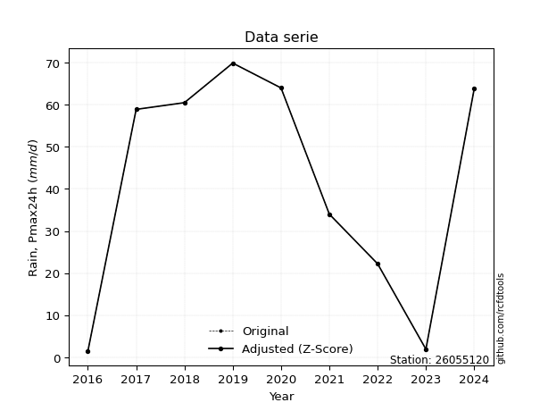</img>

</div>

> If Z-Score is active, values out of range or outliers are replaced with the station mean value.


### 4. Active continuous probability distributions from SciPy (45 of 104 available)

[scipy.stats](https://docs.scipy.org/doc/scipy/reference/stats.html) is a Python´s powerful submodule within the SciPy library for comprehensive statistical analysis, offering over 130 probability distributions (like Normal, Poisson), functions for descriptive stats (mean, variance), hypothesis testing (t-tests, chi-square), random variable generation, and statistical tests, making it essential for data science, modeling, and research. It provides tools to explore, model, and draw conclusions from data efficiently, working seamlessly with NumPy.

<div align="center">

|   id | p_dist             |   n_parameter | fit_method   | label                                                                       | active   | ref                                                                                                        |
|-----:|:-------------------|--------------:|:-------------|:----------------------------------------------------------------------------|:---------|:-----------------------------------------------------------------------------------------------------------|
|    0 | alpha              |             3 | MLE          | Alpha                                                                       | True     | [:mortar_board:](https://docs.scipy.org/doc/scipy/reference/generated/scipy.stats.alpha.html)              |
|    1 | betaprime          |             4 | MLE          | Beta prime                                                                  | True     | [:mortar_board:](https://docs.scipy.org/doc/scipy/reference/generated/scipy.stats.betaprime.html)          |
|    2 | chi2               |             3 | MLE          | Chi²                                                                        | True     | [:mortar_board:](https://docs.scipy.org/doc/scipy/reference/generated/scipy.stats.chi2.html)               |
|    3 | crystalball        |             4 | MLE          | Crystalball                                                                 | True     | [:mortar_board:](https://docs.scipy.org/doc/scipy/reference/generated/scipy.stats.crystalball.html)        |
|    4 | erlang             |             3 | MLE          | Erlang                                                                      | True     | [:mortar_board:](https://docs.scipy.org/doc/scipy/reference/generated/scipy.stats.erlang.html)             |
|    5 | expon              |             2 | MLE          | Exponential                                                                 | True     | [:mortar_board:](https://docs.scipy.org/doc/scipy/reference/generated/scipy.stats.expon.html)              |
|    6 | exponnorm          |             3 | MLE          | Exponentially modified Normal                                               | True     | [:mortar_board:](https://docs.scipy.org/doc/scipy/reference/generated/scipy.stats.exponnorm.html)          |
|    7 | f                  |             4 | MLE          | F                                                                           | True     | [:mortar_board:](https://docs.scipy.org/doc/scipy/reference/generated/scipy.stats.f.html)                  |
|    8 | fatiguelife        |             3 | MLE          | Fatigue-life (Birnbaum-Saunders)                                            | True     | [:mortar_board:](https://docs.scipy.org/doc/scipy/reference/generated/scipy.stats.fatiguelife.html)        |
|    9 | fisk               |             3 | MLE          | Fisk                                                                        | True     | [:mortar_board:](https://docs.scipy.org/doc/scipy/reference/generated/scipy.stats.fisk.html)               |
|   10 | gamma              |             3 | MLE          | Gamma                                                                       | True     | [:mortar_board:](https://docs.scipy.org/doc/scipy/reference/generated/scipy.stats.gamma.html)              |
|   11 | genexpon           |             5 | MLE          | Generalized exponential                                                     | True     | [:mortar_board:](https://docs.scipy.org/doc/scipy/reference/generated/scipy.stats.genexpon.html)           |
|   12 | genlogistic        |             3 | MLE          | Generalized logistic                                                        | True     | [:mortar_board:](https://docs.scipy.org/doc/scipy/reference/generated/scipy.stats.genlogistic.html)        |
|   13 | gibrat             |             2 | MM           | Gibrat                                                                      | True     | [:mortar_board:](https://docs.scipy.org/doc/scipy/reference/generated/scipy.stats.gibrat.html)             |
|   14 | gompertz           |             3 | MLE          | Gompertz (or truncated Gumbel)                                              | True     | [:mortar_board:](https://docs.scipy.org/doc/scipy/reference/generated/scipy.stats.gompertz.html)           |
|   15 | gumbel_l           |             2 | MM           | Gumbel Left Skew                                                            | True     | [:mortar_board:](https://docs.scipy.org/doc/scipy/reference/generated/scipy.stats.gumbel_l.html)           |
|   16 | gumbel_r           |             2 | MM           | Gumbel Right Skew                                                           | True     | [:mortar_board:](https://docs.scipy.org/doc/scipy/reference/generated/scipy.stats.gumbel_r.html)           |
|   17 | halflogistic       |             2 | MM           | Half-logistic                                                               | True     | [:mortar_board:](https://docs.scipy.org/doc/scipy/reference/generated/scipy.stats.halflogistic.html)       |
|   18 | halfnorm           |             2 | MM           | Half Normal                                                                 | True     | [:mortar_board:](https://docs.scipy.org/doc/scipy/reference/generated/scipy.stats.halfnorm.html)           |
|   19 | hypsecant          |             2 | MM           | hyperbolic secant                                                           | True     | [:mortar_board:](https://docs.scipy.org/doc/scipy/reference/generated/scipy.stats.hypsecant.html)          |
|   20 | invgamma           |             3 | MLE          | Inverted gamma                                                              | True     | [:mortar_board:](https://docs.scipy.org/doc/scipy/reference/generated/scipy.stats.invgamma.html)           |
|   21 | invgauss           |             3 | MLE          | Inverse Gaussian                                                            | True     | [:mortar_board:](https://docs.scipy.org/doc/scipy/reference/generated/scipy.stats.invgauss.html)           |
|   22 | invweibull         |             3 | MLE          | Inverted Weibull                                                            | True     | [:mortar_board:](https://docs.scipy.org/doc/scipy/reference/generated/scipy.stats.invweibull.html)         |
|   23 | johnsonsu          |             4 | MLE          | Johnson Su                                                                  | True     | [:mortar_board:](https://docs.scipy.org/doc/scipy/reference/generated/scipy.stats.johnsonsu.html)          |
|   24 | kstwobign          |             2 | MLE          | Limiting distribution of scaled Kolmogorov-Smirnov two-sided test statistic | True     | [:mortar_board:](https://docs.scipy.org/doc/scipy/reference/generated/scipy.stats.kstwobign.html)          |
|   25 | laplace            |             2 | MM           | Laplace                                                                     | True     | [:mortar_board:](https://docs.scipy.org/doc/scipy/reference/generated/scipy.stats.laplace.html)            |
|   26 | laplace_asymmetric |             3 | MLE          | Asymmetric Laplace                                                          | True     | [:mortar_board:](https://docs.scipy.org/doc/scipy/reference/generated/scipy.stats.laplace_asymmetric.html) |
|   27 | loggamma           |             3 | MLE          | Log gamma                                                                   | True     | [:mortar_board:](https://docs.scipy.org/doc/scipy/reference/generated/scipy.stats.loggamma.html)           |
|   28 | logistic           |             2 | MM           | Logistic (or Sech-squared)                                                  | True     | [:mortar_board:](https://docs.scipy.org/doc/scipy/reference/generated/scipy.stats.logistic.html)           |
|   29 | lognorm            |             3 | MLE          | Log Normal                                                                  | True     | [:mortar_board:](https://docs.scipy.org/doc/scipy/reference/generated/scipy.stats.lognorm.html)            |
|   30 | maxwell            |             2 | MM           | Maxwell                                                                     | True     | [:mortar_board:](https://docs.scipy.org/doc/scipy/reference/generated/scipy.stats.maxwell.html)            |
|   31 | mielke             |             4 | MLE          | Mielke Beta-Kappa / Dagum                                                   | True     | [:mortar_board:](https://docs.scipy.org/doc/scipy/reference/generated/scipy.stats.mielke.html)             |
|   32 | moyal              |             2 | MM           | Moyal                                                                       | True     | [:mortar_board:](https://docs.scipy.org/doc/scipy/reference/generated/scipy.stats.moyal.html)              |
|   33 | nakagami           |             3 | MLE          | Nakagami                                                                    | True     | [:mortar_board:](https://docs.scipy.org/doc/scipy/reference/generated/scipy.stats.nakagami.html)           |
|   34 | ncf                |             5 | MLE          | Non-central F distribution                                                  | True     | [:mortar_board:](https://docs.scipy.org/doc/scipy/reference/generated/scipy.stats.ncf.html)                |
|   35 | nct                |             4 | MLE          | Non-central Student’s t                                                     | True     | [:mortar_board:](https://docs.scipy.org/doc/scipy/reference/generated/scipy.stats.nct.html)                |
|   36 | norm               |             2 | MM           | Normal                                                                      | True     | [:mortar_board:](https://docs.scipy.org/doc/scipy/reference/generated/scipy.stats.norm.html)               |
|   37 | pareto             |             3 | MLE          | Pareto                                                                      | True     | [:mortar_board:](https://docs.scipy.org/doc/scipy/reference/generated/scipy.stats.pareto.html)             |
|   38 | pearson3           |             3 | MM           | Pearson type III                                                            | True     | [:mortar_board:](https://docs.scipy.org/doc/scipy/reference/generated/scipy.stats.pearson3.html)           |
|   39 | rayleigh           |             2 | MM           | Rayleigh                                                                    | True     | [:mortar_board:](https://docs.scipy.org/doc/scipy/reference/generated/scipy.stats.rayleigh.html)           |
|   40 | rice               |             3 | MLE          | Rice                                                                        | True     | [:mortar_board:](https://docs.scipy.org/doc/scipy/reference/generated/scipy.stats.rice.html)               |
|   41 | t                  |             3 | MLE          | Student’s t                                                                 | True     | [:mortar_board:](https://docs.scipy.org/doc/scipy/reference/generated/scipy.stats.t.html)                  |
|   42 | truncnorm          |             4 | MLE          | Truncated normal                                                            | True     | [:mortar_board:](https://docs.scipy.org/doc/scipy/reference/generated/scipy.stats.truncnorm.html)          |
|   43 | wald               |             2 | MM           | Wald                                                                        | True     | [:mortar_board:](https://docs.scipy.org/doc/scipy/reference/generated/scipy.stats.wald.html)               |
|   44 | weibull_min        |             3 | MLE          | Weibull minimum                                                             | True     | [:mortar_board:](https://docs.scipy.org/doc/scipy/reference/generated/scipy.stats.weibull_min.html)        |

</div>

> **n_parameter:** # arguments & localization & scale.
>
> **Fit methods:** (MLE) maximum likelihood, (MM) L-moments.
>
>**Inactive:** foldnorm, gennorm, norminvgauss, powernorm, powerlognorm, skewnorm, genextreme, anglit, arcsine, argus, beta, bradford, burr, burr12, cauchy, cosine, halfcauchy, foldcauchy, skewcauchy, wrapcauchy, dgamma, gengamma, exponweib, exponpow, truncexpon, gausshyper, genhalflogistic, genhyperbolic, geninvgauss, halfgennorm, johnsonsb, kappa4, kappa3, ksone, kstwo, loglaplace, levy, levy_l, levy_stable, ncx2, genpareto, truncpareto, lomax, powerlaw, rdist, rel_breitwigner, recipinvgauss, semicircular, studentized_range, trapezoid, triang, truncweibull_min, tukeylambda, uniform, loguniform, vonmises, vonmises_line, weibull_max, dweibull, 


## B. Probability distributions vs. Empirical distributions

A continuous probability distribution (CPD) describes probabilities for variables that can take any value within a range (like rain any time), unlike discrete variables with specific outcomes (like temperature). It uses a Probability Density Function (PDF), a curve where the total area under it equals 1, and the probability of the variable falling within an interval (a to b) is found by calculating the area under the curve between those points. A key feature is that the probability of hitting any single exact value is zero, so probabilities are always expressed for ranges, e.g., $P(a ≤ X ≤ b)$.

<div align="center">

Distributions parameters
|    |   station | p_dist                |   n |               loc |            scale | shape                 | shape1                | shape2              | shape3   |
|---:|----------:|:----------------------|----:|------------------:|-----------------:|:----------------------|:----------------------|:--------------------|:---------|
|  0 |  26055120 | alpha                 |  10 |    -689.898       |  17618           | 24.09961309011122     |                       |                     |          |
|  1 |  26055120 | betaprime             |  10 |    -837.536       |  43470.6         | 1270.241328931024     | 62843.280395460984    |                     |          |
|  2 |  26055120 | chi2                  |  10 |       1.4         |      4.72826     | 0.5557000746332637    |                       |                     |          |
|  3 |  26055120 | crystalball           |  10 |      41.28        |     24.7111      | 1819.0434515508323    | 5068.092068327434     |                     |          |
|  4 |  26055120 | erlang                |  10 |    -319.814       |      1.7924      | 201.3957775051316     |                       |                     |          |
|  5 |  26055120 | expon                 |  10 |       1.4         |     39.88        |                       |                       |                     |          |
|  6 |  26055120 | exponnorm             |  10 |      41.2597      |     24.7112      | 0.0008217720791239597 |                       |                     |          |
|  7 |  26055120 | f                     |  10 |       1.4         |     33.4851      | 1.4062502648258413    | 21.039214628049617    |                     |          |
|  8 |  26055120 | fatiguelife           |  10 |       1.4         |      8.25504e-05 | 791.4087265024905     |                       |                     |          |
|  9 |  26055120 | fisk                  |  10 |      -1.43097e+09 |      1.43097e+09 | 95095898.33274642     |                       |                     |          |
| 10 |  26055120 | gamma                 |  10 |    -344.16        |      1.64452     | 234.2145174496221     |                       |                     |          |
| 11 |  26055120 | genexpon              |  10 |       1.39991     |      3.09053     | 0.07758101517373264   | 8.966933789704009e-09 | 2.6457809386575497  |          |
| 12 |  26055120 | genlogistic           |  10 |      69.9003      |      2.62496e-05 | 9.159532718460104e-07 |                       |                     |          |
| 13 |  26055120 | gibrat                |  10 |      22.4285      |     11.434       |                       |                       |                     |          |
| 14 |  26055120 | gompertz              |  10 |      22.2         |     11.3179      | 0.03966574526728715   |                       |                     |          |
| 15 |  26055120 | gumbel_l              |  10 |      52.4013      |     19.2672      |                       |                       |                     |          |
| 16 |  26055120 | gumbel_r              |  10 |      30.1587      |     19.2672      |                       |                       |                     |          |
| 17 |  26055120 | halflogistic          |  10 |      11.9916      |     21.1271      |                       |                       |                     |          |
| 18 |  26055120 | halfnorm              |  10 |       8.57216     |     40.9932      |                       |                       |                     |          |
| 19 |  26055120 | hypsecant             |  10 |      41.28        |     15.7316      |                       |                       |                     |          |
| 20 |  26055120 | invgamma              |  10 |    -246.184       |  36910.5         | 129.52960414803275    |                       |                     |          |
| 21 |  26055120 | invgauss              |  10 |    -107.187       |   4533.06        | 0.03277909120758993   |                       |                     |          |
| 22 |  26055120 | invweibull            |  10 | -951262           | 951290           | 39097.67930171927     |                       |                     |          |
| 23 |  26055120 | johnsonsu             |  10 |      72.9388      |      0.0891612   | 6.131945264529553     | 0.9969603388026631    |                     |          |
| 24 |  26055120 | kstwobign             |  10 |     -56.0481      |    110.864       |                       |                       |                     |          |
| 25 |  26055120 | laplace               |  10 |      41.28        |     17.4734      |                       |                       |                     |          |
| 26 |  26055120 | laplace_asymmetric    |  10 |      36.2         |     21.6964      | 0.8897588144923871    |                       |                     |          |
| 27 |  26055120 | loggamma              |  10 |      69.9002      |      9.87007e-06 | 3.443129278240392e-07 |                       |                     |          |
| 28 |  26055120 | logistic              |  10 |      41.28        |     13.6239      |                       |                       |                     |          |
| 29 |  26055120 | lognorm               |  10 |       1.4         |      0.546635    | 11.895592096918495    |                       |                     |          |
| 30 |  26055120 | maxwell               |  10 |     -17.2749      |     36.6938      |                       |                       |                     |          |
| 31 |  26055120 | mielke                |  10 |       1.4         |     68.9756      | 0.9160062943180491    | 147.24957688118707    |                     |          |
| 32 |  26055120 | moyal                 |  10 |      27.1486      |     11.1239      |                       |                       |                     |          |
| 33 |  26055120 | nakagami              |  10 |       1.4         |     44.356       | 0.28301268792436607   |                       |                     |          |
| 34 |  26055120 | ncf                   |  10 |      -0.0864656   |      5.69571     | 1.2221966275973786    | 20.981963756545166    | 6.649473461463197   |          |
| 35 |  26055120 | nct                   |  10 |      -0.419218    |      0.0823353   | 0.41943471625088796   | 54.7361407574828      |                     |          |
| 36 |  26055120 | norm                  |  10 |      41.28        |     24.7111      |                       |                       |                     |          |
| 37 |  26055120 | pareto                |  10 |       1.39869     |      0.00131475  | 0.11146558002998075   |                       |                     |          |
| 38 |  26055120 | pearson3              |  10 |      41.28        |     24.7111      | -0.48243567963917183  |                       |                     |          |
| 39 |  26055120 | rayleigh              |  10 |      -5.99374     |     37.719       |                       |                       |                     |          |
| 40 |  26055120 | rice                  |  10 |     -13.4625      |     27.8869      | 1.624386170325396     |                       |                     |          |
| 41 |  26055120 | t                     |  10 |      41.2793      |     24.7108      | 91298367.86233112     |                       |                     |          |
| 42 |  26055120 | truncnorm             |  10 |     -27.0566      |     14.0274      | -14.626653840595269   | 6.911943597775423     |                     |          |
| 43 |  26055120 | wald                  |  10 |      16.5689      |     24.7111      |                       |                       |                     |          |
| 44 |  26055120 | weibull_min           |  10 |      -1.21846e+09 |      1.21846e+09 | 63993414.024335094    |                       |                     |          |
| 45 |  26055120 | logalpha              |  10 |     -54.8443      |   2073.98        | 35.755585690107154    |                       |                     |          |
| 46 |  26055120 | logbetaprime          |  10 |      -4.6011      |      8.70614e+10 | 21.926806037617453    | 244092403093.6582     |                     |          |
| 47 |  26055120 | logchi2               |  10 |     -15.9462      |      0.0578141   | 330.5190565212291     |                       |                     |          |
| 48 |  26055120 | logcrystalball        |  10 |       4.24708     |      5.59548e-07 | 5.331770242689888e-07 | 483.5837049737994     |                     |          |
| 49 |  26055120 | logerlang             |  10 |     -19.7195      |      0.0937737   | 244.12913601261585    |                       |                     |          |
| 50 |  26055120 | logexpon              |  10 |       0.336472    |      2.85693     |                       |                       |                     |          |
| 51 |  26055120 | logexponnorm          |  10 |       3.1926      |      1.39723     | 0.0005756151168419064 |                       |                     |          |
| 52 |  26055120 | logf                  |  10 |   -2074.55        |   2077.74        | 5040077.40641086      | 35243980.02357966     |                     |          |
| 53 |  26055120 | logfatiguelife        |  10 |    -681.976       |    685.168       | 0.0020371221370157145 |                       |                     |          |
| 54 |  26055120 | logfisk               |  10 |      -1.036e+07   |      1.036e+07   | 14183259.417795222    |                       |                     |          |
| 55 |  26055120 | loggamma              |  10 |     -19.3155      |      0.0961531   | 233.81478669548147    |                       |                     |          |
| 56 |  26055120 | loggenexpon           |  10 |       0.336472    |      2.09471     | 0.2645939865611101    | 6.596544562960056     | 0.08664005162598569 |          |
| 57 |  26055120 | loggenlogistic        |  10 |       4.24713     |      4.69849e-06 | 4.44284263411629e-06  |                       |                     |          |
| 58 |  26055120 | loggibrat             |  10 |       2.12754     |      0.646483    |                       |                       |                     |          |
| 59 |  26055120 | loggompertz           |  10 |       0.336472    |      0.870461    | 0.020121735291247722  |                       |                     |          |
| 60 |  26055120 | loggumbel_l           |  10 |       3.82223     |      1.08941     |                       |                       |                     |          |
| 61 |  26055120 | loggumbel_r           |  10 |       2.56458     |      1.08941     |                       |                       |                     |          |
| 62 |  26055120 | loghalflogistic       |  10 |       1.53738     |      1.19457     |                       |                       |                     |          |
| 63 |  26055120 | loghalfnorm           |  10 |       1.34404     |      2.31784     |                       |                       |                     |          |
| 64 |  26055120 | loghypsecant          |  10 |       3.1934      |      0.889503    |                       |                       |                     |          |
| 65 |  26055120 | loginvgamma           |  10 |     -22.2258      |   7341.09        | 290.0387490533261     |                       |                     |          |
| 66 |  26055120 | loginvgauss           |  10 |     -11.4385      |   1261.38        | 0.011567023510582475  |                       |                     |          |
| 67 |  26055120 | loginvweibull         |  10 |      -1.51449e+08 |      1.51449e+08 | 94379730.18472461     |                       |                     |          |
| 68 |  26055120 | logjohnsonsu          |  10 |       4.25182     |      8.51552e-05 | 4.65133132293605      | 0.5226979098926711    |                     |          |
| 69 |  26055120 | logkstwobign          |  10 |      -3.24533     |      7.33977     |                       |                       |                     |          |
| 70 |  26055120 | loglaplace            |  10 |       3.1934      |      0.987989    |                       |                       |                     |          |
| 71 |  26055120 | loglaplace_asymmetric |  10 |       4.24707     |      0.0135429   | 77.76742869068622     |                       |                     |          |
| 72 |  26055120 | logloggamma           |  10 |       4.24711     |      4.18416e-06 | 3.962423035892094e-06 |                       |                     |          |
| 73 |  26055120 | loglogistic           |  10 |       3.1934      |      0.770332    |                       |                       |                     |          |
| 74 |  26055120 | loglognorm            |  10 |       0.336472    |      0.0574376   | 11.547734683704732    |                       |                     |          |
| 75 |  26055120 | logmaxwell            |  10 |      -0.117441    |      2.07476     |                       |                       |                     |          |
| 76 |  26055120 | logmielke             |  10 |      -1.75538e+08 |      1.75538e+08 | 143736006.79306215    | 30854135883.07397     |                     |          |
| 77 |  26055120 | logmoyal              |  10 |       2.39438     |      0.628974    |                       |                       |                     |          |
| 78 |  26055120 | lognakagami           |  10 |   -1207.33        |   1210.52        | 187616.22259463352    |                       |                     |          |
| 79 |  26055120 | logncf                |  10 |   -1001.51        |    994.87        | 14162092.253520124    | 1095522.7785855962    | 140118.95623203774  |          |
| 80 |  26055120 | lognct                |  10 |     -67.9502      |      1.33596     | 13350.409392288115    | 53.24835250029196     |                     |          |
| 81 |  26055120 | lognorm               |  10 |       3.1934      |      1.39723     |                       |                       |                     |          |
| 82 |  26055120 | logpareto             |  10 |       0.33635     |      0.000122429 | 0.11119527749686442   |                       |                     |          |
| 83 |  26055120 | logpearson3           |  10 |       3.19341     |      1.39721     | -1.298956051096837    |                       |                     |          |
| 84 |  26055120 | lograyleigh           |  10 |       0.520415    |      2.13273     |                       |                       |                     |          |
| 85 |  26055120 | logrice               |  10 |    -181.83        |      1.39722     | 132.4185080858328     |                       |                     |          |
| 86 |  26055120 | logt                  |  10 |       4.13019     |      0.0821976   | 0.45641584663912177   |                       |                     |          |
| 87 |  26055120 | logtruncnorm          |  10 |       0.0801566   |      3.34517     | 0.07662259159315349   | 5.474975999334784     |                     |          |
| 88 |  26055120 | logwald               |  10 |       1.79621     |      1.39719     |                       |                       |                     |          |
| 89 |  26055120 | logweibull_min        |  10 |      -1.5869e+08  |      1.5869e+08  | 196102879.44283235    |                       |                     |          |

</div>

> **loc** (Location parameter): This shifts the distribution along the x-axis. For many common distributions, like the normal (Gaussian) distribution, loc represents the mean $μ$. For others, like the uniform distribution, it might represent the minimum value, or for the beta distribution, the left end of the support interval.
>
> **scale** (Scale parameter): This determines the width or spread of the distribution. For the normal distribution, scale represents the standard deviation $σ$. For a uniform distribution, it defines the length of the interval (from $loc$ to $loc + scale$).
>
> **shape** (Shape parameters): Refers to parameters that define the specific form of a probability distribution, distinct from its location (loc) and scale (scale). These parameters are required arguments for most distribution functions. For example, a normal (Gaussian) distribution is fully defined by its location (mean) and scale (standard deviation), so it has no specific shape parameters beyond loc and scale. However, other distributions have intrinsic properties that need specification, as Gamma distribution that takes a shape parameter, often named $a$ or $alpha$.


### 0. Cumulative distribution values - CDF (90 evaluated)

> Ordered by x ascending and calculating $log(f(x))$ separately. 

|   id |   Station |   date |    x |   count |   mean |     std |    zscore |   Value_initial |   station |   m |     alpha |   alpha_pdf |   betaprime |   betaprime_pdf |        chi2 |    chi2_pdf |   crystalball |   crystalball_pdf |    erlang |   erlang_pdf |     expon |   expon_pdf |   exponnorm |   exponnorm_pdf |           f |        f_pdf |   fatiguelife |   fatiguelife_pdf |      fisk |   fisk_pdf |     gamma |   gamma_pdf |    genexpon |   genexpon_pdf |   genlogistic |   genlogistic_pdf |   gibrat |   gibrat_pdf |    gompertz |   gompertz_pdf |   gumbel_l |   gumbel_l_pdf |   gumbel_r |   gumbel_r_pdf |   halflogistic |   halflogistic_pdf |   halfnorm |   halfnorm_pdf |   hypsecant |   hypsecant_pdf |   invgamma |   invgamma_pdf |   invgauss |   invgauss_pdf |   invweibull |   invweibull_pdf |   johnsonsu |   johnsonsu_pdf |   kstwobign |   kstwobign_pdf |   laplace |   laplace_pdf |   laplace_asymmetric |   laplace_asymmetric_pdf |   loggamma |   loggamma_pdf |   logistic |   logistic_pdf |   lognorm |   lognorm_pdf |   maxwell |   maxwell_pdf |      mielke |   mielke_pdf |      moyal |   moyal_pdf |   nakagami |    nakagami_pdf |       ncf |    ncf_pdf |       nct |    nct_pdf |      norm |   norm_pdf |   pareto |   pareto_pdf |   pearson3 |   pearson3_pdf |   rayleigh |   rayleigh_pdf |      rice |   rice_pdf |         t |      t_pdf |   truncnorm |   truncnorm_pdf |     wald |   wald_pdf |   weibull_min |   weibull_min_pdf |   logalpha |   logalpha_pdf |   logbetaprime |   logbetaprime_pdf |   logchi2 |   logchi2_pdf |   logcrystalball |   logcrystalball_pdf |   logerlang |   logerlang_pdf |   logexpon |   logexpon_pdf |   logexponnorm |   logexponnorm_pdf |      logf |   logf_pdf |   logfatiguelife |   logfatiguelife_pdf |   logfisk |   logfisk_pdf |   loggenexpon |   loggenexpon_pdf |   loggenlogistic |   loggenlogistic_pdf |   loggibrat |   loggibrat_pdf |   loggompertz |   loggompertz_pdf |   loggumbel_l |   loggumbel_l_pdf |   loggumbel_r |   loggumbel_r_pdf |   loghalflogistic |   loghalflogistic_pdf |   loghalfnorm |   loghalfnorm_pdf |   loghypsecant |   loghypsecant_pdf |   loginvgamma |   loginvgamma_pdf |   loginvgauss |   loginvgauss_pdf |   loginvweibull |   loginvweibull_pdf |   logjohnsonsu |   logjohnsonsu_pdf |   logkstwobign |   logkstwobign_pdf |   loglaplace |   loglaplace_pdf |   loglaplace_asymmetric |   loglaplace_asymmetric_pdf |   logloggamma |   logloggamma_pdf |   loglogistic |   loglogistic_pdf |   loglognorm |   loglognorm_pdf |   logmaxwell |   logmaxwell_pdf |   logmielke |   logmielke_pdf |    logmoyal |   logmoyal_pdf |   lognakagami |   lognakagami_pdf |    logncf |   logncf_pdf |    lognct |   lognct_pdf |   logpareto |   logpareto_pdf |   logpearson3 |   logpearson3_pdf |   lograyleigh |   lograyleigh_pdf |   logrice |   logrice_pdf |      logt |   logt_pdf |   logtruncnorm |   logtruncnorm_pdf |   logwald |   logwald_pdf |   logweibull_min |   logweibull_min_pdf |
|-----:|----------:|-------:|-----:|--------:|-------:|--------:|----------:|----------------:|----------:|----:|----------:|------------:|------------:|----------------:|------------:|------------:|--------------:|------------------:|----------:|-------------:|----------:|------------:|------------:|----------------:|------------:|-------------:|--------------:|------------------:|----------:|-----------:|----------:|------------:|------------:|---------------:|--------------:|------------------:|---------:|-------------:|------------:|---------------:|-----------:|---------------:|-----------:|---------------:|---------------:|-------------------:|-----------:|---------------:|------------:|----------------:|-----------:|---------------:|-----------:|---------------:|-------------:|-----------------:|------------:|----------------:|------------:|----------------:|----------:|--------------:|---------------------:|-------------------------:|-----------:|---------------:|-----------:|---------------:|----------:|--------------:|----------:|--------------:|------------:|-------------:|-----------:|------------:|-----------:|----------------:|----------:|-----------:|----------:|-----------:|----------:|-----------:|---------:|-------------:|-----------:|---------------:|-----------:|---------------:|----------:|-----------:|----------:|-----------:|------------:|----------------:|---------:|-----------:|--------------:|------------------:|-----------:|---------------:|---------------:|-------------------:|----------:|--------------:|-----------------:|---------------------:|------------:|----------------:|-----------:|---------------:|---------------:|-------------------:|----------:|-----------:|-----------------:|---------------------:|----------:|--------------:|--------------:|------------------:|-----------------:|---------------------:|------------:|----------------:|--------------:|------------------:|--------------:|------------------:|--------------:|------------------:|------------------:|----------------------:|--------------:|------------------:|---------------:|-------------------:|--------------:|------------------:|--------------:|------------------:|----------------:|--------------------:|---------------:|-------------------:|---------------:|-------------------:|-------------:|-----------------:|------------------------:|----------------------------:|--------------:|------------------:|--------------:|------------------:|-------------:|-----------------:|-------------:|-----------------:|------------:|----------------:|------------:|---------------:|--------------:|------------------:|----------:|-------------:|----------:|-------------:|------------:|----------------:|--------------:|------------------:|--------------:|------------------:|----------:|--------------:|----------:|-----------:|---------------:|-------------------:|----------:|--------------:|-----------------:|---------------------:|
|    0 |  26055120 |   2016 |  1.4 |      10 |  41.28 | 26.0478 | -1.53103  |             1.4 |  26055120 |   1 | 0.0828963 |  0.00562974 |   0.053535  |      0.00451269 | 2.65939e-05 | 3.32776e+10 |     0.0532799 |        0.00438991 | 0.0546826 |   0.00470674 | 0         |  0.0250752  |   0.0532809 |      0.00438995 | 2.23258e-11 | 523.68       |     0.0521566 |       1.73401e+09 | 0.0583381 | 0.00365072 | 0.0537758 |  0.00466873 | 2.28811e-06 |     0.0251027  |      0        |        0.00319653 | 0        |   0          | 0           |     0          |  0.068407  |     0.00342614 |  0.0116929 |     0.00269988 |       0        |         0          |   0        |     0          |   0.0503528 |      0.00318741 |  0.0477131 |     0.00478763 |  0.0487792 |     0.00522937 |    0.0502362 |       0.0061757  |    0.11004  |      0.00262113 |   0.0488905 |      0.0069692  | 0.0510231 |    0.00292005 |            0.0728437 |               0.00377339 |  0.0232934 |      0.0409895 |  0.0508252 |     0.00354097 | 0.0204416 |     0.0353006 | 0.0324577 |    0.00494802 | 9.00338e-08 |   0.0587831  | 0.00146509 | 0.000723303 | 1.2531e-10 | 319434          | 0.0166844 | 0.00940284 | 0.0363305 | 0.0733174  | 0.0532799 | 0.00438991 | 0        | 84.7811      |  0.0642283 |     0.00408861 |  0.0190289 |     0.00509801 | 0.0387309 | 0.00530264 | 0.0532809 | 0.00439003 |    0.978753 |     0.00363319  | 0        | 0          |     0.0647701 |        0.0032891  |  0.0336509 |      0.0509578 |      0.0270115 |          0.0509692 | 0.023983  |     0.0422704 |              nan |                  nan |   0.0226997 |       0.0401869 |   0        |      0.350026  |      0.0204416 |          0.0353007 | 0.0205581 |  0.0354549 |        0.0201744 |            0.0350919 | 0.0131395 |     0.0177523 |   3.72598e-10 |          0.126315 |         0        |            0.023428  |    0        |       0         |   2.70527e-09 |         0.0231162 |     0.0399558 |         0.0359338 |    0.00043903 |        0.00311554 |          0        |              0        |      0        |          0        |      0.025631  |          0.0287839 |     0.0219395 |         0.0410801 |     0.0257951 |         0.0477216 |       0.0259786 |           0.0590989 |      0.0929796 |          0.0222088 |      0.0288945 |          0.0755151 |    0.027742  |        0.0280792 |               0.0243985 |                   0.0231661 |     0.0246398 |         0.023334  |     0.023923  |         0.0303125 |   0.00137713 |      7.04097e+12 |   0.00274539 |        0.0179716 |   0.0401071 |        0.032841 | 2.83348e-07 |    6.14821e-06 |     0.0205281 |         0.0354519 | 0.0208768 |    0.0357657 | 0.0207885 |    0.0358703 |    0        |    908.242      |     0.0432131 |         0.037688  |    0          |         0         | 0.0204401 |     0.0352991 | 0.0565333 | 0.00680057 |    1.12618e-09 |           0.253289 |  0        |      0        |        0.014247  |            0.0174799 |
|    1 |  26055120 |   2023 |  1.9 |      10 |  41.28 | 26.0478 | -1.51184  |             1.9 |  26055120 |   2 | 0.0857452 |  0.00576598 |   0.0558288 |      0.004663   | 0.484768    | 0.25844     |     0.0555109 |        0.00453469 | 0.057075  |   0.00486337 | 0.0124593 |  0.0247628  |   0.0555119 |      0.00453473 | 0.044021    |   0.0614987  |     0.539162  |       0.0390487   | 0.0601905 | 0.00375923 | 0.0561494 |  0.00482614 | 0.0124752   |     0.0247896  |      0        |        0.00325279 | 0        |   0          | 0           |     0          |  0.0701409 |     0.00350967 |  0.0131044 |     0.00294828 |       0        |         0          |   0        |     0          |   0.0519717 |      0.003289   |  0.050152  |     0.00496872 |  0.0514437 |     0.00542893 |    0.0533875 |       0.00642959 |    0.111361 |      0.00266225 |   0.0524501 |      0.00726919 | 0.0525042 |    0.00300481 |            0.0747551 |               0.0038724  |  0.0388713 |      0.0620113 |  0.0526251 |     0.00365942 | 0.0339138 |     0.0538883 | 0.0349896 |    0.00517999 | 0.0109648   |   0.0200875  | 0.00186577 | 0.00088342  | 0.0613626  |      0.0694636  | 0.021442  | 0.00965102 | 0.0767977 | 0.085188   | 0.0555109 | 0.00453469 | 0.484442 |  0.114632    |  0.0663004 |     0.00420016 |  0.0216605 |     0.00542816 | 0.0414295 | 0.00549202 | 0.055512  | 0.00453482 |    0.980505 |     0.0033776   | 0        | 0          |     0.0664349 |        0.0033706  |  0.0523167 |      0.0720273 |      0.0462663 |          0.0760107 | 0.0400246 |     0.0637634 |              nan |                  nan |   0.0380015 |       0.0610107 |   0.101377 |      0.314542  |      0.0339138 |          0.0538884 | 0.0340832 |  0.054079  |        0.0335874 |            0.053717  | 0.0198243 |     0.0266024 |   0.0436414   |          0.158604 |         0        |            0.0312712 |    0        |       0         |   0.00842036  |         0.0325541 |     0.0525386 |         0.0469368 |    0.00290574 |        0.0155796  |          0        |              0        |      0        |          0        |      0.0361107 |          0.0405094 |     0.0377169 |         0.0632951 |     0.0439207 |         0.0719697 |       0.0489053 |           0.091975  |      0.100241  |          0.0254556 |      0.0581967 |          0.116732  |    0.0377899 |        0.0382493 |               0.0326054 |                   0.0309585 |     0.0329029 |         0.0311592 |     0.0351526 |         0.0440289 |   0.557523   |      0.11195     |   0.0125245  |        0.0481695 |   0.0515014 |        0.042171 | 5.63575e-05 |    0.00076721  |     0.0340567 |         0.054108  | 0.034495  |    0.054366  | 0.0344658 |    0.0546618 |    0.580961 |      0.152519   |     0.0562966 |         0.0484063 |    0.00161981 |         0.0266552 | 0.0339118 |     0.0538868 | 0.0587404 | 0.00768449 |    0.0769732   |           0.250478 |  0        |      0        |        0.0207106 |            0.0253265 |
|    2 |  26055120 |   2022 | 22.2 |      10 |  41.28 | 26.0478 | -0.7325   |            22.2 |  26055120 |   3 | 0.260621  |  0.0112836  |   0.22462   |      0.0122117  | 0.984554    | 0.00204572  |     0.220021  |        0.0119829  | 0.231011  |   0.0124045  | 0.406409  |  0.0148844  |   0.220022  |      0.0119828  | 0.507723    |   0.0130253  |     0.737045  |       0.00497432  | 0.197957  | 0.0105511  | 0.230246  |  0.0124813  | 0.406751    |     0.0148922  |      0        |        0.00660522 | 0        |   0          | 7.22201e-11 |     0.00350468 |  0.188252  |     0.00878711 |  0.220589  |     0.0173046  |       0.237001 |         0.022337   |   0.260444 |     0.0184175  |   0.183998  |      0.0110555  |  0.236368  |     0.0133355  |  0.248838  |     0.0136213  |    0.280222  |       0.0146517  |    0.188399 |      0.0053043  |   0.298442  |      0.0150772  | 0.167781  |    0.00960211 |            0.213958  |               0.0110833  |  0.49067   |      0.271767  |  0.19774   |     0.0116442  | 0.473377  |     0.284888  | 0.236744  |    0.0141089  | 0.333501    |   0.014687   | 0.211625   | 0.0205326   | 0.499408   |      0.0129449  | 0.329001  | 0.0171399  | 0.600516  | 0.00735689 | 0.220021  | 0.0119829  | 0.659648 |  0.0018238   |  0.209503  |     0.0103848  |  0.243728  |     0.0149869  | 0.231681  | 0.0130259  | 0.220027  | 0.0119832  |    0.999777 |     5.97639e-05 | 0.090225 | 0.0401205  |     0.180981  |        0.00858782 |  0.485222  |      0.24626   |      0.499768  |          0.241027  | 0.493587  |     0.268894  |              nan |                  nan |   0.48855   |       0.272721  |   0.619907 |      0.133042  |      0.473378  |          0.284888  | 0.473549  |  0.284483  |        0.473732  |            0.285241  | 0.369263  |     0.318862  |   0.563109    |          0.203797 |         0        |            0.319636  |    0.658501 |       0.377385  |   0.369521    |         0.348678  |     0.402721  |         0.282556  |    0.542445   |        0.304564   |          0.574418 |              0.280454 |      0.551325 |          0.258354 |      0.46667   |          0.355891  |     0.496266  |         0.26818   |     0.508176  |         0.255454  |       0.520888  |           0.211715  |      0.247293  |          0.143386  |      0.556478  |          0.201821  |    0.454939  |        0.46047   |               0.336484  |                   0.319488  |     0.337486  |         0.319601  |     0.469755  |         0.323348  |   0.631354   |      0.0118168   |   0.507289   |        0.277874  |   0.385482  |        0.315645 | 0.568247    |    0.307559    |     0.474322  |         0.284913  | 0.471739  |    0.282455  | 0.474743  |    0.283414  |    0.671981 |      0.0131974  |     0.388457  |         0.263685  |    0.518825   |         0.272895  | 0.47338   |     0.284894  | 0.102462  | 0.0453211  |    0.609505    |           0.169011 |  0.640067 |      0.315969 |        0.353733  |            0.348637  |
|    3 |  26055120 |   2021 | 34   |      10 |  41.28 | 26.0478 | -0.279487 |            34   |  26055120 |   4 | 0.405887  |  0.0130376  |   0.390512  |      0.0154989  | 0.996576    | 0.000424615 |     0.384148  |        0.0154587  | 0.397393  |   0.0153642  | 0.558445  |  0.0110721  |   0.384149  |      0.0154586  | 0.634635    |   0.00886857 |     0.786417  |       0.00354485  | 0.350934  | 0.0151372  | 0.39804   |  0.0155179  | 0.558843    |     0.0110743  |      0        |        0.00997029 | 0.504769 |   0.0344739  | 0.0702584   |     0.00924279 |  0.319406  |     0.0135923  |  0.440764  |     0.0187414  |       0.478361 |         0.0182508  |   0.464936 |     0.0160575  |   0.35769   |      0.0182451  |  0.412117  |     0.0158963  |  0.423283  |     0.0153855  |    0.456899  |       0.0147089  |    0.267656 |      0.0084286  |   0.475633  |      0.0144728  | 0.329631  |    0.0188648  |            0.394269  |               0.0204236  |  0.604592  |      0.259171  |  0.369502  |     0.0171001  | 0.594175  |     0.277531  | 0.417707  |    0.0159941  | 0.503339    |   0.014143   | 0.462372   | 0.0201195   | 0.631753   |      0.00972842 | 0.517793  | 0.0144777  | 0.66474   | 0.00407337 | 0.384148  | 0.0154587  | 0.676275 |  0.00110683  |  0.356453  |     0.0143913  |  0.430004  |     0.016023   | 0.402439  | 0.0154958  | 0.384158  | 0.015459   |    0.999993 |     2.18739e-06 | 0.51917  | 0.0256242  |     0.309978  |        0.0134462  |  0.588752  |      0.236809  |      0.599612  |          0.225245  | 0.606095  |     0.255565  |              nan |                  nan |   0.602962  |       0.260464  |   0.672591 |      0.114602  |      0.594176  |          0.277531  | 0.594179  |  0.277085  |        0.594623  |            0.277609  | 0.512048  |     0.342063  |   0.645628    |          0.182701 |         0        |            0.47831   |    0.779894 |       0.211732  |   0.53487     |         0.419763  |     0.533347  |         0.326477  |    0.661263   |        0.251053   |          0.681822 |              0.22398  |      0.653569 |          0.220983 |      0.616461  |          0.334166  |     0.607969  |         0.252626  |     0.613932  |         0.238052  |       0.606491  |           0.189001  |      0.329449  |          0.260756  |      0.637713  |          0.178831  |    0.643048  |        0.361292  |               0.504359  |                   0.478883  |     0.505325  |         0.478546  |     0.606405  |         0.309838  |   0.636029   |      0.0101944   |   0.621207   |        0.25373   |   0.546501  |        0.447493 | 0.684284    |    0.237447    |     0.59508   |         0.277325  | 0.591567  |    0.275523  | 0.594801  |    0.275615  |    0.677171 |      0.0112529  |     0.512302  |         0.316024  |    0.62963    |         0.244762  | 0.59418   |     0.277536  | 0.130651  | 0.0982635  |    0.677381    |           0.149427 |  0.748377 |      0.202514 |        0.522534  |            0.43619   |
|    4 |  26055120 |   2025 | 36.2 |      10 |  41.28 | 26.0478 | -0.195026 |            36.2 |  26055120 |   5 | 0.434709  |  0.0131525  |   0.424959  |      0.0157965  | 0.997391    | 0.00032098  |     0.418561  |        0.0158067  | 0.431467  |   0.0155931  | 0.582144  |  0.0104778  |   0.418562  |      0.0158066  | 0.653517    |   0.00830576 |     0.794007  |       0.00335875  | 0.384915  | 0.0157337  | 0.43246   |  0.0157532  | 0.582546    |     0.0104793  |      0        |        0.0107658  | 0.573781 |   0.0284719  | 0.0924346   |     0.0109582  |  0.350357  |     0.0145435  |  0.481502  |     0.0182644  |       0.517502 |         0.0173283  |   0.499664 |     0.0155094  |   0.398953  |      0.0192229  |  0.447208  |     0.0159828  |  0.457105  |     0.0153435  |    0.48891   |       0.0143787  |    0.28708  |      0.0092447  |   0.507066  |      0.0140925  | 0.373859  |    0.021396   |            0.441862  |               0.022889   |  0.620732  |      0.255595  |  0.407847  |     0.0177267  | 0.611478  |     0.274303  | 0.452887  |    0.0159692  | 0.534367    |   0.0140656  | 0.505572   | 0.0191302   | 0.652632   |      0.00925701 | 0.548908  | 0.0138046  | 0.673316  | 0.003732   | 0.418561  | 0.0158067  | 0.678623 |  0.00102934  |  0.388794  |     0.0149972  |  0.465098  |     0.0158636  | 0.43672   | 0.0156515  | 0.418572  | 0.015807   |    0.999997 |     1.09172e-06 | 0.571679 | 0.0222017  |     0.340635  |        0.0144226  |  0.603517  |      0.234118  |      0.613631  |          0.221898  | 0.622008  |     0.251961  |              nan |                  nan |   0.619184  |       0.256911  |   0.679698 |      0.112114  |      0.611478  |          0.274303  | 0.611452  |  0.273862  |        0.611929  |            0.274339  | 0.53346   |     0.340729  |   0.656977    |          0.179302 |         0        |            0.507525  |    0.792659 |       0.195718  |   0.561375    |         0.425408  |     0.553949  |         0.330551  |    0.676737   |        0.242559   |          0.695615 |              0.216028 |      0.667248 |          0.215347 |      0.637136  |          0.325152  |     0.623689  |         0.248774  |     0.628739  |         0.23423   |       0.618224  |           0.185275  |      0.346722  |          0.291115  |      0.648813  |          0.175253  |    0.664996  |        0.339076  |               0.535296  |                   0.508258  |     0.536238  |         0.50782   |     0.625654  |         0.304039  |   0.636662   |      0.009992    |   0.636964   |        0.248853  |   0.575291  |        0.471067 | 0.698864    |    0.227681    |     0.612368  |         0.274066  | 0.608747  |    0.272409  | 0.611982  |    0.272366  |    0.677869 |      0.0110122  |     0.532329  |         0.322729  |    0.644816   |         0.239622  | 0.611483  |     0.274307  | 0.137316  | 0.115103   |    0.686659    |           0.146544 |  0.76069  |      0.190394 |        0.550139  |            0.444079  |
|    5 |  26055120 |   2017 | 58.9 |      10 |  41.28 | 26.0478 |  0.67645  |            58.9 |  26055120 |   6 | 0.716059  |  0.0106487  |   0.763583  |      0.0122141  | 0.999827    | 2.02525e-05 |     0.76209   |        0.0125203  | 0.760979  |   0.0118097  | 0.763504  |  0.00593018 |   0.762089  |      0.0125203  | 0.793259    |   0.00449146 |     0.854188  |       0.00209795  | 0.738813  | 0.0128238  | 0.764794  |  0.0118511  | 0.76388     |     0.00592728 |      0        |        0.0237711  | 0.876963 |   0.00558205 | 0.623119    |     0.0338153  |  0.753687  |     0.0179125  |  0.798529  |     0.00932449 |       0.804114 |         0.00836367 |   0.780445 |     0.00916067 |   0.799225  |      0.011933   |  0.769894  |     0.0110747  |  0.760396  |     0.0103852  |    0.754648  |       0.00873077 |    0.654368 |      0.0261819  |   0.767413  |      0.00865957 | 0.817597  |    0.0104389  |            0.779986  |               0.00902266 |  0.736333  |      0.216392  |  0.784707  |     0.0124004  | 0.736164  |     0.233899  | 0.770085  |    0.0108634  | 0.846467    |   0.0134847  | 0.81034    | 0.00836247  | 0.817061   |      0.00550724 | 0.784358  | 0.00726787 | 0.733063  | 0.00188557 | 0.76209   | 0.0125203  | 0.696117 |  0.000589074 |  0.750753  |     0.014552   |  0.772358  |     0.0103833  | 0.763826  | 0.0116896  | 0.762102  | 0.0125201  |    1        |     1.99602e-10 | 0.848124 | 0.00620751 |     0.746405  |        0.0182736  |  0.71079   |      0.204236  |      0.7142    |          0.189741  | 0.735904  |     0.213207  |              nan |                  nan |   0.73543   |       0.217667  |   0.729877 |      0.0945502 |      0.736165  |          0.233899  | 0.735946  |  0.233576  |        0.736561  |            0.233662  | 0.690074  |     0.2928    |   0.737578    |          0.15157  |         0        |            0.804195  |    0.865022 |       0.111427  |   0.766997    |         0.395313  |     0.716948  |         0.327926  |    0.778982   |        0.178595   |          0.786619 |              0.159568 |      0.761443 |          0.171877 |      0.77394   |          0.233311  |     0.735732  |         0.209083  |     0.734154  |         0.196989  |       0.701125  |           0.15514   |      0.617508  |          1.13318   |      0.727275  |          0.147113  |    0.795321  |        0.207167  |               0.849811  |                   0.806887  |     0.850278  |         0.805218  |     0.758694  |         0.237661  |   0.641185   |      0.00865402  |   0.747549   |        0.203769  |   0.857026  |        0.701761 | 0.792768    |    0.160983    |     0.736892  |         0.233491  | 0.732781  |    0.23318   | 0.735759  |    0.232213  |    0.682826 |      0.00943129 |     0.69882   |         0.353597  |    0.750818   |         0.194776  | 0.736171  |     0.233901  | 0.35415   | 1.95879    |    0.752593    |           0.124474 |  0.834989 |      0.121242 |        0.767251  |            0.419294  |
|    6 |  26055120 |   2018 | 60.5 |      10 |  41.28 | 26.0478 |  0.737875 |            60.5 |  26055120 |   7 | 0.732812  |  0.0102909  |   0.782663  |      0.0116336  | 0.999856    | 1.67645e-05 |     0.781653  |        0.0119304  | 0.779436  |   0.0112584  | 0.772805  |  0.00569697 |   0.781652  |      0.0119303  | 0.800302    |   0.00431425 |     0.857496  |       0.00203759  | 0.758804  | 0.0121627  | 0.783305  |  0.0112845  | 0.773175    |     0.00569393 |      0        |        0.025136   | 0.885488 |   0.00508298 | 0.676976    |     0.0333841  |  0.781829  |     0.0172397  |  0.812975  |     0.00873668 |       0.817095 |         0.00786563 |   0.794753 |     0.0087254  |   0.817544  |      0.0109733  |  0.787169  |     0.010518   |  0.776619  |     0.0098943  |    0.76829   |       0.00832289 |    0.697692 |      0.027963   |   0.78096   |      0.00827524 | 0.833558  |    0.00952548 |            0.793959  |               0.00844964 |  0.742098  |      0.213782  |  0.803885  |     0.0115719  | 0.742395  |     0.23104   | 0.787044  |    0.0103346  | 0.868018    |   0.0134536  | 0.823276   | 0.00781226  | 0.825704   |      0.00529793 | 0.795692  | 0.00690247 | 0.736023  | 0.00181578 | 0.781653  | 0.0119304  | 0.697045 |  0.000571375 |  0.77359   |     0.0139841  |  0.788569  |     0.00988163 | 0.782099  | 0.0111495  | 0.781665  | 0.0119302  |    1        |     9.85804e-11 | 0.85768  | 0.00574521 |     0.775143  |        0.0176232  |  0.716237  |      0.202218  |      0.719258  |          0.18774   | 0.741584  |     0.210651  |              nan |                  nan |   0.741229  |       0.215045  |   0.732399 |      0.0936673 |      0.742395  |          0.23104   | 0.742169  |  0.230726  |        0.742786  |            0.230792  | 0.697867  |     0.288662  |   0.74162     |          0.150008 |         0        |            0.824837  |    0.867966 |       0.108261  |   0.777512    |         0.389276  |     0.725708  |         0.325692  |    0.783725   |        0.175316   |          0.790858 |              0.156769 |      0.766018 |          0.169539 |      0.780122  |          0.227998  |     0.741302  |         0.206529  |     0.739403  |         0.194662  |       0.70526   |           0.15347   |      0.649996  |          1.29786   |      0.731197  |          0.145576  |    0.800799  |        0.201623  |               0.871715  |                   0.827685  |     0.872136  |         0.825917  |     0.765006  |         0.233369  |   0.641416   |      0.00859051  |   0.752974   |        0.201047  |   0.876043  |        0.717332 | 0.79704     |    0.157817    |     0.743112  |         0.230626  | 0.738994  |    0.230394  | 0.741945  |    0.229386  |    0.683078 |      0.00935674 |     0.708299  |         0.353693  |    0.756003   |         0.192161  | 0.742401  |     0.231041  | 0.416681  | 2.72199    |    0.755913    |           0.123284 |  0.838201 |      0.118419 |        0.778401  |            0.412651  |
|    7 |  26055120 |   2024 | 63.8 |      10 |  41.28 | 26.0478 |  0.864565 |            63.8 |  26055120 |   8 | 0.765509  |  0.00951934 |   0.819017  |      0.0103919  | 0.999902    | 1.13709e-05 |     0.81894   |        0.0106579  | 0.814666  |   0.0100879  | 0.790848  |  0.00524453 |   0.818939  |      0.0106579  | 0.813969    |   0.00397435 |     0.864024  |       0.00192069  | 0.796642  | 0.010766   | 0.81857   |  0.0100836  | 0.791208    |     0.00524126 |      0        |        0.0282036  | 0.900779 |   0.00421785 | 0.782598    |     0.0300744  |  0.835838  |     0.0153954  |  0.839908  |     0.00760531 |       0.841448 |         0.00690974 |   0.822098 |     0.00785401 |   0.850682  |      0.00914733 |  0.819978  |     0.00936807 |  0.807607  |     0.00888908 |    0.794408  |       0.00751434 |    0.795348 |      0.0309628  |   0.806992  |      0.00750768 | 0.862202  |    0.00788618 |            0.820038  |               0.00738014 |  0.753312  |      0.208515  |  0.839293  |     0.00990027 | 0.754512  |     0.225233  | 0.819346  |    0.00924375 | 0.912313    |   0.0133924  | 0.847314   | 0.00677858  | 0.842499   |      0.00488447 | 0.817288  | 0.00619651 | 0.741795  | 0.00168497 | 0.81894   | 0.0106579  | 0.698874 |  0.000537892 |  0.817575  |     0.0126372  |  0.819481  |     0.00885564 | 0.817009  | 0.0100027  | 0.818951  | 0.0106576  |    1        |     2.20825e-11 | 0.875229 | 0.00491652 |     0.830465  |        0.0158018  |  0.726869  |      0.198133  |      0.729123  |          0.183729  | 0.752636  |     0.205499  |              nan |                  nan |   0.75251   |       0.209751  |   0.737328 |      0.0919422 |      0.754513  |          0.225232  | 0.75427   |  0.224939  |        0.754889  |            0.224965  | 0.712973  |     0.280165  |   0.749505    |          0.146911 |         0        |            0.867318  |    0.873556 |       0.102312  |   0.797841    |         0.375961  |     0.742873  |         0.320563  |    0.792866   |        0.168921   |          0.799039 |              0.151325 |      0.7749   |          0.164935 |      0.791954  |          0.21759   |     0.752135  |         0.201395  |     0.749618  |         0.189998  |       0.713323  |           0.150171  |      0.730837  |          1.79628   |      0.738848  |          0.142543  |    0.811225  |        0.19107   |               0.9168    |                   0.870493  |     0.917122  |         0.868519  |     0.777173  |         0.224806  |   0.641869   |      0.00846732  |   0.763507   |        0.195617  |   0.914981  |        0.749216 | 0.805258    |    0.151698    |     0.755207  |         0.224809  | 0.75108   |    0.224733  | 0.753976  |    0.223648  |    0.683571 |      0.00921228 |     0.727074  |         0.353208  |    0.766071   |         0.186963  | 0.754519  |     0.225233  | 0.577885  | 2.77744    |    0.762398    |           0.120938 |  0.844346 |      0.113057 |        0.799933  |            0.397827  |
|    8 |  26055120 |   2020 | 64   |      10 |  41.28 | 26.0478 |  0.872244 |            64   |  26055120 |   9 | 0.767408  |  0.00947148 |   0.821088  |      0.0103155  | 0.999904    | 1.11073e-05 |     0.821063  |        0.0105792  | 0.816676  |   0.0100162  | 0.791894  |  0.0052183  |   0.821062  |      0.0105792  | 0.814762    |   0.00395479 |     0.864408  |       0.00191392  | 0.798787  | 0.0106812  | 0.820579  |  0.0100102  | 0.792254    |     0.00521501 |      0        |        0.0284011  | 0.901618 |   0.00417156 | 0.788582    |     0.029768   |  0.838904  |     0.0152655  |  0.841423  |     0.00754034 |       0.842824 |         0.00685487 |   0.823664 |     0.00780246 |   0.852501  |      0.00904403 |  0.821845  |     0.00929887 |  0.809379  |     0.00882885 |    0.795906  |       0.00746688 |    0.801552 |      0.031077   |   0.808489  |      0.00746235 | 0.86377   |    0.00779643 |            0.821508  |               0.00731986 |  0.753964  |      0.208201  |  0.841263  |     0.00980185 | 0.755216  |     0.224885  | 0.821188  |    0.00917807 | 0.914991    |   0.0133888  | 0.848664   | 0.00672013  | 0.843473   |      0.00486018 | 0.818523  | 0.00615576 | 0.742131  | 0.00167756 | 0.821063  | 0.0105792  | 0.698982 |  0.000535982 |  0.820093  |     0.012549   |  0.821246  |     0.00879419 | 0.819002  | 0.0099324  | 0.821074  | 0.010579   |    1        |     2.01325e-11 | 0.876208 | 0.00487109 |     0.833612  |        0.0156722  |  0.727489  |      0.197889  |      0.729698  |          0.183491  | 0.753278  |     0.205192  |              nan |                  nan |   0.753166  |       0.209435  |   0.737615 |      0.0918415 |      0.755217  |          0.224885  | 0.754973  |  0.224592  |        0.755593  |            0.224616  | 0.713849  |     0.279653  |   0.749964    |          0.146729 |         0        |            0.869889  |    0.873876 |       0.101974  |   0.799016    |         0.375122  |     0.743876  |         0.320232  |    0.793394   |        0.168549   |          0.799512 |              0.151008 |      0.775416 |          0.164665 |      0.792634  |          0.216983  |     0.752765  |         0.201089  |     0.750212  |         0.189721  |       0.713793  |           0.149977  |      0.736523  |          1.83683   |      0.739294  |          0.142365  |    0.811822  |        0.190466  |               0.919529  |                   0.873083  |     0.919844  |         0.871098  |     0.777876  |         0.224299  |   0.641895   |      0.00846017  |   0.764119   |        0.195296  |   0.917329  |        0.751138 | 0.805732    |    0.151344    |     0.75591   |         0.22446   | 0.751783  |    0.224394  | 0.754676  |    0.223304  |    0.6836   |      0.00920389 |     0.72818   |         0.35315   |    0.766656   |         0.186657  | 0.755223  |     0.224886  | 0.586441  | 2.689      |    0.762776    |           0.1208   |  0.8447   |      0.11275  |        0.801176  |            0.396886  |
|    9 |  26055120 |   2019 | 69.9 |      10 |  41.28 | 26.0478 |  1.09875  |            69.9 |  26055120 |  10 | 0.819065  |  0.00803411 |   0.875305  |      0.00807378 | 0.999952    | 5.57699e-06 |     0.876606  |        0.00825541 | 0.869556  |   0.00792145 | 0.820513  |  0.00450067 |   0.876604  |      0.00825542 | 0.836491    |   0.00342572 |     0.875139  |       0.00172817  | 0.854559  | 0.00825961 | 0.87328   |  0.00786904 | 0.820852    |     0.00449711 |      0.999989 |        0.0348934  | 0.92271  |   0.00305096 | 0.928942    |     0.0168506  |  0.916248  |     0.0107798  |  0.88063   |     0.00581006 |       0.878801 |         0.00538903 |   0.865359 |     0.00635649 |   0.897667  |      0.00639349 |  0.870813  |     0.00732706 |  0.856351  |     0.00711812 |    0.836004  |       0.00615426 |    0.972738 |      0.0206062  |   0.848707  |      0.00619331 | 0.902808  |    0.00556229 |            0.859868  |               0.00574675 |  0.77193   |      0.199206  |  0.890973  |     0.00713013 | 0.774608  |     0.21486   | 0.869732  |    0.00730025 | 0.991779    |   0.00974453 | 0.883627   | 0.0051935   | 0.870111   |      0.00418173 | 0.851499  | 0.00505438 | 0.75143   | 0.00148159 | 0.876606  | 0.00825541 | 0.701989 |  0.000484925 |  0.885978  |     0.00972716 |  0.867906  |     0.00704644 | 0.871498  | 0.00787301 | 0.876615  | 0.00825509 |    1        |     1.20152e-12 | 0.901409 | 0.00373182 |     0.913265  |        0.0111373  |  0.744631  |      0.19087   |      0.74558   |          0.176714  | 0.770987  |     0.196407  |              nan |                  nan |   0.771238  |       0.200388  |   0.74559  |      0.08905   |      0.774609  |          0.21486   | 0.774341  |  0.214603  |        0.77496   |            0.214564  | 0.737861  |     0.264804  |   0.762676    |          0.141592 |         0.999941 |            0.945532  |    0.882465 |       0.0930063 |   0.830981    |         0.349095  |     0.771663  |         0.309559  |    0.807801   |        0.158266   |          0.812441 |              0.142285 |      0.789603 |          0.157116 |      0.811022  |          0.200191  |     0.770115  |         0.19238   |     0.766596  |         0.181848  |       0.726778  |           0.14454   |      0.985621  |          4.01625   |      0.751628  |          0.137372  |    0.82789   |        0.174203  |               0.999835  |                   0.949333  |     0.999959  |         0.946951  |     0.797025  |         0.210008  |   0.642632   |      0.00826345  |   0.78094    |        0.186202  |   0.985798  |        0.769748 | 0.818647    |    0.141657    |     0.775264  |         0.214423  | 0.771142  |    0.214611  | 0.773934  |    0.213406  |    0.684401 |      0.00897357 |     0.759207  |         0.350076  |    0.782734   |         0.178007  | 0.774615  |     0.21486   | 0.730891  | 0.931884   |    0.773258    |           0.116938 |  0.854273 |      0.104511 |        0.834918  |            0.367471  |

An Empirical Distribution Function (EDF) is a step-function estimate of a true cumulative distribution function (CDF) based on observed sample data, representing the proportion of data points less than or equal to a given value. It is calculated by ordering your data and jumping up by $1/n$ (where $n$ is sample size) at each unique data point, allowing analysis without assuming an underlying population distribution, and it gets closer to the true CDF as the sample size grows.


### 1. Empirical - EDF California (1923)

California´s estimates the true probability distribution of water-related data (like rainfall, streamflow) using observed samples, crucial for risk assessment.

<div align="center">


$P=m/n$


</div>


**1.1. Empirical values**

<div align="center">

|                | 0                  | 1              | 2                  | 3                  | 4              | 5              | 6                 | 7                 | 8                  | 9              |
|:---------------|:-------------------|:---------------|:-------------------|:-------------------|:---------------|:---------------|:------------------|:------------------|:-------------------|:---------------|
| date           | 2016               | 2023           | 2022               | 2021               | 2025           | 2017           | 2018              | 2024              | 2020               | 2019           |
| x              | 1.4                | 1.9            | 22.2               | 34.0               | 36.2           | 58.9           | 60.5              | 63.8              | 64.0               | 69.9           |
| m              | 1                  | 2              | 3                  | 4                  | 5              | 6              | 7                 | 8                 | 9                  | 10             |
| empirical_dist | edf_california     | edf_california | edf_california     | edf_california     | edf_california | edf_california | edf_california    | edf_california    | edf_california     | edf_california |
| empirical      | 0.1                | 0.2            | 0.3                | 0.4                | 0.5            | 0.6            | 0.7               | 0.8               | 0.9                | 1.0            |
| empirical_tr   | 1.1111111111111112 | 1.25           | 1.4285714285714286 | 1.6666666666666667 | 2.0            | 2.5            | 3.333333333333333 | 5.000000000000001 | 10.000000000000002 | inf            |

</div>


**1.2. Kolmogorov-Smirnov fit test (sorted by Δ)**


<div align="center">

|                | 0                  | 1                   | 2                   | 3                   | 4                  | 5                   | 6                   | 7                   | 8                   | 9                   | 10                  | 11                  | 12                  | 13                  | 14                  | 15                 | 16                  | 17                 | 18                  | 19                  | 20                  | 21                 | 22                 | 23                  | 24                 | 25                  | 26                  | 27                  | 28                  | 29                 | 30                  | 31                  | 32                  | 33                 | 34                  | 35                 | 36                  | 37                 | 38                 | 39                 | 40                  | 41                 | 42                 | 43                  | 44                  | 45                 | 46                 | 47                 | 48                  | 49                  | 50                  | 51                  | 52                  | 53                 | 54                 | 55                 | 56                  | 57                 | 58                  | 59                  | 60                    | 61                 | 62                 | 63                 | 64                 | 65                  | 66                  | 67                 | 68                 | 69                 | 70                  | 71                  | 72                  | 73                 | 74                 | 75                 | 76                 | 77                 | 78                  | 79                 | 80                  | 81                 | 82                 | 83                  | 84                  | 85                 | 86                 | 87                 | 88                 | 89                 |
|:---------------|:-------------------|:--------------------|:--------------------|:--------------------|:-------------------|:--------------------|:--------------------|:--------------------|:--------------------|:--------------------|:--------------------|:--------------------|:--------------------|:--------------------|:--------------------|:-------------------|:--------------------|:-------------------|:--------------------|:--------------------|:--------------------|:-------------------|:-------------------|:--------------------|:-------------------|:--------------------|:--------------------|:--------------------|:--------------------|:-------------------|:--------------------|:--------------------|:--------------------|:-------------------|:--------------------|:-------------------|:--------------------|:-------------------|:-------------------|:-------------------|:--------------------|:-------------------|:-------------------|:--------------------|:--------------------|:-------------------|:-------------------|:-------------------|:--------------------|:--------------------|:--------------------|:--------------------|:--------------------|:-------------------|:-------------------|:-------------------|:--------------------|:-------------------|:--------------------|:--------------------|:----------------------|:-------------------|:-------------------|:-------------------|:-------------------|:--------------------|:--------------------|:-------------------|:-------------------|:-------------------|:--------------------|:--------------------|:--------------------|:-------------------|:-------------------|:-------------------|:-------------------|:-------------------|:--------------------|:-------------------|:--------------------|:-------------------|:-------------------|:--------------------|:--------------------|:-------------------|:-------------------|:-------------------|:-------------------|:-------------------|
| station        | 26055120           | 26055120            | 26055120            | 26055120            | 26055120           | 26055120            | 26055120            | 26055120            | 26055120            | 26055120            | 26055120            | 26055120            | 26055120            | 26055120            | 26055120            | 26055120           | 26055120            | 26055120           | 26055120            | 26055120            | 26055120            | 26055120           | 26055120           | 26055120            | 26055120           | 26055120            | 26055120            | 26055120            | 26055120            | 26055120           | 26055120            | 26055120            | 26055120            | 26055120           | 26055120            | 26055120           | 26055120            | 26055120           | 26055120           | 26055120           | 26055120            | 26055120           | 26055120           | 26055120            | 26055120            | 26055120           | 26055120           | 26055120           | 26055120            | 26055120            | 26055120            | 26055120            | 26055120            | 26055120           | 26055120           | 26055120           | 26055120            | 26055120           | 26055120            | 26055120            | 26055120              | 26055120           | 26055120           | 26055120           | 26055120           | 26055120            | 26055120            | 26055120           | 26055120           | 26055120           | 26055120            | 26055120            | 26055120            | 26055120           | 26055120           | 26055120           | 26055120           | 26055120           | 26055120            | 26055120           | 26055120            | 26055120           | 26055120           | 26055120            | 26055120            | 26055120           | 26055120           | 26055120           | 26055120           | 26055120           |
| empirical_dist | edf_california     | edf_california      | edf_california      | edf_california      | edf_california     | edf_california      | edf_california      | edf_california      | edf_california      | edf_california      | edf_california      | edf_california      | edf_california      | edf_california      | edf_california      | edf_california     | edf_california      | edf_california     | edf_california      | edf_california      | edf_california      | edf_california     | edf_california     | edf_california      | edf_california     | edf_california      | edf_california      | edf_california      | edf_california      | edf_california     | edf_california      | edf_california      | edf_california      | edf_california     | edf_california      | edf_california     | edf_california      | edf_california     | edf_california     | edf_california     | edf_california      | edf_california     | edf_california     | edf_california      | edf_california      | edf_california     | edf_california     | edf_california     | edf_california      | edf_california      | edf_california      | edf_california      | edf_california      | edf_california     | edf_california     | edf_california     | edf_california      | edf_california     | edf_california      | edf_california      | edf_california        | edf_california     | edf_california     | edf_california     | edf_california     | edf_california      | edf_california      | edf_california     | edf_california     | edf_california     | edf_california      | edf_california      | edf_california      | edf_california     | edf_california     | edf_california     | edf_california     | edf_california     | edf_california      | edf_california     | edf_california      | edf_california     | edf_california     | edf_california      | edf_california      | edf_california     | edf_california     | edf_california     | edf_california     | edf_california     |
| p_dist         | fisk               | pearson3            | gumbel_l            | weibull_min         | invgauss           | erlang              | exponnorm           | crystalball         | norm                | t                   | logjohnsonsu        | betaprime           | rice                | invweibull          | gamma               | kstwobign          | invgamma            | maxwell            | rayleigh            | logweibull_min      | laplace_asymmetric  | alpha              | ncf                | logistic            | genexpon           | expon               | loggompertz         | gumbel_r            | hypsecant           | halfnorm           | halflogistic        | loglogistic         | moyal               | johnsonsu          | loghypsecant        | laplace            | logmaxwell          | lognakagami        | logfatiguelife     | logrice            | logexponnorm        | lognorm            | lognorm            | logf                | lognct              | loggamma           | loggamma           | loggumbel_l        | logerlang           | logncf              | logchi2             | lograyleigh         | loginvgamma         | nakagami           | loginvgauss        | f                  | logpearson3         | loglaplace         | mielke              | wald                | loglaplace_asymmetric | logloggamma        | loghalfnorm        | logbetaprime       | logalpha           | logkstwobign        | logmielke           | loggumbel_r        | logfisk            | loggenexpon        | loginvweibull       | loghalflogistic     | logmoyal            | gibrat             | nct                | logtruncnorm       | logexpon           | logwald            | loglognorm          | pareto             | logt                | loggibrat          | logpareto          | gompertz            | fatiguelife         | chi2               | truncnorm          | genlogistic        | loggenlogistic     | logcrystalball     |
| delta          | 0.145440644827178  | 0.15075312144358666 | 0.15368675014559208 | 0.15936505811698376 | 0.160395639738509  | 0.16097929021642587 | 0.16208854188291155 | 0.16208960570682207 | 0.16208961879405204 | 0.16210162682840423 | 0.16347732136882953 | 0.16358256565482865 | 0.16382582185605765 | 0.16399611935635416 | 0.16479411915883735 | 0.1674133312282161 | 0.16989388100576486 | 0.1700850972453013 | 0.17833945511509955 | 0.17928939156021384 | 0.17998586224042268 | 0.1809353271963564 | 0.1843577476967676 | 0.18470728766701305 | 0.1875247786212043 | 0.18754065558811697 | 0.19157964254480608 | 0.19852890697250258 | 0.19922487062059258 | 0.2                | 0.20411449936432013 | 0.20640525196357373 | 0.21034026915635695 | 0.2129203230585756 | 0.21646075535635356 | 0.2175973320949397 | 0.22120712954583988 | 0.2247358406370621 | 0.22504032375144   | 0.2253849570739621 | 0.22539112227614921 | 0.2253916523958358 | 0.2253916523958358 | 0.22565906892943488 | 0.22606637903656956 | 0.2280704947865283 | 0.2280704947865283 | 0.2283369025823334 | 0.22876214851250998 | 0.22885751498088824 | 0.22901278390518742 | 0.22962994617460852 | 0.22988543112011495 | 0.2317531119430748 | 0.2334040295933737 | 0.2346346885252516 | 0.24079304006581193 | 0.2430476342196609 | 0.24646722295815016 | 0.24812406750637217 | 0.2498109815957874    | 0.2502779717980289 | 0.2535689995352055 | 0.2544196780589577 | 0.2553685454634098 | 0.25647768842541124 | 0.25702627835803593 | 0.261262702612158  | 0.2621391082424088 | 0.2631091635338855 | 0.27322169987810163 | 0.28182159047797795 | 0.28428379998535924 | 0.3                | 0.3005162101100121 | 0.3095046134462143 | 0.3199068843312088 | 0.3483771534388135 | 0.35752289139126664 | 0.3596480096452473 | 0.36268383195063625 | 0.3798942149483271 | 0.3809605130525197 | 0.40756535446800574 | 0.43704545129315414 | 0.6845536799938736 | 0.8787526188437447 | 0.9                | 0.9                | nan                |
| deltao         | 0.3942745923300002 | 0.3942745923300002  | 0.3942745923300002  | 0.3942745923300002  | 0.3942745923300002 | 0.3942745923300002  | 0.3942745923300002  | 0.3942745923300002  | 0.3942745923300002  | 0.3942745923300002  | 0.3942745923300002  | 0.3942745923300002  | 0.3942745923300002  | 0.3942745923300002  | 0.3942745923300002  | 0.3942745923300002 | 0.3942745923300002  | 0.3942745923300002 | 0.3942745923300002  | 0.3942745923300002  | 0.3942745923300002  | 0.3942745923300002 | 0.3942745923300002 | 0.3942745923300002  | 0.3942745923300002 | 0.3942745923300002  | 0.3942745923300002  | 0.3942745923300002  | 0.3942745923300002  | 0.3942745923300002 | 0.3942745923300002  | 0.3942745923300002  | 0.3942745923300002  | 0.3942745923300002 | 0.3942745923300002  | 0.3942745923300002 | 0.3942745923300002  | 0.3942745923300002 | 0.3942745923300002 | 0.3942745923300002 | 0.3942745923300002  | 0.3942745923300002 | 0.3942745923300002 | 0.3942745923300002  | 0.3942745923300002  | 0.3942745923300002 | 0.3942745923300002 | 0.3942745923300002 | 0.3942745923300002  | 0.3942745923300002  | 0.3942745923300002  | 0.3942745923300002  | 0.3942745923300002  | 0.3942745923300002 | 0.3942745923300002 | 0.3942745923300002 | 0.3942745923300002  | 0.3942745923300002 | 0.3942745923300002  | 0.3942745923300002  | 0.3942745923300002    | 0.3942745923300002 | 0.3942745923300002 | 0.3942745923300002 | 0.3942745923300002 | 0.3942745923300002  | 0.3942745923300002  | 0.3942745923300002 | 0.3942745923300002 | 0.3942745923300002 | 0.3942745923300002  | 0.3942745923300002  | 0.3942745923300002  | 0.3942745923300002 | 0.3942745923300002 | 0.3942745923300002 | 0.3942745923300002 | 0.3942745923300002 | 0.3942745923300002  | 0.3942745923300002 | 0.3942745923300002  | 0.3942745923300002 | 0.3942745923300002 | 0.3942745923300002  | 0.3942745923300002  | 0.3942745923300002 | 0.3942745923300002 | 0.3942745923300002 | 0.3942745923300002 | 0.3942745923300002 |
| eval           | Δo > Δ             | Δo > Δ              | Δo > Δ              | Δo > Δ              | Δo > Δ             | Δo > Δ              | Δo > Δ              | Δo > Δ              | Δo > Δ              | Δo > Δ              | Δo > Δ              | Δo > Δ              | Δo > Δ              | Δo > Δ              | Δo > Δ              | Δo > Δ             | Δo > Δ              | Δo > Δ             | Δo > Δ              | Δo > Δ              | Δo > Δ              | Δo > Δ             | Δo > Δ             | Δo > Δ              | Δo > Δ             | Δo > Δ              | Δo > Δ              | Δo > Δ              | Δo > Δ              | Δo > Δ             | Δo > Δ              | Δo > Δ              | Δo > Δ              | Δo > Δ             | Δo > Δ              | Δo > Δ             | Δo > Δ              | Δo > Δ             | Δo > Δ             | Δo > Δ             | Δo > Δ              | Δo > Δ             | Δo > Δ             | Δo > Δ              | Δo > Δ              | Δo > Δ             | Δo > Δ             | Δo > Δ             | Δo > Δ              | Δo > Δ              | Δo > Δ              | Δo > Δ              | Δo > Δ              | Δo > Δ             | Δo > Δ             | Δo > Δ             | Δo > Δ              | Δo > Δ             | Δo > Δ              | Δo > Δ              | Δo > Δ                | Δo > Δ             | Δo > Δ             | Δo > Δ             | Δo > Δ             | Δo > Δ              | Δo > Δ              | Δo > Δ             | Δo > Δ             | Δo > Δ             | Δo > Δ              | Δo > Δ              | Δo > Δ              | Δo > Δ             | Δo > Δ             | Δo > Δ             | Δo > Δ             | Δo > Δ             | Δo > Δ              | Δo > Δ             | Δo > Δ              | Δo > Δ             | Δo > Δ             | Δo <= Δ             | Δo <= Δ             | Δo <= Δ            | Δo <= Δ            | Δo <= Δ            | Δo <= Δ            | Δo <= Δ            |
| fit            | 1                  | 1                   | 1                   | 1                   | 1                  | 1                   | 1                   | 1                   | 1                   | 1                   | 1                   | 1                   | 1                   | 1                   | 1                   | 1                  | 1                   | 1                  | 1                   | 1                   | 1                   | 1                  | 1                  | 1                   | 1                  | 1                   | 1                   | 1                   | 1                   | 1                  | 1                   | 1                   | 1                   | 1                  | 1                   | 1                  | 1                   | 1                  | 1                  | 1                  | 1                   | 1                  | 1                  | 1                   | 1                   | 1                  | 1                  | 1                  | 1                   | 1                   | 1                   | 1                   | 1                   | 1                  | 1                  | 1                  | 1                   | 1                  | 1                   | 1                   | 1                     | 1                  | 1                  | 1                  | 1                  | 1                   | 1                   | 1                  | 1                  | 1                  | 1                   | 1                   | 1                   | 1                  | 1                  | 1                  | 1                  | 1                  | 1                   | 1                  | 1                   | 1                  | 1                  | 0                   | 0                   | 0                  | 0                  | 0                  | 0                  | 0                  |
| n              | 10                 | 10                  | 10                  | 10                  | 10                 | 10                  | 10                  | 10                  | 10                  | 10                  | 10                  | 10                  | 10                  | 10                  | 10                  | 10                 | 10                  | 10                 | 10                  | 10                  | 10                  | 10                 | 10                 | 10                  | 10                 | 10                  | 10                  | 10                  | 10                  | 10                 | 10                  | 10                  | 10                  | 10                 | 10                  | 10                 | 10                  | 10                 | 10                 | 10                 | 10                  | 10                 | 10                 | 10                  | 10                  | 10                 | 10                 | 10                 | 10                  | 10                  | 10                  | 10                  | 10                  | 10                 | 10                 | 10                 | 10                  | 10                 | 10                  | 10                  | 10                    | 10                 | 10                 | 10                 | 10                 | 10                  | 10                  | 10                 | 10                 | 10                 | 10                  | 10                  | 10                  | 10                 | 10                 | 10                 | 10                 | 10                 | 10                  | 10                 | 10                  | 10                 | 10                 | 10                  | 10                  | 10                 | 10                 | 10                 | 10                 | 10                 |
| best_fit       | 1                  | 0                   | 0                   | 0                   | 0                  | 0                   | 0                   | 0                   | 0                   | 0                   | 0                   | 0                   | 0                   | 0                   | 0                   | 0                  | 0                   | 0                  | 0                   | 0                   | 0                   | 0                  | 0                  | 0                   | 0                  | 0                   | 0                   | 0                   | 0                   | 0                  | 0                   | 0                   | 0                   | 0                  | 0                   | 0                  | 0                   | 0                  | 0                  | 0                  | 0                   | 0                  | 0                  | 0                   | 0                   | 0                  | 0                  | 0                  | 0                   | 0                   | 0                   | 0                   | 0                   | 0                  | 0                  | 0                  | 0                   | 0                  | 0                   | 0                   | 0                     | 0                  | 0                  | 0                  | 0                  | 0                   | 0                   | 0                  | 0                  | 0                  | 0                   | 0                   | 0                   | 0                  | 0                  | 0                  | 0                  | 0                  | 0                   | 0                  | 0                   | 0                  | 0                  | 0                   | 0                   | 0                  | 0                  | 0                  | 0                  | 0                  |
| best_fit_sort  | 1                  | 2                   | 3                   | 4                   | 5                  | 6                   | 7                   | 8                   | 9                   | 10                  | 11                  | 12                  | 13                  | 14                  | 15                  | 16                 | 17                  | 18                 | 19                  | 20                  | 21                  | 22                 | 23                 | 24                  | 25                 | 26                  | 27                  | 28                  | 29                  | 30                 | 31                  | 32                  | 33                  | 34                 | 35                  | 36                 | 37                  | 38                 | 39                 | 40                 | 41                  | 42                 | 43                 | 44                  | 45                  | 46                 | 47                 | 48                 | 49                  | 50                  | 51                  | 52                  | 53                  | 54                 | 55                 | 56                 | 57                  | 58                 | 59                  | 60                  | 61                    | 62                 | 63                 | 64                 | 65                 | 66                  | 67                  | 68                 | 69                 | 70                 | 71                  | 72                  | 73                  | 74                 | 75                 | 76                 | 77                 | 78                 | 79                  | 80                 | 81                  | 82                 | 83                 | 84                  | 85                  | 86                 | 87                 | 88                 | 89                 | 90                 |

</div>


<div align="center">

</img>

</div>


**1.3. Best fit**

<div align="center">

|   id |   station | empirical_dist   | p_dist   |    delta |   deltao | eval   |   fit |   n |   best_fit |   best_fit_sort |
|-----:|----------:|:-----------------|:---------|---------:|---------:|:-------|------:|----:|-----------:|----------------:|
|    0 |  26055120 | edf_california   | fisk     | 0.145441 | 0.394275 | Δo > Δ |     1 |  10 |          1 |               1 |

</div>


<div align="center">

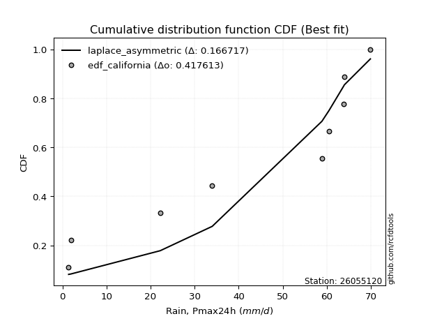</img>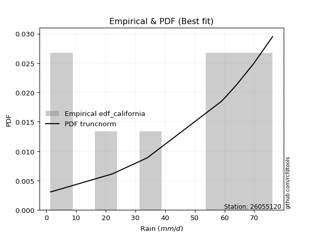</img>

</div>


### 2. Empirical - EDF Hazen (1930)

Hazen method for plotting positions is a formula used to estimate the empirical cumulative probability distribution of flood events or other hydrological data. This formula often results in biased estimations, particularly when extrapolating to extreme events (high return periods).

<div align="center">


$P=(m-0.5)/n$


</div>


**2.1. Empirical values**

<div align="center">

|                | 0                  | 1                  | 2                  | 3                  | 4                  | 5                  | 6                 | 7         | 8                 | 9                  |
|:---------------|:-------------------|:-------------------|:-------------------|:-------------------|:-------------------|:-------------------|:------------------|:----------|:------------------|:-------------------|
| date           | 2016               | 2023               | 2022               | 2021               | 2025               | 2017               | 2018              | 2024      | 2020              | 2019               |
| x              | 1.4                | 1.9                | 22.2               | 34.0               | 36.2               | 58.9               | 60.5              | 63.8      | 64.0              | 69.9               |
| m              | 1                  | 2                  | 3                  | 4                  | 5                  | 6                  | 7                 | 8         | 9                 | 10                 |
| empirical_dist | edf_hazen          | edf_hazen          | edf_hazen          | edf_hazen          | edf_hazen          | edf_hazen          | edf_hazen         | edf_hazen | edf_hazen         | edf_hazen          |
| empirical      | 0.05               | 0.15               | 0.25               | 0.35               | 0.45               | 0.55               | 0.65              | 0.75      | 0.85              | 0.95               |
| empirical_tr   | 1.0526315789473684 | 1.1764705882352942 | 1.3333333333333333 | 1.5384615384615383 | 1.8181818181818181 | 2.2222222222222223 | 2.857142857142857 | 4.0       | 6.666666666666666 | 19.999999999999982 |

</div>


**2.2. Kolmogorov-Smirnov fit test (sorted by Δ)**


<div align="center">

|                | 0                   | 1                   | 2                   | 3                   | 4                  | 5                   | 6                   | 7                  | 8                  | 9                   | 10                  | 11                 | 12                  | 13                 | 14                  | 15                  | 16                  | 17                  | 18                  | 19                  | 20                 | 21                  | 22                  | 23                 | 24                  | 25                 | 26                  | 27                  | 28                 | 29                  | 30                  | 31                 | 32                  | 33                  | 34                  | 35                  | 36                  | 37                  | 38                 | 39                 | 40                 | 41                  | 42                  | 43                 | 44                  | 45                  | 46                  | 47                 | 48                 | 49                 | 50                 | 51                 | 52                 | 53                 | 54                 | 55                  | 56                 | 57                 | 58                  | 59                  | 60                  | 61                  | 62                 | 63                 | 64                    | 65                  | 66                  | 67                  | 68                  | 69                  | 70                 | 71                 | 72                 | 73                 | 74                 | 75                 | 76                  | 77                 | 78                 | 79                 | 80                  | 81                 | 82                  | 83                 | 84                  | 85                 | 86                 | 87                 | 88                 | 89                 |
|:---------------|:--------------------|:--------------------|:--------------------|:--------------------|:-------------------|:--------------------|:--------------------|:-------------------|:-------------------|:--------------------|:--------------------|:-------------------|:--------------------|:-------------------|:--------------------|:--------------------|:--------------------|:--------------------|:--------------------|:--------------------|:-------------------|:--------------------|:--------------------|:-------------------|:--------------------|:-------------------|:--------------------|:--------------------|:-------------------|:--------------------|:--------------------|:-------------------|:--------------------|:--------------------|:--------------------|:--------------------|:--------------------|:--------------------|:-------------------|:-------------------|:-------------------|:--------------------|:--------------------|:-------------------|:--------------------|:--------------------|:--------------------|:-------------------|:-------------------|:-------------------|:-------------------|:-------------------|:-------------------|:-------------------|:-------------------|:--------------------|:-------------------|:-------------------|:--------------------|:--------------------|:--------------------|:--------------------|:-------------------|:-------------------|:----------------------|:--------------------|:--------------------|:--------------------|:--------------------|:--------------------|:-------------------|:-------------------|:-------------------|:-------------------|:-------------------|:-------------------|:--------------------|:-------------------|:-------------------|:-------------------|:--------------------|:-------------------|:--------------------|:-------------------|:--------------------|:-------------------|:-------------------|:-------------------|:-------------------|:-------------------|
| station        | 26055120            | 26055120            | 26055120            | 26055120            | 26055120           | 26055120            | 26055120            | 26055120           | 26055120           | 26055120            | 26055120            | 26055120           | 26055120            | 26055120           | 26055120            | 26055120            | 26055120            | 26055120            | 26055120            | 26055120            | 26055120           | 26055120            | 26055120            | 26055120           | 26055120            | 26055120           | 26055120            | 26055120            | 26055120           | 26055120            | 26055120            | 26055120           | 26055120            | 26055120            | 26055120            | 26055120            | 26055120            | 26055120            | 26055120           | 26055120           | 26055120           | 26055120            | 26055120            | 26055120           | 26055120            | 26055120            | 26055120            | 26055120           | 26055120           | 26055120           | 26055120           | 26055120           | 26055120           | 26055120           | 26055120           | 26055120            | 26055120           | 26055120           | 26055120            | 26055120            | 26055120            | 26055120            | 26055120           | 26055120           | 26055120              | 26055120            | 26055120            | 26055120            | 26055120            | 26055120            | 26055120           | 26055120           | 26055120           | 26055120           | 26055120           | 26055120           | 26055120            | 26055120           | 26055120           | 26055120           | 26055120            | 26055120           | 26055120            | 26055120           | 26055120            | 26055120           | 26055120           | 26055120           | 26055120           | 26055120           |
| empirical_dist | edf_hazen           | edf_hazen           | edf_hazen           | edf_hazen           | edf_hazen          | edf_hazen           | edf_hazen           | edf_hazen          | edf_hazen          | edf_hazen           | edf_hazen           | edf_hazen          | edf_hazen           | edf_hazen          | edf_hazen           | edf_hazen           | edf_hazen           | edf_hazen           | edf_hazen           | edf_hazen           | edf_hazen          | edf_hazen           | edf_hazen           | edf_hazen          | edf_hazen           | edf_hazen          | edf_hazen           | edf_hazen           | edf_hazen          | edf_hazen           | edf_hazen           | edf_hazen          | edf_hazen           | edf_hazen           | edf_hazen           | edf_hazen           | edf_hazen           | edf_hazen           | edf_hazen          | edf_hazen          | edf_hazen          | edf_hazen           | edf_hazen           | edf_hazen          | edf_hazen           | edf_hazen           | edf_hazen           | edf_hazen          | edf_hazen          | edf_hazen          | edf_hazen          | edf_hazen          | edf_hazen          | edf_hazen          | edf_hazen          | edf_hazen           | edf_hazen          | edf_hazen          | edf_hazen           | edf_hazen           | edf_hazen           | edf_hazen           | edf_hazen          | edf_hazen          | edf_hazen             | edf_hazen           | edf_hazen           | edf_hazen           | edf_hazen           | edf_hazen           | edf_hazen          | edf_hazen          | edf_hazen          | edf_hazen          | edf_hazen          | edf_hazen          | edf_hazen           | edf_hazen          | edf_hazen          | edf_hazen          | edf_hazen           | edf_hazen          | edf_hazen           | edf_hazen          | edf_hazen           | edf_hazen          | edf_hazen          | edf_hazen          | edf_hazen          | edf_hazen          |
| p_dist         | logjohnsonsu        | johnsonsu           | alpha               | loggumbel_l         | fisk               | logpearson3         | weibull_min         | pearson3           | gumbel_l           | invweibull          | invgauss            | erlang             | exponnorm           | crystalball        | norm                | t                   | logfisk             | expon               | betaprime           | rice                | genexpon           | gamma               | loggompertz         | logweibull_min     | kstwobign           | invgamma           | maxwell             | rayleigh            | laplace_asymmetric | halfnorm            | ncf                 | logistic           | logalpha            | logncf              | lognorm             | lognorm             | logexponnorm        | logf                | logrice            | logfatiguelife     | lognct             | lognakagami         | gumbel_r            | hypsecant          | logbetaprime        | logerlang           | halflogistic        | loggamma           | loggamma           | logchi2            | loglogistic        | loginvgamma        | moyal              | loginvgauss        | loghypsecant       | laplace             | loginvweibull      | logmaxwell         | lograyleigh         | nakagami            | f                   | loglaplace          | mielke             | wald               | loglaplace_asymmetric | logloggamma         | loghalfnorm         | logkstwobign        | logmielke           | loggumbel_r         | logt               | loggenexpon        | gibrat             | loghalflogistic    | logmoyal           | nct                | gompertz            | logtruncnorm       | logexpon           | logwald            | loglognorm          | pareto             | loggibrat           | logpareto          | fatiguelife         | chi2               | genlogistic        | loggenlogistic     | truncnorm          | logcrystalball     |
| delta          | 0.11347732136882949 | 0.16292032305857562 | 0.16605862518305703 | 0.18334745039215583 | 0.1888126229593302 | 0.19079304006581188 | 0.19640488900175834 | 0.2007531214435866 | 0.203686750145592  | 0.20464805922292784 | 0.21039563973850894 | 0.2109792902164258 | 0.21208854188291149 | 0.212089605706822  | 0.21208961879405197 | 0.21210162682840417 | 0.21213910824240878 | 0.21350435283210834 | 0.21358256565482858 | 0.21382582185605759 | 0.213879654592935  | 0.21479411915883728 | 0.21699686201407142 | 0.2172505690068114 | 0.21741333122821604 | 0.2198938810057648 | 0.22008509724530123 | 0.22235752727327518 | 0.2299858622404226 | 0.23044503087017387 | 0.23435774769676754 | 0.234707287667013  | 0.23875178434128463 | 0.24156749564917257 | 0.24417542267352077 | 0.24417542267352077 | 0.24417599842493853 | 0.24417854095591818 | 0.2441803575698125 | 0.2446232230649632 | 0.2448009195162878 | 0.24507982998594235 | 0.24852890697250252 | 0.2492248706205925 | 0.24976763053212964 | 0.25296214051343857 | 0.25411449936432007 | 0.254592308576696  | 0.254592308576696  | 0.2560953328266654 | 0.2564052519635738 | 0.2579685720201119 | 0.2603402691563569 | 0.263931778014292  | 0.2664607553563536 | 0.26759733209493963 | 0.2708882934367368 | 0.2712071295458399 | 0.27962994617460857 | 0.28175311194307484 | 0.28463468852525164 | 0.29304763421966096 | 0.2964672229581501 | 0.2981240675063721 | 0.29981098159578734   | 0.30027797179802884 | 0.30356899953520555 | 0.30647768842541123 | 0.30702627835803586 | 0.31126270261215805 | 0.3126838319506363 | 0.3131091635338855 | 0.3269633505199374 | 0.331821590477978  | 0.3342837999853593 | 0.3505162101100121 | 0.35756535446800575 | 0.3595046134462143 | 0.3699068843312088 | 0.3983771534388135 | 0.40752289139126663 | 0.4096480096452473 | 0.42989421494832714 | 0.4309605130525197 | 0.48704545129315413 | 0.7345536799938737 | 0.85               | 0.85               | 0.9287526188437446 | nan                |
| deltao         | 0.3942745923300002  | 0.3942745923300002  | 0.3942745923300002  | 0.3942745923300002  | 0.3942745923300002 | 0.3942745923300002  | 0.3942745923300002  | 0.3942745923300002 | 0.3942745923300002 | 0.3942745923300002  | 0.3942745923300002  | 0.3942745923300002 | 0.3942745923300002  | 0.3942745923300002 | 0.3942745923300002  | 0.3942745923300002  | 0.3942745923300002  | 0.3942745923300002  | 0.3942745923300002  | 0.3942745923300002  | 0.3942745923300002 | 0.3942745923300002  | 0.3942745923300002  | 0.3942745923300002 | 0.3942745923300002  | 0.3942745923300002 | 0.3942745923300002  | 0.3942745923300002  | 0.3942745923300002 | 0.3942745923300002  | 0.3942745923300002  | 0.3942745923300002 | 0.3942745923300002  | 0.3942745923300002  | 0.3942745923300002  | 0.3942745923300002  | 0.3942745923300002  | 0.3942745923300002  | 0.3942745923300002 | 0.3942745923300002 | 0.3942745923300002 | 0.3942745923300002  | 0.3942745923300002  | 0.3942745923300002 | 0.3942745923300002  | 0.3942745923300002  | 0.3942745923300002  | 0.3942745923300002 | 0.3942745923300002 | 0.3942745923300002 | 0.3942745923300002 | 0.3942745923300002 | 0.3942745923300002 | 0.3942745923300002 | 0.3942745923300002 | 0.3942745923300002  | 0.3942745923300002 | 0.3942745923300002 | 0.3942745923300002  | 0.3942745923300002  | 0.3942745923300002  | 0.3942745923300002  | 0.3942745923300002 | 0.3942745923300002 | 0.3942745923300002    | 0.3942745923300002  | 0.3942745923300002  | 0.3942745923300002  | 0.3942745923300002  | 0.3942745923300002  | 0.3942745923300002 | 0.3942745923300002 | 0.3942745923300002 | 0.3942745923300002 | 0.3942745923300002 | 0.3942745923300002 | 0.3942745923300002  | 0.3942745923300002 | 0.3942745923300002 | 0.3942745923300002 | 0.3942745923300002  | 0.3942745923300002 | 0.3942745923300002  | 0.3942745923300002 | 0.3942745923300002  | 0.3942745923300002 | 0.3942745923300002 | 0.3942745923300002 | 0.3942745923300002 | 0.3942745923300002 |
| eval           | Δo > Δ              | Δo > Δ              | Δo > Δ              | Δo > Δ              | Δo > Δ             | Δo > Δ              | Δo > Δ              | Δo > Δ             | Δo > Δ             | Δo > Δ              | Δo > Δ              | Δo > Δ             | Δo > Δ              | Δo > Δ             | Δo > Δ              | Δo > Δ              | Δo > Δ              | Δo > Δ              | Δo > Δ              | Δo > Δ              | Δo > Δ             | Δo > Δ              | Δo > Δ              | Δo > Δ             | Δo > Δ              | Δo > Δ             | Δo > Δ              | Δo > Δ              | Δo > Δ             | Δo > Δ              | Δo > Δ              | Δo > Δ             | Δo > Δ              | Δo > Δ              | Δo > Δ              | Δo > Δ              | Δo > Δ              | Δo > Δ              | Δo > Δ             | Δo > Δ             | Δo > Δ             | Δo > Δ              | Δo > Δ              | Δo > Δ             | Δo > Δ              | Δo > Δ              | Δo > Δ              | Δo > Δ             | Δo > Δ             | Δo > Δ             | Δo > Δ             | Δo > Δ             | Δo > Δ             | Δo > Δ             | Δo > Δ             | Δo > Δ              | Δo > Δ             | Δo > Δ             | Δo > Δ              | Δo > Δ              | Δo > Δ              | Δo > Δ              | Δo > Δ             | Δo > Δ             | Δo > Δ                | Δo > Δ              | Δo > Δ              | Δo > Δ              | Δo > Δ              | Δo > Δ              | Δo > Δ             | Δo > Δ             | Δo > Δ             | Δo > Δ             | Δo > Δ             | Δo > Δ             | Δo > Δ              | Δo > Δ             | Δo > Δ             | Δo <= Δ            | Δo <= Δ             | Δo <= Δ            | Δo <= Δ             | Δo <= Δ            | Δo <= Δ             | Δo <= Δ            | Δo <= Δ            | Δo <= Δ            | Δo <= Δ            | Δo <= Δ            |
| fit            | 1                   | 1                   | 1                   | 1                   | 1                  | 1                   | 1                   | 1                  | 1                  | 1                   | 1                   | 1                  | 1                   | 1                  | 1                   | 1                   | 1                   | 1                   | 1                   | 1                   | 1                  | 1                   | 1                   | 1                  | 1                   | 1                  | 1                   | 1                   | 1                  | 1                   | 1                   | 1                  | 1                   | 1                   | 1                   | 1                   | 1                   | 1                   | 1                  | 1                  | 1                  | 1                   | 1                   | 1                  | 1                   | 1                   | 1                   | 1                  | 1                  | 1                  | 1                  | 1                  | 1                  | 1                  | 1                  | 1                   | 1                  | 1                  | 1                   | 1                   | 1                   | 1                   | 1                  | 1                  | 1                     | 1                   | 1                   | 1                   | 1                   | 1                   | 1                  | 1                  | 1                  | 1                  | 1                  | 1                  | 1                   | 1                  | 1                  | 0                  | 0                   | 0                  | 0                   | 0                  | 0                   | 0                  | 0                  | 0                  | 0                  | 0                  |
| n              | 10                  | 10                  | 10                  | 10                  | 10                 | 10                  | 10                  | 10                 | 10                 | 10                  | 10                  | 10                 | 10                  | 10                 | 10                  | 10                  | 10                  | 10                  | 10                  | 10                  | 10                 | 10                  | 10                  | 10                 | 10                  | 10                 | 10                  | 10                  | 10                 | 10                  | 10                  | 10                 | 10                  | 10                  | 10                  | 10                  | 10                  | 10                  | 10                 | 10                 | 10                 | 10                  | 10                  | 10                 | 10                  | 10                  | 10                  | 10                 | 10                 | 10                 | 10                 | 10                 | 10                 | 10                 | 10                 | 10                  | 10                 | 10                 | 10                  | 10                  | 10                  | 10                  | 10                 | 10                 | 10                    | 10                  | 10                  | 10                  | 10                  | 10                  | 10                 | 10                 | 10                 | 10                 | 10                 | 10                 | 10                  | 10                 | 10                 | 10                 | 10                  | 10                 | 10                  | 10                 | 10                  | 10                 | 10                 | 10                 | 10                 | 10                 |
| best_fit       | 1                   | 0                   | 0                   | 0                   | 0                  | 0                   | 0                   | 0                  | 0                  | 0                   | 0                   | 0                  | 0                   | 0                  | 0                   | 0                   | 0                   | 0                   | 0                   | 0                   | 0                  | 0                   | 0                   | 0                  | 0                   | 0                  | 0                   | 0                   | 0                  | 0                   | 0                   | 0                  | 0                   | 0                   | 0                   | 0                   | 0                   | 0                   | 0                  | 0                  | 0                  | 0                   | 0                   | 0                  | 0                   | 0                   | 0                   | 0                  | 0                  | 0                  | 0                  | 0                  | 0                  | 0                  | 0                  | 0                   | 0                  | 0                  | 0                   | 0                   | 0                   | 0                   | 0                  | 0                  | 0                     | 0                   | 0                   | 0                   | 0                   | 0                   | 0                  | 0                  | 0                  | 0                  | 0                  | 0                  | 0                   | 0                  | 0                  | 0                  | 0                   | 0                  | 0                   | 0                  | 0                   | 0                  | 0                  | 0                  | 0                  | 0                  |
| best_fit_sort  | 1                   | 2                   | 3                   | 4                   | 5                  | 6                   | 7                   | 8                  | 9                  | 10                  | 11                  | 12                 | 13                  | 14                 | 15                  | 16                  | 17                  | 18                  | 19                  | 20                  | 21                 | 22                  | 23                  | 24                 | 25                  | 26                 | 27                  | 28                  | 29                 | 30                  | 31                  | 32                 | 33                  | 34                  | 35                  | 36                  | 37                  | 38                  | 39                 | 40                 | 41                 | 42                  | 43                  | 44                 | 45                  | 46                  | 47                  | 48                 | 49                 | 50                 | 51                 | 52                 | 53                 | 54                 | 55                 | 56                  | 57                 | 58                 | 59                  | 60                  | 61                  | 62                  | 63                 | 64                 | 65                    | 66                  | 67                  | 68                  | 69                  | 70                  | 71                 | 72                 | 73                 | 74                 | 75                 | 76                 | 77                  | 78                 | 79                 | 80                 | 81                  | 82                 | 83                  | 84                 | 85                  | 86                 | 87                 | 88                 | 89                 | 90                 |

</div>


<div align="center">

</img>

</div>


**2.3. Best fit**

<div align="center">

|   id |   station | empirical_dist   | p_dist       |    delta |   deltao | eval   |   fit |   n |   best_fit |   best_fit_sort |
|-----:|----------:|:-----------------|:-------------|---------:|---------:|:-------|------:|----:|-----------:|----------------:|
|    0 |  26055120 | edf_hazen        | logjohnsonsu | 0.113477 | 0.394275 | Δo > Δ |     1 |  10 |          1 |               1 |

</div>


<div align="center">

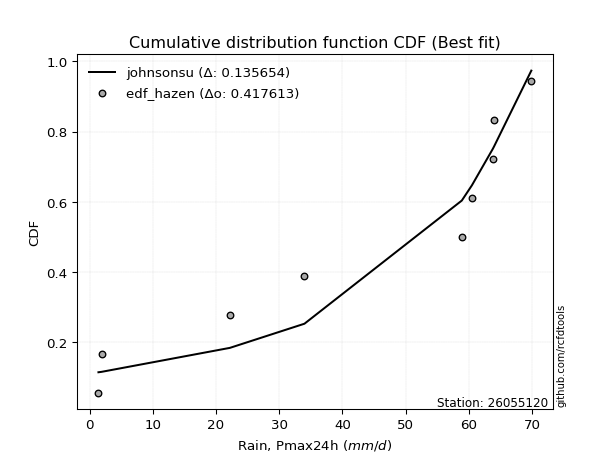</img>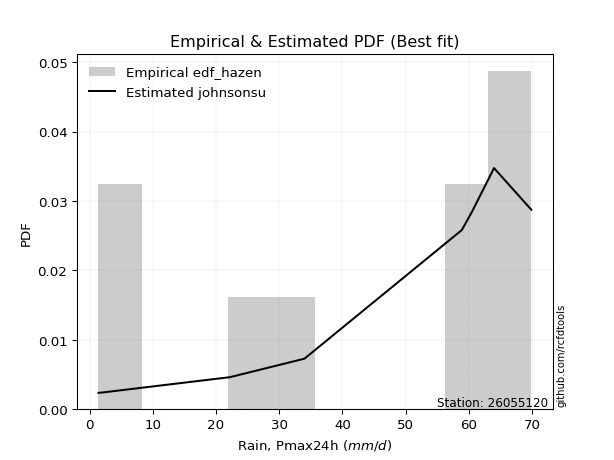</img>

</div>


### 3. Empirical - EDF Weibull (1939)

Weibull plotting position formula is an empirical method used to estimate the non-exceedance probability or plotting position for a set of observed data, is often recommended or widely used in practice, particularly in flood frequency analysis.

<div align="center">


$P=m/(n+1)$


</div>


**3.1. Empirical values**

<div align="center">

|                | 0                   | 1                   | 2                  | 3                   | 4                   | 5                  | 6                  | 7                  | 8                  | 9                  |
|:---------------|:--------------------|:--------------------|:-------------------|:--------------------|:--------------------|:-------------------|:-------------------|:-------------------|:-------------------|:-------------------|
| date           | 2016                | 2023                | 2022               | 2021                | 2025                | 2017               | 2018               | 2024               | 2020               | 2019               |
| x              | 1.4                 | 1.9                 | 22.2               | 34.0                | 36.2                | 58.9               | 60.5               | 63.8               | 64.0               | 69.9               |
| m              | 1                   | 2                   | 3                  | 4                   | 5                   | 6                  | 7                  | 8                  | 9                  | 10                 |
| empirical_dist | edf_weibull         | edf_weibull         | edf_weibull        | edf_weibull         | edf_weibull         | edf_weibull        | edf_weibull        | edf_weibull        | edf_weibull        | edf_weibull        |
| empirical      | 0.09090909090909091 | 0.18181818181818182 | 0.2727272727272727 | 0.36363636363636365 | 0.45454545454545453 | 0.5454545454545454 | 0.6363636363636364 | 0.7272727272727273 | 0.8181818181818182 | 0.9090909090909091 |
| empirical_tr   | 1.1                 | 1.2222222222222223  | 1.375              | 1.5714285714285714  | 1.8333333333333335  | 2.1999999999999997 | 2.75               | 3.666666666666667  | 5.500000000000002  | 10.999999999999996 |

</div>


**3.2. Kolmogorov-Smirnov fit test (sorted by Δ)**


<div align="center">

|                | 0                   | 1                   | 2                   | 3                   | 4                   | 5                   | 6                   | 7                   | 8                   | 9                   | 10                  | 11                  | 12                  | 13                  | 14                  | 15                 | 16                 | 17                  | 18                 | 19                  | 20                  | 21                 | 22                  | 23                  | 24                  | 25                  | 26                  | 27                  | 28                 | 29                 | 30                 | 31                 | 32                  | 33                 | 34                  | 35                  | 36                  | 37                  | 38                  | 39                 | 40                  | 41                  | 42                  | 43                 | 44                  | 45                  | 46                  | 47                 | 48                  | 49                 | 50                  | 51                  | 52                  | 53                  | 54                  | 55                 | 56                 | 57                 | 58                 | 59                  | 60                  | 61                 | 62                 | 63                 | 64                 | 65                 | 66                 | 67                  | 68                    | 69                 | 70                 | 71                  | 72                 | 73                 | 74                 | 75                  | 76                 | 77                  | 78                  | 79                 | 80                  | 81                 | 82                  | 83                  | 84                 | 85                 | 86                 | 87                 | 88                 | 89                 |
|:---------------|:--------------------|:--------------------|:--------------------|:--------------------|:--------------------|:--------------------|:--------------------|:--------------------|:--------------------|:--------------------|:--------------------|:--------------------|:--------------------|:--------------------|:--------------------|:-------------------|:-------------------|:--------------------|:-------------------|:--------------------|:--------------------|:-------------------|:--------------------|:--------------------|:--------------------|:--------------------|:--------------------|:--------------------|:-------------------|:-------------------|:-------------------|:-------------------|:--------------------|:-------------------|:--------------------|:--------------------|:--------------------|:--------------------|:--------------------|:-------------------|:--------------------|:--------------------|:--------------------|:-------------------|:--------------------|:--------------------|:--------------------|:-------------------|:--------------------|:-------------------|:--------------------|:--------------------|:--------------------|:--------------------|:--------------------|:-------------------|:-------------------|:-------------------|:-------------------|:--------------------|:--------------------|:-------------------|:-------------------|:-------------------|:-------------------|:-------------------|:-------------------|:--------------------|:----------------------|:-------------------|:-------------------|:--------------------|:-------------------|:-------------------|:-------------------|:--------------------|:-------------------|:--------------------|:--------------------|:-------------------|:--------------------|:-------------------|:--------------------|:--------------------|:-------------------|:-------------------|:-------------------|:-------------------|:-------------------|:-------------------|
| station        | 26055120            | 26055120            | 26055120            | 26055120            | 26055120            | 26055120            | 26055120            | 26055120            | 26055120            | 26055120            | 26055120            | 26055120            | 26055120            | 26055120            | 26055120            | 26055120           | 26055120           | 26055120            | 26055120           | 26055120            | 26055120            | 26055120           | 26055120            | 26055120            | 26055120            | 26055120            | 26055120            | 26055120            | 26055120           | 26055120           | 26055120           | 26055120           | 26055120            | 26055120           | 26055120            | 26055120            | 26055120            | 26055120            | 26055120            | 26055120           | 26055120            | 26055120            | 26055120            | 26055120           | 26055120            | 26055120            | 26055120            | 26055120           | 26055120            | 26055120           | 26055120            | 26055120            | 26055120            | 26055120            | 26055120            | 26055120           | 26055120           | 26055120           | 26055120           | 26055120            | 26055120            | 26055120           | 26055120           | 26055120           | 26055120           | 26055120           | 26055120           | 26055120            | 26055120              | 26055120           | 26055120           | 26055120            | 26055120           | 26055120           | 26055120           | 26055120            | 26055120           | 26055120            | 26055120            | 26055120           | 26055120            | 26055120           | 26055120            | 26055120            | 26055120           | 26055120           | 26055120           | 26055120           | 26055120           | 26055120           |
| empirical_dist | edf_weibull         | edf_weibull         | edf_weibull         | edf_weibull         | edf_weibull         | edf_weibull         | edf_weibull         | edf_weibull         | edf_weibull         | edf_weibull         | edf_weibull         | edf_weibull         | edf_weibull         | edf_weibull         | edf_weibull         | edf_weibull        | edf_weibull        | edf_weibull         | edf_weibull        | edf_weibull         | edf_weibull         | edf_weibull        | edf_weibull         | edf_weibull         | edf_weibull         | edf_weibull         | edf_weibull         | edf_weibull         | edf_weibull        | edf_weibull        | edf_weibull        | edf_weibull        | edf_weibull         | edf_weibull        | edf_weibull         | edf_weibull         | edf_weibull         | edf_weibull         | edf_weibull         | edf_weibull        | edf_weibull         | edf_weibull         | edf_weibull         | edf_weibull        | edf_weibull         | edf_weibull         | edf_weibull         | edf_weibull        | edf_weibull         | edf_weibull        | edf_weibull         | edf_weibull         | edf_weibull         | edf_weibull         | edf_weibull         | edf_weibull        | edf_weibull        | edf_weibull        | edf_weibull        | edf_weibull         | edf_weibull         | edf_weibull        | edf_weibull        | edf_weibull        | edf_weibull        | edf_weibull        | edf_weibull        | edf_weibull         | edf_weibull           | edf_weibull        | edf_weibull        | edf_weibull         | edf_weibull        | edf_weibull        | edf_weibull        | edf_weibull         | edf_weibull        | edf_weibull         | edf_weibull         | edf_weibull        | edf_weibull         | edf_weibull        | edf_weibull         | edf_weibull         | edf_weibull        | edf_weibull        | edf_weibull        | edf_weibull        | edf_weibull        | edf_weibull        |
| p_dist         | logjohnsonsu        | logpearson3         | johnsonsu           | alpha               | logfisk             | loggumbel_l         | fisk                | weibull_min         | pearson3            | gumbel_l            | invweibull          | invgauss            | erlang              | exponnorm           | crystalball         | norm               | t                  | expon               | betaprime          | rice                | genexpon            | gamma              | loggompertz         | logweibull_min      | kstwobign           | invgamma            | maxwell             | logalpha            | rayleigh           | logncf             | lognorm            | lognorm            | logexponnorm        | logf               | logrice             | logfatiguelife      | lognct              | lognakagami         | laplace_asymmetric  | halfnorm           | logbetaprime        | ncf                 | logistic            | logerlang          | loggamma            | loggamma            | logchi2             | loglogistic        | loginvgamma         | loginvweibull      | loginvgauss         | loghypsecant        | gumbel_r            | hypsecant           | logmaxwell          | halflogistic       | moyal              | lograyleigh        | f                  | nakagami            | laplace             | loglaplace         | logkstwobign       | loghalfnorm        | loggenexpon        | loggumbel_r        | mielke             | wald                | loglaplace_asymmetric | logloggamma        | logmielke          | logt                | loghalflogistic    | logmoyal           | nct                | gibrat              | logtruncnorm       | logexpon            | gompertz            | loglognorm         | logwald             | pareto             | logpareto           | loggibrat           | fatiguelife        | chi2               | genlogistic        | loggenlogistic     | truncnorm          | logcrystalball     |
| delta          | 0.10782383905743914 | 0.15336517912232328 | 0.16746577760403014 | 0.17060407972851166 | 0.17123001733331789 | 0.17149343303942666 | 0.19335807750478484 | 0.20095034354721297 | 0.20529857598904122 | 0.20823220469104664 | 0.20919351376838247 | 0.21494109428396357 | 0.21552474476188044 | 0.21663399642836612 | 0.21663506025227663 | 0.2166350733395066 | 0.2166470813738588 | 0.21804980737756297 | 0.2181280202002832 | 0.21837127640151222 | 0.21842510913838964 | 0.2193395737042919 | 0.22154231655952605 | 0.22179602355226602 | 0.22195878577367067 | 0.22443933555121942 | 0.22463055179075586 | 0.22511542070492097 | 0.2269029818187298 | 0.2279311320128089 | 0.2305390590371571 | 0.2305390590371571 | 0.23053963478857487 | 0.2305421773195545 | 0.23054399393344882 | 0.23098685942859953 | 0.23116455587992413 | 0.23144346634957869 | 0.23453131678587724 | 0.2349904854156285 | 0.23597604095871605 | 0.23890320224222217 | 0.23925274221246762 | 0.2393257768770749 | 0.24095594494033235 | 0.24095594494033235 | 0.24245896919030174 | 0.2427688883272101 | 0.24433220838374825 | 0.2481610207094641 | 0.25029541437792835 | 0.25282439171998994 | 0.25307436151795715 | 0.25377032516604714 | 0.25757076590947625 | 0.2586599539097747 | 0.2648857237018115 | 0.2659935825382449 | 0.270998324888888  | 0.27160659935932896 | 0.27214278664039426 | 0.2794112705832973 | 0.2837504156981385 | 0.2899326358988419 | 0.2903818908066128 | 0.2976263389757944 | 0.3010126775036047 | 0.30266952205182673 | 0.30435643614124197   | 0.3048234263434835 | 0.3115717329034905 | 0.31722928649609083 | 0.3181852268416143 | 0.3206474363489956 | 0.3277889373827394 | 0.33150880506539204 | 0.3367773407189416 | 0.34717961160393607 | 0.36211080901346027 | 0.3757047095730848 | 0.38474078980244986 | 0.3869207369179746 | 0.39925385746402964 | 0.41625785131196347 | 0.4643181785658814 | 0.711826407266601  | 0.8181818181818182 | 0.8181818181818182 | 0.8878435279346537 | nan                |
| deltao         | 0.3942745923300002  | 0.3942745923300002  | 0.3942745923300002  | 0.3942745923300002  | 0.3942745923300002  | 0.3942745923300002  | 0.3942745923300002  | 0.3942745923300002  | 0.3942745923300002  | 0.3942745923300002  | 0.3942745923300002  | 0.3942745923300002  | 0.3942745923300002  | 0.3942745923300002  | 0.3942745923300002  | 0.3942745923300002 | 0.3942745923300002 | 0.3942745923300002  | 0.3942745923300002 | 0.3942745923300002  | 0.3942745923300002  | 0.3942745923300002 | 0.3942745923300002  | 0.3942745923300002  | 0.3942745923300002  | 0.3942745923300002  | 0.3942745923300002  | 0.3942745923300002  | 0.3942745923300002 | 0.3942745923300002 | 0.3942745923300002 | 0.3942745923300002 | 0.3942745923300002  | 0.3942745923300002 | 0.3942745923300002  | 0.3942745923300002  | 0.3942745923300002  | 0.3942745923300002  | 0.3942745923300002  | 0.3942745923300002 | 0.3942745923300002  | 0.3942745923300002  | 0.3942745923300002  | 0.3942745923300002 | 0.3942745923300002  | 0.3942745923300002  | 0.3942745923300002  | 0.3942745923300002 | 0.3942745923300002  | 0.3942745923300002 | 0.3942745923300002  | 0.3942745923300002  | 0.3942745923300002  | 0.3942745923300002  | 0.3942745923300002  | 0.3942745923300002 | 0.3942745923300002 | 0.3942745923300002 | 0.3942745923300002 | 0.3942745923300002  | 0.3942745923300002  | 0.3942745923300002 | 0.3942745923300002 | 0.3942745923300002 | 0.3942745923300002 | 0.3942745923300002 | 0.3942745923300002 | 0.3942745923300002  | 0.3942745923300002    | 0.3942745923300002 | 0.3942745923300002 | 0.3942745923300002  | 0.3942745923300002 | 0.3942745923300002 | 0.3942745923300002 | 0.3942745923300002  | 0.3942745923300002 | 0.3942745923300002  | 0.3942745923300002  | 0.3942745923300002 | 0.3942745923300002  | 0.3942745923300002 | 0.3942745923300002  | 0.3942745923300002  | 0.3942745923300002 | 0.3942745923300002 | 0.3942745923300002 | 0.3942745923300002 | 0.3942745923300002 | 0.3942745923300002 |
| eval           | Δo > Δ              | Δo > Δ              | Δo > Δ              | Δo > Δ              | Δo > Δ              | Δo > Δ              | Δo > Δ              | Δo > Δ              | Δo > Δ              | Δo > Δ              | Δo > Δ              | Δo > Δ              | Δo > Δ              | Δo > Δ              | Δo > Δ              | Δo > Δ             | Δo > Δ             | Δo > Δ              | Δo > Δ             | Δo > Δ              | Δo > Δ              | Δo > Δ             | Δo > Δ              | Δo > Δ              | Δo > Δ              | Δo > Δ              | Δo > Δ              | Δo > Δ              | Δo > Δ             | Δo > Δ             | Δo > Δ             | Δo > Δ             | Δo > Δ              | Δo > Δ             | Δo > Δ              | Δo > Δ              | Δo > Δ              | Δo > Δ              | Δo > Δ              | Δo > Δ             | Δo > Δ              | Δo > Δ              | Δo > Δ              | Δo > Δ             | Δo > Δ              | Δo > Δ              | Δo > Δ              | Δo > Δ             | Δo > Δ              | Δo > Δ             | Δo > Δ              | Δo > Δ              | Δo > Δ              | Δo > Δ              | Δo > Δ              | Δo > Δ             | Δo > Δ             | Δo > Δ             | Δo > Δ             | Δo > Δ              | Δo > Δ              | Δo > Δ             | Δo > Δ             | Δo > Δ             | Δo > Δ             | Δo > Δ             | Δo > Δ             | Δo > Δ              | Δo > Δ                | Δo > Δ             | Δo > Δ             | Δo > Δ              | Δo > Δ             | Δo > Δ             | Δo > Δ             | Δo > Δ              | Δo > Δ             | Δo > Δ              | Δo > Δ              | Δo > Δ             | Δo > Δ              | Δo > Δ             | Δo <= Δ             | Δo <= Δ             | Δo <= Δ            | Δo <= Δ            | Δo <= Δ            | Δo <= Δ            | Δo <= Δ            | Δo <= Δ            |
| fit            | 1                   | 1                   | 1                   | 1                   | 1                   | 1                   | 1                   | 1                   | 1                   | 1                   | 1                   | 1                   | 1                   | 1                   | 1                   | 1                  | 1                  | 1                   | 1                  | 1                   | 1                   | 1                  | 1                   | 1                   | 1                   | 1                   | 1                   | 1                   | 1                  | 1                  | 1                  | 1                  | 1                   | 1                  | 1                   | 1                   | 1                   | 1                   | 1                   | 1                  | 1                   | 1                   | 1                   | 1                  | 1                   | 1                   | 1                   | 1                  | 1                   | 1                  | 1                   | 1                   | 1                   | 1                   | 1                   | 1                  | 1                  | 1                  | 1                  | 1                   | 1                   | 1                  | 1                  | 1                  | 1                  | 1                  | 1                  | 1                   | 1                     | 1                  | 1                  | 1                   | 1                  | 1                  | 1                  | 1                   | 1                  | 1                   | 1                   | 1                  | 1                   | 1                  | 0                   | 0                   | 0                  | 0                  | 0                  | 0                  | 0                  | 0                  |
| n              | 10                  | 10                  | 10                  | 10                  | 10                  | 10                  | 10                  | 10                  | 10                  | 10                  | 10                  | 10                  | 10                  | 10                  | 10                  | 10                 | 10                 | 10                  | 10                 | 10                  | 10                  | 10                 | 10                  | 10                  | 10                  | 10                  | 10                  | 10                  | 10                 | 10                 | 10                 | 10                 | 10                  | 10                 | 10                  | 10                  | 10                  | 10                  | 10                  | 10                 | 10                  | 10                  | 10                  | 10                 | 10                  | 10                  | 10                  | 10                 | 10                  | 10                 | 10                  | 10                  | 10                  | 10                  | 10                  | 10                 | 10                 | 10                 | 10                 | 10                  | 10                  | 10                 | 10                 | 10                 | 10                 | 10                 | 10                 | 10                  | 10                    | 10                 | 10                 | 10                  | 10                 | 10                 | 10                 | 10                  | 10                 | 10                  | 10                  | 10                 | 10                  | 10                 | 10                  | 10                  | 10                 | 10                 | 10                 | 10                 | 10                 | 10                 |
| best_fit       | 1                   | 0                   | 0                   | 0                   | 0                   | 0                   | 0                   | 0                   | 0                   | 0                   | 0                   | 0                   | 0                   | 0                   | 0                   | 0                  | 0                  | 0                   | 0                  | 0                   | 0                   | 0                  | 0                   | 0                   | 0                   | 0                   | 0                   | 0                   | 0                  | 0                  | 0                  | 0                  | 0                   | 0                  | 0                   | 0                   | 0                   | 0                   | 0                   | 0                  | 0                   | 0                   | 0                   | 0                  | 0                   | 0                   | 0                   | 0                  | 0                   | 0                  | 0                   | 0                   | 0                   | 0                   | 0                   | 0                  | 0                  | 0                  | 0                  | 0                   | 0                   | 0                  | 0                  | 0                  | 0                  | 0                  | 0                  | 0                   | 0                     | 0                  | 0                  | 0                   | 0                  | 0                  | 0                  | 0                   | 0                  | 0                   | 0                   | 0                  | 0                   | 0                  | 0                   | 0                   | 0                  | 0                  | 0                  | 0                  | 0                  | 0                  |
| best_fit_sort  | 1                   | 2                   | 3                   | 4                   | 5                   | 6                   | 7                   | 8                   | 9                   | 10                  | 11                  | 12                  | 13                  | 14                  | 15                  | 16                 | 17                 | 18                  | 19                 | 20                  | 21                  | 22                 | 23                  | 24                  | 25                  | 26                  | 27                  | 28                  | 29                 | 30                 | 31                 | 32                 | 33                  | 34                 | 35                  | 36                  | 37                  | 38                  | 39                  | 40                 | 41                  | 42                  | 43                  | 44                 | 45                  | 46                  | 47                  | 48                 | 49                  | 50                 | 51                  | 52                  | 53                  | 54                  | 55                  | 56                 | 57                 | 58                 | 59                 | 60                  | 61                  | 62                 | 63                 | 64                 | 65                 | 66                 | 67                 | 68                  | 69                    | 70                 | 71                 | 72                  | 73                 | 74                 | 75                 | 76                  | 77                 | 78                  | 79                  | 80                 | 81                  | 82                 | 83                  | 84                  | 85                 | 86                 | 87                 | 88                 | 89                 | 90                 |

</div>


<div align="center">

</img>

</div>


**3.3. Best fit**

<div align="center">

|   id |   station | empirical_dist   | p_dist       |    delta |   deltao | eval   |   fit |   n |   best_fit |   best_fit_sort |
|-----:|----------:|:-----------------|:-------------|---------:|---------:|:-------|------:|----:|-----------:|----------------:|
|    0 |  26055120 | edf_weibull      | logjohnsonsu | 0.107824 | 0.394275 | Δo > Δ |     1 |  10 |          1 |               1 |

</div>


<div align="center">

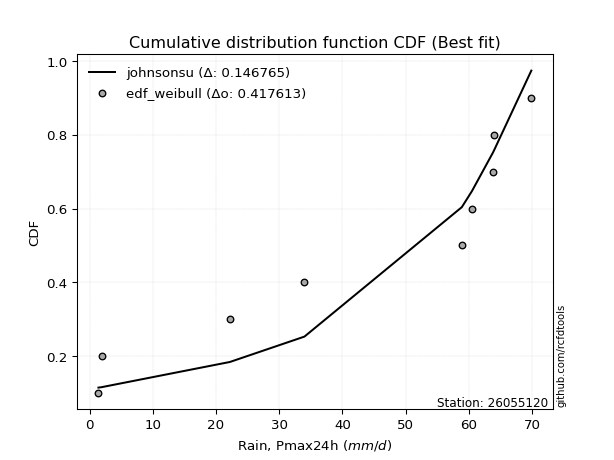</img>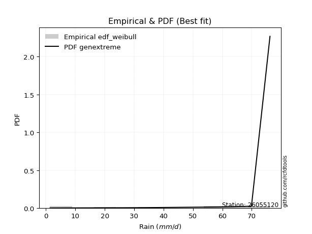</img>

</div>


### 4. Empirical - EDF Beard (1943)

The Beard formula (or Beard´s plotting position formula) in hydrology is used to estimate the empirical non-exceedance probability _(P)_ of a flood event (or other extreme hydrological data point) within a given dataset.

<div align="center">


$P=(m-0.31)/(n+0.38)$


</div>


**4.1. Empirical values**

<div align="center">

|                | 0                   | 1                   | 2                  | 3                   | 4                   | 5                  | 6                  | 7                  | 8                  | 9                  |
|:---------------|:--------------------|:--------------------|:-------------------|:--------------------|:--------------------|:-------------------|:-------------------|:-------------------|:-------------------|:-------------------|
| date           | 2016                | 2023                | 2022               | 2021                | 2025                | 2017               | 2018               | 2024               | 2020               | 2019               |
| x              | 1.4                 | 1.9                 | 22.2               | 34.0                | 36.2                | 58.9               | 60.5               | 63.8               | 64.0               | 69.9               |
| m              | 1                   | 2                   | 3                  | 4                   | 5                   | 6                  | 7                  | 8                  | 9                  | 10                 |
| empirical_dist | edf_beard           | edf_beard           | edf_beard          | edf_beard           | edf_beard           | edf_beard          | edf_beard          | edf_beard          | edf_beard          | edf_beard          |
| empirical      | 0.06647398843930635 | 0.16281310211946048 | 0.2591522157996146 | 0.35549132947976875 | 0.45183044315992293 | 0.5481695568400771 | 0.6445086705202312 | 0.7408477842003853 | 0.8371868978805393 | 0.9335260115606935 |
| empirical_tr   | 1.0712074303405574  | 1.1944764096662832  | 1.3498049414824447 | 1.5515695067264574  | 1.8242530755711774  | 2.213219616204691  | 2.813008130081301  | 3.8587360594795537 | 6.142011834319521  | 15.043478260869529 |

</div>


**4.2. Kolmogorov-Smirnov fit test (sorted by Δ)**


<div align="center">

|                | 0                   | 1                   | 2                  | 3                  | 4                   | 5                  | 6                  | 7                   | 8                   | 9                  | 10                  | 11                  | 12                 | 13                  | 14                  | 15                  | 16                  | 17                 | 18                  | 19                  | 20                 | 21                  | 22                 | 23                  | 24                  | 25                  | 26                 | 27                  | 28                 | 29                  | 30                  | 31                 | 32                  | 33                  | 34                 | 35                 | 36                  | 37                 | 38                  | 39                  | 40                  | 41                  | 42                  | 43                 | 44                  | 45                  | 46                 | 47                  | 48                 | 49                 | 50                  | 51                  | 52                  | 53                  | 54                 | 55                  | 56                  | 57                 | 58                 | 59                  | 60                 | 61                 | 62                 | 63                 | 64                  | 65                 | 66                    | 67                 | 68                 | 69                 | 70                  | 71                 | 72                 | 73                 | 74                 | 75                 | 76                 | 77                  | 78                  | 79                  | 80                  | 81                  | 82                  | 83                  | 84                 | 85                 | 86                 | 87                 | 88                 | 89                 |
|:---------------|:--------------------|:--------------------|:-------------------|:-------------------|:--------------------|:-------------------|:-------------------|:--------------------|:--------------------|:-------------------|:--------------------|:--------------------|:-------------------|:--------------------|:--------------------|:--------------------|:--------------------|:-------------------|:--------------------|:--------------------|:-------------------|:--------------------|:-------------------|:--------------------|:--------------------|:--------------------|:-------------------|:--------------------|:-------------------|:--------------------|:--------------------|:-------------------|:--------------------|:--------------------|:-------------------|:-------------------|:--------------------|:-------------------|:--------------------|:--------------------|:--------------------|:--------------------|:--------------------|:-------------------|:--------------------|:--------------------|:-------------------|:--------------------|:-------------------|:-------------------|:--------------------|:--------------------|:--------------------|:--------------------|:-------------------|:--------------------|:--------------------|:-------------------|:-------------------|:--------------------|:-------------------|:-------------------|:-------------------|:-------------------|:--------------------|:-------------------|:----------------------|:-------------------|:-------------------|:-------------------|:--------------------|:-------------------|:-------------------|:-------------------|:-------------------|:-------------------|:-------------------|:--------------------|:--------------------|:--------------------|:--------------------|:--------------------|:--------------------|:--------------------|:-------------------|:-------------------|:-------------------|:-------------------|:-------------------|:-------------------|
| station        | 26055120            | 26055120            | 26055120           | 26055120           | 26055120            | 26055120           | 26055120           | 26055120            | 26055120            | 26055120           | 26055120            | 26055120            | 26055120           | 26055120            | 26055120            | 26055120            | 26055120            | 26055120           | 26055120            | 26055120            | 26055120           | 26055120            | 26055120           | 26055120            | 26055120            | 26055120            | 26055120           | 26055120            | 26055120           | 26055120            | 26055120            | 26055120           | 26055120            | 26055120            | 26055120           | 26055120           | 26055120            | 26055120           | 26055120            | 26055120            | 26055120            | 26055120            | 26055120            | 26055120           | 26055120            | 26055120            | 26055120           | 26055120            | 26055120           | 26055120           | 26055120            | 26055120            | 26055120            | 26055120            | 26055120           | 26055120            | 26055120            | 26055120           | 26055120           | 26055120            | 26055120           | 26055120           | 26055120           | 26055120           | 26055120            | 26055120           | 26055120              | 26055120           | 26055120           | 26055120           | 26055120            | 26055120           | 26055120           | 26055120           | 26055120           | 26055120           | 26055120           | 26055120            | 26055120            | 26055120            | 26055120            | 26055120            | 26055120            | 26055120            | 26055120           | 26055120           | 26055120           | 26055120           | 26055120           | 26055120           |
| empirical_dist | edf_beard           | edf_beard           | edf_beard          | edf_beard          | edf_beard           | edf_beard          | edf_beard          | edf_beard           | edf_beard           | edf_beard          | edf_beard           | edf_beard           | edf_beard          | edf_beard           | edf_beard           | edf_beard           | edf_beard           | edf_beard          | edf_beard           | edf_beard           | edf_beard          | edf_beard           | edf_beard          | edf_beard           | edf_beard           | edf_beard           | edf_beard          | edf_beard           | edf_beard          | edf_beard           | edf_beard           | edf_beard          | edf_beard           | edf_beard           | edf_beard          | edf_beard          | edf_beard           | edf_beard          | edf_beard           | edf_beard           | edf_beard           | edf_beard           | edf_beard           | edf_beard          | edf_beard           | edf_beard           | edf_beard          | edf_beard           | edf_beard          | edf_beard          | edf_beard           | edf_beard           | edf_beard           | edf_beard           | edf_beard          | edf_beard           | edf_beard           | edf_beard          | edf_beard          | edf_beard           | edf_beard          | edf_beard          | edf_beard          | edf_beard          | edf_beard           | edf_beard          | edf_beard             | edf_beard          | edf_beard          | edf_beard          | edf_beard           | edf_beard          | edf_beard          | edf_beard          | edf_beard          | edf_beard          | edf_beard          | edf_beard           | edf_beard           | edf_beard           | edf_beard           | edf_beard           | edf_beard           | edf_beard           | edf_beard          | edf_beard          | edf_beard          | edf_beard          | edf_beard          | edf_beard          |
| p_dist         | logjohnsonsu        | johnsonsu           | alpha              | logpearson3        | loggumbel_l         | fisk               | logfisk            | weibull_min         | pearson3            | gumbel_l           | invweibull          | invgauss            | erlang             | exponnorm           | crystalball         | norm                | t                   | expon              | betaprime           | rice                | genexpon           | gamma               | loggompertz        | logweibull_min      | kstwobign           | invgamma            | maxwell            | rayleigh            | laplace_asymmetric | halfnorm            | logalpha            | logncf             | ncf                 | logistic            | lognorm            | lognorm            | logexponnorm        | logf               | logrice             | logfatiguelife      | lognct              | lognakagami         | logbetaprime        | logerlang          | loggamma            | loggamma            | gumbel_r           | logchi2             | loglogistic        | hypsecant          | loginvgamma         | halflogistic        | loginvgauss         | loghypsecant        | loginvweibull      | moyal               | logmaxwell          | laplace            | lograyleigh        | nakagami            | f                  | loglaplace         | logkstwobign       | loghalfnorm        | mielke              | wald               | loglaplace_asymmetric | logloggamma        | loggenexpon        | loggumbel_r        | logmielke           | logt               | loghalflogistic    | logmoyal           | gibrat             | nct                | logtruncnorm       | gompertz            | logexpon            | logwald             | loglognorm          | pareto              | logpareto           | loggibrat           | fatiguelife        | chi2               | genlogistic        | loggenlogistic     | truncnorm          | logcrystalball     |
| delta          | 0.10510882767190755 | 0.16475076621849855 | 0.16788906834298   | 0.1743190516265054 | 0.17785612091238706 | 0.1906430661192532 | 0.1956651198031023 | 0.19823533216168132 | 0.20258356460350957 | 0.205517193305515  | 0.20647850238285081 | 0.21222608289843192 | 0.2128097333763488 | 0.21391898504283446 | 0.21392004886674498 | 0.21392006195397495 | 0.21393206998832714 | 0.2153347959920313 | 0.21541300881475156 | 0.21565626501598056 | 0.215710097752858  | 0.21662456231876026 | 0.2188273051739944 | 0.21908101216673437 | 0.21924377438813902 | 0.22172432416568777 | 0.2219155404052242 | 0.22418797043319816 | 0.2318163054003456 | 0.23227547403009685 | 0.23326045486151586 | 0.2360761661694038 | 0.23618819085669052 | 0.23653773082693597 | 0.238684093193752  | 0.238684093193752  | 0.23868466894516976 | 0.2386872114761494 | 0.23868902809004372 | 0.23913189358519443 | 0.23930959003651903 | 0.23958850050617359 | 0.24412107511531095 | 0.2474708110336698 | 0.24910097909692724 | 0.24910097909692724 | 0.2503593501324255 | 0.25060400334689664 | 0.250913922483805  | 0.2510553137805155 | 0.25247724254034315 | 0.25594494252424305 | 0.25844044853452325 | 0.26096942587658484 | 0.2617360776371222 | 0.26217071231627986 | 0.26571580006607115 | 0.2694277752548626 | 0.2741386166948398 | 0.27626178246330607 | 0.2791433590454829 | 0.2875563047398922 | 0.2973254726257966 | 0.2980776700554368 | 0.29829766611807307 | 0.2999545106662951 | 0.3016414247557103    | 0.3021084149579518 | 0.3039569477342709 | 0.3057713731323893 | 0.30885672151795884 | 0.3145142751105592 | 0.3263302609982092 | 0.3287924705055905 | 0.3287937936798604 | 0.3413639943103975 | 0.3503523976465997 | 0.35939579762792867 | 0.36075466853159416 | 0.39288582395904476 | 0.39470978927180617 | 0.40049579384563266 | 0.41814741093305924 | 0.42440288546855837 | 0.4778932354935395 | 0.725401464194259  | 0.8371868978805393 | 0.8371868978805393 | 0.9122786304044384 | nan                |
| deltao         | 0.3942745923300002  | 0.3942745923300002  | 0.3942745923300002 | 0.3942745923300002 | 0.3942745923300002  | 0.3942745923300002 | 0.3942745923300002 | 0.3942745923300002  | 0.3942745923300002  | 0.3942745923300002 | 0.3942745923300002  | 0.3942745923300002  | 0.3942745923300002 | 0.3942745923300002  | 0.3942745923300002  | 0.3942745923300002  | 0.3942745923300002  | 0.3942745923300002 | 0.3942745923300002  | 0.3942745923300002  | 0.3942745923300002 | 0.3942745923300002  | 0.3942745923300002 | 0.3942745923300002  | 0.3942745923300002  | 0.3942745923300002  | 0.3942745923300002 | 0.3942745923300002  | 0.3942745923300002 | 0.3942745923300002  | 0.3942745923300002  | 0.3942745923300002 | 0.3942745923300002  | 0.3942745923300002  | 0.3942745923300002 | 0.3942745923300002 | 0.3942745923300002  | 0.3942745923300002 | 0.3942745923300002  | 0.3942745923300002  | 0.3942745923300002  | 0.3942745923300002  | 0.3942745923300002  | 0.3942745923300002 | 0.3942745923300002  | 0.3942745923300002  | 0.3942745923300002 | 0.3942745923300002  | 0.3942745923300002 | 0.3942745923300002 | 0.3942745923300002  | 0.3942745923300002  | 0.3942745923300002  | 0.3942745923300002  | 0.3942745923300002 | 0.3942745923300002  | 0.3942745923300002  | 0.3942745923300002 | 0.3942745923300002 | 0.3942745923300002  | 0.3942745923300002 | 0.3942745923300002 | 0.3942745923300002 | 0.3942745923300002 | 0.3942745923300002  | 0.3942745923300002 | 0.3942745923300002    | 0.3942745923300002 | 0.3942745923300002 | 0.3942745923300002 | 0.3942745923300002  | 0.3942745923300002 | 0.3942745923300002 | 0.3942745923300002 | 0.3942745923300002 | 0.3942745923300002 | 0.3942745923300002 | 0.3942745923300002  | 0.3942745923300002  | 0.3942745923300002  | 0.3942745923300002  | 0.3942745923300002  | 0.3942745923300002  | 0.3942745923300002  | 0.3942745923300002 | 0.3942745923300002 | 0.3942745923300002 | 0.3942745923300002 | 0.3942745923300002 | 0.3942745923300002 |
| eval           | Δo > Δ              | Δo > Δ              | Δo > Δ             | Δo > Δ             | Δo > Δ              | Δo > Δ             | Δo > Δ             | Δo > Δ              | Δo > Δ              | Δo > Δ             | Δo > Δ              | Δo > Δ              | Δo > Δ             | Δo > Δ              | Δo > Δ              | Δo > Δ              | Δo > Δ              | Δo > Δ             | Δo > Δ              | Δo > Δ              | Δo > Δ             | Δo > Δ              | Δo > Δ             | Δo > Δ              | Δo > Δ              | Δo > Δ              | Δo > Δ             | Δo > Δ              | Δo > Δ             | Δo > Δ              | Δo > Δ              | Δo > Δ             | Δo > Δ              | Δo > Δ              | Δo > Δ             | Δo > Δ             | Δo > Δ              | Δo > Δ             | Δo > Δ              | Δo > Δ              | Δo > Δ              | Δo > Δ              | Δo > Δ              | Δo > Δ             | Δo > Δ              | Δo > Δ              | Δo > Δ             | Δo > Δ              | Δo > Δ             | Δo > Δ             | Δo > Δ              | Δo > Δ              | Δo > Δ              | Δo > Δ              | Δo > Δ             | Δo > Δ              | Δo > Δ              | Δo > Δ             | Δo > Δ             | Δo > Δ              | Δo > Δ             | Δo > Δ             | Δo > Δ             | Δo > Δ             | Δo > Δ              | Δo > Δ             | Δo > Δ                | Δo > Δ             | Δo > Δ             | Δo > Δ             | Δo > Δ              | Δo > Δ             | Δo > Δ             | Δo > Δ             | Δo > Δ             | Δo > Δ             | Δo > Δ             | Δo > Δ              | Δo > Δ              | Δo > Δ              | Δo <= Δ             | Δo <= Δ             | Δo <= Δ             | Δo <= Δ             | Δo <= Δ            | Δo <= Δ            | Δo <= Δ            | Δo <= Δ            | Δo <= Δ            | Δo <= Δ            |
| fit            | 1                   | 1                   | 1                  | 1                  | 1                   | 1                  | 1                  | 1                   | 1                   | 1                  | 1                   | 1                   | 1                  | 1                   | 1                   | 1                   | 1                   | 1                  | 1                   | 1                   | 1                  | 1                   | 1                  | 1                   | 1                   | 1                   | 1                  | 1                   | 1                  | 1                   | 1                   | 1                  | 1                   | 1                   | 1                  | 1                  | 1                   | 1                  | 1                   | 1                   | 1                   | 1                   | 1                   | 1                  | 1                   | 1                   | 1                  | 1                   | 1                  | 1                  | 1                   | 1                   | 1                   | 1                   | 1                  | 1                   | 1                   | 1                  | 1                  | 1                   | 1                  | 1                  | 1                  | 1                  | 1                   | 1                  | 1                     | 1                  | 1                  | 1                  | 1                   | 1                  | 1                  | 1                  | 1                  | 1                  | 1                  | 1                   | 1                   | 1                   | 0                   | 0                   | 0                   | 0                   | 0                  | 0                  | 0                  | 0                  | 0                  | 0                  |
| n              | 10                  | 10                  | 10                 | 10                 | 10                  | 10                 | 10                 | 10                  | 10                  | 10                 | 10                  | 10                  | 10                 | 10                  | 10                  | 10                  | 10                  | 10                 | 10                  | 10                  | 10                 | 10                  | 10                 | 10                  | 10                  | 10                  | 10                 | 10                  | 10                 | 10                  | 10                  | 10                 | 10                  | 10                  | 10                 | 10                 | 10                  | 10                 | 10                  | 10                  | 10                  | 10                  | 10                  | 10                 | 10                  | 10                  | 10                 | 10                  | 10                 | 10                 | 10                  | 10                  | 10                  | 10                  | 10                 | 10                  | 10                  | 10                 | 10                 | 10                  | 10                 | 10                 | 10                 | 10                 | 10                  | 10                 | 10                    | 10                 | 10                 | 10                 | 10                  | 10                 | 10                 | 10                 | 10                 | 10                 | 10                 | 10                  | 10                  | 10                  | 10                  | 10                  | 10                  | 10                  | 10                 | 10                 | 10                 | 10                 | 10                 | 10                 |
| best_fit       | 1                   | 0                   | 0                  | 0                  | 0                   | 0                  | 0                  | 0                   | 0                   | 0                  | 0                   | 0                   | 0                  | 0                   | 0                   | 0                   | 0                   | 0                  | 0                   | 0                   | 0                  | 0                   | 0                  | 0                   | 0                   | 0                   | 0                  | 0                   | 0                  | 0                   | 0                   | 0                  | 0                   | 0                   | 0                  | 0                  | 0                   | 0                  | 0                   | 0                   | 0                   | 0                   | 0                   | 0                  | 0                   | 0                   | 0                  | 0                   | 0                  | 0                  | 0                   | 0                   | 0                   | 0                   | 0                  | 0                   | 0                   | 0                  | 0                  | 0                   | 0                  | 0                  | 0                  | 0                  | 0                   | 0                  | 0                     | 0                  | 0                  | 0                  | 0                   | 0                  | 0                  | 0                  | 0                  | 0                  | 0                  | 0                   | 0                   | 0                   | 0                   | 0                   | 0                   | 0                   | 0                  | 0                  | 0                  | 0                  | 0                  | 0                  |
| best_fit_sort  | 1                   | 2                   | 3                  | 4                  | 5                   | 6                  | 7                  | 8                   | 9                   | 10                 | 11                  | 12                  | 13                 | 14                  | 15                  | 16                  | 17                  | 18                 | 19                  | 20                  | 21                 | 22                  | 23                 | 24                  | 25                  | 26                  | 27                 | 28                  | 29                 | 30                  | 31                  | 32                 | 33                  | 34                  | 35                 | 36                 | 37                  | 38                 | 39                  | 40                  | 41                  | 42                  | 43                  | 44                 | 45                  | 46                  | 47                 | 48                  | 49                 | 50                 | 51                  | 52                  | 53                  | 54                  | 55                 | 56                  | 57                  | 58                 | 59                 | 60                  | 61                 | 62                 | 63                 | 64                 | 65                  | 66                 | 67                    | 68                 | 69                 | 70                 | 71                  | 72                 | 73                 | 74                 | 75                 | 76                 | 77                 | 78                  | 79                  | 80                  | 81                  | 82                  | 83                  | 84                  | 85                 | 86                 | 87                 | 88                 | 89                 | 90                 |

</div>


<div align="center">

</img>

</div>


**4.3. Best fit**

<div align="center">

|   id |   station | empirical_dist   | p_dist       |    delta |   deltao | eval   |   fit |   n |   best_fit |   best_fit_sort |
|-----:|----------:|:-----------------|:-------------|---------:|---------:|:-------|------:|----:|-----------:|----------------:|
|    0 |  26055120 | edf_beard        | logjohnsonsu | 0.105109 | 0.394275 | Δo > Δ |     1 |  10 |          1 |               1 |

</div>


<div align="center">

</img>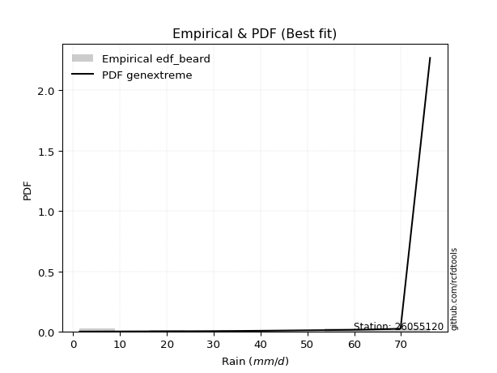</img>

</div>


### 5. Empirical - EDF Chegodayev (1955)

The Chegodayev formula is an empirical plotting position formula used in hydrological frequency analysis to estimate the exceedance probability or return period of a specific event from a set of observed data. It is primarily used for plotting observed data points on probability paper to fit a theoretical distribution, particularly for analyzing extreme events like maximum flood flows or rainfall intensities. The constant _b_ value in the generalized plotting position formula is 0.3.

<div align="center">


$P=(m-b)/(n+1-2b)$


</div>


**5.1. Empirical values**

<div align="center">

|                | 0                  | 1                   | 2                   | 3                  | 4                  | 5                  | 6                  | 7                  | 8                  | 9                  |
|:---------------|:-------------------|:--------------------|:--------------------|:-------------------|:-------------------|:-------------------|:-------------------|:-------------------|:-------------------|:-------------------|
| date           | 2016               | 2023                | 2022                | 2021               | 2025               | 2017               | 2018               | 2024               | 2020               | 2019               |
| x              | 1.4                | 1.9                 | 22.2                | 34.0               | 36.2               | 58.9               | 60.5               | 63.8               | 64.0               | 69.9               |
| m              | 1                  | 2                   | 3                   | 4                  | 5                  | 6                  | 7                  | 8                  | 9                  | 10                 |
| empirical_dist | edf_chegodayev     | edf_chegodayev      | edf_chegodayev      | edf_chegodayev     | edf_chegodayev     | edf_chegodayev     | edf_chegodayev     | edf_chegodayev     | edf_chegodayev     | edf_chegodayev     |
| empirical      | 0.0673076923076923 | 0.16346153846153846 | 0.25961538461538464 | 0.3557692307692308 | 0.4519230769230769 | 0.5480769230769231 | 0.6442307692307693 | 0.7403846153846154 | 0.8365384615384615 | 0.9326923076923076 |
| empirical_tr   | 1.0721649484536082 | 1.1954022988505746  | 1.3506493506493507  | 1.5522388059701495 | 1.8245614035087718 | 2.2127659574468086 | 2.810810810810811  | 3.8518518518518525 | 6.117647058823526  | 14.857142857142836 |

</div>


**5.2. Kolmogorov-Smirnov fit test (sorted by Δ)**


<div align="center">

|                | 0                   | 1                   | 2                   | 3                   | 4                   | 5                   | 6                   | 7                   | 8                  | 9                   | 10                  | 11                  | 12                  | 13                 | 14                  | 15                 | 16                  | 17                  | 18                 | 19                 | 20                  | 21                 | 22                  | 23                 | 24                  | 25                 | 26                  | 27                 | 28                  | 29                 | 30                  | 31                  | 32                  | 33                 | 34                  | 35                  | 36                  | 37                  | 38                  | 39                 | 40                 | 41                  | 42                 | 43                  | 44                 | 45                 | 46                 | 47                  | 48                 | 49                 | 50                 | 51                 | 52                 | 53                 | 54                 | 55                 | 56                 | 57                  | 58                  | 59                  | 60                  | 61                  | 62                 | 63                  | 64                 | 65                 | 66                    | 67                  | 68                 | 69                  | 70                 | 71                  | 72                 | 73                 | 74                  | 75                  | 76                 | 77                  | 78                  | 79                 | 80                 | 81                  | 82                 | 83                  | 84                 | 85                 | 86                 | 87                 | 88                 | 89                 |
|:---------------|:--------------------|:--------------------|:--------------------|:--------------------|:--------------------|:--------------------|:--------------------|:--------------------|:-------------------|:--------------------|:--------------------|:--------------------|:--------------------|:-------------------|:--------------------|:-------------------|:--------------------|:--------------------|:-------------------|:-------------------|:--------------------|:-------------------|:--------------------|:-------------------|:--------------------|:-------------------|:--------------------|:-------------------|:--------------------|:-------------------|:--------------------|:--------------------|:--------------------|:-------------------|:--------------------|:--------------------|:--------------------|:--------------------|:--------------------|:-------------------|:-------------------|:--------------------|:-------------------|:--------------------|:-------------------|:-------------------|:-------------------|:--------------------|:-------------------|:-------------------|:-------------------|:-------------------|:-------------------|:-------------------|:-------------------|:-------------------|:-------------------|:--------------------|:--------------------|:--------------------|:--------------------|:--------------------|:-------------------|:--------------------|:-------------------|:-------------------|:----------------------|:--------------------|:-------------------|:--------------------|:-------------------|:--------------------|:-------------------|:-------------------|:--------------------|:--------------------|:-------------------|:--------------------|:--------------------|:-------------------|:-------------------|:--------------------|:-------------------|:--------------------|:-------------------|:-------------------|:-------------------|:-------------------|:-------------------|:-------------------|
| station        | 26055120            | 26055120            | 26055120            | 26055120            | 26055120            | 26055120            | 26055120            | 26055120            | 26055120           | 26055120            | 26055120            | 26055120            | 26055120            | 26055120           | 26055120            | 26055120           | 26055120            | 26055120            | 26055120           | 26055120           | 26055120            | 26055120           | 26055120            | 26055120           | 26055120            | 26055120           | 26055120            | 26055120           | 26055120            | 26055120           | 26055120            | 26055120            | 26055120            | 26055120           | 26055120            | 26055120            | 26055120            | 26055120            | 26055120            | 26055120           | 26055120           | 26055120            | 26055120           | 26055120            | 26055120           | 26055120           | 26055120           | 26055120            | 26055120           | 26055120           | 26055120           | 26055120           | 26055120           | 26055120           | 26055120           | 26055120           | 26055120           | 26055120            | 26055120            | 26055120            | 26055120            | 26055120            | 26055120           | 26055120            | 26055120           | 26055120           | 26055120              | 26055120            | 26055120           | 26055120            | 26055120           | 26055120            | 26055120           | 26055120           | 26055120            | 26055120            | 26055120           | 26055120            | 26055120            | 26055120           | 26055120           | 26055120            | 26055120           | 26055120            | 26055120           | 26055120           | 26055120           | 26055120           | 26055120           | 26055120           |
| empirical_dist | edf_chegodayev      | edf_chegodayev      | edf_chegodayev      | edf_chegodayev      | edf_chegodayev      | edf_chegodayev      | edf_chegodayev      | edf_chegodayev      | edf_chegodayev     | edf_chegodayev      | edf_chegodayev      | edf_chegodayev      | edf_chegodayev      | edf_chegodayev     | edf_chegodayev      | edf_chegodayev     | edf_chegodayev      | edf_chegodayev      | edf_chegodayev     | edf_chegodayev     | edf_chegodayev      | edf_chegodayev     | edf_chegodayev      | edf_chegodayev     | edf_chegodayev      | edf_chegodayev     | edf_chegodayev      | edf_chegodayev     | edf_chegodayev      | edf_chegodayev     | edf_chegodayev      | edf_chegodayev      | edf_chegodayev      | edf_chegodayev     | edf_chegodayev      | edf_chegodayev      | edf_chegodayev      | edf_chegodayev      | edf_chegodayev      | edf_chegodayev     | edf_chegodayev     | edf_chegodayev      | edf_chegodayev     | edf_chegodayev      | edf_chegodayev     | edf_chegodayev     | edf_chegodayev     | edf_chegodayev      | edf_chegodayev     | edf_chegodayev     | edf_chegodayev     | edf_chegodayev     | edf_chegodayev     | edf_chegodayev     | edf_chegodayev     | edf_chegodayev     | edf_chegodayev     | edf_chegodayev      | edf_chegodayev      | edf_chegodayev      | edf_chegodayev      | edf_chegodayev      | edf_chegodayev     | edf_chegodayev      | edf_chegodayev     | edf_chegodayev     | edf_chegodayev        | edf_chegodayev      | edf_chegodayev     | edf_chegodayev      | edf_chegodayev     | edf_chegodayev      | edf_chegodayev     | edf_chegodayev     | edf_chegodayev      | edf_chegodayev      | edf_chegodayev     | edf_chegodayev      | edf_chegodayev      | edf_chegodayev     | edf_chegodayev     | edf_chegodayev      | edf_chegodayev     | edf_chegodayev      | edf_chegodayev     | edf_chegodayev     | edf_chegodayev     | edf_chegodayev     | edf_chegodayev     | edf_chegodayev     |
| p_dist         | logjohnsonsu        | johnsonsu           | alpha               | logpearson3         | loggumbel_l         | fisk                | logfisk             | weibull_min         | pearson3           | gumbel_l            | invweibull          | invgauss            | erlang              | exponnorm          | crystalball         | norm               | t                   | expon               | betaprime          | rice               | genexpon            | gamma              | loggompertz         | logweibull_min     | kstwobign           | invgamma           | maxwell             | rayleigh           | laplace_asymmetric  | halfnorm           | logalpha            | logncf              | ncf                 | logistic           | lognorm             | lognorm             | logexponnorm        | logf                | logrice             | logfatiguelife     | lognct             | lognakagami         | logbetaprime       | logerlang           | loggamma           | loggamma           | logchi2            | gumbel_r            | loglogistic        | hypsecant          | loginvgamma        | halflogistic       | loginvgauss        | loghypsecant       | loginvweibull      | moyal              | logmaxwell         | laplace             | lograyleigh         | nakagami            | f                   | loglaplace          | logkstwobign       | loghalfnorm         | mielke             | wald               | loglaplace_asymmetric | logloggamma         | loggenexpon        | loggumbel_r         | logmielke          | logt                | loghalflogistic    | logmoyal           | gibrat              | nct                 | logtruncnorm       | gompertz            | logexpon            | logwald            | loglognorm         | pareto              | logpareto          | loggibrat           | fatiguelife        | chi2               | genlogistic        | loggenlogistic     | truncnorm          | logcrystalball     |
| delta          | 0.10520146143506154 | 0.16484339998165254 | 0.16798170210613395 | 0.17348534775811952 | 0.17757821962292503 | 0.19073569988240713 | 0.19483141593471642 | 0.19832796592483526 | 0.2026761983666635 | 0.20560982706866893 | 0.20657113614600475 | 0.21231871666158586 | 0.21290236713950272 | 0.2140116188059884 | 0.21401268262989892 | 0.2140126957171289 | 0.21402470375148108 | 0.21542742975518525 | 0.2155056425779055 | 0.2157488987791345 | 0.21580273151601193 | 0.2167171960819142 | 0.21891993893714834 | 0.2191736459298883 | 0.21933640815129296 | 0.2218169579288417 | 0.22200817416837815 | 0.2242806041963521 | 0.23190893916349953 | 0.2323681077932508 | 0.23298255357205383 | 0.23579826487994177 | 0.23628082461984445 | 0.2366303645900899 | 0.23840619190428997 | 0.23840619190428997 | 0.23840676765570773 | 0.23840931018668737 | 0.23841112680058169 | 0.2388539922957324 | 0.239031688747057  | 0.23931059921671155 | 0.2438431738258489 | 0.24719290974420777 | 0.2488230778074652 | 0.2488230778074652 | 0.2503261020574346 | 0.25045198389557943 | 0.250636021194343  | 0.2511479475436694 | 0.2521993412508811 | 0.256037576287397  | 0.2581625472450612 | 0.2606915245871228 | 0.2612729088213522 | 0.2622633460794338 | 0.2654378987766091 | 0.26952040901801655 | 0.27386071540537776 | 0.27598388117384404 | 0.27886545775602084 | 0.28727840345043015 | 0.2968623038100266 | 0.29779976876597475 | 0.298390299881227  | 0.300047144429449  | 0.30173405851886426   | 0.30220104872110576 | 0.3034937789185009 | 0.30549347184292724 | 0.3089493552811128 | 0.31460690887371323 | 0.3260523597087472 | 0.3285145692161285 | 0.32888642744301433 | 0.34090082549462747 | 0.3498892288308297 | 0.35948843139108266 | 0.36029149971582414 | 0.3926079226695827 | 0.3940613529297282 | 0.40003262502986264 | 0.4174989745909813 | 0.42412498417909633 | 0.4774300666777695 | 0.7249382953784891 | 0.8365384615384615 | 0.8365384615384615 | 0.9114449265360524 | nan                |
| deltao         | 0.3942745923300002  | 0.3942745923300002  | 0.3942745923300002  | 0.3942745923300002  | 0.3942745923300002  | 0.3942745923300002  | 0.3942745923300002  | 0.3942745923300002  | 0.3942745923300002 | 0.3942745923300002  | 0.3942745923300002  | 0.3942745923300002  | 0.3942745923300002  | 0.3942745923300002 | 0.3942745923300002  | 0.3942745923300002 | 0.3942745923300002  | 0.3942745923300002  | 0.3942745923300002 | 0.3942745923300002 | 0.3942745923300002  | 0.3942745923300002 | 0.3942745923300002  | 0.3942745923300002 | 0.3942745923300002  | 0.3942745923300002 | 0.3942745923300002  | 0.3942745923300002 | 0.3942745923300002  | 0.3942745923300002 | 0.3942745923300002  | 0.3942745923300002  | 0.3942745923300002  | 0.3942745923300002 | 0.3942745923300002  | 0.3942745923300002  | 0.3942745923300002  | 0.3942745923300002  | 0.3942745923300002  | 0.3942745923300002 | 0.3942745923300002 | 0.3942745923300002  | 0.3942745923300002 | 0.3942745923300002  | 0.3942745923300002 | 0.3942745923300002 | 0.3942745923300002 | 0.3942745923300002  | 0.3942745923300002 | 0.3942745923300002 | 0.3942745923300002 | 0.3942745923300002 | 0.3942745923300002 | 0.3942745923300002 | 0.3942745923300002 | 0.3942745923300002 | 0.3942745923300002 | 0.3942745923300002  | 0.3942745923300002  | 0.3942745923300002  | 0.3942745923300002  | 0.3942745923300002  | 0.3942745923300002 | 0.3942745923300002  | 0.3942745923300002 | 0.3942745923300002 | 0.3942745923300002    | 0.3942745923300002  | 0.3942745923300002 | 0.3942745923300002  | 0.3942745923300002 | 0.3942745923300002  | 0.3942745923300002 | 0.3942745923300002 | 0.3942745923300002  | 0.3942745923300002  | 0.3942745923300002 | 0.3942745923300002  | 0.3942745923300002  | 0.3942745923300002 | 0.3942745923300002 | 0.3942745923300002  | 0.3942745923300002 | 0.3942745923300002  | 0.3942745923300002 | 0.3942745923300002 | 0.3942745923300002 | 0.3942745923300002 | 0.3942745923300002 | 0.3942745923300002 |
| eval           | Δo > Δ              | Δo > Δ              | Δo > Δ              | Δo > Δ              | Δo > Δ              | Δo > Δ              | Δo > Δ              | Δo > Δ              | Δo > Δ             | Δo > Δ              | Δo > Δ              | Δo > Δ              | Δo > Δ              | Δo > Δ             | Δo > Δ              | Δo > Δ             | Δo > Δ              | Δo > Δ              | Δo > Δ             | Δo > Δ             | Δo > Δ              | Δo > Δ             | Δo > Δ              | Δo > Δ             | Δo > Δ              | Δo > Δ             | Δo > Δ              | Δo > Δ             | Δo > Δ              | Δo > Δ             | Δo > Δ              | Δo > Δ              | Δo > Δ              | Δo > Δ             | Δo > Δ              | Δo > Δ              | Δo > Δ              | Δo > Δ              | Δo > Δ              | Δo > Δ             | Δo > Δ             | Δo > Δ              | Δo > Δ             | Δo > Δ              | Δo > Δ             | Δo > Δ             | Δo > Δ             | Δo > Δ              | Δo > Δ             | Δo > Δ             | Δo > Δ             | Δo > Δ             | Δo > Δ             | Δo > Δ             | Δo > Δ             | Δo > Δ             | Δo > Δ             | Δo > Δ              | Δo > Δ              | Δo > Δ              | Δo > Δ              | Δo > Δ              | Δo > Δ             | Δo > Δ              | Δo > Δ             | Δo > Δ             | Δo > Δ                | Δo > Δ              | Δo > Δ             | Δo > Δ              | Δo > Δ             | Δo > Δ              | Δo > Δ             | Δo > Δ             | Δo > Δ              | Δo > Δ              | Δo > Δ             | Δo > Δ              | Δo > Δ              | Δo > Δ             | Δo > Δ             | Δo <= Δ             | Δo <= Δ            | Δo <= Δ             | Δo <= Δ            | Δo <= Δ            | Δo <= Δ            | Δo <= Δ            | Δo <= Δ            | Δo <= Δ            |
| fit            | 1                   | 1                   | 1                   | 1                   | 1                   | 1                   | 1                   | 1                   | 1                  | 1                   | 1                   | 1                   | 1                   | 1                  | 1                   | 1                  | 1                   | 1                   | 1                  | 1                  | 1                   | 1                  | 1                   | 1                  | 1                   | 1                  | 1                   | 1                  | 1                   | 1                  | 1                   | 1                   | 1                   | 1                  | 1                   | 1                   | 1                   | 1                   | 1                   | 1                  | 1                  | 1                   | 1                  | 1                   | 1                  | 1                  | 1                  | 1                   | 1                  | 1                  | 1                  | 1                  | 1                  | 1                  | 1                  | 1                  | 1                  | 1                   | 1                   | 1                   | 1                   | 1                   | 1                  | 1                   | 1                  | 1                  | 1                     | 1                   | 1                  | 1                   | 1                  | 1                   | 1                  | 1                  | 1                   | 1                   | 1                  | 1                   | 1                   | 1                  | 1                  | 0                   | 0                  | 0                   | 0                  | 0                  | 0                  | 0                  | 0                  | 0                  |
| n              | 10                  | 10                  | 10                  | 10                  | 10                  | 10                  | 10                  | 10                  | 10                 | 10                  | 10                  | 10                  | 10                  | 10                 | 10                  | 10                 | 10                  | 10                  | 10                 | 10                 | 10                  | 10                 | 10                  | 10                 | 10                  | 10                 | 10                  | 10                 | 10                  | 10                 | 10                  | 10                  | 10                  | 10                 | 10                  | 10                  | 10                  | 10                  | 10                  | 10                 | 10                 | 10                  | 10                 | 10                  | 10                 | 10                 | 10                 | 10                  | 10                 | 10                 | 10                 | 10                 | 10                 | 10                 | 10                 | 10                 | 10                 | 10                  | 10                  | 10                  | 10                  | 10                  | 10                 | 10                  | 10                 | 10                 | 10                    | 10                  | 10                 | 10                  | 10                 | 10                  | 10                 | 10                 | 10                  | 10                  | 10                 | 10                  | 10                  | 10                 | 10                 | 10                  | 10                 | 10                  | 10                 | 10                 | 10                 | 10                 | 10                 | 10                 |
| best_fit       | 1                   | 0                   | 0                   | 0                   | 0                   | 0                   | 0                   | 0                   | 0                  | 0                   | 0                   | 0                   | 0                   | 0                  | 0                   | 0                  | 0                   | 0                   | 0                  | 0                  | 0                   | 0                  | 0                   | 0                  | 0                   | 0                  | 0                   | 0                  | 0                   | 0                  | 0                   | 0                   | 0                   | 0                  | 0                   | 0                   | 0                   | 0                   | 0                   | 0                  | 0                  | 0                   | 0                  | 0                   | 0                  | 0                  | 0                  | 0                   | 0                  | 0                  | 0                  | 0                  | 0                  | 0                  | 0                  | 0                  | 0                  | 0                   | 0                   | 0                   | 0                   | 0                   | 0                  | 0                   | 0                  | 0                  | 0                     | 0                   | 0                  | 0                   | 0                  | 0                   | 0                  | 0                  | 0                   | 0                   | 0                  | 0                   | 0                   | 0                  | 0                  | 0                   | 0                  | 0                   | 0                  | 0                  | 0                  | 0                  | 0                  | 0                  |
| best_fit_sort  | 1                   | 2                   | 3                   | 4                   | 5                   | 6                   | 7                   | 8                   | 9                  | 10                  | 11                  | 12                  | 13                  | 14                 | 15                  | 16                 | 17                  | 18                  | 19                 | 20                 | 21                  | 22                 | 23                  | 24                 | 25                  | 26                 | 27                  | 28                 | 29                  | 30                 | 31                  | 32                  | 33                  | 34                 | 35                  | 36                  | 37                  | 38                  | 39                  | 40                 | 41                 | 42                  | 43                 | 44                  | 45                 | 46                 | 47                 | 48                  | 49                 | 50                 | 51                 | 52                 | 53                 | 54                 | 55                 | 56                 | 57                 | 58                  | 59                  | 60                  | 61                  | 62                  | 63                 | 64                  | 65                 | 66                 | 67                    | 68                  | 69                 | 70                  | 71                 | 72                  | 73                 | 74                 | 75                  | 76                  | 77                 | 78                  | 79                  | 80                 | 81                 | 82                  | 83                 | 84                  | 85                 | 86                 | 87                 | 88                 | 89                 | 90                 |

</div>


<div align="center">

</img>

</div>


**5.3. Best fit**

<div align="center">

|   id |   station | empirical_dist   | p_dist       |    delta |   deltao | eval   |   fit |   n |   best_fit |   best_fit_sort |
|-----:|----------:|:-----------------|:-------------|---------:|---------:|:-------|------:|----:|-----------:|----------------:|
|    0 |  26055120 | edf_chegodayev   | logjohnsonsu | 0.105201 | 0.394275 | Δo > Δ |     1 |  10 |          1 |               1 |

</div>


<div align="center">

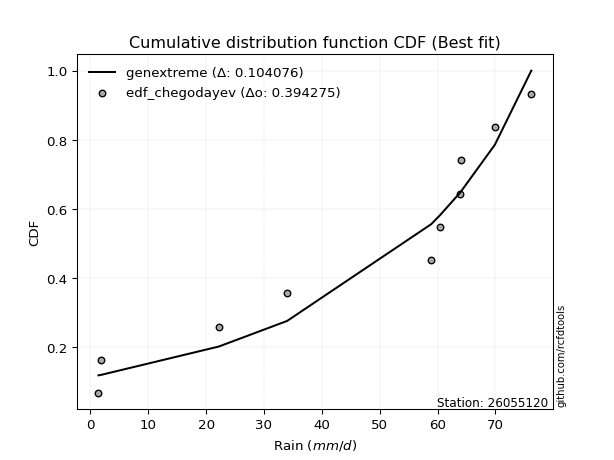</img></img>

</div>


### 6. Empirical - EDF Blom (1958)

The Blom formula is a specific "plotting position" formula used in hydrology and statistical analysis to estimate the empirical cumulative probability (or non-exceedance probability) of a data series. It is particularly recommended for data that are approximately normally distributed. The constant _a_ is set to 0.375 (or 3/8).

<div align="center">


$P=(m-a)/(n+1-2a)$


</div>


**6.1. Empirical values**

<div align="center">

|                | 0                   | 1                   | 2                   | 3                   | 4                   | 5                  | 6                  | 7                  | 8                  | 9                  |
|:---------------|:--------------------|:--------------------|:--------------------|:--------------------|:--------------------|:-------------------|:-------------------|:-------------------|:-------------------|:-------------------|
| date           | 2016                | 2023                | 2022                | 2021                | 2025                | 2017               | 2018               | 2024               | 2020               | 2019               |
| x              | 1.4                 | 1.9                 | 22.2                | 34.0                | 36.2                | 58.9               | 60.5               | 63.8               | 64.0               | 69.9               |
| m              | 1                   | 2                   | 3                   | 4                   | 5                   | 6                  | 7                  | 8                  | 9                  | 10                 |
| empirical_dist | edf_blom            | edf_blom            | edf_blom            | edf_blom            | edf_blom            | edf_blom           | edf_blom           | edf_blom           | edf_blom           | edf_blom           |
| empirical      | 0.06097560975609756 | 0.15853658536585366 | 0.25609756097560976 | 0.35365853658536583 | 0.45121951219512196 | 0.5487804878048781 | 0.6463414634146342 | 0.7439024390243902 | 0.8414634146341463 | 0.9390243902439024 |
| empirical_tr   | 1.064935064935065   | 1.1884057971014492  | 1.3442622950819672  | 1.5471698113207546  | 1.8222222222222222  | 2.2162162162162162 | 2.827586206896552  | 3.9047619047619047 | 6.307692307692307  | 16.399999999999984 |

</div>


**6.2. Kolmogorov-Smirnov fit test (sorted by Δ)**


<div align="center">

|                | 0                   | 1                   | 2                   | 3                   | 4                  | 5                   | 6                  | 7                  | 8                   | 9                   | 10                 | 11                 | 12                  | 13                  | 14                  | 15                  | 16                  | 17                 | 18                  | 19                  | 20                  | 21                  | 22                  | 23                  | 24                 | 25                  | 26                  | 27                  | 28                  | 29                  | 30                  | 31                 | 32                  | 33                 | 34                 | 35                 | 36                  | 37                  | 38                  | 39                  | 40                  | 41                 | 42                  | 43                  | 44                  | 45                  | 46                  | 47                  | 48                  | 49                 | 50                  | 51                 | 52                  | 53                  | 54                  | 55                  | 56                  | 57                 | 58                 | 59                 | 60                 | 61                 | 62                  | 63                  | 64                 | 65                  | 66                    | 67                 | 68                  | 69                 | 70                 | 71                  | 72                  | 73                  | 74                  | 75                  | 76                  | 77                 | 78                 | 79                  | 80                  | 81                 | 82                  | 83                 | 84                  | 85                 | 86                 | 87                 | 88                 | 89                 |
|:---------------|:--------------------|:--------------------|:--------------------|:--------------------|:-------------------|:--------------------|:-------------------|:-------------------|:--------------------|:--------------------|:-------------------|:-------------------|:--------------------|:--------------------|:--------------------|:--------------------|:--------------------|:-------------------|:--------------------|:--------------------|:--------------------|:--------------------|:--------------------|:--------------------|:-------------------|:--------------------|:--------------------|:--------------------|:--------------------|:--------------------|:--------------------|:-------------------|:--------------------|:-------------------|:-------------------|:-------------------|:--------------------|:--------------------|:--------------------|:--------------------|:--------------------|:-------------------|:--------------------|:--------------------|:--------------------|:--------------------|:--------------------|:--------------------|:--------------------|:-------------------|:--------------------|:-------------------|:--------------------|:--------------------|:--------------------|:--------------------|:--------------------|:-------------------|:-------------------|:-------------------|:-------------------|:-------------------|:--------------------|:--------------------|:-------------------|:--------------------|:----------------------|:-------------------|:--------------------|:-------------------|:-------------------|:--------------------|:--------------------|:--------------------|:--------------------|:--------------------|:--------------------|:-------------------|:-------------------|:--------------------|:--------------------|:-------------------|:--------------------|:-------------------|:--------------------|:-------------------|:-------------------|:-------------------|:-------------------|:-------------------|
| station        | 26055120            | 26055120            | 26055120            | 26055120            | 26055120           | 26055120            | 26055120           | 26055120           | 26055120            | 26055120            | 26055120           | 26055120           | 26055120            | 26055120            | 26055120            | 26055120            | 26055120            | 26055120           | 26055120            | 26055120            | 26055120            | 26055120            | 26055120            | 26055120            | 26055120           | 26055120            | 26055120            | 26055120            | 26055120            | 26055120            | 26055120            | 26055120           | 26055120            | 26055120           | 26055120           | 26055120           | 26055120            | 26055120            | 26055120            | 26055120            | 26055120            | 26055120           | 26055120            | 26055120            | 26055120            | 26055120            | 26055120            | 26055120            | 26055120            | 26055120           | 26055120            | 26055120           | 26055120            | 26055120            | 26055120            | 26055120            | 26055120            | 26055120           | 26055120           | 26055120           | 26055120           | 26055120           | 26055120            | 26055120            | 26055120           | 26055120            | 26055120              | 26055120           | 26055120            | 26055120           | 26055120           | 26055120            | 26055120            | 26055120            | 26055120            | 26055120            | 26055120            | 26055120           | 26055120           | 26055120            | 26055120            | 26055120           | 26055120            | 26055120           | 26055120            | 26055120           | 26055120           | 26055120           | 26055120           | 26055120           |
| empirical_dist | edf_blom            | edf_blom            | edf_blom            | edf_blom            | edf_blom           | edf_blom            | edf_blom           | edf_blom           | edf_blom            | edf_blom            | edf_blom           | edf_blom           | edf_blom            | edf_blom            | edf_blom            | edf_blom            | edf_blom            | edf_blom           | edf_blom            | edf_blom            | edf_blom            | edf_blom            | edf_blom            | edf_blom            | edf_blom           | edf_blom            | edf_blom            | edf_blom            | edf_blom            | edf_blom            | edf_blom            | edf_blom           | edf_blom            | edf_blom           | edf_blom           | edf_blom           | edf_blom            | edf_blom            | edf_blom            | edf_blom            | edf_blom            | edf_blom           | edf_blom            | edf_blom            | edf_blom            | edf_blom            | edf_blom            | edf_blom            | edf_blom            | edf_blom           | edf_blom            | edf_blom           | edf_blom            | edf_blom            | edf_blom            | edf_blom            | edf_blom            | edf_blom           | edf_blom           | edf_blom           | edf_blom           | edf_blom           | edf_blom            | edf_blom            | edf_blom           | edf_blom            | edf_blom              | edf_blom           | edf_blom            | edf_blom           | edf_blom           | edf_blom            | edf_blom            | edf_blom            | edf_blom            | edf_blom            | edf_blom            | edf_blom           | edf_blom           | edf_blom            | edf_blom            | edf_blom           | edf_blom            | edf_blom           | edf_blom            | edf_blom           | edf_blom           | edf_blom           | edf_blom           | edf_blom           |
| p_dist         | logjohnsonsu        | johnsonsu           | alpha               | loggumbel_l         | logpearson3        | fisk                | weibull_min        | logfisk            | pearson3            | gumbel_l            | invweibull         | invgauss           | erlang              | exponnorm           | crystalball         | norm                | t                   | expon              | betaprime           | rice                | genexpon            | gamma               | loggompertz         | logweibull_min      | kstwobign          | invgamma            | maxwell             | rayleigh            | laplace_asymmetric  | halfnorm            | logalpha            | ncf                | logistic            | logncf             | lognorm            | lognorm            | logexponnorm        | logf                | logrice             | logfatiguelife      | lognct              | lognakagami        | logbetaprime        | logerlang           | gumbel_r            | hypsecant           | loggamma            | loggamma            | logchi2             | loglogistic        | loginvgamma         | halflogistic       | loginvgauss         | moyal               | loghypsecant        | loginvweibull       | logmaxwell          | laplace            | lograyleigh        | nakagami           | f                  | loglaplace         | mielke              | wald                | loghalfnorm        | logkstwobign        | loglaplace_asymmetric | logloggamma        | loggenexpon         | loggumbel_r        | logmielke          | logt                | loghalflogistic     | gibrat              | logmoyal            | nct                 | logtruncnorm        | gompertz           | logexpon           | logwald             | loglognorm          | pareto             | logpareto           | loggibrat          | fatiguelife         | chi2               | genlogistic        | loggenlogistic     | truncnorm          | logcrystalball     |
| delta          | 0.10494073600297582 | 0.16413983525369757 | 0.16727813737817898 | 0.17968891380678997 | 0.1798174303097143 | 0.19003213515445216 | 0.1976244011968803 | 0.2011634984863112 | 0.20197263363870854 | 0.20490626234071396 | 0.2058675714180498 | 0.2116151519336309 | 0.21219880241154776 | 0.21330805407803344 | 0.21330911790194396 | 0.21330913098917392 | 0.21332113902352612 | 0.2147238650272303 | 0.21480207784995053 | 0.21504533405117954 | 0.21509916678805696 | 0.21601363135395923 | 0.21821637420919338 | 0.21847008120193334 | 0.218632843423338  | 0.22111339320088674 | 0.22130460944042318 | 0.22357703946839713 | 0.23120537443554456 | 0.23166454306529582 | 0.23509324775591878 | 0.2355772598918895 | 0.23592679986213494 | 0.2379089590638067 | 0.2405168860881549 | 0.2405168860881549 | 0.24051746183957268 | 0.24052000437055232 | 0.24052182098444663 | 0.24096468647959735 | 0.24114238293092194 | 0.2414212934005765 | 0.24595386800971386 | 0.24930360392807271 | 0.24974841916762447 | 0.25044438281571446 | 0.25093377199133016 | 0.25093377199133016 | 0.25243679624129955 | 0.2527467153782079 | 0.25431003543474606 | 0.255334011559442  | 0.26027324142892616 | 0.26155978135147884 | 0.26280221877098775 | 0.26479073246112705 | 0.26754859296047406 | 0.2688168442900616 | 0.2759714095892427 | 0.278094575357709  | 0.2809761519398858 | 0.2893890976342951 | 0.29768673515327204 | 0.29934357970149406 | 0.2999104629498397 | 0.30038012744980147 | 0.3010304937909093    | 0.3014974839931508 | 0.30701160255827575 | 0.3076041660267922 | 0.3082457905531578 | 0.31390334414575827 | 0.32816305389261213 | 0.32818286271505936 | 0.33062526339999343 | 0.34441864913440234 | 0.35340705247060455 | 0.3587848666631277 | 0.363809323355599  | 0.39471861685344767 | 0.39898630602541296 | 0.4035504486696375 | 0.42242392768666603 | 0.4262356783629613 | 0.48094789031754437 | 0.7284561190182639 | 0.8414634146341463 | 0.8414634146341463 | 0.9177770090876471 | nan                |
| deltao         | 0.3942745923300002  | 0.3942745923300002  | 0.3942745923300002  | 0.3942745923300002  | 0.3942745923300002 | 0.3942745923300002  | 0.3942745923300002 | 0.3942745923300002 | 0.3942745923300002  | 0.3942745923300002  | 0.3942745923300002 | 0.3942745923300002 | 0.3942745923300002  | 0.3942745923300002  | 0.3942745923300002  | 0.3942745923300002  | 0.3942745923300002  | 0.3942745923300002 | 0.3942745923300002  | 0.3942745923300002  | 0.3942745923300002  | 0.3942745923300002  | 0.3942745923300002  | 0.3942745923300002  | 0.3942745923300002 | 0.3942745923300002  | 0.3942745923300002  | 0.3942745923300002  | 0.3942745923300002  | 0.3942745923300002  | 0.3942745923300002  | 0.3942745923300002 | 0.3942745923300002  | 0.3942745923300002 | 0.3942745923300002 | 0.3942745923300002 | 0.3942745923300002  | 0.3942745923300002  | 0.3942745923300002  | 0.3942745923300002  | 0.3942745923300002  | 0.3942745923300002 | 0.3942745923300002  | 0.3942745923300002  | 0.3942745923300002  | 0.3942745923300002  | 0.3942745923300002  | 0.3942745923300002  | 0.3942745923300002  | 0.3942745923300002 | 0.3942745923300002  | 0.3942745923300002 | 0.3942745923300002  | 0.3942745923300002  | 0.3942745923300002  | 0.3942745923300002  | 0.3942745923300002  | 0.3942745923300002 | 0.3942745923300002 | 0.3942745923300002 | 0.3942745923300002 | 0.3942745923300002 | 0.3942745923300002  | 0.3942745923300002  | 0.3942745923300002 | 0.3942745923300002  | 0.3942745923300002    | 0.3942745923300002 | 0.3942745923300002  | 0.3942745923300002 | 0.3942745923300002 | 0.3942745923300002  | 0.3942745923300002  | 0.3942745923300002  | 0.3942745923300002  | 0.3942745923300002  | 0.3942745923300002  | 0.3942745923300002 | 0.3942745923300002 | 0.3942745923300002  | 0.3942745923300002  | 0.3942745923300002 | 0.3942745923300002  | 0.3942745923300002 | 0.3942745923300002  | 0.3942745923300002 | 0.3942745923300002 | 0.3942745923300002 | 0.3942745923300002 | 0.3942745923300002 |
| eval           | Δo > Δ              | Δo > Δ              | Δo > Δ              | Δo > Δ              | Δo > Δ             | Δo > Δ              | Δo > Δ             | Δo > Δ             | Δo > Δ              | Δo > Δ              | Δo > Δ             | Δo > Δ             | Δo > Δ              | Δo > Δ              | Δo > Δ              | Δo > Δ              | Δo > Δ              | Δo > Δ             | Δo > Δ              | Δo > Δ              | Δo > Δ              | Δo > Δ              | Δo > Δ              | Δo > Δ              | Δo > Δ             | Δo > Δ              | Δo > Δ              | Δo > Δ              | Δo > Δ              | Δo > Δ              | Δo > Δ              | Δo > Δ             | Δo > Δ              | Δo > Δ             | Δo > Δ             | Δo > Δ             | Δo > Δ              | Δo > Δ              | Δo > Δ              | Δo > Δ              | Δo > Δ              | Δo > Δ             | Δo > Δ              | Δo > Δ              | Δo > Δ              | Δo > Δ              | Δo > Δ              | Δo > Δ              | Δo > Δ              | Δo > Δ             | Δo > Δ              | Δo > Δ             | Δo > Δ              | Δo > Δ              | Δo > Δ              | Δo > Δ              | Δo > Δ              | Δo > Δ             | Δo > Δ             | Δo > Δ             | Δo > Δ             | Δo > Δ             | Δo > Δ              | Δo > Δ              | Δo > Δ             | Δo > Δ              | Δo > Δ                | Δo > Δ             | Δo > Δ              | Δo > Δ             | Δo > Δ             | Δo > Δ              | Δo > Δ              | Δo > Δ              | Δo > Δ              | Δo > Δ              | Δo > Δ              | Δo > Δ             | Δo > Δ             | Δo <= Δ             | Δo <= Δ             | Δo <= Δ            | Δo <= Δ             | Δo <= Δ            | Δo <= Δ             | Δo <= Δ            | Δo <= Δ            | Δo <= Δ            | Δo <= Δ            | Δo <= Δ            |
| fit            | 1                   | 1                   | 1                   | 1                   | 1                  | 1                   | 1                  | 1                  | 1                   | 1                   | 1                  | 1                  | 1                   | 1                   | 1                   | 1                   | 1                   | 1                  | 1                   | 1                   | 1                   | 1                   | 1                   | 1                   | 1                  | 1                   | 1                   | 1                   | 1                   | 1                   | 1                   | 1                  | 1                   | 1                  | 1                  | 1                  | 1                   | 1                   | 1                   | 1                   | 1                   | 1                  | 1                   | 1                   | 1                   | 1                   | 1                   | 1                   | 1                   | 1                  | 1                   | 1                  | 1                   | 1                   | 1                   | 1                   | 1                   | 1                  | 1                  | 1                  | 1                  | 1                  | 1                   | 1                   | 1                  | 1                   | 1                     | 1                  | 1                   | 1                  | 1                  | 1                   | 1                   | 1                   | 1                   | 1                   | 1                   | 1                  | 1                  | 0                   | 0                   | 0                  | 0                   | 0                  | 0                   | 0                  | 0                  | 0                  | 0                  | 0                  |
| n              | 10                  | 10                  | 10                  | 10                  | 10                 | 10                  | 10                 | 10                 | 10                  | 10                  | 10                 | 10                 | 10                  | 10                  | 10                  | 10                  | 10                  | 10                 | 10                  | 10                  | 10                  | 10                  | 10                  | 10                  | 10                 | 10                  | 10                  | 10                  | 10                  | 10                  | 10                  | 10                 | 10                  | 10                 | 10                 | 10                 | 10                  | 10                  | 10                  | 10                  | 10                  | 10                 | 10                  | 10                  | 10                  | 10                  | 10                  | 10                  | 10                  | 10                 | 10                  | 10                 | 10                  | 10                  | 10                  | 10                  | 10                  | 10                 | 10                 | 10                 | 10                 | 10                 | 10                  | 10                  | 10                 | 10                  | 10                    | 10                 | 10                  | 10                 | 10                 | 10                  | 10                  | 10                  | 10                  | 10                  | 10                  | 10                 | 10                 | 10                  | 10                  | 10                 | 10                  | 10                 | 10                  | 10                 | 10                 | 10                 | 10                 | 10                 |
| best_fit       | 1                   | 0                   | 0                   | 0                   | 0                  | 0                   | 0                  | 0                  | 0                   | 0                   | 0                  | 0                  | 0                   | 0                   | 0                   | 0                   | 0                   | 0                  | 0                   | 0                   | 0                   | 0                   | 0                   | 0                   | 0                  | 0                   | 0                   | 0                   | 0                   | 0                   | 0                   | 0                  | 0                   | 0                  | 0                  | 0                  | 0                   | 0                   | 0                   | 0                   | 0                   | 0                  | 0                   | 0                   | 0                   | 0                   | 0                   | 0                   | 0                   | 0                  | 0                   | 0                  | 0                   | 0                   | 0                   | 0                   | 0                   | 0                  | 0                  | 0                  | 0                  | 0                  | 0                   | 0                   | 0                  | 0                   | 0                     | 0                  | 0                   | 0                  | 0                  | 0                   | 0                   | 0                   | 0                   | 0                   | 0                   | 0                  | 0                  | 0                   | 0                   | 0                  | 0                   | 0                  | 0                   | 0                  | 0                  | 0                  | 0                  | 0                  |
| best_fit_sort  | 1                   | 2                   | 3                   | 4                   | 5                  | 6                   | 7                  | 8                  | 9                   | 10                  | 11                 | 12                 | 13                  | 14                  | 15                  | 16                  | 17                  | 18                 | 19                  | 20                  | 21                  | 22                  | 23                  | 24                  | 25                 | 26                  | 27                  | 28                  | 29                  | 30                  | 31                  | 32                 | 33                  | 34                 | 35                 | 36                 | 37                  | 38                  | 39                  | 40                  | 41                  | 42                 | 43                  | 44                  | 45                  | 46                  | 47                  | 48                  | 49                  | 50                 | 51                  | 52                 | 53                  | 54                  | 55                  | 56                  | 57                  | 58                 | 59                 | 60                 | 61                 | 62                 | 63                  | 64                  | 65                 | 66                  | 67                    | 68                 | 69                  | 70                 | 71                 | 72                  | 73                  | 74                  | 75                  | 76                  | 77                  | 78                 | 79                 | 80                  | 81                  | 82                 | 83                  | 84                 | 85                  | 86                 | 87                 | 88                 | 89                 | 90                 |

</div>


<div align="center">

</img>

</div>


**6.3. Best fit**

<div align="center">

|   id |   station | empirical_dist   | p_dist       |    delta |   deltao | eval   |   fit |   n |   best_fit |   best_fit_sort |
|-----:|----------:|:-----------------|:-------------|---------:|---------:|:-------|------:|----:|-----------:|----------------:|
|    0 |  26055120 | edf_blom         | logjohnsonsu | 0.104941 | 0.394275 | Δo > Δ |     1 |  10 |          1 |               1 |

</div>


<div align="center">

</img>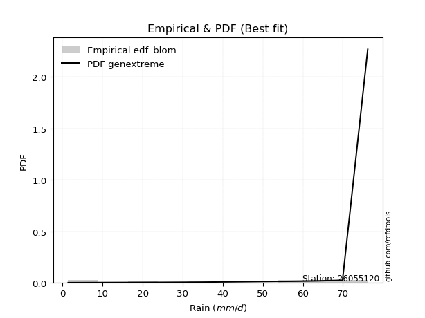</img>

</div>


### 7. Empirical - EDF Tukey (1962)

In hydrology, the Tukey formula is used as a plotting position formula to estimate the empirical probability or frequency of a flood event (or other hydrological data). The formula parameter is given as _c=0.333_ (or 1/3).

<div align="center">


$P=(m-c)/(n+1-2c)$


</div>


**7.1. Empirical values**

<div align="center">

|                | 0                   | 1                   | 2                   | 3                  | 4                   | 5                  | 6                  | 7                  | 8                  | 9                  |
|:---------------|:--------------------|:--------------------|:--------------------|:-------------------|:--------------------|:-------------------|:-------------------|:-------------------|:-------------------|:-------------------|
| date           | 2016                | 2023                | 2022                | 2021               | 2025                | 2017               | 2018               | 2024               | 2020               | 2019               |
| x              | 1.4                 | 1.9                 | 22.2                | 34.0               | 36.2                | 58.9               | 60.5               | 63.8               | 64.0               | 69.9               |
| m              | 1                   | 2                   | 3                   | 4                  | 5                   | 6                  | 7                  | 8                  | 9                  | 10                 |
| empirical_dist | edf_tukey           | edf_tukey           | edf_tukey           | edf_tukey          | edf_tukey           | edf_tukey          | edf_tukey          | edf_tukey          | edf_tukey          | edf_tukey          |
| empirical      | 0.06451612903225806 | 0.16129032258064516 | 0.25806451612903225 | 0.3548387096774194 | 0.45161290322580644 | 0.5483870967741935 | 0.6451612903225806 | 0.7419354838709677 | 0.8387096774193549 | 0.9354838709677419 |
| empirical_tr   | 1.0689655172413792  | 1.1923076923076923  | 1.3478260869565217  | 1.55               | 1.823529411764706   | 2.214285714285714  | 2.818181818181818  | 3.875              | 6.200000000000001  | 15.499999999999988 |

</div>


**7.2. Kolmogorov-Smirnov fit test (sorted by Δ)**


<div align="center">

|                | 0                   | 1                   | 2                   | 3                  | 4                   | 5                   | 6                  | 7                   | 8                   | 9                   | 10                  | 11                  | 12                  | 13                  | 14                  | 15                 | 16                 | 17                  | 18                  | 19                  | 20                  | 21                  | 22                  | 23                  | 24                  | 25                  | 26                  | 27                  | 28                  | 29                 | 30                  | 31                  | 32                  | 33                  | 34                  | 35                  | 36                  | 37                  | 38                 | 39                 | 40                 | 41                  | 42                  | 43                  | 44                  | 45                  | 46                  | 47                  | 48                 | 49                 | 50                 | 51                 | 52                 | 53                 | 54                 | 55                  | 56                 | 57                  | 58                 | 59                  | 60                  | 61                  | 62                  | 63                 | 64                  | 65                  | 66                    | 67                 | 68                  | 69                  | 70                 | 71                  | 72                 | 73                  | 74                 | 75                  | 76                  | 77                 | 78                 | 79                  | 80                 | 81                  | 82                 | 83                  | 84                 | 85                 | 86                 | 87                 | 88                 | 89                 |
|:---------------|:--------------------|:--------------------|:--------------------|:-------------------|:--------------------|:--------------------|:-------------------|:--------------------|:--------------------|:--------------------|:--------------------|:--------------------|:--------------------|:--------------------|:--------------------|:-------------------|:-------------------|:--------------------|:--------------------|:--------------------|:--------------------|:--------------------|:--------------------|:--------------------|:--------------------|:--------------------|:--------------------|:--------------------|:--------------------|:-------------------|:--------------------|:--------------------|:--------------------|:--------------------|:--------------------|:--------------------|:--------------------|:--------------------|:-------------------|:-------------------|:-------------------|:--------------------|:--------------------|:--------------------|:--------------------|:--------------------|:--------------------|:--------------------|:-------------------|:-------------------|:-------------------|:-------------------|:-------------------|:-------------------|:-------------------|:--------------------|:-------------------|:--------------------|:-------------------|:--------------------|:--------------------|:--------------------|:--------------------|:-------------------|:--------------------|:--------------------|:----------------------|:-------------------|:--------------------|:--------------------|:-------------------|:--------------------|:-------------------|:--------------------|:-------------------|:--------------------|:--------------------|:-------------------|:-------------------|:--------------------|:-------------------|:--------------------|:-------------------|:--------------------|:-------------------|:-------------------|:-------------------|:-------------------|:-------------------|:-------------------|
| station        | 26055120            | 26055120            | 26055120            | 26055120           | 26055120            | 26055120            | 26055120           | 26055120            | 26055120            | 26055120            | 26055120            | 26055120            | 26055120            | 26055120            | 26055120            | 26055120           | 26055120           | 26055120            | 26055120            | 26055120            | 26055120            | 26055120            | 26055120            | 26055120            | 26055120            | 26055120            | 26055120            | 26055120            | 26055120            | 26055120           | 26055120            | 26055120            | 26055120            | 26055120            | 26055120            | 26055120            | 26055120            | 26055120            | 26055120           | 26055120           | 26055120           | 26055120            | 26055120            | 26055120            | 26055120            | 26055120            | 26055120            | 26055120            | 26055120           | 26055120           | 26055120           | 26055120           | 26055120           | 26055120           | 26055120           | 26055120            | 26055120           | 26055120            | 26055120           | 26055120            | 26055120            | 26055120            | 26055120            | 26055120           | 26055120            | 26055120            | 26055120              | 26055120           | 26055120            | 26055120            | 26055120           | 26055120            | 26055120           | 26055120            | 26055120           | 26055120            | 26055120            | 26055120           | 26055120           | 26055120            | 26055120           | 26055120            | 26055120           | 26055120            | 26055120           | 26055120           | 26055120           | 26055120           | 26055120           | 26055120           |
| empirical_dist | edf_tukey           | edf_tukey           | edf_tukey           | edf_tukey          | edf_tukey           | edf_tukey           | edf_tukey          | edf_tukey           | edf_tukey           | edf_tukey           | edf_tukey           | edf_tukey           | edf_tukey           | edf_tukey           | edf_tukey           | edf_tukey          | edf_tukey          | edf_tukey           | edf_tukey           | edf_tukey           | edf_tukey           | edf_tukey           | edf_tukey           | edf_tukey           | edf_tukey           | edf_tukey           | edf_tukey           | edf_tukey           | edf_tukey           | edf_tukey          | edf_tukey           | edf_tukey           | edf_tukey           | edf_tukey           | edf_tukey           | edf_tukey           | edf_tukey           | edf_tukey           | edf_tukey          | edf_tukey          | edf_tukey          | edf_tukey           | edf_tukey           | edf_tukey           | edf_tukey           | edf_tukey           | edf_tukey           | edf_tukey           | edf_tukey          | edf_tukey          | edf_tukey          | edf_tukey          | edf_tukey          | edf_tukey          | edf_tukey          | edf_tukey           | edf_tukey          | edf_tukey           | edf_tukey          | edf_tukey           | edf_tukey           | edf_tukey           | edf_tukey           | edf_tukey          | edf_tukey           | edf_tukey           | edf_tukey             | edf_tukey          | edf_tukey           | edf_tukey           | edf_tukey          | edf_tukey           | edf_tukey          | edf_tukey           | edf_tukey          | edf_tukey           | edf_tukey           | edf_tukey          | edf_tukey          | edf_tukey           | edf_tukey          | edf_tukey           | edf_tukey          | edf_tukey           | edf_tukey          | edf_tukey          | edf_tukey          | edf_tukey          | edf_tukey          | edf_tukey          |
| p_dist         | logjohnsonsu        | johnsonsu           | alpha               | logpearson3        | loggumbel_l         | fisk                | logfisk            | weibull_min         | pearson3            | gumbel_l            | invweibull          | invgauss            | erlang              | exponnorm           | crystalball         | norm               | t                  | expon               | betaprime           | rice                | genexpon            | gamma               | loggompertz         | logweibull_min      | kstwobign           | invgamma            | maxwell             | rayleigh            | laplace_asymmetric  | halfnorm           | logalpha            | ncf                 | logistic            | logncf              | lognorm             | lognorm             | logexponnorm        | logf                | logrice            | logfatiguelife     | lognct             | lognakagami         | logbetaprime        | logerlang           | loggamma            | loggamma            | gumbel_r            | hypsecant           | logchi2            | loglogistic        | loginvgamma        | halflogistic       | loginvgauss        | loghypsecant       | moyal              | loginvweibull       | logmaxwell         | laplace             | lograyleigh        | nakagami            | f                   | loglaplace          | mielke              | logkstwobign       | loghalfnorm         | wald                | loglaplace_asymmetric | logloggamma        | loggenexpon         | loggumbel_r         | logmielke          | logt                | loghalflogistic    | gibrat              | logmoyal           | nct                 | logtruncnorm        | gompertz           | logexpon           | logwald             | loglognorm         | pareto              | logpareto          | loggibrat           | fatiguelife        | chi2               | genlogistic        | loggenlogistic     | truncnorm          | logcrystalball     |
| delta          | 0.10489128773779105 | 0.16453322628438205 | 0.16767152840886357 | 0.1762769110335538 | 0.17850874071473644 | 0.19042552618513675 | 0.1976229792101507 | 0.19801779222756488 | 0.20236602466939313 | 0.20529965337139855 | 0.20626096244873438 | 0.21200854296431548 | 0.21259219344223235 | 0.21370144510871802 | 0.21370250893262854 | 0.2137025220198585 | 0.2137145300542107 | 0.21511725605791487 | 0.21519546888063512 | 0.21543872508186412 | 0.21549255781874155 | 0.21640702238464382 | 0.21860976523987796 | 0.21886347223261793 | 0.21902623445402258 | 0.22150678423157133 | 0.22169800047110777 | 0.22397043049908172 | 0.23159876546622915 | 0.2320579340959804 | 0.23391307466386524 | 0.23597065092257408 | 0.23632019089281953 | 0.23672878597175318 | 0.23933671299610138 | 0.23933671299610138 | 0.23933728874751914 | 0.23933983127849878 | 0.2393416478923931 | 0.2397845133875438 | 0.2399622098388684 | 0.24024112030852296 | 0.24477369491766032 | 0.24812343083601918 | 0.24975359889927662 | 0.24975359889927662 | 0.25014181019830906 | 0.25083777384639905 | 0.251256623149246  | 0.2515665422861544 | 0.2531298623426925 | 0.2557274025901266 | 0.2590930683368726 | 0.2616220456789342 | 0.2619531723821634 | 0.26282377730770456 | 0.2663684198684205 | 0.26921023532074617 | 0.2747912364971892 | 0.27691440226565545 | 0.27979597884783225 | 0.28820892454224156 | 0.29808012618395663 | 0.298413172296379  | 0.29873028985778616 | 0.29973697073217864 | 0.3014238848215939    | 0.3018908750238354 | 0.30504464740485326 | 0.30642399293473865 | 0.3086391815838424 | 0.31429673517644274 | 0.3269828808005586 | 0.32857625374574395 | 0.3294450903079399 | 0.34245169398097985 | 0.35144009731718207 | 0.3591782576938122 | 0.3618423682021765 | 0.39353844376139413 | 0.3962325688106215 | 0.40158349351621503 | 0.4196701904718746 | 0.42505550527090774 | 0.4789809351641219 | 0.7264891638648414 | 0.8387096774193549 | 0.8387096774193549 | 0.9142364898114865 | nan                |
| deltao         | 0.3942745923300002  | 0.3942745923300002  | 0.3942745923300002  | 0.3942745923300002 | 0.3942745923300002  | 0.3942745923300002  | 0.3942745923300002 | 0.3942745923300002  | 0.3942745923300002  | 0.3942745923300002  | 0.3942745923300002  | 0.3942745923300002  | 0.3942745923300002  | 0.3942745923300002  | 0.3942745923300002  | 0.3942745923300002 | 0.3942745923300002 | 0.3942745923300002  | 0.3942745923300002  | 0.3942745923300002  | 0.3942745923300002  | 0.3942745923300002  | 0.3942745923300002  | 0.3942745923300002  | 0.3942745923300002  | 0.3942745923300002  | 0.3942745923300002  | 0.3942745923300002  | 0.3942745923300002  | 0.3942745923300002 | 0.3942745923300002  | 0.3942745923300002  | 0.3942745923300002  | 0.3942745923300002  | 0.3942745923300002  | 0.3942745923300002  | 0.3942745923300002  | 0.3942745923300002  | 0.3942745923300002 | 0.3942745923300002 | 0.3942745923300002 | 0.3942745923300002  | 0.3942745923300002  | 0.3942745923300002  | 0.3942745923300002  | 0.3942745923300002  | 0.3942745923300002  | 0.3942745923300002  | 0.3942745923300002 | 0.3942745923300002 | 0.3942745923300002 | 0.3942745923300002 | 0.3942745923300002 | 0.3942745923300002 | 0.3942745923300002 | 0.3942745923300002  | 0.3942745923300002 | 0.3942745923300002  | 0.3942745923300002 | 0.3942745923300002  | 0.3942745923300002  | 0.3942745923300002  | 0.3942745923300002  | 0.3942745923300002 | 0.3942745923300002  | 0.3942745923300002  | 0.3942745923300002    | 0.3942745923300002 | 0.3942745923300002  | 0.3942745923300002  | 0.3942745923300002 | 0.3942745923300002  | 0.3942745923300002 | 0.3942745923300002  | 0.3942745923300002 | 0.3942745923300002  | 0.3942745923300002  | 0.3942745923300002 | 0.3942745923300002 | 0.3942745923300002  | 0.3942745923300002 | 0.3942745923300002  | 0.3942745923300002 | 0.3942745923300002  | 0.3942745923300002 | 0.3942745923300002 | 0.3942745923300002 | 0.3942745923300002 | 0.3942745923300002 | 0.3942745923300002 |
| eval           | Δo > Δ              | Δo > Δ              | Δo > Δ              | Δo > Δ             | Δo > Δ              | Δo > Δ              | Δo > Δ             | Δo > Δ              | Δo > Δ              | Δo > Δ              | Δo > Δ              | Δo > Δ              | Δo > Δ              | Δo > Δ              | Δo > Δ              | Δo > Δ             | Δo > Δ             | Δo > Δ              | Δo > Δ              | Δo > Δ              | Δo > Δ              | Δo > Δ              | Δo > Δ              | Δo > Δ              | Δo > Δ              | Δo > Δ              | Δo > Δ              | Δo > Δ              | Δo > Δ              | Δo > Δ             | Δo > Δ              | Δo > Δ              | Δo > Δ              | Δo > Δ              | Δo > Δ              | Δo > Δ              | Δo > Δ              | Δo > Δ              | Δo > Δ             | Δo > Δ             | Δo > Δ             | Δo > Δ              | Δo > Δ              | Δo > Δ              | Δo > Δ              | Δo > Δ              | Δo > Δ              | Δo > Δ              | Δo > Δ             | Δo > Δ             | Δo > Δ             | Δo > Δ             | Δo > Δ             | Δo > Δ             | Δo > Δ             | Δo > Δ              | Δo > Δ             | Δo > Δ              | Δo > Δ             | Δo > Δ              | Δo > Δ              | Δo > Δ              | Δo > Δ              | Δo > Δ             | Δo > Δ              | Δo > Δ              | Δo > Δ                | Δo > Δ             | Δo > Δ              | Δo > Δ              | Δo > Δ             | Δo > Δ              | Δo > Δ             | Δo > Δ              | Δo > Δ             | Δo > Δ              | Δo > Δ              | Δo > Δ             | Δo > Δ             | Δo > Δ              | Δo <= Δ            | Δo <= Δ             | Δo <= Δ            | Δo <= Δ             | Δo <= Δ            | Δo <= Δ            | Δo <= Δ            | Δo <= Δ            | Δo <= Δ            | Δo <= Δ            |
| fit            | 1                   | 1                   | 1                   | 1                  | 1                   | 1                   | 1                  | 1                   | 1                   | 1                   | 1                   | 1                   | 1                   | 1                   | 1                   | 1                  | 1                  | 1                   | 1                   | 1                   | 1                   | 1                   | 1                   | 1                   | 1                   | 1                   | 1                   | 1                   | 1                   | 1                  | 1                   | 1                   | 1                   | 1                   | 1                   | 1                   | 1                   | 1                   | 1                  | 1                  | 1                  | 1                   | 1                   | 1                   | 1                   | 1                   | 1                   | 1                   | 1                  | 1                  | 1                  | 1                  | 1                  | 1                  | 1                  | 1                   | 1                  | 1                   | 1                  | 1                   | 1                   | 1                   | 1                   | 1                  | 1                   | 1                   | 1                     | 1                  | 1                   | 1                   | 1                  | 1                   | 1                  | 1                   | 1                  | 1                   | 1                   | 1                  | 1                  | 1                   | 0                  | 0                   | 0                  | 0                   | 0                  | 0                  | 0                  | 0                  | 0                  | 0                  |
| n              | 10                  | 10                  | 10                  | 10                 | 10                  | 10                  | 10                 | 10                  | 10                  | 10                  | 10                  | 10                  | 10                  | 10                  | 10                  | 10                 | 10                 | 10                  | 10                  | 10                  | 10                  | 10                  | 10                  | 10                  | 10                  | 10                  | 10                  | 10                  | 10                  | 10                 | 10                  | 10                  | 10                  | 10                  | 10                  | 10                  | 10                  | 10                  | 10                 | 10                 | 10                 | 10                  | 10                  | 10                  | 10                  | 10                  | 10                  | 10                  | 10                 | 10                 | 10                 | 10                 | 10                 | 10                 | 10                 | 10                  | 10                 | 10                  | 10                 | 10                  | 10                  | 10                  | 10                  | 10                 | 10                  | 10                  | 10                    | 10                 | 10                  | 10                  | 10                 | 10                  | 10                 | 10                  | 10                 | 10                  | 10                  | 10                 | 10                 | 10                  | 10                 | 10                  | 10                 | 10                  | 10                 | 10                 | 10                 | 10                 | 10                 | 10                 |
| best_fit       | 1                   | 0                   | 0                   | 0                  | 0                   | 0                   | 0                  | 0                   | 0                   | 0                   | 0                   | 0                   | 0                   | 0                   | 0                   | 0                  | 0                  | 0                   | 0                   | 0                   | 0                   | 0                   | 0                   | 0                   | 0                   | 0                   | 0                   | 0                   | 0                   | 0                  | 0                   | 0                   | 0                   | 0                   | 0                   | 0                   | 0                   | 0                   | 0                  | 0                  | 0                  | 0                   | 0                   | 0                   | 0                   | 0                   | 0                   | 0                   | 0                  | 0                  | 0                  | 0                  | 0                  | 0                  | 0                  | 0                   | 0                  | 0                   | 0                  | 0                   | 0                   | 0                   | 0                   | 0                  | 0                   | 0                   | 0                     | 0                  | 0                   | 0                   | 0                  | 0                   | 0                  | 0                   | 0                  | 0                   | 0                   | 0                  | 0                  | 0                   | 0                  | 0                   | 0                  | 0                   | 0                  | 0                  | 0                  | 0                  | 0                  | 0                  |
| best_fit_sort  | 1                   | 2                   | 3                   | 4                  | 5                   | 6                   | 7                  | 8                   | 9                   | 10                  | 11                  | 12                  | 13                  | 14                  | 15                  | 16                 | 17                 | 18                  | 19                  | 20                  | 21                  | 22                  | 23                  | 24                  | 25                  | 26                  | 27                  | 28                  | 29                  | 30                 | 31                  | 32                  | 33                  | 34                  | 35                  | 36                  | 37                  | 38                  | 39                 | 40                 | 41                 | 42                  | 43                  | 44                  | 45                  | 46                  | 47                  | 48                  | 49                 | 50                 | 51                 | 52                 | 53                 | 54                 | 55                 | 56                  | 57                 | 58                  | 59                 | 60                  | 61                  | 62                  | 63                  | 64                 | 65                  | 66                  | 67                    | 68                 | 69                  | 70                  | 71                 | 72                  | 73                 | 74                  | 75                 | 76                  | 77                  | 78                 | 79                 | 80                  | 81                 | 82                  | 83                 | 84                  | 85                 | 86                 | 87                 | 88                 | 89                 | 90                 |

</div>


<div align="center">

</img>

</div>


**7.3. Best fit**

<div align="center">

|   id |   station | empirical_dist   | p_dist       |    delta |   deltao | eval   |   fit |   n |   best_fit |   best_fit_sort |
|-----:|----------:|:-----------------|:-------------|---------:|---------:|:-------|------:|----:|-----------:|----------------:|
|    0 |  26055120 | edf_tukey        | logjohnsonsu | 0.104891 | 0.394275 | Δo > Δ |     1 |  10 |          1 |               1 |

</div>


<div align="center">

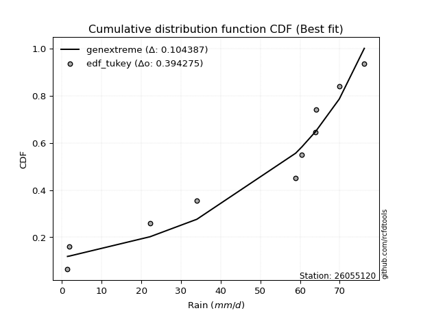</img></img>

</div>


### 8. Empirical - EDF Gringorten (1963)

Gringorten plotting position formula is essential for estimating the probability and return periods of extreme events like floods and heavy rainfall. The constant _a=0.44_.

<div align="center">


$P=(m-a)/(n+1-2a)$


</div>


**8.1. Empirical values**

<div align="center">

|                | 0                   | 1                   | 2                  | 3                   | 4                  | 5                 | 6                  | 7                  | 8                  | 9                  |
|:---------------|:--------------------|:--------------------|:-------------------|:--------------------|:-------------------|:------------------|:-------------------|:-------------------|:-------------------|:-------------------|
| date           | 2016                | 2023                | 2022               | 2021                | 2025               | 2017              | 2018               | 2024               | 2020               | 2019               |
| x              | 1.4                 | 1.9                 | 22.2               | 34.0                | 36.2               | 58.9              | 60.5               | 63.8               | 64.0               | 69.9               |
| m              | 1                   | 2                   | 3                  | 4                   | 5                  | 6                 | 7                  | 8                  | 9                  | 10                 |
| empirical_dist | edf_gringorten      | edf_gringorten      | edf_gringorten     | edf_gringorten      | edf_gringorten     | edf_gringorten    | edf_gringorten     | edf_gringorten     | edf_gringorten     | edf_gringorten     |
| empirical      | 0.05533596837944665 | 0.15415019762845852 | 0.2529644268774704 | 0.35177865612648224 | 0.4505928853754941 | 0.549407114624506 | 0.6482213438735178 | 0.7470355731225297 | 0.8458498023715416 | 0.9446640316205535 |
| empirical_tr   | 1.0585774058577406  | 1.1822429906542056  | 1.3386243386243388 | 1.542682926829268   | 1.8201438848920866 | 2.219298245614035 | 2.842696629213483  | 3.9531250000000004 | 6.487179487179492  | 18.071428571428605 |

</div>


**8.2. Kolmogorov-Smirnov fit test (sorted by Δ)**


<div align="center">

|                | 0                   | 1                  | 2                  | 3                   | 4                   | 5                   | 6                  | 7                   | 8                   | 9                  | 10                  | 11                 | 12                  | 13                  | 14                  | 15                  | 16                  | 17                 | 18                  | 19                  | 20                  | 21                  | 22                 | 23                  | 24                 | 25                  | 26                 | 27                  | 28                  | 29                  | 30                 | 31                  | 32                  | 33                 | 34                 | 35                 | 36                  | 37                  | 38                  | 39                  | 40                  | 41                 | 42                  | 43                  | 44                  | 45                 | 46                  | 47                  | 48                  | 49                 | 50                  | 51                  | 52                  | 53                  | 54                  | 55                 | 56                 | 57                  | 58                 | 59                 | 60                 | 61                 | 62                  | 63                  | 64                    | 65                 | 66                 | 67                  | 68                  | 69                 | 70                 | 71                 | 72                 | 73                  | 74                  | 75                 | 76                 | 77                 | 78                 | 79                  | 80                  | 81                 | 82                 | 83                 | 84                  | 85                 | 86                 | 87                 | 88                 | 89                 |
|:---------------|:--------------------|:-------------------|:-------------------|:--------------------|:--------------------|:--------------------|:-------------------|:--------------------|:--------------------|:-------------------|:--------------------|:-------------------|:--------------------|:--------------------|:--------------------|:--------------------|:--------------------|:-------------------|:--------------------|:--------------------|:--------------------|:--------------------|:-------------------|:--------------------|:-------------------|:--------------------|:-------------------|:--------------------|:--------------------|:--------------------|:-------------------|:--------------------|:--------------------|:-------------------|:-------------------|:-------------------|:--------------------|:--------------------|:--------------------|:--------------------|:--------------------|:-------------------|:--------------------|:--------------------|:--------------------|:-------------------|:--------------------|:--------------------|:--------------------|:-------------------|:--------------------|:--------------------|:--------------------|:--------------------|:--------------------|:-------------------|:-------------------|:--------------------|:-------------------|:-------------------|:-------------------|:-------------------|:--------------------|:--------------------|:----------------------|:-------------------|:-------------------|:--------------------|:--------------------|:-------------------|:-------------------|:-------------------|:-------------------|:--------------------|:--------------------|:-------------------|:-------------------|:-------------------|:-------------------|:--------------------|:--------------------|:-------------------|:-------------------|:-------------------|:--------------------|:-------------------|:-------------------|:-------------------|:-------------------|:-------------------|
| station        | 26055120            | 26055120           | 26055120           | 26055120            | 26055120            | 26055120            | 26055120           | 26055120            | 26055120            | 26055120           | 26055120            | 26055120           | 26055120            | 26055120            | 26055120            | 26055120            | 26055120            | 26055120           | 26055120            | 26055120            | 26055120            | 26055120            | 26055120           | 26055120            | 26055120           | 26055120            | 26055120           | 26055120            | 26055120            | 26055120            | 26055120           | 26055120            | 26055120            | 26055120           | 26055120           | 26055120           | 26055120            | 26055120            | 26055120            | 26055120            | 26055120            | 26055120           | 26055120            | 26055120            | 26055120            | 26055120           | 26055120            | 26055120            | 26055120            | 26055120           | 26055120            | 26055120            | 26055120            | 26055120            | 26055120            | 26055120           | 26055120           | 26055120            | 26055120           | 26055120           | 26055120           | 26055120           | 26055120            | 26055120            | 26055120              | 26055120           | 26055120           | 26055120            | 26055120            | 26055120           | 26055120           | 26055120           | 26055120           | 26055120            | 26055120            | 26055120           | 26055120           | 26055120           | 26055120           | 26055120            | 26055120            | 26055120           | 26055120           | 26055120           | 26055120            | 26055120           | 26055120           | 26055120           | 26055120           | 26055120           |
| empirical_dist | edf_gringorten      | edf_gringorten     | edf_gringorten     | edf_gringorten      | edf_gringorten      | edf_gringorten      | edf_gringorten     | edf_gringorten      | edf_gringorten      | edf_gringorten     | edf_gringorten      | edf_gringorten     | edf_gringorten      | edf_gringorten      | edf_gringorten      | edf_gringorten      | edf_gringorten      | edf_gringorten     | edf_gringorten      | edf_gringorten      | edf_gringorten      | edf_gringorten      | edf_gringorten     | edf_gringorten      | edf_gringorten     | edf_gringorten      | edf_gringorten     | edf_gringorten      | edf_gringorten      | edf_gringorten      | edf_gringorten     | edf_gringorten      | edf_gringorten      | edf_gringorten     | edf_gringorten     | edf_gringorten     | edf_gringorten      | edf_gringorten      | edf_gringorten      | edf_gringorten      | edf_gringorten      | edf_gringorten     | edf_gringorten      | edf_gringorten      | edf_gringorten      | edf_gringorten     | edf_gringorten      | edf_gringorten      | edf_gringorten      | edf_gringorten     | edf_gringorten      | edf_gringorten      | edf_gringorten      | edf_gringorten      | edf_gringorten      | edf_gringorten     | edf_gringorten     | edf_gringorten      | edf_gringorten     | edf_gringorten     | edf_gringorten     | edf_gringorten     | edf_gringorten      | edf_gringorten      | edf_gringorten        | edf_gringorten     | edf_gringorten     | edf_gringorten      | edf_gringorten      | edf_gringorten     | edf_gringorten     | edf_gringorten     | edf_gringorten     | edf_gringorten      | edf_gringorten      | edf_gringorten     | edf_gringorten     | edf_gringorten     | edf_gringorten     | edf_gringorten      | edf_gringorten      | edf_gringorten     | edf_gringorten     | edf_gringorten     | edf_gringorten      | edf_gringorten     | edf_gringorten     | edf_gringorten     | edf_gringorten     | edf_gringorten     |
| p_dist         | logjohnsonsu        | johnsonsu          | alpha              | loggumbel_l         | logpearson3         | fisk                | weibull_min        | pearson3            | gumbel_l            | invweibull         | logfisk             | invgauss           | erlang              | exponnorm           | crystalball         | norm                | t                   | expon              | betaprime           | rice                | genexpon            | gamma               | loggompertz        | logweibull_min      | kstwobign          | invgamma            | maxwell            | rayleigh            | laplace_asymmetric  | halfnorm            | ncf                | logistic            | logalpha            | logncf             | lognorm            | lognorm            | logexponnorm        | logf                | logrice             | logfatiguelife      | lognct              | lognakagami        | logbetaprime        | gumbel_r            | hypsecant           | logerlang          | loggamma            | loggamma            | logchi2             | loglogistic        | halflogistic        | loginvgamma         | moyal               | loginvgauss         | loghypsecant        | loginvweibull      | laplace            | logmaxwell          | lograyleigh        | nakagami           | f                  | loglaplace         | mielke              | wald                | loglaplace_asymmetric | logloggamma        | loghalfnorm        | logkstwobign        | logmielke           | loggumbel_r        | loggenexpon        | logt               | gibrat             | loghalflogistic     | logmoyal            | nct                | logtruncnorm       | gompertz           | logexpon           | logwald             | loglognorm          | pareto             | logpareto          | loggibrat          | fatiguelife         | chi2               | genlogistic        | loggenlogistic     | truncnorm          | logcrystalball     |
| delta          | 0.10932712374037112 | 0.1635132084340697 | 0.1666515105585511 | 0.18156879426567357 | 0.18545707168636538 | 0.18940550833482428 | 0.1969977743772524 | 0.20134600681908066 | 0.20427963552108608 | 0.2052409445984219 | 0.20680313986296228 | 0.210988525114003  | 0.21157217559191988 | 0.21268142725840555 | 0.21268249108231607 | 0.21268250416954604 | 0.21269451220389823 | 0.2140972382076024 | 0.21417545103032265 | 0.21441870723155165 | 0.21447253996842908 | 0.21538700453433135 | 0.2175897473895655 | 0.21784345438230546 | 0.2180062166037101 | 0.22048676638125886 | 0.2206779826207953 | 0.22295041264876925 | 0.23057874761591668 | 0.23103791624566794 | 0.2349506330722616 | 0.23530017304250705 | 0.23697312821480238 | 0.2397888395226903 | 0.2423967665470385 | 0.2423967665470385 | 0.24239734229845628 | 0.24239988482943592 | 0.24240170144333023 | 0.24284456693848094 | 0.24302226338980554 | 0.2433011738594601 | 0.24783374846859746 | 0.24912179234799658 | 0.24981775599608658 | 0.2511834843869563 | 0.25281365245021375 | 0.25281365245021375 | 0.25431667670018315 | 0.2546265958370915 | 0.25470738473981414 | 0.25618991589362966 | 0.26093315453185095 | 0.26215312188780976 | 0.26468209922987135 | 0.2679238665592664 | 0.2681902174704337 | 0.26942847341935766 | 0.2778512900481263 | 0.2799744558165926 | 0.2828560323987694 | 0.2912689780931787 | 0.29706010833364416 | 0.29871695288186617 | 0.3004038669712814    | 0.3008708571735229 | 0.3017903434087233 | 0.30351326154794084 | 0.30761916373352993 | 0.3094840464856758 | 0.3101447366564151 | 0.3132767173261304 | 0.3275562358954315 | 0.33004293435149573 | 0.33250514385887703 | 0.3475517832325417 | 0.3565401865687439 | 0.3581582398434998 | 0.3669424574537384 | 0.39659849731233127 | 0.40337269376280815 | 0.4066835827677769 | 0.4268103154240612 | 0.4281155588218449 | 0.48408102441568374 | 0.7315892531164032 | 0.8458498023715416 | 0.8458498023715416 | 0.923416650464298  | nan                |
| deltao         | 0.3942745923300002  | 0.3942745923300002 | 0.3942745923300002 | 0.3942745923300002  | 0.3942745923300002  | 0.3942745923300002  | 0.3942745923300002 | 0.3942745923300002  | 0.3942745923300002  | 0.3942745923300002 | 0.3942745923300002  | 0.3942745923300002 | 0.3942745923300002  | 0.3942745923300002  | 0.3942745923300002  | 0.3942745923300002  | 0.3942745923300002  | 0.3942745923300002 | 0.3942745923300002  | 0.3942745923300002  | 0.3942745923300002  | 0.3942745923300002  | 0.3942745923300002 | 0.3942745923300002  | 0.3942745923300002 | 0.3942745923300002  | 0.3942745923300002 | 0.3942745923300002  | 0.3942745923300002  | 0.3942745923300002  | 0.3942745923300002 | 0.3942745923300002  | 0.3942745923300002  | 0.3942745923300002 | 0.3942745923300002 | 0.3942745923300002 | 0.3942745923300002  | 0.3942745923300002  | 0.3942745923300002  | 0.3942745923300002  | 0.3942745923300002  | 0.3942745923300002 | 0.3942745923300002  | 0.3942745923300002  | 0.3942745923300002  | 0.3942745923300002 | 0.3942745923300002  | 0.3942745923300002  | 0.3942745923300002  | 0.3942745923300002 | 0.3942745923300002  | 0.3942745923300002  | 0.3942745923300002  | 0.3942745923300002  | 0.3942745923300002  | 0.3942745923300002 | 0.3942745923300002 | 0.3942745923300002  | 0.3942745923300002 | 0.3942745923300002 | 0.3942745923300002 | 0.3942745923300002 | 0.3942745923300002  | 0.3942745923300002  | 0.3942745923300002    | 0.3942745923300002 | 0.3942745923300002 | 0.3942745923300002  | 0.3942745923300002  | 0.3942745923300002 | 0.3942745923300002 | 0.3942745923300002 | 0.3942745923300002 | 0.3942745923300002  | 0.3942745923300002  | 0.3942745923300002 | 0.3942745923300002 | 0.3942745923300002 | 0.3942745923300002 | 0.3942745923300002  | 0.3942745923300002  | 0.3942745923300002 | 0.3942745923300002 | 0.3942745923300002 | 0.3942745923300002  | 0.3942745923300002 | 0.3942745923300002 | 0.3942745923300002 | 0.3942745923300002 | 0.3942745923300002 |
| eval           | Δo > Δ              | Δo > Δ             | Δo > Δ             | Δo > Δ              | Δo > Δ              | Δo > Δ              | Δo > Δ             | Δo > Δ              | Δo > Δ              | Δo > Δ             | Δo > Δ              | Δo > Δ             | Δo > Δ              | Δo > Δ              | Δo > Δ              | Δo > Δ              | Δo > Δ              | Δo > Δ             | Δo > Δ              | Δo > Δ              | Δo > Δ              | Δo > Δ              | Δo > Δ             | Δo > Δ              | Δo > Δ             | Δo > Δ              | Δo > Δ             | Δo > Δ              | Δo > Δ              | Δo > Δ              | Δo > Δ             | Δo > Δ              | Δo > Δ              | Δo > Δ             | Δo > Δ             | Δo > Δ             | Δo > Δ              | Δo > Δ              | Δo > Δ              | Δo > Δ              | Δo > Δ              | Δo > Δ             | Δo > Δ              | Δo > Δ              | Δo > Δ              | Δo > Δ             | Δo > Δ              | Δo > Δ              | Δo > Δ              | Δo > Δ             | Δo > Δ              | Δo > Δ              | Δo > Δ              | Δo > Δ              | Δo > Δ              | Δo > Δ             | Δo > Δ             | Δo > Δ              | Δo > Δ             | Δo > Δ             | Δo > Δ             | Δo > Δ             | Δo > Δ              | Δo > Δ              | Δo > Δ                | Δo > Δ             | Δo > Δ             | Δo > Δ              | Δo > Δ              | Δo > Δ             | Δo > Δ             | Δo > Δ             | Δo > Δ             | Δo > Δ              | Δo > Δ              | Δo > Δ             | Δo > Δ             | Δo > Δ             | Δo > Δ             | Δo <= Δ             | Δo <= Δ             | Δo <= Δ            | Δo <= Δ            | Δo <= Δ            | Δo <= Δ             | Δo <= Δ            | Δo <= Δ            | Δo <= Δ            | Δo <= Δ            | Δo <= Δ            |
| fit            | 1                   | 1                  | 1                  | 1                   | 1                   | 1                   | 1                  | 1                   | 1                   | 1                  | 1                   | 1                  | 1                   | 1                   | 1                   | 1                   | 1                   | 1                  | 1                   | 1                   | 1                   | 1                   | 1                  | 1                   | 1                  | 1                   | 1                  | 1                   | 1                   | 1                   | 1                  | 1                   | 1                   | 1                  | 1                  | 1                  | 1                   | 1                   | 1                   | 1                   | 1                   | 1                  | 1                   | 1                   | 1                   | 1                  | 1                   | 1                   | 1                   | 1                  | 1                   | 1                   | 1                   | 1                   | 1                   | 1                  | 1                  | 1                   | 1                  | 1                  | 1                  | 1                  | 1                   | 1                   | 1                     | 1                  | 1                  | 1                   | 1                   | 1                  | 1                  | 1                  | 1                  | 1                   | 1                   | 1                  | 1                  | 1                  | 1                  | 0                   | 0                   | 0                  | 0                  | 0                  | 0                   | 0                  | 0                  | 0                  | 0                  | 0                  |
| n              | 10                  | 10                 | 10                 | 10                  | 10                  | 10                  | 10                 | 10                  | 10                  | 10                 | 10                  | 10                 | 10                  | 10                  | 10                  | 10                  | 10                  | 10                 | 10                  | 10                  | 10                  | 10                  | 10                 | 10                  | 10                 | 10                  | 10                 | 10                  | 10                  | 10                  | 10                 | 10                  | 10                  | 10                 | 10                 | 10                 | 10                  | 10                  | 10                  | 10                  | 10                  | 10                 | 10                  | 10                  | 10                  | 10                 | 10                  | 10                  | 10                  | 10                 | 10                  | 10                  | 10                  | 10                  | 10                  | 10                 | 10                 | 10                  | 10                 | 10                 | 10                 | 10                 | 10                  | 10                  | 10                    | 10                 | 10                 | 10                  | 10                  | 10                 | 10                 | 10                 | 10                 | 10                  | 10                  | 10                 | 10                 | 10                 | 10                 | 10                  | 10                  | 10                 | 10                 | 10                 | 10                  | 10                 | 10                 | 10                 | 10                 | 10                 |
| best_fit       | 1                   | 0                  | 0                  | 0                   | 0                   | 0                   | 0                  | 0                   | 0                   | 0                  | 0                   | 0                  | 0                   | 0                   | 0                   | 0                   | 0                   | 0                  | 0                   | 0                   | 0                   | 0                   | 0                  | 0                   | 0                  | 0                   | 0                  | 0                   | 0                   | 0                   | 0                  | 0                   | 0                   | 0                  | 0                  | 0                  | 0                   | 0                   | 0                   | 0                   | 0                   | 0                  | 0                   | 0                   | 0                   | 0                  | 0                   | 0                   | 0                   | 0                  | 0                   | 0                   | 0                   | 0                   | 0                   | 0                  | 0                  | 0                   | 0                  | 0                  | 0                  | 0                  | 0                   | 0                   | 0                     | 0                  | 0                  | 0                   | 0                   | 0                  | 0                  | 0                  | 0                  | 0                   | 0                   | 0                  | 0                  | 0                  | 0                  | 0                   | 0                   | 0                  | 0                  | 0                  | 0                   | 0                  | 0                  | 0                  | 0                  | 0                  |
| best_fit_sort  | 1                   | 2                  | 3                  | 4                   | 5                   | 6                   | 7                  | 8                   | 9                   | 10                 | 11                  | 12                 | 13                  | 14                  | 15                  | 16                  | 17                  | 18                 | 19                  | 20                  | 21                  | 22                  | 23                 | 24                  | 25                 | 26                  | 27                 | 28                  | 29                  | 30                  | 31                 | 32                  | 33                  | 34                 | 35                 | 36                 | 37                  | 38                  | 39                  | 40                  | 41                  | 42                 | 43                  | 44                  | 45                  | 46                 | 47                  | 48                  | 49                  | 50                 | 51                  | 52                  | 53                  | 54                  | 55                  | 56                 | 57                 | 58                  | 59                 | 60                 | 61                 | 62                 | 63                  | 64                  | 65                    | 66                 | 67                 | 68                  | 69                  | 70                 | 71                 | 72                 | 73                 | 74                  | 75                  | 76                 | 77                 | 78                 | 79                 | 80                  | 81                  | 82                 | 83                 | 84                 | 85                  | 86                 | 87                 | 88                 | 89                 | 90                 |

</div>


<div align="center">

</img>

</div>


**8.3. Best fit**

<div align="center">

|   id |   station | empirical_dist   | p_dist       |    delta |   deltao | eval   |   fit |   n |   best_fit |   best_fit_sort |
|-----:|----------:|:-----------------|:-------------|---------:|---------:|:-------|------:|----:|-----------:|----------------:|
|    0 |  26055120 | edf_gringorten   | logjohnsonsu | 0.109327 | 0.394275 | Δo > Δ |     1 |  10 |          1 |               1 |

</div>


<div align="center">

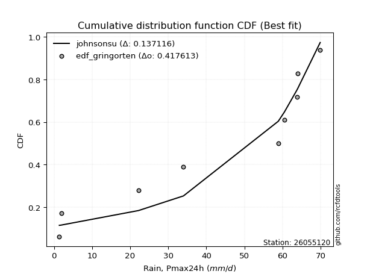</img></img>

</div>


### 9. Empirical - EDF Filliben (1975)

The specific values of the constants (0.3175) (often denoted as $alpha$) and (0.365) are derived from a method proposed by James J. Filliben in a 1975 paper. This particular formula is the mean value of the $i$-th order statistic of the normal distribution and is considered a robust and effective plotting position formula for the normal probability plot correlation coefficient test for normality.

<div align="center">


$P=(m-0.3175)/(n+0.365)$


</div>


**9.1. Empirical values**

<div align="center">

|                | 0                   | 1                  | 2                   | 3                  | 4                  | 5                  | 6                  | 7                  | 8                  | 9                  |
|:---------------|:--------------------|:-------------------|:--------------------|:-------------------|:-------------------|:-------------------|:-------------------|:-------------------|:-------------------|:-------------------|
| date           | 2016                | 2023               | 2022                | 2021               | 2025               | 2017               | 2018               | 2024               | 2020               | 2019               |
| x              | 1.4                 | 1.9                | 22.2                | 34.0               | 36.2               | 58.9               | 60.5               | 63.8               | 64.0               | 69.9               |
| m              | 1                   | 2                  | 3                   | 4                  | 5                  | 6                  | 7                  | 8                  | 9                  | 10                 |
| empirical_dist | edf_filliben        | edf_filliben       | edf_filliben        | edf_filliben       | edf_filliben       | edf_filliben       | edf_filliben       | edf_filliben       | edf_filliben       | edf_filliben       |
| empirical      | 0.06584659913169319 | 0.1623251326579836 | 0.25880366618427403 | 0.3552821997105644 | 0.4517607332368548 | 0.5482392667631452 | 0.6447178002894356 | 0.741196333815726  | 0.8376748673420163 | 0.9341534008683067 |
| empirical_tr   | 1.0704879938032532  | 1.193780593147135  | 1.3491701919947936  | 1.5510662177328844 | 1.8240211174659038 | 2.2135611318739987 | 2.814663951120163  | 3.8639328984156576 | 6.1604754829123305 | 15.186813186813156 |

</div>


**9.2. Kolmogorov-Smirnov fit test (sorted by Δ)**


<div align="center">

|                | 0                  | 1                  | 2                  | 3                  | 4                  | 5                  | 6                  | 7                   | 8                   | 9                  | 10                  | 11                  | 12                 | 13                  | 14                 | 15                  | 16                  | 17                  | 18                  | 19                  | 20                 | 21                  | 22                 | 23                  | 24                  | 25                  | 26                  | 27                  | 28                 | 29                  | 30                 | 31                  | 32                  | 33                  | 34                  | 35                  | 36                 | 37                  | 38                  | 39                  | 40                  | 41                  | 42                 | 43                  | 44                  | 45                  | 46                 | 47                 | 48                 | 49                  | 50                 | 51                  | 52                 | 53                 | 54                 | 55                  | 56                 | 57                 | 58                  | 59                 | 60                 | 61                  | 62                 | 63                 | 64                 | 65                 | 66                    | 67                 | 68                 | 69                 | 70                  | 71                 | 72                  | 73                 | 74                  | 75                 | 76                 | 77                 | 78                  | 79                 | 80                  | 81                  | 82                 | 83                 | 84                 | 85                 | 86                 | 87                 | 88                 | 89                 |
|:---------------|:-------------------|:-------------------|:-------------------|:-------------------|:-------------------|:-------------------|:-------------------|:--------------------|:--------------------|:-------------------|:--------------------|:--------------------|:-------------------|:--------------------|:-------------------|:--------------------|:--------------------|:--------------------|:--------------------|:--------------------|:-------------------|:--------------------|:-------------------|:--------------------|:--------------------|:--------------------|:--------------------|:--------------------|:-------------------|:--------------------|:-------------------|:--------------------|:--------------------|:--------------------|:--------------------|:--------------------|:-------------------|:--------------------|:--------------------|:--------------------|:--------------------|:--------------------|:-------------------|:--------------------|:--------------------|:--------------------|:-------------------|:-------------------|:-------------------|:--------------------|:-------------------|:--------------------|:-------------------|:-------------------|:-------------------|:--------------------|:-------------------|:-------------------|:--------------------|:-------------------|:-------------------|:--------------------|:-------------------|:-------------------|:-------------------|:-------------------|:----------------------|:-------------------|:-------------------|:-------------------|:--------------------|:-------------------|:--------------------|:-------------------|:--------------------|:-------------------|:-------------------|:-------------------|:--------------------|:-------------------|:--------------------|:--------------------|:-------------------|:-------------------|:-------------------|:-------------------|:-------------------|:-------------------|:-------------------|:-------------------|
| station        | 26055120           | 26055120           | 26055120           | 26055120           | 26055120           | 26055120           | 26055120           | 26055120            | 26055120            | 26055120           | 26055120            | 26055120            | 26055120           | 26055120            | 26055120           | 26055120            | 26055120            | 26055120            | 26055120            | 26055120            | 26055120           | 26055120            | 26055120           | 26055120            | 26055120            | 26055120            | 26055120            | 26055120            | 26055120           | 26055120            | 26055120           | 26055120            | 26055120            | 26055120            | 26055120            | 26055120            | 26055120           | 26055120            | 26055120            | 26055120            | 26055120            | 26055120            | 26055120           | 26055120            | 26055120            | 26055120            | 26055120           | 26055120           | 26055120           | 26055120            | 26055120           | 26055120            | 26055120           | 26055120           | 26055120           | 26055120            | 26055120           | 26055120           | 26055120            | 26055120           | 26055120           | 26055120            | 26055120           | 26055120           | 26055120           | 26055120           | 26055120              | 26055120           | 26055120           | 26055120           | 26055120            | 26055120           | 26055120            | 26055120           | 26055120            | 26055120           | 26055120           | 26055120           | 26055120            | 26055120           | 26055120            | 26055120            | 26055120           | 26055120           | 26055120           | 26055120           | 26055120           | 26055120           | 26055120           | 26055120           |
| empirical_dist | edf_filliben       | edf_filliben       | edf_filliben       | edf_filliben       | edf_filliben       | edf_filliben       | edf_filliben       | edf_filliben        | edf_filliben        | edf_filliben       | edf_filliben        | edf_filliben        | edf_filliben       | edf_filliben        | edf_filliben       | edf_filliben        | edf_filliben        | edf_filliben        | edf_filliben        | edf_filliben        | edf_filliben       | edf_filliben        | edf_filliben       | edf_filliben        | edf_filliben        | edf_filliben        | edf_filliben        | edf_filliben        | edf_filliben       | edf_filliben        | edf_filliben       | edf_filliben        | edf_filliben        | edf_filliben        | edf_filliben        | edf_filliben        | edf_filliben       | edf_filliben        | edf_filliben        | edf_filliben        | edf_filliben        | edf_filliben        | edf_filliben       | edf_filliben        | edf_filliben        | edf_filliben        | edf_filliben       | edf_filliben       | edf_filliben       | edf_filliben        | edf_filliben       | edf_filliben        | edf_filliben       | edf_filliben       | edf_filliben       | edf_filliben        | edf_filliben       | edf_filliben       | edf_filliben        | edf_filliben       | edf_filliben       | edf_filliben        | edf_filliben       | edf_filliben       | edf_filliben       | edf_filliben       | edf_filliben          | edf_filliben       | edf_filliben       | edf_filliben       | edf_filliben        | edf_filliben       | edf_filliben        | edf_filliben       | edf_filliben        | edf_filliben       | edf_filliben       | edf_filliben       | edf_filliben        | edf_filliben       | edf_filliben        | edf_filliben        | edf_filliben       | edf_filliben       | edf_filliben       | edf_filliben       | edf_filliben       | edf_filliben       | edf_filliben       | edf_filliben       |
| p_dist         | logjohnsonsu       | johnsonsu          | alpha              | logpearson3        | loggumbel_l        | fisk               | logfisk            | weibull_min         | pearson3            | gumbel_l           | invweibull          | invgauss            | erlang             | exponnorm           | crystalball        | norm                | t                   | expon               | betaprime           | rice                | genexpon           | gamma               | loggompertz        | logweibull_min      | kstwobign           | invgamma            | maxwell             | rayleigh            | laplace_asymmetric | halfnorm            | logalpha           | ncf                 | logncf              | logistic            | lognorm             | lognorm             | logexponnorm       | logf                | logrice             | logfatiguelife      | lognct              | lognakagami         | logbetaprime       | logerlang           | loggamma            | loggamma            | gumbel_r           | logchi2            | hypsecant          | loglogistic         | loginvgamma        | halflogistic        | loginvgauss        | loghypsecant       | loginvweibull      | moyal               | logmaxwell         | laplace            | lograyleigh         | nakagami           | f                  | loglaplace          | logkstwobign       | mielke             | loghalfnorm        | wald               | loglaplace_asymmetric | logloggamma        | loggenexpon        | loggumbel_r        | logmielke           | logt               | loghalflogistic     | gibrat             | logmoyal            | nct                | logtruncnorm       | gompertz           | logexpon            | logwald            | loglognorm          | pareto              | logpareto          | loggibrat          | fatiguelife        | chi2               | genlogistic        | loggenlogistic     | truncnorm          | logcrystalball     |
| delta          | 0.1050391177488394 | 0.1646810562954304 | 0.1678193584199119 | 0.1749464409341186 | 0.1780652506815914 | 0.1905733561961851 | 0.1962925091107155 | 0.19816562223861323 | 0.20251385468044147 | 0.2054474833824469 | 0.20640879245978272 | 0.21215637297536383 | 0.2127400234532807 | 0.21384927511976637 | 0.2138503389436769 | 0.21385035203090685 | 0.21386236006525905 | 0.21526508606896322 | 0.21534329889168347 | 0.21558655509291247 | 0.2156403878297899 | 0.21655485239569217 | 0.2187575952509263 | 0.21901130224366627 | 0.21917406446507093 | 0.22165461424261967 | 0.22184583048215611 | 0.22411826051013006 | 0.2317465954772775 | 0.23220576410702876 | 0.2334695846307202 | 0.23611848093362242 | 0.23628529593860814 | 0.23646802090386787 | 0.23889322296295634 | 0.23889322296295634 | 0.2388937987143741 | 0.23889634124535375 | 0.23889815785924806 | 0.23934102335439877 | 0.23951871980572337 | 0.23979763027537793 | 0.2443302048845153 | 0.24767994080287414 | 0.24931010886613159 | 0.24931010886613159 | 0.2502896402093574 | 0.250813133116101  | 0.2509856038574474 | 0.25112305225300935 | 0.2526863723095475 | 0.25587523260117495 | 0.2586495783037276 | 0.2611785556457892 | 0.2620846272524628 | 0.26210100239321177 | 0.2659249298352755 | 0.2693580653317945 | 0.27434774646404414 | 0.2764709122325104 | 0.2793524888146872 | 0.28776543450909653 | 0.2976740222411372 | 0.298227956195005  | 0.2982867998246411 | 0.299884800743227  | 0.3015717148326422    | 0.3020387050348837 | 0.3043054973496115 | 0.3059805029015936 | 0.30878701159489075 | 0.3144445651874911 | 0.32653939076741356 | 0.3287240837567923 | 0.32900160027479486 | 0.3417125439257381 | 0.3507009472619403 | 0.3593260877048605 | 0.36110321814693475 | 0.3930949537282491 | 0.39519775873328306 | 0.40084434346097325 | 0.4186353803945361 | 0.4246120152377627 | 0.4782417851088801 | 0.7257500138095996 | 0.8376748673420163 | 0.8376748673420163 | 0.9129060197120514 | nan                |
| deltao         | 0.3942745923300002 | 0.3942745923300002 | 0.3942745923300002 | 0.3942745923300002 | 0.3942745923300002 | 0.3942745923300002 | 0.3942745923300002 | 0.3942745923300002  | 0.3942745923300002  | 0.3942745923300002 | 0.3942745923300002  | 0.3942745923300002  | 0.3942745923300002 | 0.3942745923300002  | 0.3942745923300002 | 0.3942745923300002  | 0.3942745923300002  | 0.3942745923300002  | 0.3942745923300002  | 0.3942745923300002  | 0.3942745923300002 | 0.3942745923300002  | 0.3942745923300002 | 0.3942745923300002  | 0.3942745923300002  | 0.3942745923300002  | 0.3942745923300002  | 0.3942745923300002  | 0.3942745923300002 | 0.3942745923300002  | 0.3942745923300002 | 0.3942745923300002  | 0.3942745923300002  | 0.3942745923300002  | 0.3942745923300002  | 0.3942745923300002  | 0.3942745923300002 | 0.3942745923300002  | 0.3942745923300002  | 0.3942745923300002  | 0.3942745923300002  | 0.3942745923300002  | 0.3942745923300002 | 0.3942745923300002  | 0.3942745923300002  | 0.3942745923300002  | 0.3942745923300002 | 0.3942745923300002 | 0.3942745923300002 | 0.3942745923300002  | 0.3942745923300002 | 0.3942745923300002  | 0.3942745923300002 | 0.3942745923300002 | 0.3942745923300002 | 0.3942745923300002  | 0.3942745923300002 | 0.3942745923300002 | 0.3942745923300002  | 0.3942745923300002 | 0.3942745923300002 | 0.3942745923300002  | 0.3942745923300002 | 0.3942745923300002 | 0.3942745923300002 | 0.3942745923300002 | 0.3942745923300002    | 0.3942745923300002 | 0.3942745923300002 | 0.3942745923300002 | 0.3942745923300002  | 0.3942745923300002 | 0.3942745923300002  | 0.3942745923300002 | 0.3942745923300002  | 0.3942745923300002 | 0.3942745923300002 | 0.3942745923300002 | 0.3942745923300002  | 0.3942745923300002 | 0.3942745923300002  | 0.3942745923300002  | 0.3942745923300002 | 0.3942745923300002 | 0.3942745923300002 | 0.3942745923300002 | 0.3942745923300002 | 0.3942745923300002 | 0.3942745923300002 | 0.3942745923300002 |
| eval           | Δo > Δ             | Δo > Δ             | Δo > Δ             | Δo > Δ             | Δo > Δ             | Δo > Δ             | Δo > Δ             | Δo > Δ              | Δo > Δ              | Δo > Δ             | Δo > Δ              | Δo > Δ              | Δo > Δ             | Δo > Δ              | Δo > Δ             | Δo > Δ              | Δo > Δ              | Δo > Δ              | Δo > Δ              | Δo > Δ              | Δo > Δ             | Δo > Δ              | Δo > Δ             | Δo > Δ              | Δo > Δ              | Δo > Δ              | Δo > Δ              | Δo > Δ              | Δo > Δ             | Δo > Δ              | Δo > Δ             | Δo > Δ              | Δo > Δ              | Δo > Δ              | Δo > Δ              | Δo > Δ              | Δo > Δ             | Δo > Δ              | Δo > Δ              | Δo > Δ              | Δo > Δ              | Δo > Δ              | Δo > Δ             | Δo > Δ              | Δo > Δ              | Δo > Δ              | Δo > Δ             | Δo > Δ             | Δo > Δ             | Δo > Δ              | Δo > Δ             | Δo > Δ              | Δo > Δ             | Δo > Δ             | Δo > Δ             | Δo > Δ              | Δo > Δ             | Δo > Δ             | Δo > Δ              | Δo > Δ             | Δo > Δ             | Δo > Δ              | Δo > Δ             | Δo > Δ             | Δo > Δ             | Δo > Δ             | Δo > Δ                | Δo > Δ             | Δo > Δ             | Δo > Δ             | Δo > Δ              | Δo > Δ             | Δo > Δ              | Δo > Δ             | Δo > Δ              | Δo > Δ             | Δo > Δ             | Δo > Δ             | Δo > Δ              | Δo > Δ             | Δo <= Δ             | Δo <= Δ             | Δo <= Δ            | Δo <= Δ            | Δo <= Δ            | Δo <= Δ            | Δo <= Δ            | Δo <= Δ            | Δo <= Δ            | Δo <= Δ            |
| fit            | 1                  | 1                  | 1                  | 1                  | 1                  | 1                  | 1                  | 1                   | 1                   | 1                  | 1                   | 1                   | 1                  | 1                   | 1                  | 1                   | 1                   | 1                   | 1                   | 1                   | 1                  | 1                   | 1                  | 1                   | 1                   | 1                   | 1                   | 1                   | 1                  | 1                   | 1                  | 1                   | 1                   | 1                   | 1                   | 1                   | 1                  | 1                   | 1                   | 1                   | 1                   | 1                   | 1                  | 1                   | 1                   | 1                   | 1                  | 1                  | 1                  | 1                   | 1                  | 1                   | 1                  | 1                  | 1                  | 1                   | 1                  | 1                  | 1                   | 1                  | 1                  | 1                   | 1                  | 1                  | 1                  | 1                  | 1                     | 1                  | 1                  | 1                  | 1                   | 1                  | 1                   | 1                  | 1                   | 1                  | 1                  | 1                  | 1                   | 1                  | 0                   | 0                   | 0                  | 0                  | 0                  | 0                  | 0                  | 0                  | 0                  | 0                  |
| n              | 10                 | 10                 | 10                 | 10                 | 10                 | 10                 | 10                 | 10                  | 10                  | 10                 | 10                  | 10                  | 10                 | 10                  | 10                 | 10                  | 10                  | 10                  | 10                  | 10                  | 10                 | 10                  | 10                 | 10                  | 10                  | 10                  | 10                  | 10                  | 10                 | 10                  | 10                 | 10                  | 10                  | 10                  | 10                  | 10                  | 10                 | 10                  | 10                  | 10                  | 10                  | 10                  | 10                 | 10                  | 10                  | 10                  | 10                 | 10                 | 10                 | 10                  | 10                 | 10                  | 10                 | 10                 | 10                 | 10                  | 10                 | 10                 | 10                  | 10                 | 10                 | 10                  | 10                 | 10                 | 10                 | 10                 | 10                    | 10                 | 10                 | 10                 | 10                  | 10                 | 10                  | 10                 | 10                  | 10                 | 10                 | 10                 | 10                  | 10                 | 10                  | 10                  | 10                 | 10                 | 10                 | 10                 | 10                 | 10                 | 10                 | 10                 |
| best_fit       | 1                  | 0                  | 0                  | 0                  | 0                  | 0                  | 0                  | 0                   | 0                   | 0                  | 0                   | 0                   | 0                  | 0                   | 0                  | 0                   | 0                   | 0                   | 0                   | 0                   | 0                  | 0                   | 0                  | 0                   | 0                   | 0                   | 0                   | 0                   | 0                  | 0                   | 0                  | 0                   | 0                   | 0                   | 0                   | 0                   | 0                  | 0                   | 0                   | 0                   | 0                   | 0                   | 0                  | 0                   | 0                   | 0                   | 0                  | 0                  | 0                  | 0                   | 0                  | 0                   | 0                  | 0                  | 0                  | 0                   | 0                  | 0                  | 0                   | 0                  | 0                  | 0                   | 0                  | 0                  | 0                  | 0                  | 0                     | 0                  | 0                  | 0                  | 0                   | 0                  | 0                   | 0                  | 0                   | 0                  | 0                  | 0                  | 0                   | 0                  | 0                   | 0                   | 0                  | 0                  | 0                  | 0                  | 0                  | 0                  | 0                  | 0                  |
| best_fit_sort  | 1                  | 2                  | 3                  | 4                  | 5                  | 6                  | 7                  | 8                   | 9                   | 10                 | 11                  | 12                  | 13                 | 14                  | 15                 | 16                  | 17                  | 18                  | 19                  | 20                  | 21                 | 22                  | 23                 | 24                  | 25                  | 26                  | 27                  | 28                  | 29                 | 30                  | 31                 | 32                  | 33                  | 34                  | 35                  | 36                  | 37                 | 38                  | 39                  | 40                  | 41                  | 42                  | 43                 | 44                  | 45                  | 46                  | 47                 | 48                 | 49                 | 50                  | 51                 | 52                  | 53                 | 54                 | 55                 | 56                  | 57                 | 58                 | 59                  | 60                 | 61                 | 62                  | 63                 | 64                 | 65                 | 66                 | 67                    | 68                 | 69                 | 70                 | 71                  | 72                 | 73                  | 74                 | 75                  | 76                 | 77                 | 78                 | 79                  | 80                 | 81                  | 82                  | 83                 | 84                 | 85                 | 86                 | 87                 | 88                 | 89                 | 90                 |

</div>


<div align="center">

</img>

</div>


**9.3. Best fit**

<div align="center">

|   id |   station | empirical_dist   | p_dist       |    delta |   deltao | eval   |   fit |   n |   best_fit |   best_fit_sort |
|-----:|----------:|:-----------------|:-------------|---------:|---------:|:-------|------:|----:|-----------:|----------------:|
|    0 |  26055120 | edf_filliben     | logjohnsonsu | 0.105039 | 0.394275 | Δo > Δ |     1 |  10 |          1 |               1 |

</div>


<div align="center">

</img></img>

</div>


### 10. Empirical - EDF Jenkinson (1977)

The Jenkinson formula in hydrology is an empirical plotting position formula used to estimate the non-exceedance probability _(P)_ or return period _(T)_ of a given ordered observation within a sample. It is a widely used method in the frequency analysis of extreme events such as floods and rainfall, as it provides a distribution-free way to plot data. _a≈0.31_ and _b≈0.38_ are constants derived to approximate the median of the probability distribution for the given rank.

<div align="center">


$P=(m-a)/(n+b)$


</div>


**10.1. Empirical values**

<div align="center">

|                | 0                   | 1                   | 2                  | 3                   | 4                   | 5                  | 6                  | 7                  | 8                  | 9                  |
|:---------------|:--------------------|:--------------------|:-------------------|:--------------------|:--------------------|:-------------------|:-------------------|:-------------------|:-------------------|:-------------------|
| date           | 2016                | 2023                | 2022               | 2021                | 2025                | 2017               | 2018               | 2024               | 2020               | 2019               |
| x              | 1.4                 | 1.9                 | 22.2               | 34.0                | 36.2                | 58.9               | 60.5               | 63.8               | 64.0               | 69.9               |
| m              | 1                   | 2                   | 3                  | 4                   | 5                   | 6                  | 7                  | 8                  | 9                  | 10                 |
| empirical_dist | edf_jenkinson       | edf_jenkinson       | edf_jenkinson      | edf_jenkinson       | edf_jenkinson       | edf_jenkinson      | edf_jenkinson      | edf_jenkinson      | edf_jenkinson      | edf_jenkinson      |
| empirical      | 0.06647398843930635 | 0.16281310211946048 | 0.2591522157996146 | 0.35549132947976875 | 0.45183044315992293 | 0.5481695568400771 | 0.6445086705202312 | 0.7408477842003853 | 0.8371868978805393 | 0.9335260115606935 |
| empirical_tr   | 1.0712074303405574  | 1.1944764096662832  | 1.3498049414824447 | 1.5515695067264574  | 1.8242530755711774  | 2.213219616204691  | 2.813008130081301  | 3.8587360594795537 | 6.142011834319521  | 15.043478260869529 |

</div>


**10.2. Kolmogorov-Smirnov fit test (sorted by Δ)**


<div align="center">

|                | 0                   | 1                   | 2                  | 3                  | 4                   | 5                  | 6                  | 7                   | 8                   | 9                  | 10                  | 11                  | 12                 | 13                  | 14                  | 15                  | 16                  | 17                 | 18                  | 19                  | 20                 | 21                  | 22                 | 23                  | 24                  | 25                  | 26                 | 27                  | 28                 | 29                  | 30                  | 31                 | 32                  | 33                  | 34                 | 35                 | 36                  | 37                 | 38                  | 39                  | 40                  | 41                  | 42                  | 43                 | 44                  | 45                  | 46                 | 47                  | 48                 | 49                 | 50                  | 51                  | 52                  | 53                  | 54                 | 55                  | 56                  | 57                 | 58                 | 59                  | 60                 | 61                 | 62                 | 63                 | 64                  | 65                 | 66                    | 67                 | 68                 | 69                 | 70                  | 71                 | 72                 | 73                 | 74                 | 75                 | 76                 | 77                  | 78                  | 79                  | 80                  | 81                  | 82                  | 83                  | 84                 | 85                 | 86                 | 87                 | 88                 | 89                 |
|:---------------|:--------------------|:--------------------|:-------------------|:-------------------|:--------------------|:-------------------|:-------------------|:--------------------|:--------------------|:-------------------|:--------------------|:--------------------|:-------------------|:--------------------|:--------------------|:--------------------|:--------------------|:-------------------|:--------------------|:--------------------|:-------------------|:--------------------|:-------------------|:--------------------|:--------------------|:--------------------|:-------------------|:--------------------|:-------------------|:--------------------|:--------------------|:-------------------|:--------------------|:--------------------|:-------------------|:-------------------|:--------------------|:-------------------|:--------------------|:--------------------|:--------------------|:--------------------|:--------------------|:-------------------|:--------------------|:--------------------|:-------------------|:--------------------|:-------------------|:-------------------|:--------------------|:--------------------|:--------------------|:--------------------|:-------------------|:--------------------|:--------------------|:-------------------|:-------------------|:--------------------|:-------------------|:-------------------|:-------------------|:-------------------|:--------------------|:-------------------|:----------------------|:-------------------|:-------------------|:-------------------|:--------------------|:-------------------|:-------------------|:-------------------|:-------------------|:-------------------|:-------------------|:--------------------|:--------------------|:--------------------|:--------------------|:--------------------|:--------------------|:--------------------|:-------------------|:-------------------|:-------------------|:-------------------|:-------------------|:-------------------|
| station        | 26055120            | 26055120            | 26055120           | 26055120           | 26055120            | 26055120           | 26055120           | 26055120            | 26055120            | 26055120           | 26055120            | 26055120            | 26055120           | 26055120            | 26055120            | 26055120            | 26055120            | 26055120           | 26055120            | 26055120            | 26055120           | 26055120            | 26055120           | 26055120            | 26055120            | 26055120            | 26055120           | 26055120            | 26055120           | 26055120            | 26055120            | 26055120           | 26055120            | 26055120            | 26055120           | 26055120           | 26055120            | 26055120           | 26055120            | 26055120            | 26055120            | 26055120            | 26055120            | 26055120           | 26055120            | 26055120            | 26055120           | 26055120            | 26055120           | 26055120           | 26055120            | 26055120            | 26055120            | 26055120            | 26055120           | 26055120            | 26055120            | 26055120           | 26055120           | 26055120            | 26055120           | 26055120           | 26055120           | 26055120           | 26055120            | 26055120           | 26055120              | 26055120           | 26055120           | 26055120           | 26055120            | 26055120           | 26055120           | 26055120           | 26055120           | 26055120           | 26055120           | 26055120            | 26055120            | 26055120            | 26055120            | 26055120            | 26055120            | 26055120            | 26055120           | 26055120           | 26055120           | 26055120           | 26055120           | 26055120           |
| empirical_dist | edf_jenkinson       | edf_jenkinson       | edf_jenkinson      | edf_jenkinson      | edf_jenkinson       | edf_jenkinson      | edf_jenkinson      | edf_jenkinson       | edf_jenkinson       | edf_jenkinson      | edf_jenkinson       | edf_jenkinson       | edf_jenkinson      | edf_jenkinson       | edf_jenkinson       | edf_jenkinson       | edf_jenkinson       | edf_jenkinson      | edf_jenkinson       | edf_jenkinson       | edf_jenkinson      | edf_jenkinson       | edf_jenkinson      | edf_jenkinson       | edf_jenkinson       | edf_jenkinson       | edf_jenkinson      | edf_jenkinson       | edf_jenkinson      | edf_jenkinson       | edf_jenkinson       | edf_jenkinson      | edf_jenkinson       | edf_jenkinson       | edf_jenkinson      | edf_jenkinson      | edf_jenkinson       | edf_jenkinson      | edf_jenkinson       | edf_jenkinson       | edf_jenkinson       | edf_jenkinson       | edf_jenkinson       | edf_jenkinson      | edf_jenkinson       | edf_jenkinson       | edf_jenkinson      | edf_jenkinson       | edf_jenkinson      | edf_jenkinson      | edf_jenkinson       | edf_jenkinson       | edf_jenkinson       | edf_jenkinson       | edf_jenkinson      | edf_jenkinson       | edf_jenkinson       | edf_jenkinson      | edf_jenkinson      | edf_jenkinson       | edf_jenkinson      | edf_jenkinson      | edf_jenkinson      | edf_jenkinson      | edf_jenkinson       | edf_jenkinson      | edf_jenkinson         | edf_jenkinson      | edf_jenkinson      | edf_jenkinson      | edf_jenkinson       | edf_jenkinson      | edf_jenkinson      | edf_jenkinson      | edf_jenkinson      | edf_jenkinson      | edf_jenkinson      | edf_jenkinson       | edf_jenkinson       | edf_jenkinson       | edf_jenkinson       | edf_jenkinson       | edf_jenkinson       | edf_jenkinson       | edf_jenkinson      | edf_jenkinson      | edf_jenkinson      | edf_jenkinson      | edf_jenkinson      | edf_jenkinson      |
| p_dist         | logjohnsonsu        | johnsonsu           | alpha              | logpearson3        | loggumbel_l         | fisk               | logfisk            | weibull_min         | pearson3            | gumbel_l           | invweibull          | invgauss            | erlang             | exponnorm           | crystalball         | norm                | t                   | expon              | betaprime           | rice                | genexpon           | gamma               | loggompertz        | logweibull_min      | kstwobign           | invgamma            | maxwell            | rayleigh            | laplace_asymmetric | halfnorm            | logalpha            | logncf             | ncf                 | logistic            | lognorm            | lognorm            | logexponnorm        | logf               | logrice             | logfatiguelife      | lognct              | lognakagami         | logbetaprime        | logerlang          | loggamma            | loggamma            | gumbel_r           | logchi2             | loglogistic        | hypsecant          | loginvgamma         | halflogistic        | loginvgauss         | loghypsecant        | loginvweibull      | moyal               | logmaxwell          | laplace            | lograyleigh        | nakagami            | f                  | loglaplace         | logkstwobign       | loghalfnorm        | mielke              | wald               | loglaplace_asymmetric | logloggamma        | loggenexpon        | loggumbel_r        | logmielke           | logt               | loghalflogistic    | logmoyal           | gibrat             | nct                | logtruncnorm       | gompertz            | logexpon            | logwald             | loglognorm          | pareto              | logpareto           | loggibrat           | fatiguelife        | chi2               | genlogistic        | loggenlogistic     | truncnorm          | logcrystalball     |
| delta          | 0.10510882767190755 | 0.16475076621849855 | 0.16788906834298   | 0.1743190516265054 | 0.17785612091238706 | 0.1906430661192532 | 0.1956651198031023 | 0.19823533216168132 | 0.20258356460350957 | 0.205517193305515  | 0.20647850238285081 | 0.21222608289843192 | 0.2128097333763488 | 0.21391898504283446 | 0.21392004886674498 | 0.21392006195397495 | 0.21393206998832714 | 0.2153347959920313 | 0.21541300881475156 | 0.21565626501598056 | 0.215710097752858  | 0.21662456231876026 | 0.2188273051739944 | 0.21908101216673437 | 0.21924377438813902 | 0.22172432416568777 | 0.2219155404052242 | 0.22418797043319816 | 0.2318163054003456 | 0.23227547403009685 | 0.23326045486151586 | 0.2360761661694038 | 0.23618819085669052 | 0.23653773082693597 | 0.238684093193752  | 0.238684093193752  | 0.23868466894516976 | 0.2386872114761494 | 0.23868902809004372 | 0.23913189358519443 | 0.23930959003651903 | 0.23958850050617359 | 0.24412107511531095 | 0.2474708110336698 | 0.24910097909692724 | 0.24910097909692724 | 0.2503593501324255 | 0.25060400334689664 | 0.250913922483805  | 0.2510553137805155 | 0.25247724254034315 | 0.25594494252424305 | 0.25844044853452325 | 0.26096942587658484 | 0.2617360776371222 | 0.26217071231627986 | 0.26571580006607115 | 0.2694277752548626 | 0.2741386166948398 | 0.27626178246330607 | 0.2791433590454829 | 0.2875563047398922 | 0.2973254726257966 | 0.2980776700554368 | 0.29829766611807307 | 0.2999545106662951 | 0.3016414247557103    | 0.3021084149579518 | 0.3039569477342709 | 0.3057713731323893 | 0.30885672151795884 | 0.3145142751105592 | 0.3263302609982092 | 0.3287924705055905 | 0.3287937936798604 | 0.3413639943103975 | 0.3503523976465997 | 0.35939579762792867 | 0.36075466853159416 | 0.39288582395904476 | 0.39470978927180617 | 0.40049579384563266 | 0.41814741093305924 | 0.42440288546855837 | 0.4778932354935395 | 0.725401464194259  | 0.8371868978805393 | 0.8371868978805393 | 0.9122786304044384 | nan                |
| deltao         | 0.3942745923300002  | 0.3942745923300002  | 0.3942745923300002 | 0.3942745923300002 | 0.3942745923300002  | 0.3942745923300002 | 0.3942745923300002 | 0.3942745923300002  | 0.3942745923300002  | 0.3942745923300002 | 0.3942745923300002  | 0.3942745923300002  | 0.3942745923300002 | 0.3942745923300002  | 0.3942745923300002  | 0.3942745923300002  | 0.3942745923300002  | 0.3942745923300002 | 0.3942745923300002  | 0.3942745923300002  | 0.3942745923300002 | 0.3942745923300002  | 0.3942745923300002 | 0.3942745923300002  | 0.3942745923300002  | 0.3942745923300002  | 0.3942745923300002 | 0.3942745923300002  | 0.3942745923300002 | 0.3942745923300002  | 0.3942745923300002  | 0.3942745923300002 | 0.3942745923300002  | 0.3942745923300002  | 0.3942745923300002 | 0.3942745923300002 | 0.3942745923300002  | 0.3942745923300002 | 0.3942745923300002  | 0.3942745923300002  | 0.3942745923300002  | 0.3942745923300002  | 0.3942745923300002  | 0.3942745923300002 | 0.3942745923300002  | 0.3942745923300002  | 0.3942745923300002 | 0.3942745923300002  | 0.3942745923300002 | 0.3942745923300002 | 0.3942745923300002  | 0.3942745923300002  | 0.3942745923300002  | 0.3942745923300002  | 0.3942745923300002 | 0.3942745923300002  | 0.3942745923300002  | 0.3942745923300002 | 0.3942745923300002 | 0.3942745923300002  | 0.3942745923300002 | 0.3942745923300002 | 0.3942745923300002 | 0.3942745923300002 | 0.3942745923300002  | 0.3942745923300002 | 0.3942745923300002    | 0.3942745923300002 | 0.3942745923300002 | 0.3942745923300002 | 0.3942745923300002  | 0.3942745923300002 | 0.3942745923300002 | 0.3942745923300002 | 0.3942745923300002 | 0.3942745923300002 | 0.3942745923300002 | 0.3942745923300002  | 0.3942745923300002  | 0.3942745923300002  | 0.3942745923300002  | 0.3942745923300002  | 0.3942745923300002  | 0.3942745923300002  | 0.3942745923300002 | 0.3942745923300002 | 0.3942745923300002 | 0.3942745923300002 | 0.3942745923300002 | 0.3942745923300002 |
| eval           | Δo > Δ              | Δo > Δ              | Δo > Δ             | Δo > Δ             | Δo > Δ              | Δo > Δ             | Δo > Δ             | Δo > Δ              | Δo > Δ              | Δo > Δ             | Δo > Δ              | Δo > Δ              | Δo > Δ             | Δo > Δ              | Δo > Δ              | Δo > Δ              | Δo > Δ              | Δo > Δ             | Δo > Δ              | Δo > Δ              | Δo > Δ             | Δo > Δ              | Δo > Δ             | Δo > Δ              | Δo > Δ              | Δo > Δ              | Δo > Δ             | Δo > Δ              | Δo > Δ             | Δo > Δ              | Δo > Δ              | Δo > Δ             | Δo > Δ              | Δo > Δ              | Δo > Δ             | Δo > Δ             | Δo > Δ              | Δo > Δ             | Δo > Δ              | Δo > Δ              | Δo > Δ              | Δo > Δ              | Δo > Δ              | Δo > Δ             | Δo > Δ              | Δo > Δ              | Δo > Δ             | Δo > Δ              | Δo > Δ             | Δo > Δ             | Δo > Δ              | Δo > Δ              | Δo > Δ              | Δo > Δ              | Δo > Δ             | Δo > Δ              | Δo > Δ              | Δo > Δ             | Δo > Δ             | Δo > Δ              | Δo > Δ             | Δo > Δ             | Δo > Δ             | Δo > Δ             | Δo > Δ              | Δo > Δ             | Δo > Δ                | Δo > Δ             | Δo > Δ             | Δo > Δ             | Δo > Δ              | Δo > Δ             | Δo > Δ             | Δo > Δ             | Δo > Δ             | Δo > Δ             | Δo > Δ             | Δo > Δ              | Δo > Δ              | Δo > Δ              | Δo <= Δ             | Δo <= Δ             | Δo <= Δ             | Δo <= Δ             | Δo <= Δ            | Δo <= Δ            | Δo <= Δ            | Δo <= Δ            | Δo <= Δ            | Δo <= Δ            |
| fit            | 1                   | 1                   | 1                  | 1                  | 1                   | 1                  | 1                  | 1                   | 1                   | 1                  | 1                   | 1                   | 1                  | 1                   | 1                   | 1                   | 1                   | 1                  | 1                   | 1                   | 1                  | 1                   | 1                  | 1                   | 1                   | 1                   | 1                  | 1                   | 1                  | 1                   | 1                   | 1                  | 1                   | 1                   | 1                  | 1                  | 1                   | 1                  | 1                   | 1                   | 1                   | 1                   | 1                   | 1                  | 1                   | 1                   | 1                  | 1                   | 1                  | 1                  | 1                   | 1                   | 1                   | 1                   | 1                  | 1                   | 1                   | 1                  | 1                  | 1                   | 1                  | 1                  | 1                  | 1                  | 1                   | 1                  | 1                     | 1                  | 1                  | 1                  | 1                   | 1                  | 1                  | 1                  | 1                  | 1                  | 1                  | 1                   | 1                   | 1                   | 0                   | 0                   | 0                   | 0                   | 0                  | 0                  | 0                  | 0                  | 0                  | 0                  |
| n              | 10                  | 10                  | 10                 | 10                 | 10                  | 10                 | 10                 | 10                  | 10                  | 10                 | 10                  | 10                  | 10                 | 10                  | 10                  | 10                  | 10                  | 10                 | 10                  | 10                  | 10                 | 10                  | 10                 | 10                  | 10                  | 10                  | 10                 | 10                  | 10                 | 10                  | 10                  | 10                 | 10                  | 10                  | 10                 | 10                 | 10                  | 10                 | 10                  | 10                  | 10                  | 10                  | 10                  | 10                 | 10                  | 10                  | 10                 | 10                  | 10                 | 10                 | 10                  | 10                  | 10                  | 10                  | 10                 | 10                  | 10                  | 10                 | 10                 | 10                  | 10                 | 10                 | 10                 | 10                 | 10                  | 10                 | 10                    | 10                 | 10                 | 10                 | 10                  | 10                 | 10                 | 10                 | 10                 | 10                 | 10                 | 10                  | 10                  | 10                  | 10                  | 10                  | 10                  | 10                  | 10                 | 10                 | 10                 | 10                 | 10                 | 10                 |
| best_fit       | 1                   | 0                   | 0                  | 0                  | 0                   | 0                  | 0                  | 0                   | 0                   | 0                  | 0                   | 0                   | 0                  | 0                   | 0                   | 0                   | 0                   | 0                  | 0                   | 0                   | 0                  | 0                   | 0                  | 0                   | 0                   | 0                   | 0                  | 0                   | 0                  | 0                   | 0                   | 0                  | 0                   | 0                   | 0                  | 0                  | 0                   | 0                  | 0                   | 0                   | 0                   | 0                   | 0                   | 0                  | 0                   | 0                   | 0                  | 0                   | 0                  | 0                  | 0                   | 0                   | 0                   | 0                   | 0                  | 0                   | 0                   | 0                  | 0                  | 0                   | 0                  | 0                  | 0                  | 0                  | 0                   | 0                  | 0                     | 0                  | 0                  | 0                  | 0                   | 0                  | 0                  | 0                  | 0                  | 0                  | 0                  | 0                   | 0                   | 0                   | 0                   | 0                   | 0                   | 0                   | 0                  | 0                  | 0                  | 0                  | 0                  | 0                  |
| best_fit_sort  | 1                   | 2                   | 3                  | 4                  | 5                   | 6                  | 7                  | 8                   | 9                   | 10                 | 11                  | 12                  | 13                 | 14                  | 15                  | 16                  | 17                  | 18                 | 19                  | 20                  | 21                 | 22                  | 23                 | 24                  | 25                  | 26                  | 27                 | 28                  | 29                 | 30                  | 31                  | 32                 | 33                  | 34                  | 35                 | 36                 | 37                  | 38                 | 39                  | 40                  | 41                  | 42                  | 43                  | 44                 | 45                  | 46                  | 47                 | 48                  | 49                 | 50                 | 51                  | 52                  | 53                  | 54                  | 55                 | 56                  | 57                  | 58                 | 59                 | 60                  | 61                 | 62                 | 63                 | 64                 | 65                  | 66                 | 67                    | 68                 | 69                 | 70                 | 71                  | 72                 | 73                 | 74                 | 75                 | 76                 | 77                 | 78                  | 79                  | 80                  | 81                  | 82                  | 83                  | 84                  | 85                 | 86                 | 87                 | 88                 | 89                 | 90                 |

</div>


<div align="center">

</img>

</div>


**10.3. Best fit**

<div align="center">

|   id |   station | empirical_dist   | p_dist       |    delta |   deltao | eval   |   fit |   n |   best_fit |   best_fit_sort |
|-----:|----------:|:-----------------|:-------------|---------:|---------:|:-------|------:|----:|-----------:|----------------:|
|    0 |  26055120 | edf_jenkinson    | logjohnsonsu | 0.105109 | 0.394275 | Δo > Δ |     1 |  10 |          1 |               1 |

</div>


<div align="center">

</img></img>

</div>


### 11. Empirical - EDF Cunnane (1978)

Cunnane´s work in statistical hydrology has focused on the performance and evaluation of different probability distributions (such as GEV, Gumbel, Lognormal) for flood frequency estimation. _b_ is a constant, typically set to 0.4.

<div align="center">


$P=(m-b)/(n+1-2b)$


</div>


**11.1. Empirical values**

<div align="center">

|                | 0                    | 1                   | 2                   | 3                   | 4                   | 5                  | 6                  | 7                  | 8                  | 9                  |
|:---------------|:---------------------|:--------------------|:--------------------|:--------------------|:--------------------|:-------------------|:-------------------|:-------------------|:-------------------|:-------------------|
| date           | 2016                 | 2023                | 2022                | 2021                | 2025                | 2017               | 2018               | 2024               | 2020               | 2019               |
| x              | 1.4                  | 1.9                 | 22.2                | 34.0                | 36.2                | 58.9               | 60.5               | 63.8               | 64.0               | 69.9               |
| m              | 1                    | 2                   | 3                   | 4                   | 5                   | 6                  | 7                  | 8                  | 9                  | 10                 |
| empirical_dist | edf_cunnane          | edf_cunnane         | edf_cunnane         | edf_cunnane         | edf_cunnane         | edf_cunnane        | edf_cunnane        | edf_cunnane        | edf_cunnane        | edf_cunnane        |
| empirical      | 0.058823529411764705 | 0.15686274509803924 | 0.25490196078431376 | 0.35294117647058826 | 0.45098039215686275 | 0.5490196078431373 | 0.6470588235294118 | 0.7450980392156863 | 0.8431372549019608 | 0.9411764705882353 |
| empirical_tr   | 1.0625               | 1.1860465116279069  | 1.3421052631578947  | 1.5454545454545456  | 1.8214285714285712  | 2.217391304347826  | 2.8333333333333335 | 3.9230769230769234 | 6.375              | 16.999999999999996 |

</div>


**11.2. Kolmogorov-Smirnov fit test (sorted by Δ)**


<div align="center">

|                | 0                  | 1                   | 2                   | 3                   | 4                  | 5                   | 6                   | 7                   | 8                  | 9                   | 10                  | 11                  | 12                  | 13                  | 14                  | 15                 | 16                 | 17                  | 18                  | 19                  | 20                  | 21                  | 22                  | 23                  | 24                 | 25                  | 26                  | 27                  | 28                  | 29                  | 30                  | 31                  | 32                  | 33                 | 34                 | 35                 | 36                  | 37                 | 38                 | 39                  | 40                  | 41                  | 42                  | 43                  | 44                 | 45                  | 46                  | 47                  | 48                  | 49                 | 50                  | 51                 | 52                  | 53                 | 54                 | 55                  | 56                  | 57                 | 58                 | 59                  | 60                  | 61                 | 62                  | 63                  | 64                  | 65                    | 66                 | 67                  | 68                 | 69                  | 70                  | 71                  | 72                  | 73                 | 74                 | 75                  | 76                  | 77                 | 78                 | 79                  | 80                  | 81                 | 82                 | 83                  | 84                  | 85                 | 86                 | 87                 | 88                 | 89                 |
|:---------------|:-------------------|:--------------------|:--------------------|:--------------------|:-------------------|:--------------------|:--------------------|:--------------------|:-------------------|:--------------------|:--------------------|:--------------------|:--------------------|:--------------------|:--------------------|:-------------------|:-------------------|:--------------------|:--------------------|:--------------------|:--------------------|:--------------------|:--------------------|:--------------------|:-------------------|:--------------------|:--------------------|:--------------------|:--------------------|:--------------------|:--------------------|:--------------------|:--------------------|:-------------------|:-------------------|:-------------------|:--------------------|:-------------------|:-------------------|:--------------------|:--------------------|:--------------------|:--------------------|:--------------------|:-------------------|:--------------------|:--------------------|:--------------------|:--------------------|:-------------------|:--------------------|:-------------------|:--------------------|:-------------------|:-------------------|:--------------------|:--------------------|:-------------------|:-------------------|:--------------------|:--------------------|:-------------------|:--------------------|:--------------------|:--------------------|:----------------------|:-------------------|:--------------------|:-------------------|:--------------------|:--------------------|:--------------------|:--------------------|:-------------------|:-------------------|:--------------------|:--------------------|:-------------------|:-------------------|:--------------------|:--------------------|:-------------------|:-------------------|:--------------------|:--------------------|:-------------------|:-------------------|:-------------------|:-------------------|:-------------------|
| station        | 26055120           | 26055120            | 26055120            | 26055120            | 26055120           | 26055120            | 26055120            | 26055120            | 26055120           | 26055120            | 26055120            | 26055120            | 26055120            | 26055120            | 26055120            | 26055120           | 26055120           | 26055120            | 26055120            | 26055120            | 26055120            | 26055120            | 26055120            | 26055120            | 26055120           | 26055120            | 26055120            | 26055120            | 26055120            | 26055120            | 26055120            | 26055120            | 26055120            | 26055120           | 26055120           | 26055120           | 26055120            | 26055120           | 26055120           | 26055120            | 26055120            | 26055120            | 26055120            | 26055120            | 26055120           | 26055120            | 26055120            | 26055120            | 26055120            | 26055120           | 26055120            | 26055120           | 26055120            | 26055120           | 26055120           | 26055120            | 26055120            | 26055120           | 26055120           | 26055120            | 26055120            | 26055120           | 26055120            | 26055120            | 26055120            | 26055120              | 26055120           | 26055120            | 26055120           | 26055120            | 26055120            | 26055120            | 26055120            | 26055120           | 26055120           | 26055120            | 26055120            | 26055120           | 26055120           | 26055120            | 26055120            | 26055120           | 26055120           | 26055120            | 26055120            | 26055120           | 26055120           | 26055120           | 26055120           | 26055120           |
| empirical_dist | edf_cunnane        | edf_cunnane         | edf_cunnane         | edf_cunnane         | edf_cunnane        | edf_cunnane         | edf_cunnane         | edf_cunnane         | edf_cunnane        | edf_cunnane         | edf_cunnane         | edf_cunnane         | edf_cunnane         | edf_cunnane         | edf_cunnane         | edf_cunnane        | edf_cunnane        | edf_cunnane         | edf_cunnane         | edf_cunnane         | edf_cunnane         | edf_cunnane         | edf_cunnane         | edf_cunnane         | edf_cunnane        | edf_cunnane         | edf_cunnane         | edf_cunnane         | edf_cunnane         | edf_cunnane         | edf_cunnane         | edf_cunnane         | edf_cunnane         | edf_cunnane        | edf_cunnane        | edf_cunnane        | edf_cunnane         | edf_cunnane        | edf_cunnane        | edf_cunnane         | edf_cunnane         | edf_cunnane         | edf_cunnane         | edf_cunnane         | edf_cunnane        | edf_cunnane         | edf_cunnane         | edf_cunnane         | edf_cunnane         | edf_cunnane        | edf_cunnane         | edf_cunnane        | edf_cunnane         | edf_cunnane        | edf_cunnane        | edf_cunnane         | edf_cunnane         | edf_cunnane        | edf_cunnane        | edf_cunnane         | edf_cunnane         | edf_cunnane        | edf_cunnane         | edf_cunnane         | edf_cunnane         | edf_cunnane           | edf_cunnane        | edf_cunnane         | edf_cunnane        | edf_cunnane         | edf_cunnane         | edf_cunnane         | edf_cunnane         | edf_cunnane        | edf_cunnane        | edf_cunnane         | edf_cunnane         | edf_cunnane        | edf_cunnane        | edf_cunnane         | edf_cunnane         | edf_cunnane        | edf_cunnane        | edf_cunnane         | edf_cunnane         | edf_cunnane        | edf_cunnane        | edf_cunnane        | edf_cunnane        | edf_cunnane        |
| p_dist         | logjohnsonsu       | johnsonsu           | alpha               | loggumbel_l         | logpearson3        | fisk                | weibull_min         | pearson3            | logfisk            | gumbel_l            | invweibull          | invgauss            | erlang              | exponnorm           | crystalball         | norm               | t                  | expon               | betaprime           | rice                | genexpon            | gamma               | loggompertz         | logweibull_min      | kstwobign          | invgamma            | maxwell             | rayleigh            | laplace_asymmetric  | halfnorm            | ncf                 | logistic            | logalpha            | logncf             | lognorm            | lognorm            | logexponnorm        | logf               | logrice            | logfatiguelife      | lognct              | lognakagami         | logbetaprime        | gumbel_r            | logerlang          | hypsecant           | loggamma            | loggamma            | logchi2             | loglogistic        | loginvgamma         | halflogistic       | loginvgauss         | moyal              | loghypsecant       | loginvweibull       | logmaxwell          | laplace            | lograyleigh        | nakagami            | f                   | loglaplace         | mielke              | wald                | loghalfnorm         | loglaplace_asymmetric | logloggamma        | logkstwobign        | logmielke          | loggenexpon         | loggumbel_r         | logt                | gibrat              | loghalflogistic    | logmoyal           | nct                 | logtruncnorm        | gompertz           | logexpon           | logwald             | loglognorm          | pareto             | logpareto          | loggibrat           | fatiguelife         | chi2               | genlogistic        | loggenlogistic     | truncnorm          | logcrystalball     |
| delta          | 0.1066145762707903 | 0.16390071521543836 | 0.16703901733991977 | 0.18040627392156755 | 0.1819695106540472 | 0.18979301511619295 | 0.19738528115862108 | 0.20173351360044933 | 0.2033155788306441 | 0.20466714230245475 | 0.20562845137979058 | 0.21137603189537169 | 0.21195968237328855 | 0.21306893403977423 | 0.21306999786368475 | 0.2130700109509147 | 0.2130820189852669 | 0.21448474498897108 | 0.21456295781169132 | 0.21480621401292033 | 0.21486004674979775 | 0.21577451131570002 | 0.21797725417093416 | 0.21823096116367413 | 0.2183937233850788 | 0.22087427316262753 | 0.22106548940216397 | 0.22333791943013792 | 0.23096625439728535 | 0.23142542302703661 | 0.23533813985363028 | 0.23568767982387573 | 0.23581060787069635 | 0.2386263191785843 | 0.2412342462029325 | 0.2412342462029325 | 0.24123482195435025 | 0.2412373644853299 | 0.2412391810992242 | 0.24168204659437492 | 0.24185974304569952 | 0.24213865351535407 | 0.24667122812449144 | 0.24950929912936526 | 0.2500209640428503 | 0.25020526277745525 | 0.25165113210610773 | 0.25165113210610773 | 0.25315415635607713 | 0.2534640754929855 | 0.25502739554952364 | 0.2550948915211828 | 0.26099060154370374 | 0.2613206613132196 | 0.2635195788857653 | 0.26598633265242305 | 0.26826595307525164 | 0.2685777242518024 | 0.2766887697040203 | 0.27881193547248656 | 0.28169351205466336 | 0.2901064577490727 | 0.29744761511501283 | 0.29910445966323485 | 0.30062782306461727 | 0.3007913737526501    | 0.3012583639548916 | 0.30157572764109747 | 0.3080066705148986 | 0.30820720274957175 | 0.30832152614156977 | 0.31366422410749906 | 0.32794374267680015 | 0.3288804140073897 | 0.331342623514771  | 0.34561424932569834 | 0.35460265266190055 | 0.3585457466248685 | 0.365004923546895  | 0.39543597696822524 | 0.40066014629322744 | 0.4047460488609335 | 0.4240977679544805 | 0.42695303847773886 | 0.48214349050884037 | 0.72965171920956   | 0.8431372549019608 | 0.8431372549019608 | 0.9199290894319799 | nan                |
| deltao         | 0.3942745923300002 | 0.3942745923300002  | 0.3942745923300002  | 0.3942745923300002  | 0.3942745923300002 | 0.3942745923300002  | 0.3942745923300002  | 0.3942745923300002  | 0.3942745923300002 | 0.3942745923300002  | 0.3942745923300002  | 0.3942745923300002  | 0.3942745923300002  | 0.3942745923300002  | 0.3942745923300002  | 0.3942745923300002 | 0.3942745923300002 | 0.3942745923300002  | 0.3942745923300002  | 0.3942745923300002  | 0.3942745923300002  | 0.3942745923300002  | 0.3942745923300002  | 0.3942745923300002  | 0.3942745923300002 | 0.3942745923300002  | 0.3942745923300002  | 0.3942745923300002  | 0.3942745923300002  | 0.3942745923300002  | 0.3942745923300002  | 0.3942745923300002  | 0.3942745923300002  | 0.3942745923300002 | 0.3942745923300002 | 0.3942745923300002 | 0.3942745923300002  | 0.3942745923300002 | 0.3942745923300002 | 0.3942745923300002  | 0.3942745923300002  | 0.3942745923300002  | 0.3942745923300002  | 0.3942745923300002  | 0.3942745923300002 | 0.3942745923300002  | 0.3942745923300002  | 0.3942745923300002  | 0.3942745923300002  | 0.3942745923300002 | 0.3942745923300002  | 0.3942745923300002 | 0.3942745923300002  | 0.3942745923300002 | 0.3942745923300002 | 0.3942745923300002  | 0.3942745923300002  | 0.3942745923300002 | 0.3942745923300002 | 0.3942745923300002  | 0.3942745923300002  | 0.3942745923300002 | 0.3942745923300002  | 0.3942745923300002  | 0.3942745923300002  | 0.3942745923300002    | 0.3942745923300002 | 0.3942745923300002  | 0.3942745923300002 | 0.3942745923300002  | 0.3942745923300002  | 0.3942745923300002  | 0.3942745923300002  | 0.3942745923300002 | 0.3942745923300002 | 0.3942745923300002  | 0.3942745923300002  | 0.3942745923300002 | 0.3942745923300002 | 0.3942745923300002  | 0.3942745923300002  | 0.3942745923300002 | 0.3942745923300002 | 0.3942745923300002  | 0.3942745923300002  | 0.3942745923300002 | 0.3942745923300002 | 0.3942745923300002 | 0.3942745923300002 | 0.3942745923300002 |
| eval           | Δo > Δ             | Δo > Δ              | Δo > Δ              | Δo > Δ              | Δo > Δ             | Δo > Δ              | Δo > Δ              | Δo > Δ              | Δo > Δ             | Δo > Δ              | Δo > Δ              | Δo > Δ              | Δo > Δ              | Δo > Δ              | Δo > Δ              | Δo > Δ             | Δo > Δ             | Δo > Δ              | Δo > Δ              | Δo > Δ              | Δo > Δ              | Δo > Δ              | Δo > Δ              | Δo > Δ              | Δo > Δ             | Δo > Δ              | Δo > Δ              | Δo > Δ              | Δo > Δ              | Δo > Δ              | Δo > Δ              | Δo > Δ              | Δo > Δ              | Δo > Δ             | Δo > Δ             | Δo > Δ             | Δo > Δ              | Δo > Δ             | Δo > Δ             | Δo > Δ              | Δo > Δ              | Δo > Δ              | Δo > Δ              | Δo > Δ              | Δo > Δ             | Δo > Δ              | Δo > Δ              | Δo > Δ              | Δo > Δ              | Δo > Δ             | Δo > Δ              | Δo > Δ             | Δo > Δ              | Δo > Δ             | Δo > Δ             | Δo > Δ              | Δo > Δ              | Δo > Δ             | Δo > Δ             | Δo > Δ              | Δo > Δ              | Δo > Δ             | Δo > Δ              | Δo > Δ              | Δo > Δ              | Δo > Δ                | Δo > Δ             | Δo > Δ              | Δo > Δ             | Δo > Δ              | Δo > Δ              | Δo > Δ              | Δo > Δ              | Δo > Δ             | Δo > Δ             | Δo > Δ              | Δo > Δ              | Δo > Δ             | Δo > Δ             | Δo <= Δ             | Δo <= Δ             | Δo <= Δ            | Δo <= Δ            | Δo <= Δ             | Δo <= Δ             | Δo <= Δ            | Δo <= Δ            | Δo <= Δ            | Δo <= Δ            | Δo <= Δ            |
| fit            | 1                  | 1                   | 1                   | 1                   | 1                  | 1                   | 1                   | 1                   | 1                  | 1                   | 1                   | 1                   | 1                   | 1                   | 1                   | 1                  | 1                  | 1                   | 1                   | 1                   | 1                   | 1                   | 1                   | 1                   | 1                  | 1                   | 1                   | 1                   | 1                   | 1                   | 1                   | 1                   | 1                   | 1                  | 1                  | 1                  | 1                   | 1                  | 1                  | 1                   | 1                   | 1                   | 1                   | 1                   | 1                  | 1                   | 1                   | 1                   | 1                   | 1                  | 1                   | 1                  | 1                   | 1                  | 1                  | 1                   | 1                   | 1                  | 1                  | 1                   | 1                   | 1                  | 1                   | 1                   | 1                   | 1                     | 1                  | 1                   | 1                  | 1                   | 1                   | 1                   | 1                   | 1                  | 1                  | 1                   | 1                   | 1                  | 1                  | 0                   | 0                   | 0                  | 0                  | 0                   | 0                   | 0                  | 0                  | 0                  | 0                  | 0                  |
| n              | 10                 | 10                  | 10                  | 10                  | 10                 | 10                  | 10                  | 10                  | 10                 | 10                  | 10                  | 10                  | 10                  | 10                  | 10                  | 10                 | 10                 | 10                  | 10                  | 10                  | 10                  | 10                  | 10                  | 10                  | 10                 | 10                  | 10                  | 10                  | 10                  | 10                  | 10                  | 10                  | 10                  | 10                 | 10                 | 10                 | 10                  | 10                 | 10                 | 10                  | 10                  | 10                  | 10                  | 10                  | 10                 | 10                  | 10                  | 10                  | 10                  | 10                 | 10                  | 10                 | 10                  | 10                 | 10                 | 10                  | 10                  | 10                 | 10                 | 10                  | 10                  | 10                 | 10                  | 10                  | 10                  | 10                    | 10                 | 10                  | 10                 | 10                  | 10                  | 10                  | 10                  | 10                 | 10                 | 10                  | 10                  | 10                 | 10                 | 10                  | 10                  | 10                 | 10                 | 10                  | 10                  | 10                 | 10                 | 10                 | 10                 | 10                 |
| best_fit       | 1                  | 0                   | 0                   | 0                   | 0                  | 0                   | 0                   | 0                   | 0                  | 0                   | 0                   | 0                   | 0                   | 0                   | 0                   | 0                  | 0                  | 0                   | 0                   | 0                   | 0                   | 0                   | 0                   | 0                   | 0                  | 0                   | 0                   | 0                   | 0                   | 0                   | 0                   | 0                   | 0                   | 0                  | 0                  | 0                  | 0                   | 0                  | 0                  | 0                   | 0                   | 0                   | 0                   | 0                   | 0                  | 0                   | 0                   | 0                   | 0                   | 0                  | 0                   | 0                  | 0                   | 0                  | 0                  | 0                   | 0                   | 0                  | 0                  | 0                   | 0                   | 0                  | 0                   | 0                   | 0                   | 0                     | 0                  | 0                   | 0                  | 0                   | 0                   | 0                   | 0                   | 0                  | 0                  | 0                   | 0                   | 0                  | 0                  | 0                   | 0                   | 0                  | 0                  | 0                   | 0                   | 0                  | 0                  | 0                  | 0                  | 0                  |
| best_fit_sort  | 1                  | 2                   | 3                   | 4                   | 5                  | 6                   | 7                   | 8                   | 9                  | 10                  | 11                  | 12                  | 13                  | 14                  | 15                  | 16                 | 17                 | 18                  | 19                  | 20                  | 21                  | 22                  | 23                  | 24                  | 25                 | 26                  | 27                  | 28                  | 29                  | 30                  | 31                  | 32                  | 33                  | 34                 | 35                 | 36                 | 37                  | 38                 | 39                 | 40                  | 41                  | 42                  | 43                  | 44                  | 45                 | 46                  | 47                  | 48                  | 49                  | 50                 | 51                  | 52                 | 53                  | 54                 | 55                 | 56                  | 57                  | 58                 | 59                 | 60                  | 61                  | 62                 | 63                  | 64                  | 65                  | 66                    | 67                 | 68                  | 69                 | 70                  | 71                  | 72                  | 73                  | 74                 | 75                 | 76                  | 77                  | 78                 | 79                 | 80                  | 81                  | 82                 | 83                 | 84                  | 85                  | 86                 | 87                 | 88                 | 89                 | 90                 |

</div>


<div align="center">

</img>

</div>


**11.3. Best fit**

<div align="center">

|   id |   station | empirical_dist   | p_dist       |    delta |   deltao | eval   |   fit |   n |   best_fit |   best_fit_sort |
|-----:|----------:|:-----------------|:-------------|---------:|---------:|:-------|------:|----:|-----------:|----------------:|
|    0 |  26055120 | edf_cunnane      | logjohnsonsu | 0.106615 | 0.394275 | Δo > Δ |     1 |  10 |          1 |               1 |

</div>


<div align="center">

</img>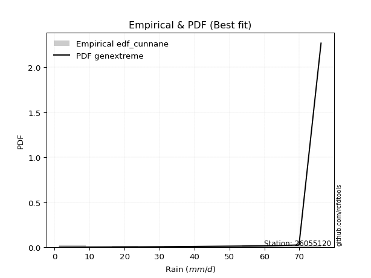</img>

</div>


### 12. Empirical - EDF Adamowski (1981)

The Adamowski formula in hydrology refers to a specific plotting position formula used for estimating the non-parametric empirical distribution of hydrological events (like flood peaks) to calculate their return periods. This formula provides an alternative to traditional parametric methods (like the Gumbel or Log Pearson Type III distributions). 

<div align="center">


$P=(m-0.25)/(n+0.5)$


</div>


**12.1. Empirical values**

<div align="center">

|                | 0                   | 1                   | 2                  | 3                   | 4                  | 5                  | 6                  | 7                  | 8                  | 9                  |
|:---------------|:--------------------|:--------------------|:-------------------|:--------------------|:-------------------|:-------------------|:-------------------|:-------------------|:-------------------|:-------------------|
| date           | 2016                | 2023                | 2022               | 2021                | 2025               | 2017               | 2018               | 2024               | 2020               | 2019               |
| x              | 1.4                 | 1.9                 | 22.2               | 34.0                | 36.2               | 58.9               | 60.5               | 63.8               | 64.0               | 69.9               |
| m              | 1                   | 2                   | 3                  | 4                   | 5                  | 6                  | 7                  | 8                  | 9                  | 10                 |
| empirical_dist | edf_adamowski       | edf_adamowski       | edf_adamowski      | edf_adamowski       | edf_adamowski      | edf_adamowski      | edf_adamowski      | edf_adamowski      | edf_adamowski      | edf_adamowski      |
| empirical      | 0.07142857142857142 | 0.16666666666666666 | 0.2619047619047619 | 0.35714285714285715 | 0.4523809523809524 | 0.5476190476190477 | 0.6428571428571429 | 0.7380952380952381 | 0.8333333333333334 | 0.9285714285714286 |
| empirical_tr   | 1.0769230769230769  | 1.2                 | 1.3548387096774193 | 1.5555555555555558  | 1.826086956521739  | 2.210526315789474  | 2.8000000000000003 | 3.818181818181819  | 6.000000000000002  | 14.000000000000007 |

</div>


**12.2. Kolmogorov-Smirnov fit test (sorted by Δ)**


<div align="center">

|                | 0                  | 1                  | 2                  | 3                   | 4                   | 5                   | 6                   | 7                   | 8                   | 9                   | 10                 | 11                  | 12                  | 13                  | 14                  | 15                  | 16                  | 17                 | 18                  | 19                  | 20                  | 21                  | 22                 | 23                  | 24                  | 25                  | 26                 | 27                  | 28                  | 29                  | 30                  | 31                 | 32                 | 33                 | 34                 | 35                  | 36                 | 37                  | 38                  | 39                  | 40                  | 41                  | 42                  | 43                 | 44                  | 45                  | 46                  | 47                 | 48                  | 49                 | 50                 | 51                  | 52                  | 53                 | 54                  | 55                  | 56                  | 57                 | 58                 | 59                  | 60                  | 61                 | 62                 | 63                 | 64                  | 65                 | 66                 | 67                    | 68                 | 69                 | 70                  | 71                 | 72                 | 73                 | 74                 | 75                 | 76                 | 77                  | 78                 | 79                 | 80                  | 81                  | 82                 | 83                  | 84                 | 85                 | 86                 | 87                 | 88                 | 89                 |
|:---------------|:-------------------|:-------------------|:-------------------|:--------------------|:--------------------|:--------------------|:--------------------|:--------------------|:--------------------|:--------------------|:-------------------|:--------------------|:--------------------|:--------------------|:--------------------|:--------------------|:--------------------|:-------------------|:--------------------|:--------------------|:--------------------|:--------------------|:-------------------|:--------------------|:--------------------|:--------------------|:-------------------|:--------------------|:--------------------|:--------------------|:--------------------|:-------------------|:-------------------|:-------------------|:-------------------|:--------------------|:-------------------|:--------------------|:--------------------|:--------------------|:--------------------|:--------------------|:--------------------|:-------------------|:--------------------|:--------------------|:--------------------|:-------------------|:--------------------|:-------------------|:-------------------|:--------------------|:--------------------|:-------------------|:--------------------|:--------------------|:--------------------|:-------------------|:-------------------|:--------------------|:--------------------|:-------------------|:-------------------|:-------------------|:--------------------|:-------------------|:-------------------|:----------------------|:-------------------|:-------------------|:--------------------|:-------------------|:-------------------|:-------------------|:-------------------|:-------------------|:-------------------|:--------------------|:-------------------|:-------------------|:--------------------|:--------------------|:-------------------|:--------------------|:-------------------|:-------------------|:-------------------|:-------------------|:-------------------|:-------------------|
| station        | 26055120           | 26055120           | 26055120           | 26055120            | 26055120            | 26055120            | 26055120            | 26055120            | 26055120            | 26055120            | 26055120           | 26055120            | 26055120            | 26055120            | 26055120            | 26055120            | 26055120            | 26055120           | 26055120            | 26055120            | 26055120            | 26055120            | 26055120           | 26055120            | 26055120            | 26055120            | 26055120           | 26055120            | 26055120            | 26055120            | 26055120            | 26055120           | 26055120           | 26055120           | 26055120           | 26055120            | 26055120           | 26055120            | 26055120            | 26055120            | 26055120            | 26055120            | 26055120            | 26055120           | 26055120            | 26055120            | 26055120            | 26055120           | 26055120            | 26055120           | 26055120           | 26055120            | 26055120            | 26055120           | 26055120            | 26055120            | 26055120            | 26055120           | 26055120           | 26055120            | 26055120            | 26055120           | 26055120           | 26055120           | 26055120            | 26055120           | 26055120           | 26055120              | 26055120           | 26055120           | 26055120            | 26055120           | 26055120           | 26055120           | 26055120           | 26055120           | 26055120           | 26055120            | 26055120           | 26055120           | 26055120            | 26055120            | 26055120           | 26055120            | 26055120           | 26055120           | 26055120           | 26055120           | 26055120           | 26055120           |
| empirical_dist | edf_adamowski      | edf_adamowski      | edf_adamowski      | edf_adamowski       | edf_adamowski       | edf_adamowski       | edf_adamowski       | edf_adamowski       | edf_adamowski       | edf_adamowski       | edf_adamowski      | edf_adamowski       | edf_adamowski       | edf_adamowski       | edf_adamowski       | edf_adamowski       | edf_adamowski       | edf_adamowski      | edf_adamowski       | edf_adamowski       | edf_adamowski       | edf_adamowski       | edf_adamowski      | edf_adamowski       | edf_adamowski       | edf_adamowski       | edf_adamowski      | edf_adamowski       | edf_adamowski       | edf_adamowski       | edf_adamowski       | edf_adamowski      | edf_adamowski      | edf_adamowski      | edf_adamowski      | edf_adamowski       | edf_adamowski      | edf_adamowski       | edf_adamowski       | edf_adamowski       | edf_adamowski       | edf_adamowski       | edf_adamowski       | edf_adamowski      | edf_adamowski       | edf_adamowski       | edf_adamowski       | edf_adamowski      | edf_adamowski       | edf_adamowski      | edf_adamowski      | edf_adamowski       | edf_adamowski       | edf_adamowski      | edf_adamowski       | edf_adamowski       | edf_adamowski       | edf_adamowski      | edf_adamowski      | edf_adamowski       | edf_adamowski       | edf_adamowski      | edf_adamowski      | edf_adamowski      | edf_adamowski       | edf_adamowski      | edf_adamowski      | edf_adamowski         | edf_adamowski      | edf_adamowski      | edf_adamowski       | edf_adamowski      | edf_adamowski      | edf_adamowski      | edf_adamowski      | edf_adamowski      | edf_adamowski      | edf_adamowski       | edf_adamowski      | edf_adamowski      | edf_adamowski       | edf_adamowski       | edf_adamowski      | edf_adamowski       | edf_adamowski      | edf_adamowski      | edf_adamowski      | edf_adamowski      | edf_adamowski      | edf_adamowski      |
| p_dist         | logjohnsonsu       | johnsonsu          | alpha              | logpearson3         | loggumbel_l         | logfisk             | fisk                | weibull_min         | pearson3            | gumbel_l            | invweibull         | invgauss            | erlang              | exponnorm           | crystalball         | norm                | t                   | expon              | betaprime           | rice                | genexpon            | gamma               | loggompertz        | logweibull_min      | kstwobign           | invgamma            | maxwell            | rayleigh            | logalpha            | laplace_asymmetric  | halfnorm            | logncf             | ncf                | lognorm            | lognorm            | logexponnorm        | logf               | logrice             | logistic            | logfatiguelife      | lognct              | lognakagami         | logbetaprime        | logerlang          | loggamma            | loggamma            | logchi2             | loglogistic        | loginvgamma         | gumbel_r           | hypsecant          | halflogistic        | loginvgauss         | loginvweibull      | loghypsecant        | moyal               | logmaxwell          | laplace            | lograyleigh        | nakagami            | f                   | loglaplace         | logkstwobign       | loghalfnorm        | mielke              | wald               | loggenexpon        | loglaplace_asymmetric | logloggamma        | loggumbel_r        | logmielke           | logt               | loghalflogistic    | logmoyal           | gibrat             | nct                | logtruncnorm       | logexpon            | gompertz           | loglognorm         | logwald             | pareto              | logpareto          | loggibrat           | fatiguelife        | chi2               | genlogistic        | loggenlogistic     | truncnorm          | logcrystalball     |
| delta          | 0.105659336892937  | 0.165301275439528  | 0.1684395775640094 | 0.16936446863724053 | 0.17620459324929866 | 0.19071053681383743 | 0.19119357534028258 | 0.19878584138271072 | 0.20313407382453896 | 0.20606770252654438 | 0.2070290116038802 | 0.21277659211946132 | 0.21336024259737818 | 0.21446949426386386 | 0.21447055808777438 | 0.21447057117500434 | 0.21448257920935654 | 0.2158853052130607 | 0.21596351803578095 | 0.21620677423700996 | 0.21626060697388738 | 0.21717507153978965 | 0.2193778143950238 | 0.21963152138776376 | 0.21979428360916842 | 0.22227483338671716 | 0.2224660496262536 | 0.22473847965422755 | 0.23160892719842746 | 0.23236681462137498 | 0.23282598325112625 | 0.2344246385063154 | 0.2367387000777199 | 0.2370325655306636 | 0.2370325655306636 | 0.23703314128208136 | 0.237035683813061  | 0.23703750042695532 | 0.23708824004796536 | 0.23748036592210603 | 0.23765806237343062 | 0.23793697284308518 | 0.24246954745222254 | 0.2458192833705814 | 0.24744945143383884 | 0.24744945143383884 | 0.24895247568380824 | 0.2492623948207166 | 0.25082571487725475 | 0.2509098593534549 | 0.2516058230015449 | 0.25649545174527244 | 0.25678892087143484 | 0.2589835315319749 | 0.25931789821349643 | 0.26272122153730926 | 0.26406427240298275 | 0.269978284475892  | 0.2724870890317514 | 0.27461025480021767 | 0.27749183138239447 | 0.2859047770768038 | 0.2945729265206493 | 0.2964261423923484 | 0.29884817533910246 | 0.3005050198873245 | 0.3012044016291236 | 0.3021919339767397    | 0.3026589241789812 | 0.3041198454693009 | 0.30940723073898824 | 0.3150647843315887 | 0.3246787333351208 | 0.3271409428425021 | 0.3293443029008898 | 0.3386114482052502 | 0.3475998515414524 | 0.35800212242644686 | 0.3599463068489581 | 0.3908562247246    | 0.39123429629595635 | 0.39774324774048536 | 0.4142938463858531 | 0.42275135780546996 | 0.4751406893883922 | 0.7226489180891118 | 0.8333333333333334 | 0.8333333333333334 | 0.9073240474151733 | nan                |
| deltao         | 0.3942745923300002 | 0.3942745923300002 | 0.3942745923300002 | 0.3942745923300002  | 0.3942745923300002  | 0.3942745923300002  | 0.3942745923300002  | 0.3942745923300002  | 0.3942745923300002  | 0.3942745923300002  | 0.3942745923300002 | 0.3942745923300002  | 0.3942745923300002  | 0.3942745923300002  | 0.3942745923300002  | 0.3942745923300002  | 0.3942745923300002  | 0.3942745923300002 | 0.3942745923300002  | 0.3942745923300002  | 0.3942745923300002  | 0.3942745923300002  | 0.3942745923300002 | 0.3942745923300002  | 0.3942745923300002  | 0.3942745923300002  | 0.3942745923300002 | 0.3942745923300002  | 0.3942745923300002  | 0.3942745923300002  | 0.3942745923300002  | 0.3942745923300002 | 0.3942745923300002 | 0.3942745923300002 | 0.3942745923300002 | 0.3942745923300002  | 0.3942745923300002 | 0.3942745923300002  | 0.3942745923300002  | 0.3942745923300002  | 0.3942745923300002  | 0.3942745923300002  | 0.3942745923300002  | 0.3942745923300002 | 0.3942745923300002  | 0.3942745923300002  | 0.3942745923300002  | 0.3942745923300002 | 0.3942745923300002  | 0.3942745923300002 | 0.3942745923300002 | 0.3942745923300002  | 0.3942745923300002  | 0.3942745923300002 | 0.3942745923300002  | 0.3942745923300002  | 0.3942745923300002  | 0.3942745923300002 | 0.3942745923300002 | 0.3942745923300002  | 0.3942745923300002  | 0.3942745923300002 | 0.3942745923300002 | 0.3942745923300002 | 0.3942745923300002  | 0.3942745923300002 | 0.3942745923300002 | 0.3942745923300002    | 0.3942745923300002 | 0.3942745923300002 | 0.3942745923300002  | 0.3942745923300002 | 0.3942745923300002 | 0.3942745923300002 | 0.3942745923300002 | 0.3942745923300002 | 0.3942745923300002 | 0.3942745923300002  | 0.3942745923300002 | 0.3942745923300002 | 0.3942745923300002  | 0.3942745923300002  | 0.3942745923300002 | 0.3942745923300002  | 0.3942745923300002 | 0.3942745923300002 | 0.3942745923300002 | 0.3942745923300002 | 0.3942745923300002 | 0.3942745923300002 |
| eval           | Δo > Δ             | Δo > Δ             | Δo > Δ             | Δo > Δ              | Δo > Δ              | Δo > Δ              | Δo > Δ              | Δo > Δ              | Δo > Δ              | Δo > Δ              | Δo > Δ             | Δo > Δ              | Δo > Δ              | Δo > Δ              | Δo > Δ              | Δo > Δ              | Δo > Δ              | Δo > Δ             | Δo > Δ              | Δo > Δ              | Δo > Δ              | Δo > Δ              | Δo > Δ             | Δo > Δ              | Δo > Δ              | Δo > Δ              | Δo > Δ             | Δo > Δ              | Δo > Δ              | Δo > Δ              | Δo > Δ              | Δo > Δ             | Δo > Δ             | Δo > Δ             | Δo > Δ             | Δo > Δ              | Δo > Δ             | Δo > Δ              | Δo > Δ              | Δo > Δ              | Δo > Δ              | Δo > Δ              | Δo > Δ              | Δo > Δ             | Δo > Δ              | Δo > Δ              | Δo > Δ              | Δo > Δ             | Δo > Δ              | Δo > Δ             | Δo > Δ             | Δo > Δ              | Δo > Δ              | Δo > Δ             | Δo > Δ              | Δo > Δ              | Δo > Δ              | Δo > Δ             | Δo > Δ             | Δo > Δ              | Δo > Δ              | Δo > Δ             | Δo > Δ             | Δo > Δ             | Δo > Δ              | Δo > Δ             | Δo > Δ             | Δo > Δ                | Δo > Δ             | Δo > Δ             | Δo > Δ              | Δo > Δ             | Δo > Δ             | Δo > Δ             | Δo > Δ             | Δo > Δ             | Δo > Δ             | Δo > Δ              | Δo > Δ             | Δo > Δ             | Δo > Δ              | Δo <= Δ             | Δo <= Δ            | Δo <= Δ             | Δo <= Δ            | Δo <= Δ            | Δo <= Δ            | Δo <= Δ            | Δo <= Δ            | Δo <= Δ            |
| fit            | 1                  | 1                  | 1                  | 1                   | 1                   | 1                   | 1                   | 1                   | 1                   | 1                   | 1                  | 1                   | 1                   | 1                   | 1                   | 1                   | 1                   | 1                  | 1                   | 1                   | 1                   | 1                   | 1                  | 1                   | 1                   | 1                   | 1                  | 1                   | 1                   | 1                   | 1                   | 1                  | 1                  | 1                  | 1                  | 1                   | 1                  | 1                   | 1                   | 1                   | 1                   | 1                   | 1                   | 1                  | 1                   | 1                   | 1                   | 1                  | 1                   | 1                  | 1                  | 1                   | 1                   | 1                  | 1                   | 1                   | 1                   | 1                  | 1                  | 1                   | 1                   | 1                  | 1                  | 1                  | 1                   | 1                  | 1                  | 1                     | 1                  | 1                  | 1                   | 1                  | 1                  | 1                  | 1                  | 1                  | 1                  | 1                   | 1                  | 1                  | 1                   | 0                   | 0                  | 0                   | 0                  | 0                  | 0                  | 0                  | 0                  | 0                  |
| n              | 10                 | 10                 | 10                 | 10                  | 10                  | 10                  | 10                  | 10                  | 10                  | 10                  | 10                 | 10                  | 10                  | 10                  | 10                  | 10                  | 10                  | 10                 | 10                  | 10                  | 10                  | 10                  | 10                 | 10                  | 10                  | 10                  | 10                 | 10                  | 10                  | 10                  | 10                  | 10                 | 10                 | 10                 | 10                 | 10                  | 10                 | 10                  | 10                  | 10                  | 10                  | 10                  | 10                  | 10                 | 10                  | 10                  | 10                  | 10                 | 10                  | 10                 | 10                 | 10                  | 10                  | 10                 | 10                  | 10                  | 10                  | 10                 | 10                 | 10                  | 10                  | 10                 | 10                 | 10                 | 10                  | 10                 | 10                 | 10                    | 10                 | 10                 | 10                  | 10                 | 10                 | 10                 | 10                 | 10                 | 10                 | 10                  | 10                 | 10                 | 10                  | 10                  | 10                 | 10                  | 10                 | 10                 | 10                 | 10                 | 10                 | 10                 |
| best_fit       | 1                  | 0                  | 0                  | 0                   | 0                   | 0                   | 0                   | 0                   | 0                   | 0                   | 0                  | 0                   | 0                   | 0                   | 0                   | 0                   | 0                   | 0                  | 0                   | 0                   | 0                   | 0                   | 0                  | 0                   | 0                   | 0                   | 0                  | 0                   | 0                   | 0                   | 0                   | 0                  | 0                  | 0                  | 0                  | 0                   | 0                  | 0                   | 0                   | 0                   | 0                   | 0                   | 0                   | 0                  | 0                   | 0                   | 0                   | 0                  | 0                   | 0                  | 0                  | 0                   | 0                   | 0                  | 0                   | 0                   | 0                   | 0                  | 0                  | 0                   | 0                   | 0                  | 0                  | 0                  | 0                   | 0                  | 0                  | 0                     | 0                  | 0                  | 0                   | 0                  | 0                  | 0                  | 0                  | 0                  | 0                  | 0                   | 0                  | 0                  | 0                   | 0                   | 0                  | 0                   | 0                  | 0                  | 0                  | 0                  | 0                  | 0                  |
| best_fit_sort  | 1                  | 2                  | 3                  | 4                   | 5                   | 6                   | 7                   | 8                   | 9                   | 10                  | 11                 | 12                  | 13                  | 14                  | 15                  | 16                  | 17                  | 18                 | 19                  | 20                  | 21                  | 22                  | 23                 | 24                  | 25                  | 26                  | 27                 | 28                  | 29                  | 30                  | 31                  | 32                 | 33                 | 34                 | 35                 | 36                  | 37                 | 38                  | 39                  | 40                  | 41                  | 42                  | 43                  | 44                 | 45                  | 46                  | 47                  | 48                 | 49                  | 50                 | 51                 | 52                  | 53                  | 54                 | 55                  | 56                  | 57                  | 58                 | 59                 | 60                  | 61                  | 62                 | 63                 | 64                 | 65                  | 66                 | 67                 | 68                    | 69                 | 70                 | 71                  | 72                 | 73                 | 74                 | 75                 | 76                 | 77                 | 78                  | 79                 | 80                 | 81                  | 82                  | 83                 | 84                  | 85                 | 86                 | 87                 | 88                 | 89                 | 90                 |

</div>


<div align="center">

</img>

</div>


**12.3. Best fit**

<div align="center">

|   id |   station | empirical_dist   | p_dist       |    delta |   deltao | eval   |   fit |   n |   best_fit |   best_fit_sort |
|-----:|----------:|:-----------------|:-------------|---------:|---------:|:-------|------:|----:|-----------:|----------------:|
|    0 |  26055120 | edf_adamowski    | logjohnsonsu | 0.105659 | 0.394275 | Δo > Δ |     1 |  10 |          1 |               1 |

</div>


<div align="center">

</img>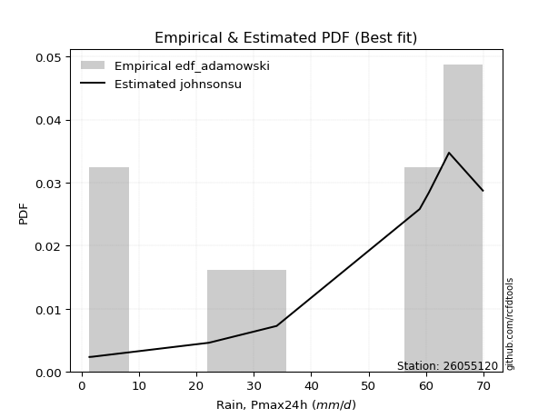</img>

</div>


## C. Best fit & Estimate extreme values for specific return periods - Tr


### 1. Best fit (ordered by delta Δ)

<div align="center">

|   id |   station | empirical_dist   | p_dist       |    delta |   deltao | eval   |   fit |   n |   best_fit |   best_fit_sort |
|-----:|----------:|:-----------------|:-------------|---------:|---------:|:-------|------:|----:|-----------:|----------------:|
|    0 |  26055120 | edf_tukey        | logjohnsonsu | 0.104891 | 0.394275 | Δo > Δ |     1 |  10 |          1 |               1 |
|    1 |  26055120 | edf_blom         | logjohnsonsu | 0.104941 | 0.394275 | Δo > Δ |     1 |  10 |          1 |               2 |
|    2 |  26055120 | edf_filliben     | logjohnsonsu | 0.105039 | 0.394275 | Δo > Δ |     1 |  10 |          1 |               3 |
|    3 |  26055120 | edf_jenkinson    | logjohnsonsu | 0.105109 | 0.394275 | Δo > Δ |     1 |  10 |          1 |               4 |
|    4 |  26055120 | edf_beard        | logjohnsonsu | 0.105109 | 0.394275 | Δo > Δ |     1 |  10 |          1 |               5 |
|    5 |  26055120 | edf_chegodayev   | logjohnsonsu | 0.105201 | 0.394275 | Δo > Δ |     1 |  10 |          1 |               6 |
|    6 |  26055120 | edf_adamowski    | logjohnsonsu | 0.105659 | 0.394275 | Δo > Δ |     1 |  10 |          1 |               7 |
|    7 |  26055120 | edf_cunnane      | logjohnsonsu | 0.106615 | 0.394275 | Δo > Δ |     1 |  10 |          1 |               8 |
|    8 |  26055120 | edf_weibull      | logjohnsonsu | 0.107824 | 0.394275 | Δo > Δ |     1 |  10 |          1 |               9 |
|    9 |  26055120 | edf_gringorten   | logjohnsonsu | 0.109327 | 0.394275 | Δo > Δ |     1 |  10 |          1 |              10 |
|   10 |  26055120 | edf_hazen        | logjohnsonsu | 0.113477 | 0.394275 | Δo > Δ |     1 |  10 |          1 |              11 |
|   11 |  26055120 | edf_california   | fisk         | 0.145441 | 0.394275 | Δo > Δ |     1 |  10 |          1 |              12 |

</div>

:file_folder:Tables: [bestfit_26055120.csv](table/bestfit_26055120.csv) | [extreme_26055120.csv](table/extreme_26055120.csv)


### 2. Extreme values

In hydrology, a return period (or recurrence interval $Tr$) is the statistical average time between extreme events like floods or droughts of a specific magnitude, indicating how rare an event is, with a 100-year flood, for example, having a 1% chance of occurring in any given year, not that it happens exactly every century. It is a key tool for infrastructure design (like bridges or dams) and risk assessment, calculated from historical data to determine the probability of future events, although it is important to remember it is statistical average, and events can cluster or be missed.

> risk_rate: assuming the return period as the project useful life.

|   id |      tr |   prob_l |     prob_g |    alpha |   betaprime |     chi2 |   crystalball |   erlang |    expon |   exponnorm |        f |   fatiguelife |     fisk |    gamma |   genexpon |   genlogistic |   gibrat |   gompertz |   gumbel_l |   gumbel_r |   halflogistic |   halfnorm |   hypsecant |   invgamma |   invgauss |   invweibull |   johnsonsu |   kstwobign |   laplace |   laplace_asymmetric |   loggamma |   logistic |   lognorm |   maxwell |   mielke |    moyal |   nakagami |      ncf |              nct |     norm |         pareto |   pearson3 |   rayleigh |     rice |        t |   truncnorm |     wald |   weibull_min |   logalpha |   logbetaprime |   logchi2 |   logcrystalball |   logerlang |         logexpon |   logexponnorm |      logf |   logfatiguelife |   logfisk |   loggenexpon |   loggenlogistic |        loggibrat |   loggompertz |   loggumbel_l |   loggumbel_r |   loghalflogistic |   loghalfnorm |   loghypsecant |   loginvgamma |   loginvgauss |   loginvweibull |   logjohnsonsu |   logkstwobign |   loglaplace |   loglaplace_asymmetric |   logloggamma |   loglogistic |   loglognorm |   logmaxwell |   logmielke |   logmoyal |   lognakagami |    logncf |    lognct |      logpareto |   logpearson3 |   lograyleigh |   logrice |             logt |   logtruncnorm |     logwald |   logweibull_min |   station |   n |   risk_rate |
|-----:|--------:|---------:|-----------:|---------:|------------:|---------:|--------------:|---------:|---------:|------------:|---------:|--------------:|---------:|---------:|-----------:|--------------:|---------:|-----------:|-----------:|-----------:|---------------:|-----------:|------------:|-----------:|-----------:|-------------:|------------:|------------:|----------:|---------------------:|-----------:|-----------:|----------:|----------:|---------:|---------:|-----------:|---------:|-----------------:|---------:|---------------:|-----------:|-----------:|---------:|---------:|------------:|---------:|--------------:|-----------:|---------------:|----------:|-----------------:|------------:|-----------------:|---------------:|----------:|-----------------:|----------:|--------------:|-----------------:|-----------------:|--------------:|--------------:|--------------:|------------------:|--------------:|---------------:|--------------:|--------------:|----------------:|---------------:|---------------:|-------------:|------------------------:|--------------:|--------------:|-------------:|-------------:|------------:|-----------:|--------------:|----------:|----------:|---------------:|--------------:|--------------:|----------:|-----------------:|---------------:|------------:|-----------------:|----------:|----:|------------:|
|    0 |    2    | 0.5      | 0.5        |  41.1531 |     40.9027 |  1.9617  |       41.28   |  40.5693 |  29.0427 |     41.28   |  21.6133 |       1.40008 |  43.2534 |  40.462  |    29.0122 |           inf |  33.8625 |    55.2077 |    45.3396 |    37.2204 |        35.2021 |    36.2216 |     41.28   |    39.5093 |    39.0123 |      36.9749 |     52.0298 |     35.7003 |   41.28   |              38.8823 |    22.9756 |    41.28   |   24.3712 |   39.1666 |  33.764  |  35.9098 |    22.2457 |  32.7861 |     12.7387      |  41.28   |    2.05861     |    43.2599 |    38.417  |  40.2343 |  41.2793 |   -27.0566  |  33.2697 |       45.8993 |    23.5738 |        22.2214 |   22.736  |                0 |     23.1522 |     10.1426      |        24.3712 |   24.3642 |          24.3384 |   32.8238 |       16.4373 |         inf      |     16.023       |       31.2596 |       30.6596 |       19.3726 |           17.2834 |       18.309  |        24.3712 |       22.5114 |       21.5016 |         20.1344 |        51.4209 |        16.9262 |      24.3712 |                 33.6906 |       33.6218 |       24.3712 |      1.48277 |      21.6261 |     30.5009 |    17.9889 |       24.2908 |   24.5322 |   24.2666 |   1.48994      |       32.693  |       20.7286 |   24.3709 |     62.1895      |        12.1813 |     15.4946 |          32.2733 |  26055120 |  10 |    0.75     |
|    1 |    2.33 | 0.570815 | 0.429185   |  46.6067 |     45.3533 |  2.33218 |       45.6897 |  45.1232 |  35.1332 |     45.6897 |  27.5024 |       3.04665 |  47.5446 |  44.967  |    35.0961 |           inf |  36.0963 |    57.3501 |    49.1761 |    41.3064 |        39.4032 |    40.9809 |     44.8091 |    44.041  |    43.7932 |      42.1349 |     55.4566 |     40.8798 |   43.9486 |              42.6063 |    29.8925 |    45.1653 |   31.2725 |   43.7479 |  38.7993 |  39.7778 |    28.1484 |  37.8165 |     18.6183      |  45.6897 |    3.99604     |    47.5566 |    43.0661 |  44.8069 |  45.6889 |   -24.5534  |  36.1612 |       49.6907 |    31.5344 |        29.9713 |   29.6696 |                0 |     30.0944 |     15.6906      |        31.2724 |   31.2669 |          31.2237 |   40.4254 |       23.0592 |         inf      |     18.18        |       37.0108 |       38.0869 |       24.4077 |           21.9175 |       23.9625 |        29.7535 |       29.4158 |       28.4692 |         28.2966 |        56.2732 |        23.8498 |      28.3404 |                 38.7342 |       38.6692 |       30.3588 |      2.19777 |      28.0208 |     35.8564 |    22.3866 |       31.1702 |   31.5468 |   31.1848 |   1.7909       |       40.6992 |       26.961  |   31.272  |     63.6398      |        17.7753 |     18.2467 |          37.9159 |  26055120 |  10 |    0.729209 |
|    2 |    5    | 0.8      | 0.2        |  67.6072 |     62.0275 |  5.34772 |       62.0774 |  62.3819 |  65.5844 |     62.0775 |  60.43   |      38.0232  |  64.1138 |  62.0162 |    65.5138 |           inf |  48.9568 |    64.3876 |    61.5703 |    59.0583 |        58.4126 |    61.107  |     58.9651 |    61.7457 |    62.9563 |      64.5531 |     63.95   |     62.8815 |   57.2907 |              61.2257 |    80.9332 |    60.1668 |   78.9914 |   61.7799 |  55.4629 |  57.6947 |    55.9115 |  61.1305 |    117.69        |  62.0774 | 2453.66        |    62.4408 |    61.6787 |  62.1474 |  62.0764 |   -15.2508  |  52.3478 |       61.9389 |    95.4274 |        97.4715 |   81.5276 |                0 |     81.1638 |    139.007       |        78.9912 |   79.1082 |          78.8678 |   90.3554 |       92.4465 |         inf      |     37.6173      |       64.1682 |       76.7586 |       66.5951 |           64.2072 |       74.7735 |        66.2451 |       82.2119 |       84.7783 |        124.115  |        65.9903 |       102.35   |      60.2612 |                 55.2697 |       55.2285 |       70.9028 |    inf       |      77.674  |     54.1495 |    61.6537 |       78.7542 |   80.3804 |   79.326  |   7.27716e+102 |       78.6438 |       77.2307 |   78.9888 |     78.609       |        88.7908 |     45.5674 |          63.8108 |  26055120 |  10 |    0.67232  |
|    3 |   10    | 0.9      | 0.1        |  82.2118 |     73.2058 |  9.21531 |       72.9485 |  74.1246 |  93.2271 |     72.9487 |  94.1951 |      86.3169  |  76.3164 |  73.5955 |    93.1261 |           inf |  63.6163 |    68.3588 |    68.4707 |    73.5169 |        74.1991 |    76      |     70.269  |    74.2897 |    76.9506 |      82.8127 |     67.1573 |     79.6329 |   69.4023 |              78.1278 |   159.19   |    71.2148 |  146.061  |   74.4699 |  62.8812 |  73.2942 |    77.8263 |  81.5228 |    616.232       |  72.9485 |    1.2309e+06  |    71.3996 |    74.9499 |  73.8524 |  72.9474 |    -9.07973 |  69.5256 |       68.7582 |   203.653  |       226.285  |  162.466  |                0 |    159.17   |   1007.07        |       146.06   |  146.459  |         145.932  |  163.381  |      255.33   |         inf      |     86.1698      |       87.3584 |      113.39   |      150.831  |          156.76   |      173.563  |       125.526  |      167.596  |      182.569  |        413.807  |        68.3719 |       310.264  |     119.523  |                 62.5693 |       62.5429 |      132.422  |    inf       |     159.181  |     62.5266 |   148.944  |      145.667  |  149.581  |  147.558  | inf            |      107.829  |      163.561  |  146.054  |    184.336       |       294.133  |    120.355  |          85.2631 |  26055120 |  10 |    0.651322 |
|    4 |   15    | 0.933333 | 0.0666667  |  89.7125 |     78.8192 | 11.7881  |       78.3735 |  80.0728 | 109.397  |     78.3736 | 115.427  |     117.902   |  82.965  |  79.4548 |   109.278  |           inf |  73.7278 |    70.1658 |    71.5958 |    81.6743 |        83.1328 |    83.7502 |     76.7201 |    80.8036 |    84.3373 |      93.1148 |     68.3001 |     88.5259 |   76.4872 |              88.0149 |   224.17   |    77.2343 |  198.495  |   80.9809 |  65.3713 |  82.3475 |    89.4023 |  93.5289 |   1620.91        |  78.3735 |    4.67738e+07 |    75.606  |    81.7878 |  79.7343 |  78.3723 |    -6.00024 |  80.5565 |       71.8465 |   299.46   |       350.838  |  230.503  |                0 |    223.783  |   3207.29        |       198.494  |  199.169  |         198.429  |  225.611  |      434.084  |         inf      |    152.632       |      100.492  |      135.305  |      239.224  |          259.783  |      269.011  |       180.779  |      241.404  |      271.304  |        816.31   |        69.0045 |       559.02   |     178.414  |                 65.0123 |       64.9914 |      186.113  |    inf       |     230.027  |     65.3663 |   248.505  |      197.998  |  203.965  |  201.206  | inf            |      122.301  |      240.764  |  198.485  |    874.384       |       549.527  |    224.56   |          97.2217 |  26055120 |  10 |    0.644736 |
|    5 |   20    | 0.95     | 0.05       |  94.704  |     82.5079 | 13.7149  |       81.9261 |  84.0001 | 120.87   |     81.9263 | 131.131  |     141.287   |  87.5602 |  83.3211 |   120.738  |           inf |  81.6595 |    71.2928 |    73.541  |    87.3859 |        89.392  |    88.9173 |     81.2711 |    85.1648 |    89.3246 |     100.328  |     68.9232 |     94.5166 |   81.5139 |              95.0299 |   280.981  |    81.3948 |  242.654  |   85.3021 |  66.6195 |  88.7591 |    97.1514 | 102.152  |   3218.76        |  81.9261 |    6.17839e+08 |    78.2673 |    86.3328 |  83.5982 |  81.9249 |    -3.98355 |  88.7766 |       73.7688 |   386.514  |       470.673  |  290.442  |                0 |    280.19   |   7295.92        |       242.654  |  243.591  |         242.68   |  281.991  |      619.273  |         inf      |    239.006       |      109.655  |      151.037  |      330.415  |          370.094  |      360.291  |       233.831  |      307.648  |      353.381  |       1313.55   |        69.298  |       831.137  |     237.064  |                 66.2356 |       66.2176 |      235.473  |    inf       |     293.69   |     66.7946 |   357.092  |      242.081  |  249.91   |  246.548  | inf            |      131.457  |      311.314  |  242.641  |   8913.52        |       834.048  |    357.424  |         105.498  |  26055120 |  10 |    0.641514 |
|    6 |   25    | 0.96     | 0.04       |  98.4194 |     85.2297 | 15.2576  |       84.5413 |  86.9073 | 129.769  |     84.5416 | 143.674  |     159.867   |  91.0756 |  86.1821 |   129.628  |           inf |  88.2718 |    72.0956 |    74.9252 |    91.7853 |        94.2145 |    92.7619 |     84.7931 |    88.4246 |    93.0731 |     105.884  |     69.3277 |     99.0038 |   85.413  |             100.471  |   332.099  |    84.5776 |  281.325  |   88.5101 |  67.3698 |  93.7288 |   102.927  | 108.919  |   5479.76        |  84.5413 |    4.57396e+09 |    80.1798 |    89.7096 |  86.448  |  84.5401 |    -2.499   |  95.3608 |       75.1367 |   467.032  |       586.315  |  344.676  |                0 |    330.891  |  13802.1         |       281.324  |  282.509  |         281.455  |  334.46   |      807.416  |         inf      |    347.356       |      116.685  |      163.333  |      423.733  |          486.107  |      447.775  |       285.358  |      368.433  |      430.358  |       1894.85   |        69.4684 |      1118.64   |     295.537  |                 66.9701 |       66.9538 |      281.902  |    inf       |     352.1    |     67.6543 |   472.951  |      280.691  |  290.232  |  286.355  | inf            |      137.96   |      376.808  |  281.309  | 204061           |      1137.93   |    518.633  |         111.813  |  26055120 |  10 |    0.639603 |
|    7 |   50    | 0.98     | 0.02       | 109.256  |     93.0541 | 20.2651  |       92.0304 |  95.3089 | 157.411  |     92.0306 | 184.667  |     219.48    | 101.816  |  94.4448 |   157.24   |           inf | 111.58   |    74.2785 |    78.6827 |   105.338  |       109.073  |   103.937  |     95.713  |    97.9973 |   104.176  |     123      |     70.2746 |    112.18   |   97.5246 |             117.373  |   538.164  |    94.3019 |  429.644  |   97.814  |  68.8892 | 109.157  |   119.733  | 130.479  |  28608.3         |  92.0304 |    2.29586e+12 |    85.4413 |    99.5119 |  94.6313 |  92.029  |     1.75218 | 116.858  |       78.85   |   808.237  |      1117.66   |  565.548  |                0 |    534.884  |  99992.3         |       429.643  |  431.9    |         430.359  |  563.336  |     1754.81   |         inf      |   1297.53        |      138.141  |      201.996  |      911.783  |         1126.16   |      842.294  |       529.102  |      622.781  |      765.75   |       5858.4    |        69.8038 |      2676.4    |     586.174  |                 68.4403 |       68.4276 |      488.528  |    inf       |     595.845  |     69.3847 |  1131.53   |      428.825  |  445.491  |  439.742  | inf            |      155.133  |      655.885  |  429.617  |      7.0595e+17  |      2810.08   |   1748.79   |         130.928  |  26055120 |  10 |    0.63583  |
|    8 |   75    | 0.986667 | 0.0133333  | 115.195  |     97.2709 | 23.3156  |       96.0487 |  99.8636 | 173.581  |     96.049  | 210.092  |     255.382   | 108.019  |  98.9212 |   173.392  |           inf | 127.323  |    75.384  |    80.5829 |   113.215  |       117.71   |   110.02   |    102.094  |   103.283  |   110.364  |     132.949  |     70.6758 |    119.43   |  104.609  |             127.26   |   699.023  |    99.9183 |  539.243  |  102.872  |  69.4289 | 118.179  |   128.884  | 143.537  |  75218.8         |  96.0487 |    8.72424e+13 |    88.1352 |   104.845  |  99.0343 |  96.0473 |     4.03323 | 130.087  |       80.7277 |  1089.23   |      1595.61   |  739.908  |                0 |    693.8    | 318454           |       539.241  |  542.391  |         540.547  |  761.275  |     2687.2    |         inf      |   3159.96        |      150.461  |      224.907  |     1423.4    |         1835.26   |     1188.06   |       759.004  |      829.83   |     1050.92   |      11290.2    |        69.9183 |      4325.11   |     874.99   |                 68.9308 |       68.9192 |      671.129  |    inf       |     793.135  |     69.9793 |  1884.57   |      538.327  |  560.704  |  553.667  | inf            |      163.308  |      886.71   |  539.206  |      6.70071e+40 |      4599.04   |   3694.63   |         141.805  |  26055120 |  10 |    0.634587 |
|    9 |  100    | 0.99     | 0.01       | 119.262  |    100.13   | 25.5235  |       98.7666 | 102.963  | 185.054  |     98.7669 | 228.794  |     281.215   | 112.399  | 101.966  |   184.852  |           inf | 139.518  |    76.1076 |    81.8257 |   118.79   |       123.824  |   114.164  |    106.621  |   106.92   |   114.642  |     139.991  |     70.9124 |    124.397  |  109.636  |             134.275  |   835.107  |   103.884  |  628.817  |  106.318  |  69.7257 | 124.58   |   135.115  | 153.029  | 149349           |  98.7666 |    1.15239e+15 |    89.9069 |   108.478  | 102.017  |  98.7651 |     5.57604 | 139.731  |       81.956  |  1334.99   |      2038.03   |  888.458  |                0 |    828.068  | 724417           |       628.815  |  632.745  |         630.685  |  941.61   |     3597.85   |         inf      |   6297.04        |      159.11   |      241.281  |     1950.89   |         2593.07   |     1501.75   |       980.397  |     1009.81   |     1305.69   |      17962.3    |        69.9779 |      6009.19   |    1162.63   |                 69.1761 |       69.1651 |      839.806  |    inf       |     963.726  |     70.2942 |  2706.39   |      627.842  |  655.11   |  647.075  | inf            |      168.385  |     1088.92   |  628.772  |      1.27021e+75 |      6434.23   |   6373.88   |         149.403  |  26055120 |  10 |    0.633968 |
|   10 |  200    | 0.995    | 0.005      | 128.641  |    106.638  | 30.9659  |      104.932  | 110.049  | 212.697  |    104.932  | 276.179  |     344.448   | 122.905  | 108.923  |   212.465  |           inf | 172.696  |    77.6818 |    84.5271 |   132.194  |       138.521  |   123.641  |    117.526  |   115.355  |   124.628  |     156.919  |     71.3615 |    135.838  |  121.748  |             151.178  |  1253.91   |   113.396  |  891.07   |  114.2    |  70.2755 | 140.001  |   149.353  | 176.75   | 779663           | 104.932  |    5.78435e+17 |    93.7779 |   116.791  | 108.793  | 104.93   |     9.07561 | 163.756  |       84.6256 |  2128.49   |      3592.86   | 1350.34   |                0 |   1240.53   |      5.2482e+06  |       891.067  |  897.488  |         894.949  | 1568.02   |     7047.7    |         inf      |  41099.9         |      179.675  |      281.099  |     4162.65   |         5952.75   |     2566.45   |      1816.32   |     1586.63   |     2155.57   |      54849.1    |        70.0746 |     12816.3    |    2305.98   |                 69.5441 |       69.534  |     1438      |    inf       |    1504.95   |     70.8464 |  6472.64   |      890.009  |  932.52   |  921.815  | inf            |      178.515  |     1742.34   |  891      |    inf           |     13875.2    |  24793      |         167.354  |  26055120 |  10 |    0.633042 |
|   11 |  250    | 0.996    | 0.004      | 131.55   |    108.633  | 32.7495  |      106.816  | 112.229  | 221.596  |    106.816  | 292.153  |     365.056   | 126.278  | 111.063  |   221.354  |           inf | 184.601  |    78.1453 |    85.322  |   136.503  |       143.246  |   126.557  |    121.037  |   117.986  |   127.76   |     162.361  |     71.4778 |    139.378  |  125.647  |             156.619  |  1420.92   |   116.449  |  991.232  |  116.627  |  70.4226 | 144.965  |   153.728  | 184.662  |      1.32726e+06 | 106.816  |    4.28224e+18 |    94.9204 |   119.35   | 110.867  | 106.814  |    10.1451  | 171.703  |       85.4111 |  2458.07   |      4286.66   | 1536.16   |                0 |   1404.76   |      9.92831e+06 |       991.228  |  998.67   |         996.002  | 1846.96   |     8679.45   |         inf      |  80567.3         |      186.219  |      294.02   |     5311.08   |         7775.77   |     3026.44   |      2215.12   |     1824.93   |     2518.74   |      78528.7    |        70.0961 |     16201.8    |    2874.76   |                 69.6177 |       69.6078 |     1709.02   |    inf       |    1726.26   |     70.9871 |  8570.18   |      990.167  | 1038.8    | 1027.17   | inf            |      181.228  |     2013.59   |  991.152  |    inf           |     17577.9    |  38859.2    |         173.035  |  26055120 |  10 |    0.632858 |
|   12 |  500    | 0.998    | 0.002      | 140.302  |    114.566  | 38.3704  |      112.402  | 118.739  | 249.239  |    112.403  | 344.101  |     429.703   | 136.738  | 117.449  |   248.966  |           inf | 225.743  |    79.4748 |    87.6005 |   149.877  |       157.911  |   135.251  |    131.941  |   125.938  |   137.267  |     179.253  |     71.7749 |    149.989  |  137.759  |             173.521  |  2063.48   |   125.92   | 1359.47   |  123.868  |  70.8308 | 160.387  |   166.759  | 210.172  |      6.92883e+06 | 112.402  |    2.14944e+21 |    98.1996 |   126.985  | 117.025  | 112.401  |    13.3165  | 196.975  |       87.6628 |  3781.86   |      7302.55   | 2257.81   |                0 |   2035.59   |      7.19278e+07 |      1359.46   | 1370.92   |        1368      | 3068.86   |    16214.9    |          69.7565 | 824900           |      206.338  |      334.448  |    11313.7    |        17818.2    |     4947.75   |      4103.63   |     2777.92   |     4024.76   |     239211      |        70.1442 |     32706.8    |    5701.85   |                 69.7649 |       69.7554 |     2919.51   |    inf       |    2599.63   |     71.3647 | 20496.1    |     1358.51   | 1430.8    | 1416.11   | inf            |      188.261  |     3100.7    | 1359.35   |    inf           |     35594.2    | 162201      |         190.412  |  26055120 |  10 |    0.632489 |
|   13 |  750    | 0.998667 | 0.00133333 | 145.245  |    117.872  | 41.7072  |      115.506  | 122.384  | 265.409  |    115.507  | 376.182  |     467.899   | 142.85   | 121.022  |   265.118  |           inf | 252.951  |    80.1857 |    88.8183 |   157.696  |       166.485  |   140.107  |    138.32   |   130.454  |   142.693  |     189.128  |     71.9131 |    155.95   |  144.843  |             183.408  |  2542.45   |   131.453  | 1620.25   |  127.918  |  71.0489 | 169.407  |   174.028  | 225.789  |      1.82176e+07 | 115.506  |    8.16784e+22 |    99.9518 |   131.254  | 120.45   | 115.504  |    15.0783  | 212.127  |       88.8662 |  4816.88   |      9875.77   | 2801.4    |                0 |   2504.97   |      2.29075e+08 |      1620.25   | 1634.76   |        1631.83   | 4128.69   |    23052.3    |          69.8058 |      3.84161e+06 |      217.97   |      358.288  |    17603.4    |        28932.8    |     6511.29   |      5885.76   |     3520.15   |     5245.56   |     458758      |        70.1632 |     48531.3    |    8511.23   |                 69.814  |       69.8046 |     3991.93   |    inf       |    3268.58   |     71.5605 | 34133.9    |     1619.45   | 1709.41   | 1692.85   | inf            |      191.547  |     3947.31   | 1620.11   |    inf           |     52800      | 382054      |         200.404  |  26055120 |  10 |    0.632366 |
|   14 | 1000    | 0.999    | 0.001      | 148.682  |    120.153  | 44.0936  |      117.643  | 124.904  | 276.881  |    117.643  | 399.731  |     495.146   | 147.184  | 123.492  |   276.579  |           inf | 273.773  |    80.6644 |    89.6379 |   163.242  |       172.566  |   143.461  |    142.846  |   133.606  |   146.491  |     196.133  |     71.9986 |    160.079  |  149.87   |             190.423  |  2937.21   |   135.377  | 1828.34   |  130.717  |  71.1983 | 175.808  |   179.044  | 237.201  |      3.61713e+07 | 117.643  |    1.0789e+24  |   101.13   |   134.205  | 122.809  | 117.641  |    16.2913  | 223.027  |       89.6762 |  5695.98   |     12187.2    | 3252.39   |                0 |   2891.38   |      5.21097e+08 |      1828.33   | 1845.38   |        1842.55   | 5095.39   |    29426.1    |          69.8304 |      1.24677e+07 |      226.168  |      375.283  |    24087.2    |        40806.1    |     7870.98   |      7602.15   |     4149.44   |     6307.12   |     728090      |        70.1739 |     63790.3    |   11309.2    |                 69.8385 |       69.8292 |     4983.55   |    inf       |    3829.06   |     71.693  | 49017.6    |     1827.71   | 1932.21   | 1914.33   | inf            |      193.57   |     4663.93   | 1828.17   |    inf           |     69331.9    | 707566      |         207.423  |  26055120 |  10 |    0.632305 |

<div align="center">

</img>

</div>


<div align="center">

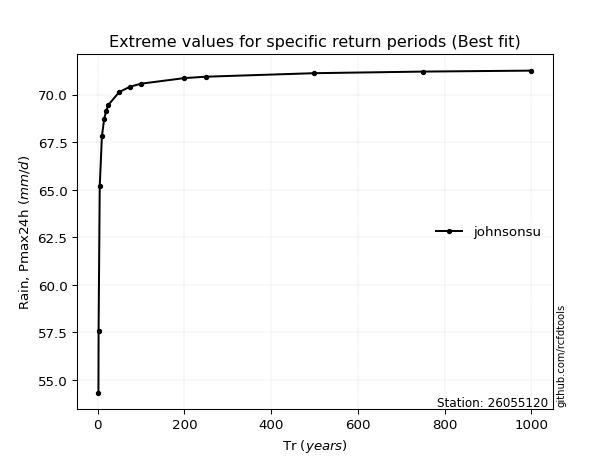</img>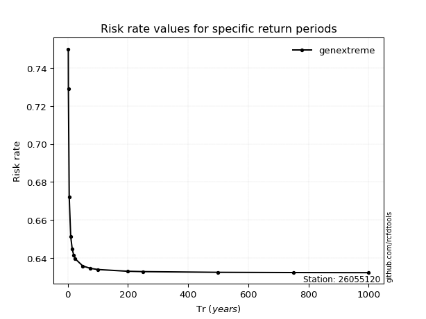</img>

</div>


<sub>**APP DISCLAIMER**: NO WARRANTY - This software is provided by [github.com/rcfdtools](https://github.com/rcfdtools) "as is", without any express or implied warranty, including warranties of merchantability, fitness for a particular purpose, or non-infringement. There is no guarantee that the software will be error-free or operate without interruption. LIMITATION OF LIABILITY - Neither the authors nor copyright holders will be liable for claims or damages arising from the software or its use. You are responsible for determining if the software is appropriate for your use and assume all associated risks, including errors, legal compliance, and data loss. NO PROFESSIONAL ADVICE - The software provides general information and does not offer professional advice. It should not replace consultation with professional advisors.</sub>