<div align="center">


</div>

# Station (rain, Pmax24h): 26057030

Probable Maximum Precipitation (PMP) is the greatest amount of rainfall for a specific duration that is meteorologically possible for a given location, acting as a "worst-case" scenario for extreme storms, crucial for designing safety-critical infrastructure like bridges, river deviations, dams, spillways, and nuclear plants to prevent catastrophic failure. PMP is calculated by hydrologists using meteorological data to determine the upper limit of extreme rainfall, often leading to the Probable Maximum Flood (PMF) for flood control design, and is increasingly being studied for climate change impacts.

<div align="center">

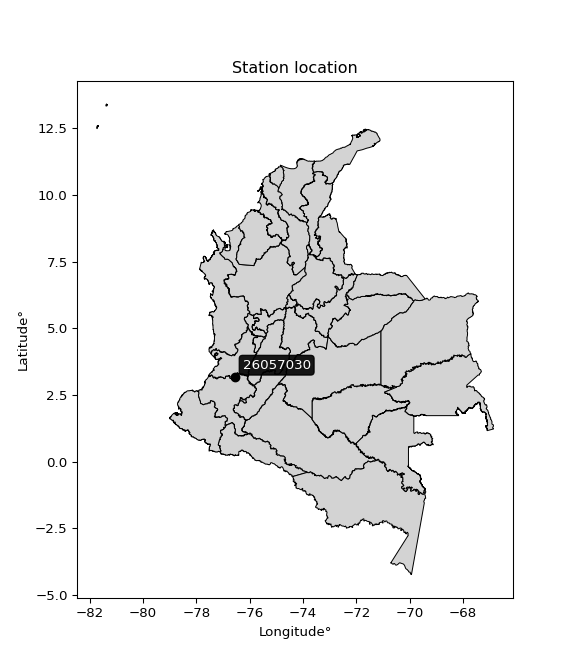</img>

</div>


## A. General information


### 1. General running parameters

• app_version: _v20251225_. • runtime: _2025-12-26 14:29:50.888910_. • Python version: _3.14.0_. • SciPy version: _1.16.3_. • Pandas version: _2.3.3_. • NumPy version: _2.3.5_. • Stations dataset (station_dataset_file): _dataset/pmax24h_in/automatic_colombia.csv_. • Stations catalog (station_catalog_file): _dataset/CNE_IDEAM.xls_. • Plot only fit distributions with Δo > Δ (plot_only_fit): _True_. • Eval low extreme values, if False, evaluates high extreme values (low_extreme): _False_. • Eval every SciPy distribution as logarithmic (pdist_logarithmic_on): _True_. • Standard deviation normalized (ddof): _1.0_. • Return periods to eval in years (Tr): _[2, 2.33, 5, 10, 15, 20, 25, 50, 75, 100, 200, 250, 500, 750, 1000]_. • Minimum data sample per station, 0 means any (minimum_sample): _5_. • Z-Score threshold to adjust a value, 0 means disable (zscore): _3.5_. • Avoid zeros, e.g. rain = 0 (avoid_zeros): _True_. • Avoid null values (avoid_nans): _True_. [:file_folder:Dataset file.](../../dataset/pmax24h_in/automatic_colombia.csv)


### 2. Station info and location

|   id |   CODIGO | NOMBRE                   | CATEGORIA    | TECNOLOGIA                              | ESTADO     | FECHA_INSTALACION   | FECHA_SUSPENSION   |   ALTITUD |   LATITUD |   LONGITUD | DEPARTAMENTO    | MUNICIPIO   | AREA_OPERATIVA                         | ENTIDAD                                                     | AREA_HIDROGRAFICA   | ZONA_HIDROGRAFICA   | SUBZONA_HIDROGRAFICA   | CORRIENTE   | OBSERVACION                                                                                                                                                                                                                                                                                                                                                                                                                                                                                                                                                                            |   SUBRED | Catalogo   |
|-----:|---------:|:-------------------------|:-------------|:----------------------------------------|:-----------|:--------------------|:-------------------|----------:|----------:|-----------:|:----------------|:------------|:---------------------------------------|:------------------------------------------------------------|:--------------------|:--------------------|:-----------------------|:------------|:---------------------------------------------------------------------------------------------------------------------------------------------------------------------------------------------------------------------------------------------------------------------------------------------------------------------------------------------------------------------------------------------------------------------------------------------------------------------------------------------------------------------------------------------------------------------------------------|---------:|:-----------|
|    0 | 26057030 | POTRERITO AUT [26057030] | Limnigráfica | Automática con Telemetría, Convencional | Suspendida | 15/01/1946          | 16/10/2025         |      1025 |   3.18536 |   -76.5693 | Valle Del Cauca | Jamundí     | Area Operativa 09 - Cauca-Valle-Caldas | INSTITUTO DE HIDROLOGIA METEOROLOGIA Y ESTUDIOS AMBIENTALES | Magdalena Cauca     | Cauca               | Ríos Claro y Jamundí   | Jamundi     | EL GRUPO DE AUTOMATIZACION REPORTA QUE LA ESTACION DEJO DE TRANSMITIR EL 7/9/22. ESTACION EN MANTENIMIENTO (07/12/2022)|16/10/2025$mvelez$Se suspende bajo el memorando 20253160167233 En la comisión realizada al área operativa 09 Cauca-Valle-Caldas con fecha 16 de julio del 2025, se retiraron los elementos que contaba la estación hidrológica y se verifico el mal estado de la caseta de mampostería, se anexa hoja de inspección de la estación, y se le da el visto bueno para suspender la estación porque la estación no tiene equipos hidrometeorológicos electrónicos. |      nan | CNE_IDEAM  |

<div align="center">

Map location in: [:earth_americas:Google](http://maps.google.com/maps?q=3.185361111,-76.569305556) [:earth_americas:OSM](https://www.openstreetmap.org/#map=18/3.185361111/-76.569305556&layers=P) [:earth_americas:Bing](https://www.bing.com/maps?cp=3.185361111~-76.569305556&lvl=18) [:earth_americas:Apple](https://maps.apple.com/frame?center=3.185361111%2C-76.569305556&span=0.003%2C0.006)

</div>


<div align="center">

```geojson
{
  "type": "Feature",
  "geometry": {
    "type": "Point", 
    "coordinates": [-76.569305556, 3.185361111]
  }, 
  "properties": {
    "Name": "26057030"
  }
}
```

</div>


### 3. Discrete values table and plot

|               |          0 |           1 |           2 |           3 |          4 |           5 |
|:--------------|-----------:|------------:|------------:|------------:|-----------:|------------:|
| Date          | 2017       | 2018        | 2019        | 2020        | 2021       | 2022        |
| Value         |    0.1     |   77.6      |   47.8      |  239        |  364       |  233        |
| Value_initial |    0.1     |   77.6      |   47.8      |  239        |  364       |  233        |
| count         |    6       |    6        |    6        |    6        |    6       |    6        |
| mean          |  160.25    |  160.25     |  160.25     |  160.25     |  160.25    |  160.25     |
| std           |  140.094   |  140.094    |  140.094    |  140.094    |  140.094   |  140.094    |
| zscore        |   -1.14316 |   -0.589959 |   -0.802673 |    0.562121 |    1.45438 |    0.519293 |

<div align="center">

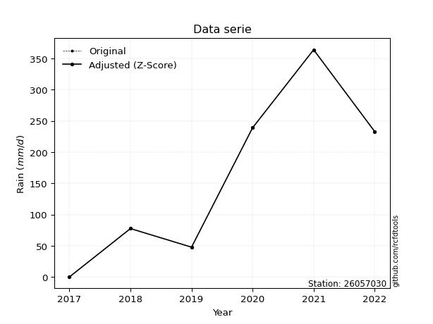</img>

</div>

> If Z-Score is active, values out of range or outliers are replaced with the station mean value.


### 4. Active continuous probability distributions from SciPy (45 of 104 available)

[scipy.stats](https://docs.scipy.org/doc/scipy/reference/stats.html) is a Python´s powerful submodule within the SciPy library for comprehensive statistical analysis, offering over 130 probability distributions (like Normal, Poisson), functions for descriptive stats (mean, variance), hypothesis testing (t-tests, chi-square), random variable generation, and statistical tests, making it essential for data science, modeling, and research. It provides tools to explore, model, and draw conclusions from data efficiently, working seamlessly with NumPy.

<div align="center">

|   id | p_dist             |   n_parameter | fit_method   | label                                                                       | active   | ref                                                                                                        |
|-----:|:-------------------|--------------:|:-------------|:----------------------------------------------------------------------------|:---------|:-----------------------------------------------------------------------------------------------------------|
|    0 | alpha              |             3 | MLE          | Alpha                                                                       | True     | [:mortar_board:](https://docs.scipy.org/doc/scipy/reference/generated/scipy.stats.alpha.html)              |
|    1 | betaprime          |             4 | MLE          | Beta prime                                                                  | True     | [:mortar_board:](https://docs.scipy.org/doc/scipy/reference/generated/scipy.stats.betaprime.html)          |
|    2 | chi2               |             3 | MLE          | Chi²                                                                        | True     | [:mortar_board:](https://docs.scipy.org/doc/scipy/reference/generated/scipy.stats.chi2.html)               |
|    3 | crystalball        |             4 | MLE          | Crystalball                                                                 | True     | [:mortar_board:](https://docs.scipy.org/doc/scipy/reference/generated/scipy.stats.crystalball.html)        |
|    4 | erlang             |             3 | MLE          | Erlang                                                                      | True     | [:mortar_board:](https://docs.scipy.org/doc/scipy/reference/generated/scipy.stats.erlang.html)             |
|    5 | expon              |             2 | MLE          | Exponential                                                                 | True     | [:mortar_board:](https://docs.scipy.org/doc/scipy/reference/generated/scipy.stats.expon.html)              |
|    6 | exponnorm          |             3 | MLE          | Exponentially modified Normal                                               | True     | [:mortar_board:](https://docs.scipy.org/doc/scipy/reference/generated/scipy.stats.exponnorm.html)          |
|    7 | f                  |             4 | MLE          | F                                                                           | True     | [:mortar_board:](https://docs.scipy.org/doc/scipy/reference/generated/scipy.stats.f.html)                  |
|    8 | fatiguelife        |             3 | MLE          | Fatigue-life (Birnbaum-Saunders)                                            | True     | [:mortar_board:](https://docs.scipy.org/doc/scipy/reference/generated/scipy.stats.fatiguelife.html)        |
|    9 | fisk               |             3 | MLE          | Fisk                                                                        | True     | [:mortar_board:](https://docs.scipy.org/doc/scipy/reference/generated/scipy.stats.fisk.html)               |
|   10 | gamma              |             3 | MLE          | Gamma                                                                       | True     | [:mortar_board:](https://docs.scipy.org/doc/scipy/reference/generated/scipy.stats.gamma.html)              |
|   11 | genexpon           |             5 | MLE          | Generalized exponential                                                     | True     | [:mortar_board:](https://docs.scipy.org/doc/scipy/reference/generated/scipy.stats.genexpon.html)           |
|   12 | genlogistic        |             3 | MLE          | Generalized logistic                                                        | True     | [:mortar_board:](https://docs.scipy.org/doc/scipy/reference/generated/scipy.stats.genlogistic.html)        |
|   13 | gibrat             |             2 | MM           | Gibrat                                                                      | True     | [:mortar_board:](https://docs.scipy.org/doc/scipy/reference/generated/scipy.stats.gibrat.html)             |
|   14 | gompertz           |             3 | MLE          | Gompertz (or truncated Gumbel)                                              | True     | [:mortar_board:](https://docs.scipy.org/doc/scipy/reference/generated/scipy.stats.gompertz.html)           |
|   15 | gumbel_l           |             2 | MM           | Gumbel Left Skew                                                            | True     | [:mortar_board:](https://docs.scipy.org/doc/scipy/reference/generated/scipy.stats.gumbel_l.html)           |
|   16 | gumbel_r           |             2 | MM           | Gumbel Right Skew                                                           | True     | [:mortar_board:](https://docs.scipy.org/doc/scipy/reference/generated/scipy.stats.gumbel_r.html)           |
|   17 | halflogistic       |             2 | MM           | Half-logistic                                                               | True     | [:mortar_board:](https://docs.scipy.org/doc/scipy/reference/generated/scipy.stats.halflogistic.html)       |
|   18 | halfnorm           |             2 | MM           | Half Normal                                                                 | True     | [:mortar_board:](https://docs.scipy.org/doc/scipy/reference/generated/scipy.stats.halfnorm.html)           |
|   19 | hypsecant          |             2 | MM           | hyperbolic secant                                                           | True     | [:mortar_board:](https://docs.scipy.org/doc/scipy/reference/generated/scipy.stats.hypsecant.html)          |
|   20 | invgamma           |             3 | MLE          | Inverted gamma                                                              | True     | [:mortar_board:](https://docs.scipy.org/doc/scipy/reference/generated/scipy.stats.invgamma.html)           |
|   21 | invgauss           |             3 | MLE          | Inverse Gaussian                                                            | True     | [:mortar_board:](https://docs.scipy.org/doc/scipy/reference/generated/scipy.stats.invgauss.html)           |
|   22 | invweibull         |             3 | MLE          | Inverted Weibull                                                            | True     | [:mortar_board:](https://docs.scipy.org/doc/scipy/reference/generated/scipy.stats.invweibull.html)         |
|   23 | johnsonsu          |             4 | MLE          | Johnson Su                                                                  | True     | [:mortar_board:](https://docs.scipy.org/doc/scipy/reference/generated/scipy.stats.johnsonsu.html)          |
|   24 | kstwobign          |             2 | MLE          | Limiting distribution of scaled Kolmogorov-Smirnov two-sided test statistic | True     | [:mortar_board:](https://docs.scipy.org/doc/scipy/reference/generated/scipy.stats.kstwobign.html)          |
|   25 | laplace            |             2 | MM           | Laplace                                                                     | True     | [:mortar_board:](https://docs.scipy.org/doc/scipy/reference/generated/scipy.stats.laplace.html)            |
|   26 | laplace_asymmetric |             3 | MLE          | Asymmetric Laplace                                                          | True     | [:mortar_board:](https://docs.scipy.org/doc/scipy/reference/generated/scipy.stats.laplace_asymmetric.html) |
|   27 | loggamma           |             3 | MLE          | Log gamma                                                                   | True     | [:mortar_board:](https://docs.scipy.org/doc/scipy/reference/generated/scipy.stats.loggamma.html)           |
|   28 | logistic           |             2 | MM           | Logistic (or Sech-squared)                                                  | True     | [:mortar_board:](https://docs.scipy.org/doc/scipy/reference/generated/scipy.stats.logistic.html)           |
|   29 | lognorm            |             3 | MLE          | Log Normal                                                                  | True     | [:mortar_board:](https://docs.scipy.org/doc/scipy/reference/generated/scipy.stats.lognorm.html)            |
|   30 | maxwell            |             2 | MM           | Maxwell                                                                     | True     | [:mortar_board:](https://docs.scipy.org/doc/scipy/reference/generated/scipy.stats.maxwell.html)            |
|   31 | mielke             |             4 | MLE          | Mielke Beta-Kappa / Dagum                                                   | True     | [:mortar_board:](https://docs.scipy.org/doc/scipy/reference/generated/scipy.stats.mielke.html)             |
|   32 | moyal              |             2 | MM           | Moyal                                                                       | True     | [:mortar_board:](https://docs.scipy.org/doc/scipy/reference/generated/scipy.stats.moyal.html)              |
|   33 | nakagami           |             3 | MLE          | Nakagami                                                                    | True     | [:mortar_board:](https://docs.scipy.org/doc/scipy/reference/generated/scipy.stats.nakagami.html)           |
|   34 | ncf                |             5 | MLE          | Non-central F distribution                                                  | True     | [:mortar_board:](https://docs.scipy.org/doc/scipy/reference/generated/scipy.stats.ncf.html)                |
|   35 | nct                |             4 | MLE          | Non-central Student’s t                                                     | True     | [:mortar_board:](https://docs.scipy.org/doc/scipy/reference/generated/scipy.stats.nct.html)                |
|   36 | norm               |             2 | MM           | Normal                                                                      | True     | [:mortar_board:](https://docs.scipy.org/doc/scipy/reference/generated/scipy.stats.norm.html)               |
|   37 | pareto             |             3 | MLE          | Pareto                                                                      | True     | [:mortar_board:](https://docs.scipy.org/doc/scipy/reference/generated/scipy.stats.pareto.html)             |
|   38 | pearson3           |             3 | MM           | Pearson type III                                                            | True     | [:mortar_board:](https://docs.scipy.org/doc/scipy/reference/generated/scipy.stats.pearson3.html)           |
|   39 | rayleigh           |             2 | MM           | Rayleigh                                                                    | True     | [:mortar_board:](https://docs.scipy.org/doc/scipy/reference/generated/scipy.stats.rayleigh.html)           |
|   40 | rice               |             3 | MLE          | Rice                                                                        | True     | [:mortar_board:](https://docs.scipy.org/doc/scipy/reference/generated/scipy.stats.rice.html)               |
|   41 | t                  |             3 | MLE          | Student’s t                                                                 | True     | [:mortar_board:](https://docs.scipy.org/doc/scipy/reference/generated/scipy.stats.t.html)                  |
|   42 | truncnorm          |             4 | MLE          | Truncated normal                                                            | True     | [:mortar_board:](https://docs.scipy.org/doc/scipy/reference/generated/scipy.stats.truncnorm.html)          |
|   43 | wald               |             2 | MM           | Wald                                                                        | True     | [:mortar_board:](https://docs.scipy.org/doc/scipy/reference/generated/scipy.stats.wald.html)               |
|   44 | weibull_min        |             3 | MLE          | Weibull minimum                                                             | True     | [:mortar_board:](https://docs.scipy.org/doc/scipy/reference/generated/scipy.stats.weibull_min.html)        |

</div>

> **n_parameter:** # arguments & localization & scale.
>
> **Fit methods:** (MLE) maximum likelihood, (MM) L-moments.
>
>**Inactive:** foldnorm, gennorm, norminvgauss, powernorm, powerlognorm, skewnorm, genextreme, anglit, arcsine, argus, beta, bradford, burr, burr12, cauchy, cosine, halfcauchy, foldcauchy, skewcauchy, wrapcauchy, dgamma, gengamma, exponweib, exponpow, truncexpon, gausshyper, genhalflogistic, genhyperbolic, geninvgauss, halfgennorm, johnsonsb, kappa4, kappa3, ksone, kstwo, loglaplace, levy, levy_l, levy_stable, ncx2, genpareto, truncpareto, lomax, powerlaw, rdist, rel_breitwigner, recipinvgauss, semicircular, studentized_range, trapezoid, triang, truncweibull_min, tukeylambda, uniform, loguniform, vonmises, vonmises_line, weibull_max, dweibull, 


## B. Probability distributions vs. Empirical distributions

A continuous probability distribution (CPD) describes probabilities for variables that can take any value within a range (like rain any time), unlike discrete variables with specific outcomes (like temperature). It uses a Probability Density Function (PDF), a curve where the total area under it equals 1, and the probability of the variable falling within an interval (a to b) is found by calculating the area under the curve between those points. A key feature is that the probability of hitting any single exact value is zero, so probabilities are always expressed for ranges, e.g., $P(a ≤ X ≤ b)$.

<div align="center">

Distributions parameters
|    |   station | p_dist                |   n |              loc |           scale | shape                  | shape1                 | shape2              | shape3   |
|---:|----------:|:----------------------|----:|-----------------:|----------------:|:-----------------------|:-----------------------|:--------------------|:---------|
|  0 |  26057030 | alpha                 |   6 |   -336.786       |  1806.25        | 3.8822829407870296     |                        |                     |          |
|  1 |  26057030 | betaprime             |   6 |      0.1         |   404.712       | 0.6357275202669107     | 1.4895248823487952     |                     |          |
|  2 |  26057030 | chi2                  |   6 |     -1.17582     |    86.7594      | 1.719682524072655      |                        |                     |          |
|  3 |  26057030 | crystalball           |   6 |    160.25        |   127.888       | 5262.781532203907      | 5547.972339851494      |                     |          |
|  4 |  26057030 | erlang                |   6 |      0.1         |   191.994       | 0.590042825315015      |                        |                     |          |
|  5 |  26057030 | expon                 |   6 |      0.1         |   160.15        |                        |                        |                     |          |
|  6 |  26057030 | exponnorm             |   6 |    133.463       |   125.063       | 0.21419075657816322    |                        |                     |          |
|  7 |  26057030 | f                     |   6 |      0.1         |   115.827       | 0.6560912002991074     | 234.2408501022794      |                     |          |
|  8 |  26057030 | fatiguelife           |   6 |      0.1         |     0.000433622 | 589.9475344604439      |                        |                     |          |
|  9 |  26057030 | fisk                  |   6 |      0.1         |    62.2791      | 0.8350947107859639     |                        |                     |          |
| 10 |  26057030 | gamma                 |   6 |      0.1         |   131.611       | 0.8212824242849284     |                        |                     |          |
| 11 |  26057030 | genexpon              |   6 |      0.0999677   |     2.51908     | 0.015623400344157235   | 1.2065768685801525e-08 | 1.6343509980922057  |          |
| 12 |  26057030 | genlogistic           |   6 |   -602.416       |   105.287       | 777.5654371428018      |                        |                     |          |
| 13 |  26057030 | gibrat                |   6 |     62.6875      |    59.1747      |                        |                        |                     |          |
| 14 |  26057030 | gompertz              |   6 |      0.099999    |   325.306       | 1.2993948703375033     |                        |                     |          |
| 15 |  26057030 | gumbel_l              |   6 |    217.806       |    99.714       |                        |                        |                     |          |
| 16 |  26057030 | gumbel_r              |   6 |    102.694       |    99.714       |                        |                        |                     |          |
| 17 |  26057030 | halflogistic          |   6 |      8.67282     |   109.34        |                        |                        |                     |          |
| 18 |  26057030 | halfnorm              |   6 |     -9.02376     |   212.153       |                        |                        |                     |          |
| 19 |  26057030 | hypsecant             |   6 |    160.25        |    81.4161      |                        |                        |                     |          |
| 20 |  26057030 | invgamma              |   6 |      0.1         |     2.17574e-17 | 0.15087024673965208    |                        |                     |          |
| 21 |  26057030 | invgauss              |   6 |    -64.9019      |   441.022       | 0.5105236574985283     |                        |                     |          |
| 22 |  26057030 | invweibull            |   6 |      0.1         |     2.97764     | 0.0507432298510351     |                        |                     |          |
| 23 |  26057030 | johnsonsu             |   6 |      8.33072e+08 |     3.19131e+09 | 6600630.157688925      | 25567322.041162647     |                     |          |
| 24 |  26057030 | kstwobign             |   6 |   -262.291       |   482.404       |                        |                        |                     |          |
| 25 |  26057030 | laplace               |   6 |    160.25        |    90.4306      |                        |                        |                     |          |
| 26 |  26057030 | laplace_asymmetric    |   6 |      0.1         |     0.0925634   | 0.0005778043641797828  |                        |                     |          |
| 27 |  26057030 | loggamma              |   6 | -26692           |  3932.37        | 924.1824471234536      |                        |                     |          |
| 28 |  26057030 | logistic              |   6 |    160.25        |    70.5084      |                        |                        |                     |          |
| 29 |  26057030 | lognorm               |   6 |      0.1         |     0.100636    | 16.3472529582355       |                        |                     |          |
| 30 |  26057030 | maxwell               |   6 |   -142.791       |   189.903       |                        |                        |                     |          |
| 31 |  26057030 | mielke                |   6 |      0.1         |    21.8139      | 0.4798372235736571     | 0.7523071219256371     |                     |          |
| 32 |  26057030 | moyal                 |   6 |     87.1154      |    57.5699      |                        |                        |                     |          |
| 33 |  26057030 | nakagami              |   6 |     47.8         |   191.003       | 0.2701896407079367     |                        |                     |          |
| 34 |  26057030 | ncf                   |   6 |      0.0999899   |     5.33585     | 0.15080844449348185    | 8.412496092702844      | 4.902554576711607   |          |
| 35 |  26057030 | nct                   |   6 |      0.00884322  |     0.00407817  | 0.15841755505930094    | 54.736148666531705     |                     |          |
| 36 |  26057030 | norm                  |   6 |    160.25        |   127.888       |                        |                        |                     |          |
| 37 |  26057030 | pareto                |   6 |     -0.325898    |     0.425898    | 0.20459891577126474    |                        |                     |          |
| 38 |  26057030 | pearson3              |   6 |    160.25        |   127.888       | 0.25799541687533467    |                        |                     |          |
| 39 |  26057030 | rayleigh              |   6 |    -84.4074      |   195.208       |                        |                        |                     |          |
| 40 |  26057030 | rice                  |   6 |    -65.5233      |   168.988       | 0.5980989727873043     |                        |                     |          |
| 41 |  26057030 | t                     |   6 |     38.5328      |   163.037       | 6088.156317446012      |                        |                     |          |
| 42 |  26057030 | truncnorm             |   6 |    -31.4841      |   217.082       | 0.14549296435148018    | 7.2727894779662705     |                     |          |
| 43 |  26057030 | wald                  |   6 |     32.3618      |   127.888       |                        |                        |                     |          |
| 44 |  26057030 | weibull_min           |   6 |      0.1         |   168.281       | 0.7283774662902776     |                        |                     |          |
| 45 |  26057030 | logalpha              |   6 |    -90.9933      |  3098.97        | 32.729729591119096     |                        |                     |          |
| 46 |  26057030 | logbetaprime          |   6 |     -2.30259     |     2.63802     | 0.13093295659455817    | 0.47454880519111214    |                     |          |
| 47 |  26057030 | logchi2               |   6 |     -2.30259     |     1.17147     | 1.046261372275779      |                        |                     |          |
| 48 |  26057030 | logcrystalball        |   6 |      3.79011     |     2.81319     | 7.531278779497565      | 76.37582332796477      |                     |          |
| 49 |  26057030 | logerlang             |   6 |    -43.9175      |     0.186647    | 255.4691529588448      |                        |                     |          |
| 50 |  26057030 | logexpon              |   6 |     -2.30259     |     6.0927      |                        |                        |                     |          |
| 51 |  26057030 | logexponnorm          |   6 |      3.78819     |     2.81319     | 0.0006867767095334568  |                        |                     |          |
| 52 |  26057030 | logf                  |   6 |     -2.30259     |     1.20103     | 1.0498670138083273     | 1.039262246608366      |                     |          |
| 53 |  26057030 | logfatiguelife        |   6 |     -2.30259     |     5.223e-05   | 305.4334039675111      |                        |                     |          |
| 54 |  26057030 | logfisk               |   6 |     -2.30259     |     2.259       | 0.16437180864697087    |                        |                     |          |
| 55 |  26057030 | loggamma              |   6 |    -42.9774      |     0.188508    | 247.9537940726837      |                        |                     |          |
| 56 |  26057030 | loggenexpon           |   6 |     -2.30259     |     2.03376     | 0.13619685400331955    | 0.6905777381946834     | 0.16305435819153113 |          |
| 57 |  26057030 | loggenlogistic        |   6 |      5.8972      |     2.16887e-06 | 1.0248805132079551e-06 |                        |                     |          |
| 58 |  26057030 | loggibrat             |   6 |      1.64403     |     1.30168     |                        |                        |                     |          |
| 59 |  26057030 | loggompertz           |   6 |     -2.30259     |     1.4004e+12  | 1978012461295.9045     |                        |                     |          |
| 60 |  26057030 | loggumbel_l           |   6 |      5.0562      |     2.19343     |                        |                        |                     |          |
| 61 |  26057030 | loggumbel_r           |   6 |      2.52403     |     2.19343     |                        |                        |                     |          |
| 62 |  26057030 | loghalflogistic       |   6 |      0.455799    |     2.40519     |                        |                        |                     |          |
| 63 |  26057030 | loghalfnorm           |   6 |      0.0665253   |     4.66681     |                        |                        |                     |          |
| 64 |  26057030 | loghypsecant          |   6 |      3.79011     |     1.79093     |                        |                        |                     |          |
| 65 |  26057030 | loginvgamma           |   6 |    -62.0638      | 31788.7         | 483.7068702022202      |                        |                     |          |
| 66 |  26057030 | loginvgauss           |   6 |    -24.1692      |  2025.92        | 0.013763264017300367   |                        |                     |          |
| 67 |  26057030 | loginvweibull         |   6 |     -1.00368e+06 |     1.00368e+06 | 294158.7359397201      |                        |                     |          |
| 68 |  26057030 | logjohnsonsu          |   6 |      5.89715     |     5.40234e-16 | 1.562442098270017      | 0.09182008824305035    |                     |          |
| 69 |  26057030 | logkstwobign          |   6 |     -9.94697     |    15.6883      |                        |                        |                     |          |
| 70 |  26057030 | loglaplace            |   6 |      3.79011     |     1.98922     |                        |                        |                     |          |
| 71 |  26057030 | loglaplace_asymmetric |   6 |      5.89715     |     0.0183903   | 114.27676836548176     |                        |                     |          |
| 72 |  26057030 | logloggamma           |   6 |      5.89731     |     1.15491e-05 | 5.5029178618850425e-06 |                        |                     |          |
| 73 |  26057030 | loglogistic           |   6 |      3.79011     |     1.55099     |                        |                        |                     |          |
| 74 |  26057030 | loglognorm            |   6 |     -2.30259     |     0.0271201   | 5.392758065789739      |                        |                     |          |
| 75 |  26057030 | logmaxwell            |   6 |     -2.87597     |     4.17734     |                        |                        |                     |          |
| 76 |  26057030 | logmielke             |   6 |     -2.30259     |     2.96534     | 0.1503456163534609     | 0.786388035365216      |                     |          |
| 77 |  26057030 | logmoyal              |   6 |      2.18135     |     1.26638     |                        |                        |                     |          |
| 78 |  26057030 | lognakagami           |   6 |  -2471.54        |  2475.32        | 193688.95011047286     |                        |                     |          |
| 79 |  26057030 | logncf                |   6 |     -2.30259     |     1.04138     | 1.0585109120163219     | 1.1697994568467638     | 1.0621304865802936  |          |
| 80 |  26057030 | lognct                |   6 |    129.659       |     2.735       | 20877.572271611665     | -46.01963361967721     |                     |          |
| 81 |  26057030 | lognorm               |   6 |      3.79011     |     2.81319     |                        |                        |                     |          |
| 82 |  26057030 | logpareto             |   6 |     -2.32251     |     0.0199224   | 0.20330785508478144    |                        |                     |          |
| 83 |  26057030 | logpearson3           |   6 |      3.79013     |     2.81315     | -1.5515215048056783    |                        |                     |          |
| 84 |  26057030 | lograyleigh           |   6 |     -1.59173     |     4.29408     |                        |                        |                     |          |
| 85 |  26057030 | logrice               |   6 |   -918.45        |     2.81312     | 327.83409708768704     |                        |                     |          |
| 86 |  26057030 | logt                  |   6 |      5.21289     |     0.769564    | 1.1535454173971424     |                        |                     |          |
| 87 |  26057030 | logtruncnorm          |   6 |      3.61618     |     2.99556     | -1.9758476893955086    | 5.933319048492278      |                     |          |
| 88 |  26057030 | logwald               |   6 |      0.976984    |     2.81315     |                        |                        |                     |          |
| 89 |  26057030 | logweibull_min        |   6 |     -2.30259     |     1.63003     | 0.4947343270709702     |                        |                     |          |

</div>

> **loc** (Location parameter): This shifts the distribution along the x-axis. For many common distributions, like the normal (Gaussian) distribution, loc represents the mean $μ$. For others, like the uniform distribution, it might represent the minimum value, or for the beta distribution, the left end of the support interval.
>
> **scale** (Scale parameter): This determines the width or spread of the distribution. For the normal distribution, scale represents the standard deviation $σ$. For a uniform distribution, it defines the length of the interval (from $loc$ to $loc + scale$).
>
> **shape** (Shape parameters): Refers to parameters that define the specific form of a probability distribution, distinct from its location (loc) and scale (scale). These parameters are required arguments for most distribution functions. For example, a normal (Gaussian) distribution is fully defined by its location (mean) and scale (standard deviation), so it has no specific shape parameters beyond loc and scale. However, other distributions have intrinsic properties that need specification, as Gamma distribution that takes a shape parameter, often named $a$ or $alpha$.


### 0. Cumulative distribution values - CDF (90 evaluated)

> Ordered by x ascending and calculating $log(f(x))$ separately. 

|   id |   Station |   date |     x |   count |   mean |     std |    zscore |   Value_initial |   station |   m |     alpha |   alpha_pdf |   betaprime |   betaprime_pdf |      chi2 |   chi2_pdf |   crystalball |   crystalball_pdf |     erlang |   erlang_pdf |    expon |   expon_pdf |   exponnorm |   exponnorm_pdf |          f |       f_pdf |   fatiguelife |   fatiguelife_pdf |        fisk |    fisk_pdf |       gamma |   gamma_pdf |    genexpon |   genexpon_pdf |   genlogistic |   genlogistic_pdf |    gibrat |   gibrat_pdf |    gompertz |   gompertz_pdf |   gumbel_l |   gumbel_l_pdf |   gumbel_r |   gumbel_r_pdf |   halflogistic |   halflogistic_pdf |   halfnorm |   halfnorm_pdf |   hypsecant |   hypsecant_pdf |   invgamma |   invgamma_pdf |   invgauss |   invgauss_pdf |   invweibull |   invweibull_pdf |   johnsonsu |   johnsonsu_pdf |   kstwobign |   kstwobign_pdf |   laplace |   laplace_pdf |   laplace_asymmetric |   laplace_asymmetric_pdf |   loggamma |   loggamma_pdf |   logistic |   logistic_pdf |   lognorm |   lognorm_pdf |   maxwell |   maxwell_pdf |      mielke |   mielke_pdf |     moyal |   moyal_pdf |    nakagami |    nakagami_pdf |      ncf |       ncf_pdf |       nct |     nct_pdf |     norm |   norm_pdf |   pareto |   pareto_pdf |   pearson3 |   pearson3_pdf |   rayleigh |   rayleigh_pdf |      rice |   rice_pdf |        t |       t_pdf |   truncnorm |   truncnorm_pdf |      wald |    wald_pdf |   weibull_min |   weibull_min_pdf |   logalpha |   logalpha_pdf |   logbetaprime |   logbetaprime_pdf |     logchi2 |   logchi2_pdf |   logcrystalball |   logcrystalball_pdf |   logerlang |   logerlang_pdf |   logexpon |   logexpon_pdf |   logexponnorm |   logexponnorm_pdf |        logf |    logf_pdf |   logfatiguelife |   logfatiguelife_pdf |    logfisk |   logfisk_pdf |   loggenexpon |   loggenexpon_pdf |   loggenlogistic |   loggenlogistic_pdf |   loggibrat |   loggibrat_pdf |   loggompertz |   loggompertz_pdf |   loggumbel_l |   loggumbel_l_pdf |   loggumbel_r |   loggumbel_r_pdf |   loghalflogistic |   loghalflogistic_pdf |   loghalfnorm |   loghalfnorm_pdf |   loghypsecant |   loghypsecant_pdf |   loginvgamma |   loginvgamma_pdf |   loginvgauss |   loginvgauss_pdf |   loginvweibull |   loginvweibull_pdf |   logjohnsonsu |   logjohnsonsu_pdf |   logkstwobign |   logkstwobign_pdf |   loglaplace |   loglaplace_pdf |   loglaplace_asymmetric |   loglaplace_asymmetric_pdf |   logloggamma |   logloggamma_pdf |   loglogistic |   loglogistic_pdf |   loglognorm |   loglognorm_pdf |   logmaxwell |   logmaxwell_pdf |   logmielke |   logmielke_pdf |    logmoyal |   logmoyal_pdf |   lognakagami |   lognakagami_pdf |     logncf |   logncf_pdf |    lognct |   lognct_pdf |   logpareto |   logpareto_pdf |   logpearson3 |   logpearson3_pdf |   lograyleigh |   lograyleigh_pdf |   logrice |   logrice_pdf |      logt |   logt_pdf |   logtruncnorm |   logtruncnorm_pdf |   logwald |   logwald_pdf |   logweibull_min |   logweibull_min_pdf |
|-----:|----------:|-------:|------:|--------:|-------:|--------:|----------:|----------------:|----------:|----:|----------:|------------:|------------:|----------------:|----------:|-----------:|--------------:|------------------:|-----------:|-------------:|---------:|------------:|------------:|----------------:|-----------:|------------:|--------------:|------------------:|------------:|------------:|------------:|------------:|------------:|---------------:|--------------:|------------------:|----------:|-------------:|------------:|---------------:|-----------:|---------------:|-----------:|---------------:|---------------:|-------------------:|-----------:|---------------:|------------:|----------------:|-----------:|---------------:|-----------:|---------------:|-------------:|-----------------:|------------:|----------------:|------------:|----------------:|----------:|--------------:|---------------------:|-------------------------:|-----------:|---------------:|-----------:|---------------:|----------:|--------------:|----------:|--------------:|------------:|-------------:|----------:|------------:|------------:|----------------:|---------:|--------------:|----------:|------------:|---------:|-----------:|---------:|-------------:|-----------:|---------------:|-----------:|---------------:|----------:|-----------:|---------:|------------:|------------:|----------------:|----------:|------------:|--------------:|------------------:|-----------:|---------------:|---------------:|-------------------:|------------:|--------------:|-----------------:|---------------------:|------------:|----------------:|-----------:|---------------:|---------------:|-------------------:|------------:|------------:|-----------------:|---------------------:|-----------:|--------------:|--------------:|------------------:|-----------------:|---------------------:|------------:|----------------:|--------------:|------------------:|--------------:|------------------:|--------------:|------------------:|------------------:|----------------------:|--------------:|------------------:|---------------:|-------------------:|--------------:|------------------:|--------------:|------------------:|----------------:|--------------------:|---------------:|-------------------:|---------------:|-------------------:|-------------:|-----------------:|------------------------:|----------------------------:|--------------:|------------------:|--------------:|------------------:|-------------:|-----------------:|-------------:|-----------------:|------------:|----------------:|------------:|---------------:|--------------:|------------------:|-----------:|-------------:|----------:|-------------:|------------:|----------------:|--------------:|------------------:|--------------:|------------------:|----------:|--------------:|----------:|-----------:|---------------:|-------------------:|----------:|--------------:|-----------------:|---------------------:|
|    0 |  26057030 |   2017 |   0.1 |       6 | 160.25 | 140.094 | -1.14316  |             0.1 |  26057030 |   1 | 0.0695286 | 0.00212585  | 5.62496e-13 | 25767.4         | 0.0153781 | 0.0103232  |      0.105236 |        0.00142415 | 1.2584e-06 | 46.8554      | 0        |  0.00624415 |    0.104836 |     0.00142951  | 4.8143e-07 | 1.13801e+10 |     0.0551326 |       1.82179e+08 | 6.25509e-15 | 8.55454     | 9.23739e-11 | 1.03056     | 2.00574e-07 |    0.00620202  |     0.0789124 |       0.00190018  | 0         |  0           | 4.15974e-09 |    0.00399437  |   0.106553 |    0.00100952  |  0.0609363 |    0.00170984  |       0        |        0           |  0.0343029 |    0.00375741  |   0.0884689 |     0.00107269  |  0.0165049 |    2.60075e+15 |  0.0517838 |    0.00287309  |  0.000512438 |      1.41957e+13 |    0.107217 |     0.00143099  |   0.0712113 |     0.00199203  | 0.0850837 |   0.000940874 |          3.33861e-07 |              0.00624225  |  0.0170853 |      0.0156559 |  0.0935229 |     0.00120236 | 0.0151647 |     0.0135887 | 0.0958688 |    0.00179231 | 1.85645e-09 |  6.41886e+07 | 0.0332394 | 0.00152936  | 0           |     0           | 0.027063 | 202.634       | 0.0485099 | 1.06117     | 0.105236 | 0.00142415 | 0        |  0.480394    |  0.0997042 |    0.00154061  |  0.0894487 |    0.00201931  | 0.0611388 | 0.00180618 | 0.406825 | 0.00237978  | 7.97957e-07 |     0.00411254  | 0         | 0           |    1.2585e-14 |     660.523       |  0.0134993 |      0.0136246 |     0.00724537 |        2.13619e+12 | 6.71688e-09 |   7.91239e+06 |        0.0151647 |            0.0135887 |    0.017599 |       0.0159455 |   0        |      0.164131  |      0.0151645 |          0.0135885 | 5.13708e-09 | 6.07226e+06 |        0.0526327 |          4.07802e+08 | 0.00261316 |   9.64689e+11 |    2.3632e-09 |         0.066968  |         0        |           0.00980992 |    0        |       0         |   4.21708e-12 |       1.41247     |      0.03431  |         0.0153707 |   0.000119839 |       0.000493324 |          0        |             0         |      0        |         0         |      0.0211964 |          0.0118267 |     0.0162305 |         0.0153955 |     0.0215805 |         0.0203151 |       0.0236237 |           0.0259327 |      0.0272844 |        0.000704113 |      0.0284894 |          0.0350032 |    0.0233771 |        0.0117519 |               0.0202062 |                  0.00961475 |     0.0200993 |        0.00957688 |     0.0192982 |         0.0122024 |  3.39084e-08 |      5.63438e+06 |  0.000683902 |       0.00356479 |  0.00417677 |     1.41404e+12 | 4.27841e-09 |    5.98692e-08 |     0.0151741 |         0.0136118 | 2.8578e-09 |  3.40587e+06 | 0.0150259 |    0.0134636 |    0        |     10.205      |     0.0395069 |         0.0158853 |      0        |         0         | 0.0151624 |     0.0135873 | 0.0237297 | 0.00361249 |    3.92159e-11 |          0.0193769 |  0        |     0         |      1.99341e-08 |          2.22074e+07 |
|    1 |  26057030 |   2019 |  47.8 |       6 | 160.25 | 140.094 | -0.802673 |            47.8 |  26057030 |   2 | 0.207736  | 0.00349723  | 0.312158    |     0.00359755  | 0.312866  | 0.00470316 |      0.189624 |        0.00211931 | 0.450545   |  0.00475392  | 0.257584 |  0.00463575 |    0.189621 |     0.00213027  | 0.561095   | 0.00348229  |     0.713008  |       0.00200735  | 0.44455     | 0.00432298  | 0.39598     | 0.00555569  | 0.256091    |    0.00461374  |     0.198844  |       0.00304735  | 0         |  0           | 0.185523    |    0.00376711  |   0.166218 |    0.00152002  |  0.176552  |    0.00307044  |       0.177039 |        0.00442957  |  0.21118   |    0.00362838  |   0.156727  |     0.00184817  |  0.998167  |    5.79723e-06 |  0.236843  |    0.00429818  |  0.419494    |      0.000387666 |    0.191685 |     0.00211499  |   0.196931  |     0.00315729  | 0.144187  |   0.00159445  |          0.257518    |              0.00463477  |  0.5223    |      0.133977  |  0.168703  |     0.00198902 | 0.510906  |     0.141758  | 0.200505  |    0.00255757 | 0.754556    |  0.00270946  | 0.159428  | 0.00362355  | 1.03009e-09 | 78340.1         | 0.219746 |   0.00309731  | 0.635874  | 0.001207    | 0.189624 | 0.00211931 | 0.61986  |  0.0016161   |  0.191746  |    0.00231203  |  0.204944  |    0.0027584   | 0.171668  | 0.00275786 | 0.522663 | 0.00244289  | 0.191536    |     0.00388813  | 0.0103352 | 0.00302473  |    0.32915    |       0.00408945  |  0.524321  |      0.137135  |     0.855577   |        0.00962621  | 0.976622    |   0.0113944   |        0.510906  |            0.141758  |    0.521951 |       0.13332   |   0.636736 |      0.0596229 |      0.510904  |          0.141759  | 0.740344    | 0.0193878   |        0.869758  |          0.0193166   | 0.541193   |   0.00661533  |    0.574911   |         0.0847909 |         0        |           0.181052   |    0.703745 |       0.155515  |   0.999836    |       0.000231939 |      0.440939 |         0.148211  |   0.581518    |       0.143724    |          0.610136 |             0.130496  |      0.584566 |         0.122718  |      0.513666  |          0.17757   |     0.522174  |         0.132724  |     0.541896  |         0.120828  |       0.541142  |           0.0973909 |      0.0363976 |        0.00360879  |      0.579828  |          0.0916071 |    0.518964  |        0.241821  |               0.380574  |                  0.181089   |     0.380077  |        0.181098   |     0.512395  |         0.161088  |  0.842882    |      0.00722634  |  0.543488    |       0.135254   |  0.918264   |     0.00805169  | 0.607258    |    0.141884    |     0.511659  |         0.141798  | 0.675285   |  0.0250406   | 0.510413  |    0.142259  |    0.688619 |      0.010228   |     0.407453  |         0.137823  |      0.554255 |         0.131959  | 0.510907  |     0.141762  | 0.15247   | 0.105288   |    0.521851    |          0.135987  |  0.678786 |     0.136142  |      0.855129    |          0.0224431   |
|    2 |  26057030 |   2018 |  77.6 |       6 | 160.25 | 140.094 | -0.589959 |            77.6 |  26057030 |   3 | 0.316844  | 0.0037461   | 0.403515    |     0.00263237  | 0.437241  | 0.00370573 |      0.259053 |        0.00253154 | 0.568886   |  0.00333604  | 0.383638 |  0.00384865 |    0.259405 |     0.00254406  | 0.645087   | 0.00230955  |     0.763191  |       0.00142677  | 0.545522    | 0.00267152  | 0.537625    | 0.00406193  | 0.381623    |    0.00383519  |     0.296004  |       0.00341987  | 0.0840566 |  0.0103478   | 0.294995    |    0.0035736   |   0.217374 |    0.00192372  |  0.276332  |    0.00356425  |       0.305158 |        0.00414707  |  0.316952  |    0.0034601   |   0.221309  |     0.00250448  |  0.998297  |    3.31616e-06 |  0.361534  |    0.00399807  |  0.428454    |      0.00023777  |    0.260858 |     0.00251868  |   0.296396  |     0.00346225  | 0.200467  |   0.0022168   |          0.383548    |              0.00384805  |  0.586421  |      0.13013   |  0.236457  |     0.00256062 | 0.579096  |     0.139015  | 0.281965  |    0.00288579 | 0.812306    |  0.00139885  | 0.277411  | 0.00417283  | 0.284716    |     0.00513624  | 0.309808 |   0.00292722  | 0.662782  | 0.000688495 | 0.259053 | 0.00253154 | 0.655555 |  0.000904361 |  0.267026  |    0.00272402  |  0.291343  |    0.00301282  | 0.259707  | 0.00311878 | 0.594684 | 0.00237758  | 0.304196    |     0.00366332  | 0.222982  | 0.00821629  |    0.433626   |       0.00302614  |  0.589798  |      0.132538  |     0.860018   |        0.00872644  | 0.981523    |   0.0089375   |        0.579096  |            0.139015  |    0.585771 |       0.129551  |   0.664506 |      0.0550649 |      0.579094  |          0.139015  | 0.749267    | 0.0174984   |        0.878718  |          0.0176977   | 0.544277   |   0.00612711  |    0.614815   |         0.0798704 |         0        |           0.227636   |    0.768034 |       0.112683  |   0.999917    |       0.000116988 |      0.515795 |         0.1601    |   0.647484    |       0.128309    |          0.669517 |             0.114699  |      0.641483 |         0.112162  |      0.598195  |          0.169344  |     0.585614  |         0.128596  |     0.599295  |         0.115722  |       0.586972  |           0.0916538 |      0.0384408 |        0.00495639  |      0.622832  |          0.0858347 |    0.622957  |        0.189543  |               0.479259  |                  0.228046   |     0.478783  |        0.22813    |     0.589524  |         0.15602   |  0.846229    |      0.00660561  |  0.607372    |       0.127994   |  0.921957   |     0.00721255  | 0.671206    |    0.122205    |     0.579854  |         0.138998  | 0.686835   |  0.0226953   | 0.57886   |    0.139569  |    0.693354 |      0.00934116 |     0.478669  |         0.15616   |      0.616271 |         0.123683  | 0.579098  |     0.139019  | 0.22208   | 0.192401   |    0.587015    |          0.132414  |  0.737118 |     0.106161  |      0.865413    |          0.0200685   |
|    3 |  26057030 |   2022 | 233   |       6 | 160.25 | 140.094 |  0.519293 |           233   |  26057030 |   4 | 0.761877  | 0.00172241  | 0.650003    |     0.000973733 | 0.789116  | 0.00129901 |      0.715273 |        0.00265345 | 0.851679   |  0.000945818 | 0.766427 |  0.00145846 |    0.716145 |     0.00264342  | 0.842109   | 0.000710327 |     0.892931  |       0.000491835 | 0.750537    | 0.000671344 | 0.8742      | 0.00102455  | 0.764125    |    0.0014629   |     0.756986  |       0.00200134  | 0.854777  |  0.00133965  | 0.743162    |    0.00209912  |   0.68795  |    0.00364453  |  0.762857  |    0.00207086  |       0.772229 |        0.00184591  |  0.746046  |    0.00196196  |   0.752731  |     0.00274074  |  0.998557  |    9.347e-07   |  0.771158  |    0.00150823  |  0.448635    |      7.83484e-05 |    0.713597 |     0.00263789  |   0.757542  |     0.00205301  | 0.776341  |   0.00247327  |          0.766325    |              0.00145866  |  0.719996  |      0.110747  |  0.737263  |     0.00274728 | 0.722541  |     0.119129  | 0.729309  |    0.00232228 | 0.905509    |  0.000268863 | 0.778197  | 0.00187597  | 0.726618    |     0.00173184  | 0.654661 |   0.00153803  | 0.71669   | 0.000192631 | 0.715273 | 0.00265345 | 0.724784 |  0.000241332 |  0.72517   |    0.00248722  |  0.733379  |    0.00222083  | 0.732505  | 0.00238568 | 0.883498 | 0.0012013   | 0.747732    |     0.00197866  | 0.823941  | 0.00143191  |    0.718343   |       0.00111611  |  0.724932  |      0.111182  |     0.868691   |        0.00714027  | 0.989101    |   0.0051969   |        0.722541  |            0.119129  |    0.718861 |       0.110462  |   0.7199   |      0.045973  |      0.72254   |          0.119129  | 0.766581    | 0.0141885   |        0.896428  |          0.0146458   | 0.550505   |   0.00524576  |    0.696201   |         0.0681    |         0        |           0.382716   |    0.858407 |       0.0589155 |   0.999982    |       2.4757e-05  |      0.697971 |         0.164855  |   0.768508    |       0.0922534   |          0.777267 |             0.082292  |      0.751413 |         0.0878714 |      0.760193  |          0.121589  |     0.717394  |         0.109159  |     0.717206  |         0.0975442 |       0.679761  |           0.0769033 |      0.0489643 |        0.0208758   |      0.709633  |          0.0719886 |    0.783055  |        0.10906   |               0.80868   |                  0.384795   |     0.808452  |        0.38521    |     0.744764  |         0.122561  |  0.852853    |      0.00550504  |  0.735664    |       0.104082   |  0.929038   |     0.00575646  | 0.783311    |    0.0834194   |     0.723217  |         0.119001  | 0.709372   |  0.0185311   | 0.722901  |    0.119613  |    0.702715 |      0.00777513 |     0.671795  |         0.192617  |      0.739455 |         0.0995143 | 0.722547  |     0.119131  | 0.598263  | 0.389695   |    0.723239    |          0.113123  |  0.827835 |     0.0633667 |      0.885038    |          0.0158675   |
|    4 |  26057030 |   2020 | 239   |       6 | 160.25 | 140.094 |  0.562121 |           239   |  26057030 |   5 | 0.771982  | 0.00164658  | 0.655761    |     0.000945738 | 0.796764  | 0.00125042 |      0.730978 |        0.00258073 | 0.857237   |  0.000907208 | 0.775016 |  0.00140483 |    0.731787 |     0.00257001  | 0.846299   | 0.000686557 |     0.895834  |       0.000476061 | 0.754492    | 0.000647499 | 0.880196    | 0.00097445  | 0.772741    |    0.00140947  |     0.768749  |       0.00191989  | 0.862532  |  0.0012468   | 0.755564    |    0.00203494  |   0.709694 |    0.00360086  |  0.775012  |    0.00198099  |       0.783072 |        0.00176879  |  0.757628  |    0.00189892  |   0.768744  |     0.00259707  |  0.998563  |    9.07735e-07 |  0.780023  |    0.00144707  |  0.449099    |      7.6361e-05  |    0.729213 |     0.00256682  |   0.769627  |     0.00197583  | 0.790699  |   0.0023145   |          0.774915    |              0.00140504  |  0.722805  |      0.110166  |  0.753411  |     0.0026349  | 0.725562  |     0.11849   | 0.743028  |    0.00225063 | 0.90709     |  0.000258297 | 0.789187  | 0.00178772  | 0.736847    |     0.00167834  | 0.663757 |   0.00149392  | 0.717829  | 0.00018704  | 0.730978 | 0.00258073 | 0.72621  |  0.000234062 |  0.739863  |    0.00241024  |  0.746496  |    0.00215148  | 0.746584  | 0.00230713 | 0.890549 | 0.00114893  | 0.759404    |     0.00191241  | 0.832286  | 0.00135068  |    0.724938   |       0.00108247  |  0.727751  |      0.110559  |     0.868872   |        0.00710945  | 0.989233    |   0.00513279  |        0.725562  |            0.11849   |    0.721662 |       0.109889  |   0.721067 |      0.0457816 |      0.725561  |          0.118491  | 0.766941    | 0.0141245   |        0.8968    |          0.0145837   | 0.550638   |   0.00522834  |    0.697928   |         0.0678248 |         0        |           0.387342   |    0.859895 |       0.0581067 |   0.999983    |       2.38837e-05 |      0.702157 |         0.164465  |   0.770843    |       0.0914674   |          0.779351 |             0.0816178 |      0.75364  |         0.0873195 |      0.763269  |          0.120331  |     0.720162  |         0.108587  |     0.719679  |         0.0970496 |       0.681712  |           0.0765514 |      0.0495133 |        0.0223354   |      0.711459  |          0.0716667 |    0.78581   |        0.107675  |               0.818523  |                  0.389478   |     0.818306  |        0.389905   |     0.747868  |         0.121575  |  0.852993    |      0.00548355  |  0.738302    |       0.103454   |  0.929184   |     0.0057285   | 0.785422    |    0.0826483   |     0.726234  |         0.118361  | 0.709842   |  0.0184499   | 0.725934  |    0.11897   |    0.702912 |      0.00774464 |     0.6767    |         0.193202  |      0.741977 |         0.0989066 | 0.725568  |     0.118492  | 0.608082  | 0.382588   |    0.726107    |          0.112532  |  0.829437 |     0.0626583 |      0.885441    |          0.0157858   |
|    5 |  26057030 |   2021 | 364   |       6 | 160.25 | 140.094 |  1.45438  |           364   |  26057030 |   6 | 0.904069  | 0.000626382 | 0.746504    |     0.000556383 | 0.905113  | 0.00057371 |      0.944441 |        0.00087681 | 0.934038   |  0.000398132 | 0.896919 |  0.00064365 |    0.94399  |     0.000872521 | 0.90919    | 0.000363747 |     0.939767  |       0.000254931 | 0.813688    | 0.000347899 | 0.956194    | 0.000349635 | 0.895327    |    0.000649183 |     0.922896  |       0.000703298 | 0.948201  |  0.000352058 | 0.931275    |    0.000840199 |   0.986864 |    0.000570722 |  0.929822  |    0.000678499 |       0.925328 |        0.000657434 |  0.921299  |    0.000801628 |   0.947994  |     0.000635936 |  0.998651  |    5.59267e-07 |  0.901599  |    0.000619086 |  0.45676     |      4.99088e-05 |    0.942879 |     0.000888446 |   0.931293  |     0.000739543 | 0.947464  |   0.000580954 |          0.896849    |              0.000643897 |  0.767046  |      0.1       |  0.947336  |     0.00070758 | 0.773068  |     0.107126  | 0.931887  |    0.00085017 | 0.930075    |  0.000131754 | 0.92806   | 0.000623112 | 0.889092    |     0.000832653 | 0.803503 |   0.000812017 | 0.736022  | 0.000114889 | 0.944441 | 0.00087681 | 0.748766 |  0.000141088 |  0.937956  |    0.000844582 |  0.928515  |    0.000841185 | 0.936405  | 0.00082909 | 0.977026 | 0.000333727 | 0.92256     |     0.000790656 | 0.933554  | 0.000457911 |    0.826876   |       0.000607713 |  0.772016  |      0.0997423 |     0.87176    |        0.00663051  | 0.991185    |   0.00418279  |        0.773068  |            0.107126  |    0.765813 |       0.0998509 |   0.739677 |      0.0427271 |      0.773066  |          0.107127  | 0.77267     | 0.0131313   |        0.902726  |          0.0136045   | 0.552779   |   0.00495565  |    0.725506   |         0.0632895 |         0.999978 |           0.47253    |    0.881794 |       0.0465364 |   0.999991    |       1.31837e-05 |      0.769444 |         0.154227  |   0.806665    |       0.0790128   |          0.811419 |             0.0710129 |      0.788474 |         0.0783363 |      0.809585  |          0.100093  |     0.763777  |         0.0986216 |     0.758745  |         0.0885944 |       0.712694  |           0.070747  |      0.940908  |        2.0006e+13  |      0.740493  |          0.0663808 |    0.826638  |        0.0871503 |               0.999923  |                  0.475794   |     0.999931  |        0.476445   |     0.795518  |         0.104881  |  0.855228    |      0.00514893  |  0.779605    |       0.0928487  |  0.931501   |     0.00529564  | 0.81763     |    0.0707371   |     0.773679  |         0.106969  | 0.717333   |  0.017186    | 0.773623  |    0.107516  |    0.706069 |      0.00727019 |     0.759525  |         0.199293  |      0.781456 |         0.0887595 | 0.773074  |     0.107127  | 0.739616  | 0.242058   |    0.771297    |          0.102122  |  0.853521 |     0.052226  |      0.891809    |          0.0145167   |

An Empirical Distribution Function (EDF) is a step-function estimate of a true cumulative distribution function (CDF) based on observed sample data, representing the proportion of data points less than or equal to a given value. It is calculated by ordering your data and jumping up by $1/n$ (where $n$ is sample size) at each unique data point, allowing analysis without assuming an underlying population distribution, and it gets closer to the true CDF as the sample size grows.


### 1. Empirical - EDF California (1923)

California´s estimates the true probability distribution of water-related data (like rainfall, streamflow) using observed samples, crucial for risk assessment.

<div align="center">


$P=m/n$


</div>


**1.1. Empirical values**

<div align="center">

|                | 0                   | 1                  | 2              | 3                  | 4                  | 5              |
|:---------------|:--------------------|:-------------------|:---------------|:-------------------|:-------------------|:---------------|
| date           | 2017                | 2019               | 2018           | 2022               | 2020               | 2021           |
| x              | 0.1                 | 47.8               | 77.6           | 233.0              | 239.0              | 364.0          |
| m              | 1                   | 2                  | 3              | 4                  | 5                  | 6              |
| empirical_dist | edf_california      | edf_california     | edf_california | edf_california     | edf_california     | edf_california |
| empirical      | 0.16666666666666666 | 0.3333333333333333 | 0.5            | 0.6666666666666666 | 0.8333333333333334 | 1.0            |
| empirical_tr   | 1.2                 | 1.4999999999999998 | 2.0            | 2.9999999999999996 | 6.000000000000002  | inf            |

</div>


**1.2. Kolmogorov-Smirnov fit test (sorted by Δ)**


<div align="center">

|                | 0                  | 1                     | 2                  | 3                   | 4                   | 5                   | 6                   | 7                   | 8                  | 9                   | 10                  | 11                 | 12                  | 13                  | 14                 | 15                  | 16                  | 17                  | 18                  | 19                  | 20                  | 21                  | 22                  | 23                 | 24                  | 25                  | 26                 | 27                 | 28                  | 29                  | 30                  | 31                  | 32                  | 33                  | 34                  | 35                  | 36                  | 37                  | 38                  | 39                  | 40                  | 41                 | 42                  | 43                  | 44                  | 45                 | 46                  | 47                  | 48                  | 49                 | 50                  | 51                 | 52                  | 53                 | 54                  | 55                | 56                  | 57                 | 58                  | 59                  | 60                | 61                | 62                  | 63                  | 64                 | 65                  | 66                  | 67                 | 68                 | 69                  | 70                 | 71                 | 72                  | 73                  | 74                  | 75                  | 76                | 77                 | 78                 | 79                 | 80                 | 81                 | 82                | 83                | 84                 | 85                 | 86                 | 87                 | 88                 | 89                 |
|:---------------|:-------------------|:----------------------|:-------------------|:--------------------|:--------------------|:--------------------|:--------------------|:--------------------|:-------------------|:--------------------|:--------------------|:-------------------|:--------------------|:--------------------|:-------------------|:--------------------|:--------------------|:--------------------|:--------------------|:--------------------|:--------------------|:--------------------|:--------------------|:-------------------|:--------------------|:--------------------|:-------------------|:-------------------|:--------------------|:--------------------|:--------------------|:--------------------|:--------------------|:--------------------|:--------------------|:--------------------|:--------------------|:--------------------|:--------------------|:--------------------|:--------------------|:-------------------|:--------------------|:--------------------|:--------------------|:-------------------|:--------------------|:--------------------|:--------------------|:-------------------|:--------------------|:-------------------|:--------------------|:-------------------|:--------------------|:------------------|:--------------------|:-------------------|:--------------------|:--------------------|:------------------|:------------------|:--------------------|:--------------------|:-------------------|:--------------------|:--------------------|:-------------------|:-------------------|:--------------------|:-------------------|:-------------------|:--------------------|:--------------------|:--------------------|:--------------------|:------------------|:-------------------|:-------------------|:-------------------|:-------------------|:-------------------|:------------------|:------------------|:-------------------|:-------------------|:-------------------|:-------------------|:-------------------|:-------------------|
| station        | 26057030           | 26057030              | 26057030           | 26057030            | 26057030            | 26057030            | 26057030            | 26057030            | 26057030           | 26057030            | 26057030            | 26057030           | 26057030            | 26057030            | 26057030           | 26057030            | 26057030            | 26057030            | 26057030            | 26057030            | 26057030            | 26057030            | 26057030            | 26057030           | 26057030            | 26057030            | 26057030           | 26057030           | 26057030            | 26057030            | 26057030            | 26057030            | 26057030            | 26057030            | 26057030            | 26057030            | 26057030            | 26057030            | 26057030            | 26057030            | 26057030            | 26057030           | 26057030            | 26057030            | 26057030            | 26057030           | 26057030            | 26057030            | 26057030            | 26057030           | 26057030            | 26057030           | 26057030            | 26057030           | 26057030            | 26057030          | 26057030            | 26057030           | 26057030            | 26057030            | 26057030          | 26057030          | 26057030            | 26057030            | 26057030           | 26057030            | 26057030            | 26057030           | 26057030           | 26057030            | 26057030           | 26057030           | 26057030            | 26057030            | 26057030            | 26057030            | 26057030          | 26057030           | 26057030           | 26057030           | 26057030           | 26057030           | 26057030          | 26057030          | 26057030           | 26057030           | 26057030           | 26057030           | 26057030           | 26057030           |
| empirical_dist | edf_california     | edf_california        | edf_california     | edf_california      | edf_california      | edf_california      | edf_california      | edf_california      | edf_california     | edf_california      | edf_california      | edf_california     | edf_california      | edf_california      | edf_california     | edf_california      | edf_california      | edf_california      | edf_california      | edf_california      | edf_california      | edf_california      | edf_california      | edf_california     | edf_california      | edf_california      | edf_california     | edf_california     | edf_california      | edf_california      | edf_california      | edf_california      | edf_california      | edf_california      | edf_california      | edf_california      | edf_california      | edf_california      | edf_california      | edf_california      | edf_california      | edf_california     | edf_california      | edf_california      | edf_california      | edf_california     | edf_california      | edf_california      | edf_california      | edf_california     | edf_california      | edf_california     | edf_california      | edf_california     | edf_california      | edf_california    | edf_california      | edf_california     | edf_california      | edf_california      | edf_california    | edf_california    | edf_california      | edf_california      | edf_california     | edf_california      | edf_california      | edf_california     | edf_california     | edf_california      | edf_california     | edf_california     | edf_california      | edf_california      | edf_california      | edf_california      | edf_california    | edf_california     | edf_california     | edf_california     | edf_california     | edf_california     | edf_california    | edf_california    | edf_california     | edf_california     | edf_california     | edf_california     | edf_california     | edf_california     |
| p_dist         | invgauss           | loglaplace_asymmetric | logloggamma        | chi2                | laplace_asymmetric  | genexpon            | expon               | weibull_min         | halfnorm           | alpha               | erlang              | loglaplace         | fisk                | loghypsecant        | halflogistic       | truncnorm           | ncf                 | kstwobign           | genlogistic         | loglogistic         | gompertz            | gamma               | rayleigh            | maxwell            | logmaxwell          | lograyleigh         | moyal              | gumbel_r           | lognakagami         | lognct              | logrice             | lognorm             | lognorm             | logcrystalball      | logexponnorm        | f                   | logalpha            | logtruncnorm        | loggumbel_l         | loggamma            | loggamma            | pearson3           | logerlang           | loginvgamma         | johnsonsu           | t                  | rice                | logpearson3         | exponnorm           | crystalball        | norm                | loginvgauss        | loggumbel_r         | loghalfnorm        | betaprime           | logkstwobign      | logistic            | logmoyal           | loggenexpon         | loghalflogistic     | logt              | hypsecant         | gumbel_l            | pareto              | loginvweibull      | laplace             | nct                 | logexpon           | wald               | nakagami            | logncf             | logwald            | logpareto           | loggibrat           | fatiguelife         | logf                | gibrat            | mielke             | logfisk            | loglognorm         | logweibull_min     | logbetaprime       | logfatiguelife    | invweibull        | logmielke          | logchi2            | invgamma           | loggompertz        | logjohnsonsu       | loggenlogistic     |
| delta          | 0.1384658682169453 | 0.14646042476691948   | 0.1465673854195346 | 0.15128855279249592 | 0.16666633280541057 | 0.16666646609283003 | 0.16666666666666666 | 0.17312378087020464 | 0.1830478729265645 | 0.18315557924019166 | 0.18501235436446672 | 0.1856305828354145 | 0.18631209907386626 | 0.19041506968656496 | 0.1948423647734615 | 0.19580361369287674 | 0.19649731664561165 | 0.20360361238015734 | 0.20399560445273746 | 0.20448208364983456 | 0.20500516852004785 | 0.20753315978620968 | 0.20865675353562269 | 0.2180348896312328 | 0.22039518199395336 | 0.22092172554081507 | 0.2225885610194961 | 0.2236680788470654 | 0.22632085614044029 | 0.22637698262878525 | 0.22692566675566017 | 0.22693237688292967 | 0.22693237688292967 | 0.22693238251847614 | 0.22693365411276256 | 0.22776200369082672 | 0.22798353467942722 | 0.22870268974129315 | 0.23055587811610534 | 0.23295446345369974 | 0.23295446345369974 | 0.2329737570922661 | 0.23418667851339137 | 0.23622292353924124 | 0.23914189536028735 | 0.2401584759328412 | 0.24029252291137393 | 0.24047512284801298 | 0.24059463440954654 | 0.2409470867139828 | 0.24094708911622287 | 0.2412554332658866 | 0.24818514499834915 | 0.2512322276828897 | 0.25349579804579425 | 0.259506656725744 | 0.26354252686570506 | 0.2739249344861509 | 0.27449375220990535 | 0.27680306172807084 | 0.277920200984319 | 0.278691243872903 | 0.28262580418240896 | 0.28652680597935126 | 0.2873061857943541 | 0.29953349848487365 | 0.30254087923797907 | 0.3034021930415323 | 0.3229980933713578 | 0.33333333230324164 | 0.3419517951260676 | 0.3454527486640688 | 0.35528541895507754 | 0.37041186052112846 | 0.37967484272192825 | 0.40701038418426355 | 0.415943444594269 | 0.4212222639115976 | 0.4472211047090505 | 0.5095481952173275 | 0.5217955385254753 | 0.5222440949068856 | 0.536425010682757 | 0.543240338778833 | 0.5849311000444848 | 0.6432891207297917 | 0.6648337821646237 | 0.6665024583370966 | 0.7838200799089163 | 0.8333333333333334 |
| deltao         | 0.530385761606     | 0.530385761606        | 0.530385761606     | 0.530385761606      | 0.530385761606      | 0.530385761606      | 0.530385761606      | 0.530385761606      | 0.530385761606     | 0.530385761606      | 0.530385761606      | 0.530385761606     | 0.530385761606      | 0.530385761606      | 0.530385761606     | 0.530385761606      | 0.530385761606      | 0.530385761606      | 0.530385761606      | 0.530385761606      | 0.530385761606      | 0.530385761606      | 0.530385761606      | 0.530385761606     | 0.530385761606      | 0.530385761606      | 0.530385761606     | 0.530385761606     | 0.530385761606      | 0.530385761606      | 0.530385761606      | 0.530385761606      | 0.530385761606      | 0.530385761606      | 0.530385761606      | 0.530385761606      | 0.530385761606      | 0.530385761606      | 0.530385761606      | 0.530385761606      | 0.530385761606      | 0.530385761606     | 0.530385761606      | 0.530385761606      | 0.530385761606      | 0.530385761606     | 0.530385761606      | 0.530385761606      | 0.530385761606      | 0.530385761606     | 0.530385761606      | 0.530385761606     | 0.530385761606      | 0.530385761606     | 0.530385761606      | 0.530385761606    | 0.530385761606      | 0.530385761606     | 0.530385761606      | 0.530385761606      | 0.530385761606    | 0.530385761606    | 0.530385761606      | 0.530385761606      | 0.530385761606     | 0.530385761606      | 0.530385761606      | 0.530385761606     | 0.530385761606     | 0.530385761606      | 0.530385761606     | 0.530385761606     | 0.530385761606      | 0.530385761606      | 0.530385761606      | 0.530385761606      | 0.530385761606    | 0.530385761606     | 0.530385761606     | 0.530385761606     | 0.530385761606     | 0.530385761606     | 0.530385761606    | 0.530385761606    | 0.530385761606     | 0.530385761606     | 0.530385761606     | 0.530385761606     | 0.530385761606     | 0.530385761606     |
| eval           | Δo > Δ             | Δo > Δ                | Δo > Δ             | Δo > Δ              | Δo > Δ              | Δo > Δ              | Δo > Δ              | Δo > Δ              | Δo > Δ             | Δo > Δ              | Δo > Δ              | Δo > Δ             | Δo > Δ              | Δo > Δ              | Δo > Δ             | Δo > Δ              | Δo > Δ              | Δo > Δ              | Δo > Δ              | Δo > Δ              | Δo > Δ              | Δo > Δ              | Δo > Δ              | Δo > Δ             | Δo > Δ              | Δo > Δ              | Δo > Δ             | Δo > Δ             | Δo > Δ              | Δo > Δ              | Δo > Δ              | Δo > Δ              | Δo > Δ              | Δo > Δ              | Δo > Δ              | Δo > Δ              | Δo > Δ              | Δo > Δ              | Δo > Δ              | Δo > Δ              | Δo > Δ              | Δo > Δ             | Δo > Δ              | Δo > Δ              | Δo > Δ              | Δo > Δ             | Δo > Δ              | Δo > Δ              | Δo > Δ              | Δo > Δ             | Δo > Δ              | Δo > Δ             | Δo > Δ              | Δo > Δ             | Δo > Δ              | Δo > Δ            | Δo > Δ              | Δo > Δ             | Δo > Δ              | Δo > Δ              | Δo > Δ            | Δo > Δ            | Δo > Δ              | Δo > Δ              | Δo > Δ             | Δo > Δ              | Δo > Δ              | Δo > Δ             | Δo > Δ             | Δo > Δ              | Δo > Δ             | Δo > Δ             | Δo > Δ              | Δo > Δ              | Δo > Δ              | Δo > Δ              | Δo > Δ            | Δo > Δ             | Δo > Δ             | Δo > Δ             | Δo > Δ             | Δo > Δ             | Δo <= Δ           | Δo <= Δ           | Δo <= Δ            | Δo <= Δ            | Δo <= Δ            | Δo <= Δ            | Δo <= Δ            | Δo <= Δ            |
| fit            | 1                  | 1                     | 1                  | 1                   | 1                   | 1                   | 1                   | 1                   | 1                  | 1                   | 1                   | 1                  | 1                   | 1                   | 1                  | 1                   | 1                   | 1                   | 1                   | 1                   | 1                   | 1                   | 1                   | 1                  | 1                   | 1                   | 1                  | 1                  | 1                   | 1                   | 1                   | 1                   | 1                   | 1                   | 1                   | 1                   | 1                   | 1                   | 1                   | 1                   | 1                   | 1                  | 1                   | 1                   | 1                   | 1                  | 1                   | 1                   | 1                   | 1                  | 1                   | 1                  | 1                   | 1                  | 1                   | 1                 | 1                   | 1                  | 1                   | 1                   | 1                 | 1                 | 1                   | 1                   | 1                  | 1                   | 1                   | 1                  | 1                  | 1                   | 1                  | 1                  | 1                   | 1                   | 1                   | 1                   | 1                 | 1                  | 1                  | 1                  | 1                  | 1                  | 0                 | 0                 | 0                  | 0                  | 0                  | 0                  | 0                  | 0                  |
| n              | 6                  | 6                     | 6                  | 6                   | 6                   | 6                   | 6                   | 6                   | 6                  | 6                   | 6                   | 6                  | 6                   | 6                   | 6                  | 6                   | 6                   | 6                   | 6                   | 6                   | 6                   | 6                   | 6                   | 6                  | 6                   | 6                   | 6                  | 6                  | 6                   | 6                   | 6                   | 6                   | 6                   | 6                   | 6                   | 6                   | 6                   | 6                   | 6                   | 6                   | 6                   | 6                  | 6                   | 6                   | 6                   | 6                  | 6                   | 6                   | 6                   | 6                  | 6                   | 6                  | 6                   | 6                  | 6                   | 6                 | 6                   | 6                  | 6                   | 6                   | 6                 | 6                 | 6                   | 6                   | 6                  | 6                   | 6                   | 6                  | 6                  | 6                   | 6                  | 6                  | 6                   | 6                   | 6                   | 6                   | 6                 | 6                  | 6                  | 6                  | 6                  | 6                  | 6                 | 6                 | 6                  | 6                  | 6                  | 6                  | 6                  | 6                  |
| best_fit       | 1                  | 0                     | 0                  | 0                   | 0                   | 0                   | 0                   | 0                   | 0                  | 0                   | 0                   | 0                  | 0                   | 0                   | 0                  | 0                   | 0                   | 0                   | 0                   | 0                   | 0                   | 0                   | 0                   | 0                  | 0                   | 0                   | 0                  | 0                  | 0                   | 0                   | 0                   | 0                   | 0                   | 0                   | 0                   | 0                   | 0                   | 0                   | 0                   | 0                   | 0                   | 0                  | 0                   | 0                   | 0                   | 0                  | 0                   | 0                   | 0                   | 0                  | 0                   | 0                  | 0                   | 0                  | 0                   | 0                 | 0                   | 0                  | 0                   | 0                   | 0                 | 0                 | 0                   | 0                   | 0                  | 0                   | 0                   | 0                  | 0                  | 0                   | 0                  | 0                  | 0                   | 0                   | 0                   | 0                   | 0                 | 0                  | 0                  | 0                  | 0                  | 0                  | 0                 | 0                 | 0                  | 0                  | 0                  | 0                  | 0                  | 0                  |
| best_fit_sort  | 1                  | 2                     | 3                  | 4                   | 5                   | 6                   | 7                   | 8                   | 9                  | 10                  | 11                  | 12                 | 13                  | 14                  | 15                 | 16                  | 17                  | 18                  | 19                  | 20                  | 21                  | 22                  | 23                  | 24                 | 25                  | 26                  | 27                 | 28                 | 29                  | 30                  | 31                  | 32                  | 33                  | 34                  | 35                  | 36                  | 37                  | 38                  | 39                  | 40                  | 41                  | 42                 | 43                  | 44                  | 45                  | 46                 | 47                  | 48                  | 49                  | 50                 | 51                  | 52                 | 53                  | 54                 | 55                  | 56                | 57                  | 58                 | 59                  | 60                  | 61                | 62                | 63                  | 64                  | 65                 | 66                  | 67                  | 68                 | 69                 | 70                  | 71                 | 72                 | 73                  | 74                  | 75                  | 76                  | 77                | 78                 | 79                 | 80                 | 81                 | 82                 | 83                | 84                | 85                 | 86                 | 87                 | 88                 | 89                 | 90                 |

</div>


<div align="center">

</img>

</div>


**1.3. Best fit**

<div align="center">

|   id |   station | empirical_dist   | p_dist   |    delta |   deltao | eval   |   fit |   n |   best_fit |   best_fit_sort |
|-----:|----------:|:-----------------|:---------|---------:|---------:|:-------|------:|----:|-----------:|----------------:|
|    0 |  26057030 | edf_california   | invgauss | 0.138466 | 0.530386 | Δo > Δ |     1 |   6 |          1 |               1 |

</div>


<div align="center">

</img>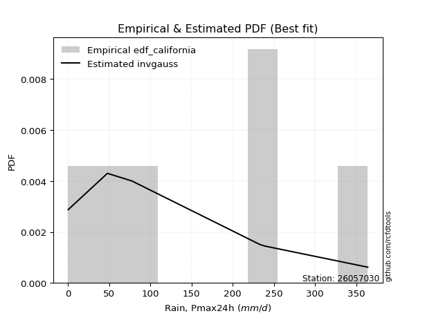</img>

</div>


### 2. Empirical - EDF Hazen (1930)

Hazen method for plotting positions is a formula used to estimate the empirical cumulative probability distribution of flood events or other hydrological data. This formula often results in biased estimations, particularly when extrapolating to extreme events (high return periods).

<div align="center">


$P=(m-0.5)/n$


</div>


**2.1. Empirical values**

<div align="center">

|                | 0                   | 1                  | 2                  | 3                  | 4         | 5                  |
|:---------------|:--------------------|:-------------------|:-------------------|:-------------------|:----------|:-------------------|
| date           | 2017                | 2019               | 2018               | 2022               | 2020      | 2021               |
| x              | 0.1                 | 47.8               | 77.6               | 233.0              | 239.0     | 364.0              |
| m              | 1                   | 2                  | 3                  | 4                  | 5         | 6                  |
| empirical_dist | edf_hazen           | edf_hazen          | edf_hazen          | edf_hazen          | edf_hazen | edf_hazen          |
| empirical      | 0.08333333333333333 | 0.25               | 0.4166666666666667 | 0.5833333333333334 | 0.75      | 0.9166666666666666 |
| empirical_tr   | 1.090909090909091   | 1.3333333333333333 | 1.7142857142857144 | 2.4000000000000004 | 4.0       | 11.999999999999995 |

</div>


**2.2. Kolmogorov-Smirnov fit test (sorted by Δ)**


<div align="center">

|                | 0                   | 1                   | 2                   | 3                   | 4                   | 5                   | 6                   | 7                   | 8                  | 9                   | 10                  | 11                  | 12                  | 13                  | 14                  | 15                  | 16                 | 17                  | 18                 | 19                  | 20                  | 21                  | 22                  | 23                 | 24                  | 25                  | 26                  | 27                  | 28                  | 29                  | 30                  | 31                  | 32                 | 33                  | 34                    | 35                  | 36                 | 37                  | 38                  | 39                 | 40                  | 41                  | 42                  | 43                 | 44                  | 45                 | 46              | 47                 | 48                 | 49                  | 50                 | 51                 | 52                 | 53                 | 54                  | 55                  | 56                 | 57                 | 58                 | 59                  | 60                  | 61                  | 62                 | 63                  | 64                 | 65                  | 66                 | 67                  | 68                  | 69                 | 70                 | 71                  | 72                 | 73                 | 74                  | 75                  | 76                 | 77                  | 78                  | 79                 | 80                 | 81                 | 82                 | 83                 | 84                 | 85                | 86                | 87                | 88               | 89             |
|:---------------|:--------------------|:--------------------|:--------------------|:--------------------|:--------------------|:--------------------|:--------------------|:--------------------|:-------------------|:--------------------|:--------------------|:--------------------|:--------------------|:--------------------|:--------------------|:--------------------|:-------------------|:--------------------|:-------------------|:--------------------|:--------------------|:--------------------|:--------------------|:-------------------|:--------------------|:--------------------|:--------------------|:--------------------|:--------------------|:--------------------|:--------------------|:--------------------|:-------------------|:--------------------|:----------------------|:--------------------|:-------------------|:--------------------|:--------------------|:-------------------|:--------------------|:--------------------|:--------------------|:-------------------|:--------------------|:-------------------|:----------------|:-------------------|:-------------------|:--------------------|:-------------------|:-------------------|:-------------------|:-------------------|:--------------------|:--------------------|:-------------------|:-------------------|:-------------------|:--------------------|:--------------------|:--------------------|:-------------------|:--------------------|:-------------------|:--------------------|:-------------------|:--------------------|:--------------------|:-------------------|:-------------------|:--------------------|:-------------------|:-------------------|:--------------------|:--------------------|:-------------------|:--------------------|:--------------------|:-------------------|:-------------------|:-------------------|:-------------------|:-------------------|:-------------------|:------------------|:------------------|:------------------|:-----------------|:---------------|
| station        | 26057030            | 26057030            | 26057030            | 26057030            | 26057030            | 26057030            | 26057030            | 26057030            | 26057030           | 26057030            | 26057030            | 26057030            | 26057030            | 26057030            | 26057030            | 26057030            | 26057030           | 26057030            | 26057030           | 26057030            | 26057030            | 26057030            | 26057030            | 26057030           | 26057030            | 26057030            | 26057030            | 26057030            | 26057030            | 26057030            | 26057030            | 26057030            | 26057030           | 26057030            | 26057030              | 26057030            | 26057030           | 26057030            | 26057030            | 26057030           | 26057030            | 26057030            | 26057030            | 26057030           | 26057030            | 26057030           | 26057030        | 26057030           | 26057030           | 26057030            | 26057030           | 26057030           | 26057030           | 26057030           | 26057030            | 26057030            | 26057030           | 26057030           | 26057030           | 26057030            | 26057030            | 26057030            | 26057030           | 26057030            | 26057030           | 26057030            | 26057030           | 26057030            | 26057030            | 26057030           | 26057030           | 26057030            | 26057030           | 26057030           | 26057030            | 26057030            | 26057030           | 26057030            | 26057030            | 26057030           | 26057030           | 26057030           | 26057030           | 26057030           | 26057030           | 26057030          | 26057030          | 26057030          | 26057030         | 26057030       |
| empirical_dist | edf_hazen           | edf_hazen           | edf_hazen           | edf_hazen           | edf_hazen           | edf_hazen           | edf_hazen           | edf_hazen           | edf_hazen          | edf_hazen           | edf_hazen           | edf_hazen           | edf_hazen           | edf_hazen           | edf_hazen           | edf_hazen           | edf_hazen          | edf_hazen           | edf_hazen          | edf_hazen           | edf_hazen           | edf_hazen           | edf_hazen           | edf_hazen          | edf_hazen           | edf_hazen           | edf_hazen           | edf_hazen           | edf_hazen           | edf_hazen           | edf_hazen           | edf_hazen           | edf_hazen          | edf_hazen           | edf_hazen             | edf_hazen           | edf_hazen          | edf_hazen           | edf_hazen           | edf_hazen          | edf_hazen           | edf_hazen           | edf_hazen           | edf_hazen          | edf_hazen           | edf_hazen          | edf_hazen       | edf_hazen          | edf_hazen          | edf_hazen           | edf_hazen          | edf_hazen          | edf_hazen          | edf_hazen          | edf_hazen           | edf_hazen           | edf_hazen          | edf_hazen          | edf_hazen          | edf_hazen           | edf_hazen           | edf_hazen           | edf_hazen          | edf_hazen           | edf_hazen          | edf_hazen           | edf_hazen          | edf_hazen           | edf_hazen           | edf_hazen          | edf_hazen          | edf_hazen           | edf_hazen          | edf_hazen          | edf_hazen           | edf_hazen           | edf_hazen          | edf_hazen           | edf_hazen           | edf_hazen          | edf_hazen          | edf_hazen          | edf_hazen          | edf_hazen          | edf_hazen          | edf_hazen         | edf_hazen         | edf_hazen         | edf_hazen        | edf_hazen      |
| p_dist         | ncf                 | weibull_min         | maxwell             | pearson3            | rayleigh            | johnsonsu           | rice                | exponnorm           | logpearson3        | crystalball         | norm                | gompertz            | halfnorm            | truncnorm           | betaprime           | genlogistic         | kstwobign          | alpha               | gumbel_r           | logistic            | genexpon            | laplace_asymmetric  | expon               | invgauss           | halflogistic        | loggumbel_l         | fisk                | logt                | moyal               | hypsecant           | gumbel_l            | chi2                | laplace            | logloggamma         | loglaplace_asymmetric | wald                | nakagami           | lognct              | logexponnorm        | logcrystalball     | lognorm             | lognorm             | logrice             | lognakagami        | loglogistic         | loghypsecant       | erlang          | loglaplace         | logtruncnorm       | logerlang           | loginvgamma        | loggamma           | loggamma           | logalpha           | gamma               | loginvweibull       | loginvgauss        | logmaxwell         | lograyleigh        | f                   | t                   | loggenexpon         | logkstwobign       | loggumbel_r         | gibrat             | loghalfnorm         | logmoyal           | loghalflogistic     | logfisk             | pareto             | nct                | logexpon            | logncf             | logwald            | logpareto           | loggibrat           | invweibull         | fatiguelife         | logf                | mielke             | loglognorm         | logweibull_min     | logbetaprime       | logfatiguelife     | logmielke          | logjohnsonsu      | logchi2           | invgamma          | loggompertz      | loggenlogistic |
| delta          | 0.11316398331227828 | 0.13500934479945836 | 0.14597527867118465 | 0.14964042375893277 | 0.15004543697286998 | 0.15580856202695403 | 0.15695918957804061 | 0.15726130107621322 | 0.1574531465737502 | 0.15761375338064948 | 0.15761375578288955 | 0.15982889890363483 | 0.16271231798904728 | 0.16439819342895545 | 0.17016246471246088 | 0.17365287265870832 | 0.1742081778425545 | 0.17854337346161198 | 0.1795240580910319 | 0.18020919353237175 | 0.18079135858802953 | 0.18299118751267185 | 0.18309390323445573 | 0.1878246713487196 | 0.18889538597860678 | 0.19093911393439533 | 0.19455023157450824 | 0.19458686765098573 | 0.19486389691745198 | 0.19535791053956966 | 0.19929247084907564 | 0.20578310701627822 | 0.2162001651515403 | 0.22511889394058127 | 0.22534642429219143   | 0.24060766488427043 | 0.2499999989699083 | 0.26041324205149097 | 0.26090422960495907 | 0.2609060612046349 | 0.26090606563021135 | 0.26090606563021135 | 0.26090689427493197 | 0.2616594441186868 | 0.26239516776911975 | 0.2636662287652205 | 0.2683456876978 | 0.2689639161687478 | 0.2718507456511725 | 0.27195137290367544 | 0.2721738763473134 | 0.2723001958259953 | 0.2723001958259953 | 0.2743213515274159 | 0.29086649311954293 | 0.29114197544867393 | 0.2918957003358953 | 0.2934882165012275 | 0.3042550588741484 | 0.31109533702416003 | 0.32349180926617455 | 0.32491149549742304 | 0.3298283079728026 | 0.33151847833168246 | 0.3326101112609357 | 0.33456556101622303 | 0.3572582678194842 | 0.36013639506140416 | 0.36388777137571715 | 0.3698601393126846 | 0.3858742125713124 | 0.38673552637486563 | 0.4252851284594009 | 0.4287860819974021 | 0.43861875228841085 | 0.45374519385446177 | 0.4599070054454997 | 0.46300817605526157 | 0.49034371751759687 | 0.5045555972449309 | 0.5928815285506608 | 0.6051288718588086 | 0.6055774282402189 | 0.6197583440160904 | 0.6682644333778182 | 0.700486746575583 | 0.726622454063125 | 0.748167115497957 | 0.74983579167043 | 0.75           |
| deltao         | 0.530385761606      | 0.530385761606      | 0.530385761606      | 0.530385761606      | 0.530385761606      | 0.530385761606      | 0.530385761606      | 0.530385761606      | 0.530385761606     | 0.530385761606      | 0.530385761606      | 0.530385761606      | 0.530385761606      | 0.530385761606      | 0.530385761606      | 0.530385761606      | 0.530385761606     | 0.530385761606      | 0.530385761606     | 0.530385761606      | 0.530385761606      | 0.530385761606      | 0.530385761606      | 0.530385761606     | 0.530385761606      | 0.530385761606      | 0.530385761606      | 0.530385761606      | 0.530385761606      | 0.530385761606      | 0.530385761606      | 0.530385761606      | 0.530385761606     | 0.530385761606      | 0.530385761606        | 0.530385761606      | 0.530385761606     | 0.530385761606      | 0.530385761606      | 0.530385761606     | 0.530385761606      | 0.530385761606      | 0.530385761606      | 0.530385761606     | 0.530385761606      | 0.530385761606     | 0.530385761606  | 0.530385761606     | 0.530385761606     | 0.530385761606      | 0.530385761606     | 0.530385761606     | 0.530385761606     | 0.530385761606     | 0.530385761606      | 0.530385761606      | 0.530385761606     | 0.530385761606     | 0.530385761606     | 0.530385761606      | 0.530385761606      | 0.530385761606      | 0.530385761606     | 0.530385761606      | 0.530385761606     | 0.530385761606      | 0.530385761606     | 0.530385761606      | 0.530385761606      | 0.530385761606     | 0.530385761606     | 0.530385761606      | 0.530385761606     | 0.530385761606     | 0.530385761606      | 0.530385761606      | 0.530385761606     | 0.530385761606      | 0.530385761606      | 0.530385761606     | 0.530385761606     | 0.530385761606     | 0.530385761606     | 0.530385761606     | 0.530385761606     | 0.530385761606    | 0.530385761606    | 0.530385761606    | 0.530385761606   | 0.530385761606 |
| eval           | Δo > Δ              | Δo > Δ              | Δo > Δ              | Δo > Δ              | Δo > Δ              | Δo > Δ              | Δo > Δ              | Δo > Δ              | Δo > Δ             | Δo > Δ              | Δo > Δ              | Δo > Δ              | Δo > Δ              | Δo > Δ              | Δo > Δ              | Δo > Δ              | Δo > Δ             | Δo > Δ              | Δo > Δ             | Δo > Δ              | Δo > Δ              | Δo > Δ              | Δo > Δ              | Δo > Δ             | Δo > Δ              | Δo > Δ              | Δo > Δ              | Δo > Δ              | Δo > Δ              | Δo > Δ              | Δo > Δ              | Δo > Δ              | Δo > Δ             | Δo > Δ              | Δo > Δ                | Δo > Δ              | Δo > Δ             | Δo > Δ              | Δo > Δ              | Δo > Δ             | Δo > Δ              | Δo > Δ              | Δo > Δ              | Δo > Δ             | Δo > Δ              | Δo > Δ             | Δo > Δ          | Δo > Δ             | Δo > Δ             | Δo > Δ              | Δo > Δ             | Δo > Δ             | Δo > Δ             | Δo > Δ             | Δo > Δ              | Δo > Δ              | Δo > Δ             | Δo > Δ             | Δo > Δ             | Δo > Δ              | Δo > Δ              | Δo > Δ              | Δo > Δ             | Δo > Δ              | Δo > Δ             | Δo > Δ              | Δo > Δ             | Δo > Δ              | Δo > Δ              | Δo > Δ             | Δo > Δ             | Δo > Δ              | Δo > Δ             | Δo > Δ             | Δo > Δ              | Δo > Δ              | Δo > Δ             | Δo > Δ              | Δo > Δ              | Δo > Δ             | Δo <= Δ            | Δo <= Δ            | Δo <= Δ            | Δo <= Δ            | Δo <= Δ            | Δo <= Δ           | Δo <= Δ           | Δo <= Δ           | Δo <= Δ          | Δo <= Δ        |
| fit            | 1                   | 1                   | 1                   | 1                   | 1                   | 1                   | 1                   | 1                   | 1                  | 1                   | 1                   | 1                   | 1                   | 1                   | 1                   | 1                   | 1                  | 1                   | 1                  | 1                   | 1                   | 1                   | 1                   | 1                  | 1                   | 1                   | 1                   | 1                   | 1                   | 1                   | 1                   | 1                   | 1                  | 1                   | 1                     | 1                   | 1                  | 1                   | 1                   | 1                  | 1                   | 1                   | 1                   | 1                  | 1                   | 1                  | 1               | 1                  | 1                  | 1                   | 1                  | 1                  | 1                  | 1                  | 1                   | 1                   | 1                  | 1                  | 1                  | 1                   | 1                   | 1                   | 1                  | 1                   | 1                  | 1                   | 1                  | 1                   | 1                   | 1                  | 1                  | 1                   | 1                  | 1                  | 1                   | 1                   | 1                  | 1                   | 1                   | 1                  | 0                  | 0                  | 0                  | 0                  | 0                  | 0                 | 0                 | 0                 | 0                | 0              |
| n              | 6                   | 6                   | 6                   | 6                   | 6                   | 6                   | 6                   | 6                   | 6                  | 6                   | 6                   | 6                   | 6                   | 6                   | 6                   | 6                   | 6                  | 6                   | 6                  | 6                   | 6                   | 6                   | 6                   | 6                  | 6                   | 6                   | 6                   | 6                   | 6                   | 6                   | 6                   | 6                   | 6                  | 6                   | 6                     | 6                   | 6                  | 6                   | 6                   | 6                  | 6                   | 6                   | 6                   | 6                  | 6                   | 6                  | 6               | 6                  | 6                  | 6                   | 6                  | 6                  | 6                  | 6                  | 6                   | 6                   | 6                  | 6                  | 6                  | 6                   | 6                   | 6                   | 6                  | 6                   | 6                  | 6                   | 6                  | 6                   | 6                   | 6                  | 6                  | 6                   | 6                  | 6                  | 6                   | 6                   | 6                  | 6                   | 6                   | 6                  | 6                  | 6                  | 6                  | 6                  | 6                  | 6                 | 6                 | 6                 | 6                | 6              |
| best_fit       | 1                   | 0                   | 0                   | 0                   | 0                   | 0                   | 0                   | 0                   | 0                  | 0                   | 0                   | 0                   | 0                   | 0                   | 0                   | 0                   | 0                  | 0                   | 0                  | 0                   | 0                   | 0                   | 0                   | 0                  | 0                   | 0                   | 0                   | 0                   | 0                   | 0                   | 0                   | 0                   | 0                  | 0                   | 0                     | 0                   | 0                  | 0                   | 0                   | 0                  | 0                   | 0                   | 0                   | 0                  | 0                   | 0                  | 0               | 0                  | 0                  | 0                   | 0                  | 0                  | 0                  | 0                  | 0                   | 0                   | 0                  | 0                  | 0                  | 0                   | 0                   | 0                   | 0                  | 0                   | 0                  | 0                   | 0                  | 0                   | 0                   | 0                  | 0                  | 0                   | 0                  | 0                  | 0                   | 0                   | 0                  | 0                   | 0                   | 0                  | 0                  | 0                  | 0                  | 0                  | 0                  | 0                 | 0                 | 0                 | 0                | 0              |
| best_fit_sort  | 1                   | 2                   | 3                   | 4                   | 5                   | 6                   | 7                   | 8                   | 9                  | 10                  | 11                  | 12                  | 13                  | 14                  | 15                  | 16                  | 17                 | 18                  | 19                 | 20                  | 21                  | 22                  | 23                  | 24                 | 25                  | 26                  | 27                  | 28                  | 29                  | 30                  | 31                  | 32                  | 33                 | 34                  | 35                    | 36                  | 37                 | 38                  | 39                  | 40                 | 41                  | 42                  | 43                  | 44                 | 45                  | 46                 | 47              | 48                 | 49                 | 50                  | 51                 | 52                 | 53                 | 54                 | 55                  | 56                  | 57                 | 58                 | 59                 | 60                  | 61                  | 62                  | 63                 | 64                  | 65                 | 66                  | 67                 | 68                  | 69                  | 70                 | 71                 | 72                  | 73                 | 74                 | 75                  | 76                  | 77                 | 78                  | 79                  | 80                 | 81                 | 82                 | 83                 | 84                 | 85                 | 86                | 87                | 88                | 89               | 90             |

</div>


<div align="center">

</img>

</div>


**2.3. Best fit**

<div align="center">

|   id |   station | empirical_dist   | p_dist   |    delta |   deltao | eval   |   fit |   n |   best_fit |   best_fit_sort |
|-----:|----------:|:-----------------|:---------|---------:|---------:|:-------|------:|----:|-----------:|----------------:|
|    0 |  26057030 | edf_hazen        | ncf      | 0.113164 | 0.530386 | Δo > Δ |     1 |   6 |          1 |               1 |

</div>


<div align="center">

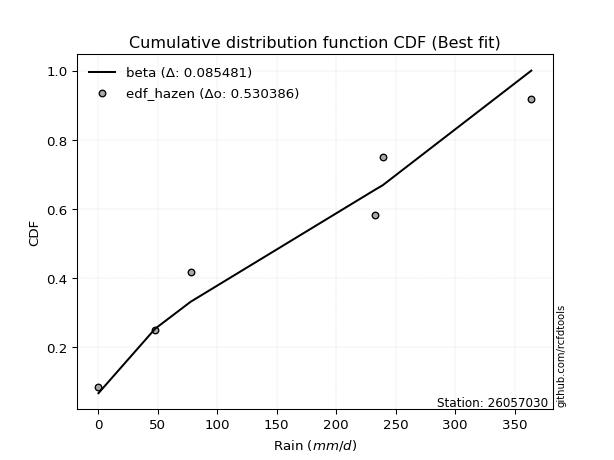</img></img>

</div>


### 3. Empirical - EDF Weibull (1939)

Weibull plotting position formula is an empirical method used to estimate the non-exceedance probability or plotting position for a set of observed data, is often recommended or widely used in practice, particularly in flood frequency analysis.

<div align="center">


$P=m/(n+1)$


</div>


**3.1. Empirical values**

<div align="center">

|                | 0                   | 1                  | 2                   | 3                  | 4                  | 5                  |
|:---------------|:--------------------|:-------------------|:--------------------|:-------------------|:-------------------|:-------------------|
| date           | 2017                | 2019               | 2018                | 2022               | 2020               | 2021               |
| x              | 0.1                 | 47.8               | 77.6                | 233.0              | 239.0              | 364.0              |
| m              | 1                   | 2                  | 3                   | 4                  | 5                  | 6                  |
| empirical_dist | edf_weibull         | edf_weibull        | edf_weibull         | edf_weibull        | edf_weibull        | edf_weibull        |
| empirical      | 0.14285714285714285 | 0.2857142857142857 | 0.42857142857142855 | 0.5714285714285714 | 0.7142857142857143 | 0.8571428571428571 |
| empirical_tr   | 1.1666666666666665  | 1.4                | 1.75                | 2.333333333333333  | 3.5                | 6.999999999999997  |

</div>


**3.2. Kolmogorov-Smirnov fit test (sorted by Δ)**


<div align="center">

|                | 0                   | 1                  | 2                   | 3                   | 4                   | 5                   | 6                   | 7                   | 8                  | 9                   | 10                  | 11                  | 12                  | 13                 | 14                  | 15                  | 16                  | 17                 | 18                  | 19                  | 20                  | 21                 | 22                 | 23                  | 24                 | 25                  | 26                  | 27                 | 28                  | 29                  | 30                 | 31                 | 32                  | 33                  | 34                 | 35                  | 36                  | 37                  | 38                 | 39                  | 40                 | 41                  | 42                  | 43                 | 44                  | 45                  | 46                 | 47                 | 48                  | 49                    | 50                  | 51                  | 52                 | 53                 | 54                 | 55                 | 56                  | 57                  | 58                | 59                  | 60                 | 61                  | 62                  | 63                 | 64                 | 65                 | 66                 | 67                  | 68                 | 69                  | 70                 | 71                  | 72                 | 73                 | 74                  | 75                  | 76                  | 77                  | 78                  | 79                  | 80                 | 81                 | 82                 | 83                 | 84                 | 85                 | 86                 | 87                 | 88                 | 89                 |
|:---------------|:--------------------|:-------------------|:--------------------|:--------------------|:--------------------|:--------------------|:--------------------|:--------------------|:-------------------|:--------------------|:--------------------|:--------------------|:--------------------|:-------------------|:--------------------|:--------------------|:--------------------|:-------------------|:--------------------|:--------------------|:--------------------|:-------------------|:-------------------|:--------------------|:-------------------|:--------------------|:--------------------|:-------------------|:--------------------|:--------------------|:-------------------|:-------------------|:--------------------|:--------------------|:-------------------|:--------------------|:--------------------|:--------------------|:-------------------|:--------------------|:-------------------|:--------------------|:--------------------|:-------------------|:--------------------|:--------------------|:-------------------|:-------------------|:--------------------|:----------------------|:--------------------|:--------------------|:-------------------|:-------------------|:-------------------|:-------------------|:--------------------|:--------------------|:------------------|:--------------------|:-------------------|:--------------------|:--------------------|:-------------------|:-------------------|:-------------------|:-------------------|:--------------------|:-------------------|:--------------------|:-------------------|:--------------------|:-------------------|:-------------------|:--------------------|:--------------------|:--------------------|:--------------------|:--------------------|:--------------------|:-------------------|:-------------------|:-------------------|:-------------------|:-------------------|:-------------------|:-------------------|:-------------------|:-------------------|:-------------------|
| station        | 26057030            | 26057030           | 26057030            | 26057030            | 26057030            | 26057030            | 26057030            | 26057030            | 26057030           | 26057030            | 26057030            | 26057030            | 26057030            | 26057030           | 26057030            | 26057030            | 26057030            | 26057030           | 26057030            | 26057030            | 26057030            | 26057030           | 26057030           | 26057030            | 26057030           | 26057030            | 26057030            | 26057030           | 26057030            | 26057030            | 26057030           | 26057030           | 26057030            | 26057030            | 26057030           | 26057030            | 26057030            | 26057030            | 26057030           | 26057030            | 26057030           | 26057030            | 26057030            | 26057030           | 26057030            | 26057030            | 26057030           | 26057030           | 26057030            | 26057030              | 26057030            | 26057030            | 26057030           | 26057030           | 26057030           | 26057030           | 26057030            | 26057030            | 26057030          | 26057030            | 26057030           | 26057030            | 26057030            | 26057030           | 26057030           | 26057030           | 26057030           | 26057030            | 26057030           | 26057030            | 26057030           | 26057030            | 26057030           | 26057030           | 26057030            | 26057030            | 26057030            | 26057030            | 26057030            | 26057030            | 26057030           | 26057030           | 26057030           | 26057030           | 26057030           | 26057030           | 26057030           | 26057030           | 26057030           | 26057030           |
| empirical_dist | edf_weibull         | edf_weibull        | edf_weibull         | edf_weibull         | edf_weibull         | edf_weibull         | edf_weibull         | edf_weibull         | edf_weibull        | edf_weibull         | edf_weibull         | edf_weibull         | edf_weibull         | edf_weibull        | edf_weibull         | edf_weibull         | edf_weibull         | edf_weibull        | edf_weibull         | edf_weibull         | edf_weibull         | edf_weibull        | edf_weibull        | edf_weibull         | edf_weibull        | edf_weibull         | edf_weibull         | edf_weibull        | edf_weibull         | edf_weibull         | edf_weibull        | edf_weibull        | edf_weibull         | edf_weibull         | edf_weibull        | edf_weibull         | edf_weibull         | edf_weibull         | edf_weibull        | edf_weibull         | edf_weibull        | edf_weibull         | edf_weibull         | edf_weibull        | edf_weibull         | edf_weibull         | edf_weibull        | edf_weibull        | edf_weibull         | edf_weibull           | edf_weibull         | edf_weibull         | edf_weibull        | edf_weibull        | edf_weibull        | edf_weibull        | edf_weibull         | edf_weibull         | edf_weibull       | edf_weibull         | edf_weibull        | edf_weibull         | edf_weibull         | edf_weibull        | edf_weibull        | edf_weibull        | edf_weibull        | edf_weibull         | edf_weibull        | edf_weibull         | edf_weibull        | edf_weibull         | edf_weibull        | edf_weibull        | edf_weibull         | edf_weibull         | edf_weibull         | edf_weibull         | edf_weibull         | edf_weibull         | edf_weibull        | edf_weibull        | edf_weibull        | edf_weibull        | edf_weibull        | edf_weibull        | edf_weibull        | edf_weibull        | edf_weibull        | edf_weibull        |
| p_dist         | ncf                 | logpearson3        | betaprime           | weibull_min         | loggumbel_l         | maxwell             | pearson3            | rayleigh            | johnsonsu          | rice                | exponnorm           | crystalball         | norm                | gompertz           | halfnorm            | truncnorm           | fisk                | genlogistic        | kstwobign           | alpha               | gumbel_r            | logistic           | genexpon           | laplace_asymmetric  | expon              | invgauss            | halflogistic        | logt               | moyal               | hypsecant           | gumbel_l           | chi2               | lognct              | logexponnorm        | logcrystalball     | lognorm             | lognorm             | logrice             | lognakagami        | loglogistic         | loghypsecant       | laplace             | loglaplace          | logtruncnorm       | logerlang           | loginvgamma         | loggamma           | loggamma           | logloggamma         | loglaplace_asymmetric | logalpha            | loginvweibull       | loginvgauss        | logmaxwell         | lograyleigh        | wald               | f                   | erlang              | nakagami          | loggenexpon         | logkstwobign       | loggumbel_r         | loghalfnorm         | gamma              | logfisk            | t                  | logmoyal           | loghalflogistic     | pareto             | gibrat              | nct                | logexpon            | logncf             | logwald            | invweibull          | logpareto           | loggibrat           | fatiguelife         | logf                | mielke              | loglognorm         | logweibull_min     | logbetaprime       | logfatiguelife     | logmielke          | logjohnsonsu       | logchi2            | invgamma           | loggompertz        | loggenlogistic     |
| delta          | 0.11876340697344862 | 0.1217388608594645 | 0.14285714285658035 | 0.14691410670422034 | 0.15522482822010963 | 0.15788004057594662 | 0.16154518566369463 | 0.16195019887763196 | 0.1677133239317159 | 0.16886395148280248 | 0.16916606298097508 | 0.16951851528541134 | 0.16951851768765142 | 0.1717336608083968 | 0.17461707989380926 | 0.17630295533371743 | 0.17910799043117587 | 0.1855576345634703 | 0.18611293974731646 | 0.19044813536637395 | 0.19142881999579386 | 0.1921139554371336 | 0.1926961204927915 | 0.19489594941743382 | 0.1949986651392177 | 0.19972943325348158 | 0.20080014788336875 | 0.2064916295557476 | 0.20676865882221396 | 0.20726267244433152 | 0.2111972327538375 | 0.2176878689210402 | 0.22469895633720527 | 0.22518994389067337 | 0.2251917754903492 | 0.22519177991592565 | 0.22519177991592565 | 0.22519260856064627 | 0.2259451584044011 | 0.22668088205483405 | 0.2279519430509348 | 0.22810492705630217 | 0.23324963045446212 | 0.2361364599368868 | 0.23623708718938974 | 0.23645959063302768 | 0.2365859101117096 | 0.2365859101117096 | 0.23702365584534324 | 0.2372511861969534    | 0.23860706581313018 | 0.25542768973438823 | 0.2561814146216096 | 0.2577739307869418 | 0.2685407731598627 | 0.2753790457523102 | 0.27538105130987434 | 0.28025044960256196 | 0.285714284684194 | 0.28919720978313734 | 0.2941140222585169 | 0.29580419261739677 | 0.29885127530193734 | 0.3027712550243049 | 0.3043639618519076 | 0.3120697571887455 | 0.3215439821051985 | 0.32442210934711846 | 0.3341458535983989 | 0.34451487316569757 | 0.3501599268570267 | 0.35102124066057994 | 0.3895708427451152 | 0.3930717962831164 | 0.40038319592169014 | 0.40290446657412515 | 0.41803090814017607 | 0.42729389034097587 | 0.45462943180331117 | 0.46884131153064523 | 0.5571672428363751 | 0.5694145861445229 | 0.5698631425259332 | 0.5840440583018047 | 0.6325501476635325 | 0.6647724608612973 | 0.6909081683488393 | 0.7124528297836713 | 0.7141215059561443 | 0.7142857142857143 |
| deltao         | 0.530385761606      | 0.530385761606     | 0.530385761606      | 0.530385761606      | 0.530385761606      | 0.530385761606      | 0.530385761606      | 0.530385761606      | 0.530385761606     | 0.530385761606      | 0.530385761606      | 0.530385761606      | 0.530385761606      | 0.530385761606     | 0.530385761606      | 0.530385761606      | 0.530385761606      | 0.530385761606     | 0.530385761606      | 0.530385761606      | 0.530385761606      | 0.530385761606     | 0.530385761606     | 0.530385761606      | 0.530385761606     | 0.530385761606      | 0.530385761606      | 0.530385761606     | 0.530385761606      | 0.530385761606      | 0.530385761606     | 0.530385761606     | 0.530385761606      | 0.530385761606      | 0.530385761606     | 0.530385761606      | 0.530385761606      | 0.530385761606      | 0.530385761606     | 0.530385761606      | 0.530385761606     | 0.530385761606      | 0.530385761606      | 0.530385761606     | 0.530385761606      | 0.530385761606      | 0.530385761606     | 0.530385761606     | 0.530385761606      | 0.530385761606        | 0.530385761606      | 0.530385761606      | 0.530385761606     | 0.530385761606     | 0.530385761606     | 0.530385761606     | 0.530385761606      | 0.530385761606      | 0.530385761606    | 0.530385761606      | 0.530385761606     | 0.530385761606      | 0.530385761606      | 0.530385761606     | 0.530385761606     | 0.530385761606     | 0.530385761606     | 0.530385761606      | 0.530385761606     | 0.530385761606      | 0.530385761606     | 0.530385761606      | 0.530385761606     | 0.530385761606     | 0.530385761606      | 0.530385761606      | 0.530385761606      | 0.530385761606      | 0.530385761606      | 0.530385761606      | 0.530385761606     | 0.530385761606     | 0.530385761606     | 0.530385761606     | 0.530385761606     | 0.530385761606     | 0.530385761606     | 0.530385761606     | 0.530385761606     | 0.530385761606     |
| eval           | Δo > Δ              | Δo > Δ             | Δo > Δ              | Δo > Δ              | Δo > Δ              | Δo > Δ              | Δo > Δ              | Δo > Δ              | Δo > Δ             | Δo > Δ              | Δo > Δ              | Δo > Δ              | Δo > Δ              | Δo > Δ             | Δo > Δ              | Δo > Δ              | Δo > Δ              | Δo > Δ             | Δo > Δ              | Δo > Δ              | Δo > Δ              | Δo > Δ             | Δo > Δ             | Δo > Δ              | Δo > Δ             | Δo > Δ              | Δo > Δ              | Δo > Δ             | Δo > Δ              | Δo > Δ              | Δo > Δ             | Δo > Δ             | Δo > Δ              | Δo > Δ              | Δo > Δ             | Δo > Δ              | Δo > Δ              | Δo > Δ              | Δo > Δ             | Δo > Δ              | Δo > Δ             | Δo > Δ              | Δo > Δ              | Δo > Δ             | Δo > Δ              | Δo > Δ              | Δo > Δ             | Δo > Δ             | Δo > Δ              | Δo > Δ                | Δo > Δ              | Δo > Δ              | Δo > Δ             | Δo > Δ             | Δo > Δ             | Δo > Δ             | Δo > Δ              | Δo > Δ              | Δo > Δ            | Δo > Δ              | Δo > Δ             | Δo > Δ              | Δo > Δ              | Δo > Δ             | Δo > Δ             | Δo > Δ             | Δo > Δ             | Δo > Δ              | Δo > Δ             | Δo > Δ              | Δo > Δ             | Δo > Δ              | Δo > Δ             | Δo > Δ             | Δo > Δ              | Δo > Δ              | Δo > Δ              | Δo > Δ              | Δo > Δ              | Δo > Δ              | Δo <= Δ            | Δo <= Δ            | Δo <= Δ            | Δo <= Δ            | Δo <= Δ            | Δo <= Δ            | Δo <= Δ            | Δo <= Δ            | Δo <= Δ            | Δo <= Δ            |
| fit            | 1                   | 1                  | 1                   | 1                   | 1                   | 1                   | 1                   | 1                   | 1                  | 1                   | 1                   | 1                   | 1                   | 1                  | 1                   | 1                   | 1                   | 1                  | 1                   | 1                   | 1                   | 1                  | 1                  | 1                   | 1                  | 1                   | 1                   | 1                  | 1                   | 1                   | 1                  | 1                  | 1                   | 1                   | 1                  | 1                   | 1                   | 1                   | 1                  | 1                   | 1                  | 1                   | 1                   | 1                  | 1                   | 1                   | 1                  | 1                  | 1                   | 1                     | 1                   | 1                   | 1                  | 1                  | 1                  | 1                  | 1                   | 1                   | 1                 | 1                   | 1                  | 1                   | 1                   | 1                  | 1                  | 1                  | 1                  | 1                   | 1                  | 1                   | 1                  | 1                   | 1                  | 1                  | 1                   | 1                   | 1                   | 1                   | 1                   | 1                   | 0                  | 0                  | 0                  | 0                  | 0                  | 0                  | 0                  | 0                  | 0                  | 0                  |
| n              | 6                   | 6                  | 6                   | 6                   | 6                   | 6                   | 6                   | 6                   | 6                  | 6                   | 6                   | 6                   | 6                   | 6                  | 6                   | 6                   | 6                   | 6                  | 6                   | 6                   | 6                   | 6                  | 6                  | 6                   | 6                  | 6                   | 6                   | 6                  | 6                   | 6                   | 6                  | 6                  | 6                   | 6                   | 6                  | 6                   | 6                   | 6                   | 6                  | 6                   | 6                  | 6                   | 6                   | 6                  | 6                   | 6                   | 6                  | 6                  | 6                   | 6                     | 6                   | 6                   | 6                  | 6                  | 6                  | 6                  | 6                   | 6                   | 6                 | 6                   | 6                  | 6                   | 6                   | 6                  | 6                  | 6                  | 6                  | 6                   | 6                  | 6                   | 6                  | 6                   | 6                  | 6                  | 6                   | 6                   | 6                   | 6                   | 6                   | 6                   | 6                  | 6                  | 6                  | 6                  | 6                  | 6                  | 6                  | 6                  | 6                  | 6                  |
| best_fit       | 1                   | 0                  | 0                   | 0                   | 0                   | 0                   | 0                   | 0                   | 0                  | 0                   | 0                   | 0                   | 0                   | 0                  | 0                   | 0                   | 0                   | 0                  | 0                   | 0                   | 0                   | 0                  | 0                  | 0                   | 0                  | 0                   | 0                   | 0                  | 0                   | 0                   | 0                  | 0                  | 0                   | 0                   | 0                  | 0                   | 0                   | 0                   | 0                  | 0                   | 0                  | 0                   | 0                   | 0                  | 0                   | 0                   | 0                  | 0                  | 0                   | 0                     | 0                   | 0                   | 0                  | 0                  | 0                  | 0                  | 0                   | 0                   | 0                 | 0                   | 0                  | 0                   | 0                   | 0                  | 0                  | 0                  | 0                  | 0                   | 0                  | 0                   | 0                  | 0                   | 0                  | 0                  | 0                   | 0                   | 0                   | 0                   | 0                   | 0                   | 0                  | 0                  | 0                  | 0                  | 0                  | 0                  | 0                  | 0                  | 0                  | 0                  |
| best_fit_sort  | 1                   | 2                  | 3                   | 4                   | 5                   | 6                   | 7                   | 8                   | 9                  | 10                  | 11                  | 12                  | 13                  | 14                 | 15                  | 16                  | 17                  | 18                 | 19                  | 20                  | 21                  | 22                 | 23                 | 24                  | 25                 | 26                  | 27                  | 28                 | 29                  | 30                  | 31                 | 32                 | 33                  | 34                  | 35                 | 36                  | 37                  | 38                  | 39                 | 40                  | 41                 | 42                  | 43                  | 44                 | 45                  | 46                  | 47                 | 48                 | 49                  | 50                    | 51                  | 52                  | 53                 | 54                 | 55                 | 56                 | 57                  | 58                  | 59                | 60                  | 61                 | 62                  | 63                  | 64                 | 65                 | 66                 | 67                 | 68                  | 69                 | 70                  | 71                 | 72                  | 73                 | 74                 | 75                  | 76                  | 77                  | 78                  | 79                  | 80                  | 81                 | 82                 | 83                 | 84                 | 85                 | 86                 | 87                 | 88                 | 89                 | 90                 |

</div>


<div align="center">

</img>

</div>


**3.3. Best fit**

<div align="center">

|   id |   station | empirical_dist   | p_dist   |    delta |   deltao | eval   |   fit |   n |   best_fit |   best_fit_sort |
|-----:|----------:|:-----------------|:---------|---------:|---------:|:-------|------:|----:|-----------:|----------------:|
|    0 |  26057030 | edf_weibull      | ncf      | 0.118763 | 0.530386 | Δo > Δ |     1 |   6 |          1 |               1 |

</div>


<div align="center">

</img>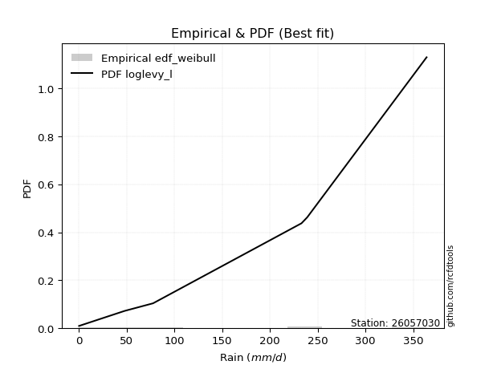</img>

</div>


### 4. Empirical - EDF Beard (1943)

The Beard formula (or Beard´s plotting position formula) in hydrology is used to estimate the empirical non-exceedance probability _(P)_ of a flood event (or other extreme hydrological data point) within a given dataset.

<div align="center">


$P=(m-0.31)/(n+0.38)$


</div>


**4.1. Empirical values**

<div align="center">

|                | 0                   | 1                   | 2                  | 3                  | 4                  | 5                  |
|:---------------|:--------------------|:--------------------|:-------------------|:-------------------|:-------------------|:-------------------|
| date           | 2017                | 2019                | 2018               | 2022               | 2020               | 2021               |
| x              | 0.1                 | 47.8                | 77.6               | 233.0              | 239.0              | 364.0              |
| m              | 1                   | 2                   | 3                  | 4                  | 5                  | 6                  |
| empirical_dist | edf_beard           | edf_beard           | edf_beard          | edf_beard          | edf_beard          | edf_beard          |
| empirical      | 0.10815047021943573 | 0.26489028213166144 | 0.4216300940438871 | 0.5783699059561128 | 0.7351097178683387 | 0.8918495297805643 |
| empirical_tr   | 1.1212653778558874  | 1.3603411513859276  | 1.7289972899728996 | 2.3717472118959106 | 3.7751479289940844 | 9.246376811594207  |

</div>


**4.2. Kolmogorov-Smirnov fit test (sorted by Δ)**


<div align="center">

|                | 0                  | 1                   | 2                   | 3                   | 4                  | 5                   | 6                   | 7                   | 8                   | 9                   | 10                  | 11               | 12                  | 13                  | 14                | 15                 | 16                  | 17                  | 18                 | 19                  | 20                  | 21                 | 22                  | 23                 | 24                 | 25                  | 26                  | 27                  | 28                  | 29                 | 30                  | 31                  | 32                  | 33                  | 34                    | 35                  | 36                  | 37                  | 38                 | 39                 | 40                  | 41                  | 42                  | 43                  | 44                 | 45                  | 46                 | 47                | 48                  | 49                  | 50                  | 51                  | 52                  | 53                  | 54                 | 55                  | 56                  | 57                  | 58                 | 59                 | 60                 | 61                 | 62                  | 63                  | 64                 | 65                  | 66                  | 67                 | 68                 | 69                  | 70                  | 71                 | 72                 | 73                  | 74                 | 75                  | 76                  | 77                  | 78                  | 79                 | 80                 | 81                 | 82                 | 83                | 84                 | 85                 | 86                 | 87                 | 88                 | 89                 |
|:---------------|:-------------------|:--------------------|:--------------------|:--------------------|:-------------------|:--------------------|:--------------------|:--------------------|:--------------------|:--------------------|:--------------------|:-----------------|:--------------------|:--------------------|:------------------|:-------------------|:--------------------|:--------------------|:-------------------|:--------------------|:--------------------|:-------------------|:--------------------|:-------------------|:-------------------|:--------------------|:--------------------|:--------------------|:--------------------|:-------------------|:--------------------|:--------------------|:--------------------|:--------------------|:----------------------|:--------------------|:--------------------|:--------------------|:-------------------|:-------------------|:--------------------|:--------------------|:--------------------|:--------------------|:-------------------|:--------------------|:-------------------|:------------------|:--------------------|:--------------------|:--------------------|:--------------------|:--------------------|:--------------------|:-------------------|:--------------------|:--------------------|:--------------------|:-------------------|:-------------------|:-------------------|:-------------------|:--------------------|:--------------------|:-------------------|:--------------------|:--------------------|:-------------------|:-------------------|:--------------------|:--------------------|:-------------------|:-------------------|:--------------------|:-------------------|:--------------------|:--------------------|:--------------------|:--------------------|:-------------------|:-------------------|:-------------------|:-------------------|:------------------|:-------------------|:-------------------|:-------------------|:-------------------|:-------------------|:-------------------|
| station        | 26057030           | 26057030            | 26057030            | 26057030            | 26057030           | 26057030            | 26057030            | 26057030            | 26057030            | 26057030            | 26057030            | 26057030         | 26057030            | 26057030            | 26057030          | 26057030           | 26057030            | 26057030            | 26057030           | 26057030            | 26057030            | 26057030           | 26057030            | 26057030           | 26057030           | 26057030            | 26057030            | 26057030            | 26057030            | 26057030           | 26057030            | 26057030            | 26057030            | 26057030            | 26057030              | 26057030            | 26057030            | 26057030            | 26057030           | 26057030           | 26057030            | 26057030            | 26057030            | 26057030            | 26057030           | 26057030            | 26057030           | 26057030          | 26057030            | 26057030            | 26057030            | 26057030            | 26057030            | 26057030            | 26057030           | 26057030            | 26057030            | 26057030            | 26057030           | 26057030           | 26057030           | 26057030           | 26057030            | 26057030            | 26057030           | 26057030            | 26057030            | 26057030           | 26057030           | 26057030            | 26057030            | 26057030           | 26057030           | 26057030            | 26057030           | 26057030            | 26057030            | 26057030            | 26057030            | 26057030           | 26057030           | 26057030           | 26057030           | 26057030          | 26057030           | 26057030           | 26057030           | 26057030           | 26057030           | 26057030           |
| empirical_dist | edf_beard          | edf_beard           | edf_beard           | edf_beard           | edf_beard          | edf_beard           | edf_beard           | edf_beard           | edf_beard           | edf_beard           | edf_beard           | edf_beard        | edf_beard           | edf_beard           | edf_beard         | edf_beard          | edf_beard           | edf_beard           | edf_beard          | edf_beard           | edf_beard           | edf_beard          | edf_beard           | edf_beard          | edf_beard          | edf_beard           | edf_beard           | edf_beard           | edf_beard           | edf_beard          | edf_beard           | edf_beard           | edf_beard           | edf_beard           | edf_beard             | edf_beard           | edf_beard           | edf_beard           | edf_beard          | edf_beard          | edf_beard           | edf_beard           | edf_beard           | edf_beard           | edf_beard          | edf_beard           | edf_beard          | edf_beard         | edf_beard           | edf_beard           | edf_beard           | edf_beard           | edf_beard           | edf_beard           | edf_beard          | edf_beard           | edf_beard           | edf_beard           | edf_beard          | edf_beard          | edf_beard          | edf_beard          | edf_beard           | edf_beard           | edf_beard          | edf_beard           | edf_beard           | edf_beard          | edf_beard          | edf_beard           | edf_beard           | edf_beard          | edf_beard          | edf_beard           | edf_beard          | edf_beard           | edf_beard           | edf_beard           | edf_beard           | edf_beard          | edf_beard          | edf_beard          | edf_beard          | edf_beard         | edf_beard          | edf_beard          | edf_beard          | edf_beard          | edf_beard          | edf_beard          |
| p_dist         | ncf                | weibull_min         | logpearson3         | betaprime           | maxwell            | pearson3            | rayleigh            | johnsonsu           | rice                | exponnorm           | crystalball         | norm             | gompertz            | halfnorm            | truncnorm         | loggumbel_l        | genlogistic         | kstwobign           | fisk               | alpha               | gumbel_r            | logistic           | genexpon            | laplace_asymmetric | expon              | invgauss            | halflogistic        | logt                | moyal               | hypsecant          | gumbel_l            | chi2                | laplace             | logloggamma         | loglaplace_asymmetric | lognct              | logexponnorm        | logcrystalball      | lognorm            | lognorm            | logrice             | lognakagami         | loglogistic         | loghypsecant        | loglaplace         | wald                | logtruncnorm       | logerlang         | loginvgamma         | loggamma            | loggamma            | logalpha            | nakagami            | erlang              | loginvweibull      | loginvgauss         | logmaxwell          | lograyleigh         | gamma              | f                  | t                  | loggenexpon        | logkstwobign        | loggumbel_r         | loghalfnorm        | gibrat              | logfisk             | logmoyal           | loghalflogistic    | pareto              | nct                 | logexpon           | logncf             | logwald             | logpareto          | invweibull          | loggibrat           | fatiguelife         | logf                | mielke             | loglognorm         | logweibull_min     | logbetaprime       | logfatiguelife    | logmielke          | logjohnsonsu       | logchi2            | invgamma           | loggompertz        | loggenlogistic     |
| delta          | 0.1118220724459072 | 0.13997277217667892 | 0.14256286444208877 | 0.14534532782635856 | 0.1509387060484052 | 0.15460385113615321 | 0.15500886435009054 | 0.16077198940417448 | 0.16192261695526106 | 0.16222472845343366 | 0.16257718075786992 | 0.16257718316011 | 0.16479232628085538 | 0.16767574536626784 | 0.169361620806176 | 0.1760488318027339 | 0.17861630003592888 | 0.17917160521977504 | 0.1796599494428468 | 0.18350680083883253 | 0.18448748546825244 | 0.1851726209095922 | 0.18575478596525008 | 0.1879546148898924 | 0.1880573306116763 | 0.19278809872594016 | 0.19385881335582733 | 0.19955029502820618 | 0.19982732429467254 | 0.2003213379167901 | 0.20425589822629608 | 0.21074653439349877 | 0.22116359252876075 | 0.23008232131780182 | 0.23030985166941198   | 0.24552295991982953 | 0.24601394747329763 | 0.24601577907297345 | 0.2460157834985499 | 0.2460157834985499 | 0.24601661214327053 | 0.24676916198702536 | 0.24750488563745832 | 0.24877594663355906 | 0.2540736340370864 | 0.25455504216968594 | 0.2569604635195111 | 0.257061090772014 | 0.25728359421565195 | 0.25740991369433386 | 0.25740991369433386 | 0.25943106939575444 | 0.26489028110156976 | 0.27330911507502054 | 0.2762516933170125 | 0.27700541820423386 | 0.27859793436956604 | 0.28936477674248695 | 0.2958299204967635 | 0.2962050548924986 | 0.3051284226612041 | 0.3100212133657616 | 0.31493802584114117 | 0.31662819620002103 | 0.3196752788845616 | 0.33757353863815615 | 0.33907063448961483 | 0.3423679856878228 | 0.3452461129297427 | 0.35496985718102314 | 0.37098393043965094 | 0.3718452442432042 | 0.4103948463277395 | 0.41389579986574065 | 0.4237284701567494 | 0.43508986855939735 | 0.43885491172280033 | 0.44811789392360013 | 0.47545343538593543 | 0.4896653151132695 | 0.5779912464189993 | 0.5902385897271472 | 0.5906871461085574 | 0.604868061884429 | 0.6533741512461567 | 0.6855964644439216 | 0.7117321719314635 | 0.7332768333662956 | 0.7349455095387686 | 0.7351097178683387 |
| deltao         | 0.530385761606     | 0.530385761606      | 0.530385761606      | 0.530385761606      | 0.530385761606     | 0.530385761606      | 0.530385761606      | 0.530385761606      | 0.530385761606      | 0.530385761606      | 0.530385761606      | 0.530385761606   | 0.530385761606      | 0.530385761606      | 0.530385761606    | 0.530385761606     | 0.530385761606      | 0.530385761606      | 0.530385761606     | 0.530385761606      | 0.530385761606      | 0.530385761606     | 0.530385761606      | 0.530385761606     | 0.530385761606     | 0.530385761606      | 0.530385761606      | 0.530385761606      | 0.530385761606      | 0.530385761606     | 0.530385761606      | 0.530385761606      | 0.530385761606      | 0.530385761606      | 0.530385761606        | 0.530385761606      | 0.530385761606      | 0.530385761606      | 0.530385761606     | 0.530385761606     | 0.530385761606      | 0.530385761606      | 0.530385761606      | 0.530385761606      | 0.530385761606     | 0.530385761606      | 0.530385761606     | 0.530385761606    | 0.530385761606      | 0.530385761606      | 0.530385761606      | 0.530385761606      | 0.530385761606      | 0.530385761606      | 0.530385761606     | 0.530385761606      | 0.530385761606      | 0.530385761606      | 0.530385761606     | 0.530385761606     | 0.530385761606     | 0.530385761606     | 0.530385761606      | 0.530385761606      | 0.530385761606     | 0.530385761606      | 0.530385761606      | 0.530385761606     | 0.530385761606     | 0.530385761606      | 0.530385761606      | 0.530385761606     | 0.530385761606     | 0.530385761606      | 0.530385761606     | 0.530385761606      | 0.530385761606      | 0.530385761606      | 0.530385761606      | 0.530385761606     | 0.530385761606     | 0.530385761606     | 0.530385761606     | 0.530385761606    | 0.530385761606     | 0.530385761606     | 0.530385761606     | 0.530385761606     | 0.530385761606     | 0.530385761606     |
| eval           | Δo > Δ             | Δo > Δ              | Δo > Δ              | Δo > Δ              | Δo > Δ             | Δo > Δ              | Δo > Δ              | Δo > Δ              | Δo > Δ              | Δo > Δ              | Δo > Δ              | Δo > Δ           | Δo > Δ              | Δo > Δ              | Δo > Δ            | Δo > Δ             | Δo > Δ              | Δo > Δ              | Δo > Δ             | Δo > Δ              | Δo > Δ              | Δo > Δ             | Δo > Δ              | Δo > Δ             | Δo > Δ             | Δo > Δ              | Δo > Δ              | Δo > Δ              | Δo > Δ              | Δo > Δ             | Δo > Δ              | Δo > Δ              | Δo > Δ              | Δo > Δ              | Δo > Δ                | Δo > Δ              | Δo > Δ              | Δo > Δ              | Δo > Δ             | Δo > Δ             | Δo > Δ              | Δo > Δ              | Δo > Δ              | Δo > Δ              | Δo > Δ             | Δo > Δ              | Δo > Δ             | Δo > Δ            | Δo > Δ              | Δo > Δ              | Δo > Δ              | Δo > Δ              | Δo > Δ              | Δo > Δ              | Δo > Δ             | Δo > Δ              | Δo > Δ              | Δo > Δ              | Δo > Δ             | Δo > Δ             | Δo > Δ             | Δo > Δ             | Δo > Δ              | Δo > Δ              | Δo > Δ             | Δo > Δ              | Δo > Δ              | Δo > Δ             | Δo > Δ             | Δo > Δ              | Δo > Δ              | Δo > Δ             | Δo > Δ             | Δo > Δ              | Δo > Δ             | Δo > Δ              | Δo > Δ              | Δo > Δ              | Δo > Δ              | Δo > Δ             | Δo <= Δ            | Δo <= Δ            | Δo <= Δ            | Δo <= Δ           | Δo <= Δ            | Δo <= Δ            | Δo <= Δ            | Δo <= Δ            | Δo <= Δ            | Δo <= Δ            |
| fit            | 1                  | 1                   | 1                   | 1                   | 1                  | 1                   | 1                   | 1                   | 1                   | 1                   | 1                   | 1                | 1                   | 1                   | 1                 | 1                  | 1                   | 1                   | 1                  | 1                   | 1                   | 1                  | 1                   | 1                  | 1                  | 1                   | 1                   | 1                   | 1                   | 1                  | 1                   | 1                   | 1                   | 1                   | 1                     | 1                   | 1                   | 1                   | 1                  | 1                  | 1                   | 1                   | 1                   | 1                   | 1                  | 1                   | 1                  | 1                 | 1                   | 1                   | 1                   | 1                   | 1                   | 1                   | 1                  | 1                   | 1                   | 1                   | 1                  | 1                  | 1                  | 1                  | 1                   | 1                   | 1                  | 1                   | 1                   | 1                  | 1                  | 1                   | 1                   | 1                  | 1                  | 1                   | 1                  | 1                   | 1                   | 1                   | 1                   | 1                  | 0                  | 0                  | 0                  | 0                 | 0                  | 0                  | 0                  | 0                  | 0                  | 0                  |
| n              | 6                  | 6                   | 6                   | 6                   | 6                  | 6                   | 6                   | 6                   | 6                   | 6                   | 6                   | 6                | 6                   | 6                   | 6                 | 6                  | 6                   | 6                   | 6                  | 6                   | 6                   | 6                  | 6                   | 6                  | 6                  | 6                   | 6                   | 6                   | 6                   | 6                  | 6                   | 6                   | 6                   | 6                   | 6                     | 6                   | 6                   | 6                   | 6                  | 6                  | 6                   | 6                   | 6                   | 6                   | 6                  | 6                   | 6                  | 6                 | 6                   | 6                   | 6                   | 6                   | 6                   | 6                   | 6                  | 6                   | 6                   | 6                   | 6                  | 6                  | 6                  | 6                  | 6                   | 6                   | 6                  | 6                   | 6                   | 6                  | 6                  | 6                   | 6                   | 6                  | 6                  | 6                   | 6                  | 6                   | 6                   | 6                   | 6                   | 6                  | 6                  | 6                  | 6                  | 6                 | 6                  | 6                  | 6                  | 6                  | 6                  | 6                  |
| best_fit       | 1                  | 0                   | 0                   | 0                   | 0                  | 0                   | 0                   | 0                   | 0                   | 0                   | 0                   | 0                | 0                   | 0                   | 0                 | 0                  | 0                   | 0                   | 0                  | 0                   | 0                   | 0                  | 0                   | 0                  | 0                  | 0                   | 0                   | 0                   | 0                   | 0                  | 0                   | 0                   | 0                   | 0                   | 0                     | 0                   | 0                   | 0                   | 0                  | 0                  | 0                   | 0                   | 0                   | 0                   | 0                  | 0                   | 0                  | 0                 | 0                   | 0                   | 0                   | 0                   | 0                   | 0                   | 0                  | 0                   | 0                   | 0                   | 0                  | 0                  | 0                  | 0                  | 0                   | 0                   | 0                  | 0                   | 0                   | 0                  | 0                  | 0                   | 0                   | 0                  | 0                  | 0                   | 0                  | 0                   | 0                   | 0                   | 0                   | 0                  | 0                  | 0                  | 0                  | 0                 | 0                  | 0                  | 0                  | 0                  | 0                  | 0                  |
| best_fit_sort  | 1                  | 2                   | 3                   | 4                   | 5                  | 6                   | 7                   | 8                   | 9                   | 10                  | 11                  | 12               | 13                  | 14                  | 15                | 16                 | 17                  | 18                  | 19                 | 20                  | 21                  | 22                 | 23                  | 24                 | 25                 | 26                  | 27                  | 28                  | 29                  | 30                 | 31                  | 32                  | 33                  | 34                  | 35                    | 36                  | 37                  | 38                  | 39                 | 40                 | 41                  | 42                  | 43                  | 44                  | 45                 | 46                  | 47                 | 48                | 49                  | 50                  | 51                  | 52                  | 53                  | 54                  | 55                 | 56                  | 57                  | 58                  | 59                 | 60                 | 61                 | 62                 | 63                  | 64                  | 65                 | 66                  | 67                  | 68                 | 69                 | 70                  | 71                  | 72                 | 73                 | 74                  | 75                 | 76                  | 77                  | 78                  | 79                  | 80                 | 81                 | 82                 | 83                 | 84                | 85                 | 86                 | 87                 | 88                 | 89                 | 90                 |

</div>


<div align="center">

</img>

</div>


**4.3. Best fit**

<div align="center">

|   id |   station | empirical_dist   | p_dist   |    delta |   deltao | eval   |   fit |   n |   best_fit |   best_fit_sort |
|-----:|----------:|:-----------------|:---------|---------:|---------:|:-------|------:|----:|-----------:|----------------:|
|    0 |  26057030 | edf_beard        | ncf      | 0.111822 | 0.530386 | Δo > Δ |     1 |   6 |          1 |               1 |

</div>


<div align="center">

</img>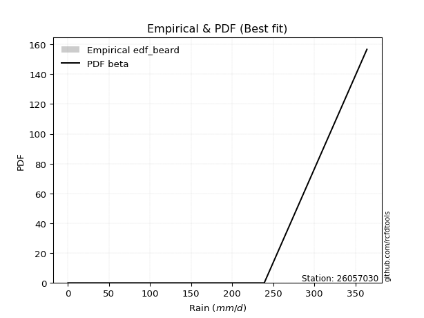</img>

</div>


### 5. Empirical - EDF Chegodayev (1955)

The Chegodayev formula is an empirical plotting position formula used in hydrological frequency analysis to estimate the exceedance probability or return period of a specific event from a set of observed data. It is primarily used for plotting observed data points on probability paper to fit a theoretical distribution, particularly for analyzing extreme events like maximum flood flows or rainfall intensities. The constant _b_ value in the generalized plotting position formula is 0.3.

<div align="center">


$P=(m-b)/(n+1-2b)$


</div>


**5.1. Empirical values**

<div align="center">

|                | 0                   | 1                  | 2                  | 3                  | 4                 | 5                 |
|:---------------|:--------------------|:-------------------|:-------------------|:-------------------|:------------------|:------------------|
| date           | 2017                | 2019               | 2018               | 2022               | 2020              | 2021              |
| x              | 0.1                 | 47.8               | 77.6               | 233.0              | 239.0             | 364.0             |
| m              | 1                   | 2                  | 3                  | 4                  | 5                 | 6                 |
| empirical_dist | edf_chegodayev      | edf_chegodayev     | edf_chegodayev     | edf_chegodayev     | edf_chegodayev    | edf_chegodayev    |
| empirical      | 0.10937499999999999 | 0.265625           | 0.421875           | 0.578125           | 0.734375          | 0.890625          |
| empirical_tr   | 1.1228070175438596  | 1.3617021276595744 | 1.7297297297297298 | 2.3703703703703702 | 3.764705882352941 | 9.142857142857142 |

</div>


**5.2. Kolmogorov-Smirnov fit test (sorted by Δ)**


<div align="center">

|                | 0                   | 1                   | 2                  | 3                   | 4                   | 5                  | 6                   | 7                   | 8                   | 9                   | 10                 | 11                  | 12                 | 13                  | 14                  | 15                  | 16                 | 17                  | 18                  | 19                  | 20                  | 21                  | 22                 | 23                  | 24                 | 25                  | 26                  | 27                  | 28                  | 29                  | 30                  | 31                 | 32                  | 33                  | 34                    | 35                  | 36                  | 37                 | 38                  | 39                  | 40                  | 41                 | 42                  | 43                 | 44                 | 45                 | 46                 | 47                  | 48                 | 49                 | 50                 | 51                 | 52                 | 53                  | 54                  | 55                 | 56                 | 57                 | 58                  | 59                 | 60                 | 61                  | 62                 | 63                  | 64                  | 65                | 66                 | 67                 | 68                  | 69                 | 70                 | 71                  | 72                 | 73                 | 74                  | 75                  | 76                  | 77                  | 78                  | 79                  | 80                 | 81                 | 82                 | 83                 | 84                 | 85                | 86                | 87                | 88               | 89             |
|:---------------|:--------------------|:--------------------|:-------------------|:--------------------|:--------------------|:-------------------|:--------------------|:--------------------|:--------------------|:--------------------|:-------------------|:--------------------|:-------------------|:--------------------|:--------------------|:--------------------|:-------------------|:--------------------|:--------------------|:--------------------|:--------------------|:--------------------|:-------------------|:--------------------|:-------------------|:--------------------|:--------------------|:--------------------|:--------------------|:--------------------|:--------------------|:-------------------|:--------------------|:--------------------|:----------------------|:--------------------|:--------------------|:-------------------|:--------------------|:--------------------|:--------------------|:-------------------|:--------------------|:-------------------|:-------------------|:-------------------|:-------------------|:--------------------|:-------------------|:-------------------|:-------------------|:-------------------|:-------------------|:--------------------|:--------------------|:-------------------|:-------------------|:-------------------|:--------------------|:-------------------|:-------------------|:--------------------|:-------------------|:--------------------|:--------------------|:------------------|:-------------------|:-------------------|:--------------------|:-------------------|:-------------------|:--------------------|:-------------------|:-------------------|:--------------------|:--------------------|:--------------------|:--------------------|:--------------------|:--------------------|:-------------------|:-------------------|:-------------------|:-------------------|:-------------------|:------------------|:------------------|:------------------|:-----------------|:---------------|
| station        | 26057030            | 26057030            | 26057030           | 26057030            | 26057030            | 26057030           | 26057030            | 26057030            | 26057030            | 26057030            | 26057030           | 26057030            | 26057030           | 26057030            | 26057030            | 26057030            | 26057030           | 26057030            | 26057030            | 26057030            | 26057030            | 26057030            | 26057030           | 26057030            | 26057030           | 26057030            | 26057030            | 26057030            | 26057030            | 26057030            | 26057030            | 26057030           | 26057030            | 26057030            | 26057030              | 26057030            | 26057030            | 26057030           | 26057030            | 26057030            | 26057030            | 26057030           | 26057030            | 26057030           | 26057030           | 26057030           | 26057030           | 26057030            | 26057030           | 26057030           | 26057030           | 26057030           | 26057030           | 26057030            | 26057030            | 26057030           | 26057030           | 26057030           | 26057030            | 26057030           | 26057030           | 26057030            | 26057030           | 26057030            | 26057030            | 26057030          | 26057030           | 26057030           | 26057030            | 26057030           | 26057030           | 26057030            | 26057030           | 26057030           | 26057030            | 26057030            | 26057030            | 26057030            | 26057030            | 26057030            | 26057030           | 26057030           | 26057030           | 26057030           | 26057030           | 26057030          | 26057030          | 26057030          | 26057030         | 26057030       |
| empirical_dist | edf_chegodayev      | edf_chegodayev      | edf_chegodayev     | edf_chegodayev      | edf_chegodayev      | edf_chegodayev     | edf_chegodayev      | edf_chegodayev      | edf_chegodayev      | edf_chegodayev      | edf_chegodayev     | edf_chegodayev      | edf_chegodayev     | edf_chegodayev      | edf_chegodayev      | edf_chegodayev      | edf_chegodayev     | edf_chegodayev      | edf_chegodayev      | edf_chegodayev      | edf_chegodayev      | edf_chegodayev      | edf_chegodayev     | edf_chegodayev      | edf_chegodayev     | edf_chegodayev      | edf_chegodayev      | edf_chegodayev      | edf_chegodayev      | edf_chegodayev      | edf_chegodayev      | edf_chegodayev     | edf_chegodayev      | edf_chegodayev      | edf_chegodayev        | edf_chegodayev      | edf_chegodayev      | edf_chegodayev     | edf_chegodayev      | edf_chegodayev      | edf_chegodayev      | edf_chegodayev     | edf_chegodayev      | edf_chegodayev     | edf_chegodayev     | edf_chegodayev     | edf_chegodayev     | edf_chegodayev      | edf_chegodayev     | edf_chegodayev     | edf_chegodayev     | edf_chegodayev     | edf_chegodayev     | edf_chegodayev      | edf_chegodayev      | edf_chegodayev     | edf_chegodayev     | edf_chegodayev     | edf_chegodayev      | edf_chegodayev     | edf_chegodayev     | edf_chegodayev      | edf_chegodayev     | edf_chegodayev      | edf_chegodayev      | edf_chegodayev    | edf_chegodayev     | edf_chegodayev     | edf_chegodayev      | edf_chegodayev     | edf_chegodayev     | edf_chegodayev      | edf_chegodayev     | edf_chegodayev     | edf_chegodayev      | edf_chegodayev      | edf_chegodayev      | edf_chegodayev      | edf_chegodayev      | edf_chegodayev      | edf_chegodayev     | edf_chegodayev     | edf_chegodayev     | edf_chegodayev     | edf_chegodayev     | edf_chegodayev    | edf_chegodayev    | edf_chegodayev    | edf_chegodayev   | edf_chegodayev |
| p_dist         | ncf                 | weibull_min         | logpearson3        | betaprime           | maxwell             | pearson3           | rayleigh            | johnsonsu           | rice                | exponnorm           | crystalball        | norm                | gompertz           | halfnorm            | truncnorm           | loggumbel_l         | genlogistic        | fisk                | kstwobign           | alpha               | gumbel_r            | logistic            | genexpon           | laplace_asymmetric  | expon              | invgauss            | halflogistic        | logt                | moyal               | hypsecant           | gumbel_l            | chi2               | laplace             | logloggamma         | loglaplace_asymmetric | lognct              | logexponnorm        | logcrystalball     | lognorm             | lognorm             | logrice             | lognakagami        | loglogistic         | loghypsecant       | loglaplace         | wald               | logtruncnorm       | logerlang           | loginvgamma        | loggamma           | loggamma           | logalpha           | nakagami           | erlang              | loginvweibull       | loginvgauss        | logmaxwell         | lograyleigh        | f                   | gamma              | t                  | loggenexpon         | logkstwobign       | loggumbel_r         | loghalfnorm         | gibrat            | logfisk            | logmoyal           | loghalflogistic     | pareto             | nct                | logexpon            | logncf             | logwald            | logpareto           | invweibull          | loggibrat           | fatiguelife         | logf                | mielke              | loglognorm         | logweibull_min     | logbetaprime       | logfatiguelife     | logmielke          | logjohnsonsu      | logchi2           | invgamma          | loggompertz      | loggenlogistic |
| delta          | 0.11206697840202007 | 0.14021767813279173 | 0.1418281465737502 | 0.14412079804579425 | 0.15118361200451802 | 0.1548487570922661 | 0.15525377030620335 | 0.16101689536028735 | 0.16216752291137393 | 0.16246963440954654 | 0.1628220867139828 | 0.16282208911622287 | 0.1650372322369682 | 0.16792065132238065 | 0.16960652676228882 | 0.17531411393439533 | 0.1788612059920417 | 0.17892523157450824 | 0.17941651117588786 | 0.18375170679494535 | 0.18473239142436526 | 0.18541752686570506 | 0.1859996919213629 | 0.18819952084600522 | 0.1883022365677891 | 0.19303300468205298 | 0.19410371931194015 | 0.19979520098431905 | 0.20007223025078535 | 0.20056624387290298 | 0.20450080418240896 | 0.2109914403496116 | 0.22140849848487362 | 0.23032722727391464 | 0.2305547576255248    | 0.24478824205149097 | 0.24527922960495907 | 0.2452810612046349 | 0.24528106563021135 | 0.24528106563021135 | 0.24528189427493197 | 0.2460344441186868 | 0.24677016776911975 | 0.2480412287652205 | 0.2533389161687478 | 0.2552897600380245 | 0.2562257456511725 | 0.25632637290367544 | 0.2565488763473134 | 0.2566751958259953 | 0.2566751958259953 | 0.2586963515274159 | 0.2656249989699083 | 0.27355402103113335 | 0.27551697544867393 | 0.2762707003358953 | 0.2778632165012275 | 0.2886300588741484 | 0.29547033702416003 | 0.2960748264528763 | 0.3053733286173169 | 0.30928649549742304 | 0.3142033079728026 | 0.31589347833168246 | 0.31894056101622303 | 0.337818444594269 | 0.3378461047090505 | 0.3416332678194842 | 0.34451139506140416 | 0.3542351393126846 | 0.3702492125713124 | 0.37111052637486563 | 0.4096601284594009 | 0.4131610819974021 | 0.42299375228841085 | 0.43386533877883304 | 0.43812019385446177 | 0.44738317605526157 | 0.47471871751759687 | 0.48893059724493093 | 0.5772565285506608 | 0.5895038718588086 | 0.5899524282402189 | 0.6041333440160904 | 0.6526394333778182 | 0.684861746575583 | 0.710997454063125 | 0.732542115497957 | 0.73421079167043 | 0.734375       |
| deltao         | 0.530385761606      | 0.530385761606      | 0.530385761606     | 0.530385761606      | 0.530385761606      | 0.530385761606     | 0.530385761606      | 0.530385761606      | 0.530385761606      | 0.530385761606      | 0.530385761606     | 0.530385761606      | 0.530385761606     | 0.530385761606      | 0.530385761606      | 0.530385761606      | 0.530385761606     | 0.530385761606      | 0.530385761606      | 0.530385761606      | 0.530385761606      | 0.530385761606      | 0.530385761606     | 0.530385761606      | 0.530385761606     | 0.530385761606      | 0.530385761606      | 0.530385761606      | 0.530385761606      | 0.530385761606      | 0.530385761606      | 0.530385761606     | 0.530385761606      | 0.530385761606      | 0.530385761606        | 0.530385761606      | 0.530385761606      | 0.530385761606     | 0.530385761606      | 0.530385761606      | 0.530385761606      | 0.530385761606     | 0.530385761606      | 0.530385761606     | 0.530385761606     | 0.530385761606     | 0.530385761606     | 0.530385761606      | 0.530385761606     | 0.530385761606     | 0.530385761606     | 0.530385761606     | 0.530385761606     | 0.530385761606      | 0.530385761606      | 0.530385761606     | 0.530385761606     | 0.530385761606     | 0.530385761606      | 0.530385761606     | 0.530385761606     | 0.530385761606      | 0.530385761606     | 0.530385761606      | 0.530385761606      | 0.530385761606    | 0.530385761606     | 0.530385761606     | 0.530385761606      | 0.530385761606     | 0.530385761606     | 0.530385761606      | 0.530385761606     | 0.530385761606     | 0.530385761606      | 0.530385761606      | 0.530385761606      | 0.530385761606      | 0.530385761606      | 0.530385761606      | 0.530385761606     | 0.530385761606     | 0.530385761606     | 0.530385761606     | 0.530385761606     | 0.530385761606    | 0.530385761606    | 0.530385761606    | 0.530385761606   | 0.530385761606 |
| eval           | Δo > Δ              | Δo > Δ              | Δo > Δ             | Δo > Δ              | Δo > Δ              | Δo > Δ             | Δo > Δ              | Δo > Δ              | Δo > Δ              | Δo > Δ              | Δo > Δ             | Δo > Δ              | Δo > Δ             | Δo > Δ              | Δo > Δ              | Δo > Δ              | Δo > Δ             | Δo > Δ              | Δo > Δ              | Δo > Δ              | Δo > Δ              | Δo > Δ              | Δo > Δ             | Δo > Δ              | Δo > Δ             | Δo > Δ              | Δo > Δ              | Δo > Δ              | Δo > Δ              | Δo > Δ              | Δo > Δ              | Δo > Δ             | Δo > Δ              | Δo > Δ              | Δo > Δ                | Δo > Δ              | Δo > Δ              | Δo > Δ             | Δo > Δ              | Δo > Δ              | Δo > Δ              | Δo > Δ             | Δo > Δ              | Δo > Δ             | Δo > Δ             | Δo > Δ             | Δo > Δ             | Δo > Δ              | Δo > Δ             | Δo > Δ             | Δo > Δ             | Δo > Δ             | Δo > Δ             | Δo > Δ              | Δo > Δ              | Δo > Δ             | Δo > Δ             | Δo > Δ             | Δo > Δ              | Δo > Δ             | Δo > Δ             | Δo > Δ              | Δo > Δ             | Δo > Δ              | Δo > Δ              | Δo > Δ            | Δo > Δ             | Δo > Δ             | Δo > Δ              | Δo > Δ             | Δo > Δ             | Δo > Δ              | Δo > Δ             | Δo > Δ             | Δo > Δ              | Δo > Δ              | Δo > Δ              | Δo > Δ              | Δo > Δ              | Δo > Δ              | Δo <= Δ            | Δo <= Δ            | Δo <= Δ            | Δo <= Δ            | Δo <= Δ            | Δo <= Δ           | Δo <= Δ           | Δo <= Δ           | Δo <= Δ          | Δo <= Δ        |
| fit            | 1                   | 1                   | 1                  | 1                   | 1                   | 1                  | 1                   | 1                   | 1                   | 1                   | 1                  | 1                   | 1                  | 1                   | 1                   | 1                   | 1                  | 1                   | 1                   | 1                   | 1                   | 1                   | 1                  | 1                   | 1                  | 1                   | 1                   | 1                   | 1                   | 1                   | 1                   | 1                  | 1                   | 1                   | 1                     | 1                   | 1                   | 1                  | 1                   | 1                   | 1                   | 1                  | 1                   | 1                  | 1                  | 1                  | 1                  | 1                   | 1                  | 1                  | 1                  | 1                  | 1                  | 1                   | 1                   | 1                  | 1                  | 1                  | 1                   | 1                  | 1                  | 1                   | 1                  | 1                   | 1                   | 1                 | 1                  | 1                  | 1                   | 1                  | 1                  | 1                   | 1                  | 1                  | 1                   | 1                   | 1                   | 1                   | 1                   | 1                   | 0                  | 0                  | 0                  | 0                  | 0                  | 0                 | 0                 | 0                 | 0                | 0              |
| n              | 6                   | 6                   | 6                  | 6                   | 6                   | 6                  | 6                   | 6                   | 6                   | 6                   | 6                  | 6                   | 6                  | 6                   | 6                   | 6                   | 6                  | 6                   | 6                   | 6                   | 6                   | 6                   | 6                  | 6                   | 6                  | 6                   | 6                   | 6                   | 6                   | 6                   | 6                   | 6                  | 6                   | 6                   | 6                     | 6                   | 6                   | 6                  | 6                   | 6                   | 6                   | 6                  | 6                   | 6                  | 6                  | 6                  | 6                  | 6                   | 6                  | 6                  | 6                  | 6                  | 6                  | 6                   | 6                   | 6                  | 6                  | 6                  | 6                   | 6                  | 6                  | 6                   | 6                  | 6                   | 6                   | 6                 | 6                  | 6                  | 6                   | 6                  | 6                  | 6                   | 6                  | 6                  | 6                   | 6                   | 6                   | 6                   | 6                   | 6                   | 6                  | 6                  | 6                  | 6                  | 6                  | 6                 | 6                 | 6                 | 6                | 6              |
| best_fit       | 1                   | 0                   | 0                  | 0                   | 0                   | 0                  | 0                   | 0                   | 0                   | 0                   | 0                  | 0                   | 0                  | 0                   | 0                   | 0                   | 0                  | 0                   | 0                   | 0                   | 0                   | 0                   | 0                  | 0                   | 0                  | 0                   | 0                   | 0                   | 0                   | 0                   | 0                   | 0                  | 0                   | 0                   | 0                     | 0                   | 0                   | 0                  | 0                   | 0                   | 0                   | 0                  | 0                   | 0                  | 0                  | 0                  | 0                  | 0                   | 0                  | 0                  | 0                  | 0                  | 0                  | 0                   | 0                   | 0                  | 0                  | 0                  | 0                   | 0                  | 0                  | 0                   | 0                  | 0                   | 0                   | 0                 | 0                  | 0                  | 0                   | 0                  | 0                  | 0                   | 0                  | 0                  | 0                   | 0                   | 0                   | 0                   | 0                   | 0                   | 0                  | 0                  | 0                  | 0                  | 0                  | 0                 | 0                 | 0                 | 0                | 0              |
| best_fit_sort  | 1                   | 2                   | 3                  | 4                   | 5                   | 6                  | 7                   | 8                   | 9                   | 10                  | 11                 | 12                  | 13                 | 14                  | 15                  | 16                  | 17                 | 18                  | 19                  | 20                  | 21                  | 22                  | 23                 | 24                  | 25                 | 26                  | 27                  | 28                  | 29                  | 30                  | 31                  | 32                 | 33                  | 34                  | 35                    | 36                  | 37                  | 38                 | 39                  | 40                  | 41                  | 42                 | 43                  | 44                 | 45                 | 46                 | 47                 | 48                  | 49                 | 50                 | 51                 | 52                 | 53                 | 54                  | 55                  | 56                 | 57                 | 58                 | 59                  | 60                 | 61                 | 62                  | 63                 | 64                  | 65                  | 66                | 67                 | 68                 | 69                  | 70                 | 71                 | 72                  | 73                 | 74                 | 75                  | 76                  | 77                  | 78                  | 79                  | 80                  | 81                 | 82                 | 83                 | 84                 | 85                 | 86                | 87                | 88                | 89               | 90             |

</div>


<div align="center">

</img>

</div>


**5.3. Best fit**

<div align="center">

|   id |   station | empirical_dist   | p_dist   |    delta |   deltao | eval   |   fit |   n |   best_fit |   best_fit_sort |
|-----:|----------:|:-----------------|:---------|---------:|---------:|:-------|------:|----:|-----------:|----------------:|
|    0 |  26057030 | edf_chegodayev   | ncf      | 0.112067 | 0.530386 | Δo > Δ |     1 |   6 |          1 |               1 |

</div>


<div align="center">

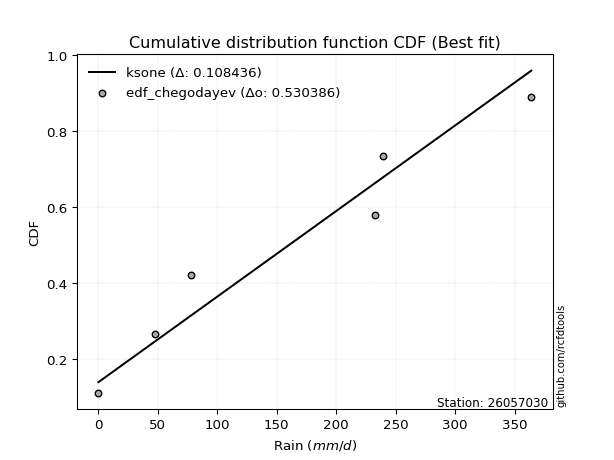</img>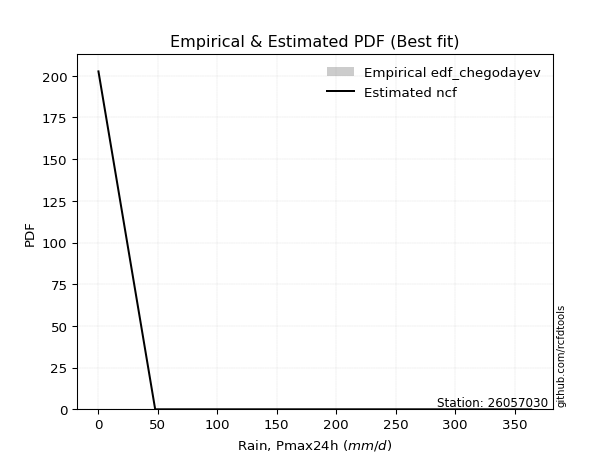</img>

</div>


### 6. Empirical - EDF Blom (1958)

The Blom formula is a specific "plotting position" formula used in hydrology and statistical analysis to estimate the empirical cumulative probability (or non-exceedance probability) of a data series. It is particularly recommended for data that are approximately normally distributed. The constant _a_ is set to 0.375 (or 3/8).

<div align="center">


$P=(m-a)/(n+1-2a)$


</div>


**6.1. Empirical values**

<div align="center">

|                | 0                  | 1                  | 2                  | 3                 | 4                 | 5                  |
|:---------------|:-------------------|:-------------------|:-------------------|:------------------|:------------------|:-------------------|
| date           | 2017               | 2019               | 2018               | 2022              | 2020              | 2021               |
| x              | 0.1                | 47.8               | 77.6               | 233.0             | 239.0             | 364.0              |
| m              | 1                  | 2                  | 3                  | 4                 | 5                 | 6                  |
| empirical_dist | edf_blom           | edf_blom           | edf_blom           | edf_blom          | edf_blom          | edf_blom           |
| empirical      | 0.1                | 0.26               | 0.42               | 0.58              | 0.74              | 0.9                |
| empirical_tr   | 1.1111111111111112 | 1.3513513513513513 | 1.7241379310344827 | 2.380952380952381 | 3.846153846153846 | 10.000000000000002 |

</div>


**6.2. Kolmogorov-Smirnov fit test (sorted by Δ)**


<div align="center">

|                | 0                   | 1                   | 2                  | 3                   | 4                   | 5                  | 6                   | 7                   | 8                  | 9                   | 10                  | 11                  | 12                  | 13                 | 14                  | 15                  | 16                 | 17                  | 18                 | 19                 | 20                  | 21                  | 22                  | 23                  | 24                  | 25                  | 26                 | 27                  | 28                 | 29                  | 30                  | 31                  | 32                 | 33                  | 34                    | 35                 | 36                  | 37                  | 38                 | 39                  | 40                  | 41                  | 42                 | 43                  | 44                 | 45                 | 46                  | 47                 | 48                  | 49                 | 50                 | 51                 | 52                  | 53                 | 54                 | 55                 | 56                  | 57                  | 58                 | 59               | 60                 | 61                  | 62                 | 63                  | 64                | 65                | 66                  | 67                 | 68                  | 69                  | 70                  | 71                 | 72                 | 73                 | 74                  | 75                  | 76                  | 77                  | 78                  | 79                 | 80                 | 81                 | 82                 | 83                 | 84                 | 85                | 86                | 87                | 88               | 89             |
|:---------------|:--------------------|:--------------------|:-------------------|:--------------------|:--------------------|:-------------------|:--------------------|:--------------------|:-------------------|:--------------------|:--------------------|:--------------------|:--------------------|:-------------------|:--------------------|:--------------------|:-------------------|:--------------------|:-------------------|:-------------------|:--------------------|:--------------------|:--------------------|:--------------------|:--------------------|:--------------------|:-------------------|:--------------------|:-------------------|:--------------------|:--------------------|:--------------------|:-------------------|:--------------------|:----------------------|:-------------------|:--------------------|:--------------------|:-------------------|:--------------------|:--------------------|:--------------------|:-------------------|:--------------------|:-------------------|:-------------------|:--------------------|:-------------------|:--------------------|:-------------------|:-------------------|:-------------------|:--------------------|:-------------------|:-------------------|:-------------------|:--------------------|:--------------------|:-------------------|:-----------------|:-------------------|:--------------------|:-------------------|:--------------------|:------------------|:------------------|:--------------------|:-------------------|:--------------------|:--------------------|:--------------------|:-------------------|:-------------------|:-------------------|:--------------------|:--------------------|:--------------------|:--------------------|:--------------------|:-------------------|:-------------------|:-------------------|:-------------------|:-------------------|:-------------------|:------------------|:------------------|:------------------|:-----------------|:---------------|
| station        | 26057030            | 26057030            | 26057030           | 26057030            | 26057030            | 26057030           | 26057030            | 26057030            | 26057030           | 26057030            | 26057030            | 26057030            | 26057030            | 26057030           | 26057030            | 26057030            | 26057030           | 26057030            | 26057030           | 26057030           | 26057030            | 26057030            | 26057030            | 26057030            | 26057030            | 26057030            | 26057030           | 26057030            | 26057030           | 26057030            | 26057030            | 26057030            | 26057030           | 26057030            | 26057030              | 26057030           | 26057030            | 26057030            | 26057030           | 26057030            | 26057030            | 26057030            | 26057030           | 26057030            | 26057030           | 26057030           | 26057030            | 26057030           | 26057030            | 26057030           | 26057030           | 26057030           | 26057030            | 26057030           | 26057030           | 26057030           | 26057030            | 26057030            | 26057030           | 26057030         | 26057030           | 26057030            | 26057030           | 26057030            | 26057030          | 26057030          | 26057030            | 26057030           | 26057030            | 26057030            | 26057030            | 26057030           | 26057030           | 26057030           | 26057030            | 26057030            | 26057030            | 26057030            | 26057030            | 26057030           | 26057030           | 26057030           | 26057030           | 26057030           | 26057030           | 26057030          | 26057030          | 26057030          | 26057030         | 26057030       |
| empirical_dist | edf_blom            | edf_blom            | edf_blom           | edf_blom            | edf_blom            | edf_blom           | edf_blom            | edf_blom            | edf_blom           | edf_blom            | edf_blom            | edf_blom            | edf_blom            | edf_blom           | edf_blom            | edf_blom            | edf_blom           | edf_blom            | edf_blom           | edf_blom           | edf_blom            | edf_blom            | edf_blom            | edf_blom            | edf_blom            | edf_blom            | edf_blom           | edf_blom            | edf_blom           | edf_blom            | edf_blom            | edf_blom            | edf_blom           | edf_blom            | edf_blom              | edf_blom           | edf_blom            | edf_blom            | edf_blom           | edf_blom            | edf_blom            | edf_blom            | edf_blom           | edf_blom            | edf_blom           | edf_blom           | edf_blom            | edf_blom           | edf_blom            | edf_blom           | edf_blom           | edf_blom           | edf_blom            | edf_blom           | edf_blom           | edf_blom           | edf_blom            | edf_blom            | edf_blom           | edf_blom         | edf_blom           | edf_blom            | edf_blom           | edf_blom            | edf_blom          | edf_blom          | edf_blom            | edf_blom           | edf_blom            | edf_blom            | edf_blom            | edf_blom           | edf_blom           | edf_blom           | edf_blom            | edf_blom            | edf_blom            | edf_blom            | edf_blom            | edf_blom           | edf_blom           | edf_blom           | edf_blom           | edf_blom           | edf_blom           | edf_blom          | edf_blom          | edf_blom          | edf_blom         | edf_blom       |
| p_dist         | ncf                 | weibull_min         | logpearson3        | maxwell             | pearson3            | rayleigh           | betaprime           | johnsonsu           | rice               | exponnorm           | crystalball         | norm                | gompertz            | halfnorm           | truncnorm           | genlogistic         | kstwobign          | loggumbel_l         | alpha              | gumbel_r           | logistic            | genexpon            | fisk                | laplace_asymmetric  | expon               | invgauss            | halflogistic       | logt                | moyal              | hypsecant           | gumbel_l            | chi2                | laplace            | logloggamma         | loglaplace_asymmetric | wald               | lognct              | logexponnorm        | logcrystalball     | lognorm             | lognorm             | logrice             | lognakagami        | loglogistic         | loghypsecant       | loglaplace         | nakagami            | logtruncnorm       | logerlang           | loginvgamma        | loggamma           | loggamma           | logalpha            | erlang             | loginvweibull      | loginvgauss        | logmaxwell          | gamma               | lograyleigh        | f                | t                  | loggenexpon         | logkstwobign       | loggumbel_r         | loghalfnorm       | gibrat            | logfisk             | logmoyal           | loghalflogistic     | pareto              | nct                 | logexpon           | logncf             | logwald            | logpareto           | invweibull          | loggibrat           | fatiguelife         | logf                | mielke             | loglognorm         | logweibull_min     | logbetaprime       | logfatiguelife     | logmielke          | logjohnsonsu      | logchi2           | invgamma          | loggompertz      | loggenlogistic |
| delta          | 0.11019197840202005 | 0.13834267813279177 | 0.1474531465737502 | 0.14930861200451806 | 0.15297375709226607 | 0.1533787703062034 | 0.15349579804579427 | 0.15914189536028733 | 0.1602925229113739 | 0.16059463440954652 | 0.16094708671398278 | 0.16094708911622285 | 0.16316223223696824 | 0.1660456513223807 | 0.16773152676228886 | 0.17698620599204173 | 0.1775415111758879 | 0.18093911393439532 | 0.1818767067949454 | 0.1828573914243653 | 0.18354252686570505 | 0.18412469192136294 | 0.18455023157450823 | 0.18632452084600526 | 0.18642723656778915 | 0.19115800468205302 | 0.1922287193119402 | 0.19792020098431903 | 0.1981972302507854 | 0.19869124387290296 | 0.20262580418240894 | 0.20911644034961163 | 0.2195334984848736 | 0.22845222727391468 | 0.22867975762552484   | 0.2496647600380245 | 0.25041324205149096 | 0.25090422960495906 | 0.2509060612046349 | 0.25090606563021134 | 0.25090606563021134 | 0.25090689427493196 | 0.2516594441186868 | 0.25239516776911974 | 0.2536662287652205 | 0.2589639161687478 | 0.25999999896990833 | 0.2618507456511725 | 0.26195137290367543 | 0.2621738763473134 | 0.2623001958259953 | 0.2623001958259953 | 0.26432135152741587 | 0.2716790210311334 | 0.2811419754486739 | 0.2818957003358953 | 0.28348821650122746 | 0.29419982645287635 | 0.2942550588741484 | 0.30109533702416 | 0.3068251425995079 | 0.31491149549742303 | 0.3198283079728026 | 0.32151847833168246 | 0.324565561016223 | 0.335943444594269 | 0.34722110470905054 | 0.3472582678194842 | 0.35013639506140415 | 0.35986013931268457 | 0.37587421257131237 | 0.3767355263748656 | 0.4152851284594009 | 0.4187860819974021 | 0.42861875228841084 | 0.44324033877883307 | 0.44374519385446176 | 0.45300817605526156 | 0.48034371751759686 | 0.4945555972449309 | 0.5828815285506608 | 0.5951288718588086 | 0.5955774282402189 | 0.6097583440160904 | 0.6582644333778181 | 0.690486746575583 | 0.716622454063125 | 0.738167115497957 | 0.73983579167043 | 0.74           |
| deltao         | 0.530385761606      | 0.530385761606      | 0.530385761606     | 0.530385761606      | 0.530385761606      | 0.530385761606     | 0.530385761606      | 0.530385761606      | 0.530385761606     | 0.530385761606      | 0.530385761606      | 0.530385761606      | 0.530385761606      | 0.530385761606     | 0.530385761606      | 0.530385761606      | 0.530385761606     | 0.530385761606      | 0.530385761606     | 0.530385761606     | 0.530385761606      | 0.530385761606      | 0.530385761606      | 0.530385761606      | 0.530385761606      | 0.530385761606      | 0.530385761606     | 0.530385761606      | 0.530385761606     | 0.530385761606      | 0.530385761606      | 0.530385761606      | 0.530385761606     | 0.530385761606      | 0.530385761606        | 0.530385761606     | 0.530385761606      | 0.530385761606      | 0.530385761606     | 0.530385761606      | 0.530385761606      | 0.530385761606      | 0.530385761606     | 0.530385761606      | 0.530385761606     | 0.530385761606     | 0.530385761606      | 0.530385761606     | 0.530385761606      | 0.530385761606     | 0.530385761606     | 0.530385761606     | 0.530385761606      | 0.530385761606     | 0.530385761606     | 0.530385761606     | 0.530385761606      | 0.530385761606      | 0.530385761606     | 0.530385761606   | 0.530385761606     | 0.530385761606      | 0.530385761606     | 0.530385761606      | 0.530385761606    | 0.530385761606    | 0.530385761606      | 0.530385761606     | 0.530385761606      | 0.530385761606      | 0.530385761606      | 0.530385761606     | 0.530385761606     | 0.530385761606     | 0.530385761606      | 0.530385761606      | 0.530385761606      | 0.530385761606      | 0.530385761606      | 0.530385761606     | 0.530385761606     | 0.530385761606     | 0.530385761606     | 0.530385761606     | 0.530385761606     | 0.530385761606    | 0.530385761606    | 0.530385761606    | 0.530385761606   | 0.530385761606 |
| eval           | Δo > Δ              | Δo > Δ              | Δo > Δ             | Δo > Δ              | Δo > Δ              | Δo > Δ             | Δo > Δ              | Δo > Δ              | Δo > Δ             | Δo > Δ              | Δo > Δ              | Δo > Δ              | Δo > Δ              | Δo > Δ             | Δo > Δ              | Δo > Δ              | Δo > Δ             | Δo > Δ              | Δo > Δ             | Δo > Δ             | Δo > Δ              | Δo > Δ              | Δo > Δ              | Δo > Δ              | Δo > Δ              | Δo > Δ              | Δo > Δ             | Δo > Δ              | Δo > Δ             | Δo > Δ              | Δo > Δ              | Δo > Δ              | Δo > Δ             | Δo > Δ              | Δo > Δ                | Δo > Δ             | Δo > Δ              | Δo > Δ              | Δo > Δ             | Δo > Δ              | Δo > Δ              | Δo > Δ              | Δo > Δ             | Δo > Δ              | Δo > Δ             | Δo > Δ             | Δo > Δ              | Δo > Δ             | Δo > Δ              | Δo > Δ             | Δo > Δ             | Δo > Δ             | Δo > Δ              | Δo > Δ             | Δo > Δ             | Δo > Δ             | Δo > Δ              | Δo > Δ              | Δo > Δ             | Δo > Δ           | Δo > Δ             | Δo > Δ              | Δo > Δ             | Δo > Δ              | Δo > Δ            | Δo > Δ            | Δo > Δ              | Δo > Δ             | Δo > Δ              | Δo > Δ              | Δo > Δ              | Δo > Δ             | Δo > Δ             | Δo > Δ             | Δo > Δ              | Δo > Δ              | Δo > Δ              | Δo > Δ              | Δo > Δ              | Δo > Δ             | Δo <= Δ            | Δo <= Δ            | Δo <= Δ            | Δo <= Δ            | Δo <= Δ            | Δo <= Δ           | Δo <= Δ           | Δo <= Δ           | Δo <= Δ          | Δo <= Δ        |
| fit            | 1                   | 1                   | 1                  | 1                   | 1                   | 1                  | 1                   | 1                   | 1                  | 1                   | 1                   | 1                   | 1                   | 1                  | 1                   | 1                   | 1                  | 1                   | 1                  | 1                  | 1                   | 1                   | 1                   | 1                   | 1                   | 1                   | 1                  | 1                   | 1                  | 1                   | 1                   | 1                   | 1                  | 1                   | 1                     | 1                  | 1                   | 1                   | 1                  | 1                   | 1                   | 1                   | 1                  | 1                   | 1                  | 1                  | 1                   | 1                  | 1                   | 1                  | 1                  | 1                  | 1                   | 1                  | 1                  | 1                  | 1                   | 1                   | 1                  | 1                | 1                  | 1                   | 1                  | 1                   | 1                 | 1                 | 1                   | 1                  | 1                   | 1                   | 1                   | 1                  | 1                  | 1                  | 1                   | 1                   | 1                   | 1                   | 1                   | 1                  | 0                  | 0                  | 0                  | 0                  | 0                  | 0                 | 0                 | 0                 | 0                | 0              |
| n              | 6                   | 6                   | 6                  | 6                   | 6                   | 6                  | 6                   | 6                   | 6                  | 6                   | 6                   | 6                   | 6                   | 6                  | 6                   | 6                   | 6                  | 6                   | 6                  | 6                  | 6                   | 6                   | 6                   | 6                   | 6                   | 6                   | 6                  | 6                   | 6                  | 6                   | 6                   | 6                   | 6                  | 6                   | 6                     | 6                  | 6                   | 6                   | 6                  | 6                   | 6                   | 6                   | 6                  | 6                   | 6                  | 6                  | 6                   | 6                  | 6                   | 6                  | 6                  | 6                  | 6                   | 6                  | 6                  | 6                  | 6                   | 6                   | 6                  | 6                | 6                  | 6                   | 6                  | 6                   | 6                 | 6                 | 6                   | 6                  | 6                   | 6                   | 6                   | 6                  | 6                  | 6                  | 6                   | 6                   | 6                   | 6                   | 6                   | 6                  | 6                  | 6                  | 6                  | 6                  | 6                  | 6                 | 6                 | 6                 | 6                | 6              |
| best_fit       | 1                   | 0                   | 0                  | 0                   | 0                   | 0                  | 0                   | 0                   | 0                  | 0                   | 0                   | 0                   | 0                   | 0                  | 0                   | 0                   | 0                  | 0                   | 0                  | 0                  | 0                   | 0                   | 0                   | 0                   | 0                   | 0                   | 0                  | 0                   | 0                  | 0                   | 0                   | 0                   | 0                  | 0                   | 0                     | 0                  | 0                   | 0                   | 0                  | 0                   | 0                   | 0                   | 0                  | 0                   | 0                  | 0                  | 0                   | 0                  | 0                   | 0                  | 0                  | 0                  | 0                   | 0                  | 0                  | 0                  | 0                   | 0                   | 0                  | 0                | 0                  | 0                   | 0                  | 0                   | 0                 | 0                 | 0                   | 0                  | 0                   | 0                   | 0                   | 0                  | 0                  | 0                  | 0                   | 0                   | 0                   | 0                   | 0                   | 0                  | 0                  | 0                  | 0                  | 0                  | 0                  | 0                 | 0                 | 0                 | 0                | 0              |
| best_fit_sort  | 1                   | 2                   | 3                  | 4                   | 5                   | 6                  | 7                   | 8                   | 9                  | 10                  | 11                  | 12                  | 13                  | 14                 | 15                  | 16                  | 17                 | 18                  | 19                 | 20                 | 21                  | 22                  | 23                  | 24                  | 25                  | 26                  | 27                 | 28                  | 29                 | 30                  | 31                  | 32                  | 33                 | 34                  | 35                    | 36                 | 37                  | 38                  | 39                 | 40                  | 41                  | 42                  | 43                 | 44                  | 45                 | 46                 | 47                  | 48                 | 49                  | 50                 | 51                 | 52                 | 53                  | 54                 | 55                 | 56                 | 57                  | 58                  | 59                 | 60               | 61                 | 62                  | 63                 | 64                  | 65                | 66                | 67                  | 68                 | 69                  | 70                  | 71                  | 72                 | 73                 | 74                 | 75                  | 76                  | 77                  | 78                  | 79                  | 80                 | 81                 | 82                 | 83                 | 84                 | 85                 | 86                | 87                | 88                | 89               | 90             |

</div>


<div align="center">

</img>

</div>


**6.3. Best fit**

<div align="center">

|   id |   station | empirical_dist   | p_dist   |    delta |   deltao | eval   |   fit |   n |   best_fit |   best_fit_sort |
|-----:|----------:|:-----------------|:---------|---------:|---------:|:-------|------:|----:|-----------:|----------------:|
|    0 |  26057030 | edf_blom         | ncf      | 0.110192 | 0.530386 | Δo > Δ |     1 |   6 |          1 |               1 |

</div>


<div align="center">

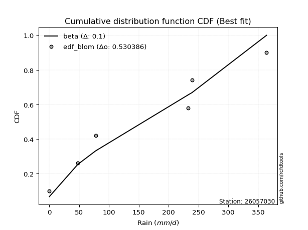</img>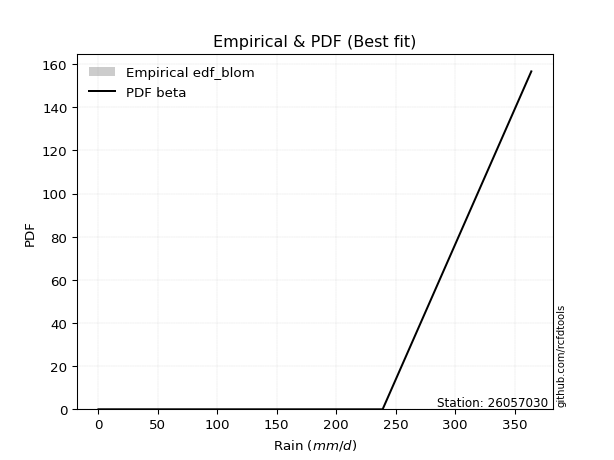</img>

</div>


### 7. Empirical - EDF Tukey (1962)

In hydrology, the Tukey formula is used as a plotting position formula to estimate the empirical probability or frequency of a flood event (or other hydrological data). The formula parameter is given as _c=0.333_ (or 1/3).

<div align="center">


$P=(m-c)/(n+1-2c)$


</div>


**7.1. Empirical values**

<div align="center">

|                | 0                   | 1                  | 2                   | 3                  | 4                  | 5                  |
|:---------------|:--------------------|:-------------------|:--------------------|:-------------------|:-------------------|:-------------------|
| date           | 2017                | 2019               | 2018                | 2022               | 2020               | 2021               |
| x              | 0.1                 | 47.8               | 77.6                | 233.0              | 239.0              | 364.0              |
| m              | 1                   | 2                  | 3                   | 4                  | 5                  | 6                  |
| empirical_dist | edf_tukey           | edf_tukey          | edf_tukey           | edf_tukey          | edf_tukey          | edf_tukey          |
| empirical      | 0.10526315789473684 | 0.2631578947368421 | 0.42105263157894735 | 0.5789473684210527 | 0.7368421052631579 | 0.8947368421052632 |
| empirical_tr   | 1.1176470588235294  | 1.357142857142857  | 1.7272727272727273  | 2.375              | 3.7999999999999994 | 9.5                |

</div>


**7.2. Kolmogorov-Smirnov fit test (sorted by Δ)**


<div align="center">

|                | 0                   | 1                   | 2                  | 3                   | 4                   | 5                   | 6                  | 7                  | 8                   | 9                   | 10                  | 11                 | 12                  | 13                | 14                  | 15                  | 16                  | 17                 | 18                  | 19                 | 20                 | 21                 | 22                  | 23                  | 24                  | 25                  | 26                 | 27                 | 28                 | 29                  | 30                 | 31                  | 32                  | 33                  | 34                    | 35                  | 36                  | 37                 | 38                  | 39                  | 40                  | 41                 | 42                  | 43                 | 44                 | 45                  | 46                 | 47                  | 48                 | 49                 | 50                 | 51                 | 52                 | 53                 | 54                  | 55                 | 56                 | 57                 | 58                  | 59                  | 60                  | 61                  | 62                 | 63                 | 64                  | 65                  | 66                 | 67                  | 68                  | 69                 | 70                 | 71                  | 72                  | 73               | 74                  | 75                 | 76                 | 77                 | 78                 | 79                  | 80                 | 81                 | 82                 | 83                 | 84                | 85                 | 86                 | 87                | 88                 | 89                 |
|:---------------|:--------------------|:--------------------|:-------------------|:--------------------|:--------------------|:--------------------|:-------------------|:-------------------|:--------------------|:--------------------|:--------------------|:-------------------|:--------------------|:------------------|:--------------------|:--------------------|:--------------------|:-------------------|:--------------------|:-------------------|:-------------------|:-------------------|:--------------------|:--------------------|:--------------------|:--------------------|:-------------------|:-------------------|:-------------------|:--------------------|:-------------------|:--------------------|:--------------------|:--------------------|:----------------------|:--------------------|:--------------------|:-------------------|:--------------------|:--------------------|:--------------------|:-------------------|:--------------------|:-------------------|:-------------------|:--------------------|:-------------------|:--------------------|:-------------------|:-------------------|:-------------------|:-------------------|:-------------------|:-------------------|:--------------------|:-------------------|:-------------------|:-------------------|:--------------------|:--------------------|:--------------------|:--------------------|:-------------------|:-------------------|:--------------------|:--------------------|:-------------------|:--------------------|:--------------------|:-------------------|:-------------------|:--------------------|:--------------------|:-----------------|:--------------------|:-------------------|:-------------------|:-------------------|:-------------------|:--------------------|:-------------------|:-------------------|:-------------------|:-------------------|:------------------|:-------------------|:-------------------|:------------------|:-------------------|:-------------------|
| station        | 26057030            | 26057030            | 26057030           | 26057030            | 26057030            | 26057030            | 26057030           | 26057030           | 26057030            | 26057030            | 26057030            | 26057030           | 26057030            | 26057030          | 26057030            | 26057030            | 26057030            | 26057030           | 26057030            | 26057030           | 26057030           | 26057030           | 26057030            | 26057030            | 26057030            | 26057030            | 26057030           | 26057030           | 26057030           | 26057030            | 26057030           | 26057030            | 26057030            | 26057030            | 26057030              | 26057030            | 26057030            | 26057030           | 26057030            | 26057030            | 26057030            | 26057030           | 26057030            | 26057030           | 26057030           | 26057030            | 26057030           | 26057030            | 26057030           | 26057030           | 26057030           | 26057030           | 26057030           | 26057030           | 26057030            | 26057030           | 26057030           | 26057030           | 26057030            | 26057030            | 26057030            | 26057030            | 26057030           | 26057030           | 26057030            | 26057030            | 26057030           | 26057030            | 26057030            | 26057030           | 26057030           | 26057030            | 26057030            | 26057030         | 26057030            | 26057030           | 26057030           | 26057030           | 26057030           | 26057030            | 26057030           | 26057030           | 26057030           | 26057030           | 26057030          | 26057030           | 26057030           | 26057030          | 26057030           | 26057030           |
| empirical_dist | edf_tukey           | edf_tukey           | edf_tukey          | edf_tukey           | edf_tukey           | edf_tukey           | edf_tukey          | edf_tukey          | edf_tukey           | edf_tukey           | edf_tukey           | edf_tukey          | edf_tukey           | edf_tukey         | edf_tukey           | edf_tukey           | edf_tukey           | edf_tukey          | edf_tukey           | edf_tukey          | edf_tukey          | edf_tukey          | edf_tukey           | edf_tukey           | edf_tukey           | edf_tukey           | edf_tukey          | edf_tukey          | edf_tukey          | edf_tukey           | edf_tukey          | edf_tukey           | edf_tukey           | edf_tukey           | edf_tukey             | edf_tukey           | edf_tukey           | edf_tukey          | edf_tukey           | edf_tukey           | edf_tukey           | edf_tukey          | edf_tukey           | edf_tukey          | edf_tukey          | edf_tukey           | edf_tukey          | edf_tukey           | edf_tukey          | edf_tukey          | edf_tukey          | edf_tukey          | edf_tukey          | edf_tukey          | edf_tukey           | edf_tukey          | edf_tukey          | edf_tukey          | edf_tukey           | edf_tukey           | edf_tukey           | edf_tukey           | edf_tukey          | edf_tukey          | edf_tukey           | edf_tukey           | edf_tukey          | edf_tukey           | edf_tukey           | edf_tukey          | edf_tukey          | edf_tukey           | edf_tukey           | edf_tukey        | edf_tukey           | edf_tukey          | edf_tukey          | edf_tukey          | edf_tukey          | edf_tukey           | edf_tukey          | edf_tukey          | edf_tukey          | edf_tukey          | edf_tukey         | edf_tukey          | edf_tukey          | edf_tukey         | edf_tukey          | edf_tukey          |
| p_dist         | ncf                 | weibull_min         | logpearson3        | betaprime           | maxwell             | pearson3            | rayleigh           | johnsonsu          | rice                | exponnorm           | crystalball         | norm               | gompertz            | halfnorm          | truncnorm           | loggumbel_l         | genlogistic         | kstwobign          | fisk                | alpha              | gumbel_r           | logistic           | genexpon            | laplace_asymmetric  | expon               | invgauss            | halflogistic       | logt               | moyal              | hypsecant           | gumbel_l           | chi2                | laplace             | logloggamma         | loglaplace_asymmetric | lognct              | logexponnorm        | logcrystalball     | lognorm             | lognorm             | logrice             | lognakagami        | loglogistic         | loghypsecant       | wald               | loglaplace          | logtruncnorm       | logerlang           | loginvgamma        | loggamma           | loggamma           | logalpha           | nakagami           | erlang             | loginvweibull       | loginvgauss        | logmaxwell         | lograyleigh        | gamma               | f                   | t                   | loggenexpon         | logkstwobign       | loggumbel_r        | loghalfnorm         | gibrat              | logfisk            | logmoyal            | loghalflogistic     | pareto             | nct                | logexpon            | logncf              | logwald          | logpareto           | invweibull         | loggibrat          | fatiguelife        | logf               | mielke              | loglognorm         | logweibull_min     | logbetaprime       | logfatiguelife     | logmielke         | logjohnsonsu       | logchi2            | invgamma          | loggompertz        | loggenlogistic     |
| delta          | 0.11124460998096741 | 0.13939530971173908 | 0.1442952518369081 | 0.14823264015105742 | 0.15036124358346536 | 0.15402638867121343 | 0.1544314018851507 | 0.1601945269392347 | 0.16134515449032127 | 0.16164726598849388 | 0.16199971829293014 | 0.1619997206951702 | 0.16421486381591555 | 0.167098282901328 | 0.16878415834123617 | 0.17778121919755324 | 0.17803883757098904 | 0.1785941427548352 | 0.18139233683766615 | 0.1829293383738927 | 0.1839100230033126 | 0.1845951584446524 | 0.18517732350031024 | 0.18737715242495256 | 0.18747986814673645 | 0.19221063626100032 | 0.1932813508908875 | 0.1989728325632664 | 0.1992498618297327 | 0.19974387545185032 | 0.2036784357613563 | 0.21016907192855894 | 0.22058613006382097 | 0.22950485885286198 | 0.22973238920447214   | 0.24725534731464888 | 0.24774633486811698 | 0.2477481664677928 | 0.24774817089336926 | 0.24774817089336926 | 0.24774899953808988 | 0.2485015493818447 | 0.24923727303227766 | 0.2505083340283784 | 0.2528226547748666 | 0.25580602143190573 | 0.2586928509143304 | 0.25879347816683335 | 0.2590159816104713 | 0.2591423010891532 | 0.2591423010891532 | 0.2611634567905738 | 0.2631578937067504 | 0.2727316526100807 | 0.27798408071183184 | 0.2787378055990532 | 0.2803303217643854 | 0.2910971641373063 | 0.29525245803182365 | 0.29793744228731794 | 0.30455096019626426 | 0.31175360076058095 | 0.3166704132359605 | 0.3183605835948404 | 0.32140766627938094 | 0.33699607617321636 | 0.3419579468143137 | 0.34410037308264213 | 0.34697850032456207 | 0.3567022445758425 | 0.3727163178344703 | 0.37357763163802354 | 0.41212723372255883 | 0.41562818726056 | 0.42546085755156876 | 0.4379771808840962 | 0.4405872991176197 | 0.4498502813184195 | 0.4771858227807548 | 0.49139770250808884 | 0.5797236338138188 | 0.5919709771219666 | 0.5924195335033768 | 0.6066004492792483 | 0.655106538640976 | 0.6873288518387408 | 0.7134645593262829 | 0.735009220761115 | 0.7366778969335879 | 0.7368421052631579 |
| deltao         | 0.530385761606      | 0.530385761606      | 0.530385761606     | 0.530385761606      | 0.530385761606      | 0.530385761606      | 0.530385761606     | 0.530385761606     | 0.530385761606      | 0.530385761606      | 0.530385761606      | 0.530385761606     | 0.530385761606      | 0.530385761606    | 0.530385761606      | 0.530385761606      | 0.530385761606      | 0.530385761606     | 0.530385761606      | 0.530385761606     | 0.530385761606     | 0.530385761606     | 0.530385761606      | 0.530385761606      | 0.530385761606      | 0.530385761606      | 0.530385761606     | 0.530385761606     | 0.530385761606     | 0.530385761606      | 0.530385761606     | 0.530385761606      | 0.530385761606      | 0.530385761606      | 0.530385761606        | 0.530385761606      | 0.530385761606      | 0.530385761606     | 0.530385761606      | 0.530385761606      | 0.530385761606      | 0.530385761606     | 0.530385761606      | 0.530385761606     | 0.530385761606     | 0.530385761606      | 0.530385761606     | 0.530385761606      | 0.530385761606     | 0.530385761606     | 0.530385761606     | 0.530385761606     | 0.530385761606     | 0.530385761606     | 0.530385761606      | 0.530385761606     | 0.530385761606     | 0.530385761606     | 0.530385761606      | 0.530385761606      | 0.530385761606      | 0.530385761606      | 0.530385761606     | 0.530385761606     | 0.530385761606      | 0.530385761606      | 0.530385761606     | 0.530385761606      | 0.530385761606      | 0.530385761606     | 0.530385761606     | 0.530385761606      | 0.530385761606      | 0.530385761606   | 0.530385761606      | 0.530385761606     | 0.530385761606     | 0.530385761606     | 0.530385761606     | 0.530385761606      | 0.530385761606     | 0.530385761606     | 0.530385761606     | 0.530385761606     | 0.530385761606    | 0.530385761606     | 0.530385761606     | 0.530385761606    | 0.530385761606     | 0.530385761606     |
| eval           | Δo > Δ              | Δo > Δ              | Δo > Δ             | Δo > Δ              | Δo > Δ              | Δo > Δ              | Δo > Δ             | Δo > Δ             | Δo > Δ              | Δo > Δ              | Δo > Δ              | Δo > Δ             | Δo > Δ              | Δo > Δ            | Δo > Δ              | Δo > Δ              | Δo > Δ              | Δo > Δ             | Δo > Δ              | Δo > Δ             | Δo > Δ             | Δo > Δ             | Δo > Δ              | Δo > Δ              | Δo > Δ              | Δo > Δ              | Δo > Δ             | Δo > Δ             | Δo > Δ             | Δo > Δ              | Δo > Δ             | Δo > Δ              | Δo > Δ              | Δo > Δ              | Δo > Δ                | Δo > Δ              | Δo > Δ              | Δo > Δ             | Δo > Δ              | Δo > Δ              | Δo > Δ              | Δo > Δ             | Δo > Δ              | Δo > Δ             | Δo > Δ             | Δo > Δ              | Δo > Δ             | Δo > Δ              | Δo > Δ             | Δo > Δ             | Δo > Δ             | Δo > Δ             | Δo > Δ             | Δo > Δ             | Δo > Δ              | Δo > Δ             | Δo > Δ             | Δo > Δ             | Δo > Δ              | Δo > Δ              | Δo > Δ              | Δo > Δ              | Δo > Δ             | Δo > Δ             | Δo > Δ              | Δo > Δ              | Δo > Δ             | Δo > Δ              | Δo > Δ              | Δo > Δ             | Δo > Δ             | Δo > Δ              | Δo > Δ              | Δo > Δ           | Δo > Δ              | Δo > Δ             | Δo > Δ             | Δo > Δ             | Δo > Δ             | Δo > Δ              | Δo <= Δ            | Δo <= Δ            | Δo <= Δ            | Δo <= Δ            | Δo <= Δ           | Δo <= Δ            | Δo <= Δ            | Δo <= Δ           | Δo <= Δ            | Δo <= Δ            |
| fit            | 1                   | 1                   | 1                  | 1                   | 1                   | 1                   | 1                  | 1                  | 1                   | 1                   | 1                   | 1                  | 1                   | 1                 | 1                   | 1                   | 1                   | 1                  | 1                   | 1                  | 1                  | 1                  | 1                   | 1                   | 1                   | 1                   | 1                  | 1                  | 1                  | 1                   | 1                  | 1                   | 1                   | 1                   | 1                     | 1                   | 1                   | 1                  | 1                   | 1                   | 1                   | 1                  | 1                   | 1                  | 1                  | 1                   | 1                  | 1                   | 1                  | 1                  | 1                  | 1                  | 1                  | 1                  | 1                   | 1                  | 1                  | 1                  | 1                   | 1                   | 1                   | 1                   | 1                  | 1                  | 1                   | 1                   | 1                  | 1                   | 1                   | 1                  | 1                  | 1                   | 1                   | 1                | 1                   | 1                  | 1                  | 1                  | 1                  | 1                   | 0                  | 0                  | 0                  | 0                  | 0                 | 0                  | 0                  | 0                 | 0                  | 0                  |
| n              | 6                   | 6                   | 6                  | 6                   | 6                   | 6                   | 6                  | 6                  | 6                   | 6                   | 6                   | 6                  | 6                   | 6                 | 6                   | 6                   | 6                   | 6                  | 6                   | 6                  | 6                  | 6                  | 6                   | 6                   | 6                   | 6                   | 6                  | 6                  | 6                  | 6                   | 6                  | 6                   | 6                   | 6                   | 6                     | 6                   | 6                   | 6                  | 6                   | 6                   | 6                   | 6                  | 6                   | 6                  | 6                  | 6                   | 6                  | 6                   | 6                  | 6                  | 6                  | 6                  | 6                  | 6                  | 6                   | 6                  | 6                  | 6                  | 6                   | 6                   | 6                   | 6                   | 6                  | 6                  | 6                   | 6                   | 6                  | 6                   | 6                   | 6                  | 6                  | 6                   | 6                   | 6                | 6                   | 6                  | 6                  | 6                  | 6                  | 6                   | 6                  | 6                  | 6                  | 6                  | 6                 | 6                  | 6                  | 6                 | 6                  | 6                  |
| best_fit       | 1                   | 0                   | 0                  | 0                   | 0                   | 0                   | 0                  | 0                  | 0                   | 0                   | 0                   | 0                  | 0                   | 0                 | 0                   | 0                   | 0                   | 0                  | 0                   | 0                  | 0                  | 0                  | 0                   | 0                   | 0                   | 0                   | 0                  | 0                  | 0                  | 0                   | 0                  | 0                   | 0                   | 0                   | 0                     | 0                   | 0                   | 0                  | 0                   | 0                   | 0                   | 0                  | 0                   | 0                  | 0                  | 0                   | 0                  | 0                   | 0                  | 0                  | 0                  | 0                  | 0                  | 0                  | 0                   | 0                  | 0                  | 0                  | 0                   | 0                   | 0                   | 0                   | 0                  | 0                  | 0                   | 0                   | 0                  | 0                   | 0                   | 0                  | 0                  | 0                   | 0                   | 0                | 0                   | 0                  | 0                  | 0                  | 0                  | 0                   | 0                  | 0                  | 0                  | 0                  | 0                 | 0                  | 0                  | 0                 | 0                  | 0                  |
| best_fit_sort  | 1                   | 2                   | 3                  | 4                   | 5                   | 6                   | 7                  | 8                  | 9                   | 10                  | 11                  | 12                 | 13                  | 14                | 15                  | 16                  | 17                  | 18                 | 19                  | 20                 | 21                 | 22                 | 23                  | 24                  | 25                  | 26                  | 27                 | 28                 | 29                 | 30                  | 31                 | 32                  | 33                  | 34                  | 35                    | 36                  | 37                  | 38                 | 39                  | 40                  | 41                  | 42                 | 43                  | 44                 | 45                 | 46                  | 47                 | 48                  | 49                 | 50                 | 51                 | 52                 | 53                 | 54                 | 55                  | 56                 | 57                 | 58                 | 59                  | 60                  | 61                  | 62                  | 63                 | 64                 | 65                  | 66                  | 67                 | 68                  | 69                  | 70                 | 71                 | 72                  | 73                  | 74               | 75                  | 76                 | 77                 | 78                 | 79                 | 80                  | 81                 | 82                 | 83                 | 84                 | 85                | 86                 | 87                 | 88                | 89                 | 90                 |

</div>


<div align="center">

</img>

</div>


**7.3. Best fit**

<div align="center">

|   id |   station | empirical_dist   | p_dist   |    delta |   deltao | eval   |   fit |   n |   best_fit |   best_fit_sort |
|-----:|----------:|:-----------------|:---------|---------:|---------:|:-------|------:|----:|-----------:|----------------:|
|    0 |  26057030 | edf_tukey        | ncf      | 0.111245 | 0.530386 | Δo > Δ |     1 |   6 |          1 |               1 |

</div>


<div align="center">

</img>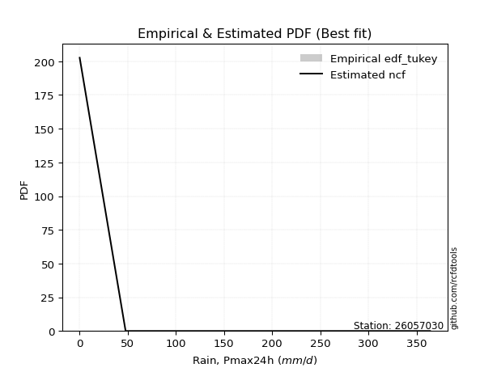</img>

</div>


### 8. Empirical - EDF Gringorten (1963)

Gringorten plotting position formula is essential for estimating the probability and return periods of extreme events like floods and heavy rainfall. The constant _a=0.44_.

<div align="center">


$P=(m-a)/(n+1-2a)$


</div>


**8.1. Empirical values**

<div align="center">

|                | 0                   | 1                  | 2                   | 3                  | 4                  | 5                  |
|:---------------|:--------------------|:-------------------|:--------------------|:-------------------|:-------------------|:-------------------|
| date           | 2017                | 2019               | 2018                | 2022               | 2020               | 2021               |
| x              | 0.1                 | 47.8               | 77.6                | 233.0              | 239.0              | 364.0              |
| m              | 1                   | 2                  | 3                   | 4                  | 5                  | 6                  |
| empirical_dist | edf_gringorten      | edf_gringorten     | edf_gringorten      | edf_gringorten     | edf_gringorten     | edf_gringorten     |
| empirical      | 0.09150326797385622 | 0.2549019607843137 | 0.41830065359477125 | 0.5816993464052288 | 0.7450980392156862 | 0.9084967320261437 |
| empirical_tr   | 1.1007194244604317  | 1.3421052631578947 | 1.7191011235955058  | 2.3906250000000004 | 3.9230769230769216 | 10.928571428571415 |

</div>


**8.2. Kolmogorov-Smirnov fit test (sorted by Δ)**


<div align="center">

|                | 0                   | 1                   | 2                   | 3                   | 4                   | 5                  | 6                  | 7                   | 8                  | 9                   | 10                  | 11                 | 12                  | 13                  | 14                  | 15                 | 16                  | 17                  | 18                  | 19                  | 20                 | 21                  | 22                 | 23                  | 24                  | 25                  | 26                  | 27                 | 28                  | 29                  | 30                 | 31                 | 32                  | 33                  | 34                    | 35                 | 36                  | 37                  | 38                  | 39                 | 40                  | 41                  | 42                  | 43                 | 44                  | 45                 | 46                 | 47                 | 48                  | 49                 | 50                 | 51                 | 52                  | 53                  | 54                 | 55                 | 56                  | 57                 | 58                 | 59                 | 60                  | 61                  | 62                 | 63                  | 64                 | 65                 | 66                 | 67                  | 68                 | 69                  | 70                 | 71                 | 72                 | 73                 | 74                  | 75                  | 76                 | 77                  | 78                  | 79                 | 80                 | 81                 | 82                 | 83                 | 84                 | 85                 | 86                 | 87                 | 88                 | 89                 |
|:---------------|:--------------------|:--------------------|:--------------------|:--------------------|:--------------------|:-------------------|:-------------------|:--------------------|:-------------------|:--------------------|:--------------------|:-------------------|:--------------------|:--------------------|:--------------------|:-------------------|:--------------------|:--------------------|:--------------------|:--------------------|:-------------------|:--------------------|:-------------------|:--------------------|:--------------------|:--------------------|:--------------------|:-------------------|:--------------------|:--------------------|:-------------------|:-------------------|:--------------------|:--------------------|:----------------------|:-------------------|:--------------------|:--------------------|:--------------------|:-------------------|:--------------------|:--------------------|:--------------------|:-------------------|:--------------------|:-------------------|:-------------------|:-------------------|:--------------------|:-------------------|:-------------------|:-------------------|:--------------------|:--------------------|:-------------------|:-------------------|:--------------------|:-------------------|:-------------------|:-------------------|:--------------------|:--------------------|:-------------------|:--------------------|:-------------------|:-------------------|:-------------------|:--------------------|:-------------------|:--------------------|:-------------------|:-------------------|:-------------------|:-------------------|:--------------------|:--------------------|:-------------------|:--------------------|:--------------------|:-------------------|:-------------------|:-------------------|:-------------------|:-------------------|:-------------------|:-------------------|:-------------------|:-------------------|:-------------------|:-------------------|
| station        | 26057030            | 26057030            | 26057030            | 26057030            | 26057030            | 26057030           | 26057030           | 26057030            | 26057030           | 26057030            | 26057030            | 26057030           | 26057030            | 26057030            | 26057030            | 26057030           | 26057030            | 26057030            | 26057030            | 26057030            | 26057030           | 26057030            | 26057030           | 26057030            | 26057030            | 26057030            | 26057030            | 26057030           | 26057030            | 26057030            | 26057030           | 26057030           | 26057030            | 26057030            | 26057030              | 26057030           | 26057030            | 26057030            | 26057030            | 26057030           | 26057030            | 26057030            | 26057030            | 26057030           | 26057030            | 26057030           | 26057030           | 26057030           | 26057030            | 26057030           | 26057030           | 26057030           | 26057030            | 26057030            | 26057030           | 26057030           | 26057030            | 26057030           | 26057030           | 26057030           | 26057030            | 26057030            | 26057030           | 26057030            | 26057030           | 26057030           | 26057030           | 26057030            | 26057030           | 26057030            | 26057030           | 26057030           | 26057030           | 26057030           | 26057030            | 26057030            | 26057030           | 26057030            | 26057030            | 26057030           | 26057030           | 26057030           | 26057030           | 26057030           | 26057030           | 26057030           | 26057030           | 26057030           | 26057030           | 26057030           |
| empirical_dist | edf_gringorten      | edf_gringorten      | edf_gringorten      | edf_gringorten      | edf_gringorten      | edf_gringorten     | edf_gringorten     | edf_gringorten      | edf_gringorten     | edf_gringorten      | edf_gringorten      | edf_gringorten     | edf_gringorten      | edf_gringorten      | edf_gringorten      | edf_gringorten     | edf_gringorten      | edf_gringorten      | edf_gringorten      | edf_gringorten      | edf_gringorten     | edf_gringorten      | edf_gringorten     | edf_gringorten      | edf_gringorten      | edf_gringorten      | edf_gringorten      | edf_gringorten     | edf_gringorten      | edf_gringorten      | edf_gringorten     | edf_gringorten     | edf_gringorten      | edf_gringorten      | edf_gringorten        | edf_gringorten     | edf_gringorten      | edf_gringorten      | edf_gringorten      | edf_gringorten     | edf_gringorten      | edf_gringorten      | edf_gringorten      | edf_gringorten     | edf_gringorten      | edf_gringorten     | edf_gringorten     | edf_gringorten     | edf_gringorten      | edf_gringorten     | edf_gringorten     | edf_gringorten     | edf_gringorten      | edf_gringorten      | edf_gringorten     | edf_gringorten     | edf_gringorten      | edf_gringorten     | edf_gringorten     | edf_gringorten     | edf_gringorten      | edf_gringorten      | edf_gringorten     | edf_gringorten      | edf_gringorten     | edf_gringorten     | edf_gringorten     | edf_gringorten      | edf_gringorten     | edf_gringorten      | edf_gringorten     | edf_gringorten     | edf_gringorten     | edf_gringorten     | edf_gringorten      | edf_gringorten      | edf_gringorten     | edf_gringorten      | edf_gringorten      | edf_gringorten     | edf_gringorten     | edf_gringorten     | edf_gringorten     | edf_gringorten     | edf_gringorten     | edf_gringorten     | edf_gringorten     | edf_gringorten     | edf_gringorten     | edf_gringorten     |
| p_dist         | ncf                 | weibull_min         | maxwell             | pearson3            | rayleigh            | logpearson3        | johnsonsu          | rice                | exponnorm          | crystalball         | norm                | gompertz           | betaprime           | halfnorm            | truncnorm           | genlogistic        | kstwobign           | alpha               | gumbel_r            | logistic            | genexpon           | laplace_asymmetric  | expon              | loggumbel_l         | invgauss            | fisk                | halflogistic        | logt               | moyal               | hypsecant           | gumbel_l           | chi2               | laplace             | logloggamma         | loglaplace_asymmetric | wald               | nakagami            | lognct              | logexponnorm        | logcrystalball     | lognorm             | lognorm             | logrice             | lognakagami        | loglogistic         | loghypsecant       | loglaplace         | logtruncnorm       | logerlang           | loginvgamma        | loggamma           | loggamma           | logalpha            | erlang              | loginvweibull      | loginvgauss        | logmaxwell          | gamma              | lograyleigh        | f                  | t                   | loggenexpon         | logkstwobign       | loggumbel_r         | loghalfnorm        | gibrat             | logmoyal           | loghalflogistic     | logfisk            | pareto              | nct                | logexpon           | logncf             | logwald            | logpareto           | loggibrat           | invweibull         | fatiguelife         | logf                | mielke             | loglognorm         | logweibull_min     | logbetaprime       | logfatiguelife     | logmielke          | logjohnsonsu       | logchi2            | invgamma           | loggompertz        | loggenlogistic     |
| delta          | 0.10849263199679132 | 0.13664333172756293 | 0.14760926559928922 | 0.15127441068703734 | 0.15167942390097455 | 0.1525511857894365 | 0.1574425489550586 | 0.15859317650614518 | 0.1588952880043178 | 0.15924774030875405 | 0.15924774271099412 | 0.1614628858317394 | 0.16199253007193792 | 0.16434630491715185 | 0.16603218035706002 | 0.1752868595868129 | 0.17584216477065906 | 0.18017736038971655 | 0.18115804501913646 | 0.18184318046047632 | 0.1824253455161341 | 0.18462517444077642 | 0.1847278901625603 | 0.18603715315008162 | 0.18945865827682418 | 0.18964827079019453 | 0.19052937290671135 | 0.1962208545790903 | 0.19649788384555655 | 0.19699189746767423 | 0.2009264577771802 | 0.2074170939443828 | 0.21783415207964488 | 0.22675288086868584 | 0.226980411220296     | 0.2445667208223382 | 0.25490195975422203 | 0.25551128126717726 | 0.25600226882064536 | 0.2560041004203212 | 0.25600410484589764 | 0.25600410484589764 | 0.25600493349061826 | 0.2567574833343731 | 0.25749320698480604 | 0.2587642679809068 | 0.2640619553844341 | 0.2669487848668588 | 0.26704941211936173 | 0.2672719155629997 | 0.2673982350416816 | 0.2673982350416816 | 0.26941939074310217 | 0.26997967462590455 | 0.2862400146643602 | 0.2869937395515816 | 0.28858625571691376 | 0.2925004800476475 | 0.2993530980898347 | 0.3061933762398463 | 0.31532187462565164 | 0.32000953471310933 | 0.3249263471884889 | 0.32661651754736876 | 0.3296636002319093 | 0.3342440981890403 | 0.3523563070351705 | 0.35523443427709045 | 0.3557178367351942 | 0.36495817852837087 | 0.3809722517869987 | 0.3818335655905519 | 0.4203831676750872 | 0.4238841212130884 | 0.43371679150409714 | 0.44884323307014806 | 0.4517370708049767 | 0.45810621527094786 | 0.48544175673328316 | 0.4996536364606172 | 0.5879795677663471 | 0.6002269110744949 | 0.6006754674559052 | 0.6148563832317767 | 0.6633624725935044 | 0.6955847857912691 | 0.7217204932788113 | 0.7432651547136433 | 0.7449338308861163 | 0.7450980392156862 |
| deltao         | 0.530385761606      | 0.530385761606      | 0.530385761606      | 0.530385761606      | 0.530385761606      | 0.530385761606     | 0.530385761606     | 0.530385761606      | 0.530385761606     | 0.530385761606      | 0.530385761606      | 0.530385761606     | 0.530385761606      | 0.530385761606      | 0.530385761606      | 0.530385761606     | 0.530385761606      | 0.530385761606      | 0.530385761606      | 0.530385761606      | 0.530385761606     | 0.530385761606      | 0.530385761606     | 0.530385761606      | 0.530385761606      | 0.530385761606      | 0.530385761606      | 0.530385761606     | 0.530385761606      | 0.530385761606      | 0.530385761606     | 0.530385761606     | 0.530385761606      | 0.530385761606      | 0.530385761606        | 0.530385761606     | 0.530385761606      | 0.530385761606      | 0.530385761606      | 0.530385761606     | 0.530385761606      | 0.530385761606      | 0.530385761606      | 0.530385761606     | 0.530385761606      | 0.530385761606     | 0.530385761606     | 0.530385761606     | 0.530385761606      | 0.530385761606     | 0.530385761606     | 0.530385761606     | 0.530385761606      | 0.530385761606      | 0.530385761606     | 0.530385761606     | 0.530385761606      | 0.530385761606     | 0.530385761606     | 0.530385761606     | 0.530385761606      | 0.530385761606      | 0.530385761606     | 0.530385761606      | 0.530385761606     | 0.530385761606     | 0.530385761606     | 0.530385761606      | 0.530385761606     | 0.530385761606      | 0.530385761606     | 0.530385761606     | 0.530385761606     | 0.530385761606     | 0.530385761606      | 0.530385761606      | 0.530385761606     | 0.530385761606      | 0.530385761606      | 0.530385761606     | 0.530385761606     | 0.530385761606     | 0.530385761606     | 0.530385761606     | 0.530385761606     | 0.530385761606     | 0.530385761606     | 0.530385761606     | 0.530385761606     | 0.530385761606     |
| eval           | Δo > Δ              | Δo > Δ              | Δo > Δ              | Δo > Δ              | Δo > Δ              | Δo > Δ             | Δo > Δ             | Δo > Δ              | Δo > Δ             | Δo > Δ              | Δo > Δ              | Δo > Δ             | Δo > Δ              | Δo > Δ              | Δo > Δ              | Δo > Δ             | Δo > Δ              | Δo > Δ              | Δo > Δ              | Δo > Δ              | Δo > Δ             | Δo > Δ              | Δo > Δ             | Δo > Δ              | Δo > Δ              | Δo > Δ              | Δo > Δ              | Δo > Δ             | Δo > Δ              | Δo > Δ              | Δo > Δ             | Δo > Δ             | Δo > Δ              | Δo > Δ              | Δo > Δ                | Δo > Δ             | Δo > Δ              | Δo > Δ              | Δo > Δ              | Δo > Δ             | Δo > Δ              | Δo > Δ              | Δo > Δ              | Δo > Δ             | Δo > Δ              | Δo > Δ             | Δo > Δ             | Δo > Δ             | Δo > Δ              | Δo > Δ             | Δo > Δ             | Δo > Δ             | Δo > Δ              | Δo > Δ              | Δo > Δ             | Δo > Δ             | Δo > Δ              | Δo > Δ             | Δo > Δ             | Δo > Δ             | Δo > Δ              | Δo > Δ              | Δo > Δ             | Δo > Δ              | Δo > Δ             | Δo > Δ             | Δo > Δ             | Δo > Δ              | Δo > Δ             | Δo > Δ              | Δo > Δ             | Δo > Δ             | Δo > Δ             | Δo > Δ             | Δo > Δ              | Δo > Δ              | Δo > Δ             | Δo > Δ              | Δo > Δ              | Δo > Δ             | Δo <= Δ            | Δo <= Δ            | Δo <= Δ            | Δo <= Δ            | Δo <= Δ            | Δo <= Δ            | Δo <= Δ            | Δo <= Δ            | Δo <= Δ            | Δo <= Δ            |
| fit            | 1                   | 1                   | 1                   | 1                   | 1                   | 1                  | 1                  | 1                   | 1                  | 1                   | 1                   | 1                  | 1                   | 1                   | 1                   | 1                  | 1                   | 1                   | 1                   | 1                   | 1                  | 1                   | 1                  | 1                   | 1                   | 1                   | 1                   | 1                  | 1                   | 1                   | 1                  | 1                  | 1                   | 1                   | 1                     | 1                  | 1                   | 1                   | 1                   | 1                  | 1                   | 1                   | 1                   | 1                  | 1                   | 1                  | 1                  | 1                  | 1                   | 1                  | 1                  | 1                  | 1                   | 1                   | 1                  | 1                  | 1                   | 1                  | 1                  | 1                  | 1                   | 1                   | 1                  | 1                   | 1                  | 1                  | 1                  | 1                   | 1                  | 1                   | 1                  | 1                  | 1                  | 1                  | 1                   | 1                   | 1                  | 1                   | 1                   | 1                  | 0                  | 0                  | 0                  | 0                  | 0                  | 0                  | 0                  | 0                  | 0                  | 0                  |
| n              | 6                   | 6                   | 6                   | 6                   | 6                   | 6                  | 6                  | 6                   | 6                  | 6                   | 6                   | 6                  | 6                   | 6                   | 6                   | 6                  | 6                   | 6                   | 6                   | 6                   | 6                  | 6                   | 6                  | 6                   | 6                   | 6                   | 6                   | 6                  | 6                   | 6                   | 6                  | 6                  | 6                   | 6                   | 6                     | 6                  | 6                   | 6                   | 6                   | 6                  | 6                   | 6                   | 6                   | 6                  | 6                   | 6                  | 6                  | 6                  | 6                   | 6                  | 6                  | 6                  | 6                   | 6                   | 6                  | 6                  | 6                   | 6                  | 6                  | 6                  | 6                   | 6                   | 6                  | 6                   | 6                  | 6                  | 6                  | 6                   | 6                  | 6                   | 6                  | 6                  | 6                  | 6                  | 6                   | 6                   | 6                  | 6                   | 6                   | 6                  | 6                  | 6                  | 6                  | 6                  | 6                  | 6                  | 6                  | 6                  | 6                  | 6                  |
| best_fit       | 1                   | 0                   | 0                   | 0                   | 0                   | 0                  | 0                  | 0                   | 0                  | 0                   | 0                   | 0                  | 0                   | 0                   | 0                   | 0                  | 0                   | 0                   | 0                   | 0                   | 0                  | 0                   | 0                  | 0                   | 0                   | 0                   | 0                   | 0                  | 0                   | 0                   | 0                  | 0                  | 0                   | 0                   | 0                     | 0                  | 0                   | 0                   | 0                   | 0                  | 0                   | 0                   | 0                   | 0                  | 0                   | 0                  | 0                  | 0                  | 0                   | 0                  | 0                  | 0                  | 0                   | 0                   | 0                  | 0                  | 0                   | 0                  | 0                  | 0                  | 0                   | 0                   | 0                  | 0                   | 0                  | 0                  | 0                  | 0                   | 0                  | 0                   | 0                  | 0                  | 0                  | 0                  | 0                   | 0                   | 0                  | 0                   | 0                   | 0                  | 0                  | 0                  | 0                  | 0                  | 0                  | 0                  | 0                  | 0                  | 0                  | 0                  |
| best_fit_sort  | 1                   | 2                   | 3                   | 4                   | 5                   | 6                  | 7                  | 8                   | 9                  | 10                  | 11                  | 12                 | 13                  | 14                  | 15                  | 16                 | 17                  | 18                  | 19                  | 20                  | 21                 | 22                  | 23                 | 24                  | 25                  | 26                  | 27                  | 28                 | 29                  | 30                  | 31                 | 32                 | 33                  | 34                  | 35                    | 36                 | 37                  | 38                  | 39                  | 40                 | 41                  | 42                  | 43                  | 44                 | 45                  | 46                 | 47                 | 48                 | 49                  | 50                 | 51                 | 52                 | 53                  | 54                  | 55                 | 56                 | 57                  | 58                 | 59                 | 60                 | 61                  | 62                  | 63                 | 64                  | 65                 | 66                 | 67                 | 68                  | 69                 | 70                  | 71                 | 72                 | 73                 | 74                 | 75                  | 76                  | 77                 | 78                  | 79                  | 80                 | 81                 | 82                 | 83                 | 84                 | 85                 | 86                 | 87                 | 88                 | 89                 | 90                 |

</div>


<div align="center">

</img>

</div>


**8.3. Best fit**

<div align="center">

|   id |   station | empirical_dist   | p_dist   |    delta |   deltao | eval   |   fit |   n |   best_fit |   best_fit_sort |
|-----:|----------:|:-----------------|:---------|---------:|---------:|:-------|------:|----:|-----------:|----------------:|
|    0 |  26057030 | edf_gringorten   | ncf      | 0.108493 | 0.530386 | Δo > Δ |     1 |   6 |          1 |               1 |

</div>


<div align="center">

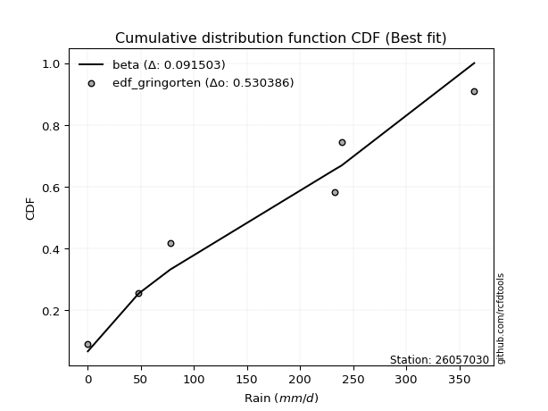</img>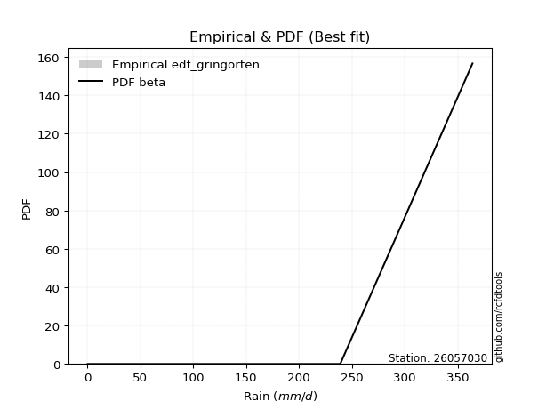</img>

</div>


### 9. Empirical - EDF Filliben (1975)

The specific values of the constants (0.3175) (often denoted as $alpha$) and (0.365) are derived from a method proposed by James J. Filliben in a 1975 paper. This particular formula is the mean value of the $i$-th order statistic of the normal distribution and is considered a robust and effective plotting position formula for the normal probability plot correlation coefficient test for normality.

<div align="center">


$P=(m-0.3175)/(n+0.365)$


</div>


**9.1. Empirical values**

<div align="center">

|                | 0                   | 1                   | 2                  | 3                  | 4                  | 5                  |
|:---------------|:--------------------|:--------------------|:-------------------|:-------------------|:-------------------|:-------------------|
| date           | 2017                | 2019                | 2018               | 2022               | 2020               | 2021               |
| x              | 0.1                 | 47.8                | 77.6               | 233.0              | 239.0              | 364.0              |
| m              | 1                   | 2                   | 3                  | 4                  | 5                  | 6                  |
| empirical_dist | edf_filliben        | edf_filliben        | edf_filliben       | edf_filliben       | edf_filliben       | edf_filliben       |
| empirical      | 0.10722702278083267 | 0.26433621366849963 | 0.4214454045561665 | 0.5785545954438335 | 0.7356637863315004 | 0.8927729772191673 |
| empirical_tr   | 1.1201055873295205  | 1.3593166043780034  | 1.7284453496266123 | 2.3727865796831313 | 3.783060921248143  | 9.326007326007321  |

</div>


**9.2. Kolmogorov-Smirnov fit test (sorted by Δ)**


<div align="center">

|                | 0                   | 1                   | 2                   | 3                   | 4                   | 5                  | 6                   | 7                   | 8                   | 9                   | 10                  | 11                 | 12                  | 13                  | 14                  | 15                 | 16                  | 17                  | 18                 | 19                  | 20                 | 21                 | 22                  | 23                  | 24                  | 25                 | 26                  | 27                  | 28                  | 29                 | 30                  | 31                  | 32                  | 33                  | 34                    | 35                  | 36                  | 37                  | 38                  | 39                  | 40                  | 41                  | 42                  | 43                  | 44                  | 45                 | 46                 | 47                 | 48                  | 49                  | 50                  | 51                  | 52                  | 53                 | 54                 | 55                  | 56                  | 57                  | 58                  | 59                 | 60                  | 61                 | 62                | 63                  | 64                 | 65                  | 66                 | 67                 | 68                 | 69                  | 70                  | 71                | 72                 | 73                  | 74                 | 75                 | 76                  | 77                  | 78                  | 79                 | 80                 | 81                 | 82                 | 83                 | 84                 | 85                 | 86                 | 87                 | 88                 | 89                 |
|:---------------|:--------------------|:--------------------|:--------------------|:--------------------|:--------------------|:-------------------|:--------------------|:--------------------|:--------------------|:--------------------|:--------------------|:-------------------|:--------------------|:--------------------|:--------------------|:-------------------|:--------------------|:--------------------|:-------------------|:--------------------|:-------------------|:-------------------|:--------------------|:--------------------|:--------------------|:-------------------|:--------------------|:--------------------|:--------------------|:-------------------|:--------------------|:--------------------|:--------------------|:--------------------|:----------------------|:--------------------|:--------------------|:--------------------|:--------------------|:--------------------|:--------------------|:--------------------|:--------------------|:--------------------|:--------------------|:-------------------|:-------------------|:-------------------|:--------------------|:--------------------|:--------------------|:--------------------|:--------------------|:-------------------|:-------------------|:--------------------|:--------------------|:--------------------|:--------------------|:-------------------|:--------------------|:-------------------|:------------------|:--------------------|:-------------------|:--------------------|:-------------------|:-------------------|:-------------------|:--------------------|:--------------------|:------------------|:-------------------|:--------------------|:-------------------|:-------------------|:--------------------|:--------------------|:--------------------|:-------------------|:-------------------|:-------------------|:-------------------|:-------------------|:-------------------|:-------------------|:-------------------|:-------------------|:-------------------|:-------------------|
| station        | 26057030            | 26057030            | 26057030            | 26057030            | 26057030            | 26057030           | 26057030            | 26057030            | 26057030            | 26057030            | 26057030            | 26057030           | 26057030            | 26057030            | 26057030            | 26057030           | 26057030            | 26057030            | 26057030           | 26057030            | 26057030           | 26057030           | 26057030            | 26057030            | 26057030            | 26057030           | 26057030            | 26057030            | 26057030            | 26057030           | 26057030            | 26057030            | 26057030            | 26057030            | 26057030              | 26057030            | 26057030            | 26057030            | 26057030            | 26057030            | 26057030            | 26057030            | 26057030            | 26057030            | 26057030            | 26057030           | 26057030           | 26057030           | 26057030            | 26057030            | 26057030            | 26057030            | 26057030            | 26057030           | 26057030           | 26057030            | 26057030            | 26057030            | 26057030            | 26057030           | 26057030            | 26057030           | 26057030          | 26057030            | 26057030           | 26057030            | 26057030           | 26057030           | 26057030           | 26057030            | 26057030            | 26057030          | 26057030           | 26057030            | 26057030           | 26057030           | 26057030            | 26057030            | 26057030            | 26057030           | 26057030           | 26057030           | 26057030           | 26057030           | 26057030           | 26057030           | 26057030           | 26057030           | 26057030           | 26057030           |
| empirical_dist | edf_filliben        | edf_filliben        | edf_filliben        | edf_filliben        | edf_filliben        | edf_filliben       | edf_filliben        | edf_filliben        | edf_filliben        | edf_filliben        | edf_filliben        | edf_filliben       | edf_filliben        | edf_filliben        | edf_filliben        | edf_filliben       | edf_filliben        | edf_filliben        | edf_filliben       | edf_filliben        | edf_filliben       | edf_filliben       | edf_filliben        | edf_filliben        | edf_filliben        | edf_filliben       | edf_filliben        | edf_filliben        | edf_filliben        | edf_filliben       | edf_filliben        | edf_filliben        | edf_filliben        | edf_filliben        | edf_filliben          | edf_filliben        | edf_filliben        | edf_filliben        | edf_filliben        | edf_filliben        | edf_filliben        | edf_filliben        | edf_filliben        | edf_filliben        | edf_filliben        | edf_filliben       | edf_filliben       | edf_filliben       | edf_filliben        | edf_filliben        | edf_filliben        | edf_filliben        | edf_filliben        | edf_filliben       | edf_filliben       | edf_filliben        | edf_filliben        | edf_filliben        | edf_filliben        | edf_filliben       | edf_filliben        | edf_filliben       | edf_filliben      | edf_filliben        | edf_filliben       | edf_filliben        | edf_filliben       | edf_filliben       | edf_filliben       | edf_filliben        | edf_filliben        | edf_filliben      | edf_filliben       | edf_filliben        | edf_filliben       | edf_filliben       | edf_filliben        | edf_filliben        | edf_filliben        | edf_filliben       | edf_filliben       | edf_filliben       | edf_filliben       | edf_filliben       | edf_filliben       | edf_filliben       | edf_filliben       | edf_filliben       | edf_filliben       | edf_filliben       |
| p_dist         | ncf                 | weibull_min         | logpearson3         | betaprime           | maxwell             | pearson3           | rayleigh            | johnsonsu           | rice                | exponnorm           | crystalball         | norm               | gompertz            | halfnorm            | truncnorm           | loggumbel_l        | genlogistic         | kstwobign           | fisk               | alpha               | gumbel_r           | logistic           | genexpon            | laplace_asymmetric  | expon               | invgauss           | halflogistic        | logt                | moyal               | hypsecant          | gumbel_l            | chi2                | laplace             | logloggamma         | loglaplace_asymmetric | lognct              | logexponnorm        | logcrystalball      | lognorm             | lognorm             | logrice             | lognakagami         | loglogistic         | loghypsecant        | wald                | loglaplace         | logtruncnorm       | logerlang          | loginvgamma         | loggamma            | loggamma            | logalpha            | nakagami            | erlang             | loginvweibull      | loginvgauss         | logmaxwell          | lograyleigh         | gamma               | f                  | t                   | loggenexpon        | logkstwobign      | loggumbel_r         | loghalfnorm        | gibrat              | logfisk            | logmoyal           | loghalflogistic    | pareto              | nct                 | logexpon          | logncf             | logwald             | logpareto          | invweibull         | loggibrat           | fatiguelife         | logf                | mielke             | loglognorm         | logweibull_min     | logbetaprime       | logfatiguelife     | logmielke          | logjohnsonsu       | logchi2            | invgamma           | loggompertz        | loggenlogistic     |
| delta          | 0.11163738295818659 | 0.13978808268895826 | 0.14311693290525057 | 0.14626877526496151 | 0.15075401656068455 | 0.1544191616484326 | 0.15482417486236988 | 0.16058729991645387 | 0.16173792746754045 | 0.16204003896571306 | 0.16239249127014932 | 0.1623924936723894 | 0.16460763679313473 | 0.16749105587854718 | 0.16917693131845535 | 0.1766029002658957 | 0.17843161054820822 | 0.17898691573205439 | 0.1802140179060086 | 0.18332211135111187 | 0.1843027959805318 | 0.1849879314218716 | 0.18557009647752942 | 0.18776992540217174 | 0.18787264112395563 | 0.1926034092382195 | 0.19367412386810667 | 0.19936560554048557 | 0.19964263480695188 | 0.2001366484290695 | 0.20407120873857548 | 0.21056184490577812 | 0.22097890304104015 | 0.22989763183008116 | 0.23012516218169132   | 0.24607702838299134 | 0.24656801593645944 | 0.24656984753613526 | 0.24656985196171172 | 0.24656985196171172 | 0.24657068060643234 | 0.24732323045018717 | 0.24805895410062012 | 0.24933001509672087 | 0.25400097370652414 | 0.2546277025002482 | 0.2575145319826729 | 0.2576151592351758 | 0.25783766267881375 | 0.25796398215749566 | 0.25796398215749566 | 0.25998513785891625 | 0.26433621263840795 | 0.2731244255872999 | 0.2768057617801743 | 0.27755948666739566 | 0.27915200283272784 | 0.28991884520564876 | 0.29564523100904283 | 0.2967591233556604 | 0.30494373317348344 | 0.3105752818289234 | 0.315492094304303 | 0.31718226466318283 | 0.3202293473477234 | 0.33738884915043554 | 0.3399940819282178 | 0.3429220541509846 | 0.3458001813929045 | 0.35552392564418495 | 0.37153799890281275 | 0.372399312706366 | 0.4109489147909013 | 0.41444986832890246 | 0.4242825386199112 | 0.4360133159980003 | 0.43940898018596214 | 0.44867196238676194 | 0.47600750384909724 | 0.4902193835764313 | 0.5785453148821611 | 0.5907926581903089 | 0.5912412145717192 | 0.6054221303475908 | 0.6539282197093186 | 0.6861505329070834 | 0.7122862403946253 | 0.7338309018294573 | 0.7354995780019304 | 0.7356637863315004 |
| deltao         | 0.530385761606      | 0.530385761606      | 0.530385761606      | 0.530385761606      | 0.530385761606      | 0.530385761606     | 0.530385761606      | 0.530385761606      | 0.530385761606      | 0.530385761606      | 0.530385761606      | 0.530385761606     | 0.530385761606      | 0.530385761606      | 0.530385761606      | 0.530385761606     | 0.530385761606      | 0.530385761606      | 0.530385761606     | 0.530385761606      | 0.530385761606     | 0.530385761606     | 0.530385761606      | 0.530385761606      | 0.530385761606      | 0.530385761606     | 0.530385761606      | 0.530385761606      | 0.530385761606      | 0.530385761606     | 0.530385761606      | 0.530385761606      | 0.530385761606      | 0.530385761606      | 0.530385761606        | 0.530385761606      | 0.530385761606      | 0.530385761606      | 0.530385761606      | 0.530385761606      | 0.530385761606      | 0.530385761606      | 0.530385761606      | 0.530385761606      | 0.530385761606      | 0.530385761606     | 0.530385761606     | 0.530385761606     | 0.530385761606      | 0.530385761606      | 0.530385761606      | 0.530385761606      | 0.530385761606      | 0.530385761606     | 0.530385761606     | 0.530385761606      | 0.530385761606      | 0.530385761606      | 0.530385761606      | 0.530385761606     | 0.530385761606      | 0.530385761606     | 0.530385761606    | 0.530385761606      | 0.530385761606     | 0.530385761606      | 0.530385761606     | 0.530385761606     | 0.530385761606     | 0.530385761606      | 0.530385761606      | 0.530385761606    | 0.530385761606     | 0.530385761606      | 0.530385761606     | 0.530385761606     | 0.530385761606      | 0.530385761606      | 0.530385761606      | 0.530385761606     | 0.530385761606     | 0.530385761606     | 0.530385761606     | 0.530385761606     | 0.530385761606     | 0.530385761606     | 0.530385761606     | 0.530385761606     | 0.530385761606     | 0.530385761606     |
| eval           | Δo > Δ              | Δo > Δ              | Δo > Δ              | Δo > Δ              | Δo > Δ              | Δo > Δ             | Δo > Δ              | Δo > Δ              | Δo > Δ              | Δo > Δ              | Δo > Δ              | Δo > Δ             | Δo > Δ              | Δo > Δ              | Δo > Δ              | Δo > Δ             | Δo > Δ              | Δo > Δ              | Δo > Δ             | Δo > Δ              | Δo > Δ             | Δo > Δ             | Δo > Δ              | Δo > Δ              | Δo > Δ              | Δo > Δ             | Δo > Δ              | Δo > Δ              | Δo > Δ              | Δo > Δ             | Δo > Δ              | Δo > Δ              | Δo > Δ              | Δo > Δ              | Δo > Δ                | Δo > Δ              | Δo > Δ              | Δo > Δ              | Δo > Δ              | Δo > Δ              | Δo > Δ              | Δo > Δ              | Δo > Δ              | Δo > Δ              | Δo > Δ              | Δo > Δ             | Δo > Δ             | Δo > Δ             | Δo > Δ              | Δo > Δ              | Δo > Δ              | Δo > Δ              | Δo > Δ              | Δo > Δ             | Δo > Δ             | Δo > Δ              | Δo > Δ              | Δo > Δ              | Δo > Δ              | Δo > Δ             | Δo > Δ              | Δo > Δ             | Δo > Δ            | Δo > Δ              | Δo > Δ             | Δo > Δ              | Δo > Δ             | Δo > Δ             | Δo > Δ             | Δo > Δ              | Δo > Δ              | Δo > Δ            | Δo > Δ             | Δo > Δ              | Δo > Δ             | Δo > Δ             | Δo > Δ              | Δo > Δ              | Δo > Δ              | Δo > Δ             | Δo <= Δ            | Δo <= Δ            | Δo <= Δ            | Δo <= Δ            | Δo <= Δ            | Δo <= Δ            | Δo <= Δ            | Δo <= Δ            | Δo <= Δ            | Δo <= Δ            |
| fit            | 1                   | 1                   | 1                   | 1                   | 1                   | 1                  | 1                   | 1                   | 1                   | 1                   | 1                   | 1                  | 1                   | 1                   | 1                   | 1                  | 1                   | 1                   | 1                  | 1                   | 1                  | 1                  | 1                   | 1                   | 1                   | 1                  | 1                   | 1                   | 1                   | 1                  | 1                   | 1                   | 1                   | 1                   | 1                     | 1                   | 1                   | 1                   | 1                   | 1                   | 1                   | 1                   | 1                   | 1                   | 1                   | 1                  | 1                  | 1                  | 1                   | 1                   | 1                   | 1                   | 1                   | 1                  | 1                  | 1                   | 1                   | 1                   | 1                   | 1                  | 1                   | 1                  | 1                 | 1                   | 1                  | 1                   | 1                  | 1                  | 1                  | 1                   | 1                   | 1                 | 1                  | 1                   | 1                  | 1                  | 1                   | 1                   | 1                   | 1                  | 0                  | 0                  | 0                  | 0                  | 0                  | 0                  | 0                  | 0                  | 0                  | 0                  |
| n              | 6                   | 6                   | 6                   | 6                   | 6                   | 6                  | 6                   | 6                   | 6                   | 6                   | 6                   | 6                  | 6                   | 6                   | 6                   | 6                  | 6                   | 6                   | 6                  | 6                   | 6                  | 6                  | 6                   | 6                   | 6                   | 6                  | 6                   | 6                   | 6                   | 6                  | 6                   | 6                   | 6                   | 6                   | 6                     | 6                   | 6                   | 6                   | 6                   | 6                   | 6                   | 6                   | 6                   | 6                   | 6                   | 6                  | 6                  | 6                  | 6                   | 6                   | 6                   | 6                   | 6                   | 6                  | 6                  | 6                   | 6                   | 6                   | 6                   | 6                  | 6                   | 6                  | 6                 | 6                   | 6                  | 6                   | 6                  | 6                  | 6                  | 6                   | 6                   | 6                 | 6                  | 6                   | 6                  | 6                  | 6                   | 6                   | 6                   | 6                  | 6                  | 6                  | 6                  | 6                  | 6                  | 6                  | 6                  | 6                  | 6                  | 6                  |
| best_fit       | 1                   | 0                   | 0                   | 0                   | 0                   | 0                  | 0                   | 0                   | 0                   | 0                   | 0                   | 0                  | 0                   | 0                   | 0                   | 0                  | 0                   | 0                   | 0                  | 0                   | 0                  | 0                  | 0                   | 0                   | 0                   | 0                  | 0                   | 0                   | 0                   | 0                  | 0                   | 0                   | 0                   | 0                   | 0                     | 0                   | 0                   | 0                   | 0                   | 0                   | 0                   | 0                   | 0                   | 0                   | 0                   | 0                  | 0                  | 0                  | 0                   | 0                   | 0                   | 0                   | 0                   | 0                  | 0                  | 0                   | 0                   | 0                   | 0                   | 0                  | 0                   | 0                  | 0                 | 0                   | 0                  | 0                   | 0                  | 0                  | 0                  | 0                   | 0                   | 0                 | 0                  | 0                   | 0                  | 0                  | 0                   | 0                   | 0                   | 0                  | 0                  | 0                  | 0                  | 0                  | 0                  | 0                  | 0                  | 0                  | 0                  | 0                  |
| best_fit_sort  | 1                   | 2                   | 3                   | 4                   | 5                   | 6                  | 7                   | 8                   | 9                   | 10                  | 11                  | 12                 | 13                  | 14                  | 15                  | 16                 | 17                  | 18                  | 19                 | 20                  | 21                 | 22                 | 23                  | 24                  | 25                  | 26                 | 27                  | 28                  | 29                  | 30                 | 31                  | 32                  | 33                  | 34                  | 35                    | 36                  | 37                  | 38                  | 39                  | 40                  | 41                  | 42                  | 43                  | 44                  | 45                  | 46                 | 47                 | 48                 | 49                  | 50                  | 51                  | 52                  | 53                  | 54                 | 55                 | 56                  | 57                  | 58                  | 59                  | 60                 | 61                  | 62                 | 63                | 64                  | 65                 | 66                  | 67                 | 68                 | 69                 | 70                  | 71                  | 72                | 73                 | 74                  | 75                 | 76                 | 77                  | 78                  | 79                  | 80                 | 81                 | 82                 | 83                 | 84                 | 85                 | 86                 | 87                 | 88                 | 89                 | 90                 |

</div>


<div align="center">

</img>

</div>


**9.3. Best fit**

<div align="center">

|   id |   station | empirical_dist   | p_dist   |    delta |   deltao | eval   |   fit |   n |   best_fit |   best_fit_sort |
|-----:|----------:|:-----------------|:---------|---------:|---------:|:-------|------:|----:|-----------:|----------------:|
|    0 |  26057030 | edf_filliben     | ncf      | 0.111637 | 0.530386 | Δo > Δ |     1 |   6 |          1 |               1 |

</div>


<div align="center">

</img>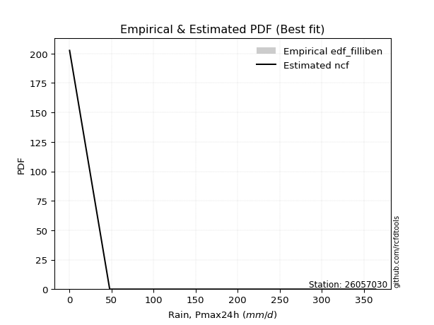</img>

</div>


### 10. Empirical - EDF Jenkinson (1977)

The Jenkinson formula in hydrology is an empirical plotting position formula used to estimate the non-exceedance probability _(P)_ or return period _(T)_ of a given ordered observation within a sample. It is a widely used method in the frequency analysis of extreme events such as floods and rainfall, as it provides a distribution-free way to plot data. _a≈0.31_ and _b≈0.38_ are constants derived to approximate the median of the probability distribution for the given rank.

<div align="center">


$P=(m-a)/(n+b)$


</div>


**10.1. Empirical values**

<div align="center">

|                | 0                   | 1                   | 2                  | 3                  | 4                  | 5                  |
|:---------------|:--------------------|:--------------------|:-------------------|:-------------------|:-------------------|:-------------------|
| date           | 2017                | 2019                | 2018               | 2022               | 2020               | 2021               |
| x              | 0.1                 | 47.8                | 77.6               | 233.0              | 239.0              | 364.0              |
| m              | 1                   | 2                   | 3                  | 4                  | 5                  | 6                  |
| empirical_dist | edf_jenkinson       | edf_jenkinson       | edf_jenkinson      | edf_jenkinson      | edf_jenkinson      | edf_jenkinson      |
| empirical      | 0.10815047021943573 | 0.26489028213166144 | 0.4216300940438871 | 0.5783699059561128 | 0.7351097178683387 | 0.8918495297805643 |
| empirical_tr   | 1.1212653778558874  | 1.3603411513859276  | 1.7289972899728996 | 2.3717472118959106 | 3.7751479289940844 | 9.246376811594207  |

</div>


**10.2. Kolmogorov-Smirnov fit test (sorted by Δ)**


<div align="center">

|                | 0                  | 1                   | 2                   | 3                   | 4                  | 5                   | 6                   | 7                   | 8                   | 9                   | 10                  | 11               | 12                  | 13                  | 14                | 15                 | 16                  | 17                  | 18                 | 19                  | 20                  | 21                 | 22                  | 23                 | 24                 | 25                  | 26                  | 27                  | 28                  | 29                 | 30                  | 31                  | 32                  | 33                  | 34                    | 35                  | 36                  | 37                  | 38                 | 39                 | 40                  | 41                  | 42                  | 43                  | 44                 | 45                  | 46                 | 47                | 48                  | 49                  | 50                  | 51                  | 52                  | 53                  | 54                 | 55                  | 56                  | 57                  | 58                 | 59                 | 60                 | 61                 | 62                  | 63                  | 64                 | 65                  | 66                  | 67                 | 68                 | 69                  | 70                  | 71                 | 72                 | 73                  | 74                 | 75                  | 76                  | 77                  | 78                  | 79                 | 80                 | 81                 | 82                 | 83                | 84                 | 85                 | 86                 | 87                 | 88                 | 89                 |
|:---------------|:-------------------|:--------------------|:--------------------|:--------------------|:-------------------|:--------------------|:--------------------|:--------------------|:--------------------|:--------------------|:--------------------|:-----------------|:--------------------|:--------------------|:------------------|:-------------------|:--------------------|:--------------------|:-------------------|:--------------------|:--------------------|:-------------------|:--------------------|:-------------------|:-------------------|:--------------------|:--------------------|:--------------------|:--------------------|:-------------------|:--------------------|:--------------------|:--------------------|:--------------------|:----------------------|:--------------------|:--------------------|:--------------------|:-------------------|:-------------------|:--------------------|:--------------------|:--------------------|:--------------------|:-------------------|:--------------------|:-------------------|:------------------|:--------------------|:--------------------|:--------------------|:--------------------|:--------------------|:--------------------|:-------------------|:--------------------|:--------------------|:--------------------|:-------------------|:-------------------|:-------------------|:-------------------|:--------------------|:--------------------|:-------------------|:--------------------|:--------------------|:-------------------|:-------------------|:--------------------|:--------------------|:-------------------|:-------------------|:--------------------|:-------------------|:--------------------|:--------------------|:--------------------|:--------------------|:-------------------|:-------------------|:-------------------|:-------------------|:------------------|:-------------------|:-------------------|:-------------------|:-------------------|:-------------------|:-------------------|
| station        | 26057030           | 26057030            | 26057030            | 26057030            | 26057030           | 26057030            | 26057030            | 26057030            | 26057030            | 26057030            | 26057030            | 26057030         | 26057030            | 26057030            | 26057030          | 26057030           | 26057030            | 26057030            | 26057030           | 26057030            | 26057030            | 26057030           | 26057030            | 26057030           | 26057030           | 26057030            | 26057030            | 26057030            | 26057030            | 26057030           | 26057030            | 26057030            | 26057030            | 26057030            | 26057030              | 26057030            | 26057030            | 26057030            | 26057030           | 26057030           | 26057030            | 26057030            | 26057030            | 26057030            | 26057030           | 26057030            | 26057030           | 26057030          | 26057030            | 26057030            | 26057030            | 26057030            | 26057030            | 26057030            | 26057030           | 26057030            | 26057030            | 26057030            | 26057030           | 26057030           | 26057030           | 26057030           | 26057030            | 26057030            | 26057030           | 26057030            | 26057030            | 26057030           | 26057030           | 26057030            | 26057030            | 26057030           | 26057030           | 26057030            | 26057030           | 26057030            | 26057030            | 26057030            | 26057030            | 26057030           | 26057030           | 26057030           | 26057030           | 26057030          | 26057030           | 26057030           | 26057030           | 26057030           | 26057030           | 26057030           |
| empirical_dist | edf_jenkinson      | edf_jenkinson       | edf_jenkinson       | edf_jenkinson       | edf_jenkinson      | edf_jenkinson       | edf_jenkinson       | edf_jenkinson       | edf_jenkinson       | edf_jenkinson       | edf_jenkinson       | edf_jenkinson    | edf_jenkinson       | edf_jenkinson       | edf_jenkinson     | edf_jenkinson      | edf_jenkinson       | edf_jenkinson       | edf_jenkinson      | edf_jenkinson       | edf_jenkinson       | edf_jenkinson      | edf_jenkinson       | edf_jenkinson      | edf_jenkinson      | edf_jenkinson       | edf_jenkinson       | edf_jenkinson       | edf_jenkinson       | edf_jenkinson      | edf_jenkinson       | edf_jenkinson       | edf_jenkinson       | edf_jenkinson       | edf_jenkinson         | edf_jenkinson       | edf_jenkinson       | edf_jenkinson       | edf_jenkinson      | edf_jenkinson      | edf_jenkinson       | edf_jenkinson       | edf_jenkinson       | edf_jenkinson       | edf_jenkinson      | edf_jenkinson       | edf_jenkinson      | edf_jenkinson     | edf_jenkinson       | edf_jenkinson       | edf_jenkinson       | edf_jenkinson       | edf_jenkinson       | edf_jenkinson       | edf_jenkinson      | edf_jenkinson       | edf_jenkinson       | edf_jenkinson       | edf_jenkinson      | edf_jenkinson      | edf_jenkinson      | edf_jenkinson      | edf_jenkinson       | edf_jenkinson       | edf_jenkinson      | edf_jenkinson       | edf_jenkinson       | edf_jenkinson      | edf_jenkinson      | edf_jenkinson       | edf_jenkinson       | edf_jenkinson      | edf_jenkinson      | edf_jenkinson       | edf_jenkinson      | edf_jenkinson       | edf_jenkinson       | edf_jenkinson       | edf_jenkinson       | edf_jenkinson      | edf_jenkinson      | edf_jenkinson      | edf_jenkinson      | edf_jenkinson     | edf_jenkinson      | edf_jenkinson      | edf_jenkinson      | edf_jenkinson      | edf_jenkinson      | edf_jenkinson      |
| p_dist         | ncf                | weibull_min         | logpearson3         | betaprime           | maxwell            | pearson3            | rayleigh            | johnsonsu           | rice                | exponnorm           | crystalball         | norm             | gompertz            | halfnorm            | truncnorm         | loggumbel_l        | genlogistic         | kstwobign           | fisk               | alpha               | gumbel_r            | logistic           | genexpon            | laplace_asymmetric | expon              | invgauss            | halflogistic        | logt                | moyal               | hypsecant          | gumbel_l            | chi2                | laplace             | logloggamma         | loglaplace_asymmetric | lognct              | logexponnorm        | logcrystalball      | lognorm            | lognorm            | logrice             | lognakagami         | loglogistic         | loghypsecant        | loglaplace         | wald                | logtruncnorm       | logerlang         | loginvgamma         | loggamma            | loggamma            | logalpha            | nakagami            | erlang              | loginvweibull      | loginvgauss         | logmaxwell          | lograyleigh         | gamma              | f                  | t                  | loggenexpon        | logkstwobign        | loggumbel_r         | loghalfnorm        | gibrat              | logfisk             | logmoyal           | loghalflogistic    | pareto              | nct                 | logexpon           | logncf             | logwald             | logpareto          | invweibull          | loggibrat           | fatiguelife         | logf                | mielke             | loglognorm         | logweibull_min     | logbetaprime       | logfatiguelife    | logmielke          | logjohnsonsu       | logchi2            | invgamma           | loggompertz        | loggenlogistic     |
| delta          | 0.1118220724459072 | 0.13997277217667892 | 0.14256286444208877 | 0.14534532782635856 | 0.1509387060484052 | 0.15460385113615321 | 0.15500886435009054 | 0.16077198940417448 | 0.16192261695526106 | 0.16222472845343366 | 0.16257718075786992 | 0.16257718316011 | 0.16479232628085538 | 0.16767574536626784 | 0.169361620806176 | 0.1760488318027339 | 0.17861630003592888 | 0.17917160521977504 | 0.1796599494428468 | 0.18350680083883253 | 0.18448748546825244 | 0.1851726209095922 | 0.18575478596525008 | 0.1879546148898924 | 0.1880573306116763 | 0.19278809872594016 | 0.19385881335582733 | 0.19955029502820618 | 0.19982732429467254 | 0.2003213379167901 | 0.20425589822629608 | 0.21074653439349877 | 0.22116359252876075 | 0.23008232131780182 | 0.23030985166941198   | 0.24552295991982953 | 0.24601394747329763 | 0.24601577907297345 | 0.2460157834985499 | 0.2460157834985499 | 0.24601661214327053 | 0.24676916198702536 | 0.24750488563745832 | 0.24877594663355906 | 0.2540736340370864 | 0.25455504216968594 | 0.2569604635195111 | 0.257061090772014 | 0.25728359421565195 | 0.25740991369433386 | 0.25740991369433386 | 0.25943106939575444 | 0.26489028110156976 | 0.27330911507502054 | 0.2762516933170125 | 0.27700541820423386 | 0.27859793436956604 | 0.28936477674248695 | 0.2958299204967635 | 0.2962050548924986 | 0.3051284226612041 | 0.3100212133657616 | 0.31493802584114117 | 0.31662819620002103 | 0.3196752788845616 | 0.33757353863815615 | 0.33907063448961483 | 0.3423679856878228 | 0.3452461129297427 | 0.35496985718102314 | 0.37098393043965094 | 0.3718452442432042 | 0.4103948463277395 | 0.41389579986574065 | 0.4237284701567494 | 0.43508986855939735 | 0.43885491172280033 | 0.44811789392360013 | 0.47545343538593543 | 0.4896653151132695 | 0.5779912464189993 | 0.5902385897271472 | 0.5906871461085574 | 0.604868061884429 | 0.6533741512461567 | 0.6855964644439216 | 0.7117321719314635 | 0.7332768333662956 | 0.7349455095387686 | 0.7351097178683387 |
| deltao         | 0.530385761606     | 0.530385761606      | 0.530385761606      | 0.530385761606      | 0.530385761606     | 0.530385761606      | 0.530385761606      | 0.530385761606      | 0.530385761606      | 0.530385761606      | 0.530385761606      | 0.530385761606   | 0.530385761606      | 0.530385761606      | 0.530385761606    | 0.530385761606     | 0.530385761606      | 0.530385761606      | 0.530385761606     | 0.530385761606      | 0.530385761606      | 0.530385761606     | 0.530385761606      | 0.530385761606     | 0.530385761606     | 0.530385761606      | 0.530385761606      | 0.530385761606      | 0.530385761606      | 0.530385761606     | 0.530385761606      | 0.530385761606      | 0.530385761606      | 0.530385761606      | 0.530385761606        | 0.530385761606      | 0.530385761606      | 0.530385761606      | 0.530385761606     | 0.530385761606     | 0.530385761606      | 0.530385761606      | 0.530385761606      | 0.530385761606      | 0.530385761606     | 0.530385761606      | 0.530385761606     | 0.530385761606    | 0.530385761606      | 0.530385761606      | 0.530385761606      | 0.530385761606      | 0.530385761606      | 0.530385761606      | 0.530385761606     | 0.530385761606      | 0.530385761606      | 0.530385761606      | 0.530385761606     | 0.530385761606     | 0.530385761606     | 0.530385761606     | 0.530385761606      | 0.530385761606      | 0.530385761606     | 0.530385761606      | 0.530385761606      | 0.530385761606     | 0.530385761606     | 0.530385761606      | 0.530385761606      | 0.530385761606     | 0.530385761606     | 0.530385761606      | 0.530385761606     | 0.530385761606      | 0.530385761606      | 0.530385761606      | 0.530385761606      | 0.530385761606     | 0.530385761606     | 0.530385761606     | 0.530385761606     | 0.530385761606    | 0.530385761606     | 0.530385761606     | 0.530385761606     | 0.530385761606     | 0.530385761606     | 0.530385761606     |
| eval           | Δo > Δ             | Δo > Δ              | Δo > Δ              | Δo > Δ              | Δo > Δ             | Δo > Δ              | Δo > Δ              | Δo > Δ              | Δo > Δ              | Δo > Δ              | Δo > Δ              | Δo > Δ           | Δo > Δ              | Δo > Δ              | Δo > Δ            | Δo > Δ             | Δo > Δ              | Δo > Δ              | Δo > Δ             | Δo > Δ              | Δo > Δ              | Δo > Δ             | Δo > Δ              | Δo > Δ             | Δo > Δ             | Δo > Δ              | Δo > Δ              | Δo > Δ              | Δo > Δ              | Δo > Δ             | Δo > Δ              | Δo > Δ              | Δo > Δ              | Δo > Δ              | Δo > Δ                | Δo > Δ              | Δo > Δ              | Δo > Δ              | Δo > Δ             | Δo > Δ             | Δo > Δ              | Δo > Δ              | Δo > Δ              | Δo > Δ              | Δo > Δ             | Δo > Δ              | Δo > Δ             | Δo > Δ            | Δo > Δ              | Δo > Δ              | Δo > Δ              | Δo > Δ              | Δo > Δ              | Δo > Δ              | Δo > Δ             | Δo > Δ              | Δo > Δ              | Δo > Δ              | Δo > Δ             | Δo > Δ             | Δo > Δ             | Δo > Δ             | Δo > Δ              | Δo > Δ              | Δo > Δ             | Δo > Δ              | Δo > Δ              | Δo > Δ             | Δo > Δ             | Δo > Δ              | Δo > Δ              | Δo > Δ             | Δo > Δ             | Δo > Δ              | Δo > Δ             | Δo > Δ              | Δo > Δ              | Δo > Δ              | Δo > Δ              | Δo > Δ             | Δo <= Δ            | Δo <= Δ            | Δo <= Δ            | Δo <= Δ           | Δo <= Δ            | Δo <= Δ            | Δo <= Δ            | Δo <= Δ            | Δo <= Δ            | Δo <= Δ            |
| fit            | 1                  | 1                   | 1                   | 1                   | 1                  | 1                   | 1                   | 1                   | 1                   | 1                   | 1                   | 1                | 1                   | 1                   | 1                 | 1                  | 1                   | 1                   | 1                  | 1                   | 1                   | 1                  | 1                   | 1                  | 1                  | 1                   | 1                   | 1                   | 1                   | 1                  | 1                   | 1                   | 1                   | 1                   | 1                     | 1                   | 1                   | 1                   | 1                  | 1                  | 1                   | 1                   | 1                   | 1                   | 1                  | 1                   | 1                  | 1                 | 1                   | 1                   | 1                   | 1                   | 1                   | 1                   | 1                  | 1                   | 1                   | 1                   | 1                  | 1                  | 1                  | 1                  | 1                   | 1                   | 1                  | 1                   | 1                   | 1                  | 1                  | 1                   | 1                   | 1                  | 1                  | 1                   | 1                  | 1                   | 1                   | 1                   | 1                   | 1                  | 0                  | 0                  | 0                  | 0                 | 0                  | 0                  | 0                  | 0                  | 0                  | 0                  |
| n              | 6                  | 6                   | 6                   | 6                   | 6                  | 6                   | 6                   | 6                   | 6                   | 6                   | 6                   | 6                | 6                   | 6                   | 6                 | 6                  | 6                   | 6                   | 6                  | 6                   | 6                   | 6                  | 6                   | 6                  | 6                  | 6                   | 6                   | 6                   | 6                   | 6                  | 6                   | 6                   | 6                   | 6                   | 6                     | 6                   | 6                   | 6                   | 6                  | 6                  | 6                   | 6                   | 6                   | 6                   | 6                  | 6                   | 6                  | 6                 | 6                   | 6                   | 6                   | 6                   | 6                   | 6                   | 6                  | 6                   | 6                   | 6                   | 6                  | 6                  | 6                  | 6                  | 6                   | 6                   | 6                  | 6                   | 6                   | 6                  | 6                  | 6                   | 6                   | 6                  | 6                  | 6                   | 6                  | 6                   | 6                   | 6                   | 6                   | 6                  | 6                  | 6                  | 6                  | 6                 | 6                  | 6                  | 6                  | 6                  | 6                  | 6                  |
| best_fit       | 1                  | 0                   | 0                   | 0                   | 0                  | 0                   | 0                   | 0                   | 0                   | 0                   | 0                   | 0                | 0                   | 0                   | 0                 | 0                  | 0                   | 0                   | 0                  | 0                   | 0                   | 0                  | 0                   | 0                  | 0                  | 0                   | 0                   | 0                   | 0                   | 0                  | 0                   | 0                   | 0                   | 0                   | 0                     | 0                   | 0                   | 0                   | 0                  | 0                  | 0                   | 0                   | 0                   | 0                   | 0                  | 0                   | 0                  | 0                 | 0                   | 0                   | 0                   | 0                   | 0                   | 0                   | 0                  | 0                   | 0                   | 0                   | 0                  | 0                  | 0                  | 0                  | 0                   | 0                   | 0                  | 0                   | 0                   | 0                  | 0                  | 0                   | 0                   | 0                  | 0                  | 0                   | 0                  | 0                   | 0                   | 0                   | 0                   | 0                  | 0                  | 0                  | 0                  | 0                 | 0                  | 0                  | 0                  | 0                  | 0                  | 0                  |
| best_fit_sort  | 1                  | 2                   | 3                   | 4                   | 5                  | 6                   | 7                   | 8                   | 9                   | 10                  | 11                  | 12               | 13                  | 14                  | 15                | 16                 | 17                  | 18                  | 19                 | 20                  | 21                  | 22                 | 23                  | 24                 | 25                 | 26                  | 27                  | 28                  | 29                  | 30                 | 31                  | 32                  | 33                  | 34                  | 35                    | 36                  | 37                  | 38                  | 39                 | 40                 | 41                  | 42                  | 43                  | 44                  | 45                 | 46                  | 47                 | 48                | 49                  | 50                  | 51                  | 52                  | 53                  | 54                  | 55                 | 56                  | 57                  | 58                  | 59                 | 60                 | 61                 | 62                 | 63                  | 64                  | 65                 | 66                  | 67                  | 68                 | 69                 | 70                  | 71                  | 72                 | 73                 | 74                  | 75                 | 76                  | 77                  | 78                  | 79                  | 80                 | 81                 | 82                 | 83                 | 84                | 85                 | 86                 | 87                 | 88                 | 89                 | 90                 |

</div>


<div align="center">

</img>

</div>


**10.3. Best fit**

<div align="center">

|   id |   station | empirical_dist   | p_dist   |    delta |   deltao | eval   |   fit |   n |   best_fit |   best_fit_sort |
|-----:|----------:|:-----------------|:---------|---------:|---------:|:-------|------:|----:|-----------:|----------------:|
|    0 |  26057030 | edf_jenkinson    | ncf      | 0.111822 | 0.530386 | Δo > Δ |     1 |   6 |          1 |               1 |

</div>


<div align="center">

</img>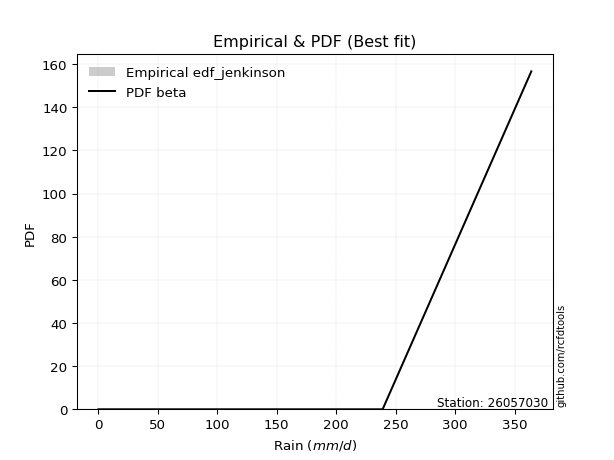</img>

</div>


### 11. Empirical - EDF Cunnane (1978)

Cunnane´s work in statistical hydrology has focused on the performance and evaluation of different probability distributions (such as GEV, Gumbel, Lognormal) for flood frequency estimation. _b_ is a constant, typically set to 0.4.

<div align="center">


$P=(m-b)/(n+1-2b)$


</div>


**11.1. Empirical values**

<div align="center">

|                | 0                  | 1                   | 2                   | 3                  | 4                  | 5                  |
|:---------------|:-------------------|:--------------------|:--------------------|:-------------------|:-------------------|:-------------------|
| date           | 2017               | 2019                | 2018                | 2022               | 2020               | 2021               |
| x              | 0.1                | 47.8                | 77.6                | 233.0              | 239.0              | 364.0              |
| m              | 1                  | 2                   | 3                   | 4                  | 5                  | 6                  |
| empirical_dist | edf_cunnane        | edf_cunnane         | edf_cunnane         | edf_cunnane        | edf_cunnane        | edf_cunnane        |
| empirical      | 0.0967741935483871 | 0.25806451612903225 | 0.41935483870967744 | 0.5806451612903226 | 0.7419354838709676 | 0.9032258064516128 |
| empirical_tr   | 1.1071428571428572 | 1.3478260869565217  | 1.7222222222222225  | 2.384615384615385  | 3.8749999999999982 | 10.333333333333318 |

</div>


**11.2. Kolmogorov-Smirnov fit test (sorted by Δ)**


<div align="center">

|                | 0                  | 1                   | 2                  | 3                   | 4                   | 5                   | 6                   | 7                   | 8                   | 9                   | 10                  | 11                 | 12                  | 13                  | 14                 | 15                  | 16                  | 17                  | 18                  | 19                  | 20                 | 21                  | 22                 | 23                  | 24                  | 25                  | 26                  | 27                  | 28                  | 29                 | 30                 | 31                  | 32                  | 33                  | 34                    | 35                  | 36                 | 37                 | 38                  | 39                 | 40                 | 41                 | 42                  | 43                 | 44                  | 45                 | 46                  | 47                  | 48                 | 49                  | 50                  | 51                  | 52                  | 53                  | 54                 | 55                  | 56                 | 57                 | 58                  | 59                 | 60                  | 61                 | 62                  | 63                 | 64                 | 65                  | 66                  | 67                 | 68                 | 69                 | 70                  | 71                 | 72                  | 73                  | 74                 | 75                 | 76                 | 77                 | 78                 | 79                 | 80                 | 81                 | 82                 | 83                 | 84                 | 85                 | 86                 | 87                 | 88                 | 89                 |
|:---------------|:-------------------|:--------------------|:-------------------|:--------------------|:--------------------|:--------------------|:--------------------|:--------------------|:--------------------|:--------------------|:--------------------|:-------------------|:--------------------|:--------------------|:-------------------|:--------------------|:--------------------|:--------------------|:--------------------|:--------------------|:-------------------|:--------------------|:-------------------|:--------------------|:--------------------|:--------------------|:--------------------|:--------------------|:--------------------|:-------------------|:-------------------|:--------------------|:--------------------|:--------------------|:----------------------|:--------------------|:-------------------|:-------------------|:--------------------|:-------------------|:-------------------|:-------------------|:--------------------|:-------------------|:--------------------|:-------------------|:--------------------|:--------------------|:-------------------|:--------------------|:--------------------|:--------------------|:--------------------|:--------------------|:-------------------|:--------------------|:-------------------|:-------------------|:--------------------|:-------------------|:--------------------|:-------------------|:--------------------|:-------------------|:-------------------|:--------------------|:--------------------|:-------------------|:-------------------|:-------------------|:--------------------|:-------------------|:--------------------|:--------------------|:-------------------|:-------------------|:-------------------|:-------------------|:-------------------|:-------------------|:-------------------|:-------------------|:-------------------|:-------------------|:-------------------|:-------------------|:-------------------|:-------------------|:-------------------|:-------------------|
| station        | 26057030           | 26057030            | 26057030           | 26057030            | 26057030            | 26057030            | 26057030            | 26057030            | 26057030            | 26057030            | 26057030            | 26057030           | 26057030            | 26057030            | 26057030           | 26057030            | 26057030            | 26057030            | 26057030            | 26057030            | 26057030           | 26057030            | 26057030           | 26057030            | 26057030            | 26057030            | 26057030            | 26057030            | 26057030            | 26057030           | 26057030           | 26057030            | 26057030            | 26057030            | 26057030              | 26057030            | 26057030           | 26057030           | 26057030            | 26057030           | 26057030           | 26057030           | 26057030            | 26057030           | 26057030            | 26057030           | 26057030            | 26057030            | 26057030           | 26057030            | 26057030            | 26057030            | 26057030            | 26057030            | 26057030           | 26057030            | 26057030           | 26057030           | 26057030            | 26057030           | 26057030            | 26057030           | 26057030            | 26057030           | 26057030           | 26057030            | 26057030            | 26057030           | 26057030           | 26057030           | 26057030            | 26057030           | 26057030            | 26057030            | 26057030           | 26057030           | 26057030           | 26057030           | 26057030           | 26057030           | 26057030           | 26057030           | 26057030           | 26057030           | 26057030           | 26057030           | 26057030           | 26057030           | 26057030           | 26057030           |
| empirical_dist | edf_cunnane        | edf_cunnane         | edf_cunnane        | edf_cunnane         | edf_cunnane         | edf_cunnane         | edf_cunnane         | edf_cunnane         | edf_cunnane         | edf_cunnane         | edf_cunnane         | edf_cunnane        | edf_cunnane         | edf_cunnane         | edf_cunnane        | edf_cunnane         | edf_cunnane         | edf_cunnane         | edf_cunnane         | edf_cunnane         | edf_cunnane        | edf_cunnane         | edf_cunnane        | edf_cunnane         | edf_cunnane         | edf_cunnane         | edf_cunnane         | edf_cunnane         | edf_cunnane         | edf_cunnane        | edf_cunnane        | edf_cunnane         | edf_cunnane         | edf_cunnane         | edf_cunnane           | edf_cunnane         | edf_cunnane        | edf_cunnane        | edf_cunnane         | edf_cunnane        | edf_cunnane        | edf_cunnane        | edf_cunnane         | edf_cunnane        | edf_cunnane         | edf_cunnane        | edf_cunnane         | edf_cunnane         | edf_cunnane        | edf_cunnane         | edf_cunnane         | edf_cunnane         | edf_cunnane         | edf_cunnane         | edf_cunnane        | edf_cunnane         | edf_cunnane        | edf_cunnane        | edf_cunnane         | edf_cunnane        | edf_cunnane         | edf_cunnane        | edf_cunnane         | edf_cunnane        | edf_cunnane        | edf_cunnane         | edf_cunnane         | edf_cunnane        | edf_cunnane        | edf_cunnane        | edf_cunnane         | edf_cunnane        | edf_cunnane         | edf_cunnane         | edf_cunnane        | edf_cunnane        | edf_cunnane        | edf_cunnane        | edf_cunnane        | edf_cunnane        | edf_cunnane        | edf_cunnane        | edf_cunnane        | edf_cunnane        | edf_cunnane        | edf_cunnane        | edf_cunnane        | edf_cunnane        | edf_cunnane        | edf_cunnane        |
| p_dist         | ncf                | weibull_min         | maxwell            | logpearson3         | pearson3            | rayleigh            | betaprime           | johnsonsu           | rice                | exponnorm           | crystalball         | norm               | gompertz            | halfnorm            | truncnorm          | genlogistic         | kstwobign           | alpha               | gumbel_r            | loggumbel_l         | logistic           | genexpon            | laplace_asymmetric | expon               | fisk                | invgauss            | halflogistic        | logt                | moyal               | hypsecant          | gumbel_l           | chi2                | laplace             | logloggamma         | loglaplace_asymmetric | wald                | lognct             | logexponnorm       | logcrystalball      | lognorm            | lognorm            | logrice            | lognakagami         | loglogistic        | loghypsecant        | nakagami           | loglaplace          | logtruncnorm        | logerlang          | loginvgamma         | loggamma            | loggamma            | logalpha            | erlang              | loginvweibull      | loginvgauss         | logmaxwell         | gamma              | lograyleigh         | f                  | t                   | loggenexpon        | logkstwobign        | loggumbel_r        | loghalfnorm        | gibrat              | logmoyal            | logfisk            | loghalflogistic    | pareto             | nct                 | logexpon           | logncf              | logwald             | logpareto          | loggibrat          | invweibull         | fatiguelife        | logf               | mielke             | loglognorm         | logweibull_min     | logbetaprime       | logfatiguelife     | logmielke          | logjohnsonsu       | logchi2            | invgamma           | loggompertz        | loggenlogistic     |
| delta          | 0.1095468171116975 | 0.13769751684246911 | 0.1486634507141954 | 0.14938863044471795 | 0.15232859580194352 | 0.15273360901588073 | 0.15672160449740702 | 0.15849673406996478 | 0.15964736162105136 | 0.15994947311922397 | 0.16030192542366023 | 0.1603019278259003 | 0.16251707094664558 | 0.16540049003205803 | 0.1670863654719662 | 0.17634104470171907 | 0.17689634988556524 | 0.18123154550462273 | 0.18221223013404264 | 0.18287459780536308 | 0.1828973655753825 | 0.18347953063104028 | 0.1856793595556826 | 0.18578207527746649 | 0.18648571544547599 | 0.19051284339173036 | 0.19158355802161753 | 0.19727503969399648 | 0.19755206896046273 | 0.1980460825825804 | 0.2019806428920864 | 0.20847127905928897 | 0.21888833719455106 | 0.22780706598359202 | 0.22803459633520218   | 0.24772927616705676 | 0.2523487259224587 | 0.2528397134759268 | 0.25284154507560264 | 0.2528415495011791 | 0.2528415495011791 | 0.2528423781458997 | 0.25359492798965455 | 0.2543306516400875 | 0.25560171263618825 | 0.2580645150989406 | 0.26089940003971557 | 0.26378622952214026 | 0.2638868567746432 | 0.26410936021828113 | 0.26423567969696304 | 0.26423567969696304 | 0.26625683539838363 | 0.27103385974081073 | 0.2830774593196417 | 0.28383118420686304 | 0.2854237003721952 | 0.2935546651625537 | 0.29619054274511614 | 0.3030308208951278 | 0.31005094905112074 | 0.3168469793683908 | 0.32176379184377035 | 0.3234539622026502 | 0.3265010448871908 | 0.33529828330394645 | 0.34919375169045197 | 0.3504469111606633 | 0.3520718789323719 | 0.3617956231836523 | 0.37780969644228013 | 0.3786710102458334 | 0.41722061233036867 | 0.42072156586836984 | 0.4305542361593786 | 0.4456806777254295 | 0.4464661452304458 | 0.4549436599262293 | 0.4822792013885646 | 0.4964910811158987 | 0.5848170124216285 | 0.5970643557297763 | 0.5975129121111866 | 0.6116938278870582 | 0.6601999172487859 | 0.6924222304465506 | 0.7185579379340927 | 0.7401025993689248 | 0.7417712755413978 | 0.7419354838709676 |
| deltao         | 0.530385761606     | 0.530385761606      | 0.530385761606     | 0.530385761606      | 0.530385761606      | 0.530385761606      | 0.530385761606      | 0.530385761606      | 0.530385761606      | 0.530385761606      | 0.530385761606      | 0.530385761606     | 0.530385761606      | 0.530385761606      | 0.530385761606     | 0.530385761606      | 0.530385761606      | 0.530385761606      | 0.530385761606      | 0.530385761606      | 0.530385761606     | 0.530385761606      | 0.530385761606     | 0.530385761606      | 0.530385761606      | 0.530385761606      | 0.530385761606      | 0.530385761606      | 0.530385761606      | 0.530385761606     | 0.530385761606     | 0.530385761606      | 0.530385761606      | 0.530385761606      | 0.530385761606        | 0.530385761606      | 0.530385761606     | 0.530385761606     | 0.530385761606      | 0.530385761606     | 0.530385761606     | 0.530385761606     | 0.530385761606      | 0.530385761606     | 0.530385761606      | 0.530385761606     | 0.530385761606      | 0.530385761606      | 0.530385761606     | 0.530385761606      | 0.530385761606      | 0.530385761606      | 0.530385761606      | 0.530385761606      | 0.530385761606     | 0.530385761606      | 0.530385761606     | 0.530385761606     | 0.530385761606      | 0.530385761606     | 0.530385761606      | 0.530385761606     | 0.530385761606      | 0.530385761606     | 0.530385761606     | 0.530385761606      | 0.530385761606      | 0.530385761606     | 0.530385761606     | 0.530385761606     | 0.530385761606      | 0.530385761606     | 0.530385761606      | 0.530385761606      | 0.530385761606     | 0.530385761606     | 0.530385761606     | 0.530385761606     | 0.530385761606     | 0.530385761606     | 0.530385761606     | 0.530385761606     | 0.530385761606     | 0.530385761606     | 0.530385761606     | 0.530385761606     | 0.530385761606     | 0.530385761606     | 0.530385761606     | 0.530385761606     |
| eval           | Δo > Δ             | Δo > Δ              | Δo > Δ             | Δo > Δ              | Δo > Δ              | Δo > Δ              | Δo > Δ              | Δo > Δ              | Δo > Δ              | Δo > Δ              | Δo > Δ              | Δo > Δ             | Δo > Δ              | Δo > Δ              | Δo > Δ             | Δo > Δ              | Δo > Δ              | Δo > Δ              | Δo > Δ              | Δo > Δ              | Δo > Δ             | Δo > Δ              | Δo > Δ             | Δo > Δ              | Δo > Δ              | Δo > Δ              | Δo > Δ              | Δo > Δ              | Δo > Δ              | Δo > Δ             | Δo > Δ             | Δo > Δ              | Δo > Δ              | Δo > Δ              | Δo > Δ                | Δo > Δ              | Δo > Δ             | Δo > Δ             | Δo > Δ              | Δo > Δ             | Δo > Δ             | Δo > Δ             | Δo > Δ              | Δo > Δ             | Δo > Δ              | Δo > Δ             | Δo > Δ              | Δo > Δ              | Δo > Δ             | Δo > Δ              | Δo > Δ              | Δo > Δ              | Δo > Δ              | Δo > Δ              | Δo > Δ             | Δo > Δ              | Δo > Δ             | Δo > Δ             | Δo > Δ              | Δo > Δ             | Δo > Δ              | Δo > Δ             | Δo > Δ              | Δo > Δ             | Δo > Δ             | Δo > Δ              | Δo > Δ              | Δo > Δ             | Δo > Δ             | Δo > Δ             | Δo > Δ              | Δo > Δ             | Δo > Δ              | Δo > Δ              | Δo > Δ             | Δo > Δ             | Δo > Δ             | Δo > Δ             | Δo > Δ             | Δo > Δ             | Δo <= Δ            | Δo <= Δ            | Δo <= Δ            | Δo <= Δ            | Δo <= Δ            | Δo <= Δ            | Δo <= Δ            | Δo <= Δ            | Δo <= Δ            | Δo <= Δ            |
| fit            | 1                  | 1                   | 1                  | 1                   | 1                   | 1                   | 1                   | 1                   | 1                   | 1                   | 1                   | 1                  | 1                   | 1                   | 1                  | 1                   | 1                   | 1                   | 1                   | 1                   | 1                  | 1                   | 1                  | 1                   | 1                   | 1                   | 1                   | 1                   | 1                   | 1                  | 1                  | 1                   | 1                   | 1                   | 1                     | 1                   | 1                  | 1                  | 1                   | 1                  | 1                  | 1                  | 1                   | 1                  | 1                   | 1                  | 1                   | 1                   | 1                  | 1                   | 1                   | 1                   | 1                   | 1                   | 1                  | 1                   | 1                  | 1                  | 1                   | 1                  | 1                   | 1                  | 1                   | 1                  | 1                  | 1                   | 1                   | 1                  | 1                  | 1                  | 1                   | 1                  | 1                   | 1                   | 1                  | 1                  | 1                  | 1                  | 1                  | 1                  | 0                  | 0                  | 0                  | 0                  | 0                  | 0                  | 0                  | 0                  | 0                  | 0                  |
| n              | 6                  | 6                   | 6                  | 6                   | 6                   | 6                   | 6                   | 6                   | 6                   | 6                   | 6                   | 6                  | 6                   | 6                   | 6                  | 6                   | 6                   | 6                   | 6                   | 6                   | 6                  | 6                   | 6                  | 6                   | 6                   | 6                   | 6                   | 6                   | 6                   | 6                  | 6                  | 6                   | 6                   | 6                   | 6                     | 6                   | 6                  | 6                  | 6                   | 6                  | 6                  | 6                  | 6                   | 6                  | 6                   | 6                  | 6                   | 6                   | 6                  | 6                   | 6                   | 6                   | 6                   | 6                   | 6                  | 6                   | 6                  | 6                  | 6                   | 6                  | 6                   | 6                  | 6                   | 6                  | 6                  | 6                   | 6                   | 6                  | 6                  | 6                  | 6                   | 6                  | 6                   | 6                   | 6                  | 6                  | 6                  | 6                  | 6                  | 6                  | 6                  | 6                  | 6                  | 6                  | 6                  | 6                  | 6                  | 6                  | 6                  | 6                  |
| best_fit       | 1                  | 0                   | 0                  | 0                   | 0                   | 0                   | 0                   | 0                   | 0                   | 0                   | 0                   | 0                  | 0                   | 0                   | 0                  | 0                   | 0                   | 0                   | 0                   | 0                   | 0                  | 0                   | 0                  | 0                   | 0                   | 0                   | 0                   | 0                   | 0                   | 0                  | 0                  | 0                   | 0                   | 0                   | 0                     | 0                   | 0                  | 0                  | 0                   | 0                  | 0                  | 0                  | 0                   | 0                  | 0                   | 0                  | 0                   | 0                   | 0                  | 0                   | 0                   | 0                   | 0                   | 0                   | 0                  | 0                   | 0                  | 0                  | 0                   | 0                  | 0                   | 0                  | 0                   | 0                  | 0                  | 0                   | 0                   | 0                  | 0                  | 0                  | 0                   | 0                  | 0                   | 0                   | 0                  | 0                  | 0                  | 0                  | 0                  | 0                  | 0                  | 0                  | 0                  | 0                  | 0                  | 0                  | 0                  | 0                  | 0                  | 0                  |
| best_fit_sort  | 1                  | 2                   | 3                  | 4                   | 5                   | 6                   | 7                   | 8                   | 9                   | 10                  | 11                  | 12                 | 13                  | 14                  | 15                 | 16                  | 17                  | 18                  | 19                  | 20                  | 21                 | 22                  | 23                 | 24                  | 25                  | 26                  | 27                  | 28                  | 29                  | 30                 | 31                 | 32                  | 33                  | 34                  | 35                    | 36                  | 37                 | 38                 | 39                  | 40                 | 41                 | 42                 | 43                  | 44                 | 45                  | 46                 | 47                  | 48                  | 49                 | 50                  | 51                  | 52                  | 53                  | 54                  | 55                 | 56                  | 57                 | 58                 | 59                  | 60                 | 61                  | 62                 | 63                  | 64                 | 65                 | 66                  | 67                  | 68                 | 69                 | 70                 | 71                  | 72                 | 73                  | 74                  | 75                 | 76                 | 77                 | 78                 | 79                 | 80                 | 81                 | 82                 | 83                 | 84                 | 85                 | 86                 | 87                 | 88                 | 89                 | 90                 |

</div>


<div align="center">

</img>

</div>


**11.3. Best fit**

<div align="center">

|   id |   station | empirical_dist   | p_dist   |    delta |   deltao | eval   |   fit |   n |   best_fit |   best_fit_sort |
|-----:|----------:|:-----------------|:---------|---------:|---------:|:-------|------:|----:|-----------:|----------------:|
|    0 |  26057030 | edf_cunnane      | ncf      | 0.109547 | 0.530386 | Δo > Δ |     1 |   6 |          1 |               1 |

</div>


<div align="center">

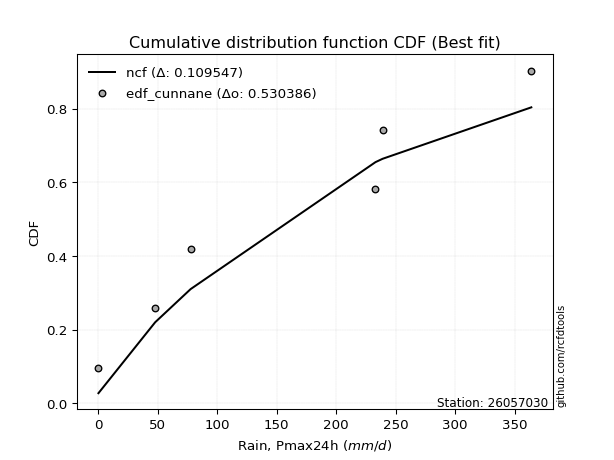</img></img>

</div>


### 12. Empirical - EDF Adamowski (1981)

The Adamowski formula in hydrology refers to a specific plotting position formula used for estimating the non-parametric empirical distribution of hydrological events (like flood peaks) to calculate their return periods. This formula provides an alternative to traditional parametric methods (like the Gumbel or Log Pearson Type III distributions). 

<div align="center">


$P=(m-0.25)/(n+0.5)$


</div>


**12.1. Empirical values**

<div align="center">

|                | 0                   | 1                  | 2                  | 3                  | 4                  | 5                  |
|:---------------|:--------------------|:-------------------|:-------------------|:-------------------|:-------------------|:-------------------|
| date           | 2017                | 2019               | 2018               | 2022               | 2020               | 2021               |
| x              | 0.1                 | 47.8               | 77.6               | 233.0              | 239.0              | 364.0              |
| m              | 1                   | 2                  | 3                  | 4                  | 5                  | 6                  |
| empirical_dist | edf_adamowski       | edf_adamowski      | edf_adamowski      | edf_adamowski      | edf_adamowski      | edf_adamowski      |
| empirical      | 0.11538461538461539 | 0.2692307692307692 | 0.4230769230769231 | 0.5769230769230769 | 0.7307692307692307 | 0.8846153846153846 |
| empirical_tr   | 1.1304347826086958  | 1.3684210526315788 | 1.7333333333333334 | 2.3636363636363633 | 3.7142857142857135 | 8.666666666666664  |

</div>


**12.2. Kolmogorov-Smirnov fit test (sorted by Δ)**


<div align="center">

|                | 0                   | 1                   | 2                   | 3                   | 4                   | 5                   | 6                   | 7                   | 8                 | 9                  | 10                  | 11                  | 12                  | 13                  | 14                  | 15                  | 16                  | 17                  | 18                | 19                  | 20                 | 21                  | 22                  | 23                  | 24                  | 25                 | 26                  | 27                  | 28                  | 29                  | 30                  | 31                  | 32                 | 33                  | 34                    | 35                  | 36                  | 37                  | 38                  | 39                  | 40                  | 41                  | 42                  | 43                  | 44                 | 45                 | 46                 | 47                  | 48                 | 49                 | 50                  | 51                 | 52                  | 53                 | 54                 | 55                  | 56                 | 57                  | 58                 | 59                  | 60                 | 61                  | 62                 | 63                  | 64                 | 65                 | 66                | 67                 | 68                  | 69                  | 70                  | 71                 | 72                 | 73                 | 74                  | 75                 | 76                  | 77                  | 78                  | 79                 | 80                 | 81                 | 82                 | 83                 | 84                 | 85                 | 86                 | 87                 | 88                 | 89                 |
|:---------------|:--------------------|:--------------------|:--------------------|:--------------------|:--------------------|:--------------------|:--------------------|:--------------------|:------------------|:-------------------|:--------------------|:--------------------|:--------------------|:--------------------|:--------------------|:--------------------|:--------------------|:--------------------|:------------------|:--------------------|:-------------------|:--------------------|:--------------------|:--------------------|:--------------------|:-------------------|:--------------------|:--------------------|:--------------------|:--------------------|:--------------------|:--------------------|:-------------------|:--------------------|:----------------------|:--------------------|:--------------------|:--------------------|:--------------------|:--------------------|:--------------------|:--------------------|:--------------------|:--------------------|:-------------------|:-------------------|:-------------------|:--------------------|:-------------------|:-------------------|:--------------------|:-------------------|:--------------------|:-------------------|:-------------------|:--------------------|:-------------------|:--------------------|:-------------------|:--------------------|:-------------------|:--------------------|:-------------------|:--------------------|:-------------------|:-------------------|:------------------|:-------------------|:--------------------|:--------------------|:--------------------|:-------------------|:-------------------|:-------------------|:--------------------|:-------------------|:--------------------|:--------------------|:--------------------|:-------------------|:-------------------|:-------------------|:-------------------|:-------------------|:-------------------|:-------------------|:-------------------|:-------------------|:-------------------|:-------------------|
| station        | 26057030            | 26057030            | 26057030            | 26057030            | 26057030            | 26057030            | 26057030            | 26057030            | 26057030          | 26057030           | 26057030            | 26057030            | 26057030            | 26057030            | 26057030            | 26057030            | 26057030            | 26057030            | 26057030          | 26057030            | 26057030           | 26057030            | 26057030            | 26057030            | 26057030            | 26057030           | 26057030            | 26057030            | 26057030            | 26057030            | 26057030            | 26057030            | 26057030           | 26057030            | 26057030              | 26057030            | 26057030            | 26057030            | 26057030            | 26057030            | 26057030            | 26057030            | 26057030            | 26057030            | 26057030           | 26057030           | 26057030           | 26057030            | 26057030           | 26057030           | 26057030            | 26057030           | 26057030            | 26057030           | 26057030           | 26057030            | 26057030           | 26057030            | 26057030           | 26057030            | 26057030           | 26057030            | 26057030           | 26057030            | 26057030           | 26057030           | 26057030          | 26057030           | 26057030            | 26057030            | 26057030            | 26057030           | 26057030           | 26057030           | 26057030            | 26057030           | 26057030            | 26057030            | 26057030            | 26057030           | 26057030           | 26057030           | 26057030           | 26057030           | 26057030           | 26057030           | 26057030           | 26057030           | 26057030           | 26057030           |
| empirical_dist | edf_adamowski       | edf_adamowski       | edf_adamowski       | edf_adamowski       | edf_adamowski       | edf_adamowski       | edf_adamowski       | edf_adamowski       | edf_adamowski     | edf_adamowski      | edf_adamowski       | edf_adamowski       | edf_adamowski       | edf_adamowski       | edf_adamowski       | edf_adamowski       | edf_adamowski       | edf_adamowski       | edf_adamowski     | edf_adamowski       | edf_adamowski      | edf_adamowski       | edf_adamowski       | edf_adamowski       | edf_adamowski       | edf_adamowski      | edf_adamowski       | edf_adamowski       | edf_adamowski       | edf_adamowski       | edf_adamowski       | edf_adamowski       | edf_adamowski      | edf_adamowski       | edf_adamowski         | edf_adamowski       | edf_adamowski       | edf_adamowski       | edf_adamowski       | edf_adamowski       | edf_adamowski       | edf_adamowski       | edf_adamowski       | edf_adamowski       | edf_adamowski      | edf_adamowski      | edf_adamowski      | edf_adamowski       | edf_adamowski      | edf_adamowski      | edf_adamowski       | edf_adamowski      | edf_adamowski       | edf_adamowski      | edf_adamowski      | edf_adamowski       | edf_adamowski      | edf_adamowski       | edf_adamowski      | edf_adamowski       | edf_adamowski      | edf_adamowski       | edf_adamowski      | edf_adamowski       | edf_adamowski      | edf_adamowski      | edf_adamowski     | edf_adamowski      | edf_adamowski       | edf_adamowski       | edf_adamowski       | edf_adamowski      | edf_adamowski      | edf_adamowski      | edf_adamowski       | edf_adamowski      | edf_adamowski       | edf_adamowski       | edf_adamowski       | edf_adamowski      | edf_adamowski      | edf_adamowski      | edf_adamowski      | edf_adamowski      | edf_adamowski      | edf_adamowski      | edf_adamowski      | edf_adamowski      | edf_adamowski      | edf_adamowski      |
| p_dist         | ncf                 | betaprime           | logpearson3         | weibull_min         | maxwell             | pearson3            | rayleigh            | johnsonsu           | rice              | exponnorm          | crystalball         | norm                | gompertz            | halfnorm            | truncnorm           | loggumbel_l         | fisk                | genlogistic         | kstwobign         | alpha               | gumbel_r           | logistic            | genexpon            | laplace_asymmetric  | expon               | invgauss           | halflogistic        | logt                | moyal               | hypsecant           | gumbel_l            | chi2                | laplace            | logloggamma         | loglaplace_asymmetric | lognct              | logexponnorm        | logcrystalball      | lognorm             | lognorm             | logrice             | lognakagami         | loglogistic         | loghypsecant        | loglaplace         | logtruncnorm       | logerlang          | loginvgamma         | loggamma           | loggamma           | logalpha            | wald               | nakagami            | loginvweibull      | loginvgauss        | logmaxwell          | erlang             | lograyleigh         | f                  | gamma               | loggenexpon        | t                   | logkstwobign       | loggumbel_r         | loghalfnorm        | logfisk            | logmoyal          | gibrat             | loghalflogistic     | pareto              | nct                 | logexpon           | logncf             | logwald            | logpareto           | invweibull         | loggibrat           | fatiguelife         | logf                | mielke             | loglognorm         | logweibull_min     | logbetaprime       | logfatiguelife     | logmielke          | logjohnsonsu       | logchi2            | invgamma           | loggompertz        | loggenlogistic     |
| delta          | 0.11326890147894314 | 0.13811118266117883 | 0.13822237734298098 | 0.14141960120971486 | 0.15238553508144115 | 0.15605068016918916 | 0.15645569338312648 | 0.16221881843721042 | 0.163369445988297 | 0.1636715574864696 | 0.16402400979090587 | 0.16402401219314594 | 0.16623915531389133 | 0.16912257439930378 | 0.17080844983921195 | 0.17170834470362611 | 0.17531946234373902 | 0.18006312906896482 | 0.180618434252811 | 0.18495362987186847 | 0.1859343145012884 | 0.18661944994262814 | 0.18720161499828603 | 0.18940144392292835 | 0.18950415964471223 | 0.1942349277589761 | 0.19530564238886328 | 0.20099712406124212 | 0.20127415332770848 | 0.20176816694982605 | 0.20570272725933203 | 0.21219336342653472 | 0.2226104215617967 | 0.23152915035083776 | 0.23175668070244793   | 0.24118247282072175 | 0.24167346037418985 | 0.24167529197386567 | 0.24167529639944213 | 0.24167529639944213 | 0.24167612504416275 | 0.24242867488791758 | 0.24316439853835053 | 0.24443545953445128 | 0.2497331469379786 | 0.2526199764204033 | 0.2527206036729062 | 0.25294310711654416 | 0.2530694265952261 | 0.2530694265952261 | 0.25509058229664666 | 0.2588955292687937 | 0.26923076820067754 | 0.2719112062179047 | 0.2726649311051261 | 0.27425744727045825 | 0.2747559441080565 | 0.28502428964337917 | 0.2918645677933908 | 0.29727674952979943 | 0.3056807262666538 | 0.30657525169424005 | 0.3105975387420334 | 0.31228770910091325 | 0.3153347917854538 | 0.3318364893244351 | 0.338027498588715 | 0.3390203676711921 | 0.34090562583063494 | 0.35062937008191536 | 0.36664344334054316 | 0.3675047571440964 | 0.4060543592286317 | 0.4095553127666329 | 0.41938798305764163 | 0.4278557233942176 | 0.43451442462369255 | 0.44377740682449235 | 0.47111294828682765 | 0.4853248280141617 | 0.5736507593198916 | 0.5858981026280394 | 0.5863466590094497 | 0.6005275747853211 | 0.6490336641470489 | 0.6812559773448137 | 0.7073916848323558 | 0.7289363462671878 | 0.7306050224396607 | 0.7307692307692307 |
| deltao         | 0.530385761606      | 0.530385761606      | 0.530385761606      | 0.530385761606      | 0.530385761606      | 0.530385761606      | 0.530385761606      | 0.530385761606      | 0.530385761606    | 0.530385761606     | 0.530385761606      | 0.530385761606      | 0.530385761606      | 0.530385761606      | 0.530385761606      | 0.530385761606      | 0.530385761606      | 0.530385761606      | 0.530385761606    | 0.530385761606      | 0.530385761606     | 0.530385761606      | 0.530385761606      | 0.530385761606      | 0.530385761606      | 0.530385761606     | 0.530385761606      | 0.530385761606      | 0.530385761606      | 0.530385761606      | 0.530385761606      | 0.530385761606      | 0.530385761606     | 0.530385761606      | 0.530385761606        | 0.530385761606      | 0.530385761606      | 0.530385761606      | 0.530385761606      | 0.530385761606      | 0.530385761606      | 0.530385761606      | 0.530385761606      | 0.530385761606      | 0.530385761606     | 0.530385761606     | 0.530385761606     | 0.530385761606      | 0.530385761606     | 0.530385761606     | 0.530385761606      | 0.530385761606     | 0.530385761606      | 0.530385761606     | 0.530385761606     | 0.530385761606      | 0.530385761606     | 0.530385761606      | 0.530385761606     | 0.530385761606      | 0.530385761606     | 0.530385761606      | 0.530385761606     | 0.530385761606      | 0.530385761606     | 0.530385761606     | 0.530385761606    | 0.530385761606     | 0.530385761606      | 0.530385761606      | 0.530385761606      | 0.530385761606     | 0.530385761606     | 0.530385761606     | 0.530385761606      | 0.530385761606     | 0.530385761606      | 0.530385761606      | 0.530385761606      | 0.530385761606     | 0.530385761606     | 0.530385761606     | 0.530385761606     | 0.530385761606     | 0.530385761606     | 0.530385761606     | 0.530385761606     | 0.530385761606     | 0.530385761606     | 0.530385761606     |
| eval           | Δo > Δ              | Δo > Δ              | Δo > Δ              | Δo > Δ              | Δo > Δ              | Δo > Δ              | Δo > Δ              | Δo > Δ              | Δo > Δ            | Δo > Δ             | Δo > Δ              | Δo > Δ              | Δo > Δ              | Δo > Δ              | Δo > Δ              | Δo > Δ              | Δo > Δ              | Δo > Δ              | Δo > Δ            | Δo > Δ              | Δo > Δ             | Δo > Δ              | Δo > Δ              | Δo > Δ              | Δo > Δ              | Δo > Δ             | Δo > Δ              | Δo > Δ              | Δo > Δ              | Δo > Δ              | Δo > Δ              | Δo > Δ              | Δo > Δ             | Δo > Δ              | Δo > Δ                | Δo > Δ              | Δo > Δ              | Δo > Δ              | Δo > Δ              | Δo > Δ              | Δo > Δ              | Δo > Δ              | Δo > Δ              | Δo > Δ              | Δo > Δ             | Δo > Δ             | Δo > Δ             | Δo > Δ              | Δo > Δ             | Δo > Δ             | Δo > Δ              | Δo > Δ             | Δo > Δ              | Δo > Δ             | Δo > Δ             | Δo > Δ              | Δo > Δ             | Δo > Δ              | Δo > Δ             | Δo > Δ              | Δo > Δ             | Δo > Δ              | Δo > Δ             | Δo > Δ              | Δo > Δ             | Δo > Δ             | Δo > Δ            | Δo > Δ             | Δo > Δ              | Δo > Δ              | Δo > Δ              | Δo > Δ             | Δo > Δ             | Δo > Δ             | Δo > Δ              | Δo > Δ             | Δo > Δ              | Δo > Δ              | Δo > Δ              | Δo > Δ             | Δo <= Δ            | Δo <= Δ            | Δo <= Δ            | Δo <= Δ            | Δo <= Δ            | Δo <= Δ            | Δo <= Δ            | Δo <= Δ            | Δo <= Δ            | Δo <= Δ            |
| fit            | 1                   | 1                   | 1                   | 1                   | 1                   | 1                   | 1                   | 1                   | 1                 | 1                  | 1                   | 1                   | 1                   | 1                   | 1                   | 1                   | 1                   | 1                   | 1                 | 1                   | 1                  | 1                   | 1                   | 1                   | 1                   | 1                  | 1                   | 1                   | 1                   | 1                   | 1                   | 1                   | 1                  | 1                   | 1                     | 1                   | 1                   | 1                   | 1                   | 1                   | 1                   | 1                   | 1                   | 1                   | 1                  | 1                  | 1                  | 1                   | 1                  | 1                  | 1                   | 1                  | 1                   | 1                  | 1                  | 1                   | 1                  | 1                   | 1                  | 1                   | 1                  | 1                   | 1                  | 1                   | 1                  | 1                  | 1                 | 1                  | 1                   | 1                   | 1                   | 1                  | 1                  | 1                  | 1                   | 1                  | 1                   | 1                   | 1                   | 1                  | 0                  | 0                  | 0                  | 0                  | 0                  | 0                  | 0                  | 0                  | 0                  | 0                  |
| n              | 6                   | 6                   | 6                   | 6                   | 6                   | 6                   | 6                   | 6                   | 6                 | 6                  | 6                   | 6                   | 6                   | 6                   | 6                   | 6                   | 6                   | 6                   | 6                 | 6                   | 6                  | 6                   | 6                   | 6                   | 6                   | 6                  | 6                   | 6                   | 6                   | 6                   | 6                   | 6                   | 6                  | 6                   | 6                     | 6                   | 6                   | 6                   | 6                   | 6                   | 6                   | 6                   | 6                   | 6                   | 6                  | 6                  | 6                  | 6                   | 6                  | 6                  | 6                   | 6                  | 6                   | 6                  | 6                  | 6                   | 6                  | 6                   | 6                  | 6                   | 6                  | 6                   | 6                  | 6                   | 6                  | 6                  | 6                 | 6                  | 6                   | 6                   | 6                   | 6                  | 6                  | 6                  | 6                   | 6                  | 6                   | 6                   | 6                   | 6                  | 6                  | 6                  | 6                  | 6                  | 6                  | 6                  | 6                  | 6                  | 6                  | 6                  |
| best_fit       | 1                   | 0                   | 0                   | 0                   | 0                   | 0                   | 0                   | 0                   | 0                 | 0                  | 0                   | 0                   | 0                   | 0                   | 0                   | 0                   | 0                   | 0                   | 0                 | 0                   | 0                  | 0                   | 0                   | 0                   | 0                   | 0                  | 0                   | 0                   | 0                   | 0                   | 0                   | 0                   | 0                  | 0                   | 0                     | 0                   | 0                   | 0                   | 0                   | 0                   | 0                   | 0                   | 0                   | 0                   | 0                  | 0                  | 0                  | 0                   | 0                  | 0                  | 0                   | 0                  | 0                   | 0                  | 0                  | 0                   | 0                  | 0                   | 0                  | 0                   | 0                  | 0                   | 0                  | 0                   | 0                  | 0                  | 0                 | 0                  | 0                   | 0                   | 0                   | 0                  | 0                  | 0                  | 0                   | 0                  | 0                   | 0                   | 0                   | 0                  | 0                  | 0                  | 0                  | 0                  | 0                  | 0                  | 0                  | 0                  | 0                  | 0                  |
| best_fit_sort  | 1                   | 2                   | 3                   | 4                   | 5                   | 6                   | 7                   | 8                   | 9                 | 10                 | 11                  | 12                  | 13                  | 14                  | 15                  | 16                  | 17                  | 18                  | 19                | 20                  | 21                 | 22                  | 23                  | 24                  | 25                  | 26                 | 27                  | 28                  | 29                  | 30                  | 31                  | 32                  | 33                 | 34                  | 35                    | 36                  | 37                  | 38                  | 39                  | 40                  | 41                  | 42                  | 43                  | 44                  | 45                 | 46                 | 47                 | 48                  | 49                 | 50                 | 51                  | 52                 | 53                  | 54                 | 55                 | 56                  | 57                 | 58                  | 59                 | 60                  | 61                 | 62                  | 63                 | 64                  | 65                 | 66                 | 67                | 68                 | 69                  | 70                  | 71                  | 72                 | 73                 | 74                 | 75                  | 76                 | 77                  | 78                  | 79                  | 80                 | 81                 | 82                 | 83                 | 84                 | 85                 | 86                 | 87                 | 88                 | 89                 | 90                 |

</div>


<div align="center">

</img>

</div>


**12.3. Best fit**

<div align="center">

|   id |   station | empirical_dist   | p_dist   |    delta |   deltao | eval   |   fit |   n |   best_fit |   best_fit_sort |
|-----:|----------:|:-----------------|:---------|---------:|---------:|:-------|------:|----:|-----------:|----------------:|
|    0 |  26057030 | edf_adamowski    | ncf      | 0.113269 | 0.530386 | Δo > Δ |     1 |   6 |          1 |               1 |

</div>


<div align="center">

</img></img>

</div>


## C. Best fit & Estimate extreme values for specific return periods - Tr


### 1. Best fit (ordered by delta Δ)

<div align="center">

|   id |   station | empirical_dist   | p_dist   |    delta |   deltao | eval   |   fit |   n |   best_fit |   best_fit_sort |
|-----:|----------:|:-----------------|:---------|---------:|---------:|:-------|------:|----:|-----------:|----------------:|
|    0 |  26057030 | edf_gringorten   | ncf      | 0.108493 | 0.530386 | Δo > Δ |     1 |   6 |          1 |               1 |
|    1 |  26057030 | edf_cunnane      | ncf      | 0.109547 | 0.530386 | Δo > Δ |     1 |   6 |          1 |               2 |
|    2 |  26057030 | edf_blom         | ncf      | 0.110192 | 0.530386 | Δo > Δ |     1 |   6 |          1 |               3 |
|    3 |  26057030 | edf_tukey        | ncf      | 0.111245 | 0.530386 | Δo > Δ |     1 |   6 |          1 |               4 |
|    4 |  26057030 | edf_filliben     | ncf      | 0.111637 | 0.530386 | Δo > Δ |     1 |   6 |          1 |               5 |
|    5 |  26057030 | edf_jenkinson    | ncf      | 0.111822 | 0.530386 | Δo > Δ |     1 |   6 |          1 |               6 |
|    6 |  26057030 | edf_beard        | ncf      | 0.111822 | 0.530386 | Δo > Δ |     1 |   6 |          1 |               7 |
|    7 |  26057030 | edf_chegodayev   | ncf      | 0.112067 | 0.530386 | Δo > Δ |     1 |   6 |          1 |               8 |
|    8 |  26057030 | edf_hazen        | ncf      | 0.113164 | 0.530386 | Δo > Δ |     1 |   6 |          1 |               9 |
|    9 |  26057030 | edf_adamowski    | ncf      | 0.113269 | 0.530386 | Δo > Δ |     1 |   6 |          1 |              10 |
|   10 |  26057030 | edf_weibull      | ncf      | 0.118763 | 0.530386 | Δo > Δ |     1 |   6 |          1 |              11 |
|   11 |  26057030 | edf_california   | invgauss | 0.138466 | 0.530386 | Δo > Δ |     1 |   6 |          1 |              12 |

</div>

:file_folder:Tables: [bestfit_26057030.csv](table/bestfit_26057030.csv) | [extreme_26057030.csv](table/extreme_26057030.csv)


### 2. Extreme values

In hydrology, a return period (or recurrence interval $Tr$) is the statistical average time between extreme events like floods or droughts of a specific magnitude, indicating how rare an event is, with a 100-year flood, for example, having a 1% chance of occurring in any given year, not that it happens exactly every century. It is a key tool for infrastructure design (like bridges or dams) and risk assessment, calculated from historical data to determine the probability of future events, although it is important to remember it is statistical average, and events can cluster or be missed.

> risk_rate: assuming the return period as the project useful life.

|   id |      tr |   prob_l |     prob_g |    alpha |   betaprime |      chi2 |   crystalball |    erlang |    expon |   exponnorm |         f |   fatiguelife |        fisk |    gamma |   genexpon |   genlogistic |   gibrat |   gompertz |   gumbel_l |   gumbel_r |   halflogistic |   halfnorm |   hypsecant |    invgamma |   invgauss |       invweibull |   johnsonsu |   kstwobign |   laplace |   laplace_asymmetric |    loggamma |   logistic |     lognorm |   maxwell |       mielke |   moyal |   nakagami |      ncf |              nct |    norm |           pareto |   pearson3 |   rayleigh |    rice |        t |   truncnorm |     wald |   weibull_min |    logalpha |      logbetaprime |      logchi2 |   logcrystalball |   logerlang |         logexpon |   logexponnorm |            logf |   logfatiguelife |     logfisk |      loggenexpon |   loggenlogistic |        loggibrat |   loggompertz |   loggumbel_l |      loggumbel_r |   loghalflogistic |      loghalfnorm |     loghypsecant |      loginvgamma |      loginvgauss |    loginvweibull |   logjohnsonsu |     logkstwobign |       loglaplace |   loglaplace_asymmetric |   logloggamma |      loglogistic |     loglognorm |       logmaxwell |        logmielke |         logmoyal |   lognakagami |            logncf |      lognct |     logpareto |   logpearson3 |      lograyleigh |     logrice |            logt |   logtruncnorm |          logwald |   logweibull_min |   station |   n |   risk_rate |
|-----:|--------:|---------:|-----------:|---------:|------------:|----------:|--------------:|----------:|---------:|------------:|----------:|--------------:|------------:|---------:|-----------:|--------------:|---------:|-----------:|-----------:|-----------:|---------------:|-----------:|------------:|------------:|-----------:|-----------------:|------------:|------------:|----------:|---------------------:|------------:|-----------:|------------:|----------:|-------------:|--------:|-----------:|---------:|-----------------:|--------:|-----------------:|-----------:|-----------:|--------:|---------:|------------:|---------:|--------------:|------------:|------------------:|-------------:|-----------------:|------------:|-----------------:|---------------:|----------------:|-----------------:|------------:|-----------------:|-----------------:|-----------------:|--------------:|--------------:|-----------------:|------------------:|-----------------:|-----------------:|-----------------:|-----------------:|-----------------:|---------------:|-----------------:|-----------------:|------------------------:|--------------:|-----------------:|---------------:|-----------------:|-----------------:|-----------------:|--------------:|------------------:|------------:|--------------:|--------------:|-----------------:|------------:|----------------:|---------------:|-----------------:|-----------------:|----------:|----:|------------:|
|    0 |    2    | 0.5      | 0.5        |  128.462 |     121.308 |   95.6985 |       160.25  |   58.9907 |  111.108 |     159.884 |   32.6333 |      0.100434 |     62.3791 |  68.7413 |    111.861 |       136.935 |  121.862 |    139.173 |    181.26  |    139.24  |        128.795 |    134.071 |     160.25  |    0.1      |    115.468 |   4080.8         |     160.252 |     136.934 |   160.25  |              111.141 |     40.4856 |    160.25  |     44.2613 |   149.312 |      8.98995 | 132.457 |    133.89  |  150.705 |      6.46523     | 160.25  |     12.2814      |    154.756 |    145.433 | 151.421 |  38.5328 |     135.354 |  118.794 |       101.843 |     40.0538 |      0.105097     |     0.178569 |          44.2613 |     40.5578 |      6.82471     |        44.2619 |    0.335594     |      0.100005    |     0.95735 |     20.5524      |              inf |     19.0241      |      0.163352 |        70.265 |     27.8811      |      22.1574      |     24.8844      |     44.2613      |     40.464       |     33.9092      |     31.6182      |            364 |     20.8276      |     44.2613      |                 84.8263 |       84.9932 |     44.2613      |   0.102749     |     34.7962      |     0.1031       |     24.0166      |       44.0279 |      0.921115     |     44.4267 |   0.179076    |        88.764 |     31.9499      |     44.2611 |   183.623       |        40.7162 |     17.7827      |      0.217508    |  26057030 |   6 |    0.75     |
|    1 |    2.33 | 0.570815 | 0.429185   |  150.876 |     165.197 |  119.425  |       183.072 |   78.1802 |  135.566 |     182.69  |   50.6583 |      4.90676  |     87.7296 |  86.1178 |    136.486 |       159.272 |  133.423 |    163.197 |    201.115 |    160.387 |        150.537 |    158.702 |     178.514 |    0.1      |    138.497 | 266574           |     183.273 |     159.472 |   174.061 |              135.607 |     68.8711 |    180.358 |     73.1218 |   173.022 |     13.9335  | 152.475 |    159.391 |  184.558 |     16.9399      | 183.072 |     26.269       |    177.68  |    169.494 | 173.989 |  67.6281 |     159.276 |  133.758 |       133.83  |     67.3088 |      0.114931     |     0.219992 |          73.1218 |     69.1771 |     17.3056      |        73.1227 |    0.649799     |      0.116797    | 36425.9     |     45.5519      |              inf |     24.5327      |      0.182004 |       108.748 |     44.3948      |      35.7462      |     42.7791      |     66.1466      |     69.2045      |     60.8579      |     65.1924      |            364 |     43.3469      |     59.9738      |                112.054  |      112.232  |     68.8838      |   0.107358     |     58.6196      |     0.107931     |     37.3037      |       72.7249 |      2.70115      |     73.2618 |   0.35156     |       134.991 |     54.2416      |     73.1205 |   217.486       |        68.7039 |     24.7148      |      0.319673    |  26057030 |   6 |    0.729209 |
|    2 |    5    | 0.8      | 0.2        |  257.219 |     481.608 |  241.61   |       267.883 |  186.83   |  257.851 |     267.669 |  182.227  |    106.999    |    327.66   | 176.482  |    259.602 |       256.302 |  199.98  |    262.249 |    265.259 |    252.258 |        248.917 |    262.861 |     251.776 |    0.1      |    253.507 |      2.04815e+13 |     268.824 |     255.208 |   243.111 |              257.929 |    513.838  |    257.995 |    472.364  |   266.344 |     69.4581  | 245.202 |    280.952 |  359.731 |   2098.84        | 267.883 |   1110.38        |    265.969 |    265.82  | 263.941 | 175.758  |     261.679 |  217.53  |       323.531 |    487.457  |      1.43683      |     0.751123 |         472.364  |    521.047  |   1813.89        |       472.37   | 4502.78         |      3.15455     |   inf       |   1364.77        |              inf |    106.068       |      0.312505 |       445.866 |    334.972       |     311.233       |    422.963       |    331.436       |    535.571       |    596.729       |   1511.76        |            364 |    975.232       |    273.915       |                227.775  |      227.917  |    380.027       |   1.2648       |    456.636       |     0.294465     |    286.808       |      469.668  | 856305            |    469.308  |   5.14397e+22 |       445.951 |    451.414       |    472.331  |   491.99        |       487.473  |    156.04        |      7.11822     |  26057030 |   6 |    0.67232  |
|    3 |   10    | 0.9      | 0.1        |  357.661 |     960.517 |  355.324  |       324.145 |  295.841  |  368.859 |     324.276 |  340.126  |    247.963    |    865.104  | 261.265  |    371.363 |       335.32  |  275.848 |    331.777 |    300.971 |    327.087 |        330.617 |    339.937 |     310.278 |    0.1      |    361.44  |      5.42025e+19 |     325.576 |     328.099 |   305.792 |              368.971 |   2010.08   |    315.173 |   1628.41   |   332.019 |    213.844   | 325.934 |    377.661 |  537.812 | 166805           | 324.145 |  32878.5         |    327.271 |    334.503 | 327.667 | 247.496  |     338.364 |  306.43  |       528.943 |   1898.26   | 205944            |     2.67031  |        1628.41   |   2050.53   | 123793           |      1628.42   |    4.40577e+17  |    298.869       |   inf       |  18885           |              inf |    562.821       |      0.510483 |       978.079 |   1737.25        |    1877.57        |   2304.8         |   1200.28        |   2180.64        |   2994.51        |  19565.6         |            364 |  10437.5         |   1087.51        |                291.748  |      291.831  |   1336.74        |   6.56934e+10  |   1936.34        |     8.02617      |   1693.77        |     1619.23   |      1.22219e+23  |   1606.6    | inf           |       749.736 |   2045.16        |   1628.24   |  1440.56        |      1801.96   |   1102.86        |    661.479       |  26057030 |   6 |    0.651322 |
|    4 |   15    | 0.933333 | 0.0666667  |  421.644 |    1365.44  |  422.54   |       352.221 |  362.241  |  433.794 |     352.611 |  442.993  |    340.156    |   1468.33   | 311.547  |    436.74  |       379.899 |  328.178 |    366.478 |    317.144 |    369.304 |        376.852 |    380.047 |     343.664 |    0.1      |    426.565 |      2.2784e+23  |     353.896 |     366.795 |   342.459 |              433.925 |   4007.3    |    346.326 |   3019.81   |   365.716 |    390.167   | 372.788 |    428.836 |  653.808 |      2.15662e+06 | 352.221 | 238551           |    358.687 |    369.892 | 360.366 | 283.299  |     378.481 |  363.519 |       660.849 |   3794.98   |      2.79286e+14  |     5.83223  |        3019.81   |   4099.79   |      1.46408e+06 |      3019.84   |    1.26286e+40  |   5863.76        |   inf       |  78202.1         |              inf |   1779.49        |      0.680221 |      1395.99  |   4397.21        |    5191.54        |   5569.5         |   2501.7         |   4457.67        |   6904.95        |  82962.2         |            364 |  36739.3         |   2436.23        |                314.921  |      314.978  |   2652.53        |   4.06216e+37  |   4063.48        |   520.321        |   4747.44        |     3003.13   |      6.31975e+47  |   2967.77   | inf           |       908.567 |   4454.57        |   3019.44   |  3710.18        |      3464.52   |   3871.64        |  20080.7         |  26057030 |   6 |    0.644736 |
|    5 |   20    | 0.95     | 0.05       |  470.332 |    1728.05  |  470.455  |       370.607 |  410.202  |  479.867 |     371.203 |  519.462  |    408.413    |   2116.56   | 347.445  |    483.125 |       411.112 |  369.227 |    389.03  |    327.211 |    398.863 |        409.246 |    406.789 |     367.217 |    0.1      |    473.647 |      7.84853e+25 |     372.443 |     392.862 |   368.474 |              480.012 |   6317.35   |    367.858 |   4525.1    |   388.079 |    589.495   | 405.97  |    463.108 |  742.338 |      1.32569e+07 | 370.607 | 973272           |    379.561 |    393.413 | 382.049 | 306.746  |     405.292 |  406.061 |       759.086 |   6005.29   |      5.0665e+27   |    10.2816   |        4525.1    |   6475.21   |      8.44851e+06 |      4525.15   |    5.75342e+70  |  53119.9         |   inf       | 206373           |              inf |   4389.83        |      0.833882 |      1742.03  |   8424.96        |   10586.8         |  10029.7         |   4199.92        |   7157.47        |  12068.4         | 228119           |            364 |  85762.2         |   4317.67        |                326.855  |      326.898  |   4259.52        |   6.75106e+82  |   6645.73        | 58077.3          |   9850.57        |     4500.56   |      1.59006e+79  |   4435.11   | inf           |      1009.13  |   7473.37        |   4524.5    |  9033.71        |      5317.52   |   9869.75        | 318592           |  26057030 |   6 |    0.641514 |
|    6 |   25    | 0.96     | 0.04       |  510.357 |    2061.96  |  507.728  |       384.142 |  447.807  |  515.603 |     384.908 |  580.456  |    462.646    |   2799.74   | 375.394  |    519.104 |       435.154 |  403.448 |    405.507 |    334.375 |    421.632 |        434.204 |    426.686 |     385.445 |    0.1      |    510.65  |      7.06425e+27 |     386.095 |     412.387 |   388.653 |              515.759 |   8846.99   |    384.33  |   6094.37   |   404.682 |    807.369   | 431.69  |    488.654 |  814.914 |      5.42224e+07 | 384.142 |      2.89663e+06 |    395.079 |    410.889 | 398.133 | 324.008  |     425.27  |  440.136 |       837.765 |   8442.01   |      1.64765e+45  |    16.057    |        6094.37   |   9080.35   |      3.29021e+07 |      6094.44   |    2.75698e+109 | 305983           |   inf       | 430235           |              inf |   9318.95        |      0.976596 |      2039.36  |  13902.2         |   18331.3         |  15537.1         |   6271.59        |  10170           |  18308.6         | 497191           |            364 | 161832           |   6730.15        |                334.128  |      334.162  |   6119.57        |   2.19171e+147 |   9575.29        |     9.77728e+06  |  17344.9         |     6061.86   |      5.54206e+116 |   5960.86   | inf           |      1079.85  |  10976.7         |   6093.51   | 21231.6         |      7290.25   |  20884.9         |      3.30844e+06 |  26057030 |   6 |    0.639603 |
|    7 |   50    | 0.98     | 0.02       |  650.465 |    3485.31  |  623.99   |       422.9   |  566.439  |  626.61  |     424.256 |  777.622  |    636.651    |   6581.22   | 462.688  |    630.865 |       509.215 |  524.077 |    451.935 |    353.822 |    491.771 |        511.102 |    484.518 |     441.959 |    0.100006 |    628.11  |      7.40067e+33 |     425.191 |     469.723 |   451.335 |              626.8   |  23394      |    434.656 |  14295.4    |   452.832 |   2101.4     | 511.535 |    563.011 | 1064.76  |      4.30933e+09 | 422.9   |      8.57454e+07 |    440.237 |    461.62  | 444.7   | 373.442  |     483.459 |  551.392 |      1094.94  |  22680.5    |      4.83728e+199 |    65.8917   |       14295.4    |  24102.4    |      2.24547e+09 |     14295.6    |  inf            |      8.4242e+07  |   inf       |      3.88345e+06 |              inf | 132364           |      1.59529  |      3128.03  |  65034.4         |   99502.3         |  55445.4         |  21740.5         |  28170.3         |  62066.6         |      5.48098e+06 |            364 |      1.04437e+06 |  26720.3         |                348.925  |      348.94   |  18514.2         | inf            |  27615.3         |     9.33084e+19  | 100451           |    14223.7    |    inf            |  13894.9    | inf           |      1260.45  |  33505.5         |  14293.1    |     1.1308e+06  |     18005.4    | 241366           |      1.42247e+10 |  26057030 |   6 |    0.63583  |
|    8 |   75    | 0.986667 | 0.0133333  |  746.484 |    4682.69  |  692.274  |       443.696 |  636.864  |  691.546 |     445.438 |  897.416  |    741.444    |  10781.9    | 514.022  |    696.242 |       552.261 |  605.55  |    476.309 |    363.655 |    532.539 |        555.803 |    516     |     474.985 |    0.100093 |    698.456 |      2.33584e+37 |     446.169 |     501.268 |   488.001 |              691.755 |  39612.6    |    463.723 |  22587.6    |   479.011 |   3644.19    | 558.227 |    603.495 | 1230.16  |      5.57152e+10 | 443.696 |      6.22123e+08 |    464.908 |    489.219 | 469.96  | 399.971  |     515.201 |  619.853 |      1253.69  |  38856.8    |    inf            |   152.819    |       22587.6    |  40893.1    |      2.65569e+10 |     22587.9    |  inf            |      2.48261e+09 |   inf       |      1.34241e+07 |              inf | 794518           |      2.12573  |      3883.43  | 159444           |  265997           | 110821           |  44955.2         |  49053.8         | 121538           |      2.21159e+07 |            364 |      2.91339e+06 |  59858.6         |                353.932  |      353.94   |  35090.4         | inf            |  49118.2         |     1.21539e+35  | 280552           |    22479.1    |    inf            |  21876.6    | inf           |      1341.49  |  61486.8         |  22583.6    |     4.54759e+07 |     29256.1    |      1.08818e+06 |      4.10522e+12 |  26057030 |   6 |    0.634587 |
|    9 |  100    | 0.99     | 0.01       |  822.665 |    5753.33  |  740.822  |       457.762 |  687.207  |  737.618 |     459.795 |  984.075  |    816.847    |  15277.6    | 550.543  |    742.627 |       582.728 |  668.664 |    492.557 |    370.088 |    561.393 |        587.442 |    537.447 |     498.412 |    0.100623 |    749.037 |      6.99881e+39 |     460.357 |     522.882 |   514.016 |              737.841 |  56673.6    |    484.245 |  30778.3    |   496.842 |   5372.47    | 591.353 |    631.061 | 1357.22  |      3.42485e+11 | 457.762 |      2.53821e+09 |    481.771 |    508.022 | 487.141 | 417.914  |     536.848 |  669.768 |      1369.77  |  56108.3    |    inf            |   279.135    |       30778.3    |  58583      |      1.53247e+11 |     30778.6    |  inf            |      2.83255e+10 |   inf       |      3.18184e+07 |              inf |      3.18455e+06 |      2.60592  |      4473.67  | 300785           |  533494           | 177626           |  75263.8         |  71612.1         | 192781           |      5.93607e+07 |            364 |      5.8839e+06  | 106086           |                356.45   |      356.454  |  55111.1         | inf            |  72709.2         |     5.35951e+51  | 581402           |    30635.3    |    inf            |  29735.1    | inf           |      1389.62  |  92984.6         |  30772.6    |     1.54758e+09 |     40629.9    |      3.2625e+06  |      3.23014e+14 |  26057030 |   6 |    0.633968 |
|   10 |  200    | 0.995    | 0.005      | 1042.04  |    9366.05  |  858.081  |       489.668 |  809.568  |  848.626 |     492.463 | 1197.73   |   1001.42     |  35249.2    | 638.818  |    854.388 |       655.973 |  840.374 |    528.666 |    384.068 |    630.76  |        663.505 |    586.497 |     554.851 |    0.161619 |    873.005 |      6.29466e+45 |     492.541 |     572.663 |   576.698 |              848.882 | 128454      |    533.473 |  62094      |   537.638 |  13615.9     | 671.164 |    694.042 | 1700.5   |      2.7219e+13  | 489.668 |      7.51356e+10 |    520.548 |    551.044 | 526.366 | 458.621  |     586.418 |  794.101 |      1660.51  | 130399      |    inf            |  1210.8      |       62094      | 133173      |      1.04587e+13 |     62094.6    |  inf            |      1.09693e+13 |   inf       |      2.42472e+08 |              inf |      1.39134e+08 |      4.25682  |      6084.53  |      1.38338e+06 |       2.84305e+06 | 522523           | 260470           | 170578           | 560376           |      6.37334e+08 |            364 |      2.97008e+07 | 421186           |                360.244  |      360.243  | 162752           | inf            | 178370           |     7.70387e+128 |      3.36461e+06 |    61830.8    |    inf            |  59635.5    | inf           |      1479.29  | 239564           |  62081.2    |     7.99246e+14 |     85601.3    |      5.02717e+07 |      3.89659e+19 |  26057030 |   6 |    0.633042 |
|   11 |  250    | 0.996    | 0.004      | 1126.32  |   10935.3   |  895.904  |       499.418 |  849.235  |  884.362 |     502.476 | 1267.8    |   1061.57     |  46101.8    | 667.309  |    890.367 |       679.52  |  901.983 |    539.486 |    388.182 |    653.061 |        687.958 |    601.587 |     573.019 |    0.370428 |    913.496 |      5.16511e+47 |     502.376 |     588.07  |   596.877 |              884.63  | 165215      |    549.277 |  76947.9    |   550.196 |  18348.9     | 696.857 |    713.395 | 1823.34  |      1.11329e+14 | 499.418 |      2.23617e+11 |    532.545 |    564.287 | 538.417 | 471.062  |     601.683 |  835.234 |      1757.26  | 169204      |    inf            |  1949.85     |       76947.9    | 171435      |      4.07304e+13 |     76948.6    |  inf            |      7.64909e+13 |   inf       |      4.60409e+08 |              inf |      5.39523e+08 |      4.98535  |      6660.77  |      2.25936e+06 |       4.8685e+06  | 728225           | 388439           | 222995           | 780910           |      1.36703e+09 |            364 |      4.90187e+07 | 656523           |                361.005  |      361.003  | 230415           | inf            | 235120           |     1.56306e+172 |      5.92089e+06 |    76632.3    |    inf            |  73762.8    | inf           |      1501.62  | 320582           |  76931.6    |     3.99372e+17 |    107500      |      1.24243e+08 |      2.40571e+21 |  26057030 |   6 |    0.632858 |
|   12 |  500    | 0.998    | 0.002      | 1447.75  |   17619.2   | 1013.59   |       528.333 |  973.168  |  995.369 |     532.266 | 1488.96   |   1250.27     | 105983      | 756      |   1002.13  |       752.605 | 1114.91  |    570.97  |    399.974 |    722.277 |        763.856 |    646.579 |     629.453 |   26.8512   |   1040.91  |      4.50896e+53 |     531.542 |     634.239 |   659.559 |              995.671 | 350049      |    598.291 | 145353      |   587.669 |  46263.4     | 776.666 |    771.025 | 2248.6   |      8.84792e+15 | 528.333 |      6.61945e+12 |    568.527 |    603.802 | 574.313 | 507.96   |     647.235 |  966.024 |      2067.03  | 369243      |    inf            |  8657.06     |      145353      | 364162      |      2.77973e+15 |    145355      |  inf            |      3.38424e+16 |   inf       |      3.26691e+09 |              inf |      5.8359e+10  |      8.14365  |      8633.34  |      1.03569e+07 |       2.58509e+07 |      1.95922e+06 |      1.34417e+06 | 497386           |      2.12312e+06 |      1.46018e+10 |            364 |      2.20011e+08 |      2.60655e+06 |                362.53   |      362.526  | 677263           | inf            | 536147           |   inf            |      3.42631e+07 |   144822      |    inf            | 138538      | inf           |      1555.48  | 764596           | 145320      |     1.73366e+30 |    211272      |      2.2066e+09  |      2.65933e+27 |  26057030 |   6 |    0.632489 |
|   13 |  750    | 0.998667 | 0.00133333 | 1692.46  |   23239.5   | 1082.54   |       544.395 | 1046.1    | 1060.3   |     548.881 | 1620.52   |   1361.76     | 172364      | 807.998  |   1067.5   |       795.33  | 1255.72  |    588.067 |    406.276 |    762.741 |        808.226 |    671.714 |     662.464 |  393.209    |   1116.5   |      1.34022e+57 |     547.745 |     660.176 |   696.225 |             1060.63  | 532754      |    626.927 | 206954      |   608.628 |  79396.3     | 823.351 |    803.17  | 2531.45  |      1.14395e+17 | 544.395 |      4.80273e+13 |    588.779 |    625.898 | 594.347 | 528.459  |     672.705 | 1044.44  |      2254.39  | 572539      |    inf            | 20838.2      |      206954      | 555007      |      3.28756e+16 |    206956      |  inf            |      1.23805e+18 |   inf       |      1.00785e+10 |              inf |      1.29221e+12 |     10.8515   |      9917.14  |      2.52228e+07 |       6.86053e+07 |      3.40569e+06 |      2.77859e+06 | 780528           |      3.73963e+06 |      5.83098e+10 |            364 |      5.11407e+08 |      5.83917e+06 |                363.039  |      363.035  |      1.27152e+06 | inf            | 850181           |   inf            |      9.56808e+07 |   206253      |    inf            | 196598      | inf           |      1578.38  |      1.24315e+06 | 206904      |     1.05415e+42 |    307528      |      1.23841e+10 |      1.98737e+31 |  26057030 |   6 |    0.632366 |
|   14 | 1000    | 0.999    | 0.001      | 1901.31  |   28264.1   | 1131.52   |       555.454 | 1098.02   | 1106.38  |     560.351 | 1714.77   |   1441.29     | 243349      | 844.936  |   1113.89  |       825.637 | 1363.48  |    599.674 |    410.518 |    791.443 |        839.699 |    689.072 |     685.886 | 2646.37     |   1170.57  |      3.89743e+59 |     558.9   |     678.144 |   722.24  |             1106.71  | 712247      |    647.234 | 263951      |   623.114 | 116445       | 856.475 |    825.348 | 2749.18  |      7.0319e+17  | 555.454 |      1.95948e+14 |    602.832 |    641.167 | 608.175 | 542.575  |     690.303 | 1100.85  |      2389.97  | 776064      |    inf            | 38960.4      |      263951      | 742702      |      1.89709e+17 |    263953      |  inf            |      1.61383e+19 |   inf       |      2.22449e+10 |              inf |      1.38284e+13 |     13.3028   |     10887     |      4.74239e+07 |       1.37099e+08 |      4.98925e+06 |      4.65137e+06 |      1.06667e+06 |      5.54636e+06 |      1.55702e+11 |            364 |      9.17383e+08 |      1.03486e+07 |                363.294  |      363.289  |      1.98759e+06 | inf            |      1.16923e+06 |   inf            |      1.98273e+08 |   263109      |    inf            | 250160      | inf           |      1591.66  |      1.73939e+06 | 263886      |     1.92691e+53 |    398247      |      4.28295e+10 |      1.57848e+34 |  26057030 |   6 |    0.632305 |

<div align="center">

</img>

</div>


<div align="center">

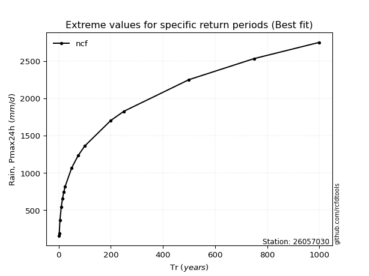</img>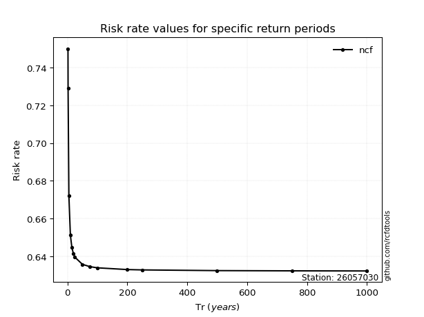</img>

</div>


<sub>**APP DISCLAIMER**: NO WARRANTY - This software is provided by [github.com/rcfdtools](https://github.com/rcfdtools) "as is", without any express or implied warranty, including warranties of merchantability, fitness for a particular purpose, or non-infringement. There is no guarantee that the software will be error-free or operate without interruption. LIMITATION OF LIABILITY - Neither the authors nor copyright holders will be liable for claims or damages arising from the software or its use. You are responsible for determining if the software is appropriate for your use and assume all associated risks, including errors, legal compliance, and data loss. NO PROFESSIONAL ADVICE - The software provides general information and does not offer professional advice. It should not replace consultation with professional advisors.</sub>