<div align="center">


</div>

# Station (rain, Pmax24h): 26065501

Probable Maximum Precipitation (PMP) is the greatest amount of rainfall for a specific duration that is meteorologically possible for a given location, acting as a "worst-case" scenario for extreme storms, crucial for designing safety-critical infrastructure like bridges, river deviations, dams, spillways, and nuclear plants to prevent catastrophic failure. PMP is calculated by hydrologists using meteorological data to determine the upper limit of extreme rainfall, often leading to the Probable Maximum Flood (PMF) for flood control design, and is increasingly being studied for climate change impacts.

<div align="center">

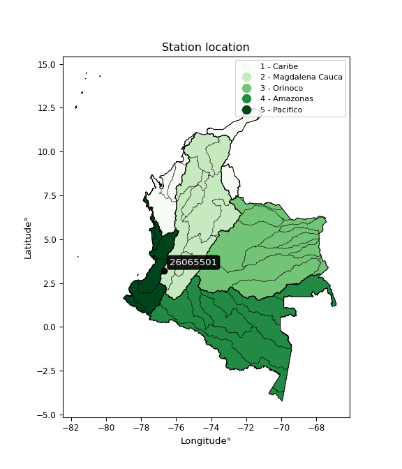</img>

</div>


## A. General information


### 1. General running parameters

• app_version: _v20251225_. • runtime: _2025-12-26 14:29:50.888910_. • Python version: _3.14.0_. • SciPy version: _1.16.3_. • Pandas version: _2.3.3_. • NumPy version: _2.3.5_. • Stations dataset (station_dataset_file): _dataset/pmax24h_in/automatic_colombia.csv_. • Stations catalog (station_catalog_file): _dataset/CNE_IDEAM.xls_. • Plot only fit distributions with Δo > Δ (plot_only_fit): _True_. • Eval low extreme values, if False, evaluates high extreme values (low_extreme): _False_. • Eval every SciPy distribution as logarithmic (pdist_logarithmic_on): _True_. • Standard deviation normalized (ddof): _1.0_. • Return periods to eval in years (Tr): _[2, 2.33, 5, 10, 15, 20, 25, 50, 75, 100, 200, 250, 500, 750, 1000]_. • Minimum data sample per station, 0 means any (minimum_sample): _5_. • Z-Score threshold to adjust a value, 0 means disable (zscore): _3.5_. • Avoid zeros, e.g. rain = 0 (avoid_zeros): _True_. • Avoid null values (avoid_nans): _True_. [:file_folder:Dataset file.](../../dataset/pmax24h_in/automatic_colombia.csv)


### 2. Station info and location

|   id |   CODIGO | NOMBRE                     | CATEGORIA               | TECNOLOGIA                | ESTADO   | FECHA_INSTALACION   |   FECHA_SUSPENSION |   ALTITUD |   LATITUD |   LONGITUD | DEPARTAMENTO    | MUNICIPIO   | AREA_OPERATIVA                         | ENTIDAD                                    | AREA_HIDROGRAFICA   | ZONA_HIDROGRAFICA   | SUBZONA_HIDROGRAFICA   |   CORRIENTE | OBSERVACION                                                                                                                                                                                                                                                   |   SUBRED | Catalogo   |
|-----:|---------:|:---------------------------|:------------------------|:--------------------------|:---------|:--------------------|-------------------:|----------:|----------:|-----------:|:----------------|:------------|:---------------------------------------|:-------------------------------------------|:--------------------|:--------------------|:-----------------------|------------:|:--------------------------------------------------------------------------------------------------------------------------------------------------------------------------------------------------------------------------------------------------------------|---------:|:-----------|
|    0 | 26065501 | JAMUNDI  - AUT  [26065501] | Climatológica Principal | Automática con Telemetría | Activa   | 01/09/2013          |                nan |      1791 |   3.21558 |   -76.6802 | Valle Del Cauca | Jamundí     | Area Operativa 09 - Cauca-Valle-Caldas | CENTRO NACIONAL DE INVESTIGACIONES DE CAFE | Magdalena Cauca     | Cauca               | Ríos Claro y Jamundí   |         nan | Mediante orfeo 20191040002573 se hace entrega del archivo Excel que contiene el catálogo de estaciones automáticas de Cenicafé, el cual comprende 103 estaciones, con el fin de que se actualice su metadata en el Catálogo Nacional de estaciones del IDEAM. |      nan | CNE_OE     |

<div align="center">

Map location in: [:earth_americas:Google](http://maps.google.com/maps?q=3.215580556,-76.68021944) [:earth_americas:OSM](https://www.openstreetmap.org/#map=18/3.215580556/-76.68021944&layers=P) [:earth_americas:Bing](https://www.bing.com/maps?cp=3.215580556~-76.68021944&lvl=18) [:earth_americas:Apple](https://maps.apple.com/frame?center=3.215580556%2C-76.68021944&span=0.003%2C0.006)

</div>


<div align="center">

```geojson
{
  "type": "Feature",
  "geometry": {
    "type": "Point", 
    "coordinates": [-76.68021944, 3.215580556]
  }, 
  "properties": {
    "Name": "26065501"
  }
}
```

</div>


### 3. Discrete values table and plot

|               |           0 |           1 |           2 |         3 |          4 |           5 |            6 |
|:--------------|------------:|------------:|------------:|----------:|-----------:|------------:|-------------:|
| Date          | 2017        | 2018        | 2019        | 2020      | 2021       | 2022        | 2023         |
| Value         |   70.9      |   83.8      |   83.7      |  112.4    |   65.6     |   71.9      |   81.2       |
| Value_initial |   70.9      |   83.8      |   83.7      |  112.4    |   65.6     |   71.9      |   81.2       |
| count         |    7        |    7        |    7        |    7      |    7       |    7        |    7         |
| mean          |   81.3571   |   81.3571   |   81.3571   |   81.3571 |   81.3571  |   81.3571   |   81.3571    |
| std           |   15.396    |   15.396    |   15.396    |   15.396  |   15.396   |   15.396    |   15.396     |
| zscore        |   -0.679213 |    0.158669 |    0.152173 |    2.0163 |   -1.02346 |   -0.614261 |   -0.0102067 |

<div align="center">

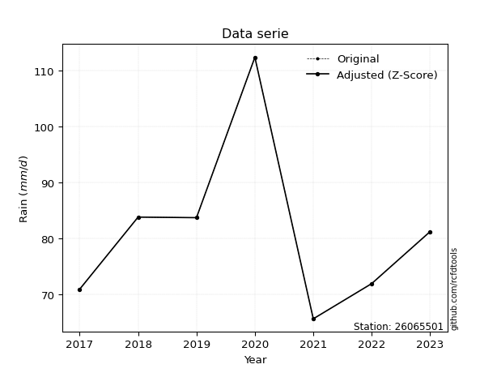</img>

</div>

> If Z-Score is active, values out of range or outliers are replaced with the station mean value.


### 4. Active continuous probability distributions from SciPy (45 of 104 available)

[scipy.stats](https://docs.scipy.org/doc/scipy/reference/stats.html) is a Python´s powerful submodule within the SciPy library for comprehensive statistical analysis, offering over 130 probability distributions (like Normal, Poisson), functions for descriptive stats (mean, variance), hypothesis testing (t-tests, chi-square), random variable generation, and statistical tests, making it essential for data science, modeling, and research. It provides tools to explore, model, and draw conclusions from data efficiently, working seamlessly with NumPy.

<div align="center">

|   id | p_dist             |   n_parameter | fit_method   | label                                                                       | active   | ref                                                                                                        |
|-----:|:-------------------|--------------:|:-------------|:----------------------------------------------------------------------------|:---------|:-----------------------------------------------------------------------------------------------------------|
|    0 | alpha              |             3 | MLE          | Alpha                                                                       | True     | [:mortar_board:](https://docs.scipy.org/doc/scipy/reference/generated/scipy.stats.alpha.html)              |
|    1 | betaprime          |             4 | MLE          | Beta prime                                                                  | True     | [:mortar_board:](https://docs.scipy.org/doc/scipy/reference/generated/scipy.stats.betaprime.html)          |
|    2 | chi2               |             3 | MLE          | Chi²                                                                        | True     | [:mortar_board:](https://docs.scipy.org/doc/scipy/reference/generated/scipy.stats.chi2.html)               |
|    3 | crystalball        |             4 | MLE          | Crystalball                                                                 | True     | [:mortar_board:](https://docs.scipy.org/doc/scipy/reference/generated/scipy.stats.crystalball.html)        |
|    4 | erlang             |             3 | MLE          | Erlang                                                                      | True     | [:mortar_board:](https://docs.scipy.org/doc/scipy/reference/generated/scipy.stats.erlang.html)             |
|    5 | expon              |             2 | MLE          | Exponential                                                                 | True     | [:mortar_board:](https://docs.scipy.org/doc/scipy/reference/generated/scipy.stats.expon.html)              |
|    6 | exponnorm          |             3 | MLE          | Exponentially modified Normal                                               | True     | [:mortar_board:](https://docs.scipy.org/doc/scipy/reference/generated/scipy.stats.exponnorm.html)          |
|    7 | f                  |             4 | MLE          | F                                                                           | True     | [:mortar_board:](https://docs.scipy.org/doc/scipy/reference/generated/scipy.stats.f.html)                  |
|    8 | fatiguelife        |             3 | MLE          | Fatigue-life (Birnbaum-Saunders)                                            | True     | [:mortar_board:](https://docs.scipy.org/doc/scipy/reference/generated/scipy.stats.fatiguelife.html)        |
|    9 | fisk               |             3 | MLE          | Fisk                                                                        | True     | [:mortar_board:](https://docs.scipy.org/doc/scipy/reference/generated/scipy.stats.fisk.html)               |
|   10 | gamma              |             3 | MLE          | Gamma                                                                       | True     | [:mortar_board:](https://docs.scipy.org/doc/scipy/reference/generated/scipy.stats.gamma.html)              |
|   11 | genexpon           |             5 | MLE          | Generalized exponential                                                     | True     | [:mortar_board:](https://docs.scipy.org/doc/scipy/reference/generated/scipy.stats.genexpon.html)           |
|   12 | genlogistic        |             3 | MLE          | Generalized logistic                                                        | True     | [:mortar_board:](https://docs.scipy.org/doc/scipy/reference/generated/scipy.stats.genlogistic.html)        |
|   13 | gibrat             |             2 | MM           | Gibrat                                                                      | True     | [:mortar_board:](https://docs.scipy.org/doc/scipy/reference/generated/scipy.stats.gibrat.html)             |
|   14 | gompertz           |             3 | MLE          | Gompertz (or truncated Gumbel)                                              | True     | [:mortar_board:](https://docs.scipy.org/doc/scipy/reference/generated/scipy.stats.gompertz.html)           |
|   15 | gumbel_l           |             2 | MM           | Gumbel Left Skew                                                            | True     | [:mortar_board:](https://docs.scipy.org/doc/scipy/reference/generated/scipy.stats.gumbel_l.html)           |
|   16 | gumbel_r           |             2 | MM           | Gumbel Right Skew                                                           | True     | [:mortar_board:](https://docs.scipy.org/doc/scipy/reference/generated/scipy.stats.gumbel_r.html)           |
|   17 | halflogistic       |             2 | MM           | Half-logistic                                                               | True     | [:mortar_board:](https://docs.scipy.org/doc/scipy/reference/generated/scipy.stats.halflogistic.html)       |
|   18 | halfnorm           |             2 | MM           | Half Normal                                                                 | True     | [:mortar_board:](https://docs.scipy.org/doc/scipy/reference/generated/scipy.stats.halfnorm.html)           |
|   19 | hypsecant          |             2 | MM           | hyperbolic secant                                                           | True     | [:mortar_board:](https://docs.scipy.org/doc/scipy/reference/generated/scipy.stats.hypsecant.html)          |
|   20 | invgamma           |             3 | MLE          | Inverted gamma                                                              | True     | [:mortar_board:](https://docs.scipy.org/doc/scipy/reference/generated/scipy.stats.invgamma.html)           |
|   21 | invgauss           |             3 | MLE          | Inverse Gaussian                                                            | True     | [:mortar_board:](https://docs.scipy.org/doc/scipy/reference/generated/scipy.stats.invgauss.html)           |
|   22 | invweibull         |             3 | MLE          | Inverted Weibull                                                            | True     | [:mortar_board:](https://docs.scipy.org/doc/scipy/reference/generated/scipy.stats.invweibull.html)         |
|   23 | johnsonsu          |             4 | MLE          | Johnson Su                                                                  | True     | [:mortar_board:](https://docs.scipy.org/doc/scipy/reference/generated/scipy.stats.johnsonsu.html)          |
|   24 | kstwobign          |             2 | MLE          | Limiting distribution of scaled Kolmogorov-Smirnov two-sided test statistic | True     | [:mortar_board:](https://docs.scipy.org/doc/scipy/reference/generated/scipy.stats.kstwobign.html)          |
|   25 | laplace            |             2 | MM           | Laplace                                                                     | True     | [:mortar_board:](https://docs.scipy.org/doc/scipy/reference/generated/scipy.stats.laplace.html)            |
|   26 | laplace_asymmetric |             3 | MLE          | Asymmetric Laplace                                                          | True     | [:mortar_board:](https://docs.scipy.org/doc/scipy/reference/generated/scipy.stats.laplace_asymmetric.html) |
|   27 | loggamma           |             3 | MLE          | Log gamma                                                                   | True     | [:mortar_board:](https://docs.scipy.org/doc/scipy/reference/generated/scipy.stats.loggamma.html)           |
|   28 | logistic           |             2 | MM           | Logistic (or Sech-squared)                                                  | True     | [:mortar_board:](https://docs.scipy.org/doc/scipy/reference/generated/scipy.stats.logistic.html)           |
|   29 | lognorm            |             3 | MLE          | Log Normal                                                                  | True     | [:mortar_board:](https://docs.scipy.org/doc/scipy/reference/generated/scipy.stats.lognorm.html)            |
|   30 | maxwell            |             2 | MM           | Maxwell                                                                     | True     | [:mortar_board:](https://docs.scipy.org/doc/scipy/reference/generated/scipy.stats.maxwell.html)            |
|   31 | mielke             |             4 | MLE          | Mielke Beta-Kappa / Dagum                                                   | True     | [:mortar_board:](https://docs.scipy.org/doc/scipy/reference/generated/scipy.stats.mielke.html)             |
|   32 | moyal              |             2 | MM           | Moyal                                                                       | True     | [:mortar_board:](https://docs.scipy.org/doc/scipy/reference/generated/scipy.stats.moyal.html)              |
|   33 | nakagami           |             3 | MLE          | Nakagami                                                                    | True     | [:mortar_board:](https://docs.scipy.org/doc/scipy/reference/generated/scipy.stats.nakagami.html)           |
|   34 | ncf                |             5 | MLE          | Non-central F distribution                                                  | True     | [:mortar_board:](https://docs.scipy.org/doc/scipy/reference/generated/scipy.stats.ncf.html)                |
|   35 | nct                |             4 | MLE          | Non-central Student’s t                                                     | True     | [:mortar_board:](https://docs.scipy.org/doc/scipy/reference/generated/scipy.stats.nct.html)                |
|   36 | norm               |             2 | MM           | Normal                                                                      | True     | [:mortar_board:](https://docs.scipy.org/doc/scipy/reference/generated/scipy.stats.norm.html)               |
|   37 | pareto             |             3 | MLE          | Pareto                                                                      | True     | [:mortar_board:](https://docs.scipy.org/doc/scipy/reference/generated/scipy.stats.pareto.html)             |
|   38 | pearson3           |             3 | MM           | Pearson type III                                                            | True     | [:mortar_board:](https://docs.scipy.org/doc/scipy/reference/generated/scipy.stats.pearson3.html)           |
|   39 | rayleigh           |             2 | MM           | Rayleigh                                                                    | True     | [:mortar_board:](https://docs.scipy.org/doc/scipy/reference/generated/scipy.stats.rayleigh.html)           |
|   40 | rice               |             3 | MLE          | Rice                                                                        | True     | [:mortar_board:](https://docs.scipy.org/doc/scipy/reference/generated/scipy.stats.rice.html)               |
|   41 | t                  |             3 | MLE          | Student’s t                                                                 | True     | [:mortar_board:](https://docs.scipy.org/doc/scipy/reference/generated/scipy.stats.t.html)                  |
|   42 | truncnorm          |             4 | MLE          | Truncated normal                                                            | True     | [:mortar_board:](https://docs.scipy.org/doc/scipy/reference/generated/scipy.stats.truncnorm.html)          |
|   43 | wald               |             2 | MM           | Wald                                                                        | True     | [:mortar_board:](https://docs.scipy.org/doc/scipy/reference/generated/scipy.stats.wald.html)               |
|   44 | weibull_min        |             3 | MLE          | Weibull minimum                                                             | True     | [:mortar_board:](https://docs.scipy.org/doc/scipy/reference/generated/scipy.stats.weibull_min.html)        |

</div>

> **n_parameter:** # arguments & localization & scale.
>
> **Fit methods:** (MLE) maximum likelihood, (MM) L-moments.
>
>**Inactive:** foldnorm, gennorm, norminvgauss, powernorm, powerlognorm, skewnorm, genextreme, anglit, arcsine, argus, beta, bradford, burr, burr12, cauchy, cosine, halfcauchy, foldcauchy, skewcauchy, wrapcauchy, dgamma, gengamma, exponweib, exponpow, truncexpon, gausshyper, genhalflogistic, genhyperbolic, geninvgauss, halfgennorm, johnsonsb, kappa4, kappa3, ksone, kstwo, loglaplace, levy, levy_l, levy_stable, ncx2, genpareto, truncpareto, lomax, powerlaw, rdist, rel_breitwigner, recipinvgauss, semicircular, studentized_range, trapezoid, triang, truncweibull_min, tukeylambda, uniform, loguniform, vonmises, vonmises_line, weibull_max, dweibull, 


## B. Probability distributions vs. Empirical distributions

A continuous probability distribution (CPD) describes probabilities for variables that can take any value within a range (like rain any time), unlike discrete variables with specific outcomes (like temperature). It uses a Probability Density Function (PDF), a curve where the total area under it equals 1, and the probability of the variable falling within an interval (a to b) is found by calculating the area under the curve between those points. A key feature is that the probability of hitting any single exact value is zero, so probabilities are always expressed for ranges, e.g., $P(a ≤ X ≤ b)$.

<div align="center">

Distributions parameters
|    |   station | p_dist                |   n |          loc |          scale | shape                 | shape1             | shape2                | shape3   |
|---:|----------:|:----------------------|----:|-------------:|---------------:|:----------------------|:-------------------|:----------------------|:---------|
|  0 |  26065501 | alpha                 |   7 |    40.8933   |  124.557       | 3.4065516659017945    |                    |                       |          |
|  1 |  26065501 | betaprime             |   7 |    -0.732494 |   15.7084      | 243.65038146897086    | 47.765408303895725 |                       |          |
|  2 |  26065501 | chi2                  |   7 |    65.6      |    3.68677     | 0.3921975412731601    |                    |                       |          |
|  3 |  26065501 | crystalball           |   7 |    81.3571   |   14.2539      | 6723.237369934443     | 1412.5044217794896 |                       |          |
|  4 |  26065501 | erlang                |   7 |    65.6      |   31.1858      | 0.32835835291583126   |                    |                       |          |
|  5 |  26065501 | expon                 |   7 |    65.6      |   15.7571      |                       |                    |                       |          |
|  6 |  26065501 | exponnorm             |   7 |    65.5779   |    0.00640362  | 2464.4918265261285    |                    |                       |          |
|  7 |  26065501 | f                     |   7 |    55.6426   |   19.9227      | 173.2506303798367     | 8.464633061654382  |                       |          |
|  8 |  26065501 | fatiguelife           |   7 |    65.6      |    0.000241542 | 218.77225358342827    |                    |                       |          |
|  9 |  26065501 | fisk                  |   7 |    62.4533   |   14.606       | 2.117745338204841     |                    |                       |          |
| 10 |  26065501 | gamma                 |   7 |    65.6      |   23.5609      | 0.33036489547933245   |                    |                       |          |
| 11 |  26065501 | genexpon              |   7 |    65.5904   |    2.26164     | 0.12660251596419347   | 2.80315467529686   | 0.0009343929719790552 |          |
| 12 |  26065501 | genlogistic           |   7 |     5.85361  |    9.8114      | 1172.5683378563208    |                    |                       |          |
| 13 |  26065501 | gibrat                |   7 |    70.4832   |    6.59537     |                       |                    |                       |          |
| 14 |  26065501 | gompertz              |   7 |    65.6      |  113.206       | 6.29125489914767      |                    |                       |          |
| 15 |  26065501 | gumbel_l              |   7 |    87.7722   |   11.1137      |                       |                    |                       |          |
| 16 |  26065501 | gumbel_r              |   7 |    74.9421   |   11.1137      |                       |                    |                       |          |
| 17 |  26065501 | halflogistic          |   7 |    64.463    |   12.1866      |                       |                    |                       |          |
| 18 |  26065501 | halfnorm              |   7 |    62.4906   |   23.6458      |                       |                    |                       |          |
| 19 |  26065501 | hypsecant             |   7 |    81.3571   |    9.07432     |                       |                    |                       |          |
| 20 |  26065501 | invgamma              |   7 |    55.168    |   85.7919      | 4.228943804495691     |                    |                       |          |
| 21 |  26065501 | invgauss              |   7 |    60.1553   |   38.2216      | 0.5547089957341721    |                    |                       |          |
| 22 |  26065501 | invweibull            |   7 |    40.3887   |   33.5213      | 3.8980127332778345    |                    |                       |          |
| 23 |  26065501 | johnsonsu             |   7 |    61.3066   |    0.28147     | -6.407827620895397    | 1.3613852941864168 |                       |          |
| 24 |  26065501 | kstwobign             |   7 |    39.5039   |   48.4061      |                       |                    |                       |          |
| 25 |  26065501 | laplace               |   7 |    81.3571   |   10.079       |                       |                    |                       |          |
| 26 |  26065501 | laplace_asymmetric    |   7 |    81.2      |   10.2112      | 0.9909375436622319    |                    |                       |          |
| 27 |  26065501 | loggamma              |   7 | -5416.21     |  708.115       | 2353.972559857806     |                    |                       |          |
| 28 |  26065501 | logistic              |   7 |    81.3571   |    7.85859     |                       |                    |                       |          |
| 29 |  26065501 | lognorm               |   7 |    65.6      |    0.101905    | 12.103380510669696    |                    |                       |          |
| 30 |  26065501 | maxwell               |   7 |    47.5814   |   21.1658      |                       |                    |                       |          |
| 31 |  26065501 | mielke                |   7 |    -6.95556  |   50.8612      | 616.074375380236      | 8.943621932051393  |                       |          |
| 32 |  26065501 | moyal                 |   7 |    73.2058   |    6.41651     |                       |                    |                       |          |
| 33 |  26065501 | nakagami              |   7 |    65.6      |   20.2709      | 0.21011378871352146   |                    |                       |          |
| 34 |  26065501 | ncf                   |   7 |   -10.0627   |   83.8239      | 88.63012888742105     | 71065.07371158138  | 8.032301450468722     |          |
| 35 |  26065501 | nct                   |   7 |    -0.179827 |    1.48653     | 21.38695166128963     | 52.83045982480607  |                       |          |
| 36 |  26065501 | norm                  |   7 |    81.3571   |   14.2539      |                       |                    |                       |          |
| 37 |  26065501 | pareto                |   7 |    65.5863   |    0.0137233   | 0.1681149958430296    |                    |                       |          |
| 38 |  26065501 | pearson3              |   7 |    81.3571   |   14.2539      | 1.1859147876894518    |                    |                       |          |
| 39 |  26065501 | rayleigh              |   7 |    54.0886   |   21.7572      |                       |                    |                       |          |
| 40 |  26065501 | rice                  |   7 |    58.6049   |   18.9847      | 0.002304692810739661  |                    |                       |          |
| 41 |  26065501 | t                     |   7 |    81.3547   |   14.2514      | 7014.39248886589      |                    |                       |          |
| 42 |  26065501 | truncnorm             |   7 |  -175.837    |   25.2773      | 10.164797361063261    | 5341.700188180344  |                       |          |
| 43 |  26065501 | wald                  |   7 |    67.1033   |   14.2539      |                       |                    |                       |          |
| 44 |  26065501 | weibull_min           |   7 |    65.6      |   17.3312      | 0.6363619648285983    |                    |                       |          |
| 45 |  26065501 | logalpha              |   7 |     1.29314  |   61.3829      | 19.91177175987839     |                    |                       |          |
| 46 |  26065501 | logbetaprime          |   7 |     4.18358  |    3.28354     | 0.727496722061651     | 13.685719656682904 |                       |          |
| 47 |  26065501 | logchi2               |   7 |     4.18358  |    0.982648    | 1.019951173710034     |                    |                       |          |
| 48 |  26065501 | logcrystalball        |   7 |     4.38496  |    0.162724    | 15.917263129508008    | 2.927340069105216  |                       |          |
| 49 |  26065501 | logerlang             |   7 |     4.18358  |    0.248852    | 0.48307140109345736   |                    |                       |          |
| 50 |  26065501 | logexpon              |   7 |     4.18358  |    0.201392    |                       |                    |                       |          |
| 51 |  26065501 | logexponnorm          |   7 |     4.20017  |    0.0407909   | 4.5304622871737       |                    |                       |          |
| 52 |  26065501 | logf                  |   7 |     4.18132  |    0.204723    | 1.762498375400451     | 49.69580449841027  |                       |          |
| 53 |  26065501 | logfatiguelife        |   7 |     4.08991  |    0.251312    | 0.5888506029449616    |                    |                       |          |
| 54 |  26065501 | logfisk               |   7 |     4.09916  |    0.247181    | 2.874462579932879     |                    |                       |          |
| 55 |  26065501 | loggamma              |   7 |     4.18358  |    0.26042     | 0.3150797870626322    |                    |                       |          |
| 56 |  26065501 | loggenexpon           |   7 |     4.1833   |    0.588106    | 2.2054673790252206    | 4.429582488878939  | 0.65795763102135      |          |
| 57 |  26065501 | loggenlogistic        |   7 |     3.48807  |    0.122142    | 844.456651889979      |                    |                       |          |
| 58 |  26065501 | loggibrat             |   7 |     4.26075  |    0.0753383   |                       |                    |                       |          |
| 59 |  26065501 | loggompertz           |   7 |     4.18358  |    0.358309    | 0.9661633687954654    |                    |                       |          |
| 60 |  26065501 | loggumbel_l           |   7 |     4.4582   |    0.126872    |                       |                    |                       |          |
| 61 |  26065501 | loggumbel_r           |   7 |     4.31173  |    0.126872    |                       |                    |                       |          |
| 62 |  26065501 | loghalflogistic       |   7 |     4.19208  |    0.139137    |                       |                    |                       |          |
| 63 |  26065501 | loghalfnorm           |   7 |     4.16959  |    0.269936    |                       |                    |                       |          |
| 64 |  26065501 | loghypsecant          |   7 |     4.38497  |    0.103591    |                       |                    |                       |          |
| 65 |  26065501 | loginvgamma           |   7 |    -0.951392 | 6074.44        | 1139.59034310056      |                    |                       |          |
| 66 |  26065501 | loginvgauss           |   7 |     4.07258  |    0.987672    | 0.31628511041610885   |                    |                       |          |
| 67 |  26065501 | loginvweibull         |   7 |     3.19397  |    1.11067     | 9.512404946958853     |                    |                       |          |
| 68 |  26065501 | logjohnsonsu          |   7 |     4.08111  |    0.0107169   | -7.122586706581409    | 1.829040056520944  |                       |          |
| 69 |  26065501 | logkstwobign          |   7 |     3.87458  |    0.587777    |                       |                    |                       |          |
| 70 |  26065501 | loglaplace            |   7 |     4.38497  |    0.11506     |                       |                    |                       |          |
| 71 |  26065501 | loglaplace_asymmetric |   7 |     4.39692  |    0.122072    | 1.0501264896646576    |                    |                       |          |
| 72 |  26065501 | logloggamma           |   7 |   -38.2742   |    5.96026     | 1283.7045472335785    |                    |                       |          |
| 73 |  26065501 | loglogistic           |   7 |     4.38497  |    0.0897123   |                       |                    |                       |          |
| 74 |  26065501 | loglognorm            |   7 |     4.18358  |    0.00171351  | 11.56438103409513     |                    |                       |          |
| 75 |  26065501 | logmaxwell            |   7 |     3.99939  |    0.241625    |                       |                    |                       |          |
| 76 |  26065501 | logmielke             |   7 |   -79.314    |   83.2302      | 18920.37516156318     | 692.9940961184002  |                       |          |
| 77 |  26065501 | logmoyal              |   7 |     4.29191  |    0.0732498   |                       |                    |                       |          |
| 78 |  26065501 | lognakagami           |   7 |     4.18358  |    0.237324    | 0.42150677604928544   |                    |                       |          |
| 79 |  26065501 | logncf                |   7 |     3.55743  |    0.0110138   | 1.5375760377896368    | 3015.4212027680896 | 114.05556544396228    |          |
| 80 |  26065501 | lognct                |   7 |    -0.130873 |    0.0599659   | 470.48041149157734    | 75.19200816378248  |                       |          |
| 81 |  26065501 | lognorm               |   7 |     4.38497  |    0.16272     |                       |                    |                       |          |
| 82 |  26065501 | logpareto             |   7 |     4.18339  |    0.000184901 | 0.16805052097822046   |                    |                       |          |
| 83 |  26065501 | logpearson3           |   7 |     4.38497  |    0.16272     | 0.8980025912903766    |                    |                       |          |
| 84 |  26065501 | lograyleigh           |   7 |     4.07367  |    0.248376    |                       |                    |                       |          |
| 85 |  26065501 | logrice               |   7 |     4.11019  |    0.225809    | 0.0004911996327244801 |                    |                       |          |
| 86 |  26065501 | logt                  |   7 |     4.36226  |    0.130249    | 4.803360139639022     |                    |                       |          |
| 87 |  26065501 | logtruncnorm          |   7 |    -0.837233 |    1.1864      | 4.231956063997721     | 4.685838870054585  |                       |          |
| 88 |  26065501 | logwald               |   7 |     4.22225  |    0.162721    |                       |                    |                       |          |
| 89 |  26065501 | logweibull_min        |   7 |     4.18358  |    0.169047    | 0.4736325577438941    |                    |                       |          |

</div>

> **loc** (Location parameter): This shifts the distribution along the x-axis. For many common distributions, like the normal (Gaussian) distribution, loc represents the mean $μ$. For others, like the uniform distribution, it might represent the minimum value, or for the beta distribution, the left end of the support interval.
>
> **scale** (Scale parameter): This determines the width or spread of the distribution. For the normal distribution, scale represents the standard deviation $σ$. For a uniform distribution, it defines the length of the interval (from $loc$ to $loc + scale$).
>
> **shape** (Shape parameters): Refers to parameters that define the specific form of a probability distribution, distinct from its location (loc) and scale (scale). These parameters are required arguments for most distribution functions. For example, a normal (Gaussian) distribution is fully defined by its location (mean) and scale (standard deviation), so it has no specific shape parameters beyond loc and scale. However, other distributions have intrinsic properties that need specification, as Gamma distribution that takes a shape parameter, often named $a$ or $alpha$.


### 0. Cumulative distribution values - CDF (90 evaluated)

> Ordered by x ascending and calculating $log(f(x))$ separately. 

|   id |   Station |   date |     x |   count |    mean |    std |     zscore |   Value_initial |   station |   m |     alpha |   alpha_pdf |   betaprime |   betaprime_pdf |       chi2 |    chi2_pdf |   crystalball |   crystalball_pdf |      erlang |   erlang_pdf |    expon |   expon_pdf |   exponnorm |   exponnorm_pdf |         f |      f_pdf |   fatiguelife |   fatiguelife_pdf |      fisk |   fisk_pdf |       gamma |   gamma_pdf |    genexpon |   genexpon_pdf |   genlogistic |   genlogistic_pdf |    gibrat |   gibrat_pdf |    gompertz |   gompertz_pdf |   gumbel_l |   gumbel_l_pdf |   gumbel_r |   gumbel_r_pdf |   halflogistic |   halflogistic_pdf |   halfnorm |   halfnorm_pdf |   hypsecant |   hypsecant_pdf |   invgamma |   invgamma_pdf |   invgauss |   invgauss_pdf |   invweibull |   invweibull_pdf |   johnsonsu |   johnsonsu_pdf |   kstwobign |   kstwobign_pdf |   laplace |   laplace_pdf |   laplace_asymmetric |   laplace_asymmetric_pdf |    loggamma |   loggamma_pdf |   logistic |   logistic_pdf |   lognorm |   lognorm_pdf |   maxwell |   maxwell_pdf |    mielke |   mielke_pdf |     moyal |   moyal_pdf |    nakagami |   nakagami_pdf |      ncf |   ncf_pdf |       nct |    nct_pdf |     norm |   norm_pdf |   pareto |   pareto_pdf |   pearson3 |   pearson3_pdf |   rayleigh |   rayleigh_pdf |     rice |   rice_pdf |        t |      t_pdf |   truncnorm |   truncnorm_pdf |     wald |   wald_pdf |   weibull_min |   weibull_min_pdf |   logalpha |   logalpha_pdf |   logbetaprime |   logbetaprime_pdf |     logchi2 |   logchi2_pdf |   logcrystalball |   logcrystalball_pdf |   logerlang |   logerlang_pdf |   logexpon |   logexpon_pdf |   logexponnorm |   logexponnorm_pdf |      logf |   logf_pdf |   logfatiguelife |   logfatiguelife_pdf |   logfisk |   logfisk_pdf |   loggenexpon |   loggenexpon_pdf |   loggenlogistic |   loggenlogistic_pdf |   loggibrat |   loggibrat_pdf |   loggompertz |   loggompertz_pdf |   loggumbel_l |   loggumbel_l_pdf |   loggumbel_r |   loggumbel_r_pdf |   loghalflogistic |   loghalflogistic_pdf |   loghalfnorm |   loghalfnorm_pdf |   loghypsecant |   loghypsecant_pdf |   loginvgamma |   loginvgamma_pdf |   loginvgauss |   loginvgauss_pdf |   loginvweibull |   loginvweibull_pdf |   logjohnsonsu |   logjohnsonsu_pdf |   logkstwobign |   logkstwobign_pdf |   loglaplace |   loglaplace_pdf |   loglaplace_asymmetric |   loglaplace_asymmetric_pdf |   logloggamma |   logloggamma_pdf |   loglogistic |   loglogistic_pdf |   loglognorm |   loglognorm_pdf |   logmaxwell |   logmaxwell_pdf |   logmielke |   logmielke_pdf |   logmoyal |   logmoyal_pdf |   lognakagami |   lognakagami_pdf |    logncf |   logncf_pdf |    lognct |   lognct_pdf |   logpareto |   logpareto_pdf |   logpearson3 |   logpearson3_pdf |   lograyleigh |   lograyleigh_pdf |   logrice |   logrice_pdf |     logt |   logt_pdf |   logtruncnorm |   logtruncnorm_pdf |   logwald |   logwald_pdf |   logweibull_min |   logweibull_min_pdf |
|-----:|----------:|-------:|------:|--------:|--------:|-------:|-----------:|----------------:|----------:|----:|----------:|------------:|------------:|----------------:|-----------:|------------:|--------------:|------------------:|------------:|-------------:|---------:|------------:|------------:|----------------:|----------:|-----------:|--------------:|------------------:|----------:|-----------:|------------:|------------:|------------:|---------------:|--------------:|------------------:|----------:|-------------:|------------:|---------------:|-----------:|---------------:|-----------:|---------------:|---------------:|-------------------:|-----------:|---------------:|------------:|----------------:|-----------:|---------------:|-----------:|---------------:|-------------:|-----------------:|------------:|----------------:|------------:|----------------:|----------:|--------------:|---------------------:|-------------------------:|------------:|---------------:|-----------:|---------------:|----------:|--------------:|----------:|--------------:|----------:|-------------:|----------:|------------:|------------:|---------------:|---------:|----------:|----------:|-----------:|---------:|-----------:|---------:|-------------:|-----------:|---------------:|-----------:|---------------:|---------:|-----------:|---------:|-----------:|------------:|----------------:|---------:|-----------:|--------------:|------------------:|-----------:|---------------:|---------------:|-------------------:|------------:|--------------:|-----------------:|---------------------:|------------:|----------------:|-----------:|---------------:|---------------:|-------------------:|----------:|-----------:|-----------------:|---------------------:|----------:|--------------:|--------------:|------------------:|-----------------:|---------------------:|------------:|----------------:|--------------:|------------------:|--------------:|------------------:|--------------:|------------------:|------------------:|----------------------:|--------------:|------------------:|---------------:|-------------------:|--------------:|------------------:|--------------:|------------------:|----------------:|--------------------:|---------------:|-------------------:|---------------:|-------------------:|-------------:|-----------------:|------------------------:|----------------------------:|--------------:|------------------:|--------------:|------------------:|-------------:|-----------------:|-------------:|-----------------:|------------:|----------------:|-----------:|---------------:|--------------:|------------------:|----------:|-------------:|----------:|-------------:|------------:|----------------:|--------------:|------------------:|--------------:|------------------:|----------:|--------------:|---------:|-----------:|---------------:|-------------------:|----------:|--------------:|-----------------:|---------------------:|
|    0 |  26065501 |   2021 |  65.6 |       7 | 81.3571 | 15.396 | -1.02346   |            65.6 |  26065501 |   1 | 0.0510557 |  0.0213995  |    0.10503  |      0.0180396  | 0.00141573 | 1.95359e+10 |      0.13448  |        0.0151919  | 1.02662e-05 |  2.37213e+08 | 0        |  0.0634633  |  0.00139921 |      0.0632583  | 0.0454596 | 0.0236582  |     0.0857961 |       3.96693e+07 | 0.0372953 | 0.0241636  | 1.04948e-05 | 2.43976e+08 | 0.000538128 |     0.0559529  |     0.0703193 |        0.019005   | 0         |   0          | 5.37028e-14 |     0.0555735  |   0.127166 |    0.0106818   |  0.0984957 |     0.0205411  |      0.0466179 |         0.0409396  |   0.104621 |     0.0334527  |    0.110998 |      0.0119857  |  0.0454396 |     0.0236393  |  0.0404537 |     0.027934   |    0.0480316 |       0.0225456  |   0.0397814 |      0.0271452  |    0.066668 |      0.0191338  |  0.104716 |    0.0103895  |             0.106033 |               0.010479   | 3.08829e-05 |    1.09557e+10 |   0.11867  |     0.0133087  |  0.107921 |      1.13984  |  0.132626 |    0.0190154  | 0.0599498 |   0.0203775  | 0.0704782 |  0.0219046  | 3.37071e-07 |     9.9675e+06 | 0.120268 | 0.0165935 | 0.0938212 | 0.0185299  | 0.13448  | 0.0151919  | 0        | 12.2504      |  0.0942038 |     0.0245748  |   0.130612 |     0.0211416  | 0.065629 | 0.0181345  | 0.134493 | 0.0151931  |   0         |     0           | 0        | 0          |   2.51021e-10 |     11240.7       |  0.0926236 |       1.2188   |    3.97645e-05 |         151.139    | 1.68554e-08 |   9.67804e+06 |         0.10793  |             1.13988  | 1.18446e-07 |     6.44214e+07 |   0        |       4.96544  |      0.0448617 |           1.60843  | 0.0175227 |    6.79944 |        0.0405008 |             1.77432  | 0.0435932 |      1.41972  |    0.00103131 |          3.74856  |        0.0585951 |              1.35876 | 0           |      0          |   7.27895e-08 |          2.69645  |      0.108454 |          0.806703 |     0.0641843 |          1.38919  |          0        |               0       |     0.0413206 |           2.95187 |       0.090495 |           0.861861 |      0.100537 |          1.17279  |     0.0419446 |          1.68717  |       0.0499043 |            1.43795  |      0.0426809 |            1.61248 |      0.0549095 |           1.40883  |    0.0868597 |         0.754905 |               0.0992945 |                    0.774583 |      0.114417 |          1.14949  |     0.0957933 |          0.965497 |   0.00721965 |      1.94966e+12 |    0.0992484 |         1.43499  |   0.0603324 |        1.33612  |  0.0361787 |       1.27141  |   5.39819e-13 |        512.369    | 0.0888067 |     1.19583  | 0.0994647 |      1.17447 |    0        |     908.866     |     0.0758303 |          1.52745  |     0.0932547 |          1.61536  | 0.0514368 |      1.36516  | 0.115356 |   1.11448  |    1.76487e-08 |           4.26133  |  0        |      0        |      1.72489e-07 |          9.19818e+07 |
|    1 |  26065501 |   2017 |  70.9 |       7 | 81.3571 | 15.396 | -0.679213  |            70.9 |  26065501 |   2 | 0.228389  |  0.0418457  |    0.226078 |      0.0271651  | 0.919638   | 0.0183864   |      0.231586 |        0.0213847  | 0.600322    |  0.0326889   | 0.285631 |  0.0453362  |  0.286257   |      0.045226   | 0.240403  | 0.0440683  |     0.750817  |       0.0202642   | 0.238706  | 0.0455618  | 0.647944    | 0.0340378   | 0.26246     |     0.0432892  |     0.212786  |        0.0335388  | 0.0028766 |   0.0211357  | 0.260324    |     0.0430766  |   0.196774 |    0.0158365   |  0.237248  |     0.0307113  |      0.25813   |         0.0382949  |   0.277892 |     0.0316754  |    0.194782 |      0.0201504  |  0.240269  |     0.0440511  |  0.25864   |     0.0454322  |    0.236211  |       0.043547   |   0.254679  |      0.0455188  |    0.20582  |      0.0318946  |  0.177167 |    0.0175778  |             0.179027 |               0.0176928  | 0.712781    |    2.29607     |   0.20905  |     0.0210404  |  0.223572 |      1.83647  |  0.250296 |    0.0249387  | 0.220398  |   0.0378719  | 0.231371  |  0.036358   | 0.446738    |     0.0350029  | 0.228237 | 0.0239251 | 0.221237  | 0.0288778  | 0.231586 | 0.0213847  | 0.632778 |  0.0116181   |  0.250662  |     0.0326852  |   0.258085 |     0.0263484  | 0.189184 | 0.0276597  | 0.23161  | 0.0213878  |   0         |     0           | 0.129829 | 0.0741295  |   0.375309    |         0.03529   |  0.220983  |       2.06833  |    0.416767    |           3.19646  | 0.214286    |   1.3701      |         0.223584 |             1.83648  | 0.583599    |     2.92736     |   0.320086 |       3.37607  |      0.270929  |           3.58223  | 0.347386  |    3.15645 |        0.256474  |             3.25051  | 0.229241  |      3.133    |    0.271874   |          3.18868  |        0.222459  |              2.73503 | 3.14684e-07 |      0.00314716 |   0.208597    |          2.6507   |      0.19086  |          1.35067  |     0.225714  |          2.64812  |          0.243631 |               3.38029 |     0.265871  |           2.79017 |       0.187285 |           1.70541  |      0.221694 |          1.94035  |     0.250135  |          3.20905  |       0.232088  |            3.02133  |      0.244598  |            3.18308 |      0.220306  |           2.67814  |    0.170638  |         1.48303  |               0.182031  |                    1.42     |      0.229472 |          1.81023  |     0.201198  |          1.79148  |   0.629235   |      0.420507    |    0.240919  |         2.15596  |   0.220952  |        2.69103  |  0.217704  |       3.14053  |   0.301767    |          3.17158  | 0.215442  |     2.04848  | 0.220831  |      1.94222 |    0.637795 |       0.781574  |     0.237468  |          2.50819  |     0.24816   |          2.28628  | 0.200539  |      2.36874  | 0.237279 |   2.06581  |    0.288972    |           3.22295  |  0.102225 |      6.2574   |      0.499417    |          2.11164     |
|    2 |  26065501 |   2022 |  71.9 |       7 | 81.3571 | 15.396 | -0.614261  |            71.9 |  26065501 |   3 | 0.270841  |  0.0429107  |    0.253904 |      0.0284561  | 0.935684   | 0.0139718   |      0.253512 |        0.0224588  | 0.630654    |  0.0281876   | 0.329558 |  0.0425484  |  0.33008    |      0.0424492  | 0.284626  | 0.0442279  |     0.769799  |       0.0177996   | 0.284381  | 0.045622   | 0.679374    | 0.0290578   | 0.304681    |     0.0411663  |     0.247188  |        0.0351902  | 0.062028  |   0.0862925  | 0.302351    |     0.0409896  |   0.213176 |    0.0169737   |  0.268513  |     0.0317676  |      0.296003  |         0.0374339  |   0.309321 |     0.0311746  |    0.215854 |      0.0220057  |  0.284476  |     0.0442136  |  0.303576  |     0.0443301  |    0.280111  |       0.044095   |   0.299826  |      0.0446556  |    0.238388 |      0.0331779  |  0.195647 |    0.0194112  |             0.197624 |               0.0195307  | 0.742347    |    1.94235     |   0.230868 |     0.0225954  |  0.25012  |      1.9534   |  0.275635 |    0.0257191  | 0.259039  |   0.0392988  | 0.268245  |  0.0372946  | 0.479903    |     0.0314781  | 0.252751 | 0.0250853 | 0.250815  | 0.0302359  | 0.253512 | 0.0224588  | 0.643271 |  0.0094986   |  0.283581  |     0.033103   |   0.284727 |     0.0269132  | 0.217463 | 0.0288661  | 0.25354  | 0.0224622  |   0         |     0           | 0.204792 | 0.074543   |   0.408564    |         0.031376  |  0.250872  |       2.19743  |    0.459236    |           2.87757  | 0.232632    |   1.25425     |         0.250132 |             1.9534   | 0.621777    |     2.53994     |   0.365764 |       3.14926  |      0.320632  |           3.49879  | 0.389847  |    2.91182 |        0.301932  |             3.23162  | 0.274004  |      3.24677  |    0.315707   |          3.07015  |        0.261765  |              2.87017 | 0.0498534   |      7.08507    |   0.245566    |          2.62761  |      0.210616 |          1.47149  |     0.263708  |          2.7705   |          0.290362 |               3.29062 |     0.30459   |           2.73775 |       0.21254  |           1.90263  |      0.249753 |          2.06482  |     0.295206  |          3.21729  |       0.275195  |            3.12365  |      0.289489  |            3.21694 |      0.258584  |           2.78089  |    0.192726  |         1.675    |               0.203046  |                    1.58394  |      0.255607 |          1.92068  |     0.227461  |          1.95874  |   0.634637   |      0.354565    |    0.271745  |         2.24326  |   0.259682  |        2.83222  |  0.2626    |       3.25766  |   0.345225    |          3.03574  | 0.245065  |     2.17934  | 0.248908  |      2.06546 |    0.647723 |       0.644284  |     0.273242  |          2.5952   |     0.280653  |          2.35079  | 0.23451   |      2.47835  | 0.267496 |   2.24804  |    0.332985    |           3.0633   |  0.193463 |      6.56249  |      0.52692     |          1.8289      |
|    3 |  26065501 |   2023 |  81.2 |       7 | 81.3571 | 15.396 | -0.0102067 |            81.2 |  26065501 |   4 | 0.624328  |  0.029103   |    0.541702 |      0.0304142  | 0.989097   | 0.00190954  |      0.495602 |        0.0279866  | 0.795259    |  0.0113779   | 0.628433 |  0.0235808  |  0.628382   |      0.0235474  | 0.628094  | 0.027372   |     0.877307  |       0.00756523  | 0.629148  | 0.0263573  | 0.842443    | 0.0106695   | 0.607825    |     0.0250778  |     0.581666  |        0.0321165  | 0.686319  |   0.0330882  | 0.605257    |     0.0251784  |   0.42511  |    0.0286354   |  0.565834  |     0.0289927  |      0.595858  |         0.0264616  |   0.571195 |     0.024674   |    0.494488 |      0.0350728  |  0.627906  |     0.0273743  |  0.629331  |     0.0255463  |    0.628521  |       0.027878   |   0.630363  |      0.0258278  |    0.551805 |      0.0307753  |  0.492265 |    0.0488405  |             0.495448 |               0.048964   | 0.883083    |    0.682833    |   0.495001 |     0.0318091  |  0.529266 |      2.44511  |  0.528822 |    0.0269381  | 0.605643  |   0.0307002  | 0.591705  |  0.0288803  | 0.69022     |     0.0167677  | 0.515162 | 0.0291241 | 0.550446  | 0.0307668  | 0.495602 | 0.0279866  | 0.69364  |  0.00329862  |  0.574596  |     0.0273605  |   0.539928 |     0.0263496  | 0.507498 | 0.0308755  | 0.495669 | 0.0279906  |   0.0391456 |     0.390207    | 0.663667 | 0.0284559  |   0.607502    |         0.0149738 |  0.553667  |       2.51897  |    0.702197    |           1.3724   | 0.350576    |   0.779493    |         0.529273 |             2.44505  | 0.81724     |     1.00689     |   0.65331  |       1.72147  |      0.646647  |           1.91206  | 0.650998  |    1.55599 |        0.633264  |             2.09291  | 0.630664  |      2.24864  |    0.624273   |          2.01059  |        0.609356  |              2.47055 | 0.723026    |      2.45918    |   0.544442    |          2.22801  |      0.460386 |          2.62381  |     0.599895  |          2.41618  |          0.626772 |               2.18187 |     0.600293  |           2.07337 |       0.536631 |           3.05244  |      0.541203 |          2.50177  |     0.631216  |          2.14173  |       0.626225  |            2.31772  |      0.630781  |            2.18399 |      0.591429  |           2.40549  |    0.549314  |         3.91695  |               0.524436  |                    4.09105  |      0.528774 |          2.39326  |     0.533245  |          2.77437  |   0.661724   |      0.148226    |    0.560916  |         2.30932  |   0.60656   |        2.48759  |  0.625306  |       2.36072  |   0.650896    |          2.01419  | 0.547334  |     2.53185  | 0.539367  |      2.48504 |    0.694266 |       0.240623  |     0.58806   |          2.32782  |     0.571234  |          2.24661  | 0.553424  |      2.51117  | 0.599395 |   2.78772  |    0.633712    |           1.95897  |  0.695849 |      2.19898  |      0.672583    |          0.811593    |
|    4 |  26065501 |   2019 |  83.7 |       7 | 81.3571 | 15.396 |  0.152173  |            83.7 |  26065501 |   5 | 0.690563  |  0.0239774  |    0.615186 |      0.0282382  | 0.992921   | 0.00120722  |      0.565278 |        0.0276127  | 0.821258    |  0.00950368  | 0.682947 |  0.0201212  |  0.682825   |      0.0200977  | 0.690438  | 0.0226173  |     0.894579  |       0.00630355  | 0.688619  | 0.0213724  | 0.866523    | 0.00868632  | 0.666296    |     0.0217631  |     0.657048  |        0.0281213  | 0.75651   |   0.0237061  | 0.664038    |     0.0219077  |   0.500036 |    0.0311853   |  0.634611  |     0.0259665  |      0.657996  |         0.023265   |   0.630263 |     0.0225674  |    0.581285 |      0.0339406  |  0.690258  |     0.022621   |  0.687842  |     0.0213757  |    0.691893  |       0.0229357  |   0.689333  |      0.0214662  |    0.625004 |      0.027718   |  0.603705 |    0.0393188  |             0.604141 |               0.038416   | 0.901763    |    0.554896    |   0.573985 |     0.0311158  |  0.602483 |      2.37036  |  0.594608 |    0.0255955  | 0.676506  |   0.0260094  | 0.658905  |  0.0248975  | 0.729522    |     0.0147346  | 0.586683 | 0.0279492 | 0.624145  | 0.0280755  | 0.565278 | 0.0276127  | 0.701194 |  0.00277324  |  0.639399  |     0.0244569  |   0.603926 |     0.024776   | 0.582577 | 0.0290641  | 0.565354 | 0.0276157  |   0.653558  |     0.142035    | 0.726339 | 0.0220193  |   0.64228     |         0.012929  |  0.627894  |       2.36382  |    0.740624    |           1.16871  | 0.37327     |   0.719164    |         0.602488 |             2.3703   | 0.845019    |     0.832198    |   0.701772 |       1.48084  |      0.700121  |           1.62271  | 0.694898  |    1.34517 |        0.692065  |             1.7901   | 0.692927  |      1.86427  |    0.681515   |          1.76729  |        0.679448  |              2.14939 | 0.786087    |      1.74988    |   0.60976     |          2.07711  |      0.543177 |          2.82096  |     0.668737  |          2.12084  |          0.688477 |               1.89023 |     0.66016   |           1.87435 |       0.626428 |           2.83356  |      0.615592 |          2.39077  |     0.691367  |          1.82992  |       0.691182  |            1.96908  |      0.692002  |            1.85809 |      0.660402  |           2.14045  |    0.653728  |         3.00948  |               0.633631  |                    3.1517   |      0.600534 |          2.32685  |     0.615665  |          2.63756  |   0.665916   |      0.12915     |    0.628788  |         2.15896  |   0.677215  |        2.16883  |  0.69134   |       1.9985   |   0.708375    |          1.77827  | 0.622082  |     2.38504  | 0.613221  |      2.37254 |    0.701013 |       0.20605   |     0.655151  |          2.09249  |     0.636939  |          2.0808   | 0.626814  |      2.32042  | 0.680077 |   2.51202  |    0.689883    |           1.7495   |  0.754364 |      1.68809  |      0.695493    |          0.703806    |
|    5 |  26065501 |   2018 |  83.8 |       7 | 81.3571 | 15.396 |  0.158669  |            83.8 |  26065501 |   6 | 0.692951  |  0.0237849  |    0.618005 |      0.0281356  | 0.99304    | 0.0011857   |      0.568038 |        0.0275802  | 0.822205    |  0.00943826  | 0.684952 |  0.019994   |  0.684828   |      0.0199708  | 0.692691  | 0.0224417  |     0.895207  |       0.00625908  | 0.690747  | 0.0211922  | 0.867388    | 0.00861767  | 0.668466    |     0.0216384  |     0.659852  |        0.0279551  | 0.758865  |   0.0234045  | 0.666222    |     0.0217844  |   0.503159 |    0.0312706   |  0.637201  |     0.025839   |      0.660316  |         0.0231395  |   0.632515 |     0.0224817  |    0.584674 |      0.0338443  |  0.692512  |     0.0224454  |  0.689972  |     0.0212229  |    0.694178  |       0.0227529  |   0.691471  |      0.0213064  |    0.627769 |      0.0275888  |  0.607617 |    0.0389306  |             0.607964 |               0.038045   | 0.902423    |    0.550511    |   0.577093 |     0.031056   |  0.605311 |      2.36578  |  0.597164 |    0.0255304  | 0.679097  |   0.0258258  | 0.661387  |  0.0247415  | 0.730992    |     0.0146603  | 0.589475 | 0.0278849 | 0.626947  | 0.0279547  | 0.568038 | 0.0275802  | 0.701471 |  0.00275546  |  0.641838  |     0.0243385  |   0.6064   |     0.0247044  | 0.585479 | 0.0289771  | 0.568114 | 0.0275832  |   0.667477  |     0.13638     | 0.72853  | 0.0218014  |   0.64357     |         0.0128566 |  0.630712  |       2.35621  |    0.742015    |           1.16147  | 0.374128    |   0.717007    |         0.605316 |             2.36572  | 0.846009    |     0.826124    |   0.703535 |       1.47208  |      0.702052  |           1.61226  | 0.6965    |    1.33755 |        0.694195  |             1.77879  | 0.695145  |      1.85     |    0.683619   |          1.75803  |        0.682006  |              2.1365  | 0.788163    |      1.72756    |   0.612237    |          2.07082  |      0.546549 |          2.82662  |     0.671262  |          2.10891  |          0.690727 |               1.87908 |     0.662394  |           1.86643 |       0.629804 |           2.82079  |      0.618444 |          2.38476  |     0.693545  |          1.81823  |       0.693525  |            1.95576  |      0.694213  |            1.84584 |      0.662951  |           2.12971  |    0.657303  |         2.97841  |               0.637375  |                    3.11949  |      0.60331  |          2.32269  |     0.618809  |          2.62934  |   0.66607    |      0.128497    |    0.631362  |         2.15209  |   0.679797  |        2.15596  |  0.693718  |       1.98481  |   0.710493    |          1.76917  | 0.624925  |     2.37772  | 0.61605   |      2.36652 |    0.701258 |       0.204878  |     0.657644  |          2.08273  |     0.639419  |          2.07356  | 0.629579  |      2.3119   | 0.683068 |   2.49875  |    0.691967    |           1.74171  |  0.756369 |      1.67116  |      0.696332    |          0.700065    |
|    6 |  26065501 |   2020 | 112.4 |       7 | 81.3571 | 15.396 |  2.0163    |           112.4 |  26065501 |   7 | 0.952323  |  0.00243215 |    0.980218 |      0.00247226 | 0.999924   | 1.14742e-05 |      0.985291 |        0.00261241 | 0.952712    |  0.0020004   | 0.948701 |  0.00325561 |  0.948536   |      0.00326102 | 0.950215  | 0.00268053 |     0.977891  |       0.00113295  | 0.931107  | 0.00271982 | 0.974444    | 0.00136001  | 0.95832     |     0.00332267 |     0.977713  |        0.00224602 | 0.967794  |   0.00172141 | 0.960079    |     0.00335433 |   0.999896 |    8.58743e-05 |  0.966209  |     0.00298854 |      0.961605  |         0.00309011 |   0.965203 |     0.00363723 |    0.979202 |      0.00229034 |  0.950144  |     0.00268297 |  0.950834  |     0.00298153 |    0.950504  |       0.00261184 |   0.947051  |      0.00287615 |    0.97856  |      0.00266802 |  0.977019 |    0.00228007 |             0.975568 |               0.00237096 | 0.978376    |    0.103911    |   0.981112 |     0.00235804 |  0.98085  |      0.286778 |  0.975339 |    0.00325041 | 0.967073  |   0.00242562 | 0.962384  |  0.00292902 | 0.953678    |     0.00327723 | 0.982161 | 0.0026468 | 0.976533  | 0.00255671 | 0.985291 | 0.00261241 | 0.74528  |  0.000914739 |  0.964483  |     0.00318618 |   0.972442 |     0.00339463 | 0.981951 | 0.00269399 | 0.985295 | 0.00261083 |   0.999999  |     6.44909e-07 | 0.959645 | 0.00234249 |   0.847661    |         0.0038977 |  0.977799  |       0.276124 |    0.923973    |           0.296051 | 0.533065    |   0.419681    |         0.980849 |             0.286788 | 0.964412    |     0.168919    |   0.931013 |       0.342553 |      0.939174  |           0.329143 | 0.912353  |    0.35788 |        0.947667  |             0.318406 | 0.934427  |      0.282752 |    0.951716   |          0.345705 |        0.966004  |              0.27354 | 0.965013    |      0.167449   |   0.965825    |          0.414169 |      0.999665 |          0.021106 |     0.961374  |          0.298494 |          0.956624 |               0.30499 |     0.959311  |           0.36397 |       0.975429 |           0.236956 |      0.980967 |          0.270558 |     0.949172  |          0.312495 |       0.953063  |            0.285215 |      0.948257  |            0.30241 |      0.968718  |           0.306943 |    0.973294  |         0.232101 |               0.970997  |                    0.2495   |      0.979612 |          0.301462 |     0.977191  |          0.248447 |   0.690488   |      0.0566139   |    0.969975  |         0.337229 |   0.966235  |        0.273512 |  0.957678  |       0.288617 |   0.971168    |          0.279545 | 0.978316  |     0.279138 | 0.978945  |      0.28578 |    0.738297 |       0.0816437 |     0.962922  |          0.323173 |     0.966873  |          0.348179 | 0.974554  |      0.305348 | 0.97926  |   0.184097 |    1           |           0.563135 |  0.955918 |      0.226476 |      0.822907    |          0.26964     |

An Empirical Distribution Function (EDF) is a step-function estimate of a true cumulative distribution function (CDF) based on observed sample data, representing the proportion of data points less than or equal to a given value. It is calculated by ordering your data and jumping up by $1/n$ (where $n$ is sample size) at each unique data point, allowing analysis without assuming an underlying population distribution, and it gets closer to the true CDF as the sample size grows.


### 1. Empirical - EDF California (1923)

California´s estimates the true probability distribution of water-related data (like rainfall, streamflow) using observed samples, crucial for risk assessment.

<div align="center">


$P=m/n$


</div>


**1.1. Empirical values**

<div align="center">

|                | 0                   | 1                  | 2                   | 3                  | 4                  | 5                  | 6              |
|:---------------|:--------------------|:-------------------|:--------------------|:-------------------|:-------------------|:-------------------|:---------------|
| date           | 2021                | 2017               | 2022                | 2023               | 2019               | 2018               | 2020           |
| x              | 65.6                | 70.9               | 71.9                | 81.2               | 83.7               | 83.8               | 112.4          |
| m              | 1                   | 2                  | 3                   | 4                  | 5                  | 6                  | 7              |
| empirical_dist | edf_california      | edf_california     | edf_california      | edf_california     | edf_california     | edf_california     | edf_california |
| empirical      | 0.14285714285714285 | 0.2857142857142857 | 0.42857142857142855 | 0.5714285714285714 | 0.7142857142857143 | 0.8571428571428571 | 1.0            |
| empirical_tr   | 1.1666666666666665  | 1.4                | 1.75                | 2.333333333333333  | 3.5                | 6.999999999999997  | inf            |

</div>


**1.2. Kolmogorov-Smirnov fit test (sorted by Δ)**


<div align="center">

|                | 0                   | 1                   | 2                   | 3                   | 4                   | 5                   | 6                   | 7                   | 8                   | 9                   | 10                  | 11                  | 12                  | 13                  | 14                  | 15                  | 16                  | 17                  | 18                  | 19                  | 20                  | 21                  | 22                  | 23                  | 24                  | 25                  | 26                  | 27                  | 28                  | 29                  | 30                  | 31                  | 32                  | 33                  | 34                  | 35                  | 36                  | 37                  | 38                  | 39                  | 40                  | 41                  | 42                  | 43                  | 44                    | 45                  | 46                  | 47                  | 48                  | 49                  | 50                  | 51                  | 52                  | 53                  | 54                  | 55                  | 56                  | 57                  | 58                  | 59                  | 60                  | 61                  | 62                  | 63                  | 64                  | 65                  | 66                  | 67                  | 68                  | 69                  | 70                  | 71                  | 72                  | 73                  | 74                  | 75                  | 76                  | 77                  | 78                  | 79                  | 80                  | 81                  | 82                  | 83                  | 84                  | 85                  | 86                  | 87                  | 88                  | 89                  |
|:---------------|:--------------------|:--------------------|:--------------------|:--------------------|:--------------------|:--------------------|:--------------------|:--------------------|:--------------------|:--------------------|:--------------------|:--------------------|:--------------------|:--------------------|:--------------------|:--------------------|:--------------------|:--------------------|:--------------------|:--------------------|:--------------------|:--------------------|:--------------------|:--------------------|:--------------------|:--------------------|:--------------------|:--------------------|:--------------------|:--------------------|:--------------------|:--------------------|:--------------------|:--------------------|:--------------------|:--------------------|:--------------------|:--------------------|:--------------------|:--------------------|:--------------------|:--------------------|:--------------------|:--------------------|:----------------------|:--------------------|:--------------------|:--------------------|:--------------------|:--------------------|:--------------------|:--------------------|:--------------------|:--------------------|:--------------------|:--------------------|:--------------------|:--------------------|:--------------------|:--------------------|:--------------------|:--------------------|:--------------------|:--------------------|:--------------------|:--------------------|:--------------------|:--------------------|:--------------------|:--------------------|:--------------------|:--------------------|:--------------------|:--------------------|:--------------------|:--------------------|:--------------------|:--------------------|:--------------------|:--------------------|:--------------------|:--------------------|:--------------------|:--------------------|:--------------------|:--------------------|:--------------------|:--------------------|:--------------------|:--------------------|
| station        | 26065501            | 26065501            | 26065501            | 26065501            | 26065501            | 26065501            | 26065501            | 26065501            | 26065501            | 26065501            | 26065501            | 26065501            | 26065501            | 26065501            | 26065501            | 26065501            | 26065501            | 26065501            | 26065501            | 26065501            | 26065501            | 26065501            | 26065501            | 26065501            | 26065501            | 26065501            | 26065501            | 26065501            | 26065501            | 26065501            | 26065501            | 26065501            | 26065501            | 26065501            | 26065501            | 26065501            | 26065501            | 26065501            | 26065501            | 26065501            | 26065501            | 26065501            | 26065501            | 26065501            | 26065501              | 26065501            | 26065501            | 26065501            | 26065501            | 26065501            | 26065501            | 26065501            | 26065501            | 26065501            | 26065501            | 26065501            | 26065501            | 26065501            | 26065501            | 26065501            | 26065501            | 26065501            | 26065501            | 26065501            | 26065501            | 26065501            | 26065501            | 26065501            | 26065501            | 26065501            | 26065501            | 26065501            | 26065501            | 26065501            | 26065501            | 26065501            | 26065501            | 26065501            | 26065501            | 26065501            | 26065501            | 26065501            | 26065501            | 26065501            | 26065501            | 26065501            | 26065501            | 26065501            | 26065501            | 26065501            |
| empirical_dist | edf_california      | edf_california      | edf_california      | edf_california      | edf_california      | edf_california      | edf_california      | edf_california      | edf_california      | edf_california      | edf_california      | edf_california      | edf_california      | edf_california      | edf_california      | edf_california      | edf_california      | edf_california      | edf_california      | edf_california      | edf_california      | edf_california      | edf_california      | edf_california      | edf_california      | edf_california      | edf_california      | edf_california      | edf_california      | edf_california      | edf_california      | edf_california      | edf_california      | edf_california      | edf_california      | edf_california      | edf_california      | edf_california      | edf_california      | edf_california      | edf_california      | edf_california      | edf_california      | edf_california      | edf_california        | edf_california      | edf_california      | edf_california      | edf_california      | edf_california      | edf_california      | edf_california      | edf_california      | edf_california      | edf_california      | edf_california      | edf_california      | edf_california      | edf_california      | edf_california      | edf_california      | edf_california      | edf_california      | edf_california      | edf_california      | edf_california      | edf_california      | edf_california      | edf_california      | edf_california      | edf_california      | edf_california      | edf_california      | edf_california      | edf_california      | edf_california      | edf_california      | edf_california      | edf_california      | edf_california      | edf_california      | edf_california      | edf_california      | edf_california      | edf_california      | edf_california      | edf_california      | edf_california      | edf_california      | edf_california      |
| p_dist         | logbetaprime        | lognakagami         | logexpon            | logexponnorm        | logf                | nakagami            | logfisk             | logjohnsonsu        | logfatiguelife      | invweibull          | loginvgauss         | loginvweibull       | alpha               | f                   | invgamma            | logtruncnorm        | johnsonsu           | logmoyal            | fisk                | loghalflogistic     | invgauss            | expon               | exponnorm           | loggenexpon         | logt                | loggenlogistic      | logmielke           | mielke              | loggumbel_r         | genexpon            | gompertz            | logkstwobign        | loghalfnorm         | moyal               | halflogistic        | genlogistic         | logpearson3         | weibull_min         | logweibull_min      | pearson3            | lograyleigh         | gumbel_r            | wald                | halfnorm            | loglaplace_asymmetric | logmaxwell          | logalpha            | loghypsecant        | logrice             | kstwobign           | nct                 | logncf              | logwald             | loglaplace          | loglogistic         | loginvgamma         | betaprime           | lognct              | loggompertz         | laplace_asymmetric  | laplace             | rayleigh            | logcrystalball      | lognorm             | lognorm             | logloggamma         | maxwell             | ncf                 | rice                | hypsecant           | logistic            | t                   | crystalball         | norm                | logerlang           | loggumbel_l         | erlang              | loglognorm          | pareto              | logpareto           | gumbel_l            | gamma               | gibrat              | loggibrat           | loggamma            | loggamma            | fatiguelife         | logchi2             | truncnorm           | chi2                |
| delta          | 0.1428173783539654  | 0.14664969603549116 | 0.1536082799458348  | 0.1550907298006846  | 0.16064326271504892 | 0.16102417702443012 | 0.16199815376725957 | 0.1629296732671014  | 0.1629476313444117  | 0.1629652233594302  | 0.16359822043040417 | 0.16361754275662366 | 0.16419173746552562 | 0.16445180756906752 | 0.1646313386031516  | 0.16517583832740879 | 0.16567163006461405 | 0.16597177573682104 | 0.16639566853480403 | 0.16641601116314697 | 0.16717083797262355 | 0.17219039691223537 | 0.17231490584286568 | 0.17352354897143374 | 0.17407459006535875 | 0.1751364224855596  | 0.17734574694990823 | 0.1780455745989583  | 0.18588098041608225 | 0.18867653103943083 | 0.1909205617575127  | 0.19419150413513797 | 0.19474911931702343 | 0.19575589879299937 | 0.19682642363103053 | 0.19729131357673635 | 0.19949932718930097 | 0.21357333920128607 | 0.2137023965029815  | 0.2153044300928607  | 0.21772400190639918 | 0.219941439242065   | 0.22377958339957635 | 0.22462743347357061 | 0.22552518766101995   | 0.22578108574056288 | 0.2264306992036732  | 0.22733893291978202 | 0.22756376583882487 | 0.22937382038758714 | 0.2301963341852039  | 0.23221764615218565 | 0.23510854285433772 | 0.2358451363093845  | 0.23833355229350106 | 0.23869931595748461 | 0.23913832509420385 | 0.2410929134426093  | 0.24490630148625392 | 0.24917923003875442 | 0.24952567809371562 | 0.25074236649918535 | 0.2518268784034655  | 0.25183223770747776 | 0.25183223770747776 | 0.2538328147433744  | 0.2599788165888721  | 0.26766804980062    | 0.2716637329902185  | 0.272468727078804   | 0.2800496958591917  | 0.289028961926147   | 0.28910471510824187 | 0.28910472692333344 | 0.2978849438789385  | 0.31059391118572155 | 0.314607403915924   | 0.3435202364853194  | 0.3470640956163439  | 0.3520809730733018  | 0.35398373291583807 | 0.36223012572640756 | 0.3665434597676705  | 0.3787180775046151  | 0.4270671083882578  | 0.4270671083882578  | 0.4651029577471061  | 0.48301526005825896 | 0.5322829934306519  | 0.6339234332375495  |
| deltao         | 0.48442053926100004 | 0.48442053926100004 | 0.48442053926100004 | 0.48442053926100004 | 0.48442053926100004 | 0.48442053926100004 | 0.48442053926100004 | 0.48442053926100004 | 0.48442053926100004 | 0.48442053926100004 | 0.48442053926100004 | 0.48442053926100004 | 0.48442053926100004 | 0.48442053926100004 | 0.48442053926100004 | 0.48442053926100004 | 0.48442053926100004 | 0.48442053926100004 | 0.48442053926100004 | 0.48442053926100004 | 0.48442053926100004 | 0.48442053926100004 | 0.48442053926100004 | 0.48442053926100004 | 0.48442053926100004 | 0.48442053926100004 | 0.48442053926100004 | 0.48442053926100004 | 0.48442053926100004 | 0.48442053926100004 | 0.48442053926100004 | 0.48442053926100004 | 0.48442053926100004 | 0.48442053926100004 | 0.48442053926100004 | 0.48442053926100004 | 0.48442053926100004 | 0.48442053926100004 | 0.48442053926100004 | 0.48442053926100004 | 0.48442053926100004 | 0.48442053926100004 | 0.48442053926100004 | 0.48442053926100004 | 0.48442053926100004   | 0.48442053926100004 | 0.48442053926100004 | 0.48442053926100004 | 0.48442053926100004 | 0.48442053926100004 | 0.48442053926100004 | 0.48442053926100004 | 0.48442053926100004 | 0.48442053926100004 | 0.48442053926100004 | 0.48442053926100004 | 0.48442053926100004 | 0.48442053926100004 | 0.48442053926100004 | 0.48442053926100004 | 0.48442053926100004 | 0.48442053926100004 | 0.48442053926100004 | 0.48442053926100004 | 0.48442053926100004 | 0.48442053926100004 | 0.48442053926100004 | 0.48442053926100004 | 0.48442053926100004 | 0.48442053926100004 | 0.48442053926100004 | 0.48442053926100004 | 0.48442053926100004 | 0.48442053926100004 | 0.48442053926100004 | 0.48442053926100004 | 0.48442053926100004 | 0.48442053926100004 | 0.48442053926100004 | 0.48442053926100004 | 0.48442053926100004 | 0.48442053926100004 | 0.48442053926100004 | 0.48442053926100004 | 0.48442053926100004 | 0.48442053926100004 | 0.48442053926100004 | 0.48442053926100004 | 0.48442053926100004 | 0.48442053926100004 |
| eval           | Δo > Δ              | Δo > Δ              | Δo > Δ              | Δo > Δ              | Δo > Δ              | Δo > Δ              | Δo > Δ              | Δo > Δ              | Δo > Δ              | Δo > Δ              | Δo > Δ              | Δo > Δ              | Δo > Δ              | Δo > Δ              | Δo > Δ              | Δo > Δ              | Δo > Δ              | Δo > Δ              | Δo > Δ              | Δo > Δ              | Δo > Δ              | Δo > Δ              | Δo > Δ              | Δo > Δ              | Δo > Δ              | Δo > Δ              | Δo > Δ              | Δo > Δ              | Δo > Δ              | Δo > Δ              | Δo > Δ              | Δo > Δ              | Δo > Δ              | Δo > Δ              | Δo > Δ              | Δo > Δ              | Δo > Δ              | Δo > Δ              | Δo > Δ              | Δo > Δ              | Δo > Δ              | Δo > Δ              | Δo > Δ              | Δo > Δ              | Δo > Δ                | Δo > Δ              | Δo > Δ              | Δo > Δ              | Δo > Δ              | Δo > Δ              | Δo > Δ              | Δo > Δ              | Δo > Δ              | Δo > Δ              | Δo > Δ              | Δo > Δ              | Δo > Δ              | Δo > Δ              | Δo > Δ              | Δo > Δ              | Δo > Δ              | Δo > Δ              | Δo > Δ              | Δo > Δ              | Δo > Δ              | Δo > Δ              | Δo > Δ              | Δo > Δ              | Δo > Δ              | Δo > Δ              | Δo > Δ              | Δo > Δ              | Δo > Δ              | Δo > Δ              | Δo > Δ              | Δo > Δ              | Δo > Δ              | Δo > Δ              | Δo > Δ              | Δo > Δ              | Δo > Δ              | Δo > Δ              | Δo > Δ              | Δo > Δ              | Δo > Δ              | Δo > Δ              | Δo > Δ              | Δo > Δ              | Δo <= Δ             | Δo <= Δ             |
| fit            | 1                   | 1                   | 1                   | 1                   | 1                   | 1                   | 1                   | 1                   | 1                   | 1                   | 1                   | 1                   | 1                   | 1                   | 1                   | 1                   | 1                   | 1                   | 1                   | 1                   | 1                   | 1                   | 1                   | 1                   | 1                   | 1                   | 1                   | 1                   | 1                   | 1                   | 1                   | 1                   | 1                   | 1                   | 1                   | 1                   | 1                   | 1                   | 1                   | 1                   | 1                   | 1                   | 1                   | 1                   | 1                     | 1                   | 1                   | 1                   | 1                   | 1                   | 1                   | 1                   | 1                   | 1                   | 1                   | 1                   | 1                   | 1                   | 1                   | 1                   | 1                   | 1                   | 1                   | 1                   | 1                   | 1                   | 1                   | 1                   | 1                   | 1                   | 1                   | 1                   | 1                   | 1                   | 1                   | 1                   | 1                   | 1                   | 1                   | 1                   | 1                   | 1                   | 1                   | 1                   | 1                   | 1                   | 1                   | 1                   | 0                   | 0                   |
| n              | 7                   | 7                   | 7                   | 7                   | 7                   | 7                   | 7                   | 7                   | 7                   | 7                   | 7                   | 7                   | 7                   | 7                   | 7                   | 7                   | 7                   | 7                   | 7                   | 7                   | 7                   | 7                   | 7                   | 7                   | 7                   | 7                   | 7                   | 7                   | 7                   | 7                   | 7                   | 7                   | 7                   | 7                   | 7                   | 7                   | 7                   | 7                   | 7                   | 7                   | 7                   | 7                   | 7                   | 7                   | 7                     | 7                   | 7                   | 7                   | 7                   | 7                   | 7                   | 7                   | 7                   | 7                   | 7                   | 7                   | 7                   | 7                   | 7                   | 7                   | 7                   | 7                   | 7                   | 7                   | 7                   | 7                   | 7                   | 7                   | 7                   | 7                   | 7                   | 7                   | 7                   | 7                   | 7                   | 7                   | 7                   | 7                   | 7                   | 7                   | 7                   | 7                   | 7                   | 7                   | 7                   | 7                   | 7                   | 7                   | 7                   | 7                   |
| best_fit       | 1                   | 0                   | 0                   | 0                   | 0                   | 0                   | 0                   | 0                   | 0                   | 0                   | 0                   | 0                   | 0                   | 0                   | 0                   | 0                   | 0                   | 0                   | 0                   | 0                   | 0                   | 0                   | 0                   | 0                   | 0                   | 0                   | 0                   | 0                   | 0                   | 0                   | 0                   | 0                   | 0                   | 0                   | 0                   | 0                   | 0                   | 0                   | 0                   | 0                   | 0                   | 0                   | 0                   | 0                   | 0                     | 0                   | 0                   | 0                   | 0                   | 0                   | 0                   | 0                   | 0                   | 0                   | 0                   | 0                   | 0                   | 0                   | 0                   | 0                   | 0                   | 0                   | 0                   | 0                   | 0                   | 0                   | 0                   | 0                   | 0                   | 0                   | 0                   | 0                   | 0                   | 0                   | 0                   | 0                   | 0                   | 0                   | 0                   | 0                   | 0                   | 0                   | 0                   | 0                   | 0                   | 0                   | 0                   | 0                   | 0                   | 0                   |
| best_fit_sort  | 1                   | 2                   | 3                   | 4                   | 5                   | 6                   | 7                   | 8                   | 9                   | 10                  | 11                  | 12                  | 13                  | 14                  | 15                  | 16                  | 17                  | 18                  | 19                  | 20                  | 21                  | 22                  | 23                  | 24                  | 25                  | 26                  | 27                  | 28                  | 29                  | 30                  | 31                  | 32                  | 33                  | 34                  | 35                  | 36                  | 37                  | 38                  | 39                  | 40                  | 41                  | 42                  | 43                  | 44                  | 45                    | 46                  | 47                  | 48                  | 49                  | 50                  | 51                  | 52                  | 53                  | 54                  | 55                  | 56                  | 57                  | 58                  | 59                  | 60                  | 61                  | 62                  | 63                  | 64                  | 65                  | 66                  | 67                  | 68                  | 69                  | 70                  | 71                  | 72                  | 73                  | 74                  | 75                  | 76                  | 77                  | 78                  | 79                  | 80                  | 81                  | 82                  | 83                  | 84                  | 85                  | 86                  | 87                  | 88                  | 89                  | 90                  |

</div>


<div align="center">

</img>

</div>


**1.3. Best fit**

<div align="center">

|   id |   station | empirical_dist   | p_dist       |    delta |   deltao | eval   |   fit |   n |   best_fit |   best_fit_sort |
|-----:|----------:|:-----------------|:-------------|---------:|---------:|:-------|------:|----:|-----------:|----------------:|
|    0 |  26065501 | edf_california   | logbetaprime | 0.142817 | 0.484421 | Δo > Δ |     1 |   7 |          1 |               1 |

</div>


<div align="center">

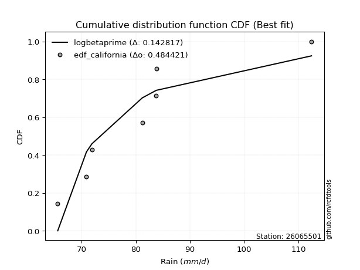</img>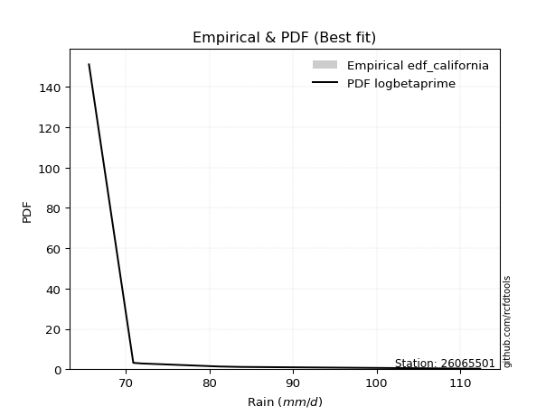</img>

</div>


### 2. Empirical - EDF Hazen (1930)

Hazen method for plotting positions is a formula used to estimate the empirical cumulative probability distribution of flood events or other hydrological data. This formula often results in biased estimations, particularly when extrapolating to extreme events (high return periods).

<div align="center">


$P=(m-0.5)/n$


</div>


**2.1. Empirical values**

<div align="center">

|                | 0                   | 1                   | 2                   | 3         | 4                  | 5                  | 6                  |
|:---------------|:--------------------|:--------------------|:--------------------|:----------|:-------------------|:-------------------|:-------------------|
| date           | 2021                | 2017                | 2022                | 2023      | 2019               | 2018               | 2020               |
| x              | 65.6                | 70.9                | 71.9                | 81.2      | 83.7               | 83.8               | 112.4              |
| m              | 1                   | 2                   | 3                   | 4         | 5                  | 6                  | 7                  |
| empirical_dist | edf_hazen           | edf_hazen           | edf_hazen           | edf_hazen | edf_hazen          | edf_hazen          | edf_hazen          |
| empirical      | 0.07142857142857142 | 0.21428571428571427 | 0.35714285714285715 | 0.5       | 0.6428571428571429 | 0.7857142857142857 | 0.9285714285714286 |
| empirical_tr   | 1.0769230769230769  | 1.2727272727272727  | 1.5555555555555558  | 2.0       | 2.8000000000000003 | 4.666666666666666  | 14.000000000000007 |

</div>


**2.2. Kolmogorov-Smirnov fit test (sorted by Δ)**


<div align="center">

|                | 0                   | 1                   | 2                   | 3                   | 4                   | 5                   | 6                   | 7                   | 8                   | 9                   | 10                  | 11                  | 12                  | 13                  | 14                  | 15                  | 16                  | 17                  | 18                  | 19                  | 20                  | 21                  | 22                  | 23                  | 24                  | 25                  | 26                  | 27                  | 28                  | 29                  | 30                  | 31                  | 32                  | 33                  | 34                  | 35                  | 36                  | 37                  | 38                  | 39                    | 40                  | 41                  | 42                  | 43                  | 44                  | 45                  | 46                  | 47                  | 48                  | 49                  | 50                  | 51                  | 52                  | 53                  | 54                  | 55                  | 56                  | 57                  | 58                  | 59                  | 60                  | 61                  | 62                  | 63                  | 64                  | 65                  | 66                  | 67                  | 68                  | 69                  | 70                  | 71                  | 72                  | 73                  | 74                  | 75                  | 76                  | 77                  | 78                  | 79                  | 80                  | 81                  | 82                  | 83                  | 84                  | 85                  | 86                  | 87                  | 88                  | 89                  |
|:---------------|:--------------------|:--------------------|:--------------------|:--------------------|:--------------------|:--------------------|:--------------------|:--------------------|:--------------------|:--------------------|:--------------------|:--------------------|:--------------------|:--------------------|:--------------------|:--------------------|:--------------------|:--------------------|:--------------------|:--------------------|:--------------------|:--------------------|:--------------------|:--------------------|:--------------------|:--------------------|:--------------------|:--------------------|:--------------------|:--------------------|:--------------------|:--------------------|:--------------------|:--------------------|:--------------------|:--------------------|:--------------------|:--------------------|:--------------------|:----------------------|:--------------------|:--------------------|:--------------------|:--------------------|:--------------------|:--------------------|:--------------------|:--------------------|:--------------------|:--------------------|:--------------------|:--------------------|:--------------------|:--------------------|:--------------------|:--------------------|:--------------------|:--------------------|:--------------------|:--------------------|:--------------------|:--------------------|:--------------------|:--------------------|:--------------------|:--------------------|:--------------------|:--------------------|:--------------------|:--------------------|:--------------------|:--------------------|:--------------------|:--------------------|:--------------------|:--------------------|:--------------------|:--------------------|:--------------------|:--------------------|:--------------------|:--------------------|:--------------------|:--------------------|:--------------------|:--------------------|:--------------------|:--------------------|:--------------------|:--------------------|
| station        | 26065501            | 26065501            | 26065501            | 26065501            | 26065501            | 26065501            | 26065501            | 26065501            | 26065501            | 26065501            | 26065501            | 26065501            | 26065501            | 26065501            | 26065501            | 26065501            | 26065501            | 26065501            | 26065501            | 26065501            | 26065501            | 26065501            | 26065501            | 26065501            | 26065501            | 26065501            | 26065501            | 26065501            | 26065501            | 26065501            | 26065501            | 26065501            | 26065501            | 26065501            | 26065501            | 26065501            | 26065501            | 26065501            | 26065501            | 26065501              | 26065501            | 26065501            | 26065501            | 26065501            | 26065501            | 26065501            | 26065501            | 26065501            | 26065501            | 26065501            | 26065501            | 26065501            | 26065501            | 26065501            | 26065501            | 26065501            | 26065501            | 26065501            | 26065501            | 26065501            | 26065501            | 26065501            | 26065501            | 26065501            | 26065501            | 26065501            | 26065501            | 26065501            | 26065501            | 26065501            | 26065501            | 26065501            | 26065501            | 26065501            | 26065501            | 26065501            | 26065501            | 26065501            | 26065501            | 26065501            | 26065501            | 26065501            | 26065501            | 26065501            | 26065501            | 26065501            | 26065501            | 26065501            | 26065501            | 26065501            |
| empirical_dist | edf_hazen           | edf_hazen           | edf_hazen           | edf_hazen           | edf_hazen           | edf_hazen           | edf_hazen           | edf_hazen           | edf_hazen           | edf_hazen           | edf_hazen           | edf_hazen           | edf_hazen           | edf_hazen           | edf_hazen           | edf_hazen           | edf_hazen           | edf_hazen           | edf_hazen           | edf_hazen           | edf_hazen           | edf_hazen           | edf_hazen           | edf_hazen           | edf_hazen           | edf_hazen           | edf_hazen           | edf_hazen           | edf_hazen           | edf_hazen           | edf_hazen           | edf_hazen           | edf_hazen           | edf_hazen           | edf_hazen           | edf_hazen           | edf_hazen           | edf_hazen           | edf_hazen           | edf_hazen             | edf_hazen           | edf_hazen           | edf_hazen           | edf_hazen           | edf_hazen           | edf_hazen           | edf_hazen           | edf_hazen           | edf_hazen           | edf_hazen           | edf_hazen           | edf_hazen           | edf_hazen           | edf_hazen           | edf_hazen           | edf_hazen           | edf_hazen           | edf_hazen           | edf_hazen           | edf_hazen           | edf_hazen           | edf_hazen           | edf_hazen           | edf_hazen           | edf_hazen           | edf_hazen           | edf_hazen           | edf_hazen           | edf_hazen           | edf_hazen           | edf_hazen           | edf_hazen           | edf_hazen           | edf_hazen           | edf_hazen           | edf_hazen           | edf_hazen           | edf_hazen           | edf_hazen           | edf_hazen           | edf_hazen           | edf_hazen           | edf_hazen           | edf_hazen           | edf_hazen           | edf_hazen           | edf_hazen           | edf_hazen           | edf_hazen           | edf_hazen           |
| p_dist         | logt                | logmielke           | mielke              | loggenlogistic      | loggumbel_r         | genexpon            | gompertz            | logkstwobign        | loghalfnorm         | loggenexpon         | moyal               | alpha               | logmoyal            | halflogistic        | genlogistic         | loginvweibull       | loghalflogistic     | invgamma            | logpearson3         | f                   | exponnorm           | expon               | invweibull          | fisk                | invgauss            | johnsonsu           | logfisk             | logjohnsonsu        | loginvgauss         | logfatiguelife      | logtruncnorm        | pearson3            | lograyleigh         | logexponnorm        | gumbel_r            | lognakagami         | logf                | halfnorm            | logexpon            | loglaplace_asymmetric | logmaxwell          | logalpha            | loghypsecant        | logrice             | kstwobign           | nct                 | logncf              | weibull_min         | wald                | loglaplace          | loglogistic         | loginvgamma         | betaprime           | lognct              | loggompertz         | laplace_asymmetric  | laplace             | rayleigh            | logcrystalball      | lognorm             | lognorm             | logloggamma         | maxwell             | logwald             | ncf                 | rice                | hypsecant           | logbetaprime        | logistic            | t                   | crystalball         | norm                | nakagami            | loggumbel_l         | gumbel_l            | logweibull_min      | gibrat              | loggibrat           | logerlang           | erlang              | logchi2             | loglognorm          | pareto              | logpareto           | gamma               | truncnorm           | loggamma            | loggamma            | fatiguelife         | chi2                |
| delta          | 0.10264601863678735 | 0.10656009668256516 | 0.10661700317038691 | 0.1093560641859479  | 0.11445240898751086 | 0.11724795961085943 | 0.11949199032894131 | 0.12276293270656657 | 0.12332054788845204 | 0.12427341147295867 | 0.12432732736442798 | 0.124328266241579   | 0.12530621621220372 | 0.12539785220245914 | 0.12586274214816495 | 0.12622536600151102 | 0.1267724432816757  | 0.1279060544416949  | 0.12807075576072957 | 0.12809366486628737 | 0.1283818907725215  | 0.12843341518750728 | 0.12852066675740437 | 0.12914806462757245 | 0.12933094407428614 | 0.1303630636453441  | 0.13066397687736586 | 0.130781465481705   | 0.13121641035304066 | 0.1332640458434594  | 0.13371206484296805 | 0.1438758586642893  | 0.14629543047782778 | 0.1466469545177429  | 0.1485128678134936  | 0.1508961294522042  | 0.15099840415660926 | 0.15319886204499922 | 0.15331028300906746 | 0.15409661623244855   | 0.15435251431199148 | 0.1550021277751018  | 0.15591036149121063 | 0.15613519441025348 | 0.15794524895901574 | 0.1587677627566325  | 0.16078907472361426 | 0.16102347787533536 | 0.1636671738271409  | 0.1644165648808131  | 0.16690498086492966 | 0.16727074452891322 | 0.16770975366563246 | 0.1696643420140379  | 0.17347773005768252 | 0.17775065861018302 | 0.17809710666514422 | 0.17931379507061396 | 0.18039830697489412 | 0.18040366627890636 | 0.18040366627890636 | 0.18240424331480298 | 0.18855024516030072 | 0.19584914639786688 | 0.19623947837204858 | 0.2002351615616471  | 0.2010401556502326  | 0.20248121393756277 | 0.2086211244306203  | 0.21760039049757562 | 0.21767614367967048 | 0.21767615549476205 | 0.23245274845300154 | 0.23916533975715015 | 0.28255516148726667 | 0.2851309679315529  | 0.2951148883390991  | 0.3072895060760437  | 0.3693135153075099  | 0.3860359753444954  | 0.41158668862968756 | 0.41494880791389077 | 0.4184926670449153  | 0.42350954450187317 | 0.43365869715497896 | 0.46085442200208043 | 0.4984956798168292  | 0.4984956798168292  | 0.5365315291756775  | 0.7053520046661209  |
| deltao         | 0.48442053926100004 | 0.48442053926100004 | 0.48442053926100004 | 0.48442053926100004 | 0.48442053926100004 | 0.48442053926100004 | 0.48442053926100004 | 0.48442053926100004 | 0.48442053926100004 | 0.48442053926100004 | 0.48442053926100004 | 0.48442053926100004 | 0.48442053926100004 | 0.48442053926100004 | 0.48442053926100004 | 0.48442053926100004 | 0.48442053926100004 | 0.48442053926100004 | 0.48442053926100004 | 0.48442053926100004 | 0.48442053926100004 | 0.48442053926100004 | 0.48442053926100004 | 0.48442053926100004 | 0.48442053926100004 | 0.48442053926100004 | 0.48442053926100004 | 0.48442053926100004 | 0.48442053926100004 | 0.48442053926100004 | 0.48442053926100004 | 0.48442053926100004 | 0.48442053926100004 | 0.48442053926100004 | 0.48442053926100004 | 0.48442053926100004 | 0.48442053926100004 | 0.48442053926100004 | 0.48442053926100004 | 0.48442053926100004   | 0.48442053926100004 | 0.48442053926100004 | 0.48442053926100004 | 0.48442053926100004 | 0.48442053926100004 | 0.48442053926100004 | 0.48442053926100004 | 0.48442053926100004 | 0.48442053926100004 | 0.48442053926100004 | 0.48442053926100004 | 0.48442053926100004 | 0.48442053926100004 | 0.48442053926100004 | 0.48442053926100004 | 0.48442053926100004 | 0.48442053926100004 | 0.48442053926100004 | 0.48442053926100004 | 0.48442053926100004 | 0.48442053926100004 | 0.48442053926100004 | 0.48442053926100004 | 0.48442053926100004 | 0.48442053926100004 | 0.48442053926100004 | 0.48442053926100004 | 0.48442053926100004 | 0.48442053926100004 | 0.48442053926100004 | 0.48442053926100004 | 0.48442053926100004 | 0.48442053926100004 | 0.48442053926100004 | 0.48442053926100004 | 0.48442053926100004 | 0.48442053926100004 | 0.48442053926100004 | 0.48442053926100004 | 0.48442053926100004 | 0.48442053926100004 | 0.48442053926100004 | 0.48442053926100004 | 0.48442053926100004 | 0.48442053926100004 | 0.48442053926100004 | 0.48442053926100004 | 0.48442053926100004 | 0.48442053926100004 | 0.48442053926100004 |
| eval           | Δo > Δ              | Δo > Δ              | Δo > Δ              | Δo > Δ              | Δo > Δ              | Δo > Δ              | Δo > Δ              | Δo > Δ              | Δo > Δ              | Δo > Δ              | Δo > Δ              | Δo > Δ              | Δo > Δ              | Δo > Δ              | Δo > Δ              | Δo > Δ              | Δo > Δ              | Δo > Δ              | Δo > Δ              | Δo > Δ              | Δo > Δ              | Δo > Δ              | Δo > Δ              | Δo > Δ              | Δo > Δ              | Δo > Δ              | Δo > Δ              | Δo > Δ              | Δo > Δ              | Δo > Δ              | Δo > Δ              | Δo > Δ              | Δo > Δ              | Δo > Δ              | Δo > Δ              | Δo > Δ              | Δo > Δ              | Δo > Δ              | Δo > Δ              | Δo > Δ                | Δo > Δ              | Δo > Δ              | Δo > Δ              | Δo > Δ              | Δo > Δ              | Δo > Δ              | Δo > Δ              | Δo > Δ              | Δo > Δ              | Δo > Δ              | Δo > Δ              | Δo > Δ              | Δo > Δ              | Δo > Δ              | Δo > Δ              | Δo > Δ              | Δo > Δ              | Δo > Δ              | Δo > Δ              | Δo > Δ              | Δo > Δ              | Δo > Δ              | Δo > Δ              | Δo > Δ              | Δo > Δ              | Δo > Δ              | Δo > Δ              | Δo > Δ              | Δo > Δ              | Δo > Δ              | Δo > Δ              | Δo > Δ              | Δo > Δ              | Δo > Δ              | Δo > Δ              | Δo > Δ              | Δo > Δ              | Δo > Δ              | Δo > Δ              | Δo > Δ              | Δo > Δ              | Δo > Δ              | Δo > Δ              | Δo > Δ              | Δo > Δ              | Δo > Δ              | Δo <= Δ             | Δo <= Δ             | Δo <= Δ             | Δo <= Δ             |
| fit            | 1                   | 1                   | 1                   | 1                   | 1                   | 1                   | 1                   | 1                   | 1                   | 1                   | 1                   | 1                   | 1                   | 1                   | 1                   | 1                   | 1                   | 1                   | 1                   | 1                   | 1                   | 1                   | 1                   | 1                   | 1                   | 1                   | 1                   | 1                   | 1                   | 1                   | 1                   | 1                   | 1                   | 1                   | 1                   | 1                   | 1                   | 1                   | 1                   | 1                     | 1                   | 1                   | 1                   | 1                   | 1                   | 1                   | 1                   | 1                   | 1                   | 1                   | 1                   | 1                   | 1                   | 1                   | 1                   | 1                   | 1                   | 1                   | 1                   | 1                   | 1                   | 1                   | 1                   | 1                   | 1                   | 1                   | 1                   | 1                   | 1                   | 1                   | 1                   | 1                   | 1                   | 1                   | 1                   | 1                   | 1                   | 1                   | 1                   | 1                   | 1                   | 1                   | 1                   | 1                   | 1                   | 1                   | 0                   | 0                   | 0                   | 0                   |
| n              | 7                   | 7                   | 7                   | 7                   | 7                   | 7                   | 7                   | 7                   | 7                   | 7                   | 7                   | 7                   | 7                   | 7                   | 7                   | 7                   | 7                   | 7                   | 7                   | 7                   | 7                   | 7                   | 7                   | 7                   | 7                   | 7                   | 7                   | 7                   | 7                   | 7                   | 7                   | 7                   | 7                   | 7                   | 7                   | 7                   | 7                   | 7                   | 7                   | 7                     | 7                   | 7                   | 7                   | 7                   | 7                   | 7                   | 7                   | 7                   | 7                   | 7                   | 7                   | 7                   | 7                   | 7                   | 7                   | 7                   | 7                   | 7                   | 7                   | 7                   | 7                   | 7                   | 7                   | 7                   | 7                   | 7                   | 7                   | 7                   | 7                   | 7                   | 7                   | 7                   | 7                   | 7                   | 7                   | 7                   | 7                   | 7                   | 7                   | 7                   | 7                   | 7                   | 7                   | 7                   | 7                   | 7                   | 7                   | 7                   | 7                   | 7                   |
| best_fit       | 1                   | 0                   | 0                   | 0                   | 0                   | 0                   | 0                   | 0                   | 0                   | 0                   | 0                   | 0                   | 0                   | 0                   | 0                   | 0                   | 0                   | 0                   | 0                   | 0                   | 0                   | 0                   | 0                   | 0                   | 0                   | 0                   | 0                   | 0                   | 0                   | 0                   | 0                   | 0                   | 0                   | 0                   | 0                   | 0                   | 0                   | 0                   | 0                   | 0                     | 0                   | 0                   | 0                   | 0                   | 0                   | 0                   | 0                   | 0                   | 0                   | 0                   | 0                   | 0                   | 0                   | 0                   | 0                   | 0                   | 0                   | 0                   | 0                   | 0                   | 0                   | 0                   | 0                   | 0                   | 0                   | 0                   | 0                   | 0                   | 0                   | 0                   | 0                   | 0                   | 0                   | 0                   | 0                   | 0                   | 0                   | 0                   | 0                   | 0                   | 0                   | 0                   | 0                   | 0                   | 0                   | 0                   | 0                   | 0                   | 0                   | 0                   |
| best_fit_sort  | 1                   | 2                   | 3                   | 4                   | 5                   | 6                   | 7                   | 8                   | 9                   | 10                  | 11                  | 12                  | 13                  | 14                  | 15                  | 16                  | 17                  | 18                  | 19                  | 20                  | 21                  | 22                  | 23                  | 24                  | 25                  | 26                  | 27                  | 28                  | 29                  | 30                  | 31                  | 32                  | 33                  | 34                  | 35                  | 36                  | 37                  | 38                  | 39                  | 40                    | 41                  | 42                  | 43                  | 44                  | 45                  | 46                  | 47                  | 48                  | 49                  | 50                  | 51                  | 52                  | 53                  | 54                  | 55                  | 56                  | 57                  | 58                  | 59                  | 60                  | 61                  | 62                  | 63                  | 64                  | 65                  | 66                  | 67                  | 68                  | 69                  | 70                  | 71                  | 72                  | 73                  | 74                  | 75                  | 76                  | 77                  | 78                  | 79                  | 80                  | 81                  | 82                  | 83                  | 84                  | 85                  | 86                  | 87                  | 88                  | 89                  | 90                  |

</div>


<div align="center">

</img>

</div>


**2.3. Best fit**

<div align="center">

|   id |   station | empirical_dist   | p_dist   |    delta |   deltao | eval   |   fit |   n |   best_fit |   best_fit_sort |
|-----:|----------:|:-----------------|:---------|---------:|---------:|:-------|------:|----:|-----------:|----------------:|
|    0 |  26065501 | edf_hazen        | logt     | 0.102646 | 0.484421 | Δo > Δ |     1 |   7 |          1 |               1 |

</div>


<div align="center">

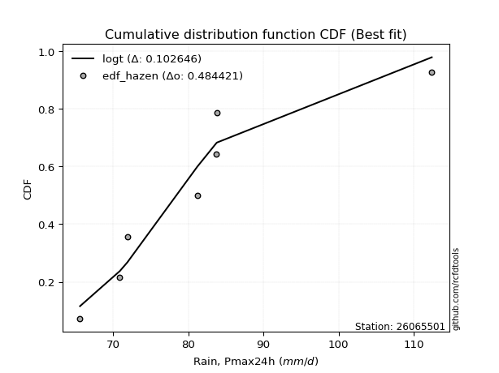</img>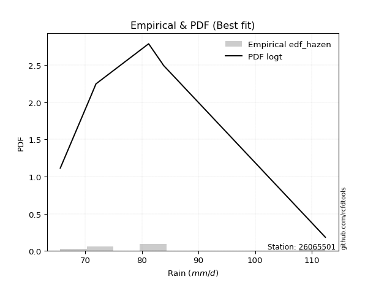</img>

</div>


### 3. Empirical - EDF Weibull (1939)

Weibull plotting position formula is an empirical method used to estimate the non-exceedance probability or plotting position for a set of observed data, is often recommended or widely used in practice, particularly in flood frequency analysis.

<div align="center">


$P=m/(n+1)$


</div>


**3.1. Empirical values**

<div align="center">

|                | 0                  | 1                  | 2           | 3           | 4                  | 5           | 6           |
|:---------------|:-------------------|:-------------------|:------------|:------------|:-------------------|:------------|:------------|
| date           | 2021               | 2017               | 2022        | 2023        | 2019               | 2018        | 2020        |
| x              | 65.6               | 70.9               | 71.9        | 81.2        | 83.7               | 83.8        | 112.4       |
| m              | 1                  | 2                  | 3           | 4           | 5                  | 6           | 7           |
| empirical_dist | edf_weibull        | edf_weibull        | edf_weibull | edf_weibull | edf_weibull        | edf_weibull | edf_weibull |
| empirical      | 0.125              | 0.25               | 0.375       | 0.5         | 0.625              | 0.75        | 0.875       |
| empirical_tr   | 1.1428571428571428 | 1.3333333333333333 | 1.6         | 2.0         | 2.6666666666666665 | 4.0         | 8.0         |

</div>


**3.2. Kolmogorov-Smirnov fit test (sorted by Δ)**


<div align="center">

|                | 0                   | 1                   | 2                   | 3                   | 4                   | 5                   | 6                   | 7                   | 8                   | 9                   | 10                  | 11                  | 12                  | 13                  | 14                  | 15                  | 16                  | 17                  | 18                  | 19                  | 20                  | 21                  | 22                  | 23                  | 24                  | 25                  | 26                  | 27                  | 28                  | 29                  | 30                  | 31                  | 32                  | 33                  | 34                  | 35                  | 36                  | 37                  | 38                  | 39                  | 40                  | 41                  | 42                  | 43                  | 44                  | 45                  | 46                  | 47                  | 48                  | 49                  | 50                  | 51                  | 52                  | 53                  | 54                  | 55                  | 56                  | 57                  | 58                  | 59                  | 60                  | 61                  | 62                    | 63                  | 64                  | 65                  | 66                  | 67                  | 68                  | 69                  | 70                  | 71                  | 72                  | 73                  | 74                  | 75                  | 76                  | 77                  | 78                  | 79                  | 80                  | 81                  | 82                  | 83                  | 84                  | 85                  | 86                  | 87                  | 88                  | 89                  |
|:---------------|:--------------------|:--------------------|:--------------------|:--------------------|:--------------------|:--------------------|:--------------------|:--------------------|:--------------------|:--------------------|:--------------------|:--------------------|:--------------------|:--------------------|:--------------------|:--------------------|:--------------------|:--------------------|:--------------------|:--------------------|:--------------------|:--------------------|:--------------------|:--------------------|:--------------------|:--------------------|:--------------------|:--------------------|:--------------------|:--------------------|:--------------------|:--------------------|:--------------------|:--------------------|:--------------------|:--------------------|:--------------------|:--------------------|:--------------------|:--------------------|:--------------------|:--------------------|:--------------------|:--------------------|:--------------------|:--------------------|:--------------------|:--------------------|:--------------------|:--------------------|:--------------------|:--------------------|:--------------------|:--------------------|:--------------------|:--------------------|:--------------------|:--------------------|:--------------------|:--------------------|:--------------------|:--------------------|:----------------------|:--------------------|:--------------------|:--------------------|:--------------------|:--------------------|:--------------------|:--------------------|:--------------------|:--------------------|:--------------------|:--------------------|:--------------------|:--------------------|:--------------------|:--------------------|:--------------------|:--------------------|:--------------------|:--------------------|:--------------------|:--------------------|:--------------------|:--------------------|:--------------------|:--------------------|:--------------------|:--------------------|
| station        | 26065501            | 26065501            | 26065501            | 26065501            | 26065501            | 26065501            | 26065501            | 26065501            | 26065501            | 26065501            | 26065501            | 26065501            | 26065501            | 26065501            | 26065501            | 26065501            | 26065501            | 26065501            | 26065501            | 26065501            | 26065501            | 26065501            | 26065501            | 26065501            | 26065501            | 26065501            | 26065501            | 26065501            | 26065501            | 26065501            | 26065501            | 26065501            | 26065501            | 26065501            | 26065501            | 26065501            | 26065501            | 26065501            | 26065501            | 26065501            | 26065501            | 26065501            | 26065501            | 26065501            | 26065501            | 26065501            | 26065501            | 26065501            | 26065501            | 26065501            | 26065501            | 26065501            | 26065501            | 26065501            | 26065501            | 26065501            | 26065501            | 26065501            | 26065501            | 26065501            | 26065501            | 26065501            | 26065501              | 26065501            | 26065501            | 26065501            | 26065501            | 26065501            | 26065501            | 26065501            | 26065501            | 26065501            | 26065501            | 26065501            | 26065501            | 26065501            | 26065501            | 26065501            | 26065501            | 26065501            | 26065501            | 26065501            | 26065501            | 26065501            | 26065501            | 26065501            | 26065501            | 26065501            | 26065501            | 26065501            |
| empirical_dist | edf_weibull         | edf_weibull         | edf_weibull         | edf_weibull         | edf_weibull         | edf_weibull         | edf_weibull         | edf_weibull         | edf_weibull         | edf_weibull         | edf_weibull         | edf_weibull         | edf_weibull         | edf_weibull         | edf_weibull         | edf_weibull         | edf_weibull         | edf_weibull         | edf_weibull         | edf_weibull         | edf_weibull         | edf_weibull         | edf_weibull         | edf_weibull         | edf_weibull         | edf_weibull         | edf_weibull         | edf_weibull         | edf_weibull         | edf_weibull         | edf_weibull         | edf_weibull         | edf_weibull         | edf_weibull         | edf_weibull         | edf_weibull         | edf_weibull         | edf_weibull         | edf_weibull         | edf_weibull         | edf_weibull         | edf_weibull         | edf_weibull         | edf_weibull         | edf_weibull         | edf_weibull         | edf_weibull         | edf_weibull         | edf_weibull         | edf_weibull         | edf_weibull         | edf_weibull         | edf_weibull         | edf_weibull         | edf_weibull         | edf_weibull         | edf_weibull         | edf_weibull         | edf_weibull         | edf_weibull         | edf_weibull         | edf_weibull         | edf_weibull           | edf_weibull         | edf_weibull         | edf_weibull         | edf_weibull         | edf_weibull         | edf_weibull         | edf_weibull         | edf_weibull         | edf_weibull         | edf_weibull         | edf_weibull         | edf_weibull         | edf_weibull         | edf_weibull         | edf_weibull         | edf_weibull         | edf_weibull         | edf_weibull         | edf_weibull         | edf_weibull         | edf_weibull         | edf_weibull         | edf_weibull         | edf_weibull         | edf_weibull         | edf_weibull         | edf_weibull         |
| p_dist         | halflogistic        | loghalfnorm         | logpearson3         | moyal               | logt                | pearson3            | lograyleigh         | loggumbel_r         | gumbel_r            | loggenlogistic      | logmielke           | mielke              | logkstwobign        | halfnorm            | logmaxwell          | logalpha            | nct                 | loggenexpon         | alpha               | genexpon            | gompertz            | logmoyal            | weibull_min         | loginvweibull       | loghalflogistic     | genlogistic         | invgamma            | f                   | exponnorm           | expon               | invweibull          | fisk                | invgauss            | logncf              | johnsonsu           | logfisk             | logjohnsonsu        | loginvgauss         | loginvgamma         | betaprime           | logfatiguelife      | logtruncnorm        | lognct              | kstwobign           | loggompertz         | logrice             | rayleigh            | logcrystalball      | lognorm             | lognorm             | logexponnorm        | logloggamma         | loglogistic         | lognakagami         | logf                | maxwell             | logexpon            | ncf                 | loghypsecant        | rice                | hypsecant           | wald                | loglaplace_asymmetric | logistic            | laplace_asymmetric  | laplace             | t                   | crystalball         | norm                | loglaplace          | logwald             | nakagami            | logbetaprime        | loggumbel_l         | gumbel_l            | logweibull_min      | gibrat              | loggibrat           | logerlang           | erlang              | logchi2             | loglognorm          | pareto              | logpareto           | gamma               | truncnorm           | loggamma            | loggamma            | fatiguelife         | chi2                |
| delta          | 0.09585771581790326 | 0.10029345506898657 | 0.10175803146073276 | 0.106755285130116   | 0.10750370544701848 | 0.10816157295000361 | 0.11058114476354208 | 0.111291571390352   | 0.1127985820992079  | 0.11323461551032377 | 0.11531811741218073 | 0.11596065299180597 | 0.11641636870115757 | 0.11748457633071352 | 0.11863822859770579 | 0.12412816619892686 | 0.12418508916455961 | 0.12427341147295867 | 0.124328266241579   | 0.12446187198128647 | 0.12499999999994629 | 0.12530621621220372 | 0.12530919216104963 | 0.12622536600151102 | 0.1267724432816757  | 0.12781217546972767 | 0.1279060544416949  | 0.12809366486628737 | 0.1283818907725215  | 0.12843341518750728 | 0.12852066675740437 | 0.12914806462757245 | 0.12933094407428614 | 0.1299353080873542  | 0.1303630636453441  | 0.13066397687736586 | 0.130781465481705   | 0.13121641035304066 | 0.13155645881462752 | 0.13199546795134676 | 0.1332640458434594  | 0.13371206484296805 | 0.1339500562997522  | 0.13661197758134097 | 0.13776344434339682 | 0.14049014411695482 | 0.14359950935632826 | 0.14468402126060842 | 0.14468938056462066 | 0.14468938056462066 | 0.1466469545177429  | 0.14668995760051728 | 0.14753875859124718 | 0.1508961294522042  | 0.15099840415660926 | 0.15283595944601502 | 0.15331028300906746 | 0.16052519265776288 | 0.16246000868201332 | 0.16452087584736141 | 0.1653258699359469  | 0.1702081548281478  | 0.1719537590895914    | 0.1729068387163346  | 0.17737598690220774 | 0.1793534688465134  | 0.18188610478328993 | 0.18196185796538478 | 0.18196186978047635 | 0.18227370773795595 | 0.19584914639786688 | 0.1967384627387158  | 0.20219740135412545 | 0.20345105404286445 | 0.24684087577298097 | 0.2494166822172672  | 0.31297203119624195 | 0.32514664893318657 | 0.3335992295932242  | 0.3503216896302097  | 0.37587240291540186 | 0.3792345221996051  | 0.3827783813306296  | 0.38779525878758747 | 0.39794441144069326 | 0.46085442200208043 | 0.4627813941025435  | 0.4627813941025435  | 0.5008172434613918  | 0.6696377189518352  |
| deltao         | 0.48442053926100004 | 0.48442053926100004 | 0.48442053926100004 | 0.48442053926100004 | 0.48442053926100004 | 0.48442053926100004 | 0.48442053926100004 | 0.48442053926100004 | 0.48442053926100004 | 0.48442053926100004 | 0.48442053926100004 | 0.48442053926100004 | 0.48442053926100004 | 0.48442053926100004 | 0.48442053926100004 | 0.48442053926100004 | 0.48442053926100004 | 0.48442053926100004 | 0.48442053926100004 | 0.48442053926100004 | 0.48442053926100004 | 0.48442053926100004 | 0.48442053926100004 | 0.48442053926100004 | 0.48442053926100004 | 0.48442053926100004 | 0.48442053926100004 | 0.48442053926100004 | 0.48442053926100004 | 0.48442053926100004 | 0.48442053926100004 | 0.48442053926100004 | 0.48442053926100004 | 0.48442053926100004 | 0.48442053926100004 | 0.48442053926100004 | 0.48442053926100004 | 0.48442053926100004 | 0.48442053926100004 | 0.48442053926100004 | 0.48442053926100004 | 0.48442053926100004 | 0.48442053926100004 | 0.48442053926100004 | 0.48442053926100004 | 0.48442053926100004 | 0.48442053926100004 | 0.48442053926100004 | 0.48442053926100004 | 0.48442053926100004 | 0.48442053926100004 | 0.48442053926100004 | 0.48442053926100004 | 0.48442053926100004 | 0.48442053926100004 | 0.48442053926100004 | 0.48442053926100004 | 0.48442053926100004 | 0.48442053926100004 | 0.48442053926100004 | 0.48442053926100004 | 0.48442053926100004 | 0.48442053926100004   | 0.48442053926100004 | 0.48442053926100004 | 0.48442053926100004 | 0.48442053926100004 | 0.48442053926100004 | 0.48442053926100004 | 0.48442053926100004 | 0.48442053926100004 | 0.48442053926100004 | 0.48442053926100004 | 0.48442053926100004 | 0.48442053926100004 | 0.48442053926100004 | 0.48442053926100004 | 0.48442053926100004 | 0.48442053926100004 | 0.48442053926100004 | 0.48442053926100004 | 0.48442053926100004 | 0.48442053926100004 | 0.48442053926100004 | 0.48442053926100004 | 0.48442053926100004 | 0.48442053926100004 | 0.48442053926100004 | 0.48442053926100004 | 0.48442053926100004 |
| eval           | Δo > Δ              | Δo > Δ              | Δo > Δ              | Δo > Δ              | Δo > Δ              | Δo > Δ              | Δo > Δ              | Δo > Δ              | Δo > Δ              | Δo > Δ              | Δo > Δ              | Δo > Δ              | Δo > Δ              | Δo > Δ              | Δo > Δ              | Δo > Δ              | Δo > Δ              | Δo > Δ              | Δo > Δ              | Δo > Δ              | Δo > Δ              | Δo > Δ              | Δo > Δ              | Δo > Δ              | Δo > Δ              | Δo > Δ              | Δo > Δ              | Δo > Δ              | Δo > Δ              | Δo > Δ              | Δo > Δ              | Δo > Δ              | Δo > Δ              | Δo > Δ              | Δo > Δ              | Δo > Δ              | Δo > Δ              | Δo > Δ              | Δo > Δ              | Δo > Δ              | Δo > Δ              | Δo > Δ              | Δo > Δ              | Δo > Δ              | Δo > Δ              | Δo > Δ              | Δo > Δ              | Δo > Δ              | Δo > Δ              | Δo > Δ              | Δo > Δ              | Δo > Δ              | Δo > Δ              | Δo > Δ              | Δo > Δ              | Δo > Δ              | Δo > Δ              | Δo > Δ              | Δo > Δ              | Δo > Δ              | Δo > Δ              | Δo > Δ              | Δo > Δ                | Δo > Δ              | Δo > Δ              | Δo > Δ              | Δo > Δ              | Δo > Δ              | Δo > Δ              | Δo > Δ              | Δo > Δ              | Δo > Δ              | Δo > Δ              | Δo > Δ              | Δo > Δ              | Δo > Δ              | Δo > Δ              | Δo > Δ              | Δo > Δ              | Δo > Δ              | Δo > Δ              | Δo > Δ              | Δo > Δ              | Δo > Δ              | Δo > Δ              | Δo > Δ              | Δo > Δ              | Δo > Δ              | Δo <= Δ             | Δo <= Δ             |
| fit            | 1                   | 1                   | 1                   | 1                   | 1                   | 1                   | 1                   | 1                   | 1                   | 1                   | 1                   | 1                   | 1                   | 1                   | 1                   | 1                   | 1                   | 1                   | 1                   | 1                   | 1                   | 1                   | 1                   | 1                   | 1                   | 1                   | 1                   | 1                   | 1                   | 1                   | 1                   | 1                   | 1                   | 1                   | 1                   | 1                   | 1                   | 1                   | 1                   | 1                   | 1                   | 1                   | 1                   | 1                   | 1                   | 1                   | 1                   | 1                   | 1                   | 1                   | 1                   | 1                   | 1                   | 1                   | 1                   | 1                   | 1                   | 1                   | 1                   | 1                   | 1                   | 1                   | 1                     | 1                   | 1                   | 1                   | 1                   | 1                   | 1                   | 1                   | 1                   | 1                   | 1                   | 1                   | 1                   | 1                   | 1                   | 1                   | 1                   | 1                   | 1                   | 1                   | 1                   | 1                   | 1                   | 1                   | 1                   | 1                   | 0                   | 0                   |
| n              | 7                   | 7                   | 7                   | 7                   | 7                   | 7                   | 7                   | 7                   | 7                   | 7                   | 7                   | 7                   | 7                   | 7                   | 7                   | 7                   | 7                   | 7                   | 7                   | 7                   | 7                   | 7                   | 7                   | 7                   | 7                   | 7                   | 7                   | 7                   | 7                   | 7                   | 7                   | 7                   | 7                   | 7                   | 7                   | 7                   | 7                   | 7                   | 7                   | 7                   | 7                   | 7                   | 7                   | 7                   | 7                   | 7                   | 7                   | 7                   | 7                   | 7                   | 7                   | 7                   | 7                   | 7                   | 7                   | 7                   | 7                   | 7                   | 7                   | 7                   | 7                   | 7                   | 7                     | 7                   | 7                   | 7                   | 7                   | 7                   | 7                   | 7                   | 7                   | 7                   | 7                   | 7                   | 7                   | 7                   | 7                   | 7                   | 7                   | 7                   | 7                   | 7                   | 7                   | 7                   | 7                   | 7                   | 7                   | 7                   | 7                   | 7                   |
| best_fit       | 1                   | 0                   | 0                   | 0                   | 0                   | 0                   | 0                   | 0                   | 0                   | 0                   | 0                   | 0                   | 0                   | 0                   | 0                   | 0                   | 0                   | 0                   | 0                   | 0                   | 0                   | 0                   | 0                   | 0                   | 0                   | 0                   | 0                   | 0                   | 0                   | 0                   | 0                   | 0                   | 0                   | 0                   | 0                   | 0                   | 0                   | 0                   | 0                   | 0                   | 0                   | 0                   | 0                   | 0                   | 0                   | 0                   | 0                   | 0                   | 0                   | 0                   | 0                   | 0                   | 0                   | 0                   | 0                   | 0                   | 0                   | 0                   | 0                   | 0                   | 0                   | 0                   | 0                     | 0                   | 0                   | 0                   | 0                   | 0                   | 0                   | 0                   | 0                   | 0                   | 0                   | 0                   | 0                   | 0                   | 0                   | 0                   | 0                   | 0                   | 0                   | 0                   | 0                   | 0                   | 0                   | 0                   | 0                   | 0                   | 0                   | 0                   |
| best_fit_sort  | 1                   | 2                   | 3                   | 4                   | 5                   | 6                   | 7                   | 8                   | 9                   | 10                  | 11                  | 12                  | 13                  | 14                  | 15                  | 16                  | 17                  | 18                  | 19                  | 20                  | 21                  | 22                  | 23                  | 24                  | 25                  | 26                  | 27                  | 28                  | 29                  | 30                  | 31                  | 32                  | 33                  | 34                  | 35                  | 36                  | 37                  | 38                  | 39                  | 40                  | 41                  | 42                  | 43                  | 44                  | 45                  | 46                  | 47                  | 48                  | 49                  | 50                  | 51                  | 52                  | 53                  | 54                  | 55                  | 56                  | 57                  | 58                  | 59                  | 60                  | 61                  | 62                  | 63                    | 64                  | 65                  | 66                  | 67                  | 68                  | 69                  | 70                  | 71                  | 72                  | 73                  | 74                  | 75                  | 76                  | 77                  | 78                  | 79                  | 80                  | 81                  | 82                  | 83                  | 84                  | 85                  | 86                  | 87                  | 88                  | 89                  | 90                  |

</div>


<div align="center">

</img>

</div>


**3.3. Best fit**

<div align="center">

|   id |   station | empirical_dist   | p_dist       |     delta |   deltao | eval   |   fit |   n |   best_fit |   best_fit_sort |
|-----:|----------:|:-----------------|:-------------|----------:|---------:|:-------|------:|----:|-----------:|----------------:|
|    0 |  26065501 | edf_weibull      | halflogistic | 0.0958577 | 0.484421 | Δo > Δ |     1 |   7 |          1 |               1 |

</div>


<div align="center">

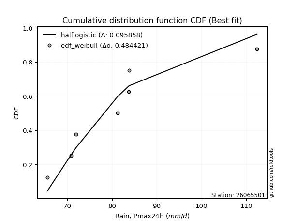</img>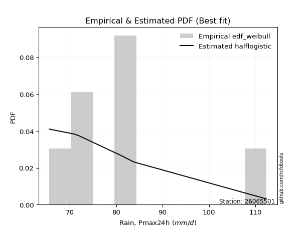</img>

</div>


### 4. Empirical - EDF Beard (1943)

The Beard formula (or Beard´s plotting position formula) in hydrology is used to estimate the empirical non-exceedance probability _(P)_ of a flood event (or other extreme hydrological data point) within a given dataset.

<div align="center">


$P=(m-0.31)/(n+0.38)$


</div>


**4.1. Empirical values**

<div align="center">

|                | 0                   | 1                   | 2                   | 3         | 4                  | 5                  | 6                  |
|:---------------|:--------------------|:--------------------|:--------------------|:----------|:-------------------|:-------------------|:-------------------|
| date           | 2021                | 2017                | 2022                | 2023      | 2019               | 2018               | 2020               |
| x              | 65.6                | 70.9                | 71.9                | 81.2      | 83.7               | 83.8               | 112.4              |
| m              | 1                   | 2                   | 3                   | 4         | 5                  | 6                  | 7                  |
| empirical_dist | edf_beard           | edf_beard           | edf_beard           | edf_beard | edf_beard          | edf_beard          | edf_beard          |
| empirical      | 0.09349593495934959 | 0.22899728997289973 | 0.36449864498644985 | 0.5       | 0.6355013550135502 | 0.7710027100271003 | 0.9065040650406505 |
| empirical_tr   | 1.1031390134529149  | 1.29701230228471    | 1.5735607675906182  | 2.0       | 2.743494423791822  | 4.366863905325444  | 10.695652173913055 |

</div>


**4.2. Kolmogorov-Smirnov fit test (sorted by Δ)**


<div align="center">

|                | 0                   | 1                   | 2                   | 3                   | 4                   | 5                   | 6                   | 7                   | 8                   | 9                   | 10                  | 11                  | 12                  | 13                  | 14                  | 15                  | 16                  | 17                  | 18                  | 19                  | 20                  | 21                  | 22                  | 23                  | 24                  | 25                  | 26                  | 27                  | 28                  | 29                  | 30                  | 31                  | 32                  | 33                  | 34                  | 35                  | 36                  | 37                  | 38                  | 39                  | 40                  | 41                  | 42                  | 43                  | 44                  | 45                  | 46                  | 47                  | 48                  | 49                  | 50                  | 51                  | 52                    | 53                  | 54                  | 55                  | 56                  | 57                  | 58                  | 59                  | 60                  | 61                  | 62                  | 63                  | 64                  | 65                  | 66                  | 67                  | 68                  | 69                  | 70                  | 71                  | 72                  | 73                  | 74                  | 75                  | 76                  | 77                  | 78                  | 79                  | 80                  | 81                  | 82                  | 83                  | 84                  | 85                  | 86                  | 87                  | 88                  | 89                  |
|:---------------|:--------------------|:--------------------|:--------------------|:--------------------|:--------------------|:--------------------|:--------------------|:--------------------|:--------------------|:--------------------|:--------------------|:--------------------|:--------------------|:--------------------|:--------------------|:--------------------|:--------------------|:--------------------|:--------------------|:--------------------|:--------------------|:--------------------|:--------------------|:--------------------|:--------------------|:--------------------|:--------------------|:--------------------|:--------------------|:--------------------|:--------------------|:--------------------|:--------------------|:--------------------|:--------------------|:--------------------|:--------------------|:--------------------|:--------------------|:--------------------|:--------------------|:--------------------|:--------------------|:--------------------|:--------------------|:--------------------|:--------------------|:--------------------|:--------------------|:--------------------|:--------------------|:--------------------|:----------------------|:--------------------|:--------------------|:--------------------|:--------------------|:--------------------|:--------------------|:--------------------|:--------------------|:--------------------|:--------------------|:--------------------|:--------------------|:--------------------|:--------------------|:--------------------|:--------------------|:--------------------|:--------------------|:--------------------|:--------------------|:--------------------|:--------------------|:--------------------|:--------------------|:--------------------|:--------------------|:--------------------|:--------------------|:--------------------|:--------------------|:--------------------|:--------------------|:--------------------|:--------------------|:--------------------|:--------------------|:--------------------|
| station        | 26065501            | 26065501            | 26065501            | 26065501            | 26065501            | 26065501            | 26065501            | 26065501            | 26065501            | 26065501            | 26065501            | 26065501            | 26065501            | 26065501            | 26065501            | 26065501            | 26065501            | 26065501            | 26065501            | 26065501            | 26065501            | 26065501            | 26065501            | 26065501            | 26065501            | 26065501            | 26065501            | 26065501            | 26065501            | 26065501            | 26065501            | 26065501            | 26065501            | 26065501            | 26065501            | 26065501            | 26065501            | 26065501            | 26065501            | 26065501            | 26065501            | 26065501            | 26065501            | 26065501            | 26065501            | 26065501            | 26065501            | 26065501            | 26065501            | 26065501            | 26065501            | 26065501            | 26065501              | 26065501            | 26065501            | 26065501            | 26065501            | 26065501            | 26065501            | 26065501            | 26065501            | 26065501            | 26065501            | 26065501            | 26065501            | 26065501            | 26065501            | 26065501            | 26065501            | 26065501            | 26065501            | 26065501            | 26065501            | 26065501            | 26065501            | 26065501            | 26065501            | 26065501            | 26065501            | 26065501            | 26065501            | 26065501            | 26065501            | 26065501            | 26065501            | 26065501            | 26065501            | 26065501            | 26065501            | 26065501            |
| empirical_dist | edf_beard           | edf_beard           | edf_beard           | edf_beard           | edf_beard           | edf_beard           | edf_beard           | edf_beard           | edf_beard           | edf_beard           | edf_beard           | edf_beard           | edf_beard           | edf_beard           | edf_beard           | edf_beard           | edf_beard           | edf_beard           | edf_beard           | edf_beard           | edf_beard           | edf_beard           | edf_beard           | edf_beard           | edf_beard           | edf_beard           | edf_beard           | edf_beard           | edf_beard           | edf_beard           | edf_beard           | edf_beard           | edf_beard           | edf_beard           | edf_beard           | edf_beard           | edf_beard           | edf_beard           | edf_beard           | edf_beard           | edf_beard           | edf_beard           | edf_beard           | edf_beard           | edf_beard           | edf_beard           | edf_beard           | edf_beard           | edf_beard           | edf_beard           | edf_beard           | edf_beard           | edf_beard             | edf_beard           | edf_beard           | edf_beard           | edf_beard           | edf_beard           | edf_beard           | edf_beard           | edf_beard           | edf_beard           | edf_beard           | edf_beard           | edf_beard           | edf_beard           | edf_beard           | edf_beard           | edf_beard           | edf_beard           | edf_beard           | edf_beard           | edf_beard           | edf_beard           | edf_beard           | edf_beard           | edf_beard           | edf_beard           | edf_beard           | edf_beard           | edf_beard           | edf_beard           | edf_beard           | edf_beard           | edf_beard           | edf_beard           | edf_beard           | edf_beard           | edf_beard           | edf_beard           |
| p_dist         | logt                | loggumbel_r         | gompertz            | mielke              | logmielke           | genexpon            | logkstwobign        | loghalfnorm         | loggenlogistic      | moyal               | halflogistic        | logpearson3         | genlogistic         | loggenexpon         | alpha               | logmoyal            | loginvweibull       | loghalflogistic     | invgamma            | f                   | exponnorm           | expon               | invweibull          | fisk                | pearson3            | invgauss            | johnsonsu           | logfisk             | logjohnsonsu        | loginvgauss         | lograyleigh         | logfatiguelife      | logtruncnorm        | gumbel_r            | halfnorm            | logmaxwell          | logalpha            | logrice             | kstwobign           | nct                 | logncf              | weibull_min         | logexponnorm        | lognakagami         | logf                | loghypsecant        | loglogistic         | loginvgamma         | betaprime           | logexpon            | lognct              | loggompertz         | loglaplace_asymmetric | wald                | rayleigh            | logcrystalball      | lognorm             | lognorm             | laplace_asymmetric  | logloggamma         | laplace             | loglaplace          | maxwell             | ncf                 | rice                | hypsecant           | logistic            | logwald             | logbetaprime        | t                   | crystalball         | norm                | nakagami            | loggumbel_l         | gumbel_l            | logweibull_min      | gibrat              | loggibrat           | logerlang           | erlang              | logchi2             | loglognorm          | pareto              | logpareto           | gamma               | truncnorm           | loggamma            | loggamma            | fatiguelife         | chi2                |
| delta          | 0.09939466618654447 | 0.10079021637680186 | 0.1052574513266521  | 0.10564346098687505 | 0.10656009668256516 | 0.10782546665753168 | 0.10805135701938118 | 0.10860897220126664 | 0.1093560641859479  | 0.10961575167724258 | 0.11068627651527374 | 0.11335918007354417 | 0.11731082045617752 | 0.12427341147295867 | 0.124328266241579   | 0.12530621621220372 | 0.12622536600151102 | 0.1267724432816757  | 0.1279060544416949  | 0.12809366486628737 | 0.1283818907725215  | 0.12843341518750728 | 0.12852066675740437 | 0.12914806462757245 | 0.12916428297710392 | 0.12933094407428614 | 0.1303630636453441  | 0.13066397687736586 | 0.130781465481705   | 0.13121641035304066 | 0.13158385479064238 | 0.1332640458434594  | 0.13371206484296805 | 0.1338012921263082  | 0.13848728635781382 | 0.1396409386248061  | 0.1402905520879164  | 0.14142361872306808 | 0.14323367327183034 | 0.14405618706944712 | 0.14607749903642886 | 0.1463119021881499  | 0.1466469545177429  | 0.1508961294522042  | 0.15099840415660926 | 0.15195865366846317 | 0.15219340517774427 | 0.15255916884172782 | 0.15299817797844706 | 0.15331028300906746 | 0.1549527663268525  | 0.15876615437049713 | 0.16145240407604125   | 0.1636671738271409  | 0.16460221938342856 | 0.16568673128770872 | 0.16569209059172096 | 0.16569209059172096 | 0.1668746318886576  | 0.1676926676276176  | 0.16885211383296325 | 0.1717723527244058  | 0.17383866947311533 | 0.18152790268486318 | 0.18552358587446172 | 0.1863285799630472  | 0.1939095487434349  | 0.19584914639786688 | 0.20219740135412545 | 0.20288881481039023 | 0.20296456799248508 | 0.20296457980757665 | 0.2177411727658161  | 0.22445376406996476 | 0.2678435858000813  | 0.2704193922443675  | 0.3024706761826918  | 0.3146452939196364  | 0.3546019396203245  | 0.37132439965731    | 0.39687511294250216 | 0.4002372322267054  | 0.4037810913577299  | 0.4087979688146878  | 0.41894712146779356 | 0.46085442200208043 | 0.4837841041296438  | 0.4837841041296438  | 0.5218199534884921  | 0.6906404289789355  |
| deltao         | 0.48442053926100004 | 0.48442053926100004 | 0.48442053926100004 | 0.48442053926100004 | 0.48442053926100004 | 0.48442053926100004 | 0.48442053926100004 | 0.48442053926100004 | 0.48442053926100004 | 0.48442053926100004 | 0.48442053926100004 | 0.48442053926100004 | 0.48442053926100004 | 0.48442053926100004 | 0.48442053926100004 | 0.48442053926100004 | 0.48442053926100004 | 0.48442053926100004 | 0.48442053926100004 | 0.48442053926100004 | 0.48442053926100004 | 0.48442053926100004 | 0.48442053926100004 | 0.48442053926100004 | 0.48442053926100004 | 0.48442053926100004 | 0.48442053926100004 | 0.48442053926100004 | 0.48442053926100004 | 0.48442053926100004 | 0.48442053926100004 | 0.48442053926100004 | 0.48442053926100004 | 0.48442053926100004 | 0.48442053926100004 | 0.48442053926100004 | 0.48442053926100004 | 0.48442053926100004 | 0.48442053926100004 | 0.48442053926100004 | 0.48442053926100004 | 0.48442053926100004 | 0.48442053926100004 | 0.48442053926100004 | 0.48442053926100004 | 0.48442053926100004 | 0.48442053926100004 | 0.48442053926100004 | 0.48442053926100004 | 0.48442053926100004 | 0.48442053926100004 | 0.48442053926100004 | 0.48442053926100004   | 0.48442053926100004 | 0.48442053926100004 | 0.48442053926100004 | 0.48442053926100004 | 0.48442053926100004 | 0.48442053926100004 | 0.48442053926100004 | 0.48442053926100004 | 0.48442053926100004 | 0.48442053926100004 | 0.48442053926100004 | 0.48442053926100004 | 0.48442053926100004 | 0.48442053926100004 | 0.48442053926100004 | 0.48442053926100004 | 0.48442053926100004 | 0.48442053926100004 | 0.48442053926100004 | 0.48442053926100004 | 0.48442053926100004 | 0.48442053926100004 | 0.48442053926100004 | 0.48442053926100004 | 0.48442053926100004 | 0.48442053926100004 | 0.48442053926100004 | 0.48442053926100004 | 0.48442053926100004 | 0.48442053926100004 | 0.48442053926100004 | 0.48442053926100004 | 0.48442053926100004 | 0.48442053926100004 | 0.48442053926100004 | 0.48442053926100004 | 0.48442053926100004 |
| eval           | Δo > Δ              | Δo > Δ              | Δo > Δ              | Δo > Δ              | Δo > Δ              | Δo > Δ              | Δo > Δ              | Δo > Δ              | Δo > Δ              | Δo > Δ              | Δo > Δ              | Δo > Δ              | Δo > Δ              | Δo > Δ              | Δo > Δ              | Δo > Δ              | Δo > Δ              | Δo > Δ              | Δo > Δ              | Δo > Δ              | Δo > Δ              | Δo > Δ              | Δo > Δ              | Δo > Δ              | Δo > Δ              | Δo > Δ              | Δo > Δ              | Δo > Δ              | Δo > Δ              | Δo > Δ              | Δo > Δ              | Δo > Δ              | Δo > Δ              | Δo > Δ              | Δo > Δ              | Δo > Δ              | Δo > Δ              | Δo > Δ              | Δo > Δ              | Δo > Δ              | Δo > Δ              | Δo > Δ              | Δo > Δ              | Δo > Δ              | Δo > Δ              | Δo > Δ              | Δo > Δ              | Δo > Δ              | Δo > Δ              | Δo > Δ              | Δo > Δ              | Δo > Δ              | Δo > Δ                | Δo > Δ              | Δo > Δ              | Δo > Δ              | Δo > Δ              | Δo > Δ              | Δo > Δ              | Δo > Δ              | Δo > Δ              | Δo > Δ              | Δo > Δ              | Δo > Δ              | Δo > Δ              | Δo > Δ              | Δo > Δ              | Δo > Δ              | Δo > Δ              | Δo > Δ              | Δo > Δ              | Δo > Δ              | Δo > Δ              | Δo > Δ              | Δo > Δ              | Δo > Δ              | Δo > Δ              | Δo > Δ              | Δo > Δ              | Δo > Δ              | Δo > Δ              | Δo > Δ              | Δo > Δ              | Δo > Δ              | Δo > Δ              | Δo > Δ              | Δo > Δ              | Δo > Δ              | Δo <= Δ             | Δo <= Δ             |
| fit            | 1                   | 1                   | 1                   | 1                   | 1                   | 1                   | 1                   | 1                   | 1                   | 1                   | 1                   | 1                   | 1                   | 1                   | 1                   | 1                   | 1                   | 1                   | 1                   | 1                   | 1                   | 1                   | 1                   | 1                   | 1                   | 1                   | 1                   | 1                   | 1                   | 1                   | 1                   | 1                   | 1                   | 1                   | 1                   | 1                   | 1                   | 1                   | 1                   | 1                   | 1                   | 1                   | 1                   | 1                   | 1                   | 1                   | 1                   | 1                   | 1                   | 1                   | 1                   | 1                   | 1                     | 1                   | 1                   | 1                   | 1                   | 1                   | 1                   | 1                   | 1                   | 1                   | 1                   | 1                   | 1                   | 1                   | 1                   | 1                   | 1                   | 1                   | 1                   | 1                   | 1                   | 1                   | 1                   | 1                   | 1                   | 1                   | 1                   | 1                   | 1                   | 1                   | 1                   | 1                   | 1                   | 1                   | 1                   | 1                   | 0                   | 0                   |
| n              | 7                   | 7                   | 7                   | 7                   | 7                   | 7                   | 7                   | 7                   | 7                   | 7                   | 7                   | 7                   | 7                   | 7                   | 7                   | 7                   | 7                   | 7                   | 7                   | 7                   | 7                   | 7                   | 7                   | 7                   | 7                   | 7                   | 7                   | 7                   | 7                   | 7                   | 7                   | 7                   | 7                   | 7                   | 7                   | 7                   | 7                   | 7                   | 7                   | 7                   | 7                   | 7                   | 7                   | 7                   | 7                   | 7                   | 7                   | 7                   | 7                   | 7                   | 7                   | 7                   | 7                     | 7                   | 7                   | 7                   | 7                   | 7                   | 7                   | 7                   | 7                   | 7                   | 7                   | 7                   | 7                   | 7                   | 7                   | 7                   | 7                   | 7                   | 7                   | 7                   | 7                   | 7                   | 7                   | 7                   | 7                   | 7                   | 7                   | 7                   | 7                   | 7                   | 7                   | 7                   | 7                   | 7                   | 7                   | 7                   | 7                   | 7                   |
| best_fit       | 1                   | 0                   | 0                   | 0                   | 0                   | 0                   | 0                   | 0                   | 0                   | 0                   | 0                   | 0                   | 0                   | 0                   | 0                   | 0                   | 0                   | 0                   | 0                   | 0                   | 0                   | 0                   | 0                   | 0                   | 0                   | 0                   | 0                   | 0                   | 0                   | 0                   | 0                   | 0                   | 0                   | 0                   | 0                   | 0                   | 0                   | 0                   | 0                   | 0                   | 0                   | 0                   | 0                   | 0                   | 0                   | 0                   | 0                   | 0                   | 0                   | 0                   | 0                   | 0                   | 0                     | 0                   | 0                   | 0                   | 0                   | 0                   | 0                   | 0                   | 0                   | 0                   | 0                   | 0                   | 0                   | 0                   | 0                   | 0                   | 0                   | 0                   | 0                   | 0                   | 0                   | 0                   | 0                   | 0                   | 0                   | 0                   | 0                   | 0                   | 0                   | 0                   | 0                   | 0                   | 0                   | 0                   | 0                   | 0                   | 0                   | 0                   |
| best_fit_sort  | 1                   | 2                   | 3                   | 4                   | 5                   | 6                   | 7                   | 8                   | 9                   | 10                  | 11                  | 12                  | 13                  | 14                  | 15                  | 16                  | 17                  | 18                  | 19                  | 20                  | 21                  | 22                  | 23                  | 24                  | 25                  | 26                  | 27                  | 28                  | 29                  | 30                  | 31                  | 32                  | 33                  | 34                  | 35                  | 36                  | 37                  | 38                  | 39                  | 40                  | 41                  | 42                  | 43                  | 44                  | 45                  | 46                  | 47                  | 48                  | 49                  | 50                  | 51                  | 52                  | 53                    | 54                  | 55                  | 56                  | 57                  | 58                  | 59                  | 60                  | 61                  | 62                  | 63                  | 64                  | 65                  | 66                  | 67                  | 68                  | 69                  | 70                  | 71                  | 72                  | 73                  | 74                  | 75                  | 76                  | 77                  | 78                  | 79                  | 80                  | 81                  | 82                  | 83                  | 84                  | 85                  | 86                  | 87                  | 88                  | 89                  | 90                  |

</div>


<div align="center">

</img>

</div>


**4.3. Best fit**

<div align="center">

|   id |   station | empirical_dist   | p_dist   |     delta |   deltao | eval   |   fit |   n |   best_fit |   best_fit_sort |
|-----:|----------:|:-----------------|:---------|----------:|---------:|:-------|------:|----:|-----------:|----------------:|
|    0 |  26065501 | edf_beard        | logt     | 0.0993947 | 0.484421 | Δo > Δ |     1 |   7 |          1 |               1 |

</div>


<div align="center">

</img>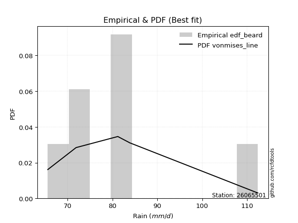</img>

</div>


### 5. Empirical - EDF Chegodayev (1955)

The Chegodayev formula is an empirical plotting position formula used in hydrological frequency analysis to estimate the exceedance probability or return period of a specific event from a set of observed data. It is primarily used for plotting observed data points on probability paper to fit a theoretical distribution, particularly for analyzing extreme events like maximum flood flows or rainfall intensities. The constant _b_ value in the generalized plotting position formula is 0.3.

<div align="center">


$P=(m-b)/(n+1-2b)$


</div>


**5.1. Empirical values**

<div align="center">

|                | 0                   | 1                   | 2                   | 3              | 4                  | 5                  | 6                  |
|:---------------|:--------------------|:--------------------|:--------------------|:---------------|:-------------------|:-------------------|:-------------------|
| date           | 2021                | 2017                | 2022                | 2023           | 2019               | 2018               | 2020               |
| x              | 65.6                | 70.9                | 71.9                | 81.2           | 83.7               | 83.8               | 112.4              |
| m              | 1                   | 2                   | 3                   | 4              | 5                  | 6                  | 7                  |
| empirical_dist | edf_chegodayev      | edf_chegodayev      | edf_chegodayev      | edf_chegodayev | edf_chegodayev     | edf_chegodayev     | edf_chegodayev     |
| empirical      | 0.09459459459459459 | 0.22972972972972971 | 0.36486486486486486 | 0.5            | 0.6351351351351351 | 0.7702702702702703 | 0.9054054054054054 |
| empirical_tr   | 1.1044776119402986  | 1.2982456140350878  | 1.574468085106383   | 2.0            | 2.7407407407407405 | 4.352941176470589  | 10.571428571428568 |

</div>


**5.2. Kolmogorov-Smirnov fit test (sorted by Δ)**


<div align="center">

|                | 0                   | 1                   | 2                   | 3                   | 4                   | 5                   | 6                   | 7                   | 8                   | 9                   | 10                  | 11                  | 12                  | 13                  | 14                  | 15                  | 16                  | 17                  | 18                  | 19                  | 20                  | 21                  | 22                  | 23                  | 24                  | 25                  | 26                  | 27                  | 28                  | 29                  | 30                  | 31                  | 32                  | 33                  | 34                  | 35                  | 36                  | 37                  | 38                  | 39                  | 40                  | 41                  | 42                  | 43                  | 44                  | 45                  | 46                  | 47                  | 48                  | 49                  | 50                  | 51                  | 52                    | 53                  | 54                  | 55                  | 56                  | 57                  | 58                  | 59                  | 60                  | 61                  | 62                  | 63                  | 64                  | 65                  | 66                  | 67                  | 68                  | 69                  | 70                  | 71                  | 72                  | 73                  | 74                  | 75                  | 76                  | 77                  | 78                  | 79                  | 80                  | 81                  | 82                  | 83                  | 84                  | 85                  | 86                  | 87                  | 88                  | 89                  |
|:---------------|:--------------------|:--------------------|:--------------------|:--------------------|:--------------------|:--------------------|:--------------------|:--------------------|:--------------------|:--------------------|:--------------------|:--------------------|:--------------------|:--------------------|:--------------------|:--------------------|:--------------------|:--------------------|:--------------------|:--------------------|:--------------------|:--------------------|:--------------------|:--------------------|:--------------------|:--------------------|:--------------------|:--------------------|:--------------------|:--------------------|:--------------------|:--------------------|:--------------------|:--------------------|:--------------------|:--------------------|:--------------------|:--------------------|:--------------------|:--------------------|:--------------------|:--------------------|:--------------------|:--------------------|:--------------------|:--------------------|:--------------------|:--------------------|:--------------------|:--------------------|:--------------------|:--------------------|:----------------------|:--------------------|:--------------------|:--------------------|:--------------------|:--------------------|:--------------------|:--------------------|:--------------------|:--------------------|:--------------------|:--------------------|:--------------------|:--------------------|:--------------------|:--------------------|:--------------------|:--------------------|:--------------------|:--------------------|:--------------------|:--------------------|:--------------------|:--------------------|:--------------------|:--------------------|:--------------------|:--------------------|:--------------------|:--------------------|:--------------------|:--------------------|:--------------------|:--------------------|:--------------------|:--------------------|:--------------------|:--------------------|
| station        | 26065501            | 26065501            | 26065501            | 26065501            | 26065501            | 26065501            | 26065501            | 26065501            | 26065501            | 26065501            | 26065501            | 26065501            | 26065501            | 26065501            | 26065501            | 26065501            | 26065501            | 26065501            | 26065501            | 26065501            | 26065501            | 26065501            | 26065501            | 26065501            | 26065501            | 26065501            | 26065501            | 26065501            | 26065501            | 26065501            | 26065501            | 26065501            | 26065501            | 26065501            | 26065501            | 26065501            | 26065501            | 26065501            | 26065501            | 26065501            | 26065501            | 26065501            | 26065501            | 26065501            | 26065501            | 26065501            | 26065501            | 26065501            | 26065501            | 26065501            | 26065501            | 26065501            | 26065501              | 26065501            | 26065501            | 26065501            | 26065501            | 26065501            | 26065501            | 26065501            | 26065501            | 26065501            | 26065501            | 26065501            | 26065501            | 26065501            | 26065501            | 26065501            | 26065501            | 26065501            | 26065501            | 26065501            | 26065501            | 26065501            | 26065501            | 26065501            | 26065501            | 26065501            | 26065501            | 26065501            | 26065501            | 26065501            | 26065501            | 26065501            | 26065501            | 26065501            | 26065501            | 26065501            | 26065501            | 26065501            |
| empirical_dist | edf_chegodayev      | edf_chegodayev      | edf_chegodayev      | edf_chegodayev      | edf_chegodayev      | edf_chegodayev      | edf_chegodayev      | edf_chegodayev      | edf_chegodayev      | edf_chegodayev      | edf_chegodayev      | edf_chegodayev      | edf_chegodayev      | edf_chegodayev      | edf_chegodayev      | edf_chegodayev      | edf_chegodayev      | edf_chegodayev      | edf_chegodayev      | edf_chegodayev      | edf_chegodayev      | edf_chegodayev      | edf_chegodayev      | edf_chegodayev      | edf_chegodayev      | edf_chegodayev      | edf_chegodayev      | edf_chegodayev      | edf_chegodayev      | edf_chegodayev      | edf_chegodayev      | edf_chegodayev      | edf_chegodayev      | edf_chegodayev      | edf_chegodayev      | edf_chegodayev      | edf_chegodayev      | edf_chegodayev      | edf_chegodayev      | edf_chegodayev      | edf_chegodayev      | edf_chegodayev      | edf_chegodayev      | edf_chegodayev      | edf_chegodayev      | edf_chegodayev      | edf_chegodayev      | edf_chegodayev      | edf_chegodayev      | edf_chegodayev      | edf_chegodayev      | edf_chegodayev      | edf_chegodayev        | edf_chegodayev      | edf_chegodayev      | edf_chegodayev      | edf_chegodayev      | edf_chegodayev      | edf_chegodayev      | edf_chegodayev      | edf_chegodayev      | edf_chegodayev      | edf_chegodayev      | edf_chegodayev      | edf_chegodayev      | edf_chegodayev      | edf_chegodayev      | edf_chegodayev      | edf_chegodayev      | edf_chegodayev      | edf_chegodayev      | edf_chegodayev      | edf_chegodayev      | edf_chegodayev      | edf_chegodayev      | edf_chegodayev      | edf_chegodayev      | edf_chegodayev      | edf_chegodayev      | edf_chegodayev      | edf_chegodayev      | edf_chegodayev      | edf_chegodayev      | edf_chegodayev      | edf_chegodayev      | edf_chegodayev      | edf_chegodayev      | edf_chegodayev      | edf_chegodayev      | edf_chegodayev      |
| p_dist         | logt                | loggumbel_r         | gompertz            | mielke              | logmielke           | logkstwobign        | genexpon            | loghalfnorm         | moyal               | loggenlogistic      | halflogistic        | logpearson3         | genlogistic         | loggenexpon         | alpha               | logmoyal            | loginvweibull       | loghalflogistic     | invgamma            | f                   | exponnorm           | pearson3            | expon               | invweibull          | fisk                | invgauss            | johnsonsu           | logfisk             | logjohnsonsu        | lograyleigh         | loginvgauss         | gumbel_r            | logfatiguelife      | logtruncnorm        | halfnorm            | logmaxwell          | logalpha            | logrice             | kstwobign           | nct                 | logncf              | weibull_min         | logexponnorm        | lognakagami         | logf                | loglogistic         | loginvgamma         | betaprime           | loghypsecant        | logexpon            | lognct              | loggompertz         | loglaplace_asymmetric | wald                | rayleigh            | logcrystalball      | lognorm             | lognorm             | logloggamma         | laplace_asymmetric  | laplace             | loglaplace          | maxwell             | ncf                 | rice                | hypsecant           | logistic            | logwald             | t                   | logbetaprime        | crystalball         | norm                | nakagami            | loggumbel_l         | gumbel_l            | logweibull_min      | gibrat              | loggibrat           | logerlang           | erlang              | logchi2             | loglognorm          | pareto              | logpareto           | gamma               | truncnorm           | loggamma            | loggamma            | fatiguelife         | chi2                |
| delta          | 0.09939466618654447 | 0.10115643625521686 | 0.1052574513266521  | 0.10582551785667083 | 0.10656009668256516 | 0.10731891726255116 | 0.10782546665753168 | 0.10787653244443662 | 0.10888331192041256 | 0.1093560641859479  | 0.10995383675844372 | 0.11262674031671416 | 0.11767704033459253 | 0.12427341147295867 | 0.124328266241579   | 0.12530621621220372 | 0.12622536600151102 | 0.1267724432816757  | 0.1279060544416949  | 0.12809366486628737 | 0.1283818907725215  | 0.1284318432202739  | 0.12843341518750728 | 0.12852066675740437 | 0.12914806462757245 | 0.12933094407428614 | 0.1303630636453441  | 0.13066397687736586 | 0.130781465481705   | 0.13085141503381237 | 0.13121641035304066 | 0.13306885236947819 | 0.1332640458434594  | 0.13371206484296805 | 0.1377548466009838  | 0.13890849886797607 | 0.1395581123310864  | 0.14069117896623806 | 0.14250123351500033 | 0.1433237473126171  | 0.14534505927959884 | 0.14557946243131992 | 0.1466469545177429  | 0.1508961294522042  | 0.15099840415660926 | 0.15146096542091425 | 0.1518267290848978  | 0.15226573822161704 | 0.15232487354687818 | 0.15331028300906746 | 0.1542203265700225  | 0.1580337146136671  | 0.16181862395445626   | 0.1636671738271409  | 0.16386977962659854 | 0.1649542915308787  | 0.16495965083489095 | 0.16495965083489095 | 0.16696022787078757 | 0.1672408517670726  | 0.16921833371137826 | 0.1721385726028208  | 0.1731062297162853  | 0.18079546292803317 | 0.1847911461176317  | 0.18559614020621718 | 0.1931771089866049  | 0.19584914639786688 | 0.2021563750535602  | 0.20219740135412545 | 0.20223212823565506 | 0.20223214005074663 | 0.2170087330089861  | 0.22372132431313474 | 0.26711114604325126 | 0.2696869524875375  | 0.3028368960611068  | 0.3150115137980514  | 0.3538694998634945  | 0.37059195990048    | 0.39614267318567215 | 0.39950479246987536 | 0.40304865160089987 | 0.40806552905785776 | 0.41821468171096354 | 0.46085442200208043 | 0.48305166437281377 | 0.48305166437281377 | 0.5210875137316621  | 0.6899079892221055  |
| deltao         | 0.48442053926100004 | 0.48442053926100004 | 0.48442053926100004 | 0.48442053926100004 | 0.48442053926100004 | 0.48442053926100004 | 0.48442053926100004 | 0.48442053926100004 | 0.48442053926100004 | 0.48442053926100004 | 0.48442053926100004 | 0.48442053926100004 | 0.48442053926100004 | 0.48442053926100004 | 0.48442053926100004 | 0.48442053926100004 | 0.48442053926100004 | 0.48442053926100004 | 0.48442053926100004 | 0.48442053926100004 | 0.48442053926100004 | 0.48442053926100004 | 0.48442053926100004 | 0.48442053926100004 | 0.48442053926100004 | 0.48442053926100004 | 0.48442053926100004 | 0.48442053926100004 | 0.48442053926100004 | 0.48442053926100004 | 0.48442053926100004 | 0.48442053926100004 | 0.48442053926100004 | 0.48442053926100004 | 0.48442053926100004 | 0.48442053926100004 | 0.48442053926100004 | 0.48442053926100004 | 0.48442053926100004 | 0.48442053926100004 | 0.48442053926100004 | 0.48442053926100004 | 0.48442053926100004 | 0.48442053926100004 | 0.48442053926100004 | 0.48442053926100004 | 0.48442053926100004 | 0.48442053926100004 | 0.48442053926100004 | 0.48442053926100004 | 0.48442053926100004 | 0.48442053926100004 | 0.48442053926100004   | 0.48442053926100004 | 0.48442053926100004 | 0.48442053926100004 | 0.48442053926100004 | 0.48442053926100004 | 0.48442053926100004 | 0.48442053926100004 | 0.48442053926100004 | 0.48442053926100004 | 0.48442053926100004 | 0.48442053926100004 | 0.48442053926100004 | 0.48442053926100004 | 0.48442053926100004 | 0.48442053926100004 | 0.48442053926100004 | 0.48442053926100004 | 0.48442053926100004 | 0.48442053926100004 | 0.48442053926100004 | 0.48442053926100004 | 0.48442053926100004 | 0.48442053926100004 | 0.48442053926100004 | 0.48442053926100004 | 0.48442053926100004 | 0.48442053926100004 | 0.48442053926100004 | 0.48442053926100004 | 0.48442053926100004 | 0.48442053926100004 | 0.48442053926100004 | 0.48442053926100004 | 0.48442053926100004 | 0.48442053926100004 | 0.48442053926100004 | 0.48442053926100004 |
| eval           | Δo > Δ              | Δo > Δ              | Δo > Δ              | Δo > Δ              | Δo > Δ              | Δo > Δ              | Δo > Δ              | Δo > Δ              | Δo > Δ              | Δo > Δ              | Δo > Δ              | Δo > Δ              | Δo > Δ              | Δo > Δ              | Δo > Δ              | Δo > Δ              | Δo > Δ              | Δo > Δ              | Δo > Δ              | Δo > Δ              | Δo > Δ              | Δo > Δ              | Δo > Δ              | Δo > Δ              | Δo > Δ              | Δo > Δ              | Δo > Δ              | Δo > Δ              | Δo > Δ              | Δo > Δ              | Δo > Δ              | Δo > Δ              | Δo > Δ              | Δo > Δ              | Δo > Δ              | Δo > Δ              | Δo > Δ              | Δo > Δ              | Δo > Δ              | Δo > Δ              | Δo > Δ              | Δo > Δ              | Δo > Δ              | Δo > Δ              | Δo > Δ              | Δo > Δ              | Δo > Δ              | Δo > Δ              | Δo > Δ              | Δo > Δ              | Δo > Δ              | Δo > Δ              | Δo > Δ                | Δo > Δ              | Δo > Δ              | Δo > Δ              | Δo > Δ              | Δo > Δ              | Δo > Δ              | Δo > Δ              | Δo > Δ              | Δo > Δ              | Δo > Δ              | Δo > Δ              | Δo > Δ              | Δo > Δ              | Δo > Δ              | Δo > Δ              | Δo > Δ              | Δo > Δ              | Δo > Δ              | Δo > Δ              | Δo > Δ              | Δo > Δ              | Δo > Δ              | Δo > Δ              | Δo > Δ              | Δo > Δ              | Δo > Δ              | Δo > Δ              | Δo > Δ              | Δo > Δ              | Δo > Δ              | Δo > Δ              | Δo > Δ              | Δo > Δ              | Δo > Δ              | Δo > Δ              | Δo <= Δ             | Δo <= Δ             |
| fit            | 1                   | 1                   | 1                   | 1                   | 1                   | 1                   | 1                   | 1                   | 1                   | 1                   | 1                   | 1                   | 1                   | 1                   | 1                   | 1                   | 1                   | 1                   | 1                   | 1                   | 1                   | 1                   | 1                   | 1                   | 1                   | 1                   | 1                   | 1                   | 1                   | 1                   | 1                   | 1                   | 1                   | 1                   | 1                   | 1                   | 1                   | 1                   | 1                   | 1                   | 1                   | 1                   | 1                   | 1                   | 1                   | 1                   | 1                   | 1                   | 1                   | 1                   | 1                   | 1                   | 1                     | 1                   | 1                   | 1                   | 1                   | 1                   | 1                   | 1                   | 1                   | 1                   | 1                   | 1                   | 1                   | 1                   | 1                   | 1                   | 1                   | 1                   | 1                   | 1                   | 1                   | 1                   | 1                   | 1                   | 1                   | 1                   | 1                   | 1                   | 1                   | 1                   | 1                   | 1                   | 1                   | 1                   | 1                   | 1                   | 0                   | 0                   |
| n              | 7                   | 7                   | 7                   | 7                   | 7                   | 7                   | 7                   | 7                   | 7                   | 7                   | 7                   | 7                   | 7                   | 7                   | 7                   | 7                   | 7                   | 7                   | 7                   | 7                   | 7                   | 7                   | 7                   | 7                   | 7                   | 7                   | 7                   | 7                   | 7                   | 7                   | 7                   | 7                   | 7                   | 7                   | 7                   | 7                   | 7                   | 7                   | 7                   | 7                   | 7                   | 7                   | 7                   | 7                   | 7                   | 7                   | 7                   | 7                   | 7                   | 7                   | 7                   | 7                   | 7                     | 7                   | 7                   | 7                   | 7                   | 7                   | 7                   | 7                   | 7                   | 7                   | 7                   | 7                   | 7                   | 7                   | 7                   | 7                   | 7                   | 7                   | 7                   | 7                   | 7                   | 7                   | 7                   | 7                   | 7                   | 7                   | 7                   | 7                   | 7                   | 7                   | 7                   | 7                   | 7                   | 7                   | 7                   | 7                   | 7                   | 7                   |
| best_fit       | 1                   | 0                   | 0                   | 0                   | 0                   | 0                   | 0                   | 0                   | 0                   | 0                   | 0                   | 0                   | 0                   | 0                   | 0                   | 0                   | 0                   | 0                   | 0                   | 0                   | 0                   | 0                   | 0                   | 0                   | 0                   | 0                   | 0                   | 0                   | 0                   | 0                   | 0                   | 0                   | 0                   | 0                   | 0                   | 0                   | 0                   | 0                   | 0                   | 0                   | 0                   | 0                   | 0                   | 0                   | 0                   | 0                   | 0                   | 0                   | 0                   | 0                   | 0                   | 0                   | 0                     | 0                   | 0                   | 0                   | 0                   | 0                   | 0                   | 0                   | 0                   | 0                   | 0                   | 0                   | 0                   | 0                   | 0                   | 0                   | 0                   | 0                   | 0                   | 0                   | 0                   | 0                   | 0                   | 0                   | 0                   | 0                   | 0                   | 0                   | 0                   | 0                   | 0                   | 0                   | 0                   | 0                   | 0                   | 0                   | 0                   | 0                   |
| best_fit_sort  | 1                   | 2                   | 3                   | 4                   | 5                   | 6                   | 7                   | 8                   | 9                   | 10                  | 11                  | 12                  | 13                  | 14                  | 15                  | 16                  | 17                  | 18                  | 19                  | 20                  | 21                  | 22                  | 23                  | 24                  | 25                  | 26                  | 27                  | 28                  | 29                  | 30                  | 31                  | 32                  | 33                  | 34                  | 35                  | 36                  | 37                  | 38                  | 39                  | 40                  | 41                  | 42                  | 43                  | 44                  | 45                  | 46                  | 47                  | 48                  | 49                  | 50                  | 51                  | 52                  | 53                    | 54                  | 55                  | 56                  | 57                  | 58                  | 59                  | 60                  | 61                  | 62                  | 63                  | 64                  | 65                  | 66                  | 67                  | 68                  | 69                  | 70                  | 71                  | 72                  | 73                  | 74                  | 75                  | 76                  | 77                  | 78                  | 79                  | 80                  | 81                  | 82                  | 83                  | 84                  | 85                  | 86                  | 87                  | 88                  | 89                  | 90                  |

</div>


<div align="center">

</img>

</div>


**5.3. Best fit**

<div align="center">

|   id |   station | empirical_dist   | p_dist   |     delta |   deltao | eval   |   fit |   n |   best_fit |   best_fit_sort |
|-----:|----------:|:-----------------|:---------|----------:|---------:|:-------|------:|----:|-----------:|----------------:|
|    0 |  26065501 | edf_chegodayev   | logt     | 0.0993947 | 0.484421 | Δo > Δ |     1 |   7 |          1 |               1 |

</div>


<div align="center">

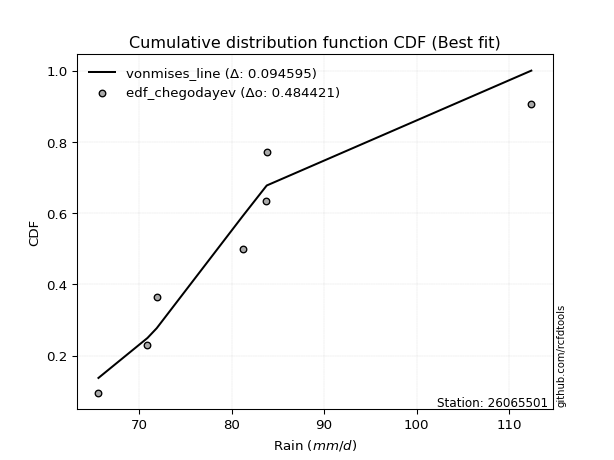</img>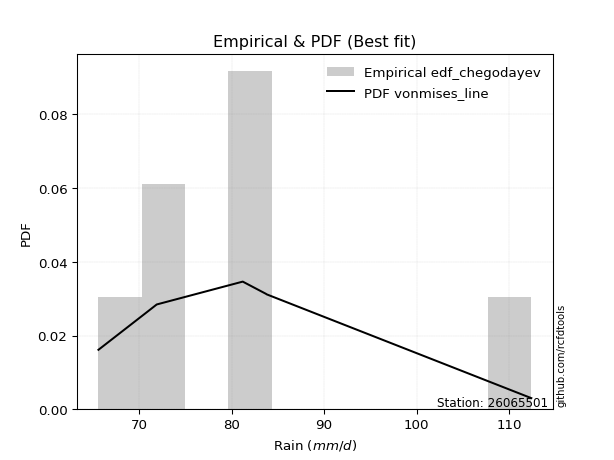</img>

</div>


### 6. Empirical - EDF Blom (1958)

The Blom formula is a specific "plotting position" formula used in hydrology and statistical analysis to estimate the empirical cumulative probability (or non-exceedance probability) of a data series. It is particularly recommended for data that are approximately normally distributed. The constant _a_ is set to 0.375 (or 3/8).

<div align="center">


$P=(m-a)/(n+1-2a)$


</div>


**6.1. Empirical values**

<div align="center">

|                | 0                   | 1                   | 2                  | 3        | 4                  | 5                  | 6                  |
|:---------------|:--------------------|:--------------------|:-------------------|:---------|:-------------------|:-------------------|:-------------------|
| date           | 2021                | 2017                | 2022               | 2023     | 2019               | 2018               | 2020               |
| x              | 65.6                | 70.9                | 71.9               | 81.2     | 83.7               | 83.8               | 112.4              |
| m              | 1                   | 2                   | 3                  | 4        | 5                  | 6                  | 7                  |
| empirical_dist | edf_blom            | edf_blom            | edf_blom           | edf_blom | edf_blom           | edf_blom           | edf_blom           |
| empirical      | 0.08620689655172414 | 0.22413793103448276 | 0.3620689655172414 | 0.5      | 0.6379310344827587 | 0.7758620689655172 | 0.9137931034482759 |
| empirical_tr   | 1.0943396226415094  | 1.288888888888889   | 1.5675675675675675 | 2.0      | 2.7619047619047623 | 4.461538461538462  | 11.600000000000007 |

</div>


**6.2. Kolmogorov-Smirnov fit test (sorted by Δ)**


<div align="center">

|                | 0                   | 1                   | 2                   | 3                   | 4                   | 5                   | 6                   | 7                   | 8                   | 9                   | 10                  | 11                  | 12                  | 13                  | 14                  | 15                  | 16                  | 17                  | 18                  | 19                  | 20                  | 21                  | 22                  | 23                  | 24                  | 25                  | 26                  | 27                  | 28                  | 29                  | 30                  | 31                  | 32                  | 33                  | 34                  | 35                  | 36                  | 37                  | 38                  | 39                  | 40                  | 41                  | 42                  | 43                  | 44                  | 45                  | 46                  | 47                  | 48                  | 49                  | 50                    | 51                  | 52                  | 53                  | 54                  | 55                  | 56                  | 57                  | 58                  | 59                  | 60                  | 61                  | 62                  | 63                  | 64                  | 65                  | 66                  | 67                  | 68                  | 69                  | 70                  | 71                  | 72                  | 73                  | 74                  | 75                  | 76                  | 77                  | 78                  | 79                  | 80                  | 81                  | 82                  | 83                  | 84                  | 85                  | 86                  | 87                  | 88                  | 89                  |
|:---------------|:--------------------|:--------------------|:--------------------|:--------------------|:--------------------|:--------------------|:--------------------|:--------------------|:--------------------|:--------------------|:--------------------|:--------------------|:--------------------|:--------------------|:--------------------|:--------------------|:--------------------|:--------------------|:--------------------|:--------------------|:--------------------|:--------------------|:--------------------|:--------------------|:--------------------|:--------------------|:--------------------|:--------------------|:--------------------|:--------------------|:--------------------|:--------------------|:--------------------|:--------------------|:--------------------|:--------------------|:--------------------|:--------------------|:--------------------|:--------------------|:--------------------|:--------------------|:--------------------|:--------------------|:--------------------|:--------------------|:--------------------|:--------------------|:--------------------|:--------------------|:----------------------|:--------------------|:--------------------|:--------------------|:--------------------|:--------------------|:--------------------|:--------------------|:--------------------|:--------------------|:--------------------|:--------------------|:--------------------|:--------------------|:--------------------|:--------------------|:--------------------|:--------------------|:--------------------|:--------------------|:--------------------|:--------------------|:--------------------|:--------------------|:--------------------|:--------------------|:--------------------|:--------------------|:--------------------|:--------------------|:--------------------|:--------------------|:--------------------|:--------------------|:--------------------|:--------------------|:--------------------|:--------------------|:--------------------|:--------------------|
| station        | 26065501            | 26065501            | 26065501            | 26065501            | 26065501            | 26065501            | 26065501            | 26065501            | 26065501            | 26065501            | 26065501            | 26065501            | 26065501            | 26065501            | 26065501            | 26065501            | 26065501            | 26065501            | 26065501            | 26065501            | 26065501            | 26065501            | 26065501            | 26065501            | 26065501            | 26065501            | 26065501            | 26065501            | 26065501            | 26065501            | 26065501            | 26065501            | 26065501            | 26065501            | 26065501            | 26065501            | 26065501            | 26065501            | 26065501            | 26065501            | 26065501            | 26065501            | 26065501            | 26065501            | 26065501            | 26065501            | 26065501            | 26065501            | 26065501            | 26065501            | 26065501              | 26065501            | 26065501            | 26065501            | 26065501            | 26065501            | 26065501            | 26065501            | 26065501            | 26065501            | 26065501            | 26065501            | 26065501            | 26065501            | 26065501            | 26065501            | 26065501            | 26065501            | 26065501            | 26065501            | 26065501            | 26065501            | 26065501            | 26065501            | 26065501            | 26065501            | 26065501            | 26065501            | 26065501            | 26065501            | 26065501            | 26065501            | 26065501            | 26065501            | 26065501            | 26065501            | 26065501            | 26065501            | 26065501            | 26065501            |
| empirical_dist | edf_blom            | edf_blom            | edf_blom            | edf_blom            | edf_blom            | edf_blom            | edf_blom            | edf_blom            | edf_blom            | edf_blom            | edf_blom            | edf_blom            | edf_blom            | edf_blom            | edf_blom            | edf_blom            | edf_blom            | edf_blom            | edf_blom            | edf_blom            | edf_blom            | edf_blom            | edf_blom            | edf_blom            | edf_blom            | edf_blom            | edf_blom            | edf_blom            | edf_blom            | edf_blom            | edf_blom            | edf_blom            | edf_blom            | edf_blom            | edf_blom            | edf_blom            | edf_blom            | edf_blom            | edf_blom            | edf_blom            | edf_blom            | edf_blom            | edf_blom            | edf_blom            | edf_blom            | edf_blom            | edf_blom            | edf_blom            | edf_blom            | edf_blom            | edf_blom              | edf_blom            | edf_blom            | edf_blom            | edf_blom            | edf_blom            | edf_blom            | edf_blom            | edf_blom            | edf_blom            | edf_blom            | edf_blom            | edf_blom            | edf_blom            | edf_blom            | edf_blom            | edf_blom            | edf_blom            | edf_blom            | edf_blom            | edf_blom            | edf_blom            | edf_blom            | edf_blom            | edf_blom            | edf_blom            | edf_blom            | edf_blom            | edf_blom            | edf_blom            | edf_blom            | edf_blom            | edf_blom            | edf_blom            | edf_blom            | edf_blom            | edf_blom            | edf_blom            | edf_blom            | edf_blom            |
| p_dist         | logt                | loggumbel_r         | mielke              | logmielke           | genexpon            | loggenlogistic      | gompertz            | logkstwobign        | loghalfnorm         | moyal               | halflogistic        | genlogistic         | logpearson3         | loggenexpon         | alpha               | logmoyal            | loginvweibull       | loghalflogistic     | invgamma            | f                   | exponnorm           | expon               | invweibull          | fisk                | invgauss            | johnsonsu           | logfisk             | logjohnsonsu        | loginvgauss         | logfatiguelife      | logtruncnorm        | pearson3            | lograyleigh         | gumbel_r            | halfnorm            | logmaxwell          | logalpha            | logrice             | logexponnorm        | kstwobign           | nct                 | loghypsecant        | lognakagami         | logncf              | logf                | weibull_min         | logexpon            | loglogistic         | loginvgamma         | betaprime           | loglaplace_asymmetric | lognct              | loggompertz         | wald                | laplace_asymmetric  | laplace             | loglaplace          | rayleigh            | logcrystalball      | lognorm             | lognorm             | logloggamma         | maxwell             | ncf                 | rice                | hypsecant           | logwald             | logistic            | logbetaprime        | t                   | crystalball         | norm                | nakagami            | loggumbel_l         | gumbel_l            | logweibull_min      | gibrat              | loggibrat           | logerlang           | erlang              | logchi2             | loglognorm          | pareto              | logpareto           | gamma               | truncnorm           | loggamma            | loggamma            | fatiguelife         | chi2                |
| delta          | 0.09939466618654447 | 0.1046001922387424  | 0.10564346098687505 | 0.10656009668256516 | 0.10782546665753168 | 0.1093560641859479  | 0.10963977358017285 | 0.11291071595779811 | 0.11346833113968358 | 0.11447511061565951 | 0.11554563545369068 | 0.11601052539939649 | 0.11821853901196111 | 0.12427341147295867 | 0.124328266241579   | 0.12530621621220372 | 0.12622536600151102 | 0.1267724432816757  | 0.1279060544416949  | 0.12809366486628737 | 0.1283818907725215  | 0.12843341518750728 | 0.12852066675740437 | 0.12914806462757245 | 0.12933094407428614 | 0.1303630636453441  | 0.13066397687736586 | 0.130781465481705   | 0.13121641035304066 | 0.1332640458434594  | 0.13371206484296805 | 0.13402364191552085 | 0.13644321372905932 | 0.13866065106472514 | 0.14334664529623076 | 0.14450029756322302 | 0.14514991102633334 | 0.14628297766148501 | 0.1466469545177429  | 0.14809303221024728 | 0.14891554600786405 | 0.1495289741992547  | 0.1508961294522042  | 0.1509368579748458  | 0.15099840415660926 | 0.15117126112656687 | 0.15331028300906746 | 0.1570527641161612  | 0.15741852778014476 | 0.157857536916864   | 0.15902272460683278   | 0.15981212526526944 | 0.16362551330891406 | 0.1636671738271409  | 0.16789844186141456 | 0.16824488991637576 | 0.16934267325519733 | 0.1694615783218455  | 0.17054609022612566 | 0.1705514495301379  | 0.1705514495301379  | 0.17255202656603452 | 0.17869802841153226 | 0.18638726162328012 | 0.19038294481287865 | 0.19118793890146413 | 0.19584914639786688 | 0.19876890768185185 | 0.20219740135412545 | 0.20774817374880716 | 0.20782392693090201 | 0.20782393874599359 | 0.22260053170423305 | 0.2293131230083817  | 0.2727029447384982  | 0.27527875118278444 | 0.30004099671348333 | 0.31221561445042795 | 0.3594612985587414  | 0.37618375859572695 | 0.4017344718809191  | 0.4050965911651223  | 0.4086404502961468  | 0.4136573277531047  | 0.4238064804062105  | 0.46085442200208043 | 0.4886434630680607  | 0.4886434630680607  | 0.526679312426909   | 0.6954997879173525  |
| deltao         | 0.48442053926100004 | 0.48442053926100004 | 0.48442053926100004 | 0.48442053926100004 | 0.48442053926100004 | 0.48442053926100004 | 0.48442053926100004 | 0.48442053926100004 | 0.48442053926100004 | 0.48442053926100004 | 0.48442053926100004 | 0.48442053926100004 | 0.48442053926100004 | 0.48442053926100004 | 0.48442053926100004 | 0.48442053926100004 | 0.48442053926100004 | 0.48442053926100004 | 0.48442053926100004 | 0.48442053926100004 | 0.48442053926100004 | 0.48442053926100004 | 0.48442053926100004 | 0.48442053926100004 | 0.48442053926100004 | 0.48442053926100004 | 0.48442053926100004 | 0.48442053926100004 | 0.48442053926100004 | 0.48442053926100004 | 0.48442053926100004 | 0.48442053926100004 | 0.48442053926100004 | 0.48442053926100004 | 0.48442053926100004 | 0.48442053926100004 | 0.48442053926100004 | 0.48442053926100004 | 0.48442053926100004 | 0.48442053926100004 | 0.48442053926100004 | 0.48442053926100004 | 0.48442053926100004 | 0.48442053926100004 | 0.48442053926100004 | 0.48442053926100004 | 0.48442053926100004 | 0.48442053926100004 | 0.48442053926100004 | 0.48442053926100004 | 0.48442053926100004   | 0.48442053926100004 | 0.48442053926100004 | 0.48442053926100004 | 0.48442053926100004 | 0.48442053926100004 | 0.48442053926100004 | 0.48442053926100004 | 0.48442053926100004 | 0.48442053926100004 | 0.48442053926100004 | 0.48442053926100004 | 0.48442053926100004 | 0.48442053926100004 | 0.48442053926100004 | 0.48442053926100004 | 0.48442053926100004 | 0.48442053926100004 | 0.48442053926100004 | 0.48442053926100004 | 0.48442053926100004 | 0.48442053926100004 | 0.48442053926100004 | 0.48442053926100004 | 0.48442053926100004 | 0.48442053926100004 | 0.48442053926100004 | 0.48442053926100004 | 0.48442053926100004 | 0.48442053926100004 | 0.48442053926100004 | 0.48442053926100004 | 0.48442053926100004 | 0.48442053926100004 | 0.48442053926100004 | 0.48442053926100004 | 0.48442053926100004 | 0.48442053926100004 | 0.48442053926100004 | 0.48442053926100004 |
| eval           | Δo > Δ              | Δo > Δ              | Δo > Δ              | Δo > Δ              | Δo > Δ              | Δo > Δ              | Δo > Δ              | Δo > Δ              | Δo > Δ              | Δo > Δ              | Δo > Δ              | Δo > Δ              | Δo > Δ              | Δo > Δ              | Δo > Δ              | Δo > Δ              | Δo > Δ              | Δo > Δ              | Δo > Δ              | Δo > Δ              | Δo > Δ              | Δo > Δ              | Δo > Δ              | Δo > Δ              | Δo > Δ              | Δo > Δ              | Δo > Δ              | Δo > Δ              | Δo > Δ              | Δo > Δ              | Δo > Δ              | Δo > Δ              | Δo > Δ              | Δo > Δ              | Δo > Δ              | Δo > Δ              | Δo > Δ              | Δo > Δ              | Δo > Δ              | Δo > Δ              | Δo > Δ              | Δo > Δ              | Δo > Δ              | Δo > Δ              | Δo > Δ              | Δo > Δ              | Δo > Δ              | Δo > Δ              | Δo > Δ              | Δo > Δ              | Δo > Δ                | Δo > Δ              | Δo > Δ              | Δo > Δ              | Δo > Δ              | Δo > Δ              | Δo > Δ              | Δo > Δ              | Δo > Δ              | Δo > Δ              | Δo > Δ              | Δo > Δ              | Δo > Δ              | Δo > Δ              | Δo > Δ              | Δo > Δ              | Δo > Δ              | Δo > Δ              | Δo > Δ              | Δo > Δ              | Δo > Δ              | Δo > Δ              | Δo > Δ              | Δo > Δ              | Δo > Δ              | Δo > Δ              | Δo > Δ              | Δo > Δ              | Δo > Δ              | Δo > Δ              | Δo > Δ              | Δo > Δ              | Δo > Δ              | Δo > Δ              | Δo > Δ              | Δo > Δ              | Δo <= Δ             | Δo <= Δ             | Δo <= Δ             | Δo <= Δ             |
| fit            | 1                   | 1                   | 1                   | 1                   | 1                   | 1                   | 1                   | 1                   | 1                   | 1                   | 1                   | 1                   | 1                   | 1                   | 1                   | 1                   | 1                   | 1                   | 1                   | 1                   | 1                   | 1                   | 1                   | 1                   | 1                   | 1                   | 1                   | 1                   | 1                   | 1                   | 1                   | 1                   | 1                   | 1                   | 1                   | 1                   | 1                   | 1                   | 1                   | 1                   | 1                   | 1                   | 1                   | 1                   | 1                   | 1                   | 1                   | 1                   | 1                   | 1                   | 1                     | 1                   | 1                   | 1                   | 1                   | 1                   | 1                   | 1                   | 1                   | 1                   | 1                   | 1                   | 1                   | 1                   | 1                   | 1                   | 1                   | 1                   | 1                   | 1                   | 1                   | 1                   | 1                   | 1                   | 1                   | 1                   | 1                   | 1                   | 1                   | 1                   | 1                   | 1                   | 1                   | 1                   | 1                   | 1                   | 0                   | 0                   | 0                   | 0                   |
| n              | 7                   | 7                   | 7                   | 7                   | 7                   | 7                   | 7                   | 7                   | 7                   | 7                   | 7                   | 7                   | 7                   | 7                   | 7                   | 7                   | 7                   | 7                   | 7                   | 7                   | 7                   | 7                   | 7                   | 7                   | 7                   | 7                   | 7                   | 7                   | 7                   | 7                   | 7                   | 7                   | 7                   | 7                   | 7                   | 7                   | 7                   | 7                   | 7                   | 7                   | 7                   | 7                   | 7                   | 7                   | 7                   | 7                   | 7                   | 7                   | 7                   | 7                   | 7                     | 7                   | 7                   | 7                   | 7                   | 7                   | 7                   | 7                   | 7                   | 7                   | 7                   | 7                   | 7                   | 7                   | 7                   | 7                   | 7                   | 7                   | 7                   | 7                   | 7                   | 7                   | 7                   | 7                   | 7                   | 7                   | 7                   | 7                   | 7                   | 7                   | 7                   | 7                   | 7                   | 7                   | 7                   | 7                   | 7                   | 7                   | 7                   | 7                   |
| best_fit       | 1                   | 0                   | 0                   | 0                   | 0                   | 0                   | 0                   | 0                   | 0                   | 0                   | 0                   | 0                   | 0                   | 0                   | 0                   | 0                   | 0                   | 0                   | 0                   | 0                   | 0                   | 0                   | 0                   | 0                   | 0                   | 0                   | 0                   | 0                   | 0                   | 0                   | 0                   | 0                   | 0                   | 0                   | 0                   | 0                   | 0                   | 0                   | 0                   | 0                   | 0                   | 0                   | 0                   | 0                   | 0                   | 0                   | 0                   | 0                   | 0                   | 0                   | 0                     | 0                   | 0                   | 0                   | 0                   | 0                   | 0                   | 0                   | 0                   | 0                   | 0                   | 0                   | 0                   | 0                   | 0                   | 0                   | 0                   | 0                   | 0                   | 0                   | 0                   | 0                   | 0                   | 0                   | 0                   | 0                   | 0                   | 0                   | 0                   | 0                   | 0                   | 0                   | 0                   | 0                   | 0                   | 0                   | 0                   | 0                   | 0                   | 0                   |
| best_fit_sort  | 1                   | 2                   | 3                   | 4                   | 5                   | 6                   | 7                   | 8                   | 9                   | 10                  | 11                  | 12                  | 13                  | 14                  | 15                  | 16                  | 17                  | 18                  | 19                  | 20                  | 21                  | 22                  | 23                  | 24                  | 25                  | 26                  | 27                  | 28                  | 29                  | 30                  | 31                  | 32                  | 33                  | 34                  | 35                  | 36                  | 37                  | 38                  | 39                  | 40                  | 41                  | 42                  | 43                  | 44                  | 45                  | 46                  | 47                  | 48                  | 49                  | 50                  | 51                    | 52                  | 53                  | 54                  | 55                  | 56                  | 57                  | 58                  | 59                  | 60                  | 61                  | 62                  | 63                  | 64                  | 65                  | 66                  | 67                  | 68                  | 69                  | 70                  | 71                  | 72                  | 73                  | 74                  | 75                  | 76                  | 77                  | 78                  | 79                  | 80                  | 81                  | 82                  | 83                  | 84                  | 85                  | 86                  | 87                  | 88                  | 89                  | 90                  |

</div>


<div align="center">

</img>

</div>


**6.3. Best fit**

<div align="center">

|   id |   station | empirical_dist   | p_dist   |     delta |   deltao | eval   |   fit |   n |   best_fit |   best_fit_sort |
|-----:|----------:|:-----------------|:---------|----------:|---------:|:-------|------:|----:|-----------:|----------------:|
|    0 |  26065501 | edf_blom         | logt     | 0.0993947 | 0.484421 | Δo > Δ |     1 |   7 |          1 |               1 |

</div>


<div align="center">

</img>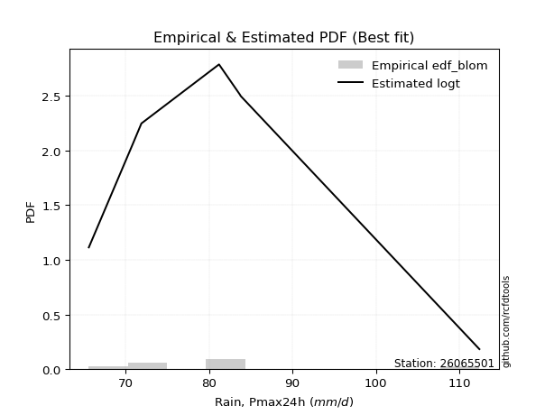</img>

</div>


### 7. Empirical - EDF Tukey (1962)

In hydrology, the Tukey formula is used as a plotting position formula to estimate the empirical probability or frequency of a flood event (or other hydrological data). The formula parameter is given as _c=0.333_ (or 1/3).

<div align="center">


$P=(m-c)/(n+1-2c)$


</div>


**7.1. Empirical values**

<div align="center">

|                | 0                   | 1                   | 2                   | 3         | 4                  | 5                  | 6                  |
|:---------------|:--------------------|:--------------------|:--------------------|:----------|:-------------------|:-------------------|:-------------------|
| date           | 2021                | 2017                | 2022                | 2023      | 2019               | 2018               | 2020               |
| x              | 65.6                | 70.9                | 71.9                | 81.2      | 83.7               | 83.8               | 112.4              |
| m              | 1                   | 2                   | 3                   | 4         | 5                  | 6                  | 7                  |
| empirical_dist | edf_tukey           | edf_tukey           | edf_tukey           | edf_tukey | edf_tukey          | edf_tukey          | edf_tukey          |
| empirical      | 0.09090909090909091 | 0.22727272727272727 | 0.36363636363636365 | 0.5       | 0.6363636363636364 | 0.7727272727272727 | 0.9090909090909091 |
| empirical_tr   | 1.1                 | 1.2941176470588236  | 1.5714285714285714  | 2.0       | 2.75               | 4.3999999999999995 | 10.999999999999996 |

</div>


**7.2. Kolmogorov-Smirnov fit test (sorted by Δ)**


<div align="center">

|                | 0                   | 1                   | 2                   | 3                   | 4                   | 5                   | 6                   | 7                   | 8                   | 9                   | 10                  | 11                  | 12                  | 13                  | 14                  | 15                  | 16                  | 17                  | 18                  | 19                  | 20                  | 21                  | 22                  | 23                  | 24                  | 25                  | 26                  | 27                  | 28                  | 29                  | 30                  | 31                  | 32                  | 33                  | 34                  | 35                  | 36                  | 37                  | 38                  | 39                  | 40                  | 41                  | 42                  | 43                  | 44                  | 45                  | 46                  | 47                  | 48                  | 49                  | 50                  | 51                  | 52                    | 53                  | 54                  | 55                  | 56                  | 57                  | 58                  | 59                  | 60                  | 61                  | 62                  | 63                  | 64                  | 65                  | 66                  | 67                  | 68                  | 69                  | 70                  | 71                  | 72                  | 73                  | 74                  | 75                  | 76                  | 77                  | 78                  | 79                  | 80                  | 81                  | 82                  | 83                  | 84                  | 85                  | 86                  | 87                  | 88                  | 89                  |
|:---------------|:--------------------|:--------------------|:--------------------|:--------------------|:--------------------|:--------------------|:--------------------|:--------------------|:--------------------|:--------------------|:--------------------|:--------------------|:--------------------|:--------------------|:--------------------|:--------------------|:--------------------|:--------------------|:--------------------|:--------------------|:--------------------|:--------------------|:--------------------|:--------------------|:--------------------|:--------------------|:--------------------|:--------------------|:--------------------|:--------------------|:--------------------|:--------------------|:--------------------|:--------------------|:--------------------|:--------------------|:--------------------|:--------------------|:--------------------|:--------------------|:--------------------|:--------------------|:--------------------|:--------------------|:--------------------|:--------------------|:--------------------|:--------------------|:--------------------|:--------------------|:--------------------|:--------------------|:----------------------|:--------------------|:--------------------|:--------------------|:--------------------|:--------------------|:--------------------|:--------------------|:--------------------|:--------------------|:--------------------|:--------------------|:--------------------|:--------------------|:--------------------|:--------------------|:--------------------|:--------------------|:--------------------|:--------------------|:--------------------|:--------------------|:--------------------|:--------------------|:--------------------|:--------------------|:--------------------|:--------------------|:--------------------|:--------------------|:--------------------|:--------------------|:--------------------|:--------------------|:--------------------|:--------------------|:--------------------|:--------------------|
| station        | 26065501            | 26065501            | 26065501            | 26065501            | 26065501            | 26065501            | 26065501            | 26065501            | 26065501            | 26065501            | 26065501            | 26065501            | 26065501            | 26065501            | 26065501            | 26065501            | 26065501            | 26065501            | 26065501            | 26065501            | 26065501            | 26065501            | 26065501            | 26065501            | 26065501            | 26065501            | 26065501            | 26065501            | 26065501            | 26065501            | 26065501            | 26065501            | 26065501            | 26065501            | 26065501            | 26065501            | 26065501            | 26065501            | 26065501            | 26065501            | 26065501            | 26065501            | 26065501            | 26065501            | 26065501            | 26065501            | 26065501            | 26065501            | 26065501            | 26065501            | 26065501            | 26065501            | 26065501              | 26065501            | 26065501            | 26065501            | 26065501            | 26065501            | 26065501            | 26065501            | 26065501            | 26065501            | 26065501            | 26065501            | 26065501            | 26065501            | 26065501            | 26065501            | 26065501            | 26065501            | 26065501            | 26065501            | 26065501            | 26065501            | 26065501            | 26065501            | 26065501            | 26065501            | 26065501            | 26065501            | 26065501            | 26065501            | 26065501            | 26065501            | 26065501            | 26065501            | 26065501            | 26065501            | 26065501            | 26065501            |
| empirical_dist | edf_tukey           | edf_tukey           | edf_tukey           | edf_tukey           | edf_tukey           | edf_tukey           | edf_tukey           | edf_tukey           | edf_tukey           | edf_tukey           | edf_tukey           | edf_tukey           | edf_tukey           | edf_tukey           | edf_tukey           | edf_tukey           | edf_tukey           | edf_tukey           | edf_tukey           | edf_tukey           | edf_tukey           | edf_tukey           | edf_tukey           | edf_tukey           | edf_tukey           | edf_tukey           | edf_tukey           | edf_tukey           | edf_tukey           | edf_tukey           | edf_tukey           | edf_tukey           | edf_tukey           | edf_tukey           | edf_tukey           | edf_tukey           | edf_tukey           | edf_tukey           | edf_tukey           | edf_tukey           | edf_tukey           | edf_tukey           | edf_tukey           | edf_tukey           | edf_tukey           | edf_tukey           | edf_tukey           | edf_tukey           | edf_tukey           | edf_tukey           | edf_tukey           | edf_tukey           | edf_tukey             | edf_tukey           | edf_tukey           | edf_tukey           | edf_tukey           | edf_tukey           | edf_tukey           | edf_tukey           | edf_tukey           | edf_tukey           | edf_tukey           | edf_tukey           | edf_tukey           | edf_tukey           | edf_tukey           | edf_tukey           | edf_tukey           | edf_tukey           | edf_tukey           | edf_tukey           | edf_tukey           | edf_tukey           | edf_tukey           | edf_tukey           | edf_tukey           | edf_tukey           | edf_tukey           | edf_tukey           | edf_tukey           | edf_tukey           | edf_tukey           | edf_tukey           | edf_tukey           | edf_tukey           | edf_tukey           | edf_tukey           | edf_tukey           | edf_tukey           |
| p_dist         | logt                | loggumbel_r         | mielke              | gompertz            | logmielke           | genexpon            | loggenlogistic      | logkstwobign        | loghalfnorm         | moyal               | halflogistic        | logpearson3         | genlogistic         | loggenexpon         | alpha               | logmoyal            | loginvweibull       | loghalflogistic     | invgamma            | f                   | exponnorm           | expon               | invweibull          | fisk                | invgauss            | johnsonsu           | logfisk             | logjohnsonsu        | pearson3            | loginvgauss         | logfatiguelife      | lograyleigh         | logtruncnorm        | gumbel_r            | halfnorm            | logmaxwell          | logalpha            | logrice             | kstwobign           | nct                 | logexponnorm        | logncf              | weibull_min         | lognakagami         | logf                | loghypsecant        | logexpon            | loglogistic         | loginvgamma         | betaprime           | lognct              | loggompertz         | loglaplace_asymmetric | wald                | laplace_asymmetric  | rayleigh            | logcrystalball      | lognorm             | lognorm             | laplace             | logloggamma         | loglaplace          | maxwell             | ncf                 | rice                | hypsecant           | logistic            | logwald             | logbetaprime        | t                   | crystalball         | norm                | nakagami            | loggumbel_l         | gumbel_l            | logweibull_min      | gibrat              | loggibrat           | logerlang           | erlang              | logchi2             | loglognorm          | pareto              | logpareto           | gamma               | truncnorm           | loggamma            | loggamma            | fatiguelife         | chi2                |
| delta          | 0.09939466618654447 | 0.10146539600049787 | 0.10564346098687505 | 0.10650497734192832 | 0.10656009668256516 | 0.10782546665753168 | 0.1093560641859479  | 0.10977591971955358 | 0.11033353490143905 | 0.11134031437741498 | 0.11241083921544615 | 0.11508374277371658 | 0.11644853910609132 | 0.12427341147295867 | 0.124328266241579   | 0.12530621621220372 | 0.12622536600151102 | 0.1267724432816757  | 0.1279060544416949  | 0.12809366486628737 | 0.1283818907725215  | 0.12843341518750728 | 0.12852066675740437 | 0.12914806462757245 | 0.12933094407428614 | 0.1303630636453441  | 0.13066397687736586 | 0.130781465481705   | 0.13088884567727632 | 0.13121641035304066 | 0.1332640458434594  | 0.1333084174908148  | 0.13371206484296805 | 0.1355258548264806  | 0.14021184905798623 | 0.1413655013249785  | 0.14201511478808881 | 0.14314818142324048 | 0.14495823597200275 | 0.14578074976961952 | 0.1466469545177429  | 0.14780206173660126 | 0.14803646488832237 | 0.1508961294522042  | 0.15099840415660926 | 0.15109637231837697 | 0.15331028300906746 | 0.15391796787791667 | 0.15428373154190023 | 0.15472274067861946 | 0.15667732902702491 | 0.16049071707066953 | 0.16059012272595505   | 0.1636671738271409  | 0.16601235053857138 | 0.16632678208360097 | 0.16741129398788113 | 0.16741665329189337 | 0.16741665329189337 | 0.16798983248287705 | 0.16941723032779    | 0.1709100713743196  | 0.17556323217328773 | 0.1832524653850356  | 0.18724814857463412 | 0.1880531426632196  | 0.19563411144360732 | 0.19584914639786688 | 0.20219740135412545 | 0.20461337751056263 | 0.20468913069265748 | 0.20468914250774906 | 0.21946573546598855 | 0.22617832677013716 | 0.2695681485002537  | 0.2721439549445399  | 0.3016083948326056  | 0.3137830125695502  | 0.3563265023204969  | 0.3730489623574824  | 0.39859967564267457 | 0.4019617949268778  | 0.4055056540579023  | 0.4105225315148602  | 0.42067168416796596 | 0.46085442200208043 | 0.4855086668298162  | 0.4855086668298162  | 0.5235445161886645  | 0.6923649916791079  |
| deltao         | 0.48442053926100004 | 0.48442053926100004 | 0.48442053926100004 | 0.48442053926100004 | 0.48442053926100004 | 0.48442053926100004 | 0.48442053926100004 | 0.48442053926100004 | 0.48442053926100004 | 0.48442053926100004 | 0.48442053926100004 | 0.48442053926100004 | 0.48442053926100004 | 0.48442053926100004 | 0.48442053926100004 | 0.48442053926100004 | 0.48442053926100004 | 0.48442053926100004 | 0.48442053926100004 | 0.48442053926100004 | 0.48442053926100004 | 0.48442053926100004 | 0.48442053926100004 | 0.48442053926100004 | 0.48442053926100004 | 0.48442053926100004 | 0.48442053926100004 | 0.48442053926100004 | 0.48442053926100004 | 0.48442053926100004 | 0.48442053926100004 | 0.48442053926100004 | 0.48442053926100004 | 0.48442053926100004 | 0.48442053926100004 | 0.48442053926100004 | 0.48442053926100004 | 0.48442053926100004 | 0.48442053926100004 | 0.48442053926100004 | 0.48442053926100004 | 0.48442053926100004 | 0.48442053926100004 | 0.48442053926100004 | 0.48442053926100004 | 0.48442053926100004 | 0.48442053926100004 | 0.48442053926100004 | 0.48442053926100004 | 0.48442053926100004 | 0.48442053926100004 | 0.48442053926100004 | 0.48442053926100004   | 0.48442053926100004 | 0.48442053926100004 | 0.48442053926100004 | 0.48442053926100004 | 0.48442053926100004 | 0.48442053926100004 | 0.48442053926100004 | 0.48442053926100004 | 0.48442053926100004 | 0.48442053926100004 | 0.48442053926100004 | 0.48442053926100004 | 0.48442053926100004 | 0.48442053926100004 | 0.48442053926100004 | 0.48442053926100004 | 0.48442053926100004 | 0.48442053926100004 | 0.48442053926100004 | 0.48442053926100004 | 0.48442053926100004 | 0.48442053926100004 | 0.48442053926100004 | 0.48442053926100004 | 0.48442053926100004 | 0.48442053926100004 | 0.48442053926100004 | 0.48442053926100004 | 0.48442053926100004 | 0.48442053926100004 | 0.48442053926100004 | 0.48442053926100004 | 0.48442053926100004 | 0.48442053926100004 | 0.48442053926100004 | 0.48442053926100004 | 0.48442053926100004 |
| eval           | Δo > Δ              | Δo > Δ              | Δo > Δ              | Δo > Δ              | Δo > Δ              | Δo > Δ              | Δo > Δ              | Δo > Δ              | Δo > Δ              | Δo > Δ              | Δo > Δ              | Δo > Δ              | Δo > Δ              | Δo > Δ              | Δo > Δ              | Δo > Δ              | Δo > Δ              | Δo > Δ              | Δo > Δ              | Δo > Δ              | Δo > Δ              | Δo > Δ              | Δo > Δ              | Δo > Δ              | Δo > Δ              | Δo > Δ              | Δo > Δ              | Δo > Δ              | Δo > Δ              | Δo > Δ              | Δo > Δ              | Δo > Δ              | Δo > Δ              | Δo > Δ              | Δo > Δ              | Δo > Δ              | Δo > Δ              | Δo > Δ              | Δo > Δ              | Δo > Δ              | Δo > Δ              | Δo > Δ              | Δo > Δ              | Δo > Δ              | Δo > Δ              | Δo > Δ              | Δo > Δ              | Δo > Δ              | Δo > Δ              | Δo > Δ              | Δo > Δ              | Δo > Δ              | Δo > Δ                | Δo > Δ              | Δo > Δ              | Δo > Δ              | Δo > Δ              | Δo > Δ              | Δo > Δ              | Δo > Δ              | Δo > Δ              | Δo > Δ              | Δo > Δ              | Δo > Δ              | Δo > Δ              | Δo > Δ              | Δo > Δ              | Δo > Δ              | Δo > Δ              | Δo > Δ              | Δo > Δ              | Δo > Δ              | Δo > Δ              | Δo > Δ              | Δo > Δ              | Δo > Δ              | Δo > Δ              | Δo > Δ              | Δo > Δ              | Δo > Δ              | Δo > Δ              | Δo > Δ              | Δo > Δ              | Δo > Δ              | Δo > Δ              | Δo > Δ              | Δo <= Δ             | Δo <= Δ             | Δo <= Δ             | Δo <= Δ             |
| fit            | 1                   | 1                   | 1                   | 1                   | 1                   | 1                   | 1                   | 1                   | 1                   | 1                   | 1                   | 1                   | 1                   | 1                   | 1                   | 1                   | 1                   | 1                   | 1                   | 1                   | 1                   | 1                   | 1                   | 1                   | 1                   | 1                   | 1                   | 1                   | 1                   | 1                   | 1                   | 1                   | 1                   | 1                   | 1                   | 1                   | 1                   | 1                   | 1                   | 1                   | 1                   | 1                   | 1                   | 1                   | 1                   | 1                   | 1                   | 1                   | 1                   | 1                   | 1                   | 1                   | 1                     | 1                   | 1                   | 1                   | 1                   | 1                   | 1                   | 1                   | 1                   | 1                   | 1                   | 1                   | 1                   | 1                   | 1                   | 1                   | 1                   | 1                   | 1                   | 1                   | 1                   | 1                   | 1                   | 1                   | 1                   | 1                   | 1                   | 1                   | 1                   | 1                   | 1                   | 1                   | 1                   | 1                   | 0                   | 0                   | 0                   | 0                   |
| n              | 7                   | 7                   | 7                   | 7                   | 7                   | 7                   | 7                   | 7                   | 7                   | 7                   | 7                   | 7                   | 7                   | 7                   | 7                   | 7                   | 7                   | 7                   | 7                   | 7                   | 7                   | 7                   | 7                   | 7                   | 7                   | 7                   | 7                   | 7                   | 7                   | 7                   | 7                   | 7                   | 7                   | 7                   | 7                   | 7                   | 7                   | 7                   | 7                   | 7                   | 7                   | 7                   | 7                   | 7                   | 7                   | 7                   | 7                   | 7                   | 7                   | 7                   | 7                   | 7                   | 7                     | 7                   | 7                   | 7                   | 7                   | 7                   | 7                   | 7                   | 7                   | 7                   | 7                   | 7                   | 7                   | 7                   | 7                   | 7                   | 7                   | 7                   | 7                   | 7                   | 7                   | 7                   | 7                   | 7                   | 7                   | 7                   | 7                   | 7                   | 7                   | 7                   | 7                   | 7                   | 7                   | 7                   | 7                   | 7                   | 7                   | 7                   |
| best_fit       | 1                   | 0                   | 0                   | 0                   | 0                   | 0                   | 0                   | 0                   | 0                   | 0                   | 0                   | 0                   | 0                   | 0                   | 0                   | 0                   | 0                   | 0                   | 0                   | 0                   | 0                   | 0                   | 0                   | 0                   | 0                   | 0                   | 0                   | 0                   | 0                   | 0                   | 0                   | 0                   | 0                   | 0                   | 0                   | 0                   | 0                   | 0                   | 0                   | 0                   | 0                   | 0                   | 0                   | 0                   | 0                   | 0                   | 0                   | 0                   | 0                   | 0                   | 0                   | 0                   | 0                     | 0                   | 0                   | 0                   | 0                   | 0                   | 0                   | 0                   | 0                   | 0                   | 0                   | 0                   | 0                   | 0                   | 0                   | 0                   | 0                   | 0                   | 0                   | 0                   | 0                   | 0                   | 0                   | 0                   | 0                   | 0                   | 0                   | 0                   | 0                   | 0                   | 0                   | 0                   | 0                   | 0                   | 0                   | 0                   | 0                   | 0                   |
| best_fit_sort  | 1                   | 2                   | 3                   | 4                   | 5                   | 6                   | 7                   | 8                   | 9                   | 10                  | 11                  | 12                  | 13                  | 14                  | 15                  | 16                  | 17                  | 18                  | 19                  | 20                  | 21                  | 22                  | 23                  | 24                  | 25                  | 26                  | 27                  | 28                  | 29                  | 30                  | 31                  | 32                  | 33                  | 34                  | 35                  | 36                  | 37                  | 38                  | 39                  | 40                  | 41                  | 42                  | 43                  | 44                  | 45                  | 46                  | 47                  | 48                  | 49                  | 50                  | 51                  | 52                  | 53                    | 54                  | 55                  | 56                  | 57                  | 58                  | 59                  | 60                  | 61                  | 62                  | 63                  | 64                  | 65                  | 66                  | 67                  | 68                  | 69                  | 70                  | 71                  | 72                  | 73                  | 74                  | 75                  | 76                  | 77                  | 78                  | 79                  | 80                  | 81                  | 82                  | 83                  | 84                  | 85                  | 86                  | 87                  | 88                  | 89                  | 90                  |

</div>


<div align="center">

</img>

</div>


**7.3. Best fit**

<div align="center">

|   id |   station | empirical_dist   | p_dist   |     delta |   deltao | eval   |   fit |   n |   best_fit |   best_fit_sort |
|-----:|----------:|:-----------------|:---------|----------:|---------:|:-------|------:|----:|-----------:|----------------:|
|    0 |  26065501 | edf_tukey        | logt     | 0.0993947 | 0.484421 | Δo > Δ |     1 |   7 |          1 |               1 |

</div>


<div align="center">

</img></img>

</div>


### 8. Empirical - EDF Gringorten (1963)

Gringorten plotting position formula is essential for estimating the probability and return periods of extreme events like floods and heavy rainfall. The constant _a=0.44_.

<div align="center">


$P=(m-a)/(n+1-2a)$


</div>


**8.1. Empirical values**

<div align="center">

|                | 0                   | 1                   | 2                  | 3              | 4                  | 5                  | 6                  |
|:---------------|:--------------------|:--------------------|:-------------------|:---------------|:-------------------|:-------------------|:-------------------|
| date           | 2021                | 2017                | 2022               | 2023           | 2019               | 2018               | 2020               |
| x              | 65.6                | 70.9                | 71.9               | 81.2           | 83.7               | 83.8               | 112.4              |
| m              | 1                   | 2                   | 3                  | 4              | 5                  | 6                  | 7                  |
| empirical_dist | edf_gringorten      | edf_gringorten      | edf_gringorten     | edf_gringorten | edf_gringorten     | edf_gringorten     | edf_gringorten     |
| empirical      | 0.07865168539325844 | 0.21910112359550563 | 0.3595505617977528 | 0.5            | 0.6404494382022471 | 0.7808988764044943 | 0.9213483146067415 |
| empirical_tr   | 1.0853658536585364  | 1.2805755395683454  | 1.5614035087719298 | 2.0            | 2.781249999999999  | 4.564102564102562  | 12.714285714285701 |

</div>


**8.2. Kolmogorov-Smirnov fit test (sorted by Δ)**


<div align="center">

|                | 0                   | 1                   | 2                   | 3                   | 4                   | 5                   | 6                   | 7                   | 8                   | 9                   | 10                  | 11                  | 12                  | 13                  | 14                  | 15                  | 16                  | 17                  | 18                  | 19                  | 20                  | 21                  | 22                  | 23                  | 24                  | 25                  | 26                  | 27                  | 28                  | 29                  | 30                  | 31                  | 32                  | 33                  | 34                  | 35                  | 36                  | 37                  | 38                  | 39                  | 40                  | 41                  | 42                  | 43                  | 44                  | 45                  | 46                  | 47                    | 48                  | 49                  | 50                  | 51                  | 52                  | 53                  | 54                  | 55                  | 56                  | 57                  | 58                  | 59                  | 60                  | 61                  | 62                  | 63                  | 64                  | 65                  | 66                  | 67                  | 68                  | 69                  | 70                  | 71                  | 72                  | 73                  | 74                  | 75                  | 76                  | 77                  | 78                  | 79                  | 80                  | 81                  | 82                  | 83                  | 84                  | 85                  | 86                  | 87                  | 88                  | 89                  |
|:---------------|:--------------------|:--------------------|:--------------------|:--------------------|:--------------------|:--------------------|:--------------------|:--------------------|:--------------------|:--------------------|:--------------------|:--------------------|:--------------------|:--------------------|:--------------------|:--------------------|:--------------------|:--------------------|:--------------------|:--------------------|:--------------------|:--------------------|:--------------------|:--------------------|:--------------------|:--------------------|:--------------------|:--------------------|:--------------------|:--------------------|:--------------------|:--------------------|:--------------------|:--------------------|:--------------------|:--------------------|:--------------------|:--------------------|:--------------------|:--------------------|:--------------------|:--------------------|:--------------------|:--------------------|:--------------------|:--------------------|:--------------------|:----------------------|:--------------------|:--------------------|:--------------------|:--------------------|:--------------------|:--------------------|:--------------------|:--------------------|:--------------------|:--------------------|:--------------------|:--------------------|:--------------------|:--------------------|:--------------------|:--------------------|:--------------------|:--------------------|:--------------------|:--------------------|:--------------------|:--------------------|:--------------------|:--------------------|:--------------------|:--------------------|:--------------------|:--------------------|:--------------------|:--------------------|:--------------------|:--------------------|:--------------------|:--------------------|:--------------------|:--------------------|:--------------------|:--------------------|:--------------------|:--------------------|:--------------------|:--------------------|
| station        | 26065501            | 26065501            | 26065501            | 26065501            | 26065501            | 26065501            | 26065501            | 26065501            | 26065501            | 26065501            | 26065501            | 26065501            | 26065501            | 26065501            | 26065501            | 26065501            | 26065501            | 26065501            | 26065501            | 26065501            | 26065501            | 26065501            | 26065501            | 26065501            | 26065501            | 26065501            | 26065501            | 26065501            | 26065501            | 26065501            | 26065501            | 26065501            | 26065501            | 26065501            | 26065501            | 26065501            | 26065501            | 26065501            | 26065501            | 26065501            | 26065501            | 26065501            | 26065501            | 26065501            | 26065501            | 26065501            | 26065501            | 26065501              | 26065501            | 26065501            | 26065501            | 26065501            | 26065501            | 26065501            | 26065501            | 26065501            | 26065501            | 26065501            | 26065501            | 26065501            | 26065501            | 26065501            | 26065501            | 26065501            | 26065501            | 26065501            | 26065501            | 26065501            | 26065501            | 26065501            | 26065501            | 26065501            | 26065501            | 26065501            | 26065501            | 26065501            | 26065501            | 26065501            | 26065501            | 26065501            | 26065501            | 26065501            | 26065501            | 26065501            | 26065501            | 26065501            | 26065501            | 26065501            | 26065501            | 26065501            |
| empirical_dist | edf_gringorten      | edf_gringorten      | edf_gringorten      | edf_gringorten      | edf_gringorten      | edf_gringorten      | edf_gringorten      | edf_gringorten      | edf_gringorten      | edf_gringorten      | edf_gringorten      | edf_gringorten      | edf_gringorten      | edf_gringorten      | edf_gringorten      | edf_gringorten      | edf_gringorten      | edf_gringorten      | edf_gringorten      | edf_gringorten      | edf_gringorten      | edf_gringorten      | edf_gringorten      | edf_gringorten      | edf_gringorten      | edf_gringorten      | edf_gringorten      | edf_gringorten      | edf_gringorten      | edf_gringorten      | edf_gringorten      | edf_gringorten      | edf_gringorten      | edf_gringorten      | edf_gringorten      | edf_gringorten      | edf_gringorten      | edf_gringorten      | edf_gringorten      | edf_gringorten      | edf_gringorten      | edf_gringorten      | edf_gringorten      | edf_gringorten      | edf_gringorten      | edf_gringorten      | edf_gringorten      | edf_gringorten        | edf_gringorten      | edf_gringorten      | edf_gringorten      | edf_gringorten      | edf_gringorten      | edf_gringorten      | edf_gringorten      | edf_gringorten      | edf_gringorten      | edf_gringorten      | edf_gringorten      | edf_gringorten      | edf_gringorten      | edf_gringorten      | edf_gringorten      | edf_gringorten      | edf_gringorten      | edf_gringorten      | edf_gringorten      | edf_gringorten      | edf_gringorten      | edf_gringorten      | edf_gringorten      | edf_gringorten      | edf_gringorten      | edf_gringorten      | edf_gringorten      | edf_gringorten      | edf_gringorten      | edf_gringorten      | edf_gringorten      | edf_gringorten      | edf_gringorten      | edf_gringorten      | edf_gringorten      | edf_gringorten      | edf_gringorten      | edf_gringorten      | edf_gringorten      | edf_gringorten      | edf_gringorten      | edf_gringorten      |
| p_dist         | logt                | mielke              | logmielke           | loggenlogistic      | loggumbel_r         | genexpon            | gompertz            | logkstwobign        | loghalfnorm         | moyal               | halflogistic        | genlogistic         | logpearson3         | loggenexpon         | alpha               | logmoyal            | loginvweibull       | loghalflogistic     | invgamma            | f                   | exponnorm           | expon               | invweibull          | fisk                | invgauss            | johnsonsu           | logfisk             | logjohnsonsu        | loginvgauss         | logfatiguelife      | logtruncnorm        | pearson3            | lograyleigh         | gumbel_r            | logexponnorm        | halfnorm            | logmaxwell          | logalpha            | lognakagami         | logf                | loghypsecant        | logrice             | kstwobign           | logexpon            | nct                 | logncf              | weibull_min         | loglaplace_asymmetric | loglogistic         | loginvgamma         | betaprime           | wald                | lognct              | loglaplace          | loggompertz         | laplace_asymmetric  | laplace             | rayleigh            | logcrystalball      | lognorm             | lognorm             | logloggamma         | maxwell             | ncf                 | rice                | logwald             | hypsecant           | logbetaprime        | logistic            | t                   | crystalball         | norm                | nakagami            | loggumbel_l         | gumbel_l            | logweibull_min      | gibrat              | loggibrat           | logerlang           | erlang              | logchi2             | loglognorm          | pareto              | logpareto           | gamma               | truncnorm           | loggamma            | loggamma            | fatiguelife         | chi2                |
| delta          | 0.09939466618654447 | 0.10564346098687505 | 0.10656009668256516 | 0.1093560641859479  | 0.10963699967771945 | 0.11243255030106802 | 0.1146765810191499  | 0.11794752339677517 | 0.11850513857866063 | 0.11951191805463657 | 0.12058244289266773 | 0.12104733283837354 | 0.12325534645093816 | 0.12427341147295867 | 0.124328266241579   | 0.12530621621220372 | 0.12622536600151102 | 0.1267724432816757  | 0.1279060544416949  | 0.12809366486628737 | 0.1283818907725215  | 0.12843341518750728 | 0.12852066675740437 | 0.12914806462757245 | 0.12933094407428614 | 0.1303630636453441  | 0.13066397687736586 | 0.130781465481705   | 0.13121641035304066 | 0.1332640458434594  | 0.13371206484296805 | 0.1390604493544979  | 0.14148002116803637 | 0.1436974585037022  | 0.1466469545177429  | 0.1483834527352078  | 0.14953710500220008 | 0.1501867184653104  | 0.1508961294522042  | 0.15099840415660926 | 0.15109495218141922 | 0.15131978510046207 | 0.15312983964922433 | 0.15331028300906746 | 0.1539523534468411  | 0.15597366541382285 | 0.156208068565544   | 0.1565043208873442    | 0.16208957155513826 | 0.1624553352191218  | 0.16289434435584105 | 0.1636671738271409  | 0.1648489327042465  | 0.16682426953570875 | 0.16866232074789111 | 0.1729352493003916  | 0.17328169735535282 | 0.17449838576082255 | 0.1755828976651027  | 0.17558825696911495 | 0.17558825696911495 | 0.17758883400501158 | 0.18373483585050931 | 0.19142406906225717 | 0.1954197522518557  | 0.19584914639786688 | 0.19622474634044118 | 0.20219740135412545 | 0.2038057151208289  | 0.21278498118778422 | 0.21286073436987907 | 0.21286074618497064 | 0.2276373391432102  | 0.23434993044735875 | 0.27773975217747526 | 0.2803155586217616  | 0.29752259299399475 | 0.30969721073093937 | 0.3644981059977186  | 0.3812205660347041  | 0.40677127931989615 | 0.4101333986040995  | 0.413677257735124   | 0.4186941351920819  | 0.42884328784518766 | 0.46085442200208043 | 0.4936802705070379  | 0.4936802705070379  | 0.5317161198658862  | 0.7005365953563296  |
| deltao         | 0.48442053926100004 | 0.48442053926100004 | 0.48442053926100004 | 0.48442053926100004 | 0.48442053926100004 | 0.48442053926100004 | 0.48442053926100004 | 0.48442053926100004 | 0.48442053926100004 | 0.48442053926100004 | 0.48442053926100004 | 0.48442053926100004 | 0.48442053926100004 | 0.48442053926100004 | 0.48442053926100004 | 0.48442053926100004 | 0.48442053926100004 | 0.48442053926100004 | 0.48442053926100004 | 0.48442053926100004 | 0.48442053926100004 | 0.48442053926100004 | 0.48442053926100004 | 0.48442053926100004 | 0.48442053926100004 | 0.48442053926100004 | 0.48442053926100004 | 0.48442053926100004 | 0.48442053926100004 | 0.48442053926100004 | 0.48442053926100004 | 0.48442053926100004 | 0.48442053926100004 | 0.48442053926100004 | 0.48442053926100004 | 0.48442053926100004 | 0.48442053926100004 | 0.48442053926100004 | 0.48442053926100004 | 0.48442053926100004 | 0.48442053926100004 | 0.48442053926100004 | 0.48442053926100004 | 0.48442053926100004 | 0.48442053926100004 | 0.48442053926100004 | 0.48442053926100004 | 0.48442053926100004   | 0.48442053926100004 | 0.48442053926100004 | 0.48442053926100004 | 0.48442053926100004 | 0.48442053926100004 | 0.48442053926100004 | 0.48442053926100004 | 0.48442053926100004 | 0.48442053926100004 | 0.48442053926100004 | 0.48442053926100004 | 0.48442053926100004 | 0.48442053926100004 | 0.48442053926100004 | 0.48442053926100004 | 0.48442053926100004 | 0.48442053926100004 | 0.48442053926100004 | 0.48442053926100004 | 0.48442053926100004 | 0.48442053926100004 | 0.48442053926100004 | 0.48442053926100004 | 0.48442053926100004 | 0.48442053926100004 | 0.48442053926100004 | 0.48442053926100004 | 0.48442053926100004 | 0.48442053926100004 | 0.48442053926100004 | 0.48442053926100004 | 0.48442053926100004 | 0.48442053926100004 | 0.48442053926100004 | 0.48442053926100004 | 0.48442053926100004 | 0.48442053926100004 | 0.48442053926100004 | 0.48442053926100004 | 0.48442053926100004 | 0.48442053926100004 | 0.48442053926100004 |
| eval           | Δo > Δ              | Δo > Δ              | Δo > Δ              | Δo > Δ              | Δo > Δ              | Δo > Δ              | Δo > Δ              | Δo > Δ              | Δo > Δ              | Δo > Δ              | Δo > Δ              | Δo > Δ              | Δo > Δ              | Δo > Δ              | Δo > Δ              | Δo > Δ              | Δo > Δ              | Δo > Δ              | Δo > Δ              | Δo > Δ              | Δo > Δ              | Δo > Δ              | Δo > Δ              | Δo > Δ              | Δo > Δ              | Δo > Δ              | Δo > Δ              | Δo > Δ              | Δo > Δ              | Δo > Δ              | Δo > Δ              | Δo > Δ              | Δo > Δ              | Δo > Δ              | Δo > Δ              | Δo > Δ              | Δo > Δ              | Δo > Δ              | Δo > Δ              | Δo > Δ              | Δo > Δ              | Δo > Δ              | Δo > Δ              | Δo > Δ              | Δo > Δ              | Δo > Δ              | Δo > Δ              | Δo > Δ                | Δo > Δ              | Δo > Δ              | Δo > Δ              | Δo > Δ              | Δo > Δ              | Δo > Δ              | Δo > Δ              | Δo > Δ              | Δo > Δ              | Δo > Δ              | Δo > Δ              | Δo > Δ              | Δo > Δ              | Δo > Δ              | Δo > Δ              | Δo > Δ              | Δo > Δ              | Δo > Δ              | Δo > Δ              | Δo > Δ              | Δo > Δ              | Δo > Δ              | Δo > Δ              | Δo > Δ              | Δo > Δ              | Δo > Δ              | Δo > Δ              | Δo > Δ              | Δo > Δ              | Δo > Δ              | Δo > Δ              | Δo > Δ              | Δo > Δ              | Δo > Δ              | Δo > Δ              | Δo > Δ              | Δo > Δ              | Δo > Δ              | Δo <= Δ             | Δo <= Δ             | Δo <= Δ             | Δo <= Δ             |
| fit            | 1                   | 1                   | 1                   | 1                   | 1                   | 1                   | 1                   | 1                   | 1                   | 1                   | 1                   | 1                   | 1                   | 1                   | 1                   | 1                   | 1                   | 1                   | 1                   | 1                   | 1                   | 1                   | 1                   | 1                   | 1                   | 1                   | 1                   | 1                   | 1                   | 1                   | 1                   | 1                   | 1                   | 1                   | 1                   | 1                   | 1                   | 1                   | 1                   | 1                   | 1                   | 1                   | 1                   | 1                   | 1                   | 1                   | 1                   | 1                     | 1                   | 1                   | 1                   | 1                   | 1                   | 1                   | 1                   | 1                   | 1                   | 1                   | 1                   | 1                   | 1                   | 1                   | 1                   | 1                   | 1                   | 1                   | 1                   | 1                   | 1                   | 1                   | 1                   | 1                   | 1                   | 1                   | 1                   | 1                   | 1                   | 1                   | 1                   | 1                   | 1                   | 1                   | 1                   | 1                   | 1                   | 1                   | 0                   | 0                   | 0                   | 0                   |
| n              | 7                   | 7                   | 7                   | 7                   | 7                   | 7                   | 7                   | 7                   | 7                   | 7                   | 7                   | 7                   | 7                   | 7                   | 7                   | 7                   | 7                   | 7                   | 7                   | 7                   | 7                   | 7                   | 7                   | 7                   | 7                   | 7                   | 7                   | 7                   | 7                   | 7                   | 7                   | 7                   | 7                   | 7                   | 7                   | 7                   | 7                   | 7                   | 7                   | 7                   | 7                   | 7                   | 7                   | 7                   | 7                   | 7                   | 7                   | 7                     | 7                   | 7                   | 7                   | 7                   | 7                   | 7                   | 7                   | 7                   | 7                   | 7                   | 7                   | 7                   | 7                   | 7                   | 7                   | 7                   | 7                   | 7                   | 7                   | 7                   | 7                   | 7                   | 7                   | 7                   | 7                   | 7                   | 7                   | 7                   | 7                   | 7                   | 7                   | 7                   | 7                   | 7                   | 7                   | 7                   | 7                   | 7                   | 7                   | 7                   | 7                   | 7                   |
| best_fit       | 1                   | 0                   | 0                   | 0                   | 0                   | 0                   | 0                   | 0                   | 0                   | 0                   | 0                   | 0                   | 0                   | 0                   | 0                   | 0                   | 0                   | 0                   | 0                   | 0                   | 0                   | 0                   | 0                   | 0                   | 0                   | 0                   | 0                   | 0                   | 0                   | 0                   | 0                   | 0                   | 0                   | 0                   | 0                   | 0                   | 0                   | 0                   | 0                   | 0                   | 0                   | 0                   | 0                   | 0                   | 0                   | 0                   | 0                   | 0                     | 0                   | 0                   | 0                   | 0                   | 0                   | 0                   | 0                   | 0                   | 0                   | 0                   | 0                   | 0                   | 0                   | 0                   | 0                   | 0                   | 0                   | 0                   | 0                   | 0                   | 0                   | 0                   | 0                   | 0                   | 0                   | 0                   | 0                   | 0                   | 0                   | 0                   | 0                   | 0                   | 0                   | 0                   | 0                   | 0                   | 0                   | 0                   | 0                   | 0                   | 0                   | 0                   |
| best_fit_sort  | 1                   | 2                   | 3                   | 4                   | 5                   | 6                   | 7                   | 8                   | 9                   | 10                  | 11                  | 12                  | 13                  | 14                  | 15                  | 16                  | 17                  | 18                  | 19                  | 20                  | 21                  | 22                  | 23                  | 24                  | 25                  | 26                  | 27                  | 28                  | 29                  | 30                  | 31                  | 32                  | 33                  | 34                  | 35                  | 36                  | 37                  | 38                  | 39                  | 40                  | 41                  | 42                  | 43                  | 44                  | 45                  | 46                  | 47                  | 48                    | 49                  | 50                  | 51                  | 52                  | 53                  | 54                  | 55                  | 56                  | 57                  | 58                  | 59                  | 60                  | 61                  | 62                  | 63                  | 64                  | 65                  | 66                  | 67                  | 68                  | 69                  | 70                  | 71                  | 72                  | 73                  | 74                  | 75                  | 76                  | 77                  | 78                  | 79                  | 80                  | 81                  | 82                  | 83                  | 84                  | 85                  | 86                  | 87                  | 88                  | 89                  | 90                  |

</div>


<div align="center">

</img>

</div>


**8.3. Best fit**

<div align="center">

|   id |   station | empirical_dist   | p_dist   |     delta |   deltao | eval   |   fit |   n |   best_fit |   best_fit_sort |
|-----:|----------:|:-----------------|:---------|----------:|---------:|:-------|------:|----:|-----------:|----------------:|
|    0 |  26065501 | edf_gringorten   | logt     | 0.0993947 | 0.484421 | Δo > Δ |     1 |   7 |          1 |               1 |

</div>


<div align="center">

</img>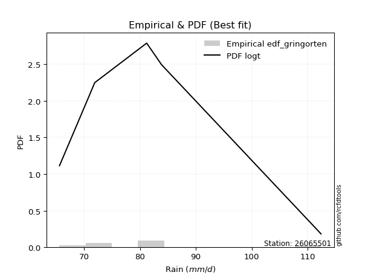</img>

</div>


### 9. Empirical - EDF Filliben (1975)

The specific values of the constants (0.3175) (often denoted as $alpha$) and (0.365) are derived from a method proposed by James J. Filliben in a 1975 paper. This particular formula is the mean value of the $i$-th order statistic of the normal distribution and is considered a robust and effective plotting position formula for the normal probability plot correlation coefficient test for normality.

<div align="center">


$P=(m-0.3175)/(n+0.365)$


</div>


**9.1. Empirical values**

<div align="center">

|                | 0                   | 1                   | 2                   | 3            | 4                  | 5                  | 6                  |
|:---------------|:--------------------|:--------------------|:--------------------|:-------------|:-------------------|:-------------------|:-------------------|
| date           | 2021                | 2017                | 2022                | 2023         | 2019               | 2018               | 2020               |
| x              | 65.6                | 70.9                | 71.9                | 81.2         | 83.7               | 83.8               | 112.4              |
| m              | 1                   | 2                   | 3                   | 4            | 5                  | 6                  | 7                  |
| empirical_dist | edf_filliben        | edf_filliben        | edf_filliben        | edf_filliben | edf_filliben       | edf_filliben       | edf_filliben       |
| empirical      | 0.09266802443991853 | 0.22844534962661237 | 0.36422267481330617 | 0.5          | 0.6357773251866938 | 0.7715546503733877 | 0.9073319755600815 |
| empirical_tr   | 1.1021324354657687  | 1.2960844698636163  | 1.5728777362520021  | 2.0          | 2.7455731593662627 | 4.377414561664191  | 10.791208791208794 |

</div>


**9.2. Kolmogorov-Smirnov fit test (sorted by Δ)**


<div align="center">

|                | 0                   | 1                   | 2                   | 3                   | 4                   | 5                   | 6                   | 7                   | 8                   | 9                   | 10                  | 11                  | 12                  | 13                  | 14                  | 15                  | 16                  | 17                  | 18                  | 19                  | 20                  | 21                  | 22                  | 23                  | 24                  | 25                  | 26                  | 27                  | 28                  | 29                  | 30                  | 31                  | 32                  | 33                  | 34                  | 35                  | 36                  | 37                  | 38                  | 39                  | 40                  | 41                  | 42                  | 43                  | 44                  | 45                  | 46                  | 47                  | 48                  | 49                  | 50                  | 51                  | 52                    | 53                  | 54                  | 55                  | 56                  | 57                  | 58                  | 59                  | 60                  | 61                  | 62                  | 63                  | 64                  | 65                  | 66                  | 67                  | 68                  | 69                  | 70                  | 71                  | 72                  | 73                  | 74                  | 75                  | 76                  | 77                  | 78                  | 79                  | 80                  | 81                  | 82                  | 83                  | 84                  | 85                  | 86                  | 87                  | 88                  | 89                  |
|:---------------|:--------------------|:--------------------|:--------------------|:--------------------|:--------------------|:--------------------|:--------------------|:--------------------|:--------------------|:--------------------|:--------------------|:--------------------|:--------------------|:--------------------|:--------------------|:--------------------|:--------------------|:--------------------|:--------------------|:--------------------|:--------------------|:--------------------|:--------------------|:--------------------|:--------------------|:--------------------|:--------------------|:--------------------|:--------------------|:--------------------|:--------------------|:--------------------|:--------------------|:--------------------|:--------------------|:--------------------|:--------------------|:--------------------|:--------------------|:--------------------|:--------------------|:--------------------|:--------------------|:--------------------|:--------------------|:--------------------|:--------------------|:--------------------|:--------------------|:--------------------|:--------------------|:--------------------|:----------------------|:--------------------|:--------------------|:--------------------|:--------------------|:--------------------|:--------------------|:--------------------|:--------------------|:--------------------|:--------------------|:--------------------|:--------------------|:--------------------|:--------------------|:--------------------|:--------------------|:--------------------|:--------------------|:--------------------|:--------------------|:--------------------|:--------------------|:--------------------|:--------------------|:--------------------|:--------------------|:--------------------|:--------------------|:--------------------|:--------------------|:--------------------|:--------------------|:--------------------|:--------------------|:--------------------|:--------------------|:--------------------|
| station        | 26065501            | 26065501            | 26065501            | 26065501            | 26065501            | 26065501            | 26065501            | 26065501            | 26065501            | 26065501            | 26065501            | 26065501            | 26065501            | 26065501            | 26065501            | 26065501            | 26065501            | 26065501            | 26065501            | 26065501            | 26065501            | 26065501            | 26065501            | 26065501            | 26065501            | 26065501            | 26065501            | 26065501            | 26065501            | 26065501            | 26065501            | 26065501            | 26065501            | 26065501            | 26065501            | 26065501            | 26065501            | 26065501            | 26065501            | 26065501            | 26065501            | 26065501            | 26065501            | 26065501            | 26065501            | 26065501            | 26065501            | 26065501            | 26065501            | 26065501            | 26065501            | 26065501            | 26065501              | 26065501            | 26065501            | 26065501            | 26065501            | 26065501            | 26065501            | 26065501            | 26065501            | 26065501            | 26065501            | 26065501            | 26065501            | 26065501            | 26065501            | 26065501            | 26065501            | 26065501            | 26065501            | 26065501            | 26065501            | 26065501            | 26065501            | 26065501            | 26065501            | 26065501            | 26065501            | 26065501            | 26065501            | 26065501            | 26065501            | 26065501            | 26065501            | 26065501            | 26065501            | 26065501            | 26065501            | 26065501            |
| empirical_dist | edf_filliben        | edf_filliben        | edf_filliben        | edf_filliben        | edf_filliben        | edf_filliben        | edf_filliben        | edf_filliben        | edf_filliben        | edf_filliben        | edf_filliben        | edf_filliben        | edf_filliben        | edf_filliben        | edf_filliben        | edf_filliben        | edf_filliben        | edf_filliben        | edf_filliben        | edf_filliben        | edf_filliben        | edf_filliben        | edf_filliben        | edf_filliben        | edf_filliben        | edf_filliben        | edf_filliben        | edf_filliben        | edf_filliben        | edf_filliben        | edf_filliben        | edf_filliben        | edf_filliben        | edf_filliben        | edf_filliben        | edf_filliben        | edf_filliben        | edf_filliben        | edf_filliben        | edf_filliben        | edf_filliben        | edf_filliben        | edf_filliben        | edf_filliben        | edf_filliben        | edf_filliben        | edf_filliben        | edf_filliben        | edf_filliben        | edf_filliben        | edf_filliben        | edf_filliben        | edf_filliben          | edf_filliben        | edf_filliben        | edf_filliben        | edf_filliben        | edf_filliben        | edf_filliben        | edf_filliben        | edf_filliben        | edf_filliben        | edf_filliben        | edf_filliben        | edf_filliben        | edf_filliben        | edf_filliben        | edf_filliben        | edf_filliben        | edf_filliben        | edf_filliben        | edf_filliben        | edf_filliben        | edf_filliben        | edf_filliben        | edf_filliben        | edf_filliben        | edf_filliben        | edf_filliben        | edf_filliben        | edf_filliben        | edf_filliben        | edf_filliben        | edf_filliben        | edf_filliben        | edf_filliben        | edf_filliben        | edf_filliben        | edf_filliben        | edf_filliben        |
| p_dist         | logt                | loggumbel_r         | gompertz            | mielke              | logmielke           | genexpon            | logkstwobign        | loghalfnorm         | loggenlogistic      | moyal               | halflogistic        | logpearson3         | genlogistic         | loggenexpon         | alpha               | logmoyal            | loginvweibull       | loghalflogistic     | invgamma            | f                   | exponnorm           | expon               | invweibull          | fisk                | invgauss            | pearson3            | johnsonsu           | logfisk             | logjohnsonsu        | loginvgauss         | lograyleigh         | logfatiguelife      | logtruncnorm        | gumbel_r            | halfnorm            | logmaxwell          | logalpha            | logrice             | kstwobign           | nct                 | logncf              | logexponnorm        | weibull_min         | lognakagami         | logf                | loghypsecant        | loglogistic         | loginvgamma         | logexpon            | betaprime           | lognct              | loggompertz         | loglaplace_asymmetric | wald                | rayleigh            | logcrystalball      | lognorm             | lognorm             | laplace_asymmetric  | logloggamma         | laplace             | loglaplace          | maxwell             | ncf                 | rice                | hypsecant           | logistic            | logwald             | logbetaprime        | t                   | crystalball         | norm                | nakagami            | loggumbel_l         | gumbel_l            | logweibull_min      | gibrat              | loggibrat           | logerlang           | erlang              | logchi2             | loglognorm          | pareto              | logpareto           | gamma               | truncnorm           | loggamma            | loggamma            | fatiguelife         | chi2                |
| delta          | 0.09939466618654447 | 0.10051424620365818 | 0.10533235498804328 | 0.10564346098687505 | 0.10656009668256516 | 0.10782546665753168 | 0.10860329736566854 | 0.109160912547554   | 0.1093560641859479  | 0.11016769202352994 | 0.1112382168615611  | 0.11391112041983154 | 0.11703485028303384 | 0.12427341147295867 | 0.124328266241579   | 0.12530621621220372 | 0.12622536600151102 | 0.1267724432816757  | 0.1279060544416949  | 0.12809366486628737 | 0.1283818907725215  | 0.12843341518750728 | 0.12852066675740437 | 0.12914806462757245 | 0.12933094407428614 | 0.12971622332339128 | 0.1303630636453441  | 0.13066397687736586 | 0.130781465481705   | 0.13121641035304066 | 0.13213579513692975 | 0.1332640458434594  | 0.13371206484296805 | 0.13435323247259556 | 0.13903922670410118 | 0.14019287897109345 | 0.14084249243420377 | 0.14197555906935544 | 0.1437856136181177  | 0.14460812741573448 | 0.14662943938271622 | 0.1466469545177429  | 0.14686384253443727 | 0.1508961294522042  | 0.15099840415660926 | 0.1516826834953195  | 0.15274534552403163 | 0.15311110918801518 | 0.15331028300906746 | 0.15355011832473442 | 0.15550470667313987 | 0.1593180947167845  | 0.16117643390289757   | 0.1636671738271409  | 0.16515415972971592 | 0.16623867163399608 | 0.16624403093800832 | 0.16624403093800832 | 0.1665986617155139  | 0.16824460797390495 | 0.16857614365981957 | 0.17149638255126212 | 0.1743906098194027  | 0.18207984303115055 | 0.18607552622074908 | 0.18688052030933455 | 0.19446148908972227 | 0.19584914639786688 | 0.20219740135412545 | 0.2034407551566776  | 0.20351650833877244 | 0.203516520153864   | 0.21829311311210345 | 0.22500570441625212 | 0.26839552614636863 | 0.27097133259065487 | 0.3021947060095481  | 0.31436932374649273 | 0.35515387996661185 | 0.37187634000359737 | 0.3974270532887895  | 0.40078917257299274 | 0.40433303170401724 | 0.40934990916097513 | 0.4194990618140809  | 0.46085442200208043 | 0.48433604447593115 | 0.48433604447593115 | 0.5223718938347794  | 0.6911923693252229  |
| deltao         | 0.48442053926100004 | 0.48442053926100004 | 0.48442053926100004 | 0.48442053926100004 | 0.48442053926100004 | 0.48442053926100004 | 0.48442053926100004 | 0.48442053926100004 | 0.48442053926100004 | 0.48442053926100004 | 0.48442053926100004 | 0.48442053926100004 | 0.48442053926100004 | 0.48442053926100004 | 0.48442053926100004 | 0.48442053926100004 | 0.48442053926100004 | 0.48442053926100004 | 0.48442053926100004 | 0.48442053926100004 | 0.48442053926100004 | 0.48442053926100004 | 0.48442053926100004 | 0.48442053926100004 | 0.48442053926100004 | 0.48442053926100004 | 0.48442053926100004 | 0.48442053926100004 | 0.48442053926100004 | 0.48442053926100004 | 0.48442053926100004 | 0.48442053926100004 | 0.48442053926100004 | 0.48442053926100004 | 0.48442053926100004 | 0.48442053926100004 | 0.48442053926100004 | 0.48442053926100004 | 0.48442053926100004 | 0.48442053926100004 | 0.48442053926100004 | 0.48442053926100004 | 0.48442053926100004 | 0.48442053926100004 | 0.48442053926100004 | 0.48442053926100004 | 0.48442053926100004 | 0.48442053926100004 | 0.48442053926100004 | 0.48442053926100004 | 0.48442053926100004 | 0.48442053926100004 | 0.48442053926100004   | 0.48442053926100004 | 0.48442053926100004 | 0.48442053926100004 | 0.48442053926100004 | 0.48442053926100004 | 0.48442053926100004 | 0.48442053926100004 | 0.48442053926100004 | 0.48442053926100004 | 0.48442053926100004 | 0.48442053926100004 | 0.48442053926100004 | 0.48442053926100004 | 0.48442053926100004 | 0.48442053926100004 | 0.48442053926100004 | 0.48442053926100004 | 0.48442053926100004 | 0.48442053926100004 | 0.48442053926100004 | 0.48442053926100004 | 0.48442053926100004 | 0.48442053926100004 | 0.48442053926100004 | 0.48442053926100004 | 0.48442053926100004 | 0.48442053926100004 | 0.48442053926100004 | 0.48442053926100004 | 0.48442053926100004 | 0.48442053926100004 | 0.48442053926100004 | 0.48442053926100004 | 0.48442053926100004 | 0.48442053926100004 | 0.48442053926100004 | 0.48442053926100004 |
| eval           | Δo > Δ              | Δo > Δ              | Δo > Δ              | Δo > Δ              | Δo > Δ              | Δo > Δ              | Δo > Δ              | Δo > Δ              | Δo > Δ              | Δo > Δ              | Δo > Δ              | Δo > Δ              | Δo > Δ              | Δo > Δ              | Δo > Δ              | Δo > Δ              | Δo > Δ              | Δo > Δ              | Δo > Δ              | Δo > Δ              | Δo > Δ              | Δo > Δ              | Δo > Δ              | Δo > Δ              | Δo > Δ              | Δo > Δ              | Δo > Δ              | Δo > Δ              | Δo > Δ              | Δo > Δ              | Δo > Δ              | Δo > Δ              | Δo > Δ              | Δo > Δ              | Δo > Δ              | Δo > Δ              | Δo > Δ              | Δo > Δ              | Δo > Δ              | Δo > Δ              | Δo > Δ              | Δo > Δ              | Δo > Δ              | Δo > Δ              | Δo > Δ              | Δo > Δ              | Δo > Δ              | Δo > Δ              | Δo > Δ              | Δo > Δ              | Δo > Δ              | Δo > Δ              | Δo > Δ                | Δo > Δ              | Δo > Δ              | Δo > Δ              | Δo > Δ              | Δo > Δ              | Δo > Δ              | Δo > Δ              | Δo > Δ              | Δo > Δ              | Δo > Δ              | Δo > Δ              | Δo > Δ              | Δo > Δ              | Δo > Δ              | Δo > Δ              | Δo > Δ              | Δo > Δ              | Δo > Δ              | Δo > Δ              | Δo > Δ              | Δo > Δ              | Δo > Δ              | Δo > Δ              | Δo > Δ              | Δo > Δ              | Δo > Δ              | Δo > Δ              | Δo > Δ              | Δo > Δ              | Δo > Δ              | Δo > Δ              | Δo > Δ              | Δo > Δ              | Δo > Δ              | Δo > Δ              | Δo <= Δ             | Δo <= Δ             |
| fit            | 1                   | 1                   | 1                   | 1                   | 1                   | 1                   | 1                   | 1                   | 1                   | 1                   | 1                   | 1                   | 1                   | 1                   | 1                   | 1                   | 1                   | 1                   | 1                   | 1                   | 1                   | 1                   | 1                   | 1                   | 1                   | 1                   | 1                   | 1                   | 1                   | 1                   | 1                   | 1                   | 1                   | 1                   | 1                   | 1                   | 1                   | 1                   | 1                   | 1                   | 1                   | 1                   | 1                   | 1                   | 1                   | 1                   | 1                   | 1                   | 1                   | 1                   | 1                   | 1                   | 1                     | 1                   | 1                   | 1                   | 1                   | 1                   | 1                   | 1                   | 1                   | 1                   | 1                   | 1                   | 1                   | 1                   | 1                   | 1                   | 1                   | 1                   | 1                   | 1                   | 1                   | 1                   | 1                   | 1                   | 1                   | 1                   | 1                   | 1                   | 1                   | 1                   | 1                   | 1                   | 1                   | 1                   | 1                   | 1                   | 0                   | 0                   |
| n              | 7                   | 7                   | 7                   | 7                   | 7                   | 7                   | 7                   | 7                   | 7                   | 7                   | 7                   | 7                   | 7                   | 7                   | 7                   | 7                   | 7                   | 7                   | 7                   | 7                   | 7                   | 7                   | 7                   | 7                   | 7                   | 7                   | 7                   | 7                   | 7                   | 7                   | 7                   | 7                   | 7                   | 7                   | 7                   | 7                   | 7                   | 7                   | 7                   | 7                   | 7                   | 7                   | 7                   | 7                   | 7                   | 7                   | 7                   | 7                   | 7                   | 7                   | 7                   | 7                   | 7                     | 7                   | 7                   | 7                   | 7                   | 7                   | 7                   | 7                   | 7                   | 7                   | 7                   | 7                   | 7                   | 7                   | 7                   | 7                   | 7                   | 7                   | 7                   | 7                   | 7                   | 7                   | 7                   | 7                   | 7                   | 7                   | 7                   | 7                   | 7                   | 7                   | 7                   | 7                   | 7                   | 7                   | 7                   | 7                   | 7                   | 7                   |
| best_fit       | 1                   | 0                   | 0                   | 0                   | 0                   | 0                   | 0                   | 0                   | 0                   | 0                   | 0                   | 0                   | 0                   | 0                   | 0                   | 0                   | 0                   | 0                   | 0                   | 0                   | 0                   | 0                   | 0                   | 0                   | 0                   | 0                   | 0                   | 0                   | 0                   | 0                   | 0                   | 0                   | 0                   | 0                   | 0                   | 0                   | 0                   | 0                   | 0                   | 0                   | 0                   | 0                   | 0                   | 0                   | 0                   | 0                   | 0                   | 0                   | 0                   | 0                   | 0                   | 0                   | 0                     | 0                   | 0                   | 0                   | 0                   | 0                   | 0                   | 0                   | 0                   | 0                   | 0                   | 0                   | 0                   | 0                   | 0                   | 0                   | 0                   | 0                   | 0                   | 0                   | 0                   | 0                   | 0                   | 0                   | 0                   | 0                   | 0                   | 0                   | 0                   | 0                   | 0                   | 0                   | 0                   | 0                   | 0                   | 0                   | 0                   | 0                   |
| best_fit_sort  | 1                   | 2                   | 3                   | 4                   | 5                   | 6                   | 7                   | 8                   | 9                   | 10                  | 11                  | 12                  | 13                  | 14                  | 15                  | 16                  | 17                  | 18                  | 19                  | 20                  | 21                  | 22                  | 23                  | 24                  | 25                  | 26                  | 27                  | 28                  | 29                  | 30                  | 31                  | 32                  | 33                  | 34                  | 35                  | 36                  | 37                  | 38                  | 39                  | 40                  | 41                  | 42                  | 43                  | 44                  | 45                  | 46                  | 47                  | 48                  | 49                  | 50                  | 51                  | 52                  | 53                    | 54                  | 55                  | 56                  | 57                  | 58                  | 59                  | 60                  | 61                  | 62                  | 63                  | 64                  | 65                  | 66                  | 67                  | 68                  | 69                  | 70                  | 71                  | 72                  | 73                  | 74                  | 75                  | 76                  | 77                  | 78                  | 79                  | 80                  | 81                  | 82                  | 83                  | 84                  | 85                  | 86                  | 87                  | 88                  | 89                  | 90                  |

</div>


<div align="center">

</img>

</div>


**9.3. Best fit**

<div align="center">

|   id |   station | empirical_dist   | p_dist   |     delta |   deltao | eval   |   fit |   n |   best_fit |   best_fit_sort |
|-----:|----------:|:-----------------|:---------|----------:|---------:|:-------|------:|----:|-----------:|----------------:|
|    0 |  26065501 | edf_filliben     | logt     | 0.0993947 | 0.484421 | Δo > Δ |     1 |   7 |          1 |               1 |

</div>


<div align="center">

</img></img>

</div>


### 10. Empirical - EDF Jenkinson (1977)

The Jenkinson formula in hydrology is an empirical plotting position formula used to estimate the non-exceedance probability _(P)_ or return period _(T)_ of a given ordered observation within a sample. It is a widely used method in the frequency analysis of extreme events such as floods and rainfall, as it provides a distribution-free way to plot data. _a≈0.31_ and _b≈0.38_ are constants derived to approximate the median of the probability distribution for the given rank.

<div align="center">


$P=(m-a)/(n+b)$


</div>


**10.1. Empirical values**

<div align="center">

|                | 0                   | 1                   | 2                   | 3             | 4                  | 5                  | 6                  |
|:---------------|:--------------------|:--------------------|:--------------------|:--------------|:-------------------|:-------------------|:-------------------|
| date           | 2021                | 2017                | 2022                | 2023          | 2019               | 2018               | 2020               |
| x              | 65.6                | 70.9                | 71.9                | 81.2          | 83.7               | 83.8               | 112.4              |
| m              | 1                   | 2                   | 3                   | 4             | 5                  | 6                  | 7                  |
| empirical_dist | edf_jenkinson       | edf_jenkinson       | edf_jenkinson       | edf_jenkinson | edf_jenkinson      | edf_jenkinson      | edf_jenkinson      |
| empirical      | 0.09349593495934959 | 0.22899728997289973 | 0.36449864498644985 | 0.5           | 0.6355013550135502 | 0.7710027100271003 | 0.9065040650406505 |
| empirical_tr   | 1.1031390134529149  | 1.29701230228471    | 1.5735607675906182  | 2.0           | 2.743494423791822  | 4.366863905325444  | 10.695652173913055 |

</div>


**10.2. Kolmogorov-Smirnov fit test (sorted by Δ)**


<div align="center">

|                | 0                   | 1                   | 2                   | 3                   | 4                   | 5                   | 6                   | 7                   | 8                   | 9                   | 10                  | 11                  | 12                  | 13                  | 14                  | 15                  | 16                  | 17                  | 18                  | 19                  | 20                  | 21                  | 22                  | 23                  | 24                  | 25                  | 26                  | 27                  | 28                  | 29                  | 30                  | 31                  | 32                  | 33                  | 34                  | 35                  | 36                  | 37                  | 38                  | 39                  | 40                  | 41                  | 42                  | 43                  | 44                  | 45                  | 46                  | 47                  | 48                  | 49                  | 50                  | 51                  | 52                    | 53                  | 54                  | 55                  | 56                  | 57                  | 58                  | 59                  | 60                  | 61                  | 62                  | 63                  | 64                  | 65                  | 66                  | 67                  | 68                  | 69                  | 70                  | 71                  | 72                  | 73                  | 74                  | 75                  | 76                  | 77                  | 78                  | 79                  | 80                  | 81                  | 82                  | 83                  | 84                  | 85                  | 86                  | 87                  | 88                  | 89                  |
|:---------------|:--------------------|:--------------------|:--------------------|:--------------------|:--------------------|:--------------------|:--------------------|:--------------------|:--------------------|:--------------------|:--------------------|:--------------------|:--------------------|:--------------------|:--------------------|:--------------------|:--------------------|:--------------------|:--------------------|:--------------------|:--------------------|:--------------------|:--------------------|:--------------------|:--------------------|:--------------------|:--------------------|:--------------------|:--------------------|:--------------------|:--------------------|:--------------------|:--------------------|:--------------------|:--------------------|:--------------------|:--------------------|:--------------------|:--------------------|:--------------------|:--------------------|:--------------------|:--------------------|:--------------------|:--------------------|:--------------------|:--------------------|:--------------------|:--------------------|:--------------------|:--------------------|:--------------------|:----------------------|:--------------------|:--------------------|:--------------------|:--------------------|:--------------------|:--------------------|:--------------------|:--------------------|:--------------------|:--------------------|:--------------------|:--------------------|:--------------------|:--------------------|:--------------------|:--------------------|:--------------------|:--------------------|:--------------------|:--------------------|:--------------------|:--------------------|:--------------------|:--------------------|:--------------------|:--------------------|:--------------------|:--------------------|:--------------------|:--------------------|:--------------------|:--------------------|:--------------------|:--------------------|:--------------------|:--------------------|:--------------------|
| station        | 26065501            | 26065501            | 26065501            | 26065501            | 26065501            | 26065501            | 26065501            | 26065501            | 26065501            | 26065501            | 26065501            | 26065501            | 26065501            | 26065501            | 26065501            | 26065501            | 26065501            | 26065501            | 26065501            | 26065501            | 26065501            | 26065501            | 26065501            | 26065501            | 26065501            | 26065501            | 26065501            | 26065501            | 26065501            | 26065501            | 26065501            | 26065501            | 26065501            | 26065501            | 26065501            | 26065501            | 26065501            | 26065501            | 26065501            | 26065501            | 26065501            | 26065501            | 26065501            | 26065501            | 26065501            | 26065501            | 26065501            | 26065501            | 26065501            | 26065501            | 26065501            | 26065501            | 26065501              | 26065501            | 26065501            | 26065501            | 26065501            | 26065501            | 26065501            | 26065501            | 26065501            | 26065501            | 26065501            | 26065501            | 26065501            | 26065501            | 26065501            | 26065501            | 26065501            | 26065501            | 26065501            | 26065501            | 26065501            | 26065501            | 26065501            | 26065501            | 26065501            | 26065501            | 26065501            | 26065501            | 26065501            | 26065501            | 26065501            | 26065501            | 26065501            | 26065501            | 26065501            | 26065501            | 26065501            | 26065501            |
| empirical_dist | edf_jenkinson       | edf_jenkinson       | edf_jenkinson       | edf_jenkinson       | edf_jenkinson       | edf_jenkinson       | edf_jenkinson       | edf_jenkinson       | edf_jenkinson       | edf_jenkinson       | edf_jenkinson       | edf_jenkinson       | edf_jenkinson       | edf_jenkinson       | edf_jenkinson       | edf_jenkinson       | edf_jenkinson       | edf_jenkinson       | edf_jenkinson       | edf_jenkinson       | edf_jenkinson       | edf_jenkinson       | edf_jenkinson       | edf_jenkinson       | edf_jenkinson       | edf_jenkinson       | edf_jenkinson       | edf_jenkinson       | edf_jenkinson       | edf_jenkinson       | edf_jenkinson       | edf_jenkinson       | edf_jenkinson       | edf_jenkinson       | edf_jenkinson       | edf_jenkinson       | edf_jenkinson       | edf_jenkinson       | edf_jenkinson       | edf_jenkinson       | edf_jenkinson       | edf_jenkinson       | edf_jenkinson       | edf_jenkinson       | edf_jenkinson       | edf_jenkinson       | edf_jenkinson       | edf_jenkinson       | edf_jenkinson       | edf_jenkinson       | edf_jenkinson       | edf_jenkinson       | edf_jenkinson         | edf_jenkinson       | edf_jenkinson       | edf_jenkinson       | edf_jenkinson       | edf_jenkinson       | edf_jenkinson       | edf_jenkinson       | edf_jenkinson       | edf_jenkinson       | edf_jenkinson       | edf_jenkinson       | edf_jenkinson       | edf_jenkinson       | edf_jenkinson       | edf_jenkinson       | edf_jenkinson       | edf_jenkinson       | edf_jenkinson       | edf_jenkinson       | edf_jenkinson       | edf_jenkinson       | edf_jenkinson       | edf_jenkinson       | edf_jenkinson       | edf_jenkinson       | edf_jenkinson       | edf_jenkinson       | edf_jenkinson       | edf_jenkinson       | edf_jenkinson       | edf_jenkinson       | edf_jenkinson       | edf_jenkinson       | edf_jenkinson       | edf_jenkinson       | edf_jenkinson       | edf_jenkinson       |
| p_dist         | logt                | loggumbel_r         | gompertz            | mielke              | logmielke           | genexpon            | logkstwobign        | loghalfnorm         | loggenlogistic      | moyal               | halflogistic        | logpearson3         | genlogistic         | loggenexpon         | alpha               | logmoyal            | loginvweibull       | loghalflogistic     | invgamma            | f                   | exponnorm           | expon               | invweibull          | fisk                | pearson3            | invgauss            | johnsonsu           | logfisk             | logjohnsonsu        | loginvgauss         | lograyleigh         | logfatiguelife      | logtruncnorm        | gumbel_r            | halfnorm            | logmaxwell          | logalpha            | logrice             | kstwobign           | nct                 | logncf              | weibull_min         | logexponnorm        | lognakagami         | logf                | loghypsecant        | loglogistic         | loginvgamma         | betaprime           | logexpon            | lognct              | loggompertz         | loglaplace_asymmetric | wald                | rayleigh            | logcrystalball      | lognorm             | lognorm             | laplace_asymmetric  | logloggamma         | laplace             | loglaplace          | maxwell             | ncf                 | rice                | hypsecant           | logistic            | logwald             | logbetaprime        | t                   | crystalball         | norm                | nakagami            | loggumbel_l         | gumbel_l            | logweibull_min      | gibrat              | loggibrat           | logerlang           | erlang              | logchi2             | loglognorm          | pareto              | logpareto           | gamma               | truncnorm           | loggamma            | loggamma            | fatiguelife         | chi2                |
| delta          | 0.09939466618654447 | 0.10079021637680186 | 0.1052574513266521  | 0.10564346098687505 | 0.10656009668256516 | 0.10782546665753168 | 0.10805135701938118 | 0.10860897220126664 | 0.1093560641859479  | 0.10961575167724258 | 0.11068627651527374 | 0.11335918007354417 | 0.11731082045617752 | 0.12427341147295867 | 0.124328266241579   | 0.12530621621220372 | 0.12622536600151102 | 0.1267724432816757  | 0.1279060544416949  | 0.12809366486628737 | 0.1283818907725215  | 0.12843341518750728 | 0.12852066675740437 | 0.12914806462757245 | 0.12916428297710392 | 0.12933094407428614 | 0.1303630636453441  | 0.13066397687736586 | 0.130781465481705   | 0.13121641035304066 | 0.13158385479064238 | 0.1332640458434594  | 0.13371206484296805 | 0.1338012921263082  | 0.13848728635781382 | 0.1396409386248061  | 0.1402905520879164  | 0.14142361872306808 | 0.14323367327183034 | 0.14405618706944712 | 0.14607749903642886 | 0.1463119021881499  | 0.1466469545177429  | 0.1508961294522042  | 0.15099840415660926 | 0.15195865366846317 | 0.15219340517774427 | 0.15255916884172782 | 0.15299817797844706 | 0.15331028300906746 | 0.1549527663268525  | 0.15876615437049713 | 0.16145240407604125   | 0.1636671738271409  | 0.16460221938342856 | 0.16568673128770872 | 0.16569209059172096 | 0.16569209059172096 | 0.1668746318886576  | 0.1676926676276176  | 0.16885211383296325 | 0.1717723527244058  | 0.17383866947311533 | 0.18152790268486318 | 0.18552358587446172 | 0.1863285799630472  | 0.1939095487434349  | 0.19584914639786688 | 0.20219740135412545 | 0.20288881481039023 | 0.20296456799248508 | 0.20296457980757665 | 0.2177411727658161  | 0.22445376406996476 | 0.2678435858000813  | 0.2704193922443675  | 0.3024706761826918  | 0.3146452939196364  | 0.3546019396203245  | 0.37132439965731    | 0.39687511294250216 | 0.4002372322267054  | 0.4037810913577299  | 0.4087979688146878  | 0.41894712146779356 | 0.46085442200208043 | 0.4837841041296438  | 0.4837841041296438  | 0.5218199534884921  | 0.6906404289789355  |
| deltao         | 0.48442053926100004 | 0.48442053926100004 | 0.48442053926100004 | 0.48442053926100004 | 0.48442053926100004 | 0.48442053926100004 | 0.48442053926100004 | 0.48442053926100004 | 0.48442053926100004 | 0.48442053926100004 | 0.48442053926100004 | 0.48442053926100004 | 0.48442053926100004 | 0.48442053926100004 | 0.48442053926100004 | 0.48442053926100004 | 0.48442053926100004 | 0.48442053926100004 | 0.48442053926100004 | 0.48442053926100004 | 0.48442053926100004 | 0.48442053926100004 | 0.48442053926100004 | 0.48442053926100004 | 0.48442053926100004 | 0.48442053926100004 | 0.48442053926100004 | 0.48442053926100004 | 0.48442053926100004 | 0.48442053926100004 | 0.48442053926100004 | 0.48442053926100004 | 0.48442053926100004 | 0.48442053926100004 | 0.48442053926100004 | 0.48442053926100004 | 0.48442053926100004 | 0.48442053926100004 | 0.48442053926100004 | 0.48442053926100004 | 0.48442053926100004 | 0.48442053926100004 | 0.48442053926100004 | 0.48442053926100004 | 0.48442053926100004 | 0.48442053926100004 | 0.48442053926100004 | 0.48442053926100004 | 0.48442053926100004 | 0.48442053926100004 | 0.48442053926100004 | 0.48442053926100004 | 0.48442053926100004   | 0.48442053926100004 | 0.48442053926100004 | 0.48442053926100004 | 0.48442053926100004 | 0.48442053926100004 | 0.48442053926100004 | 0.48442053926100004 | 0.48442053926100004 | 0.48442053926100004 | 0.48442053926100004 | 0.48442053926100004 | 0.48442053926100004 | 0.48442053926100004 | 0.48442053926100004 | 0.48442053926100004 | 0.48442053926100004 | 0.48442053926100004 | 0.48442053926100004 | 0.48442053926100004 | 0.48442053926100004 | 0.48442053926100004 | 0.48442053926100004 | 0.48442053926100004 | 0.48442053926100004 | 0.48442053926100004 | 0.48442053926100004 | 0.48442053926100004 | 0.48442053926100004 | 0.48442053926100004 | 0.48442053926100004 | 0.48442053926100004 | 0.48442053926100004 | 0.48442053926100004 | 0.48442053926100004 | 0.48442053926100004 | 0.48442053926100004 | 0.48442053926100004 |
| eval           | Δo > Δ              | Δo > Δ              | Δo > Δ              | Δo > Δ              | Δo > Δ              | Δo > Δ              | Δo > Δ              | Δo > Δ              | Δo > Δ              | Δo > Δ              | Δo > Δ              | Δo > Δ              | Δo > Δ              | Δo > Δ              | Δo > Δ              | Δo > Δ              | Δo > Δ              | Δo > Δ              | Δo > Δ              | Δo > Δ              | Δo > Δ              | Δo > Δ              | Δo > Δ              | Δo > Δ              | Δo > Δ              | Δo > Δ              | Δo > Δ              | Δo > Δ              | Δo > Δ              | Δo > Δ              | Δo > Δ              | Δo > Δ              | Δo > Δ              | Δo > Δ              | Δo > Δ              | Δo > Δ              | Δo > Δ              | Δo > Δ              | Δo > Δ              | Δo > Δ              | Δo > Δ              | Δo > Δ              | Δo > Δ              | Δo > Δ              | Δo > Δ              | Δo > Δ              | Δo > Δ              | Δo > Δ              | Δo > Δ              | Δo > Δ              | Δo > Δ              | Δo > Δ              | Δo > Δ                | Δo > Δ              | Δo > Δ              | Δo > Δ              | Δo > Δ              | Δo > Δ              | Δo > Δ              | Δo > Δ              | Δo > Δ              | Δo > Δ              | Δo > Δ              | Δo > Δ              | Δo > Δ              | Δo > Δ              | Δo > Δ              | Δo > Δ              | Δo > Δ              | Δo > Δ              | Δo > Δ              | Δo > Δ              | Δo > Δ              | Δo > Δ              | Δo > Δ              | Δo > Δ              | Δo > Δ              | Δo > Δ              | Δo > Δ              | Δo > Δ              | Δo > Δ              | Δo > Δ              | Δo > Δ              | Δo > Δ              | Δo > Δ              | Δo > Δ              | Δo > Δ              | Δo > Δ              | Δo <= Δ             | Δo <= Δ             |
| fit            | 1                   | 1                   | 1                   | 1                   | 1                   | 1                   | 1                   | 1                   | 1                   | 1                   | 1                   | 1                   | 1                   | 1                   | 1                   | 1                   | 1                   | 1                   | 1                   | 1                   | 1                   | 1                   | 1                   | 1                   | 1                   | 1                   | 1                   | 1                   | 1                   | 1                   | 1                   | 1                   | 1                   | 1                   | 1                   | 1                   | 1                   | 1                   | 1                   | 1                   | 1                   | 1                   | 1                   | 1                   | 1                   | 1                   | 1                   | 1                   | 1                   | 1                   | 1                   | 1                   | 1                     | 1                   | 1                   | 1                   | 1                   | 1                   | 1                   | 1                   | 1                   | 1                   | 1                   | 1                   | 1                   | 1                   | 1                   | 1                   | 1                   | 1                   | 1                   | 1                   | 1                   | 1                   | 1                   | 1                   | 1                   | 1                   | 1                   | 1                   | 1                   | 1                   | 1                   | 1                   | 1                   | 1                   | 1                   | 1                   | 0                   | 0                   |
| n              | 7                   | 7                   | 7                   | 7                   | 7                   | 7                   | 7                   | 7                   | 7                   | 7                   | 7                   | 7                   | 7                   | 7                   | 7                   | 7                   | 7                   | 7                   | 7                   | 7                   | 7                   | 7                   | 7                   | 7                   | 7                   | 7                   | 7                   | 7                   | 7                   | 7                   | 7                   | 7                   | 7                   | 7                   | 7                   | 7                   | 7                   | 7                   | 7                   | 7                   | 7                   | 7                   | 7                   | 7                   | 7                   | 7                   | 7                   | 7                   | 7                   | 7                   | 7                   | 7                   | 7                     | 7                   | 7                   | 7                   | 7                   | 7                   | 7                   | 7                   | 7                   | 7                   | 7                   | 7                   | 7                   | 7                   | 7                   | 7                   | 7                   | 7                   | 7                   | 7                   | 7                   | 7                   | 7                   | 7                   | 7                   | 7                   | 7                   | 7                   | 7                   | 7                   | 7                   | 7                   | 7                   | 7                   | 7                   | 7                   | 7                   | 7                   |
| best_fit       | 1                   | 0                   | 0                   | 0                   | 0                   | 0                   | 0                   | 0                   | 0                   | 0                   | 0                   | 0                   | 0                   | 0                   | 0                   | 0                   | 0                   | 0                   | 0                   | 0                   | 0                   | 0                   | 0                   | 0                   | 0                   | 0                   | 0                   | 0                   | 0                   | 0                   | 0                   | 0                   | 0                   | 0                   | 0                   | 0                   | 0                   | 0                   | 0                   | 0                   | 0                   | 0                   | 0                   | 0                   | 0                   | 0                   | 0                   | 0                   | 0                   | 0                   | 0                   | 0                   | 0                     | 0                   | 0                   | 0                   | 0                   | 0                   | 0                   | 0                   | 0                   | 0                   | 0                   | 0                   | 0                   | 0                   | 0                   | 0                   | 0                   | 0                   | 0                   | 0                   | 0                   | 0                   | 0                   | 0                   | 0                   | 0                   | 0                   | 0                   | 0                   | 0                   | 0                   | 0                   | 0                   | 0                   | 0                   | 0                   | 0                   | 0                   |
| best_fit_sort  | 1                   | 2                   | 3                   | 4                   | 5                   | 6                   | 7                   | 8                   | 9                   | 10                  | 11                  | 12                  | 13                  | 14                  | 15                  | 16                  | 17                  | 18                  | 19                  | 20                  | 21                  | 22                  | 23                  | 24                  | 25                  | 26                  | 27                  | 28                  | 29                  | 30                  | 31                  | 32                  | 33                  | 34                  | 35                  | 36                  | 37                  | 38                  | 39                  | 40                  | 41                  | 42                  | 43                  | 44                  | 45                  | 46                  | 47                  | 48                  | 49                  | 50                  | 51                  | 52                  | 53                    | 54                  | 55                  | 56                  | 57                  | 58                  | 59                  | 60                  | 61                  | 62                  | 63                  | 64                  | 65                  | 66                  | 67                  | 68                  | 69                  | 70                  | 71                  | 72                  | 73                  | 74                  | 75                  | 76                  | 77                  | 78                  | 79                  | 80                  | 81                  | 82                  | 83                  | 84                  | 85                  | 86                  | 87                  | 88                  | 89                  | 90                  |

</div>


<div align="center">

</img>

</div>


**10.3. Best fit**

<div align="center">

|   id |   station | empirical_dist   | p_dist   |     delta |   deltao | eval   |   fit |   n |   best_fit |   best_fit_sort |
|-----:|----------:|:-----------------|:---------|----------:|---------:|:-------|------:|----:|-----------:|----------------:|
|    0 |  26065501 | edf_jenkinson    | logt     | 0.0993947 | 0.484421 | Δo > Δ |     1 |   7 |          1 |               1 |

</div>


<div align="center">

</img></img>

</div>


### 11. Empirical - EDF Cunnane (1978)

Cunnane´s work in statistical hydrology has focused on the performance and evaluation of different probability distributions (such as GEV, Gumbel, Lognormal) for flood frequency estimation. _b_ is a constant, typically set to 0.4.

<div align="center">


$P=(m-b)/(n+1-2b)$


</div>


**11.1. Empirical values**

<div align="center">

|                | 0                   | 1                   | 2                  | 3           | 4                  | 5                  | 6                  |
|:---------------|:--------------------|:--------------------|:-------------------|:------------|:-------------------|:-------------------|:-------------------|
| date           | 2021                | 2017                | 2022               | 2023        | 2019               | 2018               | 2020               |
| x              | 65.6                | 70.9                | 71.9               | 81.2        | 83.7               | 83.8               | 112.4              |
| m              | 1                   | 2                   | 3                  | 4           | 5                  | 6                  | 7                  |
| empirical_dist | edf_cunnane         | edf_cunnane         | edf_cunnane        | edf_cunnane | edf_cunnane        | edf_cunnane        | edf_cunnane        |
| empirical      | 0.08333333333333333 | 0.22222222222222224 | 0.3611111111111111 | 0.5         | 0.6388888888888888 | 0.7777777777777777 | 0.9166666666666666 |
| empirical_tr   | 1.090909090909091   | 1.2857142857142856  | 1.565217391304348  | 2.0         | 2.7692307692307687 | 4.499999999999998  | 11.999999999999995 |

</div>


**11.2. Kolmogorov-Smirnov fit test (sorted by Δ)**


<div align="center">

|                | 0                   | 1                   | 2                   | 3                   | 4                   | 5                   | 6                   | 7                   | 8                   | 9                   | 10                  | 11                  | 12                  | 13                  | 14                  | 15                  | 16                  | 17                  | 18                  | 19                  | 20                  | 21                  | 22                  | 23                  | 24                  | 25                  | 26                  | 27                  | 28                  | 29                  | 30                  | 31                  | 32                  | 33                  | 34                  | 35                  | 36                  | 37                  | 38                  | 39                  | 40                  | 41                  | 42                  | 43                  | 44                  | 45                  | 46                  | 47                    | 48                  | 49                  | 50                  | 51                  | 52                  | 53                  | 54                  | 55                  | 56                  | 57                  | 58                  | 59                  | 60                  | 61                  | 62                  | 63                  | 64                  | 65                  | 66                  | 67                  | 68                  | 69                  | 70                  | 71                  | 72                  | 73                  | 74                  | 75                  | 76                  | 77                  | 78                  | 79                  | 80                  | 81                  | 82                  | 83                  | 84                  | 85                  | 86                  | 87                  | 88                  | 89                  |
|:---------------|:--------------------|:--------------------|:--------------------|:--------------------|:--------------------|:--------------------|:--------------------|:--------------------|:--------------------|:--------------------|:--------------------|:--------------------|:--------------------|:--------------------|:--------------------|:--------------------|:--------------------|:--------------------|:--------------------|:--------------------|:--------------------|:--------------------|:--------------------|:--------------------|:--------------------|:--------------------|:--------------------|:--------------------|:--------------------|:--------------------|:--------------------|:--------------------|:--------------------|:--------------------|:--------------------|:--------------------|:--------------------|:--------------------|:--------------------|:--------------------|:--------------------|:--------------------|:--------------------|:--------------------|:--------------------|:--------------------|:--------------------|:----------------------|:--------------------|:--------------------|:--------------------|:--------------------|:--------------------|:--------------------|:--------------------|:--------------------|:--------------------|:--------------------|:--------------------|:--------------------|:--------------------|:--------------------|:--------------------|:--------------------|:--------------------|:--------------------|:--------------------|:--------------------|:--------------------|:--------------------|:--------------------|:--------------------|:--------------------|:--------------------|:--------------------|:--------------------|:--------------------|:--------------------|:--------------------|:--------------------|:--------------------|:--------------------|:--------------------|:--------------------|:--------------------|:--------------------|:--------------------|:--------------------|:--------------------|:--------------------|
| station        | 26065501            | 26065501            | 26065501            | 26065501            | 26065501            | 26065501            | 26065501            | 26065501            | 26065501            | 26065501            | 26065501            | 26065501            | 26065501            | 26065501            | 26065501            | 26065501            | 26065501            | 26065501            | 26065501            | 26065501            | 26065501            | 26065501            | 26065501            | 26065501            | 26065501            | 26065501            | 26065501            | 26065501            | 26065501            | 26065501            | 26065501            | 26065501            | 26065501            | 26065501            | 26065501            | 26065501            | 26065501            | 26065501            | 26065501            | 26065501            | 26065501            | 26065501            | 26065501            | 26065501            | 26065501            | 26065501            | 26065501            | 26065501              | 26065501            | 26065501            | 26065501            | 26065501            | 26065501            | 26065501            | 26065501            | 26065501            | 26065501            | 26065501            | 26065501            | 26065501            | 26065501            | 26065501            | 26065501            | 26065501            | 26065501            | 26065501            | 26065501            | 26065501            | 26065501            | 26065501            | 26065501            | 26065501            | 26065501            | 26065501            | 26065501            | 26065501            | 26065501            | 26065501            | 26065501            | 26065501            | 26065501            | 26065501            | 26065501            | 26065501            | 26065501            | 26065501            | 26065501            | 26065501            | 26065501            | 26065501            |
| empirical_dist | edf_cunnane         | edf_cunnane         | edf_cunnane         | edf_cunnane         | edf_cunnane         | edf_cunnane         | edf_cunnane         | edf_cunnane         | edf_cunnane         | edf_cunnane         | edf_cunnane         | edf_cunnane         | edf_cunnane         | edf_cunnane         | edf_cunnane         | edf_cunnane         | edf_cunnane         | edf_cunnane         | edf_cunnane         | edf_cunnane         | edf_cunnane         | edf_cunnane         | edf_cunnane         | edf_cunnane         | edf_cunnane         | edf_cunnane         | edf_cunnane         | edf_cunnane         | edf_cunnane         | edf_cunnane         | edf_cunnane         | edf_cunnane         | edf_cunnane         | edf_cunnane         | edf_cunnane         | edf_cunnane         | edf_cunnane         | edf_cunnane         | edf_cunnane         | edf_cunnane         | edf_cunnane         | edf_cunnane         | edf_cunnane         | edf_cunnane         | edf_cunnane         | edf_cunnane         | edf_cunnane         | edf_cunnane           | edf_cunnane         | edf_cunnane         | edf_cunnane         | edf_cunnane         | edf_cunnane         | edf_cunnane         | edf_cunnane         | edf_cunnane         | edf_cunnane         | edf_cunnane         | edf_cunnane         | edf_cunnane         | edf_cunnane         | edf_cunnane         | edf_cunnane         | edf_cunnane         | edf_cunnane         | edf_cunnane         | edf_cunnane         | edf_cunnane         | edf_cunnane         | edf_cunnane         | edf_cunnane         | edf_cunnane         | edf_cunnane         | edf_cunnane         | edf_cunnane         | edf_cunnane         | edf_cunnane         | edf_cunnane         | edf_cunnane         | edf_cunnane         | edf_cunnane         | edf_cunnane         | edf_cunnane         | edf_cunnane         | edf_cunnane         | edf_cunnane         | edf_cunnane         | edf_cunnane         | edf_cunnane         | edf_cunnane         |
| p_dist         | logt                | mielke              | loggumbel_r         | logmielke           | genexpon            | loggenlogistic      | gompertz            | logkstwobign        | loghalfnorm         | moyal               | halflogistic        | genlogistic         | logpearson3         | loggenexpon         | alpha               | logmoyal            | loginvweibull       | loghalflogistic     | invgamma            | f                   | exponnorm           | expon               | invweibull          | fisk                | invgauss            | johnsonsu           | logfisk             | logjohnsonsu        | loginvgauss         | logfatiguelife      | logtruncnorm        | pearson3            | lograyleigh         | gumbel_r            | halfnorm            | logmaxwell          | logexponnorm        | logalpha            | logrice             | loghypsecant        | kstwobign           | nct                 | lognakagami         | logf                | logncf              | weibull_min         | logexpon            | loglaplace_asymmetric | loglogistic         | loginvgamma         | betaprime           | lognct              | wald                | loggompertz         | loglaplace          | laplace_asymmetric  | laplace             | rayleigh            | logcrystalball      | lognorm             | lognorm             | logloggamma         | maxwell             | ncf                 | rice                | hypsecant           | logwald             | logistic            | logbetaprime        | t                   | crystalball         | norm                | nakagami            | loggumbel_l         | gumbel_l            | logweibull_min      | gibrat              | loggibrat           | logerlang           | erlang              | logchi2             | loglognorm          | pareto              | logpareto           | gamma               | truncnorm           | loggamma            | loggamma            | fatiguelife         | chi2                |
| delta          | 0.09939466618654447 | 0.10564346098687505 | 0.10651590105100284 | 0.10656009668256516 | 0.10931145167435141 | 0.1093560641859479  | 0.11155548239243329 | 0.11482642477005855 | 0.11538403995194402 | 0.11639081942791996 | 0.11746134426595112 | 0.11792623421165693 | 0.12013424782422155 | 0.12427341147295867 | 0.124328266241579   | 0.12530621621220372 | 0.12622536600151102 | 0.1267724432816757  | 0.1279060544416949  | 0.12809366486628737 | 0.1283818907725215  | 0.12843341518750728 | 0.12852066675740437 | 0.12914806462757245 | 0.12933094407428614 | 0.1303630636453441  | 0.13066397687736586 | 0.130781465481705   | 0.13121641035304066 | 0.1332640458434594  | 0.13371206484296805 | 0.1359393507277813  | 0.13835892254131976 | 0.14057635987698558 | 0.1452623541084912  | 0.14641600637548347 | 0.1466469545177429  | 0.1470656198385938  | 0.14819868647374546 | 0.14857111979312443 | 0.15000874102250772 | 0.1508312548201245  | 0.1508961294522042  | 0.15099840415660926 | 0.15285256678710624 | 0.1530869699388274  | 0.15331028300906746 | 0.1580648702007025    | 0.15896847292842164 | 0.1593342365924052  | 0.15977324572912444 | 0.1617278340775299  | 0.1636671738271409  | 0.1655412221211745  | 0.16838481884906706 | 0.169814150673675   | 0.1701605987286362  | 0.17137728713410594 | 0.1724617990383861  | 0.17246715834239834 | 0.17246715834239834 | 0.17446773537829496 | 0.1806137372237927  | 0.18830297043554056 | 0.1922986536251391  | 0.19310364771372457 | 0.19584914639786688 | 0.2006846164941123  | 0.20219740135412545 | 0.2096638825610676  | 0.20973963574316246 | 0.20973964755825403 | 0.22451624051649358 | 0.23122883182064213 | 0.27461865355075865 | 0.277194459995045   | 0.29908314230735306 | 0.31125776004429767 | 0.361377007371002   | 0.3780994674079875  | 0.40365018069317954 | 0.40701229997738286 | 0.41055615910840737 | 0.41557303656536526 | 0.42572218921847105 | 0.46085442200208043 | 0.4905591718803213  | 0.4905591718803213  | 0.5285950212391696  | 0.697415496729613   |
| deltao         | 0.48442053926100004 | 0.48442053926100004 | 0.48442053926100004 | 0.48442053926100004 | 0.48442053926100004 | 0.48442053926100004 | 0.48442053926100004 | 0.48442053926100004 | 0.48442053926100004 | 0.48442053926100004 | 0.48442053926100004 | 0.48442053926100004 | 0.48442053926100004 | 0.48442053926100004 | 0.48442053926100004 | 0.48442053926100004 | 0.48442053926100004 | 0.48442053926100004 | 0.48442053926100004 | 0.48442053926100004 | 0.48442053926100004 | 0.48442053926100004 | 0.48442053926100004 | 0.48442053926100004 | 0.48442053926100004 | 0.48442053926100004 | 0.48442053926100004 | 0.48442053926100004 | 0.48442053926100004 | 0.48442053926100004 | 0.48442053926100004 | 0.48442053926100004 | 0.48442053926100004 | 0.48442053926100004 | 0.48442053926100004 | 0.48442053926100004 | 0.48442053926100004 | 0.48442053926100004 | 0.48442053926100004 | 0.48442053926100004 | 0.48442053926100004 | 0.48442053926100004 | 0.48442053926100004 | 0.48442053926100004 | 0.48442053926100004 | 0.48442053926100004 | 0.48442053926100004 | 0.48442053926100004   | 0.48442053926100004 | 0.48442053926100004 | 0.48442053926100004 | 0.48442053926100004 | 0.48442053926100004 | 0.48442053926100004 | 0.48442053926100004 | 0.48442053926100004 | 0.48442053926100004 | 0.48442053926100004 | 0.48442053926100004 | 0.48442053926100004 | 0.48442053926100004 | 0.48442053926100004 | 0.48442053926100004 | 0.48442053926100004 | 0.48442053926100004 | 0.48442053926100004 | 0.48442053926100004 | 0.48442053926100004 | 0.48442053926100004 | 0.48442053926100004 | 0.48442053926100004 | 0.48442053926100004 | 0.48442053926100004 | 0.48442053926100004 | 0.48442053926100004 | 0.48442053926100004 | 0.48442053926100004 | 0.48442053926100004 | 0.48442053926100004 | 0.48442053926100004 | 0.48442053926100004 | 0.48442053926100004 | 0.48442053926100004 | 0.48442053926100004 | 0.48442053926100004 | 0.48442053926100004 | 0.48442053926100004 | 0.48442053926100004 | 0.48442053926100004 | 0.48442053926100004 |
| eval           | Δo > Δ              | Δo > Δ              | Δo > Δ              | Δo > Δ              | Δo > Δ              | Δo > Δ              | Δo > Δ              | Δo > Δ              | Δo > Δ              | Δo > Δ              | Δo > Δ              | Δo > Δ              | Δo > Δ              | Δo > Δ              | Δo > Δ              | Δo > Δ              | Δo > Δ              | Δo > Δ              | Δo > Δ              | Δo > Δ              | Δo > Δ              | Δo > Δ              | Δo > Δ              | Δo > Δ              | Δo > Δ              | Δo > Δ              | Δo > Δ              | Δo > Δ              | Δo > Δ              | Δo > Δ              | Δo > Δ              | Δo > Δ              | Δo > Δ              | Δo > Δ              | Δo > Δ              | Δo > Δ              | Δo > Δ              | Δo > Δ              | Δo > Δ              | Δo > Δ              | Δo > Δ              | Δo > Δ              | Δo > Δ              | Δo > Δ              | Δo > Δ              | Δo > Δ              | Δo > Δ              | Δo > Δ                | Δo > Δ              | Δo > Δ              | Δo > Δ              | Δo > Δ              | Δo > Δ              | Δo > Δ              | Δo > Δ              | Δo > Δ              | Δo > Δ              | Δo > Δ              | Δo > Δ              | Δo > Δ              | Δo > Δ              | Δo > Δ              | Δo > Δ              | Δo > Δ              | Δo > Δ              | Δo > Δ              | Δo > Δ              | Δo > Δ              | Δo > Δ              | Δo > Δ              | Δo > Δ              | Δo > Δ              | Δo > Δ              | Δo > Δ              | Δo > Δ              | Δo > Δ              | Δo > Δ              | Δo > Δ              | Δo > Δ              | Δo > Δ              | Δo > Δ              | Δo > Δ              | Δo > Δ              | Δo > Δ              | Δo > Δ              | Δo > Δ              | Δo <= Δ             | Δo <= Δ             | Δo <= Δ             | Δo <= Δ             |
| fit            | 1                   | 1                   | 1                   | 1                   | 1                   | 1                   | 1                   | 1                   | 1                   | 1                   | 1                   | 1                   | 1                   | 1                   | 1                   | 1                   | 1                   | 1                   | 1                   | 1                   | 1                   | 1                   | 1                   | 1                   | 1                   | 1                   | 1                   | 1                   | 1                   | 1                   | 1                   | 1                   | 1                   | 1                   | 1                   | 1                   | 1                   | 1                   | 1                   | 1                   | 1                   | 1                   | 1                   | 1                   | 1                   | 1                   | 1                   | 1                     | 1                   | 1                   | 1                   | 1                   | 1                   | 1                   | 1                   | 1                   | 1                   | 1                   | 1                   | 1                   | 1                   | 1                   | 1                   | 1                   | 1                   | 1                   | 1                   | 1                   | 1                   | 1                   | 1                   | 1                   | 1                   | 1                   | 1                   | 1                   | 1                   | 1                   | 1                   | 1                   | 1                   | 1                   | 1                   | 1                   | 1                   | 1                   | 0                   | 0                   | 0                   | 0                   |
| n              | 7                   | 7                   | 7                   | 7                   | 7                   | 7                   | 7                   | 7                   | 7                   | 7                   | 7                   | 7                   | 7                   | 7                   | 7                   | 7                   | 7                   | 7                   | 7                   | 7                   | 7                   | 7                   | 7                   | 7                   | 7                   | 7                   | 7                   | 7                   | 7                   | 7                   | 7                   | 7                   | 7                   | 7                   | 7                   | 7                   | 7                   | 7                   | 7                   | 7                   | 7                   | 7                   | 7                   | 7                   | 7                   | 7                   | 7                   | 7                     | 7                   | 7                   | 7                   | 7                   | 7                   | 7                   | 7                   | 7                   | 7                   | 7                   | 7                   | 7                   | 7                   | 7                   | 7                   | 7                   | 7                   | 7                   | 7                   | 7                   | 7                   | 7                   | 7                   | 7                   | 7                   | 7                   | 7                   | 7                   | 7                   | 7                   | 7                   | 7                   | 7                   | 7                   | 7                   | 7                   | 7                   | 7                   | 7                   | 7                   | 7                   | 7                   |
| best_fit       | 1                   | 0                   | 0                   | 0                   | 0                   | 0                   | 0                   | 0                   | 0                   | 0                   | 0                   | 0                   | 0                   | 0                   | 0                   | 0                   | 0                   | 0                   | 0                   | 0                   | 0                   | 0                   | 0                   | 0                   | 0                   | 0                   | 0                   | 0                   | 0                   | 0                   | 0                   | 0                   | 0                   | 0                   | 0                   | 0                   | 0                   | 0                   | 0                   | 0                   | 0                   | 0                   | 0                   | 0                   | 0                   | 0                   | 0                   | 0                     | 0                   | 0                   | 0                   | 0                   | 0                   | 0                   | 0                   | 0                   | 0                   | 0                   | 0                   | 0                   | 0                   | 0                   | 0                   | 0                   | 0                   | 0                   | 0                   | 0                   | 0                   | 0                   | 0                   | 0                   | 0                   | 0                   | 0                   | 0                   | 0                   | 0                   | 0                   | 0                   | 0                   | 0                   | 0                   | 0                   | 0                   | 0                   | 0                   | 0                   | 0                   | 0                   |
| best_fit_sort  | 1                   | 2                   | 3                   | 4                   | 5                   | 6                   | 7                   | 8                   | 9                   | 10                  | 11                  | 12                  | 13                  | 14                  | 15                  | 16                  | 17                  | 18                  | 19                  | 20                  | 21                  | 22                  | 23                  | 24                  | 25                  | 26                  | 27                  | 28                  | 29                  | 30                  | 31                  | 32                  | 33                  | 34                  | 35                  | 36                  | 37                  | 38                  | 39                  | 40                  | 41                  | 42                  | 43                  | 44                  | 45                  | 46                  | 47                  | 48                    | 49                  | 50                  | 51                  | 52                  | 53                  | 54                  | 55                  | 56                  | 57                  | 58                  | 59                  | 60                  | 61                  | 62                  | 63                  | 64                  | 65                  | 66                  | 67                  | 68                  | 69                  | 70                  | 71                  | 72                  | 73                  | 74                  | 75                  | 76                  | 77                  | 78                  | 79                  | 80                  | 81                  | 82                  | 83                  | 84                  | 85                  | 86                  | 87                  | 88                  | 89                  | 90                  |

</div>


<div align="center">

</img>

</div>


**11.3. Best fit**

<div align="center">

|   id |   station | empirical_dist   | p_dist   |     delta |   deltao | eval   |   fit |   n |   best_fit |   best_fit_sort |
|-----:|----------:|:-----------------|:---------|----------:|---------:|:-------|------:|----:|-----------:|----------------:|
|    0 |  26065501 | edf_cunnane      | logt     | 0.0993947 | 0.484421 | Δo > Δ |     1 |   7 |          1 |               1 |

</div>


<div align="center">

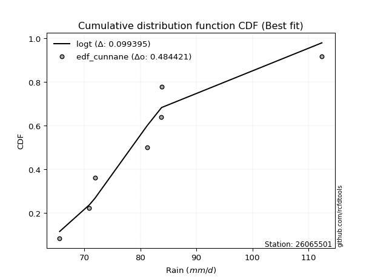</img>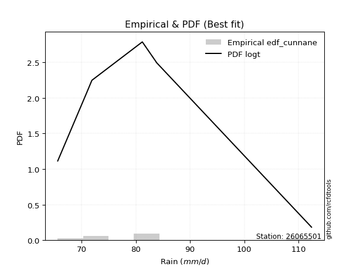</img>

</div>


### 12. Empirical - EDF Adamowski (1981)

The Adamowski formula in hydrology refers to a specific plotting position formula used for estimating the non-parametric empirical distribution of hydrological events (like flood peaks) to calculate their return periods. This formula provides an alternative to traditional parametric methods (like the Gumbel or Log Pearson Type III distributions). 

<div align="center">


$P=(m-0.25)/(n+0.5)$


</div>


**12.1. Empirical values**

<div align="center">

|                | 0                  | 1                   | 2                   | 3             | 4                  | 5                  | 6                  |
|:---------------|:-------------------|:--------------------|:--------------------|:--------------|:-------------------|:-------------------|:-------------------|
| date           | 2021               | 2017                | 2022                | 2023          | 2019               | 2018               | 2020               |
| x              | 65.6               | 70.9                | 71.9                | 81.2          | 83.7               | 83.8               | 112.4              |
| m              | 1                  | 2                   | 3                   | 4             | 5                  | 6                  | 7                  |
| empirical_dist | edf_adamowski      | edf_adamowski       | edf_adamowski       | edf_adamowski | edf_adamowski      | edf_adamowski      | edf_adamowski      |
| empirical      | 0.1                | 0.23333333333333334 | 0.36666666666666664 | 0.5           | 0.6333333333333333 | 0.7666666666666667 | 0.9                |
| empirical_tr   | 1.1111111111111112 | 1.3043478260869565  | 1.5789473684210527  | 2.0           | 2.727272727272727  | 4.2857142857142865 | 10.000000000000002 |

</div>


**12.2. Kolmogorov-Smirnov fit test (sorted by Δ)**


<div align="center">

|                | 0                   | 1                   | 2                   | 3                   | 4                   | 5                   | 6                   | 7                   | 8                   | 9                   | 10                  | 11                  | 12                  | 13                  | 14                  | 15                  | 16                  | 17                  | 18                  | 19                  | 20                  | 21                  | 22                  | 23                  | 24                  | 25                  | 26                  | 27                  | 28                  | 29                  | 30                  | 31                  | 32                  | 33                  | 34                  | 35                  | 36                  | 37                  | 38                  | 39                  | 40                  | 41                  | 42                  | 43                  | 44                  | 45                  | 46                  | 47                  | 48                  | 49                  | 50                  | 51                  | 52                  | 53                  | 54                  | 55                  | 56                  | 57                    | 58                  | 59                  | 60                  | 61                  | 62                  | 63                  | 64                  | 65                  | 66                  | 67                  | 68                  | 69                  | 70                  | 71                  | 72                  | 73                  | 74                  | 75                  | 76                  | 77                  | 78                  | 79                  | 80                  | 81                  | 82                  | 83                  | 84                  | 85                  | 86                  | 87                  | 88                  | 89                  |
|:---------------|:--------------------|:--------------------|:--------------------|:--------------------|:--------------------|:--------------------|:--------------------|:--------------------|:--------------------|:--------------------|:--------------------|:--------------------|:--------------------|:--------------------|:--------------------|:--------------------|:--------------------|:--------------------|:--------------------|:--------------------|:--------------------|:--------------------|:--------------------|:--------------------|:--------------------|:--------------------|:--------------------|:--------------------|:--------------------|:--------------------|:--------------------|:--------------------|:--------------------|:--------------------|:--------------------|:--------------------|:--------------------|:--------------------|:--------------------|:--------------------|:--------------------|:--------------------|:--------------------|:--------------------|:--------------------|:--------------------|:--------------------|:--------------------|:--------------------|:--------------------|:--------------------|:--------------------|:--------------------|:--------------------|:--------------------|:--------------------|:--------------------|:----------------------|:--------------------|:--------------------|:--------------------|:--------------------|:--------------------|:--------------------|:--------------------|:--------------------|:--------------------|:--------------------|:--------------------|:--------------------|:--------------------|:--------------------|:--------------------|:--------------------|:--------------------|:--------------------|:--------------------|:--------------------|:--------------------|:--------------------|:--------------------|:--------------------|:--------------------|:--------------------|:--------------------|:--------------------|:--------------------|:--------------------|:--------------------|:--------------------|
| station        | 26065501            | 26065501            | 26065501            | 26065501            | 26065501            | 26065501            | 26065501            | 26065501            | 26065501            | 26065501            | 26065501            | 26065501            | 26065501            | 26065501            | 26065501            | 26065501            | 26065501            | 26065501            | 26065501            | 26065501            | 26065501            | 26065501            | 26065501            | 26065501            | 26065501            | 26065501            | 26065501            | 26065501            | 26065501            | 26065501            | 26065501            | 26065501            | 26065501            | 26065501            | 26065501            | 26065501            | 26065501            | 26065501            | 26065501            | 26065501            | 26065501            | 26065501            | 26065501            | 26065501            | 26065501            | 26065501            | 26065501            | 26065501            | 26065501            | 26065501            | 26065501            | 26065501            | 26065501            | 26065501            | 26065501            | 26065501            | 26065501            | 26065501              | 26065501            | 26065501            | 26065501            | 26065501            | 26065501            | 26065501            | 26065501            | 26065501            | 26065501            | 26065501            | 26065501            | 26065501            | 26065501            | 26065501            | 26065501            | 26065501            | 26065501            | 26065501            | 26065501            | 26065501            | 26065501            | 26065501            | 26065501            | 26065501            | 26065501            | 26065501            | 26065501            | 26065501            | 26065501            | 26065501            | 26065501            | 26065501            |
| empirical_dist | edf_adamowski       | edf_adamowski       | edf_adamowski       | edf_adamowski       | edf_adamowski       | edf_adamowski       | edf_adamowski       | edf_adamowski       | edf_adamowski       | edf_adamowski       | edf_adamowski       | edf_adamowski       | edf_adamowski       | edf_adamowski       | edf_adamowski       | edf_adamowski       | edf_adamowski       | edf_adamowski       | edf_adamowski       | edf_adamowski       | edf_adamowski       | edf_adamowski       | edf_adamowski       | edf_adamowski       | edf_adamowski       | edf_adamowski       | edf_adamowski       | edf_adamowski       | edf_adamowski       | edf_adamowski       | edf_adamowski       | edf_adamowski       | edf_adamowski       | edf_adamowski       | edf_adamowski       | edf_adamowski       | edf_adamowski       | edf_adamowski       | edf_adamowski       | edf_adamowski       | edf_adamowski       | edf_adamowski       | edf_adamowski       | edf_adamowski       | edf_adamowski       | edf_adamowski       | edf_adamowski       | edf_adamowski       | edf_adamowski       | edf_adamowski       | edf_adamowski       | edf_adamowski       | edf_adamowski       | edf_adamowski       | edf_adamowski       | edf_adamowski       | edf_adamowski       | edf_adamowski         | edf_adamowski       | edf_adamowski       | edf_adamowski       | edf_adamowski       | edf_adamowski       | edf_adamowski       | edf_adamowski       | edf_adamowski       | edf_adamowski       | edf_adamowski       | edf_adamowski       | edf_adamowski       | edf_adamowski       | edf_adamowski       | edf_adamowski       | edf_adamowski       | edf_adamowski       | edf_adamowski       | edf_adamowski       | edf_adamowski       | edf_adamowski       | edf_adamowski       | edf_adamowski       | edf_adamowski       | edf_adamowski       | edf_adamowski       | edf_adamowski       | edf_adamowski       | edf_adamowski       | edf_adamowski       | edf_adamowski       | edf_adamowski       |
| p_dist         | logt                | loggumbel_r         | loghalfnorm         | gompertz            | moyal               | halflogistic        | logmielke           | mielke              | genexpon            | logkstwobign        | logpearson3         | loggenlogistic      | genlogistic         | loggenexpon         | alpha               | pearson3            | logmoyal            | loginvweibull       | loghalflogistic     | lograyleigh         | invgamma            | f                   | exponnorm           | expon               | invweibull          | fisk                | invgauss            | gumbel_r            | johnsonsu           | logfisk             | logjohnsonsu        | loginvgauss         | logfatiguelife      | logtruncnorm        | halfnorm            | logmaxwell          | logalpha            | logrice             | kstwobign           | nct                 | logncf              | weibull_min         | logexponnorm        | loglogistic         | loginvgamma         | betaprime           | lognct              | lognakagami         | logf                | logexpon            | loghypsecant        | loggompertz         | rayleigh            | logcrystalball      | lognorm             | lognorm             | logloggamma         | loglaplace_asymmetric | wald                | laplace_asymmetric  | maxwell             | laplace             | loglaplace          | ncf                 | rice                | hypsecant           | logistic            | logwald             | t                   | crystalball         | norm                | logbetaprime        | nakagami            | loggumbel_l         | gumbel_l            | logweibull_min      | gibrat              | loggibrat           | logerlang           | erlang              | logchi2             | loglognorm          | pareto              | logpareto           | gamma               | truncnorm           | loggamma            | loggamma            | fatiguelife         | chi2                |
| delta          | 0.09939466618654447 | 0.10295823805701865 | 0.10427292884083306 | 0.1052574513266521  | 0.105279708316809   | 0.10635023315484016 | 0.10698478407884737 | 0.10762731965847261 | 0.10782546665753168 | 0.10808303536782421 | 0.10902313671311059 | 0.1093560641859479  | 0.11947884213639431 | 0.12427341147295867 | 0.124328266241579   | 0.12482823961667033 | 0.12530621621220372 | 0.12622536600151102 | 0.1267724432816757  | 0.1272478114302088  | 0.1279060544416949  | 0.12809366486628737 | 0.1283818907725215  | 0.12843341518750728 | 0.12852066675740437 | 0.12914806462757245 | 0.12933094407428614 | 0.12946524876587462 | 0.1303630636453441  | 0.13066397687736586 | 0.130781465481705   | 0.13121641035304066 | 0.1332640458434594  | 0.13371206484296805 | 0.13415124299738024 | 0.1353048952643725  | 0.13595450872748283 | 0.1370875753626345  | 0.13889762991139676 | 0.13972014370901353 | 0.14174145567599528 | 0.1419758588277163  | 0.1466469545177429  | 0.14785736181731068 | 0.14822312548129424 | 0.14866213461801348 | 0.15061672296641893 | 0.1508961294522042  | 0.15099840415660926 | 0.15331028300906746 | 0.15412667534867996 | 0.15443011101006354 | 0.16026617602299498 | 0.16135068792727514 | 0.16135604723128738 | 0.16135604723128738 | 0.163356624267184   | 0.16362042575625804   | 0.1636671738271409  | 0.16904265356887438 | 0.16950262611268174 | 0.17102013551318004 | 0.1739403744046226  | 0.1771918593244296  | 0.18118754251402813 | 0.1819925366026136  | 0.18957350538300133 | 0.19584914639786688 | 0.19855277144995664 | 0.1986285246320515  | 0.19862853644714307 | 0.20219740135412545 | 0.21340512940538248 | 0.22011772070953117 | 0.2635075424396477  | 0.26608334888393387 | 0.3046386978629086  | 0.3168133155998532  | 0.35026589625989085 | 0.3669883562968764  | 0.3925390695820686  | 0.39590118886627174 | 0.39944504799729624 | 0.40446192545425413 | 0.4146110781073599  | 0.46085442200208043 | 0.47944806076921015 | 0.47944806076921015 | 0.5174839101280584  | 0.6863043856185018  |
| deltao         | 0.48442053926100004 | 0.48442053926100004 | 0.48442053926100004 | 0.48442053926100004 | 0.48442053926100004 | 0.48442053926100004 | 0.48442053926100004 | 0.48442053926100004 | 0.48442053926100004 | 0.48442053926100004 | 0.48442053926100004 | 0.48442053926100004 | 0.48442053926100004 | 0.48442053926100004 | 0.48442053926100004 | 0.48442053926100004 | 0.48442053926100004 | 0.48442053926100004 | 0.48442053926100004 | 0.48442053926100004 | 0.48442053926100004 | 0.48442053926100004 | 0.48442053926100004 | 0.48442053926100004 | 0.48442053926100004 | 0.48442053926100004 | 0.48442053926100004 | 0.48442053926100004 | 0.48442053926100004 | 0.48442053926100004 | 0.48442053926100004 | 0.48442053926100004 | 0.48442053926100004 | 0.48442053926100004 | 0.48442053926100004 | 0.48442053926100004 | 0.48442053926100004 | 0.48442053926100004 | 0.48442053926100004 | 0.48442053926100004 | 0.48442053926100004 | 0.48442053926100004 | 0.48442053926100004 | 0.48442053926100004 | 0.48442053926100004 | 0.48442053926100004 | 0.48442053926100004 | 0.48442053926100004 | 0.48442053926100004 | 0.48442053926100004 | 0.48442053926100004 | 0.48442053926100004 | 0.48442053926100004 | 0.48442053926100004 | 0.48442053926100004 | 0.48442053926100004 | 0.48442053926100004 | 0.48442053926100004   | 0.48442053926100004 | 0.48442053926100004 | 0.48442053926100004 | 0.48442053926100004 | 0.48442053926100004 | 0.48442053926100004 | 0.48442053926100004 | 0.48442053926100004 | 0.48442053926100004 | 0.48442053926100004 | 0.48442053926100004 | 0.48442053926100004 | 0.48442053926100004 | 0.48442053926100004 | 0.48442053926100004 | 0.48442053926100004 | 0.48442053926100004 | 0.48442053926100004 | 0.48442053926100004 | 0.48442053926100004 | 0.48442053926100004 | 0.48442053926100004 | 0.48442053926100004 | 0.48442053926100004 | 0.48442053926100004 | 0.48442053926100004 | 0.48442053926100004 | 0.48442053926100004 | 0.48442053926100004 | 0.48442053926100004 | 0.48442053926100004 | 0.48442053926100004 |
| eval           | Δo > Δ              | Δo > Δ              | Δo > Δ              | Δo > Δ              | Δo > Δ              | Δo > Δ              | Δo > Δ              | Δo > Δ              | Δo > Δ              | Δo > Δ              | Δo > Δ              | Δo > Δ              | Δo > Δ              | Δo > Δ              | Δo > Δ              | Δo > Δ              | Δo > Δ              | Δo > Δ              | Δo > Δ              | Δo > Δ              | Δo > Δ              | Δo > Δ              | Δo > Δ              | Δo > Δ              | Δo > Δ              | Δo > Δ              | Δo > Δ              | Δo > Δ              | Δo > Δ              | Δo > Δ              | Δo > Δ              | Δo > Δ              | Δo > Δ              | Δo > Δ              | Δo > Δ              | Δo > Δ              | Δo > Δ              | Δo > Δ              | Δo > Δ              | Δo > Δ              | Δo > Δ              | Δo > Δ              | Δo > Δ              | Δo > Δ              | Δo > Δ              | Δo > Δ              | Δo > Δ              | Δo > Δ              | Δo > Δ              | Δo > Δ              | Δo > Δ              | Δo > Δ              | Δo > Δ              | Δo > Δ              | Δo > Δ              | Δo > Δ              | Δo > Δ              | Δo > Δ                | Δo > Δ              | Δo > Δ              | Δo > Δ              | Δo > Δ              | Δo > Δ              | Δo > Δ              | Δo > Δ              | Δo > Δ              | Δo > Δ              | Δo > Δ              | Δo > Δ              | Δo > Δ              | Δo > Δ              | Δo > Δ              | Δo > Δ              | Δo > Δ              | Δo > Δ              | Δo > Δ              | Δo > Δ              | Δo > Δ              | Δo > Δ              | Δo > Δ              | Δo > Δ              | Δo > Δ              | Δo > Δ              | Δo > Δ              | Δo > Δ              | Δo > Δ              | Δo > Δ              | Δo > Δ              | Δo <= Δ             | Δo <= Δ             |
| fit            | 1                   | 1                   | 1                   | 1                   | 1                   | 1                   | 1                   | 1                   | 1                   | 1                   | 1                   | 1                   | 1                   | 1                   | 1                   | 1                   | 1                   | 1                   | 1                   | 1                   | 1                   | 1                   | 1                   | 1                   | 1                   | 1                   | 1                   | 1                   | 1                   | 1                   | 1                   | 1                   | 1                   | 1                   | 1                   | 1                   | 1                   | 1                   | 1                   | 1                   | 1                   | 1                   | 1                   | 1                   | 1                   | 1                   | 1                   | 1                   | 1                   | 1                   | 1                   | 1                   | 1                   | 1                   | 1                   | 1                   | 1                   | 1                     | 1                   | 1                   | 1                   | 1                   | 1                   | 1                   | 1                   | 1                   | 1                   | 1                   | 1                   | 1                   | 1                   | 1                   | 1                   | 1                   | 1                   | 1                   | 1                   | 1                   | 1                   | 1                   | 1                   | 1                   | 1                   | 1                   | 1                   | 1                   | 1                   | 1                   | 0                   | 0                   |
| n              | 7                   | 7                   | 7                   | 7                   | 7                   | 7                   | 7                   | 7                   | 7                   | 7                   | 7                   | 7                   | 7                   | 7                   | 7                   | 7                   | 7                   | 7                   | 7                   | 7                   | 7                   | 7                   | 7                   | 7                   | 7                   | 7                   | 7                   | 7                   | 7                   | 7                   | 7                   | 7                   | 7                   | 7                   | 7                   | 7                   | 7                   | 7                   | 7                   | 7                   | 7                   | 7                   | 7                   | 7                   | 7                   | 7                   | 7                   | 7                   | 7                   | 7                   | 7                   | 7                   | 7                   | 7                   | 7                   | 7                   | 7                   | 7                     | 7                   | 7                   | 7                   | 7                   | 7                   | 7                   | 7                   | 7                   | 7                   | 7                   | 7                   | 7                   | 7                   | 7                   | 7                   | 7                   | 7                   | 7                   | 7                   | 7                   | 7                   | 7                   | 7                   | 7                   | 7                   | 7                   | 7                   | 7                   | 7                   | 7                   | 7                   | 7                   |
| best_fit       | 1                   | 0                   | 0                   | 0                   | 0                   | 0                   | 0                   | 0                   | 0                   | 0                   | 0                   | 0                   | 0                   | 0                   | 0                   | 0                   | 0                   | 0                   | 0                   | 0                   | 0                   | 0                   | 0                   | 0                   | 0                   | 0                   | 0                   | 0                   | 0                   | 0                   | 0                   | 0                   | 0                   | 0                   | 0                   | 0                   | 0                   | 0                   | 0                   | 0                   | 0                   | 0                   | 0                   | 0                   | 0                   | 0                   | 0                   | 0                   | 0                   | 0                   | 0                   | 0                   | 0                   | 0                   | 0                   | 0                   | 0                   | 0                     | 0                   | 0                   | 0                   | 0                   | 0                   | 0                   | 0                   | 0                   | 0                   | 0                   | 0                   | 0                   | 0                   | 0                   | 0                   | 0                   | 0                   | 0                   | 0                   | 0                   | 0                   | 0                   | 0                   | 0                   | 0                   | 0                   | 0                   | 0                   | 0                   | 0                   | 0                   | 0                   |
| best_fit_sort  | 1                   | 2                   | 3                   | 4                   | 5                   | 6                   | 7                   | 8                   | 9                   | 10                  | 11                  | 12                  | 13                  | 14                  | 15                  | 16                  | 17                  | 18                  | 19                  | 20                  | 21                  | 22                  | 23                  | 24                  | 25                  | 26                  | 27                  | 28                  | 29                  | 30                  | 31                  | 32                  | 33                  | 34                  | 35                  | 36                  | 37                  | 38                  | 39                  | 40                  | 41                  | 42                  | 43                  | 44                  | 45                  | 46                  | 47                  | 48                  | 49                  | 50                  | 51                  | 52                  | 53                  | 54                  | 55                  | 56                  | 57                  | 58                    | 59                  | 60                  | 61                  | 62                  | 63                  | 64                  | 65                  | 66                  | 67                  | 68                  | 69                  | 70                  | 71                  | 72                  | 73                  | 74                  | 75                  | 76                  | 77                  | 78                  | 79                  | 80                  | 81                  | 82                  | 83                  | 84                  | 85                  | 86                  | 87                  | 88                  | 89                  | 90                  |

</div>


<div align="center">

</img>

</div>


**12.3. Best fit**

<div align="center">

|   id |   station | empirical_dist   | p_dist   |     delta |   deltao | eval   |   fit |   n |   best_fit |   best_fit_sort |
|-----:|----------:|:-----------------|:---------|----------:|---------:|:-------|------:|----:|-----------:|----------------:|
|    0 |  26065501 | edf_adamowski    | logt     | 0.0993947 | 0.484421 | Δo > Δ |     1 |   7 |          1 |               1 |

</div>


<div align="center">

</img></img>

</div>


## C. Best fit & Estimate extreme values for specific return periods - Tr


### 1. Best fit (ordered by delta Δ)

<div align="center">

|   id |   station | empirical_dist   | p_dist       |     delta |   deltao | eval   |   fit |   n |   best_fit |   best_fit_sort |
|-----:|----------:|:-----------------|:-------------|----------:|---------:|:-------|------:|----:|-----------:|----------------:|
|    0 |  26065501 | edf_weibull      | halflogistic | 0.0958577 | 0.484421 | Δo > Δ |     1 |   7 |          1 |               1 |
|    1 |  26065501 | edf_adamowski    | logt         | 0.0993947 | 0.484421 | Δo > Δ |     1 |   7 |          1 |               2 |
|    2 |  26065501 | edf_jenkinson    | logt         | 0.0993947 | 0.484421 | Δo > Δ |     1 |   7 |          1 |               3 |
|    3 |  26065501 | edf_cunnane      | logt         | 0.0993947 | 0.484421 | Δo > Δ |     1 |   7 |          1 |               4 |
|    4 |  26065501 | edf_gringorten   | logt         | 0.0993947 | 0.484421 | Δo > Δ |     1 |   7 |          1 |               5 |
|    5 |  26065501 | edf_tukey        | logt         | 0.0993947 | 0.484421 | Δo > Δ |     1 |   7 |          1 |               6 |
|    6 |  26065501 | edf_blom         | logt         | 0.0993947 | 0.484421 | Δo > Δ |     1 |   7 |          1 |               7 |
|    7 |  26065501 | edf_filliben     | logt         | 0.0993947 | 0.484421 | Δo > Δ |     1 |   7 |          1 |               8 |
|    8 |  26065501 | edf_chegodayev   | logt         | 0.0993947 | 0.484421 | Δo > Δ |     1 |   7 |          1 |               9 |
|    9 |  26065501 | edf_beard        | logt         | 0.0993947 | 0.484421 | Δo > Δ |     1 |   7 |          1 |              10 |
|   10 |  26065501 | edf_hazen        | logt         | 0.102646  | 0.484421 | Δo > Δ |     1 |   7 |          1 |              11 |
|   11 |  26065501 | edf_california   | logbetaprime | 0.142817  | 0.484421 | Δo > Δ |     1 |   7 |          1 |              12 |

</div>

:file_folder:Tables: [bestfit_26065501.csv](table/bestfit_26065501.csv) | [extreme_26065501.csv](table/extreme_26065501.csv)


### 2. Extreme values

In hydrology, a return period (or recurrence interval $Tr$) is the statistical average time between extreme events like floods or droughts of a specific magnitude, indicating how rare an event is, with a 100-year flood, for example, having a 1% chance of occurring in any given year, not that it happens exactly every century. It is a key tool for infrastructure design (like bridges or dams) and risk assessment, calculated from historical data to determine the probability of future events, although it is important to remember it is statistical average, and events can cluster or be missed.

> risk_rate: assuming the return period as the project useful life.

|   id |      tr |   prob_l |     prob_g |    alpha |   betaprime |    chi2 |   crystalball |   erlang |    expon |   exponnorm |        f |   fatiguelife |     fisk |    gamma |   genexpon |   genlogistic |   gibrat |   gompertz |   gumbel_l |   gumbel_r |   halflogistic |   halfnorm |   hypsecant |   invgamma |   invgauss |   invweibull |   johnsonsu |   kstwobign |   laplace |   laplace_asymmetric |   loggamma |   logistic |   lognorm |   maxwell |   mielke |    moyal |   nakagami |      ncf |      nct |     norm |           pareto |   pearson3 |   rayleigh |     rice |        t |   truncnorm |     wald |   weibull_min |   logalpha |   logbetaprime |          logchi2 |   logcrystalball |   logerlang |   logexpon |   logexponnorm |     logf |   logfatiguelife |   logfisk |   loggenexpon |   loggenlogistic |   loggibrat |   loggompertz |   loggumbel_l |   loggumbel_r |   loghalflogistic |   loghalfnorm |   loghypsecant |   loginvgamma |   loginvgauss |   loginvweibull |   logjohnsonsu |   logkstwobign |   loglaplace |   loglaplace_asymmetric |   logloggamma |   loglogistic |    loglognorm |   logmaxwell |   logmielke |   logmoyal |   lognakagami |   logncf |   lognct |     logpareto |   logpearson3 |   lograyleigh |   logrice |     logt |   logtruncnorm |   logwald |   logweibull_min |   station |   n |   risk_rate |
|-----:|--------:|---------:|-----------:|---------:|------------:|--------:|--------------:|---------:|---------:|------------:|---------:|--------------:|---------:|---------:|-----------:|--------------:|---------:|-----------:|-----------:|-----------:|---------------:|-----------:|------------:|-----------:|-----------:|-------------:|------------:|------------:|----------:|---------------------:|-----------:|-----------:|----------:|----------:|---------:|---------:|-----------:|---------:|---------:|---------:|-----------------:|-----------:|-----------:|---------:|---------:|------------:|---------:|--------------:|-----------:|---------------:|-----------------:|-----------------:|------------:|-----------:|---------------:|---------:|-----------------:|----------:|--------------:|-----------------:|------------:|--------------:|--------------:|--------------:|------------------:|--------------:|---------------:|--------------:|--------------:|----------------:|---------------:|---------------:|-------------:|------------------------:|--------------:|--------------:|--------------:|-------------:|------------:|-----------:|--------------:|---------:|---------:|--------------:|--------------:|--------------:|----------:|---------:|---------------:|----------:|-----------------:|----------:|----:|------------:|
|    0 |    2    | 0.5      | 0.5        |  77.4528 |     79.8477 | 65.7422 |       81.3571 |  68.4709 |  76.522  |     76.5169 |  77.1568 |       65.6002 |  77.0593 |  67.8017 |    77.3422 |       78.7834 |  77.0786 |    77.4322 |    83.6988 |    79.0155 |        77.8513 |    78.4394 |     81.3571 |    77.1621 |    76.8583 |      77.2148 |     76.8851 |     79.5635 |   81.3571 |              81.2934 |    67.0338 |    81.3571 |   80.2356 |   80.1381 |  78.0531 |  78.2595 |    72.5588 |  80.6806 |  79.5956 |  81.3571 |     66.4337      |    78.6061 |    79.7057 |  80.9577 |  81.3547 |     82.8036 |  76.7366 |       75.3431 |    79.51   |        72.9814 |    104.324       |          80.2354 |     69.1713 |    75.4274 |        76.1534 |  75.0141 |          76.8012 |   77.1956 |       76.8287 |          77.9342 |     76.4083 |       79.6274 |       82.4094 |       78.1192 |           77.0874 |       77.6071 |        80.2356 |       79.881  |       76.9405 |         77.3444 |        77.0291 |        78.336  |      80.2356 |                 80.7048 |       80.2309 |       80.2356 |  65.7125      |      79.1267 |     78.0249 |    77.4479 |       76.002  |  79.7116 |  79.9311 |  66.3422      |       78.3297 |       78.7371 |   79.5242 |  78.434  |        76.4061 |   76.1131 |      70.9196     |  26065501 |   7 |    0.75     |
|    1 |    2.33 | 0.570815 | 0.429185   |  79.4727 |     82.1687 | 65.884  |       83.9008 |  70.059  |  78.9285 |     78.9271 |  79.2523 |       65.9686 |  79.1647 |  69.0121 |    79.7817 |       80.8647 |  78.3671 |    79.8808 |    85.9118 |    81.3724 |        80.2746 |    81.1846 |     83.3928 |    79.2583 |    79.0756 |      79.2739 |     79.0673 |     81.825  |   82.8964 |              82.8671 |    67.8753 |    83.5982 |   82.5996 |   82.7807 |  80.1023 |  80.4906 |    75.2256 |  83.1358 |  81.869  |  83.9008 |     67.6881      |    81.0622 |    82.3874 |  83.2977 |  83.898  |     83.1771 |  78.4045 |       78.9226 |    81.7577 |        75.2136 |    123.724       |          82.5994 |     70.5981 |    77.7833 |        78.3343 |  77.5537 |          78.9687 |   79.2117 |       79.1747 |          79.9801 |     77.5413 |       82.1795 |       84.5179 |       80.2496 |           79.25   |       80.0777 |        82.122  |       82.173  |       79.0817 |         79.3836 |        79.1358 |        80.517  |      81.658  |                 82.1744 |       82.6466 |       82.3149 |  66.4912      |      81.5502 |     80.0724 |    79.4458 |       78.2479 |  81.9619 |  82.2415 |  67.4755      |       80.6073 |       81.1849 |   81.7687 |  80.381  |        78.7739 |   77.5762 |      73.8691     |  26065501 |   7 |    0.729209 |
|    2 |    5    | 0.8      | 0.2        |  89.437  |     91.546  | 67.4854 |       93.3535 |  81.6233 |  90.9601 |     90.9775 |  89.8065 |       73.7891 |  90.5609 |  77.7944 |    91.3235 |       89.9059 |  85.7853 |    91.3872 |    93.061  |    91.612  |        91.2396 |    92.7938 |     91.5583 |    89.8175 |    90.286  |      89.6421 |     90.2157 |     91.4315 |   90.5925 |              90.7353 |    74.5044 |    92.2515 |   92.0118 |   93.182  |  89.5755 |  90.8255 |    89.1602 |  92.644  |  91.3214 |  93.3535 |    262.895       |    91.8254 |    93.1236 |  92.6658 |  93.3497 |     85.0367 |  87.7413 |      102.21   |    91.0977 |        88.7701 |    340.692       |          92.0117 |     79.8925 |    90.7133 |        90.2059 |  92.2519 |          90.0529 |   89.9754 |       90.6923 |          89.5088 |     84.3984 |       93.2142 |       91.705  |       90.2006 |           89.8191 |       91.4257 |        90.1452 |       91.4439 |       89.9527 |         89.5086 |        89.8373 |        90.4788 |      89.1568 |                 89.8018 |       92.2392 |       90.8614 |   2.31864e+14 |      91.8317 |     89.571  |    89.3943 |       88.7584 |  91.2827 |  91.6436 | 945.423       |       90.9345 |       91.7705 |   91.4069 |  88.4534 |        89.9319 |   86.3017 |     104.093      |  26065501 |   7 |    0.67232  |
|    3 |   10    | 0.9      | 0.1        |  99.4618 |     98.4913 | 69.9724 |       99.6243 |  95.4488 | 101.882  |    101.917  | 100.331  |       84.5872 | 103.675  |  88.2691 |   101.013  |       97.2691 |  94.2412 |   100.907  |    97.0414 |    99.9521 |       100.346  |   101.384  |     98.0787 |   100.348  |   100.948  |     100.098  |    101.244  |     98.7456 |   97.5787 |              97.8779 |    83.4372 |    98.6242 |   98.8399 |  100.502  |  98.0346 |  99.8237 |   100.85   |  99.2906 |  98.608  |  99.6243 |  12248.9         |   100.466  |   100.779  |  99.3455 |  99.6203 |     86.7136 |  97.6498 |      129.873  |    98.2918 |       104.861  |    976.598       |          98.8401 |     91.0243 |   104.303  |       102.534  | 108.84   |         101.036  |  102.517  |      101.155  |          98.1017 |     92.9572 |      101.524  |       95.9681 |       99.2105 |           99.6598 |      100.846  |        97.1113 |       98.3184 |      100.705  |         99.5914 |       100.624  |        98.8821 |      96.5586 |                 97.337  |       99.1724 |       97.718  | inf           |      99.8351 |     98.1108 |    99.0652 |       97.568  |  98.4086 |  98.6745 |   3.04285e+73 |       99.7657 |      100.151  |   98.9654 |  95.1712 |        98.2246 |   96.6372 |     175.399      |  26065501 |   7 |    0.651322 |
|    4 |   15    | 0.933333 | 0.0666667  | 106.18   |    102.198  | 71.7354 |      102.753  | 104.426  | 108.271  |    108.315  | 107.139  |       91.6493 | 113.238  |  95.0653 |   106.395  |      101.423  | 100.074  |   106.126  |    98.844  |   104.657  |       105.499  |   105.855  |    101.8    |   107.161  |   107.425  |     106.949  |    108.233  |    102.629  |  101.665  |             102.056  |    89.841  |   102.096  |  102.435  |  104.258  | 103.128  | 105.046  |   107.109  | 102.71   | 102.599  | 102.753  | 135963           |   105.246  |   104.723  | 102.787  | 102.75   |     87.6896 | 104.013  |      148.531  |   102.23   |       116.282  |   1871.1         |         102.435  |     98.7015 |   113.177  |       110.512  | 120.246  |         108.014  |  111.971  |      107.374  |         103.309  |     99.3614 |      105.868  |       97.9634 |      104.685  |          105.699  |      106.126  |       101.325  |      101.989  |      107.553  |        106.178  |       107.666  |       103.656  |     101.17   |                102.035  |      102.813  |      101.669  | inf           |     104.209  |    103.281  |   105.151  |      102.511  | 102.284  | 102.449  | inf           |      104.901  |      104.764  |  103.101  |  99.2192 |       101.986  |  103.918  |     262.097      |  26065501 |   7 |    0.644736 |
|    5 |   20    | 0.95     | 0.05       | 111.475  |    104.718  | 73.0884 |      104.803  | 111.085  | 112.804  |    112.856  | 112.32   |       96.878  | 121.116  | 100.105  |   110.1    |      104.332  | 104.649  |   109.688  |    99.966  |   107.952  |       109.109  |   108.835  |    104.425  |   112.346  |   112.123  |     112.208  |    113.46   |    105.244  |  104.565  |             105.02   |    94.9184 |   104.496  |  104.859  |  106.75   | 106.839  | 108.744  |   111.314  | 104.987  | 105.354  | 104.803  | 752358           |   108.55   |   107.345  | 105.075  | 104.799  |     88.38   | 108.754  |      162.79   |   104.949  |       125.446  |   3000.89        |         104.859  |    104.696  |   119.928  |       116.546  | 129.217  |         113.246  |  120.016  |      111.852  |         107.118  |    104.692  |      108.766  |       99.2263 |      108.698  |          110.147  |      109.799  |       104.408  |      104.484  |      112.701  |        111.24   |       113.062  |       107.001  |     104.575  |                105.505  |      105.266  |      104.493  | inf           |     107.216  |    107.062  |   109.685  |      105.948  | 104.947  | 105.024  | inf           |      108.563  |      107.947  |  105.945  | 102.218  |       104.158  |  109.698  |     364.235      |  26065501 |   7 |    0.641514 |
|    6 |   25    | 0.96     | 0.04       | 115.949  |    106.621  | 74.1865 |      106.311  | 116.388  | 116.32   |    116.377  | 116.56   |      101.032  | 127.957  | 104.117  |   112.915  |      106.572  | 108.463  |   112.376  |   100.764  |   110.49   |       111.891  |   111.053  |    106.456  |   116.59   |   115.823  |     116.541  |    117.676  |    107.203  |  106.814  |             107.32   |    99.1714 |   106.332  |  106.681  |  108.601  | 109.783  | 111.611  |   114.452  | 106.681  | 107.458  | 106.311  |      2.83692e+06 |   111.07   |   109.292  | 106.774  | 106.308  |     88.9143 | 112.552  |      174.406  |   107.024  |       133.235  |   4351.68        |         106.681  |    109.674  |   125.44   |       121.452  | 136.728  |         117.475  |  127.22   |      115.369  |         110.147  |    109.354  |      110.923  |      100.135  |      111.893  |          113.702  |      112.614  |       106.858  |      106.37   |      116.871  |        115.418  |       117.504  |       109.577  |     107.295  |                108.277  |      107.106  |      106.706  | inf           |     109.505  |    110.07   |   113.334  |      108.581  | 106.973  | 106.974  | inf           |      111.423  |      110.374  |  108.108  | 104.64   |       105.576  |  114.559  |     482.307      |  26065501 |   7 |    0.639603 |
|    7 |   50    | 0.98     | 0.02       | 132.519  |    112.312  | 77.8149 |      110.631  | 133.476  | 127.242  |    127.316  | 131.121  |      114.361  | 154.211  | 117.043  |   121.359  |      113.474  | 121.908  |   120.341  |   102.932  |   118.307  |       120.462  |   117.499  |    112.755  |   131.165  |   127.605  |     131.601  |    131.731  |    112.957  |  113.8    |             114.462  |   114.245  |   111.941  |  112.073  |  113.967  | 119.337  | 120.51   |   123.594  | 111.624  | 113.864  | 110.631  |      1.75169e+08 |   118.71   |   114.947  | 111.708  | 110.629  |     90.5671 | 124.952  |      213.425  |   113.342  |       161.897  |  14134.8         |         112.074  |    127.107  |   144.232  |       138.05   | 163.582  |         131.652  |  157.024  |      126.573  |         120.029  |    127.507  |      117.184  |      102.643  |      122.337  |          125.39   |      121.214  |       114.824  |      112.008  |      130.911  |        130.044  |       132.953  |       117.506  |     116.202  |                117.363  |      112.546  |      113.762  | inf           |     116.424  |    119.879  |   125.453  |      116.615  | 113.105  | 112.825  | inf           |      120.46   |      117.733  |  114.642  | 112.862  |       108.725  |  131.979  |    1332.72       |  26065501 |   7 |    0.63583  |
|    8 |   75    | 0.986667 | 0.0133333  | 144.727  |    115.52   | 80.0591 |      112.949  | 143.819  | 133.631  |    133.715  | 140.739  |      122.389  | 173.93   | 124.865  |   126.107  |      117.485  | 130.989  |   124.752  |   104.028  |   122.851  |       125.444  |   121.008  |    116.436  |   140.793  |   134.683  |     141.687  |    140.666  |    116.122  |  117.887  |             118.641  |   124.477  |   115.181  |  115.078  |  116.885  | 125.245  | 125.714  |   128.572  | 114.331  | 117.552  | 112.949  |      1.9539e+09  |   123.07   |   118.023  | 114.392  | 112.948  |     91.5294 | 132.583  |      238.204  |   116.979  |       182.427  |  28535.3         |         115.079  |    138.816  |   156.504  |       148.792  | 182.154  |         140.737  |  182.002  |      133.348  |         126.175  |    141.443  |      120.585  |      103.936  |      128.851  |          132.73   |      126.168  |       119.752  |      115.185  |      139.958  |        139.964  |       143.339  |       122.11   |     121.752  |                123.027  |      115.571  |      118.048  | inf           |     120.367  |    125.98   |   133.132  |      121.235  | 116.607  | 116.138  | inf           |      125.88   |      121.941  |  118.361  | 118.297  |       109.884  |  143.991  |    2675.96       |  26065501 |   7 |    0.634587 |
|    9 |  100    | 0.99     | 0.01       | 154.93   |    117.753  | 81.695  |      114.517  | 151.282  | 138.164  |    138.255  | 148.119  |      128.165  | 190.353  | 130.508  |   129.398  |      120.324  | 138.023  |   127.781  |   104.745  |   126.067  |       128.97   |   123.398  |    119.047  |   148.181  |   139.781  |     149.493  |    147.343  |    118.291  |  120.787  |             121.605  |   132.432  |   117.468  |  117.157  |  118.872  | 129.593  | 129.406  |   131.961  | 116.184  | 120.154  | 114.517  |      1.08162e+10 |   126.124  |   120.118  | 116.221  | 114.516  |     92.21   | 138.146  |      256.618  |   119.545  |       199.04   |  47201.5         |         117.157  |    147.869  |   165.839  |       156.916  | 196.828  |         147.569  |  204.741  |      138.264  |         130.715  |    153.278  |      122.898  |      104.79   |      133.669  |          138.183  |      129.658  |       123.376  |      117.397  |      146.786  |        147.726  |       151.413  |       125.369  |     125.85   |                127.211  |      117.661  |      121.171  | inf           |     123.129  |    130.488  |   138.863  |      124.487  | 119.065  | 118.451  | inf           |      129.797  |      124.893  |  120.964  | 122.503  |       110.487  |  153.433  |    4596.94       |  26065501 |   7 |    0.633968 |
|   10 |  200    | 0.995    | 0.005      | 186.963  |    123.018  | 85.7581 |      118.073  | 169.618  | 149.086  |    149.194  | 168.028  |      142.303  | 240.302  | 144.372  |   137.088  |      127.15   | 157.161  |   134.763  |   106.303  |   133.798  |       137.448  |   128.865  |    125.338  |   168.114  |   152.297  |     170.811  |    164.647  |    123.286  |  127.773  |             128.748  |   154.218  |   122.955  |  122.01   |  123.419  | 140.638  | 138.302  |   139.699  | 120.453  | 126.4    | 118.073  |      6.67876e+11 |   133.366  |   124.914  | 120.405  | 118.074  |     93.8431 | 152.004  |      303.702  |   125.704  |       247.635  | 160902           |         122.011  |    172.506  |   190.683  |       178.36   | 238.186  |         165.457  |  286.539  |      150.518  |         142.307  |    190.731  |      128.172  |      106.671  |      146.003  |          152.226  |      138.008  |       132.561  |      122.611  |      164.765  |        169.362  |       173.682  |       133.208  |     136.298  |                137.885  |      122.533  |      129.004  | inf           |     129.689  |    142.002  |   153.705  |      132.253  | 124.924  | 123.923  | inf           |      139.506  |      131.92   |  127.136  | 134.112  |       111.423  |  179.731  |   19874.1        |  26065501 |   7 |    0.633042 |
|   11 |  250    | 0.996    | 0.004      | 200.342  |    124.684  | 87.0973 |      119.16   | 175.612  | 152.602  |    152.716  | 175.144  |      146.911  | 260.158  | 148.903  |   139.496  |      129.344  | 164.028  |   136.922  |   106.762  |   136.284  |       140.173  |   130.547  |    127.363  |   175.24   |   156.392  |     178.512  |    170.6    |    124.832  |  130.022  |             131.047  |   162.095  |   124.717  |  123.534  |  124.819  | 144.376  | 141.165  |   142.075  | 121.776  | 128.409  | 119.16   |      2.51853e+12 |   135.668  |   126.39   | 121.693  | 119.161  |     94.3667 | 156.588  |      319.648  |   127.685  |       266.365  | 239646           |         123.534  |    181.368  |   199.448  |       185.869  | 253.578  |         171.677  |  325.15   |      154.593  |         146.248  |    206.295  |      129.789  |      107.23   |      150.205  |          157.037  |      140.683  |       135.661  |      124.261  |      171.048  |        177.353  |       181.823  |       135.732  |     139.842  |                141.508  |      124.06   |      131.624  | inf           |     131.778  |    145.918  |   158.813  |      134.738  | 126.796  | 125.661  | inf           |      142.72   |      134.162  |  129.099  | 138.38   |       111.615  |  189.388  |   33427.7        |  26065501 |   7 |    0.632858 |
|   12 |  500    | 0.998    | 0.002      | 256.885  |    129.792  | 91.3362 |      122.382  | 194.463  | 163.524  |    163.655  | 199.754  |      161.366  | 336.974  | 163.154  |   146.788  |      136.155  | 187.759  |   143.377  |   108.076  |   143.998  |       148.633  |   135.561  |    133.653  |   199.884  |   169.292  |     205.435  |    190.345  |    129.465  |  137.008  |             138.19   |   189.604  |   130.179  |  128.163  |  128.996  | 156.589  | 150.06   |   149.147  | 125.749  | 134.667  | 122.382  |      1.55513e+14 |   142.738  |   130.794  | 125.536  | 122.386  |     95.987  | 171.165  |      371.532  |   133.857  |       336.841  | 833628           |         128.164  |    212.171  |   229.327  |       211.27   | 309.212  |         192.566  |  515.592  |      167.69   |         159.188  |    270.531  |      134.597  |      108.851  |      164.033  |          172.961  |      148.971  |       145.76   |      129.318  |      192.266  |        206.097  |       210.747  |       143.587  |     151.452  |                153.382  |      128.693  |      140.094  | inf           |     138.214  |    158.781  |   175.787  |      142.425  | 132.586  | 131.003  | inf           |      153.005  |      141.08   |  135.136  | 153.736  |       112.004  |  223.678  |  195855          |  26065501 |   7 |    0.632489 |
|   13 |  750    | 0.998667 | 0.00133333 | 305.653  |    132.741  | 93.8635 |      124.172  | 205.632  | 169.913  |    170.054  | 216.104  |      169.906  | 395.007  | 171.597  |   150.93   |      140.136  | 203.454  |   146.989  |   108.778  |   148.508  |       153.578  |   138.363  |    137.332  |   216.258  |   176.955  |     223.543  |    202.816  |    132.067  |  141.095  |             142.368  |   208.067  |   133.371  |  130.809  |  131.332  | 164.181  | 155.264  |   153.088  | 127.989  | 138.348  | 124.172  |      1.73465e+15 |   146.825  |   133.256  | 127.685  | 124.178  |     96.9305 | 179.906  |      403.477  |   137.489  |       388.719  |      1.73824e+06 |         130.81   |    232.739  |   248.839  |       227.709  | 348.2    |         205.974  |  714.093  |      175.677  |         167.277  |    323.65   |      137.272  |      109.728  |      172.7    |          183.007  |      153.813  |       152.013  |      132.237  |      205.973  |        226.189  |       230.651  |       148.197  |     158.685  |                160.785  |      131.337  |      145.293  | inf           |     141.949  |    166.827  |   186.545  |      146.907  | 135.963  | 134.099  | inf           |      159.246  |      145.102  |  138.635  | 164.521  |       112.135  |  247.147  |  613795          |  26065501 |   7 |    0.632366 |
|   14 | 1000    | 0.999    | 0.001      | 350.956  |    134.819  | 95.675  |      125.405  | 213.611  | 174.446  |    174.594  | 228.682  |      175.998  | 443.455  | 177.629  |   153.817  |      142.96   | 215.464  |   149.484  |   109.251  |   151.707  |       157.086  |   140.298  |    139.943  |   228.856  |   182.44   |     237.58   |    212.096  |    133.87   |  143.994  |             145.332  |   222.351  |   135.635  |  132.663  |  132.946  | 169.778  | 158.956  |   155.805  | 129.544  | 140.972  | 125.405  |      9.60253e+15 |   149.705  |   134.958  | 129.17   | 125.411  |     97.5979 | 186.193  |      426.835  |   140.079  |       431.479  |      2.9342e+06  |         132.664  |    248.603  |   263.682  |       240.142  | 379.277  |         216.062  |  926.599  |      181.497  |         173.263  |    371.242  |      139.115  |      110.322  |      179.123  |          190.486  |      157.247  |       156.611  |      134.293  |      216.33   |        242.209  |       246.346  |       151.477  |     164.026  |                166.252  |      133.187  |      149.096  | inf           |     144.589  |    172.783  |   194.575  |      150.084  | 138.359  | 136.286  | inf           |      163.781  |      147.949  |  141.105  | 173.17   |       112.201  |  265.538  |       1.4494e+06 |  26065501 |   7 |    0.632305 |

<div align="center">

</img>

</div>


<div align="center">

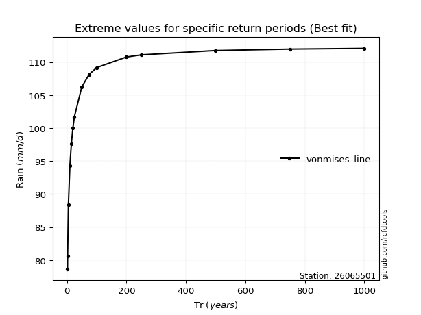</img>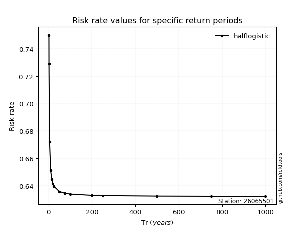</img>

</div>


<sub>**APP DISCLAIMER**: NO WARRANTY - This software is provided by [github.com/rcfdtools](https://github.com/rcfdtools) "as is", without any express or implied warranty, including warranties of merchantability, fitness for a particular purpose, or non-infringement. There is no guarantee that the software will be error-free or operate without interruption. LIMITATION OF LIABILITY - Neither the authors nor copyright holders will be liable for claims or damages arising from the software or its use. You are responsible for determining if the software is appropriate for your use and assume all associated risks, including errors, legal compliance, and data loss. NO PROFESSIONAL ADVICE - The software provides general information and does not offer professional advice. It should not replace consultation with professional advisors.</sub>