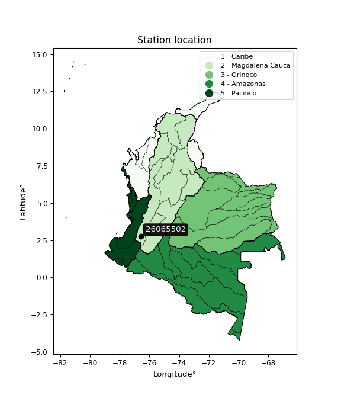

<div align="center">


</div>

# PMP Station (Rain, Pmax24h): 26065502

Probable Maximum Precipitation (PMP) is the greatest amount of rainfall for a specific duration that is meteorologically possible for a given location, acting as a "worst-case" scenario for extreme storms, crucial for designing safety-critical infrastructure like bridges, river deviations, dams, spillways, and nuclear plants to prevent catastrophic failure. PMP is calculated by hydrologists using meteorological data to determine the upper limit of extreme rainfall, often leading to the Probable Maximum Flood (PMF) for flood control design, and is increasingly being studied for climate change impacts. Probable Maximum Precipitation (PMP) is the theoretical upper limit of rainfall, a deterministic estimate for extreme events, while probability distributions (like GEV, Gumbel) describe the likelihood and frequency of various precipitation amounts, including rare ones, showing how often events occur, with PMP representing the extreme end of these distributions, used for critical infrastructure design to ensure safety against the worst conceivable weather, unlike standard statistical forecasts which cover typical probabilities.

The most common probability distributions in hydrology, used for analyzing floods, rainfall, and streamflow, include the Normal, Log-Normal, Gumbel, Gamma (including Log-Pearson Type III), and Generalized Extreme Value (GEV) distributions, often chosen based on the data´s skewness and whether modeling extremes or general conditions, with Gumbel and GEV popular for extreme events like floods, while the Normal distribution serves as a baseline, though often requiring transformations for skewed hydrological data. These distributions help in designing water infrastructure, managing water resources, and forecasting hydrologic events.

> Hydrological data often isn´t perfectly normal (it´s skewed), so different distributions are needed for different applications, such as: **Flood Frequency Analysis**: Using Gumbel, GEV, or Log-Pearson Type III for predicting extreme flood magnitudes and their return periods, **Rainfall Analysis**: Normal for annual totals, but Log-Normal, Weibull, or GEV for intensity or extreme daily rainfall, **Streamflow Modeling**: Gamma and Log-Normal for maximum flows, GEV for minimum flows, and Kappa for daily flows.

<div align="center">

</img>

</div>


## A. General information


### 1. General running parameters

• app_version: _v20260108_. • runtime: _2026-01-08 18:05:13.093906_. • Python version: _3.14.0_. • SciPy version: _1.16.3_. • Pandas version: _2.3.3_. • NumPy version: _2.3.5_. • Stations dataset (station_dataset_file): _dataset/pmax24h_in/automatic_colombia_2003_2024.csv_. • Stations catalog (station_catalog_file): _dataset/CNE.xls_. • Minimum year to eval til year_max (date_min): _1900_. • Maximum year to eval since year_min (date_max): _2024_. • Creates, save and include plots into reports (create_plot): _False_. • Plot only fit distributions with Δo > Δ (plot_only_fit): _True_. • Plot only simple graphs avoiding multiple CDFs and multiple Extreme values plots (plot_only_simple): _False_. • Eval low extreme values, if False, evaluates high extreme values (low_extreme): _False_. • Eval every SciPy distribution as logarithmic (pdist_logarithmic_on): _True_. • Standard deviation normalized (ddof): _1.0_. • Return periods to eval in years (Tr): _[2, 2.33, 5, 10, 15, 20, 25, 50, 75, 100, 200, 250, 500, 750, 1000]_. • Minimum data sample per station, 0 means any (minimum_sample): _5_. • Z-Score maximum threshold to adjust a value, 0 means disable (zscore_max): _3.5_. • Z-Score minimum threshold to adjust a value, 0 means disable (zscore_min): _-2.5_. • Avoid zeros, e.g. rain = 0 (avoid_zeros): _True_. • Avoid null values (avoid_nans): _True_. 

:file_folder:Table: [dataset.csv](../../dataset/pmax24h_in/automatic_colombia_2003_2024.csv)

> Delta Degrees of Freedom (DDOF): is a parameter used in the formulas for calculating variance and standard deviation. When ddof=0, the divisor is $N$ (the total number of observations) and this is used when your data set is the entire population. When ddof=1, the divisor is $N-1$ and this is used when your data set is a sample drawn from a larger population. Using $N-1$ provides an unbiased estimate of the population variance (known as Bessel´s correction).


### 2. Station info and location

|   id |   CODIGO | NOMBRE                         | CATEGORIA               | TECNOLOGIA                | ESTADO   | FECHA_INSTALACION   |   FECHA_SUSPENSION |   ALTITUD |   LATITUD |   LONGITUD | DEPARTAMENTO   | MUNICIPIO   | AREA_OPERATIVA                         | ENTIDAD                                    | AREA_HIDROGRAFICA   | ZONA_HIDROGRAFICA   | SUBZONA_HIDROGRAFICA   |   CORRIENTE | Catalogo   |   Version |
|-----:|---------:|:-------------------------------|:------------------------|:--------------------------|:---------|:--------------------|-------------------:|----------:|----------:|-----------:|:---------------|:------------|:---------------------------------------|:-------------------------------------------|:--------------------|:--------------------|:-----------------------|------------:|:-----------|----------:|
|    0 | 26065502 | TRINIDAD LA  - AUT  [26065502] | Climatológica Principal | Automática con Telemetría | Activa   | 01/09/2013          |                nan |      1671 |   2.75056 |   -76.5792 | Cauca          | Piendamó    | Area Operativa 09 - Cauca-Valle-Caldas | CENTRO NACIONAL DE INVESTIGACIONES DE CAFE | Magdalena Cauca     | Cauca               | Río Ovejas             |         nan | CNE_OE     |  20251226 |

<div align="center">

Dynamic map: [:earth_americas:Google](http://maps.google.com/maps?q=2.750555556,-76.57916667) [:earth_americas:OSM](https://www.openstreetmap.org/#map=18/2.750555556/-76.57916667&layers=P) [:earth_americas:Bing](https://www.bing.com/maps?cp=2.750555556~-76.57916667&lvl=18) [:earth_americas:Apple](https://maps.apple.com/frame?center=2.750555556%2C-76.57916667&span=0.003%2C0.006)

</div>


<div align="center">

```geojson
{
  "type": "Feature",
  "geometry": {
    "type": "Point", 
    "coordinates": [-76.57916667, 2.750555556]
  }, 
  "properties": {
    "Name": "26065502"
  }
}
```

</div>


### 3. Discrete values table and plot

<div align="center">

|               |          0 |           1 |           2 |            3 |          4 |           5 |           6 |
|:--------------|-----------:|------------:|------------:|-------------:|-----------:|------------:|------------:|
| Date          | 2017       | 2018        | 2019        | 2020         | 2021       | 2022        | 2023        |
| Value         |   80.2     |   66.3      |   70.5      |   61         |   42.4     |   53        |   46.8      |
| Value_initial |   80.2     |   66.3      |   70.5      |   61         |   42.4     |   53        |   46.8      |
| count         |    7       |    7        |    7        |    7         |    7       |    7        |    7        |
| mean          |   60.0286  |   60.0286   |   60.0286   |   60.0286    |   60.0286  |   60.0286   |   60.0286   |
| std           |   13.4906  |   13.4906   |   13.4906   |   13.4906    |   13.4906  |   13.4906   |   13.4906   |
| zscore        |    1.49522 |    0.464875 |    0.776203 |    0.0720079 |   -1.30673 |   -0.520999 |   -0.980578 |


</div>


> The initial value (value_initial) correspond to the initial obtained or null completed value, and value (value) is adjusted only when the initial value is outside the valid range (outlier) definite through the Z-Score value. If Z-Score is active, values out of range or outliers are replaced with the station mean value. A Z-Score (or standard score) measures how many standard deviations a data point is from the mean of a dataset, indicating its relative position; positive scores mean above the mean, negative mean below, and a score of zero is exactly at the mean, allowing for comparison of values from different distributions. It´s calculated using the formula $z=(x–μ)/σ$, where $x$ is the data point, $μ$ is the mean, and $σ$ is the standard deviation, helping identify outliers and understand probability.
>
> <sub>**Note**: In this study, "completing" (filling gaps in) and "extending" (forecasting or lengthening the historical record) rainfall data series are avoided for certain critical analyses because they introduce artificial bias and uncertainty, which can distort the statistics of rare events (extremes), alter day-to-day variability, and compromise the integrity and homogeneity of the original data. Some reasons against Completing/Extending rainfall data are: **Distortion of Extremes and Variability**: The primary issue is that most gap-filling or extension methods rely on averaging or regression with nearby stations, which inherently smooths the data. Rainfall is highly variable in space and time, with a large percentage of zero values and occasional large storms. Infilling methods often underestimate the highest values and overestimate the lowest (zero) values, which severely distorts analyses focused on flood frequency, drought severity, and intensity-duration-frequency (IDF) curves, **Loss of Data Homogeneity**: Infilled or extended data are synthetic estimates, not actual measurements. Combining these estimates with observed data can violate the assumption of data homogeneity, which requires that the data properties do not change over time. Inhomogeneity can lead to incorrect conclusions about long-term trends or changes in climate patterns, **Propagation of Errors**: Errors and biases from the original data (e.g., wind-induced undercatch, instrument errors, site changes) or the data used for imputation can propagate through the analysis, leading to unreliable hydrological models and inaccurate predictions, **Compromised Statistical Integrity**: For statistical analyses, especially those involving the frequency of events, using artificial data can introduce time bias or autocorrelation that doesn´t exist in reality, making it difficult to assess the true probability of events, **Difficulty in Validation**: It is difficult to accurately validate the quality of filled or extended data, especially for past periods where ground-truth measurements are unavailable. The reliability of imputation techniques heavily depends on the density of the surrounding station network and the complexity of the local topography.</sub>


### 4. Active continuous probability distributions from SciPy (43 of 104 available)

A Probability Density Function (PDF) describes the relative likelihood of a continuous random variable falling within a specific range, where the total area under its curve equals 1, and the area over any interval gives the actual probability for that range. Unlike discrete probabilities (like rolling a die), a PDF shows density, not direct probability for a single point (which is zero), with higher points indicating higher likelihood, often visualized as a bell curve for normal distributions.

A log of a probability density function (log-PDF) is simply the logarithm of the PDF´s value, denoted as $log(f(x))$, useful for converting multiplication of probabilities into addition, improving numerical stability with tiny numbers, and connecting to information theory concepts like entropy. Instead of dealing with very small probabilities (e.g., 0.000001), log-PDFs use negative numbers (e.g., $log(0.00001) ≈ -11.51$ that are easier for computers to handle, preventing underflow errors and simplifying complex calculations. In this study, each active probability distribution from SciPy is also evaluated in the $log$ form.

[scipy.stats](https://docs.scipy.org/doc/scipy/reference/stats.html) is a Python´s powerful submodule within the SciPy library for comprehensive statistical analysis, offering over 130 probability distributions (like Normal, Poisson), functions for descriptive stats (mean, variance), hypothesis testing (t-tests, chi-square), random variable generation, and statistical tests, making it essential for data science, modeling, and research. It provides tools to explore, model, and draw conclusions from data efficiently, working seamlessly with NumPy.

<div align="center">

|   id | p_dist             |   n_parameter | fit_method   | label                                                                       | active   | ref                                                                                                        |
|-----:|:-------------------|--------------:|:-------------|:----------------------------------------------------------------------------|:---------|:-----------------------------------------------------------------------------------------------------------|
|    0 | alpha              |             3 | MLE          | Alpha                                                                       | True     | [:mortar_board:](https://docs.scipy.org/doc/scipy/reference/generated/scipy.stats.alpha.html)              |
|    1 | betaprime          |             4 | MLE          | Beta prime                                                                  | True     | [:mortar_board:](https://docs.scipy.org/doc/scipy/reference/generated/scipy.stats.betaprime.html)          |
|    2 | chi2               |             3 | MLE          | Chi²                                                                        | True     | [:mortar_board:](https://docs.scipy.org/doc/scipy/reference/generated/scipy.stats.chi2.html)               |
|    3 | crystalball        |             4 | MLE          | Crystalball                                                                 | True     | [:mortar_board:](https://docs.scipy.org/doc/scipy/reference/generated/scipy.stats.crystalball.html)        |
|    4 | erlang             |             3 | MLE          | Erlang                                                                      | True     | [:mortar_board:](https://docs.scipy.org/doc/scipy/reference/generated/scipy.stats.erlang.html)             |
|    5 | expon              |             2 | MLE          | Exponential                                                                 | True     | [:mortar_board:](https://docs.scipy.org/doc/scipy/reference/generated/scipy.stats.expon.html)              |
|    6 | exponnorm          |             3 | MLE          | Exponentially modified Normal                                               | True     | [:mortar_board:](https://docs.scipy.org/doc/scipy/reference/generated/scipy.stats.exponnorm.html)          |
|    7 | f                  |             4 | MLE          | F                                                                           | True     | [:mortar_board:](https://docs.scipy.org/doc/scipy/reference/generated/scipy.stats.f.html)                  |
|    8 | fatiguelife        |             3 | MLE          | Fatigue-life (Birnbaum-Saunders)                                            | True     | [:mortar_board:](https://docs.scipy.org/doc/scipy/reference/generated/scipy.stats.fatiguelife.html)        |
|    9 | fisk               |             3 | MLE          | Fisk                                                                        | True     | [:mortar_board:](https://docs.scipy.org/doc/scipy/reference/generated/scipy.stats.fisk.html)               |
|   10 | gamma              |             3 | MLE          | Gamma                                                                       | True     | [:mortar_board:](https://docs.scipy.org/doc/scipy/reference/generated/scipy.stats.gamma.html)              |
|   11 | genexpon           |             5 | MLE          | Generalized exponential                                                     | True     | [:mortar_board:](https://docs.scipy.org/doc/scipy/reference/generated/scipy.stats.genexpon.html)           |
|   12 | genlogistic        |             3 | MLE          | Generalized logistic                                                        | True     | [:mortar_board:](https://docs.scipy.org/doc/scipy/reference/generated/scipy.stats.genlogistic.html)        |
|   13 | gibrat             |             2 | MM           | Gibrat                                                                      | True     | [:mortar_board:](https://docs.scipy.org/doc/scipy/reference/generated/scipy.stats.gibrat.html)             |
|   14 | gompertz           |             3 | MLE          | Gompertz (or truncated Gumbel)                                              | True     | [:mortar_board:](https://docs.scipy.org/doc/scipy/reference/generated/scipy.stats.gompertz.html)           |
|   15 | gumbel_l           |             2 | MM           | Gumbel Left Skew                                                            | True     | [:mortar_board:](https://docs.scipy.org/doc/scipy/reference/generated/scipy.stats.gumbel_l.html)           |
|   16 | gumbel_r           |             2 | MM           | Gumbel Right Skew                                                           | True     | [:mortar_board:](https://docs.scipy.org/doc/scipy/reference/generated/scipy.stats.gumbel_r.html)           |
|   17 | halflogistic       |             2 | MM           | Half-logistic                                                               | True     | [:mortar_board:](https://docs.scipy.org/doc/scipy/reference/generated/scipy.stats.halflogistic.html)       |
|   18 | halfnorm           |             2 | MM           | Half Normal                                                                 | True     | [:mortar_board:](https://docs.scipy.org/doc/scipy/reference/generated/scipy.stats.halfnorm.html)           |
|   19 | hypsecant          |             2 | MM           | hyperbolic secant                                                           | True     | [:mortar_board:](https://docs.scipy.org/doc/scipy/reference/generated/scipy.stats.hypsecant.html)          |
|   20 | invgamma           |             3 | MLE          | Inverted gamma                                                              | True     | [:mortar_board:](https://docs.scipy.org/doc/scipy/reference/generated/scipy.stats.invgamma.html)           |
|   21 | invgauss           |             3 | MLE          | Inverse Gaussian                                                            | True     | [:mortar_board:](https://docs.scipy.org/doc/scipy/reference/generated/scipy.stats.invgauss.html)           |
|   22 | invweibull         |             3 | MLE          | Inverted Weibull                                                            | True     | [:mortar_board:](https://docs.scipy.org/doc/scipy/reference/generated/scipy.stats.invweibull.html)         |
|   23 | kstwobign          |             2 | MLE          | Limiting distribution of scaled Kolmogorov-Smirnov two-sided test statistic | True     | [:mortar_board:](https://docs.scipy.org/doc/scipy/reference/generated/scipy.stats.kstwobign.html)          |
|   24 | laplace            |             2 | MM           | Laplace                                                                     | True     | [:mortar_board:](https://docs.scipy.org/doc/scipy/reference/generated/scipy.stats.laplace.html)            |
|   25 | laplace_asymmetric |             3 | MLE          | Asymmetric Laplace                                                          | True     | [:mortar_board:](https://docs.scipy.org/doc/scipy/reference/generated/scipy.stats.laplace_asymmetric.html) |
|   26 | loggamma           |             3 | MLE          | Log gamma                                                                   | True     | [:mortar_board:](https://docs.scipy.org/doc/scipy/reference/generated/scipy.stats.loggamma.html)           |
|   27 | logistic           |             2 | MM           | Logistic (or Sech-squared)                                                  | True     | [:mortar_board:](https://docs.scipy.org/doc/scipy/reference/generated/scipy.stats.logistic.html)           |
|   28 | lognorm            |             3 | MLE          | Log Normal                                                                  | True     | [:mortar_board:](https://docs.scipy.org/doc/scipy/reference/generated/scipy.stats.lognorm.html)            |
|   29 | maxwell            |             2 | MM           | Maxwell                                                                     | True     | [:mortar_board:](https://docs.scipy.org/doc/scipy/reference/generated/scipy.stats.maxwell.html)            |
|   30 | mielke             |             4 | MLE          | Mielke Beta-Kappa / Dagum                                                   | True     | [:mortar_board:](https://docs.scipy.org/doc/scipy/reference/generated/scipy.stats.mielke.html)             |
|   31 | moyal              |             2 | MM           | Moyal                                                                       | True     | [:mortar_board:](https://docs.scipy.org/doc/scipy/reference/generated/scipy.stats.moyal.html)              |
|   32 | nakagami           |             3 | MLE          | Nakagami                                                                    | True     | [:mortar_board:](https://docs.scipy.org/doc/scipy/reference/generated/scipy.stats.nakagami.html)           |
|   33 | ncf                |             5 | MLE          | Non-central F distribution                                                  | True     | [:mortar_board:](https://docs.scipy.org/doc/scipy/reference/generated/scipy.stats.ncf.html)                |
|   34 | nct                |             4 | MLE          | Non-central Student’s t                                                     | True     | [:mortar_board:](https://docs.scipy.org/doc/scipy/reference/generated/scipy.stats.nct.html)                |
|   35 | norm               |             2 | MM           | Normal                                                                      | True     | [:mortar_board:](https://docs.scipy.org/doc/scipy/reference/generated/scipy.stats.norm.html)               |
|   36 | pearson3           |             3 | MM           | Pearson type III                                                            | True     | [:mortar_board:](https://docs.scipy.org/doc/scipy/reference/generated/scipy.stats.pearson3.html)           |
|   37 | rayleigh           |             2 | MM           | Rayleigh                                                                    | True     | [:mortar_board:](https://docs.scipy.org/doc/scipy/reference/generated/scipy.stats.rayleigh.html)           |
|   38 | rice               |             3 | MLE          | Rice                                                                        | True     | [:mortar_board:](https://docs.scipy.org/doc/scipy/reference/generated/scipy.stats.rice.html)               |
|   39 | t                  |             3 | MLE          | Student’s t                                                                 | True     | [:mortar_board:](https://docs.scipy.org/doc/scipy/reference/generated/scipy.stats.t.html)                  |
|   40 | truncnorm          |             4 | MLE          | Truncated normal                                                            | True     | [:mortar_board:](https://docs.scipy.org/doc/scipy/reference/generated/scipy.stats.truncnorm.html)          |
|   41 | wald               |             2 | MM           | Wald                                                                        | True     | [:mortar_board:](https://docs.scipy.org/doc/scipy/reference/generated/scipy.stats.wald.html)               |
|   42 | weibull_min        |             3 | MLE          | Weibull minimum                                                             | True     | [:mortar_board:](https://docs.scipy.org/doc/scipy/reference/generated/scipy.stats.weibull_min.html)        |

</div>

> **n_parameter:** # arguments & localization & scale.
>
> **Fit methods:** (MLE) maximum likelihood, (MM) L-moments.
>
>**Inactive** (With the only purpose of prevent loops, zero divisions, infinite values, over high estimated values or horizontal trending for recurrence intervals estimations, the follow distributions were disabled.)**:** foldnorm, gennorm, norminvgauss, powernorm, powerlognorm, skewnorm, genextreme, anglit, arcsine, argus, beta, bradford, burr, burr12, cauchy, cosine, halfcauchy, foldcauchy, skewcauchy, wrapcauchy, dgamma, gengamma, exponweib, exponpow, truncexpon, gausshyper, genhalflogistic, genhyperbolic, geninvgauss, halfgennorm, johnsonsb, johnsonsu, kappa4, kappa3, ksone, kstwo, loglaplace, levy, levy_l, levy_stable, ncx2, pareto, genpareto, truncpareto, lomax, powerlaw, rdist, rel_breitwigner, recipinvgauss, semicircular, studentized_range, trapezoid, triang, truncweibull_min, tukeylambda, uniform, loguniform, vonmises, vonmises_line, weibull_max, dweibull, 


## B. Probability (PDF) vs. Empirical (EDF) distributions functions

A continuous probability distribution (CPD) describes probabilities for variables that can take any value within a range (like rain any time), unlike discrete variables with specific outcomes (like temperature). It uses a Probability Density Function (PDF), a curve where the total area under it equals 1, and the probability of the variable falling within an interval (a to b) is found by calculating the area under the curve between those points. A key feature is that the probability of hitting any single exact value is zero, so probabilities are always expressed for ranges, e.g., $P(a ≤ X ≤ b)$.

<div align="center">

Distributions parameters from station values
|    |   station | p_dist                |   n |             loc |           scale | shape                 | shape1                | shape2                 | shape3   |
|---:|----------:|:----------------------|----:|----------------:|----------------:|:----------------------|:----------------------|:-----------------------|:---------|
|  0 |  26065502 | alpha                 |   7 |   -92.4201      |  1855.08        | 12.258562433005117    |                       |                        |          |
|  1 |  26065502 | betaprime             |   7 |    -0.735889    |    10.6832      | 148.1057877781598     | 27.028236619584987    |                        |          |
|  2 |  26065502 | chi2                  |   7 |    42.4         |     6.35262     | 1.024134407639872     |                       |                        |          |
|  3 |  26065502 | crystalball           |   7 |    60.0328      |    12.485       | 80916.59628049418     | 3212.8246591007564    |                        |          |
|  4 |  26065502 | erlang                |   7 |   -82.1934      |     1.09417     | 129.95002328501346    |                       |                        |          |
|  5 |  26065502 | expon                 |   7 |    42.4         |    17.6286      |                       |                       |                        |          |
|  6 |  26065502 | exponnorm             |   7 |    58.874       |    12.4364      | 0.09284012805560879   |                       |                        |          |
|  7 |  26065502 | f                     |   7 |    -4.19502     |    64.1147      | 54.50888937374337     | 1162.011080271991     |                        |          |
|  8 |  26065502 | fatiguelife           |   7 |    42.4         |     0.000313461 | 249.3767055565296     |                       |                        |          |
|  9 |  26065502 | fisk                  |   7 |    -0.321124    |    59.3793      | 7.779166060480569     |                       |                        |          |
| 10 |  26065502 | gamma                 |   7 |   -84.7136      |     1.07549     | 134.5715310673295     |                       |                        |          |
| 11 |  26065502 | genexpon              |   7 |    42.4         |     2.21544     | 0.12576614698331345   | 7.429837191296094e-07 | 1.9153677482170417     |          |
| 12 |  26065502 | genlogistic           |   7 |    -9.38493     |    10.9271      | 327.5488723399817     |                       |                        |          |
| 13 |  26065502 | gibrat                |   7 |    50.5004      |     5.77915     |                       |                       |                        |          |
| 14 |  26065502 | gompertz              |   7 |    42.4         |    22.2543      | 0.6327308914027607    |                       |                        |          |
| 15 |  26065502 | gumbel_l              |   7 |    65.6497      |     9.7383      |                       |                       |                        |          |
| 16 |  26065502 | gumbel_r              |   7 |    54.4075      |     9.7383      |                       |                       |                        |          |
| 17 |  26065502 | halflogistic          |   7 |    45.2252      |    10.6784      |                       |                       |                        |          |
| 18 |  26065502 | halfnorm              |   7 |    43.4969      |    20.7194      |                       |                       |                        |          |
| 19 |  26065502 | hypsecant             |   7 |    60.0286      |     7.95128     |                       |                       |                        |          |
| 20 |  26065502 | invgamma              |   7 |   -59.8583      | 10902           | 91.96135649162434     |                       |                        |          |
| 21 |  26065502 | invgauss              |   7 |    10.6781      |   697.949       | 0.0705940476201461    |                       |                        |          |
| 22 |  26065502 | invweibull            |   7 |    -4.54263e+08 |     4.54264e+08 | 41510665.8879702      |                       |                        |          |
| 23 |  26065502 | kstwobign             |   7 |    16.1627      |    50.0782      |                       |                       |                        |          |
| 24 |  26065502 | laplace               |   7 |    60.0286      |     8.83166     |                       |                       |                        |          |
| 25 |  26065502 | laplace_asymmetric    |   7 |    61           |    10.6525      | 1.0466285705428031    |                       |                        |          |
| 26 |  26065502 | loggamma              |   7 | -2042.57        |   323.921       | 659.684286459262      |                       |                        |          |
| 27 |  26065502 | logistic              |   7 |    60.0286      |     6.88601     |                       |                       |                        |          |
| 28 |  26065502 | lognorm               |   7 |    42.4         |     0.106606    | 12.403622512435831    |                       |                        |          |
| 29 |  26065502 | maxwell               |   7 |    30.4329      |    18.5464      |                       |                       |                        |          |
| 30 |  26065502 | mielke                |   7 |    -0.526085    |    60.839       | 7.2307558384626205    | 7.9363766395749735    |                        |          |
| 31 |  26065502 | moyal                 |   7 |    52.8861      |     5.62241     |                       |                       |                        |          |
| 32 |  26065502 | nakagami              |   7 |    42.4         |    25.7956      | 0.07825027777554673   |                       |                        |          |
| 33 |  26065502 | ncf                   |   7 |     0.00797049  |     2.75034e-06 | 1.913389661006441e-07 | 3.2448914014550323    | 3.077108504762082      |          |
| 34 |  26065502 | nct                   |   7 |  -223.784       |    12.4434      | 34214.392639662285    | 22.807530584646713    |                        |          |
| 35 |  26065502 | norm                  |   7 |    60.0286      |    12.4898      |                       |                       |                        |          |
| 36 |  26065502 | pearson3              |   7 |    60.0286      |    12.4899      | 0.10723264523551015   |                       |                        |          |
| 37 |  26065502 | rayleigh              |   7 |    36.1348      |    19.0645      |                       |                       |                        |          |
| 38 |  26065502 | rice                  |   7 |    36.375       |    15.5666      | 0.9760591573457553    |                       |                        |          |
| 39 |  26065502 | t                     |   7 |    60.0297      |    12.4914      | 1786066.0243395376    |                       |                        |          |
| 40 |  26065502 | truncnorm             |   7 |    60.0286      |    12.4898      | -560.6810929815836    | 261.5102703979013     |                        |          |
| 41 |  26065502 | wald                  |   7 |    47.5387      |    12.4898      |                       |                       |                        |          |
| 42 |  26065502 | weibull_min           |   7 |    42.4         |    15.9365      | 0.1948649821317846    |                       |                        |          |
| 43 |  26065502 | logalpha              |   7 |    -3.61948     |   275.96        | 35.90996968240141     |                       |                        |          |
| 44 |  26065502 | logbetaprime          |   7 |    -0.0622215   |    18.2488      | 460.0038483103831     | 2031.1808256856502    |                        |          |
| 45 |  26065502 | logchi2               |   7 |     3.74715     |     0.985014    | 1.0640696061785353    |                       |                        |          |
| 46 |  26065502 | logcrystalball        |   7 |     4.07265     |     0.212072    | 26.13673993533805     | 98.2466819508365      |                        |          |
| 47 |  26065502 | logerlang             |   7 |    -0.954046    |     0.00903909  | 556.0450444778814     |                       |                        |          |
| 48 |  26065502 | logexpon              |   7 |     3.74715     |     0.325498    |                       |                       |                        |          |
| 49 |  26065502 | logexponnorm          |   7 |     4.07238     |     0.212073    | 0.0012602111461016935 |                       |                        |          |
| 50 |  26065502 | logf                  |   7 |   -15.6992      |    19.77        | 498940.31039994874    | 17769.958500240187    |                        |          |
| 51 |  26065502 | logfatiguelife        |   7 |   -14.6048      |    18.6751      | 0.011331976329162163  |                       |                        |          |
| 52 |  26065502 | logfisk               |   7 |  -572.067       |   576.145       | 4458.272455314382     |                       |                        |          |
| 53 |  26065502 | loggamma              |   7 |    -0.926823    |     0.0090214   | 554.1550595597419     |                       |                        |          |
| 54 |  26065502 | loggenexpon           |   7 |     3.74715     |   467.438       | 742.9067017498871     | 3275.7246912784176    | 432.6530808407187      |          |
| 55 |  26065502 | loggenlogistic        |   7 |     4.23722     |     0.0829412   | 0.4035088702193743    |                       |                        |          |
| 56 |  26065502 | loggibrat             |   7 |     3.91089     |     0.0981119   |                       |                       |                        |          |
| 57 |  26065502 | loggompertz           |   7 |     3.74638     |     0.294102    | 0.35029587746581825   |                       |                        |          |
| 58 |  26065502 | loggumbel_l           |   7 |     4.16809     |     0.165353    |                       |                       |                        |          |
| 59 |  26065502 | loggumbel_r           |   7 |     3.9772      |     0.165353    |                       |                       |                        |          |
| 60 |  26065502 | loghalflogistic       |   7 |     3.82126     |     0.181338    |                       |                       |                        |          |
| 61 |  26065502 | loghalfnorm           |   7 |     3.79192     |     0.351838    |                       |                       |                        |          |
| 62 |  26065502 | loghypsecant          |   7 |     4.07265     |     0.13501     |                       |                       |                        |          |
| 63 |  26065502 | loginvgamma           |   7 |     0.996176    |   619.6         | 202.50218537102114    |                       |                        |          |
| 64 |  26065502 | loginvgauss           |   7 |     2.72901     |    50.8204      | 0.026447342026896185  |                       |                        |          |
| 65 |  26065502 | loginvweibull         |   7 |    -1.47478e+07 |     1.47478e+07 | 77678548.04530263     |                       |                        |          |
| 66 |  26065502 | logkstwobign          |   7 |     3.28824     |     0.894604    |                       |                       |                        |          |
| 67 |  26065502 | loglaplace            |   7 |     4.07265     |     0.149958    |                       |                       |                        |          |
| 68 |  26065502 | loglaplace_asymmetric |   7 |     4.11087     |     0.178521    | 1.1129256662023288    |                       |                        |          |
| 69 |  26065502 | logloggamma           |   7 |     2.96499     |     0.567313    | 7.540082303010864     |                       |                        |          |
| 70 |  26065502 | loglogistic           |   7 |     4.07265     |     0.116922    |                       |                       |                        |          |
| 71 |  26065502 | loglognorm            |   7 |     3.74715     |     0.00244046  | 11.989821264393651    |                       |                        |          |
| 72 |  26065502 | logmaxwell            |   7 |     3.57012     |     0.31491     |                       |                       |                        |          |
| 73 |  26065502 | logmielke             |   7 |    -0.106266    |     4.38391     | 18.14230636845366     | 63.158459717553725    |                        |          |
| 74 |  26065502 | logmoyal              |   7 |     3.95137     |     0.0954665   |                       |                       |                        |          |
| 75 |  26065502 | lognakagami           |   7 |     3.74715     |     0.303521    | 0.08144227430517645   |                       |                        |          |
| 76 |  26065502 | logncf                |   7 |    -0.228431    |     4.30852     | 763.8160849676403     | 629.4136275959686     | 2.1315631966047328e-07 |          |
| 77 |  26065502 | lognct                |   7 |    -4.40365     |     0.0856197   | 934.1399901038874     | 98.92061241248228     |                        |          |
| 78 |  26065502 | lognorm               |   7 |     4.07265     |     0.212073    |                       |                       |                        |          |
| 79 |  26065502 | logpearson3           |   7 |     4.07265     |     0.212073    | -0.13338135099719028  |                       |                        |          |
| 80 |  26065502 | lograyleigh           |   7 |     3.66694     |     0.323708    |                       |                       |                        |          |
| 81 |  26065502 | logrice               |   7 |     3.64048     |     0.249888    | 1.3081027970241301    |                       |                        |          |
| 82 |  26065502 | logt                  |   7 |     4.07265     |     0.212072    | 736527824.294822      |                       |                        |          |
| 83 |  26065502 | logtruncnorm          |   7 |    -0.0664199   |     0.967146    | 3.943115756706729     | 4.602172354416798     |                        |          |
| 84 |  26065502 | logwald               |   7 |     3.86055     |     0.21209     |                       |                       |                        |          |
| 85 |  26065502 | logweibull_min        |   7 |     3.54914     |     0.590095    | 2.761778665388923     |                       |                        |          |

</div>

> **loc** (Location parameter): This shifts the distribution along the x-axis. For many common distributions, like the normal (Gaussian) distribution, loc represents the mean $μ$. For others, like the uniform distribution, it might represent the minimum value, or for the beta distribution, the left end of the support interval.
>
> **scale** (Scale parameter): This determines the width or spread of the distribution. For the normal distribution, scale represents the standard deviation $σ$. For a uniform distribution, it defines the length of the interval (from $loc$ to $loc + scale$).
>
> **shape** (Shape parameters): Refers to parameters that define the specific form of a probability distribution, distinct from its location (loc) and scale (scale). These parameters are required arguments for most distribution functions. For example, a normal (Gaussian) distribution is fully defined by its location (mean) and scale (standard deviation), so it has no specific shape parameters beyond loc and scale. However, other distributions have intrinsic properties that need specification, as Gamma distribution that takes a shape parameter, often named $a$ or $alpha$.


### 0. Cumulative distribution values - CDF (86 evaluated)

Cumulative Distribution Function (CDF), denoted as $F$<sub>$X$</sub>$(x)$, is a function that gives the probability that a random variable $X$ will take a value less than or equal to a specific value, $x$ (i.e., $(P(X≥x)$. It essentially "accumulates" probabilities from a given point up to the far right (positive infinity), providing a complete picture of the distribution´s probabilities for both discrete (like rain) and continuous (like temperature) variables, helping to find probabilities over ranges or above certain values. Each station is evaluated separately ordering the $x$ values ascending, calculating the CDF and PDF values for the activated distributions and their logarithmic forms.

<div align="center">

CDF ordered by x ascending and calculating $log(f(x))$ separately
|   id |   Station |   date |    x |   count |    mean |     std |     zscore |   Value_initial |   station |   m |     alpha |   alpha_pdf |   betaprime |   betaprime_pdf |        chi2 |    chi2_pdf |   crystalball |   crystalball_pdf |    erlang |   erlang_pdf |    expon |   expon_pdf |   exponnorm |   exponnorm_pdf |         f |      f_pdf |   fatiguelife |   fatiguelife_pdf |      fisk |   fisk_pdf |     gamma |   gamma_pdf |    genexpon |   genexpon_pdf |   genlogistic |   genlogistic_pdf |   gibrat |   gibrat_pdf |    gompertz |   gompertz_pdf |   gumbel_l |   gumbel_l_pdf |   gumbel_r |   gumbel_r_pdf |   halflogistic |   halflogistic_pdf |   halfnorm |   halfnorm_pdf |   hypsecant |   hypsecant_pdf |   invgamma |   invgamma_pdf |   invgauss |   invgauss_pdf |   invweibull |   invweibull_pdf |   kstwobign |   kstwobign_pdf |   laplace |   laplace_pdf |   laplace_asymmetric |   laplace_asymmetric_pdf |   loggamma |   loggamma_pdf |   logistic |   logistic_pdf |   lognorm |   lognorm_pdf |   maxwell |   maxwell_pdf |    mielke |   mielke_pdf |     moyal |   moyal_pdf |   nakagami |   nakagami_pdf |      ncf |    ncf_pdf |       nct |    nct_pdf |      norm |   norm_pdf |   pearson3 |   pearson3_pdf |   rayleigh |   rayleigh_pdf |      rice |   rice_pdf |         t |      t_pdf |   truncnorm |   truncnorm_pdf |     wald |   wald_pdf |   weibull_min |   weibull_min_pdf |   logalpha |   logalpha_pdf |   logbetaprime |   logbetaprime_pdf |     logchi2 |   logchi2_pdf |   logcrystalball |   logcrystalball_pdf |   logerlang |   logerlang_pdf |   logexpon |   logexpon_pdf |   logexponnorm |   logexponnorm_pdf |      logf |   logf_pdf |   logfatiguelife |   logfatiguelife_pdf |   logfisk |   logfisk_pdf |   loggenexpon |   loggenexpon_pdf |   loggenlogistic |   loggenlogistic_pdf |   loggibrat |   loggibrat_pdf |   loggompertz |   loggompertz_pdf |   loggumbel_l |   loggumbel_l_pdf |   loggumbel_r |   loggumbel_r_pdf |   loghalflogistic |   loghalflogistic_pdf |   loghalfnorm |   loghalfnorm_pdf |   loghypsecant |   loghypsecant_pdf |   loginvgamma |   loginvgamma_pdf |   loginvgauss |   loginvgauss_pdf |   loginvweibull |   loginvweibull_pdf |   logkstwobign |   logkstwobign_pdf |   loglaplace |   loglaplace_pdf |   loglaplace_asymmetric |   loglaplace_asymmetric_pdf |   logloggamma |   logloggamma_pdf |   loglogistic |   loglogistic_pdf |   loglognorm |   loglognorm_pdf |   logmaxwell |   logmaxwell_pdf |   logmielke |   logmielke_pdf |   logmoyal |   logmoyal_pdf |   lognakagami |   lognakagami_pdf |   logncf |   logncf_pdf |   lognct |   lognct_pdf |   logpearson3 |   logpearson3_pdf |   lograyleigh |   lograyleigh_pdf |   logrice |   logrice_pdf |      logt |   logt_pdf |   logtruncnorm |   logtruncnorm_pdf |   logwald |   logwald_pdf |   logweibull_min |   logweibull_min_pdf |
|-----:|----------:|-------:|-----:|--------:|--------:|--------:|-----------:|----------------:|----------:|----:|----------:|------------:|------------:|----------------:|------------:|------------:|--------------:|------------------:|----------:|-------------:|---------:|------------:|------------:|----------------:|----------:|-----------:|--------------:|------------------:|----------:|-----------:|----------:|------------:|------------:|---------------:|--------------:|------------------:|---------:|-------------:|------------:|---------------:|-----------:|---------------:|-----------:|---------------:|---------------:|-------------------:|-----------:|---------------:|------------:|----------------:|-----------:|---------------:|-----------:|---------------:|-------------:|-----------------:|------------:|----------------:|----------:|--------------:|---------------------:|-------------------------:|-----------:|---------------:|-----------:|---------------:|----------:|--------------:|----------:|--------------:|----------:|-------------:|----------:|------------:|-----------:|---------------:|---------:|-----------:|----------:|-----------:|----------:|-----------:|-----------:|---------------:|-----------:|---------------:|----------:|-----------:|----------:|-----------:|------------:|----------------:|---------:|-----------:|--------------:|------------------:|-----------:|---------------:|---------------:|-------------------:|------------:|--------------:|-----------------:|---------------------:|------------:|----------------:|-----------:|---------------:|---------------:|-------------------:|----------:|-----------:|-----------------:|---------------------:|----------:|--------------:|--------------:|------------------:|-----------------:|---------------------:|------------:|----------------:|--------------:|------------------:|--------------:|------------------:|--------------:|------------------:|------------------:|----------------------:|--------------:|------------------:|---------------:|-------------------:|--------------:|------------------:|--------------:|------------------:|----------------:|--------------------:|---------------:|-------------------:|-------------:|-----------------:|------------------------:|----------------------------:|--------------:|------------------:|--------------:|------------------:|-------------:|-----------------:|-------------:|-----------------:|------------:|----------------:|-----------:|---------------:|--------------:|------------------:|---------:|-------------:|---------:|-------------:|--------------:|------------------:|--------------:|------------------:|----------:|--------------:|----------:|-----------:|---------------:|-------------------:|----------:|--------------:|-----------------:|---------------------:|
|    0 |  26065502 |   2021 | 42.4 |       7 | 60.0286 | 13.4906 | -1.30673   |            42.4 |  26065502 |   1 | 0.0666656 |  0.0131968  |   0.0597753 |      0.0140648  | 1.74576e-08 | 1.25812e+06 |     0.0789274 |        0.0117866  | 0.0744029 |   0.0123216  | 0        |  0.0567261  |   0.0790175 |      0.0118002  | 0.0679357 | 0.0130432  |     0.0553924 |       4.50022e+07 | 0.0716701 | 0.0121152  | 0.0742704 |  0.0122828  | 7.89493e-07 |     0.0567681  |     0.0577087 |        0.0149986  | 0        |   0          | 1.55758e-13 |     0.0284318  |  0.0877707 |     0.0086053  |  0.0323363 |     0.0113946  |       0        |         0          |   0        |     0          |   0.0690731 |      0.00861902 |  0.0684034 |     0.0129983  |  0.0600013 |     0.0146111  |    0.0575755 |       0.0150191  |   0.0534496 |      0.0162743  | 0.0679344 |    0.00769214 |             0.098579 |               0.00884182 |  0.0603325 |       0.589247 |  0.0717539 |     0.00967255 | 0.0624119 |      0.579275 | 0.0631562 |    0.0145457  | 0.0759846 |   0.0120431  | 0.0110562 |  0.00714527 | 0.00313171 |    6.89774e+10 | 0.559719 | 0.00534427 | 0.0790562 | 0.0118063  | 0.0790586 | 0.0117968  |  0.0762573 |     0.0120975  |   0.052568 |      0.0163318 | 0.0456136 |  0.0148432 | 0.0790723 | 0.0117968  |   0.0790586 |      0.0117968  | 0        | 0          |    0.00101963 |        2.7949e+10 |  0.0604616 |       0.609411 |      0.0601296 |           0.596153 | 5.33324e-09 |   6.38941e+06 |         0.06241  |             0.579263 |   0.0612403 |        0.593814 |   0        |       3.07222  |      0.0624121 |           0.579278 | 0.0622595 |   0.587028 |        0.0616939 |             0.585436 | 0.0719498 |      0.516994 |   2.82135e-06 |          1.58932  |        0.0920616 |             0.446666 |    0        |        0        |   0.000912726 |          1.19308  |     0.0754207 |          0.43847  |     0.0179524 |          0.436456 |         0         |              0        |      0        |          0        |      0.0569732 |           0.419743 |     0.0588852 |          0.629237 |     0.0506965 |          0.638085 |        0.044485 |            0.729309 |      0.0449635 |           0.82075  |    0.0570552 |         0.380474 |               0.0886927 |                    0.44641  |     0.0715389 |          0.53801  |     0.0582011 |          0.468806 |   0.00720947 |      3.75629e+12 |    0.0430104 |         0.683651 |   0.0963158 |        0.453334 | 0.00356604 |       0.174359 |    0.00325902 |       1.19535e+12 | 0.144649 |     0.753192 | 0.061082 |     0.596948 |     0.0658491 |          0.566018 |     0.0302326 |          0.742319 | 0.0384485 |      0.715496 | 0.0624103 |   0.579268 |     1.0807e-06 |           4.54961  |  0        |      0        |        0.0478232 |             0.65083  |
|    1 |  26065502 |   2023 | 46.8 |       7 | 60.0286 | 13.4906 | -0.980578  |            46.8 |  26065502 |   2 | 0.143161  |  0.0216276  |   0.143276  |      0.0237859  | 0.585799    | 0.0539367   |     0.144595  |        0.0182214  | 0.14391   |   0.019401   | 0.220884 |  0.0441962  |   0.144752  |      0.0182375  | 0.142814  | 0.0210454  |     0.682628  |       0.0192412   | 0.142005  | 0.0201143  | 0.143561  |  0.0193434  | 0.221029    |     0.044221   |     0.148134  |        0.0258129  | 0        |   0          | 0.129184    |     0.0301716  |  0.134402  |     0.0128293  |  0.112582  |     0.0252495  |       0.073606 |         0.0465698  |   0.126662 |     0.0380229  |   0.119187  |      0.0146418  |  0.143146  |     0.0210442  |  0.146265  |     0.0243973  |    0.148144  |       0.0258506  |   0.151703  |      0.0276906  | 0.111804  |    0.0126595  |             0.146278 |               0.01312    |  0.142512  |       1.0941   |  0.127741  |     0.0161811  | 0.142474  |      1.06207  | 0.14547   |    0.0226984  | 0.144785  |   0.0194687  | 0.0857737 |  0.0278634  | 0.646613   |    0.0229504   | 0.582318 | 0.00493488 | 0.14482   | 0.0182445  | 0.144767  | 0.0182289  |  0.144135  |     0.0188978  |   0.144852 |      0.0250935 | 0.131289  |  0.0236938 | 0.144777  | 0.0182274  |   0.144767  |      0.0182289  | 0        | 0          |    0.540761   |        0.0158271  |  0.145607  |       1.13176  |      0.143359  |           1.1075   | 0.225208    |   1.17435     |         0.142471 |             1.06206  |   0.14379   |        1.09646  |   0.261648 |       2.26838  |      0.142475  |           1.06207  | 0.14345   |   1.07616  |        0.142941  |             1.07967  | 0.142739  |      0.947253 |   0.171053    |          1.82481  |        0.148459  |             0.71586  |    0        |        0        |   0.131533    |          1.45084  |     0.132789  |          0.747214 |     0.109414  |          1.46409  |         0.0677977 |              2.74461  |      0.121899 |          2.24124  |      0.117349  |           0.849633 |     0.14748   |          1.17881  |     0.143856  |          1.25782  |        0.157172 |            1.53186  |      0.168045  |           1.61229  |    0.110215  |         0.734972 |               0.145785  |                    0.733767 |     0.143434  |          0.939634 |     0.12571   |          0.94     |   0.621193   |      0.321325    |    0.142614  |         1.32414  |   0.152369  |        0.698447 | 0.08229    |       1.60476  |    0.707473   |       1.15787     | 0.23058  |     0.981532 | 0.144107 |     1.10239  |     0.142994  |          1.01691  |     0.141692  |          1.46573  | 0.139262  |      1.30706  | 0.142472  |   1.06206  |     0.369218   |           3.02613  |  0        |      0        |        0.139111  |             1.20017  |
|    2 |  26065502 |   2022 | 53   |       7 | 60.0286 | 13.4906 | -0.520999  |            53   |  26065502 |   3 | 0.309199  |  0.0309132  |   0.322431  |      0.0324829  | 0.797954    | 0.0215593   |     0.286614  |        0.0272658  | 0.294319  |   0.0285738  | 0.451899 |  0.0310916  |   0.286857  |      0.027275   | 0.304154  | 0.0301127  |     0.769555  |       0.0105736   | 0.302136  | 0.0307615  | 0.293603  |  0.0285205  | 0.452146    |     0.0311008  |     0.338196  |        0.0334986  | 0.200984 |   0.112332   | 0.32026     |     0.0311177  |  0.238766  |     0.0213257  |  0.314901  |     0.0373646  |       0.348772 |         0.0411278  |   0.35352  |     0.0346644  |   0.24942   |      0.0282556  |  0.304906  |     0.0302443  |  0.327509  |     0.0324893  |    0.338363  |       0.0335057  |   0.348553  |      0.0336841  | 0.225601  |    0.0255446  |             0.255086 |               0.0228794  |  0.31915   |       1.70529  |  0.264891  |     0.0282781  | 0.314677  |      1.67434  | 0.313243  |    0.0303816  | 0.29897   |   0.0296549  | 0.322213  |  0.0430325  | 0.741415   |    0.010813    | 0.611288 | 0.00442209 | 0.286962  | 0.0272789  | 0.286805  | 0.0272638  |  0.290959  |     0.0280138  |   0.323819 |      0.0313765 | 0.304599  |  0.0310913 | 0.286799  | 0.0272601  |   0.286805  |      0.0272638  | 0.307254 | 0.0769097  |    0.60292    |        0.00674215 |  0.326521  |       1.7275   |      0.321442  |           1.71157  | 0.340142    |   0.752764    |         0.314673 |             1.67433  |   0.320353  |        1.70153  |   0.496185 |       1.54783  |      0.314678  |           1.67434  | 0.317135  |   1.6803   |        0.317691  |             1.69377  | 0.303698  |      1.63665  |   0.396839    |          1.74737  |        0.268623  |             1.25656  |    0.307922 |        5.92145  |   0.3295      |          1.70993  |     0.260909  |          1.35137  |     0.35251   |          2.22285  |         0.389263  |              2.33948  |      0.387826 |          1.99428  |      0.278946  |           1.81164  |     0.333925  |          1.75729  |     0.340891  |          1.82447  |        0.382542 |            1.93615  |      0.393671  |           1.87292  |    0.252663  |         1.68489  |               0.272682  |                    1.37247  |     0.297933  |          1.54159  |     0.294131  |          1.77569  |   0.646773   |      0.138903    |    0.343958  |         1.82483  |   0.266696  |        1.17498  | 0.365123   |       2.51139  |    0.805833   |       0.564741    | 0.366355 |     1.17784  | 0.321219 |     1.70252  |     0.308634  |          1.62548  |     0.355382  |          1.86614  | 0.335626  |      1.78153  | 0.314675  |   1.67434  |     0.66203    |           1.78364  |  0.380076 |      4.03549  |        0.325609  |             1.74221  |
|    3 |  26065502 |   2020 | 61   |       7 | 60.0286 | 13.4906 |  0.0720079 |            61   |  26065502 |   4 | 0.566342  |  0.0310061  |   0.580729  |      0.0298303  | 0.910038    | 0.00873012  |     0.530873  |        0.031858   | 0.54368   |   0.0316366  | 0.651844 |  0.0197495  |   0.531102  |      0.0318446  | 0.557606  | 0.0310129  |     0.835664  |       0.00650128  | 0.562255  | 0.0312232  | 0.542754  |  0.0316428  | 0.652119    |     0.0197487  |     0.593457  |        0.0283162  | 0.724775 |   0.0317922  | 0.562533    |     0.02869    |  0.462247  |     0.0342563  |  0.601605  |     0.0313924  |       0.628319 |         0.0283383  |   0.60176  |     0.0269526  |   0.538792  |      0.0397356  |  0.559429  |     0.031093   |  0.583598  |     0.0294317  |    0.593528  |       0.0282937  |   0.600813  |      0.0278453  | 0.55208   |    0.0507175  |             0.522771 |               0.0468888  |  0.577192  |       1.83379  |  0.53521   |     0.0361254  | 0.571525  |      1.85084  | 0.562551  |    0.0300481  | 0.553318  |   0.0310659  | 0.626975  |  0.0306427  | 0.808024   |    0.0065468   | 0.644335 | 0.00385626 | 0.531203  | 0.0318396  | 0.530997  | 0.0318449  |  0.538056  |     0.0317053  |   0.572824 |      0.0292246 | 0.558323  |  0.030538  | 0.530958  | 0.031841   |   0.530998  |      0.0318449  | 0.697403 | 0.0284669  |    0.643198   |        0.00385237 |  0.583823  |       1.80147  |      0.578815  |           1.81863  | 0.430722    |   0.557661    |         0.571521 |             1.85085  |   0.577541  |        1.82674  |   0.672885 |       1.00497  |      0.571526  |           1.85084  | 0.573089  |   1.83277  |        0.575813  |             1.84698  | 0.564183  |      1.90254  |   0.618172    |          1.37171  |        0.499449  |             1.99495  |    0.76181  |        1.54806  |   0.576578    |          1.74159  |     0.507122  |          2.10887  |     0.64046   |          1.72582  |         0.663228  |              1.54443  |      0.635349 |          1.50364  |      0.588948  |           2.26622  |     0.590647  |          1.76468  |     0.59948   |          1.72549  |        0.632386 |            1.52638  |      0.633689  |           1.47765  |    0.612511  |         2.58397  |               0.553293  |                    2.78484  |     0.548029  |          1.90976  |     0.581017  |          2.08204  |   0.661797   |      0.0838488   |    0.600389  |         1.71035  |   0.483147  |        1.91334  | 0.664505   |       1.6497   |    0.867972   |       0.348776    | 0.536269 |     1.2019   | 0.577674 |     1.81605  |     0.563059  |          1.87242  |     0.60952   |          1.65429  | 0.590724  |      1.74044  | 0.571524  |   1.85085  |     0.849457   |           0.962127 |  0.731269 |      1.44694  |        0.582219  |             1.79276  |
|    4 |  26065502 |   2018 | 66.3 |       7 | 60.0286 | 13.4906 |  0.464875  |            66.3 |  26065502 |   5 | 0.715942  |  0.0249604  |   0.721812  |      0.0231425  | 0.945707    | 0.00509009  |     0.692157  |        0.0281712  | 0.701056  |   0.027033   | 0.742247 |  0.0146213  |   0.692287  |      0.0281489  | 0.708841  | 0.025516   |     0.865907  |       0.00500629  | 0.70996   | 0.0240443  | 0.700266  |  0.0270749  | 0.742508    |     0.0146174  |     0.725168  |        0.0213158  | 0.842728 |   0.0152272  | 0.704539    |     0.0245875  |  0.656669  |     0.0376905  |  0.744627  |     0.0225471  |       0.755993 |         0.0200626  |   0.728916 |     0.0210157  |   0.728466  |      0.030156   |  0.710706  |     0.0254515  |  0.722886  |     0.0228919  |    0.725125  |       0.0212974  |   0.731265  |      0.0213327  | 0.754204  |    0.0278312  |             0.716487 |               0.0278558  |  0.720015  |       1.55977  |  0.713153  |     0.0297074  | 0.716719  |      1.59624  | 0.709062  |    0.0247981  | 0.701904  |   0.0244497  | 0.76163   |  0.0205559  | 0.838783   |    0.00516037  | 0.663898 | 0.00353214 | 0.692351  | 0.0281409  | 0.692209  | 0.0281582  |  0.696905  |     0.0274743  |   0.714009 |      0.0237361 | 0.707497  |  0.0253071 | 0.692155  | 0.0281567  |   0.692209  |      0.0281582  | 0.811191 | 0.0159532  |    0.661142   |        0.00298986 |  0.723185  |       1.51307  |      0.720132  |           1.54056  | 0.474032    |   0.485384    |         0.716716 |             1.59625  |   0.719839  |        1.55461  |   0.746758 |       0.778015 |      0.71672   |           1.59624  | 0.716504  |   1.5737   |        0.720108  |             1.57989  | 0.711521  |      1.58799  |   0.721342    |          1.10458  |        0.671802  |             2.04881  |    0.85552  |        0.802579 |   0.71508     |          1.55571  |     0.689937  |          2.19578  |     0.763985  |          1.24383  |         0.773218  |              1.1088   |      0.747102 |          1.17961  |      0.754222  |           1.64487  |     0.726066  |          1.46011  |     0.730165  |          1.39292  |        0.744177 |            1.15817  |      0.743346  |           1.15469  |    0.777686  |         1.48251  |               0.734266  |                    1.65663  |     0.702813  |          1.75418  |     0.738759  |          1.65062  |   0.668064   |      0.0677236   |    0.730574  |         1.39653  |   0.654805  |        2.12983  | 0.779218   |       1.12636  |    0.893851   |       0.276457    | 0.633304 |     1.11669  | 0.718992 |     1.5429   |     0.711676  |          1.65193  |     0.734588  |          1.33546  | 0.724842  |      1.45554  | 0.716719  |   1.59625  |     0.916319   |           0.660735 |  0.824713 |      0.858868 |        0.721622  |             1.52415  |
|    5 |  26065502 |   2019 | 70.5 |       7 | 60.0286 | 13.4906 |  0.776203  |            70.5 |  26065502 |   6 | 0.808432  |  0.0190615  |   0.807078  |      0.0175243  | 0.96323     | 0.00337951  |     0.799091  |        0.022485   | 0.802751  |   0.021224   | 0.796889 |  0.0115217  |   0.799128  |      0.0224645  | 0.804068  | 0.0197634  |     0.885048  |       0.00414549  | 0.797505  | 0.0177385  | 0.802164  |  0.021276   | 0.797131    |     0.0115166  |     0.803453  |        0.0160854  | 0.892782 |   0.00923032 | 0.798887    |     0.0202124  |  0.807091  |     0.0325969  |  0.825661  |     0.0162423  |       0.828538 |         0.0146803  |   0.80752  |     0.0164715  |   0.833332  |      0.0200164  |  0.805476  |     0.0196201  |  0.807442  |     0.0174324  |    0.803347  |       0.0160744  |   0.810312  |      0.0163977  | 0.847229  |    0.0172981  |             0.812346 |               0.0184374  |  0.806858  |       1.2601   |  0.820639  |     0.0213753  | 0.805863  |      1.29656  | 0.80215   |    0.0194654  | 0.791447  |   0.0182427  | 0.834609  |  0.0144957  | 0.85876    |    0.00438754  | 0.678239 | 0.00330012 | 0.799159  | 0.0224573  | 0.799096  | 0.022476   |  0.800654  |     0.0217242  |   0.803018 |      0.018625  | 0.802627  |  0.0199125 | 0.79904   | 0.0224768  |   0.799096  |      0.022476   | 0.865985 | 0.0105845  |    0.672693   |        0.00253501 |  0.807247  |       1.2182   |      0.805878  |           1.24441  | 0.502505    |   0.442976    |         0.805861 |             1.29657  |   0.806435  |        1.25727  |   0.790307 |       0.644221 |      0.805864  |           1.29656  | 0.804373  |   1.27857  |        0.80813   |             1.27736  | 0.798663  |      1.24391  |   0.783287    |          0.914524 |        0.788653  |             1.70657  |    0.895557 |        0.525451 |   0.803779    |          1.32023  |     0.816906  |          1.87991  |     0.83054   |          0.932634 |         0.832933  |              0.844339 |      0.812468 |          0.951554 |      0.839321  |           1.14023  |     0.806991  |          1.17123  |     0.807027  |          1.10917  |        0.807505 |            0.909366 |      0.807246  |           0.929441 |    0.852402  |         0.98426  |               0.818804  |                    1.1296   |     0.802223  |          1.46253  |     0.827049  |          1.22337  |   0.671953   |      0.059262    |    0.808012  |         1.1232   |   0.780016  |        1.87814  | 0.838962   |       0.831881 |    0.909536   |       0.235662    | 0.698997 |     1.01826  | 0.804953 |     1.24875  |     0.804426  |          1.35484  |     0.808627  |          1.0751   | 0.805995  |      1.18229  | 0.805864  |   1.29657  |     0.951698   |           0.498476 |  0.869151 |      0.605923 |        0.806786  |             1.24172  |
|    6 |  26065502 |   2017 | 80.2 |       7 | 60.0286 | 13.4906 |  1.49522   |            80.2 |  26065502 |   7 | 0.934729  |  0.00791918 |   0.925103  |      0.00772435 | 0.984694    | 0.00136285  |     0.946878  |        0.00866831 | 0.942713  |   0.00843136 | 0.882844 |  0.00664582 |   0.946804  |      0.00866651 | 0.935804  | 0.00824805 |     0.918114  |       0.00278696  | 0.914458  | 0.00755729 | 0.942551  |  0.00846092 | 0.883031    |     0.00664014 |     0.913848  |        0.00753342 | 0.949172 |   0.00351836 | 0.940737    |     0.00920992 |  0.988385  |     0.00531398 |  0.931692  |     0.00676911 |       0.927143 |         0.00657433 |   0.923512 |     0.00801967 |   0.94974   |      0.00629479 |  0.935792  |     0.00813816 |  0.92559   |     0.00778706 |    0.913707  |       0.00753505 |   0.924021  |      0.00775923 | 0.949062  |    0.0057677  |             0.927647 |               0.00710881 |  0.927049  |       0.626805 |  0.949278  |     0.00699239 | 0.929302  |      0.63797  | 0.934228  |    0.00846177 | 0.912321  |   0.00782954 | 0.929779  |  0.00622859 | 0.894933   |    0.00316916  | 0.707924 | 0.00283601 | 0.946795  | 0.00866537 | 0.946847  | 0.00866894 |  0.9439    |     0.00856063 |   0.930833 |      0.0083858 | 0.937243  |  0.0085161 | 0.946815  | 0.00867197 |   0.946847  |      0.00866893 | 0.934819 | 0.00458722 |    0.693733   |        0.00186826 |  0.923953  |       0.616233 |      0.92499   |           0.625956 | 0.554885    |   0.373283    |         0.929301 |             0.637977 |   0.926547  |        0.627908 |   0.858881 |       0.433547 |      0.929303  |           0.637966 | 0.926677  |   0.638541 |        0.92951   |             0.627342 | 0.914906  |      0.602115 |   0.878221    |          0.573859 |        0.938834  |             0.661363 |    0.942294 |        0.243929 |   0.933931    |          0.689067 |     0.97533   |          0.552351 |     0.918375  |          0.472922 |         0.914293  |              0.452383 |      0.907878 |          0.549001 |      0.937017  |           0.463471 |     0.919821  |          0.604605 |     0.914469  |          0.585587 |        0.897244 |            0.512416 |      0.900776  |           0.543475 |    0.93752   |         0.41665  |               0.91888   |                    0.505714 |     0.940073  |          0.678272 |     0.935075  |          0.519232 |   0.678733   |      0.0468726   |    0.917468  |         0.59807  |   0.944829  |        0.684297 | 0.917602   |       0.430017 |    0.935508   |       0.17117     | 0.814062 |     0.760296 | 0.924641 |     0.629737 |     0.933092  |          0.655106 |     0.91431   |          0.586805 | 0.921024  |      0.621222 | 0.929303  |   0.637967 |     0.999992   |           0.272331 |  0.925905 |      0.312714 |        0.92659   |             0.633842 |


</div>

An Empirical Distribution Function (EDF) is a step-function estimate of a true cumulative distribution function (CDF) based on observed sample data, representing the proportion of data points less than or equal to a given value. It is calculated by ordering your data and jumping up by $1/n$ (where $n$ is sample size) at each unique data point, allowing analysis without assuming an underlying population distribution, and it gets closer to the true CDF as the sample size grows. For the empirical probability calculations, the parameter $m$ correspond to the order number which means the position of the $x$ values in an ascending order list.

The Kolmogorov-Smirnov (K-S) test is a non-parametric statistical test used to determine if a sample data set comes from a specific theoretical distribution (one-sample) or if two different samples come from the same underlying distribution (two-sample), by comparing their cumulative distribution functions (CDFs). It calculates the maximum vertical difference (D statistic) between these functions, with a small p-value indicating a significant difference and rejection of the null hypothesis (that the data/samples match).


### 1. EDF California (1923)

California´s estimates the true probability distribution of water-related data (like rainfall, streamflow) using observed samples, crucial for risk assessment.

<div align="center">


$P=m/n$


</div>


**1.1. Empirical values**

<div align="center">

|                | 0                   | 1                  | 2                   | 3                  | 4                  | 5                  | 6              |
|:---------------|:--------------------|:-------------------|:--------------------|:-------------------|:-------------------|:-------------------|:---------------|
| date           | 2021                | 2023               | 2022                | 2020               | 2018               | 2019               | 2017           |
| x              | 42.4                | 46.8               | 53.0                | 61.0               | 66.3               | 70.5               | 80.2           |
| m              | 1                   | 2                  | 3                   | 4                  | 5                  | 6                  | 7              |
| empirical_dist | edf_california      | edf_california     | edf_california      | edf_california     | edf_california     | edf_california     | edf_california |
| empirical      | 0.14285714285714285 | 0.2857142857142857 | 0.42857142857142855 | 0.5714285714285714 | 0.7142857142857143 | 0.8571428571428571 | 1.0            |
| empirical_tr   | 1.1666666666666665  | 1.4                | 1.75                | 2.333333333333333  | 3.5                | 6.999999999999997  | inf            |

</div>


**1.2. Kolmogorov-Smirnov fit test (sorted by Δ)**


<div align="center">

|                | 0                   | 1                   | 2                   | 3                   | 4                   | 5                   | 6                   | 7                   | 8                   | 9                   | 10                  | 11                  | 12                  | 13                  | 14                  | 15                  | 16                  | 17                  | 18                  | 19                  | 20                  | 21                  | 22                  | 23                  | 24                  | 25                  | 26                  | 27                  | 28                  | 29                  | 30                  | 31                  | 32                  | 33                  | 34                  | 35                  | 36                  | 37                  | 38                  | 39                  | 40                  | 41                  | 42                  | 43                  | 44                  | 45                  | 46                  | 47                  | 48                  | 49                  | 50                  | 51                    | 52                  | 53                  | 54                  | 55                  | 56                  | 57                  | 58                  | 59                  | 60                  | 61                  | 62                  | 63                  | 64                  | 65                  | 66                  | 67                  | 68                  | 69                  | 70                  | 71                  | 72                  | 73                  | 74                  | 75                  | 76                  | 77                  | 78                  | 79                  | 80                  | 81                  | 82                  | 83                  | 84                  | 85                  |
|:---------------|:--------------------|:--------------------|:--------------------|:--------------------|:--------------------|:--------------------|:--------------------|:--------------------|:--------------------|:--------------------|:--------------------|:--------------------|:--------------------|:--------------------|:--------------------|:--------------------|:--------------------|:--------------------|:--------------------|:--------------------|:--------------------|:--------------------|:--------------------|:--------------------|:--------------------|:--------------------|:--------------------|:--------------------|:--------------------|:--------------------|:--------------------|:--------------------|:--------------------|:--------------------|:--------------------|:--------------------|:--------------------|:--------------------|:--------------------|:--------------------|:--------------------|:--------------------|:--------------------|:--------------------|:--------------------|:--------------------|:--------------------|:--------------------|:--------------------|:--------------------|:--------------------|:----------------------|:--------------------|:--------------------|:--------------------|:--------------------|:--------------------|:--------------------|:--------------------|:--------------------|:--------------------|:--------------------|:--------------------|:--------------------|:--------------------|:--------------------|:--------------------|:--------------------|:--------------------|:--------------------|:--------------------|:--------------------|:--------------------|:--------------------|:--------------------|:--------------------|:--------------------|:--------------------|:--------------------|:--------------------|:--------------------|:--------------------|:--------------------|:--------------------|:--------------------|:--------------------|
| station        | 26065502            | 26065502            | 26065502            | 26065502            | 26065502            | 26065502            | 26065502            | 26065502            | 26065502            | 26065502            | 26065502            | 26065502            | 26065502            | 26065502            | 26065502            | 26065502            | 26065502            | 26065502            | 26065502            | 26065502            | 26065502            | 26065502            | 26065502            | 26065502            | 26065502            | 26065502            | 26065502            | 26065502            | 26065502            | 26065502            | 26065502            | 26065502            | 26065502            | 26065502            | 26065502            | 26065502            | 26065502            | 26065502            | 26065502            | 26065502            | 26065502            | 26065502            | 26065502            | 26065502            | 26065502            | 26065502            | 26065502            | 26065502            | 26065502            | 26065502            | 26065502            | 26065502              | 26065502            | 26065502            | 26065502            | 26065502            | 26065502            | 26065502            | 26065502            | 26065502            | 26065502            | 26065502            | 26065502            | 26065502            | 26065502            | 26065502            | 26065502            | 26065502            | 26065502            | 26065502            | 26065502            | 26065502            | 26065502            | 26065502            | 26065502            | 26065502            | 26065502            | 26065502            | 26065502            | 26065502            | 26065502            | 26065502            | 26065502            | 26065502            | 26065502            | 26065502            |
| empirical_dist | edf_california      | edf_california      | edf_california      | edf_california      | edf_california      | edf_california      | edf_california      | edf_california      | edf_california      | edf_california      | edf_california      | edf_california      | edf_california      | edf_california      | edf_california      | edf_california      | edf_california      | edf_california      | edf_california      | edf_california      | edf_california      | edf_california      | edf_california      | edf_california      | edf_california      | edf_california      | edf_california      | edf_california      | edf_california      | edf_california      | edf_california      | edf_california      | edf_california      | edf_california      | edf_california      | edf_california      | edf_california      | edf_california      | edf_california      | edf_california      | edf_california      | edf_california      | edf_california      | edf_california      | edf_california      | edf_california      | edf_california      | edf_california      | edf_california      | edf_california      | edf_california      | edf_california        | edf_california      | edf_california      | edf_california      | edf_california      | edf_california      | edf_california      | edf_california      | edf_california      | edf_california      | edf_california      | edf_california      | edf_california      | edf_california      | edf_california      | edf_california      | edf_california      | edf_california      | edf_california      | edf_california      | edf_california      | edf_california      | edf_california      | edf_california      | edf_california      | edf_california      | edf_california      | edf_california      | edf_california      | edf_california      | edf_california      | edf_california      | edf_california      | edf_california      | edf_california      |
| p_dist         | logkstwobign        | loginvweibull       | kstwobign           | invweibull          | genlogistic         | loginvgamma         | invgauss            | logalpha            | maxwell             | rayleigh            | mielke              | pearson3            | lognct              | nct                 | exponnorm           | truncnorm           | norm                | t                   | erlang              | loginvgauss         | logerlang           | crystalball         | gamma               | logf                | logloggamma         | logbetaprime        | betaprime           | alpha               | invgamma            | logpearson3         | logfatiguelife      | loggenexpon         | genexpon            | logexpon            | expon               | f                   | logfisk             | logmaxwell          | loggamma            | loggamma            | logexponnorm        | lognorm             | lognorm             | logt                | logcrystalball      | fisk                | lograyleigh         | logrice             | logweibull_min      | loggompertz         | rice                | loglaplace_asymmetric | gompertz            | halfnorm            | loggenlogistic      | loglogistic         | logmielke           | logistic            | loghalfnorm         | loggumbel_l         | loghypsecant        | gumbel_r            | laplace_asymmetric  | loglaplace          | loggumbel_r         | hypsecant           | logncf              | gumbel_l            | moyal               | laplace             | logmoyal            | halflogistic        | loghalflogistic     | logtruncnorm        | gibrat              | logwald             | loggibrat           | wald                | weibull_min         | loglognorm          | nakagami            | chi2                | fatiguelife         | ncf                 | lognakagami         | logchi2             |
| delta          | 0.11766946269108336 | 0.12854242415361603 | 0.1340112005900659  | 0.1375705525157367  | 0.13758027962174268 | 0.1382342884740505  | 0.1394493934722664  | 0.1401074443708587  | 0.140244264667278   | 0.14086247806201857 | 0.14092965197095822 | 0.1415796693118606  | 0.1416075065322564  | 0.14160979505493354 | 0.14171429106588812 | 0.14176637375155537 | 0.14176637996985414 | 0.14177204662019904 | 0.14180454868705164 | 0.1418579402973473  | 0.14192457764735592 | 0.141957538222572   | 0.14215296427613386 | 0.1422638130970989  | 0.14228075080599076 | 0.1423553647029619  | 0.14243839404668726 | 0.14255328352276775 | 0.1425680804165496  | 0.14271992220427213 | 0.14277298947435157 | 0.14285432150474425 | 0.14285635336437727 | 0.14285714285714285 | 0.14285714285714285 | 0.1429006231777407  | 0.1429750795313537  | 0.1431002927998952  | 0.14320249363262325 | 0.14320249363262325 | 0.1432392157563569  | 0.1432398021816889  | 0.1432398021816889  | 0.14324200898156803 | 0.1432429088928085  | 0.14370956734308898 | 0.14402189701224996 | 0.14645221612492798 | 0.1466036800577149  | 0.15418175108612125 | 0.15442568377272303 | 0.15588899329882955   | 0.15653073410847737 | 0.1590523733756441  | 0.1599482113816687  | 0.1600046143077693  | 0.1618757811756928  | 0.16368081823105624 | 0.16381558849167088 | 0.1676622499578509  | 0.1683651262567057  | 0.17313227570082373 | 0.17348518978883837 | 0.17590841446614935 | 0.17629979908855056 | 0.17915173621052513 | 0.1859382704506618  | 0.1898050026712569  | 0.1999405407512992  | 0.2029700281668162  | 0.20342431404946792 | 0.2121082657297     | 0.21791658182833823 | 0.27802859961652127 | 0.2857142857142857  | 0.2857142857142857  | 0.2857142857142857  | 0.2857142857142857  | 0.30626733471028467 | 0.33547890671040037 | 0.3608986320865447  | 0.3693830311262581  | 0.3969134321304447  | 0.4168613787867656  | 0.4217589360321973  | 0.4451150399416127  |
| deltao         | 0.48442053926100004 | 0.48442053926100004 | 0.48442053926100004 | 0.48442053926100004 | 0.48442053926100004 | 0.48442053926100004 | 0.48442053926100004 | 0.48442053926100004 | 0.48442053926100004 | 0.48442053926100004 | 0.48442053926100004 | 0.48442053926100004 | 0.48442053926100004 | 0.48442053926100004 | 0.48442053926100004 | 0.48442053926100004 | 0.48442053926100004 | 0.48442053926100004 | 0.48442053926100004 | 0.48442053926100004 | 0.48442053926100004 | 0.48442053926100004 | 0.48442053926100004 | 0.48442053926100004 | 0.48442053926100004 | 0.48442053926100004 | 0.48442053926100004 | 0.48442053926100004 | 0.48442053926100004 | 0.48442053926100004 | 0.48442053926100004 | 0.48442053926100004 | 0.48442053926100004 | 0.48442053926100004 | 0.48442053926100004 | 0.48442053926100004 | 0.48442053926100004 | 0.48442053926100004 | 0.48442053926100004 | 0.48442053926100004 | 0.48442053926100004 | 0.48442053926100004 | 0.48442053926100004 | 0.48442053926100004 | 0.48442053926100004 | 0.48442053926100004 | 0.48442053926100004 | 0.48442053926100004 | 0.48442053926100004 | 0.48442053926100004 | 0.48442053926100004 | 0.48442053926100004   | 0.48442053926100004 | 0.48442053926100004 | 0.48442053926100004 | 0.48442053926100004 | 0.48442053926100004 | 0.48442053926100004 | 0.48442053926100004 | 0.48442053926100004 | 0.48442053926100004 | 0.48442053926100004 | 0.48442053926100004 | 0.48442053926100004 | 0.48442053926100004 | 0.48442053926100004 | 0.48442053926100004 | 0.48442053926100004 | 0.48442053926100004 | 0.48442053926100004 | 0.48442053926100004 | 0.48442053926100004 | 0.48442053926100004 | 0.48442053926100004 | 0.48442053926100004 | 0.48442053926100004 | 0.48442053926100004 | 0.48442053926100004 | 0.48442053926100004 | 0.48442053926100004 | 0.48442053926100004 | 0.48442053926100004 | 0.48442053926100004 | 0.48442053926100004 | 0.48442053926100004 | 0.48442053926100004 |
| eval           | Δo > Δ              | Δo > Δ              | Δo > Δ              | Δo > Δ              | Δo > Δ              | Δo > Δ              | Δo > Δ              | Δo > Δ              | Δo > Δ              | Δo > Δ              | Δo > Δ              | Δo > Δ              | Δo > Δ              | Δo > Δ              | Δo > Δ              | Δo > Δ              | Δo > Δ              | Δo > Δ              | Δo > Δ              | Δo > Δ              | Δo > Δ              | Δo > Δ              | Δo > Δ              | Δo > Δ              | Δo > Δ              | Δo > Δ              | Δo > Δ              | Δo > Δ              | Δo > Δ              | Δo > Δ              | Δo > Δ              | Δo > Δ              | Δo > Δ              | Δo > Δ              | Δo > Δ              | Δo > Δ              | Δo > Δ              | Δo > Δ              | Δo > Δ              | Δo > Δ              | Δo > Δ              | Δo > Δ              | Δo > Δ              | Δo > Δ              | Δo > Δ              | Δo > Δ              | Δo > Δ              | Δo > Δ              | Δo > Δ              | Δo > Δ              | Δo > Δ              | Δo > Δ                | Δo > Δ              | Δo > Δ              | Δo > Δ              | Δo > Δ              | Δo > Δ              | Δo > Δ              | Δo > Δ              | Δo > Δ              | Δo > Δ              | Δo > Δ              | Δo > Δ              | Δo > Δ              | Δo > Δ              | Δo > Δ              | Δo > Δ              | Δo > Δ              | Δo > Δ              | Δo > Δ              | Δo > Δ              | Δo > Δ              | Δo > Δ              | Δo > Δ              | Δo > Δ              | Δo > Δ              | Δo > Δ              | Δo > Δ              | Δo > Δ              | Δo > Δ              | Δo > Δ              | Δo > Δ              | Δo > Δ              | Δo > Δ              | Δo > Δ              | Δo > Δ              |
| fit            | 1                   | 1                   | 1                   | 1                   | 1                   | 1                   | 1                   | 1                   | 1                   | 1                   | 1                   | 1                   | 1                   | 1                   | 1                   | 1                   | 1                   | 1                   | 1                   | 1                   | 1                   | 1                   | 1                   | 1                   | 1                   | 1                   | 1                   | 1                   | 1                   | 1                   | 1                   | 1                   | 1                   | 1                   | 1                   | 1                   | 1                   | 1                   | 1                   | 1                   | 1                   | 1                   | 1                   | 1                   | 1                   | 1                   | 1                   | 1                   | 1                   | 1                   | 1                   | 1                     | 1                   | 1                   | 1                   | 1                   | 1                   | 1                   | 1                   | 1                   | 1                   | 1                   | 1                   | 1                   | 1                   | 1                   | 1                   | 1                   | 1                   | 1                   | 1                   | 1                   | 1                   | 1                   | 1                   | 1                   | 1                   | 1                   | 1                   | 1                   | 1                   | 1                   | 1                   | 1                   | 1                   | 1                   |
| n              | 7                   | 7                   | 7                   | 7                   | 7                   | 7                   | 7                   | 7                   | 7                   | 7                   | 7                   | 7                   | 7                   | 7                   | 7                   | 7                   | 7                   | 7                   | 7                   | 7                   | 7                   | 7                   | 7                   | 7                   | 7                   | 7                   | 7                   | 7                   | 7                   | 7                   | 7                   | 7                   | 7                   | 7                   | 7                   | 7                   | 7                   | 7                   | 7                   | 7                   | 7                   | 7                   | 7                   | 7                   | 7                   | 7                   | 7                   | 7                   | 7                   | 7                   | 7                   | 7                     | 7                   | 7                   | 7                   | 7                   | 7                   | 7                   | 7                   | 7                   | 7                   | 7                   | 7                   | 7                   | 7                   | 7                   | 7                   | 7                   | 7                   | 7                   | 7                   | 7                   | 7                   | 7                   | 7                   | 7                   | 7                   | 7                   | 7                   | 7                   | 7                   | 7                   | 7                   | 7                   | 7                   | 7                   |
| best_fit       | 1                   | 0                   | 0                   | 0                   | 0                   | 0                   | 0                   | 0                   | 0                   | 0                   | 0                   | 0                   | 0                   | 0                   | 0                   | 0                   | 0                   | 0                   | 0                   | 0                   | 0                   | 0                   | 0                   | 0                   | 0                   | 0                   | 0                   | 0                   | 0                   | 0                   | 0                   | 0                   | 0                   | 0                   | 0                   | 0                   | 0                   | 0                   | 0                   | 0                   | 0                   | 0                   | 0                   | 0                   | 0                   | 0                   | 0                   | 0                   | 0                   | 0                   | 0                   | 0                     | 0                   | 0                   | 0                   | 0                   | 0                   | 0                   | 0                   | 0                   | 0                   | 0                   | 0                   | 0                   | 0                   | 0                   | 0                   | 0                   | 0                   | 0                   | 0                   | 0                   | 0                   | 0                   | 0                   | 0                   | 0                   | 0                   | 0                   | 0                   | 0                   | 0                   | 0                   | 0                   | 0                   | 0                   |
| best_fit_sort  | 1                   | 2                   | 3                   | 4                   | 5                   | 6                   | 7                   | 8                   | 9                   | 10                  | 11                  | 12                  | 13                  | 14                  | 15                  | 16                  | 17                  | 18                  | 19                  | 20                  | 21                  | 22                  | 23                  | 24                  | 25                  | 26                  | 27                  | 28                  | 29                  | 30                  | 31                  | 32                  | 33                  | 34                  | 35                  | 36                  | 37                  | 38                  | 39                  | 40                  | 41                  | 42                  | 43                  | 44                  | 45                  | 46                  | 47                  | 48                  | 49                  | 50                  | 51                  | 52                    | 53                  | 54                  | 55                  | 56                  | 57                  | 58                  | 59                  | 60                  | 61                  | 62                  | 63                  | 64                  | 65                  | 66                  | 67                  | 68                  | 69                  | 70                  | 71                  | 72                  | 73                  | 74                  | 75                  | 76                  | 77                  | 78                  | 79                  | 80                  | 81                  | 82                  | 83                  | 84                  | 85                  | 86                  |

</div>


**1.3. Best fit**

<div align="center">

|   id |   station | empirical_dist   | p_dist       |    delta |   deltao | eval   |   fit |   n |   best_fit |   best_fit_sort |
|-----:|----------:|:-----------------|:-------------|---------:|---------:|:-------|------:|----:|-----------:|----------------:|
|    0 |  26065502 | edf_california   | logkstwobign | 0.117669 | 0.484421 | Δo > Δ |     1 |   7 |          1 |               1 |

</div>


### 2. EDF Hazen (1930)

Hazen method for plotting positions is a formula used to estimate the empirical cumulative probability distribution of flood events or other hydrological data. This formula often results in biased estimations, particularly when extrapolating to extreme events (high return periods).

<div align="center">


$P=(m-0.5)/n$


</div>


**2.1. Empirical values**

<div align="center">

|                | 0                   | 1                   | 2                   | 3         | 4                  | 5                  | 6                  |
|:---------------|:--------------------|:--------------------|:--------------------|:----------|:-------------------|:-------------------|:-------------------|
| date           | 2021                | 2023                | 2022                | 2020      | 2018               | 2019               | 2017               |
| x              | 42.4                | 46.8                | 53.0                | 61.0      | 66.3               | 70.5               | 80.2               |
| m              | 1                   | 2                   | 3                   | 4         | 5                  | 6                  | 7                  |
| empirical_dist | edf_hazen           | edf_hazen           | edf_hazen           | edf_hazen | edf_hazen          | edf_hazen          | edf_hazen          |
| empirical      | 0.07142857142857142 | 0.21428571428571427 | 0.35714285714285715 | 0.5       | 0.6428571428571429 | 0.7857142857142857 | 0.9285714285714286 |
| empirical_tr   | 1.0769230769230769  | 1.2727272727272727  | 1.5555555555555558  | 2.0       | 2.8000000000000003 | 4.666666666666666  | 14.000000000000007 |

</div>


**2.2. Kolmogorov-Smirnov fit test (sorted by Δ)**


<div align="center">

|                | 0                   | 1                   | 2                   | 3                   | 4                   | 5                   | 6                   | 7                   | 8                   | 9                   | 10                  | 11                  | 12                  | 13                  | 14                  | 15                  | 16                  | 17                  | 18                  | 19                  | 20                  | 21                  | 22                  | 23                  | 24                  | 25                  | 26                  | 27                  | 28                  | 29                  | 30                  | 31                  | 32                  | 33                  | 34                  | 35                  | 36                  | 37                  | 38                  | 39                  | 40                  | 41                  | 42                    | 43                  | 44                  | 45                  | 46                  | 47                  | 48                  | 49                  | 50                  | 51                  | 52                  | 53                  | 54                  | 55                  | 56                  | 57                  | 58                  | 59                  | 60                  | 61                  | 62                  | 63                  | 64                  | 65                  | 66                  | 67                  | 68                  | 69                  | 70                  | 71                  | 72                  | 73                  | 74                  | 75                  | 76                  | 77                  | 78                  | 79                  | 80                  | 81                  | 82                  | 83                  | 84                  | 85                  |
|:---------------|:--------------------|:--------------------|:--------------------|:--------------------|:--------------------|:--------------------|:--------------------|:--------------------|:--------------------|:--------------------|:--------------------|:--------------------|:--------------------|:--------------------|:--------------------|:--------------------|:--------------------|:--------------------|:--------------------|:--------------------|:--------------------|:--------------------|:--------------------|:--------------------|:--------------------|:--------------------|:--------------------|:--------------------|:--------------------|:--------------------|:--------------------|:--------------------|:--------------------|:--------------------|:--------------------|:--------------------|:--------------------|:--------------------|:--------------------|:--------------------|:--------------------|:--------------------|:----------------------|:--------------------|:--------------------|:--------------------|:--------------------|:--------------------|:--------------------|:--------------------|:--------------------|:--------------------|:--------------------|:--------------------|:--------------------|:--------------------|:--------------------|:--------------------|:--------------------|:--------------------|:--------------------|:--------------------|:--------------------|:--------------------|:--------------------|:--------------------|:--------------------|:--------------------|:--------------------|:--------------------|:--------------------|:--------------------|:--------------------|:--------------------|:--------------------|:--------------------|:--------------------|:--------------------|:--------------------|:--------------------|:--------------------|:--------------------|:--------------------|:--------------------|:--------------------|:--------------------|
| station        | 26065502            | 26065502            | 26065502            | 26065502            | 26065502            | 26065502            | 26065502            | 26065502            | 26065502            | 26065502            | 26065502            | 26065502            | 26065502            | 26065502            | 26065502            | 26065502            | 26065502            | 26065502            | 26065502            | 26065502            | 26065502            | 26065502            | 26065502            | 26065502            | 26065502            | 26065502            | 26065502            | 26065502            | 26065502            | 26065502            | 26065502            | 26065502            | 26065502            | 26065502            | 26065502            | 26065502            | 26065502            | 26065502            | 26065502            | 26065502            | 26065502            | 26065502            | 26065502              | 26065502            | 26065502            | 26065502            | 26065502            | 26065502            | 26065502            | 26065502            | 26065502            | 26065502            | 26065502            | 26065502            | 26065502            | 26065502            | 26065502            | 26065502            | 26065502            | 26065502            | 26065502            | 26065502            | 26065502            | 26065502            | 26065502            | 26065502            | 26065502            | 26065502            | 26065502            | 26065502            | 26065502            | 26065502            | 26065502            | 26065502            | 26065502            | 26065502            | 26065502            | 26065502            | 26065502            | 26065502            | 26065502            | 26065502            | 26065502            | 26065502            | 26065502            | 26065502            |
| empirical_dist | edf_hazen           | edf_hazen           | edf_hazen           | edf_hazen           | edf_hazen           | edf_hazen           | edf_hazen           | edf_hazen           | edf_hazen           | edf_hazen           | edf_hazen           | edf_hazen           | edf_hazen           | edf_hazen           | edf_hazen           | edf_hazen           | edf_hazen           | edf_hazen           | edf_hazen           | edf_hazen           | edf_hazen           | edf_hazen           | edf_hazen           | edf_hazen           | edf_hazen           | edf_hazen           | edf_hazen           | edf_hazen           | edf_hazen           | edf_hazen           | edf_hazen           | edf_hazen           | edf_hazen           | edf_hazen           | edf_hazen           | edf_hazen           | edf_hazen           | edf_hazen           | edf_hazen           | edf_hazen           | edf_hazen           | edf_hazen           | edf_hazen             | edf_hazen           | edf_hazen           | edf_hazen           | edf_hazen           | edf_hazen           | edf_hazen           | edf_hazen           | edf_hazen           | edf_hazen           | edf_hazen           | edf_hazen           | edf_hazen           | edf_hazen           | edf_hazen           | edf_hazen           | edf_hazen           | edf_hazen           | edf_hazen           | edf_hazen           | edf_hazen           | edf_hazen           | edf_hazen           | edf_hazen           | edf_hazen           | edf_hazen           | edf_hazen           | edf_hazen           | edf_hazen           | edf_hazen           | edf_hazen           | edf_hazen           | edf_hazen           | edf_hazen           | edf_hazen           | edf_hazen           | edf_hazen           | edf_hazen           | edf_hazen           | edf_hazen           | edf_hazen           | edf_hazen           | edf_hazen           | edf_hazen           |
| p_dist         | maxwell             | mielke              | pearson3            | nct                 | exponnorm           | truncnorm           | norm                | t                   | erlang              | crystalball         | gamma               | logloggamma         | invgamma            | logpearson3         | f                   | logfisk             | fisk                | rayleigh            | alpha               | logf                | logcrystalball      | lognorm             | lognorm             | logt                | logexponnorm        | loggamma            | loggamma            | logfatiguelife      | logerlang           | lognct              | logbetaprime        | betaprime           | logweibull_min      | loggompertz         | rice                | invgauss            | logalpha            | gompertz            | loggenlogistic      | logmielke           | loginvgamma         | logrice             | loglaplace_asymmetric | logistic            | genlogistic         | invweibull          | loglogistic         | loggumbel_l         | loginvgauss         | logmaxwell          | kstwobign           | halfnorm            | gumbel_r            | laplace_asymmetric  | hypsecant           | lograyleigh         | loghypsecant        | logncf              | loggenexpon         | gumbel_l            | moyal               | laplace             | loginvweibull       | logkstwobign        | loglaplace          | loghalfnorm         | loggumbel_r         | halflogistic        | expon               | genexpon            | loghalflogistic     | logmoyal            | logexpon            | wald                | gibrat              | logwald             | loggibrat           | weibull_min         | logtruncnorm        | logchi2             | loglognorm          | nakagami            | chi2                | fatiguelife         | ncf                 | lognakagami         |
| delta          | 0.06881569323870657 | 0.0695010805423868  | 0.07015109788328919 | 0.07018122362636214 | 0.07028571963731672 | 0.07033780232298398 | 0.07033780854128274 | 0.07034347519162765 | 0.07037597725848022 | 0.07052896679400061 | 0.07072439284756243 | 0.07085217937741933 | 0.07113950898797816 | 0.0712913507757007  | 0.07147205174916926 | 0.07154650810278226 | 0.07228099591451756 | 0.07282383072903209 | 0.07308524138109485 | 0.07364643238704704 | 0.07385889394243517 | 0.07386165751797702 | 0.07386165751797702 | 0.0738621966948022  | 0.07386304186993864 | 0.07719204144832403 | 0.07719204144832403 | 0.0772512940347021  | 0.07754090993202944 | 0.07767368822151677 | 0.07881519977936202 | 0.08072897825784686 | 0.08221897855096749 | 0.08275317965754983 | 0.08299711234415161 | 0.08359774503808837 | 0.08382341275918237 | 0.08510216267990595 | 0.0885196399530973  | 0.0904472097471214  | 0.09064718687298923 | 0.09072436379325477 | 0.09140838641388294   | 0.09225224680248484 | 0.09345741675349162 | 0.09352810936675648 | 0.0959016831373738  | 0.0962336785292795  | 0.09947997655171992 | 0.10038859699022118 | 0.10081256571119557 | 0.10176043944671731 | 0.10176937782630902 | 0.10205661836026697 | 0.10772316478195373 | 0.10952002745000833 | 0.11136479292438595 | 0.1145096990220904  | 0.11817175819697034 | 0.11837643124268551 | 0.12851196932272774 | 0.1315414567382448  | 0.1323861750514127  | 0.13368890901146202 | 0.1348286265170593  | 0.13534859330634175 | 0.14046003751422953 | 0.1406796943011286  | 0.15184425229780063 | 0.15211870598801824 | 0.16322818439025788 | 0.16450451447697845 | 0.17288505270637522 | 0.21428571428571427 | 0.2247746088204301  | 0.23126857089820185 | 0.2618102066283269  | 0.3264749854669623  | 0.34945717104509266 | 0.3736864685130413  | 0.40690747813897177 | 0.4323272035151161  | 0.4408116025548295  | 0.4683420035590161  | 0.48828995021533705 | 0.49318750746076867 |
| deltao         | 0.48442053926100004 | 0.48442053926100004 | 0.48442053926100004 | 0.48442053926100004 | 0.48442053926100004 | 0.48442053926100004 | 0.48442053926100004 | 0.48442053926100004 | 0.48442053926100004 | 0.48442053926100004 | 0.48442053926100004 | 0.48442053926100004 | 0.48442053926100004 | 0.48442053926100004 | 0.48442053926100004 | 0.48442053926100004 | 0.48442053926100004 | 0.48442053926100004 | 0.48442053926100004 | 0.48442053926100004 | 0.48442053926100004 | 0.48442053926100004 | 0.48442053926100004 | 0.48442053926100004 | 0.48442053926100004 | 0.48442053926100004 | 0.48442053926100004 | 0.48442053926100004 | 0.48442053926100004 | 0.48442053926100004 | 0.48442053926100004 | 0.48442053926100004 | 0.48442053926100004 | 0.48442053926100004 | 0.48442053926100004 | 0.48442053926100004 | 0.48442053926100004 | 0.48442053926100004 | 0.48442053926100004 | 0.48442053926100004 | 0.48442053926100004 | 0.48442053926100004 | 0.48442053926100004   | 0.48442053926100004 | 0.48442053926100004 | 0.48442053926100004 | 0.48442053926100004 | 0.48442053926100004 | 0.48442053926100004 | 0.48442053926100004 | 0.48442053926100004 | 0.48442053926100004 | 0.48442053926100004 | 0.48442053926100004 | 0.48442053926100004 | 0.48442053926100004 | 0.48442053926100004 | 0.48442053926100004 | 0.48442053926100004 | 0.48442053926100004 | 0.48442053926100004 | 0.48442053926100004 | 0.48442053926100004 | 0.48442053926100004 | 0.48442053926100004 | 0.48442053926100004 | 0.48442053926100004 | 0.48442053926100004 | 0.48442053926100004 | 0.48442053926100004 | 0.48442053926100004 | 0.48442053926100004 | 0.48442053926100004 | 0.48442053926100004 | 0.48442053926100004 | 0.48442053926100004 | 0.48442053926100004 | 0.48442053926100004 | 0.48442053926100004 | 0.48442053926100004 | 0.48442053926100004 | 0.48442053926100004 | 0.48442053926100004 | 0.48442053926100004 | 0.48442053926100004 | 0.48442053926100004 |
| eval           | Δo > Δ              | Δo > Δ              | Δo > Δ              | Δo > Δ              | Δo > Δ              | Δo > Δ              | Δo > Δ              | Δo > Δ              | Δo > Δ              | Δo > Δ              | Δo > Δ              | Δo > Δ              | Δo > Δ              | Δo > Δ              | Δo > Δ              | Δo > Δ              | Δo > Δ              | Δo > Δ              | Δo > Δ              | Δo > Δ              | Δo > Δ              | Δo > Δ              | Δo > Δ              | Δo > Δ              | Δo > Δ              | Δo > Δ              | Δo > Δ              | Δo > Δ              | Δo > Δ              | Δo > Δ              | Δo > Δ              | Δo > Δ              | Δo > Δ              | Δo > Δ              | Δo > Δ              | Δo > Δ              | Δo > Δ              | Δo > Δ              | Δo > Δ              | Δo > Δ              | Δo > Δ              | Δo > Δ              | Δo > Δ                | Δo > Δ              | Δo > Δ              | Δo > Δ              | Δo > Δ              | Δo > Δ              | Δo > Δ              | Δo > Δ              | Δo > Δ              | Δo > Δ              | Δo > Δ              | Δo > Δ              | Δo > Δ              | Δo > Δ              | Δo > Δ              | Δo > Δ              | Δo > Δ              | Δo > Δ              | Δo > Δ              | Δo > Δ              | Δo > Δ              | Δo > Δ              | Δo > Δ              | Δo > Δ              | Δo > Δ              | Δo > Δ              | Δo > Δ              | Δo > Δ              | Δo > Δ              | Δo > Δ              | Δo > Δ              | Δo > Δ              | Δo > Δ              | Δo > Δ              | Δo > Δ              | Δo > Δ              | Δo > Δ              | Δo > Δ              | Δo > Δ              | Δo > Δ              | Δo > Δ              | Δo > Δ              | Δo <= Δ             | Δo <= Δ             |
| fit            | 1                   | 1                   | 1                   | 1                   | 1                   | 1                   | 1                   | 1                   | 1                   | 1                   | 1                   | 1                   | 1                   | 1                   | 1                   | 1                   | 1                   | 1                   | 1                   | 1                   | 1                   | 1                   | 1                   | 1                   | 1                   | 1                   | 1                   | 1                   | 1                   | 1                   | 1                   | 1                   | 1                   | 1                   | 1                   | 1                   | 1                   | 1                   | 1                   | 1                   | 1                   | 1                   | 1                     | 1                   | 1                   | 1                   | 1                   | 1                   | 1                   | 1                   | 1                   | 1                   | 1                   | 1                   | 1                   | 1                   | 1                   | 1                   | 1                   | 1                   | 1                   | 1                   | 1                   | 1                   | 1                   | 1                   | 1                   | 1                   | 1                   | 1                   | 1                   | 1                   | 1                   | 1                   | 1                   | 1                   | 1                   | 1                   | 1                   | 1                   | 1                   | 1                   | 1                   | 1                   | 0                   | 0                   |
| n              | 7                   | 7                   | 7                   | 7                   | 7                   | 7                   | 7                   | 7                   | 7                   | 7                   | 7                   | 7                   | 7                   | 7                   | 7                   | 7                   | 7                   | 7                   | 7                   | 7                   | 7                   | 7                   | 7                   | 7                   | 7                   | 7                   | 7                   | 7                   | 7                   | 7                   | 7                   | 7                   | 7                   | 7                   | 7                   | 7                   | 7                   | 7                   | 7                   | 7                   | 7                   | 7                   | 7                     | 7                   | 7                   | 7                   | 7                   | 7                   | 7                   | 7                   | 7                   | 7                   | 7                   | 7                   | 7                   | 7                   | 7                   | 7                   | 7                   | 7                   | 7                   | 7                   | 7                   | 7                   | 7                   | 7                   | 7                   | 7                   | 7                   | 7                   | 7                   | 7                   | 7                   | 7                   | 7                   | 7                   | 7                   | 7                   | 7                   | 7                   | 7                   | 7                   | 7                   | 7                   | 7                   | 7                   |
| best_fit       | 1                   | 0                   | 0                   | 0                   | 0                   | 0                   | 0                   | 0                   | 0                   | 0                   | 0                   | 0                   | 0                   | 0                   | 0                   | 0                   | 0                   | 0                   | 0                   | 0                   | 0                   | 0                   | 0                   | 0                   | 0                   | 0                   | 0                   | 0                   | 0                   | 0                   | 0                   | 0                   | 0                   | 0                   | 0                   | 0                   | 0                   | 0                   | 0                   | 0                   | 0                   | 0                   | 0                     | 0                   | 0                   | 0                   | 0                   | 0                   | 0                   | 0                   | 0                   | 0                   | 0                   | 0                   | 0                   | 0                   | 0                   | 0                   | 0                   | 0                   | 0                   | 0                   | 0                   | 0                   | 0                   | 0                   | 0                   | 0                   | 0                   | 0                   | 0                   | 0                   | 0                   | 0                   | 0                   | 0                   | 0                   | 0                   | 0                   | 0                   | 0                   | 0                   | 0                   | 0                   | 0                   | 0                   |
| best_fit_sort  | 1                   | 2                   | 3                   | 4                   | 5                   | 6                   | 7                   | 8                   | 9                   | 10                  | 11                  | 12                  | 13                  | 14                  | 15                  | 16                  | 17                  | 18                  | 19                  | 20                  | 21                  | 22                  | 23                  | 24                  | 25                  | 26                  | 27                  | 28                  | 29                  | 30                  | 31                  | 32                  | 33                  | 34                  | 35                  | 36                  | 37                  | 38                  | 39                  | 40                  | 41                  | 42                  | 43                    | 44                  | 45                  | 46                  | 47                  | 48                  | 49                  | 50                  | 51                  | 52                  | 53                  | 54                  | 55                  | 56                  | 57                  | 58                  | 59                  | 60                  | 61                  | 62                  | 63                  | 64                  | 65                  | 66                  | 67                  | 68                  | 69                  | 70                  | 71                  | 72                  | 73                  | 74                  | 75                  | 76                  | 77                  | 78                  | 79                  | 80                  | 81                  | 82                  | 83                  | 84                  | 85                  | 86                  |

</div>


**2.3. Best fit**

<div align="center">

|   id |   station | empirical_dist   | p_dist   |     delta |   deltao | eval   |   fit |   n |   best_fit |   best_fit_sort |
|-----:|----------:|:-----------------|:---------|----------:|---------:|:-------|------:|----:|-----------:|----------------:|
|    0 |  26065502 | edf_hazen        | maxwell  | 0.0688157 | 0.484421 | Δo > Δ |     1 |   7 |          1 |               1 |

</div>


### 3. EDF Weibull (1939)

Weibull plotting position formula is an empirical method used to estimate the non-exceedance probability or plotting position for a set of observed data, is often recommended or widely used in practice, particularly in flood frequency analysis.

<div align="center">


$P=m/(n+1)$


</div>


**3.1. Empirical values**

<div align="center">

|                | 0                  | 1                  | 2           | 3           | 4                  | 5           | 6           |
|:---------------|:-------------------|:-------------------|:------------|:------------|:-------------------|:------------|:------------|
| date           | 2021               | 2023               | 2022        | 2020        | 2018               | 2019        | 2017        |
| x              | 42.4               | 46.8               | 53.0        | 61.0        | 66.3               | 70.5        | 80.2        |
| m              | 1                  | 2                  | 3           | 4           | 5                  | 6           | 7           |
| empirical_dist | edf_weibull        | edf_weibull        | edf_weibull | edf_weibull | edf_weibull        | edf_weibull | edf_weibull |
| empirical      | 0.125              | 0.25               | 0.375       | 0.5         | 0.625              | 0.75        | 0.875       |
| empirical_tr   | 1.1428571428571428 | 1.3333333333333333 | 1.6         | 2.0         | 2.6666666666666665 | 4.0         | 8.0         |

</div>


**3.2. Kolmogorov-Smirnov fit test (sorted by Δ)**


<div align="center">

|                | 0                   | 1                   | 2                   | 3                   | 4                   | 5                   | 6                   | 7                   | 8                   | 9                   | 10                  | 11                  | 12                  | 13                  | 14                  | 15                  | 16                  | 17                  | 18                  | 19                  | 20                  | 21                  | 22                  | 23                  | 24                  | 25                  | 26                  | 27                  | 28                  | 29                  | 30                  | 31                  | 32                  | 33                  | 34                  | 35                  | 36                  | 37                  | 38                  | 39                  | 40                  | 41                  | 42                  | 43                    | 44                  | 45                  | 46                  | 47                  | 48                  | 49                  | 50                  | 51                  | 52                  | 53                  | 54                  | 55                  | 56                  | 57                  | 58                  | 59                  | 60                  | 61                  | 62                  | 63                  | 64                  | 65                  | 66                  | 67                  | 68                  | 69                  | 70                  | 71                  | 72                  | 73                  | 74                  | 75                  | 76                  | 77                  | 78                  | 79                  | 80                  | 81                  | 82                  | 83                  | 84                  | 85                  |
|:---------------|:--------------------|:--------------------|:--------------------|:--------------------|:--------------------|:--------------------|:--------------------|:--------------------|:--------------------|:--------------------|:--------------------|:--------------------|:--------------------|:--------------------|:--------------------|:--------------------|:--------------------|:--------------------|:--------------------|:--------------------|:--------------------|:--------------------|:--------------------|:--------------------|:--------------------|:--------------------|:--------------------|:--------------------|:--------------------|:--------------------|:--------------------|:--------------------|:--------------------|:--------------------|:--------------------|:--------------------|:--------------------|:--------------------|:--------------------|:--------------------|:--------------------|:--------------------|:--------------------|:----------------------|:--------------------|:--------------------|:--------------------|:--------------------|:--------------------|:--------------------|:--------------------|:--------------------|:--------------------|:--------------------|:--------------------|:--------------------|:--------------------|:--------------------|:--------------------|:--------------------|:--------------------|:--------------------|:--------------------|:--------------------|:--------------------|:--------------------|:--------------------|:--------------------|:--------------------|:--------------------|:--------------------|:--------------------|:--------------------|:--------------------|:--------------------|:--------------------|:--------------------|:--------------------|:--------------------|:--------------------|:--------------------|:--------------------|:--------------------|:--------------------|:--------------------|:--------------------|
| station        | 26065502            | 26065502            | 26065502            | 26065502            | 26065502            | 26065502            | 26065502            | 26065502            | 26065502            | 26065502            | 26065502            | 26065502            | 26065502            | 26065502            | 26065502            | 26065502            | 26065502            | 26065502            | 26065502            | 26065502            | 26065502            | 26065502            | 26065502            | 26065502            | 26065502            | 26065502            | 26065502            | 26065502            | 26065502            | 26065502            | 26065502            | 26065502            | 26065502            | 26065502            | 26065502            | 26065502            | 26065502            | 26065502            | 26065502            | 26065502            | 26065502            | 26065502            | 26065502            | 26065502              | 26065502            | 26065502            | 26065502            | 26065502            | 26065502            | 26065502            | 26065502            | 26065502            | 26065502            | 26065502            | 26065502            | 26065502            | 26065502            | 26065502            | 26065502            | 26065502            | 26065502            | 26065502            | 26065502            | 26065502            | 26065502            | 26065502            | 26065502            | 26065502            | 26065502            | 26065502            | 26065502            | 26065502            | 26065502            | 26065502            | 26065502            | 26065502            | 26065502            | 26065502            | 26065502            | 26065502            | 26065502            | 26065502            | 26065502            | 26065502            | 26065502            | 26065502            |
| empirical_dist | edf_weibull         | edf_weibull         | edf_weibull         | edf_weibull         | edf_weibull         | edf_weibull         | edf_weibull         | edf_weibull         | edf_weibull         | edf_weibull         | edf_weibull         | edf_weibull         | edf_weibull         | edf_weibull         | edf_weibull         | edf_weibull         | edf_weibull         | edf_weibull         | edf_weibull         | edf_weibull         | edf_weibull         | edf_weibull         | edf_weibull         | edf_weibull         | edf_weibull         | edf_weibull         | edf_weibull         | edf_weibull         | edf_weibull         | edf_weibull         | edf_weibull         | edf_weibull         | edf_weibull         | edf_weibull         | edf_weibull         | edf_weibull         | edf_weibull         | edf_weibull         | edf_weibull         | edf_weibull         | edf_weibull         | edf_weibull         | edf_weibull         | edf_weibull           | edf_weibull         | edf_weibull         | edf_weibull         | edf_weibull         | edf_weibull         | edf_weibull         | edf_weibull         | edf_weibull         | edf_weibull         | edf_weibull         | edf_weibull         | edf_weibull         | edf_weibull         | edf_weibull         | edf_weibull         | edf_weibull         | edf_weibull         | edf_weibull         | edf_weibull         | edf_weibull         | edf_weibull         | edf_weibull         | edf_weibull         | edf_weibull         | edf_weibull         | edf_weibull         | edf_weibull         | edf_weibull         | edf_weibull         | edf_weibull         | edf_weibull         | edf_weibull         | edf_weibull         | edf_weibull         | edf_weibull         | edf_weibull         | edf_weibull         | edf_weibull         | edf_weibull         | edf_weibull         | edf_weibull         | edf_weibull         |
| p_dist         | logncf              | invweibull          | genlogistic         | loginvgamma         | invgauss            | logalpha            | maxwell             | rayleigh            | nct                 | mielke              | t                   | norm                | truncnorm           | exponnorm           | crystalball         | pearson3            | lognct              | erlang              | loginvgauss         | logerlang           | kstwobign           | loggenlogistic      | gamma               | logf                | logloggamma         | logbetaprime        | betaprime           | alpha               | invgamma            | logpearson3         | logfatiguelife      | f                   | logfisk             | logmaxwell          | loggamma            | loggamma            | logexponnorm        | lognorm             | lognorm             | logt                | logcrystalball      | fisk                | logmielke           | loglaplace_asymmetric | lograyleigh         | logrice             | logweibull_min      | loggumbel_l         | rice                | laplace_asymmetric  | logistic            | loggompertz         | loglogistic         | loggenexpon         | gompertz            | halfnorm            | hypsecant           | loginvweibull       | loghypsecant        | logkstwobign        | loghalfnorm         | gumbel_l            | gumbel_r            | loggumbel_r         | laplace             | expon               | genexpon            | loglaplace          | moyal               | logmoyal            | logexpon            | halflogistic        | loghalflogistic     | gibrat              | logwald             | wald                | loggibrat           | weibull_min         | logchi2             | logtruncnorm        | loglognorm          | nakagami            | chi2                | fatiguelife         | ncf                 | lognakagami         |
| delta          | 0.0609382704506618  | 0.10185626680145099 | 0.10186599390745699 | 0.1025200027597648  | 0.1037351077579807  | 0.104393158656573   | 0.10452997895299229 | 0.10514819234773287 | 0.10517969124708484 | 0.10521536625667252 | 0.10522257656201428 | 0.10523331476444181 | 0.10523332809778646 | 0.10524765880346515 | 0.10540503303863846 | 0.10586538359757491 | 0.1058932208179707  | 0.10609026297276594 | 0.1061436545830616  | 0.10621029193307022 | 0.10626456289227537 | 0.10637678281024016 | 0.10643867856184816 | 0.1065495273828132  | 0.10656646509170506 | 0.1066410789886762  | 0.10672410833240156 | 0.10683899780848205 | 0.10685379470226389 | 0.10700563648998643 | 0.10705870376006588 | 0.10718633746345499 | 0.10726079381706799 | 0.1073860070856095  | 0.10748820791833755 | 0.10748820791833755 | 0.1075249300420712  | 0.10752551646740321 | 0.10752551646740321 | 0.10752772326728233 | 0.1075286231785228  | 0.10799528162880329 | 0.10830435260426424 | 0.10926552927102584   | 0.1095883869190577  | 0.11073793041064228 | 0.1108893943434292  | 0.11721124882300316 | 0.11871139805843733 | 0.11991376121740982 | 0.12225860026314761 | 0.12408727395167844 | 0.1242903285934836  | 0.12499717864760142 | 0.12499999999984424 | 0.125               | 0.13081341798600696 | 0.1323861750514127  | 0.13265084054242    | 0.13368890901146202 | 0.13534859330634175 | 0.13623357409982836 | 0.13741798998653804 | 0.14058551337426486 | 0.14939859959538765 | 0.15184425229780063 | 0.15211870598801824 | 0.1526857693742022  | 0.1642262550370135  | 0.16771002833518223 | 0.17288505270637522 | 0.17639398001541431 | 0.18220229611405253 | 0.25                | 0.25                | 0.25                | 0.2618102066283269  | 0.2907606997526766  | 0.3201150399416127  | 0.34945717104509266 | 0.37119319242468607 | 0.3966129178008304  | 0.42295445969768664 | 0.4326277178447304  | 0.43471852164390845 | 0.45747322174648297 |
| deltao         | 0.48442053926100004 | 0.48442053926100004 | 0.48442053926100004 | 0.48442053926100004 | 0.48442053926100004 | 0.48442053926100004 | 0.48442053926100004 | 0.48442053926100004 | 0.48442053926100004 | 0.48442053926100004 | 0.48442053926100004 | 0.48442053926100004 | 0.48442053926100004 | 0.48442053926100004 | 0.48442053926100004 | 0.48442053926100004 | 0.48442053926100004 | 0.48442053926100004 | 0.48442053926100004 | 0.48442053926100004 | 0.48442053926100004 | 0.48442053926100004 | 0.48442053926100004 | 0.48442053926100004 | 0.48442053926100004 | 0.48442053926100004 | 0.48442053926100004 | 0.48442053926100004 | 0.48442053926100004 | 0.48442053926100004 | 0.48442053926100004 | 0.48442053926100004 | 0.48442053926100004 | 0.48442053926100004 | 0.48442053926100004 | 0.48442053926100004 | 0.48442053926100004 | 0.48442053926100004 | 0.48442053926100004 | 0.48442053926100004 | 0.48442053926100004 | 0.48442053926100004 | 0.48442053926100004 | 0.48442053926100004   | 0.48442053926100004 | 0.48442053926100004 | 0.48442053926100004 | 0.48442053926100004 | 0.48442053926100004 | 0.48442053926100004 | 0.48442053926100004 | 0.48442053926100004 | 0.48442053926100004 | 0.48442053926100004 | 0.48442053926100004 | 0.48442053926100004 | 0.48442053926100004 | 0.48442053926100004 | 0.48442053926100004 | 0.48442053926100004 | 0.48442053926100004 | 0.48442053926100004 | 0.48442053926100004 | 0.48442053926100004 | 0.48442053926100004 | 0.48442053926100004 | 0.48442053926100004 | 0.48442053926100004 | 0.48442053926100004 | 0.48442053926100004 | 0.48442053926100004 | 0.48442053926100004 | 0.48442053926100004 | 0.48442053926100004 | 0.48442053926100004 | 0.48442053926100004 | 0.48442053926100004 | 0.48442053926100004 | 0.48442053926100004 | 0.48442053926100004 | 0.48442053926100004 | 0.48442053926100004 | 0.48442053926100004 | 0.48442053926100004 | 0.48442053926100004 | 0.48442053926100004 |
| eval           | Δo > Δ              | Δo > Δ              | Δo > Δ              | Δo > Δ              | Δo > Δ              | Δo > Δ              | Δo > Δ              | Δo > Δ              | Δo > Δ              | Δo > Δ              | Δo > Δ              | Δo > Δ              | Δo > Δ              | Δo > Δ              | Δo > Δ              | Δo > Δ              | Δo > Δ              | Δo > Δ              | Δo > Δ              | Δo > Δ              | Δo > Δ              | Δo > Δ              | Δo > Δ              | Δo > Δ              | Δo > Δ              | Δo > Δ              | Δo > Δ              | Δo > Δ              | Δo > Δ              | Δo > Δ              | Δo > Δ              | Δo > Δ              | Δo > Δ              | Δo > Δ              | Δo > Δ              | Δo > Δ              | Δo > Δ              | Δo > Δ              | Δo > Δ              | Δo > Δ              | Δo > Δ              | Δo > Δ              | Δo > Δ              | Δo > Δ                | Δo > Δ              | Δo > Δ              | Δo > Δ              | Δo > Δ              | Δo > Δ              | Δo > Δ              | Δo > Δ              | Δo > Δ              | Δo > Δ              | Δo > Δ              | Δo > Δ              | Δo > Δ              | Δo > Δ              | Δo > Δ              | Δo > Δ              | Δo > Δ              | Δo > Δ              | Δo > Δ              | Δo > Δ              | Δo > Δ              | Δo > Δ              | Δo > Δ              | Δo > Δ              | Δo > Δ              | Δo > Δ              | Δo > Δ              | Δo > Δ              | Δo > Δ              | Δo > Δ              | Δo > Δ              | Δo > Δ              | Δo > Δ              | Δo > Δ              | Δo > Δ              | Δo > Δ              | Δo > Δ              | Δo > Δ              | Δo > Δ              | Δo > Δ              | Δo > Δ              | Δo > Δ              | Δo > Δ              |
| fit            | 1                   | 1                   | 1                   | 1                   | 1                   | 1                   | 1                   | 1                   | 1                   | 1                   | 1                   | 1                   | 1                   | 1                   | 1                   | 1                   | 1                   | 1                   | 1                   | 1                   | 1                   | 1                   | 1                   | 1                   | 1                   | 1                   | 1                   | 1                   | 1                   | 1                   | 1                   | 1                   | 1                   | 1                   | 1                   | 1                   | 1                   | 1                   | 1                   | 1                   | 1                   | 1                   | 1                   | 1                     | 1                   | 1                   | 1                   | 1                   | 1                   | 1                   | 1                   | 1                   | 1                   | 1                   | 1                   | 1                   | 1                   | 1                   | 1                   | 1                   | 1                   | 1                   | 1                   | 1                   | 1                   | 1                   | 1                   | 1                   | 1                   | 1                   | 1                   | 1                   | 1                   | 1                   | 1                   | 1                   | 1                   | 1                   | 1                   | 1                   | 1                   | 1                   | 1                   | 1                   | 1                   | 1                   |
| n              | 7                   | 7                   | 7                   | 7                   | 7                   | 7                   | 7                   | 7                   | 7                   | 7                   | 7                   | 7                   | 7                   | 7                   | 7                   | 7                   | 7                   | 7                   | 7                   | 7                   | 7                   | 7                   | 7                   | 7                   | 7                   | 7                   | 7                   | 7                   | 7                   | 7                   | 7                   | 7                   | 7                   | 7                   | 7                   | 7                   | 7                   | 7                   | 7                   | 7                   | 7                   | 7                   | 7                   | 7                     | 7                   | 7                   | 7                   | 7                   | 7                   | 7                   | 7                   | 7                   | 7                   | 7                   | 7                   | 7                   | 7                   | 7                   | 7                   | 7                   | 7                   | 7                   | 7                   | 7                   | 7                   | 7                   | 7                   | 7                   | 7                   | 7                   | 7                   | 7                   | 7                   | 7                   | 7                   | 7                   | 7                   | 7                   | 7                   | 7                   | 7                   | 7                   | 7                   | 7                   | 7                   | 7                   |
| best_fit       | 1                   | 0                   | 0                   | 0                   | 0                   | 0                   | 0                   | 0                   | 0                   | 0                   | 0                   | 0                   | 0                   | 0                   | 0                   | 0                   | 0                   | 0                   | 0                   | 0                   | 0                   | 0                   | 0                   | 0                   | 0                   | 0                   | 0                   | 0                   | 0                   | 0                   | 0                   | 0                   | 0                   | 0                   | 0                   | 0                   | 0                   | 0                   | 0                   | 0                   | 0                   | 0                   | 0                   | 0                     | 0                   | 0                   | 0                   | 0                   | 0                   | 0                   | 0                   | 0                   | 0                   | 0                   | 0                   | 0                   | 0                   | 0                   | 0                   | 0                   | 0                   | 0                   | 0                   | 0                   | 0                   | 0                   | 0                   | 0                   | 0                   | 0                   | 0                   | 0                   | 0                   | 0                   | 0                   | 0                   | 0                   | 0                   | 0                   | 0                   | 0                   | 0                   | 0                   | 0                   | 0                   | 0                   |
| best_fit_sort  | 1                   | 2                   | 3                   | 4                   | 5                   | 6                   | 7                   | 8                   | 9                   | 10                  | 11                  | 12                  | 13                  | 14                  | 15                  | 16                  | 17                  | 18                  | 19                  | 20                  | 21                  | 22                  | 23                  | 24                  | 25                  | 26                  | 27                  | 28                  | 29                  | 30                  | 31                  | 32                  | 33                  | 34                  | 35                  | 36                  | 37                  | 38                  | 39                  | 40                  | 41                  | 42                  | 43                  | 44                    | 45                  | 46                  | 47                  | 48                  | 49                  | 50                  | 51                  | 52                  | 53                  | 54                  | 55                  | 56                  | 57                  | 58                  | 59                  | 60                  | 61                  | 62                  | 63                  | 64                  | 65                  | 66                  | 67                  | 68                  | 69                  | 70                  | 71                  | 72                  | 73                  | 74                  | 75                  | 76                  | 77                  | 78                  | 79                  | 80                  | 81                  | 82                  | 83                  | 84                  | 85                  | 86                  |

</div>


**3.3. Best fit**

<div align="center">

|   id |   station | empirical_dist   | p_dist   |     delta |   deltao | eval   |   fit |   n |   best_fit |   best_fit_sort |
|-----:|----------:|:-----------------|:---------|----------:|---------:|:-------|------:|----:|-----------:|----------------:|
|    0 |  26065502 | edf_weibull      | logncf   | 0.0609383 | 0.484421 | Δo > Δ |     1 |   7 |          1 |               1 |

</div>


### 4. EDF Beard (1943)

The Beard formula (or Beard´s plotting position formula) in hydrology is used to estimate the empirical non-exceedance probability _(P)_ of a flood event (or other extreme hydrological data point) within a given dataset.

<div align="center">


$P=(m-0.31)/(n+0.38)$


</div>


**4.1. Empirical values**

<div align="center">

|                | 0                   | 1                   | 2                   | 3         | 4                  | 5                  | 6                  |
|:---------------|:--------------------|:--------------------|:--------------------|:----------|:-------------------|:-------------------|:-------------------|
| date           | 2021                | 2023                | 2022                | 2020      | 2018               | 2019               | 2017               |
| x              | 42.4                | 46.8                | 53.0                | 61.0      | 66.3               | 70.5               | 80.2               |
| m              | 1                   | 2                   | 3                   | 4         | 5                  | 6                  | 7                  |
| empirical_dist | edf_beard           | edf_beard           | edf_beard           | edf_beard | edf_beard          | edf_beard          | edf_beard          |
| empirical      | 0.09349593495934959 | 0.22899728997289973 | 0.36449864498644985 | 0.5       | 0.6355013550135502 | 0.7710027100271003 | 0.9065040650406505 |
| empirical_tr   | 1.1031390134529149  | 1.29701230228471    | 1.5735607675906182  | 2.0       | 2.743494423791822  | 4.366863905325444  | 10.695652173913055 |

</div>


**4.2. Kolmogorov-Smirnov fit test (sorted by Δ)**


<div align="center">

|                | 0                   | 1                   | 2                   | 3                   | 4                   | 5                   | 6                   | 7                   | 8                   | 9                   | 10                  | 11                  | 12                  | 13                  | 14                  | 15                  | 16                  | 17                  | 18                  | 19                  | 20                  | 21                  | 22                  | 23                  | 24                  | 25                  | 26                  | 27                  | 28                  | 29                  | 30                  | 31                  | 32                  | 33                  | 34                  | 35                  | 36                  | 37                  | 38                  | 39                  | 40                  | 41                  | 42                  | 43                  | 44                    | 45                  | 46                  | 47                  | 48                  | 49                  | 50                  | 51                  | 52                  | 53                  | 54                  | 55                  | 56                  | 57                  | 58                  | 59                  | 60                  | 61                  | 62                  | 63                  | 64                  | 65                  | 66                  | 67                  | 68                  | 69                  | 70                  | 71                  | 72                  | 73                  | 74                  | 75                  | 76                  | 77                  | 78                  | 79                  | 80                  | 81                  | 82                  | 83                  | 84                  | 85                  |
|:---------------|:--------------------|:--------------------|:--------------------|:--------------------|:--------------------|:--------------------|:--------------------|:--------------------|:--------------------|:--------------------|:--------------------|:--------------------|:--------------------|:--------------------|:--------------------|:--------------------|:--------------------|:--------------------|:--------------------|:--------------------|:--------------------|:--------------------|:--------------------|:--------------------|:--------------------|:--------------------|:--------------------|:--------------------|:--------------------|:--------------------|:--------------------|:--------------------|:--------------------|:--------------------|:--------------------|:--------------------|:--------------------|:--------------------|:--------------------|:--------------------|:--------------------|:--------------------|:--------------------|:--------------------|:----------------------|:--------------------|:--------------------|:--------------------|:--------------------|:--------------------|:--------------------|:--------------------|:--------------------|:--------------------|:--------------------|:--------------------|:--------------------|:--------------------|:--------------------|:--------------------|:--------------------|:--------------------|:--------------------|:--------------------|:--------------------|:--------------------|:--------------------|:--------------------|:--------------------|:--------------------|:--------------------|:--------------------|:--------------------|:--------------------|:--------------------|:--------------------|:--------------------|:--------------------|:--------------------|:--------------------|:--------------------|:--------------------|:--------------------|:--------------------|:--------------------|:--------------------|
| station        | 26065502            | 26065502            | 26065502            | 26065502            | 26065502            | 26065502            | 26065502            | 26065502            | 26065502            | 26065502            | 26065502            | 26065502            | 26065502            | 26065502            | 26065502            | 26065502            | 26065502            | 26065502            | 26065502            | 26065502            | 26065502            | 26065502            | 26065502            | 26065502            | 26065502            | 26065502            | 26065502            | 26065502            | 26065502            | 26065502            | 26065502            | 26065502            | 26065502            | 26065502            | 26065502            | 26065502            | 26065502            | 26065502            | 26065502            | 26065502            | 26065502            | 26065502            | 26065502            | 26065502            | 26065502              | 26065502            | 26065502            | 26065502            | 26065502            | 26065502            | 26065502            | 26065502            | 26065502            | 26065502            | 26065502            | 26065502            | 26065502            | 26065502            | 26065502            | 26065502            | 26065502            | 26065502            | 26065502            | 26065502            | 26065502            | 26065502            | 26065502            | 26065502            | 26065502            | 26065502            | 26065502            | 26065502            | 26065502            | 26065502            | 26065502            | 26065502            | 26065502            | 26065502            | 26065502            | 26065502            | 26065502            | 26065502            | 26065502            | 26065502            | 26065502            | 26065502            |
| empirical_dist | edf_beard           | edf_beard           | edf_beard           | edf_beard           | edf_beard           | edf_beard           | edf_beard           | edf_beard           | edf_beard           | edf_beard           | edf_beard           | edf_beard           | edf_beard           | edf_beard           | edf_beard           | edf_beard           | edf_beard           | edf_beard           | edf_beard           | edf_beard           | edf_beard           | edf_beard           | edf_beard           | edf_beard           | edf_beard           | edf_beard           | edf_beard           | edf_beard           | edf_beard           | edf_beard           | edf_beard           | edf_beard           | edf_beard           | edf_beard           | edf_beard           | edf_beard           | edf_beard           | edf_beard           | edf_beard           | edf_beard           | edf_beard           | edf_beard           | edf_beard           | edf_beard           | edf_beard             | edf_beard           | edf_beard           | edf_beard           | edf_beard           | edf_beard           | edf_beard           | edf_beard           | edf_beard           | edf_beard           | edf_beard           | edf_beard           | edf_beard           | edf_beard           | edf_beard           | edf_beard           | edf_beard           | edf_beard           | edf_beard           | edf_beard           | edf_beard           | edf_beard           | edf_beard           | edf_beard           | edf_beard           | edf_beard           | edf_beard           | edf_beard           | edf_beard           | edf_beard           | edf_beard           | edf_beard           | edf_beard           | edf_beard           | edf_beard           | edf_beard           | edf_beard           | edf_beard           | edf_beard           | edf_beard           | edf_beard           | edf_beard           |
| p_dist         | maxwell             | rayleigh            | nct                 | mielke              | t                   | norm                | truncnorm           | exponnorm           | crystalball         | pearson3            | lognct              | erlang              | logerlang           | gamma               | logf                | logloggamma         | logbetaprime        | alpha               | invgamma            | logpearson3         | logfatiguelife      | f                   | logfisk             | betaprime           | loggamma            | loggamma            | logexponnorm        | lognorm             | lognorm             | logt                | logcrystalball      | fisk                | invgauss            | logalpha            | logweibull_min      | loginvgamma         | logrice             | logncf              | genlogistic         | invweibull          | loggenlogistic      | loggompertz         | rice                | logmielke           | loglaplace_asymmetric | loginvgauss         | gompertz            | logmaxwell          | kstwobign           | logistic            | halfnorm            | loglogistic         | loggumbel_l         | laplace_asymmetric  | lograyleigh         | hypsecant           | gumbel_r            | loggenexpon         | loghypsecant        | gumbel_l            | loginvweibull       | logkstwobign        | loghalfnorm         | laplace             | loggumbel_r         | loglaplace          | moyal               | expon               | genexpon            | halflogistic        | loghalflogistic     | logmoyal            | logexpon            | gibrat              | wald                | logwald             | loggibrat           | weibull_min         | logtruncnorm        | logchi2             | loglognorm          | nakagami            | chi2                | fatiguelife         | ncf                 | lognakagami         |
| delta          | 0.08352726892589202 | 0.0841454823206326  | 0.08417698121998457 | 0.08421265622957225 | 0.084219866534914   | 0.08423060473734154 | 0.08423061807068619 | 0.08424494877636488 | 0.08440232301153819 | 0.08486267357047464 | 0.08489051079087043 | 0.08508755294566567 | 0.08520758190596994 | 0.08543596853474789 | 0.08554681735571293 | 0.08556375506460479 | 0.08563836896157592 | 0.08583628778138178 | 0.08585108467516361 | 0.08600292646288615 | 0.0860559937329656  | 0.08618362743635472 | 0.08625808378996772 | 0.08631090684092135 | 0.08648549789123727 | 0.08648549789123727 | 0.08652222001497092 | 0.08652280644030294 | 0.08652280644030294 | 0.08652501324018205 | 0.08652591315142252 | 0.08699257160170301 | 0.08738503531641062 | 0.08768392628265564 | 0.08988668431632893 | 0.09064718687298923 | 0.09072436379325477 | 0.09244233549131231 | 0.09345741675349162 | 0.09352810936675648 | 0.09587542779669    | 0.09746475534473528 | 0.09770868803133706 | 0.09780299759071409 | 0.09876417425747563   | 0.09947997655171992 | 0.0998137383670914  | 0.10038859699022118 | 0.10081256571119557 | 0.10125589023604734 | 0.10233537763425812 | 0.10328761856638333 | 0.1035894663728722  | 0.10941240620385967 | 0.10952002745000833 | 0.11507895262554643 | 0.11641527995943778 | 0.11817175819697034 | 0.11872058076797865 | 0.1257322190862782  | 0.1323861750514127  | 0.13368890901146202 | 0.13534859330634175 | 0.1388972445818375  | 0.14046003751422953 | 0.142184414360652   | 0.1432235450099132  | 0.15184425229780063 | 0.15211870598801824 | 0.15539126998831404 | 0.16322818439025788 | 0.16450451447697845 | 0.17288505270637522 | 0.22899728997289973 | 0.22899728997289973 | 0.23126857089820185 | 0.2618102066283269  | 0.3117634097797769  | 0.34945717104509266 | 0.35161910498226323 | 0.39219590245178637 | 0.4176156278279307  | 0.4334558147112368  | 0.4536304278718307  | 0.46622258668455885 | 0.4784759317735833  |
| deltao         | 0.48442053926100004 | 0.48442053926100004 | 0.48442053926100004 | 0.48442053926100004 | 0.48442053926100004 | 0.48442053926100004 | 0.48442053926100004 | 0.48442053926100004 | 0.48442053926100004 | 0.48442053926100004 | 0.48442053926100004 | 0.48442053926100004 | 0.48442053926100004 | 0.48442053926100004 | 0.48442053926100004 | 0.48442053926100004 | 0.48442053926100004 | 0.48442053926100004 | 0.48442053926100004 | 0.48442053926100004 | 0.48442053926100004 | 0.48442053926100004 | 0.48442053926100004 | 0.48442053926100004 | 0.48442053926100004 | 0.48442053926100004 | 0.48442053926100004 | 0.48442053926100004 | 0.48442053926100004 | 0.48442053926100004 | 0.48442053926100004 | 0.48442053926100004 | 0.48442053926100004 | 0.48442053926100004 | 0.48442053926100004 | 0.48442053926100004 | 0.48442053926100004 | 0.48442053926100004 | 0.48442053926100004 | 0.48442053926100004 | 0.48442053926100004 | 0.48442053926100004 | 0.48442053926100004 | 0.48442053926100004 | 0.48442053926100004   | 0.48442053926100004 | 0.48442053926100004 | 0.48442053926100004 | 0.48442053926100004 | 0.48442053926100004 | 0.48442053926100004 | 0.48442053926100004 | 0.48442053926100004 | 0.48442053926100004 | 0.48442053926100004 | 0.48442053926100004 | 0.48442053926100004 | 0.48442053926100004 | 0.48442053926100004 | 0.48442053926100004 | 0.48442053926100004 | 0.48442053926100004 | 0.48442053926100004 | 0.48442053926100004 | 0.48442053926100004 | 0.48442053926100004 | 0.48442053926100004 | 0.48442053926100004 | 0.48442053926100004 | 0.48442053926100004 | 0.48442053926100004 | 0.48442053926100004 | 0.48442053926100004 | 0.48442053926100004 | 0.48442053926100004 | 0.48442053926100004 | 0.48442053926100004 | 0.48442053926100004 | 0.48442053926100004 | 0.48442053926100004 | 0.48442053926100004 | 0.48442053926100004 | 0.48442053926100004 | 0.48442053926100004 | 0.48442053926100004 | 0.48442053926100004 |
| eval           | Δo > Δ              | Δo > Δ              | Δo > Δ              | Δo > Δ              | Δo > Δ              | Δo > Δ              | Δo > Δ              | Δo > Δ              | Δo > Δ              | Δo > Δ              | Δo > Δ              | Δo > Δ              | Δo > Δ              | Δo > Δ              | Δo > Δ              | Δo > Δ              | Δo > Δ              | Δo > Δ              | Δo > Δ              | Δo > Δ              | Δo > Δ              | Δo > Δ              | Δo > Δ              | Δo > Δ              | Δo > Δ              | Δo > Δ              | Δo > Δ              | Δo > Δ              | Δo > Δ              | Δo > Δ              | Δo > Δ              | Δo > Δ              | Δo > Δ              | Δo > Δ              | Δo > Δ              | Δo > Δ              | Δo > Δ              | Δo > Δ              | Δo > Δ              | Δo > Δ              | Δo > Δ              | Δo > Δ              | Δo > Δ              | Δo > Δ              | Δo > Δ                | Δo > Δ              | Δo > Δ              | Δo > Δ              | Δo > Δ              | Δo > Δ              | Δo > Δ              | Δo > Δ              | Δo > Δ              | Δo > Δ              | Δo > Δ              | Δo > Δ              | Δo > Δ              | Δo > Δ              | Δo > Δ              | Δo > Δ              | Δo > Δ              | Δo > Δ              | Δo > Δ              | Δo > Δ              | Δo > Δ              | Δo > Δ              | Δo > Δ              | Δo > Δ              | Δo > Δ              | Δo > Δ              | Δo > Δ              | Δo > Δ              | Δo > Δ              | Δo > Δ              | Δo > Δ              | Δo > Δ              | Δo > Δ              | Δo > Δ              | Δo > Δ              | Δo > Δ              | Δo > Δ              | Δo > Δ              | Δo > Δ              | Δo > Δ              | Δo > Δ              | Δo > Δ              |
| fit            | 1                   | 1                   | 1                   | 1                   | 1                   | 1                   | 1                   | 1                   | 1                   | 1                   | 1                   | 1                   | 1                   | 1                   | 1                   | 1                   | 1                   | 1                   | 1                   | 1                   | 1                   | 1                   | 1                   | 1                   | 1                   | 1                   | 1                   | 1                   | 1                   | 1                   | 1                   | 1                   | 1                   | 1                   | 1                   | 1                   | 1                   | 1                   | 1                   | 1                   | 1                   | 1                   | 1                   | 1                   | 1                     | 1                   | 1                   | 1                   | 1                   | 1                   | 1                   | 1                   | 1                   | 1                   | 1                   | 1                   | 1                   | 1                   | 1                   | 1                   | 1                   | 1                   | 1                   | 1                   | 1                   | 1                   | 1                   | 1                   | 1                   | 1                   | 1                   | 1                   | 1                   | 1                   | 1                   | 1                   | 1                   | 1                   | 1                   | 1                   | 1                   | 1                   | 1                   | 1                   | 1                   | 1                   |
| n              | 7                   | 7                   | 7                   | 7                   | 7                   | 7                   | 7                   | 7                   | 7                   | 7                   | 7                   | 7                   | 7                   | 7                   | 7                   | 7                   | 7                   | 7                   | 7                   | 7                   | 7                   | 7                   | 7                   | 7                   | 7                   | 7                   | 7                   | 7                   | 7                   | 7                   | 7                   | 7                   | 7                   | 7                   | 7                   | 7                   | 7                   | 7                   | 7                   | 7                   | 7                   | 7                   | 7                   | 7                   | 7                     | 7                   | 7                   | 7                   | 7                   | 7                   | 7                   | 7                   | 7                   | 7                   | 7                   | 7                   | 7                   | 7                   | 7                   | 7                   | 7                   | 7                   | 7                   | 7                   | 7                   | 7                   | 7                   | 7                   | 7                   | 7                   | 7                   | 7                   | 7                   | 7                   | 7                   | 7                   | 7                   | 7                   | 7                   | 7                   | 7                   | 7                   | 7                   | 7                   | 7                   | 7                   |
| best_fit       | 1                   | 0                   | 0                   | 0                   | 0                   | 0                   | 0                   | 0                   | 0                   | 0                   | 0                   | 0                   | 0                   | 0                   | 0                   | 0                   | 0                   | 0                   | 0                   | 0                   | 0                   | 0                   | 0                   | 0                   | 0                   | 0                   | 0                   | 0                   | 0                   | 0                   | 0                   | 0                   | 0                   | 0                   | 0                   | 0                   | 0                   | 0                   | 0                   | 0                   | 0                   | 0                   | 0                   | 0                   | 0                     | 0                   | 0                   | 0                   | 0                   | 0                   | 0                   | 0                   | 0                   | 0                   | 0                   | 0                   | 0                   | 0                   | 0                   | 0                   | 0                   | 0                   | 0                   | 0                   | 0                   | 0                   | 0                   | 0                   | 0                   | 0                   | 0                   | 0                   | 0                   | 0                   | 0                   | 0                   | 0                   | 0                   | 0                   | 0                   | 0                   | 0                   | 0                   | 0                   | 0                   | 0                   |
| best_fit_sort  | 1                   | 2                   | 3                   | 4                   | 5                   | 6                   | 7                   | 8                   | 9                   | 10                  | 11                  | 12                  | 13                  | 14                  | 15                  | 16                  | 17                  | 18                  | 19                  | 20                  | 21                  | 22                  | 23                  | 24                  | 25                  | 26                  | 27                  | 28                  | 29                  | 30                  | 31                  | 32                  | 33                  | 34                  | 35                  | 36                  | 37                  | 38                  | 39                  | 40                  | 41                  | 42                  | 43                  | 44                  | 45                    | 46                  | 47                  | 48                  | 49                  | 50                  | 51                  | 52                  | 53                  | 54                  | 55                  | 56                  | 57                  | 58                  | 59                  | 60                  | 61                  | 62                  | 63                  | 64                  | 65                  | 66                  | 67                  | 68                  | 69                  | 70                  | 71                  | 72                  | 73                  | 74                  | 75                  | 76                  | 77                  | 78                  | 79                  | 80                  | 81                  | 82                  | 83                  | 84                  | 85                  | 86                  |

</div>


**4.3. Best fit**

<div align="center">

|   id |   station | empirical_dist   | p_dist   |     delta |   deltao | eval   |   fit |   n |   best_fit |   best_fit_sort |
|-----:|----------:|:-----------------|:---------|----------:|---------:|:-------|------:|----:|-----------:|----------------:|
|    0 |  26065502 | edf_beard        | maxwell  | 0.0835273 | 0.484421 | Δo > Δ |     1 |   7 |          1 |               1 |

</div>


### 5. EDF Chegodayev (1955)

The Chegodayev formula is an empirical plotting position formula used in hydrological frequency analysis to estimate the exceedance probability or return period of a specific event from a set of observed data. It is primarily used for plotting observed data points on probability paper to fit a theoretical distribution, particularly for analyzing extreme events like maximum flood flows or rainfall intensities. The constant _b_ value in the generalized plotting position formula is 0.3.

<div align="center">


$P=(m-b)/(n+1-2b)$


</div>


**5.1. Empirical values**

<div align="center">

|                | 0                   | 1                   | 2                   | 3              | 4                  | 5                  | 6                  |
|:---------------|:--------------------|:--------------------|:--------------------|:---------------|:-------------------|:-------------------|:-------------------|
| date           | 2021                | 2023                | 2022                | 2020           | 2018               | 2019               | 2017               |
| x              | 42.4                | 46.8                | 53.0                | 61.0           | 66.3               | 70.5               | 80.2               |
| m              | 1                   | 2                   | 3                   | 4              | 5                  | 6                  | 7                  |
| empirical_dist | edf_chegodayev      | edf_chegodayev      | edf_chegodayev      | edf_chegodayev | edf_chegodayev     | edf_chegodayev     | edf_chegodayev     |
| empirical      | 0.09459459459459459 | 0.22972972972972971 | 0.36486486486486486 | 0.5            | 0.6351351351351351 | 0.7702702702702703 | 0.9054054054054054 |
| empirical_tr   | 1.1044776119402986  | 1.2982456140350878  | 1.574468085106383   | 2.0            | 2.7407407407407405 | 4.352941176470589  | 10.571428571428568 |

</div>


**5.2. Kolmogorov-Smirnov fit test (sorted by Δ)**


<div align="center">

|                | 0                   | 1                   | 2                   | 3                   | 4                   | 5                   | 6                   | 7                   | 8                   | 9                   | 10                  | 11                  | 12                  | 13                  | 14                  | 15                  | 16                  | 17                  | 18                  | 19                  | 20                  | 21                  | 22                  | 23                  | 24                  | 25                  | 26                  | 27                  | 28                  | 29                  | 30                  | 31                  | 32                  | 33                  | 34                  | 35                  | 36                  | 37                  | 38                  | 39                  | 40                  | 41                  | 42                  | 43                  | 44                    | 45                  | 46                  | 47                  | 48                  | 49                  | 50                  | 51                  | 52                  | 53                  | 54                  | 55                  | 56                  | 57                  | 58                  | 59                  | 60                  | 61                  | 62                  | 63                  | 64                  | 65                  | 66                  | 67                  | 68                  | 69                  | 70                  | 71                  | 72                  | 73                  | 74                  | 75                  | 76                  | 77                  | 78                  | 79                  | 80                  | 81                  | 82                  | 83                  | 84                  | 85                  |
|:---------------|:--------------------|:--------------------|:--------------------|:--------------------|:--------------------|:--------------------|:--------------------|:--------------------|:--------------------|:--------------------|:--------------------|:--------------------|:--------------------|:--------------------|:--------------------|:--------------------|:--------------------|:--------------------|:--------------------|:--------------------|:--------------------|:--------------------|:--------------------|:--------------------|:--------------------|:--------------------|:--------------------|:--------------------|:--------------------|:--------------------|:--------------------|:--------------------|:--------------------|:--------------------|:--------------------|:--------------------|:--------------------|:--------------------|:--------------------|:--------------------|:--------------------|:--------------------|:--------------------|:--------------------|:----------------------|:--------------------|:--------------------|:--------------------|:--------------------|:--------------------|:--------------------|:--------------------|:--------------------|:--------------------|:--------------------|:--------------------|:--------------------|:--------------------|:--------------------|:--------------------|:--------------------|:--------------------|:--------------------|:--------------------|:--------------------|:--------------------|:--------------------|:--------------------|:--------------------|:--------------------|:--------------------|:--------------------|:--------------------|:--------------------|:--------------------|:--------------------|:--------------------|:--------------------|:--------------------|:--------------------|:--------------------|:--------------------|:--------------------|:--------------------|:--------------------|:--------------------|
| station        | 26065502            | 26065502            | 26065502            | 26065502            | 26065502            | 26065502            | 26065502            | 26065502            | 26065502            | 26065502            | 26065502            | 26065502            | 26065502            | 26065502            | 26065502            | 26065502            | 26065502            | 26065502            | 26065502            | 26065502            | 26065502            | 26065502            | 26065502            | 26065502            | 26065502            | 26065502            | 26065502            | 26065502            | 26065502            | 26065502            | 26065502            | 26065502            | 26065502            | 26065502            | 26065502            | 26065502            | 26065502            | 26065502            | 26065502            | 26065502            | 26065502            | 26065502            | 26065502            | 26065502            | 26065502              | 26065502            | 26065502            | 26065502            | 26065502            | 26065502            | 26065502            | 26065502            | 26065502            | 26065502            | 26065502            | 26065502            | 26065502            | 26065502            | 26065502            | 26065502            | 26065502            | 26065502            | 26065502            | 26065502            | 26065502            | 26065502            | 26065502            | 26065502            | 26065502            | 26065502            | 26065502            | 26065502            | 26065502            | 26065502            | 26065502            | 26065502            | 26065502            | 26065502            | 26065502            | 26065502            | 26065502            | 26065502            | 26065502            | 26065502            | 26065502            | 26065502            |
| empirical_dist | edf_chegodayev      | edf_chegodayev      | edf_chegodayev      | edf_chegodayev      | edf_chegodayev      | edf_chegodayev      | edf_chegodayev      | edf_chegodayev      | edf_chegodayev      | edf_chegodayev      | edf_chegodayev      | edf_chegodayev      | edf_chegodayev      | edf_chegodayev      | edf_chegodayev      | edf_chegodayev      | edf_chegodayev      | edf_chegodayev      | edf_chegodayev      | edf_chegodayev      | edf_chegodayev      | edf_chegodayev      | edf_chegodayev      | edf_chegodayev      | edf_chegodayev      | edf_chegodayev      | edf_chegodayev      | edf_chegodayev      | edf_chegodayev      | edf_chegodayev      | edf_chegodayev      | edf_chegodayev      | edf_chegodayev      | edf_chegodayev      | edf_chegodayev      | edf_chegodayev      | edf_chegodayev      | edf_chegodayev      | edf_chegodayev      | edf_chegodayev      | edf_chegodayev      | edf_chegodayev      | edf_chegodayev      | edf_chegodayev      | edf_chegodayev        | edf_chegodayev      | edf_chegodayev      | edf_chegodayev      | edf_chegodayev      | edf_chegodayev      | edf_chegodayev      | edf_chegodayev      | edf_chegodayev      | edf_chegodayev      | edf_chegodayev      | edf_chegodayev      | edf_chegodayev      | edf_chegodayev      | edf_chegodayev      | edf_chegodayev      | edf_chegodayev      | edf_chegodayev      | edf_chegodayev      | edf_chegodayev      | edf_chegodayev      | edf_chegodayev      | edf_chegodayev      | edf_chegodayev      | edf_chegodayev      | edf_chegodayev      | edf_chegodayev      | edf_chegodayev      | edf_chegodayev      | edf_chegodayev      | edf_chegodayev      | edf_chegodayev      | edf_chegodayev      | edf_chegodayev      | edf_chegodayev      | edf_chegodayev      | edf_chegodayev      | edf_chegodayev      | edf_chegodayev      | edf_chegodayev      | edf_chegodayev      | edf_chegodayev      |
| p_dist         | maxwell             | rayleigh            | nct                 | mielke              | t                   | norm                | truncnorm           | exponnorm           | crystalball         | pearson3            | lognct              | erlang              | logerlang           | gamma               | logf                | logloggamma         | logbetaprime        | alpha               | invgamma            | betaprime           | logpearson3         | logfatiguelife      | f                   | logfisk             | loggamma            | loggamma            | logexponnorm        | lognorm             | lognorm             | logt                | logcrystalball      | fisk                | invgauss            | logalpha            | logweibull_min      | logrice             | loginvgamma         | logncf              | genlogistic         | invweibull          | loggenlogistic      | logmielke           | loggompertz         | rice                | loglaplace_asymmetric | loginvgauss         | logmaxwell          | gompertz            | kstwobign           | logistic            | halfnorm            | loggumbel_l         | loglogistic         | lograyleigh         | laplace_asymmetric  | hypsecant           | gumbel_r            | loggenexpon         | loghypsecant        | gumbel_l            | loginvweibull       | logkstwobign        | loghalfnorm         | laplace             | loggumbel_r         | loglaplace          | moyal               | expon               | genexpon            | halflogistic        | loghalflogistic     | logmoyal            | logexpon            | gibrat              | wald                | logwald             | loggibrat           | weibull_min         | logtruncnorm        | logchi2             | loglognorm          | nakagami            | chi2                | fatiguelife         | ncf                 | lognakagami         |
| delta          | 0.084259708682722   | 0.08487792207746259 | 0.08490942097681456 | 0.08494509598640224 | 0.084952306291744   | 0.08496304449417152 | 0.08496305782751618 | 0.08497738853319486 | 0.08513476276836818 | 0.08559511332730463 | 0.08562295054770042 | 0.08581999270249566 | 0.08594002166279993 | 0.08616840829157787 | 0.08627925711254292 | 0.08629619482143477 | 0.08637080871840591 | 0.08656872753821176 | 0.0865835244319936  | 0.08667712671933647 | 0.08673536621971614 | 0.08678843348979559 | 0.0869160671931847  | 0.0869905235467977  | 0.08721793764806726 | 0.08721793764806726 | 0.08725465977180091 | 0.08725524619713293 | 0.08725524619713293 | 0.08725745299701204 | 0.08725835290825251 | 0.087725011358533   | 0.08775125519482574 | 0.08805014616107076 | 0.09061912407315892 | 0.09072436379325477 | 0.09093079137222715 | 0.09134367585606717 | 0.09345741675349162 | 0.09352810936675648 | 0.09624164767510501 | 0.0981692174691291  | 0.09819719510156527 | 0.09844112778816705 | 0.09913039413589075   | 0.09947997655171992 | 0.10038859699022118 | 0.10054617812392139 | 0.10081256571119557 | 0.10198832999287732 | 0.10306781739108811 | 0.1039556862512872  | 0.10402005832321332 | 0.10952002745000833 | 0.10977862608227468 | 0.11544517250396144 | 0.11714771971626776 | 0.11817175819697034 | 0.11908680064639376 | 0.12609843896469322 | 0.1323861750514127  | 0.13368890901146202 | 0.13534859330634175 | 0.1392634644602525  | 0.14046003751422953 | 0.1425506342390671  | 0.1439559847667432  | 0.15184425229780063 | 0.15211870598801824 | 0.15612370974514403 | 0.16322818439025788 | 0.16450451447697845 | 0.17288505270637522 | 0.22972972972972971 | 0.22972972972972971 | 0.23126857089820185 | 0.2618102066283269  | 0.3110309700229469  | 0.34945717104509266 | 0.3505204453470181  | 0.39146346269495635 | 0.4168831880711007  | 0.4330895948328218  | 0.4528979881150007  | 0.4651239270493139  | 0.47774349201675326 |
| deltao         | 0.48442053926100004 | 0.48442053926100004 | 0.48442053926100004 | 0.48442053926100004 | 0.48442053926100004 | 0.48442053926100004 | 0.48442053926100004 | 0.48442053926100004 | 0.48442053926100004 | 0.48442053926100004 | 0.48442053926100004 | 0.48442053926100004 | 0.48442053926100004 | 0.48442053926100004 | 0.48442053926100004 | 0.48442053926100004 | 0.48442053926100004 | 0.48442053926100004 | 0.48442053926100004 | 0.48442053926100004 | 0.48442053926100004 | 0.48442053926100004 | 0.48442053926100004 | 0.48442053926100004 | 0.48442053926100004 | 0.48442053926100004 | 0.48442053926100004 | 0.48442053926100004 | 0.48442053926100004 | 0.48442053926100004 | 0.48442053926100004 | 0.48442053926100004 | 0.48442053926100004 | 0.48442053926100004 | 0.48442053926100004 | 0.48442053926100004 | 0.48442053926100004 | 0.48442053926100004 | 0.48442053926100004 | 0.48442053926100004 | 0.48442053926100004 | 0.48442053926100004 | 0.48442053926100004 | 0.48442053926100004 | 0.48442053926100004   | 0.48442053926100004 | 0.48442053926100004 | 0.48442053926100004 | 0.48442053926100004 | 0.48442053926100004 | 0.48442053926100004 | 0.48442053926100004 | 0.48442053926100004 | 0.48442053926100004 | 0.48442053926100004 | 0.48442053926100004 | 0.48442053926100004 | 0.48442053926100004 | 0.48442053926100004 | 0.48442053926100004 | 0.48442053926100004 | 0.48442053926100004 | 0.48442053926100004 | 0.48442053926100004 | 0.48442053926100004 | 0.48442053926100004 | 0.48442053926100004 | 0.48442053926100004 | 0.48442053926100004 | 0.48442053926100004 | 0.48442053926100004 | 0.48442053926100004 | 0.48442053926100004 | 0.48442053926100004 | 0.48442053926100004 | 0.48442053926100004 | 0.48442053926100004 | 0.48442053926100004 | 0.48442053926100004 | 0.48442053926100004 | 0.48442053926100004 | 0.48442053926100004 | 0.48442053926100004 | 0.48442053926100004 | 0.48442053926100004 | 0.48442053926100004 |
| eval           | Δo > Δ              | Δo > Δ              | Δo > Δ              | Δo > Δ              | Δo > Δ              | Δo > Δ              | Δo > Δ              | Δo > Δ              | Δo > Δ              | Δo > Δ              | Δo > Δ              | Δo > Δ              | Δo > Δ              | Δo > Δ              | Δo > Δ              | Δo > Δ              | Δo > Δ              | Δo > Δ              | Δo > Δ              | Δo > Δ              | Δo > Δ              | Δo > Δ              | Δo > Δ              | Δo > Δ              | Δo > Δ              | Δo > Δ              | Δo > Δ              | Δo > Δ              | Δo > Δ              | Δo > Δ              | Δo > Δ              | Δo > Δ              | Δo > Δ              | Δo > Δ              | Δo > Δ              | Δo > Δ              | Δo > Δ              | Δo > Δ              | Δo > Δ              | Δo > Δ              | Δo > Δ              | Δo > Δ              | Δo > Δ              | Δo > Δ              | Δo > Δ                | Δo > Δ              | Δo > Δ              | Δo > Δ              | Δo > Δ              | Δo > Δ              | Δo > Δ              | Δo > Δ              | Δo > Δ              | Δo > Δ              | Δo > Δ              | Δo > Δ              | Δo > Δ              | Δo > Δ              | Δo > Δ              | Δo > Δ              | Δo > Δ              | Δo > Δ              | Δo > Δ              | Δo > Δ              | Δo > Δ              | Δo > Δ              | Δo > Δ              | Δo > Δ              | Δo > Δ              | Δo > Δ              | Δo > Δ              | Δo > Δ              | Δo > Δ              | Δo > Δ              | Δo > Δ              | Δo > Δ              | Δo > Δ              | Δo > Δ              | Δo > Δ              | Δo > Δ              | Δo > Δ              | Δo > Δ              | Δo > Δ              | Δo > Δ              | Δo > Δ              | Δo > Δ              |
| fit            | 1                   | 1                   | 1                   | 1                   | 1                   | 1                   | 1                   | 1                   | 1                   | 1                   | 1                   | 1                   | 1                   | 1                   | 1                   | 1                   | 1                   | 1                   | 1                   | 1                   | 1                   | 1                   | 1                   | 1                   | 1                   | 1                   | 1                   | 1                   | 1                   | 1                   | 1                   | 1                   | 1                   | 1                   | 1                   | 1                   | 1                   | 1                   | 1                   | 1                   | 1                   | 1                   | 1                   | 1                   | 1                     | 1                   | 1                   | 1                   | 1                   | 1                   | 1                   | 1                   | 1                   | 1                   | 1                   | 1                   | 1                   | 1                   | 1                   | 1                   | 1                   | 1                   | 1                   | 1                   | 1                   | 1                   | 1                   | 1                   | 1                   | 1                   | 1                   | 1                   | 1                   | 1                   | 1                   | 1                   | 1                   | 1                   | 1                   | 1                   | 1                   | 1                   | 1                   | 1                   | 1                   | 1                   |
| n              | 7                   | 7                   | 7                   | 7                   | 7                   | 7                   | 7                   | 7                   | 7                   | 7                   | 7                   | 7                   | 7                   | 7                   | 7                   | 7                   | 7                   | 7                   | 7                   | 7                   | 7                   | 7                   | 7                   | 7                   | 7                   | 7                   | 7                   | 7                   | 7                   | 7                   | 7                   | 7                   | 7                   | 7                   | 7                   | 7                   | 7                   | 7                   | 7                   | 7                   | 7                   | 7                   | 7                   | 7                   | 7                     | 7                   | 7                   | 7                   | 7                   | 7                   | 7                   | 7                   | 7                   | 7                   | 7                   | 7                   | 7                   | 7                   | 7                   | 7                   | 7                   | 7                   | 7                   | 7                   | 7                   | 7                   | 7                   | 7                   | 7                   | 7                   | 7                   | 7                   | 7                   | 7                   | 7                   | 7                   | 7                   | 7                   | 7                   | 7                   | 7                   | 7                   | 7                   | 7                   | 7                   | 7                   |
| best_fit       | 1                   | 0                   | 0                   | 0                   | 0                   | 0                   | 0                   | 0                   | 0                   | 0                   | 0                   | 0                   | 0                   | 0                   | 0                   | 0                   | 0                   | 0                   | 0                   | 0                   | 0                   | 0                   | 0                   | 0                   | 0                   | 0                   | 0                   | 0                   | 0                   | 0                   | 0                   | 0                   | 0                   | 0                   | 0                   | 0                   | 0                   | 0                   | 0                   | 0                   | 0                   | 0                   | 0                   | 0                   | 0                     | 0                   | 0                   | 0                   | 0                   | 0                   | 0                   | 0                   | 0                   | 0                   | 0                   | 0                   | 0                   | 0                   | 0                   | 0                   | 0                   | 0                   | 0                   | 0                   | 0                   | 0                   | 0                   | 0                   | 0                   | 0                   | 0                   | 0                   | 0                   | 0                   | 0                   | 0                   | 0                   | 0                   | 0                   | 0                   | 0                   | 0                   | 0                   | 0                   | 0                   | 0                   |
| best_fit_sort  | 1                   | 2                   | 3                   | 4                   | 5                   | 6                   | 7                   | 8                   | 9                   | 10                  | 11                  | 12                  | 13                  | 14                  | 15                  | 16                  | 17                  | 18                  | 19                  | 20                  | 21                  | 22                  | 23                  | 24                  | 25                  | 26                  | 27                  | 28                  | 29                  | 30                  | 31                  | 32                  | 33                  | 34                  | 35                  | 36                  | 37                  | 38                  | 39                  | 40                  | 41                  | 42                  | 43                  | 44                  | 45                    | 46                  | 47                  | 48                  | 49                  | 50                  | 51                  | 52                  | 53                  | 54                  | 55                  | 56                  | 57                  | 58                  | 59                  | 60                  | 61                  | 62                  | 63                  | 64                  | 65                  | 66                  | 67                  | 68                  | 69                  | 70                  | 71                  | 72                  | 73                  | 74                  | 75                  | 76                  | 77                  | 78                  | 79                  | 80                  | 81                  | 82                  | 83                  | 84                  | 85                  | 86                  |

</div>


**5.3. Best fit**

<div align="center">

|   id |   station | empirical_dist   | p_dist   |     delta |   deltao | eval   |   fit |   n |   best_fit |   best_fit_sort |
|-----:|----------:|:-----------------|:---------|----------:|---------:|:-------|------:|----:|-----------:|----------------:|
|    0 |  26065502 | edf_chegodayev   | maxwell  | 0.0842597 | 0.484421 | Δo > Δ |     1 |   7 |          1 |               1 |

</div>


### 6. EDF Blom (1958)

The Blom formula is a specific "plotting position" formula used in hydrology and statistical analysis to estimate the empirical cumulative probability (or non-exceedance probability) of a data series. It is particularly recommended for data that are approximately normally distributed. The constant _a_ is set to 0.375 (or 3/8).

<div align="center">


$P=(m-a)/(n+1-2a)$


</div>


**6.1. Empirical values**

<div align="center">

|                | 0                   | 1                   | 2                  | 3        | 4                  | 5                  | 6                  |
|:---------------|:--------------------|:--------------------|:-------------------|:---------|:-------------------|:-------------------|:-------------------|
| date           | 2021                | 2023                | 2022               | 2020     | 2018               | 2019               | 2017               |
| x              | 42.4                | 46.8                | 53.0               | 61.0     | 66.3               | 70.5               | 80.2               |
| m              | 1                   | 2                   | 3                  | 4        | 5                  | 6                  | 7                  |
| empirical_dist | edf_blom            | edf_blom            | edf_blom           | edf_blom | edf_blom           | edf_blom           | edf_blom           |
| empirical      | 0.08620689655172414 | 0.22413793103448276 | 0.3620689655172414 | 0.5      | 0.6379310344827587 | 0.7758620689655172 | 0.9137931034482759 |
| empirical_tr   | 1.0943396226415094  | 1.288888888888889   | 1.5675675675675675 | 2.0      | 2.7619047619047623 | 4.461538461538462  | 11.600000000000007 |

</div>


**6.2. Kolmogorov-Smirnov fit test (sorted by Δ)**


<div align="center">

|                | 0                   | 1                   | 2                   | 3                   | 4                   | 5                   | 6                   | 7                   | 8                   | 9                   | 10                  | 11                  | 12                  | 13                  | 14                  | 15                  | 16                  | 17                  | 18                  | 19                  | 20                  | 21                  | 22                  | 23                  | 24                  | 25                  | 26                  | 27                  | 28                  | 29                  | 30                  | 31                  | 32                  | 33                  | 34                  | 35                  | 36                  | 37                  | 38                  | 39                  | 40                  | 41                  | 42                  | 43                  | 44                    | 45                  | 46                  | 47                  | 48                  | 49                  | 50                  | 51                  | 52                  | 53                  | 54                  | 55                  | 56                  | 57                  | 58                  | 59                  | 60                  | 61                  | 62                  | 63                  | 64                  | 65                  | 66                  | 67                  | 68                  | 69                  | 70                  | 71                  | 72                  | 73                  | 74                  | 75                  | 76                  | 77                  | 78                  | 79                  | 80                  | 81                  | 82                  | 83                  | 84                  | 85                  |
|:---------------|:--------------------|:--------------------|:--------------------|:--------------------|:--------------------|:--------------------|:--------------------|:--------------------|:--------------------|:--------------------|:--------------------|:--------------------|:--------------------|:--------------------|:--------------------|:--------------------|:--------------------|:--------------------|:--------------------|:--------------------|:--------------------|:--------------------|:--------------------|:--------------------|:--------------------|:--------------------|:--------------------|:--------------------|:--------------------|:--------------------|:--------------------|:--------------------|:--------------------|:--------------------|:--------------------|:--------------------|:--------------------|:--------------------|:--------------------|:--------------------|:--------------------|:--------------------|:--------------------|:--------------------|:----------------------|:--------------------|:--------------------|:--------------------|:--------------------|:--------------------|:--------------------|:--------------------|:--------------------|:--------------------|:--------------------|:--------------------|:--------------------|:--------------------|:--------------------|:--------------------|:--------------------|:--------------------|:--------------------|:--------------------|:--------------------|:--------------------|:--------------------|:--------------------|:--------------------|:--------------------|:--------------------|:--------------------|:--------------------|:--------------------|:--------------------|:--------------------|:--------------------|:--------------------|:--------------------|:--------------------|:--------------------|:--------------------|:--------------------|:--------------------|:--------------------|:--------------------|
| station        | 26065502            | 26065502            | 26065502            | 26065502            | 26065502            | 26065502            | 26065502            | 26065502            | 26065502            | 26065502            | 26065502            | 26065502            | 26065502            | 26065502            | 26065502            | 26065502            | 26065502            | 26065502            | 26065502            | 26065502            | 26065502            | 26065502            | 26065502            | 26065502            | 26065502            | 26065502            | 26065502            | 26065502            | 26065502            | 26065502            | 26065502            | 26065502            | 26065502            | 26065502            | 26065502            | 26065502            | 26065502            | 26065502            | 26065502            | 26065502            | 26065502            | 26065502            | 26065502            | 26065502            | 26065502              | 26065502            | 26065502            | 26065502            | 26065502            | 26065502            | 26065502            | 26065502            | 26065502            | 26065502            | 26065502            | 26065502            | 26065502            | 26065502            | 26065502            | 26065502            | 26065502            | 26065502            | 26065502            | 26065502            | 26065502            | 26065502            | 26065502            | 26065502            | 26065502            | 26065502            | 26065502            | 26065502            | 26065502            | 26065502            | 26065502            | 26065502            | 26065502            | 26065502            | 26065502            | 26065502            | 26065502            | 26065502            | 26065502            | 26065502            | 26065502            | 26065502            |
| empirical_dist | edf_blom            | edf_blom            | edf_blom            | edf_blom            | edf_blom            | edf_blom            | edf_blom            | edf_blom            | edf_blom            | edf_blom            | edf_blom            | edf_blom            | edf_blom            | edf_blom            | edf_blom            | edf_blom            | edf_blom            | edf_blom            | edf_blom            | edf_blom            | edf_blom            | edf_blom            | edf_blom            | edf_blom            | edf_blom            | edf_blom            | edf_blom            | edf_blom            | edf_blom            | edf_blom            | edf_blom            | edf_blom            | edf_blom            | edf_blom            | edf_blom            | edf_blom            | edf_blom            | edf_blom            | edf_blom            | edf_blom            | edf_blom            | edf_blom            | edf_blom            | edf_blom            | edf_blom              | edf_blom            | edf_blom            | edf_blom            | edf_blom            | edf_blom            | edf_blom            | edf_blom            | edf_blom            | edf_blom            | edf_blom            | edf_blom            | edf_blom            | edf_blom            | edf_blom            | edf_blom            | edf_blom            | edf_blom            | edf_blom            | edf_blom            | edf_blom            | edf_blom            | edf_blom            | edf_blom            | edf_blom            | edf_blom            | edf_blom            | edf_blom            | edf_blom            | edf_blom            | edf_blom            | edf_blom            | edf_blom            | edf_blom            | edf_blom            | edf_blom            | edf_blom            | edf_blom            | edf_blom            | edf_blom            | edf_blom            | edf_blom            |
| p_dist         | maxwell             | rayleigh            | nct                 | mielke              | t                   | norm                | truncnorm           | exponnorm           | crystalball         | pearson3            | erlang              | gamma               | logf                | logloggamma         | alpha               | invgamma            | lognct              | logpearson3         | f                   | logfisk             | logexponnorm        | lognorm             | lognorm             | logt                | logcrystalball      | logerlang           | loggamma            | loggamma            | fisk                | logfatiguelife      | logbetaprime        | betaprime           | invgauss            | logweibull_min      | logalpha            | loginvgamma         | logrice             | loggompertz         | rice                | loggenlogistic      | genlogistic         | invweibull          | gompertz            | logmielke           | loglaplace_asymmetric | logistic            | loginvgauss         | logncf              | logmaxwell          | kstwobign           | loglogistic         | loggumbel_l         | halfnorm            | laplace_asymmetric  | lograyleigh         | gumbel_r            | hypsecant           | loghypsecant        | loggenexpon         | gumbel_l            | loginvweibull       | logkstwobign        | loghalfnorm         | laplace             | moyal               | loglaplace          | loggumbel_r         | halflogistic        | expon               | genexpon            | loghalflogistic     | logmoyal            | logexpon            | wald                | gibrat              | logwald             | loggibrat           | weibull_min         | logtruncnorm        | logchi2             | loglognorm          | nakagami            | chi2                | fatiguelife         | ncf                 | lognakagami         |
| delta          | 0.07866790998747505 | 0.07928612338221563 | 0.0793176222815676  | 0.07935329729115528 | 0.07936050759649704 | 0.07937124579892457 | 0.07937125913226922 | 0.07938558983794791 | 0.07954296407312123 | 0.08000331463205768 | 0.0802281940072487  | 0.08057660959633092 | 0.08068745841729597 | 0.08070439612618782 | 0.08097692884296481 | 0.08099172573674665 | 0.08106144571737417 | 0.08114356752446919 | 0.08132426849793775 | 0.08139872485155075 | 0.08166286107655396 | 0.08166344750188598 | 0.08166344750188598 | 0.08166565430176509 | 0.08166655421300556 | 0.08190828071709455 | 0.08208422190695563 | 0.08208422190695563 | 0.08213321266328605 | 0.08217740240908633 | 0.0822009157418716  | 0.08388122737171289 | 0.08495535584720215 | 0.08502732537791197 | 0.08525424681344718 | 0.09064718687298923 | 0.09072436379325477 | 0.09260539640631832 | 0.0928493290929201  | 0.09344574832748154 | 0.09345741675349162 | 0.09352810936675648 | 0.09495437942867443 | 0.09537331812150562 | 0.09633449478826717   | 0.09717835517686907 | 0.09947997655171992 | 0.09973137389893771 | 0.10038859699022118 | 0.10081256571119557 | 0.10082779151175802 | 0.10115978690366373 | 0.10176043944671731 | 0.1069827267346512  | 0.10952002745000833 | 0.11155592102102081 | 0.11264927315633796 | 0.11629090129877018 | 0.11817175819697034 | 0.12330253961706975 | 0.1323861750514127  | 0.13368890901146202 | 0.13534859330634175 | 0.13646756511262903 | 0.13836418607149625 | 0.13975473489144352 | 0.14046003751422953 | 0.15053191104989708 | 0.15184425229780063 | 0.15211870598801824 | 0.16322818439025788 | 0.16450451447697845 | 0.17288505270637522 | 0.22413793103448276 | 0.2247746088204301  | 0.23126857089820185 | 0.2618102066283269  | 0.31662276871819384 | 0.34945717104509266 | 0.35890814338988863 | 0.3970552613902033  | 0.42247498676634765 | 0.43588549418044525 | 0.45848978681024766 | 0.4735116250921843  | 0.4833352907120002  |
| deltao         | 0.48442053926100004 | 0.48442053926100004 | 0.48442053926100004 | 0.48442053926100004 | 0.48442053926100004 | 0.48442053926100004 | 0.48442053926100004 | 0.48442053926100004 | 0.48442053926100004 | 0.48442053926100004 | 0.48442053926100004 | 0.48442053926100004 | 0.48442053926100004 | 0.48442053926100004 | 0.48442053926100004 | 0.48442053926100004 | 0.48442053926100004 | 0.48442053926100004 | 0.48442053926100004 | 0.48442053926100004 | 0.48442053926100004 | 0.48442053926100004 | 0.48442053926100004 | 0.48442053926100004 | 0.48442053926100004 | 0.48442053926100004 | 0.48442053926100004 | 0.48442053926100004 | 0.48442053926100004 | 0.48442053926100004 | 0.48442053926100004 | 0.48442053926100004 | 0.48442053926100004 | 0.48442053926100004 | 0.48442053926100004 | 0.48442053926100004 | 0.48442053926100004 | 0.48442053926100004 | 0.48442053926100004 | 0.48442053926100004 | 0.48442053926100004 | 0.48442053926100004 | 0.48442053926100004 | 0.48442053926100004 | 0.48442053926100004   | 0.48442053926100004 | 0.48442053926100004 | 0.48442053926100004 | 0.48442053926100004 | 0.48442053926100004 | 0.48442053926100004 | 0.48442053926100004 | 0.48442053926100004 | 0.48442053926100004 | 0.48442053926100004 | 0.48442053926100004 | 0.48442053926100004 | 0.48442053926100004 | 0.48442053926100004 | 0.48442053926100004 | 0.48442053926100004 | 0.48442053926100004 | 0.48442053926100004 | 0.48442053926100004 | 0.48442053926100004 | 0.48442053926100004 | 0.48442053926100004 | 0.48442053926100004 | 0.48442053926100004 | 0.48442053926100004 | 0.48442053926100004 | 0.48442053926100004 | 0.48442053926100004 | 0.48442053926100004 | 0.48442053926100004 | 0.48442053926100004 | 0.48442053926100004 | 0.48442053926100004 | 0.48442053926100004 | 0.48442053926100004 | 0.48442053926100004 | 0.48442053926100004 | 0.48442053926100004 | 0.48442053926100004 | 0.48442053926100004 | 0.48442053926100004 |
| eval           | Δo > Δ              | Δo > Δ              | Δo > Δ              | Δo > Δ              | Δo > Δ              | Δo > Δ              | Δo > Δ              | Δo > Δ              | Δo > Δ              | Δo > Δ              | Δo > Δ              | Δo > Δ              | Δo > Δ              | Δo > Δ              | Δo > Δ              | Δo > Δ              | Δo > Δ              | Δo > Δ              | Δo > Δ              | Δo > Δ              | Δo > Δ              | Δo > Δ              | Δo > Δ              | Δo > Δ              | Δo > Δ              | Δo > Δ              | Δo > Δ              | Δo > Δ              | Δo > Δ              | Δo > Δ              | Δo > Δ              | Δo > Δ              | Δo > Δ              | Δo > Δ              | Δo > Δ              | Δo > Δ              | Δo > Δ              | Δo > Δ              | Δo > Δ              | Δo > Δ              | Δo > Δ              | Δo > Δ              | Δo > Δ              | Δo > Δ              | Δo > Δ                | Δo > Δ              | Δo > Δ              | Δo > Δ              | Δo > Δ              | Δo > Δ              | Δo > Δ              | Δo > Δ              | Δo > Δ              | Δo > Δ              | Δo > Δ              | Δo > Δ              | Δo > Δ              | Δo > Δ              | Δo > Δ              | Δo > Δ              | Δo > Δ              | Δo > Δ              | Δo > Δ              | Δo > Δ              | Δo > Δ              | Δo > Δ              | Δo > Δ              | Δo > Δ              | Δo > Δ              | Δo > Δ              | Δo > Δ              | Δo > Δ              | Δo > Δ              | Δo > Δ              | Δo > Δ              | Δo > Δ              | Δo > Δ              | Δo > Δ              | Δo > Δ              | Δo > Δ              | Δo > Δ              | Δo > Δ              | Δo > Δ              | Δo > Δ              | Δo > Δ              | Δo > Δ              |
| fit            | 1                   | 1                   | 1                   | 1                   | 1                   | 1                   | 1                   | 1                   | 1                   | 1                   | 1                   | 1                   | 1                   | 1                   | 1                   | 1                   | 1                   | 1                   | 1                   | 1                   | 1                   | 1                   | 1                   | 1                   | 1                   | 1                   | 1                   | 1                   | 1                   | 1                   | 1                   | 1                   | 1                   | 1                   | 1                   | 1                   | 1                   | 1                   | 1                   | 1                   | 1                   | 1                   | 1                   | 1                   | 1                     | 1                   | 1                   | 1                   | 1                   | 1                   | 1                   | 1                   | 1                   | 1                   | 1                   | 1                   | 1                   | 1                   | 1                   | 1                   | 1                   | 1                   | 1                   | 1                   | 1                   | 1                   | 1                   | 1                   | 1                   | 1                   | 1                   | 1                   | 1                   | 1                   | 1                   | 1                   | 1                   | 1                   | 1                   | 1                   | 1                   | 1                   | 1                   | 1                   | 1                   | 1                   |
| n              | 7                   | 7                   | 7                   | 7                   | 7                   | 7                   | 7                   | 7                   | 7                   | 7                   | 7                   | 7                   | 7                   | 7                   | 7                   | 7                   | 7                   | 7                   | 7                   | 7                   | 7                   | 7                   | 7                   | 7                   | 7                   | 7                   | 7                   | 7                   | 7                   | 7                   | 7                   | 7                   | 7                   | 7                   | 7                   | 7                   | 7                   | 7                   | 7                   | 7                   | 7                   | 7                   | 7                   | 7                   | 7                     | 7                   | 7                   | 7                   | 7                   | 7                   | 7                   | 7                   | 7                   | 7                   | 7                   | 7                   | 7                   | 7                   | 7                   | 7                   | 7                   | 7                   | 7                   | 7                   | 7                   | 7                   | 7                   | 7                   | 7                   | 7                   | 7                   | 7                   | 7                   | 7                   | 7                   | 7                   | 7                   | 7                   | 7                   | 7                   | 7                   | 7                   | 7                   | 7                   | 7                   | 7                   |
| best_fit       | 1                   | 0                   | 0                   | 0                   | 0                   | 0                   | 0                   | 0                   | 0                   | 0                   | 0                   | 0                   | 0                   | 0                   | 0                   | 0                   | 0                   | 0                   | 0                   | 0                   | 0                   | 0                   | 0                   | 0                   | 0                   | 0                   | 0                   | 0                   | 0                   | 0                   | 0                   | 0                   | 0                   | 0                   | 0                   | 0                   | 0                   | 0                   | 0                   | 0                   | 0                   | 0                   | 0                   | 0                   | 0                     | 0                   | 0                   | 0                   | 0                   | 0                   | 0                   | 0                   | 0                   | 0                   | 0                   | 0                   | 0                   | 0                   | 0                   | 0                   | 0                   | 0                   | 0                   | 0                   | 0                   | 0                   | 0                   | 0                   | 0                   | 0                   | 0                   | 0                   | 0                   | 0                   | 0                   | 0                   | 0                   | 0                   | 0                   | 0                   | 0                   | 0                   | 0                   | 0                   | 0                   | 0                   |
| best_fit_sort  | 1                   | 2                   | 3                   | 4                   | 5                   | 6                   | 7                   | 8                   | 9                   | 10                  | 11                  | 12                  | 13                  | 14                  | 15                  | 16                  | 17                  | 18                  | 19                  | 20                  | 21                  | 22                  | 23                  | 24                  | 25                  | 26                  | 27                  | 28                  | 29                  | 30                  | 31                  | 32                  | 33                  | 34                  | 35                  | 36                  | 37                  | 38                  | 39                  | 40                  | 41                  | 42                  | 43                  | 44                  | 45                    | 46                  | 47                  | 48                  | 49                  | 50                  | 51                  | 52                  | 53                  | 54                  | 55                  | 56                  | 57                  | 58                  | 59                  | 60                  | 61                  | 62                  | 63                  | 64                  | 65                  | 66                  | 67                  | 68                  | 69                  | 70                  | 71                  | 72                  | 73                  | 74                  | 75                  | 76                  | 77                  | 78                  | 79                  | 80                  | 81                  | 82                  | 83                  | 84                  | 85                  | 86                  |

</div>


**6.3. Best fit**

<div align="center">

|   id |   station | empirical_dist   | p_dist   |     delta |   deltao | eval   |   fit |   n |   best_fit |   best_fit_sort |
|-----:|----------:|:-----------------|:---------|----------:|---------:|:-------|------:|----:|-----------:|----------------:|
|    0 |  26065502 | edf_blom         | maxwell  | 0.0786679 | 0.484421 | Δo > Δ |     1 |   7 |          1 |               1 |

</div>


### 7. EDF Tukey (1962)

In hydrology, the Tukey formula is used as a plotting position formula to estimate the empirical probability or frequency of a flood event (or other hydrological data). The formula parameter is given as _c=0.333_ (or 1/3).

<div align="center">


$P=(m-c)/(n+1-2c)$


</div>


**7.1. Empirical values**

<div align="center">

|                | 0                   | 1                   | 2                   | 3         | 4                  | 5                  | 6                  |
|:---------------|:--------------------|:--------------------|:--------------------|:----------|:-------------------|:-------------------|:-------------------|
| date           | 2021                | 2023                | 2022                | 2020      | 2018               | 2019               | 2017               |
| x              | 42.4                | 46.8                | 53.0                | 61.0      | 66.3               | 70.5               | 80.2               |
| m              | 1                   | 2                   | 3                   | 4         | 5                  | 6                  | 7                  |
| empirical_dist | edf_tukey           | edf_tukey           | edf_tukey           | edf_tukey | edf_tukey          | edf_tukey          | edf_tukey          |
| empirical      | 0.09090909090909091 | 0.22727272727272727 | 0.36363636363636365 | 0.5       | 0.6363636363636364 | 0.7727272727272727 | 0.9090909090909091 |
| empirical_tr   | 1.1                 | 1.2941176470588236  | 1.5714285714285714  | 2.0       | 2.75               | 4.3999999999999995 | 10.999999999999996 |

</div>


**7.2. Kolmogorov-Smirnov fit test (sorted by Δ)**


<div align="center">

|                | 0                   | 1                   | 2                   | 3                   | 4                   | 5                   | 6                   | 7                   | 8                   | 9                   | 10                  | 11                  | 12                  | 13                  | 14                  | 15                  | 16                  | 17                  | 18                  | 19                  | 20                  | 21                  | 22                  | 23                  | 24                  | 25                  | 26                  | 27                  | 28                  | 29                  | 30                  | 31                  | 32                  | 33                  | 34                  | 35                  | 36                  | 37                  | 38                  | 39                  | 40                  | 41                  | 42                  | 43                  | 44                    | 45                  | 46                  | 47                  | 48                  | 49                  | 50                  | 51                  | 52                  | 53                  | 54                  | 55                  | 56                  | 57                  | 58                  | 59                  | 60                  | 61                  | 62                  | 63                  | 64                  | 65                  | 66                  | 67                  | 68                  | 69                  | 70                  | 71                  | 72                  | 73                  | 74                  | 75                  | 76                  | 77                  | 78                  | 79                  | 80                  | 81                  | 82                  | 83                  | 84                  | 85                  |
|:---------------|:--------------------|:--------------------|:--------------------|:--------------------|:--------------------|:--------------------|:--------------------|:--------------------|:--------------------|:--------------------|:--------------------|:--------------------|:--------------------|:--------------------|:--------------------|:--------------------|:--------------------|:--------------------|:--------------------|:--------------------|:--------------------|:--------------------|:--------------------|:--------------------|:--------------------|:--------------------|:--------------------|:--------------------|:--------------------|:--------------------|:--------------------|:--------------------|:--------------------|:--------------------|:--------------------|:--------------------|:--------------------|:--------------------|:--------------------|:--------------------|:--------------------|:--------------------|:--------------------|:--------------------|:----------------------|:--------------------|:--------------------|:--------------------|:--------------------|:--------------------|:--------------------|:--------------------|:--------------------|:--------------------|:--------------------|:--------------------|:--------------------|:--------------------|:--------------------|:--------------------|:--------------------|:--------------------|:--------------------|:--------------------|:--------------------|:--------------------|:--------------------|:--------------------|:--------------------|:--------------------|:--------------------|:--------------------|:--------------------|:--------------------|:--------------------|:--------------------|:--------------------|:--------------------|:--------------------|:--------------------|:--------------------|:--------------------|:--------------------|:--------------------|:--------------------|:--------------------|
| station        | 26065502            | 26065502            | 26065502            | 26065502            | 26065502            | 26065502            | 26065502            | 26065502            | 26065502            | 26065502            | 26065502            | 26065502            | 26065502            | 26065502            | 26065502            | 26065502            | 26065502            | 26065502            | 26065502            | 26065502            | 26065502            | 26065502            | 26065502            | 26065502            | 26065502            | 26065502            | 26065502            | 26065502            | 26065502            | 26065502            | 26065502            | 26065502            | 26065502            | 26065502            | 26065502            | 26065502            | 26065502            | 26065502            | 26065502            | 26065502            | 26065502            | 26065502            | 26065502            | 26065502            | 26065502              | 26065502            | 26065502            | 26065502            | 26065502            | 26065502            | 26065502            | 26065502            | 26065502            | 26065502            | 26065502            | 26065502            | 26065502            | 26065502            | 26065502            | 26065502            | 26065502            | 26065502            | 26065502            | 26065502            | 26065502            | 26065502            | 26065502            | 26065502            | 26065502            | 26065502            | 26065502            | 26065502            | 26065502            | 26065502            | 26065502            | 26065502            | 26065502            | 26065502            | 26065502            | 26065502            | 26065502            | 26065502            | 26065502            | 26065502            | 26065502            | 26065502            |
| empirical_dist | edf_tukey           | edf_tukey           | edf_tukey           | edf_tukey           | edf_tukey           | edf_tukey           | edf_tukey           | edf_tukey           | edf_tukey           | edf_tukey           | edf_tukey           | edf_tukey           | edf_tukey           | edf_tukey           | edf_tukey           | edf_tukey           | edf_tukey           | edf_tukey           | edf_tukey           | edf_tukey           | edf_tukey           | edf_tukey           | edf_tukey           | edf_tukey           | edf_tukey           | edf_tukey           | edf_tukey           | edf_tukey           | edf_tukey           | edf_tukey           | edf_tukey           | edf_tukey           | edf_tukey           | edf_tukey           | edf_tukey           | edf_tukey           | edf_tukey           | edf_tukey           | edf_tukey           | edf_tukey           | edf_tukey           | edf_tukey           | edf_tukey           | edf_tukey           | edf_tukey             | edf_tukey           | edf_tukey           | edf_tukey           | edf_tukey           | edf_tukey           | edf_tukey           | edf_tukey           | edf_tukey           | edf_tukey           | edf_tukey           | edf_tukey           | edf_tukey           | edf_tukey           | edf_tukey           | edf_tukey           | edf_tukey           | edf_tukey           | edf_tukey           | edf_tukey           | edf_tukey           | edf_tukey           | edf_tukey           | edf_tukey           | edf_tukey           | edf_tukey           | edf_tukey           | edf_tukey           | edf_tukey           | edf_tukey           | edf_tukey           | edf_tukey           | edf_tukey           | edf_tukey           | edf_tukey           | edf_tukey           | edf_tukey           | edf_tukey           | edf_tukey           | edf_tukey           | edf_tukey           | edf_tukey           |
| p_dist         | maxwell             | rayleigh            | nct                 | mielke              | t                   | norm                | truncnorm           | exponnorm           | crystalball         | pearson3            | lognct              | erlang              | logerlang           | gamma               | logf                | logloggamma         | logbetaprime        | alpha               | invgamma            | logpearson3         | logfatiguelife      | f                   | logfisk             | loggamma            | loggamma            | logexponnorm        | lognorm             | lognorm             | logt                | logcrystalball      | fisk                | betaprime           | invgauss            | logalpha            | logweibull_min      | loginvgamma         | logrice             | genlogistic         | invweibull          | loggenlogistic      | logncf              | loggompertz         | rice                | logmielke           | loglaplace_asymmetric | gompertz            | loginvgauss         | logistic            | logmaxwell          | kstwobign           | halfnorm            | loglogistic         | loggumbel_l         | laplace_asymmetric  | lograyleigh         | hypsecant           | gumbel_r            | loghypsecant        | loggenexpon         | gumbel_l            | loginvweibull       | logkstwobign        | loghalfnorm         | laplace             | loggumbel_r         | loglaplace          | moyal               | expon               | genexpon            | halflogistic        | loghalflogistic     | logmoyal            | logexpon            | gibrat              | wald                | logwald             | loggibrat           | weibull_min         | logtruncnorm        | logchi2             | loglognorm          | nakagami            | chi2                | fatiguelife         | ncf                 | lognakagami         |
| delta          | 0.08180270622571956 | 0.08242091962046014 | 0.08245241851981211 | 0.08248809352939979 | 0.08249530383474155 | 0.08250604203716908 | 0.08250605537051373 | 0.08252038607619241 | 0.08267776031136573 | 0.08313811087030218 | 0.08316594809069797 | 0.08336299024549321 | 0.08348301920579748 | 0.08371140583457543 | 0.08382225465554047 | 0.08383919236443232 | 0.08391380626140346 | 0.08411172508120932 | 0.08412652197499115 | 0.08427836376271369 | 0.08433143103279314 | 0.08445906473618225 | 0.08453352108979525 | 0.08476093519106481 | 0.08476093519106481 | 0.08479765731479846 | 0.08479824374013048 | 0.08479824374013048 | 0.08480045054000959 | 0.08480135045125006 | 0.08526800890153055 | 0.0854486254908352  | 0.08652275396632447 | 0.0868216449325695  | 0.08816212161615647 | 0.09064718687298923 | 0.09072436379325477 | 0.09345741675349162 | 0.09352810936675648 | 0.0950131464466038  | 0.09502917954157086 | 0.09574019264456282 | 0.0959841253311646  | 0.09694071624062789 | 0.09790189290738949   | 0.09808917566691894 | 0.09947997655171992 | 0.09953132753587488 | 0.10038859699022118 | 0.10081256571119557 | 0.10176043944671731 | 0.10239518963088035 | 0.102727185022786   | 0.10855012485377347 | 0.10952002745000833 | 0.11421667127546023 | 0.11469071725926532 | 0.1178582994178925  | 0.11817175819697034 | 0.12486993773619201 | 0.1323861750514127  | 0.13368890901146202 | 0.13534859330634175 | 0.1380349632317513  | 0.14046003751422953 | 0.14132213301056584 | 0.14149898230974073 | 0.15184425229780063 | 0.15211870598801824 | 0.15366670728814158 | 0.16322818439025788 | 0.16450451447697845 | 0.17288505270637522 | 0.22727272727272727 | 0.22727272727272727 | 0.23126857089820185 | 0.2618102066283269  | 0.3134879724799493  | 0.34945717104509266 | 0.3542059490325218  | 0.3939204651519588  | 0.4193401905281031  | 0.434318096061323   | 0.4553549905720031  | 0.4688094307348175  | 0.4802004944737557  |
| deltao         | 0.48442053926100004 | 0.48442053926100004 | 0.48442053926100004 | 0.48442053926100004 | 0.48442053926100004 | 0.48442053926100004 | 0.48442053926100004 | 0.48442053926100004 | 0.48442053926100004 | 0.48442053926100004 | 0.48442053926100004 | 0.48442053926100004 | 0.48442053926100004 | 0.48442053926100004 | 0.48442053926100004 | 0.48442053926100004 | 0.48442053926100004 | 0.48442053926100004 | 0.48442053926100004 | 0.48442053926100004 | 0.48442053926100004 | 0.48442053926100004 | 0.48442053926100004 | 0.48442053926100004 | 0.48442053926100004 | 0.48442053926100004 | 0.48442053926100004 | 0.48442053926100004 | 0.48442053926100004 | 0.48442053926100004 | 0.48442053926100004 | 0.48442053926100004 | 0.48442053926100004 | 0.48442053926100004 | 0.48442053926100004 | 0.48442053926100004 | 0.48442053926100004 | 0.48442053926100004 | 0.48442053926100004 | 0.48442053926100004 | 0.48442053926100004 | 0.48442053926100004 | 0.48442053926100004 | 0.48442053926100004 | 0.48442053926100004   | 0.48442053926100004 | 0.48442053926100004 | 0.48442053926100004 | 0.48442053926100004 | 0.48442053926100004 | 0.48442053926100004 | 0.48442053926100004 | 0.48442053926100004 | 0.48442053926100004 | 0.48442053926100004 | 0.48442053926100004 | 0.48442053926100004 | 0.48442053926100004 | 0.48442053926100004 | 0.48442053926100004 | 0.48442053926100004 | 0.48442053926100004 | 0.48442053926100004 | 0.48442053926100004 | 0.48442053926100004 | 0.48442053926100004 | 0.48442053926100004 | 0.48442053926100004 | 0.48442053926100004 | 0.48442053926100004 | 0.48442053926100004 | 0.48442053926100004 | 0.48442053926100004 | 0.48442053926100004 | 0.48442053926100004 | 0.48442053926100004 | 0.48442053926100004 | 0.48442053926100004 | 0.48442053926100004 | 0.48442053926100004 | 0.48442053926100004 | 0.48442053926100004 | 0.48442053926100004 | 0.48442053926100004 | 0.48442053926100004 | 0.48442053926100004 |
| eval           | Δo > Δ              | Δo > Δ              | Δo > Δ              | Δo > Δ              | Δo > Δ              | Δo > Δ              | Δo > Δ              | Δo > Δ              | Δo > Δ              | Δo > Δ              | Δo > Δ              | Δo > Δ              | Δo > Δ              | Δo > Δ              | Δo > Δ              | Δo > Δ              | Δo > Δ              | Δo > Δ              | Δo > Δ              | Δo > Δ              | Δo > Δ              | Δo > Δ              | Δo > Δ              | Δo > Δ              | Δo > Δ              | Δo > Δ              | Δo > Δ              | Δo > Δ              | Δo > Δ              | Δo > Δ              | Δo > Δ              | Δo > Δ              | Δo > Δ              | Δo > Δ              | Δo > Δ              | Δo > Δ              | Δo > Δ              | Δo > Δ              | Δo > Δ              | Δo > Δ              | Δo > Δ              | Δo > Δ              | Δo > Δ              | Δo > Δ              | Δo > Δ                | Δo > Δ              | Δo > Δ              | Δo > Δ              | Δo > Δ              | Δo > Δ              | Δo > Δ              | Δo > Δ              | Δo > Δ              | Δo > Δ              | Δo > Δ              | Δo > Δ              | Δo > Δ              | Δo > Δ              | Δo > Δ              | Δo > Δ              | Δo > Δ              | Δo > Δ              | Δo > Δ              | Δo > Δ              | Δo > Δ              | Δo > Δ              | Δo > Δ              | Δo > Δ              | Δo > Δ              | Δo > Δ              | Δo > Δ              | Δo > Δ              | Δo > Δ              | Δo > Δ              | Δo > Δ              | Δo > Δ              | Δo > Δ              | Δo > Δ              | Δo > Δ              | Δo > Δ              | Δo > Δ              | Δo > Δ              | Δo > Δ              | Δo > Δ              | Δo > Δ              | Δo > Δ              |
| fit            | 1                   | 1                   | 1                   | 1                   | 1                   | 1                   | 1                   | 1                   | 1                   | 1                   | 1                   | 1                   | 1                   | 1                   | 1                   | 1                   | 1                   | 1                   | 1                   | 1                   | 1                   | 1                   | 1                   | 1                   | 1                   | 1                   | 1                   | 1                   | 1                   | 1                   | 1                   | 1                   | 1                   | 1                   | 1                   | 1                   | 1                   | 1                   | 1                   | 1                   | 1                   | 1                   | 1                   | 1                   | 1                     | 1                   | 1                   | 1                   | 1                   | 1                   | 1                   | 1                   | 1                   | 1                   | 1                   | 1                   | 1                   | 1                   | 1                   | 1                   | 1                   | 1                   | 1                   | 1                   | 1                   | 1                   | 1                   | 1                   | 1                   | 1                   | 1                   | 1                   | 1                   | 1                   | 1                   | 1                   | 1                   | 1                   | 1                   | 1                   | 1                   | 1                   | 1                   | 1                   | 1                   | 1                   |
| n              | 7                   | 7                   | 7                   | 7                   | 7                   | 7                   | 7                   | 7                   | 7                   | 7                   | 7                   | 7                   | 7                   | 7                   | 7                   | 7                   | 7                   | 7                   | 7                   | 7                   | 7                   | 7                   | 7                   | 7                   | 7                   | 7                   | 7                   | 7                   | 7                   | 7                   | 7                   | 7                   | 7                   | 7                   | 7                   | 7                   | 7                   | 7                   | 7                   | 7                   | 7                   | 7                   | 7                   | 7                   | 7                     | 7                   | 7                   | 7                   | 7                   | 7                   | 7                   | 7                   | 7                   | 7                   | 7                   | 7                   | 7                   | 7                   | 7                   | 7                   | 7                   | 7                   | 7                   | 7                   | 7                   | 7                   | 7                   | 7                   | 7                   | 7                   | 7                   | 7                   | 7                   | 7                   | 7                   | 7                   | 7                   | 7                   | 7                   | 7                   | 7                   | 7                   | 7                   | 7                   | 7                   | 7                   |
| best_fit       | 1                   | 0                   | 0                   | 0                   | 0                   | 0                   | 0                   | 0                   | 0                   | 0                   | 0                   | 0                   | 0                   | 0                   | 0                   | 0                   | 0                   | 0                   | 0                   | 0                   | 0                   | 0                   | 0                   | 0                   | 0                   | 0                   | 0                   | 0                   | 0                   | 0                   | 0                   | 0                   | 0                   | 0                   | 0                   | 0                   | 0                   | 0                   | 0                   | 0                   | 0                   | 0                   | 0                   | 0                   | 0                     | 0                   | 0                   | 0                   | 0                   | 0                   | 0                   | 0                   | 0                   | 0                   | 0                   | 0                   | 0                   | 0                   | 0                   | 0                   | 0                   | 0                   | 0                   | 0                   | 0                   | 0                   | 0                   | 0                   | 0                   | 0                   | 0                   | 0                   | 0                   | 0                   | 0                   | 0                   | 0                   | 0                   | 0                   | 0                   | 0                   | 0                   | 0                   | 0                   | 0                   | 0                   |
| best_fit_sort  | 1                   | 2                   | 3                   | 4                   | 5                   | 6                   | 7                   | 8                   | 9                   | 10                  | 11                  | 12                  | 13                  | 14                  | 15                  | 16                  | 17                  | 18                  | 19                  | 20                  | 21                  | 22                  | 23                  | 24                  | 25                  | 26                  | 27                  | 28                  | 29                  | 30                  | 31                  | 32                  | 33                  | 34                  | 35                  | 36                  | 37                  | 38                  | 39                  | 40                  | 41                  | 42                  | 43                  | 44                  | 45                    | 46                  | 47                  | 48                  | 49                  | 50                  | 51                  | 52                  | 53                  | 54                  | 55                  | 56                  | 57                  | 58                  | 59                  | 60                  | 61                  | 62                  | 63                  | 64                  | 65                  | 66                  | 67                  | 68                  | 69                  | 70                  | 71                  | 72                  | 73                  | 74                  | 75                  | 76                  | 77                  | 78                  | 79                  | 80                  | 81                  | 82                  | 83                  | 84                  | 85                  | 86                  |

</div>


**7.3. Best fit**

<div align="center">

|   id |   station | empirical_dist   | p_dist   |     delta |   deltao | eval   |   fit |   n |   best_fit |   best_fit_sort |
|-----:|----------:|:-----------------|:---------|----------:|---------:|:-------|------:|----:|-----------:|----------------:|
|    0 |  26065502 | edf_tukey        | maxwell  | 0.0818027 | 0.484421 | Δo > Δ |     1 |   7 |          1 |               1 |

</div>


### 8. EDF Gringorten (1963)

Gringorten plotting position formula is essential for estimating the probability and return periods of extreme events like floods and heavy rainfall. The constant _a=0.44_.

<div align="center">


$P=(m-a)/(n+1-2a)$


</div>


**8.1. Empirical values**

<div align="center">

|                | 0                   | 1                   | 2                  | 3              | 4                  | 5                  | 6                  |
|:---------------|:--------------------|:--------------------|:-------------------|:---------------|:-------------------|:-------------------|:-------------------|
| date           | 2021                | 2023                | 2022               | 2020           | 2018               | 2019               | 2017               |
| x              | 42.4                | 46.8                | 53.0               | 61.0           | 66.3               | 70.5               | 80.2               |
| m              | 1                   | 2                   | 3                  | 4              | 5                  | 6                  | 7                  |
| empirical_dist | edf_gringorten      | edf_gringorten      | edf_gringorten     | edf_gringorten | edf_gringorten     | edf_gringorten     | edf_gringorten     |
| empirical      | 0.07865168539325844 | 0.21910112359550563 | 0.3595505617977528 | 0.5            | 0.6404494382022471 | 0.7808988764044943 | 0.9213483146067415 |
| empirical_tr   | 1.0853658536585364  | 1.2805755395683454  | 1.5614035087719298 | 2.0            | 2.781249999999999  | 4.564102564102562  | 12.714285714285701 |

</div>


**8.2. Kolmogorov-Smirnov fit test (sorted by Δ)**


<div align="center">

|                | 0                   | 1                   | 2                   | 3                   | 4                   | 5                   | 6                   | 7                   | 8                   | 9                   | 10                  | 11                  | 12                  | 13                  | 14                  | 15                  | 16                  | 17                  | 18                  | 19                  | 20                  | 21                  | 22                  | 23                  | 24                  | 25                  | 26                  | 27                  | 28                  | 29                  | 30                  | 31                  | 32                  | 33                  | 34                  | 35                  | 36                  | 37                  | 38                  | 39                  | 40                  | 41                  | 42                  | 43                  | 44                    | 45                  | 46                  | 47                  | 48                  | 49                  | 50                  | 51                  | 52                  | 53                  | 54                  | 55                  | 56                  | 57                  | 58                  | 59                  | 60                  | 61                  | 62                  | 63                  | 64                  | 65                  | 66                  | 67                  | 68                  | 69                  | 70                  | 71                  | 72                  | 73                  | 74                  | 75                  | 76                  | 77                  | 78                  | 79                  | 80                  | 81                  | 82                  | 83                  | 84                  | 85                  |
|:---------------|:--------------------|:--------------------|:--------------------|:--------------------|:--------------------|:--------------------|:--------------------|:--------------------|:--------------------|:--------------------|:--------------------|:--------------------|:--------------------|:--------------------|:--------------------|:--------------------|:--------------------|:--------------------|:--------------------|:--------------------|:--------------------|:--------------------|:--------------------|:--------------------|:--------------------|:--------------------|:--------------------|:--------------------|:--------------------|:--------------------|:--------------------|:--------------------|:--------------------|:--------------------|:--------------------|:--------------------|:--------------------|:--------------------|:--------------------|:--------------------|:--------------------|:--------------------|:--------------------|:--------------------|:----------------------|:--------------------|:--------------------|:--------------------|:--------------------|:--------------------|:--------------------|:--------------------|:--------------------|:--------------------|:--------------------|:--------------------|:--------------------|:--------------------|:--------------------|:--------------------|:--------------------|:--------------------|:--------------------|:--------------------|:--------------------|:--------------------|:--------------------|:--------------------|:--------------------|:--------------------|:--------------------|:--------------------|:--------------------|:--------------------|:--------------------|:--------------------|:--------------------|:--------------------|:--------------------|:--------------------|:--------------------|:--------------------|:--------------------|:--------------------|:--------------------|:--------------------|
| station        | 26065502            | 26065502            | 26065502            | 26065502            | 26065502            | 26065502            | 26065502            | 26065502            | 26065502            | 26065502            | 26065502            | 26065502            | 26065502            | 26065502            | 26065502            | 26065502            | 26065502            | 26065502            | 26065502            | 26065502            | 26065502            | 26065502            | 26065502            | 26065502            | 26065502            | 26065502            | 26065502            | 26065502            | 26065502            | 26065502            | 26065502            | 26065502            | 26065502            | 26065502            | 26065502            | 26065502            | 26065502            | 26065502            | 26065502            | 26065502            | 26065502            | 26065502            | 26065502            | 26065502            | 26065502              | 26065502            | 26065502            | 26065502            | 26065502            | 26065502            | 26065502            | 26065502            | 26065502            | 26065502            | 26065502            | 26065502            | 26065502            | 26065502            | 26065502            | 26065502            | 26065502            | 26065502            | 26065502            | 26065502            | 26065502            | 26065502            | 26065502            | 26065502            | 26065502            | 26065502            | 26065502            | 26065502            | 26065502            | 26065502            | 26065502            | 26065502            | 26065502            | 26065502            | 26065502            | 26065502            | 26065502            | 26065502            | 26065502            | 26065502            | 26065502            | 26065502            |
| empirical_dist | edf_gringorten      | edf_gringorten      | edf_gringorten      | edf_gringorten      | edf_gringorten      | edf_gringorten      | edf_gringorten      | edf_gringorten      | edf_gringorten      | edf_gringorten      | edf_gringorten      | edf_gringorten      | edf_gringorten      | edf_gringorten      | edf_gringorten      | edf_gringorten      | edf_gringorten      | edf_gringorten      | edf_gringorten      | edf_gringorten      | edf_gringorten      | edf_gringorten      | edf_gringorten      | edf_gringorten      | edf_gringorten      | edf_gringorten      | edf_gringorten      | edf_gringorten      | edf_gringorten      | edf_gringorten      | edf_gringorten      | edf_gringorten      | edf_gringorten      | edf_gringorten      | edf_gringorten      | edf_gringorten      | edf_gringorten      | edf_gringorten      | edf_gringorten      | edf_gringorten      | edf_gringorten      | edf_gringorten      | edf_gringorten      | edf_gringorten      | edf_gringorten        | edf_gringorten      | edf_gringorten      | edf_gringorten      | edf_gringorten      | edf_gringorten      | edf_gringorten      | edf_gringorten      | edf_gringorten      | edf_gringorten      | edf_gringorten      | edf_gringorten      | edf_gringorten      | edf_gringorten      | edf_gringorten      | edf_gringorten      | edf_gringorten      | edf_gringorten      | edf_gringorten      | edf_gringorten      | edf_gringorten      | edf_gringorten      | edf_gringorten      | edf_gringorten      | edf_gringorten      | edf_gringorten      | edf_gringorten      | edf_gringorten      | edf_gringorten      | edf_gringorten      | edf_gringorten      | edf_gringorten      | edf_gringorten      | edf_gringorten      | edf_gringorten      | edf_gringorten      | edf_gringorten      | edf_gringorten      | edf_gringorten      | edf_gringorten      | edf_gringorten      | edf_gringorten      |
| p_dist         | maxwell             | rayleigh            | nct                 | mielke              | t                   | norm                | truncnorm           | exponnorm           | crystalball         | pearson3            | erlang              | gamma               | logloggamma         | alpha               | invgamma            | logf                | logpearson3         | f                   | logfisk             | logexponnorm        | lognorm             | lognorm             | logt                | logcrystalball      | fisk                | lognct              | logerlang           | loggamma            | loggamma            | logfatiguelife      | logbetaprime        | betaprime           | logweibull_min      | invgauss            | logalpha            | loggompertz         | rice                | gompertz            | loginvgamma         | logrice             | loggenlogistic      | logmielke           | genlogistic         | invweibull          | loglaplace_asymmetric | logistic            | loglogistic         | loggumbel_l         | loginvgauss         | logmaxwell          | kstwobign           | halfnorm            | laplace_asymmetric  | gumbel_r            | logncf              | lograyleigh         | hypsecant           | loghypsecant        | loggenexpon         | gumbel_l            | loginvweibull       | moyal               | logkstwobign        | laplace             | loghalfnorm         | loglaplace          | loggumbel_r         | halflogistic        | expon               | genexpon            | loghalflogistic     | logmoyal            | logexpon            | wald                | gibrat              | logwald             | loggibrat           | weibull_min         | logtruncnorm        | logchi2             | loglognorm          | nakagami            | chi2                | fatiguelife         | ncf                 | lognakagami         |
| delta          | 0.07363110254849792 | 0.0742493159432385  | 0.07428081484259047 | 0.07431648985217815 | 0.0743237001575199  | 0.07433443835994744 | 0.07433445169329209 | 0.07434878239897078 | 0.07450615663414409 | 0.07496650719308054 | 0.07519138656827157 | 0.07553980215735379 | 0.07566758868721069 | 0.07594012140398768 | 0.07595491829776951 | 0.07605413704194286 | 0.07610676008549205 | 0.07628746105896062 | 0.07636191741257362 | 0.07662605363757682 | 0.07662664006290884 | 0.07662664006290884 | 0.07662884686278795 | 0.07662974677402842 | 0.07709640522430891 | 0.07854304199788575 | 0.07938987699760613 | 0.07956581818746722 | 0.07956581818746722 | 0.07965899868959792 | 0.07968251202238319 | 0.08136282365222447 | 0.08221897855096749 | 0.08359774503808837 | 0.08382341275918237 | 0.08756858896734118 | 0.08781252165394296 | 0.0899175719896973  | 0.09064718687298923 | 0.09072436379325477 | 0.09092734460799295 | 0.09285491440201704 | 0.09345741675349162 | 0.09352810936675648 | 0.09381609106877875   | 0.09465995145738049 | 0.09830938779226961 | 0.09864138318417515 | 0.09947997655171992 | 0.10038859699022118 | 0.10081256571119557 | 0.10176043944671731 | 0.10446432301516262 | 0.10651911358204368 | 0.1072865850574033  | 0.10952002745000833 | 0.11013086943684938 | 0.11377249757928176 | 0.11817175819697034 | 0.12078413589758116 | 0.1323861750514127  | 0.1333273786325191  | 0.13368890901146202 | 0.13394916139314045 | 0.13534859330634175 | 0.1372363311719551  | 0.14046003751422953 | 0.14549510361091994 | 0.15184425229780063 | 0.15211870598801824 | 0.16322818439025788 | 0.16450451447697845 | 0.17288505270637522 | 0.21910112359550563 | 0.2247746088204301  | 0.23126857089820185 | 0.2618102066283269  | 0.321659576157171   | 0.34945717104509266 | 0.3664633545483542  | 0.40209206882918047 | 0.4275117942053248  | 0.43840389789993384 | 0.4635265942492248  | 0.48106683625065    | 0.4883720981509774  |
| deltao         | 0.48442053926100004 | 0.48442053926100004 | 0.48442053926100004 | 0.48442053926100004 | 0.48442053926100004 | 0.48442053926100004 | 0.48442053926100004 | 0.48442053926100004 | 0.48442053926100004 | 0.48442053926100004 | 0.48442053926100004 | 0.48442053926100004 | 0.48442053926100004 | 0.48442053926100004 | 0.48442053926100004 | 0.48442053926100004 | 0.48442053926100004 | 0.48442053926100004 | 0.48442053926100004 | 0.48442053926100004 | 0.48442053926100004 | 0.48442053926100004 | 0.48442053926100004 | 0.48442053926100004 | 0.48442053926100004 | 0.48442053926100004 | 0.48442053926100004 | 0.48442053926100004 | 0.48442053926100004 | 0.48442053926100004 | 0.48442053926100004 | 0.48442053926100004 | 0.48442053926100004 | 0.48442053926100004 | 0.48442053926100004 | 0.48442053926100004 | 0.48442053926100004 | 0.48442053926100004 | 0.48442053926100004 | 0.48442053926100004 | 0.48442053926100004 | 0.48442053926100004 | 0.48442053926100004 | 0.48442053926100004 | 0.48442053926100004   | 0.48442053926100004 | 0.48442053926100004 | 0.48442053926100004 | 0.48442053926100004 | 0.48442053926100004 | 0.48442053926100004 | 0.48442053926100004 | 0.48442053926100004 | 0.48442053926100004 | 0.48442053926100004 | 0.48442053926100004 | 0.48442053926100004 | 0.48442053926100004 | 0.48442053926100004 | 0.48442053926100004 | 0.48442053926100004 | 0.48442053926100004 | 0.48442053926100004 | 0.48442053926100004 | 0.48442053926100004 | 0.48442053926100004 | 0.48442053926100004 | 0.48442053926100004 | 0.48442053926100004 | 0.48442053926100004 | 0.48442053926100004 | 0.48442053926100004 | 0.48442053926100004 | 0.48442053926100004 | 0.48442053926100004 | 0.48442053926100004 | 0.48442053926100004 | 0.48442053926100004 | 0.48442053926100004 | 0.48442053926100004 | 0.48442053926100004 | 0.48442053926100004 | 0.48442053926100004 | 0.48442053926100004 | 0.48442053926100004 | 0.48442053926100004 |
| eval           | Δo > Δ              | Δo > Δ              | Δo > Δ              | Δo > Δ              | Δo > Δ              | Δo > Δ              | Δo > Δ              | Δo > Δ              | Δo > Δ              | Δo > Δ              | Δo > Δ              | Δo > Δ              | Δo > Δ              | Δo > Δ              | Δo > Δ              | Δo > Δ              | Δo > Δ              | Δo > Δ              | Δo > Δ              | Δo > Δ              | Δo > Δ              | Δo > Δ              | Δo > Δ              | Δo > Δ              | Δo > Δ              | Δo > Δ              | Δo > Δ              | Δo > Δ              | Δo > Δ              | Δo > Δ              | Δo > Δ              | Δo > Δ              | Δo > Δ              | Δo > Δ              | Δo > Δ              | Δo > Δ              | Δo > Δ              | Δo > Δ              | Δo > Δ              | Δo > Δ              | Δo > Δ              | Δo > Δ              | Δo > Δ              | Δo > Δ              | Δo > Δ                | Δo > Δ              | Δo > Δ              | Δo > Δ              | Δo > Δ              | Δo > Δ              | Δo > Δ              | Δo > Δ              | Δo > Δ              | Δo > Δ              | Δo > Δ              | Δo > Δ              | Δo > Δ              | Δo > Δ              | Δo > Δ              | Δo > Δ              | Δo > Δ              | Δo > Δ              | Δo > Δ              | Δo > Δ              | Δo > Δ              | Δo > Δ              | Δo > Δ              | Δo > Δ              | Δo > Δ              | Δo > Δ              | Δo > Δ              | Δo > Δ              | Δo > Δ              | Δo > Δ              | Δo > Δ              | Δo > Δ              | Δo > Δ              | Δo > Δ              | Δo > Δ              | Δo > Δ              | Δo > Δ              | Δo > Δ              | Δo > Δ              | Δo > Δ              | Δo > Δ              | Δo <= Δ             |
| fit            | 1                   | 1                   | 1                   | 1                   | 1                   | 1                   | 1                   | 1                   | 1                   | 1                   | 1                   | 1                   | 1                   | 1                   | 1                   | 1                   | 1                   | 1                   | 1                   | 1                   | 1                   | 1                   | 1                   | 1                   | 1                   | 1                   | 1                   | 1                   | 1                   | 1                   | 1                   | 1                   | 1                   | 1                   | 1                   | 1                   | 1                   | 1                   | 1                   | 1                   | 1                   | 1                   | 1                   | 1                   | 1                     | 1                   | 1                   | 1                   | 1                   | 1                   | 1                   | 1                   | 1                   | 1                   | 1                   | 1                   | 1                   | 1                   | 1                   | 1                   | 1                   | 1                   | 1                   | 1                   | 1                   | 1                   | 1                   | 1                   | 1                   | 1                   | 1                   | 1                   | 1                   | 1                   | 1                   | 1                   | 1                   | 1                   | 1                   | 1                   | 1                   | 1                   | 1                   | 1                   | 1                   | 0                   |
| n              | 7                   | 7                   | 7                   | 7                   | 7                   | 7                   | 7                   | 7                   | 7                   | 7                   | 7                   | 7                   | 7                   | 7                   | 7                   | 7                   | 7                   | 7                   | 7                   | 7                   | 7                   | 7                   | 7                   | 7                   | 7                   | 7                   | 7                   | 7                   | 7                   | 7                   | 7                   | 7                   | 7                   | 7                   | 7                   | 7                   | 7                   | 7                   | 7                   | 7                   | 7                   | 7                   | 7                   | 7                   | 7                     | 7                   | 7                   | 7                   | 7                   | 7                   | 7                   | 7                   | 7                   | 7                   | 7                   | 7                   | 7                   | 7                   | 7                   | 7                   | 7                   | 7                   | 7                   | 7                   | 7                   | 7                   | 7                   | 7                   | 7                   | 7                   | 7                   | 7                   | 7                   | 7                   | 7                   | 7                   | 7                   | 7                   | 7                   | 7                   | 7                   | 7                   | 7                   | 7                   | 7                   | 7                   |
| best_fit       | 1                   | 0                   | 0                   | 0                   | 0                   | 0                   | 0                   | 0                   | 0                   | 0                   | 0                   | 0                   | 0                   | 0                   | 0                   | 0                   | 0                   | 0                   | 0                   | 0                   | 0                   | 0                   | 0                   | 0                   | 0                   | 0                   | 0                   | 0                   | 0                   | 0                   | 0                   | 0                   | 0                   | 0                   | 0                   | 0                   | 0                   | 0                   | 0                   | 0                   | 0                   | 0                   | 0                   | 0                   | 0                     | 0                   | 0                   | 0                   | 0                   | 0                   | 0                   | 0                   | 0                   | 0                   | 0                   | 0                   | 0                   | 0                   | 0                   | 0                   | 0                   | 0                   | 0                   | 0                   | 0                   | 0                   | 0                   | 0                   | 0                   | 0                   | 0                   | 0                   | 0                   | 0                   | 0                   | 0                   | 0                   | 0                   | 0                   | 0                   | 0                   | 0                   | 0                   | 0                   | 0                   | 0                   |
| best_fit_sort  | 1                   | 2                   | 3                   | 4                   | 5                   | 6                   | 7                   | 8                   | 9                   | 10                  | 11                  | 12                  | 13                  | 14                  | 15                  | 16                  | 17                  | 18                  | 19                  | 20                  | 21                  | 22                  | 23                  | 24                  | 25                  | 26                  | 27                  | 28                  | 29                  | 30                  | 31                  | 32                  | 33                  | 34                  | 35                  | 36                  | 37                  | 38                  | 39                  | 40                  | 41                  | 42                  | 43                  | 44                  | 45                    | 46                  | 47                  | 48                  | 49                  | 50                  | 51                  | 52                  | 53                  | 54                  | 55                  | 56                  | 57                  | 58                  | 59                  | 60                  | 61                  | 62                  | 63                  | 64                  | 65                  | 66                  | 67                  | 68                  | 69                  | 70                  | 71                  | 72                  | 73                  | 74                  | 75                  | 76                  | 77                  | 78                  | 79                  | 80                  | 81                  | 82                  | 83                  | 84                  | 85                  | 86                  |

</div>


**8.3. Best fit**

<div align="center">

|   id |   station | empirical_dist   | p_dist   |     delta |   deltao | eval   |   fit |   n |   best_fit |   best_fit_sort |
|-----:|----------:|:-----------------|:---------|----------:|---------:|:-------|------:|----:|-----------:|----------------:|
|    0 |  26065502 | edf_gringorten   | maxwell  | 0.0736311 | 0.484421 | Δo > Δ |     1 |   7 |          1 |               1 |

</div>


### 9. EDF Filliben (1975)

The specific values of the constants (0.3175) (often denoted as $alpha$) and (0.365) are derived from a method proposed by James J. Filliben in a 1975 paper. This particular formula is the mean value of the $i$-th order statistic of the normal distribution and is considered a robust and effective plotting position formula for the normal probability plot correlation coefficient test for normality.

<div align="center">


$P=(m-0.3175)/(n+0.365)$


</div>


**9.1. Empirical values**

<div align="center">

|                | 0                   | 1                   | 2                   | 3            | 4                  | 5                  | 6                  |
|:---------------|:--------------------|:--------------------|:--------------------|:-------------|:-------------------|:-------------------|:-------------------|
| date           | 2021                | 2023                | 2022                | 2020         | 2018               | 2019               | 2017               |
| x              | 42.4                | 46.8                | 53.0                | 61.0         | 66.3               | 70.5               | 80.2               |
| m              | 1                   | 2                   | 3                   | 4            | 5                  | 6                  | 7                  |
| empirical_dist | edf_filliben        | edf_filliben        | edf_filliben        | edf_filliben | edf_filliben       | edf_filliben       | edf_filliben       |
| empirical      | 0.09266802443991853 | 0.22844534962661237 | 0.36422267481330617 | 0.5          | 0.6357773251866938 | 0.7715546503733877 | 0.9073319755600815 |
| empirical_tr   | 1.1021324354657687  | 1.2960844698636163  | 1.5728777362520021  | 2.0          | 2.7455731593662627 | 4.377414561664191  | 10.791208791208794 |

</div>


**9.2. Kolmogorov-Smirnov fit test (sorted by Δ)**


<div align="center">

|                | 0                   | 1                   | 2                   | 3                   | 4                   | 5                   | 6                   | 7                   | 8                   | 9                   | 10                  | 11                  | 12                  | 13                  | 14                  | 15                  | 16                  | 17                  | 18                  | 19                  | 20                  | 21                  | 22                  | 23                  | 24                  | 25                  | 26                  | 27                  | 28                  | 29                  | 30                  | 31                  | 32                  | 33                  | 34                  | 35                  | 36                  | 37                  | 38                  | 39                  | 40                  | 41                  | 42                  | 43                  | 44                    | 45                  | 46                  | 47                  | 48                  | 49                  | 50                  | 51                  | 52                  | 53                  | 54                  | 55                  | 56                  | 57                  | 58                  | 59                  | 60                  | 61                  | 62                  | 63                  | 64                  | 65                  | 66                  | 67                  | 68                  | 69                  | 70                  | 71                  | 72                  | 73                  | 74                  | 75                  | 76                  | 77                  | 78                  | 79                  | 80                  | 81                  | 82                  | 83                  | 84                  | 85                  |
|:---------------|:--------------------|:--------------------|:--------------------|:--------------------|:--------------------|:--------------------|:--------------------|:--------------------|:--------------------|:--------------------|:--------------------|:--------------------|:--------------------|:--------------------|:--------------------|:--------------------|:--------------------|:--------------------|:--------------------|:--------------------|:--------------------|:--------------------|:--------------------|:--------------------|:--------------------|:--------------------|:--------------------|:--------------------|:--------------------|:--------------------|:--------------------|:--------------------|:--------------------|:--------------------|:--------------------|:--------------------|:--------------------|:--------------------|:--------------------|:--------------------|:--------------------|:--------------------|:--------------------|:--------------------|:----------------------|:--------------------|:--------------------|:--------------------|:--------------------|:--------------------|:--------------------|:--------------------|:--------------------|:--------------------|:--------------------|:--------------------|:--------------------|:--------------------|:--------------------|:--------------------|:--------------------|:--------------------|:--------------------|:--------------------|:--------------------|:--------------------|:--------------------|:--------------------|:--------------------|:--------------------|:--------------------|:--------------------|:--------------------|:--------------------|:--------------------|:--------------------|:--------------------|:--------------------|:--------------------|:--------------------|:--------------------|:--------------------|:--------------------|:--------------------|:--------------------|:--------------------|
| station        | 26065502            | 26065502            | 26065502            | 26065502            | 26065502            | 26065502            | 26065502            | 26065502            | 26065502            | 26065502            | 26065502            | 26065502            | 26065502            | 26065502            | 26065502            | 26065502            | 26065502            | 26065502            | 26065502            | 26065502            | 26065502            | 26065502            | 26065502            | 26065502            | 26065502            | 26065502            | 26065502            | 26065502            | 26065502            | 26065502            | 26065502            | 26065502            | 26065502            | 26065502            | 26065502            | 26065502            | 26065502            | 26065502            | 26065502            | 26065502            | 26065502            | 26065502            | 26065502            | 26065502            | 26065502              | 26065502            | 26065502            | 26065502            | 26065502            | 26065502            | 26065502            | 26065502            | 26065502            | 26065502            | 26065502            | 26065502            | 26065502            | 26065502            | 26065502            | 26065502            | 26065502            | 26065502            | 26065502            | 26065502            | 26065502            | 26065502            | 26065502            | 26065502            | 26065502            | 26065502            | 26065502            | 26065502            | 26065502            | 26065502            | 26065502            | 26065502            | 26065502            | 26065502            | 26065502            | 26065502            | 26065502            | 26065502            | 26065502            | 26065502            | 26065502            | 26065502            |
| empirical_dist | edf_filliben        | edf_filliben        | edf_filliben        | edf_filliben        | edf_filliben        | edf_filliben        | edf_filliben        | edf_filliben        | edf_filliben        | edf_filliben        | edf_filliben        | edf_filliben        | edf_filliben        | edf_filliben        | edf_filliben        | edf_filliben        | edf_filliben        | edf_filliben        | edf_filliben        | edf_filliben        | edf_filliben        | edf_filliben        | edf_filliben        | edf_filliben        | edf_filliben        | edf_filliben        | edf_filliben        | edf_filliben        | edf_filliben        | edf_filliben        | edf_filliben        | edf_filliben        | edf_filliben        | edf_filliben        | edf_filliben        | edf_filliben        | edf_filliben        | edf_filliben        | edf_filliben        | edf_filliben        | edf_filliben        | edf_filliben        | edf_filliben        | edf_filliben        | edf_filliben          | edf_filliben        | edf_filliben        | edf_filliben        | edf_filliben        | edf_filliben        | edf_filliben        | edf_filliben        | edf_filliben        | edf_filliben        | edf_filliben        | edf_filliben        | edf_filliben        | edf_filliben        | edf_filliben        | edf_filliben        | edf_filliben        | edf_filliben        | edf_filliben        | edf_filliben        | edf_filliben        | edf_filliben        | edf_filliben        | edf_filliben        | edf_filliben        | edf_filliben        | edf_filliben        | edf_filliben        | edf_filliben        | edf_filliben        | edf_filliben        | edf_filliben        | edf_filliben        | edf_filliben        | edf_filliben        | edf_filliben        | edf_filliben        | edf_filliben        | edf_filliben        | edf_filliben        | edf_filliben        | edf_filliben        |
| p_dist         | maxwell             | rayleigh            | nct                 | mielke              | t                   | norm                | truncnorm           | exponnorm           | crystalball         | pearson3            | lognct              | erlang              | logerlang           | gamma               | logf                | logloggamma         | logbetaprime        | alpha               | invgamma            | logpearson3         | logfatiguelife      | f                   | logfisk             | loggamma            | loggamma            | logexponnorm        | lognorm             | lognorm             | logt                | logcrystalball      | betaprime           | fisk                | invgauss            | logalpha            | logweibull_min      | loginvgamma         | logrice             | logncf              | genlogistic         | invweibull          | loggenlogistic      | loggompertz         | rice                | logmielke           | loglaplace_asymmetric | gompertz            | loginvgauss         | logmaxwell          | logistic            | kstwobign           | halfnorm            | loglogistic         | loggumbel_l         | laplace_asymmetric  | lograyleigh         | hypsecant           | gumbel_r            | loggenexpon         | loghypsecant        | gumbel_l            | loginvweibull       | logkstwobign        | loghalfnorm         | laplace             | loggumbel_r         | loglaplace          | moyal               | expon               | genexpon            | halflogistic        | loghalflogistic     | logmoyal            | logexpon            | gibrat              | wald                | logwald             | loggibrat           | weibull_min         | logtruncnorm        | logchi2             | loglognorm          | nakagami            | chi2                | fatiguelife         | ncf                 | lognakagami         |
| delta          | 0.08297532857960466 | 0.08359354197434524 | 0.08362504087369721 | 0.08366071588328489 | 0.08366792618862665 | 0.08367866439105417 | 0.08367867772439883 | 0.08369300843007751 | 0.08385038266525083 | 0.08431073322418728 | 0.08433857044458307 | 0.08453561259937831 | 0.08465564155968258 | 0.08488402818846053 | 0.08499487700942557 | 0.08501181471831742 | 0.08508642861528856 | 0.08528434743509442 | 0.08529914432887625 | 0.08545098611659879 | 0.08550405338667824 | 0.08563168709006735 | 0.08570614344368035 | 0.08593355754494991 | 0.08593355754494991 | 0.08597027966868356 | 0.08597086609401558 | 0.08597086609401558 | 0.08597307289389469 | 0.08597397280513516 | 0.08603493666777773 | 0.08644063125541565 | 0.087109065143267   | 0.08740795610951202 | 0.08933474397004157 | 0.09064718687298923 | 0.09072436379325477 | 0.0932702460107433  | 0.09345741675349162 | 0.09352810936675648 | 0.09559945762354632 | 0.09691281499844792 | 0.0971567476850497  | 0.09752702741757041 | 0.09848820408433201   | 0.09926179802080404 | 0.09947997655171992 | 0.10038859699022118 | 0.10070394988975997 | 0.10081256571119557 | 0.10178343728797076 | 0.10298150080782287 | 0.10331349619972852 | 0.10913643603071599 | 0.10952002745000833 | 0.11480298245240275 | 0.11586333961315042 | 0.11817175819697034 | 0.11844461059483502 | 0.12545624891313453 | 0.1323861750514127  | 0.13368890901146202 | 0.13534859330634175 | 0.13862127440869382 | 0.14046003751422953 | 0.14190844418750836 | 0.14267160466362583 | 0.15184425229780063 | 0.15211870598801824 | 0.15483932964202668 | 0.16322818439025788 | 0.16450451447697845 | 0.17288505270637522 | 0.22844534962661237 | 0.22844534962661237 | 0.23126857089820185 | 0.2618102066283269  | 0.31231535012606426 | 0.34945717104509266 | 0.3524470155016942  | 0.39274784279807373 | 0.4181675681742181  | 0.43373178488438047 | 0.4541823682181181  | 0.46705049720398994 | 0.47902787211987063 |
| deltao         | 0.48442053926100004 | 0.48442053926100004 | 0.48442053926100004 | 0.48442053926100004 | 0.48442053926100004 | 0.48442053926100004 | 0.48442053926100004 | 0.48442053926100004 | 0.48442053926100004 | 0.48442053926100004 | 0.48442053926100004 | 0.48442053926100004 | 0.48442053926100004 | 0.48442053926100004 | 0.48442053926100004 | 0.48442053926100004 | 0.48442053926100004 | 0.48442053926100004 | 0.48442053926100004 | 0.48442053926100004 | 0.48442053926100004 | 0.48442053926100004 | 0.48442053926100004 | 0.48442053926100004 | 0.48442053926100004 | 0.48442053926100004 | 0.48442053926100004 | 0.48442053926100004 | 0.48442053926100004 | 0.48442053926100004 | 0.48442053926100004 | 0.48442053926100004 | 0.48442053926100004 | 0.48442053926100004 | 0.48442053926100004 | 0.48442053926100004 | 0.48442053926100004 | 0.48442053926100004 | 0.48442053926100004 | 0.48442053926100004 | 0.48442053926100004 | 0.48442053926100004 | 0.48442053926100004 | 0.48442053926100004 | 0.48442053926100004   | 0.48442053926100004 | 0.48442053926100004 | 0.48442053926100004 | 0.48442053926100004 | 0.48442053926100004 | 0.48442053926100004 | 0.48442053926100004 | 0.48442053926100004 | 0.48442053926100004 | 0.48442053926100004 | 0.48442053926100004 | 0.48442053926100004 | 0.48442053926100004 | 0.48442053926100004 | 0.48442053926100004 | 0.48442053926100004 | 0.48442053926100004 | 0.48442053926100004 | 0.48442053926100004 | 0.48442053926100004 | 0.48442053926100004 | 0.48442053926100004 | 0.48442053926100004 | 0.48442053926100004 | 0.48442053926100004 | 0.48442053926100004 | 0.48442053926100004 | 0.48442053926100004 | 0.48442053926100004 | 0.48442053926100004 | 0.48442053926100004 | 0.48442053926100004 | 0.48442053926100004 | 0.48442053926100004 | 0.48442053926100004 | 0.48442053926100004 | 0.48442053926100004 | 0.48442053926100004 | 0.48442053926100004 | 0.48442053926100004 | 0.48442053926100004 |
| eval           | Δo > Δ              | Δo > Δ              | Δo > Δ              | Δo > Δ              | Δo > Δ              | Δo > Δ              | Δo > Δ              | Δo > Δ              | Δo > Δ              | Δo > Δ              | Δo > Δ              | Δo > Δ              | Δo > Δ              | Δo > Δ              | Δo > Δ              | Δo > Δ              | Δo > Δ              | Δo > Δ              | Δo > Δ              | Δo > Δ              | Δo > Δ              | Δo > Δ              | Δo > Δ              | Δo > Δ              | Δo > Δ              | Δo > Δ              | Δo > Δ              | Δo > Δ              | Δo > Δ              | Δo > Δ              | Δo > Δ              | Δo > Δ              | Δo > Δ              | Δo > Δ              | Δo > Δ              | Δo > Δ              | Δo > Δ              | Δo > Δ              | Δo > Δ              | Δo > Δ              | Δo > Δ              | Δo > Δ              | Δo > Δ              | Δo > Δ              | Δo > Δ                | Δo > Δ              | Δo > Δ              | Δo > Δ              | Δo > Δ              | Δo > Δ              | Δo > Δ              | Δo > Δ              | Δo > Δ              | Δo > Δ              | Δo > Δ              | Δo > Δ              | Δo > Δ              | Δo > Δ              | Δo > Δ              | Δo > Δ              | Δo > Δ              | Δo > Δ              | Δo > Δ              | Δo > Δ              | Δo > Δ              | Δo > Δ              | Δo > Δ              | Δo > Δ              | Δo > Δ              | Δo > Δ              | Δo > Δ              | Δo > Δ              | Δo > Δ              | Δo > Δ              | Δo > Δ              | Δo > Δ              | Δo > Δ              | Δo > Δ              | Δo > Δ              | Δo > Δ              | Δo > Δ              | Δo > Δ              | Δo > Δ              | Δo > Δ              | Δo > Δ              | Δo > Δ              |
| fit            | 1                   | 1                   | 1                   | 1                   | 1                   | 1                   | 1                   | 1                   | 1                   | 1                   | 1                   | 1                   | 1                   | 1                   | 1                   | 1                   | 1                   | 1                   | 1                   | 1                   | 1                   | 1                   | 1                   | 1                   | 1                   | 1                   | 1                   | 1                   | 1                   | 1                   | 1                   | 1                   | 1                   | 1                   | 1                   | 1                   | 1                   | 1                   | 1                   | 1                   | 1                   | 1                   | 1                   | 1                   | 1                     | 1                   | 1                   | 1                   | 1                   | 1                   | 1                   | 1                   | 1                   | 1                   | 1                   | 1                   | 1                   | 1                   | 1                   | 1                   | 1                   | 1                   | 1                   | 1                   | 1                   | 1                   | 1                   | 1                   | 1                   | 1                   | 1                   | 1                   | 1                   | 1                   | 1                   | 1                   | 1                   | 1                   | 1                   | 1                   | 1                   | 1                   | 1                   | 1                   | 1                   | 1                   |
| n              | 7                   | 7                   | 7                   | 7                   | 7                   | 7                   | 7                   | 7                   | 7                   | 7                   | 7                   | 7                   | 7                   | 7                   | 7                   | 7                   | 7                   | 7                   | 7                   | 7                   | 7                   | 7                   | 7                   | 7                   | 7                   | 7                   | 7                   | 7                   | 7                   | 7                   | 7                   | 7                   | 7                   | 7                   | 7                   | 7                   | 7                   | 7                   | 7                   | 7                   | 7                   | 7                   | 7                   | 7                   | 7                     | 7                   | 7                   | 7                   | 7                   | 7                   | 7                   | 7                   | 7                   | 7                   | 7                   | 7                   | 7                   | 7                   | 7                   | 7                   | 7                   | 7                   | 7                   | 7                   | 7                   | 7                   | 7                   | 7                   | 7                   | 7                   | 7                   | 7                   | 7                   | 7                   | 7                   | 7                   | 7                   | 7                   | 7                   | 7                   | 7                   | 7                   | 7                   | 7                   | 7                   | 7                   |
| best_fit       | 1                   | 0                   | 0                   | 0                   | 0                   | 0                   | 0                   | 0                   | 0                   | 0                   | 0                   | 0                   | 0                   | 0                   | 0                   | 0                   | 0                   | 0                   | 0                   | 0                   | 0                   | 0                   | 0                   | 0                   | 0                   | 0                   | 0                   | 0                   | 0                   | 0                   | 0                   | 0                   | 0                   | 0                   | 0                   | 0                   | 0                   | 0                   | 0                   | 0                   | 0                   | 0                   | 0                   | 0                   | 0                     | 0                   | 0                   | 0                   | 0                   | 0                   | 0                   | 0                   | 0                   | 0                   | 0                   | 0                   | 0                   | 0                   | 0                   | 0                   | 0                   | 0                   | 0                   | 0                   | 0                   | 0                   | 0                   | 0                   | 0                   | 0                   | 0                   | 0                   | 0                   | 0                   | 0                   | 0                   | 0                   | 0                   | 0                   | 0                   | 0                   | 0                   | 0                   | 0                   | 0                   | 0                   |
| best_fit_sort  | 1                   | 2                   | 3                   | 4                   | 5                   | 6                   | 7                   | 8                   | 9                   | 10                  | 11                  | 12                  | 13                  | 14                  | 15                  | 16                  | 17                  | 18                  | 19                  | 20                  | 21                  | 22                  | 23                  | 24                  | 25                  | 26                  | 27                  | 28                  | 29                  | 30                  | 31                  | 32                  | 33                  | 34                  | 35                  | 36                  | 37                  | 38                  | 39                  | 40                  | 41                  | 42                  | 43                  | 44                  | 45                    | 46                  | 47                  | 48                  | 49                  | 50                  | 51                  | 52                  | 53                  | 54                  | 55                  | 56                  | 57                  | 58                  | 59                  | 60                  | 61                  | 62                  | 63                  | 64                  | 65                  | 66                  | 67                  | 68                  | 69                  | 70                  | 71                  | 72                  | 73                  | 74                  | 75                  | 76                  | 77                  | 78                  | 79                  | 80                  | 81                  | 82                  | 83                  | 84                  | 85                  | 86                  |

</div>


**9.3. Best fit**

<div align="center">

|   id |   station | empirical_dist   | p_dist   |     delta |   deltao | eval   |   fit |   n |   best_fit |   best_fit_sort |
|-----:|----------:|:-----------------|:---------|----------:|---------:|:-------|------:|----:|-----------:|----------------:|
|    0 |  26065502 | edf_filliben     | maxwell  | 0.0829753 | 0.484421 | Δo > Δ |     1 |   7 |          1 |               1 |

</div>


### 10. EDF Jenkinson (1977)

The Jenkinson formula in hydrology is an empirical plotting position formula used to estimate the non-exceedance probability _(P)_ or return period _(T)_ of a given ordered observation within a sample. It is a widely used method in the frequency analysis of extreme events such as floods and rainfall, as it provides a distribution-free way to plot data. _a≈0.31_ and _b≈0.38_ are constants derived to approximate the median of the probability distribution for the given rank.

<div align="center">


$P=(m-a)/(n+b)$


</div>


**10.1. Empirical values**

<div align="center">

|                | 0                   | 1                   | 2                   | 3             | 4                  | 5                  | 6                  |
|:---------------|:--------------------|:--------------------|:--------------------|:--------------|:-------------------|:-------------------|:-------------------|
| date           | 2021                | 2023                | 2022                | 2020          | 2018               | 2019               | 2017               |
| x              | 42.4                | 46.8                | 53.0                | 61.0          | 66.3               | 70.5               | 80.2               |
| m              | 1                   | 2                   | 3                   | 4             | 5                  | 6                  | 7                  |
| empirical_dist | edf_jenkinson       | edf_jenkinson       | edf_jenkinson       | edf_jenkinson | edf_jenkinson      | edf_jenkinson      | edf_jenkinson      |
| empirical      | 0.09349593495934959 | 0.22899728997289973 | 0.36449864498644985 | 0.5           | 0.6355013550135502 | 0.7710027100271003 | 0.9065040650406505 |
| empirical_tr   | 1.1031390134529149  | 1.29701230228471    | 1.5735607675906182  | 2.0           | 2.743494423791822  | 4.366863905325444  | 10.695652173913055 |

</div>


**10.2. Kolmogorov-Smirnov fit test (sorted by Δ)**


<div align="center">

|                | 0                   | 1                   | 2                   | 3                   | 4                   | 5                   | 6                   | 7                   | 8                   | 9                   | 10                  | 11                  | 12                  | 13                  | 14                  | 15                  | 16                  | 17                  | 18                  | 19                  | 20                  | 21                  | 22                  | 23                  | 24                  | 25                  | 26                  | 27                  | 28                  | 29                  | 30                  | 31                  | 32                  | 33                  | 34                  | 35                  | 36                  | 37                  | 38                  | 39                  | 40                  | 41                  | 42                  | 43                  | 44                    | 45                  | 46                  | 47                  | 48                  | 49                  | 50                  | 51                  | 52                  | 53                  | 54                  | 55                  | 56                  | 57                  | 58                  | 59                  | 60                  | 61                  | 62                  | 63                  | 64                  | 65                  | 66                  | 67                  | 68                  | 69                  | 70                  | 71                  | 72                  | 73                  | 74                  | 75                  | 76                  | 77                  | 78                  | 79                  | 80                  | 81                  | 82                  | 83                  | 84                  | 85                  |
|:---------------|:--------------------|:--------------------|:--------------------|:--------------------|:--------------------|:--------------------|:--------------------|:--------------------|:--------------------|:--------------------|:--------------------|:--------------------|:--------------------|:--------------------|:--------------------|:--------------------|:--------------------|:--------------------|:--------------------|:--------------------|:--------------------|:--------------------|:--------------------|:--------------------|:--------------------|:--------------------|:--------------------|:--------------------|:--------------------|:--------------------|:--------------------|:--------------------|:--------------------|:--------------------|:--------------------|:--------------------|:--------------------|:--------------------|:--------------------|:--------------------|:--------------------|:--------------------|:--------------------|:--------------------|:----------------------|:--------------------|:--------------------|:--------------------|:--------------------|:--------------------|:--------------------|:--------------------|:--------------------|:--------------------|:--------------------|:--------------------|:--------------------|:--------------------|:--------------------|:--------------------|:--------------------|:--------------------|:--------------------|:--------------------|:--------------------|:--------------------|:--------------------|:--------------------|:--------------------|:--------------------|:--------------------|:--------------------|:--------------------|:--------------------|:--------------------|:--------------------|:--------------------|:--------------------|:--------------------|:--------------------|:--------------------|:--------------------|:--------------------|:--------------------|:--------------------|:--------------------|
| station        | 26065502            | 26065502            | 26065502            | 26065502            | 26065502            | 26065502            | 26065502            | 26065502            | 26065502            | 26065502            | 26065502            | 26065502            | 26065502            | 26065502            | 26065502            | 26065502            | 26065502            | 26065502            | 26065502            | 26065502            | 26065502            | 26065502            | 26065502            | 26065502            | 26065502            | 26065502            | 26065502            | 26065502            | 26065502            | 26065502            | 26065502            | 26065502            | 26065502            | 26065502            | 26065502            | 26065502            | 26065502            | 26065502            | 26065502            | 26065502            | 26065502            | 26065502            | 26065502            | 26065502            | 26065502              | 26065502            | 26065502            | 26065502            | 26065502            | 26065502            | 26065502            | 26065502            | 26065502            | 26065502            | 26065502            | 26065502            | 26065502            | 26065502            | 26065502            | 26065502            | 26065502            | 26065502            | 26065502            | 26065502            | 26065502            | 26065502            | 26065502            | 26065502            | 26065502            | 26065502            | 26065502            | 26065502            | 26065502            | 26065502            | 26065502            | 26065502            | 26065502            | 26065502            | 26065502            | 26065502            | 26065502            | 26065502            | 26065502            | 26065502            | 26065502            | 26065502            |
| empirical_dist | edf_jenkinson       | edf_jenkinson       | edf_jenkinson       | edf_jenkinson       | edf_jenkinson       | edf_jenkinson       | edf_jenkinson       | edf_jenkinson       | edf_jenkinson       | edf_jenkinson       | edf_jenkinson       | edf_jenkinson       | edf_jenkinson       | edf_jenkinson       | edf_jenkinson       | edf_jenkinson       | edf_jenkinson       | edf_jenkinson       | edf_jenkinson       | edf_jenkinson       | edf_jenkinson       | edf_jenkinson       | edf_jenkinson       | edf_jenkinson       | edf_jenkinson       | edf_jenkinson       | edf_jenkinson       | edf_jenkinson       | edf_jenkinson       | edf_jenkinson       | edf_jenkinson       | edf_jenkinson       | edf_jenkinson       | edf_jenkinson       | edf_jenkinson       | edf_jenkinson       | edf_jenkinson       | edf_jenkinson       | edf_jenkinson       | edf_jenkinson       | edf_jenkinson       | edf_jenkinson       | edf_jenkinson       | edf_jenkinson       | edf_jenkinson         | edf_jenkinson       | edf_jenkinson       | edf_jenkinson       | edf_jenkinson       | edf_jenkinson       | edf_jenkinson       | edf_jenkinson       | edf_jenkinson       | edf_jenkinson       | edf_jenkinson       | edf_jenkinson       | edf_jenkinson       | edf_jenkinson       | edf_jenkinson       | edf_jenkinson       | edf_jenkinson       | edf_jenkinson       | edf_jenkinson       | edf_jenkinson       | edf_jenkinson       | edf_jenkinson       | edf_jenkinson       | edf_jenkinson       | edf_jenkinson       | edf_jenkinson       | edf_jenkinson       | edf_jenkinson       | edf_jenkinson       | edf_jenkinson       | edf_jenkinson       | edf_jenkinson       | edf_jenkinson       | edf_jenkinson       | edf_jenkinson       | edf_jenkinson       | edf_jenkinson       | edf_jenkinson       | edf_jenkinson       | edf_jenkinson       | edf_jenkinson       | edf_jenkinson       |
| p_dist         | maxwell             | rayleigh            | nct                 | mielke              | t                   | norm                | truncnorm           | exponnorm           | crystalball         | pearson3            | lognct              | erlang              | logerlang           | gamma               | logf                | logloggamma         | logbetaprime        | alpha               | invgamma            | logpearson3         | logfatiguelife      | f                   | logfisk             | betaprime           | loggamma            | loggamma            | logexponnorm        | lognorm             | lognorm             | logt                | logcrystalball      | fisk                | invgauss            | logalpha            | logweibull_min      | loginvgamma         | logrice             | logncf              | genlogistic         | invweibull          | loggenlogistic      | loggompertz         | rice                | logmielke           | loglaplace_asymmetric | loginvgauss         | gompertz            | logmaxwell          | kstwobign           | logistic            | halfnorm            | loglogistic         | loggumbel_l         | laplace_asymmetric  | lograyleigh         | hypsecant           | gumbel_r            | loggenexpon         | loghypsecant        | gumbel_l            | loginvweibull       | logkstwobign        | loghalfnorm         | laplace             | loggumbel_r         | loglaplace          | moyal               | expon               | genexpon            | halflogistic        | loghalflogistic     | logmoyal            | logexpon            | gibrat              | wald                | logwald             | loggibrat           | weibull_min         | logtruncnorm        | logchi2             | loglognorm          | nakagami            | chi2                | fatiguelife         | ncf                 | lognakagami         |
| delta          | 0.08352726892589202 | 0.0841454823206326  | 0.08417698121998457 | 0.08421265622957225 | 0.084219866534914   | 0.08423060473734154 | 0.08423061807068619 | 0.08424494877636488 | 0.08440232301153819 | 0.08486267357047464 | 0.08489051079087043 | 0.08508755294566567 | 0.08520758190596994 | 0.08543596853474789 | 0.08554681735571293 | 0.08556375506460479 | 0.08563836896157592 | 0.08583628778138178 | 0.08585108467516361 | 0.08600292646288615 | 0.0860559937329656  | 0.08618362743635472 | 0.08625808378996772 | 0.08631090684092135 | 0.08648549789123727 | 0.08648549789123727 | 0.08652222001497092 | 0.08652280644030294 | 0.08652280644030294 | 0.08652501324018205 | 0.08652591315142252 | 0.08699257160170301 | 0.08738503531641062 | 0.08768392628265564 | 0.08988668431632893 | 0.09064718687298923 | 0.09072436379325477 | 0.09244233549131231 | 0.09345741675349162 | 0.09352810936675648 | 0.09587542779669    | 0.09746475534473528 | 0.09770868803133706 | 0.09780299759071409 | 0.09876417425747563   | 0.09947997655171992 | 0.0998137383670914  | 0.10038859699022118 | 0.10081256571119557 | 0.10125589023604734 | 0.10233537763425812 | 0.10328761856638333 | 0.1035894663728722  | 0.10941240620385967 | 0.10952002745000833 | 0.11507895262554643 | 0.11641527995943778 | 0.11817175819697034 | 0.11872058076797865 | 0.1257322190862782  | 0.1323861750514127  | 0.13368890901146202 | 0.13534859330634175 | 0.1388972445818375  | 0.14046003751422953 | 0.142184414360652   | 0.1432235450099132  | 0.15184425229780063 | 0.15211870598801824 | 0.15539126998831404 | 0.16322818439025788 | 0.16450451447697845 | 0.17288505270637522 | 0.22899728997289973 | 0.22899728997289973 | 0.23126857089820185 | 0.2618102066283269  | 0.3117634097797769  | 0.34945717104509266 | 0.35161910498226323 | 0.39219590245178637 | 0.4176156278279307  | 0.4334558147112368  | 0.4536304278718307  | 0.46622258668455885 | 0.4784759317735833  |
| deltao         | 0.48442053926100004 | 0.48442053926100004 | 0.48442053926100004 | 0.48442053926100004 | 0.48442053926100004 | 0.48442053926100004 | 0.48442053926100004 | 0.48442053926100004 | 0.48442053926100004 | 0.48442053926100004 | 0.48442053926100004 | 0.48442053926100004 | 0.48442053926100004 | 0.48442053926100004 | 0.48442053926100004 | 0.48442053926100004 | 0.48442053926100004 | 0.48442053926100004 | 0.48442053926100004 | 0.48442053926100004 | 0.48442053926100004 | 0.48442053926100004 | 0.48442053926100004 | 0.48442053926100004 | 0.48442053926100004 | 0.48442053926100004 | 0.48442053926100004 | 0.48442053926100004 | 0.48442053926100004 | 0.48442053926100004 | 0.48442053926100004 | 0.48442053926100004 | 0.48442053926100004 | 0.48442053926100004 | 0.48442053926100004 | 0.48442053926100004 | 0.48442053926100004 | 0.48442053926100004 | 0.48442053926100004 | 0.48442053926100004 | 0.48442053926100004 | 0.48442053926100004 | 0.48442053926100004 | 0.48442053926100004 | 0.48442053926100004   | 0.48442053926100004 | 0.48442053926100004 | 0.48442053926100004 | 0.48442053926100004 | 0.48442053926100004 | 0.48442053926100004 | 0.48442053926100004 | 0.48442053926100004 | 0.48442053926100004 | 0.48442053926100004 | 0.48442053926100004 | 0.48442053926100004 | 0.48442053926100004 | 0.48442053926100004 | 0.48442053926100004 | 0.48442053926100004 | 0.48442053926100004 | 0.48442053926100004 | 0.48442053926100004 | 0.48442053926100004 | 0.48442053926100004 | 0.48442053926100004 | 0.48442053926100004 | 0.48442053926100004 | 0.48442053926100004 | 0.48442053926100004 | 0.48442053926100004 | 0.48442053926100004 | 0.48442053926100004 | 0.48442053926100004 | 0.48442053926100004 | 0.48442053926100004 | 0.48442053926100004 | 0.48442053926100004 | 0.48442053926100004 | 0.48442053926100004 | 0.48442053926100004 | 0.48442053926100004 | 0.48442053926100004 | 0.48442053926100004 | 0.48442053926100004 |
| eval           | Δo > Δ              | Δo > Δ              | Δo > Δ              | Δo > Δ              | Δo > Δ              | Δo > Δ              | Δo > Δ              | Δo > Δ              | Δo > Δ              | Δo > Δ              | Δo > Δ              | Δo > Δ              | Δo > Δ              | Δo > Δ              | Δo > Δ              | Δo > Δ              | Δo > Δ              | Δo > Δ              | Δo > Δ              | Δo > Δ              | Δo > Δ              | Δo > Δ              | Δo > Δ              | Δo > Δ              | Δo > Δ              | Δo > Δ              | Δo > Δ              | Δo > Δ              | Δo > Δ              | Δo > Δ              | Δo > Δ              | Δo > Δ              | Δo > Δ              | Δo > Δ              | Δo > Δ              | Δo > Δ              | Δo > Δ              | Δo > Δ              | Δo > Δ              | Δo > Δ              | Δo > Δ              | Δo > Δ              | Δo > Δ              | Δo > Δ              | Δo > Δ                | Δo > Δ              | Δo > Δ              | Δo > Δ              | Δo > Δ              | Δo > Δ              | Δo > Δ              | Δo > Δ              | Δo > Δ              | Δo > Δ              | Δo > Δ              | Δo > Δ              | Δo > Δ              | Δo > Δ              | Δo > Δ              | Δo > Δ              | Δo > Δ              | Δo > Δ              | Δo > Δ              | Δo > Δ              | Δo > Δ              | Δo > Δ              | Δo > Δ              | Δo > Δ              | Δo > Δ              | Δo > Δ              | Δo > Δ              | Δo > Δ              | Δo > Δ              | Δo > Δ              | Δo > Δ              | Δo > Δ              | Δo > Δ              | Δo > Δ              | Δo > Δ              | Δo > Δ              | Δo > Δ              | Δo > Δ              | Δo > Δ              | Δo > Δ              | Δo > Δ              | Δo > Δ              |
| fit            | 1                   | 1                   | 1                   | 1                   | 1                   | 1                   | 1                   | 1                   | 1                   | 1                   | 1                   | 1                   | 1                   | 1                   | 1                   | 1                   | 1                   | 1                   | 1                   | 1                   | 1                   | 1                   | 1                   | 1                   | 1                   | 1                   | 1                   | 1                   | 1                   | 1                   | 1                   | 1                   | 1                   | 1                   | 1                   | 1                   | 1                   | 1                   | 1                   | 1                   | 1                   | 1                   | 1                   | 1                   | 1                     | 1                   | 1                   | 1                   | 1                   | 1                   | 1                   | 1                   | 1                   | 1                   | 1                   | 1                   | 1                   | 1                   | 1                   | 1                   | 1                   | 1                   | 1                   | 1                   | 1                   | 1                   | 1                   | 1                   | 1                   | 1                   | 1                   | 1                   | 1                   | 1                   | 1                   | 1                   | 1                   | 1                   | 1                   | 1                   | 1                   | 1                   | 1                   | 1                   | 1                   | 1                   |
| n              | 7                   | 7                   | 7                   | 7                   | 7                   | 7                   | 7                   | 7                   | 7                   | 7                   | 7                   | 7                   | 7                   | 7                   | 7                   | 7                   | 7                   | 7                   | 7                   | 7                   | 7                   | 7                   | 7                   | 7                   | 7                   | 7                   | 7                   | 7                   | 7                   | 7                   | 7                   | 7                   | 7                   | 7                   | 7                   | 7                   | 7                   | 7                   | 7                   | 7                   | 7                   | 7                   | 7                   | 7                   | 7                     | 7                   | 7                   | 7                   | 7                   | 7                   | 7                   | 7                   | 7                   | 7                   | 7                   | 7                   | 7                   | 7                   | 7                   | 7                   | 7                   | 7                   | 7                   | 7                   | 7                   | 7                   | 7                   | 7                   | 7                   | 7                   | 7                   | 7                   | 7                   | 7                   | 7                   | 7                   | 7                   | 7                   | 7                   | 7                   | 7                   | 7                   | 7                   | 7                   | 7                   | 7                   |
| best_fit       | 1                   | 0                   | 0                   | 0                   | 0                   | 0                   | 0                   | 0                   | 0                   | 0                   | 0                   | 0                   | 0                   | 0                   | 0                   | 0                   | 0                   | 0                   | 0                   | 0                   | 0                   | 0                   | 0                   | 0                   | 0                   | 0                   | 0                   | 0                   | 0                   | 0                   | 0                   | 0                   | 0                   | 0                   | 0                   | 0                   | 0                   | 0                   | 0                   | 0                   | 0                   | 0                   | 0                   | 0                   | 0                     | 0                   | 0                   | 0                   | 0                   | 0                   | 0                   | 0                   | 0                   | 0                   | 0                   | 0                   | 0                   | 0                   | 0                   | 0                   | 0                   | 0                   | 0                   | 0                   | 0                   | 0                   | 0                   | 0                   | 0                   | 0                   | 0                   | 0                   | 0                   | 0                   | 0                   | 0                   | 0                   | 0                   | 0                   | 0                   | 0                   | 0                   | 0                   | 0                   | 0                   | 0                   |
| best_fit_sort  | 1                   | 2                   | 3                   | 4                   | 5                   | 6                   | 7                   | 8                   | 9                   | 10                  | 11                  | 12                  | 13                  | 14                  | 15                  | 16                  | 17                  | 18                  | 19                  | 20                  | 21                  | 22                  | 23                  | 24                  | 25                  | 26                  | 27                  | 28                  | 29                  | 30                  | 31                  | 32                  | 33                  | 34                  | 35                  | 36                  | 37                  | 38                  | 39                  | 40                  | 41                  | 42                  | 43                  | 44                  | 45                    | 46                  | 47                  | 48                  | 49                  | 50                  | 51                  | 52                  | 53                  | 54                  | 55                  | 56                  | 57                  | 58                  | 59                  | 60                  | 61                  | 62                  | 63                  | 64                  | 65                  | 66                  | 67                  | 68                  | 69                  | 70                  | 71                  | 72                  | 73                  | 74                  | 75                  | 76                  | 77                  | 78                  | 79                  | 80                  | 81                  | 82                  | 83                  | 84                  | 85                  | 86                  |

</div>


**10.3. Best fit**

<div align="center">

|   id |   station | empirical_dist   | p_dist   |     delta |   deltao | eval   |   fit |   n |   best_fit |   best_fit_sort |
|-----:|----------:|:-----------------|:---------|----------:|---------:|:-------|------:|----:|-----------:|----------------:|
|    0 |  26065502 | edf_jenkinson    | maxwell  | 0.0835273 | 0.484421 | Δo > Δ |     1 |   7 |          1 |               1 |

</div>


### 11. EDF Cunnane (1978)

Cunnane´s work in statistical hydrology has focused on the performance and evaluation of different probability distributions (such as GEV, Gumbel, Lognormal) for flood frequency estimation. _b_ is a constant, typically set to 0.4.

<div align="center">


$P=(m-b)/(n+1-2b)$


</div>


**11.1. Empirical values**

<div align="center">

|                | 0                   | 1                   | 2                  | 3           | 4                  | 5                  | 6                  |
|:---------------|:--------------------|:--------------------|:-------------------|:------------|:-------------------|:-------------------|:-------------------|
| date           | 2021                | 2023                | 2022               | 2020        | 2018               | 2019               | 2017               |
| x              | 42.4                | 46.8                | 53.0               | 61.0        | 66.3               | 70.5               | 80.2               |
| m              | 1                   | 2                   | 3                  | 4           | 5                  | 6                  | 7                  |
| empirical_dist | edf_cunnane         | edf_cunnane         | edf_cunnane        | edf_cunnane | edf_cunnane        | edf_cunnane        | edf_cunnane        |
| empirical      | 0.08333333333333333 | 0.22222222222222224 | 0.3611111111111111 | 0.5         | 0.6388888888888888 | 0.7777777777777777 | 0.9166666666666666 |
| empirical_tr   | 1.090909090909091   | 1.2857142857142856  | 1.565217391304348  | 2.0         | 2.7692307692307687 | 4.499999999999998  | 11.999999999999995 |

</div>


**11.2. Kolmogorov-Smirnov fit test (sorted by Δ)**


<div align="center">

|                | 0                   | 1                   | 2                   | 3                   | 4                   | 5                   | 6                   | 7                   | 8                   | 9                   | 10                  | 11                  | 12                  | 13                  | 14                  | 15                  | 16                  | 17                  | 18                  | 19                  | 20                  | 21                  | 22                  | 23                  | 24                  | 25                  | 26                  | 27                  | 28                  | 29                  | 30                  | 31                  | 32                  | 33                  | 34                  | 35                  | 36                  | 37                  | 38                  | 39                  | 40                  | 41                  | 42                  | 43                  | 44                    | 45                  | 46                  | 47                  | 48                  | 49                  | 50                  | 51                  | 52                  | 53                  | 54                  | 55                  | 56                  | 57                  | 58                  | 59                  | 60                  | 61                  | 62                  | 63                  | 64                  | 65                  | 66                  | 67                  | 68                  | 69                  | 70                  | 71                  | 72                  | 73                  | 74                  | 75                  | 76                  | 77                  | 78                  | 79                  | 80                  | 81                  | 82                  | 83                  | 84                  | 85                  |
|:---------------|:--------------------|:--------------------|:--------------------|:--------------------|:--------------------|:--------------------|:--------------------|:--------------------|:--------------------|:--------------------|:--------------------|:--------------------|:--------------------|:--------------------|:--------------------|:--------------------|:--------------------|:--------------------|:--------------------|:--------------------|:--------------------|:--------------------|:--------------------|:--------------------|:--------------------|:--------------------|:--------------------|:--------------------|:--------------------|:--------------------|:--------------------|:--------------------|:--------------------|:--------------------|:--------------------|:--------------------|:--------------------|:--------------------|:--------------------|:--------------------|:--------------------|:--------------------|:--------------------|:--------------------|:----------------------|:--------------------|:--------------------|:--------------------|:--------------------|:--------------------|:--------------------|:--------------------|:--------------------|:--------------------|:--------------------|:--------------------|:--------------------|:--------------------|:--------------------|:--------------------|:--------------------|:--------------------|:--------------------|:--------------------|:--------------------|:--------------------|:--------------------|:--------------------|:--------------------|:--------------------|:--------------------|:--------------------|:--------------------|:--------------------|:--------------------|:--------------------|:--------------------|:--------------------|:--------------------|:--------------------|:--------------------|:--------------------|:--------------------|:--------------------|:--------------------|:--------------------|
| station        | 26065502            | 26065502            | 26065502            | 26065502            | 26065502            | 26065502            | 26065502            | 26065502            | 26065502            | 26065502            | 26065502            | 26065502            | 26065502            | 26065502            | 26065502            | 26065502            | 26065502            | 26065502            | 26065502            | 26065502            | 26065502            | 26065502            | 26065502            | 26065502            | 26065502            | 26065502            | 26065502            | 26065502            | 26065502            | 26065502            | 26065502            | 26065502            | 26065502            | 26065502            | 26065502            | 26065502            | 26065502            | 26065502            | 26065502            | 26065502            | 26065502            | 26065502            | 26065502            | 26065502            | 26065502              | 26065502            | 26065502            | 26065502            | 26065502            | 26065502            | 26065502            | 26065502            | 26065502            | 26065502            | 26065502            | 26065502            | 26065502            | 26065502            | 26065502            | 26065502            | 26065502            | 26065502            | 26065502            | 26065502            | 26065502            | 26065502            | 26065502            | 26065502            | 26065502            | 26065502            | 26065502            | 26065502            | 26065502            | 26065502            | 26065502            | 26065502            | 26065502            | 26065502            | 26065502            | 26065502            | 26065502            | 26065502            | 26065502            | 26065502            | 26065502            | 26065502            |
| empirical_dist | edf_cunnane         | edf_cunnane         | edf_cunnane         | edf_cunnane         | edf_cunnane         | edf_cunnane         | edf_cunnane         | edf_cunnane         | edf_cunnane         | edf_cunnane         | edf_cunnane         | edf_cunnane         | edf_cunnane         | edf_cunnane         | edf_cunnane         | edf_cunnane         | edf_cunnane         | edf_cunnane         | edf_cunnane         | edf_cunnane         | edf_cunnane         | edf_cunnane         | edf_cunnane         | edf_cunnane         | edf_cunnane         | edf_cunnane         | edf_cunnane         | edf_cunnane         | edf_cunnane         | edf_cunnane         | edf_cunnane         | edf_cunnane         | edf_cunnane         | edf_cunnane         | edf_cunnane         | edf_cunnane         | edf_cunnane         | edf_cunnane         | edf_cunnane         | edf_cunnane         | edf_cunnane         | edf_cunnane         | edf_cunnane         | edf_cunnane         | edf_cunnane           | edf_cunnane         | edf_cunnane         | edf_cunnane         | edf_cunnane         | edf_cunnane         | edf_cunnane         | edf_cunnane         | edf_cunnane         | edf_cunnane         | edf_cunnane         | edf_cunnane         | edf_cunnane         | edf_cunnane         | edf_cunnane         | edf_cunnane         | edf_cunnane         | edf_cunnane         | edf_cunnane         | edf_cunnane         | edf_cunnane         | edf_cunnane         | edf_cunnane         | edf_cunnane         | edf_cunnane         | edf_cunnane         | edf_cunnane         | edf_cunnane         | edf_cunnane         | edf_cunnane         | edf_cunnane         | edf_cunnane         | edf_cunnane         | edf_cunnane         | edf_cunnane         | edf_cunnane         | edf_cunnane         | edf_cunnane         | edf_cunnane         | edf_cunnane         | edf_cunnane         | edf_cunnane         |
| p_dist         | maxwell             | rayleigh            | nct                 | mielke              | t                   | norm                | truncnorm           | exponnorm           | crystalball         | pearson3            | erlang              | gamma               | logf                | logloggamma         | alpha               | invgamma            | logpearson3         | f                   | logfisk             | logexponnorm        | lognorm             | lognorm             | logt                | logcrystalball      | lognct              | fisk                | logerlang           | loggamma            | loggamma            | logfatiguelife      | logbetaprime        | betaprime           | logweibull_min      | invgauss            | logalpha            | loginvgamma         | loggompertz         | logrice             | rice                | loggenlogistic      | gompertz            | genlogistic         | invweibull          | logmielke           | loglaplace_asymmetric | logistic            | loginvgauss         | loglogistic         | loggumbel_l         | logmaxwell          | kstwobign           | halfnorm            | logncf              | laplace_asymmetric  | lograyleigh         | gumbel_r            | hypsecant           | loghypsecant        | loggenexpon         | gumbel_l            | loginvweibull       | logkstwobign        | loghalfnorm         | laplace             | moyal               | loglaplace          | loggumbel_r         | halflogistic        | expon               | genexpon            | loghalflogistic     | logmoyal            | logexpon            | wald                | gibrat              | logwald             | loggibrat           | weibull_min         | logtruncnorm        | logchi2             | loglognorm          | nakagami            | chi2                | fatiguelife         | ncf                 | lognakagami         |
| delta          | 0.07675220117521453 | 0.07737041456995511 | 0.07740191346930708 | 0.07743758847889476 | 0.07744479878423652 | 0.07745553698666405 | 0.0774555503200087  | 0.07746988102568739 | 0.0776272552608607  | 0.07808760581979715 | 0.07831248519498818 | 0.0786609007840704  | 0.07877174960503544 | 0.0787886873139273  | 0.07906122003070429 | 0.07907601692448613 | 0.07922785871220867 | 0.07940855968567723 | 0.07948301603929023 | 0.07974715226429344 | 0.07974773868962545 | 0.07974773868962545 | 0.07974994548950456 | 0.07975084540074504 | 0.080103591311244   | 0.08021750385102552 | 0.08095042631096439 | 0.08112636750082547 | 0.08112636750082547 | 0.08121954800295617 | 0.08124306133574144 | 0.08292337296558272 | 0.08311161656565144 | 0.08399750144107199 | 0.08429639240731701 | 0.09064718687298923 | 0.0906896875940578  | 0.09072436379325477 | 0.09093362028065957 | 0.09248789392135126 | 0.09303867061641391 | 0.09345741675349162 | 0.09352810936675648 | 0.09441546371537535 | 0.095376640382137     | 0.09622050077073879 | 0.09947997655171992 | 0.09986993710562786 | 0.10020193249753345 | 0.10038859699022118 | 0.10081256571119557 | 0.10176043944671731 | 0.10260493711732843 | 0.10602487232852092 | 0.10952002745000833 | 0.10964021220876029 | 0.11169141875020769 | 0.11533304689264001 | 0.11817175819697034 | 0.12234468521093947 | 0.1323861750514127  | 0.13368890901146202 | 0.13534859330634175 | 0.13550971070649875 | 0.1364484772592357  | 0.13879688048531336 | 0.14046003751422953 | 0.14861620223763655 | 0.15184425229780063 | 0.15211870598801824 | 0.16322818439025788 | 0.16450451447697845 | 0.17288505270637522 | 0.22222222222222224 | 0.2247746088204301  | 0.23126857089820185 | 0.2618102066283269  | 0.3185384775304544  | 0.34945717104509266 | 0.36178170660827935 | 0.39897097020246386 | 0.4243906955786082  | 0.43684334858657553 | 0.4604054956225082  | 0.47638518831057514 | 0.48525099952426076 |
| deltao         | 0.48442053926100004 | 0.48442053926100004 | 0.48442053926100004 | 0.48442053926100004 | 0.48442053926100004 | 0.48442053926100004 | 0.48442053926100004 | 0.48442053926100004 | 0.48442053926100004 | 0.48442053926100004 | 0.48442053926100004 | 0.48442053926100004 | 0.48442053926100004 | 0.48442053926100004 | 0.48442053926100004 | 0.48442053926100004 | 0.48442053926100004 | 0.48442053926100004 | 0.48442053926100004 | 0.48442053926100004 | 0.48442053926100004 | 0.48442053926100004 | 0.48442053926100004 | 0.48442053926100004 | 0.48442053926100004 | 0.48442053926100004 | 0.48442053926100004 | 0.48442053926100004 | 0.48442053926100004 | 0.48442053926100004 | 0.48442053926100004 | 0.48442053926100004 | 0.48442053926100004 | 0.48442053926100004 | 0.48442053926100004 | 0.48442053926100004 | 0.48442053926100004 | 0.48442053926100004 | 0.48442053926100004 | 0.48442053926100004 | 0.48442053926100004 | 0.48442053926100004 | 0.48442053926100004 | 0.48442053926100004 | 0.48442053926100004   | 0.48442053926100004 | 0.48442053926100004 | 0.48442053926100004 | 0.48442053926100004 | 0.48442053926100004 | 0.48442053926100004 | 0.48442053926100004 | 0.48442053926100004 | 0.48442053926100004 | 0.48442053926100004 | 0.48442053926100004 | 0.48442053926100004 | 0.48442053926100004 | 0.48442053926100004 | 0.48442053926100004 | 0.48442053926100004 | 0.48442053926100004 | 0.48442053926100004 | 0.48442053926100004 | 0.48442053926100004 | 0.48442053926100004 | 0.48442053926100004 | 0.48442053926100004 | 0.48442053926100004 | 0.48442053926100004 | 0.48442053926100004 | 0.48442053926100004 | 0.48442053926100004 | 0.48442053926100004 | 0.48442053926100004 | 0.48442053926100004 | 0.48442053926100004 | 0.48442053926100004 | 0.48442053926100004 | 0.48442053926100004 | 0.48442053926100004 | 0.48442053926100004 | 0.48442053926100004 | 0.48442053926100004 | 0.48442053926100004 | 0.48442053926100004 |
| eval           | Δo > Δ              | Δo > Δ              | Δo > Δ              | Δo > Δ              | Δo > Δ              | Δo > Δ              | Δo > Δ              | Δo > Δ              | Δo > Δ              | Δo > Δ              | Δo > Δ              | Δo > Δ              | Δo > Δ              | Δo > Δ              | Δo > Δ              | Δo > Δ              | Δo > Δ              | Δo > Δ              | Δo > Δ              | Δo > Δ              | Δo > Δ              | Δo > Δ              | Δo > Δ              | Δo > Δ              | Δo > Δ              | Δo > Δ              | Δo > Δ              | Δo > Δ              | Δo > Δ              | Δo > Δ              | Δo > Δ              | Δo > Δ              | Δo > Δ              | Δo > Δ              | Δo > Δ              | Δo > Δ              | Δo > Δ              | Δo > Δ              | Δo > Δ              | Δo > Δ              | Δo > Δ              | Δo > Δ              | Δo > Δ              | Δo > Δ              | Δo > Δ                | Δo > Δ              | Δo > Δ              | Δo > Δ              | Δo > Δ              | Δo > Δ              | Δo > Δ              | Δo > Δ              | Δo > Δ              | Δo > Δ              | Δo > Δ              | Δo > Δ              | Δo > Δ              | Δo > Δ              | Δo > Δ              | Δo > Δ              | Δo > Δ              | Δo > Δ              | Δo > Δ              | Δo > Δ              | Δo > Δ              | Δo > Δ              | Δo > Δ              | Δo > Δ              | Δo > Δ              | Δo > Δ              | Δo > Δ              | Δo > Δ              | Δo > Δ              | Δo > Δ              | Δo > Δ              | Δo > Δ              | Δo > Δ              | Δo > Δ              | Δo > Δ              | Δo > Δ              | Δo > Δ              | Δo > Δ              | Δo > Δ              | Δo > Δ              | Δo > Δ              | Δo <= Δ             |
| fit            | 1                   | 1                   | 1                   | 1                   | 1                   | 1                   | 1                   | 1                   | 1                   | 1                   | 1                   | 1                   | 1                   | 1                   | 1                   | 1                   | 1                   | 1                   | 1                   | 1                   | 1                   | 1                   | 1                   | 1                   | 1                   | 1                   | 1                   | 1                   | 1                   | 1                   | 1                   | 1                   | 1                   | 1                   | 1                   | 1                   | 1                   | 1                   | 1                   | 1                   | 1                   | 1                   | 1                   | 1                   | 1                     | 1                   | 1                   | 1                   | 1                   | 1                   | 1                   | 1                   | 1                   | 1                   | 1                   | 1                   | 1                   | 1                   | 1                   | 1                   | 1                   | 1                   | 1                   | 1                   | 1                   | 1                   | 1                   | 1                   | 1                   | 1                   | 1                   | 1                   | 1                   | 1                   | 1                   | 1                   | 1                   | 1                   | 1                   | 1                   | 1                   | 1                   | 1                   | 1                   | 1                   | 0                   |
| n              | 7                   | 7                   | 7                   | 7                   | 7                   | 7                   | 7                   | 7                   | 7                   | 7                   | 7                   | 7                   | 7                   | 7                   | 7                   | 7                   | 7                   | 7                   | 7                   | 7                   | 7                   | 7                   | 7                   | 7                   | 7                   | 7                   | 7                   | 7                   | 7                   | 7                   | 7                   | 7                   | 7                   | 7                   | 7                   | 7                   | 7                   | 7                   | 7                   | 7                   | 7                   | 7                   | 7                   | 7                   | 7                     | 7                   | 7                   | 7                   | 7                   | 7                   | 7                   | 7                   | 7                   | 7                   | 7                   | 7                   | 7                   | 7                   | 7                   | 7                   | 7                   | 7                   | 7                   | 7                   | 7                   | 7                   | 7                   | 7                   | 7                   | 7                   | 7                   | 7                   | 7                   | 7                   | 7                   | 7                   | 7                   | 7                   | 7                   | 7                   | 7                   | 7                   | 7                   | 7                   | 7                   | 7                   |
| best_fit       | 1                   | 0                   | 0                   | 0                   | 0                   | 0                   | 0                   | 0                   | 0                   | 0                   | 0                   | 0                   | 0                   | 0                   | 0                   | 0                   | 0                   | 0                   | 0                   | 0                   | 0                   | 0                   | 0                   | 0                   | 0                   | 0                   | 0                   | 0                   | 0                   | 0                   | 0                   | 0                   | 0                   | 0                   | 0                   | 0                   | 0                   | 0                   | 0                   | 0                   | 0                   | 0                   | 0                   | 0                   | 0                     | 0                   | 0                   | 0                   | 0                   | 0                   | 0                   | 0                   | 0                   | 0                   | 0                   | 0                   | 0                   | 0                   | 0                   | 0                   | 0                   | 0                   | 0                   | 0                   | 0                   | 0                   | 0                   | 0                   | 0                   | 0                   | 0                   | 0                   | 0                   | 0                   | 0                   | 0                   | 0                   | 0                   | 0                   | 0                   | 0                   | 0                   | 0                   | 0                   | 0                   | 0                   |
| best_fit_sort  | 1                   | 2                   | 3                   | 4                   | 5                   | 6                   | 7                   | 8                   | 9                   | 10                  | 11                  | 12                  | 13                  | 14                  | 15                  | 16                  | 17                  | 18                  | 19                  | 20                  | 21                  | 22                  | 23                  | 24                  | 25                  | 26                  | 27                  | 28                  | 29                  | 30                  | 31                  | 32                  | 33                  | 34                  | 35                  | 36                  | 37                  | 38                  | 39                  | 40                  | 41                  | 42                  | 43                  | 44                  | 45                    | 46                  | 47                  | 48                  | 49                  | 50                  | 51                  | 52                  | 53                  | 54                  | 55                  | 56                  | 57                  | 58                  | 59                  | 60                  | 61                  | 62                  | 63                  | 64                  | 65                  | 66                  | 67                  | 68                  | 69                  | 70                  | 71                  | 72                  | 73                  | 74                  | 75                  | 76                  | 77                  | 78                  | 79                  | 80                  | 81                  | 82                  | 83                  | 84                  | 85                  | 86                  |

</div>


**11.3. Best fit**

<div align="center">

|   id |   station | empirical_dist   | p_dist   |     delta |   deltao | eval   |   fit |   n |   best_fit |   best_fit_sort |
|-----:|----------:|:-----------------|:---------|----------:|---------:|:-------|------:|----:|-----------:|----------------:|
|    0 |  26065502 | edf_cunnane      | maxwell  | 0.0767522 | 0.484421 | Δo > Δ |     1 |   7 |          1 |               1 |

</div>


### 12. EDF Adamowski (1981)

The Adamowski formula in hydrology refers to a specific plotting position formula used for estimating the non-parametric empirical distribution of hydrological events (like flood peaks) to calculate their return periods. This formula provides an alternative to traditional parametric methods (like the Gumbel or Log Pearson Type III distributions). 

<div align="center">


$P=(m-0.25)/(n+0.5)$


</div>


**12.1. Empirical values**

<div align="center">

|                | 0                  | 1                   | 2                   | 3             | 4                  | 5                  | 6                  |
|:---------------|:-------------------|:--------------------|:--------------------|:--------------|:-------------------|:-------------------|:-------------------|
| date           | 2021               | 2023                | 2022                | 2020          | 2018               | 2019               | 2017               |
| x              | 42.4               | 46.8                | 53.0                | 61.0          | 66.3               | 70.5               | 80.2               |
| m              | 1                  | 2                   | 3                   | 4             | 5                  | 6                  | 7                  |
| empirical_dist | edf_adamowski      | edf_adamowski       | edf_adamowski       | edf_adamowski | edf_adamowski      | edf_adamowski      | edf_adamowski      |
| empirical      | 0.1                | 0.23333333333333334 | 0.36666666666666664 | 0.5           | 0.6333333333333333 | 0.7666666666666667 | 0.9                |
| empirical_tr   | 1.1111111111111112 | 1.3043478260869565  | 1.5789473684210527  | 2.0           | 2.727272727272727  | 4.2857142857142865 | 10.000000000000002 |

</div>


**12.2. Kolmogorov-Smirnov fit test (sorted by Δ)**


<div align="center">

|                | 0                   | 1                   | 2                   | 3                   | 4                   | 5                   | 6                   | 7                   | 8                   | 9                   | 10                  | 11                  | 12                  | 13                  | 14                  | 15                  | 16                  | 17                  | 18                  | 19                  | 20                  | 21                  | 22                  | 23                  | 24                  | 25                  | 26                  | 27                  | 28                  | 29                  | 30                  | 31                  | 32                  | 33                  | 34                  | 35                  | 36                  | 37                  | 38                  | 39                  | 40                  | 41                  | 42                  | 43                  | 44                  | 45                    | 46                  | 47                  | 48                  | 49                  | 50                  | 51                  | 52                  | 53                  | 54                  | 55                  | 56                  | 57                  | 58                  | 59                  | 60                  | 61                  | 62                  | 63                  | 64                  | 65                  | 66                  | 67                  | 68                  | 69                  | 70                  | 71                  | 72                  | 73                  | 74                  | 75                  | 76                  | 77                  | 78                  | 79                  | 80                  | 81                  | 82                  | 83                  | 84                  | 85                  |
|:---------------|:--------------------|:--------------------|:--------------------|:--------------------|:--------------------|:--------------------|:--------------------|:--------------------|:--------------------|:--------------------|:--------------------|:--------------------|:--------------------|:--------------------|:--------------------|:--------------------|:--------------------|:--------------------|:--------------------|:--------------------|:--------------------|:--------------------|:--------------------|:--------------------|:--------------------|:--------------------|:--------------------|:--------------------|:--------------------|:--------------------|:--------------------|:--------------------|:--------------------|:--------------------|:--------------------|:--------------------|:--------------------|:--------------------|:--------------------|:--------------------|:--------------------|:--------------------|:--------------------|:--------------------|:--------------------|:----------------------|:--------------------|:--------------------|:--------------------|:--------------------|:--------------------|:--------------------|:--------------------|:--------------------|:--------------------|:--------------------|:--------------------|:--------------------|:--------------------|:--------------------|:--------------------|:--------------------|:--------------------|:--------------------|:--------------------|:--------------------|:--------------------|:--------------------|:--------------------|:--------------------|:--------------------|:--------------------|:--------------------|:--------------------|:--------------------|:--------------------|:--------------------|:--------------------|:--------------------|:--------------------|:--------------------|:--------------------|:--------------------|:--------------------|:--------------------|:--------------------|
| station        | 26065502            | 26065502            | 26065502            | 26065502            | 26065502            | 26065502            | 26065502            | 26065502            | 26065502            | 26065502            | 26065502            | 26065502            | 26065502            | 26065502            | 26065502            | 26065502            | 26065502            | 26065502            | 26065502            | 26065502            | 26065502            | 26065502            | 26065502            | 26065502            | 26065502            | 26065502            | 26065502            | 26065502            | 26065502            | 26065502            | 26065502            | 26065502            | 26065502            | 26065502            | 26065502            | 26065502            | 26065502            | 26065502            | 26065502            | 26065502            | 26065502            | 26065502            | 26065502            | 26065502            | 26065502            | 26065502              | 26065502            | 26065502            | 26065502            | 26065502            | 26065502            | 26065502            | 26065502            | 26065502            | 26065502            | 26065502            | 26065502            | 26065502            | 26065502            | 26065502            | 26065502            | 26065502            | 26065502            | 26065502            | 26065502            | 26065502            | 26065502            | 26065502            | 26065502            | 26065502            | 26065502            | 26065502            | 26065502            | 26065502            | 26065502            | 26065502            | 26065502            | 26065502            | 26065502            | 26065502            | 26065502            | 26065502            | 26065502            | 26065502            | 26065502            | 26065502            |
| empirical_dist | edf_adamowski       | edf_adamowski       | edf_adamowski       | edf_adamowski       | edf_adamowski       | edf_adamowski       | edf_adamowski       | edf_adamowski       | edf_adamowski       | edf_adamowski       | edf_adamowski       | edf_adamowski       | edf_adamowski       | edf_adamowski       | edf_adamowski       | edf_adamowski       | edf_adamowski       | edf_adamowski       | edf_adamowski       | edf_adamowski       | edf_adamowski       | edf_adamowski       | edf_adamowski       | edf_adamowski       | edf_adamowski       | edf_adamowski       | edf_adamowski       | edf_adamowski       | edf_adamowski       | edf_adamowski       | edf_adamowski       | edf_adamowski       | edf_adamowski       | edf_adamowski       | edf_adamowski       | edf_adamowski       | edf_adamowski       | edf_adamowski       | edf_adamowski       | edf_adamowski       | edf_adamowski       | edf_adamowski       | edf_adamowski       | edf_adamowski       | edf_adamowski       | edf_adamowski         | edf_adamowski       | edf_adamowski       | edf_adamowski       | edf_adamowski       | edf_adamowski       | edf_adamowski       | edf_adamowski       | edf_adamowski       | edf_adamowski       | edf_adamowski       | edf_adamowski       | edf_adamowski       | edf_adamowski       | edf_adamowski       | edf_adamowski       | edf_adamowski       | edf_adamowski       | edf_adamowski       | edf_adamowski       | edf_adamowski       | edf_adamowski       | edf_adamowski       | edf_adamowski       | edf_adamowski       | edf_adamowski       | edf_adamowski       | edf_adamowski       | edf_adamowski       | edf_adamowski       | edf_adamowski       | edf_adamowski       | edf_adamowski       | edf_adamowski       | edf_adamowski       | edf_adamowski       | edf_adamowski       | edf_adamowski       | edf_adamowski       | edf_adamowski       | edf_adamowski       |
| p_dist         | logncf              | maxwell             | rayleigh            | nct                 | mielke              | t                   | norm                | truncnorm           | exponnorm           | crystalball         | pearson3            | lognct              | erlang              | logerlang           | invgauss            | gamma               | logalpha            | logf                | logloggamma         | logbetaprime        | betaprime           | alpha               | invgamma            | logpearson3         | logfatiguelife      | f                   | logfisk             | loggamma            | loggamma            | logexponnorm        | lognorm             | lognorm             | logt                | logcrystalball      | fisk                | loginvgamma         | genlogistic         | invweibull          | logrice             | logweibull_min      | loggenlogistic      | loginvgauss         | logmielke           | logmaxwell          | kstwobign           | loglaplace_asymmetric | loggompertz         | rice                | gompertz            | logistic            | loggumbel_l         | halfnorm            | loglogistic         | lograyleigh         | laplace_asymmetric  | hypsecant           | loggenexpon         | gumbel_r            | loghypsecant        | gumbel_l            | loginvweibull       | logkstwobign        | loghalfnorm         | loggumbel_r         | laplace             | loglaplace          | moyal               | expon               | genexpon            | halflogistic        | logmoyal            | loghalflogistic     | logexpon            | gibrat              | logwald             | wald                | loggibrat           | weibull_min         | logchi2             | logtruncnorm        | loglognorm          | nakagami            | chi2                | fatiguelife         | ncf                 | lognakagami         |
| delta          | 0.08593827045066182 | 0.08786331228632563 | 0.08848152568106621 | 0.08851302458041818 | 0.08854869959000586 | 0.08855590989534762 | 0.08856664809777515 | 0.0885666614311198  | 0.08858099213679849 | 0.0887383663719718  | 0.08919871693090825 | 0.08922655415130404 | 0.08942359630609928 | 0.08954362526640355 | 0.08955305699662752 | 0.0897720118951815  | 0.08985194796287255 | 0.08988286071614654 | 0.0898997984250384  | 0.08997441232200953 | 0.0900574416657349  | 0.09017233114181539 | 0.09018712803559722 | 0.09033896982331976 | 0.09039203709339921 | 0.09051967079678833 | 0.09059412715040133 | 0.09082154125167088 | 0.09082154125167088 | 0.09085826337540454 | 0.09085884980073655 | 0.09085884980073655 | 0.09086105660061566 | 0.09086195651185613 | 0.09132861496213662 | 0.09273259317402893 | 0.09345741675349162 | 0.09352810936675648 | 0.09407126374397562 | 0.09422272767676254 | 0.0980434494769068  | 0.09947997655171992 | 0.09997101927093088 | 0.10038859699022118 | 0.10081256571119557 | 0.10093219593769254   | 0.1018007987051689  | 0.10204473139177067 | 0.10414978172752501 | 0.10559193359648095 | 0.10575748805308899 | 0.10667142099469173 | 0.10762366192681694 | 0.10952002745000833 | 0.11158042788407646 | 0.11724697430576322 | 0.11817175819697034 | 0.12075132331987139 | 0.12088860244819555 | 0.127900240766495   | 0.1323861750514127  | 0.13368890901146202 | 0.13534859330634175 | 0.14046003751422953 | 0.1410652662620543  | 0.1443524360408689  | 0.14755958837034683 | 0.15184425229780063 | 0.15211870598801824 | 0.15972731334874765 | 0.16450451447697845 | 0.16553562944738587 | 0.17288505270637522 | 0.23333333333333334 | 0.23333333333333334 | 0.23333333333333334 | 0.2618102066283269  | 0.30742736641934326 | 0.34511503994161274 | 0.34945717104509266 | 0.38785985909135273 | 0.4132795844674971  | 0.43128779303102    | 0.4492943845113971  | 0.4597185216439085  | 0.47413988841314963 |
| deltao         | 0.48442053926100004 | 0.48442053926100004 | 0.48442053926100004 | 0.48442053926100004 | 0.48442053926100004 | 0.48442053926100004 | 0.48442053926100004 | 0.48442053926100004 | 0.48442053926100004 | 0.48442053926100004 | 0.48442053926100004 | 0.48442053926100004 | 0.48442053926100004 | 0.48442053926100004 | 0.48442053926100004 | 0.48442053926100004 | 0.48442053926100004 | 0.48442053926100004 | 0.48442053926100004 | 0.48442053926100004 | 0.48442053926100004 | 0.48442053926100004 | 0.48442053926100004 | 0.48442053926100004 | 0.48442053926100004 | 0.48442053926100004 | 0.48442053926100004 | 0.48442053926100004 | 0.48442053926100004 | 0.48442053926100004 | 0.48442053926100004 | 0.48442053926100004 | 0.48442053926100004 | 0.48442053926100004 | 0.48442053926100004 | 0.48442053926100004 | 0.48442053926100004 | 0.48442053926100004 | 0.48442053926100004 | 0.48442053926100004 | 0.48442053926100004 | 0.48442053926100004 | 0.48442053926100004 | 0.48442053926100004 | 0.48442053926100004 | 0.48442053926100004   | 0.48442053926100004 | 0.48442053926100004 | 0.48442053926100004 | 0.48442053926100004 | 0.48442053926100004 | 0.48442053926100004 | 0.48442053926100004 | 0.48442053926100004 | 0.48442053926100004 | 0.48442053926100004 | 0.48442053926100004 | 0.48442053926100004 | 0.48442053926100004 | 0.48442053926100004 | 0.48442053926100004 | 0.48442053926100004 | 0.48442053926100004 | 0.48442053926100004 | 0.48442053926100004 | 0.48442053926100004 | 0.48442053926100004 | 0.48442053926100004 | 0.48442053926100004 | 0.48442053926100004 | 0.48442053926100004 | 0.48442053926100004 | 0.48442053926100004 | 0.48442053926100004 | 0.48442053926100004 | 0.48442053926100004 | 0.48442053926100004 | 0.48442053926100004 | 0.48442053926100004 | 0.48442053926100004 | 0.48442053926100004 | 0.48442053926100004 | 0.48442053926100004 | 0.48442053926100004 | 0.48442053926100004 | 0.48442053926100004 |
| eval           | Δo > Δ              | Δo > Δ              | Δo > Δ              | Δo > Δ              | Δo > Δ              | Δo > Δ              | Δo > Δ              | Δo > Δ              | Δo > Δ              | Δo > Δ              | Δo > Δ              | Δo > Δ              | Δo > Δ              | Δo > Δ              | Δo > Δ              | Δo > Δ              | Δo > Δ              | Δo > Δ              | Δo > Δ              | Δo > Δ              | Δo > Δ              | Δo > Δ              | Δo > Δ              | Δo > Δ              | Δo > Δ              | Δo > Δ              | Δo > Δ              | Δo > Δ              | Δo > Δ              | Δo > Δ              | Δo > Δ              | Δo > Δ              | Δo > Δ              | Δo > Δ              | Δo > Δ              | Δo > Δ              | Δo > Δ              | Δo > Δ              | Δo > Δ              | Δo > Δ              | Δo > Δ              | Δo > Δ              | Δo > Δ              | Δo > Δ              | Δo > Δ              | Δo > Δ                | Δo > Δ              | Δo > Δ              | Δo > Δ              | Δo > Δ              | Δo > Δ              | Δo > Δ              | Δo > Δ              | Δo > Δ              | Δo > Δ              | Δo > Δ              | Δo > Δ              | Δo > Δ              | Δo > Δ              | Δo > Δ              | Δo > Δ              | Δo > Δ              | Δo > Δ              | Δo > Δ              | Δo > Δ              | Δo > Δ              | Δo > Δ              | Δo > Δ              | Δo > Δ              | Δo > Δ              | Δo > Δ              | Δo > Δ              | Δo > Δ              | Δo > Δ              | Δo > Δ              | Δo > Δ              | Δo > Δ              | Δo > Δ              | Δo > Δ              | Δo > Δ              | Δo > Δ              | Δo > Δ              | Δo > Δ              | Δo > Δ              | Δo > Δ              | Δo > Δ              |
| fit            | 1                   | 1                   | 1                   | 1                   | 1                   | 1                   | 1                   | 1                   | 1                   | 1                   | 1                   | 1                   | 1                   | 1                   | 1                   | 1                   | 1                   | 1                   | 1                   | 1                   | 1                   | 1                   | 1                   | 1                   | 1                   | 1                   | 1                   | 1                   | 1                   | 1                   | 1                   | 1                   | 1                   | 1                   | 1                   | 1                   | 1                   | 1                   | 1                   | 1                   | 1                   | 1                   | 1                   | 1                   | 1                   | 1                     | 1                   | 1                   | 1                   | 1                   | 1                   | 1                   | 1                   | 1                   | 1                   | 1                   | 1                   | 1                   | 1                   | 1                   | 1                   | 1                   | 1                   | 1                   | 1                   | 1                   | 1                   | 1                   | 1                   | 1                   | 1                   | 1                   | 1                   | 1                   | 1                   | 1                   | 1                   | 1                   | 1                   | 1                   | 1                   | 1                   | 1                   | 1                   | 1                   | 1                   |
| n              | 7                   | 7                   | 7                   | 7                   | 7                   | 7                   | 7                   | 7                   | 7                   | 7                   | 7                   | 7                   | 7                   | 7                   | 7                   | 7                   | 7                   | 7                   | 7                   | 7                   | 7                   | 7                   | 7                   | 7                   | 7                   | 7                   | 7                   | 7                   | 7                   | 7                   | 7                   | 7                   | 7                   | 7                   | 7                   | 7                   | 7                   | 7                   | 7                   | 7                   | 7                   | 7                   | 7                   | 7                   | 7                   | 7                     | 7                   | 7                   | 7                   | 7                   | 7                   | 7                   | 7                   | 7                   | 7                   | 7                   | 7                   | 7                   | 7                   | 7                   | 7                   | 7                   | 7                   | 7                   | 7                   | 7                   | 7                   | 7                   | 7                   | 7                   | 7                   | 7                   | 7                   | 7                   | 7                   | 7                   | 7                   | 7                   | 7                   | 7                   | 7                   | 7                   | 7                   | 7                   | 7                   | 7                   |
| best_fit       | 1                   | 0                   | 0                   | 0                   | 0                   | 0                   | 0                   | 0                   | 0                   | 0                   | 0                   | 0                   | 0                   | 0                   | 0                   | 0                   | 0                   | 0                   | 0                   | 0                   | 0                   | 0                   | 0                   | 0                   | 0                   | 0                   | 0                   | 0                   | 0                   | 0                   | 0                   | 0                   | 0                   | 0                   | 0                   | 0                   | 0                   | 0                   | 0                   | 0                   | 0                   | 0                   | 0                   | 0                   | 0                   | 0                     | 0                   | 0                   | 0                   | 0                   | 0                   | 0                   | 0                   | 0                   | 0                   | 0                   | 0                   | 0                   | 0                   | 0                   | 0                   | 0                   | 0                   | 0                   | 0                   | 0                   | 0                   | 0                   | 0                   | 0                   | 0                   | 0                   | 0                   | 0                   | 0                   | 0                   | 0                   | 0                   | 0                   | 0                   | 0                   | 0                   | 0                   | 0                   | 0                   | 0                   |
| best_fit_sort  | 1                   | 2                   | 3                   | 4                   | 5                   | 6                   | 7                   | 8                   | 9                   | 10                  | 11                  | 12                  | 13                  | 14                  | 15                  | 16                  | 17                  | 18                  | 19                  | 20                  | 21                  | 22                  | 23                  | 24                  | 25                  | 26                  | 27                  | 28                  | 29                  | 30                  | 31                  | 32                  | 33                  | 34                  | 35                  | 36                  | 37                  | 38                  | 39                  | 40                  | 41                  | 42                  | 43                  | 44                  | 45                  | 46                    | 47                  | 48                  | 49                  | 50                  | 51                  | 52                  | 53                  | 54                  | 55                  | 56                  | 57                  | 58                  | 59                  | 60                  | 61                  | 62                  | 63                  | 64                  | 65                  | 66                  | 67                  | 68                  | 69                  | 70                  | 71                  | 72                  | 73                  | 74                  | 75                  | 76                  | 77                  | 78                  | 79                  | 80                  | 81                  | 82                  | 83                  | 84                  | 85                  | 86                  |

</div>


**12.3. Best fit**

<div align="center">

|   id |   station | empirical_dist   | p_dist   |     delta |   deltao | eval   |   fit |   n |   best_fit |   best_fit_sort |
|-----:|----------:|:-----------------|:---------|----------:|---------:|:-------|------:|----:|-----------:|----------------:|
|    0 |  26065502 | edf_adamowski    | logncf   | 0.0859383 | 0.484421 | Δo > Δ |     1 |   7 |          1 |               1 |

</div>


## C. Best fit & Estimate extreme values for specific return periods - Tr

Best fit in probability distribution analysis means finding the theoretical distribution (like Normal, Poisson, Exponential) that most accurately mirrors your real-world data´s patterns (shape, center, spread) for better predictions, using methods like visual checks (Q-Q plots), goodness-of-fit tests (Kolmogorov-Smirnov, Chi-Squared), and information criteria (AIC) to score and select the simplest, most representative model.


### 1. Best fit (ordered by delta Δ)

:file_folder:Table: [bestfit_26065502.csv](table/bestfit_26065502.csv)

<div align="center">

|   id |   station | empirical_dist   | p_dist       |     delta |   deltao | eval   |   fit |   n |   best_fit |   best_fit_sort |
|-----:|----------:|:-----------------|:-------------|----------:|---------:|:-------|------:|----:|-----------:|----------------:|
|    0 |  26065502 | edf_weibull      | logncf       | 0.0609383 | 0.484421 | Δo > Δ |     1 |   7 |          1 |               1 |
|    1 |  26065502 | edf_hazen        | maxwell      | 0.0688157 | 0.484421 | Δo > Δ |     1 |   7 |          1 |               2 |
|    2 |  26065502 | edf_gringorten   | maxwell      | 0.0736311 | 0.484421 | Δo > Δ |     1 |   7 |          1 |               3 |
|    3 |  26065502 | edf_cunnane      | maxwell      | 0.0767522 | 0.484421 | Δo > Δ |     1 |   7 |          1 |               4 |
|    4 |  26065502 | edf_blom         | maxwell      | 0.0786679 | 0.484421 | Δo > Δ |     1 |   7 |          1 |               5 |
|    5 |  26065502 | edf_tukey        | maxwell      | 0.0818027 | 0.484421 | Δo > Δ |     1 |   7 |          1 |               6 |
|    6 |  26065502 | edf_filliben     | maxwell      | 0.0829753 | 0.484421 | Δo > Δ |     1 |   7 |          1 |               7 |
|    7 |  26065502 | edf_jenkinson    | maxwell      | 0.0835273 | 0.484421 | Δo > Δ |     1 |   7 |          1 |               8 |
|    8 |  26065502 | edf_beard        | maxwell      | 0.0835273 | 0.484421 | Δo > Δ |     1 |   7 |          1 |               9 |
|    9 |  26065502 | edf_chegodayev   | maxwell      | 0.0842597 | 0.484421 | Δo > Δ |     1 |   7 |          1 |              10 |
|   10 |  26065502 | edf_adamowski    | logncf       | 0.0859383 | 0.484421 | Δo > Δ |     1 |   7 |          1 |              11 |
|   11 |  26065502 | edf_california   | logkstwobign | 0.117669  | 0.484421 | Δo > Δ |     1 |   7 |          1 |              12 |

</div>


### 2. Extreme values and % difference analysis

In hydrology, a return period (or recurrence interval $Tr$) is the statistical average time between extreme events like floods or droughts of a specific magnitude, indicating how rare an event is, with a 100-year flood, for example, having a 1% chance of occurring in any given year, not that it happens exactly every century. It is a key tool for infrastructure design (like bridges or dams) and risk assessment, calculated from historical data to determine the probability of future events, although it is important to remember it is statistical average, and events can cluster or be missed.

> risk_rate: assuming the return period as the project useful life.

:file_folder:Table: [extreme_26065502.csv](table/extreme_26065502.csv), all PDFs.  
:file_folder:Table: [extremepdiff_26065502.csv](table/extremepdiff_26065502.csv), % difference between bestfit and most used PDFs in Hydrology.

<div align="center">

Extreme values table for only best fit PDFs
|   id |      tr |   prob_l |     prob_g |    alpha |   betaprime |     chi2 |   crystalball |   erlang |    expon |   exponnorm |        f |   fatiguelife |     fisk |    gamma |   genexpon |   genlogistic |   gibrat |   gompertz |   gumbel_l |   gumbel_r |   halflogistic |   halfnorm |   hypsecant |   invgamma |   invgauss |   invweibull |   kstwobign |   laplace |   laplace_asymmetric |   loggamma |   logistic |   lognorm |   maxwell |   mielke |    moyal |   nakagami |       ncf |     nct |    norm |   pearson3 |   rayleigh |     rice |       t |   truncnorm |     wald |   weibull_min |   logalpha |   logbetaprime |          logchi2 |   logcrystalball |   logerlang |   logexpon |   logexponnorm |     logf |   logfatiguelife |   logfisk |   loggenexpon |   loggenlogistic |   loggibrat |   loggompertz |   loggumbel_l |   loggumbel_r |   loghalflogistic |   loghalfnorm |   loghypsecant |   loginvgamma |   loginvgauss |   loginvweibull |   logkstwobign |   loglaplace |   loglaplace_asymmetric |   logloggamma |   loglogistic |    loglognorm |   logmaxwell |   logmielke |   logmoyal |   lognakagami |   logncf |   lognct |   logpearson3 |   lograyleigh |   logrice |     logt |   logtruncnorm |   logwald |   logweibull_min |   station |   n |   risk_rate |
|-----:|--------:|---------:|-----------:|---------:|------------:|---------:|--------------:|---------:|---------:|------------:|---------:|--------------:|---------:|---------:|-----------:|--------------:|---------:|-----------:|-----------:|-----------:|---------------:|-----------:|------------:|-----------:|-----------:|-------------:|------------:|----------:|---------------------:|-----------:|-----------:|----------:|----------:|---------:|---------:|-----------:|----------:|--------:|--------:|-----------:|-----------:|---------:|--------:|------------:|---------:|--------------:|-----------:|---------------:|-----------------:|-----------------:|------------:|-----------:|---------------:|---------:|-----------------:|----------:|--------------:|-----------------:|------------:|--------------:|--------------:|--------------:|------------------:|--------------:|---------------:|--------------:|--------------:|----------------:|---------------:|-------------:|------------------------:|--------------:|--------------:|--------------:|-------------:|------------:|-----------:|--------------:|---------:|---------:|--------------:|--------------:|----------:|---------:|---------------:|----------:|-----------------:|----------:|----:|------------:|
|    0 |    2    | 0.5      | 0.5        |  58.9091 |     58.4006 |  45.4222 |       60.0328 |  59.6292 |  54.6192 |     60.0253 |  59.1736 |       42.4003 |  59.0582 |  59.6582 |    54.6101 |       57.8941 |  56.2795 |    58.8634 |    62.0805 |    57.9767 |        56.9566 |    57.4719 |     60.0286 |    59.1225 |    58.2781 |      57.8899 |     57.606  |   60.0286 |              60.5035 |    58.5232 |    60.0286 |   58.7121 |   58.9604 |  59.317  |  57.3143 |    43.25   |   32.2433 | 60.022  | 60.0286 |    59.8054 |    58.5815 |  59.1256 | 60.0297 |     60.0286 |  55.9799 |       44.8297 |    58.2827 |        58.4562 |     70.104       |          58.7122 |     58.5031 |    53.1313 |        58.7121 |  58.6446 |          58.5786 |   58.9984 |       56.3551 |          61.0169 |     55.0917 |       58.4047 |       60.7937 |       56.7018 |           55.7277 |       56.2176 |        58.7121 |       58.0288 |       57.7178 |         56.3909 |        56.1818 |      58.7121 |                 59.7848 |       59.4813 |       58.7121 |  42.5036      |      57.6568 |     61.5339 |    56.0676 |       42.898  |  59.1981 |  58.4867 |       58.9895 |       57.2871 |   57.9871 |  58.7122 |        49.0859 |   54.8111 |          58.3175 |  26065502 |   7 |    0.75     |
|    1 |    2.33 | 0.570815 | 0.429185   |  61.1446 |     60.6696 |  46.5294 |       62.2608 |  61.8634 |  57.3114 |     62.2541 |  61.428  |       43.0214 |  61.2754 |  61.8928 |    57.3003 |       60.2137 |  57.4085 |    61.2896 |    64.0196 |    60.0419 |        59.08   |    59.8774 |     61.8123 |    61.3678 |    60.569  |      60.2107 |     59.9457 |   61.3774 |              62.08   |    60.7886 |    61.9923 |   60.9766 |   61.276  |  61.5679 |  59.2693 |    44.3819 |   44.5167 | 62.2511 | 62.2574 |    62.0401 |    60.9313 |  61.4111 | 62.2588 |     62.2574 |  57.4413 |       49.1504 |    60.563  |        60.7329 |     83.7936      |          60.9768 |     60.7762 |    55.8392 |        60.9766 |  60.9244 |          60.8354 |   61.2134 |       59.0042 |          63.1645 |     56.1579 |       60.7987 |       62.8287 |       58.7254 |           57.7739 |       58.5616 |        60.5175 |       60.3236 |       60.0092 |         58.7078 |        58.5797 |      60.0723 |                 61.3928 |       61.7326 |       60.7028 |  43.2883      |      59.9689 |     63.7236 |    57.96   |       43.5316 |  62.7945 |  60.7705 |       61.2535 |       59.619  |   60.3115 |  60.9767 |        50.6058 |   56.1884 |          60.6146 |  26065502 |   7 |    0.729209 |
|    2 |    5    | 0.8      | 0.2        |  70.0646 |     70.1019 |  53.0954 |       70.5405 |  70.371  |  70.7721 |     70.5389 |  70.2956 |       56.2085 |  70.6414 |  70.3986 |    70.7509 |       70.287  |  63.9087 |    70.5551 |    70.284  |    69.0143 |        68.688  |    70.0498 |     68.9672 |    70.2236 |    70.0794 |      70.2933 |     69.884  |   68.1209 |              69.8515 |    70.1215 |    69.5746 |   70.1848 |   70.3899 |  70.9776 |  68.3251 |    59.8109 |  123.814  | 70.5375 | 70.5403 |    70.4699 |    70.3388 |  70.3686 | 70.5428 |     70.5403 |  65.6226 |      225.629  |    70.0868 |        70.1709 |    238.01        |          70.1849 |     70.1438 |    71.5944 |        70.1847 |  70.2609 |          70.0584 |   70.576  |       71.8414 |          70.9778 |     62.7099 |       70.2994 |       69.88   |       68.3896 |           68.0129 |       69.6037 |        68.3349 |       70.0854 |       70.0604 |         69.9301 |        69.9603 |      67.36   |                 69.3922 |       70.3932 |       69.0434 |   1.56305e+27 |      70.0058 |     71.2714 |    67.594  |       52.4668 |  78.7657 |  70.2232 |       70.2715 |       69.9451 |   70.1469 |  70.1847 |        58.2406 |   64.5627 |          70.1198 |  26065502 |   7 |    0.67232  |
|    3 |   10    | 0.9      | 0.1        |  76.5766 |     77.3581 |  59.9148 |       76.033  |  76.1946 |  82.9913 |     76.0366 |  76.6164 |       74.4166 |  78.4382 |  76.218  |    82.961  |       78.4889 |  71.3181 |    76.5498 |    73.7717 |    76.3222 |        76.6671 |    77.5772 |     74.6806 |    76.5776 |    77.3262 |      78.5054 |     77.4507 |   74.2426 |              76.9062 |    77.2038 |    75.1587 |   77.048  |   76.8039 |  78.7307 |  76.2097 |    81.8399 |  234.233  | 76.0366 | 76.035  |    76.1715 |    77.0465 |  76.5908 | 76.0381 |     76.035  |  74.3049 |     1193.72   |    77.4558 |        77.3951 |    696.481       |          77.0481 |     77.2552 |    89.7147 |        77.0479 |  77.2883 |          76.9807 |   78.3769 |       83.5712 |          76.5184 |     71.1158 |       76.8479 |       74.1433 |       77.4247 |           77.8821 |       79.0944 |        75.2965 |       77.8336 |       78.3657 |         80.638  |        80.086  |      74.7385 |                 77.5528 |       76.3809 |       75.9101 | inf           |      78.0606 |     76.2878 |    77.2769 |       67.8375 |  92.1592 |  77.444  |       76.8012 |       78.3828 |   77.7631 |  77.0479 |        64.7661 |   74.8189 |          77.2677 |  26065502 |   7 |    0.651322 |
|    4 |   15    | 0.933333 | 0.0666667  |  80.0254 |     81.3231 |  64.1235 |       78.7739 |  79.1548 |  90.1391 |     78.7807 |  79.9052 |       86.325  |  83.0409 |  79.1752 |    90.1034 |       83.1159 |  76.4288 |    79.4293 |    75.3512 |    80.4453 |        81.1825 |    81.4944 |     77.9412 |    79.9026 |    81.2438 |      83.1387 |     81.4677 |   77.8235 |              81.033  |    81.037  |    78.2012 |   80.72   |   80.0948 |  83.2876 |  80.7855 |    95.2517 |  323.958  | 78.7813 | 78.7769 |    79.0495 |    80.5027 |  79.752  | 78.7804 |     78.7769 |  79.8803 |     2688.96   |    81.4959 |        81.327  |   1347.89        |          80.7201 |     81.105  |   102.372  |        80.7199 |  81.0719 |          80.701  |   82.9849 |       90.6385 |          79.5607 |     77.5616 |       80.1306 |       76.1587 |       83.0393 |           84.089  |       84.5346 |        79.5827 |       82.1529 |       83.1129 |         87.3876 |        86.0443 |      79.4238 |                 82.7645 |       79.4373 |       79.9347 | inf           |      82.5467 |     78.9719 |    83.5204 |       79.2028 |  99.88   |  81.3693 |       80.2296 |       83.1203 |   81.9135 |  80.7199 |        68.1413 |   82.2486 |          81.0895 |  26065502 |   7 |    0.644736 |
|    5 |   20    | 0.95     | 0.05       |  82.3612 |     84.0554 |  67.1806 |       80.5688 |  81.1131 |  95.2105 |     80.5779 |  82.1083 |       95.1417 |  86.3785 |  81.131  |    95.1711 |       86.3554 |  80.4378 |    81.2676 |    76.3344 |    83.3321 |        84.3461 |    84.1061 |     80.2415 |    82.1385 |    83.9226 |      86.3827 |     84.1738 |   80.3642 |              83.961  |    83.6631 |    80.304  |   83.219  |   82.2789 |  86.5851 |  84.0262 |   104.569  |  402.556  | 80.5791 | 80.5725 |    80.9462 |    82.7998 |  81.8381 | 80.5763 |     80.5725 |  84.035  |     4485.55   |    84.2849 |        84.0296 |   2175.78        |          83.2191 |     83.7429 |   112.421  |        83.2189 |  83.6562 |          83.2395 |   86.3275 |       95.7787 |          81.6933 |     83.0242 |       82.2775 |       77.4408 |       87.2111 |           88.7302 |       88.368  |        82.7525 |       85.1638 |       86.4699 |         92.4469 |        90.3059 |      82.9251 |                 86.6732 |       81.4626 |       82.8404 | inf           |      85.6654 |     80.8356 |    88.245  |       88.1763 | 105.364  |  84.0657 |       82.5374 |       86.4265 |   84.7643 |  83.2188 |        70.2621 |   88.261  |          83.6857 |  26065502 |   7 |    0.641514 |
|    6 |   25    | 0.96     | 0.04       |  84.1216 |     86.139  |  69.5857 |       81.8902 |  82.5646 |  99.1442 |     81.9011 |  83.7554 |      102.147  |  89.0217 |  82.5806 |    99.1018 |       88.8507 |  83.7799 |    82.5958 |    77.034  |    85.5557 |        86.7836 |    86.0493 |     82.0216 |    83.8147 |    85.9532 |      88.8815 |     86.2007 |   82.3349 |              86.2321 |    85.6574 |    81.9127 |   85.1079 |   83.9003 |  89.1933 |  86.538  |   111.621  |  473.825  | 81.9026 | 81.8944 |    82.3484 |    84.5066 |  83.381  | 81.8983 |     81.8944 |  87.3629 |     6466.43   |    86.4144 |        86.0868 |   3170.05        |          85.108  |     85.7464 |   120.891  |        85.1078 |  85.6147 |          85.1618 |   88.9753 |       99.8474 |          83.3465 |     87.8711 |       83.8547 |       78.3662 |       90.5669 |           92.48   |       91.3325 |        85.292  |       87.4788 |       89.0767 |         96.5428 |        93.6357 |      85.7469 |                 89.8318 |       82.9654 |       85.1344 | inf           |      88.0566 |     82.2735 |    92.0901 |       95.629  | 109.637  |  86.1171 |       84.2684 |       88.9678 |   86.9324 |  85.1077 |        71.7325 |   93.3923 |          85.6445 |  26065502 |   7 |    0.639603 |
|    7 |   50    | 0.98     | 0.02       |  89.3645 |     92.4675 |  77.2082 |       85.6739 |  86.768  | 111.363  |     85.6906 |  88.592  |      124.623  |  97.607  |  86.7777 |   111.312  |       96.5372 |  95.5608 |    86.2785 |    78.9332 |    92.4057 |        94.2937 |    91.6973 |     87.5409 |    88.7618 |    92.0503 |      96.5791 |     92.1526 |   88.4566 |              93.2869 |    91.67   |    86.8277 |   90.7575 |   88.6029 |  97.6489 |  94.3359 |   132.407  |  769.206  | 85.6931 | 85.6796 |    86.392  |    89.461  |  87.8281 | 85.684  |     85.6796 |  98.2283 |    17518.9    |    92.895  |        92.3134 |  10433.8         |          90.7576 |     91.7876 |   151.488  |        90.7574 |  91.4979 |          90.9293 |   97.58   |      113.003  |          88.5435 |    107.326  |       88.3479 |       80.9345 |      101.738  |          105.06   |      100.526  |        93.6717 |       94.6081 |       97.242  |        110.336  |       104.14   |      95.1394 |                100.396  |       87.3228 |       92.5441 | inf           |      95.376  |     86.7709 |   105.127  |      121.439  | 123.085  |  92.3219 |       89.3781 |       96.776  |   93.4799 |  90.7573 |        75.303  |  112.316  |          91.4812 |  26065502 |   7 |    0.63583  |
|    8 |   75    | 0.986667 | 0.0133333  |  92.3082 |     96.0992 |  81.7529 |       87.7041 |  89.0522 | 118.511  |     87.7244 |  91.2612 |      138.159  | 102.937  |  89.0581 |   118.454  |      101.005  | 103.518  |    88.1803 |    79.8936 |    96.3872 |        98.6593 |    94.7719 |     90.7663 |    91.5092 |    95.4987 |     101.053  |     95.4274 |   92.0375 |              97.4137 |    95.0904 |    89.6664 |   93.942  |   91.1595 | 102.888  |  98.8959 |   143.783  | 1010.29   | 87.7274 | 87.7106 |    88.5791 |    92.1564 |  90.2296 | 87.7153 |     87.7106 | 104.914  |    29032.2    |    96.6222 |        95.8718 |  21210.6         |          93.942  |     95.2249 |   172.86   |        93.9419 |  94.8308 |          94.1921 |  102.925  |      121.102  |          91.6618 |    122.849  |       90.7408 |       82.2651 |      108.853  |          113.144  |      105.914  |        98.9448 |       98.7655 |      102.096  |        119.242  |       110.414  |     101.104  |                107.143  |       89.6932 |       97.1141 | inf           |      99.6076 |     89.4621 |   113.59   |      138.396  | 131.123  |  95.8649 |       92.2147 |      101.308  |   97.2094 |  93.9417 |        76.7475 |  125.82   |          94.7543 |  26065502 |   7 |    0.634587 |
|    9 |  100    | 0.99     | 0.01       |  94.3538 |     98.6554 |  85.0087 |       89.0773 |  90.6086 | 123.583  |     89.1    |  93.0964 |      147.899  | 106.873  |  90.6116 |   123.522  |      104.167  | 109.682  |    89.4374 |    80.5218 |    99.2051 |       101.749  |    96.8664 |     93.0543 |    93.4055 |    97.9028 |     104.22   |     97.6711 |   94.5782 |             100.342  |    97.4849 |    91.6706 |   96.1589 |   92.901  | 106.753  | 102.131  |   151.526  | 1221.76   | 89.1034 | 89.0843 |    90.0652 |    93.9927 |  91.8592 | 89.0892 |     89.0843 | 109.789  |    40407.8    |    99.249  |        98.3698 |  35248.9         |          96.159  |     97.6314 |   189.829  |        96.1588 |  97.1582 |          96.4685 |  106.874  |      127.048  |          93.921  |    136.401  |       92.351  |       83.1473 |      114.188  |          119.24   |      109.749  |       102.864  |      101.72   |      105.585  |        125.976  |       114.93   |     105.561  |                112.203  |       91.309  |      100.476  | inf           |     102.597  |     91.4115 |   120.005  |      151.272  | 136.92   |  98.3509 |       94.1712 |      104.517  |   99.8212 |  96.1586 |        77.5326 |  136.679  |          97.0251 |  26065502 |   7 |    0.633968 |
|   10 |  200    | 0.995    | 0.005      |  99.1661 |    104.772  |  92.9415 |       92.1921 |  94.1733 | 135.802  |     92.221  |  97.3489 |      171.739  | 116.939  |  94.1692 |   135.732  |      111.768  | 126.451  |    92.2032 |    81.8872 |   105.98   |       109.178  |   101.657  |     98.5662 |    97.8246 |   103.575  |     111.833  |    102.839  |  100.7    |             107.396  |   103.171  |    96.4783 |  101.384  |   96.8851 | 116.622  | 109.926  |   169.168  | 1915.36   | 92.2251 | 92.2003 |    93.4568 |    98.1944 |  95.5694 | 92.2056 |     92.2003 | 121.932  |    82930.8    |   105.544  |       104.324  | 121415           |         101.384  |    103.347  |   237.874  |       101.383  | 102.666  |         101.849  |  116.977  |      142.11   |          99.5513 |    181.326  |       95.9762 |       85.0975 |      128.109  |          135.272  |      119.05   |       112.956  |      108.885  |      114.18   |        143.763  |       126.045  |     117.124  |                125.398  |       95.0105 |      109.022  | inf           |     109.778  |     96.2751 |   136.986  |      185.262  | 151.254  | 104.273  |       98.7245 |      112.246  |  106.024  | 101.383  |        78.8027 |  167.977  |         102.35   |  26065502 |   7 |    0.633042 |
|   11 |  250    | 0.996    | 0.004      | 100.687  |    106.733  |  95.5182 |       93.1439 |  95.2722 | 139.735  |     93.1749 |  98.6736 |      179.509  | 120.367  |  95.2658 |   139.663  |      114.212  | 132.468  |    93.0251 |    82.2889 |   108.158  |       111.566  |   103.131  |    100.341  |    99.2085 |   105.371  |     114.28   |    104.438  |  102.671  |             109.668  |   104.982  |    98.0218 |  103.036  |   98.1116 | 119.978  | 112.435  |   174.57   | 2209.47   | 93.1792 | 93.1525 |    94.499  |    99.4878 |  96.7068 | 93.1579 |     93.1525 | 125.949  |   102474      |   107.566  |       106.227  | 181403           |         103.036  |    105.167  |   255.794  |       103.036  | 104.414  |         103.556  |  120.419  |      147.196  |         101.426  |    200.827  |       97.0761 |       85.68   |      132.935  |          140.87   |      122.067  |       116.411  |      111.21   |      117.009  |        149.999  |       129.698  |     121.109  |                129.968  |       96.1516 |      111.917  | inf           |     112.088  |     97.8972 |   142.949  |      197.126  | 155.99   | 106.164  |      100.148  |      114.738  |  108      | 103.036  |        79.0715 |  179.835  |         104.025  |  26065502 |   7 |    0.632858 |
|   12 |  500    | 0.998    | 0.002      | 105.341  |    112.823  | 103.581  |       95.9667 |  98.5572 | 151.955  |     96.0041 | 102.672  |      203.883  | 131.648  |  98.5434 |   151.873  |      121.797  | 153.263  |    95.4002 |    83.4406 |   114.917  |       118.978  |   107.525  |    105.852  |   103.408  |   110.868  |     121.876  |    109.231  |  108.792  |             116.722  |   110.564  |   102.809  |  108.097  |  101.771  | 131.011  | 120.229  |   190.591  | 3429.38   | 96.0089 | 95.9764 |    97.6054 |   103.347  | 100.088  | 95.9821 |     95.9764 | 138.722  |   187974      |   113.852  |       112.114  | 636889           |         108.097  |    110.78   |   320.535  |       108.097  | 109.789  |         108.796  |  131.753  |      163.791  |         107.459  |    285.851  |      100.315  |       87.3719 |      149.103  |          159.767  |      131.523  |       127.831  |      118.516  |      126.019  |        171.129  |       141.292  |     134.375  |                145.252  |       99.5622 |      121.393  | inf           |     119.274  |    103.132  |   163.176  |      236.976  | 171.117  | 112.013  |      104.46   |      122.508  |  114.088  | 108.096  |        79.6253 |  223.395  |         109.133  |  26065502 |   7 |    0.632489 |
|   13 |  750    | 0.998667 | 0.00133333 | 108.025  |    116.392  | 108.334  |       97.5348 | 100.399  | 159.102  |     97.5761 | 104.939  |      218.284  | 138.721  | 100.381  |   159.015  |      126.231  | 167.015  |    96.6805 |    84.0561 |   118.869  |       123.312  |   109.979  |    109.076  |   105.803  |   114.035  |     126.317  |    111.923  |  112.373  |             120.849  |   113.808  |   105.605  |  111.015  |  103.818  | 137.918  | 124.789  |   199.483  | 4425.51   | 97.5811 | 97.5451 |    99.3413 |   105.505  | 101.971  | 97.551  |     97.5451 | 146.381  |   259976      |   117.541  |       115.548  |      1.33479e+06 |         111.015  |    114.042  |   365.757  |       111.015  | 112.901  |         111.827  |  138.863  |      174.094  |         111.145  |    361.022  |      102.098  |       88.2898 |      159.451  |          171.967  |      137.121  |       135.024  |      122.857  |      131.457  |        184.835  |       148.254  |     142.799  |                155.014  |      101.474  |      127.297  | inf           |     123.492  |    106.343  |   176.311  |      262.478  | 180.279  | 115.423  |      106.914  |      127.08   |  117.623  | 111.014  |        79.815  |  254.421  |         112.06   |  26065502 |   7 |    0.632366 |
|   14 | 1000    | 0.999    | 0.001      | 109.915  |    118.93   | 111.72   |       98.6144 | 101.674  | 164.174  |     98.6584 | 106.518  |      228.557  | 143.965  | 101.653  |   164.083  |      129.377  | 177.539  |    97.5461 |    84.4703 |   121.672  |       126.385  |   111.675  |    111.363  |   107.48   |   116.264  |     129.467  |    113.789  |  114.914  |             123.777  |   116.104  |   107.589  |  113.069  |  105.233  | 143.035  | 128.024  |   205.599  | 5299.45   | 98.6636 | 98.6251 |   100.541  |   106.996  | 103.27   | 98.6312 |     98.6251 | 151.89   |   323388      |   120.167  |       117.984  |      2.26105e+06 |         113.069  |    116.35   |   401.661  |       113.069  | 115.099  |         113.965  |  144.137  |      181.687  |         113.834  |    431.645  |      103.32   |       88.913  |      167.224  |          181.182  |      141.126  |       140.372  |      125.97   |      135.395  |        195.217  |       153.277  |     149.094  |                162.334  |      102.797  |      131.657  | inf           |     126.495  |    108.692  |   186.266  |      281.597  | 186.929  | 117.84   |      108.628  |      130.339  |  120.123  | 113.069  |        79.9108 |  279.371  |         114.113  |  26065502 |   7 |    0.632305 |


</div>


<sub>**APP DISCLAIMER**: NO WARRANTY - This software is provided by [github.com/rcfdtools](https://github.com/rcfdtools) "as is", without any express or implied warranty, including warranties of merchantability, fitness for a particular purpose, or non-infringement. There is no guarantee that the software will be error-free or operate without interruption. LIMITATION OF LIABILITY - Neither the authors nor copyright holders will be liable for claims or damages arising from the software or its use. You are responsible for determining if the software is appropriate for your use and assume all associated risks, including errors, legal compliance, and data loss. NO PROFESSIONAL ADVICE - The software provides general information and does not offer professional advice. It should not replace consultation with professional advisors.</sub>