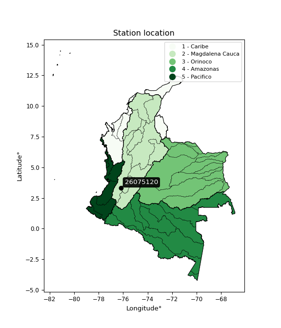

<div align="center">


</div>

# PMP Station (Rain, Pmax24h): 26075120

Probable Maximum Precipitation (PMP) is the greatest amount of rainfall for a specific duration that is meteorologically possible for a given location, acting as a "worst-case" scenario for extreme storms, crucial for designing safety-critical infrastructure like bridges, river deviations, dams, spillways, and nuclear plants to prevent catastrophic failure. PMP is calculated by hydrologists using meteorological data to determine the upper limit of extreme rainfall, often leading to the Probable Maximum Flood (PMF) for flood control design, and is increasingly being studied for climate change impacts. Probable Maximum Precipitation (PMP) is the theoretical upper limit of rainfall, a deterministic estimate for extreme events, while probability distributions (like GEV, Gumbel) describe the likelihood and frequency of various precipitation amounts, including rare ones, showing how often events occur, with PMP representing the extreme end of these distributions, used for critical infrastructure design to ensure safety against the worst conceivable weather, unlike standard statistical forecasts which cover typical probabilities.

The most common probability distributions in hydrology, used for analyzing floods, rainfall, and streamflow, include the Normal, Log-Normal, Gumbel, Gamma (including Log-Pearson Type III), and Generalized Extreme Value (GEV) distributions, often chosen based on the data´s skewness and whether modeling extremes or general conditions, with Gumbel and GEV popular for extreme events like floods, while the Normal distribution serves as a baseline, though often requiring transformations for skewed hydrological data. These distributions help in designing water infrastructure, managing water resources, and forecasting hydrologic events.

> Hydrological data often isn´t perfectly normal (it´s skewed), so different distributions are needed for different applications, such as: **Flood Frequency Analysis**: Using Gumbel, GEV, or Log-Pearson Type III for predicting extreme flood magnitudes and their return periods, **Rainfall Analysis**: Normal for annual totals, but Log-Normal, Weibull, or GEV for intensity or extreme daily rainfall, **Streamflow Modeling**: Gamma and Log-Normal for maximum flows, GEV for minimum flows, and Kappa for daily flows.

<div align="center">

</img>

</div>


## A. General information


### 1. General running parameters

• app_version: _v20260108_. • runtime: _2026-01-09 11:32:22.148588_. • Python version: _3.14.0_. • SciPy version: _1.16.3_. • Pandas version: _2.3.3_. • NumPy version: _2.3.5_. • Stations dataset (station_dataset_file): _dataset/pmax24h_in/automatic_colombia_2003_2024.csv_. • Stations catalog (station_catalog_file): _dataset/CNE.xls_. • Minimum year to eval til year_max (date_min): _1900_. • Maximum year to eval since year_min (date_max): _2024_. • Creates, save and include plots into reports (create_plot): _False_. • Plot only fit distributions with Δo > Δ (plot_only_fit): _True_. • Plot only simple graphs avoiding multiple CDFs and multiple Extreme values plots (plot_only_simple): _True_. • Eval low extreme values, if False, evaluates high extreme values (low_extreme): _False_. • Eval every SciPy distribution as logarithmic (pdist_logarithmic_on): _True_. • Standard deviation normalized (ddof): _1.0_. • Return periods to eval in years (Tr): _[2, 2.33, 5, 10, 15, 20, 25, 50, 75, 100, 200, 250, 500, 750, 1000]_. • Minimum data sample per station, 0 means any (minimum_sample): _5_. • Z-Score maximum threshold to adjust a value, 0 means disable (zscore_max): _3.5_. • Z-Score minimum threshold to adjust a value, 0 means disable (zscore_min): _-2.5_. • Avoid zeros, e.g. rain = 0 (avoid_zeros): _True_. • Avoid null values (avoid_nans): _True_. 

:file_folder:Table: [dataset.csv](../../dataset/pmax24h_in/automatic_colombia_2003_2024.csv)

> Delta Degrees of Freedom (DDOF): is a parameter used in the formulas for calculating variance and standard deviation. When ddof=0, the divisor is $N$ (the total number of observations) and this is used when your data set is the entire population. When ddof=1, the divisor is $N-1$ and this is used when your data set is a sample drawn from a larger population. Using $N-1$ provides an unbiased estimate of the population variance (known as Bessel´s correction).


### 2. Station info and location

|   id |   CODIGO | NOMBRE                    | CATEGORIA               | TECNOLOGIA                | ESTADO   | FECHA_INSTALACION   |   FECHA_SUSPENSION |   ALTITUD |   LATITUD |   LONGITUD | DEPARTAMENTO    | MUNICIPIO   | AREA_OPERATIVA                         | ENTIDAD                                                     | AREA_HIDROGRAFICA   | ZONA_HIDROGRAFICA   | SUBZONA_HIDROGRAFICA                  |   CORRIENTE | Catalogo   |   Version |
|-----:|---------:|:--------------------------|:------------------------|:--------------------------|:---------|:--------------------|-------------------:|----------:|----------:|-----------:|:----------------|:------------|:---------------------------------------|:------------------------------------------------------------|:--------------------|:--------------------|:--------------------------------------|------------:|:-----------|----------:|
|    0 | 26075120 | LA DIANA - AUT [26075120] | Climatológica Principal | Automática con Telemetría | Activa   | 26/06/2005          |                nan |      1615 |   3.31406 |   -76.1857 | Valle Del Cauca | Florida     | Area Operativa 09 - Cauca-Valle-Caldas | INSTITUTO DE HIDROLOGIA METEOROLOGIA Y ESTUDIOS AMBIENTALES | Magdalena Cauca     | Cauca               | Río Guachal (Bolo - Fraile y Párraga) |         nan | CNE_IDEAM  |  20251226 |

<div align="center">

Dynamic map: [:earth_americas:Google](http://maps.google.com/maps?q=3.314055556,-76.18569444) [:earth_americas:OSM](https://www.openstreetmap.org/#map=18/3.314055556/-76.18569444&layers=P) [:earth_americas:Bing](https://www.bing.com/maps?cp=3.314055556~-76.18569444&lvl=18) [:earth_americas:Apple](https://maps.apple.com/frame?center=3.314055556%2C-76.18569444&span=0.003%2C0.006)

</div>


<div align="center">

```geojson
{
  "type": "Feature",
  "geometry": {
    "type": "Point", 
    "coordinates": [-76.18569444, 3.314055556]
  }, 
  "properties": {
    "Name": "26075120"
  }
}
```

</div>


### 3. Discrete values table and plot

<div align="center">

|               |          0 |           1 |          2 |            3 |           4 |          5 |          6 |           7 |
|:--------------|-----------:|------------:|-----------:|-------------:|------------:|-----------:|-----------:|------------:|
| Date          | 2017       | 2018        | 2019       | 2020         | 2021        | 2022       | 2023       | 2024        |
| Value         |   69.2     |   62.6      |   30.4     |   51.3       |   59.2      |   80.5     |    9.5     |   64        |
| Value_initial |   69.2     |   62.6      |   30.4     |   51.3       |   59.2      |   80.5     |    9.5     |   64        |
| count         |    8       |    8        |    8       |    8         |    8        |    8       |    8       |    8        |
| mean          |   53.3375  |   53.3375   |   53.3375  |   53.3375    |   53.3375   |   53.3375  |   53.3375  |   53.3375   |
| std           |   22.9137  |   22.9137   |   22.9137  |   22.9137    |   22.9137   |   22.9137  |   22.9137  |   22.9137   |
| zscore        |    0.69227 |    0.404233 |   -1.00104 |   -0.0889204 |    0.255851 |    1.18542 |   -1.91315 |    0.465332 |


</div>


> The initial value (value_initial) correspond to the initial obtained or null completed value, and value (value) is adjusted only when the initial value is outside the valid range (outlier) definite through the Z-Score value. If Z-Score is active, values out of range or outliers are replaced with the station mean value. A Z-Score (or standard score) measures how many standard deviations a data point is from the mean of a dataset, indicating its relative position; positive scores mean above the mean, negative mean below, and a score of zero is exactly at the mean, allowing for comparison of values from different distributions. It´s calculated using the formula $z=(x–μ)/σ$, where $x$ is the data point, $μ$ is the mean, and $σ$ is the standard deviation, helping identify outliers and understand probability.
>
> <sub>**Note**: In this study, "completing" (filling gaps in) and "extending" (forecasting or lengthening the historical record) rainfall data series are avoided for certain critical analyses because they introduce artificial bias and uncertainty, which can distort the statistics of rare events (extremes), alter day-to-day variability, and compromise the integrity and homogeneity of the original data. Some reasons against Completing/Extending rainfall data are: **Distortion of Extremes and Variability**: The primary issue is that most gap-filling or extension methods rely on averaging or regression with nearby stations, which inherently smooths the data. Rainfall is highly variable in space and time, with a large percentage of zero values and occasional large storms. Infilling methods often underestimate the highest values and overestimate the lowest (zero) values, which severely distorts analyses focused on flood frequency, drought severity, and intensity-duration-frequency (IDF) curves, **Loss of Data Homogeneity**: Infilled or extended data are synthetic estimates, not actual measurements. Combining these estimates with observed data can violate the assumption of data homogeneity, which requires that the data properties do not change over time. Inhomogeneity can lead to incorrect conclusions about long-term trends or changes in climate patterns, **Propagation of Errors**: Errors and biases from the original data (e.g., wind-induced undercatch, instrument errors, site changes) or the data used for imputation can propagate through the analysis, leading to unreliable hydrological models and inaccurate predictions, **Compromised Statistical Integrity**: For statistical analyses, especially those involving the frequency of events, using artificial data can introduce time bias or autocorrelation that doesn´t exist in reality, making it difficult to assess the true probability of events, **Difficulty in Validation**: It is difficult to accurately validate the quality of filled or extended data, especially for past periods where ground-truth measurements are unavailable. The reliability of imputation techniques heavily depends on the density of the surrounding station network and the complexity of the local topography.</sub>


### 4. Active continuous probability distributions from SciPy (45 of 104 available)

A Probability Density Function (PDF) describes the relative likelihood of a continuous random variable falling within a specific range, where the total area under its curve equals 1, and the area over any interval gives the actual probability for that range. Unlike discrete probabilities (like rolling a die), a PDF shows density, not direct probability for a single point (which is zero), with higher points indicating higher likelihood, often visualized as a bell curve for normal distributions.

A log of a probability density function (log-PDF) is simply the logarithm of the PDF´s value, denoted as $log(f(x))$, useful for converting multiplication of probabilities into addition, improving numerical stability with tiny numbers, and connecting to information theory concepts like entropy. Instead of dealing with very small probabilities (e.g., 0.000001), log-PDFs use negative numbers (e.g., $log(0.00001) ≈ -11.51$ that are easier for computers to handle, preventing underflow errors and simplifying complex calculations. In this study, each active probability distribution from SciPy is also evaluated in the $log$ form.

[scipy.stats](https://docs.scipy.org/doc/scipy/reference/stats.html) is a Python´s powerful submodule within the SciPy library for comprehensive statistical analysis, offering over 130 probability distributions (like Normal, Poisson), functions for descriptive stats (mean, variance), hypothesis testing (t-tests, chi-square), random variable generation, and statistical tests, making it essential for data science, modeling, and research. It provides tools to explore, model, and draw conclusions from data efficiently, working seamlessly with NumPy.

<div align="center">

|   id | p_dist             |   n_parameter | fit_method   | label                                                                       | active   | ref                                                                                                        |
|-----:|:-------------------|--------------:|:-------------|:----------------------------------------------------------------------------|:---------|:-----------------------------------------------------------------------------------------------------------|
|    0 | alpha              |             3 | MLE          | Alpha                                                                       | True     | [:mortar_board:](https://docs.scipy.org/doc/scipy/reference/generated/scipy.stats.alpha.html)              |
|    1 | betaprime          |             4 | MLE          | Beta prime                                                                  | True     | [:mortar_board:](https://docs.scipy.org/doc/scipy/reference/generated/scipy.stats.betaprime.html)          |
|    2 | chi2               |             3 | MLE          | Chi²                                                                        | True     | [:mortar_board:](https://docs.scipy.org/doc/scipy/reference/generated/scipy.stats.chi2.html)               |
|    3 | crystalball        |             4 | MLE          | Crystalball                                                                 | True     | [:mortar_board:](https://docs.scipy.org/doc/scipy/reference/generated/scipy.stats.crystalball.html)        |
|    4 | dweibull           |             3 | MLE          | Double Weibull                                                              | True     | [:mortar_board:](https://docs.scipy.org/doc/scipy/reference/generated/scipy.stats.dweibull.html)           |
|    5 | erlang             |             3 | MLE          | Erlang                                                                      | True     | [:mortar_board:](https://docs.scipy.org/doc/scipy/reference/generated/scipy.stats.erlang.html)             |
|    6 | expon              |             2 | MLE          | Exponential                                                                 | True     | [:mortar_board:](https://docs.scipy.org/doc/scipy/reference/generated/scipy.stats.expon.html)              |
|    7 | exponnorm          |             3 | MLE          | Exponentially modified Normal                                               | True     | [:mortar_board:](https://docs.scipy.org/doc/scipy/reference/generated/scipy.stats.exponnorm.html)          |
|    8 | f                  |             4 | MLE          | F                                                                           | True     | [:mortar_board:](https://docs.scipy.org/doc/scipy/reference/generated/scipy.stats.f.html)                  |
|    9 | fatiguelife        |             3 | MLE          | Fatigue-life (Birnbaum-Saunders)                                            | True     | [:mortar_board:](https://docs.scipy.org/doc/scipy/reference/generated/scipy.stats.fatiguelife.html)        |
|   10 | fisk               |             3 | MLE          | Fisk                                                                        | True     | [:mortar_board:](https://docs.scipy.org/doc/scipy/reference/generated/scipy.stats.fisk.html)               |
|   11 | gamma              |             3 | MLE          | Gamma                                                                       | True     | [:mortar_board:](https://docs.scipy.org/doc/scipy/reference/generated/scipy.stats.gamma.html)              |
|   12 | genexpon           |             5 | MLE          | Generalized exponential                                                     | True     | [:mortar_board:](https://docs.scipy.org/doc/scipy/reference/generated/scipy.stats.genexpon.html)           |
|   13 | genlogistic        |             3 | MLE          | Generalized logistic                                                        | True     | [:mortar_board:](https://docs.scipy.org/doc/scipy/reference/generated/scipy.stats.genlogistic.html)        |
|   14 | gibrat             |             2 | MM           | Gibrat                                                                      | True     | [:mortar_board:](https://docs.scipy.org/doc/scipy/reference/generated/scipy.stats.gibrat.html)             |
|   15 | gompertz           |             3 | MLE          | Gompertz (or truncated Gumbel)                                              | True     | [:mortar_board:](https://docs.scipy.org/doc/scipy/reference/generated/scipy.stats.gompertz.html)           |
|   16 | gumbel_l           |             2 | MM           | Gumbel Left Skew                                                            | True     | [:mortar_board:](https://docs.scipy.org/doc/scipy/reference/generated/scipy.stats.gumbel_l.html)           |
|   17 | gumbel_r           |             2 | MM           | Gumbel Right Skew                                                           | True     | [:mortar_board:](https://docs.scipy.org/doc/scipy/reference/generated/scipy.stats.gumbel_r.html)           |
|   18 | halflogistic       |             2 | MM           | Half-logistic                                                               | True     | [:mortar_board:](https://docs.scipy.org/doc/scipy/reference/generated/scipy.stats.halflogistic.html)       |
|   19 | halfnorm           |             2 | MM           | Half Normal                                                                 | True     | [:mortar_board:](https://docs.scipy.org/doc/scipy/reference/generated/scipy.stats.halfnorm.html)           |
|   20 | hypsecant          |             2 | MM           | hyperbolic secant                                                           | True     | [:mortar_board:](https://docs.scipy.org/doc/scipy/reference/generated/scipy.stats.hypsecant.html)          |
|   21 | invgamma           |             3 | MLE          | Inverted gamma                                                              | True     | [:mortar_board:](https://docs.scipy.org/doc/scipy/reference/generated/scipy.stats.invgamma.html)           |
|   22 | invgauss           |             3 | MLE          | Inverse Gaussian                                                            | True     | [:mortar_board:](https://docs.scipy.org/doc/scipy/reference/generated/scipy.stats.invgauss.html)           |
|   23 | invweibull         |             3 | MLE          | Inverted Weibull                                                            | True     | [:mortar_board:](https://docs.scipy.org/doc/scipy/reference/generated/scipy.stats.invweibull.html)         |
|   24 | kappa4             |             4 | MLE          | Kappa 4                                                                     | True     | [:mortar_board:](https://docs.scipy.org/doc/scipy/reference/generated/scipy.stats.kappa4.html)             |
|   25 | kstwobign          |             2 | MLE          | Limiting distribution of scaled Kolmogorov-Smirnov two-sided test statistic | True     | [:mortar_board:](https://docs.scipy.org/doc/scipy/reference/generated/scipy.stats.kstwobign.html)          |
|   26 | laplace            |             2 | MM           | Laplace                                                                     | True     | [:mortar_board:](https://docs.scipy.org/doc/scipy/reference/generated/scipy.stats.laplace.html)            |
|   27 | laplace_asymmetric |             3 | MLE          | Asymmetric Laplace                                                          | True     | [:mortar_board:](https://docs.scipy.org/doc/scipy/reference/generated/scipy.stats.laplace_asymmetric.html) |
|   28 | loggamma           |             3 | MLE          | Log gamma                                                                   | True     | [:mortar_board:](https://docs.scipy.org/doc/scipy/reference/generated/scipy.stats.loggamma.html)           |
|   29 | logistic           |             2 | MM           | Logistic (or Sech-squared)                                                  | True     | [:mortar_board:](https://docs.scipy.org/doc/scipy/reference/generated/scipy.stats.logistic.html)           |
|   30 | lognorm            |             3 | MLE          | Log Normal                                                                  | True     | [:mortar_board:](https://docs.scipy.org/doc/scipy/reference/generated/scipy.stats.lognorm.html)            |
|   31 | maxwell            |             2 | MM           | Maxwell                                                                     | True     | [:mortar_board:](https://docs.scipy.org/doc/scipy/reference/generated/scipy.stats.maxwell.html)            |
|   32 | mielke             |             4 | MLE          | Mielke Beta-Kappa / Dagum                                                   | True     | [:mortar_board:](https://docs.scipy.org/doc/scipy/reference/generated/scipy.stats.mielke.html)             |
|   33 | moyal              |             2 | MM           | Moyal                                                                       | True     | [:mortar_board:](https://docs.scipy.org/doc/scipy/reference/generated/scipy.stats.moyal.html)              |
|   34 | nakagami           |             3 | MLE          | Nakagami                                                                    | True     | [:mortar_board:](https://docs.scipy.org/doc/scipy/reference/generated/scipy.stats.nakagami.html)           |
|   35 | ncf                |             5 | MLE          | Non-central F distribution                                                  | True     | [:mortar_board:](https://docs.scipy.org/doc/scipy/reference/generated/scipy.stats.ncf.html)                |
|   36 | nct                |             4 | MLE          | Non-central Student’s t                                                     | True     | [:mortar_board:](https://docs.scipy.org/doc/scipy/reference/generated/scipy.stats.nct.html)                |
|   37 | norm               |             2 | MM           | Normal                                                                      | True     | [:mortar_board:](https://docs.scipy.org/doc/scipy/reference/generated/scipy.stats.norm.html)               |
|   38 | pearson3           |             3 | MM           | Pearson type III                                                            | True     | [:mortar_board:](https://docs.scipy.org/doc/scipy/reference/generated/scipy.stats.pearson3.html)           |
|   39 | rayleigh           |             2 | MM           | Rayleigh                                                                    | True     | [:mortar_board:](https://docs.scipy.org/doc/scipy/reference/generated/scipy.stats.rayleigh.html)           |
|   40 | rice               |             3 | MLE          | Rice                                                                        | True     | [:mortar_board:](https://docs.scipy.org/doc/scipy/reference/generated/scipy.stats.rice.html)               |
|   41 | t                  |             3 | MLE          | Student’s t                                                                 | True     | [:mortar_board:](https://docs.scipy.org/doc/scipy/reference/generated/scipy.stats.t.html)                  |
|   42 | truncnorm          |             4 | MLE          | Truncated normal                                                            | True     | [:mortar_board:](https://docs.scipy.org/doc/scipy/reference/generated/scipy.stats.truncnorm.html)          |
|   43 | wald               |             2 | MM           | Wald                                                                        | True     | [:mortar_board:](https://docs.scipy.org/doc/scipy/reference/generated/scipy.stats.wald.html)               |
|   44 | weibull_min        |             3 | MLE          | Weibull minimum                                                             | True     | [:mortar_board:](https://docs.scipy.org/doc/scipy/reference/generated/scipy.stats.weibull_min.html)        |

</div>

> **n_parameter:** # arguments & localization & scale.
>
> **Fit methods:** (MLE) maximum likelihood, (MM) L-moments.
>
>**Inactive** (With the only purpose of prevent loops, zero divisions, infinite values, over high estimated values or horizontal trending for recurrence intervals estimations, the follow distributions were disabled.)**:** foldnorm, gennorm, norminvgauss, powernorm, powerlognorm, skewnorm, genextreme, anglit, arcsine, argus, beta, bradford, burr, burr12, cauchy, cosine, halfcauchy, foldcauchy, skewcauchy, wrapcauchy, dgamma, gengamma, exponweib, exponpow, truncexpon, gausshyper, genhalflogistic, genhyperbolic, geninvgauss, halfgennorm, johnsonsb, johnsonsu, kappa3, ksone, kstwo, loglaplace, levy, levy_l, levy_stable, ncx2, pareto, genpareto, truncpareto, lomax, powerlaw, rdist, rel_breitwigner, recipinvgauss, semicircular, studentized_range, trapezoid, triang, truncweibull_min, tukeylambda, uniform, loguniform, vonmises, vonmises_line, weibull_max, 


## B. Probability (PDF) vs. Empirical (EDF) distributions functions

A continuous probability distribution (CPD) describes probabilities for variables that can take any value within a range (like rain any time), unlike discrete variables with specific outcomes (like temperature). It uses a Probability Density Function (PDF), a curve where the total area under it equals 1, and the probability of the variable falling within an interval (a to b) is found by calculating the area under the curve between those points. A key feature is that the probability of hitting any single exact value is zero, so probabilities are always expressed for ranges, e.g., $P(a ≤ X ≤ b)$.

<div align="center">

Distributions parameters from station values
|    |   station | p_dist                |   n |             loc |           scale | shape                  | shape1              | shape2                 | shape3   |
|---:|----------:|:----------------------|----:|----------------:|----------------:|:-----------------------|:--------------------|:-----------------------|:---------|
|  0 |  26075120 | alpha                 |   8 |    -0.0746478   |    24.3673      | 9.504226111617586e-11  |                     |                        |          |
|  1 |  26075120 | betaprime             |   8 |  -723.571       | 39370           | 1268.6697433299769     | 64300.85005251368   |                        |          |
|  2 |  26075120 | chi2                  |   8 |  -248.175       |     0.823398    | 365.6949132687073      |                     |                        |          |
|  3 |  26075120 | crystalball           |   8 |    53.3375      |    21.4338      | 7003.603140588135      | 2673.6455349051007  |                        |          |
|  4 |  26075120 | dweibull              |   8 |    64           |    16.1016      | 0.8686520177789188     |                     |                        |          |
|  5 |  26075120 | erlang                |   8 |  -259.395       |     1.56759     | 199.2785248865839      |                     |                        |          |
|  6 |  26075120 | expon                 |   8 |     9.5         |    43.8375      |                        |                     |                        |          |
|  7 |  26075120 | exponnorm             |   8 |    53.3221      |    21.4339      | 0.0007192044610590455  |                     |                        |          |
|  8 |  26075120 | f                     |   8 | -2522.35        |  2575.51        | 29632.82511277638      | 480941.8169893045   |                        |          |
|  9 |  26075120 | fatiguelife           |   8 |     9.5         |     5.81094e-05 | 744.8094403149513      |                     |                        |          |
| 10 |  26075120 | fisk                  |   8 |    -3.31241e+09 |     3.31241e+09 | 273879794.84998995     |                     |                        |          |
| 11 |  26075120 | gamma                 |   8 |  -276.183       |     1.5182      | 216.86604339574723     |                     |                        |          |
| 12 |  26075120 | genexpon              |   8 |     5.20673     |     2.23986     | 0.007097175669301391   | 0.4642332190262738  | 0.006891842390345307   |          |
| 13 |  26075120 | genlogistic           |   8 |    72.5897      |     4.73844     | 0.22805864664127692    |                     |                        |          |
| 14 |  26075120 | gibrat                |   8 |    36.9862      |     9.91757     |                        |                     |                        |          |
| 15 |  26075120 | gompertz              |   8 |     3.65133     |     3.02121     | 6.941639005505613e-11  |                     |                        |          |
| 16 |  26075120 | gumbel_l              |   8 |    62.9839      |    16.7119      |                        |                     |                        |          |
| 17 |  26075120 | gumbel_r              |   8 |    43.6911      |    16.7119      |                        |                     |                        |          |
| 18 |  26075120 | halflogistic          |   8 |    27.9334      |    18.3252      |                        |                     |                        |          |
| 19 |  26075120 | halfnorm              |   8 |    24.9675      |    35.5565      |                        |                     |                        |          |
| 20 |  26075120 | hypsecant             |   8 |    53.3375      |    13.6452      |                        |                     |                        |          |
| 21 |  26075120 | invgamma              |   8 |  -249.078       | 51351.6         | 171.1211232112919      |                     |                        |          |
| 22 |  26075120 | invgauss              |   8 |   -95.2349      |  5480.01        | 0.02707724619628274    |                     |                        |          |
| 23 |  26075120 | invweibull            |   8 |    -8.16953e+06 |     8.16958e+06 | 345317.2573194759      |                     |                        |          |
| 24 |  26075120 | kappa4                |   8 |     2.39292     |    80.2649      | 1.097248667006657      | 1.020803311622721   |                        |          |
| 25 |  26075120 | kstwobign             |   8 |   -42.31        |   109.289       |                        |                     |                        |          |
| 26 |  26075120 | laplace               |   8 |    53.3375      |    15.156       |                        |                     |                        |          |
| 27 |  26075120 | laplace_asymmetric    |   8 |    64           |    13.0026      | 1.487659799281242      |                     |                        |          |
| 28 |  26075120 | loggamma              |   8 |    74.9701      |     8.29669     | 0.3937655835659313     |                     |                        |          |
| 29 |  26075120 | logistic              |   8 |    53.3375      |    11.8171      |                        |                     |                        |          |
| 30 |  26075120 | lognorm               |   8 |     9.5         |     0.418785    | 12.512969797124166     |                     |                        |          |
| 31 |  26075120 | maxwell               |   8 |     2.54828     |    31.8274      |                        |                     |                        |          |
| 32 |  26075120 | mielke                |   8 |     4.23607     |    76.6074      | 1.52083344157783       | 969.8241145661405   |                        |          |
| 33 |  26075120 | moyal                 |   8 |    41.0802      |     9.64862     |                        |                     |                        |          |
| 34 |  26075120 | nakagami              |   8 |    20.5771      |    40.7072      | 1.5370524812651634     |                     |                        |          |
| 35 |  26075120 | ncf                   |   8 |    -0.204341    |     2.93729e-05 | 1.0883490296989207e-05 | 36.96317332563812   | 19.337094940813827     |          |
| 36 |  26075120 | nct                   |   8 | -1698.61        |    21.3771      | 578595.2534888238      | 81.95443936585445   |                        |          |
| 37 |  26075120 | norm                  |   8 |    53.3375      |    21.4338      |                        |                     |                        |          |
| 38 |  26075120 | pearson3              |   8 |    53.3375      |    21.4338      | -0.889602248799759     |                     |                        |          |
| 39 |  26075120 | rayleigh              |   8 |    12.3333      |    32.7166      |                        |                     |                        |          |
| 40 |  26075120 | rice                  |   8 | -6925.22        |    21.4297      | 325.6468576217111      |                     |                        |          |
| 41 |  26075120 | t                     |   8 |    53.3376      |    21.4337      | 157236.8551749219      |                     |                        |          |
| 42 |  26075120 | truncnorm             |   8 |    53.3375      |    21.4338      | -48.3030691204313      | 263.1169442181248   |                        |          |
| 43 |  26075120 | wald                  |   8 |    31.9037      |    21.4338      |                        |                     |                        |          |
| 44 |  26075120 | weibull_min           |   8 |    -6.11355e+08 |     6.11355e+08 | 38821369.76637563      |                     |                        |          |
| 45 |  26075120 | logalpha              |   8 |   -15.2165      |   509.119       | 26.75562117687737      |                     |                        |          |
| 46 |  26075120 | logbetaprime          |   8 |   -13.5091      |   362.453       | 685.2883887601106      | 14339.311633735953  |                        |          |
| 47 |  26075120 | logchi2               |   8 |     2.25129     |     0.919719    | 1.1462398590550242     |                     |                        |          |
| 48 |  26075120 | logcrystalball        |   8 |     3.82566     |     0.653738    | 2994.7808216758403     | 208.64849664542191  |                        |          |
| 49 |  26075120 | logdweibull           |   8 |     4.13677     |     0.494339    | 0.822970177610731      |                     |                        |          |
| 50 |  26075120 | logerlang             |   8 |    -7.47449     |     0.0430889   | 262.19533911949407     |                     |                        |          |
| 51 |  26075120 | logexpon              |   8 |     2.25129     |     1.57436     |                        |                     |                        |          |
| 52 |  26075120 | logexponnorm          |   8 |     3.82522     |     0.653736    | 0.0006656919237814976  |                     |                        |          |
| 53 |  26075120 | logf                  |   8 | -1625.68        |  1629.51        | 42911343.9606363       | 17508584.18381086   |                        |          |
| 54 |  26075120 | logfatiguelife        |   8 |  -609.343       |   613.17        | 0.0010673074112086227  |                     |                        |          |
| 55 |  26075120 | logfisk               |   8 |    -7.58356e+07 |     7.58356e+07 | 241715635.21792996     |                     |                        |          |
| 56 |  26075120 | loggamma              |   8 |    -7.3128      |     0.0444348   | 250.31375500912122     |                     |                        |          |
| 57 |  26075120 | loggenexpon           |   8 |     2.20268     |     0.00936968  | 0.001266997161986139   | 4.0777558501570095  | 1.0973335738587164e-05 |          |
| 58 |  26075120 | loggenlogistic        |   8 |     4.38827     |     7.04741e-07 | 1.2463649679014227e-06 |                     |                        |          |
| 59 |  26075120 | loggibrat             |   8 |     3.32698     |     0.302468    |                        |                     |                        |          |
| 60 |  26075120 | loggompertz           |   8 |     2.22337     |     0.377426    | 0.007322017786555832   |                     |                        |          |
| 61 |  26075120 | loggumbel_l           |   8 |     4.11987     |     0.509717    |                        |                     |                        |          |
| 62 |  26075120 | loggumbel_r           |   8 |     3.53144     |     0.509717    |                        |                     |                        |          |
| 63 |  26075120 | loghalflogistic       |   8 |     3.05084     |     0.558908    |                        |                     |                        |          |
| 64 |  26075120 | loghalfnorm           |   8 |     2.96042     |     1.08443     |                        |                     |                        |          |
| 65 |  26075120 | loghypsecant          |   8 |     3.82566     |     0.416182    |                        |                     |                        |          |
| 66 |  26075120 | loginvgamma           |   8 |   -14.4616      | 12385.5         | 678.2128807056645      |                     |                        |          |
| 67 |  26075120 | loginvgauss           |   8 |    -4.36394     |  1057.02        | 0.007732257702509238   |                     |                        |          |
| 68 |  26075120 | loginvweibull         |   8 |    -1.15359e+08 |     1.15359e+08 | 141127256.16639003     |                     |                        |          |
| 69 |  26075120 | logkappa4             |   8 |     2.07521     |     2.50628     | 1.0135527603709549     | 1.0835401848626134  |                        |          |
| 70 |  26075120 | logkstwobign          |   8 |     0.492156    |     3.81749     |                        |                     |                        |          |
| 71 |  26075120 | loglaplace            |   8 |     3.82566     |     0.462262    |                        |                     |                        |          |
| 72 |  26075120 | loglaplace_asymmetric |   8 |     4.237       |     0.238223    | 2.1844029385371426     |                     |                        |          |
| 73 |  26075120 | logloggamma           |   8 |     4.38827     |     1.13664e-06 | 2.0179808431151288e-06 |                     |                        |          |
| 74 |  26075120 | loglogistic           |   8 |     3.82566     |     0.360425    |                        |                     |                        |          |
| 75 |  26075120 | loglognorm            |   8 |     2.25129     |     0.0198727   | 11.881467755782268     |                     |                        |          |
| 76 |  26075120 | logmaxwell            |   8 |     2.27655     |     0.970755    |                        |                     |                        |          |
| 77 |  26075120 | logmielke             |   8 |    -2.40664e+07 |     2.40664e+07 | 42056899.05024486      | 37131171806.59805   |                        |          |
| 78 |  26075120 | logmoyal              |   8 |     3.45181     |     0.294285    |                        |                     |                        |          |
| 79 |  26075120 | lognakagami           |   8 |     3.08086     |     0.996971    | 2.355805673476285      |                     |                        |          |
| 80 |  26075120 | logncf                |   8 |   -27.6595      |    31.4843      | 4864.241932594401      | 46837.93322999115   | 0.008015072082293073   |          |
| 81 |  26075120 | lognct                |   8 |    36.3922      |     0.621899    | 14183.044093696497     | -52.360288785089224 |                        |          |
| 82 |  26075120 | lognorm               |   8 |     3.82566     |     0.653738    |                        |                     |                        |          |
| 83 |  26075120 | logpearson3           |   8 |     3.82566     |     0.653737    | -1.628080049642676     |                     |                        |          |
| 84 |  26075120 | lograyleigh           |   8 |     2.57504     |     0.997852    |                        |                     |                        |          |
| 85 |  26075120 | logrice               |   8 |  -109.674       |     0.653744    | 173.611460756663       |                     |                        |          |
| 86 |  26075120 | logt                  |   8 |     4.13893     |     0.108374    | 0.7826488206405715     |                     |                        |          |
| 87 |  26075120 | logtruncnorm          |   8 |    -0.196893    |     1.96855     | 1.8345168777913627     | 2.3292040371338523  |                        |          |
| 88 |  26075120 | logwald               |   8 |     3.17191     |     0.653748    |                        |                     |                        |          |
| 89 |  26075120 | logweibull_min        |   8 |     2.25129     |     1.19151     | 0.8648451469131038     |                     |                        |          |

</div>

> **loc** (Location parameter): This shifts the distribution along the x-axis. For many common distributions, like the normal (Gaussian) distribution, loc represents the mean $μ$. For others, like the uniform distribution, it might represent the minimum value, or for the beta distribution, the left end of the support interval.
>
> **scale** (Scale parameter): This determines the width or spread of the distribution. For the normal distribution, scale represents the standard deviation $σ$. For a uniform distribution, it defines the length of the interval (from $loc$ to $loc + scale$).
>
> **shape** (Shape parameters): Refers to parameters that define the specific form of a probability distribution, distinct from its location (loc) and scale (scale). These parameters are required arguments for most distribution functions. For example, a normal (Gaussian) distribution is fully defined by its location (mean) and scale (standard deviation), so it has no specific shape parameters beyond loc and scale. However, other distributions have intrinsic properties that need specification, as Gamma distribution that takes a shape parameter, often named $a$ or $alpha$.


### 0. Cumulative distribution values - CDF (90 evaluated)

Cumulative Distribution Function (CDF), denoted as $F$<sub>$X$</sub>$(x)$, is a function that gives the probability that a random variable $X$ will take a value less than or equal to a specific value, $x$ (i.e., $(P(X≥x)$. It essentially "accumulates" probabilities from a given point up to the far right (positive infinity), providing a complete picture of the distribution´s probabilities for both discrete (like rain) and continuous (like temperature) variables, helping to find probabilities over ranges or above certain values. Each station is evaluated separately ordering the $x$ values ascending, calculating the CDF and PDF values for the activated distributions and their logarithmic forms.

<div align="center">

CDF ordered by x ascending and calculating $log(f(x))$ separately
|   id |   Station |   date |    x |   count |    mean |     std |     zscore |   Value_initial |   station |   m |     alpha |   alpha_pdf |   betaprime |   betaprime_pdf |      chi2 |   chi2_pdf |   crystalball |   crystalball_pdf |   dweibull |   dweibull_pdf |    erlang |   erlang_pdf |    expon |   expon_pdf |   exponnorm |   exponnorm_pdf |         f |      f_pdf |   fatiguelife |   fatiguelife_pdf |      fisk |   fisk_pdf |     gamma |   gamma_pdf |   genexpon |   genexpon_pdf |   genlogistic |   genlogistic_pdf |   gibrat |   gibrat_pdf |    gompertz |   gompertz_pdf |   gumbel_l |   gumbel_l_pdf |    gumbel_r |   gumbel_r_pdf |   halflogistic |   halflogistic_pdf |   halfnorm |   halfnorm_pdf |   hypsecant |   hypsecant_pdf |   invgamma |   invgamma_pdf |   invgauss |   invgauss_pdf |   invweibull |   invweibull_pdf |      kappa4 |   kappa4_pdf |   kstwobign |   kstwobign_pdf |   laplace |   laplace_pdf |   laplace_asymmetric |   laplace_asymmetric_pdf |   loggamma |   loggamma_pdf |   logistic |   logistic_pdf |    lognorm |   lognorm_pdf |    maxwell |   maxwell_pdf |    mielke |   mielke_pdf |       moyal |   moyal_pdf |   nakagami |   nakagami_pdf |       ncf |    ncf_pdf |       nct |    nct_pdf |      norm |   norm_pdf |   pearson3 |   pearson3_pdf |   rayleigh |   rayleigh_pdf |      rice |   rice_pdf |         t |      t_pdf |   truncnorm |   truncnorm_pdf |     wald |   wald_pdf |   weibull_min |   weibull_min_pdf |   logalpha |   logalpha_pdf |   logbetaprime |   logbetaprime_pdf |     logchi2 |   logchi2_pdf |   logcrystalball |   logcrystalball_pdf |   logdweibull |   logdweibull_pdf |   logerlang |   logerlang_pdf |   logexpon |   logexpon_pdf |   logexponnorm |   logexponnorm_pdf |       logf |   logf_pdf |   logfatiguelife |   logfatiguelife_pdf |   logfisk |   logfisk_pdf |   loggenexpon |   loggenexpon_pdf |   loggenlogistic |   loggenlogistic_pdf |   loggibrat |   loggibrat_pdf |   loggompertz |   loggompertz_pdf |   loggumbel_l |   loggumbel_l_pdf |   loggumbel_r |   loggumbel_r_pdf |   loghalflogistic |   loghalflogistic_pdf |   loghalfnorm |   loghalfnorm_pdf |   loghypsecant |   loghypsecant_pdf |   loginvgamma |   loginvgamma_pdf |   loginvgauss |   loginvgauss_pdf |   loginvweibull |   loginvweibull_pdf |   logkappa4 |   logkappa4_pdf |   logkstwobign |   logkstwobign_pdf |   loglaplace |   loglaplace_pdf |   loglaplace_asymmetric |   loglaplace_asymmetric_pdf |   logloggamma |   logloggamma_pdf |   loglogistic |   loglogistic_pdf |   loglognorm |   loglognorm_pdf |   logmaxwell |   logmaxwell_pdf |   logmielke |   logmielke_pdf |    logmoyal |   logmoyal_pdf |   lognakagami |   lognakagami_pdf |     logncf |   logncf_pdf |     lognct |   lognct_pdf |   logpearson3 |   logpearson3_pdf |   lograyleigh |   lograyleigh_pdf |    logrice |   logrice_pdf |      logt |   logt_pdf |   logtruncnorm |   logtruncnorm_pdf |   logwald |   logwald_pdf |   logweibull_min |   logweibull_min_pdf |
|-----:|----------:|-------:|-----:|--------:|--------:|--------:|-----------:|----------------:|----------:|----:|----------:|------------:|------------:|----------------:|----------:|-----------:|--------------:|------------------:|-----------:|---------------:|----------:|-------------:|---------:|------------:|------------:|----------------:|----------:|-----------:|--------------:|------------------:|----------:|-----------:|----------:|------------:|-----------:|---------------:|--------------:|------------------:|---------:|-------------:|------------:|---------------:|-----------:|---------------:|------------:|---------------:|---------------:|-------------------:|-----------:|---------------:|------------:|----------------:|-----------:|---------------:|-----------:|---------------:|-------------:|-----------------:|------------:|-------------:|------------:|----------------:|----------:|--------------:|---------------------:|-------------------------:|-----------:|---------------:|-----------:|---------------:|-----------:|--------------:|-----------:|--------------:|----------:|-------------:|------------:|------------:|-----------:|---------------:|----------:|-----------:|----------:|-----------:|----------:|-----------:|-----------:|---------------:|-----------:|---------------:|----------:|-----------:|----------:|-----------:|------------:|----------------:|---------:|-----------:|--------------:|------------------:|-----------:|---------------:|---------------:|-------------------:|------------:|--------------:|-----------------:|---------------------:|--------------:|------------------:|------------:|----------------:|-----------:|---------------:|---------------:|-------------------:|-----------:|-----------:|-----------------:|---------------------:|----------:|--------------:|--------------:|------------------:|-----------------:|---------------------:|------------:|----------------:|--------------:|------------------:|--------------:|------------------:|--------------:|------------------:|------------------:|----------------------:|--------------:|------------------:|---------------:|-------------------:|--------------:|------------------:|--------------:|------------------:|----------------:|--------------------:|------------:|----------------:|---------------:|-------------------:|-------------:|-----------------:|------------------------:|----------------------------:|--------------:|------------------:|--------------:|------------------:|-------------:|-----------------:|-------------:|-----------------:|------------:|----------------:|------------:|---------------:|--------------:|------------------:|-----------:|-------------:|-----------:|-------------:|--------------:|------------------:|--------------:|------------------:|-----------:|--------------:|----------:|-----------:|---------------:|-------------------:|----------:|--------------:|-----------------:|---------------------:|
|    0 |  26075120 |   2023 |  9.5 |       8 | 53.3375 | 22.9137 | -1.91315   |             9.5 |  26075120 |   1 | 0.0109284 |  0.0083187  |   0.0219646 |      0.00247568 | 0.0212672 | 0.00254247 |     0.0204153 |        0.00229867 |  0.027959  |     0.00128513 | 0.0206294 |   0.00248354 | 0        |  0.0228115  |   0.0204156 |      0.00229869 | 0.0220825 | 0.00244441 |     0.0473025 |       2.19968e+09 | 0.0205957 | 0.00166784 | 0.0217532 |  0.00255715 |   0.019267 |     0.00577501 |     0.0480037 |        0.00231039 | 0        |   0          | 4.11645e-10 |    1.59228e-10 |  0.0399291 |     0.00234091 | 0.000436714 |    0.000202163 |      0         |         0          |   0        |     0          |   0.0256096 |      0.0018748  |  0.0215726 |     0.00274569 |  0.0200167 |     0.00286437 |    0.0198259 |       0.00328567 | 2.88044e-15 |    0.323863  |   0.0218365 |      0.00420589 | 0.0277211 |    0.00182905 |            0.0411579 |               0.00212775 |  0.0104837 |      0.0437116 |  0.0239005 |     0.00197419 | 0.00801458 |     0.0335833 | 0.00273202 |    0.00116778 | 0.0170346 |   0.00492156 | 2.78802e-07 | 3.94811e-07 |  0         |     0          | 0.0110033 | 0.00279293 | 0.0204243 | 0.00229962 | 0.0204153 | 0.00229867 |  0.0383711 |     0.00254033 |   0        |     0          | 0.0203952 | 0.00229719 | 0.0204153 | 0.00229863 |   0.0204153 |      0.00229866 | 0        | 0          |     0.0329833 |        0.00205953 | 0.00841228 |       0.038225 |     0.00889452 |          0.0379373 | 1.25805e-09 |   1.62357e+06 |       0.00801458 |            0.0335833 |     0.0246622 |         0.0323941 |  0.00948782 |       0.0403375 |   0        |       0.635177 |     0.00801454 |          0.0335833 | 0.00803988 |  0.0337256 |       0.00793666 |             0.033346 | 0.0042186 |     0.0133895 |     0.0071494 |          0.158854 |         0        |            0.0403898 |    0        |        0        |   0.000562025 |         0.0208777 |     0.0252563 |         0.0489185 |   4.44722e-06 |       0.000107519 |          0        |              0        |      0        |          0        |      0.0144852 |          0.0347929 |    0.00924128 |         0.0399321 |    0.00894269 |          0.041827 |       0.0127091 |           0.0678742 |   0.0601196 |        0.417031 |      0.0163071 |          0.0984443 |    0.0165904 |        0.0358897 |               0.0182027 |                    0.03498  |     0.0225062 |         0.0399572 |     0.0125168 |         0.0342934 |   0.00407885 |      2.28486e+12 |     0        |         0        |   0.0237601 |       0.0415217 | 1.48984e-14 |     1.5208e-12 |     0         |          0        | 0.00855763 |     0.035992 | 0.00793662 |    0.0331341 |     0.0306256 |         0.0521165 |      0        |          0        | 0.00801399 |     0.0335811 | 0.0331592 |  0.0137258 |    0           |           0        |  0        |      0        |      4.53553e-14 |            88.3275   |
|    1 |  26075120 |   2019 | 30.4 |       8 | 53.3375 | 22.9137 | -1.00104   |            30.4 |  26075120 |   2 | 0.423947  |  0.0152068  |   0.14986   |      0.0107971  | 0.155368  | 0.0112883  |     0.142275  |        0.0104985  |  0.0751921 |     0.00368288 | 0.153181  |   0.0112328  | 0.379209 |  0.0141612  |   0.142276  |      0.0104985  | 0.148005  | 0.0106662  |     0.789648  |       0.00555716  | 0.105856  | 0.00782597 | 0.155022  |  0.0111782  |   0.242004 |     0.0141198  |     0.131257  |        0.00631645 | 0        |   0          | 4.85832e-07 |    1.6083e-07  |  0.132649  |     0.00738597 | 0.10914     |    0.0144662   |      0.0672002 |         0.0271616  |   0.121432 |     0.0221795  |   0.11719   |      0.00839564 |  0.166689  |     0.0119761  |  0.175106  |     0.0125608  |    0.197756  |       0.0135475  | 0.320794    |    0.0140408 |   0.232055  |      0.0145995  | 0.110077  |    0.00726294 |            0.121254  |               0.00626852 |  0.291805  |      0.500211  |  0.125533  |     0.00928948 | 0.264668   |     0.500713  | 0.142366   |    0.0130904  | 0.195177  |   0.0113451  | 0.081989    | 0.0158465   |  0.0169973 |     0.00513356 | 0.194886  | 0.0142767  | 0.142311  | 0.0104993  | 0.142275  | 0.0104985  |  0.140107  |     0.00800445 |   0.141418 |     0.0144919  | 0.142226  | 0.0104981  | 0.142273  | 0.0104984  |   0.142275  |      0.0104985  | 0        | 0          |     0.118786  |        0.00707612 | 0.284036   |       0.497149 |     0.28058    |          0.5056    | 0.697666    |   0.226018    |       0.264668   |            0.500713  |     0.127524  |         0.198514  |  0.283512   |       0.497412  |   0.522316 |       0.303414 |     0.264669   |          0.500716  | 0.265657   |  0.501984  |       0.263822   |             0.499696 | 0.147211  |     0.400142  |     0.41602   |          0.439394 |         0        |            0.315974  |    0.107352 |        2.11249  |   0.151712    |         0.386258  |     0.221653  |         0.382645  |   0.284218    |       0.701468    |          0.31427  |              0.806246 |      0.324549 |          0.674023 |      0.226891  |          0.500165  |    0.283972   |         0.49726   |    0.301634   |          0.51024  |       0.34922   |           0.449467  |   0.548301  |        0.430005 |      0.398854  |          0.438212  |    0.205417  |        0.444372  |               0.170168  |                    0.32701  |     0.177476  |         0.315089  |     0.242152  |         0.509162  |   0.634017   |      0.0272226   |     0.288355 |         0.568139 |   0.181392  |       0.316989  | 0.286631    |     0.81878    |     0.0126693 |          0.165137 | 0.27125    |     0.498832 | 0.262553   |    0.499442  |     0.208851  |         0.329356  |      0.297999 |          0.591804 | 0.264659   |     0.500704  | 0.0699016 |  0.0746788 |    9.73375e-07 |           1.61216  |  0.240992 |      1.58443  |      0.624458    |             0.273473 |
|    2 |  26075120 |   2020 | 51.3 |       8 | 53.3375 | 22.9137 | -0.0889204 |            51.3 |  26075120 |   3 | 0.635282  |  0.00658262 |   0.469079  |      0.0180906  | 0.480465  | 0.0179563  |     0.462134  |        0.0185288  |  0.221604  |     0.0123337  | 0.478867  |   0.0180655  | 0.614619 |  0.00879114 |   0.462134  |      0.0185288  | 0.466884  | 0.0182455  |     0.872591  |       0.00284152  | 0.39994   | 0.0198429  | 0.477532  |  0.017877   |   0.547321 |     0.0138401  |     0.358008  |        0.0170401  | 0.643159 |   0.0260568  | 0.000490669 |    0.000162369 |  0.391656  |     0.0180923  | 0.530328    |    0.0201273   |      0.563232  |         0.0186292  |   0.541053 |     0.0170578  |   0.452646  |      0.0230699  |  0.494848  |     0.0173639  |  0.502146  |     0.0166008  |    0.511732  |       0.0144913  | 0.605753    |    0.0133431 |   0.544557  |      0.0137474  | 0.437105  |    0.0288403  |            0.357224  |               0.0184675  |  0.58012   |      0.55171   |  0.457002  |     0.0209993  | 0.568035   |     0.601352  | 0.496284   |    0.0181983  | 0.476671  |   0.0154032  | 0.555967    | 0.0204716   |  0.360831  |     0.0248995  | 0.519847  | 0.0147572  | 0.462135  | 0.0185246  | 0.462134  | 0.0185288  |  0.404331  |     0.017489   |   0.508004 |     0.0179109  | 0.462122  | 0.0185324  | 0.462131  | 0.0185289  |   0.462134  |      0.0185288  | 0.62731  | 0.0215136  |     0.379219  |        0.0187945  | 0.569697   |       0.545137 |     0.577569   |          0.574913  | 0.792741    |   0.145123    |       0.568035   |            0.601352  |     0.311545  |         0.609268  |  0.57303    |       0.558353  |   0.65739  |       0.217618 |     0.568038   |          0.601354  | 0.569385   |  0.601166  |       0.566758   |             0.60093  | 0.477799  |     0.795269  |     0.63258   |          0.374273 |         0        |            0.797154  |    0.758864 |        0.510343 |   0.493459    |         0.922652  |     0.503156  |         0.681813  |   0.637199    |       0.563388    |          0.660316 |              0.504539 |      0.632512 |          0.490213 |      0.584671  |          0.737933  |    0.5722     |         0.553988  |    0.587627   |          0.533795 |       0.574264  |           0.389677  |   0.778664  |        0.454167 |      0.610803  |          0.35969   |    0.607613  |        0.84884   |               0.465125  |                    0.893827 |     0.449352  |         0.797775  |     0.57709   |         0.677138  |   0.645714   |      0.018567    |     0.597162 |         0.556653 |   0.45262   |       0.790971  | 0.661385    |     0.53946    |     0.413371  |          1.25109  | 0.568972   |     0.584326 | 0.566422   |    0.604399  |     0.461295  |         0.660773  |      0.606398 |          0.538655 | 0.568024   |     0.601355  | 0.181624  |  0.6201    |    0.660761    |           0.955641 |  0.728527 |      0.475349 |      0.740873    |             0.179459 |
|    3 |  26075120 |   2021 | 59.2 |       8 | 53.3375 | 22.9137 |  0.255851  |            59.2 |  26075120 |   4 | 0.681006  |  0.00508525 |   0.61045   |      0.0173254  | 0.619411  | 0.0168712  |     0.607772  |        0.0179294  |  0.35253   |     0.0222953  | 0.61877   |   0.0169964  | 0.67817  |  0.00734143 |   0.607772  |      0.0179293  | 0.609899  | 0.0175714  |     0.892823  |       0.00230539  | 0.561556  | 0.0203574  | 0.616158  |  0.0168709  |   0.650494 |     0.0121953  |     0.518108  |        0.0235412  | 0.789996 |   0.0129741  | 0.00668428  |    0.00220504  |  0.549494  |     0.0214952  | 0.673452    |    0.0159312   |      0.692688  |         0.0141931  |   0.664333 |     0.0141171  |   0.632735  |      0.0213286  |  0.62743   |     0.0159117  |  0.627623  |     0.0149406  |    0.618932  |       0.0125512  | 0.710639    |    0.0132205 |   0.645816  |      0.0118354  | 0.66039   |    0.0224076  |            0.537415  |               0.0277829  |  0.656717  |      0.514723  |  0.621543  |     0.0199057  | 0.651905   |     0.565456  | 0.633599   |    0.0162922  | 0.603541  |   0.0166998  | 0.695778    | 0.0149778   |  0.557934  |     0.0240786  | 0.628523  | 0.0126678  | 0.607737  | 0.0179248  | 0.607772  | 0.0179294  |  0.55371   |     0.0200125  |   0.641574 |     0.0156937  | 0.607788  | 0.0179326  | 0.60777   | 0.0179295  |   0.607772  |      0.0179294  | 0.758103 | 0.0125762  |     0.544962  |        0.0227513  | 0.645384   |       0.508788 |     0.657437   |          0.536711  | 0.812394    |   0.12966     |       0.651905   |            0.565456  |     0.423443  |         1.03707   |  0.650673   |       0.522537  |   0.687183 |       0.198694 |     0.651908   |          0.565456  | 0.653174   |  0.564794  |       0.650592   |             0.565395 | 0.590895  |     0.770507  |     0.684112  |          0.344792 |         0        |            1.02696   |    0.819469 |        0.34868  |   0.63118     |         0.981858  |     0.604035  |         0.719681  |   0.711577    |       0.475026    |          0.726611 |              0.422285 |      0.698522 |          0.431423 |      0.684033  |          0.640526  |    0.649196   |         0.517994  |    0.661361   |          0.493202 |       0.627812  |           0.357539  |   0.844585  |        0.467248 |      0.66019   |          0.329701  |    0.712161  |        0.622674  |               0.612502  |                    1.17704  |     0.57946   |         1.02877   |     0.670011  |         0.613433  |   0.648264   |      0.0170693   |     0.673337 |         0.504716 |   0.581351  |       1.01593   | 0.731304    |     0.438859   |     0.590309  |          1.18219  | 0.650395   |     0.548731 | 0.650773   |    0.569034  |     0.563687  |         0.768404  |      0.679775 |          0.4843   | 0.651895   |     0.565462  | 0.352816  |  2.11309   |    0.787585    |           0.818044 |  0.78726  |      0.35233  |      0.765214    |             0.16082  |
|    4 |  26075120 |   2018 | 62.6 |       8 | 53.3375 | 22.9137 |  0.404233  |            62.6 |  26075120 |   5 | 0.697431  |  0.00458923 |   0.6678    |      0.0163537  | 0.675073  | 0.0158225  |     0.667181  |        0.0169534  |  0.443533  |     0.0329784  | 0.674848  |   0.0159404  | 0.702188 |  0.00679355 |   0.667182  |      0.0169534  | 0.668104  | 0.0166067  |     0.900333  |       0.00211578  | 0.629157  | 0.0192915  | 0.671876  |  0.0158545  |   0.690557 |     0.0113626  |     0.602335  |        0.0258505  | 0.828645 |   0.00992992 | 0.0204539   |    0.00670039  |  0.623671  |     0.0220073  | 0.724291    |    0.0139798   |      0.737909  |         0.012428   |   0.71012  |     0.0128167  |   0.701166  |      0.0188221  |  0.679743  |     0.014824   |  0.676662  |     0.0138806  |    0.659985  |       0.0115921  | 0.755528    |    0.0131874 |   0.684555  |      0.0109502  | 0.728635  |    0.0179048  |            0.640688  |               0.0331218  |  0.684938  |      0.495637  |  0.686503  |     0.0182123  | 0.682924   |     0.544915  | 0.686935   |    0.0150503  | 0.661226  |   0.0172301  | 0.743018    | 0.0128467   |  0.636875  |     0.0222419  | 0.669887  | 0.0116594  | 0.667132  | 0.0169493  | 0.667181  | 0.0169534  |  0.6225    |     0.0203578  |   0.692815 |     0.0144259  | 0.667208  | 0.0169562  | 0.66718   | 0.0169535  |   0.667181  |      0.0169535  | 0.796601 | 0.0101745  |     0.623605  |        0.0233543  | 0.67329    |       0.490276 |     0.686855   |          0.516407  | 0.81948     |   0.124179    |       0.682924   |            0.544915  |     0.5       |       339.411     |  0.679337   |       0.503669  |   0.698085 |       0.19177  |     0.682927   |          0.544914  | 0.684151   |  0.544092  |       0.681612   |             0.545005 | 0.633128  |     0.74035   |     0.703027  |          0.33258  |         0        |            1.13356   |    0.837638 |        0.30335  |   0.685784    |         0.969887  |     0.64431   |         0.721332  |   0.737152    |       0.441034    |          0.749348 |              0.392262 |      0.721974 |          0.408525 |      0.718453  |          0.591675  |    0.67761    |         0.49924   |    0.688364   |          0.473589 |       0.647412  |           0.344353  |   0.870868  |        0.474331 |      0.678268  |          0.317761  |    0.744915  |        0.551818  |               0.681889  |                    1.31038  |     0.639854  |         1.13599   |     0.703323  |         0.578928  |   0.649202   |      0.0165477   |     0.700873 |         0.481245 |   0.640945  |       1.12008   | 0.754806    |     0.403223   |     0.654192  |          1.10177  | 0.6805     |     0.528978 | 0.681994   |    0.548551  |     0.607714  |         0.807965  |      0.70617  |          0.46086  | 0.682914   |     0.544922  | 0.49397   |  2.78907   |    0.831882    |           0.768829 |  0.805875 |      0.31521  |      0.774007    |             0.154169 |
|    5 |  26075120 |   2024 | 64   |       8 | 53.3375 | 22.9137 |  0.465332  |            64   |  26075120 |   6 | 0.703726  |  0.00440524 |   0.690357  |      0.0158619  | 0.696872  | 0.0153123  |     0.690568  |        0.0164465  |  0.5       |     2.56031    | 0.696808  |   0.0154251  | 0.711548 |  0.00658002 |   0.690568  |      0.0164464  | 0.691012  | 0.0161116  |     0.903244  |       0.00204357  | 0.655738  | 0.0186653  | 0.693728  |  0.0153563  |   0.706217 |     0.011007   |     0.638971  |        0.0264386  | 0.841838 |   0.00893903 | 0.032314    |    0.010521    |  0.654475  |     0.0219715  | 0.743311    |    0.013194    |      0.754823  |         0.0117391  |   0.72769  |     0.0122841  |   0.726706  |      0.017657   |  0.700146  |     0.0143191  |  0.695764  |     0.0134053  |    0.675933  |       0.0111901  | 0.773984    |    0.0131777 |   0.699629  |      0.0105838  | 0.752579  |    0.0163249  |            0.688778  |               0.0356079  |  0.695811  |      0.487473  |  0.711421  |     0.0173732  | 0.694878   |     0.535904  | 0.707616   |    0.014491   | 0.685499  |   0.0174441  | 0.760431    | 0.0120347   |  0.667369  |     0.0213061  | 0.685916  | 0.0112392  | 0.690513  | 0.0164426  | 0.690568  | 0.0164465  |  0.650991  |     0.0203239  |   0.712625 |     0.0138715  | 0.690598  | 0.016449   | 0.690567  | 0.0164466  |   0.690568  |      0.0164465  | 0.81026  | 0.00935173 |     0.656291  |        0.023309   | 0.684047   |       0.482388 |     0.69818    |          0.507661  | 0.822204    |   0.122085    |       0.694878   |            0.535904  |     0.537309  |         1.3351    |  0.690388   |       0.495556  |   0.702297 |       0.189094 |     0.69488    |          0.535904  | 0.696086   |  0.535024  |       0.693568   |             0.536055 | 0.649344  |     0.72575   |     0.710329  |          0.327661 |         0        |            1.17878   |    0.84417  |        0.287447 |   0.707118    |         0.958597  |     0.660247  |         0.719567  |   0.74676     |       0.42781     |          0.757896 |              0.380736 |      0.73091  |          0.399503 |      0.731319  |          0.571609  |    0.688564   |         0.491199  |    0.698748   |          0.465353 |       0.65497   |           0.339073  |   0.881395  |        0.477631 |      0.685244  |          0.313018  |    0.756833  |        0.526037  |               0.711496  |                    1.36728  |     0.66548   |         1.18149   |     0.715966  |         0.56422   |   0.649566   |      0.0163497   |     0.711411 |         0.471583 |   0.666204  |       1.16422   | 0.763575    |     0.389725   |     0.678148  |          1.06396  | 0.692105   |     0.520376 | 0.694028   |    0.539541  |     0.625749  |         0.822759  |      0.716259 |          0.45134  | 0.694868   |     0.535912  | 0.554986  |  2.68682   |    0.848678    |           0.749998 |  0.812698 |      0.301846 |      0.777389    |             0.151623 |
|    6 |  26075120 |   2017 | 69.2 |       8 | 53.3375 | 22.9137 |  0.69227   |            69.2 |  26075120 |   7 | 0.725026  |  0.0038083  |   0.767382  |      0.0136844  | 0.770992  | 0.0131333  |     0.770371  |        0.014154   |  0.65623   |     0.0215139  | 0.771448  |   0.0132189  | 0.743813 |  0.00584401 |   0.77037   |      0.0141539  | 0.769247  | 0.0138927  |     0.913224  |       0.00180124  | 0.745415  | 0.0156908  | 0.768174  |  0.0132124  |   0.759947 |     0.00965295 |     0.775739  |        0.0250743  | 0.880619 |   0.00618717 | 0.167775    |    0.0505892   |  0.765564  |     0.0203488  | 0.804673    |    0.0104638   |      0.80963   |         0.00939962 |   0.786502 |     0.0103508  |   0.807059  |      0.0132898  |  0.769343  |     0.0122564  |  0.760639  |     0.0115246  |    0.730242  |       0.00970372 | 0.84246     |    0.0131669 |   0.751151  |      0.0092389  | 0.824438  |    0.0115837  |            0.828332  |               0.019641   |  0.732696  |      0.456315  |  0.792874  |     0.0138972  | 0.735397   |     0.50065   | 0.777267   |    0.0122704  | 0.778236  |   0.0182188  | 0.815847    | 0.00937168  |  0.767972  |     0.0172812  | 0.740324  | 0.00969516 | 0.770299  | 0.0141516  | 0.770371  | 0.014154   |  0.754374  |     0.0191528  |   0.779222 |     0.0117294  | 0.770411  | 0.0141553  | 0.770369  | 0.014154   |   0.770371  |      0.014154   | 0.852203 | 0.00692807 |     0.773679  |        0.0213532  | 0.720579   |       0.452409 |     0.736551   |          0.474057  | 0.831461    |   0.115022    |       0.735397   |            0.50065   |     0.617911  |         0.843734  |  0.727907   |       0.464421  |   0.716708 |       0.179941 |     0.7354     |          0.500649  | 0.736529   |  0.49959   |       0.734108   |             0.501014 | 0.703735  |     0.664539  |     0.735238  |          0.310002 |         0        |            1.35342   |    0.86466  |        0.238998 |   0.779542    |         0.887479  |     0.715873  |         0.701421  |   0.778397    |       0.382571    |          0.786099 |              0.341781 |      0.760883 |          0.367975 |      0.773174  |          0.500047  |    0.725756   |         0.46044   |    0.733913   |          0.434534 |       0.680725  |           0.320287  |   0.919259  |        0.492932 |      0.709042  |          0.296271  |    0.794641  |        0.444247  |               0.826738  |                    1.58874  |     0.764482  |         1.35725   |     0.757914  |         0.509067  |   0.650817   |      0.0156861   |     0.746879 |         0.43622  |   0.76365   |       1.33451   | 0.79224     |     0.344903   |     0.755482  |          0.912105 | 0.731479   |     0.486945 | 0.734828   |    0.504183  |     0.691888  |         0.868605  |      0.75018  |          0.416981 | 0.735388   |     0.500659  | 0.718526  |  1.47389   |    0.904753    |           0.686412 |  0.834588 |      0.259876 |      0.788893    |             0.143009 |
|    7 |  26075120 |   2022 | 80.5 |       8 | 53.3375 | 22.9137 |  1.18542   |            80.5 |  26075120 |   8 | 0.762333  |  0.00286082 |   0.891375  |      0.0082653  | 0.889971  | 0.0079672  |     0.897471  |        0.00833828 |  0.819965  |     0.00968141 | 0.890983  |   0.00798118 | 0.802026 |  0.0045161  |   0.89747   |      0.00833828 | 0.894649  | 0.00829883 |     0.931108  |       0.00138615  | 0.8817    | 0.00862427 | 0.888227  |  0.00806562 |   0.852561 |     0.00678636 |     0.961407  |        0.00733443 | 0.930399 |   0.00307209 | 0.999562    |    0.00112126  |  0.942288  |     0.00984994 | 0.895368    |    0.00592132  |      0.892539  |         0.00554905 |   0.881667 |     0.00662743 |   0.913566  |      0.0062568  |  0.881319  |     0.00763643 |  0.867467  |     0.00746347 |    0.82284   |       0.00678192 | 0.992644    |    0.0138093 |   0.840043  |      0.00656864 | 0.916703  |    0.00549599 |            0.95288   |               0.00539112 |  0.796697  |      0.388775  |  0.908759  |     0.00701662 | 0.805268   |     0.42139   | 0.888321   |    0.00749225 | 0.99317   |   0.019555   | 0.896828    | 0.00531657  |  0.912002  |     0.00854463 | 0.832303  | 0.00668907 | 0.897392  | 0.0083394  | 0.897471  | 0.00833828 |  0.930781  |     0.010955   |   0.88589  |     0.00726709 | 0.897513  | 0.00833741 | 0.89747   | 0.00833829 |   0.897471  |      0.00833828 | 0.910899 | 0.00382598 |     0.952405  |        0.009203   | 0.784207   |       0.387873 |     0.802801   |          0.400587  | 0.847904    |   0.102673    |       0.805268   |            0.421389  |     0.718197  |         0.528766  |  0.793102   |       0.396332  |   0.742658 |       0.163457 |     0.80527    |          0.421388  | 0.806221   |  0.420115  |       0.804063   |             0.422132 | 0.793681  |     0.521936  |     0.779496  |          0.275139 |         0.999982 |            1.76851   |    0.895307 |        0.170973 |   0.895757    |         0.626508  |     0.816043  |         0.611023  |   0.830112    |       0.303231    |          0.832569 |              0.274489 |      0.812053 |          0.309232 |      0.838797  |          0.37099   |    0.79043    |         0.39351   |    0.794809   |          0.36995  |       0.72642   |           0.284048  |   1         |        6.77731  |      0.751424  |          0.264281  |    0.85195   |        0.320272  |               0.956713  |                    0.396921 |     0.999982  |         1.77523   |     0.826488  |         0.39788   |   0.653101   |      0.0145407   |     0.807495 |         0.365033 |   0.994684  |       1.72253   | 0.83858     |     0.270485   |     0.869327  |          0.595214 | 0.799624   |     0.412482 | 0.805194   |    0.424334  |     0.827007  |         0.900286  |      0.808137 |          0.34939  | 0.80526    |     0.4214    | 0.843766  |  0.449111  |    1           |           0.575628 |  0.86888  |      0.197058 |      0.809355    |             0.127873 |


</div>

An Empirical Distribution Function (EDF) is a step-function estimate of a true cumulative distribution function (CDF) based on observed sample data, representing the proportion of data points less than or equal to a given value. It is calculated by ordering your data and jumping up by $1/n$ (where $n$ is sample size) at each unique data point, allowing analysis without assuming an underlying population distribution, and it gets closer to the true CDF as the sample size grows. For the empirical probability calculations, the parameter $m$ correspond to the order number which means the position of the $x$ values in an ascending order list.

The Kolmogorov-Smirnov (K-S) test is a non-parametric statistical test used to determine if a sample data set comes from a specific theoretical distribution (one-sample) or if two different samples come from the same underlying distribution (two-sample), by comparing their cumulative distribution functions (CDFs). It calculates the maximum vertical difference (D statistic) between these functions, with a small p-value indicating a significant difference and rejection of the null hypothesis (that the data/samples match).


### 1. EDF California (1923)

California´s estimates the true probability distribution of water-related data (like rainfall, streamflow) using observed samples, crucial for risk assessment.

<div align="center">


$P=m/n$


</div>


**1.1. Empirical values**

<div align="center">

|                | 0                  | 1                  | 2              | 3              | 4                  | 5              | 6              | 7              |
|:---------------|:-------------------|:-------------------|:---------------|:---------------|:-------------------|:---------------|:---------------|:---------------|
| date           | 2023               | 2019               | 2020           | 2021           | 2018               | 2024           | 2017           | 2022           |
| x              | 9.5                | 30.4               | 51.3           | 59.2           | 62.6               | 64.0           | 69.2           | 80.5           |
| m              | 1                  | 2                  | 3              | 4              | 5                  | 6              | 7              | 8              |
| empirical_dist | edf_california     | edf_california     | edf_california | edf_california | edf_california     | edf_california | edf_california | edf_california |
| empirical      | 0.125              | 0.25               | 0.375          | 0.5            | 0.625              | 0.75           | 0.875          | 1.0            |
| empirical_tr   | 1.1428571428571428 | 1.3333333333333333 | 1.6            | 2.0            | 2.6666666666666665 | 4.0            | 8.0            | inf            |

</div>


**1.2. Kolmogorov-Smirnov fit test (sorted by Δ)**


<div align="center">

|                | 0                   | 1                   | 2                  | 3                   | 4                   | 5                   | 6                   | 7                  | 8                   | 9                   | 10                  | 11                  | 12                    | 13                  | 14                  | 15                  | 16                  | 17                  | 18                  | 19                  | 20                  | 21                 | 22                  | 23                  | 24                  | 25                  | 26                  | 27                 | 28                  | 29                  | 30                  | 31                 | 32                  | 33                 | 34                  | 35                  | 36                  | 37                  | 38                  | 39                 | 40                  | 41                 | 42                  | 43                  | 44                  | 45                  | 46                  | 47                 | 48                  | 49                  | 50                  | 51                  | 52                  | 53                  | 54                  | 55                  | 56                  | 57                  | 58                  | 59                  | 60                 | 61                  | 62                  | 63                 | 64                  | 65                  | 66                  | 67                 | 68                  | 69                  | 70                  | 71                 | 72                 | 73                 | 74                  | 75                 | 76                 | 77                 | 78                 | 79                  | 80                 | 81                  | 82                 | 83                 | 84                 | 85                 | 86                  | 87                 | 88                 | 89                 |
|:---------------|:--------------------|:--------------------|:-------------------|:--------------------|:--------------------|:--------------------|:--------------------|:-------------------|:--------------------|:--------------------|:--------------------|:--------------------|:----------------------|:--------------------|:--------------------|:--------------------|:--------------------|:--------------------|:--------------------|:--------------------|:--------------------|:-------------------|:--------------------|:--------------------|:--------------------|:--------------------|:--------------------|:-------------------|:--------------------|:--------------------|:--------------------|:-------------------|:--------------------|:-------------------|:--------------------|:--------------------|:--------------------|:--------------------|:--------------------|:-------------------|:--------------------|:-------------------|:--------------------|:--------------------|:--------------------|:--------------------|:--------------------|:-------------------|:--------------------|:--------------------|:--------------------|:--------------------|:--------------------|:--------------------|:--------------------|:--------------------|:--------------------|:--------------------|:--------------------|:--------------------|:-------------------|:--------------------|:--------------------|:-------------------|:--------------------|:--------------------|:--------------------|:-------------------|:--------------------|:--------------------|:--------------------|:-------------------|:-------------------|:-------------------|:--------------------|:-------------------|:-------------------|:-------------------|:-------------------|:--------------------|:-------------------|:--------------------|:-------------------|:-------------------|:-------------------|:-------------------|:--------------------|:-------------------|:-------------------|:-------------------|
| station        | 26075120            | 26075120            | 26075120           | 26075120            | 26075120            | 26075120            | 26075120            | 26075120           | 26075120            | 26075120            | 26075120            | 26075120            | 26075120              | 26075120            | 26075120            | 26075120            | 26075120            | 26075120            | 26075120            | 26075120            | 26075120            | 26075120           | 26075120            | 26075120            | 26075120            | 26075120            | 26075120            | 26075120           | 26075120            | 26075120            | 26075120            | 26075120           | 26075120            | 26075120           | 26075120            | 26075120            | 26075120            | 26075120            | 26075120            | 26075120           | 26075120            | 26075120           | 26075120            | 26075120            | 26075120            | 26075120            | 26075120            | 26075120           | 26075120            | 26075120            | 26075120            | 26075120            | 26075120            | 26075120            | 26075120            | 26075120            | 26075120            | 26075120            | 26075120            | 26075120            | 26075120           | 26075120            | 26075120            | 26075120           | 26075120            | 26075120            | 26075120            | 26075120           | 26075120            | 26075120            | 26075120            | 26075120           | 26075120           | 26075120           | 26075120            | 26075120           | 26075120           | 26075120           | 26075120           | 26075120            | 26075120           | 26075120            | 26075120           | 26075120           | 26075120           | 26075120           | 26075120            | 26075120           | 26075120           | 26075120           |
| empirical_dist | edf_california      | edf_california      | edf_california     | edf_california      | edf_california      | edf_california      | edf_california      | edf_california     | edf_california      | edf_california      | edf_california      | edf_california      | edf_california        | edf_california      | edf_california      | edf_california      | edf_california      | edf_california      | edf_california      | edf_california      | edf_california      | edf_california     | edf_california      | edf_california      | edf_california      | edf_california      | edf_california      | edf_california     | edf_california      | edf_california      | edf_california      | edf_california     | edf_california      | edf_california     | edf_california      | edf_california      | edf_california      | edf_california      | edf_california      | edf_california     | edf_california      | edf_california     | edf_california      | edf_california      | edf_california      | edf_california      | edf_california      | edf_california     | edf_california      | edf_california      | edf_california      | edf_california      | edf_california      | edf_california      | edf_california      | edf_california      | edf_california      | edf_california      | edf_california      | edf_california      | edf_california     | edf_california      | edf_california      | edf_california     | edf_california      | edf_california      | edf_california      | edf_california     | edf_california      | edf_california      | edf_california      | edf_california     | edf_california     | edf_california     | edf_california      | edf_california     | edf_california     | edf_california     | edf_california     | edf_california      | edf_california     | edf_california      | edf_california     | edf_california     | edf_california     | edf_california     | edf_california      | edf_california     | edf_california     | edf_california     |
| p_dist         | nct                 | t                   | truncnorm          | norm                | crystalball         | exponnorm           | rice                | mielke             | f                   | betaprime           | logloggamma         | logmielke           | loglaplace_asymmetric | gamma               | gumbel_l            | genlogistic         | erlang              | chi2                | pearson3            | logistic            | invgamma            | laplace_asymmetric | loggompertz         | weibull_min         | invgauss            | hypsecant           | maxwell             | rayleigh           | fisk                | laplace             | halfnorm            | ncf                | kstwobign           | genexpon           | gumbel_r            | invweibull          | logpearson3         | loggumbel_l         | halflogistic        | logf               | logexponnorm        | logcrystalball     | lognorm             | lognorm             | logrice             | lognct              | logt                | moyal              | logfatiguelife      | logncf              | loglogistic         | logbetaprime        | loggamma            | loggamma            | logfisk             | logerlang           | loginvgamma         | loghypsecant        | loginvgauss         | logalpha            | logmaxwell         | kappa4              | lograyleigh         | loglaplace         | nakagami            | lognakagami         | expon               | logkstwobign       | dweibull            | loghalfnorm         | loggenexpon         | wald               | alpha              | loggumbel_r        | loginvweibull       | logdweibull        | logexpon           | loghalflogistic    | logmoyal           | logtruncnorm        | gibrat             | logwald             | logweibull_min     | loggibrat          | loglognorm         | logkappa4          | logchi2             | fatiguelife        | gompertz           | loggenlogistic     |
| delta          | 0.10773676867256243 | 0.10776986319525794 | 0.1077716773649674 | 0.10777169552322874 | 0.10777169700999911 | 0.10777192741687813 | 0.10778824695215128 | 0.1079654368780442 | 0.10989904516536542 | 0.11045005641197259 | 0.11051829681432523 | 0.11135020163487197 | 0.11250191233812001   | 0.11615842192616954 | 0.11735145928967095 | 0.11874340883511011 | 0.11877000082979294 | 0.11941086627876396 | 0.12062580455509342 | 0.12446669412297068 | 0.12743020211775413 | 0.1287457605742277 | 0.13118044102183202 | 0.13121372910570045 | 0.13253311842505155 | 0.13281024361319005 | 0.13359932864060964 | 0.141574477930844  | 0.14414421430351004 | 0.16038993642119015 | 0.16605254385256019 | 0.1676972750116773 | 0.16955729319854218 | 0.1723211438733434 | 0.17345220266878392 | 0.17716017091712122 | 0.18311150061809367 | 0.18395671308136619 | 0.19268795822838491 | 0.1943852688252088 | 0.19472951845892383 | 0.194731814317182  | 0.19473182313280235 | 0.19473182313280235 | 0.19473983632038294 | 0.19480560199417662 | 0.19501432080229764 | 0.195778037783085  | 0.19593699641569517 | 0.20037605705332795 | 0.20209010792758697 | 0.20256931771005637 | 0.20511988924530467 | 0.20511988924530467 | 0.20631920350407318 | 0.20689810274499254 | 0.20956987016506834 | 0.20967080257029747 | 0.21262657323371859 | 0.21579348657815145 | 0.2221622453655262 | 0.23075335197462388 | 0.23139826819713671 | 0.2326133514693306 | 0.23300268115945189 | 0.23733073524153356 | 0.23961850082550828 | 0.2485756563384216 | 0.24999999999995803 | 0.25751229910515205 | 0.25757952315666455 | 0.2581029131526352 | 0.2602819108928123 | 0.2621988774701982 | 0.27357980242670554 | 0.2818031241023111 | 0.2823896447896619 | 0.2853164457588585 | 0.2863845258187192 | 0.28758454980960113 | 0.2899955230495783 | 0.35352728093720953 | 0.3744581809827696 | 0.3838640923514425 | 0.3840171113459221 | 0.4036638223540505 | 0.44766646336188576 | 0.53964781891285   | 0.7176859957550444 | 0.875              |
| deltao         | 0.4472608134160001  | 0.4472608134160001  | 0.4472608134160001 | 0.4472608134160001  | 0.4472608134160001  | 0.4472608134160001  | 0.4472608134160001  | 0.4472608134160001 | 0.4472608134160001  | 0.4472608134160001  | 0.4472608134160001  | 0.4472608134160001  | 0.4472608134160001    | 0.4472608134160001  | 0.4472608134160001  | 0.4472608134160001  | 0.4472608134160001  | 0.4472608134160001  | 0.4472608134160001  | 0.4472608134160001  | 0.4472608134160001  | 0.4472608134160001 | 0.4472608134160001  | 0.4472608134160001  | 0.4472608134160001  | 0.4472608134160001  | 0.4472608134160001  | 0.4472608134160001 | 0.4472608134160001  | 0.4472608134160001  | 0.4472608134160001  | 0.4472608134160001 | 0.4472608134160001  | 0.4472608134160001 | 0.4472608134160001  | 0.4472608134160001  | 0.4472608134160001  | 0.4472608134160001  | 0.4472608134160001  | 0.4472608134160001 | 0.4472608134160001  | 0.4472608134160001 | 0.4472608134160001  | 0.4472608134160001  | 0.4472608134160001  | 0.4472608134160001  | 0.4472608134160001  | 0.4472608134160001 | 0.4472608134160001  | 0.4472608134160001  | 0.4472608134160001  | 0.4472608134160001  | 0.4472608134160001  | 0.4472608134160001  | 0.4472608134160001  | 0.4472608134160001  | 0.4472608134160001  | 0.4472608134160001  | 0.4472608134160001  | 0.4472608134160001  | 0.4472608134160001 | 0.4472608134160001  | 0.4472608134160001  | 0.4472608134160001 | 0.4472608134160001  | 0.4472608134160001  | 0.4472608134160001  | 0.4472608134160001 | 0.4472608134160001  | 0.4472608134160001  | 0.4472608134160001  | 0.4472608134160001 | 0.4472608134160001 | 0.4472608134160001 | 0.4472608134160001  | 0.4472608134160001 | 0.4472608134160001 | 0.4472608134160001 | 0.4472608134160001 | 0.4472608134160001  | 0.4472608134160001 | 0.4472608134160001  | 0.4472608134160001 | 0.4472608134160001 | 0.4472608134160001 | 0.4472608134160001 | 0.4472608134160001  | 0.4472608134160001 | 0.4472608134160001 | 0.4472608134160001 |
| eval           | Δo > Δ              | Δo > Δ              | Δo > Δ             | Δo > Δ              | Δo > Δ              | Δo > Δ              | Δo > Δ              | Δo > Δ             | Δo > Δ              | Δo > Δ              | Δo > Δ              | Δo > Δ              | Δo > Δ                | Δo > Δ              | Δo > Δ              | Δo > Δ              | Δo > Δ              | Δo > Δ              | Δo > Δ              | Δo > Δ              | Δo > Δ              | Δo > Δ             | Δo > Δ              | Δo > Δ              | Δo > Δ              | Δo > Δ              | Δo > Δ              | Δo > Δ             | Δo > Δ              | Δo > Δ              | Δo > Δ              | Δo > Δ             | Δo > Δ              | Δo > Δ             | Δo > Δ              | Δo > Δ              | Δo > Δ              | Δo > Δ              | Δo > Δ              | Δo > Δ             | Δo > Δ              | Δo > Δ             | Δo > Δ              | Δo > Δ              | Δo > Δ              | Δo > Δ              | Δo > Δ              | Δo > Δ             | Δo > Δ              | Δo > Δ              | Δo > Δ              | Δo > Δ              | Δo > Δ              | Δo > Δ              | Δo > Δ              | Δo > Δ              | Δo > Δ              | Δo > Δ              | Δo > Δ              | Δo > Δ              | Δo > Δ             | Δo > Δ              | Δo > Δ              | Δo > Δ             | Δo > Δ              | Δo > Δ              | Δo > Δ              | Δo > Δ             | Δo > Δ              | Δo > Δ              | Δo > Δ              | Δo > Δ             | Δo > Δ             | Δo > Δ             | Δo > Δ              | Δo > Δ             | Δo > Δ             | Δo > Δ             | Δo > Δ             | Δo > Δ              | Δo > Δ             | Δo > Δ              | Δo > Δ             | Δo > Δ             | Δo > Δ             | Δo > Δ             | Δo <= Δ             | Δo <= Δ            | Δo <= Δ            | Δo <= Δ            |
| fit            | 1                   | 1                   | 1                  | 1                   | 1                   | 1                   | 1                   | 1                  | 1                   | 1                   | 1                   | 1                   | 1                     | 1                   | 1                   | 1                   | 1                   | 1                   | 1                   | 1                   | 1                   | 1                  | 1                   | 1                   | 1                   | 1                   | 1                   | 1                  | 1                   | 1                   | 1                   | 1                  | 1                   | 1                  | 1                   | 1                   | 1                   | 1                   | 1                   | 1                  | 1                   | 1                  | 1                   | 1                   | 1                   | 1                   | 1                   | 1                  | 1                   | 1                   | 1                   | 1                   | 1                   | 1                   | 1                   | 1                   | 1                   | 1                   | 1                   | 1                   | 1                  | 1                   | 1                   | 1                  | 1                   | 1                   | 1                   | 1                  | 1                   | 1                   | 1                   | 1                  | 1                  | 1                  | 1                   | 1                  | 1                  | 1                  | 1                  | 1                   | 1                  | 1                   | 1                  | 1                  | 1                  | 1                  | 0                   | 0                  | 0                  | 0                  |
| n              | 8                   | 8                   | 8                  | 8                   | 8                   | 8                   | 8                   | 8                  | 8                   | 8                   | 8                   | 8                   | 8                     | 8                   | 8                   | 8                   | 8                   | 8                   | 8                   | 8                   | 8                   | 8                  | 8                   | 8                   | 8                   | 8                   | 8                   | 8                  | 8                   | 8                   | 8                   | 8                  | 8                   | 8                  | 8                   | 8                   | 8                   | 8                   | 8                   | 8                  | 8                   | 8                  | 8                   | 8                   | 8                   | 8                   | 8                   | 8                  | 8                   | 8                   | 8                   | 8                   | 8                   | 8                   | 8                   | 8                   | 8                   | 8                   | 8                   | 8                   | 8                  | 8                   | 8                   | 8                  | 8                   | 8                   | 8                   | 8                  | 8                   | 8                   | 8                   | 8                  | 8                  | 8                  | 8                   | 8                  | 8                  | 8                  | 8                  | 8                   | 8                  | 8                   | 8                  | 8                  | 8                  | 8                  | 8                   | 8                  | 8                  | 8                  |
| best_fit       | 1                   | 0                   | 0                  | 0                   | 0                   | 0                   | 0                   | 0                  | 0                   | 0                   | 0                   | 0                   | 0                     | 0                   | 0                   | 0                   | 0                   | 0                   | 0                   | 0                   | 0                   | 0                  | 0                   | 0                   | 0                   | 0                   | 0                   | 0                  | 0                   | 0                   | 0                   | 0                  | 0                   | 0                  | 0                   | 0                   | 0                   | 0                   | 0                   | 0                  | 0                   | 0                  | 0                   | 0                   | 0                   | 0                   | 0                   | 0                  | 0                   | 0                   | 0                   | 0                   | 0                   | 0                   | 0                   | 0                   | 0                   | 0                   | 0                   | 0                   | 0                  | 0                   | 0                   | 0                  | 0                   | 0                   | 0                   | 0                  | 0                   | 0                   | 0                   | 0                  | 0                  | 0                  | 0                   | 0                  | 0                  | 0                  | 0                  | 0                   | 0                  | 0                   | 0                  | 0                  | 0                  | 0                  | 0                   | 0                  | 0                  | 0                  |
| best_fit_sort  | 1                   | 2                   | 3                  | 4                   | 5                   | 6                   | 7                   | 8                  | 9                   | 10                  | 11                  | 12                  | 13                    | 14                  | 15                  | 16                  | 17                  | 18                  | 19                  | 20                  | 21                  | 22                 | 23                  | 24                  | 25                  | 26                  | 27                  | 28                 | 29                  | 30                  | 31                  | 32                 | 33                  | 34                 | 35                  | 36                  | 37                  | 38                  | 39                  | 40                 | 41                  | 42                 | 43                  | 44                  | 45                  | 46                  | 47                  | 48                 | 49                  | 50                  | 51                  | 52                  | 53                  | 54                  | 55                  | 56                  | 57                  | 58                  | 59                  | 60                  | 61                 | 62                  | 63                  | 64                 | 65                  | 66                  | 67                  | 68                 | 69                  | 70                  | 71                  | 72                 | 73                 | 74                 | 75                  | 76                 | 77                 | 78                 | 79                 | 80                  | 81                 | 82                  | 83                 | 84                 | 85                 | 86                 | 87                  | 88                 | 89                 | 90                 |

</div>


**1.3. Best fit**

<div align="center">

|   id |   station | empirical_dist   | p_dist   |    delta |   deltao | eval   |   fit |   n |   best_fit |   best_fit_sort |
|-----:|----------:|:-----------------|:---------|---------:|---------:|:-------|------:|----:|-----------:|----------------:|
|    0 |  26075120 | edf_california   | nct      | 0.107737 | 0.447261 | Δo > Δ |     1 |   8 |          1 |               1 |

</div>


### 2. EDF Hazen (1930)

Hazen method for plotting positions is a formula used to estimate the empirical cumulative probability distribution of flood events or other hydrological data. This formula often results in biased estimations, particularly when extrapolating to extreme events (high return periods).

<div align="center">


$P=(m-0.5)/n$


</div>


**2.1. Empirical values**

<div align="center">

|                | 0                  | 1                  | 2                  | 3                  | 4                  | 5         | 6                 | 7         |
|:---------------|:-------------------|:-------------------|:-------------------|:-------------------|:-------------------|:----------|:------------------|:----------|
| date           | 2023               | 2019               | 2020               | 2021               | 2018               | 2024      | 2017              | 2022      |
| x              | 9.5                | 30.4               | 51.3               | 59.2               | 62.6               | 64.0      | 69.2              | 80.5      |
| m              | 1                  | 2                  | 3                  | 4                  | 5                  | 6         | 7                 | 8         |
| empirical_dist | edf_hazen          | edf_hazen          | edf_hazen          | edf_hazen          | edf_hazen          | edf_hazen | edf_hazen         | edf_hazen |
| empirical      | 0.0625             | 0.1875             | 0.3125             | 0.4375             | 0.5625             | 0.6875    | 0.8125            | 0.9375    |
| empirical_tr   | 1.0666666666666667 | 1.2307692307692308 | 1.4545454545454546 | 1.7777777777777777 | 2.2857142857142856 | 3.2       | 5.333333333333333 | 16.0      |

</div>


**2.2. Kolmogorov-Smirnov fit test (sorted by Δ)**


<div align="center">

|                | 0                   | 1                   | 2                   | 3                   | 4                   | 5                  | 6                   | 7                   | 8                   | 9                   | 10                  | 11                  | 12                  | 13                  | 14                 | 15                  | 16                 | 17                  | 18                  | 19                  | 20                  | 21                  | 22                  | 23                    | 24                  | 25                  | 26                  | 27                 | 28                  | 29                  | 30                  | 31                  | 32                  | 33                  | 34                  | 35                  | 36                 | 37                  | 38                  | 39                  | 40                  | 41                  | 42                 | 43                  | 44                 | 45                 | 46                 | 47                 | 48                 | 49                 | 50                 | 51                  | 52                 | 53                 | 54                  | 55                 | 56                  | 57                 | 58                  | 59                  | 60                 | 61                  | 62                  | 63                  | 64                 | 65                 | 66                 | 67                 | 68                 | 69                 | 70                 | 71                  | 72                  | 73                 | 74                 | 75                 | 76                 | 77                 | 78                 | 79                  | 80                 | 81                  | 82                 | 83                 | 84                 | 85                 | 86                 | 87                 | 88                 | 89                 |
|:---------------|:--------------------|:--------------------|:--------------------|:--------------------|:--------------------|:-------------------|:--------------------|:--------------------|:--------------------|:--------------------|:--------------------|:--------------------|:--------------------|:--------------------|:-------------------|:--------------------|:-------------------|:--------------------|:--------------------|:--------------------|:--------------------|:--------------------|:--------------------|:----------------------|:--------------------|:--------------------|:--------------------|:-------------------|:--------------------|:--------------------|:--------------------|:--------------------|:--------------------|:--------------------|:--------------------|:--------------------|:-------------------|:--------------------|:--------------------|:--------------------|:--------------------|:--------------------|:-------------------|:--------------------|:-------------------|:-------------------|:-------------------|:-------------------|:-------------------|:-------------------|:-------------------|:--------------------|:-------------------|:-------------------|:--------------------|:-------------------|:--------------------|:-------------------|:--------------------|:--------------------|:-------------------|:--------------------|:--------------------|:--------------------|:-------------------|:-------------------|:-------------------|:-------------------|:-------------------|:-------------------|:-------------------|:--------------------|:--------------------|:-------------------|:-------------------|:-------------------|:-------------------|:-------------------|:-------------------|:--------------------|:-------------------|:--------------------|:-------------------|:-------------------|:-------------------|:-------------------|:-------------------|:-------------------|:-------------------|:-------------------|
| station        | 26075120            | 26075120            | 26075120            | 26075120            | 26075120            | 26075120           | 26075120            | 26075120            | 26075120            | 26075120            | 26075120            | 26075120            | 26075120            | 26075120            | 26075120           | 26075120            | 26075120           | 26075120            | 26075120            | 26075120            | 26075120            | 26075120            | 26075120            | 26075120              | 26075120            | 26075120            | 26075120            | 26075120           | 26075120            | 26075120            | 26075120            | 26075120            | 26075120            | 26075120            | 26075120            | 26075120            | 26075120           | 26075120            | 26075120            | 26075120            | 26075120            | 26075120            | 26075120           | 26075120            | 26075120           | 26075120           | 26075120           | 26075120           | 26075120           | 26075120           | 26075120           | 26075120            | 26075120           | 26075120           | 26075120            | 26075120           | 26075120            | 26075120           | 26075120            | 26075120            | 26075120           | 26075120            | 26075120            | 26075120            | 26075120           | 26075120           | 26075120           | 26075120           | 26075120           | 26075120           | 26075120           | 26075120            | 26075120            | 26075120           | 26075120           | 26075120           | 26075120           | 26075120           | 26075120           | 26075120            | 26075120           | 26075120            | 26075120           | 26075120           | 26075120           | 26075120           | 26075120           | 26075120           | 26075120           | 26075120           |
| empirical_dist | edf_hazen           | edf_hazen           | edf_hazen           | edf_hazen           | edf_hazen           | edf_hazen          | edf_hazen           | edf_hazen           | edf_hazen           | edf_hazen           | edf_hazen           | edf_hazen           | edf_hazen           | edf_hazen           | edf_hazen          | edf_hazen           | edf_hazen          | edf_hazen           | edf_hazen           | edf_hazen           | edf_hazen           | edf_hazen           | edf_hazen           | edf_hazen             | edf_hazen           | edf_hazen           | edf_hazen           | edf_hazen          | edf_hazen           | edf_hazen           | edf_hazen           | edf_hazen           | edf_hazen           | edf_hazen           | edf_hazen           | edf_hazen           | edf_hazen          | edf_hazen           | edf_hazen           | edf_hazen           | edf_hazen           | edf_hazen           | edf_hazen          | edf_hazen           | edf_hazen          | edf_hazen          | edf_hazen          | edf_hazen          | edf_hazen          | edf_hazen          | edf_hazen          | edf_hazen           | edf_hazen          | edf_hazen          | edf_hazen           | edf_hazen          | edf_hazen           | edf_hazen          | edf_hazen           | edf_hazen           | edf_hazen          | edf_hazen           | edf_hazen           | edf_hazen           | edf_hazen          | edf_hazen          | edf_hazen          | edf_hazen          | edf_hazen          | edf_hazen          | edf_hazen          | edf_hazen           | edf_hazen           | edf_hazen          | edf_hazen          | edf_hazen          | edf_hazen          | edf_hazen          | edf_hazen          | edf_hazen           | edf_hazen          | edf_hazen           | edf_hazen          | edf_hazen          | edf_hazen          | edf_hazen          | edf_hazen          | edf_hazen          | edf_hazen          | edf_hazen          |
| p_dist         | genlogistic         | laplace_asymmetric  | weibull_min         | gumbel_l            | pearson3            | fisk               | logt                | logloggamma         | logmielke           | logpearson3         | logfisk             | mielke              | nct                 | t                   | truncnorm          | norm                | crystalball        | exponnorm           | rice                | nakagami            | f                   | betaprime           | lognakagami         | loglaplace_asymmetric | gamma               | erlang              | chi2                | logistic           | dweibull            | invgamma            | invgauss            | loggumbel_l         | loggompertz         | hypsecant           | maxwell             | invweibull          | rayleigh           | ncf                 | logdweibull         | laplace             | halfnorm            | kstwobign           | genexpon           | gumbel_r            | lognct             | logfatiguelife     | halflogistic       | logrice            | lognorm            | lognorm            | logcrystalball     | logexponnorm        | logncf             | logf               | logalpha            | moyal              | loginvgamma         | logerlang          | loginvweibull       | loglogistic         | logbetaprime       | loggamma            | loggamma            | loghypsecant        | loginvgauss        | logmaxwell         | kappa4             | lograyleigh        | loglaplace         | logkstwobign       | expon              | loghalfnorm         | loggenexpon         | wald               | alpha              | loggumbel_r        | logexpon           | loghalflogistic    | logmoyal           | logtruncnorm        | gibrat             | logwald             | logweibull_min     | loggibrat          | loglognorm         | logkappa4          | logchi2            | fatiguelife        | gompertz           | loggenlogistic     |
| delta          | 0.08060811105736121 | 0.09991543231730704 | 0.10746199422262181 | 0.11199445495974869 | 0.11620993940740343 | 0.1240559651477412 | 0.13251432080229764 | 0.14195983105217513 | 0.14385113468811483 | 0.14879511435075676 | 0.16529927905805553 | 0.16604123294341666 | 0.17023676867256243 | 0.17026986319525794 | 0.1702716773649674 | 0.17027169552322874 | 0.1702716970099991 | 0.17027192741687813 | 0.17028824695215128 | 0.17050268115945189 | 0.17239904516536542 | 0.17295005641197259 | 0.17483073524153356 | 0.17500191233812      | 0.17865842192616954 | 0.18127000082979294 | 0.18191086627876396 | 0.1840431123756041 | 0.18749999999995803 | 0.18993020211775413 | 0.19012290592999215 | 0.19065604978120865 | 0.19368044102183202 | 0.19523497745296037 | 0.19609932864060964 | 0.19923200748189696 | 0.204074477930844  | 0.20734675333452735 | 0.21930312410231112 | 0.22288993642119015 | 0.22855254385256019 | 0.23205729319854218 | 0.2348211438733434 | 0.23595220266878392 | 0.2539218799089209 | 0.2542575410730341 | 0.2551879582283849 | 0.2555242081933514 | 0.2555354185953005 | 0.2555354185953005 | 0.2555354405709943 | 0.25553786693967995 | 0.2564721459052506 | 0.2568852688252088 | 0.25719734502203917 | 0.258278037783085  | 0.25969989386482173 | 0.2605299634739566 | 0.26176366761878234 | 0.26459010792758697 | 0.2650693177100564 | 0.26761988924530467 | 0.26761988924530467 | 0.27217080257029747 | 0.2751265732337186 | 0.2846622453655262 | 0.2932533519746239 | 0.2938982681971367 | 0.2951133514693306 | 0.2983031733238276 | 0.3021185008255083 | 0.32001229910515205 | 0.32007952315666455 | 0.3206029131526352 | 0.3227819108928123 | 0.3246988774701982 | 0.3448896447896619 | 0.3478164457588585 | 0.3488845258187192 | 0.35008454980960113 | 0.3524955230495783 | 0.41602728093720953 | 0.4369581809827696 | 0.4463640923514425 | 0.4465171113459221 | 0.4661638223540505 | 0.5101664633618858 | 0.60214781891285   | 0.6551859957550444 | 0.8125             |
| deltao         | 0.4472608134160001  | 0.4472608134160001  | 0.4472608134160001  | 0.4472608134160001  | 0.4472608134160001  | 0.4472608134160001 | 0.4472608134160001  | 0.4472608134160001  | 0.4472608134160001  | 0.4472608134160001  | 0.4472608134160001  | 0.4472608134160001  | 0.4472608134160001  | 0.4472608134160001  | 0.4472608134160001 | 0.4472608134160001  | 0.4472608134160001 | 0.4472608134160001  | 0.4472608134160001  | 0.4472608134160001  | 0.4472608134160001  | 0.4472608134160001  | 0.4472608134160001  | 0.4472608134160001    | 0.4472608134160001  | 0.4472608134160001  | 0.4472608134160001  | 0.4472608134160001 | 0.4472608134160001  | 0.4472608134160001  | 0.4472608134160001  | 0.4472608134160001  | 0.4472608134160001  | 0.4472608134160001  | 0.4472608134160001  | 0.4472608134160001  | 0.4472608134160001 | 0.4472608134160001  | 0.4472608134160001  | 0.4472608134160001  | 0.4472608134160001  | 0.4472608134160001  | 0.4472608134160001 | 0.4472608134160001  | 0.4472608134160001 | 0.4472608134160001 | 0.4472608134160001 | 0.4472608134160001 | 0.4472608134160001 | 0.4472608134160001 | 0.4472608134160001 | 0.4472608134160001  | 0.4472608134160001 | 0.4472608134160001 | 0.4472608134160001  | 0.4472608134160001 | 0.4472608134160001  | 0.4472608134160001 | 0.4472608134160001  | 0.4472608134160001  | 0.4472608134160001 | 0.4472608134160001  | 0.4472608134160001  | 0.4472608134160001  | 0.4472608134160001 | 0.4472608134160001 | 0.4472608134160001 | 0.4472608134160001 | 0.4472608134160001 | 0.4472608134160001 | 0.4472608134160001 | 0.4472608134160001  | 0.4472608134160001  | 0.4472608134160001 | 0.4472608134160001 | 0.4472608134160001 | 0.4472608134160001 | 0.4472608134160001 | 0.4472608134160001 | 0.4472608134160001  | 0.4472608134160001 | 0.4472608134160001  | 0.4472608134160001 | 0.4472608134160001 | 0.4472608134160001 | 0.4472608134160001 | 0.4472608134160001 | 0.4472608134160001 | 0.4472608134160001 | 0.4472608134160001 |
| eval           | Δo > Δ              | Δo > Δ              | Δo > Δ              | Δo > Δ              | Δo > Δ              | Δo > Δ             | Δo > Δ              | Δo > Δ              | Δo > Δ              | Δo > Δ              | Δo > Δ              | Δo > Δ              | Δo > Δ              | Δo > Δ              | Δo > Δ             | Δo > Δ              | Δo > Δ             | Δo > Δ              | Δo > Δ              | Δo > Δ              | Δo > Δ              | Δo > Δ              | Δo > Δ              | Δo > Δ                | Δo > Δ              | Δo > Δ              | Δo > Δ              | Δo > Δ             | Δo > Δ              | Δo > Δ              | Δo > Δ              | Δo > Δ              | Δo > Δ              | Δo > Δ              | Δo > Δ              | Δo > Δ              | Δo > Δ             | Δo > Δ              | Δo > Δ              | Δo > Δ              | Δo > Δ              | Δo > Δ              | Δo > Δ             | Δo > Δ              | Δo > Δ             | Δo > Δ             | Δo > Δ             | Δo > Δ             | Δo > Δ             | Δo > Δ             | Δo > Δ             | Δo > Δ              | Δo > Δ             | Δo > Δ             | Δo > Δ              | Δo > Δ             | Δo > Δ              | Δo > Δ             | Δo > Δ              | Δo > Δ              | Δo > Δ             | Δo > Δ              | Δo > Δ              | Δo > Δ              | Δo > Δ             | Δo > Δ             | Δo > Δ             | Δo > Δ             | Δo > Δ             | Δo > Δ             | Δo > Δ             | Δo > Δ              | Δo > Δ              | Δo > Δ             | Δo > Δ             | Δo > Δ             | Δo > Δ             | Δo > Δ             | Δo > Δ             | Δo > Δ              | Δo > Δ             | Δo > Δ              | Δo > Δ             | Δo > Δ             | Δo > Δ             | Δo <= Δ            | Δo <= Δ            | Δo <= Δ            | Δo <= Δ            | Δo <= Δ            |
| fit            | 1                   | 1                   | 1                   | 1                   | 1                   | 1                  | 1                   | 1                   | 1                   | 1                   | 1                   | 1                   | 1                   | 1                   | 1                  | 1                   | 1                  | 1                   | 1                   | 1                   | 1                   | 1                   | 1                   | 1                     | 1                   | 1                   | 1                   | 1                  | 1                   | 1                   | 1                   | 1                   | 1                   | 1                   | 1                   | 1                   | 1                  | 1                   | 1                   | 1                   | 1                   | 1                   | 1                  | 1                   | 1                  | 1                  | 1                  | 1                  | 1                  | 1                  | 1                  | 1                   | 1                  | 1                  | 1                   | 1                  | 1                   | 1                  | 1                   | 1                   | 1                  | 1                   | 1                   | 1                   | 1                  | 1                  | 1                  | 1                  | 1                  | 1                  | 1                  | 1                   | 1                   | 1                  | 1                  | 1                  | 1                  | 1                  | 1                  | 1                   | 1                  | 1                   | 1                  | 1                  | 1                  | 0                  | 0                  | 0                  | 0                  | 0                  |
| n              | 8                   | 8                   | 8                   | 8                   | 8                   | 8                  | 8                   | 8                   | 8                   | 8                   | 8                   | 8                   | 8                   | 8                   | 8                  | 8                   | 8                  | 8                   | 8                   | 8                   | 8                   | 8                   | 8                   | 8                     | 8                   | 8                   | 8                   | 8                  | 8                   | 8                   | 8                   | 8                   | 8                   | 8                   | 8                   | 8                   | 8                  | 8                   | 8                   | 8                   | 8                   | 8                   | 8                  | 8                   | 8                  | 8                  | 8                  | 8                  | 8                  | 8                  | 8                  | 8                   | 8                  | 8                  | 8                   | 8                  | 8                   | 8                  | 8                   | 8                   | 8                  | 8                   | 8                   | 8                   | 8                  | 8                  | 8                  | 8                  | 8                  | 8                  | 8                  | 8                   | 8                   | 8                  | 8                  | 8                  | 8                  | 8                  | 8                  | 8                   | 8                  | 8                   | 8                  | 8                  | 8                  | 8                  | 8                  | 8                  | 8                  | 8                  |
| best_fit       | 1                   | 0                   | 0                   | 0                   | 0                   | 0                  | 0                   | 0                   | 0                   | 0                   | 0                   | 0                   | 0                   | 0                   | 0                  | 0                   | 0                  | 0                   | 0                   | 0                   | 0                   | 0                   | 0                   | 0                     | 0                   | 0                   | 0                   | 0                  | 0                   | 0                   | 0                   | 0                   | 0                   | 0                   | 0                   | 0                   | 0                  | 0                   | 0                   | 0                   | 0                   | 0                   | 0                  | 0                   | 0                  | 0                  | 0                  | 0                  | 0                  | 0                  | 0                  | 0                   | 0                  | 0                  | 0                   | 0                  | 0                   | 0                  | 0                   | 0                   | 0                  | 0                   | 0                   | 0                   | 0                  | 0                  | 0                  | 0                  | 0                  | 0                  | 0                  | 0                   | 0                   | 0                  | 0                  | 0                  | 0                  | 0                  | 0                  | 0                   | 0                  | 0                   | 0                  | 0                  | 0                  | 0                  | 0                  | 0                  | 0                  | 0                  |
| best_fit_sort  | 1                   | 2                   | 3                   | 4                   | 5                   | 6                  | 7                   | 8                   | 9                   | 10                  | 11                  | 12                  | 13                  | 14                  | 15                 | 16                  | 17                 | 18                  | 19                  | 20                  | 21                  | 22                  | 23                  | 24                    | 25                  | 26                  | 27                  | 28                 | 29                  | 30                  | 31                  | 32                  | 33                  | 34                  | 35                  | 36                  | 37                 | 38                  | 39                  | 40                  | 41                  | 42                  | 43                 | 44                  | 45                 | 46                 | 47                 | 48                 | 49                 | 50                 | 51                 | 52                  | 53                 | 54                 | 55                  | 56                 | 57                  | 58                 | 59                  | 60                  | 61                 | 62                  | 63                  | 64                  | 65                 | 66                 | 67                 | 68                 | 69                 | 70                 | 71                 | 72                  | 73                  | 74                 | 75                 | 76                 | 77                 | 78                 | 79                 | 80                  | 81                 | 82                  | 83                 | 84                 | 85                 | 86                 | 87                 | 88                 | 89                 | 90                 |

</div>


**2.3. Best fit**

<div align="center">

|   id |   station | empirical_dist   | p_dist      |     delta |   deltao | eval   |   fit |   n |   best_fit |   best_fit_sort |
|-----:|----------:|:-----------------|:------------|----------:|---------:|:-------|------:|----:|-----------:|----------------:|
|    0 |  26075120 | edf_hazen        | genlogistic | 0.0806081 | 0.447261 | Δo > Δ |     1 |   8 |          1 |               1 |

</div>


### 3. EDF Weibull (1939)

Weibull plotting position formula is an empirical method used to estimate the non-exceedance probability or plotting position for a set of observed data, is often recommended or widely used in practice, particularly in flood frequency analysis.

<div align="center">


$P=m/(n+1)$


</div>


**3.1. Empirical values**

<div align="center">

|                | 0                  | 1                  | 2                  | 3                  | 4                  | 5                  | 6                  | 7                  |
|:---------------|:-------------------|:-------------------|:-------------------|:-------------------|:-------------------|:-------------------|:-------------------|:-------------------|
| date           | 2023               | 2019               | 2020               | 2021               | 2018               | 2024               | 2017               | 2022               |
| x              | 9.5                | 30.4               | 51.3               | 59.2               | 62.6               | 64.0               | 69.2               | 80.5               |
| m              | 1                  | 2                  | 3                  | 4                  | 5                  | 6                  | 7                  | 8                  |
| empirical_dist | edf_weibull        | edf_weibull        | edf_weibull        | edf_weibull        | edf_weibull        | edf_weibull        | edf_weibull        | edf_weibull        |
| empirical      | 0.1111111111111111 | 0.2222222222222222 | 0.3333333333333333 | 0.4444444444444444 | 0.5555555555555556 | 0.6666666666666666 | 0.7777777777777778 | 0.8888888888888888 |
| empirical_tr   | 1.125              | 1.2857142857142856 | 1.4999999999999998 | 1.7999999999999998 | 2.25               | 2.9999999999999996 | 4.5                | 8.999999999999996  |

</div>


**3.2. Kolmogorov-Smirnov fit test (sorted by Δ)**


<div align="center">

|                | 0                   | 1                   | 2                   | 3                   | 4                   | 5                   | 6                   | 7                   | 8                   | 9                   | 10                 | 11                  | 12                 | 13                  | 14                  | 15                  | 16                 | 17                 | 18                  | 19                 | 20                  | 21                  | 22                    | 23                  | 24                  | 25                  | 26                  | 27                  | 28                 | 29                  | 30                 | 31                  | 32                  | 33                 | 34                  | 35                  | 36                  | 37                 | 38                  | 39                  | 40                 | 41                  | 42                 | 43                 | 44                  | 45                 | 46                 | 47                  | 48                  | 49                 | 50                  | 51                  | 52                  | 53                  | 54                  | 55                 | 56                  | 57                  | 58                  | 59                  | 60                  | 61                 | 62                 | 63                  | 64                  | 65                 | 66                  | 67                 | 68                 | 69                 | 70                  | 71                  | 72                  | 73                  | 74                 | 75                 | 76                  | 77                 | 78                 | 79                 | 80                 | 81                 | 82                  | 83                 | 84                  | 85                 | 86                  | 87                 | 88                 | 89                 |
|:---------------|:--------------------|:--------------------|:--------------------|:--------------------|:--------------------|:--------------------|:--------------------|:--------------------|:--------------------|:--------------------|:-------------------|:--------------------|:-------------------|:--------------------|:--------------------|:--------------------|:-------------------|:-------------------|:--------------------|:-------------------|:--------------------|:--------------------|:----------------------|:--------------------|:--------------------|:--------------------|:--------------------|:--------------------|:-------------------|:--------------------|:-------------------|:--------------------|:--------------------|:-------------------|:--------------------|:--------------------|:--------------------|:-------------------|:--------------------|:--------------------|:-------------------|:--------------------|:-------------------|:-------------------|:--------------------|:-------------------|:-------------------|:--------------------|:--------------------|:-------------------|:--------------------|:--------------------|:--------------------|:--------------------|:--------------------|:-------------------|:--------------------|:--------------------|:--------------------|:--------------------|:--------------------|:-------------------|:-------------------|:--------------------|:--------------------|:-------------------|:--------------------|:-------------------|:-------------------|:-------------------|:--------------------|:--------------------|:--------------------|:--------------------|:-------------------|:-------------------|:--------------------|:-------------------|:-------------------|:-------------------|:-------------------|:-------------------|:--------------------|:-------------------|:--------------------|:-------------------|:--------------------|:-------------------|:-------------------|:-------------------|
| station        | 26075120            | 26075120            | 26075120            | 26075120            | 26075120            | 26075120            | 26075120            | 26075120            | 26075120            | 26075120            | 26075120           | 26075120            | 26075120           | 26075120            | 26075120            | 26075120            | 26075120           | 26075120           | 26075120            | 26075120           | 26075120            | 26075120            | 26075120              | 26075120            | 26075120            | 26075120            | 26075120            | 26075120            | 26075120           | 26075120            | 26075120           | 26075120            | 26075120            | 26075120           | 26075120            | 26075120            | 26075120            | 26075120           | 26075120            | 26075120            | 26075120           | 26075120            | 26075120           | 26075120           | 26075120            | 26075120           | 26075120           | 26075120            | 26075120            | 26075120           | 26075120            | 26075120            | 26075120            | 26075120            | 26075120            | 26075120           | 26075120            | 26075120            | 26075120            | 26075120            | 26075120            | 26075120           | 26075120           | 26075120            | 26075120            | 26075120           | 26075120            | 26075120           | 26075120           | 26075120           | 26075120            | 26075120            | 26075120            | 26075120            | 26075120           | 26075120           | 26075120            | 26075120           | 26075120           | 26075120           | 26075120           | 26075120           | 26075120            | 26075120           | 26075120            | 26075120           | 26075120            | 26075120           | 26075120           | 26075120           |
| empirical_dist | edf_weibull         | edf_weibull         | edf_weibull         | edf_weibull         | edf_weibull         | edf_weibull         | edf_weibull         | edf_weibull         | edf_weibull         | edf_weibull         | edf_weibull        | edf_weibull         | edf_weibull        | edf_weibull         | edf_weibull         | edf_weibull         | edf_weibull        | edf_weibull        | edf_weibull         | edf_weibull        | edf_weibull         | edf_weibull         | edf_weibull           | edf_weibull         | edf_weibull         | edf_weibull         | edf_weibull         | edf_weibull         | edf_weibull        | edf_weibull         | edf_weibull        | edf_weibull         | edf_weibull         | edf_weibull        | edf_weibull         | edf_weibull         | edf_weibull         | edf_weibull        | edf_weibull         | edf_weibull         | edf_weibull        | edf_weibull         | edf_weibull        | edf_weibull        | edf_weibull         | edf_weibull        | edf_weibull        | edf_weibull         | edf_weibull         | edf_weibull        | edf_weibull         | edf_weibull         | edf_weibull         | edf_weibull         | edf_weibull         | edf_weibull        | edf_weibull         | edf_weibull         | edf_weibull         | edf_weibull         | edf_weibull         | edf_weibull        | edf_weibull        | edf_weibull         | edf_weibull         | edf_weibull        | edf_weibull         | edf_weibull        | edf_weibull        | edf_weibull        | edf_weibull         | edf_weibull         | edf_weibull         | edf_weibull         | edf_weibull        | edf_weibull        | edf_weibull         | edf_weibull        | edf_weibull        | edf_weibull        | edf_weibull        | edf_weibull        | edf_weibull         | edf_weibull        | edf_weibull         | edf_weibull        | edf_weibull         | edf_weibull        | edf_weibull        | edf_weibull        |
| p_dist         | genlogistic         | laplace_asymmetric  | weibull_min         | gumbel_l            | pearson3            | fisk                | logpearson3         | logloggamma         | logmielke           | logfisk             | logt               | mielke              | nct                | t                   | truncnorm           | norm                | crystalball        | exponnorm          | rice                | f                  | betaprime           | dweibull            | loglaplace_asymmetric | loggumbel_l         | logdweibull         | gamma               | erlang              | chi2                | logistic           | invweibull          | invgamma           | invgauss            | ncf                 | loggompertz        | hypsecant           | maxwell             | rayleigh            | nakagami           | lognakagami         | kstwobign           | genexpon           | laplace             | halfnorm           | gumbel_r           | lognct              | logfatiguelife     | logrice            | lognorm             | lognorm             | logcrystalball     | logexponnorm        | logncf              | logf                | logalpha            | loginvgamma         | logerlang          | loginvweibull       | loglogistic         | logbetaprime        | loggamma            | loggamma            | halflogistic       | moyal              | loghypsecant        | loginvgauss         | logmaxwell         | kappa4              | lograyleigh        | loglaplace         | logkstwobign       | expon               | loghalfnorm         | loggenexpon         | alpha               | loggumbel_r        | wald               | logexpon            | loghalflogistic    | logmoyal           | logtruncnorm       | gibrat             | logwald            | logweibull_min      | loglognorm         | loggibrat           | logkappa4          | logchi2             | fatiguelife        | gompertz           | loggenlogistic     |
| delta          | 0.09096563105733232 | 0.10096798279644993 | 0.10343595132792265 | 0.10505001051530427 | 0.10926549496295901 | 0.11711152070329678 | 0.12796178101742345 | 0.13501538660773071 | 0.13690669024367041 | 0.14645068606942968 | 0.1523206456618824 | 0.15909678849897224 | 0.163292324228118  | 0.16332541875081352 | 0.16332723292052298 | 0.16332725107878432 | 0.1633272525655547 | 0.1633274829724337 | 0.16334380250770686 | 0.165454600720921  | 0.16600561196752817 | 0.16666666666662466 | 0.1680574678936756    | 0.16982271644787533 | 0.17069201299119996 | 0.17171397748172512 | 0.17432555638534852 | 0.17496642183431954 | 0.1770986679311597 | 0.17839867414856364 | 0.1829857576733097 | 0.18317846148554773 | 0.18651342000119403 | 0.1867359965773876 | 0.18829053300851595 | 0.18915488419616522 | 0.19713003348639957 | 0.2052249033816741 | 0.20955295746375577 | 0.21122395986520887 | 0.2139878105400101 | 0.21594549197674573 | 0.2198889017941431 | 0.2290077582243395 | 0.23308854657558759 | 0.2334242077397008 | 0.2346908748600181 | 0.23470208526196717 | 0.23470208526196717 | 0.234702107237661  | 0.23470453360634663 | 0.23563881257191727 | 0.23605193549187548 | 0.23636401168870586 | 0.23886656053148841 | 0.2396966301406233 | 0.24093033428544902 | 0.24375677459425366 | 0.24423598437672306 | 0.24678655591197135 | 0.24678655591197135 | 0.2482435137839405 | 0.2513335933386406 | 0.25133746923696415 | 0.25429323990038527 | 0.2638289120321929 | 0.27242001864129056 | 0.2730649348638034 | 0.2742800181359973 | 0.2774698399904943 | 0.28128516749217497 | 0.29917896577181874 | 0.29924618982333123 | 0.30194857755947896 | 0.3038655441368649 | 0.3136584687081908 | 0.32405631145632857 | 0.3269831124255252 | 0.3280511924853859 | 0.3431401053651567 | 0.3455510786051339 | 0.3951939476038762 | 0.40753955012026494 | 0.4117948891236999 | 0.42553075901810916 | 0.4453304890207172 | 0.47544424113966355 | 0.5674255966906278 | 0.6343526624217111 | 0.7777777777777778 |
| deltao         | 0.4472608134160001  | 0.4472608134160001  | 0.4472608134160001  | 0.4472608134160001  | 0.4472608134160001  | 0.4472608134160001  | 0.4472608134160001  | 0.4472608134160001  | 0.4472608134160001  | 0.4472608134160001  | 0.4472608134160001 | 0.4472608134160001  | 0.4472608134160001 | 0.4472608134160001  | 0.4472608134160001  | 0.4472608134160001  | 0.4472608134160001 | 0.4472608134160001 | 0.4472608134160001  | 0.4472608134160001 | 0.4472608134160001  | 0.4472608134160001  | 0.4472608134160001    | 0.4472608134160001  | 0.4472608134160001  | 0.4472608134160001  | 0.4472608134160001  | 0.4472608134160001  | 0.4472608134160001 | 0.4472608134160001  | 0.4472608134160001 | 0.4472608134160001  | 0.4472608134160001  | 0.4472608134160001 | 0.4472608134160001  | 0.4472608134160001  | 0.4472608134160001  | 0.4472608134160001 | 0.4472608134160001  | 0.4472608134160001  | 0.4472608134160001 | 0.4472608134160001  | 0.4472608134160001 | 0.4472608134160001 | 0.4472608134160001  | 0.4472608134160001 | 0.4472608134160001 | 0.4472608134160001  | 0.4472608134160001  | 0.4472608134160001 | 0.4472608134160001  | 0.4472608134160001  | 0.4472608134160001  | 0.4472608134160001  | 0.4472608134160001  | 0.4472608134160001 | 0.4472608134160001  | 0.4472608134160001  | 0.4472608134160001  | 0.4472608134160001  | 0.4472608134160001  | 0.4472608134160001 | 0.4472608134160001 | 0.4472608134160001  | 0.4472608134160001  | 0.4472608134160001 | 0.4472608134160001  | 0.4472608134160001 | 0.4472608134160001 | 0.4472608134160001 | 0.4472608134160001  | 0.4472608134160001  | 0.4472608134160001  | 0.4472608134160001  | 0.4472608134160001 | 0.4472608134160001 | 0.4472608134160001  | 0.4472608134160001 | 0.4472608134160001 | 0.4472608134160001 | 0.4472608134160001 | 0.4472608134160001 | 0.4472608134160001  | 0.4472608134160001 | 0.4472608134160001  | 0.4472608134160001 | 0.4472608134160001  | 0.4472608134160001 | 0.4472608134160001 | 0.4472608134160001 |
| eval           | Δo > Δ              | Δo > Δ              | Δo > Δ              | Δo > Δ              | Δo > Δ              | Δo > Δ              | Δo > Δ              | Δo > Δ              | Δo > Δ              | Δo > Δ              | Δo > Δ             | Δo > Δ              | Δo > Δ             | Δo > Δ              | Δo > Δ              | Δo > Δ              | Δo > Δ             | Δo > Δ             | Δo > Δ              | Δo > Δ             | Δo > Δ              | Δo > Δ              | Δo > Δ                | Δo > Δ              | Δo > Δ              | Δo > Δ              | Δo > Δ              | Δo > Δ              | Δo > Δ             | Δo > Δ              | Δo > Δ             | Δo > Δ              | Δo > Δ              | Δo > Δ             | Δo > Δ              | Δo > Δ              | Δo > Δ              | Δo > Δ             | Δo > Δ              | Δo > Δ              | Δo > Δ             | Δo > Δ              | Δo > Δ             | Δo > Δ             | Δo > Δ              | Δo > Δ             | Δo > Δ             | Δo > Δ              | Δo > Δ              | Δo > Δ             | Δo > Δ              | Δo > Δ              | Δo > Δ              | Δo > Δ              | Δo > Δ              | Δo > Δ             | Δo > Δ              | Δo > Δ              | Δo > Δ              | Δo > Δ              | Δo > Δ              | Δo > Δ             | Δo > Δ             | Δo > Δ              | Δo > Δ              | Δo > Δ             | Δo > Δ              | Δo > Δ             | Δo > Δ             | Δo > Δ             | Δo > Δ              | Δo > Δ              | Δo > Δ              | Δo > Δ              | Δo > Δ             | Δo > Δ             | Δo > Δ              | Δo > Δ             | Δo > Δ             | Δo > Δ             | Δo > Δ             | Δo > Δ             | Δo > Δ              | Δo > Δ             | Δo > Δ              | Δo > Δ             | Δo <= Δ             | Δo <= Δ            | Δo <= Δ            | Δo <= Δ            |
| fit            | 1                   | 1                   | 1                   | 1                   | 1                   | 1                   | 1                   | 1                   | 1                   | 1                   | 1                  | 1                   | 1                  | 1                   | 1                   | 1                   | 1                  | 1                  | 1                   | 1                  | 1                   | 1                   | 1                     | 1                   | 1                   | 1                   | 1                   | 1                   | 1                  | 1                   | 1                  | 1                   | 1                   | 1                  | 1                   | 1                   | 1                   | 1                  | 1                   | 1                   | 1                  | 1                   | 1                  | 1                  | 1                   | 1                  | 1                  | 1                   | 1                   | 1                  | 1                   | 1                   | 1                   | 1                   | 1                   | 1                  | 1                   | 1                   | 1                   | 1                   | 1                   | 1                  | 1                  | 1                   | 1                   | 1                  | 1                   | 1                  | 1                  | 1                  | 1                   | 1                   | 1                   | 1                   | 1                  | 1                  | 1                   | 1                  | 1                  | 1                  | 1                  | 1                  | 1                   | 1                  | 1                   | 1                  | 0                   | 0                  | 0                  | 0                  |
| n              | 8                   | 8                   | 8                   | 8                   | 8                   | 8                   | 8                   | 8                   | 8                   | 8                   | 8                  | 8                   | 8                  | 8                   | 8                   | 8                   | 8                  | 8                  | 8                   | 8                  | 8                   | 8                   | 8                     | 8                   | 8                   | 8                   | 8                   | 8                   | 8                  | 8                   | 8                  | 8                   | 8                   | 8                  | 8                   | 8                   | 8                   | 8                  | 8                   | 8                   | 8                  | 8                   | 8                  | 8                  | 8                   | 8                  | 8                  | 8                   | 8                   | 8                  | 8                   | 8                   | 8                   | 8                   | 8                   | 8                  | 8                   | 8                   | 8                   | 8                   | 8                   | 8                  | 8                  | 8                   | 8                   | 8                  | 8                   | 8                  | 8                  | 8                  | 8                   | 8                   | 8                   | 8                   | 8                  | 8                  | 8                   | 8                  | 8                  | 8                  | 8                  | 8                  | 8                   | 8                  | 8                   | 8                  | 8                   | 8                  | 8                  | 8                  |
| best_fit       | 1                   | 0                   | 0                   | 0                   | 0                   | 0                   | 0                   | 0                   | 0                   | 0                   | 0                  | 0                   | 0                  | 0                   | 0                   | 0                   | 0                  | 0                  | 0                   | 0                  | 0                   | 0                   | 0                     | 0                   | 0                   | 0                   | 0                   | 0                   | 0                  | 0                   | 0                  | 0                   | 0                   | 0                  | 0                   | 0                   | 0                   | 0                  | 0                   | 0                   | 0                  | 0                   | 0                  | 0                  | 0                   | 0                  | 0                  | 0                   | 0                   | 0                  | 0                   | 0                   | 0                   | 0                   | 0                   | 0                  | 0                   | 0                   | 0                   | 0                   | 0                   | 0                  | 0                  | 0                   | 0                   | 0                  | 0                   | 0                  | 0                  | 0                  | 0                   | 0                   | 0                   | 0                   | 0                  | 0                  | 0                   | 0                  | 0                  | 0                  | 0                  | 0                  | 0                   | 0                  | 0                   | 0                  | 0                   | 0                  | 0                  | 0                  |
| best_fit_sort  | 1                   | 2                   | 3                   | 4                   | 5                   | 6                   | 7                   | 8                   | 9                   | 10                  | 11                 | 12                  | 13                 | 14                  | 15                  | 16                  | 17                 | 18                 | 19                  | 20                 | 21                  | 22                  | 23                    | 24                  | 25                  | 26                  | 27                  | 28                  | 29                 | 30                  | 31                 | 32                  | 33                  | 34                 | 35                  | 36                  | 37                  | 38                 | 39                  | 40                  | 41                 | 42                  | 43                 | 44                 | 45                  | 46                 | 47                 | 48                  | 49                  | 50                 | 51                  | 52                  | 53                  | 54                  | 55                  | 56                 | 57                  | 58                  | 59                  | 60                  | 61                  | 62                 | 63                 | 64                  | 65                  | 66                 | 67                  | 68                 | 69                 | 70                 | 71                  | 72                  | 73                  | 74                  | 75                 | 76                 | 77                  | 78                 | 79                 | 80                 | 81                 | 82                 | 83                  | 84                 | 85                  | 86                 | 87                  | 88                 | 89                 | 90                 |

</div>


**3.3. Best fit**

<div align="center">

|   id |   station | empirical_dist   | p_dist      |     delta |   deltao | eval   |   fit |   n |   best_fit |   best_fit_sort |
|-----:|----------:|:-----------------|:------------|----------:|---------:|:-------|------:|----:|-----------:|----------------:|
|    0 |  26075120 | edf_weibull      | genlogistic | 0.0909656 | 0.447261 | Δo > Δ |     1 |   8 |          1 |               1 |

</div>


### 4. EDF Beard (1943)

The Beard formula (or Beard´s plotting position formula) in hydrology is used to estimate the empirical non-exceedance probability _(P)_ of a flood event (or other extreme hydrological data point) within a given dataset.

<div align="center">


$P=(m-0.31)/(n+0.38)$


</div>


**4.1. Empirical values**

<div align="center">

|                | 0                   | 1                   | 2                  | 3                   | 4                  | 5                  | 6                  | 7                  |
|:---------------|:--------------------|:--------------------|:-------------------|:--------------------|:-------------------|:-------------------|:-------------------|:-------------------|
| date           | 2023                | 2019                | 2020               | 2021                | 2018               | 2024               | 2017               | 2022               |
| x              | 9.5                 | 30.4                | 51.3               | 59.2                | 62.6               | 64.0               | 69.2               | 80.5               |
| m              | 1                   | 2                   | 3                  | 4                   | 5                  | 6                  | 7                  | 8                  |
| empirical_dist | edf_beard           | edf_beard           | edf_beard          | edf_beard           | edf_beard          | edf_beard          | edf_beard          | edf_beard          |
| empirical      | 0.08233890214797135 | 0.20167064439140808 | 0.3210023866348448 | 0.44033412887828155 | 0.5596658711217184 | 0.6789976133651551 | 0.7983293556085919 | 0.9176610978520287 |
| empirical_tr   | 1.0897269180754225  | 1.2526158445440956  | 1.4727592267135323 | 1.7867803837953091  | 2.2710027100271004 | 3.115241635687732  | 4.958579881656804  | 12.144927536231886 |

</div>


**4.2. Kolmogorov-Smirnov fit test (sorted by Δ)**


<div align="center">

|                | 0                   | 1                   | 2                   | 3                   | 4                   | 5                   | 6                   | 7                   | 8                   | 9                   | 10                 | 11                 | 12                  | 13                 | 14                  | 15                 | 16                  | 17                  | 18                  | 19                  | 20                  | 21                    | 22                 | 23                 | 24                 | 25                 | 26                  | 27                  | 28                  | 29                  | 30                 | 31                  | 32                  | 33                  | 34                  | 35                 | 36                  | 37                  | 38                  | 39                 | 40                  | 41                  | 42                 | 43                  | 44                  | 45                 | 46                 | 47                  | 48                  | 49                 | 50                  | 51                  | 52                  | 53                  | 54                 | 55                 | 56                  | 57                 | 58                  | 59                  | 60                  | 61                  | 62                  | 63                  | 64                  | 65                 | 66                  | 67                 | 68                 | 69                 | 70                  | 71                  | 72                  | 73                  | 74                 | 75                 | 76                  | 77                 | 78                 | 79                 | 80                  | 81                 | 82                  | 83                 | 84                  | 85                 | 86                 | 87                 | 88                 | 89                 |
|:---------------|:--------------------|:--------------------|:--------------------|:--------------------|:--------------------|:--------------------|:--------------------|:--------------------|:--------------------|:--------------------|:-------------------|:-------------------|:--------------------|:-------------------|:--------------------|:-------------------|:--------------------|:--------------------|:--------------------|:--------------------|:--------------------|:----------------------|:-------------------|:-------------------|:-------------------|:-------------------|:--------------------|:--------------------|:--------------------|:--------------------|:-------------------|:--------------------|:--------------------|:--------------------|:--------------------|:-------------------|:--------------------|:--------------------|:--------------------|:-------------------|:--------------------|:--------------------|:-------------------|:--------------------|:--------------------|:-------------------|:-------------------|:--------------------|:--------------------|:-------------------|:--------------------|:--------------------|:--------------------|:--------------------|:-------------------|:-------------------|:--------------------|:-------------------|:--------------------|:--------------------|:--------------------|:--------------------|:--------------------|:--------------------|:--------------------|:-------------------|:--------------------|:-------------------|:-------------------|:-------------------|:--------------------|:--------------------|:--------------------|:--------------------|:-------------------|:-------------------|:--------------------|:-------------------|:-------------------|:-------------------|:--------------------|:-------------------|:--------------------|:-------------------|:--------------------|:-------------------|:-------------------|:-------------------|:-------------------|:-------------------|
| station        | 26075120            | 26075120            | 26075120            | 26075120            | 26075120            | 26075120            | 26075120            | 26075120            | 26075120            | 26075120            | 26075120           | 26075120           | 26075120            | 26075120           | 26075120            | 26075120           | 26075120            | 26075120            | 26075120            | 26075120            | 26075120            | 26075120              | 26075120           | 26075120           | 26075120           | 26075120           | 26075120            | 26075120            | 26075120            | 26075120            | 26075120           | 26075120            | 26075120            | 26075120            | 26075120            | 26075120           | 26075120            | 26075120            | 26075120            | 26075120           | 26075120            | 26075120            | 26075120           | 26075120            | 26075120            | 26075120           | 26075120           | 26075120            | 26075120            | 26075120           | 26075120            | 26075120            | 26075120            | 26075120            | 26075120           | 26075120           | 26075120            | 26075120           | 26075120            | 26075120            | 26075120            | 26075120            | 26075120            | 26075120            | 26075120            | 26075120           | 26075120            | 26075120           | 26075120           | 26075120           | 26075120            | 26075120            | 26075120            | 26075120            | 26075120           | 26075120           | 26075120            | 26075120           | 26075120           | 26075120           | 26075120            | 26075120           | 26075120            | 26075120           | 26075120            | 26075120           | 26075120           | 26075120           | 26075120           | 26075120           |
| empirical_dist | edf_beard           | edf_beard           | edf_beard           | edf_beard           | edf_beard           | edf_beard           | edf_beard           | edf_beard           | edf_beard           | edf_beard           | edf_beard          | edf_beard          | edf_beard           | edf_beard          | edf_beard           | edf_beard          | edf_beard           | edf_beard           | edf_beard           | edf_beard           | edf_beard           | edf_beard             | edf_beard          | edf_beard          | edf_beard          | edf_beard          | edf_beard           | edf_beard           | edf_beard           | edf_beard           | edf_beard          | edf_beard           | edf_beard           | edf_beard           | edf_beard           | edf_beard          | edf_beard           | edf_beard           | edf_beard           | edf_beard          | edf_beard           | edf_beard           | edf_beard          | edf_beard           | edf_beard           | edf_beard          | edf_beard          | edf_beard           | edf_beard           | edf_beard          | edf_beard           | edf_beard           | edf_beard           | edf_beard           | edf_beard          | edf_beard          | edf_beard           | edf_beard          | edf_beard           | edf_beard           | edf_beard           | edf_beard           | edf_beard           | edf_beard           | edf_beard           | edf_beard          | edf_beard           | edf_beard          | edf_beard          | edf_beard          | edf_beard           | edf_beard           | edf_beard           | edf_beard           | edf_beard          | edf_beard          | edf_beard           | edf_beard          | edf_beard          | edf_beard          | edf_beard           | edf_beard          | edf_beard           | edf_beard          | edf_beard           | edf_beard          | edf_beard          | edf_beard          | edf_beard          | edf_beard          |
| p_dist         | genlogistic         | laplace_asymmetric  | weibull_min         | gumbel_l            | pearson3            | fisk                | logloggamma         | logt                | logpearson3         | logmielke           | logfisk            | mielke             | nct                 | t                  | truncnorm           | norm               | crystalball         | exponnorm           | rice                | f                   | betaprime           | loglaplace_asymmetric | gamma              | erlang             | dweibull           | chi2               | logistic            | loggumbel_l         | nakagami            | invgamma            | invgauss           | lognakagami         | invweibull          | loggompertz         | hypsecant           | maxwell            | ncf                 | logdweibull         | rayleigh            | laplace            | kstwobign           | halfnorm            | genexpon           | gumbel_r            | lognct              | logfatiguelife     | logrice            | lognorm             | lognorm             | logcrystalball     | logexponnorm        | logncf              | logf                | logalpha            | loginvgamma        | logerlang          | halflogistic        | loginvweibull      | moyal               | loglogistic         | logbetaprime        | loggamma            | loggamma            | loghypsecant        | loginvgauss         | logmaxwell         | kappa4              | lograyleigh        | loglaplace         | logkstwobign       | expon               | loghalfnorm         | loggenexpon         | alpha               | loggumbel_r        | wald               | logexpon            | loghalflogistic    | logmoyal           | logtruncnorm       | gibrat              | logwald            | logweibull_min      | loglognorm         | loggibrat           | logkappa4          | logchi2            | fatiguelife        | gompertz           | loggenlogistic     |
| delta          | 0.07777398217907966 | 0.09708130343902549 | 0.10462786534434027 | 0.10916032608146714 | 0.11337581052912188 | 0.12122183626945965 | 0.13912570217389358 | 0.13937859808550448 | 0.14029272771591195 | 0.14101700580983328 | 0.1567968924232107 | 0.1632071040651351 | 0.16740263979428088 | 0.1674357343169764 | 0.16743754848668585 | 0.1674375666449472 | 0.16743756813171756 | 0.16743779853859658 | 0.16745411807386973 | 0.16956491628708387 | 0.17011592753369104 | 0.17216778345983846   | 0.175824293047888  | 0.1784358719515114 | 0.1789976133651131 | 0.1790767374004824 | 0.18120898349732256 | 0.18215366314636383 | 0.18467332555085997 | 0.18709607323947258 | 0.1872887770517106 | 0.18900137963294164 | 0.19072962084705214 | 0.19084631214355047 | 0.19240084857467882 | 0.1932651997623281 | 0.19884436669968253 | 0.19946422195433977 | 0.20124034905256244 | 0.2200558075429086 | 0.22355490656369736 | 0.22399921736030598 | 0.2263187572384986 | 0.23311807379050237 | 0.24541949327407608 | 0.2457551544381893 | 0.2470218215585066 | 0.24703303196045567 | 0.24703303196045567 | 0.2470330539361495 | 0.24703548030483513 | 0.24796975927040577 | 0.24838288219036397 | 0.24869495838719435 | 0.2511975072299769 | 0.2520275768391118 | 0.25235382935010336 | 0.2532612809839375 | 0.25544390890480345 | 0.25608772129274215 | 0.25656693107521156 | 0.25911750261045985 | 0.25911750261045985 | 0.26366841593545265 | 0.26662418659887377 | 0.2761598587306814 | 0.28475096533977906 | 0.2853958815622919 | 0.2866109648344858 | 0.2898007866889828 | 0.29361611419066347 | 0.31150991247030724 | 0.31157713652181973 | 0.31427952425796746 | 0.3161964908353534 | 0.3177687842743537 | 0.33638725815481707 | 0.3393140591240137 | 0.3403821391838744 | 0.3472504209313196 | 0.34966139417129677 | 0.4075248943023647 | 0.42278753659136153 | 0.432346466954514  | 0.43786170571659766 | 0.4576614357192057 | 0.4959958189704777 | 0.5879771745214419 | 0.6466836091201995 | 0.7983293556085919 |
| deltao         | 0.4472608134160001  | 0.4472608134160001  | 0.4472608134160001  | 0.4472608134160001  | 0.4472608134160001  | 0.4472608134160001  | 0.4472608134160001  | 0.4472608134160001  | 0.4472608134160001  | 0.4472608134160001  | 0.4472608134160001 | 0.4472608134160001 | 0.4472608134160001  | 0.4472608134160001 | 0.4472608134160001  | 0.4472608134160001 | 0.4472608134160001  | 0.4472608134160001  | 0.4472608134160001  | 0.4472608134160001  | 0.4472608134160001  | 0.4472608134160001    | 0.4472608134160001 | 0.4472608134160001 | 0.4472608134160001 | 0.4472608134160001 | 0.4472608134160001  | 0.4472608134160001  | 0.4472608134160001  | 0.4472608134160001  | 0.4472608134160001 | 0.4472608134160001  | 0.4472608134160001  | 0.4472608134160001  | 0.4472608134160001  | 0.4472608134160001 | 0.4472608134160001  | 0.4472608134160001  | 0.4472608134160001  | 0.4472608134160001 | 0.4472608134160001  | 0.4472608134160001  | 0.4472608134160001 | 0.4472608134160001  | 0.4472608134160001  | 0.4472608134160001 | 0.4472608134160001 | 0.4472608134160001  | 0.4472608134160001  | 0.4472608134160001 | 0.4472608134160001  | 0.4472608134160001  | 0.4472608134160001  | 0.4472608134160001  | 0.4472608134160001 | 0.4472608134160001 | 0.4472608134160001  | 0.4472608134160001 | 0.4472608134160001  | 0.4472608134160001  | 0.4472608134160001  | 0.4472608134160001  | 0.4472608134160001  | 0.4472608134160001  | 0.4472608134160001  | 0.4472608134160001 | 0.4472608134160001  | 0.4472608134160001 | 0.4472608134160001 | 0.4472608134160001 | 0.4472608134160001  | 0.4472608134160001  | 0.4472608134160001  | 0.4472608134160001  | 0.4472608134160001 | 0.4472608134160001 | 0.4472608134160001  | 0.4472608134160001 | 0.4472608134160001 | 0.4472608134160001 | 0.4472608134160001  | 0.4472608134160001 | 0.4472608134160001  | 0.4472608134160001 | 0.4472608134160001  | 0.4472608134160001 | 0.4472608134160001 | 0.4472608134160001 | 0.4472608134160001 | 0.4472608134160001 |
| eval           | Δo > Δ              | Δo > Δ              | Δo > Δ              | Δo > Δ              | Δo > Δ              | Δo > Δ              | Δo > Δ              | Δo > Δ              | Δo > Δ              | Δo > Δ              | Δo > Δ             | Δo > Δ             | Δo > Δ              | Δo > Δ             | Δo > Δ              | Δo > Δ             | Δo > Δ              | Δo > Δ              | Δo > Δ              | Δo > Δ              | Δo > Δ              | Δo > Δ                | Δo > Δ             | Δo > Δ             | Δo > Δ             | Δo > Δ             | Δo > Δ              | Δo > Δ              | Δo > Δ              | Δo > Δ              | Δo > Δ             | Δo > Δ              | Δo > Δ              | Δo > Δ              | Δo > Δ              | Δo > Δ             | Δo > Δ              | Δo > Δ              | Δo > Δ              | Δo > Δ             | Δo > Δ              | Δo > Δ              | Δo > Δ             | Δo > Δ              | Δo > Δ              | Δo > Δ             | Δo > Δ             | Δo > Δ              | Δo > Δ              | Δo > Δ             | Δo > Δ              | Δo > Δ              | Δo > Δ              | Δo > Δ              | Δo > Δ             | Δo > Δ             | Δo > Δ              | Δo > Δ             | Δo > Δ              | Δo > Δ              | Δo > Δ              | Δo > Δ              | Δo > Δ              | Δo > Δ              | Δo > Δ              | Δo > Δ             | Δo > Δ              | Δo > Δ             | Δo > Δ             | Δo > Δ             | Δo > Δ              | Δo > Δ              | Δo > Δ              | Δo > Δ              | Δo > Δ             | Δo > Δ             | Δo > Δ              | Δo > Δ             | Δo > Δ             | Δo > Δ             | Δo > Δ              | Δo > Δ             | Δo > Δ              | Δo > Δ             | Δo > Δ              | Δo <= Δ            | Δo <= Δ            | Δo <= Δ            | Δo <= Δ            | Δo <= Δ            |
| fit            | 1                   | 1                   | 1                   | 1                   | 1                   | 1                   | 1                   | 1                   | 1                   | 1                   | 1                  | 1                  | 1                   | 1                  | 1                   | 1                  | 1                   | 1                   | 1                   | 1                   | 1                   | 1                     | 1                  | 1                  | 1                  | 1                  | 1                   | 1                   | 1                   | 1                   | 1                  | 1                   | 1                   | 1                   | 1                   | 1                  | 1                   | 1                   | 1                   | 1                  | 1                   | 1                   | 1                  | 1                   | 1                   | 1                  | 1                  | 1                   | 1                   | 1                  | 1                   | 1                   | 1                   | 1                   | 1                  | 1                  | 1                   | 1                  | 1                   | 1                   | 1                   | 1                   | 1                   | 1                   | 1                   | 1                  | 1                   | 1                  | 1                  | 1                  | 1                   | 1                   | 1                   | 1                   | 1                  | 1                  | 1                   | 1                  | 1                  | 1                  | 1                   | 1                  | 1                   | 1                  | 1                   | 0                  | 0                  | 0                  | 0                  | 0                  |
| n              | 8                   | 8                   | 8                   | 8                   | 8                   | 8                   | 8                   | 8                   | 8                   | 8                   | 8                  | 8                  | 8                   | 8                  | 8                   | 8                  | 8                   | 8                   | 8                   | 8                   | 8                   | 8                     | 8                  | 8                  | 8                  | 8                  | 8                   | 8                   | 8                   | 8                   | 8                  | 8                   | 8                   | 8                   | 8                   | 8                  | 8                   | 8                   | 8                   | 8                  | 8                   | 8                   | 8                  | 8                   | 8                   | 8                  | 8                  | 8                   | 8                   | 8                  | 8                   | 8                   | 8                   | 8                   | 8                  | 8                  | 8                   | 8                  | 8                   | 8                   | 8                   | 8                   | 8                   | 8                   | 8                   | 8                  | 8                   | 8                  | 8                  | 8                  | 8                   | 8                   | 8                   | 8                   | 8                  | 8                  | 8                   | 8                  | 8                  | 8                  | 8                   | 8                  | 8                   | 8                  | 8                   | 8                  | 8                  | 8                  | 8                  | 8                  |
| best_fit       | 1                   | 0                   | 0                   | 0                   | 0                   | 0                   | 0                   | 0                   | 0                   | 0                   | 0                  | 0                  | 0                   | 0                  | 0                   | 0                  | 0                   | 0                   | 0                   | 0                   | 0                   | 0                     | 0                  | 0                  | 0                  | 0                  | 0                   | 0                   | 0                   | 0                   | 0                  | 0                   | 0                   | 0                   | 0                   | 0                  | 0                   | 0                   | 0                   | 0                  | 0                   | 0                   | 0                  | 0                   | 0                   | 0                  | 0                  | 0                   | 0                   | 0                  | 0                   | 0                   | 0                   | 0                   | 0                  | 0                  | 0                   | 0                  | 0                   | 0                   | 0                   | 0                   | 0                   | 0                   | 0                   | 0                  | 0                   | 0                  | 0                  | 0                  | 0                   | 0                   | 0                   | 0                   | 0                  | 0                  | 0                   | 0                  | 0                  | 0                  | 0                   | 0                  | 0                   | 0                  | 0                   | 0                  | 0                  | 0                  | 0                  | 0                  |
| best_fit_sort  | 1                   | 2                   | 3                   | 4                   | 5                   | 6                   | 7                   | 8                   | 9                   | 10                  | 11                 | 12                 | 13                  | 14                 | 15                  | 16                 | 17                  | 18                  | 19                  | 20                  | 21                  | 22                    | 23                 | 24                 | 25                 | 26                 | 27                  | 28                  | 29                  | 30                  | 31                 | 32                  | 33                  | 34                  | 35                  | 36                 | 37                  | 38                  | 39                  | 40                 | 41                  | 42                  | 43                 | 44                  | 45                  | 46                 | 47                 | 48                  | 49                  | 50                 | 51                  | 52                  | 53                  | 54                  | 55                 | 56                 | 57                  | 58                 | 59                  | 60                  | 61                  | 62                  | 63                  | 64                  | 65                  | 66                 | 67                  | 68                 | 69                 | 70                 | 71                  | 72                  | 73                  | 74                  | 75                 | 76                 | 77                  | 78                 | 79                 | 80                 | 81                  | 82                 | 83                  | 84                 | 85                  | 86                 | 87                 | 88                 | 89                 | 90                 |

</div>


**4.3. Best fit**

<div align="center">

|   id |   station | empirical_dist   | p_dist      |    delta |   deltao | eval   |   fit |   n |   best_fit |   best_fit_sort |
|-----:|----------:|:-----------------|:------------|---------:|---------:|:-------|------:|----:|-----------:|----------------:|
|    0 |  26075120 | edf_beard        | genlogistic | 0.077774 | 0.447261 | Δo > Δ |     1 |   8 |          1 |               1 |

</div>


### 5. EDF Chegodayev (1955)

The Chegodayev formula is an empirical plotting position formula used in hydrological frequency analysis to estimate the exceedance probability or return period of a specific event from a set of observed data. It is primarily used for plotting observed data points on probability paper to fit a theoretical distribution, particularly for analyzing extreme events like maximum flood flows or rainfall intensities. The constant _b_ value in the generalized plotting position formula is 0.3.

<div align="center">


$P=(m-b)/(n+1-2b)$


</div>


**5.1. Empirical values**

<div align="center">

|                | 0                   | 1                   | 2                   | 3                   | 4                  | 5                  | 6                  | 7                  |
|:---------------|:--------------------|:--------------------|:--------------------|:--------------------|:-------------------|:-------------------|:-------------------|:-------------------|
| date           | 2023                | 2019                | 2020                | 2021                | 2018               | 2024               | 2017               | 2022               |
| x              | 9.5                 | 30.4                | 51.3                | 59.2                | 62.6               | 64.0               | 69.2               | 80.5               |
| m              | 1                   | 2                   | 3                   | 4                   | 5                  | 6                  | 7                  | 8                  |
| empirical_dist | edf_chegodayev      | edf_chegodayev      | edf_chegodayev      | edf_chegodayev      | edf_chegodayev     | edf_chegodayev     | edf_chegodayev     | edf_chegodayev     |
| empirical      | 0.08333333333333333 | 0.20238095238095236 | 0.32142857142857145 | 0.44047619047619047 | 0.5595238095238095 | 0.6785714285714286 | 0.7976190476190476 | 0.9166666666666666 |
| empirical_tr   | 1.090909090909091   | 1.253731343283582   | 1.4736842105263157  | 1.7872340425531914  | 2.27027027027027   | 3.1111111111111116 | 4.941176470588234  | 11.999999999999995 |

</div>


**5.2. Kolmogorov-Smirnov fit test (sorted by Δ)**


<div align="center">

|                | 0                   | 1                   | 2                   | 3                   | 4                   | 5                   | 6                   | 7                   | 8                  | 9                   | 10                  | 11                 | 12                  | 13                  | 14                  | 15                  | 16                  | 17                  | 18                 | 19                  | 20                  | 21                    | 22                  | 23                  | 24                  | 25                 | 26                  | 27                 | 28                  | 29                  | 30                  | 31                  | 32                 | 33                  | 34                 | 35                  | 36                 | 37                  | 38                  | 39                  | 40                  | 41                  | 42                  | 43                  | 44                  | 45                  | 46                  | 47                  | 48                  | 49                  | 50                 | 51                  | 52                  | 53                  | 54                 | 55                 | 56                  | 57                 | 58                  | 59                 | 60                 | 61                 | 62                 | 63                 | 64                  | 65                  | 66                 | 67                  | 68                  | 69                  | 70                  | 71                 | 72                 | 73                 | 74                  | 75                  | 76                  | 77                  | 78                  | 79                  | 80                  | 81                 | 82                 | 83                  | 84                 | 85                  | 86                  | 87                 | 88                 | 89                 |
|:---------------|:--------------------|:--------------------|:--------------------|:--------------------|:--------------------|:--------------------|:--------------------|:--------------------|:-------------------|:--------------------|:--------------------|:-------------------|:--------------------|:--------------------|:--------------------|:--------------------|:--------------------|:--------------------|:-------------------|:--------------------|:--------------------|:----------------------|:--------------------|:--------------------|:--------------------|:-------------------|:--------------------|:-------------------|:--------------------|:--------------------|:--------------------|:--------------------|:-------------------|:--------------------|:-------------------|:--------------------|:-------------------|:--------------------|:--------------------|:--------------------|:--------------------|:--------------------|:--------------------|:--------------------|:--------------------|:--------------------|:--------------------|:--------------------|:--------------------|:--------------------|:-------------------|:--------------------|:--------------------|:--------------------|:-------------------|:-------------------|:--------------------|:-------------------|:--------------------|:-------------------|:-------------------|:-------------------|:-------------------|:-------------------|:--------------------|:--------------------|:-------------------|:--------------------|:--------------------|:--------------------|:--------------------|:-------------------|:-------------------|:-------------------|:--------------------|:--------------------|:--------------------|:--------------------|:--------------------|:--------------------|:--------------------|:-------------------|:-------------------|:--------------------|:-------------------|:--------------------|:--------------------|:-------------------|:-------------------|:-------------------|
| station        | 26075120            | 26075120            | 26075120            | 26075120            | 26075120            | 26075120            | 26075120            | 26075120            | 26075120           | 26075120            | 26075120            | 26075120           | 26075120            | 26075120            | 26075120            | 26075120            | 26075120            | 26075120            | 26075120           | 26075120            | 26075120            | 26075120              | 26075120            | 26075120            | 26075120            | 26075120           | 26075120            | 26075120           | 26075120            | 26075120            | 26075120            | 26075120            | 26075120           | 26075120            | 26075120           | 26075120            | 26075120           | 26075120            | 26075120            | 26075120            | 26075120            | 26075120            | 26075120            | 26075120            | 26075120            | 26075120            | 26075120            | 26075120            | 26075120            | 26075120            | 26075120           | 26075120            | 26075120            | 26075120            | 26075120           | 26075120           | 26075120            | 26075120           | 26075120            | 26075120           | 26075120           | 26075120           | 26075120           | 26075120           | 26075120            | 26075120            | 26075120           | 26075120            | 26075120            | 26075120            | 26075120            | 26075120           | 26075120           | 26075120           | 26075120            | 26075120            | 26075120            | 26075120            | 26075120            | 26075120            | 26075120            | 26075120           | 26075120           | 26075120            | 26075120           | 26075120            | 26075120            | 26075120           | 26075120           | 26075120           |
| empirical_dist | edf_chegodayev      | edf_chegodayev      | edf_chegodayev      | edf_chegodayev      | edf_chegodayev      | edf_chegodayev      | edf_chegodayev      | edf_chegodayev      | edf_chegodayev     | edf_chegodayev      | edf_chegodayev      | edf_chegodayev     | edf_chegodayev      | edf_chegodayev      | edf_chegodayev      | edf_chegodayev      | edf_chegodayev      | edf_chegodayev      | edf_chegodayev     | edf_chegodayev      | edf_chegodayev      | edf_chegodayev        | edf_chegodayev      | edf_chegodayev      | edf_chegodayev      | edf_chegodayev     | edf_chegodayev      | edf_chegodayev     | edf_chegodayev      | edf_chegodayev      | edf_chegodayev      | edf_chegodayev      | edf_chegodayev     | edf_chegodayev      | edf_chegodayev     | edf_chegodayev      | edf_chegodayev     | edf_chegodayev      | edf_chegodayev      | edf_chegodayev      | edf_chegodayev      | edf_chegodayev      | edf_chegodayev      | edf_chegodayev      | edf_chegodayev      | edf_chegodayev      | edf_chegodayev      | edf_chegodayev      | edf_chegodayev      | edf_chegodayev      | edf_chegodayev     | edf_chegodayev      | edf_chegodayev      | edf_chegodayev      | edf_chegodayev     | edf_chegodayev     | edf_chegodayev      | edf_chegodayev     | edf_chegodayev      | edf_chegodayev     | edf_chegodayev     | edf_chegodayev     | edf_chegodayev     | edf_chegodayev     | edf_chegodayev      | edf_chegodayev      | edf_chegodayev     | edf_chegodayev      | edf_chegodayev      | edf_chegodayev      | edf_chegodayev      | edf_chegodayev     | edf_chegodayev     | edf_chegodayev     | edf_chegodayev      | edf_chegodayev      | edf_chegodayev      | edf_chegodayev      | edf_chegodayev      | edf_chegodayev      | edf_chegodayev      | edf_chegodayev     | edf_chegodayev     | edf_chegodayev      | edf_chegodayev     | edf_chegodayev      | edf_chegodayev      | edf_chegodayev     | edf_chegodayev     | edf_chegodayev     |
| p_dist         | genlogistic         | laplace_asymmetric  | weibull_min         | gumbel_l            | pearson3            | fisk                | logloggamma         | logt                | logpearson3        | logmielke           | logfisk             | mielke             | nct                 | t                   | truncnorm           | norm                | crystalball         | exponnorm           | rice               | f                   | betaprime           | loglaplace_asymmetric | gamma               | erlang              | dweibull            | chi2               | logistic            | loggumbel_l        | nakagami            | invgamma            | invgauss            | lognakagami         | invweibull         | loggompertz         | hypsecant          | maxwell             | ncf                | logdweibull         | rayleigh            | laplace             | kstwobign           | halfnorm            | genexpon            | gumbel_r            | lognct              | logfatiguelife      | logrice             | lognorm             | lognorm             | logcrystalball      | logexponnorm       | logncf              | logf                | logalpha            | loginvgamma        | logerlang          | halflogistic        | loginvweibull      | moyal               | loglogistic        | logbetaprime       | loggamma           | loggamma           | loghypsecant       | loginvgauss         | logmaxwell          | kappa4             | lograyleigh         | loglaplace          | logkstwobign        | expon               | loghalfnorm        | loggenexpon        | alpha              | loggumbel_r         | wald                | logexpon            | loghalflogistic     | logmoyal            | logtruncnorm        | gibrat              | logwald            | logweibull_min     | loglognorm          | loggibrat          | logkappa4           | logchi2             | fatiguelife        | gompertz           | loggenlogistic     |
| delta          | 0.07763192058117074 | 0.09693924184111657 | 0.10448580374643135 | 0.10901826448355822 | 0.11323374893121296 | 0.12107977467155073 | 0.13898364057598467 | 0.13980478287923112 | 0.1398665429221853 | 0.14087494421192437 | 0.15637070762948407 | 0.1630650424672262 | 0.16726057819637197 | 0.16729367271906748 | 0.16729548688877693 | 0.16729550504703827 | 0.16729550653380865 | 0.16729573694068767 | 0.1673120564759608 | 0.16942285468917495 | 0.16997386593578212 | 0.17202572186192955   | 0.17568223144997908 | 0.17829381035360248 | 0.17857142857138664 | 0.1789346758025735 | 0.18106692189941365 | 0.1817274783526372 | 0.18538363354040424 | 0.18695401164156367 | 0.18714671545380168 | 0.18971168762248591 | 0.1903034360533255 | 0.19070425054564155 | 0.1922587869767699 | 0.19312313816441917 | 0.1984181819059559 | 0.19846979076897775 | 0.20109828745465352 | 0.21991374594499968 | 0.22312872176997073 | 0.22385715576239706 | 0.22589257244477196 | 0.23297601219259345 | 0.24499330848034945 | 0.24532896964446266 | 0.24659563676477997 | 0.24660684716672904 | 0.24660684716672904 | 0.24660686914242286 | 0.2466092955111085 | 0.24754357447667913 | 0.24795669739663734 | 0.24826877359346772 | 0.2507713224362503 | 0.2516013920453852 | 0.25221176775219445 | 0.2528350961902109 | 0.25530184730689454 | 0.2556615364990155 | 0.2561407462814849 | 0.2586913178167332 | 0.2586913178167332 | 0.263242231141726  | 0.26619800180514713 | 0.27573367393695475 | 0.2843247805460524 | 0.28496969676856526 | 0.28618478004075915 | 0.28937460189525616 | 0.29318992939693683 | 0.3110837276765806 | 0.3111509517280931 | 0.3138533394642408 | 0.31577030604162676 | 0.31762672267644476 | 0.33596107336109043 | 0.33888787433028705 | 0.33995595439014775 | 0.34710835933341067 | 0.34951933257338785 | 0.4070987095086381 | 0.4220772286018173 | 0.43163615896496976 | 0.437435520922871  | 0.45723525092547906 | 0.49528551098093343 | 0.5872668665318976 | 0.646257424326473  | 0.7976190476190476 |
| deltao         | 0.4472608134160001  | 0.4472608134160001  | 0.4472608134160001  | 0.4472608134160001  | 0.4472608134160001  | 0.4472608134160001  | 0.4472608134160001  | 0.4472608134160001  | 0.4472608134160001 | 0.4472608134160001  | 0.4472608134160001  | 0.4472608134160001 | 0.4472608134160001  | 0.4472608134160001  | 0.4472608134160001  | 0.4472608134160001  | 0.4472608134160001  | 0.4472608134160001  | 0.4472608134160001 | 0.4472608134160001  | 0.4472608134160001  | 0.4472608134160001    | 0.4472608134160001  | 0.4472608134160001  | 0.4472608134160001  | 0.4472608134160001 | 0.4472608134160001  | 0.4472608134160001 | 0.4472608134160001  | 0.4472608134160001  | 0.4472608134160001  | 0.4472608134160001  | 0.4472608134160001 | 0.4472608134160001  | 0.4472608134160001 | 0.4472608134160001  | 0.4472608134160001 | 0.4472608134160001  | 0.4472608134160001  | 0.4472608134160001  | 0.4472608134160001  | 0.4472608134160001  | 0.4472608134160001  | 0.4472608134160001  | 0.4472608134160001  | 0.4472608134160001  | 0.4472608134160001  | 0.4472608134160001  | 0.4472608134160001  | 0.4472608134160001  | 0.4472608134160001 | 0.4472608134160001  | 0.4472608134160001  | 0.4472608134160001  | 0.4472608134160001 | 0.4472608134160001 | 0.4472608134160001  | 0.4472608134160001 | 0.4472608134160001  | 0.4472608134160001 | 0.4472608134160001 | 0.4472608134160001 | 0.4472608134160001 | 0.4472608134160001 | 0.4472608134160001  | 0.4472608134160001  | 0.4472608134160001 | 0.4472608134160001  | 0.4472608134160001  | 0.4472608134160001  | 0.4472608134160001  | 0.4472608134160001 | 0.4472608134160001 | 0.4472608134160001 | 0.4472608134160001  | 0.4472608134160001  | 0.4472608134160001  | 0.4472608134160001  | 0.4472608134160001  | 0.4472608134160001  | 0.4472608134160001  | 0.4472608134160001 | 0.4472608134160001 | 0.4472608134160001  | 0.4472608134160001 | 0.4472608134160001  | 0.4472608134160001  | 0.4472608134160001 | 0.4472608134160001 | 0.4472608134160001 |
| eval           | Δo > Δ              | Δo > Δ              | Δo > Δ              | Δo > Δ              | Δo > Δ              | Δo > Δ              | Δo > Δ              | Δo > Δ              | Δo > Δ             | Δo > Δ              | Δo > Δ              | Δo > Δ             | Δo > Δ              | Δo > Δ              | Δo > Δ              | Δo > Δ              | Δo > Δ              | Δo > Δ              | Δo > Δ             | Δo > Δ              | Δo > Δ              | Δo > Δ                | Δo > Δ              | Δo > Δ              | Δo > Δ              | Δo > Δ             | Δo > Δ              | Δo > Δ             | Δo > Δ              | Δo > Δ              | Δo > Δ              | Δo > Δ              | Δo > Δ             | Δo > Δ              | Δo > Δ             | Δo > Δ              | Δo > Δ             | Δo > Δ              | Δo > Δ              | Δo > Δ              | Δo > Δ              | Δo > Δ              | Δo > Δ              | Δo > Δ              | Δo > Δ              | Δo > Δ              | Δo > Δ              | Δo > Δ              | Δo > Δ              | Δo > Δ              | Δo > Δ             | Δo > Δ              | Δo > Δ              | Δo > Δ              | Δo > Δ             | Δo > Δ             | Δo > Δ              | Δo > Δ             | Δo > Δ              | Δo > Δ             | Δo > Δ             | Δo > Δ             | Δo > Δ             | Δo > Δ             | Δo > Δ              | Δo > Δ              | Δo > Δ             | Δo > Δ              | Δo > Δ              | Δo > Δ              | Δo > Δ              | Δo > Δ             | Δo > Δ             | Δo > Δ             | Δo > Δ              | Δo > Δ              | Δo > Δ              | Δo > Δ              | Δo > Δ              | Δo > Δ              | Δo > Δ              | Δo > Δ             | Δo > Δ             | Δo > Δ              | Δo > Δ             | Δo <= Δ             | Δo <= Δ             | Δo <= Δ            | Δo <= Δ            | Δo <= Δ            |
| fit            | 1                   | 1                   | 1                   | 1                   | 1                   | 1                   | 1                   | 1                   | 1                  | 1                   | 1                   | 1                  | 1                   | 1                   | 1                   | 1                   | 1                   | 1                   | 1                  | 1                   | 1                   | 1                     | 1                   | 1                   | 1                   | 1                  | 1                   | 1                  | 1                   | 1                   | 1                   | 1                   | 1                  | 1                   | 1                  | 1                   | 1                  | 1                   | 1                   | 1                   | 1                   | 1                   | 1                   | 1                   | 1                   | 1                   | 1                   | 1                   | 1                   | 1                   | 1                  | 1                   | 1                   | 1                   | 1                  | 1                  | 1                   | 1                  | 1                   | 1                  | 1                  | 1                  | 1                  | 1                  | 1                   | 1                   | 1                  | 1                   | 1                   | 1                   | 1                   | 1                  | 1                  | 1                  | 1                   | 1                   | 1                   | 1                   | 1                   | 1                   | 1                   | 1                  | 1                  | 1                   | 1                  | 0                   | 0                   | 0                  | 0                  | 0                  |
| n              | 8                   | 8                   | 8                   | 8                   | 8                   | 8                   | 8                   | 8                   | 8                  | 8                   | 8                   | 8                  | 8                   | 8                   | 8                   | 8                   | 8                   | 8                   | 8                  | 8                   | 8                   | 8                     | 8                   | 8                   | 8                   | 8                  | 8                   | 8                  | 8                   | 8                   | 8                   | 8                   | 8                  | 8                   | 8                  | 8                   | 8                  | 8                   | 8                   | 8                   | 8                   | 8                   | 8                   | 8                   | 8                   | 8                   | 8                   | 8                   | 8                   | 8                   | 8                  | 8                   | 8                   | 8                   | 8                  | 8                  | 8                   | 8                  | 8                   | 8                  | 8                  | 8                  | 8                  | 8                  | 8                   | 8                   | 8                  | 8                   | 8                   | 8                   | 8                   | 8                  | 8                  | 8                  | 8                   | 8                   | 8                   | 8                   | 8                   | 8                   | 8                   | 8                  | 8                  | 8                   | 8                  | 8                   | 8                   | 8                  | 8                  | 8                  |
| best_fit       | 1                   | 0                   | 0                   | 0                   | 0                   | 0                   | 0                   | 0                   | 0                  | 0                   | 0                   | 0                  | 0                   | 0                   | 0                   | 0                   | 0                   | 0                   | 0                  | 0                   | 0                   | 0                     | 0                   | 0                   | 0                   | 0                  | 0                   | 0                  | 0                   | 0                   | 0                   | 0                   | 0                  | 0                   | 0                  | 0                   | 0                  | 0                   | 0                   | 0                   | 0                   | 0                   | 0                   | 0                   | 0                   | 0                   | 0                   | 0                   | 0                   | 0                   | 0                  | 0                   | 0                   | 0                   | 0                  | 0                  | 0                   | 0                  | 0                   | 0                  | 0                  | 0                  | 0                  | 0                  | 0                   | 0                   | 0                  | 0                   | 0                   | 0                   | 0                   | 0                  | 0                  | 0                  | 0                   | 0                   | 0                   | 0                   | 0                   | 0                   | 0                   | 0                  | 0                  | 0                   | 0                  | 0                   | 0                   | 0                  | 0                  | 0                  |
| best_fit_sort  | 1                   | 2                   | 3                   | 4                   | 5                   | 6                   | 7                   | 8                   | 9                  | 10                  | 11                  | 12                 | 13                  | 14                  | 15                  | 16                  | 17                  | 18                  | 19                 | 20                  | 21                  | 22                    | 23                  | 24                  | 25                  | 26                 | 27                  | 28                 | 29                  | 30                  | 31                  | 32                  | 33                 | 34                  | 35                 | 36                  | 37                 | 38                  | 39                  | 40                  | 41                  | 42                  | 43                  | 44                  | 45                  | 46                  | 47                  | 48                  | 49                  | 50                  | 51                 | 52                  | 53                  | 54                  | 55                 | 56                 | 57                  | 58                 | 59                  | 60                 | 61                 | 62                 | 63                 | 64                 | 65                  | 66                  | 67                 | 68                  | 69                  | 70                  | 71                  | 72                 | 73                 | 74                 | 75                  | 76                  | 77                  | 78                  | 79                  | 80                  | 81                  | 82                 | 83                 | 84                  | 85                 | 86                  | 87                  | 88                 | 89                 | 90                 |

</div>


**5.3. Best fit**

<div align="center">

|   id |   station | empirical_dist   | p_dist      |     delta |   deltao | eval   |   fit |   n |   best_fit |   best_fit_sort |
|-----:|----------:|:-----------------|:------------|----------:|---------:|:-------|------:|----:|-----------:|----------------:|
|    0 |  26075120 | edf_chegodayev   | genlogistic | 0.0776319 | 0.447261 | Δo > Δ |     1 |   8 |          1 |               1 |

</div>


### 6. EDF Blom (1958)

The Blom formula is a specific "plotting position" formula used in hydrology and statistical analysis to estimate the empirical cumulative probability (or non-exceedance probability) of a data series. It is particularly recommended for data that are approximately normally distributed. The constant _a_ is set to 0.375 (or 3/8).

<div align="center">


$P=(m-a)/(n+1-2a)$


</div>


**6.1. Empirical values**

<div align="center">

|                | 0                   | 1                   | 2                  | 3                  | 4                  | 5                  | 6                 | 7                  |
|:---------------|:--------------------|:--------------------|:-------------------|:-------------------|:-------------------|:-------------------|:------------------|:-------------------|
| date           | 2023                | 2019                | 2020               | 2021               | 2018               | 2024               | 2017              | 2022               |
| x              | 9.5                 | 30.4                | 51.3               | 59.2               | 62.6               | 64.0               | 69.2              | 80.5               |
| m              | 1                   | 2                   | 3                  | 4                  | 5                  | 6                  | 7                 | 8                  |
| empirical_dist | edf_blom            | edf_blom            | edf_blom           | edf_blom           | edf_blom           | edf_blom           | edf_blom          | edf_blom           |
| empirical      | 0.07575757575757576 | 0.19696969696969696 | 0.3181818181818182 | 0.4393939393939394 | 0.5606060606060606 | 0.6818181818181818 | 0.803030303030303 | 0.9242424242424242 |
| empirical_tr   | 1.0819672131147542  | 1.2452830188679247  | 1.4666666666666666 | 1.783783783783784  | 2.275862068965517  | 3.1428571428571423 | 5.076923076923076 | 13.199999999999992 |

</div>


**6.2. Kolmogorov-Smirnov fit test (sorted by Δ)**


<div align="center">

|                | 0                   | 1                   | 2                   | 3                  | 4                   | 5                  | 6                   | 7                   | 8                   | 9                  | 10                  | 11                  | 12                  | 13                  | 14                 | 15                  | 16                  | 17                  | 18                 | 19                  | 20                 | 21                    | 22                  | 23                  | 24                  | 25                  | 26                 | 27                  | 28                  | 29                  | 30                  | 31                  | 32                  | 33                  | 34                  | 35                  | 36                  | 37                 | 38                  | 39                  | 40                  | 41                 | 42                  | 43                  | 44                  | 45                  | 46                  | 47                 | 48                 | 49                  | 50                  | 51                 | 52                 | 53                 | 54                 | 55                  | 56                  | 57                  | 58                 | 59                 | 60                 | 61                 | 62                 | 63                 | 64                 | 65                 | 66                 | 67                  | 68                 | 69                  | 70                 | 71                 | 72                  | 73                 | 74                  | 75                  | 76                 | 77                  | 78                 | 79                  | 80                 | 81                  | 82                  | 83                  | 84                 | 85                  | 86                 | 87                 | 88                 | 89                 |
|:---------------|:--------------------|:--------------------|:--------------------|:-------------------|:--------------------|:-------------------|:--------------------|:--------------------|:--------------------|:-------------------|:--------------------|:--------------------|:--------------------|:--------------------|:-------------------|:--------------------|:--------------------|:--------------------|:-------------------|:--------------------|:-------------------|:----------------------|:--------------------|:--------------------|:--------------------|:--------------------|:-------------------|:--------------------|:--------------------|:--------------------|:--------------------|:--------------------|:--------------------|:--------------------|:--------------------|:--------------------|:--------------------|:-------------------|:--------------------|:--------------------|:--------------------|:-------------------|:--------------------|:--------------------|:--------------------|:--------------------|:--------------------|:-------------------|:-------------------|:--------------------|:--------------------|:-------------------|:-------------------|:-------------------|:-------------------|:--------------------|:--------------------|:--------------------|:-------------------|:-------------------|:-------------------|:-------------------|:-------------------|:-------------------|:-------------------|:-------------------|:-------------------|:--------------------|:-------------------|:--------------------|:-------------------|:-------------------|:--------------------|:-------------------|:--------------------|:--------------------|:-------------------|:--------------------|:-------------------|:--------------------|:-------------------|:--------------------|:--------------------|:--------------------|:-------------------|:--------------------|:-------------------|:-------------------|:-------------------|:-------------------|
| station        | 26075120            | 26075120            | 26075120            | 26075120           | 26075120            | 26075120           | 26075120            | 26075120            | 26075120            | 26075120           | 26075120            | 26075120            | 26075120            | 26075120            | 26075120           | 26075120            | 26075120            | 26075120            | 26075120           | 26075120            | 26075120           | 26075120              | 26075120            | 26075120            | 26075120            | 26075120            | 26075120           | 26075120            | 26075120            | 26075120            | 26075120            | 26075120            | 26075120            | 26075120            | 26075120            | 26075120            | 26075120            | 26075120           | 26075120            | 26075120            | 26075120            | 26075120           | 26075120            | 26075120            | 26075120            | 26075120            | 26075120            | 26075120           | 26075120           | 26075120            | 26075120            | 26075120           | 26075120           | 26075120           | 26075120           | 26075120            | 26075120            | 26075120            | 26075120           | 26075120           | 26075120           | 26075120           | 26075120           | 26075120           | 26075120           | 26075120           | 26075120           | 26075120            | 26075120           | 26075120            | 26075120           | 26075120           | 26075120            | 26075120           | 26075120            | 26075120            | 26075120           | 26075120            | 26075120           | 26075120            | 26075120           | 26075120            | 26075120            | 26075120            | 26075120           | 26075120            | 26075120           | 26075120           | 26075120           | 26075120           |
| empirical_dist | edf_blom            | edf_blom            | edf_blom            | edf_blom           | edf_blom            | edf_blom           | edf_blom            | edf_blom            | edf_blom            | edf_blom           | edf_blom            | edf_blom            | edf_blom            | edf_blom            | edf_blom           | edf_blom            | edf_blom            | edf_blom            | edf_blom           | edf_blom            | edf_blom           | edf_blom              | edf_blom            | edf_blom            | edf_blom            | edf_blom            | edf_blom           | edf_blom            | edf_blom            | edf_blom            | edf_blom            | edf_blom            | edf_blom            | edf_blom            | edf_blom            | edf_blom            | edf_blom            | edf_blom           | edf_blom            | edf_blom            | edf_blom            | edf_blom           | edf_blom            | edf_blom            | edf_blom            | edf_blom            | edf_blom            | edf_blom           | edf_blom           | edf_blom            | edf_blom            | edf_blom           | edf_blom           | edf_blom           | edf_blom           | edf_blom            | edf_blom            | edf_blom            | edf_blom           | edf_blom           | edf_blom           | edf_blom           | edf_blom           | edf_blom           | edf_blom           | edf_blom           | edf_blom           | edf_blom            | edf_blom           | edf_blom            | edf_blom           | edf_blom           | edf_blom            | edf_blom           | edf_blom            | edf_blom            | edf_blom           | edf_blom            | edf_blom           | edf_blom            | edf_blom           | edf_blom            | edf_blom            | edf_blom            | edf_blom           | edf_blom            | edf_blom           | edf_blom           | edf_blom           | edf_blom           |
| p_dist         | genlogistic         | laplace_asymmetric  | weibull_min         | gumbel_l           | pearson3            | fisk               | logt                | logloggamma         | logmielke           | logpearson3        | logfisk             | mielke              | nct                 | t                   | truncnorm          | norm                | crystalball         | exponnorm           | rice               | f                   | betaprime          | loglaplace_asymmetric | gamma               | erlang              | nakagami            | chi2                | dweibull           | logistic            | lognakagami         | loggumbel_l         | invgamma            | invgauss            | loggompertz         | hypsecant           | invweibull          | maxwell             | ncf                 | rayleigh           | logdweibull         | laplace             | halfnorm            | kstwobign          | genexpon            | gumbel_r            | lognct              | logfatiguelife      | logrice             | lognorm            | lognorm            | logcrystalball      | logexponnorm        | logncf             | logf               | logalpha           | halflogistic       | loginvgamma         | logerlang           | loginvweibull       | moyal              | loglogistic        | logbetaprime       | loggamma           | loggamma           | loghypsecant       | loginvgauss        | logmaxwell         | kappa4             | lograyleigh         | loglaplace         | logkstwobign        | expon              | loghalfnorm        | loggenexpon         | alpha              | wald                | loggumbel_r         | logexpon           | loghalflogistic     | logmoyal           | logtruncnorm        | gibrat             | logwald             | logweibull_min      | loglognorm          | loggibrat          | logkappa4           | logchi2            | fatiguelife        | gompertz           | loggenlogistic     |
| delta          | 0.07871417166342182 | 0.09802149292336765 | 0.10556805482868242 | 0.1101005155658093 | 0.11431600001346404 | 0.1221620257538018 | 0.13655802963247785 | 0.14006589165823574 | 0.14195719529417544 | 0.1431132961689386 | 0.15961746087623735 | 0.16414729354947727 | 0.16834282927862304 | 0.16837592380131855 | 0.168377737971028  | 0.16837775612928935 | 0.16837775761605972 | 0.16837798802293874 | 0.1683943075582119 | 0.17050510577142602 | 0.1710561170180332 | 0.17310797294418062   | 0.17676448253223015 | 0.17937606143585355 | 0.17997237812914885 | 0.18001692688482457 | 0.1818181818181398 | 0.18214917298166472 | 0.18430043221123052 | 0.18497423159939047 | 0.18803626272381474 | 0.18822896653605276 | 0.19178650162789262 | 0.19334103805902098 | 0.19355018930007878 | 0.19420538924667025 | 0.20166493515270917 | 0.2021805385369046 | 0.20604554834473532 | 0.22099599702725076 | 0.22493940684464814 | 0.226375475016724  | 0.22913932569152523 | 0.23405826327484452 | 0.24824006172710272 | 0.24857572289121593 | 0.24984239001153324 | 0.2498536004134823 | 0.2498536004134823 | 0.24985362238917613 | 0.24985604875786177 | 0.2507903277234324 | 0.2512034506433906 | 0.251515526840221  | 0.2532940188344455 | 0.25401807568300355 | 0.25484814529213845 | 0.25608184943696416 | 0.2563840983891456 | 0.2589082897457688 | 0.2593874995282382 | 0.2619380710634865 | 0.2619380710634865 | 0.2664889843884793 | 0.2694447550519004 | 0.278980427183708  | 0.2875715337928057 | 0.28821645001531854 | 0.2894315332875124 | 0.29262135514200943 | 0.2964366826436901 | 0.3143304809233339 | 0.31439770497484637 | 0.3171000927109941 | 0.31870897375869583 | 0.31901705928838003 | 0.3392078266078437 | 0.34213462757704033 | 0.343202707636901  | 0.34819061041566174 | 0.3506015836556389 | 0.41034546275539135 | 0.42748848401307266 | 0.43704741437622513 | 0.4406822741696243 | 0.46048200417223234 | 0.5006967663921889 | 0.592678121943153  | 0.6495041775732262 | 0.803030303030303  |
| deltao         | 0.4472608134160001  | 0.4472608134160001  | 0.4472608134160001  | 0.4472608134160001 | 0.4472608134160001  | 0.4472608134160001 | 0.4472608134160001  | 0.4472608134160001  | 0.4472608134160001  | 0.4472608134160001 | 0.4472608134160001  | 0.4472608134160001  | 0.4472608134160001  | 0.4472608134160001  | 0.4472608134160001 | 0.4472608134160001  | 0.4472608134160001  | 0.4472608134160001  | 0.4472608134160001 | 0.4472608134160001  | 0.4472608134160001 | 0.4472608134160001    | 0.4472608134160001  | 0.4472608134160001  | 0.4472608134160001  | 0.4472608134160001  | 0.4472608134160001 | 0.4472608134160001  | 0.4472608134160001  | 0.4472608134160001  | 0.4472608134160001  | 0.4472608134160001  | 0.4472608134160001  | 0.4472608134160001  | 0.4472608134160001  | 0.4472608134160001  | 0.4472608134160001  | 0.4472608134160001 | 0.4472608134160001  | 0.4472608134160001  | 0.4472608134160001  | 0.4472608134160001 | 0.4472608134160001  | 0.4472608134160001  | 0.4472608134160001  | 0.4472608134160001  | 0.4472608134160001  | 0.4472608134160001 | 0.4472608134160001 | 0.4472608134160001  | 0.4472608134160001  | 0.4472608134160001 | 0.4472608134160001 | 0.4472608134160001 | 0.4472608134160001 | 0.4472608134160001  | 0.4472608134160001  | 0.4472608134160001  | 0.4472608134160001 | 0.4472608134160001 | 0.4472608134160001 | 0.4472608134160001 | 0.4472608134160001 | 0.4472608134160001 | 0.4472608134160001 | 0.4472608134160001 | 0.4472608134160001 | 0.4472608134160001  | 0.4472608134160001 | 0.4472608134160001  | 0.4472608134160001 | 0.4472608134160001 | 0.4472608134160001  | 0.4472608134160001 | 0.4472608134160001  | 0.4472608134160001  | 0.4472608134160001 | 0.4472608134160001  | 0.4472608134160001 | 0.4472608134160001  | 0.4472608134160001 | 0.4472608134160001  | 0.4472608134160001  | 0.4472608134160001  | 0.4472608134160001 | 0.4472608134160001  | 0.4472608134160001 | 0.4472608134160001 | 0.4472608134160001 | 0.4472608134160001 |
| eval           | Δo > Δ              | Δo > Δ              | Δo > Δ              | Δo > Δ             | Δo > Δ              | Δo > Δ             | Δo > Δ              | Δo > Δ              | Δo > Δ              | Δo > Δ             | Δo > Δ              | Δo > Δ              | Δo > Δ              | Δo > Δ              | Δo > Δ             | Δo > Δ              | Δo > Δ              | Δo > Δ              | Δo > Δ             | Δo > Δ              | Δo > Δ             | Δo > Δ                | Δo > Δ              | Δo > Δ              | Δo > Δ              | Δo > Δ              | Δo > Δ             | Δo > Δ              | Δo > Δ              | Δo > Δ              | Δo > Δ              | Δo > Δ              | Δo > Δ              | Δo > Δ              | Δo > Δ              | Δo > Δ              | Δo > Δ              | Δo > Δ             | Δo > Δ              | Δo > Δ              | Δo > Δ              | Δo > Δ             | Δo > Δ              | Δo > Δ              | Δo > Δ              | Δo > Δ              | Δo > Δ              | Δo > Δ             | Δo > Δ             | Δo > Δ              | Δo > Δ              | Δo > Δ             | Δo > Δ             | Δo > Δ             | Δo > Δ             | Δo > Δ              | Δo > Δ              | Δo > Δ              | Δo > Δ             | Δo > Δ             | Δo > Δ             | Δo > Δ             | Δo > Δ             | Δo > Δ             | Δo > Δ             | Δo > Δ             | Δo > Δ             | Δo > Δ              | Δo > Δ             | Δo > Δ              | Δo > Δ             | Δo > Δ             | Δo > Δ              | Δo > Δ             | Δo > Δ              | Δo > Δ              | Δo > Δ             | Δo > Δ              | Δo > Δ             | Δo > Δ              | Δo > Δ             | Δo > Δ              | Δo > Δ              | Δo > Δ              | Δo > Δ             | Δo <= Δ             | Δo <= Δ            | Δo <= Δ            | Δo <= Δ            | Δo <= Δ            |
| fit            | 1                   | 1                   | 1                   | 1                  | 1                   | 1                  | 1                   | 1                   | 1                   | 1                  | 1                   | 1                   | 1                   | 1                   | 1                  | 1                   | 1                   | 1                   | 1                  | 1                   | 1                  | 1                     | 1                   | 1                   | 1                   | 1                   | 1                  | 1                   | 1                   | 1                   | 1                   | 1                   | 1                   | 1                   | 1                   | 1                   | 1                   | 1                  | 1                   | 1                   | 1                   | 1                  | 1                   | 1                   | 1                   | 1                   | 1                   | 1                  | 1                  | 1                   | 1                   | 1                  | 1                  | 1                  | 1                  | 1                   | 1                   | 1                   | 1                  | 1                  | 1                  | 1                  | 1                  | 1                  | 1                  | 1                  | 1                  | 1                   | 1                  | 1                   | 1                  | 1                  | 1                   | 1                  | 1                   | 1                   | 1                  | 1                   | 1                  | 1                   | 1                  | 1                   | 1                   | 1                   | 1                  | 0                   | 0                  | 0                  | 0                  | 0                  |
| n              | 8                   | 8                   | 8                   | 8                  | 8                   | 8                  | 8                   | 8                   | 8                   | 8                  | 8                   | 8                   | 8                   | 8                   | 8                  | 8                   | 8                   | 8                   | 8                  | 8                   | 8                  | 8                     | 8                   | 8                   | 8                   | 8                   | 8                  | 8                   | 8                   | 8                   | 8                   | 8                   | 8                   | 8                   | 8                   | 8                   | 8                   | 8                  | 8                   | 8                   | 8                   | 8                  | 8                   | 8                   | 8                   | 8                   | 8                   | 8                  | 8                  | 8                   | 8                   | 8                  | 8                  | 8                  | 8                  | 8                   | 8                   | 8                   | 8                  | 8                  | 8                  | 8                  | 8                  | 8                  | 8                  | 8                  | 8                  | 8                   | 8                  | 8                   | 8                  | 8                  | 8                   | 8                  | 8                   | 8                   | 8                  | 8                   | 8                  | 8                   | 8                  | 8                   | 8                   | 8                   | 8                  | 8                   | 8                  | 8                  | 8                  | 8                  |
| best_fit       | 1                   | 0                   | 0                   | 0                  | 0                   | 0                  | 0                   | 0                   | 0                   | 0                  | 0                   | 0                   | 0                   | 0                   | 0                  | 0                   | 0                   | 0                   | 0                  | 0                   | 0                  | 0                     | 0                   | 0                   | 0                   | 0                   | 0                  | 0                   | 0                   | 0                   | 0                   | 0                   | 0                   | 0                   | 0                   | 0                   | 0                   | 0                  | 0                   | 0                   | 0                   | 0                  | 0                   | 0                   | 0                   | 0                   | 0                   | 0                  | 0                  | 0                   | 0                   | 0                  | 0                  | 0                  | 0                  | 0                   | 0                   | 0                   | 0                  | 0                  | 0                  | 0                  | 0                  | 0                  | 0                  | 0                  | 0                  | 0                   | 0                  | 0                   | 0                  | 0                  | 0                   | 0                  | 0                   | 0                   | 0                  | 0                   | 0                  | 0                   | 0                  | 0                   | 0                   | 0                   | 0                  | 0                   | 0                  | 0                  | 0                  | 0                  |
| best_fit_sort  | 1                   | 2                   | 3                   | 4                  | 5                   | 6                  | 7                   | 8                   | 9                   | 10                 | 11                  | 12                  | 13                  | 14                  | 15                 | 16                  | 17                  | 18                  | 19                 | 20                  | 21                 | 22                    | 23                  | 24                  | 25                  | 26                  | 27                 | 28                  | 29                  | 30                  | 31                  | 32                  | 33                  | 34                  | 35                  | 36                  | 37                  | 38                 | 39                  | 40                  | 41                  | 42                 | 43                  | 44                  | 45                  | 46                  | 47                  | 48                 | 49                 | 50                  | 51                  | 52                 | 53                 | 54                 | 55                 | 56                  | 57                  | 58                  | 59                 | 60                 | 61                 | 62                 | 63                 | 64                 | 65                 | 66                 | 67                 | 68                  | 69                 | 70                  | 71                 | 72                 | 73                  | 74                 | 75                  | 76                  | 77                 | 78                  | 79                 | 80                  | 81                 | 82                  | 83                  | 84                  | 85                 | 86                  | 87                 | 88                 | 89                 | 90                 |

</div>


**6.3. Best fit**

<div align="center">

|   id |   station | empirical_dist   | p_dist      |     delta |   deltao | eval   |   fit |   n |   best_fit |   best_fit_sort |
|-----:|----------:|:-----------------|:------------|----------:|---------:|:-------|------:|----:|-----------:|----------------:|
|    0 |  26075120 | edf_blom         | genlogistic | 0.0787142 | 0.447261 | Δo > Δ |     1 |   8 |          1 |               1 |

</div>


### 7. EDF Tukey (1962)

In hydrology, the Tukey formula is used as a plotting position formula to estimate the empirical probability or frequency of a flood event (or other hydrological data). The formula parameter is given as _c=0.333_ (or 1/3).

<div align="center">


$P=(m-c)/(n+1-2c)$


</div>


**7.1. Empirical values**

<div align="center">

|                | 0                  | 1         | 2                  | 3                  | 4                 | 5                  | 6                 | 7                  |
|:---------------|:-------------------|:----------|:-------------------|:-------------------|:------------------|:-------------------|:------------------|:-------------------|
| date           | 2023               | 2019      | 2020               | 2021               | 2018              | 2024               | 2017              | 2022               |
| x              | 9.5                | 30.4      | 51.3               | 59.2               | 62.6              | 64.0               | 69.2              | 80.5               |
| m              | 1                  | 2         | 3                  | 4                  | 5                 | 6                  | 7                 | 8                  |
| empirical_dist | edf_tukey          | edf_tukey | edf_tukey          | edf_tukey          | edf_tukey         | edf_tukey          | edf_tukey         | edf_tukey          |
| empirical      | 0.08               | 0.2       | 0.32               | 0.44               | 0.56              | 0.68               | 0.8               | 0.92               |
| empirical_tr   | 1.0869565217391304 | 1.25      | 1.4705882352941178 | 1.7857142857142856 | 2.272727272727273 | 3.1250000000000004 | 5.000000000000001 | 12.500000000000007 |

</div>


**7.2. Kolmogorov-Smirnov fit test (sorted by Δ)**


<div align="center">

|                | 0                   | 1                   | 2                   | 3                   | 4                   | 5                  | 6                   | 7                   | 8                   | 9                   | 10                  | 11                  | 12                  | 13                  | 14                 | 15                  | 16                 | 17                  | 18                  | 19                  | 20                  | 21                    | 22                  | 23                  | 24                  | 25                  | 26                 | 27                 | 28                  | 29                  | 30                  | 31                  | 32                  | 33                  | 34                  | 35                  | 36                  | 37                 | 38                  | 39                  | 40                  | 41                  | 42                 | 43                  | 44                 | 45                 | 46                  | 47                  | 48                  | 49                 | 50                  | 51                  | 52                  | 53                  | 54                 | 55                 | 56                 | 57                  | 58                 | 59                  | 60                  | 61                  | 62                  | 63                  | 64                 | 65                 | 66                  | 67                 | 68                 | 69                 | 70                 | 71                  | 72                  | 73                  | 74                 | 75                 | 76                 | 77                 | 78                 | 79                  | 80                 | 81                 | 82                 | 83                 | 84                  | 85                 | 86                  | 87                 | 88                 | 89                 |
|:---------------|:--------------------|:--------------------|:--------------------|:--------------------|:--------------------|:-------------------|:--------------------|:--------------------|:--------------------|:--------------------|:--------------------|:--------------------|:--------------------|:--------------------|:-------------------|:--------------------|:-------------------|:--------------------|:--------------------|:--------------------|:--------------------|:----------------------|:--------------------|:--------------------|:--------------------|:--------------------|:-------------------|:-------------------|:--------------------|:--------------------|:--------------------|:--------------------|:--------------------|:--------------------|:--------------------|:--------------------|:--------------------|:-------------------|:--------------------|:--------------------|:--------------------|:--------------------|:-------------------|:--------------------|:-------------------|:-------------------|:--------------------|:--------------------|:--------------------|:-------------------|:--------------------|:--------------------|:--------------------|:--------------------|:-------------------|:-------------------|:-------------------|:--------------------|:-------------------|:--------------------|:--------------------|:--------------------|:--------------------|:--------------------|:-------------------|:-------------------|:--------------------|:-------------------|:-------------------|:-------------------|:-------------------|:--------------------|:--------------------|:--------------------|:-------------------|:-------------------|:-------------------|:-------------------|:-------------------|:--------------------|:-------------------|:-------------------|:-------------------|:-------------------|:--------------------|:-------------------|:--------------------|:-------------------|:-------------------|:-------------------|
| station        | 26075120            | 26075120            | 26075120            | 26075120            | 26075120            | 26075120           | 26075120            | 26075120            | 26075120            | 26075120            | 26075120            | 26075120            | 26075120            | 26075120            | 26075120           | 26075120            | 26075120           | 26075120            | 26075120            | 26075120            | 26075120            | 26075120              | 26075120            | 26075120            | 26075120            | 26075120            | 26075120           | 26075120           | 26075120            | 26075120            | 26075120            | 26075120            | 26075120            | 26075120            | 26075120            | 26075120            | 26075120            | 26075120           | 26075120            | 26075120            | 26075120            | 26075120            | 26075120           | 26075120            | 26075120           | 26075120           | 26075120            | 26075120            | 26075120            | 26075120           | 26075120            | 26075120            | 26075120            | 26075120            | 26075120           | 26075120           | 26075120           | 26075120            | 26075120           | 26075120            | 26075120            | 26075120            | 26075120            | 26075120            | 26075120           | 26075120           | 26075120            | 26075120           | 26075120           | 26075120           | 26075120           | 26075120            | 26075120            | 26075120            | 26075120           | 26075120           | 26075120           | 26075120           | 26075120           | 26075120            | 26075120           | 26075120           | 26075120           | 26075120           | 26075120            | 26075120           | 26075120            | 26075120           | 26075120           | 26075120           |
| empirical_dist | edf_tukey           | edf_tukey           | edf_tukey           | edf_tukey           | edf_tukey           | edf_tukey          | edf_tukey           | edf_tukey           | edf_tukey           | edf_tukey           | edf_tukey           | edf_tukey           | edf_tukey           | edf_tukey           | edf_tukey          | edf_tukey           | edf_tukey          | edf_tukey           | edf_tukey           | edf_tukey           | edf_tukey           | edf_tukey             | edf_tukey           | edf_tukey           | edf_tukey           | edf_tukey           | edf_tukey          | edf_tukey          | edf_tukey           | edf_tukey           | edf_tukey           | edf_tukey           | edf_tukey           | edf_tukey           | edf_tukey           | edf_tukey           | edf_tukey           | edf_tukey          | edf_tukey           | edf_tukey           | edf_tukey           | edf_tukey           | edf_tukey          | edf_tukey           | edf_tukey          | edf_tukey          | edf_tukey           | edf_tukey           | edf_tukey           | edf_tukey          | edf_tukey           | edf_tukey           | edf_tukey           | edf_tukey           | edf_tukey          | edf_tukey          | edf_tukey          | edf_tukey           | edf_tukey          | edf_tukey           | edf_tukey           | edf_tukey           | edf_tukey           | edf_tukey           | edf_tukey          | edf_tukey          | edf_tukey           | edf_tukey          | edf_tukey          | edf_tukey          | edf_tukey          | edf_tukey           | edf_tukey           | edf_tukey           | edf_tukey          | edf_tukey          | edf_tukey          | edf_tukey          | edf_tukey          | edf_tukey           | edf_tukey          | edf_tukey          | edf_tukey          | edf_tukey          | edf_tukey           | edf_tukey          | edf_tukey           | edf_tukey          | edf_tukey          | edf_tukey          |
| p_dist         | genlogistic         | laplace_asymmetric  | weibull_min         | gumbel_l            | pearson3            | fisk               | logt                | logloggamma         | logpearson3         | logmielke           | logfisk             | mielke              | nct                 | t                   | truncnorm          | norm                | crystalball        | exponnorm           | rice                | f                   | betaprime           | loglaplace_asymmetric | gamma               | erlang              | chi2                | dweibull            | logistic           | nakagami           | loggumbel_l         | lognakagami         | invgamma            | invgauss            | loggompertz         | invweibull          | hypsecant           | maxwell             | ncf                 | rayleigh           | logdweibull         | laplace             | halfnorm            | kstwobign           | genexpon           | gumbel_r            | lognct             | logfatiguelife     | logrice             | lognorm             | lognorm             | logcrystalball     | logexponnorm        | logncf              | logf                | logalpha            | loginvgamma        | halflogistic       | logerlang          | loginvweibull       | moyal              | loglogistic         | logbetaprime        | loggamma            | loggamma            | loghypsecant        | loginvgauss        | logmaxwell         | kappa4              | lograyleigh        | loglaplace         | logkstwobign       | expon              | loghalfnorm         | loggenexpon         | alpha               | loggumbel_r        | wald               | logexpon           | loghalflogistic    | logmoyal           | logtruncnorm        | gibrat             | logwald            | logweibull_min     | loglognorm         | loggibrat           | logkappa4          | logchi2             | fatiguelife        | gompertz           | loggenlogistic     |
| delta          | 0.07810811105736121 | 0.09741543231730704 | 0.10496199422262181 | 0.10949445495974869 | 0.11370993940740343 | 0.1215559651477412 | 0.13837621145065968 | 0.13945983105217513 | 0.14129511435075676 | 0.14135113468811483 | 0.15779927905805552 | 0.16354123294341666 | 0.16773676867256243 | 0.16776986319525794 | 0.1677716773649674 | 0.16777169552322874 | 0.1677716970099991 | 0.16777192741687813 | 0.16778824695215128 | 0.16989904516536541 | 0.17045005641197258 | 0.17250191233812      | 0.17615842192616954 | 0.17877000082979294 | 0.17941086627876396 | 0.17999999999995808 | 0.1815431123756041 | 0.1830026811594519 | 0.18315604978120864 | 0.18733073524153357 | 0.18743020211775413 | 0.18762290592999215 | 0.19118044102183201 | 0.19173200748189695 | 0.19273497745296037 | 0.19359932864060964 | 0.19984675333452734 | 0.201574477930844  | 0.20180312410231116 | 0.22038993642119015 | 0.22433334623858753 | 0.22455729319854217 | 0.2273211438733434 | 0.23345220266878391 | 0.2464218799089209 | 0.2467575410730341 | 0.24802420819335141 | 0.24803541859530048 | 0.24803541859530048 | 0.2480354405709943 | 0.24803786693967994 | 0.24897214590525057 | 0.24938526882520878 | 0.24969734502203916 | 0.2521998938648217 | 0.2526879582283849 | 0.2530299634739566 | 0.25426366761878233 | 0.255778037783085  | 0.25709010792758696 | 0.25756931771005637 | 0.26011988924530466 | 0.26011988924530466 | 0.26467080257029746 | 0.2676265732337186 | 0.2771622453655262 | 0.28575335197462387 | 0.2863982681971367 | 0.2876133514693306 | 0.2908031733238276 | 0.2946185008255083 | 0.31251229910515205 | 0.31257952315666454 | 0.31528191089281227 | 0.3171988774701982 | 0.3181029131526352 | 0.3373896447896619 | 0.3403164457588585 | 0.3413845258187192 | 0.34758454980960113 | 0.3499955230495783 | 0.4085272809372095 | 0.4244581809827696 | 0.4340171113459221 | 0.43886409235144247 | 0.4586638223540505 | 0.49766646336188575 | 0.58964781891285   | 0.6476859957550445 | 0.8                |
| deltao         | 0.4472608134160001  | 0.4472608134160001  | 0.4472608134160001  | 0.4472608134160001  | 0.4472608134160001  | 0.4472608134160001 | 0.4472608134160001  | 0.4472608134160001  | 0.4472608134160001  | 0.4472608134160001  | 0.4472608134160001  | 0.4472608134160001  | 0.4472608134160001  | 0.4472608134160001  | 0.4472608134160001 | 0.4472608134160001  | 0.4472608134160001 | 0.4472608134160001  | 0.4472608134160001  | 0.4472608134160001  | 0.4472608134160001  | 0.4472608134160001    | 0.4472608134160001  | 0.4472608134160001  | 0.4472608134160001  | 0.4472608134160001  | 0.4472608134160001 | 0.4472608134160001 | 0.4472608134160001  | 0.4472608134160001  | 0.4472608134160001  | 0.4472608134160001  | 0.4472608134160001  | 0.4472608134160001  | 0.4472608134160001  | 0.4472608134160001  | 0.4472608134160001  | 0.4472608134160001 | 0.4472608134160001  | 0.4472608134160001  | 0.4472608134160001  | 0.4472608134160001  | 0.4472608134160001 | 0.4472608134160001  | 0.4472608134160001 | 0.4472608134160001 | 0.4472608134160001  | 0.4472608134160001  | 0.4472608134160001  | 0.4472608134160001 | 0.4472608134160001  | 0.4472608134160001  | 0.4472608134160001  | 0.4472608134160001  | 0.4472608134160001 | 0.4472608134160001 | 0.4472608134160001 | 0.4472608134160001  | 0.4472608134160001 | 0.4472608134160001  | 0.4472608134160001  | 0.4472608134160001  | 0.4472608134160001  | 0.4472608134160001  | 0.4472608134160001 | 0.4472608134160001 | 0.4472608134160001  | 0.4472608134160001 | 0.4472608134160001 | 0.4472608134160001 | 0.4472608134160001 | 0.4472608134160001  | 0.4472608134160001  | 0.4472608134160001  | 0.4472608134160001 | 0.4472608134160001 | 0.4472608134160001 | 0.4472608134160001 | 0.4472608134160001 | 0.4472608134160001  | 0.4472608134160001 | 0.4472608134160001 | 0.4472608134160001 | 0.4472608134160001 | 0.4472608134160001  | 0.4472608134160001 | 0.4472608134160001  | 0.4472608134160001 | 0.4472608134160001 | 0.4472608134160001 |
| eval           | Δo > Δ              | Δo > Δ              | Δo > Δ              | Δo > Δ              | Δo > Δ              | Δo > Δ             | Δo > Δ              | Δo > Δ              | Δo > Δ              | Δo > Δ              | Δo > Δ              | Δo > Δ              | Δo > Δ              | Δo > Δ              | Δo > Δ             | Δo > Δ              | Δo > Δ             | Δo > Δ              | Δo > Δ              | Δo > Δ              | Δo > Δ              | Δo > Δ                | Δo > Δ              | Δo > Δ              | Δo > Δ              | Δo > Δ              | Δo > Δ             | Δo > Δ             | Δo > Δ              | Δo > Δ              | Δo > Δ              | Δo > Δ              | Δo > Δ              | Δo > Δ              | Δo > Δ              | Δo > Δ              | Δo > Δ              | Δo > Δ             | Δo > Δ              | Δo > Δ              | Δo > Δ              | Δo > Δ              | Δo > Δ             | Δo > Δ              | Δo > Δ             | Δo > Δ             | Δo > Δ              | Δo > Δ              | Δo > Δ              | Δo > Δ             | Δo > Δ              | Δo > Δ              | Δo > Δ              | Δo > Δ              | Δo > Δ             | Δo > Δ             | Δo > Δ             | Δo > Δ              | Δo > Δ             | Δo > Δ              | Δo > Δ              | Δo > Δ              | Δo > Δ              | Δo > Δ              | Δo > Δ             | Δo > Δ             | Δo > Δ              | Δo > Δ             | Δo > Δ             | Δo > Δ             | Δo > Δ             | Δo > Δ              | Δo > Δ              | Δo > Δ              | Δo > Δ             | Δo > Δ             | Δo > Δ             | Δo > Δ             | Δo > Δ             | Δo > Δ              | Δo > Δ             | Δo > Δ             | Δo > Δ             | Δo > Δ             | Δo > Δ              | Δo <= Δ            | Δo <= Δ             | Δo <= Δ            | Δo <= Δ            | Δo <= Δ            |
| fit            | 1                   | 1                   | 1                   | 1                   | 1                   | 1                  | 1                   | 1                   | 1                   | 1                   | 1                   | 1                   | 1                   | 1                   | 1                  | 1                   | 1                  | 1                   | 1                   | 1                   | 1                   | 1                     | 1                   | 1                   | 1                   | 1                   | 1                  | 1                  | 1                   | 1                   | 1                   | 1                   | 1                   | 1                   | 1                   | 1                   | 1                   | 1                  | 1                   | 1                   | 1                   | 1                   | 1                  | 1                   | 1                  | 1                  | 1                   | 1                   | 1                   | 1                  | 1                   | 1                   | 1                   | 1                   | 1                  | 1                  | 1                  | 1                   | 1                  | 1                   | 1                   | 1                   | 1                   | 1                   | 1                  | 1                  | 1                   | 1                  | 1                  | 1                  | 1                  | 1                   | 1                   | 1                   | 1                  | 1                  | 1                  | 1                  | 1                  | 1                   | 1                  | 1                  | 1                  | 1                  | 1                   | 0                  | 0                   | 0                  | 0                  | 0                  |
| n              | 8                   | 8                   | 8                   | 8                   | 8                   | 8                  | 8                   | 8                   | 8                   | 8                   | 8                   | 8                   | 8                   | 8                   | 8                  | 8                   | 8                  | 8                   | 8                   | 8                   | 8                   | 8                     | 8                   | 8                   | 8                   | 8                   | 8                  | 8                  | 8                   | 8                   | 8                   | 8                   | 8                   | 8                   | 8                   | 8                   | 8                   | 8                  | 8                   | 8                   | 8                   | 8                   | 8                  | 8                   | 8                  | 8                  | 8                   | 8                   | 8                   | 8                  | 8                   | 8                   | 8                   | 8                   | 8                  | 8                  | 8                  | 8                   | 8                  | 8                   | 8                   | 8                   | 8                   | 8                   | 8                  | 8                  | 8                   | 8                  | 8                  | 8                  | 8                  | 8                   | 8                   | 8                   | 8                  | 8                  | 8                  | 8                  | 8                  | 8                   | 8                  | 8                  | 8                  | 8                  | 8                   | 8                  | 8                   | 8                  | 8                  | 8                  |
| best_fit       | 1                   | 0                   | 0                   | 0                   | 0                   | 0                  | 0                   | 0                   | 0                   | 0                   | 0                   | 0                   | 0                   | 0                   | 0                  | 0                   | 0                  | 0                   | 0                   | 0                   | 0                   | 0                     | 0                   | 0                   | 0                   | 0                   | 0                  | 0                  | 0                   | 0                   | 0                   | 0                   | 0                   | 0                   | 0                   | 0                   | 0                   | 0                  | 0                   | 0                   | 0                   | 0                   | 0                  | 0                   | 0                  | 0                  | 0                   | 0                   | 0                   | 0                  | 0                   | 0                   | 0                   | 0                   | 0                  | 0                  | 0                  | 0                   | 0                  | 0                   | 0                   | 0                   | 0                   | 0                   | 0                  | 0                  | 0                   | 0                  | 0                  | 0                  | 0                  | 0                   | 0                   | 0                   | 0                  | 0                  | 0                  | 0                  | 0                  | 0                   | 0                  | 0                  | 0                  | 0                  | 0                   | 0                  | 0                   | 0                  | 0                  | 0                  |
| best_fit_sort  | 1                   | 2                   | 3                   | 4                   | 5                   | 6                  | 7                   | 8                   | 9                   | 10                  | 11                  | 12                  | 13                  | 14                  | 15                 | 16                  | 17                 | 18                  | 19                  | 20                  | 21                  | 22                    | 23                  | 24                  | 25                  | 26                  | 27                 | 28                 | 29                  | 30                  | 31                  | 32                  | 33                  | 34                  | 35                  | 36                  | 37                  | 38                 | 39                  | 40                  | 41                  | 42                  | 43                 | 44                  | 45                 | 46                 | 47                  | 48                  | 49                  | 50                 | 51                  | 52                  | 53                  | 54                  | 55                 | 56                 | 57                 | 58                  | 59                 | 60                  | 61                  | 62                  | 63                  | 64                  | 65                 | 66                 | 67                  | 68                 | 69                 | 70                 | 71                 | 72                  | 73                  | 74                  | 75                 | 76                 | 77                 | 78                 | 79                 | 80                  | 81                 | 82                 | 83                 | 84                 | 85                  | 86                 | 87                  | 88                 | 89                 | 90                 |

</div>


**7.3. Best fit**

<div align="center">

|   id |   station | empirical_dist   | p_dist      |     delta |   deltao | eval   |   fit |   n |   best_fit |   best_fit_sort |
|-----:|----------:|:-----------------|:------------|----------:|---------:|:-------|------:|----:|-----------:|----------------:|
|    0 |  26075120 | edf_tukey        | genlogistic | 0.0781081 | 0.447261 | Δo > Δ |     1 |   8 |          1 |               1 |

</div>


### 8. EDF Gringorten (1963)

Gringorten plotting position formula is essential for estimating the probability and return periods of extreme events like floods and heavy rainfall. The constant _a=0.44_.

<div align="center">


$P=(m-a)/(n+1-2a)$


</div>


**8.1. Empirical values**

<div align="center">

|                | 0                   | 1                   | 2                  | 3                  | 4                  | 5                  | 6                  | 7                  |
|:---------------|:--------------------|:--------------------|:-------------------|:-------------------|:-------------------|:-------------------|:-------------------|:-------------------|
| date           | 2023                | 2019                | 2020               | 2021               | 2018               | 2024               | 2017               | 2022               |
| x              | 9.5                 | 30.4                | 51.3               | 59.2               | 62.6               | 64.0               | 69.2               | 80.5               |
| m              | 1                   | 2                   | 3                  | 4                  | 5                  | 6                  | 7                  | 8                  |
| empirical_dist | edf_gringorten      | edf_gringorten      | edf_gringorten     | edf_gringorten     | edf_gringorten     | edf_gringorten     | edf_gringorten     | edf_gringorten     |
| empirical      | 0.06896551724137932 | 0.19211822660098524 | 0.3152709359605912 | 0.4384236453201971 | 0.5615763546798029 | 0.6847290640394089 | 0.8078817733990148 | 0.9310344827586208 |
| empirical_tr   | 1.0740740740740742  | 1.2378048780487805  | 1.460431654676259  | 1.780701754385965  | 2.2808988764044944 | 3.1718750000000004 | 5.205128205128205  | 14.500000000000018 |

</div>


**8.2. Kolmogorov-Smirnov fit test (sorted by Δ)**


<div align="center">

|                | 0                   | 1                   | 2                  | 3                   | 4                   | 5                   | 6                   | 7                   | 8                   | 9                   | 10                  | 11                  | 12                 | 13                  | 14                  | 15                  | 16                 | 17                 | 18                  | 19                 | 20                  | 21                    | 22                  | 23                  | 24                 | 25                  | 26                  | 27                 | 28                  | 29                  | 30                 | 31                  | 32                 | 33                  | 34                  | 35                  | 36                  | 37                  | 38                 | 39                  | 40                 | 41                 | 42                  | 43                 | 44                 | 45                 | 46                  | 47                 | 48                 | 49                 | 50                  | 51                 | 52                 | 53                 | 54                 | 55                  | 56                 | 57                  | 58                  | 59                 | 60                 | 61                 | 62                 | 63                 | 64                 | 65                 | 66                 | 67                 | 68                 | 69                 | 70                 | 71                  | 72                  | 73                 | 74                 | 75                 | 76                 | 77                 | 78                 | 79                 | 80                 | 81                  | 82                 | 83                 | 84                 | 85                 | 86                 | 87                 | 88                 | 89                 |
|:---------------|:--------------------|:--------------------|:-------------------|:--------------------|:--------------------|:--------------------|:--------------------|:--------------------|:--------------------|:--------------------|:--------------------|:--------------------|:-------------------|:--------------------|:--------------------|:--------------------|:-------------------|:-------------------|:--------------------|:-------------------|:--------------------|:----------------------|:--------------------|:--------------------|:-------------------|:--------------------|:--------------------|:-------------------|:--------------------|:--------------------|:-------------------|:--------------------|:-------------------|:--------------------|:--------------------|:--------------------|:--------------------|:--------------------|:-------------------|:--------------------|:-------------------|:-------------------|:--------------------|:-------------------|:-------------------|:-------------------|:--------------------|:-------------------|:-------------------|:-------------------|:--------------------|:-------------------|:-------------------|:-------------------|:-------------------|:--------------------|:-------------------|:--------------------|:--------------------|:-------------------|:-------------------|:-------------------|:-------------------|:-------------------|:-------------------|:-------------------|:-------------------|:-------------------|:-------------------|:-------------------|:-------------------|:--------------------|:--------------------|:-------------------|:-------------------|:-------------------|:-------------------|:-------------------|:-------------------|:-------------------|:-------------------|:--------------------|:-------------------|:-------------------|:-------------------|:-------------------|:-------------------|:-------------------|:-------------------|:-------------------|
| station        | 26075120            | 26075120            | 26075120           | 26075120            | 26075120            | 26075120            | 26075120            | 26075120            | 26075120            | 26075120            | 26075120            | 26075120            | 26075120           | 26075120            | 26075120            | 26075120            | 26075120           | 26075120           | 26075120            | 26075120           | 26075120            | 26075120              | 26075120            | 26075120            | 26075120           | 26075120            | 26075120            | 26075120           | 26075120            | 26075120            | 26075120           | 26075120            | 26075120           | 26075120            | 26075120            | 26075120            | 26075120            | 26075120            | 26075120           | 26075120            | 26075120           | 26075120           | 26075120            | 26075120           | 26075120           | 26075120           | 26075120            | 26075120           | 26075120           | 26075120           | 26075120            | 26075120           | 26075120           | 26075120           | 26075120           | 26075120            | 26075120           | 26075120            | 26075120            | 26075120           | 26075120           | 26075120           | 26075120           | 26075120           | 26075120           | 26075120           | 26075120           | 26075120           | 26075120           | 26075120           | 26075120           | 26075120            | 26075120            | 26075120           | 26075120           | 26075120           | 26075120           | 26075120           | 26075120           | 26075120           | 26075120           | 26075120            | 26075120           | 26075120           | 26075120           | 26075120           | 26075120           | 26075120           | 26075120           | 26075120           |
| empirical_dist | edf_gringorten      | edf_gringorten      | edf_gringorten     | edf_gringorten      | edf_gringorten      | edf_gringorten      | edf_gringorten      | edf_gringorten      | edf_gringorten      | edf_gringorten      | edf_gringorten      | edf_gringorten      | edf_gringorten     | edf_gringorten      | edf_gringorten      | edf_gringorten      | edf_gringorten     | edf_gringorten     | edf_gringorten      | edf_gringorten     | edf_gringorten      | edf_gringorten        | edf_gringorten      | edf_gringorten      | edf_gringorten     | edf_gringorten      | edf_gringorten      | edf_gringorten     | edf_gringorten      | edf_gringorten      | edf_gringorten     | edf_gringorten      | edf_gringorten     | edf_gringorten      | edf_gringorten      | edf_gringorten      | edf_gringorten      | edf_gringorten      | edf_gringorten     | edf_gringorten      | edf_gringorten     | edf_gringorten     | edf_gringorten      | edf_gringorten     | edf_gringorten     | edf_gringorten     | edf_gringorten      | edf_gringorten     | edf_gringorten     | edf_gringorten     | edf_gringorten      | edf_gringorten     | edf_gringorten     | edf_gringorten     | edf_gringorten     | edf_gringorten      | edf_gringorten     | edf_gringorten      | edf_gringorten      | edf_gringorten     | edf_gringorten     | edf_gringorten     | edf_gringorten     | edf_gringorten     | edf_gringorten     | edf_gringorten     | edf_gringorten     | edf_gringorten     | edf_gringorten     | edf_gringorten     | edf_gringorten     | edf_gringorten      | edf_gringorten      | edf_gringorten     | edf_gringorten     | edf_gringorten     | edf_gringorten     | edf_gringorten     | edf_gringorten     | edf_gringorten     | edf_gringorten     | edf_gringorten      | edf_gringorten     | edf_gringorten     | edf_gringorten     | edf_gringorten     | edf_gringorten     | edf_gringorten     | edf_gringorten     | edf_gringorten     |
| p_dist         | genlogistic         | laplace_asymmetric  | weibull_min        | gumbel_l            | pearson3            | fisk                | logt                | logloggamma         | logmielke           | logpearson3         | logfisk             | mielke              | nct                | t                   | truncnorm           | norm                | crystalball        | exponnorm          | rice                | f                  | betaprime           | loglaplace_asymmetric | nakagami            | gamma               | lognakagami        | erlang              | chi2                | logistic           | dweibull            | loggumbel_l         | invgamma           | invgauss            | loggompertz        | hypsecant           | maxwell             | invweibull          | rayleigh            | ncf                 | logdweibull        | laplace             | halfnorm           | kstwobign          | genexpon            | gumbel_r           | lognct             | logfatiguelife     | logrice             | lognorm            | lognorm            | logcrystalball     | logexponnorm        | logncf             | logf               | halflogistic       | logalpha           | loginvgamma         | moyal              | logerlang           | loginvweibull       | loglogistic        | logbetaprime       | loggamma           | loggamma           | loghypsecant       | loginvgauss        | logmaxwell         | kappa4             | lograyleigh        | loglaplace         | logkstwobign       | expon              | loghalfnorm         | loggenexpon         | wald               | alpha              | loggumbel_r        | logexpon           | loghalflogistic    | logmoyal           | logtruncnorm       | gibrat             | logwald             | logweibull_min     | loglognorm         | loggibrat          | logkappa4          | logchi2            | fatiguelife        | gompertz           | loggenlogistic     |
| delta          | 0.07968446573716409 | 0.09899178699710992 | 0.1065383489024247 | 0.11107080963955157 | 0.11528629408720631 | 0.12313231982754408 | 0.13364714741125086 | 0.14103618573197801 | 0.14292748936791771 | 0.14602417839016557 | 0.16252834309746433 | 0.16511758762321954 | 0.1693131233523653 | 0.16934621787506082 | 0.16934803204477028 | 0.16934805020303162 | 0.169348051689802  | 0.169348282096681  | 0.16936460163195416 | 0.1714753998451683 | 0.17202641109177547 | 0.1740782670179229    | 0.17512090776043712 | 0.17773477660597242 | 0.1794489618425188 | 0.18034635550959582 | 0.18098722095856684 | 0.183119467055407  | 0.18472906403936695 | 0.18788511382061746 | 0.189006556797557  | 0.18919926060979503 | 0.1927567957016349 | 0.19431133213276325 | 0.19517568332041252 | 0.19646107152130576 | 0.20315083261064687 | 0.20457581737393615 | 0.2128376068609319 | 0.22196629110099303 | 0.2259097009183904 | 0.229286357237951  | 0.23205020791275222 | 0.2350285573485868 | 0.2511509439483297 | 0.2514866051124429 | 0.25275327223276023 | 0.2527644826347093 | 0.2527644826347093 | 0.2527645046104031 | 0.25276693097908876 | 0.2537012099446594 | 0.2541143328646176 | 0.2542643129081878 | 0.254426409061448  | 0.25692895790423054 | 0.2573543924628879 | 0.25775902751336544 | 0.25899273165819114 | 0.2618191719669958 | 0.2622983817494652 | 0.2648489532847135 | 0.2648489532847135 | 0.2693998666097063 | 0.2723556372731274 | 0.281891309404935  | 0.2904824160140327 | 0.2911273322365455 | 0.2923424155087394 | 0.2955322373632364 | 0.2993475648649171 | 0.31724136314456086 | 0.31730858719607336 | 0.3196792678324381 | 0.3200109749322211 | 0.321927941509607  | 0.3421187088290707 | 0.3450455097982673 | 0.346113589858128  | 0.349160904489404  | 0.3515718777293812 | 0.41325634497661834 | 0.4323399543817844 | 0.4418988847449369 | 0.4435931563908513 | 0.4633928863934593 | 0.5055482367609005 | 0.5975295923118648 | 0.6524150597944534 | 0.8078817733990148 |
| deltao         | 0.4472608134160001  | 0.4472608134160001  | 0.4472608134160001 | 0.4472608134160001  | 0.4472608134160001  | 0.4472608134160001  | 0.4472608134160001  | 0.4472608134160001  | 0.4472608134160001  | 0.4472608134160001  | 0.4472608134160001  | 0.4472608134160001  | 0.4472608134160001 | 0.4472608134160001  | 0.4472608134160001  | 0.4472608134160001  | 0.4472608134160001 | 0.4472608134160001 | 0.4472608134160001  | 0.4472608134160001 | 0.4472608134160001  | 0.4472608134160001    | 0.4472608134160001  | 0.4472608134160001  | 0.4472608134160001 | 0.4472608134160001  | 0.4472608134160001  | 0.4472608134160001 | 0.4472608134160001  | 0.4472608134160001  | 0.4472608134160001 | 0.4472608134160001  | 0.4472608134160001 | 0.4472608134160001  | 0.4472608134160001  | 0.4472608134160001  | 0.4472608134160001  | 0.4472608134160001  | 0.4472608134160001 | 0.4472608134160001  | 0.4472608134160001 | 0.4472608134160001 | 0.4472608134160001  | 0.4472608134160001 | 0.4472608134160001 | 0.4472608134160001 | 0.4472608134160001  | 0.4472608134160001 | 0.4472608134160001 | 0.4472608134160001 | 0.4472608134160001  | 0.4472608134160001 | 0.4472608134160001 | 0.4472608134160001 | 0.4472608134160001 | 0.4472608134160001  | 0.4472608134160001 | 0.4472608134160001  | 0.4472608134160001  | 0.4472608134160001 | 0.4472608134160001 | 0.4472608134160001 | 0.4472608134160001 | 0.4472608134160001 | 0.4472608134160001 | 0.4472608134160001 | 0.4472608134160001 | 0.4472608134160001 | 0.4472608134160001 | 0.4472608134160001 | 0.4472608134160001 | 0.4472608134160001  | 0.4472608134160001  | 0.4472608134160001 | 0.4472608134160001 | 0.4472608134160001 | 0.4472608134160001 | 0.4472608134160001 | 0.4472608134160001 | 0.4472608134160001 | 0.4472608134160001 | 0.4472608134160001  | 0.4472608134160001 | 0.4472608134160001 | 0.4472608134160001 | 0.4472608134160001 | 0.4472608134160001 | 0.4472608134160001 | 0.4472608134160001 | 0.4472608134160001 |
| eval           | Δo > Δ              | Δo > Δ              | Δo > Δ             | Δo > Δ              | Δo > Δ              | Δo > Δ              | Δo > Δ              | Δo > Δ              | Δo > Δ              | Δo > Δ              | Δo > Δ              | Δo > Δ              | Δo > Δ             | Δo > Δ              | Δo > Δ              | Δo > Δ              | Δo > Δ             | Δo > Δ             | Δo > Δ              | Δo > Δ             | Δo > Δ              | Δo > Δ                | Δo > Δ              | Δo > Δ              | Δo > Δ             | Δo > Δ              | Δo > Δ              | Δo > Δ             | Δo > Δ              | Δo > Δ              | Δo > Δ             | Δo > Δ              | Δo > Δ             | Δo > Δ              | Δo > Δ              | Δo > Δ              | Δo > Δ              | Δo > Δ              | Δo > Δ             | Δo > Δ              | Δo > Δ             | Δo > Δ             | Δo > Δ              | Δo > Δ             | Δo > Δ             | Δo > Δ             | Δo > Δ              | Δo > Δ             | Δo > Δ             | Δo > Δ             | Δo > Δ              | Δo > Δ             | Δo > Δ             | Δo > Δ             | Δo > Δ             | Δo > Δ              | Δo > Δ             | Δo > Δ              | Δo > Δ              | Δo > Δ             | Δo > Δ             | Δo > Δ             | Δo > Δ             | Δo > Δ             | Δo > Δ             | Δo > Δ             | Δo > Δ             | Δo > Δ             | Δo > Δ             | Δo > Δ             | Δo > Δ             | Δo > Δ              | Δo > Δ              | Δo > Δ             | Δo > Δ             | Δo > Δ             | Δo > Δ             | Δo > Δ             | Δo > Δ             | Δo > Δ             | Δo > Δ             | Δo > Δ              | Δo > Δ             | Δo > Δ             | Δo > Δ             | Δo <= Δ            | Δo <= Δ            | Δo <= Δ            | Δo <= Δ            | Δo <= Δ            |
| fit            | 1                   | 1                   | 1                  | 1                   | 1                   | 1                   | 1                   | 1                   | 1                   | 1                   | 1                   | 1                   | 1                  | 1                   | 1                   | 1                   | 1                  | 1                  | 1                   | 1                  | 1                   | 1                     | 1                   | 1                   | 1                  | 1                   | 1                   | 1                  | 1                   | 1                   | 1                  | 1                   | 1                  | 1                   | 1                   | 1                   | 1                   | 1                   | 1                  | 1                   | 1                  | 1                  | 1                   | 1                  | 1                  | 1                  | 1                   | 1                  | 1                  | 1                  | 1                   | 1                  | 1                  | 1                  | 1                  | 1                   | 1                  | 1                   | 1                   | 1                  | 1                  | 1                  | 1                  | 1                  | 1                  | 1                  | 1                  | 1                  | 1                  | 1                  | 1                  | 1                   | 1                   | 1                  | 1                  | 1                  | 1                  | 1                  | 1                  | 1                  | 1                  | 1                   | 1                  | 1                  | 1                  | 0                  | 0                  | 0                  | 0                  | 0                  |
| n              | 8                   | 8                   | 8                  | 8                   | 8                   | 8                   | 8                   | 8                   | 8                   | 8                   | 8                   | 8                   | 8                  | 8                   | 8                   | 8                   | 8                  | 8                  | 8                   | 8                  | 8                   | 8                     | 8                   | 8                   | 8                  | 8                   | 8                   | 8                  | 8                   | 8                   | 8                  | 8                   | 8                  | 8                   | 8                   | 8                   | 8                   | 8                   | 8                  | 8                   | 8                  | 8                  | 8                   | 8                  | 8                  | 8                  | 8                   | 8                  | 8                  | 8                  | 8                   | 8                  | 8                  | 8                  | 8                  | 8                   | 8                  | 8                   | 8                   | 8                  | 8                  | 8                  | 8                  | 8                  | 8                  | 8                  | 8                  | 8                  | 8                  | 8                  | 8                  | 8                   | 8                   | 8                  | 8                  | 8                  | 8                  | 8                  | 8                  | 8                  | 8                  | 8                   | 8                  | 8                  | 8                  | 8                  | 8                  | 8                  | 8                  | 8                  |
| best_fit       | 1                   | 0                   | 0                  | 0                   | 0                   | 0                   | 0                   | 0                   | 0                   | 0                   | 0                   | 0                   | 0                  | 0                   | 0                   | 0                   | 0                  | 0                  | 0                   | 0                  | 0                   | 0                     | 0                   | 0                   | 0                  | 0                   | 0                   | 0                  | 0                   | 0                   | 0                  | 0                   | 0                  | 0                   | 0                   | 0                   | 0                   | 0                   | 0                  | 0                   | 0                  | 0                  | 0                   | 0                  | 0                  | 0                  | 0                   | 0                  | 0                  | 0                  | 0                   | 0                  | 0                  | 0                  | 0                  | 0                   | 0                  | 0                   | 0                   | 0                  | 0                  | 0                  | 0                  | 0                  | 0                  | 0                  | 0                  | 0                  | 0                  | 0                  | 0                  | 0                   | 0                   | 0                  | 0                  | 0                  | 0                  | 0                  | 0                  | 0                  | 0                  | 0                   | 0                  | 0                  | 0                  | 0                  | 0                  | 0                  | 0                  | 0                  |
| best_fit_sort  | 1                   | 2                   | 3                  | 4                   | 5                   | 6                   | 7                   | 8                   | 9                   | 10                  | 11                  | 12                  | 13                 | 14                  | 15                  | 16                  | 17                 | 18                 | 19                  | 20                 | 21                  | 22                    | 23                  | 24                  | 25                 | 26                  | 27                  | 28                 | 29                  | 30                  | 31                 | 32                  | 33                 | 34                  | 35                  | 36                  | 37                  | 38                  | 39                 | 40                  | 41                 | 42                 | 43                  | 44                 | 45                 | 46                 | 47                  | 48                 | 49                 | 50                 | 51                  | 52                 | 53                 | 54                 | 55                 | 56                  | 57                 | 58                  | 59                  | 60                 | 61                 | 62                 | 63                 | 64                 | 65                 | 66                 | 67                 | 68                 | 69                 | 70                 | 71                 | 72                  | 73                  | 74                 | 75                 | 76                 | 77                 | 78                 | 79                 | 80                 | 81                 | 82                  | 83                 | 84                 | 85                 | 86                 | 87                 | 88                 | 89                 | 90                 |

</div>


**8.3. Best fit**

<div align="center">

|   id |   station | empirical_dist   | p_dist      |     delta |   deltao | eval   |   fit |   n |   best_fit |   best_fit_sort |
|-----:|----------:|:-----------------|:------------|----------:|---------:|:-------|------:|----:|-----------:|----------------:|
|    0 |  26075120 | edf_gringorten   | genlogistic | 0.0796845 | 0.447261 | Δo > Δ |     1 |   8 |          1 |               1 |

</div>


### 9. EDF Filliben (1975)

The specific values of the constants (0.3175) (often denoted as $alpha$) and (0.365) are derived from a method proposed by James J. Filliben in a 1975 paper. This particular formula is the mean value of the $i$-th order statistic of the normal distribution and is considered a robust and effective plotting position formula for the normal probability plot correlation coefficient test for normality.

<div align="center">


$P=(m-0.3175)/(n+0.365)$


</div>


**9.1. Empirical values**

<div align="center">

|                | 0                  | 1                   | 2                  | 3                   | 4                  | 5                  | 6                  | 7                  |
|:---------------|:-------------------|:--------------------|:-------------------|:--------------------|:-------------------|:-------------------|:-------------------|:-------------------|
| date           | 2023               | 2019                | 2020               | 2021                | 2018               | 2024               | 2017               | 2022               |
| x              | 9.5                | 30.4                | 51.3               | 59.2                | 62.6               | 64.0               | 69.2               | 80.5               |
| m              | 1                  | 2                   | 3                  | 4                   | 5                  | 6                  | 7                  | 8                  |
| empirical_dist | edf_filliben       | edf_filliben        | edf_filliben       | edf_filliben        | edf_filliben       | edf_filliben       | edf_filliben       | edf_filliben       |
| empirical      | 0.0815899581589958 | 0.20113568439928273 | 0.3206814106395696 | 0.44022713687985654 | 0.5597728631201434 | 0.6793185893604303 | 0.7988643156007172 | 0.9184100418410042 |
| empirical_tr   | 1.0888382687927107 | 1.2517770295548074  | 1.4720633523977125 | 1.7864388681260008  | 2.271554650373387  | 3.118359739049394  | 4.971768202080237  | 12.256410256410254 |

</div>


**9.2. Kolmogorov-Smirnov fit test (sorted by Δ)**


<div align="center">

|                | 0                   | 1                  | 2                   | 3                   | 4                   | 5                   | 6                  | 7                  | 8                   | 9                  | 10                 | 11                  | 12                 | 13                 | 14                  | 15                 | 16                  | 17                 | 18                  | 19                  | 20                  | 21                    | 22                 | 23                 | 24                  | 25                  | 26                  | 27                  | 28                 | 29                 | 30                 | 31                  | 32                  | 33                  | 34                  | 35                 | 36                  | 37                  | 38                  | 39                 | 40                  | 41                 | 42                 | 43                  | 44                  | 45                 | 46                 | 47                  | 48                  | 49                 | 50                  | 51                  | 52                  | 53                  | 54                 | 55                 | 56                 | 57                 | 58                  | 59                  | 60                  | 61                  | 62                  | 63                  | 64                  | 65                 | 66                  | 67                 | 68                 | 69                 | 70                  | 71                  | 72                 | 73                  | 74                 | 75                 | 76                  | 77                 | 78                 | 79                 | 80                 | 81                 | 82                  | 83                  | 84                  | 85                 | 86                 | 87                 | 88                 | 89                 |
|:---------------|:--------------------|:-------------------|:--------------------|:--------------------|:--------------------|:--------------------|:-------------------|:-------------------|:--------------------|:-------------------|:-------------------|:--------------------|:-------------------|:-------------------|:--------------------|:-------------------|:--------------------|:-------------------|:--------------------|:--------------------|:--------------------|:----------------------|:-------------------|:-------------------|:--------------------|:--------------------|:--------------------|:--------------------|:-------------------|:-------------------|:-------------------|:--------------------|:--------------------|:--------------------|:--------------------|:-------------------|:--------------------|:--------------------|:--------------------|:-------------------|:--------------------|:-------------------|:-------------------|:--------------------|:--------------------|:-------------------|:-------------------|:--------------------|:--------------------|:-------------------|:--------------------|:--------------------|:--------------------|:--------------------|:-------------------|:-------------------|:-------------------|:-------------------|:--------------------|:--------------------|:--------------------|:--------------------|:--------------------|:--------------------|:--------------------|:-------------------|:--------------------|:-------------------|:-------------------|:-------------------|:--------------------|:--------------------|:-------------------|:--------------------|:-------------------|:-------------------|:--------------------|:-------------------|:-------------------|:-------------------|:-------------------|:-------------------|:--------------------|:--------------------|:--------------------|:-------------------|:-------------------|:-------------------|:-------------------|:-------------------|
| station        | 26075120            | 26075120           | 26075120            | 26075120            | 26075120            | 26075120            | 26075120           | 26075120           | 26075120            | 26075120           | 26075120           | 26075120            | 26075120           | 26075120           | 26075120            | 26075120           | 26075120            | 26075120           | 26075120            | 26075120            | 26075120            | 26075120              | 26075120           | 26075120           | 26075120            | 26075120            | 26075120            | 26075120            | 26075120           | 26075120           | 26075120           | 26075120            | 26075120            | 26075120            | 26075120            | 26075120           | 26075120            | 26075120            | 26075120            | 26075120           | 26075120            | 26075120           | 26075120           | 26075120            | 26075120            | 26075120           | 26075120           | 26075120            | 26075120            | 26075120           | 26075120            | 26075120            | 26075120            | 26075120            | 26075120           | 26075120           | 26075120           | 26075120           | 26075120            | 26075120            | 26075120            | 26075120            | 26075120            | 26075120            | 26075120            | 26075120           | 26075120            | 26075120           | 26075120           | 26075120           | 26075120            | 26075120            | 26075120           | 26075120            | 26075120           | 26075120           | 26075120            | 26075120           | 26075120           | 26075120           | 26075120           | 26075120           | 26075120            | 26075120            | 26075120            | 26075120           | 26075120           | 26075120           | 26075120           | 26075120           |
| empirical_dist | edf_filliben        | edf_filliben       | edf_filliben        | edf_filliben        | edf_filliben        | edf_filliben        | edf_filliben       | edf_filliben       | edf_filliben        | edf_filliben       | edf_filliben       | edf_filliben        | edf_filliben       | edf_filliben       | edf_filliben        | edf_filliben       | edf_filliben        | edf_filliben       | edf_filliben        | edf_filliben        | edf_filliben        | edf_filliben          | edf_filliben       | edf_filliben       | edf_filliben        | edf_filliben        | edf_filliben        | edf_filliben        | edf_filliben       | edf_filliben       | edf_filliben       | edf_filliben        | edf_filliben        | edf_filliben        | edf_filliben        | edf_filliben       | edf_filliben        | edf_filliben        | edf_filliben        | edf_filliben       | edf_filliben        | edf_filliben       | edf_filliben       | edf_filliben        | edf_filliben        | edf_filliben       | edf_filliben       | edf_filliben        | edf_filliben        | edf_filliben       | edf_filliben        | edf_filliben        | edf_filliben        | edf_filliben        | edf_filliben       | edf_filliben       | edf_filliben       | edf_filliben       | edf_filliben        | edf_filliben        | edf_filliben        | edf_filliben        | edf_filliben        | edf_filliben        | edf_filliben        | edf_filliben       | edf_filliben        | edf_filliben       | edf_filliben       | edf_filliben       | edf_filliben        | edf_filliben        | edf_filliben       | edf_filliben        | edf_filliben       | edf_filliben       | edf_filliben        | edf_filliben       | edf_filliben       | edf_filliben       | edf_filliben       | edf_filliben       | edf_filliben        | edf_filliben        | edf_filliben        | edf_filliben       | edf_filliben       | edf_filliben       | edf_filliben       | edf_filliben       |
| p_dist         | genlogistic         | laplace_asymmetric | weibull_min         | gumbel_l            | pearson3            | fisk                | logt               | logloggamma        | logpearson3         | logmielke          | logfisk            | mielke              | nct                | t                  | truncnorm           | norm               | crystalball         | exponnorm          | rice                | f                   | betaprime           | loglaplace_asymmetric | gamma              | erlang             | chi2                | dweibull            | logistic            | loggumbel_l         | nakagami           | invgamma           | invgauss           | lognakagami         | loggompertz         | invweibull          | hypsecant           | maxwell            | ncf                 | logdweibull         | rayleigh            | laplace            | kstwobign           | halfnorm           | genexpon           | gumbel_r            | lognct              | logfatiguelife     | logrice            | lognorm             | lognorm             | logcrystalball     | logexponnorm        | logncf              | logf                | logalpha            | loginvgamma        | logerlang          | halflogistic       | loginvweibull      | moyal               | loglogistic         | logbetaprime        | loggamma            | loggamma            | loghypsecant        | loginvgauss         | logmaxwell         | kappa4              | lograyleigh        | loglaplace         | logkstwobign       | expon               | loghalfnorm         | loggenexpon        | alpha               | loggumbel_r        | wald               | logexpon            | loghalflogistic    | logmoyal           | logtruncnorm       | gibrat             | logwald            | logweibull_min      | loglognorm          | loggibrat           | logkappa4          | logchi2            | fatiguelife        | gompertz           | loggenlogistic     |
| delta          | 0.07788097417750467 | 0.0971882954374505 | 0.10473485734276528 | 0.10926731807989215 | 0.11348280252754689 | 0.12132882826788466 | 0.1390576220902293 | 0.1392326941723186 | 0.14061370371118714 | 0.1411239978082583 | 0.1571178684184859 | 0.16331409606356012 | 0.1675096317927059 | 0.1675427263154014 | 0.16754454048511086 | 0.1675445586433722 | 0.16754456013014257 | 0.1675447905370216 | 0.16756111007229474 | 0.16967190828550888 | 0.17022291953211605 | 0.17227477545826347   | 0.175931285046313  | 0.1785428639499364 | 0.17918372939890742 | 0.17931858936038836 | 0.18131597549574757 | 0.18247463914163903 | 0.1841383655587346 | 0.1872030652378976 | 0.1873957690501356 | 0.18846641964081629 | 0.19095330414197548 | 0.19105059684232734 | 0.19250784057310383 | 0.1933721917607531 | 0.19916534269495773 | 0.20021316594331529 | 0.20134734105098745 | 0.2201627995413336 | 0.22387588255897256 | 0.224106209358731  | 0.2266397332337738 | 0.23322506578892738 | 0.24574046926935128 | 0.2460761304334645 | 0.2473427975537818 | 0.24735400795573087 | 0.24735400795573087 | 0.2473540299314247 | 0.24735645630011033 | 0.24829073526568096 | 0.24870385818563917 | 0.24901593438246955 | 0.2515184832252521 | 0.252348552834387  | 0.2524608213485284 | 0.2535822569792127 | 0.25555090090322846 | 0.25640869728801735 | 0.25688790707048675 | 0.25943847860573505 | 0.25943847860573505 | 0.26398939193072785 | 0.26694516259414897 | 0.2764808347259566 | 0.28507194133505426 | 0.2857168575575671 | 0.286931940829761  | 0.290121762684258  | 0.29393709018593867 | 0.31183088846558243 | 0.3118981125170949 | 0.31460050025324265 | 0.3165174668306286 | 0.3178757762727787 | 0.33670823415009227 | 0.3396350351192889 | 0.3407031151791496 | 0.3473574129297446 | 0.3497683861697218 | 0.4078458702976399 | 0.42332249658348686 | 0.43288142694663934 | 0.43818268171187286 | 0.4579824117144809 | 0.496530778962603  | 0.5885121345135672 | 0.6470045851154748 | 0.7988643156007172 |
| deltao         | 0.4472608134160001  | 0.4472608134160001 | 0.4472608134160001  | 0.4472608134160001  | 0.4472608134160001  | 0.4472608134160001  | 0.4472608134160001 | 0.4472608134160001 | 0.4472608134160001  | 0.4472608134160001 | 0.4472608134160001 | 0.4472608134160001  | 0.4472608134160001 | 0.4472608134160001 | 0.4472608134160001  | 0.4472608134160001 | 0.4472608134160001  | 0.4472608134160001 | 0.4472608134160001  | 0.4472608134160001  | 0.4472608134160001  | 0.4472608134160001    | 0.4472608134160001 | 0.4472608134160001 | 0.4472608134160001  | 0.4472608134160001  | 0.4472608134160001  | 0.4472608134160001  | 0.4472608134160001 | 0.4472608134160001 | 0.4472608134160001 | 0.4472608134160001  | 0.4472608134160001  | 0.4472608134160001  | 0.4472608134160001  | 0.4472608134160001 | 0.4472608134160001  | 0.4472608134160001  | 0.4472608134160001  | 0.4472608134160001 | 0.4472608134160001  | 0.4472608134160001 | 0.4472608134160001 | 0.4472608134160001  | 0.4472608134160001  | 0.4472608134160001 | 0.4472608134160001 | 0.4472608134160001  | 0.4472608134160001  | 0.4472608134160001 | 0.4472608134160001  | 0.4472608134160001  | 0.4472608134160001  | 0.4472608134160001  | 0.4472608134160001 | 0.4472608134160001 | 0.4472608134160001 | 0.4472608134160001 | 0.4472608134160001  | 0.4472608134160001  | 0.4472608134160001  | 0.4472608134160001  | 0.4472608134160001  | 0.4472608134160001  | 0.4472608134160001  | 0.4472608134160001 | 0.4472608134160001  | 0.4472608134160001 | 0.4472608134160001 | 0.4472608134160001 | 0.4472608134160001  | 0.4472608134160001  | 0.4472608134160001 | 0.4472608134160001  | 0.4472608134160001 | 0.4472608134160001 | 0.4472608134160001  | 0.4472608134160001 | 0.4472608134160001 | 0.4472608134160001 | 0.4472608134160001 | 0.4472608134160001 | 0.4472608134160001  | 0.4472608134160001  | 0.4472608134160001  | 0.4472608134160001 | 0.4472608134160001 | 0.4472608134160001 | 0.4472608134160001 | 0.4472608134160001 |
| eval           | Δo > Δ              | Δo > Δ             | Δo > Δ              | Δo > Δ              | Δo > Δ              | Δo > Δ              | Δo > Δ             | Δo > Δ             | Δo > Δ              | Δo > Δ             | Δo > Δ             | Δo > Δ              | Δo > Δ             | Δo > Δ             | Δo > Δ              | Δo > Δ             | Δo > Δ              | Δo > Δ             | Δo > Δ              | Δo > Δ              | Δo > Δ              | Δo > Δ                | Δo > Δ             | Δo > Δ             | Δo > Δ              | Δo > Δ              | Δo > Δ              | Δo > Δ              | Δo > Δ             | Δo > Δ             | Δo > Δ             | Δo > Δ              | Δo > Δ              | Δo > Δ              | Δo > Δ              | Δo > Δ             | Δo > Δ              | Δo > Δ              | Δo > Δ              | Δo > Δ             | Δo > Δ              | Δo > Δ             | Δo > Δ             | Δo > Δ              | Δo > Δ              | Δo > Δ             | Δo > Δ             | Δo > Δ              | Δo > Δ              | Δo > Δ             | Δo > Δ              | Δo > Δ              | Δo > Δ              | Δo > Δ              | Δo > Δ             | Δo > Δ             | Δo > Δ             | Δo > Δ             | Δo > Δ              | Δo > Δ              | Δo > Δ              | Δo > Δ              | Δo > Δ              | Δo > Δ              | Δo > Δ              | Δo > Δ             | Δo > Δ              | Δo > Δ             | Δo > Δ             | Δo > Δ             | Δo > Δ              | Δo > Δ              | Δo > Δ             | Δo > Δ              | Δo > Δ             | Δo > Δ             | Δo > Δ              | Δo > Δ             | Δo > Δ             | Δo > Δ             | Δo > Δ             | Δo > Δ             | Δo > Δ              | Δo > Δ              | Δo > Δ              | Δo <= Δ            | Δo <= Δ            | Δo <= Δ            | Δo <= Δ            | Δo <= Δ            |
| fit            | 1                   | 1                  | 1                   | 1                   | 1                   | 1                   | 1                  | 1                  | 1                   | 1                  | 1                  | 1                   | 1                  | 1                  | 1                   | 1                  | 1                   | 1                  | 1                   | 1                   | 1                   | 1                     | 1                  | 1                  | 1                   | 1                   | 1                   | 1                   | 1                  | 1                  | 1                  | 1                   | 1                   | 1                   | 1                   | 1                  | 1                   | 1                   | 1                   | 1                  | 1                   | 1                  | 1                  | 1                   | 1                   | 1                  | 1                  | 1                   | 1                   | 1                  | 1                   | 1                   | 1                   | 1                   | 1                  | 1                  | 1                  | 1                  | 1                   | 1                   | 1                   | 1                   | 1                   | 1                   | 1                   | 1                  | 1                   | 1                  | 1                  | 1                  | 1                   | 1                   | 1                  | 1                   | 1                  | 1                  | 1                   | 1                  | 1                  | 1                  | 1                  | 1                  | 1                   | 1                   | 1                   | 0                  | 0                  | 0                  | 0                  | 0                  |
| n              | 8                   | 8                  | 8                   | 8                   | 8                   | 8                   | 8                  | 8                  | 8                   | 8                  | 8                  | 8                   | 8                  | 8                  | 8                   | 8                  | 8                   | 8                  | 8                   | 8                   | 8                   | 8                     | 8                  | 8                  | 8                   | 8                   | 8                   | 8                   | 8                  | 8                  | 8                  | 8                   | 8                   | 8                   | 8                   | 8                  | 8                   | 8                   | 8                   | 8                  | 8                   | 8                  | 8                  | 8                   | 8                   | 8                  | 8                  | 8                   | 8                   | 8                  | 8                   | 8                   | 8                   | 8                   | 8                  | 8                  | 8                  | 8                  | 8                   | 8                   | 8                   | 8                   | 8                   | 8                   | 8                   | 8                  | 8                   | 8                  | 8                  | 8                  | 8                   | 8                   | 8                  | 8                   | 8                  | 8                  | 8                   | 8                  | 8                  | 8                  | 8                  | 8                  | 8                   | 8                   | 8                   | 8                  | 8                  | 8                  | 8                  | 8                  |
| best_fit       | 1                   | 0                  | 0                   | 0                   | 0                   | 0                   | 0                  | 0                  | 0                   | 0                  | 0                  | 0                   | 0                  | 0                  | 0                   | 0                  | 0                   | 0                  | 0                   | 0                   | 0                   | 0                     | 0                  | 0                  | 0                   | 0                   | 0                   | 0                   | 0                  | 0                  | 0                  | 0                   | 0                   | 0                   | 0                   | 0                  | 0                   | 0                   | 0                   | 0                  | 0                   | 0                  | 0                  | 0                   | 0                   | 0                  | 0                  | 0                   | 0                   | 0                  | 0                   | 0                   | 0                   | 0                   | 0                  | 0                  | 0                  | 0                  | 0                   | 0                   | 0                   | 0                   | 0                   | 0                   | 0                   | 0                  | 0                   | 0                  | 0                  | 0                  | 0                   | 0                   | 0                  | 0                   | 0                  | 0                  | 0                   | 0                  | 0                  | 0                  | 0                  | 0                  | 0                   | 0                   | 0                   | 0                  | 0                  | 0                  | 0                  | 0                  |
| best_fit_sort  | 1                   | 2                  | 3                   | 4                   | 5                   | 6                   | 7                  | 8                  | 9                   | 10                 | 11                 | 12                  | 13                 | 14                 | 15                  | 16                 | 17                  | 18                 | 19                  | 20                  | 21                  | 22                    | 23                 | 24                 | 25                  | 26                  | 27                  | 28                  | 29                 | 30                 | 31                 | 32                  | 33                  | 34                  | 35                  | 36                 | 37                  | 38                  | 39                  | 40                 | 41                  | 42                 | 43                 | 44                  | 45                  | 46                 | 47                 | 48                  | 49                  | 50                 | 51                  | 52                  | 53                  | 54                  | 55                 | 56                 | 57                 | 58                 | 59                  | 60                  | 61                  | 62                  | 63                  | 64                  | 65                  | 66                 | 67                  | 68                 | 69                 | 70                 | 71                  | 72                  | 73                 | 74                  | 75                 | 76                 | 77                  | 78                 | 79                 | 80                 | 81                 | 82                 | 83                  | 84                  | 85                  | 86                 | 87                 | 88                 | 89                 | 90                 |

</div>


**9.3. Best fit**

<div align="center">

|   id |   station | empirical_dist   | p_dist      |    delta |   deltao | eval   |   fit |   n |   best_fit |   best_fit_sort |
|-----:|----------:|:-----------------|:------------|---------:|---------:|:-------|------:|----:|-----------:|----------------:|
|    0 |  26075120 | edf_filliben     | genlogistic | 0.077881 | 0.447261 | Δo > Δ |     1 |   8 |          1 |               1 |

</div>


### 10. EDF Jenkinson (1977)

The Jenkinson formula in hydrology is an empirical plotting position formula used to estimate the non-exceedance probability _(P)_ or return period _(T)_ of a given ordered observation within a sample. It is a widely used method in the frequency analysis of extreme events such as floods and rainfall, as it provides a distribution-free way to plot data. _a≈0.31_ and _b≈0.38_ are constants derived to approximate the median of the probability distribution for the given rank.

<div align="center">


$P=(m-a)/(n+b)$


</div>


**10.1. Empirical values**

<div align="center">

|                | 0                   | 1                   | 2                  | 3                   | 4                  | 5                  | 6                  | 7                  |
|:---------------|:--------------------|:--------------------|:-------------------|:--------------------|:-------------------|:-------------------|:-------------------|:-------------------|
| date           | 2023                | 2019                | 2020               | 2021                | 2018               | 2024               | 2017               | 2022               |
| x              | 9.5                 | 30.4                | 51.3               | 59.2                | 62.6               | 64.0               | 69.2               | 80.5               |
| m              | 1                   | 2                   | 3                  | 4                   | 5                  | 6                  | 7                  | 8                  |
| empirical_dist | edf_jenkinson       | edf_jenkinson       | edf_jenkinson      | edf_jenkinson       | edf_jenkinson      | edf_jenkinson      | edf_jenkinson      | edf_jenkinson      |
| empirical      | 0.08233890214797135 | 0.20167064439140808 | 0.3210023866348448 | 0.44033412887828155 | 0.5596658711217184 | 0.6789976133651551 | 0.7983293556085919 | 0.9176610978520287 |
| empirical_tr   | 1.0897269180754225  | 1.2526158445440956  | 1.4727592267135323 | 1.7867803837953091  | 2.2710027100271004 | 3.115241635687732  | 4.958579881656804  | 12.144927536231886 |

</div>


**10.2. Kolmogorov-Smirnov fit test (sorted by Δ)**


<div align="center">

|                | 0                   | 1                   | 2                   | 3                   | 4                   | 5                   | 6                   | 7                   | 8                   | 9                   | 10                 | 11                 | 12                  | 13                 | 14                  | 15                 | 16                  | 17                  | 18                  | 19                  | 20                  | 21                    | 22                 | 23                 | 24                 | 25                 | 26                  | 27                  | 28                  | 29                  | 30                 | 31                  | 32                  | 33                  | 34                  | 35                 | 36                  | 37                  | 38                  | 39                 | 40                  | 41                  | 42                 | 43                  | 44                  | 45                 | 46                 | 47                  | 48                  | 49                 | 50                  | 51                  | 52                  | 53                  | 54                 | 55                 | 56                  | 57                 | 58                  | 59                  | 60                  | 61                  | 62                  | 63                  | 64                  | 65                 | 66                  | 67                 | 68                 | 69                 | 70                  | 71                  | 72                  | 73                  | 74                 | 75                 | 76                  | 77                 | 78                 | 79                 | 80                  | 81                 | 82                  | 83                 | 84                  | 85                 | 86                 | 87                 | 88                 | 89                 |
|:---------------|:--------------------|:--------------------|:--------------------|:--------------------|:--------------------|:--------------------|:--------------------|:--------------------|:--------------------|:--------------------|:-------------------|:-------------------|:--------------------|:-------------------|:--------------------|:-------------------|:--------------------|:--------------------|:--------------------|:--------------------|:--------------------|:----------------------|:-------------------|:-------------------|:-------------------|:-------------------|:--------------------|:--------------------|:--------------------|:--------------------|:-------------------|:--------------------|:--------------------|:--------------------|:--------------------|:-------------------|:--------------------|:--------------------|:--------------------|:-------------------|:--------------------|:--------------------|:-------------------|:--------------------|:--------------------|:-------------------|:-------------------|:--------------------|:--------------------|:-------------------|:--------------------|:--------------------|:--------------------|:--------------------|:-------------------|:-------------------|:--------------------|:-------------------|:--------------------|:--------------------|:--------------------|:--------------------|:--------------------|:--------------------|:--------------------|:-------------------|:--------------------|:-------------------|:-------------------|:-------------------|:--------------------|:--------------------|:--------------------|:--------------------|:-------------------|:-------------------|:--------------------|:-------------------|:-------------------|:-------------------|:--------------------|:-------------------|:--------------------|:-------------------|:--------------------|:-------------------|:-------------------|:-------------------|:-------------------|:-------------------|
| station        | 26075120            | 26075120            | 26075120            | 26075120            | 26075120            | 26075120            | 26075120            | 26075120            | 26075120            | 26075120            | 26075120           | 26075120           | 26075120            | 26075120           | 26075120            | 26075120           | 26075120            | 26075120            | 26075120            | 26075120            | 26075120            | 26075120              | 26075120           | 26075120           | 26075120           | 26075120           | 26075120            | 26075120            | 26075120            | 26075120            | 26075120           | 26075120            | 26075120            | 26075120            | 26075120            | 26075120           | 26075120            | 26075120            | 26075120            | 26075120           | 26075120            | 26075120            | 26075120           | 26075120            | 26075120            | 26075120           | 26075120           | 26075120            | 26075120            | 26075120           | 26075120            | 26075120            | 26075120            | 26075120            | 26075120           | 26075120           | 26075120            | 26075120           | 26075120            | 26075120            | 26075120            | 26075120            | 26075120            | 26075120            | 26075120            | 26075120           | 26075120            | 26075120           | 26075120           | 26075120           | 26075120            | 26075120            | 26075120            | 26075120            | 26075120           | 26075120           | 26075120            | 26075120           | 26075120           | 26075120           | 26075120            | 26075120           | 26075120            | 26075120           | 26075120            | 26075120           | 26075120           | 26075120           | 26075120           | 26075120           |
| empirical_dist | edf_jenkinson       | edf_jenkinson       | edf_jenkinson       | edf_jenkinson       | edf_jenkinson       | edf_jenkinson       | edf_jenkinson       | edf_jenkinson       | edf_jenkinson       | edf_jenkinson       | edf_jenkinson      | edf_jenkinson      | edf_jenkinson       | edf_jenkinson      | edf_jenkinson       | edf_jenkinson      | edf_jenkinson       | edf_jenkinson       | edf_jenkinson       | edf_jenkinson       | edf_jenkinson       | edf_jenkinson         | edf_jenkinson      | edf_jenkinson      | edf_jenkinson      | edf_jenkinson      | edf_jenkinson       | edf_jenkinson       | edf_jenkinson       | edf_jenkinson       | edf_jenkinson      | edf_jenkinson       | edf_jenkinson       | edf_jenkinson       | edf_jenkinson       | edf_jenkinson      | edf_jenkinson       | edf_jenkinson       | edf_jenkinson       | edf_jenkinson      | edf_jenkinson       | edf_jenkinson       | edf_jenkinson      | edf_jenkinson       | edf_jenkinson       | edf_jenkinson      | edf_jenkinson      | edf_jenkinson       | edf_jenkinson       | edf_jenkinson      | edf_jenkinson       | edf_jenkinson       | edf_jenkinson       | edf_jenkinson       | edf_jenkinson      | edf_jenkinson      | edf_jenkinson       | edf_jenkinson      | edf_jenkinson       | edf_jenkinson       | edf_jenkinson       | edf_jenkinson       | edf_jenkinson       | edf_jenkinson       | edf_jenkinson       | edf_jenkinson      | edf_jenkinson       | edf_jenkinson      | edf_jenkinson      | edf_jenkinson      | edf_jenkinson       | edf_jenkinson       | edf_jenkinson       | edf_jenkinson       | edf_jenkinson      | edf_jenkinson      | edf_jenkinson       | edf_jenkinson      | edf_jenkinson      | edf_jenkinson      | edf_jenkinson       | edf_jenkinson      | edf_jenkinson       | edf_jenkinson      | edf_jenkinson       | edf_jenkinson      | edf_jenkinson      | edf_jenkinson      | edf_jenkinson      | edf_jenkinson      |
| p_dist         | genlogistic         | laplace_asymmetric  | weibull_min         | gumbel_l            | pearson3            | fisk                | logloggamma         | logt                | logpearson3         | logmielke           | logfisk            | mielke             | nct                 | t                  | truncnorm           | norm               | crystalball         | exponnorm           | rice                | f                   | betaprime           | loglaplace_asymmetric | gamma              | erlang             | dweibull           | chi2               | logistic            | loggumbel_l         | nakagami            | invgamma            | invgauss           | lognakagami         | invweibull          | loggompertz         | hypsecant           | maxwell            | ncf                 | logdweibull         | rayleigh            | laplace            | kstwobign           | halfnorm            | genexpon           | gumbel_r            | lognct              | logfatiguelife     | logrice            | lognorm             | lognorm             | logcrystalball     | logexponnorm        | logncf              | logf                | logalpha            | loginvgamma        | logerlang          | halflogistic        | loginvweibull      | moyal               | loglogistic         | logbetaprime        | loggamma            | loggamma            | loghypsecant        | loginvgauss         | logmaxwell         | kappa4              | lograyleigh        | loglaplace         | logkstwobign       | expon               | loghalfnorm         | loggenexpon         | alpha               | loggumbel_r        | wald               | logexpon            | loghalflogistic    | logmoyal           | logtruncnorm       | gibrat              | logwald            | logweibull_min      | loglognorm         | loggibrat           | logkappa4          | logchi2            | fatiguelife        | gompertz           | loggenlogistic     |
| delta          | 0.07777398217907966 | 0.09708130343902549 | 0.10462786534434027 | 0.10916032608146714 | 0.11337581052912188 | 0.12122183626945965 | 0.13912570217389358 | 0.13937859808550448 | 0.14029272771591195 | 0.14101700580983328 | 0.1567968924232107 | 0.1632071040651351 | 0.16740263979428088 | 0.1674357343169764 | 0.16743754848668585 | 0.1674375666449472 | 0.16743756813171756 | 0.16743779853859658 | 0.16745411807386973 | 0.16956491628708387 | 0.17011592753369104 | 0.17216778345983846   | 0.175824293047888  | 0.1784358719515114 | 0.1789976133651131 | 0.1790767374004824 | 0.18120898349732256 | 0.18215366314636383 | 0.18467332555085997 | 0.18709607323947258 | 0.1872887770517106 | 0.18900137963294164 | 0.19072962084705214 | 0.19084631214355047 | 0.19240084857467882 | 0.1932651997623281 | 0.19884436669968253 | 0.19946422195433977 | 0.20124034905256244 | 0.2200558075429086 | 0.22355490656369736 | 0.22399921736030598 | 0.2263187572384986 | 0.23311807379050237 | 0.24541949327407608 | 0.2457551544381893 | 0.2470218215585066 | 0.24703303196045567 | 0.24703303196045567 | 0.2470330539361495 | 0.24703548030483513 | 0.24796975927040577 | 0.24838288219036397 | 0.24869495838719435 | 0.2511975072299769 | 0.2520275768391118 | 0.25235382935010336 | 0.2532612809839375 | 0.25544390890480345 | 0.25608772129274215 | 0.25656693107521156 | 0.25911750261045985 | 0.25911750261045985 | 0.26366841593545265 | 0.26662418659887377 | 0.2761598587306814 | 0.28475096533977906 | 0.2853958815622919 | 0.2866109648344858 | 0.2898007866889828 | 0.29361611419066347 | 0.31150991247030724 | 0.31157713652181973 | 0.31427952425796746 | 0.3161964908353534 | 0.3177687842743537 | 0.33638725815481707 | 0.3393140591240137 | 0.3403821391838744 | 0.3472504209313196 | 0.34966139417129677 | 0.4075248943023647 | 0.42278753659136153 | 0.432346466954514  | 0.43786170571659766 | 0.4576614357192057 | 0.4959958189704777 | 0.5879771745214419 | 0.6466836091201995 | 0.7983293556085919 |
| deltao         | 0.4472608134160001  | 0.4472608134160001  | 0.4472608134160001  | 0.4472608134160001  | 0.4472608134160001  | 0.4472608134160001  | 0.4472608134160001  | 0.4472608134160001  | 0.4472608134160001  | 0.4472608134160001  | 0.4472608134160001 | 0.4472608134160001 | 0.4472608134160001  | 0.4472608134160001 | 0.4472608134160001  | 0.4472608134160001 | 0.4472608134160001  | 0.4472608134160001  | 0.4472608134160001  | 0.4472608134160001  | 0.4472608134160001  | 0.4472608134160001    | 0.4472608134160001 | 0.4472608134160001 | 0.4472608134160001 | 0.4472608134160001 | 0.4472608134160001  | 0.4472608134160001  | 0.4472608134160001  | 0.4472608134160001  | 0.4472608134160001 | 0.4472608134160001  | 0.4472608134160001  | 0.4472608134160001  | 0.4472608134160001  | 0.4472608134160001 | 0.4472608134160001  | 0.4472608134160001  | 0.4472608134160001  | 0.4472608134160001 | 0.4472608134160001  | 0.4472608134160001  | 0.4472608134160001 | 0.4472608134160001  | 0.4472608134160001  | 0.4472608134160001 | 0.4472608134160001 | 0.4472608134160001  | 0.4472608134160001  | 0.4472608134160001 | 0.4472608134160001  | 0.4472608134160001  | 0.4472608134160001  | 0.4472608134160001  | 0.4472608134160001 | 0.4472608134160001 | 0.4472608134160001  | 0.4472608134160001 | 0.4472608134160001  | 0.4472608134160001  | 0.4472608134160001  | 0.4472608134160001  | 0.4472608134160001  | 0.4472608134160001  | 0.4472608134160001  | 0.4472608134160001 | 0.4472608134160001  | 0.4472608134160001 | 0.4472608134160001 | 0.4472608134160001 | 0.4472608134160001  | 0.4472608134160001  | 0.4472608134160001  | 0.4472608134160001  | 0.4472608134160001 | 0.4472608134160001 | 0.4472608134160001  | 0.4472608134160001 | 0.4472608134160001 | 0.4472608134160001 | 0.4472608134160001  | 0.4472608134160001 | 0.4472608134160001  | 0.4472608134160001 | 0.4472608134160001  | 0.4472608134160001 | 0.4472608134160001 | 0.4472608134160001 | 0.4472608134160001 | 0.4472608134160001 |
| eval           | Δo > Δ              | Δo > Δ              | Δo > Δ              | Δo > Δ              | Δo > Δ              | Δo > Δ              | Δo > Δ              | Δo > Δ              | Δo > Δ              | Δo > Δ              | Δo > Δ             | Δo > Δ             | Δo > Δ              | Δo > Δ             | Δo > Δ              | Δo > Δ             | Δo > Δ              | Δo > Δ              | Δo > Δ              | Δo > Δ              | Δo > Δ              | Δo > Δ                | Δo > Δ             | Δo > Δ             | Δo > Δ             | Δo > Δ             | Δo > Δ              | Δo > Δ              | Δo > Δ              | Δo > Δ              | Δo > Δ             | Δo > Δ              | Δo > Δ              | Δo > Δ              | Δo > Δ              | Δo > Δ             | Δo > Δ              | Δo > Δ              | Δo > Δ              | Δo > Δ             | Δo > Δ              | Δo > Δ              | Δo > Δ             | Δo > Δ              | Δo > Δ              | Δo > Δ             | Δo > Δ             | Δo > Δ              | Δo > Δ              | Δo > Δ             | Δo > Δ              | Δo > Δ              | Δo > Δ              | Δo > Δ              | Δo > Δ             | Δo > Δ             | Δo > Δ              | Δo > Δ             | Δo > Δ              | Δo > Δ              | Δo > Δ              | Δo > Δ              | Δo > Δ              | Δo > Δ              | Δo > Δ              | Δo > Δ             | Δo > Δ              | Δo > Δ             | Δo > Δ             | Δo > Δ             | Δo > Δ              | Δo > Δ              | Δo > Δ              | Δo > Δ              | Δo > Δ             | Δo > Δ             | Δo > Δ              | Δo > Δ             | Δo > Δ             | Δo > Δ             | Δo > Δ              | Δo > Δ             | Δo > Δ              | Δo > Δ             | Δo > Δ              | Δo <= Δ            | Δo <= Δ            | Δo <= Δ            | Δo <= Δ            | Δo <= Δ            |
| fit            | 1                   | 1                   | 1                   | 1                   | 1                   | 1                   | 1                   | 1                   | 1                   | 1                   | 1                  | 1                  | 1                   | 1                  | 1                   | 1                  | 1                   | 1                   | 1                   | 1                   | 1                   | 1                     | 1                  | 1                  | 1                  | 1                  | 1                   | 1                   | 1                   | 1                   | 1                  | 1                   | 1                   | 1                   | 1                   | 1                  | 1                   | 1                   | 1                   | 1                  | 1                   | 1                   | 1                  | 1                   | 1                   | 1                  | 1                  | 1                   | 1                   | 1                  | 1                   | 1                   | 1                   | 1                   | 1                  | 1                  | 1                   | 1                  | 1                   | 1                   | 1                   | 1                   | 1                   | 1                   | 1                   | 1                  | 1                   | 1                  | 1                  | 1                  | 1                   | 1                   | 1                   | 1                   | 1                  | 1                  | 1                   | 1                  | 1                  | 1                  | 1                   | 1                  | 1                   | 1                  | 1                   | 0                  | 0                  | 0                  | 0                  | 0                  |
| n              | 8                   | 8                   | 8                   | 8                   | 8                   | 8                   | 8                   | 8                   | 8                   | 8                   | 8                  | 8                  | 8                   | 8                  | 8                   | 8                  | 8                   | 8                   | 8                   | 8                   | 8                   | 8                     | 8                  | 8                  | 8                  | 8                  | 8                   | 8                   | 8                   | 8                   | 8                  | 8                   | 8                   | 8                   | 8                   | 8                  | 8                   | 8                   | 8                   | 8                  | 8                   | 8                   | 8                  | 8                   | 8                   | 8                  | 8                  | 8                   | 8                   | 8                  | 8                   | 8                   | 8                   | 8                   | 8                  | 8                  | 8                   | 8                  | 8                   | 8                   | 8                   | 8                   | 8                   | 8                   | 8                   | 8                  | 8                   | 8                  | 8                  | 8                  | 8                   | 8                   | 8                   | 8                   | 8                  | 8                  | 8                   | 8                  | 8                  | 8                  | 8                   | 8                  | 8                   | 8                  | 8                   | 8                  | 8                  | 8                  | 8                  | 8                  |
| best_fit       | 1                   | 0                   | 0                   | 0                   | 0                   | 0                   | 0                   | 0                   | 0                   | 0                   | 0                  | 0                  | 0                   | 0                  | 0                   | 0                  | 0                   | 0                   | 0                   | 0                   | 0                   | 0                     | 0                  | 0                  | 0                  | 0                  | 0                   | 0                   | 0                   | 0                   | 0                  | 0                   | 0                   | 0                   | 0                   | 0                  | 0                   | 0                   | 0                   | 0                  | 0                   | 0                   | 0                  | 0                   | 0                   | 0                  | 0                  | 0                   | 0                   | 0                  | 0                   | 0                   | 0                   | 0                   | 0                  | 0                  | 0                   | 0                  | 0                   | 0                   | 0                   | 0                   | 0                   | 0                   | 0                   | 0                  | 0                   | 0                  | 0                  | 0                  | 0                   | 0                   | 0                   | 0                   | 0                  | 0                  | 0                   | 0                  | 0                  | 0                  | 0                   | 0                  | 0                   | 0                  | 0                   | 0                  | 0                  | 0                  | 0                  | 0                  |
| best_fit_sort  | 1                   | 2                   | 3                   | 4                   | 5                   | 6                   | 7                   | 8                   | 9                   | 10                  | 11                 | 12                 | 13                  | 14                 | 15                  | 16                 | 17                  | 18                  | 19                  | 20                  | 21                  | 22                    | 23                 | 24                 | 25                 | 26                 | 27                  | 28                  | 29                  | 30                  | 31                 | 32                  | 33                  | 34                  | 35                  | 36                 | 37                  | 38                  | 39                  | 40                 | 41                  | 42                  | 43                 | 44                  | 45                  | 46                 | 47                 | 48                  | 49                  | 50                 | 51                  | 52                  | 53                  | 54                  | 55                 | 56                 | 57                  | 58                 | 59                  | 60                  | 61                  | 62                  | 63                  | 64                  | 65                  | 66                 | 67                  | 68                 | 69                 | 70                 | 71                  | 72                  | 73                  | 74                  | 75                 | 76                 | 77                  | 78                 | 79                 | 80                 | 81                  | 82                 | 83                  | 84                 | 85                  | 86                 | 87                 | 88                 | 89                 | 90                 |

</div>


**10.3. Best fit**

<div align="center">

|   id |   station | empirical_dist   | p_dist      |    delta |   deltao | eval   |   fit |   n |   best_fit |   best_fit_sort |
|-----:|----------:|:-----------------|:------------|---------:|---------:|:-------|------:|----:|-----------:|----------------:|
|    0 |  26075120 | edf_jenkinson    | genlogistic | 0.077774 | 0.447261 | Δo > Δ |     1 |   8 |          1 |               1 |

</div>


### 11. EDF Cunnane (1978)

Cunnane´s work in statistical hydrology has focused on the performance and evaluation of different probability distributions (such as GEV, Gumbel, Lognormal) for flood frequency estimation. _b_ is a constant, typically set to 0.4.

<div align="center">


$P=(m-b)/(n+1-2b)$


</div>


**11.1. Empirical values**

<div align="center">

|                | 0                   | 1                   | 2                  | 3                  | 4                  | 5                  | 6                  | 7                  |
|:---------------|:--------------------|:--------------------|:-------------------|:-------------------|:-------------------|:-------------------|:-------------------|:-------------------|
| date           | 2023                | 2019                | 2020               | 2021               | 2018               | 2024               | 2017               | 2022               |
| x              | 9.5                 | 30.4                | 51.3               | 59.2               | 62.6               | 64.0               | 69.2               | 80.5               |
| m              | 1                   | 2                   | 3                  | 4                  | 5                  | 6                  | 7                  | 8                  |
| empirical_dist | edf_cunnane         | edf_cunnane         | edf_cunnane        | edf_cunnane        | edf_cunnane        | edf_cunnane        | edf_cunnane        | edf_cunnane        |
| empirical      | 0.07317073170731708 | 0.19512195121951223 | 0.3170731707317074 | 0.4390243902439025 | 0.5609756097560976 | 0.6829268292682927 | 0.8048780487804879 | 0.926829268292683  |
| empirical_tr   | 1.0789473684210527  | 1.2424242424242424  | 1.4642857142857144 | 1.782608695652174  | 2.277777777777778  | 3.153846153846154  | 5.125000000000001  | 13.666666666666675 |

</div>


**11.2. Kolmogorov-Smirnov fit test (sorted by Δ)**


<div align="center">

|                | 0                   | 1                   | 2                   | 3                  | 4                   | 5                  | 6                   | 7                   | 8                   | 9                  | 10                  | 11                  | 12                  | 13                  | 14                 | 15                  | 16                  | 17                  | 18                  | 19                  | 20                 | 21                    | 22                  | 23                  | 24                  | 25                  | 26                 | 27                  | 28                  | 29                  | 30                  | 31                  | 32                  | 33                  | 34                  | 35                  | 36                 | 37                  | 38                 | 39                  | 40                  | 41                 | 42                  | 43                  | 44                  | 45                  | 46                  | 47                 | 48                 | 49                  | 50                  | 51                 | 52                 | 53                 | 54                 | 55                  | 56                  | 57                 | 58                  | 59                 | 60                 | 61                 | 62                 | 63                 | 64                 | 65                 | 66                 | 67                  | 68                 | 69                  | 70                 | 71                 | 72                  | 73                 | 74                  | 75                  | 76                 | 77                  | 78                  | 79                  | 80                 | 81                  | 82                  | 83                  | 84                 | 85                  | 86                 | 87                 | 88                 | 89                 |
|:---------------|:--------------------|:--------------------|:--------------------|:-------------------|:--------------------|:-------------------|:--------------------|:--------------------|:--------------------|:-------------------|:--------------------|:--------------------|:--------------------|:--------------------|:-------------------|:--------------------|:--------------------|:--------------------|:--------------------|:--------------------|:-------------------|:----------------------|:--------------------|:--------------------|:--------------------|:--------------------|:-------------------|:--------------------|:--------------------|:--------------------|:--------------------|:--------------------|:--------------------|:--------------------|:--------------------|:--------------------|:-------------------|:--------------------|:-------------------|:--------------------|:--------------------|:-------------------|:--------------------|:--------------------|:--------------------|:--------------------|:--------------------|:-------------------|:-------------------|:--------------------|:--------------------|:-------------------|:-------------------|:-------------------|:-------------------|:--------------------|:--------------------|:-------------------|:--------------------|:-------------------|:-------------------|:-------------------|:-------------------|:-------------------|:-------------------|:-------------------|:-------------------|:--------------------|:-------------------|:--------------------|:-------------------|:-------------------|:--------------------|:-------------------|:--------------------|:--------------------|:-------------------|:--------------------|:--------------------|:--------------------|:-------------------|:--------------------|:--------------------|:--------------------|:-------------------|:--------------------|:-------------------|:-------------------|:-------------------|:-------------------|
| station        | 26075120            | 26075120            | 26075120            | 26075120           | 26075120            | 26075120           | 26075120            | 26075120            | 26075120            | 26075120           | 26075120            | 26075120            | 26075120            | 26075120            | 26075120           | 26075120            | 26075120            | 26075120            | 26075120            | 26075120            | 26075120           | 26075120              | 26075120            | 26075120            | 26075120            | 26075120            | 26075120           | 26075120            | 26075120            | 26075120            | 26075120            | 26075120            | 26075120            | 26075120            | 26075120            | 26075120            | 26075120           | 26075120            | 26075120           | 26075120            | 26075120            | 26075120           | 26075120            | 26075120            | 26075120            | 26075120            | 26075120            | 26075120           | 26075120           | 26075120            | 26075120            | 26075120           | 26075120           | 26075120           | 26075120           | 26075120            | 26075120            | 26075120           | 26075120            | 26075120           | 26075120           | 26075120           | 26075120           | 26075120           | 26075120           | 26075120           | 26075120           | 26075120            | 26075120           | 26075120            | 26075120           | 26075120           | 26075120            | 26075120           | 26075120            | 26075120            | 26075120           | 26075120            | 26075120            | 26075120            | 26075120           | 26075120            | 26075120            | 26075120            | 26075120           | 26075120            | 26075120           | 26075120           | 26075120           | 26075120           |
| empirical_dist | edf_cunnane         | edf_cunnane         | edf_cunnane         | edf_cunnane        | edf_cunnane         | edf_cunnane        | edf_cunnane         | edf_cunnane         | edf_cunnane         | edf_cunnane        | edf_cunnane         | edf_cunnane         | edf_cunnane         | edf_cunnane         | edf_cunnane        | edf_cunnane         | edf_cunnane         | edf_cunnane         | edf_cunnane         | edf_cunnane         | edf_cunnane        | edf_cunnane           | edf_cunnane         | edf_cunnane         | edf_cunnane         | edf_cunnane         | edf_cunnane        | edf_cunnane         | edf_cunnane         | edf_cunnane         | edf_cunnane         | edf_cunnane         | edf_cunnane         | edf_cunnane         | edf_cunnane         | edf_cunnane         | edf_cunnane        | edf_cunnane         | edf_cunnane        | edf_cunnane         | edf_cunnane         | edf_cunnane        | edf_cunnane         | edf_cunnane         | edf_cunnane         | edf_cunnane         | edf_cunnane         | edf_cunnane        | edf_cunnane        | edf_cunnane         | edf_cunnane         | edf_cunnane        | edf_cunnane        | edf_cunnane        | edf_cunnane        | edf_cunnane         | edf_cunnane         | edf_cunnane        | edf_cunnane         | edf_cunnane        | edf_cunnane        | edf_cunnane        | edf_cunnane        | edf_cunnane        | edf_cunnane        | edf_cunnane        | edf_cunnane        | edf_cunnane         | edf_cunnane        | edf_cunnane         | edf_cunnane        | edf_cunnane        | edf_cunnane         | edf_cunnane        | edf_cunnane         | edf_cunnane         | edf_cunnane        | edf_cunnane         | edf_cunnane         | edf_cunnane         | edf_cunnane        | edf_cunnane         | edf_cunnane         | edf_cunnane         | edf_cunnane        | edf_cunnane         | edf_cunnane        | edf_cunnane        | edf_cunnane        | edf_cunnane        |
| p_dist         | genlogistic         | laplace_asymmetric  | weibull_min         | gumbel_l           | pearson3            | fisk               | logt                | logloggamma         | logmielke           | logpearson3        | logfisk             | mielke              | nct                 | t                   | truncnorm          | norm                | crystalball         | exponnorm           | rice                | f                   | betaprime          | loglaplace_asymmetric | gamma               | nakagami            | erlang              | chi2                | lognakagami        | logistic            | dweibull            | loggumbel_l         | invgamma            | invgauss            | loggompertz         | hypsecant           | maxwell             | invweibull          | rayleigh           | ncf                 | logdweibull        | laplace             | halfnorm            | kstwobign          | genexpon            | gumbel_r            | lognct              | logfatiguelife      | logrice             | lognorm            | lognorm            | logcrystalball      | logexponnorm        | logncf             | logf               | logalpha           | halflogistic       | loginvgamma         | logerlang           | moyal              | loginvweibull       | loglogistic        | logbetaprime       | loggamma           | loggamma           | loghypsecant       | loginvgauss        | logmaxwell         | kappa4             | lograyleigh         | loglaplace         | logkstwobign        | expon              | loghalfnorm        | loggenexpon         | alpha              | wald                | loggumbel_r         | logexpon           | loghalflogistic     | logmoyal            | logtruncnorm        | gibrat             | logwald             | logweibull_min      | loglognorm          | loggibrat          | logkappa4           | logchi2            | fatiguelife        | gompertz           | loggenlogistic     |
| delta          | 0.07908372081345871 | 0.09839104207340454 | 0.10593760397871932 | 0.1104700647158462 | 0.11468554916350093 | 0.1225315749038387 | 0.13544938218236705 | 0.14043544080827264 | 0.14232674444421234 | 0.1442219436190494 | 0.16072610832634815 | 0.16451684269951417 | 0.16871237842865994 | 0.16874547295135545 | 0.1687472871210649 | 0.16874730527932624 | 0.16874730676609662 | 0.16874753717297564 | 0.16876385670824878 | 0.17087465492146292 | 0.1714256661680701 | 0.17347752209421752   | 0.17713403168226705 | 0.17812463237896412 | 0.17974561058589045 | 0.18038647603486146 | 0.1824526864610458 | 0.18251872213170162 | 0.18292682926825077 | 0.18608287904950127 | 0.18840581187385164 | 0.18859851568608965 | 0.19215605077792952 | 0.19371058720905787 | 0.19457493839670714 | 0.19465883675018958 | 0.2025500876869415 | 0.20277358260281997 | 0.2086323923949941 | 0.22136554617728765 | 0.22530895599468503 | 0.2274841224668348 | 0.23024797314163603 | 0.23442781242488142 | 0.24934870917721352 | 0.24968437034132673 | 0.25095103746164404 | 0.2509622478635931 | 0.2509622478635931 | 0.25096226983928693 | 0.25096469620797257 | 0.2518989751735432 | 0.2523120980935014 | 0.2526241742903318 | 0.2536635679844824 | 0.25512672313311435 | 0.25595679274224925 | 0.2567536475391825 | 0.25719049688707496 | 0.2600169371958796 | 0.260496146978349  | 0.2630467185135973 | 0.2630467185135973 | 0.2675976318385901 | 0.2705534025020112 | 0.2800890746338188 | 0.2886801812429165 | 0.28932509746542934 | 0.2905401807376232 | 0.29373000259212023 | 0.2975453300938009 | 0.3154391283734447 | 0.31550635242495717 | 0.3182087401611049 | 0.31907852290873273 | 0.32012570673849083 | 0.3403164740579545 | 0.34324327502715113 | 0.34431135508701183 | 0.34856015956569864 | 0.3509711328056758 | 0.41145411020550215 | 0.42933622976325736 | 0.43889516012640983 | 0.4417909216197351 | 0.46159065162234314 | 0.5025445121423735 | 0.5945258676933377 | 0.6506128250233372 | 0.8048780487804879 |
| deltao         | 0.4472608134160001  | 0.4472608134160001  | 0.4472608134160001  | 0.4472608134160001 | 0.4472608134160001  | 0.4472608134160001 | 0.4472608134160001  | 0.4472608134160001  | 0.4472608134160001  | 0.4472608134160001 | 0.4472608134160001  | 0.4472608134160001  | 0.4472608134160001  | 0.4472608134160001  | 0.4472608134160001 | 0.4472608134160001  | 0.4472608134160001  | 0.4472608134160001  | 0.4472608134160001  | 0.4472608134160001  | 0.4472608134160001 | 0.4472608134160001    | 0.4472608134160001  | 0.4472608134160001  | 0.4472608134160001  | 0.4472608134160001  | 0.4472608134160001 | 0.4472608134160001  | 0.4472608134160001  | 0.4472608134160001  | 0.4472608134160001  | 0.4472608134160001  | 0.4472608134160001  | 0.4472608134160001  | 0.4472608134160001  | 0.4472608134160001  | 0.4472608134160001 | 0.4472608134160001  | 0.4472608134160001 | 0.4472608134160001  | 0.4472608134160001  | 0.4472608134160001 | 0.4472608134160001  | 0.4472608134160001  | 0.4472608134160001  | 0.4472608134160001  | 0.4472608134160001  | 0.4472608134160001 | 0.4472608134160001 | 0.4472608134160001  | 0.4472608134160001  | 0.4472608134160001 | 0.4472608134160001 | 0.4472608134160001 | 0.4472608134160001 | 0.4472608134160001  | 0.4472608134160001  | 0.4472608134160001 | 0.4472608134160001  | 0.4472608134160001 | 0.4472608134160001 | 0.4472608134160001 | 0.4472608134160001 | 0.4472608134160001 | 0.4472608134160001 | 0.4472608134160001 | 0.4472608134160001 | 0.4472608134160001  | 0.4472608134160001 | 0.4472608134160001  | 0.4472608134160001 | 0.4472608134160001 | 0.4472608134160001  | 0.4472608134160001 | 0.4472608134160001  | 0.4472608134160001  | 0.4472608134160001 | 0.4472608134160001  | 0.4472608134160001  | 0.4472608134160001  | 0.4472608134160001 | 0.4472608134160001  | 0.4472608134160001  | 0.4472608134160001  | 0.4472608134160001 | 0.4472608134160001  | 0.4472608134160001 | 0.4472608134160001 | 0.4472608134160001 | 0.4472608134160001 |
| eval           | Δo > Δ              | Δo > Δ              | Δo > Δ              | Δo > Δ             | Δo > Δ              | Δo > Δ             | Δo > Δ              | Δo > Δ              | Δo > Δ              | Δo > Δ             | Δo > Δ              | Δo > Δ              | Δo > Δ              | Δo > Δ              | Δo > Δ             | Δo > Δ              | Δo > Δ              | Δo > Δ              | Δo > Δ              | Δo > Δ              | Δo > Δ             | Δo > Δ                | Δo > Δ              | Δo > Δ              | Δo > Δ              | Δo > Δ              | Δo > Δ             | Δo > Δ              | Δo > Δ              | Δo > Δ              | Δo > Δ              | Δo > Δ              | Δo > Δ              | Δo > Δ              | Δo > Δ              | Δo > Δ              | Δo > Δ             | Δo > Δ              | Δo > Δ             | Δo > Δ              | Δo > Δ              | Δo > Δ             | Δo > Δ              | Δo > Δ              | Δo > Δ              | Δo > Δ              | Δo > Δ              | Δo > Δ             | Δo > Δ             | Δo > Δ              | Δo > Δ              | Δo > Δ             | Δo > Δ             | Δo > Δ             | Δo > Δ             | Δo > Δ              | Δo > Δ              | Δo > Δ             | Δo > Δ              | Δo > Δ             | Δo > Δ             | Δo > Δ             | Δo > Δ             | Δo > Δ             | Δo > Δ             | Δo > Δ             | Δo > Δ             | Δo > Δ              | Δo > Δ             | Δo > Δ              | Δo > Δ             | Δo > Δ             | Δo > Δ              | Δo > Δ             | Δo > Δ              | Δo > Δ              | Δo > Δ             | Δo > Δ              | Δo > Δ              | Δo > Δ              | Δo > Δ             | Δo > Δ              | Δo > Δ              | Δo > Δ              | Δo > Δ             | Δo <= Δ             | Δo <= Δ            | Δo <= Δ            | Δo <= Δ            | Δo <= Δ            |
| fit            | 1                   | 1                   | 1                   | 1                  | 1                   | 1                  | 1                   | 1                   | 1                   | 1                  | 1                   | 1                   | 1                   | 1                   | 1                  | 1                   | 1                   | 1                   | 1                   | 1                   | 1                  | 1                     | 1                   | 1                   | 1                   | 1                   | 1                  | 1                   | 1                   | 1                   | 1                   | 1                   | 1                   | 1                   | 1                   | 1                   | 1                  | 1                   | 1                  | 1                   | 1                   | 1                  | 1                   | 1                   | 1                   | 1                   | 1                   | 1                  | 1                  | 1                   | 1                   | 1                  | 1                  | 1                  | 1                  | 1                   | 1                   | 1                  | 1                   | 1                  | 1                  | 1                  | 1                  | 1                  | 1                  | 1                  | 1                  | 1                   | 1                  | 1                   | 1                  | 1                  | 1                   | 1                  | 1                   | 1                   | 1                  | 1                   | 1                   | 1                   | 1                  | 1                   | 1                   | 1                   | 1                  | 0                   | 0                  | 0                  | 0                  | 0                  |
| n              | 8                   | 8                   | 8                   | 8                  | 8                   | 8                  | 8                   | 8                   | 8                   | 8                  | 8                   | 8                   | 8                   | 8                   | 8                  | 8                   | 8                   | 8                   | 8                   | 8                   | 8                  | 8                     | 8                   | 8                   | 8                   | 8                   | 8                  | 8                   | 8                   | 8                   | 8                   | 8                   | 8                   | 8                   | 8                   | 8                   | 8                  | 8                   | 8                  | 8                   | 8                   | 8                  | 8                   | 8                   | 8                   | 8                   | 8                   | 8                  | 8                  | 8                   | 8                   | 8                  | 8                  | 8                  | 8                  | 8                   | 8                   | 8                  | 8                   | 8                  | 8                  | 8                  | 8                  | 8                  | 8                  | 8                  | 8                  | 8                   | 8                  | 8                   | 8                  | 8                  | 8                   | 8                  | 8                   | 8                   | 8                  | 8                   | 8                   | 8                   | 8                  | 8                   | 8                   | 8                   | 8                  | 8                   | 8                  | 8                  | 8                  | 8                  |
| best_fit       | 1                   | 0                   | 0                   | 0                  | 0                   | 0                  | 0                   | 0                   | 0                   | 0                  | 0                   | 0                   | 0                   | 0                   | 0                  | 0                   | 0                   | 0                   | 0                   | 0                   | 0                  | 0                     | 0                   | 0                   | 0                   | 0                   | 0                  | 0                   | 0                   | 0                   | 0                   | 0                   | 0                   | 0                   | 0                   | 0                   | 0                  | 0                   | 0                  | 0                   | 0                   | 0                  | 0                   | 0                   | 0                   | 0                   | 0                   | 0                  | 0                  | 0                   | 0                   | 0                  | 0                  | 0                  | 0                  | 0                   | 0                   | 0                  | 0                   | 0                  | 0                  | 0                  | 0                  | 0                  | 0                  | 0                  | 0                  | 0                   | 0                  | 0                   | 0                  | 0                  | 0                   | 0                  | 0                   | 0                   | 0                  | 0                   | 0                   | 0                   | 0                  | 0                   | 0                   | 0                   | 0                  | 0                   | 0                  | 0                  | 0                  | 0                  |
| best_fit_sort  | 1                   | 2                   | 3                   | 4                  | 5                   | 6                  | 7                   | 8                   | 9                   | 10                 | 11                  | 12                  | 13                  | 14                  | 15                 | 16                  | 17                  | 18                  | 19                  | 20                  | 21                 | 22                    | 23                  | 24                  | 25                  | 26                  | 27                 | 28                  | 29                  | 30                  | 31                  | 32                  | 33                  | 34                  | 35                  | 36                  | 37                 | 38                  | 39                 | 40                  | 41                  | 42                 | 43                  | 44                  | 45                  | 46                  | 47                  | 48                 | 49                 | 50                  | 51                  | 52                 | 53                 | 54                 | 55                 | 56                  | 57                  | 58                 | 59                  | 60                 | 61                 | 62                 | 63                 | 64                 | 65                 | 66                 | 67                 | 68                  | 69                 | 70                  | 71                 | 72                 | 73                  | 74                 | 75                  | 76                  | 77                 | 78                  | 79                  | 80                  | 81                 | 82                  | 83                  | 84                  | 85                 | 86                  | 87                 | 88                 | 89                 | 90                 |

</div>


**11.3. Best fit**

<div align="center">

|   id |   station | empirical_dist   | p_dist      |     delta |   deltao | eval   |   fit |   n |   best_fit |   best_fit_sort |
|-----:|----------:|:-----------------|:------------|----------:|---------:|:-------|------:|----:|-----------:|----------------:|
|    0 |  26075120 | edf_cunnane      | genlogistic | 0.0790837 | 0.447261 | Δo > Δ |     1 |   8 |          1 |               1 |

</div>


### 12. EDF Adamowski (1981)

The Adamowski formula in hydrology refers to a specific plotting position formula used for estimating the non-parametric empirical distribution of hydrological events (like flood peaks) to calculate their return periods. This formula provides an alternative to traditional parametric methods (like the Gumbel or Log Pearson Type III distributions). 

<div align="center">


$P=(m-0.25)/(n+0.5)$


</div>


**12.1. Empirical values**

<div align="center">

|                | 0                   | 1                   | 2                  | 3                  | 4                  | 5                  | 6                  | 7                  |
|:---------------|:--------------------|:--------------------|:-------------------|:-------------------|:-------------------|:-------------------|:-------------------|:-------------------|
| date           | 2023                | 2019                | 2020               | 2021               | 2018               | 2024               | 2017               | 2022               |
| x              | 9.5                 | 30.4                | 51.3               | 59.2               | 62.6               | 64.0               | 69.2               | 80.5               |
| m              | 1                   | 2                   | 3                  | 4                  | 5                  | 6                  | 7                  | 8                  |
| empirical_dist | edf_adamowski       | edf_adamowski       | edf_adamowski      | edf_adamowski      | edf_adamowski      | edf_adamowski      | edf_adamowski      | edf_adamowski      |
| empirical      | 0.08823529411764706 | 0.20588235294117646 | 0.3235294117647059 | 0.4411764705882353 | 0.5588235294117647 | 0.6764705882352942 | 0.7941176470588235 | 0.9117647058823529 |
| empirical_tr   | 1.096774193548387   | 1.259259259259259   | 1.4782608695652173 | 1.7894736842105263 | 2.2666666666666666 | 3.0909090909090913 | 4.857142857142856  | 11.33333333333333  |

</div>


**12.2. Kolmogorov-Smirnov fit test (sorted by Δ)**


<div align="center">

|                | 0                   | 1                   | 2                   | 3                   | 4                   | 5                   | 6                   | 7                   | 8                   | 9                   | 10                  | 11                  | 12                  | 13                  | 14                  | 15                  | 16                  | 17                  | 18                 | 19                  | 20                 | 21                    | 22                  | 23                 | 24                  | 25                  | 26                  | 27                  | 28                  | 29                  | 30                  | 31                  | 32                  | 33                 | 34                  | 35                  | 36                  | 37                  | 38                 | 39                  | 40                  | 41                  | 42                 | 43                  | 44                 | 45                 | 46                  | 47                 | 48                 | 49                 | 50                  | 51                  | 52                 | 53                  | 54                  | 55                  | 56                  | 57                  | 58                  | 59                 | 60                 | 61                  | 62                  | 63                  | 64                 | 65                 | 66                 | 67                 | 68                 | 69                 | 70                 | 71                  | 72                  | 73                 | 74                 | 75                  | 76                 | 77                 | 78                 | 79                  | 80                  | 81                  | 82                  | 83                  | 84                 | 85                 | 86                 | 87                 | 88                 | 89                 |
|:---------------|:--------------------|:--------------------|:--------------------|:--------------------|:--------------------|:--------------------|:--------------------|:--------------------|:--------------------|:--------------------|:--------------------|:--------------------|:--------------------|:--------------------|:--------------------|:--------------------|:--------------------|:--------------------|:-------------------|:--------------------|:-------------------|:----------------------|:--------------------|:-------------------|:--------------------|:--------------------|:--------------------|:--------------------|:--------------------|:--------------------|:--------------------|:--------------------|:--------------------|:-------------------|:--------------------|:--------------------|:--------------------|:--------------------|:-------------------|:--------------------|:--------------------|:--------------------|:-------------------|:--------------------|:-------------------|:-------------------|:--------------------|:-------------------|:-------------------|:-------------------|:--------------------|:--------------------|:-------------------|:--------------------|:--------------------|:--------------------|:--------------------|:--------------------|:--------------------|:-------------------|:-------------------|:--------------------|:--------------------|:--------------------|:-------------------|:-------------------|:-------------------|:-------------------|:-------------------|:-------------------|:-------------------|:--------------------|:--------------------|:-------------------|:-------------------|:--------------------|:-------------------|:-------------------|:-------------------|:--------------------|:--------------------|:--------------------|:--------------------|:--------------------|:-------------------|:-------------------|:-------------------|:-------------------|:-------------------|:-------------------|
| station        | 26075120            | 26075120            | 26075120            | 26075120            | 26075120            | 26075120            | 26075120            | 26075120            | 26075120            | 26075120            | 26075120            | 26075120            | 26075120            | 26075120            | 26075120            | 26075120            | 26075120            | 26075120            | 26075120           | 26075120            | 26075120           | 26075120              | 26075120            | 26075120           | 26075120            | 26075120            | 26075120            | 26075120            | 26075120            | 26075120            | 26075120            | 26075120            | 26075120            | 26075120           | 26075120            | 26075120            | 26075120            | 26075120            | 26075120           | 26075120            | 26075120            | 26075120            | 26075120           | 26075120            | 26075120           | 26075120           | 26075120            | 26075120           | 26075120           | 26075120           | 26075120            | 26075120            | 26075120           | 26075120            | 26075120            | 26075120            | 26075120            | 26075120            | 26075120            | 26075120           | 26075120           | 26075120            | 26075120            | 26075120            | 26075120           | 26075120           | 26075120           | 26075120           | 26075120           | 26075120           | 26075120           | 26075120            | 26075120            | 26075120           | 26075120           | 26075120            | 26075120           | 26075120           | 26075120           | 26075120            | 26075120            | 26075120            | 26075120            | 26075120            | 26075120           | 26075120           | 26075120           | 26075120           | 26075120           | 26075120           |
| empirical_dist | edf_adamowski       | edf_adamowski       | edf_adamowski       | edf_adamowski       | edf_adamowski       | edf_adamowski       | edf_adamowski       | edf_adamowski       | edf_adamowski       | edf_adamowski       | edf_adamowski       | edf_adamowski       | edf_adamowski       | edf_adamowski       | edf_adamowski       | edf_adamowski       | edf_adamowski       | edf_adamowski       | edf_adamowski      | edf_adamowski       | edf_adamowski      | edf_adamowski         | edf_adamowski       | edf_adamowski      | edf_adamowski       | edf_adamowski       | edf_adamowski       | edf_adamowski       | edf_adamowski       | edf_adamowski       | edf_adamowski       | edf_adamowski       | edf_adamowski       | edf_adamowski      | edf_adamowski       | edf_adamowski       | edf_adamowski       | edf_adamowski       | edf_adamowski      | edf_adamowski       | edf_adamowski       | edf_adamowski       | edf_adamowski      | edf_adamowski       | edf_adamowski      | edf_adamowski      | edf_adamowski       | edf_adamowski      | edf_adamowski      | edf_adamowski      | edf_adamowski       | edf_adamowski       | edf_adamowski      | edf_adamowski       | edf_adamowski       | edf_adamowski       | edf_adamowski       | edf_adamowski       | edf_adamowski       | edf_adamowski      | edf_adamowski      | edf_adamowski       | edf_adamowski       | edf_adamowski       | edf_adamowski      | edf_adamowski      | edf_adamowski      | edf_adamowski      | edf_adamowski      | edf_adamowski      | edf_adamowski      | edf_adamowski       | edf_adamowski       | edf_adamowski      | edf_adamowski      | edf_adamowski       | edf_adamowski      | edf_adamowski      | edf_adamowski      | edf_adamowski       | edf_adamowski       | edf_adamowski       | edf_adamowski       | edf_adamowski       | edf_adamowski      | edf_adamowski      | edf_adamowski      | edf_adamowski      | edf_adamowski      | edf_adamowski      |
| p_dist         | genlogistic         | laplace_asymmetric  | weibull_min         | gumbel_l            | pearson3            | fisk                | logpearson3         | logloggamma         | logmielke           | logt                | logfisk             | mielke              | nct                 | t                   | truncnorm           | norm                | crystalball         | exponnorm           | rice               | f                   | betaprime          | loglaplace_asymmetric | gamma               | dweibull           | erlang              | chi2                | loggumbel_l         | logistic            | invgamma            | invgauss            | invweibull          | nakagami            | loggompertz         | hypsecant          | maxwell             | lognakagami         | logdweibull         | ncf                 | rayleigh           | laplace             | kstwobign           | halfnorm            | genexpon           | gumbel_r            | lognct             | logfatiguelife     | logrice             | lognorm            | lognorm            | logcrystalball     | logexponnorm        | logncf              | logf               | logalpha            | loginvgamma         | logerlang           | loginvweibull       | halflogistic        | loglogistic         | logbetaprime       | moyal              | loggamma            | loggamma            | loghypsecant        | loginvgauss        | logmaxwell         | kappa4             | lograyleigh        | loglaplace         | logkstwobign       | expon              | loghalfnorm         | loggenexpon         | alpha              | loggumbel_r        | wald                | logexpon           | loghalflogistic    | logmoyal           | logtruncnorm        | gibrat              | logwald             | logweibull_min      | loglognorm          | loggibrat          | logkappa4          | logchi2            | fatiguelife        | gompertz           | loggenlogistic     |
| delta          | 0.07693164046912593 | 0.09623896172907176 | 0.10378552363438653 | 0.10831798437151341 | 0.11253346881916815 | 0.12037949455950592 | 0.13776570258605086 | 0.13828336046393985 | 0.14017466409987955 | 0.14190562321536557 | 0.15426986729334963 | 0.16236476235518138 | 0.16656029808432715 | 0.16659339260702266 | 0.16659520677673212 | 0.16659522493499346 | 0.16659522642176383 | 0.16659545682864285 | 0.166611776363916  | 0.16872257457713014 | 0.1692735858237373 | 0.17132544174988473   | 0.17498195133793426 | 0.1764705882352522 | 0.17759353024155766 | 0.17823439569052868 | 0.17962663801650275 | 0.18036664178736883 | 0.18625373152951885 | 0.18644643534175687 | 0.18820259571719106 | 0.18888503410062835 | 0.19000397043359674 | 0.1915585068647251 | 0.19242285805237436 | 0.19321308818271002 | 0.19356782998466404 | 0.19631734156982145 | 0.2003980073426087 | 0.21921346583295487 | 0.22102788143383628 | 0.22315687565035225 | 0.2237917321086375 | 0.23227573208054864 | 0.242892468144215  | 0.2432281293083282 | 0.24449479642864552 | 0.2445060068305946 | 0.2445060068305946 | 0.2445060288062884 | 0.24450845517497405 | 0.24544273414054468 | 0.2458558570605029 | 0.24616793325733327 | 0.24867048210011583 | 0.24950055170925073 | 0.25073425585407644 | 0.25151148764014963 | 0.25356069616288107 | 0.2540399059453505 | 0.2546015671948497 | 0.25659047748059877 | 0.25659047748059877 | 0.26114139080559157 | 0.2640971614690127 | 0.2736328336008203 | 0.282223940209918  | 0.2828688564324308 | 0.2840839397046247 | 0.2872737615591217 | 0.2910890890608024 | 0.30898288734044616 | 0.30905011139195865 | 0.3117524991281064 | 0.3136694657054923 | 0.31692644256439995 | 0.333860233024956  | 0.3367870339941526 | 0.3378551140540133 | 0.34640807922136585 | 0.34881905246134304 | 0.40499786917250363 | 0.41857582804159316 | 0.42813475840474563 | 0.4353346805867366 | 0.4551344105893446 | 0.4917841104207093 | 0.5837654659716736 | 0.6441565839903386 | 0.7941176470588235 |
| deltao         | 0.4472608134160001  | 0.4472608134160001  | 0.4472608134160001  | 0.4472608134160001  | 0.4472608134160001  | 0.4472608134160001  | 0.4472608134160001  | 0.4472608134160001  | 0.4472608134160001  | 0.4472608134160001  | 0.4472608134160001  | 0.4472608134160001  | 0.4472608134160001  | 0.4472608134160001  | 0.4472608134160001  | 0.4472608134160001  | 0.4472608134160001  | 0.4472608134160001  | 0.4472608134160001 | 0.4472608134160001  | 0.4472608134160001 | 0.4472608134160001    | 0.4472608134160001  | 0.4472608134160001 | 0.4472608134160001  | 0.4472608134160001  | 0.4472608134160001  | 0.4472608134160001  | 0.4472608134160001  | 0.4472608134160001  | 0.4472608134160001  | 0.4472608134160001  | 0.4472608134160001  | 0.4472608134160001 | 0.4472608134160001  | 0.4472608134160001  | 0.4472608134160001  | 0.4472608134160001  | 0.4472608134160001 | 0.4472608134160001  | 0.4472608134160001  | 0.4472608134160001  | 0.4472608134160001 | 0.4472608134160001  | 0.4472608134160001 | 0.4472608134160001 | 0.4472608134160001  | 0.4472608134160001 | 0.4472608134160001 | 0.4472608134160001 | 0.4472608134160001  | 0.4472608134160001  | 0.4472608134160001 | 0.4472608134160001  | 0.4472608134160001  | 0.4472608134160001  | 0.4472608134160001  | 0.4472608134160001  | 0.4472608134160001  | 0.4472608134160001 | 0.4472608134160001 | 0.4472608134160001  | 0.4472608134160001  | 0.4472608134160001  | 0.4472608134160001 | 0.4472608134160001 | 0.4472608134160001 | 0.4472608134160001 | 0.4472608134160001 | 0.4472608134160001 | 0.4472608134160001 | 0.4472608134160001  | 0.4472608134160001  | 0.4472608134160001 | 0.4472608134160001 | 0.4472608134160001  | 0.4472608134160001 | 0.4472608134160001 | 0.4472608134160001 | 0.4472608134160001  | 0.4472608134160001  | 0.4472608134160001  | 0.4472608134160001  | 0.4472608134160001  | 0.4472608134160001 | 0.4472608134160001 | 0.4472608134160001 | 0.4472608134160001 | 0.4472608134160001 | 0.4472608134160001 |
| eval           | Δo > Δ              | Δo > Δ              | Δo > Δ              | Δo > Δ              | Δo > Δ              | Δo > Δ              | Δo > Δ              | Δo > Δ              | Δo > Δ              | Δo > Δ              | Δo > Δ              | Δo > Δ              | Δo > Δ              | Δo > Δ              | Δo > Δ              | Δo > Δ              | Δo > Δ              | Δo > Δ              | Δo > Δ             | Δo > Δ              | Δo > Δ             | Δo > Δ                | Δo > Δ              | Δo > Δ             | Δo > Δ              | Δo > Δ              | Δo > Δ              | Δo > Δ              | Δo > Δ              | Δo > Δ              | Δo > Δ              | Δo > Δ              | Δo > Δ              | Δo > Δ             | Δo > Δ              | Δo > Δ              | Δo > Δ              | Δo > Δ              | Δo > Δ             | Δo > Δ              | Δo > Δ              | Δo > Δ              | Δo > Δ             | Δo > Δ              | Δo > Δ             | Δo > Δ             | Δo > Δ              | Δo > Δ             | Δo > Δ             | Δo > Δ             | Δo > Δ              | Δo > Δ              | Δo > Δ             | Δo > Δ              | Δo > Δ              | Δo > Δ              | Δo > Δ              | Δo > Δ              | Δo > Δ              | Δo > Δ             | Δo > Δ             | Δo > Δ              | Δo > Δ              | Δo > Δ              | Δo > Δ             | Δo > Δ             | Δo > Δ             | Δo > Δ             | Δo > Δ             | Δo > Δ             | Δo > Δ             | Δo > Δ              | Δo > Δ              | Δo > Δ             | Δo > Δ             | Δo > Δ              | Δo > Δ             | Δo > Δ             | Δo > Δ             | Δo > Δ              | Δo > Δ              | Δo > Δ              | Δo > Δ              | Δo > Δ              | Δo > Δ             | Δo <= Δ            | Δo <= Δ            | Δo <= Δ            | Δo <= Δ            | Δo <= Δ            |
| fit            | 1                   | 1                   | 1                   | 1                   | 1                   | 1                   | 1                   | 1                   | 1                   | 1                   | 1                   | 1                   | 1                   | 1                   | 1                   | 1                   | 1                   | 1                   | 1                  | 1                   | 1                  | 1                     | 1                   | 1                  | 1                   | 1                   | 1                   | 1                   | 1                   | 1                   | 1                   | 1                   | 1                   | 1                  | 1                   | 1                   | 1                   | 1                   | 1                  | 1                   | 1                   | 1                   | 1                  | 1                   | 1                  | 1                  | 1                   | 1                  | 1                  | 1                  | 1                   | 1                   | 1                  | 1                   | 1                   | 1                   | 1                   | 1                   | 1                   | 1                  | 1                  | 1                   | 1                   | 1                   | 1                  | 1                  | 1                  | 1                  | 1                  | 1                  | 1                  | 1                   | 1                   | 1                  | 1                  | 1                   | 1                  | 1                  | 1                  | 1                   | 1                   | 1                   | 1                   | 1                   | 1                  | 0                  | 0                  | 0                  | 0                  | 0                  |
| n              | 8                   | 8                   | 8                   | 8                   | 8                   | 8                   | 8                   | 8                   | 8                   | 8                   | 8                   | 8                   | 8                   | 8                   | 8                   | 8                   | 8                   | 8                   | 8                  | 8                   | 8                  | 8                     | 8                   | 8                  | 8                   | 8                   | 8                   | 8                   | 8                   | 8                   | 8                   | 8                   | 8                   | 8                  | 8                   | 8                   | 8                   | 8                   | 8                  | 8                   | 8                   | 8                   | 8                  | 8                   | 8                  | 8                  | 8                   | 8                  | 8                  | 8                  | 8                   | 8                   | 8                  | 8                   | 8                   | 8                   | 8                   | 8                   | 8                   | 8                  | 8                  | 8                   | 8                   | 8                   | 8                  | 8                  | 8                  | 8                  | 8                  | 8                  | 8                  | 8                   | 8                   | 8                  | 8                  | 8                   | 8                  | 8                  | 8                  | 8                   | 8                   | 8                   | 8                   | 8                   | 8                  | 8                  | 8                  | 8                  | 8                  | 8                  |
| best_fit       | 1                   | 0                   | 0                   | 0                   | 0                   | 0                   | 0                   | 0                   | 0                   | 0                   | 0                   | 0                   | 0                   | 0                   | 0                   | 0                   | 0                   | 0                   | 0                  | 0                   | 0                  | 0                     | 0                   | 0                  | 0                   | 0                   | 0                   | 0                   | 0                   | 0                   | 0                   | 0                   | 0                   | 0                  | 0                   | 0                   | 0                   | 0                   | 0                  | 0                   | 0                   | 0                   | 0                  | 0                   | 0                  | 0                  | 0                   | 0                  | 0                  | 0                  | 0                   | 0                   | 0                  | 0                   | 0                   | 0                   | 0                   | 0                   | 0                   | 0                  | 0                  | 0                   | 0                   | 0                   | 0                  | 0                  | 0                  | 0                  | 0                  | 0                  | 0                  | 0                   | 0                   | 0                  | 0                  | 0                   | 0                  | 0                  | 0                  | 0                   | 0                   | 0                   | 0                   | 0                   | 0                  | 0                  | 0                  | 0                  | 0                  | 0                  |
| best_fit_sort  | 1                   | 2                   | 3                   | 4                   | 5                   | 6                   | 7                   | 8                   | 9                   | 10                  | 11                  | 12                  | 13                  | 14                  | 15                  | 16                  | 17                  | 18                  | 19                 | 20                  | 21                 | 22                    | 23                  | 24                 | 25                  | 26                  | 27                  | 28                  | 29                  | 30                  | 31                  | 32                  | 33                  | 34                 | 35                  | 36                  | 37                  | 38                  | 39                 | 40                  | 41                  | 42                  | 43                 | 44                  | 45                 | 46                 | 47                  | 48                 | 49                 | 50                 | 51                  | 52                  | 53                 | 54                  | 55                  | 56                  | 57                  | 58                  | 59                  | 60                 | 61                 | 62                  | 63                  | 64                  | 65                 | 66                 | 67                 | 68                 | 69                 | 70                 | 71                 | 72                  | 73                  | 74                 | 75                 | 76                  | 77                 | 78                 | 79                 | 80                  | 81                  | 82                  | 83                  | 84                  | 85                 | 86                 | 87                 | 88                 | 89                 | 90                 |

</div>


**12.3. Best fit**

<div align="center">

|   id |   station | empirical_dist   | p_dist      |     delta |   deltao | eval   |   fit |   n |   best_fit |   best_fit_sort |
|-----:|----------:|:-----------------|:------------|----------:|---------:|:-------|------:|----:|-----------:|----------------:|
|    0 |  26075120 | edf_adamowski    | genlogistic | 0.0769316 | 0.447261 | Δo > Δ |     1 |   8 |          1 |               1 |

</div>


## C. Best fit & Estimate extreme values for specific return periods - Tr

Best fit in probability distribution analysis means finding the theoretical distribution (like Normal, Poisson, Exponential) that most accurately mirrors your real-world data´s patterns (shape, center, spread) for better predictions, using methods like visual checks (Q-Q plots), goodness-of-fit tests (Kolmogorov-Smirnov, Chi-Squared), and information criteria (AIC) to score and select the simplest, most representative model.


### 1. Best fit (ordered by delta Δ)

:file_folder:Table: [bestfit_26075120.csv](table/bestfit_26075120.csv)

<div align="center">

|   id |   station | empirical_dist   | p_dist      |     delta |   deltao | eval   |   fit |   n |   best_fit |   best_fit_sort |
|-----:|----------:|:-----------------|:------------|----------:|---------:|:-------|------:|----:|-----------:|----------------:|
|    0 |  26075120 | edf_adamowski    | genlogistic | 0.0769316 | 0.447261 | Δo > Δ |     1 |   8 |          1 |               1 |
|    1 |  26075120 | edf_chegodayev   | genlogistic | 0.0776319 | 0.447261 | Δo > Δ |     1 |   8 |          1 |               2 |
|    2 |  26075120 | edf_jenkinson    | genlogistic | 0.077774  | 0.447261 | Δo > Δ |     1 |   8 |          1 |               3 |
|    3 |  26075120 | edf_beard        | genlogistic | 0.077774  | 0.447261 | Δo > Δ |     1 |   8 |          1 |               4 |
|    4 |  26075120 | edf_filliben     | genlogistic | 0.077881  | 0.447261 | Δo > Δ |     1 |   8 |          1 |               5 |
|    5 |  26075120 | edf_tukey        | genlogistic | 0.0781081 | 0.447261 | Δo > Δ |     1 |   8 |          1 |               6 |
|    6 |  26075120 | edf_blom         | genlogistic | 0.0787142 | 0.447261 | Δo > Δ |     1 |   8 |          1 |               7 |
|    7 |  26075120 | edf_cunnane      | genlogistic | 0.0790837 | 0.447261 | Δo > Δ |     1 |   8 |          1 |               8 |
|    8 |  26075120 | edf_gringorten   | genlogistic | 0.0796845 | 0.447261 | Δo > Δ |     1 |   8 |          1 |               9 |
|    9 |  26075120 | edf_hazen        | genlogistic | 0.0806081 | 0.447261 | Δo > Δ |     1 |   8 |          1 |              10 |
|   10 |  26075120 | edf_weibull      | genlogistic | 0.0909656 | 0.447261 | Δo > Δ |     1 |   8 |          1 |              11 |
|   11 |  26075120 | edf_california   | nct         | 0.107737  | 0.447261 | Δo > Δ |     1 |   8 |          1 |              12 |

</div>


### 2. Extreme values and % difference analysis

In hydrology, a return period (or recurrence interval $Tr$) is the statistical average time between extreme events like floods or droughts of a specific magnitude, indicating how rare an event is, with a 100-year flood, for example, having a 1% chance of occurring in any given year, not that it happens exactly every century. It is a key tool for infrastructure design (like bridges or dams) and risk assessment, calculated from historical data to determine the probability of future events, although it is important to remember it is statistical average, and events can cluster or be missed.

The extreme value porcentage difference is evaluated as $pdiff = 1 - (ETrBf / ETr) * 100$, where _ETrBf_ correspond to the bestfit extreme value for a specific recurrence interval and _ETr_ correspond to the extreme value for one of the most used PDFsused in hydrology.

> risk_rate: assuming the return period as the project useful life.

:file_folder:Table: [extreme_26075120.csv](table/extreme_26075120.csv), all PDFs.  
:file_folder:Table: [extremepdiff_26075120.csv](table/extremepdiff_26075120.csv), % difference between bestfit and most used PDFs in Hydrology.

<div align="center">

Extreme values table for only best fit PDFs
|   id |      tr |   prob_l |     prob_g |      alpha |   betaprime |     chi2 |   crystalball |   dweibull |   erlang |    expon |   exponnorm |        f |   fatiguelife |     fisk |    gamma |   genexpon |   genlogistic |   gibrat |   gompertz |   gumbel_l |   gumbel_r |   halflogistic |   halfnorm |   hypsecant |   invgamma |   invgauss |   invweibull |   kappa4 |   kstwobign |   laplace |   laplace_asymmetric |   loggamma |   logistic |   lognorm |   maxwell |   mielke |    moyal |   nakagami |      ncf |      nct |     norm |   pearson3 |   rayleigh |     rice |        t |   truncnorm |     wald |   weibull_min |   logalpha |   logbetaprime |     logchi2 |   logcrystalball |   logdweibull |   logerlang |    logexpon |   logexponnorm |     logf |   logfatiguelife |   logfisk |   loggenexpon |   loggenlogistic |   loggibrat |   loggompertz |   loggumbel_l |   loggumbel_r |   loghalflogistic |   loghalfnorm |   loghypsecant |   loginvgamma |   loginvgauss |   loginvweibull |   logkappa4 |   logkstwobign |   loglaplace |   loglaplace_asymmetric |   logloggamma |   loglogistic |     loglognorm |   logmaxwell |   logmielke |   logmoyal |   lognakagami |   logncf |   lognct |   logpearson3 |   lograyleigh |   logrice |             logt |   logtruncnorm |   logwald |   logweibull_min |   station |   n |   risk_rate |
|-----:|--------:|---------:|-----------:|-----------:|------------:|---------:|--------------:|-----------:|---------:|---------:|------------:|---------:|--------------:|---------:|---------:|-----------:|--------------:|---------:|-----------:|-----------:|-----------:|---------------:|-----------:|------------:|-----------:|-----------:|-------------:|---------:|------------:|----------:|---------------------:|-----------:|-----------:|----------:|----------:|---------:|---------:|-----------:|---------:|---------:|---------:|-----------:|-----------:|---------:|---------:|------------:|---------:|--------------:|-----------:|---------------:|------------:|-----------------:|--------------:|------------:|------------:|---------------:|---------:|-----------------:|----------:|--------------:|-----------------:|------------:|--------------:|--------------:|--------------:|------------------:|--------------:|---------------:|--------------:|--------------:|----------------:|------------:|---------------:|-------------:|------------------------:|--------------:|--------------:|---------------:|-------------:|------------:|-----------:|--------------:|---------:|---------:|--------------:|--------------:|----------:|-----------------:|---------------:|----------:|-----------------:|----------:|----:|------------:|
|    0 |    2    | 0.5      | 0.5        |    36.0523 |     53.0071 |  52.3884 |       53.3375 |    64      |  52.4702 |  39.8858 |     53.3375 |  53.1113 |       9.50006 |  56.2069 |  52.5571 |    47.9459 |       58.4204 |  46.9038 |    73.2128 |    56.8587 |    49.8163 |        48.0657 |    48.95   |     53.3375 |    51.5969 |    51.1708 |      50.4948 |  43.4259 |     48.1346 |   53.3375 |              57.8041 |    44.4802 |    53.3375 |   45.8629 |   51.5043 |  52.8021 |  48.6795 |    56.8373 |  49.9682 |  53.3379 |  53.3375 |    56.4754 |    50.8542 |  53.3377 |  53.3376 |     53.3375 |  46.3896 |       57.1928 |    45.2398 |        44.9178 |     16.2423 |          45.8629 |       62.6    |     45.0987 |     28.2914 |        45.8627 |  45.7615 |          45.9546 |   52.7503 |       36.8961 |              inf |     37.6919 |       51.6639 |       51.0628 |       41.1926 |           39.051  |       40.1191 |        45.8629 |       45.1231 |       43.7178 |         42.7561 |     27.1588 |        38.5288 |      45.8629 |                 53.2669 |       54.4808 |       45.8629 |   9.69068      |      43.3689 |     54.3073 |    39.7888 |       54.9716 |  45.6496 |  46.0065 |       54.2945 |       42.5175 |   45.8638 |     62.7354      |        43.9397 |   37.1045 |          20.7222 |  26075120 |   8 |    0.75     |
|    1 |    2.33 | 0.570815 | 0.429185   |    42.9125 |     56.9432 |  56.3754 |       57.1624 |    65.8508 |  56.4319 |  46.5808 |     57.1624 |  57.0037 |      10.5266  |  59.656  |  56.5594 |    53.0166 |       61.364  |  48.8413 |    73.8143 |    60.1864 |    53.3604 |        51.7096 |    53.0781 |     56.3986 |    55.7396 |    55.5188 |      55.5122 |  48.6868 |     53.2406 |   55.6521 |              60.3663 |    50.4445 |    56.7075 |   51.5379 |   55.4781 |  57.2217 |  52.0345 |    59.7377 |  54.8563 |  57.1638 |  57.1624 |    60.0517 |    54.8867 |  57.1619 |  57.1625 |     57.1624 |  48.8976 |       60.3285 |    51.4054 |        50.702  |     19.4247 |          51.5379 |       65.8355 |     51.0971 |     35.9812 |        51.5376 |  51.4224 |          51.6479 |   57.6876 |       43.766  |              inf |     39.9863 |       55.6566 |       56.5175 |       45.895  |           43.6414 |       45.5018 |        50.3511 |       51.172  |       49.7194 |         50.8491 |     32.031  |        46.0514 |      49.2177 |                 57.0679 |       58.7009 |       50.8277 |  11.211        |      48.9571 |     58.5837 |    44.076  |       58.2395 |  51.4622 |  51.6746 |       59.7494 |       48.0821 |   51.5388 |     64.3828      |        46.8978 |   40.0542 |          25.3588 |  26075120 |   8 |    0.729209 |
|    2 |    5    | 0.8      | 0.2        |    96.1068 |     71.6895 |  71.5005 |       71.3767 |    78.56   |  71.4482 |  80.0537 |     71.3767 |  71.5054 |      32.3335  |  72.9733 |  71.717  |    73.6133 |       70.1873 |  59.9962 |    75.7578 |    70.9368 |    68.758  |        68.198  |    70.535  |     68.6771 |    71.8182 |    72.8279 |      77.3097 |  65.975  |     74.9296 |   67.2248 |              67.8649 |    81.1903 |    69.7195 |   79.5079 |   71.1187 |  70.389  |  67.5753 |    71.1435 |  76.0354 |  71.3825 |  71.3767 |    71.6525 |    71.0309 |  71.3734 |  71.3768 |     71.3767 |  62.9375 |       70.4587 |    83.9292 |        79.9415 |     53.9865 |          79.5079 |       97.6398 |     81.9285 |    119.717  |        79.5075 |  79.328  |          79.7337 |   81.492  |       86.9442 |              inf |     56.1901 |       70.8419 |       78.4483 |       73.4045 |           72.1603 |       77.4914 |        73.2237 |       82.5113 |       81.6472 |        107.984  |     53.7575 |        98.2348 |      70.051  |                 68.0262 |       70.9929 |       75.589  |   1.05005e+191 |      78.8849 |     71.0662 |    70.8038 |       72.8869 |  80.5735 |  79.5283 |       78.1264 |       78.6733 |   79.5094 |     74.6924      |        60.1131 |   61.4646 |          74.9633 |  26075120 |   8 |    0.67232  |
|    3 |   10    | 0.9      | 0.1        |   193.838  |     81.5754 |  81.8042 |       80.8061 |    91.848  |  81.6665 | 110.44   |     80.8061 |  81.1571 |      62.4431  |  82.781  |  82.0208 |    88.5792 |       75.1122 |  72.7115 |    76.8399 |    76.9221 |    81.299  |        81.8908 |    83.4528 |     78.4819 |    83.1114 |    85.3618 |      95.0636 |  73.5653 |     91.443  |   77.7302 |              73.9232 |   112.144  |    79.3023 |  106.002  |   82.1257 |  75.7159 |  81.1059 |    79.165  |  93.1481 |  80.8156 |  80.8061 |    77.967  |    82.5421 |  80.801  |  80.8062 |     80.8061 |  77.8371 |       76.0988 |   117.832  |       108.622  |    151.606  |         106.002  |      151.129  |    112.853  |    356.524  |       106.001  | 105.766  |         106.37   |  105.101  |      142.063  |              inf |     82.8088 |       81.0535 |       94.1599 |      107.608  |          109.565  |      114.909  |        98.7477 |      114.321  |      115.295  |        199.415  |     66.5247 |       174.894  |      96.5093 |                 73.4748 |       75.8625 |      101.25   | inf            |     110.356  |     76.0211 |   106.976  |       85.2051 | 108.758  | 105.804  |       87.4562 |      111.764  |  106.004  |     98.847       |        68.7244 |   96.8256 |         216.324  |  26075120 |   8 |    0.651322 |
|    4 |   15    | 0.933333 | 0.0666667  |   291.22   |     86.5397 |  87.0272 |       85.5115 |   100.069  |  86.8429 | 128.214  |     85.5116 |  85.9829 |      82.1354  |  88.1247 |  87.2374 |    96.3805 |       77.5202 |  81.482  |    77.3299 |    79.6328 |    88.3746 |        89.6397 |    90.1751 |     84.0775 |    88.9447 |    91.9458 |     105.08   |  76.084  |    100.21   |   83.8754 |              77.467  |   132.045  |    84.5235 |  122.361  |   87.7732 |  77.4458 |  88.9585 |    83.2797 | 102.765  |  85.5232 |  85.5115 |    80.7354 |    88.4731 |  85.5055 |  85.5117 |     85.5115 |  87.405  |       78.6531 |   140.19   |       126.751  |    284.821  |         122.361  |      199.301  |    132.69   |    675.026  |       122.36   | 122.093  |         122.831  |  120.729  |      183.013  |              inf |    108.204  |       86.1549 |      102.275  |      133.526  |          138.775  |      141.057  |       117.124  |      134.899  |      137.636  |        281.876  |     71.1889 |       237.555  |     116.404  |                 76.7966 |       77.4325 |      118.728  | inf            |     131.1    |     77.6197 |   135.925  |       92.283  | 126.415  | 121.984  |       91.0834 |      133.926  |  122.363  |    135.52        |        72.2163 |  129.637  |         412.202  |  26075120 |   8 |    0.644736 |
|    5 |   20    | 0.95     | 0.05       |   388.516  |     89.8019 |  90.477  |       88.593  |   106.059  |  90.2608 | 140.825  |     88.5931 |  89.1467 |      96.7151  |  91.8181 |  90.6807 |   101.6    |       79.1168 |  88.3617 |    77.6349 |    81.32   |    93.3287 |        95.0689 |    94.657  |     88.0249 |    92.8386 |    96.3797 |     112.094  |  77.3374 |    106.115  |   88.2355 |              79.9815 |   147.072  |    88.1322 |  134.419  |   91.5213 |  78.3028 |  94.5198 |    86.0103 | 109.495  |  88.6061 |  88.593  |    82.4172 |    92.4153 |  88.5864 |  88.5932 |     88.593  |  94.5349 |       80.243  |   157.341  |       140.302  |    449.369  |         134.419  |      244.375  |    147.647  |   1061.74   |       134.418  | 134.13   |         134.971  |  132.868  |      216.589  |              inf |    133.465  |       89.4925 |      107.676  |      155.306  |          163.766  |      161.718  |       132.109  |      150.499  |      154.842  |        359.165  |     73.5705 |       291.978  |     132.961  |                 79.2442 |       78.2083 |      132.543  | inf            |     146.978  |     78.4099 |   161.052  |       97.2939 | 139.543  | 133.89   |       93.0938 |      151.037  |  134.421  |    191.353       |        74.1101 |  161.129  |         657.443  |  26075120 |   8 |    0.641514 |
|    6 |   25    | 0.96     | 0.04       |   485.779  |     92.209  |  93.0315 |       90.8614 |   110.784  |  92.791  | 150.607  |     90.8615 |  91.4773 |     108.299   |  94.6435 |  93.2291 |   105.495  |       80.3113 |  94.0971 |    77.852  |    82.5206 |    97.1447 |        99.2518 |    97.9917 |     91.0798 |    95.7431 |    99.7064 |     117.496  |  78.0865 |    110.539  |   91.6175 |              81.9318 |   159.279  |    90.8929 |  144.048  |   94.3039 |  78.8145 |  98.8304 |    88.0374 | 114.681  |  90.8756 |  90.8614 |    83.5909 |    95.3443 |  90.8544 |  90.8616 |     90.8614 | 100.246  |       81.3743 |   171.439  |       151.233  |    642.655  |         144.048  |      287.353  |    159.786  |   1508.66   |       144.047  | 143.742  |         144.669  |  142.972  |      245.474  |              inf |    158.976  |       91.9464 |      111.692  |      174.476  |          186.05   |      179.031  |       145.011  |      163.21   |      169.024  |        432.866  |     75.0063 |       340.764  |     147.408  |                 81.1963 |       78.671  |      144.186  | inf            |     159.997  |     78.8811 |   183.681  |      101.186  | 150.091  | 143.387  |       94.3978 |      165.151  |  144.051  |    276.874       |        75.2988 |  191.789  |         948.961  |  26075120 |   8 |    0.639603 |
|    7 |   50    | 0.98     | 0.02       |   971.938  |     99.1288 | 100.417  |       97.3572 |   125.85   | 100.103  | 180.993  |     97.3573 |  98.1596 |     145.466   | 103.276  | 100.591  |   116.889  |       83.8633 | 114.314  |    78.4412 |    85.7798 |   108.9    |       112.14   |   107.684  |    100.551  |   104.244  |   109.533  |     134.137  |  79.5738 |    123.528  |  102.123  |              87.9901 |   200.512  |    99.3275 |  175.611  |  102.374  |  79.8325 | 112.212  |    93.9159 | 130.708  |  97.3747 |  97.3572 |    86.6628 |   103.847  |  97.3489 |  97.3575 |     97.3572 | 118.892  |       84.4455 |   220.089  |       187.696  |   1988.79   |         175.611  |      484.413  |    200.723  |   4492.85   |       175.609  | 175.256  |         176.476  |  178.857  |      353.103  |              inf |    294.518  |       98.9546 |      123.366  |      249.716  |          275.639  |      240.609  |       193.581  |      206.378  |      218.187  |        769.235  |     77.8589 |       536.417  |     203.084  |                 87.572  |       79.59   |      186.488  | inf            |     204.648  |     79.8173 |   276.263  |      113.36   | 185.04   | 174.454  |       97.3773 |      214.043  |  175.614  |   2304.17        |        77.805  |  338.702  |        3041.07   |  26075120 |   8 |    0.63583  |
|    8 |   75    | 0.986667 | 0.0133333  |  1458.03   |    102.858  | 104.422  |      100.843  |   134.902  | 104.068  | 198.768  |    100.843  | 101.75   |     167.85    | 108.262  | 104.581  |   123.142  |       85.8719 | 127.969  |    78.7391 |    87.4279 |   115.733  |       119.632  |   112.961  |    106.087  |   108.919  |   114.992  |     143.81   |  80.0643 |    130.675  |  108.268  |              91.534  |   227.139  |   104.199  |  195.308  |  106.761  |  80.1703 | 120.038  |    97.1119 | 140.086  | 100.862  | 100.843  |    88.1421 |   108.472  | 100.834  | 100.843  |    100.843  | 130.366  |       85.9986 |   252.298  |       210.912  |   3891.33   |         195.308  |      665.3    |    227.11   |   8506.56   |       195.306  | 194.926  |         196.34   |  203.552  |      430.37   |              inf |    446.655  |      102.7    |      129.726  |      307.576  |          346.398  |      282.617  |       229.182  |      234.433  |      250.897  |       1074.48   |     78.7877 |       688.522  |     244.95   |                 91.5312 |       79.8945 |      216.361  | inf            |     233.951  |     80.1276 |   350.736  |      120.576  | 207.119  | 193.796  |       98.5684 |      246.474  |  195.312  |  26618.9         |        78.6813 |  480.626  |        6104.27   |  26075120 |   8 |    0.634587 |
|    9 |  100    | 0.99     | 0.01       |  1944.1    |    105.387  | 107.149  |      103.2    |   141.419  | 106.765  | 211.379  |    103.2    | 104.18   |     183.956   | 111.782  | 107.296  |   127.423  |       87.2783 | 138.547  |    78.934  |    88.5059 |   120.568  |       124.934  |   116.555  |    110.013  |   112.128  |   118.76   |     150.656  |  80.3079 |    135.571  |  112.628  |              94.0484 |   247.238  |   107.638  |  209.868  |  109.75   |  80.339  | 125.59   |    99.2887 | 146.762  | 103.221  | 103.2    |    89.0789 |   111.623  | 103.191  | 103.2    |    103.2    | 138.732  |       87.0144 |   277      |       228.287  |   6288.8    |         209.868  |      837.231  |    247.006  |  13379.9    |       209.866  | 209.468  |         211.03   |  223.015  |      492.498  |              inf |    616.705  |      105.227  |      134.062  |      356.458  |          407.204  |      315.361  |       258.339  |      255.699  |      276.055  |       1361.2    |     79.2427 |       816.956  |     279.79   |                 94.4484 |       80.0464 |      240.291  | inf            |     256.278  |     80.2824 |   415.452  |      125.75   | 223.563  | 208.073  |       99.236  |      271.339  |  209.872  | 391415           |        79.1275 |  620.328  |       10071      |  26075120 |   8 |    0.633968 |
|   10 |  200    | 0.995    | 0.005      |  3888.36   |    111.142  | 113.384  |      108.547  |   157.412  | 112.933  | 241.765  |    108.548  | 109.699  |     223.38    | 120.226  | 113.5    |   137.288  |       90.6273 | 167.325  |    79.3576 |    90.8491 |   132.194  |       137.682  |   124.776  |    119.472  |   119.549  |   127.535  |     167.114  |  80.67   |    146.849  |  123.134  |             100.107  |   300.083  |   115.889  |  247.046  |  116.587  |  80.5946 | 138.966  |   104.269  | 162.983  | 108.571  | 108.547  |    91.0221 |   118.834  | 108.537  | 108.548  |    108.547  | 159.57   |       89.2224 |   343.452  |       273.423  |  20208      |         247.046  |     1478.26   |    299.238  |  39846      |       247.044  | 246.606  |         248.564  |  277.629  |      670.565  |              inf |   1483.37   |      110.937  |      143.994  |      508.165  |          600.716  |      405.225  |       344.734  |      311.946  |      343.993  |       2403.69   |     79.9042 |      1211.4    |     385.466  |                101.865  |       80.2739 |      309.047  | inf            |     315.704  |     80.5148 |   624.746  |      138.434  | 265.993  | 244.457  |      100.401  |      338.083  |  247.051  |      9.98265e+10 |        79.8074 | 1171.25   |       34319.8    |  26075120 |   8 |    0.633042 |
|   11 |  250    | 0.996    | 0.004      |  4860.48   |    112.906  | 115.304  |      110.182  |   162.642  | 114.832  | 251.547  |    110.182  | 111.387  |     236.229   | 122.937  | 115.409  |   140.343  |       91.6975 | 177.651  |    79.4822 |    91.5385 |   135.932  |       141.781  |   127.305  |    122.517  |   121.858  |   130.281  |     172.405  |  80.7417 |    150.34   |  126.516  |             102.057  |   318.505  |   118.538  |  259.671  |  118.692  |  80.6482 | 143.272  |   105.802  | 168.257  | 110.206  | 110.182  |    91.5676 |   121.054  | 110.171  | 110.182  |    110.182  | 166.464  |       89.8721 |   367.104  |       288.99   |  29507.6    |         259.671  |     1782.45   |    317.422  |  56618.2    |       259.669  | 259.219  |         261.317  |  297.856  |      737.411  |              inf |   2032.43   |      112.675  |      147.054  |      569.525  |          680.698  |      437.718  |       378.284  |      331.661  |      368.252  |       2885.83   |     80.0318 |      1368.47   |     427.351  |                104.374  |       80.3193 |      335.051  | inf            |     336.635  |     80.562  |   712.43   |      142.589  | 280.538  | 256.79   |      100.675  |      361.762  |  259.676  |      1.08405e+14 |        79.9448 | 1445.32   |       51211.2    |  26075120 |   8 |    0.632858 |
|   12 |  500    | 0.998    | 0.002      |  9721.06   |    118.153  | 121.037  |      115.028  |   179.114  | 120.499  | 281.933  |    115.028  | 116.398  |     276.534   | 131.345  | 121.106  |   149.513  |       95.0076 | 213.336  |    79.8395 |    93.5149 |   147.532  |       154.501  |   134.845  |    131.975  |   128.815  |   138.602  |     188.828  |  80.8839 |    160.799  |  137.021  |             108.115  |   380.456  |   126.752  |  301.033  |  124.972  |  80.7685 | 156.648  |   110.377  | 184.845  | 115.056  | 115.028  |    93.0598 |   127.676  | 115.016  | 115.028  |    115.028  | 188.384  |       91.7344 |   448.383  |       340.786  |  96331.2    |         301.033  |     3224.85   |    378.491  | 168611      |       301.03   | 300.55   |         303.122  |  370.446  |      979.194  |              inf |   6034.96   |      117.812  |      156.191  |      811.288  |         1003.33   |      550.899  |       504.781  |      398.341  |      451.868  |       5089.69   |     80.2787 |      1972      |     588.761  |                112.57   |       80.4101 |      430.451  | inf            |     407.71   |     80.6628 |  1071.32   |      155.742  | 328.637  | 297.125  |      101.306  |      442.735  |  301.039  |      2.93781e+31 |        80.2214 | 2820.49   |      180372      |  26075120 |   8 |    0.632489 |
|   13 |  750    | 0.998667 | 0.00133333 | 14581.6    |    121.077  | 124.247  |      117.72   |   188.898  | 123.671  | 299.707  |    117.72   | 119.184  |     300.348   | 136.257  | 124.295  |   154.677  |       96.9374 | 236.936  |    80.0305 |    94.5711 |   154.314  |       161.937  |   139.058  |    137.508  |   132.755  |   143.343  |     198.428  |  80.9307 |    166.675  |  143.166  |             111.659  |   420.224  |   131.552  |  326.793  |  128.485  |  80.8202 | 164.472  |   112.935  | 194.712  | 117.749  | 117.72   |    93.8113 |   131.379  | 117.707  | 117.72   |    117.72   | 201.526  |       92.7297 |   501.898  |       373.629  | 193308      |         326.793  |     4596.76   |    417.632  | 319241      |       326.79   | 326.295  |         329.175  |  420.787  |     1147.5    |              inf |  12395.4    |      120.653  |      161.304  |      997.713  |         1258.77   |      626.425  |       597.571  |      441.433  |      507.101  |       7091.66   |     80.3573 |      2421.28   |     710.133  |                117.659  |       80.4403 |      498.305  | inf            |     453.818  |     80.7031 |  1360.07   |      163.621  | 358.92   | 322.193  |      101.561  |      495.675  |  326.8    |      4.05335e+51 |        80.314  | 4211.31   |      380672      |  26075120 |   8 |    0.632366 |
|   14 | 1000    | 0.999    | 0.001      | 19442.2    |    123.095  | 126.467  |      119.573  |   195.903  | 125.865  | 312.319  |    119.573  | 121.104  |     317.336   | 139.74   | 126.5    |   158.259  |       98.3048 | 254.996  |    80.159  |    95.282  |   159.125  |       167.212  |   141.967  |    141.433  |   135.499  |   146.656  |     205.238  |  80.9539 |    170.746  |  147.526  |             114.174  |   450.122  |   134.955  |  345.799  |  130.913  |  80.8524 | 170.024  |   114.704  | 201.795  | 119.604  | 119.573  |    94.2981 |   133.938  | 119.56   | 119.574  |    119.573  | 210.98   |       93.3996 |   542.789  |       398.133  | 317402      |         345.799  |     5930.17   |    447.032  | 502132      |       345.796  | 345.293  |         348.405  |  460.581  |     1280.45   |              inf |  21501.5    |      122.604  |      164.84   |     1155.38   |         1478.48   |      684.546  |       673.577  |      473.971  |      549.383  |       8972.91   |     80.3955 |      2791.26   |     811.137  |                121.409  |       80.4555 |      552.814  | inf            |     488.699  |     80.7271 |  1611.01   |      169.298  | 381.414  | 340.665  |      101.704  |      535.914  |  345.806  |      5.4319e+73  |        80.3604 | 5618.84   |      649540      |  26075120 |   8 |    0.632305 |


</div>


<sub>**APP DISCLAIMER**: NO WARRANTY - This software is provided by [github.com/rcfdtools](https://github.com/rcfdtools) "as is", without any express or implied warranty, including warranties of merchantability, fitness for a particular purpose, or non-infringement. There is no guarantee that the software will be error-free or operate without interruption. LIMITATION OF LIABILITY - Neither the authors nor copyright holders will be liable for claims or damages arising from the software or its use. You are responsible for determining if the software is appropriate for your use and assume all associated risks, including errors, legal compliance, and data loss. NO PROFESSIONAL ADVICE - The software provides general information and does not offer professional advice. It should not replace consultation with professional advisors.</sub>