<div align="center">


</div>

# Station (rain, Pmax24h): 26075120

Probable Maximum Precipitation (PMP) is the greatest amount of rainfall for a specific duration that is meteorologically possible for a given location, acting as a "worst-case" scenario for extreme storms, crucial for designing safety-critical infrastructure like bridges, river deviations, dams, spillways, and nuclear plants to prevent catastrophic failure. PMP is calculated by hydrologists using meteorological data to determine the upper limit of extreme rainfall, often leading to the Probable Maximum Flood (PMF) for flood control design, and is increasingly being studied for climate change impacts.

<div align="center">

</img>

</div>


## A. General information


### 1. General running parameters

• app_version: _v20251225_. • runtime: _2025-12-26 14:29:50.888910_. • Python version: _3.14.0_. • SciPy version: _1.16.3_. • Pandas version: _2.3.3_. • NumPy version: _2.3.5_. • Stations dataset (station_dataset_file): _dataset/pmax24h_in/automatic_colombia.csv_. • Stations catalog (station_catalog_file): _dataset/CNE_IDEAM.xls_. • Plot only fit distributions with Δo > Δ (plot_only_fit): _True_. • Eval low extreme values, if False, evaluates high extreme values (low_extreme): _False_. • Eval every SciPy distribution as logarithmic (pdist_logarithmic_on): _True_. • Standard deviation normalized (ddof): _1.0_. • Return periods to eval in years (Tr): _[2, 2.33, 5, 10, 15, 20, 25, 50, 75, 100, 200, 250, 500, 750, 1000]_. • Minimum data sample per station, 0 means any (minimum_sample): _5_. • Z-Score threshold to adjust a value, 0 means disable (zscore): _3.5_. • Avoid zeros, e.g. rain = 0 (avoid_zeros): _True_. • Avoid null values (avoid_nans): _True_. [:file_folder:Dataset file.](../../dataset/pmax24h_in/automatic_colombia.csv)


### 2. Station info and location

|   id |   CODIGO | NOMBRE                    | CATEGORIA               | TECNOLOGIA                | ESTADO   | FECHA_INSTALACION   |   FECHA_SUSPENSION |   ALTITUD |   LATITUD |   LONGITUD | DEPARTAMENTO    | MUNICIPIO   | AREA_OPERATIVA                         | ENTIDAD                                                     | AREA_HIDROGRAFICA   | ZONA_HIDROGRAFICA   | SUBZONA_HIDROGRAFICA                  |   CORRIENTE |   OBSERVACION | SUBRED                                                   | Catalogo   |
|-----:|---------:|:--------------------------|:------------------------|:--------------------------|:---------|:--------------------|-------------------:|----------:|----------:|-----------:|:----------------|:------------|:---------------------------------------|:------------------------------------------------------------|:--------------------|:--------------------|:--------------------------------------|------------:|--------------:|:---------------------------------------------------------|:-----------|
|    0 | 26075120 | LA DIANA - AUT [26075120] | Climatológica Principal | Automática con Telemetría | Activa   | 26/06/2005          |                nan |      1615 |   3.31406 |   -76.1857 | Valle Del Cauca | Florida     | Area Operativa 09 - Cauca-Valle-Caldas | INSTITUTO DE HIDROLOGIA METEOROLOGIA Y ESTUDIOS AMBIENTALES | Magdalena Cauca     | Cauca               | Río Guachal (Bolo - Fraile y Párraga) |         nan |           nan | Radición Global,Radiación Ultravioleta,Radiación Visible | CNE_IDEAM  |

<div align="center">

Map location in: [:earth_americas:Google](http://maps.google.com/maps?q=3.314055556,-76.18569444) [:earth_americas:OSM](https://www.openstreetmap.org/#map=18/3.314055556/-76.18569444&layers=P) [:earth_americas:Bing](https://www.bing.com/maps?cp=3.314055556~-76.18569444&lvl=18) [:earth_americas:Apple](https://maps.apple.com/frame?center=3.314055556%2C-76.18569444&span=0.003%2C0.006)

</div>


<div align="center">

```geojson
{
  "type": "Feature",
  "geometry": {
    "type": "Point", 
    "coordinates": [-76.18569444, 3.314055556]
  }, 
  "properties": {
    "Name": "26075120"
  }
}
```

</div>


### 3. Discrete values table and plot

|               |           0 |           1 |           2 |            3 |           4 |          5 |          6 |          7 |           8 |
|:--------------|------------:|------------:|------------:|-------------:|------------:|-----------:|-----------:|-----------:|------------:|
| Date          | 2017        | 2018        | 2019        | 2020         | 2021        | 2022       | 2023       | 2024       | 2025        |
| Value         |   69.2      |   62.6      |   30.4      |   51.3       |   59.2      |   80.5     |    9.5     |   64       |   40.6      |
| Value_initial |   69.2      |   62.6      |   30.4      |   51.3       |   59.2      |   80.5     |    9.5     |   64       |   40.6      |
| count         |    9        |    9        |    9        |    9         |    9        |    9       |    9       |    9       |    9        |
| mean          |   51.9222   |   51.9222   |   51.9222   |   51.9222    |   51.9222   |   51.9222  |   51.9222  |   51.9222  |   51.9222   |
| std           |   21.8503   |   21.8503   |   21.8503   |   21.8503    |   21.8503   |   21.8503  |   21.8503  |   21.8503  |   21.8503   |
| zscore        |    0.790733 |    0.488678 |   -0.984984 |   -0.0284766 |    0.333074 |    1.30789 |   -1.94149 |    0.55275 |   -0.518172 |

<div align="center">

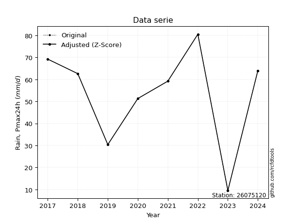</img>

</div>

> If Z-Score is active, values out of range or outliers are replaced with the station mean value.


### 4. Active continuous probability distributions from SciPy (45 of 104 available)

[scipy.stats](https://docs.scipy.org/doc/scipy/reference/stats.html) is a Python´s powerful submodule within the SciPy library for comprehensive statistical analysis, offering over 130 probability distributions (like Normal, Poisson), functions for descriptive stats (mean, variance), hypothesis testing (t-tests, chi-square), random variable generation, and statistical tests, making it essential for data science, modeling, and research. It provides tools to explore, model, and draw conclusions from data efficiently, working seamlessly with NumPy.

<div align="center">

|   id | p_dist             |   n_parameter | fit_method   | label                                                                       | active   | ref                                                                                                        |
|-----:|:-------------------|--------------:|:-------------|:----------------------------------------------------------------------------|:---------|:-----------------------------------------------------------------------------------------------------------|
|    0 | alpha              |             3 | MLE          | Alpha                                                                       | True     | [:mortar_board:](https://docs.scipy.org/doc/scipy/reference/generated/scipy.stats.alpha.html)              |
|    1 | betaprime          |             4 | MLE          | Beta prime                                                                  | True     | [:mortar_board:](https://docs.scipy.org/doc/scipy/reference/generated/scipy.stats.betaprime.html)          |
|    2 | chi2               |             3 | MLE          | Chi²                                                                        | True     | [:mortar_board:](https://docs.scipy.org/doc/scipy/reference/generated/scipy.stats.chi2.html)               |
|    3 | crystalball        |             4 | MLE          | Crystalball                                                                 | True     | [:mortar_board:](https://docs.scipy.org/doc/scipy/reference/generated/scipy.stats.crystalball.html)        |
|    4 | erlang             |             3 | MLE          | Erlang                                                                      | True     | [:mortar_board:](https://docs.scipy.org/doc/scipy/reference/generated/scipy.stats.erlang.html)             |
|    5 | expon              |             2 | MLE          | Exponential                                                                 | True     | [:mortar_board:](https://docs.scipy.org/doc/scipy/reference/generated/scipy.stats.expon.html)              |
|    6 | exponnorm          |             3 | MLE          | Exponentially modified Normal                                               | True     | [:mortar_board:](https://docs.scipy.org/doc/scipy/reference/generated/scipy.stats.exponnorm.html)          |
|    7 | f                  |             4 | MLE          | F                                                                           | True     | [:mortar_board:](https://docs.scipy.org/doc/scipy/reference/generated/scipy.stats.f.html)                  |
|    8 | fatiguelife        |             3 | MLE          | Fatigue-life (Birnbaum-Saunders)                                            | True     | [:mortar_board:](https://docs.scipy.org/doc/scipy/reference/generated/scipy.stats.fatiguelife.html)        |
|    9 | fisk               |             3 | MLE          | Fisk                                                                        | True     | [:mortar_board:](https://docs.scipy.org/doc/scipy/reference/generated/scipy.stats.fisk.html)               |
|   10 | gamma              |             3 | MLE          | Gamma                                                                       | True     | [:mortar_board:](https://docs.scipy.org/doc/scipy/reference/generated/scipy.stats.gamma.html)              |
|   11 | genexpon           |             5 | MLE          | Generalized exponential                                                     | True     | [:mortar_board:](https://docs.scipy.org/doc/scipy/reference/generated/scipy.stats.genexpon.html)           |
|   12 | genlogistic        |             3 | MLE          | Generalized logistic                                                        | True     | [:mortar_board:](https://docs.scipy.org/doc/scipy/reference/generated/scipy.stats.genlogistic.html)        |
|   13 | gibrat             |             2 | MM           | Gibrat                                                                      | True     | [:mortar_board:](https://docs.scipy.org/doc/scipy/reference/generated/scipy.stats.gibrat.html)             |
|   14 | gompertz           |             3 | MLE          | Gompertz (or truncated Gumbel)                                              | True     | [:mortar_board:](https://docs.scipy.org/doc/scipy/reference/generated/scipy.stats.gompertz.html)           |
|   15 | gumbel_l           |             2 | MM           | Gumbel Left Skew                                                            | True     | [:mortar_board:](https://docs.scipy.org/doc/scipy/reference/generated/scipy.stats.gumbel_l.html)           |
|   16 | gumbel_r           |             2 | MM           | Gumbel Right Skew                                                           | True     | [:mortar_board:](https://docs.scipy.org/doc/scipy/reference/generated/scipy.stats.gumbel_r.html)           |
|   17 | halflogistic       |             2 | MM           | Half-logistic                                                               | True     | [:mortar_board:](https://docs.scipy.org/doc/scipy/reference/generated/scipy.stats.halflogistic.html)       |
|   18 | halfnorm           |             2 | MM           | Half Normal                                                                 | True     | [:mortar_board:](https://docs.scipy.org/doc/scipy/reference/generated/scipy.stats.halfnorm.html)           |
|   19 | hypsecant          |             2 | MM           | hyperbolic secant                                                           | True     | [:mortar_board:](https://docs.scipy.org/doc/scipy/reference/generated/scipy.stats.hypsecant.html)          |
|   20 | invgamma           |             3 | MLE          | Inverted gamma                                                              | True     | [:mortar_board:](https://docs.scipy.org/doc/scipy/reference/generated/scipy.stats.invgamma.html)           |
|   21 | invgauss           |             3 | MLE          | Inverse Gaussian                                                            | True     | [:mortar_board:](https://docs.scipy.org/doc/scipy/reference/generated/scipy.stats.invgauss.html)           |
|   22 | invweibull         |             3 | MLE          | Inverted Weibull                                                            | True     | [:mortar_board:](https://docs.scipy.org/doc/scipy/reference/generated/scipy.stats.invweibull.html)         |
|   23 | johnsonsu          |             4 | MLE          | Johnson Su                                                                  | True     | [:mortar_board:](https://docs.scipy.org/doc/scipy/reference/generated/scipy.stats.johnsonsu.html)          |
|   24 | kstwobign          |             2 | MLE          | Limiting distribution of scaled Kolmogorov-Smirnov two-sided test statistic | True     | [:mortar_board:](https://docs.scipy.org/doc/scipy/reference/generated/scipy.stats.kstwobign.html)          |
|   25 | laplace            |             2 | MM           | Laplace                                                                     | True     | [:mortar_board:](https://docs.scipy.org/doc/scipy/reference/generated/scipy.stats.laplace.html)            |
|   26 | laplace_asymmetric |             3 | MLE          | Asymmetric Laplace                                                          | True     | [:mortar_board:](https://docs.scipy.org/doc/scipy/reference/generated/scipy.stats.laplace_asymmetric.html) |
|   27 | loggamma           |             3 | MLE          | Log gamma                                                                   | True     | [:mortar_board:](https://docs.scipy.org/doc/scipy/reference/generated/scipy.stats.loggamma.html)           |
|   28 | logistic           |             2 | MM           | Logistic (or Sech-squared)                                                  | True     | [:mortar_board:](https://docs.scipy.org/doc/scipy/reference/generated/scipy.stats.logistic.html)           |
|   29 | lognorm            |             3 | MLE          | Log Normal                                                                  | True     | [:mortar_board:](https://docs.scipy.org/doc/scipy/reference/generated/scipy.stats.lognorm.html)            |
|   30 | maxwell            |             2 | MM           | Maxwell                                                                     | True     | [:mortar_board:](https://docs.scipy.org/doc/scipy/reference/generated/scipy.stats.maxwell.html)            |
|   31 | mielke             |             4 | MLE          | Mielke Beta-Kappa / Dagum                                                   | True     | [:mortar_board:](https://docs.scipy.org/doc/scipy/reference/generated/scipy.stats.mielke.html)             |
|   32 | moyal              |             2 | MM           | Moyal                                                                       | True     | [:mortar_board:](https://docs.scipy.org/doc/scipy/reference/generated/scipy.stats.moyal.html)              |
|   33 | nakagami           |             3 | MLE          | Nakagami                                                                    | True     | [:mortar_board:](https://docs.scipy.org/doc/scipy/reference/generated/scipy.stats.nakagami.html)           |
|   34 | ncf                |             5 | MLE          | Non-central F distribution                                                  | True     | [:mortar_board:](https://docs.scipy.org/doc/scipy/reference/generated/scipy.stats.ncf.html)                |
|   35 | nct                |             4 | MLE          | Non-central Student’s t                                                     | True     | [:mortar_board:](https://docs.scipy.org/doc/scipy/reference/generated/scipy.stats.nct.html)                |
|   36 | norm               |             2 | MM           | Normal                                                                      | True     | [:mortar_board:](https://docs.scipy.org/doc/scipy/reference/generated/scipy.stats.norm.html)               |
|   37 | pareto             |             3 | MLE          | Pareto                                                                      | True     | [:mortar_board:](https://docs.scipy.org/doc/scipy/reference/generated/scipy.stats.pareto.html)             |
|   38 | pearson3           |             3 | MM           | Pearson type III                                                            | True     | [:mortar_board:](https://docs.scipy.org/doc/scipy/reference/generated/scipy.stats.pearson3.html)           |
|   39 | rayleigh           |             2 | MM           | Rayleigh                                                                    | True     | [:mortar_board:](https://docs.scipy.org/doc/scipy/reference/generated/scipy.stats.rayleigh.html)           |
|   40 | rice               |             3 | MLE          | Rice                                                                        | True     | [:mortar_board:](https://docs.scipy.org/doc/scipy/reference/generated/scipy.stats.rice.html)               |
|   41 | t                  |             3 | MLE          | Student’s t                                                                 | True     | [:mortar_board:](https://docs.scipy.org/doc/scipy/reference/generated/scipy.stats.t.html)                  |
|   42 | truncnorm          |             4 | MLE          | Truncated normal                                                            | True     | [:mortar_board:](https://docs.scipy.org/doc/scipy/reference/generated/scipy.stats.truncnorm.html)          |
|   43 | wald               |             2 | MM           | Wald                                                                        | True     | [:mortar_board:](https://docs.scipy.org/doc/scipy/reference/generated/scipy.stats.wald.html)               |
|   44 | weibull_min        |             3 | MLE          | Weibull minimum                                                             | True     | [:mortar_board:](https://docs.scipy.org/doc/scipy/reference/generated/scipy.stats.weibull_min.html)        |

</div>

> **n_parameter:** # arguments & localization & scale.
>
> **Fit methods:** (MLE) maximum likelihood, (MM) L-moments.
>
>**Inactive:** foldnorm, gennorm, norminvgauss, powernorm, powerlognorm, skewnorm, genextreme, anglit, arcsine, argus, beta, bradford, burr, burr12, cauchy, cosine, halfcauchy, foldcauchy, skewcauchy, wrapcauchy, dgamma, gengamma, exponweib, exponpow, truncexpon, gausshyper, genhalflogistic, genhyperbolic, geninvgauss, halfgennorm, johnsonsb, kappa4, kappa3, ksone, kstwo, loglaplace, levy, levy_l, levy_stable, ncx2, genpareto, truncpareto, lomax, powerlaw, rdist, rel_breitwigner, recipinvgauss, semicircular, studentized_range, trapezoid, triang, truncweibull_min, tukeylambda, uniform, loguniform, vonmises, vonmises_line, weibull_max, dweibull, 


## B. Probability distributions vs. Empirical distributions

A continuous probability distribution (CPD) describes probabilities for variables that can take any value within a range (like rain any time), unlike discrete variables with specific outcomes (like temperature). It uses a Probability Density Function (PDF), a curve where the total area under it equals 1, and the probability of the variable falling within an interval (a to b) is found by calculating the area under the curve between those points. A key feature is that the probability of hitting any single exact value is zero, so probabilities are always expressed for ranges, e.g., $P(a ≤ X ≤ b)$.

<div align="center">

Distributions parameters
|    |   station | p_dist                |   n |              loc |           scale | shape                  | shape1             | shape2                 | shape3   |
|---:|----------:|:----------------------|----:|-----------------:|----------------:|:-----------------------|:-------------------|:-----------------------|:---------|
|  0 |  26075120 | alpha                 |   9 |     -0.0718304   |    25.2698      | 4.399486522373605e-11  |                    |                        |          |
|  1 |  26075120 | betaprime             |   9 |   -480.032       | 22608.6         | 668.501753787177       | 28411.357130711156 |                        |          |
|  2 |  26075120 | chi2                  |   9 |   -257.195       |     0.730746    | 422.6441470396825      |                    |                        |          |
|  3 |  26075120 | crystalball           |   9 |     51.9222      |    20.6007      | 29137.59529411063      | 1921.0182253898072 |                        |          |
|  4 |  26075120 | erlang                |   9 |   -255.712       |     1.47018     | 209.2003245094436      |                    |                        |          |
|  5 |  26075120 | expon                 |   9 |      9.5         |    42.4222      |                        |                    |                        |          |
|  6 |  26075120 | exponnorm             |   9 |     51.9112      |    20.6006      | 0.0005275947295813777  |                    |                        |          |
|  7 |  26075120 | f                     |   9 |  -5790.12        |  5842.03        | 259255.7801357501      | 419857.53764339787 |                        |          |
|  8 |  26075120 | fatiguelife           |   9 |  -4911.01        |  4962.96        | 0.004136671918539663   |                    |                        |          |
|  9 |  26075120 | fisk                  |   9 | -48892.6         | 48946.8         | 4163.820462753072      |                    |                        |          |
| 10 |  26075120 | gamma                 |   9 |   -298.379       |     1.26697     | 276.2248609687409      |                    |                        |          |
| 11 |  26075120 | genexpon              |   9 |      9.46983     |     0.78845     | 0.00531016453786857    | 1.0010579291387691 | 0.00039486624910217184 |          |
| 12 |  26075120 | genlogistic           |   9 |     70.6637      |     5.21138     | 0.2533154349481034     |                    |                        |          |
| 13 |  26075120 | gibrat                |   9 |     36.2065      |     9.53208     |                        |                    |                        |          |
| 14 |  26075120 | gompertz              |   9 |      9.5         |     5.32931     | 1.2066140746184265e-05 |                    |                        |          |
| 15 |  26075120 | gumbel_l              |   9 |     61.1936      |    16.0623      |                        |                    |                        |          |
| 16 |  26075120 | gumbel_r              |   9 |     42.6508      |    16.0623      |                        |                    |                        |          |
| 17 |  26075120 | halflogistic          |   9 |     27.5056      |    17.6128      |                        |                    |                        |          |
| 18 |  26075120 | halfnorm              |   9 |     24.655       |    34.1744      |                        |                    |                        |          |
| 19 |  26075120 | hypsecant             |   9 |     51.9222      |    13.1148      |                        |                    |                        |          |
| 20 |  26075120 | invgamma              |   9 |   -276.034       | 73577.7         | 225.33256843357174     |                    |                        |          |
| 21 |  26075120 | invgauss              |   9 |    -80.0639      |  4369.78        | 0.03013188873805875    |                    |                        |          |
| 22 |  26075120 | invweibull            |   9 |     -2.01019e+09 |     2.01019e+09 | 90404340.52053383      |                    |                        |          |
| 23 |  26075120 | johnsonsu             |   9 |    101.38        |     2.41281     | 8.675499513730102      | 2.3917014875517664 |                        |          |
| 24 |  26075120 | kstwobign             |   9 |    -38.6034      |   103.554       |                        |                    |                        |          |
| 25 |  26075120 | laplace               |   9 |     51.9222      |    14.5669      |                        |                    |                        |          |
| 26 |  26075120 | laplace_asymmetric    |   9 |     64           |    13.0289      | 1.565693325589615      |                    |                        |          |
| 27 |  26075120 | loggamma              |   9 |     68.9881      |    11.9503      | 0.6323130967413753     |                    |                        |          |
| 28 |  26075120 | logistic              |   9 |     51.9222      |    11.3578      |                        |                    |                        |          |
| 29 |  26075120 | lognorm               |   9 |      9.5         |     0.675857    | 11.87475867729005      |                    |                        |          |
| 30 |  26075120 | maxwell               |   9 |      3.10724     |    30.5903      |                        |                    |                        |          |
| 31 |  26075120 | mielke                |   9 |     -9.26945     |    90.2336      | 2.158777002111444      | 674.753055670493   |                        |          |
| 32 |  26075120 | moyal                 |   9 |     40.1414      |     9.27357     |                        |                    |                        |          |
| 33 |  26075120 | nakagami              |   9 |     30.4         |    24.6265      | 0.281872423402054      |                    |                        |          |
| 34 |  26075120 | ncf                   |   9 |     -0.187961    |     8.95932e-06 | 3.624630135340613e-06  | 38.5605827996368   | 20.51554175745176      |          |
| 35 |  26075120 | nct                   |   9 |  -1290.97        |    20.5247      | 257282.4819510167      | 65.42789972250449  |                        |          |
| 36 |  26075120 | norm                  |   9 |     51.9222      |    20.6007      |                        |                    |                        |          |
| 37 |  26075120 | pareto                |   9 |      9.4944      |     0.00560442  | 0.12515136392413792    |                    |                        |          |
| 38 |  26075120 | pearson3              |   9 |     51.9222      |    20.6007      | -0.7105036012714289    |                    |                        |          |
| 39 |  26075120 | rayleigh              |   9 |     12.5119      |    31.4449      |                        |                    |                        |          |
| 40 |  26075120 | rice                  |   9 |  -3329.34        |    20.5932      | 164.18972575461746     |                    |                        |          |
| 41 |  26075120 | t                     |   9 |     51.9222      |    20.6007      | 6329832.285103597      |                    |                        |          |
| 42 |  26075120 | truncnorm             |   9 |     51.9222      |    20.6007      | -36.49662058621868     | 326.6035567288295  |                        |          |
| 43 |  26075120 | wald                  |   9 |     31.3215      |    20.6007      |                        |                    |                        |          |
| 44 |  26075120 | weibull_min           |   9 |     -5.26504e+08 |     5.26504e+08 | 32647520.199591935     |                    |                        |          |
| 45 |  26075120 | logalpha              |   9 |    -13.2162      |   436.456       | 25.657749947767684     |                    |                        |          |
| 46 |  26075120 | logbetaprime          |   9 |    -16.3412      |   282.981       | 1031.54485346839       | 14482.743972068798 |                        |          |
| 47 |  26075120 | logchi2               |   9 |      2.25129     |     0.919719    | 1.1462398590550242     |                    |                        |          |
| 48 |  26075120 | logcrystalball        |   9 |      3.81211     |     0.617539    | 13.02661455640525      | 30.945271577606192 |                        |          |
| 49 |  26075120 | logerlang             |   9 |     -7.5353      |     0.0373765   | 303.2759808897606      |                    |                        |          |
| 50 |  26075120 | logexpon              |   9 |      2.25129     |     1.56082     |                        |                    |                        |          |
| 51 |  26075120 | logexponnorm          |   9 |      3.81171     |     0.61754     | 0.0006440144102390551  |                    |                        |          |
| 52 |  26075120 | logf                  |   9 |  -1441.69        |  1445.5         | 40494432.89651716      | 14848352.928939484 |                        |          |
| 53 |  26075120 | logfatiguelife        |   9 |   -541.931       |   545.744       | 0.0011271660108714962  |                    |                        |          |
| 54 |  26075120 | logfisk               |   9 |     -1.5975e+08  |     1.5975e+08  | 524005746.8048838      |                    |                        |          |
| 55 |  26075120 | loggamma              |   9 |     -8.20348     |     0.0373593   | 321.3697243301699      |                    |                        |          |
| 56 |  26075120 | loggenexpon           |   9 |      2.25128     |  1200.38        | 233.40534705333212     | 1400.34718387405   | 594.8196047075986      |          |
| 57 |  26075120 | loggenlogistic        |   9 |      4.38829     |     2.91995e-06 | 5.079933326161366e-06  |                    |                        |          |
| 58 |  26075120 | loggibrat             |   9 |      3.34104     |     0.285723    |                        |                    |                        |          |
| 59 |  26075120 | loggompertz           |   9 |      2.25129     |     0.372132    | 0.007891431904454169   |                    |                        |          |
| 60 |  26075120 | loggumbel_l           |   9 |      4.09004     |     0.481493    |                        |                    |                        |          |
| 61 |  26075120 | loggumbel_r           |   9 |      3.53419     |     0.481493    |                        |                    |                        |          |
| 62 |  26075120 | loghalflogistic       |   9 |      3.08018     |     0.527979    |                        |                    |                        |          |
| 63 |  26075120 | loghalfnorm           |   9 |      2.99474     |     1.02443     |                        |                    |                        |          |
| 64 |  26075120 | loghypsecant          |   9 |      3.81211     |     0.393138    |                        |                    |                        |          |
| 65 |  26075120 | loginvgamma           |   9 |    -13.059       | 11447           | 679.9114086517739      |                    |                        |          |
| 66 |  26075120 | loginvgauss           |   9 |     -3.86703     |   966.152       | 0.007930890135373403   |                    |                        |          |
| 67 |  26075120 | loginvweibull         |   9 |     -1.99661e+07 |     1.99661e+07 | 25538173.703806143     |                    |                        |          |
| 68 |  26075120 | logjohnsonsu          |   9 |      4.46486     |     0.00367212  | 6.029345056042992      | 1.1001489797127113 |                        |          |
| 69 |  26075120 | logkstwobign          |   9 |      0.592167    |     3.6929      |                        |                    |                        |          |
| 70 |  26075120 | loglaplace            |   9 |      3.81211     |     0.436666    |                        |                    |                        |          |
| 71 |  26075120 | loglaplace_asymmetric |   9 |      4.237       |     0.233141    | 2.264132699565838      |                    |                        |          |
| 72 |  26075120 | logloggamma           |   9 |      4.38828     |     1.46405e-06 | 2.5471865282620248e-06 |                    |                        |          |
| 73 |  26075120 | loglogistic           |   9 |      3.81211     |     0.340467    |                        |                    |                        |          |
| 74 |  26075120 | loglognorm            |   9 |      2.25129     |     0.0320148   | 11.282859290636898     |                    |                        |          |
| 75 |  26075120 | logmaxwell            |   9 |      2.34881     |     0.91699     |                        |                    |                        |          |
| 76 |  26075120 | logmielke             |   9 |     -1.90488e+07 |     1.90488e+07 | 32736107.97199423      | 22348134220.207493 |                        |          |
| 77 |  26075120 | logmoyal              |   9 |      3.45896     |     0.27799     |                        |                    |                        |          |
| 78 |  26075120 | lognakagami           |   9 |      3.21283     |     0.830717    | 1.5743180539944492     |                    |                        |          |
| 79 |  26075120 | logncf                |   9 |    -11.076       |    14.8808      | 1423.660262935683      | 3375.4009586857665 | 5.1447125953091e-09    |          |
| 80 |  26075120 | lognct                |   9 |    -32.6272      |     0.586239    | 14752.947567447209     | 62.156269019954664 |                        |          |
| 81 |  26075120 | lognorm               |   9 |      3.81211     |     0.617539    |                        |                    |                        |          |
| 82 |  26075120 | logpareto             |   9 |      2.25108     |     0.000215503 | 0.12514285411450937    |                    |                        |          |
| 83 |  26075120 | logpearson3           |   9 |      3.81211     |     0.617538    | -1.6519457161011846    |                    |                        |          |
| 84 |  26075120 | lograyleigh           |   9 |      2.6307      |     0.942629    |                        |                    |                        |          |
| 85 |  26075120 | logrice               |   9 |   -395.005       |     0.617538    | 645.8176756631012      |                    |                        |          |
| 86 |  26075120 | logt                  |   9 |      4.10192     |     0.186996    | 1.130309223928642      |                    |                        |          |
| 87 |  26075120 | logtruncnorm          |   9 |     -0.192922    |     2.25499     | 1.5997227638787317     | 2.031573051130012  |                        |          |
| 88 |  26075120 | logwald               |   9 |      3.19458     |     0.617528    |                        |                    |                        |          |
| 89 |  26075120 | logweibull_min        |   9 |      2.25129     |     1.16062     | 0.8982509801246827     |                    |                        |          |

</div>

> **loc** (Location parameter): This shifts the distribution along the x-axis. For many common distributions, like the normal (Gaussian) distribution, loc represents the mean $μ$. For others, like the uniform distribution, it might represent the minimum value, or for the beta distribution, the left end of the support interval.
>
> **scale** (Scale parameter): This determines the width or spread of the distribution. For the normal distribution, scale represents the standard deviation $σ$. For a uniform distribution, it defines the length of the interval (from $loc$ to $loc + scale$).
>
> **shape** (Shape parameters): Refers to parameters that define the specific form of a probability distribution, distinct from its location (loc) and scale (scale). These parameters are required arguments for most distribution functions. For example, a normal (Gaussian) distribution is fully defined by its location (mean) and scale (standard deviation), so it has no specific shape parameters beyond loc and scale. However, other distributions have intrinsic properties that need specification, as Gamma distribution that takes a shape parameter, often named $a$ or $alpha$.


### 0. Cumulative distribution values - CDF (90 evaluated)

> Ordered by x ascending and calculating $log(f(x))$ separately. 

|   id |   Station |   date |    x |   count |    mean |     std |     zscore |   Value_initial |   station |   m |      alpha |   alpha_pdf |   betaprime |   betaprime_pdf |     chi2 |   chi2_pdf |   crystalball |   crystalball_pdf |    erlang |   erlang_pdf |    expon |   expon_pdf |   exponnorm |   exponnorm_pdf |         f |      f_pdf |   fatiguelife |   fatiguelife_pdf |     fisk |   fisk_pdf |     gamma |   gamma_pdf |    genexpon |   genexpon_pdf |   genlogistic |   genlogistic_pdf |   gibrat |   gibrat_pdf |    gompertz |   gompertz_pdf |   gumbel_l |   gumbel_l_pdf |    gumbel_r |   gumbel_r_pdf |   halflogistic |   halflogistic_pdf |   halfnorm |   halfnorm_pdf |   hypsecant |   hypsecant_pdf |   invgamma |   invgamma_pdf |   invgauss |   invgauss_pdf |   invweibull |   invweibull_pdf |   johnsonsu |   johnsonsu_pdf |   kstwobign |   kstwobign_pdf |   laplace |   laplace_pdf |   laplace_asymmetric |   laplace_asymmetric_pdf |   loggamma |   loggamma_pdf |   logistic |   logistic_pdf |    lognorm |   lognorm_pdf |    maxwell |   maxwell_pdf |    mielke |   mielke_pdf |      moyal |   moyal_pdf |    nakagami |    nakagami_pdf |        ncf |    ncf_pdf |       nct |    nct_pdf |      norm |   norm_pdf |   pareto |   pareto_pdf |   pearson3 |   pearson3_pdf |   rayleigh |   rayleigh_pdf |      rice |   rice_pdf |         t |      t_pdf |   truncnorm |   truncnorm_pdf |     wald |   wald_pdf |   weibull_min |   weibull_min_pdf |   logalpha |   logalpha_pdf |   logbetaprime |   logbetaprime_pdf |     logchi2 |   logchi2_pdf |   logcrystalball |   logcrystalball_pdf |   logerlang |   logerlang_pdf |   logexpon |   logexpon_pdf |   logexponnorm |   logexponnorm_pdf |       logf |   logf_pdf |   logfatiguelife |   logfatiguelife_pdf |    logfisk |   logfisk_pdf |   loggenexpon |   loggenexpon_pdf |   loggenlogistic |   loggenlogistic_pdf |   loggibrat |   loggibrat_pdf |   loggompertz |   loggompertz_pdf |   loggumbel_l |   loggumbel_l_pdf |   loggumbel_r |   loggumbel_r_pdf |   loghalflogistic |   loghalflogistic_pdf |   loghalfnorm |   loghalfnorm_pdf |   loghypsecant |   loghypsecant_pdf |   loginvgamma |   loginvgamma_pdf |   loginvgauss |   loginvgauss_pdf |   loginvweibull |   loginvweibull_pdf |   logjohnsonsu |   logjohnsonsu_pdf |   logkstwobign |   logkstwobign_pdf |   loglaplace |   loglaplace_pdf |   loglaplace_asymmetric |   loglaplace_asymmetric_pdf |   logloggamma |   logloggamma_pdf |   loglogistic |   loglogistic_pdf |   loglognorm |   loglognorm_pdf |   logmaxwell |   logmaxwell_pdf |   logmielke |   logmielke_pdf |    logmoyal |   logmoyal_pdf |   lognakagami |   lognakagami_pdf |     logncf |   logncf_pdf |     lognct |   lognct_pdf |   logpareto |   logpareto_pdf |   logpearson3 |   logpearson3_pdf |   lograyleigh |   lograyleigh_pdf |    logrice |   logrice_pdf |      logt |   logt_pdf |   logtruncnorm |   logtruncnorm_pdf |   logwald |   logwald_pdf |   logweibull_min |   logweibull_min_pdf |
|-----:|----------:|-------:|-----:|--------:|--------:|--------:|-----------:|----------------:|----------:|----:|-----------:|------------:|------------:|----------------:|---------:|-----------:|--------------:|------------------:|----------:|-------------:|---------:|------------:|------------:|----------------:|----------:|-----------:|--------------:|------------------:|---------:|-----------:|----------:|------------:|------------:|---------------:|--------------:|------------------:|---------:|-------------:|------------:|---------------:|-----------:|---------------:|------------:|---------------:|---------------:|-------------------:|-----------:|---------------:|------------:|----------------:|-----------:|---------------:|-----------:|---------------:|-------------:|-----------------:|------------:|----------------:|------------:|----------------:|----------:|--------------:|---------------------:|-------------------------:|-----------:|---------------:|-----------:|---------------:|-----------:|--------------:|-----------:|--------------:|----------:|-------------:|-----------:|------------:|------------:|----------------:|-----------:|-----------:|----------:|-----------:|----------:|-----------:|---------:|-------------:|-----------:|---------------:|-----------:|---------------:|----------:|-----------:|----------:|-----------:|------------:|----------------:|---------:|-----------:|--------------:|------------------:|-----------:|---------------:|---------------:|-------------------:|------------:|--------------:|-----------------:|---------------------:|------------:|----------------:|-----------:|---------------:|---------------:|-------------------:|-----------:|-----------:|-----------------:|---------------------:|-----------:|--------------:|--------------:|------------------:|-----------------:|---------------------:|------------:|----------------:|--------------:|------------------:|--------------:|------------------:|--------------:|------------------:|------------------:|----------------------:|--------------:|------------------:|---------------:|-------------------:|--------------:|------------------:|--------------:|------------------:|----------------:|--------------------:|---------------:|-------------------:|---------------:|-------------------:|-------------:|-----------------:|------------------------:|----------------------------:|--------------:|------------------:|--------------:|------------------:|-------------:|-----------------:|-------------:|-----------------:|------------:|----------------:|------------:|---------------:|--------------:|------------------:|-----------:|-------------:|-----------:|-------------:|------------:|----------------:|--------------:|------------------:|--------------:|------------------:|-----------:|--------------:|----------:|-----------:|---------------:|-------------------:|----------:|--------------:|-----------------:|---------------------:|
|    0 |  26075120 |   2023 |  9.5 |       9 | 51.9222 | 21.8503 | -1.94149   |             9.5 |  26075120 |   1 | 0.00829006 |  0.0067468  |   0.0185702 |      0.00231158 | 0.019749 | 0.00248756 |     0.0197346 |        0.00232382 | 0.0193276 |   0.00244258 | 0        |  0.0235726  |   0.0197346 |      0.00232383 | 0.0196342 | 0.00232532 |     0.0189249 |        0.00226969 | 0.021801 | 0.0018158  | 0.0194678 |  0.00244863 | 0.000203479 |     0.00675275 |     0.0511468 |        0.00248613 | 0        |   0          | 8.00235e-12 |    2.26411e-06 |  0.0392318 |     0.00239393 | 0.000379538 |    0.000186116 |      0         |         0          |   0        |     0          |   0.0250525 |      0.00190828 |  0.0186779 |     0.0025125  |  0.0155375 |     0.00256759 |     0.016246 |       0.00301014 |    0.045728 |      0.00249856 |   0.0177455 |      0.00384936 |  0.027177 |    0.00186567 |            0.0491052 |               0.00240721 | 0.00807184 |      0.0361908 |  0.0233145 |     0.00200488 | 0.00574412 |     0.0264892 | 0.00239581 |    0.00111451 | 0.0337205 |   0.00387838 | 1.8102e-07 | 2.74872e-07 | 0           |      0          | 0.00961134 | 0.00260532 | 0.0197566 | 0.00232616 | 0.0197346 | 0.00232382 | 0        | 22.3308      |   0.034866 |     0.00260545 |   0        |     0          | 0.0196972 | 0.00232094 | 0.0197346 | 0.00232382 |   0.0197346 |      0.00232382 | 0        | 0          |      0.039187 |        0.00238167 | 0.00523465 |      0.0274785 |     0.00681917 |          0.0310486 | 1.25805e-09 |   1.62357e+06 |       0.00574417 |            0.0264894 |  0.00660598 |       0.0313876 |   0        |       0.640688 |     0.00574435 |          0.0264901 | 0.00593417 |  0.0271824 |       0.00550158 |            0.0256663 | 0.00403716 |     0.0131891 |   2.34835e-06 |          0.19445  |         0        |            0.0422534 |   0         |        0        |    1.2498e-07 |         0.0212064 |      0.021714 |         0.0446039 |   5.80432e-07 |       1.73101e-05 |          0        |              0        |      0        |          0        |      0.0120118 |          0.0305464 |    0.00570896 |         0.0286057 |    0.00637875 |         0.0331873 |      0.00908866 |           0.0546464 |      0.0378725 |          0.0409641 |      0.0123636 |           0.083641 |     0.014016 |        0.0320979 |               0.0194482 |                   0.0368433 |     0.0242828 |         0.0422478 |     0.0101072 |         0.0293861 |   0.00234133 |      1.45967e+12 |     0        |         0        |   0.0252539 |       0.0433997 | 1.67694e-18 |    2.35303e-16 |     0         |          0        | 0.00730437 |    0.0334423 | 0.00594808 |    0.0273211 |    0        |     580.702     |     0.0270065 |         0.0484182 |      0        |          0        | 0.00574392 |     0.0264884 | 0.0244934 |  0.0148436 |    0           |           0        |  0        |      0        |      1.41731e-14 |            28.6677   |
|    1 |  26075120 |   2019 | 30.4 |       9 | 51.9222 | 21.8503 | -0.984984  |            30.4 |  26075120 |   2 | 0.406943   |  0.0153961  |   0.149948  |      0.0115187  | 0.158396 | 0.0119309  |     0.148073  |        0.0112207  | 0.156242  |   0.0118215  | 0.389005 |  0.0144027  |   0.148074  |      0.0112207  | 0.148367  | 0.0112543  |     0.146435  |        0.0112243  | 0.116646 | 0.00876966 | 0.156915  |  0.0118934  | 0.24403     |     0.0150998  |     0.141246  |        0.00686265 | 0        |   0          | 0.000596934 |    0.000114239 |  0.136729  |     0.007902   | 0.117177    |    0.0156413   |      0.0819816 |         0.0281976  |   0.133502 |     0.0230199  |   0.12185   |      0.00906578 |  0.162131  |     0.0122794  |  0.176039  |     0.0135987  |     0.199997 |       0.0144762  |    0.142134 |      0.00757278 |   0.233735  |      0.0154355  |  0.114107 |    0.00783328 |            0.136799  |               0.00670609 | 0.285223   |      0.518314  |  0.130683  |     0.0100024  | 0.259801   |     0.525047  | 0.149583   |    0.0139454  | 0.169631  |   0.0092312  | 0.0908674  | 0.0174163   | 9.12763e-10 | 144837          | 0.199098   | 0.0150843  | 0.148164  | 0.0112232  | 0.148073  | 0.0112207  | 0.642733 |  0.00213878  |   0.146098 |     0.00900324 |   0.149395 |     0.0153883  | 0.14798   | 0.0112201  | 0.148073  | 0.0112207  |   0.148073  |      0.0112207  | 0        | 0          |      0.135922 |        0.00782757 | 0.278811   |      0.530116  |     0.270651   |          0.516973  | 0.697666    |   0.226018    |       0.259801   |            0.525047  |  0.280913   |       0.530039  |   0.525369 |       0.304091 |     0.259804   |          0.525049  | 0.261376   |  0.524594  |       0.258384   |            0.525988  | 0.155401   |     0.430525  |   0.424076    |          0.406309 |         0        |            0.319659  |   0.0870619 |        2.15831  |    0.157882   |         0.406714  |      0.217943 |         0.39928   |   0.277384    |       0.738752    |          0.306382 |              0.858111 |      0.317969 |          0.716163 |      0.222049  |          0.520105  |    0.280079   |         0.536767  |    0.298459   |         0.535645  |      0.345836   |           0.469684  |      0.169572  |          0.264604  |      0.39675   |           0.453296 |     0.201122 |        0.460585  |               0.176138  |                   0.333681  |     0.183726  |         0.31965   |     0.237214  |         0.531456  |   0.624917   |      0.028896    |     0.282816 |         0.59815  |   0.1864    |       0.320335  | 0.278643    |    0.864557    |     0.0159468 |          0.240163 | 0.278402   |    0.516415  | 0.261635   |    0.523241  |    0.658859 |       0.0366964 |     0.204852  |         0.34165   |      0.292238 |          0.624278 | 0.259798   |     0.525045  | 0.0730447 |  0.113726  |    3.70053e-06 |           1.45889  |  0.225396 |      1.69861  |      0.632839    |             0.284097 |
|    2 |  26075120 |   2025 | 40.6 |       9 | 51.9222 | 21.8503 | -0.518172  |            40.6 |  26075120 |   3 | 0.534395   |  0.0100492  |   0.295967  |      0.016846   | 0.307319 | 0.0169476  |     0.291295  |        0.0166508  | 0.304132  |   0.0168639  | 0.519586 |  0.0113246  |   0.291297  |      0.0166509  | 0.291877  | 0.0166671  |     0.290007  |        0.0167117  | 0.239294 | 0.0154895  | 0.305945  |  0.0170145  | 0.403196    |     0.0157412  |     0.231742  |        0.0112295  | 0.219308 |   0.0672715  | 0.00410955  |    0.00077179  |  0.242287  |     0.0130883  | 0.32104     |    0.0227092   |      0.355502  |         0.0248006  |   0.359197 |     0.0209396  |   0.25409   |      0.0173813  |  0.313322  |     0.0169743  |  0.337734  |     0.017532   |     0.361564 |       0.0165422  |    0.241967 |      0.0122777  |   0.397769  |      0.0161601  |  0.229832 |    0.0157777  |            0.225548  |               0.0110567  | 0.448492   |      0.593919  |  0.269557  |     0.0173358  | 0.430364   |     0.636153  | 0.318238   |    0.0184878  | 0.277998  |   0.0120342  | 0.329273   | 0.0260768   | 0.467917    |      0.0249018  | 0.365918   | 0.0169414  | 0.291388  | 0.0166481  | 0.291295  | 0.0166508  | 0.660066 |  0.0013677   |   0.262914 |     0.0140239  |   0.328973 |     0.0190617  | 0.29122   | 0.016655   | 0.291295  | 0.0166508  |   0.291296  |      0.0166508  | 0.319766 | 0.0458145  |      0.240417 |        0.0129519  | 0.445274   |      0.602478  |     0.435906   |          0.608623  | 0.755366    |   0.175651    |       0.430365   |            0.636153  |  0.448583   |       0.61122   |   0.605677 |       0.252638 |     0.430368   |          0.636153  | 0.431462   |  0.633807  |       0.429449   |            0.638495  | 0.322169   |     0.716308  |   0.536461    |          0.367609 |         0        |            0.528797  |   0.594303  |        1.06897  |    0.318317   |         0.716398  |      0.361303 |         0.5947    |   0.495027    |       0.722907    |          0.530285 |              0.680706 |      0.511138 |          0.61297  |      0.413366  |          0.779862  |    0.449607   |         0.616484  |    0.463825   |         0.589869  |      0.48029    |           0.450527  |      0.273784  |          0.481258  |      0.523354  |           0.416357 |     0.390133 |        0.893436  |               0.304714  |                   0.577261  |     0.303937  |         0.528796  |     0.421108  |         0.716005  |   0.632359   |      0.022991    |     0.464764 |         0.637662 |   0.306468  |       0.526676  | 0.519681    |    0.751006    |     0.200699  |          1.02907  | 0.441847   |    0.596922  | 0.431124   |    0.630757  |    0.66821  |       0.0285822 |     0.32887   |         0.526047  |      0.476883 |          0.631748 | 0.430362   |     0.636154  | 0.128085  |  0.312874  |    0.380607    |           1.17844  |  0.587818 |      0.846874 |      0.70572     |             0.222615 |
|    3 |  26075120 |   2020 | 51.3 |       9 | 51.9222 | 21.8503 | -0.0284766 |            51.3 |  26075120 |   4 | 0.622789   |  0.0067694  |   0.492811  |      0.0191774  | 0.502566 | 0.018789   |     0.487952  |        0.0193567  | 0.498861  |   0.0187809  | 0.626685 |  0.00879999 |   0.487954  |      0.0193567  | 0.488463  | 0.0193257  |     0.487416  |        0.0194249  | 0.438766 | 0.0209494  | 0.502504  |  0.018954   | 0.565761    |     0.0143544  |     0.387777  |        0.0184012  | 0.677099 |   0.0237821  | 0.0302754   |    0.00559625  |  0.417325  |     0.0195936  | 0.557866    |    0.0202705   |      0.588575  |         0.0185541  |   0.564419 |     0.0172281  |   0.484904  |      0.0242437  |  0.505878  |     0.0182757  |  0.529021  |     0.0175141  |     0.533266 |       0.0150787  |    0.406209 |      0.0185021  |   0.561871  |      0.0142094  |  0.479092 |    0.0328891  |            0.3811    |               0.0186821  | 0.586844   |      0.577137  |  0.486307  |     0.0219949  | 0.58057    |     0.6328    | 0.521443   |    0.0187155  | 0.422945  |   0.0150743  | 0.58375    | 0.0202856   | 0.678657    |      0.0156008  | 0.540682   | 0.0152686  | 0.487982  | 0.0193481  | 0.487952  | 0.0193567  | 0.672414 |  0.000980679 |   0.440876 |     0.0189509  |   0.532705 |     0.0183312  | 0.487941  | 0.0193638  | 0.487952  | 0.0193567  |   0.487952  |      0.0193567  | 0.655774 | 0.0202676  |      0.413685 |        0.0194105  | 0.584787   |      0.57832   |     0.578751   |          0.599579  | 0.792741    |   0.145123    |       0.580571   |            0.632799  |  0.590829   |       0.592115  |   0.660559 |       0.217476 |     0.580573   |          0.632797  | 0.581088   |  0.629857  |       0.580233   |            0.63523   | 0.50587    |     0.819926  |   0.617791    |          0.32687  |         0        |            0.794385  |   0.769228  |        0.509876 |    0.515861   |         0.953982  |      0.517494 |         0.730295  |   0.648843    |       0.582908    |          0.670729 |              0.520969 |      0.64267  |          0.509894 |      0.599989  |          0.770046  |    0.592656   |         0.593543  |    0.599186   |         0.556711  |      0.580583   |           0.403774  |      0.421755  |          0.816464  |      0.615409  |           0.369105 |     0.624962 |        0.858866  |               0.474625  |                   0.899146  |     0.456598  |         0.7944    |     0.591178  |         0.709867  |   0.637334   |      0.0197118   |     0.608729 |         0.582222 |   0.458113  |       0.787284  | 0.6725      |    0.554792    |     0.478637  |          1.24244  | 0.581249   |    0.582821  | 0.579914   |    0.62652   |    0.674352 |       0.0241623 |     0.473698  |         0.717174  |      0.617582 |          0.562508 | 0.580568   |     0.632802  | 0.263564  |  1.00054   |    0.632545    |           0.979763 |  0.738246 |      0.481059 |      0.753109    |             0.18395  |
|    4 |  26075120 |   2021 | 59.2 |       9 | 51.9222 | 21.8503 |  0.333074  |            59.2 |  26075120 |   5 | 0.669861   |  0.00524054 |   0.640534  |      0.0177978  | 0.64631  | 0.0172187  |     0.63806   |        0.018194   | 0.642784  |   0.0172701  | 0.690116 |  0.00730477 |   0.638062  |      0.018194   | 0.638216  | 0.0181389  |     0.637954  |        0.0182317  | 0.604883 | 0.0203292  | 0.647592  |  0.0173813  | 0.67199     |     0.0124532  |     0.557744  |        0.0244059  | 0.810719 |   0.0117743  | 0.126646    |    0.0221933   |  0.586573  |     0.0227346  | 0.699846    |    0.0155502   |      0.716177  |         0.0138277  |   0.687909 |     0.0140074  |   0.668214  |      0.0209601  |  0.644667  |     0.0165286  |  0.659289  |     0.0152306  |     0.643569 |       0.0127561  |    0.568565 |      0.0222497  |   0.665676  |      0.0120228  |  0.696617 |    0.0208269  |            0.561342  |               0.0275178  | 0.666716   |      0.534604  |  0.654929  |     0.019898   | 0.668324   |     0.587626  | 0.660946   |    0.0163257  | 0.551092  |   0.0173754  | 0.720438   | 0.0144405   | 0.784126    |      0.0113018  | 0.652076   | 0.0128483  | 0.638017  | 0.0181849  | 0.63806   | 0.018194   | 0.679434 |  0.000807139 |   0.598404 |     0.0204691  |   0.667879 |     0.015682   | 0.638103  | 0.0182     | 0.63806   | 0.018194   |   0.63806   |      0.018194   | 0.77848  | 0.0117468  |      0.581622 |        0.0226058  | 0.664524   |      0.531754  |     0.66192    |          0.557646  | 0.812394    |   0.12966     |       0.668325   |            0.587626  |  0.672578   |       0.545604  |   0.690322 |       0.198407 |     0.668327   |          0.587623  | 0.668427   |  0.584911  |       0.668309   |            0.589636  | 0.620884   |     0.772106  |   0.662703    |          0.30015  |         0        |            1.01918   |   0.829316  |        0.3429   |    0.656863   |         0.993562  |      0.625155 |         0.763902  |   0.725233    |       0.483891    |          0.738744 |              0.430185 |      0.710983 |          0.44396  |      0.702433  |          0.651376  |    0.674434   |         0.544657  |    0.675684   |         0.508632  |      0.635907   |           0.368217  |      0.560158  |          1.13006   |      0.665987  |           0.336923 |     0.729839 |        0.618689  |               0.622576  |                   1.17943   |     0.585813  |         1.01921   |     0.68773   |         0.630773  |   0.640041   |      0.0181221   |     0.687948 |         0.52146  |   0.585967  |       1.00701   | 0.743883    |    0.444499    |     0.647548  |          1.08764  | 0.661993   |    0.540972  | 0.666812   |    0.582123  |    0.677657 |       0.022045  |     0.585328  |         0.840702  |      0.693785 |          0.49978  | 0.668322   |     0.587629  | 0.463586  |  1.72086   |    0.764934    |           0.870394 |  0.797288 |      0.351699 |      0.778       |             0.164039 |
|    5 |  26075120 |   2018 | 62.6 |       9 | 51.9222 | 21.8503 |  0.488678  |            62.6 |  26075120 |   6 | 0.686795   |  0.00473254 |   0.698946  |      0.0165045  | 0.702733 | 0.0159217  |     0.697883  |        0.0169313  | 0.699417  |   0.0159932  | 0.713983 |  0.00674216 |   0.697885  |      0.0169313  | 0.697847  | 0.0168744  |     0.697878  |        0.0169532  | 0.671515 | 0.0187614  | 0.704531  |  0.0160613  | 0.712743    |     0.0115112  |     0.643497  |        0.0257905  | 0.845769 |   0.00899863 | 0.226093    |    0.0372214   |  0.664289  |     0.0228131  | 0.749155    |    0.0134702   |      0.760024  |         0.0119902  |   0.733145 |     0.0126047  |   0.734516  |      0.0179764  |  0.698764  |     0.0152537  |  0.708864  |     0.0139091  |     0.68507  |       0.0116533  |    0.645562 |      0.0229034  |   0.70487   |      0.0110325  |  0.759771 |    0.0164914  |            0.663152  |               0.0325087  | 0.695972   |      0.512768  |  0.719126  |     0.0177838  | 0.700458   |     0.56264   | 0.714055   |    0.0148865  | 0.611873  |   0.0183791  | 0.765755   | 0.0122604   | 0.819911    |      0.00977553 | 0.693833   | 0.0117122  | 0.697811  | 0.0169233  | 0.697883  | 0.0169313  | 0.682077 |  0.000749233 |   0.66764  |     0.0201458  |   0.718787 |     0.0142453  | 0.697944  | 0.016936   | 0.697883  | 0.0169313  |   0.697883  |      0.0169313  | 0.814386 | 0.00947458 |      0.659003 |        0.022749   | 0.693588   |      0.508741  |     0.692447   |          0.535189  | 0.81948     |   0.124179    |       0.700459   |            0.562639  |  0.702398   |       0.521904  |   0.701206 |       0.191434 |     0.700461   |          0.562636  | 0.700415   |  0.560121  |       0.700549   |            0.564418  | 0.662952   |     0.73294   |   0.67917     |          0.289622 |         0        |            1.12316   |   0.847136  |        0.296722 |    0.711795   |         0.969617  |      0.667764 |         0.760331  |   0.751201    |       0.446331    |          0.761843 |              0.39736  |      0.735061 |          0.418405 |      0.737245  |          0.594995  |    0.704178   |         0.520176  |    0.70346    |         0.485815  |      0.656066   |           0.353701  |      0.627138  |          1.2691    |      0.684445  |           0.324143 |     0.762271 |        0.544417  |               0.69205   |                   1.31104   |     0.645586  |         1.1232    |     0.721828  |         0.589755  |   0.641037   |      0.0175685   |     0.716318 |         0.494332 |   0.644989  |       1.10844   | 0.767617    |    0.405946    |     0.705618  |          0.989717 | 0.691607   |    0.519205  | 0.698654   |    0.557682  |    0.678867 |       0.0213118 |     0.63354   |         0.885331  |      0.72095  |          0.47298  | 0.700457   |     0.562642  | 0.560033  |  1.68607   |    0.812413    |           0.83023  |  0.815826 |      0.313111 |      0.786961    |             0.156937 |
|    6 |  26075120 |   2024 | 64   |       9 | 51.9222 | 21.8503 |  0.55275   |            64   |  26075120 |   7 | 0.693287   |  0.00454392 |   0.721621  |      0.0158809  | 0.7246   | 0.0153099  |     0.721156  |        0.0163076  | 0.721388  |   0.0153881  | 0.723268 |  0.00652329 |   0.721159  |      0.0163075  | 0.721041  | 0.0162516  |     0.721178  |        0.0163234  | 0.697225 | 0.0179545  | 0.726585  |  0.015437   | 0.72858     |     0.0111118  |     0.679683  |        0.0258433  | 0.857722 |   0.00809635 | 0.283452    |    0.0448165   |  0.696056  |     0.0225354  | 0.767434    |    0.0126471   |      0.77631   |         0.0112799  |   0.750391 |     0.0120341  |   0.758778  |      0.0166825  |  0.719713  |     0.0146673  |  0.727935  |     0.0133336  |     0.701065 |       0.0111977  |    0.677648 |      0.0229035  |   0.720031  |      0.010626   |  0.781785 |    0.0149802  |            0.710262  |               0.0348181  | 0.707211   |      0.503452  |  0.743339  |     0.0167979  | 0.712783   |     0.551791  | 0.734454   |    0.0142523  | 0.637894  |   0.0187946  | 0.78234    | 0.0114399   | 0.833186    |      0.00919353 | 0.709902   | 0.0112437  | 0.721074  | 0.0163002  | 0.721156  | 0.0163076  | 0.683111 |  0.000727616 |   0.695625 |     0.0198126  |   0.738299 |     0.0136274  | 0.721224  | 0.0163117  | 0.721156  | 0.0163076  |   0.721157  |      0.0163076  | 0.827097 | 0.00869772 |      0.690703 |        0.0225056  | 0.704733   |      0.499036  |     0.704178   |          0.525507  | 0.822204    |   0.122085    |       0.712784   |            0.55179   |  0.71383    |       0.511822  |   0.70541  |       0.18874  |     0.712786   |          0.551787  | 0.712686   |  0.549364  |       0.712913   |            0.553471  | 0.678967   |     0.714978  |   0.68553     |          0.285452 |         0        |            1.16722   |   0.853519  |        0.280598 |    0.733065   |         0.953052  |      0.684535 |         0.755887  |   0.760912    |       0.431803    |          0.770492 |              0.384808 |      0.744204 |          0.40836  |      0.750154  |          0.572243  |    0.71557    |         0.509817  |    0.7141     |         0.476295  |      0.663825   |           0.347901  |      0.655811  |          1.32346   |      0.691559  |           0.319072 |     0.774013 |        0.517529  |               0.721664  |                   1.36714   |     0.670913  |         1.16727   |     0.734682  |         0.57252   |   0.641423   |      0.0173583   |     0.727129 |         0.483222 |   0.669977  |       1.15138   | 0.776434    |    0.391418    |     0.727045  |          0.947563 | 0.702989   |    0.509889  | 0.710872   |    0.54708   |    0.679335 |       0.021034  |     0.653305  |         0.901725  |      0.731292 |          0.46214  | 0.712782   |     0.551794  | 0.596444  |  1.60093   |    0.830603    |           0.814702 |  0.822596 |      0.299275 |      0.790401    |             0.154219 |
|    7 |  26075120 |   2017 | 69.2 |       9 | 51.9222 | 21.8503 |  0.790733  |            69.2 |  26075120 |   8 | 0.715266   |  0.00393127 |   0.797545  |      0.0132563  | 0.797778 | 0.0127846  |     0.799181  |        0.0136233  | 0.795024  |   0.0128801  | 0.755192 |  0.00577075 |   0.799183  |      0.0136233  | 0.798798  | 0.0135782  |     0.799233  |        0.0136207  | 0.78183  | 0.0145058  | 0.800284  |  0.0128558  | 0.78245     |     0.00960535 |     0.807632  |        0.0223673  | 0.892817 |   0.00559381 | 0.587009    |    0.0685314   |  0.807215  |     0.019758   | 0.825723    |    0.00984433  |      0.828594  |         0.00889781 |   0.807583 |     0.00998398 |   0.833408  |      0.0121306  |  0.789928  |     0.0123027  |  0.791571  |     0.0111353  |     0.754957 |       0.00954394 |    0.79347  |      0.021151   |   0.77142   |      0.00915033 |  0.847295 |    0.010483   |            0.844897  |               0.0186388  | 0.74518    |      0.468038  |  0.82072   |     0.0129549  | 0.754284   |     0.509859  | 0.802224   |    0.0117986  | 0.73966   |   0.0203488  | 0.834664   | 0.00878569  | 0.875791    |      0.00724814 | 0.763916   | 0.00954614 | 0.799067  | 0.0136189  | 0.799181  | 0.0136233  | 0.686704 |  0.000656713 |   0.793438 |     0.0175418  |   0.803089 |     0.0112892  | 0.799264  | 0.013625   | 0.799181  | 0.0136233  |   0.799181  |      0.0136233  | 0.866025 | 0.0064149  |      0.802091 |        0.0198799  | 0.742314   |      0.462612  |     0.743805   |          0.488315  | 0.831461    |   0.115022    |       0.754285   |            0.509858  |  0.752345   |       0.473645  |   0.719791 |       0.179526 |     0.754286   |          0.509856  | 0.754011   |  0.507806  |       0.75453    |            0.511172  | 0.732093   |     0.643347  |   0.707255    |          0.27077  |         0        |            1.33714   |   0.873454  |        0.231736 |    0.804285   |         0.861992  |      0.742549 |         0.725539  |   0.792695    |       0.382469    |          0.798883 |              0.342614 |      0.774732 |          0.373376 |      0.791733  |          0.492759  |    0.753894   |         0.470819  |    0.749943   |         0.440965  |      0.690199   |           0.327327  |      0.765875  |          1.48045   |      0.715785  |           0.301197 |     0.811031 |        0.432754  |               0.836769  |                   1.5852    |     0.768584  |         1.3372    |     0.776945  |         0.50901   |   0.642752   |      0.0166539   |     0.763309 |         0.442834 |   0.766237  |       1.31681   | 0.805104    |    0.343487    |     0.795     |          0.790961 | 0.741457   |    0.474357  | 0.752042   |    0.506134  |    0.680942 |       0.0201054 |     0.725748  |         0.950041  |      0.765879 |          0.423239 | 0.754283   |     0.509862  | 0.704961  |  1.16219   |    0.892153    |           0.761559 |  0.844232 |      0.256022 |      0.802086    |             0.145028 |
|    8 |  26075120 |   2022 | 80.5 |       9 | 51.9222 | 21.8503 |  1.30789   |            80.5 |  26075120 |   9 | 0.753801   |  0.00295676 |   0.913143  |      0.0073314  | 0.909967 | 0.00720435 |     0.917313  |        0.00739864 | 0.908319  |   0.00729664 | 0.812439 |  0.00442129 |   0.917315  |      0.00739857 | 0.916658  | 0.00739647 |     0.917244  |        0.00738629 | 0.903543 | 0.00740996 | 0.912573  |  0.00715869 | 0.873001    |     0.00649043 |     0.964906  |        0.00616926 | 0.937752 |   0.00276782 | 0.99937     |    0.00087096  |  0.964087  |     0.00743791 | 0.909591    |    0.0053662   |      0.905944  |         0.00508903 |   0.897766 |     0.00614302 |   0.928272  |      0.00542307 |  0.899413  |     0.00720697 |  0.891615  |     0.00673106 |     0.844424 |       0.00642184 |    0.967733 |      0.00822336 |   0.858144  |      0.00629556 |  0.9297   |    0.00482604 |            0.960109  |               0.00479376 | 0.810315   |      0.392113  |  0.925266  |     0.00608825 | 0.824582   |     0.418056  | 0.906342   |    0.0068026  | 0.988833  |   0.0230686  | 0.909638   | 0.00485111  | 0.938451    |      0.00406467 | 0.852949   | 0.00634729 | 0.91719   | 0.00740098 | 0.917313  | 0.00739864 | 0.693427 |  0.000540352 |   0.944383 |     0.00864993 |   0.903423 |     0.00664059 | 0.917389  | 0.00739627 | 0.917313  | 0.00739864 |   0.917313  |      0.00739864 | 0.920138 | 0.00350866 |      0.961781 |        0.00773629 | 0.806578   |      0.386365  |     0.811647   |          0.407335  | 0.847904    |   0.102673    |       0.824582   |            0.418055  |  0.817931   |       0.392555  |   0.745671 |       0.162945 |     0.824583   |          0.418052  | 0.824061   |  0.416856  |       0.824971   |            0.418651  | 0.817785   |     0.488786  |   0.746088    |          0.242848 |         0.999946 |            1.7396    |   0.903005  |        0.163883 |    0.913968   |         0.568935  |      0.843975 |         0.601989  |   0.843928    |       0.297418    |          0.845101 |              0.270659 |      0.826261 |          0.308783 |      0.855499  |          0.355064  |    0.818978   |         0.388903  |    0.811185   |         0.368306  |      0.736714   |           0.287929  |      0.972823  |          0.899012  |      0.758757  |           0.267182 |     0.866354 |        0.30606   |               0.962428  |                   0.364874  |     0.999954  |         1.73974   |     0.844515  |         0.385674  |   0.645176   |      0.015438    |     0.824241 |         0.362876 |   0.993676  |       1.6852    | 0.850896    |    0.265037    |     0.891925  |          0.497808 | 0.807506   |    0.397791  | 0.821939   |    0.416513  |    0.683859 |       0.0185117 |     0.871832  |         0.951971  |      0.824168 |          0.347796 | 0.824581   |     0.418058  | 0.826342  |  0.526413  |    0.999999    |           0.666039 |  0.877828 |      0.191922 |      0.822776    |             0.1289   |

An Empirical Distribution Function (EDF) is a step-function estimate of a true cumulative distribution function (CDF) based on observed sample data, representing the proportion of data points less than or equal to a given value. It is calculated by ordering your data and jumping up by $1/n$ (where $n$ is sample size) at each unique data point, allowing analysis without assuming an underlying population distribution, and it gets closer to the true CDF as the sample size grows.


### 1. Empirical - EDF California (1923)

California´s estimates the true probability distribution of water-related data (like rainfall, streamflow) using observed samples, crucial for risk assessment.

<div align="center">


$P=m/n$


</div>


**1.1. Empirical values**

<div align="center">

|                | 0                  | 1                  | 2                  | 3                  | 4                  | 5                  | 6                  | 7                  | 8              |
|:---------------|:-------------------|:-------------------|:-------------------|:-------------------|:-------------------|:-------------------|:-------------------|:-------------------|:---------------|
| date           | 2023               | 2019               | 2025               | 2020               | 2021               | 2018               | 2024               | 2017               | 2022           |
| x              | 9.5                | 30.4               | 40.6               | 51.3               | 59.2               | 62.6               | 64.0               | 69.2               | 80.5           |
| m              | 1                  | 2                  | 3                  | 4                  | 5                  | 6                  | 7                  | 8                  | 9              |
| empirical_dist | edf_california     | edf_california     | edf_california     | edf_california     | edf_california     | edf_california     | edf_california     | edf_california     | edf_california |
| empirical      | 0.1111111111111111 | 0.2222222222222222 | 0.3333333333333333 | 0.4444444444444444 | 0.5555555555555556 | 0.6666666666666666 | 0.7777777777777778 | 0.8888888888888888 | 1.0            |
| empirical_tr   | 1.125              | 1.2857142857142856 | 1.4999999999999998 | 1.7999999999999998 | 2.25               | 2.9999999999999996 | 4.5                | 8.999999999999996  | inf            |

</div>


**1.2. Kolmogorov-Smirnov fit test (sorted by Δ)**


<div align="center">

|                | 0                   | 1                   | 2                   | 3                   | 4                   | 5                   | 6                   | 7                   | 8                   | 9                   | 10                    | 11                  | 12                  | 13                  | 14                  | 15                  | 16                  | 17                  | 18                  | 19                  | 20                  | 21                  | 22                  | 23                  | 24                  | 25                  | 26                  | 27                  | 28                  | 29                  | 30                  | 31                  | 32                  | 33                  | 34                  | 35                  | 36                  | 37                  | 38                  | 39                  | 40                  | 41                  | 42                  | 43                  | 44                  | 45                  | 46                  | 47                  | 48                  | 49                  | 50                  | 51                  | 52                  | 53                  | 54                  | 55                  | 56                  | 57                  | 58                  | 59                  | 60                  | 61                  | 62                  | 63                  | 64                  | 65                  | 66                  | 67                  | 68                  | 69                  | 70                  | 71                  | 72                  | 73                  | 74                  | 75                  | 76                  | 77                  | 78                  | 79                  | 80                  | 81                  | 82                  | 83                  | 84                  | 85                  | 86                  | 87                  | 88                  | 89                  |
|:---------------|:--------------------|:--------------------|:--------------------|:--------------------|:--------------------|:--------------------|:--------------------|:--------------------|:--------------------|:--------------------|:----------------------|:--------------------|:--------------------|:--------------------|:--------------------|:--------------------|:--------------------|:--------------------|:--------------------|:--------------------|:--------------------|:--------------------|:--------------------|:--------------------|:--------------------|:--------------------|:--------------------|:--------------------|:--------------------|:--------------------|:--------------------|:--------------------|:--------------------|:--------------------|:--------------------|:--------------------|:--------------------|:--------------------|:--------------------|:--------------------|:--------------------|:--------------------|:--------------------|:--------------------|:--------------------|:--------------------|:--------------------|:--------------------|:--------------------|:--------------------|:--------------------|:--------------------|:--------------------|:--------------------|:--------------------|:--------------------|:--------------------|:--------------------|:--------------------|:--------------------|:--------------------|:--------------------|:--------------------|:--------------------|:--------------------|:--------------------|:--------------------|:--------------------|:--------------------|:--------------------|:--------------------|:--------------------|:--------------------|:--------------------|:--------------------|:--------------------|:--------------------|:--------------------|:--------------------|:--------------------|:--------------------|:--------------------|:--------------------|:--------------------|:--------------------|:--------------------|:--------------------|:--------------------|:--------------------|:--------------------|
| station        | 26075120            | 26075120            | 26075120            | 26075120            | 26075120            | 26075120            | 26075120            | 26075120            | 26075120            | 26075120            | 26075120              | 26075120            | 26075120            | 26075120            | 26075120            | 26075120            | 26075120            | 26075120            | 26075120            | 26075120            | 26075120            | 26075120            | 26075120            | 26075120            | 26075120            | 26075120            | 26075120            | 26075120            | 26075120            | 26075120            | 26075120            | 26075120            | 26075120            | 26075120            | 26075120            | 26075120            | 26075120            | 26075120            | 26075120            | 26075120            | 26075120            | 26075120            | 26075120            | 26075120            | 26075120            | 26075120            | 26075120            | 26075120            | 26075120            | 26075120            | 26075120            | 26075120            | 26075120            | 26075120            | 26075120            | 26075120            | 26075120            | 26075120            | 26075120            | 26075120            | 26075120            | 26075120            | 26075120            | 26075120            | 26075120            | 26075120            | 26075120            | 26075120            | 26075120            | 26075120            | 26075120            | 26075120            | 26075120            | 26075120            | 26075120            | 26075120            | 26075120            | 26075120            | 26075120            | 26075120            | 26075120            | 26075120            | 26075120            | 26075120            | 26075120            | 26075120            | 26075120            | 26075120            | 26075120            | 26075120            |
| empirical_dist | edf_california      | edf_california      | edf_california      | edf_california      | edf_california      | edf_california      | edf_california      | edf_california      | edf_california      | edf_california      | edf_california        | edf_california      | edf_california      | edf_california      | edf_california      | edf_california      | edf_california      | edf_california      | edf_california      | edf_california      | edf_california      | edf_california      | edf_california      | edf_california      | edf_california      | edf_california      | edf_california      | edf_california      | edf_california      | edf_california      | edf_california      | edf_california      | edf_california      | edf_california      | edf_california      | edf_california      | edf_california      | edf_california      | edf_california      | edf_california      | edf_california      | edf_california      | edf_california      | edf_california      | edf_california      | edf_california      | edf_california      | edf_california      | edf_california      | edf_california      | edf_california      | edf_california      | edf_california      | edf_california      | edf_california      | edf_california      | edf_california      | edf_california      | edf_california      | edf_california      | edf_california      | edf_california      | edf_california      | edf_california      | edf_california      | edf_california      | edf_california      | edf_california      | edf_california      | edf_california      | edf_california      | edf_california      | edf_california      | edf_california      | edf_california      | edf_california      | edf_california      | edf_california      | edf_california      | edf_california      | edf_california      | edf_california      | edf_california      | edf_california      | edf_california      | edf_california      | edf_california      | edf_california      | edf_california      | edf_california      |
| p_dist         | gumbel_l            | nct                 | chi2                | exponnorm           | truncnorm           | t                   | norm                | crystalball         | rice                | f                   | loglaplace_asymmetric | gamma               | fatiguelife         | betaprime           | weibull_min         | erlang              | pearson3            | logistic            | johnsonsu           | invgamma            | genlogistic         | fisk                | laplace_asymmetric  | invgauss            | maxwell             | loggompertz         | rayleigh            | hypsecant           | logloggamma         | logmielke           | logjohnsonsu        | genexpon            | halfnorm            | laplace             | kstwobign           | gumbel_r            | ncf                 | mielke              | loglogistic         | loghypsecant        | invweibull          | loggumbel_l         | halflogistic        | logpearson3         | moyal               | logfatiguelife      | logexponnorm        | logcrystalball      | lognorm             | lognorm             | logrice             | logmaxwell          | lograyleigh         | logf                | lognct              | loglaplace          | loginvgamma         | logerlang           | logfisk             | expon               | logbetaprime        | loginvgauss         | loggamma            | loggamma            | logncf              | logalpha            | loghalfnorm         | loggumbel_r         | logt                | lognakagami         | logtruncnorm        | wald                | loghalflogistic     | logmoyal            | nakagami            | logkstwobign        | alpha               | loggenexpon         | gibrat              | loginvweibull       | logwald             | logexpon            | loggibrat           | loglognorm          | logweibull_min      | pareto              | logpareto           | logchi2             | gompertz            | loggenlogistic      |
| delta          | 0.09104587960021454 | 0.09135449775801134 | 0.09136210334183177 | 0.09137649548799047 | 0.09137653958840965 | 0.0913765493857204  | 0.09137655127196945 | 0.09137655181752677 | 0.09141391323060846 | 0.09147691699967182 | 0.09166295838143634   | 0.09203608593546742 | 0.0921861843380605  | 0.09254091695811571 | 0.09291668527807578 | 0.09386477831190398 | 0.09545042952682392 | 0.09937331619182177 | 0.10012998141903406 | 0.10058715501604076 | 0.10159143332866888 | 0.10705880228853537 | 0.10778555256554417 | 0.10838451411928096 | 0.10871530266429515 | 0.11111098613087496 | 0.11232327809177711 | 0.11265877275439873 | 0.12030450917630764 | 0.12265176647638865 | 0.12301431997846057 | 0.12699887536946486 | 0.132353460850417   | 0.1410611377861919  | 0.14185628538071693 | 0.14429020054571995 | 0.14705082392165958 | 0.14922891319485498 | 0.1554847461552884  | 0.15554494778565264 | 0.15557623541123367 | 0.1560247150510773  | 0.16062115517715436 | 0.1631406837631546  | 0.16488224531914553 | 0.17502867103316166 | 0.17541661657688457 | 0.17541793414210904 | 0.1754184727997108  | 0.1754184727997108  | 0.17541931353643958 | 0.17575883397303815 | 0.17583183978401373 | 0.1759388378069544  | 0.1780606783408729  | 0.18051800257034345 | 0.18102233581967264 | 0.18206887758317902 | 0.182215401728556   | 0.18756100504607465 | 0.18835339868121814 | 0.18881537082729627 | 0.1896846799906483  | 0.1896846799906483  | 0.19249444419120576 | 0.1934218000315081  | 0.1982257145132893  | 0.2043985010065421  | 0.20524876481183393 | 0.20627543446538368 | 0.22221852169080505 | 0.22292407022819105 | 0.22628479403723922 | 0.228055885239293   | 0.23421279614377455 | 0.24124336754569997 | 0.2461988713419857  | 0.25391219868937354 | 0.25516371302633056 | 0.26328552047087683 | 0.2938013012994528  | 0.30314647511550386 | 0.3247835565206204  | 0.4026946375976562  | 0.4106170539565249  | 0.42051080108560657 | 0.4366368374139842  | 0.47544424113966355 | 0.4943260668375729  | 0.8888888888888888  |
| deltao         | 0.41761268023100007 | 0.41761268023100007 | 0.41761268023100007 | 0.41761268023100007 | 0.41761268023100007 | 0.41761268023100007 | 0.41761268023100007 | 0.41761268023100007 | 0.41761268023100007 | 0.41761268023100007 | 0.41761268023100007   | 0.41761268023100007 | 0.41761268023100007 | 0.41761268023100007 | 0.41761268023100007 | 0.41761268023100007 | 0.41761268023100007 | 0.41761268023100007 | 0.41761268023100007 | 0.41761268023100007 | 0.41761268023100007 | 0.41761268023100007 | 0.41761268023100007 | 0.41761268023100007 | 0.41761268023100007 | 0.41761268023100007 | 0.41761268023100007 | 0.41761268023100007 | 0.41761268023100007 | 0.41761268023100007 | 0.41761268023100007 | 0.41761268023100007 | 0.41761268023100007 | 0.41761268023100007 | 0.41761268023100007 | 0.41761268023100007 | 0.41761268023100007 | 0.41761268023100007 | 0.41761268023100007 | 0.41761268023100007 | 0.41761268023100007 | 0.41761268023100007 | 0.41761268023100007 | 0.41761268023100007 | 0.41761268023100007 | 0.41761268023100007 | 0.41761268023100007 | 0.41761268023100007 | 0.41761268023100007 | 0.41761268023100007 | 0.41761268023100007 | 0.41761268023100007 | 0.41761268023100007 | 0.41761268023100007 | 0.41761268023100007 | 0.41761268023100007 | 0.41761268023100007 | 0.41761268023100007 | 0.41761268023100007 | 0.41761268023100007 | 0.41761268023100007 | 0.41761268023100007 | 0.41761268023100007 | 0.41761268023100007 | 0.41761268023100007 | 0.41761268023100007 | 0.41761268023100007 | 0.41761268023100007 | 0.41761268023100007 | 0.41761268023100007 | 0.41761268023100007 | 0.41761268023100007 | 0.41761268023100007 | 0.41761268023100007 | 0.41761268023100007 | 0.41761268023100007 | 0.41761268023100007 | 0.41761268023100007 | 0.41761268023100007 | 0.41761268023100007 | 0.41761268023100007 | 0.41761268023100007 | 0.41761268023100007 | 0.41761268023100007 | 0.41761268023100007 | 0.41761268023100007 | 0.41761268023100007 | 0.41761268023100007 | 0.41761268023100007 | 0.41761268023100007 |
| eval           | Δo > Δ              | Δo > Δ              | Δo > Δ              | Δo > Δ              | Δo > Δ              | Δo > Δ              | Δo > Δ              | Δo > Δ              | Δo > Δ              | Δo > Δ              | Δo > Δ                | Δo > Δ              | Δo > Δ              | Δo > Δ              | Δo > Δ              | Δo > Δ              | Δo > Δ              | Δo > Δ              | Δo > Δ              | Δo > Δ              | Δo > Δ              | Δo > Δ              | Δo > Δ              | Δo > Δ              | Δo > Δ              | Δo > Δ              | Δo > Δ              | Δo > Δ              | Δo > Δ              | Δo > Δ              | Δo > Δ              | Δo > Δ              | Δo > Δ              | Δo > Δ              | Δo > Δ              | Δo > Δ              | Δo > Δ              | Δo > Δ              | Δo > Δ              | Δo > Δ              | Δo > Δ              | Δo > Δ              | Δo > Δ              | Δo > Δ              | Δo > Δ              | Δo > Δ              | Δo > Δ              | Δo > Δ              | Δo > Δ              | Δo > Δ              | Δo > Δ              | Δo > Δ              | Δo > Δ              | Δo > Δ              | Δo > Δ              | Δo > Δ              | Δo > Δ              | Δo > Δ              | Δo > Δ              | Δo > Δ              | Δo > Δ              | Δo > Δ              | Δo > Δ              | Δo > Δ              | Δo > Δ              | Δo > Δ              | Δo > Δ              | Δo > Δ              | Δo > Δ              | Δo > Δ              | Δo > Δ              | Δo > Δ              | Δo > Δ              | Δo > Δ              | Δo > Δ              | Δo > Δ              | Δo > Δ              | Δo > Δ              | Δo > Δ              | Δo > Δ              | Δo > Δ              | Δo > Δ              | Δo > Δ              | Δo > Δ              | Δo > Δ              | Δo <= Δ             | Δo <= Δ             | Δo <= Δ             | Δo <= Δ             | Δo <= Δ             |
| fit            | 1                   | 1                   | 1                   | 1                   | 1                   | 1                   | 1                   | 1                   | 1                   | 1                   | 1                     | 1                   | 1                   | 1                   | 1                   | 1                   | 1                   | 1                   | 1                   | 1                   | 1                   | 1                   | 1                   | 1                   | 1                   | 1                   | 1                   | 1                   | 1                   | 1                   | 1                   | 1                   | 1                   | 1                   | 1                   | 1                   | 1                   | 1                   | 1                   | 1                   | 1                   | 1                   | 1                   | 1                   | 1                   | 1                   | 1                   | 1                   | 1                   | 1                   | 1                   | 1                   | 1                   | 1                   | 1                   | 1                   | 1                   | 1                   | 1                   | 1                   | 1                   | 1                   | 1                   | 1                   | 1                   | 1                   | 1                   | 1                   | 1                   | 1                   | 1                   | 1                   | 1                   | 1                   | 1                   | 1                   | 1                   | 1                   | 1                   | 1                   | 1                   | 1                   | 1                   | 1                   | 1                   | 0                   | 0                   | 0                   | 0                   | 0                   |
| n              | 9                   | 9                   | 9                   | 9                   | 9                   | 9                   | 9                   | 9                   | 9                   | 9                   | 9                     | 9                   | 9                   | 9                   | 9                   | 9                   | 9                   | 9                   | 9                   | 9                   | 9                   | 9                   | 9                   | 9                   | 9                   | 9                   | 9                   | 9                   | 9                   | 9                   | 9                   | 9                   | 9                   | 9                   | 9                   | 9                   | 9                   | 9                   | 9                   | 9                   | 9                   | 9                   | 9                   | 9                   | 9                   | 9                   | 9                   | 9                   | 9                   | 9                   | 9                   | 9                   | 9                   | 9                   | 9                   | 9                   | 9                   | 9                   | 9                   | 9                   | 9                   | 9                   | 9                   | 9                   | 9                   | 9                   | 9                   | 9                   | 9                   | 9                   | 9                   | 9                   | 9                   | 9                   | 9                   | 9                   | 9                   | 9                   | 9                   | 9                   | 9                   | 9                   | 9                   | 9                   | 9                   | 9                   | 9                   | 9                   | 9                   | 9                   |
| best_fit       | 1                   | 0                   | 0                   | 0                   | 0                   | 0                   | 0                   | 0                   | 0                   | 0                   | 0                     | 0                   | 0                   | 0                   | 0                   | 0                   | 0                   | 0                   | 0                   | 0                   | 0                   | 0                   | 0                   | 0                   | 0                   | 0                   | 0                   | 0                   | 0                   | 0                   | 0                   | 0                   | 0                   | 0                   | 0                   | 0                   | 0                   | 0                   | 0                   | 0                   | 0                   | 0                   | 0                   | 0                   | 0                   | 0                   | 0                   | 0                   | 0                   | 0                   | 0                   | 0                   | 0                   | 0                   | 0                   | 0                   | 0                   | 0                   | 0                   | 0                   | 0                   | 0                   | 0                   | 0                   | 0                   | 0                   | 0                   | 0                   | 0                   | 0                   | 0                   | 0                   | 0                   | 0                   | 0                   | 0                   | 0                   | 0                   | 0                   | 0                   | 0                   | 0                   | 0                   | 0                   | 0                   | 0                   | 0                   | 0                   | 0                   | 0                   |
| best_fit_sort  | 1                   | 2                   | 3                   | 4                   | 5                   | 6                   | 7                   | 8                   | 9                   | 10                  | 11                    | 12                  | 13                  | 14                  | 15                  | 16                  | 17                  | 18                  | 19                  | 20                  | 21                  | 22                  | 23                  | 24                  | 25                  | 26                  | 27                  | 28                  | 29                  | 30                  | 31                  | 32                  | 33                  | 34                  | 35                  | 36                  | 37                  | 38                  | 39                  | 40                  | 41                  | 42                  | 43                  | 44                  | 45                  | 46                  | 47                  | 48                  | 49                  | 50                  | 51                  | 52                  | 53                  | 54                  | 55                  | 56                  | 57                  | 58                  | 59                  | 60                  | 61                  | 62                  | 63                  | 64                  | 65                  | 66                  | 67                  | 68                  | 69                  | 70                  | 71                  | 72                  | 73                  | 74                  | 75                  | 76                  | 77                  | 78                  | 79                  | 80                  | 81                  | 82                  | 83                  | 84                  | 85                  | 86                  | 87                  | 88                  | 89                  | 90                  |

</div>


<div align="center">

</img>

</div>


**1.3. Best fit**

<div align="center">

|   id |   station | empirical_dist   | p_dist   |     delta |   deltao | eval   |   fit |   n |   best_fit |   best_fit_sort |
|-----:|----------:|:-----------------|:---------|----------:|---------:|:-------|------:|----:|-----------:|----------------:|
|    0 |  26075120 | edf_california   | gumbel_l | 0.0910459 | 0.417613 | Δo > Δ |     1 |   9 |          1 |               1 |

</div>


<div align="center">

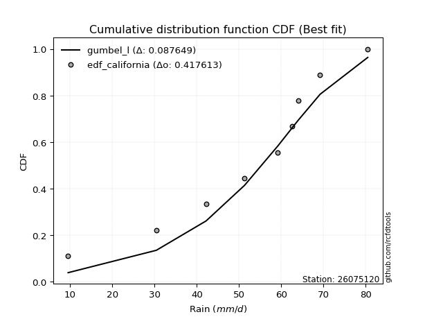</img>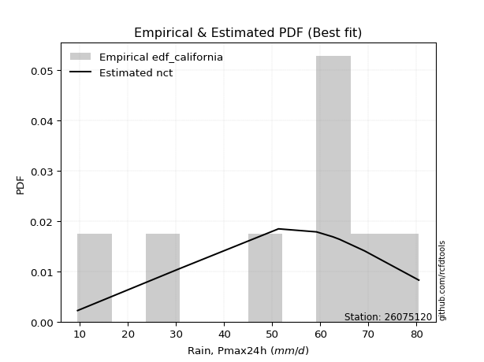</img>

</div>


### 2. Empirical - EDF Hazen (1930)

Hazen method for plotting positions is a formula used to estimate the empirical cumulative probability distribution of flood events or other hydrological data. This formula often results in biased estimations, particularly when extrapolating to extreme events (high return periods).

<div align="center">


$P=(m-0.5)/n$


</div>


**2.1. Empirical values**

<div align="center">

|                | 0                   | 1                   | 2                  | 3                  | 4         | 5                  | 6                  | 7                  | 8                  |
|:---------------|:--------------------|:--------------------|:-------------------|:-------------------|:----------|:-------------------|:-------------------|:-------------------|:-------------------|
| date           | 2023                | 2019                | 2025               | 2020               | 2021      | 2018               | 2024               | 2017               | 2022               |
| x              | 9.5                 | 30.4                | 40.6               | 51.3               | 59.2      | 62.6               | 64.0               | 69.2               | 80.5               |
| m              | 1                   | 2                   | 3                  | 4                  | 5         | 6                  | 7                  | 8                  | 9                  |
| empirical_dist | edf_hazen           | edf_hazen           | edf_hazen          | edf_hazen          | edf_hazen | edf_hazen          | edf_hazen          | edf_hazen          | edf_hazen          |
| empirical      | 0.05555555555555555 | 0.16666666666666666 | 0.2777777777777778 | 0.3888888888888889 | 0.5       | 0.6111111111111112 | 0.7222222222222222 | 0.8333333333333334 | 0.9444444444444444 |
| empirical_tr   | 1.0588235294117647  | 1.2                 | 1.3846153846153846 | 1.6363636363636362 | 2.0       | 2.5714285714285716 | 3.5999999999999996 | 6.000000000000002  | 17.999999999999993 |

</div>


**2.2. Kolmogorov-Smirnov fit test (sorted by Δ)**


<div align="center">

|                | 0                   | 1                   | 2                   | 3                   | 4                   | 5                   | 6                   | 7                   | 8                   | 9                   | 10                  | 11                  | 12                    | 13                  | 14                  | 15                  | 16                  | 17                  | 18                  | 19                  | 20                  | 21                  | 22                  | 23                  | 24                  | 25                  | 26                  | 27                  | 28                  | 29                  | 30                  | 31                  | 32                  | 33                  | 34                  | 35                  | 36                  | 37                  | 38                  | 39                  | 40                  | 41                  | 42                  | 43                  | 44                  | 45                  | 46                  | 47                  | 48                  | 49                  | 50                  | 51                  | 52                  | 53                  | 54                  | 55                  | 56                  | 57                  | 58                  | 59                  | 60                  | 61                  | 62                  | 63                  | 64                  | 65                  | 66                  | 67                  | 68                  | 69                  | 70                  | 71                  | 72                  | 73                  | 74                  | 75                  | 76                  | 77                  | 78                  | 79                  | 80                  | 81                  | 82                  | 83                  | 84                  | 85                  | 86                  | 87                  | 88                  | 89                  |
|:---------------|:--------------------|:--------------------|:--------------------|:--------------------|:--------------------|:--------------------|:--------------------|:--------------------|:--------------------|:--------------------|:--------------------|:--------------------|:----------------------|:--------------------|:--------------------|:--------------------|:--------------------|:--------------------|:--------------------|:--------------------|:--------------------|:--------------------|:--------------------|:--------------------|:--------------------|:--------------------|:--------------------|:--------------------|:--------------------|:--------------------|:--------------------|:--------------------|:--------------------|:--------------------|:--------------------|:--------------------|:--------------------|:--------------------|:--------------------|:--------------------|:--------------------|:--------------------|:--------------------|:--------------------|:--------------------|:--------------------|:--------------------|:--------------------|:--------------------|:--------------------|:--------------------|:--------------------|:--------------------|:--------------------|:--------------------|:--------------------|:--------------------|:--------------------|:--------------------|:--------------------|:--------------------|:--------------------|:--------------------|:--------------------|:--------------------|:--------------------|:--------------------|:--------------------|:--------------------|:--------------------|:--------------------|:--------------------|:--------------------|:--------------------|:--------------------|:--------------------|:--------------------|:--------------------|:--------------------|:--------------------|:--------------------|:--------------------|:--------------------|:--------------------|:--------------------|:--------------------|:--------------------|:--------------------|:--------------------|:--------------------|
| station        | 26075120            | 26075120            | 26075120            | 26075120            | 26075120            | 26075120            | 26075120            | 26075120            | 26075120            | 26075120            | 26075120            | 26075120            | 26075120              | 26075120            | 26075120            | 26075120            | 26075120            | 26075120            | 26075120            | 26075120            | 26075120            | 26075120            | 26075120            | 26075120            | 26075120            | 26075120            | 26075120            | 26075120            | 26075120            | 26075120            | 26075120            | 26075120            | 26075120            | 26075120            | 26075120            | 26075120            | 26075120            | 26075120            | 26075120            | 26075120            | 26075120            | 26075120            | 26075120            | 26075120            | 26075120            | 26075120            | 26075120            | 26075120            | 26075120            | 26075120            | 26075120            | 26075120            | 26075120            | 26075120            | 26075120            | 26075120            | 26075120            | 26075120            | 26075120            | 26075120            | 26075120            | 26075120            | 26075120            | 26075120            | 26075120            | 26075120            | 26075120            | 26075120            | 26075120            | 26075120            | 26075120            | 26075120            | 26075120            | 26075120            | 26075120            | 26075120            | 26075120            | 26075120            | 26075120            | 26075120            | 26075120            | 26075120            | 26075120            | 26075120            | 26075120            | 26075120            | 26075120            | 26075120            | 26075120            | 26075120            |
| empirical_dist | edf_hazen           | edf_hazen           | edf_hazen           | edf_hazen           | edf_hazen           | edf_hazen           | edf_hazen           | edf_hazen           | edf_hazen           | edf_hazen           | edf_hazen           | edf_hazen           | edf_hazen             | edf_hazen           | edf_hazen           | edf_hazen           | edf_hazen           | edf_hazen           | edf_hazen           | edf_hazen           | edf_hazen           | edf_hazen           | edf_hazen           | edf_hazen           | edf_hazen           | edf_hazen           | edf_hazen           | edf_hazen           | edf_hazen           | edf_hazen           | edf_hazen           | edf_hazen           | edf_hazen           | edf_hazen           | edf_hazen           | edf_hazen           | edf_hazen           | edf_hazen           | edf_hazen           | edf_hazen           | edf_hazen           | edf_hazen           | edf_hazen           | edf_hazen           | edf_hazen           | edf_hazen           | edf_hazen           | edf_hazen           | edf_hazen           | edf_hazen           | edf_hazen           | edf_hazen           | edf_hazen           | edf_hazen           | edf_hazen           | edf_hazen           | edf_hazen           | edf_hazen           | edf_hazen           | edf_hazen           | edf_hazen           | edf_hazen           | edf_hazen           | edf_hazen           | edf_hazen           | edf_hazen           | edf_hazen           | edf_hazen           | edf_hazen           | edf_hazen           | edf_hazen           | edf_hazen           | edf_hazen           | edf_hazen           | edf_hazen           | edf_hazen           | edf_hazen           | edf_hazen           | edf_hazen           | edf_hazen           | edf_hazen           | edf_hazen           | edf_hazen           | edf_hazen           | edf_hazen           | edf_hazen           | edf_hazen           | edf_hazen           | edf_hazen           | edf_hazen           |
| p_dist         | genlogistic         | laplace_asymmetric  | logjohnsonsu        | johnsonsu           | weibull_min         | logloggamma         | logmielke           | gumbel_l            | mielke              | pearson3            | fisk                | logpearson3         | loglaplace_asymmetric | logfisk             | loggumbel_l         | fatiguelife         | nct                 | t                   | norm                | crystalball         | truncnorm           | exponnorm           | rice                | f                   | betaprime           | erlang              | invweibull          | invgamma            | chi2                | gamma               | logt                | lognakagami         | ncf                 | logistic            | loggompertz         | invgauss            | maxwell             | rayleigh            | hypsecant           | kstwobign           | genexpon            | halfnorm            | logbetaprime        | lognct              | logfatiguelife      | logrice             | lognorm             | lognorm             | logcrystalball      | logexponnorm        | logf                | logncf              | logalpha            | laplace             | loggamma            | loggamma            | gumbel_r            | logerlang           | loglogistic         | loginvgamma         | loginvweibull       | loginvgauss         | loghypsecant        | halflogistic        | logmaxwell          | moyal               | lograyleigh         | loglaplace          | expon               | logkstwobign        | loghalfnorm         | alpha               | loggenexpon         | loggumbel_r         | logtruncnorm        | wald                | loghalflogistic     | logmoyal            | nakagami            | gibrat              | logwald             | logexpon            | loggibrat           | gompertz            | loglognorm          | logweibull_min      | pareto              | logpareto           | logchi2             | loggenlogistic      |
| delta          | 0.0577436468117124  | 0.06134243116564453 | 0.0674587644229051  | 0.06856489407527311 | 0.08162224711741028 | 0.08581264047830961 | 0.08596723890801528 | 0.08657332772922488 | 0.09367335763929951 | 0.09840423280352484 | 0.10488311503743131 | 0.10758512820759913 | 0.12257634657142691   | 0.1266598461730004  | 0.12860528062928328 | 0.1379542059597385  | 0.1380174719339753  | 0.138060081748836   | 0.13806011798996765 | 0.13806012359333364 | 0.1380602275424132  | 0.13806242426125082 | 0.13810318490761175 | 0.13821563673392356 | 0.1405344325481862  | 0.14278371411545332 | 0.14437694120362282 | 0.14466698299201053 | 0.1463102132231049  | 0.147591641491023   | 0.1496932092562784  | 0.15071987890982813 | 0.15207641708508168 | 0.15492887174737735 | 0.1568626810956142  | 0.15928946407423372 | 0.1609462512308002  | 0.1678788336473327  | 0.1682143283099543  | 0.17298220213659338 | 0.17687235677262575 | 0.18790901640597257 | 0.1898625186101755  | 0.19102471657790793 | 0.19134434011625862 | 0.19167881776054635 | 0.19168081677510102 | 0.19168081677510102 | 0.1916817286684151  | 0.19168420889020338 | 0.19219924455339948 | 0.19236011276661197 | 0.19589768542062896 | 0.19661669334174747 | 0.19795485578245303 | 0.19795485578245303 | 0.19984575610127553 | 0.20194020211085234 | 0.20228931905597652 | 0.20376671356303416 | 0.20772996491532125 | 0.21029707669136516 | 0.21110050334120817 | 0.21617671073270994 | 0.21983971978234723 | 0.2204378008747011  | 0.2286931978187648  | 0.23607355812589897 | 0.2418078818860031  | 0.2455766143897965  | 0.2537812700688448  | 0.2566174408038071  | 0.25868286532405005 | 0.25995405656209764 | 0.2649343181986126  | 0.27847962578374663 | 0.28184034959279475 | 0.2836114407948485  | 0.2897683516993301  | 0.31071926858188614 | 0.34935685685500834 | 0.35870203067105944 | 0.38033911207617593 | 0.43877051128201733 | 0.4582501931532118  | 0.4661726095120805  | 0.47606635664116215 | 0.49219239296953976 | 0.5309997966952191  | 0.8333333333333334  |
| deltao         | 0.41761268023100007 | 0.41761268023100007 | 0.41761268023100007 | 0.41761268023100007 | 0.41761268023100007 | 0.41761268023100007 | 0.41761268023100007 | 0.41761268023100007 | 0.41761268023100007 | 0.41761268023100007 | 0.41761268023100007 | 0.41761268023100007 | 0.41761268023100007   | 0.41761268023100007 | 0.41761268023100007 | 0.41761268023100007 | 0.41761268023100007 | 0.41761268023100007 | 0.41761268023100007 | 0.41761268023100007 | 0.41761268023100007 | 0.41761268023100007 | 0.41761268023100007 | 0.41761268023100007 | 0.41761268023100007 | 0.41761268023100007 | 0.41761268023100007 | 0.41761268023100007 | 0.41761268023100007 | 0.41761268023100007 | 0.41761268023100007 | 0.41761268023100007 | 0.41761268023100007 | 0.41761268023100007 | 0.41761268023100007 | 0.41761268023100007 | 0.41761268023100007 | 0.41761268023100007 | 0.41761268023100007 | 0.41761268023100007 | 0.41761268023100007 | 0.41761268023100007 | 0.41761268023100007 | 0.41761268023100007 | 0.41761268023100007 | 0.41761268023100007 | 0.41761268023100007 | 0.41761268023100007 | 0.41761268023100007 | 0.41761268023100007 | 0.41761268023100007 | 0.41761268023100007 | 0.41761268023100007 | 0.41761268023100007 | 0.41761268023100007 | 0.41761268023100007 | 0.41761268023100007 | 0.41761268023100007 | 0.41761268023100007 | 0.41761268023100007 | 0.41761268023100007 | 0.41761268023100007 | 0.41761268023100007 | 0.41761268023100007 | 0.41761268023100007 | 0.41761268023100007 | 0.41761268023100007 | 0.41761268023100007 | 0.41761268023100007 | 0.41761268023100007 | 0.41761268023100007 | 0.41761268023100007 | 0.41761268023100007 | 0.41761268023100007 | 0.41761268023100007 | 0.41761268023100007 | 0.41761268023100007 | 0.41761268023100007 | 0.41761268023100007 | 0.41761268023100007 | 0.41761268023100007 | 0.41761268023100007 | 0.41761268023100007 | 0.41761268023100007 | 0.41761268023100007 | 0.41761268023100007 | 0.41761268023100007 | 0.41761268023100007 | 0.41761268023100007 | 0.41761268023100007 |
| eval           | Δo > Δ              | Δo > Δ              | Δo > Δ              | Δo > Δ              | Δo > Δ              | Δo > Δ              | Δo > Δ              | Δo > Δ              | Δo > Δ              | Δo > Δ              | Δo > Δ              | Δo > Δ              | Δo > Δ                | Δo > Δ              | Δo > Δ              | Δo > Δ              | Δo > Δ              | Δo > Δ              | Δo > Δ              | Δo > Δ              | Δo > Δ              | Δo > Δ              | Δo > Δ              | Δo > Δ              | Δo > Δ              | Δo > Δ              | Δo > Δ              | Δo > Δ              | Δo > Δ              | Δo > Δ              | Δo > Δ              | Δo > Δ              | Δo > Δ              | Δo > Δ              | Δo > Δ              | Δo > Δ              | Δo > Δ              | Δo > Δ              | Δo > Δ              | Δo > Δ              | Δo > Δ              | Δo > Δ              | Δo > Δ              | Δo > Δ              | Δo > Δ              | Δo > Δ              | Δo > Δ              | Δo > Δ              | Δo > Δ              | Δo > Δ              | Δo > Δ              | Δo > Δ              | Δo > Δ              | Δo > Δ              | Δo > Δ              | Δo > Δ              | Δo > Δ              | Δo > Δ              | Δo > Δ              | Δo > Δ              | Δo > Δ              | Δo > Δ              | Δo > Δ              | Δo > Δ              | Δo > Δ              | Δo > Δ              | Δo > Δ              | Δo > Δ              | Δo > Δ              | Δo > Δ              | Δo > Δ              | Δo > Δ              | Δo > Δ              | Δo > Δ              | Δo > Δ              | Δo > Δ              | Δo > Δ              | Δo > Δ              | Δo > Δ              | Δo > Δ              | Δo > Δ              | Δo > Δ              | Δo > Δ              | Δo <= Δ             | Δo <= Δ             | Δo <= Δ             | Δo <= Δ             | Δo <= Δ             | Δo <= Δ             | Δo <= Δ             |
| fit            | 1                   | 1                   | 1                   | 1                   | 1                   | 1                   | 1                   | 1                   | 1                   | 1                   | 1                   | 1                   | 1                     | 1                   | 1                   | 1                   | 1                   | 1                   | 1                   | 1                   | 1                   | 1                   | 1                   | 1                   | 1                   | 1                   | 1                   | 1                   | 1                   | 1                   | 1                   | 1                   | 1                   | 1                   | 1                   | 1                   | 1                   | 1                   | 1                   | 1                   | 1                   | 1                   | 1                   | 1                   | 1                   | 1                   | 1                   | 1                   | 1                   | 1                   | 1                   | 1                   | 1                   | 1                   | 1                   | 1                   | 1                   | 1                   | 1                   | 1                   | 1                   | 1                   | 1                   | 1                   | 1                   | 1                   | 1                   | 1                   | 1                   | 1                   | 1                   | 1                   | 1                   | 1                   | 1                   | 1                   | 1                   | 1                   | 1                   | 1                   | 1                   | 1                   | 1                   | 0                   | 0                   | 0                   | 0                   | 0                   | 0                   | 0                   |
| n              | 9                   | 9                   | 9                   | 9                   | 9                   | 9                   | 9                   | 9                   | 9                   | 9                   | 9                   | 9                   | 9                     | 9                   | 9                   | 9                   | 9                   | 9                   | 9                   | 9                   | 9                   | 9                   | 9                   | 9                   | 9                   | 9                   | 9                   | 9                   | 9                   | 9                   | 9                   | 9                   | 9                   | 9                   | 9                   | 9                   | 9                   | 9                   | 9                   | 9                   | 9                   | 9                   | 9                   | 9                   | 9                   | 9                   | 9                   | 9                   | 9                   | 9                   | 9                   | 9                   | 9                   | 9                   | 9                   | 9                   | 9                   | 9                   | 9                   | 9                   | 9                   | 9                   | 9                   | 9                   | 9                   | 9                   | 9                   | 9                   | 9                   | 9                   | 9                   | 9                   | 9                   | 9                   | 9                   | 9                   | 9                   | 9                   | 9                   | 9                   | 9                   | 9                   | 9                   | 9                   | 9                   | 9                   | 9                   | 9                   | 9                   | 9                   |
| best_fit       | 1                   | 0                   | 0                   | 0                   | 0                   | 0                   | 0                   | 0                   | 0                   | 0                   | 0                   | 0                   | 0                     | 0                   | 0                   | 0                   | 0                   | 0                   | 0                   | 0                   | 0                   | 0                   | 0                   | 0                   | 0                   | 0                   | 0                   | 0                   | 0                   | 0                   | 0                   | 0                   | 0                   | 0                   | 0                   | 0                   | 0                   | 0                   | 0                   | 0                   | 0                   | 0                   | 0                   | 0                   | 0                   | 0                   | 0                   | 0                   | 0                   | 0                   | 0                   | 0                   | 0                   | 0                   | 0                   | 0                   | 0                   | 0                   | 0                   | 0                   | 0                   | 0                   | 0                   | 0                   | 0                   | 0                   | 0                   | 0                   | 0                   | 0                   | 0                   | 0                   | 0                   | 0                   | 0                   | 0                   | 0                   | 0                   | 0                   | 0                   | 0                   | 0                   | 0                   | 0                   | 0                   | 0                   | 0                   | 0                   | 0                   | 0                   |
| best_fit_sort  | 1                   | 2                   | 3                   | 4                   | 5                   | 6                   | 7                   | 8                   | 9                   | 10                  | 11                  | 12                  | 13                    | 14                  | 15                  | 16                  | 17                  | 18                  | 19                  | 20                  | 21                  | 22                  | 23                  | 24                  | 25                  | 26                  | 27                  | 28                  | 29                  | 30                  | 31                  | 32                  | 33                  | 34                  | 35                  | 36                  | 37                  | 38                  | 39                  | 40                  | 41                  | 42                  | 43                  | 44                  | 45                  | 46                  | 47                  | 48                  | 49                  | 50                  | 51                  | 52                  | 53                  | 54                  | 55                  | 56                  | 57                  | 58                  | 59                  | 60                  | 61                  | 62                  | 63                  | 64                  | 65                  | 66                  | 67                  | 68                  | 69                  | 70                  | 71                  | 72                  | 73                  | 74                  | 75                  | 76                  | 77                  | 78                  | 79                  | 80                  | 81                  | 82                  | 83                  | 84                  | 85                  | 86                  | 87                  | 88                  | 89                  | 90                  |

</div>


<div align="center">

</img>

</div>


**2.3. Best fit**

<div align="center">

|   id |   station | empirical_dist   | p_dist      |     delta |   deltao | eval   |   fit |   n |   best_fit |   best_fit_sort |
|-----:|----------:|:-----------------|:------------|----------:|---------:|:-------|------:|----:|-----------:|----------------:|
|    0 |  26075120 | edf_hazen        | genlogistic | 0.0577436 | 0.417613 | Δo > Δ |     1 |   9 |          1 |               1 |

</div>


<div align="center">

</img></img>

</div>


### 3. Empirical - EDF Weibull (1939)

Weibull plotting position formula is an empirical method used to estimate the non-exceedance probability or plotting position for a set of observed data, is often recommended or widely used in practice, particularly in flood frequency analysis.

<div align="center">


$P=m/(n+1)$


</div>


**3.1. Empirical values**

<div align="center">

|                | 0                  | 1           | 2                  | 3                  | 4           | 5           | 6                 | 7                 | 8                  |
|:---------------|:-------------------|:------------|:-------------------|:-------------------|:------------|:------------|:------------------|:------------------|:-------------------|
| date           | 2023               | 2019        | 2025               | 2020               | 2021        | 2018        | 2024              | 2017              | 2022               |
| x              | 9.5                | 30.4        | 40.6               | 51.3               | 59.2        | 62.6        | 64.0              | 69.2              | 80.5               |
| m              | 1                  | 2           | 3                  | 4                  | 5           | 6           | 7                 | 8                 | 9                  |
| empirical_dist | edf_weibull        | edf_weibull | edf_weibull        | edf_weibull        | edf_weibull | edf_weibull | edf_weibull       | edf_weibull       | edf_weibull        |
| empirical      | 0.1                | 0.2         | 0.3                | 0.4                | 0.5         | 0.6         | 0.7               | 0.8               | 0.9                |
| empirical_tr   | 1.1111111111111112 | 1.25        | 1.4285714285714286 | 1.6666666666666667 | 2.0         | 2.5         | 3.333333333333333 | 5.000000000000001 | 10.000000000000002 |

</div>


**3.2. Kolmogorov-Smirnov fit test (sorted by Δ)**


<div align="center">

|                | 0                   | 1                   | 2                   | 3                   | 4                   | 5                   | 6                   | 7                   | 8                   | 9                   | 10                  | 11                  | 12                  | 13                    | 14                  | 15                  | 16                  | 17                  | 18                  | 19                  | 20                  | 21                  | 22                  | 23                  | 24                  | 25                  | 26                  | 27                  | 28                  | 29                  | 30                  | 31                  | 32                  | 33                  | 34                  | 35                  | 36                  | 37                  | 38                  | 39                  | 40                  | 41                  | 42                  | 43                  | 44                  | 45                  | 46                  | 47                  | 48                  | 49                  | 50                  | 51                  | 52                  | 53                  | 54                  | 55                  | 56                  | 57                  | 58                  | 59                  | 60                  | 61                  | 62                  | 63                  | 64                  | 65                  | 66                  | 67                  | 68                  | 69                  | 70                  | 71                  | 72                  | 73                  | 74                  | 75                  | 76                  | 77                  | 78                  | 79                  | 80                  | 81                  | 82                  | 83                  | 84                  | 85                  | 86                  | 87                  | 88                  | 89                  |
|:---------------|:--------------------|:--------------------|:--------------------|:--------------------|:--------------------|:--------------------|:--------------------|:--------------------|:--------------------|:--------------------|:--------------------|:--------------------|:--------------------|:----------------------|:--------------------|:--------------------|:--------------------|:--------------------|:--------------------|:--------------------|:--------------------|:--------------------|:--------------------|:--------------------|:--------------------|:--------------------|:--------------------|:--------------------|:--------------------|:--------------------|:--------------------|:--------------------|:--------------------|:--------------------|:--------------------|:--------------------|:--------------------|:--------------------|:--------------------|:--------------------|:--------------------|:--------------------|:--------------------|:--------------------|:--------------------|:--------------------|:--------------------|:--------------------|:--------------------|:--------------------|:--------------------|:--------------------|:--------------------|:--------------------|:--------------------|:--------------------|:--------------------|:--------------------|:--------------------|:--------------------|:--------------------|:--------------------|:--------------------|:--------------------|:--------------------|:--------------------|:--------------------|:--------------------|:--------------------|:--------------------|:--------------------|:--------------------|:--------------------|:--------------------|:--------------------|:--------------------|:--------------------|:--------------------|:--------------------|:--------------------|:--------------------|:--------------------|:--------------------|:--------------------|:--------------------|:--------------------|:--------------------|:--------------------|:--------------------|:--------------------|
| station        | 26075120            | 26075120            | 26075120            | 26075120            | 26075120            | 26075120            | 26075120            | 26075120            | 26075120            | 26075120            | 26075120            | 26075120            | 26075120            | 26075120              | 26075120            | 26075120            | 26075120            | 26075120            | 26075120            | 26075120            | 26075120            | 26075120            | 26075120            | 26075120            | 26075120            | 26075120            | 26075120            | 26075120            | 26075120            | 26075120            | 26075120            | 26075120            | 26075120            | 26075120            | 26075120            | 26075120            | 26075120            | 26075120            | 26075120            | 26075120            | 26075120            | 26075120            | 26075120            | 26075120            | 26075120            | 26075120            | 26075120            | 26075120            | 26075120            | 26075120            | 26075120            | 26075120            | 26075120            | 26075120            | 26075120            | 26075120            | 26075120            | 26075120            | 26075120            | 26075120            | 26075120            | 26075120            | 26075120            | 26075120            | 26075120            | 26075120            | 26075120            | 26075120            | 26075120            | 26075120            | 26075120            | 26075120            | 26075120            | 26075120            | 26075120            | 26075120            | 26075120            | 26075120            | 26075120            | 26075120            | 26075120            | 26075120            | 26075120            | 26075120            | 26075120            | 26075120            | 26075120            | 26075120            | 26075120            | 26075120            |
| empirical_dist | edf_weibull         | edf_weibull         | edf_weibull         | edf_weibull         | edf_weibull         | edf_weibull         | edf_weibull         | edf_weibull         | edf_weibull         | edf_weibull         | edf_weibull         | edf_weibull         | edf_weibull         | edf_weibull           | edf_weibull         | edf_weibull         | edf_weibull         | edf_weibull         | edf_weibull         | edf_weibull         | edf_weibull         | edf_weibull         | edf_weibull         | edf_weibull         | edf_weibull         | edf_weibull         | edf_weibull         | edf_weibull         | edf_weibull         | edf_weibull         | edf_weibull         | edf_weibull         | edf_weibull         | edf_weibull         | edf_weibull         | edf_weibull         | edf_weibull         | edf_weibull         | edf_weibull         | edf_weibull         | edf_weibull         | edf_weibull         | edf_weibull         | edf_weibull         | edf_weibull         | edf_weibull         | edf_weibull         | edf_weibull         | edf_weibull         | edf_weibull         | edf_weibull         | edf_weibull         | edf_weibull         | edf_weibull         | edf_weibull         | edf_weibull         | edf_weibull         | edf_weibull         | edf_weibull         | edf_weibull         | edf_weibull         | edf_weibull         | edf_weibull         | edf_weibull         | edf_weibull         | edf_weibull         | edf_weibull         | edf_weibull         | edf_weibull         | edf_weibull         | edf_weibull         | edf_weibull         | edf_weibull         | edf_weibull         | edf_weibull         | edf_weibull         | edf_weibull         | edf_weibull         | edf_weibull         | edf_weibull         | edf_weibull         | edf_weibull         | edf_weibull         | edf_weibull         | edf_weibull         | edf_weibull         | edf_weibull         | edf_weibull         | edf_weibull         | edf_weibull         |
| p_dist         | genlogistic         | johnsonsu           | logjohnsonsu        | laplace_asymmetric  | weibull_min         | logpearson3         | gumbel_l            | mielke              | logmielke           | pearson3            | logloggamma         | fisk                | logfisk             | loglaplace_asymmetric | loggumbel_l         | fatiguelife         | nct                 | t                   | norm                | crystalball         | truncnorm           | exponnorm           | rice                | f                   | betaprime           | erlang              | invweibull          | invgamma            | chi2                | gamma               | ncf                 | logistic            | loggompertz         | invgauss            | maxwell             | kstwobign           | rayleigh            | hypsecant           | logt                | genexpon            | logbetaprime        | lognct              | logfatiguelife      | logrice             | lognorm             | lognorm             | logcrystalball      | logexponnorm        | loginvweibull       | logf                | logncf              | lognakagami         | logalpha            | loggamma            | loggamma            | halfnorm            | logerlang           | loglogistic         | loginvgamma         | laplace             | loginvgauss         | gumbel_r            | loghypsecant        | logmaxwell          | halflogistic        | lograyleigh         | moyal               | logkstwobign        | expon               | loglaplace          | alpha               | loggenexpon         | loghalfnorm         | loggumbel_r         | logtruncnorm        | loghalflogistic     | logmoyal            | wald                | nakagami            | gibrat              | logexpon            | logwald             | loggibrat           | gompertz            | loglognorm          | logweibull_min      | pareto              | logpareto           | logchi2             | loggenlogistic      |
| delta          | 0.06825809999533555 | 0.06856489407527311 | 0.07282341612033427 | 0.07445221923221085 | 0.08162224711741028 | 0.08532811953289232 | 0.08657332772922488 | 0.08883282221816335 | 0.09367637220490832 | 0.09840423280352484 | 0.09995425658411228 | 0.10488311503743131 | 0.1208837603352878  | 0.12257634657142691   | 0.12515493053743265 | 0.1379542059597385  | 0.1380174719339753  | 0.138060081748836   | 0.13806011798996765 | 0.13806012359333364 | 0.1380602275424132  | 0.13806242426125082 | 0.13810318490761175 | 0.13821563673392356 | 0.1405344325481862  | 0.14278371411545332 | 0.14356924366369128 | 0.14466698299201053 | 0.1463102132231049  | 0.147591641491023   | 0.15207641708508168 | 0.15492887174737735 | 0.1568626810956142  | 0.15928946407423372 | 0.1609462512308002  | 0.1656757952621245  | 0.1678788336473327  | 0.1682143283099543  | 0.1719154314785006  | 0.17198997540809813 | 0.17875140749906437 | 0.1799136054667968  | 0.1802332290051475  | 0.18056770664943522 | 0.1805697056639899  | 0.1805697056639899  | 0.18057061755730397 | 0.18057309777909225 | 0.1805831626352843  | 0.18108813344228836 | 0.18124900165550084 | 0.18405321224316148 | 0.18478657430951784 | 0.1868437446713419  | 0.1868437446713419  | 0.18790901640597257 | 0.1908290909997412  | 0.1911782079448654  | 0.19265560245192304 | 0.19661669334174747 | 0.19918596558025403 | 0.19984575610127553 | 0.20243320065115789 | 0.2087286086712361  | 0.21617671073270994 | 0.21758208670765367 | 0.2204378008747011  | 0.2233543921675743  | 0.2266849713210508  | 0.22983947772845026 | 0.2343952185815849  | 0.23646064310182785 | 0.2426701589577337  | 0.2488429454509865  | 0.2649343181986126  | 0.2707292384816836  | 0.2725003296837374  | 0.27847962578374663 | 0.28412638981817695 | 0.31071926858188614 | 0.32536869733772605 | 0.3382457457438972  | 0.3692280009650648  | 0.4165482890597951  | 0.4249168598198784  | 0.4328392761787471  | 0.44273302330782877 | 0.4588590596362064  | 0.49766646336188575 | 0.8                 |
| deltao         | 0.41761268023100007 | 0.41761268023100007 | 0.41761268023100007 | 0.41761268023100007 | 0.41761268023100007 | 0.41761268023100007 | 0.41761268023100007 | 0.41761268023100007 | 0.41761268023100007 | 0.41761268023100007 | 0.41761268023100007 | 0.41761268023100007 | 0.41761268023100007 | 0.41761268023100007   | 0.41761268023100007 | 0.41761268023100007 | 0.41761268023100007 | 0.41761268023100007 | 0.41761268023100007 | 0.41761268023100007 | 0.41761268023100007 | 0.41761268023100007 | 0.41761268023100007 | 0.41761268023100007 | 0.41761268023100007 | 0.41761268023100007 | 0.41761268023100007 | 0.41761268023100007 | 0.41761268023100007 | 0.41761268023100007 | 0.41761268023100007 | 0.41761268023100007 | 0.41761268023100007 | 0.41761268023100007 | 0.41761268023100007 | 0.41761268023100007 | 0.41761268023100007 | 0.41761268023100007 | 0.41761268023100007 | 0.41761268023100007 | 0.41761268023100007 | 0.41761268023100007 | 0.41761268023100007 | 0.41761268023100007 | 0.41761268023100007 | 0.41761268023100007 | 0.41761268023100007 | 0.41761268023100007 | 0.41761268023100007 | 0.41761268023100007 | 0.41761268023100007 | 0.41761268023100007 | 0.41761268023100007 | 0.41761268023100007 | 0.41761268023100007 | 0.41761268023100007 | 0.41761268023100007 | 0.41761268023100007 | 0.41761268023100007 | 0.41761268023100007 | 0.41761268023100007 | 0.41761268023100007 | 0.41761268023100007 | 0.41761268023100007 | 0.41761268023100007 | 0.41761268023100007 | 0.41761268023100007 | 0.41761268023100007 | 0.41761268023100007 | 0.41761268023100007 | 0.41761268023100007 | 0.41761268023100007 | 0.41761268023100007 | 0.41761268023100007 | 0.41761268023100007 | 0.41761268023100007 | 0.41761268023100007 | 0.41761268023100007 | 0.41761268023100007 | 0.41761268023100007 | 0.41761268023100007 | 0.41761268023100007 | 0.41761268023100007 | 0.41761268023100007 | 0.41761268023100007 | 0.41761268023100007 | 0.41761268023100007 | 0.41761268023100007 | 0.41761268023100007 | 0.41761268023100007 |
| eval           | Δo > Δ              | Δo > Δ              | Δo > Δ              | Δo > Δ              | Δo > Δ              | Δo > Δ              | Δo > Δ              | Δo > Δ              | Δo > Δ              | Δo > Δ              | Δo > Δ              | Δo > Δ              | Δo > Δ              | Δo > Δ                | Δo > Δ              | Δo > Δ              | Δo > Δ              | Δo > Δ              | Δo > Δ              | Δo > Δ              | Δo > Δ              | Δo > Δ              | Δo > Δ              | Δo > Δ              | Δo > Δ              | Δo > Δ              | Δo > Δ              | Δo > Δ              | Δo > Δ              | Δo > Δ              | Δo > Δ              | Δo > Δ              | Δo > Δ              | Δo > Δ              | Δo > Δ              | Δo > Δ              | Δo > Δ              | Δo > Δ              | Δo > Δ              | Δo > Δ              | Δo > Δ              | Δo > Δ              | Δo > Δ              | Δo > Δ              | Δo > Δ              | Δo > Δ              | Δo > Δ              | Δo > Δ              | Δo > Δ              | Δo > Δ              | Δo > Δ              | Δo > Δ              | Δo > Δ              | Δo > Δ              | Δo > Δ              | Δo > Δ              | Δo > Δ              | Δo > Δ              | Δo > Δ              | Δo > Δ              | Δo > Δ              | Δo > Δ              | Δo > Δ              | Δo > Δ              | Δo > Δ              | Δo > Δ              | Δo > Δ              | Δo > Δ              | Δo > Δ              | Δo > Δ              | Δo > Δ              | Δo > Δ              | Δo > Δ              | Δo > Δ              | Δo > Δ              | Δo > Δ              | Δo > Δ              | Δo > Δ              | Δo > Δ              | Δo > Δ              | Δo > Δ              | Δo > Δ              | Δo > Δ              | Δo > Δ              | Δo <= Δ             | Δo <= Δ             | Δo <= Δ             | Δo <= Δ             | Δo <= Δ             | Δo <= Δ             |
| fit            | 1                   | 1                   | 1                   | 1                   | 1                   | 1                   | 1                   | 1                   | 1                   | 1                   | 1                   | 1                   | 1                   | 1                     | 1                   | 1                   | 1                   | 1                   | 1                   | 1                   | 1                   | 1                   | 1                   | 1                   | 1                   | 1                   | 1                   | 1                   | 1                   | 1                   | 1                   | 1                   | 1                   | 1                   | 1                   | 1                   | 1                   | 1                   | 1                   | 1                   | 1                   | 1                   | 1                   | 1                   | 1                   | 1                   | 1                   | 1                   | 1                   | 1                   | 1                   | 1                   | 1                   | 1                   | 1                   | 1                   | 1                   | 1                   | 1                   | 1                   | 1                   | 1                   | 1                   | 1                   | 1                   | 1                   | 1                   | 1                   | 1                   | 1                   | 1                   | 1                   | 1                   | 1                   | 1                   | 1                   | 1                   | 1                   | 1                   | 1                   | 1                   | 1                   | 1                   | 1                   | 0                   | 0                   | 0                   | 0                   | 0                   | 0                   |
| n              | 9                   | 9                   | 9                   | 9                   | 9                   | 9                   | 9                   | 9                   | 9                   | 9                   | 9                   | 9                   | 9                   | 9                     | 9                   | 9                   | 9                   | 9                   | 9                   | 9                   | 9                   | 9                   | 9                   | 9                   | 9                   | 9                   | 9                   | 9                   | 9                   | 9                   | 9                   | 9                   | 9                   | 9                   | 9                   | 9                   | 9                   | 9                   | 9                   | 9                   | 9                   | 9                   | 9                   | 9                   | 9                   | 9                   | 9                   | 9                   | 9                   | 9                   | 9                   | 9                   | 9                   | 9                   | 9                   | 9                   | 9                   | 9                   | 9                   | 9                   | 9                   | 9                   | 9                   | 9                   | 9                   | 9                   | 9                   | 9                   | 9                   | 9                   | 9                   | 9                   | 9                   | 9                   | 9                   | 9                   | 9                   | 9                   | 9                   | 9                   | 9                   | 9                   | 9                   | 9                   | 9                   | 9                   | 9                   | 9                   | 9                   | 9                   |
| best_fit       | 1                   | 0                   | 0                   | 0                   | 0                   | 0                   | 0                   | 0                   | 0                   | 0                   | 0                   | 0                   | 0                   | 0                     | 0                   | 0                   | 0                   | 0                   | 0                   | 0                   | 0                   | 0                   | 0                   | 0                   | 0                   | 0                   | 0                   | 0                   | 0                   | 0                   | 0                   | 0                   | 0                   | 0                   | 0                   | 0                   | 0                   | 0                   | 0                   | 0                   | 0                   | 0                   | 0                   | 0                   | 0                   | 0                   | 0                   | 0                   | 0                   | 0                   | 0                   | 0                   | 0                   | 0                   | 0                   | 0                   | 0                   | 0                   | 0                   | 0                   | 0                   | 0                   | 0                   | 0                   | 0                   | 0                   | 0                   | 0                   | 0                   | 0                   | 0                   | 0                   | 0                   | 0                   | 0                   | 0                   | 0                   | 0                   | 0                   | 0                   | 0                   | 0                   | 0                   | 0                   | 0                   | 0                   | 0                   | 0                   | 0                   | 0                   |
| best_fit_sort  | 1                   | 2                   | 3                   | 4                   | 5                   | 6                   | 7                   | 8                   | 9                   | 10                  | 11                  | 12                  | 13                  | 14                    | 15                  | 16                  | 17                  | 18                  | 19                  | 20                  | 21                  | 22                  | 23                  | 24                  | 25                  | 26                  | 27                  | 28                  | 29                  | 30                  | 31                  | 32                  | 33                  | 34                  | 35                  | 36                  | 37                  | 38                  | 39                  | 40                  | 41                  | 42                  | 43                  | 44                  | 45                  | 46                  | 47                  | 48                  | 49                  | 50                  | 51                  | 52                  | 53                  | 54                  | 55                  | 56                  | 57                  | 58                  | 59                  | 60                  | 61                  | 62                  | 63                  | 64                  | 65                  | 66                  | 67                  | 68                  | 69                  | 70                  | 71                  | 72                  | 73                  | 74                  | 75                  | 76                  | 77                  | 78                  | 79                  | 80                  | 81                  | 82                  | 83                  | 84                  | 85                  | 86                  | 87                  | 88                  | 89                  | 90                  |

</div>


<div align="center">

</img>

</div>


**3.3. Best fit**

<div align="center">

|   id |   station | empirical_dist   | p_dist      |     delta |   deltao | eval   |   fit |   n |   best_fit |   best_fit_sort |
|-----:|----------:|:-----------------|:------------|----------:|---------:|:-------|------:|----:|-----------:|----------------:|
|    0 |  26075120 | edf_weibull      | genlogistic | 0.0682581 | 0.417613 | Δo > Δ |     1 |   9 |          1 |               1 |

</div>


<div align="center">

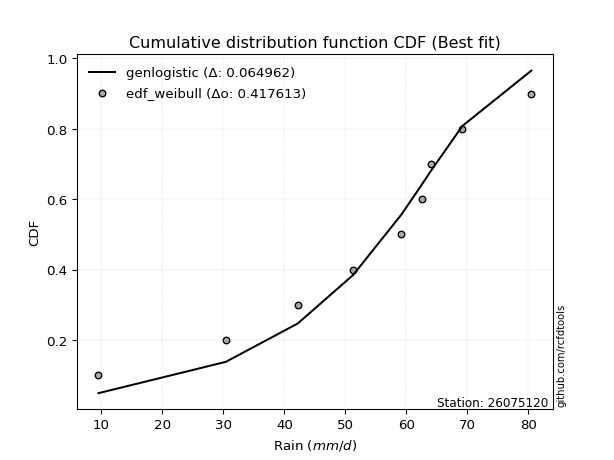</img>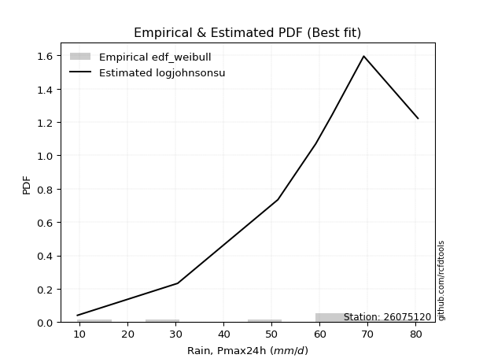</img>

</div>


### 4. Empirical - EDF Beard (1943)

The Beard formula (or Beard´s plotting position formula) in hydrology is used to estimate the empirical non-exceedance probability _(P)_ of a flood event (or other extreme hydrological data point) within a given dataset.

<div align="center">


$P=(m-0.31)/(n+0.38)$


</div>


**4.1. Empirical values**

<div align="center">

|                | 0                   | 1                   | 2                  | 3                   | 4         | 5                  | 6                  | 7                  | 8                  |
|:---------------|:--------------------|:--------------------|:-------------------|:--------------------|:----------|:-------------------|:-------------------|:-------------------|:-------------------|
| date           | 2023                | 2019                | 2025               | 2020                | 2021      | 2018               | 2024               | 2017               | 2022               |
| x              | 9.5                 | 30.4                | 40.6               | 51.3                | 59.2      | 62.6               | 64.0               | 69.2               | 80.5               |
| m              | 1                   | 2                   | 3                  | 4                   | 5         | 6                  | 7                  | 8                  | 9                  |
| empirical_dist | edf_beard           | edf_beard           | edf_beard          | edf_beard           | edf_beard | edf_beard          | edf_beard          | edf_beard          | edf_beard          |
| empirical      | 0.07356076759061833 | 0.18017057569296374 | 0.2867803837953091 | 0.39339019189765456 | 0.5       | 0.6066098081023454 | 0.7132196162046908 | 0.8198294243070362 | 0.9264392324093815 |
| empirical_tr   | 1.0794016110471807  | 1.2197659297789336  | 1.4020926756352765 | 1.6485061511423549  | 2.0       | 2.542005420054201  | 3.486988847583642  | 5.550295857988164  | 13.5942028985507   |

</div>


**4.2. Kolmogorov-Smirnov fit test (sorted by Δ)**


<div align="center">

|                | 0                   | 1                   | 2                   | 3                   | 4                   | 5                   | 6                   | 7                   | 8                   | 9                   | 10                  | 11                  | 12                  | 13                    | 14                  | 15                  | 16                  | 17                  | 18                  | 19                  | 20                  | 21                  | 22                  | 23                  | 24                  | 25                  | 26                  | 27                  | 28                  | 29                  | 30                  | 31                  | 32                  | 33                  | 34                  | 35                  | 36                  | 37                  | 38                  | 39                  | 40                  | 41                  | 42                  | 43                  | 44                  | 45                  | 46                  | 47                  | 48                  | 49                  | 50                  | 51                  | 52                  | 53                  | 54                  | 55                  | 56                  | 57                  | 58                  | 59                  | 60                  | 61                  | 62                  | 63                  | 64                  | 65                  | 66                  | 67                  | 68                  | 69                  | 70                  | 71                  | 72                  | 73                  | 74                  | 75                  | 76                  | 77                  | 78                  | 79                  | 80                  | 81                  | 82                  | 83                  | 84                  | 85                  | 86                  | 87                  | 88                  | 89                  |
|:---------------|:--------------------|:--------------------|:--------------------|:--------------------|:--------------------|:--------------------|:--------------------|:--------------------|:--------------------|:--------------------|:--------------------|:--------------------|:--------------------|:----------------------|:--------------------|:--------------------|:--------------------|:--------------------|:--------------------|:--------------------|:--------------------|:--------------------|:--------------------|:--------------------|:--------------------|:--------------------|:--------------------|:--------------------|:--------------------|:--------------------|:--------------------|:--------------------|:--------------------|:--------------------|:--------------------|:--------------------|:--------------------|:--------------------|:--------------------|:--------------------|:--------------------|:--------------------|:--------------------|:--------------------|:--------------------|:--------------------|:--------------------|:--------------------|:--------------------|:--------------------|:--------------------|:--------------------|:--------------------|:--------------------|:--------------------|:--------------------|:--------------------|:--------------------|:--------------------|:--------------------|:--------------------|:--------------------|:--------------------|:--------------------|:--------------------|:--------------------|:--------------------|:--------------------|:--------------------|:--------------------|:--------------------|:--------------------|:--------------------|:--------------------|:--------------------|:--------------------|:--------------------|:--------------------|:--------------------|:--------------------|:--------------------|:--------------------|:--------------------|:--------------------|:--------------------|:--------------------|:--------------------|:--------------------|:--------------------|:--------------------|
| station        | 26075120            | 26075120            | 26075120            | 26075120            | 26075120            | 26075120            | 26075120            | 26075120            | 26075120            | 26075120            | 26075120            | 26075120            | 26075120            | 26075120              | 26075120            | 26075120            | 26075120            | 26075120            | 26075120            | 26075120            | 26075120            | 26075120            | 26075120            | 26075120            | 26075120            | 26075120            | 26075120            | 26075120            | 26075120            | 26075120            | 26075120            | 26075120            | 26075120            | 26075120            | 26075120            | 26075120            | 26075120            | 26075120            | 26075120            | 26075120            | 26075120            | 26075120            | 26075120            | 26075120            | 26075120            | 26075120            | 26075120            | 26075120            | 26075120            | 26075120            | 26075120            | 26075120            | 26075120            | 26075120            | 26075120            | 26075120            | 26075120            | 26075120            | 26075120            | 26075120            | 26075120            | 26075120            | 26075120            | 26075120            | 26075120            | 26075120            | 26075120            | 26075120            | 26075120            | 26075120            | 26075120            | 26075120            | 26075120            | 26075120            | 26075120            | 26075120            | 26075120            | 26075120            | 26075120            | 26075120            | 26075120            | 26075120            | 26075120            | 26075120            | 26075120            | 26075120            | 26075120            | 26075120            | 26075120            | 26075120            |
| empirical_dist | edf_beard           | edf_beard           | edf_beard           | edf_beard           | edf_beard           | edf_beard           | edf_beard           | edf_beard           | edf_beard           | edf_beard           | edf_beard           | edf_beard           | edf_beard           | edf_beard             | edf_beard           | edf_beard           | edf_beard           | edf_beard           | edf_beard           | edf_beard           | edf_beard           | edf_beard           | edf_beard           | edf_beard           | edf_beard           | edf_beard           | edf_beard           | edf_beard           | edf_beard           | edf_beard           | edf_beard           | edf_beard           | edf_beard           | edf_beard           | edf_beard           | edf_beard           | edf_beard           | edf_beard           | edf_beard           | edf_beard           | edf_beard           | edf_beard           | edf_beard           | edf_beard           | edf_beard           | edf_beard           | edf_beard           | edf_beard           | edf_beard           | edf_beard           | edf_beard           | edf_beard           | edf_beard           | edf_beard           | edf_beard           | edf_beard           | edf_beard           | edf_beard           | edf_beard           | edf_beard           | edf_beard           | edf_beard           | edf_beard           | edf_beard           | edf_beard           | edf_beard           | edf_beard           | edf_beard           | edf_beard           | edf_beard           | edf_beard           | edf_beard           | edf_beard           | edf_beard           | edf_beard           | edf_beard           | edf_beard           | edf_beard           | edf_beard           | edf_beard           | edf_beard           | edf_beard           | edf_beard           | edf_beard           | edf_beard           | edf_beard           | edf_beard           | edf_beard           | edf_beard           | edf_beard           |
| p_dist         | genlogistic         | logjohnsonsu        | laplace_asymmetric  | johnsonsu           | mielke              | weibull_min         | logloggamma         | logmielke           | gumbel_l            | logpearson3         | pearson3            | fisk                | logfisk             | loglaplace_asymmetric | loggumbel_l         | fatiguelife         | nct                 | t                   | norm                | crystalball         | truncnorm           | exponnorm           | rice                | f                   | betaprime           | erlang              | invweibull          | invgamma            | chi2                | gamma               | ncf                 | logistic            | loggompertz         | logt                | invgauss            | maxwell             | lognakagami         | rayleigh            | hypsecant           | kstwobign           | genexpon            | logbetaprime        | lognct              | logfatiguelife      | logrice             | lognorm             | lognorm             | logcrystalball      | logexponnorm        | logf                | logncf              | halfnorm            | logalpha            | loggamma            | loggamma            | loginvweibull       | laplace             | logerlang           | loglogistic         | loginvgamma         | gumbel_r            | loginvgauss         | loghypsecant        | logmaxwell          | halflogistic        | moyal               | lograyleigh         | loglaplace          | expon               | logkstwobign        | alpha               | loghalfnorm         | loggenexpon         | loggumbel_r         | logtruncnorm        | loghalflogistic     | wald                | logmoyal            | nakagami            | gibrat              | logwald             | logexpon            | loggibrat           | gompertz            | loglognorm          | logweibull_min      | pareto              | logpareto           | logchi2             | loggenlogistic      |
| delta          | 0.0577436468117124  | 0.06015844252238878 | 0.06134243116564453 | 0.06856489407527311 | 0.08016944861300235 | 0.08162224711741028 | 0.08581264047830961 | 0.08596723890801528 | 0.08657332772922488 | 0.09408121918130197 | 0.09840423280352484 | 0.10488311503743131 | 0.1208837603352878  | 0.12257634657142691   | 0.12515493053743265 | 0.1379542059597385  | 0.1380174719339753  | 0.138060081748836   | 0.13806011798996765 | 0.13806012359333364 | 0.1380602275424132  | 0.13806242426125082 | 0.13810318490761175 | 0.13821563673392356 | 0.1405344325481862  | 0.14278371411545332 | 0.14356924366369128 | 0.14466698299201053 | 0.1463102132231049  | 0.147591641491023   | 0.15207641708508168 | 0.15492887174737735 | 0.1568626810956142  | 0.15869581527380974 | 0.15928946407423372 | 0.1609462512308002  | 0.16422378793612522 | 0.1678788336473327  | 0.1682143283099543  | 0.1684808991278277  | 0.17237105376386008 | 0.18536121560140983 | 0.18652341356914226 | 0.18684303710749295 | 0.18717751475178068 | 0.18717951376633535 | 0.18717951376633535 | 0.18718042565964943 | 0.1871829058814377  | 0.18769794154463382 | 0.1878588097578463  | 0.18790901640597257 | 0.1913963824118633  | 0.19345355277368737 | 0.19345355277368737 | 0.19350967365851968 | 0.19661669334174747 | 0.19743889910208667 | 0.19778801604721086 | 0.1992654105542685  | 0.19984575610127553 | 0.2057957736825995  | 0.2065992003324425  | 0.21533841677358156 | 0.21617671073270994 | 0.2204378008747011  | 0.22419189480999913 | 0.2315722551171333  | 0.23329477942339627 | 0.23657400837226517 | 0.24761483478627577 | 0.24927996706007916 | 0.24968025930651871 | 0.25545275355333197 | 0.2649343181986126  | 0.2773390465840291  | 0.27847962578374663 | 0.27911013778608285 | 0.2852670486905644  | 0.31071926858188614 | 0.34485555384624267 | 0.3451981216447623  | 0.37583780906741027 | 0.4297679052644859  | 0.4447462841269147  | 0.4526687004857834  | 0.46256244761486504 | 0.47868848394324265 | 0.517495887668922   | 0.8198294243070362  |
| deltao         | 0.41761268023100007 | 0.41761268023100007 | 0.41761268023100007 | 0.41761268023100007 | 0.41761268023100007 | 0.41761268023100007 | 0.41761268023100007 | 0.41761268023100007 | 0.41761268023100007 | 0.41761268023100007 | 0.41761268023100007 | 0.41761268023100007 | 0.41761268023100007 | 0.41761268023100007   | 0.41761268023100007 | 0.41761268023100007 | 0.41761268023100007 | 0.41761268023100007 | 0.41761268023100007 | 0.41761268023100007 | 0.41761268023100007 | 0.41761268023100007 | 0.41761268023100007 | 0.41761268023100007 | 0.41761268023100007 | 0.41761268023100007 | 0.41761268023100007 | 0.41761268023100007 | 0.41761268023100007 | 0.41761268023100007 | 0.41761268023100007 | 0.41761268023100007 | 0.41761268023100007 | 0.41761268023100007 | 0.41761268023100007 | 0.41761268023100007 | 0.41761268023100007 | 0.41761268023100007 | 0.41761268023100007 | 0.41761268023100007 | 0.41761268023100007 | 0.41761268023100007 | 0.41761268023100007 | 0.41761268023100007 | 0.41761268023100007 | 0.41761268023100007 | 0.41761268023100007 | 0.41761268023100007 | 0.41761268023100007 | 0.41761268023100007 | 0.41761268023100007 | 0.41761268023100007 | 0.41761268023100007 | 0.41761268023100007 | 0.41761268023100007 | 0.41761268023100007 | 0.41761268023100007 | 0.41761268023100007 | 0.41761268023100007 | 0.41761268023100007 | 0.41761268023100007 | 0.41761268023100007 | 0.41761268023100007 | 0.41761268023100007 | 0.41761268023100007 | 0.41761268023100007 | 0.41761268023100007 | 0.41761268023100007 | 0.41761268023100007 | 0.41761268023100007 | 0.41761268023100007 | 0.41761268023100007 | 0.41761268023100007 | 0.41761268023100007 | 0.41761268023100007 | 0.41761268023100007 | 0.41761268023100007 | 0.41761268023100007 | 0.41761268023100007 | 0.41761268023100007 | 0.41761268023100007 | 0.41761268023100007 | 0.41761268023100007 | 0.41761268023100007 | 0.41761268023100007 | 0.41761268023100007 | 0.41761268023100007 | 0.41761268023100007 | 0.41761268023100007 | 0.41761268023100007 |
| eval           | Δo > Δ              | Δo > Δ              | Δo > Δ              | Δo > Δ              | Δo > Δ              | Δo > Δ              | Δo > Δ              | Δo > Δ              | Δo > Δ              | Δo > Δ              | Δo > Δ              | Δo > Δ              | Δo > Δ              | Δo > Δ                | Δo > Δ              | Δo > Δ              | Δo > Δ              | Δo > Δ              | Δo > Δ              | Δo > Δ              | Δo > Δ              | Δo > Δ              | Δo > Δ              | Δo > Δ              | Δo > Δ              | Δo > Δ              | Δo > Δ              | Δo > Δ              | Δo > Δ              | Δo > Δ              | Δo > Δ              | Δo > Δ              | Δo > Δ              | Δo > Δ              | Δo > Δ              | Δo > Δ              | Δo > Δ              | Δo > Δ              | Δo > Δ              | Δo > Δ              | Δo > Δ              | Δo > Δ              | Δo > Δ              | Δo > Δ              | Δo > Δ              | Δo > Δ              | Δo > Δ              | Δo > Δ              | Δo > Δ              | Δo > Δ              | Δo > Δ              | Δo > Δ              | Δo > Δ              | Δo > Δ              | Δo > Δ              | Δo > Δ              | Δo > Δ              | Δo > Δ              | Δo > Δ              | Δo > Δ              | Δo > Δ              | Δo > Δ              | Δo > Δ              | Δo > Δ              | Δo > Δ              | Δo > Δ              | Δo > Δ              | Δo > Δ              | Δo > Δ              | Δo > Δ              | Δo > Δ              | Δo > Δ              | Δo > Δ              | Δo > Δ              | Δo > Δ              | Δo > Δ              | Δo > Δ              | Δo > Δ              | Δo > Δ              | Δo > Δ              | Δo > Δ              | Δo > Δ              | Δo > Δ              | Δo <= Δ             | Δo <= Δ             | Δo <= Δ             | Δo <= Δ             | Δo <= Δ             | Δo <= Δ             | Δo <= Δ             |
| fit            | 1                   | 1                   | 1                   | 1                   | 1                   | 1                   | 1                   | 1                   | 1                   | 1                   | 1                   | 1                   | 1                   | 1                     | 1                   | 1                   | 1                   | 1                   | 1                   | 1                   | 1                   | 1                   | 1                   | 1                   | 1                   | 1                   | 1                   | 1                   | 1                   | 1                   | 1                   | 1                   | 1                   | 1                   | 1                   | 1                   | 1                   | 1                   | 1                   | 1                   | 1                   | 1                   | 1                   | 1                   | 1                   | 1                   | 1                   | 1                   | 1                   | 1                   | 1                   | 1                   | 1                   | 1                   | 1                   | 1                   | 1                   | 1                   | 1                   | 1                   | 1                   | 1                   | 1                   | 1                   | 1                   | 1                   | 1                   | 1                   | 1                   | 1                   | 1                   | 1                   | 1                   | 1                   | 1                   | 1                   | 1                   | 1                   | 1                   | 1                   | 1                   | 1                   | 1                   | 0                   | 0                   | 0                   | 0                   | 0                   | 0                   | 0                   |
| n              | 9                   | 9                   | 9                   | 9                   | 9                   | 9                   | 9                   | 9                   | 9                   | 9                   | 9                   | 9                   | 9                   | 9                     | 9                   | 9                   | 9                   | 9                   | 9                   | 9                   | 9                   | 9                   | 9                   | 9                   | 9                   | 9                   | 9                   | 9                   | 9                   | 9                   | 9                   | 9                   | 9                   | 9                   | 9                   | 9                   | 9                   | 9                   | 9                   | 9                   | 9                   | 9                   | 9                   | 9                   | 9                   | 9                   | 9                   | 9                   | 9                   | 9                   | 9                   | 9                   | 9                   | 9                   | 9                   | 9                   | 9                   | 9                   | 9                   | 9                   | 9                   | 9                   | 9                   | 9                   | 9                   | 9                   | 9                   | 9                   | 9                   | 9                   | 9                   | 9                   | 9                   | 9                   | 9                   | 9                   | 9                   | 9                   | 9                   | 9                   | 9                   | 9                   | 9                   | 9                   | 9                   | 9                   | 9                   | 9                   | 9                   | 9                   |
| best_fit       | 1                   | 0                   | 0                   | 0                   | 0                   | 0                   | 0                   | 0                   | 0                   | 0                   | 0                   | 0                   | 0                   | 0                     | 0                   | 0                   | 0                   | 0                   | 0                   | 0                   | 0                   | 0                   | 0                   | 0                   | 0                   | 0                   | 0                   | 0                   | 0                   | 0                   | 0                   | 0                   | 0                   | 0                   | 0                   | 0                   | 0                   | 0                   | 0                   | 0                   | 0                   | 0                   | 0                   | 0                   | 0                   | 0                   | 0                   | 0                   | 0                   | 0                   | 0                   | 0                   | 0                   | 0                   | 0                   | 0                   | 0                   | 0                   | 0                   | 0                   | 0                   | 0                   | 0                   | 0                   | 0                   | 0                   | 0                   | 0                   | 0                   | 0                   | 0                   | 0                   | 0                   | 0                   | 0                   | 0                   | 0                   | 0                   | 0                   | 0                   | 0                   | 0                   | 0                   | 0                   | 0                   | 0                   | 0                   | 0                   | 0                   | 0                   |
| best_fit_sort  | 1                   | 2                   | 3                   | 4                   | 5                   | 6                   | 7                   | 8                   | 9                   | 10                  | 11                  | 12                  | 13                  | 14                    | 15                  | 16                  | 17                  | 18                  | 19                  | 20                  | 21                  | 22                  | 23                  | 24                  | 25                  | 26                  | 27                  | 28                  | 29                  | 30                  | 31                  | 32                  | 33                  | 34                  | 35                  | 36                  | 37                  | 38                  | 39                  | 40                  | 41                  | 42                  | 43                  | 44                  | 45                  | 46                  | 47                  | 48                  | 49                  | 50                  | 51                  | 52                  | 53                  | 54                  | 55                  | 56                  | 57                  | 58                  | 59                  | 60                  | 61                  | 62                  | 63                  | 64                  | 65                  | 66                  | 67                  | 68                  | 69                  | 70                  | 71                  | 72                  | 73                  | 74                  | 75                  | 76                  | 77                  | 78                  | 79                  | 80                  | 81                  | 82                  | 83                  | 84                  | 85                  | 86                  | 87                  | 88                  | 89                  | 90                  |

</div>


<div align="center">

</img>

</div>


**4.3. Best fit**

<div align="center">

|   id |   station | empirical_dist   | p_dist      |     delta |   deltao | eval   |   fit |   n |   best_fit |   best_fit_sort |
|-----:|----------:|:-----------------|:------------|----------:|---------:|:-------|------:|----:|-----------:|----------------:|
|    0 |  26075120 | edf_beard        | genlogistic | 0.0577436 | 0.417613 | Δo > Δ |     1 |   9 |          1 |               1 |

</div>


<div align="center">

</img></img>

</div>


### 5. Empirical - EDF Chegodayev (1955)

The Chegodayev formula is an empirical plotting position formula used in hydrological frequency analysis to estimate the exceedance probability or return period of a specific event from a set of observed data. It is primarily used for plotting observed data points on probability paper to fit a theoretical distribution, particularly for analyzing extreme events like maximum flood flows or rainfall intensities. The constant _b_ value in the generalized plotting position formula is 0.3.

<div align="center">


$P=(m-b)/(n+1-2b)$


</div>


**5.1. Empirical values**

<div align="center">

|                | 0                   | 1                   | 2                  | 3                   | 4              | 5                  | 6                  | 7                  | 8                  |
|:---------------|:--------------------|:--------------------|:-------------------|:--------------------|:---------------|:-------------------|:-------------------|:-------------------|:-------------------|
| date           | 2023                | 2019                | 2025               | 2020                | 2021           | 2018               | 2024               | 2017               | 2022               |
| x              | 9.5                 | 30.4                | 40.6               | 51.3                | 59.2           | 62.6               | 64.0               | 69.2               | 80.5               |
| m              | 1                   | 2                   | 3                  | 4                   | 5              | 6                  | 7                  | 8                  | 9                  |
| empirical_dist | edf_chegodayev      | edf_chegodayev      | edf_chegodayev     | edf_chegodayev      | edf_chegodayev | edf_chegodayev     | edf_chegodayev     | edf_chegodayev     | edf_chegodayev     |
| empirical      | 0.07446808510638298 | 0.18085106382978722 | 0.2872340425531915 | 0.39361702127659576 | 0.5            | 0.6063829787234043 | 0.7127659574468085 | 0.8191489361702128 | 0.9255319148936169 |
| empirical_tr   | 1.0804597701149425  | 1.2207792207792207  | 1.4029850746268657 | 1.6491228070175437  | 2.0            | 2.540540540540541  | 3.481481481481481  | 5.529411764705883  | 13.428571428571399 |

</div>


**5.2. Kolmogorov-Smirnov fit test (sorted by Δ)**


<div align="center">

|                | 0                   | 1                   | 2                    | 3                   | 4                   | 5                   | 6                   | 7                   | 8                   | 9                   | 10                  | 11                  | 12                  | 13                    | 14                  | 15                  | 16                  | 17                  | 18                  | 19                  | 20                  | 21                  | 22                  | 23                  | 24                  | 25                  | 26                  | 27                  | 28                  | 29                  | 30                  | 31                  | 32                  | 33                  | 34                  | 35                  | 36                  | 37                  | 38                  | 39                  | 40                  | 41                  | 42                  | 43                  | 44                  | 45                  | 46                  | 47                  | 48                  | 49                  | 50                  | 51                  | 52                  | 53                  | 54                  | 55                  | 56                  | 57                  | 58                  | 59                  | 60                  | 61                  | 62                  | 63                  | 64                  | 65                  | 66                  | 67                  | 68                  | 69                  | 70                  | 71                  | 72                  | 73                  | 74                  | 75                  | 76                  | 77                  | 78                  | 79                  | 80                  | 81                  | 82                  | 83                  | 84                  | 85                  | 86                  | 87                  | 88                  | 89                  |
|:---------------|:--------------------|:--------------------|:---------------------|:--------------------|:--------------------|:--------------------|:--------------------|:--------------------|:--------------------|:--------------------|:--------------------|:--------------------|:--------------------|:----------------------|:--------------------|:--------------------|:--------------------|:--------------------|:--------------------|:--------------------|:--------------------|:--------------------|:--------------------|:--------------------|:--------------------|:--------------------|:--------------------|:--------------------|:--------------------|:--------------------|:--------------------|:--------------------|:--------------------|:--------------------|:--------------------|:--------------------|:--------------------|:--------------------|:--------------------|:--------------------|:--------------------|:--------------------|:--------------------|:--------------------|:--------------------|:--------------------|:--------------------|:--------------------|:--------------------|:--------------------|:--------------------|:--------------------|:--------------------|:--------------------|:--------------------|:--------------------|:--------------------|:--------------------|:--------------------|:--------------------|:--------------------|:--------------------|:--------------------|:--------------------|:--------------------|:--------------------|:--------------------|:--------------------|:--------------------|:--------------------|:--------------------|:--------------------|:--------------------|:--------------------|:--------------------|:--------------------|:--------------------|:--------------------|:--------------------|:--------------------|:--------------------|:--------------------|:--------------------|:--------------------|:--------------------|:--------------------|:--------------------|:--------------------|:--------------------|:--------------------|
| station        | 26075120            | 26075120            | 26075120             | 26075120            | 26075120            | 26075120            | 26075120            | 26075120            | 26075120            | 26075120            | 26075120            | 26075120            | 26075120            | 26075120              | 26075120            | 26075120            | 26075120            | 26075120            | 26075120            | 26075120            | 26075120            | 26075120            | 26075120            | 26075120            | 26075120            | 26075120            | 26075120            | 26075120            | 26075120            | 26075120            | 26075120            | 26075120            | 26075120            | 26075120            | 26075120            | 26075120            | 26075120            | 26075120            | 26075120            | 26075120            | 26075120            | 26075120            | 26075120            | 26075120            | 26075120            | 26075120            | 26075120            | 26075120            | 26075120            | 26075120            | 26075120            | 26075120            | 26075120            | 26075120            | 26075120            | 26075120            | 26075120            | 26075120            | 26075120            | 26075120            | 26075120            | 26075120            | 26075120            | 26075120            | 26075120            | 26075120            | 26075120            | 26075120            | 26075120            | 26075120            | 26075120            | 26075120            | 26075120            | 26075120            | 26075120            | 26075120            | 26075120            | 26075120            | 26075120            | 26075120            | 26075120            | 26075120            | 26075120            | 26075120            | 26075120            | 26075120            | 26075120            | 26075120            | 26075120            | 26075120            |
| empirical_dist | edf_chegodayev      | edf_chegodayev      | edf_chegodayev       | edf_chegodayev      | edf_chegodayev      | edf_chegodayev      | edf_chegodayev      | edf_chegodayev      | edf_chegodayev      | edf_chegodayev      | edf_chegodayev      | edf_chegodayev      | edf_chegodayev      | edf_chegodayev        | edf_chegodayev      | edf_chegodayev      | edf_chegodayev      | edf_chegodayev      | edf_chegodayev      | edf_chegodayev      | edf_chegodayev      | edf_chegodayev      | edf_chegodayev      | edf_chegodayev      | edf_chegodayev      | edf_chegodayev      | edf_chegodayev      | edf_chegodayev      | edf_chegodayev      | edf_chegodayev      | edf_chegodayev      | edf_chegodayev      | edf_chegodayev      | edf_chegodayev      | edf_chegodayev      | edf_chegodayev      | edf_chegodayev      | edf_chegodayev      | edf_chegodayev      | edf_chegodayev      | edf_chegodayev      | edf_chegodayev      | edf_chegodayev      | edf_chegodayev      | edf_chegodayev      | edf_chegodayev      | edf_chegodayev      | edf_chegodayev      | edf_chegodayev      | edf_chegodayev      | edf_chegodayev      | edf_chegodayev      | edf_chegodayev      | edf_chegodayev      | edf_chegodayev      | edf_chegodayev      | edf_chegodayev      | edf_chegodayev      | edf_chegodayev      | edf_chegodayev      | edf_chegodayev      | edf_chegodayev      | edf_chegodayev      | edf_chegodayev      | edf_chegodayev      | edf_chegodayev      | edf_chegodayev      | edf_chegodayev      | edf_chegodayev      | edf_chegodayev      | edf_chegodayev      | edf_chegodayev      | edf_chegodayev      | edf_chegodayev      | edf_chegodayev      | edf_chegodayev      | edf_chegodayev      | edf_chegodayev      | edf_chegodayev      | edf_chegodayev      | edf_chegodayev      | edf_chegodayev      | edf_chegodayev      | edf_chegodayev      | edf_chegodayev      | edf_chegodayev      | edf_chegodayev      | edf_chegodayev      | edf_chegodayev      | edf_chegodayev      |
| p_dist         | genlogistic         | logjohnsonsu        | laplace_asymmetric   | johnsonsu           | mielke              | weibull_min         | logloggamma         | logmielke           | gumbel_l            | logpearson3         | pearson3            | fisk                | logfisk             | loglaplace_asymmetric | loggumbel_l         | fatiguelife         | nct                 | t                   | norm                | crystalball         | truncnorm           | exponnorm           | rice                | f                   | betaprime           | erlang              | invweibull          | invgamma            | chi2                | gamma               | ncf                 | logistic            | loggompertz         | logt                | invgauss            | maxwell             | lognakagami         | rayleigh            | hypsecant           | kstwobign           | genexpon            | logbetaprime        | lognct              | logfatiguelife      | logrice             | lognorm             | lognorm             | logcrystalball      | logexponnorm        | logf                | logncf              | halfnorm            | logalpha            | loginvweibull       | loggamma            | loggamma            | laplace             | logerlang           | loglogistic         | loginvgamma         | gumbel_r            | loginvgauss         | loghypsecant        | logmaxwell          | halflogistic        | moyal               | lograyleigh         | loglaplace          | expon               | logkstwobign        | alpha               | loghalfnorm         | loggenexpon         | loggumbel_r         | logtruncnorm        | loghalflogistic     | wald                | logmoyal            | nakagami            | gibrat              | logexpon            | logwald             | loggibrat           | gompertz            | loglognorm          | logweibull_min      | pareto              | logpareto           | logchi2             | loggenlogistic      |
| delta          | 0.0577436468117124  | 0.06015844252238878 | 0.061686261785402374 | 0.06856489407527311 | 0.07948896047617893 | 0.08162224711741028 | 0.08581264047830961 | 0.08596723890801528 | 0.08657332772922488 | 0.09340073104447855 | 0.09840423280352484 | 0.10488311503743131 | 0.1208837603352878  | 0.12257634657142691   | 0.12515493053743265 | 0.1379542059597385  | 0.1380174719339753  | 0.138060081748836   | 0.13806011798996765 | 0.13806012359333364 | 0.1380602275424132  | 0.13806242426125082 | 0.13810318490761175 | 0.13821563673392356 | 0.1405344325481862  | 0.14278371411545332 | 0.14356924366369128 | 0.14466698299201053 | 0.1463102132231049  | 0.147591641491023   | 0.15207641708508168 | 0.15492887174737735 | 0.1568626810956142  | 0.15914947403169213 | 0.15928946407423372 | 0.1609462512308002  | 0.1649042760729487  | 0.1678788336473327  | 0.1682143283099543  | 0.16825406974888651 | 0.1721442243849189  | 0.18513438622246864 | 0.18629658419020106 | 0.18661620772855175 | 0.1869506853728395  | 0.18695268438739415 | 0.18695268438739415 | 0.18695359628070823 | 0.18695607650249652 | 0.18747111216569262 | 0.1876319803789051  | 0.18790901640597257 | 0.1911695530329221  | 0.19305601490063728 | 0.19322672339474617 | 0.19322672339474617 | 0.19661669334174747 | 0.19721206972314548 | 0.19756118666826966 | 0.1990385811753273  | 0.19984575610127553 | 0.2055689443036583  | 0.2063723709535013  | 0.21511158739464037 | 0.21617671073270994 | 0.2204378008747011  | 0.22396506543105793 | 0.2313454257381921  | 0.23306795004445507 | 0.23612034961438277 | 0.24716117602839338 | 0.24905313768113796 | 0.24922660054863632 | 0.2552259241743908  | 0.2649343181986126  | 0.2771122172050879  | 0.27847962578374663 | 0.27888330840714165 | 0.2850402193116232  | 0.31071926858188614 | 0.34451763350793885 | 0.3446287244673015  | 0.37561097968846907 | 0.4293142465066036  | 0.4440657959900912  | 0.4519882123489599  | 0.46188195947804156 | 0.4780079958064192  | 0.5168153995320985  | 0.8191489361702128  |
| deltao         | 0.41761268023100007 | 0.41761268023100007 | 0.41761268023100007  | 0.41761268023100007 | 0.41761268023100007 | 0.41761268023100007 | 0.41761268023100007 | 0.41761268023100007 | 0.41761268023100007 | 0.41761268023100007 | 0.41761268023100007 | 0.41761268023100007 | 0.41761268023100007 | 0.41761268023100007   | 0.41761268023100007 | 0.41761268023100007 | 0.41761268023100007 | 0.41761268023100007 | 0.41761268023100007 | 0.41761268023100007 | 0.41761268023100007 | 0.41761268023100007 | 0.41761268023100007 | 0.41761268023100007 | 0.41761268023100007 | 0.41761268023100007 | 0.41761268023100007 | 0.41761268023100007 | 0.41761268023100007 | 0.41761268023100007 | 0.41761268023100007 | 0.41761268023100007 | 0.41761268023100007 | 0.41761268023100007 | 0.41761268023100007 | 0.41761268023100007 | 0.41761268023100007 | 0.41761268023100007 | 0.41761268023100007 | 0.41761268023100007 | 0.41761268023100007 | 0.41761268023100007 | 0.41761268023100007 | 0.41761268023100007 | 0.41761268023100007 | 0.41761268023100007 | 0.41761268023100007 | 0.41761268023100007 | 0.41761268023100007 | 0.41761268023100007 | 0.41761268023100007 | 0.41761268023100007 | 0.41761268023100007 | 0.41761268023100007 | 0.41761268023100007 | 0.41761268023100007 | 0.41761268023100007 | 0.41761268023100007 | 0.41761268023100007 | 0.41761268023100007 | 0.41761268023100007 | 0.41761268023100007 | 0.41761268023100007 | 0.41761268023100007 | 0.41761268023100007 | 0.41761268023100007 | 0.41761268023100007 | 0.41761268023100007 | 0.41761268023100007 | 0.41761268023100007 | 0.41761268023100007 | 0.41761268023100007 | 0.41761268023100007 | 0.41761268023100007 | 0.41761268023100007 | 0.41761268023100007 | 0.41761268023100007 | 0.41761268023100007 | 0.41761268023100007 | 0.41761268023100007 | 0.41761268023100007 | 0.41761268023100007 | 0.41761268023100007 | 0.41761268023100007 | 0.41761268023100007 | 0.41761268023100007 | 0.41761268023100007 | 0.41761268023100007 | 0.41761268023100007 | 0.41761268023100007 |
| eval           | Δo > Δ              | Δo > Δ              | Δo > Δ               | Δo > Δ              | Δo > Δ              | Δo > Δ              | Δo > Δ              | Δo > Δ              | Δo > Δ              | Δo > Δ              | Δo > Δ              | Δo > Δ              | Δo > Δ              | Δo > Δ                | Δo > Δ              | Δo > Δ              | Δo > Δ              | Δo > Δ              | Δo > Δ              | Δo > Δ              | Δo > Δ              | Δo > Δ              | Δo > Δ              | Δo > Δ              | Δo > Δ              | Δo > Δ              | Δo > Δ              | Δo > Δ              | Δo > Δ              | Δo > Δ              | Δo > Δ              | Δo > Δ              | Δo > Δ              | Δo > Δ              | Δo > Δ              | Δo > Δ              | Δo > Δ              | Δo > Δ              | Δo > Δ              | Δo > Δ              | Δo > Δ              | Δo > Δ              | Δo > Δ              | Δo > Δ              | Δo > Δ              | Δo > Δ              | Δo > Δ              | Δo > Δ              | Δo > Δ              | Δo > Δ              | Δo > Δ              | Δo > Δ              | Δo > Δ              | Δo > Δ              | Δo > Δ              | Δo > Δ              | Δo > Δ              | Δo > Δ              | Δo > Δ              | Δo > Δ              | Δo > Δ              | Δo > Δ              | Δo > Δ              | Δo > Δ              | Δo > Δ              | Δo > Δ              | Δo > Δ              | Δo > Δ              | Δo > Δ              | Δo > Δ              | Δo > Δ              | Δo > Δ              | Δo > Δ              | Δo > Δ              | Δo > Δ              | Δo > Δ              | Δo > Δ              | Δo > Δ              | Δo > Δ              | Δo > Δ              | Δo > Δ              | Δo > Δ              | Δo > Δ              | Δo <= Δ             | Δo <= Δ             | Δo <= Δ             | Δo <= Δ             | Δo <= Δ             | Δo <= Δ             | Δo <= Δ             |
| fit            | 1                   | 1                   | 1                    | 1                   | 1                   | 1                   | 1                   | 1                   | 1                   | 1                   | 1                   | 1                   | 1                   | 1                     | 1                   | 1                   | 1                   | 1                   | 1                   | 1                   | 1                   | 1                   | 1                   | 1                   | 1                   | 1                   | 1                   | 1                   | 1                   | 1                   | 1                   | 1                   | 1                   | 1                   | 1                   | 1                   | 1                   | 1                   | 1                   | 1                   | 1                   | 1                   | 1                   | 1                   | 1                   | 1                   | 1                   | 1                   | 1                   | 1                   | 1                   | 1                   | 1                   | 1                   | 1                   | 1                   | 1                   | 1                   | 1                   | 1                   | 1                   | 1                   | 1                   | 1                   | 1                   | 1                   | 1                   | 1                   | 1                   | 1                   | 1                   | 1                   | 1                   | 1                   | 1                   | 1                   | 1                   | 1                   | 1                   | 1                   | 1                   | 1                   | 1                   | 0                   | 0                   | 0                   | 0                   | 0                   | 0                   | 0                   |
| n              | 9                   | 9                   | 9                    | 9                   | 9                   | 9                   | 9                   | 9                   | 9                   | 9                   | 9                   | 9                   | 9                   | 9                     | 9                   | 9                   | 9                   | 9                   | 9                   | 9                   | 9                   | 9                   | 9                   | 9                   | 9                   | 9                   | 9                   | 9                   | 9                   | 9                   | 9                   | 9                   | 9                   | 9                   | 9                   | 9                   | 9                   | 9                   | 9                   | 9                   | 9                   | 9                   | 9                   | 9                   | 9                   | 9                   | 9                   | 9                   | 9                   | 9                   | 9                   | 9                   | 9                   | 9                   | 9                   | 9                   | 9                   | 9                   | 9                   | 9                   | 9                   | 9                   | 9                   | 9                   | 9                   | 9                   | 9                   | 9                   | 9                   | 9                   | 9                   | 9                   | 9                   | 9                   | 9                   | 9                   | 9                   | 9                   | 9                   | 9                   | 9                   | 9                   | 9                   | 9                   | 9                   | 9                   | 9                   | 9                   | 9                   | 9                   |
| best_fit       | 1                   | 0                   | 0                    | 0                   | 0                   | 0                   | 0                   | 0                   | 0                   | 0                   | 0                   | 0                   | 0                   | 0                     | 0                   | 0                   | 0                   | 0                   | 0                   | 0                   | 0                   | 0                   | 0                   | 0                   | 0                   | 0                   | 0                   | 0                   | 0                   | 0                   | 0                   | 0                   | 0                   | 0                   | 0                   | 0                   | 0                   | 0                   | 0                   | 0                   | 0                   | 0                   | 0                   | 0                   | 0                   | 0                   | 0                   | 0                   | 0                   | 0                   | 0                   | 0                   | 0                   | 0                   | 0                   | 0                   | 0                   | 0                   | 0                   | 0                   | 0                   | 0                   | 0                   | 0                   | 0                   | 0                   | 0                   | 0                   | 0                   | 0                   | 0                   | 0                   | 0                   | 0                   | 0                   | 0                   | 0                   | 0                   | 0                   | 0                   | 0                   | 0                   | 0                   | 0                   | 0                   | 0                   | 0                   | 0                   | 0                   | 0                   |
| best_fit_sort  | 1                   | 2                   | 3                    | 4                   | 5                   | 6                   | 7                   | 8                   | 9                   | 10                  | 11                  | 12                  | 13                  | 14                    | 15                  | 16                  | 17                  | 18                  | 19                  | 20                  | 21                  | 22                  | 23                  | 24                  | 25                  | 26                  | 27                  | 28                  | 29                  | 30                  | 31                  | 32                  | 33                  | 34                  | 35                  | 36                  | 37                  | 38                  | 39                  | 40                  | 41                  | 42                  | 43                  | 44                  | 45                  | 46                  | 47                  | 48                  | 49                  | 50                  | 51                  | 52                  | 53                  | 54                  | 55                  | 56                  | 57                  | 58                  | 59                  | 60                  | 61                  | 62                  | 63                  | 64                  | 65                  | 66                  | 67                  | 68                  | 69                  | 70                  | 71                  | 72                  | 73                  | 74                  | 75                  | 76                  | 77                  | 78                  | 79                  | 80                  | 81                  | 82                  | 83                  | 84                  | 85                  | 86                  | 87                  | 88                  | 89                  | 90                  |

</div>


<div align="center">

</img>

</div>


**5.3. Best fit**

<div align="center">

|   id |   station | empirical_dist   | p_dist      |     delta |   deltao | eval   |   fit |   n |   best_fit |   best_fit_sort |
|-----:|----------:|:-----------------|:------------|----------:|---------:|:-------|------:|----:|-----------:|----------------:|
|    0 |  26075120 | edf_chegodayev   | genlogistic | 0.0577436 | 0.417613 | Δo > Δ |     1 |   9 |          1 |               1 |

</div>


<div align="center">

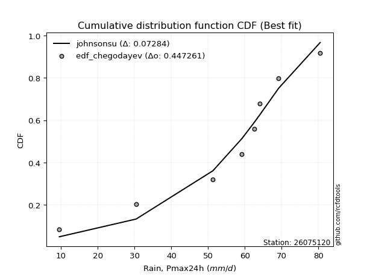</img>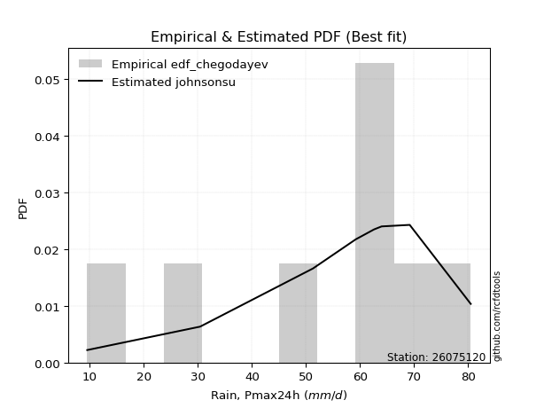</img>

</div>


### 6. Empirical - EDF Blom (1958)

The Blom formula is a specific "plotting position" formula used in hydrology and statistical analysis to estimate the empirical cumulative probability (or non-exceedance probability) of a data series. It is particularly recommended for data that are approximately normally distributed. The constant _a_ is set to 0.375 (or 3/8).

<div align="center">


$P=(m-a)/(n+1-2a)$


</div>


**6.1. Empirical values**

<div align="center">

|                | 0                   | 1                   | 2                   | 3                  | 4        | 5                  | 6                  | 7                  | 8                  |
|:---------------|:--------------------|:--------------------|:--------------------|:-------------------|:---------|:-------------------|:-------------------|:-------------------|:-------------------|
| date           | 2023                | 2019                | 2025                | 2020               | 2021     | 2018               | 2024               | 2017               | 2022               |
| x              | 9.5                 | 30.4                | 40.6                | 51.3               | 59.2     | 62.6               | 64.0               | 69.2               | 80.5               |
| m              | 1                   | 2                   | 3                   | 4                  | 5        | 6                  | 7                  | 8                  | 9                  |
| empirical_dist | edf_blom            | edf_blom            | edf_blom            | edf_blom           | edf_blom | edf_blom           | edf_blom           | edf_blom           | edf_blom           |
| empirical      | 0.06756756756756757 | 0.17567567567567569 | 0.28378378378378377 | 0.3918918918918919 | 0.5      | 0.6081081081081081 | 0.7162162162162162 | 0.8243243243243243 | 0.9324324324324325 |
| empirical_tr   | 1.072463768115942   | 1.2131147540983607  | 1.3962264150943395  | 1.6444444444444444 | 2.0      | 2.5517241379310347 | 3.523809523809524  | 5.6923076923076925 | 14.800000000000006 |

</div>


**6.2. Kolmogorov-Smirnov fit test (sorted by Δ)**


<div align="center">

|                | 0                   | 1                   | 2                   | 3                   | 4                   | 5                   | 6                   | 7                   | 8                   | 9                   | 10                  | 11                  | 12                  | 13                    | 14                  | 15                  | 16                  | 17                  | 18                  | 19                  | 20                  | 21                  | 22                  | 23                  | 24                  | 25                  | 26                  | 27                  | 28                  | 29                  | 30                  | 31                  | 32                  | 33                  | 34                  | 35                  | 36                  | 37                  | 38                  | 39                  | 40                  | 41                  | 42                  | 43                  | 44                  | 45                  | 46                  | 47                  | 48                  | 49                  | 50                  | 51                  | 52                  | 53                  | 54                  | 55                  | 56                  | 57                  | 58                  | 59                  | 60                  | 61                  | 62                  | 63                  | 64                  | 65                  | 66                  | 67                  | 68                  | 69                  | 70                  | 71                  | 72                  | 73                  | 74                  | 75                  | 76                  | 77                  | 78                  | 79                  | 80                  | 81                  | 82                  | 83                  | 84                  | 85                  | 86                  | 87                  | 88                  | 89                  |
|:---------------|:--------------------|:--------------------|:--------------------|:--------------------|:--------------------|:--------------------|:--------------------|:--------------------|:--------------------|:--------------------|:--------------------|:--------------------|:--------------------|:----------------------|:--------------------|:--------------------|:--------------------|:--------------------|:--------------------|:--------------------|:--------------------|:--------------------|:--------------------|:--------------------|:--------------------|:--------------------|:--------------------|:--------------------|:--------------------|:--------------------|:--------------------|:--------------------|:--------------------|:--------------------|:--------------------|:--------------------|:--------------------|:--------------------|:--------------------|:--------------------|:--------------------|:--------------------|:--------------------|:--------------------|:--------------------|:--------------------|:--------------------|:--------------------|:--------------------|:--------------------|:--------------------|:--------------------|:--------------------|:--------------------|:--------------------|:--------------------|:--------------------|:--------------------|:--------------------|:--------------------|:--------------------|:--------------------|:--------------------|:--------------------|:--------------------|:--------------------|:--------------------|:--------------------|:--------------------|:--------------------|:--------------------|:--------------------|:--------------------|:--------------------|:--------------------|:--------------------|:--------------------|:--------------------|:--------------------|:--------------------|:--------------------|:--------------------|:--------------------|:--------------------|:--------------------|:--------------------|:--------------------|:--------------------|:--------------------|:--------------------|
| station        | 26075120            | 26075120            | 26075120            | 26075120            | 26075120            | 26075120            | 26075120            | 26075120            | 26075120            | 26075120            | 26075120            | 26075120            | 26075120            | 26075120              | 26075120            | 26075120            | 26075120            | 26075120            | 26075120            | 26075120            | 26075120            | 26075120            | 26075120            | 26075120            | 26075120            | 26075120            | 26075120            | 26075120            | 26075120            | 26075120            | 26075120            | 26075120            | 26075120            | 26075120            | 26075120            | 26075120            | 26075120            | 26075120            | 26075120            | 26075120            | 26075120            | 26075120            | 26075120            | 26075120            | 26075120            | 26075120            | 26075120            | 26075120            | 26075120            | 26075120            | 26075120            | 26075120            | 26075120            | 26075120            | 26075120            | 26075120            | 26075120            | 26075120            | 26075120            | 26075120            | 26075120            | 26075120            | 26075120            | 26075120            | 26075120            | 26075120            | 26075120            | 26075120            | 26075120            | 26075120            | 26075120            | 26075120            | 26075120            | 26075120            | 26075120            | 26075120            | 26075120            | 26075120            | 26075120            | 26075120            | 26075120            | 26075120            | 26075120            | 26075120            | 26075120            | 26075120            | 26075120            | 26075120            | 26075120            | 26075120            |
| empirical_dist | edf_blom            | edf_blom            | edf_blom            | edf_blom            | edf_blom            | edf_blom            | edf_blom            | edf_blom            | edf_blom            | edf_blom            | edf_blom            | edf_blom            | edf_blom            | edf_blom              | edf_blom            | edf_blom            | edf_blom            | edf_blom            | edf_blom            | edf_blom            | edf_blom            | edf_blom            | edf_blom            | edf_blom            | edf_blom            | edf_blom            | edf_blom            | edf_blom            | edf_blom            | edf_blom            | edf_blom            | edf_blom            | edf_blom            | edf_blom            | edf_blom            | edf_blom            | edf_blom            | edf_blom            | edf_blom            | edf_blom            | edf_blom            | edf_blom            | edf_blom            | edf_blom            | edf_blom            | edf_blom            | edf_blom            | edf_blom            | edf_blom            | edf_blom            | edf_blom            | edf_blom            | edf_blom            | edf_blom            | edf_blom            | edf_blom            | edf_blom            | edf_blom            | edf_blom            | edf_blom            | edf_blom            | edf_blom            | edf_blom            | edf_blom            | edf_blom            | edf_blom            | edf_blom            | edf_blom            | edf_blom            | edf_blom            | edf_blom            | edf_blom            | edf_blom            | edf_blom            | edf_blom            | edf_blom            | edf_blom            | edf_blom            | edf_blom            | edf_blom            | edf_blom            | edf_blom            | edf_blom            | edf_blom            | edf_blom            | edf_blom            | edf_blom            | edf_blom            | edf_blom            | edf_blom            |
| p_dist         | genlogistic         | logjohnsonsu        | laplace_asymmetric  | johnsonsu           | weibull_min         | mielke              | logloggamma         | logmielke           | gumbel_l            | pearson3            | logpearson3         | fisk                | logfisk             | loglaplace_asymmetric | loggumbel_l         | fatiguelife         | nct                 | t                   | norm                | crystalball         | truncnorm           | exponnorm           | rice                | f                   | betaprime           | erlang              | invweibull          | invgamma            | chi2                | gamma               | ncf                 | logistic            | logt                | loggompertz         | invgauss            | lognakagami         | maxwell             | rayleigh            | hypsecant           | kstwobign           | genexpon            | logbetaprime        | halfnorm            | lognct              | logfatiguelife      | logrice             | lognorm             | lognorm             | logcrystalball      | logexponnorm        | logf                | logncf              | logalpha            | loggamma            | loggamma            | loginvweibull       | laplace             | logerlang           | loglogistic         | gumbel_r            | loginvgamma         | loginvgauss         | loghypsecant        | halflogistic        | logmaxwell          | moyal               | lograyleigh         | loglaplace          | expon               | logkstwobign        | alpha               | loghalfnorm         | loggenexpon         | loggumbel_r         | logtruncnorm        | wald                | loghalflogistic     | logmoyal            | nakagami            | gibrat              | logwald             | logexpon            | loggibrat           | gompertz            | loglognorm          | logweibull_min      | pareto              | logpareto           | logchi2             | loggenlogistic      |
| delta          | 0.0577436468117124  | 0.06040475451480398 | 0.06134243116564453 | 0.06856489407527311 | 0.08162224711741028 | 0.08466434863029049 | 0.08581264047830961 | 0.08596723890801528 | 0.08657332772922488 | 0.09840423280352484 | 0.0985761191985901  | 0.10488311503743131 | 0.1208837603352878  | 0.12257634657142691   | 0.1256022776262803  | 0.1379542059597385  | 0.1380174719339753  | 0.138060081748836   | 0.13806011798996765 | 0.13806012359333364 | 0.1380602275424132  | 0.13806242426125082 | 0.13810318490761175 | 0.13821563673392356 | 0.1405344325481862  | 0.14278371411545332 | 0.14356924366369128 | 0.14466698299201053 | 0.1463102132231049  | 0.147591641491023   | 0.15207641708508168 | 0.15492887174737735 | 0.1556992152622844  | 0.1568626810956142  | 0.15928946407423372 | 0.15972888791883716 | 0.1609462512308002  | 0.1678788336473327  | 0.1682143283099543  | 0.1699791991335904  | 0.17386935376962276 | 0.1868595156071725  | 0.18790901640597257 | 0.18802171357490494 | 0.18834133711325562 | 0.18867581475754336 | 0.18867781377209802 | 0.18867781377209802 | 0.1886787256654121  | 0.1886812058872004  | 0.1891962415503965  | 0.18935710976360898 | 0.19289468241762597 | 0.19495185277945004 | 0.19495185277945004 | 0.19650627367004503 | 0.19661669334174747 | 0.19893719910784935 | 0.19928631605297353 | 0.19984575610127553 | 0.20076371056003117 | 0.20729407368836217 | 0.20809750033820518 | 0.21617671073270994 | 0.21683671677934424 | 0.2204378008747011  | 0.2256901948157618  | 0.23307055512289598 | 0.23580187587999712 | 0.23957060838379052 | 0.2506114347978011  | 0.25077826706584183 | 0.25267685931804407 | 0.25695105355909464 | 0.2649343181986126  | 0.27847962578374663 | 0.27883734658979176 | 0.2806084377918455  | 0.2867653486963271  | 0.31071926858188614 | 0.34635385385200534 | 0.3496930216620504  | 0.37733610907317294 | 0.43276450527601135 | 0.4492411841442028  | 0.4571636005030715  | 0.4670573476321531  | 0.48318338396053073 | 0.5219907876862101  | 0.8243243243243243  |
| deltao         | 0.41761268023100007 | 0.41761268023100007 | 0.41761268023100007 | 0.41761268023100007 | 0.41761268023100007 | 0.41761268023100007 | 0.41761268023100007 | 0.41761268023100007 | 0.41761268023100007 | 0.41761268023100007 | 0.41761268023100007 | 0.41761268023100007 | 0.41761268023100007 | 0.41761268023100007   | 0.41761268023100007 | 0.41761268023100007 | 0.41761268023100007 | 0.41761268023100007 | 0.41761268023100007 | 0.41761268023100007 | 0.41761268023100007 | 0.41761268023100007 | 0.41761268023100007 | 0.41761268023100007 | 0.41761268023100007 | 0.41761268023100007 | 0.41761268023100007 | 0.41761268023100007 | 0.41761268023100007 | 0.41761268023100007 | 0.41761268023100007 | 0.41761268023100007 | 0.41761268023100007 | 0.41761268023100007 | 0.41761268023100007 | 0.41761268023100007 | 0.41761268023100007 | 0.41761268023100007 | 0.41761268023100007 | 0.41761268023100007 | 0.41761268023100007 | 0.41761268023100007 | 0.41761268023100007 | 0.41761268023100007 | 0.41761268023100007 | 0.41761268023100007 | 0.41761268023100007 | 0.41761268023100007 | 0.41761268023100007 | 0.41761268023100007 | 0.41761268023100007 | 0.41761268023100007 | 0.41761268023100007 | 0.41761268023100007 | 0.41761268023100007 | 0.41761268023100007 | 0.41761268023100007 | 0.41761268023100007 | 0.41761268023100007 | 0.41761268023100007 | 0.41761268023100007 | 0.41761268023100007 | 0.41761268023100007 | 0.41761268023100007 | 0.41761268023100007 | 0.41761268023100007 | 0.41761268023100007 | 0.41761268023100007 | 0.41761268023100007 | 0.41761268023100007 | 0.41761268023100007 | 0.41761268023100007 | 0.41761268023100007 | 0.41761268023100007 | 0.41761268023100007 | 0.41761268023100007 | 0.41761268023100007 | 0.41761268023100007 | 0.41761268023100007 | 0.41761268023100007 | 0.41761268023100007 | 0.41761268023100007 | 0.41761268023100007 | 0.41761268023100007 | 0.41761268023100007 | 0.41761268023100007 | 0.41761268023100007 | 0.41761268023100007 | 0.41761268023100007 | 0.41761268023100007 |
| eval           | Δo > Δ              | Δo > Δ              | Δo > Δ              | Δo > Δ              | Δo > Δ              | Δo > Δ              | Δo > Δ              | Δo > Δ              | Δo > Δ              | Δo > Δ              | Δo > Δ              | Δo > Δ              | Δo > Δ              | Δo > Δ                | Δo > Δ              | Δo > Δ              | Δo > Δ              | Δo > Δ              | Δo > Δ              | Δo > Δ              | Δo > Δ              | Δo > Δ              | Δo > Δ              | Δo > Δ              | Δo > Δ              | Δo > Δ              | Δo > Δ              | Δo > Δ              | Δo > Δ              | Δo > Δ              | Δo > Δ              | Δo > Δ              | Δo > Δ              | Δo > Δ              | Δo > Δ              | Δo > Δ              | Δo > Δ              | Δo > Δ              | Δo > Δ              | Δo > Δ              | Δo > Δ              | Δo > Δ              | Δo > Δ              | Δo > Δ              | Δo > Δ              | Δo > Δ              | Δo > Δ              | Δo > Δ              | Δo > Δ              | Δo > Δ              | Δo > Δ              | Δo > Δ              | Δo > Δ              | Δo > Δ              | Δo > Δ              | Δo > Δ              | Δo > Δ              | Δo > Δ              | Δo > Δ              | Δo > Δ              | Δo > Δ              | Δo > Δ              | Δo > Δ              | Δo > Δ              | Δo > Δ              | Δo > Δ              | Δo > Δ              | Δo > Δ              | Δo > Δ              | Δo > Δ              | Δo > Δ              | Δo > Δ              | Δo > Δ              | Δo > Δ              | Δo > Δ              | Δo > Δ              | Δo > Δ              | Δo > Δ              | Δo > Δ              | Δo > Δ              | Δo > Δ              | Δo > Δ              | Δo > Δ              | Δo <= Δ             | Δo <= Δ             | Δo <= Δ             | Δo <= Δ             | Δo <= Δ             | Δo <= Δ             | Δo <= Δ             |
| fit            | 1                   | 1                   | 1                   | 1                   | 1                   | 1                   | 1                   | 1                   | 1                   | 1                   | 1                   | 1                   | 1                   | 1                     | 1                   | 1                   | 1                   | 1                   | 1                   | 1                   | 1                   | 1                   | 1                   | 1                   | 1                   | 1                   | 1                   | 1                   | 1                   | 1                   | 1                   | 1                   | 1                   | 1                   | 1                   | 1                   | 1                   | 1                   | 1                   | 1                   | 1                   | 1                   | 1                   | 1                   | 1                   | 1                   | 1                   | 1                   | 1                   | 1                   | 1                   | 1                   | 1                   | 1                   | 1                   | 1                   | 1                   | 1                   | 1                   | 1                   | 1                   | 1                   | 1                   | 1                   | 1                   | 1                   | 1                   | 1                   | 1                   | 1                   | 1                   | 1                   | 1                   | 1                   | 1                   | 1                   | 1                   | 1                   | 1                   | 1                   | 1                   | 1                   | 1                   | 0                   | 0                   | 0                   | 0                   | 0                   | 0                   | 0                   |
| n              | 9                   | 9                   | 9                   | 9                   | 9                   | 9                   | 9                   | 9                   | 9                   | 9                   | 9                   | 9                   | 9                   | 9                     | 9                   | 9                   | 9                   | 9                   | 9                   | 9                   | 9                   | 9                   | 9                   | 9                   | 9                   | 9                   | 9                   | 9                   | 9                   | 9                   | 9                   | 9                   | 9                   | 9                   | 9                   | 9                   | 9                   | 9                   | 9                   | 9                   | 9                   | 9                   | 9                   | 9                   | 9                   | 9                   | 9                   | 9                   | 9                   | 9                   | 9                   | 9                   | 9                   | 9                   | 9                   | 9                   | 9                   | 9                   | 9                   | 9                   | 9                   | 9                   | 9                   | 9                   | 9                   | 9                   | 9                   | 9                   | 9                   | 9                   | 9                   | 9                   | 9                   | 9                   | 9                   | 9                   | 9                   | 9                   | 9                   | 9                   | 9                   | 9                   | 9                   | 9                   | 9                   | 9                   | 9                   | 9                   | 9                   | 9                   |
| best_fit       | 1                   | 0                   | 0                   | 0                   | 0                   | 0                   | 0                   | 0                   | 0                   | 0                   | 0                   | 0                   | 0                   | 0                     | 0                   | 0                   | 0                   | 0                   | 0                   | 0                   | 0                   | 0                   | 0                   | 0                   | 0                   | 0                   | 0                   | 0                   | 0                   | 0                   | 0                   | 0                   | 0                   | 0                   | 0                   | 0                   | 0                   | 0                   | 0                   | 0                   | 0                   | 0                   | 0                   | 0                   | 0                   | 0                   | 0                   | 0                   | 0                   | 0                   | 0                   | 0                   | 0                   | 0                   | 0                   | 0                   | 0                   | 0                   | 0                   | 0                   | 0                   | 0                   | 0                   | 0                   | 0                   | 0                   | 0                   | 0                   | 0                   | 0                   | 0                   | 0                   | 0                   | 0                   | 0                   | 0                   | 0                   | 0                   | 0                   | 0                   | 0                   | 0                   | 0                   | 0                   | 0                   | 0                   | 0                   | 0                   | 0                   | 0                   |
| best_fit_sort  | 1                   | 2                   | 3                   | 4                   | 5                   | 6                   | 7                   | 8                   | 9                   | 10                  | 11                  | 12                  | 13                  | 14                    | 15                  | 16                  | 17                  | 18                  | 19                  | 20                  | 21                  | 22                  | 23                  | 24                  | 25                  | 26                  | 27                  | 28                  | 29                  | 30                  | 31                  | 32                  | 33                  | 34                  | 35                  | 36                  | 37                  | 38                  | 39                  | 40                  | 41                  | 42                  | 43                  | 44                  | 45                  | 46                  | 47                  | 48                  | 49                  | 50                  | 51                  | 52                  | 53                  | 54                  | 55                  | 56                  | 57                  | 58                  | 59                  | 60                  | 61                  | 62                  | 63                  | 64                  | 65                  | 66                  | 67                  | 68                  | 69                  | 70                  | 71                  | 72                  | 73                  | 74                  | 75                  | 76                  | 77                  | 78                  | 79                  | 80                  | 81                  | 82                  | 83                  | 84                  | 85                  | 86                  | 87                  | 88                  | 89                  | 90                  |

</div>


<div align="center">

</img>

</div>


**6.3. Best fit**

<div align="center">

|   id |   station | empirical_dist   | p_dist      |     delta |   deltao | eval   |   fit |   n |   best_fit |   best_fit_sort |
|-----:|----------:|:-----------------|:------------|----------:|---------:|:-------|------:|----:|-----------:|----------------:|
|    0 |  26075120 | edf_blom         | genlogistic | 0.0577436 | 0.417613 | Δo > Δ |     1 |   9 |          1 |               1 |

</div>


<div align="center">

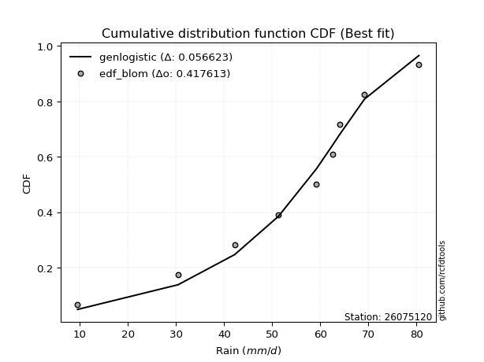</img>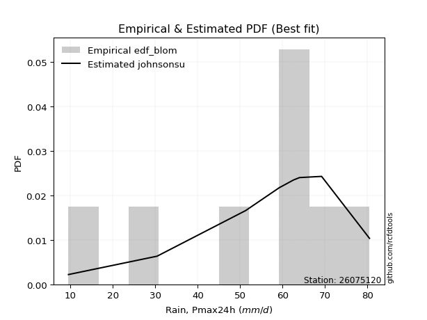</img>

</div>


### 7. Empirical - EDF Tukey (1962)

In hydrology, the Tukey formula is used as a plotting position formula to estimate the empirical probability or frequency of a flood event (or other hydrological data). The formula parameter is given as _c=0.333_ (or 1/3).

<div align="center">


$P=(m-c)/(n+1-2c)$


</div>


**7.1. Empirical values**

<div align="center">

|                | 0                   | 1                   | 2                  | 3                   | 4         | 5                  | 6                  | 7                  | 8                  |
|:---------------|:--------------------|:--------------------|:-------------------|:--------------------|:----------|:-------------------|:-------------------|:-------------------|:-------------------|
| date           | 2023                | 2019                | 2025               | 2020                | 2021      | 2018               | 2024               | 2017               | 2022               |
| x              | 9.5                 | 30.4                | 40.6               | 51.3                | 59.2      | 62.6               | 64.0               | 69.2               | 80.5               |
| m              | 1                   | 2                   | 3                  | 4                   | 5         | 6                  | 7                  | 8                  | 9                  |
| empirical_dist | edf_tukey           | edf_tukey           | edf_tukey          | edf_tukey           | edf_tukey | edf_tukey          | edf_tukey          | edf_tukey          | edf_tukey          |
| empirical      | 0.07142857142857142 | 0.17857142857142858 | 0.2857142857142857 | 0.39285714285714285 | 0.5       | 0.6071428571428571 | 0.7142857142857143 | 0.8214285714285714 | 0.9285714285714286 |
| empirical_tr   | 1.0769230769230769  | 1.2173913043478262  | 1.4                | 1.6470588235294117  | 2.0       | 2.545454545454545  | 3.5                | 5.599999999999999  | 14.000000000000007 |

</div>


**7.2. Kolmogorov-Smirnov fit test (sorted by Δ)**


<div align="center">

|                | 0                   | 1                   | 2                   | 3                   | 4                   | 5                   | 6                   | 7                   | 8                   | 9                   | 10                  | 11                  | 12                  | 13                    | 14                  | 15                  | 16                  | 17                  | 18                  | 19                  | 20                  | 21                  | 22                  | 23                  | 24                  | 25                  | 26                  | 27                  | 28                  | 29                  | 30                  | 31                  | 32                  | 33                  | 34                  | 35                  | 36                  | 37                  | 38                  | 39                  | 40                  | 41                  | 42                  | 43                  | 44                  | 45                  | 46                  | 47                  | 48                  | 49                  | 50                  | 51                  | 52                  | 53                  | 54                  | 55                  | 56                  | 57                  | 58                  | 59                  | 60                  | 61                  | 62                  | 63                  | 64                  | 65                  | 66                  | 67                  | 68                  | 69                  | 70                  | 71                  | 72                  | 73                  | 74                  | 75                  | 76                  | 77                  | 78                  | 79                  | 80                  | 81                  | 82                  | 83                  | 84                  | 85                  | 86                  | 87                  | 88                  | 89                  |
|:---------------|:--------------------|:--------------------|:--------------------|:--------------------|:--------------------|:--------------------|:--------------------|:--------------------|:--------------------|:--------------------|:--------------------|:--------------------|:--------------------|:----------------------|:--------------------|:--------------------|:--------------------|:--------------------|:--------------------|:--------------------|:--------------------|:--------------------|:--------------------|:--------------------|:--------------------|:--------------------|:--------------------|:--------------------|:--------------------|:--------------------|:--------------------|:--------------------|:--------------------|:--------------------|:--------------------|:--------------------|:--------------------|:--------------------|:--------------------|:--------------------|:--------------------|:--------------------|:--------------------|:--------------------|:--------------------|:--------------------|:--------------------|:--------------------|:--------------------|:--------------------|:--------------------|:--------------------|:--------------------|:--------------------|:--------------------|:--------------------|:--------------------|:--------------------|:--------------------|:--------------------|:--------------------|:--------------------|:--------------------|:--------------------|:--------------------|:--------------------|:--------------------|:--------------------|:--------------------|:--------------------|:--------------------|:--------------------|:--------------------|:--------------------|:--------------------|:--------------------|:--------------------|:--------------------|:--------------------|:--------------------|:--------------------|:--------------------|:--------------------|:--------------------|:--------------------|:--------------------|:--------------------|:--------------------|:--------------------|:--------------------|
| station        | 26075120            | 26075120            | 26075120            | 26075120            | 26075120            | 26075120            | 26075120            | 26075120            | 26075120            | 26075120            | 26075120            | 26075120            | 26075120            | 26075120              | 26075120            | 26075120            | 26075120            | 26075120            | 26075120            | 26075120            | 26075120            | 26075120            | 26075120            | 26075120            | 26075120            | 26075120            | 26075120            | 26075120            | 26075120            | 26075120            | 26075120            | 26075120            | 26075120            | 26075120            | 26075120            | 26075120            | 26075120            | 26075120            | 26075120            | 26075120            | 26075120            | 26075120            | 26075120            | 26075120            | 26075120            | 26075120            | 26075120            | 26075120            | 26075120            | 26075120            | 26075120            | 26075120            | 26075120            | 26075120            | 26075120            | 26075120            | 26075120            | 26075120            | 26075120            | 26075120            | 26075120            | 26075120            | 26075120            | 26075120            | 26075120            | 26075120            | 26075120            | 26075120            | 26075120            | 26075120            | 26075120            | 26075120            | 26075120            | 26075120            | 26075120            | 26075120            | 26075120            | 26075120            | 26075120            | 26075120            | 26075120            | 26075120            | 26075120            | 26075120            | 26075120            | 26075120            | 26075120            | 26075120            | 26075120            | 26075120            |
| empirical_dist | edf_tukey           | edf_tukey           | edf_tukey           | edf_tukey           | edf_tukey           | edf_tukey           | edf_tukey           | edf_tukey           | edf_tukey           | edf_tukey           | edf_tukey           | edf_tukey           | edf_tukey           | edf_tukey             | edf_tukey           | edf_tukey           | edf_tukey           | edf_tukey           | edf_tukey           | edf_tukey           | edf_tukey           | edf_tukey           | edf_tukey           | edf_tukey           | edf_tukey           | edf_tukey           | edf_tukey           | edf_tukey           | edf_tukey           | edf_tukey           | edf_tukey           | edf_tukey           | edf_tukey           | edf_tukey           | edf_tukey           | edf_tukey           | edf_tukey           | edf_tukey           | edf_tukey           | edf_tukey           | edf_tukey           | edf_tukey           | edf_tukey           | edf_tukey           | edf_tukey           | edf_tukey           | edf_tukey           | edf_tukey           | edf_tukey           | edf_tukey           | edf_tukey           | edf_tukey           | edf_tukey           | edf_tukey           | edf_tukey           | edf_tukey           | edf_tukey           | edf_tukey           | edf_tukey           | edf_tukey           | edf_tukey           | edf_tukey           | edf_tukey           | edf_tukey           | edf_tukey           | edf_tukey           | edf_tukey           | edf_tukey           | edf_tukey           | edf_tukey           | edf_tukey           | edf_tukey           | edf_tukey           | edf_tukey           | edf_tukey           | edf_tukey           | edf_tukey           | edf_tukey           | edf_tukey           | edf_tukey           | edf_tukey           | edf_tukey           | edf_tukey           | edf_tukey           | edf_tukey           | edf_tukey           | edf_tukey           | edf_tukey           | edf_tukey           | edf_tukey           |
| p_dist         | genlogistic         | logjohnsonsu        | laplace_asymmetric  | johnsonsu           | weibull_min         | mielke              | logloggamma         | logmielke           | gumbel_l            | logpearson3         | pearson3            | fisk                | logfisk             | loglaplace_asymmetric | loggumbel_l         | fatiguelife         | nct                 | t                   | norm                | crystalball         | truncnorm           | exponnorm           | rice                | f                   | betaprime           | erlang              | invweibull          | invgamma            | chi2                | gamma               | ncf                 | logistic            | loggompertz         | logt                | invgauss            | maxwell             | lognakagami         | rayleigh            | hypsecant           | kstwobign           | genexpon            | logbetaprime        | lognct              | logfatiguelife      | logrice             | lognorm             | lognorm             | logcrystalball      | logexponnorm        | halfnorm            | logf                | logncf              | logalpha            | loggamma            | loggamma            | loginvweibull       | laplace             | logerlang           | loglogistic         | loginvgamma         | gumbel_r            | loginvgauss         | loghypsecant        | logmaxwell          | halflogistic        | moyal               | lograyleigh         | loglaplace          | expon               | logkstwobign        | alpha               | loghalfnorm         | loggenexpon         | loggumbel_r         | logtruncnorm        | loghalflogistic     | wald                | logmoyal            | nakagami            | gibrat              | logwald             | logexpon            | loggibrat           | gompertz            | loglognorm          | logweibull_min      | pareto              | logpareto           | logchi2             | loggenlogistic      |
| delta          | 0.0577436468117124  | 0.06015844252238878 | 0.06134243116564453 | 0.06856489407527311 | 0.08162224711741028 | 0.08176859573453754 | 0.08581264047830961 | 0.08596723890801528 | 0.08657332772922488 | 0.09568036630283716 | 0.09840423280352484 | 0.10488311503743131 | 0.1208837603352878  | 0.12257634657142691   | 0.12515493053743265 | 0.1379542059597385  | 0.1380174719339753  | 0.138060081748836   | 0.13806011798996765 | 0.13806012359333364 | 0.1380602275424132  | 0.13806242426125082 | 0.13810318490761175 | 0.13821563673392356 | 0.1405344325481862  | 0.14278371411545332 | 0.14356924366369128 | 0.14466698299201053 | 0.1463102132231049  | 0.147591641491023   | 0.15207641708508168 | 0.15492887174737735 | 0.1568626810956142  | 0.15762971719278632 | 0.15928946407423372 | 0.1609462512308002  | 0.16262464081459005 | 0.1678788336473327  | 0.1682143283099543  | 0.16901394816833942 | 0.1729041028043718  | 0.18589426464192155 | 0.18705646260965397 | 0.18737608614800466 | 0.1877105637922924  | 0.18771256280684706 | 0.18771256280684706 | 0.18771347470016114 | 0.18771595492194942 | 0.18790901640597257 | 0.18823099058514553 | 0.18839185879835801 | 0.191929431452375   | 0.19398660181419908 | 0.19398660181419908 | 0.1945757717395431  | 0.19661669334174747 | 0.1979719481425984  | 0.19832106508772257 | 0.1997984595947802  | 0.19984575610127553 | 0.2063288227231112  | 0.2071322493729542  | 0.21587146581409328 | 0.21617671073270994 | 0.2204378008747011  | 0.22472494385051084 | 0.23210530415764502 | 0.2338713739494952  | 0.2376401064532886  | 0.2486809328672992  | 0.24981301610059087 | 0.25074635738754214 | 0.2559858025938437  | 0.2649343181986126  | 0.2778720956245408  | 0.27847962578374663 | 0.27964318682659456 | 0.2858000977310761  | 0.31071926858188614 | 0.3453886028867544  | 0.34679726876629746 | 0.376370858107922   | 0.4308340033455094  | 0.44634543124844983 | 0.45426784760731853 | 0.4641615947364002  | 0.4802876310647778  | 0.5190950347904572  | 0.8214285714285714  |
| deltao         | 0.41761268023100007 | 0.41761268023100007 | 0.41761268023100007 | 0.41761268023100007 | 0.41761268023100007 | 0.41761268023100007 | 0.41761268023100007 | 0.41761268023100007 | 0.41761268023100007 | 0.41761268023100007 | 0.41761268023100007 | 0.41761268023100007 | 0.41761268023100007 | 0.41761268023100007   | 0.41761268023100007 | 0.41761268023100007 | 0.41761268023100007 | 0.41761268023100007 | 0.41761268023100007 | 0.41761268023100007 | 0.41761268023100007 | 0.41761268023100007 | 0.41761268023100007 | 0.41761268023100007 | 0.41761268023100007 | 0.41761268023100007 | 0.41761268023100007 | 0.41761268023100007 | 0.41761268023100007 | 0.41761268023100007 | 0.41761268023100007 | 0.41761268023100007 | 0.41761268023100007 | 0.41761268023100007 | 0.41761268023100007 | 0.41761268023100007 | 0.41761268023100007 | 0.41761268023100007 | 0.41761268023100007 | 0.41761268023100007 | 0.41761268023100007 | 0.41761268023100007 | 0.41761268023100007 | 0.41761268023100007 | 0.41761268023100007 | 0.41761268023100007 | 0.41761268023100007 | 0.41761268023100007 | 0.41761268023100007 | 0.41761268023100007 | 0.41761268023100007 | 0.41761268023100007 | 0.41761268023100007 | 0.41761268023100007 | 0.41761268023100007 | 0.41761268023100007 | 0.41761268023100007 | 0.41761268023100007 | 0.41761268023100007 | 0.41761268023100007 | 0.41761268023100007 | 0.41761268023100007 | 0.41761268023100007 | 0.41761268023100007 | 0.41761268023100007 | 0.41761268023100007 | 0.41761268023100007 | 0.41761268023100007 | 0.41761268023100007 | 0.41761268023100007 | 0.41761268023100007 | 0.41761268023100007 | 0.41761268023100007 | 0.41761268023100007 | 0.41761268023100007 | 0.41761268023100007 | 0.41761268023100007 | 0.41761268023100007 | 0.41761268023100007 | 0.41761268023100007 | 0.41761268023100007 | 0.41761268023100007 | 0.41761268023100007 | 0.41761268023100007 | 0.41761268023100007 | 0.41761268023100007 | 0.41761268023100007 | 0.41761268023100007 | 0.41761268023100007 | 0.41761268023100007 |
| eval           | Δo > Δ              | Δo > Δ              | Δo > Δ              | Δo > Δ              | Δo > Δ              | Δo > Δ              | Δo > Δ              | Δo > Δ              | Δo > Δ              | Δo > Δ              | Δo > Δ              | Δo > Δ              | Δo > Δ              | Δo > Δ                | Δo > Δ              | Δo > Δ              | Δo > Δ              | Δo > Δ              | Δo > Δ              | Δo > Δ              | Δo > Δ              | Δo > Δ              | Δo > Δ              | Δo > Δ              | Δo > Δ              | Δo > Δ              | Δo > Δ              | Δo > Δ              | Δo > Δ              | Δo > Δ              | Δo > Δ              | Δo > Δ              | Δo > Δ              | Δo > Δ              | Δo > Δ              | Δo > Δ              | Δo > Δ              | Δo > Δ              | Δo > Δ              | Δo > Δ              | Δo > Δ              | Δo > Δ              | Δo > Δ              | Δo > Δ              | Δo > Δ              | Δo > Δ              | Δo > Δ              | Δo > Δ              | Δo > Δ              | Δo > Δ              | Δo > Δ              | Δo > Δ              | Δo > Δ              | Δo > Δ              | Δo > Δ              | Δo > Δ              | Δo > Δ              | Δo > Δ              | Δo > Δ              | Δo > Δ              | Δo > Δ              | Δo > Δ              | Δo > Δ              | Δo > Δ              | Δo > Δ              | Δo > Δ              | Δo > Δ              | Δo > Δ              | Δo > Δ              | Δo > Δ              | Δo > Δ              | Δo > Δ              | Δo > Δ              | Δo > Δ              | Δo > Δ              | Δo > Δ              | Δo > Δ              | Δo > Δ              | Δo > Δ              | Δo > Δ              | Δo > Δ              | Δo > Δ              | Δo > Δ              | Δo <= Δ             | Δo <= Δ             | Δo <= Δ             | Δo <= Δ             | Δo <= Δ             | Δo <= Δ             | Δo <= Δ             |
| fit            | 1                   | 1                   | 1                   | 1                   | 1                   | 1                   | 1                   | 1                   | 1                   | 1                   | 1                   | 1                   | 1                   | 1                     | 1                   | 1                   | 1                   | 1                   | 1                   | 1                   | 1                   | 1                   | 1                   | 1                   | 1                   | 1                   | 1                   | 1                   | 1                   | 1                   | 1                   | 1                   | 1                   | 1                   | 1                   | 1                   | 1                   | 1                   | 1                   | 1                   | 1                   | 1                   | 1                   | 1                   | 1                   | 1                   | 1                   | 1                   | 1                   | 1                   | 1                   | 1                   | 1                   | 1                   | 1                   | 1                   | 1                   | 1                   | 1                   | 1                   | 1                   | 1                   | 1                   | 1                   | 1                   | 1                   | 1                   | 1                   | 1                   | 1                   | 1                   | 1                   | 1                   | 1                   | 1                   | 1                   | 1                   | 1                   | 1                   | 1                   | 1                   | 1                   | 1                   | 0                   | 0                   | 0                   | 0                   | 0                   | 0                   | 0                   |
| n              | 9                   | 9                   | 9                   | 9                   | 9                   | 9                   | 9                   | 9                   | 9                   | 9                   | 9                   | 9                   | 9                   | 9                     | 9                   | 9                   | 9                   | 9                   | 9                   | 9                   | 9                   | 9                   | 9                   | 9                   | 9                   | 9                   | 9                   | 9                   | 9                   | 9                   | 9                   | 9                   | 9                   | 9                   | 9                   | 9                   | 9                   | 9                   | 9                   | 9                   | 9                   | 9                   | 9                   | 9                   | 9                   | 9                   | 9                   | 9                   | 9                   | 9                   | 9                   | 9                   | 9                   | 9                   | 9                   | 9                   | 9                   | 9                   | 9                   | 9                   | 9                   | 9                   | 9                   | 9                   | 9                   | 9                   | 9                   | 9                   | 9                   | 9                   | 9                   | 9                   | 9                   | 9                   | 9                   | 9                   | 9                   | 9                   | 9                   | 9                   | 9                   | 9                   | 9                   | 9                   | 9                   | 9                   | 9                   | 9                   | 9                   | 9                   |
| best_fit       | 1                   | 0                   | 0                   | 0                   | 0                   | 0                   | 0                   | 0                   | 0                   | 0                   | 0                   | 0                   | 0                   | 0                     | 0                   | 0                   | 0                   | 0                   | 0                   | 0                   | 0                   | 0                   | 0                   | 0                   | 0                   | 0                   | 0                   | 0                   | 0                   | 0                   | 0                   | 0                   | 0                   | 0                   | 0                   | 0                   | 0                   | 0                   | 0                   | 0                   | 0                   | 0                   | 0                   | 0                   | 0                   | 0                   | 0                   | 0                   | 0                   | 0                   | 0                   | 0                   | 0                   | 0                   | 0                   | 0                   | 0                   | 0                   | 0                   | 0                   | 0                   | 0                   | 0                   | 0                   | 0                   | 0                   | 0                   | 0                   | 0                   | 0                   | 0                   | 0                   | 0                   | 0                   | 0                   | 0                   | 0                   | 0                   | 0                   | 0                   | 0                   | 0                   | 0                   | 0                   | 0                   | 0                   | 0                   | 0                   | 0                   | 0                   |
| best_fit_sort  | 1                   | 2                   | 3                   | 4                   | 5                   | 6                   | 7                   | 8                   | 9                   | 10                  | 11                  | 12                  | 13                  | 14                    | 15                  | 16                  | 17                  | 18                  | 19                  | 20                  | 21                  | 22                  | 23                  | 24                  | 25                  | 26                  | 27                  | 28                  | 29                  | 30                  | 31                  | 32                  | 33                  | 34                  | 35                  | 36                  | 37                  | 38                  | 39                  | 40                  | 41                  | 42                  | 43                  | 44                  | 45                  | 46                  | 47                  | 48                  | 49                  | 50                  | 51                  | 52                  | 53                  | 54                  | 55                  | 56                  | 57                  | 58                  | 59                  | 60                  | 61                  | 62                  | 63                  | 64                  | 65                  | 66                  | 67                  | 68                  | 69                  | 70                  | 71                  | 72                  | 73                  | 74                  | 75                  | 76                  | 77                  | 78                  | 79                  | 80                  | 81                  | 82                  | 83                  | 84                  | 85                  | 86                  | 87                  | 88                  | 89                  | 90                  |

</div>


<div align="center">

</img>

</div>


**7.3. Best fit**

<div align="center">

|   id |   station | empirical_dist   | p_dist      |     delta |   deltao | eval   |   fit |   n |   best_fit |   best_fit_sort |
|-----:|----------:|:-----------------|:------------|----------:|---------:|:-------|------:|----:|-----------:|----------------:|
|    0 |  26075120 | edf_tukey        | genlogistic | 0.0577436 | 0.417613 | Δo > Δ |     1 |   9 |          1 |               1 |

</div>


<div align="center">

</img></img>

</div>


### 8. Empirical - EDF Gringorten (1963)

Gringorten plotting position formula is essential for estimating the probability and return periods of extreme events like floods and heavy rainfall. The constant _a=0.44_.

<div align="center">


$P=(m-a)/(n+1-2a)$


</div>


**8.1. Empirical values**

<div align="center">

|                | 0                    | 1                  | 2                   | 3                  | 4              | 5                  | 6                  | 7                  | 8                  |
|:---------------|:---------------------|:-------------------|:--------------------|:-------------------|:---------------|:-------------------|:-------------------|:-------------------|:-------------------|
| date           | 2023                 | 2019               | 2025                | 2020               | 2021           | 2018               | 2024               | 2017               | 2022               |
| x              | 9.5                  | 30.4               | 40.6                | 51.3               | 59.2           | 62.6               | 64.0               | 69.2               | 80.5               |
| m              | 1                    | 2                  | 3                   | 4                  | 5              | 6                  | 7                  | 8                  | 9                  |
| empirical_dist | edf_gringorten       | edf_gringorten     | edf_gringorten      | edf_gringorten     | edf_gringorten | edf_gringorten     | edf_gringorten     | edf_gringorten     | edf_gringorten     |
| empirical      | 0.061403508771929835 | 0.1710526315789474 | 0.28070175438596495 | 0.3903508771929825 | 0.5            | 0.6096491228070176 | 0.7192982456140351 | 0.8289473684210527 | 0.9385964912280703 |
| empirical_tr   | 1.0654205607476634   | 1.2063492063492063 | 1.3902439024390243  | 1.6402877697841727 | 2.0            | 2.561797752808989  | 3.5625             | 5.846153846153847  | 16.285714285714324 |

</div>


**8.2. Kolmogorov-Smirnov fit test (sorted by Δ)**


<div align="center">

|                | 0                   | 1                   | 2                   | 3                   | 4                   | 5                   | 6                   | 7                   | 8                   | 9                   | 10                  | 11                  | 12                  | 13                    | 14                  | 15                  | 16                  | 17                  | 18                  | 19                  | 20                  | 21                  | 22                  | 23                  | 24                  | 25                  | 26                  | 27                  | 28                  | 29                  | 30                  | 31                  | 32                  | 33                  | 34                  | 35                  | 36                  | 37                  | 38                  | 39                  | 40                  | 41                  | 42                  | 43                  | 44                  | 45                  | 46                  | 47                  | 48                  | 49                  | 50                  | 51                  | 52                  | 53                  | 54                  | 55                  | 56                  | 57                  | 58                  | 59                  | 60                  | 61                  | 62                  | 63                  | 64                  | 65                  | 66                  | 67                  | 68                  | 69                  | 70                  | 71                  | 72                  | 73                  | 74                  | 75                  | 76                  | 77                  | 78                  | 79                  | 80                  | 81                  | 82                  | 83                  | 84                  | 85                  | 86                  | 87                  | 88                  | 89                  |
|:---------------|:--------------------|:--------------------|:--------------------|:--------------------|:--------------------|:--------------------|:--------------------|:--------------------|:--------------------|:--------------------|:--------------------|:--------------------|:--------------------|:----------------------|:--------------------|:--------------------|:--------------------|:--------------------|:--------------------|:--------------------|:--------------------|:--------------------|:--------------------|:--------------------|:--------------------|:--------------------|:--------------------|:--------------------|:--------------------|:--------------------|:--------------------|:--------------------|:--------------------|:--------------------|:--------------------|:--------------------|:--------------------|:--------------------|:--------------------|:--------------------|:--------------------|:--------------------|:--------------------|:--------------------|:--------------------|:--------------------|:--------------------|:--------------------|:--------------------|:--------------------|:--------------------|:--------------------|:--------------------|:--------------------|:--------------------|:--------------------|:--------------------|:--------------------|:--------------------|:--------------------|:--------------------|:--------------------|:--------------------|:--------------------|:--------------------|:--------------------|:--------------------|:--------------------|:--------------------|:--------------------|:--------------------|:--------------------|:--------------------|:--------------------|:--------------------|:--------------------|:--------------------|:--------------------|:--------------------|:--------------------|:--------------------|:--------------------|:--------------------|:--------------------|:--------------------|:--------------------|:--------------------|:--------------------|:--------------------|:--------------------|
| station        | 26075120            | 26075120            | 26075120            | 26075120            | 26075120            | 26075120            | 26075120            | 26075120            | 26075120            | 26075120            | 26075120            | 26075120            | 26075120            | 26075120              | 26075120            | 26075120            | 26075120            | 26075120            | 26075120            | 26075120            | 26075120            | 26075120            | 26075120            | 26075120            | 26075120            | 26075120            | 26075120            | 26075120            | 26075120            | 26075120            | 26075120            | 26075120            | 26075120            | 26075120            | 26075120            | 26075120            | 26075120            | 26075120            | 26075120            | 26075120            | 26075120            | 26075120            | 26075120            | 26075120            | 26075120            | 26075120            | 26075120            | 26075120            | 26075120            | 26075120            | 26075120            | 26075120            | 26075120            | 26075120            | 26075120            | 26075120            | 26075120            | 26075120            | 26075120            | 26075120            | 26075120            | 26075120            | 26075120            | 26075120            | 26075120            | 26075120            | 26075120            | 26075120            | 26075120            | 26075120            | 26075120            | 26075120            | 26075120            | 26075120            | 26075120            | 26075120            | 26075120            | 26075120            | 26075120            | 26075120            | 26075120            | 26075120            | 26075120            | 26075120            | 26075120            | 26075120            | 26075120            | 26075120            | 26075120            | 26075120            |
| empirical_dist | edf_gringorten      | edf_gringorten      | edf_gringorten      | edf_gringorten      | edf_gringorten      | edf_gringorten      | edf_gringorten      | edf_gringorten      | edf_gringorten      | edf_gringorten      | edf_gringorten      | edf_gringorten      | edf_gringorten      | edf_gringorten        | edf_gringorten      | edf_gringorten      | edf_gringorten      | edf_gringorten      | edf_gringorten      | edf_gringorten      | edf_gringorten      | edf_gringorten      | edf_gringorten      | edf_gringorten      | edf_gringorten      | edf_gringorten      | edf_gringorten      | edf_gringorten      | edf_gringorten      | edf_gringorten      | edf_gringorten      | edf_gringorten      | edf_gringorten      | edf_gringorten      | edf_gringorten      | edf_gringorten      | edf_gringorten      | edf_gringorten      | edf_gringorten      | edf_gringorten      | edf_gringorten      | edf_gringorten      | edf_gringorten      | edf_gringorten      | edf_gringorten      | edf_gringorten      | edf_gringorten      | edf_gringorten      | edf_gringorten      | edf_gringorten      | edf_gringorten      | edf_gringorten      | edf_gringorten      | edf_gringorten      | edf_gringorten      | edf_gringorten      | edf_gringorten      | edf_gringorten      | edf_gringorten      | edf_gringorten      | edf_gringorten      | edf_gringorten      | edf_gringorten      | edf_gringorten      | edf_gringorten      | edf_gringorten      | edf_gringorten      | edf_gringorten      | edf_gringorten      | edf_gringorten      | edf_gringorten      | edf_gringorten      | edf_gringorten      | edf_gringorten      | edf_gringorten      | edf_gringorten      | edf_gringorten      | edf_gringorten      | edf_gringorten      | edf_gringorten      | edf_gringorten      | edf_gringorten      | edf_gringorten      | edf_gringorten      | edf_gringorten      | edf_gringorten      | edf_gringorten      | edf_gringorten      | edf_gringorten      | edf_gringorten      |
| p_dist         | genlogistic         | laplace_asymmetric  | logjohnsonsu        | johnsonsu           | weibull_min         | logloggamma         | logmielke           | gumbel_l            | mielke              | pearson3            | logpearson3         | fisk                | logfisk             | loglaplace_asymmetric | loggumbel_l         | fatiguelife         | nct                 | t                   | norm                | crystalball         | truncnorm           | exponnorm           | rice                | f                   | betaprime           | erlang              | invweibull          | invgamma            | chi2                | gamma               | ncf                 | logt                | logistic            | lognakagami         | loggompertz         | invgauss            | maxwell             | rayleigh            | hypsecant           | kstwobign           | genexpon            | halfnorm            | logbetaprime        | lognct              | logfatiguelife      | logrice             | lognorm             | lognorm             | logcrystalball      | logexponnorm        | logf                | logncf              | logalpha            | loggamma            | loggamma            | laplace             | gumbel_r            | logerlang           | loglogistic         | loginvweibull       | loginvgamma         | loginvgauss         | loghypsecant        | halflogistic        | logmaxwell          | moyal               | lograyleigh         | loglaplace          | expon               | logkstwobign        | loghalfnorm         | alpha               | loggenexpon         | loggumbel_r         | logtruncnorm        | wald                | loghalflogistic     | logmoyal            | nakagami            | gibrat              | logwald             | logexpon            | loggibrat           | gompertz            | loglognorm          | logweibull_min      | pareto              | logpareto           | logchi2             | loggenlogistic      |
| delta          | 0.0577436468117124  | 0.06134243116564453 | 0.06348678391262286 | 0.06856489407527311 | 0.08162224711741028 | 0.08581264047830961 | 0.08596723890801528 | 0.08657332772922488 | 0.0892873927270188  | 0.09840423280352484 | 0.10319916329531842 | 0.10488311503743131 | 0.1208837603352878  | 0.12257634657142691   | 0.12714329232518967 | 0.1379542059597385  | 0.1380174719339753  | 0.138060081748836   | 0.13806011798996765 | 0.13806012359333364 | 0.1380602275424132  | 0.13806242426125082 | 0.13810318490761175 | 0.13821563673392356 | 0.1405344325481862  | 0.14278371411545332 | 0.14356924366369128 | 0.14466698299201053 | 0.1463102132231049  | 0.147591641491023   | 0.15207641708508168 | 0.15261718586446557 | 0.15492887174737735 | 0.15510584382210887 | 0.1568626810956142  | 0.15928946407423372 | 0.1609462512308002  | 0.1678788336473327  | 0.1682143283099543  | 0.17152021383249977 | 0.17541036846853214 | 0.18790901640597257 | 0.1884005303060819  | 0.18956272827381432 | 0.189882351812165   | 0.19021682945645274 | 0.1902188284710074  | 0.1902188284710074  | 0.1902197403643215  | 0.19022222058610977 | 0.19073725624930588 | 0.19089812446251836 | 0.19443569711653536 | 0.19649286747835942 | 0.19649286747835942 | 0.19661669334174747 | 0.19984575610127553 | 0.20047821380675873 | 0.20082733075188292 | 0.20188201169894715 | 0.20230472525894055 | 0.20883508838727155 | 0.20963851503711456 | 0.21617671073270994 | 0.21837773147825362 | 0.2204378008747011  | 0.22723120951467118 | 0.23461156982180537 | 0.23888390527781594 | 0.24265263778160934 | 0.2523192817647512  | 0.25369346419561994 | 0.2557588887158629  | 0.258492068258004   | 0.2649343181986126  | 0.27847962578374663 | 0.28037836128870114 | 0.2821494524907549  | 0.28830636339523646 | 0.31071926858188614 | 0.3478948685509147  | 0.35431606575877866 | 0.3788771237720823  | 0.4358465346738302  | 0.45386422824093103 | 0.46178664459979973 | 0.4716803917288814  | 0.487806428057259   | 0.5266138317829383  | 0.8289473684210527  |
| deltao         | 0.41761268023100007 | 0.41761268023100007 | 0.41761268023100007 | 0.41761268023100007 | 0.41761268023100007 | 0.41761268023100007 | 0.41761268023100007 | 0.41761268023100007 | 0.41761268023100007 | 0.41761268023100007 | 0.41761268023100007 | 0.41761268023100007 | 0.41761268023100007 | 0.41761268023100007   | 0.41761268023100007 | 0.41761268023100007 | 0.41761268023100007 | 0.41761268023100007 | 0.41761268023100007 | 0.41761268023100007 | 0.41761268023100007 | 0.41761268023100007 | 0.41761268023100007 | 0.41761268023100007 | 0.41761268023100007 | 0.41761268023100007 | 0.41761268023100007 | 0.41761268023100007 | 0.41761268023100007 | 0.41761268023100007 | 0.41761268023100007 | 0.41761268023100007 | 0.41761268023100007 | 0.41761268023100007 | 0.41761268023100007 | 0.41761268023100007 | 0.41761268023100007 | 0.41761268023100007 | 0.41761268023100007 | 0.41761268023100007 | 0.41761268023100007 | 0.41761268023100007 | 0.41761268023100007 | 0.41761268023100007 | 0.41761268023100007 | 0.41761268023100007 | 0.41761268023100007 | 0.41761268023100007 | 0.41761268023100007 | 0.41761268023100007 | 0.41761268023100007 | 0.41761268023100007 | 0.41761268023100007 | 0.41761268023100007 | 0.41761268023100007 | 0.41761268023100007 | 0.41761268023100007 | 0.41761268023100007 | 0.41761268023100007 | 0.41761268023100007 | 0.41761268023100007 | 0.41761268023100007 | 0.41761268023100007 | 0.41761268023100007 | 0.41761268023100007 | 0.41761268023100007 | 0.41761268023100007 | 0.41761268023100007 | 0.41761268023100007 | 0.41761268023100007 | 0.41761268023100007 | 0.41761268023100007 | 0.41761268023100007 | 0.41761268023100007 | 0.41761268023100007 | 0.41761268023100007 | 0.41761268023100007 | 0.41761268023100007 | 0.41761268023100007 | 0.41761268023100007 | 0.41761268023100007 | 0.41761268023100007 | 0.41761268023100007 | 0.41761268023100007 | 0.41761268023100007 | 0.41761268023100007 | 0.41761268023100007 | 0.41761268023100007 | 0.41761268023100007 | 0.41761268023100007 |
| eval           | Δo > Δ              | Δo > Δ              | Δo > Δ              | Δo > Δ              | Δo > Δ              | Δo > Δ              | Δo > Δ              | Δo > Δ              | Δo > Δ              | Δo > Δ              | Δo > Δ              | Δo > Δ              | Δo > Δ              | Δo > Δ                | Δo > Δ              | Δo > Δ              | Δo > Δ              | Δo > Δ              | Δo > Δ              | Δo > Δ              | Δo > Δ              | Δo > Δ              | Δo > Δ              | Δo > Δ              | Δo > Δ              | Δo > Δ              | Δo > Δ              | Δo > Δ              | Δo > Δ              | Δo > Δ              | Δo > Δ              | Δo > Δ              | Δo > Δ              | Δo > Δ              | Δo > Δ              | Δo > Δ              | Δo > Δ              | Δo > Δ              | Δo > Δ              | Δo > Δ              | Δo > Δ              | Δo > Δ              | Δo > Δ              | Δo > Δ              | Δo > Δ              | Δo > Δ              | Δo > Δ              | Δo > Δ              | Δo > Δ              | Δo > Δ              | Δo > Δ              | Δo > Δ              | Δo > Δ              | Δo > Δ              | Δo > Δ              | Δo > Δ              | Δo > Δ              | Δo > Δ              | Δo > Δ              | Δo > Δ              | Δo > Δ              | Δo > Δ              | Δo > Δ              | Δo > Δ              | Δo > Δ              | Δo > Δ              | Δo > Δ              | Δo > Δ              | Δo > Δ              | Δo > Δ              | Δo > Δ              | Δo > Δ              | Δo > Δ              | Δo > Δ              | Δo > Δ              | Δo > Δ              | Δo > Δ              | Δo > Δ              | Δo > Δ              | Δo > Δ              | Δo > Δ              | Δo > Δ              | Δo > Δ              | Δo <= Δ             | Δo <= Δ             | Δo <= Δ             | Δo <= Δ             | Δo <= Δ             | Δo <= Δ             | Δo <= Δ             |
| fit            | 1                   | 1                   | 1                   | 1                   | 1                   | 1                   | 1                   | 1                   | 1                   | 1                   | 1                   | 1                   | 1                   | 1                     | 1                   | 1                   | 1                   | 1                   | 1                   | 1                   | 1                   | 1                   | 1                   | 1                   | 1                   | 1                   | 1                   | 1                   | 1                   | 1                   | 1                   | 1                   | 1                   | 1                   | 1                   | 1                   | 1                   | 1                   | 1                   | 1                   | 1                   | 1                   | 1                   | 1                   | 1                   | 1                   | 1                   | 1                   | 1                   | 1                   | 1                   | 1                   | 1                   | 1                   | 1                   | 1                   | 1                   | 1                   | 1                   | 1                   | 1                   | 1                   | 1                   | 1                   | 1                   | 1                   | 1                   | 1                   | 1                   | 1                   | 1                   | 1                   | 1                   | 1                   | 1                   | 1                   | 1                   | 1                   | 1                   | 1                   | 1                   | 1                   | 1                   | 0                   | 0                   | 0                   | 0                   | 0                   | 0                   | 0                   |
| n              | 9                   | 9                   | 9                   | 9                   | 9                   | 9                   | 9                   | 9                   | 9                   | 9                   | 9                   | 9                   | 9                   | 9                     | 9                   | 9                   | 9                   | 9                   | 9                   | 9                   | 9                   | 9                   | 9                   | 9                   | 9                   | 9                   | 9                   | 9                   | 9                   | 9                   | 9                   | 9                   | 9                   | 9                   | 9                   | 9                   | 9                   | 9                   | 9                   | 9                   | 9                   | 9                   | 9                   | 9                   | 9                   | 9                   | 9                   | 9                   | 9                   | 9                   | 9                   | 9                   | 9                   | 9                   | 9                   | 9                   | 9                   | 9                   | 9                   | 9                   | 9                   | 9                   | 9                   | 9                   | 9                   | 9                   | 9                   | 9                   | 9                   | 9                   | 9                   | 9                   | 9                   | 9                   | 9                   | 9                   | 9                   | 9                   | 9                   | 9                   | 9                   | 9                   | 9                   | 9                   | 9                   | 9                   | 9                   | 9                   | 9                   | 9                   |
| best_fit       | 1                   | 0                   | 0                   | 0                   | 0                   | 0                   | 0                   | 0                   | 0                   | 0                   | 0                   | 0                   | 0                   | 0                     | 0                   | 0                   | 0                   | 0                   | 0                   | 0                   | 0                   | 0                   | 0                   | 0                   | 0                   | 0                   | 0                   | 0                   | 0                   | 0                   | 0                   | 0                   | 0                   | 0                   | 0                   | 0                   | 0                   | 0                   | 0                   | 0                   | 0                   | 0                   | 0                   | 0                   | 0                   | 0                   | 0                   | 0                   | 0                   | 0                   | 0                   | 0                   | 0                   | 0                   | 0                   | 0                   | 0                   | 0                   | 0                   | 0                   | 0                   | 0                   | 0                   | 0                   | 0                   | 0                   | 0                   | 0                   | 0                   | 0                   | 0                   | 0                   | 0                   | 0                   | 0                   | 0                   | 0                   | 0                   | 0                   | 0                   | 0                   | 0                   | 0                   | 0                   | 0                   | 0                   | 0                   | 0                   | 0                   | 0                   |
| best_fit_sort  | 1                   | 2                   | 3                   | 4                   | 5                   | 6                   | 7                   | 8                   | 9                   | 10                  | 11                  | 12                  | 13                  | 14                    | 15                  | 16                  | 17                  | 18                  | 19                  | 20                  | 21                  | 22                  | 23                  | 24                  | 25                  | 26                  | 27                  | 28                  | 29                  | 30                  | 31                  | 32                  | 33                  | 34                  | 35                  | 36                  | 37                  | 38                  | 39                  | 40                  | 41                  | 42                  | 43                  | 44                  | 45                  | 46                  | 47                  | 48                  | 49                  | 50                  | 51                  | 52                  | 53                  | 54                  | 55                  | 56                  | 57                  | 58                  | 59                  | 60                  | 61                  | 62                  | 63                  | 64                  | 65                  | 66                  | 67                  | 68                  | 69                  | 70                  | 71                  | 72                  | 73                  | 74                  | 75                  | 76                  | 77                  | 78                  | 79                  | 80                  | 81                  | 82                  | 83                  | 84                  | 85                  | 86                  | 87                  | 88                  | 89                  | 90                  |

</div>


<div align="center">

</img>

</div>


**8.3. Best fit**

<div align="center">

|   id |   station | empirical_dist   | p_dist      |     delta |   deltao | eval   |   fit |   n |   best_fit |   best_fit_sort |
|-----:|----------:|:-----------------|:------------|----------:|---------:|:-------|------:|----:|-----------:|----------------:|
|    0 |  26075120 | edf_gringorten   | genlogistic | 0.0577436 | 0.417613 | Δo > Δ |     1 |   9 |          1 |               1 |

</div>


<div align="center">

</img>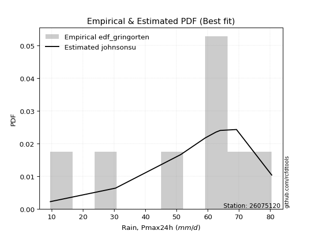</img>

</div>


### 9. Empirical - EDF Filliben (1975)

The specific values of the constants (0.3175) (often denoted as $alpha$) and (0.365) are derived from a method proposed by James J. Filliben in a 1975 paper. This particular formula is the mean value of the $i$-th order statistic of the normal distribution and is considered a robust and effective plotting position formula for the normal probability plot correlation coefficient test for normality.

<div align="center">


$P=(m-0.3175)/(n+0.365)$


</div>


**9.1. Empirical values**

<div align="center">

|                | 0                   | 1                  | 2                   | 3                   | 4            | 5                  | 6                  | 7                  | 8                  |
|:---------------|:--------------------|:-------------------|:--------------------|:--------------------|:-------------|:-------------------|:-------------------|:-------------------|:-------------------|
| date           | 2023                | 2019               | 2025                | 2020                | 2021         | 2018               | 2024               | 2017               | 2022               |
| x              | 9.5                 | 30.4               | 40.6                | 51.3                | 59.2         | 62.6               | 64.0               | 69.2               | 80.5               |
| m              | 1                   | 2                  | 3                   | 4                   | 5            | 6                  | 7                  | 8                  | 9                  |
| empirical_dist | edf_filliben        | edf_filliben       | edf_filliben        | edf_filliben        | edf_filliben | edf_filliben       | edf_filliben       | edf_filliben       | edf_filliben       |
| empirical      | 0.07287773625200214 | 0.1796583021890016 | 0.28643886812600106 | 0.39321943406300053 | 0.5          | 0.6067805659369995 | 0.7135611318739989 | 0.8203416978109984 | 0.9271222637479978 |
| empirical_tr   | 1.0786063921681543  | 1.219004230393752  | 1.401421623643846   | 1.6480422349318082  | 2.0          | 2.5431093007467753 | 3.491146318732526  | 5.566121842496286  | 13.721611721611705 |

</div>


**9.2. Kolmogorov-Smirnov fit test (sorted by Δ)**


<div align="center">

|                | 0                   | 1                   | 2                   | 3                   | 4                   | 5                   | 6                   | 7                   | 8                   | 9                   | 10                  | 11                  | 12                  | 13                    | 14                  | 15                  | 16                  | 17                  | 18                  | 19                  | 20                  | 21                  | 22                  | 23                  | 24                  | 25                  | 26                  | 27                  | 28                  | 29                  | 30                  | 31                  | 32                  | 33                  | 34                  | 35                  | 36                  | 37                  | 38                  | 39                  | 40                  | 41                  | 42                  | 43                  | 44                  | 45                  | 46                  | 47                  | 48                  | 49                  | 50                  | 51                  | 52                  | 53                  | 54                  | 55                  | 56                  | 57                  | 58                  | 59                  | 60                  | 61                  | 62                  | 63                  | 64                  | 65                  | 66                  | 67                  | 68                  | 69                  | 70                  | 71                  | 72                  | 73                  | 74                  | 75                  | 76                  | 77                  | 78                  | 79                  | 80                  | 81                  | 82                  | 83                  | 84                  | 85                  | 86                  | 87                  | 88                  | 89                  |
|:---------------|:--------------------|:--------------------|:--------------------|:--------------------|:--------------------|:--------------------|:--------------------|:--------------------|:--------------------|:--------------------|:--------------------|:--------------------|:--------------------|:----------------------|:--------------------|:--------------------|:--------------------|:--------------------|:--------------------|:--------------------|:--------------------|:--------------------|:--------------------|:--------------------|:--------------------|:--------------------|:--------------------|:--------------------|:--------------------|:--------------------|:--------------------|:--------------------|:--------------------|:--------------------|:--------------------|:--------------------|:--------------------|:--------------------|:--------------------|:--------------------|:--------------------|:--------------------|:--------------------|:--------------------|:--------------------|:--------------------|:--------------------|:--------------------|:--------------------|:--------------------|:--------------------|:--------------------|:--------------------|:--------------------|:--------------------|:--------------------|:--------------------|:--------------------|:--------------------|:--------------------|:--------------------|:--------------------|:--------------------|:--------------------|:--------------------|:--------------------|:--------------------|:--------------------|:--------------------|:--------------------|:--------------------|:--------------------|:--------------------|:--------------------|:--------------------|:--------------------|:--------------------|:--------------------|:--------------------|:--------------------|:--------------------|:--------------------|:--------------------|:--------------------|:--------------------|:--------------------|:--------------------|:--------------------|:--------------------|:--------------------|
| station        | 26075120            | 26075120            | 26075120            | 26075120            | 26075120            | 26075120            | 26075120            | 26075120            | 26075120            | 26075120            | 26075120            | 26075120            | 26075120            | 26075120              | 26075120            | 26075120            | 26075120            | 26075120            | 26075120            | 26075120            | 26075120            | 26075120            | 26075120            | 26075120            | 26075120            | 26075120            | 26075120            | 26075120            | 26075120            | 26075120            | 26075120            | 26075120            | 26075120            | 26075120            | 26075120            | 26075120            | 26075120            | 26075120            | 26075120            | 26075120            | 26075120            | 26075120            | 26075120            | 26075120            | 26075120            | 26075120            | 26075120            | 26075120            | 26075120            | 26075120            | 26075120            | 26075120            | 26075120            | 26075120            | 26075120            | 26075120            | 26075120            | 26075120            | 26075120            | 26075120            | 26075120            | 26075120            | 26075120            | 26075120            | 26075120            | 26075120            | 26075120            | 26075120            | 26075120            | 26075120            | 26075120            | 26075120            | 26075120            | 26075120            | 26075120            | 26075120            | 26075120            | 26075120            | 26075120            | 26075120            | 26075120            | 26075120            | 26075120            | 26075120            | 26075120            | 26075120            | 26075120            | 26075120            | 26075120            | 26075120            |
| empirical_dist | edf_filliben        | edf_filliben        | edf_filliben        | edf_filliben        | edf_filliben        | edf_filliben        | edf_filliben        | edf_filliben        | edf_filliben        | edf_filliben        | edf_filliben        | edf_filliben        | edf_filliben        | edf_filliben          | edf_filliben        | edf_filliben        | edf_filliben        | edf_filliben        | edf_filliben        | edf_filliben        | edf_filliben        | edf_filliben        | edf_filliben        | edf_filliben        | edf_filliben        | edf_filliben        | edf_filliben        | edf_filliben        | edf_filliben        | edf_filliben        | edf_filliben        | edf_filliben        | edf_filliben        | edf_filliben        | edf_filliben        | edf_filliben        | edf_filliben        | edf_filliben        | edf_filliben        | edf_filliben        | edf_filliben        | edf_filliben        | edf_filliben        | edf_filliben        | edf_filliben        | edf_filliben        | edf_filliben        | edf_filliben        | edf_filliben        | edf_filliben        | edf_filliben        | edf_filliben        | edf_filliben        | edf_filliben        | edf_filliben        | edf_filliben        | edf_filliben        | edf_filliben        | edf_filliben        | edf_filliben        | edf_filliben        | edf_filliben        | edf_filliben        | edf_filliben        | edf_filliben        | edf_filliben        | edf_filliben        | edf_filliben        | edf_filliben        | edf_filliben        | edf_filliben        | edf_filliben        | edf_filliben        | edf_filliben        | edf_filliben        | edf_filliben        | edf_filliben        | edf_filliben        | edf_filliben        | edf_filliben        | edf_filliben        | edf_filliben        | edf_filliben        | edf_filliben        | edf_filliben        | edf_filliben        | edf_filliben        | edf_filliben        | edf_filliben        | edf_filliben        |
| p_dist         | genlogistic         | logjohnsonsu        | laplace_asymmetric  | johnsonsu           | mielke              | weibull_min         | logloggamma         | logmielke           | gumbel_l            | logpearson3         | pearson3            | fisk                | logfisk             | loglaplace_asymmetric | loggumbel_l         | fatiguelife         | nct                 | t                   | norm                | crystalball         | truncnorm           | exponnorm           | rice                | f                   | betaprime           | erlang              | invweibull          | invgamma            | chi2                | gamma               | ncf                 | logistic            | loggompertz         | logt                | invgauss            | maxwell             | lognakagami         | rayleigh            | hypsecant           | kstwobign           | genexpon            | logbetaprime        | lognct              | logfatiguelife      | logrice             | lognorm             | lognorm             | logcrystalball      | logexponnorm        | logf                | halfnorm            | logncf              | logalpha            | loggamma            | loggamma            | loginvweibull       | laplace             | logerlang           | loglogistic         | loginvgamma         | gumbel_r            | loginvgauss         | loghypsecant        | logmaxwell          | halflogistic        | moyal               | lograyleigh         | loglaplace          | expon               | logkstwobign        | alpha               | loghalfnorm         | loggenexpon         | loggumbel_r         | logtruncnorm        | loghalflogistic     | wald                | logmoyal            | nakagami            | gibrat              | logwald             | logexpon            | loggibrat           | gompertz            | loglognorm          | logweibull_min      | pareto              | logpareto           | logchi2             | loggenlogistic      |
| delta          | 0.0577436468117124  | 0.06015844252238878 | 0.06134243116564453 | 0.06856489407527311 | 0.08068172211696456 | 0.08162224711741028 | 0.08581264047830961 | 0.08596723890801528 | 0.08657332772922488 | 0.09459349268526418 | 0.09840423280352484 | 0.10488311503743131 | 0.1208837603352878  | 0.12257634657142691   | 0.12515493053743265 | 0.1379542059597385  | 0.1380174719339753  | 0.138060081748836   | 0.13806011798996765 | 0.13806012359333364 | 0.1380602275424132  | 0.13806242426125082 | 0.13810318490761175 | 0.13821563673392356 | 0.1405344325481862  | 0.14278371411545332 | 0.14356924366369128 | 0.14466698299201053 | 0.1463102132231049  | 0.147591641491023   | 0.15207641708508168 | 0.15492887174737735 | 0.1568626810956142  | 0.15835429960450167 | 0.15928946407423372 | 0.1609462512308002  | 0.16371151443216309 | 0.1678788336473327  | 0.1682143283099543  | 0.16865165696248174 | 0.17254181159851412 | 0.18553197343606387 | 0.1866941714037963  | 0.18701379494214698 | 0.18734827258643472 | 0.18735027160098938 | 0.18735027160098938 | 0.18735118349430346 | 0.18735366371609175 | 0.18786869937928785 | 0.18790901640597257 | 0.18802956759250034 | 0.19156714024651733 | 0.1936243106083414  | 0.1936243106083414  | 0.19385118932782774 | 0.19661669334174747 | 0.1976096569367407  | 0.1979587738818649  | 0.19943616838892253 | 0.19984575610127553 | 0.20596653151725353 | 0.20676995816709653 | 0.2155091746082356  | 0.21617671073270994 | 0.2204378008747011  | 0.22436265264465316 | 0.23174301295178734 | 0.2334655372580503  | 0.23691552404157323 | 0.24795635045558384 | 0.2494507248947332  | 0.2500217749758268  | 0.255623511387986   | 0.2649343181986126  | 0.2775098044186831  | 0.27847962578374663 | 0.2792808956207369  | 0.28543780652521844 | 0.31071926858188614 | 0.3450263116808967  | 0.3457103951487245  | 0.3760085669020643  | 0.43010942093379406 | 0.44525855763087685 | 0.45318097398974555 | 0.4630747211188272  | 0.4792007574472048  | 0.5180081611728842  | 0.8203416978109984  |
| deltao         | 0.41761268023100007 | 0.41761268023100007 | 0.41761268023100007 | 0.41761268023100007 | 0.41761268023100007 | 0.41761268023100007 | 0.41761268023100007 | 0.41761268023100007 | 0.41761268023100007 | 0.41761268023100007 | 0.41761268023100007 | 0.41761268023100007 | 0.41761268023100007 | 0.41761268023100007   | 0.41761268023100007 | 0.41761268023100007 | 0.41761268023100007 | 0.41761268023100007 | 0.41761268023100007 | 0.41761268023100007 | 0.41761268023100007 | 0.41761268023100007 | 0.41761268023100007 | 0.41761268023100007 | 0.41761268023100007 | 0.41761268023100007 | 0.41761268023100007 | 0.41761268023100007 | 0.41761268023100007 | 0.41761268023100007 | 0.41761268023100007 | 0.41761268023100007 | 0.41761268023100007 | 0.41761268023100007 | 0.41761268023100007 | 0.41761268023100007 | 0.41761268023100007 | 0.41761268023100007 | 0.41761268023100007 | 0.41761268023100007 | 0.41761268023100007 | 0.41761268023100007 | 0.41761268023100007 | 0.41761268023100007 | 0.41761268023100007 | 0.41761268023100007 | 0.41761268023100007 | 0.41761268023100007 | 0.41761268023100007 | 0.41761268023100007 | 0.41761268023100007 | 0.41761268023100007 | 0.41761268023100007 | 0.41761268023100007 | 0.41761268023100007 | 0.41761268023100007 | 0.41761268023100007 | 0.41761268023100007 | 0.41761268023100007 | 0.41761268023100007 | 0.41761268023100007 | 0.41761268023100007 | 0.41761268023100007 | 0.41761268023100007 | 0.41761268023100007 | 0.41761268023100007 | 0.41761268023100007 | 0.41761268023100007 | 0.41761268023100007 | 0.41761268023100007 | 0.41761268023100007 | 0.41761268023100007 | 0.41761268023100007 | 0.41761268023100007 | 0.41761268023100007 | 0.41761268023100007 | 0.41761268023100007 | 0.41761268023100007 | 0.41761268023100007 | 0.41761268023100007 | 0.41761268023100007 | 0.41761268023100007 | 0.41761268023100007 | 0.41761268023100007 | 0.41761268023100007 | 0.41761268023100007 | 0.41761268023100007 | 0.41761268023100007 | 0.41761268023100007 | 0.41761268023100007 |
| eval           | Δo > Δ              | Δo > Δ              | Δo > Δ              | Δo > Δ              | Δo > Δ              | Δo > Δ              | Δo > Δ              | Δo > Δ              | Δo > Δ              | Δo > Δ              | Δo > Δ              | Δo > Δ              | Δo > Δ              | Δo > Δ                | Δo > Δ              | Δo > Δ              | Δo > Δ              | Δo > Δ              | Δo > Δ              | Δo > Δ              | Δo > Δ              | Δo > Δ              | Δo > Δ              | Δo > Δ              | Δo > Δ              | Δo > Δ              | Δo > Δ              | Δo > Δ              | Δo > Δ              | Δo > Δ              | Δo > Δ              | Δo > Δ              | Δo > Δ              | Δo > Δ              | Δo > Δ              | Δo > Δ              | Δo > Δ              | Δo > Δ              | Δo > Δ              | Δo > Δ              | Δo > Δ              | Δo > Δ              | Δo > Δ              | Δo > Δ              | Δo > Δ              | Δo > Δ              | Δo > Δ              | Δo > Δ              | Δo > Δ              | Δo > Δ              | Δo > Δ              | Δo > Δ              | Δo > Δ              | Δo > Δ              | Δo > Δ              | Δo > Δ              | Δo > Δ              | Δo > Δ              | Δo > Δ              | Δo > Δ              | Δo > Δ              | Δo > Δ              | Δo > Δ              | Δo > Δ              | Δo > Δ              | Δo > Δ              | Δo > Δ              | Δo > Δ              | Δo > Δ              | Δo > Δ              | Δo > Δ              | Δo > Δ              | Δo > Δ              | Δo > Δ              | Δo > Δ              | Δo > Δ              | Δo > Δ              | Δo > Δ              | Δo > Δ              | Δo > Δ              | Δo > Δ              | Δo > Δ              | Δo > Δ              | Δo <= Δ             | Δo <= Δ             | Δo <= Δ             | Δo <= Δ             | Δo <= Δ             | Δo <= Δ             | Δo <= Δ             |
| fit            | 1                   | 1                   | 1                   | 1                   | 1                   | 1                   | 1                   | 1                   | 1                   | 1                   | 1                   | 1                   | 1                   | 1                     | 1                   | 1                   | 1                   | 1                   | 1                   | 1                   | 1                   | 1                   | 1                   | 1                   | 1                   | 1                   | 1                   | 1                   | 1                   | 1                   | 1                   | 1                   | 1                   | 1                   | 1                   | 1                   | 1                   | 1                   | 1                   | 1                   | 1                   | 1                   | 1                   | 1                   | 1                   | 1                   | 1                   | 1                   | 1                   | 1                   | 1                   | 1                   | 1                   | 1                   | 1                   | 1                   | 1                   | 1                   | 1                   | 1                   | 1                   | 1                   | 1                   | 1                   | 1                   | 1                   | 1                   | 1                   | 1                   | 1                   | 1                   | 1                   | 1                   | 1                   | 1                   | 1                   | 1                   | 1                   | 1                   | 1                   | 1                   | 1                   | 1                   | 0                   | 0                   | 0                   | 0                   | 0                   | 0                   | 0                   |
| n              | 9                   | 9                   | 9                   | 9                   | 9                   | 9                   | 9                   | 9                   | 9                   | 9                   | 9                   | 9                   | 9                   | 9                     | 9                   | 9                   | 9                   | 9                   | 9                   | 9                   | 9                   | 9                   | 9                   | 9                   | 9                   | 9                   | 9                   | 9                   | 9                   | 9                   | 9                   | 9                   | 9                   | 9                   | 9                   | 9                   | 9                   | 9                   | 9                   | 9                   | 9                   | 9                   | 9                   | 9                   | 9                   | 9                   | 9                   | 9                   | 9                   | 9                   | 9                   | 9                   | 9                   | 9                   | 9                   | 9                   | 9                   | 9                   | 9                   | 9                   | 9                   | 9                   | 9                   | 9                   | 9                   | 9                   | 9                   | 9                   | 9                   | 9                   | 9                   | 9                   | 9                   | 9                   | 9                   | 9                   | 9                   | 9                   | 9                   | 9                   | 9                   | 9                   | 9                   | 9                   | 9                   | 9                   | 9                   | 9                   | 9                   | 9                   |
| best_fit       | 1                   | 0                   | 0                   | 0                   | 0                   | 0                   | 0                   | 0                   | 0                   | 0                   | 0                   | 0                   | 0                   | 0                     | 0                   | 0                   | 0                   | 0                   | 0                   | 0                   | 0                   | 0                   | 0                   | 0                   | 0                   | 0                   | 0                   | 0                   | 0                   | 0                   | 0                   | 0                   | 0                   | 0                   | 0                   | 0                   | 0                   | 0                   | 0                   | 0                   | 0                   | 0                   | 0                   | 0                   | 0                   | 0                   | 0                   | 0                   | 0                   | 0                   | 0                   | 0                   | 0                   | 0                   | 0                   | 0                   | 0                   | 0                   | 0                   | 0                   | 0                   | 0                   | 0                   | 0                   | 0                   | 0                   | 0                   | 0                   | 0                   | 0                   | 0                   | 0                   | 0                   | 0                   | 0                   | 0                   | 0                   | 0                   | 0                   | 0                   | 0                   | 0                   | 0                   | 0                   | 0                   | 0                   | 0                   | 0                   | 0                   | 0                   |
| best_fit_sort  | 1                   | 2                   | 3                   | 4                   | 5                   | 6                   | 7                   | 8                   | 9                   | 10                  | 11                  | 12                  | 13                  | 14                    | 15                  | 16                  | 17                  | 18                  | 19                  | 20                  | 21                  | 22                  | 23                  | 24                  | 25                  | 26                  | 27                  | 28                  | 29                  | 30                  | 31                  | 32                  | 33                  | 34                  | 35                  | 36                  | 37                  | 38                  | 39                  | 40                  | 41                  | 42                  | 43                  | 44                  | 45                  | 46                  | 47                  | 48                  | 49                  | 50                  | 51                  | 52                  | 53                  | 54                  | 55                  | 56                  | 57                  | 58                  | 59                  | 60                  | 61                  | 62                  | 63                  | 64                  | 65                  | 66                  | 67                  | 68                  | 69                  | 70                  | 71                  | 72                  | 73                  | 74                  | 75                  | 76                  | 77                  | 78                  | 79                  | 80                  | 81                  | 82                  | 83                  | 84                  | 85                  | 86                  | 87                  | 88                  | 89                  | 90                  |

</div>


<div align="center">

</img>

</div>


**9.3. Best fit**

<div align="center">

|   id |   station | empirical_dist   | p_dist      |     delta |   deltao | eval   |   fit |   n |   best_fit |   best_fit_sort |
|-----:|----------:|:-----------------|:------------|----------:|---------:|:-------|------:|----:|-----------:|----------------:|
|    0 |  26075120 | edf_filliben     | genlogistic | 0.0577436 | 0.417613 | Δo > Δ |     1 |   9 |          1 |               1 |

</div>


<div align="center">

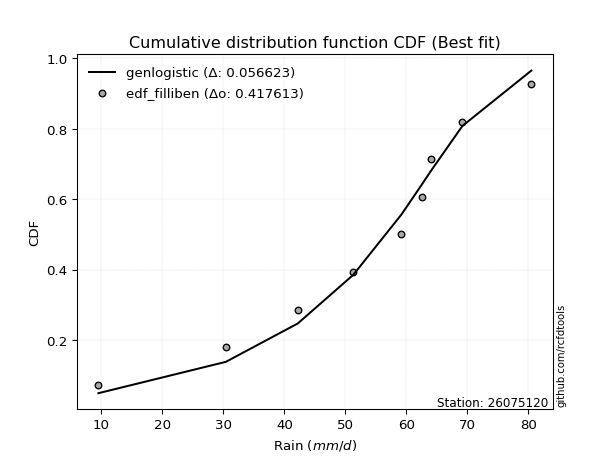</img></img>

</div>


### 10. Empirical - EDF Jenkinson (1977)

The Jenkinson formula in hydrology is an empirical plotting position formula used to estimate the non-exceedance probability _(P)_ or return period _(T)_ of a given ordered observation within a sample. It is a widely used method in the frequency analysis of extreme events such as floods and rainfall, as it provides a distribution-free way to plot data. _a≈0.31_ and _b≈0.38_ are constants derived to approximate the median of the probability distribution for the given rank.

<div align="center">


$P=(m-a)/(n+b)$


</div>


**10.1. Empirical values**

<div align="center">

|                | 0                   | 1                   | 2                  | 3                   | 4             | 5                  | 6                  | 7                  | 8                  |
|:---------------|:--------------------|:--------------------|:-------------------|:--------------------|:--------------|:-------------------|:-------------------|:-------------------|:-------------------|
| date           | 2023                | 2019                | 2025               | 2020                | 2021          | 2018               | 2024               | 2017               | 2022               |
| x              | 9.5                 | 30.4                | 40.6               | 51.3                | 59.2          | 62.6               | 64.0               | 69.2               | 80.5               |
| m              | 1                   | 2                   | 3                  | 4                   | 5             | 6                  | 7                  | 8                  | 9                  |
| empirical_dist | edf_jenkinson       | edf_jenkinson       | edf_jenkinson      | edf_jenkinson       | edf_jenkinson | edf_jenkinson      | edf_jenkinson      | edf_jenkinson      | edf_jenkinson      |
| empirical      | 0.07356076759061833 | 0.18017057569296374 | 0.2867803837953091 | 0.39339019189765456 | 0.5           | 0.6066098081023454 | 0.7132196162046908 | 0.8198294243070362 | 0.9264392324093815 |
| empirical_tr   | 1.0794016110471807  | 1.2197659297789336  | 1.4020926756352765 | 1.6485061511423549  | 2.0           | 2.542005420054201  | 3.486988847583642  | 5.550295857988164  | 13.5942028985507   |

</div>


**10.2. Kolmogorov-Smirnov fit test (sorted by Δ)**


<div align="center">

|                | 0                   | 1                   | 2                   | 3                   | 4                   | 5                   | 6                   | 7                   | 8                   | 9                   | 10                  | 11                  | 12                  | 13                    | 14                  | 15                  | 16                  | 17                  | 18                  | 19                  | 20                  | 21                  | 22                  | 23                  | 24                  | 25                  | 26                  | 27                  | 28                  | 29                  | 30                  | 31                  | 32                  | 33                  | 34                  | 35                  | 36                  | 37                  | 38                  | 39                  | 40                  | 41                  | 42                  | 43                  | 44                  | 45                  | 46                  | 47                  | 48                  | 49                  | 50                  | 51                  | 52                  | 53                  | 54                  | 55                  | 56                  | 57                  | 58                  | 59                  | 60                  | 61                  | 62                  | 63                  | 64                  | 65                  | 66                  | 67                  | 68                  | 69                  | 70                  | 71                  | 72                  | 73                  | 74                  | 75                  | 76                  | 77                  | 78                  | 79                  | 80                  | 81                  | 82                  | 83                  | 84                  | 85                  | 86                  | 87                  | 88                  | 89                  |
|:---------------|:--------------------|:--------------------|:--------------------|:--------------------|:--------------------|:--------------------|:--------------------|:--------------------|:--------------------|:--------------------|:--------------------|:--------------------|:--------------------|:----------------------|:--------------------|:--------------------|:--------------------|:--------------------|:--------------------|:--------------------|:--------------------|:--------------------|:--------------------|:--------------------|:--------------------|:--------------------|:--------------------|:--------------------|:--------------------|:--------------------|:--------------------|:--------------------|:--------------------|:--------------------|:--------------------|:--------------------|:--------------------|:--------------------|:--------------------|:--------------------|:--------------------|:--------------------|:--------------------|:--------------------|:--------------------|:--------------------|:--------------------|:--------------------|:--------------------|:--------------------|:--------------------|:--------------------|:--------------------|:--------------------|:--------------------|:--------------------|:--------------------|:--------------------|:--------------------|:--------------------|:--------------------|:--------------------|:--------------------|:--------------------|:--------------------|:--------------------|:--------------------|:--------------------|:--------------------|:--------------------|:--------------------|:--------------------|:--------------------|:--------------------|:--------------------|:--------------------|:--------------------|:--------------------|:--------------------|:--------------------|:--------------------|:--------------------|:--------------------|:--------------------|:--------------------|:--------------------|:--------------------|:--------------------|:--------------------|:--------------------|
| station        | 26075120            | 26075120            | 26075120            | 26075120            | 26075120            | 26075120            | 26075120            | 26075120            | 26075120            | 26075120            | 26075120            | 26075120            | 26075120            | 26075120              | 26075120            | 26075120            | 26075120            | 26075120            | 26075120            | 26075120            | 26075120            | 26075120            | 26075120            | 26075120            | 26075120            | 26075120            | 26075120            | 26075120            | 26075120            | 26075120            | 26075120            | 26075120            | 26075120            | 26075120            | 26075120            | 26075120            | 26075120            | 26075120            | 26075120            | 26075120            | 26075120            | 26075120            | 26075120            | 26075120            | 26075120            | 26075120            | 26075120            | 26075120            | 26075120            | 26075120            | 26075120            | 26075120            | 26075120            | 26075120            | 26075120            | 26075120            | 26075120            | 26075120            | 26075120            | 26075120            | 26075120            | 26075120            | 26075120            | 26075120            | 26075120            | 26075120            | 26075120            | 26075120            | 26075120            | 26075120            | 26075120            | 26075120            | 26075120            | 26075120            | 26075120            | 26075120            | 26075120            | 26075120            | 26075120            | 26075120            | 26075120            | 26075120            | 26075120            | 26075120            | 26075120            | 26075120            | 26075120            | 26075120            | 26075120            | 26075120            |
| empirical_dist | edf_jenkinson       | edf_jenkinson       | edf_jenkinson       | edf_jenkinson       | edf_jenkinson       | edf_jenkinson       | edf_jenkinson       | edf_jenkinson       | edf_jenkinson       | edf_jenkinson       | edf_jenkinson       | edf_jenkinson       | edf_jenkinson       | edf_jenkinson         | edf_jenkinson       | edf_jenkinson       | edf_jenkinson       | edf_jenkinson       | edf_jenkinson       | edf_jenkinson       | edf_jenkinson       | edf_jenkinson       | edf_jenkinson       | edf_jenkinson       | edf_jenkinson       | edf_jenkinson       | edf_jenkinson       | edf_jenkinson       | edf_jenkinson       | edf_jenkinson       | edf_jenkinson       | edf_jenkinson       | edf_jenkinson       | edf_jenkinson       | edf_jenkinson       | edf_jenkinson       | edf_jenkinson       | edf_jenkinson       | edf_jenkinson       | edf_jenkinson       | edf_jenkinson       | edf_jenkinson       | edf_jenkinson       | edf_jenkinson       | edf_jenkinson       | edf_jenkinson       | edf_jenkinson       | edf_jenkinson       | edf_jenkinson       | edf_jenkinson       | edf_jenkinson       | edf_jenkinson       | edf_jenkinson       | edf_jenkinson       | edf_jenkinson       | edf_jenkinson       | edf_jenkinson       | edf_jenkinson       | edf_jenkinson       | edf_jenkinson       | edf_jenkinson       | edf_jenkinson       | edf_jenkinson       | edf_jenkinson       | edf_jenkinson       | edf_jenkinson       | edf_jenkinson       | edf_jenkinson       | edf_jenkinson       | edf_jenkinson       | edf_jenkinson       | edf_jenkinson       | edf_jenkinson       | edf_jenkinson       | edf_jenkinson       | edf_jenkinson       | edf_jenkinson       | edf_jenkinson       | edf_jenkinson       | edf_jenkinson       | edf_jenkinson       | edf_jenkinson       | edf_jenkinson       | edf_jenkinson       | edf_jenkinson       | edf_jenkinson       | edf_jenkinson       | edf_jenkinson       | edf_jenkinson       | edf_jenkinson       |
| p_dist         | genlogistic         | logjohnsonsu        | laplace_asymmetric  | johnsonsu           | mielke              | weibull_min         | logloggamma         | logmielke           | gumbel_l            | logpearson3         | pearson3            | fisk                | logfisk             | loglaplace_asymmetric | loggumbel_l         | fatiguelife         | nct                 | t                   | norm                | crystalball         | truncnorm           | exponnorm           | rice                | f                   | betaprime           | erlang              | invweibull          | invgamma            | chi2                | gamma               | ncf                 | logistic            | loggompertz         | logt                | invgauss            | maxwell             | lognakagami         | rayleigh            | hypsecant           | kstwobign           | genexpon            | logbetaprime        | lognct              | logfatiguelife      | logrice             | lognorm             | lognorm             | logcrystalball      | logexponnorm        | logf                | logncf              | halfnorm            | logalpha            | loggamma            | loggamma            | loginvweibull       | laplace             | logerlang           | loglogistic         | loginvgamma         | gumbel_r            | loginvgauss         | loghypsecant        | logmaxwell          | halflogistic        | moyal               | lograyleigh         | loglaplace          | expon               | logkstwobign        | alpha               | loghalfnorm         | loggenexpon         | loggumbel_r         | logtruncnorm        | loghalflogistic     | wald                | logmoyal            | nakagami            | gibrat              | logwald             | logexpon            | loggibrat           | gompertz            | loglognorm          | logweibull_min      | pareto              | logpareto           | logchi2             | loggenlogistic      |
| delta          | 0.0577436468117124  | 0.06015844252238878 | 0.06134243116564453 | 0.06856489407527311 | 0.08016944861300235 | 0.08162224711741028 | 0.08581264047830961 | 0.08596723890801528 | 0.08657332772922488 | 0.09408121918130197 | 0.09840423280352484 | 0.10488311503743131 | 0.1208837603352878  | 0.12257634657142691   | 0.12515493053743265 | 0.1379542059597385  | 0.1380174719339753  | 0.138060081748836   | 0.13806011798996765 | 0.13806012359333364 | 0.1380602275424132  | 0.13806242426125082 | 0.13810318490761175 | 0.13821563673392356 | 0.1405344325481862  | 0.14278371411545332 | 0.14356924366369128 | 0.14466698299201053 | 0.1463102132231049  | 0.147591641491023   | 0.15207641708508168 | 0.15492887174737735 | 0.1568626810956142  | 0.15869581527380974 | 0.15928946407423372 | 0.1609462512308002  | 0.16422378793612522 | 0.1678788336473327  | 0.1682143283099543  | 0.1684808991278277  | 0.17237105376386008 | 0.18536121560140983 | 0.18652341356914226 | 0.18684303710749295 | 0.18717751475178068 | 0.18717951376633535 | 0.18717951376633535 | 0.18718042565964943 | 0.1871829058814377  | 0.18769794154463382 | 0.1878588097578463  | 0.18790901640597257 | 0.1913963824118633  | 0.19345355277368737 | 0.19345355277368737 | 0.19350967365851968 | 0.19661669334174747 | 0.19743889910208667 | 0.19778801604721086 | 0.1992654105542685  | 0.19984575610127553 | 0.2057957736825995  | 0.2065992003324425  | 0.21533841677358156 | 0.21617671073270994 | 0.2204378008747011  | 0.22419189480999913 | 0.2315722551171333  | 0.23329477942339627 | 0.23657400837226517 | 0.24761483478627577 | 0.24927996706007916 | 0.24968025930651871 | 0.25545275355333197 | 0.2649343181986126  | 0.2773390465840291  | 0.27847962578374663 | 0.27911013778608285 | 0.2852670486905644  | 0.31071926858188614 | 0.34485555384624267 | 0.3451981216447623  | 0.37583780906741027 | 0.4297679052644859  | 0.4447462841269147  | 0.4526687004857834  | 0.46256244761486504 | 0.47868848394324265 | 0.517495887668922   | 0.8198294243070362  |
| deltao         | 0.41761268023100007 | 0.41761268023100007 | 0.41761268023100007 | 0.41761268023100007 | 0.41761268023100007 | 0.41761268023100007 | 0.41761268023100007 | 0.41761268023100007 | 0.41761268023100007 | 0.41761268023100007 | 0.41761268023100007 | 0.41761268023100007 | 0.41761268023100007 | 0.41761268023100007   | 0.41761268023100007 | 0.41761268023100007 | 0.41761268023100007 | 0.41761268023100007 | 0.41761268023100007 | 0.41761268023100007 | 0.41761268023100007 | 0.41761268023100007 | 0.41761268023100007 | 0.41761268023100007 | 0.41761268023100007 | 0.41761268023100007 | 0.41761268023100007 | 0.41761268023100007 | 0.41761268023100007 | 0.41761268023100007 | 0.41761268023100007 | 0.41761268023100007 | 0.41761268023100007 | 0.41761268023100007 | 0.41761268023100007 | 0.41761268023100007 | 0.41761268023100007 | 0.41761268023100007 | 0.41761268023100007 | 0.41761268023100007 | 0.41761268023100007 | 0.41761268023100007 | 0.41761268023100007 | 0.41761268023100007 | 0.41761268023100007 | 0.41761268023100007 | 0.41761268023100007 | 0.41761268023100007 | 0.41761268023100007 | 0.41761268023100007 | 0.41761268023100007 | 0.41761268023100007 | 0.41761268023100007 | 0.41761268023100007 | 0.41761268023100007 | 0.41761268023100007 | 0.41761268023100007 | 0.41761268023100007 | 0.41761268023100007 | 0.41761268023100007 | 0.41761268023100007 | 0.41761268023100007 | 0.41761268023100007 | 0.41761268023100007 | 0.41761268023100007 | 0.41761268023100007 | 0.41761268023100007 | 0.41761268023100007 | 0.41761268023100007 | 0.41761268023100007 | 0.41761268023100007 | 0.41761268023100007 | 0.41761268023100007 | 0.41761268023100007 | 0.41761268023100007 | 0.41761268023100007 | 0.41761268023100007 | 0.41761268023100007 | 0.41761268023100007 | 0.41761268023100007 | 0.41761268023100007 | 0.41761268023100007 | 0.41761268023100007 | 0.41761268023100007 | 0.41761268023100007 | 0.41761268023100007 | 0.41761268023100007 | 0.41761268023100007 | 0.41761268023100007 | 0.41761268023100007 |
| eval           | Δo > Δ              | Δo > Δ              | Δo > Δ              | Δo > Δ              | Δo > Δ              | Δo > Δ              | Δo > Δ              | Δo > Δ              | Δo > Δ              | Δo > Δ              | Δo > Δ              | Δo > Δ              | Δo > Δ              | Δo > Δ                | Δo > Δ              | Δo > Δ              | Δo > Δ              | Δo > Δ              | Δo > Δ              | Δo > Δ              | Δo > Δ              | Δo > Δ              | Δo > Δ              | Δo > Δ              | Δo > Δ              | Δo > Δ              | Δo > Δ              | Δo > Δ              | Δo > Δ              | Δo > Δ              | Δo > Δ              | Δo > Δ              | Δo > Δ              | Δo > Δ              | Δo > Δ              | Δo > Δ              | Δo > Δ              | Δo > Δ              | Δo > Δ              | Δo > Δ              | Δo > Δ              | Δo > Δ              | Δo > Δ              | Δo > Δ              | Δo > Δ              | Δo > Δ              | Δo > Δ              | Δo > Δ              | Δo > Δ              | Δo > Δ              | Δo > Δ              | Δo > Δ              | Δo > Δ              | Δo > Δ              | Δo > Δ              | Δo > Δ              | Δo > Δ              | Δo > Δ              | Δo > Δ              | Δo > Δ              | Δo > Δ              | Δo > Δ              | Δo > Δ              | Δo > Δ              | Δo > Δ              | Δo > Δ              | Δo > Δ              | Δo > Δ              | Δo > Δ              | Δo > Δ              | Δo > Δ              | Δo > Δ              | Δo > Δ              | Δo > Δ              | Δo > Δ              | Δo > Δ              | Δo > Δ              | Δo > Δ              | Δo > Δ              | Δo > Δ              | Δo > Δ              | Δo > Δ              | Δo > Δ              | Δo <= Δ             | Δo <= Δ             | Δo <= Δ             | Δo <= Δ             | Δo <= Δ             | Δo <= Δ             | Δo <= Δ             |
| fit            | 1                   | 1                   | 1                   | 1                   | 1                   | 1                   | 1                   | 1                   | 1                   | 1                   | 1                   | 1                   | 1                   | 1                     | 1                   | 1                   | 1                   | 1                   | 1                   | 1                   | 1                   | 1                   | 1                   | 1                   | 1                   | 1                   | 1                   | 1                   | 1                   | 1                   | 1                   | 1                   | 1                   | 1                   | 1                   | 1                   | 1                   | 1                   | 1                   | 1                   | 1                   | 1                   | 1                   | 1                   | 1                   | 1                   | 1                   | 1                   | 1                   | 1                   | 1                   | 1                   | 1                   | 1                   | 1                   | 1                   | 1                   | 1                   | 1                   | 1                   | 1                   | 1                   | 1                   | 1                   | 1                   | 1                   | 1                   | 1                   | 1                   | 1                   | 1                   | 1                   | 1                   | 1                   | 1                   | 1                   | 1                   | 1                   | 1                   | 1                   | 1                   | 1                   | 1                   | 0                   | 0                   | 0                   | 0                   | 0                   | 0                   | 0                   |
| n              | 9                   | 9                   | 9                   | 9                   | 9                   | 9                   | 9                   | 9                   | 9                   | 9                   | 9                   | 9                   | 9                   | 9                     | 9                   | 9                   | 9                   | 9                   | 9                   | 9                   | 9                   | 9                   | 9                   | 9                   | 9                   | 9                   | 9                   | 9                   | 9                   | 9                   | 9                   | 9                   | 9                   | 9                   | 9                   | 9                   | 9                   | 9                   | 9                   | 9                   | 9                   | 9                   | 9                   | 9                   | 9                   | 9                   | 9                   | 9                   | 9                   | 9                   | 9                   | 9                   | 9                   | 9                   | 9                   | 9                   | 9                   | 9                   | 9                   | 9                   | 9                   | 9                   | 9                   | 9                   | 9                   | 9                   | 9                   | 9                   | 9                   | 9                   | 9                   | 9                   | 9                   | 9                   | 9                   | 9                   | 9                   | 9                   | 9                   | 9                   | 9                   | 9                   | 9                   | 9                   | 9                   | 9                   | 9                   | 9                   | 9                   | 9                   |
| best_fit       | 1                   | 0                   | 0                   | 0                   | 0                   | 0                   | 0                   | 0                   | 0                   | 0                   | 0                   | 0                   | 0                   | 0                     | 0                   | 0                   | 0                   | 0                   | 0                   | 0                   | 0                   | 0                   | 0                   | 0                   | 0                   | 0                   | 0                   | 0                   | 0                   | 0                   | 0                   | 0                   | 0                   | 0                   | 0                   | 0                   | 0                   | 0                   | 0                   | 0                   | 0                   | 0                   | 0                   | 0                   | 0                   | 0                   | 0                   | 0                   | 0                   | 0                   | 0                   | 0                   | 0                   | 0                   | 0                   | 0                   | 0                   | 0                   | 0                   | 0                   | 0                   | 0                   | 0                   | 0                   | 0                   | 0                   | 0                   | 0                   | 0                   | 0                   | 0                   | 0                   | 0                   | 0                   | 0                   | 0                   | 0                   | 0                   | 0                   | 0                   | 0                   | 0                   | 0                   | 0                   | 0                   | 0                   | 0                   | 0                   | 0                   | 0                   |
| best_fit_sort  | 1                   | 2                   | 3                   | 4                   | 5                   | 6                   | 7                   | 8                   | 9                   | 10                  | 11                  | 12                  | 13                  | 14                    | 15                  | 16                  | 17                  | 18                  | 19                  | 20                  | 21                  | 22                  | 23                  | 24                  | 25                  | 26                  | 27                  | 28                  | 29                  | 30                  | 31                  | 32                  | 33                  | 34                  | 35                  | 36                  | 37                  | 38                  | 39                  | 40                  | 41                  | 42                  | 43                  | 44                  | 45                  | 46                  | 47                  | 48                  | 49                  | 50                  | 51                  | 52                  | 53                  | 54                  | 55                  | 56                  | 57                  | 58                  | 59                  | 60                  | 61                  | 62                  | 63                  | 64                  | 65                  | 66                  | 67                  | 68                  | 69                  | 70                  | 71                  | 72                  | 73                  | 74                  | 75                  | 76                  | 77                  | 78                  | 79                  | 80                  | 81                  | 82                  | 83                  | 84                  | 85                  | 86                  | 87                  | 88                  | 89                  | 90                  |

</div>


<div align="center">

</img>

</div>


**10.3. Best fit**

<div align="center">

|   id |   station | empirical_dist   | p_dist      |     delta |   deltao | eval   |   fit |   n |   best_fit |   best_fit_sort |
|-----:|----------:|:-----------------|:------------|----------:|---------:|:-------|------:|----:|-----------:|----------------:|
|    0 |  26075120 | edf_jenkinson    | genlogistic | 0.0577436 | 0.417613 | Δo > Δ |     1 |   9 |          1 |               1 |

</div>


<div align="center">

</img></img>

</div>


### 11. Empirical - EDF Cunnane (1978)

Cunnane´s work in statistical hydrology has focused on the performance and evaluation of different probability distributions (such as GEV, Gumbel, Lognormal) for flood frequency estimation. _b_ is a constant, typically set to 0.4.

<div align="center">


$P=(m-b)/(n+1-2b)$


</div>


**11.1. Empirical values**

<div align="center">

|                | 0                   | 1                  | 2                   | 3                  | 4           | 5                  | 6                 | 7                  | 8                  |
|:---------------|:--------------------|:-------------------|:--------------------|:-------------------|:------------|:-------------------|:------------------|:-------------------|:-------------------|
| date           | 2023                | 2019               | 2025                | 2020               | 2021        | 2018               | 2024              | 2017               | 2022               |
| x              | 9.5                 | 30.4               | 40.6                | 51.3               | 59.2        | 62.6               | 64.0              | 69.2               | 80.5               |
| m              | 1                   | 2                  | 3                   | 4                  | 5           | 6                  | 7                 | 8                  | 9                  |
| empirical_dist | edf_cunnane         | edf_cunnane        | edf_cunnane         | edf_cunnane        | edf_cunnane | edf_cunnane        | edf_cunnane       | edf_cunnane        | edf_cunnane        |
| empirical      | 0.06521739130434782 | 0.1739130434782609 | 0.28260869565217395 | 0.391304347826087  | 0.5         | 0.6086956521739131 | 0.717391304347826 | 0.8260869565217391 | 0.9347826086956522 |
| empirical_tr   | 1.069767441860465   | 1.2105263157894737 | 1.393939393939394   | 1.6428571428571428 | 2.0         | 2.555555555555556  | 3.538461538461538 | 5.75               | 15.333333333333343 |

</div>


**11.2. Kolmogorov-Smirnov fit test (sorted by Δ)**


<div align="center">

|                | 0                   | 1                   | 2                   | 3                   | 4                   | 5                   | 6                   | 7                   | 8                   | 9                   | 10                  | 11                  | 12                  | 13                    | 14                  | 15                  | 16                  | 17                  | 18                  | 19                  | 20                  | 21                  | 22                  | 23                  | 24                  | 25                  | 26                  | 27                  | 28                  | 29                  | 30                  | 31                  | 32                  | 33                  | 34                  | 35                  | 36                  | 37                  | 38                  | 39                  | 40                  | 41                  | 42                  | 43                  | 44                  | 45                  | 46                  | 47                  | 48                  | 49                  | 50                  | 51                  | 52                  | 53                  | 54                  | 55                  | 56                  | 57                  | 58                  | 59                  | 60                  | 61                  | 62                  | 63                  | 64                  | 65                  | 66                  | 67                  | 68                  | 69                  | 70                  | 71                  | 72                  | 73                  | 74                  | 75                  | 76                  | 77                  | 78                  | 79                  | 80                  | 81                  | 82                  | 83                  | 84                  | 85                  | 86                  | 87                  | 88                  | 89                  |
|:---------------|:--------------------|:--------------------|:--------------------|:--------------------|:--------------------|:--------------------|:--------------------|:--------------------|:--------------------|:--------------------|:--------------------|:--------------------|:--------------------|:----------------------|:--------------------|:--------------------|:--------------------|:--------------------|:--------------------|:--------------------|:--------------------|:--------------------|:--------------------|:--------------------|:--------------------|:--------------------|:--------------------|:--------------------|:--------------------|:--------------------|:--------------------|:--------------------|:--------------------|:--------------------|:--------------------|:--------------------|:--------------------|:--------------------|:--------------------|:--------------------|:--------------------|:--------------------|:--------------------|:--------------------|:--------------------|:--------------------|:--------------------|:--------------------|:--------------------|:--------------------|:--------------------|:--------------------|:--------------------|:--------------------|:--------------------|:--------------------|:--------------------|:--------------------|:--------------------|:--------------------|:--------------------|:--------------------|:--------------------|:--------------------|:--------------------|:--------------------|:--------------------|:--------------------|:--------------------|:--------------------|:--------------------|:--------------------|:--------------------|:--------------------|:--------------------|:--------------------|:--------------------|:--------------------|:--------------------|:--------------------|:--------------------|:--------------------|:--------------------|:--------------------|:--------------------|:--------------------|:--------------------|:--------------------|:--------------------|:--------------------|
| station        | 26075120            | 26075120            | 26075120            | 26075120            | 26075120            | 26075120            | 26075120            | 26075120            | 26075120            | 26075120            | 26075120            | 26075120            | 26075120            | 26075120              | 26075120            | 26075120            | 26075120            | 26075120            | 26075120            | 26075120            | 26075120            | 26075120            | 26075120            | 26075120            | 26075120            | 26075120            | 26075120            | 26075120            | 26075120            | 26075120            | 26075120            | 26075120            | 26075120            | 26075120            | 26075120            | 26075120            | 26075120            | 26075120            | 26075120            | 26075120            | 26075120            | 26075120            | 26075120            | 26075120            | 26075120            | 26075120            | 26075120            | 26075120            | 26075120            | 26075120            | 26075120            | 26075120            | 26075120            | 26075120            | 26075120            | 26075120            | 26075120            | 26075120            | 26075120            | 26075120            | 26075120            | 26075120            | 26075120            | 26075120            | 26075120            | 26075120            | 26075120            | 26075120            | 26075120            | 26075120            | 26075120            | 26075120            | 26075120            | 26075120            | 26075120            | 26075120            | 26075120            | 26075120            | 26075120            | 26075120            | 26075120            | 26075120            | 26075120            | 26075120            | 26075120            | 26075120            | 26075120            | 26075120            | 26075120            | 26075120            |
| empirical_dist | edf_cunnane         | edf_cunnane         | edf_cunnane         | edf_cunnane         | edf_cunnane         | edf_cunnane         | edf_cunnane         | edf_cunnane         | edf_cunnane         | edf_cunnane         | edf_cunnane         | edf_cunnane         | edf_cunnane         | edf_cunnane           | edf_cunnane         | edf_cunnane         | edf_cunnane         | edf_cunnane         | edf_cunnane         | edf_cunnane         | edf_cunnane         | edf_cunnane         | edf_cunnane         | edf_cunnane         | edf_cunnane         | edf_cunnane         | edf_cunnane         | edf_cunnane         | edf_cunnane         | edf_cunnane         | edf_cunnane         | edf_cunnane         | edf_cunnane         | edf_cunnane         | edf_cunnane         | edf_cunnane         | edf_cunnane         | edf_cunnane         | edf_cunnane         | edf_cunnane         | edf_cunnane         | edf_cunnane         | edf_cunnane         | edf_cunnane         | edf_cunnane         | edf_cunnane         | edf_cunnane         | edf_cunnane         | edf_cunnane         | edf_cunnane         | edf_cunnane         | edf_cunnane         | edf_cunnane         | edf_cunnane         | edf_cunnane         | edf_cunnane         | edf_cunnane         | edf_cunnane         | edf_cunnane         | edf_cunnane         | edf_cunnane         | edf_cunnane         | edf_cunnane         | edf_cunnane         | edf_cunnane         | edf_cunnane         | edf_cunnane         | edf_cunnane         | edf_cunnane         | edf_cunnane         | edf_cunnane         | edf_cunnane         | edf_cunnane         | edf_cunnane         | edf_cunnane         | edf_cunnane         | edf_cunnane         | edf_cunnane         | edf_cunnane         | edf_cunnane         | edf_cunnane         | edf_cunnane         | edf_cunnane         | edf_cunnane         | edf_cunnane         | edf_cunnane         | edf_cunnane         | edf_cunnane         | edf_cunnane         | edf_cunnane         |
| p_dist         | genlogistic         | laplace_asymmetric  | logjohnsonsu        | johnsonsu           | weibull_min         | logloggamma         | logmielke           | mielke              | gumbel_l            | pearson3            | logpearson3         | fisk                | logfisk             | loglaplace_asymmetric | loggumbel_l         | fatiguelife         | nct                 | t                   | norm                | crystalball         | truncnorm           | exponnorm           | rice                | f                   | betaprime           | erlang              | invweibull          | invgamma            | chi2                | gamma               | ncf                 | logt                | logistic            | loggompertz         | lognakagami         | invgauss            | maxwell             | rayleigh            | hypsecant           | kstwobign           | genexpon            | logbetaprime        | halfnorm            | lognct              | logfatiguelife      | logrice             | lognorm             | lognorm             | logcrystalball      | logexponnorm        | logf                | logncf              | logalpha            | loggamma            | loggamma            | laplace             | loginvweibull       | logerlang           | gumbel_r            | loglogistic         | loginvgamma         | loginvgauss         | loghypsecant        | halflogistic        | logmaxwell          | moyal               | lograyleigh         | loglaplace          | expon               | logkstwobign        | loghalfnorm         | alpha               | loggenexpon         | loggumbel_r         | logtruncnorm        | wald                | loghalflogistic     | logmoyal            | nakagami            | gibrat              | logwald             | logexpon            | loggibrat           | gompertz            | loglognorm          | logweibull_min      | pareto              | logpareto           | logchi2             | loggenlogistic      |
| delta          | 0.0577436468117124  | 0.06134243116564453 | 0.06157984264641381 | 0.06856489407527311 | 0.08162224711741028 | 0.08581264047830961 | 0.08596723890801528 | 0.08642698082770528 | 0.08657332772922488 | 0.09840423280352484 | 0.1003387513960049  | 0.10488311503743131 | 0.1208837603352878  | 0.12257634657142691   | 0.1261898216920852  | 0.1379542059597385  | 0.1380174719339753  | 0.138060081748836   | 0.13806011798996765 | 0.13806012359333364 | 0.1380602275424132  | 0.13806242426125082 | 0.13810318490761175 | 0.13821563673392356 | 0.1405344325481862  | 0.14278371411545332 | 0.14356924366369128 | 0.14466698299201053 | 0.1463102132231049  | 0.147591641491023   | 0.15207641708508168 | 0.15452412713067457 | 0.15492887174737735 | 0.1568626810956142  | 0.15796625572142237 | 0.15928946407423372 | 0.1609462512308002  | 0.1678788336473327  | 0.1682143283099543  | 0.1705667431993953  | 0.17445689783542767 | 0.18744705967297742 | 0.18790901640597257 | 0.18860925764070985 | 0.18892888117906054 | 0.18926335882334827 | 0.18926535783790294 | 0.18926535783790294 | 0.18926626973121702 | 0.1892687499530053  | 0.1897837856162014  | 0.1899446538294139  | 0.19348222648343089 | 0.19553939684525495 | 0.19553939684525495 | 0.19661669334174747 | 0.19806812916652905 | 0.19952474317365426 | 0.19984575610127553 | 0.19987386011877845 | 0.20135125462583608 | 0.20788161775416708 | 0.2086850444040101  | 0.21617671073270994 | 0.21742426084514915 | 0.2204378008747011  | 0.22627773888156671 | 0.2336580991887009  | 0.23697696401160695 | 0.24074569651540034 | 0.25136581113164674 | 0.25178652292941095 | 0.2538519474496539  | 0.25753859762489956 | 0.2649343181986126  | 0.27847962578374663 | 0.27942489065559667 | 0.28119598185765043 | 0.287352892762132   | 0.31071926858188614 | 0.34694139791781026 | 0.3514556538594652  | 0.37792365313897786 | 0.43393959340762117 | 0.45100381634161757 | 0.45892623270048627 | 0.4688199798295679  | 0.4849460161579455  | 0.5237534198836249  | 0.8260869565217391  |
| deltao         | 0.41761268023100007 | 0.41761268023100007 | 0.41761268023100007 | 0.41761268023100007 | 0.41761268023100007 | 0.41761268023100007 | 0.41761268023100007 | 0.41761268023100007 | 0.41761268023100007 | 0.41761268023100007 | 0.41761268023100007 | 0.41761268023100007 | 0.41761268023100007 | 0.41761268023100007   | 0.41761268023100007 | 0.41761268023100007 | 0.41761268023100007 | 0.41761268023100007 | 0.41761268023100007 | 0.41761268023100007 | 0.41761268023100007 | 0.41761268023100007 | 0.41761268023100007 | 0.41761268023100007 | 0.41761268023100007 | 0.41761268023100007 | 0.41761268023100007 | 0.41761268023100007 | 0.41761268023100007 | 0.41761268023100007 | 0.41761268023100007 | 0.41761268023100007 | 0.41761268023100007 | 0.41761268023100007 | 0.41761268023100007 | 0.41761268023100007 | 0.41761268023100007 | 0.41761268023100007 | 0.41761268023100007 | 0.41761268023100007 | 0.41761268023100007 | 0.41761268023100007 | 0.41761268023100007 | 0.41761268023100007 | 0.41761268023100007 | 0.41761268023100007 | 0.41761268023100007 | 0.41761268023100007 | 0.41761268023100007 | 0.41761268023100007 | 0.41761268023100007 | 0.41761268023100007 | 0.41761268023100007 | 0.41761268023100007 | 0.41761268023100007 | 0.41761268023100007 | 0.41761268023100007 | 0.41761268023100007 | 0.41761268023100007 | 0.41761268023100007 | 0.41761268023100007 | 0.41761268023100007 | 0.41761268023100007 | 0.41761268023100007 | 0.41761268023100007 | 0.41761268023100007 | 0.41761268023100007 | 0.41761268023100007 | 0.41761268023100007 | 0.41761268023100007 | 0.41761268023100007 | 0.41761268023100007 | 0.41761268023100007 | 0.41761268023100007 | 0.41761268023100007 | 0.41761268023100007 | 0.41761268023100007 | 0.41761268023100007 | 0.41761268023100007 | 0.41761268023100007 | 0.41761268023100007 | 0.41761268023100007 | 0.41761268023100007 | 0.41761268023100007 | 0.41761268023100007 | 0.41761268023100007 | 0.41761268023100007 | 0.41761268023100007 | 0.41761268023100007 | 0.41761268023100007 |
| eval           | Δo > Δ              | Δo > Δ              | Δo > Δ              | Δo > Δ              | Δo > Δ              | Δo > Δ              | Δo > Δ              | Δo > Δ              | Δo > Δ              | Δo > Δ              | Δo > Δ              | Δo > Δ              | Δo > Δ              | Δo > Δ                | Δo > Δ              | Δo > Δ              | Δo > Δ              | Δo > Δ              | Δo > Δ              | Δo > Δ              | Δo > Δ              | Δo > Δ              | Δo > Δ              | Δo > Δ              | Δo > Δ              | Δo > Δ              | Δo > Δ              | Δo > Δ              | Δo > Δ              | Δo > Δ              | Δo > Δ              | Δo > Δ              | Δo > Δ              | Δo > Δ              | Δo > Δ              | Δo > Δ              | Δo > Δ              | Δo > Δ              | Δo > Δ              | Δo > Δ              | Δo > Δ              | Δo > Δ              | Δo > Δ              | Δo > Δ              | Δo > Δ              | Δo > Δ              | Δo > Δ              | Δo > Δ              | Δo > Δ              | Δo > Δ              | Δo > Δ              | Δo > Δ              | Δo > Δ              | Δo > Δ              | Δo > Δ              | Δo > Δ              | Δo > Δ              | Δo > Δ              | Δo > Δ              | Δo > Δ              | Δo > Δ              | Δo > Δ              | Δo > Δ              | Δo > Δ              | Δo > Δ              | Δo > Δ              | Δo > Δ              | Δo > Δ              | Δo > Δ              | Δo > Δ              | Δo > Δ              | Δo > Δ              | Δo > Δ              | Δo > Δ              | Δo > Δ              | Δo > Δ              | Δo > Δ              | Δo > Δ              | Δo > Δ              | Δo > Δ              | Δo > Δ              | Δo > Δ              | Δo > Δ              | Δo <= Δ             | Δo <= Δ             | Δo <= Δ             | Δo <= Δ             | Δo <= Δ             | Δo <= Δ             | Δo <= Δ             |
| fit            | 1                   | 1                   | 1                   | 1                   | 1                   | 1                   | 1                   | 1                   | 1                   | 1                   | 1                   | 1                   | 1                   | 1                     | 1                   | 1                   | 1                   | 1                   | 1                   | 1                   | 1                   | 1                   | 1                   | 1                   | 1                   | 1                   | 1                   | 1                   | 1                   | 1                   | 1                   | 1                   | 1                   | 1                   | 1                   | 1                   | 1                   | 1                   | 1                   | 1                   | 1                   | 1                   | 1                   | 1                   | 1                   | 1                   | 1                   | 1                   | 1                   | 1                   | 1                   | 1                   | 1                   | 1                   | 1                   | 1                   | 1                   | 1                   | 1                   | 1                   | 1                   | 1                   | 1                   | 1                   | 1                   | 1                   | 1                   | 1                   | 1                   | 1                   | 1                   | 1                   | 1                   | 1                   | 1                   | 1                   | 1                   | 1                   | 1                   | 1                   | 1                   | 1                   | 1                   | 0                   | 0                   | 0                   | 0                   | 0                   | 0                   | 0                   |
| n              | 9                   | 9                   | 9                   | 9                   | 9                   | 9                   | 9                   | 9                   | 9                   | 9                   | 9                   | 9                   | 9                   | 9                     | 9                   | 9                   | 9                   | 9                   | 9                   | 9                   | 9                   | 9                   | 9                   | 9                   | 9                   | 9                   | 9                   | 9                   | 9                   | 9                   | 9                   | 9                   | 9                   | 9                   | 9                   | 9                   | 9                   | 9                   | 9                   | 9                   | 9                   | 9                   | 9                   | 9                   | 9                   | 9                   | 9                   | 9                   | 9                   | 9                   | 9                   | 9                   | 9                   | 9                   | 9                   | 9                   | 9                   | 9                   | 9                   | 9                   | 9                   | 9                   | 9                   | 9                   | 9                   | 9                   | 9                   | 9                   | 9                   | 9                   | 9                   | 9                   | 9                   | 9                   | 9                   | 9                   | 9                   | 9                   | 9                   | 9                   | 9                   | 9                   | 9                   | 9                   | 9                   | 9                   | 9                   | 9                   | 9                   | 9                   |
| best_fit       | 1                   | 0                   | 0                   | 0                   | 0                   | 0                   | 0                   | 0                   | 0                   | 0                   | 0                   | 0                   | 0                   | 0                     | 0                   | 0                   | 0                   | 0                   | 0                   | 0                   | 0                   | 0                   | 0                   | 0                   | 0                   | 0                   | 0                   | 0                   | 0                   | 0                   | 0                   | 0                   | 0                   | 0                   | 0                   | 0                   | 0                   | 0                   | 0                   | 0                   | 0                   | 0                   | 0                   | 0                   | 0                   | 0                   | 0                   | 0                   | 0                   | 0                   | 0                   | 0                   | 0                   | 0                   | 0                   | 0                   | 0                   | 0                   | 0                   | 0                   | 0                   | 0                   | 0                   | 0                   | 0                   | 0                   | 0                   | 0                   | 0                   | 0                   | 0                   | 0                   | 0                   | 0                   | 0                   | 0                   | 0                   | 0                   | 0                   | 0                   | 0                   | 0                   | 0                   | 0                   | 0                   | 0                   | 0                   | 0                   | 0                   | 0                   |
| best_fit_sort  | 1                   | 2                   | 3                   | 4                   | 5                   | 6                   | 7                   | 8                   | 9                   | 10                  | 11                  | 12                  | 13                  | 14                    | 15                  | 16                  | 17                  | 18                  | 19                  | 20                  | 21                  | 22                  | 23                  | 24                  | 25                  | 26                  | 27                  | 28                  | 29                  | 30                  | 31                  | 32                  | 33                  | 34                  | 35                  | 36                  | 37                  | 38                  | 39                  | 40                  | 41                  | 42                  | 43                  | 44                  | 45                  | 46                  | 47                  | 48                  | 49                  | 50                  | 51                  | 52                  | 53                  | 54                  | 55                  | 56                  | 57                  | 58                  | 59                  | 60                  | 61                  | 62                  | 63                  | 64                  | 65                  | 66                  | 67                  | 68                  | 69                  | 70                  | 71                  | 72                  | 73                  | 74                  | 75                  | 76                  | 77                  | 78                  | 79                  | 80                  | 81                  | 82                  | 83                  | 84                  | 85                  | 86                  | 87                  | 88                  | 89                  | 90                  |

</div>


<div align="center">

</img>

</div>


**11.3. Best fit**

<div align="center">

|   id |   station | empirical_dist   | p_dist      |     delta |   deltao | eval   |   fit |   n |   best_fit |   best_fit_sort |
|-----:|----------:|:-----------------|:------------|----------:|---------:|:-------|------:|----:|-----------:|----------------:|
|    0 |  26075120 | edf_cunnane      | genlogistic | 0.0577436 | 0.417613 | Δo > Δ |     1 |   9 |          1 |               1 |

</div>


<div align="center">

</img>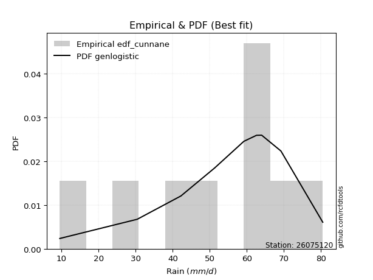</img>

</div>


### 12. Empirical - EDF Adamowski (1981)

The Adamowski formula in hydrology refers to a specific plotting position formula used for estimating the non-parametric empirical distribution of hydrological events (like flood peaks) to calculate their return periods. This formula provides an alternative to traditional parametric methods (like the Gumbel or Log Pearson Type III distributions). 

<div align="center">


$P=(m-0.25)/(n+0.5)$


</div>


**12.1. Empirical values**

<div align="center">

|                | 0                   | 1                   | 2                  | 3                   | 4             | 5                  | 6                  | 7                  | 8                  |
|:---------------|:--------------------|:--------------------|:-------------------|:--------------------|:--------------|:-------------------|:-------------------|:-------------------|:-------------------|
| date           | 2023                | 2019                | 2025               | 2020                | 2021          | 2018               | 2024               | 2017               | 2022               |
| x              | 9.5                 | 30.4                | 40.6               | 51.3                | 59.2          | 62.6               | 64.0               | 69.2               | 80.5               |
| m              | 1                   | 2                   | 3                  | 4                   | 5             | 6                  | 7                  | 8                  | 9                  |
| empirical_dist | edf_adamowski       | edf_adamowski       | edf_adamowski      | edf_adamowski       | edf_adamowski | edf_adamowski      | edf_adamowski      | edf_adamowski      | edf_adamowski      |
| empirical      | 0.07894736842105263 | 0.18421052631578946 | 0.2894736842105263 | 0.39473684210526316 | 0.5           | 0.6052631578947368 | 0.7105263157894737 | 0.8157894736842105 | 0.9210526315789473 |
| empirical_tr   | 1.0857142857142856  | 1.2258064516129032  | 1.4074074074074074 | 1.6521739130434783  | 2.0           | 2.533333333333333  | 3.4545454545454546 | 5.428571428571428  | 12.666666666666663 |

</div>


**12.2. Kolmogorov-Smirnov fit test (sorted by Δ)**


<div align="center">

|                | 0                   | 1                   | 2                   | 3                   | 4                   | 5                   | 6                   | 7                   | 8                   | 9                   | 10                  | 11                  | 12                  | 13                    | 14                  | 15                  | 16                  | 17                  | 18                  | 19                  | 20                  | 21                  | 22                  | 23                  | 24                  | 25                  | 26                  | 27                  | 28                  | 29                  | 30                  | 31                  | 32                  | 33                  | 34                  | 35                  | 36                  | 37                  | 38                  | 39                  | 40                  | 41                  | 42                  | 43                  | 44                  | 45                  | 46                  | 47                  | 48                  | 49                  | 50                  | 51                  | 52                  | 53                  | 54                  | 55                  | 56                  | 57                  | 58                  | 59                  | 60                  | 61                  | 62                  | 63                  | 64                  | 65                  | 66                  | 67                  | 68                  | 69                  | 70                  | 71                  | 72                  | 73                  | 74                  | 75                  | 76                  | 77                  | 78                  | 79                  | 80                  | 81                  | 82                  | 83                  | 84                  | 85                  | 86                  | 87                  | 88                  | 89                  |
|:---------------|:--------------------|:--------------------|:--------------------|:--------------------|:--------------------|:--------------------|:--------------------|:--------------------|:--------------------|:--------------------|:--------------------|:--------------------|:--------------------|:----------------------|:--------------------|:--------------------|:--------------------|:--------------------|:--------------------|:--------------------|:--------------------|:--------------------|:--------------------|:--------------------|:--------------------|:--------------------|:--------------------|:--------------------|:--------------------|:--------------------|:--------------------|:--------------------|:--------------------|:--------------------|:--------------------|:--------------------|:--------------------|:--------------------|:--------------------|:--------------------|:--------------------|:--------------------|:--------------------|:--------------------|:--------------------|:--------------------|:--------------------|:--------------------|:--------------------|:--------------------|:--------------------|:--------------------|:--------------------|:--------------------|:--------------------|:--------------------|:--------------------|:--------------------|:--------------------|:--------------------|:--------------------|:--------------------|:--------------------|:--------------------|:--------------------|:--------------------|:--------------------|:--------------------|:--------------------|:--------------------|:--------------------|:--------------------|:--------------------|:--------------------|:--------------------|:--------------------|:--------------------|:--------------------|:--------------------|:--------------------|:--------------------|:--------------------|:--------------------|:--------------------|:--------------------|:--------------------|:--------------------|:--------------------|:--------------------|:--------------------|
| station        | 26075120            | 26075120            | 26075120            | 26075120            | 26075120            | 26075120            | 26075120            | 26075120            | 26075120            | 26075120            | 26075120            | 26075120            | 26075120            | 26075120              | 26075120            | 26075120            | 26075120            | 26075120            | 26075120            | 26075120            | 26075120            | 26075120            | 26075120            | 26075120            | 26075120            | 26075120            | 26075120            | 26075120            | 26075120            | 26075120            | 26075120            | 26075120            | 26075120            | 26075120            | 26075120            | 26075120            | 26075120            | 26075120            | 26075120            | 26075120            | 26075120            | 26075120            | 26075120            | 26075120            | 26075120            | 26075120            | 26075120            | 26075120            | 26075120            | 26075120            | 26075120            | 26075120            | 26075120            | 26075120            | 26075120            | 26075120            | 26075120            | 26075120            | 26075120            | 26075120            | 26075120            | 26075120            | 26075120            | 26075120            | 26075120            | 26075120            | 26075120            | 26075120            | 26075120            | 26075120            | 26075120            | 26075120            | 26075120            | 26075120            | 26075120            | 26075120            | 26075120            | 26075120            | 26075120            | 26075120            | 26075120            | 26075120            | 26075120            | 26075120            | 26075120            | 26075120            | 26075120            | 26075120            | 26075120            | 26075120            |
| empirical_dist | edf_adamowski       | edf_adamowski       | edf_adamowski       | edf_adamowski       | edf_adamowski       | edf_adamowski       | edf_adamowski       | edf_adamowski       | edf_adamowski       | edf_adamowski       | edf_adamowski       | edf_adamowski       | edf_adamowski       | edf_adamowski         | edf_adamowski       | edf_adamowski       | edf_adamowski       | edf_adamowski       | edf_adamowski       | edf_adamowski       | edf_adamowski       | edf_adamowski       | edf_adamowski       | edf_adamowski       | edf_adamowski       | edf_adamowski       | edf_adamowski       | edf_adamowski       | edf_adamowski       | edf_adamowski       | edf_adamowski       | edf_adamowski       | edf_adamowski       | edf_adamowski       | edf_adamowski       | edf_adamowski       | edf_adamowski       | edf_adamowski       | edf_adamowski       | edf_adamowski       | edf_adamowski       | edf_adamowski       | edf_adamowski       | edf_adamowski       | edf_adamowski       | edf_adamowski       | edf_adamowski       | edf_adamowski       | edf_adamowski       | edf_adamowski       | edf_adamowski       | edf_adamowski       | edf_adamowski       | edf_adamowski       | edf_adamowski       | edf_adamowski       | edf_adamowski       | edf_adamowski       | edf_adamowski       | edf_adamowski       | edf_adamowski       | edf_adamowski       | edf_adamowski       | edf_adamowski       | edf_adamowski       | edf_adamowski       | edf_adamowski       | edf_adamowski       | edf_adamowski       | edf_adamowski       | edf_adamowski       | edf_adamowski       | edf_adamowski       | edf_adamowski       | edf_adamowski       | edf_adamowski       | edf_adamowski       | edf_adamowski       | edf_adamowski       | edf_adamowski       | edf_adamowski       | edf_adamowski       | edf_adamowski       | edf_adamowski       | edf_adamowski       | edf_adamowski       | edf_adamowski       | edf_adamowski       | edf_adamowski       | edf_adamowski       |
| p_dist         | genlogistic         | logjohnsonsu        | laplace_asymmetric  | johnsonsu           | mielke              | weibull_min         | logloggamma         | logmielke           | gumbel_l            | logpearson3         | pearson3            | fisk                | logfisk             | loglaplace_asymmetric | loggumbel_l         | fatiguelife         | nct                 | t                   | norm                | crystalball         | truncnorm           | exponnorm           | rice                | f                   | betaprime           | erlang              | invweibull          | invgamma            | chi2                | gamma               | ncf                 | logistic            | loggompertz         | invgauss            | maxwell             | logt                | kstwobign           | rayleigh            | hypsecant           | lognakagami         | genexpon            | logbetaprime        | lognct              | logfatiguelife      | logrice             | lognorm             | lognorm             | logcrystalball      | logexponnorm        | logf                | logncf              | halfnorm            | logalpha            | loginvweibull       | loggamma            | loggamma            | logerlang           | loglogistic         | laplace             | loginvgamma         | gumbel_r            | loginvgauss         | loghypsecant        | logmaxwell          | halflogistic        | moyal               | lograyleigh         | loglaplace          | expon               | logkstwobign        | alpha               | loggenexpon         | loghalfnorm         | loggumbel_r         | logtruncnorm        | loghalflogistic     | logmoyal            | wald                | nakagami            | gibrat              | logexpon            | logwald             | loggibrat           | gompertz            | loglognorm          | logweibull_min      | pareto              | logpareto           | logchi2             | loggenlogistic      |
| delta          | 0.0577436468117124  | 0.06015844252238878 | 0.06392590344273719 | 0.06856489407527311 | 0.07612949799017665 | 0.08162224711741028 | 0.08581264047830961 | 0.08596723890801528 | 0.08657332772922488 | 0.09004126855847627 | 0.09840423280352484 | 0.10488311503743131 | 0.1208837603352878  | 0.12257634657142691   | 0.12515493053743265 | 0.1379542059597385  | 0.1380174719339753  | 0.138060081748836   | 0.13806011798996765 | 0.13806012359333364 | 0.1380602275424132  | 0.13806242426125082 | 0.13810318490761175 | 0.13821563673392356 | 0.1405344325481862  | 0.14278371411545332 | 0.14356924366369128 | 0.14466698299201053 | 0.1463102132231049  | 0.147591641491023   | 0.15207641708508168 | 0.15492887174737735 | 0.1568626810956142  | 0.15928946407423372 | 0.1609462512308002  | 0.16138911568902695 | 0.1671342489202191  | 0.1678788336473327  | 0.1682143283099543  | 0.16826373855895094 | 0.17198997540809813 | 0.18401456539380123 | 0.18517676336153366 | 0.18549638689988435 | 0.18583086454417208 | 0.18583286355872675 | 0.18583286355872675 | 0.18583377545204083 | 0.1858362556738291  | 0.18635129133702522 | 0.1865121595502377  | 0.18790901640597257 | 0.1900497322042547  | 0.19081637324330247 | 0.19210690256607876 | 0.19210690256607876 | 0.19609224889447807 | 0.19644136583960226 | 0.19661669334174747 | 0.1979187603466599  | 0.19984575610127553 | 0.2044491234749909  | 0.2052525501248339  | 0.21399176656597296 | 0.21617671073270994 | 0.2204378008747011  | 0.22284524460239052 | 0.2302256049095247  | 0.23194812921578767 | 0.23388070795704796 | 0.24492153437105857 | 0.2469869588913015  | 0.24793331685247055 | 0.25410610334572337 | 0.2649343181986126  | 0.2759923963764205  | 0.27776348757847424 | 0.27847962578374663 | 0.28412638981817695 | 0.31071926858188614 | 0.3411581710219366  | 0.34350890363863407 | 0.37449115885980166 | 0.4270746048492688  | 0.44070633350408894 | 0.44862874986295764 | 0.4585224969920393  | 0.4746485333204169  | 0.5134559370460963  | 0.8157894736842105  |
| deltao         | 0.41761268023100007 | 0.41761268023100007 | 0.41761268023100007 | 0.41761268023100007 | 0.41761268023100007 | 0.41761268023100007 | 0.41761268023100007 | 0.41761268023100007 | 0.41761268023100007 | 0.41761268023100007 | 0.41761268023100007 | 0.41761268023100007 | 0.41761268023100007 | 0.41761268023100007   | 0.41761268023100007 | 0.41761268023100007 | 0.41761268023100007 | 0.41761268023100007 | 0.41761268023100007 | 0.41761268023100007 | 0.41761268023100007 | 0.41761268023100007 | 0.41761268023100007 | 0.41761268023100007 | 0.41761268023100007 | 0.41761268023100007 | 0.41761268023100007 | 0.41761268023100007 | 0.41761268023100007 | 0.41761268023100007 | 0.41761268023100007 | 0.41761268023100007 | 0.41761268023100007 | 0.41761268023100007 | 0.41761268023100007 | 0.41761268023100007 | 0.41761268023100007 | 0.41761268023100007 | 0.41761268023100007 | 0.41761268023100007 | 0.41761268023100007 | 0.41761268023100007 | 0.41761268023100007 | 0.41761268023100007 | 0.41761268023100007 | 0.41761268023100007 | 0.41761268023100007 | 0.41761268023100007 | 0.41761268023100007 | 0.41761268023100007 | 0.41761268023100007 | 0.41761268023100007 | 0.41761268023100007 | 0.41761268023100007 | 0.41761268023100007 | 0.41761268023100007 | 0.41761268023100007 | 0.41761268023100007 | 0.41761268023100007 | 0.41761268023100007 | 0.41761268023100007 | 0.41761268023100007 | 0.41761268023100007 | 0.41761268023100007 | 0.41761268023100007 | 0.41761268023100007 | 0.41761268023100007 | 0.41761268023100007 | 0.41761268023100007 | 0.41761268023100007 | 0.41761268023100007 | 0.41761268023100007 | 0.41761268023100007 | 0.41761268023100007 | 0.41761268023100007 | 0.41761268023100007 | 0.41761268023100007 | 0.41761268023100007 | 0.41761268023100007 | 0.41761268023100007 | 0.41761268023100007 | 0.41761268023100007 | 0.41761268023100007 | 0.41761268023100007 | 0.41761268023100007 | 0.41761268023100007 | 0.41761268023100007 | 0.41761268023100007 | 0.41761268023100007 | 0.41761268023100007 |
| eval           | Δo > Δ              | Δo > Δ              | Δo > Δ              | Δo > Δ              | Δo > Δ              | Δo > Δ              | Δo > Δ              | Δo > Δ              | Δo > Δ              | Δo > Δ              | Δo > Δ              | Δo > Δ              | Δo > Δ              | Δo > Δ                | Δo > Δ              | Δo > Δ              | Δo > Δ              | Δo > Δ              | Δo > Δ              | Δo > Δ              | Δo > Δ              | Δo > Δ              | Δo > Δ              | Δo > Δ              | Δo > Δ              | Δo > Δ              | Δo > Δ              | Δo > Δ              | Δo > Δ              | Δo > Δ              | Δo > Δ              | Δo > Δ              | Δo > Δ              | Δo > Δ              | Δo > Δ              | Δo > Δ              | Δo > Δ              | Δo > Δ              | Δo > Δ              | Δo > Δ              | Δo > Δ              | Δo > Δ              | Δo > Δ              | Δo > Δ              | Δo > Δ              | Δo > Δ              | Δo > Δ              | Δo > Δ              | Δo > Δ              | Δo > Δ              | Δo > Δ              | Δo > Δ              | Δo > Δ              | Δo > Δ              | Δo > Δ              | Δo > Δ              | Δo > Δ              | Δo > Δ              | Δo > Δ              | Δo > Δ              | Δo > Δ              | Δo > Δ              | Δo > Δ              | Δo > Δ              | Δo > Δ              | Δo > Δ              | Δo > Δ              | Δo > Δ              | Δo > Δ              | Δo > Δ              | Δo > Δ              | Δo > Δ              | Δo > Δ              | Δo > Δ              | Δo > Δ              | Δo > Δ              | Δo > Δ              | Δo > Δ              | Δo > Δ              | Δo > Δ              | Δo > Δ              | Δo > Δ              | Δo > Δ              | Δo <= Δ             | Δo <= Δ             | Δo <= Δ             | Δo <= Δ             | Δo <= Δ             | Δo <= Δ             | Δo <= Δ             |
| fit            | 1                   | 1                   | 1                   | 1                   | 1                   | 1                   | 1                   | 1                   | 1                   | 1                   | 1                   | 1                   | 1                   | 1                     | 1                   | 1                   | 1                   | 1                   | 1                   | 1                   | 1                   | 1                   | 1                   | 1                   | 1                   | 1                   | 1                   | 1                   | 1                   | 1                   | 1                   | 1                   | 1                   | 1                   | 1                   | 1                   | 1                   | 1                   | 1                   | 1                   | 1                   | 1                   | 1                   | 1                   | 1                   | 1                   | 1                   | 1                   | 1                   | 1                   | 1                   | 1                   | 1                   | 1                   | 1                   | 1                   | 1                   | 1                   | 1                   | 1                   | 1                   | 1                   | 1                   | 1                   | 1                   | 1                   | 1                   | 1                   | 1                   | 1                   | 1                   | 1                   | 1                   | 1                   | 1                   | 1                   | 1                   | 1                   | 1                   | 1                   | 1                   | 1                   | 1                   | 0                   | 0                   | 0                   | 0                   | 0                   | 0                   | 0                   |
| n              | 9                   | 9                   | 9                   | 9                   | 9                   | 9                   | 9                   | 9                   | 9                   | 9                   | 9                   | 9                   | 9                   | 9                     | 9                   | 9                   | 9                   | 9                   | 9                   | 9                   | 9                   | 9                   | 9                   | 9                   | 9                   | 9                   | 9                   | 9                   | 9                   | 9                   | 9                   | 9                   | 9                   | 9                   | 9                   | 9                   | 9                   | 9                   | 9                   | 9                   | 9                   | 9                   | 9                   | 9                   | 9                   | 9                   | 9                   | 9                   | 9                   | 9                   | 9                   | 9                   | 9                   | 9                   | 9                   | 9                   | 9                   | 9                   | 9                   | 9                   | 9                   | 9                   | 9                   | 9                   | 9                   | 9                   | 9                   | 9                   | 9                   | 9                   | 9                   | 9                   | 9                   | 9                   | 9                   | 9                   | 9                   | 9                   | 9                   | 9                   | 9                   | 9                   | 9                   | 9                   | 9                   | 9                   | 9                   | 9                   | 9                   | 9                   |
| best_fit       | 1                   | 0                   | 0                   | 0                   | 0                   | 0                   | 0                   | 0                   | 0                   | 0                   | 0                   | 0                   | 0                   | 0                     | 0                   | 0                   | 0                   | 0                   | 0                   | 0                   | 0                   | 0                   | 0                   | 0                   | 0                   | 0                   | 0                   | 0                   | 0                   | 0                   | 0                   | 0                   | 0                   | 0                   | 0                   | 0                   | 0                   | 0                   | 0                   | 0                   | 0                   | 0                   | 0                   | 0                   | 0                   | 0                   | 0                   | 0                   | 0                   | 0                   | 0                   | 0                   | 0                   | 0                   | 0                   | 0                   | 0                   | 0                   | 0                   | 0                   | 0                   | 0                   | 0                   | 0                   | 0                   | 0                   | 0                   | 0                   | 0                   | 0                   | 0                   | 0                   | 0                   | 0                   | 0                   | 0                   | 0                   | 0                   | 0                   | 0                   | 0                   | 0                   | 0                   | 0                   | 0                   | 0                   | 0                   | 0                   | 0                   | 0                   |
| best_fit_sort  | 1                   | 2                   | 3                   | 4                   | 5                   | 6                   | 7                   | 8                   | 9                   | 10                  | 11                  | 12                  | 13                  | 14                    | 15                  | 16                  | 17                  | 18                  | 19                  | 20                  | 21                  | 22                  | 23                  | 24                  | 25                  | 26                  | 27                  | 28                  | 29                  | 30                  | 31                  | 32                  | 33                  | 34                  | 35                  | 36                  | 37                  | 38                  | 39                  | 40                  | 41                  | 42                  | 43                  | 44                  | 45                  | 46                  | 47                  | 48                  | 49                  | 50                  | 51                  | 52                  | 53                  | 54                  | 55                  | 56                  | 57                  | 58                  | 59                  | 60                  | 61                  | 62                  | 63                  | 64                  | 65                  | 66                  | 67                  | 68                  | 69                  | 70                  | 71                  | 72                  | 73                  | 74                  | 75                  | 76                  | 77                  | 78                  | 79                  | 80                  | 81                  | 82                  | 83                  | 84                  | 85                  | 86                  | 87                  | 88                  | 89                  | 90                  |

</div>


<div align="center">

</img>

</div>


**12.3. Best fit**

<div align="center">

|   id |   station | empirical_dist   | p_dist      |     delta |   deltao | eval   |   fit |   n |   best_fit |   best_fit_sort |
|-----:|----------:|:-----------------|:------------|----------:|---------:|:-------|------:|----:|-----------:|----------------:|
|    0 |  26075120 | edf_adamowski    | genlogistic | 0.0577436 | 0.417613 | Δo > Δ |     1 |   9 |          1 |               1 |

</div>


<div align="center">

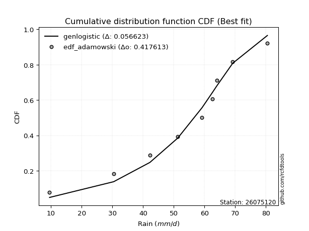</img></img>

</div>


## C. Best fit & Estimate extreme values for specific return periods - Tr


### 1. Best fit (ordered by delta Δ)

<div align="center">

|   id |   station | empirical_dist   | p_dist      |     delta |   deltao | eval   |   fit |   n |   best_fit |   best_fit_sort |
|-----:|----------:|:-----------------|:------------|----------:|---------:|:-------|------:|----:|-----------:|----------------:|
|    0 |  26075120 | edf_adamowski    | genlogistic | 0.0577436 | 0.417613 | Δo > Δ |     1 |   9 |          1 |               1 |
|    1 |  26075120 | edf_cunnane      | genlogistic | 0.0577436 | 0.417613 | Δo > Δ |     1 |   9 |          1 |               2 |
|    2 |  26075120 | edf_jenkinson    | genlogistic | 0.0577436 | 0.417613 | Δo > Δ |     1 |   9 |          1 |               3 |
|    3 |  26075120 | edf_filliben     | genlogistic | 0.0577436 | 0.417613 | Δo > Δ |     1 |   9 |          1 |               4 |
|    4 |  26075120 | edf_gringorten   | genlogistic | 0.0577436 | 0.417613 | Δo > Δ |     1 |   9 |          1 |               5 |
|    5 |  26075120 | edf_tukey        | genlogistic | 0.0577436 | 0.417613 | Δo > Δ |     1 |   9 |          1 |               6 |
|    6 |  26075120 | edf_blom         | genlogistic | 0.0577436 | 0.417613 | Δo > Δ |     1 |   9 |          1 |               7 |
|    7 |  26075120 | edf_chegodayev   | genlogistic | 0.0577436 | 0.417613 | Δo > Δ |     1 |   9 |          1 |               8 |
|    8 |  26075120 | edf_beard        | genlogistic | 0.0577436 | 0.417613 | Δo > Δ |     1 |   9 |          1 |               9 |
|    9 |  26075120 | edf_hazen        | genlogistic | 0.0577436 | 0.417613 | Δo > Δ |     1 |   9 |          1 |              10 |
|   10 |  26075120 | edf_weibull      | genlogistic | 0.0682581 | 0.417613 | Δo > Δ |     1 |   9 |          1 |              11 |
|   11 |  26075120 | edf_california   | gumbel_l    | 0.0910459 | 0.417613 | Δo > Δ |     1 |   9 |          1 |              12 |

</div>

:file_folder:Tables: [bestfit_26075120.csv](table/bestfit_26075120.csv) | [extreme_26075120.csv](table/extreme_26075120.csv)


### 2. Extreme values

In hydrology, a return period (or recurrence interval $Tr$) is the statistical average time between extreme events like floods or droughts of a specific magnitude, indicating how rare an event is, with a 100-year flood, for example, having a 1% chance of occurring in any given year, not that it happens exactly every century. It is a key tool for infrastructure design (like bridges or dams) and risk assessment, calculated from historical data to determine the probability of future events, although it is important to remember it is statistical average, and events can cluster or be missed.

> risk_rate: assuming the return period as the project useful life.

|   id |      tr |   prob_l |     prob_g |      alpha |   betaprime |     chi2 |   crystalball |   erlang |    expon |   exponnorm |        f |   fatiguelife |     fisk |    gamma |   genexpon |   genlogistic |   gibrat |   gompertz |   gumbel_l |   gumbel_r |   halflogistic |   halfnorm |   hypsecant |   invgamma |   invgauss |   invweibull |   johnsonsu |   kstwobign |   laplace |   laplace_asymmetric |   loggamma |   logistic |   lognorm |   maxwell |   mielke |    moyal |   nakagami |      ncf |      nct |     norm |           pareto |   pearson3 |   rayleigh |     rice |        t |   truncnorm |     wald |   weibull_min |   logalpha |   logbetaprime |     logchi2 |   logcrystalball |   logerlang |    logexpon |   logexponnorm |     logf |   logfatiguelife |   logfisk |   loggenexpon |   loggenlogistic |   loggibrat |   loggompertz |   loggumbel_l |   loggumbel_r |   loghalflogistic |   loghalfnorm |   loghypsecant |   loginvgamma |   loginvgauss |   loginvweibull |   logjohnsonsu |   logkstwobign |   loglaplace |   loglaplace_asymmetric |   logloggamma |   loglogistic |     loglognorm |   logmaxwell |   logmielke |   logmoyal |   lognakagami |   logncf |   lognct |     logpareto |   logpearson3 |   lograyleigh |   logrice |             logt |   logtruncnorm |   logwald |   logweibull_min |   station |   n |   risk_rate |
|-----:|--------:|---------:|-----------:|-----------:|------------:|---------:|--------------:|---------:|---------:|------------:|---------:|--------------:|---------:|---------:|-----------:|--------------:|---------:|-----------:|-----------:|-----------:|---------------:|-----------:|------------:|-----------:|-----------:|-------------:|------------:|------------:|----------:|---------------------:|-----------:|-----------:|----------:|----------:|---------:|---------:|-----------:|---------:|---------:|---------:|-----------------:|-----------:|-----------:|---------:|---------:|------------:|---------:|--------------:|-----------:|---------------:|------------:|-----------------:|------------:|------------:|---------------:|---------:|-----------------:|----------:|--------------:|-----------------:|------------:|--------------:|--------------:|--------------:|------------------:|--------------:|---------------:|--------------:|--------------:|----------------:|---------------:|---------------:|-------------:|------------------------:|--------------:|--------------:|---------------:|-------------:|------------:|-----------:|--------------:|---------:|---------:|--------------:|--------------:|--------------:|----------:|-----------------:|---------------:|----------:|-----------------:|----------:|----:|------------:|
|    0 |    2    | 0.5      | 0.5        |    37.3933 |     51.6749 |  51.1634 |       51.9222 |  51.3607 |  38.9048 |     51.9221 |  51.8968 |       51.9477 |  54.1937 |  51.1679 |    46.8473 |       56.753  |  45.7386 |    67.9019 |    55.3066 |    48.5379 |        46.8553 |    47.7053 |     51.9222 |    50.9786 |    49.6563 |      49.1313 |     56.0362 |     47.095  |   51.9222 |              56.8393 |    44.266  |    51.9222 |   45.246  |   50.1603 |  56.1826 |  47.4453 |    41.9326 |  48.692  |  51.921  |  51.9222 |     10.9195      |    54.3426 |    49.5354 |  51.9226 |  51.9222 |     51.9222 |  45.2443 |       55.5098 |    44.4567 |        45.0764 |     16.2423 |          45.2459 |     44.1516 |     28.0271 |        45.2457 |  45.1825 |          45.2913 |   50.9341 |       36.8402 |         inf      |     37.591  |       50.4489 |       50.0772 |       40.8808 |           38.8701 |       39.8733 |        45.246  |       44.0506 |       43.1712 |         42.4303 |        55.9403 |        38.4099 |      45.246  |                 52.7299 |       54.0485 |       45.246  |   9.80906      |      42.9183 |     53.9793 |    39.5636 |       52.1928 |  44.7357 |  45.2367 |  10.0332      |       53.1747 |       42.1217 |   45.2461 |     60.456       |        45.1175 |   37.0376 |          20.5541 |  26075120 |   9 |    0.75     |
|    1 |    2.33 | 0.570815 | 0.429185   |    44.5075 |     55.3972 |  54.9668 |       55.5984 |  55.1674 |  45.3836 |     55.5983 |  55.5805 |       55.6126 |  57.5462 |  54.9364 |    51.653  |       59.7322 |  47.6008 |    68.963  |    58.5049 |    51.9443 |        50.3577 |    51.6729 |     54.8643 |    54.8995 |    53.722  |      53.8469 |     59.3011 |     51.9331 |   54.1469 |              59.5414 |    49.9018 |    55.1612 |   50.5172 |   53.9796 |  60.3244 |  50.6699 |    45.2109 |  53.31   |  55.5989 |  55.5984 |     14.323       |    57.851  |    53.4113 |  55.5974 |  55.5984 |     55.5984 |  47.6549 |       58.721  |    50.0816 |        50.6269 |     19.4247 |          50.5171 |     49.6058 |     35.5714 |        50.5169 |  50.4717 |          50.5468 |   55.5605 |       44.6687 |         inf      |     39.749  |       54.288  |       55.1161 |       45.2759 |           43.173  |       44.9091 |        49.4176 |       49.4602 |       48.7796 |         50.0823 |        59.7553 |        45.6429 |      48.3662 |                 56.5487 |       58.3241 |       49.8594 |  12.0739       |      48.1244 |     58.3044 |    43.5789 |       55.3377 |  50.3926 |  50.5621 |  11.4368      |       58.1781 |       47.3113 |   50.5174 |     63.0041      |        48.2424 |   39.813  |          24.893  |  26075120 |   9 |    0.729209 |
|    2 |    5    | 0.8      | 0.2        |    99.6721 |     69.3859 |  69.3744 |       69.2602 |  69.5893 |  77.7759 |     69.2601 |  69.2887 |       69.2564 |  70.4927 |  69.1779 |    71.0803 |       68.8619 |  58.3221 |    72.3912 |    68.8374 |    66.7433 |        66.205  |    68.4513 |     66.6656 |    70.0319 |    69.9681 |      74.3336 |     69.5102 |     72.4839 |   65.2697 |              67.0844 |    78.4446 |    67.6674 |   76.0847 |   69.0122 |  72.1029 |  65.6065 |    60.6478 |  73.2452 |  69.2686 |  69.2602 |   2164.89        |    69.5764 |    68.9279 |  69.2541 |  69.2602 |     69.2602 |  61.149  |       69.0951 |    79.156  |        78.2729 |     53.9865 |          76.0846 |     77.0114 |    117.136  |        76.0844 |  76.1595 |          76.0263 |   77.7239 |      102.701  |         inf      |     54.8145 |       68.8583 |       75.1266 |       70.5555 |           69.4266 |       74.2618 |        70.3913 |       76.7875 |       78.1379 |        102.924  |        70.8002 |        94.9856 |      67.5067 |                 67.5779 |       70.8119 |       72.5373 |   9.29522e+185 |      75.5212 |     70.9583 |    68.1917 |       69.6425 |  79.0134 |  76.5147 |   1.00796e+37 |       74.7389 |       75.3311 |   76.0849 |     76.9915      |        61.6769 |   59.662  |          68.2174 |  26075120 |   9 |    0.67232  |
|    3 |   10    | 0.9      | 0.1        |   201.023  |     78.8017 |  79.1715 |       78.3231 |  79.3974 | 107.181  |     78.3229 |  78.3987 |       78.3279 |  80.0295 |  78.8326 |    85.0524 |       74.1141 |  70.5432 |    74.2999 |    74.5901 |    78.7969 |        79.3656 |    80.8669 |     76.0893 |    80.5817 |    81.787  |      91.0198 |     74.8817 |     88.1308 |   75.3667 |              72.8524 |   106.545  |    76.8778 |   99.8353 |   79.5914 |  76.666  |  78.6112 |    72.8409 |  89.2795 |  78.338  |  78.3231 | 548104           |    76.2651 |    79.9916 |  78.3136 |  78.3231 |     78.3231 |  75.4695 |       74.8709 |   108.726  |       104.888  |    151.606  |          99.8352 |    103.736  |    345.577  |        99.8349 | 100.065  |          99.6859 |   99.5227 |      198.119  |         inf      |     79.0658 |       78.6322 |       89.2659 |      101.263  |          103.006  |      107.746  |        93.3691 |      103.675  |      108.469  |        185.061  |        75.7504 |       165.955  |      91.3685 |                 72.7811 |       75.7717 |       95.6022 | inf            |     103.704  |     75.9921 |   100.701  |       81.8564 | 107.169  | 100.776  | inf           |       82.9519 |      104.957  |   99.8354 |    100.656       |        69.92   |   91.6491 |         179.202  |  26075120 |   9 |    0.651322 |
|    4 |   15    | 0.933333 | 0.0666667  |   302.012  |     83.5411 |  84.1324 |       82.8456 |  84.3642 | 124.382  |     82.8455 |  82.9497 |       82.861  |  85.2263 |  83.7127 |    92.2791 |       76.716  |  78.9727 |    75.1643 |    77.1953 |    85.5974 |        86.8133 |    87.3279 |     81.4673 |    86.0063 |    88.0119 |     100.434  |     77.2157 |     96.4374 |   81.2731 |              76.2265 |   124.361  |    81.896  |  114.33   |   85.0194 |  78.1259 |  86.1586 |    79.2827 |  98.2658 |  82.8642 |  82.8456 |      1.39921e+07 |    79.2947 |    85.6921 |  82.8345 |  82.8456 |     82.8456 |  84.6655 |       77.4866 |   127.939  |       121.516  |    284.821  |         114.33   |    120.583  |    650.717  |       114.33   | 114.671  |         114.123  |  113.873  |      284.187  |         inf      |    101.794  |       83.5086 |       96.5167 |      124.161  |          128.772  |      130.772  |       109.703  |      120.741  |      128.364  |        257.674  |        77.6578 |       223.172  |     109.066  |                 75.8841 |       77.3723 |      111.122  | inf            |     122.028  |     77.6173 |   126.268  |       88.929  | 125.016  | 115.645  | inf           |       86.0991 |      124.516  |  114.331  |    127.789       |        73.1414 |  120.738  |         320.47   |  26075120 |   9 |    0.644736 |
|    5 |   20    | 0.95     | 0.05       |   402.912  |     86.6596 |  87.4073 |       85.8073 |  87.643  | 136.586  |     85.8072 |  85.9317 |       85.8318 |  88.8186 |  86.9312 |    97.0915 |       78.4502 |  85.585  |    75.7023 |    78.817  |    90.359  |        92.0314 |    91.6356 |     85.2612 |    89.6182 |    92.2098 |     107.026  |     78.6327 |    102.033  |   85.4637 |              78.6204 |   137.704  |    85.3644 |  124.945  |   88.6218 |  78.8454 |  91.5037 |    83.595  | 104.544  |  85.8285 |  85.8073 |      1.39374e+08 |    81.1715 |    89.481  |  85.7951 |  85.8073 |     85.8073 |  91.5183 |       79.1148 |   142.555  |       133.862  |    449.369  |         124.945  |    133.16   |   1019.53   |       124.945  | 125.373  |         124.696  |  124.984  |      364.387  |         inf      |    124.109  |       86.6967 |      101.324  |      143.211  |          150.576  |      148.797  |       122.916  |      133.539  |      143.58   |        324.881  |        78.7366 |       272.46   |     123.665  |                 78.1657 |       78.1634 |      123.297  | inf            |     135.944  |     78.4209 |   148.211  |       93.9562 | 138.384  | 126.56   | inf           |       87.8293 |      139.494  |  124.945  |    160.199       |        74.8589 |  148.272  |         487.034  |  26075120 |   9 |    0.641514 |
|    6 |   25    | 0.96     | 0.04       |   503.777  |     88.9627 |  89.8312 |       87.9876 |  90.07   | 146.052  |     87.9874 |  88.1278 |       88.0199 |  91.5668 |  89.3118 |   100.671  |       79.7511 |  91.0974 |    76.0852 |    79.971  |    94.0266 |        96.0517 |    94.8406 |     88.1975 |    92.3077 |    95.3626 |     112.103  |     79.6229 |    106.224  |   88.7142 |              80.4773 |   148.483  |    88.0178 |  133.384  |   91.2962 |  79.2739 |  95.6468 |    86.8088 | 109.378  |  88.0106 |  87.9876 |      8.28944e+08 |    82.5    |    92.2961 |  87.9745 |  87.9876 |     87.9876 |  97.0073 |       80.2734 |   154.499  |       143.774  |    642.655  |         133.384  |    143.298  |   1444.3    |       133.383  | 133.886  |         133.1    |  134.21   |      440.362  |         inf      |    146.407  |       89.0398 |      104.891  |      159.854  |          169.861  |      163.802  |       134.226  |      143.889  |      156.06   |        388.377  |        79.4535 |       316.386  |     136.321  |                 79.9825 |       78.6353 |      133.505  | inf            |     147.291  |     78.9002 |   167.809  |       97.8709 | 149.183  | 135.253  | inf           |       88.9451 |      151.776  |  133.384  |    199.247       |        75.9264 |  174.79   |         675.978  |  26075120 |   9 |    0.639603 |
|    7 |   50    | 0.98     | 0.02       |  1007.94   |     95.5931 |  96.8347 |       94.2309 |  97.0825 | 175.457  |     94.2307 |  94.4208 |       94.2909 |  99.9644 |  96.1826 |   111.082  |       83.6332 | 110.529  |    77.1245 |    83.1035 |   105.325  |       108.439  |   104.157  |     97.3009 |   100.156  |   104.69   |     127.743  |     82.2293 |    118.532  |   98.8112 |              86.2453 |   184.539  |    96.1246 |  160.836  |   99.0525 |  80.1239 | 108.509  |    96.162  | 124.287  |  94.2598 |  94.2309 |      2.10791e+11 |    86.0626 |   100.468  |  94.2155 |  94.2309 |     94.2309 | 114.929  |       83.4185 |   195.31   |       176.574  |   1988.79   |         160.836  |    177.084  |   4261.01   |       160.835  | 161.6    |         160.442  |  166.835  |      781.163  |         inf      |    262.132  |       95.7266 |      115.218  |      224.291  |          246.241  |      216.57   |       176.34   |      178.59   |      198.963  |        673.11   |        81.1898 |       490.721  |     184.507  |                 85.8999 |       79.5727 |      170.23   | inf            |     185.846  |     79.8525 |   246.751  |      110.17   | 185.315  | 163.616  | inf           |       91.4712 |      193.906  |  160.836  |    554.794       |        78.1499 |  299.107  |        1901.37   |  26075120 |   9 |    0.63583  |
|    8 |   75    | 0.986667 | 0.0133333  |  1512.04   |     99.1723 | 100.631  |       97.5808 | 100.884  | 192.657  |     97.5806 |  97.8    |       97.659  | 104.815  |  99.9022 |   116.758  |       85.8343 | 123.653  |    77.6501 |    84.6875 |   111.892  |       115.639  |   109.228  |    102.621  |   104.459  |   109.88   |     136.834  |     83.4984 |    125.304  |  104.718  |              89.6194 |   207.572  |   100.807  |  177.826  |  103.269  |  80.4068 | 116.03   |   101.254  | 132.993  |  97.6131 |  97.5808 |      5.38119e+12 |    87.8308 |   104.914  |  97.5642 |  97.5808 |     97.5808 | 125.957  |       85.0089 |   222.041  |       197.271  |   3891.33   |         177.826  |    198.578  |   8023.43   |       177.825  | 178.767  |         177.364  |  189.177  |     1083.33   |         inf      |    388.479  |       99.298  |      120.821  |      273.09   |          305.565  |      252.126  |       206.828  |      200.827  |      227.247  |        926.625  |        81.9539 |       624.758  |     220.245  |                 89.5622 |       79.8834 |      195.881  | inf            |     210.888  |     80.1682 |   309.155  |      117.493  | 208.404  | 181.23   | inf           |       92.4693 |      221.55   |  177.826  |   1450.3         |        78.9187 |  416.289  |        3516.6    |  26075120 |   9 |    0.634587 |
|    9 |  100    | 0.99     | 0.01       |  2016.12   |    101.602  | 103.213  |       99.8466 | 103.47   | 204.862  |     99.8464 | 100.087  |       99.9383 | 108.24   | 102.431  |   120.629  |       87.3773 | 133.819  |    77.9939 |    85.7236 |   116.54   |       120.736  |   112.682  |    106.395  |   107.406  |   113.466  |     143.268  |     84.3095 |    129.943  |  108.908  |              92.0133 |   224.845  |   104.112  |  190.323  |  106.142  |  80.5509 | 121.366  |   104.722  | 139.184  |  99.8813 |  99.8466 |      5.36018e+13 |    88.9717 |   107.943  |  99.8291 |  99.8466 |     99.8466 | 133.997  |       86.0492 |   242.41   |       212.678  |   6288.8    |         190.323  |    214.658  |  12570.9    |       190.323  | 191.401  |         189.812  |  206.731  |     1362.3    |         inf      |    526.886  |      101.706  |      124.632  |      313.917  |          356.002  |      279.636  |       231.6    |      217.539  |      248.882  |       1161.86   |        82.4139 |       737.172  |     249.725  |                 92.255  |       80.0384 |      216.286  | inf            |     229.85   |     80.3257 |   362.781  |      122.757  | 225.725  | 194.214  | inf           |       93.0247 |      242.607  |  190.323  |   3650.76        |        79.3085 |  529.748  |        5461.98   |  26075120 |   9 |    0.633968 |
|   10 |  200    | 0.995    | 0.005      |  4032.39   |    107.138  | 109.117  |      104.986  | 109.381  | 234.266  |    104.986  | 105.276  |      105.112  | 116.457  | 108.206  |   129.498  |       91.0547 | 161.479  |    78.7411 |    87.9757 |   127.714  |       132.988  |   120.584  |    115.486  |   114.204  |   121.828  |     158.737  |     86.0182 |    140.63   |  119.005  |              97.7814 |   269.854  |   112.042  |  222.025  |  112.713  |  80.7861 | 134.222  |   112.645  | 154.198  | 105.026  | 104.986  |      1.36303e+16 |    91.4005 |   114.873  | 104.967  | 104.986  |    104.986  | 154.025  |       88.3104 |   296.73   |       252.406  |  20208      |         222.025  |    256.423  |  37086.9    |       222.024  | 223.472  |         221.389  |  255.767  |     2347.52   |         inf      |   1207.22   |      107.145  |      133.336  |      438.819  |          514.003  |      354.37   |       304.156  |      261.236  |      306.862  |       2001.51   |        83.3092 |      1079.13   |     337.996  |                 99.0803 |       80.2705 |      274.324  | inf            |     279.896  |     80.5637 |   533.355  |      135.705  | 270.88   | 227.246  | inf           |       93.985  |      298.626  |  222.025  | 117931           |        79.9001 |  965.613  |       15978.8    |  26075120 |   9 |    0.633042 |
|   11 |  250    | 0.996    | 0.004      |  5040.51   |    108.837  | 110.933  |      106.557  | 111.201  | 243.733  |    106.556  | 106.863  |      106.694  | 119.096  | 109.982  |   132.232  |       92.2306 | 171.403  |    78.9609 |    88.6383 |   131.306  |       136.927  |   123.014  |    118.413  |   116.313  |   124.447  |     163.71   |     86.5061 |    143.937  |  122.256  |              99.6382 |   285.42   |   114.588  |  232.728  |  114.736  |  80.8417 | 138.361  |   115.08   | 159.073  | 106.599  | 106.557  |      8.1068e+16  |    92.0997 |   117.006  | 106.537  | 106.557  |    106.557  | 160.651  |       88.9757 |   315.92   |       266.019  |  29507.6    |         232.728  |    270.827  |  52538.8    |       232.727  | 234.307  |         232.052  |  273.856  |     2791.53   |         inf      |   1625.48   |      108.8    |      136.011  |      488.71   |          578.425  |      381.155  |       332.044  |      276.398  |      327.43   |       2383.93   |        83.5464 |      1214.21   |     372.588  |                101.383  |       80.3169 |      296.079  | inf            |     297.394  |     80.6132 |   603.805  |      139.959  | 286.504  | 238.427  | inf           |       94.2085 |      318.347  |  232.728  | 616637           |        80.0194 | 1177.77   |       22654.2    |  26075120 |   9 |    0.632858 |
|   12 |  500    | 0.998    | 0.002      | 10081.1    |    113.895  | 116.355  |      111.214  | 116.631  | 273.137  |    111.214  | 111.571  |      111.39   | 127.279  | 115.278  |   140.398  |       95.8688 | 205.702  |    79.5912 |    90.5379 |   142.456  |       149.153  |   130.262  |    127.503  |   122.657  |   132.394  |     179.144  |     87.8662 |    153.847  |  132.353  |             105.406  |   337.361  |   122.483  |  267.599  |  120.772  |  80.9828 | 151.217  |   122.332  | 174.382  | 111.262  | 111.214  |      2.06147e+19 |    94.0595 |   123.371  | 111.193  | 111.214  |    111.214  | 181.719  |       90.8828 |   381.376  |       311.023  |  96331.2    |         267.599  |    318.756  | 155001      |       267.599  | 269.629  |         266.793  |  338.502  |     4758.39   |          80.4099 |   4544.38   |      113.688  |      143.981  |      682.661  |          834.477  |      473.644  |       436.058  |      327.174  |      397.86   |       4101.89   |        84.164  |      1728.97   |     504.288  |                108.884  |       80.4095 |      375.141  | inf            |     356.383  |     80.723  |   887.697  |      153.463  | 338.671  | 274.95   | inf           |       94.7194 |      385.272  |  267.599  |      1.52657e+09 |        80.2591 | 2214.8    |       67671.4    |  26075120 |   9 |    0.632489 |
|   13 |  750    | 0.998667 | 0.00133333 | 15121.7    |    116.717  | 119.39   |      113.802  | 119.67   | 290.338  |    113.801  | 114.188  |      114      | 132.061  | 118.24   |   144.97   |       97.9904 | 228.384  |    79.928  |    91.5531 |   148.974  |       156.301  |   134.311  |    132.821  |   126.24   |   136.926  |     188.168  |     88.5688 |    159.415  |  138.259  |             108.78   |   370.406  |   127.096  |  289.181  |  124.149  |  81.0523 | 158.737  |   126.377  | 183.473  | 113.852  | 113.802  |      5.26263e+20 |    95.0766 |   126.93   | 113.779  | 113.802  |    113.802  | 194.351  |       91.9021 |   424.118  |       339.35   | 193308      |         289.181  |    349.156  | 291865      |       289.18   | 291.504  |         288.297  |  383.119  |     6482.51   |          80.4408 |   8969.28   |      116.39   |      148.43   |      829.968  |         1033.86   |      534.764  |       511.414  |      359.622  |      444.04   |       5633.36   |        84.458  |      2108.71   |     601.966  |                113.526  |       80.4404 |      430.771  | inf            |     394.34   |     80.7695 |  1112.16   |      161.576  | 371.885  | 297.622  | inf           |       94.9232 |      428.653  |  289.18   |      2.38796e+12 |        80.3393 | 3234.31   |      129198      |  26075120 |   9 |    0.632366 |
|   14 | 1000    | 0.999    | 0.001      | 20162.3    |    118.665  | 121.489  |      115.583  | 121.772  | 302.542  |    115.583  | 115.99   |      115.797  | 135.452  | 120.287  |   148.133  |       99.4939 | 245.742  |    80.1547 |    92.2363 |   153.597  |       161.37   |   137.107  |    136.594  |   128.732  |   140.095  |     194.568  |     89.0318 |    163.272  |  142.45   |             111.174  |   395.115  |   130.367  |  305.043  |  126.482  |  81.0982 | 164.073  |   129.168  | 189.992  | 115.636  | 115.583  |      5.24208e+21 |    95.7481 |   129.39   | 115.56   | 115.583  |    115.583  | 203.438  |       92.5881 |   456.612  |       360.391  | 317402      |         305.043  |    371.843  | 457287      |       305.043  | 307.589  |         304.103  |  418.28   |     8064.49   |          80.4562 |  15091.2    |      118.245  |      151.501  |      953.353  |         1203.56   |      581.519  |       572.652  |      383.955  |      479.233  |       7055.1    |        84.6424 |      2419.67   |     682.541  |                116.94   |       80.4558 |      475.153  | inf            |     422.911  |     80.7982 |  1305.06   |      167.433  | 396.732  | 314.316  | inf           |       95.037  |      461.453  |  305.043  |      2.81475e+15 |        80.3795 | 4246.91   |      204983      |  26075120 |   9 |    0.632305 |

<div align="center">

</img>

</div>


<div align="center">

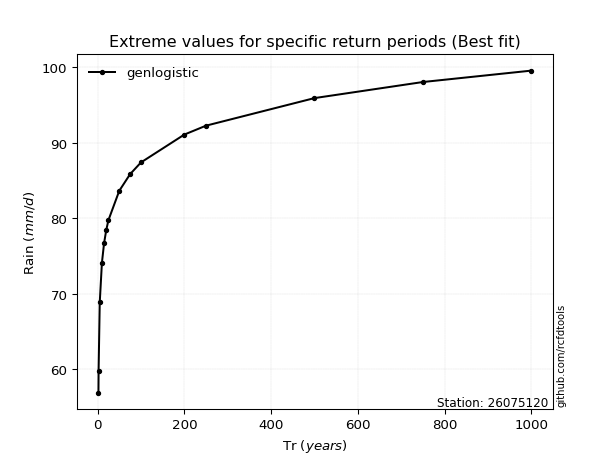</img>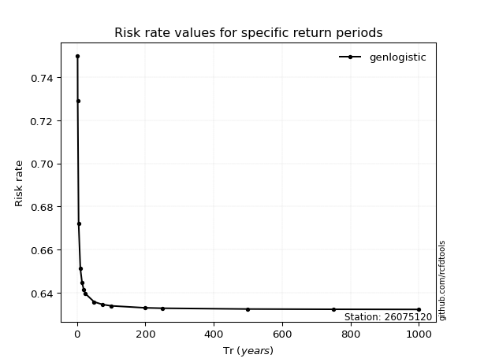</img>

</div>


<sub>**APP DISCLAIMER**: NO WARRANTY - This software is provided by [github.com/rcfdtools](https://github.com/rcfdtools) "as is", without any express or implied warranty, including warranties of merchantability, fitness for a particular purpose, or non-infringement. There is no guarantee that the software will be error-free or operate without interruption. LIMITATION OF LIABILITY - Neither the authors nor copyright holders will be liable for claims or damages arising from the software or its use. You are responsible for determining if the software is appropriate for your use and assume all associated risks, including errors, legal compliance, and data loss. NO PROFESSIONAL ADVICE - The software provides general information and does not offer professional advice. It should not replace consultation with professional advisors.</sub>